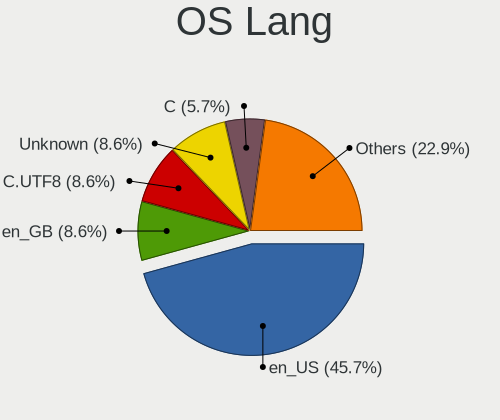
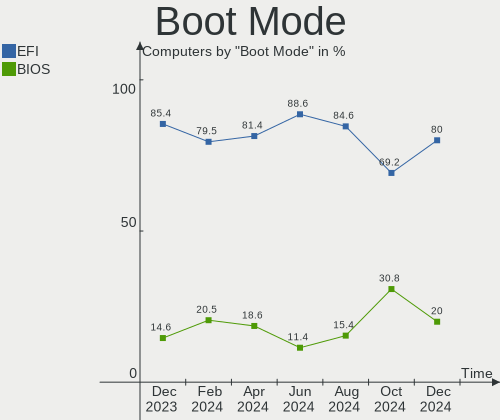
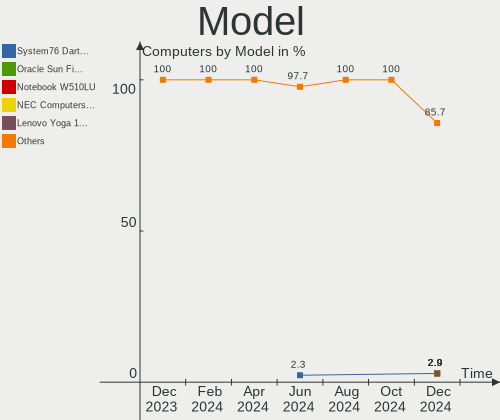
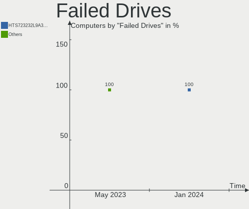

Gentoo - Hardware Trends
------------------------

A project to identify most popular hardware characteristics and track their change
over time based on data collected by Linux users at https://Linux-Hardware.org.

Anyone can contribute to this report by the [hw-probe](https://github.com/linuxhw/hw-probe) tool:

    sudo -E hw-probe -all -upload

This is a report for all computer types. See also reports for [desktops](/Dist/Gentoo/Desktop/README.md) and [notebooks](/Dist/Gentoo/Notebook/README.md).

This report is for one last month. Overall report since the beginning of time: [TestDays](https://github.com/linuxhw/TestDays)

Period: Jan, 2024.

Contents
--------

* [ System ](#system)
  - [ OS                       ](#os)
  - [ OS Family                ](#os-family)
  - [ Kernel                   ](#kernel)
  - [ Kernel Family            ](#kernel-family)
  - [ Kernel Major Ver.        ](#kernel-major-ver)
  - [ Arch                     ](#arch)
  - [ DE                       ](#de)
  - [ Display Server           ](#display-server)
  - [ Display Manager          ](#display-manager)
  - [ OS Lang                  ](#os-lang)
  - [ Boot Mode                ](#boot-mode)
  - [ Filesystem               ](#filesystem)
  - [ Part. scheme             ](#part-scheme)
  - [ Dual Boot with Linux/BSD ](#dual-boot-with-linuxbsd)
  - [ Dual Boot (Win)          ](#dual-boot-win)

* [ Board ](#board)
  - [ Vendor                   ](#vendor)
  - [ Model                    ](#model)
  - [ Model Family             ](#model-family)
  - [ MFG Year                 ](#mfg-year)
  - [ Form Factor              ](#form-factor)
  - [ Secure Boot              ](#secure-boot)
  - [ Coreboot                 ](#coreboot)
  - [ RAM Size                 ](#ram-size)
  - [ RAM Used                 ](#ram-used)
  - [ Total Drives             ](#total-drives)
  - [ Has CD-ROM               ](#has-cd-rom)
  - [ Has Ethernet             ](#has-ethernet)
  - [ Has WiFi                 ](#has-wifi)
  - [ Has Bluetooth            ](#has-bluetooth)

* [ Location ](#location)
  - [ Country                  ](#country)
  - [ City                     ](#city)

* [ Drives ](#drives)
  - [ Drive Vendor             ](#drive-vendor)
  - [ Drive Model              ](#drive-model)
  - [ HDD Vendor               ](#hdd-vendor)
  - [ SSD Vendor               ](#ssd-vendor)
  - [ Drive Kind               ](#drive-kind)
  - [ Drive Connector          ](#drive-connector)
  - [ Drive Size               ](#drive-size)
  - [ Space Total              ](#space-total)
  - [ Space Used               ](#space-used)
  - [ Malfunc. Drives          ](#malfunc-drives)
  - [ Malfunc. Drive Vendor    ](#malfunc-drive-vendor)
  - [ Malfunc. HDD Vendor      ](#malfunc-hdd-vendor)
  - [ Malfunc. Drive Kind      ](#malfunc-drive-kind)
  - [ Failed Drives            ](#failed-drives)
  - [ Failed Drive Vendor      ](#failed-drive-vendor)
  - [ Drive Status             ](#drive-status)

* [ Storage controller ](#storage-controller)
  - [ Storage Vendor           ](#storage-vendor)
  - [ Storage Model            ](#storage-model)
  - [ Storage Kind             ](#storage-kind)

* [ Processor ](#processor)
  - [ CPU Vendor               ](#cpu-vendor)
  - [ CPU Model                ](#cpu-model)
  - [ CPU Model Family         ](#cpu-model-family)
  - [ CPU Cores                ](#cpu-cores)
  - [ CPU Sockets              ](#cpu-sockets)
  - [ CPU Threads              ](#cpu-threads)
  - [ CPU Op-Modes             ](#cpu-op-modes)
  - [ CPU Microcode            ](#cpu-microcode)
  - [ CPU Microarch            ](#cpu-microarch)

* [ Graphics ](#graphics)
  - [ GPU Vendor               ](#gpu-vendor)
  - [ GPU Model                ](#gpu-model)
  - [ GPU Combo                ](#gpu-combo)
  - [ GPU Driver               ](#gpu-driver)
  - [ GPU Memory               ](#gpu-memory)

* [ Monitor ](#monitor)
  - [ Monitor Vendor           ](#monitor-vendor)
  - [ Monitor Model            ](#monitor-model)
  - [ Monitor Resolution       ](#monitor-resolution)
  - [ Monitor Diagonal         ](#monitor-diagonal)
  - [ Monitor Width            ](#monitor-width)
  - [ Aspect Ratio             ](#aspect-ratio)
  - [ Monitor Area             ](#monitor-area)
  - [ Pixel Density            ](#pixel-density)
  - [ Multiple Monitors        ](#multiple-monitors)

* [ Network ](#network)
  - [ Net Controller Vendor    ](#net-controller-vendor)
  - [ Net Controller Model     ](#net-controller-model)
  - [ Wireless Vendor          ](#wireless-vendor)
  - [ Wireless Model           ](#wireless-model)
  - [ Ethernet Vendor          ](#ethernet-vendor)
  - [ Ethernet Model           ](#ethernet-model)
  - [ Net Controller Kind      ](#net-controller-kind)
  - [ Used Controller          ](#used-controller)
  - [ NICs                     ](#nics)
  - [ IPv6                     ](#ipv6)

* [ Bluetooth ](#bluetooth)
  - [ Bluetooth Vendor         ](#bluetooth-vendor)
  - [ Bluetooth Model          ](#bluetooth-model)

* [ Sound ](#sound)
  - [ Sound Vendor             ](#sound-vendor)
  - [ Sound Model              ](#sound-model)

* [ Memory ](#memory)
  - [ Memory Vendor            ](#memory-vendor)
  - [ Memory Model             ](#memory-model)
  - [ Memory Kind              ](#memory-kind)
  - [ Memory Form Factor       ](#memory-form-factor)
  - [ Memory Size              ](#memory-size)
  - [ Memory Speed             ](#memory-speed)

* [ Printers & scanners ](#printers--scanners)
  - [ Printer Vendor           ](#printer-vendor)
  - [ Printer Model            ](#printer-model)
  - [ Scanner Vendor           ](#scanner-vendor)
  - [ Scanner Model            ](#scanner-model)

* [ Camera ](#camera)
  - [ Camera Vendor            ](#camera-vendor)
  - [ Camera Model             ](#camera-model)

* [ Security ](#security)
  - [ Fingerprint Vendor       ](#fingerprint-vendor)
  - [ Fingerprint Model        ](#fingerprint-model)
  - [ Chipcard Vendor          ](#chipcard-vendor)
  - [ Chipcard Model           ](#chipcard-model)

* [ Unsupported ](#unsupported)
  - [ Unsupported Devices      ](#unsupported-devices)
  - [ Unsupported Device Types ](#unsupported-device-types)

System
------

OS
--

Installed operating systems

| Name        | Computers | Percent |
|-------------|-----------|---------|
| Gentoo 2.14 | 47        | 97.92%  |
| Gentoo 2.7  | 1         | 2.08%   |

OS Family
---------

OS without a version

| Name   | Computers | Percent |
|--------|-----------|---------|
| Gentoo | 48        | 100%    |

Kernel
------

Version of the Linux kernel

| Version                   | Computers | Percent |
|---------------------------|-----------|---------|
| 6.1.67-gentoo             | 9         | 18.75%  |
| 6.1.67-gentoo-x86_64      | 4         | 8.33%   |
| 6.7.0-gentoo              | 3         | 6.25%   |
| 6.6.9-gentoo              | 3         | 6.25%   |
| 6.6.8-gentoo-x86_64       | 3         | 6.25%   |
| 6.1.67-gentoo-dist        | 3         | 6.25%   |
| 6.6.8-gentoo              | 2         | 4.17%   |
| 6.6.13-gentoo             | 2         | 4.17%   |
| 6.1.69-gentoo-dist        | 2         | 4.17%   |
| 6.7.2-gentoo-r1           | 1         | 2.08%   |
| 6.7.1-gentoo-r1-x86_64    | 1         | 2.08%   |
| 6.7.0-gentoox64.efi       | 1         | 2.08%   |
| 6.7.0-gentoo-x86_64       | 1         | 2.08%   |
| 6.6.9-xanmod1             | 1         | 2.08%   |
| 6.6.8-zen1                | 1         | 2.08%   |
| 6.6.8-gentoo-dist         | 1         | 2.08%   |
| 6.6.8                     | 1         | 2.08%   |
| 6.6.7-gentoo-md-a15       | 1         | 2.08%   |
| 6.6.4-gentoo              | 1         | 2.08%   |
| 6.6.13-gentoo-x86_64      | 1         | 2.08%   |
| 6.6.11-gentoo-x86_64      | 1         | 2.08%   |
| 6.6.10-gentoo-dist        | 1         | 2.08%   |
| 6.5.7-gentoo              | 1         | 2.08%   |
| 6.1.57-gentoo-gentoo-dist | 1         | 2.08%   |
| 5.15.0-76-generic         | 1         | 2.08%   |
| 5.10.52-gentoo-x86_64     | 1         | 2.08%   |

Kernel Family
-------------

Linux kernel without a distro release

| Version | Computers | Percent |
|---------|-----------|---------|
| 6.1.67  | 16        | 33.33%  |
| 6.6.8   | 8         | 16.67%  |
| 6.7.0   | 5         | 10.42%  |
| 6.6.9   | 4         | 8.33%   |
| 6.6.13  | 3         | 6.25%   |
| 6.1.69  | 2         | 4.17%   |
| 6.7.2   | 1         | 2.08%   |
| 6.7.1   | 1         | 2.08%   |
| 6.6.7   | 1         | 2.08%   |
| 6.6.4   | 1         | 2.08%   |
| 6.6.11  | 1         | 2.08%   |
| 6.6.10  | 1         | 2.08%   |
| 6.5.7   | 1         | 2.08%   |
| 6.1.57  | 1         | 2.08%   |
| 5.15.0  | 1         | 2.08%   |
| 5.10.52 | 1         | 2.08%   |

Kernel Major Ver.
-----------------

Linux kernel major version

| Version | Computers | Percent |
|---------|-----------|---------|
| 6.6     | 19        | 39.58%  |
| 6.1     | 19        | 39.58%  |
| 6.7     | 7         | 14.58%  |
| 6.5     | 1         | 2.08%   |
| 5.15    | 1         | 2.08%   |
| 5.10    | 1         | 2.08%   |

Arch
----

OS architecture (x86_64, i586, etc.)

| Name   | Computers | Percent |
|--------|-----------|---------|
| x86_64 | 48        | 100%    |

DE
--

Desktop Environment

| Name          | Computers | Percent |
|---------------|-----------|---------|
| Unknown       | 15        | 31.25%  |
| KDE5          | 12        | 25%     |
| XFCE          | 6         | 12.5%   |
| GNOME         | 4         | 8.33%   |
| DWM           | 3         | 6.25%   |
| Hyprland      | 2         | 4.17%   |
| MATE          | 1         | 2.08%   |
| LXQt          | 1         | 2.08%   |
| LXDE          | 1         | 2.08%   |
| KDE6          | 1         | 2.08%   |
| KDE           | 1         | 2.08%   |
| GNOME Classic | 1         | 2.08%   |

Display Server
--------------

X11 or Wayland

| Name    | Computers | Percent |
|---------|-----------|---------|
| Wayland | 16        | 33.33%  |
| X11     | 14        | 29.17%  |
| Unknown | 10        | 20.83%  |
| Tty     | 8         | 16.67%  |

Display Manager
---------------

SDDM, LightDM, etc.

| Name    | Computers | Percent |
|---------|-----------|---------|
| Unknown | 24        | 50%     |
| SDDM    | 14        | 29.17%  |
| LightDM | 6         | 12.5%   |
| GDM     | 4         | 8.33%   |

OS Lang
-------

Language

| Lang    | Computers | Percent |
|---------|-----------|---------|
| en_US   | 20        | 41.67%  |
| C.UTF8  | 8         | 16.67%  |
| Unknown | 6         | 12.5%   |
| en_GB   | 4         | 8.33%   |
| de_DE   | 4         | 8.33%   |
| ru_RU   | 1         | 2.08%   |
| POSIX   | 1         | 2.08%   |
| fr_FR   | 1         | 2.08%   |
| es_MX   | 1         | 2.08%   |
| de_CH   | 1         | 2.08%   |
| C       | 1         | 2.08%   |

Boot Mode
---------

EFI or BIOS

| Mode | Computers | Percent |
|------|-----------|---------|
| EFI  | 42        | 87.5%   |
| BIOS | 6         | 12.5%   |

Filesystem
----------

Type of filesystem

| Type  | Computers | Percent |
|-------|-----------|---------|
| Ext4  | 20        | 41.67%  |
| Btrfs | 16        | 33.33%  |
| Xfs   | 7         | 14.58%  |
| F2fs  | 3         | 6.25%   |
| Zfs   | 2         | 4.17%   |

Part. scheme
------------

Scheme of partitioning

| Type    | Computers | Percent |
|---------|-----------|---------|
| GPT     | 46        | 95.83%  |
| MBR     | 1         | 2.08%   |
| Unknown | 1         | 2.08%   |

Dual Boot with Linux/BSD
------------------------

Hosting more than one Linux/BSD

| Dual boot | Computers | Percent |
|-----------|-----------|---------|
| No        | 33        | 68.75%  |
| Yes       | 15        | 31.25%  |

Dual Boot (Win)
---------------

Hosting Linux and Windows

| Dual boot | Computers | Percent |
|-----------|-----------|---------|
| No        | 32        | 66.67%  |
| Yes       | 16        | 33.33%  |

Board
-----

Vendor
------

Motherboard manufacturer

| Name                | Computers | Percent |
|---------------------|-----------|---------|
| ASUSTek Computer    | 12        | 25%     |
| Hewlett-Packard     | 8         | 16.67%  |
| Gigabyte Technology | 8         | 16.67%  |
| Lenovo              | 6         | 12.5%   |
| MSI                 | 3         | 6.25%   |
| Star Labs           | 2         | 4.17%   |
| Framework           | 2         | 4.17%   |
| Dell                | 2         | 4.17%   |
| Acer                | 2         | 4.17%   |
| DEXP                | 1         | 2.08%   |
| ASRock              | 1         | 2.08%   |
| Unknown             | 1         | 2.08%   |

Model
-----

Motherboard model

| Name                                             | Computers | Percent |
|--------------------------------------------------|-----------|---------|
| Framework Laptop 13 (AMD Ryzen 7040Series)       | 2         | 4.17%   |
| Star Labs StarLite                               | 1         | 2.08%   |
| Star Labs StarBook                               | 1         | 2.08%   |
| MSI Pulse 15 B13VFK                              | 1         | 2.08%   |
| MSI MS-7C94                                      | 1         | 2.08%   |
| MSI MS-7C84                                      | 1         | 2.08%   |
| Lenovo Yoga 14sACH 2021 82MS                     | 1         | 2.08%   |
| Lenovo V14 G2 ALC 82KC                           | 1         | 2.08%   |
| Lenovo ThinkPad X395 20NLCTO1WW                  | 1         | 2.08%   |
| Lenovo ThinkPad X1 Carbon 7th 20QES01M00         | 1         | 2.08%   |
| Lenovo ThinkPad P16s Gen 2 21K9CTO1WW            | 1         | 2.08%   |
| Lenovo ThinkPad L15 Gen 1 20U70029UK             | 1         | 2.08%   |
| HP ZBook Studio 16 inch G9 Mobile Workstation PC | 1         | 2.08%   |
| HP Z420 Workstation                              | 1         | 2.08%   |
| HP Victus by Laptop 16-e0xxx                     | 1         | 2.08%   |
| HP Spectre x360 2-in-1 Laptop 14-ef2xxx          | 1         | 2.08%   |
| HP Laptop 15t-dy100                              | 1         | 2.08%   |
| HP Laptop 15s-eq2xxx                             | 1         | 2.08%   |
| HP Laptop 15 da0018nk                            | 1         | 2.08%   |
| HP EliteBook 830 G6                              | 1         | 2.08%   |
| Gigabyte Z77X-UD5H                               | 1         | 2.08%   |
| Gigabyte Z590 UD                                 | 1         | 2.08%   |
| Gigabyte X570 AORUS ELITE                        | 1         | 2.08%   |
| Gigabyte B650M D3HP                              | 1         | 2.08%   |
| Gigabyte B550 AORUS PRO V2                       | 1         | 2.08%   |
| Gigabyte B550 AORUS ELITE V2                     | 1         | 2.08%   |
| Gigabyte AB350-Gaming                            | 1         | 2.08%   |
| Gigabyte A520 AORUS ELITE                        | 1         | 2.08%   |
| DEXP Aquilon C14                                 | 1         | 2.08%   |
| Dell Precision T7600                             | 1         | 2.08%   |
| Dell OptiPlex 5060                               | 1         | 2.08%   |
| ASUS ZenBook UX425UA_UM425UA                     | 1         | 2.08%   |
| ASUS VivoBook_ASUSLaptop X509DA_M509DA           | 1         | 2.08%   |
| ASUS VivoBook_ASUSLaptop M6501RM_M6501RM         | 1         | 2.08%   |
| ASUS ROG STRIX Z370-H GAMING                     | 1         | 2.08%   |
| ASUS ROG STRIX X570-I GAMING                     | 1         | 2.08%   |
| ASUS ROG STRIX B560-A GAMING WIFI                | 1         | 2.08%   |
| ASUS PRIME H610M-E D4                            | 1         | 2.08%   |
| ASUS PRIME B660-PLUS D4                          | 1         | 2.08%   |
| ASUS P8H67-M                                     | 1         | 2.08%   |

Model Family
------------

Motherboard model prefix

| Name                  | Computers | Percent |
|-----------------------|-----------|---------|
| Lenovo ThinkPad       | 4         | 8.33%   |
| HP Laptop             | 3         | 6.25%   |
| ASUS ROG              | 3         | 6.25%   |
| Gigabyte B550         | 2         | 4.17%   |
| Framework Laptop      | 2         | 4.17%   |
| ASUS VivoBook         | 2         | 4.17%   |
| ASUS PRIME            | 2         | 4.17%   |
| Acer Aspire           | 2         | 4.17%   |
| Star Labs StarLite    | 1         | 2.08%   |
| Star Labs StarBook    | 1         | 2.08%   |
| MSI Pulse             | 1         | 2.08%   |
| MSI MS-7C94           | 1         | 2.08%   |
| MSI MS-7C84           | 1         | 2.08%   |
| Lenovo Yoga           | 1         | 2.08%   |
| Lenovo V14            | 1         | 2.08%   |
| HP ZBook              | 1         | 2.08%   |
| HP Z420               | 1         | 2.08%   |
| HP Victus             | 1         | 2.08%   |
| HP Spectre            | 1         | 2.08%   |
| HP EliteBook          | 1         | 2.08%   |
| Gigabyte Z77X-UD5H    | 1         | 2.08%   |
| Gigabyte Z590         | 1         | 2.08%   |
| Gigabyte X570         | 1         | 2.08%   |
| Gigabyte B650M        | 1         | 2.08%   |
| Gigabyte AB350-Gaming | 1         | 2.08%   |
| Gigabyte A520         | 1         | 2.08%   |
| DEXP Aquilon          | 1         | 2.08%   |
| Dell Precision        | 1         | 2.08%   |
| Dell OptiPlex         | 1         | 2.08%   |
| ASUS ZenBook          | 1         | 2.08%   |
| ASUS P8H67-M          | 1         | 2.08%   |
| ASUS M5A78L-M         | 1         | 2.08%   |
| ASUS M3A78-CM         | 1         | 2.08%   |
| ASUS ASUS             | 1         | 2.08%   |
| ASRock X399           | 1         | 2.08%   |
| Unknown               | 1         | 2.08%   |

MFG Year
--------

Motherboard manufacture year

| Year    | Computers | Percent |
|---------|-----------|---------|
| 2021    | 9         | 18.75%  |
| 2023    | 8         | 16.67%  |
| 2022    | 7         | 14.58%  |
| 2020    | 7         | 14.58%  |
| 2019    | 6         | 12.5%   |
| 2017    | 3         | 6.25%   |
| 2012    | 2         | 4.17%   |
| 2014    | 1         | 2.08%   |
| 2011    | 1         | 2.08%   |
| 2010    | 1         | 2.08%   |
| 2008    | 1         | 2.08%   |
| 2007    | 1         | 2.08%   |
| Unknown | 1         | 2.08%   |

Form Factor
-----------

Physical design of the computer

| Name        | Computers | Percent |
|-------------|-----------|---------|
| Notebook    | 24        | 50%     |
| Desktop     | 23        | 47.92%  |
| Convertible | 1         | 2.08%   |

Secure Boot
-----------

Enabled or disabled

| State    | Computers | Percent |
|----------|-----------|---------|
| Disabled | 44        | 91.67%  |
| Enabled  | 4         | 8.33%   |

Coreboot
--------

Have coreboot on board

| Used | Computers | Percent |
|------|-----------|---------|
| No   | 48        | 100%    |

RAM Size
--------

Total RAM memory

| Size in GB  | Computers | Percent |
|-------------|-----------|---------|
| 32.01-64.0  | 12        | 25%     |
| 64.01-256.0 | 12        | 25%     |
| 8.01-16.0   | 8         | 16.67%  |
| 16.01-24.0  | 7         | 14.58%  |
| 4.01-8.0    | 6         | 12.5%   |
| 24.01-32.0  | 3         | 6.25%   |

RAM Used
--------

Used RAM memory

| Used GB    | Computers | Percent |
|------------|-----------|---------|
| 4.01-8.0   | 11        | 22.92%  |
| 2.01-3.0   | 10        | 20.83%  |
| 3.01-4.0   | 8         | 16.67%  |
| 1.01-2.0   | 8         | 16.67%  |
| 8.01-16.0  | 5         | 10.42%  |
| 0.51-1.0   | 4         | 8.33%   |
| 16.01-24.0 | 1         | 2.08%   |
| 0.01-0.5   | 1         | 2.08%   |

Total Drives
------------

Number of drives on board

| Drives | Computers | Percent |
|--------|-----------|---------|
| 1      | 23        | 47.92%  |
| 2      | 12        | 25%     |
| 4      | 4         | 8.33%   |
| 6      | 3         | 6.25%   |
| 5      | 3         | 6.25%   |
| 19     | 1         | 2.08%   |
| 8      | 1         | 2.08%   |
| 7      | 1         | 2.08%   |

Has CD-ROM
----------

Has CD-ROM on board

| Presented | Computers | Percent |
|-----------|-----------|---------|
| No        | 40        | 83.33%  |
| Yes       | 8         | 16.67%  |

Has Ethernet
------------

Has Ethernet on board

| Presented | Computers | Percent |
|-----------|-----------|---------|
| Yes       | 38        | 79.17%  |
| No        | 10        | 20.83%  |

Has WiFi
--------

Has WiFi module

| Presented | Computers | Percent |
|-----------|-----------|---------|
| Yes       | 33        | 68.75%  |
| No        | 15        | 31.25%  |

Has Bluetooth
-------------

Has Bluetooth module

| Presented | Computers | Percent |
|-----------|-----------|---------|
| Yes       | 33        | 68.75%  |
| No        | 15        | 31.25%  |

Location
--------

Country
-------

Geographic location (country)

| Country     | Computers | Percent |
|-------------|-----------|---------|
| USA         | 11        | 22.92%  |
| Germany     | 8         | 16.67%  |
| Poland      | 4         | 8.33%   |
| France      | 3         | 6.25%   |
| UK          | 2         | 4.17%   |
| Russia      | 2         | 4.17%   |
| China       | 2         | 4.17%   |
| Canada      | 2         | 4.17%   |
| Brazil      | 2         | 4.17%   |
| Turkey      | 1         | 2.08%   |
| Switzerland | 1         | 2.08%   |
| Netherlands | 1         | 2.08%   |
| Mexico      | 1         | 2.08%   |
| Italy       | 1         | 2.08%   |
| Hong Kong   | 1         | 2.08%   |
| Finland     | 1         | 2.08%   |
| Colombia    | 1         | 2.08%   |
| Bulgaria    | 1         | 2.08%   |
| Belgium     | 1         | 2.08%   |
| Argentina   | 1         | 2.08%   |
| Algeria     | 1         | 2.08%   |

City
----

Geographic location (city)

| City                | Computers | Percent |
|---------------------|-----------|---------|
| Warsaw              | 3         | 6.25%   |
| Miami               | 2         | 4.17%   |
| Berlin              | 2         | 4.17%   |
| Wetzlar             | 1         | 2.08%   |
| Verviers            | 1         | 2.08%   |
| Vancouver           | 1         | 2.08%   |
| Toulouse            | 1         | 2.08%   |
| Swift Current       | 1         | 2.08%   |
| Shenzhen            | 1         | 2.08%   |
| Seattle             | 1         | 2.08%   |
| Santana de Parnaiba | 1         | 2.08%   |
| Rocky Mount         | 1         | 2.08%   |
| Rio de Janeiro      | 1         | 2.08%   |
| Raisio              | 1         | 2.08%   |
| Orange              | 1         | 2.08%   |
| Oklahoma City       | 1         | 2.08%   |
| Noisy-le-Sec        | 1         | 2.08%   |
| New York            | 1         | 2.08%   |
| Moscow              | 1         | 2.08%   |
| Mönchengladbach    | 1         | 2.08%   |
| Mexico City         | 1         | 2.08%   |
| Ludwigsburg         | 1         | 2.08%   |
| Leninsk-Kuznetsky   | 1         | 2.08%   |
| Le Boulou           | 1         | 2.08%   |
| Lachen              | 1         | 2.08%   |
| Krefeld             | 1         | 2.08%   |
| Kendal              | 1         | 2.08%   |
| Kansas City         | 1         | 2.08%   |
| Kalispell           | 1         | 2.08%   |
| Izmir               | 1         | 2.08%   |
| Gorna Oryahovitsa   | 1         | 2.08%   |
| Frankfurt am Main   | 1         | 2.08%   |
| Dresden             | 1         | 2.08%   |
| Colleferro          | 1         | 2.08%   |
| Cieszyn             | 1         | 2.08%   |
| Chengdu             | 1         | 2.08%   |
| Central             | 1         | 2.08%   |
| Bogotá             | 1         | 2.08%   |
| Bayonne             | 1         | 2.08%   |
| Barnet              | 1         | 2.08%   |

Drives
------

Drive Vendor
------------

Hard drive vendors

| Vendor                      | Computers | Drives | Percent |
|-----------------------------|-----------|--------|---------|
| Samsung Electronics         | 19        | 32     | 22.89%  |
| WDC                         | 9         | 12     | 10.84%  |
| Seagate                     | 7         | 14     | 8.43%   |
| Intel                       | 5         | 6      | 6.02%   |
| SK hynix                    | 4         | 4      | 4.82%   |
| Micron Technology           | 4         | 4      | 4.82%   |
| Unknown                     | 3         | 3      | 3.61%   |
| Phison Electronics          | 3         | 3      | 3.61%   |
| Kingston                    | 3         | 3      | 3.61%   |
| Hitachi                     | 3         | 6      | 3.61%   |
| GOODRAM                     | 3         | 3      | 3.61%   |
| Toshiba                     | 2         | 2      | 2.41%   |
| Seagate Technology          | 2         | 2      | 2.41%   |
| Sandisk                     | 2         | 2      | 2.41%   |
| Crucial                     | 2         | 7      | 2.41%   |
| Star                        | 1         | 1      | 1.2%    |
| Silicon Motion              | 1         | 1      | 1.2%    |
| OCZ                         | 1         | 1      | 1.2%    |
| NETAPP                      | 1         | 3      | 1.2%    |
| Micron/Crucial Technology   | 1         | 1      | 1.2%    |
| MAXIO Technology (Hangzhou) | 1         | 1      | 1.2%    |
| KIOXIA                      | 1         | 1      | 1.2%    |
| Kingston Technology Company | 1         | 1      | 1.2%    |
| Kingchuxing                 | 1         | 2      | 1.2%    |
| FREEBSD                     | 1         | 12     | 1.2%    |
| A-DATA Technology           | 1         | 1      | 1.2%    |
| Unknown                     | 1         | 1      | 1.2%    |

Drive Model
-----------

Hard drive models

| Model                                                 | Computers | Percent |
|-------------------------------------------------------|-----------|---------|
| Samsung NVMe SSD Controller SM981/PM981/PM983 1TB     | 9         | 9.18%   |
| Samsung NVMe SSD Controller PM9A1/PM9A3/980PRO 2TB    | 6         | 6.12%   |
| Seagate ST4000DM004-2CV104 4TB                        | 2         | 2.04%   |
| Samsung SSD 990 PRO 2TB                               | 2         | 2.04%   |
| Samsung SSD 980 1TB                                   | 2         | 2.04%   |
| Intel SSD 660P Series 1024GB                          | 2         | 2.04%   |
| GOODRAM SSDPR-CL100-480-G2 480GB                      | 2         | 2.04%   |
| WDC WDS500G2B0B 500GB SSD                             | 1         | 1.02%   |
| WDC WDS100T2G0A-00JH30 1TB SSD                        | 1         | 1.02%   |
| WDC WD8003FFBX-68B9AN0 8TB                            | 1         | 1.02%   |
| WDC WD60EFRX-68MYMN1 6TB                              | 1         | 1.02%   |
| WDC WD3200BEVT-22ZCT0 320GB                           | 1         | 1.02%   |
| WDC WD30EFRX-68N32N0 3TB                              | 1         | 1.02%   |
| WDC WD30EFRX-68EUZN0 3TB                              | 1         | 1.02%   |
| WDC WD120EFBX-68B0EN0 12TB                            | 1         | 1.02%   |
| WDC WD10EZEX-08WN4A0 1TB                              | 1         | 1.02%   |
| WDC WD10EADS-65M2B0 1TB                               | 1         | 1.02%   |
| Unknown NVMe SSD Drive 1TB                            | 1         | 1.02%   |
| Unknown MMC Card  32GB                                | 1         | 1.02%   |
| Unknown MMC Card  128GB                               | 1         | 1.02%   |
| Toshiba MQ04ABF100 1TB                                | 1         | 1.02%   |
| Toshiba HDWE150 5TB                                   | 1         | 1.02%   |
| Star Drive SATA SSD 480GB                             | 1         | 1.02%   |
| SK hynix SKHynix_HFS001TEJ9X162N 1024GB               | 1         | 1.02%   |
| SK hynix SHGP31-2000GM 2TB                            | 1         | 1.02%   |
| SK hynix PC711 HFS512GDE9X073N 512GB                  | 1         | 1.02%   |
| SK hynix HFM512GD3JX013N 512GB                        | 1         | 1.02%   |
| Silicon Motion SM2263EN/SM2263XT SSD Controller 128GB | 1         | 1.02%   |
| Seagate ZP1000GV30012 1TB                             | 1         | 1.02%   |
| Seagate FireCuda 520 SSD 500GB                        | 1         | 1.02%   |
| Seagate ST500LM012 HN-M500MBB 500GB                   | 1         | 1.02%   |
| Seagate ST4000VN008-2DR166 4TB                        | 1         | 1.02%   |
| Seagate ST3160811AS 160GB                             | 1         | 1.02%   |
| Seagate ST3000DM008-2DM166 3TB                        | 1         | 1.02%   |
| Seagate ST2000DM008-2UB102 2TB                        | 1         | 1.02%   |
| Seagate ST2000DM008-2FR102 2TB                        | 1         | 1.02%   |
| Seagate ST12000NM0008-2H3101 12TB                     | 1         | 1.02%   |
| Seagate ST1000DM010-2EP102 1TB                        | 1         | 1.02%   |
| Seagate FireCuda 530 ZP1000GM30023 1TB                | 1         | 1.02%   |
| Seagate BUP Slim RG 2TB                               | 1         | 1.02%   |

HDD Vendor
----------

Hard disk drive vendors

| Vendor  | Computers | Drives | Percent |
|---------|-----------|--------|---------|
| WDC     | 7         | 10     | 35%     |
| Seagate | 7         | 13     | 35%     |
| Hitachi | 3         | 6      | 15%     |
| Toshiba | 2         | 2      | 10%     |
| NETAPP  | 1         | 3      | 5%      |

SSD Vendor
----------

Solid state drive vendors

| Vendor              | Computers | Drives | Percent |
|---------------------|-----------|--------|---------|
| Samsung Electronics | 4         | 7      | 22.22%  |
| GOODRAM             | 3         | 3      | 16.67%  |
| WDC                 | 2         | 2      | 11.11%  |
| Kingston            | 2         | 2      | 11.11%  |
| Crucial             | 2         | 7      | 11.11%  |
| Star                | 1         | 1      | 5.56%   |
| OCZ                 | 1         | 1      | 5.56%   |
| Kingchuxing         | 1         | 2      | 5.56%   |
| FREEBSD             | 1         | 12     | 5.56%   |
| Unknown             | 1         | 1      | 5.56%   |

Drive Kind
----------

HDD or SSD

| Kind | Computers | Drives | Percent |
|------|-----------|--------|---------|
| NVMe | 39        | 55     | 53.42%  |
| SSD  | 17        | 38     | 23.29%  |
| HDD  | 15        | 34     | 20.55%  |
| MMC  | 2         | 2      | 2.74%   |

Drive Connector
---------------

SATA, SAS, NVMe, etc.

| Type | Computers | Drives | Percent |
|------|-----------|--------|---------|
| NVMe | 39        | 55     | 60.94%  |
| SATA | 21        | 70     | 32.81%  |
| SAS  | 2         | 2      | 3.13%   |
| MMC  | 2         | 2      | 3.13%   |

Drive Size
----------

Size of hard drive

| Size in TB | Computers | Drives | Percent |
|------------|-----------|--------|---------|
| 0.01-0.5   | 13        | 27     | 32.5%   |
| 0.51-1.0   | 12        | 18     | 30%     |
| 2.01-3.0   | 4         | 7      | 10%     |
| 3.01-4.0   | 3         | 10     | 7.5%    |
| 1.01-2.0   | 3         | 4      | 7.5%    |
| 4.01-10.0  | 3         | 3      | 7.5%    |
| 10.01-20.0 | 2         | 3      | 5%      |

Space Total
-----------

Amount of disk space available on the file system

| Size in GB     | Computers | Percent |
|----------------|-----------|---------|
| More than 3000 | 13        | 27.08%  |
| 501-1000       | 9         | 18.75%  |
| 251-500        | 7         | 14.58%  |
| 1001-2000      | 7         | 14.58%  |
| 101-250        | 5         | 10.42%  |
| 1-20           | 2         | 4.17%   |
| Unknown        | 2         | 4.17%   |
| 21-50          | 1         | 2.08%   |
| 2001-3000      | 1         | 2.08%   |
| 51-100         | 1         | 2.08%   |

Space Used
----------

Amount of used disk space

| Used GB        | Computers | Percent |
|----------------|-----------|---------|
| 1-20           | 11        | 22.92%  |
| 101-250        | 8         | 16.67%  |
| 251-500        | 6         | 12.5%   |
| More than 3000 | 4         | 8.33%   |
| 21-50          | 4         | 8.33%   |
| 2001-3000      | 4         | 8.33%   |
| 1001-2000      | 4         | 8.33%   |
| 501-1000       | 4         | 8.33%   |
| Unknown        | 2         | 4.17%   |
| 51-100         | 1         | 2.08%   |

Malfunc. Drives
---------------

Drive models with a malfunction

| Model                                | Computers | Drives | Percent |
|--------------------------------------|-----------|--------|---------|
| WDC WD3200BEVT-22ZCT0 320GB          | 1         | 1      | 14.29%  |
| WDC WD30EFRX-68EUZN0 3TB             | 1         | 2      | 14.29%  |
| SK hynix PC711 HFS512GDE9X073N 512GB | 1         | 1      | 14.29%  |
| Seagate ST3160811AS 160GB            | 1         | 1      | 14.29%  |
| Seagate ST3000DM008-2DM166 3TB       | 1         | 1      | 14.29%  |
| Kingston SV300S37A240G 240GB SSD     | 1         | 1      | 14.29%  |
| Kingston SV300S37A 120G SSD          | 1         | 1      | 14.29%  |

Malfunc. Drive Vendor
---------------------

Vendors of faulty drives

| Vendor   | Computers | Drives | Percent |
|----------|-----------|--------|---------|
| WDC      | 2         | 3      | 28.57%  |
| Seagate  | 2         | 2      | 28.57%  |
| Kingston | 2         | 2      | 28.57%  |
| SK hynix | 1         | 1      | 14.29%  |

Malfunc. HDD Vendor
-------------------

Vendors of faulty HDD drives

| Vendor  | Computers | Drives | Percent |
|---------|-----------|--------|---------|
| WDC     | 2         | 3      | 50%     |
| Seagate | 2         | 2      | 50%     |

Malfunc. Drive Kind
-------------------

Kinds of faulty drives

| Kind | Computers | Drives | Percent |
|------|-----------|--------|---------|
| HDD  | 4         | 5      | 57.14%  |
| SSD  | 2         | 2      | 28.57%  |
| NVMe | 1         | 1      | 14.29%  |

Failed Drives
-------------

Failed drive models

| Model                         | Computers | Drives | Percent |
|-------------------------------|-----------|--------|---------|
| Hitachi HTS723232L9A360 320GB | 1         | 1      | 100%    |

Failed Drive Vendor
-------------------

Failed drive vendors

| Vendor  | Computers | Drives | Percent |
|---------|-----------|--------|---------|
| Hitachi | 1         | 1      | 100%    |

Drive Status
------------

Number of failed and malfunc. drives

| Status   | Computers | Drives | Percent |
|----------|-----------|--------|---------|
| Works    | 47        | 110    | 78.33%  |
| Malfunc  | 7         | 8      | 11.67%  |
| Detected | 5         | 10     | 8.33%   |
| Failed   | 1         | 1      | 1.67%   |

Storage controller
------------------

Storage Vendor
--------------

Storage controller vendors

| Vendor                      | Computers | Percent |
|-----------------------------|-----------|---------|
| Intel                       | 19        | 24.68%  |
| Samsung Electronics         | 17        | 22.08%  |
| AMD                         | 14        | 18.18%  |
| SK hynix                    | 4         | 5.19%   |
| Micron Technology           | 4         | 5.19%   |
| Phison Electronics          | 3         | 3.9%    |
| Seagate Technology          | 2         | 2.6%    |
| SanDisk                     | 2         | 2.6%    |
| Kingston Technology Company | 2         | 2.6%    |
| VIA Technologies            | 1         | 1.3%    |
| Silicon Motion              | 1         | 1.3%    |
| Micron/Crucial Technology   | 1         | 1.3%    |
| MAXIO Technology (Hangzhou) | 1         | 1.3%    |
| Marvell Technology Group    | 1         | 1.3%    |
| LSI Logic / Symbios Logic   | 1         | 1.3%    |
| KIOXIA                      | 1         | 1.3%    |
| INNOGRIT                    | 1         | 1.3%    |
| ASMedia Technology          | 1         | 1.3%    |
| ADATA Technology            | 1         | 1.3%    |

Storage Model
-------------

Storage controller models

| Model                                                                 | Computers | Percent |
|-----------------------------------------------------------------------|-----------|---------|
| Samsung NVMe SSD Controller SM981/PM981/PM983                         | 9         | 9.38%   |
| AMD FCH SATA Controller [AHCI mode]                                   | 7         | 7.29%   |
| Samsung NVMe SSD Controller PM9A1/PM9A3/980PRO                        | 6         | 6.25%   |
| Intel Volume Management Device NVMe RAID Controller                   | 4         | 4.17%   |
| AMD 500 Series Chipset SATA Controller                                | 4         | 4.17%   |
| SK hynix Gold P31/BC711/PC711 NVMe Solid State Drive                  | 3         | 3.13%   |
| Samsung NVMe SSD Controller S4LV008[Pascal]                           | 3         | 3.13%   |
| Samsung NVMe SSD Controller 980 (DRAM-less)                           | 3         | 3.13%   |
| Micron 2400 NVMe SSD (DRAM-less)                                      | 2         | 2.08%   |
| Intel Tiger Lake-LP SATA Controller                                   | 2         | 2.08%   |
| Intel SSD 660P Series                                                 | 2         | 2.08%   |
| Intel Celeron/Pentium Silver Processor SATA Controller                | 2         | 2.08%   |
| Intel Cannon Lake PCH SATA AHCI Controller                            | 2         | 2.08%   |
| Intel C600/X79 series chipset 6-Port SATA AHCI Controller             | 2         | 2.08%   |
| Intel Alder Lake-S PCH SATA Controller [AHCI Mode]                    | 2         | 2.08%   |
| Intel 82801 Mobile SATA Controller [RAID mode]                        | 2         | 2.08%   |
| Intel 500 Series Chipset Family SATA AHCI Controller                  | 2         | 2.08%   |
| AMD SB7x0/SB8x0/SB9x0 IDE Controller                                  | 2         | 2.08%   |
| VIA VT6415 PATA IDE Host Controller                                   | 1         | 1.04%   |
| SK hynix Platinum P41/PC801 NVMe Solid State Drive                    | 1         | 1.04%   |
| Silicon Motion SM2263EN/SM2263XT (DRAM-less) NVMe SSD Controllers     | 1         | 1.04%   |
| Seagate FireCuda 530 SSD                                              | 1         | 1.04%   |
| Seagate FireCuda 520/IronWolf 525 SSD                                 | 1         | 1.04%   |
| Seagate FireCuda 520 SSD                                              | 1         | 1.04%   |
| SanDisk Ultra 3D / WD Blue SN550 NVMe SSD                             | 1         | 1.04%   |
| SanDisk PC SN530 NVMe SSD (DRAM-less)                                 | 1         | 1.04%   |
| Phison PS5013-E13 PCIe3 NVMe Controller (DRAM-less)                   | 1         | 1.04%   |
| Phison E16 PCIe4 NVMe Controller                                      | 1         | 1.04%   |
| Phison E12 NVMe Controller                                            | 1         | 1.04%   |
| Micron/Crucial P5 Plus NVMe PCIe SSD                                  | 1         | 1.04%   |
| Micron 3400 NVMe SSD [Hendrix]                                        | 1         | 1.04%   |
| Micron 2300 NVMe SSD [Santana]                                        | 1         | 1.04%   |
| MAXIO (Hangzhou) NVMe SSD Controller MAP1001                          | 1         | 1.04%   |
| Marvell Group 88SE9172 SATA 6Gb/s Controller                          | 1         | 1.04%   |
| LSI Logic / Symbios Logic MegaRAID SAS 2008 [Falcon]                  | 1         | 1.04%   |
| KIOXIA NVMe SSD Controller BG4 (DRAM-less)                            | 1         | 1.04%   |
| Kingston Company NV2 NVMe SSD SM2267XT (DRAM-less)                    | 1         | 1.04%   |
| Kingston Company NV1 NVMe SSD E13T (DRAM-less)                        | 1         | 1.04%   |
| Intel Volume Management Device NVMe RAID Controller Intel Corporation | 1         | 1.04%   |
| Intel PCIe Data Center SSD                                            | 1         | 1.04%   |

Storage Kind
------------

Kind of storage controller (IDE, SATA, NVMe, SAS, ...)

| Kind | Computers | Percent |
|------|-----------|---------|
| NVMe | 39        | 48.15%  |
| SATA | 29        | 35.8%   |
| RAID | 8         | 9.88%   |
| IDE  | 4         | 4.94%   |
| SAS  | 1         | 1.23%   |

Processor
---------

CPU Vendor
----------

Processor vendors

| Vendor | Computers | Percent |
|--------|-----------|---------|
| AMD    | 26        | 54.17%  |
| Intel  | 22        | 45.83%  |

CPU Model
---------

Processor models

| Model                                           | Computers | Percent |
|-------------------------------------------------|-----------|---------|
| AMD Ryzen 9 5900X 12-Core Processor             | 3         | 6.25%   |
| Intel 11th Gen Core i7-11700K @ 3.60GHz         | 2         | 4.17%   |
| AMD Ryzen 7 7840U w/ Radeon 780M Graphics       | 2         | 4.17%   |
| AMD Ryzen 5 5500U with Radeon Graphics          | 2         | 4.17%   |
| Intel Xeon CPU E5-2665 0 @ 2.40GHz              | 1         | 2.08%   |
| Intel Xeon CPU E5-1680 v2 @ 3.00GHz             | 1         | 2.08%   |
| Intel Pentium Silver N5030 CPU @ 1.10GHz        | 1         | 2.08%   |
| Intel Core i9-9900K CPU @ 3.60GHz               | 1         | 2.08%   |
| Intel Core i7-8700 CPU @ 3.20GHz                | 1         | 2.08%   |
| Intel Core i7-8565U CPU @ 1.80GHz               | 1         | 2.08%   |
| Intel Core i7-8550U CPU @ 1.80GHz               | 1         | 2.08%   |
| Intel Core i7-8086K CPU @ 4.00GHz               | 1         | 2.08%   |
| Intel Core i7-3770 CPU @ 3.40GHz                | 1         | 2.08%   |
| Intel Core i7-1065G7 CPU @ 1.30GHz              | 1         | 2.08%   |
| Intel Core i5-8365U CPU @ 1.60GHz               | 1         | 2.08%   |
| Intel Core i3-2100 CPU @ 3.10GHz                | 1         | 2.08%   |
| Intel Celeron N4020 CPU @ 1.10GHz               | 1         | 2.08%   |
| Intel 13th Gen Core i7-13620H                   | 1         | 2.08%   |
| Intel 13th Gen Core i7-1355U                    | 1         | 2.08%   |
| Intel 12th Gen Core i7-12700H                   | 1         | 2.08%   |
| Intel 12th Gen Core i7-12700                    | 1         | 2.08%   |
| Intel 12th Gen Core i5-12400                    | 1         | 2.08%   |
| Intel 11th Gen Core i7-1165G7 @ 2.80GHz         | 1         | 2.08%   |
| Intel 11th Gen Core i5-1135G7 @ 2.40GHz         | 1         | 2.08%   |
| AMD Ryzen Threadripper 2950X 16-Core Processor  | 1         | 2.08%   |
| AMD Ryzen 9 5950X 16-Core Processor             | 1         | 2.08%   |
| AMD Ryzen 9 3900X 12-Core Processor             | 1         | 2.08%   |
| AMD Ryzen 7 PRO 7840U w/ Radeon 780M Graphics   | 1         | 2.08%   |
| AMD Ryzen 7 PRO 4750U with Radeon Graphics      | 1         | 2.08%   |
| AMD Ryzen 7 PRO 3700U w/ Radeon Vega Mobile Gfx | 1         | 2.08%   |
| AMD Ryzen 7 7735HS with Radeon Graphics         | 1         | 2.08%   |
| AMD Ryzen 7 6800H with Radeon Graphics          | 1         | 2.08%   |
| AMD Ryzen 7 5800U with Radeon Graphics          | 1         | 2.08%   |
| AMD Ryzen 7 5800H with Radeon Graphics          | 1         | 2.08%   |
| AMD Ryzen 7 5700U with Radeon Graphics          | 1         | 2.08%   |
| AMD Ryzen 7 5700G with Radeon Graphics          | 1         | 2.08%   |
| AMD Ryzen 7 3700U with Radeon Vega Mobile Gfx   | 1         | 2.08%   |
| AMD Ryzen 5 7600X 6-Core Processor              | 1         | 2.08%   |
| AMD Ryzen 5 5600H with Radeon Graphics          | 1         | 2.08%   |
| AMD Ryzen 5 5600G with Radeon Graphics          | 1         | 2.08%   |

CPU Model Family
----------------

Processor model prefix

| Model                  | Computers | Percent |
|------------------------|-----------|---------|
| Other                  | 9         | 18.75%  |
| AMD Ryzen 7            | 9         | 18.75%  |
| Intel Core i7          | 6         | 12.5%   |
| AMD Ryzen 5            | 6         | 12.5%   |
| AMD Ryzen 9            | 5         | 10.42%  |
| AMD Ryzen 7 PRO        | 3         | 6.25%   |
| Intel Xeon             | 2         | 4.17%   |
| Intel Pentium Silver   | 1         | 2.08%   |
| Intel Core i9          | 1         | 2.08%   |
| Intel Core i5          | 1         | 2.08%   |
| Intel Core i3          | 1         | 2.08%   |
| Intel Celeron          | 1         | 2.08%   |
| AMD Ryzen Threadripper | 1         | 2.08%   |
| AMD Phenom II X4       | 1         | 2.08%   |
| AMD FX                 | 1         | 2.08%   |

CPU Cores
---------

Number of processor cores

| Number | Computers | Percent |
|--------|-----------|---------|
| 8      | 14        | 29.17%  |
| 4      | 12        | 25%     |
| 6      | 9         | 18.75%  |
| 12     | 5         | 10.42%  |
| 16     | 3         | 6.25%   |
| 10     | 2         | 4.17%   |
| 2      | 2         | 4.17%   |
| 14     | 1         | 2.08%   |

CPU Sockets
-----------

Number of sockets

| Number | Computers | Percent |
|--------|-----------|---------|
| 1      | 47        | 97.92%  |
| 2      | 1         | 2.08%   |

CPU Threads
-----------

Threads per core (Hyper-Threading)

| Number | Computers | Percent |
|--------|-----------|---------|
| 2      | 45        | 93.75%  |
| 1      | 3         | 6.25%   |

CPU Op-Modes
------------

CPU Operation Modes (32-bit, 64-bit)

| Op mode        | Computers | Percent |
|----------------|-----------|---------|
| 32-bit, 64-bit | 48        | 100%    |

CPU Microcode
-------------

Microcode number

| Number     | Computers | Percent |
|------------|-----------|---------|
| Unknown    | 15        | 31.25%  |
| 0x0a704103 | 3         | 6.25%   |
| 0x706a8    | 2         | 4.17%   |
| 0x0a50000d | 2         | 4.17%   |
| 0x0a404102 | 2         | 4.17%   |
| 0x0a201016 | 2         | 4.17%   |
| 0x08608103 | 2         | 4.17%   |
| 0xb06a2    | 1         | 2.08%   |
| 0x906ea    | 1         | 2.08%   |
| 0x906a3    | 1         | 2.08%   |
| 0x90672    | 1         | 2.08%   |
| 0x806c1    | 1         | 2.08%   |
| 0x706e5    | 1         | 2.08%   |
| 0x306e4    | 1         | 2.08%   |
| 0x206d7    | 1         | 2.08%   |
| 0x206a7    | 1         | 2.08%   |
| 0x0a601203 | 1         | 2.08%   |
| 0x0a50000f | 1         | 2.08%   |
| 0x0a50000b | 1         | 2.08%   |
| 0x0a20102b | 1         | 2.08%   |
| 0x08701021 | 1         | 2.08%   |
| 0x08608104 | 1         | 2.08%   |
| 0x08600109 | 1         | 2.08%   |
| 0x0800820d | 1         | 2.08%   |
| 0x0800820b | 1         | 2.08%   |
| 0x06000852 | 1         | 2.08%   |
| 0x010000db | 1         | 2.08%   |

CPU Microarch
-------------

Microarchitecture

| Name             | Computers | Percent |
|------------------|-----------|---------|
| Unknown          | 10        | 20.83%  |
| Zen 3            | 9         | 18.75%  |
| KabyLake         | 6         | 12.5%   |
| Zen+             | 4         | 8.33%   |
| Alderlake Hybrid | 4         | 8.33%   |
| IceLake          | 3         | 6.25%   |
| Zen 2            | 2         | 4.17%   |
| TigerLake        | 2         | 4.17%   |
| SandyBridge      | 2         | 4.17%   |
| IvyBridge        | 2         | 4.17%   |
| Goldmont plus    | 2         | 4.17%   |
| Piledriver       | 1         | 2.08%   |
| K10              | 1         | 2.08%   |

Graphics
--------

GPU Vendor
----------

Vendors of graphics cards

| Vendor | Computers | Percent |
|--------|-----------|---------|
| AMD    | 28        | 49.12%  |
| Nvidia | 16        | 28.07%  |
| Intel  | 13        | 22.81%  |

GPU Model
---------

Graphics card models

| Model                                                                | Computers | Percent |
|----------------------------------------------------------------------|-----------|---------|
| AMD Cezanne [Radeon Vega Series / Radeon Vega Mobile Series]         | 5         | 8.62%   |
| AMD Phoenix1                                                         | 3         | 5.17%   |
| AMD Lucienne                                                         | 3         | 5.17%   |
| Intel WhiskeyLake-U GT2 [UHD Graphics 620]                           | 2         | 3.45%   |
| Intel TigerLake-LP GT2 [Iris Xe Graphics]                            | 2         | 3.45%   |
| AMD Rembrandt [Radeon 680M]                                          | 2         | 3.45%   |
| AMD Picasso/Raven 2 [Radeon Vega Series / Radeon Vega Mobile Series] | 2         | 3.45%   |
| AMD Navi 22 [Radeon RX 6700/6700 XT/6750 XT / 6800M/6850M XT]        | 2         | 3.45%   |
| AMD Navi 21 [Radeon RX 6800/6800 XT / 6900 XT]                       | 2         | 3.45%   |
| AMD Cedar [Radeon HD 5000/6000/7350/8350 Series]                     | 2         | 3.45%   |
| Nvidia TU117M [GeForce MX450]                                        | 1         | 1.72%   |
| Nvidia TU104 [GeForce RTX 2080 Rev. A]                               | 1         | 1.72%   |
| Nvidia GP107GL [Quadro P620]                                         | 1         | 1.72%   |
| Nvidia GP106 [GeForce GTX 1060 6GB]                                  | 1         | 1.72%   |
| Nvidia GM204 [GeForce GTX 970]                                       | 1         | 1.72%   |
| Nvidia GM108M [GeForce MX130]                                        | 1         | 1.72%   |
| Nvidia GM107 [GeForce GTX 750 Ti]                                    | 1         | 1.72%   |
| Nvidia GA107M [GeForce RTX 3050 Ti Mobile]                           | 1         | 1.72%   |
| Nvidia GA107GLM [RTX A1000 Laptop GPU]                               | 1         | 1.72%   |
| Nvidia GA106M [GeForce RTX 3060 Mobile / Max-Q]                      | 1         | 1.72%   |
| Nvidia GA106 [GeForce RTX 3060]                                      | 1         | 1.72%   |
| Nvidia GA106 [GeForce RTX 3060 Lite Hash Rate]                       | 1         | 1.72%   |
| Nvidia GA106 [Geforce RTX 3050]                                      | 1         | 1.72%   |
| Nvidia GA104 [GeForce RTX 3070 Ti]                                   | 1         | 1.72%   |
| Nvidia AD107M [GeForce RTX 4060 Max-Q / Mobile]                      | 1         | 1.72%   |
| Nvidia AD107M [GeForce RTX 4050 Max-Q / Mobile]                      | 1         | 1.72%   |
| Intel UHD Graphics 620                                               | 1         | 1.72%   |
| Intel Raptor Lake-P [UHD Graphics]                                   | 1         | 1.72%   |
| Intel Raptor Lake-P [Iris Xe Graphics]                               | 1         | 1.72%   |
| Intel Iris Plus Graphics G7                                          | 1         | 1.72%   |
| Intel GeminiLake [UHD Graphics 605]                                  | 1         | 1.72%   |
| Intel GeminiLake [UHD Graphics 600]                                  | 1         | 1.72%   |
| Intel CoffeeLake-S GT2 [UHD Graphics 630]                            | 1         | 1.72%   |
| Intel AlderLake-S GT1                                                | 1         | 1.72%   |
| Intel Alder Lake-P Integrated Graphics Controller                    | 1         | 1.72%   |
| AMD RS780L [Radeon 3000]                                             | 1         | 1.72%   |
| AMD RS780C [Radeon 3100]                                             | 1         | 1.72%   |
| AMD Renoir [Radeon RX Vega 6 (Ryzen 4000/5000 Mobile Series)]        | 1         | 1.72%   |
| AMD Raphael                                                          | 1         | 1.72%   |
| AMD Navi 24 [Radeon RX 6400/6500 XT/6500M]                           | 1         | 1.72%   |

GPU Combo
---------

Combinations of graphics cards

| Name           | Computers | Percent |
|----------------|-----------|---------|
| 1 x AMD        | 22        | 45.83%  |
| 1 x Nvidia     | 8         | 16.67%  |
| 1 x Intel      | 8         | 16.67%  |
| Intel + Nvidia | 4         | 8.33%   |
| AMD + Nvidia   | 4         | 8.33%   |
| 2 x AMD        | 1         | 2.08%   |
| Intel + AMD    | 1         | 2.08%   |

GPU Driver
----------

Free vs proprietary

| Driver      | Computers | Percent |
|-------------|-----------|---------|
| Free        | 31        | 64.58%  |
| Proprietary | 14        | 29.17%  |
| Unknown     | 3         | 6.25%   |

GPU Memory
----------

Total video memory

| Size in GB | Computers | Percent |
|------------|-----------|---------|
| Unknown    | 20        | 41.67%  |
| 0.01-0.5   | 10        | 20.83%  |
| 1.01-2.0   | 6         | 12.5%   |
| 8.01-16.0  | 5         | 10.42%  |
| 7.01-8.0   | 3         | 6.25%   |
| 3.01-4.0   | 3         | 6.25%   |
| 5.01-6.0   | 1         | 2.08%   |

Monitor
-------

Monitor Vendor
--------------

Monitor vendors

| Vendor               | Computers | Percent |
|----------------------|-----------|---------|
| Chimei Innolux       | 8         | 14.29%  |
| Samsung Electronics  | 6         | 10.71%  |
| AU Optronics         | 6         | 10.71%  |
| BOE                  | 5         | 8.93%   |
| Iiyama               | 3         | 5.36%   |
| Dell                 | 3         | 5.36%   |
| ASUSTek Computer     | 3         | 5.36%   |
| Philips              | 2         | 3.57%   |
| LG Display           | 2         | 3.57%   |
| Lenovo               | 2         | 3.57%   |
| Hewlett-Packard      | 2         | 3.57%   |
| Goldstar             | 2         | 3.57%   |
| BenQ                 | 2         | 3.57%   |
| ViewSonic            | 1         | 1.79%   |
| Sharp                | 1         | 1.79%   |
| PANDA                | 1         | 1.79%   |
| NEC Computers        | 1         | 1.79%   |
| Gigabyte Technology  | 1         | 1.79%   |
| Element              | 1         | 1.79%   |
| CSO                  | 1         | 1.79%   |
| AOC                  | 1         | 1.79%   |
| Ancor Communications | 1         | 1.79%   |
| Acer                 | 1         | 1.79%   |

Monitor Model
-------------

Monitor models

| Model                                                                 | Computers | Percent |
|-----------------------------------------------------------------------|-----------|---------|
| Chimei Innolux LCD Monitor CMN14D4 1920x1080 309x173mm 13.9-inch      | 2         | 3.45%   |
| ViewSonic VX2418C SER VSC1A3D 1920x1080 520x300mm 23.6-inch           | 1         | 1.72%   |
| Sharp LQ156M1JW01 SHP14C3 1920x1080 344x194mm 15.5-inch               | 1         | 1.72%   |
| Samsung Electronics SyncMaster SAM059A 1920x1080 477x268mm 21.5-inch  | 1         | 1.72%   |
| Samsung Electronics S22B300 SAM08C8 1920x1080 477x268mm 21.5-inch     | 1         | 1.72%   |
| Samsung Electronics LCD Monitor SDC4180 2880x1620 344x194mm 15.5-inch | 1         | 1.72%   |
| Samsung Electronics LCD Monitor SDC4160 3000x2000 285x190mm 13.5-inch | 1         | 1.72%   |
| Samsung Electronics LC49G95T SAM7053 3840x1080 1193x336mm 48.8-inch   | 1         | 1.72%   |
| Samsung Electronics C24F390 SAM0D2C 1920x1080 521x293mm 23.5-inch     | 1         | 1.72%   |
| Philips PHL 279C9 PHLC22C 3840x2160 597x336mm 27.0-inch               | 1         | 1.72%   |
| Philips 17S PHL0877 1280x1024 337x270mm 17.0-inch                     | 1         | 1.72%   |
| PANDA LCD Monitor NCP0035 1920x1080 309x174mm 14.0-inch               | 1         | 1.72%   |
| NEC Computers LCD92VX NEC66AF 1280x1024 380x300mm 19.1-inch           | 1         | 1.72%   |
| LG Display LCD Monitor LGD060A 1920x1080 294x165mm 13.3-inch          | 1         | 1.72%   |
| LG Display LCD Monitor LGD04BD 1366x768 344x194mm 15.5-inch           | 1         | 1.72%   |
| Lenovo T23d-10 LEN61C3 1920x1200 518x324mm 24.1-inch                  | 1         | 1.72%   |
| Lenovo LEN P24h-20 LEN61F4 2560x1440 527x296mm 23.8-inch              | 1         | 1.72%   |
| Iiyama PLG2488H IVM6127 1920x1080 531x299mm 24.0-inch                 | 1         | 1.72%   |
| Iiyama PL2792Q IVM6637 2560x1440 597x336mm 27.0-inch                  | 1         | 1.72%   |
| Iiyama PL2760Q IVM663D 2560x1440 597x336mm 27.0-inch                  | 1         | 1.72%   |
| Iiyama PL2209HD IVM560B 1920x1080 480x270mm 21.7-inch                 | 1         | 1.72%   |
| Hewlett-Packard Z23i HWP308F 1920x1080 509x286mm 23.0-inch            | 1         | 1.72%   |
| Hewlett-Packard S230tm HWP3115 1920x1080 509x286mm 23.0-inch          | 1         | 1.72%   |
| Hewlett-Packard LA2206 HWP2946 1920x1080 476x268mm 21.5-inch          | 1         | 1.72%   |
| Goldstar FULL HD GSM5BDE 1920x1080 480x270mm 21.7-inch                | 1         | 1.72%   |
| Goldstar 32GK850G GSM7709 2560x1440 697x392mm 31.5-inch               | 1         | 1.72%   |
| Gigabyte Technology G27Q GBT2709 2560x1440 598x336mm 27.0-inch        | 1         | 1.72%   |
| Element ElEFW248 ELE3393 1366x768 520x300mm 23.6-inch                 | 1         | 1.72%   |
| Dell U2415 DELA0BA 1920x1200 518x324mm 24.1-inch                      | 1         | 1.72%   |
| Dell S2422HG DELA1BF 1920x1080 521x293mm 23.5-inch                    | 1         | 1.72%   |
| Dell P2418D DELD0C1 2560x1440 526x296mm 23.8-inch                     | 1         | 1.72%   |
| CSO LCD Monitor CSO1402 2880x1800 302x188mm 14.0-inch                 | 1         | 1.72%   |
| Chimei Innolux N156HMA-GA1 CMN1556 1920x1080 344x193mm 15.5-inch      | 1         | 1.72%   |
| Chimei Innolux LCD Monitor CMN1609 1920x1080 355x199mm 16.0-inch      | 1         | 1.72%   |
| Chimei Innolux LCD Monitor CMN15FD 1366x768 344x193mm 15.5-inch       | 1         | 1.72%   |
| Chimei Innolux LCD Monitor CMN15E7 1920x1080 344x193mm 15.5-inch      | 1         | 1.72%   |
| Chimei Innolux LCD Monitor CMN154C 2560x1440 344x193mm 15.5-inch      | 1         | 1.72%   |
| Chimei Innolux LCD Monitor CMN14F2 1920x1080 309x173mm 13.9-inch      | 1         | 1.72%   |
| BOE LCD Monitor BOE0BCA 2256x1504 285x190mm 13.5-inch                 | 1         | 1.72%   |
| BOE LCD Monitor BOE096F 1920x1080 309x173mm 13.9-inch                 | 1         | 1.72%   |

Monitor Resolution
------------------

Monitor screen resolution

| Resolution        | Computers | Percent |
|-------------------|-----------|---------|
| 1920x1080 (FHD)   | 25        | 51.02%  |
| 2560x1440 (QHD)   | 7         | 14.29%  |
| 1366x768 (WXGA)   | 4         | 8.16%   |
| 1920x1200 (WUXGA) | 3         | 6.12%   |
| 3840x2160 (4K)    | 2         | 4.08%   |
| 2256x1504         | 2         | 4.08%   |
| 1280x1024 (SXGA)  | 2         | 4.08%   |
| 3840x1080         | 1         | 2.04%   |
| 3000x2000         | 1         | 2.04%   |
| 2880x1800         | 1         | 2.04%   |
| 2880x1620         | 1         | 2.04%   |

Monitor Diagonal
----------------

Diagonal size in inches

| Inches | Computers | Percent |
|--------|-----------|---------|
| 15     | 10        | 18.52%  |
| 13     | 10        | 18.52%  |
| 27     | 7         | 12.96%  |
| 24     | 6         | 11.11%  |
| 23     | 6         | 11.11%  |
| 21     | 4         | 7.41%   |
| 16     | 3         | 5.56%   |
| 17     | 2         | 3.7%    |
| 14     | 2         | 3.7%    |
| 48     | 1         | 1.85%   |
| 38     | 1         | 1.85%   |
| 31     | 1         | 1.85%   |
| 19     | 1         | 1.85%   |

Monitor Width
-------------

Physical width

| Width in mm | Computers | Percent |
|-------------|-----------|---------|
| 301-350     | 19        | 37.25%  |
| 501-600     | 17        | 33.33%  |
| 201-300     | 5         | 9.8%    |
| 401-500     | 4         | 7.84%   |
| 351-400     | 3         | 5.88%   |
| 801-900     | 1         | 1.96%   |
| 601-700     | 1         | 1.96%   |
| 1001-1500   | 1         | 1.96%   |

Aspect Ratio
------------

Proportional relationship between the width and the height

| Ratio | Computers | Percent |
|-------|-----------|---------|
| 16/9  | 37        | 77.08%  |
| 16/10 | 5         | 10.42%  |
| 3/2   | 3         | 6.25%   |
| 5/4   | 2         | 4.17%   |
| 32/9  | 1         | 2.08%   |

Monitor Area
------------

Area in inch²

| Area in inch² | Computers | Percent |
|----------------|-----------|---------|
| 201-250        | 11        | 20.75%  |
| 101-110        | 11        | 20.75%  |
| 81-90          | 10        | 18.87%  |
| 301-350        | 7         | 13.21%  |
| 251-300        | 3         | 5.66%   |
| 71-80          | 2         | 3.77%   |
| 151-200        | 2         | 3.77%   |
| 111-120        | 2         | 3.77%   |
| 501-1000       | 2         | 3.77%   |
| 351-500        | 1         | 1.89%   |
| 141-150        | 1         | 1.89%   |
| 121-130        | 1         | 1.89%   |

Pixel Density
-------------

Pixels per inch

| Density       | Computers | Percent |
|---------------|-----------|---------|
| 121-160       | 15        | 30.61%  |
| 51-100        | 13        | 26.53%  |
| 101-120       | 11        | 22.45%  |
| 161-240       | 7         | 14.29%  |
| More than 240 | 2         | 4.08%   |
| 1-50          | 1         | 2.04%   |

Multiple Monitors
-----------------

Total monitors connected

| Total | Computers | Percent |
|-------|-----------|---------|
| 1     | 34        | 70.83%  |
| 2     | 8         | 16.67%  |
| 0     | 3         | 6.25%   |
| 3     | 2         | 4.17%   |
| 4     | 1         | 2.08%   |

Network
-------

Net Controller Vendor
---------------------

Controller vendors

| Vendor                | Computers | Percent |
|-----------------------|-----------|---------|
| Realtek Semiconductor | 30        | 45.45%  |
| Intel                 | 25        | 37.88%  |
| MediaTek              | 5         | 7.58%   |
| Qualcomm Atheros      | 2         | 3.03%   |
| Ralink Technology     | 1         | 1.52%   |
| Qualcomm              | 1         | 1.52%   |
| Lenovo                | 1         | 1.52%   |
| Broadcom              | 1         | 1.52%   |

Net Controller Model
--------------------

Controller models

| Model                                                                  | Computers | Percent |
|------------------------------------------------------------------------|-----------|---------|
| Realtek RTL8111/8168/8211/8411 PCI Express Gigabit Ethernet Controller | 17        | 22.08%  |
| Realtek RTL8125 2.5GbE Controller                                      | 8         | 10.39%  |
| MediaTek MT7922 802.11ax PCI Express Wireless Network Adapter          | 3         | 3.9%    |
| Intel Wi-Fi 6 AX200                                                    | 3         | 3.9%    |
| Intel I211 Gigabit Network Connection                                  | 3         | 3.9%    |
| Realtek RTL8852AE 802.11ax PCIe Wireless Network Adapter               | 2         | 2.6%    |
| Realtek RTL8821CE 802.11ac PCIe Wireless Network Adapter               | 2         | 2.6%    |
| Intel Raptor Lake PCH CNVi WiFi                                        | 2         | 2.6%    |
| Intel Ethernet Connection (7) I219-V                                   | 2         | 2.6%    |
| Intel Cannon Point-LP CNVi [Wireless-AC]                               | 2         | 2.6%    |
| Intel 82579LM Gigabit Network Connection (Lewisville)                  | 2         | 2.6%    |
| Realtek RTL8852BE PCIe 802.11ax Wireless Network Controller            | 1         | 1.3%    |
| Realtek RTL8822CE 802.11ac PCIe Wireless Network Adapter               | 1         | 1.3%    |
| Realtek RTL8723DE Wireless Network Adapter                             | 1         | 1.3%    |
| Realtek RTL8192EE PCIe Wireless Network Adapter                        | 1         | 1.3%    |
| Realtek RTL8153 Gigabit Ethernet Adapter                               | 1         | 1.3%    |
| Realtek 802.11n WLAN Adapter                                           | 1         | 1.3%    |
| Ralink MT7601U Wireless Adapter                                        | 1         | 1.3%    |
| Qualcomm QCNFA765 Wireless Network Adapter                             | 1         | 1.3%    |
| Qualcomm Atheros QCA9377 802.11ac Wireless Network Adapter             | 1         | 1.3%    |
| Qualcomm Atheros AR8151 v2.0 Gigabit Ethernet                          | 1         | 1.3%    |
| MediaTek MT7921 802.11ax PCI Express Wireless Network Adapter          | 1         | 1.3%    |
| MediaTek File-CD Gadget                                                | 1         | 1.3%    |
| Lenovo ThinkPad TBT 3 Dock                                             | 1         | 1.3%    |
| Intel Wireless 8265 / 8275                                             | 1         | 1.3%    |
| Intel Wi-Fi 6E(802.11ax) AX210/AX1675* 2x2 [Typhoon Peak]              | 1         | 1.3%    |
| Intel Wi-Fi 6 AX201                                                    | 1         | 1.3%    |
| Intel Wi-Fi 5(802.11ac) Wireless-AC 9x6x [Thunder Peak]                | 1         | 1.3%    |
| Intel Tiger Lake PCH CNVi WiFi                                         | 1         | 1.3%    |
| Intel Gemini Lake PCH CNVi WiFi                                        | 1         | 1.3%    |
| Intel Ethernet Controller X550                                         | 1         | 1.3%    |
| Intel Ethernet Connection (6) I219-V                                   | 1         | 1.3%    |
| Intel Ethernet Connection (6) I219-LM                                  | 1         | 1.3%    |
| Intel Ethernet Connection (2) I219-V                                   | 1         | 1.3%    |
| Intel Dual Band Wireless-AC 3168NGW [Stone Peak]                       | 1         | 1.3%    |
| Intel Cannon Lake PCH CNVi WiFi                                        | 1         | 1.3%    |
| Intel Alder Lake-S PCH CNVi WiFi                                       | 1         | 1.3%    |
| Intel Alder Lake-P PCH CNVi WiFi                                       | 1         | 1.3%    |
| Intel 82579V Gigabit Network Connection                                | 1         | 1.3%    |
| Intel 82576 Gigabit Network Connection                                 | 1         | 1.3%    |

Wireless Vendor
---------------

Wireless vendors

| Vendor                | Computers | Percent |
|-----------------------|-----------|---------|
| Intel                 | 17        | 51.52%  |
| Realtek Semiconductor | 9         | 27.27%  |
| MediaTek              | 4         | 12.12%  |
| Ralink Technology     | 1         | 3.03%   |
| Qualcomm Atheros      | 1         | 3.03%   |
| Qualcomm              | 1         | 3.03%   |

Wireless Model
--------------

Wireless models

| Model                                                         | Computers | Percent |
|---------------------------------------------------------------|-----------|---------|
| MediaTek MT7922 802.11ax PCI Express Wireless Network Adapter | 3         | 9.09%   |
| Intel Wi-Fi 6 AX200                                           | 3         | 9.09%   |
| Realtek RTL8852AE 802.11ax PCIe Wireless Network Adapter      | 2         | 6.06%   |
| Realtek RTL8821CE 802.11ac PCIe Wireless Network Adapter      | 2         | 6.06%   |
| Intel Raptor Lake PCH CNVi WiFi                               | 2         | 6.06%   |
| Intel Cannon Point-LP CNVi [Wireless-AC]                      | 2         | 6.06%   |
| Realtek RTL8852BE PCIe 802.11ax Wireless Network Controller   | 1         | 3.03%   |
| Realtek RTL8822CE 802.11ac PCIe Wireless Network Adapter      | 1         | 3.03%   |
| Realtek RTL8723DE Wireless Network Adapter                    | 1         | 3.03%   |
| Realtek RTL8192EE PCIe Wireless Network Adapter               | 1         | 3.03%   |
| Realtek 802.11n WLAN Adapter                                  | 1         | 3.03%   |
| Ralink MT7601U Wireless Adapter                               | 1         | 3.03%   |
| Qualcomm QCNFA765 Wireless Network Adapter                    | 1         | 3.03%   |
| Qualcomm Atheros QCA9377 802.11ac Wireless Network Adapter    | 1         | 3.03%   |
| MediaTek MT7921 802.11ax PCI Express Wireless Network Adapter | 1         | 3.03%   |
| Intel Wireless 8265 / 8275                                    | 1         | 3.03%   |
| Intel Wi-Fi 6E(802.11ax) AX210/AX1675* 2x2 [Typhoon Peak]     | 1         | 3.03%   |
| Intel Wi-Fi 6 AX201                                           | 1         | 3.03%   |
| Intel Wi-Fi 5(802.11ac) Wireless-AC 9x6x [Thunder Peak]       | 1         | 3.03%   |
| Intel Tiger Lake PCH CNVi WiFi                                | 1         | 3.03%   |
| Intel Gemini Lake PCH CNVi WiFi                               | 1         | 3.03%   |
| Intel Dual Band Wireless-AC 3168NGW [Stone Peak]              | 1         | 3.03%   |
| Intel Cannon Lake PCH CNVi WiFi                               | 1         | 3.03%   |
| Intel Alder Lake-S PCH CNVi WiFi                              | 1         | 3.03%   |
| Intel Alder Lake-P PCH CNVi WiFi                              | 1         | 3.03%   |

Ethernet Vendor
---------------

Ethernet vendors

| Vendor                | Computers | Percent |
|-----------------------|-----------|---------|
| Realtek Semiconductor | 26        | 60.47%  |
| Intel                 | 13        | 30.23%  |
| Qualcomm Atheros      | 1         | 2.33%   |
| MediaTek              | 1         | 2.33%   |
| Lenovo                | 1         | 2.33%   |
| Broadcom              | 1         | 2.33%   |

Ethernet Model
--------------

Ethernet models

| Model                                                                  | Computers | Percent |
|------------------------------------------------------------------------|-----------|---------|
| Realtek RTL8111/8168/8211/8411 PCI Express Gigabit Ethernet Controller | 17        | 38.64%  |
| Realtek RTL8125 2.5GbE Controller                                      | 8         | 18.18%  |
| Intel I211 Gigabit Network Connection                                  | 3         | 6.82%   |
| Intel Ethernet Connection (7) I219-V                                   | 2         | 4.55%   |
| Intel 82579LM Gigabit Network Connection (Lewisville)                  | 2         | 4.55%   |
| Realtek RTL8153 Gigabit Ethernet Adapter                               | 1         | 2.27%   |
| Qualcomm Atheros AR8151 v2.0 Gigabit Ethernet                          | 1         | 2.27%   |
| MediaTek File-CD Gadget                                                | 1         | 2.27%   |
| Lenovo ThinkPad TBT 3 Dock                                             | 1         | 2.27%   |
| Intel Ethernet Controller X550                                         | 1         | 2.27%   |
| Intel Ethernet Connection (6) I219-V                                   | 1         | 2.27%   |
| Intel Ethernet Connection (6) I219-LM                                  | 1         | 2.27%   |
| Intel Ethernet Connection (2) I219-V                                   | 1         | 2.27%   |
| Intel 82579V Gigabit Network Connection                                | 1         | 2.27%   |
| Intel 82576 Gigabit Network Connection                                 | 1         | 2.27%   |
| Intel 82574L Gigabit Network Connection                                | 1         | 2.27%   |
| Broadcom NetXtreme BCM5715 Gigabit Ethernet                            | 1         | 2.27%   |

Net Controller Kind
-------------------

Ethernet, WiFi or modem

| Kind     | Computers | Percent |
|----------|-----------|---------|
| Ethernet | 38        | 53.52%  |
| WiFi     | 33        | 46.48%  |

Used Controller
---------------

Currently used network controller

| Kind     | Computers | Percent |
|----------|-----------|---------|
| WiFi     | 26        | 54.17%  |
| Ethernet | 22        | 45.83%  |

NICs
----

Total network controllers on board

| Total | Computers | Percent |
|-------|-----------|---------|
| 1     | 23        | 47.92%  |
| 2     | 20        | 41.67%  |
| 3     | 3         | 6.25%   |
| 7     | 1         | 2.08%   |
| 0     | 1         | 2.08%   |

IPv6
----

IPv6 vs IPv4

| Used | Computers | Percent |
|------|-----------|---------|
| No   | 31        | 64.58%  |
| Yes  | 17        | 35.42%  |

Bluetooth
---------

Bluetooth Vendor
----------------

Controller vendors

| Vendor                  | Computers | Percent |
|-------------------------|-----------|---------|
| Intel                   | 16        | 48.48%  |
| Realtek Semiconductor   | 7         | 21.21%  |
| Cambridge Silicon Radio | 3         | 9.09%   |
| MediaTek                | 2         | 6.06%   |
| IMC Networks            | 2         | 6.06%   |
| USI                     | 1         | 3.03%   |
| Lite-On Technology      | 1         | 3.03%   |
| Foxconn / Hon Hai       | 1         | 3.03%   |

Bluetooth Model
---------------

Controller models

| Model                                               | Computers | Percent |
|-----------------------------------------------------|-----------|---------|
| Realtek Bluetooth Radio                             | 5         | 15.15%  |
| Intel Bluetooth 9460/9560 Jefferson Peak (JfP)      | 5         | 15.15%  |
| Intel AX201 Bluetooth                               | 3         | 9.09%   |
| Cambridge Silicon Radio Bluetooth Dongle (HCI mode) | 3         | 9.09%   |
| Realtek  Bluetooth 4.2 Adapter                      | 2         | 6.06%   |
| MediaTek Wireless_Device                            | 2         | 6.06%   |
| Intel Bluetooth Device                              | 2         | 6.06%   |
| Intel AX200 Bluetooth                               | 2         | 6.06%   |
| USI Bluetooth Device                                | 1         | 3.03%   |
| Lite-On Wireless_Device                             | 1         | 3.03%   |
| Intel Wireless-AC 9260 Bluetooth Adapter            | 1         | 3.03%   |
| Intel Wireless-AC 3168 Bluetooth                    | 1         | 3.03%   |
| Intel Bluetooth wireless interface                  | 1         | 3.03%   |
| Intel AX210 Bluetooth                               | 1         | 3.03%   |
| IMC Networks Bluetooth Radio                        | 1         | 3.03%   |
| IMC Networks Bluetooth Device                       | 1         | 3.03%   |
| Foxconn / Hon Hai Wireless_Device                   | 1         | 3.03%   |

Sound
-----

Sound Vendor
------------

Sound card vendors

| Vendor              | Computers | Percent |
|---------------------|-----------|---------|
| AMD                 | 30        | 38.96%  |
| Intel               | 22        | 28.57%  |
| Nvidia              | 14        | 18.18%  |
| Plantronics         | 3         | 3.9%    |
| SteelSeries ApS     | 2         | 2.6%    |
| Mark of the Unicorn | 1         | 1.3%    |
| Logitech            | 1         | 1.3%    |
| Lenovo              | 1         | 1.3%    |
| Hewlett-Packard     | 1         | 1.3%    |
| Audient             | 1         | 1.3%    |
| ASUSTek Computer    | 1         | 1.3%    |

Sound Model
-----------

Sound card models

| Model                                                                        | Computers | Percent |
|------------------------------------------------------------------------------|-----------|---------|
| AMD Family 17h/19h HD Audio Controller                                       | 17        | 16.83%  |
| AMD Renoir Radeon High Definition Audio Controller                           | 9         | 8.91%   |
| AMD Rembrandt Radeon High Definition Audio Controller                        | 6         | 5.94%   |
| AMD Navi 21/23 HDMI/DP Audio Controller                                      | 6         | 5.94%   |
| AMD Starship/Matisse HD Audio Controller                                     | 5         | 4.95%   |
| Nvidia GA106 High Definition Audio Controller                                | 4         | 3.96%   |
| Nvidia Audio device                                                          | 4         | 3.96%   |
| Intel Tiger Lake-LP Smart Sound Technology Audio Controller                  | 2         | 1.98%   |
| Intel Tiger Lake-H HD Audio Controller                                       | 2         | 1.98%   |
| Intel Raptor Lake-P/U/H cAVS                                                 | 2         | 1.98%   |
| Intel Celeron/Pentium Silver Processor High Definition Audio                 | 2         | 1.98%   |
| Intel Cannon Point-LP High Definition Audio Controller                       | 2         | 1.98%   |
| Intel Cannon Lake PCH cAVS                                                   | 2         | 1.98%   |
| Intel C600/X79 series chipset High Definition Audio Controller               | 2         | 1.98%   |
| Intel Alder Lake-S HD Audio Controller                                       | 2         | 1.98%   |
| AMD SBx00 Azalia (Intel HDA)                                                 | 2         | 1.98%   |
| AMD Raven/Raven2/Fenghuang HDMI/DP Audio Controller                          | 2         | 1.98%   |
| AMD Family 17h (Models 00h-0fh) HD Audio Controller                          | 2         | 1.98%   |
| AMD Cedar HDMI Audio [Radeon HD 5400/6300/7300 Series]                       | 2         | 1.98%   |
| SteelSeries ApS Arctis Pro Wireless                                          | 1         | 0.99%   |
| SteelSeries ApS Arctis Nova 3                                                | 1         | 0.99%   |
| Plantronics EncorePro 545 USB                                                | 1         | 0.99%   |
| Plantronics BT600                                                            | 1         | 0.99%   |
| Plantronics Blackwire C5220 headset (remote control and 3.5mm audio adapter) | 1         | 0.99%   |
| Nvidia TU104 HD Audio Controller                                             | 1         | 0.99%   |
| Nvidia GP107GL High Definition Audio Controller                              | 1         | 0.99%   |
| Nvidia GP106 High Definition Audio Controller                                | 1         | 0.99%   |
| Nvidia GM204 High Definition Audio Controller                                | 1         | 0.99%   |
| Nvidia GM107 High Definition Audio Controller [GeForce 940MX]                | 1         | 0.99%   |
| Nvidia GA104 High Definition Audio Controller                                | 1         | 0.99%   |
| Mark of the Unicorn M2                                                       | 1         | 0.99%   |
| Logitech G435 Wireless Gaming Headset                                        | 1         | 0.99%   |
| Lenovo ThinkPad Thunderbolt 3 Dock USB Audio                                 | 1         | 0.99%   |
| Intel Sunrise Point-LP HD Audio                                              | 1         | 0.99%   |
| Intel Ice Lake-LP Smart Sound Technology Audio Controller                    | 1         | 0.99%   |
| Intel Alder Lake PCH-P High Definition Audio Controller                      | 1         | 0.99%   |
| Intel 7 Series/C216 Chipset Family High Definition Audio Controller          | 1         | 0.99%   |
| Intel 6 Series/C200 Series Chipset Family High Definition Audio Controller   | 1         | 0.99%   |
| Intel 200 Series PCH HD Audio                                                | 1         | 0.99%   |
| Hewlett-Packard HyperX Virtual Surround Sound                                | 1         | 0.99%   |

Memory
------

Memory Vendor
-------------

Memory module vendors

| Vendor                       | Computers | Percent |
|------------------------------|-----------|---------|
| Samsung Electronics          | 10        | 19.61%  |
| G.Skill                      | 8         | 15.69%  |
| SK hynix                     | 5         | 9.8%    |
| Micron Technology            | 5         | 9.8%    |
| Kingston                     | 5         | 9.8%    |
| Crucial                      | 3         | 5.88%   |
| Corsair                      | 3         | 5.88%   |
| A-DATA Technology            | 3         | 5.88%   |
| Unknown (ABCD)               | 2         | 3.92%   |
| Unknown                      | 2         | 3.92%   |
| Team                         | 1         | 1.96%   |
| Ramaxel Technology           | 1         | 1.96%   |
| Patriot Memory (PDP Systems) | 1         | 1.96%   |
| Kimtigo                      | 1         | 1.96%   |
| Unknown                      | 1         | 1.96%   |

Memory Model
------------

Memory module models

| Model                                                                    | Computers | Percent |
|--------------------------------------------------------------------------|-----------|---------|
| Unknown (ABCD) RAM 123456789012345678 2048MB SODIMM LPDDR4 2400MT/s      | 2         | 3.28%   |
| Samsung RAM M471A5244CB0-CTD 4096MB SODIMM DDR4 3266MT/s                 | 2         | 3.28%   |
| Unknown RAM Module 8GB DIMM 1600MT/s                                     | 1         | 1.64%   |
| Unknown RAM Module 2GB DIMM DDR2 667MT/s                                 | 1         | 1.64%   |
| Team RAM TEAMGROUP-UD4-3600 8GB DIMM DDR4 3733MT/s                       | 1         | 1.64%   |
| SK hynix RAM Module 8GB Row Of Chips LPDDR3 2133MT/s                     | 1         | 1.64%   |
| SK hynix RAM HMCG66AGBSA092N 8GB SODIMM DDR5 5600MT/s                    | 1         | 1.64%   |
| SK hynix RAM HMAA1GS6CMR6N-XN 8GB Row Of Chips DDR4 3200MT/s             | 1         | 1.64%   |
| SK hynix RAM HMA81GS6CJR8N-VK 8GB SODIMM DDR4 2667MT/s                   | 1         | 1.64%   |
| SK hynix RAM H9HCNNNCPMMLXR-NEE 8192MB SODIMM LPDDR4 4266MT/s            | 1         | 1.64%   |
| Samsung RAM M471A5244CB0-CWE 4GB SODIMM DDR4 3200MT/s                    | 1         | 1.64%   |
| Samsung RAM M471A2K43DB1-CWE 16GB SODIMM DDR4 3200MT/s                   | 1         | 1.64%   |
| Samsung RAM M471A1K43EB1-CWE 8GB SODIMM DDR4 3200MT/s                    | 1         | 1.64%   |
| Samsung RAM M471A1K43DB1-CTD 8GB SODIMM DDR4 2667MT/s                    | 1         | 1.64%   |
| Samsung RAM M471A1G44BB0-CWE 8GB SODIMM DDR4 3200MT/s                    | 1         | 1.64%   |
| Samsung RAM M471A1G44AB0-CWE 8GB Row Of Chips DDR4 3200MT/s              | 1         | 1.64%   |
| Samsung RAM M425R2GA3BB0-CQKOD 16GB SODIMM DDR5 4800MT/s                 | 1         | 1.64%   |
| Samsung RAM M393B2G70EB0-YK0 16GB DIMM DDR3 1600MT/s                     | 1         | 1.64%   |
| Samsung RAM M393B2G70DB0-YK0 16GB DIMM DDR3 1600MT/s                     | 1         | 1.64%   |
| Samsung RAM K4UCE3Q4AB-MGCL 16GB Row Of Chips LPDDR4 4267MT/s            | 1         | 1.64%   |
| Ramaxel RAM RMSA3260NA78HAF-2400 8GB SODIMM DDR4 2400MT/s                | 1         | 1.64%   |
| Patriot Memory (PDP Systems) RAM 3200 C18 Series 32GB DIMM DDR4 3333MT/s | 1         | 1.64%   |
| Micron RAM MTC4C10163S1SC48BA1 8GB SODIMM DDR5 4800MT/s                  | 1         | 1.64%   |
| Micron RAM MT62F2G32D4DS-026 WT 8GB SODIMM LPDDR5 7500MT/s               | 1         | 1.64%   |
| Micron RAM 8ATF1G64HZ-2G3E1 8GB SODIMM DDR4 2400MT/s                     | 1         | 1.64%   |
| Micron RAM 4ATS1G64HZ-2G6E1 8GB SODIMM DDR4 2667MT/s                     | 1         | 1.64%   |
| Micron RAM 36JSF2G72PZ-1G9N1 16GB DIMM DDR3 1866MT/s                     | 1         | 1.64%   |
| Micron RAM 36JSF2G72PZ-1G9E1 16GB DIMM DDR3 1866MT/s                     | 1         | 1.64%   |
| Kingston RAM Module 32GB SODIMM DDR5 4800MT/s                            | 1         | 1.64%   |
| Kingston RAM KHX3200C16D4/16GX 16GB DIMM DDR4 3600MT/s                   | 1         | 1.64%   |
| Kingston RAM KHX1866C10D3/4G 4GB DIMM DDR3 1923MT/s                      | 1         | 1.64%   |
| Kingston RAM KHX1600C10D3/4G 4096MB DIMM DDR3 1600MT/s                   | 1         | 1.64%   |
| Kingston RAM KF556S40-32 32GB SODIMM DDR5 5600MT/s                       | 1         | 1.64%   |
| Kingston RAM KF3600C18D4/16GX 16GB DIMM DDR4 3733MT/s                    | 1         | 1.64%   |
| Kingston RAM KF3200C16D4/16GX 16GB DIMM DDR4 3200MT/s                    | 1         | 1.64%   |
| Kingston RAM 99U5402-034.A00G 4GB DIMM DDR3 1333MT/s                     | 1         | 1.64%   |
| Kingston RAM 9905471-011.A00LF 4GB DIMM DDR3 1600MT/s                    | 1         | 1.64%   |
| Kimtigo RAM 16G-4800 16GB SODIMM DDR5 4800MT/s                           | 1         | 1.64%   |
| G.Skill RAM F4-4400C19-16GVK 16GB DIMM DDR4 4000MT/s                     | 1         | 1.64%   |
| G.Skill RAM F4-3600C18-32GVK 32GB DIMM DDR4 3600MT/s                     | 1         | 1.64%   |

Memory Kind
-----------

Memory module kinds

| Kind    | Computers | Percent |
|---------|-----------|---------|
| DDR4    | 27        | 58.7%   |
| DDR5    | 7         | 15.22%  |
| LPDDR4  | 4         | 8.7%    |
| DDR3    | 4         | 8.7%    |
| LPDDR5  | 1         | 2.17%   |
| LPDDR3  | 1         | 2.17%   |
| DDR2    | 1         | 2.17%   |
| Unknown | 1         | 2.17%   |

Memory Form Factor
------------------

Physical design of the memory module

| Name         | Computers | Percent |
|--------------|-----------|---------|
| SODIMM       | 22        | 47.83%  |
| DIMM         | 20        | 43.48%  |
| Row Of Chips | 4         | 8.7%    |

Memory Size
-----------

Memory module size

| Size  | Computers | Percent |
|-------|-----------|---------|
| 8192  | 19        | 38%     |
| 16384 | 15        | 30%     |
| 32768 | 10        | 20%     |
| 4096  | 4         | 8%      |
| 49152 | 1         | 2%      |
| 2048  | 1         | 2%      |

Memory Speed
------------

Memory module speed

| Speed | Computers | Percent |
|-------|-----------|---------|
| 3200  | 15        | 27.78%  |
| 3600  | 4         | 7.41%   |
| 2400  | 4         | 7.41%   |
| 1600  | 4         | 7.41%   |
| 5600  | 3         | 5.56%   |
| 4800  | 3         | 5.56%   |
| 2667  | 3         | 5.56%   |
| 3733  | 2         | 3.7%    |
| 3266  | 2         | 3.7%    |
| 2133  | 2         | 3.7%    |
| 1866  | 2         | 3.7%    |
| 7500  | 1         | 1.85%   |
| 6000  | 1         | 1.85%   |
| 4267  | 1         | 1.85%   |
| 4266  | 1         | 1.85%   |
| 4000  | 1         | 1.85%   |
| 3866  | 1         | 1.85%   |
| 3333  | 1         | 1.85%   |
| 2800  | 1         | 1.85%   |
| 1333  | 1         | 1.85%   |
| 667   | 1         | 1.85%   |

Printers & scanners
-------------------

Printer Vendor
--------------

Printer device vendors

| Vendor             | Computers | Percent |
|--------------------|-----------|---------|
| Hewlett-Packard    | 1         | 50%     |
| Brother Industries | 1         | 50%     |

Printer Model
-------------

Printer device models

| Model                  | Computers | Percent |
|------------------------|-----------|---------|
| HP HP LaserJet M14-M17 | 1         | 50%     |
| Brother MFC-9340CDW    | 1         | 50%     |

Scanner Vendor
--------------

Scanner device vendors

Zero info for selected period =(

Scanner Model
-------------

Scanner device models

Zero info for selected period =(

Camera
------

Camera Vendor
-------------

Camera device vendors

| Vendor                                 | Computers | Percent |
|----------------------------------------|-----------|---------|
| IMC Networks                           | 5         | 16.67%  |
| Chicony Electronics                    | 5         | 16.67%  |
| Quanta                                 | 3         | 10%     |
| Logitech                               | 3         | 10%     |
| Sonix Technology                       | 2         | 6.67%   |
| Samsung Electronics                    | 2         | 6.67%   |
| Microdia                               | 2         | 6.67%   |
| Bison Electronics                      | 2         | 6.67%   |
| Realtek Semiconductor                  | 1         | 3.33%   |
| Luxvisions Innotech Limited            | 1         | 3.33%   |
| Lite-On Technology                     | 1         | 3.33%   |
| Hy-UXGA(B5M2)-Camera                   | 1         | 3.33%   |
| Elgato Systems                         | 1         | 3.33%   |
| Cheng Uei Precision Industry (Foxlink) | 1         | 3.33%   |

Camera Model
------------

Camera device models

| Model                                               | Computers | Percent |
|-----------------------------------------------------|-----------|---------|
| Logitech Webcam C270                                | 3         | 10%     |
| IMC Networks Integrated Camera                      | 3         | 10%     |
| Samsung Galaxy series, misc. (MTP mode)             | 2         | 6.67%   |
| Microdia USB 2.0 Camera                             | 2         | 6.67%   |
| Chicony Integrated Camera                           | 2         | 6.67%   |
| Sonix USB2.0 HD UVC WebCam                          | 1         | 3.33%   |
| Sonix USB2.0 FHD UVC WebCam                         | 1         | 3.33%   |
| Realtek Laptop Camera                               | 1         | 3.33%   |
| Quanta USB2.0 HD UVC WebCam                         | 1         | 3.33%   |
| Quanta HP Wide Vision HD Camera                     | 1         | 3.33%   |
| Quanta HD User Facing                               | 1         | 3.33%   |
| Luxvisions Innotech Limited HP TrueVision HD Camera | 1         | 3.33%   |
| Lite-On HP HD Camera                                | 1         | 3.33%   |
| IMC Networks USB2.0 VGA UVC WebCam                  | 1         | 3.33%   |
| IMC Networks HP TrueVision HD Camera                | 1         | 3.33%   |
| Hy-UXGA(B5M2)-Camera Hy-UXGA(B5M2)-Camera           | 1         | 3.33%   |
| Elgato Systems Game Capture HD60 X                  | 1         | 3.33%   |
| Chicony HP HD Camera                                | 1         | 3.33%   |
| Chicony HP 720p HD Monitor Webcam                   | 1         | 3.33%   |
| Chicony HD User Facing                              | 1         | 3.33%   |
| Cheng Uei Precision Industry (Foxlink) HP Webcam    | 1         | 3.33%   |
| Bison Integrated Camera                             | 1         | 3.33%   |
| Bison HD Webcam                                     | 1         | 3.33%   |

Security
--------

Fingerprint Vendor
------------------

Fingerprint sensor vendors

| Vendor                             | Computers | Percent |
|------------------------------------|-----------|---------|
| Synaptics                          | 4         | 66.67%  |
| Shenzhen Goodix Technology         | 1         | 16.67%  |
| Realtek USB2.0 Finger Print Bridge | 1         | 16.67%  |

Fingerprint Model
-----------------

Fingerprint sensor models

| Model                                                           | Computers | Percent |
|-----------------------------------------------------------------|-----------|---------|
| Synaptics Prometheus MIS Touch Fingerprint Reader               | 2         | 33.33%  |
| Synaptics FS7604 Touch Fingerprint Sensor with PurePrint        | 1         | 16.67%  |
| Synaptics Fingerprint reader [HP G6]                            | 1         | 16.67%  |
| Shenzhen Goodix Fingerprint Reader                              | 1         | 16.67%  |
| Realtek USB2.0 Finger Print Bridge FocalTech Fingerprint Device | 1         | 16.67%  |

Chipcard Vendor
---------------

Chipcard module vendors

| Vendor      | Computers | Percent |
|-------------|-----------|---------|
| Alcor Micro | 2         | 100%    |

Chipcard Model
--------------

Chipcard module models

| Model                               | Computers | Percent |
|-------------------------------------|-----------|---------|
| Alcor Micro AU9540 Smartcard Reader | 2         | 100%    |

Unsupported
-----------

Unsupported Devices
-------------------

Total unsupported devices on board

| Total | Computers | Percent |
|-------|-----------|---------|
| 0     | 28        | 58.33%  |
| 1     | 8         | 16.67%  |
| 2     | 7         | 14.58%  |
| 3     | 3         | 6.25%   |
| 5     | 1         | 2.08%   |
| 4     | 1         | 2.08%   |

Unsupported Device Types
------------------------

Types of unsupported devices

| Type                     | Computers | Percent |
|--------------------------|-----------|---------|
| Graphics card            | 7         | 17.5%   |
| Fingerprint reader       | 6         | 15%     |
| Bluetooth                | 5         | 12.5%   |
| Net/wireless             | 4         | 10%     |
| Multimedia controller    | 4         | 10%     |
| Communication controller | 4         | 10%     |
| Storage/ide              | 3         | 7.5%    |
| Camera                   | 3         | 7.5%    |
| Chipcard                 | 2         | 5%      |
| Storage/ata              | 1         | 2.5%    |
| Firewire controller      | 1         | 2.5%    |

