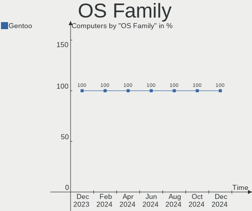
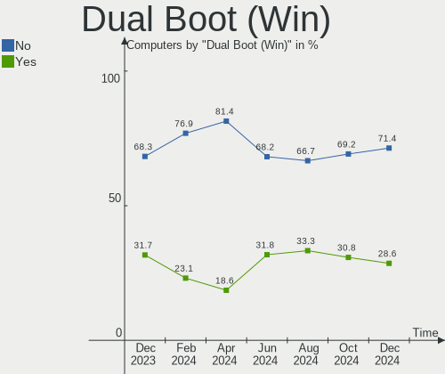
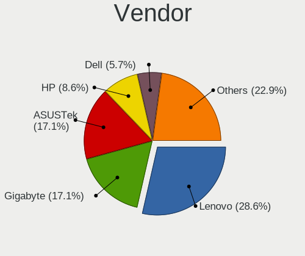
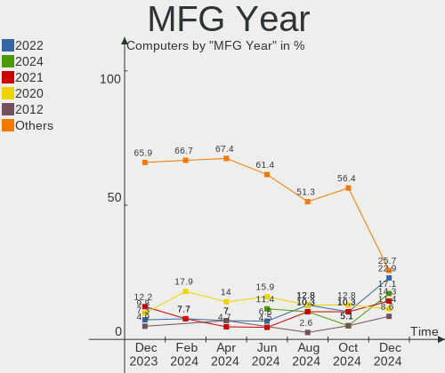
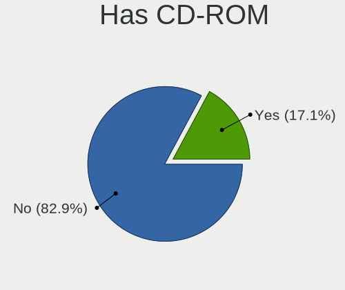
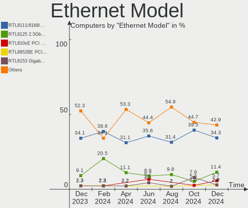

Gentoo - Hardware Trends
------------------------

A project to identify most popular hardware characteristics and track their change
over time based on data collected by Linux users at https://Linux-Hardware.org.

Anyone can contribute to this report by the [hw-probe](https://github.com/linuxhw/hw-probe) tool:

    sudo -E hw-probe -all -upload

This is a report for all computer types. See also reports for [desktops](/Dist/Gentoo/Desktop/README.md) and [notebooks](/Dist/Gentoo/Notebook/README.md).

This report is for one last month. Overall report since the beginning of time: [TestCoverage](https://github.com/linuxhw/TestCoverage)

Period: Aug, 2022.

Contents
--------

* [ System ](#system)
  - [ OS                       ](#os)
  - [ OS Family                ](#os-family)
  - [ Kernel                   ](#kernel)
  - [ Kernel Family            ](#kernel-family)
  - [ Kernel Major Ver.        ](#kernel-major-ver)
  - [ Arch                     ](#arch)
  - [ DE                       ](#de)
  - [ Display Server           ](#display-server)
  - [ Display Manager          ](#display-manager)
  - [ OS Lang                  ](#os-lang)
  - [ Boot Mode                ](#boot-mode)
  - [ Filesystem               ](#filesystem)
  - [ Part. scheme             ](#part-scheme)
  - [ Dual Boot with Linux/BSD ](#dual-boot-with-linuxbsd)
  - [ Dual Boot (Win)          ](#dual-boot-win)

* [ Board ](#board)
  - [ Vendor                   ](#vendor)
  - [ Model                    ](#model)
  - [ Model Family             ](#model-family)
  - [ MFG Year                 ](#mfg-year)
  - [ Form Factor              ](#form-factor)
  - [ Secure Boot              ](#secure-boot)
  - [ Coreboot                 ](#coreboot)
  - [ RAM Size                 ](#ram-size)
  - [ RAM Used                 ](#ram-used)
  - [ Total Drives             ](#total-drives)
  - [ Has CD-ROM               ](#has-cd-rom)
  - [ Has Ethernet             ](#has-ethernet)
  - [ Has WiFi                 ](#has-wifi)
  - [ Has Bluetooth            ](#has-bluetooth)

* [ Location ](#location)
  - [ Country                  ](#country)
  - [ City                     ](#city)

* [ Drives ](#drives)
  - [ Drive Vendor             ](#drive-vendor)
  - [ Drive Model              ](#drive-model)
  - [ HDD Vendor               ](#hdd-vendor)
  - [ SSD Vendor               ](#ssd-vendor)
  - [ Drive Kind               ](#drive-kind)
  - [ Drive Connector          ](#drive-connector)
  - [ Drive Size               ](#drive-size)
  - [ Space Total              ](#space-total)
  - [ Space Used               ](#space-used)
  - [ Malfunc. Drives          ](#malfunc-drives)
  - [ Malfunc. Drive Vendor    ](#malfunc-drive-vendor)
  - [ Malfunc. HDD Vendor      ](#malfunc-hdd-vendor)
  - [ Malfunc. Drive Kind      ](#malfunc-drive-kind)
  - [ Failed Drives            ](#failed-drives)
  - [ Failed Drive Vendor      ](#failed-drive-vendor)
  - [ Drive Status             ](#drive-status)

* [ Storage controller ](#storage-controller)
  - [ Storage Vendor           ](#storage-vendor)
  - [ Storage Model            ](#storage-model)
  - [ Storage Kind             ](#storage-kind)

* [ Processor ](#processor)
  - [ CPU Vendor               ](#cpu-vendor)
  - [ CPU Model                ](#cpu-model)
  - [ CPU Model Family         ](#cpu-model-family)
  - [ CPU Cores                ](#cpu-cores)
  - [ CPU Sockets              ](#cpu-sockets)
  - [ CPU Threads              ](#cpu-threads)
  - [ CPU Op-Modes             ](#cpu-op-modes)
  - [ CPU Microcode            ](#cpu-microcode)
  - [ CPU Microarch            ](#cpu-microarch)

* [ Graphics ](#graphics)
  - [ GPU Vendor               ](#gpu-vendor)
  - [ GPU Model                ](#gpu-model)
  - [ GPU Combo                ](#gpu-combo)
  - [ GPU Driver               ](#gpu-driver)
  - [ GPU Memory               ](#gpu-memory)

* [ Monitor ](#monitor)
  - [ Monitor Vendor           ](#monitor-vendor)
  - [ Monitor Model            ](#monitor-model)
  - [ Monitor Resolution       ](#monitor-resolution)
  - [ Monitor Diagonal         ](#monitor-diagonal)
  - [ Monitor Width            ](#monitor-width)
  - [ Aspect Ratio             ](#aspect-ratio)
  - [ Monitor Area             ](#monitor-area)
  - [ Pixel Density            ](#pixel-density)
  - [ Multiple Monitors        ](#multiple-monitors)

* [ Network ](#network)
  - [ Net Controller Vendor    ](#net-controller-vendor)
  - [ Net Controller Model     ](#net-controller-model)
  - [ Wireless Vendor          ](#wireless-vendor)
  - [ Wireless Model           ](#wireless-model)
  - [ Ethernet Vendor          ](#ethernet-vendor)
  - [ Ethernet Model           ](#ethernet-model)
  - [ Net Controller Kind      ](#net-controller-kind)
  - [ Used Controller          ](#used-controller)
  - [ NICs                     ](#nics)
  - [ IPv6                     ](#ipv6)

* [ Bluetooth ](#bluetooth)
  - [ Bluetooth Vendor         ](#bluetooth-vendor)
  - [ Bluetooth Model          ](#bluetooth-model)

* [ Sound ](#sound)
  - [ Sound Vendor             ](#sound-vendor)
  - [ Sound Model              ](#sound-model)

* [ Memory ](#memory)
  - [ Memory Vendor            ](#memory-vendor)
  - [ Memory Model             ](#memory-model)
  - [ Memory Kind              ](#memory-kind)
  - [ Memory Form Factor       ](#memory-form-factor)
  - [ Memory Size              ](#memory-size)
  - [ Memory Speed             ](#memory-speed)

* [ Printers & scanners ](#printers--scanners)
  - [ Printer Vendor           ](#printer-vendor)
  - [ Printer Model            ](#printer-model)
  - [ Scanner Vendor           ](#scanner-vendor)
  - [ Scanner Model            ](#scanner-model)

* [ Camera ](#camera)
  - [ Camera Vendor            ](#camera-vendor)
  - [ Camera Model             ](#camera-model)

* [ Security ](#security)
  - [ Fingerprint Vendor       ](#fingerprint-vendor)
  - [ Fingerprint Model        ](#fingerprint-model)
  - [ Chipcard Vendor          ](#chipcard-vendor)
  - [ Chipcard Model           ](#chipcard-model)

* [ Unsupported ](#unsupported)
  - [ Unsupported Devices      ](#unsupported-devices)
  - [ Unsupported Device Types ](#unsupported-device-types)

System
------

OS
--

Installed operating systems

| Name       | Computers | Percent |
|------------|-----------|---------|
| Gentoo 2.8 | 45        | 97.83%  |
| Gentoo 2.6 | 1         | 2.17%   |

OS Family
---------

OS without a version

| Name   | Computers | Percent |
|--------|-----------|---------|
| Gentoo | 46        | 100%    |

Kernel
------

Version of the Linux kernel

| Version                         | Computers | Percent |
|---------------------------------|-----------|---------|
| 5.19.0-gentoo-x86_64            | 5         | 10.87%  |
| 5.15.59-gentoo-x86_64           | 4         | 8.7%    |
| 5.15.59-gentoo                  | 4         | 8.7%    |
| 5.15.52-gentoo-x86_64           | 4         | 8.7%    |
| 5.15.52-gentoo                  | 4         | 8.7%    |
| 5.19.0-gentoo                   | 3         | 6.52%   |
| 5.15.41-gentoo-x86_64           | 3         | 6.52%   |
| 5.19.3-gentoo-x86_64            | 1         | 2.17%   |
| 5.19.1-gentoo-a6                | 1         | 2.17%   |
| 5.19.0-xanmod1-x86_64           | 1         | 2.17%   |
| 5.19.0-xanmod1-elitebook        | 1         | 2.17%   |
| 5.19.0-gentoo-carbon            | 1         | 2.17%   |
| 5.18.9-1-MANJARO-ARM            | 1         | 2.17%   |
| 5.18.3-zen1                     | 1         | 2.17%   |
| 5.18.16-gentoo-x86_64           | 1         | 2.17%   |
| 5.18.15-gentoo-dist             | 1         | 2.17%   |
| 5.18.15-gentoo                  | 1         | 2.17%   |
| 5.17.3-gentoo                   | 1         | 2.17%   |
| 5.15.61-gentoo-dist             | 1         | 2.17%   |
| 5.15.59-gentoo-dist-hardened    | 1         | 2.17%   |
| 5.15.59-gentoo-dist             | 1         | 2.17%   |
| 5.15.55-gentoo-114-virtualbox3D | 1         | 2.17%   |
| 5.15.52-gentoo-ts221            | 1         | 2.17%   |
| 5.15.52-gentoo-dist             | 1         | 2.17%   |
| 5.15.32-gentoo-r1-x86_64        | 1         | 2.17%   |
| 5.15.19-gentoo-x86_64-k01       | 1         | 2.17%   |

Kernel Family
-------------

Linux kernel without a distro release

| Version | Computers | Percent |
|---------|-----------|---------|
| 5.19.0  | 11        | 23.91%  |
| 5.15.59 | 10        | 21.74%  |
| 5.15.52 | 10        | 21.74%  |
| 5.15.41 | 3         | 6.52%   |
| 5.18.15 | 2         | 4.35%   |
| 5.19.3  | 1         | 2.17%   |
| 5.19.1  | 1         | 2.17%   |
| 5.18.9  | 1         | 2.17%   |
| 5.18.3  | 1         | 2.17%   |
| 5.18.16 | 1         | 2.17%   |
| 5.17.3  | 1         | 2.17%   |
| 5.15.61 | 1         | 2.17%   |
| 5.15.55 | 1         | 2.17%   |
| 5.15.32 | 1         | 2.17%   |
| 5.15.19 | 1         | 2.17%   |

Kernel Major Ver.
-----------------

Linux kernel major version

| Version | Computers | Percent |
|---------|-----------|---------|
| 5.15    | 27        | 58.7%   |
| 5.19    | 13        | 28.26%  |
| 5.18    | 5         | 10.87%  |
| 5.17    | 1         | 2.17%   |

Arch
----

OS architecture (x86_64, i586, etc.)

| Name     | Computers | Percent |
|----------|-----------|---------|
| x86_64   | 42        | 91.3%   |
| i686     | 2         | 4.35%   |
| armv5tel | 1         | 2.17%   |
| aarch64  | 1         | 2.17%   |

DE
--

Desktop Environment

| Name    | Computers | Percent |
|---------|-----------|---------|
| KDE5    | 16        | 34.78%  |
| Unknown | 16        | 34.78%  |
| GNOME   | 7         | 15.22%  |
| XFCE    | 2         | 4.35%   |
| MATE    | 2         | 4.35%   |
| LXQt    | 2         | 4.35%   |
| dwm     | 1         | 2.17%   |

Display Server
--------------

X11 or Wayland

| Name    | Computers | Percent |
|---------|-----------|---------|
| X11     | 25        | 54.35%  |
| Unknown | 8         | 17.39%  |
| Wayland | 7         | 15.22%  |
| Tty     | 6         | 13.04%  |

Display Manager
---------------

SDDM, LightDM, etc.

| Name    | Computers | Percent |
|---------|-----------|---------|
| SDDM    | 18        | 39.13%  |
| Unknown | 14        | 30.43%  |
| LightDM | 9         | 19.57%  |
| GDM     | 4         | 8.7%    |
| LXDM    | 1         | 2.17%   |

OS Lang
-------

Language

| Lang    | Computers | Percent |
|---------|-----------|---------|
| en_US   | 20        | 43.48%  |
| C.UTF8  | 9         | 19.57%  |
| en_GB   | 4         | 8.7%    |
| ru_RU   | 2         | 4.35%   |
| de_DE   | 2         | 4.35%   |
| C       | 2         | 4.35%   |
| Unknown | 2         | 4.35%   |
| zh_TW   | 1         | 2.17%   |
| pl_PL   | 1         | 2.17%   |
| es_ES   | 1         | 2.17%   |
| en_AU   | 1         | 2.17%   |
| de_CH   | 1         | 2.17%   |

Boot Mode
---------

EFI or BIOS

| Mode | Computers | Percent |
|------|-----------|---------|
| EFI  | 38        | 82.61%  |
| BIOS | 8         | 17.39%  |

Filesystem
----------

Type of filesystem

| Type    | Computers | Percent |
|---------|-----------|---------|
| Ext4    | 24        | 52.17%  |
| Btrfs   | 10        | 21.74%  |
| XXXXXXX | 5         | 10.87%  |
| F2fs    | 5         | 10.87%  |
| Zfs     | 1         | 2.17%   |
| Xfs     | 1         | 2.17%   |

Part. scheme
------------

Scheme of partitioning

| Type    | Computers | Percent |
|---------|-----------|---------|
| GPT     | 43        | 93.48%  |
| MBR     | 2         | 4.35%   |
| Unknown | 1         | 2.17%   |

Dual Boot with Linux/BSD
------------------------

Hosting more than one Linux/BSD

| Dual boot | Computers | Percent |
|-----------|-----------|---------|
| No        | 30        | 65.22%  |
| Yes       | 16        | 34.78%  |

Dual Boot (Win)
---------------

Hosting Linux and Windows

| Dual boot | Computers | Percent |
|-----------|-----------|---------|
| No        | 31        | 67.39%  |
| Yes       | 15        | 32.61%  |

Board
-----

Vendor
------

Motherboard manufacturer

| Name                | Computers | Percent |
|---------------------|-----------|---------|
| Lenovo              | 9         | 19.57%  |
| ASUSTek Computer    | 8         | 17.39%  |
| Gigabyte Technology | 4         | 8.7%    |
| MSI                 | 3         | 6.52%   |
| ASRock              | 3         | 6.52%   |
| Toshiba             | 2         | 4.35%   |
| Dell                | 2         | 4.35%   |
| win element         | 1         | 2.17%   |
| Timi                | 1         | 2.17%   |
| Samsung Electronics | 1         | 2.17%   |
| Purism              | 1         | 2.17%   |
| Pine Microsystems   | 1         | 2.17%   |
| Notebook            | 1         | 2.17%   |
| Microsoft           | 1         | 2.17%   |
| IBM                 | 1         | 2.17%   |
| HUAWEI              | 1         | 2.17%   |
| Hewlett-Packard     | 1         | 2.17%   |
| Fujitsu             | 1         | 2.17%   |
| Fanless Mini PC     | 1         | 2.17%   |
| Eluktronics         | 1         | 2.17%   |
| Acer                | 1         | 2.17%   |
| Unknown             | 1         | 2.17%   |

Model
-----

Motherboard model

| Name                                     | Computers | Percent |
|------------------------------------------|-----------|---------|
| win element MoreFine S500+               | 1         | 2.17%   |
| Toshiba Satellite C850D-118              | 1         | 2.17%   |
| Toshiba NB100                            | 1         | 2.17%   |
| Timi A35                                 | 1         | 2.17%   |
| Samsung 700G7C                           | 1         | 2.17%   |
| Purism Librem 15 v4                      | 1         | 2.17%   |
| Pine Microsystems Pine64 PinePhonePro    | 1         | 2.17%   |
| Notebook N141CU                          | 1         | 2.17%   |
| MSI MS-7D09                              | 1         | 2.17%   |
| MSI MS-7C02                              | 1         | 2.17%   |
| MSI MS-7B85                              | 1         | 2.17%   |
| Microsoft Surface Go 3                   | 1         | 2.17%   |
| Lenovo Yoga S940-14IWL 81Q7              | 1         | 2.17%   |
| Lenovo ThinkPad Z16 Gen 1 21D4002GGE     | 1         | 2.17%   |
| Lenovo ThinkPad Yoga 460 20EMCTO1WW      | 1         | 2.17%   |
| Lenovo ThinkPad T14 Gen 1 20S1S35Y00     | 1         | 2.17%   |
| Lenovo ThinkPad P50 20EQS33R0J           | 1         | 2.17%   |
| Lenovo ThinkPad L15 Gen 2a 20X7006PAU    | 1         | 2.17%   |
| Lenovo ThinkBook 13s G2 ITL 20V9         | 1         | 2.17%   |
| Lenovo Legion T5 26AMR5 90RB0002US       | 1         | 2.17%   |
| Lenovo Legion 5 Pro 16ACH6H 82JQ         | 1         | 2.17%   |
| IBM 2722BDG                              | 1         | 2.17%   |
| HUAWEI HVY-WXX9                          | 1         | 2.17%   |
| HP EliteBook 845 14 inch G9 Notebook PC  | 1         | 2.17%   |
| Gigabyte Z77X-D3H                        | 1         | 2.17%   |
| Gigabyte B550M DS3H                      | 1         | 2.17%   |
| Gigabyte B450 GAMING X                   | 1         | 2.17%   |
| Gigabyte AB350-Gaming                    | 1         | 2.17%   |
| Fujitsu LIFEBOOK U758                    | 1         | 2.17%   |
| Fanless Mini PC PCG02 GLE                | 1         | 2.17%   |
| Eluktronics MAX-17                       | 1         | 2.17%   |
| Dell Precision 3570                      | 1         | 2.17%   |
| Dell G3 3500                             | 1         | 2.17%   |
| ASUS VivoBook_ASUSLaptop X421UAY_D413UA  | 1         | 2.17%   |
| ASUS TUF Gaming X570-PLUS                | 1         | 2.17%   |
| ASUS TUF B450M-PLUS GAMING               | 1         | 2.17%   |
| ASUS ROG STRIX X570-E GAMING             | 1         | 2.17%   |
| ASUS ROG Maximus Z690 EXTREME            | 1         | 2.17%   |
| ASUS PRIME Z390-A                        | 1         | 2.17%   |
| ASUS M3A78-CM                            | 1         | 2.17%   |
| ASUS ASUS TUF Gaming F17 FX706HC_FX706HC | 1         | 2.17%   |
| ASRock X370 Gaming X                     | 1         | 2.17%   |
| ASRock P67 Extreme4 Gen3                 | 1         | 2.17%   |
| ASRock B75M-GL R2.0                      | 1         | 2.17%   |
| Acer Swift SF314-512                     | 1         | 2.17%   |
| Unknown                                  | 1         | 2.17%   |

Model Family
------------

Motherboard model prefix

| Name                     | Computers | Percent |
|--------------------------|-----------|---------|
| Lenovo ThinkPad          | 5         | 10.87%  |
| Lenovo Legion            | 2         | 4.35%   |
| ASUS TUF                 | 2         | 4.35%   |
| ASUS ROG                 | 2         | 4.35%   |
| win element MoreFine     | 1         | 2.17%   |
| Toshiba Satellite        | 1         | 2.17%   |
| Toshiba NB100            | 1         | 2.17%   |
| Timi A35                 | 1         | 2.17%   |
| Samsung 700G7C           | 1         | 2.17%   |
| Purism Librem            | 1         | 2.17%   |
| Pine Microsystems Pine64 | 1         | 2.17%   |
| Notebook N141CU          | 1         | 2.17%   |
| MSI MS-7D09              | 1         | 2.17%   |
| MSI MS-7C02              | 1         | 2.17%   |
| MSI MS-7B85              | 1         | 2.17%   |
| Microsoft Surface        | 1         | 2.17%   |
| Lenovo Yoga              | 1         | 2.17%   |
| Lenovo ThinkBook         | 1         | 2.17%   |
| IBM 2722BDG              | 1         | 2.17%   |
| HUAWEI HVY-WXX9          | 1         | 2.17%   |
| HP EliteBook             | 1         | 2.17%   |
| Gigabyte Z77X-D3H        | 1         | 2.17%   |
| Gigabyte B550M           | 1         | 2.17%   |
| Gigabyte B450            | 1         | 2.17%   |
| Gigabyte AB350-Gaming    | 1         | 2.17%   |
| Fujitsu LIFEBOOK         | 1         | 2.17%   |
| Fanless Mini PC PCG02    | 1         | 2.17%   |
| Eluktronics MAX-17       | 1         | 2.17%   |
| Dell Precision           | 1         | 2.17%   |
| Dell G3                  | 1         | 2.17%   |
| ASUS VivoBook            | 1         | 2.17%   |
| ASUS PRIME               | 1         | 2.17%   |
| ASUS M3A78-CM            | 1         | 2.17%   |
| ASUS ASUS                | 1         | 2.17%   |
| ASRock X370              | 1         | 2.17%   |
| ASRock P67               | 1         | 2.17%   |
| ASRock B75M-GL           | 1         | 2.17%   |
| Acer Swift               | 1         | 2.17%   |
| Unknown                  | 1         | 2.17%   |

MFG Year
--------

Motherboard manufacture year

| Year    | Computers | Percent |
|---------|-----------|---------|
| 2021    | 10        | 21.74%  |
| 2019    | 7         | 15.22%  |
| 2020    | 6         | 13.04%  |
| 2022    | 5         | 10.87%  |
| 2018    | 5         | 10.87%  |
| 2012    | 4         | 8.7%    |
| 2017    | 2         | 4.35%   |
| 2008    | 2         | 4.35%   |
| Unknown | 2         | 4.35%   |
| 2015    | 1         | 2.17%   |
| 2011    | 1         | 2.17%   |
| 2006    | 1         | 2.17%   |

Form Factor
-----------

Physical design of the computer

| Name        | Computers | Percent |
|-------------|-----------|---------|
| Notebook    | 24        | 52.17%  |
| Desktop     | 18        | 39.13%  |
| Phone       | 1         | 2.17%   |
| Stick pc    | 1         | 2.17%   |
| Tablet      | 1         | 2.17%   |
| Convertible | 1         | 2.17%   |

Secure Boot
-----------

Enabled or disabled

| State    | Computers | Percent |
|----------|-----------|---------|
| Disabled | 46        | 100%    |

Coreboot
--------

Have coreboot on board

| Used | Computers | Percent |
|------|-----------|---------|
| No   | 45        | 97.83%  |
| Yes  | 1         | 2.17%   |

RAM Size
--------

Total RAM memory

| Size in GB  | Computers | Percent |
|-------------|-----------|---------|
| 32.01-64.0  | 13        | 28.26%  |
| 16.01-24.0  | 9         | 19.57%  |
| 64.01-256.0 | 7         | 15.22%  |
| 8.01-16.0   | 6         | 13.04%  |
| 4.01-8.0    | 5         | 10.87%  |
| 3.01-4.0    | 2         | 4.35%   |
| 2.01-3.0    | 2         | 4.35%   |
| 24.01-32.0  | 1         | 2.17%   |
| 0.51-1.0    | 1         | 2.17%   |

RAM Used
--------

Used RAM memory

| Used GB    | Computers | Percent |
|------------|-----------|---------|
| 1.01-2.0   | 9         | 19.57%  |
| 3.01-4.0   | 8         | 17.39%  |
| 8.01-16.0  | 8         | 17.39%  |
| 4.01-8.0   | 7         | 15.22%  |
| 0.51-1.0   | 5         | 10.87%  |
| 0.01-0.5   | 3         | 6.52%   |
| 2.01-3.0   | 2         | 4.35%   |
| 16.01-24.0 | 2         | 4.35%   |
| 32.01-64.0 | 1         | 2.17%   |
| 24.01-32.0 | 1         | 2.17%   |

Total Drives
------------

Number of drives on board

| Drives | Computers | Percent |
|--------|-----------|---------|
| 1      | 21        | 45.65%  |
| 2      | 13        | 28.26%  |
| 3      | 6         | 13.04%  |
| 6      | 2         | 4.35%   |
| 5      | 2         | 4.35%   |
| 12     | 1         | 2.17%   |
| 4      | 1         | 2.17%   |

Has CD-ROM
----------

Has CD-ROM on board

| Presented | Computers | Percent |
|-----------|-----------|---------|
| No        | 40        | 86.96%  |
| Yes       | 6         | 13.04%  |

Has Ethernet
------------

Has Ethernet on board

| Presented | Computers | Percent |
|-----------|-----------|---------|
| Yes       | 34        | 73.91%  |
| No        | 12        | 26.09%  |

Has WiFi
--------

Has WiFi module

| Presented | Computers | Percent |
|-----------|-----------|---------|
| Yes       | 33        | 71.74%  |
| No        | 13        | 28.26%  |

Has Bluetooth
-------------

Has Bluetooth module

| Presented | Computers | Percent |
|-----------|-----------|---------|
| Yes       | 31        | 67.39%  |
| No        | 15        | 32.61%  |

Location
--------

Country
-------

Geographic location (country)

| Country     | Computers | Percent |
|-------------|-----------|---------|
| Germany     | 9         | 19.57%  |
| USA         | 6         | 13.04%  |
| Russia      | 3         | 6.52%   |
| Poland      | 3         | 6.52%   |
| France      | 3         | 6.52%   |
| Taiwan      | 2         | 4.35%   |
| Switzerland | 2         | 4.35%   |
| Greece      | 2         | 4.35%   |
| China       | 2         | 4.35%   |
| Australia   | 2         | 4.35%   |
| Ukraine     | 1         | 2.17%   |
| UK          | 1         | 2.17%   |
| Turkey      | 1         | 2.17%   |
| Sweden      | 1         | 2.17%   |
| Spain       | 1         | 2.17%   |
| Netherlands | 1         | 2.17%   |
| Mexico      | 1         | 2.17%   |
| Hong Kong   | 1         | 2.17%   |
| Finland     | 1         | 2.17%   |
| Czechia     | 1         | 2.17%   |
| Belarus     | 1         | 2.17%   |
| Austria     | 1         | 2.17%   |

City
----

Geographic location (city)

| City                 | Computers | Percent |
|----------------------|-----------|---------|
| Warsaw               | 2         | 4.35%   |
| Rostock              | 2         | 4.35%   |
| Postbauer-Heng       | 2         | 4.35%   |
| Cherry Hill          | 2         | 4.35%   |
| Athens               | 2         | 4.35%   |
| Yunlin               | 1         | 2.17%   |
| Vladivostok          | 1         | 2.17%   |
| Vienna               | 1         | 2.17%   |
| Thibodaux            | 1         | 2.17%   |
| Tampere              | 1         | 2.17%   |
| Taichung City        | 1         | 2.17%   |
| Sydney               | 1         | 2.17%   |
| Swansea              | 1         | 2.17%   |
| Sundsvall            | 1         | 2.17%   |
| St. Cloud            | 1         | 2.17%   |
| Renens               | 1         | 2.17%   |
| Prague               | 1         | 2.17%   |
| Noisy-le-Sec         | 1         | 2.17%   |
| Munich               | 1         | 2.17%   |
| Moscow               | 1         | 2.17%   |
| Minsk                | 1         | 2.17%   |
| Mexico City          | 1         | 2.17%   |
| Marseille            | 1         | 2.17%   |
| Kyiv                 | 1         | 2.17%   |
| Heerbrugg            | 1         | 2.17%   |
| Hangzhou             | 1         | 2.17%   |
| Grasse               | 1         | 2.17%   |
| Futian               | 1         | 2.17%   |
| Freiburg im Breisgau | 1         | 2.17%   |
| Florence             | 1         | 2.17%   |
| Filderstadt          | 1         | 2.17%   |
| Duisburg             | 1         | 2.17%   |
| Denver               | 1         | 2.17%   |
| Cieszyn              | 1         | 2.17%   |
| Central              | 1         | 2.17%   |
| Castro Urdiales      | 1         | 2.17%   |
| Brisbane             | 1         | 2.17%   |
| Berlin               | 1         | 2.17%   |
| Belgorod             | 1         | 2.17%   |
| Antalya              | 1         | 2.17%   |
| Amstelveen           | 1         | 2.17%   |

Drives
------

Drive Vendor
------------

Hard drive vendors

| Vendor              | Computers | Drives | Percent |
|---------------------|-----------|--------|---------|
| Samsung Electronics | 16        | 30     | 21.05%  |
| WDC                 | 14        | 14     | 18.42%  |
| Toshiba             | 8         | 11     | 10.53%  |
| Seagate             | 8         | 15     | 10.53%  |
| Unknown             | 4         | 5      | 5.26%   |
| SanDisk             | 4         | 4      | 5.26%   |
| OCZ                 | 3         | 3      | 3.95%   |
| Crucial             | 3         | 3      | 3.95%   |
| Intel               | 2         | 2      | 2.63%   |
| Hitachi             | 2         | 5      | 2.63%   |
| GOODRAM             | 2         | 2      | 2.63%   |
| Team                | 1         | 1      | 1.32%   |
| T-FORCE             | 1         | 1      | 1.32%   |
| SK hynix            | 1         | 1      | 1.32%   |
| Phison              | 1         | 1      | 1.32%   |
| Micron Technology   | 1         | 1      | 1.32%   |
| KIOXIA              | 1         | 1      | 1.32%   |
| Kingchuxing         | 1         | 1      | 1.32%   |
| HGST                | 1         | 1      | 1.32%   |
| Fujitsu             | 1         | 1      | 1.32%   |
| AMD                 | 1         | 1      | 1.32%   |

Drive Model
-----------

Hard drive models

| Model                                | Computers | Percent |
|--------------------------------------|-----------|---------|
| Samsung SSD 970 EVO 500GB            | 3         | 3.45%   |
| Unknown MMC Card  128GB              | 2         | 2.3%    |
| Samsung SSD 870 EVO 1TB              | 2         | 2.3%    |
| GOODRAM SSDPR-CL100-480-G2 480GB     | 2         | 2.3%    |
| WDC WDS500G2B0C-00PXH0 500GB         | 1         | 1.15%   |
| WDC WDS500G1B0C-00S6U0 500GB         | 1         | 1.15%   |
| WDC WDS200T3X0C-00SJG0 2TB           | 1         | 1.15%   |
| WDC WD7500BPVT-22HXZT1 752GB         | 1         | 1.15%   |
| WDC WD40EZRZ-00GXCB0 4TB             | 1         | 1.15%   |
| WDC WD2500BEVS-22UST0 250GB          | 1         | 1.15%   |
| WDC WD20EFRX-68EUZN0 2TB             | 1         | 1.15%   |
| WDC WD1600BEVS-22RST0 160GB          | 1         | 1.15%   |
| WDC WD10EZRZ-00HTKB0 1TB             | 1         | 1.15%   |
| WDC WD10EFRX-68JCSN0 1TB             | 1         | 1.15%   |
| WDC PC SN730 SDBQNTY-512G-1001 512GB | 1         | 1.15%   |
| WDC PC SN730 SDBPNTY-512G-1101 512GB | 1         | 1.15%   |
| WDC PC SN730 SDBPNTY-512G-1027 512GB | 1         | 1.15%   |
| WDC PC SN530 SDBPNPZ-512G-1002 512GB | 1         | 1.15%   |
| Unknown NVMe SSD Drive 1TB           | 1         | 1.15%   |
| Unknown MMC Card  64GB               | 1         | 1.15%   |
| Unknown MMC Card  512GB              | 1         | 1.15%   |
| Toshiba MG09ACA18TE 18TB             | 1         | 1.15%   |
| Toshiba MG04ACA200E 2TB              | 1         | 1.15%   |
| Toshiba KXG6AZNV512G 512GB           | 1         | 1.15%   |
| Toshiba HDWR180 8TB                  | 1         | 1.15%   |
| Toshiba HDWE160 6TB                  | 1         | 1.15%   |
| Toshiba HDWE150 5TB                  | 1         | 1.15%   |
| Toshiba HDWD110 1TB                  | 1         | 1.15%   |
| Toshiba DT01ACA100 1TB               | 1         | 1.15%   |
| Team TM8FP2240G 240GB                | 1         | 1.15%   |
| T-FORCE TM8FP5001T 1TB               | 1         | 1.15%   |
| SK hynix HFM512GD3JX013N 512GB       | 1         | 1.15%   |
| Seagate ST8000NM0055-1RM112 8TB      | 1         | 1.15%   |
| Seagate ST4000DM004-2CV104 4TB       | 1         | 1.15%   |
| Seagate ST320LM010-1KJ15C 320GB      | 1         | 1.15%   |
| Seagate ST2000LM015-2E8174 2TB       | 1         | 1.15%   |
| Seagate ST18000NM000J-2TV103 18TB    | 1         | 1.15%   |
| Seagate ST12000NM0008-2H3101 12TB    | 1         | 1.15%   |
| Seagate ST12000NE0007-2GT116 12TB    | 1         | 1.15%   |
| Seagate ST1000DM003-1SB102 1TB       | 1         | 1.15%   |
| Seagate ST1000DM003-1CH162 1TB       | 1         | 1.15%   |
| Seagate ST10000VN0008-2JJ101 10TB    | 1         | 1.15%   |
| Seagate ST10000VN0004-1ZD101 10TB    | 1         | 1.15%   |
| Sandisk WD Black SN850 500GB         | 1         | 1.15%   |
| SanDisk SD8TN8U512G1001 512GB SSD    | 1         | 1.15%   |
| SanDisk NVMe SSD Drive 500GB         | 1         | 1.15%   |
| SanDisk iSSD P4 8GB                  | 1         | 1.15%   |
| Samsung SSD 970 EVO Plus 2TB         | 1         | 1.15%   |
| Samsung SSD 970 EVO 1TB              | 1         | 1.15%   |
| Samsung SSD 860 QVO 2TB              | 1         | 1.15%   |
| Samsung SSD 860 QVO 1TB              | 1         | 1.15%   |
| Samsung SSD 860 EVO M.2 1TB          | 1         | 1.15%   |
| Samsung SSD 850 PRO 256GB            | 1         | 1.15%   |
| Samsung SSD 850 EVO 500GB            | 1         | 1.15%   |
| Samsung SSD 850 EVO 250GB            | 1         | 1.15%   |
| Samsung SSD 840 PRO Series 128GB     | 1         | 1.15%   |
| Samsung SSD 830 Series 256GB         | 1         | 1.15%   |
| Samsung PM9A1 NVMe 512GB             | 1         | 1.15%   |
| Samsung PM991 NVMe 512GB             | 1         | 1.15%   |
| Samsung NVMe SSD Drive 500GB         | 1         | 1.15%   |

HDD Vendor
----------

Hard disk drive vendors

| Vendor  | Computers | Drives | Percent |
|---------|-----------|--------|---------|
| Seagate | 8         | 15     | 30.77%  |
| WDC     | 7         | 7      | 26.92%  |
| Toshiba | 7         | 10     | 26.92%  |
| Hitachi | 2         | 5      | 7.69%   |
| HGST    | 1         | 1      | 3.85%   |
| Fujitsu | 1         | 1      | 3.85%   |

SSD Vendor
----------

Solid state drive vendors

| Vendor              | Computers | Drives | Percent |
|---------------------|-----------|--------|---------|
| Samsung Electronics | 8         | 14     | 47.06%  |
| OCZ                 | 3         | 3      | 17.65%  |
| SanDisk             | 2         | 2      | 11.76%  |
| GOODRAM             | 2         | 2      | 11.76%  |
| Crucial             | 2         | 2      | 11.76%  |

Drive Kind
----------

HDD or SSD

| Kind | Computers | Drives | Percent |
|------|-----------|--------|---------|
| NVMe | 30        | 38     | 44.78%  |
| HDD  | 19        | 39     | 28.36%  |
| SSD  | 15        | 23     | 22.39%  |
| MMC  | 3         | 4      | 4.48%   |

Drive Connector
---------------

SATA, SAS, NVMe, etc.

| Type | Computers | Drives | Percent |
|------|-----------|--------|---------|
| NVMe | 30        | 38     | 50%     |
| SATA | 27        | 62     | 45%     |
| MMC  | 3         | 4      | 5%      |

Drive Size
----------

Size of hard drive

| Size in TB | Computers | Drives | Percent |
|------------|-----------|--------|---------|
| 0.01-0.5   | 14        | 20     | 35%     |
| 0.51-1.0   | 12        | 15     | 30%     |
| 1.01-2.0   | 4         | 5      | 10%     |
| 4.01-10.0  | 4         | 12     | 10%     |
| 10.01-20.0 | 3         | 5      | 7.5%    |
| 3.01-4.0   | 2         | 2      | 5%      |
| 2.01-3.0   | 1         | 3      | 2.5%    |

Space Total
-----------

Amount of disk space available on the file system

| Size in GB     | Computers | Percent |
|----------------|-----------|---------|
| 251-500        | 10        | 21.74%  |
| 101-250        | 9         | 19.57%  |
| 501-1000       | 7         | 15.22%  |
| More than 3000 | 5         | 10.87%  |
| 1001-2000      | 4         | 8.7%    |
| 2001-3000      | 3         | 6.52%   |
| 1-20           | 3         | 6.52%   |
| Unknown        | 3         | 6.52%   |
| 21-50          | 1         | 2.17%   |
| 51-100         | 1         | 2.17%   |

Space Used
----------

Amount of used disk space

| Used GB        | Computers | Percent |
|----------------|-----------|---------|
| 21-50          | 10        | 21.74%  |
| 1-20           | 10        | 21.74%  |
| 1001-2000      | 5         | 10.87%  |
| 51-100         | 5         | 10.87%  |
| 101-250        | 4         | 8.7%    |
| More than 3000 | 3         | 6.52%   |
| 251-500        | 3         | 6.52%   |
| Unknown        | 3         | 6.52%   |
| 501-1000       | 2         | 4.35%   |
| 2001-3000      | 1         | 2.17%   |

Malfunc. Drives
---------------

Drive models with a malfunction

| Model                                 | Computers | Drives | Percent |
|---------------------------------------|-----------|--------|---------|
| WDC WD1600BEVS-22RST0 160GB           | 1         | 1      | 11.11%  |
| WDC WD10EFRX-68JCSN0 1TB              | 1         | 1      | 11.11%  |
| Seagate ST320LM010-1KJ15C 320GB       | 1         | 1      | 11.11%  |
| Seagate ST10000VN0004-1ZD101 10TB     | 1         | 4      | 11.11%  |
| Samsung Electronics SSD 970 EVO 1TB   | 1         | 1      | 11.11%  |
| Samsung Electronics SSD 870 EVO 1TB   | 1         | 1      | 11.11%  |
| Samsung Electronics SSD 850 PRO 256GB | 1         | 4      | 11.11%  |
| OCZ VERTEX4 128GB SSD                 | 1         | 1      | 11.11%  |
| Fujitsu MHW2040AT 40GB                | 1         | 1      | 11.11%  |

Malfunc. Drive Vendor
---------------------

Vendors of faulty drives

| Vendor              | Computers | Drives | Percent |
|---------------------|-----------|--------|---------|
| Samsung Electronics | 3         | 6      | 33.33%  |
| WDC                 | 2         | 2      | 22.22%  |
| Seagate             | 2         | 5      | 22.22%  |
| OCZ                 | 1         | 1      | 11.11%  |
| Fujitsu             | 1         | 1      | 11.11%  |

Malfunc. HDD Vendor
-------------------

Vendors of faulty HDD drives

| Vendor  | Computers | Drives | Percent |
|---------|-----------|--------|---------|
| WDC     | 2         | 2      | 40%     |
| Seagate | 2         | 5      | 40%     |
| Fujitsu | 1         | 1      | 20%     |

Malfunc. Drive Kind
-------------------

Kinds of faulty drives

| Kind | Computers | Drives | Percent |
|------|-----------|--------|---------|
| HDD  | 5         | 8      | 55.56%  |
| SSD  | 3         | 6      | 33.33%  |
| NVMe | 1         | 1      | 11.11%  |

Failed Drives
-------------

Failed drive models

Zero info for selected period =(

Failed Drive Vendor
-------------------

Failed drive vendors

Zero info for selected period =(

Drive Status
------------

Number of failed and malfunc. drives

| Status   | Computers | Drives | Percent |
|----------|-----------|--------|---------|
| Works    | 38        | 74     | 71.7%   |
| Malfunc  | 8         | 15     | 15.09%  |
| Detected | 7         | 15     | 13.21%  |

Storage controller
------------------

Storage Vendor
--------------

Storage controller vendors

| Vendor                       | Computers | Percent |
|------------------------------|-----------|---------|
| Intel                        | 20        | 28.17%  |
| AMD                          | 16        | 22.54%  |
| Samsung Electronics          | 11        | 15.49%  |
| SanDisk                      | 9         | 12.68%  |
| Phison Electronics           | 3         | 4.23%   |
| Marvell Technology Group     | 2         | 2.82%   |
| Unknown                      | 1         | 1.41%   |
| Toshiba America Info Systems | 1         | 1.41%   |
| SK hynix                     | 1         | 1.41%   |
| Silicon Motion               | 1         | 1.41%   |
| Micron/Crucial Technology    | 1         | 1.41%   |
| Micron Technology            | 1         | 1.41%   |
| KIOXIA                       | 1         | 1.41%   |
| JMicron Technology           | 1         | 1.41%   |
| Broadcom / LSI               | 1         | 1.41%   |
| ASMedia Technology           | 1         | 1.41%   |

Storage Model
-------------

Storage controller models

| Model                                                                                   | Computers | Percent |
|-----------------------------------------------------------------------------------------|-----------|---------|
| AMD FCH SATA Controller [AHCI mode]                                                     | 10        | 12.66%  |
| Samsung NVMe SSD Controller SM981/PM981/PM983                                           | 6         | 7.59%   |
| AMD 400 Series Chipset SATA Controller                                                  | 4         | 5.06%   |
| SanDisk WD Black SN750 / PC SN730 NVMe SSD                                              | 3         | 3.8%    |
| Samsung NVMe SSD Controller PM9A1/PM9A3/980PRO                                          | 3         | 3.8%    |
| Intel Volume Management Device NVMe RAID Controller                                     | 3         | 3.8%    |
| Intel Sunrise Point-LP SATA Controller [AHCI mode]                                      | 3         | 3.8%    |
| SanDisk WD Blue SN550 NVMe SSD                                                          | 2         | 2.53%   |
| Samsung NVMe SSD Controller 980                                                         | 2         | 2.53%   |
| Phison E12 NVMe Controller                                                              | 2         | 2.53%   |
| Intel SSD 660P Series                                                                   | 2         | 2.53%   |
| Intel 7 Series/C210 Series Chipset Family 6-port SATA Controller [AHCI mode]            | 2         | 2.53%   |
| AMD 500 Series Chipset SATA Controller                                                  | 2         | 2.53%   |
| Unknown Non-Volatile memory controller                                                  | 1         | 1.27%   |
| Toshiba America Info Systems XG6 NVMe SSD Controller                                    | 1         | 1.27%   |
| SK hynix Gold P31 SSD                                                                   | 1         | 1.27%   |
| Silicon Motion SM2263EN/SM2263XT SSD Controller                                         | 1         | 1.27%   |
| SanDisk WD PC SN810 / Black SN850 NVMe SSD                                              | 1         | 1.27%   |
| SanDisk WD Blue SN570 NVMe SSD                                                          | 1         | 1.27%   |
| SanDisk WD Blue SN500 / PC SN520 NVMe SSD                                               | 1         | 1.27%   |
| SanDisk WD Black 2018/SN750 / PC SN720 NVMe SSD                                         | 1         | 1.27%   |
| Phison E7 NVMe Controller                                                               | 1         | 1.27%   |
| Micron/Crucial P2 NVMe PCIe SSD                                                         | 1         | 1.27%   |
| Micron Non-Volatile memory controller                                                   | 1         | 1.27%   |
| Marvell Group 88SE9172 SATA 6Gb/s Controller                                            | 1         | 1.27%   |
| Marvell Group 88SE912x SATA 6Gb/s Controller [IDE mode]                                 | 1         | 1.27%   |
| KIOXIA NVMe SSD Controller BG4                                                          | 1         | 1.27%   |
| JMicron JMB363 SATA/IDE Controller                                                      | 1         | 1.27%   |
| Intel Q170/Q150/B150/H170/H110/Z170/CM236 Chipset SATA Controller [AHCI Mode]           | 1         | 1.27%   |
| Intel Comet Lake SATA AHCI Controller                                                   | 1         | 1.27%   |
| Intel Celeron/Pentium Silver Processor SATA Controller                                  | 1         | 1.27%   |
| Intel Cannon Lake PCH SATA AHCI Controller                                              | 1         | 1.27%   |
| Intel Alder Lake-S PCH SATA Controller [AHCI Mode]                                      | 1         | 1.27%   |
| Intel 82801GBM/GHM (ICH7-M Family) SATA Controller [AHCI mode]                          | 1         | 1.27%   |
| Intel 82801G (ICH7 Family) IDE Controller                                               | 1         | 1.27%   |
| Intel 82801DBM (ICH4-M) IDE Controller                                                  | 1         | 1.27%   |
| Intel 7 Series Chipset Family 6-port SATA Controller [AHCI mode]                        | 1         | 1.27%   |
| Intel 6 Series/C200 Series Chipset Family Desktop SATA Controller (IDE mode, ports 4-5) | 1         | 1.27%   |
| Intel 6 Series/C200 Series Chipset Family Desktop SATA Controller (IDE mode, ports 0-3) | 1         | 1.27%   |
| Intel 500 Series Chipset Family SATA AHCI Controller                                    | 1         | 1.27%   |
| Intel 400 Series Chipset Family SATA AHCI Controller                                    | 1         | 1.27%   |
| Broadcom / LSI SAS3008 PCI-Express Fusion-MPT SAS-3                                     | 1         | 1.27%   |
| ASMedia ASM1062 Serial ATA Controller                                                   | 1         | 1.27%   |
| AMD X370 Series Chipset SATA Controller                                                 | 1         | 1.27%   |
| AMD SB7x0/SB8x0/SB9x0 SATA Controller [IDE mode]                                        | 1         | 1.27%   |
| AMD SB7x0/SB8x0/SB9x0 IDE Controller                                                    | 1         | 1.27%   |
| AMD RAID Bottom Device                                                                  | 1         | 1.27%   |
| AMD 300 Series Chipset SATA Controller                                                  | 1         | 1.27%   |

Storage Kind
------------

Kind of storage controller (IDE, SATA, NVMe, SAS, ...)

| Kind | Computers | Percent |
|------|-----------|---------|
| NVMe | 30        | 44.12%  |
| SATA | 29        | 42.65%  |
| IDE  | 5         | 7.35%   |
| RAID | 3         | 4.41%   |
| SAS  | 1         | 1.47%   |

Processor
---------

CPU Vendor
----------

Processor vendors

| Vendor                | Computers | Percent |
|-----------------------|-----------|---------|
| Intel                 | 24        | 52.17%  |
| AMD                   | 20        | 43.48%  |
| Marvell Semiconductor | 1         | 2.17%   |
| ARM                   | 1         | 2.17%   |

CPU Model
---------

Processor models

| Model                                                                    | Computers | Percent |
|--------------------------------------------------------------------------|-----------|---------|
| AMD Ryzen 9 3900X 12-Core Processor                                      | 2         | 4.35%   |
| AMD Ryzen 5 3600 6-Core Processor                                        | 2         | 4.35%   |
| AMD Ryzen 5 2600 Six-Core Processor                                      | 2         | 4.35%   |
| Marvell Semiconductor Marvell Kirkwood (Flattened Device Tree) Processor | 1         | 2.17%   |
| Intel Pentium M processor 1400MHz                                        | 1         | 2.17%   |
| Intel Core i7-8565U CPU @ 1.80GHz                                        | 1         | 2.17%   |
| Intel Core i7-8086K CPU @ 4.00GHz                                        | 1         | 2.17%   |
| Intel Core i7-7500U CPU @ 2.70GHz                                        | 1         | 2.17%   |
| Intel Core i7-6820HQ CPU @ 2.70GHz                                       | 1         | 2.17%   |
| Intel Core i7-6500U CPU @ 2.50GHz                                        | 1         | 2.17%   |
| Intel Core i7-3610QM CPU @ 2.30GHz                                       | 1         | 2.17%   |
| Intel Core i7-10610U CPU @ 1.80GHz                                       | 1         | 2.17%   |
| Intel Core i5-8250U CPU @ 1.60GHz                                        | 1         | 2.17%   |
| Intel Core i5-3550 CPU @ 3.30GHz                                         | 1         | 2.17%   |
| Intel Core i5-2500S CPU @ 2.70GHz                                        | 1         | 2.17%   |
| Intel Core i5-2500K CPU @ 3.30GHz                                        | 1         | 2.17%   |
| Intel Core i5-10300H CPU @ 2.50GHz                                       | 1         | 2.17%   |
| Intel Core i5-10210U CPU @ 1.60GHz                                       | 1         | 2.17%   |
| Intel Core i3-10100Y CPU @ 1.30GHz                                       | 1         | 2.17%   |
| Intel Celeron J4125 CPU @ 2.00GHz                                        | 1         | 2.17%   |
| Intel Atom CPU N270 @ 1.60GHz                                            | 1         | 2.17%   |
| Intel 12th Gen Core i9-12900K                                            | 1         | 2.17%   |
| Intel 12th Gen Core i7-1280P                                             | 1         | 2.17%   |
| Intel 12th Gen Core i7-1260P                                             | 1         | 2.17%   |
| Intel 11th Gen Core i9-11900KF @ 3.50GHz                                 | 1         | 2.17%   |
| Intel 11th Gen Core i5-11400H @ 2.70GHz                                  | 1         | 2.17%   |
| Intel 11th Gen Core i5-1135G7 @ 2.40GHz                                  | 1         | 2.17%   |
| Intel 11th Gen Core i5-11300H @ 3.10GHz                                  | 1         | 2.17%   |
| ARM Processor                                                            | 1         | 2.17%   |
| AMD Ryzen 9 PRO 6950H with Radeon Graphics                               | 1         | 2.17%   |
| AMD Ryzen 9 5900X 12-Core Processor                                      | 1         | 2.17%   |
| AMD Ryzen 7 PRO 6850HS with Radeon Graphics                              | 1         | 2.17%   |
| AMD Ryzen 7 PRO 5850U with Radeon Graphics                               | 1         | 2.17%   |
| AMD Ryzen 7 5800H with Radeon Graphics                                   | 1         | 2.17%   |
| AMD Ryzen 7 5700U with Radeon Graphics                                   | 1         | 2.17%   |
| AMD Ryzen 7 4800H with Radeon Graphics                                   | 1         | 2.17%   |
| AMD Ryzen 5 5600H with Radeon Graphics                                   | 1         | 2.17%   |
| AMD Ryzen 5 4600H with Radeon Graphics                                   | 1         | 2.17%   |
| AMD Ryzen 5 3600X 6-Core Processor                                       | 1         | 2.17%   |
| AMD Ryzen 5 2600X Six-Core Processor                                     | 1         | 2.17%   |
| AMD Ryzen 5 1600 Six-Core Processor                                      | 1         | 2.17%   |
| AMD Phenom II X4 955 Processor                                           | 1         | 2.17%   |
| AMD E1-1200 APU with Radeon HD Graphics                                  | 1         | 2.17%   |

CPU Model Family
----------------

Processor model prefix

| Model            | Computers | Percent |
|------------------|-----------|---------|
| Other            | 9         | 19.57%  |
| AMD Ryzen 5      | 9         | 19.57%  |
| Intel Core i7    | 7         | 15.22%  |
| Intel Core i5    | 6         | 13.04%  |
| AMD Ryzen 9      | 4         | 8.7%    |
| AMD Ryzen 7      | 3         | 6.52%   |
| AMD Ryzen 7 PRO  | 2         | 4.35%   |
| Intel Pentium M  | 1         | 2.17%   |
| Intel Core i3    | 1         | 2.17%   |
| Intel Celeron    | 1         | 2.17%   |
| Intel Atom       | 1         | 2.17%   |
| AMD Phenom II X4 | 1         | 2.17%   |
| AMD E1           | 1         | 2.17%   |

CPU Cores
---------

Number of processor cores

| Number | Computers | Percent |
|--------|-----------|---------|
| 4      | 14        | 30.43%  |
| 6      | 11        | 23.91%  |
| 8      | 7         | 15.22%  |
| 2      | 5         | 10.87%  |
| 12     | 4         | 8.7%    |
| 1      | 3         | 6.52%   |
| 16     | 1         | 2.17%   |
| 14     | 1         | 2.17%   |

CPU Sockets
-----------

Number of sockets

| Number | Computers | Percent |
|--------|-----------|---------|
| 1      | 46        | 100%    |

CPU Threads
-----------

Threads per core (Hyper-Threading)

| Number | Computers | Percent |
|--------|-----------|---------|
| 2      | 36        | 78.26%  |
| 1      | 10        | 21.74%  |

CPU Op-Modes
------------

CPU Operation Modes (32-bit, 64-bit)

| Op mode        | Computers | Percent |
|----------------|-----------|---------|
| 32-bit, 64-bit | 43        | 93.48%  |
| 32-bit         | 2         | 4.35%   |
| Unknown        | 1         | 2.17%   |

CPU Microcode
-------------

Microcode number

| Number     | Computers | Percent |
|------------|-----------|---------|
| Unknown    | 6         | 13.04%  |
| 0x08701021 | 4         | 8.7%    |
| 0x0a50000c | 3         | 6.52%   |
| 0x0800820d | 3         | 6.52%   |
| 0x906a3    | 2         | 4.35%   |
| 0x806ec    | 2         | 4.35%   |
| 0x806e9    | 2         | 4.35%   |
| 0x806c1    | 2         | 4.35%   |
| 0x306a9    | 2         | 4.35%   |
| 0x0a404102 | 2         | 4.35%   |
| 0x08600106 | 2         | 4.35%   |
| 0xa0671    | 1         | 2.17%   |
| 0xa0652    | 1         | 2.17%   |
| 0x906ea    | 1         | 2.17%   |
| 0x90672    | 1         | 2.17%   |
| 0x806eb    | 1         | 2.17%   |
| 0x806ea    | 1         | 2.17%   |
| 0x806d1    | 1         | 2.17%   |
| 0x706a8    | 1         | 2.17%   |
| 0x506e3    | 1         | 2.17%   |
| 0x406e3    | 1         | 2.17%   |
| 0x206a7    | 1         | 2.17%   |
| 0x0a201009 | 1         | 2.17%   |
| 0x08608103 | 1         | 2.17%   |
| 0x08001138 | 1         | 2.17%   |
| 0x05000119 | 1         | 2.17%   |
| 0x010000db | 1         | 2.17%   |

CPU Microarch
-------------

Microarchitecture

| Name             | Computers | Percent |
|------------------|-----------|---------|
| Zen 2            | 7         | 15.22%  |
| KabyLake         | 7         | 15.22%  |
| Unknown          | 5         | 10.87%  |
| Zen 3            | 4         | 8.7%    |
| Zen+             | 3         | 6.52%   |
| Alderlake Hybrid | 3         | 6.52%   |
| TigerLake        | 2         | 4.35%   |
| Skylake          | 2         | 4.35%   |
| SandyBridge      | 2         | 4.35%   |
| IvyBridge        | 2         | 4.35%   |
| Icelake          | 2         | 4.35%   |
| Zen              | 1         | 2.17%   |
| P6               | 1         | 2.17%   |
| K10              | 1         | 2.17%   |
| Goldmont plus    | 1         | 2.17%   |
| CometLake        | 1         | 2.17%   |
| Bonnell          | 1         | 2.17%   |
| Bobcat           | 1         | 2.17%   |

Graphics
--------

GPU Vendor
----------

Vendors of graphics cards

| Vendor | Computers | Percent |
|--------|-----------|---------|
| AMD    | 20        | 41.67%  |
| Intel  | 16        | 33.33%  |
| Nvidia | 12        | 25%     |

GPU Model
---------

Graphics card models

| Model                                                                         | Computers | Percent |
|-------------------------------------------------------------------------------|-----------|---------|
| AMD Ellesmere [Radeon RX 470/480/570/570X/580/580X/590]                       | 7         | 13.73%  |
| Nvidia TU104 [GeForce RTX 2080 Rev. A]                                        | 2         | 3.92%   |
| Nvidia GA106M [GeForce RTX 3060 Mobile / Max-Q]                               | 2         | 3.92%   |
| Intel TigerLake-LP GT2 [Iris Xe Graphics]                                     | 2         | 3.92%   |
| Intel CometLake-U GT2 [UHD Graphics]                                          | 2         | 3.92%   |
| Intel Alder Lake-P Integrated Graphics Controller                             | 2         | 3.92%   |
| AMD Renoir                                                                    | 2         | 3.92%   |
| AMD Rembrandt [Radeon 680M]                                                   | 2         | 3.92%   |
| AMD Navi 21 [Radeon RX 6800/6800 XT / 6900 XT]                                | 2         | 3.92%   |
| AMD Cezanne                                                                   | 2         | 3.92%   |
| Nvidia TU117M                                                                 | 1         | 1.96%   |
| Nvidia TU116 [GeForce GTX 1660 SUPER]                                         | 1         | 1.96%   |
| Nvidia TU104 [GeForce RTX 2070 SUPER]                                         | 1         | 1.96%   |
| Nvidia GP108M [GeForce MX330]                                                 | 1         | 1.96%   |
| Nvidia GM107GLM [Quadro M2000M]                                               | 1         | 1.96%   |
| Nvidia GF119 [GeForce GT 610]                                                 | 1         | 1.96%   |
| Nvidia GF114M [GeForce GTX 675M]                                              | 1         | 1.96%   |
| Nvidia GA107M [GeForce RTX 3050 Mobile]                                       | 1         | 1.96%   |
| Intel Xeon E3-1200 v2/3rd Gen Core processor Graphics Controller              | 1         | 1.96%   |
| Intel WhiskeyLake-U GT2 [UHD Graphics 620]                                    | 1         | 1.96%   |
| Intel UHD Graphics 620                                                        | 1         | 1.96%   |
| Intel UHD Graphics 615                                                        | 1         | 1.96%   |
| Intel TigerLake-H GT1 [UHD Graphics]                                          | 1         | 1.96%   |
| Intel Skylake GT2 [HD Graphics 520]                                           | 1         | 1.96%   |
| Intel Mobile 945GSE Express Integrated Graphics Controller                    | 1         | 1.96%   |
| Intel Mobile 945GM/GMS/GME, 943/940GML Express Integrated Graphics Controller | 1         | 1.96%   |
| Intel HD Graphics 620                                                         | 1         | 1.96%   |
| Intel GeminiLake [UHD Graphics 600]                                           | 1         | 1.96%   |
| Intel CometLake-H GT2 [UHD Graphics]                                          | 1         | 1.96%   |
| AMD Wrestler [Radeon HD 7310]                                                 | 1         | 1.96%   |
| AMD RV200/M7 [Mobility Radeon 7500]                                           | 1         | 1.96%   |
| AMD RS780C [Radeon 3100]                                                      | 1         | 1.96%   |
| AMD Oland PRO [Radeon R7 240/340 / Radeon 520]                                | 1         | 1.96%   |
| AMD Navi 24 [Radeon RX 6400 / 6500 XT]                                        | 1         | 1.96%   |
| AMD Lucienne                                                                  | 1         | 1.96%   |
| AMD Cedar [Radeon HD 5000/6000/7350/8350 Series]                              | 1         | 1.96%   |

GPU Combo
---------

Combinations of graphics cards

| Name           | Computers | Percent |
|----------------|-----------|---------|
| 1 x AMD        | 17        | 36.96%  |
| 1 x Intel      | 12        | 26.09%  |
| 1 x Nvidia     | 8         | 17.39%  |
| Intel + Nvidia | 3         | 6.52%   |
| Other          | 2         | 4.35%   |
| 2 x AMD        | 2         | 4.35%   |
| 2 x Intel      | 1         | 2.17%   |
| AMD + Nvidia   | 1         | 2.17%   |

GPU Driver
----------

Free vs proprietary

| Driver      | Computers | Percent |
|-------------|-----------|---------|
| Free        | 36        | 78.26%  |
| Proprietary | 7         | 15.22%  |
| Unknown     | 3         | 6.52%   |

GPU Memory
----------

Total video memory

| Size in GB | Computers | Percent |
|------------|-----------|---------|
| Unknown    | 20        | 43.48%  |
| 7.01-8.0   | 7         | 15.22%  |
| 0.01-0.5   | 6         | 13.04%  |
| 3.01-4.0   | 4         | 8.7%    |
| 0.51-1.0   | 4         | 8.7%    |
| 5.01-6.0   | 2         | 4.35%   |
| 8.01-16.0  | 2         | 4.35%   |
| 1.01-2.0   | 1         | 2.17%   |

Monitor
-------

Monitor Vendor
--------------

Monitor vendors

| Vendor                  | Computers | Percent |
|-------------------------|-----------|---------|
| Samsung Electronics     | 9         | 17.65%  |
| AU Optronics            | 5         | 9.8%    |
| BOE                     | 4         | 7.84%   |
| Dell                    | 3         | 5.88%   |
| Chimei Innolux          | 3         | 5.88%   |
| ViewSonic               | 2         | 3.92%   |
| LG Display              | 2         | 3.92%   |
| Goldstar                | 2         | 3.92%   |
| Chi Mei Optoelectronics | 2         | 3.92%   |
| BenQ                    | 2         | 3.92%   |
| AOC                     | 2         | 3.92%   |
| Acer                    | 2         | 3.92%   |
| ___                     | 1         | 1.96%   |
| Unknown                 | 1         | 1.96%   |
| Toshiba                 | 1         | 1.96%   |
| Sharp                   | 1         | 1.96%   |
| Sceptre Tech            | 1         | 1.96%   |
| PANDA                   | 1         | 1.96%   |
| NEC Computers           | 1         | 1.96%   |
| Lenovo                  | 1         | 1.96%   |
| IOC                     | 1         | 1.96%   |
| Iiyama                  | 1         | 1.96%   |
| Hewlett-Packard         | 1         | 1.96%   |
| CSO                     | 1         | 1.96%   |
| ASUSTek Computer        | 1         | 1.96%   |

Monitor Model
-------------

Monitor models

| Model                                                                   | Computers | Percent |
|-------------------------------------------------------------------------|-----------|---------|
| Samsung Electronics U28E590 SAM0C4D 3840x2160 607x345mm 27.5-inch       | 2         | 3.7%    |
| ___ LCDTV16 ___9000 1360x768                                            | 1         | 1.85%   |
| ViewSonic VX2363 Series VSC6B2F 1920x1080 509x286mm 23.0-inch           | 1         | 1.85%   |
| ViewSonic VG1655 VSCD239 1920x1080 340x190mm 15.3-inch                  | 1         | 1.85%   |
| Unknown LCDTV 9000 1360x768 1600x900mm 72.3-inch                        | 1         | 1.85%   |
| Toshiba 32FHD_LCD_TV TSB3700 1920x1080 700x400mm 31.7-inch              | 1         | 1.85%   |
| Sharp LCD Monitor SHP143B 3840x2160 346x194mm 15.6-inch                 | 1         | 1.85%   |
| Sceptre Tech H32 SPT0CB8 1920x1080 575x323mm 26.0-inch                  | 1         | 1.85%   |
| Samsung Electronics U28E590 SAM0C4C 3840x2160 608x345mm 27.5-inch       | 1         | 1.85%   |
| Samsung Electronics S22B300 SAM08C8 1920x1080 477x268mm 21.5-inch       | 1         | 1.85%   |
| Samsung Electronics LCD Monitor SEC3150 1366x768 344x193mm 15.5-inch    | 1         | 1.85%   |
| Samsung Electronics LCD Monitor SDC434B 3840x2160 344x194mm 15.5-inch   | 1         | 1.85%   |
| Samsung Electronics LCD Monitor SDC4165 3840x2400 344x215mm 16.0-inch   | 1         | 1.85%   |
| Samsung Electronics LCD Monitor SDC4150 3456x2160 336x210mm 15.6-inch   | 1         | 1.85%   |
| Samsung Electronics LC24RG50 SAM0F90 1920x1080 532x304mm 24.1-inch      | 1         | 1.85%   |
| Samsung Electronics 173HT02-C01 SECD033 1920x1080 382x215mm 17.3-inch   | 1         | 1.85%   |
| PANDA LCD Monitor NCP0067 1920x1080 309x174mm 14.0-inch                 | 1         | 1.85%   |
| NEC Computers 70GX2 NEC6691 1280x1024 338x270mm 17.0-inch               | 1         | 1.85%   |
| LG Display LCD Monitor LGD06DA 1920x1080 344x194mm 15.5-inch            | 1         | 1.85%   |
| LG Display LCD Monitor LGD046F 1920x1080 345x194mm 15.6-inch            | 1         | 1.85%   |
| Lenovo LEN T2254pC LEN60CC 1680x1050 474x296mm 22.0-inch                | 1         | 1.85%   |
| IOC 15A1F IOC1560 1920x1080 344x193mm 15.5-inch                         | 1         | 1.85%   |
| Iiyama PL2480H IVM610B 1920x1080 521x293mm 23.5-inch                    | 1         | 1.85%   |
| Hewlett-Packard 22es HWP331B 1920x1080 476x268mm 21.5-inch              | 1         | 1.85%   |
| Goldstar LG ULTRAGEAR GSM774B 3440x1440 800x330mm 34.1-inch             | 1         | 1.85%   |
| Goldstar E2211 GSM5839 1920x1080 477x268mm 21.5-inch                    | 1         | 1.85%   |
| Dell U2414H DELA0A4 1920x1080 527x296mm 23.8-inch                       | 1         | 1.85%   |
| Dell U2412M DELA07A 1920x1200 518x324mm 24.1-inch                       | 1         | 1.85%   |
| Dell 2408WFP DELA02C 1920x1200 520x320mm 24.0-inch                      | 1         | 1.85%   |
| Dell 2408WFP DELA02B 1920x1200 519x320mm 24.0-inch                      | 1         | 1.85%   |
| CSO LCD Monitor CSO1600 2560x1600 345x215mm 16.0-inch                   | 1         | 1.85%   |
| Chimei Innolux LCD Monitor CMN1604 1920x1080 355x199mm 16.0-inch        | 1         | 1.85%   |
| Chimei Innolux LCD Monitor CMN14F5 1920x1080 309x173mm 13.9-inch        | 1         | 1.85%   |
| Chimei Innolux LCD Monitor CMN14D7 1920x1080 309x173mm 13.9-inch        | 1         | 1.85%   |
| Chi Mei Optoelectronics LCD Monitor CMO0209 1024x600 195x113mm 8.9-inch | 1         | 1.85%   |
| Chi Mei Optoelectronics CMC 19AW CMO2198 1440x900 408x255mm 18.9-inch   | 1         | 1.85%   |
| BOE LCD Monitor BOE0977 2560x1440 381x214mm 17.2-inch                   | 1         | 1.85%   |
| BOE LCD Monitor BOE088B 1920x1280 222x148mm 10.5-inch                   | 1         | 1.85%   |
| BOE LCD Monitor BOE0819 1920x1080 344x194mm 15.5-inch                   | 1         | 1.85%   |
| BOE LCD Monitor BOE06AC 1920x1080 309x173mm 13.9-inch                   | 1         | 1.85%   |
| BenQ G2420HDBL BNQ785F 1920x1080 477x268mm 21.5-inch                    | 1         | 1.85%   |
| BenQ E2200HD BNQ790C 1920x1080 477x268mm 21.5-inch                      | 1         | 1.85%   |
| AU Optronics LCD Monitor AUOA49A 1920x1200 301x188mm 14.0-inch          | 1         | 1.85%   |
| AU Optronics LCD Monitor AUO8294 1920x1080 382x215mm 17.3-inch          | 1         | 1.85%   |
| AU Optronics LCD Monitor AUO1D8F 1920x1200 286x178mm 13.3-inch          | 1         | 1.85%   |
| AU Optronics LCD Monitor AUO133B 3840x2160 309x173mm 13.9-inch          | 1         | 1.85%   |
| AU Optronics LCD Monitor AUO0BA2 2560x1440 309x174mm 14.0-inch          | 1         | 1.85%   |
| ASUSTek Computer PB247 AUS24A8 1920x1080 527x297mm 23.8-inch            | 1         | 1.85%   |
| AOC 2460G4 AOC246A 1920x1080 530x300mm 24.0-inch                        | 1         | 1.85%   |
| AOC 2251w AOC2251 1920x1080 477x268mm 21.5-inch                         | 1         | 1.85%   |
| Acer KB272HL ACR070F 1920x1080 598x336mm 27.0-inch                      | 1         | 1.85%   |
| Acer EI272UR ACR072E 2560x1440 597x336mm 27.0-inch                      | 1         | 1.85%   |
| Acer B247Y ACR063F 1920x1080 527x296mm 23.8-inch                        | 1         | 1.85%   |

Monitor Resolution
------------------

Monitor screen resolution

| Resolution         | Computers | Percent |
|--------------------|-----------|---------|
| 1920x1080 (FHD)    | 21        | 44.68%  |
| 3840x2160 (4K)     | 6         | 12.77%  |
| 1920x1200 (WUXGA)  | 4         | 8.51%   |
| 2560x1440 (QHD)    | 3         | 6.38%   |
| 1440x900 (WXGA+)   | 2         | 4.26%   |
| 3840x2400          | 1         | 2.13%   |
| 3456x2160          | 1         | 2.13%   |
| 3440x1440          | 1         | 2.13%   |
| 2880x1920          | 1         | 2.13%   |
| 2560x1600          | 1         | 2.13%   |
| 1920x1280          | 1         | 2.13%   |
| 1680x1050 (WSXGA+) | 1         | 2.13%   |
| 1366x768 (WXGA)    | 1         | 2.13%   |
| 1360x768           | 1         | 2.13%   |
| 1280x1024 (SXGA)   | 1         | 2.13%   |
| 1024x600           | 1         | 2.13%   |

Monitor Diagonal
----------------

Diagonal size in inches

| Inches  | Computers | Percent |
|---------|-----------|---------|
| 15      | 9         | 18%     |
| 24      | 5         | 10%     |
| 23      | 5         | 10%     |
| 13      | 5         | 10%     |
| 21      | 4         | 8%      |
| 17      | 4         | 8%      |
| 27      | 3         | 6%      |
| 16      | 3         | 6%      |
| 14      | 3         | 6%      |
| 84      | 1         | 2%      |
| 72      | 1         | 2%      |
| 34      | 1         | 2%      |
| 31      | 1         | 2%      |
| 22      | 1         | 2%      |
| 19      | 1         | 2%      |
| 10      | 1         | 2%      |
| 8       | 1         | 2%      |
| Unknown | 1         | 2%      |

Monitor Width
-------------

Physical width

| Width in mm | Computers | Percent |
|-------------|-----------|---------|
| 301-350     | 18        | 37.5%   |
| 501-600     | 10        | 20.83%  |
| 401-500     | 6         | 12.5%   |
| 351-400     | 4         | 8.33%   |
| 601-700     | 3         | 6.25%   |
| 201-300     | 2         | 4.17%   |
| 1501-2000   | 2         | 4.17%   |
| 701-800     | 1         | 2.08%   |
| 101-200     | 1         | 2.08%   |
| Unknown     | 1         | 2.08%   |

Aspect Ratio
------------

Proportional relationship between the width and the height

| Ratio | Computers | Percent |
|-------|-----------|---------|
| 16/9  | 32        | 72.73%  |
| 16/10 | 9         | 20.45%  |
| 5/4   | 1         | 2.27%   |
| 3/2   | 1         | 2.27%   |
| 21/9  | 1         | 2.27%   |

Monitor Area
------------

Area in inch

| Area in inch | Computers | Percent |
|----------------|-----------|---------|
| 101-110        | 10        | 20.83%  |
| 201-250        | 9         | 18.75%  |
| 81-90          | 7         | 14.58%  |
| 301-350        | 3         | 6.25%   |
| 251-300        | 3         | 6.25%   |
| 121-130        | 3         | 6.25%   |
| More than 1000 | 2         | 4.17%   |
| 351-500        | 2         | 4.17%   |
| 151-200        | 2         | 4.17%   |
| 111-120        | 2         | 4.17%   |
| 71-80          | 1         | 2.08%   |
| 51-60          | 1         | 2.08%   |
| 1-40           | 1         | 2.08%   |
| 141-150        | 1         | 2.08%   |
| Unknown        | 1         | 2.08%   |

Pixel Density
-------------

Pixels per inch

| Density       | Computers | Percent |
|---------------|-----------|---------|
| 51-100        | 15        | 30.61%  |
| 121-160       | 14        | 28.57%  |
| 101-120       | 7         | 14.29%  |
| 161-240       | 6         | 12.24%  |
| More than 240 | 5         | 10.2%   |
| 1-50          | 1         | 2.04%   |
| Unknown       | 1         | 2.04%   |

Multiple Monitors
-----------------

Total monitors connected

| Total | Computers | Percent |
|-------|-----------|---------|
| 1     | 31        | 67.39%  |
| 2     | 6         | 13.04%  |
| 0     | 5         | 10.87%  |
| 3     | 3         | 6.52%   |
| 4     | 1         | 2.17%   |

Network
-------

Net Controller Vendor
---------------------

Controller vendors

| Vendor                     | Computers | Percent |
|----------------------------|-----------|---------|
| Intel                      | 28        | 43.08%  |
| Realtek Semiconductor      | 23        | 35.38%  |
| Qualcomm Atheros           | 3         | 4.62%   |
| Sierra Wireless            | 2         | 3.08%   |
| Qualcomm                   | 2         | 3.08%   |
| Shenzhen Goodix Technology | 1         | 1.54%   |
| MediaTek                   | 1         | 1.54%   |
| Dresden Elektronik         | 1         | 1.54%   |
| Dell                       | 1         | 1.54%   |
| Broadcom                   | 1         | 1.54%   |
| ASIX Electronics           | 1         | 1.54%   |
| Aquantia                   | 1         | 1.54%   |

Net Controller Model
--------------------

Controller models

| Model                                                                   | Computers | Percent |
|-------------------------------------------------------------------------|-----------|---------|
| Realtek RTL8111/8168/8411 PCI Express Gigabit Ethernet Controller       | 18        | 23.38%  |
| Intel Wi-Fi 6 AX200                                                     | 7         | 9.09%   |
| Realtek RTL8125 2.5GbE Controller                                       | 3         | 3.9%    |
| Intel I211 Gigabit Network Connection                                   | 3         | 3.9%    |
| Qualcomm QCNFA765 Wireless Network Adapter                              | 2         | 2.6%    |
| Intel Wireless 8260                                                     | 2         | 2.6%    |
| Intel Wi-Fi 6 AX201                                                     | 2         | 2.6%    |
| Intel Ethernet Controller I225-V                                        | 2         | 2.6%    |
| Intel Comet Lake PCH-LP CNVi WiFi                                       | 2         | 2.6%    |
| Intel Alder Lake-P PCH CNVi WiFi                                        | 2         | 2.6%    |
| Sierra Wireless EM7455                                                  | 1         | 1.3%    |
| Sierra Wireless EM7305 Modem                                            | 1         | 1.3%    |
| Shenzhen Goodix Unknow device                                           | 1         | 1.3%    |
| Realtek RTL8821CE 802.11ac PCIe Wireless Network Adapter                | 1         | 1.3%    |
| Realtek RTL8723AE PCIe Wireless Network Adapter                         | 1         | 1.3%    |
| Realtek RTL810xE PCI Express Fast Ethernet controller                   | 1         | 1.3%    |
| Qualcomm Atheros AR9462 Wireless Network Adapter                        | 1         | 1.3%    |
| Qualcomm Atheros AR8151 v2.0 Gigabit Ethernet                           | 1         | 1.3%    |
| Qualcomm Atheros AR242x / AR542x Wireless Network Adapter (PCI-Express) | 1         | 1.3%    |
| MediaTek MT7921 802.11ax PCI Express Wireless Network Adapter           | 1         | 1.3%    |
| Intel Wireless-AC 9260                                                  | 1         | 1.3%    |
| Intel Wireless 8265 / 8275                                              | 1         | 1.3%    |
| Intel Wireless 7265                                                     | 1         | 1.3%    |
| Intel Wireless 3165                                                     | 1         | 1.3%    |
| Intel Tiger Lake PCH CNVi WiFi                                          | 1         | 1.3%    |
| Intel Ethernet Connection I219-V                                        | 1         | 1.3%    |
| Intel Ethernet Connection (7) I219-V                                    | 1         | 1.3%    |
| Intel Ethernet Connection (4) I219-LM                                   | 1         | 1.3%    |
| Intel Ethernet Connection (2) I219-LM                                   | 1         | 1.3%    |
| Intel Ethernet Connection (16) I219-LM                                  | 1         | 1.3%    |
| Intel Ethernet Connection (10) I219-LM                                  | 1         | 1.3%    |
| Intel Comet Lake PCH CNVi WiFi                                          | 1         | 1.3%    |
| Intel Centrino Advanced-N 6235                                          | 1         | 1.3%    |
| Intel Cannon Point-LP CNVi [Wireless-AC]                                | 1         | 1.3%    |
| Intel Alder Lake-S PCH CNVi WiFi                                        | 1         | 1.3%    |
| Intel 82801DB/DBL/DBM (ICH4/ICH4-L/ICH4-M) AC'97 Modem Controller       | 1         | 1.3%    |
| Intel 82801DB PRO/100 VE (MOB) Ethernet Controller                      | 1         | 1.3%    |
| Intel 82599ES 10-Gigabit SFI/SFP+ Network Connection                    | 1         | 1.3%    |
| Intel 82575GB Gigabit Network Connection                                | 1         | 1.3%    |
| Dresden Elektronik ZigBee gateway [ConBee II]                           | 1         | 1.3%    |
| Dell DW5811e Snapdragon X7 LTE                                    | 1         | 1.3%    |
| Broadcom BCM4306 802.11b/g Wireless LAN Controller                      | 1         | 1.3%    |
| ASIX AX88179 Gigabit Ethernet                                           | 1         | 1.3%    |
| Aquantia AQC113CS NBase-T/IEEE 802.3bz Ethernet Controller [AQtion]     | 1         | 1.3%    |

Wireless Vendor
---------------

Wireless vendors

| Vendor                | Computers | Percent |
|-----------------------|-----------|---------|
| Intel                 | 24        | 68.57%  |
| Sierra Wireless       | 2         | 5.71%   |
| Realtek Semiconductor | 2         | 5.71%   |
| Qualcomm Atheros      | 2         | 5.71%   |
| Qualcomm              | 2         | 5.71%   |
| MediaTek              | 1         | 2.86%   |
| Dell                  | 1         | 2.86%   |
| Broadcom              | 1         | 2.86%   |

Wireless Model
--------------

Wireless models

| Model                                                                   | Computers | Percent |
|-------------------------------------------------------------------------|-----------|---------|
| Intel Wi-Fi 6 AX200                                                     | 7         | 20%     |
| Qualcomm QCNFA765 Wireless Network Adapter                              | 2         | 5.71%   |
| Intel Wireless 8260                                                     | 2         | 5.71%   |
| Intel Wi-Fi 6 AX201                                                     | 2         | 5.71%   |
| Intel Comet Lake PCH-LP CNVi WiFi                                       | 2         | 5.71%   |
| Intel Alder Lake-P PCH CNVi WiFi                                        | 2         | 5.71%   |
| Sierra Wireless EM7455                                                  | 1         | 2.86%   |
| Sierra Wireless EM7305 Modem                                            | 1         | 2.86%   |
| Realtek RTL8821CE 802.11ac PCIe Wireless Network Adapter                | 1         | 2.86%   |
| Realtek RTL8723AE PCIe Wireless Network Adapter                         | 1         | 2.86%   |
| Qualcomm Atheros AR9462 Wireless Network Adapter                        | 1         | 2.86%   |
| Qualcomm Atheros AR242x / AR542x Wireless Network Adapter (PCI-Express) | 1         | 2.86%   |
| MediaTek MT7921 802.11ax PCI Express Wireless Network Adapter           | 1         | 2.86%   |
| Intel Wireless-AC 9260                                                  | 1         | 2.86%   |
| Intel Wireless 8265 / 8275                                              | 1         | 2.86%   |
| Intel Wireless 7265                                                     | 1         | 2.86%   |
| Intel Wireless 3165                                                     | 1         | 2.86%   |
| Intel Tiger Lake PCH CNVi WiFi                                          | 1         | 2.86%   |
| Intel Comet Lake PCH CNVi WiFi                                          | 1         | 2.86%   |
| Intel Centrino Advanced-N 6235                                          | 1         | 2.86%   |
| Intel Cannon Point-LP CNVi [Wireless-AC]                                | 1         | 2.86%   |
| Intel Alder Lake-S PCH CNVi WiFi                                        | 1         | 2.86%   |
| Dell DW5811e Snapdragon X7 LTE                                    | 1         | 2.86%   |
| Broadcom BCM4306 802.11b/g Wireless LAN Controller                      | 1         | 2.86%   |

Ethernet Vendor
---------------

Ethernet vendors

| Vendor                | Computers | Percent |
|-----------------------|-----------|---------|
| Realtek Semiconductor | 21        | 58.33%  |
| Intel                 | 12        | 33.33%  |
| Qualcomm Atheros      | 1         | 2.78%   |
| ASIX Electronics      | 1         | 2.78%   |
| Aquantia              | 1         | 2.78%   |

Ethernet Model
--------------

Ethernet models

| Model                                                               | Computers | Percent |
|---------------------------------------------------------------------|-----------|---------|
| Realtek RTL8111/8168/8411 PCI Express Gigabit Ethernet Controller   | 18        | 46.15%  |
| Realtek RTL8125 2.5GbE Controller                                   | 3         | 7.69%   |
| Intel I211 Gigabit Network Connection                               | 3         | 7.69%   |
| Intel Ethernet Controller I225-V                                    | 2         | 5.13%   |
| Realtek RTL810xE PCI Express Fast Ethernet controller               | 1         | 2.56%   |
| Qualcomm Atheros AR8151 v2.0 Gigabit Ethernet                       | 1         | 2.56%   |
| Intel Ethernet Connection I219-V                                    | 1         | 2.56%   |
| Intel Ethernet Connection (7) I219-V                                | 1         | 2.56%   |
| Intel Ethernet Connection (4) I219-LM                               | 1         | 2.56%   |
| Intel Ethernet Connection (2) I219-LM                               | 1         | 2.56%   |
| Intel Ethernet Connection (16) I219-LM                              | 1         | 2.56%   |
| Intel Ethernet Connection (10) I219-LM                              | 1         | 2.56%   |
| Intel 82801DB PRO/100 VE (MOB) Ethernet Controller                  | 1         | 2.56%   |
| Intel 82599ES 10-Gigabit SFI/SFP+ Network Connection                | 1         | 2.56%   |
| Intel 82575GB Gigabit Network Connection                            | 1         | 2.56%   |
| ASIX AX88179 Gigabit Ethernet                                       | 1         | 2.56%   |
| Aquantia AQC113CS NBase-T/IEEE 802.3bz Ethernet Controller [AQtion] | 1         | 2.56%   |

Net Controller Kind
-------------------

Ethernet, WiFi or modem

| Kind     | Computers | Percent |
|----------|-----------|---------|
| Ethernet | 34        | 49.28%  |
| WiFi     | 32        | 46.38%  |
| Modem    | 2         | 2.9%    |
| Unknown  | 1         | 1.45%   |

Used Controller
---------------

Currently used network controller

| Kind     | Computers | Percent |
|----------|-----------|---------|
| WiFi     | 22        | 50%     |
| Ethernet | 22        | 50%     |

NICs
----

Total network controllers on board

| Total | Computers | Percent |
|-------|-----------|---------|
| 1     | 21        | 45.65%  |
| 2     | 20        | 43.48%  |
| 0     | 2         | 4.35%   |
| 5     | 1         | 2.17%   |
| 4     | 1         | 2.17%   |
| 3     | 1         | 2.17%   |

IPv6
----

IPv6 vs IPv4

| Used | Computers | Percent |
|------|-----------|---------|
| No   | 33        | 71.74%  |
| Yes  | 13        | 28.26%  |

Bluetooth
---------

Bluetooth Vendor
----------------

Controller vendors

| Vendor                  | Computers | Percent |
|-------------------------|-----------|---------|
| Intel                   | 24        | 77.42%  |
| Foxconn / Hon Hai       | 2         | 6.45%   |
| USI                     | 1         | 3.23%   |
| Toshiba                 | 1         | 3.23%   |
| Lite-On Technology      | 1         | 3.23%   |
| IMC Networks            | 1         | 3.23%   |
| Cambridge Silicon Radio | 1         | 3.23%   |

Bluetooth Model
---------------

Controller models

| Model                                               | Computers | Percent |
|-----------------------------------------------------|-----------|---------|
| Intel AX200 Bluetooth                               | 7         | 22.58%  |
| Intel Bluetooth wireless interface                  | 6         | 19.35%  |
| Intel AX201 Bluetooth                               | 4         | 12.9%   |
| Intel Bluetooth Device                              | 3         | 9.68%   |
| Intel Bluetooth 9460/9560 Jefferson Peak (JfP)      | 2         | 6.45%   |
| USI Bluetooth Device                                | 1         | 3.23%   |
| Toshiba RT Bluetooth Radio                          | 1         | 3.23%   |
| Lite-On Atheros AR3012 Bluetooth                    | 1         | 3.23%   |
| Intel Wireless-AC 9260 Bluetooth Adapter            | 1         | 3.23%   |
| Intel Centrino Bluetooth Wireless Transceiver       | 1         | 3.23%   |
| IMC Networks Bluetooth Radio                        | 1         | 3.23%   |
| Foxconn / Hon Hai Wireless_Device                   | 1         | 3.23%   |
| Foxconn / Hon Hai Bluetooth Device                  | 1         | 3.23%   |
| Cambridge Silicon Radio Bluetooth Dongle (HCI mode) | 1         | 3.23%   |

Sound
-----

Sound Vendor
------------

Sound card vendors

| Vendor                | Computers | Percent |
|-----------------------|-----------|---------|
| Intel                 | 23        | 34.33%  |
| AMD                   | 22        | 32.84%  |
| Nvidia                | 11        | 16.42%  |
| C-Media Electronics   | 2         | 2.99%   |
| ASUSTek Computer      | 2         | 2.99%   |
| SAVITECH              | 1         | 1.49%   |
| Realtek Semiconductor | 1         | 1.49%   |
| Razer USA             | 1         | 1.49%   |
| Creative Labs         | 1         | 1.49%   |
| Corsair               | 1         | 1.49%   |
| Blue Microphones      | 1         | 1.49%   |
| Audio-Technica        | 1         | 1.49%   |

Sound Model
-----------

Sound card models

| Model                                                                      | Computers | Percent |
|----------------------------------------------------------------------------|-----------|---------|
| AMD Family 17h/19h HD Audio Controller                                     | 8         | 9.76%   |
| AMD Ellesmere HDMI Audio [Radeon RX 470/480 / 570/580/590]                 | 7         | 8.54%   |
| AMD Starship/Matisse HD Audio Controller                                   | 5         | 6.1%    |
| Intel Sunrise Point-LP HD Audio                                            | 4         | 4.88%   |
| AMD Renoir Radeon High Definition Audio Controller                         | 4         | 4.88%   |
| AMD Family 17h (Models 00h-0fh) HD Audio Controller                        | 4         | 4.88%   |
| Nvidia TU104 HD Audio Controller                                           | 3         | 3.66%   |
| Nvidia GA106 High Definition Audio Controller                              | 2         | 2.44%   |
| Intel Tiger Lake-LP Smart Sound Technology Audio Controller                | 2         | 2.44%   |
| Intel Tiger Lake-H HD Audio Controller                                     | 2         | 2.44%   |
| Intel Comet Lake PCH-LP cAVS                                               | 2         | 2.44%   |
| Intel Alder Lake PCH-P High Definition Audio Controller                    | 2         | 2.44%   |
| Intel 7 Series/C216 Chipset Family High Definition Audio Controller        | 2         | 2.44%   |
| AMD Rembrandt Radeon High Definition Audio Controller                      | 2         | 2.44%   |
| AMD Navi 21/23 HDMI/DP Audio Controller                                    | 2         | 2.44%   |
| SAVITECH SA9023 audio controller                                           | 1         | 1.22%   |
| Realtek Semiconductor USB Condenser Microphone                             | 1         | 1.22%   |
| Razer USA Razer Seiren Mini                                                | 1         | 1.22%   |
| Nvidia TU116 High Definition Audio Controller                              | 1         | 1.22%   |
| Nvidia TU107 GeForce GTX 1650 High Definition Audio Controller             | 1         | 1.22%   |
| Nvidia GM107 High Definition Audio Controller [GeForce 940MX]              | 1         | 1.22%   |
| Nvidia GF119 HDMI Audio Controller                                         | 1         | 1.22%   |
| Nvidia GF114 HDMI Audio Controller                                         | 1         | 1.22%   |
| Nvidia Audio device                                                        | 1         | 1.22%   |
| Intel NM10/ICH7 Family High Definition Audio Controller                    | 1         | 1.22%   |
| Intel Comet Lake PCH cAVS                                                  | 1         | 1.22%   |
| Intel Celeron/Pentium Silver Processor High Definition Audio               | 1         | 1.22%   |
| Intel Cannon Point-LP High Definition Audio Controller                     | 1         | 1.22%   |
| Intel Cannon Lake PCH cAVS                                                 | 1         | 1.22%   |
| Intel Alder Lake-S HD Audio Controller                                     | 1         | 1.22%   |
| Intel 82801DB/DBL/DBM (ICH4/ICH4-L/ICH4-M) AC'97 Audio Controller          | 1         | 1.22%   |
| Intel 6 Series/C200 Series Chipset Family High Definition Audio Controller | 1         | 1.22%   |
| Intel 100 Series/C230 Series Chipset Family HD Audio Controller            | 1         | 1.22%   |
| Creative Labs CA0106/CA0111 [SB Live!/Audigy/X-Fi Series]                  | 1         | 1.22%   |
| Corsair VOID PRO Wireless Gaming Headset                                   | 1         | 1.22%   |
| C-Media Electronics AT9933USB                                              | 1         | 1.22%   |
| C-Media Electronics Anua Mic CM 900                                        | 1         | 1.22%   |
| Blue Microphones Yeti Stereo Microphone                                    | 1         | 1.22%   |
| Audio-Technica USB Headphone Amp.                                          | 1         | 1.22%   |
| ASUSTek Computer Xonar U1 Audio Station                                    | 1         | 1.22%   |
| ASUSTek Computer USB Audio                                                 | 1         | 1.22%   |
| AMD Wrestler HDMI Audio                                                    | 1         | 1.22%   |
| AMD SBx00 Azalia (Intel HDA)                                               | 1         | 1.22%   |
| AMD Oland/Hainan/Cape Verde/Pitcairn HDMI Audio [Radeon HD 7000 Series]    | 1         | 1.22%   |
| AMD FCH Azalia Controller                                                  | 1         | 1.22%   |
| AMD Cedar HDMI Audio [Radeon HD 5400/6300/7300 Series]                     | 1         | 1.22%   |

Memory
------

Memory Vendor
-------------

Memory module vendors

| Vendor              | Computers | Percent |
|---------------------|-----------|---------|
| Samsung Electronics | 12        | 26.09%  |
| SK hynix            | 8         | 17.39%  |
| Corsair             | 8         | 17.39%  |
| Unknown             | 4         | 8.7%    |
| Team                | 2         | 4.35%   |
| Micron Technology   | 2         | 4.35%   |
| Kingston            | 2         | 4.35%   |
| Unknown (ABCD)      | 1         | 2.17%   |
| Transcend           | 1         | 2.17%   |
| Timetec             | 1         | 2.17%   |
| Patriot Memory      | 1         | 2.17%   |
| Patriot             | 1         | 2.17%   |
| G.Skill             | 1         | 2.17%   |
| Crucial             | 1         | 2.17%   |
| A-DATA Technology   | 1         | 2.17%   |

Memory Model
------------

Memory module models

| Model                                                               | Computers | Percent |
|---------------------------------------------------------------------|-----------|---------|
| Corsair RAM CMK16GX4M2B3200C16 8GB DIMM DDR4 3600MT/s               | 3         | 6.12%   |
| Corsair RAM CMK32GX4M2E3200C16 16GB DIMM DDR4 3200MT/s              | 2         | 4.08%   |
| Unknown RAM Module 8GB DIMM DDR3 1333MT/s                           | 1         | 2.04%   |
| Unknown RAM Module 2GB DIMM DDR2 667MT/s                            | 1         | 2.04%   |
| Unknown RAM Module 1GB SODIMM DDR                                   | 1         | 2.04%   |
| Unknown RAM 3000 C16 Series 8192MB DIMM DDR4 2133MT/s               | 1         | 2.04%   |
| Unknown (ABCD) RAM 123456789012345678 2048MB SODIMM LPDDR4 2400MT/s | 1         | 2.04%   |
| Transcend RAM Module 2GB SODIMM DDR2 533MT/s                        | 1         | 2.04%   |
| Timetec RAM SD4-3200 16GB SODIMM DDR4 3200MT/s                      | 1         | 2.04%   |
| Team RAM TEAMGROUP-UD4-3600 8GB DIMM DDR4 3600MT/s                  | 1         | 2.04%   |
| Team RAM TEAMGROUP-SD4-2666 8GB SODIMM DDR4 2667MT/s                | 1         | 2.04%   |
| SK hynix RAM HMT425S6AFR6A-PB 2GB SODIMM DDR3 1600MT/s              | 1         | 2.04%   |
| SK hynix RAM HMCG88MEBSA095N 32GB SODIMM 4800MT/s                   | 1         | 2.04%   |
| SK hynix RAM HMAA2GS6CJR8N-XN 16384MB SODIMM DDR4 3200MT/s          | 1         | 2.04%   |
| SK hynix RAM HMA851S6CJR6N-XN 4GB SODIMM DDR4 3200MT/s              | 1         | 2.04%   |
| SK hynix RAM HCNNNCPMBLHR-NEE 2GB Row Of Chips LPDDR4 4267MT/s      | 1         | 2.04%   |
| SK hynix RAM H9JCNNNFA5MLYR-N6E 8GB SODIMM 6400MT/s                 | 1         | 2.04%   |
| SK hynix RAM H9CCNNNCPTALBR-NUD 4GB Row Of Chips LPDDR3 1867MT/s    | 1         | 2.04%   |
| SK hynix RAM H9CCNNNCLGALAR-NVD 8GB Row Of Chips LPDDR3 2133MT/s    | 1         | 2.04%   |
| Samsung RAM Module 32GB SODIMM DDR5 4800MT/s                        | 1         | 2.04%   |
| Samsung RAM M471B5773CHS-CK0 2GB SODIMM DDR3 1600MT/s               | 1         | 2.04%   |
| Samsung RAM M471B5273DH0-CK0 4GB SODIMM DDR3 1600MT/s               | 1         | 2.04%   |
| Samsung RAM M471B1G73EB0-YK0 8GB Chip DDR3 1600MT/s                 | 1         | 2.04%   |
| Samsung RAM M471A2K43EB1-CWE 16GB SODIMM DDR4 3200MT/s              | 1         | 2.04%   |
| Samsung RAM M471A2K43CB1-CTD 16GB SODIMM DDR4 8400MT/s              | 1         | 2.04%   |
| Samsung RAM M471A2K43CB1-CRC 16GB SODIMM DDR4 2667MT/s              | 1         | 2.04%   |
| Samsung RAM M471A2G44AM0-CWE 16GB SODIMM DDR4 3200MT/s              | 1         | 2.04%   |
| Samsung RAM M471A1K43CB1-CRC 8GB SODIMM DDR4 2667MT/s               | 1         | 2.04%   |
| Samsung RAM M471A1G44AB0-CWE 8GB Row Of Chips DDR4 3200MT/s         | 1         | 2.04%   |
| Samsung RAM M378A1G44AB0-CWE 8GB DIMM DDR4 3200MT/s                 | 1         | 2.04%   |
| Samsung RAM K4UBE3D4AA-MGCR 2GB Row Of Chips LPDDR4 4267MT/s        | 1         | 2.04%   |
| Patriot RAM 1600 CL9 Series 4GB DIMM DDR3 1600MT/s                  | 1         | 2.04%   |
| Patriot Memory RAM 3200 C16 Series 16GB DIMM DDR4 3200MT/s          | 1         | 2.04%   |
| Micron RAM 4ATF1G64HZ-3G2E1 8GB Row Of Chips DDR4 3200MT/s          | 1         | 2.04%   |
| Micron RAM 16ATF4G64HZ-3G2F1 32GB SODIMM DDR4 3200MT/s              | 1         | 2.04%   |
| Kingston RAM KF3200C20S4/16GX 16GB SODIMM DDR4 3200MT/s             | 1         | 2.04%   |
| Kingston RAM 9965745-026.A00G 16GB DIMM DDR4 3334MT/s               | 1         | 2.04%   |
| G.Skill RAM F4-3600C16-16GVKC 16GB DIMM DDR4 3866MT/s               | 1         | 2.04%   |
| Crucial RAM CT16G4SFRA32A.C16FR 16GB SODIMM DDR4 3200MT/s           | 1         | 2.04%   |
| Corsair RAM CMZ8GX3M2A1600C9 4096MB DIMM DDR3 1600MT/s              | 1         | 2.04%   |
| Corsair RAM CMZ8GX3M1A1600C10 8GB DIMM DDR3 1600MT/s                | 1         | 2.04%   |
| Corsair RAM CMZ16GX3M2A1600C10 8GB DIMM DDR3 1600MT/s               | 1         | 2.04%   |
| Corsair RAM CMW32GX4M2E3200C16 16GB DIMM DDR4 3200MT/s              | 1         | 2.04%   |
| Corsair RAM CMK32GX4M2B3200C16 16GB DIMM DDR4 3400MT/s              | 1         | 2.04%   |
| Corsair RAM CMK16GX4M2D3000C16 8GB DIMM DDR4 3200MT/s               | 1         | 2.04%   |
| A-DATA RAM DDR4 3200 8GB DIMM DDR4 3400MT/s                         | 1         | 2.04%   |

Memory Kind
-----------

Memory module kinds

| Kind    | Computers | Percent |
|---------|-----------|---------|
| DDR4    | 26        | 60.47%  |
| DDR3    | 6         | 13.95%  |
| LPDDR4  | 3         | 6.98%   |
| LPDDR3  | 2         | 4.65%   |
| DDR2    | 2         | 4.65%   |
| Unknown | 2         | 4.65%   |
| DDR5    | 1         | 2.33%   |
| DDR     | 1         | 2.33%   |

Memory Form Factor
------------------

Physical design of the memory module

| Name         | Computers | Percent |
|--------------|-----------|---------|
| SODIMM       | 20        | 46.51%  |
| DIMM         | 16        | 37.21%  |
| Row Of Chips | 6         | 13.95%  |
| Chip         | 1         | 2.33%   |

Memory Size
-----------

Memory module size

| Size  | Computers | Percent |
|-------|-----------|---------|
| 16384 | 14        | 31.82%  |
| 8192  | 14        | 31.82%  |
| 32768 | 7         | 15.91%  |
| 4096  | 5         | 11.36%  |
| 2048  | 3         | 6.82%   |
| 1024  | 1         | 2.27%   |

Memory Speed
------------

Memory module speed

| Speed   | Computers | Percent |
|---------|-----------|---------|
| 3200    | 17        | 36.96%  |
| 1600    | 5         | 10.87%  |
| 3600    | 4         | 8.7%    |
| 2667    | 3         | 6.52%   |
| 4800    | 2         | 4.35%   |
| 4267    | 2         | 4.35%   |
| 3400    | 2         | 4.35%   |
| 8400    | 1         | 2.17%   |
| 6400    | 1         | 2.17%   |
| 3866    | 1         | 2.17%   |
| 3334    | 1         | 2.17%   |
| 2400    | 1         | 2.17%   |
| 2133    | 1         | 2.17%   |
| 1867    | 1         | 2.17%   |
| 1333    | 1         | 2.17%   |
| 667     | 1         | 2.17%   |
| 533     | 1         | 2.17%   |
| Unknown | 1         | 2.17%   |

Printers & scanners
-------------------

Printer Vendor
--------------

Printer device vendors

| Vendor          | Computers | Percent |
|-----------------|-----------|---------|
| Hewlett-Packard | 1         | 100%    |

Printer Model
-------------

Printer device models

| Model               | Computers | Percent |
|---------------------|-----------|---------|
| HP LaserJet M14-M17 | 1         | 100%    |

Scanner Vendor
--------------

Scanner device vendors

Zero info for selected period =(

Scanner Model
-------------

Scanner device models

Zero info for selected period =(

Camera
------

Camera Vendor
-------------

Camera device vendors

| Vendor                                 | Computers | Percent |
|----------------------------------------|-----------|---------|
| Chicony Electronics                    | 7         | 29.17%  |
| IMC Networks                           | 5         | 20.83%  |
| Logitech                               | 3         | 12.5%   |
| Sunplus Innovation Technology          | 1         | 4.17%   |
| Sonix Technology                       | 1         | 4.17%   |
| Samsung Electronics                    | 1         | 4.17%   |
| Microdia                               | 1         | 4.17%   |
| MacroSilicon                           | 1         | 4.17%   |
| Lite-On Technology                     | 1         | 4.17%   |
| DigiTech                               | 1         | 4.17%   |
| Cheng Uei Precision Industry (Foxlink) | 1         | 4.17%   |
| Acer                                   | 1         | 4.17%   |

Camera Model
------------

Camera device models

| Model                                            | Computers | Percent |
|--------------------------------------------------|-----------|---------|
| IMC Networks Integrated Camera                   | 3         | 12%     |
| Chicony Integrated Camera                        | 2         | 8%      |
| Sunplus Full HD webcam                           | 1         | 4%      |
| Sonix USB2.0 HD UVC WebCam                       | 1         | 4%      |
| Samsung Galaxy series, misc. (MTP mode)          | 1         | 4%      |
| Microdia Integrated_Webcam_HD                    | 1         | 4%      |
| MacroSilicon USB Video                           | 1         | 4%      |
| Logitech HD Webcam C615                          | 1         | 4%      |
| Logitech HD Pro Webcam C920                      | 1         | 4%      |
| Logitech BRIO Ultra HD Webcam                    | 1         | 4%      |
| Lite-On TOSHIBA Web Camera - HD                  | 1         | 4%      |
| IMC Networks XiaoMi Webcam                       | 1         | 4%      |
| IMC Networks USB2.0 HD UVC WebCam                | 1         | 4%      |
| IMC Networks Integrated IR Camera                | 1         | 4%      |
| DigiTech SC-20FHL11146M                          | 1         | 4%      |
| Chicony USB2.0 Camera                            | 1         | 4%      |
| Chicony HP 5MP Camera                            | 1         | 4%      |
| Chicony HD Webcam                                | 1         | 4%      |
| Chicony FJ Camera                                | 1         | 4%      |
| Chicony CNF8029                                  | 1         | 4%      |
| Cheng Uei Precision Industry (Foxlink) HD Camera | 1         | 4%      |
| Acer Integrated Camera                           | 1         | 4%      |

Security
--------

Fingerprint Vendor
------------------

Fingerprint sensor vendors

| Vendor           | Computers | Percent |
|------------------|-----------|---------|
| Validity Sensors | 2         | 50%     |
| Synaptics        | 2         | 50%     |

Fingerprint Model
-----------------

Fingerprint sensor models

| Model                                             | Computers | Percent |
|---------------------------------------------------|-----------|---------|
| Validity Sensors VFS7500 Touch Fingerprint Sensor | 1         | 25%     |
| Validity Sensors VFS 5011 fingerprint sensor      | 1         | 25%     |
| Synaptics Prometheus MIS Touch Fingerprint Reader | 1         | 25%     |
| Unknown                                           | 1         | 25%     |

Chipcard Vendor
---------------

Chipcard module vendors

| Vendor      | Computers | Percent |
|-------------|-----------|---------|
| Broadcom    | 1         | 50%     |
| Alcor Micro | 1         | 50%     |

Chipcard Model
--------------

Chipcard module models

| Model                               | Computers | Percent |
|-------------------------------------|-----------|---------|
| Broadcom 58200                      | 1         | 50%     |
| Alcor Micro AU9540 Smartcard Reader | 1         | 50%     |

Unsupported
-----------

Unsupported Devices
-------------------

Total unsupported devices on board

| Total | Computers | Percent |
|-------|-----------|---------|
| 0     | 24        | 52.17%  |
| 2     | 10        | 21.74%  |
| 1     | 9         | 19.57%  |
| 3     | 2         | 4.35%   |
| 7     | 1         | 2.17%   |

Unsupported Device Types
------------------------

Types of unsupported devices

| Type                     | Computers | Percent |
|--------------------------|-----------|---------|
| Bluetooth                | 7         | 17.5%   |
| Net/wireless             | 5         | 12.5%   |
| Graphics card            | 5         | 12.5%   |
| Communication controller | 5         | 12.5%   |
| Multimedia controller    | 4         | 10%     |
| Fingerprint reader       | 4         | 10%     |
| Camera                   | 3         | 7.5%    |
| Chipcard                 | 2         | 5%      |
| Storage/ide              | 1         | 2.5%    |
| Sound                    | 1         | 2.5%    |
| Network                  | 1         | 2.5%    |
| Modem                    | 1         | 2.5%    |
| Card reader              | 1         | 2.5%    |

