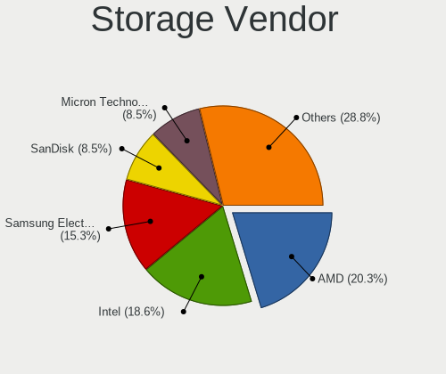
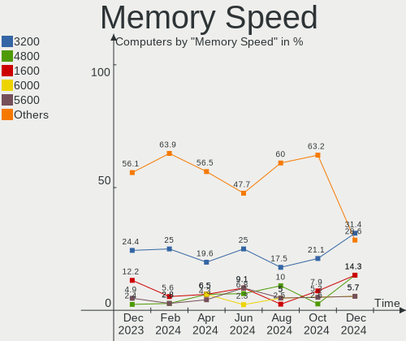

Gentoo - Hardware Trends
------------------------

A project to identify most popular hardware characteristics and track their change
over time based on data collected by Linux users at https://Linux-Hardware.org.

Anyone can contribute to this report by the [hw-probe](https://github.com/linuxhw/hw-probe) tool:

    sudo -E hw-probe -all -upload

This is a report for all computer types. See also reports for [desktops](/Dist/Gentoo/Desktop/README.md) and [notebooks](/Dist/Gentoo/Notebook/README.md).

This report is for one last month. Overall report since the beginning of time: [TestDays](https://github.com/linuxhw/TestDays)

Period: May, 2023.

Contents
--------

* [ System ](#system)
  - [ OS                       ](#os)
  - [ OS Family                ](#os-family)
  - [ Kernel                   ](#kernel)
  - [ Kernel Family            ](#kernel-family)
  - [ Kernel Major Ver.        ](#kernel-major-ver)
  - [ Arch                     ](#arch)
  - [ DE                       ](#de)
  - [ Display Server           ](#display-server)
  - [ Display Manager          ](#display-manager)
  - [ OS Lang                  ](#os-lang)
  - [ Boot Mode                ](#boot-mode)
  - [ Filesystem               ](#filesystem)
  - [ Part. scheme             ](#part-scheme)
  - [ Dual Boot with Linux/BSD ](#dual-boot-with-linuxbsd)
  - [ Dual Boot (Win)          ](#dual-boot-win)

* [ Board ](#board)
  - [ Vendor                   ](#vendor)
  - [ Model                    ](#model)
  - [ Model Family             ](#model-family)
  - [ MFG Year                 ](#mfg-year)
  - [ Form Factor              ](#form-factor)
  - [ Secure Boot              ](#secure-boot)
  - [ Coreboot                 ](#coreboot)
  - [ RAM Size                 ](#ram-size)
  - [ RAM Used                 ](#ram-used)
  - [ Total Drives             ](#total-drives)
  - [ Has CD-ROM               ](#has-cd-rom)
  - [ Has Ethernet             ](#has-ethernet)
  - [ Has WiFi                 ](#has-wifi)
  - [ Has Bluetooth            ](#has-bluetooth)

* [ Location ](#location)
  - [ Country                  ](#country)
  - [ City                     ](#city)

* [ Drives ](#drives)
  - [ Drive Vendor             ](#drive-vendor)
  - [ Drive Model              ](#drive-model)
  - [ HDD Vendor               ](#hdd-vendor)
  - [ SSD Vendor               ](#ssd-vendor)
  - [ Drive Kind               ](#drive-kind)
  - [ Drive Connector          ](#drive-connector)
  - [ Drive Size               ](#drive-size)
  - [ Space Total              ](#space-total)
  - [ Space Used               ](#space-used)
  - [ Malfunc. Drives          ](#malfunc-drives)
  - [ Malfunc. Drive Vendor    ](#malfunc-drive-vendor)
  - [ Malfunc. HDD Vendor      ](#malfunc-hdd-vendor)
  - [ Malfunc. Drive Kind      ](#malfunc-drive-kind)
  - [ Failed Drives            ](#failed-drives)
  - [ Failed Drive Vendor      ](#failed-drive-vendor)
  - [ Drive Status             ](#drive-status)

* [ Storage controller ](#storage-controller)
  - [ Storage Vendor           ](#storage-vendor)
  - [ Storage Model            ](#storage-model)
  - [ Storage Kind             ](#storage-kind)

* [ Processor ](#processor)
  - [ CPU Vendor               ](#cpu-vendor)
  - [ CPU Model                ](#cpu-model)
  - [ CPU Model Family         ](#cpu-model-family)
  - [ CPU Cores                ](#cpu-cores)
  - [ CPU Sockets              ](#cpu-sockets)
  - [ CPU Threads              ](#cpu-threads)
  - [ CPU Op-Modes             ](#cpu-op-modes)
  - [ CPU Microcode            ](#cpu-microcode)
  - [ CPU Microarch            ](#cpu-microarch)

* [ Graphics ](#graphics)
  - [ GPU Vendor               ](#gpu-vendor)
  - [ GPU Model                ](#gpu-model)
  - [ GPU Combo                ](#gpu-combo)
  - [ GPU Driver               ](#gpu-driver)
  - [ GPU Memory               ](#gpu-memory)

* [ Monitor ](#monitor)
  - [ Monitor Vendor           ](#monitor-vendor)
  - [ Monitor Model            ](#monitor-model)
  - [ Monitor Resolution       ](#monitor-resolution)
  - [ Monitor Diagonal         ](#monitor-diagonal)
  - [ Monitor Width            ](#monitor-width)
  - [ Aspect Ratio             ](#aspect-ratio)
  - [ Monitor Area             ](#monitor-area)
  - [ Pixel Density            ](#pixel-density)
  - [ Multiple Monitors        ](#multiple-monitors)

* [ Network ](#network)
  - [ Net Controller Vendor    ](#net-controller-vendor)
  - [ Net Controller Model     ](#net-controller-model)
  - [ Wireless Vendor          ](#wireless-vendor)
  - [ Wireless Model           ](#wireless-model)
  - [ Ethernet Vendor          ](#ethernet-vendor)
  - [ Ethernet Model           ](#ethernet-model)
  - [ Net Controller Kind      ](#net-controller-kind)
  - [ Used Controller          ](#used-controller)
  - [ NICs                     ](#nics)
  - [ IPv6                     ](#ipv6)

* [ Bluetooth ](#bluetooth)
  - [ Bluetooth Vendor         ](#bluetooth-vendor)
  - [ Bluetooth Model          ](#bluetooth-model)

* [ Sound ](#sound)
  - [ Sound Vendor             ](#sound-vendor)
  - [ Sound Model              ](#sound-model)

* [ Memory ](#memory)
  - [ Memory Vendor            ](#memory-vendor)
  - [ Memory Model             ](#memory-model)
  - [ Memory Kind              ](#memory-kind)
  - [ Memory Form Factor       ](#memory-form-factor)
  - [ Memory Size              ](#memory-size)
  - [ Memory Speed             ](#memory-speed)

* [ Printers & scanners ](#printers--scanners)
  - [ Printer Vendor           ](#printer-vendor)
  - [ Printer Model            ](#printer-model)
  - [ Scanner Vendor           ](#scanner-vendor)
  - [ Scanner Model            ](#scanner-model)

* [ Camera ](#camera)
  - [ Camera Vendor            ](#camera-vendor)
  - [ Camera Model             ](#camera-model)

* [ Security ](#security)
  - [ Fingerprint Vendor       ](#fingerprint-vendor)
  - [ Fingerprint Model        ](#fingerprint-model)
  - [ Chipcard Vendor          ](#chipcard-vendor)
  - [ Chipcard Model           ](#chipcard-model)

* [ Unsupported ](#unsupported)
  - [ Unsupported Devices      ](#unsupported-devices)
  - [ Unsupported Device Types ](#unsupported-device-types)

System
------

OS
--

Installed operating systems

| Name        | Computers | Percent |
|-------------|-----------|---------|
| Gentoo 2.13 | 60        | 98.36%  |
| Gentoo 23   | 1         | 1.64%   |

OS Family
---------

OS without a version

| Name   | Computers | Percent |
|--------|-----------|---------|
| Gentoo | 61        | 100%    |

Kernel
------

Version of the Linux kernel

| Version                        | Computers | Percent |
|--------------------------------|-----------|---------|
| 6.1.19-gentoo                  | 6         | 9.84%   |
| 6.3.4-gentoo                   | 4         | 6.56%   |
| 6.1.19-gentoo-x86_64           | 4         | 6.56%   |
| 6.3.1-gentoo                   | 3         | 4.92%   |
| 6.1.28-gentoo                  | 3         | 4.92%   |
| 6.1.27-gentoo-r1-x86_64        | 3         | 4.92%   |
| 6.3.3-gentoo                   | 2         | 3.28%   |
| 6.3.0-gentoo                   | 2         | 3.28%   |
| 6.1.27-gentoo-dist             | 2         | 3.28%   |
| 6.1.24-gentoo-dist             | 2         | 3.28%   |
| 6.4.0-rc2-x86_64               | 1         | 1.64%   |
| 6.3.4-gentoo-c17               | 1         | 1.64%   |
| 6.3.2-gentoo-x86_64            | 1         | 1.64%   |
| 6.3.2-gentoo-dist              | 1         | 1.64%   |
| 6.3.2-gentoo                   | 1         | 1.64%   |
| 6.3.1-zen1                     | 1         | 1.64%   |
| 6.3.1-x86_64                   | 1         | 1.64%   |
| 6.3.1-gentoo_ap                | 1         | 1.64%   |
| 6.3.1-gentoo-x86_64            | 1         | 1.64%   |
| 6.3.1-gentoo-polaris           | 1         | 1.64%   |
| 6.3.0                          | 1         | 1.64%   |
| 6.2.14-gentoo-dist             | 1         | 1.64%   |
| 6.2.14-calculate               | 1         | 1.64%   |
| 6.2.13-gentoo-dist             | 1         | 1.64%   |
| 6.2.12-gentoo-x86_64           | 1         | 1.64%   |
| 6.2.12-gentoo                  | 1         | 1.64%   |
| 6.1.30-gentoo-120-yes_ibt      | 1         | 1.64%   |
| 6.1.29-longterm                | 1         | 1.64%   |
| 6.1.29-gentoo-hardened1        | 1         | 1.64%   |
| 6.1.28-gentoo.ae               | 1         | 1.64%   |
| 6.1.27-gentoo-r1-nvidia        | 1         | 1.64%   |
| 6.1.27-gentoo-r1               | 1         | 1.64%   |
| 6.1.27-1-lts                   | 1         | 1.64%   |
| 6.1.22-gentoo-dist             | 1         | 1.64%   |
| 6.1.19-gentoo-dist             | 1         | 1.64%   |
| 6.1.19-gentoo-42-docker-vmware | 1         | 1.64%   |
| 5.17.1                         | 1         | 1.64%   |
| 5.15.88-gentoo-x86_64          | 1         | 1.64%   |
| 5.15.72-gentoo                 | 1         | 1.64%   |
| 5.15.32-gentoo-r1-x86_64       | 1         | 1.64%   |

Kernel Family
-------------

Linux kernel without a distro release

| Version | Computers | Percent |
|---------|-----------|---------|
| 6.1.19  | 12        | 19.67%  |
| 6.3.1   | 8         | 13.11%  |
| 6.1.27  | 8         | 13.11%  |
| 6.3.4   | 5         | 8.2%    |
| 6.1.28  | 4         | 6.56%   |
| 6.3.2   | 3         | 4.92%   |
| 6.3.0   | 3         | 4.92%   |
| 6.3.3   | 2         | 3.28%   |
| 6.2.14  | 2         | 3.28%   |
| 6.2.12  | 2         | 3.28%   |
| 6.1.29  | 2         | 3.28%   |
| 6.1.24  | 2         | 3.28%   |
| 6.4.0   | 1         | 1.64%   |
| 6.2.13  | 1         | 1.64%   |
| 6.1.30  | 1         | 1.64%   |
| 6.1.22  | 1         | 1.64%   |
| 5.17.1  | 1         | 1.64%   |
| 5.15.88 | 1         | 1.64%   |
| 5.15.72 | 1         | 1.64%   |
| 5.15.32 | 1         | 1.64%   |

Kernel Major Ver.
-----------------

Linux kernel major version

| Version | Computers | Percent |
|---------|-----------|---------|
| 6.1     | 30        | 49.18%  |
| 6.3     | 21        | 34.43%  |
| 6.2     | 5         | 8.2%    |
| 5.15    | 3         | 4.92%   |
| 6.4     | 1         | 1.64%   |
| 5.17    | 1         | 1.64%   |

Arch
----

OS architecture (x86_64, i586, etc.)

| Name   | Computers | Percent |
|--------|-----------|---------|
| x86_64 | 60        | 98.36%  |
| i686   | 1         | 1.64%   |

DE
--

Desktop Environment

| Name      | Computers | Percent |
|-----------|-----------|---------|
| Unknown   | 20        | 32.79%  |
| KDE5      | 15        | 24.59%  |
| XFCE      | 10        | 16.39%  |
| gnome     | 6         | 9.84%   |
| i3        | 2         | 3.28%   |
| Xsession  | 1         | 1.64%   |
| X-Generic | 1         | 1.64%   |
| Trinity   | 1         | 1.64%   |
| MATE      | 1         | 1.64%   |
| LXQt      | 1         | 1.64%   |
| ICEWM     | 1         | 1.64%   |
| Hyprland  | 1         | 1.64%   |
| awesome   | 1         | 1.64%   |

Display Server
--------------

X11 or Wayland

| Name    | Computers | Percent |
|---------|-----------|---------|
| X11     | 34        | 55.74%  |
| Wayland | 11        | 18.03%  |
| Tty     | 10        | 16.39%  |
| Unknown | 6         | 9.84%   |

Display Manager
---------------

SDDM, LightDM, etc.

| Name    | Computers | Percent |
|---------|-----------|---------|
| Unknown | 23        | 37.7%   |
| LightDM | 14        | 22.95%  |
| SDDM    | 13        | 21.31%  |
| GDM     | 5         | 8.2%    |
| LXDM    | 3         | 4.92%   |
| XDM     | 1         | 1.64%   |
| TDM     | 1         | 1.64%   |
| SLiM    | 1         | 1.64%   |

OS Lang
-------

Language

| Lang       | Computers | Percent |
|------------|-----------|---------|
| en_US      | 22        | 36.07%  |
| C.UTF8     | 7         | 11.48%  |
| C          | 5         | 8.2%    |
| Unknown    | 5         | 8.2%    |
| ru_RU      | 4         | 6.56%   |
| en_GB      | 4         | 6.56%   |
| de_DE      | 4         | 6.56%   |
| uk_UA      | 1         | 1.64%   |
| ru_RU.UTF8 | 1         | 1.64%   |
| pl_PL      | 1         | 1.64%   |
| fr_CA      | 1         | 1.64%   |
| fi_FI      | 1         | 1.64%   |
| es_MX      | 1         | 1.64%   |
| es_ES      | 1         | 1.64%   |
| en_IE      | 1         | 1.64%   |
| el_GR      | 1         | 1.64%   |
| cs_CZ      | 1         | 1.64%   |

Boot Mode
---------

EFI or BIOS

| Mode | Computers | Percent |
|------|-----------|---------|
| EFI  | 48        | 78.69%  |
| BIOS | 13        | 21.31%  |

Filesystem
----------

Type of filesystem

| Type     | Computers | Percent |
|----------|-----------|---------|
| Ext4     | 34        | 55.74%  |
| Btrfs    | 14        | 22.95%  |
| F2fs     | 5         | 8.2%    |
| Zfs      | 2         | 3.28%   |
| Xfs      | 2         | 3.28%   |
| Reiserfs | 2         | 3.28%   |
| XXXXXXX  | 1         | 1.64%   |
| Jfs      | 1         | 1.64%   |

Part. scheme
------------

Scheme of partitioning

| Type    | Computers | Percent |
|---------|-----------|---------|
| GPT     | 52        | 85.25%  |
| MBR     | 7         | 11.48%  |
| Unknown | 2         | 3.28%   |

Dual Boot with Linux/BSD
------------------------

Hosting more than one Linux/BSD

| Dual boot | Computers | Percent |
|-----------|-----------|---------|
| No        | 40        | 65.57%  |
| Yes       | 21        | 34.43%  |

Dual Boot (Win)
---------------

Hosting Linux and Windows

| Dual boot | Computers | Percent |
|-----------|-----------|---------|
| No        | 38        | 62.3%   |
| Yes       | 23        | 37.7%   |

Board
-----

Vendor
------

Motherboard manufacturer

| Name                | Computers | Percent |
|---------------------|-----------|---------|
| ASUSTek Computer    | 16        | 26.23%  |
| MSI                 | 8         | 13.11%  |
| Gigabyte Technology | 7         | 11.48%  |
| Lenovo              | 6         | 9.84%   |
| ASRock              | 5         | 8.2%    |
| Hewlett-Packard     | 4         | 6.56%   |
| Supermicro          | 2         | 3.28%   |
| HUAWEI              | 2         | 3.28%   |
| Foxconn             | 2         | 3.28%   |
| Acer                | 2         | 3.28%   |
| Unknown             | 2         | 3.28%   |
| TYAN Computer       | 1         | 1.64%   |
| Pegatron            | 1         | 1.64%   |
| Intel               | 1         | 1.64%   |
| Fujitsu             | 1         | 1.64%   |
| Fanless Mini PC     | 1         | 1.64%   |

Model
-----

Motherboard model

| Name                                      | Computers | Percent |
|-------------------------------------------|-----------|---------|
| ASUS TUF Gaming X570-PLUS                 | 2         | 3.28%   |
| ASUS ROG Zephyrus G14 GA401II_GA401II     | 2         | 3.28%   |
| ASUS ROG Strix G513QY_G513QY              | 2         | 3.28%   |
| ASUS M3A78-CM                             | 2         | 3.28%   |
| ASUS All Series                           | 2         | 3.28%   |
| Unknown                                   | 2         | 3.28%   |
| TYAN VT82C694T                            | 1         | 1.64%   |
| Supermicro X10SL7-F                       | 1         | 1.64%   |
| Supermicro Super Server                   | 1         | 1.64%   |
| Pegatron 810-170st                        | 1         | 1.64%   |
| MSI MS-7D67                               | 1         | 1.64%   |
| MSI MS-7D09                               | 1         | 1.64%   |
| MSI MS-7C91                               | 1         | 1.64%   |
| MSI MS-7C35                               | 1         | 1.64%   |
| MSI MS-7B85                               | 1         | 1.64%   |
| MSI MS-7B18                               | 1         | 1.64%   |
| MSI MS-7817                               | 1         | 1.64%   |
| MSI GE76 Raider 11UH                      | 1         | 1.64%   |
| Lenovo ThinkStation P520c 30BX001KUS      | 1         | 1.64%   |
| Lenovo ThinkPad X13 Gen 3 21CM0024US      | 1         | 1.64%   |
| Lenovo ThinkPad X1 Extreme 2nd 20QVCTO1WW | 1         | 1.64%   |
| Lenovo ThinkPad T14 Gen 2i 20W1SCBN00     | 1         | 1.64%   |
| Lenovo ThinkPad E15 Gen 2 20T9S00K00      | 1         | 1.64%   |
| Lenovo IdeaPadFlex 5 16ALC7 82RA          | 1         | 1.64%   |
| Intel NUC13ANKi5                          | 1         | 1.64%   |
| HUAWEI NBLK-WAX9X                         | 1         | 1.64%   |
| HUAWEI CREM-WXX9                          | 1         | 1.64%   |
| HP Z420 Workstation                       | 1         | 1.64%   |
| HP Pavilion Notebook                      | 1         | 1.64%   |
| HP EliteBook 8570w                        | 1         | 1.64%   |
| HP EliteBook 840 G3                       | 1         | 1.64%   |
| Gigabyte Z690 AORUS MASTER                | 1         | 1.64%   |
| Gigabyte Z390 GAMING X                    | 1         | 1.64%   |
| Gigabyte X670E AORUS MASTER               | 1         | 1.64%   |
| Gigabyte X570S AORUS ELITE AX             | 1         | 1.64%   |
| Gigabyte X570 AORUS ELITE                 | 1         | 1.64%   |
| Gigabyte AB350-Gaming                     | 1         | 1.64%   |
| Gigabyte 970A-DS3P FX                     | 1         | 1.64%   |
| Fujitsu CELSIUS H760                      | 1         | 1.64%   |
| Foxconn TPS01                             | 1         | 1.64%   |

Model Family
------------

Motherboard model prefix

| Name                  | Computers | Percent |
|-----------------------|-----------|---------|
| ASUS ROG              | 7         | 11.48%  |
| Lenovo ThinkPad       | 4         | 6.56%   |
| HP EliteBook          | 2         | 3.28%   |
| ASUS TUF              | 2         | 3.28%   |
| ASUS M3A78-CM         | 2         | 3.28%   |
| ASUS All              | 2         | 3.28%   |
| ASRock X670E          | 2         | 3.28%   |
| Unknown               | 2         | 3.28%   |
| TYAN VT82C694T        | 1         | 1.64%   |
| Supermicro X10SL7-F   | 1         | 1.64%   |
| Supermicro Super      | 1         | 1.64%   |
| Pegatron 810-170st    | 1         | 1.64%   |
| MSI MS-7D67           | 1         | 1.64%   |
| MSI MS-7D09           | 1         | 1.64%   |
| MSI MS-7C91           | 1         | 1.64%   |
| MSI MS-7C35           | 1         | 1.64%   |
| MSI MS-7B85           | 1         | 1.64%   |
| MSI MS-7B18           | 1         | 1.64%   |
| MSI MS-7817           | 1         | 1.64%   |
| MSI GE76              | 1         | 1.64%   |
| Lenovo ThinkStation   | 1         | 1.64%   |
| Lenovo IdeaPadFlex    | 1         | 1.64%   |
| Intel NUC13ANKi5      | 1         | 1.64%   |
| HUAWEI NBLK-WAX9X     | 1         | 1.64%   |
| HUAWEI CREM-WXX9      | 1         | 1.64%   |
| HP Z420               | 1         | 1.64%   |
| HP Pavilion           | 1         | 1.64%   |
| Gigabyte Z690         | 1         | 1.64%   |
| Gigabyte Z390         | 1         | 1.64%   |
| Gigabyte X670E        | 1         | 1.64%   |
| Gigabyte X570S        | 1         | 1.64%   |
| Gigabyte X570         | 1         | 1.64%   |
| Gigabyte AB350-Gaming | 1         | 1.64%   |
| Gigabyte 970A-DS3P    | 1         | 1.64%   |
| Fujitsu CELSIUS       | 1         | 1.64%   |
| Foxconn TPS01         | 1         | 1.64%   |
| Foxconn nT-330i       | 1         | 1.64%   |
| Fanless Mini PC PCG02 | 1         | 1.64%   |
| ASUS PRIME            | 1         | 1.64%   |
| ASUS P6X58D           | 1         | 1.64%   |

MFG Year
--------

Motherboard manufacture year

| Year | Computers | Percent |
|------|-----------|---------|
| 2021 | 12        | 19.67%  |
| 2019 | 11        | 18.03%  |
| 2022 | 6         | 9.84%   |
| 2018 | 6         | 9.84%   |
| 2023 | 3         | 4.92%   |
| 2020 | 3         | 4.92%   |
| 2016 | 3         | 4.92%   |
| 2013 | 3         | 4.92%   |
| 2009 | 3         | 4.92%   |
| 2017 | 2         | 3.28%   |
| 2014 | 2         | 3.28%   |
| 2012 | 2         | 3.28%   |
| 2010 | 2         | 3.28%   |
| 2008 | 2         | 3.28%   |
| 2002 | 1         | 1.64%   |

Form Factor
-----------

Physical design of the computer

| Name        | Computers | Percent |
|-------------|-----------|---------|
| Desktop     | 38        | 62.3%   |
| Notebook    | 18        | 29.51%  |
| Server      | 2         | 3.28%   |
| Stick pc    | 1         | 1.64%   |
| Convertible | 1         | 1.64%   |
| Mini pc     | 1         | 1.64%   |

Secure Boot
-----------

Enabled or disabled

| State    | Computers | Percent |
|----------|-----------|---------|
| Disabled | 61        | 100%    |

Coreboot
--------

Have coreboot on board

| Used | Computers | Percent |
|------|-----------|---------|
| No   | 61        | 100%    |

RAM Size
--------

Total RAM memory

| Size in GB  | Computers | Percent |
|-------------|-----------|---------|
| 32.01-64.0  | 18        | 29.51%  |
| 64.01-256.0 | 10        | 16.39%  |
| 16.01-24.0  | 10        | 16.39%  |
| 8.01-16.0   | 8         | 13.11%  |
| 4.01-8.0    | 7         | 11.48%  |
| 24.01-32.0  | 4         | 6.56%   |
| 1.01-2.0    | 2         | 3.28%   |
| 3.01-4.0    | 1         | 1.64%   |
| 2.01-3.0    | 1         | 1.64%   |

RAM Used
--------

Used RAM memory

| Used GB    | Computers | Percent |
|------------|-----------|---------|
| 4.01-8.0   | 12        | 19.67%  |
| 8.01-16.0  | 10        | 16.39%  |
| 1.01-2.0   | 9         | 14.75%  |
| 2.01-3.0   | 8         | 13.11%  |
| 3.01-4.0   | 7         | 11.48%  |
| 0.01-0.5   | 6         | 9.84%   |
| 0.51-1.0   | 5         | 8.2%    |
| 32.01-64.0 | 2         | 3.28%   |
| 24.01-32.0 | 1         | 1.64%   |
| 16.01-24.0 | 1         | 1.64%   |

Total Drives
------------

Number of drives on board

| Drives | Computers | Percent |
|--------|-----------|---------|
| 2      | 20        | 32.79%  |
| 1      | 20        | 32.79%  |
| 3      | 7         | 11.48%  |
| 5      | 5         | 8.2%    |
| 4      | 3         | 4.92%   |
| 10     | 2         | 3.28%   |
| 7      | 2         | 3.28%   |
| 6      | 1         | 1.64%   |
| 0      | 1         | 1.64%   |

Has CD-ROM
----------

Has CD-ROM on board

| Presented | Computers | Percent |
|-----------|-----------|---------|
| No        | 47        | 77.05%  |
| Yes       | 14        | 22.95%  |

Has Ethernet
------------

Has Ethernet on board

| Presented | Computers | Percent |
|-----------|-----------|---------|
| Yes       | 56        | 91.8%   |
| No        | 5         | 8.2%    |

Has WiFi
--------

Has WiFi module

| Presented | Computers | Percent |
|-----------|-----------|---------|
| Yes       | 45        | 73.77%  |
| No        | 16        | 26.23%  |

Has Bluetooth
-------------

Has Bluetooth module

| Presented | Computers | Percent |
|-----------|-----------|---------|
| Yes       | 38        | 62.3%   |
| No        | 23        | 37.7%   |

Location
--------

Country
-------

Geographic location (country)

| Country     | Computers | Percent |
|-------------|-----------|---------|
| USA         | 16        | 26.23%  |
| Russia      | 9         | 14.75%  |
| Germany     | 9         | 14.75%  |
| Poland      | 5         | 8.2%    |
| UK          | 3         | 4.92%   |
| Spain       | 3         | 4.92%   |
| Canada      | 3         | 4.92%   |
| Sweden      | 2         | 3.28%   |
| Ukraine     | 1         | 1.64%   |
| Switzerland | 1         | 1.64%   |
| Netherlands | 1         | 1.64%   |
| Mexico      | 1         | 1.64%   |
| Ireland     | 1         | 1.64%   |
| Hungary     | 1         | 1.64%   |
| Greece      | 1         | 1.64%   |
| Finland     | 1         | 1.64%   |
| Czechia     | 1         | 1.64%   |
| Brazil      | 1         | 1.64%   |
| Belarus     | 1         | 1.64%   |

City
----

Geographic location (city)

| City          | Computers | Percent |
|---------------|-----------|---------|
| Berlin        | 4         | 6.56%   |
| Warsaw        | 3         | 4.92%   |
| Sterling      | 3         | 4.92%   |
| Vladivostok   | 2         | 3.28%   |
| Summerville   | 2         | 3.28%   |
| St Petersburg | 2         | 3.28%   |
| Moscow        | 2         | 3.28%   |
| Wlodawa       | 1         | 1.64%   |
| Whitby        | 1         | 1.64%   |
| Taganrog      | 1         | 1.64%   |
| Sun Prairie   | 1         | 1.64%   |
| Stockholm     | 1         | 1.64%   |
| Šlapanice    | 1         | 1.64%   |
| Seattle       | 1         | 1.64%   |
| Ryazan        | 1         | 1.64%   |
| Round Rock    | 1         | 1.64%   |
| Rotterdam     | 1         | 1.64%   |
| Roland        | 1         | 1.64%   |
| Québec       | 1         | 1.64%   |
| Pittsburgh    | 1         | 1.64%   |
| Piraeus       | 1         | 1.64%   |
| Oulu          | 1         | 1.64%   |
| Minsk         | 1         | 1.64%   |
| Malmo         | 1         | 1.64%   |
| Lich          | 1         | 1.64%   |
| Leipzig       | 1         | 1.64%   |
| Leeds         | 1         | 1.64%   |
| Lausanne      | 1         | 1.64%   |
| Kiel          | 1         | 1.64%   |
| Kharkiv       | 1         | 1.64%   |
| Itapevi       | 1         | 1.64%   |
| Irkutsk       | 1         | 1.64%   |
| Ingolstadt    | 1         | 1.64%   |
| Hohentengen   | 1         | 1.64%   |
| Hoffman       | 1         | 1.64%   |
| Girona        | 1         | 1.64%   |
| Gatineau      | 1         | 1.64%   |
| Flint         | 1         | 1.64%   |
| Dublin        | 1         | 1.64%   |
| Cuernavaca    | 1         | 1.64%   |

Drives
------

Drive Vendor
------------

Hard drive vendors

| Vendor                      | Computers | Drives | Percent |
|-----------------------------|-----------|--------|---------|
| Samsung Electronics         | 25        | 41     | 21.55%  |
| Seagate                     | 15        | 18     | 12.93%  |
| WDC                         | 12        | 23     | 10.34%  |
| SanDisk                     | 8         | 9      | 6.9%    |
| Crucial                     | 8         | 9      | 6.9%    |
| Toshiba                     | 6         | 8      | 5.17%   |
| China                       | 5         | 7      | 4.31%   |
| Kingston                    | 4         | 4      | 3.45%   |
| Intel                       | 4         | 4      | 3.45%   |
| Hitachi                     | 4         | 7      | 3.45%   |
| GOODRAM                     | 4         | 4      | 3.45%   |
| SK hynix                    | 3         | 3      | 2.59%   |
| Unknown                     | 2         | 2      | 1.72%   |
| Micron/Crucial Technology   | 2         | 2      | 1.72%   |
| Micron Technology           | 2         | 2      | 1.72%   |
| ADROITLARK                  | 2         | 2      | 1.72%   |
| Transcend                   | 1         | 1      | 0.86%   |
| Realtek Semiconductor       | 1         | 1      | 0.86%   |
| PNY                         | 1         | 1      | 0.86%   |
| Phison Electronics          | 1         | 2      | 0.86%   |
| Phison                      | 1         | 1      | 0.86%   |
| OCZ                         | 1         | 1      | 0.86%   |
| LITEONIT                    | 1         | 1      | 0.86%   |
| Kingston Technology Company | 1         | 1      | 0.86%   |
| HGST                        | 1         | 2      | 0.86%   |
| ADATA Technology            | 1         | 2      | 0.86%   |

Drive Model
-----------

Hard drive models

| Model                                               | Computers | Percent |
|-----------------------------------------------------|-----------|---------|
| Samsung NVMe SSD Controller PM9A1/PM9A3/980PRO 1TB  | 10        | 7.35%   |
| Seagate ST4000DM004-2CV104 4TB                      | 5         | 3.68%   |
| Samsung NVMe SSD Controller SM981/PM981/PM983 256GB | 5         | 3.68%   |
| Samsung SSD 860 EVO 1TB                             | 3         | 2.21%   |
| WDC WD20EARX-00PASB0 2TB                            | 2         | 1.47%   |
| WDC WD2003FZEX-00SRLA0 2TB                          | 2         | 1.47%   |
| Unknown MMC Card  128GB                             | 2         | 1.47%   |
| Seagate ST1000DM010-2EP102 1TB                      | 2         | 1.47%   |
| Sandisk WD Blue SN550 NVMe SSD 512GB                | 2         | 1.47%   |
| Sandisk WD Black SN750 / PC SN730 NVMe SSD 256GB    | 2         | 1.47%   |
| Samsung SSD 980 1TB                                 | 2         | 1.47%   |
| Samsung SSD 870 EVO 1TB                             | 2         | 1.47%   |
| Samsung NVMe SSD Controller SM961/PM961/SM963 256GB | 2         | 1.47%   |
| GOODRAM SSDPR-CL100-480-G2 480GB                    | 2         | 1.47%   |
| Crucial CT1000MX500SSD1 1TB                         | 2         | 1.47%   |
| China SATA SSD 960GB                                | 2         | 1.47%   |
| ADROITLARK SSD 120GB                                | 2         | 1.47%   |
| WDC WDS500G2B0A-00SM50 500GB SSD                    | 1         | 0.74%   |
| WDC WDS240G2G0A-00JH30 240GB SSD                    | 1         | 0.74%   |
| WDC WD7500BPVT-24HXZT1 752GB                        | 1         | 0.74%   |
| WDC WD5000AAKX-08U6AA0 500GB                        | 1         | 0.74%   |
| WDC WD40EZRZ-00GXCB0 4TB                            | 1         | 0.74%   |
| WDC WD40EZRX-22SPEB0 4TB                            | 1         | 0.74%   |
| WDC WD2500BEVS-22UST0 250GB                         | 1         | 0.74%   |
| WDC WD20NPVX-00EA4T0 2TB                            | 1         | 0.74%   |
| WDC WD20EZRZ-00Z5HB0 2TB                            | 1         | 0.74%   |
| WDC WD10EZEX-00BN5A0 1TB                            | 1         | 0.74%   |
| WDC WD1001FALS-00J7B1 1TB                           | 1         | 0.74%   |
| Transcend TS64GSSD340 64GB                          | 1         | 0.74%   |
| Toshiba MG08ADA800E 8TB                             | 1         | 0.74%   |
| Toshiba MG04ACA200E 2TB                             | 1         | 0.74%   |
| Toshiba HDWE150 5TB                                 | 1         | 0.74%   |
| Toshiba HDWD110 1TB                                 | 1         | 0.74%   |
| Toshiba DT01ACA200 2TB                              | 1         | 0.74%   |
| Toshiba DT01ACA100 1TB                              | 1         | 0.74%   |
| SK hynix SHGP31-1000GM 1TB                          | 1         | 0.74%   |
| SK hynix HFM001TD3JX013N 1TB                        | 1         | 0.74%   |
| SK hynix BC501 NVMe Solid State Drive 512GB         | 1         | 0.74%   |
| Seagate ST500LX025-1U717D 500GB                     | 1         | 0.74%   |
| Seagate ST500DM002-1BC142 500GB                     | 1         | 0.74%   |

HDD Vendor
----------

Hard disk drive vendors

| Vendor  | Computers | Drives | Percent |
|---------|-----------|--------|---------|
| Seagate | 15        | 17     | 41.67%  |
| WDC     | 10        | 21     | 27.78%  |
| Toshiba | 6         | 8      | 16.67%  |
| Hitachi | 4         | 7      | 11.11%  |
| HGST    | 1         | 2      | 2.78%   |

SSD Vendor
----------

Solid state drive vendors

| Vendor              | Computers | Drives | Percent |
|---------------------|-----------|--------|---------|
| Samsung Electronics | 12        | 16     | 26.67%  |
| Crucial             | 8         | 9      | 17.78%  |
| China               | 5         | 7      | 11.11%  |
| GOODRAM             | 4         | 4      | 8.89%   |
| SanDisk             | 3         | 3      | 6.67%   |
| WDC                 | 2         | 2      | 4.44%   |
| Micron Technology   | 2         | 2      | 4.44%   |
| Kingston            | 2         | 2      | 4.44%   |
| ADROITLARK          | 2         | 2      | 4.44%   |
| Transcend           | 1         | 1      | 2.22%   |
| PNY                 | 1         | 1      | 2.22%   |
| OCZ                 | 1         | 1      | 2.22%   |
| LITEONIT            | 1         | 1      | 2.22%   |
| Intel               | 1         | 1      | 2.22%   |

Drive Kind
----------

HDD or SSD

| Kind    | Computers | Drives | Percent |
|---------|-----------|--------|---------|
| SSD     | 32        | 52     | 34.78%  |
| NVMe    | 30        | 48     | 32.61%  |
| HDD     | 27        | 55     | 29.35%  |
| MMC     | 2         | 2      | 2.17%   |
| Unknown | 1         | 1      | 1.09%   |

Drive Connector
---------------

SATA, SAS, NVMe, etc.

| Type | Computers | Drives | Percent |
|------|-----------|--------|---------|
| SATA | 40        | 107    | 54.79%  |
| NVMe | 30        | 48     | 41.1%   |
| MMC  | 2         | 2      | 2.74%   |
| SAS  | 1         | 1      | 1.37%   |

Drive Size
----------

Size of hard drive

| Size in TB | Computers | Drives | Percent |
|------------|-----------|--------|---------|
| 0.01-0.5   | 27        | 34     | 36.99%  |
| 0.51-1.0   | 21        | 31     | 28.77%  |
| 1.01-2.0   | 11        | 21     | 15.07%  |
| 3.01-4.0   | 9         | 12     | 12.33%  |
| 4.01-10.0  | 3         | 5      | 4.11%   |
| 2.01-3.0   | 1         | 3      | 1.37%   |
| 10.01-20.0 | 1         | 1      | 1.37%   |

Space Total
-----------

Amount of disk space available on the file system

| Size in GB     | Computers | Percent |
|----------------|-----------|---------|
| 251-500        | 13        | 21.31%  |
| 501-1000       | 11        | 18.03%  |
| More than 3000 | 9         | 14.75%  |
| 101-250        | 7         | 11.48%  |
| 1001-2000      | 6         | 9.84%   |
| 2001-3000      | 4         | 6.56%   |
| 51-100         | 4         | 6.56%   |
| Unknown        | 4         | 6.56%   |
| 1-20           | 3         | 4.92%   |

Space Used
----------

Amount of used disk space

| Used GB        | Computers | Percent |
|----------------|-----------|---------|
| 101-250        | 9         | 14.75%  |
| 251-500        | 8         | 13.11%  |
| 501-1000       | 8         | 13.11%  |
| 21-50          | 7         | 11.48%  |
| 1-20           | 7         | 11.48%  |
| 1001-2000      | 6         | 9.84%   |
| 51-100         | 6         | 9.84%   |
| More than 3000 | 5         | 8.2%    |
| Unknown        | 4         | 6.56%   |
| 2001-3000      | 1         | 1.64%   |

Malfunc. Drives
---------------

Drive models with a malfunction

| Model                               | Computers | Drives | Percent |
|-------------------------------------|-----------|--------|---------|
| Toshiba DT01ACA200 2TB              | 1         | 1      | 11.11%  |
| Seagate ST500DM002-1BC142 500GB     | 1         | 1      | 11.11%  |
| Seagate ST380011A 80GB              | 1         | 1      | 11.11%  |
| Seagate ST1000LM024 HN-M101MBB 1TB  | 1         | 1      | 11.11%  |
| Seagate ST1000DM010-2EP102 1TB      | 1         | 1      | 11.11%  |
| PNY SSD2SC120G1LC763C121S459P 120GB | 1         | 1      | 11.11%  |
| Intel SSDSC2BF180A5L 180GB          | 1         | 1      | 11.11%  |
| Hitachi HTS721080G9SA00 80GB        | 1         | 1      | 11.11%  |
| China SATA SSD 960GB                | 1         | 1      | 11.11%  |

Malfunc. Drive Vendor
---------------------

Vendors of faulty drives

| Vendor  | Computers | Drives | Percent |
|---------|-----------|--------|---------|
| Seagate | 4         | 4      | 44.44%  |
| Toshiba | 1         | 1      | 11.11%  |
| PNY     | 1         | 1      | 11.11%  |
| Intel   | 1         | 1      | 11.11%  |
| Hitachi | 1         | 1      | 11.11%  |
| China   | 1         | 1      | 11.11%  |

Malfunc. HDD Vendor
-------------------

Vendors of faulty HDD drives

| Vendor  | Computers | Drives | Percent |
|---------|-----------|--------|---------|
| Seagate | 4         | 4      | 66.67%  |
| Toshiba | 1         | 1      | 16.67%  |
| Hitachi | 1         | 1      | 16.67%  |

Malfunc. Drive Kind
-------------------

Kinds of faulty drives

| Kind | Computers | Drives | Percent |
|------|-----------|--------|---------|
| HDD  | 6         | 6      | 66.67%  |
| SSD  | 3         | 3      | 33.33%  |

Failed Drives
-------------

Failed drive models

| Model                           | Computers | Drives | Percent |
|---------------------------------|-----------|--------|---------|
| Samsung Electronics SSD 980 1TB | 1         | 1      | 100%    |

Failed Drive Vendor
-------------------

Failed drive vendors

| Vendor              | Computers | Drives | Percent |
|---------------------|-----------|--------|---------|
| Samsung Electronics | 1         | 1      | 100%    |

Drive Status
------------

Number of failed and malfunc. drives

| Status   | Computers | Drives | Percent |
|----------|-----------|--------|---------|
| Works    | 53        | 137    | 75.71%  |
| Malfunc  | 9         | 9      | 12.86%  |
| Detected | 7         | 11     | 10%     |
| Failed   | 1         | 1      | 1.43%   |

Storage controller
------------------

Storage Vendor
--------------

Storage controller vendors

| Vendor                      | Computers | Percent |
|-----------------------------|-----------|---------|
| Intel                       | 26        | 26.26%  |
| AMD                         | 26        | 26.26%  |
| Samsung Electronics         | 17        | 17.17%  |
| SanDisk                     | 6         | 6.06%   |
| ASMedia Technology          | 5         | 5.05%   |
| SK hynix                    | 3         | 3.03%   |
| Kingston Technology Company | 3         | 3.03%   |
| Phison Electronics          | 2         | 2.02%   |
| Nvidia                      | 2         | 2.02%   |
| Micron/Crucial Technology   | 2         | 2.02%   |
| Broadcom / LSI              | 2         | 2.02%   |
| VIA Technologies            | 1         | 1.01%   |
| Realtek Semiconductor       | 1         | 1.01%   |
| Marvell Technology Group    | 1         | 1.01%   |
| JMicron Technology          | 1         | 1.01%   |
| ADATA Technology            | 1         | 1.01%   |

Storage Model
-------------

Storage controller models

| Model                                                                          | Computers | Percent |
|--------------------------------------------------------------------------------|-----------|---------|
| AMD FCH SATA Controller [AHCI mode]                                            | 19        | 17.12%  |
| Samsung NVMe SSD Controller PM9A1/PM9A3/980PRO                                 | 10        | 9.01%   |
| Samsung NVMe SSD Controller SM981/PM981/PM983                                  | 5         | 4.5%    |
| ASMedia ASM1062 Serial ATA Controller                                          | 5         | 4.5%    |
| Intel 8 Series/C220 Series Chipset Family 6-port SATA Controller 1 [AHCI mode] | 4         | 3.6%    |
| Samsung NVMe SSD Controller 980                                                | 3         | 2.7%    |
| AMD 500 Series Chipset SATA Controller                                         | 3         | 2.7%    |
| SK hynix Gold P31/PC711 NVMe Solid State Drive                                 | 2         | 1.8%    |
| SanDisk WD Blue SN550 NVMe SSD                                                 | 2         | 1.8%    |
| SanDisk WD Black SN750 / PC SN730 NVMe SSD                                     | 2         | 1.8%    |
| Samsung NVMe SSD Controller SM961/PM961/SM963                                  | 2         | 1.8%    |
| Phison E18 PCIe4 NVMe Controller                                               | 2         | 1.8%    |
| Nvidia MCP79 SATA Controller                                                   | 2         | 1.8%    |
| Kingston Company Company Non-Volatile memory controller                        | 2         | 1.8%    |
| Intel Non-Volatile memory controller                                           | 2         | 1.8%    |
| Intel Cannon Lake PCH SATA AHCI Controller                                     | 2         | 1.8%    |
| Intel C600/X79 series chipset 6-Port SATA AHCI Controller                      | 2         | 1.8%    |
| Intel Alder Lake-S PCH SATA Controller [AHCI Mode]                             | 2         | 1.8%    |
| Intel 7 Series Chipset Family 6-port SATA Controller [AHCI mode]               | 2         | 1.8%    |
| Intel 500 Series Chipset Family SATA AHCI Controller                           | 2         | 1.8%    |
| AMD SB7x0/SB8x0/SB9x0 SATA Controller [IDE mode]                               | 2         | 1.8%    |
| AMD SB7x0/SB8x0/SB9x0 SATA Controller [AHCI mode]                              | 2         | 1.8%    |
| AMD SB7x0/SB8x0/SB9x0 IDE Controller                                           | 2         | 1.8%    |
| VIA VT82C586A/B/VT82C686/A/B/VT823x/A/C PIPC Bus Master IDE                    | 1         | 0.9%    |
| SK hynix BC501 NVMe Solid State Drive                                          | 1         | 0.9%    |
| SanDisk WD PC SN810 / Black SN850 NVMe SSD                                     | 1         | 0.9%    |
| SanDisk WD Blue SN570 NVMe SSD 1TB                                             | 1         | 0.9%    |
| Samsung NVMe SSD Controller SM951/PM951                                        | 1         | 0.9%    |
| Realtek NVMe Controller                                                        | 1         | 0.9%    |
| Micron/Crucial P2 NVMe PCIe SSD                                                | 1         | 0.9%    |
| Micron/Crucial P1 NVMe PCIe SSD                                                | 1         | 0.9%    |
| Marvell Group 88SE914D SATA-600 Controller                                     | 1         | 0.9%    |
| Kingston Company NVMe Controller                                               | 1         | 0.9%    |
| JMicron JMB368 IDE controller                                                  | 1         | 0.9%    |
| JMicron JMB361 AHCI/IDE                                                        | 1         | 0.9%    |
| Intel Wildcat Point-LP SATA Controller [AHCI Mode]                             | 1         | 0.9%    |
| Intel Sunrise Point-LP SATA Controller [AHCI mode]                             | 1         | 0.9%    |
| Intel SSD 660P Series                                                          | 1         | 0.9%    |
| Intel Q170/Q150/B150/H170/H110/Z170/CM236 Chipset SATA Controller [AHCI Mode]  | 1         | 0.9%    |
| Intel NM10/ICH7 Family SATA Controller [AHCI mode]                             | 1         | 0.9%    |

Storage Kind
------------

Kind of storage controller (IDE, SATA, NVMe, SAS, ...)

| Kind | Computers | Percent |
|------|-----------|---------|
| SATA | 48        | 53.93%  |
| NVMe | 30        | 33.71%  |
| IDE  | 8         | 8.99%   |
| SAS  | 3         | 3.37%   |

Processor
---------

CPU Vendor
----------

Processor vendors

| Vendor | Computers | Percent |
|--------|-----------|---------|
| AMD    | 32        | 52.46%  |
| Intel  | 29        | 47.54%  |

CPU Model
---------

Processor models

| Model                                         | Computers | Percent |
|-----------------------------------------------|-----------|---------|
| AMD Ryzen 5 5600X 6-Core Processor            | 4         | 6.56%   |
| AMD Ryzen 9 7900X 12-Core Processor           | 3         | 4.92%   |
| AMD Ryzen 9 5900X 12-Core Processor           | 3         | 4.92%   |
| Intel Atom CPU 330 @ 1.60GHz                  | 2         | 3.28%   |
| AMD Ryzen 9 5950X 16-Core Processor           | 2         | 3.28%   |
| AMD Ryzen 9 5900HX with Radeon Graphics       | 2         | 3.28%   |
| AMD Ryzen 7 5700U with Radeon Graphics        | 2         | 3.28%   |
| AMD Ryzen 7 4800HS with Radeon Graphics       | 2         | 3.28%   |
| AMD Ryzen 5 3500U with Radeon Vega Mobile Gfx | 2         | 3.28%   |
| AMD Phenom II X4 955 Processor                | 2         | 3.28%   |
| Intel Xeon W-2145 CPU @ 3.70GHz               | 1         | 1.64%   |
| Intel Xeon CPU E5-1680 v2 @ 3.00GHz           | 1         | 1.64%   |
| Intel Xeon CPU E3-1240L v3 @ 2.00GHz          | 1         | 1.64%   |
| Intel Pentium III CPU - S 1400MHz             | 1         | 1.64%   |
| Intel Core i9-10850K CPU @ 3.60GHz            | 1         | 1.64%   |
| Intel Core i7-9750H CPU @ 2.60GHz             | 1         | 1.64%   |
| Intel Core i7-9700KF CPU @ 3.60GHz            | 1         | 1.64%   |
| Intel Core i7-8700K CPU @ 3.70GHz             | 1         | 1.64%   |
| Intel Core i7-6820HQ CPU @ 2.70GHz            | 1         | 1.64%   |
| Intel Core i7-6700K CPU @ 4.00GHz             | 1         | 1.64%   |
| Intel Core i7-4930K CPU @ 3.40GHz             | 1         | 1.64%   |
| Intel Core i7-4790 CPU @ 3.60GHz              | 1         | 1.64%   |
| Intel Core i7-4770 CPU @ 3.40GHz              | 1         | 1.64%   |
| Intel Core i7-2670QM CPU @ 2.20GHz            | 1         | 1.64%   |
| Intel Core i7 CPU 950 @ 3.07GHz               | 1         | 1.64%   |
| Intel Core i5-6200U CPU @ 2.30GHz             | 1         | 1.64%   |
| Intel Core i5-5200U CPU @ 2.20GHz             | 1         | 1.64%   |
| Intel Core i5-4590T CPU @ 2.00GHz             | 1         | 1.64%   |
| Intel Core i5-3360M CPU @ 2.80GHz             | 1         | 1.64%   |
| Intel Celeron J4125 CPU @ 2.00GHz             | 1         | 1.64%   |
| Intel Atom CPU D510 @ 1.66GHz                 | 1         | 1.64%   |
| Intel 13th Gen Core i5-1340P                  | 1         | 1.64%   |
| Intel 12th Gen Core i9-12900KS                | 1         | 1.64%   |
| Intel 12th Gen Core i9-12900K                 | 1         | 1.64%   |
| Intel 11th Gen Core i9-11900KF @ 3.50GHz      | 1         | 1.64%   |
| Intel 11th Gen Core i7-1185G7 @ 3.00GHz       | 1         | 1.64%   |
| Intel 11th Gen Core i7-11800H @ 2.30GHz       | 1         | 1.64%   |
| AMD Ryzen 9 7950X 16-Core Processor           | 1         | 1.64%   |
| AMD Ryzen 7 PRO 6850U with Radeon Graphics    | 1         | 1.64%   |
| AMD Ryzen 7 5800X3D 8-Core Processor          | 1         | 1.64%   |

CPU Model Family
----------------

Processor model prefix

| Model             | Computers | Percent |
|-------------------|-----------|---------|
| AMD Ryzen 9       | 11        | 18.03%  |
| Intel Core i7     | 10        | 16.39%  |
| AMD Ryzen 5       | 8         | 13.11%  |
| AMD Ryzen 7       | 7         | 11.48%  |
| Other             | 6         | 9.84%   |
| Intel Core i5     | 4         | 6.56%   |
| Intel Xeon        | 3         | 4.92%   |
| Intel Atom        | 3         | 4.92%   |
| AMD Phenom II X4  | 3         | 4.92%   |
| Intel Pentium III | 1         | 1.64%   |
| Intel Core i9     | 1         | 1.64%   |
| Intel Celeron     | 1         | 1.64%   |
| AMD Ryzen 7 PRO   | 1         | 1.64%   |
| AMD FX            | 1         | 1.64%   |
| AMD EPYC          | 1         | 1.64%   |

CPU Cores
---------

Number of processor cores

| Number | Computers | Percent |
|--------|-----------|---------|
| 8      | 16        | 26.23%  |
| 4      | 16        | 26.23%  |
| 6      | 9         | 14.75%  |
| 12     | 7         | 11.48%  |
| 2      | 7         | 11.48%  |
| 16     | 5         | 8.2%    |
| 10     | 1         | 1.64%   |

CPU Sockets
-----------

Number of sockets

| Number | Computers | Percent |
|--------|-----------|---------|
| 1      | 60        | 98.36%  |
| 2      | 1         | 1.64%   |

CPU Threads
-----------

Threads per core (Hyper-Threading)

| Number | Computers | Percent |
|--------|-----------|---------|
| 2      | 53        | 86.89%  |
| 1      | 8         | 13.11%  |

CPU Op-Modes
------------

CPU Operation Modes (32-bit, 64-bit)

| Op mode        | Computers | Percent |
|----------------|-----------|---------|
| 32-bit, 64-bit | 60        | 98.36%  |
| 32-bit         | 1         | 1.64%   |

CPU Microcode
-------------

Microcode number

| Number     | Computers | Percent |
|------------|-----------|---------|
| Unknown    | 19        | 31.15%  |
| 0x0a20120a | 4         | 6.56%   |
| 0x0a601203 | 3         | 4.92%   |
| 0x0a50000c | 3         | 4.92%   |
| 0x906ea    | 2         | 3.28%   |
| 0x306c3    | 2         | 3.28%   |
| 0x0a201016 | 2         | 3.28%   |
| 0x08600104 | 2         | 3.28%   |
| 0x0800820d | 2         | 3.28%   |
| 0xb06a2    | 1         | 1.64%   |
| 0x906ed    | 1         | 1.64%   |
| 0x806d1    | 1         | 1.64%   |
| 0x806c1    | 1         | 1.64%   |
| 0x706a8    | 1         | 1.64%   |
| 0x406e3    | 1         | 1.64%   |
| 0x306e4    | 1         | 1.64%   |
| 0x306d4    | 1         | 1.64%   |
| 0x106c2    | 1         | 1.64%   |
| 0x106a5    | 1         | 1.64%   |
| 0x0a601201 | 1         | 1.64%   |
| 0x0a404102 | 1         | 1.64%   |
| 0x0a201205 | 1         | 1.64%   |
| 0x0a201025 | 1         | 1.64%   |
| 0x08608103 | 1         | 1.64%   |
| 0x08608102 | 1         | 1.64%   |
| 0x08600103 | 1         | 1.64%   |
| 0x08301072 | 1         | 1.64%   |
| 0x08108109 | 1         | 1.64%   |
| 0x06000822 | 1         | 1.64%   |
| 0x010000db | 1         | 1.64%   |
| 0x010000c8 | 1         | 1.64%   |

CPU Microarch
-------------

Microarchitecture

| Name             | Computers | Percent |
|------------------|-----------|---------|
| Zen 3            | 13        | 21.31%  |
| Unknown          | 7         | 11.48%  |
| Zen+             | 4         | 6.56%   |
| Zen 2            | 4         | 6.56%   |
| Skylake          | 4         | 6.56%   |
| Haswell          | 4         | 6.56%   |
| KabyLake         | 3         | 4.92%   |
| K10              | 3         | 4.92%   |
| IvyBridge        | 3         | 4.92%   |
| Bonnell          | 3         | 4.92%   |
| Alderlake Hybrid | 3         | 4.92%   |
| Icelake          | 2         | 3.28%   |
| TigerLake        | 1         | 1.64%   |
| SandyBridge      | 1         | 1.64%   |
| Piledriver       | 1         | 1.64%   |
| P6               | 1         | 1.64%   |
| Nehalem          | 1         | 1.64%   |
| Goldmont plus    | 1         | 1.64%   |
| CometLake        | 1         | 1.64%   |
| Broadwell        | 1         | 1.64%   |

Graphics
--------

GPU Vendor
----------

Vendors of graphics cards

| Vendor            | Computers | Percent |
|-------------------|-----------|---------|
| AMD               | 30        | 42.25%  |
| Nvidia            | 26        | 36.62%  |
| Intel             | 13        | 18.31%  |
| ASPEED Technology | 2         | 2.82%   |

GPU Model
---------

Graphics card models

| Model                                                                       | Computers | Percent |
|-----------------------------------------------------------------------------|-----------|---------|
| AMD Navi 22 [Radeon RX 6700/6700 XT/6750 XT / 6800M/6850M XT]               | 6         | 7.59%   |
| Nvidia AD102 [GeForce RTX 4090]                                             | 3         | 3.8%    |
| AMD Renoir                                                                  | 3         | 3.8%    |
| AMD Raphael                                                                 | 3         | 3.8%    |
| AMD Ellesmere [Radeon RX 470/480/570/570X/580/580X/590]                     | 3         | 3.8%    |
| AMD Cezanne [Radeon Vega Series / Radeon Vega Mobile Series]                | 3         | 3.8%    |
| Nvidia TU116M [GeForce GTX 1650 Ti Mobile]                                  | 2         | 2.53%   |
| Nvidia TU104 [GeForce RTX 2070 SUPER]                                       | 2         | 2.53%   |
| Nvidia GA102 [GeForce RTX 3080 Ti]                                          | 2         | 2.53%   |
| Nvidia C79 [ION]                                                            | 2         | 2.53%   |
| Intel HD Graphics 530                                                       | 2         | 2.53%   |
| ASPEED Technology ASPEED Graphics Family                                    | 2         | 2.53%   |
| AMD RS780C [Radeon 3100]                                                    | 2         | 2.53%   |
| AMD Picasso/Raven 2 [Radeon Vega Series / Radeon Vega Mobile Series]        | 2         | 2.53%   |
| AMD Navi 21 [Radeon RX 6800/6800 XT / 6900 XT]                              | 2         | 2.53%   |
| AMD Lucienne                                                                | 2         | 2.53%   |
| Nvidia VGA compatible controller                                            | 1         | 1.27%   |
| Nvidia TU117M [GeForce MX450]                                               | 1         | 1.27%   |
| Nvidia TU117M [GeForce GTX 1650 Mobile / Max-Q]                             | 1         | 1.27%   |
| Nvidia TU116 [GeForce GTX 1660 SUPER]                                       | 1         | 1.27%   |
| Nvidia TU104 [GeForce RTX 2080 SUPER]                                       | 1         | 1.27%   |
| Nvidia GP106 [GeForce GTX 1060 6GB]                                         | 1         | 1.27%   |
| Nvidia GP104 [GeForce GTX 1080]                                             | 1         | 1.27%   |
| Nvidia GP104 [GeForce GTX 1060 6GB]                                         | 1         | 1.27%   |
| Nvidia GP102 [GeForce GTX 1080 Ti]                                          | 1         | 1.27%   |
| Nvidia GM206GL [Quadro M2000]                                               | 1         | 1.27%   |
| Nvidia GM204 [GeForce GTX 970]                                              | 1         | 1.27%   |
| Nvidia GM108M [GeForce 940M]                                                | 1         | 1.27%   |
| Nvidia GM107GLM [Quadro M2000M]                                             | 1         | 1.27%   |
| Nvidia GM107 [GeForce GTX 750]                                              | 1         | 1.27%   |
| Nvidia GK107GLM [Quadro K2000M]                                             | 1         | 1.27%   |
| Nvidia GA104M [GeForce RTX 3080 Mobile / Max-Q 8GB/16GB]                    | 1         | 1.27%   |
| Nvidia GA104 [GeForce RTX 3070 Ti]                                          | 1         | 1.27%   |
| Intel Xeon E3-1200 v3/4th Gen Core Processor Integrated Graphics Controller | 1         | 1.27%   |
| Intel TigerLake-LP GT2 [Iris Xe Graphics]                                   | 1         | 1.27%   |
| Intel TigerLake-H GT1 [UHD Graphics]                                        | 1         | 1.27%   |
| Intel Skylake GT2 [HD Graphics 520]                                         | 1         | 1.27%   |
| Intel Raptor Lake-P [Iris Xe Graphics]                                      | 1         | 1.27%   |
| Intel HD Graphics 5500                                                      | 1         | 1.27%   |
| Intel GeminiLake [UHD Graphics 600]                                         | 1         | 1.27%   |

GPU Combo
---------

Combinations of graphics cards

| Name           | Computers | Percent |
|----------------|-----------|---------|
| 1 x AMD        | 19        | 31.15%  |
| 1 x Nvidia     | 16        | 26.23%  |
| 1 x Intel      | 8         | 13.11%  |
| 2 x AMD        | 6         | 9.84%   |
| Intel + Nvidia | 5         | 8.2%    |
| AMD + Nvidia   | 5         | 8.2%    |
| 1 x ASPEED     | 2         | 3.28%   |

GPU Driver
----------

Free vs proprietary

| Driver      | Computers | Percent |
|-------------|-----------|---------|
| Free        | 36        | 59.02%  |
| Proprietary | 20        | 32.79%  |
| Unknown     | 5         | 8.2%    |

GPU Memory
----------

Total video memory

| Size in GB | Computers | Percent |
|------------|-----------|---------|
| Unknown    | 19        | 31.15%  |
| 8.01-16.0  | 11        | 18.03%  |
| 0.01-0.5   | 9         | 14.75%  |
| 7.01-8.0   | 5         | 8.2%    |
| 1.01-2.0   | 5         | 8.2%    |
| 3.01-4.0   | 4         | 6.56%   |
| 5.01-6.0   | 3         | 4.92%   |
| 16.01-24.0 | 3         | 4.92%   |
| 0.51-1.0   | 2         | 3.28%   |

Monitor
-------

Monitor Vendor
--------------

Monitor vendors

| Vendor               | Computers | Percent |
|----------------------|-----------|---------|
| Samsung Electronics  | 10        | 15.38%  |
| BOE                  | 8         | 12.31%  |
| Goldstar             | 5         | 7.69%   |
| BenQ                 | 5         | 7.69%   |
| ASUSTek Computer     | 4         | 6.15%   |
| AOC                  | 4         | 6.15%   |
| Hewlett-Packard      | 3         | 4.62%   |
| Dell                 | 3         | 4.62%   |
| AU Optronics         | 3         | 4.62%   |
| Gigabyte Technology  | 2         | 3.08%   |
| Chimei Innolux       | 2         | 3.08%   |
| Ancor Communications | 2         | 3.08%   |
| Acer                 | 2         | 3.08%   |
| Vizio                | 1         | 1.54%   |
| Unknown              | 1         | 1.54%   |
| PANDA                | 1         | 1.54%   |
| MStar                | 1         | 1.54%   |
| Microstep            | 1         | 1.54%   |
| LG Display           | 1         | 1.54%   |
| Idek Iiyama          | 1         | 1.54%   |
| Envision Peripherals | 1         | 1.54%   |
| ELSA                 | 1         | 1.54%   |
| Eizo                 | 1         | 1.54%   |
| Denver               | 1         | 1.54%   |
| Arnos Instruments    | 1         | 1.54%   |

Monitor Model
-------------

Monitor models

| Model                                                                   | Computers | Percent |
|-------------------------------------------------------------------------|-----------|---------|
| Gigabyte Technology G27FC A GBT2715 1920x1080 598x336mm 27.0-inch       | 2         | 2.99%   |
| BOE LCD Monitor BOE0973 2560x1440 344x194mm 15.5-inch                   | 2         | 2.99%   |
| AOC LCD Monitor U2879G6 3840x2160                                       | 2         | 2.99%   |
| AOC 24B2W1G5 AOC2402 1920x1080 527x296mm 23.8-inch                      | 2         | 2.99%   |
| Acer ED320QR S ACR0805 1920x1080 609x348mm 27.6-inch                    | 2         | 2.99%   |
| Vizio D43n-E1 VIZ1009 1920x1080 953x543mm 43.2-inch                     | 1         | 1.49%   |
| Unknown LCD Monitor FFFF 2288x1287 2550x2550mm 142.0-inch               | 1         | 1.49%   |
| Samsung Electronics SyncMaster SAM059A 1920x1080 477x268mm 21.5-inch    | 1         | 1.49%   |
| Samsung Electronics SMT23A350 SAM07A7 1920x1080 510x287mm 23.0-inch     | 1         | 1.49%   |
| Samsung Electronics SME2020N SAM06A6 1600x900 443x249mm 20.0-inch       | 1         | 1.49%   |
| Samsung Electronics S22B300 SAM08C8 1920x1080 477x268mm 21.5-inch       | 1         | 1.49%   |
| Samsung Electronics LCD Monitor SDC4E51 1366x768 344x194mm 15.5-inch    | 1         | 1.49%   |
| Samsung Electronics LCD Monitor SAM7003 3840x2160 1872x1053mm 84.6-inch | 1         | 1.49%   |
| Samsung Electronics LCD Monitor SAM7002 3840x2160 1872x1053mm 84.6-inch | 1         | 1.49%   |
| Samsung Electronics LCD Monitor C27FG7x 1920x1080                       | 1         | 1.49%   |
| Samsung Electronics C49RG9x SAM0F9C 3840x1080 1193x336mm 48.8-inch      | 1         | 1.49%   |
| Samsung Electronics C24F390 SAM0D2C 1920x1080 521x293mm 23.5-inch       | 1         | 1.49%   |
| PANDA LCD Monitor NCP0050 1920x1080 309x174mm 14.0-inch                 | 1         | 1.49%   |
| MStar DP MST2380 2560x1440 597x336mm 27.0-inch                          | 1         | 1.49%   |
| Microstep LCD Monitor Optix MAG27CQ 2560x1440                           | 1         | 1.49%   |
| LG Display LCD Monitor LGD046F 1920x1080 345x194mm 15.6-inch            | 1         | 1.49%   |
| Idek Iiyama LCD Monitor PL2473HD 1920x1080                              | 1         | 1.49%   |
| Hewlett-Packard w2408 HWP26CF 1920x1200 518x324mm 24.1-inch             | 1         | 1.49%   |
| Hewlett-Packard ENVY 27 HPN3368 3840x2160 597x336mm 27.0-inch           | 1         | 1.49%   |
| Hewlett-Packard 22es HWP331B 1920x1080 476x268mm 21.5-inch              | 1         | 1.49%   |
| Goldstar Ultra HD GSM5B09 3840x2160 600x340mm 27.2-inch                 | 1         | 1.49%   |
| Goldstar M237WDP GSM5778 1920x1080 598x336mm 27.0-inch                  | 1         | 1.49%   |
| Goldstar L227W GSM566E 1680x1050 474x296mm 22.0-inch                    | 1         | 1.49%   |
| Goldstar HDR 4K GSM7707 3840x2160 600x340mm 27.2-inch                   | 1         | 1.49%   |
| Goldstar FULL HD GSM5B55 1920x1080 480x270mm 21.7-inch                  | 1         | 1.49%   |
| Envision Peripherals LCD2361 ENV2361 1920x1080 521x293mm 23.5-inch      | 1         | 1.49%   |
| ELSA EL271Q ELS0270 1920x1080 597x336mm 27.0-inch                       | 1         | 1.49%   |
| Eizo FS2434 ENC2635 1920x1080 528x297mm 23.9-inch                       | 1         | 1.49%   |
| Eizo FS2434 ENC2634 1920x1080 528x297mm 23.9-inch                       | 1         | 1.49%   |
| Denver 27C1U LHCFFFF 3840x2160 597x336mm 27.0-inch                      | 1         | 1.49%   |
| Dell S2721QS DELA196 3840x2160 597x336mm 27.0-inch                      | 1         | 1.49%   |
| Dell LCD Monitor U2412M 3840x1200                                       | 1         | 1.49%   |
| Dell LCD Monitor U2412M                                                 | 1         | 1.49%   |
| Dell AW3418DW DELA0FA 3440x1440 798x335mm 34.1-inch                     | 1         | 1.49%   |
| Chimei Innolux LCD Monitor CMN176E 1920x1080 381x214mm 17.2-inch        | 1         | 1.49%   |

Monitor Resolution
------------------

Monitor screen resolution

| Resolution         | Computers | Percent |
|--------------------|-----------|---------|
| 1920x1080 (FHD)    | 27        | 44.26%  |
| 3840x2160 (4K)     | 13        | 21.31%  |
| 2560x1440 (QHD)    | 9         | 14.75%  |
| 1920x1200 (WUXGA)  | 2         | 3.28%   |
| 3840x1200          | 1         | 1.64%   |
| 3840x1080          | 1         | 1.64%   |
| 3440x1440          | 1         | 1.64%   |
| 2520x1680          | 1         | 1.64%   |
| 2288x1287          | 1         | 1.64%   |
| 1680x1050 (WSXGA+) | 1         | 1.64%   |
| 1600x900 (HD+)     | 1         | 1.64%   |
| 1366x768 (WXGA)    | 1         | 1.64%   |
| 1024x768 (XGA)     | 1         | 1.64%   |
| Unknown            | 1         | 1.64%   |

Monitor Diagonal
----------------

Diagonal size in inches

| Inches  | Computers | Percent |
|---------|-----------|---------|
| 27      | 12        | 18.18%  |
| 15      | 9         | 13.64%  |
| 23      | 7         | 10.61%  |
| Unknown | 6         | 9.09%   |
| 21      | 5         | 7.58%   |
| 24      | 4         | 6.06%   |
| 31      | 3         | 4.55%   |
| 14      | 3         | 4.55%   |
| 84      | 2         | 3.03%   |
| 16      | 2         | 3.03%   |
| 13      | 2         | 3.03%   |
| 142     | 1         | 1.52%   |
| 48      | 1         | 1.52%   |
| 43      | 1         | 1.52%   |
| 35      | 1         | 1.52%   |
| 34      | 1         | 1.52%   |
| 32      | 1         | 1.52%   |
| 26      | 1         | 1.52%   |
| 25      | 1         | 1.52%   |
| 22      | 1         | 1.52%   |
| 20      | 1         | 1.52%   |
| 17      | 1         | 1.52%   |

Monitor Width
-------------

Physical width

| Width in mm    | Computers | Percent |
|----------------|-----------|---------|
| 501-600        | 19        | 30.65%  |
| 301-350        | 16        | 25.81%  |
| 401-500        | 8         | 12.9%   |
| Unknown        | 6         | 9.68%   |
| 601-700        | 4         | 6.45%   |
| 701-800        | 2         | 3.23%   |
| 1501-2000      | 2         | 3.23%   |
| More than 2000 | 1         | 1.61%   |
| 801-900        | 1         | 1.61%   |
| 351-400        | 1         | 1.61%   |
| 1001-1500      | 1         | 1.61%   |
| 901-1000       | 1         | 1.61%   |

Aspect Ratio
------------

Proportional relationship between the width and the height

| Ratio   | Computers | Percent |
|---------|-----------|---------|
| 16/9    | 40        | 71.43%  |
| Unknown | 6         | 10.71%  |
| 16/10   | 4         | 7.14%   |
| 21/9    | 2         | 3.57%   |
| 4/3     | 1         | 1.79%   |
| 32/9    | 1         | 1.79%   |
| 3/2     | 1         | 1.79%   |
| 1.00    | 1         | 1.79%   |

Monitor Area
------------

Area in inch²

| Area in inch² | Computers | Percent |
|----------------|-----------|---------|
| 201-250        | 14        | 21.88%  |
| 301-350        | 12        | 18.75%  |
| 101-110        | 8         | 12.5%   |
| 351-500        | 6         | 9.38%   |
| Unknown        | 6         | 9.38%   |
| 81-90          | 5         | 7.81%   |
| More than 1000 | 3         | 4.69%   |
| 251-300        | 2         | 3.13%   |
| 151-200        | 2         | 3.13%   |
| 111-120        | 2         | 3.13%   |
| 501-1000       | 2         | 3.13%   |
| 121-130        | 1         | 1.56%   |
| 91-100         | 1         | 1.56%   |

Pixel Density
-------------

Pixels per inch

| Density       | Computers | Percent |
|---------------|-----------|---------|
| 51-100        | 22        | 36.07%  |
| 121-160       | 13        | 21.31%  |
| 101-120       | 11        | 18.03%  |
| 161-240       | 7         | 11.48%  |
| Unknown       | 6         | 9.84%   |
| More than 240 | 1         | 1.64%   |
| 1-50          | 1         | 1.64%   |

Multiple Monitors
-----------------

Total monitors connected

| Total | Computers | Percent |
|-------|-----------|---------|
| 1     | 45        | 73.77%  |
| 2     | 8         | 13.11%  |
| 0     | 6         | 9.84%   |
| 4     | 1         | 1.64%   |
| 3     | 1         | 1.64%   |

Network
-------

Net Controller Vendor
---------------------

Controller vendors

| Vendor                          | Computers | Percent |
|---------------------------------|-----------|---------|
| Intel                           | 38        | 38.38%  |
| Realtek Semiconductor           | 33        | 33.33%  |
| MediaTek                        | 5         | 5.05%   |
| Qualcomm Atheros                | 4         | 4.04%   |
| Broadcom                        | 3         | 3.03%   |
| ASIX Electronics                | 3         | 3.03%   |
| Qualcomm Atheros Communications | 2         | 2.02%   |
| Xiaomi                          | 1         | 1.01%   |
| Sierra Wireless                 | 1         | 1.01%   |
| Qualcomm                        | 1         | 1.01%   |
| Nvidia                          | 1         | 1.01%   |
| NetGear                         | 1         | 1.01%   |
| Microsoft                       | 1         | 1.01%   |
| Mellanox Technologies           | 1         | 1.01%   |
| Marvell Technology Group        | 1         | 1.01%   |
| Lenovo                          | 1         | 1.01%   |
| Broadcom Limited                | 1         | 1.01%   |
| Aquantia                        | 1         | 1.01%   |

Net Controller Model
--------------------

Controller models

| Model                                                                                                                  | Computers | Percent |
|------------------------------------------------------------------------------------------------------------------------|-----------|---------|
| Realtek RTL8111/8168/8411 PCI Express Gigabit Ethernet Controller                                                      | 20        | 16.53%  |
| Intel Wi-Fi 6 AX210/AX211/AX411 160MHz                                                                                 | 11        | 9.09%   |
| Intel Wi-Fi 6 AX200                                                                                                    | 7         | 5.79%   |
| Realtek RTL8125 2.5GbE Controller                                                                                      | 6         | 4.96%   |
| Intel I211 Gigabit Network Connection                                                                                  | 5         | 4.13%   |
| Intel Ethernet Controller I225-V                                                                                       | 4         | 3.31%   |
| Realtek RTL8822CE 802.11ac PCIe Wireless Network Adapter                                                               | 3         | 2.48%   |
| MediaTek MT7921 802.11ax PCI Express Wireless Network Adapter                                                          | 3         | 2.48%   |
| Intel Wireless-AC 9260                                                                                                 | 3         | 2.48%   |
| Realtek Killer E3000 2.5GbE Controller                                                                                 | 2         | 1.65%   |
| Qualcomm Atheros AR9271 802.11n                                                                                        | 2         | 1.65%   |
| Intel Wireless 8260                                                                                                    | 2         | 1.65%   |
| Intel Ethernet Connection I217-V                                                                                       | 2         | 1.65%   |
| Intel Ethernet Connection (7) I219-V                                                                                   | 2         | 1.65%   |
| Intel Ethernet Connection (2) I219-LM                                                                                  | 2         | 1.65%   |
| Intel 82579LM Gigabit Network Connection (Lewisville)                                                                  | 2         | 1.65%   |
| ASIX AX88179 Gigabit Ethernet                                                                                          | 2         | 1.65%   |
| Xiaomi Mi/Redmi series (RNDIS)                                                                                         | 1         | 0.83%   |
| Sierra Wireless EM7305 Modem                                                                                           | 1         | 0.83%   |
| Realtek RTL88x2bu [AC1200 Techkey]                                                                                     | 1         | 0.83%   |
| Realtek RTL8723BE PCIe Wireless Network Adapter                                                                        | 1         | 0.83%   |
| Realtek RTL8191SU 802.11n WLAN Adapter                                                                                 | 1         | 0.83%   |
| Realtek RTL8169 PCI Gigabit Ethernet Controller                                                                        | 1         | 0.83%   |
| Realtek RTL8153 Gigabit Ethernet Adapter                                                                               | 1         | 0.83%   |
| Realtek RTL810xE PCI Express Fast Ethernet controller                                                                  | 1         | 0.83%   |
| Qualcomm QCNFA765 Wireless Network Adapter                                                                             | 1         | 0.83%   |
| Qualcomm Atheros QCA6174 802.11ac Wireless Network Adapter                                                             | 1         | 0.83%   |
| Qualcomm Atheros AR928X Wireless Network Adapter (PCI-Express)                                                         | 1         | 0.83%   |
| Qualcomm Atheros AR8131 Gigabit Ethernet                                                                               | 1         | 0.83%   |
| Qualcomm Atheros AR5212/5213/2414 Wireless Network Adapter                                                             | 1         | 0.83%   |
| Qualcomm Atheros AR242x / AR542x Wireless Network Adapter (PCI-Express)                                                | 1         | 0.83%   |
| Nvidia MCP79 Ethernet                                                                                                  | 1         | 0.83%   |
| NetGear WNDA3100v2 802.11abgn [Broadcom BCM4323]                                                                       | 1         | 0.83%   |
| Microsoft XBOX ACC                                                                                                     | 1         | 0.83%   |
| Mellanox MT25408A0-FCC-QI ConnectX, Dual Port 40Gb/s InfiniBand / 10GigE Adapter IC with PCIe 2.0 x8 5.0GT/s Interface | 1         | 0.83%   |
| MediaTek MT7922 802.11ax PCI Express Wireless Network Adapter                                                          | 1         | 0.83%   |
| MediaTek MT7921K (RZ608) Wi-Fi 6E 80MHz                                                                                | 1         | 0.83%   |
| Marvell Group 88E8056 PCI-E Gigabit Ethernet Controller                                                                | 1         | 0.83%   |
| Lenovo USB-C Dock Ethernet                                                                                             | 1         | 0.83%   |
| Intel Wireless 3165                                                                                                    | 1         | 0.83%   |

Wireless Vendor
---------------

Wireless vendors

| Vendor                          | Computers | Percent |
|---------------------------------|-----------|---------|
| Intel                           | 27        | 54%     |
| Realtek Semiconductor           | 6         | 12%     |
| MediaTek                        | 5         | 10%     |
| Qualcomm Atheros                | 4         | 8%      |
| Qualcomm Atheros Communications | 2         | 4%      |
| Sierra Wireless                 | 1         | 2%      |
| Qualcomm                        | 1         | 2%      |
| NetGear                         | 1         | 2%      |
| Microsoft                       | 1         | 2%      |
| Broadcom Limited                | 1         | 2%      |
| Broadcom                        | 1         | 2%      |

Wireless Model
--------------

Wireless models

| Model                                                                   | Computers | Percent |
|-------------------------------------------------------------------------|-----------|---------|
| Intel Wi-Fi 6 AX210/AX211/AX411 160MHz                                  | 11        | 21.57%  |
| Intel Wi-Fi 6 AX200                                                     | 7         | 13.73%  |
| Realtek RTL8822CE 802.11ac PCIe Wireless Network Adapter                | 3         | 5.88%   |
| MediaTek MT7921 802.11ax PCI Express Wireless Network Adapter           | 3         | 5.88%   |
| Intel Wireless-AC 9260                                                  | 3         | 5.88%   |
| Qualcomm Atheros AR9271 802.11n                                         | 2         | 3.92%   |
| Intel Wireless 8260                                                     | 2         | 3.92%   |
| Sierra Wireless EM7305 Modem                                            | 1         | 1.96%   |
| Realtek RTL88x2bu [AC1200 Techkey]                                      | 1         | 1.96%   |
| Realtek RTL8723BE PCIe Wireless Network Adapter                         | 1         | 1.96%   |
| Realtek RTL8191SU 802.11n WLAN Adapter                                  | 1         | 1.96%   |
| Qualcomm QCNFA765 Wireless Network Adapter                              | 1         | 1.96%   |
| Qualcomm Atheros QCA6174 802.11ac Wireless Network Adapter              | 1         | 1.96%   |
| Qualcomm Atheros AR928X Wireless Network Adapter (PCI-Express)          | 1         | 1.96%   |
| Qualcomm Atheros AR5212/5213/2414 Wireless Network Adapter              | 1         | 1.96%   |
| Qualcomm Atheros AR242x / AR542x Wireless Network Adapter (PCI-Express) | 1         | 1.96%   |
| NetGear WNDA3100v2 802.11abgn [Broadcom BCM4323]                        | 1         | 1.96%   |
| Microsoft XBOX ACC                                                      | 1         | 1.96%   |
| MediaTek MT7922 802.11ax PCI Express Wireless Network Adapter           | 1         | 1.96%   |
| MediaTek MT7921K (RZ608) Wi-Fi 6E 80MHz                                 | 1         | 1.96%   |
| Intel Wireless 3165                                                     | 1         | 1.96%   |
| Intel Wi-Fi 6 AX201                                                     | 1         | 1.96%   |
| Intel Centrino Advanced-N 6235                                          | 1         | 1.96%   |
| Intel Centrino Advanced-N 6205 [Taylor Peak]                            | 1         | 1.96%   |
| Intel Alder Lake-U CNVi: Wireless-AC                                    | 1         | 1.96%   |
| Broadcom Network controller                                             | 1         | 1.96%   |
| Broadcom Limited BCM4352 802.11ac Wireless Network Adapter              | 1         | 1.96%   |

Ethernet Vendor
---------------

Ethernet vendors

| Vendor                   | Computers | Percent |
|--------------------------|-----------|---------|
| Realtek Semiconductor    | 29        | 45.31%  |
| Intel                    | 24        | 37.5%   |
| ASIX Electronics         | 3         | 4.69%   |
| Broadcom                 | 2         | 3.13%   |
| Xiaomi                   | 1         | 1.56%   |
| Qualcomm Atheros         | 1         | 1.56%   |
| Nvidia                   | 1         | 1.56%   |
| Marvell Technology Group | 1         | 1.56%   |
| Lenovo                   | 1         | 1.56%   |
| Aquantia                 | 1         | 1.56%   |

Ethernet Model
--------------

Ethernet models

| Model                                                                 | Computers | Percent |
|-----------------------------------------------------------------------|-----------|---------|
| Realtek RTL8111/8168/8411 PCI Express Gigabit Ethernet Controller     | 20        | 28.99%  |
| Realtek RTL8125 2.5GbE Controller                                     | 6         | 8.7%    |
| Intel I211 Gigabit Network Connection                                 | 5         | 7.25%   |
| Intel Ethernet Controller I225-V                                      | 4         | 5.8%    |
| Realtek Killer E3000 2.5GbE Controller                                | 2         | 2.9%    |
| Intel Ethernet Connection I217-V                                      | 2         | 2.9%    |
| Intel Ethernet Connection (7) I219-V                                  | 2         | 2.9%    |
| Intel Ethernet Connection (2) I219-LM                                 | 2         | 2.9%    |
| Intel 82579LM Gigabit Network Connection (Lewisville)                 | 2         | 2.9%    |
| ASIX AX88179 Gigabit Ethernet                                         | 2         | 2.9%    |
| Xiaomi Mi/Redmi series (RNDIS)                                        | 1         | 1.45%   |
| Realtek RTL8169 PCI Gigabit Ethernet Controller                       | 1         | 1.45%   |
| Realtek RTL8153 Gigabit Ethernet Adapter                              | 1         | 1.45%   |
| Realtek RTL810xE PCI Express Fast Ethernet controller                 | 1         | 1.45%   |
| Qualcomm Atheros AR8131 Gigabit Ethernet                              | 1         | 1.45%   |
| Nvidia MCP79 Ethernet                                                 | 1         | 1.45%   |
| Marvell Group 88E8056 PCI-E Gigabit Ethernet Controller               | 1         | 1.45%   |
| Lenovo USB-C Dock Ethernet                                            | 1         | 1.45%   |
| Intel I210 Gigabit Network Connection                                 | 1         | 1.45%   |
| Intel Ethernet Controller X710 for 10GbE SFP+                         | 1         | 1.45%   |
| Intel Ethernet Controller I226-V                                      | 1         | 1.45%   |
| Intel Ethernet Controller (2) I225-LMvP                               | 1         | 1.45%   |
| Intel Ethernet Connection I219-V                                      | 1         | 1.45%   |
| Intel Ethernet Connection (2) I219-V                                  | 1         | 1.45%   |
| Intel Ethernet Connection (13) I219-LM                                | 1         | 1.45%   |
| Intel 82599ES 10-Gigabit SFI/SFP+ Network Connection                  | 1         | 1.45%   |
| Intel 82575EB Gigabit Network Connection                              | 1         | 1.45%   |
| Intel 82557/8/9/0/1 Ethernet Pro 100                                  | 1         | 1.45%   |
| Broadcom NetXtreme BCM5715 Gigabit Ethernet                           | 1         | 1.45%   |
| Broadcom BCM57416 NetXtreme-E Dual-Media 10G RDMA Ethernet Controller | 1         | 1.45%   |
| ASIX AX88772A Fast Ethernet                                           | 1         | 1.45%   |
| Aquantia AQC113C NBase-T/IEEE 802.3bz Ethernet Controller [AQtion]    | 1         | 1.45%   |

Net Controller Kind
-------------------

Ethernet, WiFi or modem

| Kind     | Computers | Percent |
|----------|-----------|---------|
| Ethernet | 56        | 54.9%   |
| WiFi     | 45        | 44.12%  |
| Unknown  | 1         | 0.98%   |

Used Controller
---------------

Currently used network controller

| Kind     | Computers | Percent |
|----------|-----------|---------|
| Ethernet | 36        | 60%     |
| WiFi     | 24        | 40%     |

NICs
----

Total network controllers on board

| Total | Computers | Percent |
|-------|-----------|---------|
| 2     | 30        | 49.18%  |
| 1     | 21        | 34.43%  |
| 3     | 7         | 11.48%  |
| 7     | 2         | 3.28%   |
| 4     | 1         | 1.64%   |

IPv6
----

IPv6 vs IPv4

| Used | Computers | Percent |
|------|-----------|---------|
| No   | 43        | 70.49%  |
| Yes  | 18        | 29.51%  |

Bluetooth
---------

Bluetooth Vendor
----------------

Controller vendors

| Vendor                  | Computers | Percent |
|-------------------------|-----------|---------|
| Intel                   | 23        | 60.53%  |
| MediaTek                | 3         | 7.89%   |
| Realtek Semiconductor   | 2         | 5.26%   |
| Realtek                 | 2         | 5.26%   |
| Lite-On Technology      | 2         | 5.26%   |
| IMC Networks            | 2         | 5.26%   |
| Broadcom                | 2         | 5.26%   |
| USI                     | 1         | 2.63%   |
| Cambridge Silicon Radio | 1         | 2.63%   |

Bluetooth Model
---------------

Controller models

| Model                                               | Computers | Percent |
|-----------------------------------------------------|-----------|---------|
| Intel AX210 Bluetooth                               | 8         | 21.05%  |
| Intel AX200 Bluetooth                               | 7         | 18.42%  |
| MediaTek Wireless_Device                            | 3         | 7.89%   |
| Intel Wireless-AC 9260 Bluetooth Adapter            | 3         | 7.89%   |
| Intel Bluetooth wireless interface                  | 3         | 7.89%   |
| Realtek Bluetooth Radio                             | 2         | 5.26%   |
| Realtek Bluetooth Radio                             | 2         | 5.26%   |
| IMC Networks Wireless_Device                        | 2         | 5.26%   |
| USI Bluetooth Device                                | 1         | 2.63%   |
| Lite-On Wireless_Device                             | 1         | 2.63%   |
| Lite-On Bluetooth Device                            | 1         | 2.63%   |
| Intel Centrino Bluetooth Wireless Transceiver       | 1         | 2.63%   |
| Intel Bluetooth Device                              | 1         | 2.63%   |
| Cambridge Silicon Radio Bluetooth Dongle (HCI mode) | 1         | 2.63%   |
| Broadcom HP Portable SoftSailing                    | 1         | 2.63%   |
| Broadcom BCM20702A0                                 | 1         | 2.63%   |

Sound
-----

Sound Vendor
------------

Sound card vendors

| Vendor                               | Computers | Percent |
|--------------------------------------|-----------|---------|
| AMD                                  | 34        | 30.09%  |
| Nvidia                               | 24        | 21.24%  |
| Intel                                | 23        | 20.35%  |
| C-Media Electronics                  | 5         | 4.42%   |
| ASUSTek Computer                     | 3         | 2.65%   |
| Razer USA                            | 2         | 1.77%   |
| Lenovo                               | 2         | 1.77%   |
| Kingston Technology                  | 2         | 1.77%   |
| Creative Labs                        | 2         | 1.77%   |
| Thesycon Systemsoftware & Consulting | 1         | 0.88%   |
| Texas Instruments                    | 1         | 0.88%   |
| SteelSeries ApS                      | 1         | 0.88%   |
| Sony                                 | 1         | 0.88%   |
| Solid State Logic                    | 1         | 0.88%   |
| Microsoft                            | 1         | 0.88%   |
| Micro Star International             | 1         | 0.88%   |
| JMTek                                | 1         | 0.88%   |
| Huawei Technologies                  | 1         | 0.88%   |
| GYROCOM C&C                          | 1         | 0.88%   |
| Focusrite-Novation                   | 1         | 0.88%   |
| DSEA A/S                             | 1         | 0.88%   |
| BEHRINGER International              | 1         | 0.88%   |
| ASRock                               | 1         | 0.88%   |
| Anlya.cn                             | 1         | 0.88%   |
| AKG C44-USB Microphone               | 1         | 0.88%   |

Sound Model
-----------

Sound card models

| Model                                                               | Computers | Percent |
|---------------------------------------------------------------------|-----------|---------|
| AMD Family 17h/19h HD Audio Controller                              | 14        | 9.79%   |
| AMD Starship/Matisse HD Audio Controller                            | 10        | 6.99%   |
| AMD Navi 21/23 HDMI/DP Audio Controller                             | 10        | 6.99%   |
| AMD Renoir Radeon High Definition Audio Controller                  | 8         | 5.59%   |
| AMD Rembrandt Radeon High Definition Audio Controller               | 4         | 2.8%    |
| Nvidia TU116 High Definition Audio Controller                       | 3         | 2.1%    |
| Nvidia TU104 HD Audio Controller                                    | 3         | 2.1%    |
| Nvidia AD102 High Definition Audio Controller                       | 3         | 2.1%    |
| Intel Cannon Lake PCH cAVS                                          | 3         | 2.1%    |
| Intel 8 Series/C220 Series Chipset High Definition Audio Controller | 3         | 2.1%    |
| AMD SBx00 Azalia (Intel HDA)                                        | 3         | 2.1%    |
| AMD Ellesmere HDMI Audio [Radeon RX 470/480 / 570/580/590]          | 3         | 2.1%    |
| Nvidia MCP79 High Definition Audio                                  | 2         | 1.4%    |
| Nvidia GP104 High Definition Audio Controller                       | 2         | 1.4%    |
| Nvidia GM107 High Definition Audio Controller [GeForce 940MX]       | 2         | 1.4%    |
| Nvidia GA104 High Definition Audio Controller                       | 2         | 1.4%    |
| Nvidia GA102 High Definition Audio Controller                       | 2         | 1.4%    |
| Kingston Technology HyperX Quadcast                                 | 2         | 1.4%    |
| Intel Tiger Lake-H HD Audio Controller                              | 2         | 1.4%    |
| Intel C600/X79 series chipset High Definition Audio Controller      | 2         | 1.4%    |
| Intel 7 Series/C216 Chipset Family High Definition Audio Controller | 2         | 1.4%    |
| Intel 100 Series/C230 Series Chipset Family HD Audio Controller     | 2         | 1.4%    |
| C-Media Electronics USB Audio Device                                | 2         | 1.4%    |
| AMD Raven/Raven2/Fenghuang HDMI/DP Audio Controller                 | 2         | 1.4%    |
| AMD Family 17h (Models 00h-0fh) HD Audio Controller                 | 2         | 1.4%    |
| AMD Cedar HDMI Audio [Radeon HD 5400/6300/7300 Series]              | 2         | 1.4%    |
| Thesycon Systemsoftware & Consulting SABAJ USB AUDIO                | 1         | 0.7%    |
| Texas Instruments PCM2902 Audio Codec                               | 1         | 0.7%    |
| SteelSeries ApS SteelSeries Arctis 9                                | 1         | 0.7%    |
| Sony DualSense wireless controller (PS5)                            | 1         | 0.7%    |
| Solid State Logic SSL 2+                                            | 1         | 0.7%    |
| Razer USA Razer Kraken V3 X                                         | 1         | 0.7%    |
| Razer USA Razer Barracuda X                                         | 1         | 0.7%    |
| Nvidia TU107 GeForce GTX 1650 High Definition Audio Controller      | 1         | 0.7%    |
| Nvidia GP106 High Definition Audio Controller                       | 1         | 0.7%    |
| Nvidia GP102 HDMI Audio Controller                                  | 1         | 0.7%    |
| Nvidia GM206 High Definition Audio Controller                       | 1         | 0.7%    |
| Nvidia GM204 High Definition Audio Controller                       | 1         | 0.7%    |
| Nvidia GK107 HDMI Audio Controller                                  | 1         | 0.7%    |
| Microsoft LifeChat LX-3000 Headset                                  | 1         | 0.7%    |

Memory
------

Memory Vendor
-------------

Memory module vendors

| Vendor              | Computers | Percent |
|---------------------|-----------|---------|
| Corsair             | 11        | 17.46%  |
| SK hynix            | 9         | 14.29%  |
| Kingston            | 8         | 12.7%   |
| G.Skill             | 8         | 12.7%   |
| Micron Technology   | 7         | 11.11%  |
| Unknown             | 5         | 7.94%   |
| Samsung Electronics | 5         | 7.94%   |
| Crucial             | 4         | 6.35%   |
| A-DATA Technology   | 2         | 3.17%   |
| Unknown (ABCD)      | 1         | 1.59%   |
| Team                | 1         | 1.59%   |
| SGS/Thomson         | 1         | 1.59%   |
| Patriot Memory      | 1         | 1.59%   |

Memory Model
------------

Memory module models

| Model                                                            | Computers | Percent |
|------------------------------------------------------------------|-----------|---------|
| Micron RAM 8ATF1G64HZ-3G2J1 8GB SODIMM DDR4 3200MT/s             | 3         | 4.41%   |
| Unknown RAM Module 2GB DIMM DDR2 667MT/s                         | 2         | 2.94%   |
| Corsair RAM CMZ16GX3M2A1600C10 8GB DIMM DDR3 1600MT/s            | 2         | 2.94%   |
| Corsair RAM CMK16GX4M2D3600C18 8GB DIMM DDR4 3600MT/s            | 2         | 2.94%   |
| Unknown RAM Module 512MB DIMM                                    | 1         | 1.47%   |
| Unknown RAM Module 2GB SODIMM DDR2 800MT/s                       | 1         | 1.47%   |
| Unknown RAM Module 2GB DIMM 1066MT/s                             | 1         | 1.47%   |
| Unknown (ABCD) RAM 123456789012345678 2GB SODIMM LPDDR4 2400MT/s | 1         | 1.47%   |
| Team RAM Elite-800 2GB DIMM SDRAM 2048MT/s                       | 1         | 1.47%   |
| SK hynix RAM Module 16GB DIMM DDR4 2133MT/s                      | 1         | 1.47%   |
| SK hynix RAM HMAA4GS6CJR8N-XN 32GB SODIMM DDR4 3200MT/s          | 1         | 1.47%   |
| SK hynix RAM HMAA1GS6CMR6N-XN 8GB SODIMM DDR4 3200MT/s           | 1         | 1.47%   |
| SK hynix RAM HMAA1GS6CJR6N-XN 8GB SODIMM DDR4 3200MT/s           | 1         | 1.47%   |
| SK hynix RAM HMA851S6JJR6N-VK 4GB SODIMM DDR4 2667MT/s           | 1         | 1.47%   |
| SK hynix RAM HMA851S6CJR6N-VK 4GB SODIMM DDR4 2667MT/s           | 1         | 1.47%   |
| SK hynix RAM HMA851S6CJR6N-VK 4GB Row Of Chips DDR4 2667MT/s     | 1         | 1.47%   |
| SK hynix RAM HMA81GS6DJR8N-XN 8GB SODIMM DDR4 3200MT/s           | 1         | 1.47%   |
| SK hynix RAM H9JCNNNFA5MLYR-N6E 8GB SODIMM LPDDR5 6400MT/s       | 1         | 1.47%   |
| SK hynix RAM H54G56CYRBX247N 8GB Row Of Chips LPDDR4 4267MT/s    | 1         | 1.47%   |
| SGS/Thomson RAM Module 1GB DIMM SDRAM 2048MT/s                   | 1         | 1.47%   |
| Samsung RAM M471B5173DB0-YK0 4GB SODIMM DDR3 1600MT/s            | 1         | 1.47%   |
| Samsung RAM M471B1G73QH0-YK0 8GB SODIMM DDR3 1867MT/s            | 1         | 1.47%   |
| Samsung RAM M471A1K43DB1-CWE 8GB SODIMM DDR4 3200MT/s            | 1         | 1.47%   |
| Samsung RAM M471A1G43DB0-CPB 8GB SODIMM DDR4 2667MT/s            | 1         | 1.47%   |
| Samsung RAM M393A2K43DB2-CWE 16GB DIMM DDR4 3200MT/s             | 1         | 1.47%   |
| Samsung RAM M391B1G73QH0-YK0 8GB DIMM DDR3 1600MT/s              | 1         | 1.47%   |
| Patriot Memory RAM 3200 C16 Series 16GB DIMM DDR4 3200MT/s       | 1         | 1.47%   |
| Micron RAM 4ATS2G64HZ-3G2B1 16GB SODIMM DDR4 3200MT/s            | 1         | 1.47%   |
| Micron RAM 4ATF1G64HZ-3G2E1 8GB Row Of Chips DDR4 3200MT/s       | 1         | 1.47%   |
| Micron RAM 36JSF2G72PZ-1G9N1 16GB DIMM DDR3 1866MT/s             | 1         | 1.47%   |
| Micron RAM 36JSF2G72PZ-1G9E1 16GB DIMM DDR3 1866MT/s             | 1         | 1.47%   |
| Micron RAM 16JTF51264AZ-1G4D 4GB DIMM DDR3 1333MT/s              | 1         | 1.47%   |
| Kingston RAM KHX1866C10D3/ 8GB DIMM DDR3 1866MT/s                | 1         | 1.47%   |
| Kingston RAM KF564C32-16 16GB DIMM DDR5 6400MT/s                 | 1         | 1.47%   |
| Kingston RAM KF3600C18D4/32GX 32GB DIMM DDR4 3600MT/s            | 1         | 1.47%   |
| Kingston RAM KF3600C18D4/16GX 16GB DIMM DDR4 3600MT/s            | 1         | 1.47%   |
| Kingston RAM HP698651-154-KEB 8GB DIMM DDR3 1333MT/s             | 1         | 1.47%   |
| Kingston RAM 99U5584-010.A00LF 4GB DIMM DDR3 1866MT/s            | 1         | 1.47%   |
| Kingston RAM 99U5474-037.A00LF 4GB DIMM DDR3 1600MT/s            | 1         | 1.47%   |
| Kingston RAM 99U5471-020.A00LF 4GB DIMM DDR3 1600MT/s            | 1         | 1.47%   |

Memory Kind
-----------

Memory module kinds

| Kind    | Computers | Percent |
|---------|-----------|---------|
| DDR4    | 32        | 55.17%  |
| DDR3    | 10        | 17.24%  |
| DDR5    | 6         | 10.34%  |
| DDR2    | 3         | 5.17%   |
| SDRAM   | 2         | 3.45%   |
| LPDDR4  | 2         | 3.45%   |
| Unknown | 2         | 3.45%   |
| LPDDR5  | 1         | 1.72%   |

Memory Form Factor
------------------

Physical design of the memory module

| Name         | Computers | Percent |
|--------------|-----------|---------|
| DIMM         | 38        | 65.52%  |
| SODIMM       | 17        | 29.31%  |
| Row Of Chips | 3         | 5.17%   |

Memory Size
-----------

Memory module size

| Size  | Computers | Percent |
|-------|-----------|---------|
| 8192  | 25        | 39.68%  |
| 16384 | 18        | 28.57%  |
| 32768 | 7         | 11.11%  |
| 4096  | 6         | 9.52%   |
| 2048  | 5         | 7.94%   |
| 1024  | 1         | 1.59%   |
| 512   | 1         | 1.59%   |

Memory Speed
------------

Memory module speed

| Speed   | Computers | Percent |
|---------|-----------|---------|
| 3200    | 12        | 19.67%  |
| 1600    | 7         | 11.48%  |
| 6400    | 5         | 8.2%    |
| 3600    | 5         | 8.2%    |
| 2667    | 5         | 8.2%    |
| 3666    | 3         | 4.92%   |
| 1866    | 3         | 4.92%   |
| 3866    | 2         | 3.28%   |
| 2133    | 2         | 3.28%   |
| 2048    | 2         | 3.28%   |
| 800     | 2         | 3.28%   |
| 667     | 2         | 3.28%   |
| 5600    | 1         | 1.64%   |
| 4800    | 1         | 1.64%   |
| 4267    | 1         | 1.64%   |
| 3800    | 1         | 1.64%   |
| 3733    | 1         | 1.64%   |
| 3533    | 1         | 1.64%   |
| 3400    | 1         | 1.64%   |
| 2400    | 1         | 1.64%   |
| 1333    | 1         | 1.64%   |
| 1066    | 1         | 1.64%   |
| Unknown | 1         | 1.64%   |

Printers & scanners
-------------------

Printer Vendor
--------------

Printer device vendors

| Vendor          | Computers | Percent |
|-----------------|-----------|---------|
| Seiko Epson     | 1         | 50%     |
| Hewlett-Packard | 1         | 50%     |

Printer Model
-------------

Printer device models

| Model                      | Computers | Percent |
|----------------------------|-----------|---------|
| Seiko Epson XP-4200 Series | 1         | 50%     |
| HP LaserJet M14-M17        | 1         | 50%     |

Scanner Vendor
--------------

Scanner device vendors

Zero info for selected period =(

Scanner Model
-------------

Scanner device models

Zero info for selected period =(

Camera
------

Camera Vendor
-------------

Camera device vendors

| Vendor                        | Computers | Percent |
|-------------------------------|-----------|---------|
| Chicony Electronics           | 7         | 28%     |
| Logitech                      | 4         | 16%     |
| Microdia                      | 3         | 12%     |
| Luxvisions Innotech Limited   | 2         | 8%      |
| Sunplus Innovation Technology | 1         | 4%      |
| ShineTech                     | 1         | 4%      |
| Samsung Electronics           | 1         | 4%      |
| Quanta                        | 1         | 4%      |
| Microsoft                     | 1         | 4%      |
| MacroSilicon                  | 1         | 4%      |
| Lite-On Technology            | 1         | 4%      |
| IMC Networks                  | 1         | 4%      |
| Bison Electronics             | 1         | 4%      |

Camera Model
------------

Camera device models

| Model                                             | Computers | Percent |
|---------------------------------------------------|-----------|---------|
| Chicony Integrated Camera                         | 4         | 16%     |
| Microdia CameraA                                  | 2         | 8%      |
| Sunplus Aoni FHD Camera                           | 1         | 4%      |
| ShineTech HD Camera                               | 1         | 4%      |
| Samsung Galaxy series, misc. (MTP mode)           | 1         | 4%      |
| Quanta HD User Facing                             | 1         | 4%      |
| Microsoft LifeCam Cinema                          | 1         | 4%      |
| Microdia Camera                                   | 1         | 4%      |
| MacroSilicon usb video                            | 1         | 4%      |
| Luxvisions Innotech Limited Integrated RGB Camera | 1         | 4%      |
| Luxvisions Innotech Limited Integrated Camera     | 1         | 4%      |
| Logitech Webcam C270                              | 1         | 4%      |
| Logitech HD Pro Webcam C920                       | 1         | 4%      |
| Logitech C922 Pro Stream Webcam                   | 1         | 4%      |
| Logitech BRIO Ultra HD Webcam                     | 1         | 4%      |
| Lite-On HP HD Camera                              | 1         | 4%      |
| IMC Networks ov9734_azurewave_camera              | 1         | 4%      |
| Chicony HP Truevision HD                          | 1         | 4%      |
| Chicony HD WebCam                                 | 1         | 4%      |
| Chicony Gateway Webcam                            | 1         | 4%      |
| Bison Integrated Camera                           | 1         | 4%      |

Security
--------

Fingerprint Vendor
------------------

Fingerprint sensor vendors

| Vendor                     | Computers | Percent |
|----------------------------|-----------|---------|
| Shenzhen Goodix Technology | 4         | 57.14%  |
| Validity Sensors           | 1         | 14.29%  |
| Synaptics                  | 1         | 14.29%  |
| LighTuning Technology      | 1         | 14.29%  |

Fingerprint Model
-----------------

Fingerprint sensor models

| Model                                       | Computers | Percent |
|---------------------------------------------|-----------|---------|
| Shenzhen Goodix  Fingerprint Device         | 3         | 42.86%  |
| Validity Sensors VFS495 Fingerprint Reader  | 1         | 14.29%  |
| Synaptics UWP WBDI Device                   | 1         | 14.29%  |
| Shenzhen Goodix Fingerprint Reader          | 1         | 14.29%  |
| LighTuning EgisTec Touch Fingerprint Sensor | 1         | 14.29%  |

Chipcard Vendor
---------------

Chipcard module vendors

| Vendor                            | Computers | Percent |
|-----------------------------------|-----------|---------|
| O2 Micro                          | 1         | 25%     |
| Free Software Initiative of Japan | 1         | 25%     |
| Alcor Micro                       | 1         | 25%     |
| Advanced Card Systems             | 1         | 25%     |

Chipcard Model
--------------

Chipcard module models

| Model                                        | Computers | Percent |
|----------------------------------------------|-----------|---------|
| O2 Micro OZ776 CCID Smartcard Reader         | 1         | 25%     |
| Free Software Initiative of Japan Gnuk Token | 1         | 25%     |
| Alcor Micro AU9540 Smartcard Reader          | 1         | 25%     |
| Advanced Card Systems ACR122U                | 1         | 25%     |

Unsupported
-----------

Unsupported Devices
-------------------

Total unsupported devices on board

| Total | Computers | Percent |
|-------|-----------|---------|
| 0     | 25        | 40.98%  |
| 1     | 20        | 32.79%  |
| 2     | 9         | 14.75%  |
| 3     | 3         | 4.92%   |
| 6     | 2         | 3.28%   |
| 5     | 2         | 3.28%   |

Unsupported Device Types
------------------------

Types of unsupported devices

| Type                     | Computers | Percent |
|--------------------------|-----------|---------|
| Graphics card            | 9         | 13.85%  |
| Net/wireless             | 8         | 12.31%  |
| Communication controller | 8         | 12.31%  |
| Fingerprint reader       | 7         | 10.77%  |
| Bluetooth                | 7         | 10.77%  |
| Multimedia controller    | 5         | 7.69%   |
| Net/ethernet             | 4         | 6.15%   |
| Camera                   | 4         | 6.15%   |
| Firewire controller      | 3         | 4.62%   |
| Chipcard                 | 3         | 4.62%   |
| Storage/ide              | 2         | 3.08%   |
| Storage/ata              | 2         | 3.08%   |
| Sound                    | 1         | 1.54%   |
| Network                  | 1         | 1.54%   |
| Card reader              | 1         | 1.54%   |

