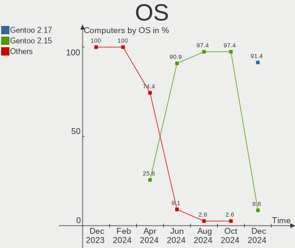
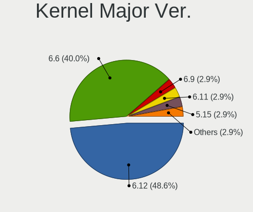
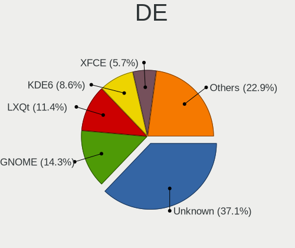
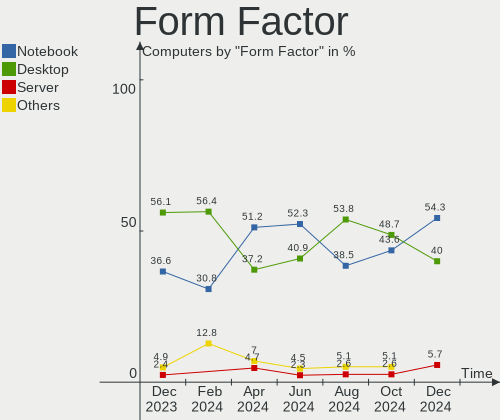
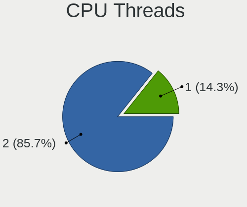
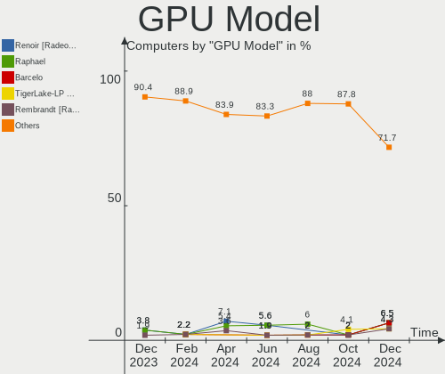
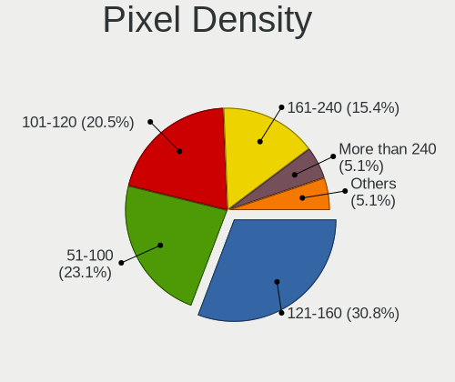
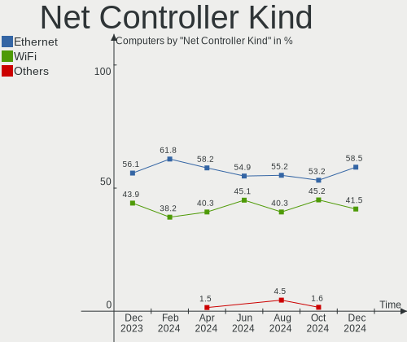
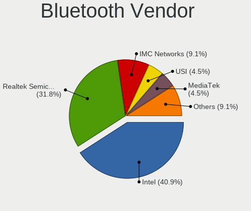

Gentoo - Hardware Trends
------------------------

A project to identify most popular hardware characteristics and track their change
over time based on data collected by Linux users at https://Linux-Hardware.org.

Anyone can contribute to this report by the [hw-probe](https://github.com/linuxhw/hw-probe) tool:

    sudo -E hw-probe -all -upload

This is a report for all computer types. See also reports for [desktops](/Dist/Gentoo/Desktop/README.md) and [notebooks](/Dist/Gentoo/Notebook/README.md).

This report is for one last month. Overall report since the beginning of time: [TestDays](https://github.com/linuxhw/TestDays)

Period: Jul, 2023.

Contents
--------

* [ System ](#system)
  - [ OS                       ](#os)
  - [ OS Family                ](#os-family)
  - [ Kernel                   ](#kernel)
  - [ Kernel Family            ](#kernel-family)
  - [ Kernel Major Ver.        ](#kernel-major-ver)
  - [ Arch                     ](#arch)
  - [ DE                       ](#de)
  - [ Display Server           ](#display-server)
  - [ Display Manager          ](#display-manager)
  - [ OS Lang                  ](#os-lang)
  - [ Boot Mode                ](#boot-mode)
  - [ Filesystem               ](#filesystem)
  - [ Part. scheme             ](#part-scheme)
  - [ Dual Boot with Linux/BSD ](#dual-boot-with-linuxbsd)
  - [ Dual Boot (Win)          ](#dual-boot-win)

* [ Board ](#board)
  - [ Vendor                   ](#vendor)
  - [ Model                    ](#model)
  - [ Model Family             ](#model-family)
  - [ MFG Year                 ](#mfg-year)
  - [ Form Factor              ](#form-factor)
  - [ Secure Boot              ](#secure-boot)
  - [ Coreboot                 ](#coreboot)
  - [ RAM Size                 ](#ram-size)
  - [ RAM Used                 ](#ram-used)
  - [ Total Drives             ](#total-drives)
  - [ Has CD-ROM               ](#has-cd-rom)
  - [ Has Ethernet             ](#has-ethernet)
  - [ Has WiFi                 ](#has-wifi)
  - [ Has Bluetooth            ](#has-bluetooth)

* [ Location ](#location)
  - [ Country                  ](#country)
  - [ City                     ](#city)

* [ Drives ](#drives)
  - [ Drive Vendor             ](#drive-vendor)
  - [ Drive Model              ](#drive-model)
  - [ HDD Vendor               ](#hdd-vendor)
  - [ SSD Vendor               ](#ssd-vendor)
  - [ Drive Kind               ](#drive-kind)
  - [ Drive Connector          ](#drive-connector)
  - [ Drive Size               ](#drive-size)
  - [ Space Total              ](#space-total)
  - [ Space Used               ](#space-used)
  - [ Malfunc. Drives          ](#malfunc-drives)
  - [ Malfunc. Drive Vendor    ](#malfunc-drive-vendor)
  - [ Malfunc. HDD Vendor      ](#malfunc-hdd-vendor)
  - [ Malfunc. Drive Kind      ](#malfunc-drive-kind)
  - [ Failed Drives            ](#failed-drives)
  - [ Failed Drive Vendor      ](#failed-drive-vendor)
  - [ Drive Status             ](#drive-status)

* [ Storage controller ](#storage-controller)
  - [ Storage Vendor           ](#storage-vendor)
  - [ Storage Model            ](#storage-model)
  - [ Storage Kind             ](#storage-kind)

* [ Processor ](#processor)
  - [ CPU Vendor               ](#cpu-vendor)
  - [ CPU Model                ](#cpu-model)
  - [ CPU Model Family         ](#cpu-model-family)
  - [ CPU Cores                ](#cpu-cores)
  - [ CPU Sockets              ](#cpu-sockets)
  - [ CPU Threads              ](#cpu-threads)
  - [ CPU Op-Modes             ](#cpu-op-modes)
  - [ CPU Microcode            ](#cpu-microcode)
  - [ CPU Microarch            ](#cpu-microarch)

* [ Graphics ](#graphics)
  - [ GPU Vendor               ](#gpu-vendor)
  - [ GPU Model                ](#gpu-model)
  - [ GPU Combo                ](#gpu-combo)
  - [ GPU Driver               ](#gpu-driver)
  - [ GPU Memory               ](#gpu-memory)

* [ Monitor ](#monitor)
  - [ Monitor Vendor           ](#monitor-vendor)
  - [ Monitor Model            ](#monitor-model)
  - [ Monitor Resolution       ](#monitor-resolution)
  - [ Monitor Diagonal         ](#monitor-diagonal)
  - [ Monitor Width            ](#monitor-width)
  - [ Aspect Ratio             ](#aspect-ratio)
  - [ Monitor Area             ](#monitor-area)
  - [ Pixel Density            ](#pixel-density)
  - [ Multiple Monitors        ](#multiple-monitors)

* [ Network ](#network)
  - [ Net Controller Vendor    ](#net-controller-vendor)
  - [ Net Controller Model     ](#net-controller-model)
  - [ Wireless Vendor          ](#wireless-vendor)
  - [ Wireless Model           ](#wireless-model)
  - [ Ethernet Vendor          ](#ethernet-vendor)
  - [ Ethernet Model           ](#ethernet-model)
  - [ Net Controller Kind      ](#net-controller-kind)
  - [ Used Controller          ](#used-controller)
  - [ NICs                     ](#nics)
  - [ IPv6                     ](#ipv6)

* [ Bluetooth ](#bluetooth)
  - [ Bluetooth Vendor         ](#bluetooth-vendor)
  - [ Bluetooth Model          ](#bluetooth-model)

* [ Sound ](#sound)
  - [ Sound Vendor             ](#sound-vendor)
  - [ Sound Model              ](#sound-model)

* [ Memory ](#memory)
  - [ Memory Vendor            ](#memory-vendor)
  - [ Memory Model             ](#memory-model)
  - [ Memory Kind              ](#memory-kind)
  - [ Memory Form Factor       ](#memory-form-factor)
  - [ Memory Size              ](#memory-size)
  - [ Memory Speed             ](#memory-speed)

* [ Printers & scanners ](#printers--scanners)
  - [ Printer Vendor           ](#printer-vendor)
  - [ Printer Model            ](#printer-model)
  - [ Scanner Vendor           ](#scanner-vendor)
  - [ Scanner Model            ](#scanner-model)

* [ Camera ](#camera)
  - [ Camera Vendor            ](#camera-vendor)
  - [ Camera Model             ](#camera-model)

* [ Security ](#security)
  - [ Fingerprint Vendor       ](#fingerprint-vendor)
  - [ Fingerprint Model        ](#fingerprint-model)
  - [ Chipcard Vendor          ](#chipcard-vendor)
  - [ Chipcard Model           ](#chipcard-model)

* [ Unsupported ](#unsupported)
  - [ Unsupported Devices      ](#unsupported-devices)
  - [ Unsupported Device Types ](#unsupported-device-types)

System
------

OS
--

Installed operating systems

| Name        | Computers | Percent |
|-------------|-----------|---------|
| Gentoo 2.13 | 51        | 87.93%  |
| Gentoo 2.14 | 6         | 10.34%  |
| Gentoo 2.7  | 1         | 1.72%   |

OS Family
---------

OS without a version

| Name   | Computers | Percent |
|--------|-----------|---------|
| Gentoo | 58        | 100%    |

Kernel
------

Version of the Linux kernel

| Version                       | Computers | Percent |
|-------------------------------|-----------|---------|
| 6.1.31-gentoo                 | 5         | 8.62%   |
| 6.1.38-gentoo-x86_64          | 4         | 6.9%    |
| 6.1.38-gentoo                 | 4         | 6.9%    |
| 6.1.31-gentoo-dist            | 4         | 6.9%    |
| 6.4.7-gentoo                  | 2         | 3.45%   |
| 6.4.6-gentoo                  | 2         | 3.45%   |
| 6.4.3-gentoo                  | 2         | 3.45%   |
| 6.4.0-gentoo                  | 2         | 3.45%   |
| 6.1.41-gentoo                 | 2         | 3.45%   |
| 6.4.4-x86_64                  | 1         | 1.72%   |
| 6.4.4-gentoo-x86_64           | 1         | 1.72%   |
| 6.4.4-gentoo                  | 1         | 1.72%   |
| 6.4.3-gentoo-x86_64           | 1         | 1.72%   |
| 6.4.2-gentoo-x86_64           | 1         | 1.72%   |
| 6.4.2-gentoo                  | 1         | 1.72%   |
| 6.4.1-gentoo-x86_64           | 1         | 1.72%   |
| 6.4.1-gentoo-r1-x86_64        | 1         | 1.72%   |
| 6.4.1-gentoo-r1               | 1         | 1.72%   |
| 6.3.6-gentoo-x86_64           | 1         | 1.72%   |
| 6.3.4                         | 1         | 1.72%   |
| 6.3.11-gentoo-dist            | 1         | 1.72%   |
| 6.3.1-gentoo                  | 1         | 1.72%   |
| 6.1.41-gentoo_LTS_            | 1         | 1.72%   |
| 6.1.41-gentoomultilib-nvidia  | 1         | 1.72%   |
| 6.1.38-x86_64                 | 1         | 1.72%   |
| 6.1.38-gentoo-MAC_MIK.2       | 1         | 1.72%   |
| 6.1.38-gentoo-dist            | 1         | 1.72%   |
| 6.1.31-gentoo-x86_64          | 1         | 1.72%   |
| 6.1.31-gentoo-dist-hardened   | 1         | 1.72%   |
| 6.1.31-gentoo-custom          | 1         | 1.72%   |
| 6.1.28-gentoo                 | 1         | 1.72%   |
| 6.1.21-v8+                    | 1         | 1.72%   |
| 6.1.19-gentoo-x86_64          | 1         | 1.72%   |
| 6.1.12-gentoo                 | 1         | 1.72%   |
| 5.17.5-300.fc36.x86_64        | 1         | 1.72%   |
| 5.15.72-gentoo-x86_64         | 1         | 1.72%   |
| 5.15.59-gentoo-x86_64-k01     | 1         | 1.72%   |
| 5.15.110-gentoo-r1-x86_64-k02 | 1         | 1.72%   |
| 5.10.52-gentoo-x86_64         | 1         | 1.72%   |
| 5.10.181-gentoo-dist          | 1         | 1.72%   |

Kernel Family
-------------

Linux kernel without a distro release

| Version  | Computers | Percent |
|----------|-----------|---------|
| 6.1.31   | 12        | 20.69%  |
| 6.1.38   | 11        | 18.97%  |
| 6.1.41   | 4         | 6.9%    |
| 6.4.4    | 3         | 5.17%   |
| 6.4.3    | 3         | 5.17%   |
| 6.4.1    | 3         | 5.17%   |
| 6.4.7    | 2         | 3.45%   |
| 6.4.6    | 2         | 3.45%   |
| 6.4.2    | 2         | 3.45%   |
| 6.4.0    | 2         | 3.45%   |
| 6.3.6    | 1         | 1.72%   |
| 6.3.4    | 1         | 1.72%   |
| 6.3.11   | 1         | 1.72%   |
| 6.3.1    | 1         | 1.72%   |
| 6.1.28   | 1         | 1.72%   |
| 6.1.21   | 1         | 1.72%   |
| 6.1.19   | 1         | 1.72%   |
| 6.1.12   | 1         | 1.72%   |
| 5.17.5   | 1         | 1.72%   |
| 5.15.72  | 1         | 1.72%   |
| 5.15.59  | 1         | 1.72%   |
| 5.15.110 | 1         | 1.72%   |
| 5.10.52  | 1         | 1.72%   |
| 5.10.181 | 1         | 1.72%   |

Kernel Major Ver.
-----------------

Linux kernel major version

| Version | Computers | Percent |
|---------|-----------|---------|
| 6.1     | 31        | 53.45%  |
| 6.4     | 17        | 29.31%  |
| 6.3     | 4         | 6.9%    |
| 5.15    | 3         | 5.17%   |
| 5.10    | 2         | 3.45%   |
| 5.17    | 1         | 1.72%   |

Arch
----

OS architecture (x86_64, i586, etc.)

| Name    | Computers | Percent |
|---------|-----------|---------|
| x86_64  | 56        | 96.55%  |
| aarch64 | 2         | 3.45%   |

DE
--

Desktop Environment

| Name     | Computers | Percent |
|----------|-----------|---------|
| KDE5     | 18        | 31.03%  |
| Unknown  | 18        | 31.03%  |
| GNOME    | 10        | 17.24%  |
| XFCE     | 6         | 10.34%  |
| MATE     | 2         | 3.45%   |
| Hyprland | 2         | 3.45%   |
| i3       | 1         | 1.72%   |
| DWM      | 1         | 1.72%   |

Display Server
--------------

X11 or Wayland

| Name    | Computers | Percent |
|---------|-----------|---------|
| X11     | 23        | 39.66%  |
| Wayland | 18        | 31.03%  |
| Tty     | 10        | 17.24%  |
| Unknown | 7         | 12.07%  |

Display Manager
---------------

SDDM, LightDM, etc.

| Name    | Computers | Percent |
|---------|-----------|---------|
| SDDM    | 20        | 34.48%  |
| Unknown | 18        | 31.03%  |
| GDM     | 10        | 17.24%  |
| LightDM | 6         | 10.34%  |
| GREETD  | 2         | 3.45%   |
| SLiM    | 1         | 1.72%   |
| LXDM    | 1         | 1.72%   |

OS Lang
-------

Language

| Lang    | Computers | Percent |
|---------|-----------|---------|
| en_US   | 19        | 32.76%  |
| en_GB   | 9         | 15.52%  |
| C.UTF8  | 9         | 15.52%  |
| de_DE   | 4         | 6.9%    |
| Unknown | 4         | 6.9%    |
| ru_RU   | 2         | 3.45%   |
| pt_BR   | 2         | 3.45%   |
| it_IT   | 2         | 3.45%   |
| sv_SE   | 1         | 1.72%   |
| pl_PL   | 1         | 1.72%   |
| nl_BE   | 1         | 1.72%   |
| es_AR   | 1         | 1.72%   |
| en_AT   | 1         | 1.72%   |
| ca_ES   | 1         | 1.72%   |
| C       | 1         | 1.72%   |

Boot Mode
---------

EFI or BIOS

| Mode | Computers | Percent |
|------|-----------|---------|
| EFI  | 46        | 79.31%  |
| BIOS | 12        | 20.69%  |

Filesystem
----------

Type of filesystem

| Type     | Computers | Percent |
|----------|-----------|---------|
| Ext4     | 39        | 67.24%  |
| Btrfs    | 8         | 13.79%  |
| F2fs     | 5         | 8.62%   |
| Zfs      | 2         | 3.45%   |
| Xfs      | 2         | 3.45%   |
| XXXXXXX  | 1         | 1.72%   |
| Reiserfs | 1         | 1.72%   |

Part. scheme
------------

Scheme of partitioning

| Type    | Computers | Percent |
|---------|-----------|---------|
| GPT     | 49        | 84.48%  |
| MBR     | 7         | 12.07%  |
| Unknown | 2         | 3.45%   |

Dual Boot with Linux/BSD
------------------------

Hosting more than one Linux/BSD

| Dual boot | Computers | Percent |
|-----------|-----------|---------|
| No        | 44        | 75.86%  |
| Yes       | 14        | 24.14%  |

Dual Boot (Win)
---------------

Hosting Linux and Windows

| Dual boot | Computers | Percent |
|-----------|-----------|---------|
| No        | 37        | 63.79%  |
| Yes       | 21        | 36.21%  |

Board
-----

Vendor
------

Motherboard manufacturer

| Name                    | Computers | Percent |
|-------------------------|-----------|---------|
| ASUSTek Computer        | 13        | 22.41%  |
| Lenovo                  | 9         | 15.52%  |
| Gigabyte Technology     | 7         | 12.07%  |
| MSI                     | 5         | 8.62%   |
| Hewlett-Packard         | 5         | 8.62%   |
| Dell                    | 4         | 6.9%    |
| ASRock                  | 4         | 6.9%    |
| Fujitsu                 | 2         | 3.45%   |
| Apple                   | 2         | 3.45%   |
| Raspberry Pi Foundation | 1         | 1.72%   |
| Pine Microsystems       | 1         | 1.72%   |
| Jumper                  | 1         | 1.72%   |
| Gateway                 | 1         | 1.72%   |
| Foxconn                 | 1         | 1.72%   |
| Aierben                 | 1         | 1.72%   |
| A-DATA Technology       | 1         | 1.72%   |

Model
-----

Motherboard model

| Name                                             | Computers | Percent |
|--------------------------------------------------|-----------|---------|
| ASUS M3A78-CM                                    | 2         | 3.45%   |
| RPi Raspberry Pi                                 | 1         | 1.72%   |
| Pine Microsystems Pine64 RockPro64 v2.1          | 1         | 1.72%   |
| MSI MS-7D15                                      | 1         | 1.72%   |
| MSI MS-7C79                                      | 1         | 1.72%   |
| MSI MS-7C60                                      | 1         | 1.72%   |
| MSI MS-7B85                                      | 1         | 1.72%   |
| MSI MS-7A31                                      | 1         | 1.72%   |
| Lenovo Yoga C940-14IIL 81Q9                      | 1         | 1.72%   |
| Lenovo Yoga 14sACH 2021 82MS                     | 1         | 1.72%   |
| Lenovo ThinkStation P520c 30BX001KUS             | 1         | 1.72%   |
| Lenovo ThinkPad Yoga 370 20JJS0HD00              | 1         | 1.72%   |
| Lenovo ThinkPad T430 2344BZU                     | 1         | 1.72%   |
| Lenovo ThinkPad P15 Gen 1 20SUS0S000             | 1         | 1.72%   |
| Lenovo Legion Y530-15ICH-1060 81LB               | 1         | 1.72%   |
| Lenovo IdeaPadFlex 5 14ITL05 82LT                | 1         | 1.72%   |
| Lenovo IdeaPad 5 15ABA7 82SG                     | 1         | 1.72%   |
| Jumper EZbook                                    | 1         | 1.72%   |
| HP ZBook Studio 16 inch G9 Mobile Workstation PC | 1         | 1.72%   |
| HP ProBook 450 G5                                | 1         | 1.72%   |
| HP ProBook 440 G7                                | 1         | 1.72%   |
| HP EliteBook 8540w                               | 1         | 1.72%   |
| HP 255 G6 Notebook PC                            | 1         | 1.72%   |
| Gigabyte Z590 UD                                 | 1         | 1.72%   |
| Gigabyte Z390 AORUS MASTER                       | 1         | 1.72%   |
| Gigabyte H510M H                                 | 1         | 1.72%   |
| Gigabyte GA-MA770T-UD3P                          | 1         | 1.72%   |
| Gigabyte B650M AORUS ELITE AX                    | 1         | 1.72%   |
| Gigabyte B650 AORUS PRO AX                       | 1         | 1.72%   |
| Gigabyte AB350-Gaming                            | 1         | 1.72%   |
| Gateway MS-7399                                  | 1         | 1.72%   |
| Fujitsu LIFEBOOK U758                            | 1         | 1.72%   |
| Fujitsu LIFEBOOK T939                            | 1         | 1.72%   |
| Foxconn TPS01                                    | 1         | 1.72%   |
| Dell XPS 15 9520                                 | 1         | 1.72%   |
| Dell XPS 15 7590                                 | 1         | 1.72%   |
| Dell OptiPlex 7010                               | 1         | 1.72%   |
| Dell Inspiron 16 5625                            | 1         | 1.72%   |
| ASUS VivoBook_ASUSLaptop TP3402VA_TP3402VA       | 1         | 1.72%   |
| ASUS TUF Gaming X570-PLUS                        | 1         | 1.72%   |

Model Family
------------

Motherboard model prefix

| Name                     | Computers | Percent |
|--------------------------|-----------|---------|
| ASUS ROG                 | 4         | 6.9%    |
| ASUS PRIME               | 4         | 6.9%    |
| Lenovo ThinkPad          | 3         | 5.17%   |
| Lenovo Yoga              | 2         | 3.45%   |
| HP ProBook               | 2         | 3.45%   |
| Fujitsu LIFEBOOK         | 2         | 3.45%   |
| Dell XPS                 | 2         | 3.45%   |
| ASUS TUF                 | 2         | 3.45%   |
| ASUS M3A78-CM            | 2         | 3.45%   |
| ASRock X570              | 2         | 3.45%   |
| RPi Raspberry            | 1         | 1.72%   |
| Pine Microsystems Pine64 | 1         | 1.72%   |
| MSI MS-7D15              | 1         | 1.72%   |
| MSI MS-7C79              | 1         | 1.72%   |
| MSI MS-7C60              | 1         | 1.72%   |
| MSI MS-7B85              | 1         | 1.72%   |
| MSI MS-7A31              | 1         | 1.72%   |
| Lenovo ThinkStation      | 1         | 1.72%   |
| Lenovo Legion            | 1         | 1.72%   |
| Lenovo IdeaPadFlex       | 1         | 1.72%   |
| Lenovo IdeaPad           | 1         | 1.72%   |
| Jumper EZbook            | 1         | 1.72%   |
| HP ZBook                 | 1         | 1.72%   |
| HP EliteBook             | 1         | 1.72%   |
| HP 255                   | 1         | 1.72%   |
| Gigabyte Z590            | 1         | 1.72%   |
| Gigabyte Z390            | 1         | 1.72%   |
| Gigabyte H510M           | 1         | 1.72%   |
| Gigabyte GA-MA770T-UD3P  | 1         | 1.72%   |
| Gigabyte B650M           | 1         | 1.72%   |
| Gigabyte B650            | 1         | 1.72%   |
| Gigabyte AB350-Gaming    | 1         | 1.72%   |
| Gateway MS-7399          | 1         | 1.72%   |
| Foxconn TPS01            | 1         | 1.72%   |
| Dell OptiPlex            | 1         | 1.72%   |
| Dell Inspiron            | 1         | 1.72%   |
| ASUS VivoBook            | 1         | 1.72%   |
| ASRock Z390              | 1         | 1.72%   |
| ASRock AM1H-ITX          | 1         | 1.72%   |
| Apple MacBookPro12       | 1         | 1.72%   |

MFG Year
--------

Motherboard manufacture year

| Year    | Computers | Percent |
|---------|-----------|---------|
| 2021    | 9         | 15.52%  |
| 2019    | 9         | 15.52%  |
| 2022    | 7         | 12.07%  |
| 2018    | 7         | 12.07%  |
| 2017    | 7         | 12.07%  |
| 2020    | 4         | 6.9%    |
| 2008    | 3         | 5.17%   |
| 2023    | 2         | 3.45%   |
| 2014    | 2         | 3.45%   |
| 2009    | 2         | 3.45%   |
| Unknown | 2         | 3.45%   |
| 2015    | 1         | 1.72%   |
| 2013    | 1         | 1.72%   |
| 2012    | 1         | 1.72%   |
| 2010    | 1         | 1.72%   |

Form Factor
-----------

Physical design of the computer

| Name           | Computers | Percent |
|----------------|-----------|---------|
| Desktop        | 32        | 55.17%  |
| Notebook       | 19        | 32.76%  |
| Convertible    | 5         | 8.62%   |
| System on chip | 2         | 3.45%   |

Secure Boot
-----------

Enabled or disabled

| State    | Computers | Percent |
|----------|-----------|---------|
| Disabled | 57        | 98.28%  |
| Enabled  | 1         | 1.72%   |

Coreboot
--------

Have coreboot on board

| Used | Computers | Percent |
|------|-----------|---------|
| No   | 57        | 98.28%  |
| Yes  | 1         | 1.72%   |

RAM Size
--------

Total RAM memory

| Size in GB  | Computers | Percent |
|-------------|-----------|---------|
| 32.01-64.0  | 13        | 22.41%  |
| 16.01-24.0  | 10        | 17.24%  |
| 8.01-16.0   | 10        | 17.24%  |
| 4.01-8.0    | 9         | 15.52%  |
| 64.01-256.0 | 9         | 15.52%  |
| 3.01-4.0    | 4         | 6.9%    |
| 24.01-32.0  | 3         | 5.17%   |

RAM Used
--------

Used RAM memory

| Used GB    | Computers | Percent |
|------------|-----------|---------|
| 4.01-8.0   | 17        | 29.31%  |
| 1.01-2.0   | 11        | 18.97%  |
| 2.01-3.0   | 8         | 13.79%  |
| 3.01-4.0   | 6         | 10.34%  |
| 8.01-16.0  | 4         | 6.9%    |
| 0.51-1.0   | 4         | 6.9%    |
| 0.01-0.5   | 4         | 6.9%    |
| 16.01-24.0 | 2         | 3.45%   |
| 32.01-64.0 | 1         | 1.72%   |
| 24.01-32.0 | 1         | 1.72%   |

Total Drives
------------

Number of drives on board

| Drives | Computers | Percent |
|--------|-----------|---------|
| 1      | 21        | 36.21%  |
| 2      | 15        | 25.86%  |
| 4      | 9         | 15.52%  |
| 3      | 9         | 15.52%  |
| 6      | 2         | 3.45%   |
| 7      | 1         | 1.72%   |
| 5      | 1         | 1.72%   |

Has CD-ROM
----------

Has CD-ROM on board

| Presented | Computers | Percent |
|-----------|-----------|---------|
| No        | 47        | 81.03%  |
| Yes       | 11        | 18.97%  |

Has Ethernet
------------

Has Ethernet on board

| Presented | Computers | Percent |
|-----------|-----------|---------|
| Yes       | 48        | 82.76%  |
| No        | 10        | 17.24%  |

Has WiFi
--------

Has WiFi module

| Presented | Computers | Percent |
|-----------|-----------|---------|
| Yes       | 39        | 67.24%  |
| No        | 19        | 32.76%  |

Has Bluetooth
-------------

Has Bluetooth module

| Presented | Computers | Percent |
|-----------|-----------|---------|
| Yes       | 37        | 63.79%  |
| No        | 21        | 36.21%  |

Location
--------

Country
-------

Geographic location (country)

| Country      | Computers | Percent |
|--------------|-----------|---------|
| USA          | 13        | 22.41%  |
| Germany      | 9         | 15.52%  |
| UK           | 8         | 13.79%  |
| Poland       | 4         | 6.9%    |
| Sweden       | 2         | 3.45%   |
| Slovakia     | 2         | 3.45%   |
| Russia       | 2         | 3.45%   |
| Brazil       | 2         | 3.45%   |
| Belgium      | 2         | 3.45%   |
| Turkey       | 1         | 1.72%   |
| Taiwan       | 1         | 1.72%   |
| Spain        | 1         | 1.72%   |
| South Africa | 1         | 1.72%   |
| Romania      | 1         | 1.72%   |
| Netherlands  | 1         | 1.72%   |
| Kazakhstan   | 1         | 1.72%   |
| Italy        | 1         | 1.72%   |
| Iran         | 1         | 1.72%   |
| France       | 1         | 1.72%   |
| Finland      | 1         | 1.72%   |
| Canada       | 1         | 1.72%   |
| Austria      | 1         | 1.72%   |
| Argentina    | 1         | 1.72%   |

City
----

Geographic location (city)

| City           | Computers | Percent |
|----------------|-----------|---------|
| Warsaw         | 3         | 5.17%   |
| Ulm            | 2         | 3.45%   |
| Shrewsbury     | 2         | 3.45%   |
| Sao Paulo      | 2         | 3.45%   |
| Burnham-on-Sea | 2         | 3.45%   |
| Bratislava     | 2         | 3.45%   |
| Bothell        | 2         | 3.45%   |
| Woburn         | 1         | 1.72%   |
| Witney         | 1         | 1.72%   |
| Viernheim      | 1         | 1.72%   |
| Vienna         | 1         | 1.72%   |
| Västerås     | 1         | 1.72%   |
| Vancouver      | 1         | 1.72%   |
| Troisdorf      | 1         | 1.72%   |
| Thousand Oaks  | 1         | 1.72%   |
| Târgu Mureş  | 1         | 1.72%   |
| Sun Prairie    | 1         | 1.72%   |
| Santa Ana      | 1         | 1.72%   |
| San Jose       | 1         | 1.72%   |
| San Antonio    | 1         | 1.72%   |
| Rome           | 1         | 1.72%   |
| Orange         | 1         | 1.72%   |
| New Taipei     | 1         | 1.72%   |
| Munich         | 1         | 1.72%   |
| Moultonborough | 1         | 1.72%   |
| London         | 1         | 1.72%   |
| Lipetsk        | 1         | 1.72%   |
| Leeds          | 1         | 1.72%   |
| Kiel           | 1         | 1.72%   |
| Khimki         | 1         | 1.72%   |
| Johannesburg   | 1         | 1.72%   |
| Isfahan        | 1         | 1.72%   |
| Ilmenau        | 1         | 1.72%   |
| Huntsville     | 1         | 1.72%   |
| Hohentengen    | 1         | 1.72%   |
| Helsinki       | 1         | 1.72%   |
| Gothenburg     | 1         | 1.72%   |
| Girona         | 1         | 1.72%   |
| Flint          | 1         | 1.72%   |
| Denton         | 1         | 1.72%   |

Drives
------

Drive Vendor
------------

Hard drive vendors

| Vendor                      | Computers | Drives | Percent |
|-----------------------------|-----------|--------|---------|
| Samsung Electronics         | 19        | 25     | 16.96%  |
| Seagate                     | 13        | 14     | 11.61%  |
| WDC                         | 9         | 18     | 8.04%   |
| Toshiba                     | 7         | 7      | 6.25%   |
| SanDisk                     | 6         | 6      | 5.36%   |
| Crucial                     | 6         | 7      | 5.36%   |
| Micron Technology           | 5         | 5      | 4.46%   |
| Unknown                     | 4         | 4      | 3.57%   |
| Silicon Motion              | 3         | 3      | 2.68%   |
| Realtek Semiconductor       | 3         | 4      | 2.68%   |
| Phison Electronics          | 3         | 4      | 2.68%   |
| Micron/Crucial Technology   | 3         | 3      | 2.68%   |
| Kingston                    | 3         | 4      | 2.68%   |
| GOODRAM                     | 3         | 3      | 2.68%   |
| MAXIO Technology (Hangzhou) | 2         | 2      | 1.79%   |
| KIOXIA                      | 2         | 2      | 1.79%   |
| Kingston Technology Company | 2         | 2      | 1.79%   |
| Intel                       | 2         | 2      | 1.79%   |
| Hitachi                     | 2         | 4      | 1.79%   |
| China                       | 2         | 4      | 1.79%   |
| ADATA Technology            | 2         | 2      | 1.79%   |
| XPG                         | 1         | 1      | 0.89%   |
| Teleplan                    | 1         | 1      | 0.89%   |
| SK hynix                    | 1         | 1      | 0.89%   |
| PNY                         | 1         | 2      | 0.89%   |
| OCZ                         | 1         | 1      | 0.89%   |
| Netac                       | 1         | 1      | 0.89%   |
| Maxtor                      | 1         | 1      | 0.89%   |
| LITEONIT                    | 1         | 1      | 0.89%   |
| HGST                        | 1         | 1      | 0.89%   |
| ASMT                        | 1         | 2      | 0.89%   |
| Apple                       | 1         | 1      | 0.89%   |

Drive Model
-----------

Hard drive models

| Model                                                              | Computers | Percent |
|--------------------------------------------------------------------|-----------|---------|
| Samsung NVMe SSD Controller SM981/PM981/PM983 500GB                | 8         | 6.25%   |
| Samsung NVMe SSD Controller PM9A1/PM9A3/980PRO 1TB                 | 7         | 5.47%   |
| Silicon Motion SM2263EN/SM2263XT SSD Controller 500GB              | 3         | 2.34%   |
| Micron/Crucial P2 NVMe PCIe SSD 1TB                                | 3         | 2.34%   |
| WDC WDS500G2B0A-00SM50 500GB SSD                                   | 2         | 1.56%   |
| WDC WD30EFRX-68EUZN0 3TB                                           | 2         | 1.56%   |
| WDC WD2002FAEX-007BA0 2TB                                          | 2         | 1.56%   |
| Unknown MMC Card  512GB                                            | 2         | 1.56%   |
| Toshiba DT01ACA100 1TB                                             | 2         | 1.56%   |
| Seagate ST2000DM006-2DM164 2TB                                     | 2         | 1.56%   |
| Seagate Expansion 1TB                                              | 2         | 1.56%   |
| Sandisk WD Black SN750 / PC SN730 NVMe SSD 1024GB                  | 2         | 1.56%   |
| Samsung SSD 860 EVO 500GB                                          | 2         | 1.56%   |
| Realtek SPCC M.2 PCIe SSD 1TB                                      | 2         | 1.56%   |
| Phison E12 NVMe Controller 2TB                                     | 2         | 1.56%   |
| MAXIO (Hangzhou) NVMe SSD Controller MAP1202 256GB                 | 2         | 1.56%   |
| GOODRAM SSDPR-CL100-480-G2 480GB                                   | 2         | 1.56%   |
| Crucial CT250MX500SSD1 250GB                                       | 2         | 1.56%   |
| Crucial CT1000MX500SSD1 1TB                                        | 2         | 1.56%   |
| ADATA XPG SX8200 Pro PCIe Gen3x4 M.2 2280 Solid State Drive 1024GB | 2         | 1.56%   |
| XPG GAMMIX S70 1TB                                                 | 1         | 0.78%   |
| WDC WD8003FFBX-68B9AN0 8TB                                         | 1         | 0.78%   |
| WDC WD60EFZX-68B3FN0 6TB                                           | 1         | 0.78%   |
| WDC WD60EFRX-68MYMN1 6TB                                           | 1         | 0.78%   |
| WDC WD60EFAX-68SHWN0 6TB                                           | 1         | 0.78%   |
| WDC WD40EFRX-68N32N0 4TB                                           | 1         | 0.78%   |
| WDC WD30EFRX-68AX9N0 3TB                                           | 1         | 0.78%   |
| WDC WD3003FZEX-00Z4SA0 3TB                                         | 1         | 0.78%   |
| WDC WD20SPZX-08UA7 2TB                                             | 1         | 0.78%   |
| WDC WD120EFBX-68B0EN0 12TB                                         | 1         | 0.78%   |
| WDC WD1002FAEX-00Z3A0 1TB                                          | 1         | 0.78%   |
| Unknown MMC Card  8GB                                              | 1         | 0.78%   |
| Unknown MMC Card  32GB                                             | 1         | 0.78%   |
| Toshiba XG4 NVMe SSD Controller 256GB                              | 1         | 0.78%   |
| Toshiba TR200 480GB SSD                                            | 1         | 0.78%   |
| Toshiba HDWE150 5TB                                                | 1         | 0.78%   |
| Toshiba HDWD240 4TB                                                | 1         | 0.78%   |
| Toshiba DT01ABA300 3TB                                             | 1         | 0.78%   |
| Teleplan TP1000G 1TB                                               | 1         | 0.78%   |
| SK hynix PC801 NVMe 1TB                                            | 1         | 0.78%   |

HDD Vendor
----------

Hard disk drive vendors

| Vendor              | Computers | Drives | Percent |
|---------------------|-----------|--------|---------|
| Seagate             | 13        | 14     | 38.24%  |
| WDC                 | 8         | 16     | 23.53%  |
| Toshiba             | 5         | 5      | 14.71%  |
| Samsung Electronics | 2         | 2      | 5.88%   |
| Hitachi             | 2         | 4      | 5.88%   |
| Teleplan            | 1         | 1      | 2.94%   |
| Maxtor              | 1         | 1      | 2.94%   |
| HGST                | 1         | 1      | 2.94%   |
| ASMT                | 1         | 2      | 2.94%   |

SSD Vendor
----------

Solid state drive vendors

| Vendor              | Computers | Drives | Percent |
|---------------------|-----------|--------|---------|
| Samsung Electronics | 6         | 6      | 18.18%  |
| Crucial             | 6         | 7      | 18.18%  |
| SanDisk             | 3         | 3      | 9.09%   |
| Micron Technology   | 3         | 3      | 9.09%   |
| GOODRAM             | 3         | 3      | 9.09%   |
| WDC                 | 2         | 2      | 6.06%   |
| Kingston            | 2         | 3      | 6.06%   |
| China               | 2         | 4      | 6.06%   |
| Toshiba             | 1         | 1      | 3.03%   |
| PNY                 | 1         | 2      | 3.03%   |
| OCZ                 | 1         | 1      | 3.03%   |
| Netac               | 1         | 1      | 3.03%   |
| LITEONIT            | 1         | 1      | 3.03%   |
| Apple               | 1         | 1      | 3.03%   |

Drive Kind
----------

HDD or SSD

| Kind | Computers | Drives | Percent |
|------|-----------|--------|---------|
| NVMe | 39        | 50     | 40.21%  |
| SSD  | 27        | 38     | 27.84%  |
| HDD  | 27        | 46     | 27.84%  |
| MMC  | 4         | 4      | 4.12%   |

Drive Connector
---------------

SATA, SAS, NVMe, etc.

| Type | Computers | Drives | Percent |
|------|-----------|--------|---------|
| NVMe | 39        | 50     | 46.99%  |
| SATA | 37        | 80     | 44.58%  |
| MMC  | 4         | 4      | 4.82%   |
| SAS  | 3         | 4      | 3.61%   |

Drive Size
----------

Size of hard drive

| Size in TB | Computers | Drives | Percent |
|------------|-----------|--------|---------|
| 0.01-0.5   | 20        | 26     | 32.79%  |
| 0.51-1.0   | 15        | 23     | 24.59%  |
| 3.01-4.0   | 7         | 9      | 11.48%  |
| 1.01-2.0   | 7         | 8      | 11.48%  |
| 2.01-3.0   | 5         | 9      | 8.2%    |
| 4.01-10.0  | 5         | 6      | 8.2%    |
| 10.01-20.0 | 2         | 3      | 3.28%   |

Space Total
-----------

Amount of disk space available on the file system

| Size in GB     | Computers | Percent |
|----------------|-----------|---------|
| 501-1000       | 14        | 24.14%  |
| More than 3000 | 13        | 22.41%  |
| 251-500        | 8         | 13.79%  |
| 101-250        | 6         | 10.34%  |
| 1001-2000      | 6         | 10.34%  |
| 1-20           | 5         | 8.62%   |
| 51-100         | 3         | 5.17%   |
| 2001-3000      | 2         | 3.45%   |
| Unknown        | 1         | 1.72%   |

Space Used
----------

Amount of used disk space

| Used GB        | Computers | Percent |
|----------------|-----------|---------|
| 1-20           | 10        | 17.24%  |
| More than 3000 | 8         | 13.79%  |
| 251-500        | 8         | 13.79%  |
| 101-250        | 7         | 12.07%  |
| 1001-2000      | 7         | 12.07%  |
| 51-100         | 7         | 12.07%  |
| 21-50          | 6         | 10.34%  |
| 501-1000       | 3         | 5.17%   |
| 2001-3000      | 1         | 1.72%   |
| Unknown        | 1         | 1.72%   |

Malfunc. Drives
---------------

Drive models with a malfunction

| Model                                                   | Computers | Drives | Percent |
|---------------------------------------------------------|-----------|--------|---------|
| WDC WD60EFAX-68SHWN0 6TB                                | 1         | 1      | 16.67%  |
| WDC WD30EFRX-68AX9N0 3TB                                | 1         | 1      | 16.67%  |
| WDC WD2002FAEX-007BA0 2TB                               | 1         | 1      | 16.67%  |
| Seagate ST4000VN008-2DR166 4TB                          | 1         | 2      | 16.67%  |
| Samsung Electronics SP2504C 250GB                       | 1         | 1      | 16.67%  |
| Realtek Semiconductor RTS5763DL NVMe SSD Controller 1TB | 1         | 1      | 16.67%  |

Malfunc. Drive Vendor
---------------------

Vendors of faulty drives

| Vendor                | Computers | Drives | Percent |
|-----------------------|-----------|--------|---------|
| WDC                   | 2         | 3      | 40%     |
| Seagate               | 1         | 2      | 20%     |
| Samsung Electronics   | 1         | 1      | 20%     |
| Realtek Semiconductor | 1         | 1      | 20%     |

Malfunc. HDD Vendor
-------------------

Vendors of faulty HDD drives

| Vendor              | Computers | Drives | Percent |
|---------------------|-----------|--------|---------|
| WDC                 | 2         | 3      | 50%     |
| Seagate             | 1         | 2      | 25%     |
| Samsung Electronics | 1         | 1      | 25%     |

Malfunc. Drive Kind
-------------------

Kinds of faulty drives

| Kind | Computers | Drives | Percent |
|------|-----------|--------|---------|
| HDD  | 3         | 6      | 75%     |
| NVMe | 1         | 1      | 25%     |

Failed Drives
-------------

Failed drive models

Zero info for selected period =(

Failed Drive Vendor
-------------------

Failed drive vendors

Zero info for selected period =(

Drive Status
------------

Number of failed and malfunc. drives

| Status   | Computers | Drives | Percent |
|----------|-----------|--------|---------|
| Works    | 55        | 118    | 80.88%  |
| Detected | 9         | 13     | 13.24%  |
| Malfunc  | 4         | 7      | 5.88%   |

Storage controller
------------------

Storage Vendor
--------------

Storage controller vendors

| Vendor                       | Computers | Percent |
|------------------------------|-----------|---------|
| Intel                        | 24        | 25.81%  |
| AMD                          | 21        | 22.58%  |
| Samsung Electronics          | 16        | 17.2%   |
| Silicon Motion               | 3         | 3.23%   |
| SanDisk                      | 3         | 3.23%   |
| Realtek Semiconductor        | 3         | 3.23%   |
| Phison Electronics           | 3         | 3.23%   |
| Micron/Crucial Technology    | 3         | 3.23%   |
| Kingston Technology Company  | 3         | 3.23%   |
| Micron Technology            | 2         | 2.15%   |
| MAXIO Technology (Hangzhou)  | 2         | 2.15%   |
| KIOXIA                       | 2         | 2.15%   |
| ASMedia Technology           | 2         | 2.15%   |
| ADATA Technology             | 2         | 2.15%   |
| Toshiba America Info Systems | 1         | 1.08%   |
| SK hynix                     | 1         | 1.08%   |
| Nvidia                       | 1         | 1.08%   |
| INNOGRIT                     | 1         | 1.08%   |

Storage Model
-------------

Storage controller models

| Model                                                                   | Computers | Percent |
|-------------------------------------------------------------------------|-----------|---------|
| AMD FCH SATA Controller [AHCI mode]                                     | 16        | 15.38%  |
| Samsung NVMe SSD Controller SM981/PM981/PM983                           | 8         | 7.69%   |
| Samsung NVMe SSD Controller PM9A1/PM9A3/980PRO                          | 7         | 6.73%   |
| Intel 500 Series Chipset Family SATA AHCI Controller                    | 4         | 3.85%   |
| Silicon Motion SM2263EN/SM2263XT (DRAM-less) NVMe SSD Controllers       | 3         | 2.88%   |
| Micron/Crucial P2 [Nick P2] / P3 / P3 Plus NVMe PCIe SSD (DRAM-less)    | 3         | 2.88%   |
| Intel Sunrise Point-LP SATA Controller [AHCI mode]                      | 3         | 2.88%   |
| AMD SB7x0/SB8x0/SB9x0 IDE Controller                                    | 3         | 2.88%   |
| SanDisk WD Black SN750 / PC SN730 NVMe SSD                              | 2         | 1.92%   |
| Realtek RTS5765DL NVMe SSD Controller (DRAM-less)                       | 2         | 1.92%   |
| Phison E12 NVMe Controller                                              | 2         | 1.92%   |
| MAXIO (Hangzhou) NVMe SSD Controller MAP1202                            | 2         | 1.92%   |
| Intel Comet Lake SATA AHCI Controller                                   | 2         | 1.92%   |
| Intel Cannon Lake PCH SATA AHCI Controller                              | 2         | 1.92%   |
| Intel Cannon Lake Mobile PCH SATA AHCI Controller                       | 2         | 1.92%   |
| Intel 200 Series PCH SATA controller [AHCI mode]                        | 2         | 1.92%   |
| ASMedia ASM1062 Serial ATA Controller                                   | 2         | 1.92%   |
| AMD X370 Series Chipset SATA Controller                                 | 2         | 1.92%   |
| AMD SB7x0/SB8x0/SB9x0 SATA Controller [IDE mode]                        | 2         | 1.92%   |
| AMD 400 Series Chipset SATA Controller                                  | 2         | 1.92%   |
| ADATA XPG SX8200 Pro PCIe Gen3x4 M.2 2280 Solid State Drive             | 2         | 1.92%   |
| Toshiba America Info Systems XG4 NVMe SSD Controller                    | 1         | 0.96%   |
| SK hynix Platinum P41/PC801 NVMe Solid State Drive                      | 1         | 0.96%   |
| SanDisk WD Black SN770 / PC SN740 256GB / PC SN560 (DRAM-less) NVMe SSD | 1         | 0.96%   |
| Samsung S4LN058A01[SSUBX] AHCI SSD Controller (Apple slot)              | 1         | 0.96%   |
| Samsung NVMe SSD Controller SM961/PM961/SM963                           | 1         | 0.96%   |
| Samsung NVMe SSD Controller 980                                         | 1         | 0.96%   |
| Realtek RTS5763DL NVMe SSD Controller                                   | 1         | 0.96%   |
| Phison E18 PCIe4 NVMe Controller                                        | 1         | 0.96%   |
| Nvidia MCP73 SATA RAID Controller                                       | 1         | 0.96%   |
| Nvidia MCP73 IDE Controller                                             | 1         | 0.96%   |
| Micron 3400 NVMe SSD [Hendrix]                                          | 1         | 0.96%   |
| Micron 2450 NVMe SSD [HendrixV] (DRAM-less)                             | 1         | 0.96%   |
| KIOXIA NVMe SSD Controller BG5 (DRAM-less)                              | 1         | 0.96%   |
| KIOXIA NVMe SSD Controller BG4 (DRAM-less)                              | 1         | 0.96%   |
| Kingston Company Company Non-Volatile memory controller                 | 1         | 0.96%   |
| Kingston Company NV1 NVMe SSD                                           | 1         | 0.96%   |
| Kingston Company A2000 NVMe SSD                                         | 1         | 0.96%   |
| Intel Volume Management Device NVMe RAID Controller Intel Corporation   | 1         | 0.96%   |
| Intel SSD DC P4101/Pro 7600p/760p/E 6100p Series                        | 1         | 0.96%   |

Storage Kind
------------

Kind of storage controller (IDE, SATA, NVMe, SAS, ...)

| Kind | Computers | Percent |
|------|-----------|---------|
| SATA | 44        | 48.89%  |
| NVMe | 39        | 43.33%  |
| IDE  | 4         | 4.44%   |
| RAID | 3         | 3.33%   |

Processor
---------

CPU Vendor
----------

Processor vendors

| Vendor | Computers | Percent |
|--------|-----------|---------|
| Intel  | 34        | 58.62%  |
| AMD    | 22        | 37.93%  |
| ARM    | 2         | 3.45%   |

CPU Model
---------

Processor models

| Model                                          | Computers | Percent |
|------------------------------------------------|-----------|---------|
| AMD Ryzen 9 3900X 12-Core Processor            | 3         | 5.17%   |
| Intel Core i9-9900K CPU @ 3.60GHz              | 2         | 3.45%   |
| Intel Core i7-8750H CPU @ 2.20GHz              | 2         | 3.45%   |
| Intel 12th Gen Core i7-12700H                  | 2         | 3.45%   |
| ARM Processor                                  | 2         | 3.45%   |
| AMD Ryzen 9 7900X 12-Core Processor            | 2         | 3.45%   |
| AMD Ryzen 7 5825U with Radeon Graphics         | 2         | 3.45%   |
| AMD Phenom II X4 955 Processor                 | 2         | 3.45%   |
| Intel Xeon W-2145 CPU @ 3.70GHz                | 1         | 1.72%   |
| Intel Core i9-10850K CPU @ 3.60GHz             | 1         | 1.72%   |
| Intel Core i7-9750H CPU @ 2.60GHz              | 1         | 1.72%   |
| Intel Core i7-8550U CPU @ 1.80GHz              | 1         | 1.72%   |
| Intel Core i7-7800X CPU @ 3.50GHz              | 1         | 1.72%   |
| Intel Core i7-5557U CPU @ 3.10GHz              | 1         | 1.72%   |
| Intel Core i7-3770 CPU @ 3.40GHz               | 1         | 1.72%   |
| Intel Core i7-10850H CPU @ 2.70GHz             | 1         | 1.72%   |
| Intel Core i7-10700K CPU @ 3.80GHz             | 1         | 1.72%   |
| Intel Core i7-1065G7 CPU @ 1.30GHz             | 1         | 1.72%   |
| Intel Core i7 CPU M 620 @ 2.67GHz              | 1         | 1.72%   |
| Intel Core i5-8365U CPU @ 1.60GHz              | 1         | 1.72%   |
| Intel Core i5-8250U CPU @ 1.60GHz              | 1         | 1.72%   |
| Intel Core i5-7300U CPU @ 2.60GHz              | 1         | 1.72%   |
| Intel Core i5-4258U CPU @ 2.40GHz              | 1         | 1.72%   |
| Intel Core i5-3320M CPU @ 2.60GHz              | 1         | 1.72%   |
| Intel Core i5-10400F CPU @ 2.90GHz             | 1         | 1.72%   |
| Intel Core i5-10400 CPU @ 2.90GHz              | 1         | 1.72%   |
| Intel Core i5-10210U CPU @ 1.60GHz             | 1         | 1.72%   |
| Intel Core i3-6157U CPU @ 2.40GHz              | 1         | 1.72%   |
| Intel Core 2 Extreme CPU X9650 @ 3.00GHz       | 1         | 1.72%   |
| Intel Celeron J4005 CPU @ 2.00GHz              | 1         | 1.72%   |
| Intel Atom CPU D510 @ 1.66GHz                  | 1         | 1.72%   |
| Intel 13th Gen Core i3-1315U                   | 1         | 1.72%   |
| Intel 12th Gen Core i9-12900H                  | 1         | 1.72%   |
| Intel 11th Gen Core i7-11800H @ 2.30GHz        | 1         | 1.72%   |
| Intel 11th Gen Core i7-11700K @ 3.60GHz        | 1         | 1.72%   |
| Intel 11th Gen Core i7-1165G7 @ 2.80GHz        | 1         | 1.72%   |
| AMD Ryzen Threadripper 3970X 32-Core Processor | 1         | 1.72%   |
| AMD Ryzen 7 7700X 8-Core Processor             | 1         | 1.72%   |
| AMD Ryzen 7 5800X3D 8-Core Processor           | 1         | 1.72%   |
| AMD Ryzen 7 5800X 8-Core Processor             | 1         | 1.72%   |

CPU Model Family
----------------

Processor model prefix

| Model                  | Computers | Percent |
|------------------------|-----------|---------|
| Intel Core i7          | 11        | 18.97%  |
| Other                  | 9         | 15.52%  |
| Intel Core i5          | 8         | 13.79%  |
| AMD Ryzen 7            | 8         | 13.79%  |
| AMD Ryzen 9            | 5         | 8.62%   |
| Intel Core i9          | 3         | 5.17%   |
| AMD Ryzen 5            | 3         | 5.17%   |
| AMD Phenom II X4       | 3         | 5.17%   |
| Intel Xeon             | 1         | 1.72%   |
| Intel Core i3          | 1         | 1.72%   |
| Intel Core 2 Extreme   | 1         | 1.72%   |
| Intel Celeron          | 1         | 1.72%   |
| Intel Atom             | 1         | 1.72%   |
| AMD Ryzen Threadripper | 1         | 1.72%   |
| AMD Athlon             | 1         | 1.72%   |
| AMD A6                 | 1         | 1.72%   |

CPU Cores
---------

Number of processor cores

| Number  | Computers | Percent |
|---------|-----------|---------|
| 8       | 14        | 24.14%  |
| 4       | 12        | 20.69%  |
| 6       | 11        | 18.97%  |
| 2       | 10        | 17.24%  |
| 12      | 5         | 8.62%   |
| 14      | 3         | 5.17%   |
| 32      | 1         | 1.72%   |
| 10      | 1         | 1.72%   |
| Unknown | 1         | 1.72%   |

CPU Sockets
-----------

Number of sockets

| Number  | Computers | Percent |
|---------|-----------|---------|
| 1       | 57        | 98.28%  |
| Unknown | 1         | 1.72%   |

CPU Threads
-----------

Threads per core (Hyper-Threading)

| Number  | Computers | Percent |
|---------|-----------|---------|
| 2       | 47        | 81.03%  |
| 1       | 10        | 17.24%  |
| Unknown | 1         | 1.72%   |

CPU Op-Modes
------------

CPU Operation Modes (32-bit, 64-bit)

| Op mode        | Computers | Percent |
|----------------|-----------|---------|
| 32-bit, 64-bit | 58        | 100%    |

CPU Microcode
-------------

Microcode number

| Number     | Computers | Percent |
|------------|-----------|---------|
| Unknown    | 17        | 29.31%  |
| 0x08701021 | 5         | 8.62%   |
| 0x906ed    | 2         | 3.45%   |
| 0x906ea    | 2         | 3.45%   |
| 0x806ec    | 2         | 3.45%   |
| 0x806ea    | 2         | 3.45%   |
| 0x306a9    | 2         | 3.45%   |
| 0x0a601203 | 2         | 3.45%   |
| 0x0800820d | 2         | 3.45%   |
| 0xb06a3    | 1         | 1.72%   |
| 0xa0655    | 1         | 1.72%   |
| 0xa0653    | 1         | 1.72%   |
| 0xa0652    | 1         | 1.72%   |
| 0x806e9    | 1         | 1.72%   |
| 0x706e5    | 1         | 1.72%   |
| 0x706a1    | 1         | 1.72%   |
| 0x406e3    | 1         | 1.72%   |
| 0x40651    | 1         | 1.72%   |
| 0x306d4    | 1         | 1.72%   |
| 0x20655    | 1         | 1.72%   |
| 0x10676    | 1         | 1.72%   |
| 0x0a50000d | 1         | 1.72%   |
| 0x0a50000c | 1         | 1.72%   |
| 0x0a50000b | 1         | 1.72%   |
| 0x0a20120a | 1         | 1.72%   |
| 0x0a201016 | 1         | 1.72%   |
| 0x08301072 | 1         | 1.72%   |
| 0x08001138 | 1         | 1.72%   |
| 0x0700010f | 1         | 1.72%   |
| 0x010000db | 1         | 1.72%   |
| 0x010000c6 | 1         | 1.72%   |

CPU Microarch
-------------

Microarchitecture

| Name             | Computers | Percent |
|------------------|-----------|---------|
| KabyLake         | 10        | 17.24%  |
| Zen 2            | 6         | 10.34%  |
| Unknown          | 6         | 10.34%  |
| Zen 3            | 5         | 8.62%   |
| CometLake        | 5         | 8.62%   |
| Alderlake Hybrid | 4         | 6.9%    |
| Skylake          | 3         | 5.17%   |
| K10              | 3         | 5.17%   |
| Zen+             | 2         | 3.45%   |
| IvyBridge        | 2         | 3.45%   |
| Icelake          | 2         | 3.45%   |
| Zen              | 1         | 1.72%   |
| Westmere         | 1         | 1.72%   |
| TigerLake        | 1         | 1.72%   |
| Penryn           | 1         | 1.72%   |
| Jaguar           | 1         | 1.72%   |
| Haswell          | 1         | 1.72%   |
| Goldmont plus    | 1         | 1.72%   |
| Excavator        | 1         | 1.72%   |
| Broadwell        | 1         | 1.72%   |
| Bonnell          | 1         | 1.72%   |

Graphics
--------

GPU Vendor
----------

Vendors of graphics cards

| Vendor | Computers | Percent |
|--------|-----------|---------|
| Intel  | 25        | 37.88%  |
| Nvidia | 21        | 31.82%  |
| AMD    | 20        | 30.3%   |

GPU Model
---------

Graphics card models

| Model                                                   | Computers | Percent |
|---------------------------------------------------------|-----------|---------|
| AMD Ellesmere [Radeon RX 470/480/570/570X/580/580X/590] | 4         | 5.88%   |
| Intel CoffeeLake-H GT2 [UHD Graphics 630]               | 3         | 4.41%   |
| Intel Alder Lake-P Integrated Graphics Controller       | 3         | 4.41%   |
| AMD Raphael                                             | 3         | 4.41%   |
| Nvidia GA102 [GeForce RTX 3080 Ti]                      | 2         | 2.94%   |
| Intel UHD Graphics 620                                  | 2         | 2.94%   |
| AMD RS780C [Radeon 3100]                                | 2         | 2.94%   |
| AMD Navi 21 [Radeon RX 6800/6800 XT / 6900 XT]          | 2         | 2.94%   |
| AMD Navi 10 [Radeon RX 5600 OEM/5600 XT / 5700/5700 XT] | 2         | 2.94%   |
| AMD Barcelo                                             | 2         | 2.94%   |
| Nvidia TU117M [GeForce GTX 1650 Mobile / Max-Q]         | 1         | 1.47%   |
| Nvidia TU117GLM [Quadro T2000 Mobile / Max-Q]           | 1         | 1.47%   |
| Nvidia TU106 [GeForce RTX 2070 Rev. A]                  | 1         | 1.47%   |
| Nvidia TU106 [GeForce RTX 2060 Rev. A]                  | 1         | 1.47%   |
| Nvidia GT216GLM [Quadro FX 880M]                        | 1         | 1.47%   |
| Nvidia GP107M [GeForce GTX 1050 Mobile]                 | 1         | 1.47%   |
| Nvidia GP107 [GeForce GTX 1050]                         | 1         | 1.47%   |
| Nvidia GP106M [GeForce GTX 1060 Mobile]                 | 1         | 1.47%   |
| Nvidia GP106 [P106M]                                    | 1         | 1.47%   |
| Nvidia GP104 [GeForce GTX 1080]                         | 1         | 1.47%   |
| Nvidia GM206GL [Quadro M2000]                           | 1         | 1.47%   |
| Nvidia GM108M [GeForce 930MX]                           | 1         | 1.47%   |
| Nvidia GK106 [GeForce GTX 660]                          | 1         | 1.47%   |
| Nvidia GK104 [GeForce GTX 680]                          | 1         | 1.47%   |
| Nvidia GA107M [GeForce RTX 3050 Ti Mobile]              | 1         | 1.47%   |
| Nvidia GA107GLM [RTX A1000 Laptop GPU]                  | 1         | 1.47%   |
| Nvidia GA106 [Geforce RTX 3050]                         | 1         | 1.47%   |
| Nvidia GA104M [GeForce RTX 3070 Mobile / Max-Q]         | 1         | 1.47%   |
| Nvidia GA102 [GeForce RTX 3090]                         | 1         | 1.47%   |
| Intel WhiskeyLake-U GT2 [UHD Graphics 620]              | 1         | 1.47%   |
| Intel TigerLake-LP GT2 [Iris Xe Graphics]               | 1         | 1.47%   |
| Intel TigerLake-H GT1 [UHD Graphics]                    | 1         | 1.47%   |
| Intel Raptor Lake-P [UHD Graphics]                      | 1         | 1.47%   |
| Intel IvyBridge GT2 [HD Graphics 4000]                  | 1         | 1.47%   |
| Intel Iris Plus Graphics G7                             | 1         | 1.47%   |
| Intel Iris Graphics 6100                                | 1         | 1.47%   |
| Intel Iris Graphics 550                                 | 1         | 1.47%   |
| Intel HD Graphics 620                                   | 1         | 1.47%   |
| Intel Haswell-ULT Integrated Graphics Controller        | 1         | 1.47%   |
| Intel GeminiLake [UHD Graphics 600]                     | 1         | 1.47%   |

GPU Combo
---------

Combinations of graphics cards

| Name           | Computers | Percent |
|----------------|-----------|---------|
| 1 x AMD        | 17        | 29.31%  |
| 1 x Intel      | 16        | 27.59%  |
| 1 x Nvidia     | 11        | 18.97%  |
| Intel + Nvidia | 9         | 15.52%  |
| Other          | 2         | 3.45%   |
| 2 x AMD        | 2         | 3.45%   |
| AMD + Nvidia   | 1         | 1.72%   |

GPU Driver
----------

Free vs proprietary

| Driver      | Computers | Percent |
|-------------|-----------|---------|
| Free        | 38        | 65.52%  |
| Proprietary | 14        | 24.14%  |
| Unknown     | 6         | 10.34%  |

GPU Memory
----------

Total video memory

| Size in GB | Computers | Percent |
|------------|-----------|---------|
| Unknown    | 31        | 53.45%  |
| 7.01-8.0   | 8         | 13.79%  |
| 3.01-4.0   | 4         | 6.9%    |
| 8.01-16.0  | 4         | 6.9%    |
| 1.01-2.0   | 3         | 5.17%   |
| 0.01-0.5   | 3         | 5.17%   |
| 16.01-24.0 | 2         | 3.45%   |
| 0.51-1.0   | 2         | 3.45%   |
| 5.01-6.0   | 1         | 1.72%   |

Monitor
-------

Monitor Vendor
--------------

Monitor vendors

| Vendor               | Computers | Percent |
|----------------------|-----------|---------|
| Samsung Electronics  | 11        | 16.18%  |
| BOE                  | 8         | 11.76%  |
| Goldstar             | 6         | 8.82%   |
| Dell                 | 5         | 7.35%   |
| AU Optronics         | 5         | 7.35%   |
| LG Display           | 4         | 5.88%   |
| Chimei Innolux       | 4         | 5.88%   |
| AOC                  | 3         | 4.41%   |
| Acer                 | 3         | 4.41%   |
| Hewlett-Packard      | 2         | 2.94%   |
| Gigabyte Technology  | 2         | 2.94%   |
| Apple                | 2         | 2.94%   |
| Vizio                | 1         | 1.47%   |
| ViewSonic            | 1         | 1.47%   |
| Unknown              | 1         | 1.47%   |
| Philips              | 1         | 1.47%   |
| MSI                  | 1         | 1.47%   |
| Mi                   | 1         | 1.47%   |
| Lenovo               | 1         | 1.47%   |
| Iiyama               | 1         | 1.47%   |
| CVT                  | 1         | 1.47%   |
| CSO                  | 1         | 1.47%   |
| BenQ                 | 1         | 1.47%   |
| ASUSTek Computer     | 1         | 1.47%   |
| Ancor Communications | 1         | 1.47%   |

Monitor Model
-------------

Monitor models

| Model                                                                   | Computers | Percent |
|-------------------------------------------------------------------------|-----------|---------|
| Gigabyte Technology M32U GBT3204 3840x2160 697x392mm 31.5-inch          | 2         | 2.9%    |
| Chimei Innolux LCD Monitor CMN1747 1920x1080 381x214mm 17.2-inch        | 2         | 2.9%    |
| Vizio VX20L VIZ2000 1280x720 444x249mm 20.0-inch                        | 1         | 1.45%   |
| ViewSonic VX2450 SERIES VSCE226 1920x1080 525x297mm 23.7-inch           | 1         | 1.45%   |
| Unknown LCD Monitor FFFF 2288x1287 2550x2550mm 142.0-inch               | 1         | 1.45%   |
| Samsung Electronics U32R59x SAM0F96 3840x2160 697x392mm 31.5-inch       | 1         | 1.45%   |
| Samsung Electronics U32H85x SAM0E3C 3840x2160 697x392mm 31.5-inch       | 1         | 1.45%   |
| Samsung Electronics SyncMaster SAM059A 1920x1080 477x268mm 21.5-inch    | 1         | 1.45%   |
| Samsung Electronics SyncMaster SAM04D4 1920x1080 530x300mm 24.0-inch    | 1         | 1.45%   |
| Samsung Electronics SMS27A850 SAM083D 2560x1440 518x324mm 24.1-inch     | 1         | 1.45%   |
| Samsung Electronics SMBX2450 SAM0722 1920x1080 531x299mm 24.0-inch      | 1         | 1.45%   |
| Samsung Electronics S22B300 SAM08C8 1920x1080 477x268mm 21.5-inch       | 1         | 1.45%   |
| Samsung Electronics LCD Monitor SDCA029 3840x2160 344x194mm 15.5-inch   | 1         | 1.45%   |
| Samsung Electronics LCD Monitor SDC414D 3456x2160 336x210mm 15.6-inch   | 1         | 1.45%   |
| Samsung Electronics LCD Monitor SAM7004 3840x2160 1872x1053mm 84.6-inch | 1         | 1.45%   |
| Samsung Electronics LC27G5xT SAM707A 2560x1440 597x336mm 27.0-inch      | 1         | 1.45%   |
| Philips LCD Monitor PHL 276E8V 5760x2160                                | 1         | 1.45%   |
| MSI MAG274QRF-QD MSI3CA8 2560x1440 597x336mm 27.0-inch                  | 1         | 1.45%   |
| Mi Redmi Monitor XMI23C3 1920x1080 527x293mm 23.7-inch                  | 1         | 1.45%   |
| LG Display LCD Monitor LGD05CF 1920x1080 344x194mm 15.5-inch            | 1         | 1.45%   |
| LG Display LCD Monitor LGD0561 1920x1080 294x165mm 13.3-inch            | 1         | 1.45%   |
| LG Display LCD Monitor LGD046F 1920x1080 344x194mm 15.5-inch            | 1         | 1.45%   |
| LG Display LCD Monitor LGD0259 1920x1080 345x194mm 15.6-inch            | 1         | 1.45%   |
| Lenovo LEN G24-10 LEN65FD 1920x1080 521x293mm 23.5-inch                 | 1         | 1.45%   |
| Iiyama PL2730H IVM663A 1920x1080 598x336mm 27.0-inch                    | 1         | 1.45%   |
| Hewlett-Packard LCD Monitor ZR24w                                       | 1         | 1.45%   |
| Hewlett-Packard L2445w HWP280F 1920x1200 518x324mm 24.1-inch            | 1         | 1.45%   |
| Goldstar ULTRAWIDE GSM59F1 2560x1080 673x284mm 28.8-inch                | 1         | 1.45%   |
| Goldstar LG ULTRAWIDE GSM5A6E 2560x1080 670x280mm 28.6-inch             | 1         | 1.45%   |
| Goldstar HDR 4K GSM7707 3840x2160 600x340mm 27.2-inch                   | 1         | 1.45%   |
| Goldstar FULL HD GSM5B55 1920x1080 480x270mm 21.7-inch                  | 1         | 1.45%   |
| Goldstar 34GK950F GSM7727 3440x1440 800x335mm 34.1-inch                 | 1         | 1.45%   |
| Goldstar 27GL850 GSM5B7F 2560x1440 597x336mm 27.0-inch                  | 1         | 1.45%   |
| Dell P2423DE DELD149 2560x1440 527x296mm 23.8-inch                      | 1         | 1.45%   |
| Dell P2417H DELA0DC 1920x1080 527x296mm 23.8-inch                       | 1         | 1.45%   |
| Dell P2417H DELA0DB 1920x1080 527x296mm 23.8-inch                       | 1         | 1.45%   |
| Dell P2014H DEL4095 1600x900 434x236mm 19.4-inch                        | 1         | 1.45%   |
| Dell E1914H DELD03A 1366x768 410x230mm 18.5-inch                        | 1         | 1.45%   |
| Dell 2007FP DELA021 1600x1200 410x310mm 20.2-inch                       | 1         | 1.45%   |
| CVT Crystal View CVT0001 1024x768 32x86mm 3.6-inch                      | 1         | 1.45%   |

Monitor Resolution
------------------

Monitor screen resolution

| Resolution        | Computers | Percent |
|-------------------|-----------|---------|
| 1920x1080 (FHD)   | 23        | 35.94%  |
| 3840x2160 (4K)    | 11        | 17.19%  |
| 2560x1440 (QHD)   | 10        | 15.63%  |
| 1920x1200 (WUXGA) | 4         | 6.25%   |
| 2560x1600         | 2         | 3.13%   |
| 2560x1080         | 2         | 3.13%   |
| 1600x900 (HD+)    | 2         | 3.13%   |
| 1366x768 (WXGA)   | 2         | 3.13%   |
| 5760x2160         | 1         | 1.56%   |
| 3456x2160         | 1         | 1.56%   |
| 3440x1440         | 1         | 1.56%   |
| 2880x1800         | 1         | 1.56%   |
| 2288x1287         | 1         | 1.56%   |
| 1600x1200         | 1         | 1.56%   |
| 1280x1024 (SXGA)  | 1         | 1.56%   |
| Unknown           | 1         | 1.56%   |

Monitor Diagonal
----------------

Diagonal size in inches

| Inches  | Computers | Percent |
|---------|-----------|---------|
| 15      | 10        | 14.93%  |
| 27      | 9         | 13.43%  |
| 24      | 7         | 10.45%  |
| 14      | 7         | 10.45%  |
| 31      | 5         | 7.46%   |
| 23      | 5         | 7.46%   |
| 13      | 4         | 5.97%   |
| 21      | 3         | 4.48%   |
| 17      | 3         | 4.48%   |
| 34      | 2         | 2.99%   |
| 20      | 2         | 2.99%   |
| 16      | 2         | 2.99%   |
| 142     | 1         | 1.49%   |
| 84      | 1         | 1.49%   |
| 39      | 1         | 1.49%   |
| 32      | 1         | 1.49%   |
| 28      | 1         | 1.49%   |
| 19      | 1         | 1.49%   |
| 18      | 1         | 1.49%   |
| Unknown | 1         | 1.49%   |

Monitor Width
-------------

Physical width

| Width in mm    | Computers | Percent |
|----------------|-----------|---------|
| 301-350        | 19        | 30.16%  |
| 501-600        | 17        | 26.98%  |
| 401-500        | 7         | 11.11%  |
| 601-700        | 6         | 9.52%   |
| 201-300        | 4         | 6.35%   |
| 701-800        | 3         | 4.76%   |
| 351-400        | 3         | 4.76%   |
| More than 2000 | 1         | 1.59%   |
| 801-900        | 1         | 1.59%   |
| 1501-2000      | 1         | 1.59%   |
| Unknown        | 1         | 1.59%   |

Aspect Ratio
------------

Proportional relationship between the width and the height

| Ratio   | Computers | Percent |
|---------|-----------|---------|
| 16/9    | 40        | 72.73%  |
| 16/10   | 9         | 16.36%  |
| 21/9    | 3         | 5.45%   |
| 4/3     | 1         | 1.82%   |
| 1.00    | 1         | 1.82%   |
| Unknown | 1         | 1.82%   |

Monitor Area
------------

Area in inch²

| Area in inch² | Computers | Percent |
|----------------|-----------|---------|
| 201-250        | 12        | 18.18%  |
| 101-110        | 10        | 15.15%  |
| 301-350        | 9         | 13.64%  |
| 81-90          | 8         | 12.12%  |
| 351-500        | 8         | 12.12%  |
| 71-80          | 3         | 4.55%   |
| 251-300        | 3         | 4.55%   |
| 151-200        | 3         | 4.55%   |
| 121-130        | 3         | 4.55%   |
| More than 1000 | 2         | 3.03%   |
| 111-120        | 2         | 3.03%   |
| 141-150        | 1         | 1.52%   |
| 501-1000       | 1         | 1.52%   |
| Unknown        | 1         | 1.52%   |

Pixel Density
-------------

Pixels per inch

| Density       | Computers | Percent |
|---------------|-----------|---------|
| 121-160       | 21        | 33.33%  |
| 51-100        | 18        | 28.57%  |
| 101-120       | 10        | 15.87%  |
| 161-240       | 8         | 12.7%   |
| More than 240 | 4         | 6.35%   |
| 1-50          | 1         | 1.59%   |
| Unknown       | 1         | 1.59%   |

Multiple Monitors
-----------------

Total monitors connected

| Total | Computers | Percent |
|-------|-----------|---------|
| 1     | 40        | 68.97%  |
| 2     | 11        | 18.97%  |
| 0     | 4         | 6.9%    |
| 3     | 2         | 3.45%   |
| 4     | 1         | 1.72%   |

Network
-------

Net Controller Vendor
---------------------

Controller vendors

| Vendor                | Computers | Percent |
|-----------------------|-----------|---------|
| Intel                 | 38        | 45.78%  |
| Realtek Semiconductor | 25        | 30.12%  |
| MediaTek              | 4         | 4.82%   |
| Sierra Wireless       | 3         | 3.61%   |
| Qualcomm Atheros      | 2         | 2.41%   |
| Wilocity              | 1         | 1.2%    |
| U-Blox                | 1         | 1.2%    |
| TP-Link               | 1         | 1.2%    |
| Samsung Electronics   | 1         | 1.2%    |
| Nvidia                | 1         | 1.2%    |
| Mellanox Technologies | 1         | 1.2%    |
| HMD Global            | 1         | 1.2%    |
| Broadcom Limited      | 1         | 1.2%    |
| Broadcom              | 1         | 1.2%    |
| ASUSTek Computer      | 1         | 1.2%    |
| ASIX Electronics      | 1         | 1.2%    |

Net Controller Model
--------------------

Controller models

| Model                                                                          | Computers | Percent |
|--------------------------------------------------------------------------------|-----------|---------|
| Realtek RTL8111/8168/8411 PCI Express Gigabit Ethernet Controller              | 15        | 15.31%  |
| Intel I211 Gigabit Network Connection                                          | 8         | 8.16%   |
| Realtek RTL8125 2.5GbE Controller                                              | 4         | 4.08%   |
| Intel Ethernet Controller I225-V                                               | 4         | 4.08%   |
| Intel Cannon Lake PCH CNVi WiFi                                                | 4         | 4.08%   |
| Intel Wireless 8265 / 8275                                                     | 3         | 3.06%   |
| Intel Wi-Fi 6 AX200                                                            | 3         | 3.06%   |
| Sierra Wireless EM7455                                                         | 2         | 2.04%   |
| MediaTek MT7922 802.11ax PCI Express Wireless Network Adapter                  | 2         | 2.04%   |
| Intel Wireless-AC 9260                                                         | 2         | 2.04%   |
| Intel Ethernet Connection (7) I219-V                                           | 2         | 2.04%   |
| Intel Ethernet Connection (4) I219-LM                                          | 2         | 2.04%   |
| Intel Comet Lake PCH CNVi WiFi                                                 | 2         | 2.04%   |
| Intel Alder Lake-P PCH CNVi WiFi                                               | 2         | 2.04%   |
| Intel 82579LM Gigabit Network Connection (Lewisville)                          | 2         | 2.04%   |
| Wilocity Wil6200 802.11ad Wireless Network Adapter                             | 1         | 1.02%   |
| U-Blox [u-blox 8]                                                              | 1         | 1.02%   |
| TP-Link UE300 10/100/1000 LAN (ethernet mode) [Realtek RTL8153]                | 1         | 1.02%   |
| Sierra Wireless EM7305 Modem                                                   | 1         | 1.02%   |
| Samsung Galaxy series, misc. (tethering mode)                                  | 1         | 1.02%   |
| Realtek RTL88x2bu [AC1200 Techkey]                                             | 1         | 1.02%   |
| Realtek RTL8852BE PCIe 802.11ax Wireless Network Controller                    | 1         | 1.02%   |
| Realtek RTL8852AE 802.11ax PCIe Wireless Network Adapter                       | 1         | 1.02%   |
| Realtek RTL8821CE 802.11ac PCIe Wireless Network Adapter                       | 1         | 1.02%   |
| Realtek RTL8153 Gigabit Ethernet Adapter                                       | 1         | 1.02%   |
| Realtek RTL-8110SC/8169SC Gigabit Ethernet                                     | 1         | 1.02%   |
| Realtek Killer E3000 2.5GbE Controller                                         | 1         | 1.02%   |
| Qualcomm Atheros QCA6174 802.11ac Wireless Network Adapter                     | 1         | 1.02%   |
| Qualcomm Atheros AR5413/AR5414 Wireless Network Adapter [AR5006X(S) 802.11abg] | 1         | 1.02%   |
| Nvidia MCP73 Ethernet                                                          | 1         | 1.02%   |
| Mellanox MT27500 Family [ConnectX-3]                                           | 1         | 1.02%   |
| MediaTek Wi-Fi 6E MT7902 Wireless Network Adapter                              | 1         | 1.02%   |
| MediaTek MT7921 802.11ax PCI Express Wireless Network Adapter                  | 1         | 1.02%   |
| Intel Wireless 8260                                                            | 1         | 1.02%   |
| Intel Wireless 3165                                                            | 1         | 1.02%   |
| Intel Wi-Fi 6 AX210/AX211/AX411 160MHz                                         | 1         | 1.02%   |
| Intel Wi-Fi 6 AX201                                                            | 1         | 1.02%   |
| Intel Tiger Lake PCH CNVi WiFi                                                 | 1         | 1.02%   |
| Intel Ice Lake-LP PCH CNVi WiFi                                                | 1         | 1.02%   |
| Intel Ethernet Controller X550                                                 | 1         | 1.02%   |

Wireless Vendor
---------------

Wireless vendors

| Vendor                | Computers | Percent |
|-----------------------|-----------|---------|
| Intel                 | 27        | 61.36%  |
| Realtek Semiconductor | 4         | 9.09%   |
| MediaTek              | 4         | 9.09%   |
| Sierra Wireless       | 3         | 6.82%   |
| Qualcomm Atheros      | 2         | 4.55%   |
| Wilocity              | 1         | 2.27%   |
| Broadcom Limited      | 1         | 2.27%   |
| Broadcom              | 1         | 2.27%   |
| ASUSTek Computer      | 1         | 2.27%   |

Wireless Model
--------------

Wireless models

| Model                                                                          | Computers | Percent |
|--------------------------------------------------------------------------------|-----------|---------|
| Intel Cannon Lake PCH CNVi WiFi                                                | 4         | 9.09%   |
| Intel Wireless 8265 / 8275                                                     | 3         | 6.82%   |
| Intel Wi-Fi 6 AX200                                                            | 3         | 6.82%   |
| Sierra Wireless EM7455                                                         | 2         | 4.55%   |
| MediaTek MT7922 802.11ax PCI Express Wireless Network Adapter                  | 2         | 4.55%   |
| Intel Wireless-AC 9260                                                         | 2         | 4.55%   |
| Intel Comet Lake PCH CNVi WiFi                                                 | 2         | 4.55%   |
| Intel Alder Lake-P PCH CNVi WiFi                                               | 2         | 4.55%   |
| Wilocity Wil6200 802.11ad Wireless Network Adapter                             | 1         | 2.27%   |
| Sierra Wireless EM7305 Modem                                                   | 1         | 2.27%   |
| Realtek RTL88x2bu [AC1200 Techkey]                                             | 1         | 2.27%   |
| Realtek RTL8852BE PCIe 802.11ax Wireless Network Controller                    | 1         | 2.27%   |
| Realtek RTL8852AE 802.11ax PCIe Wireless Network Adapter                       | 1         | 2.27%   |
| Realtek RTL8821CE 802.11ac PCIe Wireless Network Adapter                       | 1         | 2.27%   |
| Qualcomm Atheros QCA6174 802.11ac Wireless Network Adapter                     | 1         | 2.27%   |
| Qualcomm Atheros AR5413/AR5414 Wireless Network Adapter [AR5006X(S) 802.11abg] | 1         | 2.27%   |
| MediaTek Wi-Fi 6E MT7902 Wireless Network Adapter                              | 1         | 2.27%   |
| MediaTek MT7921 802.11ax PCI Express Wireless Network Adapter                  | 1         | 2.27%   |
| Intel Wireless 8260                                                            | 1         | 2.27%   |
| Intel Wireless 3165                                                            | 1         | 2.27%   |
| Intel Wi-Fi 6 AX210/AX211/AX411 160MHz                                         | 1         | 2.27%   |
| Intel Wi-Fi 6 AX201                                                            | 1         | 2.27%   |
| Intel Tiger Lake PCH CNVi WiFi                                                 | 1         | 2.27%   |
| Intel Ice Lake-LP PCH CNVi WiFi                                                | 1         | 2.27%   |
| Intel Dual Band Wireless-AC 3168NGW [Stone Peak]                               | 1         | 2.27%   |
| Intel Comet Lake PCH-LP CNVi WiFi                                              | 1         | 2.27%   |
| Intel Centrino Ultimate-N 6300                                                 | 1         | 2.27%   |
| Intel Centrino Advanced-N 6205 [Taylor Peak]                                   | 1         | 2.27%   |
| Intel Cannon Point-LP CNVi [Wireless-AC]                                       | 1         | 2.27%   |
| Broadcom Limited BCM4360 802.11ac Wireless Network Adapter                     | 1         | 2.27%   |
| Broadcom BCM43602 802.11ac Wireless LAN SoC                                    | 1         | 2.27%   |
| ASUS N10 Nano 802.11n Network Adapter [Realtek RTL8192CU]                      | 1         | 2.27%   |

Ethernet Vendor
---------------

Ethernet vendors

| Vendor                | Computers | Percent |
|-----------------------|-----------|---------|
| Intel                 | 24        | 46.15%  |
| Realtek Semiconductor | 22        | 42.31%  |
| TP-Link               | 1         | 1.92%   |
| Samsung Electronics   | 1         | 1.92%   |
| Nvidia                | 1         | 1.92%   |
| Mellanox Technologies | 1         | 1.92%   |
| HMD Global            | 1         | 1.92%   |
| ASIX Electronics      | 1         | 1.92%   |

Ethernet Model
--------------

Ethernet models

| Model                                                             | Computers | Percent |
|-------------------------------------------------------------------|-----------|---------|
| Realtek RTL8111/8168/8411 PCI Express Gigabit Ethernet Controller | 15        | 28.3%   |
| Intel I211 Gigabit Network Connection                             | 8         | 15.09%  |
| Realtek RTL8125 2.5GbE Controller                                 | 4         | 7.55%   |
| Intel Ethernet Controller I225-V                                  | 4         | 7.55%   |
| Intel Ethernet Connection (7) I219-V                              | 2         | 3.77%   |
| Intel Ethernet Connection (4) I219-LM                             | 2         | 3.77%   |
| Intel 82579LM Gigabit Network Connection (Lewisville)             | 2         | 3.77%   |
| TP-Link UE300 10/100/1000 LAN (ethernet mode) [Realtek RTL8153]   | 1         | 1.89%   |
| Samsung Galaxy series, misc. (tethering mode)                     | 1         | 1.89%   |
| Realtek RTL8153 Gigabit Ethernet Adapter                          | 1         | 1.89%   |
| Realtek RTL-8110SC/8169SC Gigabit Ethernet                        | 1         | 1.89%   |
| Realtek Killer E3000 2.5GbE Controller                            | 1         | 1.89%   |
| Nvidia MCP73 Ethernet                                             | 1         | 1.89%   |
| Mellanox MT27500 Family [ConnectX-3]                              | 1         | 1.89%   |
| Intel Ethernet Controller X550                                    | 1         | 1.89%   |
| Intel Ethernet Connection (6) I219-LM                             | 1         | 1.89%   |
| Intel Ethernet Connection (2) I219-V                              | 1         | 1.89%   |
| Intel Ethernet Connection (2) I219-LM                             | 1         | 1.89%   |
| Intel Ethernet Connection (11) I219-LM                            | 1         | 1.89%   |
| Intel Ethernet Connection (10) I219-V                             | 1         | 1.89%   |
| Intel 82577LM Gigabit Network Connection                          | 1         | 1.89%   |
| HMD Global Nokia7.2                                               | 1         | 1.89%   |
| ASIX AX88179 Gigabit Ethernet                                     | 1         | 1.89%   |

Net Controller Kind
-------------------

Ethernet, WiFi or modem

| Kind     | Computers | Percent |
|----------|-----------|---------|
| Ethernet | 48        | 54.55%  |
| WiFi     | 39        | 44.32%  |
| Modem    | 1         | 1.14%   |

Used Controller
---------------

Currently used network controller

| Kind     | Computers | Percent |
|----------|-----------|---------|
| Ethernet | 34        | 58.62%  |
| WiFi     | 24        | 41.38%  |

NICs
----

Total network controllers on board

| Total | Computers | Percent |
|-------|-----------|---------|
| 1     | 27        | 46.55%  |
| 2     | 26        | 44.83%  |
| 3     | 2         | 3.45%   |
| 0     | 2         | 3.45%   |
| 4     | 1         | 1.72%   |

IPv6
----

IPv6 vs IPv4

| Used | Computers | Percent |
|------|-----------|---------|
| No   | 39        | 67.24%  |
| Yes  | 19        | 32.76%  |

Bluetooth
---------

Bluetooth Vendor
----------------

Controller vendors

| Vendor                | Computers | Percent |
|-----------------------|-----------|---------|
| Intel                 | 25        | 64.1%   |
| Realtek Semiconductor | 4         | 10.26%  |
| Broadcom              | 3         | 7.69%   |
| MediaTek              | 2         | 5.13%   |
| Apple                 | 2         | 5.13%   |
| IMC Networks          | 1         | 2.56%   |
| Foxconn / Hon Hai     | 1         | 2.56%   |
| ASUSTek Computer      | 1         | 2.56%   |

Bluetooth Model
---------------

Controller models

| Model                                          | Computers | Percent |
|------------------------------------------------|-----------|---------|
| Intel Bluetooth 9460/9560 Jefferson Peak (JfP) | 6         | 15.38%  |
| Intel Bluetooth wireless interface             | 5         | 12.82%  |
| Intel AX201 Bluetooth                          | 5         | 12.82%  |
| Realtek Bluetooth Radio                        | 4         | 10.26%  |
| Intel AX200 Bluetooth                          | 3         | 7.69%   |
| MediaTek Wireless_Device                       | 2         | 5.13%   |
| Intel Wireless-AC 9260 Bluetooth Adapter       | 2         | 5.13%   |
| Intel Bluetooth Device                         | 2         | 5.13%   |
| Broadcom BCM20702A0 Bluetooth 4.0              | 2         | 5.13%   |
| Apple Bluetooth Host Controller                | 2         | 5.13%   |
| Intel Wireless-AC 3168 Bluetooth               | 1         | 2.56%   |
| Intel AX210 Bluetooth                          | 1         | 2.56%   |
| IMC Networks Wireless_Device                   | 1         | 2.56%   |
| Foxconn / Hon Hai MediaTek MT7921 Bluetooth    | 1         | 2.56%   |
| Broadcom BCM20702 Bluetooth 4.0 [ThinkPad]     | 1         | 2.56%   |
| ASUS Bluetooth Device                          | 1         | 2.56%   |

Sound
-----

Sound Vendor
------------

Sound card vendors

| Vendor                               | Computers | Percent |
|--------------------------------------|-----------|---------|
| Intel                                | 30        | 34.48%  |
| AMD                                  | 25        | 28.74%  |
| Nvidia                               | 16        | 18.39%  |
| C-Media Electronics                  | 4         | 4.6%    |
| Creative Labs                        | 2         | 2.3%    |
| ASUSTek Computer                     | 2         | 2.3%    |
| Thesycon Systemsoftware & Consulting | 1         | 1.15%   |
| SteelSeries ApS                      | 1         | 1.15%   |
| Razer USA                            | 1         | 1.15%   |
| Plantronics                          | 1         | 1.15%   |
| Micro Star International             | 1         | 1.15%   |
| Logitech                             | 1         | 1.15%   |
| Generalplus Technology               | 1         | 1.15%   |
| AKG C44-USB Microphone               | 1         | 1.15%   |

Sound Model
-----------

Sound card models

| Model                                                               | Computers | Percent |
|---------------------------------------------------------------------|-----------|---------|
| AMD Starship/Matisse HD Audio Controller                            | 7         | 6.8%    |
| Intel Cannon Lake PCH cAVS                                          | 5         | 4.85%   |
| AMD Family 17h/19h HD Audio Controller                              | 5         | 4.85%   |
| Intel Sunrise Point-LP HD Audio                                     | 4         | 3.88%   |
| AMD Ellesmere HDMI Audio [Radeon RX 470/480 / 570/580/590]          | 4         | 3.88%   |
| Nvidia GA102 High Definition Audio Controller                       | 3         | 2.91%   |
| Intel Smart Sound Technology (SST) Audio Controller                 | 3         | 2.91%   |
| Intel Alder Lake PCH-P High Definition Audio Controller             | 3         | 2.91%   |
| AMD SBx00 Azalia (Intel HDA)                                        | 3         | 2.91%   |
| AMD Renoir Radeon High Definition Audio Controller                  | 3         | 2.91%   |
| AMD Navi 21/23 HDMI/DP Audio Controller                             | 3         | 2.91%   |
| AMD Family 17h (Models 00h-0fh) HD Audio Controller                 | 3         | 2.91%   |
| Nvidia TU106 High Definition Audio Controller                       | 2         | 1.94%   |
| Nvidia GP107GL High Definition Audio Controller                     | 2         | 1.94%   |
| Intel Tiger Lake-H HD Audio Controller                              | 2         | 1.94%   |
| Intel Comet Lake PCH cAVS                                           | 2         | 1.94%   |
| Intel 7 Series/C216 Chipset Family High Definition Audio Controller | 2         | 1.94%   |
| AMD Rembrandt Radeon High Definition Audio Controller               | 2         | 1.94%   |
| AMD Navi 10 HDMI Audio                                              | 2         | 1.94%   |
| Thesycon Systemsoftware & Consulting SABAJ USB AUDIO                | 1         | 0.97%   |
| SteelSeries ApS SteelSeries Arctis 7                                | 1         | 0.97%   |
| Razer USA Razer Kraken V3 X                                         | 1         | 0.97%   |
| Plantronics Savi Office Base Station                                | 1         | 0.97%   |
| Nvidia TU107 GeForce GTX 1650 High Definition Audio Controller      | 1         | 0.97%   |
| Nvidia MCP73 High Definition Audio                                  | 1         | 0.97%   |
| Nvidia GT216 HDMI Audio Controller                                  | 1         | 0.97%   |
| Nvidia GP106 High Definition Audio Controller                       | 1         | 0.97%   |
| Nvidia GP104 High Definition Audio Controller                       | 1         | 0.97%   |
| Nvidia GM206 High Definition Audio Controller                       | 1         | 0.97%   |
| Nvidia GK106 HDMI Audio Controller                                  | 1         | 0.97%   |
| Nvidia GK104 HDMI Audio Controller                                  | 1         | 0.97%   |
| Nvidia GA104 High Definition Audio Controller                       | 1         | 0.97%   |
| Nvidia Audio device                                                 | 1         | 0.97%   |
| Micro Star International USB Audio                                  | 1         | 0.97%   |
| Logitech H600 [Wireless Headset]                                    | 1         | 0.97%   |
| Intel Wildcat Point-LP High Definition Audio Controller             | 1         | 0.97%   |
| Intel Tiger Lake-LP Smart Sound Technology Audio Controller         | 1         | 0.97%   |
| Intel Raptor Lake-P/U/H cAVS                                        | 1         | 0.97%   |
| Intel Ice Lake-LP Smart Sound Technology Audio Controller           | 1         | 0.97%   |
| Intel Haswell-ULT HD Audio Controller                               | 1         | 0.97%   |

Memory
------

Memory Vendor
-------------

Memory module vendors

| Vendor              | Computers | Percent |
|---------------------|-----------|---------|
| Samsung Electronics | 10        | 17.24%  |
| Corsair             | 10        | 17.24%  |
| SK hynix            | 8         | 13.79%  |
| Unknown             | 5         | 8.62%   |
| Micron Technology   | 5         | 8.62%   |
| Kingston            | 5         | 8.62%   |
| G.Skill             | 5         | 8.62%   |
| Crucial             | 3         | 5.17%   |
| A-DATA Technology   | 2         | 3.45%   |
| Patriot             | 1         | 1.72%   |
| Nanya Technology    | 1         | 1.72%   |
| Mushkin             | 1         | 1.72%   |
| Elpida              | 1         | 1.72%   |
| Unknown             | 1         | 1.72%   |

Memory Model
------------

Memory module models

| Model                                                        | Computers | Percent |
|--------------------------------------------------------------|-----------|---------|
| Unknown RAM Module 2GB DIMM DDR2 667MT/s                     | 2         | 3.39%   |
| Micron RAM Module 8GB SODIMM DDR4 3200MT/s                   | 2         | 3.39%   |
| Kingston RAM KHX3600C17D4/16GX 16GB DIMM DDR4 3800MT/s       | 2         | 3.39%   |
| G.Skill RAM F5-6000J3636F16G 16GB DIMM DDR5 6400MT/s         | 2         | 3.39%   |
| Unknown RAM Module 2GB SODIMM DDR2 800MT/s                   | 1         | 1.69%   |
| Unknown RAM Module 2GB DIMM DDR2 800MT/s                     | 1         | 1.69%   |
| Unknown RAM DDR4 NB 16G 2666 16384MB SODIMM DDR4 2667MT/s    | 1         | 1.69%   |
| SK hynix RAM Module 8GB SODIMM DDR4 2400MT/s                 | 1         | 1.69%   |
| SK hynix RAM Module 4GB SODIMM DDR3 1867MT/s                 | 1         | 1.69%   |
| SK hynix RAM Module 4GB SODIMM DDR3 1600MT/s                 | 1         | 1.69%   |
| SK hynix RAM Module 16GB DIMM DDR4 2133MT/s                  | 1         | 1.69%   |
| SK hynix RAM HMAA51S6AMR6N-UH 8GB SODIMM DDR4 2400MT/s       | 1         | 1.69%   |
| SK hynix RAM HMAA1GS6CMR6N-XN 8GB Row Of Chips DDR4 3200MT/s | 1         | 1.69%   |
| SK hynix RAM HMA82GS6JJR8N-VK 16GB SODIMM DDR4 2667MT/s      | 1         | 1.69%   |
| SK hynix RAM HMA82GS6CJR8N-VK 16GB SODIMM DDR4 2667MT/s      | 1         | 1.69%   |
| Samsung RAM Module 8GB SODIMM DDR4 2667MT/s                  | 1         | 1.69%   |
| Samsung RAM M471B5273DH0-CH9 4GB SODIMM DDR3 1334MT/s        | 1         | 1.69%   |
| Samsung RAM M471B5173DB0-YK0 4GB SODIMM DDR3 1600MT/s        | 1         | 1.69%   |
| Samsung RAM M471A4G43AB1-CWE 32GB SODIMM DDR4 3200MT/s       | 1         | 1.69%   |
| Samsung RAM M471A2K43CB1-CTD 16GB SODIMM DDR4 8400MT/s       | 1         | 1.69%   |
| Samsung RAM M471A2K43CB1-CRC 16GB SODIMM DDR4 2667MT/s       | 1         | 1.69%   |
| Samsung RAM M471A2K43BB1-CPB 16GB SODIMM DDR4 2133MT/s       | 1         | 1.69%   |
| Samsung RAM M471A1G44BB0-CWE 8GB Row Of Chips DDR4 3200MT/s  | 1         | 1.69%   |
| Samsung RAM M471A1G44AB0-CWE 8GB SODIMM DDR4 3200MT/s        | 1         | 1.69%   |
| Samsung RAM M425R2GA3BB0-CQKOL 16GB SODIMM DDR5 4800MT/s     | 1         | 1.69%   |
| Patriot RAM Module 8GB DIMM DDR4 2666MT/s                    | 1         | 1.69%   |
| Nanya RAM M2F4G64CB88B7N-DI 4GB DIMM DDR3 1600MT/s           | 1         | 1.69%   |
| Mushkin RAM MR[A/B]4U320GJJM8G 8GB DIMM DDR4 2134MT/s        | 1         | 1.69%   |
| Micron RAM Module 8GB Row Of Chips LPDDR4 4267MT/s           | 1         | 1.69%   |
| Micron RAM 8JTF51264AZ-1G6E1 4GB DIMM DDR3 1600MT/s          | 1         | 1.69%   |
| Micron RAM 4ATF51264HZ-2G6E1 4GB SODIMM DDR4 2667MT/s        | 1         | 1.69%   |
| Kingston RAM Module 32GB SODIMM DDR5 4800MT/s                | 1         | 1.69%   |
| Kingston RAM KHX3200C16D4/8GX 8GB DIMM DDR4 3600MT/s         | 1         | 1.69%   |
| Kingston RAM 9905711-032.A00G 8GB SODIMM DDR4 2667MT/s       | 1         | 1.69%   |
| G.Skill RAM F4-3200C16-8GTZR 8GB DIMM DDR4 3200MT/s          | 1         | 1.69%   |
| G.Skill RAM F4-3200C16-16GVK 16GB DIMM DDR4 3600MT/s         | 1         | 1.69%   |
| G.Skill RAM F4-3200C14-8GFX 8GB DIMM DDR4 3733MT/s           | 1         | 1.69%   |
| Elpida RAM EBJ41UF8BCS0-DJ-F 4GB SODIMM DDR3 1334MT/s        | 1         | 1.69%   |
| Crucial RAM CT8G4SFRA266.C8FD1 8GB SODIMM DDR4 2667MT/s      | 1         | 1.69%   |
| Crucial RAM CT8G3S1339M 8GB SODIMM DDR3 1333MT/s             | 1         | 1.69%   |

Memory Kind
-----------

Memory module kinds

| Kind    | Computers | Percent |
|---------|-----------|---------|
| DDR4    | 37        | 68.52%  |
| DDR3    | 6         | 11.11%  |
| DDR5    | 5         | 9.26%   |
| DDR2    | 4         | 7.41%   |
| LPDDR4  | 1         | 1.85%   |
| Unknown | 1         | 1.85%   |

Memory Form Factor
------------------

Physical design of the memory module

| Name         | Computers | Percent |
|--------------|-----------|---------|
| DIMM         | 29        | 52.73%  |
| SODIMM       | 23        | 41.82%  |
| Row Of Chips | 3         | 5.45%   |

Memory Size
-----------

Memory module size

| Size  | Computers | Percent |
|-------|-----------|---------|
| 8192  | 21        | 36.84%  |
| 16384 | 19        | 33.33%  |
| 32768 | 7         | 12.28%  |
| 4096  | 6         | 10.53%  |
| 2048  | 4         | 7.02%   |

Memory Speed
------------

Memory module speed

| Speed | Computers | Percent |
|-------|-----------|---------|
| 3200  | 9         | 16.36%  |
| 2667  | 6         | 10.91%  |
| 3600  | 5         | 9.09%   |
| 4800  | 3         | 5.45%   |
| 3800  | 3         | 5.45%   |
| 2400  | 3         | 5.45%   |
| 1600  | 3         | 5.45%   |
| 800   | 3         | 5.45%   |
| 6400  | 2         | 3.64%   |
| 2133  | 2         | 3.64%   |
| 667   | 2         | 3.64%   |
| 8400  | 1         | 1.82%   |
| 4267  | 1         | 1.82%   |
| 4000  | 1         | 1.82%   |
| 3733  | 1         | 1.82%   |
| 3534  | 1         | 1.82%   |
| 3533  | 1         | 1.82%   |
| 3400  | 1         | 1.82%   |
| 2933  | 1         | 1.82%   |
| 2800  | 1         | 1.82%   |
| 2666  | 1         | 1.82%   |
| 2134  | 1         | 1.82%   |
| 1867  | 1         | 1.82%   |
| 1334  | 1         | 1.82%   |
| 1333  | 1         | 1.82%   |

Printers & scanners
-------------------

Printer Vendor
--------------

Printer device vendors

| Vendor             | Computers | Percent |
|--------------------|-----------|---------|
| Hewlett-Packard    | 1         | 50%     |
| Brother Industries | 1         | 50%     |

Printer Model
-------------

Printer device models

| Model                        | Computers | Percent |
|------------------------------|-----------|---------|
| HP LaserJet M14-M17          | 1         | 50%     |
| Brother QL-500 label printer | 1         | 50%     |

Scanner Vendor
--------------

Scanner device vendors

Zero info for selected period =(

Scanner Model
-------------

Scanner device models

Zero info for selected period =(

Camera
------

Camera Vendor
-------------

Camera device vendors

| Vendor                      | Computers | Percent |
|-----------------------------|-----------|---------|
| Logitech                    | 7         | 21.88%  |
| Chicony Electronics         | 6         | 18.75%  |
| Microdia                    | 4         | 12.5%   |
| Quanta                      | 2         | 6.25%   |
| IMC Networks                | 2         | 6.25%   |
| Acer                        | 2         | 6.25%   |
| Trust                       | 1         | 3.13%   |
| Sonix Technology            | 1         | 3.13%   |
| Silicon Motion              | 1         | 3.13%   |
| Samsung Electronics         | 1         | 3.13%   |
| Luxvisions Innotech Limited | 1         | 3.13%   |
| Lite-On Technology          | 1         | 3.13%   |
| icSpring                    | 1         | 3.13%   |
| Creative Technology         | 1         | 3.13%   |
| Bison Electronics           | 1         | 3.13%   |

Camera Model
------------

Camera device models

| Model                                         | Computers | Percent |
|-----------------------------------------------|-----------|---------|
| Microdia Integrated_Webcam_HD                 | 2         | 6.06%   |
| Logitech HD Pro Webcam C920                   | 2         | 6.06%   |
| Chicony FJ Camera                             | 2         | 6.06%   |
| Acer Integrated Camera                        | 2         | 6.06%   |
| Trust QHD Webcam                              | 1         | 3.03%   |
| Sonix USB2.0 FHD UVC WebCam                   | 1         | 3.03%   |
| Silicon Motion 300k Pixel Camera              | 1         | 3.03%   |
| Samsung Galaxy series, misc. (MTP mode)       | 1         | 3.03%   |
| Quanta HP Webcam                              | 1         | 3.03%   |
| Quanta HP HD Camera                           | 1         | 3.03%   |
| Microdia USB 2.0 Camera                       | 1         | 3.03%   |
| Microdia Integrated_Webcam_FHD                | 1         | 3.03%   |
| Luxvisions Innotech Limited Integrated Camera | 1         | 3.03%   |
| Logitech Webcam C170                          | 1         | 3.03%   |
| Logitech StreamCam                            | 1         | 3.03%   |
| Logitech QuickCam Orbit/Sphere AF             | 1         | 3.03%   |
| Logitech HD Webcam C910                       | 1         | 3.03%   |
| Logitech HD Webcam C525                       | 1         | 3.03%   |
| Logitech C922 Pro Stream Webcam               | 1         | 3.03%   |
| Lite-On Integrated Camera                     | 1         | 3.03%   |
| IMC Networks USB2.0 HD UVC WebCam             | 1         | 3.03%   |
| IMC Networks Integrated Camera                | 1         | 3.03%   |
| icSpring camera                               | 1         | 3.03%   |
| Creative Live! Cam Chat HD [VF0700]           | 1         | 3.03%   |
| Chicony thinkpad t430s camera                 | 1         | 3.03%   |
| Chicony Integrated IR Camera                  | 1         | 3.03%   |
| Chicony Integrated Camera (1280x720@30)       | 1         | 3.03%   |
| Chicony HP HD Camera                          | 1         | 3.03%   |
| Bison Integrated Camera                       | 1         | 3.03%   |

Security
--------

Fingerprint Vendor
------------------

Fingerprint sensor vendors

| Vendor                     | Computers | Percent |
|----------------------------|-----------|---------|
| Synaptics                  | 3         | 42.86%  |
| Validity Sensors           | 2         | 28.57%  |
| Shenzhen Goodix Technology | 1         | 14.29%  |
| DigitalPersona             | 1         | 14.29%  |

Fingerprint Model
-----------------

Fingerprint sensor models

| Model                                                    | Computers | Percent |
|----------------------------------------------------------|-----------|---------|
| Synaptics WBDI                                           | 2         | 28.57%  |
| Validity Sensors VFS495 Fingerprint Reader               | 1         | 14.29%  |
| Validity Sensors Synaptics WBDI                          | 1         | 14.29%  |
| Synaptics FS7604 Touch Fingerprint Sensor with PurePrint | 1         | 14.29%  |
| Shenzhen Goodix  FingerPrint Device                      | 1         | 14.29%  |
| DigitalPersona Fingerprint Reader                        | 1         | 14.29%  |

Chipcard Vendor
---------------

Chipcard module vendors

| Vendor           | Computers | Percent |
|------------------|-----------|---------|
| Alcor Micro      | 2         | 50%     |
| Upek             | 1         | 25%     |
| SCM Microsystems | 1         | 25%     |

Chipcard Model
--------------

Chipcard module models

| Model                                                      | Computers | Percent |
|------------------------------------------------------------|-----------|---------|
| Alcor Micro AU9540 Smartcard Reader                        | 2         | 50%     |
| Upek TouchChip Fingerprint Coprocessor (WBF advanced mode) | 1         | 25%     |
| SCM Microsystems SCR331-LC1 / SCR3310 SmartCard Reader     | 1         | 25%     |

Unsupported
-----------

Unsupported Devices
-------------------

Total unsupported devices on board

| Total | Computers | Percent |
|-------|-----------|---------|
| 0     | 29        | 50%     |
| 1     | 15        | 25.86%  |
| 2     | 11        | 18.97%  |
| 4     | 2         | 3.45%   |
| 5     | 1         | 1.72%   |

Unsupported Device Types
------------------------

Types of unsupported devices

| Type                     | Computers | Percent |
|--------------------------|-----------|---------|
| Graphics card            | 7         | 15.22%  |
| Fingerprint reader       | 7         | 15.22%  |
| Net/wireless             | 6         | 13.04%  |
| Communication controller | 6         | 13.04%  |
| Sound                    | 5         | 10.87%  |
| Multimedia controller    | 3         | 6.52%   |
| Chipcard                 | 3         | 6.52%   |
| Bluetooth                | 3         | 6.52%   |
| Storage/ata              | 1         | 2.17%   |
| Network                  | 1         | 2.17%   |
| Net/ethernet             | 1         | 2.17%   |
| Modem                    | 1         | 2.17%   |
| Firewire controller      | 1         | 2.17%   |
| Camera                   | 1         | 2.17%   |

