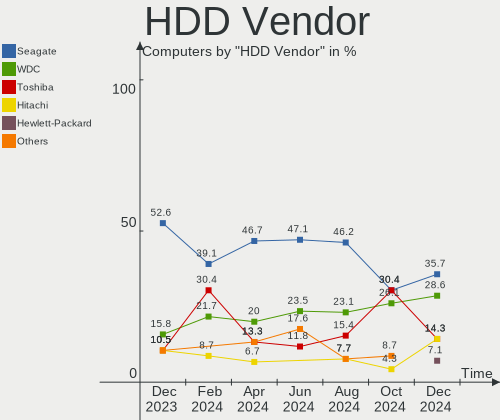
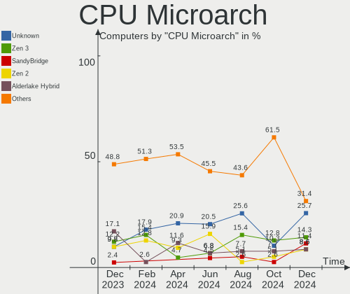

Gentoo - Hardware Trends
------------------------

A project to identify most popular hardware characteristics and track their change
over time based on data collected by Linux users at https://Linux-Hardware.org.

Anyone can contribute to this report by the [hw-probe](https://github.com/linuxhw/hw-probe) tool:

    sudo -E hw-probe -all -upload

This is a report for all computer types. See also reports for [desktops](/Dist/Gentoo/Desktop/README.md) and [notebooks](/Dist/Gentoo/Notebook/README.md).

This report is for one last month. Overall report since the beginning of time: [TestDays](https://github.com/linuxhw/TestDays)

Period: Apr, 2024.

Contents
--------

* [ System ](#system)
  - [ OS                       ](#os)
  - [ OS Family                ](#os-family)
  - [ Kernel                   ](#kernel)
  - [ Kernel Family            ](#kernel-family)
  - [ Kernel Major Ver.        ](#kernel-major-ver)
  - [ Arch                     ](#arch)
  - [ DE                       ](#de)
  - [ Display Server           ](#display-server)
  - [ Display Manager          ](#display-manager)
  - [ OS Lang                  ](#os-lang)
  - [ Boot Mode                ](#boot-mode)
  - [ Filesystem               ](#filesystem)
  - [ Part. scheme             ](#part-scheme)
  - [ Dual Boot with Linux/BSD ](#dual-boot-with-linuxbsd)
  - [ Dual Boot (Win)          ](#dual-boot-win)

* [ Board ](#board)
  - [ Vendor                   ](#vendor)
  - [ Model                    ](#model)
  - [ Model Family             ](#model-family)
  - [ MFG Year                 ](#mfg-year)
  - [ Form Factor              ](#form-factor)
  - [ Secure Boot              ](#secure-boot)
  - [ Coreboot                 ](#coreboot)
  - [ RAM Size                 ](#ram-size)
  - [ RAM Used                 ](#ram-used)
  - [ Total Drives             ](#total-drives)
  - [ Has CD-ROM               ](#has-cd-rom)
  - [ Has Ethernet             ](#has-ethernet)
  - [ Has WiFi                 ](#has-wifi)
  - [ Has Bluetooth            ](#has-bluetooth)

* [ Location ](#location)
  - [ Country                  ](#country)
  - [ City                     ](#city)

* [ Drives ](#drives)
  - [ Drive Vendor             ](#drive-vendor)
  - [ Drive Model              ](#drive-model)
  - [ HDD Vendor               ](#hdd-vendor)
  - [ SSD Vendor               ](#ssd-vendor)
  - [ Drive Kind               ](#drive-kind)
  - [ Drive Connector          ](#drive-connector)
  - [ Drive Size               ](#drive-size)
  - [ Space Total              ](#space-total)
  - [ Space Used               ](#space-used)
  - [ Malfunc. Drives          ](#malfunc-drives)
  - [ Malfunc. Drive Vendor    ](#malfunc-drive-vendor)
  - [ Malfunc. HDD Vendor      ](#malfunc-hdd-vendor)
  - [ Malfunc. Drive Kind      ](#malfunc-drive-kind)
  - [ Failed Drives            ](#failed-drives)
  - [ Failed Drive Vendor      ](#failed-drive-vendor)
  - [ Drive Status             ](#drive-status)

* [ Storage controller ](#storage-controller)
  - [ Storage Vendor           ](#storage-vendor)
  - [ Storage Model            ](#storage-model)
  - [ Storage Kind             ](#storage-kind)

* [ Processor ](#processor)
  - [ CPU Vendor               ](#cpu-vendor)
  - [ CPU Model                ](#cpu-model)
  - [ CPU Model Family         ](#cpu-model-family)
  - [ CPU Cores                ](#cpu-cores)
  - [ CPU Sockets              ](#cpu-sockets)
  - [ CPU Threads              ](#cpu-threads)
  - [ CPU Op-Modes             ](#cpu-op-modes)
  - [ CPU Microcode            ](#cpu-microcode)
  - [ CPU Microarch            ](#cpu-microarch)

* [ Graphics ](#graphics)
  - [ GPU Vendor               ](#gpu-vendor)
  - [ GPU Model                ](#gpu-model)
  - [ GPU Combo                ](#gpu-combo)
  - [ GPU Driver               ](#gpu-driver)
  - [ GPU Memory               ](#gpu-memory)

* [ Monitor ](#monitor)
  - [ Monitor Vendor           ](#monitor-vendor)
  - [ Monitor Model            ](#monitor-model)
  - [ Monitor Resolution       ](#monitor-resolution)
  - [ Monitor Diagonal         ](#monitor-diagonal)
  - [ Monitor Width            ](#monitor-width)
  - [ Aspect Ratio             ](#aspect-ratio)
  - [ Monitor Area             ](#monitor-area)
  - [ Pixel Density            ](#pixel-density)
  - [ Multiple Monitors        ](#multiple-monitors)

* [ Network ](#network)
  - [ Net Controller Vendor    ](#net-controller-vendor)
  - [ Net Controller Model     ](#net-controller-model)
  - [ Wireless Vendor          ](#wireless-vendor)
  - [ Wireless Model           ](#wireless-model)
  - [ Ethernet Vendor          ](#ethernet-vendor)
  - [ Ethernet Model           ](#ethernet-model)
  - [ Net Controller Kind      ](#net-controller-kind)
  - [ Used Controller          ](#used-controller)
  - [ NICs                     ](#nics)
  - [ IPv6                     ](#ipv6)

* [ Bluetooth ](#bluetooth)
  - [ Bluetooth Vendor         ](#bluetooth-vendor)
  - [ Bluetooth Model          ](#bluetooth-model)

* [ Sound ](#sound)
  - [ Sound Vendor             ](#sound-vendor)
  - [ Sound Model              ](#sound-model)

* [ Memory ](#memory)
  - [ Memory Vendor            ](#memory-vendor)
  - [ Memory Model             ](#memory-model)
  - [ Memory Kind              ](#memory-kind)
  - [ Memory Form Factor       ](#memory-form-factor)
  - [ Memory Size              ](#memory-size)
  - [ Memory Speed             ](#memory-speed)

* [ Printers & scanners ](#printers--scanners)
  - [ Printer Vendor           ](#printer-vendor)
  - [ Printer Model            ](#printer-model)
  - [ Scanner Vendor           ](#scanner-vendor)
  - [ Scanner Model            ](#scanner-model)

* [ Camera ](#camera)
  - [ Camera Vendor            ](#camera-vendor)
  - [ Camera Model             ](#camera-model)

* [ Security ](#security)
  - [ Fingerprint Vendor       ](#fingerprint-vendor)
  - [ Fingerprint Model        ](#fingerprint-model)
  - [ Chipcard Vendor          ](#chipcard-vendor)
  - [ Chipcard Model           ](#chipcard-model)

* [ Unsupported ](#unsupported)
  - [ Unsupported Devices      ](#unsupported-devices)
  - [ Unsupported Device Types ](#unsupported-device-types)

System
------

OS
--

Installed operating systems

| Name        | Computers | Percent |
|-------------|-----------|---------|
| Gentoo 2.14 | 31        | 72.09%  |
| Gentoo 2.15 | 11        | 25.58%  |
| Gentoo 2.13 | 1         | 2.33%   |

OS Family
---------

OS without a version

| Name   | Computers | Percent |
|--------|-----------|---------|
| Gentoo | 43        | 100%    |

Kernel
------

Version of the Linux kernel

| Version                  | Computers | Percent |
|--------------------------|-----------|---------|
| 6.6.21-gentoo-dist       | 6         | 13.95%  |
| 6.6.21-gentoo            | 6         | 13.95%  |
| 6.8.4-gentoo             | 4         | 9.3%    |
| 6.6.21-gentoo-x86_64     | 4         | 9.3%    |
| 6.8.7-gentoo             | 2         | 4.65%   |
| 6.7.4-gentoo             | 2         | 4.65%   |
| 6.6.13-gentoo-x86_64     | 2         | 4.65%   |
| 6.6.13-gentoo            | 2         | 4.65%   |
| 6.9.0-rc1-git            | 1         | 2.33%   |
| 6.8.8-gentoo-dist        | 1         | 2.33%   |
| 6.8.6-gentoo-dist        | 1         | 2.33%   |
| 6.8.5-gentoo-r1-x86_64   | 1         | 2.33%   |
| 6.8.4-gentoo-x86_64      | 1         | 2.33%   |
| 6.8.4-cachyos-x86_64     | 1         | 2.33%   |
| 6.8.1-gentoo             | 1         | 2.33%   |
| 6.6.9-gentoo-x86_64      | 1         | 2.33%   |
| 6.6.3-gentoo             | 1         | 2.33%   |
| 6.6.21-gentoo-md-a15     | 1         | 2.33%   |
| 6.6.16-gentoo-dist       | 1         | 2.33%   |
| 6.6.12-gentoo            | 1         | 2.33%   |
| 6.1.67-gentoo-x86_64     | 1         | 2.33%   |
| 6.1.67-gentoo-fomys-work | 1         | 2.33%   |
| 6.1.43                   | 1         | 2.33%   |

Kernel Family
-------------

Linux kernel without a distro release

| Version | Computers | Percent |
|---------|-----------|---------|
| 6.6.21  | 17        | 39.53%  |
| 6.8.4   | 6         | 13.95%  |
| 6.6.13  | 4         | 9.3%    |
| 6.8.7   | 2         | 4.65%   |
| 6.7.4   | 2         | 4.65%   |
| 6.1.67  | 2         | 4.65%   |
| 6.9.0   | 1         | 2.33%   |
| 6.8.8   | 1         | 2.33%   |
| 6.8.6   | 1         | 2.33%   |
| 6.8.5   | 1         | 2.33%   |
| 6.8.1   | 1         | 2.33%   |
| 6.6.9   | 1         | 2.33%   |
| 6.6.3   | 1         | 2.33%   |
| 6.6.16  | 1         | 2.33%   |
| 6.6.12  | 1         | 2.33%   |
| 6.1.43  | 1         | 2.33%   |

Kernel Major Ver.
-----------------

Linux kernel major version

| Version | Computers | Percent |
|---------|-----------|---------|
| 6.6     | 25        | 58.14%  |
| 6.8     | 12        | 27.91%  |
| 6.1     | 3         | 6.98%   |
| 6.7     | 2         | 4.65%   |
| 6.9     | 1         | 2.33%   |

Arch
----

OS architecture (x86_64, i586, etc.)

| Name    | Computers | Percent |
|---------|-----------|---------|
| x86_64  | 41        | 95.35%  |
| i686    | 1         | 2.33%   |
| aarch64 | 1         | 2.33%   |

DE
--

Desktop Environment

| Name     | Computers | Percent |
|----------|-----------|---------|
| Unknown  | 12        | 27.91%  |
| KDE5     | 11        | 25.58%  |
| GNOME    | 4         | 9.3%    |
| XFCE     | 3         | 6.98%   |
| sway     | 3         | 6.98%   |
| LXQt     | 3         | 6.98%   |
| KDE      | 2         | 4.65%   |
| MATE     | 1         | 2.33%   |
| KDE6     | 1         | 2.33%   |
| Hyprland | 1         | 2.33%   |
| fluxbox  | 1         | 2.33%   |
| DWM      | 1         | 2.33%   |

Display Server
--------------

X11 or Wayland

| Name    | Computers | Percent |
|---------|-----------|---------|
| Wayland | 21        | 48.84%  |
| X11     | 14        | 32.56%  |
| Tty     | 4         | 9.3%    |
| Unknown | 4         | 9.3%    |

Display Manager
---------------

SDDM, LightDM, etc.

| Name    | Computers | Percent |
|---------|-----------|---------|
| SDDM    | 17        | 39.53%  |
| Unknown | 15        | 34.88%  |
| LightDM | 6         | 13.95%  |
| GDM     | 3         | 6.98%   |
| SLiM    | 1         | 2.33%   |
| Ly      | 1         | 2.33%   |

OS Lang
-------

Language

| Lang    | Computers | Percent |
|---------|-----------|---------|
| en_US   | 16        | 37.21%  |
| C.UTF8  | 8         | 18.6%   |
| Unknown | 7         | 16.28%  |
| ru_RU   | 2         | 4.65%   |
| fr_FR   | 2         | 4.65%   |
| en_GB   | 2         | 4.65%   |
| zh_CN   | 1         | 2.33%   |
| pl_PL   | 1         | 2.33%   |
| en_DK   | 1         | 2.33%   |
| en_AU   | 1         | 2.33%   |
| de_DE   | 1         | 2.33%   |
| C       | 1         | 2.33%   |

Boot Mode
---------

EFI or BIOS

| Mode | Computers | Percent |
|------|-----------|---------|
| EFI  | 35        | 81.4%   |
| BIOS | 8         | 18.6%   |

Filesystem
----------

Type of filesystem

| Type    | Computers | Percent |
|---------|-----------|---------|
| Ext4    | 18        | 41.86%  |
| Btrfs   | 9         | 20.93%  |
| Xfs     | 8         | 18.6%   |
| F2fs    | 5         | 11.63%  |
| XXXXXXX | 2         | 4.65%   |
| Zfs     | 1         | 2.33%   |

Part. scheme
------------

Scheme of partitioning

| Type | Computers | Percent |
|------|-----------|---------|
| GPT  | 40        | 93.02%  |
| MBR  | 3         | 6.98%   |

Dual Boot with Linux/BSD
------------------------

Hosting more than one Linux/BSD

| Dual boot | Computers | Percent |
|-----------|-----------|---------|
| No        | 32        | 74.42%  |
| Yes       | 11        | 25.58%  |

Dual Boot (Win)
---------------

Hosting Linux and Windows

| Dual boot | Computers | Percent |
|-----------|-----------|---------|
| No        | 35        | 81.4%   |
| Yes       | 8         | 18.6%   |

Board
-----

Vendor
------

Motherboard manufacturer

| Name                | Computers | Percent |
|---------------------|-----------|---------|
| ASUSTek Computer    | 14        | 32.56%  |
| Lenovo              | 6         | 13.95%  |
| Dell                | 5         | 11.63%  |
| Gigabyte Technology | 4         | 9.3%    |
| Hewlett-Packard     | 3         | 6.98%   |
| MSI                 | 2         | 4.65%   |
| Framework           | 2         | 4.65%   |
| Supermicro          | 1         | 2.33%   |
| Quanta              | 1         | 2.33%   |
| Maibenben           | 1         | 2.33%   |
| Intel               | 1         | 2.33%   |
| IBM                 | 1         | 2.33%   |
| Chuwi               | 1         | 2.33%   |
| Unknown             | 1         | 2.33%   |

Model
-----

Motherboard model

| Name                                       | Computers | Percent |
|--------------------------------------------|-----------|---------|
| HP EliteBook 845 14 inch G10 Notebook PC   | 2         | 4.65%   |
| ASUS ROG Zephyrus G14 GA401II_GA401II      | 2         | 4.65%   |
| Supermicro Super Server                    | 1         | 2.33%   |
| Quanta S210-X12MS                          | 1         | 2.33%   |
| MSI MS-7E27                                | 1         | 2.33%   |
| MSI MS-7C79                                | 1         | 2.33%   |
| Maibenben MaiBook M                        | 1         | 2.33%   |
| Lenovo ZHAOYANG E43                        | 1         | 2.33%   |
| Lenovo ThinkPad T480 20L6SAYX00            | 1         | 2.33%   |
| Lenovo ThinkPad T14 Gen 3 21CGS0LG00       | 1         | 2.33%   |
| Lenovo ThinkPad P16 Gen 2 21FA000VPB       | 1         | 2.33%   |
| Lenovo ThinkPad E15 Gen 2 20T8000MPB       | 1         | 2.33%   |
| Lenovo G50-30 80G0                         | 1         | 2.33%   |
| Intel NUC13ANHi5                           | 1         | 2.33%   |
| IBM ThinkPad T41 23737JU                   | 1         | 2.33%   |
| HP Z420 Workstation                        | 1         | 2.33%   |
| Gigabyte B75-D3V                           | 1         | 2.33%   |
| Gigabyte B560M AORUS PRO                   | 1         | 2.33%   |
| Gigabyte AB350-Gaming                      | 1         | 2.33%   |
| Gigabyte A520 AORUS ELITE                  | 1         | 2.33%   |
| Framework Laptop 13 (AMD Ryzen 7040Series) | 1         | 2.33%   |
| Framework Laptop (13th Gen Intel Core)     | 1         | 2.33%   |
| Dell Precision 5530                        | 1         | 2.33%   |
| Dell Precision 5480                        | 1         | 2.33%   |
| Dell Latitude 5440                         | 1         | 2.33%   |
| Dell G3 3590                               | 1         | 2.33%   |
| Dell G15 5510                              | 1         | 2.33%   |
| Chuwi GemiBook XPro                        | 1         | 2.33%   |
| ASUS X550ZA                                | 1         | 2.33%   |
| ASUS VivoBook_ASUSLaptop TP412FAC_TP412FA  | 1         | 2.33%   |
| ASUS TUF Gaming FX505DV_FX505DV            | 1         | 2.33%   |
| ASUS TUF Gaming B550-PLUS                  | 1         | 2.33%   |
| ASUS ROG STRIX Z390-E GAMING               | 1         | 2.33%   |
| ASUS ROG STRIX X670E-E GAMING WIFI         | 1         | 2.33%   |
| ASUS PRIME X670-P                          | 1         | 2.33%   |
| ASUS P6X58D-E                              | 1         | 2.33%   |
| ASUS M5A99FX PRO R2.0                      | 1         | 2.33%   |
| ASUS M3A78-CM                              | 1         | 2.33%   |
| ASUS ASUS TUF Gaming A15 FA507NU_FA507NU   | 1         | 2.33%   |
| ASUS All Series                            | 1         | 2.33%   |

Model Family
------------

Motherboard model prefix

| Name                  | Computers | Percent |
|-----------------------|-----------|---------|
| Lenovo ThinkPad       | 4         | 9.3%    |
| ASUS ROG              | 4         | 9.3%    |
| HP EliteBook          | 2         | 4.65%   |
| Framework Laptop      | 2         | 4.65%   |
| Dell Precision        | 2         | 4.65%   |
| ASUS TUF              | 2         | 4.65%   |
| Supermicro Super      | 1         | 2.33%   |
| Quanta S210-X12MS     | 1         | 2.33%   |
| MSI MS-7E27           | 1         | 2.33%   |
| MSI MS-7C79           | 1         | 2.33%   |
| Maibenben MaiBook     | 1         | 2.33%   |
| Lenovo ZHAOYANG       | 1         | 2.33%   |
| Lenovo G50-30         | 1         | 2.33%   |
| Intel NUC13ANHi5      | 1         | 2.33%   |
| IBM ThinkPad          | 1         | 2.33%   |
| HP Z420               | 1         | 2.33%   |
| Gigabyte B75-D3V      | 1         | 2.33%   |
| Gigabyte B560M        | 1         | 2.33%   |
| Gigabyte AB350-Gaming | 1         | 2.33%   |
| Gigabyte A520         | 1         | 2.33%   |
| Dell Latitude         | 1         | 2.33%   |
| Dell G3               | 1         | 2.33%   |
| Dell G15              | 1         | 2.33%   |
| Chuwi GemiBook        | 1         | 2.33%   |
| ASUS X550ZA           | 1         | 2.33%   |
| ASUS VivoBook         | 1         | 2.33%   |
| ASUS PRIME            | 1         | 2.33%   |
| ASUS P6X58D-E         | 1         | 2.33%   |
| ASUS M5A99FX          | 1         | 2.33%   |
| ASUS M3A78-CM         | 1         | 2.33%   |
| ASUS ASUS             | 1         | 2.33%   |
| ASUS All              | 1         | 2.33%   |
| Unknown               | 1         | 2.33%   |

MFG Year
--------

Motherboard manufacture year

| Year    | Computers | Percent |
|---------|-----------|---------|
| 2023    | 11        | 25.58%  |
| 2020    | 6         | 13.95%  |
| 2018    | 5         | 11.63%  |
| 2022    | 3         | 6.98%   |
| 2014    | 3         | 6.98%   |
| 2012    | 3         | 6.98%   |
| 2021    | 2         | 4.65%   |
| 2019    | 2         | 4.65%   |
| 2008    | 2         | 4.65%   |
| 2017    | 1         | 2.33%   |
| 2016    | 1         | 2.33%   |
| 2015    | 1         | 2.33%   |
| 2010    | 1         | 2.33%   |
| 2004    | 1         | 2.33%   |
| Unknown | 1         | 2.33%   |

Form Factor
-----------

Physical design of the computer

| Name           | Computers | Percent |
|----------------|-----------|---------|
| Notebook       | 23        | 53.49%  |
| Desktop        | 15        | 34.88%  |
| Server         | 2         | 4.65%   |
| System on chip | 1         | 2.33%   |
| Convertible    | 1         | 2.33%   |
| Mini pc        | 1         | 2.33%   |

Secure Boot
-----------

Enabled or disabled

| State    | Computers | Percent |
|----------|-----------|---------|
| Disabled | 41        | 95.35%  |
| Enabled  | 2         | 4.65%   |

Coreboot
--------

Have coreboot on board

| Used | Computers | Percent |
|------|-----------|---------|
| No   | 43        | 100%    |

RAM Size
--------

Total RAM memory

| Size in GB  | Computers | Percent |
|-------------|-----------|---------|
| 32.01-64.0  | 13        | 30.23%  |
| 64.01-256.0 | 8         | 18.6%   |
| 8.01-16.0   | 7         | 16.28%  |
| 24.01-32.0  | 5         | 11.63%  |
| 4.01-8.0    | 4         | 9.3%    |
| 16.01-24.0  | 4         | 9.3%    |
| 3.01-4.0    | 1         | 2.33%   |
| 1.01-2.0    | 1         | 2.33%   |

RAM Used
--------

Used RAM memory

| Used GB    | Computers | Percent |
|------------|-----------|---------|
| 2.01-3.0   | 9         | 20.93%  |
| 1.01-2.0   | 9         | 20.93%  |
| 3.01-4.0   | 6         | 13.95%  |
| 8.01-16.0  | 6         | 13.95%  |
| 4.01-8.0   | 5         | 11.63%  |
| 16.01-24.0 | 3         | 6.98%   |
| 0.01-0.5   | 3         | 6.98%   |
| 32.01-64.0 | 1         | 2.33%   |
| 0.51-1.0   | 1         | 2.33%   |

Total Drives
------------

Number of drives on board

| Drives | Computers | Percent |
|--------|-----------|---------|
| 1      | 25        | 58.14%  |
| 2      | 9         | 20.93%  |
| 3      | 5         | 11.63%  |
| 4      | 2         | 4.65%   |
| 6      | 1         | 2.33%   |
| 5      | 1         | 2.33%   |

Has CD-ROM
----------

Has CD-ROM on board

| Presented | Computers | Percent |
|-----------|-----------|---------|
| No        | 33        | 76.74%  |
| Yes       | 10        | 23.26%  |

Has Ethernet
------------

Has Ethernet on board

| Presented | Computers | Percent |
|-----------|-----------|---------|
| Yes       | 38        | 88.37%  |
| No        | 5         | 11.63%  |

Has WiFi
--------

Has WiFi module

| Presented | Computers | Percent |
|-----------|-----------|---------|
| Yes       | 30        | 69.77%  |
| No        | 13        | 30.23%  |

Has Bluetooth
-------------

Has Bluetooth module

| Presented | Computers | Percent |
|-----------|-----------|---------|
| Yes       | 28        | 65.12%  |
| No        | 15        | 34.88%  |

Location
--------

Country
-------

Geographic location (country)

| Country         | Computers | Percent |
|-----------------|-----------|---------|
| Russia          | 10        | 23.26%  |
| Poland          | 7         | 16.28%  |
| USA             | 5         | 11.63%  |
| UK              | 3         | 6.98%   |
| France          | 2         | 4.65%   |
| Czechia         | 2         | 4.65%   |
| China           | 2         | 4.65%   |
| The Netherlands | 1         | 2.33%   |
| Switzerland     | 1         | 2.33%   |
| Sweden          | 1         | 2.33%   |
| Spain           | 1         | 2.33%   |
| South Africa    | 1         | 2.33%   |
| Serbia          | 1         | 2.33%   |
| Ireland         | 1         | 2.33%   |
| India           | 1         | 2.33%   |
| Germany         | 1         | 2.33%   |
| Denmark         | 1         | 2.33%   |
| Canada          | 1         | 2.33%   |
| Bulgaria        | 1         | 2.33%   |

City
----

Geographic location (city)

| City                | Computers | Percent |
|---------------------|-----------|---------|
| Warsaw              | 3         | 6.98%   |
| St Petersburg       | 2         | 4.65%   |
| Moscow              | 2         | 4.65%   |
| Krasnodar           | 2         | 4.65%   |
| Yekaterinburg       | 1         | 2.33%   |
| Wroclaw             | 1         | 2.33%   |
| Woburn              | 1         | 2.33%   |
| Whitefish           | 1         | 2.33%   |
| Vancouver           | 1         | 2.33%   |
| Toulouse            | 1         | 2.33%   |
| Tianjin             | 1         | 2.33%   |
| Stockholm           | 1         | 2.33%   |
| Sofia               | 1         | 2.33%   |
| Šlapanice          | 1         | 2.33%   |
| Sellersville        | 1         | 2.33%   |
| Poznan              | 1         | 2.33%   |
| Omsk                | 1         | 2.33%   |
| Novosibirsk         | 1         | 2.33%   |
| Norager             | 1         | 2.33%   |
| Miami               | 1         | 2.33%   |
| Lancaster           | 1         | 2.33%   |
| Kralupy nad Vltavou | 1         | 2.33%   |
| Johannesburg        | 1         | 2.33%   |
| Irkutsk             | 1         | 2.33%   |
| Guildford           | 1         | 2.33%   |
| Gliwice             | 1         | 2.33%   |
| Glasgow             | 1         | 2.33%   |
| Foshan              | 1         | 2.33%   |
| Étampes            | 1         | 2.33%   |
| Dublin              | 1         | 2.33%   |
| Delhi               | 1         | 2.33%   |
| Croydon             | 1         | 2.33%   |
| Cieszyn             | 1         | 2.33%   |
| Bochum              | 1         | 2.33%   |
| Bern                | 1         | 2.33%   |
| Belgrade            | 1         | 2.33%   |
| Amsterdam           | 1         | 2.33%   |
| Alicante            | 1         | 2.33%   |

Drives
------

Drive Vendor
------------

Hard drive vendors

| Vendor                         | Computers | Drives | Percent |
|--------------------------------|-----------|--------|---------|
| Samsung Electronics            | 12        | 12     | 17.65%  |
| Sandisk                        | 8         | 8      | 11.76%  |
| Seagate                        | 7         | 8      | 10.29%  |
| Kingston                       | 4         | 4      | 5.88%   |
| WDC                            | 3         | 5      | 4.41%   |
| Unknown                        | 3         | 3      | 4.41%   |
| GOODRAM                        | 3         | 3      | 4.41%   |
| Toshiba                        | 2         | 2      | 2.94%   |
| Micron Technology              | 2         | 2      | 2.94%   |
| KIOXIA                         | 2         | 2      | 2.94%   |
| Kingston Technology Company    | 2         | 2      | 2.94%   |
| Intel                          | 2         | 2      | 2.94%   |
| HGST                           | 2         | 3      | 2.94%   |
| Union Memory                   | 1         | 1      | 1.47%   |
| Solid State Storage Technology | 1         | 1      | 1.47%   |
| SK hynix                       | 1         | 1      | 1.47%   |
| Shenzhen Longsys Electronics   | 1         | 2      | 1.47%   |
| SCCTS-603-256G                 | 1         | 1      | 1.47%   |
| Phison Electronics             | 1         | 2      | 1.47%   |
| Patriot                        | 1         | 1      | 1.47%   |
| OCZ                            | 1         | 1      | 1.47%   |
| Netac                          | 1         | 1      | 1.47%   |
| Micron/Crucial Technology      | 1         | 1      | 1.47%   |
| MAXIO Technology (Hangzhou)    | 1         | 1      | 1.47%   |
| Intenso                        | 1         | 1      | 1.47%   |
| Hitachi                        | 1         | 3      | 1.47%   |
| Crucial                        | 1         | 1      | 1.47%   |
| ADATA Technology               | 1         | 1      | 1.47%   |
| A-DATA Technology              | 1         | 2      | 1.47%   |

Drive Model
-----------

Hard drive models

| Model                                              | Computers | Percent |
|----------------------------------------------------|-----------|---------|
| Samsung NVMe SSD Controller SM981/PM981/PM983 1TB  | 5         | 7.04%   |
| Seagate ST4000DM004-2CV104 4TB                     | 2         | 2.82%   |
| Sandisk WD Blue SN550 NVMe SSD 2TB                 | 2         | 2.82%   |
| Samsung SSD 990 PRO 1TB                            | 2         | 2.82%   |
| KIOXIA KXG80ZNV1T02 1TB                            | 2         | 2.82%   |
| Kingston SA400S37480G 480GB SSD                    | 2         | 2.82%   |
| GOODRAM SSDPR-CL100-480-G2 480GB                   | 2         | 2.82%   |
| WDC WDS500G2B0A-00SM50 500GB SSD                   | 1         | 1.41%   |
| WDC WDS500G1B0A-00H9H0 500GB SSD                   | 1         | 1.41%   |
| WDC WD42 EJRX-89BFNY0 4TB                          | 1         | 1.41%   |
| WDC WD10EZEX-00BBHA0 1TB                           | 1         | 1.41%   |
| WDC WD10EADS-00M2B0 1TB                            | 1         | 1.41%   |
| Unknown NVMe SSD Drive 2TB                         | 1         | 1.41%   |
| Unknown MMC Card  8GB                              | 1         | 1.41%   |
| Unknown MMC Card  16GB                             | 1         | 1.41%   |
| Union Memory UMIS RPJTJ512MEE1OWX 512GB            | 1         | 1.41%   |
| Toshiba HDWE150 5TB                                | 1         | 1.41%   |
| Toshiba HDWD120 2TB                                | 1         | 1.41%   |
| Solid State Storage CL4-3D256-Q11 NVMe SSSTC 256GB | 1         | 1.41%   |
| SK hynix BC501 NVMe Solid State Drive 512GB        | 1         | 1.41%   |
| Shenzhen Longsys Lexar SSD NM710 2TB               | 1         | 1.41%   |
| Seagate ST3500413AS 500GB                          | 1         | 1.41%   |
| Seagate ST2000LM007-1R8174 2TB                     | 1         | 1.41%   |
| Seagate ST2000DM006-2DM164 2TB                     | 1         | 1.41%   |
| Seagate ST2000DM001-1ER164 2TB                     | 1         | 1.41%   |
| Seagate ST12000NM0008-2H3101 12TB                  | 1         | 1.41%   |
| SCCTS-603-256G SSD 256GB                           | 1         | 1.41%   |
| Sandisk WD_BLACK SN850X 2000GB                     | 1         | 1.41%   |
| Sandisk WDC PC SN530 SDBPMPZ-512G-1101 512GB       | 1         | 1.41%   |
| Sandisk WD PC SN540 SDDPNPF-512G                   | 1         | 1.41%   |
| Sandisk WD Blue SN580 2TB                          | 1         | 1.41%   |
| Sandisk WD Black SN850 512GB                       | 1         | 1.41%   |
| Sandisk PC SN530 NVMe WDC 512GB                    | 1         | 1.41%   |
| Samsung SSD 870 EVO 1TB                            | 1         | 1.41%   |
| Samsung SSD 860 EVO 500GB                          | 1         | 1.41%   |
| Samsung SSD 850 EVO 1TB                            | 1         | 1.41%   |
| Samsung NVMe SSD Controller PM9A1/PM9A3/980PRO 1TB | 1         | 1.41%   |
| Samsung MZ7WD960HMHP-00003 960GB SSD               | 1         | 1.41%   |
| Phison Sabrent SB-RKT4P-8TB                        | 1         | 1.41%   |
| Phison E12 NVMe Controller 2TB                     | 1         | 1.41%   |

HDD Vendor
----------

Hard disk drive vendors

| Vendor  | Computers | Drives | Percent |
|---------|-----------|--------|---------|
| Seagate | 7         | 8      | 46.67%  |
| WDC     | 3         | 3      | 20%     |
| Toshiba | 2         | 2      | 13.33%  |
| HGST    | 2         | 3      | 13.33%  |
| Hitachi | 1         | 3      | 6.67%   |

SSD Vendor
----------

Solid state drive vendors

| Vendor              | Computers | Drives | Percent |
|---------------------|-----------|--------|---------|
| Samsung Electronics | 4         | 4      | 20%     |
| Kingston            | 4         | 4      | 20%     |
| GOODRAM             | 3         | 3      | 15%     |
| WDC                 | 1         | 2      | 5%      |
| SCCTS-603-256G      | 1         | 1      | 5%      |
| Patriot             | 1         | 1      | 5%      |
| OCZ                 | 1         | 1      | 5%      |
| Netac               | 1         | 1      | 5%      |
| Intenso             | 1         | 1      | 5%      |
| Intel               | 1         | 1      | 5%      |
| Crucial             | 1         | 1      | 5%      |
| A-DATA Technology   | 1         | 2      | 5%      |

Drive Kind
----------

HDD or SSD

| Kind | Computers | Drives | Percent |
|------|-----------|--------|---------|
| NVMe | 27        | 34     | 45.76%  |
| SSD  | 19        | 22     | 32.2%   |
| HDD  | 11        | 19     | 18.64%  |
| MMC  | 2         | 2      | 3.39%   |

Drive Connector
---------------

SATA, SAS, NVMe, etc.

| Type | Computers | Drives | Percent |
|------|-----------|--------|---------|
| NVMe | 27        | 34     | 51.92%  |
| SATA | 22        | 40     | 42.31%  |
| MMC  | 2         | 2      | 3.85%   |
| SAS  | 1         | 1      | 1.92%   |

Drive Size
----------

Size of hard drive

| Size in TB | Computers | Drives | Percent |
|------------|-----------|--------|---------|
| 0.01-0.5   | 12        | 15     | 36.36%  |
| 0.51-1.0   | 9         | 9      | 27.27%  |
| 1.01-2.0   | 5         | 7      | 15.15%  |
| 3.01-4.0   | 3         | 3      | 9.09%   |
| 2.01-3.0   | 2         | 5      | 6.06%   |
| 10.01-20.0 | 1         | 1      | 3.03%   |
| 4.01-10.0  | 1         | 1      | 3.03%   |

Space Total
-----------

Amount of disk space available on the file system

| Size in GB     | Computers | Percent |
|----------------|-----------|---------|
| More than 3000 | 9         | 20.93%  |
| 101-250        | 7         | 16.28%  |
| 1001-2000      | 7         | 16.28%  |
| 251-500        | 6         | 13.95%  |
| 501-1000       | 5         | 11.63%  |
| 1-20           | 3         | 6.98%   |
| 2001-3000      | 2         | 4.65%   |
| Unknown        | 2         | 4.65%   |
| 21-50          | 1         | 2.33%   |
| 51-100         | 1         | 2.33%   |

Space Used
----------

Amount of used disk space

| Used GB        | Computers | Percent |
|----------------|-----------|---------|
| 251-500        | 7         | 16.28%  |
| 21-50          | 7         | 16.28%  |
| 1-20           | 7         | 16.28%  |
| More than 3000 | 5         | 11.63%  |
| 101-250        | 5         | 11.63%  |
| 51-100         | 4         | 9.3%    |
| 1001-2000      | 3         | 6.98%   |
| 501-1000       | 3         | 6.98%   |
| Unknown        | 2         | 4.65%   |

Malfunc. Drives
---------------

Drive models with a malfunction

| Model                                            | Computers | Drives | Percent |
|--------------------------------------------------|-----------|--------|---------|
| WDC WD10EADS-00M2B0 1TB                          | 1         | 1      | 25%     |
| Seagate ST2000LM007-1R8174 2TB                   | 1         | 1      | 25%     |
| Samsung Electronics MZ7WD960HMHP-00003 960GB SSD | 1         | 1      | 25%     |
| OCZ AGILITY3 128GB SSD                           | 1         | 1      | 25%     |

Malfunc. Drive Vendor
---------------------

Vendors of faulty drives

| Vendor              | Computers | Drives | Percent |
|---------------------|-----------|--------|---------|
| WDC                 | 1         | 1      | 25%     |
| Seagate             | 1         | 1      | 25%     |
| Samsung Electronics | 1         | 1      | 25%     |
| OCZ                 | 1         | 1      | 25%     |

Malfunc. HDD Vendor
-------------------

Vendors of faulty HDD drives

| Vendor  | Computers | Drives | Percent |
|---------|-----------|--------|---------|
| WDC     | 1         | 1      | 50%     |
| Seagate | 1         | 1      | 50%     |

Malfunc. Drive Kind
-------------------

Kinds of faulty drives

| Kind | Computers | Drives | Percent |
|------|-----------|--------|---------|
| SSD  | 2         | 2      | 50%     |
| HDD  | 2         | 2      | 50%     |

Failed Drives
-------------

Failed drive models

Zero info for selected period =(

Failed Drive Vendor
-------------------

Failed drive vendors

Zero info for selected period =(

Drive Status
------------

Number of failed and malfunc. drives

| Status   | Computers | Drives | Percent |
|----------|-----------|--------|---------|
| Works    | 41        | 70     | 87.23%  |
| Detected | 3         | 3      | 6.38%   |
| Malfunc  | 3         | 4      | 6.38%   |

Storage controller
------------------

Storage Vendor
--------------

Storage controller vendors

| Vendor                         | Computers | Percent |
|--------------------------------|-----------|---------|
| Intel                          | 19        | 29.69%  |
| AMD                            | 12        | 18.75%  |
| SanDisk                        | 8         | 12.5%   |
| Samsung Electronics            | 8         | 12.5%   |
| Micron Technology              | 2         | 3.13%   |
| KIOXIA                         | 2         | 3.13%   |
| Kingston Technology Company    | 2         | 3.13%   |
| Union Memory (Shenzhen)        | 1         | 1.56%   |
| Solid State Storage Technology | 1         | 1.56%   |
| SK hynix                       | 1         | 1.56%   |
| Shenzhen Longsys Electronics   | 1         | 1.56%   |
| Phison Electronics             | 1         | 1.56%   |
| Micron/Crucial Technology      | 1         | 1.56%   |
| MAXIO Technology (Hangzhou)    | 1         | 1.56%   |
| Marvell Technology Group       | 1         | 1.56%   |
| INNOGRIT                       | 1         | 1.56%   |
| ASMedia Technology             | 1         | 1.56%   |
| ADATA Technology               | 1         | 1.56%   |

Storage Model
-------------

Storage controller models

| Model                                                                 | Computers | Percent |
|-----------------------------------------------------------------------|-----------|---------|
| Samsung NVMe SSD Controller SM981/PM981/PM983                         | 5         | 6.76%   |
| AMD FCH SATA Controller [AHCI mode]                                   | 5         | 6.76%   |
| AMD 600 Series Chipset SATA Controller                                | 3         | 4.05%   |
| SanDisk Ultra 3D / WD Blue SN550 NVMe SSD                             | 2         | 2.7%    |
| Samsung NVMe SSD Controller S4LV008[Pascal]                           | 2         | 2.7%    |
| KIOXIA NVMe SSD Controller XG8                                        | 2         | 2.7%    |
| Intel Cannon Lake Mobile PCH SATA AHCI Controller                     | 2         | 2.7%    |
| Intel C610/X99 series chipset sSATA Controller [AHCI mode]            | 2         | 2.7%    |
| Intel C602 chipset 4-Port SATA Storage Control Unit                   | 2         | 2.7%    |
| AMD 500 Series Chipset SATA Controller                                | 2         | 2.7%    |
| Union Memory (Shenzhen) AM620 PCIe 3.0 NVMe SSD 512GB                 | 1         | 1.35%   |
| Solid State Storage CL4-8D512 NVMe SSD M.2 (DRAM-less)                | 1         | 1.35%   |
| SK hynix BC501 NVMe Solid State Drive                                 | 1         | 1.35%   |
| Shenzhen Longsys Lexar NM790 NVME SSD (DRAM-less)                     | 1         | 1.35%   |
| SanDisk WD PC SN810 / Black SN850 NVMe SSD                            | 1         | 1.35%   |
| SanDisk WD PC SN540 / Green SN350 NVMe SSD 1 TB (DRAM-less)           | 1         | 1.35%   |
| Sandisk WD Blue SN580 NVMe SSD (DRAM-less)                            | 1         | 1.35%   |
| Sandisk WD Black SN850X NVMe SSD                                      | 1         | 1.35%   |
| SanDisk PC SN530 NVMe SSD (DRAM-less)                                 | 1         | 1.35%   |
| SanDisk IX SN530 NVMe SSD (DRAM-less)                                 | 1         | 1.35%   |
| Samsung NVMe SSD Controller PM9A1/PM9A3/980PRO                        | 1         | 1.35%   |
| Phison E18 PCIe4 NVMe Controller                                      | 1         | 1.35%   |
| Phison E12 NVMe Controller                                            | 1         | 1.35%   |
| Micron/Crucial P2 [Nick P2] / P3 / P3 Plus NVMe PCIe SSD (DRAM-less)  | 1         | 1.35%   |
| Micron 2450 NVMe SSD [HendrixV] (DRAM-less)                           | 1         | 1.35%   |
| Micron 2400 NVMe SSD (DRAM-less)                                      | 1         | 1.35%   |
| MAXIO (Hangzhou) NVMe SSD Controller MAP1602 (DRAM-less)              | 1         | 1.35%   |
| Marvell Group 88SE9123 PCIe SATA 6.0 Gb/s controller                  | 1         | 1.35%   |
| Kingston Company NV2 NVMe SSD SM2267XT (DRAM-less)                    | 1         | 1.35%   |
| Kingston Company A1000/U-SNS8154P3 x2 NVMe SSD                        | 1         | 1.35%   |
| Intel Volume Management Device NVMe RAID Controller Intel Corporation | 1         | 1.35%   |
| Intel SSD 660P Series                                                 | 1         | 1.35%   |
| Intel SATA Controller [RAID Mode]                                     | 1         | 1.35%   |
| Intel SATA controller                                                 | 1         | 1.35%   |
| Intel Comet Lake SATA AHCI Controller                                 | 1         | 1.35%   |
| Intel Cannon Lake PCH SATA AHCI Controller                            | 1         | 1.35%   |
| Intel C610/X99 series chipset 6-Port SATA Controller [AHCI mode]      | 1         | 1.35%   |
| Intel C610/X99 series chipset 4-port SATA Controller [IDE mode]       | 1         | 1.35%   |
| Intel C610/X99 series chipset 2-port SATA Controller [IDE mode]       | 1         | 1.35%   |
| Intel C600/X79 series chipset IDE-r Controller                        | 1         | 1.35%   |

Storage Kind
------------

Kind of storage controller (IDE, SATA, NVMe, SAS, ...)

| Kind | Computers | Percent |
|------|-----------|---------|
| NVMe | 27        | 43.55%  |
| SATA | 25        | 40.32%  |
| IDE  | 5         | 8.06%   |
| RAID | 3         | 4.84%   |
| SAS  | 2         | 3.23%   |

Processor
---------

CPU Vendor
----------

Processor vendors

| Vendor | Computers | Percent |
|--------|-----------|---------|
| Intel  | 23        | 53.49%  |
| AMD    | 19        | 44.19%  |
| ARM    | 1         | 2.33%   |

CPU Model
---------

Processor models

| Model                                          | Computers | Percent |
|------------------------------------------------|-----------|---------|
| AMD Ryzen 9 PRO 7940HS w/ Radeon 780M Graphics | 2         | 4.65%   |
| AMD Ryzen 7 5700G with Radeon Graphics         | 2         | 4.65%   |
| AMD Ryzen 7 4800HS with Radeon Graphics        | 2         | 4.65%   |
| Intel Xeon CPU E5-2690 v3 @ 2.60GHz            | 1         | 2.33%   |
| Intel Xeon CPU E5-2670 v2 @ 2.50GHz            | 1         | 2.33%   |
| Intel Xeon CPU E5-1620 v2 @ 3.70GHz            | 1         | 2.33%   |
| Intel Pentium M processor 2.26GHz              | 1         | 2.33%   |
| Intel Pentium CPU N3540 @ 2.16GHz              | 1         | 2.33%   |
| Intel N100                                     | 1         | 2.33%   |
| Intel Core i9-9900K CPU @ 3.60GHz              | 1         | 2.33%   |
| Intel Core i7-8850H CPU @ 2.60GHz              | 1         | 2.33%   |
| Intel Core i7-8550U CPU @ 1.80GHz              | 1         | 2.33%   |
| Intel Core i7-6800K CPU @ 3.40GHz              | 1         | 2.33%   |
| Intel Core i7-10700K CPU @ 3.80GHz             | 1         | 2.33%   |
| Intel Core i7 CPU 950 @ 3.07GHz                | 1         | 2.33%   |
| Intel Core i5-9300H CPU @ 2.40GHz              | 1         | 2.33%   |
| Intel Core i5-3330 CPU @ 3.00GHz               | 1         | 2.33%   |
| Intel Core i5-10210U CPU @ 1.60GHz             | 1         | 2.33%   |
| Intel Core i5-10200H CPU @ 2.40GHz             | 1         | 2.33%   |
| Intel Core 2 Duo CPU P9700 @ 2.80GHz           | 1         | 2.33%   |
| Intel 13th Gen Core i7-13850HX                 | 1         | 2.33%   |
| Intel 13th Gen Core i7-13800H                  | 1         | 2.33%   |
| Intel 13th Gen Core i7-1370P                   | 1         | 2.33%   |
| Intel 13th Gen Core i5-1340P                   | 1         | 2.33%   |
| Intel 13th Gen Core i5-1335U                   | 1         | 2.33%   |
| Intel 11th Gen Core i5-11500 @ 2.70GHz         | 1         | 2.33%   |
| ARM Processor                                  | 1         | 2.33%   |
| AMD Ryzen 9 7950X3D 16-Core Processor          | 1         | 2.33%   |
| AMD Ryzen 7 PRO 6850U with Radeon Graphics     | 1         | 2.33%   |
| AMD Ryzen 7 7840U w/ Radeon 780M Graphics      | 1         | 2.33%   |
| AMD Ryzen 7 7800X3D 8-Core Processor           | 1         | 2.33%   |
| AMD Ryzen 7 7735HS with Radeon Graphics        | 1         | 2.33%   |
| AMD Ryzen 7 4700U with Radeon Graphics         | 1         | 2.33%   |
| AMD Ryzen 7 3750H with Radeon Vega Mobile Gfx  | 1         | 2.33%   |
| AMD Ryzen 5 7600 6-Core Processor              | 1         | 2.33%   |
| AMD Ryzen 5 4500U with Radeon Graphics         | 1         | 2.33%   |
| AMD Ryzen 5 2600 Six-Core Processor            | 1         | 2.33%   |
| AMD Phenom II X4 955 Processor                 | 1         | 2.33%   |
| AMD FX-8150 Eight-Core Processor               | 1         | 2.33%   |
| AMD A8-7200P Radeon R5, 8 Compute Cores 4C+4G  | 1         | 2.33%   |

CPU Model Family
----------------

Processor model prefix

| Model            | Computers | Percent |
|------------------|-----------|---------|
| AMD Ryzen 7      | 9         | 20.93%  |
| Other            | 8         | 18.6%   |
| Intel Core i7    | 5         | 11.63%  |
| Intel Core i5    | 4         | 9.3%    |
| Intel Xeon       | 3         | 6.98%   |
| AMD Ryzen 9      | 3         | 6.98%   |
| AMD Ryzen 5      | 3         | 6.98%   |
| Intel Pentium M  | 1         | 2.33%   |
| Intel Pentium    | 1         | 2.33%   |
| Intel Core i9    | 1         | 2.33%   |
| Intel Core 2 Duo | 1         | 2.33%   |
| AMD Ryzen 7 PRO  | 1         | 2.33%   |
| AMD Phenom II X4 | 1         | 2.33%   |
| AMD FX           | 1         | 2.33%   |
| AMD A8           | 1         | 2.33%   |

CPU Cores
---------

Number of processor cores

| Number | Computers | Percent |
|--------|-----------|---------|
| 8      | 13        | 30.23%  |
| 4      | 13        | 30.23%  |
| 6      | 6         | 13.95%  |
| 20     | 2         | 4.65%   |
| 14     | 2         | 4.65%   |
| 12     | 2         | 4.65%   |
| 2      | 2         | 4.65%   |
| 16     | 1         | 2.33%   |
| 10     | 1         | 2.33%   |
| 1      | 1         | 2.33%   |

CPU Sockets
-----------

Number of sockets

| Number | Computers | Percent |
|--------|-----------|---------|
| 1      | 42        | 97.67%  |
| 2      | 1         | 2.33%   |

CPU Threads
-----------

Threads per core (Hyper-Threading)

| Number | Computers | Percent |
|--------|-----------|---------|
| 2      | 34        | 79.07%  |
| 1      | 9         | 20.93%  |

CPU Op-Modes
------------

CPU Operation Modes (32-bit, 64-bit)

| Op mode        | Computers | Percent |
|----------------|-----------|---------|
| 32-bit, 64-bit | 42        | 97.67%  |
| 32-bit         | 1         | 2.33%   |

CPU Microcode
-------------

Microcode number

| Number     | Computers | Percent |
|------------|-----------|---------|
| Unknown    | 31        | 72.09%  |
| 0x0a404102 | 2         | 4.65%   |
| 0xb06a2    | 1         | 2.33%   |
| 0x306a9    | 1         | 2.33%   |
| 0x0a601206 | 1         | 2.33%   |
| 0x0a601203 | 1         | 2.33%   |
| 0x0a50000d | 1         | 2.33%   |
| 0x08600104 | 1         | 2.33%   |
| 0x08600103 | 1         | 2.33%   |
| 0x0800820d | 1         | 2.33%   |
| 0x0600062e | 1         | 2.33%   |
| 0x010000db | 1         | 2.33%   |

CPU Microarch
-------------

Microarchitecture

| Name             | Computers | Percent |
|------------------|-----------|---------|
| Unknown          | 9         | 20.93%  |
| KabyLake         | 5         | 11.63%  |
| Alderlake Hybrid | 5         | 11.63%  |
| Zen 2            | 4         | 9.3%    |
| IvyBridge        | 3         | 6.98%   |
| Zen+             | 2         | 4.65%   |
| Zen 3            | 2         | 4.65%   |
| CometLake        | 2         | 4.65%   |
| Steamroller      | 1         | 2.33%   |
| Silvermont       | 1         | 2.33%   |
| Penryn           | 1         | 2.33%   |
| P6               | 1         | 2.33%   |
| Nehalem          | 1         | 2.33%   |
| K10              | 1         | 2.33%   |
| Icelake          | 1         | 2.33%   |
| Haswell          | 1         | 2.33%   |
| Gracemont        | 1         | 2.33%   |
| Bulldozer        | 1         | 2.33%   |
| Broadwell        | 1         | 2.33%   |

Graphics
--------

GPU Vendor
----------

Vendors of graphics cards

| Vendor            | Computers | Percent |
|-------------------|-----------|---------|
| AMD               | 23        | 42.59%  |
| Nvidia            | 17        | 31.48%  |
| Intel             | 12        | 22.22%  |
| ASPEED Technology | 2         | 3.7%    |

GPU Model
---------

Graphics card models

| Model                                                                | Computers | Percent |
|----------------------------------------------------------------------|-----------|---------|
| Intel Raptor Lake-P [Iris Xe Graphics]                               | 4         | 7.14%   |
| AMD Renoir [Radeon RX Vega 6 (Ryzen 4000/5000 Mobile Series)]        | 4         | 7.14%   |
| AMD Navi 22 [Radeon RX 6700/6700 XT/6750 XT / 6800M/6850M XT]        | 4         | 7.14%   |
| AMD Raphael                                                          | 3         | 5.36%   |
| AMD Phoenix1                                                         | 3         | 5.36%   |
| Nvidia TU116M [GeForce GTX 1650 Ti Mobile]                           | 2         | 3.57%   |
| Intel CoffeeLake-H GT2 [UHD Graphics 630]                            | 2         | 3.57%   |
| ASPEED Technology ASPEED Graphics Family                             | 2         | 3.57%   |
| AMD Rembrandt [Radeon 680M]                                          | 2         | 3.57%   |
| AMD Cezanne [Radeon Vega Series / Radeon Vega Mobile Series]         | 2         | 3.57%   |
| Nvidia TU117M [GeForce GTX 1650 Mobile / Max-Q]                      | 1         | 1.79%   |
| Nvidia TU116 [GeForce GTX 1660]                                      | 1         | 1.79%   |
| Nvidia TU106M [GeForce RTX 2060 Mobile]                              | 1         | 1.79%   |
| Nvidia GP107GLM [Quadro P2000 Mobile]                                | 1         | 1.79%   |
| Nvidia GP107 [GeForce GTX 1050]                                      | 1         | 1.79%   |
| Nvidia GP102 [GeForce GTX 1080 Ti]                                   | 1         | 1.79%   |
| Nvidia GM204 [GeForce GTX 970]                                       | 1         | 1.79%   |
| Nvidia GK107 [GeForce GTX 650]                                       | 1         | 1.79%   |
| Nvidia GF117M [GeForce 610M/710M/810M/820M / GT 620M/625M/630M/720M] | 1         | 1.79%   |
| Nvidia GA107M [GeForce RTX 3050 Mobile]                              | 1         | 1.79%   |
| Nvidia GA106 [GeForce RTX 3060 Lite Hash Rate]                       | 1         | 1.79%   |
| Nvidia GA102 [GeForce RTX 3080 Ti]                                   | 1         | 1.79%   |
| Nvidia G98M [Quadro NVS 160M]                                        | 1         | 1.79%   |
| Nvidia AD107M [GeForce RTX 4050 Max-Q / Mobile]                      | 1         | 1.79%   |
| Nvidia AD107GLM [RTX 2000 Ada Generation Laptop GPU]                 | 1         | 1.79%   |
| Intel UHD Graphics 620                                               | 1         | 1.79%   |
| Intel Raptor Lake-S UHD Graphics                                     | 1         | 1.79%   |
| Intel CometLake-U GT2 [UHD Graphics]                                 | 1         | 1.79%   |
| Intel Comet Lake-H GT1 [UHD Graphics 610]                            | 1         | 1.79%   |
| Intel Atom Processor Z36xxx/Z37xxx Series Graphics & Display         | 1         | 1.79%   |
| Intel Alder Lake-N [UHD Graphics]                                    | 1         | 1.79%   |
| AMD RV200/M7 [Mobility Radeon 7500]                                  | 1         | 1.79%   |
| AMD RS780C [Radeon 3100]                                             | 1         | 1.79%   |
| AMD Picasso/Raven 2 [Radeon Vega Series / Radeon Vega Mobile Series] | 1         | 1.79%   |
| AMD Oland PRO [Radeon R7 240/340 / Radeon 520]                       | 1         | 1.79%   |
| AMD Navi 23 [Radeon RX 6650 XT / 6700S / 6800S]                      | 1         | 1.79%   |
| AMD Kaveri [Radeon R5 Graphics]                                      | 1         | 1.79%   |
| AMD Cedar [Radeon HD 5000/6000/7350/8350 Series]                     | 1         | 1.79%   |

GPU Combo
---------

Combinations of graphics cards

| Name           | Computers | Percent |
|----------------|-----------|---------|
| 1 x AMD        | 14        | 32.56%  |
| 1 x Intel      | 7         | 16.28%  |
| 1 x Nvidia     | 6         | 13.95%  |
| AMD + Nvidia   | 6         | 13.95%  |
| Intel + Nvidia | 5         | 11.63%  |
| 2 x AMD        | 2         | 4.65%   |
| Other          | 1         | 2.33%   |
| 1 x ASPEED     | 1         | 2.33%   |
| AMD + ASPEED   | 1         | 2.33%   |

GPU Driver
----------

Free vs proprietary

| Driver      | Computers | Percent |
|-------------|-----------|---------|
| Free        | 30        | 69.77%  |
| Proprietary | 11        | 25.58%  |
| Unknown     | 2         | 4.65%   |

GPU Memory
----------

Total video memory

| Size in GB | Computers | Percent |
|------------|-----------|---------|
| Unknown    | 16        | 37.21%  |
| 0.01-0.5   | 11        | 25.58%  |
| 8.01-16.0  | 6         | 13.95%  |
| 0.51-1.0   | 4         | 9.3%    |
| 1.01-2.0   | 3         | 6.98%   |
| 7.01-8.0   | 1         | 2.33%   |
| 5.01-6.0   | 1         | 2.33%   |
| 3.01-4.0   | 1         | 2.33%   |

Monitor
-------

Monitor Vendor
--------------

Monitor vendors

| Vendor              | Computers | Percent |
|---------------------|-----------|---------|
| Samsung Electronics | 9         | 16.36%  |
| BOE                 | 7         | 12.73%  |
| Goldstar            | 5         | 9.09%   |
| Dell                | 5         | 9.09%   |
| AU Optronics        | 5         | 9.09%   |
| AOC                 | 4         | 7.27%   |
| ViewSonic           | 2         | 3.64%   |
| Philips             | 2         | 3.64%   |
| PANDA               | 2         | 3.64%   |
| Chimei Innolux      | 2         | 3.64%   |
| Valve               | 1         | 1.82%   |
| Sharp               | 1         | 1.82%   |
| Nvidia              | 1         | 1.82%   |
| LG Electronics      | 1         | 1.82%   |
| LG Display          | 1         | 1.82%   |
| Lenovo              | 1         | 1.82%   |
| Huion               | 1         | 1.82%   |
| HKC                 | 1         | 1.82%   |
| Hewlett-Packard     | 1         | 1.82%   |
| CSO                 | 1         | 1.82%   |
| BenQ                | 1         | 1.82%   |
| Acer                | 1         | 1.82%   |

Monitor Model
-------------

Monitor models

| Model                                                                   | Computers | Percent |
|-------------------------------------------------------------------------|-----------|---------|
| BOE LCD Monitor BOE0BCA 2256x1504 285x190mm 13.5-inch                   | 2         | 3.39%   |
| AU Optronics LCD Monitor AUO6DA8 2560x1600 301x188mm 14.0-inch          | 2         | 3.39%   |
| ViewSonic VX3276-QHD VSCE635 2560x1440 698x393mm 31.5-inch              | 1         | 1.69%   |
| ViewSonic VA2231 Series VSCBB25 1920x1080 477x268mm 21.5-inch           | 1         | 1.69%   |
| Valve Index HMD VLV91A8 2880x1600                                       | 1         | 1.69%   |
| Sharp LCD Monitor SHP148D 3840x2160 344x194mm 15.5-inch                 | 1         | 1.69%   |
| Samsung Electronics SyncMaster SAM059A 1920x1080 477x268mm 21.5-inch    | 1         | 1.69%   |
| Samsung Electronics SyncMaster SAM03E3 1680x1050 433x271mm 20.1-inch    | 1         | 1.69%   |
| Samsung Electronics S22E200 SAM0C70 1680x1050 473x291mm 21.9-inch       | 1         | 1.69%   |
| Samsung Electronics S22B300 SAM08C8 1920x1080 477x268mm 21.5-inch       | 1         | 1.69%   |
| Samsung Electronics LU28R55 SAM1016 3840x2160 632x360mm 28.6-inch       | 1         | 1.69%   |
| Samsung Electronics LU28R55 SAM1015 3840x2160 630x360mm 28.6-inch       | 1         | 1.69%   |
| Samsung Electronics LF27T35 SAM707F 1920x1080 598x337mm 27.0-inch       | 1         | 1.69%   |
| Samsung Electronics LCD Monitor SDC4852 1366x768 344x194mm 15.5-inch    | 1         | 1.69%   |
| Samsung Electronics LCD Monitor SAM0F9F 3840x2160 1872x1053mm 84.6-inch | 1         | 1.69%   |
| Samsung Electronics C27HG7x SAM0E16 2560x1440 598x336mm 27.0-inch       | 1         | 1.69%   |
| Samsung Electronics C27H58x SAM0DD7 1920x1080 598x336mm 27.0-inch       | 1         | 1.69%   |
| Philips PHL 328E1 PHLC204 3840x2160 697x392mm 31.5-inch                 | 1         | 1.69%   |
| Philips PHL 242V8 PHLC219 1920x1080 527x296mm 23.8-inch                 | 1         | 1.69%   |
| PANDA LCD Monitor NCP0050 1920x1080 309x174mm 14.0-inch                 | 1         | 1.69%   |
| PANDA LCD Monitor NCP002D 1920x1080 344x194mm 15.5-inch                 | 1         | 1.69%   |
| Nvidia LCD Monitor Default Flat Panel 1280x800                          | 1         | 1.69%   |
| LG Electronics LCD Monitor LG HDR 4K 7680x2160                          | 1         | 1.69%   |
| LG Electronics LCD Monitor LG HDR 4K                                    | 1         | 1.69%   |
| LG Display LCD Monitor LGD045D 1366x768 345x194mm 15.6-inch             | 1         | 1.69%   |
| Lenovo LCD Monitor LEN40BA 1920x1080 344x194mm 15.5-inch                | 1         | 1.69%   |
| Huion GT-191 HAT1953 1920x1080 400x270mm 19.0-inch                      | 1         | 1.69%   |
| HKC GF40 HKC2413 1920x1080 521x297mm 23.6-inch                          | 1         | 1.69%   |
| Hewlett-Packard LP2065 HWP0A72 1600x1200 408x306mm 20.1-inch            | 1         | 1.69%   |
| Goldstar IPS277 GSM5903 1920x1080 600x340mm 27.2-inch                   | 1         | 1.69%   |
| Goldstar IPS FULLHD GSM5AB8 1920x1080 480x270mm 21.7-inch               | 1         | 1.69%   |
| Goldstar HDR 4K GSM774F 3840x2160 697x392mm 31.5-inch                   | 1         | 1.69%   |
| Goldstar HDR 4K GSM7707 3840x2160 600x340mm 27.2-inch                   | 1         | 1.69%   |
| Goldstar HDR 4K GSM7706 3840x2160 600x340mm 27.2-inch                   | 1         | 1.69%   |
| Goldstar 27EA33 GSM59BC 1920x1080 598x337mm 27.0-inch                   | 1         | 1.69%   |
| Dell U3821DW DELA1AE 3840x1600 880x367mm 37.5-inch                      | 1         | 1.69%   |
| Dell U2412M DELA07A 1920x1200 518x324mm 24.1-inch                       | 1         | 1.69%   |
| Dell S2721DS DELA19D 2560x1440 597x336mm 27.0-inch                      | 1         | 1.69%   |
| Dell P2418D DELD0C1 2560x1440 526x296mm 23.8-inch                       | 1         | 1.69%   |
| Dell P2314H DEL4098 1920x1080 509x286mm 23.0-inch                       | 1         | 1.69%   |

Monitor Resolution
------------------

Monitor screen resolution

| Resolution         | Computers | Percent |
|--------------------|-----------|---------|
| 1920x1080 (FHD)    | 20        | 40%     |
| 2560x1440 (QHD)    | 8         | 16%     |
| 3840x2160 (4K)     | 7         | 14%     |
| 2560x1600          | 4         | 8%      |
| 2256x1504          | 2         | 4%      |
| 7680x2160          | 1         | 2%      |
| 3840x2400          | 1         | 2%      |
| 3840x1600          | 1         | 2%      |
| 1920x1200 (WUXGA)  | 1         | 2%      |
| 1680x1050 (WSXGA+) | 1         | 2%      |
| 1600x1200          | 1         | 2%      |
| 1366x768 (WXGA)    | 1         | 2%      |
| 1280x800 (WXGA)    | 1         | 2%      |
| Unknown            | 1         | 2%      |

Monitor Diagonal
----------------

Diagonal size in inches

| Inches  | Computers | Percent |
|---------|-----------|---------|
| 27      | 9         | 16.98%  |
| 15      | 9         | 16.98%  |
| 14      | 7         | 13.21%  |
| 21      | 6         | 11.32%  |
| 24      | 5         | 9.43%   |
| 31      | 3         | 5.66%   |
| 13      | 3         | 5.66%   |
| 23      | 2         | 3.77%   |
| 20      | 2         | 3.77%   |
| Unknown | 2         | 3.77%   |
| 84      | 1         | 1.89%   |
| 37      | 1         | 1.89%   |
| 28      | 1         | 1.89%   |
| 19      | 1         | 1.89%   |
| 16      | 1         | 1.89%   |

Monitor Width
-------------

Physical width

| Width in mm | Computers | Percent |
|-------------|-----------|---------|
| 301-350     | 18        | 35.29%  |
| 501-600     | 15        | 29.41%  |
| 401-500     | 7         | 13.73%  |
| 601-700     | 5         | 9.8%    |
| 201-300     | 2         | 3.92%   |
| Unknown     | 2         | 3.92%   |
| 801-900     | 1         | 1.96%   |
| 1501-2000   | 1         | 1.96%   |

Aspect Ratio
------------

Proportional relationship between the width and the height

| Ratio   | Computers | Percent |
|---------|-----------|---------|
| 16/9    | 33        | 71.74%  |
| 16/10   | 7         | 15.22%  |
| 3/2     | 2         | 4.35%   |
| Unknown | 2         | 4.35%   |
| 4/3     | 1         | 2.17%   |
| 21/9    | 1         | 2.17%   |

Monitor Area
------------

Area in inch²

| Area in inch² | Computers | Percent |
|----------------|-----------|---------|
| 81-90          | 10        | 18.87%  |
| 201-250        | 10        | 18.87%  |
| 301-350        | 9         | 16.98%  |
| 101-110        | 9         | 16.98%  |
| 351-500        | 4         | 7.55%   |
| 151-200        | 4         | 7.55%   |
| 251-300        | 2         | 3.77%   |
| Unknown        | 2         | 3.77%   |
| More than 1000 | 1         | 1.89%   |
| 111-120        | 1         | 1.89%   |
| 501-1000       | 1         | 1.89%   |

Pixel Density
-------------

Pixels per inch

| Density       | Computers | Percent |
|---------------|-----------|---------|
| 51-100        | 14        | 28.57%  |
| 121-160       | 13        | 26.53%  |
| 101-120       | 10        | 20.41%  |
| 161-240       | 8         | 16.33%  |
| More than 240 | 2         | 4.08%   |
| Unknown       | 2         | 4.08%   |

Multiple Monitors
-----------------

Total monitors connected

| Total | Computers | Percent |
|-------|-----------|---------|
| 1     | 26        | 60.47%  |
| 2     | 12        | 27.91%  |
| 3     | 3         | 6.98%   |
| 0     | 2         | 4.65%   |

Network
-------

Net Controller Vendor
---------------------

Controller vendors

| Vendor                                | Computers | Percent |
|---------------------------------------|-----------|---------|
| Intel                                 | 27        | 40.3%   |
| Realtek Semiconductor                 | 24        | 35.82%  |
| MediaTek                              | 3         | 4.48%   |
| TP-Link                               | 2         | 2.99%   |
| Qualcomm Atheros                      | 2         | 2.99%   |
| ASIX Electronics                      | 2         | 2.99%   |
| Xiaomi                                | 1         | 1.49%   |
| Ralink Technology                     | 1         | 1.49%   |
| Qualcomm                              | 1         | 1.49%   |
| Marvell Technology Group              | 1         | 1.49%   |
| Cisco Aironet Wireless Communications | 1         | 1.49%   |
| Broadcom Limited                      | 1         | 1.49%   |
| Broadcom                              | 1         | 1.49%   |

Net Controller Model
--------------------

Controller models

| Model                                                                  | Computers | Percent |
|------------------------------------------------------------------------|-----------|---------|
| Realtek RTL8111/8168/8211/8411 PCI Express Gigabit Ethernet Controller | 14        | 18.67%  |
| Realtek RTL8125 2.5GbE Controller                                      | 5         | 6.67%   |
| Intel Wi-Fi 6E(802.11ax) AX210/AX1675* 2x2 [Typhoon Peak]              | 5         | 6.67%   |
| Intel Wi-Fi 6 AX200                                                    | 4         | 5.33%   |
| Realtek USB 10/100/1G/2.5G LAN                                         | 3         | 4%      |
| MediaTek MT7922 802.11ax PCI Express Wireless Network Adapter          | 3         | 4%      |
| Intel Raptor Lake PCH CNVi WiFi                                        | 3         | 4%      |
| Intel Ethernet Controller I225-V                                       | 2         | 2.67%   |
| Intel Comet Lake PCH CNVi WiFi                                         | 2         | 2.67%   |
| ASIX AX88179 Gigabit Ethernet                                          | 2         | 2.67%   |
| Xiaomi Mi/Redmi series (RNDIS + ADB)                                   | 1         | 1.33%   |
| TP-Link USB 10/100 LAN                                                 | 1         | 1.33%   |
| TP-Link 802.11ac NIC                                                   | 1         | 1.33%   |
| Realtek RTL8852BE PCIe 802.11ax Wireless Network Controller            | 1         | 1.33%   |
| Realtek RTL8812AE 802.11ac PCIe Wireless Network Adapter               | 1         | 1.33%   |
| Realtek RTL8153 Gigabit Ethernet Adapter                               | 1         | 1.33%   |
| Ralink RT5572 Wireless Adapter                                         | 1         | 1.33%   |
| Qualcomm QCNFA765 Wireless Network Adapter                             | 1         | 1.33%   |
| Qualcomm Atheros AR93xx Wireless Network Adapter                       | 1         | 1.33%   |
| Qualcomm Atheros AR8161 Gigabit Ethernet                               | 1         | 1.33%   |
| Marvell Group 88E8056 PCI-E Gigabit Ethernet Controller                | 1         | 1.33%   |
| Intel Wi-Fi 5(802.11ac) Wireless-AC 9x6x [Thunder Peak]                | 1         | 1.33%   |
| Intel Raptor Lake-S PCH CNVi WiFi                                      | 1         | 1.33%   |
| Intel PRO/Wireless 5100 AGN [Shiloh] Network Connection                | 1         | 1.33%   |
| Intel I350 Gigabit Network Connection                                  | 1         | 1.33%   |
| Intel I210 Gigabit Network Connection                                  | 1         | 1.33%   |
| Intel Ethernet Controller I226-V                                       | 1         | 1.33%   |
| Intel Ethernet Controller (2) I225-LMvP                                | 1         | 1.33%   |
| Intel Ethernet Connection (7) I219-V                                   | 1         | 1.33%   |
| Intel Ethernet Connection (4) I219-LM                                  | 1         | 1.33%   |
| Intel Ethernet Connection (23) I219-LM                                 | 1         | 1.33%   |
| Intel Ethernet Connection (2) I218-V                                   | 1         | 1.33%   |
| Intel Dual Band Wireless-AC 3168NGW [Stone Peak]                       | 1         | 1.33%   |
| Intel Comet Lake PCH-LP CNVi WiFi                                      | 1         | 1.33%   |
| Intel CNVi: Wi-Fi                                                      | 1         | 1.33%   |
| Intel Cannon Lake PCH CNVi WiFi                                        | 1         | 1.33%   |
| Intel 82801DB/DBL/DBM (ICH4/ICH4-L/ICH4-M) AC'97 Modem Controller      | 1         | 1.33%   |
| Intel 82579LM Gigabit Network Connection (Lewisville)                  | 1         | 1.33%   |
| Intel 82540EP Gigabit Ethernet Controller (Mobile)                     | 1         | 1.33%   |
| Cisco Aironet Wireless Cisco Aironet Wireless 802.11b                  | 1         | 1.33%   |

Wireless Vendor
---------------

Wireless vendors

| Vendor                                | Computers | Percent |
|---------------------------------------|-----------|---------|
| Intel                                 | 21        | 65.63%  |
| MediaTek                              | 3         | 9.38%   |
| Realtek Semiconductor                 | 2         | 6.25%   |
| TP-Link                               | 1         | 3.13%   |
| Ralink Technology                     | 1         | 3.13%   |
| Qualcomm Atheros                      | 1         | 3.13%   |
| Qualcomm                              | 1         | 3.13%   |
| Cisco Aironet Wireless Communications | 1         | 3.13%   |
| Broadcom                              | 1         | 3.13%   |

Wireless Model
--------------

Wireless models

| Model                                                         | Computers | Percent |
|---------------------------------------------------------------|-----------|---------|
| Intel Wi-Fi 6E(802.11ax) AX210/AX1675* 2x2 [Typhoon Peak]     | 5         | 15.63%  |
| Intel Wi-Fi 6 AX200                                           | 4         | 12.5%   |
| MediaTek MT7922 802.11ax PCI Express Wireless Network Adapter | 3         | 9.38%   |
| Intel Raptor Lake PCH CNVi WiFi                               | 3         | 9.38%   |
| Intel Comet Lake PCH CNVi WiFi                                | 2         | 6.25%   |
| TP-Link 802.11ac NIC                                          | 1         | 3.13%   |
| Realtek RTL8852BE PCIe 802.11ax Wireless Network Controller   | 1         | 3.13%   |
| Realtek RTL8812AE 802.11ac PCIe Wireless Network Adapter      | 1         | 3.13%   |
| Ralink RT5572 Wireless Adapter                                | 1         | 3.13%   |
| Qualcomm QCNFA765 Wireless Network Adapter                    | 1         | 3.13%   |
| Qualcomm Atheros AR93xx Wireless Network Adapter              | 1         | 3.13%   |
| Intel Wi-Fi 5(802.11ac) Wireless-AC 9x6x [Thunder Peak]       | 1         | 3.13%   |
| Intel Raptor Lake-S PCH CNVi WiFi                             | 1         | 3.13%   |
| Intel PRO/Wireless 5100 AGN [Shiloh] Network Connection       | 1         | 3.13%   |
| Intel Dual Band Wireless-AC 3168NGW [Stone Peak]              | 1         | 3.13%   |
| Intel Comet Lake PCH-LP CNVi WiFi                             | 1         | 3.13%   |
| Intel CNVi: Wi-Fi                                             | 1         | 3.13%   |
| Intel Cannon Lake PCH CNVi WiFi                               | 1         | 3.13%   |
| Cisco Aironet Wireless Cisco Aironet Wireless 802.11b         | 1         | 3.13%   |
| Broadcom BCM43142 802.11b/g/n                                 | 1         | 3.13%   |

Ethernet Vendor
---------------

Ethernet vendors

| Vendor                   | Computers | Percent |
|--------------------------|-----------|---------|
| Realtek Semiconductor    | 23        | 54.76%  |
| Intel                    | 12        | 28.57%  |
| ASIX Electronics         | 2         | 4.76%   |
| Xiaomi                   | 1         | 2.38%   |
| TP-Link                  | 1         | 2.38%   |
| Qualcomm Atheros         | 1         | 2.38%   |
| Marvell Technology Group | 1         | 2.38%   |
| Broadcom Limited         | 1         | 2.38%   |

Ethernet Model
--------------

Ethernet models

| Model                                                                  | Computers | Percent |
|------------------------------------------------------------------------|-----------|---------|
| Realtek RTL8111/8168/8211/8411 PCI Express Gigabit Ethernet Controller | 14        | 33.33%  |
| Realtek RTL8125 2.5GbE Controller                                      | 5         | 11.9%   |
| Realtek USB 10/100/1G/2.5G LAN                                         | 3         | 7.14%   |
| Intel Ethernet Controller I225-V                                       | 2         | 4.76%   |
| ASIX AX88179 Gigabit Ethernet                                          | 2         | 4.76%   |
| Xiaomi Mi/Redmi series (RNDIS + ADB)                                   | 1         | 2.38%   |
| TP-Link USB 10/100 LAN                                                 | 1         | 2.38%   |
| Realtek RTL8153 Gigabit Ethernet Adapter                               | 1         | 2.38%   |
| Qualcomm Atheros AR8161 Gigabit Ethernet                               | 1         | 2.38%   |
| Marvell Group 88E8056 PCI-E Gigabit Ethernet Controller                | 1         | 2.38%   |
| Intel I350 Gigabit Network Connection                                  | 1         | 2.38%   |
| Intel I210 Gigabit Network Connection                                  | 1         | 2.38%   |
| Intel Ethernet Controller I226-V                                       | 1         | 2.38%   |
| Intel Ethernet Controller (2) I225-LMvP                                | 1         | 2.38%   |
| Intel Ethernet Connection (7) I219-V                                   | 1         | 2.38%   |
| Intel Ethernet Connection (4) I219-LM                                  | 1         | 2.38%   |
| Intel Ethernet Connection (23) I219-LM                                 | 1         | 2.38%   |
| Intel Ethernet Connection (2) I218-V                                   | 1         | 2.38%   |
| Intel 82579LM Gigabit Network Connection (Lewisville)                  | 1         | 2.38%   |
| Intel 82540EP Gigabit Ethernet Controller (Mobile)                     | 1         | 2.38%   |
| Broadcom Limited NetLink BCM5784M Gigabit Ethernet PCIe                | 1         | 2.38%   |

Net Controller Kind
-------------------

Ethernet, WiFi or modem

| Kind     | Computers | Percent |
|----------|-----------|---------|
| Ethernet | 38        | 55.07%  |
| WiFi     | 30        | 43.48%  |
| Modem    | 1         | 1.45%   |

Used Controller
---------------

Currently used network controller

| Kind     | Computers | Percent |
|----------|-----------|---------|
| WiFi     | 23        | 54.76%  |
| Ethernet | 19        | 45.24%  |

NICs
----

Total network controllers on board

| Total | Computers | Percent |
|-------|-----------|---------|
| 2     | 22        | 51.16%  |
| 1     | 20        | 46.51%  |
| 3     | 1         | 2.33%   |

IPv6
----

IPv6 vs IPv4

| Used | Computers | Percent |
|------|-----------|---------|
| No   | 30        | 69.77%  |
| Yes  | 13        | 30.23%  |

Bluetooth
---------

Bluetooth Vendor
----------------

Controller vendors

| Vendor                  | Computers | Percent |
|-------------------------|-----------|---------|
| Intel                   | 19        | 67.86%  |
| Cambridge Silicon Radio | 3         | 10.71%  |
| Foxconn / Hon Hai       | 2         | 7.14%   |
| USI                     | 1         | 3.57%   |
| MediaTek                | 1         | 3.57%   |
| IMC Networks            | 1         | 3.57%   |
| Foxconn International   | 1         | 3.57%   |

Bluetooth Model
---------------

Controller models

| Model                                               | Computers | Percent |
|-----------------------------------------------------|-----------|---------|
| Intel AX210 Bluetooth                               | 5         | 17.86%  |
| Intel AX211 Bluetooth                               | 4         | 14.29%  |
| Intel AX201 Bluetooth                               | 4         | 14.29%  |
| Intel AX200 Bluetooth                               | 3         | 10.71%  |
| Cambridge Silicon Radio Bluetooth Dongle (HCI mode) | 3         | 10.71%  |
| Foxconn / Hon Hai Wireless_Device                   | 2         | 7.14%   |
| USI Bluetooth Device                                | 1         | 3.57%   |
| MediaTek Wireless_Device                            | 1         | 3.57%   |
| Intel Wireless-AC 9260 Bluetooth Adapter            | 1         | 3.57%   |
| Intel Wireless-AC 3168 Bluetooth                    | 1         | 3.57%   |
| Intel Bluetooth 9460/9560 Jefferson Peak (JfP)      | 1         | 3.57%   |
| IMC Networks Bluetooth Radio                        | 1         | 3.57%   |
| Foxconn International BCM43142A0 Bluetooth module   | 1         | 3.57%   |

Sound
-----

Sound Vendor
------------

Sound card vendors

| Vendor                   | Computers | Percent |
|--------------------------|-----------|---------|
| AMD                      | 22        | 29.33%  |
| Intel                    | 21        | 28%     |
| Nvidia                   | 13        | 17.33%  |
| Texas Instruments        | 2         | 2.67%   |
| Valve Software           | 1         | 1.33%   |
| Sony                     | 1         | 1.33%   |
| Razer USA                | 1         | 1.33%   |
| MAG Technology           | 1         | 1.33%   |
| Lenovo                   | 1         | 1.33%   |
| JMTek                    | 1         | 1.33%   |
| Generalplus Technology   | 1         | 1.33%   |
| Focusrite-Novation       | 1         | 1.33%   |
| DSEA A/S                 | 1         | 1.33%   |
| Creative Labs            | 1         | 1.33%   |
| C-Media Electronics      | 1         | 1.33%   |
| BR25                     | 1         | 1.33%   |
| Barco Display Systems    | 1         | 1.33%   |
| ASUSTek Computer         | 1         | 1.33%   |
| Asahi Kasei Microsystems | 1         | 1.33%   |
| AKAI Professional M.I.   | 1         | 1.33%   |
| Unknown                  | 1         | 1.33%   |

Sound Model
-----------

Sound card models

| Model                                                                      | Computers | Percent |
|----------------------------------------------------------------------------|-----------|---------|
| AMD Family 17h/19h HD Audio Controller                                     | 13        | 14.13%  |
| AMD Rembrandt Radeon High Definition Audio Controller                      | 8         | 8.7%    |
| AMD Renoir Radeon High Definition Audio Controller                         | 6         | 6.52%   |
| AMD Navi 21/23 HDMI/DP Audio Controller                                    | 5         | 5.43%   |
| Intel Raptor Lake-P/U/H cAVS                                               | 4         | 4.35%   |
| Nvidia TU116 High Definition Audio Controller                              | 3         | 3.26%   |
| Intel Cannon Lake PCH cAVS                                                 | 3         | 3.26%   |
| Nvidia Audio device                                                        | 2         | 2.17%   |
| Intel Comet Lake PCH cAVS                                                  | 2         | 2.17%   |
| AMD SBx00 Azalia (Intel HDA)                                               | 2         | 2.17%   |
| Valve Software Valve VR Radio & HMD Mic                                    | 1         | 1.09%   |
| Texas Instruments PCM2902 Audio Codec                                      | 1         | 1.09%   |
| Texas Instruments PCM2704 16-bit stereo audio DAC                          | 1         | 1.09%   |
| Sony DualSense wireless controller (PS5)                                   | 1         | 1.09%   |
| Razer USA Razer Kaira Pro 2.4                                              | 1         | 1.09%   |
| Nvidia TU107 GeForce GTX 1650 High Definition Audio Controller             | 1         | 1.09%   |
| Nvidia TU106 High Definition Audio Controller                              | 1         | 1.09%   |
| Nvidia GP107GL High Definition Audio Controller                            | 1         | 1.09%   |
| Nvidia GP102 HDMI Audio Controller                                         | 1         | 1.09%   |
| Nvidia GM204 High Definition Audio Controller                              | 1         | 1.09%   |
| Nvidia GK107 HDMI Audio Controller                                         | 1         | 1.09%   |
| Nvidia GA106 High Definition Audio Controller                              | 1         | 1.09%   |
| Nvidia GA102 High Definition Audio Controller                              | 1         | 1.09%   |
| MAG Technology ARC AMP DAC                                                 | 1         | 1.09%   |
| Lenovo ThinkPad Thunderbolt 4 Dock USB Audio                               | 1         | 1.09%   |
| JMTek USB PnP Audio Device                                                 | 1         | 1.09%   |
| Intel Tiger Lake-H HD Audio Controller                                     | 1         | 1.09%   |
| Intel Sunrise Point-LP HD Audio                                            | 1         | 1.09%   |
| Intel Raptor Lake High Definition Audio Controller                         | 1         | 1.09%   |
| Intel Comet Lake PCH-LP cAVS                                               | 1         | 1.09%   |
| Intel C610/X99 series chipset HD Audio Controller                          | 1         | 1.09%   |
| Intel C600/X79 series chipset High Definition Audio Controller             | 1         | 1.09%   |
| Intel Atom Processor Z36xxx/Z37xxx Series High Definition Audio Controller | 1         | 1.09%   |
| Intel Alder Lake-N PCH High Definition Audio Controller                    | 1         | 1.09%   |
| Intel 82801JI (ICH10 Family) HD Audio Controller                           | 1         | 1.09%   |
| Intel 82801I (ICH9 Family) HD Audio Controller                             | 1         | 1.09%   |
| Intel 82801DB/DBL/DBM (ICH4/ICH4-L/ICH4-M) AC'97 Audio Controller          | 1         | 1.09%   |
| Intel 7 Series/C216 Chipset Family High Definition Audio Controller        | 1         | 1.09%   |
| Generalplus Technology USB Audio Device                                    | 1         | 1.09%   |
| Focusrite-Novation Scarlett Solo USB                                       | 1         | 1.09%   |

Memory
------

Memory Vendor
-------------

Memory module vendors

| Vendor              | Computers | Percent |
|---------------------|-----------|---------|
| Samsung Electronics | 8         | 18.18%  |
| Micron Technology   | 6         | 13.64%  |
| Crucial             | 6         | 13.64%  |
| Unknown             | 5         | 11.36%  |
| Corsair             | 5         | 11.36%  |
| G.Skill             | 4         | 9.09%   |
| SK hynix            | 3         | 6.82%   |
| Patriot             | 2         | 4.55%   |
| Kllisre             | 1         | 2.27%   |
| Kingston            | 1         | 2.27%   |
| AMD                 | 1         | 2.27%   |
| A-DATA Technology   | 1         | 2.27%   |
| Unknown             | 1         | 2.27%   |

Memory Model
------------

Memory module models

| Model                                                       | Computers | Percent |
|-------------------------------------------------------------|-----------|---------|
| Samsung RAM M471A1G44AB0-CWE 8192MB SODIMM DDR4 3200MT/s    | 2         | 4.17%   |
| Micron RAM 8ATF1G64HZ-3G2J1 8GB SODIMM DDR4 3200MT/s        | 2         | 4.17%   |
| Crucial RAM CT32G48C40S5.C16A1 32GB SODIMM DDR5 4800MT/s    | 2         | 4.17%   |
| Corsair RAM CMK32GX5M2B6000Z30 16GB DIMM DDR5 4800MT/s      | 2         | 4.17%   |
| Unknown RAM Module 4GB DIMM 1066MT/s                        | 1         | 2.08%   |
| Unknown RAM Module 2GB SODIMM DDR2 667MT/s                  | 1         | 2.08%   |
| Unknown RAM Module 2GB DIMM DDR2 667MT/s                    | 1         | 2.08%   |
| Unknown RAM Module 1GB SODIMM DDR                           | 1         | 2.08%   |
| Unknown RAM 1866 CL10 Series 8192MB DIMM DDR3 933MT/s       | 1         | 2.08%   |
| SK hynix RAM HMT451U7BFR8C-PB 4GB DIMM DDR3 1600MT/s        | 1         | 2.08%   |
| SK hynix RAM HMT41GU7BFR8C-PB 8GB DIMM DDR3 1600MT/s        | 1         | 2.08%   |
| SK hynix RAM HMT41GU7AFR8C-RD 8GB DIMM DDR3 1866MT/s        | 1         | 2.08%   |
| SK hynix RAM HMAA1GS6CJR6N-XN 8GB SODIMM DDR4 3200MT/s      | 1         | 2.08%   |
| SK hynix RAM HMA851S6JJR6N-VK 4GB SODIMM DDR4 2667MT/s      | 1         | 2.08%   |
| Samsung RAM M471B1G73BD0-YK0 8GB SODIMM DDR3 1333MT/s       | 1         | 2.08%   |
| Samsung RAM M471A5244CB0-CTD 4GB SODIMM DDR4 3266MT/s       | 1         | 2.08%   |
| Samsung RAM M471A2K43DB1-CTD 16GB SODIMM DDR4 2667MT/s      | 1         | 2.08%   |
| Samsung RAM M471A2K43CB1-CTD 16GB SODIMM DDR4 8400MT/s      | 1         | 2.08%   |
| Samsung RAM M471A2K43AB1-CTD 16GB SODIMM DDR4 2667MT/s      | 1         | 2.08%   |
| Samsung RAM M471A1K43EB1-CWE 8GB SODIMM DDR4 3200MT/s       | 1         | 2.08%   |
| Samsung RAM M425R4GA3BB0-CWMOL 32GB SODIMM DDR5 5600MT/s    | 1         | 2.08%   |
| Samsung RAM M393A2G40DB0-CPB 16GB DIMM DDR4 2133MT/s        | 1         | 2.08%   |
| Patriot RAM PSD34G13332 4GB DIMM DDR3 1600MT/s              | 1         | 2.08%   |
| Patriot RAM 3000 C16 Series 4GB DIMM DDR4 3200MT/s          | 1         | 2.08%   |
| Micron RAM MTC4C10163S1SC48BA1 8GB SODIMM DDR5 4800MT/s     | 1         | 2.08%   |
| Micron RAM MT62F2G32D8DR-031 WT 8GB SODIMM LPDDR5 6400MT/s  | 1         | 2.08%   |
| Micron RAM Module 2GB Row Of Chips LPDDR5 6400MT/s          | 1         | 2.08%   |
| Micron RAM 72JSZS4G72L1G9E2A7 32GB DIMM DDR3 1866MT/s       | 1         | 2.08%   |
| Kllisre RAM Module 8GB DIMM DDR3 1600MT/s                   | 1         | 2.08%   |
| Kingston RAM KHX1866C11S3L/8G 8GB SODIMM DDR3 1867MT/s      | 1         | 2.08%   |
| G.Skill RAM F5-6000J3040G32G 32GB DIMM DDR5 6000MT/s        | 1         | 2.08%   |
| G.Skill RAM F5-5600S4040A32G 32GB SODIMM DDR5 5600MT/s      | 1         | 2.08%   |
| G.Skill RAM F4-4400C19-16GVK 16GB DIMM DDR4 4000MT/s        | 1         | 2.08%   |
| G.Skill RAM F4-3200C16-16GVK 16GB DIMM DDR4 3600MT/s        | 1         | 2.08%   |
| Crucial RAM CT8G4SFS832A.C8FR 8GB SODIMM DDR4 3200MT/s      | 1         | 2.08%   |
| Crucial RAM CT16G4SFRA32A.C8FE 16384MB SODIMM DDR4 3200MT/s | 1         | 2.08%   |
| Crucial RAM CT16G4SFD8266.M16FE 16GB SODIMM DDR4 2667MT/s   | 1         | 2.08%   |
| Crucial RAM CT16G4DFD8213.C16FA 16GB DIMM DDR4 2133MT/s     | 1         | 2.08%   |
| Corsair RAM CMSX32GX4M2A3200C22 16GB SODIMM DDR4 3200MT/s   | 1         | 2.08%   |
| Corsair RAM CMK32GX4M2A2666C16 16GB DIMM DDR4 3100MT/s      | 1         | 2.08%   |

Memory Kind
-----------

Memory module kinds

| Kind    | Computers | Percent |
|---------|-----------|---------|
| DDR4    | 20        | 47.62%  |
| DDR5    | 8         | 19.05%  |
| DDR3    | 6         | 14.29%  |
| LPDDR5  | 3         | 7.14%   |
| DDR2    | 2         | 4.76%   |
| DRAM    | 1         | 2.38%   |
| DDR     | 1         | 2.38%   |
| Unknown | 1         | 2.38%   |

Memory Form Factor
------------------

Physical design of the memory module

| Name         | Computers | Percent |
|--------------|-----------|---------|
| SODIMM       | 23        | 54.76%  |
| DIMM         | 17        | 40.48%  |
| Row Of Chips | 2         | 4.76%   |

Memory Size
-----------

Memory module size

| Size  | Computers | Percent |
|-------|-----------|---------|
| 8192  | 14        | 31.82%  |
| 16384 | 13        | 29.55%  |
| 32768 | 8         | 18.18%  |
| 4096  | 5         | 11.36%  |
| 2048  | 3         | 6.82%   |
| 1024  | 1         | 2.27%   |

Memory Speed
------------

Memory module speed

| Speed   | Computers | Percent |
|---------|-----------|---------|
| 3200    | 10        | 21.74%  |
| 4800    | 5         | 10.87%  |
| 2667    | 4         | 8.7%    |
| 1866    | 3         | 6.52%   |
| 1600    | 3         | 6.52%   |
| 6400    | 2         | 4.35%   |
| 5600    | 2         | 4.35%   |
| 3600    | 2         | 4.35%   |
| 2133    | 2         | 4.35%   |
| 667     | 2         | 4.35%   |
| 8600    | 1         | 2.17%   |
| 8400    | 1         | 2.17%   |
| 6000    | 1         | 2.17%   |
| 4000    | 1         | 2.17%   |
| 3266    | 1         | 2.17%   |
| 3100    | 1         | 2.17%   |
| 2400    | 1         | 2.17%   |
| 1867    | 1         | 2.17%   |
| 1333    | 1         | 2.17%   |
| 1066    | 1         | 2.17%   |
| Unknown | 1         | 2.17%   |

Printers & scanners
-------------------

Printer Vendor
--------------

Printer device vendors

| Vendor              | Computers | Percent |
|---------------------|-----------|---------|
| Prolific Technology | 1         | 33.33%  |
| NXP Semiconductors  | 1         | 33.33%  |
| Hewlett-Packard     | 1         | 33.33%  |

Printer Model
-------------

Printer device models

| Model                         | Computers | Percent |
|-------------------------------|-----------|---------|
| Prolific PL2305 Parallel Port | 1         | 33.33%  |
| NXP Semiconductors Printer-80 | 1         | 33.33%  |
| HP HP LaserJet M14-M17        | 1         | 33.33%  |

Scanner Vendor
--------------

Scanner device vendors

Zero info for selected period =(

Scanner Model
-------------

Scanner device models

Zero info for selected period =(

Camera
------

Camera Vendor
-------------

Camera device vendors

| Vendor                                 | Computers | Percent |
|----------------------------------------|-----------|---------|
| Realtek Semiconductor                  | 4         | 16%     |
| Chicony Electronics                    | 4         | 16%     |
| Microdia                               | 3         | 12%     |
| Logitech                               | 3         | 12%     |
| Cheng Uei Precision Industry (Foxlink) | 2         | 8%      |
| Valve Software                         | 1         | 4%      |
| Tripath Technology                     | 1         | 4%      |
| Sonix Technology                       | 1         | 4%      |
| Quanta                                 | 1         | 4%      |
| Owon                                   | 1         | 4%      |
| MacroSilicon                           | 1         | 4%      |
| IMC Networks                           | 1         | 4%      |
| Creative Technology                    | 1         | 4%      |
| Acer                                   | 1         | 4%      |

Camera Model
------------

Camera device models

| Model                                                | Computers | Percent |
|------------------------------------------------------|-----------|---------|
| Microdia Integrated_Webcam_HD                        | 2         | 7.69%   |
| Chicony USB2.0 VGA UVC WebCam                        | 2         | 7.69%   |
| Chicony Integrated Camera                            | 2         | 7.69%   |
| Cheng Uei Precision Industry (Foxlink) HP 5MP Camera | 2         | 7.69%   |
| Valve Software 3D Camera                             | 1         | 3.85%   |
| Tripath USB Camera                                   | 1         | 3.85%   |
| Sonix USB2.0 HD UVC WebCam                           | 1         | 3.85%   |
| Realtek Lenovo EasyCamera                            | 1         | 3.85%   |
| Realtek Laptop Camera                                | 1         | 3.85%   |
| Realtek Integrated_Webcam_HD                         | 1         | 3.85%   |
| Realtek Integrated_Webcam_FHD                        | 1         | 3.85%   |
| Quanta USB HD Webcam                                 | 1         | 3.85%   |
| Owon USB CAMERA                                      | 1         | 3.85%   |
| Microdia Webcam Vitade AF                            | 1         | 3.85%   |
| MacroSilicon MiraBox Capture                         | 1         | 3.85%   |
| Logitech Logitech Webcam C100                        | 1         | 3.85%   |
| Logitech HD Pro Webcam C920                          | 1         | 3.85%   |
| Logitech BRIO 4K Stream Edition                      | 1         | 3.85%   |
| IMC Networks USB2.0 HD UVC WebCam                    | 1         | 3.85%   |
| Creative VF0690 Live! Cam Socialize HD AF            | 1         | 3.85%   |
| Chicony Integrated IR Camera                         | 1         | 3.85%   |
| Acer Integrated RGB Camera                           | 1         | 3.85%   |

Security
--------

Fingerprint Vendor
------------------

Fingerprint sensor vendors

| Vendor           | Computers | Percent |
|------------------|-----------|---------|
| Validity Sensors | 1         | 33.33%  |
| Upek             | 1         | 33.33%  |
| Synaptics        | 1         | 33.33%  |

Fingerprint Model
-----------------

Fingerprint sensor models

| Model                                                  | Computers | Percent |
|--------------------------------------------------------|-----------|---------|
| Validity Sensors Synaptics WBDI                        | 1         | 33.33%  |
| Upek Biometric Touchchip/Touchstrip Fingerprint Sensor | 1         | 33.33%  |
| Synaptics UWP WBDI Device                              | 1         | 33.33%  |

Chipcard Vendor
---------------

Chipcard module vendors

| Vendor                | Computers | Percent |
|-----------------------|-----------|---------|
| Broadcom              | 2         | 50%     |
| Gemalto (was Gemplus) | 1         | 25%     |
| Alcor Micro           | 1         | 25%     |

Chipcard Model
--------------

Chipcard module models

| Model                                   | Computers | Percent |
|-----------------------------------------|-----------|---------|
| Broadcom 58200                          | 2         | 50%     |
| Gemalto (was Gemplus) eToken 5110+ FIPS | 1         | 25%     |
| Alcor Micro AU9540 Smartcard Reader     | 1         | 25%     |

Unsupported
-----------

Unsupported Devices
-------------------

Total unsupported devices on board

| Total | Computers | Percent |
|-------|-----------|---------|
| 0     | 21        | 48.84%  |
| 1     | 11        | 25.58%  |
| 2     | 6         | 13.95%  |
| 3     | 3         | 6.98%   |
| 4     | 2         | 4.65%   |

Unsupported Device Types
------------------------

Types of unsupported devices

| Type                     | Computers | Percent |
|--------------------------|-----------|---------|
| Communication controller | 7         | 17.95%  |
| Net/wireless             | 5         | 12.82%  |
| Graphics card            | 4         | 10.26%  |
| Chipcard                 | 4         | 10.26%  |
| Multimedia controller    | 3         | 7.69%   |
| Fingerprint reader       | 3         | 7.69%   |
| Bluetooth                | 3         | 7.69%   |
| Unassigned class         | 2         | 5.13%   |
| Sound                    | 2         | 5.13%   |
| Camera                   | 2         | 5.13%   |
| Network                  | 1         | 2.56%   |
| Net/ethernet             | 1         | 2.56%   |
| Firewire controller      | 1         | 2.56%   |
| Card reader              | 1         | 2.56%   |

