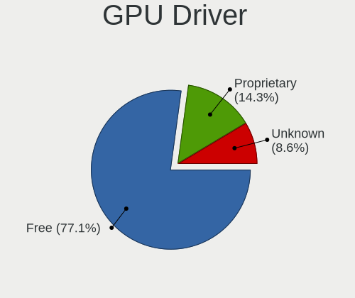
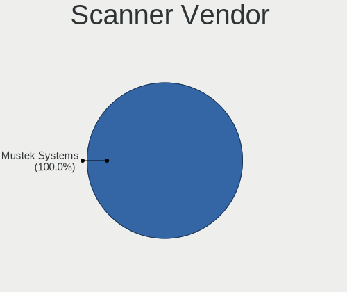
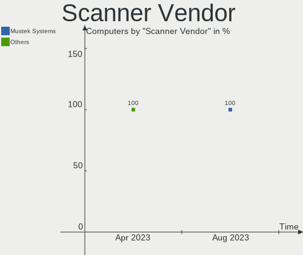
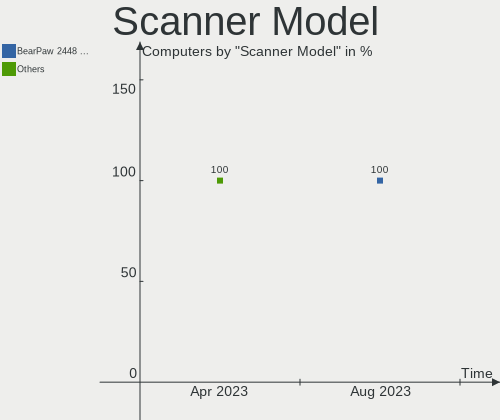

Gentoo - Hardware Trends
------------------------

A project to identify most popular hardware characteristics and track their change
over time based on data collected by Linux users at https://Linux-Hardware.org.

Anyone can contribute to this report by the [hw-probe](https://github.com/linuxhw/hw-probe) tool:

    sudo -E hw-probe -all -upload

This is a report for all computer types. See also reports for [desktops](/Dist/Gentoo/Desktop/README.md) and [notebooks](/Dist/Gentoo/Notebook/README.md).

This report is for one last month. Overall report since the beginning of time: [TestDays](https://github.com/linuxhw/TestDays)

Period: Apr, 2023.

Contents
--------

* [ System ](#system)
  - [ OS                       ](#os)
  - [ OS Family                ](#os-family)
  - [ Kernel                   ](#kernel)
  - [ Kernel Family            ](#kernel-family)
  - [ Kernel Major Ver.        ](#kernel-major-ver)
  - [ Arch                     ](#arch)
  - [ DE                       ](#de)
  - [ Display Server           ](#display-server)
  - [ Display Manager          ](#display-manager)
  - [ OS Lang                  ](#os-lang)
  - [ Boot Mode                ](#boot-mode)
  - [ Filesystem               ](#filesystem)
  - [ Part. scheme             ](#part-scheme)
  - [ Dual Boot with Linux/BSD ](#dual-boot-with-linuxbsd)
  - [ Dual Boot (Win)          ](#dual-boot-win)

* [ Board ](#board)
  - [ Vendor                   ](#vendor)
  - [ Model                    ](#model)
  - [ Model Family             ](#model-family)
  - [ MFG Year                 ](#mfg-year)
  - [ Form Factor              ](#form-factor)
  - [ Secure Boot              ](#secure-boot)
  - [ Coreboot                 ](#coreboot)
  - [ RAM Size                 ](#ram-size)
  - [ RAM Used                 ](#ram-used)
  - [ Total Drives             ](#total-drives)
  - [ Has CD-ROM               ](#has-cd-rom)
  - [ Has Ethernet             ](#has-ethernet)
  - [ Has WiFi                 ](#has-wifi)
  - [ Has Bluetooth            ](#has-bluetooth)

* [ Location ](#location)
  - [ Country                  ](#country)
  - [ City                     ](#city)

* [ Drives ](#drives)
  - [ Drive Vendor             ](#drive-vendor)
  - [ Drive Model              ](#drive-model)
  - [ HDD Vendor               ](#hdd-vendor)
  - [ SSD Vendor               ](#ssd-vendor)
  - [ Drive Kind               ](#drive-kind)
  - [ Drive Connector          ](#drive-connector)
  - [ Drive Size               ](#drive-size)
  - [ Space Total              ](#space-total)
  - [ Space Used               ](#space-used)
  - [ Malfunc. Drives          ](#malfunc-drives)
  - [ Malfunc. Drive Vendor    ](#malfunc-drive-vendor)
  - [ Malfunc. HDD Vendor      ](#malfunc-hdd-vendor)
  - [ Malfunc. Drive Kind      ](#malfunc-drive-kind)
  - [ Failed Drives            ](#failed-drives)
  - [ Failed Drive Vendor      ](#failed-drive-vendor)
  - [ Drive Status             ](#drive-status)

* [ Storage controller ](#storage-controller)
  - [ Storage Vendor           ](#storage-vendor)
  - [ Storage Model            ](#storage-model)
  - [ Storage Kind             ](#storage-kind)

* [ Processor ](#processor)
  - [ CPU Vendor               ](#cpu-vendor)
  - [ CPU Model                ](#cpu-model)
  - [ CPU Model Family         ](#cpu-model-family)
  - [ CPU Cores                ](#cpu-cores)
  - [ CPU Sockets              ](#cpu-sockets)
  - [ CPU Threads              ](#cpu-threads)
  - [ CPU Op-Modes             ](#cpu-op-modes)
  - [ CPU Microcode            ](#cpu-microcode)
  - [ CPU Microarch            ](#cpu-microarch)

* [ Graphics ](#graphics)
  - [ GPU Vendor               ](#gpu-vendor)
  - [ GPU Model                ](#gpu-model)
  - [ GPU Combo                ](#gpu-combo)
  - [ GPU Driver               ](#gpu-driver)
  - [ GPU Memory               ](#gpu-memory)

* [ Monitor ](#monitor)
  - [ Monitor Vendor           ](#monitor-vendor)
  - [ Monitor Model            ](#monitor-model)
  - [ Monitor Resolution       ](#monitor-resolution)
  - [ Monitor Diagonal         ](#monitor-diagonal)
  - [ Monitor Width            ](#monitor-width)
  - [ Aspect Ratio             ](#aspect-ratio)
  - [ Monitor Area             ](#monitor-area)
  - [ Pixel Density            ](#pixel-density)
  - [ Multiple Monitors        ](#multiple-monitors)

* [ Network ](#network)
  - [ Net Controller Vendor    ](#net-controller-vendor)
  - [ Net Controller Model     ](#net-controller-model)
  - [ Wireless Vendor          ](#wireless-vendor)
  - [ Wireless Model           ](#wireless-model)
  - [ Ethernet Vendor          ](#ethernet-vendor)
  - [ Ethernet Model           ](#ethernet-model)
  - [ Net Controller Kind      ](#net-controller-kind)
  - [ Used Controller          ](#used-controller)
  - [ NICs                     ](#nics)
  - [ IPv6                     ](#ipv6)

* [ Bluetooth ](#bluetooth)
  - [ Bluetooth Vendor         ](#bluetooth-vendor)
  - [ Bluetooth Model          ](#bluetooth-model)

* [ Sound ](#sound)
  - [ Sound Vendor             ](#sound-vendor)
  - [ Sound Model              ](#sound-model)

* [ Memory ](#memory)
  - [ Memory Vendor            ](#memory-vendor)
  - [ Memory Model             ](#memory-model)
  - [ Memory Kind              ](#memory-kind)
  - [ Memory Form Factor       ](#memory-form-factor)
  - [ Memory Size              ](#memory-size)
  - [ Memory Speed             ](#memory-speed)

* [ Printers & scanners ](#printers--scanners)
  - [ Printer Vendor           ](#printer-vendor)
  - [ Printer Model            ](#printer-model)
  - [ Scanner Vendor           ](#scanner-vendor)
  - [ Scanner Model            ](#scanner-model)

* [ Camera ](#camera)
  - [ Camera Vendor            ](#camera-vendor)
  - [ Camera Model             ](#camera-model)

* [ Security ](#security)
  - [ Fingerprint Vendor       ](#fingerprint-vendor)
  - [ Fingerprint Model        ](#fingerprint-model)
  - [ Chipcard Vendor          ](#chipcard-vendor)
  - [ Chipcard Model           ](#chipcard-model)

* [ Unsupported ](#unsupported)
  - [ Unsupported Devices      ](#unsupported-devices)
  - [ Unsupported Device Types ](#unsupported-device-types)

System
------

OS
--

Installed operating systems

| Name        | Computers | Percent |
|-------------|-----------|---------|
| Gentoo 2.13 | 58        | 95.08%  |
| Gentoo 2.9  | 3         | 4.92%   |

OS Family
---------

OS without a version

| Name   | Computers | Percent |
|--------|-----------|---------|
| Gentoo | 61        | 100%    |

Kernel
------

Version of the Linux kernel

| Version                    | Computers | Percent |
|----------------------------|-----------|---------|
| 6.1.19-gentoo-x86_64       | 10        | 16.39%  |
| 6.1.19-gentoo              | 9         | 14.75%  |
| 6.2.11-gentoo              | 5         | 8.2%    |
| 6.2.11-gentoo-x86_64       | 4         | 6.56%   |
| 6.1.22-gentoo-dist         | 4         | 6.56%   |
| 6.2.8-gentoo-x86_64        | 3         | 4.92%   |
| 6.3.0-gentoo               | 2         | 3.28%   |
| 6.2.9-gentoo-x86_64        | 2         | 3.28%   |
| 6.1.12-gentoo-x86_64       | 2         | 3.28%   |
| 6.3.0-gentoo-x86_64        | 1         | 1.64%   |
| 6.2.9-xanmod1              | 1         | 1.64%   |
| 6.2.9-gentoo-dist          | 1         | 1.64%   |
| 6.2.9-gentoo               | 1         | 1.64%   |
| 6.2.2-gentoo               | 1         | 1.64%   |
| 6.2.12-gentoo-x86_64       | 1         | 1.64%   |
| 6.2.11-zen1                | 1         | 1.64%   |
| 6.2.11-tkg-cfs             | 1         | 1.64%   |
| 6.2.11-gentoo-dist         | 1         | 1.64%   |
| 6.2.10-gentoo-dist         | 1         | 1.64%   |
| 6.2.10-cachyos             | 1         | 1.64%   |
| 6.2.0-rc6-gentoo-p14       | 1         | 1.64%   |
| 6.2.0-gentoo-x86_64        | 1         | 1.64%   |
| 6.1.19-gentoo.ae           | 1         | 1.64%   |
| 6.1.19-gentoo-x86_64.ver_1 | 1         | 1.64%   |
| 6.1.12-gentoo.af           | 1         | 1.64%   |
| 6.1.12-gentoo-dist         | 1         | 1.64%   |
| 5.15.94-gentoo             | 1         | 1.64%   |
| 5.15.80-gentoo-x86_64      | 1         | 1.64%   |
| 5.15.80-gentoo             | 1         | 1.64%   |

Kernel Family
-------------

Linux kernel without a distro release

| Version | Computers | Percent |
|---------|-----------|---------|
| 6.1.19  | 21        | 34.43%  |
| 6.2.11  | 12        | 19.67%  |
| 6.2.9   | 5         | 8.2%    |
| 6.1.22  | 4         | 6.56%   |
| 6.1.12  | 4         | 6.56%   |
| 6.3.0   | 3         | 4.92%   |
| 6.2.8   | 3         | 4.92%   |
| 6.2.10  | 2         | 3.28%   |
| 6.2.0   | 2         | 3.28%   |
| 5.15.80 | 2         | 3.28%   |
| 6.2.2   | 1         | 1.64%   |
| 6.2.12  | 1         | 1.64%   |
| 5.15.94 | 1         | 1.64%   |

Kernel Major Ver.
-----------------

Linux kernel major version

| Version | Computers | Percent |
|---------|-----------|---------|
| 6.1     | 29        | 47.54%  |
| 6.2     | 26        | 42.62%  |
| 6.3     | 3         | 4.92%   |
| 5.15    | 3         | 4.92%   |

Arch
----

OS architecture (x86_64, i586, etc.)

| Name   | Computers | Percent |
|--------|-----------|---------|
| x86_64 | 59        | 96.72%  |
| i686   | 2         | 3.28%   |

DE
--

Desktop Environment

| Name    | Computers | Percent |
|---------|-----------|---------|
| Unknown | 22        | 36.07%  |
| KDE5    | 19        | 31.15%  |
| XFCE    | 7         | 11.48%  |
| MATE    | 5         | 8.2%    |
| GNOME   | 3         | 4.92%   |
| LXQt    | 2         | 3.28%   |
| Trinity | 1         | 1.64%   |
| LXDE    | 1         | 1.64%   |
| KDE     | 1         | 1.64%   |

Display Server
--------------

X11 or Wayland

| Name    | Computers | Percent |
|---------|-----------|---------|
| X11     | 28        | 45.9%   |
| Tty     | 14        | 22.95%  |
| Wayland | 10        | 16.39%  |
| Unknown | 9         | 14.75%  |

Display Manager
---------------

SDDM, LightDM, etc.

| Name    | Computers | Percent |
|---------|-----------|---------|
| SDDM    | 22        | 36.07%  |
| Unknown | 21        | 34.43%  |
| LightDM | 11        | 18.03%  |
| TDM     | 2         | 3.28%   |
| GDM     | 2         | 3.28%   |
| XDM     | 1         | 1.64%   |
| SLiM    | 1         | 1.64%   |
| LXDM    | 1         | 1.64%   |

OS Lang
-------

Language

| Lang    | Computers | Percent |
|---------|-----------|---------|
| en_US   | 19        | 31.15%  |
| Unknown | 10        | 16.39%  |
| en_GB   | 6         | 9.84%   |
| C       | 5         | 8.2%    |
| en_IE   | 4         | 6.56%   |
| C.UTF8  | 4         | 6.56%   |
| ru_RU   | 2         | 3.28%   |
| it_IT   | 2         | 3.28%   |
| de_DE   | 2         | 3.28%   |
| cs_CZ   | 2         | 3.28%   |
| ro_RO   | 1         | 1.64%   |
| pl_PL   | 1         | 1.64%   |
| fr_FR   | 1         | 1.64%   |
| en_AU   | 1         | 1.64%   |
| ca_ES   | 1         | 1.64%   |

Boot Mode
---------

EFI or BIOS

| Mode | Computers | Percent |
|------|-----------|---------|
| EFI  | 39        | 63.93%  |
| BIOS | 22        | 36.07%  |

Filesystem
----------

Type of filesystem

| Type  | Computers | Percent |
|-------|-----------|---------|
| Ext4  | 34        | 55.74%  |
| Btrfs | 19        | 31.15%  |
| F2fs  | 4         | 6.56%   |
| Xfs   | 3         | 4.92%   |
| Zfs   | 1         | 1.64%   |

Part. scheme
------------

Scheme of partitioning

| Type    | Computers | Percent |
|---------|-----------|---------|
| GPT     | 50        | 81.97%  |
| MBR     | 8         | 13.11%  |
| Unknown | 3         | 4.92%   |

Dual Boot with Linux/BSD
------------------------

Hosting more than one Linux/BSD

| Dual boot | Computers | Percent |
|-----------|-----------|---------|
| No        | 43        | 70.49%  |
| Yes       | 18        | 29.51%  |

Dual Boot (Win)
---------------

Hosting Linux and Windows

| Dual boot | Computers | Percent |
|-----------|-----------|---------|
| No        | 47        | 77.05%  |
| Yes       | 14        | 22.95%  |

Board
-----

Vendor
------

Motherboard manufacturer

| Name                | Computers | Percent |
|---------------------|-----------|---------|
| ASUSTek Computer    | 23        | 37.7%   |
| Hewlett-Packard     | 7         | 11.48%  |
| Gigabyte Technology | 5         | 8.2%    |
| Dell                | 5         | 8.2%    |
| Lenovo              | 4         | 6.56%   |
| HUAWEI              | 3         | 4.92%   |
| ASRock              | 3         | 4.92%   |
| Acer                | 2         | 3.28%   |
| ZOTAC               | 1         | 1.64%   |
| TUXEDO              | 1         | 1.64%   |
| Toshiba             | 1         | 1.64%   |
| Supermicro          | 1         | 1.64%   |
| MSI                 | 1         | 1.64%   |
| MAXDATA             | 1         | 1.64%   |
| Intel               | 1         | 1.64%   |
| HPE                 | 1         | 1.64%   |
| Unknown             | 1         | 1.64%   |

Model
-----

Motherboard model

| Name                                   | Computers | Percent |
|----------------------------------------|-----------|---------|
| HP ProLiant MicroServer Gen8           | 3         | 4.92%   |
| ASUS TUF Gaming X570-PLUS              | 2         | 3.28%   |
| ASUS ROG Zephyrus G14 GA401II_GA401II  | 2         | 3.28%   |
| ASUS ROG STRIX Z590-F GAMING WIFI      | 2         | 3.28%   |
| ASUS M3A78-CM                          | 2         | 3.28%   |
| ASUS All Series                        | 2         | 3.28%   |
| ZOTAC H67ITX-C-E                       | 1         | 1.64%   |
| TUXEDO Polaris AMD Gen3 (CZN)          | 1         | 1.64%   |
| Toshiba Satellite L850                 | 1         | 1.64%   |
| Supermicro Super Server                | 1         | 1.64%   |
| MSI MS-7B85                            | 1         | 1.64%   |
| MAXDATA o.max_5xs                      | 1         | 1.64%   |
| Lenovo ThinkPad X13 Gen 3 21CM0024US   | 1         | 1.64%   |
| Lenovo ThinkPad T470p 20J7S25C00       | 1         | 1.64%   |
| Lenovo ThinkPad P14s Gen 2a 21A0000JMH | 1         | 1.64%   |
| Lenovo IdeaPad Yoga 13 20175           | 1         | 1.64%   |
| Intel T series                         | 1         | 1.64%   |
| HUAWEI NBLK-WAX9X                      | 1         | 1.64%   |
| HUAWEI KPL-W0X                         | 1         | 1.64%   |
| HUAWEI CREM-WXX9                       | 1         | 1.64%   |
| HPE ProLiant MicroServer Gen10 Plus    | 1         | 1.64%   |
| HP OMEN by Laptop                      | 1         | 1.64%   |
| HP Laptop 17-cp0xxx                    | 1         | 1.64%   |
| HP G62                                 | 1         | 1.64%   |
| HP EliteBook 840 G3                    | 1         | 1.64%   |
| Gigabyte X670E AORUS MASTER            | 1         | 1.64%   |
| Gigabyte X570S AORUS ELITE AX          | 1         | 1.64%   |
| Gigabyte B460HD3                       | 1         | 1.64%   |
| Gigabyte B450M DS3H V2                 | 1         | 1.64%   |
| Gigabyte AB350-Gaming                  | 1         | 1.64%   |
| Dell XPS 15 9570                       | 1         | 1.64%   |
| Dell Precision 7770                    | 1         | 1.64%   |
| Dell Latitude 7420                     | 1         | 1.64%   |
| Dell Inspiron N5010                    | 1         | 1.64%   |
| Dell Inspiron 5415                     | 1         | 1.64%   |
| ASUS TUF Gaming B550-PLUS              | 1         | 1.64%   |
| ASUS SABERTOOTH X58                    | 1         | 1.64%   |
| ASUS ROG STRIX X570-E GAMING           | 1         | 1.64%   |
| ASUS ROG Strix G513RM_G513RM           | 1         | 1.64%   |
| ASUS ROG Maximus Z690 HERO             | 1         | 1.64%   |

Model Family
------------

Motherboard model prefix

| Name                  | Computers | Percent |
|-----------------------|-----------|---------|
| ASUS ROG              | 8         | 13.11%  |
| Lenovo ThinkPad       | 3         | 4.92%   |
| HP ProLiant           | 3         | 4.92%   |
| ASUS TUF              | 3         | 4.92%   |
| ASUS PRIME            | 3         | 4.92%   |
| Dell Inspiron         | 2         | 3.28%   |
| ASUS M3A78-CM         | 2         | 3.28%   |
| ASUS All              | 2         | 3.28%   |
| Acer Aspire           | 2         | 3.28%   |
| ZOTAC H67ITX-C-E      | 1         | 1.64%   |
| TUXEDO Polaris        | 1         | 1.64%   |
| Toshiba Satellite     | 1         | 1.64%   |
| Supermicro Super      | 1         | 1.64%   |
| MSI MS-7B85           | 1         | 1.64%   |
| MAXDATA o.max         | 1         | 1.64%   |
| Lenovo IdeaPad        | 1         | 1.64%   |
| Intel T               | 1         | 1.64%   |
| HUAWEI NBLK-WAX9X     | 1         | 1.64%   |
| HUAWEI KPL-W0X        | 1         | 1.64%   |
| HUAWEI CREM-WXX9      | 1         | 1.64%   |
| HPE ProLiant          | 1         | 1.64%   |
| HP OMEN               | 1         | 1.64%   |
| HP Laptop             | 1         | 1.64%   |
| HP G62                | 1         | 1.64%   |
| HP EliteBook          | 1         | 1.64%   |
| Gigabyte X670E        | 1         | 1.64%   |
| Gigabyte X570S        | 1         | 1.64%   |
| Gigabyte B460HD3      | 1         | 1.64%   |
| Gigabyte B450M        | 1         | 1.64%   |
| Gigabyte AB350-Gaming | 1         | 1.64%   |
| Dell XPS              | 1         | 1.64%   |
| Dell Precision        | 1         | 1.64%   |
| Dell Latitude         | 1         | 1.64%   |
| ASUS SABERTOOTH       | 1         | 1.64%   |
| ASUS P6X58D           | 1         | 1.64%   |
| ASUS N550JX           | 1         | 1.64%   |
| ASUS CM6630           | 1         | 1.64%   |
| ASUS ASUS             | 1         | 1.64%   |
| ASRock X370           | 1         | 1.64%   |
| ASRock B550M          | 1         | 1.64%   |

MFG Year
--------

Motherboard manufacture year

| Year | Computers | Percent |
|------|-----------|---------|
| 2020 | 11        | 18.03%  |
| 2021 | 10        | 16.39%  |
| 2010 | 6         | 9.84%   |
| 2022 | 5         | 8.2%    |
| 2019 | 5         | 8.2%    |
| 2018 | 5         | 8.2%    |
| 2013 | 4         | 6.56%   |
| 2012 | 4         | 6.56%   |
| 2017 | 3         | 4.92%   |
| 2008 | 2         | 3.28%   |
| 2023 | 1         | 1.64%   |
| 2016 | 1         | 1.64%   |
| 2015 | 1         | 1.64%   |
| 2014 | 1         | 1.64%   |
| 2011 | 1         | 1.64%   |
| 2007 | 1         | 1.64%   |

Form Factor
-----------

Physical design of the computer

| Name     | Computers | Percent |
|----------|-----------|---------|
| Desktop  | 34        | 55.74%  |
| Notebook | 26        | 42.62%  |
| Server   | 1         | 1.64%   |

Secure Boot
-----------

Enabled or disabled

| State    | Computers | Percent |
|----------|-----------|---------|
| Disabled | 61        | 100%    |

Coreboot
--------

Have coreboot on board

| Used | Computers | Percent |
|------|-----------|---------|
| No   | 61        | 100%    |

RAM Size
--------

Total RAM memory

| Size in GB  | Computers | Percent |
|-------------|-----------|---------|
| 32.01-64.0  | 13        | 21.31%  |
| 16.01-24.0  | 11        | 18.03%  |
| 4.01-8.0    | 9         | 14.75%  |
| 8.01-16.0   | 9         | 14.75%  |
| 64.01-256.0 | 8         | 13.11%  |
| 24.01-32.0  | 6         | 9.84%   |
| 3.01-4.0    | 2         | 3.28%   |
| 2.01-3.0    | 1         | 1.64%   |
| 1.01-2.0    | 1         | 1.64%   |
| 0.51-1.0    | 1         | 1.64%   |

RAM Used
--------

Used RAM memory

| Used GB    | Computers | Percent |
|------------|-----------|---------|
| 2.01-3.0   | 16        | 26.23%  |
| 4.01-8.0   | 14        | 22.95%  |
| 0.51-1.0   | 8         | 13.11%  |
| 1.01-2.0   | 7         | 11.48%  |
| 3.01-4.0   | 6         | 9.84%   |
| 8.01-16.0  | 5         | 8.2%    |
| 0.01-0.5   | 4         | 6.56%   |
| 24.01-32.0 | 1         | 1.64%   |

Total Drives
------------

Number of drives on board

| Drives | Computers | Percent |
|--------|-----------|---------|
| 1      | 27        | 44.26%  |
| 2      | 12        | 19.67%  |
| 3      | 7         | 11.48%  |
| 5      | 5         | 8.2%    |
| 7      | 3         | 4.92%   |
| 6      | 3         | 4.92%   |
| 4      | 2         | 3.28%   |
| 13     | 1         | 1.64%   |
| 10     | 1         | 1.64%   |

Has CD-ROM
----------

Has CD-ROM on board

| Presented | Computers | Percent |
|-----------|-----------|---------|
| No        | 45        | 73.77%  |
| Yes       | 16        | 26.23%  |

Has Ethernet
------------

Has Ethernet on board

| Presented | Computers | Percent |
|-----------|-----------|---------|
| Yes       | 54        | 88.52%  |
| No        | 7         | 11.48%  |

Has WiFi
--------

Has WiFi module

| Presented | Computers | Percent |
|-----------|-----------|---------|
| Yes       | 38        | 62.3%   |
| No        | 23        | 37.7%   |

Has Bluetooth
-------------

Has Bluetooth module

| Presented | Computers | Percent |
|-----------|-----------|---------|
| Yes       | 34        | 55.74%  |
| No        | 27        | 44.26%  |

Location
--------

Country
-------

Geographic location (country)

| Country     | Computers | Percent |
|-------------|-----------|---------|
| USA         | 17        | 27.87%  |
| Germany     | 6         | 9.84%   |
| France      | 6         | 9.84%   |
| Canada      | 6         | 9.84%   |
| UK          | 5         | 8.2%    |
| Spain       | 3         | 4.92%   |
| Russia      | 3         | 4.92%   |
| Poland      | 3         | 4.92%   |
| Czechia     | 3         | 4.92%   |
| Italy       | 2         | 3.28%   |
| Vietnam     | 1         | 1.64%   |
| Romania     | 1         | 1.64%   |
| Norway      | 1         | 1.64%   |
| Netherlands | 1         | 1.64%   |
| Luxembourg  | 1         | 1.64%   |
| Indonesia   | 1         | 1.64%   |
| Australia   | 1         | 1.64%   |

City
----

Geographic location (city)

| City               | Computers | Percent |
|--------------------|-----------|---------|
| Paris              | 4         | 6.56%   |
| Frankfurt am Main  | 4         | 6.56%   |
| Warsaw             | 3         | 4.92%   |
| Sterling           | 3         | 4.92%   |
| Kippens            | 3         | 4.92%   |
| St Petersburg      | 2         | 3.28%   |
| Pittsburgh         | 2         | 3.28%   |
| Leeds              | 2         | 3.28%   |
| Gatineau           | 2         | 3.28%   |
| West Chicago       | 1         | 1.64%   |
| Wessington Springs | 1         | 1.64%   |
| Verona             | 1         | 1.64%   |
| Taganrog           | 1         | 1.64%   |
| Surabaya           | 1         | 1.64%   |
| Rapid City         | 1         | 1.64%   |
| Prague             | 1         | 1.64%   |
| Pozzuoli           | 1         | 1.64%   |
| Ponetovice         | 1         | 1.64%   |
| Perth              | 1         | 1.64%   |
| Parsippany         | 1         | 1.64%   |
| Oviedo             | 1         | 1.64%   |
| Oslo               | 1         | 1.64%   |
| Norwich            | 1         | 1.64%   |
| Minneapolis        | 1         | 1.64%   |
| Milan              | 1         | 1.64%   |
| Mangalia           | 1         | 1.64%   |
| Madrid             | 1         | 1.64%   |
| Luxembourg         | 1         | 1.64%   |
| Lomme              | 1         | 1.64%   |
| Kon Tum            | 1         | 1.64%   |
| Huddersfield       | 1         | 1.64%   |
| Girona             | 1         | 1.64%   |
| Fort Wayne         | 1         | 1.64%   |
| Flint              | 1         | 1.64%   |
| Eugene             | 1         | 1.64%   |
| Eschweiler         | 1         | 1.64%   |
| Enschede           | 1         | 1.64%   |
| El Paso            | 1         | 1.64%   |
| Cologne            | 1         | 1.64%   |
| Český Těšín   | 1         | 1.64%   |

Drives
------

Drive Vendor
------------

Hard drive vendors

| Vendor                      | Computers | Drives | Percent |
|-----------------------------|-----------|--------|---------|
| Samsung Electronics         | 24        | 33     | 21.24%  |
| Sandisk                     | 15        | 15     | 13.27%  |
| WDC                         | 14        | 35     | 12.39%  |
| Seagate                     | 13        | 26     | 11.5%   |
| Toshiba                     | 5         | 6      | 4.42%   |
| Crucial                     | 5         | 5      | 4.42%   |
| China                       | 5         | 8      | 4.42%   |
| Phison Electronics          | 4         | 5      | 3.54%   |
| Kingston                    | 4         | 4      | 3.54%   |
| Micron Technology           | 3         | 3      | 2.65%   |
| GOODRAM                     | 3         | 3      | 2.65%   |
| SK hynix                    | 2         | 2      | 1.77%   |
| Intel                       | 2         | 2      | 1.77%   |
| Hitachi                     | 2         | 4      | 1.77%   |
| A-DATA Technology           | 2         | 2      | 1.77%   |
| V-GeN                       | 1         | 1      | 0.88%   |
| Silicon Motion              | 1         | 1      | 0.88%   |
| PNY                         | 1         | 3      | 0.88%   |
| Phison                      | 1         | 1      | 0.88%   |
| Micron/Crucial Technology   | 1         | 2      | 0.88%   |
| Kingston Technology Company | 1         | 1      | 0.88%   |
| HGST                        | 1         | 1      | 0.88%   |
| Dogfish                     | 1         | 1      | 0.88%   |
| ADROITLARK                  | 1         | 1      | 0.88%   |
| ADATA Technology            | 1         | 2      | 0.88%   |

Drive Model
-----------

Hard drive models

| Model                                               | Computers | Percent |
|-----------------------------------------------------|-----------|---------|
| Samsung NVMe SSD Controller SM981/PM981/PM983 1TB   | 9         | 6.43%   |
| Samsung NVMe SSD Controller PM9A1/PM9A3/980PRO 2TB  | 8         | 5.71%   |
| Sandisk WD Blue SN550 NVMe SSD 1024GB               | 5         | 3.57%   |
| Samsung SSD 980 1TB                                 | 3         | 2.14%   |
| WDC WD40EZRZ-00GXCB0 4TB                            | 2         | 1.43%   |
| WDC WD30EFRX-68EUZN0 3TB                            | 2         | 1.43%   |
| WDC WD30EFRX-68AX9N0 3TB                            | 2         | 1.43%   |
| Seagate ST4000DM004-2CV104 4TB                      | 2         | 1.43%   |
| Seagate ST2000DM008-2FR102 2TB                      | 2         | 1.43%   |
| Sandisk WD Black SN750 / PC SN730 NVMe SSD 512GB    | 2         | 1.43%   |
| Samsung NVMe SSD Controller SM961/PM961/SM963 500GB | 2         | 1.43%   |
| Phison E12 NVMe Controller 512GB                    | 2         | 1.43%   |
| GOODRAM SSDPR-CL100-480-G2 480GB                    | 2         | 1.43%   |
| Crucial CT1000MX500SSD1 1TB                         | 2         | 1.43%   |
| China SATA SSD 960GB                                | 2         | 1.43%   |
| WDC WDS200T2B0B-00YS70 2TB SSD                      | 1         | 0.71%   |
| WDC WD60PURZ-85ZUFY1 6TB                            | 1         | 0.71%   |
| WDC WD60EZAZ-00SF3B0 6TB                            | 1         | 0.71%   |
| WDC WD60EFZX-68B3FN0 6TB                            | 1         | 0.71%   |
| WDC WD60EFAX-68SHWN0 6TB                            | 1         | 0.71%   |
| WDC WD5000LPLX-66ZNTT1 500GB                        | 1         | 0.71%   |
| WDC WD40EZRZ-00WN9B0 4TB                            | 1         | 0.71%   |
| WDC WD40EZRX-22SPEB0 4TB                            | 1         | 0.71%   |
| WDC WD30PURX-64P6ZY0 3TB                            | 1         | 0.71%   |
| WDC WD30EFRX-68N32N0 3TB                            | 1         | 0.71%   |
| WDC WD20EFRX-68EUZN0 2TB                            | 1         | 0.71%   |
| WDC WD20EARX-00PASB0 2TB                            | 1         | 0.71%   |
| WDC WD20EARS-00MVWB0 2TB                            | 1         | 0.71%   |
| WDC WD2003FZEX-00SRLA0 2TB                          | 1         | 0.71%   |
| WDC WD2002FAEX-007BA0 2TB                           | 1         | 0.71%   |
| WDC WD20 01FFSX-68JNUN0 2TB                         | 1         | 0.71%   |
| WDC WD1502FYPS-02W3B0 1TB                           | 1         | 0.71%   |
| WDC WD120EFBX-68B0EN0 12TB                          | 1         | 0.71%   |
| WDC WD10EZEX-08M2NA0 1TB                            | 1         | 0.71%   |
| WDC WD1001FALS-00J7B1 1TB                           | 1         | 0.71%   |
| WDC WD1000FYPS-01ZKB0 1TB                           | 1         | 0.71%   |
| V-GeN V-GEN11AS19FS120SS 120GB SSD                  | 1         | 0.71%   |
| Toshiba MK5056GSY 500GB                             | 1         | 0.71%   |
| Toshiba HDWR480 8TB                                 | 1         | 0.71%   |
| Toshiba HDWE150 5TB                                 | 1         | 0.71%   |

HDD Vendor
----------

Hard disk drive vendors

| Vendor              | Computers | Drives | Percent |
|---------------------|-----------|--------|---------|
| WDC                 | 13        | 34     | 37.14%  |
| Seagate             | 13        | 25     | 37.14%  |
| Toshiba             | 5         | 6      | 14.29%  |
| Hitachi             | 2         | 4      | 5.71%   |
| Samsung Electronics | 1         | 1      | 2.86%   |
| HGST                | 1         | 1      | 2.86%   |

SSD Vendor
----------

Solid state drive vendors

| Vendor              | Computers | Drives | Percent |
|---------------------|-----------|--------|---------|
| SanDisk             | 7         | 7      | 17.95%  |
| Samsung Electronics | 7         | 7      | 17.95%  |
| Crucial             | 5         | 5      | 12.82%  |
| China               | 5         | 8      | 12.82%  |
| Kingston            | 3         | 3      | 7.69%   |
| GOODRAM             | 3         | 3      | 7.69%   |
| A-DATA Technology   | 2         | 2      | 5.13%   |
| WDC                 | 1         | 1      | 2.56%   |
| V-GeN               | 1         | 1      | 2.56%   |
| PNY                 | 1         | 3      | 2.56%   |
| Micron Technology   | 1         | 1      | 2.56%   |
| Intel               | 1         | 1      | 2.56%   |
| Dogfish             | 1         | 1      | 2.56%   |
| ADROITLARK          | 1         | 1      | 2.56%   |

Drive Kind
----------

HDD or SSD

| Kind    | Computers | Drives | Percent |
|---------|-----------|--------|---------|
| NVMe    | 32        | 50     | 35.56%  |
| SSD     | 31        | 44     | 34.44%  |
| HDD     | 25        | 71     | 27.78%  |
| Unknown | 2         | 2      | 2.22%   |

Drive Connector
---------------

SATA, SAS, NVMe, etc.

| Type | Computers | Drives | Percent |
|------|-----------|--------|---------|
| SATA | 43        | 113    | 55.13%  |
| NVMe | 32        | 50     | 41.03%  |
| SAS  | 3         | 4      | 3.85%   |

Drive Size
----------

Size of hard drive

| Size in TB | Computers | Drives | Percent |
|------------|-----------|--------|---------|
| 0.01-0.5   | 22        | 31     | 30.14%  |
| 0.51-1.0   | 19        | 24     | 26.03%  |
| 1.01-2.0   | 11        | 19     | 15.07%  |
| 3.01-4.0   | 8         | 12     | 10.96%  |
| 4.01-10.0  | 7         | 15     | 9.59%   |
| 2.01-3.0   | 4         | 12     | 5.48%   |
| 10.01-20.0 | 2         | 2      | 2.74%   |

Space Total
-----------

Amount of disk space available on the file system

| Size in GB     | Computers | Percent |
|----------------|-----------|---------|
| More than 3000 | 16        | 26.23%  |
| 501-1000       | 13        | 21.31%  |
| 251-500        | 11        | 18.03%  |
| 101-250        | 8         | 13.11%  |
| 2001-3000      | 5         | 8.2%    |
| 1001-2000      | 5         | 8.2%    |
| 1-20           | 2         | 3.28%   |
| 21-50          | 1         | 1.64%   |

Space Used
----------

Amount of used disk space

| Used GB        | Computers | Percent |
|----------------|-----------|---------|
| 1-20           | 11        | 18.03%  |
| More than 3000 | 10        | 16.39%  |
| 251-500        | 10        | 16.39%  |
| 101-250        | 8         | 13.11%  |
| 501-1000       | 8         | 13.11%  |
| 51-100         | 6         | 9.84%   |
| 1001-2000      | 4         | 6.56%   |
| 21-50          | 3         | 4.92%   |
| 2001-3000      | 1         | 1.64%   |

Malfunc. Drives
---------------

Drive models with a malfunction

| Model                              | Computers | Drives | Percent |
|------------------------------------|-----------|--------|---------|
| WDC WD60PURZ-85ZUFY1 6TB           | 1         | 1      | 10%     |
| WDC WD60EFAX-68SHWN0 6TB           | 1         | 1      | 10%     |
| WDC WD30EFRX-68AX9N0 3TB           | 1         | 1      | 10%     |
| Toshiba MK5056GSY 500GB            | 1         | 1      | 10%     |
| Toshiba DT01ACA200 2TB             | 1         | 1      | 10%     |
| Seagate ST3500630NS 500GB          | 1         | 2      | 10%     |
| Seagate ST1000LM024 HN-M101MBB 1TB | 1         | 1      | 10%     |
| HGST HTS721010A9E630 1TB           | 1         | 1      | 10%     |
| Crucial M4-CT512M4SSD2 512GB       | 1         | 1      | 10%     |
| China SATA SSD 960GB               | 1         | 1      | 10%     |

Malfunc. Drive Vendor
---------------------

Vendors of faulty drives

| Vendor  | Computers | Drives | Percent |
|---------|-----------|--------|---------|
| WDC     | 2         | 3      | 22.22%  |
| Toshiba | 2         | 2      | 22.22%  |
| Seagate | 2         | 3      | 22.22%  |
| HGST    | 1         | 1      | 11.11%  |
| Crucial | 1         | 1      | 11.11%  |
| China   | 1         | 1      | 11.11%  |

Malfunc. HDD Vendor
-------------------

Vendors of faulty HDD drives

| Vendor  | Computers | Drives | Percent |
|---------|-----------|--------|---------|
| WDC     | 2         | 3      | 28.57%  |
| Toshiba | 2         | 2      | 28.57%  |
| Seagate | 2         | 3      | 28.57%  |
| HGST    | 1         | 1      | 14.29%  |

Malfunc. Drive Kind
-------------------

Kinds of faulty drives

| Kind | Computers | Drives | Percent |
|------|-----------|--------|---------|
| HDD  | 6         | 9      | 75%     |
| SSD  | 2         | 2      | 25%     |

Failed Drives
-------------

Failed drive models

| Model                    | Computers | Drives | Percent |
|--------------------------|-----------|--------|---------|
| WDC WD20EARS-00MVWB0 2TB | 1         | 2      | 100%    |

Failed Drive Vendor
-------------------

Failed drive vendors

| Vendor | Computers | Drives | Percent |
|--------|-----------|--------|---------|
| WDC    | 1         | 2      | 100%    |

Drive Status
------------

Number of failed and malfunc. drives

| Status   | Computers | Drives | Percent |
|----------|-----------|--------|---------|
| Works    | 53        | 141    | 76.81%  |
| Malfunc  | 8         | 11     | 11.59%  |
| Detected | 7         | 13     | 10.14%  |
| Failed   | 1         | 2      | 1.45%   |

Storage controller
------------------

Storage Vendor
--------------

Storage controller vendors

| Vendor                      | Computers | Percent |
|-----------------------------|-----------|---------|
| Intel                       | 31        | 29.52%  |
| AMD                         | 22        | 20.95%  |
| Samsung Electronics         | 17        | 16.19%  |
| SanDisk                     | 8         | 7.62%   |
| ASMedia Technology          | 7         | 6.67%   |
| Phison Electronics          | 4         | 3.81%   |
| Marvell Technology Group    | 4         | 3.81%   |
| SK hynix                    | 2         | 1.9%    |
| Micron Technology           | 2         | 1.9%    |
| Kingston Technology Company | 2         | 1.9%    |
| JMicron Technology          | 2         | 1.9%    |
| Silicon Motion              | 1         | 0.95%   |
| Silicon Image               | 1         | 0.95%   |
| Micron/Crucial Technology   | 1         | 0.95%   |
| ADATA Technology            | 1         | 0.95%   |

Storage Model
-------------

Storage controller models

| Model                                                                          | Computers | Percent |
|--------------------------------------------------------------------------------|-----------|---------|
| AMD FCH SATA Controller [AHCI mode]                                            | 16        | 13.11%  |
| Samsung NVMe SSD Controller SM981/PM981/PM983                                  | 9         | 7.38%   |
| Samsung NVMe SSD Controller PM9A1/PM9A3/980PRO                                 | 8         | 6.56%   |
| SanDisk WD Blue SN550 NVMe SSD                                                 | 5         | 4.1%    |
| ASMedia ASM1062 Serial ATA Controller                                          | 5         | 4.1%    |
| Samsung NVMe SSD Controller 980                                                | 4         | 3.28%   |
| Intel 6 Series/C200 Series Chipset Family 6 port Desktop SATA AHCI Controller  | 4         | 3.28%   |
| AMD 400 Series Chipset SATA Controller                                         | 4         | 3.28%   |
| Intel 8 Series/C220 Series Chipset Family 6-port SATA Controller 1 [AHCI mode] | 3         | 2.46%   |
| SK hynix Gold P31/PC711 NVMe Solid State Drive                                 | 2         | 1.64%   |
| SanDisk WD Black SN750 / PC SN730 NVMe SSD                                     | 2         | 1.64%   |
| Samsung NVMe SSD Controller SM961/PM961/SM963                                  | 2         | 1.64%   |
| Phison E12 NVMe Controller                                                     | 2         | 1.64%   |
| Micron NVMe Storage Controller                                                 | 2         | 1.64%   |
| Intel Volume Management Device NVMe RAID Controller                            | 2         | 1.64%   |
| Intel NM10/ICH7 Family SATA Controller [AHCI mode]                             | 2         | 1.64%   |
| Intel HM170/QM170 Chipset SATA Controller [AHCI Mode]                          | 2         | 1.64%   |
| Intel Cannon Lake PCH SATA AHCI Controller                                     | 2         | 1.64%   |
| Intel 82801GBM/GHM (ICH7-M Family) SATA Controller [AHCI mode]                 | 2         | 1.64%   |
| Intel 7 Series Chipset Family 6-port SATA Controller [AHCI mode]               | 2         | 1.64%   |
| Intel 500 Series Chipset Family SATA AHCI Controller                           | 2         | 1.64%   |
| ASMedia ASM1166 Serial ATA Controller                                          | 2         | 1.64%   |
| AMD SB7x0/SB8x0/SB9x0 SATA Controller [IDE mode]                               | 2         | 1.64%   |
| AMD SB7x0/SB8x0/SB9x0 IDE Controller                                           | 2         | 1.64%   |
| AMD 500 Series Chipset SATA Controller                                         | 2         | 1.64%   |
| Silicon Motion SM2263EN/SM2263XT SSD Controller                                | 1         | 0.82%   |
| Silicon Image SiI 3124 PCI-X Serial ATA Controller                             | 1         | 0.82%   |
| SanDisk WD Black SN770 NVMe SSD                                                | 1         | 0.82%   |
| Phison E7 NVMe Controller                                                      | 1         | 0.82%   |
| Phison E16 PCIe4 NVMe Controller                                               | 1         | 0.82%   |
| Micron/Crucial NVMe Storage Controller                                         | 1         | 0.82%   |
| Marvell Group 88SE9230 PCIe 2.0 x2 4-port SATA 6 Gb/s RAID Controller          | 1         | 0.82%   |
| Marvell Group 88SE9215 PCIe 2.0 x1 4-port SATA 6 Gb/s Controller               | 1         | 0.82%   |
| Marvell Group 88SE914D SATA-600 Controller                                     | 1         | 0.82%   |
| Marvell Group 88SE9123 PCIe SATA 6.0 Gb/s controller                           | 1         | 0.82%   |
| Kingston Company Company Non-Volatile memory controller                        | 1         | 0.82%   |
| Kingston Company NVMe Controller                                               | 1         | 0.82%   |
| JMicron JMB363 SATA/IDE Controller                                             | 1         | 0.82%   |
| JMicron JMB360 AHCI Controller                                                 | 1         | 0.82%   |
| Intel Sunrise Point-LP SATA Controller [AHCI mode]                             | 1         | 0.82%   |

Storage Kind
------------

Kind of storage controller (IDE, SATA, NVMe, SAS, ...)

| Kind | Computers | Percent |
|------|-----------|---------|
| SATA | 51        | 55.43%  |
| NVMe | 32        | 34.78%  |
| IDE  | 6         | 6.52%   |
| RAID | 3         | 3.26%   |

Processor
---------

CPU Vendor
----------

Processor vendors

| Vendor | Computers | Percent |
|--------|-----------|---------|
| Intel  | 32        | 52.46%  |
| AMD    | 29        | 47.54%  |

CPU Model
---------

Processor models

| Model                                      | Computers | Percent |
|--------------------------------------------|-----------|---------|
| Intel Xeon CPU E3-1230 V2 @ 3.30GHz        | 3         | 4.92%   |
| Intel Core i9-10850K CPU @ 3.60GHz         | 2         | 3.28%   |
| AMD Ryzen 7 5800H with Radeon Graphics     | 2         | 3.28%   |
| AMD Ryzen 7 3700X 8-Core Processor         | 2         | 3.28%   |
| AMD Ryzen 5 5600X 6-Core Processor         | 2         | 3.28%   |
| AMD Phenom II X4 955 Processor             | 2         | 3.28%   |
| Intel Xeon E-2224 CPU @ 3.40GHz            | 1         | 1.64%   |
| Intel Pentium Silver N6000 @ 1.10GHz       | 1         | 1.64%   |
| Intel Core i7-9700 CPU @ 3.00GHz           | 1         | 1.64%   |
| Intel Core i7-8750H CPU @ 2.20GHz          | 1         | 1.64%   |
| Intel Core i7-7820HQ CPU @ 2.90GHz         | 1         | 1.64%   |
| Intel Core i7-7700HQ CPU @ 2.80GHz         | 1         | 1.64%   |
| Intel Core i7-4790 CPU @ 3.60GHz           | 1         | 1.64%   |
| Intel Core i7-4770 CPU @ 3.40GHz           | 1         | 1.64%   |
| Intel Core i7-4720HQ CPU @ 2.60GHz         | 1         | 1.64%   |
| Intel Core i7-10700K CPU @ 3.80GHz         | 1         | 1.64%   |
| Intel Core i7 CPU 970 @ 3.20GHz            | 1         | 1.64%   |
| Intel Core i7 CPU 950 @ 3.07GHz            | 1         | 1.64%   |
| Intel Core i5-6200U CPU @ 2.30GHz          | 1         | 1.64%   |
| Intel Core i5-3450 CPU @ 3.10GHz           | 1         | 1.64%   |
| Intel Core i5-3317U CPU @ 1.70GHz          | 1         | 1.64%   |
| Intel Core i3-2328M CPU @ 2.20GHz          | 1         | 1.64%   |
| Intel Core i3-2100T CPU @ 2.50GHz          | 1         | 1.64%   |
| Intel Core i3 CPU M 380 @ 2.53GHz          | 1         | 1.64%   |
| Intel Core Duo CPU T2450 @ 2.00GHz         | 1         | 1.64%   |
| Intel Atom CPU N550 @ 1.50GHz              | 1         | 1.64%   |
| Intel Atom CPU N270 @ 1.60GHz              | 1         | 1.64%   |
| Intel Atom CPU D510 @ 1.66GHz              | 1         | 1.64%   |
| Intel 12th Gen Core i9-12900KS             | 1         | 1.64%   |
| Intel 12th Gen Core i7-12850HX             | 1         | 1.64%   |
| Intel 12th Gen Core i7-12700H              | 1         | 1.64%   |
| Intel 11th Gen Core i7-1185G7 @ 3.00GHz    | 1         | 1.64%   |
| Intel 11th Gen Core i7-11700F @ 2.50GHz    | 1         | 1.64%   |
| AMD Ryzen 9 7900X 12-Core Processor        | 1         | 1.64%   |
| AMD Ryzen 9 3950X 16-Core Processor        | 1         | 1.64%   |
| AMD Ryzen 9 3900X 12-Core Processor        | 1         | 1.64%   |
| AMD Ryzen 7 PRO 6850U with Radeon Graphics | 1         | 1.64%   |
| AMD Ryzen 7 PRO 5850U with Radeon Graphics | 1         | 1.64%   |
| AMD Ryzen 7 6800H with Radeon Graphics     | 1         | 1.64%   |
| AMD Ryzen 7 5800X 8-Core Processor         | 1         | 1.64%   |

CPU Model Family
----------------

Processor model prefix

| Model                | Computers | Percent |
|----------------------|-----------|---------|
| Intel Core i7        | 10        | 16.39%  |
| AMD Ryzen 7          | 10        | 16.39%  |
| AMD Ryzen 5          | 10        | 16.39%  |
| Other                | 5         | 8.2%    |
| Intel Xeon           | 4         | 6.56%   |
| Intel Core i5        | 3         | 4.92%   |
| Intel Core i3        | 3         | 4.92%   |
| Intel Atom           | 3         | 4.92%   |
| AMD Ryzen 9          | 3         | 4.92%   |
| Intel Core i9        | 2         | 3.28%   |
| AMD Ryzen 7 PRO      | 2         | 3.28%   |
| AMD Phenom II X4     | 2         | 3.28%   |
| Intel Pentium Silver | 1         | 1.64%   |
| Intel Core Duo       | 1         | 1.64%   |
| AMD EPYC             | 1         | 1.64%   |
| AMD Athlon II        | 1         | 1.64%   |

CPU Cores
---------

Number of processor cores

| Number | Computers | Percent |
|--------|-----------|---------|
| 4      | 17        | 27.87%  |
| 8      | 15        | 24.59%  |
| 6      | 10        | 16.39%  |
| 2      | 9         | 14.75%  |
| 16     | 3         | 4.92%   |
| 12     | 2         | 3.28%   |
| 10     | 2         | 3.28%   |
| 32     | 1         | 1.64%   |
| 14     | 1         | 1.64%   |
| 1      | 1         | 1.64%   |

CPU Sockets
-----------

Number of sockets

| Number | Computers | Percent |
|--------|-----------|---------|
| 1      | 61        | 100%    |

CPU Threads
-----------

Threads per core (Hyper-Threading)

| Number | Computers | Percent |
|--------|-----------|---------|
| 2      | 52        | 85.25%  |
| 1      | 9         | 14.75%  |

CPU Op-Modes
------------

CPU Operation Modes (32-bit, 64-bit)

| Op mode        | Computers | Percent |
|----------------|-----------|---------|
| 32-bit, 64-bit | 59        | 96.72%  |
| 32-bit         | 2         | 3.28%   |

CPU Microcode
-------------

Microcode number

| Number     | Computers | Percent |
|------------|-----------|---------|
| Unknown    | 25        | 40.98%  |
| 0x08701021 | 5         | 8.2%    |
| 0x0a50000c | 3         | 4.92%   |
| 0x906e9    | 2         | 3.28%   |
| 0x306c3    | 2         | 3.28%   |
| 0x0a601203 | 2         | 3.28%   |
| 0x0a50000d | 2         | 3.28%   |
| 0x0a201016 | 2         | 3.28%   |
| 0x08608103 | 2         | 3.28%   |
| 0xa0655    | 1         | 1.64%   |
| 0x906ed    | 1         | 1.64%   |
| 0x906ea    | 1         | 1.64%   |
| 0x806c1    | 1         | 1.64%   |
| 0x406e3    | 1         | 1.64%   |
| 0x306a9    | 1         | 1.64%   |
| 0x20655    | 1         | 1.64%   |
| 0x106a5    | 1         | 1.64%   |
| 0x0a404102 | 1         | 1.64%   |
| 0x0a20120a | 1         | 1.64%   |
| 0x08701013 | 1         | 1.64%   |
| 0x08600104 | 1         | 1.64%   |
| 0x08101007 | 1         | 1.64%   |
| 0x0800820d | 1         | 1.64%   |
| 0x08001138 | 1         | 1.64%   |
| 0x010000db | 1         | 1.64%   |

CPU Microarch
-------------

Microarchitecture

| Name             | Computers | Percent |
|------------------|-----------|---------|
| Zen 3            | 8         | 13.11%  |
| Zen 2            | 8         | 13.11%  |
| Unknown          | 7         | 11.48%  |
| KabyLake         | 5         | 8.2%    |
| IvyBridge        | 5         | 8.2%    |
| K10              | 3         | 4.92%   |
| Haswell          | 3         | 4.92%   |
| CometLake        | 3         | 4.92%   |
| Bonnell          | 3         | 4.92%   |
| Alderlake Hybrid | 3         | 4.92%   |
| Zen+             | 2         | 3.28%   |
| Zen              | 2         | 3.28%   |
| Westmere         | 2         | 3.28%   |
| SandyBridge      | 2         | 3.28%   |
| TigerLake        | 1         | 1.64%   |
| Skylake          | 1         | 1.64%   |
| P6               | 1         | 1.64%   |
| Nehalem          | 1         | 1.64%   |
| Icelake          | 1         | 1.64%   |

Graphics
--------

GPU Vendor
----------

Vendors of graphics cards

| Vendor                     | Computers | Percent |
|----------------------------|-----------|---------|
| Nvidia                     | 25        | 36.23%  |
| AMD                        | 24        | 34.78%  |
| Intel                      | 15        | 21.74%  |
| Matrox Electronics Systems | 4         | 5.8%    |
| ASPEED Technology          | 1         | 1.45%   |

GPU Model
---------

Graphics card models

| Model                                                                         | Computers | Percent |
|-------------------------------------------------------------------------------|-----------|---------|
| Nvidia GA106M [GeForce RTX 3060 Mobile / Max-Q]                               | 3         | 4.05%   |
| Nvidia GA102 [GeForce RTX 3080 Ti]                                            | 3         | 4.05%   |
| Matrox Electronics Systems MGA G200EH                                         | 3         | 4.05%   |
| AMD Ellesmere [Radeon RX 470/480/570/570X/580/580X/590]                       | 3         | 4.05%   |
| Nvidia TU116M [GeForce GTX 1650 Ti Mobile]                                    | 2         | 2.7%    |
| Nvidia GT218 [GeForce 210]                                                    | 2         | 2.7%    |
| Intel Mobile 945GM/GMS/GME, 943/940GML Express Integrated Graphics Controller | 2         | 2.7%    |
| Intel HD Graphics 630                                                         | 2         | 2.7%    |
| Intel Atom Processor D4xx/D5xx/N4xx/N5xx Integrated Graphics Controller       | 2         | 2.7%    |
| Intel 2nd Generation Core Processor Family Integrated Graphics Controller     | 2         | 2.7%    |
| AMD RS780C [Radeon 3100]                                                      | 2         | 2.7%    |
| AMD Renoir                                                                    | 2         | 2.7%    |
| AMD Rembrandt [Radeon 680M]                                                   | 2         | 2.7%    |
| AMD Raphael                                                                   | 2         | 2.7%    |
| AMD Navi 23 [Radeon RX 6600/6600 XT/6600M]                                    | 2         | 2.7%    |
| AMD Lucienne                                                                  | 2         | 2.7%    |
| AMD Cezanne [Radeon Vega Series / Radeon Vega Mobile Series]                  | 2         | 2.7%    |
| Nvidia TU106 [GeForce RTX 2060 Rev. A]                                        | 1         | 1.35%   |
| Nvidia TU104 [GeForce RTX 2070 SUPER]                                         | 1         | 1.35%   |
| Nvidia TU102 [GeForce RTX 2080 Ti Rev. A]                                     | 1         | 1.35%   |
| Nvidia GP107M [GeForce GTX 1050 Ti Mobile]                                    | 1         | 1.35%   |
| Nvidia GP107M [GeForce GTX 1050 Mobile]                                       | 1         | 1.35%   |
| Nvidia GP106 [GeForce GTX 1060 6GB]                                           | 1         | 1.35%   |
| Nvidia GP104 [GeForce GTX 1060 6GB]                                           | 1         | 1.35%   |
| Nvidia GP102 [GeForce GTX 1080 Ti]                                            | 1         | 1.35%   |
| Nvidia GM204 [GeForce GTX 970]                                                | 1         | 1.35%   |
| Nvidia GM108M [GeForce 940MX]                                                 | 1         | 1.35%   |
| Nvidia GM107M [GeForce GTX 950M]                                              | 1         | 1.35%   |
| Nvidia GK208B [GeForce GT 730]                                                | 1         | 1.35%   |
| Nvidia GK106 [GeForce GTX 660]                                                | 1         | 1.35%   |
| Nvidia GF119 [GeForce GT 620 OEM]                                             | 1         | 1.35%   |
| Nvidia GA106 [Geforce RTX 3050]                                               | 1         | 1.35%   |
| Nvidia GA104GLM [RTX A3000 12GB Laptop GPU]                                   | 1         | 1.35%   |
| Matrox Electronics Systems MGA G200eH3                                        | 1         | 1.35%   |
| Intel TigerLake-LP GT2 [Iris Xe Graphics]                                     | 1         | 1.35%   |
| Intel Skylake GT2 [HD Graphics 520]                                           | 1         | 1.35%   |
| Intel Mobile 945GSE Express Integrated Graphics Controller                    | 1         | 1.35%   |
| Intel Mobile 945GM/GMS, 943/940GML Express Integrated Graphics Controller     | 1         | 1.35%   |
| Intel JasperLake [UHD Graphics]                                               | 1         | 1.35%   |
| Intel CoffeeLake-H GT2 [UHD Graphics 630]                                     | 1         | 1.35%   |

GPU Combo
---------

Combinations of graphics cards

| Name           | Computers | Percent |
|----------------|-----------|---------|
| 1 x AMD        | 19        | 31.15%  |
| 1 x Nvidia     | 18        | 29.51%  |
| 1 x Intel      | 7         | 11.48%  |
| Intel + Nvidia | 5         | 8.2%    |
| 1 x Matrox     | 4         | 6.56%   |
| 2 x Intel      | 3         | 4.92%   |
| 2 x AMD        | 2         | 3.28%   |
| AMD + Nvidia   | 2         | 3.28%   |
| 1 x ASPEED     | 1         | 1.64%   |

GPU Driver
----------

Free vs proprietary

| Driver      | Computers | Percent |
|-------------|-----------|---------|
| Free        | 40        | 65.57%  |
| Proprietary | 14        | 22.95%  |
| Unknown     | 7         | 11.48%  |

GPU Memory
----------

Total video memory

| Size in GB | Computers | Percent |
|------------|-----------|---------|
| Unknown    | 22        | 36.07%  |
| 7.01-8.0   | 8         | 13.11%  |
| 8.01-16.0  | 8         | 13.11%  |
| 0.51-1.0   | 8         | 13.11%  |
| 0.01-0.5   | 7         | 11.48%  |
| 5.01-6.0   | 4         | 6.56%   |
| 1.01-2.0   | 3         | 4.92%   |
| 3.01-4.0   | 1         | 1.64%   |

Monitor
-------

Monitor Vendor
--------------

Monitor vendors

| Vendor                  | Computers | Percent |
|-------------------------|-----------|---------|
| Samsung Electronics     | 8         | 13.33%  |
| Dell                    | 5         | 8.33%   |
| BOE                     | 5         | 8.33%   |
| AOC                     | 5         | 8.33%   |
| Acer                    | 5         | 8.33%   |
| LG Display              | 4         | 6.67%   |
| Chimei Innolux          | 4         | 6.67%   |
| AU Optronics            | 4         | 6.67%   |
| BenQ                    | 3         | 5%      |
| ASUSTek Computer        | 2         | 3.33%   |
| Unknown                 | 1         | 1.67%   |
| Sharp                   | 1         | 1.67%   |
| Philips                 | 1         | 1.67%   |
| PANDA                   | 1         | 1.67%   |
| Onkyo                   | 1         | 1.67%   |
| LG Electronics          | 1         | 1.67%   |
| Lenovo                  | 1         | 1.67%   |
| Hewlett-Packard         | 1         | 1.67%   |
| Goldstar                | 1         | 1.67%   |
| Eizo                    | 1         | 1.67%   |
| CTO                     | 1         | 1.67%   |
| Chi Mei Optoelectronics | 1         | 1.67%   |
| BOE Technology Group    | 1         | 1.67%   |
| Ancor Communications    | 1         | 1.67%   |
| Unknown                 | 1         | 1.67%   |

Monitor Model
-------------

Monitor models

| Model                                                                   | Computers | Percent |
|-------------------------------------------------------------------------|-----------|---------|
| AOC LCD Monitor U2879G6 3840x2160                                       | 2         | 3.08%   |
| Unknown LCD Monitor RTK                                                 | 1         | 1.54%   |
| Sharp LCD Monitor SHP148D 3840x2160 344x194mm 15.5-inch                 | 1         | 1.54%   |
| Samsung Electronics SyncMaster SAM05E8 1920x1080                        | 1         | 1.54%   |
| Samsung Electronics SyncMaster SAM059A 1920x1080 477x268mm 21.5-inch    | 1         | 1.54%   |
| Samsung Electronics S27E390 SAM0C1C 1920x1080 598x336mm 27.0-inch       | 1         | 1.54%   |
| Samsung Electronics S22B300 SAM08C8 1920x1080 477x268mm 21.5-inch       | 1         | 1.54%   |
| Samsung Electronics LCD Monitor SyncMaster                              | 1         | 1.54%   |
| Samsung Electronics LCD Monitor SDC324C 1920x1080 344x194mm 15.5-inch   | 1         | 1.54%   |
| Samsung Electronics LCD Monitor SAM7004 3840x2160 1872x1053mm 84.6-inch | 1         | 1.54%   |
| Samsung Electronics LCD Monitor SAM7003 3840x2160 1872x1053mm 84.6-inch | 1         | 1.54%   |
| Philips LCD Monitor PHL 246V5 3840x1080                                 | 1         | 1.54%   |
| Philips LCD Monitor PHL 246V5                                           | 1         | 1.54%   |
| PANDA LCD Monitor NCP0050 1920x1080 309x174mm 14.0-inch                 | 1         | 1.54%   |
| Onkyo AV Receiver ONK1061 1024x768                                      | 1         | 1.54%   |
| LG Electronics LCD Monitor LG TV 3840x1080                              | 1         | 1.54%   |
| LG Display LCD Monitor LGD06D6 1920x1080 309x174mm 14.0-inch            | 1         | 1.54%   |
| LG Display LCD Monitor LGD058C 1920x1080 344x194mm 15.5-inch            | 1         | 1.54%   |
| LG Display LCD Monitor LGD0360 1600x900 294x166mm 13.3-inch             | 1         | 1.54%   |
| LG Display LCD Monitor LGD033A 1366x768 344x194mm 15.5-inch             | 1         | 1.54%   |
| Lenovo LEN E2054A LEN60DF 1440x900 419x262mm 19.5-inch                  | 1         | 1.54%   |
| Hewlett-Packard vs17 HWP2647 1280x1024 337x270mm 17.0-inch              | 1         | 1.54%   |
| Goldstar FULL HD GSM5BDE 1920x1080 480x270mm 21.7-inch                  | 1         | 1.54%   |
| Eizo EV2450 ENC2531 1920x1080 528x297mm 23.9-inch                       | 1         | 1.54%   |
| Dell U2520D DELA150 2560x1440 553x311mm 25.0-inch                       | 1         | 1.54%   |
| Dell U2518D DEL413A 2560x1440 553x311mm 25.0-inch                       | 1         | 1.54%   |
| Dell SE2417HG DELD08D 1920x1080 521x293mm 23.5-inch                     | 1         | 1.54%   |
| Dell S3422DW DELD104 3440x1440 797x334mm 34.0-inch                      | 1         | 1.54%   |
| Dell S2721QS DELA196 3840x2160 597x336mm 27.0-inch                      | 1         | 1.54%   |
| Dell LCD Monitor U2412M 3840x1200                                       | 1         | 1.54%   |
| Dell LCD Monitor U2412M                                                 | 1         | 1.54%   |
| CTO LCD Monitor CTO3391 1920x1200 286x179mm 13.3-inch                   | 1         | 1.54%   |
| Chimei Innolux LCD Monitor CMN1540 2560x1440 344x193mm 15.5-inch        | 1         | 1.54%   |
| Chimei Innolux LCD Monitor CMN14E7 1920x1080 309x173mm 13.9-inch        | 1         | 1.54%   |
| Chimei Innolux LCD Monitor CMN14D4 1920x1080 309x173mm 13.9-inch        | 1         | 1.54%   |
| Chimei Innolux LCD Monitor CMN14C0 1920x1080 308x173mm 13.9-inch        | 1         | 1.54%   |
| Chi Mei Optoelectronics CMC 19AW CMO2198 1440x900 408x255mm 18.9-inch   | 1         | 1.54%   |
| BOE Technology Group LCD Monitor 1920x1080                              | 1         | 1.54%   |
| BOE LCD Monitor BOE0977 2560x1440 381x214mm 17.2-inch                   | 1         | 1.54%   |
| BOE LCD Monitor BOE0953 1920x1080 382x215mm 17.3-inch                   | 1         | 1.54%   |

Monitor Resolution
------------------

Monitor screen resolution

| Resolution        | Computers | Percent |
|-------------------|-----------|---------|
| 1920x1080 (FHD)   | 29        | 48.33%  |
| 3840x2160 (4K)    | 8         | 13.33%  |
| 2560x1440 (QHD)   | 6         | 10%     |
| Unknown           | 4         | 6.67%   |
| 3840x1080         | 2         | 3.33%   |
| 1440x900 (WXGA+)  | 2         | 3.33%   |
| 3840x1200         | 1         | 1.67%   |
| 3440x1440         | 1         | 1.67%   |
| 2520x1680         | 1         | 1.67%   |
| 1920x1200 (WUXGA) | 1         | 1.67%   |
| 1600x900 (HD+)    | 1         | 1.67%   |
| 1366x768 (WXGA)   | 1         | 1.67%   |
| 1280x1024 (SXGA)  | 1         | 1.67%   |
| 1024x768 (XGA)    | 1         | 1.67%   |
| 1024x600          | 1         | 1.67%   |

Monitor Diagonal
----------------

Diagonal size in inches

| Inches  | Computers | Percent |
|---------|-----------|---------|
| Unknown | 9         | 15.52%  |
| 15      | 6         | 10.34%  |
| 13      | 6         | 10.34%  |
| 27      | 5         | 8.62%   |
| 24      | 5         | 8.62%   |
| 21      | 5         | 8.62%   |
| 17      | 4         | 6.9%    |
| 14      | 4         | 6.9%    |
| 23      | 3         | 5.17%   |
| 84      | 2         | 3.45%   |
| 31      | 2         | 3.45%   |
| 19      | 2         | 3.45%   |
| 34      | 1         | 1.72%   |
| 32      | 1         | 1.72%   |
| 25      | 1         | 1.72%   |
| 16      | 1         | 1.72%   |
| 10      | 1         | 1.72%   |

Monitor Width
-------------

Physical width

| Width in mm | Computers | Percent |
|-------------|-----------|---------|
| 301-350     | 16        | 29.09%  |
| 501-600     | 13        | 23.64%  |
| Unknown     | 9         | 16.36%  |
| 401-500     | 5         | 9.09%   |
| 351-400     | 3         | 5.45%   |
| 201-300     | 3         | 5.45%   |
| 701-800     | 2         | 3.64%   |
| 601-700     | 2         | 3.64%   |
| 1501-2000   | 2         | 3.64%   |

Aspect Ratio
------------

Proportional relationship between the width and the height

| Ratio   | Computers | Percent |
|---------|-----------|---------|
| 16/9    | 38        | 71.7%   |
| Unknown | 7         | 13.21%  |
| 16/10   | 4         | 7.55%   |
| 5/4     | 1         | 1.89%   |
| 4/3     | 1         | 1.89%   |
| 3/2     | 1         | 1.89%   |
| 21/9    | 1         | 1.89%   |

Monitor Area
------------

Area in inch²

| Area in inch² | Computers | Percent |
|----------------|-----------|---------|
| Unknown        | 9         | 16.36%  |
| 81-90          | 8         | 14.55%  |
| 201-250        | 8         | 14.55%  |
| 101-110        | 6         | 10.91%  |
| 301-350        | 5         | 9.09%   |
| 351-500        | 4         | 7.27%   |
| 251-300        | 3         | 5.45%   |
| 121-130        | 3         | 5.45%   |
| More than 1000 | 2         | 3.64%   |
| 71-80          | 2         | 3.64%   |
| 151-200        | 2         | 3.64%   |
| 41-50          | 1         | 1.82%   |
| 141-150        | 1         | 1.82%   |
| 111-120        | 1         | 1.82%   |

Pixel Density
-------------

Pixels per inch

| Density       | Computers | Percent |
|---------------|-----------|---------|
| 51-100        | 17        | 29.82%  |
| 121-160       | 15        | 26.32%  |
| 101-120       | 10        | 17.54%  |
| Unknown       | 9         | 15.79%  |
| 161-240       | 5         | 8.77%   |
| More than 240 | 1         | 1.75%   |

Multiple Monitors
-----------------

Total monitors connected

| Total | Computers | Percent |
|-------|-----------|---------|
| 1     | 43        | 70.49%  |
| 2     | 10        | 16.39%  |
| 0     | 5         | 8.2%    |
| 3     | 3         | 4.92%   |

Network
-------

Net Controller Vendor
---------------------

Controller vendors

| Vendor                   | Computers | Percent |
|--------------------------|-----------|---------|
| Realtek Semiconductor    | 34        | 37.78%  |
| Intel                    | 31        | 34.44%  |
| Broadcom                 | 6         | 6.67%   |
| Xiaomi                   | 2         | 2.22%   |
| Qualcomm Atheros         | 2         | 2.22%   |
| MediaTek                 | 2         | 2.22%   |
| ASIX Electronics         | 2         | 2.22%   |
| Ralink                   | 1         | 1.11%   |
| Qualcomm                 | 1         | 1.11%   |
| OpenMoko                 | 1         | 1.11%   |
| Microsoft                | 1         | 1.11%   |
| Marvell Technology Group | 1         | 1.11%   |
| Insyde Software          | 1         | 1.11%   |
| ICS Advent               | 1         | 1.11%   |
| Huawei Technologies      | 1         | 1.11%   |
| Hewlett-Packard          | 1         | 1.11%   |
| Broadcom Limited         | 1         | 1.11%   |
| Arduino SA               | 1         | 1.11%   |

Net Controller Model
--------------------

Controller models

| Model                                                                         | Computers | Percent |
|-------------------------------------------------------------------------------|-----------|---------|
| Realtek RTL8111/8168/8411 PCI Express Gigabit Ethernet Controller             | 18        | 17.31%  |
| Realtek RTL8125 2.5GbE Controller                                             | 7         | 6.73%   |
| Intel Wi-Fi 6 AX200                                                           | 6         | 5.77%   |
| Intel I211 Gigabit Network Connection                                         | 4         | 3.85%   |
| Intel Ethernet Controller I225-V                                              | 4         | 3.85%   |
| Intel Wireless-AC 9260                                                        | 3         | 2.88%   |
| Intel Wi-Fi 6 AX210/AX211/AX411 160MHz                                        | 3         | 2.88%   |
| Broadcom NetXtreme BCM5720 Gigabit Ethernet PCIe                              | 3         | 2.88%   |
| Xiaomi Mi/Redmi series (RNDIS)                                                | 2         | 1.92%   |
| Realtek RTL8822CE 802.11ac PCIe Wireless Network Adapter                      | 2         | 1.92%   |
| Realtek RTL8153 Gigabit Ethernet Adapter                                      | 2         | 1.92%   |
| Realtek RTL810xE PCI Express Fast Ethernet controller                         | 2         | 1.92%   |
| Intel Wireless 8265 / 8275                                                    | 2         | 1.92%   |
| Intel Ethernet Connection I217-V                                              | 2         | 1.92%   |
| Intel Alder Lake-S PCH CNVi WiFi                                              | 2         | 1.92%   |
| Intel 82571EB/82571GB Gigabit Ethernet Controller D0/D1 (copper applications) | 2         | 1.92%   |
| Realtek RTL8852BE PCIe 802.11ax Wireless Network Controller                   | 1         | 0.96%   |
| Realtek RTL8852AE 802.11ax PCIe Wireless Network Adapter                      | 1         | 0.96%   |
| Realtek RTL8821CE 802.11ac PCIe Wireless Network Adapter                      | 1         | 0.96%   |
| Realtek RTL8723AU 802.11n WLAN Adapter                                        | 1         | 0.96%   |
| Realtek RTL8188CE 802.11b/g/n WiFi Adapter                                    | 1         | 0.96%   |
| Realtek RTL-8110SC/8169SC Gigabit Ethernet                                    | 1         | 0.96%   |
| Ralink RT2790 Wireless 802.11n 1T/2R PCIe                                     | 1         | 0.96%   |
| Qualcomm QCNFA765 Wireless Network Adapter                                    | 1         | 0.96%   |
| Qualcomm Atheros QCA9377 802.11ac Wireless Network Adapter                    | 1         | 0.96%   |
| Qualcomm Atheros AR8132 Fast Ethernet                                         | 1         | 0.96%   |
| OpenMoko OneRNG entropy device                                                | 1         | 0.96%   |
| Microsoft Xbox Wireless Adapter for Windows                                   | 1         | 0.96%   |
| MediaTek MT7922 802.11ax PCI Express Wireless Network Adapter                 | 1         | 0.96%   |
| MediaTek MT7921K (RZ608) Wi-Fi 6E 80MHz                                       | 1         | 0.96%   |
| Marvell Group 88E8056 PCI-E Gigabit Ethernet Controller                       | 1         | 0.96%   |
| Intel Wireless 8260                                                           | 1         | 0.96%   |
| Intel Wireless 7265                                                           | 1         | 0.96%   |
| Intel Wireless 7260                                                           | 1         | 0.96%   |
| Intel Wi-Fi 6 AX201                                                           | 1         | 0.96%   |
| Intel I350 Gigabit Network Connection                                         | 1         | 0.96%   |
| Intel Ethernet Connection I219-V                                              | 1         | 0.96%   |
| Intel Ethernet Connection (7) I219-V                                          | 1         | 0.96%   |
| Intel Ethernet Connection (5) I219-LM                                         | 1         | 0.96%   |
| Intel Ethernet Connection (17) I219-LM                                        | 1         | 0.96%   |

Wireless Vendor
---------------

Wireless vendors

| Vendor                | Computers | Percent |
|-----------------------|-----------|---------|
| Intel                 | 22        | 57.89%  |
| Realtek Semiconductor | 7         | 18.42%  |
| MediaTek              | 2         | 5.26%   |
| Broadcom              | 2         | 5.26%   |
| Ralink                | 1         | 2.63%   |
| Qualcomm Atheros      | 1         | 2.63%   |
| Qualcomm              | 1         | 2.63%   |
| Microsoft             | 1         | 2.63%   |
| Broadcom Limited      | 1         | 2.63%   |

Wireless Model
--------------

Wireless models

| Model                                                         | Computers | Percent |
|---------------------------------------------------------------|-----------|---------|
| Intel Wi-Fi 6 AX200                                           | 6         | 15.79%  |
| Intel Wireless-AC 9260                                        | 3         | 7.89%   |
| Intel Wi-Fi 6 AX210/AX211/AX411 160MHz                        | 3         | 7.89%   |
| Realtek RTL8822CE 802.11ac PCIe Wireless Network Adapter      | 2         | 5.26%   |
| Intel Wireless 8265 / 8275                                    | 2         | 5.26%   |
| Intel Alder Lake-S PCH CNVi WiFi                              | 2         | 5.26%   |
| Realtek RTL8852BE PCIe 802.11ax Wireless Network Controller   | 1         | 2.63%   |
| Realtek RTL8852AE 802.11ax PCIe Wireless Network Adapter      | 1         | 2.63%   |
| Realtek RTL8821CE 802.11ac PCIe Wireless Network Adapter      | 1         | 2.63%   |
| Realtek RTL8723AU 802.11n WLAN Adapter                        | 1         | 2.63%   |
| Realtek RTL8188CE 802.11b/g/n WiFi Adapter                    | 1         | 2.63%   |
| Ralink RT2790 Wireless 802.11n 1T/2R PCIe                     | 1         | 2.63%   |
| Qualcomm QCNFA765 Wireless Network Adapter                    | 1         | 2.63%   |
| Qualcomm Atheros QCA9377 802.11ac Wireless Network Adapter    | 1         | 2.63%   |
| Microsoft Xbox Wireless Adapter for Windows                   | 1         | 2.63%   |
| MediaTek MT7922 802.11ax PCI Express Wireless Network Adapter | 1         | 2.63%   |
| MediaTek MT7921K (RZ608) Wi-Fi 6E 80MHz                       | 1         | 2.63%   |
| Intel Wireless 8260                                           | 1         | 2.63%   |
| Intel Wireless 7265                                           | 1         | 2.63%   |
| Intel Wireless 7260                                           | 1         | 2.63%   |
| Intel Wi-Fi 6 AX201                                           | 1         | 2.63%   |
| Intel Centrino Advanced-N 6235                                | 1         | 2.63%   |
| Intel Alder Lake-P PCH CNVi WiFi                              | 1         | 2.63%   |
| Broadcom Limited BCM4312 802.11b/g LP-PHY                     | 1         | 2.63%   |
| Broadcom BCM4313 802.11bgn Wireless Network Adapter           | 1         | 2.63%   |
| Broadcom BCM4312 802.11b/g LP-PHY                             | 1         | 2.63%   |

Ethernet Vendor
---------------

Ethernet vendors

| Vendor                   | Computers | Percent |
|--------------------------|-----------|---------|
| Realtek Semiconductor    | 30        | 48.39%  |
| Intel                    | 19        | 30.65%  |
| Broadcom                 | 4         | 6.45%   |
| Xiaomi                   | 2         | 3.23%   |
| ASIX Electronics         | 2         | 3.23%   |
| Qualcomm Atheros         | 1         | 1.61%   |
| Marvell Technology Group | 1         | 1.61%   |
| Insyde Software          | 1         | 1.61%   |
| ICS Advent               | 1         | 1.61%   |
| Hewlett-Packard          | 1         | 1.61%   |

Ethernet Model
--------------

Ethernet models

| Model                                                                         | Computers | Percent |
|-------------------------------------------------------------------------------|-----------|---------|
| Realtek RTL8111/8168/8411 PCI Express Gigabit Ethernet Controller             | 18        | 28.57%  |
| Realtek RTL8125 2.5GbE Controller                                             | 7         | 11.11%  |
| Intel I211 Gigabit Network Connection                                         | 4         | 6.35%   |
| Intel Ethernet Controller I225-V                                              | 4         | 6.35%   |
| Broadcom NetXtreme BCM5720 Gigabit Ethernet PCIe                              | 3         | 4.76%   |
| Xiaomi Mi/Redmi series (RNDIS)                                                | 2         | 3.17%   |
| Realtek RTL8153 Gigabit Ethernet Adapter                                      | 2         | 3.17%   |
| Realtek RTL810xE PCI Express Fast Ethernet controller                         | 2         | 3.17%   |
| Intel Ethernet Connection I217-V                                              | 2         | 3.17%   |
| Intel 82571EB/82571GB Gigabit Ethernet Controller D0/D1 (copper applications) | 2         | 3.17%   |
| Realtek RTL-8110SC/8169SC Gigabit Ethernet                                    | 1         | 1.59%   |
| Qualcomm Atheros AR8132 Fast Ethernet                                         | 1         | 1.59%   |
| Marvell Group 88E8056 PCI-E Gigabit Ethernet Controller                       | 1         | 1.59%   |
| Intel I350 Gigabit Network Connection                                         | 1         | 1.59%   |
| Intel Ethernet Connection I219-V                                              | 1         | 1.59%   |
| Intel Ethernet Connection (7) I219-V                                          | 1         | 1.59%   |
| Intel Ethernet Connection (5) I219-LM                                         | 1         | 1.59%   |
| Intel Ethernet Connection (17) I219-LM                                        | 1         | 1.59%   |
| Intel Ethernet Connection (16) I219-LM                                        | 1         | 1.59%   |
| Intel 82573E Gigabit Ethernet Controller (Copper)                             | 1         | 1.59%   |
| Intel 82541GI Gigabit Ethernet Controller                                     | 1         | 1.59%   |
| Insyde Software RNDIS/Ethernet Gadget                                         | 1         | 1.59%   |
| ICS Advent DM9601 Fast Ethernet Adapter                                       | 1         | 1.59%   |
| HP Virtual NIC                                                                | 1         | 1.59%   |
| Broadcom BCM57416 NetXtreme-E Dual-Media 10G RDMA Ethernet Controller         | 1         | 1.59%   |
| ASIX AX88772A Fast Ethernet                                                   | 1         | 1.59%   |
| ASIX AX88179 Gigabit Ethernet                                                 | 1         | 1.59%   |

Net Controller Kind
-------------------

Ethernet, WiFi or modem

| Kind     | Computers | Percent |
|----------|-----------|---------|
| Ethernet | 54        | 56.84%  |
| WiFi     | 38        | 40%     |
| Modem    | 3         | 3.16%   |

Used Controller
---------------

Currently used network controller

| Kind     | Computers | Percent |
|----------|-----------|---------|
| Ethernet | 40        | 66.67%  |
| WiFi     | 20        | 33.33%  |

NICs
----

Total network controllers on board

| Total | Computers | Percent |
|-------|-----------|---------|
| 2     | 29        | 47.54%  |
| 1     | 26        | 42.62%  |
| 4     | 2         | 3.28%   |
| 3     | 2         | 3.28%   |
| 5     | 1         | 1.64%   |
| 0     | 1         | 1.64%   |

IPv6
----

IPv6 vs IPv4

| Used | Computers | Percent |
|------|-----------|---------|
| No   | 41        | 67.21%  |
| Yes  | 20        | 32.79%  |

Bluetooth
---------

Bluetooth Vendor
----------------

Controller vendors

| Vendor                          | Computers | Percent |
|---------------------------------|-----------|---------|
| Intel                           | 22        | 59.46%  |
| Realtek Semiconductor           | 4         | 10.81%  |
| Realtek                         | 2         | 5.41%   |
| USI                             | 1         | 2.7%    |
| Qualcomm Atheros Communications | 1         | 2.7%    |
| Lite-On Technology              | 1         | 2.7%    |
| IMC Networks                    | 1         | 2.7%    |
| Foxconn / Hon Hai               | 1         | 2.7%    |
| Dell                            | 1         | 2.7%    |
| Cambridge Silicon Radio         | 1         | 2.7%    |
| Broadcom                        | 1         | 2.7%    |
| ASUSTek Computer                | 1         | 2.7%    |

Bluetooth Model
---------------

Controller models

| Model                                               | Computers | Percent |
|-----------------------------------------------------|-----------|---------|
| Intel AX200 Bluetooth                               | 6         | 16.22%  |
| Intel Bluetooth wireless interface                  | 5         | 13.51%  |
| Realtek Bluetooth Radio                             | 3         | 8.11%   |
| Intel Wireless-AC 9260 Bluetooth Adapter            | 3         | 8.11%   |
| Intel AX210 Bluetooth                               | 3         | 8.11%   |
| Realtek 802.11ac WLAN Adapter                       | 2         | 5.41%   |
| Intel Bluetooth Device                              | 2         | 5.41%   |
| Intel AX201 Bluetooth                               | 2         | 5.41%   |
| USI Bluetooth Device                                | 1         | 2.7%    |
| Realtek Bluetooth 5.1 Radio                         | 1         | 2.7%    |
| Qualcomm Atheros AR3011 Bluetooth                   | 1         | 2.7%    |
| Lite-On Qualcomm Atheros QCA9377 Bluetooth          | 1         | 2.7%    |
| Intel Centrino Bluetooth Wireless Transceiver       | 1         | 2.7%    |
| IMC Networks Bluetooth Radio                        | 1         | 2.7%    |
| Foxconn / Hon Hai Wireless_Device                   | 1         | 2.7%    |
| Dell Wireless 365 Bluetooth                         | 1         | 2.7%    |
| Cambridge Silicon Radio Bluetooth Dongle (HCI mode) | 1         | 2.7%    |
| Broadcom BCM20702A0 Bluetooth 4.0                   | 1         | 2.7%    |
| ASUS ASUS USB-BT500                                 | 1         | 2.7%    |

Sound
-----

Sound Vendor
------------

Sound card vendors

| Vendor                               | Computers | Percent |
|--------------------------------------|-----------|---------|
| AMD                                  | 28        | 30.11%  |
| Intel                                | 26        | 27.96%  |
| Nvidia                               | 22        | 23.66%  |
| ASUSTek Computer                     | 4         | 4.3%    |
| C-Media Electronics                  | 3         | 3.23%   |
| Creative Labs                        | 2         | 2.15%   |
| Thesycon Systemsoftware & Consulting | 1         | 1.08%   |
| Solid State Logic                    | 1         | 1.08%   |
| Schiit Audio                         | 1         | 1.08%   |
| Logitech                             | 1         | 1.08%   |
| JMTek                                | 1         | 1.08%   |
| DCMT Technology                      | 1         | 1.08%   |
| Audient                              | 1         | 1.08%   |
| AKG C44-USB Microphone               | 1         | 1.08%   |

Sound Model
-----------

Sound card models

| Model                                                               | Computers | Percent |
|---------------------------------------------------------------------|-----------|---------|
| AMD Family 17h/19h HD Audio Controller                              | 15        | 12.61%  |
| AMD Renoir Radeon High Definition Audio Controller                  | 8         | 6.72%   |
| AMD Starship/Matisse HD Audio Controller                            | 7         | 5.88%   |
| Nvidia GA106 High Definition Audio Controller                       | 4         | 3.36%   |
| Intel NM10/ICH7 Family High Definition Audio Controller             | 4         | 3.36%   |
| AMD Navi 21/23 HDMI/DP Audio Controller                             | 4         | 3.36%   |
| Nvidia GA102 High Definition Audio Controller                       | 3         | 2.52%   |
| Intel 8 Series/C220 Series Chipset High Definition Audio Controller | 3         | 2.52%   |
| AMD SBx00 Azalia (Intel HDA)                                        | 3         | 2.52%   |
| AMD Rembrandt Radeon High Definition Audio Controller               | 3         | 2.52%   |
| AMD Ellesmere HDMI Audio [Radeon RX 470/480 / 570/580/590]          | 3         | 2.52%   |
| Nvidia TU116 High Definition Audio Controller                       | 2         | 1.68%   |
| Nvidia High Definition Audio Controller                             | 2         | 1.68%   |
| Intel CM238 HD Audio Controller                                     | 2         | 1.68%   |
| Intel Cannon Lake PCH cAVS                                          | 2         | 1.68%   |
| Intel Alder Lake-S HD Audio Controller                              | 2         | 1.68%   |
| Intel 82801JI (ICH10 Family) HD Audio Controller                    | 2         | 1.68%   |
| Intel 7 Series/C216 Chipset Family High Definition Audio Controller | 2         | 1.68%   |
| ASUSTek Computer USB Audio                                          | 2         | 1.68%   |
| AMD Raven/Raven2/Fenghuang HDMI/DP Audio Controller                 | 2         | 1.68%   |
| AMD Family 17h (Models 00h-0fh) HD Audio Controller                 | 2         | 1.68%   |
| AMD Cedar HDMI Audio [Radeon HD 5400/6300/7300 Series]              | 2         | 1.68%   |
| Thesycon Systemsoftware & Consulting SABAJ USB AUDIO                | 1         | 0.84%   |
| Solid State Logic SSL 2+                                            | 1         | 0.84%   |
| Schiit Audio Schiit Modi 3E                                         | 1         | 0.84%   |
| Nvidia TU106 High Definition Audio Controller                       | 1         | 0.84%   |
| Nvidia TU104 HD Audio Controller                                    | 1         | 0.84%   |
| Nvidia TU102 High Definition Audio Controller                       | 1         | 0.84%   |
| Nvidia GP107GL High Definition Audio Controller                     | 1         | 0.84%   |
| Nvidia GP106 High Definition Audio Controller                       | 1         | 0.84%   |
| Nvidia GP104 High Definition Audio Controller                       | 1         | 0.84%   |
| Nvidia GP102 HDMI Audio Controller                                  | 1         | 0.84%   |
| Nvidia GM204 High Definition Audio Controller                       | 1         | 0.84%   |
| Nvidia GK208 HDMI/DP Audio Controller                               | 1         | 0.84%   |
| Nvidia GK106 HDMI Audio Controller                                  | 1         | 0.84%   |
| Nvidia GF119 HDMI Audio Controller                                  | 1         | 0.84%   |
| Nvidia GA104 High Definition Audio Controller                       | 1         | 0.84%   |
| Logitech Logi USB Headset                                           | 1         | 0.84%   |
| JMTek USB PnP Audio Device                                          | 1         | 0.84%   |
| Intel Xeon E3-1200 v3/4th Gen Core Processor HD Audio Controller    | 1         | 0.84%   |

Memory
------

Memory Vendor
-------------

Memory module vendors

| Vendor              | Computers | Percent |
|---------------------|-----------|---------|
| Micron Technology   | 9         | 14.29%  |
| Corsair             | 9         | 14.29%  |
| Unknown             | 8         | 12.7%   |
| Samsung Electronics | 8         | 12.7%   |
| Crucial             | 7         | 11.11%  |
| SK hynix            | 5         | 7.94%   |
| Kingston            | 5         | 7.94%   |
| G.Skill             | 4         | 6.35%   |
| Team                | 2         | 3.17%   |
| A-DATA Technology   | 2         | 3.17%   |
| Patriot             | 1         | 1.59%   |
| Nanya Technology    | 1         | 1.59%   |
| HPE                 | 1         | 1.59%   |
| Hewlett-Packard     | 1         | 1.59%   |

Memory Model
------------

Memory module models

| Model                                                        | Computers | Percent |
|--------------------------------------------------------------|-----------|---------|
| Unknown RAM Module 8GB DIMM DDR3 1333MT/s                    | 2         | 3.03%   |
| Unknown RAM Module 2GB DIMM DDR2 667MT/s                     | 2         | 3.03%   |
| Micron RAM 8ATF1G64HZ-3G2J1 8GB SODIMM DDR4 3200MT/s         | 2         | 3.03%   |
| Kingston RAM KF3200C16D4/16GX 16GB DIMM DDR4 3200MT/s        | 2         | 3.03%   |
| Corsair RAM CMZ16GX3M2A1600C10 8GB DIMM DDR3 1600MT/s        | 2         | 3.03%   |
| Unknown RAM Module 4GB DIMM 1333MT/s                         | 1         | 1.52%   |
| Unknown RAM Module 2GB SODIMM DDR2 667MT/s                   | 1         | 1.52%   |
| Unknown RAM Module 2GB DIMM 1066MT/s                         | 1         | 1.52%   |
| Unknown RAM Module 1GB SODIMM DDR2                           | 1         | 1.52%   |
| Team RAM TEAMGROUP-UD4-3600 8GB DIMM DDR4 3600MT/s           | 1         | 1.52%   |
| Team RAM TEAMGROUP-UD4-3200 8GB DIMM DDR4 3800MT/s           | 1         | 1.52%   |
| SK hynix RAM HMCG78MEBSA092N 16GB SODIMM DDR5 4800MT/s       | 1         | 1.52%   |
| SK hynix RAM HMAA1GS6CJR6N-XN 8GB SODIMM DDR4 3200MT/s       | 1         | 1.52%   |
| SK hynix RAM HMA851S6CJR6N-VK 4GB Row Of Chips DDR4 2667MT/s | 1         | 1.52%   |
| SK hynix RAM HMA81GS6CJR8N-VK 8GB SODIMM DDR4 2667MT/s       | 1         | 1.52%   |
| SK hynix RAM H9JCNNNFA5MLYR-N6E 8GB SODIMM LPDDR5 6400MT/s   | 1         | 1.52%   |
| Samsung RAM M471B5673FH0-CH9 2GB SODIMM DDR3 1334MT/s        | 1         | 1.52%   |
| Samsung RAM M471B5173BH0-CK0 4GB SODIMM DDR3 1600MT/s        | 1         | 1.52%   |
| Samsung RAM M471A5244BB0-CRC 4GB Row Of Chips DDR4 2400MT/s  | 1         | 1.52%   |
| Samsung RAM M471A4G43AB1-CWE 32GB SODIMM DDR4 3200MT/s       | 1         | 1.52%   |
| Samsung RAM M471A2G44AM0-CWE 16GB SODIMM DDR4 3200MT/s       | 1         | 1.52%   |
| Samsung RAM M471A1K43BB1-CRC 8GB SODIMM DDR4 2667MT/s        | 1         | 1.52%   |
| Samsung RAM M425R2GA3BB0-CQKOL 16GB SODIMM DDR5 4800MT/s     | 1         | 1.52%   |
| Samsung RAM M425R1GB4BB0-CQKOL 8GB SODIMM DDR5 4800MT/s      | 1         | 1.52%   |
| Patriot RAM Module 2GB SODIMM DDR2 533MT/s                   | 1         | 1.52%   |
| Nanya RAM NT2GC64B88B0NS-CG 2GB SODIMM DDR3 1334MT/s         | 1         | 1.52%   |
| Micron RAM 8ATF1G64HZ-2G6D1 8GB SODIMM DDR4 2667MT/s         | 1         | 1.52%   |
| Micron RAM 53E1G32D2NP-046 2GB Row Of Chips LPDDR4 4267MT/s  | 1         | 1.52%   |
| Micron RAM 4ATF1G64HZ-3G2E2 8GB SODIMM DDR4 3200MT/s         | 1         | 1.52%   |
| Micron RAM 4ATF1G64HZ-3G2E1 8GB SODIMM DDR4 3200MT/s         | 1         | 1.52%   |
| Micron RAM 4ATF1G64HZ-3G2E1 8GB Row Of Chips DDR4 3200MT/s   | 1         | 1.52%   |
| Micron RAM 18ASF2G72PDZ-2G9E1 16GB DIMM DDR4 2933MT/s        | 1         | 1.52%   |
| Micron RAM 16ATF2G64HZ-2G6H1 16GB SODIMM DDR4 2667MT/s       | 1         | 1.52%   |
| Kingston RAM KHX2666C16/8G 8GB DIMM DDR4 3466MT/s            | 1         | 1.52%   |
| Kingston RAM KF3600C16D4/16GX 16GB DIMM DDR4 3600MT/s        | 1         | 1.52%   |
| Kingston RAM KF3200C16D4/32GX 32GB DIMM DDR4 3933MT/s        | 1         | 1.52%   |
| HPE RAM 879527-091 16GB DIMM DDR4 2666MT/s                   | 1         | 1.52%   |
| HP RAM Module 4GB DIMM DDR3 1600MT/s                         | 1         | 1.52%   |
| HP RAM 712288-081 8GB DIMM DDR3 1866MT/s                     | 1         | 1.52%   |
| G.Skill RAM F5-6000J3636F16G 16GB DIMM 6400MT/s              | 1         | 1.52%   |

Memory Kind
-----------

Memory module kinds

| Kind    | Computers | Percent |
|---------|-----------|---------|
| DDR4    | 30        | 51.72%  |
| DDR3    | 12        | 20.69%  |
| DDR5    | 6         | 10.34%  |
| DDR2    | 6         | 10.34%  |
| Unknown | 2         | 3.45%   |
| LPDDR5  | 1         | 1.72%   |
| LPDDR4  | 1         | 1.72%   |

Memory Form Factor
------------------

Physical design of the memory module

| Name         | Computers | Percent |
|--------------|-----------|---------|
| DIMM         | 33        | 55.93%  |
| SODIMM       | 22        | 37.29%  |
| Row Of Chips | 4         | 6.78%   |

Memory Size
-----------

Memory module size

| Size  | Computers | Percent |
|-------|-----------|---------|
| 8192  | 21        | 35%     |
| 16384 | 18        | 30%     |
| 2048  | 8         | 13.33%  |
| 4096  | 7         | 11.67%  |
| 32768 | 5         | 8.33%   |
| 1024  | 1         | 1.67%   |

Memory Speed
------------

Memory module speed

| Speed   | Computers | Percent |
|---------|-----------|---------|
| 3200    | 10        | 16.13%  |
| 1600    | 7         | 11.29%  |
| 3600    | 6         | 9.68%   |
| 4800    | 4         | 6.45%   |
| 2667    | 4         | 6.45%   |
| 1333    | 4         | 6.45%   |
| 6400    | 3         | 4.84%   |
| 667     | 3         | 4.84%   |
| 3800    | 2         | 3.23%   |
| 3466    | 2         | 3.23%   |
| 2666    | 2         | 3.23%   |
| 2400    | 2         | 3.23%   |
| 1334    | 2         | 3.23%   |
| 4267    | 1         | 1.61%   |
| 3933    | 1         | 1.61%   |
| 3666    | 1         | 1.61%   |
| 3534    | 1         | 1.61%   |
| 3400    | 1         | 1.61%   |
| 2933    | 1         | 1.61%   |
| 1866    | 1         | 1.61%   |
| 1066    | 1         | 1.61%   |
| 800     | 1         | 1.61%   |
| 533     | 1         | 1.61%   |
| Unknown | 1         | 1.61%   |

Printers & scanners
-------------------

Printer Vendor
--------------

Printer device vendors

| Vendor              | Computers | Percent |
|---------------------|-----------|---------|
| Samsung Electronics | 1         | 50%     |
| Hewlett-Packard     | 1         | 50%     |

Printer Model
-------------

Printer device models

| Model                  | Computers | Percent |
|------------------------|-----------|---------|
| Samsung ML-1630 Series | 1         | 50%     |
| HP LaserJet M14-M17    | 1         | 50%     |

Scanner Vendor
--------------

Scanner device vendors

| Vendor          | Computers | Percent |
|-----------------|-----------|---------|
| Canon           | 1         | 50%     |
| AGFA-Gevaert NV | 1         | 50%     |

Scanner Model
-------------

Scanner device models

| Model                         | Computers | Percent |
|-------------------------------|-----------|---------|
| Canon CanoScan N1240U/LiDE 30 | 1         | 50%     |
| AGFA-Gevaert NV SnapScan e20  | 1         | 50%     |

Camera
------

Camera Vendor
-------------

Camera device vendors

| Vendor                        | Computers | Percent |
|-------------------------------|-----------|---------|
| Chicony Electronics           | 7         | 25.93%  |
| Microdia                      | 5         | 18.52%  |
| Sunplus Innovation Technology | 2         | 7.41%   |
| Quanta                        | 2         | 7.41%   |
| Logitech                      | 2         | 7.41%   |
| IMC Networks                  | 2         | 7.41%   |
| ShineTech                     | 1         | 3.7%    |
| Samsung Electronics           | 1         | 3.7%    |
| MacroSilicon                  | 1         | 3.7%    |
| Luxvisions Innotech Limited   | 1         | 3.7%    |
| Lite-On Technology            | 1         | 3.7%    |
| GEMBIRD                       | 1         | 3.7%    |
| Bison Electronics             | 1         | 3.7%    |

Camera Model
------------

Camera device models

| Model                                             | Computers | Percent |
|---------------------------------------------------|-----------|---------|
| Chicony Integrated Camera                         | 2         | 7.41%   |
| Sunplus Integrated_Webcam_HD                      | 1         | 3.7%    |
| Sunplus Integrated_Webcam_FHD                     | 1         | 3.7%    |
| ShineTech HD Camera                               | 1         | 3.7%    |
| Samsung Galaxy series, misc. (MTP mode)           | 1         | 3.7%    |
| Quanta VGA WebCam                                 | 1         | 3.7%    |
| Quanta hm1091_techfront                           | 1         | 3.7%    |
| Microdia USB 2.0 Camera                           | 1         | 3.7%    |
| Microdia Sonix USB 2.0 Camera                     | 1         | 3.7%    |
| Microdia Sonix 1.3 MP Laptop Integrated Webcam    | 1         | 3.7%    |
| Microdia Integrated_Webcam_HD                     | 1         | 3.7%    |
| Microdia Integrated_Webcam_FHD                    | 1         | 3.7%    |
| MacroSilicon USB Video                            | 1         | 3.7%    |
| Luxvisions Innotech Limited Integrated RGB Camera | 1         | 3.7%    |
| Logitech HD Pro Webcam C920                       | 1         | 3.7%    |
| Logitech C922 Pro Stream Webcam                   | 1         | 3.7%    |
| Lite-On HP HD Camera                              | 1         | 3.7%    |
| IMC Networks USB2.0 HD UVC WebCam                 | 1         | 3.7%    |
| IMC Networks ov9734_azurewave_camera              | 1         | 3.7%    |
| GEMBIRD USB2.0 PC CAMERA                          | 1         | 3.7%    |
| Chicony Webcam-101                                | 1         | 3.7%    |
| Chicony TOSHIBA Web Camera - HD                   | 1         | 3.7%    |
| Chicony Lenovo EasyCamera                         | 1         | 3.7%    |
| Chicony HP Wide Vision HD                         | 1         | 3.7%    |
| Chicony HP TrueVision HD Camera                   | 1         | 3.7%    |
| Bison HD Webcam                                   | 1         | 3.7%    |

Security
--------

Fingerprint Vendor
------------------

Fingerprint sensor vendors

| Vendor                     | Computers | Percent |
|----------------------------|-----------|---------|
| Validity Sensors           | 2         | 33.33%  |
| Synaptics                  | 2         | 33.33%  |
| Shenzhen Goodix Technology | 2         | 33.33%  |

Fingerprint Model
-----------------

Fingerprint sensor models

| Model                                             | Computers | Percent |
|---------------------------------------------------|-----------|---------|
| Shenzhen Goodix  Fingerprint Device               | 2         | 33.33%  |
| Validity Sensors VFS495 Fingerprint Reader        | 1         | 16.67%  |
| Validity Sensors Synaptics WBDI                   | 1         | 16.67%  |
| Synaptics UWP WBDI Device                         | 1         | 16.67%  |
| Synaptics Prometheus MIS Touch Fingerprint Reader | 1         | 16.67%  |

Chipcard Vendor
---------------

Chipcard module vendors

| Vendor      | Computers | Percent |
|-------------|-----------|---------|
| Broadcom    | 2         | 66.67%  |
| Alcor Micro | 1         | 33.33%  |

Chipcard Model
--------------

Chipcard module models

| Model                               | Computers | Percent |
|-------------------------------------|-----------|---------|
| Broadcom 58200                      | 2         | 66.67%  |
| Alcor Micro AU9540 Smartcard Reader | 1         | 33.33%  |

Unsupported
-----------

Unsupported Devices
-------------------

Total unsupported devices on board

| Total | Computers | Percent |
|-------|-----------|---------|
| 0     | 31        | 50.82%  |
| 1     | 14        | 22.95%  |
| 4     | 5         | 8.2%    |
| 3     | 4         | 6.56%   |
| 2     | 4         | 6.56%   |
| 6     | 3         | 4.92%   |

Unsupported Device Types
------------------------

Types of unsupported devices

| Type                     | Computers | Percent |
|--------------------------|-----------|---------|
| Graphics card            | 13        | 20.31%  |
| Bluetooth                | 10        | 15.63%  |
| Net/wireless             | 6         | 9.38%   |
| Fingerprint reader       | 6         | 9.38%   |
| Camera                   | 6         | 9.38%   |
| Sound                    | 5         | 7.81%   |
| Network                  | 4         | 6.25%   |
| Multimedia controller    | 3         | 4.69%   |
| Storage/ide              | 2         | 3.13%   |
| Communication controller | 2         | 3.13%   |
| Chipcard                 | 2         | 3.13%   |
| Card reader              | 2         | 3.13%   |
| Storage/raid             | 1         | 1.56%   |
| Modem                    | 1         | 1.56%   |
| Firewire controller      | 1         | 1.56%   |

