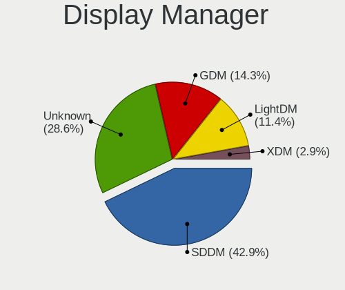
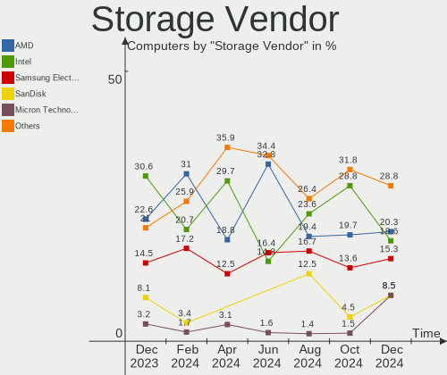
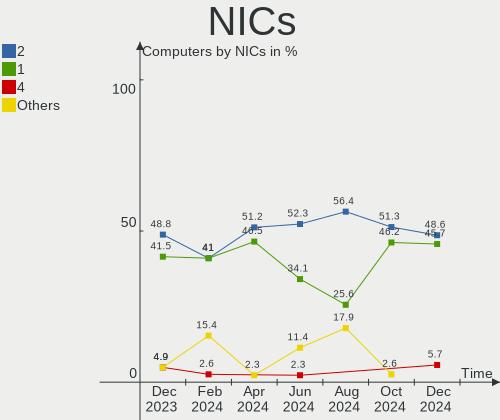
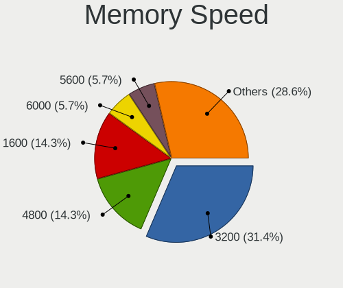
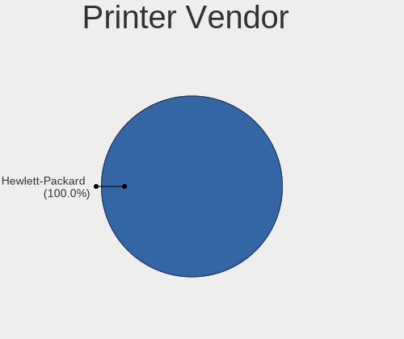
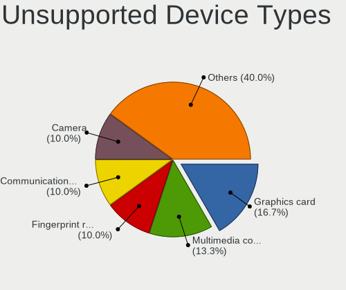

Gentoo Hardware Trends
----------------------

A project to identify most popular hardware characteristics and track their change
over time based on data collected by Gentoo users at https://Linux-Hardware.org.

Anyone can contribute to this report by the [hw-probe](https://github.com/linuxhw/hw-probe) tool:

    sudo -E hw-probe -all -upload

This is a report for all computer types. See also reports for [desktops](/Dist/Gentoo/Desktop/README.md) and [notebooks](/Dist/Gentoo/Notebook/README.md).

Full-feature report is available here: https://linux-hardware.org/?view=trends

Period: Aug, 2021.

Contents
--------

* [ System ](#system)
  - [ OS                       ](#os)
  - [ OS Family                ](#os-family)
  - [ Kernel                   ](#kernel)
  - [ Kernel Family            ](#kernel-family)
  - [ Kernel Major Ver.        ](#kernel-major-ver)
  - [ Arch                     ](#arch)
  - [ DE                       ](#de)
  - [ Display Server           ](#display-server)
  - [ Display Manager          ](#display-manager)
  - [ OS Lang                  ](#os-lang)
  - [ Boot Mode                ](#boot-mode)
  - [ Filesystem               ](#filesystem)
  - [ Part. scheme             ](#part-scheme)
  - [ Dual Boot with Linux/BSD ](#dual-boot-with-linuxbsd)
  - [ Dual Boot (Win)          ](#dual-boot-win)

* [ Board ](#board)
  - [ Vendor                   ](#vendor)
  - [ Model                    ](#model)
  - [ Model Family             ](#model-family)
  - [ MFG Year                 ](#mfg-year)
  - [ Form Factor              ](#form-factor)
  - [ Secure Boot              ](#secure-boot)
  - [ Coreboot                 ](#coreboot)
  - [ RAM Size                 ](#ram-size)
  - [ RAM Used                 ](#ram-used)
  - [ Total Drives             ](#total-drives)
  - [ Has CD-ROM               ](#has-cd-rom)
  - [ Has Ethernet             ](#has-ethernet)
  - [ Has WiFi                 ](#has-wifi)
  - [ Has Bluetooth            ](#has-bluetooth)

* [ Location ](#location)
  - [ Country                  ](#country)
  - [ City                     ](#city)

* [ Drives ](#drives)
  - [ Drive Vendor             ](#drive-vendor)
  - [ Drive Model              ](#drive-model)
  - [ HDD Vendor               ](#hdd-vendor)
  - [ SSD Vendor               ](#ssd-vendor)
  - [ Drive Kind               ](#drive-kind)
  - [ Drive Connector          ](#drive-connector)
  - [ Drive Size               ](#drive-size)
  - [ Space Total              ](#space-total)
  - [ Space Used               ](#space-used)
  - [ Malfunc. Drives          ](#malfunc-drives)
  - [ Malfunc. Drive Vendor    ](#malfunc-drive-vendor)
  - [ Malfunc. HDD Vendor      ](#malfunc-hdd-vendor)
  - [ Malfunc. Drive Kind      ](#malfunc-drive-kind)
  - [ Failed Drives            ](#failed-drives)
  - [ Failed Drive Vendor      ](#failed-drive-vendor)
  - [ Drive Status             ](#drive-status)

* [ Storage controller ](#storage-controller)
  - [ Storage Vendor           ](#storage-vendor)
  - [ Storage Model            ](#storage-model)
  - [ Storage Kind             ](#storage-kind)

* [ Processor ](#processor)
  - [ CPU Vendor               ](#cpu-vendor)
  - [ CPU Model                ](#cpu-model)
  - [ CPU Model Family         ](#cpu-model-family)
  - [ CPU Cores                ](#cpu-cores)
  - [ CPU Sockets              ](#cpu-sockets)
  - [ CPU Threads              ](#cpu-threads)
  - [ CPU Op-Modes             ](#cpu-op-modes)
  - [ CPU Microcode            ](#cpu-microcode)
  - [ CPU Microarch            ](#cpu-microarch)

* [ Graphics ](#graphics)
  - [ GPU Vendor               ](#gpu-vendor)
  - [ GPU Model                ](#gpu-model)
  - [ GPU Combo                ](#gpu-combo)
  - [ GPU Driver               ](#gpu-driver)
  - [ GPU Memory               ](#gpu-memory)

* [ Monitor ](#monitor)
  - [ Monitor Vendor           ](#monitor-vendor)
  - [ Monitor Model            ](#monitor-model)
  - [ Monitor Resolution       ](#monitor-resolution)
  - [ Monitor Diagonal         ](#monitor-diagonal)
  - [ Monitor Width            ](#monitor-width)
  - [ Aspect Ratio             ](#aspect-ratio)
  - [ Monitor Area             ](#monitor-area)
  - [ Pixel Density            ](#pixel-density)
  - [ Multiple Monitors        ](#multiple-monitors)

* [ Network ](#network)
  - [ Net Controller Vendor    ](#net-controller-vendor)
  - [ Net Controller Model     ](#net-controller-model)
  - [ Wireless Vendor          ](#wireless-vendor)
  - [ Wireless Model           ](#wireless-model)
  - [ Ethernet Vendor          ](#ethernet-vendor)
  - [ Ethernet Model           ](#ethernet-model)
  - [ Net Controller Kind      ](#net-controller-kind)
  - [ Used Controller          ](#used-controller)
  - [ NICs                     ](#nics)
  - [ IPv6                     ](#ipv6)

* [ Bluetooth ](#bluetooth)
  - [ Bluetooth Vendor         ](#bluetooth-vendor)
  - [ Bluetooth Model          ](#bluetooth-model)

* [ Sound ](#sound)
  - [ Sound Vendor             ](#sound-vendor)
  - [ Sound Model              ](#sound-model)

* [ Memory ](#memory)
  - [ Memory Vendor            ](#memory-vendor)
  - [ Memory Model             ](#memory-model)
  - [ Memory Kind              ](#memory-kind)
  - [ Memory Form Factor       ](#memory-form-factor)
  - [ Memory Size              ](#memory-size)
  - [ Memory Speed             ](#memory-speed)

* [ Printers & scanners ](#printers--scanners)
  - [ Printer Vendor           ](#printer-vendor)
  - [ Printer Model            ](#printer-model)
  - [ Scanner Vendor           ](#scanner-vendor)
  - [ Scanner Model            ](#scanner-model)

* [ Camera ](#camera)
  - [ Camera Vendor            ](#camera-vendor)
  - [ Camera Model             ](#camera-model)

* [ Security ](#security)
  - [ Fingerprint Vendor       ](#fingerprint-vendor)
  - [ Fingerprint Model        ](#fingerprint-model)
  - [ Chipcard Vendor          ](#chipcard-vendor)
  - [ Chipcard Model           ](#chipcard-model)

* [ Unsupported ](#unsupported)
  - [ Unsupported Devices      ](#unsupported-devices)
  - [ Unsupported Device Types ](#unsupported-device-types)

System
------

OS
--

Installed operating systems

| Name       | Computers | Percent |
|------------|-----------|---------|
| Gentoo     | 26        | 59.09%  |
| Gentoo 2.7 | 17        | 38.64%  |
| Gentoo 1   | 1         | 2.27%   |

OS Family
---------

OS without a version

| Name   | Computers | Percent |
|--------|-----------|---------|
| Gentoo | 44        | 100%    |

Kernel
------

Version of the Linux kernel

| Version                       | Computers | Percent |
|-------------------------------|-----------|---------|
| 5.10.52-gentoo                | 12        | 27.27%  |
| 5.10.52-gentoo-x86_64         | 3         | 6.82%   |
| 5.13.7-gentoo                 | 2         | 4.55%   |
| 5.13.12-gentoo-dist           | 2         | 4.55%   |
| 5.13.12-gentoo                | 2         | 4.55%   |
| 5.10.52-gentoo-P6B40-A4X      | 2         | 4.55%   |
| 5.9.11                        | 1         | 2.27%   |
| 5.4.97-gentoo-x86_64          | 1         | 2.27%   |
| 5.4.66-gentoo-x86_64          | 1         | 2.27%   |
| 5.2.11_1                      | 1         | 2.27%   |
| 5.13.9-gentoo-x86_64          | 1         | 2.27%   |
| 5.13.9-gentoo-NUC7PJYH        | 1         | 2.27%   |
| 5.13.9-gentoo-hpz820-mgreene  | 1         | 2.27%   |
| 5.13.9-gentoo-dist            | 1         | 2.27%   |
| 5.13.7-gentoo-x86_64          | 1         | 2.27%   |
| 5.13.13-gentoo                | 1         | 2.27%   |
| 5.13.12-gentoo-x86_64         | 1         | 2.27%   |
| 5.13.12-gentoo-limelight      | 1         | 2.27%   |
| 5.13.12                       | 1         | 2.27%   |
| 5.13.11-gentoo-dist           | 1         | 2.27%   |
| 5.13.11-gentoo                | 1         | 2.27%   |
| 5.12.15-ck                    | 1         | 2.27%   |
| 5.10.52-gentoo-x86_64-generic | 1         | 2.27%   |
| 5.10.52-1-lts                 | 1         | 2.27%   |
| 5.10.27-gentoo-x86_64         | 1         | 2.27%   |
| 5.10.27-gentoo                | 1         | 2.27%   |
| 5.10.11-v8                    | 1         | 2.27%   |

Kernel Family
-------------

Linux kernel without a distro release

| Version | Computers | Percent |
|---------|-----------|---------|
| 5.10.52 | 19        | 43.18%  |
| 5.13.12 | 7         | 15.91%  |
| 5.13.9  | 4         | 9.09%   |
| 5.13.7  | 3         | 6.82%   |
| 5.13.11 | 2         | 4.55%   |
| 5.10.27 | 2         | 4.55%   |
| 5.9.11  | 1         | 2.27%   |
| 5.4.97  | 1         | 2.27%   |
| 5.4.66  | 1         | 2.27%   |
| 5.2.11  | 1         | 2.27%   |
| 5.13.13 | 1         | 2.27%   |
| 5.12.15 | 1         | 2.27%   |
| 5.10.11 | 1         | 2.27%   |

Kernel Major Ver.
-----------------

Linux kernel major version

| Version | Computers | Percent |
|---------|-----------|---------|
| 5.10    | 22        | 50%     |
| 5.13    | 17        | 38.64%  |
| 5.4     | 2         | 4.55%   |
| 5.9     | 1         | 2.27%   |
| 5.2     | 1         | 2.27%   |
| 5.12    | 1         | 2.27%   |

Arch
----

OS architecture (x86_64, i586, etc.)

| Name    | Computers | Percent |
|---------|-----------|---------|
| x86_64  | 37        | 84.09%  |
| i686    | 5         | 11.36%  |
| ppc     | 1         | 2.27%   |
| aarch64 | 1         | 2.27%   |

DE
--

Desktop Environment

| Name    | Computers | Percent |
|---------|-----------|---------|
| Unknown | 12        | 27.27%  |
| KDE5    | 10        | 22.73%  |
| GNOME   | 10        | 22.73%  |
| MATE    | 7         | 15.91%  |
| XFCE    | 2         | 4.55%   |
| sway    | 1         | 2.27%   |
| LXDE    | 1         | 2.27%   |
| bspwm   | 1         | 2.27%   |

Display Server
--------------

X11 or Wayland

| Name    | Computers | Percent |
|---------|-----------|---------|
| X11     | 23        | 52.27%  |
| Tty     | 11        | 25%     |
| Wayland | 5         | 11.36%  |
| Unknown | 5         | 11.36%  |

Display Manager
---------------

SDDM, LightDM, etc.

| Name    | Computers | Percent |
|---------|-----------|---------|
| Unknown | 15        | 34.09%  |
| LightDM | 12        | 27.27%  |
| SDDM    | 11        | 25%     |
| GDM     | 5         | 11.36%  |
| LXDM    | 1         | 2.27%   |

OS Lang
-------

Language

| Lang       | Computers | Percent |
|------------|-----------|---------|
| en_US      | 23        | 52.27%  |
| en_GB      | 5         | 11.36%  |
| es_ES      | 3         | 6.82%   |
| ru_RU.UTF8 | 2         | 4.55%   |
| Unknown    | 2         | 4.55%   |
| ru_RU      | 1         | 2.27%   |
| pt_BR      | 1         | 2.27%   |
| pl_PL      | 1         | 2.27%   |
| nl_BE      | 1         | 2.27%   |
| fr_FR      | 1         | 2.27%   |
| en_US.UTF8 | 1         | 2.27%   |
| en_DK      | 1         | 2.27%   |
| en_CA      | 1         | 2.27%   |
| de_DE      | 1         | 2.27%   |

Boot Mode
---------

EFI or BIOS

| Mode | Computers | Percent |
|------|-----------|---------|
| EFI  | 25        | 56.82%  |
| BIOS | 19        | 43.18%  |

Filesystem
----------

Type of filesystem

| Type  | Computers | Percent |
|-------|-----------|---------|
| Ext4  | 31        | 70.45%  |
| Btrfs | 7         | 15.91%  |
| F2fs  | 4         | 9.09%   |
| Jfs   | 1         | 2.27%   |
| Ext3  | 1         | 2.27%   |

Part. scheme
------------

Scheme of partitioning

| Type    | Computers | Percent |
|---------|-----------|---------|
| GPT     | 31        | 70.45%  |
| MBR     | 12        | 27.27%  |
| Unknown | 1         | 2.27%   |

Dual Boot with Linux/BSD
------------------------

Hosting more than one Linux/BSD

| Dual boot | Computers | Percent |
|-----------|-----------|---------|
| No        | 27        | 61.36%  |
| Yes       | 17        | 38.64%  |

Dual Boot (Win)
---------------

Hosting Linux and Windows

| Dual boot | Computers | Percent |
|-----------|-----------|---------|
| No        | 33        | 75%     |
| Yes       | 11        | 25%     |

Board
-----

Vendor
------

Motherboard manufacturer

| Name                | Computers | Percent |
|---------------------|-----------|---------|
| ASUSTek Computer    | 12        | 27.27%  |
| Lenovo              | 4         | 9.09%   |
| Gigabyte Technology | 4         | 9.09%   |
| MSI                 | 3         | 6.82%   |
| Intel               | 3         | 6.82%   |
| Hewlett-Packard     | 3         | 6.82%   |
| TUXEDO              | 2         | 4.55%   |
| Tekram Technology   | 2         | 4.55%   |
| IBM                 | 2         | 4.55%   |
| Dell                | 2         | 4.55%   |
| Unknown             | 2         | 4.55%   |
| Supermicro          | 1         | 2.27%   |
| Packard Bell        | 1         | 2.27%   |
| NZXT                | 1         | 2.27%   |
| Jumper              | 1         | 2.27%   |
| Fujitsu             | 1         | 2.27%   |

Model
-----

Motherboard model

| Name                                       | Computers | Percent |
|--------------------------------------------|-----------|---------|
| Tekram P6B40-A4X-i440BX Rev                | 2         | 4.55%   |
| Unknown                                    | 2         | 4.55%   |
| TUXEDO TUXEDO_Book_XA1510                  | 1         | 2.27%   |
| TUXEDO Book XC1711                         | 1         | 2.27%   |
| Supermicro X10SAE                          | 1         | 2.27%   |
| Packard Bell IMEDIA X5705 GE               | 1         | 2.27%   |
| NZXT N7 Z370                               | 1         | 2.27%   |
| MSI MS-7C56                                | 1         | 2.27%   |
| MSI MS-7369                                | 1         | 2.27%   |
| MSI GF63 Thin 9SCSR                        | 1         | 2.27%   |
| Lenovo ThinkPad X230 23259H1               | 1         | 2.27%   |
| Lenovo ThinkPad X1 Carbon Gen 9 20XXS0HW00 | 1         | 2.27%   |
| Lenovo Legion 5P 15IMH05 82AW              | 1         | 2.27%   |
| Lenovo IdeaPad C340-14IML 81TK             | 1         | 2.27%   |
| Jumper EZpad                               | 1         | 2.27%   |
| Intel NUC8i7HVK                            | 1         | 2.27%   |
| Intel NUC7PJYH                             | 1         | 2.27%   |
| Intel D525MW AAE93082-301                  | 1         | 2.27%   |
| IBM ThinkPad T43 2668Z3S                   | 1         | 2.27%   |
| IBM ThinkPad T42 2373V4F                   | 1         | 2.27%   |
| HP Z820 Workstation                        | 1         | 2.27%   |
| HP Pavilion ZV6100 (EE984EA#ABZ)           | 1         | 2.27%   |
| HP 255 G6 Notebook PC                      | 1         | 2.27%   |
| Gigabyte Z170-Gaming K3                    | 1         | 2.27%   |
| Gigabyte X570 AORUS ELITE                  | 1         | 2.27%   |
| Gigabyte EP43-DS3                          | 1         | 2.27%   |
| Gigabyte AB350-Gaming                      | 1         | 2.27%   |
| Fujitsu ESPRIMO P7935                      | 1         | 2.27%   |
| Dell OptiPlex GX270                        | 1         | 2.27%   |
| Dell Inspiron 5415                         | 1         | 2.27%   |
| ASUS ZenBook UX325EA_UX325EA               | 1         | 2.27%   |
| ASUS X510UR                                | 1         | 2.27%   |
| ASUS ROG STRIX Z390-F GAMING               | 1         | 2.27%   |
| ASUS ROG Strix G533QR_G533QR               | 1         | 2.27%   |
| ASUS ROG STRIX B550-F GAMING               | 1         | 2.27%   |
| ASUS ROG Maximus XIII APEX                 | 1         | 2.27%   |
| ASUS PRIME X470-PRO                        | 1         | 2.27%   |
| ASUS P9X79 WS                              | 1         | 2.27%   |
| ASUS P6T DELUXE V2                         | 1         | 2.27%   |
| ASUS P5P41C                                | 1         | 2.27%   |
| ASUS M4A89GTD-PRO/USB3                     | 1         | 2.27%   |
| ASUS M3A78-CM                              | 1         | 2.27%   |

Model Family
------------

Motherboard model prefix

| Name                    | Computers | Percent |
|-------------------------|-----------|---------|
| ASUS ROG                | 4         | 9.09%   |
| Tekram P6B40-A4X-i440BX | 2         | 4.55%   |
| Lenovo ThinkPad         | 2         | 4.55%   |
| IBM ThinkPad            | 2         | 4.55%   |
| Unknown                 | 2         | 4.55%   |
| TUXEDO TUXEDO           | 1         | 2.27%   |
| TUXEDO Book             | 1         | 2.27%   |
| Supermicro X10SAE       | 1         | 2.27%   |
| Packard Bell IMEDIA     | 1         | 2.27%   |
| NZXT N7                 | 1         | 2.27%   |
| MSI MS-7C56             | 1         | 2.27%   |
| MSI MS-7369             | 1         | 2.27%   |
| MSI GF63                | 1         | 2.27%   |
| Lenovo Legion           | 1         | 2.27%   |
| Lenovo IdeaPad          | 1         | 2.27%   |
| Jumper EZpad            | 1         | 2.27%   |
| Intel NUC8i7HVK         | 1         | 2.27%   |
| Intel NUC7PJYH          | 1         | 2.27%   |
| Intel D525MW            | 1         | 2.27%   |
| HP Z820                 | 1         | 2.27%   |
| HP Pavilion             | 1         | 2.27%   |
| HP 255                  | 1         | 2.27%   |
| Gigabyte Z170-Gaming    | 1         | 2.27%   |
| Gigabyte X570           | 1         | 2.27%   |
| Gigabyte EP43-DS3       | 1         | 2.27%   |
| Gigabyte AB350-Gaming   | 1         | 2.27%   |
| Fujitsu ESPRIMO         | 1         | 2.27%   |
| Dell OptiPlex           | 1         | 2.27%   |
| Dell Inspiron           | 1         | 2.27%   |
| ASUS ZenBook            | 1         | 2.27%   |
| ASUS X510UR             | 1         | 2.27%   |
| ASUS PRIME              | 1         | 2.27%   |
| ASUS P9X79              | 1         | 2.27%   |
| ASUS P6T                | 1         | 2.27%   |
| ASUS P5P41C             | 1         | 2.27%   |
| ASUS M4A89GTD-PRO       | 1         | 2.27%   |
| ASUS M3A78-CM           | 1         | 2.27%   |

MFG Year
--------

Motherboard manufacture year

| Year    | Computers | Percent |
|---------|-----------|---------|
| 2021    | 13        | 29.55%  |
| 2020    | 6         | 13.64%  |
| 2019    | 3         | 6.82%   |
| 2017    | 3         | 6.82%   |
| 2010    | 3         | 6.82%   |
| 2009    | 2         | 4.55%   |
| 2008    | 2         | 4.55%   |
| 2006    | 2         | 4.55%   |
| 2000    | 2         | 4.55%   |
| Unknown | 2         | 4.55%   |
| 2018    | 1         | 2.27%   |
| 2015    | 1         | 2.27%   |
| 2013    | 1         | 2.27%   |
| 2012    | 1         | 2.27%   |
| 2007    | 1         | 2.27%   |
| 2004    | 1         | 2.27%   |

Form Factor
-----------

Physical design of the computer

| Name           | Computers | Percent |
|----------------|-----------|---------|
| Desktop        | 25        | 56.82%  |
| Notebook       | 14        | 31.82%  |
| Mini pc        | 2         | 4.55%   |
| System on chip | 1         | 2.27%   |
| Convertible    | 1         | 2.27%   |
| Server         | 1         | 2.27%   |

Secure Boot
-----------

Enabled or disabled

| State    | Computers | Percent |
|----------|-----------|---------|
| Disabled | 42        | 95.45%  |
| Enabled  | 2         | 4.55%   |

Coreboot
--------

Have coreboot on board

| Used | Computers | Percent |
|------|-----------|---------|
| No   | 43        | 97.73%  |
| Yes  | 1         | 2.27%   |

RAM Size
--------

Total RAM memory

| Size in GB  | Computers | Percent |
|-------------|-----------|---------|
| 4.01-8.0    | 8         | 18.18%  |
| 32.01-64.0  | 7         | 15.91%  |
| 16.01-24.0  | 7         | 15.91%  |
| 64.01-256.0 | 6         | 13.64%  |
| 8.01-16.0   | 5         | 11.36%  |
| 3.01-4.0    | 4         | 9.09%   |
| 2.01-3.0    | 3         | 6.82%   |
| 0.51-1.0    | 2         | 4.55%   |
| 24.01-32.0  | 1         | 2.27%   |
| 1.01-2.0    | 1         | 2.27%   |

RAM Used
--------

Used RAM memory

| Used GB    | Computers | Percent |
|------------|-----------|---------|
| 1.01-2.0   | 12        | 27.27%  |
| 0.01-0.5   | 9         | 20.45%  |
| 4.01-8.0   | 6         | 13.64%  |
| 2.01-3.0   | 6         | 13.64%  |
| 3.01-4.0   | 4         | 9.09%   |
| 8.01-16.0  | 3         | 6.82%   |
| 0.51-1.0   | 3         | 6.82%   |
| 16.01-24.0 | 1         | 2.27%   |

Total Drives
------------

Number of drives on board

| Drives | Computers | Percent |
|--------|-----------|---------|
| 1      | 17        | 38.64%  |
| 2      | 13        | 29.55%  |
| 4      | 4         | 9.09%   |
| 5      | 3         | 6.82%   |
| 3      | 3         | 6.82%   |
| 6      | 2         | 4.55%   |
| 17     | 1         | 2.27%   |
| 7      | 1         | 2.27%   |

Has CD-ROM
----------

Has CD-ROM on board

| Presented | Computers | Percent |
|-----------|-----------|---------|
| No        | 29        | 65.91%  |
| Yes       | 15        | 34.09%  |

Has Ethernet
------------

Has Ethernet on board

| Presented | Computers | Percent |
|-----------|-----------|---------|
| Yes       | 39        | 88.64%  |
| No        | 5         | 11.36%  |

Has WiFi
--------

Has WiFi module

| Presented | Computers | Percent |
|-----------|-----------|---------|
| No        | 23        | 52.27%  |
| Yes       | 21        | 47.73%  |

Has Bluetooth
-------------

Has Bluetooth module

| Presented | Computers | Percent |
|-----------|-----------|---------|
| Yes       | 23        | 52.27%  |
| No        | 21        | 47.73%  |

Location
--------

Country
-------

Geographic location (country)

| Country     | Computers | Percent |
|-------------|-----------|---------|
| Germany     | 11        | 25%     |
| USA         | 7         | 15.91%  |
| Poland      | 4         | 9.09%   |
| Spain       | 3         | 6.82%   |
| Russia      | 3         | 6.82%   |
| UK          | 2         | 4.55%   |
| France      | 2         | 4.55%   |
| Brazil      | 2         | 4.55%   |
| Switzerland | 1         | 2.27%   |
| Netherlands | 1         | 2.27%   |
| Italy       | 1         | 2.27%   |
| Finland     | 1         | 2.27%   |
| Czechia     | 1         | 2.27%   |
| China       | 1         | 2.27%   |
| Canada      | 1         | 2.27%   |
| Belgium     | 1         | 2.27%   |
| Belarus     | 1         | 2.27%   |
| Australia   | 1         | 2.27%   |

City
----

Geographic location (city)

| City                  | Computers | Percent |
|-----------------------|-----------|---------|
| Rodgau                | 6         | 13.64%  |
| Warsaw                | 3         | 6.82%   |
| Vladivostok           | 2         | 4.55%   |
| Suffolk               | 2         | 4.55%   |
| Santa Brigida         | 2         | 4.55%   |
| Berlin                | 2         | 4.55%   |
| Zurich                | 1         | 2.27%   |
| Zbuczyn               | 1         | 2.27%   |
| Zaragoza              | 1         | 2.27%   |
| Winnipeg              | 1         | 2.27%   |
| Warrington            | 1         | 2.27%   |
| S??o Jos?© dos Campos | 1         | 2.27%   |
| Reims                 | 1         | 2.27%   |
| Ratingen              | 1         | 2.27%   |
| Prairieville          | 1         | 2.27%   |
| Pontcharra            | 1         | 2.27%   |
| Paderno Dugnano       | 1         | 2.27%   |
| Oulu                  | 1         | 2.27%   |
| Oberhausen            | 1         | 2.27%   |
| New York              | 1         | 2.27%   |
| Munich                | 1         | 2.27%   |
| Moscow                | 1         | 2.27%   |
| Minsk                 | 1         | 2.27%   |
| Melbourne             | 1         | 2.27%   |
| Los Angeles           | 1         | 2.27%   |
| Itanhaem              | 1         | 2.27%   |
| Irvine                | 1         | 2.27%   |
| Haarlem               | 1         | 2.27%   |
| Eisden                | 1         | 2.27%   |
| Dickson               | 1         | 2.27%   |
| Chiswick              | 1         | 2.27%   |
| Brno                  | 1         | 2.27%   |
| Beijing               | 1         | 2.27%   |

Drives
------

Drive Vendor
------------

Hard drive vendors

| Vendor              | Computers | Drives | Percent |
|---------------------|-----------|--------|---------|
| Samsung Electronics | 18        | 26     | 20.69%  |
| WDC                 | 15        | 27     | 17.24%  |
| Seagate             | 15        | 27     | 17.24%  |
| Kingston            | 5         | 6      | 5.75%   |
| Crucial             | 5         | 5      | 5.75%   |
| Toshiba             | 4         | 5      | 4.6%    |
| Unknown             | 3         | 3      | 3.45%   |
| SK Hynix            | 3         | 3      | 3.45%   |
| SanDisk             | 3         | 3      | 3.45%   |
| Intel               | 3         | 3      | 3.45%   |
| IBM                 | 2         | 2      | 2.3%    |
| Hitachi             | 2         | 4      | 2.3%    |
| GOODRAM             | 2         | 2      | 2.3%    |
| MDT                 | 1         | 1      | 1.15%   |
| LITEONIT            | 1         | 1      | 1.15%   |
| LaCie               | 1         | 1      | 1.15%   |
| IBM/Hitachi         | 1         | 1      | 1.15%   |
| HGST                | 1         | 1      | 1.15%   |
| faspeed             | 1         | 1      | 1.15%   |
| Dogfish             | 1         | 1      | 1.15%   |

Drive Model
-----------

Hard drive models

| Model                                | Computers | Percent |
|--------------------------------------|-----------|---------|
| Samsung SSD 840 EVO 120GB            | 3         | 2.8%    |
| WDC WDS200T2B0A-00SM50 2TB SSD       | 2         | 1.87%   |
| WDC WD30EFRX-68EUZN0 3TB             | 2         | 1.87%   |
| Seagate ST31000340NS 1TB             | 2         | 1.87%   |
| Samsung SSD 970 EVO Plus 250GB       | 2         | 1.87%   |
| Samsung SSD 860 EVO 250GB            | 2         | 1.87%   |
| Samsung SSD 860 EVO 1TB              | 2         | 1.87%   |
| Kingston SA400S37480G 480GB SSD      | 2         | 1.87%   |
| IBM DJSA-220 12GB                    | 2         | 1.87%   |
| GOODRAM SSDPR-CL100-480-G2 480GB     | 2         | 1.87%   |
| WDC WDS200T2B0B-00YS70 2TB SSD       | 1         | 0.93%   |
| WDC WDBRPG5000ANC-WRSN 500GB         | 1         | 0.93%   |
| WDC WD80EFZX-68UW8N0 8TB             | 1         | 0.93%   |
| WDC WD80EFAX-68KNBN0 8TB             | 1         | 0.93%   |
| WDC WD6401AALS-00L3B2 640GB          | 1         | 0.93%   |
| WDC WD6401AALS-00J7B0 640GB          | 1         | 0.93%   |
| WDC WD40EZRZ-00GXCB0 4TB             | 1         | 0.93%   |
| WDC WD3200AAJB-00WGA0 320GB          | 1         | 0.93%   |
| WDC WD30EZRX-00MMMB0 3TB             | 1         | 0.93%   |
| WDC WD30EFZX-68AWUN0 3TB             | 1         | 0.93%   |
| WDC WD30EFRX-68N32N0 3TB             | 1         | 0.93%   |
| WDC WD1600AAJS-75B4A0 160GB          | 1         | 0.93%   |
| WDC WD10EZEX-60WN4A1 1TB             | 1         | 0.93%   |
| WDC WD10EZEX-21M2NA0 1TB             | 1         | 0.93%   |
| WDC WD10EZEX-00WN4A0 1TB             | 1         | 0.93%   |
| WDC WD100EJRX-89SYHY0 10TB           | 1         | 0.93%   |
| WDC PC SN730 SDBPNTY-256G-1101 256GB | 1         | 0.93%   |
| WDC PC SN530 SDBPNPZ-256G-1032 256GB | 1         | 0.93%   |
| Unknown MMC Card  997GB              | 1         | 0.93%   |
| Unknown MMC Card  32GB               | 1         | 0.93%   |
| Unknown MMC Card  128GB              | 1         | 0.93%   |
| Toshiba MQ01ABD100 1TB               | 1         | 0.93%   |
| Toshiba MG06ACA800E 8TB              | 1         | 0.93%   |
| Toshiba KXG50ZNV256G NVMe 256GB      | 1         | 0.93%   |
| Toshiba HDWE150 5TB                  | 1         | 0.93%   |
| SK Hynix HFM256GDJTNG-8310A 256GB    | 1         | 0.93%   |
| SK Hynix HFM001TD3JX013N 1TB         | 1         | 0.93%   |
| SK Hynix BC711 NVMe 512GB            | 1         | 0.93%   |
| Seagate ST8000VX0022-2EJ112 8TB      | 1         | 0.93%   |
| Seagate ST8000AS0003-2HH188 8TB      | 1         | 0.93%   |
| Seagate ST8000AS0002-1NA17Z 8TB      | 1         | 0.93%   |
| Seagate ST500DM002-1BC142 500GB      | 1         | 0.93%   |
| Seagate ST4000DM004-2CV104 4TB       | 1         | 0.93%   |
| Seagate ST373207LW 73GB              | 1         | 0.93%   |
| Seagate ST336607LW 37GB              | 1         | 0.93%   |
| Seagate ST3320620AS 320GB            | 1         | 0.93%   |
| Seagate ST3250824AS 250GB            | 1         | 0.93%   |
| Seagate ST3250318AS 250GB            | 1         | 0.93%   |
| Seagate ST3160310CS 160GB            | 1         | 0.93%   |
| Seagate ST2000DM001-1ER164 2TB       | 1         | 0.93%   |
| Seagate ST12000NM0008-2H3101 12TB    | 1         | 0.93%   |
| Seagate ST1000NM0011 1TB             | 1         | 0.93%   |
| Seagate ST1000LM048-2E7172 1TB       | 1         | 0.93%   |
| Seagate ST1000DM010-2EP102 1TB       | 1         | 0.93%   |
| Seagate ST1000DM005 HD103SJ 1TB      | 1         | 0.93%   |
| Seagate ST1000DM003-1CH162 1TB       | 1         | 0.93%   |
| Seagate Backup+ Desk 5TB             | 1         | 0.93%   |
| SanDisk SSD PLUS 480GB               | 1         | 0.93%   |
| SanDisk SDSSDA480G 480GB             | 1         | 0.93%   |
| SanDisk SD9SN8W-128G-1006 128GB SSD  | 1         | 0.93%   |

HDD Vendor
----------

Hard disk drive vendors

| Vendor              | Computers | Drives | Percent |
|---------------------|-----------|--------|---------|
| Seagate             | 14        | 26     | 35.9%   |
| WDC                 | 11        | 21     | 28.21%  |
| Toshiba             | 3         | 4      | 7.69%   |
| Samsung Electronics | 3         | 3      | 7.69%   |
| IBM                 | 2         | 2      | 5.13%   |
| Hitachi             | 2         | 4      | 5.13%   |
| MDT                 | 1         | 1      | 2.56%   |
| LaCie               | 1         | 1      | 2.56%   |
| IBM/Hitachi         | 1         | 1      | 2.56%   |
| HGST                | 1         | 1      | 2.56%   |

SSD Vendor
----------

Solid state drive vendors

| Vendor              | Computers | Drives | Percent |
|---------------------|-----------|--------|---------|
| Samsung Electronics | 8         | 11     | 28.57%  |
| Crucial             | 5         | 5      | 17.86%  |
| Kingston            | 4         | 5      | 14.29%  |
| SanDisk             | 3         | 3      | 10.71%  |
| WDC                 | 2         | 3      | 7.14%   |
| GOODRAM             | 2         | 2      | 7.14%   |
| LITEONIT            | 1         | 1      | 3.57%   |
| Intel               | 1         | 1      | 3.57%   |
| faspeed             | 1         | 1      | 3.57%   |
| Dogfish             | 1         | 1      | 3.57%   |

Drive Kind
----------

HDD or SSD

| Kind    | Computers | Drives | Percent |
|---------|-----------|--------|---------|
| HDD     | 27        | 64     | 39.13%  |
| SSD     | 21        | 33     | 30.43%  |
| NVMe    | 17        | 22     | 24.64%  |
| MMC     | 3         | 3      | 4.35%   |
| Unknown | 1         | 1      | 1.45%   |

Drive Connector
---------------

SATA, SAS, NVMe, etc.

| Type | Computers | Drives | Percent |
|------|-----------|--------|---------|
| SATA | 34        | 93     | 58.62%  |
| NVMe | 17        | 22     | 29.31%  |
| SAS  | 4         | 5      | 6.9%    |
| MMC  | 3         | 3      | 5.17%   |

Drive Size
----------

Size of hard drive

| Size in TB | Computers | Drives | Percent |
|------------|-----------|--------|---------|
| 0.01-0.5   | 27        | 42     | 45.76%  |
| 0.51-1.0   | 16        | 21     | 27.12%  |
| 1.01-2.0   | 5         | 6      | 8.47%   |
| 2.01-3.0   | 4         | 10     | 6.78%   |
| 3.01-4.0   | 3         | 3      | 5.08%   |
| 4.01-10.0  | 3         | 14     | 5.08%   |
| 10.01-20.0 | 1         | 1      | 1.69%   |

Space Total
-----------

Amount of disk space available on the file system

| Size in GB     | Computers | Percent |
|----------------|-----------|---------|
| 251-500        | 8         | 18.18%  |
| 101-250        | 8         | 18.18%  |
| 1001-2000      | 8         | 18.18%  |
| 501-1000       | 6         | 13.64%  |
| More than 3000 | 4         | 9.09%   |
| 1-20           | 4         | 9.09%   |
| 2001-3000      | 2         | 4.55%   |
| 51-100         | 2         | 4.55%   |
| 21-50          | 1         | 2.27%   |
| Unknown        | 1         | 2.27%   |

Space Used
----------

Amount of used disk space

| Used GB        | Computers | Percent |
|----------------|-----------|---------|
| 1-20           | 9         | 20.45%  |
| 101-250        | 7         | 15.91%  |
| 251-500        | 6         | 13.64%  |
| 21-50          | 5         | 11.36%  |
| 51-100         | 5         | 11.36%  |
| 1001-2000      | 4         | 9.09%   |
| 501-1000       | 3         | 6.82%   |
| More than 3000 | 2         | 4.55%   |
| 2001-3000      | 2         | 4.55%   |
| Unknown        | 1         | 2.27%   |

Malfunc. Drives
---------------

Drive models with a malfunction

| Model                               | Computers | Drives | Percent |
|-------------------------------------|-----------|--------|---------|
| Seagate ST31000340NS 1TB            | 2         | 2      | 9.52%   |
| IBM DJSA-220 12GB                   | 2         | 2      | 9.52%   |
| WDC WD80EFZX-68UW8N0 8TB            | 1         | 2      | 4.76%   |
| WDC WD6401AALS-00J7B0 640GB         | 1         | 1      | 4.76%   |
| WDC WD1600AAJS-75B4A0 160GB         | 1         | 1      | 4.76%   |
| Seagate ST8000VX0022-2EJ112 8TB     | 1         | 1      | 4.76%   |
| Seagate ST8000AS0002-1NA17Z 8TB     | 1         | 1      | 4.76%   |
| Seagate ST500DM002-1BC142 500GB     | 1         | 1      | 4.76%   |
| Seagate ST3250824AS 250GB           | 1         | 1      | 4.76%   |
| Seagate ST3250318AS 250GB           | 1         | 1      | 4.76%   |
| Seagate ST1000NM0011 1TB            | 1         | 2      | 4.76%   |
| SanDisk SSD PLUS 480GB              | 1         | 1      | 4.76%   |
| SanDisk SD9SN8W-128G-1006 128GB SSD | 1         | 1      | 4.76%   |
| Samsung Electronics SSD 960 PRO 1TB | 1         | 2      | 4.76%   |
| Samsung Electronics HM160HC 160GB   | 1         | 1      | 4.76%   |
| MDT MD2000KS-00MJB0 200GB           | 1         | 1      | 4.76%   |
| IBM/Hitachi IC25N080ATMR04-0 80GB   | 1         | 1      | 4.76%   |
| Crucial CT256M550SSD1 256GB         | 1         | 1      | 4.76%   |
| Crucial CT120M500SSD1 120GB         | 1         | 1      | 4.76%   |

Malfunc. Drive Vendor
---------------------

Vendors of faulty drives

| Vendor              | Computers | Drives | Percent |
|---------------------|-----------|--------|---------|
| Seagate             | 5         | 9      | 27.78%  |
| WDC                 | 3         | 4      | 16.67%  |
| SanDisk             | 2         | 2      | 11.11%  |
| Samsung Electronics | 2         | 3      | 11.11%  |
| IBM                 | 2         | 2      | 11.11%  |
| Crucial             | 2         | 2      | 11.11%  |
| MDT                 | 1         | 1      | 5.56%   |
| IBM/Hitachi         | 1         | 1      | 5.56%   |

Malfunc. HDD Vendor
-------------------

Vendors of faulty HDD drives

| Vendor              | Computers | Drives | Percent |
|---------------------|-----------|--------|---------|
| Seagate             | 5         | 9      | 38.46%  |
| WDC                 | 3         | 4      | 23.08%  |
| IBM                 | 2         | 2      | 15.38%  |
| Samsung Electronics | 1         | 1      | 7.69%   |
| MDT                 | 1         | 1      | 7.69%   |
| IBM/Hitachi         | 1         | 1      | 7.69%   |

Malfunc. Drive Kind
-------------------

Kinds of faulty drives

| Kind | Computers | Drives | Percent |
|------|-----------|--------|---------|
| HDD  | 12        | 18     | 70.59%  |
| SSD  | 4         | 4      | 23.53%  |
| NVMe | 1         | 2      | 5.88%   |

Failed Drives
-------------

Failed drive models

| Model                                            | Computers | Drives | Percent |
|--------------------------------------------------|-----------|--------|---------|
| Samsung Electronics MZ7LN256HCHP-00000 256GB SSD | 1         | 1      | 100%    |

Failed Drive Vendor
-------------------

Failed drive vendors

| Vendor              | Computers | Drives | Percent |
|---------------------|-----------|--------|---------|
| Samsung Electronics | 1         | 1      | 100%    |

Drive Status
------------

Number of failed and malfunc. drives

| Status   | Computers | Drives | Percent |
|----------|-----------|--------|---------|
| Works    | 34        | 91     | 58.62%  |
| Malfunc  | 17        | 24     | 29.31%  |
| Detected | 6         | 7      | 10.34%  |
| Failed   | 1         | 1      | 1.72%   |

Storage controller
------------------

Storage Vendor
--------------

Storage controller vendors

| Vendor                        | Computers | Percent |
|-------------------------------|-----------|---------|
| Intel                         | 26        | 40%     |
| AMD                           | 11        | 16.92%  |
| Samsung Electronics           | 9         | 13.85%  |
| SK Hynix                      | 3         | 4.62%   |
| Sandisk                       | 3         | 4.62%   |
| Nvidia                        | 2         | 3.08%   |
| Broadcom / LSI                | 2         | 3.08%   |
| ASMedia Technology            | 2         | 3.08%   |
| Adaptec                       | 2         | 3.08%   |
| Toshiba America Info Systems  | 1         | 1.54%   |
| Marvell Technology Group      | 1         | 1.54%   |
| Kingston Technology Company   | 1         | 1.54%   |
| JMicron Technology            | 1         | 1.54%   |
| Integrated Technology Express | 1         | 1.54%   |

Storage Model
-------------

Storage controller models

| Model                                                                            | Computers | Percent |
|----------------------------------------------------------------------------------|-----------|---------|
| AMD FCH SATA Controller [AHCI mode]                                              | 8         | 9.88%   |
| Samsung NVMe SSD Controller SM981/PM981/PM983                                    | 4         | 4.94%   |
| Samsung NVMe SSD Controller PM9A1/PM9A3/980PRO                                   | 3         | 3.7%    |
| AMD 400 Series Chipset SATA Controller                                           | 3         | 3.7%    |
| SK Hynix NVMe SSD Controller                                                     | 2         | 2.47%   |
| Sandisk WD Black SN750 / PC SN730 NVMe SSD                                       | 2         | 2.47%   |
| Samsung NVMe Controller                                                          | 2         | 2.47%   |
| Intel Sunrise Point-LP SATA Controller [AHCI mode]                               | 2         | 2.47%   |
| Intel SATA Controller [RAID mode]                                                | 2         | 2.47%   |
| Intel C600/X79 series chipset 6-Port SATA AHCI Controller                        | 2         | 2.47%   |
| Intel 82801JI (ICH10 Family) SATA AHCI Controller                                | 2         | 2.47%   |
| Intel 82371AB/EB/MB PIIX4 IDE                                                    | 2         | 2.47%   |
| Intel 400 Series Chipset Family SATA AHCI Controller                             | 2         | 2.47%   |
| Broadcom / LSI SAS2308 PCI-Express Fusion-MPT SAS-2                              | 2         | 2.47%   |
| ASMedia ASM1062 Serial ATA Controller                                            | 2         | 2.47%   |
| AMD Starship/Matisse Chipset SATA Controller [AHCI mode]                         | 2         | 2.47%   |
| Toshiba America Info Systems Toshiba America Info Non-Volatile memory controller | 1         | 1.23%   |
| SK Hynix BC501 NVMe Solid State Drive                                            | 1         | 1.23%   |
| Sandisk WD Blue SN550 NVMe SSD                                                   | 1         | 1.23%   |
| Samsung NVMe SSD Controller SM961/PM961/SM963                                    | 1         | 1.23%   |
| Samsung NVMe SSD Controller SM951/PM951                                          | 1         | 1.23%   |
| Nvidia MCP79 RAID Controller                                                     | 1         | 1.23%   |
| Nvidia MCP65 SATA Controller                                                     | 1         | 1.23%   |
| Marvell Group 88SE9128 PCIe SATA 6 Gb/s RAID controller with HyperDuo            | 1         | 1.23%   |
| Kingston Company A2000 NVMe SSD                                                  | 1         | 1.23%   |
| JMicron JMB368 IDE controller                                                    | 1         | 1.23%   |
| JMicron JMB361 AHCI/IDE                                                          | 1         | 1.23%   |
| Intel Volume Management Device NVMe RAID Controller                              | 1         | 1.23%   |
| Intel Q170/Q150/B150/H170/H110/Z170/CM236 Chipset SATA Controller [AHCI Mode]    | 1         | 1.23%   |
| Intel PCIe Data Center SSD                                                       | 1         | 1.23%   |
| Intel Optane SSD 900P Series                                                     | 1         | 1.23%   |
| Intel NM10/ICH7 Family SATA Controller [IDE mode]                                | 1         | 1.23%   |
| Intel NM10/ICH7 Family SATA Controller [AHCI mode]                               | 1         | 1.23%   |
| Intel Comet Lake SATA AHCI Controller                                            | 1         | 1.23%   |
| Intel Celeron/Pentium Silver Processor SATA Controller                           | 1         | 1.23%   |
| Intel Cannon Lake Mobile PCH SATA AHCI Controller                                | 1         | 1.23%   |
| Intel C602 chipset 4-Port SATA Storage Control Unit                              | 1         | 1.23%   |
| Intel 82801G (ICH7 Family) IDE Controller                                        | 1         | 1.23%   |
| Intel 82801FBM (ICH6M) SATA Controller                                           | 1         | 1.23%   |
| Intel 82801EB/ER (ICH5/ICH5R) IDE Controller                                     | 1         | 1.23%   |
| Intel 82801EB (ICH5) SATA Controller                                             | 1         | 1.23%   |
| Intel 82801DBM (ICH4-M) IDE Controller                                           | 1         | 1.23%   |
| Intel 8 Series/C220 Series Chipset Family 6-port SATA Controller 1 [AHCI mode]   | 1         | 1.23%   |
| Intel 7 Series Chipset Family 6-port SATA Controller [AHCI mode]                 | 1         | 1.23%   |
| Intel 500 Series Chipset Family SATA AHCI Controller                             | 1         | 1.23%   |
| Intel 4 Series Chipset PT IDER Controller                                        | 1         | 1.23%   |
| Intel 200 Series PCH SATA controller [AHCI mode]                                 | 1         | 1.23%   |
| Integrated Express IT8213 IDE Controller                                         | 1         | 1.23%   |
| AMD SB7x0/SB8x0/SB9x0 SATA Controller [IDE mode]                                 | 1         | 1.23%   |
| AMD SB7x0/SB8x0/SB9x0 SATA Controller [AHCI mode]                                | 1         | 1.23%   |
| AMD SB7x0/SB8x0/SB9x0 IDE Controller                                             | 1         | 1.23%   |
| AMD IXP SB4x0 IDE Controller                                                     | 1         | 1.23%   |
| AMD 300 Series Chipset SATA Controller                                           | 1         | 1.23%   |
| Adaptec AIC-7892A U160/m                                                         | 1         | 1.23%   |
| Adaptec AHA-2940U2/U2W                                                           | 1         | 1.23%   |

Storage Kind
------------

Kind of storage controller (IDE, SATA, NVMe, SAS, ...)

| Kind | Computers | Percent |
|------|-----------|---------|
| SATA | 27        | 42.19%  |
| NVMe | 17        | 26.56%  |
| IDE  | 12        | 18.75%  |
| RAID | 4         | 6.25%   |
| SAS  | 2         | 3.13%   |
| SCSI | 2         | 3.13%   |

Processor
---------

CPU Vendor
----------

Processor vendors

| Vendor       | Computers | Percent |
|--------------|-----------|---------|
| Intel        | 29        | 65.91%  |
| AMD          | 13        | 29.55%  |
| PowerBook5,5 | 1         | 2.27%   |
| ARM          | 1         | 2.27%   |

CPU Model
---------

Processor models

| Model                                        | Computers | Percent |
|----------------------------------------------|-----------|---------|
| Intel Pentium III (Katmai)                   | 2         | 4.55%   |
| Intel Core i7-10875H CPU @ 2.30GHz           | 2         | 4.55%   |
| PowerBook5,5 7447A, altivec supported        | 1         | 2.27%   |
| Intel Xeon CPU E5-2690 0 @ 2.90GHz           | 1         | 2.27%   |
| Intel Pentium Silver J5005 CPU @ 1.50GHz     | 1         | 2.27%   |
| Intel Pentium M processor 1.86GHz            | 1         | 2.27%   |
| Intel Pentium M processor 1.70GHz            | 1         | 2.27%   |
| Intel Pentium 4 CPU 3.00GHz                  | 1         | 2.27%   |
| Intel Core i9-9900K CPU @ 3.60GHz            | 1         | 2.27%   |
| Intel Core i7-9750H CPU @ 2.60GHz            | 1         | 2.27%   |
| Intel Core i7-8809G CPU @ 3.10GHz            | 1         | 2.27%   |
| Intel Core i7-8700K CPU @ 3.70GHz            | 1         | 2.27%   |
| Intel Core i7-7Y75 CPU @ 1.30GHz             | 1         | 2.27%   |
| Intel Core i7-7500U CPU @ 2.70GHz            | 1         | 2.27%   |
| Intel Core i7-4960X CPU @ 3.60GHz            | 1         | 2.27%   |
| Intel Core i7 CPU 980 @ 3.33GHz              | 1         | 2.27%   |
| Intel Core i5-6400 CPU @ 2.70GHz             | 1         | 2.27%   |
| Intel Core i5-3320M CPU @ 2.60GHz            | 1         | 2.27%   |
| Intel Core i5-10210U CPU @ 1.60GHz           | 1         | 2.27%   |
| Intel Core i3-4130T CPU @ 2.90GHz            | 1         | 2.27%   |
| Intel Core 2 Quad CPU Q9650 @ 3.00GHz        | 1         | 2.27%   |
| Intel Core 2 Quad CPU Q9550 @ 2.83GHz        | 1         | 2.27%   |
| Intel Core 2 Quad CPU Q8400 @ 2.66GHz        | 1         | 2.27%   |
| Intel Core 2 Quad CPU Q6600 @ 2.40GHz        | 1         | 2.27%   |
| Intel Atom CPU D525 @ 1.80GHz                | 1         | 2.27%   |
| Intel 11th Gen Core i9-11900K @ 3.50GHz      | 1         | 2.27%   |
| Intel 11th Gen Core i7-1165G7 @ 2.80GHz      | 1         | 2.27%   |
| Intel 11th Gen Core i5-1135G7 @ 2.40GHz      | 1         | 2.27%   |
| ARM Processor                                | 1         | 2.27%   |
| AMD Ryzen 9 5900HX with Radeon Graphics      | 1         | 2.27%   |
| AMD Ryzen 9 3950X 16-Core Processor          | 1         | 2.27%   |
| AMD Ryzen 9 3900 12-Core Processor           | 1         | 2.27%   |
| AMD Ryzen 7 3700X 8-Core Processor           | 1         | 2.27%   |
| AMD Ryzen 7 2700X Eight-Core Processor       | 1         | 2.27%   |
| AMD Ryzen 5 5600X 6-Core Processor           | 1         | 2.27%   |
| AMD Ryzen 5 5500U with Radeon Graphics       | 1         | 2.27%   |
| AMD Ryzen 5 3500X 6-Core Processor           | 1         | 2.27%   |
| AMD Ryzen 5 2600 Six-Core Processor          | 1         | 2.27%   |
| AMD Phenom II X4 955 Processor               | 1         | 2.27%   |
| AMD Athlon 64 X2 Dual Core Processor 5200+   | 1         | 2.27%   |
| AMD Athlon 64 Processor 3200+                | 1         | 2.27%   |
| AMD A6-9220 RADEON R4, 5 COMPUTE CORES 2C+3G | 1         | 2.27%   |

CPU Model Family
----------------

Processor model prefix

| Model                | Computers | Percent |
|----------------------|-----------|---------|
| Intel Core i7        | 9         | 20.45%  |
| Other                | 5         | 11.36%  |
| Intel Core 2 Quad    | 4         | 9.09%   |
| AMD Ryzen 5          | 4         | 9.09%   |
| Intel Core i5        | 3         | 6.82%   |
| AMD Ryzen 9          | 3         | 6.82%   |
| Intel Pentium M      | 2         | 4.55%   |
| Intel Pentium III    | 2         | 4.55%   |
| AMD Ryzen 7          | 2         | 4.55%   |
| Intel Xeon           | 1         | 2.27%   |
| Intel Pentium Silver | 1         | 2.27%   |
| Intel Pentium 4      | 1         | 2.27%   |
| Intel Core i9        | 1         | 2.27%   |
| Intel Core i3        | 1         | 2.27%   |
| Intel Atom           | 1         | 2.27%   |
| AMD Phenom II X4     | 1         | 2.27%   |
| AMD Athlon 64 X2     | 1         | 2.27%   |
| AMD Athlon 64        | 1         | 2.27%   |
| AMD A6               | 1         | 2.27%   |

CPU Cores
---------

Number of processor cores

| Number  | Computers | Percent |
|---------|-----------|---------|
| 4       | 11        | 25%     |
| 6       | 8         | 18.18%  |
| 8       | 7         | 15.91%  |
| 2       | 7         | 15.91%  |
| 1       | 7         | 15.91%  |
| 16      | 2         | 4.55%   |
| 12      | 1         | 2.27%   |
| Unknown | 1         | 2.27%   |

CPU Sockets
-----------

Number of sockets

| Number  | Computers | Percent |
|---------|-----------|---------|
| 1       | 42        | 95.45%  |
| 2       | 1         | 2.27%   |
| Unknown | 1         | 2.27%   |

CPU Threads
-----------

Threads per core (Hyper-Threading)

| Number  | Computers | Percent |
|---------|-----------|---------|
| 2       | 27        | 61.36%  |
| 1       | 16        | 36.36%  |
| Unknown | 1         | 2.27%   |

CPU Op-Modes
------------

CPU Operation Modes (32-bit, 64-bit)

| Op mode        | Computers | Percent |
|----------------|-----------|---------|
| 32-bit, 64-bit | 38        | 86.36%  |
| 32-bit         | 6         | 13.64%  |

CPU Microcode
-------------

Microcode number

| Number     | Computers | Percent |
|------------|-----------|---------|
| Unknown    | 9         | 20.45%  |
| 0x1067a    | 3         | 6.82%   |
| 0xa0652    | 2         | 4.55%   |
| 0x906ed    | 2         | 4.55%   |
| 0x806e9    | 2         | 4.55%   |
| 0x806c1    | 2         | 4.55%   |
| 0x673      | 2         | 4.55%   |
| 0x08701021 | 2         | 4.55%   |
| 0x08701013 | 2         | 4.55%   |
| 0x0800820d | 2         | 4.55%   |
| 0x906ea    | 1         | 2.27%   |
| 0x906e9    | 1         | 2.27%   |
| 0x706a1    | 1         | 2.27%   |
| 0x6d8      | 1         | 2.27%   |
| 0x6d6      | 1         | 2.27%   |
| 0x506e3    | 1         | 2.27%   |
| 0x306e4    | 1         | 2.27%   |
| 0x306c3    | 1         | 2.27%   |
| 0x306a9    | 1         | 2.27%   |
| 0x206d7    | 1         | 2.27%   |
| 0x206c2    | 1         | 2.27%   |
| 0x0a50000b | 1         | 2.27%   |
| 0x0a201016 | 1         | 2.27%   |
| 0x08608103 | 1         | 2.27%   |
| 0x06006705 | 1         | 2.27%   |
| 0x010000db | 1         | 2.27%   |

CPU Microarch
-------------

Microarchitecture

| Name          | Computers | Percent |
|---------------|-----------|---------|
| KabyLake      | 7         | 15.91%  |
| Zen 2         | 4         | 9.09%   |
| P6            | 4         | 9.09%   |
| Unknown       | 4         | 9.09%   |
| Penryn        | 3         | 6.82%   |
| Zen+          | 2         | 4.55%   |
| Zen 3         | 2         | 4.55%   |
| TigerLake     | 2         | 4.55%   |
| K8 Hammer     | 2         | 4.55%   |
| IvyBridge     | 2         | 4.55%   |
| CometLake     | 2         | 4.55%   |
| Westmere      | 1         | 2.27%   |
| Skylake       | 1         | 2.27%   |
| SandyBridge   | 1         | 2.27%   |
| NetBurst      | 1         | 2.27%   |
| K10           | 1         | 2.27%   |
| Haswell       | 1         | 2.27%   |
| Goldmont plus | 1         | 2.27%   |
| Excavator     | 1         | 2.27%   |
| Core          | 1         | 2.27%   |
| Bonnell       | 1         | 2.27%   |

Graphics
--------

GPU Vendor
----------

Vendors of graphics cards

| Vendor | Computers | Percent |
|--------|-----------|---------|
| Nvidia | 21        | 42%     |
| AMD    | 16        | 32%     |
| Intel  | 13        | 26%     |

GPU Model
---------

Graphics card models

| Model                                                                     | Computers | Percent |
|---------------------------------------------------------------------------|-----------|---------|
| Nvidia TU106M [GeForce RTX 2060 Mobile]                                   | 2         | 3.92%   |
| Nvidia G72 [GeForce 7300 LE]                                              | 2         | 3.92%   |
| Intel TigerLake-LP GT2 [Iris Xe Graphics]                                 | 2         | 3.92%   |
| AMD Ellesmere [Radeon RX 470/480/570/570X/580/580X/590]                   | 2         | 3.92%   |
| Nvidia TU117M [GeForce GTX 1650 Ti Mobile]                                | 1         | 1.96%   |
| Nvidia TU116M [GeForce GTX 1660 Ti Mobile]                                | 1         | 1.96%   |
| Nvidia TU106 [GeForce RTX 2060 Rev. A]                                    | 1         | 1.96%   |
| Nvidia TU104 [GeForce RTX 2070 SUPER]                                     | 1         | 1.96%   |
| Nvidia NV5 [Riva TNT2 Model 64 / Model 64 Pro]                            | 1         | 1.96%   |
| Nvidia NV5 [Riva TNT2 / TNT2 Pro]                                         | 1         | 1.96%   |
| Nvidia NV43 [GeForce 6600 GT]                                             | 1         | 1.96%   |
| Nvidia GT218 [GeForce 210]                                                | 1         | 1.96%   |
| Nvidia GP104 [GeForce GTX 1070]                                           | 1         | 1.96%   |
| Nvidia GP102 [GeForce GTX 1080 Ti]                                        | 1         | 1.96%   |
| Nvidia GM108M [GeForce 930MX]                                             | 1         | 1.96%   |
| Nvidia GM107 [GeForce GTX 750]                                            | 1         | 1.96%   |
| Nvidia GF108 [GeForce GT 430]                                             | 1         | 1.96%   |
| Nvidia GA104M [GeForce RTX 3070 Mobile / Max-Q]                           | 1         | 1.96%   |
| Nvidia GA102 [GeForce RTX 3090]                                           | 1         | 1.96%   |
| Nvidia GA102 [GeForce RTX 3080 Ti]                                        | 1         | 1.96%   |
| Nvidia G73 [GeForce 7300 GT]                                              | 1         | 1.96%   |
| Intel HD Graphics 630                                                     | 1         | 1.96%   |
| Intel HD Graphics 620                                                     | 1         | 1.96%   |
| Intel HD Graphics 615                                                     | 1         | 1.96%   |
| Intel GeminiLake [UHD Graphics 605]                                       | 1         | 1.96%   |
| Intel CometLake-U GT2 [UHD Graphics]                                      | 1         | 1.96%   |
| Intel CometLake-S GT2 [UHD Graphics 630]                                  | 1         | 1.96%   |
| Intel CometLake-H GT2 [UHD Graphics]                                      | 1         | 1.96%   |
| Intel CoffeeLake-H GT2 [UHD Graphics 630]                                 | 1         | 1.96%   |
| Intel Atom Processor D4xx/D5xx/N4xx/N5xx Integrated Graphics Controller   | 1         | 1.96%   |
| Intel 4th Generation Core Processor Family Integrated Graphics Controller | 1         | 1.96%   |
| Intel 3rd Gen Core processor Graphics Controller                          | 1         | 1.96%   |
| AMD Vega 10 XL/XT [Radeon RX Vega 56/64]                                  | 1         | 1.96%   |
| AMD Tahiti PRO [Radeon HD 7950/8950 OEM / R9 280]                         | 1         | 1.96%   |
| AMD Stoney [Radeon R2/R3/R4/R5 Graphics]                                  | 1         | 1.96%   |
| AMD RV515 [Radeon X1300/X1550]                                            | 1         | 1.96%   |
| AMD RV515 [Radeon X1300/X1550 Series] (Secondary)                         | 1         | 1.96%   |
| AMD RV370/M22 [Mobility Radeon X300]                                      | 1         | 1.96%   |
| AMD RV350/M10 / RV360/M11 [Mobility Radeon 9600 (PRO) / 9700]             | 1         | 1.96%   |
| AMD RV200/M7 [Mobility Radeon 7500]                                       | 1         | 1.96%   |
| AMD RS880 [Radeon HD 4290]                                                | 1         | 1.96%   |
| AMD RS780C [Radeon 3100]                                                  | 1         | 1.96%   |
| AMD RS480M [Mobility Radeon Xpress 200]                                   | 1         | 1.96%   |
| AMD Polaris 22 XT [Radeon RX Vega M GH]                                   | 1         | 1.96%   |
| AMD Lucienne                                                              | 1         | 1.96%   |
| AMD Lexa PRO [Radeon 540/540X/550/550X / RX 540X/550/550X]                | 1         | 1.96%   |
| AMD Cezanne                                                               | 1         | 1.96%   |

GPU Combo
---------

Combinations of graphics cards

| Name           | Computers | Percent |
|----------------|-----------|---------|
| 1 x Nvidia     | 16        | 36.36%  |
| 1 x AMD        | 13        | 29.55%  |
| 1 x Intel      | 8         | 18.18%  |
| Intel + Nvidia | 4         | 9.09%   |
| Other          | 1         | 2.27%   |
| 2 x AMD        | 1         | 2.27%   |
| AMD + Nvidia   | 1         | 2.27%   |

GPU Driver
----------

Free vs proprietary

| Driver      | Computers | Percent |
|-------------|-----------|---------|
| Free        | 32        | 72.73%  |
| Proprietary | 9         | 20.45%  |
| Unknown     | 3         | 6.82%   |

GPU Memory
----------

Total video memory

| Size in GB | Computers | Percent |
|------------|-----------|---------|
| 0.01-0.5   | 14        | 31.82%  |
| Unknown    | 13        | 29.55%  |
| 7.01-8.0   | 5         | 11.36%  |
| 5.01-6.0   | 3         | 6.82%   |
| 3.01-4.0   | 2         | 4.55%   |
| 1.01-2.0   | 2         | 4.55%   |
| 0.51-1.0   | 2         | 4.55%   |
| 2.01-3.0   | 1         | 2.27%   |
| 16.01-24.0 | 1         | 2.27%   |
| 8.01-16.0  | 1         | 2.27%   |

Monitor
-------

Monitor Vendor
--------------

Monitor vendors

| Vendor               | Computers | Percent |
|----------------------|-----------|---------|
| Samsung Electronics  | 7         | 14%     |
| Fujitsu Siemens      | 6         | 12%     |
| LG Display           | 5         | 10%     |
| Dell                 | 5         | 10%     |
| Iiyama               | 3         | 6%      |
| BenQ                 | 3         | 6%      |
| ViewSonic            | 2         | 4%      |
| Lenovo               | 2         | 4%      |
| Goldstar             | 2         | 4%      |
| Chimei Innolux       | 2         | 4%      |
| WST                  | 1         | 2%      |
| Unknown              | 1         | 2%      |
| Sharp                | 1         | 2%      |
| Philips              | 1         | 2%      |
| PANDA                | 1         | 2%      |
| LGD                  | 1         | 2%      |
| Envision Peripherals | 1         | 2%      |
| CSO                  | 1         | 2%      |
| BOE                  | 1         | 2%      |
| ASUSTek Computer     | 1         | 2%      |
| Apple                | 1         | 2%      |
| AOC                  | 1         | 2%      |
| Acer                 | 1         | 2%      |

Monitor Model
-------------

Monitor models

| Model                                                                 | Computers | Percent |
|-----------------------------------------------------------------------|-----------|---------|
| Fujitsu Siemens P24W-6 IPS FUS07EA 1920x1200 520x320mm 24.0-inch      | 6         | 11.76%  |
| ViewSonic VG3448 VSC0D38 3440x1440 800x330mm 34.1-inch                | 2         | 3.92%   |
| Iiyama PL2473HD IVM6107 1920x1080 521x293mm 23.5-inch                 | 2         | 3.92%   |
| WST LCD Monitor WST2216 2160x1440 254x169mm 12.0-inch                 | 1         | 1.96%   |
| Unknown LCD Monitor FFFF 2288x1287 2550x2550mm 142.0-inch             | 1         | 1.96%   |
| Sharp LQ156M1JW25 SHP152C 1920x1080 344x194mm 15.5-inch               | 1         | 1.96%   |
| Samsung Electronics SME2320 SAM06B2 1920x1080 510x287mm 23.0-inch     | 1         | 1.96%   |
| Samsung Electronics SME2020N SAM06A6 1600x900 443x249mm 20.0-inch     | 1         | 1.96%   |
| Samsung Electronics S22B300 SAM08C8 1920x1080 480x270mm 21.7-inch     | 1         | 1.96%   |
| Samsung Electronics LCD Monitor SDC4155 1920x1080 294x165mm 13.3-inch | 1         | 1.96%   |
| Samsung Electronics LCD Monitor SAM0D74 1920x1080 410x230mm 18.5-inch | 1         | 1.96%   |
| Samsung Electronics LC49G95T SAM7053 3840x1080 1193x336mm 48.8-inch   | 1         | 1.96%   |
| Samsung Electronics C27F390 SAM0D32 1920x1080 600x340mm 27.2-inch     | 1         | 1.96%   |
| Philips PHL 223V5 PHLC0CF 1920x1080 480x270mm 21.7-inch               | 1         | 1.96%   |
| PANDA LCD Monitor NCP004B 1920x1080 344x194mm 15.5-inch               | 1         | 1.96%   |
| LGD LCD Monitor 1920x1080                                             | 1         | 1.96%   |
| LG Display LCD Monitor LGD0657 1920x1080 344x194mm 15.5-inch          | 1         | 1.96%   |
| LG Display LCD Monitor LGD0615 1920x1080 382x215mm 17.3-inch          | 1         | 1.96%   |
| LG Display LCD Monitor LGD05E5 1920x1080 344x194mm 15.5-inch          | 1         | 1.96%   |
| LG Display LCD Monitor LGD0573 1920x1080 344x194mm 15.5-inch          | 1         | 1.96%   |
| LG Display LCD Monitor LGD037A 1366x768 277x156mm 12.5-inch           | 1         | 1.96%   |
| Lenovo Y25f LEN2450 1920x1080 544x303mm 24.5-inch                     | 1         | 1.96%   |
| Lenovo LEN L201p LEN2404 1600x1200 400x300mm 19.7-inch                | 1         | 1.96%   |
| Iiyama PLB2403WS IVM5601 1920x1200 519x324mm 24.1-inch                | 1         | 1.96%   |
| Goldstar Ultra HD GSM5B09 3840x2160 600x340mm 27.2-inch               | 1         | 1.96%   |
| Goldstar HDR 4K GSM7707 3840x2160 600x340mm 27.2-inch                 | 1         | 1.96%   |
| Goldstar 24EB23 GSM59B5 1920x1200 520x330mm 24.2-inch                 | 1         | 1.96%   |
| Envision Peripherals LCD2361 ENV2361 1920x1080 521x293mm 23.5-inch    | 1         | 1.96%   |
| Dell U2421E DEL41EE 1920x1200 518x324mm 24.1-inch                     | 1         | 1.96%   |
| Dell U2414H DELA0A3 1920x1080 530x300mm 24.0-inch                     | 1         | 1.96%   |
| Dell P2418D DELD0C1 2560x1440 526x296mm 23.8-inch                     | 1         | 1.96%   |
| Dell LCD Monitor DELA0F8 2560x1080 800x340mm 34.2-inch                | 1         | 1.96%   |
| Dell AW3418HW DELA0F7 2560x1080 798x335mm 34.1-inch                   | 1         | 1.96%   |
| CSO LCD Monitor CSO1404 1920x1200 302x189mm 14.0-inch                 | 1         | 1.96%   |
| Chimei Innolux LCD Monitor CMN14E7 1920x1080 309x173mm 13.9-inch      | 1         | 1.96%   |
| Chimei Innolux LCD Monitor CMN14D6 1366x768 309x173mm 13.9-inch       | 1         | 1.96%   |
| BOE LCD Monitor BOE0687 1920x1080 344x193mm 15.5-inch                 | 1         | 1.96%   |
| BenQ G2400W BNQ780A 1920x1200 519x324mm 24.1-inch                     | 1         | 1.96%   |
| BenQ EX3203R BNQ7F66 2560x1440 698x393mm 31.5-inch                    | 1         | 1.96%   |
| BenQ EW3270U BNQ7950 3840x2160 698x393mm 31.5-inch                    | 1         | 1.96%   |
| ASUSTek Computer XG17A AUS17E0 1920x1080 382x215mm 17.3-inch          | 1         | 1.96%   |
| Apple Color LCD APP9C2C 1440x900 367x230mm 17.1-inch                  | 1         | 1.96%   |
| AOC F19 AOC1900 1366x768 410x230mm 18.5-inch                          | 1         | 1.96%   |
| Acer SA220Q ACR057D 1920x1080 476x268mm 21.5-inch                     | 1         | 1.96%   |

Monitor Resolution
------------------

Monitor screen resolution

| Resolution        | Computers | Percent |
|-------------------|-----------|---------|
| 1920x1080 (FHD)   | 17        | 38.64%  |
| 1920x1200 (WUXGA) | 9         | 20.45%  |
| 3840x2160 (4K)    | 3         | 6.82%   |
| 1366x768 (WXGA)   | 3         | 6.82%   |
| 3440x1440         | 2         | 4.55%   |
| 2560x1440 (QHD)   | 2         | 4.55%   |
| 2560x1080         | 2         | 4.55%   |
| 3840x1080         | 1         | 2.27%   |
| 2288x1287         | 1         | 2.27%   |
| 2160x1440         | 1         | 2.27%   |
| 1600x900 (HD+)    | 1         | 2.27%   |
| 1600x1200         | 1         | 2.27%   |
| 1440x900 (WXGA+)  | 1         | 2.27%   |

Monitor Diagonal
----------------

Diagonal size in inches

| Inches  | Computers | Percent |
|---------|-----------|---------|
| 24      | 12        | 24%     |
| 15      | 6         | 12%     |
| 34      | 4         | 8%      |
| 23      | 4         | 8%      |
| 27      | 3         | 6%      |
| 21      | 3         | 6%      |
| 17      | 3         | 6%      |
| 13      | 3         | 6%      |
| 31      | 2         | 4%      |
| 18      | 2         | 4%      |
| 12      | 2         | 4%      |
| 142     | 1         | 2%      |
| 48      | 1         | 2%      |
| 20      | 1         | 2%      |
| 19      | 1         | 2%      |
| 14      | 1         | 2%      |
| Unknown | 1         | 2%      |

Monitor Width
-------------

Physical width

| Width in mm    | Computers | Percent |
|----------------|-----------|---------|
| 501-600        | 18        | 36.73%  |
| 301-350        | 9         | 18.37%  |
| 401-500        | 6         | 12.24%  |
| 701-800        | 4         | 8.16%   |
| 351-400        | 4         | 8.16%   |
| 201-300        | 3         | 6.12%   |
| 601-700        | 2         | 4.08%   |
| More than 2000 | 1         | 2.04%   |
| 1001-1500      | 1         | 2.04%   |
| Unknown        | 1         | 2.04%   |

Aspect Ratio
------------

Proportional relationship between the width and the height

| Ratio   | Computers | Percent |
|---------|-----------|---------|
| 16/9    | 25        | 55.56%  |
| 16/10   | 11        | 24.44%  |
| 21/9    | 4         | 8.89%   |
| 4/3     | 1         | 2.22%   |
| 32/9    | 1         | 2.22%   |
| 3/2     | 1         | 2.22%   |
| 1.00    | 1         | 2.22%   |
| Unknown | 1         | 2.22%   |

Monitor Area
------------

Area in inch²

| Area in inch² | Computers | Percent |
|----------------|-----------|---------|
| 251-300        | 10        | 20%     |
| 201-250        | 8         | 16%     |
| 351-500        | 6         | 12%     |
| 101-110        | 6         | 12%     |
| 81-90          | 3         | 6%      |
| 301-350        | 3         | 6%      |
| 151-200        | 3         | 6%      |
| 61-70          | 2         | 4%      |
| 141-150        | 2         | 4%      |
| 121-130        | 2         | 4%      |
| More than 1000 | 1         | 2%      |
| 71-80          | 1         | 2%      |
| 131-140        | 1         | 2%      |
| 501-1000       | 1         | 2%      |
| Unknown        | 1         | 2%      |

Pixel Density
-------------

Pixels per inch

| Density | Computers | Percent |
|---------|-----------|---------|
| 51-100  | 22        | 44.9%   |
| 121-160 | 12        | 24.49%  |
| 101-120 | 8         | 16.33%  |
| 161-240 | 5         | 10.2%   |
| 1-50    | 1         | 2.04%   |
| Unknown | 1         | 2.04%   |

Multiple Monitors
-----------------

Total monitors connected

| Total | Computers | Percent |
|-------|-----------|---------|
| 1     | 32        | 72.73%  |
| 2     | 8         | 18.18%  |
| 0     | 3         | 6.82%   |
| 3     | 1         | 2.27%   |

Network
-------

Net Controller Vendor
---------------------

Controller vendors

| Vendor                            | Computers | Percent |
|-----------------------------------|-----------|---------|
| Intel                             | 28        | 45.16%  |
| Realtek Semiconductor             | 18        | 29.03%  |
| Broadcom                          | 4         | 6.45%   |
| Qualcomm Atheros                  | 3         | 4.84%   |
| 3Com                              | 2         | 3.23%   |
| Nvidia                            | 1         | 1.61%   |
| MEDIATEK                          | 1         | 1.61%   |
| Marvell Technology Group          | 1         | 1.61%   |
| Ericsson Business Mobile Networks | 1         | 1.61%   |
| ASIX Electronics                  | 1         | 1.61%   |
| Apple                             | 1         | 1.61%   |
| AMD                               | 1         | 1.61%   |

Net Controller Model
--------------------

Controller models

| Model                                                               | Computers | Percent |
|---------------------------------------------------------------------|-----------|---------|
| Realtek RTL8111/8168/8411 PCI Express Gigabit Ethernet Controller   | 15        | 20.27%  |
| Intel Wi-Fi 6 AX200                                                 | 3         | 4.05%   |
| Realtek RTL8169 PCI Gigabit Ethernet Controller                     | 2         | 2.7%    |
| Realtek RTL8153 Gigabit Ethernet Adapter                            | 2         | 2.7%    |
| Intel Wi-Fi 6 AX201                                                 | 2         | 2.7%    |
| Intel I211 Gigabit Network Connection                               | 2         | 2.7%    |
| Intel I210 Gigabit Network Connection                               | 2         | 2.7%    |
| Intel Ethernet Controller I225-V                                    | 2         | 2.7%    |
| Intel 82599ES 10-Gigabit SFI/SFP+ Network Connection                | 2         | 2.7%    |
| Intel 82579LM Gigabit Network Connection (Lewisville)               | 2         | 2.7%    |
| Intel 82574L Gigabit Network Connection                             | 2         | 2.7%    |
| Realtek RTL-8100/8101L/8139 PCI Fast Ethernet Adapter               | 1         | 1.35%   |
| Realtek RTL-8029(AS)                                                | 1         | 1.35%   |
| Qualcomm Atheros Killer E2400 Gigabit Ethernet Controller           | 1         | 1.35%   |
| Qualcomm Atheros AR5212/5213/2414 Wireless Network Adapter          | 1         | 1.35%   |
| Qualcomm Atheros AR5212 802.11abg NIC                               | 1         | 1.35%   |
| Nvidia MCP79 Ethernet                                               | 1         | 1.35%   |
| MEDIATEK Network controller                                         | 1         | 1.35%   |
| Marvell Group 88E8056 PCI-E Gigabit Ethernet Controller             | 1         | 1.35%   |
| Intel Wireless 8265 / 8275                                          | 1         | 1.35%   |
| Intel Wireless 7265                                                 | 1         | 1.35%   |
| Intel Wireless 7260                                                 | 1         | 1.35%   |
| Intel Wireless 3165                                                 | 1         | 1.35%   |
| Intel PRO/Wireless 2915ABG [Calexico2] Network Connection           | 1         | 1.35%   |
| Intel Gemini Lake PCH CNVi WiFi                                     | 1         | 1.35%   |
| Intel Ethernet Connection I217-LM                                   | 1         | 1.35%   |
| Intel Ethernet Connection (7) I219-V                                | 1         | 1.35%   |
| Intel Ethernet Connection (2) I219-V                                | 1         | 1.35%   |
| Intel Ethernet Connection (2) I219-LM                               | 1         | 1.35%   |
| Intel Dual Band Wireless-AC 3168NGW [Stone Peak]                    | 1         | 1.35%   |
| Intel Comet Lake PCH-LP CNVi WiFi                                   | 1         | 1.35%   |
| Intel Comet Lake PCH CNVi WiFi                                      | 1         | 1.35%   |
| Intel Cannon Lake PCH CNVi WiFi                                     | 1         | 1.35%   |
| Intel 82801FB/FBM/FR/FW/FRW (ICH6 Family) AC'97 Modem Controller    | 1         | 1.35%   |
| Intel 82801DB/DBL/DBM (ICH4/ICH4-L/ICH4-M) AC'97 Modem Controller   | 1         | 1.35%   |
| Intel 82579V Gigabit Network Connection                             | 1         | 1.35%   |
| Intel 82567LM-3 Gigabit Network Connection                          | 1         | 1.35%   |
| Intel 82540EP Gigabit Ethernet Controller (Mobile)                  | 1         | 1.35%   |
| Intel 82540EM Gigabit Ethernet Controller                           | 1         | 1.35%   |
| Ericsson Business Mobile Networks H5321 gw Mobile Broadband Module  | 1         | 1.35%   |
| Broadcom NetXtreme BCM5751M Gigabit Ethernet PCI Express            | 1         | 1.35%   |
| Broadcom BCM43602 802.11ac Wireless LAN SoC                         | 1         | 1.35%   |
| Broadcom BCM4318 [AirForce One 54g] 802.11g Wireless LAN Controller | 1         | 1.35%   |
| Broadcom BCM4306 802.11b/g Wireless LAN Controller                  | 1         | 1.35%   |
| ASIX AX88772                                                        | 1         | 1.35%   |
| Apple UniNorth 2 GMAC (Sun GEM)                                     | 1         | 1.35%   |
| AMD IXP SB400 AC'97 Modem Controller                                | 1         | 1.35%   |
| 3Com 3c905B 100BaseTX [Cyclone]                                     | 1         | 1.35%   |
| 3Com 3c900B-Combo Etherlink XL [Cyclone]                            | 1         | 1.35%   |

Wireless Vendor
---------------

Wireless vendors

| Vendor           | Computers | Percent |
|------------------|-----------|---------|
| Intel            | 15        | 71.43%  |
| Broadcom         | 3         | 14.29%  |
| Qualcomm Atheros | 2         | 9.52%   |
| MEDIATEK         | 1         | 4.76%   |

Wireless Model
--------------

Wireless models

| Model                                                               | Computers | Percent |
|---------------------------------------------------------------------|-----------|---------|
| Intel Wi-Fi 6 AX200                                                 | 3         | 14.29%  |
| Intel Wi-Fi 6 AX201                                                 | 2         | 9.52%   |
| Qualcomm Atheros AR5212/5213/2414 Wireless Network Adapter          | 1         | 4.76%   |
| Qualcomm Atheros AR5212 802.11abg NIC                               | 1         | 4.76%   |
| MEDIATEK Network controller                                         | 1         | 4.76%   |
| Intel Wireless 8265 / 8275                                          | 1         | 4.76%   |
| Intel Wireless 7265                                                 | 1         | 4.76%   |
| Intel Wireless 7260                                                 | 1         | 4.76%   |
| Intel Wireless 3165                                                 | 1         | 4.76%   |
| Intel PRO/Wireless 2915ABG [Calexico2] Network Connection           | 1         | 4.76%   |
| Intel Gemini Lake PCH CNVi WiFi                                     | 1         | 4.76%   |
| Intel Dual Band Wireless-AC 3168NGW [Stone Peak]                    | 1         | 4.76%   |
| Intel Comet Lake PCH-LP CNVi WiFi                                   | 1         | 4.76%   |
| Intel Comet Lake PCH CNVi WiFi                                      | 1         | 4.76%   |
| Intel Cannon Lake PCH CNVi WiFi                                     | 1         | 4.76%   |
| Broadcom BCM43602 802.11ac Wireless LAN SoC                         | 1         | 4.76%   |
| Broadcom BCM4318 [AirForce One 54g] 802.11g Wireless LAN Controller | 1         | 4.76%   |
| Broadcom BCM4306 802.11b/g Wireless LAN Controller                  | 1         | 4.76%   |

Ethernet Vendor
---------------

Ethernet vendors

| Vendor                   | Computers | Percent |
|--------------------------|-----------|---------|
| Realtek Semiconductor    | 18        | 43.9%   |
| Intel                    | 15        | 36.59%  |
| 3Com                     | 2         | 4.88%   |
| Qualcomm Atheros         | 1         | 2.44%   |
| Nvidia                   | 1         | 2.44%   |
| Marvell Technology Group | 1         | 2.44%   |
| Broadcom                 | 1         | 2.44%   |
| ASIX Electronics         | 1         | 2.44%   |
| Apple                    | 1         | 2.44%   |

Ethernet Model
--------------

Ethernet models

| Model                                                             | Computers | Percent |
|-------------------------------------------------------------------|-----------|---------|
| Realtek RTL8111/8168/8411 PCI Express Gigabit Ethernet Controller | 15        | 30.61%  |
| Realtek RTL8169 PCI Gigabit Ethernet Controller                   | 2         | 4.08%   |
| Realtek RTL8153 Gigabit Ethernet Adapter                          | 2         | 4.08%   |
| Intel I211 Gigabit Network Connection                             | 2         | 4.08%   |
| Intel I210 Gigabit Network Connection                             | 2         | 4.08%   |
| Intel Ethernet Controller I225-V                                  | 2         | 4.08%   |
| Intel 82599ES 10-Gigabit SFI/SFP+ Network Connection              | 2         | 4.08%   |
| Intel 82579LM Gigabit Network Connection (Lewisville)             | 2         | 4.08%   |
| Intel 82574L Gigabit Network Connection                           | 2         | 4.08%   |
| Realtek RTL-8100/8101L/8139 PCI Fast Ethernet Adapter             | 1         | 2.04%   |
| Realtek RTL-8029(AS)                                              | 1         | 2.04%   |
| Qualcomm Atheros Killer E2400 Gigabit Ethernet Controller         | 1         | 2.04%   |
| Nvidia MCP79 Ethernet                                             | 1         | 2.04%   |
| Marvell Group 88E8056 PCI-E Gigabit Ethernet Controller           | 1         | 2.04%   |
| Intel Ethernet Connection I217-LM                                 | 1         | 2.04%   |
| Intel Ethernet Connection (7) I219-V                              | 1         | 2.04%   |
| Intel Ethernet Connection (2) I219-V                              | 1         | 2.04%   |
| Intel Ethernet Connection (2) I219-LM                             | 1         | 2.04%   |
| Intel 82579V Gigabit Network Connection                           | 1         | 2.04%   |
| Intel 82567LM-3 Gigabit Network Connection                        | 1         | 2.04%   |
| Intel 82540EP Gigabit Ethernet Controller (Mobile)                | 1         | 2.04%   |
| Intel 82540EM Gigabit Ethernet Controller                         | 1         | 2.04%   |
| Broadcom NetXtreme BCM5751M Gigabit Ethernet PCI Express          | 1         | 2.04%   |
| ASIX AX88772                                                      | 1         | 2.04%   |
| Apple UniNorth 2 GMAC (Sun GEM)                                   | 1         | 2.04%   |
| 3Com 3c905B 100BaseTX [Cyclone]                                   | 1         | 2.04%   |
| 3Com 3c900B-Combo Etherlink XL [Cyclone]                          | 1         | 2.04%   |

Net Controller Kind
-------------------

Ethernet, WiFi or modem

| Kind     | Computers | Percent |
|----------|-----------|---------|
| Ethernet | 39        | 60.94%  |
| WiFi     | 21        | 32.81%  |
| Modem    | 4         | 6.25%   |

Used Controller
---------------

Currently used network controller

| Kind     | Computers | Percent |
|----------|-----------|---------|
| Ethernet | 34        | 68%     |
| WiFi     | 16        | 32%     |

NICs
----

Total network controllers on board

| Total | Computers | Percent |
|-------|-----------|---------|
| 1     | 22        | 50%     |
| 2     | 18        | 40.91%  |
| 3     | 2         | 4.55%   |
| 4     | 1         | 2.27%   |
| 0     | 1         | 2.27%   |

IPv6
----

IPv6 vs IPv4

| Used | Computers | Percent |
|------|-----------|---------|
| No   | 36        | 81.82%  |
| Yes  | 8         | 18.18%  |

Bluetooth
---------

Bluetooth Vendor
----------------

Controller vendors

| Vendor                  | Computers | Percent |
|-------------------------|-----------|---------|
| Intel                   | 15        | 65.22%  |
| Cambridge Silicon Radio | 5         | 21.74%  |
| Apple                   | 2         | 8.7%    |
| IMC Networks            | 1         | 4.35%   |

Bluetooth Model
---------------

Controller models

| Model                                               | Computers | Percent |
|-----------------------------------------------------|-----------|---------|
| Cambridge Silicon Radio Bluetooth Dongle (HCI mode) | 5         | 21.74%  |
| Intel Bluetooth Device                              | 4         | 17.39%  |
| Intel AX200 Bluetooth                               | 4         | 17.39%  |
| Intel Bluetooth wireless interface                  | 3         | 13.04%  |
| Intel Bluetooth 9460/9560 Jefferson Peak (JfP)      | 3         | 13.04%  |
| Intel Wireless-AC 3168 Bluetooth                    | 1         | 4.35%   |
| IMC Networks Wireless_Device                        | 1         | 4.35%   |
| Apple Bluetooth Host Controller                     | 1         | 4.35%   |
| Apple Bluetooth HCI                                 | 1         | 4.35%   |

Sound
-----

Sound Vendor
------------

Sound card vendors

| Vendor                      | Computers | Percent |
|-----------------------------|-----------|---------|
| Intel                       | 25        | 34.25%  |
| AMD                         | 16        | 21.92%  |
| Nvidia                      | 14        | 19.18%  |
| C-Media Electronics         | 3         | 4.11%   |
| Creative Technology         | 2         | 2.74%   |
| Realtek Semiconductor       | 1         | 1.37%   |
| Razer USA                   | 1         | 1.37%   |
| Nektar                      | 1         | 1.37%   |
| Logitech                    | 1         | 1.37%   |
| Focusrite-Novation          | 1         | 1.37%   |
| FiiO Electronics Technology | 1         | 1.37%   |
| Ensoniq                     | 1         | 1.37%   |
| Dell                        | 1         | 1.37%   |
| Creative Labs               | 1         | 1.37%   |
| Cirrus Logic                | 1         | 1.37%   |
| BEHRINGER International     | 1         | 1.37%   |
| Aureal Semiconductor        | 1         | 1.37%   |
| ASUSTek Computer            | 1         | 1.37%   |

Sound Model
-----------

Sound card models

| Model                                                                      | Computers | Percent |
|----------------------------------------------------------------------------|-----------|---------|
| AMD Starship/Matisse HD Audio Controller                                   | 5         | 6.02%   |
| Nvidia TU106 High Definition Audio Controller                              | 3         | 3.61%   |
| Nvidia GA102 High Definition Audio Controller                              | 2         | 2.41%   |
| Intel Tiger Lake-LP Smart Sound Technology Audio Controller                | 2         | 2.41%   |
| Intel Sunrise Point-LP HD Audio                                            | 2         | 2.41%   |
| Intel NM10/ICH7 Family High Definition Audio Controller                    | 2         | 2.41%   |
| Intel Comet Lake PCH cAVS                                                  | 2         | 2.41%   |
| Intel Cannon Lake PCH cAVS                                                 | 2         | 2.41%   |
| Intel C600/X79 series chipset High Definition Audio Controller             | 2         | 2.41%   |
| AMD SBx00 Azalia (Intel HDA)                                               | 2         | 2.41%   |
| AMD Renoir Radeon High Definition Audio Controller                         | 2         | 2.41%   |
| AMD Family 17h (Models 10h-1fh) HD Audio Controller                        | 2         | 2.41%   |
| AMD Family 17h (Models 00h-0fh) HD Audio Controller                        | 2         | 2.41%   |
| AMD Ellesmere HDMI Audio [Radeon RX 470/480 / 570/580/590]                 | 2         | 2.41%   |
| Realtek Semiconductor USB Audio                                            | 1         | 1.2%    |
| Razer USA Razer Seiren Elite                                               | 1         | 1.2%    |
| Razer USA ManO'War                                                         | 1         | 1.2%    |
| Nvidia TU116 High Definition Audio Controller                              | 1         | 1.2%    |
| Nvidia TU104 HD Audio Controller                                           | 1         | 1.2%    |
| Nvidia MCP79 High Definition Audio                                         | 1         | 1.2%    |
| Nvidia High Definition Audio Controller                                    | 1         | 1.2%    |
| Nvidia GP104 High Definition Audio Controller                              | 1         | 1.2%    |
| Nvidia GP102 HDMI Audio Controller                                         | 1         | 1.2%    |
| Nvidia GM107 High Definition Audio Controller [GeForce 940MX]              | 1         | 1.2%    |
| Nvidia GF108 High Definition Audio Controller                              | 1         | 1.2%    |
| Nvidia GA104 High Definition Audio Controller                              | 1         | 1.2%    |
| Nektar Impact LX61+                                                        | 1         | 1.2%    |
| Logitech Blue Microphones                                                  | 1         | 1.2%    |
| Intel Xeon E3-1200 v3/4th Gen Core Processor HD Audio Controller           | 1         | 1.2%    |
| Intel USB PnP Sound Device                                                 | 1         | 1.2%    |
| Intel Comet Lake PCH-LP cAVS                                               | 1         | 1.2%    |
| Intel CM238 HD Audio Controller                                            | 1         | 1.2%    |
| Intel Celeron/Pentium Silver Processor High Definition Audio               | 1         | 1.2%    |
| Intel 82801JI (ICH10 Family) HD Audio Controller                           | 1         | 1.2%    |
| Intel 82801JD/DO (ICH10 Family) HD Audio Controller                        | 1         | 1.2%    |
| Intel 82801FB/FBM/FR/FW/FRW (ICH6 Family) AC'97 Audio Controller           | 1         | 1.2%    |
| Intel 82801EB/ER (ICH5/ICH5R) AC'97 Audio Controller                       | 1         | 1.2%    |
| Intel 82801DB/DBL/DBM (ICH4/ICH4-L/ICH4-M) AC'97 Audio Controller          | 1         | 1.2%    |
| Intel 8 Series/C220 Series Chipset High Definition Audio Controller        | 1         | 1.2%    |
| Intel 7 Series/C216 Chipset Family High Definition Audio Controller        | 1         | 1.2%    |
| Intel 200 Series PCH HD Audio                                              | 1         | 1.2%    |
| Intel 100 Series/C230 Series Chipset Family HD Audio Controller            | 1         | 1.2%    |
| Focusrite-Novation Scarlett Solo USB                                       | 1         | 1.2%    |
| FiiO Electronics Technology K3                                             | 1         | 1.2%    |
| Ensoniq ES1371/ES1373 / Creative Labs CT2518                               | 1         | 1.2%    |
| Dell AC511 Sound Bar                                                       | 1         | 1.2%    |
| Creative Technology Sound Blaster Premium HD [SBX]                         | 1         | 1.2%    |
| Creative Technology Sound Blaster Play! 3                                  | 1         | 1.2%    |
| Creative Technology SB Omni Surround 5.1                                   | 1         | 1.2%    |
| Creative Labs EMU10k1 [Sound Blaster Live! Series]                         | 1         | 1.2%    |
| Cirrus Logic CS 4614/22/24/30 [CrystalClear SoundFusion Audio Accelerator] | 1         | 1.2%    |
| C-Media Electronics Digital Hifi Audio                                     | 1         | 1.2%    |
| C-Media Electronics CM108 Audio Controller                                 | 1         | 1.2%    |
| C-Media Electronics Audio Adapter (Unitek Y-247A)                          | 1         | 1.2%    |
| BEHRINGER International UMC202HD 192k                                      | 1         | 1.2%    |
| Aureal Semiconductor Vortex 1                                              | 1         | 1.2%    |
| ASUSTek Computer USB Audio                                                 | 1         | 1.2%    |
| AMD Vega 10 HDMI Audio [Radeon Vega 56/64]                                 | 1         | 1.2%    |
| AMD Tahiti HDMI Audio [Radeon HD 7870 XT / 7950/7970]                      | 1         | 1.2%    |
| AMD RS880 HDMI Audio [Radeon HD 4200 Series]                               | 1         | 1.2%    |

Memory
------

Memory Vendor
-------------

Memory module vendors

| Vendor              | Computers | Percent |
|---------------------|-----------|---------|
| Unknown             | 11        | 26.19%  |
| Kingston            | 7         | 16.67%  |
| Micron Technology   | 6         | 14.29%  |
| Samsung Electronics | 5         | 11.9%   |
| Crucial             | 5         | 11.9%   |
| SK Hynix            | 2         | 4.76%   |
| G.Skill             | 2         | 4.76%   |
| Corsair             | 2         | 4.76%   |
| Patriot             | 1         | 2.38%   |
| A-DATA Technology   | 1         | 2.38%   |

Memory Model
------------

Memory module models

| Model                                                                   | Computers | Percent |
|-------------------------------------------------------------------------|-----------|---------|
| Unknown RAM Module 1GB SODIMM DDR                                       | 2         | 4.17%   |
| Unknown RAM Module 8GB SODIMM DDR3 800MT/s                              | 1         | 2.08%   |
| Unknown RAM Module 4GB DIMM 1333MT/s                                    | 1         | 2.08%   |
| Unknown RAM Module 2GB DIMM DDR3 800MT/s                                | 1         | 2.08%   |
| Unknown RAM Module 2GB DIMM DDR2 667MT/s                                | 1         | 2.08%   |
| Unknown RAM Module 2GB DIMM DDR2                                        | 1         | 2.08%   |
| Unknown RAM Module 2GB DIMM 800MT/s                                     | 1         | 2.08%   |
| Unknown RAM Module 2GB DIMM 1333MT/s                                    | 1         | 2.08%   |
| Unknown RAM Module 256MB SODIMM DRAM                                    | 1         | 2.08%   |
| Unknown RAM Module 1GB SODIMM DRAM                                      | 1         | 2.08%   |
| Unknown RAM Module 1GB DIMM SDRAM 400MT/s                               | 1         | 2.08%   |
| SK Hynix RAM MS4012NSE-HA3G3 00 8GB SODIMM DDR4 2400MT/s                | 1         | 2.08%   |
| SK Hynix RAM HMAA1GS6CJR6N-XN 8192MB SODIMM DDR4 3200MT/s               | 1         | 2.08%   |
| Samsung RAM M471A5244CB0-CTD 4096MB SODIMM DDR4 2667MT/s                | 1         | 2.08%   |
| Samsung RAM M471A4G43AB1-CWE 32GB SODIMM DDR4 3200MT/s                  | 1         | 2.08%   |
| Samsung RAM M471A1K43DB1-CWE 8GB SODIMM DDR4 3200MT/s                   | 1         | 2.08%   |
| Samsung RAM M471A1K43BB1-CRC 8192MB SODIMM DDR4 2667MT/s                | 1         | 2.08%   |
| Samsung RAM M393B5270DH0-YK0 4GB DIMM DDR3 1600MT/s                     | 1         | 2.08%   |
| Patriot RAM 3600 C18 Series 16GB DIMM DDR4 3600MT/s                     | 1         | 2.08%   |
| Micron RAM Module 4096MB Row Of Chips LPDDR3 1867MT/s                   | 1         | 2.08%   |
| Micron RAM 8ATF2G64HZ-3G2E2 16GB SODIMM DDR4 3200MT/s                   | 1         | 2.08%   |
| Micron RAM 53E512M32D2NP-046 1024MB Row Of Chips LPDDR4 4267MT/s        | 1         | 2.08%   |
| Micron RAM 53E1G32D2NP-046 2GB Row Of Chips LPDDR4 4267MT/s             | 1         | 2.08%   |
| Micron RAM 4ATF1G64HZ-3G2E2 8GB SODIMM DDR4 3200MT/s                    | 1         | 2.08%   |
| Micron RAM 16JTF1G64AZ-1G6E1 8GB DIMM DDR3 1600MT/s                     | 1         | 2.08%   |
| Kingston RAM Module 2GB DIMM DDR2 800MT/s                               | 1         | 2.08%   |
| Kingston RAM KHX2666C16/16G 16384MB DIMM DDR4 3200MT/s                  | 1         | 2.08%   |
| Kingston RAM KHX2400C14S4/16G 16384MB SODIMM DDR4 2667MT/s              | 1         | 2.08%   |
| Kingston RAM 99U5471-020.A00LF 4096MB DIMM DDR3 1600MT/s                | 1         | 2.08%   |
| Kingston RAM 99U5471-013.A00LF 2GB DIMM DDR2 800MT/s                    | 1         | 2.08%   |
| Kingston RAM 9965525-153.A00LF 8GB DIMM DDR3 1600MT/s                   | 1         | 2.08%   |
| Kingston RAM 9965525-138.A00LF 8GB DIMM DDR3 1600MT/s                   | 1         | 2.08%   |
| Kingston RAM 9965426-088.A00LF 4096MB DIMM DDR3 1600MT/s                | 1         | 2.08%   |
| Kingston RAM 9965426-079.A00LF 4096MB DIMM DDR3 1600MT/s                | 1         | 2.08%   |
| Kingston RAM 393930353331362D3135332E4130304C4620 4GB DIMM DDR2 800MT/s | 1         | 2.08%   |
| G.Skill RAM F4-4400C19-32GTRS 32GB DIMM DDR4 2667MT/s                   | 1         | 2.08%   |
| G.Skill RAM F4-3200C16-8GTZR 8192MB DIMM DDR4 3200MT/s                  | 1         | 2.08%   |
| Crucial RAM CT8G4DFS824A.C8FE 8GB DIMM DDR4 3000MT/s                    | 1         | 2.08%   |
| Crucial RAM CT4G4SFS824A.C8FE 4GB SODIMM DDR4 2400MT/s                  | 1         | 2.08%   |
| Crucial RAM CT4G4DFS8213.C8FAD11 4096MB DIMM DDR4 2133MT/s              | 1         | 2.08%   |
| Crucial RAM CT16G4SFRA266.M16FJ 16384MB SODIMM DDR4 2667MT/s            | 1         | 2.08%   |
| Crucial RAM CT16G4DFD8266.C16FE 16GB DIMM DDR4 2667MT/s                 | 1         | 2.08%   |
| Crucial RAM CT102464BD160B.C16 8GB DIMM DDR3 1600MT/s                   | 1         | 2.08%   |
| Crucial RAM BLS16G4D32AESE.M16FE 16GB DIMM DDR4 3733MT/s                | 1         | 2.08%   |
| Corsair RAM CMK64GX4M2E3200C16 32GB DIMM DDR4 3200MT/s                  | 1         | 2.08%   |
| Corsair RAM CMK16GX4M2B3000C15 8GB DIMM DDR4 3466MT/s                   | 1         | 2.08%   |
| A-DATA RAM DDR4 3200 8GB DIMM DDR4 3200MT/s                             | 1         | 2.08%   |

Memory Kind
-----------

Memory module kinds

| Kind    | Computers | Percent |
|---------|-----------|---------|
| DDR4    | 20        | 50%     |
| DDR3    | 6         | 15%     |
| DDR2    | 4         | 10%     |
| Unknown | 3         | 7.5%    |
| LPDDR4  | 2         | 5%      |
| DDR     | 2         | 5%      |
| SDRAM   | 1         | 2.5%    |
| LPDDR3  | 1         | 2.5%    |
| DRAM    | 1         | 2.5%    |

Memory Form Factor
------------------

Physical design of the memory module

| Name         | Computers | Percent |
|--------------|-----------|---------|
| DIMM         | 22        | 56.41%  |
| SODIMM       | 14        | 35.9%   |
| Row Of Chips | 3         | 7.69%   |

Memory Size
-----------

Memory module size

| Size  | Computers | Percent |
|-------|-----------|---------|
| 8192  | 11        | 25.58%  |
| 4096  | 8         | 18.6%   |
| 2048  | 7         | 16.28%  |
| 16384 | 6         | 13.95%  |
| 32768 | 5         | 11.63%  |
| 1024  | 5         | 11.63%  |
| 256   | 1         | 2.33%   |

Memory Speed
------------

Memory module speed

| Speed   | Computers | Percent |
|---------|-----------|---------|
| 3200    | 7         | 17.07%  |
| 2667    | 6         | 14.63%  |
| 800     | 5         | 12.2%   |
| 1600    | 4         | 9.76%   |
| Unknown | 4         | 9.76%   |
| 4267    | 2         | 4.88%   |
| 3600    | 2         | 4.88%   |
| 2400    | 2         | 4.88%   |
| 1333    | 2         | 4.88%   |
| 3733    | 1         | 2.44%   |
| 3466    | 1         | 2.44%   |
| 3000    | 1         | 2.44%   |
| 2133    | 1         | 2.44%   |
| 1867    | 1         | 2.44%   |
| 667     | 1         | 2.44%   |
| 400     | 1         | 2.44%   |

Printers & scanners
-------------------

Printer Vendor
--------------

Printer device vendors

| Vendor          | Computers | Percent |
|-----------------|-----------|---------|
| Seiko Epson     | 1         | 50%     |
| Hewlett-Packard | 1         | 50%     |

Printer Model
-------------

Printer device models

| Model                 | Computers | Percent |
|-----------------------|-----------|---------|
| Seiko Epson AL-M310DN | 1         | 50%     |
| HP LaserJet M14-M17   | 1         | 50%     |

Scanner Vendor
--------------

Scanner device vendors

Zero info for selected period =(

Scanner Model
-------------

Scanner device models

Zero info for selected period =(

Camera
------

Camera Vendor
-------------

Camera device vendors

| Vendor                        | Computers | Percent |
|-------------------------------|-----------|---------|
| Chicony Electronics           | 4         | 33.33%  |
| IMC Networks                  | 3         | 25%     |
| Logitech                      | 2         | 16.67%  |
| Sunplus Innovation Technology | 1         | 8.33%   |
| Samsung Electronics           | 1         | 8.33%   |
| Acer                          | 1         | 8.33%   |

Camera Model
------------

Camera device models

| Model                                   | Computers | Percent |
|-----------------------------------------|-----------|---------|
| Chicony USB2.0 Camera                   | 2         | 16.67%  |
| Sunplus Integrated_Webcam_HD            | 1         | 8.33%   |
| Samsung Galaxy series, misc. (MTP mode) | 1         | 8.33%   |
| Logitech HD Pro Webcam C920             | 1         | 8.33%   |
| Logitech BRIO Ultra HD Webcam           | 1         | 8.33%   |
| IMC Networks VGA UVC WebCam             | 1         | 8.33%   |
| IMC Networks USB2.0 HD UVC WebCam       | 1         | 8.33%   |
| IMC Networks Integrated Camera          | 1         | 8.33%   |
| Chicony Integrated Camera               | 1         | 8.33%   |
| Chicony HP Webcam                       | 1         | 8.33%   |
| Acer ThinkPad Integrated Camera         | 1         | 8.33%   |

Security
--------

Fingerprint Vendor
------------------

Fingerprint sensor vendors

| Vendor             | Computers | Percent |
|--------------------|-----------|---------|
| Synaptics          | 2         | 50%     |
| STMicroelectronics | 1         | 25%     |
| DigitalPersona     | 1         | 25%     |

Fingerprint Model
-----------------

Fingerprint sensor models

| Model                                 | Computers | Percent |
|---------------------------------------|-----------|---------|
| Unknown                               | 2         | 50%     |
| STMicroelectronics Fingerprint Reader | 1         | 25%     |
| DigitalPersona Fingerprint Reader     | 1         | 25%     |

Chipcard Vendor
---------------

Chipcard module vendors

Zero info for selected period =(

Chipcard Model
--------------

Chipcard module models

Zero info for selected period =(

Unsupported
-----------

Unsupported Devices
-------------------

Total unsupported devices on board

| Total | Computers | Percent |
|-------|-----------|---------|
| 0     | 26        | 59.09%  |
| 1     | 11        | 25%     |
| 4     | 3         | 6.82%   |
| 3     | 2         | 4.55%   |
| 2     | 2         | 4.55%   |

Unsupported Device Types
------------------------

Types of unsupported devices

| Type                     | Computers | Percent |
|--------------------------|-----------|---------|
| Firewire controller      | 4         | 12.5%   |
| Fingerprint reader       | 4         | 12.5%   |
| Communication controller | 4         | 12.5%   |
| Camera                   | 4         | 12.5%   |
| Bluetooth                | 4         | 12.5%   |
| Graphics card            | 3         | 9.38%   |
| Net/wireless             | 2         | 6.25%   |
| Modem                    | 2         | 6.25%   |
| Card reader              | 2         | 6.25%   |
| Tv card                  | 1         | 3.13%   |
| Storage                  | 1         | 3.13%   |
| Sound                    | 1         | 3.13%   |

