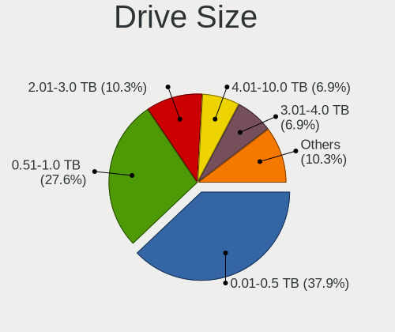
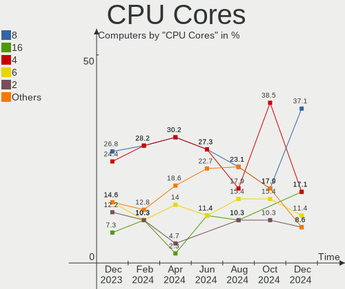

Gentoo - Hardware Trends
------------------------

A project to identify most popular hardware characteristics and track their change
over time based on data collected by Linux users at https://Linux-Hardware.org.

Anyone can contribute to this report by the [hw-probe](https://github.com/linuxhw/hw-probe) tool:

    sudo -E hw-probe -all -upload

This is a report for all computer types. See also reports for [desktops](/Dist/Gentoo/Desktop/README.md) and [notebooks](/Dist/Gentoo/Notebook/README.md).

This report is for one last month. Overall report since the beginning of time: [TestDays](https://github.com/linuxhw/TestDays)

Period: Jun, 2023.

Contents
--------

* [ System ](#system)
  - [ OS                       ](#os)
  - [ OS Family                ](#os-family)
  - [ Kernel                   ](#kernel)
  - [ Kernel Family            ](#kernel-family)
  - [ Kernel Major Ver.        ](#kernel-major-ver)
  - [ Arch                     ](#arch)
  - [ DE                       ](#de)
  - [ Display Server           ](#display-server)
  - [ Display Manager          ](#display-manager)
  - [ OS Lang                  ](#os-lang)
  - [ Boot Mode                ](#boot-mode)
  - [ Filesystem               ](#filesystem)
  - [ Part. scheme             ](#part-scheme)
  - [ Dual Boot with Linux/BSD ](#dual-boot-with-linuxbsd)
  - [ Dual Boot (Win)          ](#dual-boot-win)

* [ Board ](#board)
  - [ Vendor                   ](#vendor)
  - [ Model                    ](#model)
  - [ Model Family             ](#model-family)
  - [ MFG Year                 ](#mfg-year)
  - [ Form Factor              ](#form-factor)
  - [ Secure Boot              ](#secure-boot)
  - [ Coreboot                 ](#coreboot)
  - [ RAM Size                 ](#ram-size)
  - [ RAM Used                 ](#ram-used)
  - [ Total Drives             ](#total-drives)
  - [ Has CD-ROM               ](#has-cd-rom)
  - [ Has Ethernet             ](#has-ethernet)
  - [ Has WiFi                 ](#has-wifi)
  - [ Has Bluetooth            ](#has-bluetooth)

* [ Location ](#location)
  - [ Country                  ](#country)
  - [ City                     ](#city)

* [ Drives ](#drives)
  - [ Drive Vendor             ](#drive-vendor)
  - [ Drive Model              ](#drive-model)
  - [ HDD Vendor               ](#hdd-vendor)
  - [ SSD Vendor               ](#ssd-vendor)
  - [ Drive Kind               ](#drive-kind)
  - [ Drive Connector          ](#drive-connector)
  - [ Drive Size               ](#drive-size)
  - [ Space Total              ](#space-total)
  - [ Space Used               ](#space-used)
  - [ Malfunc. Drives          ](#malfunc-drives)
  - [ Malfunc. Drive Vendor    ](#malfunc-drive-vendor)
  - [ Malfunc. HDD Vendor      ](#malfunc-hdd-vendor)
  - [ Malfunc. Drive Kind      ](#malfunc-drive-kind)
  - [ Failed Drives            ](#failed-drives)
  - [ Failed Drive Vendor      ](#failed-drive-vendor)
  - [ Drive Status             ](#drive-status)

* [ Storage controller ](#storage-controller)
  - [ Storage Vendor           ](#storage-vendor)
  - [ Storage Model            ](#storage-model)
  - [ Storage Kind             ](#storage-kind)

* [ Processor ](#processor)
  - [ CPU Vendor               ](#cpu-vendor)
  - [ CPU Model                ](#cpu-model)
  - [ CPU Model Family         ](#cpu-model-family)
  - [ CPU Cores                ](#cpu-cores)
  - [ CPU Sockets              ](#cpu-sockets)
  - [ CPU Threads              ](#cpu-threads)
  - [ CPU Op-Modes             ](#cpu-op-modes)
  - [ CPU Microcode            ](#cpu-microcode)
  - [ CPU Microarch            ](#cpu-microarch)

* [ Graphics ](#graphics)
  - [ GPU Vendor               ](#gpu-vendor)
  - [ GPU Model                ](#gpu-model)
  - [ GPU Combo                ](#gpu-combo)
  - [ GPU Driver               ](#gpu-driver)
  - [ GPU Memory               ](#gpu-memory)

* [ Monitor ](#monitor)
  - [ Monitor Vendor           ](#monitor-vendor)
  - [ Monitor Model            ](#monitor-model)
  - [ Monitor Resolution       ](#monitor-resolution)
  - [ Monitor Diagonal         ](#monitor-diagonal)
  - [ Monitor Width            ](#monitor-width)
  - [ Aspect Ratio             ](#aspect-ratio)
  - [ Monitor Area             ](#monitor-area)
  - [ Pixel Density            ](#pixel-density)
  - [ Multiple Monitors        ](#multiple-monitors)

* [ Network ](#network)
  - [ Net Controller Vendor    ](#net-controller-vendor)
  - [ Net Controller Model     ](#net-controller-model)
  - [ Wireless Vendor          ](#wireless-vendor)
  - [ Wireless Model           ](#wireless-model)
  - [ Ethernet Vendor          ](#ethernet-vendor)
  - [ Ethernet Model           ](#ethernet-model)
  - [ Net Controller Kind      ](#net-controller-kind)
  - [ Used Controller          ](#used-controller)
  - [ NICs                     ](#nics)
  - [ IPv6                     ](#ipv6)

* [ Bluetooth ](#bluetooth)
  - [ Bluetooth Vendor         ](#bluetooth-vendor)
  - [ Bluetooth Model          ](#bluetooth-model)

* [ Sound ](#sound)
  - [ Sound Vendor             ](#sound-vendor)
  - [ Sound Model              ](#sound-model)

* [ Memory ](#memory)
  - [ Memory Vendor            ](#memory-vendor)
  - [ Memory Model             ](#memory-model)
  - [ Memory Kind              ](#memory-kind)
  - [ Memory Form Factor       ](#memory-form-factor)
  - [ Memory Size              ](#memory-size)
  - [ Memory Speed             ](#memory-speed)

* [ Printers & scanners ](#printers--scanners)
  - [ Printer Vendor           ](#printer-vendor)
  - [ Printer Model            ](#printer-model)
  - [ Scanner Vendor           ](#scanner-vendor)
  - [ Scanner Model            ](#scanner-model)

* [ Camera ](#camera)
  - [ Camera Vendor            ](#camera-vendor)
  - [ Camera Model             ](#camera-model)

* [ Security ](#security)
  - [ Fingerprint Vendor       ](#fingerprint-vendor)
  - [ Fingerprint Model        ](#fingerprint-model)
  - [ Chipcard Vendor          ](#chipcard-vendor)
  - [ Chipcard Model           ](#chipcard-model)

* [ Unsupported ](#unsupported)
  - [ Unsupported Devices      ](#unsupported-devices)
  - [ Unsupported Device Types ](#unsupported-device-types)

System
------

OS
--

Installed operating systems

| Name        | Computers | Percent |
|-------------|-----------|---------|
| Gentoo 2.13 | 35        | 97.22%  |
| Gentoo 2.6  | 1         | 2.78%   |

OS Family
---------

OS without a version

| Name   | Computers | Percent |
|--------|-----------|---------|
| Gentoo | 36        | 100%    |

Kernel
------

Version of the Linux kernel

| Version                     | Computers | Percent |
|-----------------------------|-----------|---------|
| 6.1.31-gentoo-x86_64        | 5         | 13.89%  |
| 6.1.31-gentoo-dist          | 4         | 11.11%  |
| 6.3.8-gentoo-dist           | 3         | 8.33%   |
| 6.1.28-gentoo               | 3         | 8.33%   |
| 6.3.8-gentoo                | 2         | 5.56%   |
| 6.1.31-gentoo               | 2         | 5.56%   |
| 6.4.0-gentoo                | 1         | 2.78%   |
| 6.3.7-gentoo_ap             | 1         | 2.78%   |
| 6.3.6-gentoo-dist           | 1         | 2.78%   |
| 6.3.5-ivybridge-xanmod1     | 1         | 2.78%   |
| 6.3.5-gentoo-x86_64         | 1         | 2.78%   |
| 6.3.4-gentoo-r1             | 1         | 2.78%   |
| 6.3.4-gentoo-dist           | 1         | 2.78%   |
| 6.3.3-gentoo-dist           | 1         | 2.78%   |
| 6.3.1-gentoo                | 1         | 2.78%   |
| 6.2.8-gentoo                | 1         | 2.78%   |
| 6.2.13-zen                  | 1         | 2.78%   |
| 6.1.31-gentoo-MAC_MIK.0     | 1         | 2.78%   |
| 6.1.31-gentoo-dist-hardened | 1         | 2.78%   |
| 6.1.24-gentoo-dist          | 1         | 2.78%   |
| 6.1.0-gentoo                | 1         | 2.78%   |
| 5.16.2-gentoo               | 1         | 2.78%   |
| 5.15.36-gentoo-x86_64       | 1         | 2.78%   |

Kernel Family
-------------

Linux kernel without a distro release

| Version | Computers | Percent |
|---------|-----------|---------|
| 6.1.31  | 13        | 36.11%  |
| 6.3.8   | 5         | 13.89%  |
| 6.1.28  | 3         | 8.33%   |
| 6.3.5   | 2         | 5.56%   |
| 6.3.4   | 2         | 5.56%   |
| 6.4.0   | 1         | 2.78%   |
| 6.3.7   | 1         | 2.78%   |
| 6.3.6   | 1         | 2.78%   |
| 6.3.3   | 1         | 2.78%   |
| 6.3.1   | 1         | 2.78%   |
| 6.2.8   | 1         | 2.78%   |
| 6.2.13  | 1         | 2.78%   |
| 6.1.24  | 1         | 2.78%   |
| 6.1.0   | 1         | 2.78%   |
| 5.16.2  | 1         | 2.78%   |
| 5.15.36 | 1         | 2.78%   |

Kernel Major Ver.
-----------------

Linux kernel major version

| Version | Computers | Percent |
|---------|-----------|---------|
| 6.1     | 18        | 50%     |
| 6.3     | 13        | 36.11%  |
| 6.2     | 2         | 5.56%   |
| 6.4     | 1         | 2.78%   |
| 5.16    | 1         | 2.78%   |
| 5.15    | 1         | 2.78%   |

Arch
----

OS architecture (x86_64, i586, etc.)

| Name   | Computers | Percent |
|--------|-----------|---------|
| x86_64 | 36        | 100%    |

DE
--

Desktop Environment

| Name    | Computers | Percent |
|---------|-----------|---------|
| Unknown | 12        | 33.33%  |
| KDE5    | 11        | 30.56%  |
| GNOME   | 7         | 19.44%  |
| XFCE    | 3         | 8.33%   |
| sway    | 1         | 2.78%   |
| MATE    | 1         | 2.78%   |
| KDE     | 1         | 2.78%   |

Display Server
--------------

X11 or Wayland

| Name    | Computers | Percent |
|---------|-----------|---------|
| Wayland | 16        | 44.44%  |
| X11     | 14        | 38.89%  |
| Unknown | 5         | 13.89%  |
| Tty     | 1         | 2.78%   |

Display Manager
---------------

SDDM, LightDM, etc.

| Name    | Computers | Percent |
|---------|-----------|---------|
| SDDM    | 12        | 33.33%  |
| Unknown | 9         | 25%     |
| GDM     | 6         | 16.67%  |
| LightDM | 5         | 13.89%  |
| GREETD  | 2         | 5.56%   |
| SLiM    | 1         | 2.78%   |
| LXDM    | 1         | 2.78%   |

OS Lang
-------

Language

| Lang    | Computers | Percent |
|---------|-----------|---------|
| en_US   | 14        | 38.89%  |
| C.UTF8  | 5         | 13.89%  |
| Unknown | 4         | 11.11%  |
| ru_RU   | 2         | 5.56%   |
| pl_PL   | 2         | 5.56%   |
| fr_FR   | 2         | 5.56%   |
| en_GB   | 2         | 5.56%   |
| de_DE   | 2         | 5.56%   |
| en_IL   | 1         | 2.78%   |
| da_DK   | 1         | 2.78%   |
| C       | 1         | 2.78%   |

Boot Mode
---------

EFI or BIOS

| Mode | Computers | Percent |
|------|-----------|---------|
| EFI  | 26        | 72.22%  |
| BIOS | 10        | 27.78%  |

Filesystem
----------

Type of filesystem

| Type  | Computers | Percent |
|-------|-----------|---------|
| Ext4  | 18        | 50%     |
| Btrfs | 12        | 33.33%  |
| F2fs  | 4         | 11.11%  |
| Zfs   | 1         | 2.78%   |
| Xfs   | 1         | 2.78%   |

Part. scheme
------------

Scheme of partitioning

| Type | Computers | Percent |
|------|-----------|---------|
| GPT  | 31        | 86.11%  |
| MBR  | 5         | 13.89%  |

Dual Boot with Linux/BSD
------------------------

Hosting more than one Linux/BSD

| Dual boot | Computers | Percent |
|-----------|-----------|---------|
| No        | 25        | 69.44%  |
| Yes       | 11        | 30.56%  |

Dual Boot (Win)
---------------

Hosting Linux and Windows

| Dual boot | Computers | Percent |
|-----------|-----------|---------|
| No        | 25        | 69.44%  |
| Yes       | 11        | 30.56%  |

Board
-----

Vendor
------

Motherboard manufacturer

| Name                | Computers | Percent |
|---------------------|-----------|---------|
| ASUSTek Computer    | 11        | 30.56%  |
| Lenovo              | 6         | 16.67%  |
| Hewlett-Packard     | 5         | 13.89%  |
| ASRock              | 3         | 8.33%   |
| MSI                 | 2         | 5.56%   |
| Gigabyte Technology | 2         | 5.56%   |
| Dell                | 2         | 5.56%   |
| Panasonic           | 1         | 2.78%   |
| Intel               | 1         | 2.78%   |
| Google              | 1         | 2.78%   |
| Apple               | 1         | 2.78%   |
| Acer                | 1         | 2.78%   |

Model
-----

Motherboard model

| Name                                      | Computers | Percent |
|-------------------------------------------|-----------|---------|
| ASUS M3A78-CM                             | 2         | 5.56%   |
| Panasonic CF-53ASCZGFG                    | 1         | 2.78%   |
| MSI MS-7C91                               | 1         | 2.78%   |
| MSI MS-7C35                               | 1         | 2.78%   |
| Lenovo Yoga C940-15IRH 81TE               | 1         | 2.78%   |
| Lenovo Yoga 2 13 20344                    | 1         | 2.78%   |
| Lenovo ThinkPad X1 Extreme 2nd 20QVCTO1WW | 1         | 2.78%   |
| Lenovo ThinkPad P15 Gen 1 20SUS0S000      | 1         | 2.78%   |
| Lenovo ThinkPad P14s Gen 3 21J5001NUS     | 1         | 2.78%   |
| Lenovo Legion 5 15ACH6H 82JU              | 1         | 2.78%   |
| Intel NUC11PAHi5                          | 1         | 2.78%   |
| HP Victus by Laptop 16-e0xxx              | 1         | 2.78%   |
| HP Spectre x360 2-in-1 Laptop 16-f1xxx    | 1         | 2.78%   |
| HP Pavilion dv6                           | 1         | 2.78%   |
| HP ENVY m6                                | 1         | 2.78%   |
| HP EliteBook 8540w                        | 1         | 2.78%   |
| Google Nightfury                          | 1         | 2.78%   |
| Gigabyte B550M AORUS ELITE                | 1         | 2.78%   |
| Gigabyte AB350-Gaming                     | 1         | 2.78%   |
| Dell Precision 5530                       | 1         | 2.78%   |
| Dell Inspiron 16 5625                     | 1         | 2.78%   |
| ASUS X555LJ                               | 1         | 2.78%   |
| ASUS TUF Gaming B650M-PLUS WIFI           | 1         | 2.78%   |
| ASUS ROG STRIX X670E-F GAMING WIFI        | 1         | 2.78%   |
| ASUS ROG STRIX B650E-F GAMING WIFI        | 1         | 2.78%   |
| ASUS ROG G703GI_G7BI                      | 1         | 2.78%   |
| ASUS PRIME X570-P                         | 1         | 2.78%   |
| ASUS PRIME X299-DELUXE                    | 1         | 2.78%   |
| ASUS PRIME B550M-A                        | 1         | 2.78%   |
| ASUS ASUS TUF Gaming F15 FX506HC_FX506HC  | 1         | 2.78%   |
| ASRock X670E Steel Legend                 | 1         | 2.78%   |
| ASRock X570 Taichi                        | 1         | 2.78%   |
| ASRock J3160M                             | 1         | 2.78%   |
| Apple MacBookPro11,1                      | 1         | 2.78%   |
| Acer Swift SF314-511                      | 1         | 2.78%   |

Model Family
------------

Motherboard model prefix

| Name                   | Computers | Percent |
|------------------------|-----------|---------|
| Lenovo ThinkPad        | 3         | 8.33%   |
| ASUS ROG               | 3         | 8.33%   |
| ASUS PRIME             | 3         | 8.33%   |
| Lenovo Yoga            | 2         | 5.56%   |
| ASUS M3A78-CM          | 2         | 5.56%   |
| Panasonic CF-53ASCZGFG | 1         | 2.78%   |
| MSI MS-7C91            | 1         | 2.78%   |
| MSI MS-7C35            | 1         | 2.78%   |
| Lenovo Legion          | 1         | 2.78%   |
| Intel NUC11PAHi5       | 1         | 2.78%   |
| HP Victus              | 1         | 2.78%   |
| HP Spectre             | 1         | 2.78%   |
| HP Pavilion            | 1         | 2.78%   |
| HP ENVY                | 1         | 2.78%   |
| HP EliteBook           | 1         | 2.78%   |
| Google Nightfury       | 1         | 2.78%   |
| Gigabyte B550M         | 1         | 2.78%   |
| Gigabyte AB350-Gaming  | 1         | 2.78%   |
| Dell Precision         | 1         | 2.78%   |
| Dell Inspiron          | 1         | 2.78%   |
| ASUS X555LJ            | 1         | 2.78%   |
| ASUS TUF               | 1         | 2.78%   |
| ASUS ASUS              | 1         | 2.78%   |
| ASRock X670E           | 1         | 2.78%   |
| ASRock X570            | 1         | 2.78%   |
| ASRock J3160M          | 1         | 2.78%   |
| Apple MacBookPro11     | 1         | 2.78%   |
| Acer Swift             | 1         | 2.78%   |

MFG Year
--------

Motherboard manufacture year

| Year | Computers | Percent |
|------|-----------|---------|
| 2022 | 7         | 19.44%  |
| 2021 | 6         | 16.67%  |
| 2019 | 5         | 13.89%  |
| 2020 | 4         | 11.11%  |
| 2008 | 3         | 8.33%   |
| 2017 | 2         | 5.56%   |
| 2014 | 2         | 5.56%   |
| 2023 | 1         | 2.78%   |
| 2018 | 1         | 2.78%   |
| 2016 | 1         | 2.78%   |
| 2015 | 1         | 2.78%   |
| 2012 | 1         | 2.78%   |
| 2011 | 1         | 2.78%   |
| 2010 | 1         | 2.78%   |

Form Factor
-----------

Physical design of the computer

| Name        | Computers | Percent |
|-------------|-----------|---------|
| Notebook    | 18        | 50%     |
| Desktop     | 15        | 41.67%  |
| Convertible | 2         | 5.56%   |
| Mini pc     | 1         | 2.78%   |

Secure Boot
-----------

Enabled or disabled

| State    | Computers | Percent |
|----------|-----------|---------|
| Disabled | 36        | 100%    |

Coreboot
--------

Have coreboot on board

| Used | Computers | Percent |
|------|-----------|---------|
| No   | 35        | 97.22%  |
| Yes  | 1         | 2.78%   |

RAM Size
--------

Total RAM memory

| Size in GB  | Computers | Percent |
|-------------|-----------|---------|
| 4.01-8.0    | 9         | 25%     |
| 32.01-64.0  | 8         | 22.22%  |
| 8.01-16.0   | 6         | 16.67%  |
| 64.01-256.0 | 5         | 13.89%  |
| 24.01-32.0  | 3         | 8.33%   |
| 16.01-24.0  | 3         | 8.33%   |
| 3.01-4.0    | 2         | 5.56%   |

RAM Used
--------

Used RAM memory

| Used GB    | Computers | Percent |
|------------|-----------|---------|
| 2.01-3.0   | 8         | 22.22%  |
| 4.01-8.0   | 7         | 19.44%  |
| 3.01-4.0   | 6         | 16.67%  |
| 1.01-2.0   | 4         | 11.11%  |
| 0.51-1.0   | 4         | 11.11%  |
| 16.01-24.0 | 3         | 8.33%   |
| 8.01-16.0  | 2         | 5.56%   |
| 0.01-0.5   | 2         | 5.56%   |

Total Drives
------------

Number of drives on board

| Drives | Computers | Percent |
|--------|-----------|---------|
| 1      | 23        | 63.89%  |
| 2      | 5         | 13.89%  |
| 5      | 3         | 8.33%   |
| 3      | 2         | 5.56%   |
| 21     | 1         | 2.78%   |
| 6      | 1         | 2.78%   |
| 4      | 1         | 2.78%   |

Has CD-ROM
----------

Has CD-ROM on board

| Presented | Computers | Percent |
|-----------|-----------|---------|
| No        | 30        | 83.33%  |
| Yes       | 6         | 16.67%  |

Has Ethernet
------------

Has Ethernet on board

| Presented | Computers | Percent |
|-----------|-----------|---------|
| Yes       | 29        | 80.56%  |
| No        | 7         | 19.44%  |

Has WiFi
--------

Has WiFi module

| Presented | Computers | Percent |
|-----------|-----------|---------|
| Yes       | 30        | 83.33%  |
| No        | 6         | 16.67%  |

Has Bluetooth
-------------

Has Bluetooth module

| Presented | Computers | Percent |
|-----------|-----------|---------|
| Yes       | 27        | 75%     |
| No        | 9         | 25%     |

Location
--------

Country
-------

Geographic location (country)

| Country   | Computers | Percent |
|-----------|-----------|---------|
| USA       | 9         | 25%     |
| Russia    | 5         | 13.89%  |
| Poland    | 4         | 11.11%  |
| France    | 4         | 11.11%  |
| UK        | 2         | 5.56%   |
| Germany   | 2         | 5.56%   |
| Sweden    | 1         | 2.78%   |
| Portugal  | 1         | 2.78%   |
| Moldova   | 1         | 2.78%   |
| Israel    | 1         | 2.78%   |
| Iran      | 1         | 2.78%   |
| Indonesia | 1         | 2.78%   |
| Finland   | 1         | 2.78%   |
| Denmark   | 1         | 2.78%   |
| China     | 1         | 2.78%   |
| Belgium   | 1         | 2.78%   |

City
----

Geographic location (city)

| City               | Computers | Percent |
|--------------------|-----------|---------|
| Warsaw             | 3         | 8.33%   |
| St Petersburg      | 2         | 5.56%   |
| Moscow             | 2         | 5.56%   |
| Étampes           | 2         | 5.56%   |
| Wandsworth         | 1         | 2.78%   |
| Sun Prairie        | 1         | 2.78%   |
| Stockholm          | 1         | 2.78%   |
| Shenzhen           | 1         | 2.78%   |
| Seattle            | 1         | 2.78%   |
| Portland           | 1         | 2.78%   |
| Montpon-Menesterol | 1         | 2.78%   |
| Madison            | 1         | 2.78%   |
| Lisbon             | 1         | 2.78%   |
| Kazan'             | 1         | 2.78%   |
| Jakarta            | 1         | 2.78%   |
| Isfahan            | 1         | 2.78%   |
| Huntsville         | 1         | 2.78%   |
| Helsinki           | 1         | 2.78%   |
| Godfrey            | 1         | 2.78%   |
| Flint              | 1         | 2.78%   |
| Düren             | 1         | 2.78%   |
| Denton             | 1         | 2.78%   |
| Copenhagen         | 1         | 2.78%   |
| Columbus           | 1         | 2.78%   |
| Chorzów           | 1         | 2.78%   |
| Chisinau           | 1         | 2.78%   |
| Caesarea           | 1         | 2.78%   |
| Bruges             | 1         | 2.78%   |
| Bothell            | 1         | 2.78%   |
| Berlin             | 1         | 2.78%   |
| Angres             | 1         | 2.78%   |

Drives
------

Drive Vendor
------------

Hard drive vendors

| Vendor                      | Computers | Drives | Percent |
|-----------------------------|-----------|--------|---------|
| Samsung Electronics         | 13        | 25     | 22.03%  |
| Seagate                     | 7         | 10     | 11.86%  |
| WDC                         | 5         | 5      | 8.47%   |
| Toshiba                     | 4         | 4      | 6.78%   |
| Kingston Technology Company | 4         | 4      | 6.78%   |
| GOODRAM                     | 4         | 4      | 6.78%   |
| Sandisk                     | 3         | 3      | 5.08%   |
| Kingston                    | 3         | 4      | 5.08%   |
| Intel                       | 2         | 3      | 3.39%   |
| Unknown                     | 1         | 1      | 1.69%   |
| Teleplan                    | 1         | 1      | 1.69%   |
| T-FORCE                     | 1         | 1      | 1.69%   |
| SK hynix                    | 1         | 1      | 1.69%   |
| SABRENT                     | 1         | 1      | 1.69%   |
| Phison Electronics          | 1         | 1      | 1.69%   |
| Phison                      | 1         | 1      | 1.69%   |
| OCZ                         | 1         | 1      | 1.69%   |
| Micron/Crucial Technology   | 1         | 1      | 1.69%   |
| KIOXIA                      | 1         | 1      | 1.69%   |
| Hitachi                     | 1         | 3      | 1.69%   |
| HGST                        | 1         | 1      | 1.69%   |
| Crucial                     | 1         | 8      | 1.69%   |
| A-DATA Technology           | 1         | 1      | 1.69%   |

Drive Model
-----------

Hard drive models

| Model                                               | Computers | Percent |
|-----------------------------------------------------|-----------|---------|
| Samsung NVMe SSD Controller SM981/PM981/PM983 250GB | 5         | 7.94%   |
| Samsung NVMe SSD Controller PM9A1/PM9A3/980PRO 2TB  | 4         | 6.35%   |
| Kingston Company SNV2S2000G 2TB                     | 2         | 3.17%   |
| GOODRAM SSDPR-CL100-480-G2 480GB                    | 2         | 3.17%   |
| WDC WD80EFAX-68KNBN0 8TB                            | 1         | 1.59%   |
| WDC WD7500BPVT-24HXZT1 752GB                        | 1         | 1.59%   |
| WDC WD6000HLHX-01JJPV0 600GB                        | 1         | 1.59%   |
| WDC WD5000AAKX-08U6AA0 500GB                        | 1         | 1.59%   |
| WDC WD20EZAZ-00GGJB0 2TB                            | 1         | 1.59%   |
| Unknown MMC Card  128GB                             | 1         | 1.59%   |
| Toshiba XG6 NVMe SSD Controller 2TB                 | 1         | 1.59%   |
| Toshiba MK5061GSY 500GB                             | 1         | 1.59%   |
| Toshiba HDWE150 5TB                                 | 1         | 1.59%   |
| Toshiba HDWD110 1TB                                 | 1         | 1.59%   |
| Teleplan TP1000G 1TB                                | 1         | 1.59%   |
| T-FORCE SSD 2TB                                     | 1         | 1.59%   |
| SK hynix PC711 HFS512GDE9X073N 512GB                | 1         | 1.59%   |
| Seagate ST6000DX000-1H217Z 6TB                      | 1         | 1.59%   |
| Seagate ST6000DM003-2CY186 6TB                      | 1         | 1.59%   |
| Seagate ST4000DM004-2CV104 4TB                      | 1         | 1.59%   |
| Seagate ST2000LX001-1RG174 2TB                      | 1         | 1.59%   |
| Seagate ST2000DM008-2UB102 2TB                      | 1         | 1.59%   |
| Seagate ST12000NM0008-2H3101 12TB                   | 1         | 1.59%   |
| Seagate ST1000DM010-2EP102 1TB                      | 1         | 1.59%   |
| Sandisk WD_BLACK SN770 1TB                          | 1         | 1.59%   |
| Sandisk WD PC SN735 SDBPNHH-512G-1002 512GB         | 1         | 1.59%   |
| Sandisk WD Black SN750 / PC SN730 NVMe SSD 500GB    | 1         | 1.59%   |
| Samsung SSD 980 1TB                                 | 1         | 1.59%   |
| Samsung SSD 870 EVO 1TB                             | 1         | 1.59%   |
| Samsung SSD 860 EVO 500GB                           | 1         | 1.59%   |
| Samsung SSD 860 EVO 250GB                           | 1         | 1.59%   |
| Samsung SSD 850 EVO 250GB                           | 1         | 1.59%   |
| Samsung SSD 850 EVO 1TB                             | 1         | 1.59%   |
| Samsung SSD 840 EVO 250GB                           | 1         | 1.59%   |
| SABRENT Disk 1TB                                    | 1         | 1.59%   |
| Phison MSI M480 1TB                                 | 1         | 1.59%   |
| Phison Corsair MP600 PRO XT 2TB                     | 1         | 1.59%   |
| OCZ AGILITY3 64GB SSD                               | 1         | 1.59%   |
| Micron/Crucial P1 NVMe PCIe SSD 1TB                 | 1         | 1.59%   |
| KIOXIA KBG50ZNS1T02 NVMe 1024GB                     | 1         | 1.59%   |

HDD Vendor
----------

Hard disk drive vendors

| Vendor   | Computers | Drives | Percent |
|----------|-----------|--------|---------|
| Seagate  | 7         | 10     | 38.89%  |
| WDC      | 5         | 5      | 27.78%  |
| Toshiba  | 3         | 3      | 16.67%  |
| Teleplan | 1         | 1      | 5.56%   |
| Hitachi  | 1         | 3      | 5.56%   |
| HGST     | 1         | 1      | 5.56%   |

SSD Vendor
----------

Solid state drive vendors

| Vendor              | Computers | Drives | Percent |
|---------------------|-----------|--------|---------|
| Samsung Electronics | 6         | 13     | 35.29%  |
| GOODRAM             | 4         | 4      | 23.53%  |
| Kingston            | 3         | 3      | 17.65%  |
| T-FORCE             | 1         | 1      | 5.88%   |
| OCZ                 | 1         | 1      | 5.88%   |
| Crucial             | 1         | 8      | 5.88%   |
| A-DATA Technology   | 1         | 1      | 5.88%   |

Drive Kind
----------

HDD or SSD

| Kind | Computers | Drives | Percent |
|------|-----------|--------|---------|
| NVMe | 24        | 30     | 48%     |
| SSD  | 14        | 31     | 28%     |
| HDD  | 11        | 23     | 22%     |
| MMC  | 1         | 1      | 2%      |

Drive Connector
---------------

SATA, SAS, NVMe, etc.

| Type | Computers | Drives | Percent |
|------|-----------|--------|---------|
| NVMe | 24        | 29     | 52.17%  |
| SATA | 20        | 54     | 43.48%  |
| SAS  | 1         | 1      | 2.17%   |
| MMC  | 1         | 1      | 2.17%   |

Drive Size
----------

Size of hard drive

| Size in TB | Computers | Drives | Percent |
|------------|-----------|--------|---------|
| 0.01-0.5   | 12        | 13     | 36.36%  |
| 0.51-1.0   | 10        | 25     | 30.3%   |
| 1.01-2.0   | 4         | 4      | 12.12%  |
| 4.01-10.0  | 4         | 7      | 12.12%  |
| 3.01-4.0   | 1         | 1      | 3.03%   |
| 2.01-3.0   | 1         | 3      | 3.03%   |
| 10.01-20.0 | 1         | 1      | 3.03%   |

Space Total
-----------

Amount of disk space available on the file system

| Size in GB     | Computers | Percent |
|----------------|-----------|---------|
| 501-1000       | 11        | 30.56%  |
| More than 3000 | 6         | 16.67%  |
| 101-250        | 5         | 13.89%  |
| 251-500        | 4         | 11.11%  |
| 1001-2000      | 4         | 11.11%  |
| 2001-3000      | 3         | 8.33%   |
| 21-50          | 1         | 2.78%   |
| 51-100         | 1         | 2.78%   |
| Unknown        | 1         | 2.78%   |

Space Used
----------

Amount of used disk space

| Used GB        | Computers | Percent |
|----------------|-----------|---------|
| 1-20           | 7         | 19.44%  |
| 21-50          | 6         | 16.67%  |
| 501-1000       | 5         | 13.89%  |
| More than 3000 | 4         | 11.11%  |
| 251-500        | 4         | 11.11%  |
| 101-250        | 4         | 11.11%  |
| 1001-2000      | 3         | 8.33%   |
| 51-100         | 2         | 5.56%   |
| Unknown        | 1         | 2.78%   |

Malfunc. Drives
---------------

Drive models with a malfunction

| Model                                | Computers | Drives | Percent |
|--------------------------------------|-----------|--------|---------|
| SK hynix PC711 HFS512GDE9X073N 512GB | 1         | 1      | 50%     |
| Samsung Electronics SSD 870 EVO 1TB  | 1         | 8      | 50%     |

Malfunc. Drive Vendor
---------------------

Vendors of faulty drives

| Vendor              | Computers | Drives | Percent |
|---------------------|-----------|--------|---------|
| SK hynix            | 1         | 1      | 50%     |
| Samsung Electronics | 1         | 8      | 50%     |

Malfunc. HDD Vendor
-------------------

Vendors of faulty HDD drives

Zero info for selected period =(

Malfunc. Drive Kind
-------------------

Kinds of faulty drives

| Kind | Computers | Drives | Percent |
|------|-----------|--------|---------|
| NVMe | 1         | 1      | 50%     |
| SSD  | 1         | 8      | 50%     |

Failed Drives
-------------

Failed drive models

Zero info for selected period =(

Failed Drive Vendor
-------------------

Failed drive vendors

Zero info for selected period =(

Drive Status
------------

Number of failed and malfunc. drives

| Status   | Computers | Drives | Percent |
|----------|-----------|--------|---------|
| Works    | 34        | 74     | 89.47%  |
| Detected | 2         | 2      | 5.26%   |
| Malfunc  | 2         | 9      | 5.26%   |

Storage controller
------------------

Storage Vendor
--------------

Storage controller vendors

| Vendor                       | Computers | Percent |
|------------------------------|-----------|---------|
| AMD                          | 15        | 27.78%  |
| Intel                        | 14        | 25.93%  |
| Samsung Electronics          | 10        | 18.52%  |
| Kingston Technology Company  | 4         | 7.41%   |
| SanDisk                      | 3         | 5.56%   |
| Phison Electronics           | 2         | 3.7%    |
| Toshiba America Info Systems | 1         | 1.85%   |
| SK hynix                     | 1         | 1.85%   |
| Micron/Crucial Technology    | 1         | 1.85%   |
| KIOXIA                       | 1         | 1.85%   |
| Broadcom / LSI               | 1         | 1.85%   |
| ASMedia Technology           | 1         | 1.85%   |

Storage Model
-------------

Storage controller models

| Model                                                                            | Computers | Percent |
|----------------------------------------------------------------------------------|-----------|---------|
| AMD FCH SATA Controller [AHCI mode]                                              | 10        | 16.95%  |
| Samsung NVMe SSD Controller SM981/PM981/PM983                                    | 5         | 8.47%   |
| Samsung NVMe SSD Controller PM9A1/PM9A3/980PRO                                   | 4         | 6.78%   |
| Kingston Company Company Non-Volatile memory controller                          | 3         | 5.08%   |
| AMD 500 Series Chipset SATA Controller                                           | 3         | 5.08%   |
| Phison E18 PCIe4 NVMe Controller                                                 | 2         | 3.39%   |
| Intel Volume Management Device NVMe RAID Controller                              | 2         | 3.39%   |
| Intel 82801 Mobile SATA Controller [RAID mode]                                   | 2         | 3.39%   |
| Intel 6 Series/C200 Series Chipset Family 6 port Mobile SATA AHCI Controller     | 2         | 3.39%   |
| AMD SB7x0/SB8x0/SB9x0 SATA Controller [IDE mode]                                 | 2         | 3.39%   |
| AMD SB7x0/SB8x0/SB9x0 IDE Controller                                             | 2         | 3.39%   |
| Toshiba America Info Systems XG6 NVMe SSD Controller                             | 1         | 1.69%   |
| SK hynix Gold P31/BC711/PC711 NVMe Solid State Drive                             | 1         | 1.69%   |
| SanDisk WD Black SN770 NVMe SSD                                                  | 1         | 1.69%   |
| SanDisk WD Black SN750 / PC SN730 NVMe SSD                                       | 1         | 1.69%   |
| SanDisk Non-Volatile memory controller                                           | 1         | 1.69%   |
| Samsung NVMe SSD Controller 980                                                  | 1         | 1.69%   |
| Micron/Crucial P1 NVMe PCIe SSD                                                  | 1         | 1.69%   |
| KIOXIA Non-Volatile memory controller                                            | 1         | 1.69%   |
| Kingston Company OM3PDP3 NVMe SSD                                                | 1         | 1.69%   |
| Kingston Company FURY Renegade NVMe SSD                                          | 1         | 1.69%   |
| Intel Wildcat Point-LP SATA Controller [AHCI Mode]                               | 1         | 1.69%   |
| Intel SSD Pro 7600p/760p/E 6100p Series                                          | 1         | 1.69%   |
| Intel SSD 660P Series                                                            | 1         | 1.69%   |
| Intel Comet Lake SATA AHCI Controller                                            | 1         | 1.69%   |
| Intel Cannon Lake Mobile PCH SATA AHCI Controller                                | 1         | 1.69%   |
| Intel Atom/Celeron/Pentium Processor x5-E8000/J3xxx/N3xxx Series SATA Controller | 1         | 1.69%   |
| Intel 8 Series SATA Controller 1 [AHCI mode]                                     | 1         | 1.69%   |
| Intel 5 Series/3400 Series Chipset 6 port SATA AHCI Controller                   | 1         | 1.69%   |
| Intel 200 Series PCH SATA controller [AHCI mode]                                 | 1         | 1.69%   |
| Broadcom / LSI SAS3008 PCI-Express Fusion-MPT SAS-3                              | 1         | 1.69%   |
| ASMedia 106x SATA/RAID Controller                                                | 1         | 1.69%   |
| AMD 300 Series Chipset SATA Controller                                           | 1         | 1.69%   |

Storage Kind
------------

Kind of storage controller (IDE, SATA, NVMe, SAS, ...)

| Kind | Computers | Percent |
|------|-----------|---------|
| NVMe | 24        | 43.64%  |
| SATA | 24        | 43.64%  |
| RAID | 4         | 7.27%   |
| IDE  | 2         | 3.64%   |
| SAS  | 1         | 1.82%   |

Processor
---------

CPU Vendor
----------

Processor vendors

| Vendor | Computers | Percent |
|--------|-----------|---------|
| Intel  | 19        | 52.78%  |
| AMD    | 17        | 47.22%  |

CPU Model
---------

Processor models

| Model                                       | Computers | Percent |
|---------------------------------------------|-----------|---------|
| AMD Ryzen 9 7900X 12-Core Processor         | 2         | 5.56%   |
| AMD Ryzen 9 5900X 12-Core Processor         | 2         | 5.56%   |
| AMD Ryzen 7 3700X 8-Core Processor          | 2         | 5.56%   |
| AMD Phenom II X4 955 Processor              | 2         | 5.56%   |
| Intel Core i9-9880H CPU @ 2.30GHz           | 1         | 2.78%   |
| Intel Core i9-8950HK CPU @ 2.90GHz          | 1         | 2.78%   |
| Intel Core i7-9750H CPU @ 2.60GHz           | 1         | 2.78%   |
| Intel Core i7-8850H CPU @ 2.60GHz           | 1         | 2.78%   |
| Intel Core i7-7800X CPU @ 3.50GHz           | 1         | 2.78%   |
| Intel Core i7-5500U CPU @ 2.40GHz           | 1         | 2.78%   |
| Intel Core i7-10850H CPU @ 2.70GHz          | 1         | 2.78%   |
| Intel Core i7 CPU M 620 @ 2.67GHz           | 1         | 2.78%   |
| Intel Core i5-4258U CPU @ 2.40GHz           | 1         | 2.78%   |
| Intel Core i5-4200U CPU @ 1.60GHz           | 1         | 2.78%   |
| Intel Core i5-3230M CPU @ 2.60GHz           | 1         | 2.78%   |
| Intel Core i5-2520M CPU @ 2.50GHz           | 1         | 2.78%   |
| Intel Core i5-2430M CPU @ 2.40GHz           | 1         | 2.78%   |
| Intel Core i3-10110U CPU @ 2.10GHz          | 1         | 2.78%   |
| Intel Celeron CPU J3160 @ 1.60GHz           | 1         | 2.78%   |
| Intel 12th Gen Core i7-12700H               | 1         | 2.78%   |
| Intel 11th Gen Core i5-11400H @ 2.70GHz     | 1         | 2.78%   |
| Intel 11th Gen Core i5-1135G7 @ 2.40GHz     | 1         | 2.78%   |
| Intel 11th Gen Core i3-1115G4 @ 3.00GHz     | 1         | 2.78%   |
| AMD Ryzen 9 7950X 16-Core Processor         | 1         | 2.78%   |
| AMD Ryzen 9 5950X 16-Core Processor         | 1         | 2.78%   |
| AMD Ryzen 7 PRO 6850U with Radeon Graphics  | 1         | 2.78%   |
| AMD Ryzen 7 5825U with Radeon Graphics      | 1         | 2.78%   |
| AMD Ryzen 7 5800H with Radeon Graphics      | 1         | 2.78%   |
| AMD Ryzen 5 7600X 6-Core Processor          | 1         | 2.78%   |
| AMD Ryzen 5 5600H with Radeon Graphics      | 1         | 2.78%   |
| AMD Ryzen 5 3400G with Radeon Vega Graphics | 1         | 2.78%   |
| AMD Ryzen 5 2600 Six-Core Processor         | 1         | 2.78%   |

CPU Model Family
----------------

Processor model prefix

| Model            | Computers | Percent |
|------------------|-----------|---------|
| Intel Core i7    | 6         | 16.67%  |
| AMD Ryzen 9      | 6         | 16.67%  |
| Intel Core i5    | 5         | 13.89%  |
| Other            | 4         | 11.11%  |
| AMD Ryzen 7      | 4         | 11.11%  |
| AMD Ryzen 5      | 4         | 11.11%  |
| Intel Core i9    | 2         | 5.56%   |
| AMD Phenom II X4 | 2         | 5.56%   |
| Intel Core i3    | 1         | 2.78%   |
| Intel Celeron    | 1         | 2.78%   |
| AMD Ryzen 7 PRO  | 1         | 2.78%   |

CPU Cores
---------

Number of processor cores

| Number | Computers | Percent |
|--------|-----------|---------|
| 6      | 9         | 25%     |
| 2      | 9         | 25%     |
| 8      | 6         | 16.67%  |
| 4      | 5         | 13.89%  |
| 12     | 4         | 11.11%  |
| 16     | 2         | 5.56%   |
| 14     | 1         | 2.78%   |

CPU Sockets
-----------

Number of sockets

| Number | Computers | Percent |
|--------|-----------|---------|
| 1      | 36        | 100%    |

CPU Threads
-----------

Threads per core (Hyper-Threading)

| Number | Computers | Percent |
|--------|-----------|---------|
| 2      | 33        | 91.67%  |
| 1      | 3         | 8.33%   |

CPU Op-Modes
------------

CPU Operation Modes (32-bit, 64-bit)

| Op mode        | Computers | Percent |
|----------------|-----------|---------|
| 32-bit, 64-bit | 36        | 100%    |

CPU Microcode
-------------

Microcode number

| Number     | Computers | Percent |
|------------|-----------|---------|
| Unknown    | 9         | 25%     |
| 0x0a601203 | 4         | 11.11%  |
| 0x906ea    | 2         | 5.56%   |
| 0x806c1    | 2         | 5.56%   |
| 0x40651    | 2         | 5.56%   |
| 0xa0652    | 1         | 2.78%   |
| 0x806ec    | 1         | 2.78%   |
| 0x806d1    | 1         | 2.78%   |
| 0x50654    | 1         | 2.78%   |
| 0x406c4    | 1         | 2.78%   |
| 0x206a7    | 1         | 2.78%   |
| 0x20655    | 1         | 2.78%   |
| 0x0a50000d | 1         | 2.78%   |
| 0x0a50000c | 1         | 2.78%   |
| 0x0a404102 | 1         | 2.78%   |
| 0x0a20120a | 1         | 2.78%   |
| 0x0a201025 | 1         | 2.78%   |
| 0x08701030 | 1         | 2.78%   |
| 0x08701021 | 1         | 2.78%   |
| 0x08108109 | 1         | 2.78%   |
| 0x0800820d | 1         | 2.78%   |
| 0x010000db | 1         | 2.78%   |

CPU Microarch
-------------

Microarchitecture

| Name             | Computers | Percent |
|------------------|-----------|---------|
| Zen 3            | 6         | 16.67%  |
| KabyLake         | 5         | 13.89%  |
| Unknown          | 5         | 13.89%  |
| Zen+             | 2         | 5.56%   |
| Zen 2            | 2         | 5.56%   |
| TigerLake        | 2         | 5.56%   |
| SandyBridge      | 2         | 5.56%   |
| K10              | 2         | 5.56%   |
| Haswell          | 2         | 5.56%   |
| Westmere         | 1         | 2.78%   |
| Skylake          | 1         | 2.78%   |
| Silvermont       | 1         | 2.78%   |
| IvyBridge        | 1         | 2.78%   |
| Icelake          | 1         | 2.78%   |
| CometLake        | 1         | 2.78%   |
| Broadwell        | 1         | 2.78%   |
| Alderlake Hybrid | 1         | 2.78%   |

Graphics
--------

GPU Vendor
----------

Vendors of graphics cards

| Vendor | Computers | Percent |
|--------|-----------|---------|
| AMD    | 17        | 38.64%  |
| Intel  | 15        | 34.09%  |
| Nvidia | 12        | 27.27%  |

GPU Model
---------

Graphics card models

| Model                                                                                    | Computers | Percent |
|------------------------------------------------------------------------------------------|-----------|---------|
| AMD Raphael                                                                              | 3         | 6.38%   |
| Nvidia TU117M [GeForce GTX 1650 Mobile / Max-Q]                                          | 2         | 4.26%   |
| Nvidia GA104 [GeForce RTX 3070]                                                          | 2         | 4.26%   |
| Intel Haswell-ULT Integrated Graphics Controller                                         | 2         | 4.26%   |
| Intel CoffeeLake-H GT2 [UHD Graphics 630]                                                | 2         | 4.26%   |
| Intel 2nd Generation Core Processor Family Integrated Graphics Controller                | 2         | 4.26%   |
| AMD RS780C [Radeon 3100]                                                                 | 2         | 4.26%   |
| AMD Navi 31 [Radeon RX 7900 XT/7900 XTX]                                                 | 2         | 4.26%   |
| AMD Navi 22 [Radeon RX 6700/6700 XT/6750 XT / 6800M/6850M XT]                            | 2         | 4.26%   |
| AMD Cezanne [Radeon Vega Series / Radeon Vega Mobile Series]                             | 2         | 4.26%   |
| Nvidia TU117GLM [Quadro T2000 Mobile / Max-Q]                                            | 1         | 2.13%   |
| Nvidia GT216GLM [Quadro FX 880M]                                                         | 1         | 2.13%   |
| Nvidia GP107GLM [Quadro P2000 Mobile]                                                    | 1         | 2.13%   |
| Nvidia GP104BM [GeForce GTX 1080 Mobile]                                                 | 1         | 2.13%   |
| Nvidia GP104 [GeForce GTX 1080]                                                          | 1         | 2.13%   |
| Nvidia GM107 [GeForce GTX 750]                                                           | 1         | 2.13%   |
| Nvidia GK208BM [GeForce 920M]                                                            | 1         | 2.13%   |
| Nvidia GA107M [GeForce RTX 3050 Mobile]                                                  | 1         | 2.13%   |
| Intel TigerLake-LP GT2 [Iris Xe Graphics]                                                | 1         | 2.13%   |
| Intel TigerLake-H GT1 [UHD Graphics]                                                     | 1         | 2.13%   |
| Intel Tiger Lake-LP GT2 [UHD Graphics G4]                                                | 1         | 2.13%   |
| Intel HD Graphics 5500                                                                   | 1         | 2.13%   |
| Intel CometLake-U GT2 [UHD Graphics]                                                     | 1         | 2.13%   |
| Intel CometLake-H GT2 [UHD Graphics]                                                     | 1         | 2.13%   |
| Intel Atom/Celeron/Pentium Processor x5-E8000/J3xxx/N3xxx Integrated Graphics Controller | 1         | 2.13%   |
| Intel Alder Lake-P Integrated Graphics Controller                                        | 1         | 2.13%   |
| Intel 3rd Gen Core processor Graphics Controller                                         | 1         | 2.13%   |
| AMD Whistler [Radeon HD 6730M/6770M/7690M XT]                                            | 1         | 2.13%   |
| AMD Thames [Radeon HD 7500M/7600M Series]                                                | 1         | 2.13%   |
| AMD Rembrandt [Radeon 680M]                                                              | 1         | 2.13%   |
| AMD Navi 23 [Radeon RX 6600/6600 XT/6600M]                                               | 1         | 2.13%   |
| AMD Navi 21 [Radeon RX 6800/6800 XT / 6900 XT]                                           | 1         | 2.13%   |
| AMD Navi 14 [Radeon RX 5500/5500M / Pro 5500M]                                           | 1         | 2.13%   |
| AMD Lexa PRO [Radeon 540/540X/550/550X / RX 540X/550/550X]                               | 1         | 2.13%   |
| AMD Cedar [Radeon HD 5000/6000/7350/8350 Series]                                         | 1         | 2.13%   |
| AMD Barcelo                                                                              | 1         | 2.13%   |

GPU Combo
---------

Combinations of graphics cards

| Name           | Computers | Percent |
|----------------|-----------|---------|
| 1 x AMD        | 11        | 30.56%  |
| 1 x Intel      | 8         | 22.22%  |
| 1 x Nvidia     | 6         | 16.67%  |
| Intel + Nvidia | 5         | 13.89%  |
| 2 x AMD        | 3         | 8.33%   |
| Intel + AMD    | 2         | 5.56%   |
| AMD + Nvidia   | 1         | 2.78%   |

GPU Driver
----------

Free vs proprietary

| Driver      | Computers | Percent |
|-------------|-----------|---------|
| Free        | 29        | 80.56%  |
| Proprietary | 7         | 19.44%  |

GPU Memory
----------

Total video memory

| Size in GB | Computers | Percent |
|------------|-----------|---------|
| Unknown    | 17        | 47.22%  |
| 7.01-8.0   | 5         | 13.89%  |
| 3.01-4.0   | 3         | 8.33%   |
| 1.01-2.0   | 3         | 8.33%   |
| 8.01-16.0  | 3         | 8.33%   |
| 0.51-1.0   | 2         | 5.56%   |
| 0.01-0.5   | 2         | 5.56%   |
| 16.01-24.0 | 1         | 2.78%   |

Monitor
-------

Monitor Vendor
--------------

Monitor vendors

| Vendor                  | Computers | Percent |
|-------------------------|-----------|---------|
| Dell                    | 7         | 16.28%  |
| Chimei Innolux          | 6         | 13.95%  |
| AU Optronics            | 6         | 13.95%  |
| Samsung Electronics     | 5         | 11.63%  |
| LG Display              | 2         | 4.65%   |
| Goldstar                | 2         | 4.65%   |
| BenQ                    | 2         | 4.65%   |
| Ancor Communications    | 2         | 4.65%   |
| Sharp                   | 1         | 2.33%   |
| Sceptre Tech            | 1         | 2.33%   |
| Lenovo                  | 1         | 2.33%   |
| Gigabyte Technology     | 1         | 2.33%   |
| Gateway                 | 1         | 2.33%   |
| CSO                     | 1         | 2.33%   |
| Chi Mei Optoelectronics | 1         | 2.33%   |
| BOE                     | 1         | 2.33%   |
| ASUSTek Computer        | 1         | 2.33%   |
| Apple                   | 1         | 2.33%   |
| AHA                     | 1         | 2.33%   |

Monitor Model
-------------

Monitor models

| Model                                                                    | Computers | Percent |
|--------------------------------------------------------------------------|-----------|---------|
| Sharp LCD Monitor SHP148D 3840x2160 344x194mm 15.5-inch                  | 1         | 2.22%   |
| Sceptre Tech C305W-2560UN SPT0C0D 2560x1080 690x291mm 29.5-inch          | 1         | 2.22%   |
| Samsung Electronics SyncMaster SAM059A 1920x1080 477x268mm 21.5-inch     | 1         | 2.22%   |
| Samsung Electronics SMS27A350H SAM07CE 1920x1080 598x336mm 27.0-inch     | 1         | 2.22%   |
| Samsung Electronics S22B300 SAM08C8 1920x1080 477x268mm 21.5-inch        | 1         | 2.22%   |
| Samsung Electronics C49RG9x SAM0F9C 3840x1080 1193x336mm 48.8-inch       | 1         | 2.22%   |
| Samsung Electronics C27HG7x SAM0E16 2560x1440 598x336mm 27.0-inch        | 1         | 2.22%   |
| LG Display LCD Monitor LGD0635 3840x2160 344x194mm 15.5-inch             | 1         | 2.22%   |
| LG Display LCD Monitor LGD0259 1920x1080 345x194mm 15.6-inch             | 1         | 2.22%   |
| Lenovo LEN G34w-10 LEN66A1 3440x1440 797x334mm 34.0-inch                 | 1         | 2.22%   |
| Goldstar HDR 4K GSM7707 3840x2160 600x340mm 27.2-inch                    | 1         | 2.22%   |
| Goldstar E1942 GSM4C09 1366x768 410x230mm 18.5-inch                      | 1         | 2.22%   |
| Gigabyte Technology G34WQC A GBT3403 3440x1440 797x334mm 34.0-inch       | 1         | 2.22%   |
| Gateway FHD2400 GWY096C 1920x1200 518x291mm 23.4-inch                    | 1         | 2.22%   |
| Dell U4320Q DEL41D2 3840x2160 941x529mm 42.5-inch                        | 1         | 2.22%   |
| Dell U3219Q DELA125 3840x2160 697x392mm 31.5-inch                        | 1         | 2.22%   |
| Dell U2412M DELA07A 1920x1200 518x324mm 24.1-inch                        | 1         | 2.22%   |
| Dell S2415H DELA0B5 1920x1080 527x296mm 23.8-inch                        | 1         | 2.22%   |
| Dell P2721Q DELF125 3840x2160 597x336mm 27.0-inch                        | 1         | 2.22%   |
| Dell P2417H DELA0DB 1920x1080 527x296mm 23.8-inch                        | 1         | 2.22%   |
| Dell P2014H DEL4095 1600x900 434x236mm 19.4-inch                         | 1         | 2.22%   |
| Dell E2420HS DELF11D 1920x1080 527x296mm 23.8-inch                       | 1         | 2.22%   |
| Dell E2417H DELA0E2 1920x1080 527x296mm 23.8-inch                        | 1         | 2.22%   |
| CSO LCD Monitor CSO1304 1920x1080 293x165mm 13.2-inch                    | 1         | 2.22%   |
| Chimei Innolux LCD Monitor CMN1613 1920x1200 344x215mm 16.0-inch         | 1         | 2.22%   |
| Chimei Innolux LCD Monitor CMN1606 1920x1080 355x199mm 16.0-inch         | 1         | 2.22%   |
| Chimei Innolux LCD Monitor CMN15B6 1366x768 344x193mm 15.5-inch          | 1         | 2.22%   |
| Chimei Innolux LCD Monitor CMN15AB 1366x768 344x193mm 15.5-inch          | 1         | 2.22%   |
| Chimei Innolux LCD Monitor CMN1521 1920x1080 344x193mm 15.5-inch         | 1         | 2.22%   |
| Chimei Innolux LCD Monitor CMN1520 1920x1080 344x193mm 15.5-inch         | 1         | 2.22%   |
| Chi Mei Optoelectronics LCD Monitor CMO15A2 1366x768 344x193mm 15.5-inch | 1         | 2.22%   |
| BOE LCD Monitor BOE0853 1920x1080 340x190mm 15.3-inch                    | 1         | 2.22%   |
| BenQ PD3200U BNQ8025 3840x2160 708x399mm 32.0-inch                       | 1         | 2.22%   |
| BenQ LCD Monitor VW2430 1920x1080                                        | 1         | 2.22%   |
| AU Optronics LCD Monitor AUOE3A0 3840x2400 301x188mm 14.0-inch           | 1         | 2.22%   |
| AU Optronics LCD Monitor AUOB69B 1920x1080 344x193mm 15.5-inch           | 1         | 2.22%   |
| AU Optronics LCD Monitor AUO60A3 3072x1920 344x215mm 16.0-inch           | 1         | 2.22%   |
| AU Optronics LCD Monitor AUO403D 1920x1080 309x174mm 14.0-inch           | 1         | 2.22%   |
| AU Optronics LCD Monitor AUO329D 1920x1080 382x214mm 17.2-inch           | 1         | 2.22%   |
| AU Optronics LCD Monitor AUO202D 1920x1080 293x165mm 13.2-inch           | 1         | 2.22%   |

Monitor Resolution
------------------

Monitor screen resolution

| Resolution        | Computers | Percent |
|-------------------|-----------|---------|
| 1920x1080 (FHD)   | 18        | 43.9%   |
| 3840x2160 (4K)    | 6         | 14.63%  |
| 1920x1200 (WUXGA) | 3         | 7.32%   |
| 1366x768 (WXGA)   | 3         | 7.32%   |
| 3440x1440         | 2         | 4.88%   |
| 2560x1440 (QHD)   | 2         | 4.88%   |
| 3840x2400         | 1         | 2.44%   |
| 3840x1080         | 1         | 2.44%   |
| 3072x1920         | 1         | 2.44%   |
| 2560x1600         | 1         | 2.44%   |
| 2560x1080         | 1         | 2.44%   |
| 1600x900 (HD+)    | 1         | 2.44%   |
| 1280x800 (WXGA)   | 1         | 2.44%   |

Monitor Diagonal
----------------

Diagonal size in inches

| Inches  | Computers | Percent |
|---------|-----------|---------|
| 15      | 10        | 23.26%  |
| 27      | 6         | 13.95%  |
| 24      | 4         | 9.3%    |
| 16      | 3         | 6.98%   |
| 13      | 3         | 6.98%   |
| 34      | 2         | 4.65%   |
| 21      | 2         | 4.65%   |
| 14      | 2         | 4.65%   |
| 48      | 1         | 2.33%   |
| 42      | 1         | 2.33%   |
| 32      | 1         | 2.33%   |
| 31      | 1         | 2.33%   |
| 29      | 1         | 2.33%   |
| 23      | 1         | 2.33%   |
| 19      | 1         | 2.33%   |
| 18      | 1         | 2.33%   |
| 17      | 1         | 2.33%   |
| 9       | 1         | 2.33%   |
| Unknown | 1         | 2.33%   |

Monitor Width
-------------

Physical width

| Width in mm | Computers | Percent |
|-------------|-----------|---------|
| 301-350     | 14        | 34.15%  |
| 501-600     | 9         | 21.95%  |
| 401-500     | 4         | 9.76%   |
| 201-300     | 4         | 9.76%   |
| 701-800     | 3         | 7.32%   |
| 601-700     | 2         | 4.88%   |
| 351-400     | 2         | 4.88%   |
| 1001-1500   | 1         | 2.44%   |
| 901-1000    | 1         | 2.44%   |
| Unknown     | 1         | 2.44%   |

Aspect Ratio
------------

Proportional relationship between the width and the height

| Ratio   | Computers | Percent |
|---------|-----------|---------|
| 16/9    | 26        | 72.22%  |
| 16/10   | 6         | 16.67%  |
| 21/9    | 2         | 5.56%   |
| 32/9    | 1         | 2.78%   |
| Unknown | 1         | 2.78%   |

Monitor Area
------------

Area in inch²

| Area in inch² | Computers | Percent |
|----------------|-----------|---------|
| 101-110        | 10        | 23.26%  |
| 301-350        | 7         | 16.28%  |
| 201-250        | 6         | 13.95%  |
| 351-500        | 4         | 9.3%    |
| 71-80          | 3         | 6.98%   |
| 81-90          | 2         | 4.65%   |
| 111-120        | 2         | 4.65%   |
| 501-1000       | 2         | 4.65%   |
| 41-50          | 1         | 2.33%   |
| 251-300        | 1         | 2.33%   |
| 151-200        | 1         | 2.33%   |
| 141-150        | 1         | 2.33%   |
| 121-130        | 1         | 2.33%   |
| 91-100         | 1         | 2.33%   |
| Unknown        | 1         | 2.33%   |

Pixel Density
-------------

Pixels per inch

| Density       | Computers | Percent |
|---------------|-----------|---------|
| 121-160       | 12        | 30%     |
| 51-100        | 10        | 25%     |
| 101-120       | 8         | 20%     |
| 161-240       | 6         | 15%     |
| More than 240 | 3         | 7.5%    |
| Unknown       | 1         | 2.5%    |

Multiple Monitors
-----------------

Total monitors connected

| Total | Computers | Percent |
|-------|-----------|---------|
| 1     | 28        | 77.78%  |
| 2     | 4         | 11.11%  |
| 3     | 2         | 5.56%   |
| 4     | 1         | 2.78%   |
| 0     | 1         | 2.78%   |

Network
-------

Net Controller Vendor
---------------------

Controller vendors

| Vendor                          | Computers | Percent |
|---------------------------------|-----------|---------|
| Realtek Semiconductor           | 21        | 38.18%  |
| Intel                           | 19        | 34.55%  |
| MediaTek                        | 5         | 9.09%   |
| Qualcomm Atheros                | 2         | 3.64%   |
| Wilocity                        | 1         | 1.82%   |
| TP-Link                         | 1         | 1.82%   |
| Samsung Electronics             | 1         | 1.82%   |
| Qualcomm Atheros Communications | 1         | 1.82%   |
| Qualcomm                        | 1         | 1.82%   |
| ICS Advent                      | 1         | 1.82%   |
| Broadcom Limited                | 1         | 1.82%   |
| Broadcom                        | 1         | 1.82%   |

Net Controller Model
--------------------

Controller models

| Model                                                             | Computers | Percent |
|-------------------------------------------------------------------|-----------|---------|
| Realtek RTL8111/8168/8411 PCI Express Gigabit Ethernet Controller | 17        | 25.76%  |
| Intel Wi-Fi 6 AX200                                               | 6         | 9.09%   |
| Realtek RTL8125 2.5GbE Controller                                 | 4         | 6.06%   |
| MediaTek MT7921 802.11ax PCI Express Wireless Network Adapter     | 3         | 4.55%   |
| Intel Ethernet Controller I225-V                                  | 3         | 4.55%   |
| Realtek RTL8852AE 802.11ax PCIe Wireless Network Adapter          | 2         | 3.03%   |
| Intel Wi-Fi 6 AX201                                               | 2         | 3.03%   |
| Intel I211 Gigabit Network Connection                             | 2         | 3.03%   |
| Wilocity Wil6200 802.11ad Wireless Network Adapter                | 1         | 1.52%   |
| TP-Link Archer T2U PLUS [RTL8821AU]                               | 1         | 1.52%   |
| Samsung Galaxy series, misc. (tethering mode)                     | 1         | 1.52%   |
| Realtek RTL8723BE PCIe Wireless Network Adapter                   | 1         | 1.52%   |
| Realtek RTL8153 Gigabit Ethernet Adapter                          | 1         | 1.52%   |
| Qualcomm QCNFA765 Wireless Network Adapter                        | 1         | 1.52%   |
| Qualcomm Atheros QCA6174 802.11ac Wireless Network Adapter        | 1         | 1.52%   |
| Qualcomm Atheros AR9271 802.11n                                   | 1         | 1.52%   |
| Qualcomm Atheros AR9485 Wireless Network Adapter                  | 1         | 1.52%   |
| MediaTek MT7922 802.11ax PCI Express Wireless Network Adapter     | 1         | 1.52%   |
| MediaTek MT7921K (RZ608) Wi-Fi 6E 80MHz                           | 1         | 1.52%   |
| Intel Wireless-AC 9260                                            | 1         | 1.52%   |
| Intel Wi-Fi 6 AX210/AX211/AX411 160MHz                            | 1         | 1.52%   |
| Intel Ethernet Connection (2) I219-V                              | 1         | 1.52%   |
| Intel Ethernet Connection (11) I219-LM                            | 1         | 1.52%   |
| Intel Comet Lake PCH-LP CNVi WiFi                                 | 1         | 1.52%   |
| Intel Comet Lake PCH CNVi WiFi                                    | 1         | 1.52%   |
| Intel Centrino Wireless-N 2230                                    | 1         | 1.52%   |
| Intel Centrino Ultimate-N 6300                                    | 1         | 1.52%   |
| Intel Centrino Advanced-N 6205 [Taylor Peak]                      | 1         | 1.52%   |
| Intel Cannon Lake PCH CNVi WiFi                                   | 1         | 1.52%   |
| Intel Alder Lake-P PCH CNVi WiFi                                  | 1         | 1.52%   |
| Intel 82579LM Gigabit Network Connection (Lewisville)             | 1         | 1.52%   |
| Intel 82577LM Gigabit Network Connection                          | 1         | 1.52%   |
| ICS Advent 10/100M LAN                                            | 1         | 1.52%   |
| Broadcom Limited BCM4360 802.11ac Wireless Network Adapter        | 1         | 1.52%   |
| Broadcom BCM4313 802.11bgn Wireless Network Adapter               | 1         | 1.52%   |

Wireless Vendor
---------------

Wireless vendors

| Vendor                          | Computers | Percent |
|---------------------------------|-----------|---------|
| Intel                           | 16        | 50%     |
| MediaTek                        | 5         | 15.63%  |
| Realtek Semiconductor           | 3         | 9.38%   |
| Qualcomm Atheros                | 2         | 6.25%   |
| Wilocity                        | 1         | 3.13%   |
| TP-Link                         | 1         | 3.13%   |
| Qualcomm Atheros Communications | 1         | 3.13%   |
| Qualcomm                        | 1         | 3.13%   |
| Broadcom Limited                | 1         | 3.13%   |
| Broadcom                        | 1         | 3.13%   |

Wireless Model
--------------

Wireless models

| Model                                                         | Computers | Percent |
|---------------------------------------------------------------|-----------|---------|
| Intel Wi-Fi 6 AX200                                           | 6         | 18.18%  |
| MediaTek MT7921 802.11ax PCI Express Wireless Network Adapter | 3         | 9.09%   |
| Realtek RTL8852AE 802.11ax PCIe Wireless Network Adapter      | 2         | 6.06%   |
| Intel Wi-Fi 6 AX201                                           | 2         | 6.06%   |
| Wilocity Wil6200 802.11ad Wireless Network Adapter            | 1         | 3.03%   |
| TP-Link Archer T2U PLUS [RTL8821AU]                           | 1         | 3.03%   |
| Realtek RTL8723BE PCIe Wireless Network Adapter               | 1         | 3.03%   |
| Qualcomm QCNFA765 Wireless Network Adapter                    | 1         | 3.03%   |
| Qualcomm Atheros QCA6174 802.11ac Wireless Network Adapter    | 1         | 3.03%   |
| Qualcomm Atheros AR9271 802.11n                               | 1         | 3.03%   |
| Qualcomm Atheros AR9485 Wireless Network Adapter              | 1         | 3.03%   |
| MediaTek MT7922 802.11ax PCI Express Wireless Network Adapter | 1         | 3.03%   |
| MediaTek MT7921K (RZ608) Wi-Fi 6E 80MHz                       | 1         | 3.03%   |
| Intel Wireless-AC 9260                                        | 1         | 3.03%   |
| Intel Wi-Fi 6 AX210/AX211/AX411 160MHz                        | 1         | 3.03%   |
| Intel Comet Lake PCH-LP CNVi WiFi                             | 1         | 3.03%   |
| Intel Comet Lake PCH CNVi WiFi                                | 1         | 3.03%   |
| Intel Centrino Wireless-N 2230                                | 1         | 3.03%   |
| Intel Centrino Ultimate-N 6300                                | 1         | 3.03%   |
| Intel Centrino Advanced-N 6205 [Taylor Peak]                  | 1         | 3.03%   |
| Intel Cannon Lake PCH CNVi WiFi                               | 1         | 3.03%   |
| Intel Alder Lake-P PCH CNVi WiFi                              | 1         | 3.03%   |
| Broadcom Limited BCM4360 802.11ac Wireless Network Adapter    | 1         | 3.03%   |
| Broadcom BCM4313 802.11bgn Wireless Network Adapter           | 1         | 3.03%   |

Ethernet Vendor
---------------

Ethernet vendors

| Vendor                | Computers | Percent |
|-----------------------|-----------|---------|
| Realtek Semiconductor | 20        | 66.67%  |
| Intel                 | 8         | 26.67%  |
| Samsung Electronics   | 1         | 3.33%   |
| ICS Advent            | 1         | 3.33%   |

Ethernet Model
--------------

Ethernet models

| Model                                                             | Computers | Percent |
|-------------------------------------------------------------------|-----------|---------|
| Realtek RTL8111/8168/8411 PCI Express Gigabit Ethernet Controller | 17        | 51.52%  |
| Realtek RTL8125 2.5GbE Controller                                 | 4         | 12.12%  |
| Intel Ethernet Controller I225-V                                  | 3         | 9.09%   |
| Intel I211 Gigabit Network Connection                             | 2         | 6.06%   |
| Samsung Galaxy series, misc. (tethering mode)                     | 1         | 3.03%   |
| Realtek RTL8153 Gigabit Ethernet Adapter                          | 1         | 3.03%   |
| Intel Ethernet Connection (2) I219-V                              | 1         | 3.03%   |
| Intel Ethernet Connection (11) I219-LM                            | 1         | 3.03%   |
| Intel 82579LM Gigabit Network Connection (Lewisville)             | 1         | 3.03%   |
| Intel 82577LM Gigabit Network Connection                          | 1         | 3.03%   |
| ICS Advent 10/100M LAN                                            | 1         | 3.03%   |

Net Controller Kind
-------------------

Ethernet, WiFi or modem

| Kind     | Computers | Percent |
|----------|-----------|---------|
| WiFi     | 30        | 50.85%  |
| Ethernet | 29        | 49.15%  |

Used Controller
---------------

Currently used network controller

| Kind     | Computers | Percent |
|----------|-----------|---------|
| Ethernet | 20        | 54.05%  |
| WiFi     | 17        | 45.95%  |

NICs
----

Total network controllers on board

| Total | Computers | Percent |
|-------|-----------|---------|
| 2     | 18        | 50%     |
| 1     | 15        | 41.67%  |
| 3     | 2         | 5.56%   |
| 4     | 1         | 2.78%   |

IPv6
----

IPv6 vs IPv4

| Used | Computers | Percent |
|------|-----------|---------|
| No   | 27        | 75%     |
| Yes  | 9         | 25%     |

Bluetooth
---------

Bluetooth Vendor
----------------

Controller vendors

| Vendor                | Computers | Percent |
|-----------------------|-----------|---------|
| Intel                 | 14        | 51.85%  |
| Realtek Semiconductor | 3         | 11.11%  |
| MediaTek              | 2         | 7.41%   |
| Foxconn / Hon Hai     | 2         | 7.41%   |
| USI                   | 1         | 3.7%    |
| IMC Networks          | 1         | 3.7%    |
| Broadcom              | 1         | 3.7%    |
| ASUSTek Computer      | 1         | 3.7%    |
| Apple                 | 1         | 3.7%    |
| Alps Electric         | 1         | 3.7%    |

Bluetooth Model
---------------

Controller models

| Model                                          | Computers | Percent |
|------------------------------------------------|-----------|---------|
| Intel AX200 Bluetooth                          | 6         | 22.22%  |
| Intel AX201 Bluetooth                          | 4         | 14.81%  |
| Realtek Bluetooth Radio                        | 2         | 7.41%   |
| MediaTek Wireless_Device                       | 2         | 7.41%   |
| USI Bluetooth Device                           | 1         | 3.7%    |
| Realtek RTL8723B Bluetooth                     | 1         | 3.7%    |
| Intel Wireless-AC 9260 Bluetooth Adapter       | 1         | 3.7%    |
| Intel Centrino Bluetooth Wireless Transceiver  | 1         | 3.7%    |
| Intel Bluetooth Device                         | 1         | 3.7%    |
| Intel Bluetooth 9460/9560 Jefferson Peak (JfP) | 1         | 3.7%    |
| IMC Networks Wireless_Device                   | 1         | 3.7%    |
| Foxconn / Hon Hai Wireless_Device              | 1         | 3.7%    |
| Foxconn / Hon Hai MediaTek MT7921 Bluetooth    | 1         | 3.7%    |
| Broadcom BCM2070 Bluetooth 2.1 + EDR           | 1         | 3.7%    |
| ASUS Bluetooth Device                          | 1         | 3.7%    |
| Apple Bluetooth Host Controller                | 1         | 3.7%    |
| Alps Electric UGTZ4 Bluetooth                  | 1         | 3.7%    |

Sound
-----

Sound Vendor
------------

Sound card vendors

| Vendor                               | Computers | Percent |
|--------------------------------------|-----------|---------|
| Intel                                | 19        | 31.15%  |
| AMD                                  | 17        | 27.87%  |
| Nvidia                               | 10        | 16.39%  |
| C-Media Electronics                  | 2         | 3.28%   |
| ASUSTek Computer                     | 2         | 3.28%   |
| Yamaha                               | 1         | 1.64%   |
| Thesycon Systemsoftware & Consulting | 1         | 1.64%   |
| Texas Instruments                    | 1         | 1.64%   |
| SteelSeries ApS                      | 1         | 1.64%   |
| SAVITECH                             | 1         | 1.64%   |
| Razer USA                            | 1         | 1.64%   |
| Elgato Systems                       | 1         | 1.64%   |
| Creative Labs                        | 1         | 1.64%   |
| ARCAM                                | 1         | 1.64%   |
| AKG C44-USB Microphone               | 1         | 1.64%   |
| Unknown                              | 1         | 1.64%   |

Sound Model
-----------

Sound card models

| Model                                                                                             | Computers | Percent |
|---------------------------------------------------------------------------------------------------|-----------|---------|
| AMD Family 17h/19h HD Audio Controller                                                            | 6         | 8%      |
| Intel Cannon Lake PCH cAVS                                                                        | 4         | 5.33%   |
| AMD Starship/Matisse HD Audio Controller                                                          | 4         | 5.33%   |
| AMD Rembrandt Radeon High Definition Audio Controller                                             | 4         | 5.33%   |
| AMD Navi 21/23 HDMI/DP Audio Controller                                                           | 4         | 5.33%   |
| Nvidia TU107 GeForce GTX 1650 High Definition Audio Controller                                    | 2         | 2.67%   |
| Nvidia GP104 High Definition Audio Controller                                                     | 2         | 2.67%   |
| Nvidia GA104 High Definition Audio Controller                                                     | 2         | 2.67%   |
| Intel Tiger Lake-LP Smart Sound Technology Audio Controller                                       | 2         | 2.67%   |
| Intel Haswell-ULT HD Audio Controller                                                             | 2         | 2.67%   |
| Intel 8 Series HD Audio Controller                                                                | 2         | 2.67%   |
| Intel 6 Series/C200 Series Chipset Family High Definition Audio Controller                        | 2         | 2.67%   |
| ASUSTek Computer USB Audio                                                                        | 2         | 2.67%   |
| AMD SBx00 Azalia (Intel HDA)                                                                      | 2         | 2.67%   |
| AMD Renoir Radeon High Definition Audio Controller                                                | 2         | 2.67%   |
| AMD Navi 31 [Radeon RX 7000 HDMI Audio]                                                           | 2         | 2.67%   |
| Yamaha Steinberg UR22C                                                                            | 1         | 1.33%   |
| Thesycon Systemsoftware & Consulting SABAJ USB AUDIO                                              | 1         | 1.33%   |
| Texas Instruments PCM2902 Audio Codec                                                             | 1         | 1.33%   |
| SteelSeries ApS SteelSeries Arctis 5                                                              | 1         | 1.33%   |
| SAVITECH USB HIFI Audio                                                                           | 1         | 1.33%   |
| Razer USA Razer Kraken X USB                                                                      | 1         | 1.33%   |
| Nvidia GT216 HDMI Audio Controller                                                                | 1         | 1.33%   |
| Nvidia GM107 High Definition Audio Controller [GeForce 940MX]                                     | 1         | 1.33%   |
| Nvidia GK208 HDMI/DP Audio Controller                                                             | 1         | 1.33%   |
| Nvidia Audio device                                                                               | 1         | 1.33%   |
| Intel Wildcat Point-LP High Definition Audio Controller                                           | 1         | 1.33%   |
| Intel Tiger Lake-H HD Audio Controller                                                            | 1         | 1.33%   |
| Intel Comet Lake PCH-LP cAVS                                                                      | 1         | 1.33%   |
| Intel Comet Lake PCH cAVS                                                                         | 1         | 1.33%   |
| Intel Broadwell-U Audio Controller                                                                | 1         | 1.33%   |
| Intel Atom/Celeron/Pentium Processor x5-E8000/J3xxx/N3xxx Series High Definition Audio Controller | 1         | 1.33%   |
| Intel Alder Lake PCH-P High Definition Audio Controller                                           | 1         | 1.33%   |
| Intel 7 Series/C216 Chipset Family High Definition Audio Controller                               | 1         | 1.33%   |
| Intel 5 Series/3400 Series Chipset High Definition Audio                                          | 1         | 1.33%   |
| Intel 200 Series PCH HD Audio                                                                     | 1         | 1.33%   |
| Elgato Systems Elgato Wave:3                                                                      | 1         | 1.33%   |
| Creative Labs CA0132 Sound Core3D [Sound Blaster Recon3D / Z-Series / Sound BlasterX AE-5 Plus]   | 1         | 1.33%   |
| C-Media Electronics CM106 Like Sound Device                                                       | 1         | 1.33%   |
| C-Media Electronics Blue Snowball                                                                 | 1         | 1.33%   |

Memory
------

Memory Vendor
-------------

Memory module vendors

| Vendor              | Computers | Percent |
|---------------------|-----------|---------|
| Samsung Electronics | 11        | 28.21%  |
| G.Skill             | 9         | 23.08%  |
| SK hynix            | 5         | 12.82%  |
| Unknown             | 3         | 7.69%   |
| Corsair             | 3         | 7.69%   |
| Micron Technology   | 2         | 5.13%   |
| A-DATA Technology   | 2         | 5.13%   |
| Patriot             | 1         | 2.56%   |
| Nanya Technology    | 1         | 2.56%   |
| Elpida              | 1         | 2.56%   |
| Crucial             | 1         | 2.56%   |

Memory Model
------------

Memory module models

| Model                                                      | Computers | Percent |
|------------------------------------------------------------|-----------|---------|
| Unknown RAM Module 2GB DIMM DDR2 667MT/s                   | 2         | 5.13%   |
| Unknown RAM Module 8GB SODIMM DDR3 1600MT/s                | 1         | 2.56%   |
| SK hynix RAM Module 4GB SODIMM DDR3 1600MT/s               | 1         | 2.56%   |
| SK hynix RAM HMT351S6BFR8C-H9 4GB SODIMM DDR3 1333MT/s     | 1         | 2.56%   |
| SK hynix RAM HMT325S6EFR8A-PB 2GB SODIMM DDR3 1600MT/s     | 1         | 2.56%   |
| SK hynix RAM HMAA1GS6CJR6N-XN 8GB SODIMM DDR4 3200MT/s     | 1         | 2.56%   |
| SK hynix RAM HMA81GS6DJR8N-XN 8GB SODIMM DDR4 3200MT/s     | 1         | 2.56%   |
| Samsung RAM U6E3S4AA-MGCR 1GB Row Of Chips LPDDR4 4267MT/s | 1         | 2.56%   |
| Samsung RAM Module 4GB Row Of Chips LPDDR3 2133MT/s        | 1         | 2.56%   |
| Samsung RAM Module 2048MB SODIMM DDR3 1600MT/s             | 1         | 2.56%   |
| Samsung RAM M471B5273DH0-CH9 4GB SODIMM DDR3 1334MT/s      | 1         | 2.56%   |
| Samsung RAM M471B5173DB0-YK0 4GB SODIMM DDR3 1600MT/s      | 1         | 2.56%   |
| Samsung RAM M471A4G43AB1-CWE 32GB SODIMM DDR4 3200MT/s     | 1         | 2.56%   |
| Samsung RAM M471A2K43DB1-CTD 16GB SODIMM DDR4 2667MT/s     | 1         | 2.56%   |
| Samsung RAM M471A2K43CB1-CTD 16GB SODIMM DDR4 8400MT/s     | 1         | 2.56%   |
| Samsung RAM M471A1G44AB0-CWE 8GB SODIMM DDR4 3200MT/s      | 1         | 2.56%   |
| Samsung RAM M471A1G44AB0-CTD 8GB SODIMM DDR4 2667MT/s      | 1         | 2.56%   |
| Samsung RAM K4AAG165WB-BCWE 8GB SODIMM DDR4 3200MT/s       | 1         | 2.56%   |
| Patriot RAM Module 8GB DIMM DDR4 2666MT/s                  | 1         | 2.56%   |
| Nanya RAM NT4GC64B8HG0NS-DI 4GB SODIMM DDR3 1600MT/s       | 1         | 2.56%   |
| Micron RAM MT62F2G32D8DR-031 WT 8GB SODIMM LPDDR5 6400MT/s | 1         | 2.56%   |
| Micron RAM 8ATF1G64HZ-3G2R1 8GB SODIMM DDR4 3200MT/s       | 1         | 2.56%   |
| G.Skill RAM F5-6000J3636F16G 16GB DIMM DDR5 6400MT/s       | 1         | 2.56%   |
| G.Skill RAM F5-6000J3040G32G 32GB DIMM DDR5 6000MT/s       | 1         | 2.56%   |
| G.Skill RAM F5-5200J3636D32G 32GB DIMM DDR5 4800MT/s       | 1         | 2.56%   |
| G.Skill RAM F4-3600C17-16GTZKW 16GB DIMM DDR4 3600MT/s     | 1         | 2.56%   |
| G.Skill RAM F4-3200C22-8GRS 8GB SODIMM DDR4 3200MT/s       | 1         | 2.56%   |
| G.Skill RAM F4-3200C16-8GVKB 8GB DIMM DDR4 3866MT/s        | 1         | 2.56%   |
| G.Skill RAM F4-3200C16-32GTZN 32GB DIMM DDR4 3200MT/s      | 1         | 2.56%   |
| G.Skill RAM F4-3000C16-16GISB 16GB DIMM DDR4 3200MT/s      | 1         | 2.56%   |
| G.Skill RAM F3-10666CL9-4GBNT 4GB DIMM DDR3 1600MT/s       | 1         | 2.56%   |
| Elpida RAM EBJ41UF8BCS0-DJ-F 4GB SODIMM DDR3 1334MT/s      | 1         | 2.56%   |
| Crucial RAM CT16G4SFD8266.M16FJ 16GB SODIMM DDR4 2667MT/s  | 1         | 2.56%   |
| Corsair RAM CMW64GX4M2E3200C16 32GB DIMM DDR4 3200MT/s     | 1         | 2.56%   |
| Corsair RAM CMW32GX4M2D3600C18 16GB DIMM DDR4 3600MT/s     | 1         | 2.56%   |
| Corsair RAM CMT64GX5M2B5600Z40 32GB DIMM DDR5 4800MT/s     | 1         | 2.56%   |
| A-DATA RAM DDR4 3600 16GB DIMM DDR4 3800MT/s               | 1         | 2.56%   |
| A-DATA RAM DDR4 3200 8GB DIMM DDR4 3600MT/s                | 1         | 2.56%   |

Memory Kind
-----------

Memory module kinds

| Kind   | Computers | Percent |
|--------|-----------|---------|
| DDR4   | 19        | 52.78%  |
| DDR3   | 8         | 22.22%  |
| DDR5   | 4         | 11.11%  |
| DDR2   | 2         | 5.56%   |
| LPDDR5 | 1         | 2.78%   |
| LPDDR4 | 1         | 2.78%   |
| LPDDR3 | 1         | 2.78%   |

Memory Form Factor
------------------

Physical design of the memory module

| Name         | Computers | Percent |
|--------------|-----------|---------|
| SODIMM       | 19        | 52.78%  |
| DIMM         | 15        | 41.67%  |
| Row Of Chips | 2         | 5.56%   |

Memory Size
-----------

Memory module size

| Size  | Computers | Percent |
|-------|-----------|---------|
| 8192  | 11        | 29.73%  |
| 16384 | 8         | 21.62%  |
| 4096  | 8         | 21.62%  |
| 32768 | 6         | 16.22%  |
| 2048  | 4         | 10.81%  |

Memory Speed
------------

Memory module speed

| Speed | Computers | Percent |
|-------|-----------|---------|
| 3200  | 9         | 25%     |
| 1600  | 6         | 16.67%  |
| 3600  | 3         | 8.33%   |
| 2667  | 3         | 8.33%   |
| 6400  | 2         | 5.56%   |
| 4800  | 2         | 5.56%   |
| 667   | 2         | 5.56%   |
| 8400  | 1         | 2.78%   |
| 6000  | 1         | 2.78%   |
| 4267  | 1         | 2.78%   |
| 3866  | 1         | 2.78%   |
| 3800  | 1         | 2.78%   |
| 2666  | 1         | 2.78%   |
| 2133  | 1         | 2.78%   |
| 1334  | 1         | 2.78%   |
| 1333  | 1         | 2.78%   |

Printers & scanners
-------------------

Printer Vendor
--------------

Printer device vendors

| Vendor          | Computers | Percent |
|-----------------|-----------|---------|
| Hewlett-Packard | 1         | 100%    |

Printer Model
-------------

Printer device models

| Model               | Computers | Percent |
|---------------------|-----------|---------|
| HP LaserJet M14-M17 | 1         | 100%    |

Scanner Vendor
--------------

Scanner device vendors

Zero info for selected period =(

Scanner Model
-------------

Scanner device models

Zero info for selected period =(

Camera
------

Camera Vendor
-------------

Camera device vendors

| Vendor                      | Computers | Percent |
|-----------------------------|-----------|---------|
| Realtek Semiconductor       | 2         | 9.52%   |
| Quanta                      | 2         | 9.52%   |
| Luxvisions Innotech Limited | 2         | 9.52%   |
| Logitech                    | 2         | 9.52%   |
| IMC Networks                | 2         | 9.52%   |
| Chicony Electronics         | 2         | 9.52%   |
| Suyin                       | 1         | 4.76%   |
| Silicon Motion              | 1         | 4.76%   |
| Microsoft                   | 1         | 4.76%   |
| Microdia                    | 1         | 4.76%   |
| kingcome                    | 1         | 4.76%   |
| Elgato Systems              | 1         | 4.76%   |
| Bison Electronics           | 1         | 4.76%   |
| Apple                       | 1         | 4.76%   |
| Acer                        | 1         | 4.76%   |

Camera Model
------------

Camera device models

| Model                                                | Computers | Percent |
|------------------------------------------------------|-----------|---------|
| IMC Networks USB2.0 HD UVC WebCam                    | 2         | 9.52%   |
| Suyin HP Truevision HD                               | 1         | 4.76%   |
| Silicon Motion 300k Pixel Camera                     | 1         | 4.76%   |
| Realtek USB Camera                                   | 1         | 4.76%   |
| Realtek Integrated_Webcam_HD                         | 1         | 4.76%   |
| Quanta RGB-IR Camera                                 | 1         | 4.76%   |
| Quanta HD User Facing                                | 1         | 4.76%   |
| Microsoft Microsoft LifeCam Studio                 | 1         | 4.76%   |
| Microdia Integrated_Webcam_FHD                       | 1         | 4.76%   |
| Luxvisions Innotech Limited Integrated Camera        | 1         | 4.76%   |
| Luxvisions Innotech Limited HP Wide Vision HD Camera | 1         | 4.76%   |
| Logitech StreamCam                                   | 1         | 4.76%   |
| Logitech C922 Pro Stream Webcam                      | 1         | 4.76%   |
| kingcome 720p HD Camera                              | 1         | 4.76%   |
| Elgato Systems Elgato Facecam                        | 1         | 4.76%   |
| Chicony Lenovo EasyCamera                            | 1         | 4.76%   |
| Chicony Integrated Camera                            | 1         | 4.76%   |
| Bison Integrated Camera                              | 1         | 4.76%   |
| Apple iPhone 5/5C/5S/6/SE/7/8/X                      | 1         | 4.76%   |
| Acer Integrated RGB Camera                           | 1         | 4.76%   |

Security
--------

Fingerprint Vendor
------------------

Fingerprint sensor vendors

| Vendor           | Computers | Percent |
|------------------|-----------|---------|
| Validity Sensors | 2         | 50%     |
| Synaptics        | 2         | 50%     |

Fingerprint Model
-----------------

Fingerprint sensor models

| Model                                | Computers | Percent |
|--------------------------------------|-----------|---------|
| Validity Sensors Fingerprint scanner | 2         | 50%     |
| Synaptics WBDI                       | 1         | 25%     |
| Synaptics UWP WBDI Device            | 1         | 25%     |

Chipcard Vendor
---------------

Chipcard module vendors

| Vendor          | Computers | Percent |
|-----------------|-----------|---------|
| Hewlett-Packard | 1         | 33.33%  |
| Clay Logic      | 1         | 33.33%  |
| Alcor Micro     | 1         | 33.33%  |

Chipcard Model
--------------

Chipcard module models

| Model                                         | Computers | Percent |
|-----------------------------------------------|-----------|---------|
| Hewlett-Packard SC Keyboard - Apollo (Liteon) | 1         | 33.33%  |
| Clay Logic Nitrokey Pro                       | 1         | 33.33%  |
| Alcor Micro AU9540 Smartcard Reader           | 1         | 33.33%  |

Unsupported
-----------

Unsupported Devices
-------------------

Total unsupported devices on board

| Total | Computers | Percent |
|-------|-----------|---------|
| 0     | 18        | 50%     |
| 1     | 11        | 30.56%  |
| 2     | 4         | 11.11%  |
| 5     | 2         | 5.56%   |
| 3     | 1         | 2.78%   |

Unsupported Device Types
------------------------

Types of unsupported devices

| Type                     | Computers | Percent |
|--------------------------|-----------|---------|
| Net/wireless             | 6         | 20%     |
| Graphics card            | 4         | 13.33%  |
| Fingerprint reader       | 4         | 13.33%  |
| Bluetooth                | 4         | 13.33%  |
| Sound                    | 3         | 10%     |
| Multimedia controller    | 3         | 10%     |
| Communication controller | 3         | 10%     |
| Network                  | 1         | 3.33%   |
| Chipcard                 | 1         | 3.33%   |
| Camera                   | 1         | 3.33%   |

