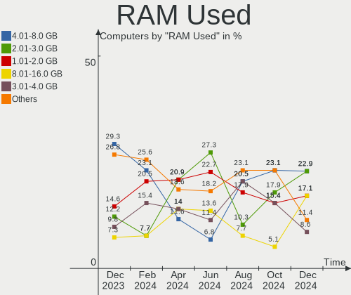
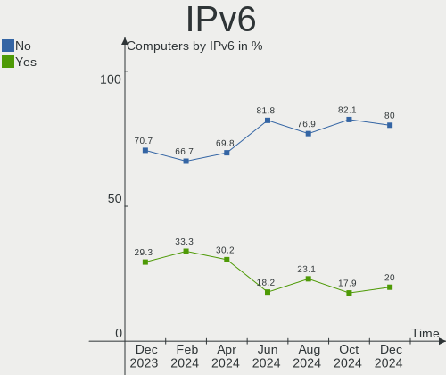

Gentoo - Hardware Trends
------------------------

A project to identify most popular hardware characteristics and track their change
over time based on data collected by Linux users at https://Linux-Hardware.org.

Anyone can contribute to this report by the [hw-probe](https://github.com/linuxhw/hw-probe) tool:

    sudo -E hw-probe -all -upload

This is a report for all computer types. See also reports for [desktops](/Dist/Gentoo/Desktop/README.md) and [notebooks](/Dist/Gentoo/Notebook/README.md).

This report is for one last month. Overall report since the beginning of time: [TestDays](https://github.com/linuxhw/TestDays)

Period: Feb, 2023.

Contents
--------

* [ System ](#system)
  - [ OS                       ](#os)
  - [ OS Family                ](#os-family)
  - [ Kernel                   ](#kernel)
  - [ Kernel Family            ](#kernel-family)
  - [ Kernel Major Ver.        ](#kernel-major-ver)
  - [ Arch                     ](#arch)
  - [ DE                       ](#de)
  - [ Display Server           ](#display-server)
  - [ Display Manager          ](#display-manager)
  - [ OS Lang                  ](#os-lang)
  - [ Boot Mode                ](#boot-mode)
  - [ Filesystem               ](#filesystem)
  - [ Part. scheme             ](#part-scheme)
  - [ Dual Boot with Linux/BSD ](#dual-boot-with-linuxbsd)
  - [ Dual Boot (Win)          ](#dual-boot-win)

* [ Board ](#board)
  - [ Vendor                   ](#vendor)
  - [ Model                    ](#model)
  - [ Model Family             ](#model-family)
  - [ MFG Year                 ](#mfg-year)
  - [ Form Factor              ](#form-factor)
  - [ Secure Boot              ](#secure-boot)
  - [ Coreboot                 ](#coreboot)
  - [ RAM Size                 ](#ram-size)
  - [ RAM Used                 ](#ram-used)
  - [ Total Drives             ](#total-drives)
  - [ Has CD-ROM               ](#has-cd-rom)
  - [ Has Ethernet             ](#has-ethernet)
  - [ Has WiFi                 ](#has-wifi)
  - [ Has Bluetooth            ](#has-bluetooth)

* [ Location ](#location)
  - [ Country                  ](#country)
  - [ City                     ](#city)

* [ Drives ](#drives)
  - [ Drive Vendor             ](#drive-vendor)
  - [ Drive Model              ](#drive-model)
  - [ HDD Vendor               ](#hdd-vendor)
  - [ SSD Vendor               ](#ssd-vendor)
  - [ Drive Kind               ](#drive-kind)
  - [ Drive Connector          ](#drive-connector)
  - [ Drive Size               ](#drive-size)
  - [ Space Total              ](#space-total)
  - [ Space Used               ](#space-used)
  - [ Malfunc. Drives          ](#malfunc-drives)
  - [ Malfunc. Drive Vendor    ](#malfunc-drive-vendor)
  - [ Malfunc. HDD Vendor      ](#malfunc-hdd-vendor)
  - [ Malfunc. Drive Kind      ](#malfunc-drive-kind)
  - [ Failed Drives            ](#failed-drives)
  - [ Failed Drive Vendor      ](#failed-drive-vendor)
  - [ Drive Status             ](#drive-status)

* [ Storage controller ](#storage-controller)
  - [ Storage Vendor           ](#storage-vendor)
  - [ Storage Model            ](#storage-model)
  - [ Storage Kind             ](#storage-kind)

* [ Processor ](#processor)
  - [ CPU Vendor               ](#cpu-vendor)
  - [ CPU Model                ](#cpu-model)
  - [ CPU Model Family         ](#cpu-model-family)
  - [ CPU Cores                ](#cpu-cores)
  - [ CPU Sockets              ](#cpu-sockets)
  - [ CPU Threads              ](#cpu-threads)
  - [ CPU Op-Modes             ](#cpu-op-modes)
  - [ CPU Microcode            ](#cpu-microcode)
  - [ CPU Microarch            ](#cpu-microarch)

* [ Graphics ](#graphics)
  - [ GPU Vendor               ](#gpu-vendor)
  - [ GPU Model                ](#gpu-model)
  - [ GPU Combo                ](#gpu-combo)
  - [ GPU Driver               ](#gpu-driver)
  - [ GPU Memory               ](#gpu-memory)

* [ Monitor ](#monitor)
  - [ Monitor Vendor           ](#monitor-vendor)
  - [ Monitor Model            ](#monitor-model)
  - [ Monitor Resolution       ](#monitor-resolution)
  - [ Monitor Diagonal         ](#monitor-diagonal)
  - [ Monitor Width            ](#monitor-width)
  - [ Aspect Ratio             ](#aspect-ratio)
  - [ Monitor Area             ](#monitor-area)
  - [ Pixel Density            ](#pixel-density)
  - [ Multiple Monitors        ](#multiple-monitors)

* [ Network ](#network)
  - [ Net Controller Vendor    ](#net-controller-vendor)
  - [ Net Controller Model     ](#net-controller-model)
  - [ Wireless Vendor          ](#wireless-vendor)
  - [ Wireless Model           ](#wireless-model)
  - [ Ethernet Vendor          ](#ethernet-vendor)
  - [ Ethernet Model           ](#ethernet-model)
  - [ Net Controller Kind      ](#net-controller-kind)
  - [ Used Controller          ](#used-controller)
  - [ NICs                     ](#nics)
  - [ IPv6                     ](#ipv6)

* [ Bluetooth ](#bluetooth)
  - [ Bluetooth Vendor         ](#bluetooth-vendor)
  - [ Bluetooth Model          ](#bluetooth-model)

* [ Sound ](#sound)
  - [ Sound Vendor             ](#sound-vendor)
  - [ Sound Model              ](#sound-model)

* [ Memory ](#memory)
  - [ Memory Vendor            ](#memory-vendor)
  - [ Memory Model             ](#memory-model)
  - [ Memory Kind              ](#memory-kind)
  - [ Memory Form Factor       ](#memory-form-factor)
  - [ Memory Size              ](#memory-size)
  - [ Memory Speed             ](#memory-speed)

* [ Printers & scanners ](#printers--scanners)
  - [ Printer Vendor           ](#printer-vendor)
  - [ Printer Model            ](#printer-model)
  - [ Scanner Vendor           ](#scanner-vendor)
  - [ Scanner Model            ](#scanner-model)

* [ Camera ](#camera)
  - [ Camera Vendor            ](#camera-vendor)
  - [ Camera Model             ](#camera-model)

* [ Security ](#security)
  - [ Fingerprint Vendor       ](#fingerprint-vendor)
  - [ Fingerprint Model        ](#fingerprint-model)
  - [ Chipcard Vendor          ](#chipcard-vendor)
  - [ Chipcard Model           ](#chipcard-model)

* [ Unsupported ](#unsupported)
  - [ Unsupported Devices      ](#unsupported-devices)
  - [ Unsupported Device Types ](#unsupported-device-types)

System
------

OS
--

Installed operating systems

| Name        | Computers | Percent |
|-------------|-----------|---------|
| Gentoo 2.9  | 33        | 60%     |
| Gentoo 2.13 | 20        | 36.36%  |
| Gentoo 2.8  | 2         | 3.64%   |

OS Family
---------

OS without a version

| Name   | Computers | Percent |
|--------|-----------|---------|
| Gentoo | 55        | 100%    |

Kernel
------

Version of the Linux kernel

| Version                             | Computers | Percent |
|-------------------------------------|-----------|---------|
| 6.1.12-gentoo                       | 7         | 12.73%  |
| 5.15.88-gentoo                      | 7         | 12.73%  |
| 5.15.88-gentoo-x86_64               | 4         | 7.27%   |
| 6.1.10-gentoo-x86_64                | 3         | 5.45%   |
| 6.1.9-gentoo-x86_64                 | 2         | 3.64%   |
| 6.1.9-gentoo-dist                   | 2         | 3.64%   |
| 6.1.12-gentoo-dist                  | 2         | 3.64%   |
| 6.1.10-gentoo                       | 2         | 3.64%   |
| 6.1.1-arch1-1                       | 2         | 3.64%   |
| 5.15.80-gentoo                      | 2         | 3.64%   |
| 6.2.1-gentoo-y                      | 1         | 1.82%   |
| 6.2.1-calculate                     | 1         | 1.82%   |
| 6.2.0-rc6-gentoo-dist+              | 1         | 1.82%   |
| 6.2.0-gentoo                        | 1         | 1.82%   |
| 6.2.0                               | 1         | 1.82%   |
| 6.1.8-gentoo-hardened1              | 1         | 1.82%   |
| 6.1.8-gentoo                        | 1         | 1.82%   |
| 6.1.7                               | 1         | 1.82%   |
| 6.1.4-gentoo-x86_64                 | 1         | 1.82%   |
| 6.1.13-gentoo                       | 1         | 1.82%   |
| 6.1.12-gentoonovirt                 | 1         | 1.82%   |
| 6.1.12-gentoo-x86_64                | 1         | 1.82%   |
| 6.1.12-gentoo-Vector                | 1         | 1.82%   |
| 6.1.11-gentoo-x86_64                | 1         | 1.82%   |
| 6.1.11-gentoo-gentoo-dist           | 1         | 1.82%   |
| 6.1.11-gentoo-dist                  | 1         | 1.82%   |
| 5.15.93-gentoo-117                  | 1         | 1.82%   |
| 5.15.74-gentoo                      | 1         | 1.82%   |
| 5.15.0-56-generic                   | 1         | 1.82%   |
| 5.10.43                             | 1         | 1.82%   |
| 5.10.27-gentoo                      | 1         | 1.82%   |
| 5.10.110-274242-gc7ef840fb61b-dirty | 1         | 1.82%   |

Kernel Family
-------------

Linux kernel without a distro release

| Version  | Computers | Percent |
|----------|-----------|---------|
| 6.1.12   | 12        | 21.82%  |
| 5.15.88  | 11        | 20%     |
| 6.1.10   | 5         | 9.09%   |
| 6.1.9    | 4         | 7.27%   |
| 6.2.0    | 3         | 5.45%   |
| 6.1.11   | 3         | 5.45%   |
| 6.2.1    | 2         | 3.64%   |
| 6.1.8    | 2         | 3.64%   |
| 6.1.1    | 2         | 3.64%   |
| 5.15.80  | 2         | 3.64%   |
| 6.1.7    | 1         | 1.82%   |
| 6.1.4    | 1         | 1.82%   |
| 6.1.13   | 1         | 1.82%   |
| 5.15.93  | 1         | 1.82%   |
| 5.15.74  | 1         | 1.82%   |
| 5.15.0   | 1         | 1.82%   |
| 5.10.43  | 1         | 1.82%   |
| 5.10.27  | 1         | 1.82%   |
| 5.10.110 | 1         | 1.82%   |

Kernel Major Ver.
-----------------

Linux kernel major version

| Version | Computers | Percent |
|---------|-----------|---------|
| 6.1     | 31        | 56.36%  |
| 5.15    | 16        | 29.09%  |
| 6.2     | 5         | 9.09%   |
| 5.10    | 3         | 5.45%   |

Arch
----

OS architecture (x86_64, i586, etc.)

| Name    | Computers | Percent |
|---------|-----------|---------|
| x86_64  | 54        | 98.18%  |
| aarch64 | 1         | 1.82%   |

DE
--

Desktop Environment

| Name     | Computers | Percent |
|----------|-----------|---------|
| Unknown  | 18        | 32.73%  |
| KDE5     | 11        | 20%     |
| XFCE     | 10        | 18.18%  |
| GNOME    | 6         | 10.91%  |
| MATE     | 3         | 5.45%   |
| DWM      | 3         | 5.45%   |
| Trinity  | 1         | 1.82%   |
| sway     | 1         | 1.82%   |
| ICEWM    | 1         | 1.82%   |
| Hyprland | 1         | 1.82%   |

Display Server
--------------

X11 or Wayland

| Name    | Computers | Percent |
|---------|-----------|---------|
| X11     | 26        | 47.27%  |
| Wayland | 11        | 20%     |
| Unknown | 11        | 20%     |
| Tty     | 7         | 12.73%  |

Display Manager
---------------

SDDM, LightDM, etc.

| Name    | Computers | Percent |
|---------|-----------|---------|
| Unknown | 24        | 43.64%  |
| SDDM    | 14        | 25.45%  |
| LightDM | 7         | 12.73%  |
| GDM     | 5         | 9.09%   |
| SLiM    | 2         | 3.64%   |
| TDM     | 1         | 1.82%   |
| LXDM    | 1         | 1.82%   |
| GREETD  | 1         | 1.82%   |

OS Lang
-------

Language

| Lang             | Computers | Percent |
|------------------|-----------|---------|
| en_US            | 26        | 47.27%  |
| fr_FR            | 5         | 9.09%   |
| C.UTF8           | 4         | 7.27%   |
| en_GB            | 3         | 5.45%   |
| de_DE            | 3         | 5.45%   |
| cs_CZ            | 3         | 5.45%   |
| Unknown          | 3         | 5.45%   |
| ru_RU            | 2         | 3.64%   |
| pl_PL            | 1         | 1.82%   |
| nl_BE            | 1         | 1.82%   |
| mi_NZ            | 1         | 1.82%   |
| es_ES.ISO-8859-1 | 1         | 1.82%   |
| en_AU            | 1         | 1.82%   |
| el_GR            | 1         | 1.82%   |

Boot Mode
---------

EFI or BIOS

| Mode | Computers | Percent |
|------|-----------|---------|
| EFI  | 46        | 83.64%  |
| BIOS | 9         | 16.36%  |

Filesystem
----------

Type of filesystem

| Type  | Computers | Percent |
|-------|-----------|---------|
| Ext4  | 28        | 50.91%  |
| Btrfs | 18        | 32.73%  |
| F2fs  | 4         | 7.27%   |
| Zfs   | 3         | 5.45%   |
| Xfs   | 2         | 3.64%   |

Part. scheme
------------

Scheme of partitioning

| Type    | Computers | Percent |
|---------|-----------|---------|
| GPT     | 50        | 90.91%  |
| Unknown | 3         | 5.45%   |
| MBR     | 2         | 3.64%   |

Dual Boot with Linux/BSD
------------------------

Hosting more than one Linux/BSD

| Dual boot | Computers | Percent |
|-----------|-----------|---------|
| No        | 34        | 61.82%  |
| Yes       | 21        | 38.18%  |

Dual Boot (Win)
---------------

Hosting Linux and Windows

| Dual boot | Computers | Percent |
|-----------|-----------|---------|
| No        | 37        | 67.27%  |
| Yes       | 18        | 32.73%  |

Board
-----

Vendor
------

Motherboard manufacturer

| Name                | Computers | Percent |
|---------------------|-----------|---------|
| ASUSTek Computer    | 17        | 30.91%  |
| MSI                 | 6         | 10.91%  |
| Lenovo              | 6         | 10.91%  |
| Gigabyte Technology | 6         | 10.91%  |
| Hewlett-Packard     | 4         | 7.27%   |
| Dell                | 3         | 5.45%   |
| ASRock              | 3         | 5.45%   |
| Unknown             | 2         | 3.64%   |
| Valve               | 1         | 1.82%   |
| Timi                | 1         | 1.82%   |
| Supermicro          | 1         | 1.82%   |
| realme              | 1         | 1.82%   |
| Radxa               | 1         | 1.82%   |
| Apple               | 1         | 1.82%   |
| Alienware           | 1         | 1.82%   |
| Acer                | 1         | 1.82%   |

Model
-----

Motherboard model

| Name                                   | Computers | Percent |
|----------------------------------------|-----------|---------|
| Dell Precision 7770                    | 2         | 3.64%   |
| ASUS M3A78-CM                          | 2         | 3.64%   |
| Unknown                                | 2         | 3.64%   |
| Valve Jupiter                          | 1         | 1.82%   |
| Timi RedmiBook Pro 15S                 | 1         | 1.82%   |
| Supermicro Super Server                | 1         | 1.82%   |
| realme RMNBXXXX                        | 1         | 1.82%   |
| Radxa ROCK 5B                          | 1         | 1.82%   |
| MSI Vector GP66 12UEO                  | 1         | 1.82%   |
| MSI MS-7D25                            | 1         | 1.82%   |
| MSI MS-7C91                            | 1         | 1.82%   |
| MSI MS-7A31                            | 1         | 1.82%   |
| MSI GS66 Stealth 10UE                  | 1         | 1.82%   |
| MSI GP60 2PE                           | 1         | 1.82%   |
| Lenovo ThinkStation P340 30DJS35Q00    | 1         | 1.82%   |
| Lenovo ThinkPad T570 W10DG 20JXS08118  | 1         | 1.82%   |
| Lenovo ThinkPad T16 Gen 1 21CH000FUS   | 1         | 1.82%   |
| Lenovo ThinkPad E14 Gen 4 21EBCTO1WW   | 1         | 1.82%   |
| Lenovo Legion 5P 15IMH05 82AW          | 1         | 1.82%   |
| Lenovo IdeaPad 100-15IBD 80QQ          | 1         | 1.82%   |
| HP Victus by Laptop 16-e0xxx           | 1         | 1.82%   |
| HP Victus by Gaming Laptop 15-fb0xxx   | 1         | 1.82%   |
| HP Pavilion Notebook                   | 1         | 1.82%   |
| HP Laptop 17-ca1xxx                    | 1         | 1.82%   |
| Gigabyte Z590 UD                       | 1         | 1.82%   |
| Gigabyte X570 AORUS MASTER             | 1         | 1.82%   |
| Gigabyte B650 AORUS PRO AX             | 1         | 1.82%   |
| Gigabyte B450 AORUS PRO                | 1         | 1.82%   |
| Gigabyte B150M-D2V DDR3-CF             | 1         | 1.82%   |
| Gigabyte AB350-Gaming                  | 1         | 1.82%   |
| Dell XPS 15 9520                       | 1         | 1.82%   |
| ASUS VivoBook_ASUSLaptop X509DA_M509DA | 1         | 1.82%   |
| ASUS TUF Gaming Z690-PLUS D4           | 1         | 1.82%   |
| ASUS TUF Gaming X570-PLUS_BR           | 1         | 1.82%   |
| ASUS TUF Gaming X570-PLUS              | 1         | 1.82%   |
| ASUS TUF Gaming B550-PRO               | 1         | 1.82%   |
| ASUS Strix 17 GL703GE                  | 1         | 1.82%   |
| ASUS ROG STRIX Z690-G GAMING WIFI      | 1         | 1.82%   |
| ASUS ROG STRIX X570-E GAMING           | 1         | 1.82%   |
| ASUS ROG Strix G732LXS_G732LXS         | 1         | 1.82%   |

Model Family
------------

Motherboard model prefix

| Name                  | Computers | Percent |
|-----------------------|-----------|---------|
| ASUS TUF              | 4         | 7.27%   |
| Lenovo ThinkPad       | 3         | 5.45%   |
| ASUS ROG              | 3         | 5.45%   |
| ASUS PRIME            | 3         | 5.45%   |
| HP Victus             | 2         | 3.64%   |
| Dell Precision        | 2         | 3.64%   |
| ASUS M3A78-CM         | 2         | 3.64%   |
| Unknown               | 2         | 3.64%   |
| Valve Jupiter         | 1         | 1.82%   |
| Timi RedmiBook        | 1         | 1.82%   |
| Supermicro Super      | 1         | 1.82%   |
| realme RMNBXXXX       | 1         | 1.82%   |
| Radxa ROCK            | 1         | 1.82%   |
| MSI Vector            | 1         | 1.82%   |
| MSI MS-7D25           | 1         | 1.82%   |
| MSI MS-7C91           | 1         | 1.82%   |
| MSI MS-7A31           | 1         | 1.82%   |
| MSI GS66              | 1         | 1.82%   |
| MSI GP60              | 1         | 1.82%   |
| Lenovo ThinkStation   | 1         | 1.82%   |
| Lenovo Legion         | 1         | 1.82%   |
| Lenovo IdeaPad        | 1         | 1.82%   |
| HP Pavilion           | 1         | 1.82%   |
| HP Laptop             | 1         | 1.82%   |
| Gigabyte Z590         | 1         | 1.82%   |
| Gigabyte X570         | 1         | 1.82%   |
| Gigabyte B650         | 1         | 1.82%   |
| Gigabyte B450         | 1         | 1.82%   |
| Gigabyte B150M-D2V    | 1         | 1.82%   |
| Gigabyte AB350-Gaming | 1         | 1.82%   |
| Dell XPS              | 1         | 1.82%   |
| ASUS VivoBook         | 1         | 1.82%   |
| ASUS Strix            | 1         | 1.82%   |
| ASUS P10S-I           | 1         | 1.82%   |
| ASUS GL702VT          | 1         | 1.82%   |
| ASUS ASUS             | 1         | 1.82%   |
| ASRock X370           | 1         | 1.82%   |
| ASRock B550M          | 1         | 1.82%   |
| ASRock AM1H-ITX       | 1         | 1.82%   |
| Apple MacBookPro10    | 1         | 1.82%   |

MFG Year
--------

Motherboard manufacture year

| Year    | Computers | Percent |
|---------|-----------|---------|
| 2022    | 13        | 23.64%  |
| 2021    | 12        | 21.82%  |
| 2019    | 11        | 20%     |
| 2017    | 5         | 9.09%   |
| 2018    | 3         | 5.45%   |
| 2015    | 3         | 5.45%   |
| 2020    | 2         | 3.64%   |
| 2014    | 2         | 3.64%   |
| 2008    | 2         | 3.64%   |
| 2013    | 1         | 1.82%   |
| Unknown | 1         | 1.82%   |

Form Factor
-----------

Physical design of the computer

| Name           | Computers | Percent |
|----------------|-----------|---------|
| Notebook       | 27        | 49.09%  |
| Desktop        | 25        | 45.45%  |
| System on chip | 1         | 1.82%   |
| Convertible    | 1         | 1.82%   |
| Server         | 1         | 1.82%   |

Secure Boot
-----------

Enabled or disabled

| State    | Computers | Percent |
|----------|-----------|---------|
| Disabled | 54        | 98.18%  |
| Enabled  | 1         | 1.82%   |

Coreboot
--------

Have coreboot on board

| Used | Computers | Percent |
|------|-----------|---------|
| No   | 55        | 100%    |

RAM Size
--------

Total RAM memory

| Size in GB  | Computers | Percent |
|-------------|-----------|---------|
| 32.01-64.0  | 18        | 32.73%  |
| 16.01-24.0  | 14        | 25.45%  |
| 8.01-16.0   | 8         | 14.55%  |
| 4.01-8.0    | 5         | 9.09%   |
| 64.01-256.0 | 5         | 9.09%   |
| 3.01-4.0    | 3         | 5.45%   |
| 24.01-32.0  | 2         | 3.64%   |

RAM Used
--------

Used RAM memory

| Used GB    | Computers | Percent |
|------------|-----------|---------|
| 8.01-16.0  | 12        | 21.82%  |
| 1.01-2.0   | 11        | 20%     |
| 4.01-8.0   | 10        | 18.18%  |
| 2.01-3.0   | 10        | 18.18%  |
| 3.01-4.0   | 5         | 9.09%   |
| 0.01-0.5   | 3         | 5.45%   |
| 16.01-24.0 | 2         | 3.64%   |
| 0.51-1.0   | 2         | 3.64%   |

Total Drives
------------

Number of drives on board

| Drives | Computers | Percent |
|--------|-----------|---------|
| 2      | 19        | 34.55%  |
| 1      | 18        | 32.73%  |
| 3      | 7         | 12.73%  |
| 6      | 4         | 7.27%   |
| 5      | 4         | 7.27%   |
| 4      | 2         | 3.64%   |
| 8      | 1         | 1.82%   |

Has CD-ROM
----------

Has CD-ROM on board

| Presented | Computers | Percent |
|-----------|-----------|---------|
| No        | 46        | 83.64%  |
| Yes       | 9         | 16.36%  |

Has Ethernet
------------

Has Ethernet on board

| Presented | Computers | Percent |
|-----------|-----------|---------|
| Yes       | 52        | 94.55%  |
| No        | 3         | 5.45%   |

Has WiFi
--------

Has WiFi module

| Presented | Computers | Percent |
|-----------|-----------|---------|
| Yes       | 37        | 67.27%  |
| No        | 18        | 32.73%  |

Has Bluetooth
-------------

Has Bluetooth module

| Presented | Computers | Percent |
|-----------|-----------|---------|
| Yes       | 38        | 69.09%  |
| No        | 17        | 30.91%  |

Location
--------

Country
-------

Geographic location (country)

| Country     | Computers | Percent |
|-------------|-----------|---------|
| USA         | 9         | 16.36%  |
| Russia      | 6         | 10.91%  |
| Germany     | 6         | 10.91%  |
| Poland      | 5         | 9.09%   |
| France      | 5         | 9.09%   |
| Czechia     | 4         | 7.27%   |
| China       | 2         | 3.64%   |
| Australia   | 2         | 3.64%   |
| Vietnam     | 1         | 1.82%   |
| UK          | 1         | 1.82%   |
| Tunisia     | 1         | 1.82%   |
| Spain       | 1         | 1.82%   |
| Slovakia    | 1         | 1.82%   |
| Singapore   | 1         | 1.82%   |
| New Zealand | 1         | 1.82%   |
| Lithuania   | 1         | 1.82%   |
| Italy       | 1         | 1.82%   |
| Iceland     | 1         | 1.82%   |
| Hong Kong   | 1         | 1.82%   |
| Greece      | 1         | 1.82%   |
| Canada      | 1         | 1.82%   |
| Bulgaria    | 1         | 1.82%   |
| Brazil      | 1         | 1.82%   |
| Belgium     | 1         | 1.82%   |

City
----

Geographic location (city)

| City                  | Computers | Percent |
|-----------------------|-----------|---------|
| Warsaw                | 3         | 5.45%   |
| Vitkov                | 2         | 3.64%   |
| San Dimas             | 2         | 3.64%   |
| Oviedo                | 2         | 3.64%   |
| Krakow                | 2         | 3.64%   |
| Cognac                | 2         | 3.64%   |
| Yucaipa               | 1         | 1.82%   |
| Welwyn Garden City    | 1         | 1.82%   |
| Vilnius               | 1         | 1.82%   |
| Ufa                   | 1         | 1.82%   |
| Tunis                 | 1         | 1.82%   |
| Toronto               | 1         | 1.82%   |
| Taganrog              | 1         | 1.82%   |
| St Petersburg         | 1         | 1.82%   |
| Sofia                 | 1         | 1.82%   |
| Singapore             | 1         | 1.82%   |
| Simat de la Valldigna | 1         | 1.82%   |
| Shanghai              | 1         | 1.82%   |
| Seattle               | 1         | 1.82%   |
| San Antonio           | 1         | 1.82%   |
| Ryazan                | 1         | 1.82%   |
| Reykjavik             | 1         | 1.82%   |
| Prešov               | 1         | 1.82%   |
| Polch                 | 1         | 1.82%   |
| Perth                 | 1         | 1.82%   |
| Orange                | 1         | 1.82%   |
| Omsk                  | 1         | 1.82%   |
| Nanterre              | 1         | 1.82%   |
| Nandlstadt            | 1         | 1.82%   |
| Moscow                | 1         | 1.82%   |
| Milan                 | 1         | 1.82%   |
| Melbourne             | 1         | 1.82%   |
| Maule                 | 1         | 1.82%   |
| Mainz                 | 1         | 1.82%   |
| Ilmenau               | 1         | 1.82%   |
| Ho Chi Minh City      | 1         | 1.82%   |
| Hamilton              | 1         | 1.82%   |
| Ewirgol               | 1         | 1.82%   |
| Doksy                 | 1         | 1.82%   |
| Dilsen-Stokkem        | 1         | 1.82%   |

Drives
------

Drive Vendor
------------

Hard drive vendors

| Vendor                      | Computers | Drives | Percent |
|-----------------------------|-----------|--------|---------|
| Samsung Electronics         | 24        | 38     | 26.37%  |
| WDC                         | 13        | 25     | 14.29%  |
| Seagate                     | 10        | 18     | 10.99%  |
| SanDisk                     | 10        | 11     | 10.99%  |
| Phison Electronics          | 4         | 5      | 4.4%    |
| Toshiba                     | 3         | 3      | 3.3%    |
| Micron Technology           | 3         | 3      | 3.3%    |
| GOODRAM                     | 3         | 3      | 3.3%    |
| Unknown                     | 2         | 3      | 2.2%    |
| SK hynix                    | 2         | 2      | 2.2%    |
| Realtek Semiconductor       | 2         | 3      | 2.2%    |
| Intel                       | 2         | 3      | 2.2%    |
| Hitachi                     | 2         | 4      | 2.2%    |
| China                       | 2         | 4      | 2.2%    |
| XPG                         | 1         | 3      | 1.1%    |
| TrekStor                    | 1         | 1      | 1.1%    |
| OCZ                         | 1         | 1      | 1.1%    |
| Micron/Crucial Technology   | 1         | 2      | 1.1%    |
| KIOXIA                      | 1         | 1      | 1.1%    |
| Kingston Technology Company | 1         | 1      | 1.1%    |
| HGST                        | 1         | 1      | 1.1%    |
| Apple                       | 1         | 1      | 1.1%    |
| A-DATA Technology           | 1         | 1      | 1.1%    |

Drive Model
-----------

Hard drive models

| Model                                                | Computers | Percent |
|------------------------------------------------------|-----------|---------|
| Samsung NVMe SSD Controller SM981/PM981/PM983 250GB  | 11        | 9.48%   |
| Samsung NVMe SSD Controller PM9A1/PM9A3/980PRO 960GB | 6         | 5.17%   |
| Samsung SSD 980 1TB                                  | 5         | 4.31%   |
| WDC WD20EARX-00PASB0 2TB                             | 2         | 1.72%   |
| Seagate ST4000DM004-2CV104 4TB                       | 2         | 1.72%   |
| Seagate ST1000LM024 HN-M101MBB 1TB                   | 2         | 1.72%   |
| SanDisk Extreme 55AE 500GB SSD                       | 2         | 1.72%   |
| Samsung NVMe SSD Controller SM961/PM961/SM963 512GB  | 2         | 1.72%   |
| Micron 2450_MTFDKBA1T0TFK 1TB                        | 2         | 1.72%   |
| Intel SSD 660P Series 1024GB                         | 2         | 1.72%   |
| GOODRAM SSDPR-CL100-480-G2 480GB                     | 2         | 1.72%   |
| XPG GAMMIX S70 2TB                                   | 1         | 0.86%   |
| WDC WDS240G2G0A-00JH30 240GB SSD                     | 1         | 0.86%   |
| WDC WDS200T2B0B-00YS70 2TB SSD                       | 1         | 0.86%   |
| WDC WD8003FFBX-68B9AN0 8TB                           | 1         | 0.86%   |
| WDC WD60EZRX-00MVLB1 6TB                             | 1         | 0.86%   |
| WDC WD60EFRX-68MYMN1 6TB                             | 1         | 0.86%   |
| WDC WD6003FZBX-00K5WB0 6TB                           | 1         | 0.86%   |
| WDC WD5000LPLX-66ZNTT1 500GB                         | 1         | 0.86%   |
| WDC WD5000LPCX-24VHAT0 500GB                         | 1         | 0.86%   |
| WDC WD5000AADS-00M2B0 500GB                          | 1         | 0.86%   |
| WDC WD40EFAX-68JH4N1 4TB                             | 1         | 0.86%   |
| WDC WD3003FZEX-00Z4SA0 3TB                           | 1         | 0.86%   |
| WDC WD20EZBX-08AYR 2TB                               | 1         | 0.86%   |
| WDC WD20EZBX-00AYRA0 2TB                             | 1         | 0.86%   |
| WDC WD20EFRX-68EUZN0 2TB                             | 1         | 0.86%   |
| WDC WD1502FYPS-02W3B0 1TB                            | 1         | 0.86%   |
| WDC WD120EFBX-68B0EN0 12TB                           | 1         | 0.86%   |
| WDC WD10JPVX-75JC3T0 1TB                             | 1         | 0.86%   |
| WDC WD1001FALS-00J7B1 1TB                            | 1         | 0.86%   |
| Unknown MMC Card  64GB                               | 1         | 0.86%   |
| Unknown MMC Card  16GB                               | 1         | 0.86%   |
| Unknown MMC Card  128GB                              | 1         | 0.86%   |
| TrekStor I.GEAR 128GB                                | 1         | 0.86%   |
| Toshiba HDWE150 5TB                                  | 1         | 0.86%   |
| Toshiba HDWD110 1TB                                  | 1         | 0.86%   |
| Toshiba DT01ABA300 3TB                               | 1         | 0.86%   |
| SK hynix PC801 NVMe 1TB                              | 1         | 0.86%   |
| SK hynix PC711 HFS512GDE9X073N 512GB                 | 1         | 0.86%   |
| Seagate ST8000NE001-2M7101 8TB                       | 1         | 0.86%   |

HDD Vendor
----------

Hard disk drive vendors

| Vendor              | Computers | Drives | Percent |
|---------------------|-----------|--------|---------|
| WDC                 | 11        | 23     | 37.93%  |
| Seagate             | 10        | 18     | 34.48%  |
| Toshiba             | 3         | 3      | 10.34%  |
| Samsung Electronics | 2         | 2      | 6.9%    |
| Hitachi             | 2         | 4      | 6.9%    |
| HGST                | 1         | 1      | 3.45%   |

SSD Vendor
----------

Solid state drive vendors

| Vendor              | Computers | Drives | Percent |
|---------------------|-----------|--------|---------|
| Samsung Electronics | 8         | 8      | 34.78%  |
| SanDisk             | 5         | 5      | 21.74%  |
| GOODRAM             | 3         | 3      | 13.04%  |
| WDC                 | 2         | 2      | 8.7%    |
| China               | 2         | 4      | 8.7%    |
| OCZ                 | 1         | 1      | 4.35%   |
| Apple               | 1         | 1      | 4.35%   |
| A-DATA Technology   | 1         | 1      | 4.35%   |

Drive Kind
----------

HDD or SSD

| Kind    | Computers | Drives | Percent |
|---------|-----------|--------|---------|
| NVMe    | 38        | 57     | 45.24%  |
| HDD     | 22        | 51     | 26.19%  |
| SSD     | 21        | 25     | 25%     |
| MMC     | 2         | 3      | 2.38%   |
| Unknown | 1         | 1      | 1.19%   |

Drive Connector
---------------

SATA, SAS, NVMe, etc.

| Type | Computers | Drives | Percent |
|------|-----------|--------|---------|
| NVMe | 38        | 57     | 50.67%  |
| SATA | 31        | 73     | 41.33%  |
| SAS  | 4         | 4      | 5.33%   |
| MMC  | 2         | 3      | 2.67%   |

Drive Size
----------

Size of hard drive

| Size in TB | Computers | Drives | Percent |
|------------|-----------|--------|---------|
| 0.51-1.0   | 18        | 21     | 30.51%  |
| 0.01-0.5   | 18        | 19     | 30.51%  |
| 1.01-2.0   | 7         | 12     | 11.86%  |
| 4.01-10.0  | 6         | 9      | 10.17%  |
| 10.01-20.0 | 4         | 6      | 6.78%   |
| 3.01-4.0   | 3         | 4      | 5.08%   |
| 2.01-3.0   | 3         | 5      | 5.08%   |

Space Total
-----------

Amount of disk space available on the file system

| Size in GB     | Computers | Percent |
|----------------|-----------|---------|
| 501-1000       | 16        | 29.09%  |
| More than 3000 | 10        | 18.18%  |
| 251-500        | 7         | 12.73%  |
| 101-250        | 7         | 12.73%  |
| 1001-2000      | 5         | 9.09%   |
| 1-20           | 3         | 5.45%   |
| Unknown        | 3         | 5.45%   |
| 51-100         | 2         | 3.64%   |
| 21-50          | 1         | 1.82%   |
| 2001-3000      | 1         | 1.82%   |

Space Used
----------

Amount of used disk space

| Used GB        | Computers | Percent |
|----------------|-----------|---------|
| 101-250        | 12        | 21.82%  |
| 1-20           | 11        | 20%     |
| More than 3000 | 7         | 12.73%  |
| 251-500        | 6         | 10.91%  |
| 501-1000       | 6         | 10.91%  |
| 21-50          | 5         | 9.09%   |
| 51-100         | 3         | 5.45%   |
| Unknown        | 3         | 5.45%   |
| 1001-2000      | 2         | 3.64%   |

Malfunc. Drives
---------------

Drive models with a malfunction

| Model                                                   | Computers | Drives | Percent |
|---------------------------------------------------------|-----------|--------|---------|
| Seagate ST1000LM024 HN-M101MBB 1TB                      | 2         | 2      | 16.67%  |
| Samsung Electronics SSD 980 1TB                         | 2         | 2      | 16.67%  |
| WDC WD60EZRX-00MVLB1 6TB                                | 1         | 1      | 8.33%   |
| WDC WD10JPVX-75JC3T0 1TB                                | 1         | 1      | 8.33%   |
| WDC WD1001FALS-00J7B1 1TB                               | 1         | 1      | 8.33%   |
| SK hynix PC711 HFS512GDE9X073N 512GB                    | 1         | 1      | 8.33%   |
| Seagate ST750LM022 HN-M750MBB 752GB                     | 1         | 1      | 8.33%   |
| Seagate ST2000DM001-1CH164 2TB                          | 1         | 1      | 8.33%   |
| Realtek Semiconductor RTS5763DL NVMe SSD Controller 4TB | 1         | 1      | 8.33%   |
| Realtek Semiconductor ADATA SX6000PNP 256GB             | 1         | 2      | 8.33%   |

Malfunc. Drive Vendor
---------------------

Vendors of faulty drives

| Vendor                | Computers | Drives | Percent |
|-----------------------|-----------|--------|---------|
| WDC                   | 3         | 3      | 27.27%  |
| Seagate               | 3         | 4      | 27.27%  |
| Samsung Electronics   | 2         | 2      | 18.18%  |
| Realtek Semiconductor | 2         | 3      | 18.18%  |
| SK hynix              | 1         | 1      | 9.09%   |

Malfunc. HDD Vendor
-------------------

Vendors of faulty HDD drives

| Vendor  | Computers | Drives | Percent |
|---------|-----------|--------|---------|
| WDC     | 3         | 3      | 50%     |
| Seagate | 3         | 4      | 50%     |

Malfunc. Drive Kind
-------------------

Kinds of faulty drives

| Kind | Computers | Drives | Percent |
|------|-----------|--------|---------|
| HDD  | 6         | 7      | 54.55%  |
| NVMe | 5         | 6      | 45.45%  |

Failed Drives
-------------

Failed drive models

Zero info for selected period =(

Failed Drive Vendor
-------------------

Failed drive vendors

Zero info for selected period =(

Drive Status
------------

Number of failed and malfunc. drives

| Status   | Computers | Drives | Percent |
|----------|-----------|--------|---------|
| Works    | 48        | 107    | 71.64%  |
| Malfunc  | 10        | 13     | 14.93%  |
| Detected | 9         | 17     | 13.43%  |

Storage controller
------------------

Storage Vendor
--------------

Storage controller vendors

| Vendor                      | Computers | Percent |
|-----------------------------|-----------|---------|
| AMD                         | 22        | 25%     |
| Samsung Electronics         | 21        | 23.86%  |
| Intel                       | 21        | 23.86%  |
| SanDisk                     | 5         | 5.68%   |
| Phison Electronics          | 4         | 4.55%   |
| ASMedia Technology          | 4         | 4.55%   |
| Micron Technology           | 3         | 3.41%   |
| SK hynix                    | 2         | 2.27%   |
| Realtek Semiconductor       | 2         | 2.27%   |
| Micron/Crucial Technology   | 1         | 1.14%   |
| KIOXIA                      | 1         | 1.14%   |
| Kingston Technology Company | 1         | 1.14%   |
| INNOGRIT                    | 1         | 1.14%   |

Storage Model
-------------

Storage controller models

| Model                                                                          | Computers | Percent |
|--------------------------------------------------------------------------------|-----------|---------|
| AMD FCH SATA Controller [AHCI mode]                                            | 15        | 14.85%  |
| Samsung NVMe SSD Controller SM981/PM981/PM983                                  | 11        | 10.89%  |
| Samsung NVMe SSD Controller PM9A1/PM9A3/980PRO                                 | 6         | 5.94%   |
| Samsung NVMe SSD Controller 980                                                | 6         | 5.94%   |
| Intel Volume Management Device NVMe RAID Controller                            | 4         | 3.96%   |
| Samsung NVMe SSD Controller SM961/PM961/SM963                                  | 3         | 2.97%   |
| Micron Non-Volatile memory controller                                          | 3         | 2.97%   |
| Intel Alder Lake-S PCH SATA Controller [AHCI Mode]                             | 3         | 2.97%   |
| ASMedia ASM1062 Serial ATA Controller                                          | 3         | 2.97%   |
| AMD 500 Series Chipset SATA Controller                                         | 3         | 2.97%   |
| Intel Wildcat Point-LP SATA Controller [AHCI Mode]                             | 2         | 1.98%   |
| Intel SSD 660P Series                                                          | 2         | 1.98%   |
| Intel Q170/Q150/B150/H170/H110/Z170/CM236 Chipset SATA Controller [AHCI Mode]  | 2         | 1.98%   |
| Intel 8 Series/C220 Series Chipset Family 6-port SATA Controller 1 [AHCI mode] | 2         | 1.98%   |
| Intel 7 Series Chipset Family 6-port SATA Controller [AHCI mode]               | 2         | 1.98%   |
| Intel 500 Series Chipset Family SATA AHCI Controller                           | 2         | 1.98%   |
| AMD X370 Series Chipset SATA Controller                                        | 2         | 1.98%   |
| AMD SB7x0/SB8x0/SB9x0 SATA Controller [IDE mode]                               | 2         | 1.98%   |
| AMD SB7x0/SB8x0/SB9x0 IDE Controller                                           | 2         | 1.98%   |
| AMD 400 Series Chipset SATA Controller                                         | 2         | 1.98%   |
| SK hynix Platinum P41 NVMe Solid State Drive 2TB                               | 1         | 0.99%   |
| SK hynix Gold P31/PC711 NVMe Solid State Drive                                 | 1         | 0.99%   |
| SanDisk WD PC SN810 / Black SN850 NVMe SSD                                     | 1         | 0.99%   |
| SanDisk WD Blue SN550 NVMe SSD                                                 | 1         | 0.99%   |
| SanDisk WD Black SN750 / PC SN730 NVMe SSD                                     | 1         | 0.99%   |
| SanDisk WD Black 2018/SN750 / PC SN720 NVMe SSD                                | 1         | 0.99%   |
| SanDisk Non-Volatile memory controller                                         | 1         | 0.99%   |
| Realtek RTS5763DL NVMe SSD Controller                                          | 1         | 0.99%   |
| Realtek Realtek Non-Volatile memory controller                                 | 1         | 0.99%   |
| Phison PS5013 E13 NVMe Controller                                              | 1         | 0.99%   |
| Phison NVMe Storage Controller                                                 | 1         | 0.99%   |
| Phison E16 PCIe4 NVMe Controller                                               | 1         | 0.99%   |
| Phison E12 NVMe Controller                                                     | 1         | 0.99%   |
| Micron/Crucial P2 NVMe PCIe SSD                                                | 1         | 0.99%   |
| KIOXIA NVMe SSD Controller BG4                                                 | 1         | 0.99%   |
| Kingston Company Company Non-Volatile memory controller                        | 1         | 0.99%   |
| Intel HM170/QM170 Chipset SATA Controller [AHCI Mode]                          | 1         | 0.99%   |
| Intel Comet Lake SATA AHCI Controller                                          | 1         | 0.99%   |
| Intel Cannon Lake Mobile PCH SATA AHCI Controller                              | 1         | 0.99%   |
| Intel 400 Series Chipset Family SATA AHCI Controller                           | 1         | 0.99%   |

Storage Kind
------------

Kind of storage controller (IDE, SATA, NVMe, SAS, ...)

| Kind | Computers | Percent |
|------|-----------|---------|
| NVMe | 39        | 46.43%  |
| SATA | 39        | 46.43%  |
| RAID | 4         | 4.76%   |
| IDE  | 2         | 2.38%   |

Processor
---------

CPU Vendor
----------

Processor vendors

| Vendor | Computers | Percent |
|--------|-----------|---------|
| Intel  | 27        | 49.09%  |
| AMD    | 27        | 49.09%  |
| ARM    | 1         | 1.82%   |

CPU Model
---------

Processor models

| Model                                         | Computers | Percent |
|-----------------------------------------------|-----------|---------|
| Intel Core i7-10875H CPU @ 2.30GHz            | 2         | 3.64%   |
| Intel 12th Gen Core i7-12850HX                | 2         | 3.64%   |
| Intel 12th Gen Core i7-12700H                 | 2         | 3.64%   |
| AMD Ryzen 9 5900X 12-Core Processor           | 2         | 3.64%   |
| AMD Ryzen 7 5800H with Radeon Graphics        | 2         | 3.64%   |
| AMD Ryzen 7 3700X 8-Core Processor            | 2         | 3.64%   |
| AMD Ryzen 7 3700U with Radeon Vega Mobile Gfx | 2         | 3.64%   |
| AMD Ryzen 7 1700X Eight-Core Processor        | 2         | 3.64%   |
| AMD Ryzen 5 5600X 6-Core Processor            | 2         | 3.64%   |
| AMD Phenom II X4 955 Processor                | 2         | 3.64%   |
| Intel Xeon CPU E3-1240L v5 @ 2.10GHz          | 1         | 1.82%   |
| Intel Core i7-8750H CPU @ 2.20GHz             | 1         | 1.82%   |
| Intel Core i7-6700HQ CPU @ 2.60GHz            | 1         | 1.82%   |
| Intel Core i7-4710MQ CPU @ 2.50GHz            | 1         | 1.82%   |
| Intel Core i7-2670QM CPU @ 2.20GHz            | 1         | 1.82%   |
| Intel Core i7-10750H CPU @ 2.60GHz            | 1         | 1.82%   |
| Intel Core i7-10700K CPU @ 3.80GHz            | 1         | 1.82%   |
| Intel Core i5-6300U CPU @ 2.40GHz             | 1         | 1.82%   |
| Intel Core i5-5200U CPU @ 2.20GHz             | 1         | 1.82%   |
| Intel Core i5-4210H CPU @ 2.90GHz             | 1         | 1.82%   |
| Intel Core i5-3230M CPU @ 2.60GHz             | 1         | 1.82%   |
| Intel Core i3-6100 CPU @ 3.70GHz              | 1         | 1.82%   |
| Intel Core i3-5005U CPU @ 2.00GHz             | 1         | 1.82%   |
| Intel 12th Gen Core i9-12900K                 | 1         | 1.82%   |
| Intel 12th Gen Core i7-12700K                 | 1         | 1.82%   |
| Intel 12th Gen Core i7-1255U                  | 1         | 1.82%   |
| Intel 12th Gen Core i5-12600K                 | 1         | 1.82%   |
| Intel 11th Gen Core i7-11700K @ 3.60GHz       | 1         | 1.82%   |
| Intel 11th Gen Core i5-11600K @ 3.90GHz       | 1         | 1.82%   |
| Intel 11th Gen Core i5-1135G7 @ 2.40GHz       | 1         | 1.82%   |
| Intel 11th Gen Core i5-1130G7 @ 1.10GHz       | 1         | 1.82%   |
| ARM Processor                                 | 1         | 1.82%   |
| AMD Ryzen 7 7700X 8-Core Processor            | 1         | 1.82%   |
| AMD Ryzen 7 5825U with Radeon Graphics        | 1         | 1.82%   |
| AMD Ryzen 7 5800X 8-Core Processor            | 1         | 1.82%   |
| AMD Ryzen 7 5700U with Radeon Graphics        | 1         | 1.82%   |
| AMD Ryzen 7 2700 Eight-Core Processor         | 1         | 1.82%   |
| AMD Ryzen 5 PRO 6650U with Radeon Graphics    | 1         | 1.82%   |
| AMD Ryzen 5 5600H with Radeon Graphics        | 1         | 1.82%   |
| AMD Ryzen 5 5500                              | 1         | 1.82%   |

CPU Model Family
----------------

Processor model prefix

| Model            | Computers | Percent |
|------------------|-----------|---------|
| Other            | 14        | 25.45%  |
| AMD Ryzen 7      | 13        | 23.64%  |
| Intel Core i7    | 8         | 14.55%  |
| AMD Ryzen 5      | 6         | 10.91%  |
| Intel Core i5    | 4         | 7.27%   |
| Intel Core i3    | 2         | 3.64%   |
| AMD Ryzen 9      | 2         | 3.64%   |
| AMD Phenom II X4 | 2         | 3.64%   |
| Intel Xeon       | 1         | 1.82%   |
| AMD Ryzen 5 PRO  | 1         | 1.82%   |
| AMD EPYC         | 1         | 1.82%   |
| AMD Athlon       | 1         | 1.82%   |

CPU Cores
---------

Number of processor cores

| Number | Computers | Percent |
|--------|-----------|---------|
| 8      | 15        | 27.27%  |
| 4      | 13        | 23.64%  |
| 6      | 10        | 18.18%  |
| 2      | 6         | 10.91%  |
| 16     | 4         | 7.27%   |
| 12     | 3         | 5.45%   |
| 14     | 2         | 3.64%   |
| 10     | 2         | 3.64%   |

CPU Sockets
-----------

Number of sockets

| Number | Computers | Percent |
|--------|-----------|---------|
| 1      | 54        | 98.18%  |
| 2      | 1         | 1.82%   |

CPU Threads
-----------

Threads per core (Hyper-Threading)

| Number | Computers | Percent |
|--------|-----------|---------|
| 2      | 51        | 92.73%  |
| 1      | 4         | 7.27%   |

CPU Op-Modes
------------

CPU Operation Modes (32-bit, 64-bit)

| Op mode        | Computers | Percent |
|----------------|-----------|---------|
| 32-bit, 64-bit | 55        | 100%    |

CPU Microcode
-------------

Microcode number

| Number     | Computers | Percent |
|------------|-----------|---------|
| Unknown    | 9         | 16.36%  |
| 0x90672    | 4         | 7.27%   |
| 0x0a50000c | 3         | 5.45%   |
| 0x08701021 | 3         | 5.45%   |
| 0xa0652    | 2         | 3.64%   |
| 0x906a3    | 2         | 3.64%   |
| 0x806c1    | 2         | 3.64%   |
| 0x506e3    | 2         | 3.64%   |
| 0x306d4    | 2         | 3.64%   |
| 0x0a50000d | 2         | 3.64%   |
| 0x0a201016 | 2         | 3.64%   |
| 0x08108109 | 2         | 3.64%   |
| 0x0800820d | 2         | 3.64%   |
| 0xa0671    | 1         | 1.82%   |
| 0x906ea    | 1         | 1.82%   |
| 0x906a4    | 1         | 1.82%   |
| 0x406e3    | 1         | 1.82%   |
| 0x306c3    | 1         | 1.82%   |
| 0x306a9    | 1         | 1.82%   |
| 0x206a7    | 1         | 1.82%   |
| 0x0a601203 | 1         | 1.82%   |
| 0x0a20120a | 1         | 1.82%   |
| 0x0a201009 | 1         | 1.82%   |
| 0x08900201 | 1         | 1.82%   |
| 0x08608102 | 1         | 1.82%   |
| 0x0800126e | 1         | 1.82%   |
| 0x08001138 | 1         | 1.82%   |
| 0x0800111c | 1         | 1.82%   |
| 0x0700010f | 1         | 1.82%   |
| 0x010000db | 1         | 1.82%   |
| 0x00000000 | 1         | 1.82%   |

CPU Microarch
-------------

Microarchitecture

| Name             | Computers | Percent |
|------------------|-----------|---------|
| Zen 3            | 10        | 18.18%  |
| Alderlake Hybrid | 8         | 14.55%  |
| Unknown          | 6         | 10.91%  |
| Zen+             | 4         | 7.27%   |
| Skylake          | 4         | 7.27%   |
| CometLake        | 4         | 7.27%   |
| Zen 2            | 3         | 5.45%   |
| Zen              | 3         | 5.45%   |
| TigerLake        | 2         | 3.64%   |
| K10              | 2         | 3.64%   |
| Haswell          | 2         | 3.64%   |
| Broadwell        | 2         | 3.64%   |
| SandyBridge      | 1         | 1.82%   |
| KabyLake         | 1         | 1.82%   |
| Jaguar           | 1         | 1.82%   |
| IvyBridge        | 1         | 1.82%   |
| Icelake          | 1         | 1.82%   |

Graphics
--------

GPU Vendor
----------

Vendors of graphics cards

| Vendor            | Computers | Percent |
|-------------------|-----------|---------|
| AMD               | 23        | 35.94%  |
| Intel             | 20        | 31.25%  |
| Nvidia            | 19        | 29.69%  |
| ASPEED Technology | 2         | 3.13%   |

GPU Model
---------

Graphics card models

| Model                                                                     | Computers | Percent |
|---------------------------------------------------------------------------|-----------|---------|
| AMD Navi 22 [Radeon RX 6700/6700 XT/6750 XT / 6800M/6850M XT]             | 3         | 4.48%   |
| AMD Cezanne [Radeon Vega Series / Radeon Vega Mobile Series]              | 3         | 4.48%   |
| Nvidia GA106M [GeForce RTX 3060 Mobile / Max-Q]                           | 2         | 2.99%   |
| Nvidia GA104GLM [RTX A3000 12GB Laptop GPU]                               | 2         | 2.99%   |
| Intel HD Graphics 5500                                                    | 2         | 2.99%   |
| Intel CometLake-H GT2 [UHD Graphics]                                      | 2         | 2.99%   |
| Intel AlderLake-S GT1                                                     | 2         | 2.99%   |
| Intel Alder Lake-P Integrated Graphics Controller                         | 2         | 2.99%   |
| Intel 4th Gen Core Processor Integrated Graphics Controller               | 2         | 2.99%   |
| ASPEED Technology ASPEED Graphics Family                                  | 2         | 2.99%   |
| AMD RS780C [Radeon 3100]                                                  | 2         | 2.99%   |
| AMD Picasso/Raven 2 [Radeon Vega Series / Radeon Vega Mobile Series]      | 2         | 2.99%   |
| AMD Navi 14 [Radeon RX 5500/5500M / Pro 5500M]                            | 2         | 2.99%   |
| AMD Navi 10 [Radeon RX 5600 OEM/5600 XT / 5700/5700 XT]                   | 2         | 2.99%   |
| AMD Ellesmere [Radeon RX 470/480/570/570X/580/580X/590]                   | 2         | 2.99%   |
| Nvidia TU116M [GeForce GTX 1660 Ti Mobile]                                | 1         | 1.49%   |
| Nvidia TU104M [GeForce RTX 2080 SUPER Mobile / Max-Q]                     | 1         | 1.49%   |
| Nvidia TU104 [GeForce RTX 2080]                                           | 1         | 1.49%   |
| Nvidia GP107M [GeForce GTX 1050 Ti Mobile]                                | 1         | 1.49%   |
| Nvidia GP106 [GeForce GTX 1060 6GB]                                       | 1         | 1.49%   |
| Nvidia GM204M [GeForce GTX 970M]                                          | 1         | 1.49%   |
| Nvidia GM108M [GeForce 940M]                                              | 1         | 1.49%   |
| Nvidia GM108M [GeForce 840M]                                              | 1         | 1.49%   |
| Nvidia GM107 [GeForce GTX 750]                                            | 1         | 1.49%   |
| Nvidia GF119 [GeForce GT 610]                                             | 1         | 1.49%   |
| Nvidia GA107M [GeForce RTX 3050 Ti Mobile]                                | 1         | 1.49%   |
| Nvidia GA106 [Geforce RTX 3050]                                           | 1         | 1.49%   |
| Nvidia GA104 [GeForce RTX 3070]                                           | 1         | 1.49%   |
| Nvidia GA104 [GeForce RTX 3060]                                           | 1         | 1.49%   |
| Nvidia GA102 [GeForce RTX 3080 Ti]                                        | 1         | 1.49%   |
| Intel TigerLake-LP GT2 [Iris Xe Graphics]                                 | 1         | 1.49%   |
| Intel Tiger Lake-UP4 GT2 [Iris Xe Graphics]                               | 1         | 1.49%   |
| Intel Skylake GT2 [HD Graphics 520]                                       | 1         | 1.49%   |
| Intel RocketLake-S GT1 [UHD Graphics 750]                                 | 1         | 1.49%   |
| Intel HD Graphics 530                                                     | 1         | 1.49%   |
| Intel CometLake-S GT2 [UHD Graphics 630]                                  | 1         | 1.49%   |
| Intel CoffeeLake-H GT2 [UHD Graphics 630]                                 | 1         | 1.49%   |
| Intel Alder Lake-UP3 GT2 [Iris Xe Graphics]                               | 1         | 1.49%   |
| Intel 3rd Gen Core processor Graphics Controller                          | 1         | 1.49%   |
| Intel 2nd Generation Core Processor Family Integrated Graphics Controller | 1         | 1.49%   |

GPU Combo
---------

Combinations of graphics cards

| Name           | Computers | Percent |
|----------------|-----------|---------|
| 1 x AMD        | 18        | 32.73%  |
| 1 x Intel      | 12        | 21.82%  |
| 1 x Nvidia     | 9         | 16.36%  |
| Intel + Nvidia | 8         | 14.55%  |
| 2 x AMD        | 3         | 5.45%   |
| 1 x ASPEED     | 2         | 3.64%   |
| AMD + Nvidia   | 2         | 3.64%   |
| Other          | 1         | 1.82%   |

GPU Driver
----------

Free vs proprietary

| Driver      | Computers | Percent |
|-------------|-----------|---------|
| Free        | 37        | 67.27%  |
| Proprietary | 14        | 25.45%  |
| Unknown     | 4         | 7.27%   |

GPU Memory
----------

Total video memory

| Size in GB | Computers | Percent |
|------------|-----------|---------|
| Unknown    | 24        | 43.64%  |
| 7.01-8.0   | 7         | 12.73%  |
| 8.01-16.0  | 7         | 12.73%  |
| 0.51-1.0   | 6         | 10.91%  |
| 1.01-2.0   | 4         | 7.27%   |
| 5.01-6.0   | 2         | 3.64%   |
| 3.01-4.0   | 2         | 3.64%   |
| 2.01-3.0   | 1         | 1.82%   |
| 16.01-24.0 | 1         | 1.82%   |
| 0.01-0.5   | 1         | 1.82%   |

Monitor
-------

Monitor Vendor
--------------

Monitor vendors

| Vendor               | Computers | Percent |
|----------------------|-----------|---------|
| Samsung Electronics  | 11        | 18.97%  |
| Chimei Innolux       | 4         | 6.9%    |
| AU Optronics         | 4         | 6.9%    |
| AOC                  | 4         | 6.9%    |
| Goldstar             | 3         | 5.17%   |
| Dell                 | 3         | 5.17%   |
| BOE                  | 3         | 5.17%   |
| Sharp                | 2         | 3.45%   |
| LG Display           | 2         | 3.45%   |
| Iiyama               | 2         | 3.45%   |
| BOE Technology Group | 2         | 3.45%   |
| Valve                | 1         | 1.72%   |
| Unknown              | 1         | 1.72%   |
| TMX                  | 1         | 1.72%   |
| Sony                 | 1         | 1.72%   |
| Philips              | 1         | 1.72%   |
| LG Electronics       | 1         | 1.72%   |
| ITE                  | 1         | 1.72%   |
| IBM                  | 1         | 1.72%   |
| Hewlett-Packard      | 1         | 1.72%   |
| Fujitsu Siemens      | 1         | 1.72%   |
| ELSA                 | 1         | 1.72%   |
| CSO                  | 1         | 1.72%   |
| BenQ                 | 1         | 1.72%   |
| ASUSTek Computer     | 1         | 1.72%   |
| Apple                | 1         | 1.72%   |
| Ancor Communications | 1         | 1.72%   |
| Acer                 | 1         | 1.72%   |
| Unknown              | 1         | 1.72%   |

Monitor Model
-------------

Monitor models

| Model                                                                 | Computers | Percent |
|-----------------------------------------------------------------------|-----------|---------|
| Samsung Electronics SyncMaster SAM059A 1920x1080 477x268mm 21.5-inch  | 2         | 3.33%   |
| BOE Technology Group LCD Monitor 1920x1080                            | 2         | 3.33%   |
| Valve ANX7530 U VLV3001 800x1280 100x150mm 7.1-inch                   | 1         | 1.67%   |
| Unknown LCD Monitor FFFF 2288x1287 2550x2550mm 142.0-inch             | 1         | 1.67%   |
| TMX TL156MDMP01-0 TMX1560 3200x2000 336x210mm 15.6-inch               | 1         | 1.67%   |
| Sony BW8 MS_9001 1600x2560 113x181mm 8.4-inch                         | 1         | 1.67%   |
| Sharp LQ173M1JW03 SHP14DC 1920x1080 382x215mm 17.3-inch               | 1         | 1.67%   |
| Sharp LQ156M1JW03 SHP14C5 1920x1080 344x194mm 15.5-inch               | 1         | 1.67%   |
| Samsung Electronics SMS27A850 SAM083D 2560x1440 518x324mm 24.1-inch   | 1         | 1.67%   |
| Samsung Electronics S27B350 SAM08DC 1920x1080 598x336mm 27.0-inch     | 1         | 1.67%   |
| Samsung Electronics S22B300 SAM08C8 1920x1080 477x268mm 21.5-inch     | 1         | 1.67%   |
| Samsung Electronics LCD Monitor SDC4E51 1366x768 344x194mm 15.5-inch  | 1         | 1.67%   |
| Samsung Electronics LCD Monitor SDC4179 2560x1440 344x194mm 15.5-inch | 1         | 1.67%   |
| Samsung Electronics LCD Monitor SDC414D 3456x2160 336x210mm 15.6-inch | 1         | 1.67%   |
| Samsung Electronics LCD Monitor SAM07D0 1360x768 700x390mm 31.5-inch  | 1         | 1.67%   |
| Samsung Electronics LCD Monitor LC34G55T 3440x2880                    | 1         | 1.67%   |
| Samsung Electronics LCD Monitor LC34G55T                              | 1         | 1.67%   |
| Samsung Electronics C27HG7x SAM0E16 2560x1440 598x336mm 27.0-inch     | 1         | 1.67%   |
| Samsung Electronics C27F390 SAM0D32 1920x1080 598x336mm 27.0-inch     | 1         | 1.67%   |
| Philips PHL 242M8 PHLC214 1920x1080 527x296mm 23.8-inch               | 1         | 1.67%   |
| LG Electronics LCD Monitor LG HDR WQHD 3840x1600                      | 1         | 1.67%   |
| LG Display LCD Monitor LGD0657 1920x1080 344x194mm 15.5-inch          | 1         | 1.67%   |
| LG Display LCD Monitor LGD02DA 1920x1080 382x215mm 17.3-inch          | 1         | 1.67%   |
| ITE DP2VGA V221 ITE6516 1366x768 600x340mm 27.2-inch                  | 1         | 1.67%   |
| Iiyama PL2740HS IVM6663 1920x1080 598x336mm 27.0-inch                 | 1         | 1.67%   |
| Iiyama PL2730H IVM663A 1920x1080 598x336mm 27.0-inch                  | 1         | 1.67%   |
| IBM L170 IBM1A4E 1280x1024 338x270mm 17.0-inch                        | 1         | 1.67%   |
| Hewlett-Packard x2301 HWP2973 1920x1080 509x286mm 23.0-inch           | 1         | 1.67%   |
| Goldstar ULTRAWIDE GSM59F1 2560x1080 798x334mm 34.1-inch              | 1         | 1.67%   |
| Goldstar ULTRAFINE GSM5BC2 3840x2160 600x340mm 27.2-inch              | 1         | 1.67%   |
| Goldstar 34GK950F GSM7727 3440x1440 800x335mm 34.1-inch               | 1         | 1.67%   |
| Fujitsu Siemens P27T-6 IPS FUS07EE 2560x1440 597x336mm 27.0-inch      | 1         | 1.67%   |
| ELSA EL271Q ELS0270 1920x1080 597x336mm 27.0-inch                     | 1         | 1.67%   |
| Dell U2720Q DEL41B3 3840x2160 597x336mm 27.0-inch                     | 1         | 1.67%   |
| Dell E2222HS DELF133 1920x1080 478x260mm 21.4-inch                    | 1         | 1.67%   |
| Dell E1914H DELD03A 1366x768 410x230mm 18.5-inch                      | 1         | 1.67%   |
| CSO LCD Monitor CSO160E 2560x1600 344x215mm 16.0-inch                 | 1         | 1.67%   |
| Chimei Innolux LCD Monitor CMN1747 1920x1080 381x214mm 17.2-inch      | 1         | 1.67%   |
| Chimei Innolux LCD Monitor CMN1606 1920x1080 355x199mm 16.0-inch      | 1         | 1.67%   |
| Chimei Innolux LCD Monitor CMN15C6 1366x768 344x193mm 15.5-inch       | 1         | 1.67%   |

Monitor Resolution
------------------

Monitor screen resolution

| Resolution       | Computers | Percent |
|------------------|-----------|---------|
| 1920x1080 (FHD)  | 28        | 49.12%  |
| 3840x2160 (4K)   | 6         | 10.53%  |
| 2560x1440 (QHD)  | 5         | 8.77%   |
| 2560x1600        | 3         | 5.26%   |
| 1366x768 (WXGA)  | 3         | 5.26%   |
| 800x1280         | 1         | 1.75%   |
| 3840x1600        | 1         | 1.75%   |
| 3456x2160        | 1         | 1.75%   |
| 3440x2880        | 1         | 1.75%   |
| 3440x1440        | 1         | 1.75%   |
| 3200x2000        | 1         | 1.75%   |
| 2560x1080        | 1         | 1.75%   |
| 2288x1287        | 1         | 1.75%   |
| 2160x1440        | 1         | 1.75%   |
| 1360x768         | 1         | 1.75%   |
| 1280x1024 (SXGA) | 1         | 1.75%   |
| Unknown          | 1         | 1.75%   |

Monitor Diagonal
----------------

Diagonal size in inches

| Inches  | Computers | Percent |
|---------|-----------|---------|
| 27      | 13        | 22.41%  |
| 15      | 11        | 18.97%  |
| 17      | 5         | 8.62%   |
| Unknown | 5         | 8.62%   |
| 21      | 4         | 6.9%    |
| 24      | 3         | 5.17%   |
| 14      | 3         | 5.17%   |
| 34      | 2         | 3.45%   |
| 31      | 2         | 3.45%   |
| 23      | 2         | 3.45%   |
| 16      | 2         | 3.45%   |
| 142     | 1         | 1.72%   |
| 40      | 1         | 1.72%   |
| 18      | 1         | 1.72%   |
| 13      | 1         | 1.72%   |
| 8       | 1         | 1.72%   |
| 7       | 1         | 1.72%   |

Monitor Width
-------------

Physical width

| Width in mm    | Computers | Percent |
|----------------|-----------|---------|
| 501-600        | 17        | 29.31%  |
| 301-350        | 15        | 25.86%  |
| 401-500        | 5         | 8.62%   |
| 351-400        | 5         | 8.62%   |
| Unknown        | 5         | 8.62%   |
| 601-700        | 3         | 5.17%   |
| 701-800        | 2         | 3.45%   |
| 201-300        | 2         | 3.45%   |
| More than 2000 | 1         | 1.72%   |
| 801-900        | 1         | 1.72%   |
| 101-200        | 1         | 1.72%   |
| 1-100          | 1         | 1.72%   |

Aspect Ratio
------------

Proportional relationship between the width and the height

| Ratio   | Computers | Percent |
|---------|-----------|---------|
| 16/9    | 36        | 66.67%  |
| 16/10   | 6         | 11.11%  |
| Unknown | 5         | 9.26%   |
| 21/9    | 2         | 3.7%    |
| 5/4     | 1         | 1.85%   |
| 3/2     | 1         | 1.85%   |
| 1.00    | 1         | 1.85%   |
| 0.67    | 1         | 1.85%   |
| 0.62    | 1         | 1.85%   |

Monitor Area
------------

Area in inch²

| Area in inch² | Computers | Percent |
|----------------|-----------|---------|
| 301-350        | 13        | 22.41%  |
| 101-110        | 12        | 20.69%  |
| 201-250        | 6         | 10.34%  |
| Unknown        | 5         | 8.62%   |
| 351-500        | 4         | 6.9%    |
| 121-130        | 4         | 6.9%    |
| 81-90          | 3         | 5.17%   |
| 1-40           | 2         | 3.45%   |
| 251-300        | 2         | 3.45%   |
| 141-150        | 2         | 3.45%   |
| More than 1000 | 1         | 1.72%   |
| 71-80          | 1         | 1.72%   |
| 151-200        | 1         | 1.72%   |
| 111-120        | 1         | 1.72%   |
| 501-1000       | 1         | 1.72%   |

Pixel Density
-------------

Pixels per inch

| Density       | Computers | Percent |
|---------------|-----------|---------|
| 121-160       | 15        | 27.27%  |
| 51-100        | 13        | 23.64%  |
| 101-120       | 9         | 16.36%  |
| 161-240       | 8         | 14.55%  |
| Unknown       | 5         | 9.09%   |
| More than 240 | 3         | 5.45%   |
| 1-50          | 2         | 3.64%   |

Multiple Monitors
-----------------

Total monitors connected

| Total | Computers | Percent |
|-------|-----------|---------|
| 1     | 43        | 78.18%  |
| 2     | 6         | 10.91%  |
| 0     | 4         | 7.27%   |
| 3     | 2         | 3.64%   |

Network
-------

Net Controller Vendor
---------------------

Controller vendors

| Vendor                          | Computers | Percent |
|---------------------------------|-----------|---------|
| Realtek Semiconductor           | 35        | 42.17%  |
| Intel                           | 33        | 39.76%  |
| MediaTek                        | 5         | 6.02%   |
| Qualcomm Atheros                | 3         | 3.61%   |
| Qualcomm Atheros Communications | 1         | 1.2%    |
| Qualcomm                        | 1         | 1.2%    |
| QinHeng Electronics             | 1         | 1.2%    |
| Edimax Technology               | 1         | 1.2%    |
| Broadcom                        | 1         | 1.2%    |
| AVM                             | 1         | 1.2%    |
| Aquantia                        | 1         | 1.2%    |

Net Controller Model
--------------------

Controller models

| Model                                                             | Computers | Percent |
|-------------------------------------------------------------------|-----------|---------|
| Realtek RTL8111/8168/8411 PCI Express Gigabit Ethernet Controller | 23        | 23.47%  |
| Realtek RTL8125 2.5GbE Controller                                 | 8         | 8.16%   |
| Intel I211 Gigabit Network Connection                             | 5         | 5.1%    |
| Intel Wi-Fi 6 AX200                                               | 4         | 4.08%   |
| Intel Ethernet Controller I225-V                                  | 4         | 4.08%   |
| Intel Alder Lake-S PCH CNVi WiFi                                  | 4         | 4.08%   |
| MediaTek MT7921 802.11ax PCI Express Wireless Network Adapter     | 3         | 3.06%   |
| Intel Wi-Fi 6 AX210/AX211/AX411 160MHz                            | 3         | 3.06%   |
| Realtek RTL8723BE PCIe Wireless Network Adapter                   | 2         | 2.04%   |
| Realtek RTL8153 Gigabit Ethernet Adapter                          | 2         | 2.04%   |
| Realtek RTL810xE PCI Express Fast Ethernet controller             | 2         | 2.04%   |
| Qualcomm Atheros Killer E220x Gigabit Ethernet Controller         | 2         | 2.04%   |
| Intel Wi-Fi 6 AX201                                               | 2         | 2.04%   |
| Intel I210 Gigabit Network Connection                             | 2         | 2.04%   |
| Intel Ethernet Connection (17) I219-LM                            | 2         | 2.04%   |
| Intel Comet Lake PCH CNVi WiFi                                    | 2         | 2.04%   |
| Intel Alder Lake-P PCH CNVi WiFi                                  | 2         | 2.04%   |
| Realtek RTL8852AE 802.11ax PCIe Wireless Network Adapter          | 1         | 1.02%   |
| Realtek RTL8822CE 802.11ac PCIe Wireless Network Adapter          | 1         | 1.02%   |
| Realtek RTL8821CE 802.11ac PCIe Wireless Network Adapter          | 1         | 1.02%   |
| Qualcomm QCNFA765 Wireless Network Adapter                        | 1         | 1.02%   |
| Qualcomm Atheros AR9271 802.11n                                   | 1         | 1.02%   |
| Qualcomm Atheros AR9287 Wireless Network Adapter (PCI-Express)    | 1         | 1.02%   |
| QinHeng SONOFF Zigbee 3.0 USB Dongle Plus V2                      | 1         | 1.02%   |
| MediaTek WLAN controller                                          | 1         | 1.02%   |
| MediaTek MT7922 802.11ax PCI Express Wireless Network Adapter     | 1         | 1.02%   |
| Intel Wireless-AC 9260                                            | 1         | 1.02%   |
| Intel Wireless 8260                                               | 1         | 1.02%   |
| Intel Wireless 7265                                               | 1         | 1.02%   |
| Intel Wireless 7260                                               | 1         | 1.02%   |
| Intel Wireless 3160                                               | 1         | 1.02%   |
| Intel Ethernet controller                                         | 1         | 1.02%   |
| Intel Ethernet Connection I219-LM                                 | 1         | 1.02%   |
| Intel Ethernet Connection (16) I219-V                             | 1         | 1.02%   |
| Intel Ethernet Connection (14) I219-V                             | 1         | 1.02%   |
| Intel Ethernet Connection (11) I219-LM                            | 1         | 1.02%   |
| Intel Dual Band Wireless-AC 3168NGW [Stone Peak]                  | 1         | 1.02%   |
| Intel Centrino Advanced-N 6235                                    | 1         | 1.02%   |
| Edimax EW-7811Un 802.11n Wireless Adapter [Realtek RTL8188CUS]    | 1         | 1.02%   |
| Broadcom NetXtreme BCM57786 Gigabit Ethernet PCIe                 | 1         | 1.02%   |

Wireless Vendor
---------------

Wireless vendors

| Vendor                          | Computers | Percent |
|---------------------------------|-----------|---------|
| Intel                           | 24        | 61.54%  |
| Realtek Semiconductor           | 5         | 12.82%  |
| MediaTek                        | 4         | 10.26%  |
| Qualcomm Atheros Communications | 1         | 2.56%   |
| Qualcomm Atheros                | 1         | 2.56%   |
| Qualcomm                        | 1         | 2.56%   |
| Edimax Technology               | 1         | 2.56%   |
| Broadcom                        | 1         | 2.56%   |
| AVM                             | 1         | 2.56%   |

Wireless Model
--------------

Wireless models

| Model                                                          | Computers | Percent |
|----------------------------------------------------------------|-----------|---------|
| Intel Wi-Fi 6 AX200                                            | 4         | 10.26%  |
| Intel Alder Lake-S PCH CNVi WiFi                               | 4         | 10.26%  |
| Intel Wi-Fi 6 AX210/AX211/AX411 160MHz                         | 3         | 7.69%   |
| Realtek RTL8723BE PCIe Wireless Network Adapter                | 2         | 5.13%   |
| MediaTek MT7921 802.11ax PCI Express Wireless Network Adapter  | 2         | 5.13%   |
| Intel Wi-Fi 6 AX201                                            | 2         | 5.13%   |
| Intel Comet Lake PCH CNVi WiFi                                 | 2         | 5.13%   |
| Intel Alder Lake-P PCH CNVi WiFi                               | 2         | 5.13%   |
| Realtek RTL8852AE 802.11ax PCIe Wireless Network Adapter       | 1         | 2.56%   |
| Realtek RTL8822CE 802.11ac PCIe Wireless Network Adapter       | 1         | 2.56%   |
| Realtek RTL8821CE 802.11ac PCIe Wireless Network Adapter       | 1         | 2.56%   |
| Qualcomm QCNFA765 Wireless Network Adapter                     | 1         | 2.56%   |
| Qualcomm Atheros AR9271 802.11n                                | 1         | 2.56%   |
| Qualcomm Atheros AR9287 Wireless Network Adapter (PCI-Express) | 1         | 2.56%   |
| MediaTek WLAN controller                                       | 1         | 2.56%   |
| MediaTek MT7922 802.11ax PCI Express Wireless Network Adapter  | 1         | 2.56%   |
| Intel Wireless-AC 9260                                         | 1         | 2.56%   |
| Intel Wireless 8260                                            | 1         | 2.56%   |
| Intel Wireless 7265                                            | 1         | 2.56%   |
| Intel Wireless 7260                                            | 1         | 2.56%   |
| Intel Wireless 3160                                            | 1         | 2.56%   |
| Intel Dual Band Wireless-AC 3168NGW [Stone Peak]               | 1         | 2.56%   |
| Intel Centrino Advanced-N 6235                                 | 1         | 2.56%   |
| Edimax EW-7811Un 802.11n Wireless Adapter [Realtek RTL8188CUS] | 1         | 2.56%   |
| Broadcom BCM4331 802.11a/b/g/n                                 | 1         | 2.56%   |
| AVM Fritz!WLAN N [Atheros AR9001U]                             | 1         | 2.56%   |

Ethernet Vendor
---------------

Ethernet vendors

| Vendor                | Computers | Percent |
|-----------------------|-----------|---------|
| Realtek Semiconductor | 34        | 59.65%  |
| Intel                 | 18        | 31.58%  |
| Qualcomm Atheros      | 2         | 3.51%   |
| MediaTek              | 1         | 1.75%   |
| Broadcom              | 1         | 1.75%   |
| Aquantia              | 1         | 1.75%   |

Ethernet Model
--------------

Ethernet models

| Model                                                             | Computers | Percent |
|-------------------------------------------------------------------|-----------|---------|
| Realtek RTL8111/8168/8411 PCI Express Gigabit Ethernet Controller | 23        | 39.66%  |
| Realtek RTL8125 2.5GbE Controller                                 | 8         | 13.79%  |
| Intel I211 Gigabit Network Connection                             | 5         | 8.62%   |
| Intel Ethernet Controller I225-V                                  | 4         | 6.9%    |
| Realtek RTL8153 Gigabit Ethernet Adapter                          | 2         | 3.45%   |
| Realtek RTL810xE PCI Express Fast Ethernet controller             | 2         | 3.45%   |
| Qualcomm Atheros Killer E220x Gigabit Ethernet Controller         | 2         | 3.45%   |
| Intel I210 Gigabit Network Connection                             | 2         | 3.45%   |
| Intel Ethernet Connection (17) I219-LM                            | 2         | 3.45%   |
| MediaTek MT7921 802.11ax PCI Express Wireless Network Adapter     | 1         | 1.72%   |
| Intel Ethernet controller                                         | 1         | 1.72%   |
| Intel Ethernet Connection I219-LM                                 | 1         | 1.72%   |
| Intel Ethernet Connection (16) I219-V                             | 1         | 1.72%   |
| Intel Ethernet Connection (14) I219-V                             | 1         | 1.72%   |
| Intel Ethernet Connection (11) I219-LM                            | 1         | 1.72%   |
| Broadcom NetXtreme BCM57786 Gigabit Ethernet PCIe                 | 1         | 1.72%   |
| Aquantia AQC108 NBase-T/IEEE 802.3bz Ethernet Controller [AQtion] | 1         | 1.72%   |

Net Controller Kind
-------------------

Ethernet, WiFi or modem

| Kind     | Computers | Percent |
|----------|-----------|---------|
| Ethernet | 52        | 57.78%  |
| WiFi     | 37        | 41.11%  |
| Modem    | 1         | 1.11%   |

Used Controller
---------------

Currently used network controller

| Kind     | Computers | Percent |
|----------|-----------|---------|
| Ethernet | 30        | 53.57%  |
| WiFi     | 26        | 46.43%  |

NICs
----

Total network controllers on board

| Total | Computers | Percent |
|-------|-----------|---------|
| 2     | 34        | 61.82%  |
| 1     | 18        | 32.73%  |
| 3     | 3         | 5.45%   |

IPv6
----

IPv6 vs IPv4

| Used | Computers | Percent |
|------|-----------|---------|
| No   | 40        | 72.73%  |
| Yes  | 15        | 27.27%  |

Bluetooth
---------

Bluetooth Vendor
----------------

Controller vendors

| Vendor                  | Computers | Percent |
|-------------------------|-----------|---------|
| Intel                   | 24        | 63.16%  |
| Realtek Semiconductor   | 4         | 10.53%  |
| IMC Networks            | 4         | 10.53%  |
| USI                     | 1         | 2.63%   |
| MediaTek                | 1         | 2.63%   |
| Lite-On Technology      | 1         | 2.63%   |
| Foxconn / Hon Hai       | 1         | 2.63%   |
| Cambridge Silicon Radio | 1         | 2.63%   |
| Apple                   | 1         | 2.63%   |

Bluetooth Model
---------------

Controller models

| Model                                               | Computers | Percent |
|-----------------------------------------------------|-----------|---------|
| Intel Bluetooth Device                              | 5         | 13.16%  |
| Intel AX201 Bluetooth                               | 5         | 13.16%  |
| Intel Bluetooth wireless interface                  | 4         | 10.53%  |
| Intel AX200 Bluetooth                               | 4         | 10.53%  |
| Realtek Bluetooth Radio                             | 3         | 7.89%   |
| Intel AX210 Bluetooth                               | 3         | 7.89%   |
| IMC Networks Wireless_Device                        | 2         | 5.26%   |
| IMC Networks Bluetooth Radio                        | 2         | 5.26%   |
| USI Bluetooth Device                                | 1         | 2.63%   |
| Realtek RTL8723B Bluetooth                          | 1         | 2.63%   |
| MediaTek Wireless_Device                            | 1         | 2.63%   |
| Lite-On Wireless_Device                             | 1         | 2.63%   |
| Intel Wireless-AC 9260 Bluetooth Adapter            | 1         | 2.63%   |
| Intel Wireless-AC 3168 Bluetooth                    | 1         | 2.63%   |
| Intel Centrino Bluetooth Wireless Transceiver       | 1         | 2.63%   |
| Foxconn / Hon Hai Wireless_Device                   | 1         | 2.63%   |
| Cambridge Silicon Radio Bluetooth Dongle (HCI mode) | 1         | 2.63%   |
| Apple Bluetooth Host Controller                     | 1         | 2.63%   |

Sound
-----

Sound Vendor
------------

Sound card vendors

| Vendor              | Computers | Percent |
|---------------------|-----------|---------|
| AMD                 | 25        | 30.86%  |
| Intel               | 23        | 28.4%   |
| Nvidia              | 14        | 17.28%  |
| ASUSTek Computer    | 3         | 3.7%    |
| SteelSeries ApS     | 2         | 2.47%   |
| Solid State Logic   | 2         | 2.47%   |
| Logitech            | 2         | 2.47%   |
| VIA Technologies    | 1         | 1.23%   |
| Texas Instruments   | 1         | 1.23%   |
| Medeli Electronics  | 1         | 1.23%   |
| M-Audio             | 1         | 1.23%   |
| EGO SYStems         | 1         | 1.23%   |
| DSEA A/S            | 1         | 1.23%   |
| Corsair             | 1         | 1.23%   |
| C-Media Electronics | 1         | 1.23%   |
| AudioQuest          | 1         | 1.23%   |
| Audient             | 1         | 1.23%   |

Sound Model
-----------

Sound card models

| Model                                                               | Computers | Percent |
|---------------------------------------------------------------------|-----------|---------|
| AMD Starship/Matisse HD Audio Controller                            | 8         | 7.69%   |
| AMD Family 17h/19h HD Audio Controller                              | 8         | 7.69%   |
| AMD Renoir Radeon High Definition Audio Controller                  | 5         | 4.81%   |
| Nvidia GA104 High Definition Audio Controller                       | 4         | 3.85%   |
| Intel Alder Lake-S HD Audio Controller                              | 4         | 3.85%   |
| AMD Navi 21/23 HDMI/DP Audio Controller                             | 4         | 3.85%   |
| AMD Navi 10 HDMI Audio                                              | 4         | 3.85%   |
| Intel Comet Lake PCH cAVS                                           | 3         | 2.88%   |
| Intel Alder Lake PCH-P High Definition Audio Controller             | 3         | 2.88%   |
| AMD Rembrandt Radeon High Definition Audio Controller               | 3         | 2.88%   |
| AMD Family 17h (Models 00h-0fh) HD Audio Controller                 | 3         | 2.88%   |
| Nvidia TU104 HD Audio Controller                                    | 2         | 1.92%   |
| Nvidia GA106 High Definition Audio Controller                       | 2         | 1.92%   |
| Intel Xeon E3-1200 v3/4th Gen Core Processor HD Audio Controller    | 2         | 1.92%   |
| Intel Wildcat Point-LP High Definition Audio Controller             | 2         | 1.92%   |
| Intel Tiger Lake-LP Smart Sound Technology Audio Controller         | 2         | 1.92%   |
| Intel Broadwell-U Audio Controller                                  | 2         | 1.92%   |
| Intel 8 Series/C220 Series Chipset High Definition Audio Controller | 2         | 1.92%   |
| Intel 7 Series/C216 Chipset Family High Definition Audio Controller | 2         | 1.92%   |
| Intel 100 Series/C230 Series Chipset Family HD Audio Controller     | 2         | 1.92%   |
| AMD SBx00 Azalia (Intel HDA)                                        | 2         | 1.92%   |
| AMD Raven/Raven2/Fenghuang HDMI/DP Audio Controller                 | 2         | 1.92%   |
| AMD Ellesmere HDMI Audio [Radeon RX 470/480 / 570/580/590]          | 2         | 1.92%   |
| VIA Technologies FX-AUDIO-DAC-X6                                    | 1         | 0.96%   |
| Texas Instruments PCM2902 Audio Codec                               | 1         | 0.96%   |
| SteelSeries ApS SteelSeries Arctis 7                                | 1         | 0.96%   |
| SteelSeries ApS Arctis 7+                                           | 1         | 0.96%   |
| Solid State Logic SSL 2+                                            | 1         | 0.96%   |
| Solid State Logic SSL 2                                             | 1         | 0.96%   |
| Nvidia TU116 High Definition Audio Controller                       | 1         | 0.96%   |
| Nvidia GP106 High Definition Audio Controller                       | 1         | 0.96%   |
| Nvidia GM204 High Definition Audio Controller                       | 1         | 0.96%   |
| Nvidia GM107 High Definition Audio Controller [GeForce 940MX]       | 1         | 0.96%   |
| Nvidia GF119 HDMI Audio Controller                                  | 1         | 0.96%   |
| Nvidia GA102 High Definition Audio Controller                       | 1         | 0.96%   |
| Medeli Electronics USB LCS Audio                                    | 1         | 0.96%   |
| M-Audio M-Track                                                     | 1         | 0.96%   |
| Logitech H390 headset with microphone                               | 1         | 0.96%   |
| Logitech G430 Surround Sound Gaming Headset                         | 1         | 0.96%   |
| Intel Tiger Lake-H HD Audio Controller                              | 1         | 0.96%   |

Memory
------

Memory Vendor
-------------

Memory module vendors

| Vendor              | Computers | Percent |
|---------------------|-----------|---------|
| Samsung Electronics | 14        | 25%     |
| Kingston            | 9         | 16.07%  |
| SK hynix            | 6         | 10.71%  |
| Crucial             | 5         | 8.93%   |
| Corsair             | 5         | 8.93%   |
| Micron Technology   | 4         | 7.14%   |
| A-DATA Technology   | 4         | 7.14%   |
| Unknown             | 2         | 3.57%   |
| Unknown             | 2         | 3.57%   |
| Team                | 1         | 1.79%   |
| Ramaxel Technology  | 1         | 1.79%   |
| Nanya Technology    | 1         | 1.79%   |
| G.Skill             | 1         | 1.79%   |
| Elpida              | 1         | 1.79%   |

Memory Model
------------

Memory module models

| Model                                                       | Computers | Percent |
|-------------------------------------------------------------|-----------|---------|
| Unknown RAM Module 2GB DIMM DDR2 667MT/s                    | 2         | 3.51%   |
| SK hynix RAM HMCG78MEBSA092N 16GB SODIMM DDR5 4800MT/s      | 2         | 3.51%   |
| Samsung RAM M471B5173DB0-YK0 4GB SODIMM DDR3 1600MT/s       | 2         | 3.51%   |
| Unknown                                                     | 2         | 3.51%   |
| Team RAM TEAMGROUP-SD4-2666 16GB SODIMM DDR4 2667MT/s       | 1         | 1.75%   |
| SK hynix RAM HMAA1GS6CJR6N-XN 8GB SODIMM DDR4 3200MT/s      | 1         | 1.75%   |
| SK hynix RAM HMA82GS6CJR8N-VK 16GB SODIMM DDR4 2667MT/s     | 1         | 1.75%   |
| SK hynix RAM HMA81GS6DJR8N-XN 8GB SODIMM DDR4 3200MT/s      | 1         | 1.75%   |
| SK hynix RAM H9JCNNNFA5MLYR-N6E 8GB SODIMM LPDDR5 6400MT/s  | 1         | 1.75%   |
| Samsung RAM U6E3S4AA-MGCR 1GB Row Of Chips LPDDR4 4267MT/s  | 1         | 1.75%   |
| Samsung RAM Module 4GB Row Of Chips LPDDR4 4267MT/s         | 1         | 1.75%   |
| Samsung RAM M471B5273DH0-CH9 4GB SODIMM DDR3 1334MT/s       | 1         | 1.75%   |
| Samsung RAM M471B5173QH0-YK0 4GB SODIMM DDR3 1600MT/s       | 1         | 1.75%   |
| Samsung RAM M471B1G73QH0-YK0 8GB SODIMM DDR3 1867MT/s       | 1         | 1.75%   |
| Samsung RAM M471A5244CB0-CTD 4GB SODIMM DDR4 3266MT/s       | 1         | 1.75%   |
| Samsung RAM M471A1K43DB1-CWE 8GB SODIMM DDR4 3200MT/s       | 1         | 1.75%   |
| Samsung RAM M471A1K43BB1-CRC 8GB SODIMM DDR4 2667MT/s       | 1         | 1.75%   |
| Samsung RAM M471A1G44BB0-CWE 8GB SODIMM DDR4 3200MT/s       | 1         | 1.75%   |
| Samsung RAM M471A1G44AB0-CWE 8GB Row Of Chips DDR4 3200MT/s | 1         | 1.75%   |
| Samsung RAM M425R2GA3BB0-CQKOL 16GB SODIMM DDR5 4800MT/s    | 1         | 1.75%   |
| Samsung RAM M425R1GB4BB0-CQKOL 8GB SODIMM DDR5 4800MT/s     | 1         | 1.75%   |
| Samsung RAM M391A2K43BB1-CPB 16GB DIMM DDR4 2133MT/s        | 1         | 1.75%   |
| Ramaxel RAM RMT3170MN68F9F1600 4GB SODIMM DDR3 1600MT/s     | 1         | 1.75%   |
| Nanya RAM M2F4G64CB88B7N-DI 4GB DIMM DDR3 1600MT/s          | 1         | 1.75%   |
| Micron RAM Module 8GB SODIMM DDR4 3200MT/s                  | 1         | 1.75%   |
| Micron RAM 8ATF1G64HZ-3G2R1 8GB SODIMM DDR4 3200MT/s        | 1         | 1.75%   |
| Micron RAM 16ATF4G64AZ-3G2F1 32GB DIMM DDR4 3200MT/s        | 1         | 1.75%   |
| Micron RAM 16ATF2G64HZ-3G2J1 16GB SODIMM DDR4 3200MT/s      | 1         | 1.75%   |
| Kingston RAM KF552C40-16 16GB DIMM DDR5 5200MT/s            | 1         | 1.75%   |
| Kingston RAM KF3600C18D4/16GX 16GB DIMM DDR4 3600MT/s       | 1         | 1.75%   |
| Kingston RAM KF3600C17D4/8GX 8GB DIMM DDR4 3600MT/s         | 1         | 1.75%   |
| Kingston RAM KF3200C16D4/32GX 32GB DIMM DDR4 3266MT/s       | 1         | 1.75%   |
| Kingston RAM KF2666C16S4/16G 16GB SODIMM DDR4 2667MT/s      | 1         | 1.75%   |
| Kingston RAM HP26D4S9S8ME-8 8GB SODIMM DDR4 2667MT/s        | 1         | 1.75%   |
| Kingston RAM 99U5471-012.A00LF 4GB DIMM DDR3 1600MT/s       | 1         | 1.75%   |
| Kingston RAM 9965698-001.A00G 16GB DIMM DDR4 2667MT/s       | 1         | 1.75%   |
| Kingston RAM 9905700-046.A00G 16GB SODIMM DDR4 3200MT/s     | 1         | 1.75%   |
| G.Skill RAM F4-3200C16-8GVKB 8GB DIMM DDR4 3866MT/s         | 1         | 1.75%   |
| Elpida RAM Module 4GB SODIMM DDR3 1600MT/s                  | 1         | 1.75%   |
| Crucial RAM CT32G4SFD832A.C16FF 32GB SODIMM DDR4 3200MT/s   | 1         | 1.75%   |

Memory Kind
-----------

Memory module kinds

| Kind   | Computers | Percent |
|--------|-----------|---------|
| DDR4   | 31        | 62%     |
| DDR3   | 7         | 14%     |
| DDR5   | 6         | 12%     |
| LPDDR5 | 2         | 4%      |
| LPDDR4 | 2         | 4%      |
| DDR2   | 2         | 4%      |

Memory Form Factor
------------------

Physical design of the memory module

| Name         | Computers | Percent |
|--------------|-----------|---------|
| SODIMM       | 24        | 47.06%  |
| DIMM         | 24        | 47.06%  |
| Row Of Chips | 3         | 5.88%   |

Memory Size
-----------

Memory module size

| Size  | Computers | Percent |
|-------|-----------|---------|
| 16384 | 20        | 35.71%  |
| 8192  | 16        | 28.57%  |
| 4096  | 11        | 19.64%  |
| 32768 | 7         | 12.5%   |
| 2048  | 2         | 3.57%   |

Memory Speed
------------

Memory module speed

| Speed | Computers | Percent |
|-------|-----------|---------|
| 3200  | 13        | 24.53%  |
| 2667  | 6         | 11.32%  |
| 1600  | 6         | 11.32%  |
| 4800  | 4         | 7.55%   |
| 3800  | 3         | 5.66%   |
| 3600  | 3         | 5.66%   |
| 4267  | 2         | 3.77%   |
| 3266  | 2         | 3.77%   |
| 667   | 2         | 3.77%   |
| 6400  | 1         | 1.89%   |
| 6000  | 1         | 1.89%   |
| 5200  | 1         | 1.89%   |
| 4266  | 1         | 1.89%   |
| 4000  | 1         | 1.89%   |
| 3866  | 1         | 1.89%   |
| 3666  | 1         | 1.89%   |
| 3400  | 1         | 1.89%   |
| 2666  | 1         | 1.89%   |
| 2400  | 1         | 1.89%   |
| 2133  | 1         | 1.89%   |
| 1334  | 1         | 1.89%   |

Printers & scanners
-------------------

Printer Vendor
--------------

Printer device vendors

| Vendor          | Computers | Percent |
|-----------------|-----------|---------|
| Hewlett-Packard | 1         | 100%    |

Printer Model
-------------

Printer device models

| Model               | Computers | Percent |
|---------------------|-----------|---------|
| HP LaserJet M14-M17 | 1         | 100%    |

Scanner Vendor
--------------

Scanner device vendors

Zero info for selected period =(

Scanner Model
-------------

Scanner device models

Zero info for selected period =(

Camera
------

Camera Vendor
-------------

Camera device vendors

| Vendor                        | Computers | Percent |
|-------------------------------|-----------|---------|
| Microdia                      | 5         | 15.63%  |
| IMC Networks                  | 4         | 12.5%   |
| Luxvisions Innotech Limited   | 3         | 9.38%   |
| Logitech                      | 3         | 9.38%   |
| Chicony Electronics           | 3         | 9.38%   |
| Apple                         | 3         | 9.38%   |
| Sunplus Innovation Technology | 2         | 6.25%   |
| SunplusIT                     | 1         | 3.13%   |
| Samsung Electronics           | 1         | 3.13%   |
| Quanta                        | 1         | 3.13%   |
| Microsoft                     | 1         | 3.13%   |
| Lite-On Technology            | 1         | 3.13%   |
| Holitech                      | 1         | 3.13%   |
| Genesys Logic                 | 1         | 3.13%   |
| Generalplus Technology        | 1         | 3.13%   |
| Acer                          | 1         | 3.13%   |

Camera Model
------------

Camera device models

| Model                                                | Computers | Percent |
|------------------------------------------------------|-----------|---------|
| Microdia Integrated_Webcam_FHD                       | 2         | 6.25%   |
| Luxvisions Innotech Limited HP Wide Vision HD Camera | 2         | 6.25%   |
| IMC Networks USB2.0 HD UVC WebCam                    | 2         | 6.25%   |
| Apple iPhone 5/5C/5S/6/SE                            | 2         | 6.25%   |
| SunplusIT 720p HD Camera                             | 1         | 3.13%   |
| Sunplus XiaoMi USB 2.0 Webcam                        | 1         | 3.13%   |
| Sunplus UHD Capture                                  | 1         | 3.13%   |
| Samsung Galaxy A5 (MTP)                              | 1         | 3.13%   |
| Quanta HD User Facing                                | 1         | 3.13%   |
| Microsoft Microsoft LifeCam Cinema                 | 1         | 3.13%   |
| Microdia Laptop_Integrated_Webcam_FHD                | 1         | 3.13%   |
| Microdia Integrated_Webcam_HD                        | 1         | 3.13%   |
| Microdia CameraA                                     | 1         | 3.13%   |
| Luxvisions Innotech Limited Integrated RGB Camera    | 1         | 3.13%   |
| Logitech HD Webcam C525                              | 1         | 3.13%   |
| Logitech HD Pro Webcam C920                          | 1         | 3.13%   |
| Logitech C920 PRO HD Webcam                          | 1         | 3.13%   |
| Lite-On HP Webcam                                    | 1         | 3.13%   |
| IMC Networks USB2.0 VGA UVC WebCam                   | 1         | 3.13%   |
| IMC Networks Lenovo EasyCamera                       | 1         | 3.13%   |
| Holitech USB2.0 HD UVC WebCam                        | 1         | 3.13%   |
| Genesys Logic Digital Microscope                     | 1         | 3.13%   |
| Generalplus WEB CAM                                  | 1         | 3.13%   |
| Chicony Integrated Camera                            | 1         | 3.13%   |
| Chicony HP Truevision HD                             | 1         | 3.13%   |
| Chicony HD Webcam                                    | 1         | 3.13%   |
| Apple FaceTime HD Camera (Built-in)                  | 1         | 3.13%   |
| Acer HD Camera                                       | 1         | 3.13%   |

Security
--------

Fingerprint Vendor
------------------

Fingerprint sensor vendors

| Vendor    | Computers | Percent |
|-----------|-----------|---------|
| Synaptics | 1         | 100%    |

Fingerprint Model
-----------------

Fingerprint sensor models

| Model   | Computers | Percent |
|---------|-----------|---------|
| Unknown | 1         | 100%    |

Chipcard Vendor
---------------

Chipcard module vendors

| Vendor           | Computers | Percent |
|------------------|-----------|---------|
| SCM Microsystems | 2         | 40%     |
| Broadcom         | 2         | 40%     |
| Alcor Micro      | 1         | 20%     |

Chipcard Model
--------------

Chipcard module models

| Model                                                  | Computers | Percent |
|--------------------------------------------------------|-----------|---------|
| SCM Microsystems SCR331-LC1 / SCR3310 SmartCard Reader | 2         | 40%     |
| Broadcom 58200                                         | 2         | 40%     |
| Alcor Micro AU9540 Smartcard Reader                    | 1         | 20%     |

Unsupported
-----------

Unsupported Devices
-------------------

Total unsupported devices on board

| Total | Computers | Percent |
|-------|-----------|---------|
| 0     | 29        | 52.73%  |
| 1     | 13        | 23.64%  |
| 2     | 5         | 9.09%   |
| 4     | 4         | 7.27%   |
| 3     | 4         | 7.27%   |

Unsupported Device Types
------------------------

Types of unsupported devices

| Type                     | Computers | Percent |
|--------------------------|-----------|---------|
| Bluetooth                | 10        | 20.41%  |
| Communication controller | 8         | 16.33%  |
| Camera                   | 7         | 14.29%  |
| Net/wireless             | 6         | 12.24%  |
| Graphics card            | 6         | 12.24%  |
| Multimedia controller    | 3         | 6.12%   |
| Chipcard                 | 3         | 6.12%   |
| Storage/nvme             | 1         | 2.04%   |
| Storage/ata              | 1         | 2.04%   |
| Sound                    | 1         | 2.04%   |
| Net/ethernet             | 1         | 2.04%   |
| Modem                    | 1         | 2.04%   |
| Fingerprint reader       | 1         | 2.04%   |

