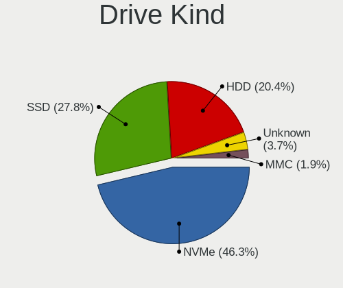
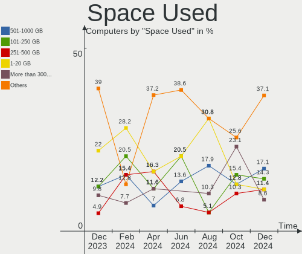
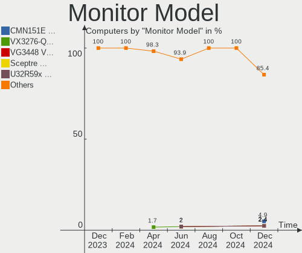
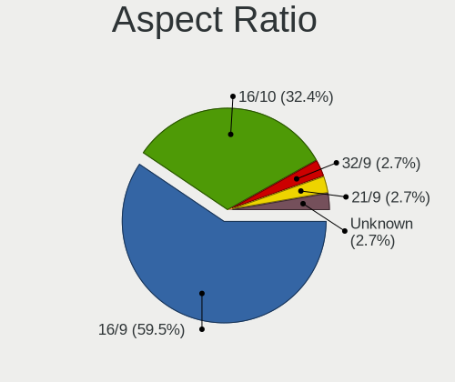
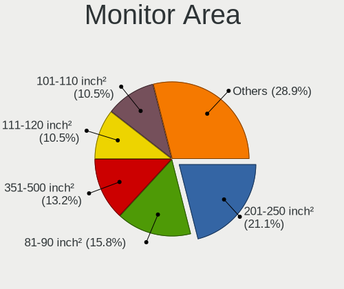

Gentoo Hardware Trends
----------------------

A project to identify most popular hardware characteristics and track their change
over time based on data collected by Gentoo users at https://Linux-Hardware.org.

Anyone can contribute to this report by the [hw-probe](https://github.com/linuxhw/hw-probe) tool:

    sudo -E hw-probe -all -upload

This is a report for all computer types. See also reports for [desktops](/Dist/Gentoo/Desktop/README.md) and [notebooks](/Dist/Gentoo/Notebook/README.md).

Full-feature report is available here: https://linux-hardware.org/?view=trends

Period: Feb, 2022.

Contents
--------

* [ System ](#system)
  - [ OS                       ](#os)
  - [ OS Family                ](#os-family)
  - [ Kernel                   ](#kernel)
  - [ Kernel Family            ](#kernel-family)
  - [ Kernel Major Ver.        ](#kernel-major-ver)
  - [ Arch                     ](#arch)
  - [ DE                       ](#de)
  - [ Display Server           ](#display-server)
  - [ Display Manager          ](#display-manager)
  - [ OS Lang                  ](#os-lang)
  - [ Boot Mode                ](#boot-mode)
  - [ Filesystem               ](#filesystem)
  - [ Part. scheme             ](#part-scheme)
  - [ Dual Boot with Linux/BSD ](#dual-boot-with-linuxbsd)
  - [ Dual Boot (Win)          ](#dual-boot-win)

* [ Board ](#board)
  - [ Vendor                   ](#vendor)
  - [ Model                    ](#model)
  - [ Model Family             ](#model-family)
  - [ MFG Year                 ](#mfg-year)
  - [ Form Factor              ](#form-factor)
  - [ Secure Boot              ](#secure-boot)
  - [ Coreboot                 ](#coreboot)
  - [ RAM Size                 ](#ram-size)
  - [ RAM Used                 ](#ram-used)
  - [ Total Drives             ](#total-drives)
  - [ Has CD-ROM               ](#has-cd-rom)
  - [ Has Ethernet             ](#has-ethernet)
  - [ Has WiFi                 ](#has-wifi)
  - [ Has Bluetooth            ](#has-bluetooth)

* [ Location ](#location)
  - [ Country                  ](#country)
  - [ City                     ](#city)

* [ Drives ](#drives)
  - [ Drive Vendor             ](#drive-vendor)
  - [ Drive Model              ](#drive-model)
  - [ HDD Vendor               ](#hdd-vendor)
  - [ SSD Vendor               ](#ssd-vendor)
  - [ Drive Kind               ](#drive-kind)
  - [ Drive Connector          ](#drive-connector)
  - [ Drive Size               ](#drive-size)
  - [ Space Total              ](#space-total)
  - [ Space Used               ](#space-used)
  - [ Malfunc. Drives          ](#malfunc-drives)
  - [ Malfunc. Drive Vendor    ](#malfunc-drive-vendor)
  - [ Malfunc. HDD Vendor      ](#malfunc-hdd-vendor)
  - [ Malfunc. Drive Kind      ](#malfunc-drive-kind)
  - [ Failed Drives            ](#failed-drives)
  - [ Failed Drive Vendor      ](#failed-drive-vendor)
  - [ Drive Status             ](#drive-status)

* [ Storage controller ](#storage-controller)
  - [ Storage Vendor           ](#storage-vendor)
  - [ Storage Model            ](#storage-model)
  - [ Storage Kind             ](#storage-kind)

* [ Processor ](#processor)
  - [ CPU Vendor               ](#cpu-vendor)
  - [ CPU Model                ](#cpu-model)
  - [ CPU Model Family         ](#cpu-model-family)
  - [ CPU Cores                ](#cpu-cores)
  - [ CPU Sockets              ](#cpu-sockets)
  - [ CPU Threads              ](#cpu-threads)
  - [ CPU Op-Modes             ](#cpu-op-modes)
  - [ CPU Microcode            ](#cpu-microcode)
  - [ CPU Microarch            ](#cpu-microarch)

* [ Graphics ](#graphics)
  - [ GPU Vendor               ](#gpu-vendor)
  - [ GPU Model                ](#gpu-model)
  - [ GPU Combo                ](#gpu-combo)
  - [ GPU Driver               ](#gpu-driver)
  - [ GPU Memory               ](#gpu-memory)

* [ Monitor ](#monitor)
  - [ Monitor Vendor           ](#monitor-vendor)
  - [ Monitor Model            ](#monitor-model)
  - [ Monitor Resolution       ](#monitor-resolution)
  - [ Monitor Diagonal         ](#monitor-diagonal)
  - [ Monitor Width            ](#monitor-width)
  - [ Aspect Ratio             ](#aspect-ratio)
  - [ Monitor Area             ](#monitor-area)
  - [ Pixel Density            ](#pixel-density)
  - [ Multiple Monitors        ](#multiple-monitors)

* [ Network ](#network)
  - [ Net Controller Vendor    ](#net-controller-vendor)
  - [ Net Controller Model     ](#net-controller-model)
  - [ Wireless Vendor          ](#wireless-vendor)
  - [ Wireless Model           ](#wireless-model)
  - [ Ethernet Vendor          ](#ethernet-vendor)
  - [ Ethernet Model           ](#ethernet-model)
  - [ Net Controller Kind      ](#net-controller-kind)
  - [ Used Controller          ](#used-controller)
  - [ NICs                     ](#nics)
  - [ IPv6                     ](#ipv6)

* [ Bluetooth ](#bluetooth)
  - [ Bluetooth Vendor         ](#bluetooth-vendor)
  - [ Bluetooth Model          ](#bluetooth-model)

* [ Sound ](#sound)
  - [ Sound Vendor             ](#sound-vendor)
  - [ Sound Model              ](#sound-model)

* [ Memory ](#memory)
  - [ Memory Vendor            ](#memory-vendor)
  - [ Memory Model             ](#memory-model)
  - [ Memory Kind              ](#memory-kind)
  - [ Memory Form Factor       ](#memory-form-factor)
  - [ Memory Size              ](#memory-size)
  - [ Memory Speed             ](#memory-speed)

* [ Printers & scanners ](#printers--scanners)
  - [ Printer Vendor           ](#printer-vendor)
  - [ Printer Model            ](#printer-model)
  - [ Scanner Vendor           ](#scanner-vendor)
  - [ Scanner Model            ](#scanner-model)

* [ Camera ](#camera)
  - [ Camera Vendor            ](#camera-vendor)
  - [ Camera Model             ](#camera-model)

* [ Security ](#security)
  - [ Fingerprint Vendor       ](#fingerprint-vendor)
  - [ Fingerprint Model        ](#fingerprint-model)
  - [ Chipcard Vendor          ](#chipcard-vendor)
  - [ Chipcard Model           ](#chipcard-model)

* [ Unsupported ](#unsupported)
  - [ Unsupported Devices      ](#unsupported-devices)
  - [ Unsupported Device Types ](#unsupported-device-types)

System
------

OS
--

Installed operating systems

| Name       | Computers | Percent |
|------------|-----------|---------|
| Gentoo 2.6 | 18        | 42.86%  |
| Gentoo 2.8 | 12        | 28.57%  |
| Gentoo 2.7 | 11        | 26.19%  |
| Gentoo 1   | 1         | 2.38%   |

OS Family
---------

OS without a version

| Name   | Computers | Percent |
|--------|-----------|---------|
| Gentoo | 42        | 100%    |

Kernel
------

Version of the Linux kernel

| Version                       | Computers | Percent |
|-------------------------------|-----------|---------|
| 5.15.23-gentoo                | 5         | 11.9%   |
| 5.15.23-gentoo-x86_64         | 3         | 7.14%   |
| 5.16.4-gentoo                 | 2         | 4.76%   |
| 5.16.10-gentoo-x86_64         | 2         | 4.76%   |
| 5.15.19-gentoo-112-overlayfs  | 2         | 4.76%   |
| 5.15.19-gentoo                | 2         | 4.76%   |
| 5.15.16-gentoo                | 2         | 4.76%   |
| 5.15.11-gentoo                | 2         | 4.76%   |
| 5.4.97-gentoo-x86_64          | 1         | 2.38%   |
| 5.16.9-gentoo-gentoo          | 1         | 2.38%   |
| 5.16.9-gentoo                 | 1         | 2.38%   |
| 5.16.9                        | 1         | 2.38%   |
| 5.16.8-gentoo-gentoo-dist     | 1         | 2.38%   |
| 5.16.7-tkg-cacule             | 1         | 2.38%   |
| 5.16.7-gentoo-x86_64          | 1         | 2.38%   |
| 5.16.5-gentoo-x86_64          | 1         | 2.38%   |
| 5.16.5-gentoo-limelight       | 1         | 2.38%   |
| 5.16.5-gentoo-dist            | 1         | 2.38%   |
| 5.16.5-gentoo                 | 1         | 2.38%   |
| 5.16.10-gentoo--20-feb-2022   | 1         | 2.38%   |
| 5.16.10-gentoo                | 1         | 2.38%   |
| 5.15.23-gentoo-dist           | 1         | 2.38%   |
| 5.15.23-gentoo+               | 1         | 2.38%   |
| 5.15.21-gentoo                | 1         | 2.38%   |
| 5.15.19-gentoo-x86_64         | 1         | 2.38%   |
| 5.15.13-gentoomultilib-nvidia | 1         | 2.38%   |
| 5.15.11-gentoo-rog            | 1         | 2.38%   |
| 5.10.63-v8                    | 1         | 2.38%   |
| 5.10.27-gentoo                | 1         | 2.38%   |
| 4.19.57-gentoo                | 1         | 2.38%   |

Kernel Family
-------------

Linux kernel without a distro release

| Version | Computers | Percent |
|---------|-----------|---------|
| 5.15.23 | 10        | 23.81%  |
| 5.15.19 | 5         | 11.9%   |
| 5.16.5  | 4         | 9.52%   |
| 5.16.10 | 4         | 9.52%   |
| 5.16.9  | 3         | 7.14%   |
| 5.15.11 | 3         | 7.14%   |
| 5.16.7  | 2         | 4.76%   |
| 5.16.4  | 2         | 4.76%   |
| 5.15.16 | 2         | 4.76%   |
| 5.4.97  | 1         | 2.38%   |
| 5.16.8  | 1         | 2.38%   |
| 5.15.21 | 1         | 2.38%   |
| 5.15.13 | 1         | 2.38%   |
| 5.10.63 | 1         | 2.38%   |
| 5.10.27 | 1         | 2.38%   |
| 4.19.57 | 1         | 2.38%   |

Kernel Major Ver.
-----------------

Linux kernel major version

| Version | Computers | Percent |
|---------|-----------|---------|
| 5.15    | 22        | 52.38%  |
| 5.16    | 16        | 38.1%   |
| 5.10    | 2         | 4.76%   |
| 5.4     | 1         | 2.38%   |
| 4.19    | 1         | 2.38%   |

Arch
----

OS architecture (x86_64, i586, etc.)

| Name    | Computers | Percent |
|---------|-----------|---------|
| x86_64  | 40        | 95.24%  |
| i686    | 1         | 2.38%   |
| aarch64 | 1         | 2.38%   |

DE
--

Desktop Environment

| Name    | Computers | Percent |
|---------|-----------|---------|
| Unknown | 19        | 45.24%  |
| KDE5    | 14        | 33.33%  |
| XFCE    | 3         | 7.14%   |
| MATE    | 2         | 4.76%   |
| GNOME   | 2         | 4.76%   |
| sway    | 1         | 2.38%   |
| LXQt    | 1         | 2.38%   |

Display Server
--------------

X11 or Wayland

| Name    | Computers | Percent |
|---------|-----------|---------|
| X11     | 24        | 57.14%  |
| Unknown | 8         | 19.05%  |
| Tty     | 6         | 14.29%  |
| Wayland | 4         | 9.52%   |

Display Manager
---------------

SDDM, LightDM, etc.

| Name    | Computers | Percent |
|---------|-----------|---------|
| SDDM    | 16        | 38.1%   |
| Unknown | 15        | 35.71%  |
| LightDM | 8         | 19.05%  |
| XDM     | 1         | 2.38%   |
| GREETD  | 1         | 2.38%   |
| GDM     | 1         | 2.38%   |

OS Lang
-------

Language

| Lang    | Computers | Percent |
|---------|-----------|---------|
| en_US   | 17        | 40.48%  |
| en_GB   | 7         | 16.67%  |
| C.UTF8  | 4         | 9.52%   |
| de_DE   | 3         | 7.14%   |
| ru_RU   | 2         | 4.76%   |
| fr_FR   | 2         | 4.76%   |
| zh_CN   | 1         | 2.38%   |
| pl_PL   | 1         | 2.38%   |
| es_ES   | 1         | 2.38%   |
| es_AR   | 1         | 2.38%   |
| en_AU   | 1         | 2.38%   |
| el_GR   | 1         | 2.38%   |
| Unknown | 1         | 2.38%   |

Boot Mode
---------

EFI or BIOS

| Mode | Computers | Percent |
|------|-----------|---------|
| EFI  | 38        | 90.48%  |
| BIOS | 4         | 9.52%   |

Filesystem
----------

Type of filesystem

| Type  | Computers | Percent |
|-------|-----------|---------|
| Ext4  | 27        | 64.29%  |
| Btrfs | 9         | 21.43%  |
| F2fs  | 3         | 7.14%   |
| Xfs   | 2         | 4.76%   |
| Zfs   | 1         | 2.38%   |

Part. scheme
------------

Scheme of partitioning

| Type | Computers | Percent |
|------|-----------|---------|
| GPT  | 42        | 100%    |

Dual Boot with Linux/BSD
------------------------

Hosting more than one Linux/BSD

| Dual boot | Computers | Percent |
|-----------|-----------|---------|
| No        | 28        | 66.67%  |
| Yes       | 14        | 33.33%  |

Dual Boot (Win)
---------------

Hosting Linux and Windows

| Dual boot | Computers | Percent |
|-----------|-----------|---------|
| No        | 29        | 69.05%  |
| Yes       | 13        | 30.95%  |

Board
-----

Vendor
------

Motherboard manufacturer

| Name                    | Computers | Percent |
|-------------------------|-----------|---------|
| ASUSTek Computer        | 10        | 23.81%  |
| Lenovo                  | 6         | 14.29%  |
| MSI                     | 4         | 9.52%   |
| Gigabyte Technology     | 4         | 9.52%   |
| Dell                    | 4         | 9.52%   |
| Hewlett-Packard         | 3         | 7.14%   |
| Supermicro              | 2         | 4.76%   |
| YANYU                   | 1         | 2.38%   |
| Timi                    | 1         | 2.38%   |
| Raspberry Pi Foundation | 1         | 2.38%   |
| Neousys Technology      | 1         | 2.38%   |
| Intel                   | 1         | 2.38%   |
| HUAWEI                  | 1         | 2.38%   |
| ASRock                  | 1         | 2.38%   |
| Alienware               | 1         | 2.38%   |
| Acer                    | 1         | 2.38%   |

Model
-----

Motherboard model

| Name                                      | Computers | Percent |
|-------------------------------------------|-----------|---------|
| YANYU H17SL                               | 1         | 2.38%   |
| Timi RedmiBook Pro 15S                    | 1         | 2.38%   |
| Supermicro Super Server                   | 1         | 2.38%   |
| Supermicro A1SRM-2758F                    | 1         | 2.38%   |
| RPi Raspberry Pi                          | 1         | 2.38%   |
| Neousys Nuvo-8208GC Series                | 1         | 2.38%   |
| MSI MS-7C56                               | 1         | 2.38%   |
| MSI MS-7B17                               | 1         | 2.38%   |
| MSI MS-7851                               | 1         | 2.38%   |
| MSI GS63VR 6RF                            | 1         | 2.38%   |
| Lenovo Yoga Slim 7 14IIL05 82A1           | 1         | 2.38%   |
| Lenovo ThinkPad X13 Yoga Gen 2 20W8002GCD | 1         | 2.38%   |
| Lenovo Legion Y7000 2019 PG0 81T0         | 1         | 2.38%   |
| Lenovo Legion Y530-15ICH-1060 81LB        | 1         | 2.38%   |
| Lenovo Legion R9000P2021H 82JQ            | 1         | 2.38%   |
| Lenovo IdeaPad 100-15IBD 80QQ             | 1         | 2.38%   |
| Intel NUC11PAHi7                          | 1         | 2.38%   |
| HUAWEI NBLK-WAX9X                         | 1         | 2.38%   |
| HP ProBook 450 G6                         | 1         | 2.38%   |
| HP Pavilion ZV6100 (EE984EA#ABZ)          | 1         | 2.38%   |
| HP Pavilion Notebook                      | 1         | 2.38%   |
| Gigabyte Z590 UD                          | 1         | 2.38%   |
| Gigabyte Z490 UD                          | 1         | 2.38%   |
| Gigabyte B460HD3                          | 1         | 2.38%   |
| Gigabyte AB350-Gaming                     | 1         | 2.38%   |
| Dell XPS 17 9710                          | 1         | 2.38%   |
| Dell XPS 13 9365                          | 1         | 2.38%   |
| Dell XPS 13 9310                          | 1         | 2.38%   |
| Dell Inspiron 5515                        | 1         | 2.38%   |
| ASUS ZenBook UX450FDX_UX480FD             | 1         | 2.38%   |
| ASUS UX430UAR                             | 1         | 2.38%   |
| ASUS ROG Zephyrus G14 GA401II_GA401II     | 1         | 2.38%   |
| ASUS ROG STRIX B450-F GAMING              | 1         | 2.38%   |
| ASUS ROG Maximus XIII APEX                | 1         | 2.38%   |
| ASUS ROG CROSSHAIR VIII DARK HERO         | 1         | 2.38%   |
| ASUS PRIME X570-PRO                       | 1         | 2.38%   |
| ASUS PRIME B450M-K                        | 1         | 2.38%   |
| ASUS M3A78-CM                             | 1         | 2.38%   |
| ASUS 900                                  | 1         | 2.38%   |
| ASRock B450 Pro4                          | 1         | 2.38%   |
| Alienware Aurora Ryzen Edition            | 1         | 2.38%   |
| Acer Aspire E5-571G                       | 1         | 2.38%   |

Model Family
------------

Motherboard model prefix

| Name                   | Computers | Percent |
|------------------------|-----------|---------|
| ASUS ROG               | 4         | 9.52%   |
| Lenovo Legion          | 3         | 7.14%   |
| Dell XPS               | 3         | 7.14%   |
| HP Pavilion            | 2         | 4.76%   |
| ASUS PRIME             | 2         | 4.76%   |
| YANYU H17SL            | 1         | 2.38%   |
| Timi RedmiBook         | 1         | 2.38%   |
| Supermicro Super       | 1         | 2.38%   |
| Supermicro A1SRM-2758F | 1         | 2.38%   |
| RPi Raspberry          | 1         | 2.38%   |
| Neousys Nuvo-8208GC    | 1         | 2.38%   |
| MSI MS-7C56            | 1         | 2.38%   |
| MSI MS-7B17            | 1         | 2.38%   |
| MSI MS-7851            | 1         | 2.38%   |
| MSI GS63VR             | 1         | 2.38%   |
| Lenovo Yoga            | 1         | 2.38%   |
| Lenovo ThinkPad        | 1         | 2.38%   |
| Lenovo IdeaPad         | 1         | 2.38%   |
| Intel NUC11PAHi7       | 1         | 2.38%   |
| HUAWEI NBLK-WAX9X      | 1         | 2.38%   |
| HP ProBook             | 1         | 2.38%   |
| Gigabyte Z590          | 1         | 2.38%   |
| Gigabyte Z490          | 1         | 2.38%   |
| Gigabyte B460HD3       | 1         | 2.38%   |
| Gigabyte AB350-Gaming  | 1         | 2.38%   |
| Dell Inspiron          | 1         | 2.38%   |
| ASUS ZenBook           | 1         | 2.38%   |
| ASUS UX430UAR          | 1         | 2.38%   |
| ASUS M3A78-CM          | 1         | 2.38%   |
| ASUS 900               | 1         | 2.38%   |
| ASRock B450            | 1         | 2.38%   |
| Alienware Aurora       | 1         | 2.38%   |
| Acer Aspire            | 1         | 2.38%   |

MFG Year
--------

Motherboard manufacture year

| Year    | Computers | Percent |
|---------|-----------|---------|
| 2021    | 9         | 21.43%  |
| 2020    | 7         | 16.67%  |
| 2019    | 7         | 16.67%  |
| 2018    | 7         | 16.67%  |
| 2017    | 2         | 4.76%   |
| 2016    | 2         | 4.76%   |
| 2008    | 2         | 4.76%   |
| 2022    | 1         | 2.38%   |
| 2015    | 1         | 2.38%   |
| 2014    | 1         | 2.38%   |
| 2013    | 1         | 2.38%   |
| 2006    | 1         | 2.38%   |
| Unknown | 1         | 2.38%   |

Form Factor
-----------

Physical design of the computer

| Name           | Computers | Percent |
|----------------|-----------|---------|
| Notebook       | 19        | 45.24%  |
| Desktop        | 17        | 40.48%  |
| Convertible    | 2         | 4.76%   |
| Server         | 2         | 4.76%   |
| System on chip | 1         | 2.38%   |
| Mini pc        | 1         | 2.38%   |

Secure Boot
-----------

Enabled or disabled

| State    | Computers | Percent |
|----------|-----------|---------|
| Disabled | 40        | 95.24%  |
| Enabled  | 2         | 4.76%   |

Coreboot
--------

Have coreboot on board

| Used | Computers | Percent |
|------|-----------|---------|
| No   | 42        | 100%    |

RAM Size
--------

Total RAM memory

| Size in GB  | Computers | Percent |
|-------------|-----------|---------|
| 32.01-64.0  | 11        | 26.19%  |
| 16.01-24.0  | 11        | 26.19%  |
| 4.01-8.0    | 6         | 14.29%  |
| 64.01-256.0 | 5         | 11.9%   |
| 8.01-16.0   | 5         | 11.9%   |
| 3.01-4.0    | 2         | 4.76%   |
| 2.01-3.0    | 1         | 2.38%   |
| 1.01-2.0    | 1         | 2.38%   |

RAM Used
--------

Used RAM memory

| Used GB     | Computers | Percent |
|-------------|-----------|---------|
| 1.01-2.0    | 11        | 26.19%  |
| 4.01-8.0    | 10        | 23.81%  |
| 3.01-4.0    | 7         | 16.67%  |
| 2.01-3.0    | 4         | 9.52%   |
| 8.01-16.0   | 3         | 7.14%   |
| 0.51-1.0    | 3         | 7.14%   |
| 0.01-0.5    | 3         | 7.14%   |
| 64.01-256.0 | 1         | 2.38%   |

Total Drives
------------

Number of drives on board

| Drives | Computers | Percent |
|--------|-----------|---------|
| 1      | 18        | 42.86%  |
| 2      | 15        | 35.71%  |
| 3      | 3         | 7.14%   |
| 6      | 2         | 4.76%   |
| 5      | 2         | 4.76%   |
| 10     | 1         | 2.38%   |
| 4      | 1         | 2.38%   |

Has CD-ROM
----------

Has CD-ROM on board

| Presented | Computers | Percent |
|-----------|-----------|---------|
| No        | 36        | 85.71%  |
| Yes       | 6         | 14.29%  |

Has Ethernet
------------

Has Ethernet on board

| Presented | Computers | Percent |
|-----------|-----------|---------|
| Yes       | 31        | 73.81%  |
| No        | 11        | 26.19%  |

Has WiFi
--------

Has WiFi module

| Presented | Computers | Percent |
|-----------|-----------|---------|
| Yes       | 28        | 66.67%  |
| No        | 14        | 33.33%  |

Has Bluetooth
-------------

Has Bluetooth module

| Presented | Computers | Percent |
|-----------|-----------|---------|
| Yes       | 23        | 54.76%  |
| No        | 19        | 45.24%  |

Location
--------

Country
-------

Geographic location (country)

| Country   | Computers | Percent |
|-----------|-----------|---------|
| Russia    | 6         | 14.29%  |
| Poland    | 6         | 14.29%  |
| USA       | 4         | 9.52%   |
| UK        | 4         | 9.52%   |
| Germany   | 4         | 9.52%   |
| Tunisia   | 2         | 4.76%   |
| Spain     | 2         | 4.76%   |
| Norway    | 2         | 4.76%   |
| Greece    | 2         | 4.76%   |
| France    | 2         | 4.76%   |
| China     | 2         | 4.76%   |
| Ukraine   | 1         | 2.38%   |
| Slovakia  | 1         | 2.38%   |
| Italy     | 1         | 2.38%   |
| India     | 1         | 2.38%   |
| Australia | 1         | 2.38%   |
| Argentina | 1         | 2.38%   |

City
----

Geographic location (city)

| City                          | Computers | Percent |
|-------------------------------|-----------|---------|
| St Petersburg                 | 4         | 9.52%   |
| Warsaw                        | 3         | 7.14%   |
| Athens                        | 2         | 4.76%   |
| Sydney                        | 1         | 2.38%   |
| Svobodnyy                     | 1         | 2.38%   |
| Storsteinnes                  | 1         | 2.38%   |
| Siedlce                       | 1         | 2.38%   |
| Sant Boi de Llobregat         | 1         | 2.38%   |
| Paris                         | 1         | 2.38%   |
| Orange                        | 1         | 2.38%   |
| Ocala                         | 1         | 2.38%   |
| Munich                        | 1         | 2.38%   |
| Moscow                        | 1         | 2.38%   |
| Morcenx                       | 1         | 2.38%   |
| Monastir                      | 1         | 2.38%   |
| Milan                         | 1         | 2.38%   |
| London                        | 1         | 2.38%   |
| Kyiv                          | 1         | 2.38%   |
| Houston                       | 1         | 2.38%   |
| Hoboken                       | 1         | 2.38%   |
| Hanover                       | 1         | 2.38%   |
| Guangzhou                     | 1         | 2.38%   |
| Gmina Lwówek Śląski | 1         | 2.38%   |
| Girona                        | 1         | 2.38%   |
| Gillingham                    | 1         | 2.38%   |
| Fuzhou                        | 1         | 2.38%   |
| Frankfurt                     | 1         | 2.38%   |
| Essen                         | 1         | 2.38%   |
| Cieszyn                       | 1         | 2.38%   |
| Chesham                       | 1         | 2.38%   |
| Córdoba                    | 1         | 2.38%   |
| Bratislava                    | 1         | 2.38%   |
| Bhavnagar                     | 1         | 2.38%   |
| Beja                          | 1         | 2.38%   |
| Bardu                         | 1         | 2.38%   |
| Abingdon                      | 1         | 2.38%   |

Drives
------

Drive Vendor
------------

Hard drive vendors

| Vendor              | Computers | Drives | Percent |
|---------------------|-----------|--------|---------|
| Samsung Electronics | 13        | 18     | 18.57%  |
| WDC                 | 9         | 19     | 12.86%  |
| Seagate             | 9         | 9      | 12.86%  |
| Toshiba             | 5         | 5      | 7.14%   |
| SanDisk             | 4         | 5      | 5.71%   |
| Kingston            | 3         | 3      | 4.29%   |
| Crucial             | 3         | 6      | 4.29%   |
| SK Hynix            | 2         | 2      | 2.86%   |
| Phison              | 2         | 2      | 2.86%   |
| Micron Technology   | 2         | 2      | 2.86%   |
| KIOXIA              | 2         | 2      | 2.86%   |
| Intel               | 2         | 2      | 2.86%   |
| GOODRAM             | 2         | 2      | 2.86%   |
| Corsair             | 2         | 3      | 2.86%   |
| Unknown             | 1         | 1      | 1.43%   |
| Silicon Motion      | 1         | 1      | 1.43%   |
| PLEXTOR             | 1         | 1      | 1.43%   |
| LaCie               | 1         | 1      | 1.43%   |
| Hitachi             | 1         | 3      | 1.43%   |
| HGST                | 1         | 1      | 1.43%   |
| EMTEC               | 1         | 1      | 1.43%   |
| China               | 1         | 2      | 1.43%   |
| ASUS-PHISON         | 1         | 1      | 1.43%   |
| 2.5"                | 1         | 1      | 1.43%   |

Drive Model
-----------

Hard drive models

| Model                                  | Computers | Percent |
|----------------------------------------|-----------|---------|
| GOODRAM SSDPR-CL100-480-G2 480GB       | 2         | 2.56%   |
| Crucial CT2000MX500SSD1 2TB            | 2         | 2.56%   |
| Crucial CT1000MX500SSD1 1TB            | 2         | 2.56%   |
| WDC WDS250G2X0C-00L350 250GB           | 1         | 1.28%   |
| WDC WDS240G2G0A-00JH30 240GB SSD       | 1         | 1.28%   |
| WDC WDS100T2B0C 1TB                    | 1         | 1.28%   |
| WDC WD8003FFBX-68B9AN0 8TB             | 1         | 1.28%   |
| WDC WD6400AAKS-75A7B2 640GB            | 1         | 1.28%   |
| WDC WD60EZRX-00MVLB1 6TB               | 1         | 1.28%   |
| WDC WD30EFRX-68EUZN0 3TB               | 1         | 1.28%   |
| WDC WD10SPSX-08A6W 1TB                 | 1         | 1.28%   |
| WDC WD10JFCX-68N6GN0 1TB               | 1         | 1.28%   |
| WDC PC SN530 NVMe 512GB                | 1         | 1.28%   |
| Unknown MMC Card  32GB                 | 1         | 1.28%   |
| Toshiba TR200 480GB SSD                | 1         | 1.28%   |
| Toshiba KXG6AZNV512G 512GB             | 1         | 1.28%   |
| Toshiba HDWL120 2TB                    | 1         | 1.28%   |
| Toshiba HDWE150 5TB                    | 1         | 1.28%   |
| Toshiba HDWD120 2TB                    | 1         | 1.28%   |
| SK Hynix SKHynix_HFS512GDE9X084N 512GB | 1         | 1.28%   |
| SK Hynix PC711 NVMe 512GB              | 1         | 1.28%   |
| Silicon Motion M.2 (P80) 3TG3-P 1TB    | 1         | 1.28%   |
| Seagate ST8000DM004-2CX188 8TB         | 1         | 1.28%   |
| Seagate ST4000DM004-2CV104 4TB         | 1         | 1.28%   |
| Seagate ST2000LM007-1R8174 2TB         | 1         | 1.28%   |
| Seagate ST2000DM006-2DM164 2TB         | 1         | 1.28%   |
| Seagate ST12000NM0008-2H3101 12TB      | 1         | 1.28%   |
| Seagate ST1000LM035-1RK172 1TB         | 1         | 1.28%   |
| Seagate ST1000LM024 HN-M101MBB 1TB     | 1         | 1.28%   |
| Seagate ST1000DM010-2EP102 1TB         | 1         | 1.28%   |
| Seagate ST1000DM003-1CH162 1TB         | 1         | 1.28%   |
| SanDisk SSD PLUS 240GB                 | 1         | 1.28%   |
| SanDisk SSD PLUS 1000GB                | 1         | 1.28%   |
| SanDisk SD9SN8W256G1002 256GB SSD      | 1         | 1.28%   |
| SanDisk SD9SN8W-128G-1006 128GB SSD    | 1         | 1.28%   |
| Samsung SSD 980 PRO 2TB                | 1         | 1.28%   |
| Samsung SSD 980 PRO 1TB                | 1         | 1.28%   |
| Samsung SSD 970 EVO Plus 500GB         | 1         | 1.28%   |
| Samsung SSD 970 EVO Plus 250GB         | 1         | 1.28%   |
| Samsung SSD 970 EVO Plus 1TB           | 1         | 1.28%   |
| Samsung SSD 970 EVO 250GB              | 1         | 1.28%   |
| Samsung SSD 870 QVO 2TB                | 1         | 1.28%   |
| Samsung SSD 860 EVO 500GB              | 1         | 1.28%   |
| Samsung SSD 860 EVO 250GB              | 1         | 1.28%   |
| Samsung SSD 860 EVO 1TB                | 1         | 1.28%   |
| Samsung SSD 850 PRO 256GB              | 1         | 1.28%   |
| Samsung SSD 850 EVO 500GB              | 1         | 1.28%   |
| Samsung PM951 NVMe 256GB               | 1         | 1.28%   |
| Samsung MZVLB512HAJQ-00000 512GB       | 1         | 1.28%   |
| Samsung MZVLB256HAHQ-000L2 256GB       | 1         | 1.28%   |
| Samsung MZVLB1T0HBLR-000L2 1TB         | 1         | 1.28%   |
| Samsung MZVL22T0HBLB-00B00 2TB         | 1         | 1.28%   |
| PLEXTOR PX-1TM9PG + 1TB                | 1         | 1.28%   |
| Phison Sabrent 1TB                     | 1         | 1.28%   |
| Phison Neutron NX500 800GB             | 1         | 1.28%   |
| Micron MTFDHBA256TCK 256GB             | 1         | 1.28%   |
| Micron 2300 NVMe 1024GB                | 1         | 1.28%   |
| LaCie Rugged THB USB3 2TB              | 1         | 1.28%   |
| KIOXIA KXG60PNV2T04 NVMe 2048GB        | 1         | 1.28%   |
| KIOXIA KBG40ZNV512G 512GB              | 1         | 1.28%   |

HDD Vendor
----------

Hard disk drive vendors

| Vendor  | Computers | Drives | Percent |
|---------|-----------|--------|---------|
| Seagate | 9         | 9      | 45%     |
| WDC     | 5         | 15     | 25%     |
| Toshiba | 3         | 3      | 15%     |
| LaCie   | 1         | 1      | 5%      |
| Hitachi | 1         | 3      | 5%      |
| HGST    | 1         | 1      | 5%      |

SSD Vendor
----------

Solid state drive vendors

| Vendor              | Computers | Drives | Percent |
|---------------------|-----------|--------|---------|
| Samsung Electronics | 6         | 6      | 27.27%  |
| SanDisk             | 4         | 5      | 18.18%  |
| Crucial             | 3         | 6      | 13.64%  |
| GOODRAM             | 2         | 2      | 9.09%   |
| WDC                 | 1         | 1      | 4.55%   |
| Toshiba             | 1         | 1      | 4.55%   |
| EMTEC               | 1         | 1      | 4.55%   |
| Corsair             | 1         | 1      | 4.55%   |
| China               | 1         | 2      | 4.55%   |
| ASUS-PHISON         | 1         | 1      | 4.55%   |
| 2.5"                | 1         | 1      | 4.55%   |

Drive Kind
----------

HDD or SSD

| Kind | Computers | Drives | Percent |
|------|-----------|--------|---------|
| NVMe | 27        | 33     | 42.86%  |
| SSD  | 20        | 27     | 31.75%  |
| HDD  | 15        | 32     | 23.81%  |
| MMC  | 1         | 1      | 1.59%   |

Drive Connector
---------------

SATA, SAS, NVMe, etc.

| Type | Computers | Drives | Percent |
|------|-----------|--------|---------|
| SATA | 28        | 58     | 49.12%  |
| NVMe | 27        | 33     | 47.37%  |
| SAS  | 1         | 1      | 1.75%   |
| MMC  | 1         | 1      | 1.75%   |

Drive Size
----------

Size of hard drive

| Size in TB | Computers | Drives | Percent |
|------------|-----------|--------|---------|
| 0.01-0.5   | 14        | 15     | 36.84%  |
| 0.51-1.0   | 12        | 26     | 31.58%  |
| 1.01-2.0   | 6         | 8      | 15.79%  |
| 2.01-3.0   | 2         | 4      | 5.26%   |
| 4.01-10.0  | 2         | 4      | 5.26%   |
| 3.01-4.0   | 1         | 1      | 2.63%   |
| 10.01-20.0 | 1         | 1      | 2.63%   |

Space Total
-----------

Amount of disk space available on the file system

| Size in GB     | Computers | Percent |
|----------------|-----------|---------|
| 251-500        | 9         | 21.43%  |
| 501-1000       | 9         | 21.43%  |
| 101-250        | 7         | 16.67%  |
| More than 3000 | 6         | 14.29%  |
| Unknown        | 4         | 9.52%   |
| 2001-3000      | 3         | 7.14%   |
| 1001-2000      | 3         | 7.14%   |
| 51-100         | 1         | 2.38%   |

Space Used
----------

Amount of used disk space

| Used GB        | Computers | Percent |
|----------------|-----------|---------|
| 251-500        | 7         | 16.67%  |
| 51-100         | 6         | 14.29%  |
| More than 3000 | 5         | 11.9%   |
| 21-50          | 5         | 11.9%   |
| 101-250        | 5         | 11.9%   |
| 501-1000       | 5         | 11.9%   |
| 1-20           | 4         | 9.52%   |
| Unknown        | 4         | 9.52%   |
| 2001-3000      | 1         | 2.38%   |

Malfunc. Drives
---------------

Drive models with a malfunction

| Model                               | Computers | Drives | Percent |
|-------------------------------------|-----------|--------|---------|
| Seagate ST1000LM035-1RK172 1TB      | 1         | 1      | 20%     |
| SanDisk SD9SN8W-128G-1006 128GB SSD | 1         | 1      | 20%     |
| EMTEC X250 512GB SSD                | 1         | 1      | 20%     |
| Crucial CT525MX300SSD1 528GB        | 1         | 1      | 20%     |
| 2.5" SATA SSD 3TG6-P 480GB          | 1         | 1      | 20%     |

Malfunc. Drive Vendor
---------------------

Vendors of faulty drives

| Vendor  | Computers | Drives | Percent |
|---------|-----------|--------|---------|
| Seagate | 1         | 1      | 20%     |
| SanDisk | 1         | 1      | 20%     |
| EMTEC   | 1         | 1      | 20%     |
| Crucial | 1         | 1      | 20%     |
| 2.5"    | 1         | 1      | 20%     |

Malfunc. HDD Vendor
-------------------

Vendors of faulty HDD drives

| Vendor  | Computers | Drives | Percent |
|---------|-----------|--------|---------|
| Seagate | 1         | 1      | 100%    |

Malfunc. Drive Kind
-------------------

Kinds of faulty drives

| Kind | Computers | Drives | Percent |
|------|-----------|--------|---------|
| SSD  | 4         | 4      | 80%     |
| HDD  | 1         | 1      | 20%     |

Failed Drives
-------------

Failed drive models

Zero info for selected period =(

Failed Drive Vendor
-------------------

Failed drive vendors

Zero info for selected period =(

Drive Status
------------

Number of failed and malfunc. drives

| Status   | Computers | Drives | Percent |
|----------|-----------|--------|---------|
| Works    | 39        | 86     | 84.78%  |
| Malfunc  | 5         | 5      | 10.87%  |
| Detected | 2         | 2      | 4.35%   |

Storage controller
------------------

Storage Vendor
--------------

Storage controller vendors

| Vendor                         | Computers | Percent |
|--------------------------------|-----------|---------|
| Intel                          | 24        | 34.29%  |
| AMD                            | 14        | 20%     |
| Samsung Electronics            | 10        | 14.29%  |
| Sandisk                        | 3         | 4.29%   |
| Phison Electronics             | 3         | 4.29%   |
| Kingston Technology Company    | 3         | 4.29%   |
| Toshiba America Info Systems   | 2         | 2.86%   |
| SK Hynix                       | 2         | 2.86%   |
| Micron Technology              | 2         | 2.86%   |
| ASMedia Technology             | 2         | 2.86%   |
| Solid State Storage Technology | 1         | 1.43%   |
| Silicon Motion                 | 1         | 1.43%   |
| Marvell Technology Group       | 1         | 1.43%   |
| KIOXIA                         | 1         | 1.43%   |
| Broadcom / LSI                 | 1         | 1.43%   |

Storage Model
-------------

Storage controller models

| Model                                                                          | Computers | Percent |
|--------------------------------------------------------------------------------|-----------|---------|
| AMD FCH SATA Controller [AHCI mode]                                            | 9         | 11.54%  |
| Samsung NVMe SSD Controller SM981/PM981/PM983                                  | 7         | 8.97%   |
| Samsung NVMe SSD Controller PM9A1/PM9A3/980PRO                                 | 3         | 3.85%   |
| AMD 400 Series Chipset SATA Controller                                         | 3         | 3.85%   |
| Toshiba America Info Systems XG6 NVMe SSD Controller                           | 2         | 2.56%   |
| SK Hynix Gold P31 SSD                                                          | 2         | 2.56%   |
| Phison E12 NVMe Controller                                                     | 2         | 2.56%   |
| Micron Non-Volatile memory controller                                          | 2         | 2.56%   |
| Intel Wildcat Point-LP SATA Controller [AHCI Mode]                             | 2         | 2.56%   |
| Intel Volume Management Device NVMe RAID Controller                            | 2         | 2.56%   |
| Intel Cannon Point-LP SATA Controller [AHCI Mode]                              | 2         | 2.56%   |
| Intel Cannon Lake PCH SATA AHCI Controller                                     | 2         | 2.56%   |
| Intel Cannon Lake Mobile PCH SATA AHCI Controller                              | 2         | 2.56%   |
| Intel 8 Series/C220 Series Chipset Family 6-port SATA Controller 1 [AHCI mode] | 2         | 2.56%   |
| Intel 500 Series Chipset Family SATA AHCI Controller                           | 2         | 2.56%   |
| ASMedia ASM1062 Serial ATA Controller                                          | 2         | 2.56%   |
| Solid State Storage Non-Volatile memory controller                             | 1         | 1.28%   |
| Silicon Motion SM2262/SM2262EN SSD Controller                                  | 1         | 1.28%   |
| Sandisk WD Blue SN550 NVMe SSD                                                 | 1         | 1.28%   |
| Sandisk WD Black 2018/SN750 / PC SN720 NVMe SSD                                | 1         | 1.28%   |
| Sandisk Non-Volatile memory controller                                         | 1         | 1.28%   |
| Samsung NVMe SSD Controller SM951/PM951                                        | 1         | 1.28%   |
| Phison NVMe Storage Controller                                                 | 1         | 1.28%   |
| Phison E7 NVMe Controller                                                      | 1         | 1.28%   |
| Marvell Group 88SE9235 PCIe 2.0 x2 4-port SATA 6 Gb/s Controller               | 1         | 1.28%   |
| KIOXIA Non-Volatile memory controller                                          | 1         | 1.28%   |
| Kingston Company U-SNS8154P3 NVMe SSD                                          | 1         | 1.28%   |
| Kingston Company Company Non-Volatile memory controller                        | 1         | 1.28%   |
| Kingston Company KC2000 NVMe SSD                                               | 1         | 1.28%   |
| Intel Tiger Lake-LP SATA Controller [AHCI mode]                                | 1         | 1.28%   |
| Intel Sunrise Point-LP SATA Controller [AHCI mode]                             | 1         | 1.28%   |
| Intel SSD Pro 7600p/760p/E 6100p Series                                        | 1         | 1.28%   |
| Intel SSD 660P Series                                                          | 1         | 1.28%   |
| Intel Q170/Q150/B150/H170/H110/Z170/CM236 Chipset SATA Controller [AHCI Mode]  | 1         | 1.28%   |
| Intel HM170/QM170 Chipset SATA Controller [AHCI Mode]                          | 1         | 1.28%   |
| Intel Comet Lake SATA AHCI Controller                                          | 1         | 1.28%   |
| Intel Atom processor C2000 AHCI SATA3 Controller                               | 1         | 1.28%   |
| Intel Atom processor C2000 AHCI SATA2 Controller                               | 1         | 1.28%   |
| Intel 82801FBM (ICH6M) SATA Controller                                         | 1         | 1.28%   |
| Intel 8 Series SATA Controller 1 [AHCI mode]                                   | 1         | 1.28%   |
| Intel 400 Series Chipset Family SATA AHCI Controller                           | 1         | 1.28%   |
| Broadcom / LSI SAS3224 PCI-Express Fusion-MPT SAS-3                            | 1         | 1.28%   |
| AMD Starship/Matisse Chipset SATA Controller [AHCI mode]                       | 1         | 1.28%   |
| AMD SB7x0/SB8x0/SB9x0 SATA Controller [IDE mode]                               | 1         | 1.28%   |
| AMD SB7x0/SB8x0/SB9x0 IDE Controller                                           | 1         | 1.28%   |
| AMD IXP SB4x0 IDE Controller                                                   | 1         | 1.28%   |
| AMD FCH RAID Controller                                                        | 1         | 1.28%   |
| AMD 300 Series Chipset SATA Controller                                         | 1         | 1.28%   |

Storage Kind
------------

Kind of storage controller (IDE, SATA, NVMe, SAS, ...)

| Kind | Computers | Percent |
|------|-----------|---------|
| SATA | 32        | 48.48%  |
| NVMe | 27        | 40.91%  |
| RAID | 3         | 4.55%   |
| IDE  | 3         | 4.55%   |
| SAS  | 1         | 1.52%   |

Processor
---------

CPU Vendor
----------

Processor vendors

| Vendor | Computers | Percent |
|--------|-----------|---------|
| Intel  | 26        | 61.9%   |
| AMD    | 15        | 35.71%  |
| ARM    | 1         | 2.38%   |

CPU Model
---------

Processor models

| Model                                         | Computers | Percent |
|-----------------------------------------------|-----------|---------|
| Intel Core i7-8565U CPU @ 1.80GHz             | 2         | 4.76%   |
| Intel 11th Gen Core i7-1165G7 @ 2.80GHz       | 2         | 4.76%   |
| AMD Ryzen 7 5800H with Radeon Graphics        | 2         | 4.76%   |
| AMD Ryzen 5 3600XT 6-Core Processor           | 2         | 4.76%   |
| Intel Pentium CPU G3220 @ 3.00GHz             | 1         | 2.38%   |
| Intel Pentium CPU D1508 @ 2.20GHz             | 1         | 2.38%   |
| Intel Core i7-9700 CPU @ 3.00GHz              | 1         | 2.38%   |
| Intel Core i7-8750H CPU @ 2.20GHz             | 1         | 2.38%   |
| Intel Core i7-8700T CPU @ 2.40GHz             | 1         | 2.38%   |
| Intel Core i7-6700HQ CPU @ 2.60GHz            | 1         | 2.38%   |
| Intel Core i7-10700K CPU @ 3.80GHz            | 1         | 2.38%   |
| Intel Core i7-10700F CPU @ 2.90GHz            | 1         | 2.38%   |
| Intel Core i7-1065G7 CPU @ 1.30GHz            | 1         | 2.38%   |
| Intel Core i5-9600K CPU @ 3.70GHz             | 1         | 2.38%   |
| Intel Core i5-9300H CPU @ 2.40GHz             | 1         | 2.38%   |
| Intel Core i5-8250U CPU @ 1.60GHz             | 1         | 2.38%   |
| Intel Core i5-8200Y CPU @ 1.30GHz             | 1         | 2.38%   |
| Intel Core i5-5200U CPU @ 2.20GHz             | 1         | 2.38%   |
| Intel Core i5-4210U CPU @ 1.70GHz             | 1         | 2.38%   |
| Intel Core i3-5005U CPU @ 2.00GHz             | 1         | 2.38%   |
| Intel Celeron M processor 900MHz              | 1         | 2.38%   |
| Intel Atom CPU C2758 @ 2.40GHz                | 1         | 2.38%   |
| Intel 11th Gen Core i9-11900K @ 3.50GHz       | 1         | 2.38%   |
| Intel 11th Gen Core i7-1185G7 @ 3.00GHz       | 1         | 2.38%   |
| Intel 11th Gen Core i7-11800H @ 2.30GHz       | 1         | 2.38%   |
| Intel 11th Gen Core i7-11700K @ 3.60GHz       | 1         | 2.38%   |
| ARM Processor                                 | 1         | 2.38%   |
| AMD Ryzen 9 5950X 16-Core Processor           | 1         | 2.38%   |
| AMD Ryzen 9 5900X 12-Core Processor           | 1         | 2.38%   |
| AMD Ryzen 7 5700U with Radeon Graphics        | 1         | 2.38%   |
| AMD Ryzen 7 4800HS with Radeon Graphics       | 1         | 2.38%   |
| AMD Ryzen 7 3700X 8-Core Processor            | 1         | 2.38%   |
| AMD Ryzen 5 5600X 6-Core Processor            | 1         | 2.38%   |
| AMD Ryzen 5 3600 6-Core Processor             | 1         | 2.38%   |
| AMD Ryzen 5 3500U with Radeon Vega Mobile Gfx | 1         | 2.38%   |
| AMD Ryzen 5 2600 Six-Core Processor           | 1         | 2.38%   |
| AMD Phenom II X4 955 Processor                | 1         | 2.38%   |
| AMD Athlon 64 Processor 3200+                 | 1         | 2.38%   |

CPU Model Family
----------------

Processor model prefix

| Model            | Computers | Percent |
|------------------|-----------|---------|
| Intel Core i7    | 9         | 21.43%  |
| Other            | 7         | 16.67%  |
| Intel Core i5    | 6         | 14.29%  |
| AMD Ryzen 5      | 6         | 14.29%  |
| AMD Ryzen 7      | 5         | 11.9%   |
| Intel Pentium    | 2         | 4.76%   |
| AMD Ryzen 9      | 2         | 4.76%   |
| Intel Core i3    | 1         | 2.38%   |
| Intel Celeron M  | 1         | 2.38%   |
| Intel Atom       | 1         | 2.38%   |
| AMD Phenom II X4 | 1         | 2.38%   |
| AMD Athlon 64    | 1         | 2.38%   |

CPU Cores
---------

Number of processor cores

| Number  | Computers | Percent |
|---------|-----------|---------|
| 8       | 12        | 28.57%  |
| 4       | 11        | 26.19%  |
| 6       | 8         | 19.05%  |
| 2       | 6         | 14.29%  |
| 1       | 2         | 4.76%   |
| 16      | 1         | 2.38%   |
| 12      | 1         | 2.38%   |
| Unknown | 1         | 2.38%   |

CPU Sockets
-----------

Number of sockets

| Number  | Computers | Percent |
|---------|-----------|---------|
| 1       | 41        | 97.62%  |
| Unknown | 1         | 2.38%   |

CPU Threads
-----------

Threads per core (Hyper-Threading)

| Number  | Computers | Percent |
|---------|-----------|---------|
| 2       | 34        | 80.95%  |
| 1       | 7         | 16.67%  |
| Unknown | 1         | 2.38%   |

CPU Op-Modes
------------

CPU Operation Modes (32-bit, 64-bit)

| Op mode        | Computers | Percent |
|----------------|-----------|---------|
| 32-bit, 64-bit | 41        | 97.62%  |
| 32-bit         | 1         | 2.38%   |

CPU Microcode
-------------

Microcode number

| Number     | Computers | Percent |
|------------|-----------|---------|
| Unknown    | 6         | 14.29%  |
| 0x906ea    | 3         | 7.14%   |
| 0x806c1    | 3         | 7.14%   |
| 0x0a201016 | 3         | 7.14%   |
| 0x08701021 | 3         | 7.14%   |
| 0xa0671    | 2         | 4.76%   |
| 0xa0655    | 2         | 4.76%   |
| 0x0a50000c | 2         | 4.76%   |
| 0x906ed    | 1         | 2.38%   |
| 0x906ec    | 1         | 2.38%   |
| 0x806eb    | 1         | 2.38%   |
| 0x806ea    | 1         | 2.38%   |
| 0x806e9    | 1         | 2.38%   |
| 0x806d1    | 1         | 2.38%   |
| 0x506e3    | 1         | 2.38%   |
| 0x50663    | 1         | 2.38%   |
| 0x406d8    | 1         | 2.38%   |
| 0x40651    | 1         | 2.38%   |
| 0x306d4    | 1         | 2.38%   |
| 0x306c3    | 1         | 2.38%   |
| 0x08701013 | 1         | 2.38%   |
| 0x08608103 | 1         | 2.38%   |
| 0x08600104 | 1         | 2.38%   |
| 0x08108109 | 1         | 2.38%   |
| 0x0800820d | 1         | 2.38%   |
| 0x010000db | 1         | 2.38%   |

CPU Microarch
-------------

Microarchitecture

| Name       | Computers | Percent |
|------------|-----------|---------|
| KabyLake   | 9         | 21.43%  |
| Zen 3      | 5         | 11.9%   |
| Zen 2      | 5         | 11.9%   |
| TigerLake  | 3         | 7.14%   |
| Icelake    | 3         | 7.14%   |
| Broadwell  | 3         | 7.14%   |
| Unknown    | 3         | 7.14%   |
| Zen+       | 2         | 4.76%   |
| Haswell    | 2         | 4.76%   |
| CometLake  | 2         | 4.76%   |
| Skylake    | 1         | 2.38%   |
| Silvermont | 1         | 2.38%   |
| P6         | 1         | 2.38%   |
| K8 Hammer  | 1         | 2.38%   |
| K10        | 1         | 2.38%   |

Graphics
--------

GPU Vendor
----------

Vendors of graphics cards

| Vendor            | Computers | Percent |
|-------------------|-----------|---------|
| Nvidia            | 20        | 40.82%  |
| Intel             | 18        | 36.73%  |
| AMD               | 9         | 18.37%  |
| ASPEED Technology | 2         | 4.08%   |

GPU Model
---------

Graphics card models

| Model                                                                       | Computers | Percent |
|-----------------------------------------------------------------------------|-----------|---------|
| Intel TigerLake-LP GT2 [Iris Xe Graphics]                                   | 3         | 6.12%   |
| Nvidia TU116 [GeForce GTX 1660 SUPER]                                       | 2         | 4.08%   |
| Nvidia GP106M [GeForce GTX 1060 Mobile]                                     | 2         | 4.08%   |
| Intel WhiskeyLake-U GT2 [UHD Graphics 620]                                  | 2         | 4.08%   |
| Intel HD Graphics 5500                                                      | 2         | 4.08%   |
| Intel CoffeeLake-H GT2 [UHD Graphics 630]                                   | 2         | 4.08%   |
| ASPEED Technology ASPEED Graphics Family                                    | 2         | 4.08%   |
| Nvidia TU117M [GeForce GTX 1650 Mobile / Max-Q]                             | 1         | 2.04%   |
| Nvidia TU116M [GeForce GTX 1650 Ti Mobile]                                  | 1         | 2.04%   |
| Nvidia TU116 [GeForce GTX 1660 Ti]                                          | 1         | 2.04%   |
| Nvidia TU106 [GeForce RTX 2070 Rev. A]                                      | 1         | 2.04%   |
| Nvidia TU106 [GeForce RTX 2060 SUPER]                                       | 1         | 2.04%   |
| Nvidia TU102 [GeForce RTX 2080 Ti Rev. A]                                   | 1         | 2.04%   |
| Nvidia GP108 [GeForce GT 1030]                                              | 1         | 2.04%   |
| Nvidia GP107M [GeForce GTX 1050 Mobile]                                     | 1         | 2.04%   |
| Nvidia GP104 [GeForce GTX 1080]                                             | 1         | 2.04%   |
| Nvidia GM108M [GeForce 940M]                                                | 1         | 2.04%   |
| Nvidia GM108M [GeForce 840M]                                                | 1         | 2.04%   |
| Nvidia GA107M [GeForce RTX 3050 Mobile]                                     | 1         | 2.04%   |
| Nvidia GA106M [GeForce RTX 3060 Mobile / Max-Q]                             | 1         | 2.04%   |
| Nvidia GA102 [GeForce RTX 3090]                                             | 1         | 2.04%   |
| Nvidia GA102 [GeForce RTX 3080 Ti]                                          | 1         | 2.04%   |
| Nvidia G73 [GeForce 7300 GT]                                                | 1         | 2.04%   |
| Intel Xeon E3-1200 v3/4th Gen Core Processor Integrated Graphics Controller | 1         | 2.04%   |
| Intel UHD Graphics 620                                                      | 1         | 2.04%   |
| Intel UHD Graphics 615                                                      | 1         | 2.04%   |
| Intel TigerLake-H GT1 [UHD Graphics]                                        | 1         | 2.04%   |
| Intel Mobile 915GM/GMS/910GML Express Graphics Controller                   | 1         | 2.04%   |
| Intel Iris Plus Graphics G7                                                 | 1         | 2.04%   |
| Intel HD Graphics 530                                                       | 1         | 2.04%   |
| Intel Haswell-ULT Integrated Graphics Controller                            | 1         | 2.04%   |
| Intel CoffeeLake-S GT2 [UHD Graphics 630]                                   | 1         | 2.04%   |
| AMD Vega 10 XL/XT [Radeon RX Vega 56/64]                                    | 1         | 2.04%   |
| AMD RS780C [Radeon 3100]                                                    | 1         | 2.04%   |
| AMD RS480M [Mobility Radeon Xpress 200]                                     | 1         | 2.04%   |
| AMD Renoir                                                                  | 1         | 2.04%   |
| AMD Picasso/Raven 2 [Radeon Vega Series / Radeon Vega Mobile Series]        | 1         | 2.04%   |
| AMD Navi 21 [Radeon RX 6800/6800 XT / 6900 XT]                              | 1         | 2.04%   |
| AMD Lucienne                                                                | 1         | 2.04%   |
| AMD Ellesmere [Radeon RX 470/480/570/570X/580/580X/590]                     | 1         | 2.04%   |
| AMD Cezanne                                                                 | 1         | 2.04%   |

GPU Combo
---------

Combinations of graphics cards

| Name           | Computers | Percent |
|----------------|-----------|---------|
| 1 x Nvidia     | 12        | 28.57%  |
| 1 x Intel      | 11        | 26.19%  |
| 1 x AMD        | 8         | 19.05%  |
| Intel + Nvidia | 7         | 16.67%  |
| 1 x ASPEED     | 2         | 4.76%   |
| Other          | 1         | 2.38%   |
| AMD + Nvidia   | 1         | 2.38%   |

GPU Driver
----------

Free vs proprietary

| Driver      | Computers | Percent |
|-------------|-----------|---------|
| Free        | 24        | 57.14%  |
| Proprietary | 16        | 38.1%   |
| Unknown     | 2         | 4.76%   |

GPU Memory
----------

Total video memory

| Size in GB | Computers | Percent |
|------------|-----------|---------|
| Unknown    | 20        | 47.62%  |
| 0.01-0.5   | 6         | 14.29%  |
| 7.01-8.0   | 5         | 11.9%   |
| 5.01-6.0   | 5         | 11.9%   |
| 8.01-16.0  | 3         | 7.14%   |
| 3.01-4.0   | 1         | 2.38%   |
| 1.01-2.0   | 1         | 2.38%   |
| 0.51-1.0   | 1         | 2.38%   |

Monitor
-------

Monitor Vendor
--------------

Monitor vendors

| Vendor               | Computers | Percent |
|----------------------|-----------|---------|
| Samsung Electronics  | 5         | 10.2%   |
| LG Display           | 5         | 10.2%   |
| Dell                 | 4         | 8.16%   |
| Goldstar             | 3         | 6.12%   |
| Chimei Innolux       | 3         | 6.12%   |
| BOE                  | 3         | 6.12%   |
| Acer                 | 3         | 6.12%   |
| Sharp                | 2         | 4.08%   |
| Iiyama               | 2         | 4.08%   |
| AU Optronics         | 2         | 4.08%   |
| ASUSTek Computer     | 2         | 4.08%   |
| Ancor Communications | 2         | 4.08%   |
| Valve                | 1         | 2.04%   |
| TMX                  | 1         | 2.04%   |
| PKB                  | 1         | 2.04%   |
| Philips              | 1         | 2.04%   |
| PANDA                | 1         | 2.04%   |
| NEC Computers        | 1         | 2.04%   |
| MSI                  | 1         | 2.04%   |
| Hewlett-Packard      | 1         | 2.04%   |
| Gigabyte Technology  | 1         | 2.04%   |
| CSO                  | 1         | 2.04%   |
| BenQ                 | 1         | 2.04%   |
| Apple                | 1         | 2.04%   |
| AOC                  | 1         | 2.04%   |

Monitor Model
-------------

Monitor models

| Model                                                                 | Computers | Percent |
|-----------------------------------------------------------------------|-----------|---------|
| Valve Index HMD VLV91A8                                               | 1         | 2.04%   |
| TMX TL156MDMP01-0 TMX1560 3200x2000 336x210mm 15.6-inch               | 1         | 2.04%   |
| Sharp LCD Monitor SHP14FA 3840x2400 288x180mm 13.4-inch               | 1         | 2.04%   |
| Sharp LCD Monitor SHP14D6 3840x2400 366x229mm 17.0-inch               | 1         | 2.04%   |
| Samsung Electronics SMS27A850 SAM083D 2560x1440 518x324mm 24.1-inch   | 1         | 2.04%   |
| Samsung Electronics S22B300 SAM08C8 1920x1080 477x268mm 21.5-inch     | 1         | 2.04%   |
| Samsung Electronics LU28R55 SAM1018 3840x2160 632x360mm 28.6-inch     | 1         | 2.04%   |
| Samsung Electronics LF24T450F SAM7096 1920x1080 527x296mm 23.8-inch   | 1         | 2.04%   |
| Samsung Electronics LCD Monitor SDC4E51 1366x768 344x194mm 15.5-inch  | 1         | 2.04%   |
| PKB LCD Monitor VIS220WS 1680x1050                                    | 1         | 2.04%   |
| Philips PHL 223V5 PHLC0CF 1920x1080 480x270mm 21.7-inch               | 1         | 2.04%   |
| PANDA LCD Monitor NCP0050 1920x1080 309x174mm 14.0-inch               | 1         | 2.04%   |
| NEC Computers LCD1990FXp NEC66C9 1280x1024 376x301mm 19.0-inch        | 1         | 2.04%   |
| MSI MPG27CQ MSI3FA3 2560x1440 597x336mm 27.0-inch                     | 1         | 2.04%   |
| LG Display LCD Monitor LGD06E0 1920x1080 344x194mm 15.5-inch          | 1         | 2.04%   |
| LG Display LCD Monitor LGD06BA 2560x1600 286x179mm 13.3-inch          | 1         | 2.04%   |
| LG Display LCD Monitor LGD05CF 1920x1080 344x194mm 15.5-inch          | 1         | 2.04%   |
| LG Display LCD Monitor LGD0536 1920x1080 294x165mm 13.3-inch          | 1         | 2.04%   |
| LG Display LCD Monitor LGD04A7 1920x1080 344x194mm 15.5-inch          | 1         | 2.04%   |
| Iiyama X2483/2481 IVM6128 1920x1080 527x296mm 23.8-inch               | 1         | 2.04%   |
| Iiyama PL3288UH IVM7610 3840x2160 698x393mm 31.5-inch                 | 1         | 2.04%   |
| Hewlett-Packard E273q HPN3473 2560x1440 597x336mm 27.0-inch           | 1         | 2.04%   |
| Goldstar L2000C GSM4E39 1600x1200 408x306mm 20.1-inch                 | 1         | 2.04%   |
| Goldstar HDR 4K GSM7707 3840x2160 600x340mm 27.2-inch                 | 1         | 2.04%   |
| Goldstar 23EA53 GSM59A9 1920x1080 510x290mm 23.1-inch                 | 1         | 2.04%   |
| Gigabyte Technology G34WQC GBT3400 3440x1440 800x330mm 34.1-inch      | 1         | 2.04%   |
| Dell U2311H DELA05F 1920x1080 509x286mm 23.0-inch                     | 1         | 2.04%   |
| Dell S2421NX DEL41FB 1920x1080 527x296mm 23.8-inch                    | 1         | 2.04%   |
| Dell P2319H DELD0D6 1920x1080 510x290mm 23.1-inch                     | 1         | 2.04%   |
| Dell LCD Monitor SE2417HG                                             | 1         | 2.04%   |
| CSO LCD Monitor CSO1600 2560x1600 345x215mm 16.0-inch                 | 1         | 2.04%   |
| Chimei Innolux LCD Monitor CMN15C6 1366x768 344x193mm 15.5-inch       | 1         | 2.04%   |
| Chimei Innolux LCD Monitor CMN15C4 1920x1080 344x193mm 15.5-inch      | 1         | 2.04%   |
| Chimei Innolux LCD Monitor CMN14D5 1920x1080 309x173mm 13.9-inch      | 1         | 2.04%   |
| BOE LCD Monitor BOE0877 1920x1080 309x173mm 13.9-inch                 | 1         | 2.04%   |
| BOE LCD Monitor BOE0718 1920x1080 309x173mm 13.9-inch                 | 1         | 2.04%   |
| BOE LCD Monitor BOE0700 1920x1080 344x194mm 15.5-inch                 | 1         | 2.04%   |
| BenQ VZ2770H BNQ7B3C 1920x1080 598x336mm 27.0-inch                    | 1         | 2.04%   |
| AU Optronics LCD Monitor AUO683D 1920x1080 309x174mm 14.0-inch        | 1         | 2.04%   |
| AU Optronics LCD Monitor AUO23ED 1920x1080 344x194mm 15.5-inch        | 1         | 2.04%   |
| ASUSTek Computer XG27WQ AUS2724 2560x1440 597x336mm 27.0-inch         | 1         | 2.04%   |
| ASUSTek Computer VG249 AUS2421 1920x1080 527x296mm 23.8-inch          | 1         | 2.04%   |
| Apple Cinema HD APP921C 1920x1200 490x310mm 22.8-inch                 | 1         | 2.04%   |
| AOC 2267W AOC2267 1920x1080 476x268mm 21.5-inch                       | 1         | 2.04%   |
| Ancor Communications VN279 ACI27A4 1920x1080 597x336mm 27.0-inch      | 1         | 2.04%   |
| Ancor Communications ASUS VN247 ACI24C3 1920x1080 521x293mm 23.5-inch | 1         | 2.04%   |
| Acer VG270U P ACR06CF 2560x1440 597x336mm 27.0-inch                   | 1         | 2.04%   |
| Acer VG270 ACR0674 1920x1080 598x336mm 27.0-inch                      | 1         | 2.04%   |
| Acer LCD Monitor V243H 3840x1080                                      | 1         | 2.04%   |

Monitor Resolution
------------------

Monitor screen resolution

| Resolution         | Computers | Percent |
|--------------------|-----------|---------|
| 1920x1080 (FHD)    | 24        | 51.06%  |
| 2560x1440 (QHD)    | 5         | 10.64%  |
| 3840x2160 (4K)     | 3         | 6.38%   |
| 3840x2400          | 2         | 4.26%   |
| 2560x1600          | 2         | 4.26%   |
| 1366x768 (WXGA)    | 2         | 4.26%   |
| Unknown            | 2         | 4.26%   |
| 3840x1080          | 1         | 2.13%   |
| 3440x1440          | 1         | 2.13%   |
| 3200x2000          | 1         | 2.13%   |
| 1920x1200 (WUXGA)  | 1         | 2.13%   |
| 1680x1050 (WSXGA+) | 1         | 2.13%   |
| 1600x1200          | 1         | 2.13%   |
| 1280x1024 (SXGA)   | 1         | 2.13%   |

Monitor Diagonal
----------------

Diagonal size in inches

| Inches  | Computers | Percent |
|---------|-----------|---------|
| 15      | 9         | 19.15%  |
| 27      | 7         | 14.89%  |
| 23      | 6         | 12.77%  |
| 13      | 6         | 12.77%  |
| 24      | 4         | 8.51%   |
| 21      | 3         | 6.38%   |
| Unknown | 3         | 6.38%   |
| 14      | 2         | 4.26%   |
| 34      | 1         | 2.13%   |
| 31      | 1         | 2.13%   |
| 28      | 1         | 2.13%   |
| 20      | 1         | 2.13%   |
| 19      | 1         | 2.13%   |
| 17      | 1         | 2.13%   |
| 16      | 1         | 2.13%   |

Monitor Width
-------------

Physical width

| Width in mm | Computers | Percent |
|-------------|-----------|---------|
| 301-350     | 15        | 33.33%  |
| 501-600     | 14        | 31.11%  |
| 401-500     | 5         | 11.11%  |
| 201-300     | 3         | 6.67%   |
| Unknown     | 3         | 6.67%   |
| 601-700     | 2         | 4.44%   |
| 351-400     | 2         | 4.44%   |
| 701-800     | 1         | 2.22%   |

Aspect Ratio
------------

Proportional relationship between the width and the height

| Ratio   | Computers | Percent |
|---------|-----------|---------|
| 16/9    | 30        | 69.77%  |
| 16/10   | 7         | 16.28%  |
| Unknown | 3         | 6.98%   |
| 5/4     | 1         | 2.33%   |
| 4/3     | 1         | 2.33%   |
| 21/9    | 1         | 2.33%   |

Monitor Area
------------

Area in inch²

| Area in inch² | Computers | Percent |
|----------------|-----------|---------|
| 201-250        | 10        | 21.74%  |
| 101-110        | 9         | 19.57%  |
| 301-350        | 7         | 15.22%  |
| 81-90          | 5         | 10.87%  |
| 71-80          | 3         | 6.52%   |
| 351-500        | 3         | 6.52%   |
| 151-200        | 3         | 6.52%   |
| Unknown        | 3         | 6.52%   |
| 251-300        | 1         | 2.17%   |
| 121-130        | 1         | 2.17%   |
| 111-120        | 1         | 2.17%   |

Pixel Density
-------------

Pixels per inch

| Density       | Computers | Percent |
|---------------|-----------|---------|
| 51-100        | 14        | 29.79%  |
| 121-160       | 13        | 27.66%  |
| 101-120       | 10        | 21.28%  |
| 161-240       | 4         | 8.51%   |
| More than 240 | 3         | 6.38%   |
| Unknown       | 3         | 6.38%   |

Multiple Monitors
-----------------

Total monitors connected

| Total | Computers | Percent |
|-------|-----------|---------|
| 1     | 34        | 80.95%  |
| 2     | 5         | 11.9%   |
| 4     | 1         | 2.38%   |
| 3     | 1         | 2.38%   |
| 0     | 1         | 2.38%   |

Network
-------

Net Controller Vendor
---------------------

Controller vendors

| Vendor                     | Computers | Percent |
|----------------------------|-----------|---------|
| Intel                      | 24        | 39.34%  |
| Realtek Semiconductor      | 20        | 32.79%  |
| Qualcomm Atheros           | 5         | 8.2%    |
| Ralink Technology          | 2         | 3.28%   |
| Lenovo                     | 2         | 3.28%   |
| Broadcom                   | 2         | 3.28%   |
| Quectel Wireless Solutions | 1         | 1.64%   |
| OpenMoko                   | 1         | 1.64%   |
| Google                     | 1         | 1.64%   |
| Atmel                      | 1         | 1.64%   |
| Aquantia                   | 1         | 1.64%   |
| AMD                        | 1         | 1.64%   |

Net Controller Model
--------------------

Controller models

| Model                                                                   | Computers | Percent |
|-------------------------------------------------------------------------|-----------|---------|
| Realtek RTL8111/8168/8411 PCI Express Gigabit Ethernet Controller       | 12        | 17.14%  |
| Intel Wi-Fi 6 AX201                                                     | 3         | 4.29%   |
| Intel Wi-Fi 6 AX200                                                     | 3         | 4.29%   |
| Intel I211 Gigabit Network Connection                                   | 3         | 4.29%   |
| Realtek RTL8852AE 802.11ax PCIe Wireless Network Adapter                | 2         | 2.86%   |
| Realtek RTL8723BE PCIe Wireless Network Adapter                         | 2         | 2.86%   |
| Realtek RTL810xE PCI Express Fast Ethernet controller                   | 2         | 2.86%   |
| Ralink MT7601U Wireless Adapter                                         | 2         | 2.86%   |
| Lenovo USB-C Dock Ethernet                                              | 2         | 2.86%   |
| Intel Wireless 8265 / 8275                                              | 2         | 2.86%   |
| Intel I210 Gigabit Network Connection                                   | 2         | 2.86%   |
| Intel Ethernet Controller XXV710 for 25GbE SFP28                        | 2         | 2.86%   |
| Intel Ethernet Controller I225-V                                        | 2         | 2.86%   |
| Intel Cannon Point-LP CNVi [Wireless-AC]                                | 2         | 2.86%   |
| Intel Cannon Lake PCH CNVi WiFi                                         | 2         | 2.86%   |
| Realtek RTL8822CE 802.11ac PCIe Wireless Network Adapter                | 1         | 1.43%   |
| Realtek RTL8153 Gigabit Ethernet Adapter                                | 1         | 1.43%   |
| Realtek RTL8125 2.5GbE Controller                                       | 1         | 1.43%   |
| Realtek RTL-8100/8101L/8139 PCI Fast Ethernet Adapter                   | 1         | 1.43%   |
| Realtek Killer E2600 Gigabit Ethernet Controller                        | 1         | 1.43%   |
| Quectel Wireless Solutions Quectel EM05-CE                              | 1         | 1.43%   |
| Qualcomm Atheros QCA9565 / AR9565 Wireless Network Adapter              | 1         | 1.43%   |
| Qualcomm Atheros QCA6174 802.11ac Wireless Network Adapter              | 1         | 1.43%   |
| Qualcomm Atheros Killer E2400 Gigabit Ethernet Controller               | 1         | 1.43%   |
| Qualcomm Atheros Attansic L2 Fast Ethernet                              | 1         | 1.43%   |
| Qualcomm Atheros AR9287 Wireless Network Adapter (PCI-Express)          | 1         | 1.43%   |
| Qualcomm Atheros AR242x / AR542x Wireless Network Adapter (PCI-Express) | 1         | 1.43%   |
| OpenMoko OneRNG entropy device                                          | 1         | 1.43%   |
| Intel Wireless 8260                                                     | 1         | 1.43%   |
| Intel Wi-Fi 6 AX210/AX211/AX411 160MHz                                  | 1         | 1.43%   |
| Intel Tiger Lake PCH CNVi WiFi                                          | 1         | 1.43%   |
| Intel Ice Lake-LP PCH CNVi WiFi                                         | 1         | 1.43%   |
| Intel Ethernet Controller X710 for 10GbE SFP+                           | 1         | 1.43%   |
| Intel Ethernet Connection I354                                          | 1         | 1.43%   |
| Intel Ethernet Connection (7) I219-V                                    | 1         | 1.43%   |
| Intel Ethernet Connection (7) I219-LM                                   | 1         | 1.43%   |
| Google Nexus/Pixel Device (tether)                                      | 1         | 1.43%   |
| Broadcom BCM4360 802.11ac Wireless Network Adapter                      | 1         | 1.43%   |
| Broadcom BCM4318 [AirForce One 54g] 802.11g Wireless LAN Controller     | 1         | 1.43%   |
| Atmel LUFA USB to Serial Adapter Project                                | 1         | 1.43%   |
| Aquantia AQC107 NBase-T/IEEE 802.3bz Ethernet Controller [AQtion]       | 1         | 1.43%   |
| AMD IXP SB400 AC'97 Modem Controller                                    | 1         | 1.43%   |

Wireless Vendor
---------------

Wireless vendors

| Vendor                     | Computers | Percent |
|----------------------------|-----------|---------|
| Intel                      | 16        | 53.33%  |
| Realtek Semiconductor      | 5         | 16.67%  |
| Qualcomm Atheros           | 4         | 13.33%  |
| Ralink Technology          | 2         | 6.67%   |
| Broadcom                   | 2         | 6.67%   |
| Quectel Wireless Solutions | 1         | 3.33%   |

Wireless Model
--------------

Wireless models

| Model                                                                   | Computers | Percent |
|-------------------------------------------------------------------------|-----------|---------|
| Intel Wi-Fi 6 AX201                                                     | 3         | 10%     |
| Intel Wi-Fi 6 AX200                                                     | 3         | 10%     |
| Realtek RTL8852AE 802.11ax PCIe Wireless Network Adapter                | 2         | 6.67%   |
| Realtek RTL8723BE PCIe Wireless Network Adapter                         | 2         | 6.67%   |
| Ralink MT7601U Wireless Adapter                                         | 2         | 6.67%   |
| Intel Wireless 8265 / 8275                                              | 2         | 6.67%   |
| Intel Cannon Point-LP CNVi [Wireless-AC]                                | 2         | 6.67%   |
| Intel Cannon Lake PCH CNVi WiFi                                         | 2         | 6.67%   |
| Realtek RTL8822CE 802.11ac PCIe Wireless Network Adapter                | 1         | 3.33%   |
| Quectel Wireless Solutions Quectel EM05-CE                              | 1         | 3.33%   |
| Qualcomm Atheros QCA9565 / AR9565 Wireless Network Adapter              | 1         | 3.33%   |
| Qualcomm Atheros QCA6174 802.11ac Wireless Network Adapter              | 1         | 3.33%   |
| Qualcomm Atheros AR9287 Wireless Network Adapter (PCI-Express)          | 1         | 3.33%   |
| Qualcomm Atheros AR242x / AR542x Wireless Network Adapter (PCI-Express) | 1         | 3.33%   |
| Intel Wireless 8260                                                     | 1         | 3.33%   |
| Intel Wi-Fi 6 AX210/AX211/AX411 160MHz                                  | 1         | 3.33%   |
| Intel Tiger Lake PCH CNVi WiFi                                          | 1         | 3.33%   |
| Intel Ice Lake-LP PCH CNVi WiFi                                         | 1         | 3.33%   |
| Broadcom BCM4360 802.11ac Wireless Network Adapter                      | 1         | 3.33%   |
| Broadcom BCM4318 [AirForce One 54g] 802.11g Wireless LAN Controller     | 1         | 3.33%   |

Ethernet Vendor
---------------

Ethernet vendors

| Vendor                | Computers | Percent |
|-----------------------|-----------|---------|
| Realtek Semiconductor | 18        | 52.94%  |
| Intel                 | 10        | 29.41%  |
| Qualcomm Atheros      | 2         | 5.88%   |
| Lenovo                | 2         | 5.88%   |
| Google                | 1         | 2.94%   |
| Aquantia              | 1         | 2.94%   |

Ethernet Model
--------------

Ethernet models

| Model                                                             | Computers | Percent |
|-------------------------------------------------------------------|-----------|---------|
| Realtek RTL8111/8168/8411 PCI Express Gigabit Ethernet Controller | 12        | 32.43%  |
| Intel I211 Gigabit Network Connection                             | 3         | 8.11%   |
| Realtek RTL810xE PCI Express Fast Ethernet controller             | 2         | 5.41%   |
| Lenovo USB-C Dock Ethernet                                        | 2         | 5.41%   |
| Intel I210 Gigabit Network Connection                             | 2         | 5.41%   |
| Intel Ethernet Controller XXV710 for 25GbE SFP28                  | 2         | 5.41%   |
| Intel Ethernet Controller I225-V                                  | 2         | 5.41%   |
| Realtek RTL8153 Gigabit Ethernet Adapter                          | 1         | 2.7%    |
| Realtek RTL8125 2.5GbE Controller                                 | 1         | 2.7%    |
| Realtek RTL-8100/8101L/8139 PCI Fast Ethernet Adapter             | 1         | 2.7%    |
| Realtek Killer E2600 Gigabit Ethernet Controller                  | 1         | 2.7%    |
| Qualcomm Atheros Killer E2400 Gigabit Ethernet Controller         | 1         | 2.7%    |
| Qualcomm Atheros Attansic L2 Fast Ethernet                        | 1         | 2.7%    |
| Intel Ethernet Controller X710 for 10GbE SFP+                     | 1         | 2.7%    |
| Intel Ethernet Connection I354                                    | 1         | 2.7%    |
| Intel Ethernet Connection (7) I219-V                              | 1         | 2.7%    |
| Intel Ethernet Connection (7) I219-LM                             | 1         | 2.7%    |
| Google Nexus/Pixel Device (tether)                                | 1         | 2.7%    |
| Aquantia AQC107 NBase-T/IEEE 802.3bz Ethernet Controller [AQtion] | 1         | 2.7%    |

Net Controller Kind
-------------------

Ethernet, WiFi or modem

| Kind     | Computers | Percent |
|----------|-----------|---------|
| Ethernet | 31        | 50.82%  |
| WiFi     | 28        | 45.9%   |
| Modem    | 2         | 3.28%   |

Used Controller
---------------

Currently used network controller

| Kind     | Computers | Percent |
|----------|-----------|---------|
| WiFi     | 23        | 51.11%  |
| Ethernet | 22        | 48.89%  |

NICs
----

Total network controllers on board

| Total | Computers | Percent |
|-------|-----------|---------|
| 1     | 22        | 52.38%  |
| 2     | 15        | 35.71%  |
| 4     | 2         | 4.76%   |
| 12    | 1         | 2.38%   |
| 3     | 1         | 2.38%   |
| 0     | 1         | 2.38%   |

IPv6
----

IPv6 vs IPv4

| Used | Computers | Percent |
|------|-----------|---------|
| No   | 36        | 85.71%  |
| Yes  | 6         | 14.29%  |

Bluetooth
---------

Bluetooth Vendor
----------------

Controller vendors

| Vendor                          | Computers | Percent |
|---------------------------------|-----------|---------|
| Intel                           | 15        | 65.22%  |
| Realtek Semiconductor           | 3         | 13.04%  |
| Realtek                         | 1         | 4.35%   |
| Qualcomm Atheros Communications | 1         | 4.35%   |
| Opticis                         | 1         | 4.35%   |
| Lite-On Technology              | 1         | 4.35%   |
| Cambridge Silicon Radio         | 1         | 4.35%   |

Bluetooth Model
---------------

Controller models

| Model                                               | Computers | Percent |
|-----------------------------------------------------|-----------|---------|
| Intel Bluetooth Device                              | 7         | 30.43%  |
| Intel AX201 Bluetooth                               | 5         | 21.74%  |
| Realtek Bluetooth Radio                             | 3         | 13.04%  |
| Intel AX200 Bluetooth                               | 3         | 13.04%  |
| Realtek Bluetooth Radio                             | 1         | 4.35%   |
| Qualcomm Atheros  Bluetooth Device                  | 1         | 4.35%   |
| Opticis Bluetooth Radio                             | 1         | 4.35%   |
| Lite-On Atheros AR3012 Bluetooth                    | 1         | 4.35%   |
| Cambridge Silicon Radio Bluetooth Dongle (HCI mode) | 1         | 4.35%   |

Sound
-----

Sound Vendor
------------

Sound card vendors

| Vendor              | Computers | Percent |
|---------------------|-----------|---------|
| Intel               | 22        | 31.43%  |
| AMD                 | 16        | 22.86%  |
| Nvidia              | 15        | 21.43%  |
| Creative Technology | 4         | 5.71%   |
| Lenovo              | 2         | 2.86%   |
| AudioQuest          | 2         | 2.86%   |
| Yamaha              | 1         | 1.43%   |
| Valve Software      | 1         | 1.43%   |
| Razer USA           | 1         | 1.43%   |
| Creative Labs       | 1         | 1.43%   |
| C-Media Electronics | 1         | 1.43%   |
| Blue Microphones    | 1         | 1.43%   |
| Behringer.......    | 1         | 1.43%   |
| ASUSTek Computer    | 1         | 1.43%   |
| A4Tech              | 1         | 1.43%   |

Sound Model
-----------

Sound card models

| Model                                                                      | Computers | Percent |
|----------------------------------------------------------------------------|-----------|---------|
| AMD Starship/Matisse HD Audio Controller                                   | 6         | 7.5%    |
| AMD Family 17h/19h HD Audio Controller                                     | 5         | 6.25%   |
| Intel Cannon Lake PCH cAVS                                                 | 4         | 5%      |
| Nvidia TU116 High Definition Audio Controller                              | 3         | 3.75%   |
| Intel Tiger Lake-LP Smart Sound Technology Audio Controller                | 3         | 3.75%   |
| AMD Renoir Radeon High Definition Audio Controller                         | 3         | 3.75%   |
| Nvidia TU106 High Definition Audio Controller                              | 2         | 2.5%    |
| Nvidia GP106 High Definition Audio Controller                              | 2         | 2.5%    |
| Nvidia GA102 High Definition Audio Controller                              | 2         | 2.5%    |
| Lenovo ThinkPad USB-C Dock Gen2 USB Audio                                  | 2         | 2.5%    |
| Intel Wildcat Point-LP High Definition Audio Controller                    | 2         | 2.5%    |
| Intel Tiger Lake-H HD Audio Controller                                     | 2         | 2.5%    |
| Intel Sunrise Point-LP HD Audio                                            | 2         | 2.5%    |
| Intel Cannon Point-LP High Definition Audio Controller                     | 2         | 2.5%    |
| Intel Broadwell-U Audio Controller                                         | 2         | 2.5%    |
| Intel 100 Series/C230 Series Chipset Family HD Audio Controller            | 2         | 2.5%    |
| Creative Technology Sound BlasterX G6                                      | 2         | 2.5%    |
| Yamaha Steinberg UR22mkII                                                  | 1         | 1.25%   |
| Valve Software Valve VR Radio & HMD Mic                                    | 1         | 1.25%   |
| Razer USA Razer Kraken Tournament Edition                                  | 1         | 1.25%   |
| Nvidia TU107 GeForce GTX 1650 High Definition Audio Controller             | 1         | 1.25%   |
| Nvidia TU102 High Definition Audio Controller                              | 1         | 1.25%   |
| Nvidia GP108 High Definition Audio Controller                              | 1         | 1.25%   |
| Nvidia GP107GL High Definition Audio Controller                            | 1         | 1.25%   |
| Nvidia GP104 High Definition Audio Controller                              | 1         | 1.25%   |
| Nvidia Audio device                                                        | 1         | 1.25%   |
| Intel Xeon E3-1200 v3/4th Gen Core Processor HD Audio Controller           | 1         | 1.25%   |
| Intel USB PnP Sound Device                                                 | 1         | 1.25%   |
| Intel Ice Lake-LP Smart Sound Technology Audio Controller                  | 1         | 1.25%   |
| Intel Haswell-ULT HD Audio Controller                                      | 1         | 1.25%   |
| Intel Comet Lake PCH-V cAVS                                                | 1         | 1.25%   |
| Intel 82801FB/FBM/FR/FW/FRW (ICH6 Family) High Definition Audio Controller | 1         | 1.25%   |
| Intel 8 Series/C220 Series Chipset High Definition Audio Controller        | 1         | 1.25%   |
| Intel 8 Series HD Audio Controller                                         | 1         | 1.25%   |
| Creative Technology Sound Blaster Play! 3                                  | 1         | 1.25%   |
| Creative Technology Sound Blaster Play! 2                                  | 1         | 1.25%   |
| Creative Labs Sound Core3D [Sound Blaster Recon3D / Z-Series]              | 1         | 1.25%   |
| C-Media Electronics Blue Snowball                                          | 1         | 1.25%   |
| Blue Microphones Yeti Stereo Microphone                                    | 1         | 1.25%   |
| Behringer....... BIGFOOT                                                   | 1         | 1.25%   |
| AudioQuest DragonFly Red                                                   | 1         | 1.25%   |
| AudioQuest DragonFly Cobalt v1.0                                           | 1         | 1.25%   |
| ASUSTek Computer USB Audio                                                 | 1         | 1.25%   |
| AMD Vega 10 HDMI Audio [Radeon Vega 56/64]                                 | 1         | 1.25%   |
| AMD SBx00 Azalia (Intel HDA)                                               | 1         | 1.25%   |
| AMD Raven/Raven2/Fenghuang HDMI/DP Audio Controller                        | 1         | 1.25%   |
| AMD Navi 21 HDMI Audio [Radeon RX 6800/6800 XT / 6900 XT]                  | 1         | 1.25%   |
| AMD IXP SB400 AC'97 Audio Controller                                       | 1         | 1.25%   |
| AMD Family 17h (Models 00h-0fh) HD Audio Controller                        | 1         | 1.25%   |
| AMD Ellesmere HDMI Audio [Radeon RX 470/480 / 570/580/590]                 | 1         | 1.25%   |
| A4Tech Bloody Gaming Audio Device                                          | 1         | 1.25%   |

Memory
------

Memory Vendor
-------------

Memory module vendors

| Vendor                       | Computers | Percent |
|------------------------------|-----------|---------|
| Samsung Electronics          | 10        | 22.22%  |
| SK Hynix                     | 6         | 13.33%  |
| Unknown                      | 4         | 8.89%   |
| Crucial                      | 4         | 8.89%   |
| Corsair                      | 4         | 8.89%   |
| G.Skill                      | 3         | 6.67%   |
| Patriot                      | 2         | 4.44%   |
| Micron Technology            | 2         | 4.44%   |
| Kingston                     | 2         | 4.44%   |
| GOODRAM                      | 2         | 4.44%   |
| Toshiba                      | 1         | 2.22%   |
| Ramaxel Technology           | 1         | 2.22%   |
| PUSKILL                      | 1         | 2.22%   |
| Patriot Memory (PDP Systems) | 1         | 2.22%   |
| Innodisk                     | 1         | 2.22%   |
| A-DATA Technology            | 1         | 2.22%   |

Memory Model
------------

Memory module models

| Model                                                                    | Computers | Percent |
|--------------------------------------------------------------------------|-----------|---------|
| Samsung RAM M471B5173DB0-YK0 4GB SODIMM DDR3 1600MT/s                    | 2         | 4.17%   |
| Unknown RAM Module 2GB SODIMM DDR2 400MT/s                               | 1         | 2.08%   |
| Unknown RAM Module 2GB Row Of Chips LPDDR4 4267MT/s                      | 1         | 2.08%   |
| Unknown RAM Module 2GB DIMM DDR2 667MT/s                                 | 1         | 2.08%   |
| Unknown RAM Module 256MB SODIMM DRAM                                     | 1         | 2.08%   |
| Unknown RAM Module 1GB SODIMM DRAM                                       | 1         | 2.08%   |
| Toshiba RAM 9965525-139.A00LF 8GB DIMM DDR3 1600MT/s                     | 1         | 2.08%   |
| SK Hynix RAM Module 8GB SODIMM DDR4 2667MT/s                             | 1         | 2.08%   |
| SK Hynix RAM HMAA2GS6CJR8N-XN 16384MB SODIMM DDR4 3200MT/s               | 1         | 2.08%   |
| SK Hynix RAM HMAA1GS6CJR6N-XN 8GB SODIMM DDR4 3200MT/s                   | 1         | 2.08%   |
| SK Hynix RAM HMA851S6CJR6N-VK 4GB Row Of Chips DDR4 2667MT/s             | 1         | 2.08%   |
| SK Hynix RAM HMA81GS6JJR8N-VK 8GB SODIMM DDR4 2667MT/s                   | 1         | 2.08%   |
| SK Hynix RAM H9HCNNNCPMALHR-NEE 8GB Row Of Chips LPDDR4 4267MT/s         | 1         | 2.08%   |
| Samsung RAM M471B1G73QH0-YK0 8GB SODIMM DDR3 2667MT/s                    | 1         | 2.08%   |
| Samsung RAM M471A2K43CB1-CTD 16GB SODIMM DDR4 2667MT/s                   | 1         | 2.08%   |
| Samsung RAM M471A1K44BM0-CRC 8GB SODIMM DDR4 2400MT/s                    | 1         | 2.08%   |
| Samsung RAM M471A1K43EB1-CWE 8GB SODIMM DDR4 3200MT/s                    | 1         | 2.08%   |
| Samsung RAM M471A1K43BB1-CRC 8192MB SODIMM DDR4 2667MT/s                 | 1         | 2.08%   |
| Samsung RAM M471A1G44AB0-CWE 8GB Row Of Chips DDR4 3200MT/s              | 1         | 2.08%   |
| Samsung RAM M393A2K40DB2-CVF 16GB DIMM DDR4 2933MT/s                     | 1         | 2.08%   |
| Samsung RAM K4E6E304EB-EGCG 4GB Row Of Chips LPDDR3 2133MT/s             | 1         | 2.08%   |
| Samsung RAM K4E6E304EB-EGCF 4GB Row Of Chips LPDDR3 1867MT/s             | 1         | 2.08%   |
| Ramaxel RAM RMT3170MN68F9F1600 4096MB SODIMM DDR3 1600MT/s               | 1         | 2.08%   |
| PUSKILL RAM PJ16TFK1GM8 16GB SODIMM DDR4 2667MT/s                        | 1         | 2.08%   |
| Patriot RAM PSD34G160081 4GB DIMM DDR3 1600MT/s                          | 1         | 2.08%   |
| Patriot RAM 3000 C15 Series 8GB DIMM DDR4 3000MT/s                       | 1         | 2.08%   |
| Patriot Memory (PDP Systems) RAM PSD432G32002S 32GB SODIMM DDR4 3200MT/s | 1         | 2.08%   |
| Micron RAM 8ATF1G64HZ-3G2J1 8192MB SODIMM DDR4 3200MT/s                  | 1         | 2.08%   |
| Micron RAM 53E1G32D2NP-046 2048MB Row Of Chips LPDDR4 4267MT/s           | 1         | 2.08%   |
| Kingston RAM XVTW4H-MIE 32GB DIMM DDR4 3200MT/s                          | 1         | 2.08%   |
| Kingston RAM KHX3200C16D4/8GX 8GB DIMM DDR4 3533MT/s                     | 1         | 2.08%   |
| Innodisk RAM M4SI-AGS1OC0K-C 16GB SODIMM DDR4 2667MT/s                   | 1         | 2.08%   |
| GOODRAM RAM IRX3000D464L16S/8G 8GB DIMM DDR4 3000MT/s                    | 1         | 2.08%   |
| GOODRAM RAM GR1600S3V64L11S/4G 4GB SODIMM DDR3 1600MT/s                  | 1         | 2.08%   |
| G.Skill RAM F4-4400C19-32GTRS 32GB DIMM DDR4 2667MT/s                    | 1         | 2.08%   |
| G.Skill RAM F4-3600C16-8GTZN 8GB DIMM DDR4 3666MT/s                      | 1         | 2.08%   |
| G.Skill RAM F4-3000C16-8GTZR 8192MB DIMM DDR4 3000MT/s                   | 1         | 2.08%   |
| Crucial RAM CT8G4SFS824A.M8FD 8GB SODIMM DDR4 2400MT/s                   | 1         | 2.08%   |
| Crucial RAM BL32G32C16U4B.M16FB1 32GB DIMM DDR4 3200MT/s                 | 1         | 2.08%   |
| Crucial RAM BL16G36C16U4RL.M8FB1 16GB DIMM DDR4 4000MT/s                 | 1         | 2.08%   |
| Crucial RAM BL16G32C16U4W.16FE 16GB DIMM DDR4 3200MT/s                   | 1         | 2.08%   |
| Corsair RAM CMZ4GX3M1A1600C9 4096MB DIMM DDR3 1600MT/s                   | 1         | 2.08%   |
| Corsair RAM CMK32GX4M2Z2400C16 16GB DIMM DDR4 2400MT/s                   | 1         | 2.08%   |
| Corsair RAM CMK32GX4M2B3000C15 16GB DIMM DDR4 3000MT/s                   | 1         | 2.08%   |
| Corsair RAM CMK16GX4M2B3200C16 8192MB DIMM DDR4 3600MT/s                 | 1         | 2.08%   |
| Corsair RAM CMK16GX4M2A2133C13 8GB DIMM DDR4 3000MT/s                    | 1         | 2.08%   |
| A-DATA RAM DDR4 3200 8GB DIMM DDR4 3200MT/s                              | 1         | 2.08%   |

Memory Kind
-----------

Memory module kinds

| Kind   | Computers | Percent |
|--------|-----------|---------|
| DDR4   | 28        | 68.29%  |
| DDR3   | 5         | 12.2%   |
| LPDDR4 | 3         | 7.32%   |
| LPDDR3 | 2         | 4.88%   |
| DDR2   | 2         | 4.88%   |
| DRAM   | 1         | 2.44%   |

Memory Form Factor
------------------

Physical design of the memory module

| Name         | Computers | Percent |
|--------------|-----------|---------|
| SODIMM       | 17        | 41.46%  |
| DIMM         | 17        | 41.46%  |
| Row Of Chips | 7         | 17.07%  |

Memory Size
-----------

Memory module size

| Size  | Computers | Percent |
|-------|-----------|---------|
| 8192  | 19        | 42.22%  |
| 16384 | 9         | 20%     |
| 4096  | 7         | 15.56%  |
| 32768 | 5         | 11.11%  |
| 2048  | 3         | 6.67%   |
| 1024  | 1         | 2.22%   |
| 256   | 1         | 2.22%   |

Memory Speed
------------

Memory module speed

| Speed   | Computers | Percent |
|---------|-----------|---------|
| 3200    | 10        | 22.22%  |
| 2667    | 9         | 20%     |
| 3000    | 5         | 11.11%  |
| 1600    | 5         | 11.11%  |
| 4267    | 3         | 6.67%   |
| 2400    | 3         | 6.67%   |
| 4000    | 1         | 2.22%   |
| 3666    | 1         | 2.22%   |
| 3600    | 1         | 2.22%   |
| 3533    | 1         | 2.22%   |
| 2933    | 1         | 2.22%   |
| 2133    | 1         | 2.22%   |
| 1867    | 1         | 2.22%   |
| 667     | 1         | 2.22%   |
| 400     | 1         | 2.22%   |
| Unknown | 1         | 2.22%   |

Printers & scanners
-------------------

Printer Vendor
--------------

Printer device vendors

| Vendor          | Computers | Percent |
|-----------------|-----------|---------|
| Seiko Epson     | 1         | 50%     |
| Hewlett-Packard | 1         | 50%     |

Printer Model
-------------

Printer device models

| Model                 | Computers | Percent |
|-----------------------|-----------|---------|
| Seiko Epson AL-M310DN | 1         | 50%     |
| HP LaserJet M14-M17   | 1         | 50%     |

Scanner Vendor
--------------

Scanner device vendors

| Vendor | Computers | Percent |
|--------|-----------|---------|
| Canon  | 1         | 100%    |

Scanner Model
-------------

Scanner device models

| Model                         | Computers | Percent |
|-------------------------------|-----------|---------|
| Canon CanoScan N1240U/LiDE 30 | 1         | 100%    |

Camera
------

Camera Vendor
-------------

Camera device vendors

| Vendor                        | Computers | Percent |
|-------------------------------|-----------|---------|
| IMC Networks                  | 5         | 21.74%  |
| Logitech                      | 4         | 17.39%  |
| Chicony Electronics           | 3         | 13.04%  |
| Sunplus Innovation Technology | 2         | 8.7%    |
| Microdia                      | 2         | 8.7%    |
| Lite-On Technology            | 2         | 8.7%    |
| Valve Software                | 1         | 4.35%   |
| Realtek Semiconductor         | 1         | 4.35%   |
| Genesys Logic                 | 1         | 4.35%   |
| Creative Technology           | 1         | 4.35%   |
| Acer                          | 1         | 4.35%   |

Camera Model
------------

Camera device models

| Model                                   | Computers | Percent |
|-----------------------------------------|-----------|---------|
| Microdia Integrated_Webcam_HD           | 2         | 8.7%    |
| Logitech HD Pro Webcam C920             | 2         | 8.7%    |
| Valve Software 3D Camera                | 1         | 4.35%   |
| Sunplus XiaoMi USB 2.0 Webcam           | 1         | 4.35%   |
| Sunplus Integrated_Webcam_HD            | 1         | 4.35%   |
| Realtek Integrated Webcam HD            | 1         | 4.35%   |
| Logitech C922 Pro Stream Webcam         | 1         | 4.35%   |
| Logitech BRIO Ultra HD Webcam           | 1         | 4.35%   |
| Lite-On Integrated Camera               | 1         | 4.35%   |
| Lite-On HP HD Camera                    | 1         | 4.35%   |
| IMC Networks USB2.0 HD UVC WebCam       | 1         | 4.35%   |
| IMC Networks USB2.0 HD IR UVC WebCam    | 1         | 4.35%   |
| IMC Networks ov9734_azurewave_camera    | 1         | 4.35%   |
| IMC Networks Lenovo EasyCamera          | 1         | 4.35%   |
| IMC Networks Integrated Camera          | 1         | 4.35%   |
| Genesys Logic USB 2.0 Camera            | 1         | 4.35%   |
| Creative Live! Cam Sync 1080p           | 1         | 4.35%   |
| Chicony Integrated Camera (1280x720@30) | 1         | 4.35%   |
| Chicony Integrated Camera               | 1         | 4.35%   |
| Chicony HP Truevision HD                | 1         | 4.35%   |
| Acer NEC HD WebCam                      | 1         | 4.35%   |

Security
--------

Fingerprint Vendor
------------------

Fingerprint sensor vendors

| Vendor                     | Computers | Percent |
|----------------------------|-----------|---------|
| Shenzhen Goodix Technology | 2         | 40%     |
| Validity Sensors           | 1         | 20%     |
| Elan Microelectronics      | 1         | 20%     |
| DigitalPersona             | 1         | 20%     |

Fingerprint Model
-----------------

Fingerprint sensor models

| Model                                             | Computers | Percent |
|---------------------------------------------------|-----------|---------|
| Validity Sensors VFS7552 Touch Fingerprint Sensor | 1         | 20%     |
| Shenzhen Goodix  Fingerprint Device               | 1         | 20%     |
| Shenzhen Goodix FingerPrint                       | 1         | 20%     |
| Elan ELAN:Fingerprint                             | 1         | 20%     |
| DigitalPersona Fingerprint Reader                 | 1         | 20%     |

Chipcard Vendor
---------------

Chipcard module vendors

Zero info for selected period =(

Chipcard Model
--------------

Chipcard module models

Zero info for selected period =(

Unsupported
-----------

Unsupported Devices
-------------------

Total unsupported devices on board

| Total | Computers | Percent |
|-------|-----------|---------|
| 0     | 20        | 47.62%  |
| 1     | 16        | 38.1%   |
| 2     | 5         | 11.9%   |
| 4     | 1         | 2.38%   |

Unsupported Device Types
------------------------

Types of unsupported devices

| Type                     | Computers | Percent |
|--------------------------|-----------|---------|
| Communication controller | 6         | 20%     |
| Fingerprint reader       | 5         | 16.67%  |
| Graphics card            | 3         | 10%     |
| Net/wireless             | 2         | 6.67%   |
| Multimedia controller    | 2         | 6.67%   |
| Card reader              | 2         | 6.67%   |
| Bluetooth                | 2         | 6.67%   |
| Unassigned class         | 1         | 3.33%   |
| Storage/raid             | 1         | 3.33%   |
| Storage/ata              | 1         | 3.33%   |
| Sound                    | 1         | 3.33%   |
| Network                  | 1         | 3.33%   |
| Net/ethernet             | 1         | 3.33%   |
| Modem                    | 1         | 3.33%   |
| Camera                   | 1         | 3.33%   |

