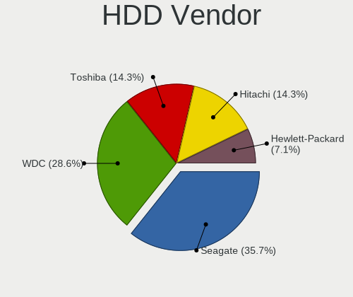
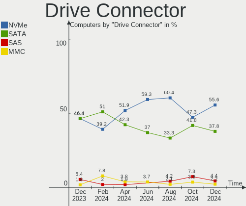
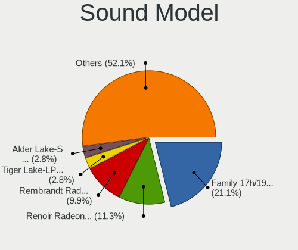

Gentoo - Hardware Trends
------------------------

A project to identify most popular hardware characteristics and track their change
over time based on data collected by Linux users at https://Linux-Hardware.org.

Anyone can contribute to this report by the [hw-probe](https://github.com/linuxhw/hw-probe) tool:

    sudo -E hw-probe -all -upload

This is a report for all computer types. See also reports for [desktops](/Dist/Gentoo/Desktop/README.md) and [notebooks](/Dist/Gentoo/Notebook/README.md).

This report is for one last month. Overall report since the beginning of time: [TestCoverage](https://github.com/linuxhw/TestCoverage)

Period: Oct, 2022.

Contents
--------

* [ System ](#system)
  - [ OS                       ](#os)
  - [ OS Family                ](#os-family)
  - [ Kernel                   ](#kernel)
  - [ Kernel Family            ](#kernel-family)
  - [ Kernel Major Ver.        ](#kernel-major-ver)
  - [ Arch                     ](#arch)
  - [ DE                       ](#de)
  - [ Display Server           ](#display-server)
  - [ Display Manager          ](#display-manager)
  - [ OS Lang                  ](#os-lang)
  - [ Boot Mode                ](#boot-mode)
  - [ Filesystem               ](#filesystem)
  - [ Part. scheme             ](#part-scheme)
  - [ Dual Boot with Linux/BSD ](#dual-boot-with-linuxbsd)
  - [ Dual Boot (Win)          ](#dual-boot-win)

* [ Board ](#board)
  - [ Vendor                   ](#vendor)
  - [ Model                    ](#model)
  - [ Model Family             ](#model-family)
  - [ MFG Year                 ](#mfg-year)
  - [ Form Factor              ](#form-factor)
  - [ Secure Boot              ](#secure-boot)
  - [ Coreboot                 ](#coreboot)
  - [ RAM Size                 ](#ram-size)
  - [ RAM Used                 ](#ram-used)
  - [ Total Drives             ](#total-drives)
  - [ Has CD-ROM               ](#has-cd-rom)
  - [ Has Ethernet             ](#has-ethernet)
  - [ Has WiFi                 ](#has-wifi)
  - [ Has Bluetooth            ](#has-bluetooth)

* [ Location ](#location)
  - [ Country                  ](#country)
  - [ City                     ](#city)

* [ Drives ](#drives)
  - [ Drive Vendor             ](#drive-vendor)
  - [ Drive Model              ](#drive-model)
  - [ HDD Vendor               ](#hdd-vendor)
  - [ SSD Vendor               ](#ssd-vendor)
  - [ Drive Kind               ](#drive-kind)
  - [ Drive Connector          ](#drive-connector)
  - [ Drive Size               ](#drive-size)
  - [ Space Total              ](#space-total)
  - [ Space Used               ](#space-used)
  - [ Malfunc. Drives          ](#malfunc-drives)
  - [ Malfunc. Drive Vendor    ](#malfunc-drive-vendor)
  - [ Malfunc. HDD Vendor      ](#malfunc-hdd-vendor)
  - [ Malfunc. Drive Kind      ](#malfunc-drive-kind)
  - [ Failed Drives            ](#failed-drives)
  - [ Failed Drive Vendor      ](#failed-drive-vendor)
  - [ Drive Status             ](#drive-status)

* [ Storage controller ](#storage-controller)
  - [ Storage Vendor           ](#storage-vendor)
  - [ Storage Model            ](#storage-model)
  - [ Storage Kind             ](#storage-kind)

* [ Processor ](#processor)
  - [ CPU Vendor               ](#cpu-vendor)
  - [ CPU Model                ](#cpu-model)
  - [ CPU Model Family         ](#cpu-model-family)
  - [ CPU Cores                ](#cpu-cores)
  - [ CPU Sockets              ](#cpu-sockets)
  - [ CPU Threads              ](#cpu-threads)
  - [ CPU Op-Modes             ](#cpu-op-modes)
  - [ CPU Microcode            ](#cpu-microcode)
  - [ CPU Microarch            ](#cpu-microarch)

* [ Graphics ](#graphics)
  - [ GPU Vendor               ](#gpu-vendor)
  - [ GPU Model                ](#gpu-model)
  - [ GPU Combo                ](#gpu-combo)
  - [ GPU Driver               ](#gpu-driver)
  - [ GPU Memory               ](#gpu-memory)

* [ Monitor ](#monitor)
  - [ Monitor Vendor           ](#monitor-vendor)
  - [ Monitor Model            ](#monitor-model)
  - [ Monitor Resolution       ](#monitor-resolution)
  - [ Monitor Diagonal         ](#monitor-diagonal)
  - [ Monitor Width            ](#monitor-width)
  - [ Aspect Ratio             ](#aspect-ratio)
  - [ Monitor Area             ](#monitor-area)
  - [ Pixel Density            ](#pixel-density)
  - [ Multiple Monitors        ](#multiple-monitors)

* [ Network ](#network)
  - [ Net Controller Vendor    ](#net-controller-vendor)
  - [ Net Controller Model     ](#net-controller-model)
  - [ Wireless Vendor          ](#wireless-vendor)
  - [ Wireless Model           ](#wireless-model)
  - [ Ethernet Vendor          ](#ethernet-vendor)
  - [ Ethernet Model           ](#ethernet-model)
  - [ Net Controller Kind      ](#net-controller-kind)
  - [ Used Controller          ](#used-controller)
  - [ NICs                     ](#nics)
  - [ IPv6                     ](#ipv6)

* [ Bluetooth ](#bluetooth)
  - [ Bluetooth Vendor         ](#bluetooth-vendor)
  - [ Bluetooth Model          ](#bluetooth-model)

* [ Sound ](#sound)
  - [ Sound Vendor             ](#sound-vendor)
  - [ Sound Model              ](#sound-model)

* [ Memory ](#memory)
  - [ Memory Vendor            ](#memory-vendor)
  - [ Memory Model             ](#memory-model)
  - [ Memory Kind              ](#memory-kind)
  - [ Memory Form Factor       ](#memory-form-factor)
  - [ Memory Size              ](#memory-size)
  - [ Memory Speed             ](#memory-speed)

* [ Printers & scanners ](#printers--scanners)
  - [ Printer Vendor           ](#printer-vendor)
  - [ Printer Model            ](#printer-model)
  - [ Scanner Vendor           ](#scanner-vendor)
  - [ Scanner Model            ](#scanner-model)

* [ Camera ](#camera)
  - [ Camera Vendor            ](#camera-vendor)
  - [ Camera Model             ](#camera-model)

* [ Security ](#security)
  - [ Fingerprint Vendor       ](#fingerprint-vendor)
  - [ Fingerprint Model        ](#fingerprint-model)
  - [ Chipcard Vendor          ](#chipcard-vendor)
  - [ Chipcard Model           ](#chipcard-model)

* [ Unsupported ](#unsupported)
  - [ Unsupported Devices      ](#unsupported-devices)
  - [ Unsupported Device Types ](#unsupported-device-types)

System
------

OS
--

Installed operating systems

| Name          | Computers | Percent |
|---------------|-----------|---------|
| Gentoo 2.8    | 48        | 80%     |
| Gentoo 2.9    | 9         | 15%     |
| Gentoo 1      | 2         | 3.33%   |
| Gentoo 22.0.1 | 1         | 1.67%   |

OS Family
---------

OS without a version

| Name   | Computers | Percent |
|--------|-----------|---------|
| Gentoo | 60        | 100%    |

Kernel
------

Version of the Linux kernel

| Version                            | Computers | Percent |
|------------------------------------|-----------|---------|
| 5.15.69-gentoo                     | 6         | 10%     |
| 5.15.74-gentoo                     | 5         | 8.33%   |
| 5.15.72-gentoo                     | 5         | 8.33%   |
| 5.15.72-gentoo-x86_64              | 4         | 6.67%   |
| 6.0.0-gentoo                       | 3         | 5%      |
| 6.0.0-pf2                          | 2         | 3.33%   |
| 6.0.0-gentoo-x86_64                | 2         | 3.33%   |
| 5.15.74-gentoo-x86_64              | 2         | 3.33%   |
| 5.15.72-gentoo-dist                | 2         | 3.33%   |
| 5.15.69-gentoo-dist                | 2         | 3.33%   |
| 6.1.0-rc1                          | 1         | 1.67%   |
| 6.0.6-gentoo-x86_64                | 1         | 1.67%   |
| 6.0.2-WorkStation-x86_64           | 1         | 1.67%   |
| 6.0.2-gentoo-x86_64                | 1         | 1.67%   |
| 6.0.1-tkg-bore-llvm                | 1         | 1.67%   |
| 6.0.0                              | 1         | 1.67%   |
| 5.19.9-x86_64                      | 1         | 1.67%   |
| 5.19.16-lqx4-SPTrinity             | 1         | 1.67%   |
| 5.19.16-lqx4-SPStudio              | 1         | 1.67%   |
| 5.19.16-gentoo                     | 1         | 1.67%   |
| 5.19.12-gentoo-groovin             | 1         | 1.67%   |
| 5.19.12-gentoo                     | 1         | 1.67%   |
| 5.19.11-gentoo-x86_64              | 1         | 1.67%   |
| 5.19.11-gentoo-limelight           | 1         | 1.67%   |
| 5.15.75-gentoo                     | 1         | 1.67%   |
| 5.15.74-gentoo-dist                | 1         | 1.67%   |
| 5.15.72-gentoo-NVIDIA_sin_simplefb | 1         | 1.67%   |
| 5.15.72-gentoo-dist-hardened       | 1         | 1.67%   |
| 5.15.69-gentoo-x86_64              | 1         | 1.67%   |
| 5.15.69-gentoo-x86                 | 1         | 1.67%   |
| 5.15.69-gentoo-proart-studiobook   | 1         | 1.67%   |
| 5.15.59-gentoo-x86_64              | 1         | 1.67%   |
| 5.15.52-gentoo-x86_64              | 1         | 1.67%   |
| 5.15.52-gentoo                     | 1         | 1.67%   |
| 5.15.29-calculate                  | 1         | 1.67%   |
| 5.15.19-gentoo-x86_64              | 1         | 1.67%   |
| 5.10.61-gentoo-x86_64              | 1         | 1.67%   |

Kernel Family
-------------

Linux kernel without a distro release

| Version | Computers | Percent |
|---------|-----------|---------|
| 5.15.72 | 13        | 21.67%  |
| 5.15.69 | 11        | 18.33%  |
| 6.0.0   | 8         | 13.33%  |
| 5.15.74 | 8         | 13.33%  |
| 5.19.16 | 3         | 5%      |
| 6.0.2   | 2         | 3.33%   |
| 5.19.12 | 2         | 3.33%   |
| 5.19.11 | 2         | 3.33%   |
| 5.15.52 | 2         | 3.33%   |
| 6.1.0   | 1         | 1.67%   |
| 6.0.6   | 1         | 1.67%   |
| 6.0.1   | 1         | 1.67%   |
| 5.19.9  | 1         | 1.67%   |
| 5.15.75 | 1         | 1.67%   |
| 5.15.59 | 1         | 1.67%   |
| 5.15.29 | 1         | 1.67%   |
| 5.15.19 | 1         | 1.67%   |
| 5.10.61 | 1         | 1.67%   |

Kernel Major Ver.
-----------------

Linux kernel major version

| Version | Computers | Percent |
|---------|-----------|---------|
| 5.15    | 38        | 63.33%  |
| 6.0     | 12        | 20%     |
| 5.19    | 8         | 13.33%  |
| 6.1     | 1         | 1.67%   |
| 5.10    | 1         | 1.67%   |

Arch
----

OS architecture (x86_64, i586, etc.)

| Name   | Computers | Percent |
|--------|-----------|---------|
| x86_64 | 58        | 96.67%  |
| i686   | 2         | 3.33%   |

DE
--

Desktop Environment

| Name     | Computers | Percent |
|----------|-----------|---------|
| Unknown  | 23        | 38.33%  |
| KDE5     | 17        | 28.33%  |
| GNOME    | 12        | 20%     |
| Hyprland | 2         | 3.33%   |
| XFCE     | 1         | 1.67%   |
| sway     | 1         | 1.67%   |
| MATE     | 1         | 1.67%   |
| DWM      | 1         | 1.67%   |
| Cinnamon | 1         | 1.67%   |
| bspwm    | 1         | 1.67%   |

Display Server
--------------

X11 or Wayland

| Name    | Computers | Percent |
|---------|-----------|---------|
| X11     | 30        | 50%     |
| Wayland | 12        | 20%     |
| Unknown | 11        | 18.33%  |
| Tty     | 7         | 11.67%  |

Display Manager
---------------

SDDM, LightDM, etc.

| Name    | Computers | Percent |
|---------|-----------|---------|
| Unknown | 24        | 40%     |
| SDDM    | 18        | 30%     |
| GDM     | 9         | 15%     |
| LightDM | 6         | 10%     |
| XDM     | 1         | 1.67%   |
| LXDM    | 1         | 1.67%   |
| GREETD  | 1         | 1.67%   |

OS Lang
-------

Language

| Lang       | Computers | Percent |
|------------|-----------|---------|
| en_US      | 13        | 21.67%  |
| C.UTF8     | 12        | 20%     |
| Unknown    | 7         | 11.67%  |
| en_GB      | 5         | 8.33%   |
| de_DE      | 4         | 6.67%   |
| ru_RU      | 3         | 5%      |
| es_MX      | 2         | 3.33%   |
| en_CA      | 2         | 3.33%   |
| zh_CN      | 1         | 1.67%   |
| pt_BR      | 1         | 1.67%   |
| pl_PL      | 1         | 1.67%   |
| nl_BE      | 1         | 1.67%   |
| it_IT      | 1         | 1.67%   |
| es_ES      | 1         | 1.67%   |
| en_US.UTF8 | 1         | 1.67%   |
| en_IE      | 1         | 1.67%   |
| en_AU      | 1         | 1.67%   |
| en_AT      | 1         | 1.67%   |
| ca_ES      | 1         | 1.67%   |
| C          | 1         | 1.67%   |

Boot Mode
---------

EFI or BIOS

| Mode | Computers | Percent |
|------|-----------|---------|
| EFI  | 49        | 81.67%  |
| BIOS | 11        | 18.33%  |

Filesystem
----------

Type of filesystem

| Type    | Computers | Percent |
|---------|-----------|---------|
| Ext4    | 35        | 58.33%  |
| Btrfs   | 16        | 26.67%  |
| XXXXXXX | 3         | 5%      |
| F2fs    | 3         | 5%      |
| Xfs     | 2         | 3.33%   |
| Zfs     | 1         | 1.67%   |

Part. scheme
------------

Scheme of partitioning

| Type    | Computers | Percent |
|---------|-----------|---------|
| GPT     | 52        | 86.67%  |
| MBR     | 5         | 8.33%   |
| Unknown | 3         | 5%      |

Dual Boot with Linux/BSD
------------------------

Hosting more than one Linux/BSD

| Dual boot | Computers | Percent |
|-----------|-----------|---------|
| No        | 37        | 61.67%  |
| Yes       | 23        | 38.33%  |

Dual Boot (Win)
---------------

Hosting Linux and Windows

| Dual boot | Computers | Percent |
|-----------|-----------|---------|
| No        | 40        | 66.67%  |
| Yes       | 20        | 33.33%  |

Board
-----

Vendor
------

Motherboard manufacturer

| Name                 | Computers | Percent |
|----------------------|-----------|---------|
| ASUSTek Computer     | 15        | 25%     |
| Hewlett-Packard      | 8         | 13.33%  |
| Gigabyte Technology  | 7         | 11.67%  |
| Lenovo               | 6         | 10%     |
| MSI                  | 5         | 8.33%   |
| Dell                 | 4         | 6.67%   |
| Notebook             | 2         | 3.33%   |
| Valve                | 1         | 1.67%   |
| Supermicro           | 1         | 1.67%   |
| Sony                 | 1         | 1.67%   |
| Quanta               | 1         | 1.67%   |
| Intel Client Systems | 1         | 1.67%   |
| IBM                  | 1         | 1.67%   |
| HUAWEI               | 1         | 1.67%   |
| Huanan               | 1         | 1.67%   |
| ASRock               | 1         | 1.67%   |
| Apple                | 1         | 1.67%   |
| Alienware            | 1         | 1.67%   |
| Acidanthera          | 1         | 1.67%   |
| Acer                 | 1         | 1.67%   |

Model
-----

Motherboard model

| Name                                 | Computers | Percent |
|--------------------------------------|-----------|---------|
| MSI MS-7A38                          | 2         | 3.33%   |
| HP EliteBook 840 G7 Notebook PC      | 2         | 3.33%   |
| Valve Jupiter                        | 1         | 1.67%   |
| Supermicro X10SL7-F                  | 1         | 1.67%   |
| Sony PCG-GRT230(UC)                  | 1         | 1.67%   |
| Quanta S210-X12MS                    | 1         | 1.67%   |
| Notebook NS5x_NS7xPU                 | 1         | 1.67%   |
| Notebook NS50_70MU                   | 1         | 1.67%   |
| MSI Pulse GL66 11UGK                 | 1         | 1.67%   |
| MSI MS-7B79                          | 1         | 1.67%   |
| MSI GE66 Raider 11UE                 | 1         | 1.67%   |
| Lenovo Yoga C940-14IIL 81Q9          | 1         | 1.67%   |
| Lenovo ThinkPad Z16 Gen 1 21D4CTO1WW | 1         | 1.67%   |
| Lenovo ThinkPad R500 2714CTO         | 1         | 1.67%   |
| Lenovo ThinkPad E15 Gen 2 20T9S00K00 | 1         | 1.67%   |
| Lenovo IdeaPad S145-15IWL 81MV       | 1         | 1.67%   |
| Lenovo IdeaPad 5 15ITL05 82FG        | 1         | 1.67%   |
| Intel Client Systems LAPBC710        | 1         | 1.67%   |
| IBM ThinkPad T42 2373K1U             | 1         | 1.67%   |
| HUAWEI NBLK-WAX9X                    | 1         | 1.67%   |
| Huanan X99-F8 GAMING V2.0            | 1         | 1.67%   |
| HP Pavilion Notebook                 | 1         | 1.67%   |
| HP Laptop 15-ra0xx                   | 1         | 1.67%   |
| HP Laptop 14-dk1xxx                  | 1         | 1.67%   |
| HP EliteBook 845 G7 Notebook PC      | 1         | 1.67%   |
| HP EliteBook 830 G6                  | 1         | 1.67%   |
| HP 23-p132la                         | 1         | 1.67%   |
| Gigabyte Z370 AORUS Gaming 5         | 1         | 1.67%   |
| Gigabyte X570 AORUS ELITE            | 1         | 1.67%   |
| Gigabyte TRX40 DESIGNARE             | 1         | 1.67%   |
| Gigabyte H81M-H                      | 1         | 1.67%   |
| Gigabyte G5 KD                       | 1         | 1.67%   |
| Gigabyte F2A88XM-DS2                 | 1         | 1.67%   |
| Gigabyte AB350-Gaming                | 1         | 1.67%   |
| Dell XPS 15 7590                     | 1         | 1.67%   |
| Dell Vostro 5490                     | 1         | 1.67%   |
| Dell Precision 7760                  | 1         | 1.67%   |
| Dell G3 3500                         | 1         | 1.67%   |
| ASUS Zenbook UM5302TA_UM5302TA       | 1         | 1.67%   |
| ASUS TUF Gaming X570-PLUS            | 1         | 1.67%   |

Model Family
------------

Motherboard model prefix

| Name                          | Computers | Percent |
|-------------------------------|-----------|---------|
| ASUS ROG                      | 7         | 11.67%  |
| HP EliteBook                  | 4         | 6.67%   |
| Lenovo ThinkPad               | 3         | 5%      |
| MSI MS-7A38                   | 2         | 3.33%   |
| Lenovo IdeaPad                | 2         | 3.33%   |
| HP Laptop                     | 2         | 3.33%   |
| ASUS TUF                      | 2         | 3.33%   |
| Valve Jupiter                 | 1         | 1.67%   |
| Supermicro X10SL7-F           | 1         | 1.67%   |
| Sony PCG-GRT230(UC)           | 1         | 1.67%   |
| Quanta S210-X12MS             | 1         | 1.67%   |
| Notebook NS5x                 | 1         | 1.67%   |
| Notebook NS50                 | 1         | 1.67%   |
| MSI Pulse                     | 1         | 1.67%   |
| MSI MS-7B79                   | 1         | 1.67%   |
| MSI GE66                      | 1         | 1.67%   |
| Lenovo Yoga                   | 1         | 1.67%   |
| Intel Client Systems LAPBC710 | 1         | 1.67%   |
| IBM ThinkPad                  | 1         | 1.67%   |
| HUAWEI NBLK-WAX9X             | 1         | 1.67%   |
| Huanan X99-F8                 | 1         | 1.67%   |
| HP Pavilion                   | 1         | 1.67%   |
| HP 23-p132la                  | 1         | 1.67%   |
| Gigabyte Z370                 | 1         | 1.67%   |
| Gigabyte X570                 | 1         | 1.67%   |
| Gigabyte TRX40                | 1         | 1.67%   |
| Gigabyte H81M-H               | 1         | 1.67%   |
| Gigabyte G5                   | 1         | 1.67%   |
| Gigabyte F2A88XM-DS2          | 1         | 1.67%   |
| Gigabyte AB350-Gaming         | 1         | 1.67%   |
| Dell XPS                      | 1         | 1.67%   |
| Dell Vostro                   | 1         | 1.67%   |
| Dell Precision                | 1         | 1.67%   |
| Dell G3                       | 1         | 1.67%   |
| ASUS Zenbook                  | 1         | 1.67%   |
| ASUS T101HA                   | 1         | 1.67%   |
| ASUS ProArt                   | 1         | 1.67%   |
| ASUS PRIME                    | 1         | 1.67%   |
| ASUS M4A89GTD-PRO             | 1         | 1.67%   |
| ASUS M3A78-CM                 | 1         | 1.67%   |

MFG Year
--------

Motherboard manufacture year

| Year | Computers | Percent |
|------|-----------|---------|
| 2019 | 14        | 23.33%  |
| 2022 | 11        | 18.33%  |
| 2020 | 10        | 16.67%  |
| 2021 | 8         | 13.33%  |
| 2018 | 3         | 5%      |
| 2013 | 3         | 5%      |
| 2017 | 2         | 3.33%   |
| 2011 | 2         | 3.33%   |
| 2008 | 2         | 3.33%   |
| 2015 | 1         | 1.67%   |
| 2014 | 1         | 1.67%   |
| 2010 | 1         | 1.67%   |
| 2004 | 1         | 1.67%   |
| 2003 | 1         | 1.67%   |

Form Factor
-----------

Physical design of the computer

| Name        | Computers | Percent |
|-------------|-----------|---------|
| Notebook    | 33        | 55%     |
| Desktop     | 20        | 33.33%  |
| Convertible | 2         | 3.33%   |
| All in one  | 2         | 3.33%   |
| Server      | 2         | 3.33%   |
| Tablet      | 1         | 1.67%   |

Secure Boot
-----------

Enabled or disabled

| State    | Computers | Percent |
|----------|-----------|---------|
| Disabled | 58        | 96.67%  |
| Enabled  | 2         | 3.33%   |

Coreboot
--------

Have coreboot on board

| Used | Computers | Percent |
|------|-----------|---------|
| No   | 60        | 100%    |

RAM Size
--------

Total RAM memory

| Size in GB  | Computers | Percent |
|-------------|-----------|---------|
| 32.01-64.0  | 16        | 26.67%  |
| 16.01-24.0  | 11        | 18.33%  |
| 64.01-256.0 | 10        | 16.67%  |
| 8.01-16.0   | 10        | 16.67%  |
| 24.01-32.0  | 5         | 8.33%   |
| 4.01-8.0    | 3         | 5%      |
| 2.01-3.0    | 2         | 3.33%   |
| 3.01-4.0    | 1         | 1.67%   |
| 0.51-1.0    | 1         | 1.67%   |
| 0.01-0.5    | 1         | 1.67%   |

RAM Used
--------

Used RAM memory

| Used GB    | Computers | Percent |
|------------|-----------|---------|
| 4.01-8.0   | 12        | 20%     |
| 1.01-2.0   | 12        | 20%     |
| 3.01-4.0   | 8         | 13.33%  |
| 2.01-3.0   | 8         | 13.33%  |
| 8.01-16.0  | 6         | 10%     |
| 0.51-1.0   | 6         | 10%     |
| 0.01-0.5   | 5         | 8.33%   |
| 16.01-24.0 | 2         | 3.33%   |
| 24.01-32.0 | 1         | 1.67%   |

Total Drives
------------

Number of drives on board

| Drives | Computers | Percent |
|--------|-----------|---------|
| 1      | 30        | 50%     |
| 2      | 15        | 25%     |
| 5      | 6         | 10%     |
| 3      | 4         | 6.67%   |
| 6      | 2         | 3.33%   |
| 9      | 1         | 1.67%   |
| 7      | 1         | 1.67%   |
| 4      | 1         | 1.67%   |

Has CD-ROM
----------

Has CD-ROM on board

| Presented | Computers | Percent |
|-----------|-----------|---------|
| No        | 53        | 88.33%  |
| Yes       | 7         | 11.67%  |

Has Ethernet
------------

Has Ethernet on board

| Presented | Computers | Percent |
|-----------|-----------|---------|
| Yes       | 52        | 86.67%  |
| No        | 8         | 13.33%  |

Has WiFi
--------

Has WiFi module

| Presented | Computers | Percent |
|-----------|-----------|---------|
| Yes       | 50        | 83.33%  |
| No        | 10        | 16.67%  |

Has Bluetooth
-------------

Has Bluetooth module

| Presented | Computers | Percent |
|-----------|-----------|---------|
| Yes       | 48        | 80%     |
| No        | 12        | 20%     |

Location
--------

Country
-------

Geographic location (country)

| Country     | Computers | Percent |
|-------------|-----------|---------|
| USA         | 14        | 23.33%  |
| Germany     | 11        | 18.33%  |
| Russia      | 5         | 8.33%   |
| Canada      | 4         | 6.67%   |
| France      | 3         | 5%      |
| China       | 3         | 5%      |
| Australia   | 3         | 5%      |
| UK          | 2         | 3.33%   |
| Poland      | 2         | 3.33%   |
| Mexico      | 2         | 3.33%   |
| Brazil      | 2         | 3.33%   |
| Belgium     | 2         | 3.33%   |
| Turkey      | 1         | 1.67%   |
| Spain       | 1         | 1.67%   |
| Netherlands | 1         | 1.67%   |
| Italy       | 1         | 1.67%   |
| India       | 1         | 1.67%   |
| Greece      | 1         | 1.67%   |
| Austria     | 1         | 1.67%   |

City
----

Geographic location (city)

| City          | Computers | Percent |
|---------------|-----------|---------|
| Weatherford   | 3         | 5%      |
| Vancouver     | 3         | 5%      |
| Sydney        | 3         | 5%      |
| Berlin        | 3         | 5%      |
| Winter Park   | 2         | 3.33%   |
| Moscow        | 2         | 3.33%   |
| Mexico City   | 2         | 3.33%   |
| Luckau        | 2         | 3.33%   |
| Yekaterinburg | 1         | 1.67%   |
| Wyszków      | 1         | 1.67%   |
| Warsaw        | 1         | 1.67%   |
| Vienna        | 1         | 1.67%   |
| Ulyanovsk     | 1         | 1.67%   |
| Toronto       | 1         | 1.67%   |
| Thermopolis   | 1         | 1.67%   |
| Tangshan      | 1         | 1.67%   |
| Stokkem       | 1         | 1.67%   |
| St Petersburg | 1         | 1.67%   |
| Seattle       | 1         | 1.67%   |
| San Antonio   | 1         | 1.67%   |
| Salinas       | 1         | 1.67%   |
| Plainfield    | 1         | 1.67%   |
| New York      | 1         | 1.67%   |
| New Delhi     | 1         | 1.67%   |
| Natal         | 1         | 1.67%   |
| Munich        | 1         | 1.67%   |
| Montpellier   | 1         | 1.67%   |
| Milan         | 1         | 1.67%   |
| Lehigh Acres  | 1         | 1.67%   |
| Leefdaal      | 1         | 1.67%   |
| Laubach       | 1         | 1.67%   |
| Igualada      | 1         | 1.67%   |
| Hertford      | 1         | 1.67%   |
| Herdecke      | 1         | 1.67%   |
| Harbin        | 1         | 1.67%   |
| Guangzhou     | 1         | 1.67%   |
| Grasse        | 1         | 1.67%   |
| Fort Worth    | 1         | 1.67%   |
| Edinburgh     | 1         | 1.67%   |
| Dwingeloo     | 1         | 1.67%   |

Drives
------

Drive Vendor
------------

Hard drive vendors

| Vendor                      | Computers | Drives | Percent |
|-----------------------------|-----------|--------|---------|
| Samsung Electronics         | 30        | 42     | 28.57%  |
| WDC                         | 12        | 17     | 11.43%  |
| Seagate                     | 11        | 17     | 10.48%  |
| Sandisk                     | 9         | 11     | 8.57%   |
| Intel                       | 7         | 7      | 6.67%   |
| Toshiba                     | 4         | 4      | 3.81%   |
| Phison Electronics          | 3         | 3      | 2.86%   |
| Kingston                    | 3         | 3      | 2.86%   |
| Hitachi                     | 3         | 5      | 2.86%   |
| Crucial                     | 3         | 3      | 2.86%   |
| Silicon Motion              | 2         | 3      | 1.9%    |
| GOODRAM                     | 2         | 2      | 1.9%    |
| ADATA Technology            | 2         | 2      | 1.9%    |
| Unknown                     | 1         | 1      | 0.95%   |
| T-FORCE                     | 1         | 1      | 0.95%   |
| SK hynix                    | 1         | 1      | 0.95%   |
| Seagate Technology          | 1         | 1      | 0.95%   |
| Realtek Semiconductor       | 1         | 1      | 0.95%   |
| Patriot                     | 1         | 1      | 0.95%   |
| OCZ                         | 1         | 1      | 0.95%   |
| Micron/Crucial Technology   | 1         | 1      | 0.95%   |
| Micron Technology           | 1         | 1      | 0.95%   |
| Kingston Technology Company | 1         | 1      | 0.95%   |
| KingSpec                    | 1         | 2      | 0.95%   |
| IBM/Hitachi                 | 1         | 1      | 0.95%   |
| HGST                        | 1         | 1      | 0.95%   |
| ASMT                        | 1         | 1      | 0.95%   |

Drive Model
-----------

Hard drive models

| Model                                                 | Computers | Percent |
|-------------------------------------------------------|-----------|---------|
| Samsung NVMe SSD Controller SM981/PM981/PM983 500GB   | 7         | 5.79%   |
| Samsung NVMe SSD Controller PM9A1/PM9A3/980PRO 250GB  | 7         | 5.79%   |
| Samsung SSD 860 EVO 1TB                               | 5         | 4.13%   |
| Samsung SSD 980 1TB                                   | 3         | 2.48%   |
| Intel SSD 660P Series 1024GB                          | 3         | 2.48%   |
| WDC WD2003FZEX-00SRLA0 2TB                            | 2         | 1.65%   |
| Sandisk WD Black SN750 / PC SN730 NVMe SSD 1TB        | 2         | 1.65%   |
| Samsung SSD 860 EVO 2TB                               | 2         | 1.65%   |
| GOODRAM SSDPR-CL100-480-G2 480GB                      | 2         | 1.65%   |
| WDC WDS500G2B0B-00YS70 500GB SSD                      | 1         | 0.83%   |
| WDC WDBNCE0020PNC 2TB SSD                             | 1         | 0.83%   |
| WDC WD5000AAKX-08U6AA0 500GB                          | 1         | 0.83%   |
| WDC WD5000AADS-00S9B0 500GB                           | 1         | 0.83%   |
| WDC WD40EZRZ-00WN9B0 4TB                              | 1         | 0.83%   |
| WDC WD30EFRX-68EUZN0 3TB                              | 1         | 0.83%   |
| WDC WD20EFRX-68EUZN0 2TB                              | 1         | 0.83%   |
| WDC WD20EFRX-68AX9N0 2TB                              | 1         | 0.83%   |
| WDC WD20EARX-00PASB0 2TB                              | 1         | 0.83%   |
| WDC WD1200JS-00NCB1 120GB                             | 1         | 0.83%   |
| WDC WD10EZRZ-00HTKB0 1TB                              | 1         | 0.83%   |
| WDC WD10EZEX-08WN4A0 1TB                              | 1         | 0.83%   |
| WDC WD101KFBX-68R56N0 10TB                            | 1         | 0.83%   |
| Unknown MMC Card  128GB                               | 1         | 0.83%   |
| Toshiba MQ01ABF050 500GB                              | 1         | 0.83%   |
| Toshiba HDWE150 5TB                                   | 1         | 0.83%   |
| Toshiba HDWD120 2TB                                   | 1         | 0.83%   |
| Toshiba DT01ACA300 3TB                                | 1         | 0.83%   |
| T-FORCE SSD 1TB                                       | 1         | 0.83%   |
| SK hynix PC801 NVMe 2TB                               | 1         | 0.83%   |
| Silicon Motion SM2263EN/SM2263XT SSD Controller 256GB | 1         | 0.83%   |
| Silicon Motion SM2262/SM2262EN SSD Controller 1024GB  | 1         | 0.83%   |
| Seagate FireCuda 520 SSD 500GB                        | 1         | 0.83%   |
| Seagate ST9250315AS 250GB                             | 1         | 0.83%   |
| Seagate ST4000VN008-2DR166 4TB                        | 1         | 0.83%   |
| Seagate ST4000DM004-2CV104 4TB                        | 1         | 0.83%   |
| Seagate ST4000DM000-1F2168 4TB                        | 1         | 0.83%   |
| Seagate ST3500630AS 500GB                             | 1         | 0.83%   |
| Seagate ST3360320AS 360GB                             | 1         | 0.83%   |
| Seagate ST3250410AS 250GB                             | 1         | 0.83%   |
| Seagate ST2000LM015-2E8174 2TB                        | 1         | 0.83%   |

HDD Vendor
----------

Hard disk drive vendors

| Vendor      | Computers | Drives | Percent |
|-------------|-----------|--------|---------|
| Seagate     | 11        | 17     | 36.67%  |
| WDC         | 10        | 15     | 33.33%  |
| Toshiba     | 4         | 4      | 13.33%  |
| Hitachi     | 3         | 5      | 10%     |
| IBM/Hitachi | 1         | 1      | 3.33%   |
| HGST        | 1         | 1      | 3.33%   |

SSD Vendor
----------

Solid state drive vendors

| Vendor              | Computers | Drives | Percent |
|---------------------|-----------|--------|---------|
| Samsung Electronics | 13        | 18     | 41.94%  |
| Crucial             | 3         | 3      | 9.68%   |
| WDC                 | 2         | 2      | 6.45%   |
| SanDisk             | 2         | 2      | 6.45%   |
| Kingston            | 2         | 2      | 6.45%   |
| GOODRAM             | 2         | 2      | 6.45%   |
| T-FORCE             | 1         | 1      | 3.23%   |
| Patriot             | 1         | 1      | 3.23%   |
| OCZ                 | 1         | 1      | 3.23%   |
| Micron Technology   | 1         | 1      | 3.23%   |
| KingSpec            | 1         | 2      | 3.23%   |
| Intel               | 1         | 1      | 3.23%   |
| ASMT                | 1         | 1      | 3.23%   |

Drive Kind
----------

HDD or SSD

| Kind | Computers | Drives | Percent |
|------|-----------|--------|---------|
| NVMe | 40        | 53     | 48.19%  |
| SSD  | 21        | 37     | 25.3%   |
| HDD  | 21        | 43     | 25.3%   |
| MMC  | 1         | 1      | 1.2%    |

Drive Connector
---------------

SATA, SAS, NVMe, etc.

| Type | Computers | Drives | Percent |
|------|-----------|--------|---------|
| NVMe | 40        | 53     | 53.33%  |
| SATA | 31        | 77     | 41.33%  |
| SAS  | 3         | 3      | 4%      |
| MMC  | 1         | 1      | 1.33%   |

Drive Size
----------

Size of hard drive

| Size in TB | Computers | Drives | Percent |
|------------|-----------|--------|---------|
| 0.01-0.5   | 19        | 29     | 34.55%  |
| 0.51-1.0   | 15        | 21     | 27.27%  |
| 1.01-2.0   | 11        | 17     | 20%     |
| 3.01-4.0   | 4         | 5      | 7.27%   |
| 2.01-3.0   | 3         | 5      | 5.45%   |
| 4.01-10.0  | 2         | 2      | 3.64%   |
| 10.01-20.0 | 1         | 1      | 1.82%   |

Space Total
-----------

Amount of disk space available on the file system

| Size in GB     | Computers | Percent |
|----------------|-----------|---------|
| 501-1000       | 16        | 26.67%  |
| 251-500        | 10        | 16.67%  |
| 1001-2000      | 9         | 15%     |
| More than 3000 | 6         | 10%     |
| 1-20           | 6         | 10%     |
| 101-250        | 5         | 8.33%   |
| 51-100         | 3         | 5%      |
| 2001-3000      | 2         | 3.33%   |
| Unknown        | 2         | 3.33%   |
| 21-50          | 1         | 1.67%   |

Space Used
----------

Amount of used disk space

| Used GB        | Computers | Percent |
|----------------|-----------|---------|
| 1-20           | 12        | 20%     |
| 21-50          | 10        | 16.67%  |
| 51-100         | 9         | 15%     |
| 101-250        | 8         | 13.33%  |
| 251-500        | 6         | 10%     |
| 501-1000       | 6         | 10%     |
| More than 3000 | 4         | 6.67%   |
| 1001-2000      | 3         | 5%      |
| Unknown        | 2         | 3.33%   |

Malfunc. Drives
---------------

Drive models with a malfunction

| Model                                   | Computers | Drives | Percent |
|-----------------------------------------|-----------|--------|---------|
| WDC WD20EFRX-68EUZN0 2TB                | 1         | 2      | 25%     |
| Seagate ST3250410AS 250GB               | 1         | 1      | 25%     |
| Kingston RBU-SNS8350DES3128GP 128GB SSD | 1         | 1      | 25%     |
| HGST HTS721010A9E630 1TB                | 1         | 1      | 25%     |

Malfunc. Drive Vendor
---------------------

Vendors of faulty drives

| Vendor   | Computers | Drives | Percent |
|----------|-----------|--------|---------|
| WDC      | 1         | 2      | 25%     |
| Seagate  | 1         | 1      | 25%     |
| Kingston | 1         | 1      | 25%     |
| HGST     | 1         | 1      | 25%     |

Malfunc. HDD Vendor
-------------------

Vendors of faulty HDD drives

| Vendor  | Computers | Drives | Percent |
|---------|-----------|--------|---------|
| WDC     | 1         | 2      | 33.33%  |
| Seagate | 1         | 1      | 33.33%  |
| HGST    | 1         | 1      | 33.33%  |

Malfunc. Drive Kind
-------------------

Kinds of faulty drives

| Kind | Computers | Drives | Percent |
|------|-----------|--------|---------|
| HDD  | 3         | 4      | 75%     |
| SSD  | 1         | 1      | 25%     |

Failed Drives
-------------

Failed drive models

Zero info for selected period =(

Failed Drive Vendor
-------------------

Failed drive vendors

Zero info for selected period =(

Drive Status
------------

Number of failed and malfunc. drives

| Status   | Computers | Drives | Percent |
|----------|-----------|--------|---------|
| Works    | 53        | 117    | 82.81%  |
| Detected | 7         | 12     | 10.94%  |
| Malfunc  | 4         | 5      | 6.25%   |

Storage controller
------------------

Storage Vendor
--------------

Storage controller vendors

| Vendor                           | Computers | Percent |
|----------------------------------|-----------|---------|
| Intel                            | 27        | 29.35%  |
| Samsung Electronics              | 21        | 22.83%  |
| AMD                              | 18        | 19.57%  |
| SanDisk                          | 8         | 8.7%    |
| Phison Electronics               | 3         | 3.26%   |
| Silicon Motion                   | 2         | 2.17%   |
| Kingston Technology Company      | 2         | 2.17%   |
| ASMedia Technology               | 2         | 2.17%   |
| ADATA Technology                 | 2         | 2.17%   |
| SK hynix                         | 1         | 1.09%   |
| Silicon Integrated Systems [SiS] | 1         | 1.09%   |
| Seagate Technology               | 1         | 1.09%   |
| Realtek Semiconductor            | 1         | 1.09%   |
| Micron/Crucial Technology        | 1         | 1.09%   |
| JMicron Technology               | 1         | 1.09%   |
| Broadcom / LSI                   | 1         | 1.09%   |

Storage Model
-------------

Storage controller models

| Model                                                                          | Computers | Percent |
|--------------------------------------------------------------------------------|-----------|---------|
| AMD FCH SATA Controller [AHCI mode]                                            | 11        | 11%     |
| Samsung NVMe SSD Controller SM981/PM981/PM983                                  | 8         | 8%      |
| Samsung NVMe SSD Controller PM9A1/PM9A3/980PRO                                 | 8         | 8%      |
| Samsung NVMe SSD Controller 980                                                | 6         | 6%      |
| SanDisk Non-Volatile memory controller                                         | 4         | 4%      |
| Intel SSD 660P Series                                                          | 4         | 4%      |
| Intel 500 Series Chipset Family SATA AHCI Controller                           | 3         | 3%      |
| AMD SATA controller                                                            | 3         | 3%      |
| AMD 400 Series Chipset SATA Controller                                         | 3         | 3%      |
| SanDisk WD Black SN750 / PC SN730 NVMe SSD                                     | 2         | 2%      |
| Intel 8 Series/C220 Series Chipset Family 6-port SATA Controller 1 [AHCI mode] | 2         | 2%      |
| ADATA A Non-Volatile memory controller                                         | 2         | 2%      |
| SK hynix Non-Volatile memory controller                                        | 1         | 1%      |
| Silicon Motion SM2263EN/SM2263XT SSD Controller                                | 1         | 1%      |
| Silicon Motion SM2262/SM2262EN SSD Controller                                  | 1         | 1%      |
| Silicon Integrated Systems [SiS] 5513 IDE Controller                           | 1         | 1%      |
| Seagate FireCuda 520 SSD                                                       | 1         | 1%      |
| SanDisk WD PC SN810 / Black SN850 NVMe SSD                                     | 1         | 1%      |
| SanDisk WD Blue SN550 NVMe SSD                                                 | 1         | 1%      |
| Samsung NVMe SSD Controller SM961/PM961/SM963                                  | 1         | 1%      |
| Realtek RTS5763DL NVMe SSD Controller                                          | 1         | 1%      |
| Phison PS5013 E13 NVMe Controller                                              | 1         | 1%      |
| Phison E16 PCIe4 NVMe Controller                                               | 1         | 1%      |
| Phison E12 NVMe Controller                                                     | 1         | 1%      |
| Micron/Crucial NVMe Controller                                                 | 1         | 1%      |
| Kingston Company Company Non-Volatile memory controller                        | 1         | 1%      |
| Kingston Company OM3PDP3 NVMe SSD                                              | 1         | 1%      |
| JMicron JMB361 AHCI/IDE                                                        | 1         | 1%      |
| Intel Volume Management Device NVMe RAID Controller                            | 1         | 1%      |
| Intel Tiger Lake-LP SATA Controller                                            | 1         | 1%      |
| Intel SSD Pro 7600p/760p/E 6100p Series                                        | 1         | 1%      |
| Intel Non-Volatile memory controller                                           | 1         | 1%      |
| Intel NM10/ICH7 Family SATA Controller [AHCI mode]                             | 1         | 1%      |
| Intel HM170/QM170 Chipset SATA Controller [AHCI Mode]                          | 1         | 1%      |
| Intel Comet Lake SATA AHCI Controller                                          | 1         | 1%      |
| Intel Cannon Point-LP SATA Controller [AHCI Mode]                              | 1         | 1%      |
| Intel Cannon Lake PCH SATA AHCI Controller                                     | 1         | 1%      |
| Intel Cannon Lake Mobile PCH SATA AHCI Controller                              | 1         | 1%      |
| Intel C602 chipset 4-Port SATA Storage Control Unit                            | 1         | 1%      |
| Intel C600/X79 series chipset 6-Port SATA AHCI Controller                      | 1         | 1%      |

Storage Kind
------------

Kind of storage controller (IDE, SATA, NVMe, SAS, ...)

| Kind | Computers | Percent |
|------|-----------|---------|
| NVMe | 41        | 47.13%  |
| SATA | 36        | 41.38%  |
| IDE  | 6         | 6.9%    |
| RAID | 2         | 2.3%    |
| SAS  | 2         | 2.3%    |

Processor
---------

CPU Vendor
----------

Processor vendors

| Vendor | Computers | Percent |
|--------|-----------|---------|
| Intel  | 34        | 56.67%  |
| AMD    | 26        | 43.33%  |

CPU Model
---------

Processor models

| Model                                          | Computers | Percent |
|------------------------------------------------|-----------|---------|
| AMD Ryzen 9 5950X 16-Core Processor            | 3         | 5%      |
| Intel Core i7-10610U CPU @ 1.80GHz             | 2         | 3.33%   |
| Intel 12th Gen Core i7-12700H                  | 2         | 3.33%   |
| Intel 11th Gen Core i7-11800H @ 2.30GHz        | 2         | 3.33%   |
| Intel 11th Gen Core i7-1165G7 @ 2.80GHz        | 2         | 3.33%   |
| AMD Ryzen 9 7950X 16-Core Processor            | 2         | 3.33%   |
| Intel Xeon W-11955M CPU @ 2.60GHz              | 1         | 1.67%   |
| Intel Xeon CPU E5-2678 v3 @ 2.50GHz            | 1         | 1.67%   |
| Intel Xeon CPU E5-2620 0 @ 2.00GHz             | 1         | 1.67%   |
| Intel Xeon CPU E3-1230L v3 @ 1.80GHz           | 1         | 1.67%   |
| Intel Pentium M processor 1.70GHz              | 1         | 1.67%   |
| Intel Pentium CPU 5405U @ 2.30GHz              | 1         | 1.67%   |
| Intel Pentium 4 CPU 2.40GHz                    | 1         | 1.67%   |
| Intel Core i9-9900K CPU @ 3.60GHz              | 1         | 1.67%   |
| Intel Core i7-9750H CPU @ 2.60GHz              | 1         | 1.67%   |
| Intel Core i7-8750H CPU @ 2.20GHz              | 1         | 1.67%   |
| Intel Core i7-8700K CPU @ 3.70GHz              | 1         | 1.67%   |
| Intel Core i7-8565U CPU @ 1.80GHz              | 1         | 1.67%   |
| Intel Core i7-6700HQ CPU @ 2.60GHz             | 1         | 1.67%   |
| Intel Core i7-4790K CPU @ 4.00GHz              | 1         | 1.67%   |
| Intel Core i7-1065G7 CPU @ 1.30GHz             | 1         | 1.67%   |
| Intel Core i5-2415M CPU @ 2.30GHz              | 1         | 1.67%   |
| Intel Core i5-10300H CPU @ 2.50GHz             | 1         | 1.67%   |
| Intel Core i5-10210U CPU @ 1.60GHz             | 1         | 1.67%   |
| Intel Core 2 Duo CPU P8600 @ 2.40GHz           | 1         | 1.67%   |
| Intel Celeron CPU N3060 @ 1.60GHz              | 1         | 1.67%   |
| Intel Atom x5-Z8350 CPU @ 1.44GHz              | 1         | 1.67%   |
| Intel Atom CPU N570 @ 1.66GHz                  | 1         | 1.67%   |
| Intel 12th Gen Core i7-1260P                   | 1         | 1.67%   |
| Intel 11th Gen Core i9-11900K @ 3.50GHz        | 1         | 1.67%   |
| Intel 11th Gen Core i5-11400H @ 2.70GHz        | 1         | 1.67%   |
| Intel 11th Gen Core i5-1135G7 @ 2.40GHz        | 1         | 1.67%   |
| AMD Ryzen Threadripper 3970X 32-Core Processor | 1         | 1.67%   |
| AMD Ryzen 9 PRO 6950H with Radeon Graphics     | 1         | 1.67%   |
| AMD Ryzen 9 7900X 12-Core Processor            | 1         | 1.67%   |
| AMD Ryzen 9 6900HS with Radeon Graphics        | 1         | 1.67%   |
| AMD Ryzen 9 5900X 12-Core Processor            | 1         | 1.67%   |
| AMD Ryzen 9 5900HX with Radeon Graphics        | 1         | 1.67%   |
| AMD Ryzen 7 PRO 5750G with Radeon Graphics     | 1         | 1.67%   |
| AMD Ryzen 7 PRO 4750U with Radeon Graphics     | 1         | 1.67%   |

CPU Model Family
----------------

Processor model prefix

| Model                  | Computers | Percent |
|------------------------|-----------|---------|
| Other                  | 11        | 18.33%  |
| AMD Ryzen 9            | 10        | 16.67%  |
| Intel Core i7          | 9         | 15%     |
| Intel Xeon             | 4         | 6.67%   |
| AMD Ryzen 7            | 4         | 6.67%   |
| Intel Core i5          | 3         | 5%      |
| Intel Atom             | 2         | 3.33%   |
| AMD Ryzen 7 PRO        | 2         | 3.33%   |
| AMD Ryzen 5            | 2         | 3.33%   |
| AMD Ryzen 3            | 2         | 3.33%   |
| Intel Pentium M        | 1         | 1.67%   |
| Intel Pentium 4        | 1         | 1.67%   |
| Intel Pentium          | 1         | 1.67%   |
| Intel Core i9          | 1         | 1.67%   |
| Intel Core 2 Duo       | 1         | 1.67%   |
| Intel Celeron          | 1         | 1.67%   |
| AMD Ryzen Threadripper | 1         | 1.67%   |
| AMD Phenom II X6       | 1         | 1.67%   |
| AMD Phenom II X4       | 1         | 1.67%   |
| AMD A6                 | 1         | 1.67%   |
| AMD A10                | 1         | 1.67%   |

CPU Cores
---------

Number of processor cores

| Number | Computers | Percent |
|--------|-----------|---------|
| 4      | 17        | 28.33%  |
| 8      | 14        | 23.33%  |
| 2      | 7         | 11.67%  |
| 6      | 6         | 10%     |
| 16     | 5         | 8.33%   |
| 12     | 5         | 8.33%   |
| 1      | 3         | 5%      |
| 14     | 2         | 3.33%   |
| 32     | 1         | 1.67%   |

CPU Sockets
-----------

Number of sockets

| Number | Computers | Percent |
|--------|-----------|---------|
| 1      | 59        | 98.33%  |
| 2      | 1         | 1.67%   |

CPU Threads
-----------

Threads per core (Hyper-Threading)

| Number | Computers | Percent |
|--------|-----------|---------|
| 2      | 51        | 85%     |
| 1      | 9         | 15%     |

CPU Op-Modes
------------

CPU Operation Modes (32-bit, 64-bit)

| Op mode        | Computers | Percent |
|----------------|-----------|---------|
| 32-bit, 64-bit | 58        | 96.67%  |
| 32-bit         | 2         | 3.33%   |

CPU Microcode
-------------

Microcode number

| Number     | Computers | Percent |
|------------|-----------|---------|
| Unknown    | 5         | 8.33%   |
| 0x806ec    | 4         | 6.67%   |
| 0x806d1    | 4         | 6.67%   |
| 0x906a3    | 3         | 5%      |
| 0x806c1    | 3         | 5%      |
| 0x406c4    | 2         | 3.33%   |
| 0x306c3    | 2         | 3.33%   |
| 0x0a601203 | 2         | 3.33%   |
| 0x0a404102 | 2         | 3.33%   |
| 0x0a201016 | 2         | 3.33%   |
| 0x08600106 | 2         | 3.33%   |
| 0x08108109 | 2         | 3.33%   |
| 0x0800820d | 2         | 3.33%   |
| 0xf29      | 1         | 1.67%   |
| 0xa0652    | 1         | 1.67%   |
| 0x906ec    | 1         | 1.67%   |
| 0x906ea    | 1         | 1.67%   |
| 0x806eb    | 1         | 1.67%   |
| 0x706e5    | 1         | 1.67%   |
| 0x506e3    | 1         | 1.67%   |
| 0x306f2    | 1         | 1.67%   |
| 0x206d7    | 1         | 1.67%   |
| 0x206a7    | 1         | 1.67%   |
| 0x106ca    | 1         | 1.67%   |
| 0x1067a    | 1         | 1.67%   |
| 0x0a601201 | 1         | 1.67%   |
| 0x0a50000c | 1         | 1.67%   |
| 0x0a50000b | 1         | 1.67%   |
| 0x0a404101 | 1         | 1.67%   |
| 0x0a20120a | 1         | 1.67%   |
| 0x0a201205 | 1         | 1.67%   |
| 0x08900201 | 1         | 1.67%   |
| 0x08600103 | 1         | 1.67%   |
| 0x08301039 | 1         | 1.67%   |
| 0x06001119 | 1         | 1.67%   |
| 0x010000dc | 1         | 1.67%   |
| 0x010000db | 1         | 1.67%   |
| 0x00000000 | 1         | 1.67%   |

CPU Microarch
-------------

Microarchitecture

| Name             | Computers | Percent |
|------------------|-----------|---------|
| KabyLake         | 9         | 15%     |
| Unknown          | 8         | 13.33%  |
| Zen 3            | 7         | 11.67%  |
| IceLake          | 5         | 8.33%   |
| Zen+             | 4         | 6.67%   |
| Zen 2            | 4         | 6.67%   |
| TigerLake        | 3         | 5%      |
| Haswell          | 3         | 5%      |
| Alderlake Hybrid | 3         | 5%      |
| Silvermont       | 2         | 3.33%   |
| SandyBridge      | 2         | 3.33%   |
| K10              | 2         | 3.33%   |
| Steamroller      | 1         | 1.67%   |
| Skylake          | 1         | 1.67%   |
| Piledriver       | 1         | 1.67%   |
| Penryn           | 1         | 1.67%   |
| P6               | 1         | 1.67%   |
| NetBurst         | 1         | 1.67%   |
| CometLake        | 1         | 1.67%   |
| Bonnell          | 1         | 1.67%   |

Graphics
--------

GPU Vendor
----------

Vendors of graphics cards

| Vendor            | Computers | Percent |
|-------------------|-----------|---------|
| Intel             | 26        | 35.14%  |
| AMD               | 26        | 35.14%  |
| Nvidia            | 20        | 27.03%  |
| ASPEED Technology | 2         | 2.7%    |

GPU Model
---------

Graphics card models

| Model                                                                                    | Computers | Percent |
|------------------------------------------------------------------------------------------|-----------|---------|
| Nvidia GA106M [GeForce RTX 3060 Mobile / Max-Q]                                          | 4         | 5.26%   |
| Intel TigerLake-LP GT2 [Iris Xe Graphics]                                                | 3         | 3.95%   |
| Intel TigerLake-H GT1 [UHD Graphics]                                                     | 3         | 3.95%   |
| Intel CometLake-U GT2 [UHD Graphics]                                                     | 3         | 3.95%   |
| Intel Alder Lake-P Integrated Graphics Controller                                        | 3         | 3.95%   |
| AMD Renoir                                                                               | 3         | 3.95%   |
| AMD Rembrandt [Radeon 680M]                                                              | 3         | 3.95%   |
| AMD Navi 22 [Radeon RX 6700/6700 XT/6750 XT / 6800M]                                     | 3         | 3.95%   |
| Nvidia GA106 [GeForce RTX 3060 Lite Hash Rate]                                           | 2         | 2.63%   |
| Nvidia GA102 [GeForce RTX 3080 Ti]                                                       | 2         | 2.63%   |
| Intel CoffeeLake-H GT2 [UHD Graphics 630]                                                | 2         | 2.63%   |
| Intel Atom/Celeron/Pentium Processor x5-E8000/J3xxx/N3xxx Integrated Graphics Controller | 2         | 2.63%   |
| ASPEED Technology ASPEED Graphics Family                                                 | 2         | 2.63%   |
| AMD Raphael                                                                              | 2         | 2.63%   |
| AMD Picasso/Raven 2 [Radeon Vega Series / Radeon Vega Mobile Series]                     | 2         | 2.63%   |
| AMD Navi 10 [Radeon RX 5600 OEM/5600 XT / 5700/5700 XT]                                  | 2         | 2.63%   |
| AMD Cezanne                                                                              | 2         | 2.63%   |
| Nvidia TU117M [GeForce GTX 1650 Mobile / Max-Q]                                          | 1         | 1.32%   |
| Nvidia TU117M                                                                            | 1         | 1.32%   |
| Nvidia NV17M [GeForce4 420 Go]                                                           | 1         | 1.32%   |
| Nvidia GP107M [GeForce GTX 1050 Mobile]                                                  | 1         | 1.32%   |
| Nvidia GP106GL [Quadro P2000]                                                            | 1         | 1.32%   |
| Nvidia GM107M [GeForce GTX 960M]                                                         | 1         | 1.32%   |
| Nvidia GK104 [GeForce GTX 670]                                                           | 1         | 1.32%   |
| Nvidia GF114 [GeForce GTX 560]                                                           | 1         | 1.32%   |
| Nvidia GA107M [GeForce RTX 3050 Ti Mobile]                                               | 1         | 1.32%   |
| Nvidia GA106 [RTX A2000]                                                                 | 1         | 1.32%   |
| Nvidia GA104M [GeForce RTX 3070 Mobile / Max-Q]                                          | 1         | 1.32%   |
| Nvidia GA104GLM [RTX A5000 Mobile]                                                       | 1         | 1.32%   |
| Intel Xeon E3-1200 v3/4th Gen Core Processor Integrated Graphics Controller              | 1         | 1.32%   |
| Intel WhiskeyLake-U GT2 [UHD Graphics 620]                                               | 1         | 1.32%   |
| Intel VGA compatible controller                                                          | 1         | 1.32%   |
| Intel Mobile 4 Series Chipset Integrated Graphics Controller                             | 1         | 1.32%   |
| Intel Iris Plus Graphics G7                                                              | 1         | 1.32%   |
| Intel HD Graphics 530                                                                    | 1         | 1.32%   |
| Intel CometLake-H GT2 [UHD Graphics]                                                     | 1         | 1.32%   |
| Intel Coffee Lake UHD 610 Graphics Controller                                            | 1         | 1.32%   |
| Intel Atom Processor D4xx/D5xx/N4xx/N5xx Integrated Graphics Controller                  | 1         | 1.32%   |
| Intel 2nd Generation Core Processor Family Integrated Graphics Controller                | 1         | 1.32%   |
| AMD VanGogh [AMD Custom GPU 0405]                                                        | 1         | 1.32%   |

GPU Combo
---------

Combinations of graphics cards

| Name            | Computers | Percent |
|-----------------|-----------|---------|
| 1 x AMD         | 21        | 35%     |
| 1 x Intel       | 13        | 21.67%  |
| Intel + Nvidia  | 10        | 16.67%  |
| 1 x Nvidia      | 7         | 11.67%  |
| 2 x Intel       | 2         | 3.33%   |
| 2 x AMD         | 2         | 3.33%   |
| AMD + Nvidia    | 2         | 3.33%   |
| Nvidia + ASPEED | 1         | 1.67%   |
| Intel + AMD     | 1         | 1.67%   |
| 1 x ASPEED      | 1         | 1.67%   |

GPU Driver
----------

Free vs proprietary

| Driver      | Computers | Percent |
|-------------|-----------|---------|
| Free        | 46        | 76.67%  |
| Proprietary | 12        | 20%     |
| Unknown     | 2         | 3.33%   |

GPU Memory
----------

Total video memory

| Size in GB | Computers | Percent |
|------------|-----------|---------|
| Unknown    | 28        | 46.67%  |
| 8.01-16.0  | 9         | 15%     |
| 0.01-0.5   | 6         | 10%     |
| 0.51-1.0   | 5         | 8.33%   |
| 7.01-8.0   | 3         | 5%      |
| 3.01-4.0   | 3         | 5%      |
| 1.01-2.0   | 3         | 5%      |
| 5.01-6.0   | 2         | 3.33%   |
| 4.01-5.0   | 1         | 1.67%   |

Monitor
-------

Monitor Vendor
--------------

Monitor vendors

| Vendor               | Computers | Percent |
|----------------------|-----------|---------|
| BOE                  | 11        | 15.28%  |
| AU Optronics         | 9         | 12.5%   |
| Samsung Electronics  | 7         | 9.72%   |
| Acer                 | 7         | 9.72%   |
| Goldstar             | 5         | 6.94%   |
| Sharp                | 3         | 4.17%   |
| Hewlett-Packard      | 3         | 4.17%   |
| ASUSTek Computer     | 3         | 4.17%   |
| Dell                 | 2         | 2.78%   |
| BenQ                 | 2         | 2.78%   |
| AOC                  | 2         | 2.78%   |
| UGD                  | 1         | 1.39%   |
| RTK                  | 1         | 1.39%   |
| MSI                  | 1         | 1.39%   |
| MPI                  | 1         | 1.39%   |
| LTM                  | 1         | 1.39%   |
| LG Display           | 1         | 1.39%   |
| Lenovo               | 1         | 1.39%   |
| InfoVision           | 1         | 1.39%   |
| Iiyama               | 1         | 1.39%   |
| HVR                  | 1         | 1.39%   |
| HannStar             | 1         | 1.39%   |
| Gigabyte Technology  | 1         | 1.39%   |
| Denver               | 1         | 1.39%   |
| CVT                  | 1         | 1.39%   |
| Chimei Innolux       | 1         | 1.39%   |
| Apple                | 1         | 1.39%   |
| Ancor Communications | 1         | 1.39%   |
| Analogix             | 1         | 1.39%   |

Monitor Model
-------------

Monitor models

| Model                                                                 | Computers | Percent |
|-----------------------------------------------------------------------|-----------|---------|
| Goldstar LG HDR 4K GSM7707 3840x2160 600x340mm 27.2-inch              | 2         | 2.7%    |
| BOE LCD Monitor BOE07D8 1920x1080 344x194mm 15.5-inch                 | 2         | 2.7%    |
| Acer T232HL ACR041F 1920x1080 509x286mm 23.0-inch                     | 2         | 2.7%    |
| UGD Artist 12 UGD1106 1920x1080 256x144mm 11.6-inch                   | 1         | 1.35%   |
| Sharp LQ134R1JW53 SHP1557 3840x2400 288x180mm 13.4-inch               | 1         | 1.35%   |
| Sharp LCD Monitor SHP154D 1920x1080 309x174mm 14.0-inch               | 1         | 1.35%   |
| Sharp LCD Monitor SHP1453 1920x1080 346x194mm 15.6-inch               | 1         | 1.35%   |
| Samsung Electronics S22B300 SAM08C8 1920x1080 477x268mm 21.5-inch     | 1         | 1.35%   |
| Samsung Electronics LCD Monitor SDCA029 3840x2160 344x194mm 15.5-inch | 1         | 1.35%   |
| Samsung Electronics LCD Monitor SDC4172 2880x1800 289x186mm 13.5-inch | 1         | 1.35%   |
| Samsung Electronics LCD Monitor SDC4165 3840x2400 344x215mm 16.0-inch | 1         | 1.35%   |
| Samsung Electronics LCD Monitor SDC415F 3840x2160 344x194mm 15.5-inch | 1         | 1.35%   |
| Samsung Electronics LCD Monitor SAM0B30 1920x1080 885x498mm 40.0-inch | 1         | 1.35%   |
| Samsung Electronics LCD Monitor SAM0677 1360x768 410x256mm 19.0-inch  | 1         | 1.35%   |
| RTK KYV HDMI RTK2A3B 1920x1080 600x340mm 27.2-inch                    | 1         | 1.35%   |
| MSI MAG274QRF-QD MSI3CA8 2560x1440 596x335mm 26.9-inch                | 1         | 1.35%   |
| MPI MPI7002 MPI7002 1920x1080 180x130mm 8.7-inch                      | 1         | 1.35%   |
| LTM LCD Monitor LTM045E 400x1280                                      | 1         | 1.35%   |
| LG Display LCD Monitor LGD0519 1920x1080 344x194mm 15.5-inch          | 1         | 1.35%   |
| Lenovo LCD Monitor LEN4050 1280x800 331x207mm 15.4-inch               | 1         | 1.35%   |
| InfoVision LCD Monitor IVO8C78 1920x1080 309x174mm 14.0-inch          | 1         | 1.35%   |
| Iiyama PL2792UH IVM664C 1920x1080 600x340mm 27.2-inch                 | 1         | 1.35%   |
| HVR HTC-VIVE HVRAA01 2160x1200                                        | 1         | 1.35%   |
| Hewlett-Packard LA2205 HWP2848 1680x1050 473x296mm 22.0-inch          | 1         | 1.35%   |
| Hewlett-Packard All-in-One HWP421A 1920x1080 509x286mm 23.0-inch      | 1         | 1.35%   |
| Hewlett-Packard 22es HWP331B 1920x1080 476x268mm 21.5-inch            | 1         | 1.35%   |
| HannStar HT225HPB HSD49F3 1920x1080 477x268mm 21.5-inch               | 1         | 1.35%   |
| Goldstar ULTRAWIDE GSM59F2 2560x1080 798x334mm 34.1-inch              | 1         | 1.35%   |
| Goldstar Ultra HD GSM5B09 3840x2160 600x340mm 27.2-inch               | 1         | 1.35%   |
| Goldstar LG HDR WFHD GSM7715 2560x1080 800x340mm 34.2-inch            | 1         | 1.35%   |
| Goldstar 34GK950F GSM7727 3440x1440 800x335mm 34.1-inch               | 1         | 1.35%   |
| Gigabyte Technology AORUS FO48U GBT4800 3840x2160 697x392mm 31.5-inch | 1         | 1.35%   |
| Denver 27C1U LHCFFFF 2160x3840                                        | 1         | 1.35%   |
| Dell S2721DGF DEL41D9 2560x1440 597x336mm 27.0-inch                   | 1         | 1.35%   |
| Dell P2423DE DELD149 2560x1440 527x296mm 23.8-inch                    | 1         | 1.35%   |
| CVT CVTE TV CVT0003 1920x1080 575x323mm 26.0-inch                     | 1         | 1.35%   |
| Chimei Innolux LCD Monitor CMN14D4 1920x1080 309x173mm 13.9-inch      | 1         | 1.35%   |
| BOE LCD Monitor BOE09C2 2560x1440 344x194mm 15.5-inch                 | 1         | 1.35%   |
| BOE LCD Monitor BOE0973 2560x1440 344x194mm 15.5-inch                 | 1         | 1.35%   |
| BOE LCD Monitor BOE08F5 1920x1080 344x194mm 15.5-inch                 | 1         | 1.35%   |

Monitor Resolution
------------------

Monitor screen resolution

| Resolution         | Computers | Percent |
|--------------------|-----------|---------|
| 1920x1080 (FHD)    | 31        | 46.97%  |
| 3840x2160 (4K)     | 10        | 15.15%  |
| 2560x1440 (QHD)    | 8         | 12.12%  |
| 3840x2400          | 2         | 3.03%   |
| 1366x768 (WXGA)    | 2         | 3.03%   |
| 1280x800 (WXGA)    | 2         | 3.03%   |
| 800x1280           | 1         | 1.52%   |
| 400x1280           | 1         | 1.52%   |
| 3440x1440          | 1         | 1.52%   |
| 2880x1800          | 1         | 1.52%   |
| 2560x1600          | 1         | 1.52%   |
| 2560x1080          | 1         | 1.52%   |
| 2160x1200          | 1         | 1.52%   |
| 1680x1050 (WSXGA+) | 1         | 1.52%   |
| 1360x768           | 1         | 1.52%   |
| 1280x720 (HD)      | 1         | 1.52%   |
| 1024x600           | 1         | 1.52%   |

Monitor Diagonal
----------------

Diagonal size in inches

| Inches  | Computers | Percent |
|---------|-----------|---------|
| 15      | 16        | 22.22%  |
| 27      | 10        | 13.89%  |
| 23      | 6         | 8.33%   |
| 13      | 6         | 8.33%   |
| 14      | 5         | 6.94%   |
| Unknown | 5         | 6.94%   |
| 21      | 4         | 5.56%   |
| 31      | 3         | 4.17%   |
| 24      | 3         | 4.17%   |
| 34      | 2         | 2.78%   |
| 17      | 2         | 2.78%   |
| 16      | 2         | 2.78%   |
| 54      | 1         | 1.39%   |
| 29      | 1         | 1.39%   |
| 26      | 1         | 1.39%   |
| 22      | 1         | 1.39%   |
| 19      | 1         | 1.39%   |
| 11      | 1         | 1.39%   |
| 10      | 1         | 1.39%   |
| 8       | 1         | 1.39%   |

Monitor Width
-------------

Physical width

| Width in mm | Computers | Percent |
|-------------|-----------|---------|
| 301-350     | 25        | 35.21%  |
| 501-600     | 18        | 25.35%  |
| 401-500     | 7         | 9.86%   |
| 201-300     | 6         | 8.45%   |
| Unknown     | 5         | 7.04%   |
| 601-700     | 4         | 5.63%   |
| 701-800     | 2         | 2.82%   |
| 351-400     | 2         | 2.82%   |
| 101-200     | 1         | 1.41%   |
| 1001-1500   | 1         | 1.41%   |

Aspect Ratio
------------

Proportional relationship between the width and the height

| Ratio   | Computers | Percent |
|---------|-----------|---------|
| 16/9    | 45        | 75%     |
| 16/10   | 8         | 13.33%  |
| 21/9    | 3         | 5%      |
| 4/3     | 1         | 1.67%   |
| 0.62    | 1         | 1.67%   |
| 0.31    | 1         | 1.67%   |
| Unknown | 1         | 1.67%   |

Monitor Area
------------

Area in inch²

| Area in inch² | Computers | Percent |
|----------------|-----------|---------|
| 101-110        | 16        | 22.54%  |
| 201-250        | 12        | 16.9%   |
| 301-350        | 10        | 14.08%  |
| 81-90          | 8         | 11.27%  |
| 351-500        | 5         | 7.04%   |
| Unknown        | 5         | 7.04%   |
| 71-80          | 3         | 4.23%   |
| 251-300        | 2         | 2.82%   |
| 151-200        | 2         | 2.82%   |
| 121-130        | 2         | 2.82%   |
| 111-120        | 2         | 2.82%   |
| More than 1000 | 1         | 1.41%   |
| 51-60          | 1         | 1.41%   |
| 41-50          | 1         | 1.41%   |
| 1-40           | 1         | 1.41%   |

Pixel Density
-------------

Pixels per inch

| Density       | Computers | Percent |
|---------------|-----------|---------|
| 121-160       | 20        | 28.99%  |
| 51-100        | 17        | 24.64%  |
| 101-120       | 12        | 17.39%  |
| 161-240       | 8         | 11.59%  |
| More than 240 | 6         | 8.7%    |
| Unknown       | 5         | 7.25%   |
| 1-50          | 1         | 1.45%   |

Multiple Monitors
-----------------

Total monitors connected

| Total | Computers | Percent |
|-------|-----------|---------|
| 1     | 41        | 68.33%  |
| 2     | 14        | 23.33%  |
| 0     | 3         | 5%      |
| 4     | 1         | 1.67%   |
| 3     | 1         | 1.67%   |

Network
-------

Net Controller Vendor
---------------------

Controller vendors

| Vendor                           | Computers | Percent |
|----------------------------------|-----------|---------|
| Realtek Semiconductor            | 40        | 42.11%  |
| Intel                            | 38        | 40%     |
| MediaTek                         | 5         | 5.26%   |
| Broadcom                         | 3         | 3.16%   |
| STMicroelectronics               | 1         | 1.05%   |
| Silicon Integrated Systems [SiS] | 1         | 1.05%   |
| Sigma Designs                    | 1         | 1.05%   |
| Qualcomm Atheros                 | 1         | 1.05%   |
| Qualcomm                         | 1         | 1.05%   |
| Microsoft                        | 1         | 1.05%   |
| Lenovo                           | 1         | 1.05%   |
| Dresden Elektronik               | 1         | 1.05%   |
| ASIX Electronics                 | 1         | 1.05%   |

Net Controller Model
--------------------

Controller models

| Model                                                             | Computers | Percent |
|-------------------------------------------------------------------|-----------|---------|
| Realtek RTL8111/8168/8411 PCI Express Gigabit Ethernet Controller | 24        | 21.05%  |
| Intel Wi-Fi 6 AX200                                               | 9         | 7.89%   |
| Realtek RTL8153 Gigabit Ethernet Adapter                          | 8         | 7.02%   |
| Intel Wi-Fi 6 AX210/AX211/AX411 160MHz                            | 5         | 4.39%   |
| Realtek RTL8125 2.5GbE Controller                                 | 4         | 3.51%   |
| MediaTek MT7922 802.11ax PCI Express Wireless Network Adapter     | 3         | 2.63%   |
| Intel I211 Gigabit Network Connection                             | 3         | 2.63%   |
| Intel Ethernet Controller I225-V                                  | 3         | 2.63%   |
| Intel Comet Lake PCH-LP CNVi WiFi                                 | 3         | 2.63%   |
| Intel Alder Lake-P PCH CNVi WiFi                                  | 3         | 2.63%   |
| Realtek RTL8822CE 802.11ac PCIe Wireless Network Adapter          | 2         | 1.75%   |
| Realtek RTL8821CE 802.11ac PCIe Wireless Network Adapter          | 2         | 1.75%   |
| Intel Wireless 3165                                               | 2         | 1.75%   |
| Intel Wi-Fi 6 AX201                                               | 2         | 1.75%   |
| Intel Tiger Lake PCH CNVi WiFi                                    | 2         | 1.75%   |
| Intel I210 Gigabit Network Connection                             | 2         | 1.75%   |
| STMicroelectronics Virtual COM Port                               | 1         | 0.88%   |
| Silicon Integrated Systems [SiS] SiS900 PCI Fast Ethernet         | 1         | 0.88%   |
| Silicon Integrated Systems [SiS] AC'97 Modem Controller           | 1         | 0.88%   |
| Sigma Designs Aeotec Z-Stick Gen5 (ZW090) - UZB                   | 1         | 0.88%   |
| Realtek RTL88x2bu [AC1200 Techkey]                                | 1         | 0.88%   |
| Realtek RTL8723DE Wireless Network Adapter                        | 1         | 0.88%   |
| Realtek RTL8188EE Wireless Network Adapter                        | 1         | 0.88%   |
| Realtek RTL810xE PCI Express Fast Ethernet controller             | 1         | 0.88%   |
| Realtek RTL-8185 IEEE 802.11a/b/g Wireless LAN Controller         | 1         | 0.88%   |
| Realtek Killer E3000 2.5GbE Controller                            | 1         | 0.88%   |
| Qualcomm QCNFA765 Wireless Network Adapter                        | 1         | 0.88%   |
| Qualcomm Atheros QCA9377 802.11ac Wireless Network Adapter        | 1         | 0.88%   |
| Microsoft Wireless XBox Controller Dongle                         | 1         | 0.88%   |
| MediaTek WLAN controller                                          | 1         | 0.88%   |
| MediaTek MT7921 802.11ax PCI Express Wireless Network Adapter     | 1         | 0.88%   |
| Lenovo USB-C Dock Ethernet                                        | 1         | 0.88%   |
| Intel Wireless 7265                                               | 1         | 0.88%   |
| Intel PRO/Wireless 5100 AGN [Shiloh] Network Connection           | 1         | 0.88%   |
| Intel PRO/Wireless 2200BG [Calexico2] Network Connection          | 1         | 0.88%   |
| Intel Ice Lake-LP PCH CNVi WiFi                                   | 1         | 0.88%   |
| Intel I350 Gigabit Network Connection                             | 1         | 0.88%   |
| Intel Ethernet Connection (7) I219-V                              | 1         | 0.88%   |
| Intel Ethernet Connection (6) I219-V                              | 1         | 0.88%   |
| Intel Ethernet Connection (2) I219-V                              | 1         | 0.88%   |

Wireless Vendor
---------------

Wireless vendors

| Vendor                | Computers | Percent |
|-----------------------|-----------|---------|
| Intel                 | 33        | 64.71%  |
| Realtek Semiconductor | 8         | 15.69%  |
| MediaTek              | 5         | 9.8%    |
| Broadcom              | 2         | 3.92%   |
| Qualcomm Atheros      | 1         | 1.96%   |
| Qualcomm              | 1         | 1.96%   |
| Microsoft             | 1         | 1.96%   |

Wireless Model
--------------

Wireless models

| Model                                                         | Computers | Percent |
|---------------------------------------------------------------|-----------|---------|
| Intel Wi-Fi 6 AX200                                           | 9         | 17.65%  |
| Intel Wi-Fi 6 AX210/AX211/AX411 160MHz                        | 5         | 9.8%    |
| MediaTek MT7922 802.11ax PCI Express Wireless Network Adapter | 3         | 5.88%   |
| Intel Comet Lake PCH-LP CNVi WiFi                             | 3         | 5.88%   |
| Intel Alder Lake-P PCH CNVi WiFi                              | 3         | 5.88%   |
| Realtek RTL8822CE 802.11ac PCIe Wireless Network Adapter      | 2         | 3.92%   |
| Realtek RTL8821CE 802.11ac PCIe Wireless Network Adapter      | 2         | 3.92%   |
| Intel Wireless 3165                                           | 2         | 3.92%   |
| Intel Wi-Fi 6 AX201                                           | 2         | 3.92%   |
| Intel Tiger Lake PCH CNVi WiFi                                | 2         | 3.92%   |
| Realtek RTL88x2bu [AC1200 Techkey]                            | 1         | 1.96%   |
| Realtek RTL8723DE Wireless Network Adapter                    | 1         | 1.96%   |
| Realtek RTL8188EE Wireless Network Adapter                    | 1         | 1.96%   |
| Realtek RTL-8185 IEEE 802.11a/b/g Wireless LAN Controller     | 1         | 1.96%   |
| Qualcomm QCNFA765 Wireless Network Adapter                    | 1         | 1.96%   |
| Qualcomm Atheros QCA9377 802.11ac Wireless Network Adapter    | 1         | 1.96%   |
| Microsoft Wireless XBox Controller Dongle                     | 1         | 1.96%   |
| MediaTek WLAN controller                                      | 1         | 1.96%   |
| MediaTek MT7921 802.11ax PCI Express Wireless Network Adapter | 1         | 1.96%   |
| Intel Wireless 7265                                           | 1         | 1.96%   |
| Intel PRO/Wireless 5100 AGN [Shiloh] Network Connection       | 1         | 1.96%   |
| Intel PRO/Wireless 2200BG [Calexico2] Network Connection      | 1         | 1.96%   |
| Intel Ice Lake-LP PCH CNVi WiFi                               | 1         | 1.96%   |
| Intel Comet Lake PCH CNVi WiFi                                | 1         | 1.96%   |
| Intel Centrino Wireless-N 100                                 | 1         | 1.96%   |
| Intel Cannon Lake PCH CNVi WiFi                               | 1         | 1.96%   |
| Broadcom BCM4360 802.11ac Wireless Network Adapter            | 1         | 1.96%   |
| Broadcom BCM4331 802.11a/b/g/n                                | 1         | 1.96%   |

Ethernet Vendor
---------------

Ethernet vendors

| Vendor                           | Computers | Percent |
|----------------------------------|-----------|---------|
| Realtek Semiconductor            | 36        | 64.29%  |
| Intel                            | 15        | 26.79%  |
| Broadcom                         | 2         | 3.57%   |
| Silicon Integrated Systems [SiS] | 1         | 1.79%   |
| Lenovo                           | 1         | 1.79%   |
| ASIX Electronics                 | 1         | 1.79%   |

Ethernet Model
--------------

Ethernet models

| Model                                                             | Computers | Percent |
|-------------------------------------------------------------------|-----------|---------|
| Realtek RTL8111/8168/8411 PCI Express Gigabit Ethernet Controller | 24        | 41.38%  |
| Realtek RTL8153 Gigabit Ethernet Adapter                          | 8         | 13.79%  |
| Realtek RTL8125 2.5GbE Controller                                 | 4         | 6.9%    |
| Intel I211 Gigabit Network Connection                             | 3         | 5.17%   |
| Intel Ethernet Controller I225-V                                  | 3         | 5.17%   |
| Intel I210 Gigabit Network Connection                             | 2         | 3.45%   |
| Silicon Integrated Systems [SiS] SiS900 PCI Fast Ethernet         | 1         | 1.72%   |
| Realtek RTL810xE PCI Express Fast Ethernet controller             | 1         | 1.72%   |
| Realtek Killer E3000 2.5GbE Controller                            | 1         | 1.72%   |
| Lenovo USB-C Dock Ethernet                                        | 1         | 1.72%   |
| Intel I350 Gigabit Network Connection                             | 1         | 1.72%   |
| Intel Ethernet Connection (7) I219-V                              | 1         | 1.72%   |
| Intel Ethernet Connection (6) I219-V                              | 1         | 1.72%   |
| Intel Ethernet Connection (2) I219-V                              | 1         | 1.72%   |
| Intel Ethernet Connection (14) I219-V                             | 1         | 1.72%   |
| Intel Ethernet Connection (14) I219-LM                            | 1         | 1.72%   |
| Intel 82540EP Gigabit Ethernet Controller (Mobile)                | 1         | 1.72%   |
| Broadcom NetXtreme BCM57765 Gigabit Ethernet PCIe                 | 1         | 1.72%   |
| Broadcom NetLink BCM5787M Gigabit Ethernet PCI Express            | 1         | 1.72%   |
| ASIX AX88179 Gigabit Ethernet                                     | 1         | 1.72%   |

Net Controller Kind
-------------------

Ethernet, WiFi or modem

| Kind     | Computers | Percent |
|----------|-----------|---------|
| Ethernet | 52        | 49.06%  |
| WiFi     | 50        | 47.17%  |
| Modem    | 4         | 3.77%   |

Used Controller
---------------

Currently used network controller

| Kind     | Computers | Percent |
|----------|-----------|---------|
| Ethernet | 32        | 51.61%  |
| WiFi     | 30        | 48.39%  |

NICs
----

Total network controllers on board

| Total | Computers | Percent |
|-------|-----------|---------|
| 2     | 31        | 51.67%  |
| 1     | 25        | 41.67%  |
| 3     | 4         | 6.67%   |

IPv6
----

IPv6 vs IPv4

| Used | Computers | Percent |
|------|-----------|---------|
| No   | 47        | 78.33%  |
| Yes  | 13        | 21.67%  |

Bluetooth
---------

Bluetooth Vendor
----------------

Controller vendors

| Vendor                   | Computers | Percent |
|--------------------------|-----------|---------|
| Intel                    | 30        | 60%     |
| IMC Networks             | 4         | 8%      |
| Realtek Semiconductor    | 3         | 6%      |
| Cambridge Silicon Radio  | 3         | 6%      |
| Foxconn / Hon Hai        | 2         | 4%      |
| Broadcom                 | 2         | 4%      |
| Apple                    | 2         | 4%      |
| Realtek                  | 1         | 2%      |
| MediaTek                 | 1         | 2%      |
| HTC (High Tech Computer) | 1         | 2%      |
| Actiontec Electronics    | 1         | 2%      |

Bluetooth Model
---------------

Controller models

| Model                                                                | Computers | Percent |
|----------------------------------------------------------------------|-----------|---------|
| Intel AX201 Bluetooth                                                | 8         | 16%     |
| Intel AX200 Bluetooth                                                | 8         | 16%     |
| Intel AX210 Bluetooth                                                | 6         | 12%     |
| Intel Bluetooth 9460/9560 Jefferson Peak (JfP)                       | 3         | 6%      |
| Cambridge Silicon Radio Bluetooth Dongle (HCI mode)                  | 3         | 6%      |
| Realtek  Bluetooth 4.2 Adapter                                       | 2         | 4%      |
| Intel Bluetooth wireless interface                                   | 2         | 4%      |
| Intel Bluetooth Device                                               | 2         | 4%      |
| IMC Networks Wireless_Device                                         | 2         | 4%      |
| Foxconn / Hon Hai Wireless_Device                                    | 2         | 4%      |
| Realtek Bluetooth Radio                                              | 1         | 2%      |
| Realtek Bluetooth Radio                                              | 1         | 2%      |
| MediaTek Wireless_Device                                             | 1         | 2%      |
| Intel Wireless-AC 9260 Bluetooth Adapter                             | 1         | 2%      |
| IMC Networks Bluetooth Radio                                         | 1         | 2%      |
| IMC Networks Bluetooth Device                                        | 1         | 2%      |
| HTC (High Tech Computer) Vive Hub Bluetooth 4.1 (Broadcom BCM920703) | 1         | 2%      |
| Broadcom BCM20702A0 Bluetooth 4.0                                    | 1         | 2%      |
| Broadcom BCM2045B (BDC-2.1) [Bluetooth Controller]                   | 1         | 2%      |
| Apple Bluetooth USB Host Controller                                  | 1         | 2%      |
| Apple Bluetooth Host Controller                                      | 1         | 2%      |
| Actiontec BMDC-2 IBM Bluetooth III w.56k                             | 1         | 2%      |

Sound
-----

Sound Vendor
------------

Sound card vendors

| Vendor                                          | Computers | Percent |
|-------------------------------------------------|-----------|---------|
| Intel                                           | 29        | 28.43%  |
| AMD                                             | 28        | 27.45%  |
| Nvidia                                          | 17        | 16.67%  |
| ASUSTek Computer                                | 3         | 2.94%   |
| Texas Instruments                               | 2         | 1.96%   |
| Kingston Technology                             | 2         | 1.96%   |
| Hewlett-Packard                                 | 2         | 1.96%   |
| Generalplus Technology                          | 2         | 1.96%   |
| C-Media Electronics                             | 2         | 1.96%   |
| Thesycon Systemsoftware & Consulting            | 1         | 0.98%   |
| Tenx Technology                                 | 1         | 0.98%   |
| SteelSeries ApS                                 | 1         | 0.98%   |
| Silicon Integrated Systems [SiS]                | 1         | 0.98%   |
| M-Audio                                         | 1         | 0.98%   |
| Logitech                                        | 1         | 0.98%   |
| Licensed by Sony Computer Entertainment America | 1         | 0.98%   |
| Lenovo                                          | 1         | 0.98%   |
| Giga-Byte Technology                            | 1         | 0.98%   |
| Focusrite-Novation                              | 1         | 0.98%   |
| DSEA A/S                                        | 1         | 0.98%   |
| Creative Technology                             | 1         | 0.98%   |
| Corsair                                         | 1         | 0.98%   |
| BEHRINGER International                         | 1         | 0.98%   |
| AKAI Professional M.I.                          | 1         | 0.98%   |

Sound Model
-----------

Sound card models

| Model                                                                    | Computers | Percent |
|--------------------------------------------------------------------------|-----------|---------|
| AMD Family 17h/19h HD Audio Controller                                   | 10        | 8.26%   |
| Nvidia GA106 High Definition Audio Controller                            | 7         | 5.79%   |
| AMD Starship/Matisse HD Audio Controller                                 | 6         | 4.96%   |
| AMD Rembrandt Radeon High Definition Audio Controller                    | 6         | 4.96%   |
| AMD Navi 21/23 HDMI/DP Audio Controller                                  | 6         | 4.96%   |
| AMD Renoir Radeon High Definition Audio Controller                       | 5         | 4.13%   |
| Intel Tiger Lake-H HD Audio Controller                                   | 4         | 3.31%   |
| Intel Tiger Lake-LP Smart Sound Technology Audio Controller              | 3         | 2.48%   |
| Intel Comet Lake PCH-LP cAVS                                             | 3         | 2.48%   |
| Intel Cannon Lake PCH cAVS                                               | 3         | 2.48%   |
| Intel Alder Lake PCH-P High Definition Audio Controller                  | 3         | 2.48%   |
| ASUSTek Computer USB Audio                                               | 3         | 2.48%   |
| Texas Instruments PCM2902 Audio Codec                                    | 2         | 1.65%   |
| Nvidia GA104 High Definition Audio Controller                            | 2         | 1.65%   |
| Nvidia GA102 High Definition Audio Controller                            | 2         | 1.65%   |
| Kingston Technology HyperX QuadCast                                      | 2         | 1.65%   |
| Intel Cannon Point-LP High Definition Audio Controller                   | 2         | 1.65%   |
| Hewlett-Packard USB Audio                                                | 2         | 1.65%   |
| Generalplus Technology USB Audio Device                                  | 2         | 1.65%   |
| AMD SBx00 Azalia (Intel HDA)                                             | 2         | 1.65%   |
| AMD Raven/Raven2/Fenghuang HDMI/DP Audio Controller                      | 2         | 1.65%   |
| AMD Navi 10 HDMI Audio                                                   | 2         | 1.65%   |
| AMD FCH Azalia Controller                                                | 2         | 1.65%   |
| AMD Family 17h (Models 00h-0fh) HD Audio Controller                      | 2         | 1.65%   |
| Thesycon Systemsoftware & Consulting D10s                                | 1         | 0.83%   |
| Tenx Technology USB AUDIO                                                | 1         | 0.83%   |
| SteelSeries ApS SteelSeries Arctis 7                                     | 1         | 0.83%   |
| Silicon Integrated Systems [SiS] SiS7012 AC'97 Sound Controller          | 1         | 0.83%   |
| Nvidia TU107 GeForce GTX 1650 High Definition Audio Controller           | 1         | 0.83%   |
| Nvidia GP107GL High Definition Audio Controller                          | 1         | 0.83%   |
| Nvidia GP106 High Definition Audio Controller                            | 1         | 0.83%   |
| Nvidia GM107 High Definition Audio Controller [GeForce 940MX]            | 1         | 0.83%   |
| Nvidia GK104 HDMI Audio Controller                                       | 1         | 0.83%   |
| Nvidia GF114 HDMI Audio Controller                                       | 1         | 0.83%   |
| M-Audio M-Audio Producer                                                 | 1         | 0.83%   |
| Logitech Yeti X                                                          | 1         | 0.83%   |
| Licensed by Sony Computer Entertainment America Rocksmith Guitar Adapter | 1         | 0.83%   |
| Lenovo ThinkPad USB-C Dock Gen2 USB Audio                                | 1         | 0.83%   |
| Intel Xeon E3-1200 v3/4th Gen Core Processor HD Audio Controller         | 1         | 0.83%   |
| Intel NM10/ICH7 Family High Definition Audio Controller                  | 1         | 0.83%   |

Memory
------

Memory Vendor
-------------

Memory module vendors

| Vendor              | Computers | Percent |
|---------------------|-----------|---------|
| Samsung Electronics | 11        | 17.19%  |
| Micron Technology   | 8         | 12.5%   |
| Kingston            | 8         | 12.5%   |
| Corsair             | 8         | 12.5%   |
| SK hynix            | 6         | 9.38%   |
| G.Skill             | 5         | 7.81%   |
| Crucial             | 5         | 7.81%   |
| Unknown             | 4         | 6.25%   |
| Unknown             | 2         | 3.13%   |
| Transcend           | 1         | 1.56%   |
| Team                | 1         | 1.56%   |
| Ramaxel Technology  | 1         | 1.56%   |
| Elpida              | 1         | 1.56%   |
| Apacer              | 1         | 1.56%   |
| AMD                 | 1         | 1.56%   |
| A-DATA Technology   | 1         | 1.56%   |

Memory Model
------------

Memory module models

| Model                                                        | Computers | Percent |
|--------------------------------------------------------------|-----------|---------|
| Samsung RAM Module 16GB SODIMM DDR4 3200MT/s                 | 2         | 3.03%   |
| Samsung RAM M471A1K43DB1-CWE 8GB SODIMM DDR4 3200MT/s        | 2         | 3.03%   |
| G.Skill RAM F4-3200C16-8GIS 8GB DIMM DDR4 3200MT/s           | 2         | 3.03%   |
| Unknown                                                      | 2         | 3.03%   |
| Unknown RAM Module 4GB SODIMM DDR3 1600MT/s                  | 1         | 1.52%   |
| Unknown RAM Module 2GB DIMM DDR2 667MT/s                     | 1         | 1.52%   |
| Unknown RAM Module 256MB SODIMM DDR 133MT/s                  | 1         | 1.52%   |
| Unknown RAM Module 1GB SODIMM DDR                            | 1         | 1.52%   |
| Transcend RAM Module 4GB SODIMM DDR3 1333MT/s                | 1         | 1.52%   |
| Team RAM TEAMGROUP-SD4-2666 8GB SODIMM DDR4 2667MT/s         | 1         | 1.52%   |
| SK hynix RAM Module 16GB SODIMM DDR4 2667MT/s                | 1         | 1.52%   |
| SK hynix RAM HMAA1GS6CMR6N-XN 8GB SODIMM DDR4 3200MT/s       | 1         | 1.52%   |
| SK hynix RAM HMAA1GS6CJR6N-XN 8GB Row Of Chips DDR4 3200MT/s | 1         | 1.52%   |
| SK hynix RAM HMA851S6CJR6N-VK 4GB Row Of Chips DDR4 2667MT/s | 1         | 1.52%   |
| SK hynix RAM HMA82GS6JJR8N-VK 16GB SODIMM DDR4 2667MT/s      | 1         | 1.52%   |
| SK hynix RAM HMA41GS6AFR8N-TF 8192MB SODIMM DDR4 2667MT/s    | 1         | 1.52%   |
| Samsung RAM Module 16GB SODIMM DDR4 2667MT/s                 | 1         | 1.52%   |
| Samsung RAM M474A2G43BB2-CWE 16GB SODIMM DDR4 3200MT/s       | 1         | 1.52%   |
| Samsung RAM M471B2874EH1-CF8 1GB SODIMM DDR3 1067MT/s        | 1         | 1.52%   |
| Samsung RAM M471A2K43DB1-CWE 16GB SODIMM DDR4 3200MT/s       | 1         | 1.52%   |
| Samsung RAM M471A2K43BB1-CPB 16GB SODIMM DDR4 2133MT/s       | 1         | 1.52%   |
| Samsung RAM M471A1K43BB1-CTD 8GB SODIMM DDR4 2667MT/s        | 1         | 1.52%   |
| Samsung RAM K3LKBKB0BM-MGCP 4GB SODIMM LPDDR5 6400MT/s       | 1         | 1.52%   |
| Ramaxel RAM RMUA5090KB78HAF2133 8GB DIMM DDR4 2133MT/s       | 1         | 1.52%   |
| Micron RAM MT62F512M32D2DR-031 4GB Row Of Chips 6400MT/s     | 1         | 1.52%   |
| Micron RAM MT62F2G32D8DR-031 WT 8GB SODIMM LPDDR5 6400MT/s   | 1         | 1.52%   |
| Micron RAM Module 8GB Row Of Chips LPDDR4 4267MT/s           | 1         | 1.52%   |
| Micron RAM Module 16GB SODIMM DDR4 3200MT/s                  | 1         | 1.52%   |
| Micron RAM 9JSF51272AZ-1G9E2 4GB DIMM DDR3 1600MT/s          | 1         | 1.52%   |
| Micron RAM 53E1G32D4NQ-046 2GB Row Of Chips LPDDR4 4267MT/s  | 1         | 1.52%   |
| Micron RAM 36KSZF1G72PZ-1G4D1 8GB DIMM DDR3 1333MT/s         | 1         | 1.52%   |
| Micron RAM 36JSZS1G72PY-1G4A1 8GB DIMM DDR3 1333MT/s         | 1         | 1.52%   |
| Micron RAM 16JSF25664HZ-1G1F1 2GB SODIMM DDR3 1067MT/s       | 1         | 1.52%   |
| Kingston RAM KF560C40-16 16GB DIMM DDR5 4800MT/s             | 1         | 1.52%   |
| Kingston RAM KF3600C18D4/32GX 32GB DIMM DDR4 3600MT/s        | 1         | 1.52%   |
| Kingston RAM KF3200C20S4/16G 16GB SODIMM DDR4 3200MT/s       | 1         | 1.52%   |
| Kingston RAM KF3200C16D4/16GX 16GB DIMM DDR4 3200MT/s        | 1         | 1.52%   |
| Kingston RAM ACR16D3LU1KFG 4GB DIMM DDR3 1600MT/s            | 1         | 1.52%   |
| Kingston RAM 9965794-016.A00G 32GB DIMM DDR5 4800MT/s        | 1         | 1.52%   |
| Kingston RAM 9905744-066.A00G 32GB SODIMM DDR4 3200MT/s      | 1         | 1.52%   |

Memory Kind
-----------

Memory module kinds

| Kind    | Computers | Percent |
|---------|-----------|---------|
| DDR4    | 34        | 59.65%  |
| DDR3    | 10        | 17.54%  |
| DDR5    | 4         | 7.02%   |
| LPDDR5  | 3         | 5.26%   |
| LPDDR4  | 2         | 3.51%   |
| DDR     | 2         | 3.51%   |
| DDR2    | 1         | 1.75%   |
| Unknown | 1         | 1.75%   |

Memory Form Factor
------------------

Physical design of the memory module

| Name         | Computers | Percent |
|--------------|-----------|---------|
| SODIMM       | 30        | 52.63%  |
| DIMM         | 22        | 38.6%   |
| Row Of Chips | 5         | 8.77%   |

Memory Size
-----------

Memory module size

| Size  | Computers | Percent |
|-------|-----------|---------|
| 16384 | 19        | 32.2%   |
| 8192  | 19        | 32.2%   |
| 32768 | 8         | 13.56%  |
| 4096  | 7         | 11.86%  |
| 2048  | 3         | 5.08%   |
| 1024  | 2         | 3.39%   |
| 256   | 1         | 1.69%   |

Memory Speed
------------

Memory module speed

| Speed   | Computers | Percent |
|---------|-----------|---------|
| 3200    | 17        | 28.33%  |
| 2667    | 9         | 15%     |
| 1600    | 5         | 8.33%   |
| 6400    | 4         | 6.67%   |
| 4800    | 4         | 6.67%   |
| 2133    | 3         | 5%      |
| 1333    | 3         | 5%      |
| 4267    | 2         | 3.33%   |
| 3600    | 2         | 3.33%   |
| 3866    | 1         | 1.67%   |
| 3466    | 1         | 1.67%   |
| 3400    | 1         | 1.67%   |
| 3000    | 1         | 1.67%   |
| 2933    | 1         | 1.67%   |
| 2800    | 1         | 1.67%   |
| 2400    | 1         | 1.67%   |
| 1067    | 1         | 1.67%   |
| 667     | 1         | 1.67%   |
| 133     | 1         | 1.67%   |
| Unknown | 1         | 1.67%   |

Printers & scanners
-------------------

Printer Vendor
--------------

Printer device vendors

| Vendor          | Computers | Percent |
|-----------------|-----------|---------|
| Hewlett-Packard | 2         | 100%    |

Printer Model
-------------

Printer device models

| Model                    | Computers | Percent |
|--------------------------|-----------|---------|
| HP LaserJet P2055 series | 1         | 50%     |
| HP LaserJet M14-M17      | 1         | 50%     |

Scanner Vendor
--------------

Scanner device vendors

Zero info for selected period =(

Scanner Model
-------------

Scanner device models

Zero info for selected period =(

Camera
------

Camera Vendor
-------------

Camera device vendors

| Vendor                                 | Computers | Percent |
|----------------------------------------|-----------|---------|
| Chicony Electronics                    | 8         | 22.86%  |
| IMC Networks                           | 6         | 17.14%  |
| Logitech                               | 5         | 14.29%  |
| Realtek Semiconductor                  | 4         | 11.43%  |
| Microdia                               | 2         | 5.71%   |
| Luxvisions Innotech Limited            | 2         | 5.71%   |
| Cheng Uei Precision Industry (Foxlink) | 2         | 5.71%   |
| Acer                                   | 2         | 5.71%   |
| Syntek                                 | 1         | 2.86%   |
| Suyin                                  | 1         | 2.86%   |
| MacroSilicon                           | 1         | 2.86%   |
| Apple                                  | 1         | 2.86%   |

Camera Model
------------

Camera device models

| Model                                                                      | Computers | Percent |
|----------------------------------------------------------------------------|-----------|---------|
| IMC Networks USB2.0 HD UVC WebCam                                          | 4         | 10.81%  |
| Chicony USB2.0 Camera                                                      | 3         | 8.11%   |
| Chicony HP HD Camera                                                       | 3         | 8.11%   |
| Realtek Integrated_Webcam_HD                                               | 2         | 5.41%   |
| Microdia Integrated_Webcam_HD                                              | 2         | 5.41%   |
| Chicony Integrated Camera                                                  | 2         | 5.41%   |
| Acer Integrated Camera                                                     | 2         | 5.41%   |
| Syntek Integrated Camera                                                   | 1         | 2.7%    |
| Suyin WebCam                                                               | 1         | 2.7%    |
| Realtek Streaming Webcam                                                   | 1         | 2.7%    |
| Realtek HP Webcam                                                          | 1         | 2.7%    |
| MacroSilicon USB Video                                                     | 1         | 2.7%    |
| MacroSilicon ShadowCast                                                    | 1         | 2.7%    |
| Luxvisions Innotech Limited Integrated Camera                              | 1         | 2.7%    |
| Luxvisions Innotech Limited HP HD Camera                                   | 1         | 2.7%    |
| Logitech Webcam C270                                                       | 1         | 2.7%    |
| Logitech HD Webcam C525                                                    | 1         | 2.7%    |
| Logitech HD Pro Webcam C920                                                | 1         | 2.7%    |
| Logitech C920 PRO HD Webcam                                                | 1         | 2.7%    |
| Logitech BRIO Ultra HD Webcam                                              | 1         | 2.7%    |
| IMC Networks ov9734_azurewave_camera                                       | 1         | 2.7%    |
| IMC Networks Integrated Camera                                             | 1         | 2.7%    |
| Chicony Integrated IR Camera                                               | 1         | 2.7%    |
| Cheng Uei Precision Industry (Foxlink) HP Wide Vision HD integrated webcam | 1         | 2.7%    |
| Cheng Uei Precision Industry (Foxlink) HP High Definition 1MP Webcam       | 1         | 2.7%    |
| Apple FaceTime HD Camera                                                   | 1         | 2.7%    |

Security
--------

Fingerprint Vendor
------------------

Fingerprint sensor vendors

| Vendor                     | Computers | Percent |
|----------------------------|-----------|---------|
| Synaptics                  | 4         | 44.44%  |
| Shenzhen Goodix Technology | 3         | 33.33%  |
| STMicroelectronics         | 1         | 11.11%  |
| DigitalPersona             | 1         | 11.11%  |

Fingerprint Model
-----------------

Fingerprint sensor models

| Model                                                      | Computers | Percent |
|------------------------------------------------------------|-----------|---------|
| Shenzhen Goodix  FingerPrint Device                        | 3         | 33.33%  |
| Synaptics  FS7604 Touch Fingerprint Sensor with PurePrint  | 2         | 22.22%  |
| Synaptics  VFS7552 Touch Fingerprint Sensor with PurePrint | 1         | 11.11%  |
| STMicroelectronics Fingerprint Reader                      | 1         | 11.11%  |
| DigitalPersona Fingerprint Reader                          | 1         | 11.11%  |
| Unknown                                                    | 1         | 11.11%  |

Chipcard Vendor
---------------

Chipcard module vendors

| Vendor                | Computers | Percent |
|-----------------------|-----------|---------|
| SCM Microsystems      | 1         | 33.33%  |
| Broadcom              | 1         | 33.33%  |
| Advanced Card Systems | 1         | 33.33%  |

Chipcard Model
--------------

Chipcard module models

| Model                                                  | Computers | Percent |
|--------------------------------------------------------|-----------|---------|
| SCM Microsystems SCR331-LC1 / SCR3310 SmartCard Reader | 1         | 33.33%  |
| Broadcom 58200                                         | 1         | 33.33%  |
| Advanced Card Systems ACR122U                          | 1         | 33.33%  |

Unsupported
-----------

Unsupported Devices
-------------------

Total unsupported devices on board

| Total | Computers | Percent |
|-------|-----------|---------|
| 0     | 26        | 43.33%  |
| 1     | 18        | 30%     |
| 2     | 7         | 11.67%  |
| 3     | 4         | 6.67%   |
| 5     | 2         | 3.33%   |
| 4     | 2         | 3.33%   |
| 6     | 1         | 1.67%   |

Unsupported Device Types
------------------------

Types of unsupported devices

| Type                     | Computers | Percent |
|--------------------------|-----------|---------|
| Communication controller | 10        | 14.29%  |
| Fingerprint reader       | 9         | 12.86%  |
| Net/wireless             | 8         | 11.43%  |
| Camera                   | 8         | 11.43%  |
| Bluetooth                | 8         | 11.43%  |
| Graphics card            | 7         | 10%     |
| Sound                    | 6         | 8.57%   |
| Network                  | 4         | 5.71%   |
| Chipcard                 | 3         | 4.29%   |
| Multimedia controller    | 2         | 2.86%   |
| Unassigned class         | 1         | 1.43%   |
| Storage/nvme             | 1         | 1.43%   |
| Storage/ide              | 1         | 1.43%   |
| Net/ethernet             | 1         | 1.43%   |
| Modem                    | 1         | 1.43%   |

