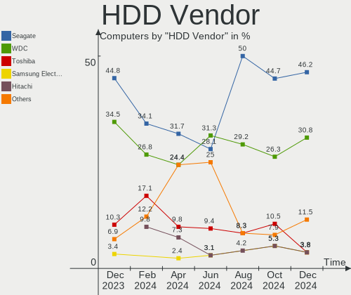
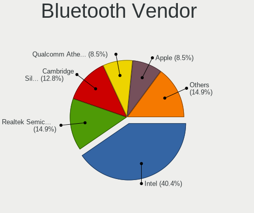

KDE neon - Hardware Trends
--------------------------

A project to identify most popular hardware characteristics and track their change
over time based on data collected by Linux users at https://Linux-Hardware.org.

Anyone can contribute to this report by the [hw-probe](https://github.com/linuxhw/hw-probe) tool:

    sudo -E hw-probe -all -upload

This is a report for all computer types. See also reports for [desktops](/Dist/KDE_neon/Desktop/README.md) and [notebooks](/Dist/KDE_neon/Notebook/README.md).

This report is for one last month. Overall report since the beginning of time: [TestDays](https://github.com/linuxhw/TestDays)

Period: Apr, 2023.

Contents
--------

* [ System ](#system)
  - [ OS                       ](#os)
  - [ OS Family                ](#os-family)
  - [ Kernel                   ](#kernel)
  - [ Kernel Family            ](#kernel-family)
  - [ Kernel Major Ver.        ](#kernel-major-ver)
  - [ Arch                     ](#arch)
  - [ DE                       ](#de)
  - [ Display Server           ](#display-server)
  - [ Display Manager          ](#display-manager)
  - [ OS Lang                  ](#os-lang)
  - [ Boot Mode                ](#boot-mode)
  - [ Filesystem               ](#filesystem)
  - [ Part. scheme             ](#part-scheme)
  - [ Dual Boot with Linux/BSD ](#dual-boot-with-linuxbsd)
  - [ Dual Boot (Win)          ](#dual-boot-win)

* [ Board ](#board)
  - [ Vendor                   ](#vendor)
  - [ Model                    ](#model)
  - [ Model Family             ](#model-family)
  - [ MFG Year                 ](#mfg-year)
  - [ Form Factor              ](#form-factor)
  - [ Secure Boot              ](#secure-boot)
  - [ Coreboot                 ](#coreboot)
  - [ RAM Size                 ](#ram-size)
  - [ RAM Used                 ](#ram-used)
  - [ Total Drives             ](#total-drives)
  - [ Has CD-ROM               ](#has-cd-rom)
  - [ Has Ethernet             ](#has-ethernet)
  - [ Has WiFi                 ](#has-wifi)
  - [ Has Bluetooth            ](#has-bluetooth)

* [ Location ](#location)
  - [ Country                  ](#country)
  - [ City                     ](#city)

* [ Drives ](#drives)
  - [ Drive Vendor             ](#drive-vendor)
  - [ Drive Model              ](#drive-model)
  - [ HDD Vendor               ](#hdd-vendor)
  - [ SSD Vendor               ](#ssd-vendor)
  - [ Drive Kind               ](#drive-kind)
  - [ Drive Connector          ](#drive-connector)
  - [ Drive Size               ](#drive-size)
  - [ Space Total              ](#space-total)
  - [ Space Used               ](#space-used)
  - [ Malfunc. Drives          ](#malfunc-drives)
  - [ Malfunc. Drive Vendor    ](#malfunc-drive-vendor)
  - [ Malfunc. HDD Vendor      ](#malfunc-hdd-vendor)
  - [ Malfunc. Drive Kind      ](#malfunc-drive-kind)
  - [ Failed Drives            ](#failed-drives)
  - [ Failed Drive Vendor      ](#failed-drive-vendor)
  - [ Drive Status             ](#drive-status)

* [ Storage controller ](#storage-controller)
  - [ Storage Vendor           ](#storage-vendor)
  - [ Storage Model            ](#storage-model)
  - [ Storage Kind             ](#storage-kind)

* [ Processor ](#processor)
  - [ CPU Vendor               ](#cpu-vendor)
  - [ CPU Model                ](#cpu-model)
  - [ CPU Model Family         ](#cpu-model-family)
  - [ CPU Cores                ](#cpu-cores)
  - [ CPU Sockets              ](#cpu-sockets)
  - [ CPU Threads              ](#cpu-threads)
  - [ CPU Op-Modes             ](#cpu-op-modes)
  - [ CPU Microcode            ](#cpu-microcode)
  - [ CPU Microarch            ](#cpu-microarch)

* [ Graphics ](#graphics)
  - [ GPU Vendor               ](#gpu-vendor)
  - [ GPU Model                ](#gpu-model)
  - [ GPU Combo                ](#gpu-combo)
  - [ GPU Driver               ](#gpu-driver)
  - [ GPU Memory               ](#gpu-memory)

* [ Monitor ](#monitor)
  - [ Monitor Vendor           ](#monitor-vendor)
  - [ Monitor Model            ](#monitor-model)
  - [ Monitor Resolution       ](#monitor-resolution)
  - [ Monitor Diagonal         ](#monitor-diagonal)
  - [ Monitor Width            ](#monitor-width)
  - [ Aspect Ratio             ](#aspect-ratio)
  - [ Monitor Area             ](#monitor-area)
  - [ Pixel Density            ](#pixel-density)
  - [ Multiple Monitors        ](#multiple-monitors)

* [ Network ](#network)
  - [ Net Controller Vendor    ](#net-controller-vendor)
  - [ Net Controller Model     ](#net-controller-model)
  - [ Wireless Vendor          ](#wireless-vendor)
  - [ Wireless Model           ](#wireless-model)
  - [ Ethernet Vendor          ](#ethernet-vendor)
  - [ Ethernet Model           ](#ethernet-model)
  - [ Net Controller Kind      ](#net-controller-kind)
  - [ Used Controller          ](#used-controller)
  - [ NICs                     ](#nics)
  - [ IPv6                     ](#ipv6)

* [ Bluetooth ](#bluetooth)
  - [ Bluetooth Vendor         ](#bluetooth-vendor)
  - [ Bluetooth Model          ](#bluetooth-model)

* [ Sound ](#sound)
  - [ Sound Vendor             ](#sound-vendor)
  - [ Sound Model              ](#sound-model)

* [ Memory ](#memory)
  - [ Memory Vendor            ](#memory-vendor)
  - [ Memory Model             ](#memory-model)
  - [ Memory Kind              ](#memory-kind)
  - [ Memory Form Factor       ](#memory-form-factor)
  - [ Memory Size              ](#memory-size)
  - [ Memory Speed             ](#memory-speed)

* [ Printers & scanners ](#printers--scanners)
  - [ Printer Vendor           ](#printer-vendor)
  - [ Printer Model            ](#printer-model)
  - [ Scanner Vendor           ](#scanner-vendor)
  - [ Scanner Model            ](#scanner-model)

* [ Camera ](#camera)
  - [ Camera Vendor            ](#camera-vendor)
  - [ Camera Model             ](#camera-model)

* [ Security ](#security)
  - [ Fingerprint Vendor       ](#fingerprint-vendor)
  - [ Fingerprint Model        ](#fingerprint-model)
  - [ Chipcard Vendor          ](#chipcard-vendor)
  - [ Chipcard Model           ](#chipcard-model)

* [ Unsupported ](#unsupported)
  - [ Unsupported Devices      ](#unsupported-devices)
  - [ Unsupported Device Types ](#unsupported-device-types)

System
------

OS
--

Installed operating systems

| Name           | Computers | Percent |
|----------------|-----------|---------|
| KDE neon 22.04 | 104       | 100%    |

OS Family
---------

OS without a version

| Name     | Computers | Percent |
|----------|-----------|---------|
| KDE neon | 104       | 100%    |

Kernel
------

Version of the Linux kernel

| Version                 | Computers | Percent |
|-------------------------|-----------|---------|
| 5.19.0-38-generic       | 52        | 50%     |
| 5.19.0-40-generic       | 24        | 23.08%  |
| 5.19.0-41-generic       | 18        | 17.31%  |
| 5.15.0-60-generic       | 5         | 4.81%   |
| 5.19.0-35-generic       | 2         | 1.92%   |
| 6.2.10-1-liquorix-amd64 | 1         | 0.96%   |
| 6.1.25-060125-generic   | 1         | 0.96%   |
| 6.0.0-060000-generic    | 1         | 0.96%   |

Kernel Family
-------------

Linux kernel without a distro release

| Version | Computers | Percent |
|---------|-----------|---------|
| 5.19.0  | 96        | 92.31%  |
| 5.15.0  | 5         | 4.81%   |
| 6.2.10  | 1         | 0.96%   |
| 6.1.25  | 1         | 0.96%   |
| 6.0.0   | 1         | 0.96%   |

Kernel Major Ver.
-----------------

Linux kernel major version

| Version | Computers | Percent |
|---------|-----------|---------|
| 5.19    | 96        | 92.31%  |
| 5.15    | 5         | 4.81%   |
| 6.2     | 1         | 0.96%   |
| 6.1     | 1         | 0.96%   |
| 6.0     | 1         | 0.96%   |

Arch
----

OS architecture (x86_64, i586, etc.)

| Name   | Computers | Percent |
|--------|-----------|---------|
| x86_64 | 104       | 100%    |

DE
--

Desktop Environment

| Name  | Computers | Percent |
|-------|-----------|---------|
| KDE5  | 103       | 99.04%  |
| GNOME | 1         | 0.96%   |

Display Server
--------------

X11 or Wayland

| Name    | Computers | Percent |
|---------|-----------|---------|
| X11     | 98        | 94.23%  |
| Wayland | 6         | 5.77%   |

Display Manager
---------------

SDDM, LightDM, etc.

| Name    | Computers | Percent |
|---------|-----------|---------|
| Unknown | 87        | 83.65%  |
| SDDM    | 17        | 16.35%  |

OS Lang
-------

Language

| Lang       | Computers | Percent |
|------------|-----------|---------|
| en_US      | 40        | 38.46%  |
| es_MX      | 6         | 5.77%   |
| es_ES      | 6         | 5.77%   |
| en_GB      | 6         | 5.77%   |
| en_AU      | 5         | 4.81%   |
| pt_BR      | 4         | 3.85%   |
| it_IT      | 4         | 3.85%   |
| ru_RU      | 3         | 2.88%   |
| fr_FR      | 3         | 2.88%   |
| en_IN      | 3         | 2.88%   |
| en_CA      | 3         | 2.88%   |
| en_AG      | 3         | 2.88%   |
| de_DE      | 3         | 2.88%   |
| pl_PL      | 2         | 1.92%   |
| cs_CZ      | 2         | 1.92%   |
| tr_TR      | 1         | 0.96%   |
| sl_SI      | 1         | 0.96%   |
| pt_PT      | 1         | 0.96%   |
| hu_HU      | 1         | 0.96%   |
| fr_CA      | 1         | 0.96%   |
| es_ES.UTF8 | 1         | 0.96%   |
| en_ZA      | 1         | 0.96%   |
| en_PH      | 1         | 0.96%   |
| en_NZ      | 1         | 0.96%   |
| en_DK      | 1         | 0.96%   |
| C          | 1         | 0.96%   |

Boot Mode
---------

EFI or BIOS

| Mode | Computers | Percent |
|------|-----------|---------|
| BIOS | 93        | 89.42%  |
| EFI  | 11        | 10.58%  |

Filesystem
----------

Type of filesystem

| Type  | Computers | Percent |
|-------|-----------|---------|
| Ext4  | 97        | 93.27%  |
| Btrfs | 4         | 3.85%   |
| Tmpfs | 2         | 1.92%   |
| Xfs   | 1         | 0.96%   |

Part. scheme
------------

Scheme of partitioning

| Type    | Computers | Percent |
|---------|-----------|---------|
| Unknown | 87        | 83.65%  |
| GPT     | 17        | 16.35%  |

Dual Boot with Linux/BSD
------------------------

Hosting more than one Linux/BSD

| Dual boot | Computers | Percent |
|-----------|-----------|---------|
| No        | 103       | 99.04%  |
| Yes       | 1         | 0.96%   |

Dual Boot (Win)
---------------

Hosting Linux and Windows

| Dual boot | Computers | Percent |
|-----------|-----------|---------|
| No        | 96        | 92.31%  |
| Yes       | 8         | 7.69%   |

Board
-----

Vendor
------

Motherboard manufacturer

| Name                                 | Computers | Percent |
|--------------------------------------|-----------|---------|
| Lenovo                               | 17        | 16.35%  |
| Hewlett-Packard                      | 16        | 15.38%  |
| Gigabyte Technology                  | 13        | 12.5%   |
| Dell                                 | 12        | 11.54%  |
| ASUSTek Computer                     | 10        | 9.62%   |
| MSI                                  | 9         | 8.65%   |
| Acer                                 | 6         | 5.77%   |
| ASRock                               | 4         | 3.85%   |
| Apple                                | 3         | 2.88%   |
| Timi                                 | 2         | 1.92%   |
| HUAWEI                               | 2         | 1.92%   |
| Unchartevice                         | 1         | 0.96%   |
| Shenzhen Meigao Electronic Equipment | 1         | 0.96%   |
| Samsung Electronics                  | 1         | 0.96%   |
| Positivo                             | 1         | 0.96%   |
| Intel                                | 1         | 0.96%   |
| Getac                                | 1         | 0.96%   |
| Fujitsu                              | 1         | 0.96%   |
| Chuwi                                | 1         | 0.96%   |
| Biostar                              | 1         | 0.96%   |
| BESSTAR Tech                         | 1         | 0.96%   |

Model
-----

Motherboard model

| Name                                       | Computers | Percent |
|--------------------------------------------|-----------|---------|
| MSI MS-7C37                                | 2         | 1.92%   |
| Unchartevice 6540                          | 1         | 0.96%   |
| Timi Xiaomi NoteBook Pro                   | 1         | 0.96%   |
| Timi Mi Laptop Pro 15 2020                 | 1         | 0.96%   |
| Shenzhen Meigao Electronic Equipment HX99G | 1         | 0.96%   |
| Samsung 905S3G/906S3G/915S3G               | 1         | 0.96%   |
| Positivo Q4128C-S                          | 1         | 0.96%   |
| MSI MS-7D73                                | 1         | 0.96%   |
| MSI MS-7B89                                | 1         | 0.96%   |
| MSI MS-7B87                                | 1         | 0.96%   |
| MSI MS-7760                                | 1         | 0.96%   |
| MSI GS65 Stealth 8SE                       | 1         | 0.96%   |
| MSI GP72 7RDX                              | 1         | 0.96%   |
| MSI GE72VR 6RF                             | 1         | 0.96%   |
| Lenovo ThinkPad Yoga 370 20JJS1SF00        | 1         | 0.96%   |
| Lenovo ThinkPad X220 429044U               | 1         | 0.96%   |
| Lenovo ThinkPad T530 24292DG               | 1         | 0.96%   |
| Lenovo ThinkPad P51 20HH001RMX             | 1         | 0.96%   |
| Lenovo ThinkPad L530 24783B3               | 1         | 0.96%   |
| Lenovo ThinkPad Edge E531 688567G          | 1         | 0.96%   |
| Lenovo ThinkPad E14 Gen 3 20Y7S00700       | 1         | 0.96%   |
| Lenovo ThinkCentre M92p 3227A2U            | 1         | 0.96%   |
| Lenovo Legion 5 Pro 16ACH6 82JS            | 1         | 0.96%   |
| Lenovo IdeaPadFlex 5 15ITL05 82HT          | 1         | 0.96%   |
| Lenovo IdeaPad Z410 20292                  | 1         | 0.96%   |
| Lenovo IdeaPad 5 Pro 14IAP7 82SH           | 1         | 0.96%   |
| Lenovo IdeaPad 5 Pro 14ACN6 82L7           | 1         | 0.96%   |
| Lenovo IdeaPad 3 15ALC6 82KU               | 1         | 0.96%   |
| Lenovo G560 0679                           | 1         | 0.96%   |
| Lenovo G405 20239                          | 1         | 0.96%   |
| Lenovo B570e HuronRiver Platform           | 1         | 0.96%   |
| Intel NUC7i7DNKE                           | 1         | 0.96%   |
| HUAWEI CREM-WXX9                           | 1         | 0.96%   |
| HUAWEI BOHB-WAX9                           | 1         | 0.96%   |
| HP Victus by Gaming Laptop 15-fb0xxx       | 1         | 0.96%   |
| HP ProBook x360 435 G8 Notebook PC         | 1         | 0.96%   |
| HP ProBook 6570b                           | 1         | 0.96%   |
| HP Pavilion Gaming Laptop 15-ec2xxx        | 1         | 0.96%   |
| HP Pavilion Gaming Laptop 15-ec0xxx        | 1         | 0.96%   |
| HP Pavilion dv7                            | 1         | 0.96%   |

Model Family
------------

Motherboard model prefix

| Name                                       | Computers | Percent |
|--------------------------------------------|-----------|---------|
| Lenovo ThinkPad                            | 7         | 6.73%   |
| Dell Inspiron                              | 6         | 5.77%   |
| Lenovo IdeaPad                             | 4         | 3.85%   |
| HP Pavilion                                | 4         | 3.85%   |
| Acer Aspire                                | 4         | 3.85%   |
| HP Laptop                                  | 3         | 2.88%   |
| Dell Latitude                              | 3         | 2.88%   |
| MSI MS-7C37                                | 2         | 1.92%   |
| HP ProBook                                 | 2         | 1.92%   |
| HP EliteDesk                               | 2         | 1.92%   |
| ASUS VivoBook                              | 2         | 1.92%   |
| ASUS PRIME                                 | 2         | 1.92%   |
| Unchartevice 6540                          | 1         | 0.96%   |
| Timi Xiaomi                                | 1         | 0.96%   |
| Timi Mi                                    | 1         | 0.96%   |
| Shenzhen Meigao Electronic Equipment HX99G | 1         | 0.96%   |
| Samsung 905S3G                             | 1         | 0.96%   |
| Positivo Q4128C-S                          | 1         | 0.96%   |
| MSI MS-7D73                                | 1         | 0.96%   |
| MSI MS-7B89                                | 1         | 0.96%   |
| MSI MS-7B87                                | 1         | 0.96%   |
| MSI MS-7760                                | 1         | 0.96%   |
| MSI GS65                                   | 1         | 0.96%   |
| MSI GP72                                   | 1         | 0.96%   |
| MSI GE72VR                                 | 1         | 0.96%   |
| Lenovo ThinkCentre                         | 1         | 0.96%   |
| Lenovo Legion                              | 1         | 0.96%   |
| Lenovo IdeaPadFlex                         | 1         | 0.96%   |
| Lenovo G560                                | 1         | 0.96%   |
| Lenovo G405                                | 1         | 0.96%   |
| Lenovo B570e                               | 1         | 0.96%   |
| Intel NUC7i7DNKE                           | 1         | 0.96%   |
| HUAWEI CREM-WXX9                           | 1         | 0.96%   |
| HUAWEI BOHB-WAX9                           | 1         | 0.96%   |
| HP Victus                                  | 1         | 0.96%   |
| HP OMEN                                    | 1         | 0.96%   |
| HP Compaq                                  | 1         | 0.96%   |
| HP 2000                                    | 1         | 0.96%   |
| Gigabyte Z97X-Gaming                       | 1         | 0.96%   |
| Gigabyte Z690                              | 1         | 0.96%   |

MFG Year
--------

Motherboard manufacture year

| Year | Computers | Percent |
|------|-----------|---------|
| 2021 | 17        | 16.35%  |
| 2020 | 13        | 12.5%   |
| 2019 | 13        | 12.5%   |
| 2022 | 9         | 8.65%   |
| 2013 | 9         | 8.65%   |
| 2012 | 8         | 7.69%   |
| 2018 | 7         | 6.73%   |
| 2017 | 6         | 5.77%   |
| 2011 | 6         | 5.77%   |
| 2016 | 4         | 3.85%   |
| 2015 | 3         | 2.88%   |
| 2014 | 3         | 2.88%   |
| 2010 | 2         | 1.92%   |
| 2008 | 2         | 1.92%   |
| 2023 | 1         | 0.96%   |
| 2007 | 1         | 0.96%   |

Form Factor
-----------

Physical design of the computer

| Name        | Computers | Percent |
|-------------|-----------|---------|
| Notebook    | 60        | 57.69%  |
| Desktop     | 38        | 36.54%  |
| Convertible | 3         | 2.88%   |
| Tablet      | 1         | 0.96%   |
| Mini pc     | 1         | 0.96%   |
| All in one  | 1         | 0.96%   |

Secure Boot
-----------

Enabled or disabled

| State    | Computers | Percent |
|----------|-----------|---------|
| Disabled | 102       | 98.08%  |
| Enabled  | 2         | 1.92%   |

Coreboot
--------

Have coreboot on board

| Used | Computers | Percent |
|------|-----------|---------|
| No   | 104       | 100%    |

RAM Size
--------

Total RAM memory

| Size in GB      | Computers | Percent |
|-----------------|-----------|---------|
| 4.01-8.0        | 28        | 26.92%  |
| 16.01-24.0      | 26        | 25%     |
| 8.01-16.0       | 19        | 18.27%  |
| 32.01-64.0      | 18        | 17.31%  |
| 3.01-4.0        | 7         | 6.73%   |
| 24.01-32.0      | 2         | 1.92%   |
| 1.01-2.0        | 2         | 1.92%   |
| More than 256.0 | 1         | 0.96%   |
| 64.01-256.0     | 1         | 0.96%   |

RAM Used
--------

Used RAM memory

| Used GB   | Computers | Percent |
|-----------|-----------|---------|
| 2.01-3.0  | 34        | 32.69%  |
| 1.01-2.0  | 26        | 25%     |
| 4.01-8.0  | 21        | 20.19%  |
| 3.01-4.0  | 17        | 16.35%  |
| 8.01-16.0 | 5         | 4.81%   |
| 0.51-1.0  | 1         | 0.96%   |

Total Drives
------------

Number of drives on board

| Drives | Computers | Percent |
|--------|-----------|---------|
| 1      | 57        | 54.81%  |
| 2      | 25        | 24.04%  |
| 3      | 8         | 7.69%   |
| 4      | 6         | 5.77%   |
| 6      | 4         | 3.85%   |
| 5      | 3         | 2.88%   |
| 7      | 1         | 0.96%   |

Has CD-ROM
----------

Has CD-ROM on board

| Presented | Computers | Percent |
|-----------|-----------|---------|
| No        | 74        | 71.15%  |
| Yes       | 30        | 28.85%  |

Has Ethernet
------------

Has Ethernet on board

| Presented | Computers | Percent |
|-----------|-----------|---------|
| Yes       | 87        | 83.65%  |
| No        | 17        | 16.35%  |

Has WiFi
--------

Has WiFi module

| Presented | Computers | Percent |
|-----------|-----------|---------|
| Yes       | 83        | 79.81%  |
| No        | 21        | 20.19%  |

Has Bluetooth
-------------

Has Bluetooth module

| Presented | Computers | Percent |
|-----------|-----------|---------|
| Yes       | 76        | 73.08%  |
| No        | 28        | 26.92%  |

Location
--------

Country
-------

Geographic location (country)

| Country      | Computers | Percent |
|--------------|-----------|---------|
| USA          | 17        | 16.35%  |
| Spain        | 7         | 6.73%   |
| Italy        | 6         | 5.77%   |
| Canada       | 6         | 5.77%   |
| Mexico       | 5         | 4.81%   |
| India        | 5         | 4.81%   |
| Australia    | 5         | 4.81%   |
| UK           | 4         | 3.85%   |
| Brazil       | 4         | 3.85%   |
| Russia       | 3         | 2.88%   |
| Germany      | 3         | 2.88%   |
| Venezuela    | 2         | 1.92%   |
| Thailand     | 2         | 1.92%   |
| Poland       | 2         | 1.92%   |
| France       | 2         | 1.92%   |
| Czechia      | 2         | 1.92%   |
| Colombia     | 2         | 1.92%   |
| Belarus      | 2         | 1.92%   |
| Ukraine      | 1         | 0.96%   |
| Turkey       | 1         | 0.96%   |
| Tunisia      | 1         | 0.96%   |
| Taiwan       | 1         | 0.96%   |
| South Africa | 1         | 0.96%   |
| Slovenia     | 1         | 0.96%   |
| Portugal     | 1         | 0.96%   |
| Philippines  | 1         | 0.96%   |
| Norway       | 1         | 0.96%   |
| New Zealand  | 1         | 0.96%   |
| Netherlands  | 1         | 0.96%   |
| Luxembourg   | 1         | 0.96%   |
| Lithuania    | 1         | 0.96%   |
| Latvia       | 1         | 0.96%   |
| Kenya        | 1         | 0.96%   |
| Kazakhstan   | 1         | 0.96%   |
| Indonesia    | 1         | 0.96%   |
| Hungary      | 1         | 0.96%   |
| Georgia      | 1         | 0.96%   |
| Egypt        | 1         | 0.96%   |
| Denmark      | 1         | 0.96%   |
| Costa Rica   | 1         | 0.96%   |

City
----

Geographic location (city)

| City              | Computers | Percent |
|-------------------|-----------|---------|
| Rome              | 3         | 2.88%   |
| Melbourne         | 3         | 2.88%   |
| Valencia          | 2         | 1.92%   |
| Prague            | 2         | 1.92%   |
| Moscow            | 2         | 1.92%   |
| Montreal          | 2         | 1.92%   |
| Hamburg           | 2         | 1.92%   |
| Zamora            | 1         | 0.96%   |
| Yerevan           | 1         | 0.96%   |
| Wroclaw           | 1         | 0.96%   |
| Vincennes         | 1         | 0.96%   |
| Verona            | 1         | 0.96%   |
| Veracruz          | 1         | 0.96%   |
| Vallejo           | 1         | 0.96%   |
| Utrecht           | 1         | 0.96%   |
| Ufa               | 1         | 0.96%   |
| Tucson            | 1         | 0.96%   |
| Tbilisi           | 1         | 0.96%   |
| Tamworth          | 1         | 0.96%   |
| Taichung          | 1         | 0.96%   |
| Sydney            | 1         | 0.96%   |
| Sosnowiec         | 1         | 0.96%   |
| Songkhla          | 1         | 0.96%   |
| Senozece          | 1         | 0.96%   |
| Santa Rosa        | 1         | 0.96%   |
| Salamanca         | 1         | 0.96%   |
| Saint-Jerome      | 1         | 0.96%   |
| Rostov-on-Don     | 1         | 0.96%   |
| Roselle           | 1         | 0.96%   |
| Riga              | 1         | 0.96%   |
| Pune              | 1         | 0.96%   |
| Puerto Juárez    | 1         | 0.96%   |
| Priego de Cordoba | 1         | 0.96%   |
| Pretoria          | 1         | 0.96%   |
| Porirua           | 1         | 0.96%   |
| Polla             | 1         | 0.96%   |
| Pavlodar          | 1         | 0.96%   |
| Pasuruan          | 1         | 0.96%   |
| Paris             | 1         | 0.96%   |
| Oviedo            | 1         | 0.96%   |

Drives
------

Drive Vendor
------------

Hard drive vendors

| Vendor                         | Computers | Drives  | Percent |
|--------------------------------|-----------|---------|---------|
| Samsung Electronics            | 24        | 34      | 13.95%  |
| Seagate                        | 16        | 20      | 9.3%    |
| WDC                            | 14        | 22      | 8.14%   |
| SanDisk                        | 13        | 15      | 7.56%   |
| Toshiba                        | 10        | 11      | 5.81%   |
| Crucial                        | 10        | 12      | 5.81%   |
| Unknown                        | 9         | 9       | 5.23%   |
| Kingston                       | 9         | 9       | 5.23%   |
| SK hynix                       | 5         | 5       | 2.91%   |
| Phison Electronics             | 5         | 8       | 2.91%   |
| Kingston Technology Company    | 5         | 5       | 2.91%   |
| Intel                          | 4         | 4       | 2.33%   |
| HGST                           | 4         | 4       | 2.33%   |
| SPCC                           | 3         | 3       | 1.74%   |
| KIOXIA                         | 3         | 3       | 1.74%   |
| Silicon Motion                 | 2         | 2       | 1.16%   |
| Realtek Semiconductor          | 2         | 2       | 1.16%   |
| Phison                         | 2         | 2       | 1.16%   |
| Patriot                        | 2         | 2       | 1.16%   |
| China                          | 2         | 2       | 1.16%   |
| A-DATA Technology              | 2         | 2       | 1.16%   |
| Unknown                        | 2         | 2       | 1.16%   |
| XrayDisk                       | 1         | 1       | 0.58%   |
| Verbatim                       | 1         | 1       | 0.58%   |
| Transcend                      | 1         | 1       | 0.58%   |
| T-FORCE                        | 1         | 1       | 0.58%   |
| StoreJet                       | 1         | 1       | 0.58%   |
| Solid State Storage Technology | 1         | 1       | 0.58%   |
| Shenzhen Longsys Electronics   | 1         | 1       | 0.58%   |
| POLION                         | 1         | 1       | 0.58%   |
| PNY                            | 1         | 1       | 0.58%   |
| Micron/Crucial Technology      | 1         | 1       | 0.58%   |
| Micron Technology              | 1         | 1       | 0.58%   |
| Maxtor                         | 1         | 1       | 0.58%   |
| LITEONIT                       | 1         | 1       | 0.58%   |
| Lenovo                         | 1         | 1       | 0.58%   |
| JMicron Technology             | 1         | 1       | 0.58%   |
| HL-DT-ST                       | 1         | Unknown | 0.58%   |
| Hitachi                        | 1         | 1       | 0.58%   |
| GOODRAM                        | 1         | 1       | 0.58%   |

Drive Model
-----------

Hard drive models

| Model                                                  | Computers | Percent |
|--------------------------------------------------------|-----------|---------|
| Unknown MMC Card  128GB                                | 4         | 2.07%   |
| Samsung NVMe SSD Controller SM981/PM981/PM983 1TB      | 4         | 2.07%   |
| Sandisk WD Black 2018/SN750 / PC SN720 NVMe SSD 500GB  | 3         | 1.55%   |
| Samsung SSD 850 EVO 250GB                              | 3         | 1.55%   |
| Samsung NVMe SSD Controller PM9A1/PM9A3/980PRO 2TB     | 3         | 1.55%   |
| Kingston Company OM3PDP3 NVMe SSD 512GB                | 3         | 1.55%   |
| Kingston SA400S37240G 240GB SSD                        | 3         | 1.55%   |
| HGST HTS721010A9E630 1TB                               | 3         | 1.55%   |
| Crucial CT240BX500SSD1 240GB                           | 3         | 1.55%   |
| Crucial CT1000MX500SSD1 1TB                            | 3         | 1.55%   |
| Unknown SD/MMC/MS PRO 249GB                            | 2         | 1.04%   |
| Unknown MMC Card  64GB                                 | 2         | 1.04%   |
| Toshiba MQ04ABF100 1TB                                 | 2         | 1.04%   |
| Toshiba DT01ACA050 500GB                               | 2         | 1.04%   |
| SPCC Solid State Disk 128GB                            | 2         | 1.04%   |
| Silicon Motion SM2263EN/SM2263XT SSD Controller 1024GB | 2         | 1.04%   |
| Seagate ST3500418AS 500GB                              | 2         | 1.04%   |
| Seagate ST1000LM024 HN-M101MBB 1TB                     | 2         | 1.04%   |
| Sandisk WD Black SN750 / PC SN730 NVMe SSD 512GB       | 2         | 1.04%   |
| Samsung SSD 860 EVO 1TB                                | 2         | 1.04%   |
| Samsung SSD 840 EVO 120GB                              | 2         | 1.04%   |
| Samsung PSSD T7 500GB                                  | 2         | 1.04%   |
| Phison E16 PCIe4 NVMe Controller 500GB                 | 2         | 1.04%   |
| Phison E12 NVMe Controller 512GB                       | 2         | 1.04%   |
| Kingston Company SNV2S1000G 1TB                        | 2         | 1.04%   |
| Crucial CT500MX500SSD1 500GB                           | 2         | 1.04%   |
| Crucial CT250MX500SSD1 250GB                           | 2         | 1.04%   |
| Unknown                                                | 2         | 1.04%   |
| XrayDisk 512GB SSD                                     | 1         | 0.52%   |
| WDC WDS100T2B0B-00YS70 1TB SSD                         | 1         | 0.52%   |
| WDC WDBNCE5000PNC 500GB SSD                            | 1         | 0.52%   |
| WDC WD7500BPVX-22JC3T0 752GB                           | 1         | 0.52%   |
| WDC WD6003FZBX-00K5WB0 6TB                             | 1         | 0.52%   |
| WDC WD5000LPVX-22V0TT0 500GB                           | 1         | 0.52%   |
| WDC WD5000AAKX-001CA0 500GB                            | 1         | 0.52%   |
| WDC WD40EZRZ-22GXCB0 4TB                               | 1         | 0.52%   |
| WDC WD40EZAZ-00SF3B0 4TB                               | 1         | 0.52%   |
| WDC WD40EFRX-68N32N0 4TB                               | 1         | 0.52%   |
| WDC WD40EFAX-68JH4N1 4TB                               | 1         | 0.52%   |
| WDC WD2500AAKX-75U6AA0 250GB                           | 1         | 0.52%   |

HDD Vendor
----------

Hard disk drive vendors

| Vendor              | Computers | Drives | Percent |
|---------------------|-----------|--------|---------|
| Seagate             | 16        | 20     | 35.56%  |
| WDC                 | 12        | 19     | 26.67%  |
| Toshiba             | 7         | 8      | 15.56%  |
| HGST                | 4         | 4      | 8.89%   |
| Unknown             | 2         | 2      | 4.44%   |
| Samsung Electronics | 2         | 2      | 4.44%   |
| Maxtor              | 1         | 1      | 2.22%   |
| Hitachi             | 1         | 1      | 2.22%   |

SSD Vendor
----------

Solid state drive vendors

| Vendor              | Computers | Drives | Percent |
|---------------------|-----------|--------|---------|
| Samsung Electronics | 15        | 16     | 23.81%  |
| Crucial             | 10        | 12     | 15.87%  |
| Kingston            | 8         | 8      | 12.7%   |
| SanDisk             | 5         | 6      | 7.94%   |
| SPCC                | 3         | 3      | 4.76%   |
| WDC                 | 2         | 2      | 3.17%   |
| Patriot             | 2         | 2      | 3.17%   |
| China               | 2         | 2      | 3.17%   |
| A-DATA Technology   | 2         | 2      | 3.17%   |
| XrayDisk            | 1         | 1      | 1.59%   |
| Verbatim            | 1         | 1      | 1.59%   |
| Transcend           | 1         | 1      | 1.59%   |
| StoreJet            | 1         | 1      | 1.59%   |
| SK hynix            | 1         | 1      | 1.59%   |
| PNY                 | 1         | 1      | 1.59%   |
| LITEONIT            | 1         | 1      | 1.59%   |
| Lenovo              | 1         | 1      | 1.59%   |
| Intel               | 1         | 1      | 1.59%   |
| GOODRAM             | 1         | 1      | 1.59%   |
| Gigabyte Technology | 1         | 1      | 1.59%   |
| ASENNO              | 1         | 1      | 1.59%   |
| Apple               | 1         | 1      | 1.59%   |
| 2.5"                | 1         | 2      | 1.59%   |

Drive Kind
----------

HDD or SSD

| Kind    | Computers | Drives | Percent |
|---------|-----------|--------|---------|
| NVMe    | 55        | 65     | 36.18%  |
| SSD     | 49        | 68     | 32.24%  |
| HDD     | 37        | 57     | 24.34%  |
| MMC     | 7         | 8      | 4.61%   |
| Unknown | 4         | 4      | 2.63%   |

Drive Connector
---------------

SATA, SAS, NVMe, etc.

| Type | Computers | Drives | Percent |
|------|-----------|--------|---------|
| SATA | 64        | 121    | 47.41%  |
| NVMe | 55        | 65     | 40.74%  |
| SAS  | 9         | 8      | 6.67%   |
| MMC  | 7         | 8      | 5.19%   |

Drive Size
----------

Size of hard drive

| Size in TB | Computers | Drives | Percent |
|------------|-----------|--------|---------|
| 0.01-0.5   | 51        | 73     | 54.84%  |
| 0.51-1.0   | 26        | 31     | 27.96%  |
| 1.01-2.0   | 7         | 8      | 7.53%   |
| 3.01-4.0   | 6         | 9      | 6.45%   |
| 4.01-10.0  | 3         | 4      | 3.23%   |

Space Total
-----------

Amount of disk space available on the file system

| Size in GB     | Computers | Percent |
|----------------|-----------|---------|
| 101-250        | 40        | 38.46%  |
| 251-500        | 23        | 22.12%  |
| 51-100         | 11        | 10.58%  |
| 1001-2000      | 10        | 9.62%   |
| More than 3000 | 7         | 6.73%   |
| 501-1000       | 5         | 4.81%   |
| Unknown        | 5         | 4.81%   |
| 21-50          | 2         | 1.92%   |
| 1-20           | 1         | 0.96%   |

Space Used
----------

Amount of used disk space

| Used GB        | Computers | Percent |
|----------------|-----------|---------|
| 1-20           | 40        | 38.46%  |
| 21-50          | 17        | 16.35%  |
| 51-100         | 15        | 14.42%  |
| 101-250        | 10        | 9.62%   |
| 251-500        | 7         | 6.73%   |
| Unknown        | 5         | 4.81%   |
| 501-1000       | 4         | 3.85%   |
| More than 3000 | 3         | 2.88%   |
| 1001-2000      | 3         | 2.88%   |

Malfunc. Drives
---------------

Drive models with a malfunction

| Model                  | Computers | Drives | Percent |
|------------------------|-----------|--------|---------|
| Toshiba MQ04ABF100 1TB | 1         | 1      | 100%    |

Malfunc. Drive Vendor
---------------------

Vendors of faulty drives

| Vendor  | Computers | Drives | Percent |
|---------|-----------|--------|---------|
| Toshiba | 1         | 1      | 100%    |

Malfunc. HDD Vendor
-------------------

Vendors of faulty HDD drives

| Vendor  | Computers | Drives | Percent |
|---------|-----------|--------|---------|
| Toshiba | 1         | 1      | 100%    |

Malfunc. Drive Kind
-------------------

Kinds of faulty drives

| Kind | Computers | Drives | Percent |
|------|-----------|--------|---------|
| HDD  | 1         | 1      | 100%    |

Failed Drives
-------------

Failed drive models

Zero info for selected period =(

Failed Drive Vendor
-------------------

Failed drive vendors

Zero info for selected period =(

Drive Status
------------

Number of failed and malfunc. drives

| Status   | Computers | Drives | Percent |
|----------|-----------|--------|---------|
| Detected | 94        | 184    | 89.52%  |
| Works    | 10        | 17     | 9.52%   |
| Malfunc  | 1         | 1      | 0.95%   |

Storage controller
------------------

Storage Vendor
--------------

Storage controller vendors

| Vendor                         | Computers | Percent |
|--------------------------------|-----------|---------|
| Intel                          | 55        | 36.67%  |
| AMD                            | 31        | 20.67%  |
| Samsung Electronics            | 14        | 9.33%   |
| SanDisk                        | 10        | 6.67%   |
| Phison Electronics             | 8         | 5.33%   |
| Kingston Technology Company    | 6         | 4%      |
| SK hynix                       | 4         | 2.67%   |
| KIOXIA                         | 4         | 2.67%   |
| ASMedia Technology             | 4         | 2.67%   |
| Toshiba America Info Systems   | 2         | 1.33%   |
| Silicon Motion                 | 2         | 1.33%   |
| Realtek Semiconductor          | 2         | 1.33%   |
| Marvell Technology Group       | 2         | 1.33%   |
| Solid State Storage Technology | 1         | 0.67%   |
| Shenzhen Longsys Electronics   | 1         | 0.67%   |
| Micron/Crucial Technology      | 1         | 0.67%   |
| Micron Technology              | 1         | 0.67%   |
| JMicron Technology             | 1         | 0.67%   |
| ADATA Technology               | 1         | 0.67%   |

Storage Model
-------------

Storage controller models

| Model                                                                          | Computers | Percent |
|--------------------------------------------------------------------------------|-----------|---------|
| AMD FCH SATA Controller [AHCI mode]                                            | 23        | 14.2%   |
| Intel 8 Series/C220 Series Chipset Family 6-port SATA Controller 1 [AHCI mode] | 5         | 3.09%   |
| Intel 7 Series Chipset Family 6-port SATA Controller [AHCI mode]               | 5         | 3.09%   |
| AMD 400 Series Chipset SATA Controller                                         | 5         | 3.09%   |
| Samsung NVMe SSD Controller SM981/PM981/PM983                                  | 4         | 2.47%   |
| Samsung NVMe SSD Controller PM9A1/PM9A3/980PRO                                 | 4         | 2.47%   |
| Samsung NVMe SSD Controller 980                                                | 4         | 2.47%   |
| Intel Cannon Point-LP SATA Controller [AHCI Mode]                              | 4         | 2.47%   |
| ASMedia ASM1062 Serial ATA Controller                                          | 4         | 2.47%   |
| SanDisk WD Black 2018/SN750 / PC SN720 NVMe SSD                                | 3         | 1.85%   |
| Phison E12 NVMe Controller                                                     | 3         | 1.85%   |
| Kingston Company OM3PDP3 NVMe SSD                                              | 3         | 1.85%   |
| Intel Sunrise Point-LP SATA Controller [AHCI mode]                             | 3         | 1.85%   |
| Intel Q170/Q150/B150/H170/H110/Z170/CM236 Chipset SATA Controller [AHCI Mode]  | 3         | 1.85%   |
| Intel Comet Lake SATA AHCI Controller                                          | 3         | 1.85%   |
| Intel 6 Series/C200 Series Chipset Family 6 port Mobile SATA AHCI Controller   | 3         | 1.85%   |
| AMD 500 Series Chipset SATA Controller                                         | 3         | 1.85%   |
| SK hynix Gold P31/PC711 NVMe Solid State Drive                                 | 2         | 1.23%   |
| Silicon Motion SM2263EN/SM2263XT SSD Controller                                | 2         | 1.23%   |
| SanDisk WD Blue SN550 NVMe SSD                                                 | 2         | 1.23%   |
| SanDisk WD Black SN750 / PC SN730 NVMe SSD                                     | 2         | 1.23%   |
| Phison PS5013 E13 NVMe Controller                                              | 2         | 1.23%   |
| Phison E16 PCIe4 NVMe Controller                                               | 2         | 1.23%   |
| Marvell Group 88SE9172 SATA 6Gb/s Controller                                   | 2         | 1.23%   |
| KIOXIA NVMe SSD Controller BG4                                                 | 2         | 1.23%   |
| KIOXIA Non-Volatile memory controller                                          | 2         | 1.23%   |
| Kingston Company Company Non-Volatile memory controller                        | 2         | 1.23%   |
| Intel Volume Management Device NVMe RAID Controller                            | 2         | 1.23%   |
| Intel HM170/QM170 Chipset SATA Controller [AHCI Mode]                          | 2         | 1.23%   |
| Intel C600/X79 series chipset 6-Port SATA AHCI Controller                      | 2         | 1.23%   |
| Intel Alder Lake-S PCH SATA Controller [AHCI Mode]                             | 2         | 1.23%   |
| Intel 7 Series/C210 Series Chipset Family 6-port SATA Controller [AHCI mode]   | 2         | 1.23%   |
| Intel 5 Series/3400 Series Chipset 4 port SATA AHCI Controller                 | 2         | 1.23%   |
| Intel 200 Series PCH SATA controller [AHCI mode]                               | 2         | 1.23%   |
| AMD SB7x0/SB8x0/SB9x0 SATA Controller [AHCI mode]                              | 2         | 1.23%   |
| Toshiba America Info Systems XG6 NVMe SSD Controller                           | 1         | 0.62%   |
| Toshiba America Info Systems BG3 NVMe SSD Controller                           | 1         | 0.62%   |
| Solid State Storage Non-Volatile memory controller                             | 1         | 0.62%   |
| SK hynix Platinum P41 NVMe Solid State Drive 2TB                               | 1         | 0.62%   |
| SK hynix BC501 NVMe Solid State Drive                                          | 1         | 0.62%   |

Storage Kind
------------

Kind of storage controller (IDE, SATA, NVMe, SAS, ...)

| Kind | Computers | Percent |
|------|-----------|---------|
| SATA | 78        | 55.32%  |
| NVMe | 55        | 39.01%  |
| RAID | 4         | 2.84%   |
| IDE  | 4         | 2.84%   |

Processor
---------

CPU Vendor
----------

Processor vendors

| Vendor | Computers | Percent |
|--------|-----------|---------|
| Intel  | 64        | 61.54%  |
| AMD    | 40        | 38.46%  |

CPU Model
---------

Processor models

| Model                                   | Computers | Percent |
|-----------------------------------------|-----------|---------|
| AMD Ryzen 7 5800H with Radeon Graphics  | 3         | 2.88%   |
| AMD Ryzen 5 5600U with Radeon Graphics  | 3         | 2.88%   |
| Intel Core i7-8565U CPU @ 1.80GHz       | 2         | 1.92%   |
| Intel Core i7-4790K CPU @ 4.00GHz       | 2         | 1.92%   |
| Intel Core i5-7200U CPU @ 2.50GHz       | 2         | 1.92%   |
| Intel Core i5-3470 CPU @ 3.20GHz        | 2         | 1.92%   |
| Intel Core i5-3230M CPU @ 2.60GHz       | 2         | 1.92%   |
| Intel Core i5 CPU M 430 @ 2.27GHz       | 2         | 1.92%   |
| Intel 11th Gen Core i7-1165G7 @ 2.80GHz | 2         | 1.92%   |
| Intel 11th Gen Core i5-11400H @ 2.70GHz | 2         | 1.92%   |
| AMD Ryzen 5 7600X 6-Core Processor      | 2         | 1.92%   |
| AMD Ryzen 5 5600H with Radeon Graphics  | 2         | 1.92%   |
| AMD Ryzen 5 5600G with Radeon Graphics  | 2         | 1.92%   |
| AMD Ryzen 5 3600X 6-Core Processor      | 2         | 1.92%   |
| AMD Ryzen 5 3600 6-Core Processor       | 2         | 1.92%   |
| AMD Ryzen 3 3250U with Radeon Graphics  | 2         | 1.92%   |
| Intel Xeon CPU E5-2650 v2 @ 2.60GHz     | 1         | 0.96%   |
| Intel Pentium Dual CPU T2370 @ 1.73GHz  | 1         | 0.96%   |
| Intel Pentium CPU P6200 @ 2.13GHz       | 1         | 0.96%   |
| Intel Pentium CPU G630 @ 2.70GHz        | 1         | 0.96%   |
| Intel Pentium CPU G4400 @ 3.30GHz       | 1         | 0.96%   |
| Intel Pentium CPU 2020M @ 2.40GHz       | 1         | 0.96%   |
| Intel Core i7-8750H CPU @ 2.20GHz       | 1         | 0.96%   |
| Intel Core i7-8650U CPU @ 1.90GHz       | 1         | 0.96%   |
| Intel Core i7-7820HQ CPU @ 2.90GHz      | 1         | 0.96%   |
| Intel Core i7-7700HQ CPU @ 2.80GHz      | 1         | 0.96%   |
| Intel Core i7-7700 CPU @ 3.60GHz        | 1         | 0.96%   |
| Intel Core i7-6700HQ CPU @ 2.60GHz      | 1         | 0.96%   |
| Intel Core i7-5500U CPU @ 2.40GHz       | 1         | 0.96%   |
| Intel Core i7-4702MQ CPU @ 2.20GHz      | 1         | 0.96%   |
| Intel Core i7-4700HQ CPU @ 2.40GHz      | 1         | 0.96%   |
| Intel Core i7-4600M CPU @ 2.90GHz       | 1         | 0.96%   |
| Intel Core i7-3930K CPU @ 3.20GHz       | 1         | 0.96%   |
| Intel Core i7-3630QM CPU @ 2.40GHz      | 1         | 0.96%   |
| Intel Core i7-3520M CPU @ 2.90GHz       | 1         | 0.96%   |
| Intel Core i7-2670QM CPU @ 2.20GHz      | 1         | 0.96%   |
| Intel Core i7-2600K CPU @ 3.40GHz       | 1         | 0.96%   |
| Intel Core i7-10700K CPU @ 3.80GHz      | 1         | 0.96%   |
| Intel Core i7-10700 CPU @ 2.90GHz       | 1         | 0.96%   |
| Intel Core i7-10510U CPU @ 1.80GHz      | 1         | 0.96%   |

CPU Model Family
----------------

Processor model prefix

| Model                  | Computers | Percent |
|------------------------|-----------|---------|
| Intel Core i7          | 22        | 21.15%  |
| Intel Core i5          | 20        | 19.23%  |
| AMD Ryzen 5            | 19        | 18.27%  |
| Other                  | 10        | 9.62%   |
| AMD Ryzen 7            | 8         | 7.69%   |
| Intel Pentium          | 4         | 3.85%   |
| AMD Ryzen 3            | 4         | 3.85%   |
| Intel Core i3          | 2         | 1.92%   |
| Intel Celeron          | 2         | 1.92%   |
| Intel Xeon             | 1         | 0.96%   |
| Intel Pentium Dual     | 1         | 0.96%   |
| Intel Core 2 Duo       | 1         | 0.96%   |
| Intel Atom             | 1         | 0.96%   |
| AMD Ryzen Threadripper | 1         | 0.96%   |
| AMD Ryzen 9            | 1         | 0.96%   |
| AMD Quad-Core          | 1         | 0.96%   |
| AMD FX                 | 1         | 0.96%   |
| AMD E1                 | 1         | 0.96%   |
| AMD E                  | 1         | 0.96%   |
| AMD Athlon             | 1         | 0.96%   |
| AMD A8                 | 1         | 0.96%   |
| AMD A10                | 1         | 0.96%   |

CPU Cores
---------

Number of processor cores

| Number | Computers | Percent |
|--------|-----------|---------|
| 4      | 36        | 34.62%  |
| 2      | 29        | 27.88%  |
| 6      | 23        | 22.12%  |
| 8      | 12        | 11.54%  |
| 12     | 2         | 1.92%   |
| 32     | 1         | 0.96%   |
| 14     | 1         | 0.96%   |

CPU Sockets
-----------

Number of sockets

| Number | Computers | Percent |
|--------|-----------|---------|
| 1      | 104       | 100%    |

CPU Threads
-----------

Threads per core (Hyper-Threading)

| Number | Computers | Percent |
|--------|-----------|---------|
| 2      | 83        | 79.81%  |
| 1      | 21        | 20.19%  |

CPU Op-Modes
------------

CPU Operation Modes (32-bit, 64-bit)

| Op mode        | Computers | Percent |
|----------------|-----------|---------|
| 32-bit, 64-bit | 104       | 100%    |

CPU Microcode
-------------

Microcode number

| Number     | Computers | Percent |
|------------|-----------|---------|
| Unknown    | 91        | 87.5%   |
| 0x806ec    | 2         | 1.92%   |
| 0x306c3    | 2         | 1.92%   |
| 0x0a50000c | 2         | 1.92%   |
| 0xa0655    | 1         | 0.96%   |
| 0x906a3    | 1         | 0.96%   |
| 0x806eb    | 1         | 0.96%   |
| 0x806c1    | 1         | 0.96%   |
| 0x506e3    | 1         | 0.96%   |
| 0x406c4    | 1         | 0.96%   |
| 0x08701021 | 1         | 0.96%   |

CPU Microarch
-------------

Microarchitecture

| Name             | Computers | Percent |
|------------------|-----------|---------|
| KabyLake         | 17        | 16.35%  |
| Zen 3            | 12        | 11.54%  |
| Unknown          | 12        | 11.54%  |
| IvyBridge        | 10        | 9.62%   |
| Zen+             | 7         | 6.73%   |
| Zen 2            | 7         | 6.73%   |
| SandyBridge      | 6         | 5.77%   |
| Haswell          | 6         | 5.77%   |
| CometLake        | 4         | 3.85%   |
| Westmere         | 3         | 2.88%   |
| TigerLake        | 3         | 2.88%   |
| Zen              | 2         | 1.92%   |
| Skylake          | 2         | 1.92%   |
| Jaguar           | 2         | 1.92%   |
| Broadwell        | 2         | 1.92%   |
| Silvermont       | 1         | 0.96%   |
| Puma             | 1         | 0.96%   |
| Piledriver       | 1         | 0.96%   |
| Penryn           | 1         | 0.96%   |
| Goldmont plus    | 1         | 0.96%   |
| Excavator        | 1         | 0.96%   |
| Core             | 1         | 0.96%   |
| Bobcat           | 1         | 0.96%   |
| Alderlake Hybrid | 1         | 0.96%   |

Graphics
--------

GPU Vendor
----------

Vendors of graphics cards

| Vendor | Computers | Percent |
|--------|-----------|---------|
| Intel  | 49        | 37.12%  |
| Nvidia | 45        | 34.09%  |
| AMD    | 38        | 28.79%  |

GPU Model
---------

Graphics card models

| Model                                                                       | Computers | Percent |
|-----------------------------------------------------------------------------|-----------|---------|
| AMD Cezanne [Radeon Vega Series / Radeon Vega Mobile Series]                | 10        | 7.41%   |
| Intel 3rd Gen Core processor Graphics Controller                            | 7         | 5.19%   |
| AMD Picasso/Raven 2 [Radeon Vega Series / Radeon Vega Mobile Series]        | 6         | 4.44%   |
| Nvidia GP108 [GeForce GT 1030]                                              | 4         | 2.96%   |
| Intel WhiskeyLake-U GT2 [UHD Graphics 620]                                  | 4         | 2.96%   |
| Intel 2nd Generation Core Processor Family Integrated Graphics Controller   | 4         | 2.96%   |
| AMD Ellesmere [Radeon RX 470/480/570/570X/580/580X/590]                     | 4         | 2.96%   |
| Nvidia TU116 [GeForce GTX 1660 Ti]                                          | 3         | 2.22%   |
| Nvidia GA107M [GeForce RTX 3050 Mobile]                                     | 3         | 2.22%   |
| Intel TigerLake-LP GT2 [Iris Xe Graphics]                                   | 3         | 2.22%   |
| Intel Core Processor Integrated Graphics Controller                         | 3         | 2.22%   |
| Intel 4th Gen Core Processor Integrated Graphics Controller                 | 3         | 2.22%   |
| AMD Lucienne                                                                | 3         | 2.22%   |
| Nvidia TU117M [GeForce GTX 1650 Mobile / Max-Q]                             | 2         | 1.48%   |
| Nvidia GP107M [GeForce GTX 1050 Mobile]                                     | 2         | 1.48%   |
| Nvidia GA107M [GeForce RTX 3050 Ti Mobile]                                  | 2         | 1.48%   |
| Intel Xeon E3-1200 v3/4th Gen Core Processor Integrated Graphics Controller | 2         | 1.48%   |
| Intel UHD Graphics 620                                                      | 2         | 1.48%   |
| Intel TigerLake-H GT1 [UHD Graphics]                                        | 2         | 1.48%   |
| Intel HD Graphics 630                                                       | 2         | 1.48%   |
| Intel HD Graphics 620                                                       | 2         | 1.48%   |
| Intel CometLake-U GT2 [UHD Graphics]                                        | 2         | 1.48%   |
| Intel Alder Lake-P Integrated Graphics Controller                           | 2         | 1.48%   |
| Nvidia TU117M [GeForce MX550]                                               | 1         | 0.74%   |
| Nvidia TU117 [GeForce GTX 1650]                                             | 1         | 0.74%   |
| Nvidia TU116 [GeForce GTX 1650 SUPER]                                       | 1         | 0.74%   |
| Nvidia TU106M [GeForce RTX 2060 Mobile]                                     | 1         | 0.74%   |
| Nvidia TU106 [GeForce RTX 2060 Rev. A]                                      | 1         | 0.74%   |
| Nvidia GP108M [GeForce MX150]                                               | 1         | 0.74%   |
| Nvidia GP107M [GeForce MX350]                                               | 1         | 0.74%   |
| Nvidia GP107M [GeForce GTX 1050 3 GB Max-Q]                                 | 1         | 0.74%   |
| Nvidia GP106M [GeForce GTX 1060 Mobile]                                     | 1         | 0.74%   |
| Nvidia GP104 [GeForce GTX 1080]                                             | 1         | 0.74%   |
| Nvidia GP104 [GeForce GTX 1070]                                             | 1         | 0.74%   |
| Nvidia GP102 [GeForce GTX 1080 Ti]                                          | 1         | 0.74%   |
| Nvidia GM206GLM [Quadro M2200 Mobile]                                       | 1         | 0.74%   |
| Nvidia GM206 [GeForce GTX 960]                                              | 1         | 0.74%   |
| Nvidia GM108M [GeForce MX130]                                               | 1         | 0.74%   |
| Nvidia GM107M [GeForce GTX 950M]                                            | 1         | 0.74%   |
| Nvidia GK208M [GeForce GT 740M]                                             | 1         | 0.74%   |

GPU Combo
---------

Combinations of graphics cards

| Name           | Computers | Percent |
|----------------|-----------|---------|
| 1 x Intel      | 29        | 27.88%  |
| 1 x AMD        | 24        | 23.08%  |
| 1 x Nvidia     | 21        | 20.19%  |
| Intel + Nvidia | 16        | 15.38%  |
| AMD + Nvidia   | 8         | 7.69%   |
| Intel + AMD    | 4         | 3.85%   |
| 2 x AMD        | 2         | 1.92%   |

GPU Driver
----------

Free vs proprietary

| Driver      | Computers | Percent |
|-------------|-----------|---------|
| Free        | 79        | 75.96%  |
| Proprietary | 22        | 21.15%  |
| Unknown     | 3         | 2.88%   |

GPU Memory
----------

Total video memory

| Size in GB | Computers | Percent |
|------------|-----------|---------|
| Unknown    | 92        | 88.46%  |
| 3.01-4.0   | 3         | 2.88%   |
| 1.01-2.0   | 3         | 2.88%   |
| 5.01-6.0   | 2         | 1.92%   |
| 8.01-16.0  | 2         | 1.92%   |
| 7.01-8.0   | 1         | 0.96%   |
| 0.01-0.5   | 1         | 0.96%   |

Monitor
-------

Monitor Vendor
--------------

Monitor vendors

| Vendor                  | Computers | Percent |
|-------------------------|-----------|---------|
| Samsung Electronics     | 17        | 13.39%  |
| AU Optronics            | 17        | 13.39%  |
| Goldstar                | 14        | 11.02%  |
| BOE                     | 13        | 10.24%  |
| LG Display              | 8         | 6.3%    |
| Dell                    | 7         | 5.51%   |
| Chimei Innolux          | 6         | 4.72%   |
| Acer                    | 6         | 4.72%   |
| PANDA                   | 4         | 3.15%   |
| Hewlett-Packard         | 3         | 2.36%   |
| Apple                   | 3         | 2.36%   |
| Philips                 | 2         | 1.57%   |
| MSI                     | 2         | 1.57%   |
| Lenovo                  | 2         | 1.57%   |
| Huion                   | 2         | 1.57%   |
| Chi Mei Optoelectronics | 2         | 1.57%   |
| BenQ                    | 2         | 1.57%   |
| Yamaha                  | 1         | 0.79%   |
| ViewSonic               | 1         | 0.79%   |
| Sony                    | 1         | 0.79%   |
| Sharp                   | 1         | 0.79%   |
| RCA                     | 1         | 0.79%   |
| Positivo                | 1         | 0.79%   |
| NEC Computers           | 1         | 0.79%   |
| MiTAC                   | 1         | 0.79%   |
| Iiyama                  | 1         | 0.79%   |
| HJW                     | 1         | 0.79%   |
| HannStar                | 1         | 0.79%   |
| Gigabyte Technology     | 1         | 0.79%   |
| Eizo                    | 1         | 0.79%   |
| CRM                     | 1         | 0.79%   |
| ASUSTek Computer        | 1         | 0.79%   |
| Ancor Communications    | 1         | 0.79%   |
| AGO                     | 1         | 0.79%   |

Monitor Model
-------------

Monitor models

| Model                                                                   | Computers | Percent |
|-------------------------------------------------------------------------|-----------|---------|
| PANDA LCD Monitor NCP004D 1920x1080 344x194mm 15.5-inch                 | 2         | 1.54%   |
| Goldstar ULTRAGEAR GSM5BB2 1920x1080 527x296mm 23.8-inch                | 2         | 1.54%   |
| Yamaha RX-V373 YMH3170 1920x540                                         | 1         | 0.77%   |
| ViewSonic VX2753 SERIES VSC7228 1920x1080 597x336mm 27.0-inch           | 1         | 0.77%   |
| Sony SDM-HS75P SNY2300 1280x1024 338x270mm 17.0-inch                    | 1         | 0.77%   |
| Sharp LQ156M1JW01 SHP14C3 1920x1080 344x194mm 15.5-inch                 | 1         | 0.77%   |
| Samsung Electronics U28H75x SAM0E00 3840x2160 607x345mm 27.5-inch       | 1         | 0.77%   |
| Samsung Electronics U28E510 SAM0D63 3840x2160 607x345mm 27.5-inch       | 1         | 0.77%   |
| Samsung Electronics U28D590 SAM0B81 3840x2160 608x345mm 27.5-inch       | 1         | 0.77%   |
| Samsung Electronics SyncMaster SAM043F 1920x1200 518x324mm 24.1-inch    | 1         | 0.77%   |
| Samsung Electronics SMBX2231 SAM076D 1920x1080 477x268mm 21.5-inch      | 1         | 0.77%   |
| Samsung Electronics SM2333TN SAM06FC 1920x1080 477x268mm 21.5-inch      | 1         | 0.77%   |
| Samsung Electronics S24C650 SAM0B15 1920x1200 518x324mm 24.1-inch       | 1         | 0.77%   |
| Samsung Electronics LCD Monitor SEC5441 1366x768 344x194mm 15.5-inch    | 1         | 0.77%   |
| Samsung Electronics LCD Monitor SEC4251 1366x768 344x194mm 15.5-inch    | 1         | 0.77%   |
| Samsung Electronics LCD Monitor SEC3358 1280x800 331x207mm 15.4-inch    | 1         | 0.77%   |
| Samsung Electronics LCD Monitor SEC334B 1440x900 367x230mm 17.1-inch    | 1         | 0.77%   |
| Samsung Electronics LCD Monitor SEC3252 1600x900 344x194mm 15.5-inch    | 1         | 0.77%   |
| Samsung Electronics LCD Monitor SDC4C46 3840x2160 344x194mm 15.5-inch   | 1         | 0.77%   |
| Samsung Electronics LCD Monitor SDC3352 1366x768 344x194mm 15.5-inch    | 1         | 0.77%   |
| Samsung Electronics LCD Monitor SAM0F14 3840x2160 1872x1053mm 84.6-inch | 1         | 0.77%   |
| Samsung Electronics LCD Monitor SAM0503 1920x1080                       | 1         | 0.77%   |
| Samsung Electronics LC32G5xT SAM7088 2560x1440 698x393mm 31.5-inch      | 1         | 0.77%   |
| Samsung Electronics LC27RG50 SAM100A 1920x1080 532x304mm 24.1-inch      | 1         | 0.77%   |
| Samsung Electronics C27F390 SAM0D32 1920x1080 598x336mm 27.0-inch       | 1         | 0.77%   |
| RCA RTR4061-B-CA RCA0B01 1920x1080 698x392mm 31.5-inch                  | 1         | 0.77%   |
| Positivo FIT85X NON1801 1360x768 344x194mm 15.5-inch                    | 1         | 0.77%   |
| Philips PHL 243V7 PHLC155 1920x1080 527x296mm 23.8-inch                 | 1         | 0.77%   |
| Philips PHL 241B8Q PHL0929 1920x1080 527x296mm 23.8-inch                | 1         | 0.77%   |
| PANDA LCD Monitor NCP005F 1920x1080 344x194mm 15.5-inch                 | 1         | 0.77%   |
| PANDA LCD Monitor NCP0027 1920x1080 344x194mm 15.5-inch                 | 1         | 0.77%   |
| NEC Computers LCD2090UXi NEC66B0 1600x1200 408x306mm 20.1-inch          | 1         | 0.77%   |
| MSI G32C4 MSI3DA6 1920x1080 698x393mm 31.5-inch                         | 1         | 0.77%   |
| MSI G27C5 MSI3CA9 1920x1080 598x336mm 27.0-inch                         | 1         | 0.77%   |
| MiTAC Smart TV MTC0030 3840x2160 708x398mm 32.0-inch                    | 1         | 0.77%   |
| LG Display LP156WH2-TLR2 LGD027D 1366x768 344x194mm 15.5-inch           | 1         | 0.77%   |
| LG Display LP156WH2-TLAA LGD0230 1366x768 344x194mm 15.5-inch           | 1         | 0.77%   |
| LG Display LCD Monitor LGD069A 1920x1080 344x194mm 15.5-inch            | 1         | 0.77%   |
| LG Display LCD Monitor LGD05FE 1920x1080 344x194mm 15.5-inch            | 1         | 0.77%   |
| LG Display LCD Monitor LGD0561 1920x1080 294x165mm 13.3-inch            | 1         | 0.77%   |

Monitor Resolution
------------------

Monitor screen resolution

| Resolution         | Computers | Percent |
|--------------------|-----------|---------|
| 1920x1080 (FHD)    | 53        | 45.69%  |
| 1366x768 (WXGA)    | 19        | 16.38%  |
| 3840x2160 (4K)     | 11        | 9.48%   |
| 2560x1440 (QHD)    | 7         | 6.03%   |
| 1600x900 (HD+)     | 5         | 4.31%   |
| 1920x1200 (WUXGA)  | 3         | 2.59%   |
| 2560x1600          | 2         | 1.72%   |
| 1680x1050 (WSXGA+) | 2         | 1.72%   |
| 1440x900 (WXGA+)   | 2         | 1.72%   |
| 1280x800 (WXGA)    | 2         | 1.72%   |
| 1280x1024 (SXGA)   | 2         | 1.72%   |
| 2880x1800          | 1         | 0.86%   |
| 2560x1080          | 1         | 0.86%   |
| 2520x1680          | 1         | 0.86%   |
| 2240x1400          | 1         | 0.86%   |
| 1920x540           | 1         | 0.86%   |
| 1600x1200          | 1         | 0.86%   |
| 1360x768           | 1         | 0.86%   |
| 1280x960           | 1         | 0.86%   |

Monitor Diagonal
----------------

Diagonal size in inches

| Inches  | Computers | Percent |
|---------|-----------|---------|
| 15      | 33        | 26.19%  |
| 24      | 14        | 11.11%  |
| 13      | 13        | 10.32%  |
| 27      | 12        | 9.52%   |
| 17      | 8         | 6.35%   |
| 23      | 7         | 5.56%   |
| 14      | 7         | 5.56%   |
| 21      | 6         | 4.76%   |
| 31      | 4         | 3.17%   |
| 20      | 4         | 3.17%   |
| Unknown | 3         | 2.38%   |
| 18      | 2         | 1.59%   |
| 16      | 2         | 1.59%   |
| 12      | 2         | 1.59%   |
| 84      | 1         | 0.79%   |
| 72      | 1         | 0.79%   |
| 52      | 1         | 0.79%   |
| 40      | 1         | 0.79%   |
| 36      | 1         | 0.79%   |
| 34      | 1         | 0.79%   |
| 32      | 1         | 0.79%   |
| 22      | 1         | 0.79%   |
| 19      | 1         | 0.79%   |

Monitor Width
-------------

Physical width

| Width in mm | Computers | Percent |
|-------------|-----------|---------|
| 301-350     | 51        | 41.13%  |
| 501-600     | 30        | 24.19%  |
| 401-500     | 13        | 10.48%  |
| 351-400     | 7         | 5.65%   |
| 201-300     | 7         | 5.65%   |
| 601-700     | 6         | 4.84%   |
| 701-800     | 3         | 2.42%   |
| Unknown     | 3         | 2.42%   |
| 1501-2000   | 2         | 1.61%   |
| 801-900     | 1         | 0.81%   |
| 1001-1500   | 1         | 0.81%   |

Aspect Ratio
------------

Proportional relationship between the width and the height

| Ratio   | Computers | Percent |
|---------|-----------|---------|
| 16/9    | 82        | 78.85%  |
| 16/10   | 14        | 13.46%  |
| 5/4     | 2         | 1.92%   |
| 4/3     | 2         | 1.92%   |
| 32/9    | 1         | 0.96%   |
| 3/2     | 1         | 0.96%   |
| 21/9    | 1         | 0.96%   |
| Unknown | 1         | 0.96%   |

Monitor Area
------------

Area in inch²

| Area in inch² | Computers | Percent |
|----------------|-----------|---------|
| 101-110        | 32        | 25.81%  |
| 201-250        | 20        | 16.13%  |
| 81-90          | 17        | 13.71%  |
| 301-350        | 12        | 9.68%   |
| 351-500        | 6         | 4.84%   |
| 251-300        | 6         | 4.84%   |
| 151-200        | 5         | 4.03%   |
| 121-130        | 5         | 4.03%   |
| 71-80          | 4         | 3.23%   |
| 141-150        | 4         | 3.23%   |
| More than 1000 | 3         | 2.42%   |
| Unknown        | 3         | 2.42%   |
| 111-120        | 2         | 1.61%   |
| 501-1000       | 2         | 1.61%   |
| 61-70          | 1         | 0.81%   |
| 131-140        | 1         | 0.81%   |
| 91-100         | 1         | 0.81%   |

Pixel Density
-------------

Pixels per inch

| Density       | Computers | Percent |
|---------------|-----------|---------|
| 51-100        | 41        | 34.17%  |
| 121-160       | 33        | 27.5%   |
| 101-120       | 28        | 23.33%  |
| 161-240       | 11        | 9.17%   |
| More than 240 | 3         | 2.5%    |
| Unknown       | 3         | 2.5%    |
| 1-50          | 1         | 0.83%   |

Multiple Monitors
-----------------

Total monitors connected

| Total | Computers | Percent |
|-------|-----------|---------|
| 1     | 71        | 68.27%  |
| 2     | 23        | 22.12%  |
| 3     | 5         | 4.81%   |
| 0     | 4         | 3.85%   |
| 4     | 1         | 0.96%   |

Network
-------

Net Controller Vendor
---------------------

Controller vendors

| Vendor                   | Computers | Percent |
|--------------------------|-----------|---------|
| Realtek Semiconductor    | 62        | 40.26%  |
| Intel                    | 46        | 29.87%  |
| Qualcomm Atheros         | 19        | 12.34%  |
| Broadcom                 | 7         | 4.55%   |
| MediaTek                 | 6         | 3.9%    |
| Ralink Technology        | 2         | 1.3%    |
| Marvell Technology Group | 2         | 1.3%    |
| Broadcom Limited         | 2         | 1.3%    |
| ASIX Electronics         | 2         | 1.3%    |
| Ralink                   | 1         | 0.65%   |
| Motorola PCS             | 1         | 0.65%   |
| Lenovo                   | 1         | 0.65%   |
| Edimax Technology        | 1         | 0.65%   |
| Dell                     | 1         | 0.65%   |
| Belkin Components        | 1         | 0.65%   |

Net Controller Model
--------------------

Controller models

| Model                                                             | Computers | Percent |
|-------------------------------------------------------------------|-----------|---------|
| Realtek RTL8111/8168/8411 PCI Express Gigabit Ethernet Controller | 42        | 23.46%  |
| Realtek RTL810xE PCI Express Fast Ethernet controller             | 6         | 3.35%   |
| Qualcomm Atheros QCA9377 802.11ac Wireless Network Adapter        | 6         | 3.35%   |
| Intel Wi-Fi 6 AX200                                               | 6         | 3.35%   |
| Intel 82579LM Gigabit Network Connection (Lewisville)             | 5         | 2.79%   |
| Realtek RTL8125 2.5GbE Controller                                 | 4         | 2.23%   |
| MediaTek MT7921 802.11ax PCI Express Wireless Network Adapter     | 4         | 2.23%   |
| Realtek RTL8822CE 802.11ac PCIe Wireless Network Adapter          | 3         | 1.68%   |
| Realtek RTL8821CE 802.11ac PCIe Wireless Network Adapter          | 3         | 1.68%   |
| Qualcomm Atheros QCA9565 / AR9565 Wireless Network Adapter        | 3         | 1.68%   |
| Intel Wireless 8265 / 8275                                        | 3         | 1.68%   |
| Intel Wireless 7265                                               | 3         | 1.68%   |
| Intel Wi-Fi 6 AX201                                               | 3         | 1.68%   |
| Intel Comet Lake PCH CNVi WiFi                                    | 3         | 1.68%   |
| Intel 82579V Gigabit Network Connection                           | 3         | 1.68%   |
| Realtek RTL8852BE PCIe 802.11ax Wireless Network Controller       | 2         | 1.12%   |
| Realtek RTL8852AE 802.11ax PCIe Wireless Network Adapter          | 2         | 1.12%   |
| Realtek RTL8153 Gigabit Ethernet Adapter                          | 2         | 1.12%   |
| Qualcomm Atheros Killer E2500 Gigabit Ethernet Controller         | 2         | 1.12%   |
| Qualcomm Atheros Killer E2400 Gigabit Ethernet Controller         | 2         | 1.12%   |
| Qualcomm Atheros AR9285 Wireless Network Adapter (PCI-Express)    | 2         | 1.12%   |
| MediaTek MT7922 802.11ax PCI Express Wireless Network Adapter     | 2         | 1.12%   |
| Intel Ethernet Connection I217-LM                                 | 2         | 1.12%   |
| Intel Ethernet Connection (5) I219-LM                             | 2         | 1.12%   |
| Intel Dual Band Wireless-AC 3168NGW [Stone Peak]                  | 2         | 1.12%   |
| Intel Comet Lake PCH-LP CNVi WiFi                                 | 2         | 1.12%   |
| Intel Centrino Advanced-N 6205 [Taylor Peak]                      | 2         | 1.12%   |
| Broadcom BCM43602 802.11ac Wireless LAN SoC                       | 2         | 1.12%   |
| ASIX AX88179 Gigabit Ethernet                                     | 2         | 1.12%   |
| Realtek RTL8192CE PCIe Wireless Network Adapter                   | 1         | 0.56%   |
| Realtek RTL8191SU 802.11n WLAN Adapter                            | 1         | 0.56%   |
| Realtek RTL8188EE Wireless Network Adapter                        | 1         | 0.56%   |
| Realtek RTL8188CE 802.11b/g/n WiFi Adapter                        | 1         | 0.56%   |
| Realtek RTL8169 PCI Gigabit Ethernet Controller                   | 1         | 0.56%   |
| Realtek Killer E2600 Gigabit Ethernet Controller                  | 1         | 0.56%   |
| Ralink RT5370 Wireless Adapter                                    | 1         | 0.56%   |
| Ralink MT7601U Wireless Adapter                                   | 1         | 0.56%   |
| Ralink RT5390 Wireless 802.11n 1T/1R PCIe                         | 1         | 0.56%   |
| Qualcomm Atheros QCA8172 Fast Ethernet                            | 1         | 0.56%   |
| Qualcomm Atheros QCA8171 Gigabit Ethernet                         | 1         | 0.56%   |

Wireless Vendor
---------------

Wireless vendors

| Vendor                | Computers | Percent |
|-----------------------|-----------|---------|
| Intel                 | 37        | 44.05%  |
| Realtek Semiconductor | 14        | 16.67%  |
| Qualcomm Atheros      | 13        | 15.48%  |
| Broadcom              | 7         | 8.33%   |
| MediaTek              | 6         | 7.14%   |
| Ralink Technology     | 2         | 2.38%   |
| Broadcom Limited      | 2         | 2.38%   |
| Ralink                | 1         | 1.19%   |
| Edimax Technology     | 1         | 1.19%   |
| Belkin Components     | 1         | 1.19%   |

Wireless Model
--------------

Wireless models

| Model                                                          | Computers | Percent |
|----------------------------------------------------------------|-----------|---------|
| Qualcomm Atheros QCA9377 802.11ac Wireless Network Adapter     | 6         | 7.14%   |
| Intel Wi-Fi 6 AX200                                            | 6         | 7.14%   |
| MediaTek MT7921 802.11ax PCI Express Wireless Network Adapter  | 4         | 4.76%   |
| Realtek RTL8822CE 802.11ac PCIe Wireless Network Adapter       | 3         | 3.57%   |
| Realtek RTL8821CE 802.11ac PCIe Wireless Network Adapter       | 3         | 3.57%   |
| Qualcomm Atheros QCA9565 / AR9565 Wireless Network Adapter     | 3         | 3.57%   |
| Intel Wireless 8265 / 8275                                     | 3         | 3.57%   |
| Intel Wireless 7265                                            | 3         | 3.57%   |
| Intel Wi-Fi 6 AX201                                            | 3         | 3.57%   |
| Intel Comet Lake PCH CNVi WiFi                                 | 3         | 3.57%   |
| Realtek RTL8852BE PCIe 802.11ax Wireless Network Controller    | 2         | 2.38%   |
| Realtek RTL8852AE 802.11ax PCIe Wireless Network Adapter       | 2         | 2.38%   |
| Qualcomm Atheros AR9285 Wireless Network Adapter (PCI-Express) | 2         | 2.38%   |
| MediaTek MT7922 802.11ax PCI Express Wireless Network Adapter  | 2         | 2.38%   |
| Intel Dual Band Wireless-AC 3168NGW [Stone Peak]               | 2         | 2.38%   |
| Intel Comet Lake PCH-LP CNVi WiFi                              | 2         | 2.38%   |
| Intel Centrino Advanced-N 6205 [Taylor Peak]                   | 2         | 2.38%   |
| Broadcom BCM43602 802.11ac Wireless LAN SoC                    | 2         | 2.38%   |
| Realtek RTL8192CE PCIe Wireless Network Adapter                | 1         | 1.19%   |
| Realtek RTL8191SU 802.11n WLAN Adapter                         | 1         | 1.19%   |
| Realtek RTL8188EE Wireless Network Adapter                     | 1         | 1.19%   |
| Realtek RTL8188CE 802.11b/g/n WiFi Adapter                     | 1         | 1.19%   |
| Ralink RT5370 Wireless Adapter                                 | 1         | 1.19%   |
| Ralink MT7601U Wireless Adapter                                | 1         | 1.19%   |
| Ralink RT5390 Wireless 802.11n 1T/1R PCIe                      | 1         | 1.19%   |
| Qualcomm Atheros AR9462 Wireless Network Adapter               | 1         | 1.19%   |
| Qualcomm Atheros AR9287 Wireless Network Adapter (PCI-Express) | 1         | 1.19%   |
| Intel Wireless-AC 9260                                         | 1         | 1.19%   |
| Intel Wireless 7260                                            | 1         | 1.19%   |
| Intel Wireless 3165                                            | 1         | 1.19%   |
| Intel Wi-Fi 6 AX210/AX211/AX411 160MHz                         | 1         | 1.19%   |
| Intel Tiger Lake PCH CNVi WiFi                                 | 1         | 1.19%   |
| Intel PRO/Wireless 5100 AGN [Shiloh] Network Connection        | 1         | 1.19%   |
| Intel Gemini Lake PCH CNVi WiFi                                | 1         | 1.19%   |
| Intel Centrino Wireless-N 1000 [Condor Peak]                   | 1         | 1.19%   |
| Intel Centrino Ultimate-N 6300                                 | 1         | 1.19%   |
| Intel Centrino Advanced-N 6230 [Rainbow Peak]                  | 1         | 1.19%   |
| Intel Cannon Point-LP CNVi [Wireless-AC]                       | 1         | 1.19%   |
| Intel Cannon Lake PCH CNVi WiFi                                | 1         | 1.19%   |
| Intel Alder Lake-P PCH CNVi WiFi                               | 1         | 1.19%   |

Ethernet Vendor
---------------

Ethernet vendors

| Vendor                   | Computers | Percent |
|--------------------------|-----------|---------|
| Realtek Semiconductor    | 56        | 59.57%  |
| Intel                    | 22        | 23.4%   |
| Qualcomm Atheros         | 8         | 8.51%   |
| Marvell Technology Group | 2         | 2.13%   |
| Broadcom                 | 2         | 2.13%   |
| ASIX Electronics         | 2         | 2.13%   |
| Motorola PCS             | 1         | 1.06%   |
| Lenovo                   | 1         | 1.06%   |

Ethernet Model
--------------

Ethernet models

| Model                                                             | Computers | Percent |
|-------------------------------------------------------------------|-----------|---------|
| Realtek RTL8111/8168/8411 PCI Express Gigabit Ethernet Controller | 42        | 44.68%  |
| Realtek RTL810xE PCI Express Fast Ethernet controller             | 6         | 6.38%   |
| Intel 82579LM Gigabit Network Connection (Lewisville)             | 5         | 5.32%   |
| Realtek RTL8125 2.5GbE Controller                                 | 4         | 4.26%   |
| Intel 82579V Gigabit Network Connection                           | 3         | 3.19%   |
| Realtek RTL8153 Gigabit Ethernet Adapter                          | 2         | 2.13%   |
| Qualcomm Atheros Killer E2500 Gigabit Ethernet Controller         | 2         | 2.13%   |
| Qualcomm Atheros Killer E2400 Gigabit Ethernet Controller         | 2         | 2.13%   |
| Intel Ethernet Connection I217-LM                                 | 2         | 2.13%   |
| Intel Ethernet Connection (5) I219-LM                             | 2         | 2.13%   |
| ASIX AX88179 Gigabit Ethernet                                     | 2         | 2.13%   |
| Realtek RTL8169 PCI Gigabit Ethernet Controller                   | 1         | 1.06%   |
| Realtek Killer E2600 Gigabit Ethernet Controller                  | 1         | 1.06%   |
| Qualcomm Atheros QCA8172 Fast Ethernet                            | 1         | 1.06%   |
| Qualcomm Atheros QCA8171 Gigabit Ethernet                         | 1         | 1.06%   |
| Qualcomm Atheros Killer E220x Gigabit Ethernet Controller         | 1         | 1.06%   |
| Qualcomm Atheros AR8151 v2.0 Gigabit Ethernet                     | 1         | 1.06%   |
| Motorola PCS motorola razr 2022                                   | 1         | 1.06%   |
| Marvell Group 88E8072 PCI-E Gigabit Ethernet Controller           | 1         | 1.06%   |
| Marvell Group 88E8040 PCI-E Fast Ethernet Controller              | 1         | 1.06%   |
| Lenovo USB-C Dock Ethernet                                        | 1         | 1.06%   |
| Intel I211 Gigabit Network Connection                             | 1         | 1.06%   |
| Intel Ethernet Controller X550                                    | 1         | 1.06%   |
| Intel Ethernet Controller I225-V                                  | 1         | 1.06%   |
| Intel Ethernet Connection I219-LM                                 | 1         | 1.06%   |
| Intel Ethernet Connection (6) I219-V                              | 1         | 1.06%   |
| Intel Ethernet Connection (4) I219-V                              | 1         | 1.06%   |
| Intel Ethernet Connection (13) I219-V                             | 1         | 1.06%   |
| Intel Ethernet Connection (13) I219-LM                            | 1         | 1.06%   |
| Intel Ethernet Connection (12) I219-V                             | 1         | 1.06%   |
| Intel Ethernet Connection (11) I219-V                             | 1         | 1.06%   |
| Broadcom NetXtreme BCM57766 Gigabit Ethernet PCIe                 | 1         | 1.06%   |
| Broadcom NetXtreme BCM57765 Gigabit Ethernet PCIe                 | 1         | 1.06%   |

Net Controller Kind
-------------------

Ethernet, WiFi or modem

| Kind     | Computers | Percent |
|----------|-----------|---------|
| Ethernet | 87        | 50.88%  |
| WiFi     | 83        | 48.54%  |
| Modem    | 1         | 0.58%   |

Used Controller
---------------

Currently used network controller

| Kind     | Computers | Percent |
|----------|-----------|---------|
| WiFi     | 63        | 58.88%  |
| Ethernet | 44        | 41.12%  |

NICs
----

Total network controllers on board

| Total | Computers | Percent |
|-------|-----------|---------|
| 2     | 60        | 57.69%  |
| 1     | 40        | 38.46%  |
| 3     | 3         | 2.88%   |
| 0     | 1         | 0.96%   |

IPv6
----

IPv6 vs IPv4

| Used | Computers | Percent |
|------|-----------|---------|
| No   | 76        | 73.08%  |
| Yes  | 28        | 26.92%  |

Bluetooth
---------

Bluetooth Vendor
----------------

Controller vendors

| Vendor                          | Computers | Percent |
|---------------------------------|-----------|---------|
| Intel                           | 31        | 40.26%  |
| Realtek Semiconductor           | 9         | 11.69%  |
| Qualcomm Atheros Communications | 6         | 7.79%   |
| IMC Networks                    | 5         | 6.49%   |
| Cambridge Silicon Radio         | 5         | 6.49%   |
| Broadcom                        | 4         | 5.19%   |
| Apple                           | 4         | 5.19%   |
| Lite-On Technology              | 3         | 3.9%    |
| Foxconn / Hon Hai               | 2         | 2.6%    |
| Dell                            | 2         | 2.6%    |
| Realtek                         | 1         | 1.3%    |
| Opticis                         | 1         | 1.3%    |
| MediaTek                        | 1         | 1.3%    |
| Hewlett-Packard                 | 1         | 1.3%    |
| Foxconn International           | 1         | 1.3%    |
| Edimax Technology               | 1         | 1.3%    |

Bluetooth Model
---------------

Controller models

| Model                                               | Computers | Percent |
|-----------------------------------------------------|-----------|---------|
| Realtek Bluetooth Radio                             | 7         | 9.09%   |
| Intel Bluetooth wireless interface                  | 7         | 9.09%   |
| Intel AX201 Bluetooth                               | 7         | 9.09%   |
| Intel AX200 Bluetooth                               | 6         | 7.79%   |
| Intel Bluetooth 9460/9560 Jefferson Peak (JfP)      | 5         | 6.49%   |
| Cambridge Silicon Radio Bluetooth Dongle (HCI mode) | 5         | 6.49%   |
| Qualcomm Atheros  Bluetooth Device                  | 3         | 3.9%    |
| Qualcomm Atheros AR3012 Bluetooth 4.0               | 3         | 3.9%    |
| Lite-On Qualcomm Atheros QCA9377 Bluetooth          | 2         | 2.6%    |
| Intel Wireless-AC 3168 Bluetooth                    | 2         | 2.6%    |
| IMC Networks Wireless_Device                        | 2         | 2.6%    |
| IMC Networks Bluetooth Device                       | 2         | 2.6%    |
| Foxconn / Hon Hai Wireless_Device                   | 2         | 2.6%    |
| Broadcom BCM20702 Bluetooth 4.0 [ThinkPad]          | 2         | 2.6%    |
| Apple Bluetooth USB Host Controller                 | 2         | 2.6%    |
| Apple Bluetooth Host Controller                     | 2         | 2.6%    |
| Realtek  Bluetooth 4.2 Adapter                      | 1         | 1.3%    |
| Realtek Bluetooth 5.1 Radio                         | 1         | 1.3%    |
| Realtek Bluetooth Radio                             | 1         | 1.3%    |
| Opticis Bluetooth Radio                             | 1         | 1.3%    |
| MediaTek Wireless_Device                            | 1         | 1.3%    |
| Lite-On Wireless_Device                             | 1         | 1.3%    |
| Intel Wireless-AC 9260 Bluetooth Adapter            | 1         | 1.3%    |
| Intel Centrino Advanced-N 6230 Bluetooth adapter    | 1         | 1.3%    |
| Intel Bluetooth Device                              | 1         | 1.3%    |
| Intel AX210 Bluetooth                               | 1         | 1.3%    |
| IMC Networks Bluetooth Radio                        | 1         | 1.3%    |
| HP Broadcom 2070 Bluetooth Combo                    | 1         | 1.3%    |
| Foxconn International BCM43142A0 Bluetooth module   | 1         | 1.3%    |
| Edimax Bluetooth Adapter                            | 1         | 1.3%    |
| Dell Wireless 355 Bluetooth                         | 1         | 1.3%    |
| Dell BCM20702A0 Bluetooth Module                    | 1         | 1.3%    |
| Broadcom HP Portable SoftSailing                    | 1         | 1.3%    |
| Broadcom BCM20702A0                                 | 1         | 1.3%    |

Sound
-----

Sound Vendor
------------

Sound card vendors

| Vendor                   | Computers | Percent |
|--------------------------|-----------|---------|
| Intel                    | 62        | 40.26%  |
| AMD                      | 46        | 29.87%  |
| Nvidia                   | 32        | 20.78%  |
| C-Media Electronics      | 3         | 1.95%   |
| Syntek                   | 1         | 0.65%   |
| SteelSeries ApS          | 1         | 0.65%   |
| Realtek Semiconductor    | 1         | 0.65%   |
| Razer USA                | 1         | 0.65%   |
| Micro Star International | 1         | 0.65%   |
| Lenovo                   | 1         | 0.65%   |
| GN Netcom                | 1         | 0.65%   |
| Giga-Byte Technology     | 1         | 0.65%   |
| Generalplus Technology   | 1         | 0.65%   |
| Creative Labs            | 1         | 0.65%   |
| Bose                     | 1         | 0.65%   |

Sound Model
-----------

Sound card models

| Model                                                                      | Computers | Percent |
|----------------------------------------------------------------------------|-----------|---------|
| AMD Family 17h/19h HD Audio Controller                                     | 24        | 12.7%   |
| AMD Renoir Radeon High Definition Audio Controller                         | 11        | 5.82%   |
| Intel 7 Series/C216 Chipset Family High Definition Audio Controller        | 9         | 4.76%   |
| AMD Starship/Matisse HD Audio Controller                                   | 8         | 4.23%   |
| Intel Xeon E3-1200 v3/4th Gen Core Processor HD Audio Controller           | 6         | 3.17%   |
| AMD Raven/Raven2/Fenghuang HDMI/DP Audio Controller                        | 6         | 3.17%   |
| Intel 8 Series/C220 Series Chipset High Definition Audio Controller        | 5         | 2.65%   |
| Intel 6 Series/C200 Series Chipset Family High Definition Audio Controller | 5         | 2.65%   |
| Nvidia TU116 High Definition Audio Controller                              | 4         | 2.12%   |
| Nvidia GP108 High Definition Audio Controller                              | 4         | 2.12%   |
| Nvidia Audio device                                                        | 4         | 2.12%   |
| Intel Sunrise Point-LP HD Audio                                            | 4         | 2.12%   |
| Intel Cannon Point-LP High Definition Audio Controller                     | 4         | 2.12%   |
| Intel 100 Series/C230 Series Chipset Family HD Audio Controller            | 4         | 2.12%   |
| AMD Kabini HDMI/DP Audio                                                   | 4         | 2.12%   |
| AMD Ellesmere HDMI Audio [Radeon RX 470/480 / 570/580/590]                 | 4         | 2.12%   |
| Nvidia TU107 GeForce GTX 1650 High Definition Audio Controller             | 3         | 1.59%   |
| Nvidia GA106 High Definition Audio Controller                              | 3         | 1.59%   |
| Intel Tiger Lake-LP Smart Sound Technology Audio Controller                | 3         | 1.59%   |
| Intel Comet Lake PCH cAVS                                                  | 3         | 1.59%   |
| Intel Alder Lake PCH-P High Definition Audio Controller                    | 3         | 1.59%   |
| Intel 5 Series/3400 Series Chipset High Definition Audio                   | 3         | 1.59%   |
| AMD FCH Azalia Controller                                                  | 3         | 1.59%   |
| Nvidia TU106 High Definition Audio Controller                              | 2         | 1.06%   |
| Nvidia GP104 High Definition Audio Controller                              | 2         | 1.06%   |
| Nvidia GM206 High Definition Audio Controller                              | 2         | 1.06%   |
| Nvidia GA102 High Definition Audio Controller                              | 2         | 1.06%   |
| Intel Wildcat Point-LP High Definition Audio Controller                    | 2         | 1.06%   |
| Intel Tiger Lake-H HD Audio Controller                                     | 2         | 1.06%   |
| Intel Comet Lake PCH-LP cAVS                                               | 2         | 1.06%   |
| Intel CM238 HD Audio Controller                                            | 2         | 1.06%   |
| Intel C600/X79 series chipset High Definition Audio Controller             | 2         | 1.06%   |
| Intel Broadwell-U Audio Controller                                         | 2         | 1.06%   |
| Intel 200 Series PCH HD Audio                                              | 2         | 1.06%   |
| AMD SBx00 Azalia (Intel HDA)                                               | 2         | 1.06%   |
| AMD Rembrandt Radeon High Definition Audio Controller                      | 2         | 1.06%   |
| AMD Navi 21/23 HDMI/DP Audio Controller                                    | 2         | 1.06%   |
| AMD Family 17h (Models 00h-0fh) HD Audio Controller                        | 2         | 1.06%   |
| Syntek USB Ear-Microphone                                                  | 1         | 0.53%   |
| SteelSeries ApS SteelSeries SC2 USB Headset                                | 1         | 0.53%   |

Memory
------

Memory Vendor
-------------

Memory module vendors

| Vendor              | Computers | Percent |
|---------------------|-----------|---------|
| SK hynix            | 6         | 40%     |
| Samsung Electronics | 3         | 20%     |
| Kingston            | 2         | 13.33%  |
| Patriot             | 1         | 6.67%   |
| Micron Technology   | 1         | 6.67%   |
| Crucial             | 1         | 6.67%   |
| Corsair             | 1         | 6.67%   |

Memory Model
------------

Memory module models

| Model                                                        | Computers | Percent |
|--------------------------------------------------------------|-----------|---------|
| SK hynix RAM HMT451S6AFR8A-PB 4GB SODIMM DDR3 1600MT/s       | 2         | 12.5%   |
| SK hynix RAM Module 4GB SODIMM DDR3 1066MT/s                 | 1         | 6.25%   |
| SK hynix RAM HMT41GS6AFR8A-PB 8GB SODIMM DDR3 1600MT/s       | 1         | 6.25%   |
| SK hynix RAM HMAA1GS6CJR6N-XN 8GB SODIMM DDR4 3200MT/s       | 1         | 6.25%   |
| SK hynix RAM HMA81GS6JJR8N-VK 8GB SODIMM DDR4 2667MT/s       | 1         | 6.25%   |
| SK hynix RAM H5AN8G6NCJR-VKC 4GB SODIMM DDR4 2667MT/s        | 1         | 6.25%   |
| Samsung RAM M471A1G44AB0-CTD 8GB SODIMM DDR4 2667MT/s        | 1         | 6.25%   |
| Samsung RAM K4UBE3D4AA-MGCR 8GB SODIMM LPDDR4 4266MT/s       | 1         | 6.25%   |
| Samsung RAM K3LKBKB@BM-MGCP 2GB Row Of Chips LPDDR5 6400MT/s | 1         | 6.25%   |
| Patriot RAM 3200 C16 Series 8GB DIMM DDR4 3266MT/s           | 1         | 6.25%   |
| Micron RAM 8KTF51264AZ-1G6P1 4GB DIMM DDR3 1600MT/s          | 1         | 6.25%   |
| Kingston RAM KF3200C16D4/8GX 8GB DIMM DDR4 3600MT/s          | 1         | 6.25%   |
| Kingston RAM 9905469-063.A00LF 4GB SODIMM DDR3 1600MT/s      | 1         | 6.25%   |
| Crucial RAM CT16G4SFRA32A.M16FRS 16GB SODIMM DDR4 3200MT/s   | 1         | 6.25%   |
| Corsair RAM CMT32GX4M4C3600C18 8GB DIMM DDR4 3600MT/s        | 1         | 6.25%   |

Memory Kind
-----------

Memory module kinds

| Kind   | Computers | Percent |
|--------|-----------|---------|
| DDR4   | 8         | 57.14%  |
| DDR3   | 4         | 28.57%  |
| LPDDR5 | 1         | 7.14%   |
| LPDDR4 | 1         | 7.14%   |

Memory Form Factor
------------------

Physical design of the memory module

| Name         | Computers | Percent |
|--------------|-----------|---------|
| SODIMM       | 9         | 64.29%  |
| DIMM         | 4         | 28.57%  |
| Row Of Chips | 1         | 7.14%   |

Memory Size
-----------

Memory module size

| Size  | Computers | Percent |
|-------|-----------|---------|
| 8192  | 8         | 53.33%  |
| 4096  | 5         | 33.33%  |
| 32768 | 1         | 6.67%   |
| 16384 | 1         | 6.67%   |

Memory Speed
------------

Memory module speed

| Speed | Computers | Percent |
|-------|-----------|---------|
| 2667  | 3         | 21.43%  |
| 1600  | 3         | 21.43%  |
| 3600  | 2         | 14.29%  |
| 3200  | 2         | 14.29%  |
| 6400  | 1         | 7.14%   |
| 4266  | 1         | 7.14%   |
| 3266  | 1         | 7.14%   |
| 1066  | 1         | 7.14%   |

Printers & scanners
-------------------

Printer Vendor
--------------

Printer device vendors

| Vendor          | Computers | Percent |
|-----------------|-----------|---------|
| Hewlett-Packard | 1         | 100%    |

Printer Model
-------------

Printer device models

| Model                       | Computers | Percent |
|-----------------------------|-----------|---------|
| HP ENVY Inspire 7900 series | 1         | 100%    |

Scanner Vendor
--------------

Scanner device vendors

Zero info for selected period =(

Scanner Model
-------------

Scanner device models

Zero info for selected period =(

Camera
------

Camera Vendor
-------------

Camera device vendors

| Vendor                                 | Computers | Percent |
|----------------------------------------|-----------|---------|
| Chicony Electronics                    | 16        | 20.51%  |
| Logitech                               | 7         | 8.97%   |
| Sunplus Innovation Technology          | 6         | 7.69%   |
| Microdia                               | 6         | 7.69%   |
| Realtek Semiconductor                  | 5         | 6.41%   |
| Bison Electronics                      | 5         | 6.41%   |
| Quanta                                 | 4         | 5.13%   |
| Silicon Motion                         | 3         | 3.85%   |
| IMC Networks                           | 3         | 3.85%   |
| Apple                                  | 3         | 3.85%   |
| Acer                                   | 3         | 3.85%   |
| Sonix Technology                       | 2         | 2.56%   |
| Microsoft                              | 2         | 2.56%   |
| Luxvisions Innotech Limited            | 2         | 2.56%   |
| eMeet                                  | 2         | 2.56%   |
| Syntek                                 | 1         | 1.28%   |
| ShineTech                              | 1         | 1.28%   |
| Samsung Electronics                    | 1         | 1.28%   |
| Primax Electronics                     | 1         | 1.28%   |
| OmniVision Technologies                | 1         | 1.28%   |
| Lenovo                                 | 1         | 1.28%   |
| Importek                               | 1         | 1.28%   |
| Creative Technology                    | 1         | 1.28%   |
| Cheng Uei Precision Industry (Foxlink) | 1         | 1.28%   |

Camera Model
------------

Camera device models

| Model                                               | Computers | Percent |
|-----------------------------------------------------|-----------|---------|
| Chicony Integrated Camera                           | 4         | 5%      |
| Realtek Integrated_Webcam_HD                        | 3         | 3.75%   |
| Sunplus Integrated_Webcam_HD                        | 2         | 2.5%    |
| Sonix USB2.0 HD UVC WebCam                          | 2         | 2.5%    |
| Microdia Integrated_Webcam_HD                       | 2         | 2.5%    |
| Luxvisions Innotech Limited HP TrueVision HD Camera | 2         | 2.5%    |
| Logitech StreamCam                                  | 2         | 2.5%    |
| Logitech HD Webcam C525                             | 2         | 2.5%    |
| eMeet HD Webcam C960                                | 2         | 2.5%    |
| Chicony Lenovo EasyCamera                           | 2         | 2.5%    |
| Chicony HP TrueVision HD Camera                     | 2         | 2.5%    |
| Bison BisonCam, NB Pro                              | 2         | 2.5%    |
| Syntek Integrated Camera                            | 1         | 1.25%   |
| Sunplus XiaoMi USB 2.0 Webcam                       | 1         | 1.25%   |
| Sunplus MTD Camera                                  | 1         | 1.25%   |
| Sunplus Integrated_Webcam_FHD                       | 1         | 1.25%   |
| Sunplus HD WebCam                                   | 1         | 1.25%   |
| Silicon Motion WebCam SC-10HDD13335N                | 1         | 1.25%   |
| Silicon Motion Lenovo EasyCamera                    | 1         | 1.25%   |
| Silicon Motion HP Webcam                            | 1         | 1.25%   |
| ShineTech HD Camera                                 | 1         | 1.25%   |
| Samsung Galaxy series, misc. (MTP mode)             | 1         | 1.25%   |
| Realtek HD WebCam                                   | 1         | 1.25%   |
| Realtek Front Camera                                | 1         | 1.25%   |
| Realtek Back Camera                                 | 1         | 1.25%   |
| Quanta VGA WebCam                                   | 1         | 1.25%   |
| Quanta Laptop_Integrated_Webcam_2HDM                | 1         | 1.25%   |
| Quanta HP Wide Vision HD Camera                     | 1         | 1.25%   |
| Quanta HD User Facing                               | 1         | 1.25%   |
| Primax HP HD Webcam [Fixed]                         | 1         | 1.25%   |
| OmniVision OV2640 Webcam                            | 1         | 1.25%   |
| Microsoft Xbox NUI Camera                           | 1         | 1.25%   |
| Microsoft LifeCam Cinema                            | 1         | 1.25%   |
| Microdia Webcam Vitade AF                           | 1         | 1.25%   |
| Microdia USB Camera                                 | 1         | 1.25%   |
| Microdia Integrated Webcam                          | 1         | 1.25%   |
| Microdia ACR010 USB Webcam                          | 1         | 1.25%   |
| Logitech Webcam C270                                | 1         | 1.25%   |
| Logitech Webcam C170                                | 1         | 1.25%   |
| Logitech C922 Pro Stream Webcam                     | 1         | 1.25%   |

Security
--------

Fingerprint Vendor
------------------

Fingerprint sensor vendors

| Vendor                     | Computers | Percent |
|----------------------------|-----------|---------|
| Validity Sensors           | 6         | 37.5%   |
| Shenzhen Goodix Technology | 3         | 18.75%  |
| Upek                       | 2         | 12.5%   |
| Elan Microelectronics      | 2         | 12.5%   |
| Synaptics                  | 1         | 6.25%   |
| LighTuning Technology      | 1         | 6.25%   |
| AuthenTec                  | 1         | 6.25%   |

Fingerprint Model
-----------------

Fingerprint sensor models

| Model                                                    | Computers | Percent |
|----------------------------------------------------------|-----------|---------|
| Validity Sensors Synaptics WBDI                          | 2         | 12.5%   |
| Upek Biometric Touchchip/Touchstrip Fingerprint Sensor   | 2         | 12.5%   |
| Shenzhen Goodix  Fingerprint Device                      | 2         | 12.5%   |
| Validity Sensors VFS5011 Fingerprint Reader              | 1         | 6.25%   |
| Validity Sensors VFS491                                  | 1         | 6.25%   |
| Validity Sensors VFS451 Fingerprint Reader               | 1         | 6.25%   |
| Validity Sensors VFS301 Fingerprint Reader               | 1         | 6.25%   |
| Synaptics FS7604 Touch Fingerprint Sensor with PurePrint | 1         | 6.25%   |
| Shenzhen Goodix Fingerprint Reader                       | 1         | 6.25%   |
| LighTuning ES603 Swipe Fingerprint Sensor                | 1         | 6.25%   |
| Elan ELAN:Fingerprint                                    | 1         | 6.25%   |
| Elan ELAN:ARM-M4                                         | 1         | 6.25%   |
| AuthenTec AES2550 Fingerprint Sensor                     | 1         | 6.25%   |

Chipcard Vendor
---------------

Chipcard module vendors

| Vendor      | Computers | Percent |
|-------------|-----------|---------|
| Alcor Micro | 3         | 42.86%  |
| Broadcom    | 2         | 28.57%  |
| Upek        | 1         | 14.29%  |
| Lenovo      | 1         | 14.29%  |

Chipcard Model
--------------

Chipcard module models

| Model                                                                        | Computers | Percent |
|------------------------------------------------------------------------------|-----------|---------|
| Alcor Micro AU9540 Smartcard Reader                                          | 3         | 42.86%  |
| Upek TouchChip Fingerprint Coprocessor (WBF advanced mode)                   | 1         | 14.29%  |
| Lenovo Integrated Smart Card Reader                                          | 1         | 14.29%  |
| Broadcom BCM5880 Secure Applications Processor with fingerprint swipe sensor | 1         | 14.29%  |
| Broadcom 58200                                                               | 1         | 14.29%  |

Unsupported
-----------

Unsupported Devices
-------------------

Total unsupported devices on board

| Total | Computers | Percent |
|-------|-----------|---------|
| 0     | 67        | 64.42%  |
| 1     | 27        | 25.96%  |
| 2     | 10        | 9.62%   |

Unsupported Device Types
------------------------

Types of unsupported devices

| Type                  | Computers | Percent |
|-----------------------|-----------|---------|
| Fingerprint reader    | 16        | 36.36%  |
| Multimedia controller | 8         | 18.18%  |
| Graphics card         | 7         | 15.91%  |
| Chipcard              | 6         | 13.64%  |
| Camera                | 3         | 6.82%   |
| Storage/nvme          | 1         | 2.27%   |
| Net/wireless          | 1         | 2.27%   |
| Net/ethernet          | 1         | 2.27%   |
| Card reader           | 1         | 2.27%   |

