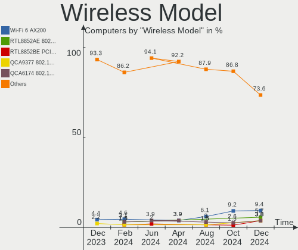

KDE neon - Hardware Trends
--------------------------

A project to identify most popular hardware characteristics and track their change
over time based on data collected by Linux users at https://Linux-Hardware.org.

Anyone can contribute to this report by the [hw-probe](https://github.com/linuxhw/hw-probe) tool:

    sudo -E hw-probe -all -upload

This is a report for all computer types. See also reports for [desktops](/Dist/KDE_neon/Desktop/README.md) and [notebooks](/Dist/KDE_neon/Notebook/README.md).

This report is for one last month. Overall report since the beginning of time: [TestDays](https://github.com/linuxhw/TestDays)

Period: Dec, 2023.

Contents
--------

* [ System ](#system)
  - [ OS                       ](#os)
  - [ OS Family                ](#os-family)
  - [ Kernel                   ](#kernel)
  - [ Kernel Family            ](#kernel-family)
  - [ Kernel Major Ver.        ](#kernel-major-ver)
  - [ Arch                     ](#arch)
  - [ DE                       ](#de)
  - [ Display Server           ](#display-server)
  - [ Display Manager          ](#display-manager)
  - [ OS Lang                  ](#os-lang)
  - [ Boot Mode                ](#boot-mode)
  - [ Filesystem               ](#filesystem)
  - [ Part. scheme             ](#part-scheme)
  - [ Dual Boot with Linux/BSD ](#dual-boot-with-linuxbsd)
  - [ Dual Boot (Win)          ](#dual-boot-win)

* [ Board ](#board)
  - [ Vendor                   ](#vendor)
  - [ Model                    ](#model)
  - [ Model Family             ](#model-family)
  - [ MFG Year                 ](#mfg-year)
  - [ Form Factor              ](#form-factor)
  - [ Secure Boot              ](#secure-boot)
  - [ Coreboot                 ](#coreboot)
  - [ RAM Size                 ](#ram-size)
  - [ RAM Used                 ](#ram-used)
  - [ Total Drives             ](#total-drives)
  - [ Has CD-ROM               ](#has-cd-rom)
  - [ Has Ethernet             ](#has-ethernet)
  - [ Has WiFi                 ](#has-wifi)
  - [ Has Bluetooth            ](#has-bluetooth)

* [ Location ](#location)
  - [ Country                  ](#country)
  - [ City                     ](#city)

* [ Drives ](#drives)
  - [ Drive Vendor             ](#drive-vendor)
  - [ Drive Model              ](#drive-model)
  - [ HDD Vendor               ](#hdd-vendor)
  - [ SSD Vendor               ](#ssd-vendor)
  - [ Drive Kind               ](#drive-kind)
  - [ Drive Connector          ](#drive-connector)
  - [ Drive Size               ](#drive-size)
  - [ Space Total              ](#space-total)
  - [ Space Used               ](#space-used)
  - [ Malfunc. Drives          ](#malfunc-drives)
  - [ Malfunc. Drive Vendor    ](#malfunc-drive-vendor)
  - [ Malfunc. HDD Vendor      ](#malfunc-hdd-vendor)
  - [ Malfunc. Drive Kind      ](#malfunc-drive-kind)
  - [ Failed Drives            ](#failed-drives)
  - [ Failed Drive Vendor      ](#failed-drive-vendor)
  - [ Drive Status             ](#drive-status)

* [ Storage controller ](#storage-controller)
  - [ Storage Vendor           ](#storage-vendor)
  - [ Storage Model            ](#storage-model)
  - [ Storage Kind             ](#storage-kind)

* [ Processor ](#processor)
  - [ CPU Vendor               ](#cpu-vendor)
  - [ CPU Model                ](#cpu-model)
  - [ CPU Model Family         ](#cpu-model-family)
  - [ CPU Cores                ](#cpu-cores)
  - [ CPU Sockets              ](#cpu-sockets)
  - [ CPU Threads              ](#cpu-threads)
  - [ CPU Op-Modes             ](#cpu-op-modes)
  - [ CPU Microcode            ](#cpu-microcode)
  - [ CPU Microarch            ](#cpu-microarch)

* [ Graphics ](#graphics)
  - [ GPU Vendor               ](#gpu-vendor)
  - [ GPU Model                ](#gpu-model)
  - [ GPU Combo                ](#gpu-combo)
  - [ GPU Driver               ](#gpu-driver)
  - [ GPU Memory               ](#gpu-memory)

* [ Monitor ](#monitor)
  - [ Monitor Vendor           ](#monitor-vendor)
  - [ Monitor Model            ](#monitor-model)
  - [ Monitor Resolution       ](#monitor-resolution)
  - [ Monitor Diagonal         ](#monitor-diagonal)
  - [ Monitor Width            ](#monitor-width)
  - [ Aspect Ratio             ](#aspect-ratio)
  - [ Monitor Area             ](#monitor-area)
  - [ Pixel Density            ](#pixel-density)
  - [ Multiple Monitors        ](#multiple-monitors)

* [ Network ](#network)
  - [ Net Controller Vendor    ](#net-controller-vendor)
  - [ Net Controller Model     ](#net-controller-model)
  - [ Wireless Vendor          ](#wireless-vendor)
  - [ Wireless Model           ](#wireless-model)
  - [ Ethernet Vendor          ](#ethernet-vendor)
  - [ Ethernet Model           ](#ethernet-model)
  - [ Net Controller Kind      ](#net-controller-kind)
  - [ Used Controller          ](#used-controller)
  - [ NICs                     ](#nics)
  - [ IPv6                     ](#ipv6)

* [ Bluetooth ](#bluetooth)
  - [ Bluetooth Vendor         ](#bluetooth-vendor)
  - [ Bluetooth Model          ](#bluetooth-model)

* [ Sound ](#sound)
  - [ Sound Vendor             ](#sound-vendor)
  - [ Sound Model              ](#sound-model)

* [ Memory ](#memory)
  - [ Memory Vendor            ](#memory-vendor)
  - [ Memory Model             ](#memory-model)
  - [ Memory Kind              ](#memory-kind)
  - [ Memory Form Factor       ](#memory-form-factor)
  - [ Memory Size              ](#memory-size)
  - [ Memory Speed             ](#memory-speed)

* [ Printers & scanners ](#printers--scanners)
  - [ Printer Vendor           ](#printer-vendor)
  - [ Printer Model            ](#printer-model)
  - [ Scanner Vendor           ](#scanner-vendor)
  - [ Scanner Model            ](#scanner-model)

* [ Camera ](#camera)
  - [ Camera Vendor            ](#camera-vendor)
  - [ Camera Model             ](#camera-model)

* [ Security ](#security)
  - [ Fingerprint Vendor       ](#fingerprint-vendor)
  - [ Fingerprint Model        ](#fingerprint-model)
  - [ Chipcard Vendor          ](#chipcard-vendor)
  - [ Chipcard Model           ](#chipcard-model)

* [ Unsupported ](#unsupported)
  - [ Unsupported Devices      ](#unsupported-devices)
  - [ Unsupported Device Types ](#unsupported-device-types)

System
------

OS
--

Installed operating systems

| Name           | Computers | Percent |
|----------------|-----------|---------|
| KDE neon 22.04 | 57        | 100%    |

OS Family
---------

OS without a version

| Name     | Computers | Percent |
|----------|-----------|---------|
| KDE neon | 57        | 100%    |

Kernel
------

Version of the Linux kernel

| Version              | Computers | Percent |
|----------------------|-----------|---------|
| 6.2.0-39-generic     | 26        | 45.61%  |
| 6.2.0-37-generic     | 23        | 40.35%  |
| 6.2.0-34-generic     | 3         | 5.26%   |
| 6.6.6-surface-1      | 1         | 1.75%   |
| 6.6.1-surface-1      | 1         | 1.75%   |
| 6.3.0-060300-generic | 1         | 1.75%   |
| 5.15.0-91-generic    | 1         | 1.75%   |
| 5.15.0-71-generic    | 1         | 1.75%   |

Kernel Family
-------------

Linux kernel without a distro release

| Version | Computers | Percent |
|---------|-----------|---------|
| 6.2.0   | 52        | 91.23%  |
| 5.15.0  | 2         | 3.51%   |
| 6.6.6   | 1         | 1.75%   |
| 6.6.1   | 1         | 1.75%   |
| 6.3.0   | 1         | 1.75%   |

Kernel Major Ver.
-----------------

Linux kernel major version

| Version | Computers | Percent |
|---------|-----------|---------|
| 6.2     | 52        | 91.23%  |
| 6.6     | 2         | 3.51%   |
| 5.15    | 2         | 3.51%   |
| 6.3     | 1         | 1.75%   |

Arch
----

OS architecture (x86_64, i586, etc.)

| Name   | Computers | Percent |
|--------|-----------|---------|
| x86_64 | 57        | 100%    |

DE
--

Desktop Environment

| Name  | Computers | Percent |
|-------|-----------|---------|
| KDE5  | 55        | 96.49%  |
| GNOME | 2         | 3.51%   |

Display Server
--------------

X11 or Wayland

| Name    | Computers | Percent |
|---------|-----------|---------|
| X11     | 50        | 87.72%  |
| Wayland | 7         | 12.28%  |

Display Manager
---------------

SDDM, LightDM, etc.

| Name    | Computers | Percent |
|---------|-----------|---------|
| Unknown | 49        | 85.96%  |
| SDDM    | 8         | 14.04%  |

OS Lang
-------

Language

| Lang           | Computers | Percent |
|----------------|-----------|---------|
| en_US          | 26        | 45.61%  |
| en_GB          | 7         | 12.28%  |
| es_MX          | 4         | 7.02%   |
| fr_FR          | 3         | 5.26%   |
| en_IN          | 2         | 3.51%   |
| en_CA          | 2         | 3.51%   |
| en_AU          | 2         | 3.51%   |
| C              | 2         | 3.51%   |
| ru_RU          | 1         | 1.75%   |
| pt_PT          | 1         | 1.75%   |
| pt_BR          | 1         | 1.75%   |
| nl_NL          | 1         | 1.75%   |
| fi_FI          | 1         | 1.75%   |
| en_HK          | 1         | 1.75%   |
| de_DE          | 1         | 1.75%   |
| cs_CZ          | 1         | 1.75%   |
| ca_ES@valencia | 1         | 1.75%   |

Boot Mode
---------

EFI or BIOS

| Mode | Computers | Percent |
|------|-----------|---------|
| BIOS | 51        | 89.47%  |
| EFI  | 6         | 10.53%  |

Filesystem
----------

Type of filesystem

| Type  | Computers | Percent |
|-------|-----------|---------|
| Ext4  | 54        | 94.74%  |
| Tmpfs | 2         | 3.51%   |
| Btrfs | 1         | 1.75%   |

Part. scheme
------------

Scheme of partitioning

| Type    | Computers | Percent |
|---------|-----------|---------|
| Unknown | 49        | 85.96%  |
| GPT     | 7         | 12.28%  |
| MBR     | 1         | 1.75%   |

Dual Boot with Linux/BSD
------------------------

Hosting more than one Linux/BSD

| Dual boot | Computers | Percent |
|-----------|-----------|---------|
| No        | 56        | 98.25%  |
| Yes       | 1         | 1.75%   |

Dual Boot (Win)
---------------

Hosting Linux and Windows

| Dual boot | Computers | Percent |
|-----------|-----------|---------|
| No        | 55        | 96.49%  |
| Yes       | 2         | 3.51%   |

Board
-----

Vendor
------

Motherboard manufacturer

| Name                | Computers | Percent |
|---------------------|-----------|---------|
| ASUSTek Computer    | 14        | 24.56%  |
| Hewlett-Packard     | 9         | 15.79%  |
| MSI                 | 7         | 12.28%  |
| Lenovo              | 6         | 10.53%  |
| Dell                | 5         | 8.77%   |
| Gigabyte Technology | 4         | 7.02%   |
| Microsoft           | 3         | 5.26%   |
| Apple               | 2         | 3.51%   |
| SK hynix            | 1         | 1.75%   |
| Medion              | 1         | 1.75%   |
| LattePanda          | 1         | 1.75%   |
| Intel               | 1         | 1.75%   |
| BY OEM              | 1         | 1.75%   |
| ASRock              | 1         | 1.75%   |
| Unknown             | 1         | 1.75%   |

Model
-----

Motherboard model

| Name                                | Computers | Percent |
|-------------------------------------|-----------|---------|
| SK hynix HyBook                     | 1         | 1.75%   |
| MSI Vector GP66 12UGS               | 1         | 1.75%   |
| MSI MS-7E12                         | 1         | 1.75%   |
| MSI MS-7D75                         | 1         | 1.75%   |
| MSI MS-7C91                         | 1         | 1.75%   |
| MSI MS-7C02                         | 1         | 1.75%   |
| MSI MS-7B89                         | 1         | 1.75%   |
| MSI MS-7B49                         | 1         | 1.75%   |
| Microsoft Surface Pro 7+            | 1         | 1.75%   |
| Microsoft Surface Pro 4             | 1         | 1.75%   |
| Microsoft Surface Go 3              | 1         | 1.75%   |
| Medion Akoya E6239                  | 1         | 1.75%   |
| Lenovo Yoga 500-15IBD 80N6          | 1         | 1.75%   |
| Lenovo ThinkPad T520 424049U        | 1         | 1.75%   |
| Lenovo ThinkCentre M720q 10T700AHMH | 1         | 1.75%   |
| Lenovo ThinkBook 16 G6 IRL 21KH     | 1         | 1.75%   |
| Lenovo IdeaPadFlex 5 15ITL05 82HT   | 1         | 1.75%   |
| Lenovo IdeaPad U430 Touch 20270     | 1         | 1.75%   |
| LattePanda Sigma                    | 1         | 1.75%   |
| Intel H61                           | 1         | 1.75%   |
| HP Z4 G4 Workstation                | 1         | 1.75%   |
| HP ProDesk 400 G5 Desktop Mini      | 1         | 1.75%   |
| HP Pavilion Laptop 14-ce3xxx        | 1         | 1.75%   |
| HP Laptop 15s-eq1xxx                | 1         | 1.75%   |
| HP Laptop 15-dw0xxx                 | 1         | 1.75%   |
| HP Laptop 15-da0xxx                 | 1         | 1.75%   |
| HP EliteDesk 800 G3 SFF             | 1         | 1.75%   |
| HP EliteBook 745 G6                 | 1         | 1.75%   |
| HP Compaq Presario A900             | 1         | 1.75%   |
| Gigabyte X570 I AORUS PRO WIFI      | 1         | 1.75%   |
| Gigabyte B760M D3H DDR4             | 1         | 1.75%   |
| Gigabyte B550M AORUS ELITE          | 1         | 1.75%   |
| Gigabyte 970A-D3P                   | 1         | 1.75%   |
| Dell Vostro 7500                    | 1         | 1.75%   |
| Dell Precision 5510                 | 1         | 1.75%   |
| Dell Latitude E6520                 | 1         | 1.75%   |
| Dell Inspiron 3583                  | 1         | 1.75%   |
| Dell G7 7700                        | 1         | 1.75%   |
| BY OEM B365                         | 1         | 1.75%   |
| ASUS X556UQK                        | 1         | 1.75%   |

Model Family
------------

Motherboard model prefix

| Name               | Computers | Percent |
|--------------------|-----------|---------|
| Microsoft Surface  | 3         | 5.26%   |
| HP Laptop          | 3         | 5.26%   |
| ASUS TUF           | 3         | 5.26%   |
| ASUS PRIME         | 3         | 5.26%   |
| SK hynix HyBook    | 1         | 1.75%   |
| MSI Vector         | 1         | 1.75%   |
| MSI MS-7E12        | 1         | 1.75%   |
| MSI MS-7D75        | 1         | 1.75%   |
| MSI MS-7C91        | 1         | 1.75%   |
| MSI MS-7C02        | 1         | 1.75%   |
| MSI MS-7B89        | 1         | 1.75%   |
| MSI MS-7B49        | 1         | 1.75%   |
| Medion Akoya       | 1         | 1.75%   |
| Lenovo Yoga        | 1         | 1.75%   |
| Lenovo ThinkPad    | 1         | 1.75%   |
| Lenovo ThinkCentre | 1         | 1.75%   |
| Lenovo ThinkBook   | 1         | 1.75%   |
| Lenovo IdeaPadFlex | 1         | 1.75%   |
| Lenovo IdeaPad     | 1         | 1.75%   |
| LattePanda Sigma   | 1         | 1.75%   |
| Intel H61          | 1         | 1.75%   |
| HP Z4              | 1         | 1.75%   |
| HP ProDesk         | 1         | 1.75%   |
| HP Pavilion        | 1         | 1.75%   |
| HP EliteDesk       | 1         | 1.75%   |
| HP EliteBook       | 1         | 1.75%   |
| HP Compaq          | 1         | 1.75%   |
| Gigabyte X570      | 1         | 1.75%   |
| Gigabyte B760M     | 1         | 1.75%   |
| Gigabyte B550M     | 1         | 1.75%   |
| Gigabyte 970A-D3P  | 1         | 1.75%   |
| Dell Vostro        | 1         | 1.75%   |
| Dell Precision     | 1         | 1.75%   |
| Dell Latitude      | 1         | 1.75%   |
| Dell Inspiron      | 1         | 1.75%   |
| Dell G7            | 1         | 1.75%   |
| BY OEM B365        | 1         | 1.75%   |
| ASUS X556UQK       | 1         | 1.75%   |
| ASUS X441BA        | 1         | 1.75%   |
| ASUS X411UN        | 1         | 1.75%   |

MFG Year
--------

Motherboard manufacture year

| Year | Computers | Percent |
|------|-----------|---------|
| 2020 | 8         | 14.04%  |
| 2022 | 7         | 12.28%  |
| 2019 | 7         | 12.28%  |
| 2023 | 5         | 8.77%   |
| 2021 | 5         | 8.77%   |
| 2018 | 5         | 8.77%   |
| 2017 | 5         | 8.77%   |
| 2016 | 5         | 8.77%   |
| 2013 | 3         | 5.26%   |
| 2011 | 3         | 5.26%   |
| 2015 | 1         | 1.75%   |
| 2014 | 1         | 1.75%   |
| 2010 | 1         | 1.75%   |
| 2007 | 1         | 1.75%   |

Form Factor
-----------

Physical design of the computer

| Name        | Computers | Percent |
|-------------|-----------|---------|
| Notebook    | 27        | 47.37%  |
| Desktop     | 25        | 43.86%  |
| Tablet      | 3         | 5.26%   |
| Convertible | 1         | 1.75%   |
| Mini pc     | 1         | 1.75%   |

Secure Boot
-----------

Enabled or disabled

| State    | Computers | Percent |
|----------|-----------|---------|
| Disabled | 57        | 100%    |

Coreboot
--------

Have coreboot on board

| Used | Computers | Percent |
|------|-----------|---------|
| No   | 57        | 100%    |

RAM Size
--------

Total RAM memory

| Size in GB  | Computers | Percent |
|-------------|-----------|---------|
| 16.01-24.0  | 12        | 21.05%  |
| 4.01-8.0    | 11        | 19.3%   |
| 32.01-64.0  | 11        | 19.3%   |
| 8.01-16.0   | 9         | 15.79%  |
| 3.01-4.0    | 6         | 10.53%  |
| 24.01-32.0  | 3         | 5.26%   |
| 64.01-256.0 | 3         | 5.26%   |
| 1.01-2.0    | 2         | 3.51%   |

RAM Used
--------

Used RAM memory

| Used GB   | Computers | Percent |
|-----------|-----------|---------|
| 4.01-8.0  | 17        | 29.82%  |
| 1.01-2.0  | 15        | 26.32%  |
| 3.01-4.0  | 12        | 21.05%  |
| 2.01-3.0  | 8         | 14.04%  |
| 8.01-16.0 | 5         | 8.77%   |

Total Drives
------------

Number of drives on board

| Drives | Computers | Percent |
|--------|-----------|---------|
| 1      | 31        | 54.39%  |
| 2      | 11        | 19.3%   |
| 3      | 8         | 14.04%  |
| 4      | 3         | 5.26%   |
| 9      | 1         | 1.75%   |
| 8      | 1         | 1.75%   |
| 6      | 1         | 1.75%   |
| 5      | 1         | 1.75%   |

Has CD-ROM
----------

Has CD-ROM on board

| Presented | Computers | Percent |
|-----------|-----------|---------|
| No        | 47        | 82.46%  |
| Yes       | 10        | 17.54%  |

Has Ethernet
------------

Has Ethernet on board

| Presented | Computers | Percent |
|-----------|-----------|---------|
| Yes       | 48        | 84.21%  |
| No        | 9         | 15.79%  |

Has WiFi
--------

Has WiFi module

| Presented | Computers | Percent |
|-----------|-----------|---------|
| Yes       | 43        | 75.44%  |
| No        | 14        | 24.56%  |

Has Bluetooth
-------------

Has Bluetooth module

| Presented | Computers | Percent |
|-----------|-----------|---------|
| Yes       | 40        | 70.18%  |
| No        | 17        | 29.82%  |

Location
--------

Country
-------

Geographic location (country)

| Country      | Computers | Percent |
|--------------|-----------|---------|
| USA          | 14        | 24.56%  |
| UK           | 4         | 7.02%   |
| Mexico       | 4         | 7.02%   |
| Canada       | 4         | 7.02%   |
| Australia    | 4         | 7.02%   |
| Spain        | 2         | 3.51%   |
| Norway       | 2         | 3.51%   |
| Netherlands  | 2         | 3.51%   |
| Indonesia    | 2         | 3.51%   |
| India        | 2         | 3.51%   |
| Brazil       | 2         | 3.51%   |
| Ukraine      | 1         | 1.75%   |
| Turkey       | 1         | 1.75%   |
| Tunisia      | 1         | 1.75%   |
| South Africa | 1         | 1.75%   |
| Slovenia     | 1         | 1.75%   |
| Serbia       | 1         | 1.75%   |
| Russia       | 1         | 1.75%   |
| Portugal     | 1         | 1.75%   |
| Poland       | 1         | 1.75%   |
| Ireland      | 1         | 1.75%   |
| Germany      | 1         | 1.75%   |
| France       | 1         | 1.75%   |
| Finland      | 1         | 1.75%   |
| Czechia      | 1         | 1.75%   |
| Chile        | 1         | 1.75%   |

City
----

Geographic location (city)

| City                | Computers | Percent |
|---------------------|-----------|---------|
| Perth               | 2         | 3.51%   |
| Mexico City         | 2         | 3.51%   |
| Wasilla             | 1         | 1.75%   |
| Warsaw              | 1         | 1.75%   |
| Voronezh            | 1         | 1.75%   |
| Voiron              | 1         | 1.75%   |
| Uzhhorod            | 1         | 1.75%   |
| Tunis               | 1         | 1.75%   |
| Trondheim           | 1         | 1.75%   |
| Tijuana             | 1         | 1.75%   |
| Sukoharjo           | 1         | 1.75%   |
| Sorel-Tracy         | 1         | 1.75%   |
| Sacramento          | 1         | 1.75%   |
| Quilpué            | 1         | 1.75%   |
| Portland            | 1         | 1.75%   |
| Patos de Minas      | 1         | 1.75%   |
| Oxford              | 1         | 1.75%   |
| Owosso              | 1         | 1.75%   |
| Nunspeet            | 1         | 1.75%   |
| Northampton         | 1         | 1.75%   |
| Niš                | 1         | 1.75%   |
| Mumbai              | 1         | 1.75%   |
| Monument            | 1         | 1.75%   |
| Molalla             | 1         | 1.75%   |
| Moberly             | 1         | 1.75%   |
| Melbourne           | 1         | 1.75%   |
| Ljubljana           | 1         | 1.75%   |
| Lisbon              | 1         | 1.75%   |
| Leeds               | 1         | 1.75%   |
| Las Rozas de Madrid | 1         | 1.75%   |
| Kelowna             | 1         | 1.75%   |
| Karatay             | 1         | 1.75%   |
| Kannonkoski         | 1         | 1.75%   |
| Kalamazoo           | 1         | 1.75%   |
| Hradec nad Moravici | 1         | 1.75%   |
| Grand Blanc         | 1         | 1.75%   |
| Glen Allen          | 1         | 1.75%   |
| Gatineau            | 1         | 1.75%   |
| Edmonton            | 1         | 1.75%   |
| Dublin              | 1         | 1.75%   |

Drives
------

Drive Vendor
------------

Hard drive vendors

| Vendor                      | Computers | Drives | Percent |
|-----------------------------|-----------|--------|---------|
| Seagate                     | 13        | 24     | 13.54%  |
| WDC                         | 10        | 13     | 10.42%  |
| Samsung Electronics         | 10        | 13     | 10.42%  |
| Sandisk                     | 9         | 11     | 9.38%   |
| Kingston                    | 7         | 7      | 7.29%   |
| Crucial                     | 6         | 7      | 6.25%   |
| Toshiba                     | 5         | 5      | 5.21%   |
| Unknown                     | 3         | 3      | 3.13%   |
| SK hynix                    | 3         | 3      | 3.13%   |
| Micron Technology           | 3         | 3      | 3.13%   |
| KIOXIA                      | 3         | 3      | 3.13%   |
| Intel                       | 3         | 3      | 3.13%   |
| Realtek Semiconductor       | 2         | 3      | 2.08%   |
| Micron/Crucial Technology   | 2         | 2      | 2.08%   |
| Kingston Technology Company | 2         | 2      | 2.08%   |
| WALRAM                      | 1         | 1      | 1.04%   |
| Team                        | 1         | 1      | 1.04%   |
| SSSTC                       | 1         | 1      | 1.04%   |
| SPCC                        | 1         | 1      | 1.04%   |
| Seagate Technology          | 1         | 1      | 1.04%   |
| POWER                       | 1         | 1      | 1.04%   |
| PC SN530                    | 1         | 1      | 1.04%   |
| LS                          | 1         | 1      | 1.04%   |
| HGST                        | 1         | 1      | 1.04%   |
| GOODRAM                     | 1         | 1      | 1.04%   |
| Fujitsu                     | 1         | 1      | 1.04%   |
| Fanxiang                    | 1         | 1      | 1.04%   |
| China                       | 1         | 1      | 1.04%   |
| Apple                       | 1         | 1      | 1.04%   |
| acmeor                      | 1         | 1      | 1.04%   |

Drive Model
-----------

Hard drive models

| Model                                               | Computers | Percent |
|-----------------------------------------------------|-----------|---------|
| Samsung NVMe SSD Controller SM981/PM981/PM983 512GB | 3         | 2.63%   |
| WDC WD30EZRX-00D8PB0 3TB                            | 2         | 1.75%   |
| Seagate ST2000DM008-2FR102 2TB                      | 2         | 1.75%   |
| Seagate ST2000DM001-1ER164 2TB                      | 2         | 1.75%   |
| Seagate ST1000LM035-1RK172 1TB                      | 2         | 1.75%   |
| Sandisk WD_BLACK SN770 1TB                          | 2         | 1.75%   |
| Sandisk WD Black SN750 / PC SN730 NVMe SSD 2TB      | 2         | 1.75%   |
| Realtek RTS5763DL NVMe SSD Controller 256GB         | 2         | 1.75%   |
| Kingston SV300S37A120G 120GB SSD                    | 2         | 1.75%   |
| Kingston SA400S37240G 240GB SSD                     | 2         | 1.75%   |
| Crucial CT500MX500SSD1 500GB                        | 2         | 1.75%   |
| WDC WDS500G2B0A-00SM50 500GB SSD                    | 1         | 0.88%   |
| WDC WD7500BPVT-60HXZT3 752GB                        | 1         | 0.88%   |
| WDC WD5000LPVX-28V0TT0 500GB                        | 1         | 0.88%   |
| WDC WD5000LPCX-60VHAT1 500GB                        | 1         | 0.88%   |
| WDC WD15EADS-22P8B0 1TB                             | 1         | 0.88%   |
| WDC WD10SPSX-00A6WT0 1TB                            | 1         | 0.88%   |
| WDC WD10SPCX-24HWST1 1TB                            | 1         | 0.88%   |
| WDC WD10EZEX-08WN4A0 1TB                            | 1         | 0.88%   |
| WDC WD10EZEX-00WN4A0 1TB                            | 1         | 0.88%   |
| WDC WD10EADS-00M2B0 1TB                             | 1         | 0.88%   |
| WDC WD1003FBYX-01Y7B1 1TB                           | 1         | 0.88%   |
| WALRAM 128G                                         | 1         | 0.88%   |
| Unknown NVMe SSD Drive 256GB                        | 1         | 0.88%   |
| Unknown MMC Card  64GB                              | 1         | 0.88%   |
| Unknown MMC Card  128GB                             | 1         | 0.88%   |
| Toshiba THNSNJ128GCSU 128GB SSD                     | 1         | 0.88%   |
| Toshiba NVMe Controller 256GB                       | 1         | 0.88%   |
| Toshiba MQ01ABD100 1TB                              | 1         | 0.88%   |
| Toshiba HDWL110 1TB                                 | 1         | 0.88%   |
| Toshiba DT01ACA100 1TB                              | 1         | 0.88%   |
| Team T2531TB 1024GB SSD                             | 1         | 0.88%   |
| SSSTC CV8-8E128-HP 128GB                            | 1         | 0.88%   |
| SPCC Solid State Disk 2TB                           | 1         | 0.88%   |
| SK hynix SHGS31-500GS-2 500GB SSD                   | 1         | 0.88%   |
| SK hynix PC711 NVMe 1TB                             | 1         | 0.88%   |
| SK hynix BC511 512GB                                | 1         | 0.88%   |
| Seagate FireCuda 510 SSD 500GB                      | 1         | 0.88%   |
| Seagate ST8000DM004-2CX188 8TB                      | 1         | 0.88%   |
| Seagate ST500LT012-1DG142 500GB                     | 1         | 0.88%   |

HDD Vendor
----------

Hard disk drive vendors

| Vendor              | Computers | Drives | Percent |
|---------------------|-----------|--------|---------|
| Seagate             | 13        | 24     | 44.83%  |
| WDC                 | 10        | 12     | 34.48%  |
| Toshiba             | 3         | 3      | 10.34%  |
| Samsung Electronics | 1         | 1      | 3.45%   |
| HGST                | 1         | 1      | 3.45%   |
| Fujitsu             | 1         | 1      | 3.45%   |

SSD Vendor
----------

Solid state drive vendors

| Vendor              | Computers | Drives | Percent |
|---------------------|-----------|--------|---------|
| Kingston            | 6         | 6      | 21.43%  |
| Samsung Electronics | 5         | 5      | 17.86%  |
| Crucial             | 3         | 4      | 10.71%  |
| Micron Technology   | 2         | 2      | 7.14%   |
| WDC                 | 1         | 1      | 3.57%   |
| Toshiba             | 1         | 1      | 3.57%   |
| Team                | 1         | 1      | 3.57%   |
| SSSTC               | 1         | 1      | 3.57%   |
| SPCC                | 1         | 1      | 3.57%   |
| SK hynix            | 1         | 1      | 3.57%   |
| SanDisk             | 1         | 1      | 3.57%   |
| LS                  | 1         | 1      | 3.57%   |
| Intel               | 1         | 1      | 3.57%   |
| GOODRAM             | 1         | 1      | 3.57%   |
| China               | 1         | 1      | 3.57%   |
| Apple               | 1         | 1      | 3.57%   |

Drive Kind
----------

HDD or SSD

| Kind    | Computers | Drives | Percent |
|---------|-----------|--------|---------|
| NVMe    | 29        | 39     | 35.37%  |
| HDD     | 24        | 42     | 29.27%  |
| SSD     | 22        | 29     | 26.83%  |
| Unknown | 5         | 5      | 6.1%    |
| MMC     | 2         | 2      | 2.44%   |

Drive Connector
---------------

SATA, SAS, NVMe, etc.

| Type | Computers | Drives | Percent |
|------|-----------|--------|---------|
| SATA | 38        | 73     | 52.78%  |
| NVMe | 29        | 39     | 40.28%  |
| SAS  | 3         | 3      | 4.17%   |
| MMC  | 2         | 2      | 2.78%   |

Drive Size
----------

Size of hard drive

| Size in TB | Computers | Drives | Percent |
|------------|-----------|--------|---------|
| 0.01-0.5   | 26        | 32     | 49.06%  |
| 0.51-1.0   | 14        | 20     | 26.42%  |
| 1.01-2.0   | 8         | 13     | 15.09%  |
| 2.01-3.0   | 2         | 2      | 3.77%   |
| 10.01-20.0 | 2         | 3      | 3.77%   |
| 4.01-10.0  | 1         | 1      | 1.89%   |

Space Total
-----------

Amount of disk space available on the file system

| Size in GB     | Computers | Percent |
|----------------|-----------|---------|
| 101-250        | 15        | 26.32%  |
| 251-500        | 13        | 22.81%  |
| 501-1000       | 8         | 14.04%  |
| 51-100         | 6         | 10.53%  |
| More than 3000 | 4         | 7.02%   |
| 1001-2000      | 4         | 7.02%   |
| 2001-3000      | 3         | 5.26%   |
| 1-20           | 2         | 3.51%   |
| 21-50          | 1         | 1.75%   |
| Unknown        | 1         | 1.75%   |

Space Used
----------

Amount of used disk space

| Used GB        | Computers | Percent |
|----------------|-----------|---------|
| 1-20           | 18        | 31.58%  |
| 101-250        | 10        | 17.54%  |
| 51-100         | 10        | 17.54%  |
| 251-500        | 5         | 8.77%   |
| 21-50          | 5         | 8.77%   |
| 1001-2000      | 3         | 5.26%   |
| 501-1000       | 3         | 5.26%   |
| More than 3000 | 1         | 1.75%   |
| 2001-3000      | 1         | 1.75%   |
| Unknown        | 1         | 1.75%   |

Malfunc. Drives
---------------

Drive models with a malfunction

Zero info for selected period =(

Malfunc. Drive Vendor
---------------------

Vendors of faulty drives

Zero info for selected period =(

Malfunc. HDD Vendor
-------------------

Vendors of faulty HDD drives

Zero info for selected period =(

Malfunc. Drive Kind
-------------------

Kinds of faulty drives

Zero info for selected period =(

Failed Drives
-------------

Failed drive models

Zero info for selected period =(

Failed Drive Vendor
-------------------

Failed drive vendors

Zero info for selected period =(

Drive Status
------------

Number of failed and malfunc. drives

| Status   | Computers | Drives | Percent |
|----------|-----------|--------|---------|
| Detected | 52        | 108    | 88.14%  |
| Works    | 7         | 9      | 11.86%  |

Storage controller
------------------

Storage Vendor
--------------

Storage controller vendors

| Vendor                       | Computers | Percent |
|------------------------------|-----------|---------|
| Intel                        | 32        | 38.1%   |
| AMD                          | 15        | 17.86%  |
| SanDisk                      | 8         | 9.52%   |
| Samsung Electronics          | 8         | 9.52%   |
| Micron/Crucial Technology    | 4         | 4.76%   |
| KIOXIA                       | 3         | 3.57%   |
| Kingston Technology Company  | 3         | 3.57%   |
| SK hynix                     | 2         | 2.38%   |
| Realtek Semiconductor        | 2         | 2.38%   |
| ASMedia Technology           | 2         | 2.38%   |
| Transcend                    | 1         | 1.19%   |
| Toshiba America Info Systems | 1         | 1.19%   |
| Seagate Technology           | 1         | 1.19%   |
| Micron Technology            | 1         | 1.19%   |
| Marvell Technology Group     | 1         | 1.19%   |

Storage Model
-------------

Storage controller models

| Model                                                                        | Computers | Percent |
|------------------------------------------------------------------------------|-----------|---------|
| AMD FCH SATA Controller [AHCI mode]                                          | 10        | 10.53%  |
| Samsung NVMe SSD Controller SM981/PM981/PM983                                | 5         | 5.26%   |
| Intel Celeron/Pentium Silver Processor SATA Controller                       | 4         | 4.21%   |
| Intel 200 Series PCH SATA controller [AHCI mode]                             | 4         | 4.21%   |
| SanDisk WD Black SN770 / PC SN740 256GB / PC SN560 (DRAM-less) NVMe SSD      | 3         | 3.16%   |
| Intel Sunrise Point-LP SATA Controller [AHCI mode]                           | 3         | 3.16%   |
| AMD 500 Series Chipset SATA Controller                                       | 3         | 3.16%   |
| AMD 400 Series Chipset SATA Controller                                       | 3         | 3.16%   |
| SanDisk Extreme Pro / WD Black SN750 / PC SN730 / Red SN700 NVMe SSD         | 2         | 2.11%   |
| Samsung NVMe SSD Controller 980 (DRAM-less)                                  | 2         | 2.11%   |
| Realtek RTS5762 NVMe SSD Controller                                          | 2         | 2.11%   |
| KIOXIA NVMe SSD Controller BG4 (DRAM-less)                                   | 2         | 2.11%   |
| Intel Volume Management Device NVMe RAID Controller                          | 2         | 2.11%   |
| Intel Cannon Lake PCH SATA AHCI Controller                                   | 2         | 2.11%   |
| Intel 82801 Mobile SATA Controller [RAID mode]                               | 2         | 2.11%   |
| Intel 700 Series Chipset Family SATA AHCI Controller                         | 2         | 2.11%   |
| Intel 6 Series/C200 Series Chipset Family 6 port Mobile SATA AHCI Controller | 2         | 2.11%   |
| Intel 400 Series Chipset Family SATA AHCI Controller                         | 2         | 2.11%   |
| Transcend NVMe PCIe SSD 240S/MTE710T                                         | 1         | 1.05%   |
| Toshiba America Info Systems XG3 NVMe SSD Controller                         | 1         | 1.05%   |
| SK hynix Gold P31/BC711/PC711 NVMe Solid State Drive                         | 1         | 1.05%   |
| SK hynix BC511 NVMe SSD                                                      | 1         | 1.05%   |
| Seagate FireCuda/IronWolf 510 SSD                                            | 1         | 1.05%   |
| Sandisk WD PC SN740 NVMe SSD 512GB (DRAM-less)                               | 1         | 1.05%   |
| SanDisk WD Green SN350 240GB (DRAM-less) / SN560E NVMe SSD                   | 1         | 1.05%   |
| Sandisk WD Black SN850X NVMe SSD                                             | 1         | 1.05%   |
| SanDisk Ultra 3D / WD Blue SN570 NVMe SSD (DRAM-less)                        | 1         | 1.05%   |
| SanDisk Extreme Pro / WD Black 2018/SN750/PC SN720 NVMe SSD                  | 1         | 1.05%   |
| Samsung S4LN053X01 AHCI SSD Controller(Apple slot)                           | 1         | 1.05%   |
| Realtek RTS5763DL x2 NVMe SSD Controller                                     | 1         | 1.05%   |
| Micron/Crucial P5 Plus NVMe PCIe SSD                                         | 1         | 1.05%   |
| Micron/Crucial P2 [Nick P2] / P3 / P3 Plus NVMe PCIe SSD (DRAM-less)         | 1         | 1.05%   |
| Micron/Crucial P1 NVMe PCIe SSD[Frampton]                                    | 1         | 1.05%   |
| Micron/Crucial P1 NVMe PCIe SSD[Frampton2]                                   | 1         | 1.05%   |
| Micron 2450 NVMe SSD [HendrixV] (DRAM-less)                                  | 1         | 1.05%   |
| Marvell Group 88SE9120 SATA 6Gb/s Controller                                 | 1         | 1.05%   |
| KIOXIA NVMe SSD                                                              | 1         | 1.05%   |
| Kingston Company OM3PDP3 NVMe SSD                                            | 1         | 1.05%   |
| Kingston Company NV2 NVMe SSD SM2267XT                                       | 1         | 1.05%   |
| Kingston Company KC3000/FURY Renegade NVMe SSD E18                           | 1         | 1.05%   |

Storage Kind
------------

Kind of storage controller (IDE, SATA, NVMe, SAS, ...)

| Kind | Computers | Percent |
|------|-----------|---------|
| SATA | 45        | 55.56%  |
| NVMe | 29        | 35.8%   |
| RAID | 6         | 7.41%   |
| IDE  | 1         | 1.23%   |

Processor
---------

CPU Vendor
----------

Processor vendors

| Vendor | Computers | Percent |
|--------|-----------|---------|
| Intel  | 40        | 70.18%  |
| AMD    | 17        | 29.82%  |

CPU Model
---------

Processor models

| Model                                    | Computers | Percent |
|------------------------------------------|-----------|---------|
| Intel Core i7-10750H CPU @ 2.60GHz       | 2         | 3.51%   |
| Intel 11th Gen Core i7-1165G7 @ 2.80GHz  | 2         | 3.51%   |
| AMD Ryzen 9 5900X 12-Core Processor      | 2         | 3.51%   |
| AMD Ryzen 7 5800X 8-Core Processor       | 2         | 3.51%   |
| AMD Ryzen 5 5600G with Radeon Graphics   | 2         | 3.51%   |
| Intel Xeon W-2133 CPU @ 3.60GHz          | 1         | 1.75%   |
| Intel Pentium Silver N5000 CPU @ 1.10GHz | 1         | 1.75%   |
| Intel Pentium Gold 7505 @ 2.00GHz        | 1         | 1.75%   |
| Intel Pentium Dual CPU T2330 @ 1.60GHz   | 1         | 1.75%   |
| Intel Pentium CPU GOLD 6500Y @ 1.10GHz   | 1         | 1.75%   |
| Intel Pentium CPU 5405U @ 2.30GHz        | 1         | 1.75%   |
| Intel Core i7-8550U CPU @ 1.80GHz        | 1         | 1.75%   |
| Intel Core i7-7500U CPU @ 2.70GHz        | 1         | 1.75%   |
| Intel Core i7-6820HQ CPU @ 2.70GHz       | 1         | 1.75%   |
| Intel Core i7-6700 CPU @ 3.40GHz         | 1         | 1.75%   |
| Intel Core i7-4750HQ CPU @ 2.00GHz       | 1         | 1.75%   |
| Intel Core i7-2620M CPU @ 2.70GHz        | 1         | 1.75%   |
| Intel Core i5-9400T CPU @ 1.80GHz        | 1         | 1.75%   |
| Intel Core i5-8500 CPU @ 3.00GHz         | 1         | 1.75%   |
| Intel Core i5-7400 CPU @ 3.00GHz         | 1         | 1.75%   |
| Intel Core i5-6300U CPU @ 2.40GHz        | 1         | 1.75%   |
| Intel Core i5-4210U CPU @ 1.70GHz        | 1         | 1.75%   |
| Intel Core i5-2520M CPU @ 2.50GHz        | 1         | 1.75%   |
| Intel Core i5-2430M CPU @ 2.40GHz        | 1         | 1.75%   |
| Intel Core i5-1035G1 CPU @ 1.00GHz       | 1         | 1.75%   |
| Intel Core i3-9100T CPU @ 3.10GHz        | 1         | 1.75%   |
| Intel Core i3-6100U CPU @ 2.30GHz        | 1         | 1.75%   |
| Intel Core i3-6100 CPU @ 3.70GHz         | 1         | 1.75%   |
| Intel Core i3-5005U CPU @ 2.00GHz        | 1         | 1.75%   |
| Intel Core i3-2100 CPU @ 3.10GHz         | 1         | 1.75%   |
| Intel Celeron N4020 CPU @ 1.10GHz        | 1         | 1.75%   |
| Intel Celeron N4000 CPU @ 1.10GHz        | 1         | 1.75%   |
| Intel Celeron J4125 CPU @ 2.00GHz        | 1         | 1.75%   |
| Intel Celeron CPU N2830 @ 2.16GHz        | 1         | 1.75%   |
| Intel Atom CPU N550 @ 1.50GHz            | 1         | 1.75%   |
| Intel 13th Gen Core i7-13700H            | 1         | 1.75%   |
| Intel 13th Gen Core i7-13700F            | 1         | 1.75%   |
| Intel 13th Gen Core i5-13500             | 1         | 1.75%   |
| Intel 13th Gen Core i5-1340P             | 1         | 1.75%   |
| Intel 12th Gen Core i7-12700H            | 1         | 1.75%   |

CPU Model Family
----------------

Processor model prefix

| Model                | Computers | Percent |
|----------------------|-----------|---------|
| Other                | 9         | 15.79%  |
| Intel Core i7        | 8         | 14.04%  |
| Intel Core i5        | 8         | 14.04%  |
| Intel Core i3        | 5         | 8.77%   |
| AMD Ryzen 7          | 5         | 8.77%   |
| AMD Ryzen 5          | 5         | 8.77%   |
| Intel Celeron        | 4         | 7.02%   |
| AMD Ryzen 9          | 4         | 7.02%   |
| Intel Pentium        | 2         | 3.51%   |
| Intel Xeon           | 1         | 1.75%   |
| Intel Pentium Silver | 1         | 1.75%   |
| Intel Pentium Gold   | 1         | 1.75%   |
| Intel Pentium Dual   | 1         | 1.75%   |
| Intel Atom           | 1         | 1.75%   |
| AMD Ryzen 5 PRO      | 1         | 1.75%   |
| AMD FX               | 1         | 1.75%   |

CPU Cores
---------

Number of processor cores

| Number | Computers | Percent |
|--------|-----------|---------|
| 2      | 19        | 33.33%  |
| 4      | 14        | 24.56%  |
| 6      | 10        | 17.54%  |
| 12     | 5         | 8.77%   |
| 8      | 5         | 8.77%   |
| 14     | 3         | 5.26%   |
| 16     | 1         | 1.75%   |

CPU Sockets
-----------

Number of sockets

| Number | Computers | Percent |
|--------|-----------|---------|
| 1      | 57        | 100%    |

CPU Threads
-----------

Threads per core (Hyper-Threading)

| Number | Computers | Percent |
|--------|-----------|---------|
| 2      | 43        | 75.44%  |
| 1      | 14        | 24.56%  |

CPU Op-Modes
------------

CPU Operation Modes (32-bit, 64-bit)

| Op mode        | Computers | Percent |
|----------------|-----------|---------|
| 32-bit, 64-bit | 57        | 100%    |

CPU Microcode
-------------

Microcode number

| Number     | Computers | Percent |
|------------|-----------|---------|
| Unknown    | 54        | 94.74%  |
| 0x0a50000d | 1         | 1.75%   |
| 0x0a201204 | 1         | 1.75%   |
| 0x08108109 | 1         | 1.75%   |

CPU Microarch
-------------

Microarchitecture

| Name             | Computers | Percent |
|------------------|-----------|---------|
| Unknown          | 9         | 15.79%  |
| KabyLake         | 8         | 14.04%  |
| Zen 3            | 7         | 12.28%  |
| Skylake          | 6         | 10.53%  |
| SandyBridge      | 4         | 7.02%   |
| Goldmont plus    | 4         | 7.02%   |
| Zen+             | 3         | 5.26%   |
| TigerLake        | 3         | 5.26%   |
| Haswell          | 2         | 3.51%   |
| CometLake        | 2         | 3.51%   |
| Zen 2            | 1         | 1.75%   |
| Silvermont       | 1         | 1.75%   |
| Piledriver       | 1         | 1.75%   |
| IceLake          | 1         | 1.75%   |
| Excavator        | 1         | 1.75%   |
| Core             | 1         | 1.75%   |
| Broadwell        | 1         | 1.75%   |
| Bonnell          | 1         | 1.75%   |
| Alderlake Hybrid | 1         | 1.75%   |

Graphics
--------

GPU Vendor
----------

Vendors of graphics cards

| Vendor | Computers | Percent |
|--------|-----------|---------|
| Intel  | 36        | 56.25%  |
| AMD    | 15        | 23.44%  |
| Nvidia | 13        | 20.31%  |

GPU Model
---------

Graphics card models

| Model                                                                     | Computers | Percent |
|---------------------------------------------------------------------------|-----------|---------|
| Intel 2nd Generation Core Processor Family Integrated Graphics Controller | 4         | 5.88%   |
| AMD Raphael                                                               | 4         | 5.88%   |
| Intel HD Graphics 530                                                     | 3         | 4.41%   |
| Intel GeminiLake [UHD Graphics 600]                                       | 3         | 4.41%   |
| Intel CoffeeLake-S GT2 [UHD Graphics 630]                                 | 3         | 4.41%   |
| Nvidia GP106 [GeForce GTX 1060 6GB]                                       | 2         | 2.94%   |
| Intel TigerLake-LP GT2 [Iris Xe Graphics]                                 | 2         | 2.94%   |
| Intel Skylake GT2 [HD Graphics 520]                                       | 2         | 2.94%   |
| Intel Raptor Lake-P [Iris Xe Graphics]                                    | 2         | 2.94%   |
| Intel CometLake-H GT2 [UHD Graphics]                                      | 2         | 2.94%   |
| AMD Picasso/Raven 2 [Radeon Vega Series / Radeon Vega Mobile Series]      | 2         | 2.94%   |
| AMD Navi 32 [Radeon RX 7700 XT / 7800 XT]                                 | 2         | 2.94%   |
| AMD Navi 22 [Radeon RX 6700/6700 XT/6750 XT / 6800M/6850M XT]             | 2         | 2.94%   |
| AMD Ellesmere [Radeon RX 470/480/570/570X/580/580X/590]                   | 2         | 2.94%   |
| Nvidia TU117M [GeForce GTX 1650 Ti Mobile]                                | 1         | 1.47%   |
| Nvidia TU116 [GeForce GTX 1660 SUPER]                                     | 1         | 1.47%   |
| Nvidia GP108M [GeForce MX150]                                             | 1         | 1.47%   |
| Nvidia GP104 [GeForce GTX 1070 Ti]                                        | 1         | 1.47%   |
| Nvidia GM108M [GeForce 940MX]                                             | 1         | 1.47%   |
| Nvidia GM107GLM [Quadro M1000M]                                           | 1         | 1.47%   |
| Nvidia GF119M [Quadro NVS 4200M]                                          | 1         | 1.47%   |
| Nvidia GA104 [GeForce RTX 3070]                                           | 1         | 1.47%   |
| Nvidia GA104 [Geforce RTX 3070 Ti Laptop GPU]                             | 1         | 1.47%   |
| Nvidia GA104 [GeForce RTX 3060 Ti GDDR6X]                                 | 1         | 1.47%   |
| Nvidia AD107 [GeForce RTX 4060]                                           | 1         | 1.47%   |
| Intel Whiskey Lake-U GT1 [UHD Graphics 610]                               | 1         | 1.47%   |
| Intel UHD Graphics 620                                                    | 1         | 1.47%   |
| Intel UHD Graphics 615                                                    | 1         | 1.47%   |
| Intel Tiger Lake-LP GT2 [UHD Graphics G4]                                 | 1         | 1.47%   |
| Intel Mobile GM965/GL960 Integrated Graphics Controller (secondary)       | 1         | 1.47%   |
| Intel Mobile GM965/GL960 Integrated Graphics Controller (primary)         | 1         | 1.47%   |
| Intel Iris Plus Graphics G1 (Ice Lake)                                    | 1         | 1.47%   |
| Intel HD Graphics 620                                                     | 1         | 1.47%   |
| Intel HD Graphics 5500                                                    | 1         | 1.47%   |
| Intel Haswell-ULT Integrated Graphics Controller                          | 1         | 1.47%   |
| Intel GeminiLake [UHD Graphics 605]                                       | 1         | 1.47%   |
| Intel Crystal Well Integrated Graphics Controller                         | 1         | 1.47%   |
| Intel Atom Processor Z36xxx/Z37xxx Series Graphics & Display              | 1         | 1.47%   |
| Intel Atom Processor D4xx/D5xx/N4xx/N5xx Integrated Graphics Controller   | 1         | 1.47%   |
| Intel AlderLake-S GT1                                                     | 1         | 1.47%   |

GPU Combo
---------

Combinations of graphics cards

| Name           | Computers | Percent |
|----------------|-----------|---------|
| 1 x Intel      | 29        | 50.88%  |
| 1 x AMD        | 12        | 21.05%  |
| 1 x Nvidia     | 7         | 12.28%  |
| Intel + Nvidia | 6         | 10.53%  |
| 2 x AMD        | 3         | 5.26%   |

GPU Driver
----------

Free vs proprietary

| Driver      | Computers | Percent |
|-------------|-----------|---------|
| Free        | 51        | 89.47%  |
| Proprietary | 4         | 7.02%   |
| Unknown     | 2         | 3.51%   |

GPU Memory
----------

Total video memory

| Size in GB | Computers | Percent |
|------------|-----------|---------|
| Unknown    | 51        | 89.47%  |
| 5.01-6.0   | 2         | 3.51%   |
| 7.01-8.0   | 1         | 1.75%   |
| 1.01-2.0   | 1         | 1.75%   |
| 8.01-16.0  | 1         | 1.75%   |
| 0.01-0.5   | 1         | 1.75%   |

Monitor
-------

Monitor Vendor
--------------

Monitor vendors

| Vendor                  | Computers | Percent |
|-------------------------|-----------|---------|
| Goldstar                | 9         | 14.29%  |
| BOE                     | 7         | 11.11%  |
| AU Optronics            | 6         | 9.52%   |
| Samsung Electronics     | 5         | 7.94%   |
| LG Display              | 3         | 4.76%   |
| Lenovo                  | 3         | 4.76%   |
| HannStar                | 3         | 4.76%   |
| Dell                    | 3         | 4.76%   |
| Chimei Innolux          | 3         | 4.76%   |
| BenQ                    | 3         | 4.76%   |
| Apple                   | 2         | 3.17%   |
| Ancor Communications    | 2         | 3.17%   |
| Vizio                   | 1         | 1.59%   |
| Sony                    | 1         | 1.59%   |
| SLD                     | 1         | 1.59%   |
| Sharp                   | 1         | 1.59%   |
| RTK                     | 1         | 1.59%   |
| Philips                 | 1         | 1.59%   |
| MSI                     | 1         | 1.59%   |
| InfoVision              | 1         | 1.59%   |
| Hitachi                 | 1         | 1.59%   |
| Hewlett-Packard         | 1         | 1.59%   |
| Chi Mei Optoelectronics | 1         | 1.59%   |
| ASUSTek Computer        | 1         | 1.59%   |
| AOC                     | 1         | 1.59%   |
| Acer                    | 1         | 1.59%   |

Monitor Model
-------------

Monitor models

| Model                                                                    | Computers | Percent |
|--------------------------------------------------------------------------|-----------|---------|
| Vizio E24-C1 VIZ1005 1920x1080 521x293mm 23.5-inch                       | 1         | 1.59%   |
| Sony AVAMP SNYF400 1920x1080                                             | 1         | 1.59%   |
| SLD LCD Monitor SLD003C 1366x768 309x173mm 13.9-inch                     | 1         | 1.59%   |
| Sharp LCD Monitor SHP1453 1920x1080 346x194mm 15.6-inch                  | 1         | 1.59%   |
| Samsung Electronics LCD Monitor SDC3853 2736x1824 260x173mm 12.3-inch    | 1         | 1.59%   |
| Samsung Electronics LCD Monitor SDC3852 1366x768 344x194mm 15.5-inch     | 1         | 1.59%   |
| Samsung Electronics LCD Monitor SAM0E33 1920x1080 1210x680mm 54.6-inch   | 1         | 1.59%   |
| Samsung Electronics LCD Monitor SAM07BA 1920x1080 890x500mm 40.2-inch    | 1         | 1.59%   |
| Samsung Electronics C27FG70 SAM0DC9 1920x1080 598x337mm 27.0-inch        | 1         | 1.59%   |
| RTK '' RTK1920 1920x1080 344x195mm 15.6-inch                             | 1         | 1.59%   |
| Philips PHL 328P6A PHL0913 2560x1440 698x393mm 31.5-inch                 | 1         | 1.59%   |
| MSI MAG241C MSI3EA2 1920x1080 521x293mm 23.5-inch                        | 1         | 1.59%   |
| LG Display LCD Monitor LGD066C 1920x1080 382x215mm 17.3-inch             | 1         | 1.59%   |
| LG Display LCD Monitor LGD060F 1920x1080 309x174mm 14.0-inch             | 1         | 1.59%   |
| LG Display LCD Monitor LGD0555 2736x1824 260x173mm 12.3-inch             | 1         | 1.59%   |
| Lenovo LCD Monitor LEN40B1 1600x900 344x193mm 15.5-inch                  | 1         | 1.59%   |
| Lenovo L32p-30 LEN66C9 3840x2160 697x392mm 31.5-inch                     | 1         | 1.59%   |
| Lenovo L2250p Wide LEN0A0C 1680x1050 474x296mm 22.0-inch                 | 1         | 1.59%   |
| InfoVision LCD Monitor IVO061F 1920x1080 344x194mm 15.5-inch             | 1         | 1.59%   |
| Hitachi HDMI HEC0030 1920x1080 1150x650mm 52.0-inch                      | 1         | 1.59%   |
| Hewlett-Packard E233 HPN345F 1920x1080 509x286mm 23.0-inch               | 1         | 1.59%   |
| HannStar LCD Monitor HSD03E9 1024x600 220x129mm 10.0-inch                | 1         | 1.59%   |
| HannStar JC199D HSD04C6 1280x1024 376x301mm 19.0-inch                    | 1         | 1.59%   |
| HannStar HL161ABB HSD61C7 1366x768 344x193mm 15.5-inch                   | 1         | 1.59%   |
| Goldstar ULTRAWIDE GSM7794 2560x1080 800x335mm 34.1-inch                 | 1         | 1.59%   |
| Goldstar ULTRAWIDE GSM59F1 2560x1080 673x284mm 28.8-inch                 | 1         | 1.59%   |
| Goldstar ULTRAGEAR GSM5BB3 2560x1440 597x336mm 27.0-inch                 | 1         | 1.59%   |
| Goldstar M2252D GSM60AC 1920x1080 531x299mm 24.0-inch                    | 1         | 1.59%   |
| Goldstar IPS237 GSM5901 1920x1080 510x290mm 23.1-inch                    | 1         | 1.59%   |
| Goldstar HDR WQHD GSM7755 3440x1440 820x346mm 35.0-inch                  | 1         | 1.59%   |
| Goldstar FULL HD GSM5B55 1920x1080 480x270mm 21.7-inch                   | 1         | 1.59%   |
| Goldstar E2060 GSM4EBF 1600x900 443x249mm 20.0-inch                      | 1         | 1.59%   |
| Goldstar 27M45 GSM5A5D 1920x1080 600x340mm 27.2-inch                     | 1         | 1.59%   |
| Dell U2723QE DEL426A 3840x2160 597x336mm 27.0-inch                       | 1         | 1.59%   |
| Dell U2412M DELA07A 1920x1200 520x320mm 24.0-inch                        | 1         | 1.59%   |
| Dell S2721HN DEL41F8 1920x1080 598x336mm 27.0-inch                       | 1         | 1.59%   |
| Chimei Innolux LCD Monitor CMN152A 2560x1440 344x193mm 15.5-inch         | 1         | 1.59%   |
| Chimei Innolux LCD Monitor CMN14E5 1920x1080 309x173mm 13.9-inch         | 1         | 1.59%   |
| Chimei Innolux LCD Monitor CMN1482 1600x900 309x174mm 14.0-inch          | 1         | 1.59%   |
| Chi Mei Optoelectronics LCD Monitor CMO15A3 1366x768 344x193mm 15.5-inch | 1         | 1.59%   |

Monitor Resolution
------------------

Monitor screen resolution

| Resolution         | Computers | Percent |
|--------------------|-----------|---------|
| 1920x1080 (FHD)    | 21        | 36.21%  |
| 1366x768 (WXGA)    | 11        | 18.97%  |
| 3840x2160 (4K)     | 5         | 8.62%   |
| 2560x1440 (QHD)    | 4         | 6.9%    |
| 1600x900 (HD+)     | 3         | 5.17%   |
| 2736x1824          | 2         | 3.45%   |
| 2560x1080          | 2         | 3.45%   |
| 1920x1200 (WUXGA)  | 2         | 3.45%   |
| 3440x1440          | 1         | 1.72%   |
| 2880x1800          | 1         | 1.72%   |
| 1920x1280          | 1         | 1.72%   |
| 1680x1050 (WSXGA+) | 1         | 1.72%   |
| 1440x900 (WXGA+)   | 1         | 1.72%   |
| 1280x800 (WXGA)    | 1         | 1.72%   |
| 1280x1024 (SXGA)   | 1         | 1.72%   |
| 1024x600           | 1         | 1.72%   |

Monitor Diagonal
----------------

Diagonal size in inches

| Inches | Computers | Percent |
|--------|-----------|---------|
| 15     | 15        | 24.59%  |
| 27     | 7         | 11.48%  |
| 13     | 5         | 8.2%    |
| 31     | 4         | 6.56%   |
| 24     | 4         | 6.56%   |
| 23     | 3         | 4.92%   |
| 21     | 3         | 4.92%   |
| 14     | 3         | 4.92%   |
| 34     | 2         | 3.28%   |
| 17     | 2         | 3.28%   |
| 12     | 2         | 3.28%   |
| 10     | 2         | 3.28%   |
| 84     | 1         | 1.64%   |
| 65     | 1         | 1.64%   |
| 54     | 1         | 1.64%   |
| 46     | 1         | 1.64%   |
| 35     | 1         | 1.64%   |
| 22     | 1         | 1.64%   |
| 20     | 1         | 1.64%   |
| 19     | 1         | 1.64%   |
| 16     | 1         | 1.64%   |

Monitor Width
-------------

Physical width

| Width in mm | Computers | Percent |
|-------------|-----------|---------|
| 301-350     | 23        | 39.66%  |
| 501-600     | 11        | 18.97%  |
| 401-500     | 5         | 8.62%   |
| 201-300     | 5         | 8.62%   |
| 601-700     | 4         | 6.9%    |
| 351-400     | 3         | 5.17%   |
| 1001-1500   | 3         | 5.17%   |
| 701-800     | 2         | 3.45%   |
| 801-900     | 1         | 1.72%   |
| 1501-2000   | 1         | 1.72%   |

Aspect Ratio
------------

Proportional relationship between the width and the height

| Ratio | Computers | Percent |
|-------|-----------|---------|
| 16/9  | 43        | 76.79%  |
| 16/10 | 6         | 10.71%  |
| 3/2   | 3         | 5.36%   |
| 21/9  | 3         | 5.36%   |
| 5/4   | 1         | 1.79%   |

Monitor Area
------------

Area in inch²

| Area in inch² | Computers | Percent |
|----------------|-----------|---------|
| 101-110        | 15        | 25.42%  |
| 81-90          | 8         | 13.56%  |
| 351-500        | 7         | 11.86%  |
| 301-350        | 7         | 11.86%  |
| 201-250        | 6         | 10.17%  |
| 151-200        | 4         | 6.78%   |
| More than 1000 | 3         | 5.08%   |
| 71-80          | 1         | 1.69%   |
| 61-70          | 1         | 1.69%   |
| 51-60          | 1         | 1.69%   |
| 41-50          | 1         | 1.69%   |
| 251-300        | 1         | 1.69%   |
| 131-140        | 1         | 1.69%   |
| 121-130        | 1         | 1.69%   |
| 111-120        | 1         | 1.69%   |
| 501-1000       | 1         | 1.69%   |

Pixel Density
-------------

Pixels per inch

| Density       | Computers | Percent |
|---------------|-----------|---------|
| 51-100        | 22        | 36.67%  |
| 101-120       | 18        | 30%     |
| 121-160       | 12        | 20%     |
| 161-240       | 4         | 6.67%   |
| 1-50          | 3         | 5%      |
| More than 240 | 1         | 1.67%   |

Multiple Monitors
-----------------

Total monitors connected

| Total | Computers | Percent |
|-------|-----------|---------|
| 1     | 44        | 77.19%  |
| 2     | 12        | 21.05%  |
| 0     | 1         | 1.75%   |

Network
-------

Net Controller Vendor
---------------------

Controller vendors

| Vendor                   | Computers | Percent |
|--------------------------|-----------|---------|
| Realtek Semiconductor    | 36        | 45%     |
| Intel                    | 26        | 32.5%   |
| Broadcom                 | 5         | 6.25%   |
| Qualcomm Atheros         | 4         | 5%      |
| TP-Link                  | 2         | 2.5%    |
| MediaTek                 | 2         | 2.5%    |
| Marvell Technology Group | 1         | 1.25%   |
| DisplayLink              | 1         | 1.25%   |
| Broadcom Limited         | 1         | 1.25%   |
| ASIX Electronics         | 1         | 1.25%   |
| Unknown                  | 1         | 1.25%   |

Net Controller Model
--------------------

Controller models

| Model                                                             | Computers | Percent |
|-------------------------------------------------------------------|-----------|---------|
| Realtek RTL8111/8168/8411 PCI Express Gigabit Ethernet Controller | 17        | 17.17%  |
| Realtek RTL8125 2.5GbE Controller                                 | 9         | 9.09%   |
| Realtek RTL8821CE 802.11ac PCIe Wireless Network Adapter          | 4         | 4.04%   |
| Realtek RTL810xE PCI Express Fast Ethernet controller             | 4         | 4.04%   |
| Intel Wi-Fi 6 AX201                                               | 3         | 3.03%   |
| Intel Ethernet Controller I225-V                                  | 3         | 3.03%   |
| Realtek RTL8153 Gigabit Ethernet Adapter                          | 2         | 2.02%   |
| Qualcomm Atheros QCA9565 / AR9565 Wireless Network Adapter        | 2         | 2.02%   |
| MediaTek MT7922 802.11ax PCI Express Wireless Network Adapter     | 2         | 2.02%   |
| Intel Wi-Fi 6 AX210/AX211/AX411 160MHz                            | 2         | 2.02%   |
| Intel Wi-Fi 6 AX200                                               | 2         | 2.02%   |
| Intel Raptor Lake PCH CNVi WiFi                                   | 2         | 2.02%   |
| Intel I211 Gigabit Network Connection                             | 2         | 2.02%   |
| Intel Ethernet Connection (2) I219-V                              | 2         | 2.02%   |
| Intel Comet Lake PCH CNVi WiFi                                    | 2         | 2.02%   |
| Intel 82579LM Gigabit Network Connection (Lewisville)             | 2         | 2.02%   |
| Broadcom BCM4313 802.11bgn Wireless Network Adapter               | 2         | 2.02%   |
| TP-Link Archer T4U ver.3                                          | 1         | 1.01%   |
| TP-Link Archer T3U [Realtek RTL8812BU]                            | 1         | 1.01%   |
| TP-Link 802.11ac WLAN Adapter                                     | 1         | 1.01%   |
| Realtek RTL8852BE PCIe 802.11ax Wireless Network Controller       | 1         | 1.01%   |
| Realtek RTL8822BE 802.11a/b/g/n/ac WiFi adapter                   | 1         | 1.01%   |
| Realtek RTL8814AU 802.11a/b/g/n/ac Wireless Adapter               | 1         | 1.01%   |
| Realtek RTL8723BU 802.11b/g/n WLAN Adapter                        | 1         | 1.01%   |
| Realtek RTL8723BE PCIe Wireless Network Adapter                   | 1         | 1.01%   |
| Realtek RTL8192EE PCIe Wireless Network Adapter                   | 1         | 1.01%   |
| Realtek RTL8188FTV 802.11b/g/n 1T1R 2.4G WLAN Adapter             | 1         | 1.01%   |
| Realtek RTL-8100/8101L/8139 PCI Fast Ethernet Adapter             | 1         | 1.01%   |
| Realtek Killer E2500 Gigabit Ethernet Controller                  | 1         | 1.01%   |
| Realtek 802.11n WLAN Adapter                                      | 1         | 1.01%   |
| Qualcomm Atheros QCA9377 802.11ac Wireless Network Adapter        | 1         | 1.01%   |
| Qualcomm Atheros AR8132 Fast Ethernet                             | 1         | 1.01%   |
| Marvell Group 88W8897 [AVASTAR] 802.11ac Wireless                 | 1         | 1.01%   |
| Intel Wireless-AC 9260                                            | 1         | 1.01%   |
| Intel Wireless 8265 / 8275                                        | 1         | 1.01%   |
| Intel Wireless 8260                                               | 1         | 1.01%   |
| Intel Wireless 7260                                               | 1         | 1.01%   |
| Intel Ice Lake-LP PCH CNVi WiFi                                   | 1         | 1.01%   |
| Intel I210 Gigabit Network Connection                             | 1         | 1.01%   |
| Intel Ethernet Connection (7) I219-V                              | 1         | 1.01%   |

Wireless Vendor
---------------

Wireless vendors

| Vendor                   | Computers | Percent |
|--------------------------|-----------|---------|
| Intel                    | 19        | 42.22%  |
| Realtek Semiconductor    | 12        | 26.67%  |
| Broadcom                 | 5         | 11.11%  |
| Qualcomm Atheros         | 3         | 6.67%   |
| TP-Link                  | 2         | 4.44%   |
| MediaTek                 | 2         | 4.44%   |
| Marvell Technology Group | 1         | 2.22%   |
| Broadcom Limited         | 1         | 2.22%   |

Wireless Model
--------------

Wireless models

| Model                                                         | Computers | Percent |
|---------------------------------------------------------------|-----------|---------|
| Realtek RTL8821CE 802.11ac PCIe Wireless Network Adapter      | 4         | 8.7%    |
| Intel Wi-Fi 6 AX201                                           | 3         | 6.52%   |
| Qualcomm Atheros QCA9565 / AR9565 Wireless Network Adapter    | 2         | 4.35%   |
| MediaTek MT7922 802.11ax PCI Express Wireless Network Adapter | 2         | 4.35%   |
| Intel Wi-Fi 6 AX210/AX211/AX411 160MHz                        | 2         | 4.35%   |
| Intel Wi-Fi 6 AX200                                           | 2         | 4.35%   |
| Intel Raptor Lake PCH CNVi WiFi                               | 2         | 4.35%   |
| Intel Comet Lake PCH CNVi WiFi                                | 2         | 4.35%   |
| Broadcom BCM4313 802.11bgn Wireless Network Adapter           | 2         | 4.35%   |
| TP-Link Archer T4U ver.3                                      | 1         | 2.17%   |
| TP-Link Archer T3U [Realtek RTL8812BU]                        | 1         | 2.17%   |
| TP-Link 802.11ac WLAN Adapter                                 | 1         | 2.17%   |
| Realtek RTL8852BE PCIe 802.11ax Wireless Network Controller   | 1         | 2.17%   |
| Realtek RTL8822BE 802.11a/b/g/n/ac WiFi adapter               | 1         | 2.17%   |
| Realtek RTL8814AU 802.11a/b/g/n/ac Wireless Adapter           | 1         | 2.17%   |
| Realtek RTL8723BU 802.11b/g/n WLAN Adapter                    | 1         | 2.17%   |
| Realtek RTL8723BE PCIe Wireless Network Adapter               | 1         | 2.17%   |
| Realtek RTL8192EE PCIe Wireless Network Adapter               | 1         | 2.17%   |
| Realtek RTL8188FTV 802.11b/g/n 1T1R 2.4G WLAN Adapter         | 1         | 2.17%   |
| Realtek 802.11n WLAN Adapter                                  | 1         | 2.17%   |
| Qualcomm Atheros QCA9377 802.11ac Wireless Network Adapter    | 1         | 2.17%   |
| Marvell Group 88W8897 [AVASTAR] 802.11ac Wireless             | 1         | 2.17%   |
| Intel Wireless-AC 9260                                        | 1         | 2.17%   |
| Intel Wireless 8265 / 8275                                    | 1         | 2.17%   |
| Intel Wireless 8260                                           | 1         | 2.17%   |
| Intel Wireless 7260                                           | 1         | 2.17%   |
| Intel Ice Lake-LP PCH CNVi WiFi                               | 1         | 2.17%   |
| Intel Centrino Advanced-N 6205 [Taylor Peak]                  | 1         | 2.17%   |
| Intel Alder Lake-P PCH CNVi WiFi                              | 1         | 2.17%   |
| Intel 700 Series Chipset Family Wi-Fi                         | 1         | 2.17%   |
| Broadcom Limited BCM4311 802.11b/g WLAN                       | 1         | 2.17%   |
| Broadcom BCM4360 802.11ac Dual Band Wireless Network Adapter  | 1         | 2.17%   |
| Broadcom BCM4331 802.11a/b/g/n                                | 1         | 2.17%   |
| Broadcom BCM43162 802.11ac Wireless Network Adapter           | 1         | 2.17%   |

Ethernet Vendor
---------------

Ethernet vendors

| Vendor                | Computers | Percent |
|-----------------------|-----------|---------|
| Realtek Semiconductor | 31        | 64.58%  |
| Intel                 | 13        | 27.08%  |
| Qualcomm Atheros      | 1         | 2.08%   |
| DisplayLink           | 1         | 2.08%   |
| Broadcom              | 1         | 2.08%   |
| ASIX Electronics      | 1         | 2.08%   |

Ethernet Model
--------------

Ethernet models

| Model                                                             | Computers | Percent |
|-------------------------------------------------------------------|-----------|---------|
| Realtek RTL8111/8168/8411 PCI Express Gigabit Ethernet Controller | 17        | 32.69%  |
| Realtek RTL8125 2.5GbE Controller                                 | 9         | 17.31%  |
| Realtek RTL810xE PCI Express Fast Ethernet controller             | 4         | 7.69%   |
| Intel Ethernet Controller I225-V                                  | 3         | 5.77%   |
| Realtek RTL8153 Gigabit Ethernet Adapter                          | 2         | 3.85%   |
| Intel I211 Gigabit Network Connection                             | 2         | 3.85%   |
| Intel Ethernet Connection (2) I219-V                              | 2         | 3.85%   |
| Intel 82579LM Gigabit Network Connection (Lewisville)             | 2         | 3.85%   |
| Realtek RTL-8100/8101L/8139 PCI Fast Ethernet Adapter             | 1         | 1.92%   |
| Realtek Killer E2500 Gigabit Ethernet Controller                  | 1         | 1.92%   |
| Qualcomm Atheros AR8132 Fast Ethernet                             | 1         | 1.92%   |
| Intel I210 Gigabit Network Connection                             | 1         | 1.92%   |
| Intel Ethernet Connection (7) I219-V                              | 1         | 1.92%   |
| Intel Ethernet Connection (5) I219-LM                             | 1         | 1.92%   |
| Intel Ethernet Connection (23) I219-V                             | 1         | 1.92%   |
| Intel Ethernet Connection (2) I219-LM                             | 1         | 1.92%   |
| DisplayLink Dell D3100 Docking Station                            | 1         | 1.92%   |
| Broadcom NetXtreme BCM57765 Gigabit Ethernet PCIe                 | 1         | 1.92%   |
| ASIX AX88179 Gigabit Ethernet                                     | 1         | 1.92%   |

Net Controller Kind
-------------------

Ethernet, WiFi or modem

| Kind     | Computers | Percent |
|----------|-----------|---------|
| Ethernet | 48        | 51.61%  |
| WiFi     | 44        | 47.31%  |
| Modem    | 1         | 1.08%   |

Used Controller
---------------

Currently used network controller

| Kind     | Computers | Percent |
|----------|-----------|---------|
| WiFi     | 36        | 58.06%  |
| Ethernet | 26        | 41.94%  |

NICs
----

Total network controllers on board

| Total | Computers | Percent |
|-------|-----------|---------|
| 2     | 30        | 52.63%  |
| 1     | 26        | 45.61%  |
| 3     | 1         | 1.75%   |

IPv6
----

IPv6 vs IPv4

| Used | Computers | Percent |
|------|-----------|---------|
| No   | 39        | 68.42%  |
| Yes  | 18        | 31.58%  |

Bluetooth
---------

Bluetooth Vendor
----------------

Controller vendors

| Vendor                          | Computers | Percent |
|---------------------------------|-----------|---------|
| Intel                           | 17        | 40.48%  |
| Realtek Semiconductor           | 6         | 14.29%  |
| IMC Networks                    | 4         | 9.52%   |
| Cambridge Silicon Radio         | 3         | 7.14%   |
| MediaTek                        | 2         | 4.76%   |
| Lite-On Technology              | 2         | 4.76%   |
| Broadcom                        | 2         | 4.76%   |
| Apple                           | 2         | 4.76%   |
| Realtek                         | 1         | 2.38%   |
| Qualcomm Atheros Communications | 1         | 2.38%   |
| Marvell Semiconductor           | 1         | 2.38%   |
| Foxconn / Hon Hai               | 1         | 2.38%   |

Bluetooth Model
---------------

Controller models

| Model                                               | Computers | Percent |
|-----------------------------------------------------|-----------|---------|
| Intel Bluetooth Device                              | 8         | 19.05%  |
| Realtek Bluetooth Radio                             | 4         | 9.52%   |
| IMC Networks Bluetooth Radio                        | 3         | 7.14%   |
| Cambridge Silicon Radio Bluetooth Dongle (HCI mode) | 3         | 7.14%   |
| Realtek  Bluetooth 4.2 Adapter                      | 2         | 4.76%   |
| MediaTek Wireless_Device                            | 2         | 4.76%   |
| Lite-On Bluetooth Device                            | 2         | 4.76%   |
| Intel Bluetooth wireless interface                  | 2         | 4.76%   |
| Intel Bluetooth 9460/9560 Jefferson Peak (JfP)      | 2         | 4.76%   |
| Intel AX210 Bluetooth                               | 2         | 4.76%   |
| Intel AX200 Bluetooth                               | 2         | 4.76%   |
| Apple Bluetooth Host Controller                     | 2         | 4.76%   |
| Realtek Bluetooth Radio                             | 1         | 2.38%   |
| Qualcomm Atheros  Bluetooth Device                  | 1         | 2.38%   |
| Marvell Bluetooth and Wireless LAN Composite        | 1         | 2.38%   |
| Intel Wireless-AC 9260 Bluetooth Adapter            | 1         | 2.38%   |
| IMC Networks Bluetooth module                       | 1         | 2.38%   |
| Foxconn / Hon Hai BCM2045A0                         | 1         | 2.38%   |
| Broadcom BCM92045B3 ROM                             | 1         | 2.38%   |
| Broadcom BCM2045B (BDC-2.1)                         | 1         | 2.38%   |

Sound
-----

Sound Vendor
------------

Sound card vendors

| Vendor                   | Computers | Percent |
|--------------------------|-----------|---------|
| Intel                    | 38        | 53.52%  |
| AMD                      | 17        | 23.94%  |
| Nvidia                   | 10        | 14.08%  |
| C-Media Electronics      | 2         | 2.82%   |
| Samson Technologies      | 1         | 1.41%   |
| Micro Star International | 1         | 1.41%   |
| DSEA A/S                 | 1         | 1.41%   |
| ASUSTek Computer         | 1         | 1.41%   |

Sound Model
-----------

Sound card models

| Model                                                                      | Computers | Percent |
|----------------------------------------------------------------------------|-----------|---------|
| AMD Family 17h/19h HD Audio Controller                                     | 9         | 9.47%   |
| Intel Sunrise Point-LP HD Audio                                            | 5         | 5.26%   |
| AMD Starship/Matisse HD Audio Controller                                   | 5         | 5.26%   |
| Intel Celeron/Pentium Silver Processor High Definition Audio               | 4         | 4.21%   |
| Intel 6 Series/C200 Series Chipset Family High Definition Audio Controller | 4         | 4.21%   |
| Intel 200 Series PCH HD Audio                                              | 4         | 4.21%   |
| AMD Rembrandt Radeon High Definition Audio Controller                      | 4         | 4.21%   |
| AMD Navi 21/23 HDMI/DP Audio Controller                                    | 4         | 4.21%   |
| Nvidia GA104 High Definition Audio Controller                              | 3         | 3.16%   |
| Intel Tiger Lake-LP Smart Sound Technology Audio Controller                | 3         | 3.16%   |
| AMD Renoir Radeon High Definition Audio Controller                         | 3         | 3.16%   |
| AMD Navi 31 HDMI/DP Audio                                                  | 3         | 3.16%   |
| Nvidia GP106 High Definition Audio Controller                              | 2         | 2.11%   |
| Intel Raptor Lake-P/U/H cAVS                                               | 2         | 2.11%   |
| Intel Comet Lake PCH cAVS                                                  | 2         | 2.11%   |
| Intel Cannon Lake PCH cAVS                                                 | 2         | 2.11%   |
| AMD Raven/Raven2/Fenghuang HDMI/DP Audio Controller                        | 2         | 2.11%   |
| AMD Ellesmere HDMI Audio [Radeon RX 470/480 / 570/580/590]                 | 2         | 2.11%   |
| Samson Technologies C01U Pro condenser microphone                          | 1         | 1.05%   |
| Nvidia TU116 High Definition Audio Controller                              | 1         | 1.05%   |
| Nvidia TU107 GeForce GTX 1650 High Definition Audio Controller             | 1         | 1.05%   |
| Nvidia GP104 High Definition Audio Controller                              | 1         | 1.05%   |
| Nvidia GF119 HDMI Audio Controller                                         | 1         | 1.05%   |
| Nvidia Audio device                                                        | 1         | 1.05%   |
| Micro Star International USB Audio                                         | 1         | 1.05%   |
| Intel Wildcat Point-LP High Definition Audio Controller                    | 1         | 1.05%   |
| Intel USB2.0 Device                                                        | 1         | 1.05%   |
| Intel NM10/ICH7 Family High Definition Audio Controller                    | 1         | 1.05%   |
| Intel Ice Lake-LP Smart Sound Technology Audio Controller                  | 1         | 1.05%   |
| Intel Haswell-ULT HD Audio Controller                                      | 1         | 1.05%   |
| Intel Crystal Well HD Audio Controller                                     | 1         | 1.05%   |
| Intel Cannon Point-LP High Definition Audio Controller                     | 1         | 1.05%   |
| Intel Broadwell-U Audio Controller                                         | 1         | 1.05%   |
| Intel Atom Processor Z36xxx/Z37xxx Series High Definition Audio Controller | 1         | 1.05%   |
| Intel Alder Lake-S HD Audio Controller                                     | 1         | 1.05%   |
| Intel Alder Lake PCH-P High Definition Audio Controller                    | 1         | 1.05%   |
| Intel 82801H (ICH8 Family) HD Audio Controller                             | 1         | 1.05%   |
| Intel 8 Series/C220 Series Chipset High Definition Audio Controller        | 1         | 1.05%   |
| Intel 8 Series HD Audio Controller                                         | 1         | 1.05%   |
| Intel 700 Series Chipset Family Precise Touch and Stylus Port #1           | 1         | 1.05%   |

Memory
------

Memory Vendor
-------------

Memory module vendors

| Vendor              | Computers | Percent |
|---------------------|-----------|---------|
| SK hynix            | 3         | 37.5%   |
| Samsung Electronics | 1         | 12.5%   |
| Patriot             | 1         | 12.5%   |
| Micron Technology   | 1         | 12.5%   |
| Corsair             | 1         | 12.5%   |
| A-DATA Technology   | 1         | 12.5%   |

Memory Model
------------

Memory module models

| Model                                                         | Computers | Percent |
|---------------------------------------------------------------|-----------|---------|
| SK hynix RAM Module 4GB SODIMM DDR3 1600MT/s                  | 1         | 12.5%   |
| SK hynix RAM Module 16GB SODIMM DDR4 2667MT/s                 | 1         | 12.5%   |
| SK hynix RAM HMCG78AGBSA092N 16GB SODIMM DDR5 5600MT/s        | 1         | 12.5%   |
| Samsung RAM Module 16GB SODIMM DDR4 2667MT/s                  | 1         | 12.5%   |
| Patriot RAM 3000 C16 Series 8GB DIMM DDR4 3200MT/s            | 1         | 12.5%   |
| Micron RAM MT53E1G32D4NQ-046 2GB Row Of Chips LPDDR4 4267MT/s | 1         | 12.5%   |
| Corsair RAM CMK16GX4M2D3000C16 8GB DIMM DDR4 3200MT/s         | 1         | 12.5%   |
| A-DATA RAM DDR4 3200 8GB DIMM DDR4 3600MT/s                   | 1         | 12.5%   |

Memory Kind
-----------

Memory module kinds

| Kind   | Computers | Percent |
|--------|-----------|---------|
| DDR4   | 3         | 50%     |
| LPDDR4 | 1         | 16.67%  |
| DDR5   | 1         | 16.67%  |
| DDR3   | 1         | 16.67%  |

Memory Form Factor
------------------

Physical design of the memory module

| Name         | Computers | Percent |
|--------------|-----------|---------|
| SODIMM       | 3         | 50%     |
| DIMM         | 2         | 33.33%  |
| Row Of Chips | 1         | 16.67%  |

Memory Size
-----------

Memory module size

| Size  | Computers | Percent |
|-------|-----------|---------|
| 32768 | 2         | 28.57%  |
| 16384 | 2         | 28.57%  |
| 8192  | 2         | 28.57%  |
| 4096  | 1         | 14.29%  |

Memory Speed
------------

Memory module speed

| Speed | Computers | Percent |
|-------|-----------|---------|
| 5600  | 1         | 16.67%  |
| 4267  | 1         | 16.67%  |
| 3600  | 1         | 16.67%  |
| 3200  | 1         | 16.67%  |
| 2667  | 1         | 16.67%  |
| 1600  | 1         | 16.67%  |

Printers & scanners
-------------------

Printer Vendor
--------------

Printer device vendors

| Vendor          | Computers | Percent |
|-----------------|-----------|---------|
| Hewlett-Packard | 1         | 100%    |

Printer Model
-------------

Printer device models

| Model                  | Computers | Percent |
|------------------------|-----------|---------|
| HP Deskjet 2540 series | 1         | 100%    |

Scanner Vendor
--------------

Scanner device vendors

| Vendor      | Computers | Percent |
|-------------|-----------|---------|
| Seiko Epson | 1         | 100%    |

Scanner Model
-------------

Scanner device models

| Model                                   | Computers | Percent |
|-----------------------------------------|-----------|---------|
| Seiko Epson GT-9400UF [Perfection 3170] | 1         | 100%    |

Camera
------

Camera Vendor
-------------

Camera device vendors

| Vendor                      | Computers | Percent |
|-----------------------------|-----------|---------|
| Chicony Electronics         | 5         | 17.86%  |
| IMC Networks                | 4         | 14.29%  |
| Quanta                      | 3         | 10.71%  |
| Bison Electronics           | 3         | 10.71%  |
| Realtek Semiconductor       | 2         | 7.14%   |
| Microdia                    | 2         | 7.14%   |
| Logitech                    | 2         | 7.14%   |
| USB Camera CS               | 1         | 3.57%   |
| Microsoft                   | 1         | 3.57%   |
| Luxvisions Innotech Limited | 1         | 3.57%   |
| BRS 2Mp Camera              | 1         | 3.57%   |
| ARC International           | 1         | 3.57%   |
| Apple                       | 1         | 3.57%   |
| Acer                        | 1         | 3.57%   |

Camera Model
------------

Camera device models

| Model                                               | Computers | Percent |
|-----------------------------------------------------|-----------|---------|
| Realtek Integrated_Webcam_HD                        | 2         | 7.14%   |
| Microdia Integrated_Webcam_HD                       | 2         | 7.14%   |
| IMC Networks USB2.0 VGA UVC WebCam                  | 2         | 7.14%   |
| USB Camera CS USB Camera CS                         | 1         | 3.57%   |
| Quanta HP Wide Vision HD Camera                     | 1         | 3.57%   |
| Quanta HP TrueVision HD Camera                      | 1         | 3.57%   |
| Quanta HP HD Camera                                 | 1         | 3.57%   |
| Microsoft Microsoft LifeCam HD-6000 for Notebooks | 1         | 3.57%   |
| Luxvisions Innotech Limited HP TrueVision HD Camera | 1         | 3.57%   |
| Logitech C922 Pro Stream Webcam                     | 1         | 3.57%   |
| Logitech C920 PRO HD Webcam                         | 1         | 3.57%   |
| IMC Networks VGA UVC WebCam                         | 1         | 3.57%   |
| IMC Networks UVC VGA Webcam                         | 1         | 3.57%   |
| Chicony USB2.0 VGA UVC WebCam                       | 1         | 3.57%   |
| Chicony USB2.0 HD UVC WebCam                        | 1         | 3.57%   |
| Chicony Lenovo Integrated Camera (0.3MP)            | 1         | 3.57%   |
| Chicony Lenovo EasyCamera                           | 1         | 3.57%   |
| Chicony integrated USB webcam                       | 1         | 3.57%   |
| BRS 2Mp Camera BRS 2Mp Camera                       | 1         | 3.57%   |
| Bison Lenovo EasyCamera                             | 1         | 3.57%   |
| Bison Integrated Camera                             | 1         | 3.57%   |
| Bison HD Webcam                                     | 1         | 3.57%   |
| ARC International Camera                            | 1         | 3.57%   |
| Apple FaceTime HD Camera                            | 1         | 3.57%   |
| Acer Integrated RGB Camera                          | 1         | 3.57%   |

Security
--------

Fingerprint Vendor
------------------

Fingerprint sensor vendors

| Vendor                     | Computers | Percent |
|----------------------------|-----------|---------|
| Upek                       | 1         | 33.33%  |
| Synaptics                  | 1         | 33.33%  |
| Shenzhen Goodix Technology | 1         | 33.33%  |

Fingerprint Model
-----------------

Fingerprint sensor models

| Model                                                  | Computers | Percent |
|--------------------------------------------------------|-----------|---------|
| Upek Biometric Touchchip/Touchstrip Fingerprint Sensor | 1         | 33.33%  |
| Synaptics Fingerprint reader [HP G6]                   | 1         | 33.33%  |
| Shenzhen Goodix Fingerprint Reader                     | 1         | 33.33%  |

Chipcard Vendor
---------------

Chipcard module vendors

| Vendor   | Computers | Percent |
|----------|-----------|---------|
| Broadcom | 1         | 100%    |

Chipcard Model
--------------

Chipcard module models

| Model                                                                        | Computers | Percent |
|------------------------------------------------------------------------------|-----------|---------|
| Broadcom BCM5880 Secure Applications Processor with fingerprint swipe sensor | 1         | 100%    |

Unsupported
-----------

Unsupported Devices
-------------------

Total unsupported devices on board

| Total | Computers | Percent |
|-------|-----------|---------|
| 0     | 48        | 84.21%  |
| 1     | 6         | 10.53%  |
| 2     | 3         | 5.26%   |

Unsupported Device Types
------------------------

Types of unsupported devices

| Type                  | Computers | Percent |
|-----------------------|-----------|---------|
| Graphics card         | 3         | 25%     |
| Fingerprint reader    | 3         | 25%     |
| Net/wireless          | 2         | 16.67%  |
| Multimedia controller | 2         | 16.67%  |
| Storage               | 1         | 8.33%   |
| Chipcard              | 1         | 8.33%   |

