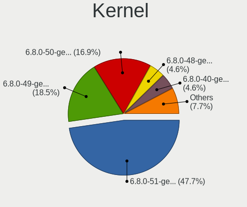
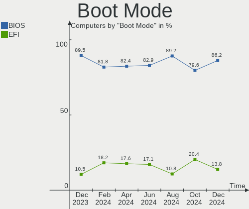
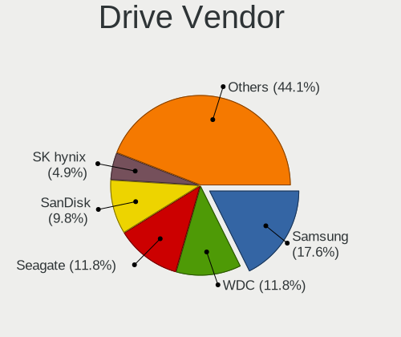
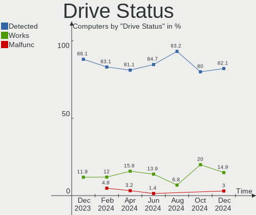
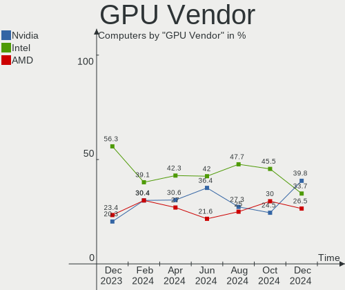
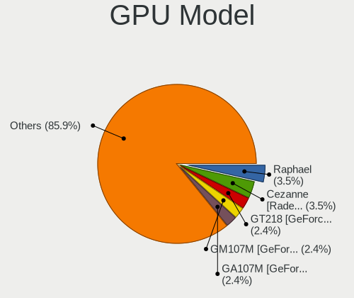

KDE neon - Hardware Trends
--------------------------

A project to identify most popular hardware characteristics and track their change
over time based on data collected by Linux users at https://Linux-Hardware.org.

Anyone can contribute to this report by the [hw-probe](https://github.com/linuxhw/hw-probe) tool:

    sudo -E hw-probe -all -upload

This is a report for all computer types. See also reports for [desktops](/Dist/KDE_neon/Desktop/README.md) and [notebooks](/Dist/KDE_neon/Notebook/README.md).

This report is for one last month. Overall report since the beginning of time: [TestCoverage](https://github.com/linuxhw/TestCoverage)

Period: May, 2022.

Contents
--------

* [ System ](#system)
  - [ OS                       ](#os)
  - [ OS Family                ](#os-family)
  - [ Kernel                   ](#kernel)
  - [ Kernel Family            ](#kernel-family)
  - [ Kernel Major Ver.        ](#kernel-major-ver)
  - [ Arch                     ](#arch)
  - [ DE                       ](#de)
  - [ Display Server           ](#display-server)
  - [ Display Manager          ](#display-manager)
  - [ OS Lang                  ](#os-lang)
  - [ Boot Mode                ](#boot-mode)
  - [ Filesystem               ](#filesystem)
  - [ Part. scheme             ](#part-scheme)
  - [ Dual Boot with Linux/BSD ](#dual-boot-with-linuxbsd)
  - [ Dual Boot (Win)          ](#dual-boot-win)

* [ Board ](#board)
  - [ Vendor                   ](#vendor)
  - [ Model                    ](#model)
  - [ Model Family             ](#model-family)
  - [ MFG Year                 ](#mfg-year)
  - [ Form Factor              ](#form-factor)
  - [ Secure Boot              ](#secure-boot)
  - [ Coreboot                 ](#coreboot)
  - [ RAM Size                 ](#ram-size)
  - [ RAM Used                 ](#ram-used)
  - [ Total Drives             ](#total-drives)
  - [ Has CD-ROM               ](#has-cd-rom)
  - [ Has Ethernet             ](#has-ethernet)
  - [ Has WiFi                 ](#has-wifi)
  - [ Has Bluetooth            ](#has-bluetooth)

* [ Location ](#location)
  - [ Country                  ](#country)
  - [ City                     ](#city)

* [ Drives ](#drives)
  - [ Drive Vendor             ](#drive-vendor)
  - [ Drive Model              ](#drive-model)
  - [ HDD Vendor               ](#hdd-vendor)
  - [ SSD Vendor               ](#ssd-vendor)
  - [ Drive Kind               ](#drive-kind)
  - [ Drive Connector          ](#drive-connector)
  - [ Drive Size               ](#drive-size)
  - [ Space Total              ](#space-total)
  - [ Space Used               ](#space-used)
  - [ Malfunc. Drives          ](#malfunc-drives)
  - [ Malfunc. Drive Vendor    ](#malfunc-drive-vendor)
  - [ Malfunc. HDD Vendor      ](#malfunc-hdd-vendor)
  - [ Malfunc. Drive Kind      ](#malfunc-drive-kind)
  - [ Failed Drives            ](#failed-drives)
  - [ Failed Drive Vendor      ](#failed-drive-vendor)
  - [ Drive Status             ](#drive-status)

* [ Storage controller ](#storage-controller)
  - [ Storage Vendor           ](#storage-vendor)
  - [ Storage Model            ](#storage-model)
  - [ Storage Kind             ](#storage-kind)

* [ Processor ](#processor)
  - [ CPU Vendor               ](#cpu-vendor)
  - [ CPU Model                ](#cpu-model)
  - [ CPU Model Family         ](#cpu-model-family)
  - [ CPU Cores                ](#cpu-cores)
  - [ CPU Sockets              ](#cpu-sockets)
  - [ CPU Threads              ](#cpu-threads)
  - [ CPU Op-Modes             ](#cpu-op-modes)
  - [ CPU Microcode            ](#cpu-microcode)
  - [ CPU Microarch            ](#cpu-microarch)

* [ Graphics ](#graphics)
  - [ GPU Vendor               ](#gpu-vendor)
  - [ GPU Model                ](#gpu-model)
  - [ GPU Combo                ](#gpu-combo)
  - [ GPU Driver               ](#gpu-driver)
  - [ GPU Memory               ](#gpu-memory)

* [ Monitor ](#monitor)
  - [ Monitor Vendor           ](#monitor-vendor)
  - [ Monitor Model            ](#monitor-model)
  - [ Monitor Resolution       ](#monitor-resolution)
  - [ Monitor Diagonal         ](#monitor-diagonal)
  - [ Monitor Width            ](#monitor-width)
  - [ Aspect Ratio             ](#aspect-ratio)
  - [ Monitor Area             ](#monitor-area)
  - [ Pixel Density            ](#pixel-density)
  - [ Multiple Monitors        ](#multiple-monitors)

* [ Network ](#network)
  - [ Net Controller Vendor    ](#net-controller-vendor)
  - [ Net Controller Model     ](#net-controller-model)
  - [ Wireless Vendor          ](#wireless-vendor)
  - [ Wireless Model           ](#wireless-model)
  - [ Ethernet Vendor          ](#ethernet-vendor)
  - [ Ethernet Model           ](#ethernet-model)
  - [ Net Controller Kind      ](#net-controller-kind)
  - [ Used Controller          ](#used-controller)
  - [ NICs                     ](#nics)
  - [ IPv6                     ](#ipv6)

* [ Bluetooth ](#bluetooth)
  - [ Bluetooth Vendor         ](#bluetooth-vendor)
  - [ Bluetooth Model          ](#bluetooth-model)

* [ Sound ](#sound)
  - [ Sound Vendor             ](#sound-vendor)
  - [ Sound Model              ](#sound-model)

* [ Memory ](#memory)
  - [ Memory Vendor            ](#memory-vendor)
  - [ Memory Model             ](#memory-model)
  - [ Memory Kind              ](#memory-kind)
  - [ Memory Form Factor       ](#memory-form-factor)
  - [ Memory Size              ](#memory-size)
  - [ Memory Speed             ](#memory-speed)

* [ Printers & scanners ](#printers--scanners)
  - [ Printer Vendor           ](#printer-vendor)
  - [ Printer Model            ](#printer-model)
  - [ Scanner Vendor           ](#scanner-vendor)
  - [ Scanner Model            ](#scanner-model)

* [ Camera ](#camera)
  - [ Camera Vendor            ](#camera-vendor)
  - [ Camera Model             ](#camera-model)

* [ Security ](#security)
  - [ Fingerprint Vendor       ](#fingerprint-vendor)
  - [ Fingerprint Model        ](#fingerprint-model)
  - [ Chipcard Vendor          ](#chipcard-vendor)
  - [ Chipcard Model           ](#chipcard-model)

* [ Unsupported ](#unsupported)
  - [ Unsupported Devices      ](#unsupported-devices)
  - [ Unsupported Device Types ](#unsupported-device-types)

System
------

OS
--

Installed operating systems

| Name           | Computers | Percent |
|----------------|-----------|---------|
| KDE neon 20.04 | 130       | 100%    |

OS Family
---------

OS without a version

| Name     | Computers | Percent |
|----------|-----------|---------|
| KDE neon | 130       | 100%    |

Kernel
------

Version of the Linux kernel

| Version           | Computers | Percent |
|-------------------|-----------|---------|
| 5.13.0-41-generic | 58        | 44.62%  |
| 5.13.0-40-generic | 39        | 30%     |
| 5.13.0-44-generic | 24        | 18.46%  |
| 5.13.0-39-generic | 4         | 3.08%   |
| 5.4.0-74-generic  | 1         | 0.77%   |
| 5.4.0-109-generic | 1         | 0.77%   |
| 5.4.0-107-generic | 1         | 0.77%   |
| 5.15.0-30-generic | 1         | 0.77%   |
| 5.14.0-1034-oem   | 1         | 0.77%   |

Kernel Family
-------------

Linux kernel without a distro release

| Version | Computers | Percent |
|---------|-----------|---------|
| 5.13.0  | 125       | 96.15%  |
| 5.4.0   | 3         | 2.31%   |
| 5.15.0  | 1         | 0.77%   |
| 5.14.0  | 1         | 0.77%   |

Kernel Major Ver.
-----------------

Linux kernel major version

| Version | Computers | Percent |
|---------|-----------|---------|
| 5.13    | 125       | 96.15%  |
| 5.4     | 3         | 2.31%   |
| 5.15    | 1         | 0.77%   |
| 5.14    | 1         | 0.77%   |

Arch
----

OS architecture (x86_64, i586, etc.)

| Name   | Computers | Percent |
|--------|-----------|---------|
| x86_64 | 130       | 100%    |

DE
--

Desktop Environment

| Name    | Computers | Percent |
|---------|-----------|---------|
| KDE5    | 129       | 99.23%  |
| Unknown | 1         | 0.77%   |

Display Server
--------------

X11 or Wayland

| Name    | Computers | Percent |
|---------|-----------|---------|
| X11     | 120       | 92.31%  |
| Wayland | 10        | 7.69%   |

Display Manager
---------------

SDDM, LightDM, etc.

| Name    | Computers | Percent |
|---------|-----------|---------|
| Unknown | 102       | 78.46%  |
| SDDM    | 28        | 21.54%  |

OS Lang
-------

Language

| Lang        | Computers | Percent |
|-------------|-----------|---------|
| en_US       | 55        | 42.31%  |
| pt_BR       | 9         | 6.92%   |
| en_GB       | 8         | 6.15%   |
| ru_RU       | 7         | 5.38%   |
| en_AU       | 6         | 4.62%   |
| it_IT       | 4         | 3.08%   |
| fr_FR       | 4         | 3.08%   |
| en_IN       | 4         | 3.08%   |
| C           | 4         | 3.08%   |
| es_ES       | 3         | 2.31%   |
| en_PH       | 3         | 2.31%   |
| de_DE       | 3         | 2.31%   |
| hu_HU       | 2         | 1.54%   |
| es_MX       | 2         | 1.54%   |
| es_CL       | 2         | 1.54%   |
| en_ZA       | 2         | 1.54%   |
| zh_TW       | 1         | 0.77%   |
| zh_CN       | 1         | 0.77%   |
| sv_SE       | 1         | 0.77%   |
| sr_RS@latin | 1         | 0.77%   |
| sl_SI       | 1         | 0.77%   |
| ru_UA       | 1         | 0.77%   |
| pl_PL       | 1         | 0.77%   |
| fr_CA       | 1         | 0.77%   |
| fr_BE       | 1         | 0.77%   |
| fi_FI       | 1         | 0.77%   |
| es_PE       | 1         | 0.77%   |
| es_EC       | 1         | 0.77%   |

Boot Mode
---------

EFI or BIOS

| Mode | Computers | Percent |
|------|-----------|---------|
| EFI  | 82        | 63.08%  |
| BIOS | 48        | 36.92%  |

Filesystem
----------

Type of filesystem

| Type    | Computers | Percent |
|---------|-----------|---------|
| Ext4    | 119       | 91.54%  |
| Btrfs   | 6         | 4.62%   |
| Overlay | 3         | 2.31%   |
| Xfs     | 1         | 0.77%   |
| Unknown | 1         | 0.77%   |

Part. scheme
------------

Scheme of partitioning

| Type    | Computers | Percent |
|---------|-----------|---------|
| Unknown | 115       | 88.46%  |
| GPT     | 13        | 10%     |
| MBR     | 2         | 1.54%   |

Dual Boot with Linux/BSD
------------------------

Hosting more than one Linux/BSD

| Dual boot | Computers | Percent |
|-----------|-----------|---------|
| No        | 125       | 96.15%  |
| Yes       | 5         | 3.85%   |

Dual Boot (Win)
---------------

Hosting Linux and Windows

| Dual boot | Computers | Percent |
|-----------|-----------|---------|
| No        | 119       | 91.54%  |
| Yes       | 11        | 8.46%   |

Board
-----

Vendor
------

Motherboard manufacturer

| Name                | Computers | Percent |
|---------------------|-----------|---------|
| ASUSTek Computer    | 27        | 20.77%  |
| Dell                | 23        | 17.69%  |
| Lenovo              | 18        | 13.85%  |
| Hewlett-Packard     | 13        | 10%     |
| MSI                 | 9         | 6.92%   |
| Gigabyte Technology | 6         | 4.62%   |
| Toshiba             | 4         | 3.08%   |
| Intel               | 4         | 3.08%   |
| ASRock              | 4         | 3.08%   |
| Acer                | 4         | 3.08%   |
| Apple               | 3         | 2.31%   |
| Timi                | 2         | 1.54%   |
| SLIMBOOK            | 1         | 0.77%   |
| Schenker            | 1         | 0.77%   |
| Samsung Electronics | 1         | 0.77%   |
| Positivo            | 1         | 0.77%   |
| Pegatron            | 1         | 0.77%   |
| Packard Bell        | 1         | 0.77%   |
| Multilaser          | 1         | 0.77%   |
| Medion              | 1         | 0.77%   |
| MECHREVO            | 1         | 0.77%   |
| JGINYUE             | 1         | 0.77%   |
| HUAWEI              | 1         | 0.77%   |
| Biostar             | 1         | 0.77%   |
| Unknown             | 1         | 0.77%   |

Model
-----

Motherboard model

| Name                                      | Computers | Percent |
|-------------------------------------------|-----------|---------|
| Lenovo Legion 5 Pro 16ACH6H 82JQ          | 2         | 1.54%   |
| Dell XPS 15 7590                          | 2         | 1.54%   |
| ASUS ROG STRIX B450-F GAMING              | 2         | 1.54%   |
| ASUS All Series                           | 2         | 1.54%   |
| Toshiba TECRA Z50-A                       | 1         | 0.77%   |
| Toshiba Satellite L655                    | 1         | 0.77%   |
| Toshiba Satellite L50-B                   | 1         | 0.77%   |
| Toshiba Satellite L50-A                   | 1         | 0.77%   |
| Timi TM1613                               | 1         | 0.77%   |
| Timi TM1612                               | 1         | 0.77%   |
| SLIMBOOK EXECUTIVE-14                     | 1         | 0.77%   |
| Schenker XMG CORE (TGL/M21)               | 1         | 0.77%   |
| Samsung 270E5G/270E5U                     | 1         | 0.77%   |
| Positivo S14CT01                          | 1         | 0.77%   |
| Pegatron A15                              | 1         | 0.77%   |
| Packard Bell EasyNote TSX66HR             | 1         | 0.77%   |
| Multilaser PC130                          | 1         | 0.77%   |
| MSI MS-7D43                               | 1         | 0.77%   |
| MSI MS-7C35                               | 1         | 0.77%   |
| MSI MS-7B93                               | 1         | 0.77%   |
| MSI MS-7B89                               | 1         | 0.77%   |
| MSI MS-7B87                               | 1         | 0.77%   |
| MSI MS-7B79                               | 1         | 0.77%   |
| MSI MS-7B31                               | 1         | 0.77%   |
| MSI MS-7641                               | 1         | 0.77%   |
| MSI GT70 2OC/2OD                          | 1         | 0.77%   |
| Medion X781X/X782X                        | 1         | 0.77%   |
| MECHREVO X10Ti-S Series GM7MPHS           | 1         | 0.77%   |
| Lenovo ThinkPad X13 Gen 1 20T2S16F00      | 1         | 0.77%   |
| Lenovo ThinkPad X1 Extreme 2nd 20QVS14F00 | 1         | 0.77%   |
| Lenovo ThinkPad T520 4243WS4              | 1         | 0.77%   |
| Lenovo ThinkPad T14s Gen 1 20UHCTO1WW     | 1         | 0.77%   |
| Lenovo ThinkPad 25 20K70004US             | 1         | 0.77%   |
| Lenovo Legion Y740-15IRHg 81UH            | 1         | 0.77%   |
| Lenovo Legion T5 28IMB05 90NC00JAUS       | 1         | 0.77%   |
| Lenovo Legion 5 15ARH05H 82B1             | 1         | 0.77%   |
| Lenovo IdeaPad Gaming 3 15ACH6 82K2       | 1         | 0.77%   |
| Lenovo IdeaPad 520-15IKB 81BF             | 1         | 0.77%   |
| Lenovo IdeaPad 5 Pro 16ACH6 82L5          | 1         | 0.77%   |
| Lenovo IdeaPad 330S-15IKB 81F5            | 1         | 0.77%   |
| Lenovo IdeaPad 330-15IKB 81DC             | 1         | 0.77%   |
| Lenovo IdeaCentre Y700-34ISH 90DF00JVMW   | 1         | 0.77%   |
| Lenovo H50-30g 90AS0005BR                 | 1         | 0.77%   |
| Lenovo Flex 3-1130 80LY                   | 1         | 0.77%   |
| JGINYUE X99M-PLUS V2 V2.0                 | 1         | 0.77%   |
| Intel H61M-DS2                            | 1         | 0.77%   |
| Intel H61                                 | 1         | 0.77%   |
| Intel D946GZIS AAD66165-501               | 1         | 0.77%   |
| Intel B75 V124                            | 1         | 0.77%   |
| HUAWEI WRTB-WXX9                          | 1         | 0.77%   |
| HP Z800 Workstation                       | 1         | 0.77%   |
| HP x2 Detachable 10-p0XX                  | 1         | 0.77%   |
| HP ProBook 450 G2                         | 1         | 0.77%   |
| HP Pavilion Laptop 15-eh1xxx              | 1         | 0.77%   |
| HP Pavilion Gaming Laptop 15-cx0xxx       | 1         | 0.77%   |
| HP Pavilion Desktop 595-p0xxx             | 1         | 0.77%   |
| HP OMEN by Obelisk Desktop 875-0xxx       | 1         | 0.77%   |
| HP Folio 13 - 2000                        | 1         | 0.77%   |
| HP ENVY x360 Convertible 15m-eu0xxx       | 1         | 0.77%   |
| HP EliteDesk 800 G1 SFF                   | 1         | 0.77%   |

Model Family
------------

Motherboard model prefix

| Name                  | Computers | Percent |
|-----------------------|-----------|---------|
| Dell Latitude         | 6         | 4.62%   |
| ASUS ROG              | 6         | 4.62%   |
| Lenovo ThinkPad       | 5         | 3.85%   |
| Lenovo Legion         | 5         | 3.85%   |
| Lenovo IdeaPad        | 5         | 3.85%   |
| Dell XPS              | 5         | 3.85%   |
| ASUS PRIME            | 5         | 3.85%   |
| Dell Precision        | 4         | 3.08%   |
| Toshiba Satellite     | 3         | 2.31%   |
| HP Pavilion           | 3         | 2.31%   |
| ASUS TUF              | 3         | 2.31%   |
| Dell Vostro           | 2         | 1.54%   |
| Dell Studio           | 2         | 1.54%   |
| Dell OptiPlex         | 2         | 1.54%   |
| Dell Inspiron         | 2         | 1.54%   |
| ASUS All              | 2         | 1.54%   |
| Acer Aspire           | 2         | 1.54%   |
| Toshiba TECRA         | 1         | 0.77%   |
| Timi TM1613           | 1         | 0.77%   |
| Timi TM1612           | 1         | 0.77%   |
| SLIMBOOK EXECUTIVE-14 | 1         | 0.77%   |
| Schenker XMG          | 1         | 0.77%   |
| Samsung 270E5G        | 1         | 0.77%   |
| Positivo S14CT01      | 1         | 0.77%   |
| Pegatron A15          | 1         | 0.77%   |
| Packard Bell EasyNote | 1         | 0.77%   |
| Multilaser PC130      | 1         | 0.77%   |
| MSI MS-7D43           | 1         | 0.77%   |
| MSI MS-7C35           | 1         | 0.77%   |
| MSI MS-7B93           | 1         | 0.77%   |
| MSI MS-7B89           | 1         | 0.77%   |
| MSI MS-7B87           | 1         | 0.77%   |
| MSI MS-7B79           | 1         | 0.77%   |
| MSI MS-7B31           | 1         | 0.77%   |
| MSI MS-7641           | 1         | 0.77%   |
| MSI GT70              | 1         | 0.77%   |
| Medion X781X          | 1         | 0.77%   |
| MECHREVO X10Ti-S      | 1         | 0.77%   |
| Lenovo IdeaCentre     | 1         | 0.77%   |
| Lenovo H50-30g        | 1         | 0.77%   |
| Lenovo Flex           | 1         | 0.77%   |
| JGINYUE X99M-PLUS     | 1         | 0.77%   |
| Intel H61M-DS2        | 1         | 0.77%   |
| Intel H61             | 1         | 0.77%   |
| Intel D946GZIS        | 1         | 0.77%   |
| Intel B75             | 1         | 0.77%   |
| HUAWEI WRTB-WXX9      | 1         | 0.77%   |
| HP Z800               | 1         | 0.77%   |
| HP x2                 | 1         | 0.77%   |
| HP ProBook            | 1         | 0.77%   |
| HP OMEN               | 1         | 0.77%   |
| HP Folio              | 1         | 0.77%   |
| HP ENVY               | 1         | 0.77%   |
| HP EliteDesk          | 1         | 0.77%   |
| HP EliteBook          | 1         | 0.77%   |
| HP 310-1205uk         | 1         | 0.77%   |
| HP 240                | 1         | 0.77%   |
| Gigabyte X470         | 1         | 0.77%   |
| Gigabyte H67M-UD2H-B3 | 1         | 0.77%   |
| Gigabyte EX58-UD5     | 1         | 0.77%   |

MFG Year
--------

Motherboard manufacture year

| Year | Computers | Percent |
|------|-----------|---------|
| 2021 | 15        | 11.54%  |
| 2019 | 15        | 11.54%  |
| 2017 | 15        | 11.54%  |
| 2020 | 12        | 9.23%   |
| 2018 | 10        | 7.69%   |
| 2013 | 10        | 7.69%   |
| 2011 | 10        | 7.69%   |
| 2016 | 9         | 6.92%   |
| 2012 | 9         | 6.92%   |
| 2014 | 8         | 6.15%   |
| 2015 | 6         | 4.62%   |
| 2010 | 4         | 3.08%   |
| 2009 | 3         | 2.31%   |
| 2008 | 3         | 2.31%   |
| 2006 | 1         | 0.77%   |

Form Factor
-----------

Physical design of the computer

| Name        | Computers | Percent |
|-------------|-----------|---------|
| Notebook    | 68        | 52.31%  |
| Desktop     | 57        | 43.85%  |
| Tablet      | 2         | 1.54%   |
| Convertible | 2         | 1.54%   |
| All in one  | 1         | 0.77%   |

Secure Boot
-----------

Enabled or disabled

| State    | Computers | Percent |
|----------|-----------|---------|
| Disabled | 117       | 90%     |
| Enabled  | 13        | 10%     |

Coreboot
--------

Have coreboot on board

| Used | Computers | Percent |
|------|-----------|---------|
| No   | 130       | 100%    |

RAM Size
--------

Total RAM memory

| Size in GB  | Computers | Percent |
|-------------|-----------|---------|
| 16.01-24.0  | 36        | 27.69%  |
| 4.01-8.0    | 27        | 20.77%  |
| 32.01-64.0  | 21        | 16.15%  |
| 8.01-16.0   | 17        | 13.08%  |
| 3.01-4.0    | 15        | 11.54%  |
| 64.01-256.0 | 5         | 3.85%   |
| 1.01-2.0    | 4         | 3.08%   |
| 2.01-3.0    | 3         | 2.31%   |
| 24.01-32.0  | 2         | 1.54%   |

RAM Used
--------

Used RAM memory

| Used GB    | Computers | Percent |
|------------|-----------|---------|
| 1.01-2.0   | 53        | 40.77%  |
| 2.01-3.0   | 32        | 24.62%  |
| 3.01-4.0   | 18        | 13.85%  |
| 4.01-8.0   | 16        | 12.31%  |
| 0.51-1.0   | 7         | 5.38%   |
| 8.01-16.0  | 3         | 2.31%   |
| 16.01-24.0 | 1         | 0.77%   |

Total Drives
------------

Number of drives on board

| Drives | Computers | Percent |
|--------|-----------|---------|
| 1      | 61        | 46.92%  |
| 2      | 47        | 36.15%  |
| 3      | 18        | 13.85%  |
| 4      | 4         | 3.08%   |

Has CD-ROM
----------

Has CD-ROM on board

| Presented | Computers | Percent |
|-----------|-----------|---------|
| No        | 87        | 66.92%  |
| Yes       | 43        | 33.08%  |

Has Ethernet
------------

Has Ethernet on board

| Presented | Computers | Percent |
|-----------|-----------|---------|
| Yes       | 110       | 84.62%  |
| No        | 20        | 15.38%  |

Has WiFi
--------

Has WiFi module

| Presented | Computers | Percent |
|-----------|-----------|---------|
| Yes       | 98        | 75.38%  |
| No        | 32        | 24.62%  |

Has Bluetooth
-------------

Has Bluetooth module

| Presented | Computers | Percent |
|-----------|-----------|---------|
| Yes       | 81        | 62.31%  |
| No        | 49        | 37.69%  |

Location
--------

Country
-------

Geographic location (country)

| Country      | Computers | Percent |
|--------------|-----------|---------|
| USA          | 24        | 18.46%  |
| Brazil       | 12        | 9.23%   |
| France       | 7         | 5.38%   |
| UK           | 6         | 4.62%   |
| Germany      | 6         | 4.62%   |
| Australia    | 6         | 4.62%   |
| Russia       | 5         | 3.85%   |
| Mexico       | 5         | 3.85%   |
| Italy        | 4         | 3.08%   |
| India        | 4         | 3.08%   |
| Spain        | 3         | 2.31%   |
| Philippines  | 3         | 2.31%   |
| Sweden       | 2         | 1.54%   |
| South Africa | 2         | 1.54%   |
| Serbia       | 2         | 1.54%   |
| Netherlands  | 2         | 1.54%   |
| Hungary      | 2         | 1.54%   |
| Greece       | 2         | 1.54%   |
| Chile        | 2         | 1.54%   |
| Canada       | 2         | 1.54%   |
| Belgium      | 2         | 1.54%   |
| Venezuela    | 1         | 0.77%   |
| Uruguay      | 1         | 0.77%   |
| Ukraine      | 1         | 0.77%   |
| Switzerland  | 1         | 0.77%   |
| Slovenia     | 1         | 0.77%   |
| Romania      | 1         | 0.77%   |
| Portugal     | 1         | 0.77%   |
| Poland       | 1         | 0.77%   |
| Peru         | 1         | 0.77%   |
| Morocco      | 1         | 0.77%   |
| Malaysia     | 1         | 0.77%   |
| Latvia       | 1         | 0.77%   |
| Kyrgyzstan   | 1         | 0.77%   |
| Kazakhstan   | 1         | 0.77%   |
| Indonesia    | 1         | 0.77%   |
| Hong Kong    | 1         | 0.77%   |
| Finland      | 1         | 0.77%   |
| Egypt        | 1         | 0.77%   |
| Ecuador      | 1         | 0.77%   |
| Czechia      | 1         | 0.77%   |
| Croatia      | 1         | 0.77%   |
| China        | 1         | 0.77%   |
| Bulgaria     | 1         | 0.77%   |
| Bangladesh   | 1         | 0.77%   |
| Austria      | 1         | 0.77%   |
| Armenia      | 1         | 0.77%   |
| Argentina    | 1         | 0.77%   |

City
----

Geographic location (city)

| City                   | Computers | Percent |
|------------------------|-----------|---------|
| Milan                  | 2         | 1.54%   |
| Mexico City            | 2         | 1.54%   |
| Frankfurt am Main      | 2         | 1.54%   |
| Brisbane               | 2         | 1.54%   |
| Zurich                 | 1         | 0.77%   |
| Yerevan                | 1         | 0.77%   |
| Yekaterinburg          | 1         | 0.77%   |
| Williamsport           | 1         | 0.77%   |
| Whistler               | 1         | 0.77%   |
| Washington             | 1         | 0.77%   |
| Vienna                 | 1         | 0.77%   |
| Viamao                 | 1         | 0.77%   |
| Veranopolis            | 1         | 0.77%   |
| Veigne                 | 1         | 0.77%   |
| Tula                   | 1         | 0.77%   |
| Tucson                 | 1         | 0.77%   |
| Trstenik               | 1         | 0.77%   |
| Tijuana                | 1         | 0.77%   |
| Tarbes                 | 1         | 0.77%   |
| Tabira                 | 1         | 0.77%   |
| Sydney                 | 1         | 0.77%   |
| Statesboro             | 1         | 0.77%   |
| Springfield            | 1         | 0.77%   |
| Sofia                  | 1         | 0.77%   |
| Slatina                | 1         | 0.77%   |
| Shawnee                | 1         | 0.77%   |
| Serra                  | 1         | 0.77%   |
| Sao Vicente            | 1         | 0.77%   |
| Sant Pere de Vilamajor | 1         | 0.77%   |
| San Bruno              | 1         | 0.77%   |
| Rio de Janeiro         | 1         | 0.77%   |
| Riga                   | 1         | 0.77%   |
| Richmond               | 1         | 0.77%   |
| Richardson             | 1         | 0.77%   |
| Reims                  | 1         | 0.77%   |
| Québec                | 1         | 0.77%   |
| Prato Sesia            | 1         | 0.77%   |
| Prague                 | 1         | 0.77%   |
| Portland               | 1         | 0.77%   |
| Port Elizabeth         | 1         | 0.77%   |
| Poros                  | 1         | 0.77%   |
| Pian di Scò           | 1         | 0.77%   |
| Perth                  | 1         | 0.77%   |
| Orlando                | 1         | 0.77%   |
| Omsk                   | 1         | 0.77%   |
| Novo Gama              | 1         | 0.77%   |
| New York               | 1         | 0.77%   |
| New Delhi              | 1         | 0.77%   |
| Nevele                 | 1         | 0.77%   |
| Natick                 | 1         | 0.77%   |
| Munich                 | 1         | 0.77%   |
| Mumbai                 | 1         | 0.77%   |
| Mostoles               | 1         | 0.77%   |
| Montevideo             | 1         | 0.77%   |
| Molina                 | 1         | 0.77%   |
| Mission Viejo          | 1         | 0.77%   |
| Marseille              | 1         | 0.77%   |
| Marrakesh              | 1         | 0.77%   |
| Marcq-en-Baroeul       | 1         | 0.77%   |
| Manta                  | 1         | 0.77%   |

Drives
------

Drive Vendor
------------

Hard drive vendors

| Vendor                    | Computers | Drives | Percent |
|---------------------------|-----------|--------|---------|
| Samsung Electronics       | 33        | 44     | 16.1%   |
| Seagate                   | 26        | 29     | 12.68%  |
| WDC                       | 23        | 29     | 11.22%  |
| Kingston                  | 18        | 19     | 8.78%   |
| Toshiba                   | 12        | 13     | 5.85%   |
| Sandisk                   | 12        | 12     | 5.85%   |
| Crucial                   | 8         | 9      | 3.9%    |
| Hitachi                   | 7         | 7      | 3.41%   |
| SK Hynix                  | 6         | 7      | 2.93%   |
| Unknown                   | 5         | 6      | 2.44%   |
| Intel                     | 5         | 5      | 2.44%   |
| HGST                      | 5         | 5      | 2.44%   |
| Silicon Motion            | 4         | 4      | 1.95%   |
| A-DATA Technology         | 4         | 4      | 1.95%   |
| PNY                       | 3         | 3      | 1.46%   |
| Micron Technology         | 3         | 3      | 1.46%   |
| PLEXTOR                   | 2         | 4      | 0.98%   |
| Phison                    | 2         | 3      | 0.98%   |
| Micron/Crucial Technology | 2         | 2      | 0.98%   |
| LITEON                    | 2         | 2      | 0.98%   |
| Hewlett-Packard           | 2         | 2      | 0.98%   |
| Gigabyte Technology       | 2         | 2      | 0.98%   |
| China                     | 2         | 2      | 0.98%   |
| Apple                     | 2         | 2      | 0.98%   |
| TO Exter                  | 1         | 1      | 0.49%   |
| Team                      | 1         | 1      | 0.49%   |
| sage                      | 1         | 1      | 0.49%   |
| OSCOO                     | 1         | 1      | 0.49%   |
| OCZ                       | 1         | 1      | 0.49%   |
| N600                      | 1         | 1      | 0.49%   |
| MAXTOR                    | 1         | 1      | 0.49%   |
| KIOXIA                    | 1         | 1      | 0.49%   |
| KingSpec                  | 1         | 1      | 0.49%   |
| GOODRAM                   | 1         | 1      | 0.49%   |
| GeIL                      | 1         | 1      | 0.49%   |
| Aura                      | 1         | 1      | 0.49%   |
| AMD                       | 1         | 1      | 0.49%   |
| ADATA Technology          | 1         | 1      | 0.49%   |
| 2-Power                   | 1         | 1      | 0.49%   |

Drive Model
-----------

Hard drive models

| Model                               | Computers | Percent |
|-------------------------------------|-----------|---------|
| Samsung NVMe SSD Drive 1TB          | 6         | 2.65%   |
| Unknown MMC Card  32GB              | 4         | 1.77%   |
| Sandisk NVMe SSD Drive 512GB        | 4         | 1.77%   |
| Kingston SA400S37120G 120GB SSD     | 4         | 1.77%   |
| Toshiba NVMe SSD Drive 512GB        | 3         | 1.33%   |
| SK Hynix NVMe SSD Drive 512GB       | 3         | 1.33%   |
| Seagate ST500DM002-1BD142 500GB     | 3         | 1.33%   |
| Sandisk NVMe SSD Drive 1TB          | 3         | 1.33%   |
| Samsung NVMe SSD Drive 500GB        | 3         | 1.33%   |
| Kingston SA400S37240G 240GB SSD     | 3         | 1.33%   |
| WDC WDS240G2G0A-00JH30 240GB SSD    | 2         | 0.88%   |
| WDC WD20EZRZ-00Z5HB0 2TB            | 2         | 0.88%   |
| Silicon Motion NVMe SSD Drive 128GB | 2         | 0.88%   |
| Seagate ST2000DM001-1ER164 2TB      | 2         | 0.88%   |
| Seagate ST1000LM035-1RK172 1TB      | 2         | 0.88%   |
| Seagate ST1000LM014-1EJ164 1TB      | 2         | 0.88%   |
| Seagate ST1000DM003-1ER162 1TB      | 2         | 0.88%   |
| Samsung SSD 980 PRO 1TB             | 2         | 0.88%   |
| Samsung SSD 970 EVO Plus 1TB        | 2         | 0.88%   |
| Samsung SSD 850 EVO 500GB           | 2         | 0.88%   |
| Samsung SSD 850 EVO 250GB           | 2         | 0.88%   |
| Samsung SSD 840 EVO 500GB           | 2         | 0.88%   |
| Samsung NVMe SSD Drive 256GB        | 2         | 0.88%   |
| Samsung NVMe SSD Drive 1024GB       | 2         | 0.88%   |
| PNY CS900 240GB SSD                 | 2         | 0.88%   |
| Phison NVMe SSD Drive 1024GB        | 2         | 0.88%   |
| Micron NVMe SSD Drive 512GB         | 2         | 0.88%   |
| Kingston SUV400S37120G 120GB SSD    | 2         | 0.88%   |
| Kingston NVMe SSD Drive 500GB       | 2         | 0.88%   |
| Kingston NVMe SSD Drive 1TB         | 2         | 0.88%   |
| Crucial CT480BX500SSD1 480GB        | 2         | 0.88%   |
| WDC WDS500G2B0B-00YS70 500GB SSD    | 1         | 0.44%   |
| WDC WDS500G2B0A-00SM50 500GB SSD    | 1         | 0.44%   |
| WDC WDS100T2B0C-00PXH0 1TB          | 1         | 0.44%   |
| WDC WDBNCE0010PNC 1TB SSD           | 1         | 0.44%   |
| WDC WD6400BPVT-35HXZT1 640GB        | 1         | 0.44%   |
| WDC WD5000AAKX-00ERMA0 500GB        | 1         | 0.44%   |
| WDC WD40PURX-64GVNY0 4TB            | 1         | 0.44%   |
| WDC WD40EFAX-68JH4N1 4TB            | 1         | 0.44%   |
| WDC WD3200AAJS-00YZCA0 320GB        | 1         | 0.44%   |
| WDC WD2500JS-60NCB1 250GB           | 1         | 0.44%   |
| WDC WD20PURX-64PFUY0 2TB            | 1         | 0.44%   |
| WDC WD20EZBX-00AYRA0 2TB            | 1         | 0.44%   |
| WDC WD20EARX-00PASB0 2TB            | 1         | 0.44%   |
| WDC WD20EARX-008FB0 2TB             | 1         | 0.44%   |
| WDC WD1600AAJS-00PSA0 160GB         | 1         | 0.44%   |
| WDC WD10SPZX-24Z10 1TB              | 1         | 0.44%   |
| WDC WD10JPVX-75JC3T0 1TB            | 1         | 0.44%   |
| WDC WD10JPVX-22JC3T0 1TB            | 1         | 0.44%   |
| WDC WD10EZEX-60WN4A0 1TB            | 1         | 0.44%   |
| WDC WD10EZEX-08WN4A0 1TB            | 1         | 0.44%   |
| WDC WD10EZEX-08M2NA0 1TB            | 1         | 0.44%   |
| WDC WD10EZEX-00WN4A0 1TB            | 1         | 0.44%   |
| WDC WD10EZEX-00BBHA0 1TB            | 1         | 0.44%   |
| WDC WD10EURX-63FH1Y0 1TB            | 1         | 0.44%   |
| Unknown SD/MMC/MS PRO 999GB         | 1         | 0.44%   |
| Unknown MMC Card  16GB              | 1         | 0.44%   |
| Toshiba THNSNH128GCST 128GB SSD     | 1         | 0.44%   |
| Toshiba THNSNF064GMCS 64GB SSD      | 1         | 0.44%   |
| Toshiba NVMe SSD Drive 1024GB       | 1         | 0.44%   |

HDD Vendor
----------

Hard disk drive vendors

| Vendor              | Computers | Drives | Percent |
|---------------------|-----------|--------|---------|
| Seagate             | 26        | 29     | 36.11%  |
| WDC                 | 20        | 23     | 27.78%  |
| Hitachi             | 7         | 7      | 9.72%   |
| Toshiba             | 6         | 6      | 8.33%   |
| HGST                | 5         | 5      | 6.94%   |
| Samsung Electronics | 3         | 4      | 4.17%   |
| Unknown             | 1         | 1      | 1.39%   |
| sage                | 1         | 1      | 1.39%   |
| MAXTOR              | 1         | 1      | 1.39%   |
| Hewlett-Packard     | 1         | 1      | 1.39%   |
| Apple               | 1         | 1      | 1.39%   |

SSD Vendor
----------

Solid state drive vendors

| Vendor              | Computers | Drives | Percent |
|---------------------|-----------|--------|---------|
| Samsung Electronics | 15        | 18     | 20%     |
| Kingston            | 14        | 14     | 18.67%  |
| Crucial             | 6         | 7      | 8%      |
| WDC                 | 5         | 5      | 6.67%   |
| A-DATA Technology   | 4         | 4      | 5.33%   |
| PNY                 | 3         | 3      | 4%      |
| Toshiba             | 2         | 2      | 2.67%   |
| SanDisk             | 2         | 2      | 2.67%   |
| PLEXTOR             | 2         | 4      | 2.67%   |
| LITEON              | 2         | 2      | 2.67%   |
| Intel               | 2         | 2      | 2.67%   |
| China               | 2         | 2      | 2.67%   |
| TO Exter            | 1         | 1      | 1.33%   |
| Team                | 1         | 1      | 1.33%   |
| SK Hynix            | 1         | 1      | 1.33%   |
| OSCOO               | 1         | 1      | 1.33%   |
| OCZ                 | 1         | 1      | 1.33%   |
| N600                | 1         | 1      | 1.33%   |
| Micron Technology   | 1         | 1      | 1.33%   |
| KingSpec            | 1         | 1      | 1.33%   |
| Hewlett-Packard     | 1         | 1      | 1.33%   |
| GOODRAM             | 1         | 1      | 1.33%   |
| Gigabyte Technology | 1         | 1      | 1.33%   |
| GeIL                | 1         | 1      | 1.33%   |
| Aura                | 1         | 1      | 1.33%   |
| Apple               | 1         | 1      | 1.33%   |
| AMD                 | 1         | 1      | 1.33%   |
| 2-Power             | 1         | 1      | 1.33%   |

Drive Kind
----------

HDD or SSD

| Kind    | Computers | Drives | Percent |
|---------|-----------|--------|---------|
| SSD     | 65        | 81     | 34.57%  |
| HDD     | 65        | 79     | 34.57%  |
| NVMe    | 53        | 66     | 28.19%  |
| MMC     | 4         | 6      | 2.13%   |
| Unknown | 1         | 1      | 0.53%   |

Drive Connector
---------------

SATA, SAS, NVMe, etc.

| Type | Computers | Drives | Percent |
|------|-----------|--------|---------|
| SATA | 94        | 150    | 58.39%  |
| NVMe | 53        | 66     | 32.92%  |
| SAS  | 10        | 11     | 6.21%   |
| MMC  | 4         | 6      | 2.48%   |

Drive Size
----------

Size of hard drive

| Size in TB | Computers | Drives | Percent |
|------------|-----------|--------|---------|
| 0.01-0.5   | 73        | 94     | 54.48%  |
| 0.51-1.0   | 36        | 39     | 26.87%  |
| 1.01-2.0   | 15        | 16     | 11.19%  |
| 3.01-4.0   | 6         | 6      | 4.48%   |
| 2.01-3.0   | 2         | 2      | 1.49%   |
| 4.01-10.0  | 2         | 3      | 1.49%   |

Space Total
-----------

Amount of disk space available on the file system

| Size in GB     | Computers | Percent |
|----------------|-----------|---------|
| 251-500        | 30        | 23.08%  |
| 501-1000       | 28        | 21.54%  |
| 101-250        | 24        | 18.46%  |
| More than 3000 | 10        | 7.69%   |
| 1001-2000      | 10        | 7.69%   |
| 51-100         | 9         | 6.92%   |
| 21-50          | 7         | 5.38%   |
| 1-20           | 7         | 5.38%   |
| 2001-3000      | 3         | 2.31%   |
| Unknown        | 2         | 1.54%   |

Space Used
----------

Amount of used disk space

| Used GB        | Computers | Percent |
|----------------|-----------|---------|
| 1-20           | 57        | 43.85%  |
| 21-50          | 21        | 16.15%  |
| 251-500        | 13        | 10%     |
| 101-250        | 11        | 8.46%   |
| 501-1000       | 9         | 6.92%   |
| 51-100         | 9         | 6.92%   |
| 1001-2000      | 5         | 3.85%   |
| More than 3000 | 3         | 2.31%   |
| Unknown        | 2         | 1.54%   |

Malfunc. Drives
---------------

Drive models with a malfunction

| Model                                 | Computers | Drives | Percent |
|---------------------------------------|-----------|--------|---------|
| Seagate ST1000LM035-1RK172 1TB        | 1         | 1      | 25%     |
| Samsung Electronics SSD 970 PRO 512GB | 1         | 1      | 25%     |
| Samsung Electronics HD250HJ 250GB     | 1         | 1      | 25%     |
| MAXTOR 6L160M0 164GB                  | 1         | 1      | 25%     |

Malfunc. Drive Vendor
---------------------

Vendors of faulty drives

| Vendor              | Computers | Drives | Percent |
|---------------------|-----------|--------|---------|
| Samsung Electronics | 2         | 2      | 50%     |
| Seagate             | 1         | 1      | 25%     |
| MAXTOR              | 1         | 1      | 25%     |

Malfunc. HDD Vendor
-------------------

Vendors of faulty HDD drives

| Vendor              | Computers | Drives | Percent |
|---------------------|-----------|--------|---------|
| Seagate             | 1         | 1      | 33.33%  |
| Samsung Electronics | 1         | 1      | 33.33%  |
| MAXTOR              | 1         | 1      | 33.33%  |

Malfunc. Drive Kind
-------------------

Kinds of faulty drives

| Kind | Computers | Drives | Percent |
|------|-----------|--------|---------|
| HDD  | 3         | 3      | 75%     |
| NVMe | 1         | 1      | 25%     |

Failed Drives
-------------

Failed drive models

Zero info for selected period =(

Failed Drive Vendor
-------------------

Failed drive vendors

Zero info for selected period =(

Drive Status
------------

Number of failed and malfunc. drives

| Status   | Computers | Drives | Percent |
|----------|-----------|--------|---------|
| Detected | 116       | 199    | 84.06%  |
| Works    | 18        | 30     | 13.04%  |
| Malfunc  | 4         | 4      | 2.9%    |

Storage controller
------------------

Storage Vendor
--------------

Storage controller vendors

| Vendor                       | Computers | Percent |
|------------------------------|-----------|---------|
| Intel                        | 85        | 48.3%   |
| AMD                          | 31        | 17.61%  |
| Samsung Electronics          | 18        | 10.23%  |
| Sandisk                      | 10        | 5.68%   |
| Toshiba America Info Systems | 5         | 2.84%   |
| SK Hynix                     | 4         | 2.27%   |
| Silicon Motion               | 4         | 2.27%   |
| Kingston Technology Company  | 4         | 2.27%   |
| Phison Electronics           | 3         | 1.7%    |
| Micron/Crucial Technology    | 3         | 1.7%    |
| Micron Technology            | 2         | 1.14%   |
| ASMedia Technology           | 2         | 1.14%   |
| Nvidia                       | 1         | 0.57%   |
| LSI Logic / Symbios Logic    | 1         | 0.57%   |
| KIOXIA                       | 1         | 0.57%   |
| JMicron Technology           | 1         | 0.57%   |
| ADATA Technology             | 1         | 0.57%   |

Storage Model
-------------

Storage controller models

| Model                                                                            | Computers | Percent |
|----------------------------------------------------------------------------------|-----------|---------|
| AMD FCH SATA Controller [AHCI mode]                                              | 21        | 10.5%   |
| Samsung NVMe SSD Controller SM981/PM981/PM983                                    | 11        | 5.5%    |
| Intel Sunrise Point-LP SATA Controller [AHCI mode]                               | 10        | 5%      |
| Intel 8 Series/C220 Series Chipset Family 6-port SATA Controller 1 [AHCI mode]   | 8         | 4%      |
| AMD 400 Series Chipset SATA Controller                                           | 7         | 3.5%    |
| Intel 7 Series Chipset Family 6-port SATA Controller [AHCI mode]                 | 6         | 3%      |
| Intel 6 Series/C200 Series Chipset Family 6 port Mobile SATA AHCI Controller     | 6         | 3%      |
| Intel Q170/Q150/B150/H170/H110/Z170/CM236 Chipset SATA Controller [AHCI Mode]    | 5         | 2.5%    |
| Intel 8 Series SATA Controller 1 [AHCI mode]                                     | 5         | 2.5%    |
| Silicon Motion SM2263EN/SM2263XT SSD Controller                                  | 4         | 2%      |
| Sandisk WD Black SN750 / PC SN730 NVMe SSD                                       | 4         | 2%      |
| Samsung NVMe SSD Controller 980                                                  | 4         | 2%      |
| Intel Cannon Lake Mobile PCH SATA AHCI Controller                                | 4         | 2%      |
| Intel 82801 Mobile SATA Controller [RAID mode]                                   | 4         | 2%      |
| Sandisk WD Blue SN550 NVMe SSD                                                   | 3         | 1.5%    |
| Samsung NVMe SSD Controller PM9A1/PM9A3/980PRO                                   | 3         | 1.5%    |
| Micron/Crucial Non-Volatile memory controller                                    | 3         | 1.5%    |
| Kingston Company A2000 NVMe SSD                                                  | 3         | 1.5%    |
| Intel Wildcat Point-LP SATA Controller [AHCI Mode]                               | 3         | 1.5%    |
| Intel Volume Management Device NVMe RAID Controller                              | 3         | 1.5%    |
| Intel Cannon Lake PCH SATA AHCI Controller                                       | 3         | 1.5%    |
| AMD SB7x0/SB8x0/SB9x0 SATA Controller [AHCI mode]                                | 3         | 1.5%    |
| AMD 500 Series Chipset SATA Controller                                           | 3         | 1.5%    |
| Toshiba America Info Systems XG6 NVMe SSD Controller                             | 2         | 1%      |
| SK Hynix Gold P31 SSD                                                            | 2         | 1%      |
| Sandisk WD Black 2018/SN750 / PC SN720 NVMe SSD                                  | 2         | 1%      |
| Phison E12 NVMe Controller                                                       | 2         | 1%      |
| Micron Non-Volatile memory controller                                            | 2         | 1%      |
| Intel SSD 660P Series                                                            | 2         | 1%      |
| Intel NM10/ICH7 Family SATA Controller [IDE mode]                                | 2         | 1%      |
| Intel Alder Lake-S PCH SATA Controller [AHCI Mode]                               | 2         | 1%      |
| Intel 82801IBM/IEM (ICH9M/ICH9M-E) 4 port SATA Controller [AHCI mode]            | 2         | 1%      |
| Intel 82801G (ICH7 Family) IDE Controller                                        | 2         | 1%      |
| Intel 7 Series/C210 Series Chipset Family 6-port SATA Controller [AHCI mode]     | 2         | 1%      |
| Intel 6 Series/C200 Series Chipset Family 6 port Desktop SATA AHCI Controller    | 2         | 1%      |
| Intel 500 Series Chipset Family SATA AHCI Controller                             | 2         | 1%      |
| Intel 400 Series Chipset Family SATA AHCI Controller                             | 2         | 1%      |
| ASMedia ASM1062 Serial ATA Controller                                            | 2         | 1%      |
| AMD X370 Series Chipset SATA Controller                                          | 2         | 1%      |
| AMD 300 Series Chipset SATA Controller                                           | 2         | 1%      |
| Toshiba America Info Systems XG4 NVMe SSD Controller                             | 1         | 0.5%    |
| Toshiba America Info Systems Toshiba America Info Non-Volatile memory controller | 1         | 0.5%    |
| Toshiba America Info Systems BG3 NVMe SSD Controller                             | 1         | 0.5%    |
| SK Hynix Non-Volatile memory controller                                          | 1         | 0.5%    |
| SK Hynix BC501 NVMe Solid State Drive                                            | 1         | 0.5%    |
| Sandisk WD PC SN810 / Black SN850 NVMe SSD                                       | 1         | 0.5%    |
| Samsung NVMe SSD Controller SM961/PM961/SM963                                    | 1         | 0.5%    |
| Samsung NVMe SSD Controller SM951/PM951                                          | 1         | 0.5%    |
| Phison PS5013 E13 NVMe Controller                                                | 1         | 0.5%    |
| Nvidia MCP89 SATA Controller (AHCI mode)                                         | 1         | 0.5%    |
| LSI Logic / Symbios Logic SAS1068E PCI-Express Fusion-MPT SAS                    | 1         | 0.5%    |
| KIOXIA Non-Volatile memory controller                                            | 1         | 0.5%    |
| Kingston Company SNVS2000G [NV1 NVMe PCIe SSD 2TB]                               | 1         | 0.5%    |
| JMicron JMB363 SATA/IDE Controller                                               | 1         | 0.5%    |
| Intel SSD Pro 7600p/760p/E 6100p Series                                          | 1         | 0.5%    |
| Intel SATA Controller [RAID mode]                                                | 1         | 0.5%    |
| Intel Comet Lake SATA AHCI Controller                                            | 1         | 0.5%    |
| Intel C610/X99 series chipset sSATA Controller [AHCI mode]                       | 1         | 0.5%    |
| Intel C610/X99 series chipset 6-Port SATA Controller [AHCI mode]                 | 1         | 0.5%    |
| Intel C600/X79 series chipset IDE-r Controller                                   | 1         | 0.5%    |

Storage Kind
------------

Kind of storage controller (IDE, SATA, NVMe, SAS, ...)

| Kind | Computers | Percent |
|------|-----------|---------|
| SATA | 102       | 59.3%   |
| NVMe | 52        | 30.23%  |
| IDE  | 9         | 5.23%   |
| RAID | 8         | 4.65%   |
| SCSI | 1         | 0.58%   |

Processor
---------

CPU Vendor
----------

Processor vendors

| Vendor | Computers | Percent |
|--------|-----------|---------|
| Intel  | 96        | 73.85%  |
| AMD    | 34        | 26.15%  |

CPU Model
---------

Processor models

| Model                                       | Computers | Percent |
|---------------------------------------------|-----------|---------|
| Intel Core i7-9750H CPU @ 2.60GHz           | 3         | 2.31%   |
| Intel Core i7-8550U CPU @ 1.80GHz           | 3         | 2.31%   |
| Intel Atom x5-Z8350 CPU @ 1.44GHz           | 3         | 2.31%   |
| AMD Ryzen 5 5600H with Radeon Graphics      | 3         | 2.31%   |
| AMD Ryzen 5 3600 6-Core Processor           | 3         | 2.31%   |
| AMD Ryzen 5 1600 Six-Core Processor         | 3         | 2.31%   |
| Intel Core i7-4790K CPU @ 4.00GHz           | 2         | 1.54%   |
| Intel Core i7-10510U CPU @ 1.80GHz          | 2         | 1.54%   |
| Intel Core i5-8250U CPU @ 1.60GHz           | 2         | 1.54%   |
| Intel Core i5-6500 CPU @ 3.20GHz            | 2         | 1.54%   |
| Intel Core i5-6200U CPU @ 2.30GHz           | 2         | 1.54%   |
| Intel Core i5-5200U CPU @ 2.20GHz           | 2         | 1.54%   |
| Intel Core i5-4570 CPU @ 3.20GHz            | 2         | 1.54%   |
| Intel Core i5-4300U CPU @ 1.90GHz           | 2         | 1.54%   |
| Intel Core i5-2450M CPU @ 2.50GHz           | 2         | 1.54%   |
| AMD Ryzen 7 5700U with Radeon Graphics      | 2         | 1.54%   |
| AMD Ryzen 5 3500X 6-Core Processor          | 2         | 1.54%   |
| Intel Xeon CPU X5675 @ 3.07GHz              | 1         | 0.77%   |
| Intel Xeon CPU E5-2630 v3 @ 2.40GHz         | 1         | 0.77%   |
| Intel Xeon CPU E5-2620 0 @ 2.00GHz          | 1         | 0.77%   |
| Intel Xeon CPU E31270 @ 3.40GHz             | 1         | 0.77%   |
| Intel Pentium Dual-Core CPU E6700 @ 3.20GHz | 1         | 0.77%   |
| Intel Pentium CPU G620 @ 2.60GHz            | 1         | 0.77%   |
| Intel Pentium CPU G4560T @ 2.90GHz          | 1         | 0.77%   |
| Intel Pentium CPU G4560 @ 3.50GHz           | 1         | 0.77%   |
| Intel Pentium 4 CPU 3.00GHz                 | 1         | 0.77%   |
| Intel Core m3-6Y30 CPU @ 0.90GHz            | 1         | 0.77%   |
| Intel Core i9-9880H CPU @ 2.30GHz           | 1         | 0.77%   |
| Intel Core i7-9700F CPU @ 3.00GHz           | 1         | 0.77%   |
| Intel Core i7-8700 CPU @ 3.20GHz            | 1         | 0.77%   |
| Intel Core i7-7820HQ CPU @ 2.90GHz          | 1         | 0.77%   |
| Intel Core i7-7560U CPU @ 2.40GHz           | 1         | 0.77%   |
| Intel Core i7-7500U CPU @ 2.70GHz           | 1         | 0.77%   |
| Intel Core i7-6800K CPU @ 3.40GHz           | 1         | 0.77%   |
| Intel Core i7-4930MX CPU @ 3.00GHz          | 1         | 0.77%   |
| Intel Core i7-4700MQ CPU @ 2.40GHz          | 1         | 0.77%   |
| Intel Core i7-4510U CPU @ 2.00GHz           | 1         | 0.77%   |
| Intel Core i7-3770 CPU @ 3.40GHz            | 1         | 0.77%   |
| Intel Core i7-3630QM CPU @ 2.40GHz          | 1         | 0.77%   |
| Intel Core i7-3615QM CPU @ 2.30GHz          | 1         | 0.77%   |
| Intel Core i7-2620M CPU @ 2.70GHz           | 1         | 0.77%   |
| Intel Core i7-10875H CPU @ 2.30GHz          | 1         | 0.77%   |
| Intel Core i7-10750H CPU @ 2.60GHz          | 1         | 0.77%   |
| Intel Core i7 CPU Q 720 @ 1.60GHz           | 1         | 0.77%   |
| Intel Core i7 CPU 950 @ 3.07GHz             | 1         | 0.77%   |
| Intel Core i7 CPU 870 @ 2.93GHz             | 1         | 0.77%   |
| Intel Core i5-8500 CPU @ 3.00GHz            | 1         | 0.77%   |
| Intel Core i5-8300H CPU @ 2.30GHz           | 1         | 0.77%   |
| Intel Core i5-7400 CPU @ 3.00GHz            | 1         | 0.77%   |
| Intel Core i5-7200U CPU @ 2.50GHz           | 1         | 0.77%   |
| Intel Core i5-6600K CPU @ 3.50GHz           | 1         | 0.77%   |
| Intel Core i5-6300U CPU @ 2.40GHz           | 1         | 0.77%   |
| Intel Core i5-4690 CPU @ 3.50GHz            | 1         | 0.77%   |
| Intel Core i5-4200U CPU @ 1.60GHz           | 1         | 0.77%   |
| Intel Core i5-3317U CPU @ 1.70GHz           | 1         | 0.77%   |
| Intel Core i5-3210M CPU @ 2.50GHz           | 1         | 0.77%   |
| Intel Core i5-2520M CPU @ 2.50GHz           | 1         | 0.77%   |
| Intel Core i5-2467M CPU @ 1.60GHz           | 1         | 0.77%   |
| Intel Core i5-2400 CPU @ 3.10GHz            | 1         | 0.77%   |
| Intel Core i5-10400 CPU @ 2.90GHz           | 1         | 0.77%   |

CPU Model Family
----------------

Processor model prefix

| Model                   | Computers | Percent |
|-------------------------|-----------|---------|
| Intel Core i5           | 29        | 22.31%  |
| Intel Core i7           | 28        | 21.54%  |
| AMD Ryzen 5             | 16        | 12.31%  |
| Intel Core i3           | 12        | 9.23%   |
| Other                   | 7         | 5.38%   |
| AMD Ryzen 7             | 7         | 5.38%   |
| Intel Xeon              | 4         | 3.08%   |
| Intel Core 2 Duo        | 4         | 3.08%   |
| Intel Atom              | 4         | 3.08%   |
| Intel Pentium           | 3         | 2.31%   |
| AMD Ryzen 9             | 2         | 1.54%   |
| AMD A10                 | 2         | 1.54%   |
| Intel Pentium Dual-Core | 1         | 0.77%   |
| Intel Pentium 4         | 1         | 0.77%   |
| Intel Core m3           | 1         | 0.77%   |
| Intel Core i9           | 1         | 0.77%   |
| Intel Celeron           | 1         | 0.77%   |
| AMD Ryzen 7 PRO         | 1         | 0.77%   |
| AMD Ryzen 3             | 1         | 0.77%   |
| AMD Phenom II X6        | 1         | 0.77%   |
| AMD FX                  | 1         | 0.77%   |
| AMD Athlon II X4        | 1         | 0.77%   |
| AMD Athlon II X2        | 1         | 0.77%   |
| AMD A6                  | 1         | 0.77%   |

CPU Cores
---------

Number of processor cores

| Number | Computers | Percent |
|--------|-----------|---------|
| 2      | 44        | 33.85%  |
| 4      | 39        | 30%     |
| 6      | 27        | 20.77%  |
| 8      | 14        | 10.77%  |
| 12     | 3         | 2.31%   |
| 16     | 1         | 0.77%   |
| 3      | 1         | 0.77%   |
| 1      | 1         | 0.77%   |

CPU Sockets
-----------

Number of sockets

| Number | Computers | Percent |
|--------|-----------|---------|
| 1      | 129       | 99.23%  |
| 2      | 1         | 0.77%   |

CPU Threads
-----------

Threads per core (Hyper-Threading)

| Number | Computers | Percent |
|--------|-----------|---------|
| 2      | 99        | 76.15%  |
| 1      | 31        | 23.85%  |

CPU Op-Modes
------------

CPU Operation Modes (32-bit, 64-bit)

| Op mode        | Computers | Percent |
|----------------|-----------|---------|
| 32-bit, 64-bit | 130       | 100%    |

CPU Microcode
-------------

Microcode number

| Number     | Computers | Percent |
|------------|-----------|---------|
| 0x206a7    | 13        | 10%     |
| Unknown    | 10        | 7.69%   |
| 0x306c3    | 9         | 6.92%   |
| 0x08701021 | 7         | 5.38%   |
| 0x40651    | 6         | 4.62%   |
| 0x306a9    | 6         | 4.62%   |
| 0x906ea    | 5         | 3.85%   |
| 0x1067a    | 5         | 3.85%   |
| 0x0a50000c | 5         | 3.85%   |
| 0x406e3    | 4         | 3.08%   |
| 0x806ea    | 3         | 2.31%   |
| 0x806e9    | 3         | 2.31%   |
| 0x506e3    | 3         | 2.31%   |
| 0x406c4    | 3         | 2.31%   |
| 0x306d4    | 3         | 2.31%   |
| 0x08608103 | 3         | 2.31%   |
| 0xa0652    | 2         | 1.54%   |
| 0x906ed    | 2         | 1.54%   |
| 0x906e9    | 2         | 1.54%   |
| 0x806ec    | 2         | 1.54%   |
| 0x806d1    | 2         | 1.54%   |
| 0x406c3    | 2         | 1.54%   |
| 0x106e5    | 2         | 1.54%   |
| 0x08701013 | 2         | 1.54%   |
| 0xf65      | 1         | 0.77%   |
| 0xa0653    | 1         | 0.77%   |
| 0x90675    | 1         | 0.77%   |
| 0x90672    | 1         | 0.77%   |
| 0x806c2    | 1         | 0.77%   |
| 0x806c1    | 1         | 0.77%   |
| 0x406f1    | 1         | 0.77%   |
| 0x306f2    | 1         | 0.77%   |
| 0x206d7    | 1         | 0.77%   |
| 0x206c2    | 1         | 0.77%   |
| 0x0a201016 | 1         | 0.77%   |
| 0x0a201009 | 1         | 0.77%   |
| 0x08600106 | 1         | 0.77%   |
| 0x08600104 | 1         | 0.77%   |
| 0x08108109 | 1         | 0.77%   |
| 0x0810100b | 1         | 0.77%   |
| 0x0800820d | 1         | 0.77%   |
| 0x08001138 | 1         | 0.77%   |
| 0x08001105 | 1         | 0.77%   |
| 0x0600611a | 1         | 0.77%   |
| 0x06003106 | 1         | 0.77%   |
| 0x06000852 | 1         | 0.77%   |
| 0x03000027 | 1         | 0.77%   |
| 0x010000dc | 1         | 0.77%   |
| 0x010000db | 1         | 0.77%   |
| 0x010000c8 | 1         | 0.77%   |

CPU Microarch
-------------

Microarchitecture

| Name             | Computers | Percent |
|------------------|-----------|---------|
| KabyLake         | 23        | 17.69%  |
| Haswell          | 16        | 12.31%  |
| SandyBridge      | 14        | 10.77%  |
| Zen 2            | 11        | 8.46%   |
| Zen 3            | 7         | 5.38%   |
| Skylake          | 7         | 5.38%   |
| IvyBridge        | 6         | 4.62%   |
| Silvermont       | 5         | 3.85%   |
| Penryn           | 5         | 3.85%   |
| Zen              | 4         | 3.08%   |
| Broadwell        | 4         | 3.08%   |
| Nehalem          | 3         | 2.31%   |
| K10              | 3         | 2.31%   |
| Icelake          | 3         | 2.31%   |
| CometLake        | 3         | 2.31%   |
| Unknown          | 3         | 2.31%   |
| Zen+             | 2         | 1.54%   |
| Westmere         | 2         | 1.54%   |
| TigerLake        | 2         | 1.54%   |
| Alderlake Hybrid | 2         | 1.54%   |
| Steamroller      | 1         | 0.77%   |
| Piledriver       | 1         | 0.77%   |
| NetBurst         | 1         | 0.77%   |
| K10 Llano        | 1         | 0.77%   |
| Excavator        | 1         | 0.77%   |

Graphics
--------

GPU Vendor
----------

Vendors of graphics cards

| Vendor | Computers | Percent |
|--------|-----------|---------|
| Nvidia | 74        | 43.53%  |
| Intel  | 70        | 41.18%  |
| AMD    | 26        | 15.29%  |

GPU Model
---------

Graphics card models

| Model                                                                                    | Computers | Percent |
|------------------------------------------------------------------------------------------|-----------|---------|
| Intel 2nd Generation Core Processor Family Integrated Graphics Controller                | 11        | 6.47%   |
| Intel Haswell-ULT Integrated Graphics Controller                                         | 6         | 3.53%   |
| Nvidia GP107 [GeForce GTX 1050 Ti]                                                       | 5         | 2.94%   |
| Intel UHD Graphics 620                                                                   | 5         | 2.94%   |
| Intel CoffeeLake-H GT2 [UHD Graphics 630]                                                | 5         | 2.94%   |
| Intel Atom/Celeron/Pentium Processor x5-E8000/J3xxx/N3xxx Integrated Graphics Controller | 5         | 2.94%   |
| Intel 3rd Gen Core processor Graphics Controller                                         | 5         | 2.94%   |
| AMD Cezanne                                                                              | 4         | 2.35%   |
| Nvidia TU117M [GeForce GTX 1650 Mobile / Max-Q]                                          | 3         | 1.76%   |
| Nvidia GP106 [GeForce GTX 1060 6GB]                                                      | 3         | 1.76%   |
| Nvidia GF108M [GeForce GT 620M/630M/635M/640M LE]                                        | 3         | 1.76%   |
| Intel Skylake GT2 [HD Graphics 520]                                                      | 3         | 1.76%   |
| Intel HD Graphics 5500                                                                   | 3         | 1.76%   |
| Intel CometLake-U GT2 [UHD Graphics]                                                     | 3         | 1.76%   |
| AMD Lucienne                                                                             | 3         | 1.76%   |
| Nvidia GP108M [GeForce MX150]                                                            | 2         | 1.18%   |
| Nvidia GP104 [GeForce GTX 1080]                                                          | 2         | 1.18%   |
| Nvidia GP104 [GeForce GTX 1070]                                                          | 2         | 1.18%   |
| Nvidia GM206 [GeForce GTX 960]                                                           | 2         | 1.18%   |
| Nvidia GM108M [GeForce 940MX]                                                            | 2         | 1.18%   |
| Nvidia GK208B [GeForce GT 730]                                                           | 2         | 1.18%   |
| Nvidia GF117M [GeForce 610M/710M/810M/820M / GT 620M/625M/630M/720M]                     | 2         | 1.18%   |
| Nvidia GA107M [GeForce RTX 3050 Mobile]                                                  | 2         | 1.18%   |
| Nvidia GA106M [GeForce RTX 3060 Mobile / Max-Q]                                          | 2         | 1.18%   |
| Intel Xeon E3-1200 v3/4th Gen Core Processor Integrated Graphics Controller              | 2         | 1.18%   |
| Intel TigerLake-LP GT2 [Iris Xe Graphics]                                                | 2         | 1.18%   |
| Intel TigerLake-H GT1 [UHD Graphics]                                                     | 2         | 1.18%   |
| Intel HD Graphics 620                                                                    | 2         | 1.18%   |
| Intel HD Graphics 610                                                                    | 2         | 1.18%   |
| Intel HD Graphics 530                                                                    | 2         | 1.18%   |
| Intel 4th Gen Core Processor Integrated Graphics Controller                              | 2         | 1.18%   |
| AMD Renoir                                                                               | 2         | 1.18%   |
| Nvidia TU117GLM [T1200 Laptop GPU]                                                       | 1         | 0.59%   |
| Nvidia TU117 [GeForce GTX 1650]                                                          | 1         | 0.59%   |
| Nvidia TU116M [GeForce GTX 1660 Ti Mobile]                                               | 1         | 0.59%   |
| Nvidia TU116 [GeForce GTX 1660 Ti]                                                       | 1         | 0.59%   |
| Nvidia TU116 [GeForce GTX 1660 SUPER]                                                    | 1         | 0.59%   |
| Nvidia TU116 [GeForce GTX 1650 SUPER]                                                    | 1         | 0.59%   |
| Nvidia TU106M [GeForce RTX 2060 Mobile]                                                  | 1         | 0.59%   |
| Nvidia TU106BM [GeForce RTX 2070 Mobile / Max-Q]                                         | 1         | 0.59%   |
| Nvidia TU106 [GeForce RTX 2060 Rev. A]                                                   | 1         | 0.59%   |
| Nvidia TU104M [GeForce RTX 2070 SUPER Mobile / Max-Q]                                    | 1         | 0.59%   |
| Nvidia TU104 [GeForce RTX 2080 SUPER]                                                    | 1         | 0.59%   |
| Nvidia MCP89 [GeForce 320M]                                                              | 1         | 0.59%   |
| Nvidia GP108M [GeForce MX250]                                                            | 1         | 0.59%   |
| Nvidia GP108 [GeForce GT 1030]                                                           | 1         | 0.59%   |
| Nvidia GP107M [GeForce GTX 1050 Ti Mobile]                                               | 1         | 0.59%   |
| Nvidia GP107 [GeForce GTX 1050]                                                          | 1         | 0.59%   |
| Nvidia GM206 [GeForce GTX 950]                                                           | 1         | 0.59%   |
| Nvidia GM204GL [Quadro M4000]                                                            | 1         | 0.59%   |
| Nvidia GM108M [GeForce MX130]                                                            | 1         | 0.59%   |
| Nvidia GM108M [GeForce MX110]                                                            | 1         | 0.59%   |
| Nvidia GM107GLM [Quadro M620 Mobile]                                                     | 1         | 0.59%   |
| Nvidia GM107 [GeForce GTX 750 Ti]                                                        | 1         | 0.59%   |
| Nvidia GK208M [GeForce GT 740M]                                                          | 1         | 0.59%   |
| Nvidia GK208M [GeForce GT 730M]                                                          | 1         | 0.59%   |
| Nvidia GK208BM [GeForce 920M]                                                            | 1         | 0.59%   |
| Nvidia GK107M [GeForce GT 740M]                                                          | 1         | 0.59%   |
| Nvidia GK107M [GeForce GT 650M Mac Edition]                                              | 1         | 0.59%   |
| Nvidia GK107 [GeForce GTX 650]                                                           | 1         | 0.59%   |

GPU Combo
---------

Combinations of graphics cards

| Name           | Computers | Percent |
|----------------|-----------|---------|
| 1 x Nvidia     | 39        | 30%     |
| 1 x Intel      | 34        | 26.15%  |
| Intel + Nvidia | 31        | 23.85%  |
| 1 x AMD        | 18        | 13.85%  |
| Intel + AMD    | 4         | 3.08%   |
| AMD + Nvidia   | 4         | 3.08%   |

GPU Driver
----------

Free vs proprietary

| Driver      | Computers | Percent |
|-------------|-----------|---------|
| Free        | 103       | 79.23%  |
| Proprietary | 24        | 18.46%  |
| Unknown     | 3         | 2.31%   |

GPU Memory
----------

Total video memory

| Size in GB | Computers | Percent |
|------------|-----------|---------|
| Unknown    | 45        | 34.62%  |
| 1.01-2.0   | 26        | 20%     |
| 3.01-4.0   | 14        | 10.77%  |
| 0.51-1.0   | 14        | 10.77%  |
| 7.01-8.0   | 11        | 8.46%   |
| 0.01-0.5   | 11        | 8.46%   |
| 5.01-6.0   | 7         | 5.38%   |
| 2.01-3.0   | 1         | 0.77%   |
| 8.01-16.0  | 1         | 0.77%   |

Monitor
-------

Monitor Vendor
--------------

Monitor vendors

| Vendor                  | Computers | Percent |
|-------------------------|-----------|---------|
| Samsung Electronics     | 20        | 14.18%  |
| AU Optronics            | 14        | 9.93%   |
| LG Display              | 12        | 8.51%   |
| Dell                    | 12        | 8.51%   |
| BOE                     | 11        | 7.8%    |
| Goldstar                | 10        | 7.09%   |
| Sharp                   | 8         | 5.67%   |
| Chimei Innolux          | 8         | 5.67%   |
| Hewlett-Packard         | 4         | 2.84%   |
| Ancor Communications    | 4         | 2.84%   |
| CSO                     | 3         | 2.13%   |
| BenQ                    | 3         | 2.13%   |
| Apple                   | 3         | 2.13%   |
| Unknown                 | 2         | 1.42%   |
| Philips                 | 2         | 1.42%   |
| AOC                     | 2         | 1.42%   |
| ___                     | 1         | 0.71%   |
| XKX                     | 1         | 0.71%   |
| Westinghouse            | 1         | 0.71%   |
| Vizio                   | 1         | 0.71%   |
| ViewSonic               | 1         | 0.71%   |
| Sceptre Tech            | 1         | 0.71%   |
| Planar                  | 1         | 0.71%   |
| Plain Tree Systems      | 1         | 0.71%   |
| Pioneer                 | 1         | 0.71%   |
| PANDA                   | 1         | 0.71%   |
| MSI                     | 1         | 0.71%   |
| Medion                  | 1         | 0.71%   |
| LPL                     | 1         | 0.71%   |
| Lenovo                  | 1         | 0.71%   |
| KTC                     | 1         | 0.71%   |
| Huion                   | 1         | 0.71%   |
| HUAWEI                  | 1         | 0.71%   |
| Grundig                 | 1         | 0.71%   |
| EIA                     | 1         | 0.71%   |
| Chi Mei Optoelectronics | 1         | 0.71%   |
| BOE Technology Group    | 1         | 0.71%   |
| Acer                    | 1         | 0.71%   |
| Unknown                 | 1         | 0.71%   |

Monitor Model
-------------

Monitor models

| Model                                                                   | Computers | Percent |
|-------------------------------------------------------------------------|-----------|---------|
| Goldstar ULTRAWIDE GSM59F1 2560x1080 673x284mm 28.8-inch                | 2         | 1.34%   |
| Chimei Innolux LCD Monitor CMN15E6 1366x768 344x193mm 15.5-inch         | 2         | 1.34%   |
| AU Optronics LCD Monitor AUO26EC 1366x768 344x193mm 15.5-inch           | 2         | 1.34%   |
| ___ LCDTV16 ___9000 1360x768                                            | 1         | 0.67%   |
| XKX HDMI XKX0190 1440x900 368x207mm 16.6-inch                           | 1         | 0.67%   |
| Westinghouse DWM40F1Y1 WET1E29 1920x1080 880x490mm 39.7-inch            | 1         | 0.67%   |
| Vizio D320-B1 VIZ0095 1360x768 697x392mm 31.5-inch                      | 1         | 0.67%   |
| ViewSonic VA2431 Series VSCD824 1920x1080 521x293mm 23.5-inch           | 1         | 0.67%   |
| Unknown LCDTV16 9000 1360x768 1600x900mm 72.3-inch                      | 1         | 0.67%   |
| Unknown LCD Monitor SAMSUNG 1920x1080                                   | 1         | 0.67%   |
| Sharp LCD Monitor SHP1516 3840x2400 336x210mm 15.6-inch                 | 1         | 0.67%   |
| Sharp LCD Monitor SHP14FA 3840x2400 288x180mm 13.4-inch                 | 1         | 0.67%   |
| Sharp LCD Monitor SHP14BA 1920x1080 344x194mm 15.5-inch                 | 1         | 0.67%   |
| Sharp LCD Monitor SHP14B9 3840x2160 344x194mm 15.5-inch                 | 1         | 0.67%   |
| Sharp LCD Monitor SHP1491 3840x2160 346x194mm 15.6-inch                 | 1         | 0.67%   |
| Sharp LCD Monitor SHP1449 1920x1080 294x165mm 13.3-inch                 | 1         | 0.67%   |
| Sharp LCD Monitor SHP1447 1920x1080 294x165mm 13.3-inch                 | 1         | 0.67%   |
| Sharp HDMI SHP4404 1366x768 700x390mm 31.5-inch                         | 1         | 0.67%   |
| Sceptre Tech Sceptre P30 SPT0BCC 2560x1080 690x291mm 29.5-inch          | 1         | 0.67%   |
| Samsung Electronics SyncMaster SAM0350 1440x900 428x255mm 19.6-inch     | 1         | 0.67%   |
| Samsung Electronics SyncMaster SAM0027 1280x1024 312x234mm 15.4-inch    | 1         | 0.67%   |
| Samsung Electronics SMS24A450/460 SAM0837 1920x1080 531x299mm 24.0-inch | 1         | 0.67%   |
| Samsung Electronics S27E310 SAM0C31 1920x1080 598x336mm 27.0-inch       | 1         | 0.67%   |
| Samsung Electronics S27D850 SAM0BC9 2560x1440 600x340mm 27.2-inch       | 1         | 0.67%   |
| Samsung Electronics S27C450 SAM09D1 1920x1080 598x336mm 27.0-inch       | 1         | 0.67%   |
| Samsung Electronics S24F350 SAM0D20 1920x1080 521x293mm 23.5-inch       | 1         | 0.67%   |
| Samsung Electronics S24C650 SAM09E8 1920x1080 521x293mm 23.5-inch       | 1         | 0.67%   |
| Samsung Electronics S24B150 SAM0983 1920x1080 521x293mm 23.5-inch       | 1         | 0.67%   |
| Samsung Electronics S22E390 SAM0C18 1920x1080 477x268mm 21.5-inch       | 1         | 0.67%   |
| Samsung Electronics LCD Monitor SyncMaster 1440x900                     | 1         | 0.67%   |
| Samsung Electronics LCD Monitor SEC5541 1366x768 344x193mm 15.5-inch    | 1         | 0.67%   |
| Samsung Electronics LCD Monitor SEC544B 1600x900 310x174mm 14.0-inch    | 1         | 0.67%   |
| Samsung Electronics LCD Monitor SEC5448 1920x1080 353x198mm 15.9-inch   | 1         | 0.67%   |
| Samsung Electronics LCD Monitor SDC5441 1366x768 344x193mm 15.5-inch    | 1         | 0.67%   |
| Samsung Electronics LCD Monitor SDC4445 1366x768 344x194mm 15.5-inch    | 1         | 0.67%   |
| Samsung Electronics LCD Monitor SDC4141 3840x2160 344x194mm 15.5-inch   | 1         | 0.67%   |
| Samsung Electronics LCD Monitor SAM0FA5 3840x2160 1872x1053mm 84.6-inch | 1         | 0.67%   |
| Samsung Electronics LCD Monitor SAM0F14 3840x2160 1872x1053mm 84.6-inch | 1         | 0.67%   |
| Samsung Electronics LCD Monitor SAM0F13 3840x2160 1872x1053mm 84.6-inch | 1         | 0.67%   |
| Samsung Electronics LCD Monitor S27E310 3840x1080                       | 1         | 0.67%   |
| Samsung Electronics LCD Monitor S27E310                                 | 1         | 0.67%   |
| Samsung Electronics C24F390 SAM0D2C 1920x1080 521x293mm 23.5-inch       | 1         | 0.67%   |
| Planar PLL2410W PLN2410 1920x1080 521x293mm 23.5-inch                   | 1         | 0.67%   |
| Plain Tree Systems Monitor PTS076F 1440x900 410x256mm 19.0-inch         | 1         | 0.67%   |
| Pioneer VSX-330 PIO1027 2560x1440 597x336mm 27.0-inch                   | 1         | 0.67%   |
| Philips 192E PHLC04D 1366x768 410x230mm 18.5-inch                       | 1         | 0.67%   |
| Philips 191EL PHLC050 1366x768 410x230mm 18.5-inch                      | 1         | 0.67%   |
| PANDA LCD Monitor NCP004D 1920x1080 344x194mm 15.5-inch                 | 1         | 0.67%   |
| MSI MAG342CQRV MSI3DB6 3440x1440 797x333mm 34.0-inch                    | 1         | 0.67%   |
| Medion MD 20400 MED3657 1920x1080 477x268mm 21.5-inch                   | 1         | 0.67%   |
| LPL LCD Monitor 1440x900                                                | 1         | 0.67%   |
| LG Display LCD Monitor LGD0ABC 1280x800 304x190mm 14.1-inch             | 1         | 0.67%   |
| LG Display LCD Monitor LGD06E8 1920x1080 344x194mm 15.5-inch            | 1         | 0.67%   |
| LG Display LCD Monitor LGD060A 1920x1080 294x165mm 13.3-inch            | 1         | 0.67%   |
| LG Display LCD Monitor LGD0466 1366x768 309x174mm 14.0-inch             | 1         | 0.67%   |
| LG Display LCD Monitor LGD044F 1920x1080 345x194mm 15.6-inch            | 1         | 0.67%   |
| LG Display LCD Monitor LGD0448 1920x1080 345x194mm 15.6-inch            | 1         | 0.67%   |
| LG Display LCD Monitor LGD0312 1366x768 294x166mm 13.3-inch             | 1         | 0.67%   |
| LG Display LCD Monitor LGD02DC 1366x768 344x194mm 15.5-inch             | 1         | 0.67%   |
| LG Display LCD Monitor LGD02AC 1366x768 344x194mm 15.5-inch             | 1         | 0.67%   |

Monitor Resolution
------------------

Monitor screen resolution

| Resolution         | Computers | Percent |
|--------------------|-----------|---------|
| 1920x1080 (FHD)    | 58        | 41.43%  |
| 1366x768 (WXGA)    | 25        | 17.86%  |
| 3840x2160 (4K)     | 11        | 7.86%   |
| 1440x900 (WXGA+)   | 8         | 5.71%   |
| 2560x1440 (QHD)    | 5         | 3.57%   |
| 1600x900 (HD+)     | 5         | 3.57%   |
| 2560x1080          | 4         | 2.86%   |
| 2560x1600          | 3         | 2.14%   |
| 1280x800 (WXGA)    | 3         | 2.14%   |
| 3840x2400          | 2         | 1.43%   |
| 3440x1440          | 2         | 1.43%   |
| 2880x1800          | 2         | 1.43%   |
| 1360x768           | 2         | 1.43%   |
| Unknown            | 2         | 1.43%   |
| 7680x2160          | 1         | 0.71%   |
| 6400x1440          | 1         | 0.71%   |
| 3840x1080          | 1         | 0.71%   |
| 2160x1440          | 1         | 0.71%   |
| 1920x1200 (WUXGA)  | 1         | 0.71%   |
| 1680x1050 (WSXGA+) | 1         | 0.71%   |
| 1280x1024 (SXGA)   | 1         | 0.71%   |
| 1024x768 (XGA)     | 1         | 0.71%   |

Monitor Diagonal
----------------

Diagonal size in inches

| Inches  | Computers | Percent |
|---------|-----------|---------|
| 15      | 36        | 25.17%  |
| 23      | 15        | 10.49%  |
| 13      | 13        | 9.09%   |
| 27      | 10        | 6.99%   |
| Unknown | 10        | 6.99%   |
| 24      | 7         | 4.9%    |
| 17      | 7         | 4.9%    |
| 34      | 5         | 3.5%    |
| 21      | 5         | 3.5%    |
| 14      | 5         | 3.5%    |
| 84      | 4         | 2.8%    |
| 31      | 4         | 2.8%    |
| 18      | 4         | 2.8%    |
| 16      | 4         | 2.8%    |
| 19      | 3         | 2.1%    |
| 22      | 2         | 1.4%    |
| 11      | 2         | 1.4%    |
| 72      | 1         | 0.7%    |
| 54      | 1         | 0.7%    |
| 39      | 1         | 0.7%    |
| 29      | 1         | 0.7%    |
| 20      | 1         | 0.7%    |
| 12      | 1         | 0.7%    |
| 10      | 1         | 0.7%    |

Monitor Width
-------------

Physical width

| Width in mm | Computers | Percent |
|-------------|-----------|---------|
| 301-350     | 48        | 34.29%  |
| 501-600     | 29        | 20.71%  |
| 401-500     | 15        | 10.71%  |
| 201-300     | 13        | 9.29%   |
| Unknown     | 10        | 7.14%   |
| 351-400     | 8         | 5.71%   |
| 701-800     | 5         | 3.57%   |
| 601-700     | 5         | 3.57%   |
| 1501-2000   | 5         | 3.57%   |
| 801-900     | 1         | 0.71%   |
| 1001-1500   | 1         | 0.71%   |

Aspect Ratio
------------

Proportional relationship between the width and the height

| Ratio   | Computers | Percent |
|---------|-----------|---------|
| 16/9    | 96        | 73.85%  |
| 16/10   | 16        | 12.31%  |
| Unknown | 9         | 6.92%   |
| 21/9    | 6         | 4.62%   |
| 4/3     | 2         | 1.54%   |
| 3/2     | 1         | 0.77%   |

Monitor Area
------------

Area in inch²

| Area in inch² | Computers | Percent |
|----------------|-----------|---------|
| 101-110        | 35        | 24.65%  |
| 201-250        | 24        | 16.9%   |
| 81-90          | 11        | 7.75%   |
| 301-350        | 11        | 7.75%   |
| Unknown        | 10        | 7.04%   |
| 351-500        | 9         | 6.34%   |
| 71-80          | 8         | 5.63%   |
| More than 1000 | 6         | 4.23%   |
| 121-130        | 6         | 4.23%   |
| 151-200        | 5         | 3.52%   |
| 111-120        | 5         | 3.52%   |
| 251-300        | 3         | 2.11%   |
| 141-150        | 3         | 2.11%   |
| 51-60          | 2         | 1.41%   |
| 131-140        | 2         | 1.41%   |
| 41-50          | 1         | 0.7%    |
| 501-1000       | 1         | 0.7%    |

Pixel Density
-------------

Pixels per inch

| Density       | Computers | Percent |
|---------------|-----------|---------|
| 51-100        | 45        | 32.37%  |
| 101-120       | 35        | 25.18%  |
| 121-160       | 26        | 18.71%  |
| 161-240       | 13        | 9.35%   |
| Unknown       | 10        | 7.19%   |
| More than 240 | 6         | 4.32%   |
| 1-50          | 4         | 2.88%   |

Multiple Monitors
-----------------

Total monitors connected

| Total | Computers | Percent |
|-------|-----------|---------|
| 1     | 106       | 81.54%  |
| 2     | 17        | 13.08%  |
| 3     | 4         | 3.08%   |
| 0     | 3         | 2.31%   |

Network
-------

Net Controller Vendor
---------------------

Controller vendors

| Vendor                          | Computers | Percent |
|---------------------------------|-----------|---------|
| Realtek Semiconductor           | 76        | 38.38%  |
| Intel                           | 65        | 32.83%  |
| Qualcomm Atheros                | 21        | 10.61%  |
| Broadcom                        | 10        | 5.05%   |
| Samsung Electronics             | 4         | 2.02%   |
| Dell                            | 3         | 1.52%   |
| Ralink Technology               | 2         | 1.01%   |
| Ralink                          | 2         | 1.01%   |
| Broadcom Limited                | 2         | 1.01%   |
| Aquantia                        | 2         | 1.01%   |
| TP-Link                         | 1         | 0.51%   |
| Qualcomm Atheros Communications | 1         | 0.51%   |
| OPPO Electronics                | 1         | 0.51%   |
| NetGear                         | 1         | 0.51%   |
| Motorola PCS                    | 1         | 0.51%   |
| Microsoft                       | 1         | 0.51%   |
| MEDIATEK                        | 1         | 0.51%   |
| DisplayLink                     | 1         | 0.51%   |
| D-Link System                   | 1         | 0.51%   |
| D-Link                          | 1         | 0.51%   |
| 3Com                            | 1         | 0.51%   |

Net Controller Model
--------------------

Controller models

| Model                                                                                         | Computers | Percent |
|-----------------------------------------------------------------------------------------------|-----------|---------|
| Realtek RTL8111/8168/8411 PCI Express Gigabit Ethernet Controller                             | 51        | 21.98%  |
| Intel Wi-Fi 6 AX200                                                                           | 13        | 5.6%    |
| Intel I211 Gigabit Network Connection                                                         | 8         | 3.45%   |
| Realtek RTL8153 Gigabit Ethernet Adapter                                                      | 7         | 3.02%   |
| Realtek RTL8125 2.5GbE Controller                                                             | 6         | 2.59%   |
| Realtek RTL810xE PCI Express Fast Ethernet controller                                         | 5         | 2.16%   |
| Intel Wireless 7265                                                                           | 5         | 2.16%   |
| Realtek RTL8822BE 802.11a/b/g/n/ac WiFi adapter                                               | 4         | 1.72%   |
| Qualcomm Atheros AR9485 Wireless Network Adapter                                              | 4         | 1.72%   |
| Qualcomm Atheros QCA9377 802.11ac Wireless Network Adapter                                    | 3         | 1.29%   |
| Qualcomm Atheros QCA6174 802.11ac Wireless Network Adapter                                    | 3         | 1.29%   |
| Intel Wireless 8265 / 8275                                                                    | 3         | 1.29%   |
| Intel Wireless 8260                                                                           | 3         | 1.29%   |
| Intel Wireless 3160                                                                           | 3         | 1.29%   |
| Intel Tiger Lake PCH CNVi WiFi                                                                | 3         | 1.29%   |
| Intel 82579LM Gigabit Network Connection (Lewisville)                                         | 3         | 1.29%   |
| Samsung GT-I9070 (network tethering, USB debugging enabled)                                   | 2         | 0.86%   |
| Samsung Galaxy series, misc. (tethering mode)                                                 | 2         | 0.86%   |
| Realtek RTL8852AE 802.11ax PCIe Wireless Network Adapter                                      | 2         | 0.86%   |
| Realtek RTL8188CE 802.11b/g/n WiFi Adapter                                                    | 2         | 0.86%   |
| Realtek 802.11ac NIC                                                                          | 2         | 0.86%   |
| Qualcomm Atheros QCA9565 / AR9565 Wireless Network Adapter                                    | 2         | 0.86%   |
| Qualcomm Atheros Killer E220x Gigabit Ethernet Controller                                     | 2         | 0.86%   |
| Qualcomm Atheros AR9462 Wireless Network Adapter                                              | 2         | 0.86%   |
| Qualcomm Atheros AR9287 Wireless Network Adapter (PCI-Express)                                | 2         | 0.86%   |
| Qualcomm Atheros AR9285 Wireless Network Adapter (PCI-Express)                                | 2         | 0.86%   |
| Intel Wireless 7260                                                                           | 2         | 0.86%   |
| Intel Wi-Fi 6 AX201                                                                           | 2         | 0.86%   |
| Intel Ethernet Controller I225-V                                                              | 2         | 0.86%   |
| Intel Ethernet Connection I218-LM                                                             | 2         | 0.86%   |
| Intel Ethernet Connection (2) I219-V                                                          | 2         | 0.86%   |
| Intel Ethernet Connection (2) I219-LM                                                         | 2         | 0.86%   |
| Intel Ethernet Connection (2) I218-V                                                          | 2         | 0.86%   |
| Intel Dual Band Wireless-AC 3168NGW [Stone Peak]                                              | 2         | 0.86%   |
| Intel Comet Lake PCH-LP CNVi WiFi                                                             | 2         | 0.86%   |
| Intel Comet Lake PCH CNVi WiFi                                                                | 2         | 0.86%   |
| Intel Centrino Wireless-N 2230                                                                | 2         | 0.86%   |
| Intel Cannon Lake PCH CNVi WiFi                                                               | 2         | 0.86%   |
| Intel 82567LM Gigabit Network Connection                                                      | 2         | 0.86%   |
| Broadcom NetLink BCM57785 Gigabit Ethernet PCIe                                               | 2         | 0.86%   |
| Broadcom BCM4352 802.11ac Wireless Network Adapter                                            | 2         | 0.86%   |
| TP-Link Archer T3U [Realtek RTL8812BU]                                                        | 1         | 0.43%   |
| Realtek RTL88x2bu [AC1200 Techkey]                                                            | 1         | 0.43%   |
| Realtek RTL8822CE 802.11ac PCIe Wireless Network Adapter                                      | 1         | 0.43%   |
| Realtek RTL8821CE 802.11ac PCIe Wireless Network Adapter                                      | 1         | 0.43%   |
| Realtek RTL8812AU 802.11a/b/g/n/ac 2T2R DB WLAN Adapter                                       | 1         | 0.43%   |
| Realtek RTL8723BE PCIe Wireless Network Adapter                                               | 1         | 0.43%   |
| Realtek RTL8192CU 802.11n WLAN Adapter                                                        | 1         | 0.43%   |
| Realtek RTL8188FTV 802.11b/g/n 1T1R 2.4G WLAN Adapter                                         | 1         | 0.43%   |
| Realtek Realtek 8812AU/8821AU 802.11ac WLAN Adapter [USB Wireless Dual-Band Adapter 2.4/5Ghz] | 1         | 0.43%   |
| Ralink RT5372 Wireless Adapter                                                                | 1         | 0.43%   |
| Ralink MT7601U Wireless Adapter                                                               | 1         | 0.43%   |
| Ralink RT3290 Wireless 802.11n 1T/1R PCIe                                                     | 1         | 0.43%   |
| Ralink RT3090 Wireless 802.11n 1T/1R PCIe                                                     | 1         | 0.43%   |
| Qualcomm Atheros AR9271 802.11n                                                               | 1         | 0.43%   |
| Qualcomm Atheros AR8161 Gigabit Ethernet                                                      | 1         | 0.43%   |
| Qualcomm Atheros AR8152 v1.1 Fast Ethernet                                                    | 1         | 0.43%   |
| Qualcomm Atheros AR8151 v2.0 Gigabit Ethernet                                                 | 1         | 0.43%   |
| Qualcomm Atheros AR8131 Gigabit Ethernet                                                      | 1         | 0.43%   |
| OPPO realme X50 5G                                                                            | 1         | 0.43%   |

Wireless Vendor
---------------

Wireless vendors

| Vendor                          | Computers | Percent |
|---------------------------------|-----------|---------|
| Intel                           | 52        | 49.06%  |
| Realtek Semiconductor           | 18        | 16.98%  |
| Qualcomm Atheros                | 18        | 16.98%  |
| Broadcom                        | 5         | 4.72%   |
| Ralink Technology               | 2         | 1.89%   |
| Ralink                          | 2         | 1.89%   |
| TP-Link                         | 1         | 0.94%   |
| Qualcomm Atheros Communications | 1         | 0.94%   |
| NetGear                         | 1         | 0.94%   |
| Microsoft                       | 1         | 0.94%   |
| MEDIATEK                        | 1         | 0.94%   |
| Dell                            | 1         | 0.94%   |
| D-Link System                   | 1         | 0.94%   |
| D-Link                          | 1         | 0.94%   |
| Broadcom Limited                | 1         | 0.94%   |

Wireless Model
--------------

Wireless models

| Model                                                                                         | Computers | Percent |
|-----------------------------------------------------------------------------------------------|-----------|---------|
| Intel Wi-Fi 6 AX200                                                                           | 13        | 12.26%  |
| Intel Wireless 7265                                                                           | 5         | 4.72%   |
| Realtek RTL8822BE 802.11a/b/g/n/ac WiFi adapter                                               | 4         | 3.77%   |
| Qualcomm Atheros AR9485 Wireless Network Adapter                                              | 4         | 3.77%   |
| Qualcomm Atheros QCA9377 802.11ac Wireless Network Adapter                                    | 3         | 2.83%   |
| Qualcomm Atheros QCA6174 802.11ac Wireless Network Adapter                                    | 3         | 2.83%   |
| Intel Wireless 8265 / 8275                                                                    | 3         | 2.83%   |
| Intel Wireless 8260                                                                           | 3         | 2.83%   |
| Intel Wireless 3160                                                                           | 3         | 2.83%   |
| Intel Tiger Lake PCH CNVi WiFi                                                                | 3         | 2.83%   |
| Realtek RTL8852AE 802.11ax PCIe Wireless Network Adapter                                      | 2         | 1.89%   |
| Realtek RTL8188CE 802.11b/g/n WiFi Adapter                                                    | 2         | 1.89%   |
| Realtek 802.11ac NIC                                                                          | 2         | 1.89%   |
| Qualcomm Atheros QCA9565 / AR9565 Wireless Network Adapter                                    | 2         | 1.89%   |
| Qualcomm Atheros AR9462 Wireless Network Adapter                                              | 2         | 1.89%   |
| Qualcomm Atheros AR9287 Wireless Network Adapter (PCI-Express)                                | 2         | 1.89%   |
| Qualcomm Atheros AR9285 Wireless Network Adapter (PCI-Express)                                | 2         | 1.89%   |
| Intel Wireless 7260                                                                           | 2         | 1.89%   |
| Intel Wi-Fi 6 AX201                                                                           | 2         | 1.89%   |
| Intel Dual Band Wireless-AC 3168NGW [Stone Peak]                                              | 2         | 1.89%   |
| Intel Comet Lake PCH-LP CNVi WiFi                                                             | 2         | 1.89%   |
| Intel Comet Lake PCH CNVi WiFi                                                                | 2         | 1.89%   |
| Intel Centrino Wireless-N 2230                                                                | 2         | 1.89%   |
| Intel Cannon Lake PCH CNVi WiFi                                                               | 2         | 1.89%   |
| Broadcom BCM4352 802.11ac Wireless Network Adapter                                            | 2         | 1.89%   |
| TP-Link Archer T3U [Realtek RTL8812BU]                                                        | 1         | 0.94%   |
| Realtek RTL88x2bu [AC1200 Techkey]                                                            | 1         | 0.94%   |
| Realtek RTL8822CE 802.11ac PCIe Wireless Network Adapter                                      | 1         | 0.94%   |
| Realtek RTL8821CE 802.11ac PCIe Wireless Network Adapter                                      | 1         | 0.94%   |
| Realtek RTL8812AU 802.11a/b/g/n/ac 2T2R DB WLAN Adapter                                       | 1         | 0.94%   |
| Realtek RTL8723BE PCIe Wireless Network Adapter                                               | 1         | 0.94%   |
| Realtek RTL8192CU 802.11n WLAN Adapter                                                        | 1         | 0.94%   |
| Realtek RTL8188FTV 802.11b/g/n 1T1R 2.4G WLAN Adapter                                         | 1         | 0.94%   |
| Realtek Realtek 8812AU/8821AU 802.11ac WLAN Adapter [USB Wireless Dual-Band Adapter 2.4/5Ghz] | 1         | 0.94%   |
| Ralink RT5372 Wireless Adapter                                                                | 1         | 0.94%   |
| Ralink MT7601U Wireless Adapter                                                               | 1         | 0.94%   |
| Ralink RT3290 Wireless 802.11n 1T/1R PCIe                                                     | 1         | 0.94%   |
| Ralink RT3090 Wireless 802.11n 1T/1R PCIe                                                     | 1         | 0.94%   |
| Qualcomm Atheros AR9271 802.11n                                                               | 1         | 0.94%   |
| NetGear WNA3100M(v1) Wireless-N 300 [Realtek RTL8192CU]                                       | 1         | 0.94%   |
| Microsoft Wireless XBox Controller Dongle                                                     | 1         | 0.94%   |
| MEDIATEK MT7921 802.11ax PCI Express Wireless Network Adapter                                 | 1         | 0.94%   |
| Intel Wireless 3165                                                                           | 1         | 0.94%   |
| Intel WiFi Link 5100                                                                          | 1         | 0.94%   |
| Intel Wi-Fi 6 AX210/AX211/AX411 160MHz                                                        | 1         | 0.94%   |
| Intel Ultimate N WiFi Link 5300                                                               | 1         | 0.94%   |
| Intel Centrino Wireless-N 1030 [Rainbow Peak]                                                 | 1         | 0.94%   |
| Intel Centrino Ultimate-N 6300                                                                | 1         | 0.94%   |
| Intel Centrino Advanced-N 6205 [Taylor Peak]                                                  | 1         | 0.94%   |
| Intel Alder Lake-S PCH CNVi WiFi                                                              | 1         | 0.94%   |
| Dell DW5811e Snapdragon™ X7 LTE                                                          | 1         | 0.94%   |
| D-Link System AirPlus G DWL-G122 Wireless Adapter(rev.E1) [Ralink RT2070]                     | 1         | 0.94%   |
| D-Link DWA-123 Wireless N 150 Adapter (rev.D1)                                                | 1         | 0.94%   |
| Broadcom Limited BCM4331 802.11a/b/g/n                                                        | 1         | 0.94%   |
| Broadcom BCM4331 802.11a/b/g/n                                                                | 1         | 0.94%   |
| Broadcom BCM43227 802.11b/g/n                                                                 | 1         | 0.94%   |
| Broadcom BCM43224 802.11a/b/g/n                                                               | 1         | 0.94%   |

Ethernet Vendor
---------------

Ethernet vendors

| Vendor                | Computers | Percent |
|-----------------------|-----------|---------|
| Realtek Semiconductor | 69        | 56.56%  |
| Intel                 | 30        | 24.59%  |
| Broadcom              | 7         | 5.74%   |
| Qualcomm Atheros      | 6         | 4.92%   |
| Samsung Electronics   | 4         | 3.28%   |
| Aquantia              | 2         | 1.64%   |
| OPPO Electronics      | 1         | 0.82%   |
| DisplayLink           | 1         | 0.82%   |
| Broadcom Limited      | 1         | 0.82%   |
| 3Com                  | 1         | 0.82%   |

Ethernet Model
--------------

Ethernet models

| Model                                                               | Computers | Percent |
|---------------------------------------------------------------------|-----------|---------|
| Realtek RTL8111/8168/8411 PCI Express Gigabit Ethernet Controller   | 51        | 41.46%  |
| Intel I211 Gigabit Network Connection                               | 8         | 6.5%    |
| Realtek RTL8153 Gigabit Ethernet Adapter                            | 7         | 5.69%   |
| Realtek RTL8125 2.5GbE Controller                                   | 6         | 4.88%   |
| Realtek RTL810xE PCI Express Fast Ethernet controller               | 5         | 4.07%   |
| Intel 82579LM Gigabit Network Connection (Lewisville)               | 3         | 2.44%   |
| Samsung GT-I9070 (network tethering, USB debugging enabled)         | 2         | 1.63%   |
| Samsung Galaxy series, misc. (tethering mode)                       | 2         | 1.63%   |
| Qualcomm Atheros Killer E220x Gigabit Ethernet Controller           | 2         | 1.63%   |
| Intel Ethernet Controller I225-V                                    | 2         | 1.63%   |
| Intel Ethernet Connection I218-LM                                   | 2         | 1.63%   |
| Intel Ethernet Connection (2) I219-V                                | 2         | 1.63%   |
| Intel Ethernet Connection (2) I219-LM                               | 2         | 1.63%   |
| Intel Ethernet Connection (2) I218-V                                | 2         | 1.63%   |
| Intel 82567LM Gigabit Network Connection                            | 2         | 1.63%   |
| Broadcom NetLink BCM57785 Gigabit Ethernet PCIe                     | 2         | 1.63%   |
| Qualcomm Atheros AR8161 Gigabit Ethernet                            | 1         | 0.81%   |
| Qualcomm Atheros AR8152 v1.1 Fast Ethernet                          | 1         | 0.81%   |
| Qualcomm Atheros AR8151 v2.0 Gigabit Ethernet                       | 1         | 0.81%   |
| Qualcomm Atheros AR8131 Gigabit Ethernet                            | 1         | 0.81%   |
| OPPO realme X50 5G                                                  | 1         | 0.81%   |
| Intel PRO/100 VE Network Connection                                 | 1         | 0.81%   |
| Intel Ethernet Connection I217-LM                                   | 1         | 0.81%   |
| Intel Ethernet Connection (7) I219-V                                | 1         | 0.81%   |
| Intel Ethernet Connection (7) I219-LM                               | 1         | 0.81%   |
| Intel Ethernet Connection (5) I219-LM                               | 1         | 0.81%   |
| Intel Ethernet Connection (4) I219-V                                | 1         | 0.81%   |
| Intel Ethernet Connection (3) I218-LM                               | 1         | 0.81%   |
| Intel Ethernet Connection (10) I219-V                               | 1         | 0.81%   |
| DisplayLink Targus USB3 DV4K DOCK w PD100W                          | 1         | 0.81%   |
| Broadcom NetXtreme BCM57786 Gigabit Ethernet PCIe                   | 1         | 0.81%   |
| Broadcom NetXtreme BCM57765 Gigabit Ethernet PCIe                   | 1         | 0.81%   |
| Broadcom NetXtreme BCM5764M Gigabit Ethernet PCIe                   | 1         | 0.81%   |
| Broadcom NetLink BCM5784M Gigabit Ethernet PCIe                     | 1         | 0.81%   |
| Broadcom NetLink BCM57780 Gigabit Ethernet PCIe                     | 1         | 0.81%   |
| Broadcom Limited NetXtreme BCM5722 Gigabit Ethernet PCI Express     | 1         | 0.81%   |
| Aquantia AQC113CS NBase-T/IEEE 802.3bz Ethernet Controller [AQtion] | 1         | 0.81%   |
| Aquantia AQC107 NBase-T/IEEE 802.3bz Ethernet Controller [AQtion]   | 1         | 0.81%   |
| 3Com 3c905 100BaseTX [Boomerang]                                    | 1         | 0.81%   |

Net Controller Kind
-------------------

Ethernet, WiFi or modem

| Kind     | Computers | Percent |
|----------|-----------|---------|
| Ethernet | 110       | 52.13%  |
| WiFi     | 98        | 46.45%  |
| Modem    | 2         | 0.95%   |
| Unknown  | 1         | 0.47%   |

Used Controller
---------------

Currently used network controller

| Kind     | Computers | Percent |
|----------|-----------|---------|
| WiFi     | 73        | 57.03%  |
| Ethernet | 55        | 42.97%  |

NICs
----

Total network controllers on board

| Total | Computers | Percent |
|-------|-----------|---------|
| 2     | 69        | 53.08%  |
| 1     | 52        | 40%     |
| 0     | 5         | 3.85%   |
| 3     | 4         | 3.08%   |

IPv6
----

IPv6 vs IPv4

| Used | Computers | Percent |
|------|-----------|---------|
| No   | 105       | 80.77%  |
| Yes  | 25        | 19.23%  |

Bluetooth
---------

Bluetooth Vendor
----------------

Controller vendors

| Vendor                          | Computers | Percent |
|---------------------------------|-----------|---------|
| Intel                           | 45        | 55.56%  |
| Realtek Semiconductor           | 9         | 11.11%  |
| Qualcomm Atheros Communications | 8         | 9.88%   |
| Cambridge Silicon Radio         | 5         | 6.17%   |
| Broadcom                        | 3         | 3.7%    |
| Apple                           | 3         | 3.7%    |
| Foxconn / Hon Hai               | 2         | 2.47%   |
| Toshiba                         | 1         | 1.23%   |
| Ralink                          | 1         | 1.23%   |
| Lite-On Technology              | 1         | 1.23%   |
| IMC Networks                    | 1         | 1.23%   |
| Dell                            | 1         | 1.23%   |
| ASUSTek Computer                | 1         | 1.23%   |

Bluetooth Model
---------------

Controller models

| Model                                               | Computers | Percent |
|-----------------------------------------------------|-----------|---------|
| Intel Bluetooth wireless interface                  | 15        | 18.52%  |
| Intel AX200 Bluetooth                               | 13        | 16.05%  |
| Intel AX201 Bluetooth                               | 8         | 9.88%   |
| Realtek Bluetooth Radio                             | 5         | 6.17%   |
| Cambridge Silicon Radio Bluetooth Dongle (HCI mode) | 5         | 6.17%   |
| Realtek  Bluetooth 4.2 Adapter                      | 3         | 3.7%    |
| Qualcomm Atheros  Bluetooth Device                  | 3         | 3.7%    |
| Intel Bluetooth 9460/9560 Jefferson Peak (JfP)      | 3         | 3.7%    |
| Qualcomm Atheros QCA61x4 Bluetooth 4.0              | 2         | 2.47%   |
| Qualcomm Atheros AR3012 Bluetooth 4.0               | 2         | 2.47%   |
| Intel Wireless-AC 3168 Bluetooth                    | 2         | 2.47%   |
| Intel Centrino Bluetooth Wireless Transceiver       | 2         | 2.47%   |
| Apple Bluetooth USB Host Controller                 | 2         | 2.47%   |
| Toshiba Bluetooth Device                            | 1         | 1.23%   |
| Realtek 802.11ac WLAN Adapter                       | 1         | 1.23%   |
| Ralink RT3290 Bluetooth                             | 1         | 1.23%   |
| Qualcomm Atheros AR3011 Bluetooth                   | 1         | 1.23%   |
| Lite-On Bluetooth Device                            | 1         | 1.23%   |
| Intel Centrino Advanced-N 6230 Bluetooth adapter    | 1         | 1.23%   |
| Intel AX210 Bluetooth                               | 1         | 1.23%   |
| IMC Networks Atheros AR3012 Bluetooth 4.0 Adapter   | 1         | 1.23%   |
| Foxconn / Hon Hai Wireless_Device                   | 1         | 1.23%   |
| Foxconn / Hon Hai Bluetooth Device                  | 1         | 1.23%   |
| Dell Wireless 370 Bluetooth Mini-card               | 1         | 1.23%   |
| Broadcom Bluetooth 2.0+eDR dongle                   | 1         | 1.23%   |
| Broadcom BCM92046DG-CL1ROM Bluetooth 2.1 Adapter    | 1         | 1.23%   |
| Broadcom BCM2045B (BDC-2.1)                         | 1         | 1.23%   |
| ASUS Bluetooth Radio                                | 1         | 1.23%   |
| Apple Bluetooth Host Controller                     | 1         | 1.23%   |

Sound
-----

Sound Vendor
------------

Sound card vendors

| Vendor                | Computers | Percent |
|-----------------------|-----------|---------|
| Intel                 | 89        | 44.5%   |
| Nvidia                | 54        | 27%     |
| AMD                   | 37        | 18.5%   |
| Logitech              | 5         | 2.5%    |
| C-Media Electronics   | 4         | 2%      |
| Sony                  | 2         | 1%      |
| Realtek Semiconductor | 2         | 1%      |
| Tenx Technology       | 1         | 0.5%    |
| Roland                | 1         | 0.5%    |
| Razer USA             | 1         | 0.5%    |
| No brand              | 1         | 0.5%    |
| Huawei Technologies   | 1         | 0.5%    |
| Hewlett-Packard       | 1         | 0.5%    |
| AudioQuest            | 1         | 0.5%    |

Sound Model
-----------

Sound card models

| Model                                                                      | Computers | Percent |
|----------------------------------------------------------------------------|-----------|---------|
| Intel Sunrise Point-LP HD Audio                                            | 12        | 5.22%   |
| AMD Family 17h/19h HD Audio Controller                                     | 12        | 5.22%   |
| Intel 6 Series/C200 Series Chipset Family High Definition Audio Controller | 11        | 4.78%   |
| AMD Starship/Matisse HD Audio Controller                                   | 11        | 4.78%   |
| Intel Cannon Lake PCH cAVS                                                 | 8         | 3.48%   |
| Intel 8 Series/C220 Series Chipset High Definition Audio Controller        | 8         | 3.48%   |
| Intel 7 Series/C216 Chipset Family High Definition Audio Controller        | 8         | 3.48%   |
| Nvidia GP107GL High Definition Audio Controller                            | 7         | 3.04%   |
| AMD Renoir Radeon High Definition Audio Controller                         | 7         | 3.04%   |
| Intel Haswell-ULT HD Audio Controller                                      | 6         | 2.61%   |
| Intel 8 Series HD Audio Controller                                         | 6         | 2.61%   |
| Nvidia GF108 High Definition Audio Controller                              | 5         | 2.17%   |
| Nvidia TU116 High Definition Audio Controller                              | 4         | 1.74%   |
| Nvidia GP104 High Definition Audio Controller                              | 4         | 1.74%   |
| Nvidia GK104 HDMI Audio Controller                                         | 4         | 1.74%   |
| Intel Xeon E3-1200 v3/4th Gen Core Processor HD Audio Controller           | 4         | 1.74%   |
| Intel 100 Series/C230 Series Chipset Family HD Audio Controller            | 4         | 1.74%   |
| AMD SBx00 Azalia (Intel HDA)                                               | 4         | 1.74%   |
| AMD Family 17h (Models 00h-0fh) HD Audio Controller                        | 4         | 1.74%   |
| Nvidia TU106 High Definition Audio Controller                              | 3         | 1.3%    |
| Nvidia GP106 High Definition Audio Controller                              | 3         | 1.3%    |
| Nvidia GM206 High Definition Audio Controller                              | 3         | 1.3%    |
| Nvidia GK208 HDMI/DP Audio Controller                                      | 3         | 1.3%    |
| Nvidia GK107 HDMI Audio Controller                                         | 3         | 1.3%    |
| Intel Wildcat Point-LP High Definition Audio Controller                    | 3         | 1.3%    |
| Intel Tiger Lake-H HD Audio Controller                                     | 3         | 1.3%    |
| Intel Comet Lake PCH-LP cAVS                                               | 3         | 1.3%    |
| Intel Broadwell-U Audio Controller                                         | 3         | 1.3%    |
| Intel 82801I (ICH9 Family) HD Audio Controller                             | 3         | 1.3%    |
| Intel 5 Series/3400 Series Chipset High Definition Audio                   | 3         | 1.3%    |
| Sony DualShock 4 [CUH-ZCT2x]                                               | 2         | 0.87%   |
| Realtek Semiconductor USB Audio                                            | 2         | 0.87%   |
| Nvidia TU107 GeForce GTX 1650 High Definition Audio Controller             | 2         | 0.87%   |
| Nvidia TU104 HD Audio Controller                                           | 2         | 0.87%   |
| Nvidia GA104 High Definition Audio Controller                              | 2         | 0.87%   |
| Nvidia Audio device                                                        | 2         | 0.87%   |
| Intel Tiger Lake-LP Smart Sound Technology Audio Controller                | 2         | 0.87%   |
| Intel NM10/ICH7 Family High Definition Audio Controller                    | 2         | 0.87%   |
| Intel Comet Lake PCH cAVS                                                  | 2         | 0.87%   |
| Intel Alder Lake-S HD Audio Controller                                     | 2         | 0.87%   |
| Intel 82801JI (ICH10 Family) HD Audio Controller                           | 2         | 0.87%   |
| AMD Oland/Hainan/Cape Verde/Pitcairn HDMI Audio [Radeon HD 7000 Series]    | 2         | 0.87%   |
| AMD Navi 21/23 HDMI/DP Audio Controller                                    | 2         | 0.87%   |
| AMD FCH Azalia Controller                                                  | 2         | 0.87%   |
| Tenx Technology USB AUDIO                                                  | 1         | 0.43%   |
| Roland UA-4FX                                                              | 1         | 0.43%   |
| Razer USA Kraken Tournament Edition                                        | 1         | 0.43%   |
| Nvidia MCP89 High Definition Audio                                         | 1         | 0.43%   |
| Nvidia GP108 High Definition Audio Controller                              | 1         | 0.43%   |
| Nvidia GM204 High Definition Audio Controller                              | 1         | 0.43%   |
| Nvidia GM107 High Definition Audio Controller [GeForce 940MX]              | 1         | 0.43%   |
| Nvidia GF119 HDMI Audio Controller                                         | 1         | 0.43%   |
| Nvidia GF100 High Definition Audio Controller                              | 1         | 0.43%   |
| Nvidia GA102 High Definition Audio Controller                              | 1         | 0.43%   |
| No brand CalDigit Pro Audio                                                | 1         | 0.43%   |
| Logitech Headset H390                                                      | 1         | 0.43%   |
| Logitech H390 headset with microphone                                      | 1         | 0.43%   |
| Logitech G733 Gaming Headset                                               | 1         | 0.43%   |
| Logitech ClearChat Pro USB                                                 | 1         | 0.43%   |
| Logitech Blue Snowball                                                     | 1         | 0.43%   |

Memory
------

Memory Vendor
-------------

Memory module vendors

| Vendor              | Computers | Percent |
|---------------------|-----------|---------|
| SK Hynix            | 6         | 22.22%  |
| Samsung Electronics | 5         | 18.52%  |
| Unknown             | 4         | 14.81%  |
| Micron Technology   | 4         | 14.81%  |
| Kingston            | 4         | 14.81%  |
| Team                | 1         | 3.7%    |
| High Bridge         | 1         | 3.7%    |
| Crucial             | 1         | 3.7%    |
| Corsair             | 1         | 3.7%    |

Memory Model
------------

Memory module models

| Model                                                        | Computers | Percent |
|--------------------------------------------------------------|-----------|---------|
| Unknown RAM Module 8192MB SODIMM DDR3 1600MT/s               | 1         | 3.45%   |
| Unknown RAM Module 4GB DIMM 800MT/s                          | 1         | 3.45%   |
| Unknown RAM Module 2GB DIMM 400MT/s                          | 1         | 3.45%   |
| Unknown RAM Module 2048MB DIMM 1333MT/s                      | 1         | 3.45%   |
| Unknown RAM Module 16384MB SODIMM DDR4 2667MT/s              | 1         | 3.45%   |
| Team RAM TEAMGROUP-SD4-3200 32GB SODIMM DDR4 3200MT/s        | 1         | 3.45%   |
| SK Hynix RAM Module 4GB SODIMM DDR3 1600MT/s                 | 1         | 3.45%   |
| SK Hynix RAM Module 2048MB SODIMM DDR3 1600MT/s              | 1         | 3.45%   |
| SK Hynix RAM HMT41GS6AFR8A-PB 8GB SODIMM DDR3 1600MT/s       | 1         | 3.45%   |
| SK Hynix RAM HMAA4GS6AJR8N-VK 32GB SODIMM DDR4 2667MT/s      | 1         | 3.45%   |
| SK Hynix RAM HMA81GS6AFR8N-UH 8GB SODIMM DDR4 2667MT/s       | 1         | 3.45%   |
| SK Hynix RAM 9CCNNNBKTMLBR-NUD 2048MB SODIMM LPDDR3 1867MT/s | 1         | 3.45%   |
| Samsung RAM M471A5244CB0-CTD 4GB SODIMM DDR4 3266MT/s        | 1         | 3.45%   |
| Samsung RAM M471A5244CB0-CRC 4GB SODIMM DDR4 2667MT/s        | 1         | 3.45%   |
| Samsung RAM M471A5143SB1-CRC 4GB SODIMM DDR4 2400MT/s        | 1         | 3.45%   |
| Samsung RAM M471A2G43AB2-CWE 16GB SODIMM DDR4 3200MT/s       | 1         | 3.45%   |
| Samsung RAM M471A1K43EB1-CWE 8GB SODIMM DDR4 3200MT/s        | 1         | 3.45%   |
| Samsung RAM M471A1K43CB1-CRC 8GB SODIMM DDR4 2667MT/s        | 1         | 3.45%   |
| Micron RAM Module 2048MB SODIMM DDR3 1600MT/s                | 1         | 3.45%   |
| Micron RAM 4ATS2G64HZ-3G2B1 16GB SODIMM DDR4 3200MT/s        | 1         | 3.45%   |
| Micron RAM 4ATF51264HZ-2G6E1 4GB SODIMM DDR4 2667MT/s        | 1         | 3.45%   |
| Micron RAM 16KTF51264HZ-1G6M1 4GB SODIMM DDR3 1600MT/s       | 1         | 3.45%   |
| Kingston RAM KHX3200C16D4/16GX 16GB DIMM DDR4 3600MT/s       | 1         | 3.45%   |
| Kingston RAM KHX1866C10D3/8G 8GB DIMM DDR3 1867MT/s          | 1         | 3.45%   |
| Kingston RAM KF3200C16D4/8GX 8GB DIMM DDR4 3200MT/s          | 1         | 3.45%   |
| Kingston RAM 99U5428-018.A00LF 8GB SODIMM DDR3 1600MT/s      | 1         | 3.45%   |
| High Bridge RAM HB3SU04GBGM8EMC16 4GB SODIMM DDR3 1600MT/s   | 1         | 3.45%   |
| Crucial RAM CT16G4SFD8266.C16FE 16384MB SODIMM DDR4 2667MT/s | 1         | 3.45%   |
| Corsair RAM CMK8GX4M1A2400C16 8GB DIMM DDR4 2800MT/s         | 1         | 3.45%   |

Memory Kind
-----------

Memory module kinds

| Kind    | Computers | Percent |
|---------|-----------|---------|
| DDR4    | 13        | 56.52%  |
| DDR3    | 7         | 30.43%  |
| Unknown | 2         | 8.7%    |
| LPDDR3  | 1         | 4.35%   |

Memory Form Factor
------------------

Physical design of the memory module

| Name   | Computers | Percent |
|--------|-----------|---------|
| SODIMM | 17        | 73.91%  |
| DIMM   | 6         | 26.09%  |

Memory Size
-----------

Memory module size

| Size  | Computers | Percent |
|-------|-----------|---------|
| 8192  | 7         | 29.17%  |
| 16384 | 5         | 20.83%  |
| 4096  | 5         | 20.83%  |
| 2048  | 5         | 20.83%  |
| 32768 | 2         | 8.33%   |

Memory Speed
------------

Memory module speed

| Speed | Computers | Percent |
|-------|-----------|---------|
| 2667  | 6         | 23.08%  |
| 1600  | 6         | 23.08%  |
| 3200  | 5         | 19.23%  |
| 3600  | 1         | 3.85%   |
| 3266  | 1         | 3.85%   |
| 2800  | 1         | 3.85%   |
| 2400  | 1         | 3.85%   |
| 2133  | 1         | 3.85%   |
| 1867  | 1         | 3.85%   |
| 1333  | 1         | 3.85%   |
| 800   | 1         | 3.85%   |
| 400   | 1         | 3.85%   |

Printers & scanners
-------------------

Printer Vendor
--------------

Printer device vendors

| Vendor              | Computers | Percent |
|---------------------|-----------|---------|
| Hewlett-Packard     | 3         | 60%     |
| Samsung Electronics | 1         | 20%     |
| Canon               | 1         | 20%     |

Printer Model
-------------

Printer device models

| Model                    | Computers | Percent |
|--------------------------|-----------|---------|
| Samsung M2070 Series     | 1         | 20%     |
| HP Officejet 2620 series | 1         | 20%     |
| HP LaserJet 1020         | 1         | 20%     |
| HP DeskJet 980c          | 1         | 20%     |
| Canon PIXMA MX470 Series | 1         | 20%     |

Scanner Vendor
--------------

Scanner device vendors

Zero info for selected period =(

Scanner Model
-------------

Scanner device models

Zero info for selected period =(

Camera
------

Camera Vendor
-------------

Camera device vendors

| Vendor                                 | Computers | Percent |
|----------------------------------------|-----------|---------|
| Chicony Electronics                    | 18        | 23.08%  |
| Microdia                               | 9         | 11.54%  |
| IMC Networks                           | 6         | 7.69%   |
| Logitech                               | 5         | 6.41%   |
| Cheng Uei Precision Industry (Foxlink) | 5         | 6.41%   |
| Sunplus Innovation Technology          | 4         | 5.13%   |
| Apple                                  | 4         | 5.13%   |
| Suyin                                  | 3         | 3.85%   |
| Realtek Semiconductor                  | 3         | 3.85%   |
| Microsoft                              | 3         | 3.85%   |
| Quanta                                 | 2         | 2.56%   |
| Alcor Micro                            | 2         | 2.56%   |
| Acer                                   | 2         | 2.56%   |
| Syntek                                 | 1         | 1.28%   |
| Sunplus Technology                     | 1         | 1.28%   |
| Silicon Motion                         | 1         | 1.28%   |
| Samsung Electronics                    | 1         | 1.28%   |
| Ricoh                                  | 1         | 1.28%   |
| Razer USA                              | 1         | 1.28%   |
| Lite-On Technology                     | 1         | 1.28%   |
| Lenovo                                 | 1         | 1.28%   |
| KYE Systems (Mouse Systems)            | 1         | 1.28%   |
| Importek                               | 1         | 1.28%   |
| HD WEBCAM                              | 1         | 1.28%   |
| Creative Technology                    | 1         | 1.28%   |

Camera Model
------------

Camera device models

| Model                                                                    | Computers | Percent |
|--------------------------------------------------------------------------|-----------|---------|
| Microdia Integrated_Webcam_HD                                            | 5         | 6.17%   |
| Chicony Integrated Camera                                                | 4         | 4.94%   |
| Logitech Webcam C270                                                     | 3         | 3.7%    |
| IMC Networks Integrated Camera                                           | 3         | 3.7%    |
| Chicony HD Webcam                                                        | 3         | 3.7%    |
| Suyin Integrated_Webcam_HD                                               | 2         | 2.47%   |
| Sunplus Integrated_Webcam_HD                                             | 2         | 2.47%   |
| Microdia USB Camera                                                      | 2         | 2.47%   |
| Chicony XiaoMi USB 2.0 Webcam                                            | 2         | 2.47%   |
| Alcor Micro SHUNCCM2MP                                                   | 2         | 2.47%   |
| Syntek EasyCamera                                                        | 1         | 1.23%   |
| Suyin 1.3M HD WebCam                                                     | 1         | 1.23%   |
| Sunplus 1.3M HD WebCam                                                   | 1         | 1.23%   |
| Sunplus HP TrueVision HD                                                 | 1         | 1.23%   |
| Sunplus HD WebCam                                                        | 1         | 1.23%   |
| Silicon Motion WebCam SC-10HDD12636N                                     | 1         | 1.23%   |
| Samsung Galaxy A5 (MTP)                                                  | 1         | 1.23%   |
| Ricoh Laptop_Integrated_Webcam_FHD                                       | 1         | 1.23%   |
| Realtek Integrated_Webcam_HD                                             | 1         | 1.23%   |
| Realtek Integrated Webcam_HD                                             | 1         | 1.23%   |
| Realtek EasyCamera                                                       | 1         | 1.23%   |
| Razer USA Gaming Webcam [Kiyo]                                           | 1         | 1.23%   |
| Quanta HP Wide Vision HD Camera                                          | 1         | 1.23%   |
| Quanta HD WebCam                                                         | 1         | 1.23%   |
| Microsoft Microsoft LifeCam HD-6000 for Notebooks                      | 1         | 1.23%   |
| Microsoft LifeCam Studio                                                 | 1         | 1.23%   |
| Microsoft LifeCam HD-5000                                                | 1         | 1.23%   |
| Microdia Laptop_Integrated_Webcam_2M                                     | 1         | 1.23%   |
| Microdia Integrated Webcam                                               | 1         | 1.23%   |
| Logitech C922 Pro Stream Webcam                                          | 1         | 1.23%   |
| Logitech BRIO Ultra HD Webcam                                            | 1         | 1.23%   |
| Lite-On Integrated Camera                                                | 1         | 1.23%   |
| Lenovo FHD Webcam                                                        | 1         | 1.23%   |
| KYE Systems (Mouse Systems) PC-LM1E Camera                               | 1         | 1.23%   |
| Importek Laptop Integrated Webcam                                        | 1         | 1.23%   |
| IMC Networks UVC VGA Webcam                                              | 1         | 1.23%   |
| IMC Networks USB Camera                                                  | 1         | 1.23%   |
| IMC Networks HD Camera                                                   | 1         | 1.23%   |
| HD WEBCAM Web Camera                                                     | 1         | 1.23%   |
| Creative Live! Cam Chat HD [VF0700]                                      | 1         | 1.23%   |
| Chicony USB2.0 HD UVC WebCam                                             | 1         | 1.23%   |
| Chicony TOSHIBA Web Camera - HD                                          | 1         | 1.23%   |
| Chicony TOSHIBA Web Camera - FHD                                         | 1         | 1.23%   |
| Chicony Lenovo Integrated Camera (0.3MP)                                 | 1         | 1.23%   |
| Chicony Integrated IR Camera                                             | 1         | 1.23%   |
| Chicony HP Truevision HD camera                                          | 1         | 1.23%   |
| Chicony HP High Definition Webcam                                        | 1         | 1.23%   |
| Chicony HP High Definition 1MP Webcam                                    | 1         | 1.23%   |
| Chicony HP 720p HD Monitor Webcam                                        | 1         | 1.23%   |
| Chicony CNFA078                                                          | 1         | 1.23%   |
| Chicony 5M Cam                                                           | 1         | 1.23%   |
| Chicony 2.0M UVC Webcam / CNF7129                                        | 1         | 1.23%   |
| Cheng Uei Precision Industry (Foxlink) USB2.0 UVC 1.3M Webcam            | 1         | 1.23%   |
| Cheng Uei Precision Industry (Foxlink) HP Wide Vision HD Camera          | 1         | 1.23%   |
| Cheng Uei Precision Industry (Foxlink) HP TrueVision HD                  | 1         | 1.23%   |
| Cheng Uei Precision Industry (Foxlink) HP HD Webcam                      | 1         | 1.23%   |
| Cheng Uei Precision Industry (Foxlink) HP EliteBook integrated HD Webcam | 1         | 1.23%   |
| Apple iPhone 5/5C/5S/6/SE                                                | 1         | 1.23%   |
| Apple FaceTime HD Camera (Built-in)                                      | 1         | 1.23%   |
| Apple FaceTime HD Camera                                                 | 1         | 1.23%   |

Security
--------

Fingerprint Vendor
------------------

Fingerprint sensor vendors

| Vendor                     | Computers | Percent |
|----------------------------|-----------|---------|
| Validity Sensors           | 5         | 55.56%  |
| Synaptics                  | 1         | 11.11%  |
| Shenzhen Goodix Technology | 1         | 11.11%  |
| Gingytech                  | 1         | 11.11%  |
| Elan Microelectronics      | 1         | 11.11%  |

Fingerprint Model
-----------------

Fingerprint sensor models

| Model                                             | Computers | Percent |
|---------------------------------------------------|-----------|---------|
| Validity Sensors VFS495 Fingerprint Reader        | 3         | 33.33%  |
| Validity Sensors VFS Fingerprint sensor           | 1         | 11.11%  |
| Validity Sensors Synaptics WBDI                   | 1         | 11.11%  |
| Synaptics Prometheus MIS Touch Fingerprint Reader | 1         | 11.11%  |
| Shenzhen Goodix FingerPrint                       | 1         | 11.11%  |
| Gingytech Fingerprint sensor                      | 1         | 11.11%  |
| Elan ELAN:ARM-M4                                  | 1         | 11.11%  |

Chipcard Vendor
---------------

Chipcard module vendors

| Vendor      | Computers | Percent |
|-------------|-----------|---------|
| Broadcom    | 5         | 55.56%  |
| Alcor Micro | 2         | 22.22%  |
| O2 Micro    | 1         | 11.11%  |
| MagTek      | 1         | 11.11%  |

Chipcard Model
--------------

Chipcard module models

| Model                                          | Computers | Percent |
|------------------------------------------------|-----------|---------|
| Broadcom BCM5880 Secure Applications Processor | 3         | 33.33%  |
| Broadcom 5880                                  | 2         | 22.22%  |
| Alcor Micro AU9540 Smartcard Reader            | 2         | 22.22%  |
| O2 Micro OZ776 CCID Smartcard Reader           | 1         | 11.11%  |
| MagTek ZCS160-PCSC                             | 1         | 11.11%  |

Unsupported
-----------

Unsupported Devices
-------------------

Total unsupported devices on board

| Total | Computers | Percent |
|-------|-----------|---------|
| 0     | 84        | 64.62%  |
| 1     | 39        | 30%     |
| 2     | 4         | 3.08%   |
| 3     | 3         | 2.31%   |

Unsupported Device Types
------------------------

Types of unsupported devices

| Type                  | Computers | Percent |
|-----------------------|-----------|---------|
| Graphics card         | 12        | 22.64%  |
| Multimedia controller | 9         | 16.98%  |
| Fingerprint reader    | 9         | 16.98%  |
| Net/wireless          | 8         | 15.09%  |
| Chipcard              | 8         | 15.09%  |
| Unassigned class      | 1         | 1.89%   |
| Storage               | 1         | 1.89%   |
| Net/ethernet          | 1         | 1.89%   |
| Modem                 | 1         | 1.89%   |
| Card reader           | 1         | 1.89%   |
| Camera                | 1         | 1.89%   |
| Bluetooth             | 1         | 1.89%   |

