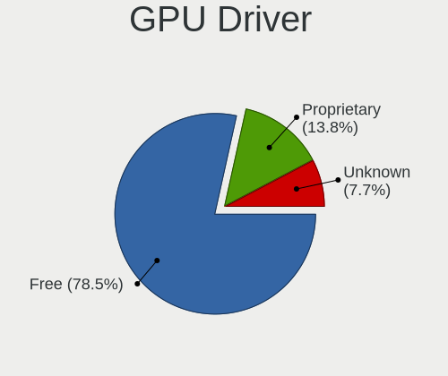
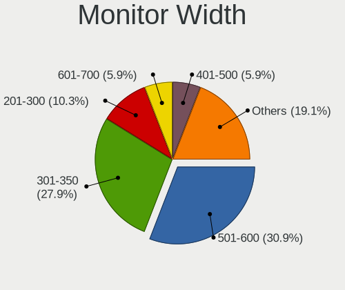
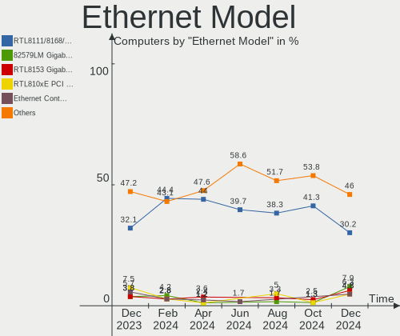
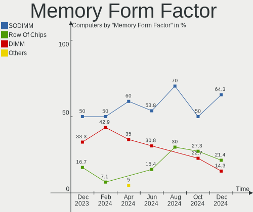
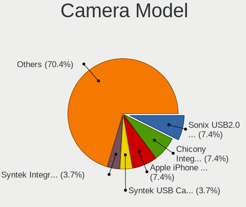

KDE neon - Hardware Trends
--------------------------

A project to identify most popular hardware characteristics and track their change
over time based on data collected by Linux users at https://Linux-Hardware.org.

Anyone can contribute to this report by the [hw-probe](https://github.com/linuxhw/hw-probe) tool:

    sudo -E hw-probe -all -upload

This is a report for all computer types. See also reports for [desktops](/Dist/KDE_neon/Desktop/README.md) and [notebooks](/Dist/KDE_neon/Notebook/README.md).

This report is for one last month. Overall report since the beginning of time: [TestDays](https://github.com/linuxhw/TestDays)

Period: Feb, 2023.

Contents
--------

* [ System ](#system)
  - [ OS                       ](#os)
  - [ OS Family                ](#os-family)
  - [ Kernel                   ](#kernel)
  - [ Kernel Family            ](#kernel-family)
  - [ Kernel Major Ver.        ](#kernel-major-ver)
  - [ Arch                     ](#arch)
  - [ DE                       ](#de)
  - [ Display Server           ](#display-server)
  - [ Display Manager          ](#display-manager)
  - [ OS Lang                  ](#os-lang)
  - [ Boot Mode                ](#boot-mode)
  - [ Filesystem               ](#filesystem)
  - [ Part. scheme             ](#part-scheme)
  - [ Dual Boot with Linux/BSD ](#dual-boot-with-linuxbsd)
  - [ Dual Boot (Win)          ](#dual-boot-win)

* [ Board ](#board)
  - [ Vendor                   ](#vendor)
  - [ Model                    ](#model)
  - [ Model Family             ](#model-family)
  - [ MFG Year                 ](#mfg-year)
  - [ Form Factor              ](#form-factor)
  - [ Secure Boot              ](#secure-boot)
  - [ Coreboot                 ](#coreboot)
  - [ RAM Size                 ](#ram-size)
  - [ RAM Used                 ](#ram-used)
  - [ Total Drives             ](#total-drives)
  - [ Has CD-ROM               ](#has-cd-rom)
  - [ Has Ethernet             ](#has-ethernet)
  - [ Has WiFi                 ](#has-wifi)
  - [ Has Bluetooth            ](#has-bluetooth)

* [ Location ](#location)
  - [ Country                  ](#country)
  - [ City                     ](#city)

* [ Drives ](#drives)
  - [ Drive Vendor             ](#drive-vendor)
  - [ Drive Model              ](#drive-model)
  - [ HDD Vendor               ](#hdd-vendor)
  - [ SSD Vendor               ](#ssd-vendor)
  - [ Drive Kind               ](#drive-kind)
  - [ Drive Connector          ](#drive-connector)
  - [ Drive Size               ](#drive-size)
  - [ Space Total              ](#space-total)
  - [ Space Used               ](#space-used)
  - [ Malfunc. Drives          ](#malfunc-drives)
  - [ Malfunc. Drive Vendor    ](#malfunc-drive-vendor)
  - [ Malfunc. HDD Vendor      ](#malfunc-hdd-vendor)
  - [ Malfunc. Drive Kind      ](#malfunc-drive-kind)
  - [ Failed Drives            ](#failed-drives)
  - [ Failed Drive Vendor      ](#failed-drive-vendor)
  - [ Drive Status             ](#drive-status)

* [ Storage controller ](#storage-controller)
  - [ Storage Vendor           ](#storage-vendor)
  - [ Storage Model            ](#storage-model)
  - [ Storage Kind             ](#storage-kind)

* [ Processor ](#processor)
  - [ CPU Vendor               ](#cpu-vendor)
  - [ CPU Model                ](#cpu-model)
  - [ CPU Model Family         ](#cpu-model-family)
  - [ CPU Cores                ](#cpu-cores)
  - [ CPU Sockets              ](#cpu-sockets)
  - [ CPU Threads              ](#cpu-threads)
  - [ CPU Op-Modes             ](#cpu-op-modes)
  - [ CPU Microcode            ](#cpu-microcode)
  - [ CPU Microarch            ](#cpu-microarch)

* [ Graphics ](#graphics)
  - [ GPU Vendor               ](#gpu-vendor)
  - [ GPU Model                ](#gpu-model)
  - [ GPU Combo                ](#gpu-combo)
  - [ GPU Driver               ](#gpu-driver)
  - [ GPU Memory               ](#gpu-memory)

* [ Monitor ](#monitor)
  - [ Monitor Vendor           ](#monitor-vendor)
  - [ Monitor Model            ](#monitor-model)
  - [ Monitor Resolution       ](#monitor-resolution)
  - [ Monitor Diagonal         ](#monitor-diagonal)
  - [ Monitor Width            ](#monitor-width)
  - [ Aspect Ratio             ](#aspect-ratio)
  - [ Monitor Area             ](#monitor-area)
  - [ Pixel Density            ](#pixel-density)
  - [ Multiple Monitors        ](#multiple-monitors)

* [ Network ](#network)
  - [ Net Controller Vendor    ](#net-controller-vendor)
  - [ Net Controller Model     ](#net-controller-model)
  - [ Wireless Vendor          ](#wireless-vendor)
  - [ Wireless Model           ](#wireless-model)
  - [ Ethernet Vendor          ](#ethernet-vendor)
  - [ Ethernet Model           ](#ethernet-model)
  - [ Net Controller Kind      ](#net-controller-kind)
  - [ Used Controller          ](#used-controller)
  - [ NICs                     ](#nics)
  - [ IPv6                     ](#ipv6)

* [ Bluetooth ](#bluetooth)
  - [ Bluetooth Vendor         ](#bluetooth-vendor)
  - [ Bluetooth Model          ](#bluetooth-model)

* [ Sound ](#sound)
  - [ Sound Vendor             ](#sound-vendor)
  - [ Sound Model              ](#sound-model)

* [ Memory ](#memory)
  - [ Memory Vendor            ](#memory-vendor)
  - [ Memory Model             ](#memory-model)
  - [ Memory Kind              ](#memory-kind)
  - [ Memory Form Factor       ](#memory-form-factor)
  - [ Memory Size              ](#memory-size)
  - [ Memory Speed             ](#memory-speed)

* [ Printers & scanners ](#printers--scanners)
  - [ Printer Vendor           ](#printer-vendor)
  - [ Printer Model            ](#printer-model)
  - [ Scanner Vendor           ](#scanner-vendor)
  - [ Scanner Model            ](#scanner-model)

* [ Camera ](#camera)
  - [ Camera Vendor            ](#camera-vendor)
  - [ Camera Model             ](#camera-model)

* [ Security ](#security)
  - [ Fingerprint Vendor       ](#fingerprint-vendor)
  - [ Fingerprint Model        ](#fingerprint-model)
  - [ Chipcard Vendor          ](#chipcard-vendor)
  - [ Chipcard Model           ](#chipcard-model)

* [ Unsupported ](#unsupported)
  - [ Unsupported Devices      ](#unsupported-devices)
  - [ Unsupported Device Types ](#unsupported-device-types)

System
------

OS
--

Installed operating systems

| Name           | Computers | Percent |
|----------------|-----------|---------|
| KDE neon 22.04 | 115       | 98.29%  |
| KDE neon 20.04 | 2         | 1.71%   |

OS Family
---------

OS without a version

| Name     | Computers | Percent |
|----------|-----------|---------|
| KDE neon | 117       | 100%    |

Kernel
------

Version of the Linux kernel

| Version                              | Computers | Percent |
|--------------------------------------|-----------|---------|
| 5.19.0-32-generic                    | 46        | 39.32%  |
| 5.15.0-60-generic                    | 35        | 29.91%  |
| 5.15.0-58-generic                    | 22        | 18.8%   |
| 5.15.0-52-generic                    | 3         | 2.56%   |
| 6.1.12-060112-generic                | 2         | 1.71%   |
| 6.2.0-060200rc3daily20230115-generic | 1         | 0.85%   |
| 6.1.13-x64v3-xanmod1                 | 1         | 0.85%   |
| 6.1.13-x64v3-rt7-xanmod1             | 1         | 0.85%   |
| 6.1.12-3-liquorix-amd64              | 1         | 0.85%   |
| 6.1.11-060111-generic                | 1         | 0.85%   |
| 6.1.0-1004-oem                       | 1         | 0.85%   |
| 5.4.0-113-generic                    | 1         | 0.85%   |
| 5.19.17-051917-generic               | 1         | 0.85%   |
| 5.17.1-051701-generic                | 1         | 0.85%   |

Kernel Family
-------------

Linux kernel without a distro release

| Version | Computers | Percent |
|---------|-----------|---------|
| 5.15.0  | 60        | 51.28%  |
| 5.19.0  | 46        | 39.32%  |
| 6.1.12  | 3         | 2.56%   |
| 6.1.13  | 2         | 1.71%   |
| 6.2.0   | 1         | 0.85%   |
| 6.1.11  | 1         | 0.85%   |
| 6.1.0   | 1         | 0.85%   |
| 5.4.0   | 1         | 0.85%   |
| 5.19.17 | 1         | 0.85%   |
| 5.17.1  | 1         | 0.85%   |

Kernel Major Ver.
-----------------

Linux kernel major version

| Version | Computers | Percent |
|---------|-----------|---------|
| 5.15    | 60        | 51.28%  |
| 5.19    | 47        | 40.17%  |
| 6.1     | 7         | 5.98%   |
| 6.2     | 1         | 0.85%   |
| 5.4     | 1         | 0.85%   |
| 5.17    | 1         | 0.85%   |

Arch
----

OS architecture (x86_64, i586, etc.)

| Name   | Computers | Percent |
|--------|-----------|---------|
| x86_64 | 117       | 100%    |

DE
--

Desktop Environment

| Name | Computers | Percent |
|------|-----------|---------|
| KDE5 | 117       | 100%    |

Display Server
--------------

X11 or Wayland

| Name    | Computers | Percent |
|---------|-----------|---------|
| X11     | 107       | 91.45%  |
| Wayland | 10        | 8.55%   |

Display Manager
---------------

SDDM, LightDM, etc.

| Name    | Computers | Percent |
|---------|-----------|---------|
| Unknown | 92        | 78.63%  |
| SDDM    | 25        | 21.37%  |

OS Lang
-------

Language

| Lang           | Computers | Percent |
|----------------|-----------|---------|
| en_US          | 46        | 39.32%  |
| en_GB          | 11        | 9.4%    |
| de_DE          | 11        | 9.4%    |
| ru_RU          | 10        | 8.55%   |
| fr_FR          | 6         | 5.13%   |
| pl_PL          | 4         | 3.42%   |
| es_ES          | 3         | 2.56%   |
| en_CA          | 3         | 2.56%   |
| C              | 3         | 2.56%   |
| pt_BR          | 2         | 1.71%   |
| nl_NL          | 2         | 1.71%   |
| es_MX          | 2         | 1.71%   |
| en_NZ          | 2         | 1.71%   |
| en_AG          | 2         | 1.71%   |
| tr_TR          | 1         | 0.85%   |
| it_IT          | 1         | 0.85%   |
| hu_HU          | 1         | 0.85%   |
| es_CU          | 1         | 0.85%   |
| en_PH          | 1         | 0.85%   |
| en_IN          | 1         | 0.85%   |
| en_DK          | 1         | 0.85%   |
| de_CH          | 1         | 0.85%   |
| Default        | 1         | 0.85%   |
| ca_ES@valencia | 1         | 0.85%   |

Boot Mode
---------

EFI or BIOS

| Mode | Computers | Percent |
|------|-----------|---------|
| BIOS | 103       | 88.03%  |
| EFI  | 14        | 11.97%  |

Filesystem
----------

Type of filesystem

| Type    | Computers | Percent |
|---------|-----------|---------|
| Ext4    | 110       | 94.02%  |
| Btrfs   | 6         | 5.13%   |
| Overlay | 1         | 0.85%   |

Part. scheme
------------

Scheme of partitioning

| Type    | Computers | Percent |
|---------|-----------|---------|
| Unknown | 92        | 78.63%  |
| GPT     | 24        | 20.51%  |
| MBR     | 1         | 0.85%   |

Dual Boot with Linux/BSD
------------------------

Hosting more than one Linux/BSD

| Dual boot | Computers | Percent |
|-----------|-----------|---------|
| No        | 107       | 91.45%  |
| Yes       | 10        | 8.55%   |

Dual Boot (Win)
---------------

Hosting Linux and Windows

| Dual boot | Computers | Percent |
|-----------|-----------|---------|
| No        | 108       | 92.31%  |
| Yes       | 9         | 7.69%   |

Board
-----

Vendor
------

Motherboard manufacturer

| Name                | Computers | Percent |
|---------------------|-----------|---------|
| ASUSTek Computer    | 26        | 22.22%  |
| Lenovo              | 14        | 11.97%  |
| MSI                 | 13        | 11.11%  |
| Hewlett-Packard     | 11        | 9.4%    |
| Dell                | 11        | 9.4%    |
| Gigabyte Technology | 8         | 6.84%   |
| Acer                | 7         | 5.98%   |
| Apple               | 6         | 5.13%   |
| HUAWEI              | 3         | 2.56%   |
| Timi                | 2         | 1.71%   |
| Samsung Electronics | 2         | 1.71%   |
| AZW                 | 2         | 1.71%   |
| ZOTAC               | 1         | 0.85%   |
| Wortmann AG         | 1         | 0.85%   |
| TUXEDO              | 1         | 0.85%   |
| Sony                | 1         | 0.85%   |
| SLIMBOOK            | 1         | 0.85%   |
| Razer               | 1         | 0.85%   |
| Microsoft           | 1         | 0.85%   |
| Intel               | 1         | 0.85%   |
| HONOR               | 1         | 0.85%   |
| Fujitsu             | 1         | 0.85%   |
| ASRock              | 1         | 0.85%   |
| Unknown             | 1         | 0.85%   |

Model
-----

Motherboard model

| Name                                   | Computers | Percent |
|----------------------------------------|-----------|---------|
| Dell OptiPlex 7010                     | 2         | 1.71%   |
| ASUS ROG STRIX B550-F GAMING           | 2         | 1.71%   |
| Apple MacBookPro11,5                   | 2         | 1.71%   |
| ZOTAC ZBOX                             | 1         | 0.85%   |
| Wortmann AG 1220595_1470122            | 1         | 0.85%   |
| TUXEDO Aura 15 Gen2                    | 1         | 0.85%   |
| Timi RedmiBook Pro 15S                 | 1         | 0.85%   |
| Timi Mi Laptop Pro 15 2020             | 1         | 0.85%   |
| Sony SVF1521Q1EW                       | 1         | 0.85%   |
| SLIMBOOK PROX15                        | 1         | 0.85%   |
| Samsung 350V5C/351V5C/3540VC/3440VC    | 1         | 0.85%   |
| Samsung 270E5G/270E5U                  | 1         | 0.85%   |
| Razer Blade 15 (2022) - RZ09-0421      | 1         | 0.85%   |
| MSI X5836                              | 1         | 0.85%   |
| MSI MS-9A65                            | 1         | 0.85%   |
| MSI MS-7C94                            | 1         | 0.85%   |
| MSI MS-7C52                            | 1         | 0.85%   |
| MSI MS-7C37                            | 1         | 0.85%   |
| MSI MS-7B98                            | 1         | 0.85%   |
| MSI MS-7B85                            | 1         | 0.85%   |
| MSI MS-7B84                            | 1         | 0.85%   |
| MSI MS-7A38                            | 1         | 0.85%   |
| MSI MS-7A37                            | 1         | 0.85%   |
| MSI MS-7970                            | 1         | 0.85%   |
| MSI Katana GF66 11SC                   | 1         | 0.85%   |
| MSI Delta 15 A5EFK                     | 1         | 0.85%   |
| Microsoft Surface Pro 4                | 1         | 0.85%   |
| Lenovo ThinkPad X1 Yoga 1st 20FQS08F01 | 1         | 0.85%   |
| Lenovo ThinkPad T470p 20J6CTO1WW       | 1         | 0.85%   |
| Lenovo ThinkPad L560 20F2S0DA00        | 1         | 0.85%   |
| Lenovo ThinkPad L380 20M5S09Y00        | 1         | 0.85%   |
| Lenovo ThinkCentre M92P 3237CC4        | 1         | 0.85%   |
| Lenovo Legion 5 15IMH05H 81Y6          | 1         | 0.85%   |
| Lenovo IdeaPadFlex 5 15ITL05 82HT      | 1         | 0.85%   |
| Lenovo IdeaPad Y510P 20217             | 1         | 0.85%   |
| Lenovo IdeaPad S530-13IWL 81J7         | 1         | 0.85%   |
| Lenovo IdeaPad C340-14API 81N6         | 1         | 0.85%   |
| Lenovo IdeaPad 5 Pro 16ACH6 82L5       | 1         | 0.85%   |
| Lenovo IdeaPad 320-15AST 80XV          | 1         | 0.85%   |
| Lenovo IdeaPad 110-15ACL 80TJ          | 1         | 0.85%   |

Model Family
------------

Motherboard model prefix

| Name                | Computers | Percent |
|---------------------|-----------|---------|
| ASUS ROG            | 7         | 5.98%   |
| Lenovo IdeaPad      | 6         | 5.13%   |
| Lenovo ThinkPad     | 4         | 3.42%   |
| Dell Inspiron       | 4         | 3.42%   |
| ASUS PRIME          | 4         | 3.42%   |
| HP Laptop           | 3         | 2.56%   |
| Dell Latitude       | 3         | 2.56%   |
| ASUS TUF            | 3         | 2.56%   |
| Acer Aspire         | 3         | 2.56%   |
| HP EliteBook        | 2         | 1.71%   |
| Gigabyte X570       | 2         | 1.71%   |
| Dell OptiPlex       | 2         | 1.71%   |
| ASUS VivoBook       | 2         | 1.71%   |
| Apple MacBookPro8   | 2         | 1.71%   |
| Apple MacBookPro11  | 2         | 1.71%   |
| Acer Nitro          | 2         | 1.71%   |
| ZOTAC ZBOX          | 1         | 0.85%   |
| Wortmann AG 1220595 | 1         | 0.85%   |
| TUXEDO Aura         | 1         | 0.85%   |
| Timi RedmiBook      | 1         | 0.85%   |
| Timi Mi             | 1         | 0.85%   |
| Sony SVF1521Q1EW    | 1         | 0.85%   |
| SLIMBOOK PROX15     | 1         | 0.85%   |
| Samsung 350V5C      | 1         | 0.85%   |
| Samsung 270E5G      | 1         | 0.85%   |
| Razer Blade         | 1         | 0.85%   |
| MSI X5836           | 1         | 0.85%   |
| MSI MS-9A65         | 1         | 0.85%   |
| MSI MS-7C94         | 1         | 0.85%   |
| MSI MS-7C52         | 1         | 0.85%   |
| MSI MS-7C37         | 1         | 0.85%   |
| MSI MS-7B98         | 1         | 0.85%   |
| MSI MS-7B85         | 1         | 0.85%   |
| MSI MS-7B84         | 1         | 0.85%   |
| MSI MS-7A38         | 1         | 0.85%   |
| MSI MS-7A37         | 1         | 0.85%   |
| MSI MS-7970         | 1         | 0.85%   |
| MSI Katana          | 1         | 0.85%   |
| MSI Delta           | 1         | 0.85%   |
| Microsoft Surface   | 1         | 0.85%   |

MFG Year
--------

Motherboard manufacture year

| Year | Computers | Percent |
|------|-----------|---------|
| 2019 | 19        | 16.24%  |
| 2018 | 16        | 13.68%  |
| 2020 | 12        | 10.26%  |
| 2022 | 10        | 8.55%   |
| 2021 | 10        | 8.55%   |
| 2016 | 10        | 8.55%   |
| 2012 | 10        | 8.55%   |
| 2017 | 7         | 5.98%   |
| 2013 | 7         | 5.98%   |
| 2014 | 5         | 4.27%   |
| 2011 | 5         | 4.27%   |
| 2015 | 3         | 2.56%   |
| 2010 | 2         | 1.71%   |
| 2008 | 1         | 0.85%   |

Form Factor
-----------

Physical design of the computer

| Name        | Computers | Percent |
|-------------|-----------|---------|
| Notebook    | 65        | 55.56%  |
| Desktop     | 44        | 37.61%  |
| Mini pc     | 4         | 3.42%   |
| Convertible | 3         | 2.56%   |
| Tablet      | 1         | 0.85%   |

Secure Boot
-----------

Enabled or disabled

| State    | Computers | Percent |
|----------|-----------|---------|
| Disabled | 116       | 99.15%  |
| Enabled  | 1         | 0.85%   |

Coreboot
--------

Have coreboot on board

| Used | Computers | Percent |
|------|-----------|---------|
| No   | 117       | 100%    |

RAM Size
--------

Total RAM memory

| Size in GB  | Computers | Percent |
|-------------|-----------|---------|
| 4.01-8.0    | 29        | 24.79%  |
| 16.01-24.0  | 29        | 24.79%  |
| 8.01-16.0   | 25        | 21.37%  |
| 32.01-64.0  | 14        | 11.97%  |
| 3.01-4.0    | 9         | 7.69%   |
| 64.01-256.0 | 6         | 5.13%   |
| 24.01-32.0  | 4         | 3.42%   |
| 1.01-2.0    | 1         | 0.85%   |

RAM Used
--------

Used RAM memory

| Used GB   | Computers | Percent |
|-----------|-----------|---------|
| 2.01-3.0  | 39        | 33.33%  |
| 1.01-2.0  | 31        | 26.5%   |
| 4.01-8.0  | 21        | 17.95%  |
| 3.01-4.0  | 21        | 17.95%  |
| 8.01-16.0 | 4         | 3.42%   |
| 0.51-1.0  | 1         | 0.85%   |

Total Drives
------------

Number of drives on board

| Drives | Computers | Percent |
|--------|-----------|---------|
| 1      | 60        | 51.28%  |
| 2      | 35        | 29.91%  |
| 3      | 14        | 11.97%  |
| 4      | 5         | 4.27%   |
| 11     | 1         | 0.85%   |
| 6      | 1         | 0.85%   |
| 5      | 1         | 0.85%   |

Has CD-ROM
----------

Has CD-ROM on board

| Presented | Computers | Percent |
|-----------|-----------|---------|
| No        | 88        | 75.21%  |
| Yes       | 29        | 24.79%  |

Has Ethernet
------------

Has Ethernet on board

| Presented | Computers | Percent |
|-----------|-----------|---------|
| Yes       | 94        | 80.34%  |
| No        | 23        | 19.66%  |

Has WiFi
--------

Has WiFi module

| Presented | Computers | Percent |
|-----------|-----------|---------|
| Yes       | 87        | 74.36%  |
| No        | 30        | 25.64%  |

Has Bluetooth
-------------

Has Bluetooth module

| Presented | Computers | Percent |
|-----------|-----------|---------|
| Yes       | 88        | 75.21%  |
| No        | 29        | 24.79%  |

Location
--------

Country
-------

Geographic location (country)

| Country      | Computers | Percent |
|--------------|-----------|---------|
| USA          | 23        | 19.66%  |
| Russia       | 11        | 9.4%    |
| Germany      | 10        | 8.55%   |
| UK           | 7         | 5.98%   |
| Poland       | 6         | 5.13%   |
| France       | 5         | 4.27%   |
| Spain        | 4         | 3.42%   |
| Mexico       | 4         | 3.42%   |
| Canada       | 4         | 3.42%   |
| Brazil       | 4         | 3.42%   |
| Philippines  | 3         | 2.56%   |
| Norway       | 3         | 2.56%   |
| Netherlands  | 3         | 2.56%   |
| Belgium      | 3         | 2.56%   |
| Turkey       | 2         | 1.71%   |
| Thailand     | 2         | 1.71%   |
| Switzerland  | 2         | 1.71%   |
| Italy        | 2         | 1.71%   |
| Austria      | 2         | 1.71%   |
| Ukraine      | 1         | 0.85%   |
| Tunisia      | 1         | 0.85%   |
| South Africa | 1         | 0.85%   |
| Saudi Arabia | 1         | 0.85%   |
| Portugal     | 1         | 0.85%   |
| New Zealand  | 1         | 0.85%   |
| Martinique   | 1         | 0.85%   |
| Lithuania    | 1         | 0.85%   |
| Indonesia    | 1         | 0.85%   |
| India        | 1         | 0.85%   |
| Georgia      | 1         | 0.85%   |
| Finland      | 1         | 0.85%   |
| Denmark      | 1         | 0.85%   |
| Curaçao     | 1         | 0.85%   |
| Cuba         | 1         | 0.85%   |
| Chile        | 1         | 0.85%   |
| Australia    | 1         | 0.85%   |

City
----

Geographic location (city)

| City             | Computers | Percent |
|------------------|-----------|---------|
| Nizhniy Novgorod | 3         | 2.56%   |
| Moscow           | 3         | 2.56%   |
| Telford          | 2         | 1.71%   |
| Tavares          | 2         | 1.71%   |
| Chicago          | 2         | 1.71%   |
| Yala             | 1         | 0.85%   |
| Wroclaw          | 1         | 0.85%   |
| Wilmington       | 1         | 0.85%   |
| Willemstad       | 1         | 0.85%   |
| Watford          | 1         | 0.85%   |
| Walcz            | 1         | 0.85%   |
| Vladivostok      | 1         | 0.85%   |
| Vienna           | 1         | 0.85%   |
| Vantaa           | 1         | 0.85%   |
| Vancouver        | 1         | 0.85%   |
| Valladolid       | 1         | 0.85%   |
| Valencia         | 1         | 0.85%   |
| Tunis            | 1         | 0.85%   |
| Tula             | 1         | 0.85%   |
| Tubarao          | 1         | 0.85%   |
| Tromsø          | 1         | 0.85%   |
| Trier            | 1         | 0.85%   |
| Tracy            | 1         | 0.85%   |
| Timbauba         | 1         | 0.85%   |
| Tbilisi          | 1         | 0.85%   |
| Sullivan         | 1         | 0.85%   |
| St Petersburg    | 1         | 0.85%   |
| Sorel-Tracy      | 1         | 0.85%   |
| Simferopol       | 1         | 0.85%   |
| Shirley          | 1         | 0.85%   |
| Selma            | 1         | 0.85%   |
| Santiago         | 1         | 0.85%   |
| Sankt Augustin   | 1         | 0.85%   |
| San Antonio      | 1         | 0.85%   |
| Rostock          | 1         | 0.85%   |
| Rio de Janeiro   | 1         | 0.85%   |
| Ridderkerk       | 1         | 0.85%   |
| Randaberg        | 1         | 0.85%   |
| Quimperlé       | 1         | 0.85%   |
| Plymouth         | 1         | 0.85%   |

Drives
------

Drive Vendor
------------

Hard drive vendors

| Vendor                      | Computers | Drives  | Percent |
|-----------------------------|-----------|---------|---------|
| Samsung Electronics         | 34        | 42      | 17.8%   |
| Seagate                     | 25        | 25      | 13.09%  |
| WDC                         | 19        | 28      | 9.95%   |
| Sandisk                     | 18        | 21      | 9.42%   |
| Kingston                    | 13        | 15      | 6.81%   |
| Toshiba                     | 10        | 10      | 5.24%   |
| Unknown                     | 7         | 10      | 3.66%   |
| SK hynix                    | 5         | 5       | 2.62%   |
| Phison Electronics          | 5         | 5       | 2.62%   |
| Micron Technology           | 4         | 4       | 2.09%   |
| Intel                       | 4         | 4       | 2.09%   |
| Apple                       | 4         | 4       | 2.09%   |
| Micron/Crucial Technology   | 3         | 4       | 1.57%   |
| Hitachi                     | 3         | 3       | 1.57%   |
| Crucial                     | 3         | 3       | 1.57%   |
| XPG                         | 2         | 2       | 1.05%   |
| Realtek Semiconductor       | 2         | 2       | 1.05%   |
| LITEONIT                    | 2         | 2       | 1.05%   |
| Intenso                     | 2         | 3       | 1.05%   |
| ZOTAC                       | 1         | 1       | 0.52%   |
| Union Memory (Shenzhen)     | 1         | 1       | 0.52%   |
| UMIS                        | 1         | 1       | 0.52%   |
| Transcend                   | 1         | 1       | 0.52%   |
| SSK                         | 1         | 1       | 0.52%   |
| SPCC                        | 1         | 1       | 0.52%   |
| Smartbuy                    | 1         | 1       | 0.52%   |
| Silicon Motion              | 1         | 1       | 0.52%   |
| OCZ                         | 1         | 1       | 0.52%   |
| NT-1TB                      | 1         | 1       | 0.52%   |
| Neo                         | 1         | 1       | 0.52%   |
| MAXIO Technology (Hangzhou) | 1         | 1       | 0.52%   |
| Lite-On Technology          | 1         | 1       | 0.52%   |
| Leven                       | 1         | 1       | 0.52%   |
| KingFast                    | 1         | 1       | 0.52%   |
| Integral                    | 1         | 1       | 0.52%   |
| Innodisk                    | 1         | 1       | 0.52%   |
| HUAWEI                      | 1         | 1       | 0.52%   |
| HS-SSD-C100                 | 1         | 1       | 0.52%   |
| HGST                        | 1         | 1       | 0.52%   |
| Hewlett-Packard             | 1         | Unknown | 0.52%   |

Drive Model
-----------

Hard drive models

| Model                                               | Computers | Percent |
|-----------------------------------------------------|-----------|---------|
| Samsung NVMe SSD Controller SM981/PM981/PM983 250GB | 5         | 2.36%   |
| Sandisk WD Black SN750 / PC SN730 NVMe SSD 512GB    | 4         | 1.89%   |
| Unknown MMC Card  32GB                              | 3         | 1.42%   |
| Seagate ST1000DM010-2EP102 1TB                      | 3         | 1.42%   |
| Samsung SSD 980 500GB                               | 3         | 1.42%   |
| Samsung SSD 850 EVO 250GB                           | 3         | 1.42%   |
| Samsung NVMe SSD Controller SM961/PM961/SM963 512GB | 3         | 1.42%   |
| Phison PS5013 E13 NVMe Controller 500GB             | 3         | 1.42%   |
| Unknown MMC Card  128GB                             | 2         | 0.94%   |
| Toshiba MQ01ABD100 1TB                              | 2         | 0.94%   |
| Toshiba HDWD110 1TB                                 | 2         | 0.94%   |
| SK hynix BC501 NVMe Solid State Drive 512GB         | 2         | 0.94%   |
| Seagate ST500DM002-1BD142 500GB                     | 2         | 0.94%   |
| Seagate ST2000DM008-2UB102 2TB                      | 2         | 0.94%   |
| Seagate ST2000DM008-2FR102 2TB                      | 2         | 0.94%   |
| Seagate ST1000LM035-1RK172 1TB                      | 2         | 0.94%   |
| Sandisk WD Blue SN550 NVMe SSD 1TB                  | 2         | 0.94%   |
| Sandisk WD Black SN850 500GB                        | 2         | 0.94%   |
| SanDisk SSD PLUS 480GB                              | 2         | 0.94%   |
| Samsung SSD 870 EVO 500GB                           | 2         | 0.94%   |
| Samsung SSD 860 EVO 500GB                           | 2         | 0.94%   |
| Samsung SSD 860 EVO 1TB                             | 2         | 0.94%   |
| Samsung SSD 850 EVO 500GB                           | 2         | 0.94%   |
| Realtek RTS5763DL NVMe SSD Controller 4TB           | 2         | 0.94%   |
| Micron/Crucial CT1000P1SSD8 1TB                     | 2         | 0.94%   |
| Kingston SUV500120G 120GB SSD                       | 2         | 0.94%   |
| Kingston SA400S37480G 480GB SSD                     | 2         | 0.94%   |
| Kingston SA400S37120G 120GB SSD                     | 2         | 0.94%   |
| Apple SSD SM0512G 500GB                             | 2         | 0.94%   |
| Apple HDD HTS545050A7E362 500GB                     | 2         | 0.94%   |
| ZOTAC ZTSSD-A5P-240G-PE 240GB                       | 1         | 0.47%   |
| XPG SPECTRIX S40G 4TB                               | 1         | 0.47%   |
| XPG GAMMIX S11 Pro 512GB                            | 1         | 0.47%   |
| WDC WUH721414ALE604 14TB                            | 1         | 0.47%   |
| WDC WDS500G2B0B-00YS70 500GB SSD                    | 1         | 0.47%   |
| WDC WDS500G2B0A-00SM50 500GB SSD                    | 1         | 0.47%   |
| WDC WDS250G2B0C-00PXH0 250GB                        | 1         | 0.47%   |
| WDC WDS200T2B0B-00YS70 2TB SSD                      | 1         | 0.47%   |
| WDC WDS120G2G0A-00JH30 120GB SSD                    | 1         | 0.47%   |
| WDC WD6400BPVT-22HXZT1 640GB                        | 1         | 0.47%   |

HDD Vendor
----------

Hard disk drive vendors

| Vendor              | Computers | Drives | Percent |
|---------------------|-----------|--------|---------|
| Seagate             | 25        | 25     | 43.1%   |
| WDC                 | 15        | 23     | 25.86%  |
| Toshiba             | 8         | 8      | 13.79%  |
| Hitachi             | 3         | 3      | 5.17%   |
| Samsung Electronics | 2         | 4      | 3.45%   |
| Apple               | 2         | 2      | 3.45%   |
| Unknown             | 1         | 1      | 1.72%   |
| HGST                | 1         | 1      | 1.72%   |
| ASMT                | 1         | 1      | 1.72%   |

SSD Vendor
----------

Solid state drive vendors

| Vendor              | Computers | Drives | Percent |
|---------------------|-----------|--------|---------|
| Samsung Electronics | 19        | 21     | 30.65%  |
| SanDisk             | 8         | 8      | 12.9%   |
| Kingston            | 8         | 10     | 12.9%   |
| WDC                 | 4         | 4      | 6.45%   |
| Crucial             | 3         | 3      | 4.84%   |
| LITEONIT            | 2         | 2      | 3.23%   |
| Intenso             | 2         | 3      | 3.23%   |
| Apple               | 2         | 2      | 3.23%   |
| ZOTAC               | 1         | 1      | 1.61%   |
| Transcend           | 1         | 1      | 1.61%   |
| Toshiba             | 1         | 1      | 1.61%   |
| SPCC                | 1         | 1      | 1.61%   |
| Smartbuy            | 1         | 1      | 1.61%   |
| SK hynix            | 1         | 1      | 1.61%   |
| OCZ                 | 1         | 1      | 1.61%   |
| NT-1TB              | 1         | 1      | 1.61%   |
| Neo                 | 1         | 1      | 1.61%   |
| Micron Technology   | 1         | 1      | 1.61%   |
| Leven               | 1         | 1      | 1.61%   |
| Intel               | 1         | 1      | 1.61%   |
| Integral            | 1         | 1      | 1.61%   |
| Gigabyte Technology | 1         | 1      | 1.61%   |

Drive Kind
----------

HDD or SSD

| Kind    | Computers | Drives | Percent |
|---------|-----------|--------|---------|
| NVMe    | 54        | 67     | 31.95%  |
| SSD     | 54        | 67     | 31.95%  |
| HDD     | 48        | 68     | 28.4%   |
| MMC     | 7         | 10     | 4.14%   |
| Unknown | 6         | 5      | 3.55%   |

Drive Connector
---------------

SATA, SAS, NVMe, etc.

| Type | Computers | Drives | Percent |
|------|-----------|--------|---------|
| SATA | 79        | 133    | 53.38%  |
| NVMe | 54        | 67     | 36.49%  |
| SAS  | 8         | 7      | 5.41%   |
| MMC  | 7         | 10     | 4.73%   |

Drive Size
----------

Size of hard drive

| Size in TB | Computers | Drives | Percent |
|------------|-----------|--------|---------|
| 0.01-0.5   | 59        | 73     | 51.75%  |
| 0.51-1.0   | 30        | 32     | 26.32%  |
| 1.01-2.0   | 12        | 12     | 10.53%  |
| 3.01-4.0   | 4         | 4      | 3.51%   |
| 2.01-3.0   | 4         | 4      | 3.51%   |
| 4.01-10.0  | 4         | 6      | 3.51%   |
| 10.01-20.0 | 1         | 4      | 0.88%   |

Space Total
-----------

Amount of disk space available on the file system

| Size in GB     | Computers | Percent |
|----------------|-----------|---------|
| 251-500        | 34        | 29.06%  |
| 101-250        | 31        | 26.5%   |
| 501-1000       | 24        | 20.51%  |
| 51-100         | 8         | 6.84%   |
| 1001-2000      | 6         | 5.13%   |
| 21-50          | 4         | 3.42%   |
| 2001-3000      | 4         | 3.42%   |
| 1-20           | 3         | 2.56%   |
| More than 3000 | 2         | 1.71%   |
| Unknown        | 1         | 0.85%   |

Space Used
----------

Amount of used disk space

| Used GB   | Computers | Percent |
|-----------|-----------|---------|
| 1-20      | 52        | 44.44%  |
| 21-50     | 22        | 18.8%   |
| 101-250   | 12        | 10.26%  |
| 51-100    | 12        | 10.26%  |
| 251-500   | 10        | 8.55%   |
| 501-1000  | 7         | 5.98%   |
| 2001-3000 | 1         | 0.85%   |
| Unknown   | 1         | 0.85%   |

Malfunc. Drives
---------------

Drive models with a malfunction

| Model                                   | Computers | Drives | Percent |
|-----------------------------------------|-----------|--------|---------|
| WDC WD10EZEX-22MFCA0 1TB                | 1         | 1      | 33.33%  |
| Neo Forza NFS121SA312-6007000 120GB SSD | 1         | 1      | 33.33%  |
| ASMT 2105 3TB                           | 1         | 1      | 33.33%  |

Malfunc. Drive Vendor
---------------------

Vendors of faulty drives

| Vendor | Computers | Drives | Percent |
|--------|-----------|--------|---------|
| WDC    | 1         | 1      | 33.33%  |
| Neo    | 1         | 1      | 33.33%  |
| ASMT   | 1         | 1      | 33.33%  |

Malfunc. HDD Vendor
-------------------

Vendors of faulty HDD drives

| Vendor | Computers | Drives | Percent |
|--------|-----------|--------|---------|
| WDC    | 1         | 1      | 50%     |
| ASMT   | 1         | 1      | 50%     |

Malfunc. Drive Kind
-------------------

Kinds of faulty drives

| Kind | Computers | Drives | Percent |
|------|-----------|--------|---------|
| HDD  | 2         | 2      | 66.67%  |
| SSD  | 1         | 1      | 33.33%  |

Failed Drives
-------------

Failed drive models

Zero info for selected period =(

Failed Drive Vendor
-------------------

Failed drive vendors

Zero info for selected period =(

Drive Status
------------

Number of failed and malfunc. drives

| Status   | Computers | Drives | Percent |
|----------|-----------|--------|---------|
| Detected | 106       | 191    | 86.18%  |
| Works    | 15        | 23     | 12.2%   |
| Malfunc  | 2         | 3      | 1.63%   |

Storage controller
------------------

Storage Vendor
--------------

Storage controller vendors

| Vendor                       | Computers | Percent |
|------------------------------|-----------|---------|
| Intel                        | 63        | 38.89%  |
| AMD                          | 35        | 21.6%   |
| Samsung Electronics          | 18        | 11.11%  |
| SanDisk                      | 11        | 6.79%   |
| Phison Electronics           | 6         | 3.7%    |
| Kingston Technology Company  | 5         | 3.09%   |
| SK hynix                     | 4         | 2.47%   |
| Micron/Crucial Technology    | 3         | 1.85%   |
| Micron Technology            | 3         | 1.85%   |
| Union Memory (Shenzhen)      | 2         | 1.23%   |
| Realtek Semiconductor        | 2         | 1.23%   |
| ASMedia Technology           | 2         | 1.23%   |
| ADATA Technology             | 2         | 1.23%   |
| VIA Technologies             | 1         | 0.62%   |
| Toshiba America Info Systems | 1         | 0.62%   |
| Silicon Motion               | 1         | 0.62%   |
| MAXIO Technology (Hangzhou)  | 1         | 0.62%   |
| Marvell Technology Group     | 1         | 0.62%   |
| Lite-On Technology           | 1         | 0.62%   |

Storage Model
-------------

Storage controller models

| Model                                                                                   | Computers | Percent |
|-----------------------------------------------------------------------------------------|-----------|---------|
| AMD FCH SATA Controller [AHCI mode]                                                     | 26        | 14.21%  |
| AMD 400 Series Chipset SATA Controller                                                  | 7         | 3.83%   |
| Samsung NVMe SSD Controller SM981/PM981/PM983                                           | 6         | 3.28%   |
| Intel 8 Series/C220 Series Chipset Family 6-port SATA Controller 1 [AHCI mode]          | 6         | 3.28%   |
| Intel 7 Series Chipset Family 6-port SATA Controller [AHCI mode]                        | 6         | 3.28%   |
| Samsung NVMe SSD Controller 980                                                         | 5         | 2.73%   |
| Intel Sunrise Point-LP SATA Controller [AHCI mode]                                      | 5         | 2.73%   |
| Intel 6 Series/C200 Series Chipset Family 6 port Mobile SATA AHCI Controller            | 5         | 2.73%   |
| SanDisk WD Black SN750 / PC SN730 NVMe SSD                                              | 4         | 2.19%   |
| Intel Cannon Lake PCH SATA AHCI Controller                                              | 4         | 2.19%   |
| Intel Cannon Lake Mobile PCH SATA AHCI Controller                                       | 4         | 2.19%   |
| AMD FCH SATA Controller D                                                               | 4         | 2.19%   |
| AMD 500 Series Chipset SATA Controller                                                  | 4         | 2.19%   |
| SanDisk WD Blue SN550 NVMe SSD                                                          | 3         | 1.64%   |
| SanDisk Non-Volatile memory controller                                                  | 3         | 1.64%   |
| Samsung NVMe SSD Controller SM961/PM961/SM963                                           | 3         | 1.64%   |
| Phison PS5013 E13 NVMe Controller                                                       | 3         | 1.64%   |
| Micron Non-Volatile memory controller                                                   | 3         | 1.64%   |
| Kingston Company Company Non-Volatile memory controller                                 | 3         | 1.64%   |
| Intel 8 Series SATA Controller 1 [AHCI mode]                                            | 3         | 1.64%   |
| Intel 7 Series/C210 Series Chipset Family 6-port SATA Controller [AHCI mode]            | 3         | 1.64%   |
| Intel 6 Series/C200 Series Chipset Family Desktop SATA Controller (IDE mode, ports 4-5) | 3         | 1.64%   |
| Intel 6 Series/C200 Series Chipset Family Desktop SATA Controller (IDE mode, ports 0-3) | 3         | 1.64%   |
| Union Memory (Shenzhen) Non-Volatile memory controller                                  | 2         | 1.09%   |
| SK hynix Gold P31/PC711 NVMe Solid State Drive                                          | 2         | 1.09%   |
| SK hynix BC501 NVMe Solid State Drive                                                   | 2         | 1.09%   |
| SanDisk WD PC SN810 / Black SN850 NVMe SSD                                              | 2         | 1.09%   |
| Samsung NVMe SSD Controller PM9A1/PM9A3/980PRO                                          | 2         | 1.09%   |
| Samsung Electronics SATA controller                                                     | 2         | 1.09%   |
| Realtek RTS5763DL NVMe SSD Controller                                                   | 2         | 1.09%   |
| Phison E12 NVMe Controller                                                              | 2         | 1.09%   |
| Micron/Crucial NVMe Controller                                                          | 2         | 1.09%   |
| Intel Wildcat Point-LP SATA Controller [AHCI Mode]                                      | 2         | 1.09%   |
| Intel Volume Management Device NVMe RAID Controller                                     | 2         | 1.09%   |
| Intel SSD 660P Series                                                                   | 2         | 1.09%   |
| Intel Q170/Q150/B150/H170/H110/Z170/CM236 Chipset SATA Controller [AHCI Mode]           | 2         | 1.09%   |
| Intel HM170/QM170 Chipset SATA Controller [AHCI Mode]                                   | 2         | 1.09%   |
| Intel 82801 Mobile SATA Controller [RAID mode]                                          | 2         | 1.09%   |
| Intel 7 Series/C210 Series Chipset Family 4-port SATA Controller [IDE mode]             | 2         | 1.09%   |
| Intel 7 Series/C210 Series Chipset Family 2-port SATA Controller [IDE mode]             | 2         | 1.09%   |

Storage Kind
------------

Kind of storage controller (IDE, SATA, NVMe, SAS, ...)

| Kind | Computers | Percent |
|------|-----------|---------|
| SATA | 87        | 56.86%  |
| NVMe | 54        | 35.29%  |
| RAID | 6         | 3.92%   |
| IDE  | 6         | 3.92%   |

Processor
---------

CPU Vendor
----------

Processor vendors

| Vendor | Computers | Percent |
|--------|-----------|---------|
| Intel  | 72        | 61.54%  |
| AMD    | 45        | 38.46%  |

CPU Model
---------

Processor models

| Model                                       | Computers | Percent |
|---------------------------------------------|-----------|---------|
| Intel Core i5-3210M CPU @ 2.50GHz           | 3         | 2.56%   |
| AMD Ryzen 7 5800H with Radeon Graphics      | 3         | 2.56%   |
| AMD Ryzen 5 5600H with Radeon Graphics      | 3         | 2.56%   |
| AMD Ryzen 5 3600 6-Core Processor           | 3         | 2.56%   |
| Intel Core i7-9750H CPU @ 2.60GHz           | 2         | 1.71%   |
| Intel Core i7-4870HQ CPU @ 2.50GHz          | 2         | 1.71%   |
| Intel Core i7-10510U CPU @ 1.80GHz          | 2         | 1.71%   |
| Intel Core i5-6300U CPU @ 2.40GHz           | 2         | 1.71%   |
| AMD Ryzen 5 5600X 6-Core Processor          | 2         | 1.71%   |
| AMD Ryzen 5 5500U with Radeon Graphics      | 2         | 1.71%   |
| AMD Ryzen 5 2400G with Radeon Vega Graphics | 2         | 1.71%   |
| Intel Xeon CPU E5-2689 0 @ 2.60GHz          | 1         | 0.85%   |
| Intel Xeon CPU E3-1220 v3 @ 3.10GHz         | 1         | 0.85%   |
| Intel Pentium CPU G630 @ 2.70GHz            | 1         | 0.85%   |
| Intel Core i7-9700K CPU @ 3.60GHz           | 1         | 0.85%   |
| Intel Core i7-8700K CPU @ 3.70GHz           | 1         | 0.85%   |
| Intel Core i7-8565U CPU @ 1.80GHz           | 1         | 0.85%   |
| Intel Core i7-8550U CPU @ 1.80GHz           | 1         | 0.85%   |
| Intel Core i7-7820HQ CPU @ 2.90GHz          | 1         | 0.85%   |
| Intel Core i7-7700HQ CPU @ 2.80GHz          | 1         | 0.85%   |
| Intel Core i7-6770HQ CPU @ 2.60GHz          | 1         | 0.85%   |
| Intel Core i7-6700 CPU @ 3.40GHz            | 1         | 0.85%   |
| Intel Core i7-4770 CPU @ 3.40GHz            | 1         | 0.85%   |
| Intel Core i7-4710HQ CPU @ 2.50GHz          | 1         | 0.85%   |
| Intel Core i7-4702MQ CPU @ 2.20GHz          | 1         | 0.85%   |
| Intel Core i7-4700MQ CPU @ 2.40GHz          | 1         | 0.85%   |
| Intel Core i7-3632QM CPU @ 2.20GHz          | 1         | 0.85%   |
| Intel Core i7-2760QM CPU @ 2.40GHz          | 1         | 0.85%   |
| Intel Core i7-2670QM CPU @ 2.20GHz          | 1         | 0.85%   |
| Intel Core i7-2620M CPU @ 2.70GHz           | 1         | 0.85%   |
| Intel Core i7-2600 CPU @ 3.40GHz            | 1         | 0.85%   |
| Intel Core i7-10870H CPU @ 2.20GHz          | 1         | 0.85%   |
| Intel Core i7-10750H CPU @ 2.60GHz          | 1         | 0.85%   |
| Intel Core i7-1065G7 CPU @ 1.30GHz          | 1         | 0.85%   |
| Intel Core i5-9400F CPU @ 2.90GHz           | 1         | 0.85%   |
| Intel Core i5-9400 CPU @ 2.90GHz            | 1         | 0.85%   |
| Intel Core i5-9300H CPU @ 2.40GHz           | 1         | 0.85%   |
| Intel Core i5-8300H CPU @ 2.30GHz           | 1         | 0.85%   |
| Intel Core i5-8265U CPU @ 1.60GHz           | 1         | 0.85%   |
| Intel Core i5-8250U CPU @ 1.60GHz           | 1         | 0.85%   |

CPU Model Family
----------------

Processor model prefix

| Model                  | Computers | Percent |
|------------------------|-----------|---------|
| Intel Core i5          | 27        | 23.08%  |
| Intel Core i7          | 26        | 22.22%  |
| AMD Ryzen 5            | 19        | 16.24%  |
| Other                  | 9         | 7.69%   |
| AMD Ryzen 7            | 8         | 6.84%   |
| Intel Core i3          | 5         | 4.27%   |
| AMD Ryzen 9            | 5         | 4.27%   |
| Intel Xeon             | 2         | 1.71%   |
| Intel Celeron          | 2         | 1.71%   |
| AMD Ryzen 5 PRO        | 2         | 1.71%   |
| AMD Ryzen 3            | 2         | 1.71%   |
| AMD A6                 | 2         | 1.71%   |
| Intel Pentium          | 1         | 0.85%   |
| Intel Atom             | 1         | 0.85%   |
| AMD Ryzen Threadripper | 1         | 0.85%   |
| AMD Phenom II X4       | 1         | 0.85%   |
| AMD FX                 | 1         | 0.85%   |
| AMD E                  | 1         | 0.85%   |
| AMD Athlon II X4       | 1         | 0.85%   |
| AMD Athlon             | 1         | 0.85%   |

CPU Cores
---------

Number of processor cores

| Number | Computers | Percent |
|--------|-----------|---------|
| 4      | 44        | 37.61%  |
| 2      | 27        | 23.08%  |
| 6      | 23        | 19.66%  |
| 8      | 12        | 10.26%  |
| 12     | 5         | 4.27%   |
| 1      | 2         | 1.71%   |
| 16     | 1         | 0.85%   |
| 14     | 1         | 0.85%   |
| 10     | 1         | 0.85%   |
| 3      | 1         | 0.85%   |

CPU Sockets
-----------

Number of sockets

| Number | Computers | Percent |
|--------|-----------|---------|
| 1      | 117       | 100%    |

CPU Threads
-----------

Threads per core (Hyper-Threading)

| Number | Computers | Percent |
|--------|-----------|---------|
| 2      | 95        | 81.2%   |
| 1      | 22        | 18.8%   |

CPU Op-Modes
------------

CPU Operation Modes (32-bit, 64-bit)

| Op mode        | Computers | Percent |
|----------------|-----------|---------|
| 32-bit, 64-bit | 117       | 100%    |

CPU Microcode
-------------

Microcode number

| Number     | Computers | Percent |
|------------|-----------|---------|
| Unknown    | 99        | 84.62%  |
| 0x0a404102 | 2         | 1.71%   |
| 0x906ea    | 1         | 0.85%   |
| 0x806ec    | 1         | 0.85%   |
| 0x806ea    | 1         | 0.85%   |
| 0x806e9    | 1         | 0.85%   |
| 0x806c1    | 1         | 0.85%   |
| 0x506e3    | 1         | 0.85%   |
| 0x406e3    | 1         | 0.85%   |
| 0x40661    | 1         | 0.85%   |
| 0x40651    | 1         | 0.85%   |
| 0x306c3    | 1         | 0.85%   |
| 0x206a7    | 1         | 0.85%   |
| 0x0a50000c | 1         | 0.85%   |
| 0x08701021 | 1         | 0.85%   |
| 0x08101016 | 1         | 0.85%   |
| 0x0810100b | 1         | 0.85%   |
| 0x010000c8 | 1         | 0.85%   |

CPU Microarch
-------------

Microarchitecture

| Name        | Computers | Percent |
|-------------|-----------|---------|
| KabyLake    | 19        | 16.24%  |
| Zen 3       | 11        | 9.4%    |
| Haswell     | 11        | 9.4%    |
| Unknown     | 11        | 9.4%    |
| Zen+        | 10        | 8.55%   |
| IvyBridge   | 10        | 8.55%   |
| SandyBridge | 9         | 7.69%   |
| Zen 2       | 8         | 6.84%   |
| Skylake     | 7         | 5.98%   |
| Zen         | 3         | 2.56%   |
| TigerLake   | 3         | 2.56%   |
| Silvermont  | 3         | 2.56%   |
| Piledriver  | 2         | 1.71%   |
| K10         | 2         | 1.71%   |
| CometLake   | 2         | 1.71%   |
| Broadwell   | 2         | 1.71%   |
| Puma        | 1         | 0.85%   |
| IceLake     | 1         | 0.85%   |
| Excavator   | 1         | 0.85%   |
| Bobcat      | 1         | 0.85%   |

Graphics
--------

GPU Vendor
----------

Vendors of graphics cards

| Vendor | Computers | Percent |
|--------|-----------|---------|
| Intel  | 58        | 40%     |
| Nvidia | 49        | 33.79%  |
| AMD    | 38        | 26.21%  |

GPU Model
---------

Graphics card models

| Model                                                                                    | Computers | Percent |
|------------------------------------------------------------------------------------------|-----------|---------|
| AMD Cezanne [Radeon Vega Series / Radeon Vega Mobile Series]                             | 7         | 4.7%    |
| Intel 3rd Gen Core processor Graphics Controller                                         | 6         | 4.03%   |
| AMD Picasso/Raven 2 [Radeon Vega Series / Radeon Vega Mobile Series]                     | 6         | 4.03%   |
| Intel 2nd Generation Core Processor Family Integrated Graphics Controller                | 5         | 3.36%   |
| Intel Xeon E3-1200 v2/3rd Gen Core processor Graphics Controller                         | 4         | 2.68%   |
| Intel CoffeeLake-H GT2 [UHD Graphics 630]                                                | 4         | 2.68%   |
| Intel 4th Gen Core Processor Integrated Graphics Controller                              | 4         | 2.68%   |
| Nvidia TU117M [GeForce GTX 1650 Mobile / Max-Q]                                          | 3         | 2.01%   |
| Nvidia TU116M [GeForce GTX 1660 Ti Mobile]                                               | 3         | 2.01%   |
| Nvidia GP108M [GeForce MX150]                                                            | 3         | 2.01%   |
| Intel Skylake GT2 [HD Graphics 520]                                                      | 3         | 2.01%   |
| Intel HD Graphics 530                                                                    | 3         | 2.01%   |
| AMD Rembrandt [Radeon 680M]                                                              | 3         | 2.01%   |
| AMD Lucienne                                                                             | 3         | 2.01%   |
| Nvidia GP107M [GeForce GTX 1050 Mobile]                                                  | 2         | 1.34%   |
| Nvidia GP104 [GeForce GTX 1080]                                                          | 2         | 1.34%   |
| Nvidia GP104 [GeForce GTX 1070]                                                          | 2         | 1.34%   |
| Intel WhiskeyLake-U GT2 [UHD Graphics 620]                                               | 2         | 1.34%   |
| Intel UHD Graphics 620                                                                   | 2         | 1.34%   |
| Intel TigerLake-LP GT2 [Iris Xe Graphics]                                                | 2         | 1.34%   |
| Intel HD Graphics 630                                                                    | 2         | 1.34%   |
| Intel HD Graphics 620                                                                    | 2         | 1.34%   |
| Intel Haswell-ULT Integrated Graphics Controller                                         | 2         | 1.34%   |
| Intel CometLake-U GT2 [UHD Graphics]                                                     | 2         | 1.34%   |
| Intel Atom/Celeron/Pentium Processor x5-E8000/J3xxx/N3xxx Integrated Graphics Controller | 2         | 1.34%   |
| Intel Alder Lake-P Integrated Graphics Controller                                        | 2         | 1.34%   |
| AMD Venus XT [Radeon HD 8870M / R9 M270X/M370X]                                          | 2         | 1.34%   |
| AMD Raven Ridge [Radeon Vega Series / Radeon Vega Mobile Series]                         | 2         | 1.34%   |
| AMD Ellesmere [Radeon RX 470/480/570/570X/580/580X/590]                                  | 2         | 1.34%   |
| Nvidia TU117 [GeForce GTX 1650]                                                          | 1         | 0.67%   |
| Nvidia TU116 [GeForce GTX 1660]                                                          | 1         | 0.67%   |
| Nvidia TU116 [GeForce GTX 1660 Ti]                                                       | 1         | 0.67%   |
| Nvidia TU106M [GeForce RTX 2070 Mobile / Max-Q Refresh]                                  | 1         | 0.67%   |
| Nvidia TU106M [GeForce RTX 2060 Mobile]                                                  | 1         | 0.67%   |
| Nvidia TU106M [GeForce RTX 2060 Max-Q]                                                   | 1         | 0.67%   |
| Nvidia TU106 [GeForce RTX 2070]                                                          | 1         | 0.67%   |
| Nvidia TU106 [GeForce RTX 2060 Rev. A]                                                   | 1         | 0.67%   |
| Nvidia TU102 [GeForce RTX 2080 Ti]                                                       | 1         | 0.67%   |
| Nvidia TU102 [GeForce RTX 2080 Ti Rev. A]                                                | 1         | 0.67%   |
| Nvidia GT218 [GeForce 210]                                                               | 1         | 0.67%   |

GPU Combo
---------

Combinations of graphics cards

| Name           | Computers | Percent |
|----------------|-----------|---------|
| 1 x Intel      | 33        | 28.21%  |
| 1 x Nvidia     | 27        | 23.08%  |
| 1 x AMD        | 27        | 23.08%  |
| Intel + Nvidia | 19        | 16.24%  |
| 2 x AMD        | 4         | 3.42%   |
| Intel + AMD    | 4         | 3.42%   |
| AMD + Nvidia   | 3         | 2.56%   |

GPU Driver
----------

Free vs proprietary

| Driver      | Computers | Percent |
|-------------|-----------|---------|
| Free        | 102       | 87.18%  |
| Proprietary | 12        | 10.26%  |
| Unknown     | 3         | 2.56%   |

GPU Memory
----------

Total video memory

| Size in GB | Computers | Percent |
|------------|-----------|---------|
| Unknown    | 101       | 86.32%  |
| 3.01-4.0   | 5         | 4.27%   |
| 5.01-6.0   | 3         | 2.56%   |
| 2.01-3.0   | 2         | 1.71%   |
| 0.01-0.5   | 2         | 1.71%   |
| 7.01-8.0   | 1         | 0.85%   |
| 1.01-2.0   | 1         | 0.85%   |
| 8.01-16.0  | 1         | 0.85%   |
| 0.51-1.0   | 1         | 0.85%   |

Monitor
-------

Monitor Vendor
--------------

Monitor vendors

| Vendor                  | Computers | Percent |
|-------------------------|-----------|---------|
| Samsung Electronics     | 20        | 15.5%   |
| AU Optronics            | 16        | 12.4%   |
| BOE                     | 14        | 10.85%  |
| Goldstar                | 8         | 6.2%    |
| Hewlett-Packard         | 7         | 5.43%   |
| Dell                    | 7         | 5.43%   |
| Acer                    | 6         | 4.65%   |
| LG Display              | 5         | 3.88%   |
| Chimei Innolux          | 5         | 3.88%   |
| Apple                   | 5         | 3.88%   |
| Sharp                   | 4         | 3.1%    |
| PANDA                   | 3         | 2.33%   |
| Chi Mei Optoelectronics | 3         | 2.33%   |
| AOC                     | 3         | 2.33%   |
| TMX                     | 2         | 1.55%   |
| Philips                 | 2         | 1.55%   |
| BenQ                    | 2         | 1.55%   |
| ASUSTek Computer        | 2         | 1.55%   |
| Westinghouse            | 1         | 0.78%   |
| Wacom                   | 1         | 0.78%   |
| ViewSonic               | 1         | 0.78%   |
| VIE                     | 1         | 0.78%   |
| Valve                   | 1         | 0.78%   |
| Toshiba                 | 1         | 0.78%   |
| MSI                     | 1         | 0.78%   |
| MiTAC                   | 1         | 0.78%   |
| ITE                     | 1         | 0.78%   |
| InfoVision              | 1         | 0.78%   |
| Iiyama                  | 1         | 0.78%   |
| HannStar                | 1         | 0.78%   |
| Fujitsu Siemens         | 1         | 0.78%   |
| CPT                     | 1         | 0.78%   |
| Ancor Communications    | 1         | 0.78%   |

Monitor Model
-------------

Monitor models

| Model                                                                 | Computers | Percent |
|-----------------------------------------------------------------------|-----------|---------|
| Samsung Electronics C24F390 SAM0D2C 1920x1080 521x293mm 23.5-inch     | 2         | 1.52%   |
| Goldstar HDR 4K GSM7707 3840x2160 600x340mm 27.2-inch                 | 2         | 1.52%   |
| BOE LCD Monitor BOE0747 1920x1080 344x194mm 15.5-inch                 | 2         | 1.52%   |
| Apple Color LCD APPA02E 2880x1800 331x207mm 15.4-inch                 | 2         | 1.52%   |
| Apple Color LCD APP9CC7 1280x800 286x179mm 13.3-inch                  | 2         | 1.52%   |
| Westinghouse WD50FB1200 WETA307 1920x1080 930x530mm 42.1-inch         | 1         | 0.76%   |
| Wacom Cintiq 22HD WAC1031 1920x1080 476x268mm 21.5-inch               | 1         | 0.76%   |
| ViewSonic VX2718-2KPC VSCB73A 2560x1440 598x336mm 27.0-inch           | 1         | 0.76%   |
| VIE NXM24FHD01 VIEA238 1920x1080 520x310mm 23.8-inch                  | 1         | 0.76%   |
| Valve LCD Monitor VLV91A8                                             | 1         | 0.76%   |
| Toshiba TV TSB0206 1920x1080 886x498mm 40.0-inch                      | 1         | 0.76%   |
| Toshiba TV TSB0205 1360x765 886x498mm 40.0-inch                       | 1         | 0.76%   |
| TMX TL156MDMP01-0 TMX1560 3200x2000 336x210mm 15.6-inch               | 1         | 0.76%   |
| TMX LCD Monitor TMX1422 3120x2080 300x200mm 14.2-inch                 | 1         | 0.76%   |
| Sharp LQ156T1JW03 SHP1529 2560x1440 344x194mm 15.5-inch               | 1         | 0.76%   |
| Sharp LQ156M1JW03 SHP155D 1920x1080 344x194mm 15.5-inch               | 1         | 0.76%   |
| Sharp LQ156M1JW01 SHP14C3 1920x1080 344x194mm 15.5-inch               | 1         | 0.76%   |
| Sharp LCD Monitor SHP1548 1920x1200 288x180mm 13.4-inch               | 1         | 0.76%   |
| Samsung Electronics T20C310 SAM0AE8 1600x900 432x240mm 19.5-inch      | 1         | 0.76%   |
| Samsung Electronics SyncMaster SAM03EE 1680x1050                      | 1         | 0.76%   |
| Samsung Electronics S34J55x SAM0F71 3440x1440 797x333mm 34.0-inch     | 1         | 0.76%   |
| Samsung Electronics S24F350 SAM0D21 1920x1080 521x293mm 23.5-inch     | 1         | 0.76%   |
| Samsung Electronics S24D300 SAM0B43 1920x1080 531x299mm 24.0-inch     | 1         | 0.76%   |
| Samsung Electronics S22R35x SAM103A 1920x1080 476x268mm 21.5-inch     | 1         | 0.76%   |
| Samsung Electronics S22E390 SAM0C18 1920x1080 477x268mm 21.5-inch     | 1         | 0.76%   |
| Samsung Electronics Q90A SAM7140 3840x2160 1872x1053mm 84.6-inch      | 1         | 0.76%   |
| Samsung Electronics LS27AG32x SAM71DC 1920x1080 597x336mm 27.0-inch   | 1         | 0.76%   |
| Samsung Electronics LCD Monitor SEC384A 1366x768 344x194mm 15.5-inch  | 1         | 0.76%   |
| Samsung Electronics LCD Monitor SEC3150 1366x768 344x193mm 15.5-inch  | 1         | 0.76%   |
| Samsung Electronics LCD Monitor SDC4C48 1920x1080 344x194mm 15.5-inch | 1         | 0.76%   |
| Samsung Electronics LCD Monitor SDC3853 2736x1824 260x173mm 12.3-inch | 1         | 0.76%   |
| Samsung Electronics LCD Monitor SAM0F0B 1920x1080 708x398mm 32.0-inch | 1         | 0.76%   |
| Samsung Electronics LCD Monitor SAM0DF7 3840x2160 890x500mm 40.2-inch | 1         | 0.76%   |
| Samsung Electronics LC32G5xT SAM7088 2560x1440 698x393mm 31.5-inch    | 1         | 0.76%   |
| Samsung Electronics EPSON PJ SECA519 1920x1080                        | 1         | 0.76%   |
| Samsung Electronics C27F390 SAM0D33 1920x1080 598x336mm 27.0-inch     | 1         | 0.76%   |
| Samsung Electronics C27F390 SAM0D32 1920x1080 598x336mm 27.0-inch     | 1         | 0.76%   |
| Philips PHL 345E2 PHLC237 3440x1440 800x335mm 34.1-inch               | 1         | 0.76%   |
| Philips 220P4LPY PHL08C1 1680x1050 474x296mm 22.0-inch                | 1         | 0.76%   |
| PANDA LCD Monitor NCP0061 2560x1600 302x189mm 14.0-inch               | 1         | 0.76%   |

Monitor Resolution
------------------

Monitor screen resolution

| Resolution         | Computers | Percent |
|--------------------|-----------|---------|
| 1920x1080 (FHD)    | 59        | 49.58%  |
| 1366x768 (WXGA)    | 18        | 15.13%  |
| 3840x2160 (4K)     | 8         | 6.72%   |
| 2560x1440 (QHD)    | 7         | 5.88%   |
| 3440x1440          | 5         | 4.2%    |
| 1680x1050 (WSXGA+) | 3         | 2.52%   |
| 1600x900 (HD+)     | 3         | 2.52%   |
| 2880x1800          | 2         | 1.68%   |
| 1920x1200 (WUXGA)  | 2         | 1.68%   |
| 1440x900 (WXGA+)   | 2         | 1.68%   |
| 1280x800 (WXGA)    | 2         | 1.68%   |
| Unknown            | 2         | 1.68%   |
| 3840x1600          | 1         | 0.84%   |
| 3200x2000          | 1         | 0.84%   |
| 3120x2080          | 1         | 0.84%   |
| 2736x1824          | 1         | 0.84%   |
| 2560x1600          | 1         | 0.84%   |
| 2160x1440          | 1         | 0.84%   |

Monitor Diagonal
----------------

Diagonal size in inches

| Inches  | Computers | Percent |
|---------|-----------|---------|
| 15      | 33        | 25.38%  |
| 27      | 15        | 11.54%  |
| 21      | 11        | 8.46%   |
| 13      | 10        | 7.69%   |
| 14      | 9         | 6.92%   |
| 23      | 7         | 5.38%   |
| 24      | 6         | 4.62%   |
| 34      | 5         | 3.85%   |
| 17      | 5         | 3.85%   |
| Unknown | 4         | 3.08%   |
| 84      | 3         | 2.31%   |
| 31      | 3         | 2.31%   |
| 18      | 3         | 2.31%   |
| 16      | 3         | 2.31%   |
| 22      | 2         | 1.54%   |
| 74      | 1         | 0.77%   |
| 72      | 1         | 0.77%   |
| 52      | 1         | 0.77%   |
| 42      | 1         | 0.77%   |
| 40      | 1         | 0.77%   |
| 37      | 1         | 0.77%   |
| 25      | 1         | 0.77%   |
| 20      | 1         | 0.77%   |
| 19      | 1         | 0.77%   |
| 12      | 1         | 0.77%   |
| 11      | 1         | 0.77%   |

Monitor Width
-------------

Physical width

| Width in mm | Computers | Percent |
|-------------|-----------|---------|
| 301-350     | 46        | 35.38%  |
| 501-600     | 29        | 22.31%  |
| 401-500     | 18        | 13.85%  |
| 201-300     | 9         | 6.92%   |
| 351-400     | 7         | 5.38%   |
| 701-800     | 5         | 3.85%   |
| 601-700     | 4         | 3.08%   |
| 1501-2000   | 4         | 3.08%   |
| Unknown     | 4         | 3.08%   |
| 801-900     | 2         | 1.54%   |
| 1001-1500   | 1         | 0.77%   |
| 901-1000    | 1         | 0.77%   |

Aspect Ratio
------------

Proportional relationship between the width and the height

| Ratio   | Computers | Percent |
|---------|-----------|---------|
| 16/9    | 91        | 78.45%  |
| 16/10   | 14        | 12.07%  |
| 21/9    | 6         | 5.17%   |
| 3/2     | 3         | 2.59%   |
| Unknown | 2         | 1.72%   |

Monitor Area
------------

Area in inch²

| Area in inch² | Computers | Percent |
|----------------|-----------|---------|
| 101-110        | 35        | 27.56%  |
| 201-250        | 20        | 15.75%  |
| 81-90          | 15        | 11.81%  |
| 301-350        | 15        | 11.81%  |
| 351-500        | 9         | 7.09%   |
| 151-200        | 6         | 4.72%   |
| More than 1000 | 5         | 3.94%   |
| 121-130        | 5         | 3.94%   |
| Unknown        | 4         | 3.15%   |
| 71-80          | 3         | 2.36%   |
| 251-300        | 2         | 1.57%   |
| 141-150        | 2         | 1.57%   |
| 501-1000       | 2         | 1.57%   |
| 61-70          | 1         | 0.79%   |
| 51-60          | 1         | 0.79%   |
| 111-120        | 1         | 0.79%   |
| 91-100         | 1         | 0.79%   |

Pixel Density
-------------

Pixels per inch

| Density       | Computers | Percent |
|---------------|-----------|---------|
| 101-120       | 38        | 30.16%  |
| 51-100        | 36        | 28.57%  |
| 121-160       | 31        | 24.6%   |
| 161-240       | 11        | 8.73%   |
| Unknown       | 4         | 3.17%   |
| More than 240 | 3         | 2.38%   |
| 1-50          | 3         | 2.38%   |

Multiple Monitors
-----------------

Total monitors connected

| Total | Computers | Percent |
|-------|-----------|---------|
| 1     | 92        | 78.63%  |
| 2     | 18        | 15.38%  |
| 3     | 4         | 3.42%   |
| 0     | 3         | 2.56%   |

Network
-------

Net Controller Vendor
---------------------

Controller vendors

| Vendor                   | Computers | Percent |
|--------------------------|-----------|---------|
| Realtek Semiconductor    | 71        | 42.01%  |
| Intel                    | 55        | 32.54%  |
| Qualcomm Atheros         | 15        | 8.88%   |
| Broadcom                 | 12        | 7.1%    |
| NetGear                  | 3         | 1.78%   |
| Samsung Electronics      | 2         | 1.18%   |
| Xiaomi                   | 1         | 0.59%   |
| TP-Link                  | 1         | 0.59%   |
| Ralink Technology        | 1         | 0.59%   |
| Qualcomm                 | 1         | 0.59%   |
| Microchip Technology     | 1         | 0.59%   |
| MediaTek                 | 1         | 0.59%   |
| Marvell Technology Group | 1         | 0.59%   |
| Huawei Technologies      | 1         | 0.59%   |
| Google                   | 1         | 0.59%   |
| Edimax Technology        | 1         | 0.59%   |
| Broadcom Limited         | 1         | 0.59%   |

Net Controller Model
--------------------

Controller models

| Model                                                             | Computers | Percent |
|-------------------------------------------------------------------|-----------|---------|
| Realtek RTL8111/8168/8411 PCI Express Gigabit Ethernet Controller | 50        | 25.77%  |
| Intel Wi-Fi 6 AX200                                               | 9         | 4.64%   |
| Realtek RTL810xE PCI Express Fast Ethernet controller             | 6         | 3.09%   |
| Qualcomm Atheros QCA9377 802.11ac Wireless Network Adapter        | 4         | 2.06%   |
| Intel Wireless-AC 9260                                            | 4         | 2.06%   |
| Intel Wireless 8265 / 8275                                        | 4         | 2.06%   |
| Intel I211 Gigabit Network Connection                             | 4         | 2.06%   |
| Intel 82579LM Gigabit Network Connection (Lewisville)             | 4         | 2.06%   |
| Realtek RTL8822CE 802.11ac PCIe Wireless Network Adapter          | 3         | 1.55%   |
| Realtek RTL8821CE 802.11ac PCIe Wireless Network Adapter          | 3         | 1.55%   |
| Realtek RTL8125 2.5GbE Controller                                 | 3         | 1.55%   |
| Qualcomm Atheros AR9485 Wireless Network Adapter                  | 3         | 1.55%   |
| Intel Wireless 8260                                               | 3         | 1.55%   |
| Intel Wireless 7260                                               | 3         | 1.55%   |
| Intel Wi-Fi 6 AX210/AX211/AX411 160MHz                            | 3         | 1.55%   |
| Intel Ethernet Controller I225-V                                  | 3         | 1.55%   |
| Intel Cannon Lake PCH CNVi WiFi                                   | 3         | 1.55%   |
| Intel Alder Lake-P PCH CNVi WiFi                                  | 3         | 1.55%   |
| Broadcom NetXtreme BCM57765 Gigabit Ethernet PCIe                 | 3         | 1.55%   |
| Broadcom BCM4331 802.11a/b/g/n                                    | 3         | 1.55%   |
| Realtek RTL8852AE 802.11ax PCIe Wireless Network Adapter          | 2         | 1.03%   |
| Realtek RTL8822BE 802.11a/b/g/n/ac WiFi adapter                   | 2         | 1.03%   |
| Qualcomm Atheros QCA9565 / AR9565 Wireless Network Adapter        | 2         | 1.03%   |
| Qualcomm Atheros AR9462 Wireless Network Adapter                  | 2         | 1.03%   |
| Intel Wi-Fi 6 AX201                                               | 2         | 1.03%   |
| Intel Ethernet Connection (7) I219-V                              | 2         | 1.03%   |
| Intel Ethernet Connection (5) I219-LM                             | 2         | 1.03%   |
| Intel Comet Lake PCH-LP CNVi WiFi                                 | 2         | 1.03%   |
| Intel Comet Lake PCH CNVi WiFi                                    | 2         | 1.03%   |
| Broadcom BCM43602 802.11ac Wireless LAN SoC                       | 2         | 1.03%   |
| Broadcom BCM43142 802.11b/g/n                                     | 2         | 1.03%   |
| Xiaomi Mi/Redmi series (RNDIS)                                    | 1         | 0.52%   |
| TP-Link AC600 wireless Realtek RTL8811AU [Archer T2U Nano]        | 1         | 0.52%   |
| Samsung GT-I9070 (network tethering, USB debugging enabled)       | 1         | 0.52%   |
| Samsung Galaxy series, misc. (tethering mode)                     | 1         | 0.52%   |
| Realtek RTL88x2bu [AC1200 Techkey]                                | 1         | 0.52%   |
| Realtek RTL8821AE 802.11ac PCIe Wireless Network Adapter          | 1         | 0.52%   |
| Realtek RTL8723BE PCIe Wireless Network Adapter                   | 1         | 0.52%   |
| Realtek RTL8192EE PCIe Wireless Network Adapter                   | 1         | 0.52%   |
| Realtek RTL8191SU 802.11n WLAN Adapter                            | 1         | 0.52%   |

Wireless Vendor
---------------

Wireless vendors

| Vendor                   | Computers | Percent |
|--------------------------|-----------|---------|
| Intel                    | 45        | 47.87%  |
| Realtek Semiconductor    | 17        | 18.09%  |
| Qualcomm Atheros         | 12        | 12.77%  |
| Broadcom                 | 10        | 10.64%  |
| NetGear                  | 3         | 3.19%   |
| TP-Link                  | 1         | 1.06%   |
| Ralink Technology        | 1         | 1.06%   |
| Qualcomm                 | 1         | 1.06%   |
| MediaTek                 | 1         | 1.06%   |
| Marvell Technology Group | 1         | 1.06%   |
| Edimax Technology        | 1         | 1.06%   |
| Broadcom Limited         | 1         | 1.06%   |

Wireless Model
--------------

Wireless models

| Model                                                          | Computers | Percent |
|----------------------------------------------------------------|-----------|---------|
| Intel Wi-Fi 6 AX200                                            | 9         | 9.57%   |
| Qualcomm Atheros QCA9377 802.11ac Wireless Network Adapter     | 4         | 4.26%   |
| Intel Wireless-AC 9260                                         | 4         | 4.26%   |
| Intel Wireless 8265 / 8275                                     | 4         | 4.26%   |
| Realtek RTL8822CE 802.11ac PCIe Wireless Network Adapter       | 3         | 3.19%   |
| Realtek RTL8821CE 802.11ac PCIe Wireless Network Adapter       | 3         | 3.19%   |
| Qualcomm Atheros AR9485 Wireless Network Adapter               | 3         | 3.19%   |
| Intel Wireless 8260                                            | 3         | 3.19%   |
| Intel Wireless 7260                                            | 3         | 3.19%   |
| Intel Wi-Fi 6 AX210/AX211/AX411 160MHz                         | 3         | 3.19%   |
| Intel Cannon Lake PCH CNVi WiFi                                | 3         | 3.19%   |
| Intel Alder Lake-P PCH CNVi WiFi                               | 3         | 3.19%   |
| Broadcom BCM4331 802.11a/b/g/n                                 | 3         | 3.19%   |
| Realtek RTL8852AE 802.11ax PCIe Wireless Network Adapter       | 2         | 2.13%   |
| Realtek RTL8822BE 802.11a/b/g/n/ac WiFi adapter                | 2         | 2.13%   |
| Qualcomm Atheros QCA9565 / AR9565 Wireless Network Adapter     | 2         | 2.13%   |
| Qualcomm Atheros AR9462 Wireless Network Adapter               | 2         | 2.13%   |
| Intel Wi-Fi 6 AX201                                            | 2         | 2.13%   |
| Intel Comet Lake PCH-LP CNVi WiFi                              | 2         | 2.13%   |
| Intel Comet Lake PCH CNVi WiFi                                 | 2         | 2.13%   |
| Broadcom BCM43602 802.11ac Wireless LAN SoC                    | 2         | 2.13%   |
| Broadcom BCM43142 802.11b/g/n                                  | 2         | 2.13%   |
| TP-Link AC600 wireless Realtek RTL8811AU [Archer T2U Nano]     | 1         | 1.06%   |
| Realtek RTL88x2bu [AC1200 Techkey]                             | 1         | 1.06%   |
| Realtek RTL8821AE 802.11ac PCIe Wireless Network Adapter       | 1         | 1.06%   |
| Realtek RTL8723BE PCIe Wireless Network Adapter                | 1         | 1.06%   |
| Realtek RTL8192EE PCIe Wireless Network Adapter                | 1         | 1.06%   |
| Realtek RTL8191SU 802.11n WLAN Adapter                         | 1         | 1.06%   |
| Realtek RTL8188EUS 802.11n Wireless Network Adapter            | 1         | 1.06%   |
| Realtek Realtek Network controller                             | 1         | 1.06%   |
| Ralink MT7601U Wireless Adapter                                | 1         | 1.06%   |
| Qualcomm QCNFA765 Wireless Network Adapter                     | 1         | 1.06%   |
| Qualcomm Atheros AR9287 Wireless Network Adapter (PCI-Express) | 1         | 1.06%   |
| NetGear WNA3100M(v1) Wireless-N 300 [Realtek RTL8192CU]        | 1         | 1.06%   |
| NetGear A6210                                                  | 1         | 1.06%   |
| NetGear A6100 AC600 DB Wireless Adapter [Realtek RTL8811AU]    | 1         | 1.06%   |
| MediaTek MT7921K (RZ608) Wi-Fi 6E 80MHz                        | 1         | 1.06%   |
| Marvell Group 88W8897 [AVASTAR] 802.11ac Wireless              | 1         | 1.06%   |
| Intel Wireless 7265                                            | 1         | 1.06%   |
| Intel Wireless 3165                                            | 1         | 1.06%   |

Ethernet Vendor
---------------

Ethernet vendors

| Vendor                | Computers | Percent |
|-----------------------|-----------|---------|
| Realtek Semiconductor | 60        | 61.86%  |
| Intel                 | 23        | 23.71%  |
| Broadcom              | 6         | 6.19%   |
| Qualcomm Atheros      | 4         | 4.12%   |
| Samsung Electronics   | 2         | 2.06%   |
| Xiaomi                | 1         | 1.03%   |
| Google                | 1         | 1.03%   |

Ethernet Model
--------------

Ethernet models

| Model                                                             | Computers | Percent |
|-------------------------------------------------------------------|-----------|---------|
| Realtek RTL8111/8168/8411 PCI Express Gigabit Ethernet Controller | 50        | 51.02%  |
| Realtek RTL810xE PCI Express Fast Ethernet controller             | 6         | 6.12%   |
| Intel I211 Gigabit Network Connection                             | 4         | 4.08%   |
| Intel 82579LM Gigabit Network Connection (Lewisville)             | 4         | 4.08%   |
| Realtek RTL8125 2.5GbE Controller                                 | 3         | 3.06%   |
| Intel Ethernet Controller I225-V                                  | 3         | 3.06%   |
| Broadcom NetXtreme BCM57765 Gigabit Ethernet PCIe                 | 3         | 3.06%   |
| Intel Ethernet Connection (7) I219-V                              | 2         | 2.04%   |
| Intel Ethernet Connection (5) I219-LM                             | 2         | 2.04%   |
| Xiaomi Mi/Redmi series (RNDIS)                                    | 1         | 1.02%   |
| Samsung GT-I9070 (network tethering, USB debugging enabled)       | 1         | 1.02%   |
| Samsung Galaxy series, misc. (tethering mode)                     | 1         | 1.02%   |
| Realtek RTL8153 Gigabit Ethernet Adapter                          | 1         | 1.02%   |
| Realtek RTL8152 Fast Ethernet Adapter                             | 1         | 1.02%   |
| Qualcomm Atheros QCA8171 Gigabit Ethernet                         | 1         | 1.02%   |
| Qualcomm Atheros Killer E2500 Gigabit Ethernet Controller         | 1         | 1.02%   |
| Qualcomm Atheros AR8162 Fast Ethernet                             | 1         | 1.02%   |
| Qualcomm Atheros AR8151 v2.0 Gigabit Ethernet                     | 1         | 1.02%   |
| Intel I210 Gigabit Network Connection                             | 1         | 1.02%   |
| Intel Ethernet Connection I219-V                                  | 1         | 1.02%   |
| Intel Ethernet Connection I219-LM                                 | 1         | 1.02%   |
| Intel Ethernet Connection I217-LM                                 | 1         | 1.02%   |
| Intel Ethernet Connection (4) I219-V                              | 1         | 1.02%   |
| Intel Ethernet Connection (3) I218-LM                             | 1         | 1.02%   |
| Intel Ethernet Connection (2) I219-V                              | 1         | 1.02%   |
| Intel Ethernet Connection (2) I219-LM                             | 1         | 1.02%   |
| Google Nexus/Pixel Device (tether+ debug)                         | 1         | 1.02%   |
| Broadcom NetXtreme BCM57766 Gigabit Ethernet PCIe                 | 1         | 1.02%   |
| Broadcom NetXtreme BCM57761 Gigabit Ethernet PCIe                 | 1         | 1.02%   |
| Broadcom NetLink BCM57785 Gigabit Ethernet PCIe                   | 1         | 1.02%   |

Net Controller Kind
-------------------

Ethernet, WiFi or modem

| Kind     | Computers | Percent |
|----------|-----------|---------|
| Ethernet | 94        | 51.37%  |
| WiFi     | 87        | 47.54%  |
| Modem    | 2         | 1.09%   |

Used Controller
---------------

Currently used network controller

| Kind     | Computers | Percent |
|----------|-----------|---------|
| WiFi     | 72        | 61.02%  |
| Ethernet | 46        | 38.98%  |

NICs
----

Total network controllers on board

| Total | Computers | Percent |
|-------|-----------|---------|
| 2     | 56        | 47.86%  |
| 1     | 56        | 47.86%  |
| 3     | 4         | 3.42%   |
| 0     | 1         | 0.85%   |

IPv6
----

IPv6 vs IPv4

| Used | Computers | Percent |
|------|-----------|---------|
| No   | 77        | 65.81%  |
| Yes  | 40        | 34.19%  |

Bluetooth
---------

Bluetooth Vendor
----------------

Controller vendors

| Vendor                          | Computers | Percent |
|---------------------------------|-----------|---------|
| Intel                           | 41        | 46.07%  |
| Realtek Semiconductor           | 8         | 8.99%   |
| Cambridge Silicon Radio         | 8         | 8.99%   |
| Qualcomm Atheros Communications | 6         | 6.74%   |
| Apple                           | 6         | 6.74%   |
| Foxconn / Hon Hai               | 4         | 4.49%   |
| IMC Networks                    | 3         | 3.37%   |
| Lite-On Technology              | 2         | 2.25%   |
| Broadcom                        | 2         | 2.25%   |
| ASUSTek Computer                | 2         | 2.25%   |
| TP-Link                         | 1         | 1.12%   |
| Realtek                         | 1         | 1.12%   |
| Opticis                         | 1         | 1.12%   |
| MediaTek                        | 1         | 1.12%   |
| Marvell Semiconductor           | 1         | 1.12%   |
| HTC (High Tech Computer)        | 1         | 1.12%   |
| Foxconn International           | 1         | 1.12%   |

Bluetooth Model
---------------

Controller models

| Model                                                                | Computers | Percent |
|----------------------------------------------------------------------|-----------|---------|
| Intel Bluetooth wireless interface                                   | 12        | 13.48%  |
| Intel AX200 Bluetooth                                                | 9         | 10.11%  |
| Cambridge Silicon Radio Bluetooth Dongle (HCI mode)                  | 8         | 8.99%   |
| Intel AX201 Bluetooth                                                | 6         | 6.74%   |
| Realtek Bluetooth Radio                                              | 5         | 5.62%   |
| Apple Bluetooth Host Controller                                      | 5         | 5.62%   |
| Intel Wireless-AC 9260 Bluetooth Adapter                             | 4         | 4.49%   |
| Intel Bluetooth 9460/9560 Jefferson Peak (JfP)                       | 4         | 4.49%   |
| Qualcomm Atheros  Bluetooth Device                                   | 3         | 3.37%   |
| Qualcomm Atheros AR3012 Bluetooth 4.0                                | 3         | 3.37%   |
| Intel Bluetooth Device                                               | 3         | 3.37%   |
| Intel AX210 Bluetooth                                                | 2         | 2.25%   |
| IMC Networks Bluetooth Radio                                         | 2         | 2.25%   |
| Foxconn / Hon Hai Bluetooth Device                                   | 2         | 2.25%   |
| TP-Link TPuLink UB500 Adapter                                        | 1         | 1.12%   |
| Realtek RTL8822BE Bluetooth 4.2 Adapter                              | 1         | 1.12%   |
| Realtek RTL8821A Bluetooth                                           | 1         | 1.12%   |
| Realtek  Bluetooth 4.2 Adapter                                       | 1         | 1.12%   |
| Realtek 802.11ac WLAN Adapter                                        | 1         | 1.12%   |
| Opticis Bluetooth Radio                                              | 1         | 1.12%   |
| MediaTek Wireless_Device                                             | 1         | 1.12%   |
| Marvell Bluetooth and Wireless LAN Composite                         | 1         | 1.12%   |
| Lite-On Qualcomm Atheros QCA9377 Bluetooth                           | 1         | 1.12%   |
| Lite-On Bluetooth Device                                             | 1         | 1.12%   |
| Intel Centrino Bluetooth Wireless Transceiver                        | 1         | 1.12%   |
| IMC Networks Bluetooth Device                                        | 1         | 1.12%   |
| HTC (High Tech Computer) Vive Hub Bluetooth 4.1 (Broadcom BCM920703) | 1         | 1.12%   |
| Foxconn International BCM43142A0 Bluetooth module                    | 1         | 1.12%   |
| Foxconn / Hon Hai BCM43142A0                                         | 1         | 1.12%   |
| Foxconn / Hon Hai Acer Module                                        | 1         | 1.12%   |
| Broadcom HP Portable Bumble Bee                                      | 1         | 1.12%   |
| Broadcom BCM2070 Bluetooth 2.1 + EDR                                 | 1         | 1.12%   |
| ASUS Bluetooth Radio                                                 | 1         | 1.12%   |
| ASUS ASUS USB-BT500                                                  | 1         | 1.12%   |
| Apple Bluetooth USB Host Controller                                  | 1         | 1.12%   |

Sound
-----

Sound Vendor
------------

Sound card vendors

| Vendor                | Computers | Percent |
|-----------------------|-----------|---------|
| Intel                 | 72        | 40.68%  |
| AMD                   | 49        | 27.68%  |
| Nvidia                | 37        | 20.9%   |
| Logitech              | 3         | 1.69%   |
| Sony                  | 2         | 1.13%   |
| Kingston Technology   | 2         | 1.13%   |
| JMTek                 | 2         | 1.13%   |
| C-Media Electronics   | 2         | 1.13%   |
| Valve Software        | 1         | 0.56%   |
| USB MICROPHONE        | 1         | 0.56%   |
| Texas Instruments     | 1         | 0.56%   |
| SteelSeries ApS       | 1         | 0.56%   |
| Samson Technologies   | 1         | 0.56%   |
| Realtek Semiconductor | 1         | 0.56%   |
| GN Netcom             | 1         | 0.56%   |
| Creative Technology   | 1         | 0.56%   |

Sound Model
-----------

Sound card models

| Model                                                                                             | Computers | Percent |
|---------------------------------------------------------------------------------------------------|-----------|---------|
| AMD Family 17h/19h HD Audio Controller                                                            | 23        | 10.5%   |
| Intel 7 Series/C216 Chipset Family High Definition Audio Controller                               | 11        | 5.02%   |
| AMD Starship/Matisse HD Audio Controller                                                          | 11        | 5.02%   |
| AMD Renoir Radeon High Definition Audio Controller                                                | 11        | 5.02%   |
| Intel Cannon Lake PCH cAVS                                                                        | 8         | 3.65%   |
| Intel 8 Series/C220 Series Chipset High Definition Audio Controller                               | 8         | 3.65%   |
| Intel 6 Series/C200 Series Chipset Family High Definition Audio Controller                        | 8         | 3.65%   |
| Intel Sunrise Point-LP HD Audio                                                                   | 7         | 3.2%    |
| AMD Raven/Raven2/Fenghuang HDMI/DP Audio Controller                                               | 7         | 3.2%    |
| Nvidia TU116 High Definition Audio Controller                                                     | 5         | 2.28%   |
| Nvidia TU106 High Definition Audio Controller                                                     | 5         | 2.28%   |
| Intel Xeon E3-1200 v3/4th Gen Core Processor HD Audio Controller                                  | 5         | 2.28%   |
| Nvidia GP104 High Definition Audio Controller                                                     | 4         | 1.83%   |
| AMD Family 17h (Models 00h-0fh) HD Audio Controller                                               | 4         | 1.83%   |
| Nvidia GK107 HDMI Audio Controller                                                                | 3         | 1.37%   |
| Intel Tiger Lake-LP Smart Sound Technology Audio Controller                                       | 3         | 1.37%   |
| Intel Haswell-ULT HD Audio Controller                                                             | 3         | 1.37%   |
| Intel 8 Series HD Audio Controller                                                                | 3         | 1.37%   |
| Intel 100 Series/C230 Series Chipset Family HD Audio Controller                                   | 3         | 1.37%   |
| AMD SBx00 Azalia (Intel HDA)                                                                      | 3         | 1.37%   |
| AMD Rembrandt Radeon High Definition Audio Controller                                             | 3         | 1.37%   |
| AMD Navi 21/23 HDMI/DP Audio Controller                                                           | 3         | 1.37%   |
| AMD FCH Azalia Controller                                                                         | 3         | 1.37%   |
| Nvidia TU102 High Definition Audio Controller                                                     | 2         | 0.91%   |
| Nvidia GP107GL High Definition Audio Controller                                                   | 2         | 0.91%   |
| Nvidia GM204 High Definition Audio Controller                                                     | 2         | 0.91%   |
| Nvidia GF119 HDMI Audio Controller                                                                | 2         | 0.91%   |
| JMTek USB PnP Audio Device                                                                        | 2         | 0.91%   |
| Intel Wildcat Point-LP High Definition Audio Controller                                           | 2         | 0.91%   |
| Intel Comet Lake PCH-LP cAVS                                                                      | 2         | 0.91%   |
| Intel Comet Lake PCH cAVS                                                                         | 2         | 0.91%   |
| Intel CM238 HD Audio Controller                                                                   | 2         | 0.91%   |
| Intel Cannon Point-LP High Definition Audio Controller                                            | 2         | 0.91%   |
| Intel Atom/Celeron/Pentium Processor x5-E8000/J3xxx/N3xxx Series High Definition Audio Controller | 2         | 0.91%   |
| Intel Alder Lake PCH-P High Definition Audio Controller                                           | 2         | 0.91%   |
| Intel 200 Series PCH HD Audio                                                                     | 2         | 0.91%   |
| AMD Oland/Hainan/Cape Verde/Pitcairn HDMI Audio [Radeon HD 7000 Series]                           | 2         | 0.91%   |
| AMD Ellesmere HDMI Audio [Radeon RX 470/480 / 570/580/590]                                        | 2         | 0.91%   |
| Valve Software Valve VR Radio & HMD Mic                                                           | 1         | 0.46%   |
| USB MICROPHONE USB MICROPHONE                                                                     | 1         | 0.46%   |

Memory
------

Memory Vendor
-------------

Memory module vendors

| Vendor              | Computers | Percent |
|---------------------|-----------|---------|
| SK hynix            | 7         | 31.82%  |
| Samsung Electronics | 4         | 18.18%  |
| Unknown             | 2         | 9.09%   |
| Micron Technology   | 2         | 9.09%   |
| Kingston            | 2         | 9.09%   |
| G.Skill             | 1         | 4.55%   |
| Crucial             | 1         | 4.55%   |
| A-DATA Technology   | 1         | 4.55%   |
| 8A020000802C        | 1         | 4.55%   |
| Unknown             | 1         | 4.55%   |

Memory Model
------------

Memory module models

| Model                                                        | Computers | Percent |
|--------------------------------------------------------------|-----------|---------|
| Unknown RAM Module 4GB DIMM DDR3 1067MT/s                    | 1         | 4.17%   |
| Unknown RAM Module 4GB DIMM 1333MT/s                         | 1         | 4.17%   |
| Unknown RAM Module 2GB DIMM 1333MT/s                         | 1         | 4.17%   |
| SK hynix RAM Module 16GB SODIMM DDR5 4800MT/s                | 1         | 4.17%   |
| SK hynix RAM HMAA1GS6CJR6N-XN 8GB Row Of Chips DDR4 3200MT/s | 1         | 4.17%   |
| SK hynix RAM HMAA1GS6CJR6N-XN 8192MB SODIMM DDR4 3200MT/s    | 1         | 4.17%   |
| SK hynix RAM HMA82GU6DJR8N-XN 16GB DIMM DDR4 1866MT/s        | 1         | 4.17%   |
| SK hynix RAM HMA81GU6JJR8N-VK 8GB DIMM DDR4 2667MT/s         | 1         | 4.17%   |
| SK hynix RAM HMA81GS6CJR8N-VK 8GB SODIMM DDR4 2667MT/s       | 1         | 4.17%   |
| SK hynix RAM HMA41GU6AFR8N-TF 8GB DIMM DDR4 2465MT/s         | 1         | 4.17%   |
| Samsung RAM Module 2GB SODIMM DDR3 1600MT/s                  | 1         | 4.17%   |
| Samsung RAM M471B5173DB0-YK0 4GB SODIMM DDR3 1600MT/s        | 1         | 4.17%   |
| Samsung RAM M471A1G44AB0-CTD 8GB SODIMM DDR4 2667MT/s        | 1         | 4.17%   |
| Samsung RAM K4E6E304EE-EGCF 4GB SODIMM LPDDR3 1867MT/s       | 1         | 4.17%   |
| Samsung RAM K4E6E304EE-EGCF 4GB Chip LPDDR3 1867MT/s         | 1         | 4.17%   |
| Micron RAM Module 8GB SODIMM DDR3 1600MT/s                   | 1         | 4.17%   |
| Micron RAM 16ATF2G64HZ-2G6J1 16GB SODIMM DDR4 2667MT/s       | 1         | 4.17%   |
| Kingston RAM KF3200C16D4/32GX 32GB DIMM DDR4 3266MT/s        | 1         | 4.17%   |
| Kingston RAM 99U5471-020.A00LF 4GB DIMM DDR3 1600MT/s        | 1         | 4.17%   |
| G.Skill RAM F4-3200C16-8GVKB 8GB DIMM DDR4 3866MT/s          | 1         | 4.17%   |
| Crucial RAM CT16G48C40S5.M8A1 16GB SODIMM DDR5 4800MT/s      | 1         | 4.17%   |
| A-DATA RAM DDR4 3000 8GB DIMM DDR4 3600MT/s                  | 1         | 4.17%   |
| 8A020000802C RAM KS2666D4N12008G 8GB SODIMM DDR4 2667MT/s    | 1         | 4.17%   |
| Unknown                                                      | 1         | 4.17%   |

Memory Kind
-----------

Memory module kinds

| Kind    | Computers | Percent |
|---------|-----------|---------|
| DDR4    | 11        | 57.89%  |
| DDR3    | 4         | 21.05%  |
| DDR5    | 2         | 10.53%  |
| LPDDR3  | 1         | 5.26%   |
| Unknown | 1         | 5.26%   |

Memory Form Factor
------------------

Physical design of the memory module

| Name         | Computers | Percent |
|--------------|-----------|---------|
| SODIMM       | 11        | 55%     |
| DIMM         | 7         | 35%     |
| Row Of Chips | 1         | 5%      |
| Chip         | 1         | 5%      |

Memory Size
-----------

Memory module size

| Size  | Computers | Percent |
|-------|-----------|---------|
| 8192  | 9         | 42.86%  |
| 16384 | 5         | 23.81%  |
| 4096  | 4         | 19.05%  |
| 2048  | 2         | 9.52%   |
| 32768 | 1         | 4.76%   |

Memory Speed
------------

Memory module speed

| Speed | Computers | Percent |
|-------|-----------|---------|
| 2667  | 5         | 23.81%  |
| 1600  | 4         | 19.05%  |
| 4800  | 2         | 9.52%   |
| 3200  | 2         | 9.52%   |
| 3866  | 1         | 4.76%   |
| 3600  | 1         | 4.76%   |
| 3266  | 1         | 4.76%   |
| 2465  | 1         | 4.76%   |
| 1867  | 1         | 4.76%   |
| 1866  | 1         | 4.76%   |
| 1333  | 1         | 4.76%   |
| 1067  | 1         | 4.76%   |

Printers & scanners
-------------------

Printer Vendor
--------------

Printer device vendors

| Vendor             | Computers | Percent |
|--------------------|-----------|---------|
| Brother Industries | 1         | 100%    |

Printer Model
-------------

Printer device models

| Model                   | Computers | Percent |
|-------------------------|-----------|---------|
| Brother HL-L2305 series | 1         | 100%    |

Scanner Vendor
--------------

Scanner device vendors

| Vendor | Computers | Percent |
|--------|-----------|---------|
| Canon  | 1         | 100%    |

Scanner Model
-------------

Scanner device models

| Model                   | Computers | Percent |
|-------------------------|-----------|---------|
| Canon CanoScan LiDE 210 | 1         | 100%    |

Camera
------

Camera Vendor
-------------

Camera device vendors

| Vendor                           | Computers | Percent |
|----------------------------------|-----------|---------|
| IMC Networks                     | 12        | 18.46%  |
| Chicony Electronics              | 12        | 18.46%  |
| Realtek Semiconductor            | 7         | 10.77%  |
| Logitech                         | 5         | 7.69%   |
| Acer                             | 5         | 7.69%   |
| Syntek                           | 3         | 4.62%   |
| Microdia                         | 3         | 4.62%   |
| Apple                            | 3         | 4.62%   |
| Sunplus Innovation Technology    | 2         | 3.08%   |
| Quanta                           | 2         | 3.08%   |
| Luxvisions Innotech Limited      | 2         | 3.08%   |
| Valve Software                   | 1         | 1.54%   |
| Unknown (3730304231443631474643) | 1         | 1.54%   |
| Suyin                            | 1         | 1.54%   |
| SunplusIT                        | 1         | 1.54%   |
| Silicon Motion                   | 1         | 1.54%   |
| Samsung Electronics              | 1         | 1.54%   |
| Microsoft                        | 1         | 1.54%   |
| Lite-On Technology               | 1         | 1.54%   |
| Generalplus Technology           | 1         | 1.54%   |

Camera Model
------------

Camera device models

| Model                                               | Computers | Percent |
|-----------------------------------------------------|-----------|---------|
| IMC Networks USB2.0 HD UVC WebCam                   | 4         | 6.15%   |
| Apple FaceTime HD Camera                            | 3         | 4.62%   |
| Syntek Integrated Camera                            | 2         | 3.08%   |
| Realtek Integrated_Webcam_HD                        | 2         | 3.08%   |
| Realtek HD WebCam                                   | 2         | 3.08%   |
| Microdia Integrated_Webcam_HD                       | 2         | 3.08%   |
| Logitech HD Pro Webcam C920                         | 2         | 3.08%   |
| IMC Networks Integrated Camera                      | 2         | 3.08%   |
| Chicony HP TrueVision HD Camera                     | 2         | 3.08%   |
| Chicony HD Webcam                                   | 2         | 3.08%   |
| Acer Integrated Camera                              | 2         | 3.08%   |
| Valve Software 3D Camera                            | 1         | 1.54%   |
| Unknown (3730304231443631474643) USB Camera         | 1         | 1.54%   |
| Syntek Lenovo EasyCamera                            | 1         | 1.54%   |
| Suyin HP TrueVision HD Integrated Webcam            | 1         | 1.54%   |
| SunplusIT HD Camera                                 | 1         | 1.54%   |
| Sunplus XiaoMi USB 2.0 Webcam                       | 1         | 1.54%   |
| Sunplus Integrated_Webcam_HD                        | 1         | 1.54%   |
| Silicon Motion WebCam SC-10HDD12636N                | 1         | 1.54%   |
| Samsung Galaxy A5 (MTP)                             | 1         | 1.54%   |
| Realtek Integrated Webcam                           | 1         | 1.54%   |
| Realtek Integrated Camera                           | 1         | 1.54%   |
| Realtek HP Webcam                                   | 1         | 1.54%   |
| Quanta HP Wide Vision HD Camera                     | 1         | 1.54%   |
| Quanta HD User Facing                               | 1         | 1.54%   |
| Microsoft LifeCam HD-3000                           | 1         | 1.54%   |
| Microdia Integrated Camera                          | 1         | 1.54%   |
| Luxvisions Innotech Limited HP TrueVision HD Camera | 1         | 1.54%   |
| Luxvisions Innotech Limited HP 5MP Camera           | 1         | 1.54%   |
| Logitech Webcam C270                                | 1         | 1.54%   |
| Logitech Webcam C170                                | 1         | 1.54%   |
| Logitech C920 PRO HD Webcam                         | 1         | 1.54%   |
| Lite-On Integrated Camera                           | 1         | 1.54%   |
| IMC Networks VGA UVC WebCam                         | 1         | 1.54%   |
| IMC Networks USB2.0 VGA Webcam                      | 1         | 1.54%   |
| IMC Networks ov9734_azurewave_camera                | 1         | 1.54%   |
| IMC Networks Integrated RGB Camera                  | 1         | 1.54%   |
| IMC Networks HD Camera                              | 1         | 1.54%   |
| IMC Networks EasyCamera                             | 1         | 1.54%   |
| Generalplus GENERAL WEBCAM                          | 1         | 1.54%   |

Security
--------

Fingerprint Vendor
------------------

Fingerprint sensor vendors

| Vendor                     | Computers | Percent |
|----------------------------|-----------|---------|
| Shenzhen Goodix Technology | 5         | 38.46%  |
| Validity Sensors           | 3         | 23.08%  |
| Synaptics                  | 2         | 15.38%  |
| LighTuning Technology      | 2         | 15.38%  |
| Elan Microelectronics      | 1         | 7.69%   |

Fingerprint Model
-----------------

Fingerprint sensor models

| Model                                                      | Computers | Percent |
|------------------------------------------------------------|-----------|---------|
| Shenzhen Goodix  Fingerprint Device                        | 3         | 23.08%  |
| Shenzhen Goodix Fingerprint Reader                         | 2         | 15.38%  |
| Validity Sensors VFS495 Fingerprint Reader                 | 1         | 7.69%   |
| Validity Sensors Synaptics WBDI                            | 1         | 7.69%   |
| Validity Sensors Fingerprint scanner                       | 1         | 7.69%   |
| Synaptics  VFS7552 Touch Fingerprint Sensor with PurePrint | 1         | 7.69%   |
| Synaptics Metallica MOH Touch Fingerprint Reader           | 1         | 7.69%   |
| LighTuning Fingerprint Sensor                              | 1         | 7.69%   |
| LighTuning ES603 Swipe Fingerprint Sensor                  | 1         | 7.69%   |
| Elan ELAN:Fingerprint                                      | 1         | 7.69%   |

Chipcard Vendor
---------------

Chipcard module vendors

| Vendor                | Computers | Percent |
|-----------------------|-----------|---------|
| Broadcom              | 2         | 40%     |
| O2 Micro              | 1         | 20%     |
| Gemalto (was Gemplus) | 1         | 20%     |
| Alcor Micro           | 1         | 20%     |

Chipcard Model
--------------

Chipcard module models

| Model                                                                        | Computers | Percent |
|------------------------------------------------------------------------------|-----------|---------|
| O2 Micro OZ776 CCID Smartcard Reader                                         | 1         | 20%     |
| Gemalto (was Gemplus) GemPC Twin SmartCard Reader                            | 1         | 20%     |
| Broadcom BCM5880 Secure Applications Processor with fingerprint swipe sensor | 1         | 20%     |
| Broadcom BCM5880 Secure Applications Processor                               | 1         | 20%     |
| Alcor Micro AU9540 Smartcard Reader                                          | 1         | 20%     |

Unsupported
-----------

Unsupported Devices
-------------------

Total unsupported devices on board

| Total | Computers | Percent |
|-------|-----------|---------|
| 0     | 83        | 70.94%  |
| 1     | 28        | 23.93%  |
| 2     | 5         | 4.27%   |
| 3     | 1         | 0.85%   |

Unsupported Device Types
------------------------

Types of unsupported devices

| Type                  | Computers | Percent |
|-----------------------|-----------|---------|
| Fingerprint reader    | 13        | 33.33%  |
| Graphics card         | 7         | 17.95%  |
| Net/wireless          | 6         | 15.38%  |
| Multimedia controller | 6         | 15.38%  |
| Chipcard              | 5         | 12.82%  |
| Storage               | 1         | 2.56%   |
| Card reader           | 1         | 2.56%   |

