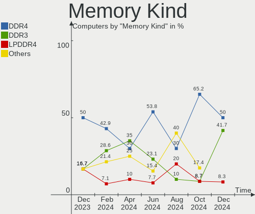

KDE neon Hardware Trends
------------------------

A project to identify most popular hardware characteristics and track their change
over time based on data collected by KDE neon users at https://Linux-Hardware.org.

Anyone can contribute to this report by the [hw-probe](https://github.com/linuxhw/hw-probe) tool:

    sudo -E hw-probe -all -upload

This is a report for all computer types. See also reports for [desktops](/Dist/KDE_neon/Desktop/README.md) and [notebooks](/Dist/KDE_neon/Notebook/README.md).

Full-feature report is available here: https://linux-hardware.org/?view=trends

Period: Jan, 2022.

Contents
--------

* [ System ](#system)
  - [ OS                       ](#os)
  - [ OS Family                ](#os-family)
  - [ Kernel                   ](#kernel)
  - [ Kernel Family            ](#kernel-family)
  - [ Kernel Major Ver.        ](#kernel-major-ver)
  - [ Arch                     ](#arch)
  - [ DE                       ](#de)
  - [ Display Server           ](#display-server)
  - [ Display Manager          ](#display-manager)
  - [ OS Lang                  ](#os-lang)
  - [ Boot Mode                ](#boot-mode)
  - [ Filesystem               ](#filesystem)
  - [ Part. scheme             ](#part-scheme)
  - [ Dual Boot with Linux/BSD ](#dual-boot-with-linuxbsd)
  - [ Dual Boot (Win)          ](#dual-boot-win)

* [ Board ](#board)
  - [ Vendor                   ](#vendor)
  - [ Model                    ](#model)
  - [ Model Family             ](#model-family)
  - [ MFG Year                 ](#mfg-year)
  - [ Form Factor              ](#form-factor)
  - [ Secure Boot              ](#secure-boot)
  - [ Coreboot                 ](#coreboot)
  - [ RAM Size                 ](#ram-size)
  - [ RAM Used                 ](#ram-used)
  - [ Total Drives             ](#total-drives)
  - [ Has CD-ROM               ](#has-cd-rom)
  - [ Has Ethernet             ](#has-ethernet)
  - [ Has WiFi                 ](#has-wifi)
  - [ Has Bluetooth            ](#has-bluetooth)

* [ Location ](#location)
  - [ Country                  ](#country)
  - [ City                     ](#city)

* [ Drives ](#drives)
  - [ Drive Vendor             ](#drive-vendor)
  - [ Drive Model              ](#drive-model)
  - [ HDD Vendor               ](#hdd-vendor)
  - [ SSD Vendor               ](#ssd-vendor)
  - [ Drive Kind               ](#drive-kind)
  - [ Drive Connector          ](#drive-connector)
  - [ Drive Size               ](#drive-size)
  - [ Space Total              ](#space-total)
  - [ Space Used               ](#space-used)
  - [ Malfunc. Drives          ](#malfunc-drives)
  - [ Malfunc. Drive Vendor    ](#malfunc-drive-vendor)
  - [ Malfunc. HDD Vendor      ](#malfunc-hdd-vendor)
  - [ Malfunc. Drive Kind      ](#malfunc-drive-kind)
  - [ Failed Drives            ](#failed-drives)
  - [ Failed Drive Vendor      ](#failed-drive-vendor)
  - [ Drive Status             ](#drive-status)

* [ Storage controller ](#storage-controller)
  - [ Storage Vendor           ](#storage-vendor)
  - [ Storage Model            ](#storage-model)
  - [ Storage Kind             ](#storage-kind)

* [ Processor ](#processor)
  - [ CPU Vendor               ](#cpu-vendor)
  - [ CPU Model                ](#cpu-model)
  - [ CPU Model Family         ](#cpu-model-family)
  - [ CPU Cores                ](#cpu-cores)
  - [ CPU Sockets              ](#cpu-sockets)
  - [ CPU Threads              ](#cpu-threads)
  - [ CPU Op-Modes             ](#cpu-op-modes)
  - [ CPU Microcode            ](#cpu-microcode)
  - [ CPU Microarch            ](#cpu-microarch)

* [ Graphics ](#graphics)
  - [ GPU Vendor               ](#gpu-vendor)
  - [ GPU Model                ](#gpu-model)
  - [ GPU Combo                ](#gpu-combo)
  - [ GPU Driver               ](#gpu-driver)
  - [ GPU Memory               ](#gpu-memory)

* [ Monitor ](#monitor)
  - [ Monitor Vendor           ](#monitor-vendor)
  - [ Monitor Model            ](#monitor-model)
  - [ Monitor Resolution       ](#monitor-resolution)
  - [ Monitor Diagonal         ](#monitor-diagonal)
  - [ Monitor Width            ](#monitor-width)
  - [ Aspect Ratio             ](#aspect-ratio)
  - [ Monitor Area             ](#monitor-area)
  - [ Pixel Density            ](#pixel-density)
  - [ Multiple Monitors        ](#multiple-monitors)

* [ Network ](#network)
  - [ Net Controller Vendor    ](#net-controller-vendor)
  - [ Net Controller Model     ](#net-controller-model)
  - [ Wireless Vendor          ](#wireless-vendor)
  - [ Wireless Model           ](#wireless-model)
  - [ Ethernet Vendor          ](#ethernet-vendor)
  - [ Ethernet Model           ](#ethernet-model)
  - [ Net Controller Kind      ](#net-controller-kind)
  - [ Used Controller          ](#used-controller)
  - [ NICs                     ](#nics)
  - [ IPv6                     ](#ipv6)

* [ Bluetooth ](#bluetooth)
  - [ Bluetooth Vendor         ](#bluetooth-vendor)
  - [ Bluetooth Model          ](#bluetooth-model)

* [ Sound ](#sound)
  - [ Sound Vendor             ](#sound-vendor)
  - [ Sound Model              ](#sound-model)

* [ Memory ](#memory)
  - [ Memory Vendor            ](#memory-vendor)
  - [ Memory Model             ](#memory-model)
  - [ Memory Kind              ](#memory-kind)
  - [ Memory Form Factor       ](#memory-form-factor)
  - [ Memory Size              ](#memory-size)
  - [ Memory Speed             ](#memory-speed)

* [ Printers & scanners ](#printers--scanners)
  - [ Printer Vendor           ](#printer-vendor)
  - [ Printer Model            ](#printer-model)
  - [ Scanner Vendor           ](#scanner-vendor)
  - [ Scanner Model            ](#scanner-model)

* [ Camera ](#camera)
  - [ Camera Vendor            ](#camera-vendor)
  - [ Camera Model             ](#camera-model)

* [ Security ](#security)
  - [ Fingerprint Vendor       ](#fingerprint-vendor)
  - [ Fingerprint Model        ](#fingerprint-model)
  - [ Chipcard Vendor          ](#chipcard-vendor)
  - [ Chipcard Model           ](#chipcard-model)

* [ Unsupported ](#unsupported)
  - [ Unsupported Devices      ](#unsupported-devices)
  - [ Unsupported Device Types ](#unsupported-device-types)

System
------

OS
--

Installed operating systems

| Name             | Computers | Percent |
|------------------|-----------|---------|
| KDE neon 20.04   | 119       | 99.17%  |
| KDE neon 20.04.3 | 1         | 0.83%   |

OS Family
---------

OS without a version

| Name     | Computers | Percent |
|----------|-----------|---------|
| KDE neon | 120       | 100%    |

Kernel
------

Version of the Linux kernel

| Version                         | Computers | Percent |
|---------------------------------|-----------|---------|
| 5.13.0-27-generic               | 27        | 22.5%   |
| 5.11.0-43-generic               | 27        | 22.5%   |
| 5.11.0-46-generic               | 23        | 19.17%  |
| 5.11.0-44-generic               | 23        | 19.17%  |
| 5.13.0-25-generic               | 4         | 3.33%   |
| 5.16-051600-generic             | 2         | 1.67%   |
| 5.13.0-28-generic               | 2         | 1.67%   |
| 5.11.0-40-generic               | 2         | 1.67%   |
| 5.11.0-38-generic               | 2         | 1.67%   |
| 5.8.0-59-generic                | 1         | 0.83%   |
| 5.17.0-rc1                      | 1         | 0.83%   |
| 5.16.0-051600-generic           | 1         | 0.83%   |
| 5.15.11-ext73-95.11-amdstandard | 1         | 0.83%   |
| 5.14.21-051421-generic          | 1         | 0.83%   |
| 5.14.12-051412-generic          | 1         | 0.83%   |
| 5.13.0-22-generic               | 1         | 0.83%   |
| 5.11.0-41-generic               | 1         | 0.83%   |

Kernel Family
-------------

Linux kernel without a distro release

| Version | Computers | Percent |
|---------|-----------|---------|
| 5.11.0  | 78        | 65%     |
| 5.13.0  | 34        | 28.33%  |
| 5.16    | 2         | 1.67%   |
| 5.8.0   | 1         | 0.83%   |
| 5.17.0  | 1         | 0.83%   |
| 5.16.0  | 1         | 0.83%   |
| 5.15.11 | 1         | 0.83%   |
| 5.14.21 | 1         | 0.83%   |
| 5.14.12 | 1         | 0.83%   |

Kernel Major Ver.
-----------------

Linux kernel major version

| Version | Computers | Percent |
|---------|-----------|---------|
| 5.11    | 78        | 65%     |
| 5.13    | 34        | 28.33%  |
| 5.14    | 2         | 1.67%   |
| 5       | 2         | 1.67%   |
| 5.8     | 1         | 0.83%   |
| 5.17    | 1         | 0.83%   |
| 5.16    | 1         | 0.83%   |
| 5.15    | 1         | 0.83%   |

Arch
----

OS architecture (x86_64, i586, etc.)

| Name   | Computers | Percent |
|--------|-----------|---------|
| x86_64 | 120       | 100%    |

DE
--

Desktop Environment

| Name    | Computers | Percent |
|---------|-----------|---------|
| KDE5    | 118       | 98.33%  |
| KDE     | 1         | 0.83%   |
| Unknown | 1         | 0.83%   |

Display Server
--------------

X11 or Wayland

| Name    | Computers | Percent |
|---------|-----------|---------|
| X11     | 115       | 95.83%  |
| Wayland | 5         | 4.17%   |

Display Manager
---------------

SDDM, LightDM, etc.

| Name    | Computers | Percent |
|---------|-----------|---------|
| Unknown | 93        | 77.5%   |
| SDDM    | 27        | 22.5%   |

OS Lang
-------

Language

| Lang  | Computers | Percent |
|-------|-----------|---------|
| en_US | 52        | 43.33%  |
| en_GB | 8         | 6.67%   |
| de_DE | 7         | 5.83%   |
| pt_BR | 6         | 5%      |
| C     | 6         | 5%      |
| ru_RU | 4         | 3.33%   |
| fr_FR | 4         | 3.33%   |
| it_IT | 3         | 2.5%    |
| es_ES | 3         | 2.5%    |
| en_IN | 3         | 2.5%    |
| sv_SE | 2         | 1.67%   |
| hu_HU | 2         | 1.67%   |
| es_MX | 2         | 1.67%   |
| en_DK | 2         | 1.67%   |
| en_CA | 2         | 1.67%   |
| en_AU | 2         | 1.67%   |
| de_CH | 2         | 1.67%   |
| tr_TR | 1         | 0.83%   |
| ru_UA | 1         | 0.83%   |
| pt_PT | 1         | 0.83%   |
| fr_CA | 1         | 0.83%   |
| es_VE | 1         | 0.83%   |
| en_ZA | 1         | 0.83%   |
| en_PH | 1         | 0.83%   |
| el_GR | 1         | 0.83%   |
| de_AT | 1         | 0.83%   |
| ar_SA | 1         | 0.83%   |

Boot Mode
---------

EFI or BIOS

| Mode | Computers | Percent |
|------|-----------|---------|
| EFI  | 77        | 64.17%  |
| BIOS | 43        | 35.83%  |

Filesystem
----------

Type of filesystem

| Type    | Computers | Percent |
|---------|-----------|---------|
| Ext4    | 110       | 91.67%  |
| Overlay | 5         | 4.17%   |
| Btrfs   | 4         | 3.33%   |
| Zfs     | 1         | 0.83%   |

Part. scheme
------------

Scheme of partitioning

| Type    | Computers | Percent |
|---------|-----------|---------|
| Unknown | 109       | 90.83%  |
| GPT     | 8         | 6.67%   |
| MBR     | 3         | 2.5%    |

Dual Boot with Linux/BSD
------------------------

Hosting more than one Linux/BSD

| Dual boot | Computers | Percent |
|-----------|-----------|---------|
| No        | 116       | 96.67%  |
| Yes       | 4         | 3.33%   |

Dual Boot (Win)
---------------

Hosting Linux and Windows

| Dual boot | Computers | Percent |
|-----------|-----------|---------|
| No        | 102       | 85%     |
| Yes       | 18        | 15%     |

Board
-----

Vendor
------

Motherboard manufacturer

| Name                | Computers | Percent |
|---------------------|-----------|---------|
| ASUSTek Computer    | 22        | 18.33%  |
| Hewlett-Packard     | 17        | 14.17%  |
| Lenovo              | 15        | 12.5%   |
| Dell                | 14        | 11.67%  |
| MSI                 | 13        | 10.83%  |
| Acer                | 7         | 5.83%   |
| Gigabyte Technology | 5         | 4.17%   |
| Intel               | 4         | 3.33%   |
| ASRock              | 4         | 3.33%   |
| Apple               | 4         | 3.33%   |
| Toshiba             | 2         | 1.67%   |
| Samsung Electronics | 2         | 1.67%   |
| Alienware           | 2         | 1.67%   |
| TUXEDO              | 1         | 0.83%   |
| SLIMBOOK            | 1         | 0.83%   |
| Pegatron            | 1         | 0.83%   |
| Microsoft           | 1         | 0.83%   |
| Jumper              | 1         | 0.83%   |
| GTZS                | 1         | 0.83%   |
| Fujitsu Siemens     | 1         | 0.83%   |
| BESSTAR Tech        | 1         | 0.83%   |
| Unknown             | 1         | 0.83%   |

Model
-----

Motherboard model

| Name                                       | Computers | Percent |
|--------------------------------------------|-----------|---------|
| Toshiba Satellite L655                     | 2         | 1.67%   |
| HP EliteBook 8460p                         | 2         | 1.67%   |
| Gigabyte GA-78LMT-USB3 6.0                 | 2         | 1.67%   |
| Dell Latitude E6400                        | 2         | 1.67%   |
| ASUS TUF GAMING X570-PLUS                  | 2         | 1.67%   |
| Unknown                                    | 2         | 1.67%   |
| TUXEDO N8xEJEK                             | 1         | 0.83%   |
| SLIMBOOK PROX15-AMD                        | 1         | 0.83%   |
| Samsung 700Z3A/700Z4A/700Z5A/700Z5B        | 1         | 0.83%   |
| Samsung 300E5EV/300E4EV/270E5EV/270E4EV    | 1         | 0.83%   |
| Pegatron IPMSB-GS                          | 1         | 0.83%   |
| MSI MS-7D25                                | 1         | 0.83%   |
| MSI MS-7C95                                | 1         | 0.83%   |
| MSI MS-7C90                                | 1         | 0.83%   |
| MSI MS-7C37                                | 1         | 0.83%   |
| MSI MS-7B98                                | 1         | 0.83%   |
| MSI MS-7B93                                | 1         | 0.83%   |
| MSI MS-7A15                                | 1         | 0.83%   |
| MSI MS-7994                                | 1         | 0.83%   |
| MSI MS-7845                                | 1         | 0.83%   |
| MSI MS-7788                                | 1         | 0.83%   |
| MSI MS-7678                                | 1         | 0.83%   |
| MSI GP63 Leopard 8RE                       | 1         | 0.83%   |
| MSI GF63 Thin 10SCSR                       | 1         | 0.83%   |
| Microsoft Surface Pro                      | 1         | 0.83%   |
| Lenovo Yoga 520-14IKB 81C8                 | 1         | 0.83%   |
| Lenovo ThinkPad X13 Gen 1 20UFS04J00       | 1         | 0.83%   |
| Lenovo ThinkPad W530 2463B87               | 1         | 0.83%   |
| Lenovo ThinkPad T495 20NKS0PG00            | 1         | 0.83%   |
| Lenovo ThinkPad T470 20HDA022CD            | 1         | 0.83%   |
| Lenovo ThinkPad T14 Gen 2i 20W0004CMX      | 1         | 0.83%   |
| Lenovo ThinkPad E550 20DF00CNFR            | 1         | 0.83%   |
| Lenovo ThinkPad E14 Gen 2 20T60027RT       | 1         | 0.83%   |
| Lenovo ThinkCentre M720q 10T8SEYW00        | 1         | 0.83%   |
| Lenovo Legion 5 Pro 16ACH6H 82JQ           | 1         | 0.83%   |
| Lenovo Legion 5 15ARH05 82B5               | 1         | 0.83%   |
| Lenovo Legion 5 15ACH6 82JW                | 1         | 0.83%   |
| Lenovo IdeaPad 330-15IKB 81FE              | 1         | 0.83%   |
| Lenovo IdeaPad 3 17ARE05 81W5              | 1         | 0.83%   |
| Lenovo IdeaCentre AIO 330-20IGM F0D7001AIN | 1         | 0.83%   |
| Jumper EZbook                              | 1         | 0.83%   |
| Intel NUC8i3BEH                            | 1         | 0.83%   |
| Intel DQ77KB AAG81483-500                  | 1         | 0.83%   |
| Intel DG41TY AAE47335-203                  | 1         | 0.83%   |
| Intel DG31PR AAD97573-301                  | 1         | 0.83%   |
| HP Z620 Workstation                        | 1         | 0.83%   |
| HP Victus by Laptop 16-e0xxx               | 1         | 0.83%   |
| HP Spectre x360 Convertible 15-ch0xx       | 1         | 0.83%   |
| HP ProBook 440 G6                          | 1         | 0.83%   |
| HP Pavilion Gaming Laptop 15-ec0xxx        | 1         | 0.83%   |
| HP Pavilion Gaming Desktop TG01-0xxx       | 1         | 0.83%   |
| HP Pavilion dv7                            | 1         | 0.83%   |
| HP Laptop 15s-fq2xxx                       | 1         | 0.83%   |
| HP Laptop 14-cf3xxx                        | 1         | 0.83%   |
| HP ENVY x360 Convertible 13-ay0xxx         | 1         | 0.83%   |
| HP ENVY Notebook                           | 1         | 0.83%   |
| HP EliteBook 840 G1                        | 1         | 0.83%   |
| HP 510-p127c                               | 1         | 0.83%   |
| HP 250 G4                                  | 1         | 0.83%   |
| HP 240 G6 Notebook PC                      | 1         | 0.83%   |

Model Family
------------

Motherboard model prefix

| Name                   | Computers | Percent |
|------------------------|-----------|---------|
| Lenovo ThinkPad        | 7         | 5.83%   |
| Dell Latitude          | 5         | 4.17%   |
| Dell Inspiron          | 5         | 4.17%   |
| ASUS ROG               | 5         | 4.17%   |
| ASUS PRIME             | 5         | 4.17%   |
| Acer Aspire            | 5         | 4.17%   |
| ASUS TUF               | 4         | 3.33%   |
| Lenovo Legion          | 3         | 2.5%    |
| HP Pavilion            | 3         | 2.5%    |
| HP EliteBook           | 3         | 2.5%    |
| Toshiba Satellite      | 2         | 1.67%   |
| Lenovo IdeaPad         | 2         | 1.67%   |
| HP Laptop              | 2         | 1.67%   |
| HP ENVY                | 2         | 1.67%   |
| Gigabyte GA-78LMT-USB3 | 2         | 1.67%   |
| ASUS VivoBook          | 2         | 1.67%   |
| Unknown                | 2         | 1.67%   |
| TUXEDO N8xEJEK         | 1         | 0.83%   |
| SLIMBOOK PROX15-AMD    | 1         | 0.83%   |
| Samsung 700Z3A         | 1         | 0.83%   |
| Samsung 300E5EV        | 1         | 0.83%   |
| Pegatron IPMSB-GS      | 1         | 0.83%   |
| MSI MS-7D25            | 1         | 0.83%   |
| MSI MS-7C95            | 1         | 0.83%   |
| MSI MS-7C90            | 1         | 0.83%   |
| MSI MS-7C37            | 1         | 0.83%   |
| MSI MS-7B98            | 1         | 0.83%   |
| MSI MS-7B93            | 1         | 0.83%   |
| MSI MS-7A15            | 1         | 0.83%   |
| MSI MS-7994            | 1         | 0.83%   |
| MSI MS-7845            | 1         | 0.83%   |
| MSI MS-7788            | 1         | 0.83%   |
| MSI MS-7678            | 1         | 0.83%   |
| MSI GP63               | 1         | 0.83%   |
| MSI GF63               | 1         | 0.83%   |
| Microsoft Surface      | 1         | 0.83%   |
| Lenovo Yoga            | 1         | 0.83%   |
| Lenovo ThinkCentre     | 1         | 0.83%   |
| Lenovo IdeaCentre      | 1         | 0.83%   |
| Jumper EZbook          | 1         | 0.83%   |
| Intel NUC8i3BEH        | 1         | 0.83%   |
| Intel DQ77KB           | 1         | 0.83%   |
| Intel DG41TY           | 1         | 0.83%   |
| Intel DG31PR           | 1         | 0.83%   |
| HP Z620                | 1         | 0.83%   |
| HP Victus              | 1         | 0.83%   |
| HP Spectre             | 1         | 0.83%   |
| HP ProBook             | 1         | 0.83%   |
| HP 510-p127c           | 1         | 0.83%   |
| HP 250                 | 1         | 0.83%   |
| HP 240                 | 1         | 0.83%   |
| Gigabyte AERO          | 1         | 0.83%   |
| Gigabyte 990XA-UD3     | 1         | 0.83%   |
| Gigabyte 970A-DS3P     | 1         | 0.83%   |
| Fujitsu Siemens AMILO  | 1         | 0.83%   |
| Dell XPS               | 1         | 0.83%   |
| Dell Vostro            | 1         | 0.83%   |
| Dell Precision         | 1         | 0.83%   |
| Dell OptiPlex          | 1         | 0.83%   |
| BESSTAR Tech HM50      | 1         | 0.83%   |

MFG Year
--------

Motherboard manufacture year

| Year | Computers | Percent |
|------|-----------|---------|
| 2020 | 19        | 15.83%  |
| 2021 | 14        | 11.67%  |
| 2019 | 13        | 10.83%  |
| 2015 | 11        | 9.17%   |
| 2018 | 10        | 8.33%   |
| 2011 | 9         | 7.5%    |
| 2014 | 8         | 6.67%   |
| 2017 | 7         | 5.83%   |
| 2008 | 7         | 5.83%   |
| 2012 | 6         | 5%      |
| 2016 | 5         | 4.17%   |
| 2013 | 5         | 4.17%   |
| 2010 | 5         | 4.17%   |
| 2009 | 1         | 0.83%   |

Form Factor
-----------

Physical design of the computer

| Name        | Computers | Percent |
|-------------|-----------|---------|
| Notebook    | 63        | 52.5%   |
| Desktop     | 50        | 41.67%  |
| Convertible | 3         | 2.5%    |
| Mini pc     | 2         | 1.67%   |
| Tablet      | 1         | 0.83%   |
| All in one  | 1         | 0.83%   |

Secure Boot
-----------

Enabled or disabled

| State    | Computers | Percent |
|----------|-----------|---------|
| Disabled | 108       | 90%     |
| Enabled  | 12        | 10%     |

Coreboot
--------

Have coreboot on board

| Used | Computers | Percent |
|------|-----------|---------|
| No   | 120       | 100%    |

RAM Size
--------

Total RAM memory

| Size in GB  | Computers | Percent |
|-------------|-----------|---------|
| 8.01-16.0   | 32        | 26.67%  |
| 16.01-24.0  | 29        | 24.17%  |
| 4.01-8.0    | 21        | 17.5%   |
| 3.01-4.0    | 17        | 14.17%  |
| 32.01-64.0  | 11        | 9.17%   |
| 64.01-256.0 | 5         | 4.17%   |
| 24.01-32.0  | 2         | 1.67%   |
| 2.01-3.0    | 2         | 1.67%   |
| 1.01-2.0    | 1         | 0.83%   |

RAM Used
--------

Used RAM memory

| Used GB    | Computers | Percent |
|------------|-----------|---------|
| 1.01-2.0   | 46        | 38.33%  |
| 2.01-3.0   | 35        | 29.17%  |
| 4.01-8.0   | 18        | 15%     |
| 3.01-4.0   | 9         | 7.5%    |
| 0.51-1.0   | 9         | 7.5%    |
| 16.01-24.0 | 2         | 1.67%   |
| 24.01-32.0 | 1         | 0.83%   |

Total Drives
------------

Number of drives on board

| Drives | Computers | Percent |
|--------|-----------|---------|
| 1      | 62        | 51.67%  |
| 2      | 36        | 30%     |
| 3      | 9         | 7.5%    |
| 4      | 7         | 5.83%   |
| 5      | 3         | 2.5%    |
| 6      | 2         | 1.67%   |
| 7      | 1         | 0.83%   |

Has CD-ROM
----------

Has CD-ROM on board

| Presented | Computers | Percent |
|-----------|-----------|---------|
| No        | 79        | 65.83%  |
| Yes       | 41        | 34.17%  |

Has Ethernet
------------

Has Ethernet on board

| Presented | Computers | Percent |
|-----------|-----------|---------|
| Yes       | 108       | 90%     |
| No        | 12        | 10%     |

Has WiFi
--------

Has WiFi module

| Presented | Computers | Percent |
|-----------|-----------|---------|
| Yes       | 97        | 80.83%  |
| No        | 23        | 19.17%  |

Has Bluetooth
-------------

Has Bluetooth module

| Presented | Computers | Percent |
|-----------|-----------|---------|
| Yes       | 84        | 70%     |
| No        | 36        | 30%     |

Location
--------

Country
-------

Geographic location (country)

| Country      | Computers | Percent |
|--------------|-----------|---------|
| USA          | 31        | 25.83%  |
| Germany      | 7         | 5.83%   |
| Brazil       | 7         | 5.83%   |
| Ukraine      | 5         | 4.17%   |
| Italy        | 5         | 4.17%   |
| France       | 5         | 4.17%   |
| Canada       | 5         | 4.17%   |
| UK           | 4         | 3.33%   |
| Russia       | 4         | 3.33%   |
| Austria      | 4         | 3.33%   |
| Sweden       | 3         | 2.5%    |
| Spain        | 3         | 2.5%    |
| India        | 3         | 2.5%    |
| Switzerland  | 2         | 1.67%   |
| Portugal     | 2         | 1.67%   |
| Mexico       | 2         | 1.67%   |
| Hungary      | 2         | 1.67%   |
| Greece       | 2         | 1.67%   |
| Denmark      | 2         | 1.67%   |
| China        | 2         | 1.67%   |
| Bangladesh   | 2         | 1.67%   |
| Australia    | 2         | 1.67%   |
| Venezuela    | 1         | 0.83%   |
| Turkey       | 1         | 0.83%   |
| Thailand     | 1         | 0.83%   |
| South Africa | 1         | 0.83%   |
| Saudi Arabia | 1         | 0.83%   |
| Rwanda       | 1         | 0.83%   |
| Poland       | 1         | 0.83%   |
| Philippines  | 1         | 0.83%   |
| Nicaragua    | 1         | 0.83%   |
| Netherlands  | 1         | 0.83%   |
| Myanmar      | 1         | 0.83%   |
| Morocco      | 1         | 0.83%   |
| Indonesia    | 1         | 0.83%   |
| Croatia      | 1         | 0.83%   |
| Cambodia     | 1         | 0.83%   |
| Bulgaria     | 1         | 0.83%   |

City
----

Geographic location (city)

| City                | Computers | Percent |
|---------------------|-----------|---------|
| Phoenix             | 3         | 2.5%    |
| Kyiv                | 3         | 2.5%    |
| Vienna              | 2         | 1.67%   |
| Sydney              | 2         | 1.67%   |
| S??o Paulo          | 2         | 1.67%   |
| Natick              | 2         | 1.67%   |
| Madrid              | 2         | 1.67%   |
| Duque de Caxias     | 2         | 1.67%   |
| Dhaka               | 2         | 1.67%   |
| Athens              | 2         | 1.67%   |
| Yangon              | 1         | 0.83%   |
| Wolverhampton       | 1         | 0.83%   |
| Winchester          | 1         | 0.83%   |
| Wiesloch            | 1         | 0.83%   |
| Westminster         | 1         | 0.83%   |
| Wegberg             | 1         | 0.83%   |
| Walla Walla         | 1         | 0.83%   |
| Viseu               | 1         | 0.83%   |
| Verona              | 1         | 0.83%   |
| Vallensbaek Strand  | 1         | 0.83%   |
| Upplands Vasby      | 1         | 0.83%   |
| Torre del Mar       | 1         | 0.83%   |
| Tijuana             | 1         | 0.83%   |
| The Hague           | 1         | 0.83%   |
| Thaya               | 1         | 0.83%   |
| Taby                | 1         | 0.83%   |
| Surrey              | 1         | 0.83%   |
| Strongsville        | 1         | 0.83%   |
| Stockton            | 1         | 0.83%   |
| Stamboliyski        | 1         | 0.83%   |
| St Petersburg       | 1         | 0.83%   |
| Spanish Fork        | 1         | 0.83%   |
| Sorel-Tracy         | 1         | 0.83%   |
| Sopron              | 1         | 0.83%   |
| Songjiang           | 1         | 0.83%   |
| Shanghai            | 1         | 0.83%   |
| Seattle             | 1         | 0.83%   |
| Sandton             | 1         | 0.83%   |
| San Jose del Monte  | 1         | 0.83%   |
| Samobor             | 1         | 0.83%   |
| Saint-Nazaire       | 1         | 0.83%   |
| Riyadh              | 1         | 0.83%   |
| Ranchi              | 1         | 0.83%   |
| Raleigh             | 1         | 0.83%   |
| Queluz              | 1         | 0.83%   |
| Port Clinton        | 1         | 0.83%   |
| Piedmont            | 1         | 0.83%   |
| Phnom Penh          | 1         | 0.83%   |
| Pamiers             | 1         | 0.83%   |
| Norwich             | 1         | 0.83%   |
| Newport News        | 1         | 0.83%   |
| Newcastle upon Tyne | 1         | 0.83%   |
| Naples              | 1         | 0.83%   |
| Mosina              | 1         | 0.83%   |
| Moscow              | 1         | 0.83%   |
| Morelia             | 1         | 0.83%   |
| Montreal            | 1         | 0.83%   |
| Milan               | 1         | 0.83%   |
| Mesa                | 1         | 0.83%   |
| Maring??            | 1         | 0.83%   |

Drives
------

Drive Vendor
------------

Hard drive vendors

| Vendor              | Computers | Drives | Percent |
|---------------------|-----------|--------|---------|
| Samsung Electronics | 31        | 38     | 15.9%   |
| WDC                 | 30        | 40     | 15.38%  |
| Seagate             | 23        | 28     | 11.79%  |
| Sandisk             | 21        | 22     | 10.77%  |
| Toshiba             | 17        | 19     | 8.72%   |
| Kingston            | 9         | 9      | 4.62%   |
| HGST                | 7         | 7      | 3.59%   |
| Phison              | 6         | 6      | 3.08%   |
| Crucial             | 6         | 6      | 3.08%   |
| SK Hynix            | 5         | 5      | 2.56%   |
| PNY                 | 5         | 5      | 2.56%   |
| Intel               | 4         | 4      | 2.05%   |
| Unknown             | 3         | 3      | 1.54%   |
| Silicon Motion      | 3         | 3      | 1.54%   |
| KIOXIA              | 3         | 3      | 1.54%   |
| Intenso             | 3         | 6      | 1.54%   |
| Hitachi             | 3         | 3      | 1.54%   |
| XPG                 | 2         | 2      | 1.03%   |
| Tanbassh            | 1         | 1      | 0.51%   |
| SABRENT             | 1         | 1      | 0.51%   |
| Qunion              | 1         | 1      | 0.51%   |
| PNY USB             | 1         | 1      | 0.51%   |
| Pioneer             | 1         | 1      | 0.51%   |
| Patriot             | 1         | 1      | 0.51%   |
| OCZ                 | 1         | 1      | 0.51%   |
| Netac               | 1         | 1      | 0.51%   |
| KingSpec            | 1         | 1      | 0.51%   |
| Corsair             | 1         | 1      | 0.51%   |
| China               | 1         | 1      | 0.51%   |
| BIWIN               | 1         | 1      | 0.51%   |
| Apple               | 1         | 1      | 0.51%   |
| A-DATA Technology   | 1         | 1      | 0.51%   |

Drive Model
-----------

Hard drive models

| Model                               | Computers | Percent |
|-------------------------------------|-----------|---------|
| Sandisk NVMe SSD Drive 500GB        | 5         | 2.34%   |
| Samsung NVMe SSD Drive 1TB          | 5         | 2.34%   |
| SK Hynix NVMe SSD Drive 512GB       | 4         | 1.87%   |
| Samsung SSD 850 EVO 250GB           | 4         | 1.87%   |
| Toshiba KBG30ZMS128G 128GB NVMe SSD | 3         | 1.4%    |
| Toshiba DT01ACA100 1TB              | 3         | 1.4%    |
| SanDisk SDSSDA120G 120GB            | 3         | 1.4%    |
| Samsung SSD 860 EVO 500GB           | 3         | 1.4%    |
| Samsung NVMe SSD Drive 512GB        | 3         | 1.4%    |
| PNY CS900 240GB SSD                 | 3         | 1.4%    |
| HGST HTS721010A9E630 1TB            | 3         | 1.4%    |
| Unknown SD/MMC/MS PRO 128GB         | 2         | 0.93%   |
| Toshiba MQ04ABF100 1TB              | 2         | 0.93%   |
| Toshiba MQ02ABD100H 1TB             | 2         | 0.93%   |
| Toshiba HDWD120 2TB                 | 2         | 0.93%   |
| Seagate ST1000LM035-1RK172 1TB      | 2         | 0.93%   |
| Sandisk NVMe SSD Drive 256GB        | 2         | 0.93%   |
| Samsung SSD 860 EVO 1TB             | 2         | 0.93%   |
| Samsung SSD 850 EVO 500GB           | 2         | 0.93%   |
| Samsung SSD 840 EVO 120GB           | 2         | 0.93%   |
| Samsung NVMe SSD Drive 250GB        | 2         | 0.93%   |
| Intel NVMe SSD Drive 512GB          | 2         | 0.93%   |
| XPG NVMe SSD Drive 512GB            | 1         | 0.47%   |
| XPG NVMe SSD Drive 2TB              | 1         | 0.47%   |
| WDC WDS500G2B0C-00PXH0 500GB        | 1         | 0.47%   |
| WDC WDS500G1X0E-00AFY0 500GB        | 1         | 0.47%   |
| WDC WDS250G1B0A-00H9H0 250GB SSD    | 1         | 0.47%   |
| WDC WDS240G2G0B-00EPW0 240GB SSD    | 1         | 0.47%   |
| WDC WDS240G2G0A-00JH30 240GB SSD    | 1         | 0.47%   |
| WDC WDS100T2B0B-00YS70 1TB SSD      | 1         | 0.47%   |
| WDC WDS100T2B0A-00SM50 1TB SSD      | 1         | 0.47%   |
| WDC WD60EFAX-68SHWN0 6TB            | 1         | 0.47%   |
| WDC WD5001FZWX-00ZHUA0 5TB          | 1         | 0.47%   |
| WDC WD5000LPVX-80V0TT0 500GB        | 1         | 0.47%   |
| WDC WD5000LPCX-24VHAT0 500GB        | 1         | 0.47%   |
| WDC WD5000AAKX-001CA0 500GB         | 1         | 0.47%   |
| WDC WD5000AAKS-00UU3A0 500GB        | 1         | 0.47%   |
| WDC WD40EZRZ-00WN9B0 4TB            | 1         | 0.47%   |
| WDC WD3200AAJS-08L7A0 320GB         | 1         | 0.47%   |
| WDC WD20PURZ-85AKKY0 2TB            | 1         | 0.47%   |
| WDC WD20EZRX-00DC0B0 2TB            | 1         | 0.47%   |
| WDC WD20EARS-00MVWB0 2TB            | 1         | 0.47%   |
| WDC WD2003FZEX-00Z4SA0 2TB          | 1         | 0.47%   |
| WDC WD1600AAJS-08L7A0 160GB         | 1         | 0.47%   |
| WDC WD1600AAJS-07M0A0 160GB         | 1         | 0.47%   |
| WDC WD1600AAJS-00L7A0 160GB         | 1         | 0.47%   |
| WDC WD10SPZX-24Z10T0 1TB            | 1         | 0.47%   |
| WDC WD10SPCX-60KHST0 1TB            | 1         | 0.47%   |
| WDC WD10SPCX-08S8TT0 1TB            | 1         | 0.47%   |
| WDC WD10JPVX-75JC3T0 1TB            | 1         | 0.47%   |
| WDC WD10EZEX-60WN4A1 1TB            | 1         | 0.47%   |
| WDC WD10EZEX-21WN4A0 1TB            | 1         | 0.47%   |
| WDC WD10EZEX-21M2NA0 1TB            | 1         | 0.47%   |
| WDC WD10EZEX-08WN4A0 1TB            | 1         | 0.47%   |
| WDC WD10EZEX-00WN4A0 1TB            | 1         | 0.47%   |
| WDC WD10EZEX-00BN5A0 1TB            | 1         | 0.47%   |
| WDC WD10EFRX-68FYTN0 1TB            | 1         | 0.47%   |
| WDC WD10EARS-00MVWB0 1TB            | 1         | 0.47%   |
| WDC WD1003FZEX-00MK2A0 1TB          | 1         | 0.47%   |
| WDC WD1003FZEX-00K3CA0 1TB          | 1         | 0.47%   |

HDD Vendor
----------

Hard disk drive vendors

| Vendor              | Computers | Drives | Percent |
|---------------------|-----------|--------|---------|
| WDC                 | 23        | 31     | 30.67%  |
| Seagate             | 22        | 26     | 29.33%  |
| Toshiba             | 12        | 13     | 16%     |
| HGST                | 7         | 7      | 9.33%   |
| Samsung Electronics | 4         | 5      | 5.33%   |
| Hitachi             | 3         | 3      | 4%      |
| Unknown             | 2         | 2      | 2.67%   |
| Intenso             | 1         | 2      | 1.33%   |
| Apple               | 1         | 1      | 1.33%   |

SSD Vendor
----------

Solid state drive vendors

| Vendor              | Computers | Drives | Percent |
|---------------------|-----------|--------|---------|
| Samsung Electronics | 18        | 20     | 26.87%  |
| SanDisk             | 11        | 12     | 16.42%  |
| Kingston            | 7         | 7      | 10.45%  |
| WDC                 | 5         | 5      | 7.46%   |
| PNY                 | 5         | 5      | 7.46%   |
| Crucial             | 5         | 5      | 7.46%   |
| Intenso             | 2         | 3      | 2.99%   |
| Toshiba             | 1         | 1      | 1.49%   |
| Seagate             | 1         | 1      | 1.49%   |
| SABRENT             | 1         | 1      | 1.49%   |
| Qunion              | 1         | 1      | 1.49%   |
| PNY USB             | 1         | 1      | 1.49%   |
| Pioneer             | 1         | 1      | 1.49%   |
| Patriot             | 1         | 1      | 1.49%   |
| OCZ                 | 1         | 1      | 1.49%   |
| Netac               | 1         | 1      | 1.49%   |
| KingSpec            | 1         | 1      | 1.49%   |
| Intel               | 1         | 1      | 1.49%   |
| China               | 1         | 1      | 1.49%   |
| BIWIN               | 1         | 1      | 1.49%   |
| A-DATA Technology   | 1         | 1      | 1.49%   |

Drive Kind
----------

HDD or SSD

| Kind    | Computers | Drives | Percent |
|---------|-----------|--------|---------|
| HDD     | 59        | 90     | 35.54%  |
| SSD     | 55        | 71     | 33.13%  |
| NVMe    | 49        | 59     | 29.52%  |
| Unknown | 2         | 2      | 1.2%    |
| MMC     | 1         | 1      | 0.6%    |

Drive Connector
---------------

SATA, SAS, NVMe, etc.

| Type | Computers | Drives | Percent |
|------|-----------|--------|---------|
| SATA | 91        | 154    | 61.49%  |
| NVMe | 49        | 59     | 33.11%  |
| SAS  | 7         | 9      | 4.73%   |
| MMC  | 1         | 1      | 0.68%   |

Drive Size
----------

Size of hard drive

| Size in TB | Computers | Drives | Percent |
|------------|-----------|--------|---------|
| 0.01-0.5   | 64        | 85     | 51.61%  |
| 0.51-1.0   | 41        | 52     | 33.06%  |
| 1.01-2.0   | 9         | 12     | 7.26%   |
| 4.01-10.0  | 4         | 5      | 3.23%   |
| 3.01-4.0   | 3         | 3      | 2.42%   |
| 2.01-3.0   | 3         | 4      | 2.42%   |

Space Total
-----------

Amount of disk space available on the file system

| Size in GB     | Computers | Percent |
|----------------|-----------|---------|
| 101-250        | 32        | 26.67%  |
| 251-500        | 30        | 25%     |
| 501-1000       | 15        | 12.5%   |
| 51-100         | 13        | 10.83%  |
| 1001-2000      | 10        | 8.33%   |
| More than 3000 | 7         | 5.83%   |
| 21-50          | 4         | 3.33%   |
| 1-20           | 4         | 3.33%   |
| Unknown        | 4         | 3.33%   |
| 2001-3000      | 1         | 0.83%   |

Space Used
----------

Amount of used disk space

| Used GB        | Computers | Percent |
|----------------|-----------|---------|
| 1-20           | 54        | 45%     |
| 101-250        | 18        | 15%     |
| 21-50          | 17        | 14.17%  |
| 51-100         | 12        | 10%     |
| More than 3000 | 5         | 4.17%   |
| 251-500        | 5         | 4.17%   |
| Unknown        | 4         | 3.33%   |
| 1001-2000      | 2         | 1.67%   |
| 501-1000       | 2         | 1.67%   |
| 2001-3000      | 1         | 0.83%   |

Malfunc. Drives
---------------

Drive models with a malfunction

| Model                      | Computers | Drives | Percent |
|----------------------------|-----------|--------|---------|
| Intenso SATA III SSD 240GB | 1         | 1      | 33.33%  |
| HGST HTS725032A7E630 320GB | 1         | 1      | 33.33%  |
| HGST HTS721010A9E630 1TB   | 1         | 1      | 33.33%  |

Malfunc. Drive Vendor
---------------------

Vendors of faulty drives

| Vendor  | Computers | Drives | Percent |
|---------|-----------|--------|---------|
| HGST    | 2         | 2      | 66.67%  |
| Intenso | 1         | 1      | 33.33%  |

Malfunc. HDD Vendor
-------------------

Vendors of faulty HDD drives

| Vendor | Computers | Drives | Percent |
|--------|-----------|--------|---------|
| HGST   | 2         | 2      | 100%    |

Malfunc. Drive Kind
-------------------

Kinds of faulty drives

| Kind | Computers | Drives | Percent |
|------|-----------|--------|---------|
| HDD  | 2         | 2      | 66.67%  |
| SSD  | 1         | 1      | 33.33%  |

Failed Drives
-------------

Failed drive models

Zero info for selected period =(

Failed Drive Vendor
-------------------

Failed drive vendors

Zero info for selected period =(

Drive Status
------------

Number of failed and malfunc. drives

| Status   | Computers | Drives | Percent |
|----------|-----------|--------|---------|
| Detected | 110       | 201    | 88%     |
| Works    | 12        | 19     | 9.6%    |
| Malfunc  | 3         | 3      | 2.4%    |

Storage controller
------------------

Storage Vendor
--------------

Storage controller vendors

| Vendor                       | Computers | Percent |
|------------------------------|-----------|---------|
| Intel                        | 73        | 43.98%  |
| AMD                          | 33        | 19.88%  |
| Sandisk                      | 14        | 8.43%   |
| Samsung Electronics          | 11        | 6.63%   |
| Phison Electronics           | 6         | 3.61%   |
| SK Hynix                     | 5         | 3.01%   |
| ASMedia Technology           | 5         | 3.01%   |
| Toshiba America Info Systems | 4         | 2.41%   |
| Silicon Motion               | 3         | 1.81%   |
| KIOXIA                       | 3         | 1.81%   |
| Nvidia                       | 2         | 1.2%    |
| Kingston Technology Company  | 2         | 1.2%    |
| ADATA Technology             | 2         | 1.2%    |
| Seagate Technology           | 1         | 0.6%    |
| Micron/Crucial Technology    | 1         | 0.6%    |
| Marvell Technology Group     | 1         | 0.6%    |

Storage Model
-------------

Storage controller models

| Model                                                                                   | Computers | Percent |
|-----------------------------------------------------------------------------------------|-----------|---------|
| AMD FCH SATA Controller [AHCI mode]                                                     | 23        | 12.23%  |
| Intel Q170/Q150/B150/H170/H110/Z170/CM236 Chipset SATA Controller [AHCI Mode]           | 7         | 3.72%   |
| Samsung NVMe SSD Controller SM981/PM981/PM983                                           | 6         | 3.19%   |
| Intel 82801IBM/IEM (ICH9M/ICH9M-E) 4 port SATA Controller [AHCI mode]                   | 5         | 2.66%   |
| Intel 7 Series Chipset Family 6-port SATA Controller [AHCI mode]                        | 5         | 2.66%   |
| ASMedia ASM1062 Serial ATA Controller                                                   | 5         | 2.66%   |
| Sandisk WD Blue SN550 NVMe SSD                                                          | 4         | 2.13%   |
| Sandisk Non-Volatile memory controller                                                  | 4         | 2.13%   |
| Intel Sunrise Point-LP SATA Controller [AHCI mode]                                      | 4         | 2.13%   |
| Intel Cannon Lake PCH SATA AHCI Controller                                              | 4         | 2.13%   |
| Intel 82801 Mobile SATA Controller [RAID mode]                                          | 4         | 2.13%   |
| Intel 6 Series/C200 Series Chipset Family 6 port Mobile SATA AHCI Controller            | 4         | 2.13%   |
| AMD Starship/Matisse Chipset SATA Controller [AHCI mode]                                | 4         | 2.13%   |
| AMD SB7x0/SB8x0/SB9x0 SATA Controller [AHCI mode]                                       | 4         | 2.13%   |
| Silicon Motion SM2263EN/SM2263XT SSD Controller                                         | 3         | 1.6%    |
| Samsung NVMe SSD Controller 980                                                         | 3         | 1.6%    |
| KIOXIA Non-Volatile memory controller                                                   | 3         | 1.6%    |
| Intel Wildcat Point-LP SATA Controller [AHCI Mode]                                      | 3         | 1.6%    |
| Intel NM10/ICH7 Family SATA Controller [IDE mode]                                       | 3         | 1.6%    |
| Intel Celeron/Pentium Silver Processor SATA Controller                                  | 3         | 1.6%    |
| Intel Cannon Lake Mobile PCH SATA AHCI Controller                                       | 3         | 1.6%    |
| Intel 82801G (ICH7 Family) IDE Controller                                               | 3         | 1.6%    |
| Intel 8 Series SATA Controller 1 [AHCI mode]                                            | 3         | 1.6%    |
| Intel 6 Series/C200 Series Chipset Family Desktop SATA Controller (IDE mode, ports 4-5) | 3         | 1.6%    |
| Intel 6 Series/C200 Series Chipset Family Desktop SATA Controller (IDE mode, ports 0-3) | 3         | 1.6%    |
| AMD SB7x0/SB8x0/SB9x0 IDE Controller                                                    | 3         | 1.6%    |
| Toshiba America Info Systems XG4 NVMe SSD Controller                                    | 2         | 1.06%   |
| SK Hynix BC511                                                                          | 2         | 1.06%   |
| Sandisk WD Black SN750 / PC SN730 NVMe SSD                                              | 2         | 1.06%   |
| Sandisk WD Black 2018/SN750 / PC SN720 NVMe SSD                                         | 2         | 1.06%   |
| Phison PS5013 E13 NVMe Controller                                                       | 2         | 1.06%   |
| Intel SSD 660P Series                                                                   | 2         | 1.06%   |
| Intel Cannon Point-LP SATA Controller [AHCI Mode]                                       | 2         | 1.06%   |
| Intel 8 Series/C220 Series Chipset Family 6-port SATA Controller 1 [AHCI mode]          | 2         | 1.06%   |
| Intel 500 Series Chipset Family SATA AHCI Controller                                    | 2         | 1.06%   |
| Intel 5 Series/3400 Series Chipset 4 port SATA AHCI Controller                          | 2         | 1.06%   |
| AMD 400 Series Chipset SATA Controller                                                  | 2         | 1.06%   |
| AMD 300 Series Chipset SATA Controller                                                  | 2         | 1.06%   |
| ADATA XPG SX8200 Pro PCIe Gen3x4 M.2 2280 Solid State Drive                             | 2         | 1.06%   |
| Toshiba America Info Systems Toshiba America Info Non-Volatile memory controller        | 1         | 0.53%   |
| Toshiba America Info Systems BG3 NVMe SSD Controller                                    | 1         | 0.53%   |
| SK Hynix Non-Volatile memory controller                                                 | 1         | 0.53%   |
| SK Hynix Gold P31 SSD                                                                   | 1         | 0.53%   |
| SK Hynix BC501 NVMe Solid State Drive                                                   | 1         | 0.53%   |
| Seagate FireCuda 520 SSD                                                                | 1         | 0.53%   |
| Sandisk WD PC SN810 / Black SN850 NVMe SSD                                              | 1         | 0.53%   |
| Sandisk WD Blue SN500 / PC SN520 NVMe SSD                                               | 1         | 0.53%   |
| Samsung NVMe SSD Controller SM961/PM961/SM963                                           | 1         | 0.53%   |
| Samsung NVMe SSD Controller SM951/PM951                                                 | 1         | 0.53%   |
| Samsung NVMe SSD Controller PM9A1/PM9A3/980PRO                                          | 1         | 0.53%   |
| Phison NVMe Storage Controller                                                          | 1         | 0.53%   |
| Phison E18 PCIe4 NVMe Controller                                                        | 1         | 0.53%   |
| Phison E16 PCIe4 NVMe Controller                                                        | 1         | 0.53%   |
| Phison E12 NVMe Controller                                                              | 1         | 0.53%   |
| Nvidia MCP89 SATA Controller (AHCI mode)                                                | 1         | 0.53%   |
| Nvidia MCP61 SATA Controller                                                            | 1         | 0.53%   |
| Nvidia MCP61 IDE                                                                        | 1         | 0.53%   |
| Micron/Crucial P2 NVMe PCIe SSD                                                         | 1         | 0.53%   |
| Marvell Group 88SE9128 PCIe SATA 6 Gb/s RAID controller with HyperDuo                   | 1         | 0.53%   |
| Kingston Company Company Non-Volatile memory controller                                 | 1         | 0.53%   |

Storage Kind
------------

Kind of storage controller (IDE, SATA, NVMe, SAS, ...)

| Kind | Computers | Percent |
|------|-----------|---------|
| SATA | 94        | 57.67%  |
| NVMe | 49        | 30.06%  |
| IDE  | 13        | 7.98%   |
| RAID | 6         | 3.68%   |
| SAS  | 1         | 0.61%   |

Processor
---------

CPU Vendor
----------

Processor vendors

| Vendor | Computers | Percent |
|--------|-----------|---------|
| Intel  | 79        | 65.83%  |
| AMD    | 41        | 34.17%  |

CPU Model
---------

Processor models

| Model                                       | Computers | Percent |
|---------------------------------------------|-----------|---------|
| Intel Core i7-8750H CPU @ 2.20GHz           | 3         | 2.5%    |
| Intel Core i7-8550U CPU @ 1.80GHz           | 3         | 2.5%    |
| Intel Core i7-7500U CPU @ 2.70GHz           | 3         | 2.5%    |
| Intel Core i5-2520M CPU @ 2.50GHz           | 3         | 2.5%    |
| AMD Ryzen 7 5800H with Radeon Graphics      | 3         | 2.5%    |
| AMD Ryzen 7 3700X 8-Core Processor          | 3         | 2.5%    |
| Intel Core i7-9700K CPU @ 3.60GHz           | 2         | 1.67%   |
| Intel Core i7-4600U CPU @ 2.10GHz           | 2         | 1.67%   |
| Intel Core i5-9600K CPU @ 3.70GHz           | 2         | 1.67%   |
| Intel Core i5-6500 CPU @ 3.20GHz            | 2         | 1.67%   |
| Intel Core i5-3230M CPU @ 2.60GHz           | 2         | 1.67%   |
| Intel Core i3-5005U CPU @ 2.00GHz           | 2         | 1.67%   |
| Intel Core 2 Duo CPU P8600 @ 2.40GHz        | 2         | 1.67%   |
| Intel Celeron J4005 CPU @ 2.00GHz           | 2         | 1.67%   |
| Intel 11th Gen Core i7-1165G7 @ 2.80GHz     | 2         | 1.67%   |
| AMD Ryzen 7 4700U with Radeon Graphics      | 2         | 1.67%   |
| AMD Ryzen 5 4600H with Radeon Graphics      | 2         | 1.67%   |
| AMD Ryzen 5 4500U with Radeon Graphics      | 2         | 1.67%   |
| AMD Ryzen 5 3600 6-Core Processor           | 2         | 1.67%   |
| AMD FX-4300 Quad-Core Processor             | 2         | 1.67%   |
| Intel Xeon CPU E5440 @ 2.83GHz              | 1         | 0.83%   |
| Intel Xeon CPU E5-2680 0 @ 2.70GHz          | 1         | 0.83%   |
| Intel Xeon CPU E31225 @ 3.10GHz             | 1         | 0.83%   |
| Intel Pentium Silver N6000 @ 1.10GHz        | 1         | 0.83%   |
| Intel Pentium Dual-Core CPU T4500 @ 2.30GHz | 1         | 0.83%   |
| Intel Pentium Dual-Core CPU T4200 @ 2.00GHz | 1         | 0.83%   |
| Intel Pentium Dual CPU T2370 @ 1.73GHz      | 1         | 0.83%   |
| Intel Pentium CPU G4560 @ 3.50GHz           | 1         | 0.83%   |
| Intel Core i7-9750H CPU @ 2.60GHz           | 1         | 0.83%   |
| Intel Core i7-7700K CPU @ 4.20GHz           | 1         | 0.83%   |
| Intel Core i7-7700HQ CPU @ 2.80GHz          | 1         | 0.83%   |
| Intel Core i7-6700K CPU @ 4.00GHz           | 1         | 0.83%   |
| Intel Core i7-6700HQ CPU @ 2.60GHz          | 1         | 0.83%   |
| Intel Core i7-5500U CPU @ 2.40GHz           | 1         | 0.83%   |
| Intel Core i7-4790K CPU @ 4.00GHz           | 1         | 0.83%   |
| Intel Core i7-4770K CPU @ 3.50GHz           | 1         | 0.83%   |
| Intel Core i7-4770 CPU @ 3.40GHz            | 1         | 0.83%   |
| Intel Core i7-4720HQ CPU @ 2.60GHz          | 1         | 0.83%   |
| Intel Core i7-4500U CPU @ 1.80GHz           | 1         | 0.83%   |
| Intel Core i7-3770T CPU @ 2.50GHz           | 1         | 0.83%   |
| Intel Core i7-3720QM CPU @ 2.60GHz          | 1         | 0.83%   |
| Intel Core i7-3615QM CPU @ 2.30GHz          | 1         | 0.83%   |
| Intel Core i7-2675QM CPU @ 2.20GHz          | 1         | 0.83%   |
| Intel Core i7-2630QM CPU @ 2.00GHz          | 1         | 0.83%   |
| Intel Core i7-10750H CPU @ 2.60GHz          | 1         | 0.83%   |
| Intel Core i5-9500T CPU @ 2.20GHz           | 1         | 0.83%   |
| Intel Core i5-8265U CPU @ 1.60GHz           | 1         | 0.83%   |
| Intel Core i5-7300U CPU @ 2.60GHz           | 1         | 0.83%   |
| Intel Core i5-7200U CPU @ 2.50GHz           | 1         | 0.83%   |
| Intel Core i5-4250U CPU @ 1.30GHz           | 1         | 0.83%   |
| Intel Core i5-2415M CPU @ 2.30GHz           | 1         | 0.83%   |
| Intel Core i5-2400 CPU @ 3.10GHz            | 1         | 0.83%   |
| Intel Core i5-2300 CPU @ 2.80GHz            | 1         | 0.83%   |
| Intel Core i3-8109U CPU @ 3.00GHz           | 1         | 0.83%   |
| Intel Core i3-6098P CPU @ 3.60GHz           | 1         | 0.83%   |
| Intel Core i3-2100 CPU @ 3.10GHz            | 1         | 0.83%   |
| Intel Core i3-1005G1 CPU @ 1.20GHz          | 1         | 0.83%   |
| Intel Core i3 CPU M 380 @ 2.53GHz           | 1         | 0.83%   |
| Intel Core i3 CPU M 370 @ 2.40GHz           | 1         | 0.83%   |
| Intel Core 2 Quad CPU Q8200 @ 2.33GHz       | 1         | 0.83%   |

CPU Model Family
----------------

Processor model prefix

| Model                   | Computers | Percent |
|-------------------------|-----------|---------|
| Intel Core i7           | 30        | 25%     |
| Intel Core i5           | 17        | 14.17%  |
| AMD Ryzen 7             | 12        | 10%     |
| AMD Ryzen 5             | 12        | 10%     |
| Intel Core i3           | 8         | 6.67%   |
| Intel Core 2 Duo        | 6         | 5%      |
| Other                   | 5         | 4.17%   |
| AMD FX                  | 5         | 4.17%   |
| Intel Celeron           | 4         | 3.33%   |
| Intel Xeon              | 3         | 2.5%    |
| AMD Ryzen 9             | 3         | 2.5%    |
| Intel Pentium Dual-Core | 2         | 1.67%   |
| AMD Ryzen 7 PRO         | 2         | 1.67%   |
| AMD Ryzen 3             | 2         | 1.67%   |
| Intel Pentium Silver    | 1         | 0.83%   |
| Intel Pentium Dual      | 1         | 0.83%   |
| Intel Pentium           | 1         | 0.83%   |
| Intel Core 2 Quad       | 1         | 0.83%   |
| AMD Athlon II X2        | 1         | 0.83%   |
| AMD A8                  | 1         | 0.83%   |
| AMD A6                  | 1         | 0.83%   |
| AMD A12                 | 1         | 0.83%   |
| AMD A10                 | 1         | 0.83%   |

CPU Cores
---------

Number of processor cores

| Number | Computers | Percent |
|--------|-----------|---------|
| 2      | 42        | 35%     |
| 4      | 38        | 31.67%  |
| 6      | 20        | 16.67%  |
| 8      | 17        | 14.17%  |
| 16     | 1         | 0.83%   |
| 12     | 1         | 0.83%   |
| 3      | 1         | 0.83%   |

CPU Sockets
-----------

Number of sockets

| Number | Computers | Percent |
|--------|-----------|---------|
| 1      | 120       | 100%    |

CPU Threads
-----------

Threads per core (Hyper-Threading)

| Number | Computers | Percent |
|--------|-----------|---------|
| 2      | 83        | 69.17%  |
| 1      | 37        | 30.83%  |

CPU Op-Modes
------------

CPU Operation Modes (32-bit, 64-bit)

| Op mode        | Computers | Percent |
|----------------|-----------|---------|
| 32-bit, 64-bit | 120       | 100%    |

CPU Microcode
-------------

Microcode number

| Number     | Computers | Percent |
|------------|-----------|---------|
| Unknown    | 9         | 7.5%    |
| 0x206a7    | 8         | 6.67%   |
| 0x1067a    | 8         | 6.67%   |
| 0x08701021 | 6         | 5%      |
| 0x806e9    | 5         | 4.17%   |
| 0x0a50000c | 5         | 4.17%   |
| 0x906ea    | 4         | 3.33%   |
| 0x806ea    | 4         | 3.33%   |
| 0x506e3    | 4         | 3.33%   |
| 0x40651    | 4         | 3.33%   |
| 0x306c3    | 4         | 3.33%   |
| 0x306a9    | 4         | 3.33%   |
| 0x08600106 | 4         | 3.33%   |
| 0x08108109 | 4         | 3.33%   |
| 0x06000852 | 4         | 3.33%   |
| 0x906ed    | 3         | 2.5%    |
| 0x906e9    | 3         | 2.5%    |
| 0x706a1    | 3         | 2.5%    |
| 0x306d4    | 3         | 2.5%    |
| 0x08600103 | 3         | 2.5%    |
| 0xa0671    | 2         | 1.67%   |
| 0x806c1    | 2         | 1.67%   |
| 0x20655    | 2         | 1.67%   |
| 0x08701013 | 2         | 1.67%   |
| 0x08001138 | 2         | 1.67%   |
| 0x07030105 | 2         | 1.67%   |
| 0xa0652    | 1         | 0.83%   |
| 0x906ec    | 1         | 0.83%   |
| 0x906c0    | 1         | 0.83%   |
| 0x806ec    | 1         | 0.83%   |
| 0x706e5    | 1         | 0.83%   |
| 0x6fd      | 1         | 0.83%   |
| 0x506c9    | 1         | 0.83%   |
| 0x206d7    | 1         | 0.83%   |
| 0x10677    | 1         | 0.83%   |
| 0x10676    | 1         | 0.83%   |
| 0x0a201009 | 1         | 0.83%   |
| 0x08108102 | 1         | 0.83%   |
| 0x06006118 | 1         | 0.83%   |
| 0x06006110 | 1         | 0.83%   |
| 0x0600063e | 1         | 0.83%   |
| 0x010000c8 | 1         | 0.83%   |

CPU Microarch
-------------

Microarchitecture

| Name          | Computers | Percent |
|---------------|-----------|---------|
| KabyLake      | 22        | 18.33%  |
| Zen 2         | 16        | 13.33%  |
| SandyBridge   | 11        | 9.17%   |
| Penryn        | 10        | 8.33%   |
| Zen 3         | 8         | 6.67%   |
| Haswell       | 8         | 6.67%   |
| Zen+          | 5         | 4.17%   |
| Skylake       | 5         | 4.17%   |
| IvyBridge     | 5         | 4.17%   |
| Piledriver    | 4         | 3.33%   |
| Icelake       | 3         | 2.5%    |
| Goldmont plus | 3         | 2.5%    |
| Broadwell     | 3         | 2.5%    |
| Zen           | 2         | 1.67%   |
| Westmere      | 2         | 1.67%   |
| TigerLake     | 2         | 1.67%   |
| Puma          | 2         | 1.67%   |
| Excavator     | 2         | 1.67%   |
| Tremont       | 1         | 0.83%   |
| K10           | 1         | 0.83%   |
| Goldmont      | 1         | 0.83%   |
| Core          | 1         | 0.83%   |
| CometLake     | 1         | 0.83%   |
| Bulldozer     | 1         | 0.83%   |
| Unknown       | 1         | 0.83%   |

Graphics
--------

GPU Vendor
----------

Vendors of graphics cards

| Vendor | Computers | Percent |
|--------|-----------|---------|
| Intel  | 62        | 39.49%  |
| Nvidia | 56        | 35.67%  |
| AMD    | 39        | 24.84%  |

GPU Model
---------

Graphics card models

| Model                                                                       | Computers | Percent |
|-----------------------------------------------------------------------------|-----------|---------|
| AMD Renoir                                                                  | 8         | 5%      |
| Intel 2nd Generation Core Processor Family Integrated Graphics Controller   | 7         | 4.38%   |
| AMD Cezanne                                                                 | 6         | 3.75%   |
| Intel HD Graphics 620                                                       | 5         | 3.13%   |
| AMD Picasso/Raven 2 [Radeon Vega Series / Radeon Vega Mobile Series]        | 5         | 3.13%   |
| Intel Mobile 4 Series Chipset Integrated Graphics Controller                | 4         | 2.5%    |
| Intel Haswell-ULT Integrated Graphics Controller                            | 4         | 2.5%    |
| Intel CoffeeLake-H GT2 [UHD Graphics 630]                                   | 4         | 2.5%    |
| Intel 3rd Gen Core processor Graphics Controller                            | 4         | 2.5%    |
| Nvidia GM108M [GeForce 940MX]                                               | 3         | 1.88%   |
| Intel UHD Graphics 620                                                      | 3         | 1.88%   |
| Intel HD Graphics 5500                                                      | 3         | 1.88%   |
| Intel HD Graphics 530                                                       | 3         | 1.88%   |
| Intel GeminiLake [UHD Graphics 600]                                         | 3         | 1.88%   |
| AMD Ellesmere [Radeon RX 470/480/570/570X/580/580X/590]                     | 3         | 1.88%   |
| Nvidia TU117M [GeForce GTX 1650 Ti Mobile]                                  | 2         | 1.25%   |
| Nvidia GP108M [GeForce MX150]                                               | 2         | 1.25%   |
| Nvidia GP108 [GeForce GT 1030]                                              | 2         | 1.25%   |
| Nvidia GP107 [GeForce GTX 1050]                                             | 2         | 1.25%   |
| Nvidia GF117M [GeForce 610M/710M/810M/820M / GT 620M/625M/630M/720M]        | 2         | 1.25%   |
| Intel Xeon E3-1200 v3/4th Gen Core Processor Integrated Graphics Controller | 2         | 1.25%   |
| Intel TigerLake-LP GT2 [Iris Xe Graphics]                                   | 2         | 1.25%   |
| Intel Core Processor Integrated Graphics Controller                         | 2         | 1.25%   |
| Intel CoffeeLake-S GT2 [UHD Graphics 630]                                   | 2         | 1.25%   |
| AMD Navi 14 [Radeon RX 5500/5500M / Pro 5500M]                              | 2         | 1.25%   |
| AMD Mullins [Radeon R4/R5 Graphics]                                         | 2         | 1.25%   |
| Nvidia TU117M [GeForce GTX 1650 Mobile / Max-Q]                             | 1         | 0.63%   |
| Nvidia TU117M                                                               | 1         | 0.63%   |
| Nvidia TU117 [GeForce GTX 1650]                                             | 1         | 0.63%   |
| Nvidia TU116 [GeForce GTX 1660 SUPER]                                       | 1         | 0.63%   |
| Nvidia TU106M [GeForce RTX 2060 Mobile]                                     | 1         | 0.63%   |
| Nvidia TU106 [GeForce RTX 2070 Rev. A]                                      | 1         | 0.63%   |
| Nvidia TU106 [GeForce RTX 2060 Rev. A]                                      | 1         | 0.63%   |
| Nvidia TU104 [GeForce RTX 2080]                                             | 1         | 0.63%   |
| Nvidia TU104 [GeForce RTX 2080 SUPER]                                       | 1         | 0.63%   |
| Nvidia TU104 [GeForce RTX 2070 SUPER]                                       | 1         | 0.63%   |
| Nvidia MCP89 [GeForce 320M]                                                 | 1         | 0.63%   |
| Nvidia GT218 [GeForce 210]                                                  | 1         | 0.63%   |
| Nvidia GP107M [GeForce GTX 1050 Ti Mobile]                                  | 1         | 0.63%   |
| Nvidia GP107M [GeForce GTX 1050 Mobile]                                     | 1         | 0.63%   |
| Nvidia GP107 [GeForce GTX 1050 Ti]                                          | 1         | 0.63%   |
| Nvidia GP106M [GeForce GTX 1060 Mobile]                                     | 1         | 0.63%   |
| Nvidia GP106BM [GeForce GTX 1060 Mobile 6GB]                                | 1         | 0.63%   |
| Nvidia GM206 [GeForce GTX 950]                                              | 1         | 0.63%   |
| Nvidia GM204 [GeForce GTX 970]                                              | 1         | 0.63%   |
| Nvidia GM200 [GeForce GTX 980 Ti]                                           | 1         | 0.63%   |
| Nvidia GM108M [GeForce MX130]                                               | 1         | 0.63%   |
| Nvidia GM108M [GeForce 840M]                                                | 1         | 0.63%   |
| Nvidia GM107M [GeForce GTX 960M]                                            | 1         | 0.63%   |
| Nvidia GM107M [GeForce GTX 950M]                                            | 1         | 0.63%   |
| Nvidia GK208BM [GeForce 920M]                                               | 1         | 0.63%   |
| Nvidia GK208B [GeForce GT 710]                                              | 1         | 0.63%   |
| Nvidia GK208 [GeForce GT 635]                                               | 1         | 0.63%   |
| Nvidia GK110B [GeForce GTX TITAN Black]                                     | 1         | 0.63%   |
| Nvidia GK107M [GeForce GTX 660M]                                            | 1         | 0.63%   |
| Nvidia GK107M [GeForce GT 750M]                                             | 1         | 0.63%   |
| Nvidia GK107M [GeForce GT 650M Mac Edition]                                 | 1         | 0.63%   |
| Nvidia GK107GLM [Quadro K1000M]                                             | 1         | 0.63%   |
| Nvidia GK107 [GeForce GT 740]                                               | 1         | 0.63%   |
| Nvidia GK104 [GeForce GTX 770]                                              | 1         | 0.63%   |

GPU Combo
---------

Combinations of graphics cards

| Name             | Computers | Percent |
|------------------|-----------|---------|
| 1 x Intel        | 35        | 29.17%  |
| 1 x Nvidia       | 26        | 21.67%  |
| 1 x AMD          | 25        | 20.83%  |
| Intel + Nvidia   | 20        | 16.67%  |
| AMD + Nvidia     | 9         | 7.5%    |
| Intel + AMD      | 3         | 2.5%    |
| 2 x AMD          | 1         | 0.83%   |
| AMD + 2 x Nvidia | 1         | 0.83%   |

GPU Driver
----------

Free vs proprietary

| Driver      | Computers | Percent |
|-------------|-----------|---------|
| Free        | 105       | 87.5%   |
| Proprietary | 11        | 9.17%   |
| Unknown     | 4         | 3.33%   |

GPU Memory
----------

Total video memory

| Size in GB | Computers | Percent |
|------------|-----------|---------|
| Unknown    | 47        | 39.17%  |
| 1.01-2.0   | 26        | 21.67%  |
| 0.01-0.5   | 18        | 15%     |
| 3.01-4.0   | 11        | 9.17%   |
| 7.01-8.0   | 7         | 5.83%   |
| 0.51-1.0   | 5         | 4.17%   |
| 5.01-6.0   | 4         | 3.33%   |
| 8.01-16.0  | 2         | 1.67%   |

Monitor
-------

Monitor Vendor
--------------

Monitor vendors

| Vendor                  | Computers | Percent |
|-------------------------|-----------|---------|
| Samsung Electronics     | 21        | 15.79%  |
| AU Optronics            | 17        | 12.78%  |
| LG Display              | 10        | 7.52%   |
| Goldstar                | 10        | 7.52%   |
| BOE                     | 8         | 6.02%   |
| Hewlett-Packard         | 7         | 5.26%   |
| Dell                    | 7         | 5.26%   |
| Chimei Innolux          | 7         | 5.26%   |
| Philips                 | 4         | 3.01%   |
| Lenovo                  | 4         | 3.01%   |
| Apple                   | 4         | 3.01%   |
| Ancor Communications    | 4         | 3.01%   |
| Sharp                   | 3         | 2.26%   |
| BenQ                    | 3         | 2.26%   |
| ASUSTek Computer        | 3         | 2.26%   |
| LG Philips              | 2         | 1.5%    |
| HannStar                | 2         | 1.5%    |
| ViewSonic               | 1         | 0.75%   |
| Sony                    | 1         | 0.75%   |
| Pixio                   | 1         | 0.75%   |
| PANDA                   | 1         | 0.75%   |
| NEC Computers           | 1         | 0.75%   |
| MSI                     | 1         | 0.75%   |
| LG Electronics          | 1         | 0.75%   |
| InfoVision              | 1         | 0.75%   |
| Iiyama                  | 1         | 0.75%   |
| Hitachi                 | 1         | 0.75%   |
| CSO                     | 1         | 0.75%   |
| Compal                  | 1         | 0.75%   |
| COBY                    | 1         | 0.75%   |
| Chi Mei Optoelectronics | 1         | 0.75%   |
| AUS                     | 1         | 0.75%   |
| AOC                     | 1         | 0.75%   |
| Acer                    | 1         | 0.75%   |

Monitor Model
-------------

Monitor models

| Model                                                                 | Computers | Percent |
|-----------------------------------------------------------------------|-----------|---------|
| Samsung Electronics LCD Monitor SEC5541 1366x768 344x193mm 15.5-inch  | 2         | 1.48%   |
| Samsung Electronics C27F390 SAM0D32 1920x1080 598x336mm 27.0-inch     | 2         | 1.48%   |
| LG Philips LCD Monitor LPL0140 1440x900 304x190mm 14.1-inch           | 2         | 1.48%   |
| HannStar Hanns.G HW173 HSD5A47 1440x900 408x255mm 18.9-inch           | 2         | 1.48%   |
| Goldstar HDR 4K GSM7706 3840x2160 600x340mm 27.2-inch                 | 2         | 1.48%   |
| Chimei Innolux LCD Monitor CMN14D4 1920x1080 309x173mm 13.9-inch      | 2         | 1.48%   |
| AU Optronics LCD Monitor AUO38ED 1920x1080 344x193mm 15.5-inch        | 2         | 1.48%   |
| ASUSTek Computer PA278QV AUS2700 2560x1440 597x336mm 27.0-inch        | 2         | 1.48%   |
| ViewSonic XG2405 VSC0D39 1920x1080 530x300mm 24.0-inch                | 1         | 0.74%   |
| ViewSonic VG2437 SERIES VSCA72C 1920x1080 521x293mm 23.5-inch         | 1         | 0.74%   |
| Sony LCD Monitor TV                                                   | 1         | 0.74%   |
| Sharp LQ156M1JW01 SHP14C3 1920x1080 344x194mm 15.5-inch               | 1         | 0.74%   |
| Sharp LQ134N1JW52 SHP151E 1920x1200 288x180mm 13.4-inch               | 1         | 0.74%   |
| Sharp LCD Monitor SHP149A 1920x1080 344x194mm 15.5-inch               | 1         | 0.74%   |
| Samsung Electronics SyncMaster SAM060A 1920x1080                      | 1         | 0.74%   |
| Samsung Electronics SyncMaster SAM044E 1440x900 408x255mm 18.9-inch   | 1         | 0.74%   |
| Samsung Electronics SMS27A550H SAM07CC 1920x1080 598x336mm 27.0-inch  | 1         | 0.74%   |
| Samsung Electronics SMBX2050N SAM0719 1600x900 443x249mm 20.0-inch    | 1         | 0.74%   |
| Samsung Electronics S24D390 SAM0B65 1920x1080 521x293mm 23.5-inch     | 1         | 0.74%   |
| Samsung Electronics S22F350 SAM0D1A 1920x1080 477x268mm 21.5-inch     | 1         | 0.74%   |
| Samsung Electronics LCD Monitor SEC5A42 1366x768 309x174mm 14.0-inch  | 1         | 0.74%   |
| Samsung Electronics LCD Monitor SEC5442 1440x900 303x190mm 14.1-inch  | 1         | 0.74%   |
| Samsung Electronics LCD Monitor SEC5441 1366x768 344x194mm 15.5-inch  | 1         | 0.74%   |
| Samsung Electronics LCD Monitor SEC4545 1280x800 331x207mm 15.4-inch  | 1         | 0.74%   |
| Samsung Electronics LCD Monitor SEC334B 1440x900 367x230mm 17.1-inch  | 1         | 0.74%   |
| Samsung Electronics LCD Monitor SEC314B 1600x900 344x194mm 15.5-inch  | 1         | 0.74%   |
| Samsung Electronics LCD Monitor SAM0D3B 3840x2160 950x540mm 43.0-inch | 1         | 0.74%   |
| Samsung Electronics LC27G5xT SAM707A 2560x1440 698x393mm 31.5-inch    | 1         | 0.74%   |
| Samsung Electronics Color LCD SDCA029 2160x1440 252x168mm 11.9-inch   | 1         | 0.74%   |
| Samsung Electronics C32JG5x SAM0F55 2560x1440 697x392mm 31.5-inch     | 1         | 0.74%   |
| Samsung Electronics C32F391 SAM0D34 1920x1080 700x390mm 31.5-inch     | 1         | 0.74%   |
| Pixio U29I WAM2900 2560x1080 690x260mm 29.0-inch                      | 1         | 0.74%   |
| Philips PHL BDL3220QL PHLD230 1920x1080 698x393mm 31.5-inch           | 1         | 0.74%   |
| Philips PHL 240B7QPJ PHL0903 1920x1200 518x324mm 24.1-inch            | 1         | 0.74%   |
| Philips 225B1 PHL0876 1680x1050 474x296mm 22.0-inch                   | 1         | 0.74%   |
| Philips 200VW PHL0852 1680x1050 474x296mm 22.0-inch                   | 1         | 0.74%   |
| PANDA LCD Monitor NCP004D 1920x1080 344x194mm 15.5-inch               | 1         | 0.74%   |
| NEC Computers LCD2190UXp NEC66BC 1600x1200 432x324mm 21.3-inch        | 1         | 0.74%   |
| MSI MAG271CQP MSI3FA7 2560x1440 597x336mm 27.0-inch                   | 1         | 0.74%   |
| LG Electronics LCD Monitor LG FULL HD                                 | 1         | 0.74%   |
| LG Display LCD Monitor LGD6E01 1366x768 344x194mm 15.5-inch           | 1         | 0.74%   |
| LG Display LCD Monitor LGD0570 1920x1080 344x194mm 15.5-inch          | 1         | 0.74%   |
| LG Display LCD Monitor LGD0555 2736x1824 260x173mm 12.3-inch          | 1         | 0.74%   |
| LG Display LCD Monitor LGD0533 1920x1080 344x194mm 15.5-inch          | 1         | 0.74%   |
| LG Display LCD Monitor LGD0521 1920x1080 309x174mm 14.0-inch          | 1         | 0.74%   |
| LG Display LCD Monitor LGD049B 1920x1080 344x194mm 15.5-inch          | 1         | 0.74%   |
| LG Display LCD Monitor LGD0484 1366x768 344x194mm 15.5-inch           | 1         | 0.74%   |
| LG Display LCD Monitor LGD046E 1920x1080 382x215mm 17.3-inch          | 1         | 0.74%   |
| LG Display LCD Monitor LGD0469 1920x1080 382x215mm 17.3-inch          | 1         | 0.74%   |
| LG Display LCD Monitor LGD0335 1366x768 310x174mm 14.0-inch           | 1         | 0.74%   |
| Lenovo LEN-A3/V1-E LEN0017 1440x900 420x270mm 19.7-inch               | 1         | 0.74%   |
| Lenovo LEN Q27h-10 LEN66A7 2560x1440 598x336mm 27.0-inch              | 1         | 0.74%   |
| Lenovo LEN P27q-10 LEN61A8 2560x1440 597x336mm 27.0-inch              | 1         | 0.74%   |
| Lenovo LCD Monitor LEN40B2 1920x1080 344x193mm 15.5-inch              | 1         | 0.74%   |
| InfoVision LCD Monitor IVO057D 1920x1080 309x174mm 14.0-inch          | 1         | 0.74%   |
| Iiyama XB2776QS-B1 IVM660E 2560x1440 597x336mm 27.0-inch              | 1         | 0.74%   |
| Hitachi HISENSE HEC0030 1920x540                                      | 1         | 0.74%   |
| Hewlett-Packard x23LED HWP2911 1920x1080 509x286mm 23.0-inch          | 1         | 0.74%   |
| Hewlett-Packard V22b HPN353B 1920x1080 476x268mm 21.5-inch            | 1         | 0.74%   |
| Hewlett-Packard V20 HPN36B3 1600x900 432x240mm 19.5-inch              | 1         | 0.74%   |

Monitor Resolution
------------------

Monitor screen resolution

| Resolution         | Computers | Percent |
|--------------------|-----------|---------|
| 1920x1080 (FHD)    | 54        | 43.9%   |
| 1366x768 (WXGA)    | 15        | 12.2%   |
| 2560x1440 (QHD)    | 11        | 8.94%   |
| 1440x900 (WXGA+)   | 9         | 7.32%   |
| 3840x2160 (4K)     | 8         | 6.5%    |
| 1600x900 (HD+)     | 5         | 4.07%   |
| 1280x800 (WXGA)    | 4         | 3.25%   |
| 1680x1050 (WSXGA+) | 3         | 2.44%   |
| 3840x1080          | 2         | 1.63%   |
| 2560x1080          | 2         | 1.63%   |
| 1920x1200 (WUXGA)  | 2         | 1.63%   |
| Unknown            | 2         | 1.63%   |
| 2736x1824          | 1         | 0.81%   |
| 2560x1600          | 1         | 0.81%   |
| 1680x945           | 1         | 0.81%   |
| 1600x1200          | 1         | 0.81%   |
| 1280x1024 (SXGA)   | 1         | 0.81%   |
| 1152x864           | 1         | 0.81%   |

Monitor Diagonal
----------------

Diagonal size in inches

| Inches  | Computers | Percent |
|---------|-----------|---------|
| 15      | 32        | 24.43%  |
| 27      | 15        | 11.45%  |
| 14      | 13        | 9.92%   |
| 24      | 10        | 7.63%   |
| 13      | 10        | 7.63%   |
| 21      | 8         | 6.11%   |
| 23      | 7         | 5.34%   |
| 17      | 6         | 4.58%   |
| 31      | 5         | 3.82%   |
| 18      | 4         | 3.05%   |
| 22      | 3         | 2.29%   |
| 20      | 3         | 2.29%   |
| Unknown | 3         | 2.29%   |
| 84      | 2         | 1.53%   |
| 19      | 2         | 1.53%   |
| 16      | 2         | 1.53%   |
| 39      | 1         | 0.76%   |
| 29      | 1         | 0.76%   |
| 28      | 1         | 0.76%   |
| 25      | 1         | 0.76%   |
| 12      | 1         | 0.76%   |
| 11      | 1         | 0.76%   |

Monitor Width
-------------

Physical width

| Width in mm | Computers | Percent |
|-------------|-----------|---------|
| 301-350     | 49        | 38.58%  |
| 501-600     | 31        | 24.41%  |
| 401-500     | 17        | 13.39%  |
| 351-400     | 9         | 7.09%   |
| 201-300     | 8         | 6.3%    |
| 601-700     | 7         | 5.51%   |
| Unknown     | 3         | 2.36%   |
| 1501-2000   | 2         | 1.57%   |
| 801-900     | 1         | 0.79%   |

Aspect Ratio
------------

Proportional relationship between the width and the height

| Ratio   | Computers | Percent |
|---------|-----------|---------|
| 16/9    | 91        | 76.47%  |
| 16/10   | 20        | 16.81%  |
| 4/3     | 2         | 1.68%   |
| Unknown | 2         | 1.68%   |
| 5/4     | 1         | 0.84%   |
| 3/2     | 1         | 0.84%   |
| 21/9    | 1         | 0.84%   |
| 2.65    | 1         | 0.84%   |

Monitor Area
------------

Area in inch

| Area in inch | Computers | Percent |
|----------------|-----------|---------|
| 101-110        | 32        | 25.4%   |
| 201-250        | 19        | 15.08%  |
| 81-90          | 18        | 14.29%  |
| 301-350        | 15        | 11.9%   |
| 151-200        | 9         | 7.14%   |
| 71-80          | 6         | 4.76%   |
| 251-300        | 6         | 4.76%   |
| 351-500        | 5         | 3.97%   |
| 121-130        | 4         | 3.17%   |
| Unknown        | 3         | 2.38%   |
| More than 1000 | 2         | 1.59%   |
| 131-140        | 2         | 1.59%   |
| 111-120        | 2         | 1.59%   |
| 51-60          | 1         | 0.79%   |
| 141-150        | 1         | 0.79%   |
| 501-1000       | 1         | 0.79%   |

Pixel Density
-------------

Pixels per inch

| Density       | Computers | Percent |
|---------------|-----------|---------|
| 51-100        | 41        | 33.06%  |
| 121-160       | 37        | 29.84%  |
| 101-120       | 33        | 26.61%  |
| 161-240       | 8         | 6.45%   |
| Unknown       | 3         | 2.42%   |
| More than 240 | 2         | 1.61%   |

Multiple Monitors
-----------------

Total monitors connected

| Total | Computers | Percent |
|-------|-----------|---------|
| 1     | 98        | 81.67%  |
| 2     | 15        | 12.5%   |
| 0     | 4         | 3.33%   |
| 3     | 3         | 2.5%    |

Network
-------

Net Controller Vendor
---------------------

Controller vendors

| Vendor                            | Computers | Percent |
|-----------------------------------|-----------|---------|
| Realtek Semiconductor             | 65        | 35.52%  |
| Intel                             | 63        | 34.43%  |
| Qualcomm Atheros                  | 17        | 9.29%   |
| Broadcom                          | 11        | 6.01%   |
| Ralink Technology                 | 5         | 2.73%   |
| Broadcom Limited                  | 4         | 2.19%   |
| Samsung Electronics               | 3         | 1.64%   |
| Xiaomi                            | 2         | 1.09%   |
| TP-Link                           | 2         | 1.09%   |
| Marvell Technology Group          | 2         | 1.09%   |
| ASIX Electronics                  | 2         | 1.09%   |
| Sundance Technology Inc / IC Plus | 1         | 0.55%   |
| Nvidia                            | 1         | 0.55%   |
| Microsoft                         | 1         | 0.55%   |
| Linksys                           | 1         | 0.55%   |
| Cypress Semiconductor             | 1         | 0.55%   |
| BUFFALO                           | 1         | 0.55%   |
| ASUSTek Computer                  | 1         | 0.55%   |

Net Controller Model
--------------------

Controller models

| Model                                                                      | Computers | Percent |
|----------------------------------------------------------------------------|-----------|---------|
| Realtek RTL8111/8168/8411 PCI Express Gigabit Ethernet Controller          | 48        | 21.33%  |
| Intel Wi-Fi 6 AX200                                                        | 15        | 6.67%   |
| Intel 82579LM Gigabit Network Connection (Lewisville)                      | 7         | 3.11%   |
| Realtek RTL8822CE 802.11ac PCIe Wireless Network Adapter                   | 5         | 2.22%   |
| Intel Wireless-AC 9260                                                     | 5         | 2.22%   |
| Intel I211 Gigabit Network Connection                                      | 5         | 2.22%   |
| Intel Ethernet Controller I225-V                                           | 5         | 2.22%   |
| Realtek RTL810xE PCI Express Fast Ethernet controller                      | 4         | 1.78%   |
| Intel Ethernet Connection (7) I219-V                                       | 4         | 1.78%   |
| Realtek RTL8852AE 802.11ax PCIe Wireless Network Adapter                   | 3         | 1.33%   |
| Realtek RTL8821CE 802.11ac PCIe Wireless Network Adapter                   | 3         | 1.33%   |
| Realtek RTL8125 2.5GbE Controller                                          | 3         | 1.33%   |
| Qualcomm Atheros QCA9377 802.11ac Wireless Network Adapter                 | 3         | 1.33%   |
| Qualcomm Atheros AR9485 Wireless Network Adapter                           | 3         | 1.33%   |
| Intel Wireless 8265 / 8275                                                 | 3         | 1.33%   |
| Intel Ethernet Connection (2) I219-V                                       | 3         | 1.33%   |
| Intel Dual Band Wireless-AC 3168NGW [Stone Peak]                           | 3         | 1.33%   |
| Intel Centrino Advanced-N 6205 [Taylor Peak]                               | 3         | 1.33%   |
| Xiaomi Mi/Redmi series (RNDIS)                                             | 2         | 0.89%   |
| Samsung Galaxy series, misc. (tethering mode)                              | 2         | 0.89%   |
| Realtek Killer E2600 Gigabit Ethernet Controller                           | 2         | 0.89%   |
| Ralink MT7601U Wireless Adapter                                            | 2         | 0.89%   |
| Qualcomm Atheros QCA9565 / AR9565 Wireless Network Adapter                 | 2         | 0.89%   |
| Qualcomm Atheros QCA6174 802.11ac Wireless Network Adapter                 | 2         | 0.89%   |
| Qualcomm Atheros AR8152 v1.1 Fast Ethernet                                 | 2         | 0.89%   |
| Intel Wireless 8260                                                        | 2         | 0.89%   |
| Intel Wireless 7265                                                        | 2         | 0.89%   |
| Intel Wireless 3160                                                        | 2         | 0.89%   |
| Intel Wi-Fi 6 AX210/AX211/AX411 160MHz                                     | 2         | 0.89%   |
| Intel Ethernet Connection I218-LM                                          | 2         | 0.89%   |
| Intel Centrino Advanced-N 6230 [Rainbow Peak]                              | 2         | 0.89%   |
| Intel Cannon Lake PCH CNVi WiFi                                            | 2         | 0.89%   |
| Intel 82567LM Gigabit Network Connection                                   | 2         | 0.89%   |
| Broadcom NetXtreme BCM57765 Gigabit Ethernet PCIe                          | 2         | 0.89%   |
| Broadcom Limited BCM4312 802.11b/g LP-PHY                                  | 2         | 0.89%   |
| Broadcom BCM4331 802.11a/b/g/n                                             | 2         | 0.89%   |
| Broadcom BCM43228 802.11a/b/g/n                                            | 2         | 0.89%   |
| Broadcom BCM4322 802.11a/b/g/n Wireless LAN Controller                     | 2         | 0.89%   |
| TP-Link TL-WN823N v2/v3 [Realtek RTL8192EU]                                | 1         | 0.44%   |
| TP-Link RTL8812AU Archer T4U 802.11ac                                      | 1         | 0.44%   |
| Sundance Inc / IC Plus IC Plus IP100A Integrated 10/100 Ethernet MAC + PHY | 1         | 0.44%   |
| Samsung GT-I9070 (network tethering, USB debugging enabled)                | 1         | 0.44%   |
| Realtek RTL8822BE 802.11a/b/g/n/ac WiFi adapter                            | 1         | 0.44%   |
| Realtek RTL8812AU 802.11a/b/g/n/ac 2T2R DB WLAN Adapter                    | 1         | 0.44%   |
| Realtek RTL8723BE PCIe Wireless Network Adapter                            | 1         | 0.44%   |
| Realtek RTL8192EU 802.11b/g/n WLAN Adapter                                 | 1         | 0.44%   |
| Realtek RTL8188FTV 802.11b/g/n 1T1R 2.4G WLAN Adapter                      | 1         | 0.44%   |
| Realtek RTL8188CUS 802.11n WLAN Adapter                                    | 1         | 0.44%   |
| Realtek RTL8188CE 802.11b/g/n WiFi Adapter                                 | 1         | 0.44%   |
| Realtek RTL8153 Gigabit Ethernet Adapter                                   | 1         | 0.44%   |
| Realtek 802.11ac NIC                                                       | 1         | 0.44%   |
| Ralink RT5372 Wireless Adapter                                             | 1         | 0.44%   |
| Ralink RT5370 Wireless Adapter                                             | 1         | 0.44%   |
| Ralink RT2870/RT3070 Wireless Adapter                                      | 1         | 0.44%   |
| Qualcomm Atheros Killer E2500 Gigabit Ethernet Controller                  | 1         | 0.44%   |
| Qualcomm Atheros Killer E2400 Gigabit Ethernet Controller                  | 1         | 0.44%   |
| Qualcomm Atheros Killer E220x Gigabit Ethernet Controller                  | 1         | 0.44%   |
| Qualcomm Atheros AR9462 Wireless Network Adapter                           | 1         | 0.44%   |
| Qualcomm Atheros AR8151 v2.0 Gigabit Ethernet                              | 1         | 0.44%   |
| Qualcomm Atheros AR8131 Gigabit Ethernet                                   | 1         | 0.44%   |

Wireless Vendor
---------------

Wireless vendors

| Vendor                   | Computers | Percent |
|--------------------------|-----------|---------|
| Intel                    | 51        | 49.04%  |
| Realtek Semiconductor    | 19        | 18.27%  |
| Qualcomm Atheros         | 12        | 11.54%  |
| Broadcom                 | 9         | 8.65%   |
| Ralink Technology        | 5         | 4.81%   |
| Broadcom Limited         | 3         | 2.88%   |
| TP-Link                  | 2         | 1.92%   |
| Marvell Technology Group | 1         | 0.96%   |
| Linksys                  | 1         | 0.96%   |
| BUFFALO                  | 1         | 0.96%   |

Wireless Model
--------------

Wireless models

| Model                                                                      | Computers | Percent |
|----------------------------------------------------------------------------|-----------|---------|
| Intel Wi-Fi 6 AX200                                                        | 15        | 14.42%  |
| Realtek RTL8822CE 802.11ac PCIe Wireless Network Adapter                   | 5         | 4.81%   |
| Intel Wireless-AC 9260                                                     | 5         | 4.81%   |
| Realtek RTL8852AE 802.11ax PCIe Wireless Network Adapter                   | 3         | 2.88%   |
| Realtek RTL8821CE 802.11ac PCIe Wireless Network Adapter                   | 3         | 2.88%   |
| Qualcomm Atheros QCA9377 802.11ac Wireless Network Adapter                 | 3         | 2.88%   |
| Qualcomm Atheros AR9485 Wireless Network Adapter                           | 3         | 2.88%   |
| Intel Wireless 8265 / 8275                                                 | 3         | 2.88%   |
| Intel Dual Band Wireless-AC 3168NGW [Stone Peak]                           | 3         | 2.88%   |
| Intel Centrino Advanced-N 6205 [Taylor Peak]                               | 3         | 2.88%   |
| Ralink MT7601U Wireless Adapter                                            | 2         | 1.92%   |
| Qualcomm Atheros QCA9565 / AR9565 Wireless Network Adapter                 | 2         | 1.92%   |
| Qualcomm Atheros QCA6174 802.11ac Wireless Network Adapter                 | 2         | 1.92%   |
| Intel Wireless 8260                                                        | 2         | 1.92%   |
| Intel Wireless 7265                                                        | 2         | 1.92%   |
| Intel Wireless 3160                                                        | 2         | 1.92%   |
| Intel Wi-Fi 6 AX210/AX211/AX411 160MHz                                     | 2         | 1.92%   |
| Intel Centrino Advanced-N 6230 [Rainbow Peak]                              | 2         | 1.92%   |
| Intel Cannon Lake PCH CNVi WiFi                                            | 2         | 1.92%   |
| Broadcom Limited BCM4312 802.11b/g LP-PHY                                  | 2         | 1.92%   |
| Broadcom BCM4331 802.11a/b/g/n                                             | 2         | 1.92%   |
| Broadcom BCM43228 802.11a/b/g/n                                            | 2         | 1.92%   |
| Broadcom BCM4322 802.11a/b/g/n Wireless LAN Controller                     | 2         | 1.92%   |
| TP-Link TL-WN823N v2/v3 [Realtek RTL8192EU]                                | 1         | 0.96%   |
| TP-Link RTL8812AU Archer T4U 802.11ac                                      | 1         | 0.96%   |
| Realtek RTL8822BE 802.11a/b/g/n/ac WiFi adapter                            | 1         | 0.96%   |
| Realtek RTL8812AU 802.11a/b/g/n/ac 2T2R DB WLAN Adapter                    | 1         | 0.96%   |
| Realtek RTL8723BE PCIe Wireless Network Adapter                            | 1         | 0.96%   |
| Realtek RTL8192EU 802.11b/g/n WLAN Adapter                                 | 1         | 0.96%   |
| Realtek RTL8188FTV 802.11b/g/n 1T1R 2.4G WLAN Adapter                      | 1         | 0.96%   |
| Realtek RTL8188CUS 802.11n WLAN Adapter                                    | 1         | 0.96%   |
| Realtek RTL8188CE 802.11b/g/n WiFi Adapter                                 | 1         | 0.96%   |
| Realtek 802.11ac NIC                                                       | 1         | 0.96%   |
| Ralink RT5372 Wireless Adapter                                             | 1         | 0.96%   |
| Ralink RT5370 Wireless Adapter                                             | 1         | 0.96%   |
| Ralink RT2870/RT3070 Wireless Adapter                                      | 1         | 0.96%   |
| Qualcomm Atheros AR9462 Wireless Network Adapter                           | 1         | 0.96%   |
| Qualcomm Atheros AR5212/5213/2414 Wireless Network Adapter                 | 1         | 0.96%   |
| Marvell Group 88W8897 [AVASTAR] 802.11ac Wireless                          | 1         | 0.96%   |
| Linksys AE6000 802.11a/b/g/n/ac Wireless Adapter [MediaTek MT7610U]        | 1         | 0.96%   |
| Intel Wireless 7260                                                        | 1         | 0.96%   |
| Intel Wireless 3165                                                        | 1         | 0.96%   |
| Intel WiFi Link 5100                                                       | 1         | 0.96%   |
| Intel Wi-Fi 6 AX201 160MHz                                                 | 1         | 0.96%   |
| Intel Ultimate N WiFi Link 5300                                            | 1         | 0.96%   |
| Intel PRO/Wireless 5100 AGN [Shiloh] Network Connection                    | 1         | 0.96%   |
| Intel Comet Lake PCH CNVi WiFi                                             | 1         | 0.96%   |
| Intel Centrino Wireless-N 1000 [Condor Peak]                               | 1         | 0.96%   |
| Intel Cannon Point-LP CNVi [Wireless-AC]                                   | 1         | 0.96%   |
| Intel Alder Lake-S PCH CNVi WiFi                                           | 1         | 0.96%   |
| BUFFALO Sony UWA-BR100 802.11abgn Wireless Adapter [Atheros AR7010+AR9280] | 1         | 0.96%   |
| Broadcom Limited BCM4360 802.11ac Wireless Network Adapter                 | 1         | 0.96%   |
| Broadcom BCM4352 802.11ac Wireless Network Adapter                         | 1         | 0.96%   |
| Broadcom BCM43142 802.11b/g/n                                              | 1         | 0.96%   |
| Broadcom BCM4313 802.11bgn Wireless Network Adapter                        | 1         | 0.96%   |

Ethernet Vendor
---------------

Ethernet vendors

| Vendor                            | Computers | Percent |
|-----------------------------------|-----------|---------|
| Realtek Semiconductor             | 57        | 48.72%  |
| Intel                             | 34        | 29.06%  |
| Qualcomm Atheros                  | 7         | 5.98%   |
| Broadcom                          | 6         | 5.13%   |
| Samsung Electronics               | 3         | 2.56%   |
| Xiaomi                            | 2         | 1.71%   |
| ASIX Electronics                  | 2         | 1.71%   |
| Sundance Technology Inc / IC Plus | 1         | 0.85%   |
| Nvidia                            | 1         | 0.85%   |
| Marvell Technology Group          | 1         | 0.85%   |
| Cypress Semiconductor             | 1         | 0.85%   |
| Broadcom Limited                  | 1         | 0.85%   |
| ASUSTek Computer                  | 1         | 0.85%   |

Ethernet Model
--------------

Ethernet models

| Model                                                                      | Computers | Percent |
|----------------------------------------------------------------------------|-----------|---------|
| Realtek RTL8111/8168/8411 PCI Express Gigabit Ethernet Controller          | 48        | 40%     |
| Intel 82579LM Gigabit Network Connection (Lewisville)                      | 7         | 5.83%   |
| Intel I211 Gigabit Network Connection                                      | 5         | 4.17%   |
| Intel Ethernet Controller I225-V                                           | 5         | 4.17%   |
| Realtek RTL810xE PCI Express Fast Ethernet controller                      | 4         | 3.33%   |
| Intel Ethernet Connection (7) I219-V                                       | 4         | 3.33%   |
| Realtek RTL8125 2.5GbE Controller                                          | 3         | 2.5%    |
| Intel Ethernet Connection (2) I219-V                                       | 3         | 2.5%    |
| Xiaomi Mi/Redmi series (RNDIS)                                             | 2         | 1.67%   |
| Samsung Galaxy series, misc. (tethering mode)                              | 2         | 1.67%   |
| Realtek Killer E2600 Gigabit Ethernet Controller                           | 2         | 1.67%   |
| Qualcomm Atheros AR8152 v1.1 Fast Ethernet                                 | 2         | 1.67%   |
| Intel Ethernet Connection I218-LM                                          | 2         | 1.67%   |
| Intel 82567LM Gigabit Network Connection                                   | 2         | 1.67%   |
| Broadcom NetXtreme BCM57765 Gigabit Ethernet PCIe                          | 2         | 1.67%   |
| Sundance Inc / IC Plus IC Plus IP100A Integrated 10/100 Ethernet MAC + PHY | 1         | 0.83%   |
| Samsung GT-I9070 (network tethering, USB debugging enabled)                | 1         | 0.83%   |
| Realtek RTL8153 Gigabit Ethernet Adapter                                   | 1         | 0.83%   |
| Qualcomm Atheros Killer E2500 Gigabit Ethernet Controller                  | 1         | 0.83%   |
| Qualcomm Atheros Killer E2400 Gigabit Ethernet Controller                  | 1         | 0.83%   |
| Qualcomm Atheros Killer E220x Gigabit Ethernet Controller                  | 1         | 0.83%   |
| Qualcomm Atheros AR8151 v2.0 Gigabit Ethernet                              | 1         | 0.83%   |
| Qualcomm Atheros AR8131 Gigabit Ethernet                                   | 1         | 0.83%   |
| Nvidia MCP61 Ethernet                                                      | 1         | 0.83%   |
| Marvell Group 88E8040 PCI-E Fast Ethernet Controller                       | 1         | 0.83%   |
| Intel Ethernet Connection (6) I219-V                                       | 1         | 0.83%   |
| Intel Ethernet Connection (4) I219-V                                       | 1         | 0.83%   |
| Intel Ethernet Connection (3) I218-V                                       | 1         | 0.83%   |
| Intel Ethernet Connection (2) I219-LM                                      | 1         | 0.83%   |
| Intel Ethernet Connection (2) I218-V                                       | 1         | 0.83%   |
| Intel Ethernet Connection (13) I219-V                                      | 1         | 0.83%   |
| Intel 82579V Gigabit Network Connection                                    | 1         | 0.83%   |
| Intel 82574L Gigabit Network Connection                                    | 1         | 0.83%   |
| Cypress K38231_03                                                          | 1         | 0.83%   |
| Broadcom NetXtreme BCM57762 Gigabit Ethernet PCIe                          | 1         | 0.83%   |
| Broadcom NetXtreme BCM5764M Gigabit Ethernet PCIe                          | 1         | 0.83%   |
| Broadcom NetLink BCM57785 Gigabit Ethernet PCIe                            | 1         | 0.83%   |
| Broadcom NetLink BCM57780 Gigabit Ethernet PCIe                            | 1         | 0.83%   |
| Broadcom Limited NetXtreme BCM5761e Gigabit Ethernet PCIe                  | 1         | 0.83%   |
| ASUS Zenfone GO (ZB500KL) (Debug, RNDIS mode)                              | 1         | 0.83%   |
| ASIX AX88772B                                                              | 1         | 0.83%   |
| ASIX AX88179 Gigabit Ethernet                                              | 1         | 0.83%   |

Net Controller Kind
-------------------

Ethernet, WiFi or modem

| Kind     | Computers | Percent |
|----------|-----------|---------|
| Ethernet | 108       | 52.43%  |
| WiFi     | 97        | 47.09%  |
| Unknown  | 1         | 0.49%   |

Used Controller
---------------

Currently used network controller

| Kind     | Computers | Percent |
|----------|-----------|---------|
| Ethernet | 103       | 52.82%  |
| WiFi     | 91        | 46.67%  |
| Unknown  | 1         | 0.51%   |

NICs
----

Total network controllers on board

| Total | Computers | Percent |
|-------|-----------|---------|
| 2     | 74        | 61.67%  |
| 1     | 41        | 34.17%  |
| 3     | 4         | 3.33%   |
| 0     | 1         | 0.83%   |

IPv6
----

IPv6 vs IPv4

| Used | Computers | Percent |
|------|-----------|---------|
| No   | 78        | 65%     |
| Yes  | 42        | 35%     |

Bluetooth
---------

Bluetooth Vendor
----------------

Controller vendors

| Vendor                          | Computers | Percent |
|---------------------------------|-----------|---------|
| Intel                           | 41        | 48.81%  |
| Realtek Semiconductor           | 14        | 16.67%  |
| Qualcomm Atheros Communications | 7         | 8.33%   |
| Cambridge Silicon Radio         | 6         | 7.14%   |
| Apple                           | 4         | 4.76%   |
| IMC Networks                    | 3         | 3.57%   |
| Lite-On Technology              | 2         | 2.38%   |
| Broadcom                        | 2         | 2.38%   |
| Marvell Semiconductor           | 1         | 1.19%   |
| Hewlett-Packard                 | 1         | 1.19%   |
| Foxconn / Hon Hai               | 1         | 1.19%   |
| Dell                            | 1         | 1.19%   |
| ASUSTek Computer                | 1         | 1.19%   |

Bluetooth Model
---------------

Controller models

| Model                                               | Computers | Percent |
|-----------------------------------------------------|-----------|---------|
| Intel Bluetooth Device                              | 23        | 27.38%  |
| Realtek Bluetooth Radio                             | 12        | 14.29%  |
| Cambridge Silicon Radio Bluetooth Dongle (HCI mode) | 6         | 7.14%   |
| Qualcomm Atheros  Bluetooth Device                  | 5         | 5.95%   |
| Intel Wireless-AC 9260 Bluetooth Adapter            | 5         | 5.95%   |
| Intel Wireless-AC 3168 Bluetooth                    | 3         | 3.57%   |
| Intel Bluetooth wireless interface                  | 3         | 3.57%   |
| Intel Bluetooth 9460/9560 Jefferson Peak (JfP)      | 3         | 3.57%   |
| Realtek  Bluetooth 4.2 Adapter                      | 2         | 2.38%   |
| Intel Centrino Advanced-N 6230 Bluetooth adapter    | 2         | 2.38%   |
| Intel AX210 Bluetooth                               | 2         | 2.38%   |
| IMC Networks Atheros AR3012 Bluetooth 4.0 Adapter   | 2         | 2.38%   |
| Apple Bluetooth USB Host Controller                 | 2         | 2.38%   |
| Apple Bluetooth Host Controller                     | 2         | 2.38%   |
| Qualcomm Atheros AR9462 Bluetooth                   | 1         | 1.19%   |
| Qualcomm Atheros AR3012 Bluetooth 4.0               | 1         | 1.19%   |
| Marvell Bluetooth and Wireless LAN Composite Device | 1         | 1.19%   |
| Lite-On Qualcomm Atheros QCA9377 Bluetooth          | 1         | 1.19%   |
| Lite-On Bluetooth 4.0 [Broadcom BCM20702A0]         | 1         | 1.19%   |
| IMC Networks Bluetooth Radio                        | 1         | 1.19%   |
| HP Broadcom 2070 Bluetooth Combo                    | 1         | 1.19%   |
| Foxconn / Hon Hai Bluetooth Device                  | 1         | 1.19%   |
| Dell Wireless 370 Bluetooth Mini-card               | 1         | 1.19%   |
| Broadcom BCM43142A0 Bluetooth 4.0                   | 1         | 1.19%   |
| Broadcom BCM20702 Bluetooth 4.0 [ThinkPad]          | 1         | 1.19%   |
| ASUS BCM20702A0                                     | 1         | 1.19%   |

Sound
-----

Sound Vendor
------------

Sound card vendors

| Vendor              | Computers | Percent |
|---------------------|-----------|---------|
| Intel               | 79        | 41.58%  |
| AMD                 | 48        | 25.26%  |
| Nvidia              | 39        | 20.53%  |
| C-Media Electronics | 6         | 3.16%   |
| Logitech            | 3         | 1.58%   |
| Texas Instruments   | 2         | 1.05%   |
| GN Netcom           | 2         | 1.05%   |
| Creative Labs       | 2         | 1.05%   |
| Turtle Beach        | 1         | 0.53%   |
| SteelSeries ApS     | 1         | 0.53%   |
| ROCCAT              | 1         | 0.53%   |
| Kingston Technology | 1         | 0.53%   |
| Focusrite-Novation  | 1         | 0.53%   |
| Corsair             | 1         | 0.53%   |
| Conexant Systems    | 1         | 0.53%   |
| ASUSTek Computer    | 1         | 0.53%   |
| Astro Gaming        | 1         | 0.53%   |

Sound Model
-----------

Sound card models

| Model                                                                      | Computers | Percent |
|----------------------------------------------------------------------------|-----------|---------|
| AMD Family 17h (Models 10h-1fh) HD Audio Controller                        | 19        | 8.48%   |
| AMD Starship/Matisse HD Audio Controller                                   | 10        | 4.46%   |
| AMD Renoir Radeon High Definition Audio Controller                         | 10        | 4.46%   |
| Intel 6 Series/C200 Series Chipset Family High Definition Audio Controller | 9         | 4.02%   |
| Intel Sunrise Point-LP HD Audio                                            | 8         | 3.57%   |
| Intel Cannon Lake PCH cAVS                                                 | 8         | 3.57%   |
| Intel 100 Series/C230 Series Chipset Family HD Audio Controller            | 7         | 3.13%   |
| Intel 82801I (ICH9 Family) HD Audio Controller                             | 6         | 2.68%   |
| Intel 7 Series/C216 Chipset Family High Definition Audio Controller        | 6         | 2.68%   |
| Nvidia TU107 GeForce GTX 1650 High Definition Audio Controller             | 4         | 1.79%   |
| Nvidia GP107GL High Definition Audio Controller                            | 4         | 1.79%   |
| Nvidia GK107 HDMI Audio Controller                                         | 4         | 1.79%   |
| Intel Haswell-ULT HD Audio Controller                                      | 4         | 1.79%   |
| Intel 8 Series HD Audio Controller                                         | 4         | 1.79%   |
| AMD SBx00 Azalia (Intel HDA)                                               | 4         | 1.79%   |
| AMD Raven/Raven2/Fenghuang HDMI/DP Audio Controller                        | 4         | 1.79%   |
| Nvidia TU106 High Definition Audio Controller                              | 3         | 1.34%   |
| Nvidia TU104 HD Audio Controller                                           | 3         | 1.34%   |
| Nvidia GK208 HDMI/DP Audio Controller                                      | 3         | 1.34%   |
| Nvidia Audio device                                                        | 3         | 1.34%   |
| Intel Xeon E3-1200 v3/4th Gen Core Processor HD Audio Controller           | 3         | 1.34%   |
| Intel Wildcat Point-LP High Definition Audio Controller                    | 3         | 1.34%   |
| Intel NM10/ICH7 Family High Definition Audio Controller                    | 3         | 1.34%   |
| Intel Celeron/Pentium Silver Processor High Definition Audio               | 3         | 1.34%   |
| Intel Broadwell-U Audio Controller                                         | 3         | 1.34%   |
| Intel 8 Series/C220 Series Chipset High Definition Audio Controller        | 3         | 1.34%   |
| AMD Kabini HDMI/DP Audio                                                   | 3         | 1.34%   |
| AMD Ellesmere HDMI Audio [Radeon RX 470/480 / 570/580/590]                 | 3         | 1.34%   |
| Nvidia GP108 High Definition Audio Controller                              | 2         | 0.89%   |
| Nvidia GP106 High Definition Audio Controller                              | 2         | 0.89%   |
| Nvidia GK104 HDMI Audio Controller                                         | 2         | 0.89%   |
| Intel USB PnP Sound Device                                                 | 2         | 0.89%   |
| Intel Tiger Lake-LP Smart Sound Technology Audio Controller                | 2         | 0.89%   |
| Intel Tiger Lake-H HD Audio Controller                                     | 2         | 0.89%   |
| Intel Cannon Point-LP High Definition Audio Controller                     | 2         | 0.89%   |
| Intel 5 Series/3400 Series Chipset High Definition Audio                   | 2         | 0.89%   |
| C-Media Electronics CMI8788 [Oxygen HD Audio]                              | 2         | 0.89%   |
| C-Media Electronics Audio Adapter (Unitek Y-247A)                          | 2         | 0.89%   |
| AMD Oland/Hainan/Cape Verde/Pitcairn HDMI Audio [Radeon HD 7000 Series]    | 2         | 0.89%   |
| AMD Navi 21 HDMI Audio [Radeon RX 6800/6800 XT / 6900 XT]                  | 2         | 0.89%   |
| AMD Navi 10 HDMI Audio                                                     | 2         | 0.89%   |
| AMD FCH Azalia Controller                                                  | 2         | 0.89%   |
| AMD Family 17h (Models 00h-0fh) HD Audio Controller                        | 2         | 0.89%   |
| AMD Family 15h (Models 60h-6fh) Audio Controller                           | 2         | 0.89%   |
| Turtle Beach Stealth 600 G2                                                | 1         | 0.45%   |
| Texas Instruments PCM2912A Audio Codec                                     | 1         | 0.45%   |
| Texas Instruments PCM2707 stereo audio DAC                                 | 1         | 0.45%   |
| SteelSeries ApS SteelSeries Arctis 5                                       | 1         | 0.45%   |
| ROCCAT Juke                                                                | 1         | 0.45%   |
| Nvidia TU116 High Definition Audio Controller                              | 1         | 0.45%   |
| Nvidia MCP89 High Definition Audio                                         | 1         | 0.45%   |
| Nvidia MCP61 High Definition Audio                                         | 1         | 0.45%   |
| Nvidia High Definition Audio Controller                                    | 1         | 0.45%   |
| Nvidia GM206 High Definition Audio Controller                              | 1         | 0.45%   |
| Nvidia GM204 High Definition Audio Controller                              | 1         | 0.45%   |
| Nvidia GM200 High Definition Audio                                         | 1         | 0.45%   |
| Nvidia GK110 High Definition Audio Controller                              | 1         | 0.45%   |
| Nvidia GF108 High Definition Audio Controller                              | 1         | 0.45%   |
| Nvidia GA104 High Definition Audio Controller                              | 1         | 0.45%   |
| Logitech Headset H340                                                      | 1         | 0.45%   |

Memory
------

Memory Vendor
-------------

Memory module vendors

| Vendor              | Computers | Percent |
|---------------------|-----------|---------|
| Samsung Electronics | 6         | 28.57%  |
| SK Hynix            | 4         | 19.05%  |
| Micron Technology   | 3         | 14.29%  |
| Unknown             | 2         | 9.52%   |
| Kingston            | 2         | 9.52%   |
| Smart               | 1         | 4.76%   |
| Klevv               | 1         | 4.76%   |
| G.Skill             | 1         | 4.76%   |
| Corsair             | 1         | 4.76%   |

Memory Model
------------

Memory module models

| Model                                                            | Computers | Percent |
|------------------------------------------------------------------|-----------|---------|
| Unknown RAM Module 4096MB DIMM 1333MT/s                          | 1         | 4.17%   |
| Unknown RAM Module 2048MB DIMM 1333MT/s                          | 1         | 4.17%   |
| Unknown RAM CL19-19-19 D4-2666 8GB SODIMM DDR4 2133MT/s          | 1         | 4.17%   |
| Smart RAM SMS4WEC8C2K0446FCG 16GB SODIMM DDR4 3200MT/s           | 1         | 4.17%   |
| SK Hynix RAM HMT351S6CFR8C-PB 4GB SODIMM DDR3 1600MT/s           | 1         | 4.17%   |
| SK Hynix RAM HMA851S6AFR6N-UH 4GB SODIMM DDR4 2400MT/s           | 1         | 4.17%   |
| SK Hynix RAM HMA81GU6JJR8N-VK 8GB DIMM DDR4 2667MT/s             | 1         | 4.17%   |
| SK Hynix RAM H9CCNNNBJTALAR-NUD 4GB Row Of Chips LPDDR3 1867MT/s | 1         | 4.17%   |
| Samsung RAM M471B5173DB0-YK0 4GB SODIMM DDR3 1600MT/s            | 1         | 4.17%   |
| Samsung RAM M471A5244CB0-CTD 4GB SODIMM DDR4 3266MT/s            | 1         | 4.17%   |
| Samsung RAM M471A2G44AM0-CTD 16GB SODIMM DDR4 2667MT/s           | 1         | 4.17%   |
| Samsung RAM M471A1K43DB1-CWE 8GB SODIMM DDR4 3200MT/s            | 1         | 4.17%   |
| Samsung RAM M471A1G44AB0-CWE 8192MB SODIMM DDR4 3200MT/s         | 1         | 4.17%   |
| Samsung RAM M378A1K43BB1-CPB 8GB DIMM DDR4 2733MT/s              | 1         | 4.17%   |
| Samsung RAM K4AAG165WA-BCWE 8192MB Row Of Chips DDR4 3200MT/s    | 1         | 4.17%   |
| Micron RAM MT53E2G32D4NQ-046 16384MB SODIMM LPDDR4 4266MT/s      | 1         | 4.17%   |
| Micron RAM 8ATF1G64HZ-2G6H1 8192MB SODIMM DDR4 2667MT/s          | 1         | 4.17%   |
| Micron RAM 8ATF1G64HZ-2G6E1 8192MB SODIMM DDR4 2667MT/s          | 1         | 4.17%   |
| Klevv RAM KD4AGU880-32A160U 16384MB DIMM DDR4 3200MT/s           | 1         | 4.17%   |
| Kingston RAM Module 8192MB DIMM DDR3 1333MT/s                    | 1         | 4.17%   |
| Kingston RAM Module 4096MB DIMM DDR3 1333MT/s                    | 1         | 4.17%   |
| Kingston RAM CBD26D4S9S1ME-8 8GB SODIMM DDR4 2667MT/s            | 1         | 4.17%   |
| G.Skill RAM F4-3600C16-8GTZNC 8GB DIMM DDR4 3800MT/s             | 1         | 4.17%   |
| Corsair RAM CMK64GX4M2E3200C16 32GB DIMM DDR4 3200MT/s           | 1         | 4.17%   |

Memory Kind
-----------

Memory module kinds

| Kind    | Computers | Percent |
|---------|-----------|---------|
| DDR4    | 13        | 72.22%  |
| DDR3    | 2         | 11.11%  |
| LPDDR4  | 1         | 5.56%   |
| LPDDR3  | 1         | 5.56%   |
| Unknown | 1         | 5.56%   |

Memory Form Factor
------------------

Physical design of the memory module

| Name         | Computers | Percent |
|--------------|-----------|---------|
| SODIMM       | 9         | 50%     |
| DIMM         | 7         | 38.89%  |
| Row Of Chips | 2         | 11.11%  |

Memory Size
-----------

Memory module size

| Size  | Computers | Percent |
|-------|-----------|---------|
| 8192  | 9         | 42.86%  |
| 4096  | 6         | 28.57%  |
| 16384 | 4         | 19.05%  |
| 32768 | 1         | 4.76%   |
| 2048  | 1         | 4.76%   |

Memory Speed
------------

Memory module speed

| Speed | Computers | Percent |
|-------|-----------|---------|
| 3200  | 5         | 25%     |
| 2667  | 5         | 25%     |
| 2400  | 2         | 10%     |
| 1333  | 2         | 10%     |
| 4266  | 1         | 5%      |
| 3800  | 1         | 5%      |
| 3266  | 1         | 5%      |
| 2733  | 1         | 5%      |
| 1867  | 1         | 5%      |
| 1600  | 1         | 5%      |

Printers & scanners
-------------------

Printer Vendor
--------------

Printer device vendors

| Vendor              | Computers | Percent |
|---------------------|-----------|---------|
| Samsung Electronics | 1         | 50%     |
| Hewlett-Packard     | 1         | 50%     |

Printer Model
-------------

Printer device models

| Model                  | Computers | Percent |
|------------------------|-----------|---------|
| Samsung M2020 Series   | 1         | 50%     |
| HP DeskJet 3630 series | 1         | 50%     |

Scanner Vendor
--------------

Scanner device vendors

Zero info for selected period =(

Scanner Model
-------------

Scanner device models

Zero info for selected period =(

Camera
------

Camera Vendor
-------------

Camera device vendors

| Vendor                                 | Computers | Percent |
|----------------------------------------|-----------|---------|
| Chicony Electronics                    | 16        | 23.88%  |
| Microdia                               | 7         | 10.45%  |
| Sunplus Innovation Technology          | 6         | 8.96%   |
| IMC Networks                           | 6         | 8.96%   |
| Acer                                   | 4         | 5.97%   |
| Silicon Motion                         | 3         | 4.48%   |
| Quanta                                 | 3         | 4.48%   |
| Logitech                               | 3         | 4.48%   |
| Apple                                  | 3         | 4.48%   |
| Syntek                                 | 2         | 2.99%   |
| Suyin                                  | 2         | 2.99%   |
| Samsung Electronics                    | 2         | 2.99%   |
| Realtek Semiconductor                  | 2         | 2.99%   |
| Cheng Uei Precision Industry (Foxlink) | 2         | 2.99%   |
| Trust                                  | 1         | 1.49%   |
| SJ-180517-N                            | 1         | 1.49%   |
| Luxvisions Innotech Limited            | 1         | 1.49%   |
| Importek                               | 1         | 1.49%   |
| GEMBIRD                                | 1         | 1.49%   |
| Arkmicro Technologies                  | 1         | 1.49%   |

Camera Model
------------

Camera device models

| Model                                                                      | Computers | Percent |
|----------------------------------------------------------------------------|-----------|---------|
| Chicony Integrated Camera                                                  | 4         | 5.88%   |
| Chicony HD WebCam                                                          | 4         | 5.88%   |
| IMC Networks USB2.0 HD UVC WebCam                                          | 3         | 4.41%   |
| Syntek Integrated Camera                                                   | 2         | 2.94%   |
| Sunplus Integrated_Webcam_HD                                               | 2         | 2.94%   |
| Samsung Galaxy A5 (MTP)                                                    | 2         | 2.94%   |
| Microdia Integrated_Webcam_HD                                              | 2         | 2.94%   |
| Microdia Integrated Webcam                                                 | 2         | 2.94%   |
| IMC Networks Integrated Camera                                             | 2         | 2.94%   |
| Apple FaceTime HD Camera                                                   | 2         | 2.94%   |
| Acer EasyCamera                                                            | 2         | 2.94%   |
| Trust Full HD Webcam                                                       | 1         | 1.47%   |
| Suyin UVC HD Webcam                                                        | 1         | 1.47%   |
| Suyin Integrated_Webcam_HD                                                 | 1         | 1.47%   |
| Sunplus Laptop Integrated Webcam FHD                                       | 1         | 1.47%   |
| Sunplus Integrated Camera                                                  | 1         | 1.47%   |
| Sunplus HP TrueVision HD Camera                                            | 1         | 1.47%   |
| Sunplus HP HD Webcam [Fixed]                                               | 1         | 1.47%   |
| SJ-180517-N 1080P Webcam                                                   | 1         | 1.47%   |
| Silicon Motion WebCam SC-13HDL11431N                                       | 1         | 1.47%   |
| Silicon Motion WebCam SC-10HDD12636N                                       | 1         | 1.47%   |
| Silicon Motion HP Webcam                                                   | 1         | 1.47%   |
| Realtek MTD Camera                                                         | 1         | 1.47%   |
| Realtek Integrated Webcam HD                                               | 1         | 1.47%   |
| Quanta HP Wide Vision FHD Camera                                           | 1         | 1.47%   |
| Quanta HP TrueVision HD Camera                                             | 1         | 1.47%   |
| Quanta HD User Facing                                                      | 1         | 1.47%   |
| Microdia USB Live camera                                                   | 1         | 1.47%   |
| Microdia Integrated_Webcam_1.3M                                            | 1         | 1.47%   |
| Microdia HP Webcam                                                         | 1         | 1.47%   |
| Luxvisions Innotech Limited HP TrueVision HD Camera                        | 1         | 1.47%   |
| Logitech Webcam C270                                                       | 1         | 1.47%   |
| Logitech HD Pro Webcam C920                                                | 1         | 1.47%   |
| Logitech CrystalCam                                                        | 1         | 1.47%   |
| Importek Laptop Integrated Webcam                                          | 1         | 1.47%   |
| IMC Networks USB2.0 VGA UVC WebCam                                         | 1         | 1.47%   |
| GEMBIRD Generic UVC 1.00 camera [AppoTech AX2311]                          | 1         | 1.47%   |
| Chicony Integrated HP HD Webcam                                            | 1         | 1.47%   |
| Chicony HP Wide Vision HD Camera                                           | 1         | 1.47%   |
| Chicony HP TrueVision HD Camera                                            | 1         | 1.47%   |
| Chicony HP TrueVision HD                                                   | 1         | 1.47%   |
| Chicony HP IR Camera                                                       | 1         | 1.47%   |
| Chicony HD WebCam (Acer)                                                   | 1         | 1.47%   |
| Chicony HD User Facing                                                     | 1         | 1.47%   |
| Chicony CNF9055 Toshiba Webcam                                             | 1         | 1.47%   |
| Chicony 2M UVC Webcam                                                      | 1         | 1.47%   |
| Cheng Uei Precision Industry (Foxlink) HP Wide Vision HD Integrated Webcam | 1         | 1.47%   |
| Cheng Uei Precision Industry (Foxlink) HP HD Webcam                        | 1         | 1.47%   |
| Arkmicro USB2.0 PC CAMERA                                                  | 1         | 1.47%   |
| Apple Built-in iSight                                                      | 1         | 1.47%   |
| Acer Integrated Camera                                                     | 1         | 1.47%   |
| Acer BisonCam, NB Pro                                                      | 1         | 1.47%   |

Security
--------

Fingerprint Vendor
------------------

Fingerprint sensor vendors

| Vendor                     | Computers | Percent |
|----------------------------|-----------|---------|
| Validity Sensors           | 6         | 46.15%  |
| Synaptics                  | 5         | 38.46%  |
| Shenzhen Goodix Technology | 1         | 7.69%   |
| LighTuning Technology      | 1         | 7.69%   |

Fingerprint Model
-----------------

Fingerprint sensor models

| Model                                                                      | Computers | Percent |
|----------------------------------------------------------------------------|-----------|---------|
| Synaptics Prometheus MIS Touch Fingerprint Reader                          | 3         | 23.08%  |
| Validity Sensors VFS471 Fingerprint Reader                                 | 2         | 15.38%  |
| Validity Sensors VFS5011 Fingerprint Reader                                | 1         | 7.69%   |
| Validity Sensors VFS495 Fingerprint Reader                                 | 1         | 7.69%   |
| Validity Sensors Synaptics WBDI                                            | 1         | 7.69%   |
| Validity Sensors Synaptics VFS7552 Touch Fingerprint Sensor with PurePrint | 1         | 7.69%   |
| Synaptics  WBDI                                                            | 1         | 7.69%   |
| Shenzhen Goodix  FingerPrint Device                                        | 1         | 7.69%   |
| LighTuning ES603 Swipe Fingerprint Sensor                                  | 1         | 7.69%   |
| Unknown                                                                    | 1         | 7.69%   |

Chipcard Vendor
---------------

Chipcard module vendors

| Vendor                    | Computers | Percent |
|---------------------------|-----------|---------|
| Broadcom                  | 3         | 37.5%   |
| Alcor Micro               | 3         | 37.5%   |
| SCM Microsystems          | 1         | 12.5%   |
| Aladdin Knowledge Systems | 1         | 12.5%   |

Chipcard Model
--------------

Chipcard module models

| Model                                                  | Computers | Percent |
|--------------------------------------------------------|-----------|---------|
| Broadcom BCM5880 Secure Applications Processor         | 3         | 37.5%   |
| Alcor Micro AU9540 Smartcard Reader                    | 3         | 37.5%   |
| SCM Microsystems SCR331-LC1 / SCR3310 SmartCard Reader | 1         | 12.5%   |
| Aladdin Knowledge Systems Token JC                     | 1         | 12.5%   |

Unsupported
-----------

Unsupported Devices
-------------------

Total unsupported devices on board

| Total | Computers | Percent |
|-------|-----------|---------|
| 0     | 83        | 69.17%  |
| 1     | 32        | 26.67%  |
| 2     | 5         | 4.17%   |

Unsupported Device Types
------------------------

Types of unsupported devices

| Type                  | Computers | Percent |
|-----------------------|-----------|---------|
| Fingerprint reader    | 13        | 31.71%  |
| Chipcard              | 7         | 17.07%  |
| Net/wireless          | 6         | 14.63%  |
| Multimedia controller | 6         | 14.63%  |
| Graphics card         | 6         | 14.63%  |
| Storage               | 2         | 4.88%   |
| Modem                 | 1         | 2.44%   |

