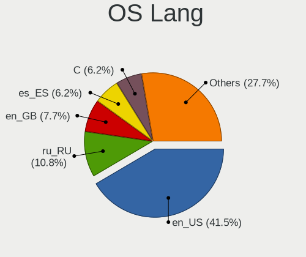
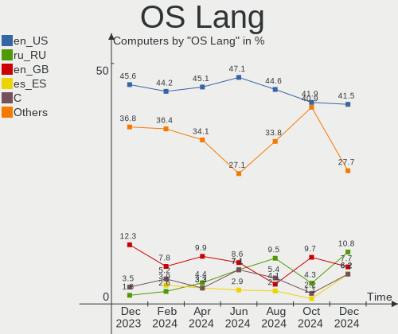
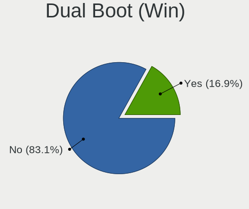
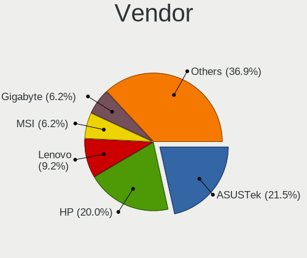
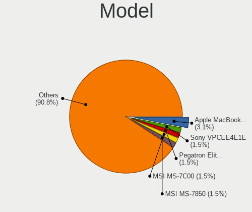
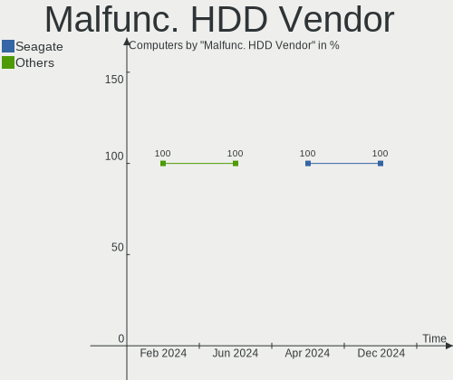
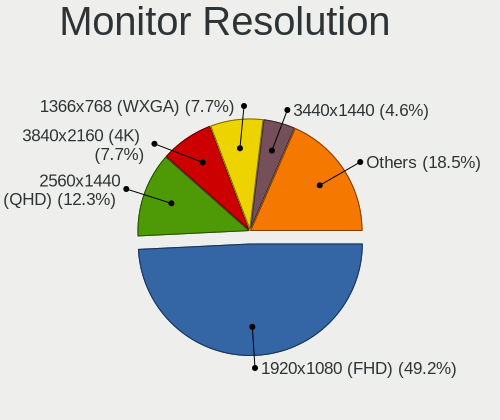
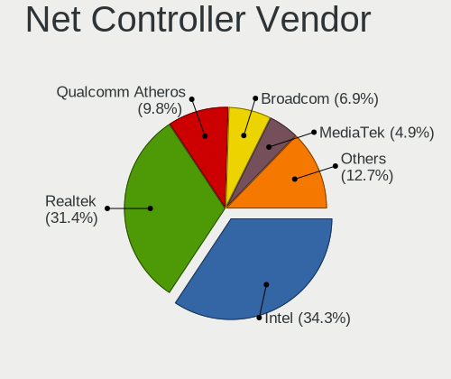
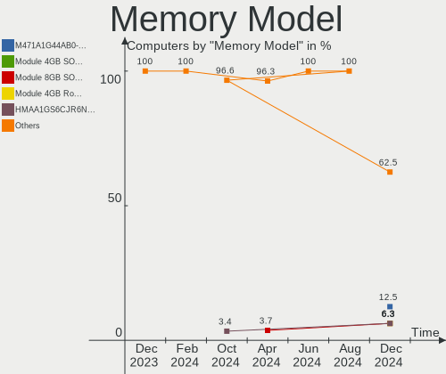

KDE neon Hardware Trends
------------------------

A project to identify most popular hardware characteristics and track their change
over time based on data collected by Linux users at https://Linux-Hardware.org.

Anyone can contribute to this report by the [hw-probe](https://github.com/linuxhw/hw-probe) tool:

    sudo -E hw-probe -all -upload

This is a report for all computer types. See also reports for [desktops](/Dist/KDE_neon/Desktop/README.md) and [notebooks](/Dist/KDE_neon/Notebook/README.md).

Full-feature report is available here: https://linux-hardware.org/?view=trends

Period: Jul, 2021.

Contents
--------

* [ System ](#system)
  - [ OS                       ](#os)
  - [ OS Family                ](#os-family)
  - [ Kernel                   ](#kernel)
  - [ Kernel Family            ](#kernel-family)
  - [ Kernel Major Ver.        ](#kernel-major-ver)
  - [ Arch                     ](#arch)
  - [ DE                       ](#de)
  - [ Display Server           ](#display-server)
  - [ Display Manager          ](#display-manager)
  - [ OS Lang                  ](#os-lang)
  - [ Boot Mode                ](#boot-mode)
  - [ Filesystem               ](#filesystem)
  - [ Part. scheme             ](#part-scheme)
  - [ Dual Boot with Linux/BSD ](#dual-boot-with-linuxbsd)
  - [ Dual Boot (Win)          ](#dual-boot-win)

* [ Board ](#board)
  - [ Vendor                   ](#vendor)
  - [ Model                    ](#model)
  - [ Model Family             ](#model-family)
  - [ MFG Year                 ](#mfg-year)
  - [ Form Factor              ](#form-factor)
  - [ Secure Boot              ](#secure-boot)
  - [ Coreboot                 ](#coreboot)
  - [ RAM Size                 ](#ram-size)
  - [ RAM Used                 ](#ram-used)
  - [ Total Drives             ](#total-drives)
  - [ Has CD-ROM               ](#has-cd-rom)
  - [ Has Ethernet             ](#has-ethernet)
  - [ Has WiFi                 ](#has-wifi)
  - [ Has Bluetooth            ](#has-bluetooth)

* [ Location ](#location)
  - [ Country                  ](#country)
  - [ City                     ](#city)

* [ Drives ](#drives)
  - [ Drive Vendor             ](#drive-vendor)
  - [ Drive Model              ](#drive-model)
  - [ HDD Vendor               ](#hdd-vendor)
  - [ SSD Vendor               ](#ssd-vendor)
  - [ Drive Kind               ](#drive-kind)
  - [ Drive Connector          ](#drive-connector)
  - [ Drive Size               ](#drive-size)
  - [ Space Total              ](#space-total)
  - [ Space Used               ](#space-used)
  - [ Malfunc. Drives          ](#malfunc-drives)
  - [ Malfunc. Drive Vendor    ](#malfunc-drive-vendor)
  - [ Malfunc. HDD Vendor      ](#malfunc-hdd-vendor)
  - [ Malfunc. Drive Kind      ](#malfunc-drive-kind)
  - [ Failed Drives            ](#failed-drives)
  - [ Failed Drive Vendor      ](#failed-drive-vendor)
  - [ Drive Status             ](#drive-status)

* [ Storage controller ](#storage-controller)
  - [ Storage Vendor           ](#storage-vendor)
  - [ Storage Model            ](#storage-model)
  - [ Storage Kind             ](#storage-kind)

* [ Processor ](#processor)
  - [ CPU Vendor               ](#cpu-vendor)
  - [ CPU Model                ](#cpu-model)
  - [ CPU Model Family         ](#cpu-model-family)
  - [ CPU Cores                ](#cpu-cores)
  - [ CPU Sockets              ](#cpu-sockets)
  - [ CPU Threads              ](#cpu-threads)
  - [ CPU Op-Modes             ](#cpu-op-modes)
  - [ CPU Microcode            ](#cpu-microcode)
  - [ CPU Microarch            ](#cpu-microarch)

* [ Graphics ](#graphics)
  - [ GPU Vendor               ](#gpu-vendor)
  - [ GPU Model                ](#gpu-model)
  - [ GPU Combo                ](#gpu-combo)
  - [ GPU Driver               ](#gpu-driver)
  - [ GPU Memory               ](#gpu-memory)

* [ Monitor ](#monitor)
  - [ Monitor Vendor           ](#monitor-vendor)
  - [ Monitor Model            ](#monitor-model)
  - [ Monitor Resolution       ](#monitor-resolution)
  - [ Monitor Diagonal         ](#monitor-diagonal)
  - [ Monitor Width            ](#monitor-width)
  - [ Aspect Ratio             ](#aspect-ratio)
  - [ Monitor Area             ](#monitor-area)
  - [ Pixel Density            ](#pixel-density)
  - [ Multiple Monitors        ](#multiple-monitors)

* [ Network ](#network)
  - [ Net Controller Vendor    ](#net-controller-vendor)
  - [ Net Controller Model     ](#net-controller-model)
  - [ Wireless Vendor          ](#wireless-vendor)
  - [ Wireless Model           ](#wireless-model)
  - [ Ethernet Vendor          ](#ethernet-vendor)
  - [ Ethernet Model           ](#ethernet-model)
  - [ Net Controller Kind      ](#net-controller-kind)
  - [ Used Controller          ](#used-controller)
  - [ NICs                     ](#nics)
  - [ IPv6                     ](#ipv6)

* [ Bluetooth ](#bluetooth)
  - [ Bluetooth Vendor         ](#bluetooth-vendor)
  - [ Bluetooth Model          ](#bluetooth-model)

* [ Sound ](#sound)
  - [ Sound Vendor             ](#sound-vendor)
  - [ Sound Model              ](#sound-model)

* [ Memory ](#memory)
  - [ Memory Vendor            ](#memory-vendor)
  - [ Memory Model             ](#memory-model)
  - [ Memory Kind              ](#memory-kind)
  - [ Memory Form Factor       ](#memory-form-factor)
  - [ Memory Size              ](#memory-size)
  - [ Memory Speed             ](#memory-speed)

* [ Printers & scanners ](#printers-&-scanners)
  - [ Printer Vendor           ](#printer-vendor)
  - [ Printer Model            ](#printer-model)
  - [ Scanner Vendor           ](#scanner-vendor)
  - [ Scanner Model            ](#scanner-model)

* [ Camera ](#camera)
  - [ Camera Vendor            ](#camera-vendor)
  - [ Camera Model             ](#camera-model)

* [ Security ](#security)
  - [ Fingerprint Vendor       ](#fingerprint-vendor)
  - [ Fingerprint Model        ](#fingerprint-model)
  - [ Chipcard Vendor          ](#chipcard-vendor)
  - [ Chipcard Model           ](#chipcard-model)

* [ Unsupported ](#unsupported)
  - [ Unsupported Devices      ](#unsupported-devices)
  - [ Unsupported Device Types ](#unsupported-device-types)

System
------

OS
--

Installed operating systems

| Name           | Computers | Percent |
|----------------|-----------|---------|
| KDE neon 20.04 | 95        | 100%    |

OS Family
---------

OS without a version

| Name     | Computers | Percent |
|----------|-----------|---------|
| KDE neon | 95        | 100%    |

Kernel
------

Version of the Linux kernel

| Version               | Computers | Percent |
|-----------------------|-----------|---------|
| 5.8.0-59-generic      | 65        | 68.42%  |
| 5.8.0-63-generic      | 19        | 20%     |
| 5.4.0-73-generic      | 3         | 3.16%   |
| 5.8.0-55-generic      | 2         | 2.11%   |
| 5.8.0-61-lowlatency   | 1         | 1.05%   |
| 5.4.0-77-generic      | 1         | 1.05%   |
| 5.4.0-64-generic      | 1         | 1.05%   |
| 5.13.2-051302-generic | 1         | 1.05%   |
| 5.13.0-051300-generic | 1         | 1.05%   |
| 5.11.0-22-generic     | 1         | 1.05%   |

Kernel Family
-------------

Linux kernel without a distro release

| Version | Computers | Percent |
|---------|-----------|---------|
| 5.8.0   | 87        | 91.58%  |
| 5.4.0   | 5         | 5.26%   |
| 5.13.2  | 1         | 1.05%   |
| 5.13.0  | 1         | 1.05%   |
| 5.11.0  | 1         | 1.05%   |

Kernel Major Ver.
-----------------

Linux kernel major version

| Version | Computers | Percent |
|---------|-----------|---------|
| 5.8     | 87        | 91.58%  |
| 5.4     | 5         | 5.26%   |
| 5.13    | 2         | 2.11%   |
| 5.11    | 1         | 1.05%   |

Arch
----

OS architecture (x86_64, i586, etc.)

| Name   | Computers | Percent |
|--------|-----------|---------|
| x86_64 | 95        | 100%    |

DE
--

Desktop Environment

| Name    | Computers | Percent |
|---------|-----------|---------|
| KDE     | 77        | 81.05%  |
| KDE5    | 15        | 15.79%  |
| Unknown | 3         | 3.16%   |

Display Server
--------------

X11 or Wayland

| Name    | Computers | Percent |
|---------|-----------|---------|
| X11     | 92        | 96.84%  |
| Wayland | 2         | 2.11%   |
| Tty     | 1         | 1.05%   |

Display Manager
---------------

SDDM, LightDM, etc.

| Name    | Computers | Percent |
|---------|-----------|---------|
| Unknown | 80        | 84.21%  |
| SDDM    | 14        | 14.74%  |
| TDM     | 1         | 1.05%   |

OS Lang
-------

Language

| Lang  | Computers | Percent |
|-------|-----------|---------|
| en_US | 28        | 29.47%  |
| ru_RU | 10        | 10.53%  |
| pt_BR | 7         | 7.37%   |
| en_CA | 5         | 5.26%   |
| de_DE | 5         | 5.26%   |
| C     | 5         | 5.26%   |
| en_IN | 4         | 4.21%   |
| ru_UA | 3         | 3.16%   |
| fr_FR | 3         | 3.16%   |
| es_ES | 3         | 3.16%   |
| en_ZA | 3         | 3.16%   |
| en_GB | 3         | 3.16%   |
| en_AU | 3         | 3.16%   |
| es_MX | 2         | 2.11%   |
| en_PH | 2         | 2.11%   |
| de_CH | 2         | 2.11%   |
| zh_TW | 1         | 1.05%   |
| sv_SE | 1         | 1.05%   |
| it_IT | 1         | 1.05%   |
| es_SV | 1         | 1.05%   |
| es_AR | 1         | 1.05%   |
| en_DK | 1         | 1.05%   |
| da_DK | 1         | 1.05%   |

Boot Mode
---------

EFI or BIOS

| Mode | Computers | Percent |
|------|-----------|---------|
| EFI  | 58        | 61.05%  |
| BIOS | 37        | 38.95%  |

Filesystem
----------

Type of filesystem

| Type    | Computers | Percent |
|---------|-----------|---------|
| Ext4    | 88        | 92.63%  |
| Overlay | 3         | 3.16%   |
| Btrfs   | 3         | 3.16%   |
| Xfs     | 1         | 1.05%   |

Part. scheme
------------

Scheme of partitioning

| Type    | Computers | Percent |
|---------|-----------|---------|
| Unknown | 79        | 83.16%  |
| GPT     | 12        | 12.63%  |
| MBR     | 4         | 4.21%   |

Dual Boot with Linux/BSD
------------------------

Hosting more than one Linux/BSD

| Dual boot | Computers | Percent |
|-----------|-----------|---------|
| No        | 87        | 91.58%  |
| Yes       | 8         | 8.42%   |

Dual Boot (Win)
---------------

Hosting Linux and Windows

| Dual boot | Computers | Percent |
|-----------|-----------|---------|
| No        | 79        | 83.16%  |
| Yes       | 16        | 16.84%  |

Board
-----

Vendor
------

Motherboard manufacturer

| Name                | Computers | Percent |
|---------------------|-----------|---------|
| ASUSTek Computer    | 19        | 20%     |
| Dell                | 13        | 13.68%  |
| Hewlett-Packard     | 12        | 12.63%  |
| Lenovo              | 10        | 10.53%  |
| ASRock              | 9         | 9.47%   |
| Acer                | 7         | 7.37%   |
| Gigabyte Technology | 6         | 6.32%   |
| MSI                 | 4         | 4.21%   |
| Google              | 2         | 2.11%   |
| ECS                 | 2         | 2.11%   |
| Apple               | 2         | 2.11%   |
| Toshiba             | 1         | 1.05%   |
| SLIMBOOK            | 1         | 1.05%   |
| Samsung Electronics | 1         | 1.05%   |
| Razer               | 1         | 1.05%   |
| Notebook            | 1         | 1.05%   |
| Intel               | 1         | 1.05%   |
| eMachines           | 1         | 1.05%   |
| Biostar             | 1         | 1.05%   |
| AMI                 | 1         | 1.05%   |

Model
-----

Motherboard model

| Name                                  | Computers | Percent |
|---------------------------------------|-----------|---------|
| HP Pavilion g6                        | 2         | 2.11%   |
| ASUS X550CL                           | 2         | 2.11%   |
| Toshiba Satellite S40Dt-A             | 1         | 1.05%   |
| SLIMBOOK PRO                          | 1         | 1.05%   |
| Samsung RV411/RV511/E3511/S3511/RV711 | 1         | 1.05%   |
| Razer Blade                           | 1         | 1.05%   |
| Notebook NS50MU                       | 1         | 1.05%   |
| MSI MS-7B89                           | 1         | 1.05%   |
| MSI MS-7A32                           | 1         | 1.05%   |
| MSI MS-7681                           | 1         | 1.05%   |
| MSI MS-7623                           | 1         | 1.05%   |
| Lenovo Yoga C940-14IIL 81Q9           | 1         | 1.05%   |
| Lenovo Y520-15IKBM 80YY               | 1         | 1.05%   |
| Lenovo ThinkPad T470 W10DG 20JNS0VR0B | 1         | 1.05%   |
| Lenovo ThinkPad T14 Gen 2a 20XK001BUS | 1         | 1.05%   |
| Lenovo ThinkPad L14 Gen 1 20U10016MX  | 1         | 1.05%   |
| Lenovo Legion S7 15IMH5 82BC          | 1         | 1.05%   |
| Lenovo IdeaPad Flex 5 14ARE05 81X2    | 1         | 1.05%   |
| Lenovo IdeaPad 330-15AST 81D6         | 1         | 1.05%   |
| Lenovo IdeaPad 320-17IKB 80XM         | 1         | 1.05%   |
| Lenovo FLEX 6-11IGM 81A7              | 1         | 1.05%   |
| Intel DH61WW AAG23116-300             | 1         | 1.05%   |
| HP Z420 Workstation                   | 1         | 1.05%   |
| HP ProBook 445 G7                     | 1         | 1.05%   |
| HP Pavilion 15                        | 1         | 1.05%   |
| HP Laptop 15s-eq0xxx                  | 1         | 1.05%   |
| HP Laptop 15-bs0xx                    | 1         | 1.05%   |
| HP EliteDesk 800 G1 SFF               | 1         | 1.05%   |
| HP EliteBook x360 1030 G3             | 1         | 1.05%   |
| HP EliteBook 8460p                    | 1         | 1.05%   |
| HP Compaq Elite 8300 SFF              | 1         | 1.05%   |
| HP Compaq Elite 8300 CMT              | 1         | 1.05%   |
| Google Cave                           | 1         | 1.05%   |
| Google Candy                          | 1         | 1.05%   |
| Gigabyte Z390 GAMING X                | 1         | 1.05%   |
| Gigabyte P85-D3                       | 1         | 1.05%   |
| Gigabyte H87-HD3                      | 1         | 1.05%   |
| Gigabyte H61M-S1                      | 1         | 1.05%   |
| Gigabyte H310M H                      | 1         | 1.05%   |
| Gigabyte 970A-DS3P FX                 | 1         | 1.05%   |
| eMachines eME732Z                     | 1         | 1.05%   |
| ECS B85H3-M4                          | 1         | 1.05%   |
| ECS A785GM-AD3                        | 1         | 1.05%   |
| Dell XPS 13 9350                      | 1         | 1.05%   |
| Dell Precision Tower 5810             | 1         | 1.05%   |
| Dell OptiPlex 3040                    | 1         | 1.05%   |
| Dell Latitude E6510                   | 1         | 1.05%   |
| Dell Latitude E6440                   | 1         | 1.05%   |
| Dell Latitude E5530 non-vPro          | 1         | 1.05%   |
| Dell Latitude 5590                    | 1         | 1.05%   |
| Dell Inspiron 7500 2n1 Silver         | 1         | 1.05%   |
| Dell Inspiron 7373                    | 1         | 1.05%   |
| Dell Inspiron 5767                    | 1         | 1.05%   |
| Dell Inspiron 5577                    | 1         | 1.05%   |
| Dell Inspiron 5567                    | 1         | 1.05%   |
| Dell Inspiron 15 7000 Gaming          | 1         | 1.05%   |
| Biostar A960D+V3                      | 1         | 1.05%   |
| ASUS X705UDR                          | 1         | 1.05%   |
| ASUS X441BA                           | 1         | 1.05%   |
| ASUS UX430UNR                         | 1         | 1.05%   |

Model Family
------------

Motherboard model prefix

| Name               | Computers | Percent |
|--------------------|-----------|---------|
| Dell Inspiron      | 6         | 6.32%   |
| Acer Aspire        | 5         | 5.26%   |
| Dell Latitude      | 4         | 4.21%   |
| ASUS PRIME         | 4         | 4.21%   |
| Lenovo ThinkPad    | 3         | 3.16%   |
| Lenovo IdeaPad     | 3         | 3.16%   |
| HP Pavilion        | 3         | 3.16%   |
| HP Laptop          | 2         | 2.11%   |
| HP EliteBook       | 2         | 2.11%   |
| HP Compaq          | 2         | 2.11%   |
| ASUS X550CL        | 2         | 2.11%   |
| ASRock 970         | 2         | 2.11%   |
| Toshiba Satellite  | 1         | 1.05%   |
| SLIMBOOK PRO       | 1         | 1.05%   |
| Samsung RV411      | 1         | 1.05%   |
| Razer Blade        | 1         | 1.05%   |
| Notebook NS50MU    | 1         | 1.05%   |
| MSI MS-7B89        | 1         | 1.05%   |
| MSI MS-7A32        | 1         | 1.05%   |
| MSI MS-7681        | 1         | 1.05%   |
| MSI MS-7623        | 1         | 1.05%   |
| Lenovo Yoga        | 1         | 1.05%   |
| Lenovo Y520-15IKBM | 1         | 1.05%   |
| Lenovo Legion      | 1         | 1.05%   |
| Lenovo FLEX        | 1         | 1.05%   |
| Intel DH61WW       | 1         | 1.05%   |
| HP Z420            | 1         | 1.05%   |
| HP ProBook         | 1         | 1.05%   |
| HP EliteDesk       | 1         | 1.05%   |
| Google Cave        | 1         | 1.05%   |
| Google Candy       | 1         | 1.05%   |
| Gigabyte Z390      | 1         | 1.05%   |
| Gigabyte P85-D3    | 1         | 1.05%   |
| Gigabyte H87-HD3   | 1         | 1.05%   |
| Gigabyte H61M-S1   | 1         | 1.05%   |
| Gigabyte H310M     | 1         | 1.05%   |
| Gigabyte 970A-DS3P | 1         | 1.05%   |
| eMachines eME732Z  | 1         | 1.05%   |
| ECS B85H3-M4       | 1         | 1.05%   |
| ECS A785GM-AD3     | 1         | 1.05%   |
| Dell XPS           | 1         | 1.05%   |
| Dell Precision     | 1         | 1.05%   |
| Dell OptiPlex      | 1         | 1.05%   |
| Biostar A960D+V3   | 1         | 1.05%   |
| ASUS X705UDR       | 1         | 1.05%   |
| ASUS X441BA        | 1         | 1.05%   |
| ASUS UX430UNR      | 1         | 1.05%   |
| ASUS U3SG          | 1         | 1.05%   |
| ASUS TUF           | 1         | 1.05%   |
| ASUS ROG           | 1         | 1.05%   |
| ASUS P8P67         | 1         | 1.05%   |
| ASUS P7H55         | 1         | 1.05%   |
| ASUS M5A97         | 1         | 1.05%   |
| ASUS K46CM         | 1         | 1.05%   |
| ASUS G60JX         | 1         | 1.05%   |
| ASUS F2A55-M       | 1         | 1.05%   |
| ASUS ASUS          | 1         | 1.05%   |
| ASRock X470        | 1         | 1.05%   |
| ASRock H110M-DVS   | 1         | 1.05%   |
| ASRock FM2A78M-HD+ | 1         | 1.05%   |

MFG Year
--------

Motherboard manufacture year

| Year    | Computers | Percent |
|---------|-----------|---------|
| 2020    | 20        | 21.05%  |
| 2018    | 11        | 11.58%  |
| 2019    | 10        | 10.53%  |
| 2021    | 8         | 8.42%   |
| 2013    | 7         | 7.37%   |
| 2017    | 6         | 6.32%   |
| 2014    | 6         | 6.32%   |
| 2012    | 6         | 6.32%   |
| 2011    | 6         | 6.32%   |
| 2016    | 5         | 5.26%   |
| 2010    | 5         | 5.26%   |
| 2015    | 3         | 3.16%   |
| 2008    | 1         | 1.05%   |
| Unknown | 1         | 1.05%   |

Form Factor
-----------

Physical design of the computer

| Name        | Computers | Percent |
|-------------|-----------|---------|
| Notebook    | 50        | 52.63%  |
| Desktop     | 38        | 40%     |
| Convertible | 6         | 6.32%   |
| Tablet      | 1         | 1.05%   |

Secure Boot
-----------

Enabled or disabled

| State    | Computers | Percent |
|----------|-----------|---------|
| Disabled | 91        | 95.79%  |
| Enabled  | 4         | 4.21%   |

Coreboot
--------

Have coreboot on board

| Used | Computers | Percent |
|------|-----------|---------|
| No   | 93        | 97.89%  |
| Yes  | 2         | 2.11%   |

RAM Size
--------

Total RAM memory

| Size in GB  | Computers | Percent |
|-------------|-----------|---------|
| 8.01-16.0   | 25        | 26.32%  |
| 16.01-24.0  | 21        | 22.11%  |
| 4.01-8.0    | 20        | 21.05%  |
| 3.01-4.0    | 15        | 15.79%  |
| 32.01-64.0  | 8         | 8.42%   |
| 24.01-32.0  | 4         | 4.21%   |
| 64.01-256.0 | 1         | 1.05%   |
| 1.01-2.0    | 1         | 1.05%   |

RAM Used
--------

Used RAM memory

| Used GB    | Computers | Percent |
|------------|-----------|---------|
| 2.01-3.0   | 33        | 34.74%  |
| 1.01-2.0   | 23        | 24.21%  |
| 4.01-8.0   | 18        | 18.95%  |
| 3.01-4.0   | 13        | 13.68%  |
| 8.01-16.0  | 3         | 3.16%   |
| 0.51-1.0   | 3         | 3.16%   |
| 32.01-64.0 | 1         | 1.05%   |
| 16.01-24.0 | 1         | 1.05%   |

Total Drives
------------

Number of drives on board

| Drives | Computers | Percent |
|--------|-----------|---------|
| 1      | 46        | 48.42%  |
| 2      | 31        | 32.63%  |
| 4      | 8         | 8.42%   |
| 3      | 8         | 8.42%   |
| 6      | 1         | 1.05%   |
| 5      | 1         | 1.05%   |

Has CD-ROM
----------

Has CD-ROM on board

| Presented | Computers | Percent |
|-----------|-----------|---------|
| No        | 63        | 66.32%  |
| Yes       | 32        | 33.68%  |

Has Ethernet
------------

Has Ethernet on board

| Presented | Computers | Percent |
|-----------|-----------|---------|
| Yes       | 78        | 82.11%  |
| No        | 17        | 17.89%  |

Has WiFi
--------

Has WiFi module

| Presented | Computers | Percent |
|-----------|-----------|---------|
| Yes       | 68        | 71.58%  |
| No        | 27        | 28.42%  |

Has Bluetooth
-------------

Has Bluetooth module

| Presented | Computers | Percent |
|-----------|-----------|---------|
| Yes       | 60        | 63.16%  |
| No        | 35        | 36.84%  |

Location
--------

Country
-------

Geographic location (country)

| Country      | Computers | Percent |
|--------------|-----------|---------|
| USA          | 22        | 23.16%  |
| Russia       | 9         | 9.47%   |
| Brazil       | 8         | 8.42%   |
| Ukraine      | 5         | 5.26%   |
| Canada       | 5         | 5.26%   |
| India        | 4         | 4.21%   |
| Germany      | 4         | 4.21%   |
| Australia    | 4         | 4.21%   |
| Thailand     | 3         | 3.16%   |
| Spain        | 3         | 3.16%   |
| South Africa | 3         | 3.16%   |
| France       | 3         | 3.16%   |
| Switzerland  | 2         | 2.11%   |
| Philippines  | 2         | 2.11%   |
| Nepal        | 2         | 2.11%   |
| Mexico       | 2         | 2.11%   |
| Italy        | 2         | 2.11%   |
| Denmark      | 2         | 2.11%   |
| UK           | 1         | 1.05%   |
| Taiwan       | 1         | 1.05%   |
| Sweden       | 1         | 1.05%   |
| Norway       | 1         | 1.05%   |
| Netherlands  | 1         | 1.05%   |
| Iraq         | 1         | 1.05%   |
| El Salvador  | 1         | 1.05%   |
| Czechia      | 1         | 1.05%   |
| Belarus      | 1         | 1.05%   |
| Argentina    | 1         | 1.05%   |

City
----

Geographic location (city)

| City                 | Computers | Percent |
|----------------------|-----------|---------|
| Moscow               | 2         | 2.11%   |
| Cape Town            | 2         | 2.11%   |
| Belo Horizonte       | 2         | 2.11%   |
| Viry-Châtillon      | 1         | 1.05%   |
| Vancouver            | 1         | 1.05%   |
| Toronto              | 1         | 1.05%   |
| Taichung             | 1         | 1.05%   |
| Sulaymaniyah         | 1         | 1.05%   |
| Stephenville         | 1         | 1.05%   |
| St. Petersburg       | 1         | 1.05%   |
| Soisy-sur-Seine      | 1         | 1.05%   |
| Sioux Falls          | 1         | 1.05%   |
| Saratov              | 1         | 1.05%   |
| San Salvador         | 1         | 1.05%   |
| San Fernando         | 1         | 1.05%   |
| Salto de Pirapora    | 1         | 1.05%   |
| Round Rock           | 1         | 1.05%   |
| Rotterdam            | 1         | 1.05%   |
| Rio de Janeiro       | 1         | 1.05%   |
| Ramenskoye           | 1         | 1.05%   |
| Quezon City          | 1         | 1.05%   |
| Pune                 | 1         | 1.05%   |
| Pretoria             | 1         | 1.05%   |
| Prague               | 1         | 1.05%   |
| Porto Alegre         | 1         | 1.05%   |
| Pontevedra           | 1         | 1.05%   |
| Plainfield           | 1         | 1.05%   |
| Piano di Sorrento    | 1         | 1.05%   |
| Phoenix              | 1         | 1.05%   |
| Perugia              | 1         | 1.05%   |
| Perth                | 1         | 1.05%   |
| Panjim               | 1         | 1.05%   |
| Odessa               | 1         | 1.05%   |
| Novosibirsk          | 1         | 1.05%   |
| Nizhniy Novgorod     | 1         | 1.05%   |
| Mjoelby              | 1         | 1.05%   |
| Minsk                | 1         | 1.05%   |
| Min Buri             | 1         | 1.05%   |
| Mexico City          | 1         | 1.05%   |
| Melbourne            | 1         | 1.05%   |
| Maulden              | 1         | 1.05%   |
| Marinka              | 1         | 1.05%   |
| Maribo               | 1         | 1.05%   |
| Madrid               | 1         | 1.05%   |
| Lorena               | 1         | 1.05%   |
| Lakewood             | 1         | 1.05%   |
| Lafayette            | 1         | 1.05%   |
| Krasnoyarsk          | 1         | 1.05%   |
| Krasnokamensk        | 1         | 1.05%   |
| Kolkata              | 1         | 1.05%   |
| Kitchener            | 1         | 1.05%   |
| Khon Kaen            | 1         | 1.05%   |
| Kathmandu            | 1         | 1.05%   |
| Kaniv                | 1         | 1.05%   |
| Izúcar de Matamoros | 1         | 1.05%   |
| Harleysville         | 1         | 1.05%   |
| Grozny               | 1         | 1.05%   |
| Grenoble             | 1         | 1.05%   |
| Fribourg             | 1         | 1.05%   |
| Fredericksburg       | 1         | 1.05%   |

Drives
------

Drive Vendor
------------

Hard drive vendors

| Vendor                    | Computers | Drives | Percent |
|---------------------------|-----------|--------|---------|
| Seagate                   | 23        | 28     | 15.13%  |
| Samsung Electronics       | 23        | 26     | 15.13%  |
| WDC                       | 22        | 29     | 14.47%  |
| Unknown                   | 10        | 12     | 6.58%   |
| Toshiba                   | 9         | 11     | 5.92%   |
| Kingston                  | 9         | 11     | 5.92%   |
| Sandisk                   | 5         | 5      | 3.29%   |
| Crucial                   | 5         | 6      | 3.29%   |
| Micron Technology         | 3         | 6      | 1.97%   |
| SK Hynix                  | 2         | 2      | 1.32%   |
| Silicon Motion            | 2         | 2      | 1.32%   |
| PNY                       | 2         | 2      | 1.32%   |
| Phison                    | 2         | 2      | 1.32%   |
| Netac                     | 2         | 2      | 1.32%   |
| LDLC                      | 2         | 2      | 1.32%   |
| JMicron                   | 2         | 2      | 1.32%   |
| Intel                     | 2         | 3      | 1.32%   |
| HGST                      | 2         | 2      | 1.32%   |
| Hewlett-Packard           | 2         | 2      | 1.32%   |
| A-DATA Technology         | 2         | 2      | 1.32%   |
| USB3.0                    | 1         | 1      | 0.66%   |
| Union Memory (Shenzhen)   | 1         | 1      | 0.66%   |
| Transcend                 | 1         | 1      | 0.66%   |
| SPCC                      | 1         | 1      | 0.66%   |
| Smartbuy                  | 1         | 1      | 0.66%   |
| Realtek Semiconductor     | 1         | 1      | 0.66%   |
| Patriot                   | 1         | 1      | 0.66%   |
| OCZ                       | 1         | 1      | 0.66%   |
| Micron/Crucial Technology | 1         | 1      | 0.66%   |
| Maxone                    | 1         | 1      | 0.66%   |
| LaCie                     | 1         | 1      | 0.66%   |
| KIOXIA                    | 1         | 1      | 0.66%   |
| KingSpec                  | 1         | 1      | 0.66%   |
| KingDian                  | 1         | 1      | 0.66%   |
| HS-SSD-E100               | 1         | 1      | 0.66%   |
| GOODRAM                   | 1         | 1      | 0.66%   |
| Gigabyte Technology       | 1         | 1      | 0.66%   |
| China                     | 1         | 2      | 0.66%   |
| ASMT                      | 1         | 1      | 0.66%   |
| Apple                     | 1         | 1      | 0.66%   |
| Apacer                    | 1         | 1      | 0.66%   |

Drive Model
-----------

Hard drive models

| Model                                        | Computers | Percent |
|----------------------------------------------|-----------|---------|
| Seagate ST1000LM035-1RK172 1TB               | 4         | 2.34%   |
| Kingston SA400S37240G 240GB SSD              | 4         | 2.34%   |
| Unknown MMC Card  64GB                       | 3         | 1.75%   |
| Seagate ST1000DM003-1ER162 1TB               | 3         | 1.75%   |
| Samsung SSD 860 EVO 500GB                    | 3         | 1.75%   |
| Samsung SSD 840 EVO 250GB                    | 3         | 1.75%   |
| Samsung NVMe SSD Drive 512GB                 | 3         | 1.75%   |
| WDC WD30EFRX-68EUZN0 3TB                     | 2         | 1.17%   |
| WDC WD10EZRZ-00HTKB0 1TB                     | 2         | 1.17%   |
| WDC WD10EZEX-00BN5A0 1TB                     | 2         | 1.17%   |
| Unknown MMC Card  32GB                       | 2         | 1.17%   |
| Unknown MMC Card  16GB                       | 2         | 1.17%   |
| Toshiba DT01ACA050 500GB                     | 2         | 1.17%   |
| Seagate ST500DM002-1BD142 500GB              | 2         | 1.17%   |
| Seagate ST2000DM001-1CH164 2TB               | 2         | 1.17%   |
| Seagate ST1000LM024 HN-M101MBB 1TB           | 2         | 1.17%   |
| Seagate ST1000DM003-9YN162 1TB               | 2         | 1.17%   |
| Sandisk NVMe SSD Drive 1TB                   | 2         | 1.17%   |
| Samsung NVMe SSD Drive 256GB                 | 2         | 1.17%   |
| Kingston SA400S37480G 480GB SSD              | 2         | 1.17%   |
| WDC WDS250G2B0A-00SM50 250GB SSD             | 1         | 0.58%   |
| WDC WDS250G1B0B-00AS40 250GB SSD             | 1         | 0.58%   |
| WDC WDS100T2B0A-00SM50 1TB SSD               | 1         | 0.58%   |
| WDC WDBNCE5000PNC 500GB SSD                  | 1         | 0.58%   |
| WDC WD800JD-00LSA5 80GB                      | 1         | 0.58%   |
| WDC WD5000LUCT-63RC2Y0 500GB                 | 1         | 0.58%   |
| WDC WD5000LPVX-80V0TT0 500GB                 | 1         | 0.58%   |
| WDC WD5000LPVX-22V0TT0 500GB                 | 1         | 0.58%   |
| WDC WD5000BPVT-22HXZT1 500GB                 | 1         | 0.58%   |
| WDC WD5000AZRX-00A8LB0 500GB                 | 1         | 0.58%   |
| WDC WD5000AVVS-63ZWB0 500GB                  | 1         | 0.58%   |
| WDC WD5000AAKX-75U6AA0 500GB                 | 1         | 0.58%   |
| WDC WD5000AAKX-22ERMA0 500GB                 | 1         | 0.58%   |
| WDC WD5000AAKX-221CA1 500GB                  | 1         | 0.58%   |
| WDC WD40PURX-64GVNY0 4TB                     | 1         | 0.58%   |
| WDC WD2500BEVT-60ZCT1 250GB                  | 1         | 0.58%   |
| WDC WD20EARX-00PASB0 2TB                     | 1         | 0.58%   |
| WDC WD1600BEVT-22A23T0 160GB                 | 1         | 0.58%   |
| WDC WD10SPZX-00Z10T0 1TB                     | 1         | 0.58%   |
| WDC WD10JPVX-75JC3T0 1TB                     | 1         | 0.58%   |
| WDC WD10EAVS-00D7B1 1TB                      | 1         | 0.58%   |
| WDC WD1002FAEX-00Y9A0 1TB                    | 1         | 0.58%   |
| WDC PC SN730 SDBQNTY-1T00-1001 1TB           | 1         | 0.58%   |
| USB3.0 Super Speed 120GB                     | 1         | 0.58%   |
| Unknown SD/MMC/MS PRO 128GB                  | 1         | 0.58%   |
| Unknown RZX-19SSD6G/120G 120GB               | 1         | 0.58%   |
| Unknown PH5-CE120 120GB                      | 1         | 0.58%   |
| Unknown MMC Card  4GB                        | 1         | 0.58%   |
| Union Memory (Shenzhen) NVMe SSD Drive 256GB | 1         | 0.58%   |
| Transcend TS120GMTS420S 120GB SSD            | 1         | 0.58%   |
| Toshiba TR200 240GB SSD                      | 1         | 0.58%   |
| Toshiba THNSNK128GVN8 M.2 2280 128GB SSD     | 1         | 0.58%   |
| Toshiba MQ01ABD100 1TB                       | 1         | 0.58%   |
| Toshiba MQ01ABD050V 500GB                    | 1         | 0.58%   |
| Toshiba MK6465GSX 640GB                      | 1         | 0.58%   |
| Toshiba MK5065GSX 500GB                      | 1         | 0.58%   |
| Toshiba HDWE150 5TB                          | 1         | 0.58%   |
| Toshiba DT01ACA300 3TB                       | 1         | 0.58%   |
| SPCC Solid State Disk 120GB                  | 1         | 0.58%   |
| Smartbuy SSD 256GB                           | 1         | 0.58%   |

HDD Vendor
----------

Hard disk drive vendors

| Vendor              | Computers | Drives | Percent |
|---------------------|-----------|--------|---------|
| Seagate             | 23        | 28     | 38.98%  |
| WDC                 | 18        | 24     | 30.51%  |
| Toshiba             | 8         | 9      | 13.56%  |
| Samsung Electronics | 3         | 3      | 5.08%   |
| HGST                | 2         | 2      | 3.39%   |
| USB3.0              | 1         | 1      | 1.69%   |
| Maxone              | 1         | 1      | 1.69%   |
| LaCie               | 1         | 1      | 1.69%   |
| Hewlett-Packard     | 1         | 1      | 1.69%   |
| ASMT                | 1         | 1      | 1.69%   |

SSD Vendor
----------

Solid state drive vendors

| Vendor              | Computers | Drives | Percent |
|---------------------|-----------|--------|---------|
| Samsung Electronics | 12        | 14     | 20.34%  |
| Kingston            | 8         | 10     | 13.56%  |
| Crucial             | 5         | 6      | 8.47%   |
| WDC                 | 4         | 4      | 6.78%   |
| Toshiba             | 2         | 2      | 3.39%   |
| SanDisk             | 2         | 2      | 3.39%   |
| PNY                 | 2         | 2      | 3.39%   |
| Netac               | 2         | 2      | 3.39%   |
| Micron Technology   | 2         | 5      | 3.39%   |
| JMicron             | 2         | 2      | 3.39%   |
| A-DATA Technology   | 2         | 2      | 3.39%   |
| Unknown             | 1         | 1      | 1.69%   |
| Transcend           | 1         | 1      | 1.69%   |
| SPCC                | 1         | 1      | 1.69%   |
| Smartbuy            | 1         | 1      | 1.69%   |
| SK Hynix            | 1         | 1      | 1.69%   |
| Patriot             | 1         | 1      | 1.69%   |
| OCZ                 | 1         | 1      | 1.69%   |
| LDLC                | 1         | 1      | 1.69%   |
| KingSpec            | 1         | 1      | 1.69%   |
| KingDian            | 1         | 1      | 1.69%   |
| Intel               | 1         | 1      | 1.69%   |
| Hewlett-Packard     | 1         | 1      | 1.69%   |
| GOODRAM             | 1         | 1      | 1.69%   |
| China               | 1         | 2      | 1.69%   |
| Apple               | 1         | 1      | 1.69%   |
| Apacer              | 1         | 1      | 1.69%   |

Drive Kind
----------

HDD or SSD

| Kind    | Computers | Drives | Percent |
|---------|-----------|--------|---------|
| SSD     | 51        | 68     | 37.78%  |
| HDD     | 48        | 71     | 35.56%  |
| NVMe    | 25        | 27     | 18.52%  |
| MMC     | 7         | 9      | 5.19%   |
| Unknown | 4         | 4      | 2.96%   |

Drive Connector
---------------

SATA, SAS, NVMe, etc.

| Type | Computers | Drives | Percent |
|------|-----------|--------|---------|
| SATA | 76        | 136    | 67.26%  |
| NVMe | 25        | 27     | 22.12%  |
| MMC  | 7         | 9      | 6.19%   |
| SAS  | 5         | 7      | 4.42%   |

Drive Size
----------

Size of hard drive

| Size in TB | Computers | Drives | Percent |
|------------|-----------|--------|---------|
| 0.01-0.5   | 63        | 84     | 58.88%  |
| 0.51-1.0   | 33        | 43     | 30.84%  |
| 1.01-2.0   | 4         | 4      | 3.74%   |
| 2.01-3.0   | 3         | 4      | 2.8%    |
| 3.01-4.0   | 2         | 2      | 1.87%   |
| 4.01-10.0  | 2         | 2      | 1.87%   |

Space Total
-----------

Amount of disk space available on the file system

| Size in GB     | Computers | Percent |
|----------------|-----------|---------|
| 101-250        | 26        | 27.37%  |
| 251-500        | 19        | 20%     |
| 501-1000       | 14        | 14.74%  |
| 1001-2000      | 12        | 12.63%  |
| 1-20           | 8         | 8.42%   |
| More than 3000 | 5         | 5.26%   |
| 21-50          | 4         | 4.21%   |
| Unknown        | 3         | 3.16%   |
| 2001-3000      | 2         | 2.11%   |
| 51-100         | 2         | 2.11%   |

Space Used
----------

Amount of used disk space

| Used GB        | Computers | Percent |
|----------------|-----------|---------|
| 1-20           | 43        | 45.26%  |
| 21-50          | 12        | 12.63%  |
| 101-250        | 8         | 8.42%   |
| 501-1000       | 7         | 7.37%   |
| 251-500        | 6         | 6.32%   |
| 1001-2000      | 5         | 5.26%   |
| 51-100         | 5         | 5.26%   |
| More than 3000 | 3         | 3.16%   |
| 2001-3000      | 3         | 3.16%   |
| Unknown        | 3         | 3.16%   |

Malfunc. Drives
---------------

Drive models with a malfunction

| Model                                 | Computers | Drives | Percent |
|---------------------------------------|-----------|--------|---------|
| WDC WD30EFRX-68EUZN0 3TB              | 1         | 1      | 16.67%  |
| Seagate ST2000DM001-1CH164 2TB        | 1         | 1      | 16.67%  |
| Seagate ST1000LM035-1RK172 1TB        | 1         | 1      | 16.67%  |
| Seagate ST1000LM014-SSHD-8GB          | 1         | 1      | 16.67%  |
| Micron Technology 1100 SATA 512GB SSD | 1         | 4      | 16.67%  |
| HGST HTS725032A7E630 320GB            | 1         | 1      | 16.67%  |

Malfunc. Drive Vendor
---------------------

Vendors of faulty drives

| Vendor            | Computers | Drives | Percent |
|-------------------|-----------|--------|---------|
| Seagate           | 3         | 3      | 50%     |
| WDC               | 1         | 1      | 16.67%  |
| Micron Technology | 1         | 4      | 16.67%  |
| HGST              | 1         | 1      | 16.67%  |

Malfunc. HDD Vendor
-------------------

Vendors of faulty HDD drives

| Vendor  | Computers | Drives | Percent |
|---------|-----------|--------|---------|
| Seagate | 3         | 3      | 60%     |
| WDC     | 1         | 1      | 20%     |
| HGST    | 1         | 1      | 20%     |

Malfunc. Drive Kind
-------------------

Kinds of faulty drives

| Kind | Computers | Drives | Percent |
|------|-----------|--------|---------|
| HDD  | 5         | 5      | 83.33%  |
| SSD  | 1         | 4      | 16.67%  |

Failed Drives
-------------

Failed drive models

Zero info for selected period =(

Failed Drive Vendor
-------------------

Failed drive vendors

Zero info for selected period =(

Drive Status
------------

Number of failed and malfunc. drives

| Status   | Computers | Drives | Percent |
|----------|-----------|--------|---------|
| Detected | 77        | 143    | 77.78%  |
| Works    | 16        | 27     | 16.16%  |
| Malfunc  | 6         | 9      | 6.06%   |

Storage controller
------------------

Storage Vendor
--------------

Storage controller vendors

| Vendor                      | Computers | Percent |
|-----------------------------|-----------|---------|
| Intel                       | 54        | 47.37%  |
| AMD                         | 26        | 22.81%  |
| Samsung Electronics         | 9         | 7.89%   |
| Sandisk                     | 4         | 3.51%   |
| ASMedia Technology          | 4         | 3.51%   |
| Phison Electronics          | 3         | 2.63%   |
| Silicon Motion              | 2         | 1.75%   |
| Marvell Technology Group    | 2         | 1.75%   |
| VIA Technologies            | 1         | 0.88%   |
| Union Memory (Shenzhen)     | 1         | 0.88%   |
| SK Hynix                    | 1         | 0.88%   |
| Realtek Semiconductor       | 1         | 0.88%   |
| Micron/Crucial Technology   | 1         | 0.88%   |
| Micron Technology           | 1         | 0.88%   |
| KIOXIA                      | 1         | 0.88%   |
| Kingston Technology Company | 1         | 0.88%   |
| JMicron Technology          | 1         | 0.88%   |
| Broadcom / LSI              | 1         | 0.88%   |

Storage Model
-------------

Storage controller models

| Model                                                                                   | Computers | Percent |
|-----------------------------------------------------------------------------------------|-----------|---------|
| AMD FCH SATA Controller [AHCI mode]                                                     | 19        | 13.48%  |
| Intel Sunrise Point-LP SATA Controller [AHCI mode]                                      | 8         | 5.67%   |
| AMD 400 Series Chipset SATA Controller                                                  | 7         | 4.96%   |
| Intel 82801 Mobile SATA Controller [RAID mode]                                          | 6         | 4.26%   |
| AMD SB7x0/SB8x0/SB9x0 IDE Controller                                                    | 6         | 4.26%   |
| Intel 7 Series Chipset Family 6-port SATA Controller [AHCI mode]                        | 5         | 3.55%   |
| Intel 8 Series/C220 Series Chipset Family 6-port SATA Controller 1 [AHCI mode]          | 4         | 2.84%   |
| Intel 5 Series/3400 Series Chipset 4 port SATA AHCI Controller                          | 4         | 2.84%   |
| ASMedia ASM1062 Serial ATA Controller                                                   | 4         | 2.84%   |
| AMD SB7x0/SB8x0/SB9x0 SATA Controller [IDE mode]                                        | 4         | 2.84%   |
| Samsung NVMe SSD Controller SM981/PM981/PM983                                           | 3         | 2.13%   |
| Samsung NVMe SSD Controller SM961/PM961/SM963                                           | 3         | 2.13%   |
| Intel HM170/QM170 Chipset SATA Controller [AHCI Mode]                                   | 3         | 2.13%   |
| Intel Cannon Lake PCH SATA AHCI Controller                                              | 3         | 2.13%   |
| Intel 6 Series/C200 Series Chipset Family Desktop SATA Controller (IDE mode, ports 4-5) | 3         | 2.13%   |
| Intel 6 Series/C200 Series Chipset Family 6 port Mobile SATA AHCI Controller            | 3         | 2.13%   |
| Intel 6 Series/C200 Series Chipset Family 6 port Desktop SATA AHCI Controller           | 3         | 2.13%   |
| Sandisk WD Blue SN550 NVMe SSD                                                          | 2         | 1.42%   |
| Sandisk WD Black SN750 / PC SN730 NVMe SSD                                              | 2         | 1.42%   |
| Intel Q170/Q150/B150/H170/H110/Z170/CM236 Chipset SATA Controller [AHCI Mode]           | 2         | 1.42%   |
| Intel C600/X79 series chipset SATA RAID Controller                                      | 2         | 1.42%   |
| Intel Atom Processor E3800 Series SATA AHCI Controller                                  | 2         | 1.42%   |
| Intel 7 Series/C210 Series Chipset Family 6-port SATA Controller [AHCI mode]            | 2         | 1.42%   |
| Intel 6 Series/C200 Series Chipset Family Desktop SATA Controller (IDE mode, ports 0-3) | 2         | 1.42%   |
| Intel 400 Series Chipset Family SATA AHCI Controller                                    | 2         | 1.42%   |
| AMD SB7x0/SB8x0/SB9x0 SATA Controller [AHCI mode]                                       | 2         | 1.42%   |
| VIA VT6415 PATA IDE Host Controller                                                     | 1         | 0.71%   |
| Union Memory (Shenzhen) Non-Volatile memory controller                                  | 1         | 0.71%   |
| SK Hynix BC511                                                                          | 1         | 0.71%   |
| Silicon Motion SM2263EN/SM2263XT SSD Controller                                         | 1         | 0.71%   |
| Silicon Motion SM2262/SM2262EN SSD Controller                                           | 1         | 0.71%   |
| Samsung NVMe SSD Controller SM951/PM951                                                 | 1         | 0.71%   |
| Samsung NVMe SSD Controller PM9A1/PM9A3/980PRO                                          | 1         | 0.71%   |
| Samsung Apple PCIe SSD                                                                  | 1         | 0.71%   |
| Realtek RTS5763DL NVMe SSD Controller                                                   | 1         | 0.71%   |
| Phison PS5013 E13 NVMe Controller                                                       | 1         | 0.71%   |
| Phison E16 PCIe4 NVMe Controller                                                        | 1         | 0.71%   |
| Phison E12 NVMe Controller                                                              | 1         | 0.71%   |
| Micron/Crucial P2 NVMe PCIe SSD                                                         | 1         | 0.71%   |
| Micron Non-Volatile memory controller                                                   | 1         | 0.71%   |
| Marvell Group 88SE91A3 SATA-600 Controller                                              | 1         | 0.71%   |
| Marvell Group 88SE912x IDE Controller                                                   | 1         | 0.71%   |
| Marvell Group 88SE9120 SATA 6Gb/s Controller                                            | 1         | 0.71%   |
| KIOXIA Non-Volatile memory controller                                                   | 1         | 0.71%   |
| Kingston Company Company Non-Volatile memory controller                                 | 1         | 0.71%   |
| JMicron JMB360 AHCI Controller                                                          | 1         | 0.71%   |
| Intel Wildcat Point-LP SATA Controller [AHCI Mode]                                      | 1         | 0.71%   |
| Intel Non-Volatile memory controller                                                    | 1         | 0.71%   |
| Intel Celeron/Pentium Silver Processor SATA Controller                                  | 1         | 0.71%   |
| Intel C610/X99 series chipset sSATA Controller [AHCI mode]                              | 1         | 0.71%   |
| Intel C602 chipset 4-Port SATA Storage Control Unit                                     | 1         | 0.71%   |
| Intel C600/X79 series chipset IDE-r Controller                                          | 1         | 0.71%   |
| Intel 82801HM/HEM (ICH8M/ICH8M-E) SATA Controller [AHCI mode]                           | 1         | 0.71%   |
| Intel 82801HM/HEM (ICH8M/ICH8M-E) IDE Controller                                        | 1         | 0.71%   |
| Intel 5 Series/3400 Series Chipset 4 port SATA IDE Controller                           | 1         | 0.71%   |
| Intel 5 Series/3400 Series Chipset 2 port SATA IDE Controller                           | 1         | 0.71%   |
| Broadcom / LSI SAS2308 PCI-Express Fusion-MPT SAS-2                                     | 1         | 0.71%   |
| AMD X370 Series Chipset SATA Controller                                                 | 1         | 0.71%   |
| AMD SB7x0/SB8x0/SB9x0 SATA Controller [RAID5 mode]                                      | 1         | 0.71%   |
| AMD FCH IDE Controller                                                                  | 1         | 0.71%   |

Storage Kind
------------

Kind of storage controller (IDE, SATA, NVMe, SAS, ...)

| Kind | Computers | Percent |
|------|-----------|---------|
| SATA | 72        | 60%     |
| NVMe | 25        | 20.83%  |
| IDE  | 13        | 10.83%  |
| RAID | 9         | 7.5%    |
| SAS  | 1         | 0.83%   |

Processor
---------

CPU Vendor
----------

Processor vendors

| Vendor | Computers | Percent |
|--------|-----------|---------|
| Intel  | 66        | 69.47%  |
| AMD    | 29        | 30.53%  |

CPU Model
---------

Processor models

| Model                                  | Computers | Percent |
|----------------------------------------|-----------|---------|
| Intel Core i7-8550U CPU @ 1.80GHz      | 3         | 3.16%   |
| Intel Core i7-7700HQ CPU @ 2.80GHz     | 3         | 3.16%   |
| Intel Core i7-7500U CPU @ 2.70GHz      | 3         | 3.16%   |
| Intel Core i7-1065G7 CPU @ 1.30GHz     | 2         | 2.11%   |
| Intel Core i5-10300H CPU @ 2.50GHz     | 2         | 2.11%   |
| Intel Celeron CPU N2840 @ 2.16GHz      | 2         | 2.11%   |
| AMD Ryzen 5 4500U with Radeon Graphics | 2         | 2.11%   |
| AMD Ryzen 5 2600 Six-Core Processor    | 2         | 2.11%   |
| AMD FX-8350 Eight-Core Processor       | 2         | 2.11%   |
| AMD FX-6300 Six-Core Processor         | 2         | 2.11%   |
| AMD Athlon II X4 640 Processor         | 2         | 2.11%   |
| Intel Xeon CPU E5-2640 v3 @ 2.60GHz    | 1         | 1.05%   |
| Intel Xeon CPU E5-1620 0 @ 3.60GHz     | 1         | 1.05%   |
| Intel Pentium CPU P6200 @ 2.13GHz      | 1         | 1.05%   |
| Intel Pentium CPU N3530 @ 2.16GHz      | 1         | 1.05%   |
| Intel Pentium CPU G4400 @ 3.30GHz      | 1         | 1.05%   |
| Intel Pentium CPU 2117U @ 1.80GHz      | 1         | 1.05%   |
| Intel Core m3-6Y30 CPU @ 0.90GHz       | 1         | 1.05%   |
| Intel Core i7-8700 CPU @ 3.20GHz       | 1         | 1.05%   |
| Intel Core i7-8650U CPU @ 1.90GHz      | 1         | 1.05%   |
| Intel Core i7-4790K CPU @ 4.00GHz      | 1         | 1.05%   |
| Intel Core i7-4790 CPU @ 3.60GHz       | 1         | 1.05%   |
| Intel Core i7-4750HQ CPU @ 2.00GHz     | 1         | 1.05%   |
| Intel Core i7-3770 CPU @ 3.40GHz       | 1         | 1.05%   |
| Intel Core i7-3517U CPU @ 1.90GHz      | 1         | 1.05%   |
| Intel Core i7-2600 CPU @ 3.40GHz       | 1         | 1.05%   |
| Intel Core i7-10750H CPU @ 2.60GHz     | 1         | 1.05%   |
| Intel Core i7-10510U CPU @ 1.80GHz     | 1         | 1.05%   |
| Intel Core i7 CPU Q 720 @ 1.60GHz      | 1         | 1.05%   |
| Intel Core i5-9400F CPU @ 2.90GHz      | 1         | 1.05%   |
| Intel Core i5-8500 CPU @ 3.00GHz       | 1         | 1.05%   |
| Intel Core i5-8250U CPU @ 1.60GHz      | 1         | 1.05%   |
| Intel Core i5-7300HQ CPU @ 2.50GHz     | 1         | 1.05%   |
| Intel Core i5-7200U CPU @ 2.50GHz      | 1         | 1.05%   |
| Intel Core i5-6500 CPU @ 3.20GHz       | 1         | 1.05%   |
| Intel Core i5-6300U CPU @ 2.40GHz      | 1         | 1.05%   |
| Intel Core i5-6200U CPU @ 2.30GHz      | 1         | 1.05%   |
| Intel Core i5-5200U CPU @ 2.20GHz      | 1         | 1.05%   |
| Intel Core i5-4670 CPU @ 3.40GHz       | 1         | 1.05%   |
| Intel Core i5-4570 CPU @ 3.20GHz       | 1         | 1.05%   |
| Intel Core i5-4300M CPU @ 2.60GHz      | 1         | 1.05%   |
| Intel Core i5-3470 CPU @ 3.20GHz       | 1         | 1.05%   |
| Intel Core i5-3450 CPU @ 3.10GHz       | 1         | 1.05%   |
| Intel Core i5-3337U CPU @ 1.80GHz      | 1         | 1.05%   |
| Intel Core i5-2520M CPU @ 2.50GHz      | 1         | 1.05%   |
| Intel Core i5-2500K CPU @ 3.30GHz      | 1         | 1.05%   |
| Intel Core i5-2415M CPU @ 2.30GHz      | 1         | 1.05%   |
| Intel Core i5-2410M CPU @ 2.30GHz      | 1         | 1.05%   |
| Intel Core i5-10400F CPU @ 2.90GHz     | 1         | 1.05%   |
| Intel Core i5 CPU M 560 @ 2.67GHz      | 1         | 1.05%   |
| Intel Core i5 CPU M 520 @ 2.40GHz      | 1         | 1.05%   |
| Intel Core i5 CPU 760 @ 2.80GHz        | 1         | 1.05%   |
| Intel Core i3-6006U CPU @ 2.00GHz      | 1         | 1.05%   |
| Intel Core i3-2370M CPU @ 2.40GHz      | 1         | 1.05%   |
| Intel Core i3-2328M CPU @ 2.20GHz      | 1         | 1.05%   |
| Intel Core i3 CPU M 350 @ 2.27GHz      | 1         | 1.05%   |
| Intel Core 2 Duo CPU T8300 @ 2.40GHz   | 1         | 1.05%   |
| Intel Celeron N4000 CPU @ 1.10GHz      | 1         | 1.05%   |
| Intel Celeron CPU G530 @ 2.40GHz       | 1         | 1.05%   |
| Intel Atom x7-Z8700 CPU @ 1.60GHz      | 1         | 1.05%   |

CPU Model Family
----------------

Processor model prefix

| Model            | Computers | Percent |
|------------------|-----------|---------|
| Intel Core i5    | 25        | 26.32%  |
| Intel Core i7    | 22        | 23.16%  |
| AMD Ryzen 5      | 8         | 8.42%   |
| AMD Ryzen 7      | 5         | 5.26%   |
| AMD FX           | 5         | 5.26%   |
| Intel Pentium    | 4         | 4.21%   |
| Intel Core i3    | 4         | 4.21%   |
| Intel Celeron    | 4         | 4.21%   |
| Other            | 2         | 2.11%   |
| Intel Xeon       | 2         | 2.11%   |
| Intel Atom       | 2         | 2.11%   |
| AMD Athlon II X4 | 2         | 2.11%   |
| AMD A8           | 2         | 2.11%   |
| AMD A10          | 2         | 2.11%   |
| Intel Core m3    | 1         | 1.05%   |
| Intel Core 2 Duo | 1         | 1.05%   |
| AMD Ryzen 7 PRO  | 1         | 1.05%   |
| AMD Ryzen 3      | 1         | 1.05%   |
| AMD A6           | 1         | 1.05%   |
| AMD A4           | 1         | 1.05%   |

CPU Cores
---------

Number of processor cores

| Number | Computers | Percent |
|--------|-----------|---------|
| 4      | 42        | 44.21%  |
| 2      | 34        | 35.79%  |
| 6      | 12        | 12.63%  |
| 8      | 5         | 5.26%   |
| 3      | 2         | 2.11%   |

CPU Sockets
-----------

Number of sockets

| Number | Computers | Percent |
|--------|-----------|---------|
| 1      | 95        | 100%    |

CPU Threads
-----------

Threads per core (Hyper-Threading)

| Number | Computers | Percent |
|--------|-----------|---------|
| 2      | 66        | 69.47%  |
| 1      | 29        | 30.53%  |

CPU Op-Modes
------------

CPU Operation Modes (32-bit, 64-bit)

| Op mode        | Computers | Percent |
|----------------|-----------|---------|
| 32-bit, 64-bit | 95        | 100%    |

CPU Microcode
-------------

Microcode number

| Number     | Computers | Percent |
|------------|-----------|---------|
| Unknown    | 7         | 7.37%   |
| 0x306a9    | 6         | 6.32%   |
| 0x206a7    | 6         | 6.32%   |
| 0x306c3    | 5         | 5.26%   |
| 0x06000852 | 5         | 5.26%   |
| 0x806ea    | 4         | 4.21%   |
| 0x806e9    | 4         | 4.21%   |
| 0x406e3    | 4         | 4.21%   |
| 0x20655    | 4         | 4.21%   |
| 0x06001119 | 4         | 4.21%   |
| 0x906ea    | 3         | 3.16%   |
| 0x906e9    | 3         | 3.16%   |
| 0x30678    | 3         | 3.16%   |
| 0x0800820d | 3         | 3.16%   |
| 0xa0652    | 2         | 2.11%   |
| 0x506e3    | 2         | 2.11%   |
| 0x106e5    | 2         | 2.11%   |
| 0x08701021 | 2         | 2.11%   |
| 0x08600106 | 2         | 2.11%   |
| 0x06006705 | 2         | 2.11%   |
| 0xa0655    | 1         | 1.05%   |
| 0x806ec    | 1         | 1.05%   |
| 0x806c1    | 1         | 1.05%   |
| 0x706e5    | 1         | 1.05%   |
| 0x706a1    | 1         | 1.05%   |
| 0x406c4    | 1         | 1.05%   |
| 0x406c3    | 1         | 1.05%   |
| 0x40661    | 1         | 1.05%   |
| 0x306f2    | 1         | 1.05%   |
| 0x306d4    | 1         | 1.05%   |
| 0x206d7    | 1         | 1.05%   |
| 0x10676    | 1         | 1.05%   |
| 0x0a50000c | 1         | 1.05%   |
| 0x08701013 | 1         | 1.05%   |
| 0x08600104 | 1         | 1.05%   |
| 0x08108109 | 1         | 1.05%   |
| 0x08108102 | 1         | 1.05%   |
| 0x0810100b | 1         | 1.05%   |
| 0x08001138 | 1         | 1.05%   |
| 0x08001137 | 1         | 1.05%   |
| 0x07030105 | 1         | 1.05%   |
| 0x010000c8 | 1         | 1.05%   |

CPU Microarch
-------------

Microarchitecture

| Name          | Computers | Percent |
|---------------|-----------|---------|
| KabyLake      | 17        | 17.89%  |
| SandyBridge   | 9         | 9.47%   |
| Piledriver    | 9         | 9.47%   |
| Haswell       | 7         | 7.37%   |
| Zen 2         | 6         | 6.32%   |
| Skylake       | 6         | 6.32%   |
| IvyBridge     | 6         | 6.32%   |
| Zen+          | 5         | 5.26%   |
| Silvermont    | 5         | 5.26%   |
| Westmere      | 4         | 4.21%   |
| CometLake     | 4         | 4.21%   |
| Zen           | 3         | 3.16%   |
| Nehalem       | 2         | 2.11%   |
| K10           | 2         | 2.11%   |
| IceLake       | 2         | 2.11%   |
| Excavator     | 2         | 2.11%   |
| Zen 3         | 1         | 1.05%   |
| TigerLake     | 1         | 1.05%   |
| Puma          | 1         | 1.05%   |
| Penryn        | 1         | 1.05%   |
| Goldmont plus | 1         | 1.05%   |
| Broadwell     | 1         | 1.05%   |

Graphics
--------

GPU Vendor
----------

Vendors of graphics cards

| Vendor | Computers | Percent |
|--------|-----------|---------|
| Intel  | 52        | 45.61%  |
| Nvidia | 33        | 28.95%  |
| AMD    | 29        | 25.44%  |

GPU Model
---------

Graphics card models

| Model                                                                                    | Computers | Percent |
|------------------------------------------------------------------------------------------|-----------|---------|
| Intel 2nd Generation Core Processor Family Integrated Graphics Controller                | 6         | 5.08%   |
| Intel UHD Graphics 620                                                                   | 5         | 4.24%   |
| AMD Ellesmere [Radeon RX 470/480/570/570X/580/580X/590]                                  | 5         | 4.24%   |
| Intel HD Graphics 630                                                                    | 4         | 3.39%   |
| Intel HD Graphics 620                                                                    | 4         | 3.39%   |
| Intel Core Processor Integrated Graphics Controller                                      | 4         | 3.39%   |
| Nvidia GP107M [GeForce GTX 1050 Mobile]                                                  | 3         | 2.54%   |
| Intel Xeon E3-1200 v3/4th Gen Core Processor Integrated Graphics Controller              | 3         | 2.54%   |
| Intel Skylake GT2 [HD Graphics 520]                                                      | 3         | 2.54%   |
| Intel CometLake-H GT2 [UHD Graphics]                                                     | 3         | 2.54%   |
| Intel Atom Processor Z36xxx/Z37xxx Series Graphics & Display                             | 3         | 2.54%   |
| Intel 3rd Gen Core processor Graphics Controller                                         | 3         | 2.54%   |
| AMD Renoir                                                                               | 3         | 2.54%   |
| Nvidia TU116M [GeForce GTX 1660 Ti Mobile]                                               | 2         | 1.69%   |
| Nvidia GP108 [GeForce GT 1030]                                                           | 2         | 1.69%   |
| Nvidia GP107 [GeForce GTX 1050 Ti]                                                       | 2         | 1.69%   |
| Nvidia GP106M [GeForce GTX 1060 Mobile]                                                  | 2         | 1.69%   |
| Nvidia GF117M [GeForce 610M/710M/810M/820M / GT 620M/625M/630M/720M]                     | 2         | 1.69%   |
| Intel Iris Plus Graphics G7                                                              | 2         | 1.69%   |
| Intel Atom/Celeron/Pentium Processor x5-E8000/J3xxx/N3xxx Integrated Graphics Controller | 2         | 1.69%   |
| AMD Topaz XT [Radeon R7 M260/M265 / M340/M360 / M440/M445 / 530/535 / 620/625 Mobile]    | 2         | 1.69%   |
| AMD Stoney [Radeon R2/R3/R4/R5 Graphics]                                                 | 2         | 1.69%   |
| AMD Picasso                                                                              | 2         | 1.69%   |
| AMD Baffin [Radeon RX 460/560D / Pro 450/455/460/555/555X/560/560X]                      | 2         | 1.69%   |
| Nvidia TU117M [GeForce GTX 1650 Ti Mobile]                                               | 1         | 0.85%   |
| Nvidia TU117M [GeForce GTX 1650 Mobile / Max-Q]                                          | 1         | 0.85%   |
| Nvidia TU117 [GeForce GTX 1650]                                                          | 1         | 0.85%   |
| Nvidia TU116 [GeForce GTX 1660]                                                          | 1         | 0.85%   |
| Nvidia TU116 [GeForce GTX 1660 SUPER]                                                    | 1         | 0.85%   |
| Nvidia GT215M [GeForce GTS 360M]                                                         | 1         | 0.85%   |
| Nvidia GP107GL [Quadro P620]                                                             | 1         | 0.85%   |
| Nvidia GP107 [GeForce GTX 1050]                                                          | 1         | 0.85%   |
| Nvidia GP104GL [Quadro P4000]                                                            | 1         | 0.85%   |
| Nvidia GP104 [GeForce GTX 1070 Ti]                                                       | 1         | 0.85%   |
| Nvidia GM108M [GeForce 920MX]                                                            | 1         | 0.85%   |
| Nvidia GM108M [GeForce 830M]                                                             | 1         | 0.85%   |
| Nvidia GM107GL [Quadro K2200]                                                            | 1         | 0.85%   |
| Nvidia GK208B [GeForce GT 710]                                                           | 1         | 0.85%   |
| Nvidia GK106 [GeForce GTX 650 Ti]                                                        | 1         | 0.85%   |
| Nvidia GK104 [GeForce GTX 660 Ti]                                                        | 1         | 0.85%   |
| Nvidia GF114 [GeForce GTX 560]                                                           | 1         | 0.85%   |
| Nvidia GF108M [GeForce GT 635M]                                                          | 1         | 0.85%   |
| Nvidia GF108GL [Quadro 600]                                                              | 1         | 0.85%   |
| Nvidia GF108 [GeForce GT 730]                                                            | 1         | 0.85%   |
| Nvidia GF108 [GeForce GT 630]                                                            | 1         | 0.85%   |
| Nvidia G96C [GeForce 9500 GT]                                                            | 1         | 0.85%   |
| Intel Xeon E3-1200 v2/3rd Gen Core processor Graphics Controller                         | 1         | 0.85%   |
| Intel TigerLake-LP GT2 [Iris Xe Graphics]                                                | 1         | 0.85%   |
| Intel Mobile GM965/GL960 Integrated Graphics Controller (secondary)                      | 1         | 0.85%   |
| Intel Mobile GM965/GL960 Integrated Graphics Controller (primary)                        | 1         | 0.85%   |
| Intel HD Graphics 5500                                                                   | 1         | 0.85%   |
| Intel HD Graphics 530                                                                    | 1         | 0.85%   |
| Intel HD Graphics 515                                                                    | 1         | 0.85%   |
| Intel GeminiLake [UHD Graphics 600]                                                      | 1         | 0.85%   |
| Intel Crystal Well Integrated Graphics Controller                                        | 1         | 0.85%   |
| Intel CometLake-U GT2 [UHD Graphics]                                                     | 1         | 0.85%   |
| Intel 4th Gen Core Processor Integrated Graphics Controller                              | 1         | 0.85%   |
| AMD Turks [Radeon HD 7600 Series]                                                        | 1         | 0.85%   |
| AMD Turks PRO [Radeon HD 7570]                                                           | 1         | 0.85%   |
| AMD Trinity [Radeon HD 7660G]                                                            | 1         | 0.85%   |

GPU Combo
---------

Combinations of graphics cards

| Name             | Computers | Percent |
|------------------|-----------|---------|
| 1 x Intel        | 35        | 36.84%  |
| 1 x AMD          | 22        | 23.16%  |
| 1 x Nvidia       | 17        | 17.89%  |
| Intel + Nvidia   | 13        | 13.68%  |
| Intel + AMD      | 4         | 4.21%   |
| 2 x Nvidia       | 1         | 1.05%   |
| 2 x AMD          | 1         | 1.05%   |
| AMD + 2 x Nvidia | 1         | 1.05%   |
| AMD + Nvidia     | 1         | 1.05%   |

GPU Driver
----------

Free vs proprietary

| Driver      | Computers | Percent |
|-------------|-----------|---------|
| Free        | 87        | 91.58%  |
| Proprietary | 5         | 5.26%   |
| Unknown     | 3         | 3.16%   |

GPU Memory
----------

Total video memory

| Size in GB | Computers | Percent |
|------------|-----------|---------|
| Unknown    | 43        | 45.26%  |
| 3.01-4.0   | 14        | 14.74%  |
| 1.01-2.0   | 11        | 11.58%  |
| 0.51-1.0   | 11        | 11.58%  |
| 0.01-0.5   | 6         | 6.32%   |
| 7.01-8.0   | 5         | 5.26%   |
| 5.01-6.0   | 5         | 5.26%   |

Monitor
-------

Monitor Vendor
--------------

Monitor vendors

| Vendor                  | Computers | Percent |
|-------------------------|-----------|---------|
| AU Optronics            | 14        | 13.46%  |
| Samsung Electronics     | 11        | 10.58%  |
| LG Display              | 11        | 10.58%  |
| Chimei Innolux          | 11        | 10.58%  |
| Goldstar                | 9         | 8.65%   |
| Dell                    | 7         | 6.73%   |
| Hewlett-Packard         | 5         | 4.81%   |
| BOE                     | 5         | 4.81%   |
| BenQ                    | 4         | 3.85%   |
| Chi Mei Optoelectronics | 3         | 2.88%   |
| Apple                   | 3         | 2.88%   |
| Ancor Communications    | 3         | 2.88%   |
| Acer                    | 3         | 2.88%   |
| ASUSTek Computer        | 2         | 1.92%   |
| WXM                     | 1         | 0.96%   |
| Vizio                   | 1         | 0.96%   |
| ViewSonic               | 1         | 0.96%   |
| VIE                     | 1         | 0.96%   |
| Sharp                   | 1         | 0.96%   |
| Philips                 | 1         | 0.96%   |
| PANDA                   | 1         | 0.96%   |
| LG Electronics          | 1         | 0.96%   |
| LDLC                    | 1         | 0.96%   |
| InfoVision              | 1         | 0.96%   |
| HannStar                | 1         | 0.96%   |
| Daewoo                  | 1         | 0.96%   |
| AOC                     | 1         | 0.96%   |

Monitor Model
-------------

Monitor models

| Model                                                                    | Computers | Percent |
|--------------------------------------------------------------------------|-----------|---------|
| Chi Mei Optoelectronics LCD Monitor CMO15A7 1366x768 350x190mm 15.7-inch | 2         | 1.85%   |
| AU Optronics LCD Monitor AUO235C 1366x768 260x140mm 11.6-inch            | 2         | 1.85%   |
| ASUSTek Computer VG278 AUS2720 1920x1080 598x336mm 27.0-inch             | 2         | 1.85%   |
| WXM AAAA WXM2380 1920x1080 368x207mm 16.6-inch                           | 1         | 0.93%   |
| Vizio D32h-F0 VIZ1028 1366x768 698x392mm 31.5-inch                       | 1         | 0.93%   |
| ViewSonic VA2038 SERIES VSC6C26 1600x900 443x249mm 20.0-inch             | 1         | 0.93%   |
| VIE R200S VIE2020 1920x1080 520x320mm 24.0-inch                          | 1         | 0.93%   |
| Sharp LCD Monitor SHP144A 3200x1800 294x165mm 13.3-inch                  | 1         | 0.93%   |
| Samsung Electronics SyncMaster SAM0589 1920x1080 521x293mm 23.5-inch     | 1         | 0.93%   |
| Samsung Electronics SyncMaster SAM02D9 1680x1050 433x271mm 20.1-inch     | 1         | 0.93%   |
| Samsung Electronics SMB2230 SAM063F 1920x1080 477x268mm 21.5-inch        | 1         | 0.93%   |
| Samsung Electronics SA300/SA350 SAM0791 1920x1080 510x287mm 23.0-inch    | 1         | 0.93%   |
| Samsung Electronics S27F350 SAM0D22 1920x1080 598x336mm 27.0-inch        | 1         | 0.93%   |
| Samsung Electronics S24D300 SAM0B45 1920x1080 521x293mm 23.5-inch        | 1         | 0.93%   |
| Samsung Electronics LCD Monitor SEC544B 1600x900 382x214mm 17.2-inch     | 1         | 0.93%   |
| Samsung Electronics LCD Monitor SEC494A 1366x768 344x193mm 15.5-inch     | 1         | 0.93%   |
| Samsung Electronics LCD Monitor SEC334A 1366x768 340x190mm 15.3-inch     | 1         | 0.93%   |
| Samsung Electronics LCD Monitor SAM0B7C 1920x1080 886x498mm 40.0-inch    | 1         | 0.93%   |
| Samsung Electronics C32F391 SAM0D35 1920x1080 698x393mm 31.5-inch        | 1         | 0.93%   |
| Samsung Electronics C24F390 SAM0D2C 1920x1080 520x290mm 23.4-inch        | 1         | 0.93%   |
| Philips LCD Monitor PHL 246E9Q 1920x1080                                 | 1         | 0.93%   |
| PANDA LCD Monitor NCP002D 1920x1080 344x194mm 15.5-inch                  | 1         | 0.93%   |
| LG Electronics LCD Monitor LG IPS FULLHD 1920x1080                       | 1         | 0.93%   |
| LG Display LCD Monitor LGD066D 1920x1080 344x194mm 15.5-inch             | 1         | 0.93%   |
| LG Display LCD Monitor LGD062C 1920x1080 309x174mm 14.0-inch             | 1         | 0.93%   |
| LG Display LCD Monitor LGD061E 1920x1080 344x194mm 15.5-inch             | 1         | 0.93%   |
| LG Display LCD Monitor LGD0612 1920x1080 344x194mm 15.5-inch             | 1         | 0.93%   |
| LG Display LCD Monitor LGD053F 1920x1080 344x194mm 15.5-inch             | 1         | 0.93%   |
| LG Display LCD Monitor LGD0513 1920x1080 382x215mm 17.3-inch             | 1         | 0.93%   |
| LG Display LCD Monitor LGD033F 1366x768 309x174mm 14.0-inch              | 1         | 0.93%   |
| LG Display LCD Monitor LGD0335 1366x768 310x174mm 14.0-inch              | 1         | 0.93%   |
| LG Display LCD Monitor LGD02F8 1366x768 309x174mm 14.0-inch              | 1         | 0.93%   |
| LG Display LCD Monitor LGD02F2 1366x768 344x194mm 15.5-inch              | 1         | 0.93%   |
| LG Display LCD Monitor LGD028D 1366x768 310x174mm 14.0-inch              | 1         | 0.93%   |
| LDLC RS32 LDL3200 2560x1440 708x398mm 32.0-inch                          | 1         | 0.93%   |
| InfoVision LCD Monitor IVO048E 1366x768 256x144mm 11.6-inch              | 1         | 0.93%   |
| Hewlett-Packard VH240a HPN3499 1920x1080 527x296mm 23.8-inch             | 1         | 0.93%   |
| Hewlett-Packard V270 HPN3521 1920x1080 598x336mm 27.0-inch               | 1         | 0.93%   |
| Hewlett-Packard S231d HWP313F 1920x1080 510x287mm 23.0-inch              | 1         | 0.93%   |
| Hewlett-Packard LV2311 HWP300E 1920x1080 510x287mm 23.0-inch             | 1         | 0.93%   |
| Hewlett-Packard LE1901w HWP2842 1440x900 410x256mm 19.0-inch             | 1         | 0.93%   |
| Hewlett-Packard E223 HPN345C 1920x1080 476x268mm 21.5-inch               | 1         | 0.93%   |
| HannStar HSG1074 HSP0019 1920x1080 543x305mm 24.5-inch                   | 1         | 0.93%   |
| Goldstar W2043 GSM4E9D 1600x900 443x249mm 20.0-inch                      | 1         | 0.93%   |
| Goldstar SIGNAGE GSM9E77 1920x1080 1215x686mm 54.9-inch                  | 1         | 0.93%   |
| Goldstar LG ULTRAWIDE GSM59F1 1920x1080 580x240mm 24.7-inch              | 1         | 0.93%   |
| Goldstar E1941 GSM4BF0 1024x768 410x230mm 18.5-inch                      | 1         | 0.93%   |
| Goldstar D2343 GSM592A 1920x1080 500x280mm 22.6-inch                     | 1         | 0.93%   |
| Goldstar 2D FHD LG TV GSM59C6 1920x1080 509x286mm 23.0-inch              | 1         | 0.93%   |
| Goldstar 24MP55 GSM5A1F 1920x1080 510x290mm 23.1-inch                    | 1         | 0.93%   |
| Goldstar 22MP55 GSM5A25 1680x1050 480x270mm 21.7-inch                    | 1         | 0.93%   |
| Goldstar 20EN33 GSM4EE1 1600x900 443x249mm 20.0-inch                     | 1         | 0.93%   |
| Goldstar 19LS4D-ZB GSM4B72 1920x1080 409x230mm 18.5-inch                 | 1         | 0.93%   |
| Dell U2414H DELA0A4 1920x1080 530x300mm 24.0-inch                        | 1         | 0.93%   |
| Dell U2412M DELA07B 1920x1200 518x324mm 24.1-inch                        | 1         | 0.93%   |
| Dell U2312HM DEL4073 1920x1080 510x287mm 23.0-inch                       | 1         | 0.93%   |
| Dell ST2421L DELA070 1920x1080 531x299mm 24.0-inch                       | 1         | 0.93%   |
| Dell S3220DGF DELD0F2 2560x1440 697x392mm 31.5-inch                      | 1         | 0.93%   |
| Dell P2217H DELA0D9 1920x1080 476x267mm 21.5-inch                        | 1         | 0.93%   |
| Dell LCD Monitor P2213 1680x1050                                         | 1         | 0.93%   |

Monitor Resolution
------------------

Monitor screen resolution

| Resolution         | Computers | Percent |
|--------------------|-----------|---------|
| 1920x1080 (FHD)    | 53        | 54.08%  |
| 1366x768 (WXGA)    | 24        | 24.49%  |
| 1600x900 (HD+)     | 6         | 6.12%   |
| 2560x1440 (QHD)    | 4         | 4.08%   |
| 1680x1050 (WSXGA+) | 3         | 3.06%   |
| 1280x800 (WXGA)    | 2         | 2.04%   |
| 3840x2160 (4K)     | 1         | 1.02%   |
| 3200x1800 (QHD+)   | 1         | 1.02%   |
| 2880x1800          | 1         | 1.02%   |
| 2560x1080          | 1         | 1.02%   |
| 1920x1200 (WUXGA)  | 1         | 1.02%   |
| 1440x900 (WXGA+)   | 1         | 1.02%   |

Monitor Diagonal
----------------

Diagonal size in inches

| Inches  | Computers | Percent |
|---------|-----------|---------|
| 15      | 23        | 21.7%   |
| 23      | 12        | 11.32%  |
| 13      | 12        | 11.32%  |
| 24      | 9         | 8.49%   |
| 14      | 9         | 8.49%   |
| 27      | 5         | 4.72%   |
| 21      | 5         | 4.72%   |
| 20      | 4         | 3.77%   |
| 17      | 4         | 3.77%   |
| 11      | 4         | 3.77%   |
| Unknown | 4         | 3.77%   |
| 31      | 3         | 2.83%   |
| 18      | 3         | 2.83%   |
| 32      | 2         | 1.89%   |
| 54      | 1         | 0.94%   |
| 40      | 1         | 0.94%   |
| 34      | 1         | 0.94%   |
| 22      | 1         | 0.94%   |
| 19      | 1         | 0.94%   |
| 16      | 1         | 0.94%   |
| 12      | 1         | 0.94%   |

Monitor Width
-------------

Physical width

| Width in mm | Computers | Percent |
|-------------|-----------|---------|
| 301-350     | 39        | 38.24%  |
| 501-600     | 24        | 23.53%  |
| 401-500     | 12        | 11.76%  |
| 201-300     | 10        | 9.8%    |
| 351-400     | 5         | 4.9%    |
| Unknown     | 4         | 3.92%   |
| 701-800     | 3         | 2.94%   |
| 601-700     | 3         | 2.94%   |
| 801-900     | 1         | 0.98%   |
| 1001-1500   | 1         | 0.98%   |

Aspect Ratio
------------

Proportional relationship between the width and the height

| Ratio   | Computers | Percent |
|---------|-----------|---------|
| 16/9    | 80        | 86.96%  |
| 16/10   | 7         | 7.61%   |
| Unknown | 4         | 4.35%   |
| 21/9    | 1         | 1.09%   |

Monitor Area
------------

Area in inch²

| Area in inch² | Computers | Percent |
|----------------|-----------|---------|
| 101-110        | 23        | 21.9%   |
| 201-250        | 20        | 19.05%  |
| 81-90          | 17        | 16.19%  |
| 151-200        | 7         | 6.67%   |
| 351-500        | 6         | 5.71%   |
| 301-350        | 5         | 4.76%   |
| 71-80          | 4         | 3.81%   |
| 51-60          | 4         | 3.81%   |
| 251-300        | 4         | 3.81%   |
| 121-130        | 4         | 3.81%   |
| Unknown        | 4         | 3.81%   |
| 141-150        | 3         | 2.86%   |
| More than 1000 | 1         | 0.95%   |
| 61-70          | 1         | 0.95%   |
| 111-120        | 1         | 0.95%   |
| 501-1000       | 1         | 0.95%   |

Pixel Density
-------------

Pixels per inch

| Density       | Computers | Percent |
|---------------|-----------|---------|
| 51-100        | 39        | 38.61%  |
| 121-160       | 26        | 25.74%  |
| 101-120       | 24        | 23.76%  |
| 161-240       | 4         | 3.96%   |
| Unknown       | 4         | 3.96%   |
| More than 240 | 2         | 1.98%   |
| 1-50          | 2         | 1.98%   |

Multiple Monitors
-----------------

Total monitors connected

| Total | Computers | Percent |
|-------|-----------|---------|
| 1     | 77        | 81.05%  |
| 2     | 16        | 16.84%  |
| 3     | 1         | 1.05%   |
| 0     | 1         | 1.05%   |

Network
-------

Net Controller Vendor
---------------------

Controller vendors

| Vendor                          | Computers | Percent |
|---------------------------------|-----------|---------|
| Realtek Semiconductor           | 59        | 44.03%  |
| Intel                           | 44        | 32.84%  |
| Qualcomm Atheros                | 12        | 8.96%   |
| Broadcom                        | 10        | 7.46%   |
| Ralink Technology               | 2         | 1.49%   |
| TP-Link                         | 1         | 0.75%   |
| Qualcomm Atheros Communications | 1         | 0.75%   |
| MEDIATEK                        | 1         | 0.75%   |
| Lenovo                          | 1         | 0.75%   |
| Huawei Technologies             | 1         | 0.75%   |
| Broadcom Limited                | 1         | 0.75%   |
| Belkin Components               | 1         | 0.75%   |

Net Controller Model
--------------------

Controller models

| Model                                                             | Computers | Percent |
|-------------------------------------------------------------------|-----------|---------|
| Realtek RTL8111/8168/8411 PCI Express Gigabit Ethernet Controller | 46        | 30.26%  |
| Realtek RTL810xE PCI Express Fast Ethernet controller             | 7         | 4.61%   |
| Intel Wireless 8265 / 8275                                        | 6         | 3.95%   |
| Intel Wi-Fi 6 AX200                                               | 4         | 2.63%   |
| Intel I211 Gigabit Network Connection                             | 4         | 2.63%   |
| Intel 82579LM Gigabit Network Connection (Lewisville)             | 4         | 2.63%   |
| Qualcomm Atheros QCA9565 / AR9565 Wireless Network Adapter        | 3         | 1.97%   |
| Qualcomm Atheros AR9485 Wireless Network Adapter                  | 3         | 1.97%   |
| Intel Wireless 3165                                               | 3         | 1.97%   |
| Intel Ethernet Connection I217-LM                                 | 3         | 1.97%   |
| Intel Comet Lake PCH CNVi WiFi                                    | 3         | 1.97%   |
| Realtek RTL8822CE 802.11ac PCIe Wireless Network Adapter          | 2         | 1.32%   |
| Ralink MT7601U Wireless Adapter                                   | 2         | 1.32%   |
| Qualcomm Atheros AR8131 Gigabit Ethernet                          | 2         | 1.32%   |
| Intel Wireless-AC 9260                                            | 2         | 1.32%   |
| Intel Wireless 8260                                               | 2         | 1.32%   |
| Intel Wireless 7265                                               | 2         | 1.32%   |
| Intel Ice Lake-LP PCH CNVi WiFi                                   | 2         | 1.32%   |
| Intel Centrino Advanced-N 6205 [Taylor Peak]                      | 2         | 1.32%   |
| Broadcom BCM43142 802.11b/g/n                                     | 2         | 1.32%   |
| Broadcom BCM4313 802.11bgn Wireless Network Adapter               | 2         | 1.32%   |
| TP-Link TL-WN823N v2/v3 [Realtek RTL8192EU]                       | 1         | 0.66%   |
| Realtek RTL88x2bu [AC1200 Techkey]                                | 1         | 0.66%   |
| Realtek RTL8822BE 802.11a/b/g/n/ac WiFi adapter                   | 1         | 0.66%   |
| Realtek RTL8821CE 802.11ac PCIe Wireless Network Adapter          | 1         | 0.66%   |
| Realtek RTL8723DE Wireless Network Adapter                        | 1         | 0.66%   |
| Realtek RTL8723BE PCIe Wireless Network Adapter                   | 1         | 0.66%   |
| Realtek RTL8192EE PCIe Wireless Network Adapter                   | 1         | 0.66%   |
| Realtek RTL8188EUS 802.11n Wireless Network Adapter               | 1         | 0.66%   |
| Realtek RTL8153 Gigabit Ethernet Adapter                          | 1         | 0.66%   |
| Realtek RTL8152 Fast Ethernet Adapter                             | 1         | 0.66%   |
| Realtek Realtek Network controller                                | 1         | 0.66%   |
| Realtek Killer E2600 Gigabit Ethernet Controller                  | 1         | 0.66%   |
| Realtek 802.11ac NIC                                              | 1         | 0.66%   |
| Qualcomm Atheros QCA9377 802.11ac Wireless Network Adapter        | 1         | 0.66%   |
| Qualcomm Atheros QCA6174 802.11ac Wireless Network Adapter        | 1         | 0.66%   |
| Qualcomm Atheros AR9271 802.11n                                   | 1         | 0.66%   |
| Qualcomm Atheros AR9287 Wireless Network Adapter (PCI-Express)    | 1         | 0.66%   |
| Qualcomm Atheros AR9285 Wireless Network Adapter (PCI-Express)    | 1         | 0.66%   |
| Qualcomm Atheros AR8151 v1.0 Gigabit Ethernet                     | 1         | 0.66%   |
| MEDIATEK MT7630e 802.11bgn Wireless Network Adapter               | 1         | 0.66%   |
| Lenovo ThinkPad Lan                                               | 1         | 0.66%   |
| Intel Wireless 7260                                               | 1         | 0.66%   |
| Intel Wireless 3160                                               | 1         | 0.66%   |
| Intel PRO/Wireless 4965 AG or AGN [Kedron] Network Connection     | 1         | 0.66%   |
| Intel I350 Gigabit Network Connection                             | 1         | 0.66%   |
| Intel Ethernet Connection I219-LM                                 | 1         | 0.66%   |
| Intel Ethernet Connection (7) I219-V                              | 1         | 0.66%   |
| Intel Ethernet Connection (4) I219-LM                             | 1         | 0.66%   |
| Intel Ethernet Connection (2) I219-LM                             | 1         | 0.66%   |
| Intel Ethernet Connection (10) I219-V                             | 1         | 0.66%   |
| Intel Dual Band Wireless-AC 3168NGW [Stone Peak]                  | 1         | 0.66%   |
| Intel Dual Band Wireless-AC 3165 Plus Bluetooth                   | 1         | 0.66%   |
| Intel Centrino Ultimate-N 6300                                    | 1         | 0.66%   |
| Intel Centrino Advanced-N 6235                                    | 1         | 0.66%   |
| Intel 82579V Gigabit Network Connection                           | 1         | 0.66%   |
| Intel 82577LM Gigabit Network Connection                          | 1         | 0.66%   |
| Huawei PRA-LX1                                                    | 1         | 0.66%   |
| Broadcom NetXtreme BCM57765 Gigabit Ethernet PCIe                 | 1         | 0.66%   |
| Broadcom Limited NetLink BCM57780 Gigabit Ethernet PCIe           | 1         | 0.66%   |

Wireless Vendor
---------------

Wireless vendors

| Vendor                          | Computers | Percent |
|---------------------------------|-----------|---------|
| Intel                           | 33        | 47.14%  |
| Realtek Semiconductor           | 11        | 15.71%  |
| Qualcomm Atheros                | 10        | 14.29%  |
| Broadcom                        | 10        | 14.29%  |
| Ralink Technology               | 2         | 2.86%   |
| TP-Link                         | 1         | 1.43%   |
| Qualcomm Atheros Communications | 1         | 1.43%   |
| MEDIATEK                        | 1         | 1.43%   |
| Belkin Components               | 1         | 1.43%   |

Wireless Model
--------------

Wireless models

| Model                                                                                     | Computers | Percent |
|-------------------------------------------------------------------------------------------|-----------|---------|
| Intel Wireless 8265 / 8275                                                                | 6         | 8.57%   |
| Intel Wi-Fi 6 AX200                                                                       | 4         | 5.71%   |
| Qualcomm Atheros QCA9565 / AR9565 Wireless Network Adapter                                | 3         | 4.29%   |
| Qualcomm Atheros AR9485 Wireless Network Adapter                                          | 3         | 4.29%   |
| Intel Wireless 3165                                                                       | 3         | 4.29%   |
| Intel Comet Lake PCH CNVi WiFi                                                            | 3         | 4.29%   |
| Realtek RTL8822CE 802.11ac PCIe Wireless Network Adapter                                  | 2         | 2.86%   |
| Ralink MT7601U Wireless Adapter                                                           | 2         | 2.86%   |
| Intel Wireless-AC 9260                                                                    | 2         | 2.86%   |
| Intel Wireless 8260                                                                       | 2         | 2.86%   |
| Intel Wireless 7265                                                                       | 2         | 2.86%   |
| Intel Ice Lake-LP PCH CNVi WiFi                                                           | 2         | 2.86%   |
| Intel Centrino Advanced-N 6205 [Taylor Peak]                                              | 2         | 2.86%   |
| Broadcom BCM43142 802.11b/g/n                                                             | 2         | 2.86%   |
| Broadcom BCM4313 802.11bgn Wireless Network Adapter                                       | 2         | 2.86%   |
| TP-Link TL-WN823N v2/v3 [Realtek RTL8192EU]                                               | 1         | 1.43%   |
| Realtek RTL88x2bu [AC1200 Techkey]                                                        | 1         | 1.43%   |
| Realtek RTL8822BE 802.11a/b/g/n/ac WiFi adapter                                           | 1         | 1.43%   |
| Realtek RTL8821CE 802.11ac PCIe Wireless Network Adapter                                  | 1         | 1.43%   |
| Realtek RTL8723DE Wireless Network Adapter                                                | 1         | 1.43%   |
| Realtek RTL8723BE PCIe Wireless Network Adapter                                           | 1         | 1.43%   |
| Realtek RTL8192EE PCIe Wireless Network Adapter                                           | 1         | 1.43%   |
| Realtek RTL8188EUS 802.11n Wireless Network Adapter                                       | 1         | 1.43%   |
| Realtek Realtek Network controller                                                        | 1         | 1.43%   |
| Realtek 802.11ac NIC                                                                      | 1         | 1.43%   |
| Qualcomm Atheros QCA9377 802.11ac Wireless Network Adapter                                | 1         | 1.43%   |
| Qualcomm Atheros QCA6174 802.11ac Wireless Network Adapter                                | 1         | 1.43%   |
| Qualcomm Atheros AR9271 802.11n                                                           | 1         | 1.43%   |
| Qualcomm Atheros AR9287 Wireless Network Adapter (PCI-Express)                            | 1         | 1.43%   |
| Qualcomm Atheros AR9285 Wireless Network Adapter (PCI-Express)                            | 1         | 1.43%   |
| MEDIATEK MT7630e 802.11bgn Wireless Network Adapter                                       | 1         | 1.43%   |
| Intel Wireless 7260                                                                       | 1         | 1.43%   |
| Intel Wireless 3160                                                                       | 1         | 1.43%   |
| Intel PRO/Wireless 4965 AG or AGN [Kedron] Network Connection                             | 1         | 1.43%   |
| Intel Dual Band Wireless-AC 3168NGW [Stone Peak]                                          | 1         | 1.43%   |
| Intel Dual Band Wireless-AC 3165 Plus Bluetooth                                           | 1         | 1.43%   |
| Intel Centrino Ultimate-N 6300                                                            | 1         | 1.43%   |
| Intel Centrino Advanced-N 6235                                                            | 1         | 1.43%   |
| Broadcom BCM4360 802.11ac Wireless Network Adapter                                        | 1         | 1.43%   |
| Broadcom BCM4356 802.11ac Wireless Network Adapter                                        | 1         | 1.43%   |
| Broadcom BCM4350 802.11ac Wireless Network Adapter                                        | 1         | 1.43%   |
| Broadcom BCM4331 802.11a/b/g/n                                                            | 1         | 1.43%   |
| Broadcom BCM43227 802.11b/g/n                                                             | 1         | 1.43%   |
| Broadcom BCM43225 802.11b/g/n                                                             | 1         | 1.43%   |
| Belkin Components F7D2101 802.11n Surf & Share Wireless Adapter v1000 [Realtek RTL8192SU] | 1         | 1.43%   |

Ethernet Vendor
---------------

Ethernet vendors

| Vendor                | Computers | Percent |
|-----------------------|-----------|---------|
| Realtek Semiconductor | 56        | 69.14%  |
| Intel                 | 18        | 22.22%  |
| Qualcomm Atheros      | 3         | 3.7%    |
| Lenovo                | 1         | 1.23%   |
| Huawei Technologies   | 1         | 1.23%   |
| Broadcom Limited      | 1         | 1.23%   |
| Broadcom              | 1         | 1.23%   |

Ethernet Model
--------------

Ethernet models

| Model                                                             | Computers | Percent |
|-------------------------------------------------------------------|-----------|---------|
| Realtek RTL8111/8168/8411 PCI Express Gigabit Ethernet Controller | 46        | 56.1%   |
| Realtek RTL810xE PCI Express Fast Ethernet controller             | 7         | 8.54%   |
| Intel I211 Gigabit Network Connection                             | 4         | 4.88%   |
| Intel 82579LM Gigabit Network Connection (Lewisville)             | 4         | 4.88%   |
| Intel Ethernet Connection I217-LM                                 | 3         | 3.66%   |
| Qualcomm Atheros AR8131 Gigabit Ethernet                          | 2         | 2.44%   |
| Realtek RTL8153 Gigabit Ethernet Adapter                          | 1         | 1.22%   |
| Realtek RTL8152 Fast Ethernet Adapter                             | 1         | 1.22%   |
| Realtek Killer E2600 Gigabit Ethernet Controller                  | 1         | 1.22%   |
| Qualcomm Atheros AR8151 v1.0 Gigabit Ethernet                     | 1         | 1.22%   |
| Lenovo ThinkPad Lan                                               | 1         | 1.22%   |
| Intel I350 Gigabit Network Connection                             | 1         | 1.22%   |
| Intel Ethernet Connection I219-LM                                 | 1         | 1.22%   |
| Intel Ethernet Connection (7) I219-V                              | 1         | 1.22%   |
| Intel Ethernet Connection (4) I219-LM                             | 1         | 1.22%   |
| Intel Ethernet Connection (2) I219-LM                             | 1         | 1.22%   |
| Intel Ethernet Connection (10) I219-V                             | 1         | 1.22%   |
| Intel 82579V Gigabit Network Connection                           | 1         | 1.22%   |
| Intel 82577LM Gigabit Network Connection                          | 1         | 1.22%   |
| Huawei PRA-LX1                                                    | 1         | 1.22%   |
| Broadcom NetXtreme BCM57765 Gigabit Ethernet PCIe                 | 1         | 1.22%   |
| Broadcom Limited NetLink BCM57780 Gigabit Ethernet PCIe           | 1         | 1.22%   |

Net Controller Kind
-------------------

Ethernet, WiFi or modem

| Kind     | Computers | Percent |
|----------|-----------|---------|
| Ethernet | 78        | 53.42%  |
| WiFi     | 68        | 46.58%  |

Used Controller
---------------

Currently used network controller

| Kind     | Computers | Percent |
|----------|-----------|---------|
| Ethernet | 72        | 53.33%  |
| WiFi     | 63        | 46.67%  |

NICs
----

Total network controllers on board

| Total | Computers | Percent |
|-------|-----------|---------|
| 1     | 47        | 49.47%  |
| 2     | 45        | 47.37%  |
| 3     | 2         | 2.11%   |
| 0     | 1         | 1.05%   |

IPv6
----

IPv6 vs IPv4

| Used | Computers | Percent |
|------|-----------|---------|
| No   | 66        | 69.47%  |
| Yes  | 29        | 30.53%  |

Bluetooth
---------

Bluetooth Vendor
----------------

Controller vendors

| Vendor                          | Computers | Percent |
|---------------------------------|-----------|---------|
| Intel                           | 29        | 47.54%  |
| Cambridge Silicon Radio         | 7         | 11.48%  |
| Realtek Semiconductor           | 6         | 9.84%   |
| Qualcomm Atheros Communications | 4         | 6.56%   |
| IMC Networks                    | 4         | 6.56%   |
| ASUSTek Computer                | 3         | 4.92%   |
| Lite-On Technology              | 2         | 3.28%   |
| Broadcom                        | 2         | 3.28%   |
| Apple                           | 2         | 3.28%   |
| Toshiba                         | 1         | 1.64%   |
| Dell                            | 1         | 1.64%   |

Bluetooth Model
---------------

Controller models

| Model                                               | Computers | Percent |
|-----------------------------------------------------|-----------|---------|
| Intel Bluetooth wireless interface                  | 16        | 26.23%  |
| Cambridge Silicon Radio Bluetooth Dongle (HCI mode) | 7         | 11.48%  |
| Realtek Bluetooth Radio                             | 5         | 8.2%    |
| Intel AX201 Bluetooth                               | 5         | 8.2%    |
| Intel AX200 Bluetooth                               | 4         | 6.56%   |
| Qualcomm Atheros  Bluetooth Device                  | 2         | 3.28%   |
| Intel Wireless-AC 9260 Bluetooth Adapter            | 2         | 3.28%   |
| IMC Networks Bluetooth Radio                        | 2         | 3.28%   |
| IMC Networks Atheros AR3012 Bluetooth 4.0 Adapter   | 2         | 3.28%   |
| Apple Bluetooth Host Controller                     | 2         | 3.28%   |
| Toshiba Bluetooth Device                            | 1         | 1.64%   |
| Realtek  Bluetooth 4.2 Adapter                      | 1         | 1.64%   |
| Qualcomm Atheros QCA61x4 Bluetooth 4.0              | 1         | 1.64%   |
| Qualcomm Atheros AR3011 Bluetooth                   | 1         | 1.64%   |
| Lite-On BCM43142A0                                  | 1         | 1.64%   |
| Lite-On Atheros AR3012 Bluetooth                    | 1         | 1.64%   |
| Intel Wireless-AC 3168 Bluetooth                    | 1         | 1.64%   |
| Intel Centrino Bluetooth Wireless Transceiver       | 1         | 1.64%   |
| Dell DW375 Bluetooth Module                         | 1         | 1.64%   |
| Broadcom BCM2070 Bluetooth 2.1 + EDR                | 1         | 1.64%   |
| Broadcom BCM2045A0                                  | 1         | 1.64%   |
| ASUS BT-253 Bluetooth Adapter                       | 1         | 1.64%   |
| ASUS BT-183 Bluetooth 2.0+EDR adapter               | 1         | 1.64%   |
| ASUS Broadcom BCM20702A0 Bluetooth                  | 1         | 1.64%   |

Sound
-----

Sound Vendor
------------

Sound card vendors

| Vendor                                          | Computers | Percent |
|-------------------------------------------------|-----------|---------|
| Intel                                           | 65        | 48.87%  |
| AMD                                             | 32        | 24.06%  |
| Nvidia                                          | 26        | 19.55%  |
| C-Media Electronics                             | 4         | 3.01%   |
| Generalplus Technology                          | 2         | 1.5%    |
| Realtek Semiconductor                           | 1         | 0.75%   |
| Licensed by Sony Computer Entertainment America | 1         | 0.75%   |
| GN Netcom                                       | 1         | 0.75%   |
| Creative Labs                                   | 1         | 0.75%   |

Sound Model
-----------

Sound card models

| Model                                                                      | Computers | Percent |
|----------------------------------------------------------------------------|-----------|---------|
| Intel Sunrise Point-LP HD Audio                                            | 13        | 8.07%   |
| Intel 7 Series/C216 Chipset Family High Definition Audio Controller        | 7         | 4.35%   |
| Intel 6 Series/C200 Series Chipset Family High Definition Audio Controller | 7         | 4.35%   |
| AMD Family 17h (Models 10h-1fh) HD Audio Controller                        | 7         | 4.35%   |
| Intel 8 Series/C220 Series Chipset High Definition Audio Controller        | 6         | 3.73%   |
| Intel 5 Series/3400 Series Chipset High Definition Audio                   | 6         | 3.73%   |
| AMD SBx00 Azalia (Intel HDA)                                               | 6         | 3.73%   |
| Nvidia GP107GL High Definition Audio Controller                            | 5         | 3.11%   |
| AMD FCH Azalia Controller                                                  | 5         | 3.11%   |
| AMD Ellesmere HDMI Audio [Radeon RX 470/480 / 570/580/590]                 | 5         | 3.11%   |
| Nvidia TU116 High Definition Audio Controller                              | 4         | 2.48%   |
| Nvidia GF108 High Definition Audio Controller                              | 4         | 2.48%   |
| Intel Xeon E3-1200 v3/4th Gen Core Processor HD Audio Controller           | 4         | 2.48%   |
| Intel CM238 HD Audio Controller                                            | 4         | 2.48%   |
| AMD Renoir Radeon High Definition Audio Controller                         | 4         | 2.48%   |
| AMD Family 17h (Models 00h-0fh) HD Audio Controller                        | 4         | 2.48%   |
| Nvidia TU107 GeForce GTX 1650 High Definition Audio Controller             | 3         | 1.86%   |
| Intel Comet Lake PCH cAVS                                                  | 3         | 1.86%   |
| Intel Cannon Lake PCH cAVS                                                 | 3         | 1.86%   |
| Intel Atom Processor Z36xxx/Z37xxx Series High Definition Audio Controller | 3         | 1.86%   |
| AMD Trinity HDMI Audio Controller                                          | 3         | 1.86%   |
| AMD Starship/Matisse HD Audio Controller                                   | 3         | 1.86%   |
| Nvidia GP108 High Definition Audio Controller                              | 2         | 1.24%   |
| Nvidia GP106 High Definition Audio Controller                              | 2         | 1.24%   |
| Nvidia GP104 High Definition Audio Controller                              | 2         | 1.24%   |
| Intel Ice Lake-LP Smart Sound Technology Audio Controller                  | 2         | 1.24%   |
| Intel 100 Series/C230 Series Chipset Family HD Audio Controller            | 2         | 1.24%   |
| Generalplus Technology USB Audio Device                                    | 2         | 1.24%   |
| AMD Turks HDMI Audio [Radeon HD 6500/6600 / 6700M Series]                  | 2         | 1.24%   |
| AMD Oland/Hainan/Cape Verde/Pitcairn HDMI Audio [Radeon HD 7000 Series]    | 2         | 1.24%   |
| AMD High Definition Audio Controller                                       | 2         | 1.24%   |
| AMD Family 15h (Models 60h-6fh) Audio Controller                           | 2         | 1.24%   |
| AMD Baffin HDMI/DP Audio [Radeon RX 550 640SP / RX 560/560X]               | 2         | 1.24%   |
| Realtek Semiconductor USB Audio                                            | 1         | 0.62%   |
| Nvidia High Definition Audio Controller                                    | 1         | 0.62%   |
| Nvidia GM107 High Definition Audio Controller [GeForce 940MX]              | 1         | 0.62%   |
| Nvidia GK208 HDMI/DP Audio Controller                                      | 1         | 0.62%   |
| Nvidia GK106 HDMI Audio Controller                                         | 1         | 0.62%   |
| Nvidia GK104 HDMI Audio Controller                                         | 1         | 0.62%   |
| Nvidia GF114 HDMI Audio Controller                                         | 1         | 0.62%   |
| Licensed by Sony Computer Entertainment America Rocksmith Guitar Adapter   | 1         | 0.62%   |
| Intel Wildcat Point-LP High Definition Audio Controller                    | 1         | 0.62%   |
| Intel USB PnP Sound Device                                                 | 1         | 0.62%   |
| Intel Tiger Lake-LP Smart Sound Technology Audio Controller                | 1         | 0.62%   |
| Intel Crystal Well HD Audio Controller                                     | 1         | 0.62%   |
| Intel Comet Lake PCH-V Smart Sound Technology Audio Controller             | 1         | 0.62%   |
| Intel Comet Lake PCH-LP cAVS                                               | 1         | 0.62%   |
| Intel Celeron/Pentium Silver Processor High Definition Audio               | 1         | 0.62%   |
| Intel C610/X99 series chipset HD Audio Controller                          | 1         | 0.62%   |
| Intel C600/X79 series chipset High Definition Audio Controller             | 1         | 0.62%   |
| Intel Broadwell-U Audio Controller                                         | 1         | 0.62%   |
| Intel 82801H (ICH8 Family) HD Audio Controller                             | 1         | 0.62%   |
| GN Netcom Jabra UC VOICE 550a MS                                           | 1         | 0.62%   |
| Creative Labs Sound Core3D [Sound Blaster Recon3D / Z-Series]              | 1         | 0.62%   |
| C-Media Electronics USB Audio Device                                       | 1         | 0.62%   |
| C-Media Electronics CMI8788 [Oxygen HD Audio]                              | 1         | 0.62%   |
| C-Media Electronics CMI8738/CMI8768 PCI Audio                              | 1         | 0.62%   |
| C-Media Electronics CM106 Like Sound Device                                | 1         | 0.62%   |
| AMD Raven/Raven2/Fenghuang HDMI/DP Audio Controller                        | 1         | 0.62%   |
| AMD Navi 10 HDMI Audio                                                     | 1         | 0.62%   |

Memory
------

Memory Vendor
-------------

Memory module vendors

| Vendor              | Computers | Percent |
|---------------------|-----------|---------|
| Kingston            | 7         | 24.14%  |
| Samsung Electronics | 6         | 20.69%  |
| SK Hynix            | 3         | 10.34%  |
| Micron Technology   | 3         | 10.34%  |
| Unknown             | 2         | 6.9%    |
| G.Skill             | 2         | 6.9%    |
| Crucial             | 2         | 6.9%    |
| Corsair             | 2         | 6.9%    |
| Ramaxel Technology  | 1         | 3.45%   |
| Exceleram           | 1         | 3.45%   |

Memory Model
------------

Memory module models

| Model                                                         | Computers | Percent |
|---------------------------------------------------------------|-----------|---------|
| Unknown RAM TS512MLK64V6H 4GB DIMM DDR3 1600MT/s              | 1         | 3.23%   |
| Unknown RAM Module 4GB DIMM DDR 1333MT/s                      | 1         | 3.23%   |
| SK Hynix RAM HMT351S6CFR8C-PB 4GB SODIMM DDR3 1600MT/s        | 1         | 3.23%   |
| SK Hynix RAM HMA81GS6CJR8N-VK 8192MB SODIMM DDR4 2400MT/s     | 1         | 3.23%   |
| SK Hynix RAM 8ATF1G64HZ-2G3H1 8GB SODIMM DDR4 2400MT/s        | 1         | 3.23%   |
| Samsung RAM Module 8192MB SODIMM DDR4 3200MT/s                | 1         | 3.23%   |
| Samsung RAM M471B5773DH0-CH9 2048MB SODIMM DDR3 1600MT/s      | 1         | 3.23%   |
| Samsung RAM M471B5773CHS-CH9 2048MB SODIMM DDR3 4199MT/s      | 1         | 3.23%   |
| Samsung RAM M471B5673FH0-CH9 2048MB SODIMM DDR3 1334MT/s      | 1         | 3.23%   |
| Samsung RAM M471B5173DB0-YK0 4096MB SODIMM DDR3 1600MT/s      | 1         | 3.23%   |
| Samsung RAM M471A5244CB0-CRC 4GB SODIMM DDR4 2667MT/s         | 1         | 3.23%   |
| Samsung RAM M471A2G44AM0-CWE 16GB SODIMM DDR4 3200MT/s        | 1         | 3.23%   |
| Ramaxel RAM RMSA3270MB86H9F2400 4GB SODIMM DDR4 2400MT/s      | 1         | 3.23%   |
| Micron RAM MT8KTF51264HZ-1G6 4096MB SODIMM DDR3 1600MT/s      | 1         | 3.23%   |
| Micron RAM 36ASF2G72PZ-2G1A2 16384MB RIMM DDR4 2133MT/s       | 1         | 3.23%   |
| Micron RAM 16KTF1G64HZ-1G6E1 8192MB SODIMM DDR3 1600MT/s      | 1         | 3.23%   |
| Kingston RAM KHX3200C16D4/8GX 8GB DIMM DDR4 3533MT/s          | 1         | 3.23%   |
| Kingston RAM KHX2666C16/8G 8GB DIMM DDR4 3200MT/s             | 1         | 3.23%   |
| Kingston RAM D3L16S28MP-4G-ACER 4096MB SODIMM DDR3 1600MT/s   | 1         | 3.23%   |
| Kingston RAM 99U5471-037.A00LF 8192MB DIMM DDR3 1600MT/s      | 1         | 3.23%   |
| Kingston RAM 9905711-035.A00G 8192MB SODIMM DDR4 3200MT/s     | 1         | 3.23%   |
| Kingston RAM 9905471-079.A00LF 8192MB DIMM DDR3 1600MT/s      | 1         | 3.23%   |
| Kingston RAM 9905471-011.A00LF 4096MB DIMM DDR3 1600MT/s      | 1         | 3.23%   |
| Kingston RAM 9905471-006.A00LF 4096MB DIMM 1333MT/s           | 1         | 3.23%   |
| G.Skill RAM F4-3000C16-16GTZN 16384MB DIMM DDR4 3000MT/s      | 1         | 3.23%   |
| G.Skill RAM F3-1600C9-8GXM 8GB DIMM DDR3 1600MT/s             | 1         | 3.23%   |
| Exceleram RAM E30111A 2GB DIMM DDR3 1333MT/s                  | 1         | 3.23%   |
| Crucial RAM CT16G4SFD8213.C16FBR 16384MB SODIMM DDR4 2133MT/s | 1         | 3.23%   |
| Crucial RAM CT16G4DFD824A.C16FE 16GB DIMM DDR4 2400MT/s       | 1         | 3.23%   |
| Corsair RAM CMV8GX4M1A2666C18 8GB DIMM DDR4 2667MT/s          | 1         | 3.23%   |
| Corsair RAM CML16GX3M4A1600C9 4GB DIMM DDR3 1600MT/s          | 1         | 3.23%   |

Memory Kind
-----------

Memory module kinds

| Kind  | Computers | Percent |
|-------|-----------|---------|
| DDR4  | 12        | 50%     |
| DDR3  | 10        | 41.67%  |
| SDRAM | 1         | 4.17%   |
| DDR   | 1         | 4.17%   |

Memory Form Factor
------------------

Physical design of the memory module

| Name   | Computers | Percent |
|--------|-----------|---------|
| SODIMM | 11        | 47.83%  |
| DIMM   | 11        | 47.83%  |
| RIMM   | 1         | 4.35%   |

Memory Size
-----------

Memory module size

| Size  | Computers | Percent |
|-------|-----------|---------|
| 8192  | 9         | 37.5%   |
| 4096  | 7         | 29.17%  |
| 16384 | 5         | 20.83%  |
| 2048  | 3         | 12.5%   |

Memory Speed
------------

Memory module speed

| Speed | Computers | Percent |
|-------|-----------|---------|
| 1600  | 8         | 30.77%  |
| 2400  | 4         | 15.38%  |
| 3200  | 3         | 11.54%  |
| 1333  | 3         | 11.54%  |
| 2667  | 2         | 7.69%   |
| 2133  | 2         | 7.69%   |
| 4199  | 1         | 3.85%   |
| 3533  | 1         | 3.85%   |
| 3000  | 1         | 3.85%   |
| 1334  | 1         | 3.85%   |

Printers & scanners
-------------------

Printer Vendor
--------------

Printer device vendors

| Vendor      | Computers | Percent |
|-------------|-----------|---------|
| Seiko Epson | 2         | 100%    |

Printer Model
-------------

Printer device models

| Model                                 | Computers | Percent |
|---------------------------------------|-----------|---------|
| Seiko Epson USB2.0 Printer (Hi-speed) | 1         | 50%     |
| Seiko Epson L120 Series               | 1         | 50%     |

Scanner Vendor
--------------

Scanner device vendors

| Vendor      | Computers | Percent |
|-------------|-----------|---------|
| Seiko Epson | 2         | 100%    |

Scanner Model
-------------

Scanner device models

| Model                                             | Computers | Percent |
|---------------------------------------------------|-----------|---------|
| Seiko Epson GT-X820 [Perfection V600 Photo]       | 1         | 50%     |
| Seiko Epson GT-7300U [Perfection 1260/1260 PHOTO] | 1         | 50%     |

Camera
------

Camera Vendor
-------------

Camera device vendors

| Vendor                                 | Computers | Percent |
|----------------------------------------|-----------|---------|
| Chicony Electronics                    | 16        | 25.81%  |
| IMC Networks                           | 10        | 16.13%  |
| Sunplus Innovation Technology          | 6         | 9.68%   |
| Logitech                               | 5         | 8.06%   |
| Realtek Semiconductor                  | 4         | 6.45%   |
| Microdia                               | 3         | 4.84%   |
| Apple                                  | 3         | 4.84%   |
| Syntek                                 | 2         | 3.23%   |
| Quanta                                 | 2         | 3.23%   |
| Acer                                   | 2         | 3.23%   |
| Xiaomi                                 | 1         | 1.61%   |
| Suyin                                  | 1         | 1.61%   |
| Silicon Motion                         | 1         | 1.61%   |
| Samsung Electronics                    | 1         | 1.61%   |
| Lite-On Technology                     | 1         | 1.61%   |
| Creative Technology                    | 1         | 1.61%   |
| Cheng Uei Precision Industry (Foxlink) | 1         | 1.61%   |
| ALi                                    | 1         | 1.61%   |
| A4Tech                                 | 1         | 1.61%   |

Camera Model
------------

Camera device models

| Model                                                   | Computers | Percent |
|---------------------------------------------------------|-----------|---------|
| IMC Networks USB2.0 HD UVC WebCam                       | 4         | 6.45%   |
| IMC Networks Integrated Camera                          | 3         | 4.84%   |
| Syntek Integrated Camera                                | 2         | 3.23%   |
| Sunplus Integrated_Webcam_HD                            | 2         | 3.23%   |
| Sunplus Integrated Webcam                               | 2         | 3.23%   |
| Realtek Integrated_Webcam_HD                            | 2         | 3.23%   |
| Chicony VGA Webcam                                      | 2         | 3.23%   |
| Chicony USB2.0 HD UVC WebCam                            | 2         | 3.23%   |
| Chicony EasyCamera                                      | 2         | 3.23%   |
| Apple iPhone 5/5C/5S/6/SE                               | 2         | 3.23%   |
| Xiaomi Mi 10 Lite 5G                                    | 1         | 1.61%   |
| Suyin Integrated_Webcam_HD                              | 1         | 1.61%   |
| Sunplus HP TrueVision HD Camera                         | 1         | 1.61%   |
| Sunplus HD Webcam                                       | 1         | 1.61%   |
| Silicon Motion WebCam SC-0311139N                       | 1         | 1.61%   |
| Samsung Galaxy A5 (MTP)                                 | 1         | 1.61%   |
| Realtek USB Camera                                      | 1         | 1.61%   |
| Realtek Integrated Webcam                               | 1         | 1.61%   |
| Quanta HP TrueVision HD Camera                          | 1         | 1.61%   |
| Quanta HP HD Camera                                     | 1         | 1.61%   |
| Microdia Webcam Vitade AF                               | 1         | 1.61%   |
| Microdia Integrated Webcam HD                           | 1         | 1.61%   |
| Microdia Integrated Webcam                              | 1         | 1.61%   |
| Logitech Webcam C925e                                   | 1         | 1.61%   |
| Logitech Webcam C600                                    | 1         | 1.61%   |
| Logitech Quickcam 3000 For Business                     | 1         | 1.61%   |
| Logitech Logi Webcam C920e                              | 1         | 1.61%   |
| Logitech C922 Pro Stream Webcam                         | 1         | 1.61%   |
| Lite-On TOSHIBA Web Camera - HD                         | 1         | 1.61%   |
| IMC Networks USB2.0 VGA UVC WebCam                      | 1         | 1.61%   |
| IMC Networks USB Camera                                 | 1         | 1.61%   |
| IMC Networks EasyCamera                                 | 1         | 1.61%   |
| Creative Live! Cam Chat HD [VF0700]                     | 1         | 1.61%   |
| Chicony USB2.0 VGA UVC WebCam                           | 1         | 1.61%   |
| Chicony USB2.0 Camera                                   | 1         | 1.61%   |
| Chicony USB2.0 2.0M UVC WebCam                          | 1         | 1.61%   |
| Chicony Integrated HP HD Webcam                         | 1         | 1.61%   |
| Chicony HP Webcam-101                                   | 1         | 1.61%   |
| Chicony HP Truevision HD camera                         | 1         | 1.61%   |
| Chicony HP Full-HD Camera                               | 1         | 1.61%   |
| Chicony HD WebCam                                       | 1         | 1.61%   |
| Chicony HD User Facing                                  | 1         | 1.61%   |
| Chicony 1.3M UVC Webcam                                 | 1         | 1.61%   |
| Cheng Uei Precision Industry (Foxlink) HP Truevision HD | 1         | 1.61%   |
| Apple FaceTime HD Camera                                | 1         | 1.61%   |
| ALi Gateway Webcam                                      | 1         | 1.61%   |
| Acer EasyCamera                                         | 1         | 1.61%   |
| Acer BisonCam,NB Pro                                    | 1         | 1.61%   |
| A4Tech FHD 1080P PC Camera                              | 1         | 1.61%   |

Security
--------

Fingerprint Vendor
------------------

Fingerprint sensor vendors

| Vendor                     | Computers | Percent |
|----------------------------|-----------|---------|
| Synaptics                  | 3         | 33.33%  |
| Validity Sensors           | 2         | 22.22%  |
| Shenzhen Goodix Technology | 2         | 22.22%  |
| Elan Microelectronics      | 1         | 11.11%  |
| AuthenTec                  | 1         | 11.11%  |

Fingerprint Model
-----------------

Fingerprint sensor models

| Model                                                                      | Computers | Percent |
|----------------------------------------------------------------------------|-----------|---------|
| Unknown                                                                    | 2         | 22.22%  |
| Validity Sensors VFS471 Fingerprint Reader                                 | 1         | 11.11%  |
| Validity Sensors Synaptics VFS7552 Touch Fingerprint Sensor with PurePrint | 1         | 11.11%  |
| Synaptics Prometheus MIS Touch Fingerprint Reader                          | 1         | 11.11%  |
| Shenzhen Goodix  FingerPrint Device                                        | 1         | 11.11%  |
| Shenzhen Goodix Fingerprint Reader                                         | 1         | 11.11%  |
| Elan ELAN:Fingerprint                                                      | 1         | 11.11%  |
| AuthenTec AES1600                                                          | 1         | 11.11%  |

Chipcard Vendor
---------------

Chipcard module vendors

| Vendor      | Computers | Percent |
|-------------|-----------|---------|
| Broadcom    | 3         | 60%     |
| Alcor Micro | 2         | 40%     |

Chipcard Model
--------------

Chipcard module models

| Model                                          | Computers | Percent |
|------------------------------------------------|-----------|---------|
| Broadcom BCM5880 Secure Applications Processor | 2         | 40%     |
| Alcor Micro AU9540 Smartcard Reader            | 2         | 40%     |
| Broadcom 5880                                  | 1         | 20%     |

Unsupported
-----------

Unsupported Devices
-------------------

Total unsupported devices on board

| Total | Computers | Percent |
|-------|-----------|---------|
| 0     | 68        | 71.58%  |
| 1     | 24        | 25.26%  |
| 2     | 2         | 2.11%   |
| 3     | 1         | 1.05%   |

Unsupported Device Types
------------------------

Types of unsupported devices

| Type                  | Computers | Percent |
|-----------------------|-----------|---------|
| Fingerprint reader    | 9         | 29.03%  |
| Net/wireless          | 5         | 16.13%  |
| Graphics card         | 5         | 16.13%  |
| Chipcard              | 5         | 16.13%  |
| Multimedia controller | 3         | 9.68%   |
| Unassigned class      | 1         | 3.23%   |
| Sound                 | 1         | 3.23%   |
| Card reader           | 1         | 3.23%   |
| Camera                | 1         | 3.23%   |

