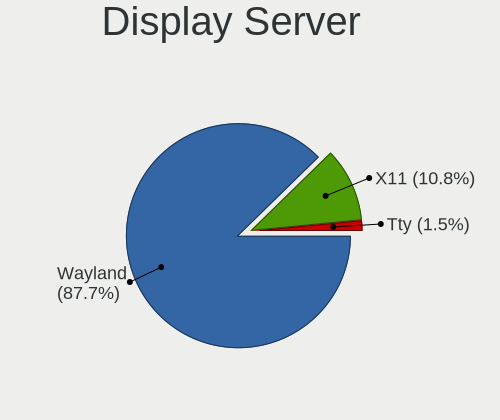
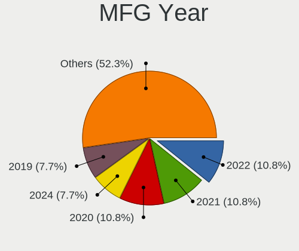
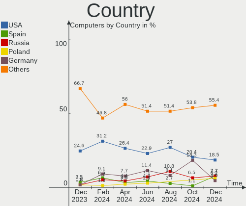
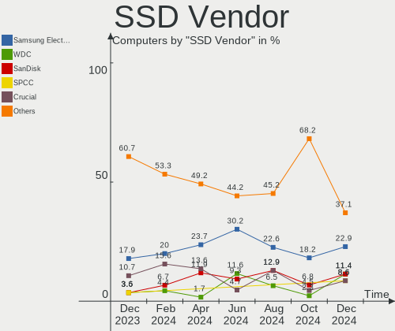
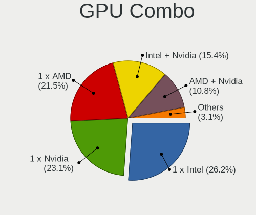
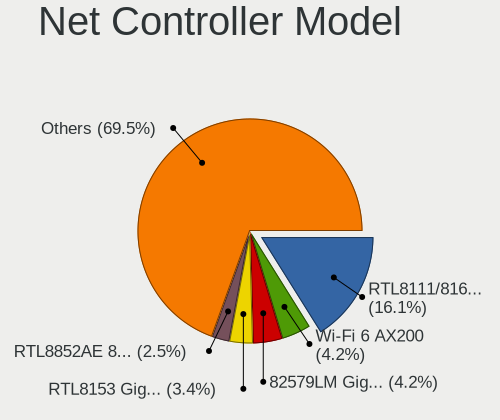
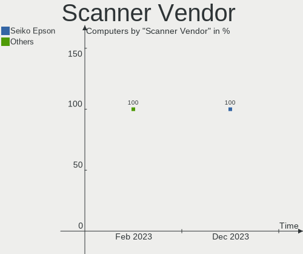

KDE neon Hardware Trends
------------------------

A project to identify most popular hardware characteristics and track their change
over time based on data collected by KDE neon users at https://Linux-Hardware.org.

Anyone can contribute to this report by the [hw-probe](https://github.com/linuxhw/hw-probe) tool:

    sudo -E hw-probe -all -upload

This is a report for all computer types. See also reports for [desktops](/Dist/KDE_neon/Desktop/README.md) and [notebooks](/Dist/KDE_neon/Notebook/README.md).

Full-feature report is available here: https://linux-hardware.org/?view=trends

Period: Dec, 2021.

Contents
--------

* [ System ](#system)
  - [ OS                       ](#os)
  - [ OS Family                ](#os-family)
  - [ Kernel                   ](#kernel)
  - [ Kernel Family            ](#kernel-family)
  - [ Kernel Major Ver.        ](#kernel-major-ver)
  - [ Arch                     ](#arch)
  - [ DE                       ](#de)
  - [ Display Server           ](#display-server)
  - [ Display Manager          ](#display-manager)
  - [ OS Lang                  ](#os-lang)
  - [ Boot Mode                ](#boot-mode)
  - [ Filesystem               ](#filesystem)
  - [ Part. scheme             ](#part-scheme)
  - [ Dual Boot with Linux/BSD ](#dual-boot-with-linuxbsd)
  - [ Dual Boot (Win)          ](#dual-boot-win)

* [ Board ](#board)
  - [ Vendor                   ](#vendor)
  - [ Model                    ](#model)
  - [ Model Family             ](#model-family)
  - [ MFG Year                 ](#mfg-year)
  - [ Form Factor              ](#form-factor)
  - [ Secure Boot              ](#secure-boot)
  - [ Coreboot                 ](#coreboot)
  - [ RAM Size                 ](#ram-size)
  - [ RAM Used                 ](#ram-used)
  - [ Total Drives             ](#total-drives)
  - [ Has CD-ROM               ](#has-cd-rom)
  - [ Has Ethernet             ](#has-ethernet)
  - [ Has WiFi                 ](#has-wifi)
  - [ Has Bluetooth            ](#has-bluetooth)

* [ Location ](#location)
  - [ Country                  ](#country)
  - [ City                     ](#city)

* [ Drives ](#drives)
  - [ Drive Vendor             ](#drive-vendor)
  - [ Drive Model              ](#drive-model)
  - [ HDD Vendor               ](#hdd-vendor)
  - [ SSD Vendor               ](#ssd-vendor)
  - [ Drive Kind               ](#drive-kind)
  - [ Drive Connector          ](#drive-connector)
  - [ Drive Size               ](#drive-size)
  - [ Space Total              ](#space-total)
  - [ Space Used               ](#space-used)
  - [ Malfunc. Drives          ](#malfunc-drives)
  - [ Malfunc. Drive Vendor    ](#malfunc-drive-vendor)
  - [ Malfunc. HDD Vendor      ](#malfunc-hdd-vendor)
  - [ Malfunc. Drive Kind      ](#malfunc-drive-kind)
  - [ Failed Drives            ](#failed-drives)
  - [ Failed Drive Vendor      ](#failed-drive-vendor)
  - [ Drive Status             ](#drive-status)

* [ Storage controller ](#storage-controller)
  - [ Storage Vendor           ](#storage-vendor)
  - [ Storage Model            ](#storage-model)
  - [ Storage Kind             ](#storage-kind)

* [ Processor ](#processor)
  - [ CPU Vendor               ](#cpu-vendor)
  - [ CPU Model                ](#cpu-model)
  - [ CPU Model Family         ](#cpu-model-family)
  - [ CPU Cores                ](#cpu-cores)
  - [ CPU Sockets              ](#cpu-sockets)
  - [ CPU Threads              ](#cpu-threads)
  - [ CPU Op-Modes             ](#cpu-op-modes)
  - [ CPU Microcode            ](#cpu-microcode)
  - [ CPU Microarch            ](#cpu-microarch)

* [ Graphics ](#graphics)
  - [ GPU Vendor               ](#gpu-vendor)
  - [ GPU Model                ](#gpu-model)
  - [ GPU Combo                ](#gpu-combo)
  - [ GPU Driver               ](#gpu-driver)
  - [ GPU Memory               ](#gpu-memory)

* [ Monitor ](#monitor)
  - [ Monitor Vendor           ](#monitor-vendor)
  - [ Monitor Model            ](#monitor-model)
  - [ Monitor Resolution       ](#monitor-resolution)
  - [ Monitor Diagonal         ](#monitor-diagonal)
  - [ Monitor Width            ](#monitor-width)
  - [ Aspect Ratio             ](#aspect-ratio)
  - [ Monitor Area             ](#monitor-area)
  - [ Pixel Density            ](#pixel-density)
  - [ Multiple Monitors        ](#multiple-monitors)

* [ Network ](#network)
  - [ Net Controller Vendor    ](#net-controller-vendor)
  - [ Net Controller Model     ](#net-controller-model)
  - [ Wireless Vendor          ](#wireless-vendor)
  - [ Wireless Model           ](#wireless-model)
  - [ Ethernet Vendor          ](#ethernet-vendor)
  - [ Ethernet Model           ](#ethernet-model)
  - [ Net Controller Kind      ](#net-controller-kind)
  - [ Used Controller          ](#used-controller)
  - [ NICs                     ](#nics)
  - [ IPv6                     ](#ipv6)

* [ Bluetooth ](#bluetooth)
  - [ Bluetooth Vendor         ](#bluetooth-vendor)
  - [ Bluetooth Model          ](#bluetooth-model)

* [ Sound ](#sound)
  - [ Sound Vendor             ](#sound-vendor)
  - [ Sound Model              ](#sound-model)

* [ Memory ](#memory)
  - [ Memory Vendor            ](#memory-vendor)
  - [ Memory Model             ](#memory-model)
  - [ Memory Kind              ](#memory-kind)
  - [ Memory Form Factor       ](#memory-form-factor)
  - [ Memory Size              ](#memory-size)
  - [ Memory Speed             ](#memory-speed)

* [ Printers & scanners ](#printers--scanners)
  - [ Printer Vendor           ](#printer-vendor)
  - [ Printer Model            ](#printer-model)
  - [ Scanner Vendor           ](#scanner-vendor)
  - [ Scanner Model            ](#scanner-model)

* [ Camera ](#camera)
  - [ Camera Vendor            ](#camera-vendor)
  - [ Camera Model             ](#camera-model)

* [ Security ](#security)
  - [ Fingerprint Vendor       ](#fingerprint-vendor)
  - [ Fingerprint Model        ](#fingerprint-model)
  - [ Chipcard Vendor          ](#chipcard-vendor)
  - [ Chipcard Model           ](#chipcard-model)

* [ Unsupported ](#unsupported)
  - [ Unsupported Devices      ](#unsupported-devices)
  - [ Unsupported Device Types ](#unsupported-device-types)

System
------

OS
--

Installed operating systems

| Name           | Computers | Percent |
|----------------|-----------|---------|
| KDE neon 20.04 | 108       | 99.08%  |
| KDE neon 18.04 | 1         | 0.92%   |

OS Family
---------

OS without a version

| Name     | Computers | Percent |
|----------|-----------|---------|
| KDE neon | 109       | 100%    |

Kernel
------

Version of the Linux kernel

| Version                | Computers | Percent |
|------------------------|-----------|---------|
| 5.11.0-41-generic      | 50        | 45.87%  |
| 5.11.0-43-generic      | 46        | 42.2%   |
| 5.11.0-40-generic      | 5         | 4.59%   |
| 5.4.0-92-generic       | 2         | 1.83%   |
| 5.4.0-84-generic       | 1         | 0.92%   |
| 5.14.6-051406-generic  | 1         | 0.92%   |
| 5.14.21-051421-generic | 1         | 0.92%   |
| 5.13.0-22-lowlatency   | 1         | 0.92%   |
| 5.11.0-42-generic      | 1         | 0.92%   |
| 5.11.0-27-generic      | 1         | 0.92%   |

Kernel Family
-------------

Linux kernel without a distro release

| Version | Computers | Percent |
|---------|-----------|---------|
| 5.11.0  | 103       | 94.5%   |
| 5.4.0   | 3         | 2.75%   |
| 5.14.6  | 1         | 0.92%   |
| 5.14.21 | 1         | 0.92%   |
| 5.13.0  | 1         | 0.92%   |

Kernel Major Ver.
-----------------

Linux kernel major version

| Version | Computers | Percent |
|---------|-----------|---------|
| 5.11    | 103       | 94.5%   |
| 5.4     | 3         | 2.75%   |
| 5.14    | 2         | 1.83%   |
| 5.13    | 1         | 0.92%   |

Arch
----

OS architecture (x86_64, i586, etc.)

| Name   | Computers | Percent |
|--------|-----------|---------|
| x86_64 | 109       | 100%    |

DE
--

Desktop Environment

| Name | Computers | Percent |
|------|-----------|---------|
| KDE5 | 109       | 100%    |

Display Server
--------------

X11 or Wayland

| Name    | Computers | Percent |
|---------|-----------|---------|
| X11     | 104       | 95.41%  |
| Wayland | 5         | 4.59%   |

Display Manager
---------------

SDDM, LightDM, etc.

| Name    | Computers | Percent |
|---------|-----------|---------|
| Unknown | 81        | 74.31%  |
| SDDM    | 28        | 25.69%  |

OS Lang
-------

Language

| Lang  | Computers | Percent |
|-------|-----------|---------|
| en_US | 41        | 37.61%  |
| es_ES | 8         | 7.34%   |
| en_GB | 7         | 6.42%   |
| de_DE | 7         | 6.42%   |
| pt_BR | 6         | 5.5%    |
| pl_PL | 4         | 3.67%   |
| en_IN | 4         | 3.67%   |
| en_AU | 4         | 3.67%   |
| ru_RU | 3         | 2.75%   |
| fr_FR | 3         | 2.75%   |
| C     | 3         | 2.75%   |
| uk_UA | 2         | 1.83%   |
| es_MX | 2         | 1.83%   |
| el_GR | 2         | 1.83%   |
| de_CH | 2         | 1.83%   |
| zh_CN | 1         | 0.92%   |
| ru_UA | 1         | 0.92%   |
| pt_PT | 1         | 0.92%   |
| it_IT | 1         | 0.92%   |
| fr_CH | 1         | 0.92%   |
| fr_CA | 1         | 0.92%   |
| es_VE | 1         | 0.92%   |
| es_BO | 1         | 0.92%   |
| en_ZA | 1         | 0.92%   |
| en_NZ | 1         | 0.92%   |
| en_HK | 1         | 0.92%   |

Boot Mode
---------

EFI or BIOS

| Mode | Computers | Percent |
|------|-----------|---------|
| EFI  | 66        | 60.55%  |
| BIOS | 43        | 39.45%  |

Filesystem
----------

Type of filesystem

| Type    | Computers | Percent |
|---------|-----------|---------|
| Ext4    | 102       | 93.58%  |
| Btrfs   | 4         | 3.67%   |
| Overlay | 2         | 1.83%   |
| Xfs     | 1         | 0.92%   |

Part. scheme
------------

Scheme of partitioning

| Type    | Computers | Percent |
|---------|-----------|---------|
| Unknown | 99        | 90.83%  |
| GPT     | 8         | 7.34%   |
| MBR     | 2         | 1.83%   |

Dual Boot with Linux/BSD
------------------------

Hosting more than one Linux/BSD

| Dual boot | Computers | Percent |
|-----------|-----------|---------|
| No        | 107       | 98.17%  |
| Yes       | 2         | 1.83%   |

Dual Boot (Win)
---------------

Hosting Linux and Windows

| Dual boot | Computers | Percent |
|-----------|-----------|---------|
| No        | 97        | 88.99%  |
| Yes       | 12        | 11.01%  |

Board
-----

Vendor
------

Motherboard manufacturer

| Name                | Computers | Percent |
|---------------------|-----------|---------|
| Gigabyte Technology | 20        | 18.35%  |
| Hewlett-Packard     | 16        | 14.68%  |
| Dell                | 16        | 14.68%  |
| Lenovo              | 13        | 11.93%  |
| ASUSTek Computer    | 13        | 11.93%  |
| MSI                 | 7         | 6.42%   |
| Acer                | 5         | 4.59%   |
| ASRock              | 4         | 3.67%   |
| Toshiba             | 2         | 1.83%   |
| Positivo            | 2         | 1.83%   |
| Microsoft           | 2         | 1.83%   |
| Chuwi               | 2         | 1.83%   |
| Teclast             | 1         | 0.92%   |
| Sony                | 1         | 0.92%   |
| Samsung Electronics | 1         | 0.92%   |
| Intel               | 1         | 0.92%   |
| HUAWEI              | 1         | 0.92%   |
| Framework           | 1         | 0.92%   |
| Apple               | 1         | 0.92%   |

Model
-----

Motherboard model

| Name                                   | Computers | Percent |
|----------------------------------------|-----------|---------|
| Gigabyte H81M-H                        | 2         | 1.83%   |
| Toshiba TECRA Z50-A                    | 1         | 0.92%   |
| Toshiba Satellite P775                 | 1         | 0.92%   |
| Teclast TbooK 16 Power                 | 1         | 0.92%   |
| Sony VPCEA35FL                         | 1         | 0.92%   |
| Samsung 500R5L/501R5L/500R5P/550R5L    | 1         | 0.92%   |
| Positivo POS-EINM70CS                  | 1         | 0.92%   |
| Positivo POS-EIBTPDC                   | 1         | 0.92%   |
| MSI MS-B09011                          | 1         | 0.92%   |
| MSI MS-7693                            | 1         | 0.92%   |
| MSI Modern 14 B4MW                     | 1         | 0.92%   |
| MSI Modern 14 A10M                     | 1         | 0.92%   |
| MSI Katana GF66 11UC                   | 1         | 0.92%   |
| MSI GE63 Raider RGB 8RE                | 1         | 0.92%   |
| MSI Alpha 15 A4DEK                     | 1         | 0.92%   |
| Microsoft Surface Pro                  | 1         | 0.92%   |
| Microsoft Surface Book 2               | 1         | 0.92%   |
| Lenovo ThinkPad T460s 20FAS4A200       | 1         | 0.92%   |
| Lenovo ThinkPad E14 Gen 3 20Y7CTO1WW   | 1         | 0.92%   |
| Lenovo ThinkPad E14 Gen 2 20T60027RT   | 1         | 0.92%   |
| Lenovo ThinkCentre M93p 10A7000GUS     | 1         | 0.92%   |
| Lenovo ThinkCentre M73 10AXS3V400      | 1         | 0.92%   |
| Lenovo Legion 5 Pro 16ACH6H 82JQ       | 1         | 0.92%   |
| Lenovo Legion 5 15ARH05H 82B1          | 1         | 0.92%   |
| Lenovo IdeaPad U400 09934FG            | 1         | 0.92%   |
| Lenovo IdeaPad 530S-15IKB 81EV         | 1         | 0.92%   |
| Lenovo IdeaPad 3 17ITL6 82H9           | 1         | 0.92%   |
| Lenovo IdeaPad 3 15ALC6 82KU           | 1         | 0.92%   |
| Lenovo IdeaPad 3 14ADA05 81W0          | 1         | 0.92%   |
| Lenovo IdeaCentre 510-15ABR 90G7002RGE | 1         | 0.92%   |
| Intel H55                              | 1         | 0.92%   |
| HUAWEI KLVL-WXXW                       | 1         | 0.92%   |
| HP Victus by Laptop 16-e0xxx           | 1         | 0.92%   |
| HP Stream Notebook PC 11               | 1         | 0.92%   |
| HP ProBook 6540b                       | 1         | 0.92%   |
| HP ProBook 6460b                       | 1         | 0.92%   |
| HP Pavilion Laptop 15-eh1xxx           | 1         | 0.92%   |
| HP Pavilion Gaming Laptop 15-ec2xxx    | 1         | 0.92%   |
| HP Pavilion dv7                        | 1         | 0.92%   |
| HP OMEN by Laptop                      | 1         | 0.92%   |
| HP Laptop 15s-fq2xxx                   | 1         | 0.92%   |
| HP G62                                 | 1         | 0.92%   |
| HP ENVY Laptop 17-ch0xxx               | 1         | 0.92%   |
| HP EliteBook 840 G2                    | 1         | 0.92%   |
| HP Compaq Elite 8300 USDT              | 1         | 0.92%   |
| HP Compaq dc7700 Small Form Factor     | 1         | 0.92%   |
| HP 260-a010                            | 1         | 0.92%   |
| HP 14                                  | 1         | 0.92%   |
| Gigabyte Z97X-SLI                      | 1         | 0.92%   |
| Gigabyte Z590I VISION D                | 1         | 0.92%   |
| Gigabyte Z390 GAMING X                 | 1         | 0.92%   |
| Gigabyte Z170X-UD5 TH                  | 1         | 0.92%   |
| Gigabyte P17FR5                        | 1         | 0.92%   |
| Gigabyte H81M-HD3                      | 1         | 0.92%   |
| Gigabyte H61M-DS2H                     | 1         | 0.92%   |
| Gigabyte H310N 2.0                     | 1         | 0.92%   |
| Gigabyte F2A88XN-WIFI                  | 1         | 0.92%   |
| Gigabyte B75M-D3H                      | 1         | 0.92%   |
| Gigabyte B550M AORUS PRO-P             | 1         | 0.92%   |
| Gigabyte B550 AORUS ELITE V2           | 1         | 0.92%   |

Model Family
------------

Motherboard model prefix

| Name                  | Computers | Percent |
|-----------------------|-----------|---------|
| Dell Inspiron         | 9         | 8.26%   |
| Lenovo IdeaPad        | 5         | 4.59%   |
| Dell Latitude         | 5         | 4.59%   |
| ASUS PRIME            | 4         | 3.67%   |
| Lenovo ThinkPad       | 3         | 2.75%   |
| HP Pavilion           | 3         | 2.75%   |
| MSI Modern            | 2         | 1.83%   |
| Microsoft Surface     | 2         | 1.83%   |
| Lenovo ThinkCentre    | 2         | 1.83%   |
| Lenovo Legion         | 2         | 1.83%   |
| HP ProBook            | 2         | 1.83%   |
| HP Compaq             | 2         | 1.83%   |
| Gigabyte H81M-H       | 2         | 1.83%   |
| Gigabyte B550         | 2         | 1.83%   |
| Gigabyte B450         | 2         | 1.83%   |
| Gigabyte 970A-DS3P    | 2         | 1.83%   |
| Acer Swift            | 2         | 1.83%   |
| Acer Aspire           | 2         | 1.83%   |
| Toshiba TECRA         | 1         | 0.92%   |
| Toshiba Satellite     | 1         | 0.92%   |
| Teclast TbooK         | 1         | 0.92%   |
| Sony VPCEA35FL        | 1         | 0.92%   |
| Samsung 500R5L        | 1         | 0.92%   |
| Positivo POS-EINM70CS | 1         | 0.92%   |
| Positivo POS-EIBTPDC  | 1         | 0.92%   |
| MSI MS-B09011         | 1         | 0.92%   |
| MSI MS-7693           | 1         | 0.92%   |
| MSI Katana            | 1         | 0.92%   |
| MSI GE63              | 1         | 0.92%   |
| MSI Alpha             | 1         | 0.92%   |
| Lenovo IdeaCentre     | 1         | 0.92%   |
| Intel H55             | 1         | 0.92%   |
| HUAWEI KLVL-WXXW      | 1         | 0.92%   |
| HP Victus             | 1         | 0.92%   |
| HP Stream             | 1         | 0.92%   |
| HP OMEN               | 1         | 0.92%   |
| HP Laptop             | 1         | 0.92%   |
| HP G62                | 1         | 0.92%   |
| HP ENVY               | 1         | 0.92%   |
| HP EliteBook          | 1         | 0.92%   |
| HP 260-a010           | 1         | 0.92%   |
| HP 14                 | 1         | 0.92%   |
| Gigabyte Z97X-SLI     | 1         | 0.92%   |
| Gigabyte Z590I        | 1         | 0.92%   |
| Gigabyte Z390         | 1         | 0.92%   |
| Gigabyte Z170X-UD5    | 1         | 0.92%   |
| Gigabyte P17FR5       | 1         | 0.92%   |
| Gigabyte H81M-HD3     | 1         | 0.92%   |
| Gigabyte H61M-DS2H    | 1         | 0.92%   |
| Gigabyte H310N        | 1         | 0.92%   |
| Gigabyte F2A88XN-WIFI | 1         | 0.92%   |
| Gigabyte B75M-D3H     | 1         | 0.92%   |
| Gigabyte B550M        | 1         | 0.92%   |
| Gigabyte B450M        | 1         | 0.92%   |
| Framework Laptop      | 1         | 0.92%   |
| Dell XPS              | 1         | 0.92%   |
| Dell OptiPlex         | 1         | 0.92%   |
| Chuwi HeroBox         | 1         | 0.92%   |
| Chuwi GemiBook        | 1         | 0.92%   |
| ASUS TUF              | 1         | 0.92%   |

MFG Year
--------

Motherboard manufacture year

| Year | Computers | Percent |
|------|-----------|---------|
| 2021 | 35        | 32.11%  |
| 2015 | 13        | 11.93%  |
| 2020 | 11        | 10.09%  |
| 2018 | 11        | 10.09%  |
| 2014 | 6         | 5.5%    |
| 2019 | 5         | 4.59%   |
| 2017 | 5         | 4.59%   |
| 2012 | 5         | 4.59%   |
| 2010 | 5         | 4.59%   |
| 2016 | 4         | 3.67%   |
| 2013 | 3         | 2.75%   |
| 2011 | 3         | 2.75%   |
| 2009 | 1         | 0.92%   |
| 2008 | 1         | 0.92%   |
| 2007 | 1         | 0.92%   |

Form Factor
-----------

Physical design of the computer

| Name       | Computers | Percent |
|------------|-----------|---------|
| Notebook   | 58        | 53.21%  |
| Desktop    | 45        | 41.28%  |
| Tablet     | 3         | 2.75%   |
| All in one | 2         | 1.83%   |
| Mini pc    | 1         | 0.92%   |

Secure Boot
-----------

Enabled or disabled

| State    | Computers | Percent |
|----------|-----------|---------|
| Disabled | 95        | 87.16%  |
| Enabled  | 14        | 12.84%  |

Coreboot
--------

Have coreboot on board

| Used | Computers | Percent |
|------|-----------|---------|
| No   | 109       | 100%    |

RAM Size
--------

Total RAM memory

| Size in GB  | Computers | Percent |
|-------------|-----------|---------|
| 4.01-8.0    | 29        | 26.61%  |
| 8.01-16.0   | 29        | 26.61%  |
| 16.01-24.0  | 27        | 24.77%  |
| 3.01-4.0    | 11        | 10.09%  |
| 32.01-64.0  | 6         | 5.5%    |
| 24.01-32.0  | 3         | 2.75%   |
| 2.01-3.0    | 2         | 1.83%   |
| 64.01-256.0 | 1         | 0.92%   |
| 1.01-2.0    | 1         | 0.92%   |

RAM Used
--------

Used RAM memory

| Used GB    | Computers | Percent |
|------------|-----------|---------|
| 1.01-2.0   | 57        | 52.29%  |
| 2.01-3.0   | 23        | 21.1%   |
| 3.01-4.0   | 13        | 11.93%  |
| 4.01-8.0   | 11        | 10.09%  |
| 0.51-1.0   | 3         | 2.75%   |
| 16.01-24.0 | 1         | 0.92%   |
| 8.01-16.0  | 1         | 0.92%   |

Total Drives
------------

Number of drives on board

| Drives | Computers | Percent |
|--------|-----------|---------|
| 1      | 59        | 54.13%  |
| 2      | 36        | 33.03%  |
| 3      | 8         | 7.34%   |
| 4      | 5         | 4.59%   |
| 6      | 1         | 0.92%   |

Has CD-ROM
----------

Has CD-ROM on board

| Presented | Computers | Percent |
|-----------|-----------|---------|
| No        | 70        | 64.22%  |
| Yes       | 39        | 35.78%  |

Has Ethernet
------------

Has Ethernet on board

| Presented | Computers | Percent |
|-----------|-----------|---------|
| Yes       | 92        | 84.4%   |
| No        | 17        | 15.6%   |

Has WiFi
--------

Has WiFi module

| Presented | Computers | Percent |
|-----------|-----------|---------|
| Yes       | 82        | 75.23%  |
| No        | 27        | 24.77%  |

Has Bluetooth
-------------

Has Bluetooth module

| Presented | Computers | Percent |
|-----------|-----------|---------|
| Yes       | 77        | 70.64%  |
| No        | 32        | 29.36%  |

Location
--------

Country
-------

Geographic location (country)

| Country      | Computers | Percent |
|--------------|-----------|---------|
| USA          | 20        | 18.35%  |
| Brazil       | 10        | 9.17%   |
| Germany      | 7         | 6.42%   |
| Spain        | 6         | 5.5%    |
| Ukraine      | 5         | 4.59%   |
| UK           | 5         | 4.59%   |
| Poland       | 5         | 4.59%   |
| India        | 5         | 4.59%   |
| Russia       | 4         | 3.67%   |
| Netherlands  | 4         | 3.67%   |
| Mexico       | 4         | 3.67%   |
| Australia    | 4         | 3.67%   |
| Switzerland  | 3         | 2.75%   |
| Italy        | 3         | 2.75%   |
| France       | 3         | 2.75%   |
| Romania      | 2         | 1.83%   |
| Portugal     | 2         | 1.83%   |
| Greece       | 2         | 1.83%   |
| Venezuela    | 1         | 0.92%   |
| South Africa | 1         | 0.92%   |
| Slovenia     | 1         | 0.92%   |
| Philippines  | 1         | 0.92%   |
| Nepal        | 1         | 0.92%   |
| Moldova      | 1         | 0.92%   |
| Latvia       | 1         | 0.92%   |
| Israel       | 1         | 0.92%   |
| Hong Kong    | 1         | 0.92%   |
| Cuba         | 1         | 0.92%   |
| China        | 1         | 0.92%   |
| Canada       | 1         | 0.92%   |
| Bolivia      | 1         | 0.92%   |
| Belarus      | 1         | 0.92%   |
| Bangladesh   | 1         | 0.92%   |

City
----

Geographic location (city)

| City               | Computers | Percent |
|--------------------|-----------|---------|
| S??o Paulo         | 2         | 1.83%   |
| Passo Fundo        | 2         | 1.83%   |
| Moscow             | 2         | 1.83%   |
| Madrid             | 2         | 1.83%   |
| Zurich             | 1         | 0.92%   |
| Zoetermeer         | 1         | 0.92%   |
| Wegberg            | 1         | 0.92%   |
| Washington         | 1         | 0.92%   |
| Warsaw             | 1         | 0.92%   |
| Wallasey           | 1         | 0.92%   |
| Versailles         | 1         | 0.92%   |
| Vermoim            | 1         | 0.92%   |
| Torre del Mar      | 1         | 0.92%   |
| Tijuana            | 1         | 0.92%   |
| Thornlands         | 1         | 0.92%   |
| Thessaloniki       | 1         | 0.92%   |
| Tecamac            | 1         | 0.92%   |
| T??rgu Jiu         | 1         | 0.92%   |
| Stari Trg pri Lozu | 1         | 0.92%   |
| St Petersburg      | 1         | 0.92%   |
| St Louis           | 1         | 0.92%   |
| Soroca             | 1         | 0.92%   |
| Santander          | 1         | 0.92%   |
| Salihorsk          | 1         | 0.92%   |
| Salem              | 1         | 0.92%   |
| Rossrueti          | 1         | 0.92%   |
| Rosemount          | 1         | 0.92%   |
| Rome               | 1         | 0.92%   |
| Riga               | 1         | 0.92%   |
| Renton             | 1         | 0.92%   |
| Queluz             | 1         | 0.92%   |
| Porter             | 1         | 0.92%   |
| Pinneberg          | 1         | 0.92%   |
| Perth              | 1         | 0.92%   |
| Parramatta         | 1         | 0.92%   |
| Palmas             | 1         | 0.92%   |
| Overland           | 1         | 0.92%   |
| Odintsovo          | 1         | 0.92%   |
| North Hollywood    | 1         | 0.92%   |
| Noordwijkerhout    | 1         | 0.92%   |
| Navarre            | 1         | 0.92%   |
| Murrieta           | 1         | 0.92%   |
| Mosina             | 1         | 0.92%   |
| Morintsy           | 1         | 0.92%   |
| Montreal           | 1         | 0.92%   |
| Melbourne          | 1         | 0.92%   |
| Lviv               | 1         | 0.92%   |
| Luce               | 1         | 0.92%   |
| Lublin             | 1         | 0.92%   |
| Lowicz             | 1         | 0.92%   |
| Lincoln            | 1         | 0.92%   |
| Lilburn            | 1         | 0.92%   |
| Lerma de Villada   | 1         | 0.92%   |
| Lerdo              | 1         | 0.92%   |
| Lehigh Acres       | 1         | 0.92%   |
| La Paz             | 1         | 0.92%   |
| Krakow             | 1         | 0.92%   |
| Kinneret           | 1         | 0.92%   |
| Kemnath            | 1         | 0.92%   |
| Kato Achaia        | 1         | 0.92%   |

Drives
------

Drive Vendor
------------

Hard drive vendors

| Vendor                    | Computers | Drives | Percent |
|---------------------------|-----------|--------|---------|
| WDC                       | 21        | 25     | 12.35%  |
| Seagate                   | 20        | 22     | 11.76%  |
| Samsung Electronics       | 18        | 21     | 10.59%  |
| Kingston                  | 14        | 14     | 8.24%   |
| SanDisk                   | 13        | 13     | 7.65%   |
| Toshiba                   | 11        | 12     | 6.47%   |
| Crucial                   | 7         | 7      | 4.12%   |
| SK Hynix                  | 6         | 6      | 3.53%   |
| A-DATA Technology         | 6         | 6      | 3.53%   |
| Hitachi                   | 5         | 5      | 2.94%   |
| Unknown                   | 4         | 5      | 2.35%   |
| Phison                    | 4         | 4      | 2.35%   |
| Silicon Motion            | 3         | 3      | 1.76%   |
| Patriot                   | 3         | 3      | 1.76%   |
| LITEON                    | 3         | 3      | 1.76%   |
| Intel                     | 3         | 3      | 1.76%   |
| HGST                      | 3         | 3      | 1.76%   |
| Transcend                 | 2         | 2      | 1.18%   |
| PNY                       | 2         | 2      | 1.18%   |
| OCZ                       | 2         | 2      | 1.18%   |
| Micron Technology         | 2         | 2      | 1.18%   |
| KIOXIA                    | 2         | 2      | 1.18%   |
| China                     | 2         | 3      | 1.18%   |
| XPG                       | 1         | 1      | 0.59%   |
| Union Memory (Shenzhen)   | 1         | 1      | 0.59%   |
| SPCC                      | 1         | 1      | 0.59%   |
| Ramsta                    | 1         | 1      | 0.59%   |
| Netac                     | 1         | 1      | 0.59%   |
| Micron/Crucial Technology | 1         | 1      | 0.59%   |
| MAXTOR                    | 1         | 1      | 0.59%   |
| Intenso                   | 1         | 1      | 0.59%   |
| GOODRAM                   | 1         | 1      | 0.59%   |
| FORESEE                   | 1         | 1      | 0.59%   |
| Colorful                  | 1         | 1      | 0.59%   |
| Apple                     | 1         | 1      | 0.59%   |
| Apacer                    | 1         | 1      | 0.59%   |
| AFOX                      | 1         | 1      | 0.59%   |

Drive Model
-----------

Hard drive models

| Model                                        | Computers | Percent |
|----------------------------------------------|-----------|---------|
| Seagate ST2000DM008-2FR102 2TB               | 4         | 2.21%   |
| Kingston SA400S37240G 240GB SSD              | 4         | 2.21%   |
| Toshiba DT01ACA100 1TB                       | 3         | 1.66%   |
| Seagate ST3500418AS 500GB                    | 3         | 1.66%   |
| Samsung SSD 850 EVO 250GB                    | 3         | 1.66%   |
| Crucial CT500MX500SSD1 500GB                 | 3         | 1.66%   |
| WDC WD10EAVS-00D7B1 1TB                      | 2         | 1.1%    |
| Unknown SD/MMC/MS PRO 7GB                    | 2         | 1.1%    |
| SK Hynix NVMe SSD Drive 256GB                | 2         | 1.1%    |
| Silicon Motion NVMe SSD Drive 512GB          | 2         | 1.1%    |
| Seagate ST2000DM001-1ER164 2TB               | 2         | 1.1%    |
| Seagate ST1000LM049-2GH172 1TB               | 2         | 1.1%    |
| Sandisk NVMe SSD Drive 256GB                 | 2         | 1.1%    |
| Samsung SSD 850 EVO 500GB                    | 2         | 1.1%    |
| Samsung NVMe SSD Drive 500GB                 | 2         | 1.1%    |
| PNY CS900 120GB SSD                          | 2         | 1.1%    |
| Patriot Burst 120GB SSD                      | 2         | 1.1%    |
| Crucial CT240BX500SSD1 240GB                 | 2         | 1.1%    |
| A-DATA SU650 120GB SSD                       | 2         | 1.1%    |
| XPG NVMe SSD Drive 2TB                       | 1         | 0.55%   |
| WDC WDS500G2B0A-00SM50 500GB SSD             | 1         | 0.55%   |
| WDC WDS240G2G0B-00EPW0 240GB SSD             | 1         | 0.55%   |
| WDC WDS120G2G0A-00JH30 120GB SSD             | 1         | 0.55%   |
| WDC WD800JD-75MSA3 80GB                      | 1         | 0.55%   |
| WDC WD5003ABYX-01WERA1 500GB                 | 1         | 0.55%   |
| WDC WD5000AAKX-001CA0 500GB                  | 1         | 0.55%   |
| WDC WD5000AACS-00D0B0 500GB                  | 1         | 0.55%   |
| WDC WD40PURX-64N96Y0 4TB                     | 1         | 0.55%   |
| WDC WD3200BEKT-00PVMT0 320GB                 | 1         | 0.55%   |
| WDC WD3200AAKS-00SBA0 320GB                  | 1         | 0.55%   |
| WDC WD3200AAJS-00L7A0 320GB                  | 1         | 0.55%   |
| WDC WD20PURX-64P6ZY0 2TB                     | 1         | 0.55%   |
| WDC WD1600AAJS-00WAA0 160GB                  | 1         | 0.55%   |
| WDC WD10SPZX-24Z10 1TB                       | 1         | 0.55%   |
| WDC WD10SPZX-21Z10T0 1TB                     | 1         | 0.55%   |
| WDC WD10SPZX-08Z10 1TB                       | 1         | 0.55%   |
| WDC WD10EZEX-22BN5A0 1TB                     | 1         | 0.55%   |
| WDC WD10EVDS-63N5B1 1TB                      | 1         | 0.55%   |
| WDC WD10EURX-63UY4Y0 1TB                     | 1         | 0.55%   |
| WDC WD1005FBYZ-01YCBB2 1TB                   | 1         | 0.55%   |
| WDC PC SN530 SDBPNPZ-1T00-1006 1TB           | 1         | 0.55%   |
| WDC PC SN530 SDBPMPZ-512G-1001 512GB         | 1         | 0.55%   |
| Unknown MMC Card  64GB                       | 1         | 0.55%   |
| Unknown MMC Card  32GB                       | 1         | 0.55%   |
| Unknown MMC Card  250GB                      | 1         | 0.55%   |
| Union Memory (Shenzhen) NVMe SSD Drive 256GB | 1         | 0.55%   |
| Transcend TS512GSSD230S 512GB                | 1         | 0.55%   |
| Transcend TS120GMTS420S 120GB SSD            | 1         | 0.55%   |
| Toshiba THNSNK128GVN8 M.2 2280 128GB SSD     | 1         | 0.55%   |
| Toshiba NVMe SSD Drive 256GB                 | 1         | 0.55%   |
| Toshiba MQ04ABF100 1TB                       | 1         | 0.55%   |
| Toshiba MQ02ABD100H 1TB                      | 1         | 0.55%   |
| Toshiba MQ01ACF032 320GB                     | 1         | 0.55%   |
| Toshiba MQ01ABF050 500GB                     | 1         | 0.55%   |
| Toshiba MQ01ABD100 1TB                       | 1         | 0.55%   |
| Toshiba MK3255GSXF 320GB                     | 1         | 0.55%   |
| Toshiba DT01ACA050 500GB                     | 1         | 0.55%   |
| SPCC Solid State Disk 512GB                  | 1         | 0.55%   |
| SK Hynix SC311 SATA 512GB SSD                | 1         | 0.55%   |
| SK Hynix NVMe SSD Drive 512GB                | 1         | 0.55%   |

HDD Vendor
----------

Hard disk drive vendors

| Vendor              | Computers | Drives | Percent |
|---------------------|-----------|--------|---------|
| Seagate             | 19        | 21     | 31.67%  |
| WDC                 | 16        | 20     | 26.67%  |
| Toshiba             | 10        | 10     | 16.67%  |
| Hitachi             | 5         | 5      | 8.33%   |
| Samsung Electronics | 3         | 3      | 5%      |
| HGST                | 3         | 3      | 5%      |
| Unknown             | 2         | 2      | 3.33%   |
| MAXTOR              | 1         | 1      | 1.67%   |
| Apple               | 1         | 1      | 1.67%   |

SSD Vendor
----------

Solid state drive vendors

| Vendor              | Computers | Drives | Percent |
|---------------------|-----------|--------|---------|
| Samsung Electronics | 12        | 13     | 17.91%  |
| Kingston            | 8         | 8      | 11.94%  |
| Crucial             | 7         | 7      | 10.45%  |
| SanDisk             | 6         | 6      | 8.96%   |
| A-DATA Technology   | 6         | 6      | 8.96%   |
| WDC                 | 3         | 3      | 4.48%   |
| Patriot             | 3         | 3      | 4.48%   |
| LITEON              | 3         | 3      | 4.48%   |
| Transcend           | 2         | 2      | 2.99%   |
| PNY                 | 2         | 2      | 2.99%   |
| OCZ                 | 2         | 2      | 2.99%   |
| China               | 2         | 3      | 2.99%   |
| Toshiba             | 1         | 1      | 1.49%   |
| SPCC                | 1         | 1      | 1.49%   |
| SK Hynix            | 1         | 1      | 1.49%   |
| Ramsta              | 1         | 1      | 1.49%   |
| Netac               | 1         | 1      | 1.49%   |
| Micron Technology   | 1         | 1      | 1.49%   |
| Intenso             | 1         | 1      | 1.49%   |
| Intel               | 1         | 1      | 1.49%   |
| GOODRAM             | 1         | 1      | 1.49%   |
| FORESEE             | 1         | 1      | 1.49%   |
| Apacer              | 1         | 1      | 1.49%   |

Drive Kind
----------

HDD or SSD

| Kind    | Computers | Drives | Percent |
|---------|-----------|--------|---------|
| SSD     | 56        | 69     | 37.33%  |
| HDD     | 50        | 66     | 33.33%  |
| NVMe    | 39        | 42     | 26%     |
| MMC     | 3         | 3      | 2%      |
| Unknown | 2         | 2      | 1.33%   |

Drive Connector
---------------

SATA, SAS, NVMe, etc.

| Type | Computers | Drives | Percent |
|------|-----------|--------|---------|
| SATA | 85        | 133    | 64.89%  |
| NVMe | 39        | 42     | 29.77%  |
| SAS  | 4         | 4      | 3.05%   |
| MMC  | 3         | 3      | 2.29%   |

Drive Size
----------

Size of hard drive

| Size in TB | Computers | Drives | Percent |
|------------|-----------|--------|---------|
| 0.01-0.5   | 64        | 86     | 58.72%  |
| 0.51-1.0   | 31        | 35     | 28.44%  |
| 1.01-2.0   | 11        | 11     | 10.09%  |
| 3.01-4.0   | 2         | 2      | 1.83%   |
| 4.01-10.0  | 1         | 1      | 0.92%   |

Space Total
-----------

Amount of disk space available on the file system

| Size in GB     | Computers | Percent |
|----------------|-----------|---------|
| 251-500        | 27        | 24.77%  |
| 101-250        | 25        | 22.94%  |
| 1001-2000      | 16        | 14.68%  |
| 501-1000       | 13        | 11.93%  |
| 51-100         | 9         | 8.26%   |
| 21-50          | 8         | 7.34%   |
| 2001-3000      | 3         | 2.75%   |
| 1-20           | 3         | 2.75%   |
| Unknown        | 3         | 2.75%   |
| More than 3000 | 2         | 1.83%   |

Space Used
----------

Amount of used disk space

| Used GB        | Computers | Percent |
|----------------|-----------|---------|
| 1-20           | 51        | 46.79%  |
| 101-250        | 13        | 11.93%  |
| 251-500        | 12        | 11.01%  |
| 21-50          | 12        | 11.01%  |
| 51-100         | 8         | 7.34%   |
| 501-1000       | 7         | 6.42%   |
| Unknown        | 3         | 2.75%   |
| More than 3000 | 2         | 1.83%   |
| 1001-2000      | 1         | 0.92%   |

Malfunc. Drives
---------------

Drive models with a malfunction

| Model                         | Computers | Drives | Percent |
|-------------------------------|-----------|--------|---------|
| Seagate ST3500320AS 500GB     | 1         | 1      | 50%     |
| Apple HDD HTS541010A9E662 1TB | 1         | 1      | 50%     |

Malfunc. Drive Vendor
---------------------

Vendors of faulty drives

| Vendor  | Computers | Drives | Percent |
|---------|-----------|--------|---------|
| Seagate | 1         | 1      | 50%     |
| Apple   | 1         | 1      | 50%     |

Malfunc. HDD Vendor
-------------------

Vendors of faulty HDD drives

| Vendor  | Computers | Drives | Percent |
|---------|-----------|--------|---------|
| Seagate | 1         | 1      | 50%     |
| Apple   | 1         | 1      | 50%     |

Malfunc. Drive Kind
-------------------

Kinds of faulty drives

| Kind | Computers | Drives | Percent |
|------|-----------|--------|---------|
| HDD  | 2         | 2      | 100%    |

Failed Drives
-------------

Failed drive models

Zero info for selected period =(

Failed Drive Vendor
-------------------

Failed drive vendors

Zero info for selected period =(

Drive Status
------------

Number of failed and malfunc. drives

| Status   | Computers | Drives | Percent |
|----------|-----------|--------|---------|
| Detected | 100       | 170    | 90.91%  |
| Works    | 8         | 10     | 7.27%   |
| Malfunc  | 2         | 2      | 1.82%   |

Storage controller
------------------

Storage Vendor
--------------

Storage controller vendors

| Vendor                       | Computers | Percent |
|------------------------------|-----------|---------|
| Intel                        | 68        | 47.22%  |
| AMD                          | 30        | 20.83%  |
| Sandisk                      | 9         | 6.25%   |
| Kingston Technology Company  | 6         | 4.17%   |
| SK Hynix                     | 5         | 3.47%   |
| Samsung Electronics          | 5         | 3.47%   |
| Phison Electronics           | 4         | 2.78%   |
| Silicon Motion               | 3         | 2.08%   |
| Marvell Technology Group     | 3         | 2.08%   |
| Micron Technology            | 2         | 1.39%   |
| KIOXIA                       | 2         | 1.39%   |
| ASMedia Technology           | 2         | 1.39%   |
| Union Memory (Shenzhen)      | 1         | 0.69%   |
| Toshiba America Info Systems | 1         | 0.69%   |
| Seagate Technology           | 1         | 0.69%   |
| Micron/Crucial Technology    | 1         | 0.69%   |
| ADATA Technology             | 1         | 0.69%   |

Storage Model
-------------

Storage controller models

| Model                                                                            | Computers | Percent |
|----------------------------------------------------------------------------------|-----------|---------|
| AMD FCH SATA Controller [AHCI mode]                                              | 23        | 14.47%  |
| Intel 8 Series/C220 Series Chipset Family 6-port SATA Controller 1 [AHCI mode]   | 7         | 4.4%    |
| Intel Sunrise Point-LP SATA Controller [AHCI mode]                               | 5         | 3.14%   |
| Intel 7 Series/C210 Series Chipset Family 6-port SATA Controller [AHCI mode]     | 5         | 3.14%   |
| Intel 6 Series/C200 Series Chipset Family 6 port Mobile SATA AHCI Controller     | 5         | 3.14%   |
| AMD 400 Series Chipset SATA Controller                                           | 5         | 3.14%   |
| Sandisk WD Blue SN550 NVMe SSD                                                   | 4         | 2.52%   |
| Intel HM170/QM170 Chipset SATA Controller [AHCI Mode]                            | 4         | 2.52%   |
| Intel 82801 Mobile SATA Controller [RAID mode]                                   | 4         | 2.52%   |
| Samsung NVMe SSD Controller SM981/PM981/PM983                                    | 3         | 1.89%   |
| Intel Volume Management Device NVMe RAID Controller                              | 3         | 1.89%   |
| Intel 500 Series Chipset Family SATA AHCI Controller                             | 3         | 1.89%   |
| AMD Starship/Matisse Chipset SATA Controller [AHCI mode]                         | 3         | 1.89%   |
| SK Hynix BC511                                                                   | 2         | 1.26%   |
| Silicon Motion SM2263EN/SM2263XT SSD Controller                                  | 2         | 1.26%   |
| Sandisk WD Black SN750 / PC SN730 NVMe SSD                                       | 2         | 1.26%   |
| Samsung NVMe SSD Controller 980                                                  | 2         | 1.26%   |
| Phison PS5013 E13 NVMe Controller                                                | 2         | 1.26%   |
| Micron Non-Volatile memory controller                                            | 2         | 1.26%   |
| KIOXIA Non-Volatile memory controller                                            | 2         | 1.26%   |
| Kingston Company Company Non-Volatile memory controller                          | 2         | 1.26%   |
| Kingston Company A2000 NVMe SSD                                                  | 2         | 1.26%   |
| Intel Wildcat Point-LP SATA Controller [AHCI Mode]                               | 2         | 1.26%   |
| Intel Tiger Lake-LP SATA Controller [AHCI mode]                                  | 2         | 1.26%   |
| Intel Q170/Q150/B150/H170/H110/Z170/CM236 Chipset SATA Controller [AHCI Mode]    | 2         | 1.26%   |
| Intel Cannon Lake PCH SATA AHCI Controller                                       | 2         | 1.26%   |
| Intel Cannon Lake Mobile PCH SATA AHCI Controller                                | 2         | 1.26%   |
| Intel Atom Processor E3800 Series SATA AHCI Controller                           | 2         | 1.26%   |
| Intel 82801JI (ICH10 Family) 4 port SATA IDE Controller #1                       | 2         | 1.26%   |
| Intel 82801JI (ICH10 Family) 2 port SATA IDE Controller #2                       | 2         | 1.26%   |
| Intel 8 Series SATA Controller 1 [AHCI mode]                                     | 2         | 1.26%   |
| Intel 5 Series/3400 Series Chipset 4 port SATA AHCI Controller                   | 2         | 1.26%   |
| ASMedia ASM1062 Serial ATA Controller                                            | 2         | 1.26%   |
| AMD SB7x0/SB8x0/SB9x0 SATA Controller [IDE mode]                                 | 2         | 1.26%   |
| AMD SB7x0/SB8x0/SB9x0 SATA Controller [AHCI mode]                                | 2         | 1.26%   |
| AMD SB7x0/SB8x0/SB9x0 IDE Controller                                             | 2         | 1.26%   |
| Union Memory (Shenzhen) Non-Volatile memory controller                           | 1         | 0.63%   |
| Toshiba America Info Systems BG3 NVMe SSD Controller                             | 1         | 0.63%   |
| SK Hynix PC401 NVMe Solid State Drive 256GB                                      | 1         | 0.63%   |
| SK Hynix Non-Volatile memory controller                                          | 1         | 0.63%   |
| SK Hynix Gold P31 SSD                                                            | 1         | 0.63%   |
| Silicon Motion SM2262/SM2262EN SSD Controller                                    | 1         | 0.63%   |
| Seagate FireCuda 510 SSD                                                         | 1         | 0.63%   |
| Sandisk WD Blue SN500 / PC SN520 NVMe SSD                                        | 1         | 0.63%   |
| Sandisk WD Black 2018/SN750 / PC SN720 NVMe SSD                                  | 1         | 0.63%   |
| Sandisk Non-Volatile memory controller                                           | 1         | 0.63%   |
| Phison E16 PCIe4 NVMe Controller                                                 | 1         | 0.63%   |
| Phison E12 NVMe Controller                                                       | 1         | 0.63%   |
| Micron/Crucial Non-Volatile memory controller                                    | 1         | 0.63%   |
| Marvell Group 88SE91A3 SATA-600 Controller                                       | 1         | 0.63%   |
| Marvell Group 88SE9128 PCIe SATA 6 Gb/s RAID controller with HyperDuo            | 1         | 0.63%   |
| Marvell Group 88SE6111/6121 SATA II / PATA Controller                            | 1         | 0.63%   |
| Kingston Company SNVS2000G [NV1 NVMe PCIe SSD 2TB]                               | 1         | 0.63%   |
| Kingston Company OM3PDP3 NVMe SSD                                                | 1         | 0.63%   |
| Intel SSD Pro 7600p/760p/E 6100p Series                                          | 1         | 0.63%   |
| Intel SSD 660P Series                                                            | 1         | 0.63%   |
| Intel Jasper Lake SATA AHCI Controller                                           | 1         | 0.63%   |
| Intel Celeron/Pentium Silver Processor SATA Controller                           | 1         | 0.63%   |
| Intel C600/X79 series chipset 6-Port SATA AHCI Controller                        | 1         | 0.63%   |
| Intel Atom/Celeron/Pentium Processor x5-E8000/J3xxx/N3xxx Series SATA Controller | 1         | 0.63%   |

Storage Kind
------------

Kind of storage controller (IDE, SATA, NVMe, SAS, ...)

| Kind | Computers | Percent |
|------|-----------|---------|
| SATA | 86        | 61.43%  |
| NVMe | 40        | 28.57%  |
| RAID | 7         | 5%      |
| IDE  | 7         | 5%      |

Processor
---------

CPU Vendor
----------

Processor vendors

| Vendor | Computers | Percent |
|--------|-----------|---------|
| Intel  | 75        | 68.81%  |
| AMD    | 34        | 31.19%  |

CPU Model
---------

Processor models

| Model                                   | Computers | Percent |
|-----------------------------------------|-----------|---------|
| Intel Core i5-2450M CPU @ 2.50GHz       | 3         | 2.75%   |
| Intel 11th Gen Core i7-1165G7 @ 2.80GHz | 3         | 2.75%   |
| Intel Core i7-6700HQ CPU @ 2.60GHz      | 2         | 1.83%   |
| Intel Core i7-6500U CPU @ 2.50GHz       | 2         | 1.83%   |
| Intel Core i5-6300U CPU @ 2.40GHz       | 2         | 1.83%   |
| Intel Core i5-3470 CPU @ 3.20GHz        | 2         | 1.83%   |
| Intel Core i5 CPU M 520 @ 2.40GHz       | 2         | 1.83%   |
| Intel Celeron CPU N2840 @ 2.16GHz       | 2         | 1.83%   |
| Intel 11th Gen Core i5-1135G7 @ 2.40GHz | 2         | 1.83%   |
| AMD Ryzen 7 5800H with Radeon Graphics  | 2         | 1.83%   |
| AMD Ryzen 7 5700U with Radeon Graphics  | 2         | 1.83%   |
| AMD Ryzen 7 4700U with Radeon Graphics  | 2         | 1.83%   |
| AMD Ryzen 7 3700X 8-Core Processor      | 2         | 1.83%   |
| AMD Ryzen 5 4600H with Radeon Graphics  | 2         | 1.83%   |
| AMD Ryzen 5 2600 Six-Core Processor     | 2         | 1.83%   |
| AMD FX-6300 Six-Core Processor          | 2         | 1.83%   |
| Intel Xeon CPU X5660 @ 2.80GHz          | 1         | 0.92%   |
| Intel Xeon CPU E3-1220 v3 @ 3.10GHz     | 1         | 0.92%   |
| Intel Pentium Gold G5400 CPU @ 3.70GHz  | 1         | 0.92%   |
| Intel Pentium CPU J3710 @ 1.60GHz       | 1         | 0.92%   |
| Intel Pentium CPU G3260 @ 3.30GHz       | 1         | 0.92%   |
| Intel Pentium CPU G3240 @ 3.10GHz       | 1         | 0.92%   |
| Intel Pentium 3805U @ 1.90GHz           | 1         | 0.92%   |
| Intel Core i7-9750H CPU @ 2.60GHz       | 1         | 0.92%   |
| Intel Core i7-8750H CPU @ 2.20GHz       | 1         | 0.92%   |
| Intel Core i7-8650U CPU @ 1.90GHz       | 1         | 0.92%   |
| Intel Core i7-8550U CPU @ 1.80GHz       | 1         | 0.92%   |
| Intel Core i7-7700HQ CPU @ 2.80GHz      | 1         | 0.92%   |
| Intel Core i7-6700K CPU @ 4.00GHz       | 1         | 0.92%   |
| Intel Core i7-6700 CPU @ 3.40GHz        | 1         | 0.92%   |
| Intel Core i7-4790K CPU @ 4.00GHz       | 1         | 0.92%   |
| Intel Core i7-4720HQ CPU @ 2.60GHz      | 1         | 0.92%   |
| Intel Core i7-3820 CPU @ 3.60GHz        | 1         | 0.92%   |
| Intel Core i7-3770S CPU @ 3.10GHz       | 1         | 0.92%   |
| Intel Core i7-2670QM CPU @ 2.20GHz      | 1         | 0.92%   |
| Intel Core i7 CPU 950 @ 3.07GHz         | 1         | 0.92%   |
| Intel Core i5-9600K CPU @ 3.70GHz       | 1         | 0.92%   |
| Intel Core i5-8350U CPU @ 1.70GHz       | 1         | 0.92%   |
| Intel Core i5-8250U CPU @ 1.60GHz       | 1         | 0.92%   |
| Intel Core i5-7300U CPU @ 2.60GHz       | 1         | 0.92%   |
| Intel Core i5-7300HQ CPU @ 2.50GHz      | 1         | 0.92%   |
| Intel Core i5-6200U CPU @ 2.30GHz       | 1         | 0.92%   |
| Intel Core i5-5300U CPU @ 2.30GHz       | 1         | 0.92%   |
| Intel Core i5-4670 CPU @ 3.40GHz        | 1         | 0.92%   |
| Intel Core i5-4440 CPU @ 3.10GHz        | 1         | 0.92%   |
| Intel Core i5-4310M CPU @ 2.70GHz       | 1         | 0.92%   |
| Intel Core i5-4300U CPU @ 1.90GHz       | 1         | 0.92%   |
| Intel Core i5-4278U CPU @ 2.60GHz       | 1         | 0.92%   |
| Intel Core i5-3570K CPU @ 3.40GHz       | 1         | 0.92%   |
| Intel Core i5-3470S CPU @ 2.90GHz       | 1         | 0.92%   |
| Intel Core i5-2430M CPU @ 2.40GHz       | 1         | 0.92%   |
| Intel Core i5-2310 CPU @ 2.90GHz        | 1         | 0.92%   |
| Intel Core i5-10210U CPU @ 1.60GHz      | 1         | 0.92%   |
| Intel Core i3-8100 CPU @ 3.60GHz        | 1         | 0.92%   |
| Intel Core i3-4350T CPU @ 3.10GHz       | 1         | 0.92%   |
| Intel Core i3-10100 CPU @ 3.60GHz       | 1         | 0.92%   |
| Intel Core i3 CPU M 370 @ 2.40GHz       | 1         | 0.92%   |
| Intel Core i3 CPU M 330 @ 2.13GHz       | 1         | 0.92%   |
| Intel Core i3 CPU 540 @ 3.07GHz         | 1         | 0.92%   |
| Intel Core 2 Duo CPU P7450 @ 2.13GHz    | 1         | 0.92%   |

CPU Model Family
----------------

Processor model prefix

| Model              | Computers | Percent |
|--------------------|-----------|---------|
| Intel Core i5      | 26        | 23.85%  |
| Intel Core i7      | 17        | 15.6%   |
| AMD Ryzen 5        | 12        | 11.01%  |
| AMD Ryzen 7        | 11        | 10.09%  |
| Other              | 9         | 8.26%   |
| Intel Core i3      | 6         | 5.5%    |
| Intel Celeron      | 6         | 5.5%    |
| Intel Pentium      | 4         | 3.67%   |
| AMD FX             | 3         | 2.75%   |
| AMD A10            | 3         | 2.75%   |
| Intel Xeon         | 2         | 1.83%   |
| Intel Core 2 Duo   | 2         | 1.83%   |
| Intel Pentium Gold | 1         | 0.92%   |
| Intel Core 2       | 1         | 0.92%   |
| Intel Atom         | 1         | 0.92%   |
| AMD Ryzen 9        | 1         | 0.92%   |
| AMD Ryzen 3        | 1         | 0.92%   |
| AMD Phenom II X4   | 1         | 0.92%   |
| AMD E2             | 1         | 0.92%   |
| AMD A6             | 1         | 0.92%   |

CPU Cores
---------

Number of processor cores

| Number | Computers | Percent |
|--------|-----------|---------|
| 4      | 41        | 37.61%  |
| 2      | 36        | 33.03%  |
| 6      | 16        | 14.68%  |
| 8      | 13        | 11.93%  |
| 3      | 2         | 1.83%   |
| 12     | 1         | 0.92%   |

CPU Sockets
-----------

Number of sockets

| Number | Computers | Percent |
|--------|-----------|---------|
| 1      | 109       | 100%    |

CPU Threads
-----------

Threads per core (Hyper-Threading)

| Number | Computers | Percent |
|--------|-----------|---------|
| 2      | 78        | 71.56%  |
| 1      | 31        | 28.44%  |

CPU Op-Modes
------------

CPU Operation Modes (32-bit, 64-bit)

| Op mode        | Computers | Percent |
|----------------|-----------|---------|
| 32-bit, 64-bit | 109       | 100%    |

CPU Microcode
-------------

Microcode number

| Number     | Computers | Percent |
|------------|-----------|---------|
| Unknown    | 13        | 11.93%  |
| 0x306c3    | 9         | 8.26%   |
| 0x206a7    | 6         | 5.5%    |
| 0x806c1    | 5         | 4.59%   |
| 0x506e3    | 4         | 3.67%   |
| 0x0800820d | 4         | 3.67%   |
| 0x906ea    | 3         | 2.75%   |
| 0x406e3    | 3         | 2.75%   |
| 0x306a9    | 3         | 2.75%   |
| 0x30678    | 3         | 2.75%   |
| 0x20652    | 3         | 2.75%   |
| 0x08600104 | 3         | 2.75%   |
| 0x06000852 | 3         | 2.75%   |
| 0xa0671    | 2         | 1.83%   |
| 0x806ea    | 2         | 1.83%   |
| 0x406c4    | 2         | 1.83%   |
| 0x40651    | 2         | 1.83%   |
| 0x306d4    | 2         | 1.83%   |
| 0x20655    | 2         | 1.83%   |
| 0x0a50000c | 2         | 1.83%   |
| 0x08701021 | 2         | 1.83%   |
| 0x08608103 | 2         | 1.83%   |
| 0x08608102 | 2         | 1.83%   |
| 0x08600103 | 2         | 1.83%   |
| 0xa0653    | 1         | 0.92%   |
| 0x906ed    | 1         | 0.92%   |
| 0x906eb    | 1         | 0.92%   |
| 0x906e9    | 1         | 0.92%   |
| 0x906c0    | 1         | 0.92%   |
| 0x806ec    | 1         | 0.92%   |
| 0x806e9    | 1         | 0.92%   |
| 0x806d1    | 1         | 0.92%   |
| 0x706a8    | 1         | 0.92%   |
| 0x6f2      | 1         | 0.92%   |
| 0x206d7    | 1         | 0.92%   |
| 0x206c2    | 1         | 0.92%   |
| 0x106a5    | 1         | 0.92%   |
| 0x1067a    | 1         | 0.92%   |
| 0x10676    | 1         | 0.92%   |
| 0x0a201016 | 1         | 0.92%   |
| 0x08701013 | 1         | 0.92%   |
| 0x08108109 | 1         | 0.92%   |
| 0x08001137 | 1         | 0.92%   |
| 0x08001136 | 1         | 0.92%   |
| 0x07030105 | 1         | 0.92%   |
| 0x06006118 | 1         | 0.92%   |
| 0x06003106 | 1         | 0.92%   |
| 0x06001119 | 1         | 0.92%   |
| 0x010000c8 | 1         | 0.92%   |

CPU Microarch
-------------

Microarchitecture

| Name          | Computers | Percent |
|---------------|-----------|---------|
| KabyLake      | 13        | 11.93%  |
| Haswell       | 11        | 10.09%  |
| Zen 2         | 9         | 8.26%   |
| Skylake       | 9         | 8.26%   |
| SandyBridge   | 8         | 7.34%   |
| Westmere      | 6         | 5.5%    |
| TigerLake     | 6         | 5.5%    |
| Zen+          | 5         | 4.59%   |
| Zen 3         | 5         | 4.59%   |
| Silvermont    | 5         | 4.59%   |
| IvyBridge     | 5         | 4.59%   |
| Piledriver    | 4         | 3.67%   |
| Unknown       | 4         | 3.67%   |
| Icelake       | 3         | 2.75%   |
| Zen           | 2         | 1.83%   |
| Puma          | 2         | 1.83%   |
| Penryn        | 2         | 1.83%   |
| Broadwell     | 2         | 1.83%   |
| Tremont       | 1         | 0.92%   |
| Steamroller   | 1         | 0.92%   |
| Nehalem       | 1         | 0.92%   |
| K10           | 1         | 0.92%   |
| Goldmont plus | 1         | 0.92%   |
| Excavator     | 1         | 0.92%   |
| Core          | 1         | 0.92%   |
| CometLake     | 1         | 0.92%   |

Graphics
--------

GPU Vendor
----------

Vendors of graphics cards

| Vendor | Computers | Percent |
|--------|-----------|---------|
| Intel  | 55        | 40.74%  |
| Nvidia | 49        | 36.3%   |
| AMD    | 31        | 22.96%  |

GPU Model
---------

Graphics card models

| Model                                                                                    | Computers | Percent |
|------------------------------------------------------------------------------------------|-----------|---------|
| Intel 2nd Generation Core Processor Family Integrated Graphics Controller                | 7         | 5.07%   |
| AMD Renoir                                                                               | 6         | 4.35%   |
| Intel TigerLake-LP GT2 [Iris Xe Graphics]                                                | 5         | 3.62%   |
| Intel Skylake GT2 [HD Graphics 520]                                                      | 5         | 3.62%   |
| Nvidia TU117 [GeForce GTX 1650]                                                          | 4         | 2.9%    |
| Intel UHD Graphics 620                                                                   | 4         | 2.9%    |
| Intel Core Processor Integrated Graphics Controller                                      | 4         | 2.9%    |
| AMD Lucienne                                                                             | 4         | 2.9%    |
| Nvidia GM204 [GeForce GTX 970]                                                           | 3         | 2.17%   |
| Nvidia GK208B [GeForce GT 710]                                                           | 3         | 2.17%   |
| Intel Xeon E3-1200 v3/4th Gen Core Processor Integrated Graphics Controller              | 3         | 2.17%   |
| Intel Atom Processor Z36xxx/Z37xxx Series Graphics & Display                             | 3         | 2.17%   |
| AMD Ellesmere [Radeon RX 470/480/570/570X/580/580X/590]                                  | 3         | 2.17%   |
| AMD Cezanne                                                                              | 3         | 2.17%   |
| Nvidia TU117M                                                                            | 2         | 1.45%   |
| Nvidia GP108M [GeForce MX150]                                                            | 2         | 1.45%   |
| Nvidia GP107M [GeForce GTX 1050 Mobile]                                                  | 2         | 1.45%   |
| Nvidia GP104 [GeForce GTX 1080]                                                          | 2         | 1.45%   |
| Nvidia GM107 [GeForce GTX 750 Ti]                                                        | 2         | 1.45%   |
| Nvidia GF108M [GeForce GT 540M]                                                          | 2         | 1.45%   |
| Intel HD Graphics 630                                                                    | 2         | 1.45%   |
| Intel HD Graphics 530                                                                    | 2         | 1.45%   |
| Intel Haswell-ULT Integrated Graphics Controller                                         | 2         | 1.45%   |
| Intel CoffeeLake-H GT2 [UHD Graphics 630]                                                | 2         | 1.45%   |
| Intel Atom/Celeron/Pentium Processor x5-E8000/J3xxx/N3xxx Integrated Graphics Controller | 2         | 1.45%   |
| Intel 4th Gen Core Processor Integrated Graphics Controller                              | 2         | 1.45%   |
| AMD Navi 10 [Radeon RX 5600 OEM/5600 XT / 5700/5700 XT]                                  | 2         | 1.45%   |
| Nvidia TU117M [GeForce MX450]                                                            | 1         | 0.72%   |
| Nvidia TU117M [GeForce GTX 1650 Mobile / Max-Q]                                          | 1         | 0.72%   |
| Nvidia TU116 [GeForce GTX 1650 SUPER]                                                    | 1         | 0.72%   |
| Nvidia TU106M [GeForce RTX 2060 Mobile]                                                  | 1         | 0.72%   |
| Nvidia TU106 [GeForce RTX 2060 Rev. A]                                                   | 1         | 0.72%   |
| Nvidia GT218 [GeForce 210]                                                               | 1         | 0.72%   |
| Nvidia GT216 [GeForce GT 220]                                                            | 1         | 0.72%   |
| Nvidia GP107 [GeForce GTX 1050 Ti]                                                       | 1         | 0.72%   |
| Nvidia GP106M [GeForce GTX 1060 Mobile]                                                  | 1         | 0.72%   |
| Nvidia GP106 [GeForce GTX 1060 6GB]                                                      | 1         | 0.72%   |
| Nvidia GP106 [GeForce GTX 1060 3GB]                                                      | 1         | 0.72%   |
| Nvidia GM108M [GeForce 940M]                                                             | 1         | 0.72%   |
| Nvidia GM108M [GeForce 940MX]                                                            | 1         | 0.72%   |
| Nvidia GM108M [GeForce 840M]                                                             | 1         | 0.72%   |
| Nvidia GM107M [GeForce GTX 960M]                                                         | 1         | 0.72%   |
| Nvidia GM107M [GeForce GTX 950M]                                                         | 1         | 0.72%   |
| Nvidia GK208M [GeForce GT 730M]                                                          | 1         | 0.72%   |
| Nvidia GK110B [GeForce GTX TITAN Black]                                                  | 1         | 0.72%   |
| Nvidia GK106 [GeForce GTX 660]                                                           | 1         | 0.72%   |
| Nvidia GF117M [GeForce 610M/710M/810M/820M / GT 620M/625M/630M/720M]                     | 1         | 0.72%   |
| Nvidia GF108 [GeForce GT 730]                                                            | 1         | 0.72%   |
| Nvidia GF104 [GeForce GTX 460]                                                           | 1         | 0.72%   |
| Nvidia GA107M [GeForce RTX 3050 Mobile]                                                  | 1         | 0.72%   |
| Nvidia GA106M [GeForce RTX 3060 Mobile / Max-Q]                                          | 1         | 0.72%   |
| Nvidia GA104 [GeForce RTX 3060 Ti Lite Hash Rate]                                        | 1         | 0.72%   |
| Nvidia G96CM [GeForce 9600M GT]                                                          | 1         | 0.72%   |
| Nvidia G94 [GeForce 9600 GT]                                                             | 1         | 0.72%   |
| Nvidia G84 [GeForce 8600 GT]                                                             | 1         | 0.72%   |
| Intel Xeon E3-1200 v2/3rd Gen Core processor Graphics Controller                         | 1         | 0.72%   |
| Intel TigerLake-H GT1 [UHD Graphics]                                                     | 1         | 0.72%   |
| Intel Tiger Lake UHD Graphics                                                            | 1         | 0.72%   |
| Intel JasperLake [UHD Graphics]                                                          | 1         | 0.72%   |
| Intel IvyBridge GT2 [HD Graphics 4000]                                                   | 1         | 0.72%   |

GPU Combo
---------

Combinations of graphics cards

| Name             | Computers | Percent |
|------------------|-----------|---------|
| 1 x Intel        | 35        | 32.11%  |
| 1 x Nvidia       | 26        | 23.85%  |
| 1 x AMD          | 21        | 19.27%  |
| Intel + Nvidia   | 18        | 16.51%  |
| AMD + Nvidia     | 4         | 3.67%   |
| 2 x AMD          | 2         | 1.83%   |
| Intel + AMD      | 2         | 1.83%   |
| AMD + 2 x Nvidia | 1         | 0.92%   |

GPU Driver
----------

Free vs proprietary

| Driver      | Computers | Percent |
|-------------|-----------|---------|
| Free        | 91        | 83.49%  |
| Proprietary | 14        | 12.84%  |
| Unknown     | 4         | 3.67%   |

GPU Memory
----------

Total video memory

| Size in GB | Computers | Percent |
|------------|-----------|---------|
| Unknown    | 50        | 45.87%  |
| 1.01-2.0   | 17        | 15.6%   |
| 3.01-4.0   | 12        | 11.01%  |
| 0.01-0.5   | 9         | 8.26%   |
| 7.01-8.0   | 8         | 7.34%   |
| 0.51-1.0   | 8         | 7.34%   |
| 5.01-6.0   | 4         | 3.67%   |
| 2.01-3.0   | 1         | 0.92%   |

Monitor
-------

Monitor Vendor
--------------

Monitor vendors

| Vendor               | Computers | Percent |
|----------------------|-----------|---------|
| AU Optronics         | 18        | 15.65%  |
| Samsung Electronics  | 17        | 14.78%  |
| Goldstar             | 10        | 8.7%    |
| BOE                  | 10        | 8.7%    |
| Chimei Innolux       | 9         | 7.83%   |
| LG Display           | 8         | 6.96%   |
| Philips              | 5         | 4.35%   |
| BenQ                 | 5         | 4.35%   |
| Hewlett-Packard      | 4         | 3.48%   |
| Acer                 | 4         | 3.48%   |
| Dell                 | 3         | 2.61%   |
| AOC                  | 3         | 2.61%   |
| ViewSonic            | 2         | 1.74%   |
| PANDA                | 2         | 1.74%   |
| Lenovo               | 2         | 1.74%   |
| Ancor Communications | 2         | 1.74%   |
| Sony                 | 1         | 0.87%   |
| Sharp                | 1         | 0.87%   |
| Panasonic            | 1         | 0.87%   |
| MSI                  | 1         | 0.87%   |
| Marantz              | 1         | 0.87%   |
| LG Electronics       | 1         | 0.87%   |
| Idek Iiyama          | 1         | 0.87%   |
| HPN                  | 1         | 0.87%   |
| Gateway              | 1         | 0.87%   |
| CSO                  | 1         | 0.87%   |
| ASUSTek Computer     | 1         | 0.87%   |

Monitor Model
-------------

Monitor models

| Model                                                                 | Computers | Percent |
|-----------------------------------------------------------------------|-----------|---------|
| Samsung Electronics SMB1930N SAM0632 1366x768 410x230mm 18.5-inch     | 2         | 1.68%   |
| Philips PHL 223V5LH PHLC114 1920x1080 477x268mm 21.5-inch             | 2         | 1.68%   |
| AU Optronics LCD Monitor AUOAF90 1920x1080 344x193mm 15.5-inch        | 2         | 1.68%   |
| AU Optronics LCD Monitor AUO21ED 1920x1080 344x194mm 15.5-inch        | 2         | 1.68%   |
| ViewSonic XG2705 VSC0E39 1920x1080 600x340mm 27.2-inch                | 1         | 0.84%   |
| ViewSonic VA2448 SERIES VSC3828 1920x1080 521x293mm 23.5-inch         | 1         | 0.84%   |
| Sony TV *00 SNYF303 1920x1080 952x535mm 43.0-inch                     | 1         | 0.84%   |
| Sharp LCD Monitor SHP14B9 3840x2160 344x194mm 15.5-inch               | 1         | 0.84%   |
| Samsung Electronics SyncMaster SAM060A 1920x1080                      | 1         | 0.84%   |
| Samsung Electronics SyncMaster SAM0599 1600x900 443x249mm 20.0-inch   | 1         | 0.84%   |
| Samsung Electronics SyncMaster SAM04D4 1920x1080 531x298mm 24.0-inch  | 1         | 0.84%   |
| Samsung Electronics SyncMaster SAM03D0 1440x900 410x257mm 19.1-inch   | 1         | 0.84%   |
| Samsung Electronics SyncMaster SAM0255 1680x1050 474x296mm 22.0-inch  | 1         | 0.84%   |
| Samsung Electronics SA300/SA350 SAM0791 1920x1080 510x287mm 23.0-inch | 1         | 0.84%   |
| Samsung Electronics S24R65x SAM1028 1920x1080 527x296mm 23.8-inch     | 1         | 0.84%   |
| Samsung Electronics S24R35x SAM100E 1920x1080 530x300mm 24.0-inch     | 1         | 0.84%   |
| Samsung Electronics S24D300 SAM0B45 1920x1080 521x293mm 23.5-inch     | 1         | 0.84%   |
| Samsung Electronics S22D300 SAM0B3F 1920x1080 477x268mm 21.5-inch     | 1         | 0.84%   |
| Samsung Electronics LCD Monitor SEC5842 1366x768 309x174mm 14.0-inch  | 1         | 0.84%   |
| Samsung Electronics LCD Monitor SEC5441 1366x768 344x194mm 15.5-inch  | 1         | 0.84%   |
| Samsung Electronics LCD Monitor SEC334B 1440x900 367x230mm 17.1-inch  | 1         | 0.84%   |
| Samsung Electronics LCD Monitor SDC484E 1600x900 309x174mm 14.0-inch  | 1         | 0.84%   |
| Samsung Electronics LCD Monitor SAM02A4 1360x768                      | 1         | 0.84%   |
| Samsung Electronics LCD Monitor C27JG5x 2560x1440                     | 1         | 0.84%   |
| Samsung Electronics C27F390 SAM0D32 1920x1080 600x340mm 27.2-inch     | 1         | 0.84%   |
| Philips PHL 241E1 PHLC207 1920x1080 530x300mm 24.0-inch               | 1         | 0.84%   |
| Philips LCD Monitor PHLC0B1 1920x1080 480x270mm 21.7-inch             | 1         | 0.84%   |
| Philips LCD Monitor PHL 216V6 1920x1080                               | 1         | 0.84%   |
| PANDA LCD Monitor NCP0058 1920x1080 344x194mm 15.5-inch               | 1         | 0.84%   |
| PANDA LCD Monitor NCP0040 1920x1080 344x194mm 15.5-inch               | 1         | 0.84%   |
| Panasonic VVX13F009G00 MEI96A2 1920x1080 290x170mm 13.2-inch          | 1         | 0.84%   |
| MSI MD271QP MSI30A4 2560x1440 600x330mm 27.0-inch                     | 1         | 0.84%   |
| Marantz SR6003 HDMI2 MJI0016 1920x1200 640x400mm 29.7-inch            | 1         | 0.84%   |
| LG Electronics LCD Monitor LG ULTRAWIDE 2560x1080                     | 1         | 0.84%   |
| LG Display LP156WH2-TLR2 LGD027D 1366x768 344x194mm 15.5-inch         | 1         | 0.84%   |
| LG Display LCD Monitor LGD05F2 1920x1080 344x194mm 15.5-inch          | 1         | 0.84%   |
| LG Display LCD Monitor LGD0555 2736x1824 260x173mm 12.3-inch          | 1         | 0.84%   |
| LG Display LCD Monitor LGD0532 1920x1080 344x194mm 15.5-inch          | 1         | 0.84%   |
| LG Display LCD Monitor LGD046F 1920x1080 344x194mm 15.5-inch          | 1         | 0.84%   |
| LG Display LCD Monitor LGD0469 1920x1080 382x215mm 17.3-inch          | 1         | 0.84%   |
| LG Display LCD Monitor LGD038E 1366x768 340x190mm 15.3-inch           | 1         | 0.84%   |
| LG Display LCD Monitor LGD02AC 1366x768 344x194mm 15.5-inch           | 1         | 0.84%   |
| Lenovo LEN Q27h-10 LEN66A7 2560x1440 598x336mm 27.0-inch              | 1         | 0.84%   |
| Lenovo LEN G32qc-10 LEN66A2 2560x1440 698x392mm 31.5-inch             | 1         | 0.84%   |
| Idek Iiyama LCD Monitor PLE2207WS 3600x1080                           | 1         | 0.84%   |
| HPN LCD Monitor HP V270 1920x1080                                     | 1         | 0.84%   |
| Hewlett-Packard w1907 HWP26A3 1440x900 410x260mm 19.1-inch            | 1         | 0.84%   |
| Hewlett-Packard LCD Monitor LA2405x 1920x1200                         | 1         | 0.84%   |
| Hewlett-Packard E233 HPN345F 1920x1080 510x290mm 23.1-inch            | 1         | 0.84%   |
| Hewlett-Packard 25f HPN3548 1920x1080 553x309mm 24.9-inch             | 1         | 0.84%   |
| Goldstar W2240 GSM57A0 1920x1080 477x268mm 21.5-inch                  | 1         | 0.84%   |
| Goldstar QHD GSM772A 2560x1440 697x392mm 31.5-inch                    | 1         | 0.84%   |
| Goldstar M237WA GSM5726 1920x1080 509x286mm 23.0-inch                 | 1         | 0.84%   |
| Goldstar M2294D-PZ GSM56B2 1920x1080 470x300mm 22.0-inch              | 1         | 0.84%   |
| Goldstar LG ULTRAWIDE GSM59F1 1920x1080 580x240mm 24.7-inch           | 1         | 0.84%   |
| Goldstar HDR WFHD GSM7714 2560x1080 798x334mm 34.1-inch               | 1         | 0.84%   |
| Goldstar HDR 4K GSM7707 3840x2160 600x340mm 27.2-inch                 | 1         | 0.84%   |
| Goldstar FULL HD GSM5B55 1920x1080 480x270mm 21.7-inch                | 1         | 0.84%   |
| Goldstar 2D HD LG TV GSM59CA 1920x1080 510x290mm 23.1-inch            | 1         | 0.84%   |
| Goldstar 24MP55 GSM5A1F 1920x1080 510x290mm 23.1-inch                 | 1         | 0.84%   |

Monitor Resolution
------------------

Monitor screen resolution

| Resolution         | Computers | Percent |
|--------------------|-----------|---------|
| 1920x1080 (FHD)    | 54        | 49.54%  |
| 1366x768 (WXGA)    | 17        | 15.6%   |
| 2560x1440 (QHD)    | 8         | 7.34%   |
| 3840x2160 (4K)     | 6         | 5.5%    |
| 1600x900 (HD+)     | 4         | 3.67%   |
| 2560x1080          | 3         | 2.75%   |
| 1440x900 (WXGA+)   | 3         | 2.75%   |
| 2160x1440          | 2         | 1.83%   |
| 1920x1200 (WUXGA)  | 2         | 1.83%   |
| 1680x1050 (WSXGA+) | 2         | 1.83%   |
| Unknown            | 2         | 1.83%   |
| 3600x1080          | 1         | 0.92%   |
| 2880x1024          | 1         | 0.92%   |
| 2736x1824          | 1         | 0.92%   |
| 2560x1600          | 1         | 0.92%   |
| 2256x1504          | 1         | 0.92%   |
| 1360x768           | 1         | 0.92%   |

Monitor Diagonal
----------------

Diagonal size in inches

| Inches  | Computers | Percent |
|---------|-----------|---------|
| 15      | 28        | 24.35%  |
| Unknown | 11        | 9.57%   |
| 27      | 10        | 8.7%    |
| 23      | 10        | 8.7%    |
| 21      | 9         | 7.83%   |
| 14      | 8         | 6.96%   |
| 24      | 7         | 6.09%   |
| 17      | 7         | 6.09%   |
| 13      | 6         | 5.22%   |
| 22      | 3         | 2.61%   |
| 34      | 2         | 1.74%   |
| 31      | 2         | 1.74%   |
| 19      | 2         | 1.74%   |
| 18      | 2         | 1.74%   |
| 16      | 2         | 1.74%   |
| 12      | 2         | 1.74%   |
| 75      | 1         | 0.87%   |
| 32      | 1         | 0.87%   |
| 20      | 1         | 0.87%   |
| 11      | 1         | 0.87%   |

Monitor Width
-------------

Physical width

| Width in mm | Computers | Percent |
|-------------|-----------|---------|
| 301-350     | 39        | 34.51%  |
| 501-600     | 26        | 23.01%  |
| 401-500     | 16        | 14.16%  |
| Unknown     | 11        | 9.73%   |
| 351-400     | 9         | 7.96%   |
| 201-300     | 6         | 5.31%   |
| 701-800     | 3         | 2.65%   |
| 601-700     | 2         | 1.77%   |
| 1501-2000   | 1         | 0.88%   |

Aspect Ratio
------------

Proportional relationship between the width and the height

| Ratio   | Computers | Percent |
|---------|-----------|---------|
| 16/9    | 85        | 80.19%  |
| Unknown | 9         | 8.49%   |
| 16/10   | 6         | 5.66%   |
| 3/2     | 4         | 3.77%   |
| 21/9    | 2         | 1.89%   |

Monitor Area
------------

Area in inch

| Area in inch | Computers | Percent |
|----------------|-----------|---------|
| 101-110        | 29        | 25.89%  |
| 201-250        | 24        | 21.43%  |
| 81-90          | 14        | 12.5%   |
| Unknown        | 11        | 9.82%   |
| 301-350        | 10        | 8.93%   |
| 121-130        | 6         | 5.36%   |
| 351-500        | 5         | 4.46%   |
| 151-200        | 4         | 3.57%   |
| 141-150        | 2         | 1.79%   |
| More than 1000 | 1         | 0.89%   |
| 71-80          | 1         | 0.89%   |
| 61-70          | 1         | 0.89%   |
| 51-60          | 1         | 0.89%   |
| 251-300        | 1         | 0.89%   |
| 131-140        | 1         | 0.89%   |
| 111-120        | 1         | 0.89%   |

Pixel Density
-------------

Pixels per inch

| Density       | Computers | Percent |
|---------------|-----------|---------|
| 51-100        | 32        | 28.57%  |
| 121-160       | 31        | 27.68%  |
| 101-120       | 28        | 25%     |
| Unknown       | 11        | 9.82%   |
| 161-240       | 7         | 6.25%   |
| More than 240 | 2         | 1.79%   |
| 1-50          | 1         | 0.89%   |

Multiple Monitors
-----------------

Total monitors connected

| Total | Computers | Percent |
|-------|-----------|---------|
| 1     | 90        | 82.57%  |
| 2     | 13        | 11.93%  |
| 0     | 4         | 3.67%   |
| 3     | 2         | 1.83%   |

Network
-------

Net Controller Vendor
---------------------

Controller vendors

| Vendor                     | Computers | Percent |
|----------------------------|-----------|---------|
| Realtek Semiconductor      | 63        | 40.13%  |
| Intel                      | 50        | 31.85%  |
| Qualcomm Atheros           | 13        | 8.28%   |
| Broadcom                   | 9         | 5.73%   |
| Marvell Technology Group   | 6         | 3.82%   |
| TP-Link                    | 4         | 2.55%   |
| Ralink Technology          | 3         | 1.91%   |
| ZTE WCDMA Technologies MSM | 1         | 0.64%   |
| Samsung Electronics        | 1         | 0.64%   |
| Microsoft                  | 1         | 0.64%   |
| Mellanox Technologies      | 1         | 0.64%   |
| MEDIATEK                   | 1         | 0.64%   |
| Huawei Technologies        | 1         | 0.64%   |
| DisplayLink                | 1         | 0.64%   |
| D-Link                     | 1         | 0.64%   |
| Broadcom Limited           | 1         | 0.64%   |

Net Controller Model
--------------------

Controller models

| Model                                                                          | Computers | Percent |
|--------------------------------------------------------------------------------|-----------|---------|
| Realtek RTL8111/8168/8411 PCI Express Gigabit Ethernet Controller              | 39        | 21.08%  |
| Intel Wi-Fi 6 AX200                                                            | 12        | 6.49%   |
| Realtek RTL810xE PCI Express Fast Ethernet controller                          | 10        | 5.41%   |
| Realtek RTL8153 Gigabit Ethernet Adapter                                       | 5         | 2.7%    |
| Realtek RTL8822CE 802.11ac PCIe Wireless Network Adapter                       | 4         | 2.16%   |
| Intel Wireless 7265                                                            | 4         | 2.16%   |
| Realtek RTL8852AE 802.11ax PCIe Wireless Network Adapter                       | 3         | 1.62%   |
| Realtek RTL8125 2.5GbE Controller                                              | 3         | 1.62%   |
| Qualcomm Atheros QCA6174 802.11ac Wireless Network Adapter                     | 3         | 1.62%   |
| Intel Wireless 3165                                                            | 3         | 1.62%   |
| Intel Wi-Fi 6 AX201                                                            | 3         | 1.62%   |
| Intel 82579V Gigabit Network Connection                                        | 3         | 1.62%   |
| Broadcom BCM43142 802.11b/g/n                                                  | 3         | 1.62%   |
| TP-Link AC600 wireless Realtek RTL8811AU [Archer T2U Nano]                     | 2         | 1.08%   |
| Realtek RTL8821CE 802.11ac PCIe Wireless Network Adapter                       | 2         | 1.08%   |
| Qualcomm Atheros QCA9565 / AR9565 Wireless Network Adapter                     | 2         | 1.08%   |
| Qualcomm Atheros AR9485 Wireless Network Adapter                               | 2         | 1.08%   |
| Qualcomm Atheros AR9285 Wireless Network Adapter (PCI-Express)                 | 2         | 1.08%   |
| Marvell Group 88W8897 [AVASTAR] 802.11ac Wireless                              | 2         | 1.08%   |
| Marvell Group 88E8056 PCI-E Gigabit Ethernet Controller                        | 2         | 1.08%   |
| Intel Wireless 8265 / 8275                                                     | 2         | 1.08%   |
| Intel Wireless 8260                                                            | 2         | 1.08%   |
| Intel Wireless 7260                                                            | 2         | 1.08%   |
| Intel Wireless 3160                                                            | 2         | 1.08%   |
| Intel Ethernet Connection I217-V                                               | 2         | 1.08%   |
| Intel Ethernet Connection I217-LM                                              | 2         | 1.08%   |
| Intel Ethernet Connection (4) I219-LM                                          | 2         | 1.08%   |
| Intel Dual Band Wireless-AC 3168NGW [Stone Peak]                               | 2         | 1.08%   |
| Intel 82579LM Gigabit Network Connection (Lewisville)                          | 2         | 1.08%   |
| Broadcom BCM43224 802.11a/b/g/n                                                | 2         | 1.08%   |
| ZTE WCDMA MSM ZXIC Mobile Boardband                                            | 1         | 0.54%   |
| TP-Link USB 10/100 LAN                                                         | 1         | 0.54%   |
| TP-Link TL-WN722N v2/v3 [Realtek RTL8188EUS]                                   | 1         | 0.54%   |
| Samsung Galaxy series, misc. (tethering mode)                                  | 1         | 0.54%   |
| Realtek RTL88x2bu [AC1200 Techkey]                                             | 1         | 0.54%   |
| Realtek RTL8822BE 802.11a/b/g/n/ac WiFi adapter                                | 1         | 0.54%   |
| Realtek RTL8723BE PCIe Wireless Network Adapter                                | 1         | 0.54%   |
| Realtek RTL8192EE PCIe Wireless Network Adapter                                | 1         | 0.54%   |
| Realtek RTL8192CU 802.11n WLAN Adapter                                         | 1         | 0.54%   |
| Realtek RTL8188FTV 802.11b/g/n 1T1R 2.4G WLAN Adapter                          | 1         | 0.54%   |
| Realtek RTL8188EE Wireless Network Adapter                                     | 1         | 0.54%   |
| Realtek RTL8188CUS 802.11n WLAN Adapter                                        | 1         | 0.54%   |
| Realtek Killer E2600 Gigabit Ethernet Controller                               | 1         | 0.54%   |
| Realtek 802.11ac+Bluetooth 5.0 Adapter                                         | 1         | 0.54%   |
| Ralink RT2870/RT3070 Wireless Adapter                                          | 1         | 0.54%   |
| Ralink MT7610U ("Archer T2U" 2.4G+5G WLAN Adapter                              | 1         | 0.54%   |
| Ralink MT7601U Wireless Adapter                                                | 1         | 0.54%   |
| Qualcomm Atheros QCA9377 802.11ac Wireless Network Adapter                     | 1         | 0.54%   |
| Qualcomm Atheros Killer E2500 Gigabit Ethernet Controller                      | 1         | 0.54%   |
| Qualcomm Atheros Killer E220x Gigabit Ethernet Controller                      | 1         | 0.54%   |
| Qualcomm Atheros AR8121/AR8113/AR8114 Gigabit or Fast Ethernet                 | 1         | 0.54%   |
| Microsoft Surface Modem/GPS                                                    | 1         | 0.54%   |
| Mellanox MT27500 Family [ConnectX-3]                                           | 1         | 0.54%   |
| MEDIATEK Network controller                                                    | 1         | 0.54%   |
| Marvell Group Yukon Optima 88E8059 [PCIe Gigabit Ethernet Controller with AVB] | 1         | 0.54%   |
| Marvell Group 88E8072 PCI-E Gigabit Ethernet Controller                        | 1         | 0.54%   |
| Intel Tiger Lake PCH CNVi WiFi                                                 | 1         | 0.54%   |
| Intel PRO/Wireless 5100 AGN [Shiloh] Network Connection                        | 1         | 0.54%   |
| Intel I211 Gigabit Network Connection                                          | 1         | 0.54%   |
| Intel I210 Gigabit Network Connection                                          | 1         | 0.54%   |

Wireless Vendor
---------------

Wireless vendors

| Vendor                   | Computers | Percent |
|--------------------------|-----------|---------|
| Intel                    | 40        | 47.06%  |
| Realtek Semiconductor    | 17        | 20%     |
| Qualcomm Atheros         | 10        | 11.76%  |
| Broadcom                 | 7         | 8.24%   |
| TP-Link                  | 3         | 3.53%   |
| Ralink Technology        | 3         | 3.53%   |
| Marvell Technology Group | 2         | 2.35%   |
| MEDIATEK                 | 1         | 1.18%   |
| D-Link                   | 1         | 1.18%   |
| Broadcom Limited         | 1         | 1.18%   |

Wireless Model
--------------

Wireless models

| Model                                                                  | Computers | Percent |
|------------------------------------------------------------------------|-----------|---------|
| Intel Wi-Fi 6 AX200                                                    | 12        | 13.79%  |
| Realtek RTL8822CE 802.11ac PCIe Wireless Network Adapter               | 4         | 4.6%    |
| Intel Wireless 7265                                                    | 4         | 4.6%    |
| Realtek RTL8852AE 802.11ax PCIe Wireless Network Adapter               | 3         | 3.45%   |
| Qualcomm Atheros QCA6174 802.11ac Wireless Network Adapter             | 3         | 3.45%   |
| Intel Wireless 3165                                                    | 3         | 3.45%   |
| Intel Wi-Fi 6 AX201                                                    | 3         | 3.45%   |
| Broadcom BCM43142 802.11b/g/n                                          | 3         | 3.45%   |
| TP-Link AC600 wireless Realtek RTL8811AU [Archer T2U Nano]             | 2         | 2.3%    |
| Realtek RTL8821CE 802.11ac PCIe Wireless Network Adapter               | 2         | 2.3%    |
| Qualcomm Atheros QCA9565 / AR9565 Wireless Network Adapter             | 2         | 2.3%    |
| Qualcomm Atheros AR9485 Wireless Network Adapter                       | 2         | 2.3%    |
| Qualcomm Atheros AR9285 Wireless Network Adapter (PCI-Express)         | 2         | 2.3%    |
| Marvell Group 88W8897 [AVASTAR] 802.11ac Wireless                      | 2         | 2.3%    |
| Intel Wireless 8265 / 8275                                             | 2         | 2.3%    |
| Intel Wireless 8260                                                    | 2         | 2.3%    |
| Intel Wireless 7260                                                    | 2         | 2.3%    |
| Intel Wireless 3160                                                    | 2         | 2.3%    |
| Intel Dual Band Wireless-AC 3168NGW [Stone Peak]                       | 2         | 2.3%    |
| Broadcom BCM43224 802.11a/b/g/n                                        | 2         | 2.3%    |
| TP-Link TL-WN722N v2/v3 [Realtek RTL8188EUS]                           | 1         | 1.15%   |
| Realtek RTL88x2bu [AC1200 Techkey]                                     | 1         | 1.15%   |
| Realtek RTL8822BE 802.11a/b/g/n/ac WiFi adapter                        | 1         | 1.15%   |
| Realtek RTL8723BE PCIe Wireless Network Adapter                        | 1         | 1.15%   |
| Realtek RTL8192EE PCIe Wireless Network Adapter                        | 1         | 1.15%   |
| Realtek RTL8192CU 802.11n WLAN Adapter                                 | 1         | 1.15%   |
| Realtek RTL8188FTV 802.11b/g/n 1T1R 2.4G WLAN Adapter                  | 1         | 1.15%   |
| Realtek RTL8188EE Wireless Network Adapter                             | 1         | 1.15%   |
| Realtek RTL8188CUS 802.11n WLAN Adapter                                | 1         | 1.15%   |
| Realtek 802.11ac+Bluetooth 5.0 Adapter                                 | 1         | 1.15%   |
| Ralink RT2870/RT3070 Wireless Adapter                                  | 1         | 1.15%   |
| Ralink MT7610U ("Archer T2U" 2.4G+5G WLAN Adapter                      | 1         | 1.15%   |
| Ralink MT7601U Wireless Adapter                                        | 1         | 1.15%   |
| Qualcomm Atheros QCA9377 802.11ac Wireless Network Adapter             | 1         | 1.15%   |
| MEDIATEK Network controller                                            | 1         | 1.15%   |
| Intel Tiger Lake PCH CNVi WiFi                                         | 1         | 1.15%   |
| Intel PRO/Wireless 5100 AGN [Shiloh] Network Connection                | 1         | 1.15%   |
| Intel Comet Lake PCH-LP CNVi WiFi                                      | 1         | 1.15%   |
| Intel Centrino Wireless-N 6150                                         | 1         | 1.15%   |
| Intel Centrino Wireless-N 1030 [Rainbow Peak]                          | 1         | 1.15%   |
| Intel Centrino Wireless-N 1000 [Condor Peak]                           | 1         | 1.15%   |
| Intel Centrino Wireless-N + WiMAX 6150                                 | 1         | 1.15%   |
| Intel Centrino Advanced-N 6235                                         | 1         | 1.15%   |
| Intel Cannon Lake PCH CNVi WiFi                                        | 1         | 1.15%   |
| D-Link DWA-182 Wireless AC Dualband Adapter(rev.C) [Realtek RTL8812AU] | 1         | 1.15%   |
| Broadcom Limited BCM4360 802.11ac Wireless Network Adapter             | 1         | 1.15%   |
| Broadcom BCM43227 802.11b/g/n                                          | 1         | 1.15%   |
| Broadcom BCM4313 802.11bgn Wireless Network Adapter                    | 1         | 1.15%   |

Ethernet Vendor
---------------

Ethernet vendors

| Vendor                   | Computers | Percent |
|--------------------------|-----------|---------|
| Realtek Semiconductor    | 58        | 60.42%  |
| Intel                    | 23        | 23.96%  |
| Marvell Technology Group | 4         | 4.17%   |
| Qualcomm Atheros         | 3         | 3.13%   |
| Broadcom                 | 3         | 3.13%   |
| TP-Link                  | 1         | 1.04%   |
| Samsung Electronics      | 1         | 1.04%   |
| Mellanox Technologies    | 1         | 1.04%   |
| Huawei Technologies      | 1         | 1.04%   |
| DisplayLink              | 1         | 1.04%   |

Ethernet Model
--------------

Ethernet models

| Model                                                                          | Computers | Percent |
|--------------------------------------------------------------------------------|-----------|---------|
| Realtek RTL8111/8168/8411 PCI Express Gigabit Ethernet Controller              | 39        | 40.63%  |
| Realtek RTL810xE PCI Express Fast Ethernet controller                          | 10        | 10.42%  |
| Realtek RTL8153 Gigabit Ethernet Adapter                                       | 5         | 5.21%   |
| Realtek RTL8125 2.5GbE Controller                                              | 3         | 3.13%   |
| Intel 82579V Gigabit Network Connection                                        | 3         | 3.13%   |
| Marvell Group 88E8056 PCI-E Gigabit Ethernet Controller                        | 2         | 2.08%   |
| Intel Ethernet Connection I217-V                                               | 2         | 2.08%   |
| Intel Ethernet Connection I217-LM                                              | 2         | 2.08%   |
| Intel Ethernet Connection (4) I219-LM                                          | 2         | 2.08%   |
| Intel 82579LM Gigabit Network Connection (Lewisville)                          | 2         | 2.08%   |
| TP-Link USB 10/100 LAN                                                         | 1         | 1.04%   |
| Samsung Galaxy series, misc. (tethering mode)                                  | 1         | 1.04%   |
| Realtek Killer E2600 Gigabit Ethernet Controller                               | 1         | 1.04%   |
| Qualcomm Atheros Killer E2500 Gigabit Ethernet Controller                      | 1         | 1.04%   |
| Qualcomm Atheros Killer E220x Gigabit Ethernet Controller                      | 1         | 1.04%   |
| Qualcomm Atheros AR8121/AR8113/AR8114 Gigabit or Fast Ethernet                 | 1         | 1.04%   |
| Mellanox MT27500 Family [ConnectX-3]                                           | 1         | 1.04%   |
| Marvell Group Yukon Optima 88E8059 [PCIe Gigabit Ethernet Controller with AVB] | 1         | 1.04%   |
| Marvell Group 88E8072 PCI-E Gigabit Ethernet Controller                        | 1         | 1.04%   |
| Intel I211 Gigabit Network Connection                                          | 1         | 1.04%   |
| Intel I210 Gigabit Network Connection                                          | 1         | 1.04%   |
| Intel Ethernet Controller I225-V                                               | 1         | 1.04%   |
| Intel Ethernet Connection I219-LM                                              | 1         | 1.04%   |
| Intel Ethernet Connection I218-LM                                              | 1         | 1.04%   |
| Intel Ethernet Connection (7) I219-V                                           | 1         | 1.04%   |
| Intel Ethernet Connection (3) I218-LM                                          | 1         | 1.04%   |
| Intel Ethernet Connection (2) I219-V                                           | 1         | 1.04%   |
| Intel Ethernet Connection (14) I219-V                                          | 1         | 1.04%   |
| Intel Ethernet Connection (12) I219-V                                          | 1         | 1.04%   |
| Intel 82577LM Gigabit Network Connection                                       | 1         | 1.04%   |
| Intel 82566DM Gigabit Network Connection                                       | 1         | 1.04%   |
| Huawei ELE-AL00                                                                | 1         | 1.04%   |
| DisplayLink Kensington Dock (Composite Device)                                 | 1         | 1.04%   |
| Broadcom NetXtreme BCM57766 Gigabit Ethernet PCIe                              | 1         | 1.04%   |
| Broadcom NetLink BCM57785 Gigabit Ethernet PCIe                                | 1         | 1.04%   |
| Broadcom NetLink BCM57780 Gigabit Ethernet PCIe                                | 1         | 1.04%   |

Net Controller Kind
-------------------

Ethernet, WiFi or modem

| Kind     | Computers | Percent |
|----------|-----------|---------|
| Ethernet | 92        | 51.98%  |
| WiFi     | 83        | 46.89%  |
| Modem    | 1         | 0.56%   |
| Unknown  | 1         | 0.56%   |

Used Controller
---------------

Currently used network controller

| Kind     | Computers | Percent |
|----------|-----------|---------|
| Ethernet | 89        | 54.94%  |
| WiFi     | 72        | 44.44%  |
| Unknown  | 1         | 0.62%   |

NICs
----

Total network controllers on board

| Total | Computers | Percent |
|-------|-----------|---------|
| 2     | 55        | 50.46%  |
| 1     | 52        | 47.71%  |
| 0     | 2         | 1.83%   |

IPv6
----

IPv6 vs IPv4

| Used | Computers | Percent |
|------|-----------|---------|
| No   | 77        | 70.64%  |
| Yes  | 32        | 29.36%  |

Bluetooth
---------

Bluetooth Vendor
----------------

Controller vendors

| Vendor                          | Computers | Percent |
|---------------------------------|-----------|---------|
| Intel                           | 34        | 44.16%  |
| Realtek Semiconductor           | 10        | 12.99%  |
| Cambridge Silicon Radio         | 8         | 10.39%  |
| Qualcomm Atheros Communications | 6         | 7.79%   |
| Broadcom                        | 6         | 7.79%   |
| Foxconn / Hon Hai               | 4         | 5.19%   |
| Marvell Semiconductor           | 2         | 2.6%    |
| IMC Networks                    | 2         | 2.6%    |
| Realtek                         | 1         | 1.3%    |
| Hewlett-Packard                 | 1         | 1.3%    |
| Dell                            | 1         | 1.3%    |
| ASUSTek Computer                | 1         | 1.3%    |
| Apple                           | 1         | 1.3%    |

Bluetooth Model
---------------

Controller models

| Model                                                                               | Computers | Percent |
|-------------------------------------------------------------------------------------|-----------|---------|
| Intel Bluetooth wireless interface                                                  | 11        | 14.29%  |
| Intel AX200 Bluetooth                                                               | 11        | 14.29%  |
| Realtek Bluetooth Radio                                                             | 9         | 11.69%  |
| Intel Bluetooth Device                                                              | 9         | 11.69%  |
| Cambridge Silicon Radio Bluetooth Dongle (HCI mode)                                 | 8         | 10.39%  |
| Qualcomm Atheros  Bluetooth Device                                                  | 4         | 5.19%   |
| Marvell Bluetooth and Wireless LAN Composite                                        | 2         | 2.6%    |
| Intel Wireless-AC 3168 Bluetooth                                                    | 2         | 2.6%    |
| Broadcom BCM43142 Bluetooth 4.0                                                     | 2         | 2.6%    |
| Broadcom BCM20702A0 Bluetooth 4.0                                                   | 2         | 2.6%    |
| Realtek RTL8822BE Bluetooth 4.2 Adapter                                             | 1         | 1.3%    |
| Realtek Bluetooth Radio                                                             | 1         | 1.3%    |
| Qualcomm Atheros Bluetooth USB Host Controller                                      | 1         | 1.3%    |
| Qualcomm Atheros AR9462 Bluetooth                                                   | 1         | 1.3%    |
| Intel Centrino Advanced-N 6230 Bluetooth adapter                                    | 1         | 1.3%    |
| IMC Networks Bluetooth Radio                                                        | 1         | 1.3%    |
| IMC Networks Asus Integrated Bluetooth module [AR3011]                              | 1         | 1.3%    |
| HP Broadcom 2070 Bluetooth Combo                                                    | 1         | 1.3%    |
| Foxconn / Hon Hai Wireless_Device                                                   | 1         | 1.3%    |
| Foxconn / Hon Hai Foxconn T77H114 BCM2070 [Single-Chip Bluetooth 2.1 + EDR Adapter] | 1         | 1.3%    |
| Foxconn / Hon Hai Bluetooth Device                                                  | 1         | 1.3%    |
| Foxconn / Hon Hai Acer Module                                                       | 1         | 1.3%    |
| Dell DW375 Bluetooth Module                                                         | 1         | 1.3%    |
| Broadcom BCM92046DG-CL1ROM Bluetooth 2.1 Adapter                                    | 1         | 1.3%    |
| Broadcom BCM43142A0 Bluetooth Device                                                | 1         | 1.3%    |
| ASUS ASUS USB-BT500                                                                 | 1         | 1.3%    |
| Apple Bluetooth Host Controller                                                     | 1         | 1.3%    |

Sound
-----

Sound Vendor
------------

Sound card vendors

| Vendor                 | Computers | Percent |
|------------------------|-----------|---------|
| Intel                  | 73        | 45.63%  |
| AMD                    | 37        | 23.13%  |
| Nvidia                 | 33        | 20.63%  |
| C-Media Electronics    | 3         | 1.88%   |
| VIA Technologies       | 2         | 1.25%   |
| Texas Instruments      | 2         | 1.25%   |
| Logitech               | 2         | 1.25%   |
| SteelSeries ApS        | 1         | 0.63%   |
| Realtek Semiconductor  | 1         | 0.63%   |
| No brand               | 1         | 0.63%   |
| Microsoft              | 1         | 0.63%   |
| Generalplus Technology | 1         | 0.63%   |
| Creative Labs          | 1         | 0.63%   |
| ASUSTek Computer       | 1         | 0.63%   |
| AKAI Professional M.I. | 1         | 0.63%   |

Sound Model
-----------

Sound card models

| Model                                                                       | Computers | Percent |
|-----------------------------------------------------------------------------|-----------|---------|
| AMD Family 17h (Models 10h-1fh) HD Audio Controller                         | 13        | 6.88%   |
| Intel Sunrise Point-LP HD Audio                                             | 10        | 5.29%   |
| AMD Renoir Radeon High Definition Audio Controller                          | 8         | 4.23%   |
| Intel 8 Series/C220 Series Chipset High Definition Audio Controller         | 7         | 3.7%    |
| Nvidia TU107 GeForce GTX 1650 High Definition Audio Controller              | 6         | 3.17%   |
| Intel Tiger Lake-LP Smart Sound Technology Audio Controller                 | 6         | 3.17%   |
| Intel 7 Series/C216 Chipset Family High Definition Audio Controller         | 6         | 3.17%   |
| Intel 6 Series/C200 Series Chipset Family High Definition Audio Controller  | 6         | 3.17%   |
| Intel Xeon E3-1200 v3/4th Gen Core Processor HD Audio Controller            | 5         | 2.65%   |
| Intel 5 Series/3400 Series Chipset High Definition Audio                    | 5         | 2.65%   |
| AMD Starship/Matisse HD Audio Controller                                    | 5         | 2.65%   |
| AMD Family 17h (Models 00h-0fh) HD Audio Controller                         | 5         | 2.65%   |
| Intel Cannon Lake PCH cAVS                                                  | 4         | 2.12%   |
| Intel 100 Series/C230 Series Chipset Family HD Audio Controller             | 4         | 2.12%   |
| AMD FCH Azalia Controller                                                   | 4         | 2.12%   |
| Nvidia GP106 High Definition Audio Controller                               | 3         | 1.59%   |
| Nvidia GM204 High Definition Audio Controller                               | 3         | 1.59%   |
| Nvidia GK208 HDMI/DP Audio Controller                                       | 3         | 1.59%   |
| Nvidia GF108 High Definition Audio Controller                               | 3         | 1.59%   |
| Intel Atom Processor Z36xxx/Z37xxx Series High Definition Audio Controller  | 3         | 1.59%   |
| Intel 82801JI (ICH10 Family) HD Audio Controller                            | 3         | 1.59%   |
| AMD SBx00 Azalia (Intel HDA)                                                | 3         | 1.59%   |
| AMD Oland/Hainan/Cape Verde/Pitcairn HDMI Audio [Radeon HD 7000 Series]     | 3         | 1.59%   |
| AMD Navi 10 HDMI Audio                                                      | 3         | 1.59%   |
| AMD Ellesmere HDMI Audio [Radeon RX 470/480 / 570/580/590]                  | 3         | 1.59%   |
| Texas Instruments PCM2902 Audio Codec                                       | 2         | 1.06%   |
| Nvidia TU106 High Definition Audio Controller                               | 2         | 1.06%   |
| Nvidia GP107GL High Definition Audio Controller                             | 2         | 1.06%   |
| Nvidia GP104 High Definition Audio Controller                               | 2         | 1.06%   |
| Nvidia GM107 High Definition Audio Controller [GeForce 940MX]               | 2         | 1.06%   |
| Intel Wildcat Point-LP High Definition Audio Controller                     | 2         | 1.06%   |
| Intel Tiger Lake-H HD Audio Controller                                      | 2         | 1.06%   |
| Intel Haswell-ULT HD Audio Controller                                       | 2         | 1.06%   |
| Intel CM238 HD Audio Controller                                             | 2         | 1.06%   |
| Intel Broadwell-U Audio Controller                                          | 2         | 1.06%   |
| Intel 8 Series HD Audio Controller                                          | 2         | 1.06%   |
| C-Media Electronics Blue Snowball                                           | 2         | 1.06%   |
| AMD Kabini HDMI/DP Audio                                                    | 2         | 1.06%   |
| VIA Technologies VT1720/24 [Envy24PT/HT] PCI Multi-Channel Audio Controller | 1         | 0.53%   |
| VIA Technologies USB Audio Device                                           | 1         | 0.53%   |
| SteelSeries ApS SteelSeries Arctis 7                                        | 1         | 0.53%   |
| Realtek Semiconductor USB Audio                                             | 1         | 0.53%   |
| Nvidia TU116 High Definition Audio Controller                               | 1         | 0.53%   |
| Nvidia High Definition Audio Controller                                     | 1         | 0.53%   |
| Nvidia GT216 HDMI Audio Controller                                          | 1         | 0.53%   |
| Nvidia GK110 High Definition Audio Controller                               | 1         | 0.53%   |
| Nvidia GK106 HDMI Audio Controller                                          | 1         | 0.53%   |
| Nvidia GF104 High Definition Audio Controller                               | 1         | 0.53%   |
| Nvidia GA104 High Definition Audio Controller                               | 1         | 0.53%   |
| Nvidia Audio device                                                         | 1         | 0.53%   |
| No brand CalDigit Thunderbolt 3 Audio                                       | 1         | 0.53%   |
| Microsoft LifeChat LX-3000 Headset                                          | 1         | 0.53%   |
| Logitech Headset H340                                                       | 1         | 0.53%   |
| Logitech G535 Wireless Gaming Headset                                       | 1         | 0.53%   |
| Intel USB PnP Sound Device                                                  | 1         | 0.53%   |
| Intel Jasper Lake HD Graphics SGPC                                          | 1         | 0.53%   |
| Intel Comet Lake PCH-V cAVS                                                 | 1         | 0.53%   |
| Intel Comet Lake PCH-LP cAVS                                                | 1         | 0.53%   |
| Intel Celeron/Pentium Silver Processor High Definition Audio                | 1         | 0.53%   |
| Intel C600/X79 series chipset High Definition Audio Controller              | 1         | 0.53%   |

Memory
------

Memory Vendor
-------------

Memory module vendors

| Vendor              | Computers | Percent |
|---------------------|-----------|---------|
| SK Hynix            | 3         | 21.43%  |
| Samsung Electronics | 2         | 14.29%  |
| Kingston            | 2         | 14.29%  |
| Unknown             | 1         | 7.14%   |
| Nanya Technology    | 1         | 7.14%   |
| Micron Technology   | 1         | 7.14%   |
| Crucial             | 1         | 7.14%   |
| Corsair             | 1         | 7.14%   |
| A-DATA Technology   | 1         | 7.14%   |
| 89F700000000        | 1         | 7.14%   |

Memory Model
------------

Memory module models

| Model                                                               | Computers | Percent |
|---------------------------------------------------------------------|-----------|---------|
| Unknown RAM Module 2048MB DIMM DDR 800MT/s                          | 1         | 6.25%   |
| SK Hynix RAM Module 4096MB SODIMM DDR3 1600MT/s                     | 1         | 6.25%   |
| SK Hynix RAM HMT41GS6BFR8A-PB 8GB SODIMM DDR3 1600MT/s              | 1         | 6.25%   |
| SK Hynix RAM H9CCNNNBJTALAR-NUD 4096MB Row Of Chips LPDDR3 1867MT/s | 1         | 6.25%   |
| Samsung RAM M471B5173EB0-YK0 4GB SODIMM DDR3 1600MT/s               | 1         | 6.25%   |
| Samsung RAM M471A1K43DB1-CWE 8192MB SODIMM DDR4 3200MT/s            | 1         | 6.25%   |
| Samsung RAM M471A1G44AB0-CWE 8GB SODIMM DDR4 3200MT/s               | 1         | 6.25%   |
| Nanya RAM NT8GA64D88CX3S-JR 8GB SODIMM DDR4 3200MT/s                | 1         | 6.25%   |
| Micron RAM 4ATF1G64HZ-3G2E1 8GB Row Of Chips DDR4 3200MT/s          | 1         | 6.25%   |
| Kingston RAM KNWMX1-ETB 4GB SODIMM DDR3 1600MT/s                    | 1         | 6.25%   |
| Kingston RAM KHX1600C9D3/2GX 2048MB DIMM DDR3 1600MT/s              | 1         | 6.25%   |
| Crucial RAM CT102464BF160B.C16 8GB SODIMM DDR3 1600MT/s             | 1         | 6.25%   |
| Corsair RAM CMZ8GX3M2A1600C9 4GB DIMM DDR3 1600MT/s                 | 1         | 6.25%   |
| Corsair RAM CMZ4GX3M1A1600C9 4096MB DIMM DDR3 1600MT/s              | 1         | 6.25%   |
| A-DATA RAM AO1P32NC8T1-BBVS 8192MB SODIMM DDR4 3200MT/s             | 1         | 6.25%   |
| 89F700000000 RAM Module 16384MB SODIMM DDR4 3200MT/s                | 1         | 6.25%   |

Memory Kind
-----------

Memory module kinds

| Kind   | Computers | Percent |
|--------|-----------|---------|
| DDR3   | 7         | 50%     |
| DDR4   | 5         | 35.71%  |
| LPDDR3 | 1         | 7.14%   |
| DDR    | 1         | 7.14%   |

Memory Form Factor
------------------

Physical design of the memory module

| Name         | Computers | Percent |
|--------------|-----------|---------|
| SODIMM       | 9         | 64.29%  |
| DIMM         | 3         | 21.43%  |
| Row Of Chips | 2         | 14.29%  |

Memory Size
-----------

Memory module size

| Size  | Computers | Percent |
|-------|-----------|---------|
| 8192  | 6         | 42.86%  |
| 4096  | 5         | 35.71%  |
| 2048  | 2         | 14.29%  |
| 16384 | 1         | 7.14%   |

Memory Speed
------------

Memory module speed

| Speed | Computers | Percent |
|-------|-----------|---------|
| 1600  | 7         | 50%     |
| 3200  | 5         | 35.71%  |
| 1867  | 1         | 7.14%   |
| 800   | 1         | 7.14%   |

Printers & scanners
-------------------

Printer Vendor
--------------

Printer device vendors

| Vendor              | Computers | Percent |
|---------------------|-----------|---------|
| Samsung Electronics | 1         | 100%    |

Printer Model
-------------

Printer device models

| Model                                | Computers | Percent |
|--------------------------------------|-----------|---------|
| Samsung ML-216x Series Laser Printer | 1         | 100%    |

Scanner Vendor
--------------

Scanner device vendors

| Vendor          | Computers | Percent |
|-----------------|-----------|---------|
| Hewlett-Packard | 1         | 100%    |

Scanner Model
-------------

Scanner device models

| Model       | Computers | Percent |
|-------------|-----------|---------|
| HP PSC 1200 | 1         | 100%    |

Camera
------

Camera Vendor
-------------

Camera device vendors

| Vendor                                 | Computers | Percent |
|----------------------------------------|-----------|---------|
| Chicony Electronics                    | 14        | 22.22%  |
| Microdia                               | 13        | 20.63%  |
| IMC Networks                           | 6         | 9.52%   |
| Sunplus Innovation Technology          | 5         | 7.94%   |
| Logitech                               | 3         | 4.76%   |
| Acer                                   | 3         | 4.76%   |
| Trust                                  | 2         | 3.17%   |
| Suyin                                  | 2         | 3.17%   |
| Samsung Electronics                    | 2         | 3.17%   |
| Quanta                                 | 2         | 3.17%   |
| Unknown                                | 1         | 1.59%   |
| Silicon Motion                         | 1         | 1.59%   |
| Realtek Semiconductor                  | 1         | 1.59%   |
| Luxvisions Innotech Limited            | 1         | 1.59%   |
| Lite-On Technology                     | 1         | 1.59%   |
| Generalplus Technology                 | 1         | 1.59%   |
| DLEQNA1G4FA2WJ                         | 1         | 1.59%   |
| Cubeternet                             | 1         | 1.59%   |
| Cheng Uei Precision Industry (Foxlink) | 1         | 1.59%   |
| ARC International                      | 1         | 1.59%   |
| Alcor Micro                            | 1         | 1.59%   |

Camera Model
------------

Camera device models

| Model                                                                      | Computers | Percent |
|----------------------------------------------------------------------------|-----------|---------|
| Microdia Integrated_Webcam_HD                                              | 6         | 9.52%   |
| Chicony Integrated Camera                                                  | 4         | 6.35%   |
| Sunplus Integrated_Webcam_HD                                               | 3         | 4.76%   |
| IMC Networks Integrated Camera                                             | 3         | 4.76%   |
| Chicony HD WebCam                                                          | 3         | 4.76%   |
| Samsung Galaxy A5 (MTP)                                                    | 2         | 3.17%   |
| Microdia Webcam Vitade AF                                                  | 2         | 3.17%   |
| Logitech Webcam C310                                                       | 2         | 3.17%   |
| Acer HD Webcam                                                             | 2         | 3.17%   |
| Unknown ATIV VGA CAMERA                                                    | 1         | 1.59%   |
| Trust ZET USB WEBCAM                                                       | 1         | 1.59%   |
| Trust 1080p HD Webcam                                                      | 1         | 1.59%   |
| Suyin USB 2.0 Camera                                                       | 1         | 1.59%   |
| Suyin HP Truevision HD                                                     | 1         | 1.59%   |
| Sunplus HP HD Webcam [Fixed]                                               | 1         | 1.59%   |
| Sunplus 1.3M HD WebCam                                                     | 1         | 1.59%   |
| Silicon Motion HP Webcam                                                   | 1         | 1.59%   |
| Realtek USB Camera                                                         | 1         | 1.59%   |
| Quanta HP Wide Vision HD Camera                                            | 1         | 1.59%   |
| Quanta HD User Facing                                                      | 1         | 1.59%   |
| Microdia USB 2.0 Camera                                                    | 1         | 1.59%   |
| Microdia Laptop_Integrated_Webcam_HD                                       | 1         | 1.59%   |
| Microdia Integrated Webcam HD                                              | 1         | 1.59%   |
| Microdia Integrated Webcam                                                 | 1         | 1.59%   |
| Microdia Dell Laptop Integrated Webcam HD                                  | 1         | 1.59%   |
| Luxvisions Innotech Limited HP Wide Vision HD Camera                       | 1         | 1.59%   |
| Logitech C922 Pro Stream Webcam                                            | 1         | 1.59%   |
| Lite-On HP HD Webcam                                                       | 1         | 1.59%   |
| IMC Networks HP TrueVision HD Camera                                       | 1         | 1.59%   |
| IMC Networks HD Camera                                                     | 1         | 1.59%   |
| IMC Networks 2M Integrated Webcam                                          | 1         | 1.59%   |
| Generalplus GENERAL WEBCAM                                                 | 1         | 1.59%   |
| DLEQNA1G4FA2WJ HP TrueVision HD Camera                                     | 1         | 1.59%   |
| Cubeternet WebCam                                                          | 1         | 1.59%   |
| Chicony USB2.0 HD UVC WebCam                                               | 1         | 1.59%   |
| Chicony USB2.0 Camera                                                      | 1         | 1.59%   |
| Chicony TOSHIBA Web Camera - FHD                                           | 1         | 1.59%   |
| Chicony Lenovo EasyCamera                                                  | 1         | 1.59%   |
| Chicony HP Wide Vision HD Camera                                           | 1         | 1.59%   |
| Chicony HP Webcam [2 MP Macro]                                             | 1         | 1.59%   |
| Chicony HP Webcam                                                          | 1         | 1.59%   |
| Cheng Uei Precision Industry (Foxlink) HP Wide Vision HD integrated webcam | 1         | 1.59%   |
| ARC International Camera                                                   | 1         | 1.59%   |
| Alcor Micro USB 2.0 Camera                                                 | 1         | 1.59%   |
| Acer Integrated Camera                                                     | 1         | 1.59%   |

Security
--------

Fingerprint Vendor
------------------

Fingerprint sensor vendors

| Vendor                     | Computers | Percent |
|----------------------------|-----------|---------|
| Validity Sensors           | 3         | 42.86%  |
| Shenzhen Goodix Technology | 3         | 42.86%  |
| LighTuning Technology      | 1         | 14.29%  |

Fingerprint Model
-----------------

Fingerprint sensor models

| Model                                             | Computers | Percent |
|---------------------------------------------------|-----------|---------|
| Shenzhen Goodix  FingerPrint Device               | 2         | 28.57%  |
| Validity Sensors VFS7500 Touch Fingerprint Sensor | 1         | 14.29%  |
| Validity Sensors VFS451 Fingerprint Reader        | 1         | 14.29%  |
| Validity Sensors VFS Fingerprint sensor           | 1         | 14.29%  |
| Shenzhen Goodix Fingerprint Reader                | 1         | 14.29%  |
| LighTuning EgisTec Touch Fingerprint Sensor       | 1         | 14.29%  |

Chipcard Vendor
---------------

Chipcard module vendors

| Vendor               | Computers | Percent |
|----------------------|-----------|---------|
| Broadcom             | 2         | 66.67%  |
| Microchip Technology | 1         | 33.33%  |

Chipcard Model
--------------

Chipcard module models

| Model                                          | Computers | Percent |
|------------------------------------------------|-----------|---------|
| Microchip Technology SMSC USX101x Reader       | 1         | 33.33%  |
| Broadcom BCM5880 Secure Applications Processor | 1         | 33.33%  |
| Broadcom 5880                                  | 1         | 33.33%  |

Unsupported
-----------

Unsupported Devices
-------------------

Total unsupported devices on board

| Total | Computers | Percent |
|-------|-----------|---------|
| 0     | 75        | 68.81%  |
| 1     | 27        | 24.77%  |
| 2     | 5         | 4.59%   |
| 3     | 2         | 1.83%   |

Unsupported Device Types
------------------------

Types of unsupported devices

| Type                  | Computers | Percent |
|-----------------------|-----------|---------|
| Net/wireless          | 9         | 21.95%  |
| Graphics card         | 9         | 21.95%  |
| Multimedia controller | 8         | 19.51%  |
| Fingerprint reader    | 7         | 17.07%  |
| Chipcard              | 3         | 7.32%   |
| Storage/nvme          | 1         | 2.44%   |
| Modem                 | 1         | 2.44%   |
| Card reader           | 1         | 2.44%   |
| Camera                | 1         | 2.44%   |
| Bluetooth             | 1         | 2.44%   |

