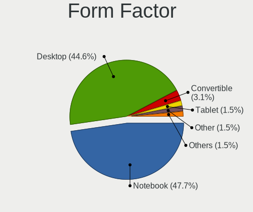
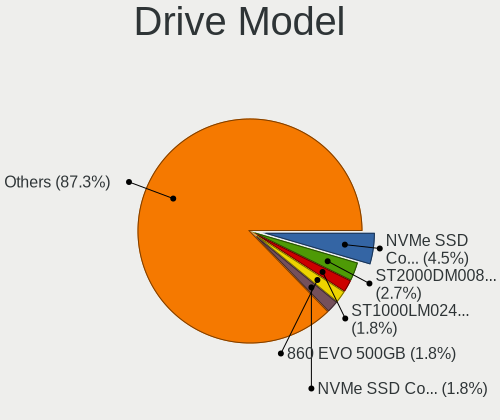
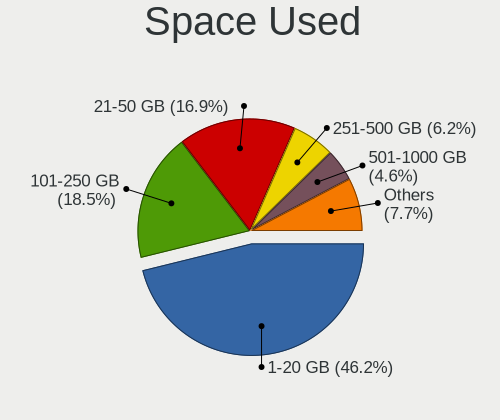
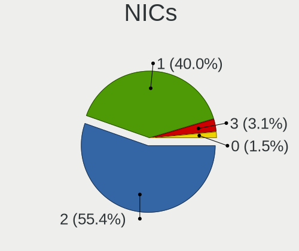
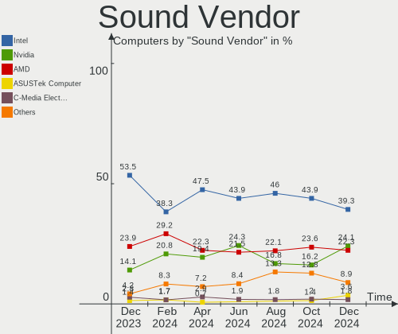

KDE neon - Hardware Trends
--------------------------

A project to identify most popular hardware characteristics and track their change
over time based on data collected by Linux users at https://Linux-Hardware.org.

Anyone can contribute to this report by the [hw-probe](https://github.com/linuxhw/hw-probe) tool:

    sudo -E hw-probe -all -upload

This is a report for all computer types. See also reports for [desktops](/Dist/KDE_neon/Desktop/README.md) and [notebooks](/Dist/KDE_neon/Notebook/README.md).

This report is for one last month. Overall report since the beginning of time: [TestDays](https://github.com/linuxhw/TestDays)

Period: Oct, 2023.

Contents
--------

* [ System ](#system)
  - [ OS                       ](#os)
  - [ OS Family                ](#os-family)
  - [ Kernel                   ](#kernel)
  - [ Kernel Family            ](#kernel-family)
  - [ Kernel Major Ver.        ](#kernel-major-ver)
  - [ Arch                     ](#arch)
  - [ DE                       ](#de)
  - [ Display Server           ](#display-server)
  - [ Display Manager          ](#display-manager)
  - [ OS Lang                  ](#os-lang)
  - [ Boot Mode                ](#boot-mode)
  - [ Filesystem               ](#filesystem)
  - [ Part. scheme             ](#part-scheme)
  - [ Dual Boot with Linux/BSD ](#dual-boot-with-linuxbsd)
  - [ Dual Boot (Win)          ](#dual-boot-win)

* [ Board ](#board)
  - [ Vendor                   ](#vendor)
  - [ Model                    ](#model)
  - [ Model Family             ](#model-family)
  - [ MFG Year                 ](#mfg-year)
  - [ Form Factor              ](#form-factor)
  - [ Secure Boot              ](#secure-boot)
  - [ Coreboot                 ](#coreboot)
  - [ RAM Size                 ](#ram-size)
  - [ RAM Used                 ](#ram-used)
  - [ Total Drives             ](#total-drives)
  - [ Has CD-ROM               ](#has-cd-rom)
  - [ Has Ethernet             ](#has-ethernet)
  - [ Has WiFi                 ](#has-wifi)
  - [ Has Bluetooth            ](#has-bluetooth)

* [ Location ](#location)
  - [ Country                  ](#country)
  - [ City                     ](#city)

* [ Drives ](#drives)
  - [ Drive Vendor             ](#drive-vendor)
  - [ Drive Model              ](#drive-model)
  - [ HDD Vendor               ](#hdd-vendor)
  - [ SSD Vendor               ](#ssd-vendor)
  - [ Drive Kind               ](#drive-kind)
  - [ Drive Connector          ](#drive-connector)
  - [ Drive Size               ](#drive-size)
  - [ Space Total              ](#space-total)
  - [ Space Used               ](#space-used)
  - [ Malfunc. Drives          ](#malfunc-drives)
  - [ Malfunc. Drive Vendor    ](#malfunc-drive-vendor)
  - [ Malfunc. HDD Vendor      ](#malfunc-hdd-vendor)
  - [ Malfunc. Drive Kind      ](#malfunc-drive-kind)
  - [ Failed Drives            ](#failed-drives)
  - [ Failed Drive Vendor      ](#failed-drive-vendor)
  - [ Drive Status             ](#drive-status)

* [ Storage controller ](#storage-controller)
  - [ Storage Vendor           ](#storage-vendor)
  - [ Storage Model            ](#storage-model)
  - [ Storage Kind             ](#storage-kind)

* [ Processor ](#processor)
  - [ CPU Vendor               ](#cpu-vendor)
  - [ CPU Model                ](#cpu-model)
  - [ CPU Model Family         ](#cpu-model-family)
  - [ CPU Cores                ](#cpu-cores)
  - [ CPU Sockets              ](#cpu-sockets)
  - [ CPU Threads              ](#cpu-threads)
  - [ CPU Op-Modes             ](#cpu-op-modes)
  - [ CPU Microcode            ](#cpu-microcode)
  - [ CPU Microarch            ](#cpu-microarch)

* [ Graphics ](#graphics)
  - [ GPU Vendor               ](#gpu-vendor)
  - [ GPU Model                ](#gpu-model)
  - [ GPU Combo                ](#gpu-combo)
  - [ GPU Driver               ](#gpu-driver)
  - [ GPU Memory               ](#gpu-memory)

* [ Monitor ](#monitor)
  - [ Monitor Vendor           ](#monitor-vendor)
  - [ Monitor Model            ](#monitor-model)
  - [ Monitor Resolution       ](#monitor-resolution)
  - [ Monitor Diagonal         ](#monitor-diagonal)
  - [ Monitor Width            ](#monitor-width)
  - [ Aspect Ratio             ](#aspect-ratio)
  - [ Monitor Area             ](#monitor-area)
  - [ Pixel Density            ](#pixel-density)
  - [ Multiple Monitors        ](#multiple-monitors)

* [ Network ](#network)
  - [ Net Controller Vendor    ](#net-controller-vendor)
  - [ Net Controller Model     ](#net-controller-model)
  - [ Wireless Vendor          ](#wireless-vendor)
  - [ Wireless Model           ](#wireless-model)
  - [ Ethernet Vendor          ](#ethernet-vendor)
  - [ Ethernet Model           ](#ethernet-model)
  - [ Net Controller Kind      ](#net-controller-kind)
  - [ Used Controller          ](#used-controller)
  - [ NICs                     ](#nics)
  - [ IPv6                     ](#ipv6)

* [ Bluetooth ](#bluetooth)
  - [ Bluetooth Vendor         ](#bluetooth-vendor)
  - [ Bluetooth Model          ](#bluetooth-model)

* [ Sound ](#sound)
  - [ Sound Vendor             ](#sound-vendor)
  - [ Sound Model              ](#sound-model)

* [ Memory ](#memory)
  - [ Memory Vendor            ](#memory-vendor)
  - [ Memory Model             ](#memory-model)
  - [ Memory Kind              ](#memory-kind)
  - [ Memory Form Factor       ](#memory-form-factor)
  - [ Memory Size              ](#memory-size)
  - [ Memory Speed             ](#memory-speed)

* [ Printers & scanners ](#printers--scanners)
  - [ Printer Vendor           ](#printer-vendor)
  - [ Printer Model            ](#printer-model)
  - [ Scanner Vendor           ](#scanner-vendor)
  - [ Scanner Model            ](#scanner-model)

* [ Camera ](#camera)
  - [ Camera Vendor            ](#camera-vendor)
  - [ Camera Model             ](#camera-model)

* [ Security ](#security)
  - [ Fingerprint Vendor       ](#fingerprint-vendor)
  - [ Fingerprint Model        ](#fingerprint-model)
  - [ Chipcard Vendor          ](#chipcard-vendor)
  - [ Chipcard Model           ](#chipcard-model)

* [ Unsupported ](#unsupported)
  - [ Unsupported Devices      ](#unsupported-devices)
  - [ Unsupported Device Types ](#unsupported-device-types)

System
------

OS
--

Installed operating systems

| Name           | Computers | Percent |
|----------------|-----------|---------|
| KDE neon 22.04 | 71        | 97.26%  |
| KDE neon 20.04 | 2         | 2.74%   |

OS Family
---------

OS without a version

| Name     | Computers | Percent |
|----------|-----------|---------|
| KDE neon | 73        | 100%    |

Kernel
------

Version of the Linux kernel

| Version               | Computers | Percent |
|-----------------------|-----------|---------|
| 6.2.0-34-generic      | 34        | 46.58%  |
| 6.2.0-33-generic      | 18        | 24.66%  |
| 6.2.0-35-generic      | 9         | 12.33%  |
| 6.2.0-32-generic      | 3         | 4.11%   |
| 6.5.5-surface         | 1         | 1.37%   |
| 6.5.4-x64v1-xanmod1   | 1         | 1.37%   |
| 6.3.13-060313-generic | 1         | 1.37%   |
| 6.2.0-36-generic      | 1         | 1.37%   |
| 6.2.0-1015-lowlatency | 1         | 1.37%   |
| 5.19.0-43-generic     | 1         | 1.37%   |
| 5.15.0-86-generic     | 1         | 1.37%   |
| 5.15.0-60-generic     | 1         | 1.37%   |
| 5.11.0-44-generic     | 1         | 1.37%   |

Kernel Family
-------------

Linux kernel without a distro release

| Version | Computers | Percent |
|---------|-----------|---------|
| 6.2.0   | 66        | 90.41%  |
| 5.15.0  | 2         | 2.74%   |
| 6.5.5   | 1         | 1.37%   |
| 6.5.4   | 1         | 1.37%   |
| 6.3.13  | 1         | 1.37%   |
| 5.19.0  | 1         | 1.37%   |
| 5.11.0  | 1         | 1.37%   |

Kernel Major Ver.
-----------------

Linux kernel major version

| Version | Computers | Percent |
|---------|-----------|---------|
| 6.2     | 66        | 90.41%  |
| 6.5     | 2         | 2.74%   |
| 5.15    | 2         | 2.74%   |
| 6.3     | 1         | 1.37%   |
| 5.19    | 1         | 1.37%   |
| 5.11    | 1         | 1.37%   |

Arch
----

OS architecture (x86_64, i586, etc.)

| Name   | Computers | Percent |
|--------|-----------|---------|
| x86_64 | 73        | 100%    |

DE
--

Desktop Environment

| Name    | Computers | Percent |
|---------|-----------|---------|
| KDE5    | 70        | 95.89%  |
| KDE     | 2         | 2.74%   |
| Unknown | 1         | 1.37%   |

Display Server
--------------

X11 or Wayland

| Name    | Computers | Percent |
|---------|-----------|---------|
| X11     | 65        | 89.04%  |
| Wayland | 8         | 10.96%  |

Display Manager
---------------

SDDM, LightDM, etc.

| Name    | Computers | Percent |
|---------|-----------|---------|
| Unknown | 54        | 73.97%  |
| SDDM    | 19        | 26.03%  |

OS Lang
-------

Language

| Lang    | Computers | Percent |
|---------|-----------|---------|
| en_US   | 37        | 50.68%  |
| en_GB   | 8         | 10.96%  |
| en_CA   | 5         | 6.85%   |
| de_DE   | 5         | 6.85%   |
| ru_RU   | 4         | 5.48%   |
| fr_FR   | 3         | 4.11%   |
| C       | 2         | 2.74%   |
| tr_TR   | 1         | 1.37%   |
| it_IT   | 1         | 1.37%   |
| hu_HU   | 1         | 1.37%   |
| es_MX   | 1         | 1.37%   |
| en_ZA   | 1         | 1.37%   |
| en_IN   | 1         | 1.37%   |
| en_AU   | 1         | 1.37%   |
| da_DK   | 1         | 1.37%   |
| Unknown | 1         | 1.37%   |

Boot Mode
---------

EFI or BIOS

| Mode | Computers | Percent |
|------|-----------|---------|
| BIOS | 67        | 91.78%  |
| EFI  | 6         | 8.22%   |

Filesystem
----------

Type of filesystem

| Type    | Computers | Percent |
|---------|-----------|---------|
| Ext4    | 60        | 82.19%  |
| Tmpfs   | 10        | 13.7%   |
| Btrfs   | 2         | 2.74%   |
| Overlay | 1         | 1.37%   |

Part. scheme
------------

Scheme of partitioning

| Type    | Computers | Percent |
|---------|-----------|---------|
| Unknown | 52        | 71.23%  |
| GPT     | 18        | 24.66%  |
| MBR     | 3         | 4.11%   |

Dual Boot with Linux/BSD
------------------------

Hosting more than one Linux/BSD

| Dual boot | Computers | Percent |
|-----------|-----------|---------|
| No        | 68        | 93.15%  |
| Yes       | 5         | 6.85%   |

Dual Boot (Win)
---------------

Hosting Linux and Windows

| Dual boot | Computers | Percent |
|-----------|-----------|---------|
| No        | 61        | 83.56%  |
| Yes       | 12        | 16.44%  |

Board
-----

Vendor
------

Motherboard manufacturer

| Name                | Computers | Percent |
|---------------------|-----------|---------|
| Lenovo              | 13        | 17.81%  |
| Dell                | 13        | 17.81%  |
| ASUSTek Computer    | 12        | 16.44%  |
| Hewlett-Packard     | 11        | 15.07%  |
| MSI                 | 5         | 6.85%   |
| Acer                | 3         | 4.11%   |
| Intel               | 2         | 2.74%   |
| Gigabyte Technology | 2         | 2.74%   |
| ASRock              | 2         | 2.74%   |
| XFX                 | 1         | 1.37%   |
| Sony                | 1         | 1.37%   |
| Notebook            | 1         | 1.37%   |
| Microsoft           | 1         | 1.37%   |
| Huanan              | 1         | 1.37%   |
| Fujitsu Siemens     | 1         | 1.37%   |
| Fujitsu             | 1         | 1.37%   |
| Framework           | 1         | 1.37%   |
| Biostar             | 1         | 1.37%   |
| Unknown             | 1         | 1.37%   |

Model
-----

Motherboard model

| Name                                     | Computers | Percent |
|------------------------------------------|-----------|---------|
| Dell XPS 15 9530                         | 2         | 2.74%   |
| XFX nForce 790i Ultra 3-Way SLI          | 1         | 1.37%   |
| Sony VPCEB16FG                           | 1         | 1.37%   |
| Notebook N150CU                          | 1         | 1.37%   |
| MSI p7-1233w                             | 1         | 1.37%   |
| MSI MS-7E12                              | 1         | 1.37%   |
| MSI MS-7B89                              | 1         | 1.37%   |
| MSI MS-7B79                              | 1         | 1.37%   |
| MSI MS-7B17                              | 1         | 1.37%   |
| Microsoft Surface Go 3                   | 1         | 1.37%   |
| Lenovo Yoga C940-15IRH 81TE              | 1         | 1.37%   |
| Lenovo Yoga C740-15IML 81TD              | 1         | 1.37%   |
| Lenovo ThinkPad X1 Carbon 2nd 20A8S38300 | 1         | 1.37%   |
| Lenovo ThinkPad T510 43142MU             | 1         | 1.37%   |
| Lenovo ThinkPad T460s 20FAS1ND00         | 1         | 1.37%   |
| Lenovo ThinkPad P50 20EQS3BT2E           | 1         | 1.37%   |
| Lenovo ThinkPad P50 20EQS2U20N           | 1         | 1.37%   |
| Lenovo ThinkPad E14 Gen 3 20Y70044RT     | 1         | 1.37%   |
| Lenovo IdeaPad 5 Pro 16ACH6 82L5         | 1         | 1.37%   |
| Lenovo IdeaPad 5 14ALC05 82LM            | 1         | 1.37%   |
| Lenovo IdeaPad 3 15ARE05 81W4            | 1         | 1.37%   |
| Lenovo G780                              | 1         | 1.37%   |
| Lenovo Flex 6-11IGM 81A7                 | 1         | 1.37%   |
| Intel Jasper Lake Client Platform        | 1         | 1.37%   |
| Intel DH67CL AAG10212-210                | 1         | 1.37%   |
| Huanan X99-TF GAMING V2.0                | 1         | 1.37%   |
| HP Spectre x360 Convertible 13-ap0xxx    | 1         | 1.37%   |
| HP ProBook 6470b                         | 1         | 1.37%   |
| HP ProBook 445 G7                        | 1         | 1.37%   |
| HP Pavilion 15                           | 1         | 1.37%   |
| HP OMEN Laptop 15-en0xxx                 | 1         | 1.37%   |
| HP Notebook                              | 1         | 1.37%   |
| HP ENVY x360 Convertible 15-ed0xxx       | 1         | 1.37%   |
| HP EliteBook 2570p                       | 1         | 1.37%   |
| HP ELITE SLICE                           | 1         | 1.37%   |
| HP 240 G8 Notebook PC                    | 1         | 1.37%   |
| HP 23-q110na                             | 1         | 1.37%   |
| Gigabyte GA-990FXA-UD3                   | 1         | 1.37%   |
| Gigabyte GA-880GMA-UD2H                  | 1         | 1.37%   |
| Fujitsu Siemens D2750-A2                 | 1         | 1.37%   |

Model Family
------------

Motherboard model prefix

| Name                     | Computers | Percent |
|--------------------------|-----------|---------|
| Lenovo ThinkPad          | 6         | 8.22%   |
| Dell XPS                 | 5         | 6.85%   |
| Lenovo IdeaPad           | 3         | 4.11%   |
| Dell Inspiron            | 3         | 4.11%   |
| ASUS PRIME               | 3         | 4.11%   |
| Lenovo Yoga              | 2         | 2.74%   |
| HP ProBook               | 2         | 2.74%   |
| Dell OptiPlex            | 2         | 2.74%   |
| Dell Latitude            | 2         | 2.74%   |
| Acer Aspire              | 2         | 2.74%   |
| XFX nForce               | 1         | 1.37%   |
| Sony VPCEB16FG           | 1         | 1.37%   |
| Notebook N150CU          | 1         | 1.37%   |
| MSI p7-1233w             | 1         | 1.37%   |
| MSI MS-7E12              | 1         | 1.37%   |
| MSI MS-7B89              | 1         | 1.37%   |
| MSI MS-7B79              | 1         | 1.37%   |
| MSI MS-7B17              | 1         | 1.37%   |
| Microsoft Surface        | 1         | 1.37%   |
| Lenovo G780              | 1         | 1.37%   |
| Lenovo Flex              | 1         | 1.37%   |
| Intel Jasper             | 1         | 1.37%   |
| Intel DH67CL             | 1         | 1.37%   |
| Huanan X99-TF            | 1         | 1.37%   |
| HP Spectre               | 1         | 1.37%   |
| HP Pavilion              | 1         | 1.37%   |
| HP OMEN                  | 1         | 1.37%   |
| HP Notebook              | 1         | 1.37%   |
| HP ENVY                  | 1         | 1.37%   |
| HP EliteBook             | 1         | 1.37%   |
| HP ELITE                 | 1         | 1.37%   |
| HP 240                   | 1         | 1.37%   |
| HP 23-q110na             | 1         | 1.37%   |
| Gigabyte GA-990FXA-UD3   | 1         | 1.37%   |
| Gigabyte GA-880GMA-UD2H  | 1         | 1.37%   |
| Fujitsu Siemens D2750-A2 | 1         | 1.37%   |
| Fujitsu LIFEBOOK         | 1         | 1.37%   |
| Framework Laptop         | 1         | 1.37%   |
| Dell Precision           | 1         | 1.37%   |
| Biostar B450MH           | 1         | 1.37%   |

MFG Year
--------

Motherboard manufacture year

| Year | Computers | Percent |
|------|-----------|---------|
| 2020 | 9         | 12.33%  |
| 2014 | 8         | 10.96%  |
| 2012 | 8         | 10.96%  |
| 2021 | 7         | 9.59%   |
| 2019 | 7         | 9.59%   |
| 2022 | 6         | 8.22%   |
| 2018 | 6         | 8.22%   |
| 2015 | 5         | 6.85%   |
| 2011 | 4         | 5.48%   |
| 2010 | 3         | 4.11%   |
| 2023 | 2         | 2.74%   |
| 2017 | 2         | 2.74%   |
| 2016 | 2         | 2.74%   |
| 2009 | 2         | 2.74%   |
| 2013 | 1         | 1.37%   |
| 2008 | 1         | 1.37%   |

Form Factor
-----------

Physical design of the computer

| Name        | Computers | Percent |
|-------------|-----------|---------|
| Notebook    | 37        | 50.68%  |
| Desktop     | 29        | 39.73%  |
| Convertible | 5         | 6.85%   |
| Tablet      | 1         | 1.37%   |
| Mini pc     | 1         | 1.37%   |

Secure Boot
-----------

Enabled or disabled

| State    | Computers | Percent |
|----------|-----------|---------|
| Disabled | 72        | 98.63%  |
| Enabled  | 1         | 1.37%   |

Coreboot
--------

Have coreboot on board

| Used | Computers | Percent |
|------|-----------|---------|
| No   | 73        | 100%    |

RAM Size
--------

Total RAM memory

| Size in GB  | Computers | Percent |
|-------------|-----------|---------|
| 16.01-24.0  | 21        | 28.77%  |
| 8.01-16.0   | 17        | 23.29%  |
| 4.01-8.0    | 14        | 19.18%  |
| 32.01-64.0  | 9         | 12.33%  |
| 3.01-4.0    | 6         | 8.22%   |
| 24.01-32.0  | 3         | 4.11%   |
| 64.01-256.0 | 3         | 4.11%   |

RAM Used
--------

Used RAM memory

| Used GB   | Computers | Percent |
|-----------|-----------|---------|
| 3.01-4.0  | 20        | 27.4%   |
| 2.01-3.0  | 20        | 27.4%   |
| 1.01-2.0  | 15        | 20.55%  |
| 4.01-8.0  | 13        | 17.81%  |
| 8.01-16.0 | 5         | 6.85%   |

Total Drives
------------

Number of drives on board

| Drives | Computers | Percent |
|--------|-----------|---------|
| 1      | 41        | 56.16%  |
| 2      | 24        | 32.88%  |
| 3      | 4         | 5.48%   |
| 4      | 2         | 2.74%   |
| 6      | 1         | 1.37%   |
| 5      | 1         | 1.37%   |

Has CD-ROM
----------

Has CD-ROM on board

| Presented | Computers | Percent |
|-----------|-----------|---------|
| No        | 47        | 64.38%  |
| Yes       | 26        | 35.62%  |

Has Ethernet
------------

Has Ethernet on board

| Presented | Computers | Percent |
|-----------|-----------|---------|
| Yes       | 59        | 80.82%  |
| No        | 14        | 19.18%  |

Has WiFi
--------

Has WiFi module

| Presented | Computers | Percent |
|-----------|-----------|---------|
| Yes       | 63        | 86.3%   |
| No        | 10        | 13.7%   |

Has Bluetooth
-------------

Has Bluetooth module

| Presented | Computers | Percent |
|-----------|-----------|---------|
| Yes       | 48        | 65.75%  |
| No        | 25        | 34.25%  |

Location
--------

Country
-------

Geographic location (country)

| Country      | Computers | Percent |
|--------------|-----------|---------|
| USA          | 22        | 30.14%  |
| UK           | 7         | 9.59%   |
| Russia       | 6         | 8.22%   |
| Canada       | 6         | 8.22%   |
| Germany      | 4         | 5.48%   |
| Netherlands  | 2         | 2.74%   |
| Mexico       | 2         | 2.74%   |
| France       | 2         | 2.74%   |
| Colombia     | 2         | 2.74%   |
| Australia    | 2         | 2.74%   |
| Vietnam      | 1         | 1.37%   |
| Ukraine      | 1         | 1.37%   |
| Turkey       | 1         | 1.37%   |
| Switzerland  | 1         | 1.37%   |
| South Africa | 1         | 1.37%   |
| Serbia       | 1         | 1.37%   |
| Portugal     | 1         | 1.37%   |
| Poland       | 1         | 1.37%   |
| Pakistan     | 1         | 1.37%   |
| Kazakhstan   | 1         | 1.37%   |
| Italy        | 1         | 1.37%   |
| India        | 1         | 1.37%   |
| Hungary      | 1         | 1.37%   |
| Greenland    | 1         | 1.37%   |
| Czechia      | 1         | 1.37%   |
| Bulgaria     | 1         | 1.37%   |
| Bangladesh   | 1         | 1.37%   |
| Algeria      | 1         | 1.37%   |

City
----

Geographic location (city)

| City              | Computers | Percent |
|-------------------|-----------|---------|
| Tiverton          | 2         | 2.74%   |
| Sydney            | 2         | 2.74%   |
| Moscow            | 2         | 2.74%   |
| Montreal          | 2         | 2.74%   |
| Berlin            | 2         | 2.74%   |
| Zanesville        | 1         | 1.37%   |
| Yaroslavl         | 1         | 1.37%   |
| Wittenbach        | 1         | 1.37%   |
| Vigonza           | 1         | 1.37%   |
| Trail             | 1         | 1.37%   |
| Toms River        | 1         | 1.37%   |
| Tolono            | 1         | 1.37%   |
| Tlemcen           | 1         | 1.37%   |
| Tampico           | 1         | 1.37%   |
| Spring            | 1         | 1.37%   |
| Sogamoso          | 1         | 1.37%   |
| Sofia             | 1         | 1.37%   |
| Savage            | 1         | 1.37%   |
| Saratov           | 1         | 1.37%   |
| Royal Oak         | 1         | 1.37%   |
| Richmond          | 1         | 1.37%   |
| Paris             | 1         | 1.37%   |
| Oak Ridge         | 1         | 1.37%   |
| Novosibirsk       | 1         | 1.37%   |
| Newport           | 1         | 1.37%   |
| New Ulm           | 1         | 1.37%   |
| Munich            | 1         | 1.37%   |
| Monument          | 1         | 1.37%   |
| Moncton           | 1         | 1.37%   |
| Mirpur            | 1         | 1.37%   |
| Medford           | 1         | 1.37%   |
| Marlborough       | 1         | 1.37%   |
| Markham           | 1         | 1.37%   |
| Mariupol          | 1         | 1.37%   |
| Manchester Center | 1         | 1.37%   |
| Livonia           | 1         | 1.37%   |
| Lephalale         | 1         | 1.37%   |
| Lansing           | 1         | 1.37%   |
| Kiselëvsk        | 1         | 1.37%   |
| Kennesaw          | 1         | 1.37%   |

Drives
------

Drive Vendor
------------

Hard drive vendors

| Vendor              | Computers | Drives | Percent |
|---------------------|-----------|--------|---------|
| Sandisk             | 19        | 20     | 17.27%  |
| Samsung Electronics | 17        | 20     | 15.45%  |
| Seagate             | 16        | 21     | 14.55%  |
| WDC                 | 10        | 13     | 9.09%   |
| Toshiba             | 7         | 8      | 6.36%   |
| Kingston            | 7         | 7      | 6.36%   |
| Intel               | 5         | 6      | 4.55%   |
| SK hynix            | 4         | 4      | 3.64%   |
| Hitachi             | 4         | 4      | 3.64%   |
| Crucial             | 4         | 4      | 3.64%   |
| A-DATA Technology   | 3         | 3      | 2.73%   |
| KIOXIA              | 2         | 2      | 1.82%   |
| China               | 2         | 2      | 1.82%   |
| Unknown             | 1         | 1      | 0.91%   |
| Transcend           | 1         | 1      | 0.91%   |
| TO Exter            | 1         | 1      | 0.91%   |
| Patriot             | 1         | 1      | 0.91%   |
| Micron Technology   | 1         | 1      | 0.91%   |
| LITEONIT            | 1         | 1      | 0.91%   |
| LITEON              | 1         | 1      | 0.91%   |
| HGST                | 1         | 1      | 0.91%   |
| Emtec               | 1         | 1      | 0.91%   |
| BUFFALO             | 1         | 1      | 0.91%   |

Drive Model
-----------

Hard drive models

| Model                                              | Computers | Percent |
|----------------------------------------------------|-----------|---------|
| Sandisk WD Blue SN550 NVMe SSD 1TB                 | 3         | 2.46%   |
| Seagate ST2000DM008-2FR102 2TB                     | 2         | 1.64%   |
| Seagate Backup+ Hub BK 8TB                         | 2         | 1.64%   |
| Samsung SSD 970 EVO 500GB                          | 2         | 1.64%   |
| Samsung SSD 860 EVO 500GB                          | 2         | 1.64%   |
| Samsung SSD 850 EVO 120GB                          | 2         | 1.64%   |
| Samsung NVMe SSD Controller SM981/PM981/PM983 1TB  | 2         | 1.64%   |
| Samsung NVMe SSD Controller PM9A1/PM9A3/980PRO 1TB | 2         | 1.64%   |
| Intel SSD 660P Series 1024GB                       | 2         | 1.64%   |
| WDC WDS100T2B0A-00SM50 1TB SSD                     | 1         | 0.82%   |
| WDC WD5000AZLX-75K2TA0 500GB                       | 1         | 0.82%   |
| WDC WD5000AAKX-001CA0 500GB                        | 1         | 0.82%   |
| WDC WD3200BPVT-22JJ5T0 320GB                       | 1         | 0.82%   |
| WDC WD20SPZX-22UA7T0 2TB                           | 1         | 0.82%   |
| WDC WD20EZBX-00AYRA0 2TB                           | 1         | 0.82%   |
| WDC WD20EFAX-68B2RN1 2TB                           | 1         | 0.82%   |
| WDC WD1600AAJS-00L7A0 160GB                        | 1         | 0.82%   |
| WDC WD10PURZ-85U8XY0 1TB                           | 1         | 0.82%   |
| WDC WD10EZEX-08WN4A1 1TB                           | 1         | 0.82%   |
| WDC WD10EACS-32D6B1 1TB                            | 1         | 0.82%   |
| Unknown MMC Card  64GB                             | 1         | 0.82%   |
| Transcend TS120GMTS420S 120GB SSD                  | 1         | 0.82%   |
| Toshiba TR150 240GB SSD                            | 1         | 0.82%   |
| Toshiba MQ01ABD075 752GB                           | 1         | 0.82%   |
| Toshiba MK8037GSX 80GB                             | 1         | 0.82%   |
| Toshiba MK5076GSX 500GB                            | 1         | 0.82%   |
| Toshiba MG05ACA800E 8TB                            | 1         | 0.82%   |
| Toshiba KXG50ZNV512G 512GB                         | 1         | 0.82%   |
| Toshiba HDWJ110 1TB                                | 1         | 0.82%   |
| Toshiba HDWE160 6TB                                | 1         | 0.82%   |
| TO Exter nal USB 3.0 2TB                           | 1         | 0.82%   |
| SK hynix SHGS31-500GS-2 500GB SSD                  | 1         | 0.82%   |
| SK hynix PC601 HFS512GD9TNG-L2A0A 512GB            | 1         | 0.82%   |
| SK hynix PC401 NVMe 256GB                          | 1         | 0.82%   |
| SK hynix BC501 NVMe Solid State Drive 512GB        | 1         | 0.82%   |
| Seagate ST95005620AS 500GB                         | 1         | 0.82%   |
| Seagate ST9500420AS 500GB                          | 1         | 0.82%   |
| Seagate ST500LT012-1DG142 500GB                    | 1         | 0.82%   |
| Seagate ST3500630AS 500GB                          | 1         | 0.82%   |
| Seagate ST3500418AS 500GB                          | 1         | 0.82%   |

HDD Vendor
----------

Hard disk drive vendors

| Vendor  | Computers | Drives | Percent |
|---------|-----------|--------|---------|
| Seagate | 16        | 20     | 45.71%  |
| WDC     | 9         | 12     | 25.71%  |
| Toshiba | 5         | 6      | 14.29%  |
| Hitachi | 4         | 4      | 11.43%  |
| HGST    | 1         | 1      | 2.86%   |

SSD Vendor
----------

Solid state drive vendors

| Vendor              | Computers | Drives | Percent |
|---------------------|-----------|--------|---------|
| SanDisk             | 7         | 7      | 17.5%   |
| Samsung Electronics | 7         | 7      | 17.5%   |
| Kingston            | 4         | 4      | 10%     |
| Crucial             | 4         | 4      | 10%     |
| A-DATA Technology   | 3         | 3      | 7.5%    |
| Intel               | 2         | 2      | 5%      |
| China               | 2         | 2      | 5%      |
| WDC                 | 1         | 1      | 2.5%    |
| Transcend           | 1         | 1      | 2.5%    |
| Toshiba             | 1         | 1      | 2.5%    |
| TO Exter            | 1         | 1      | 2.5%    |
| SK hynix            | 1         | 1      | 2.5%    |
| Patriot             | 1         | 1      | 2.5%    |
| Micron Technology   | 1         | 1      | 2.5%    |
| LITEONIT            | 1         | 1      | 2.5%    |
| LITEON              | 1         | 1      | 2.5%    |
| Emtec               | 1         | 1      | 2.5%    |
| BUFFALO             | 1         | 1      | 2.5%    |

Drive Kind
----------

HDD or SSD

| Kind    | Computers | Drives | Percent |
|---------|-----------|--------|---------|
| NVMe    | 35        | 39     | 35%     |
| SSD     | 33        | 40     | 33%     |
| HDD     | 30        | 43     | 30%     |
| MMC     | 1         | 1      | 1%      |
| Unknown | 1         | 1      | 1%      |

Drive Connector
---------------

SATA, SAS, NVMe, etc.

| Type | Computers | Drives | Percent |
|------|-----------|--------|---------|
| SATA | 51        | 77     | 55.43%  |
| NVMe | 35        | 39     | 38.04%  |
| SAS  | 5         | 7      | 5.43%   |
| MMC  | 1         | 1      | 1.09%   |

Drive Size
----------

Size of hard drive

| Size in TB | Computers | Drives | Percent |
|------------|-----------|--------|---------|
| 0.01-0.5   | 37        | 45     | 53.62%  |
| 0.51-1.0   | 18        | 21     | 26.09%  |
| 1.01-2.0   | 10        | 10     | 14.49%  |
| 4.01-10.0  | 2         | 4      | 2.9%    |
| 2.01-3.0   | 1         | 1      | 1.45%   |
| 10.01-20.0 | 1         | 2      | 1.45%   |

Space Total
-----------

Amount of disk space available on the file system

| Size in GB     | Computers | Percent |
|----------------|-----------|---------|
| 251-500        | 22        | 30.14%  |
| 101-250        | 16        | 21.92%  |
| 1001-2000      | 11        | 15.07%  |
| 501-1000       | 11        | 15.07%  |
| 21-50          | 5         | 6.85%   |
| More than 3000 | 3         | 4.11%   |
| Unknown        | 2         | 2.74%   |
| 2001-3000      | 1         | 1.37%   |
| 1-20           | 1         | 1.37%   |
| 51-100         | 1         | 1.37%   |

Space Used
----------

Amount of used disk space

| Used GB   | Computers | Percent |
|-----------|-----------|---------|
| 1-20      | 29        | 39.73%  |
| 101-250   | 14        | 19.18%  |
| 21-50     | 11        | 15.07%  |
| 251-500   | 5         | 6.85%   |
| 501-1000  | 5         | 6.85%   |
| 51-100    | 4         | 5.48%   |
| 1001-2000 | 2         | 2.74%   |
| Unknown   | 2         | 2.74%   |
| 2001-3000 | 1         | 1.37%   |

Malfunc. Drives
---------------

Drive models with a malfunction

| Model                     | Computers | Drives | Percent |
|---------------------------|-----------|--------|---------|
| SK hynix PC401 NVMe 256GB | 1         | 1      | 100%    |

Malfunc. Drive Vendor
---------------------

Vendors of faulty drives

| Vendor   | Computers | Drives | Percent |
|----------|-----------|--------|---------|
| SK hynix | 1         | 1      | 100%    |

Malfunc. HDD Vendor
-------------------

Vendors of faulty HDD drives

Zero info for selected period =(

Malfunc. Drive Kind
-------------------

Kinds of faulty drives

| Kind | Computers | Drives | Percent |
|------|-----------|--------|---------|
| NVMe | 1         | 1      | 100%    |

Failed Drives
-------------

Failed drive models

Zero info for selected period =(

Failed Drive Vendor
-------------------

Failed drive vendors

Zero info for selected period =(

Drive Status
------------

Number of failed and malfunc. drives

| Status   | Computers | Drives | Percent |
|----------|-----------|--------|---------|
| Detected | 64        | 107    | 86.49%  |
| Works    | 9         | 16     | 12.16%  |
| Malfunc  | 1         | 1      | 1.35%   |

Storage controller
------------------

Storage Vendor
--------------

Storage controller vendors

| Vendor                       | Computers | Percent |
|------------------------------|-----------|---------|
| Intel                        | 46        | 44.23%  |
| AMD                          | 19        | 18.27%  |
| SanDisk                      | 12        | 11.54%  |
| Samsung Electronics          | 12        | 11.54%  |
| SK hynix                     | 3         | 2.88%   |
| Kingston Technology Company  | 3         | 2.88%   |
| KIOXIA                       | 2         | 1.92%   |
| JMicron Technology           | 2         | 1.92%   |
| ASMedia Technology           | 2         | 1.92%   |
| Toshiba America Info Systems | 1         | 0.96%   |
| Nvidia                       | 1         | 0.96%   |
| Marvell Technology Group     | 1         | 0.96%   |

Storage Model
-------------

Storage controller models

| Model                                                                          | Computers | Percent |
|--------------------------------------------------------------------------------|-----------|---------|
| AMD FCH SATA Controller [AHCI mode]                                            | 13        | 11.4%   |
| Intel Q170/Q150/B150/H170/H110/Z170/CM236 Chipset SATA Controller [AHCI Mode]  | 6         | 5.26%   |
| Samsung NVMe SSD Controller SM981/PM981/PM983                                  | 5         | 4.39%   |
| Samsung NVMe SSD Controller 980 (DRAM-less)                                    | 4         | 3.51%   |
| Intel Volume Management Device NVMe RAID Controller                            | 4         | 3.51%   |
| AMD SB7x0/SB8x0/SB9x0 SATA Controller [AHCI mode]                              | 4         | 3.51%   |
| SanDisk Ultra 3D / WD Blue SN550 NVMe SSD                                      | 3         | 2.63%   |
| Samsung NVMe SSD Controller PM9A1/PM9A3/980PRO                                 | 3         | 2.63%   |
| Intel Sunrise Point-LP SATA Controller [AHCI mode]                             | 3         | 2.63%   |
| Intel Comet Lake SATA AHCI Controller                                          | 3         | 2.63%   |
| Intel 8 Series/C220 Series Chipset Family 6-port SATA Controller 1 [AHCI mode] | 3         | 2.63%   |
| Intel 8 Series SATA Controller 1 [AHCI mode]                                   | 3         | 2.63%   |
| Intel 7 Series Chipset Family 6-port SATA Controller [AHCI mode]               | 3         | 2.63%   |
| AMD 400 Series Chipset SATA Controller                                         | 3         | 2.63%   |
| Sandisk WD Black SN850X NVMe SSD                                               | 2         | 1.75%   |
| SanDisk Ultra 3D / WD Blue SN570 NVMe SSD (DRAM-less)                          | 2         | 1.75%   |
| Kingston Company KC3000/FURY Renegade NVMe SSD E18                             | 2         | 1.75%   |
| Intel SATA Controller [RAID mode]                                              | 2         | 1.75%   |
| Intel Cannon Point-LP SATA Controller [AHCI Mode]                              | 2         | 1.75%   |
| Intel 82801 Mobile SATA Controller [RAID mode]                                 | 2         | 1.75%   |
| Intel 6 Series/C200 Series Chipset Family 6 port Mobile SATA AHCI Controller   | 2         | 1.75%   |
| Intel 5 Series/3400 Series Chipset 4 port SATA AHCI Controller                 | 2         | 1.75%   |
| ASMedia ASM1062 Serial ATA Controller                                          | 2         | 1.75%   |
| Toshiba America Info Systems XG5 NVMe SSD Controller                           | 1         | 0.88%   |
| SK hynix PC601 NVMe Solid State Drive                                          | 1         | 0.88%   |
| SK hynix PC401 NVMe Solid State Drive 256GB                                    | 1         | 0.88%   |
| SK hynix BC501 NVMe Solid State Drive                                          | 1         | 0.88%   |
| SanDisk WD Green SN350 240GB (DRAM-less) / SN560E NVMe SSD                     | 1         | 0.88%   |
| SanDisk WD Black SN770 / PC SN740 256GB / PC SN560 (DRAM-less) NVMe SSD        | 1         | 0.88%   |
| SanDisk PC SN530 NVMe SSD (DRAM-less)                                          | 1         | 0.88%   |
| SanDisk IX SN530 NVMe SSD (DRAM-less)                                          | 1         | 0.88%   |
| SanDisk Extreme Pro / WD Black SN750 / PC SN730 / Red SN700 NVMe SSD           | 1         | 0.88%   |
| SanDisk Extreme Pro / WD Black 2018/SN750/PC SN720 NVMe SSD                    | 1         | 0.88%   |
| Nvidia MCP55 SATA Controller                                                   | 1         | 0.88%   |
| Nvidia MCP55 IDE                                                               | 1         | 0.88%   |
| Marvell Group 88SE9172 SATA 6Gb/s Controller                                   | 1         | 0.88%   |
| KIOXIA NVMe SSD Controller XG7                                                 | 1         | 0.88%   |
| KIOXIA NVMe SSD Controller BG4 (DRAM-less)                                     | 1         | 0.88%   |
| Kingston Company NV1 NVMe SSD E13T                                             | 1         | 0.88%   |
| JMicron JMB368 IDE controller                                                  | 1         | 0.88%   |

Storage Kind
------------

Kind of storage controller (IDE, SATA, NVMe, SAS, ...)

| Kind | Computers | Percent |
|------|-----------|---------|
| SATA | 57        | 54.81%  |
| NVMe | 34        | 32.69%  |
| RAID | 9         | 8.65%   |
| IDE  | 4         | 3.85%   |

Processor
---------

CPU Vendor
----------

Processor vendors

| Vendor | Computers | Percent |
|--------|-----------|---------|
| Intel  | 52        | 71.23%  |
| AMD    | 21        | 28.77%  |

CPU Model
---------

Processor models

| Model                                       | Computers | Percent |
|---------------------------------------------|-----------|---------|
| Intel Core i7-8565U CPU @ 1.80GHz           | 3         | 4.11%   |
| Intel Core i7-6820HQ CPU @ 2.70GHz          | 3         | 4.11%   |
| AMD Ryzen 5 3600 6-Core Processor           | 2         | 2.74%   |
| Intel Xeon CPU E5-2666 v3 @ 2.90GHz         | 1         | 1.37%   |
| Intel Pentium Dual-Core CPU E5800 @ 3.20GHz | 1         | 1.37%   |
| Intel Pentium CPU GOLD 6500Y @ 1.10GHz      | 1         | 1.37%   |
| Intel Core i7-9750H CPU @ 2.60GHz           | 1         | 1.37%   |
| Intel Core i7-8650U CPU @ 1.90GHz           | 1         | 1.37%   |
| Intel Core i7-7500U CPU @ 2.70GHz           | 1         | 1.37%   |
| Intel Core i7-4770 CPU @ 3.40GHz            | 1         | 1.37%   |
| Intel Core i7-4720HQ CPU @ 2.60GHz          | 1         | 1.37%   |
| Intel Core i7-4712HQ CPU @ 2.30GHz          | 1         | 1.37%   |
| Intel Core i7-3612QM CPU @ 2.10GHz          | 1         | 1.37%   |
| Intel Core i7-2630QM CPU @ 2.00GHz          | 1         | 1.37%   |
| Intel Core i7-2600 CPU @ 3.40GHz            | 1         | 1.37%   |
| Intel Core i7-10875H CPU @ 2.30GHz          | 1         | 1.37%   |
| Intel Core i7-10510U CPU @ 1.80GHz          | 1         | 1.37%   |
| Intel Core i7 CPU M 620 @ 2.67GHz           | 1         | 1.37%   |
| Intel Core i5-8350U CPU @ 1.70GHz           | 1         | 1.37%   |
| Intel Core i5-6600 CPU @ 3.30GHz            | 1         | 1.37%   |
| Intel Core i5-6500T CPU @ 2.50GHz           | 1         | 1.37%   |
| Intel Core i5-6400 CPU @ 2.70GHz            | 1         | 1.37%   |
| Intel Core i5-6300U CPU @ 2.40GHz           | 1         | 1.37%   |
| Intel Core i5-4690K CPU @ 3.50GHz           | 1         | 1.37%   |
| Intel Core i5-4670 CPU @ 3.40GHz            | 1         | 1.37%   |
| Intel Core i5-4300U CPU @ 1.90GHz           | 1         | 1.37%   |
| Intel Core i5-4210U CPU @ 1.70GHz           | 1         | 1.37%   |
| Intel Core i5-4200U CPU @ 1.60GHz           | 1         | 1.37%   |
| Intel Core i5-3350P CPU @ 3.10GHz           | 1         | 1.37%   |
| Intel Core i5-3340M CPU @ 2.70GHz           | 1         | 1.37%   |
| Intel Core i5-3320M CPU @ 2.60GHz           | 1         | 1.37%   |
| Intel Core i5-2410M CPU @ 2.30GHz           | 1         | 1.37%   |
| Intel Core i5-1035G1 CPU @ 1.00GHz          | 1         | 1.37%   |
| Intel Core i5-10300H CPU @ 2.50GHz          | 1         | 1.37%   |
| Intel Core i5-10210U CPU @ 1.60GHz          | 1         | 1.37%   |
| Intel Core i5 CPU M 520 @ 2.40GHz           | 1         | 1.37%   |
| Intel Core i3-9100F CPU @ 3.60GHz           | 1         | 1.37%   |
| Intel Core i3-10100F CPU @ 3.60GHz          | 1         | 1.37%   |
| Intel Core i3 CPU M 330 @ 2.13GHz           | 1         | 1.37%   |
| Intel Core 2 Duo CPU E8400 @ 3.00GHz        | 1         | 1.37%   |

CPU Model Family
----------------

Processor model prefix

| Model                   | Computers | Percent |
|-------------------------|-----------|---------|
| Intel Core i7           | 18        | 24.66%  |
| Intel Core i5           | 18        | 24.66%  |
| AMD Ryzen 5             | 8         | 10.96%  |
| Other                   | 7         | 9.59%   |
| AMD Ryzen 7             | 4         | 5.48%   |
| Intel Core i3           | 3         | 4.11%   |
| AMD FX                  | 3         | 4.11%   |
| Intel Celeron           | 2         | 2.74%   |
| AMD Ryzen 3             | 2         | 2.74%   |
| Intel Xeon              | 1         | 1.37%   |
| Intel Pentium Dual-Core | 1         | 1.37%   |
| Intel Pentium           | 1         | 1.37%   |
| Intel Core 2 Duo        | 1         | 1.37%   |
| AMD Ryzen 9             | 1         | 1.37%   |
| AMD Phenom II X6        | 1         | 1.37%   |
| AMD A8                  | 1         | 1.37%   |
| AMD A10                 | 1         | 1.37%   |

CPU Cores
---------

Number of processor cores

| Number | Computers | Percent |
|--------|-----------|---------|
| 4      | 34        | 46.58%  |
| 2      | 18        | 24.66%  |
| 6      | 8         | 10.96%  |
| 8      | 5         | 6.85%   |
| 10     | 3         | 4.11%   |
| 16     | 1         | 1.37%   |
| 14     | 1         | 1.37%   |
| 12     | 1         | 1.37%   |
| 5      | 1         | 1.37%   |
| 3      | 1         | 1.37%   |

CPU Sockets
-----------

Number of sockets

| Number | Computers | Percent |
|--------|-----------|---------|
| 1      | 73        | 100%    |

CPU Threads
-----------

Threads per core (Hyper-Threading)

| Number | Computers | Percent |
|--------|-----------|---------|
| 2      | 57        | 78.08%  |
| 1      | 16        | 21.92%  |

CPU Op-Modes
------------

CPU Operation Modes (32-bit, 64-bit)

| Op mode        | Computers | Percent |
|----------------|-----------|---------|
| 32-bit, 64-bit | 73        | 100%    |

CPU Microcode
-------------

Microcode number

| Number     | Computers | Percent |
|------------|-----------|---------|
| Unknown    | 66        | 90.41%  |
| 0x806ec    | 1         | 1.37%   |
| 0x1067a    | 1         | 1.37%   |
| 0x0a601206 | 1         | 1.37%   |
| 0x08600109 | 1         | 1.37%   |
| 0x08600106 | 1         | 1.37%   |
| 0x06000852 | 1         | 1.37%   |
| 0x010000dc | 1         | 1.37%   |

CPU Microarch
-------------

Microarchitecture

| Name             | Computers | Percent |
|------------------|-----------|---------|
| KabyLake         | 11        | 15.07%  |
| Unknown          | 10        | 13.7%   |
| Haswell          | 9         | 12.33%  |
| Skylake          | 7         | 9.59%   |
| Zen 2            | 6         | 8.22%   |
| IvyBridge        | 4         | 5.48%   |
| Zen+             | 3         | 4.11%   |
| Westmere         | 3         | 4.11%   |
| SandyBridge      | 3         | 4.11%   |
| Piledriver       | 3         | 4.11%   |
| CometLake        | 3         | 4.11%   |
| TigerLake        | 2         | 2.74%   |
| Penryn           | 2         | 2.74%   |
| Zen 3            | 1         | 1.37%   |
| K10              | 1         | 1.37%   |
| IceLake          | 1         | 1.37%   |
| Goldmont plus    | 1         | 1.37%   |
| Excavator        | 1         | 1.37%   |
| Bulldozer        | 1         | 1.37%   |
| Alderlake Hybrid | 1         | 1.37%   |

Graphics
--------

GPU Vendor
----------

Vendors of graphics cards

| Vendor | Computers | Percent |
|--------|-----------|---------|
| Intel  | 39        | 42.86%  |
| Nvidia | 29        | 31.87%  |
| AMD    | 23        | 25.27%  |

GPU Model
---------

Graphics card models

| Model                                                                       | Computers | Percent |
|-----------------------------------------------------------------------------|-----------|---------|
| Intel HD Graphics 530                                                       | 4         | 4.3%    |
| Nvidia TU117M [GeForce GTX 1650 Mobile / Max-Q]                             | 3         | 3.23%   |
| Intel WhiskeyLake-U GT2 [UHD Graphics 620]                                  | 3         | 3.23%   |
| Intel Haswell-ULT Integrated Graphics Controller                            | 3         | 3.23%   |
| AMD Renoir [Radeon RX Vega 6 (Ryzen 4000/5000 Mobile Series)]               | 3         | 3.23%   |
| Nvidia TU116 [GeForce GTX 1660 Ti]                                          | 2         | 2.15%   |
| Nvidia TU106 [GeForce RTX 2060 Rev. A]                                      | 2         | 2.15%   |
| Nvidia GM107GLM [Quadro M2000M]                                             | 2         | 2.15%   |
| Nvidia GF119 [GeForce GT 610]                                               | 2         | 2.15%   |
| Intel Xeon E3-1200 v3/4th Gen Core Processor Integrated Graphics Controller | 2         | 2.15%   |
| Intel UHD Graphics 620                                                      | 2         | 2.15%   |
| Intel CometLake-U GT2 [UHD Graphics]                                        | 2         | 2.15%   |
| Intel CometLake-H GT2 [UHD Graphics]                                        | 2         | 2.15%   |
| Intel 4th Gen Core Processor Integrated Graphics Controller                 | 2         | 2.15%   |
| Intel 3rd Gen Core processor Graphics Controller                            | 2         | 2.15%   |
| Intel 2nd Generation Core Processor Family Integrated Graphics Controller   | 2         | 2.15%   |
| AMD Picasso/Raven 2 [Radeon Vega Series / Radeon Vega Mobile Series]        | 2         | 2.15%   |
| AMD Lucienne                                                                | 2         | 2.15%   |
| Nvidia TU117M [GeForce GTX 1650 Ti Mobile]                                  | 1         | 1.08%   |
| Nvidia TU116M [GeForce GTX 1660 Ti Mobile]                                  | 1         | 1.08%   |
| Nvidia TU116 [GeForce GTX 1650]                                             | 1         | 1.08%   |
| Nvidia TU116 [GeForce GTX 1650 SUPER]                                       | 1         | 1.08%   |
| Nvidia GT218M [NVS 3100M]                                                   | 1         | 1.08%   |
| Nvidia GT218 [GeForce 405]                                                  | 1         | 1.08%   |
| Nvidia GP107 [GeForce GTX 1050]                                             | 1         | 1.08%   |
| Nvidia GP107 [GeForce GTX 1050 Ti]                                          | 1         | 1.08%   |
| Nvidia GP102 [GeForce GTX 1080 Ti]                                          | 1         | 1.08%   |
| Nvidia GM206 [GeForce GTX 960]                                              | 1         | 1.08%   |
| Nvidia GM206 [GeForce GTX 950]                                              | 1         | 1.08%   |
| Nvidia GM107M [GeForce GTX 960M]                                            | 1         | 1.08%   |
| Nvidia GM107GLM [Quadro M1000M]                                             | 1         | 1.08%   |
| Nvidia GM107 [GeForce GTX 750 Ti]                                           | 1         | 1.08%   |
| Nvidia GK107M [GeForce GT 750M]                                             | 1         | 1.08%   |
| Nvidia GF108M [GeForce GT 620M/630M/635M/640M LE]                           | 1         | 1.08%   |
| Nvidia GF108M [GeForce GT 540M]                                             | 1         | 1.08%   |
| Nvidia GF108M [GeForce 610M]                                                | 1         | 1.08%   |
| Intel UHD Graphics 615                                                      | 1         | 1.08%   |
| Intel TigerLake-LP GT2 [Iris Xe Graphics]                                   | 1         | 1.08%   |
| Intel Tiger Lake-LP GT2 [UHD Graphics G4]                                   | 1         | 1.08%   |
| Intel Skylake GT2 [HD Graphics 520]                                         | 1         | 1.08%   |

GPU Combo
---------

Combinations of graphics cards

| Name           | Computers | Percent |
|----------------|-----------|---------|
| 1 x Intel      | 23        | 31.51%  |
| 1 x AMD        | 17        | 23.29%  |
| 1 x Nvidia     | 16        | 21.92%  |
| Intel + Nvidia | 11        | 15.07%  |
| Intel + AMD    | 3         | 4.11%   |
| AMD + Nvidia   | 2         | 2.74%   |
| 2 x AMD        | 1         | 1.37%   |

GPU Driver
----------

Free vs proprietary

| Driver      | Computers | Percent |
|-------------|-----------|---------|
| Free        | 64        | 87.67%  |
| Proprietary | 8         | 10.96%  |
| Unknown     | 1         | 1.37%   |

GPU Memory
----------

Total video memory

| Size in GB | Computers | Percent |
|------------|-----------|---------|
| Unknown    | 60        | 82.19%  |
| 1.01-2.0   | 5         | 6.85%   |
| 0.01-0.5   | 5         | 6.85%   |
| 5.01-6.0   | 1         | 1.37%   |
| 3.01-4.0   | 1         | 1.37%   |
| 8.01-16.0  | 1         | 1.37%   |

Monitor
-------

Monitor Vendor
--------------

Monitor vendors

| Vendor                  | Computers | Percent |
|-------------------------|-----------|---------|
| Samsung Electronics     | 12        | 13.48%  |
| AU Optronics            | 9         | 10.11%  |
| LG Display              | 8         | 8.99%   |
| BOE                     | 8         | 8.99%   |
| Hewlett-Packard         | 6         | 6.74%   |
| Dell                    | 4         | 4.49%   |
| Chimei Innolux          | 4         | 4.49%   |
| ASUSTek Computer        | 4         | 4.49%   |
| Sharp                   | 3         | 3.37%   |
| Goldstar                | 3         | 3.37%   |
| Ancor Communications    | 3         | 3.37%   |
| PANDA                   | 2         | 2.25%   |
| Lenovo                  | 2         | 2.25%   |
| Acer                    | 2         | 2.25%   |
| Vizio                   | 1         | 1.12%   |
| ViewSonic               | 1         | 1.12%   |
| Sony                    | 1         | 1.12%   |
| SAC                     | 1         | 1.12%   |
| Plain Tree Systems      | 1         | 1.12%   |
| Philips                 | 1         | 1.12%   |
| MiTAC                   | 1         | 1.12%   |
| Iiyama                  | 1         | 1.12%   |
| IBM                     | 1         | 1.12%   |
| HKC                     | 1         | 1.12%   |
| Hitachi                 | 1         | 1.12%   |
| HannStar                | 1         | 1.12%   |
| GreenWood               | 1         | 1.12%   |
| Element                 | 1         | 1.12%   |
| DLP                     | 1         | 1.12%   |
| CSO                     | 1         | 1.12%   |
| Chi Mei Optoelectronics | 1         | 1.12%   |
| CHD                     | 1         | 1.12%   |
| BenQ                    | 1         | 1.12%   |

Monitor Model
-------------

Monitor models

| Model                                                                 | Computers | Percent |
|-----------------------------------------------------------------------|-----------|---------|
| Goldstar ULTRAWIDE GSM59F2 2560x1080 677x290mm 29.0-inch              | 2         | 2.17%   |
| Vizio SV370XVT VIZ0057 1920x1080 819x460mm 37.0-inch                  | 1         | 1.09%   |
| ViewSonic VG2448 VSC3B35 1920x1080 527x296mm 23.8-inch                | 1         | 1.09%   |
| Sony LCD Monitor MS_0025 1920x1080 340x190mm 15.3-inch                | 1         | 1.09%   |
| Sharp LCD Monitor SHP14D0 3840x2400 336x210mm 15.6-inch               | 1         | 1.09%   |
| Sharp LCD Monitor SHP143B 3840x2160 346x194mm 15.6-inch               | 1         | 1.09%   |
| Sharp LCD Monitor SHP1431 3840x2160 350x190mm 15.7-inch               | 1         | 1.09%   |
| Samsung Electronics T24E390 SAM0C20 1920x1080 521x293mm 23.5-inch     | 1         | 1.09%   |
| Samsung Electronics SA300/SA350 SAM0791 1920x1080 510x287mm 23.0-inch | 1         | 1.09%   |
| Samsung Electronics S34J55x SAM0F72 3440x1440 797x333mm 34.0-inch     | 1         | 1.09%   |
| Samsung Electronics S27F350 SAM0D22 1920x1080 598x336mm 27.0-inch     | 1         | 1.09%   |
| Samsung Electronics S27E390 SAM0C1C 1920x1080 598x336mm 27.0-inch     | 1         | 1.09%   |
| Samsung Electronics S24E650 SAM0CB8 1920x1080 521x293mm 23.5-inch     | 1         | 1.09%   |
| Samsung Electronics S24E390 SAM0C1A 1920x1080 521x293mm 23.5-inch     | 1         | 1.09%   |
| Samsung Electronics S24D300 SAM0B45 1920x1080 521x293mm 23.5-inch     | 1         | 1.09%   |
| Samsung Electronics S22A33x SAM7122 1920x1080 479x260mm 21.5-inch     | 1         | 1.09%   |
| Samsung Electronics LS24A600N SAM7147 2560x1440 527x297mm 23.8-inch   | 1         | 1.09%   |
| Samsung Electronics LCD Monitor SEC544B 1600x900 382x214mm 17.2-inch  | 1         | 1.09%   |
| Samsung Electronics LCD Monitor SEC345A 1366x768 309x174mm 14.0-inch  | 1         | 1.09%   |
| Samsung Electronics LCD Monitor SDC324C 1920x1080 344x194mm 15.5-inch | 1         | 1.09%   |
| SAC DP SAC2700 1920x1080 600x330mm 27.0-inch                          | 1         | 1.09%   |
| Plain Tree Systems FULL HDTV PTS00D7 1920x1080 477x268mm 21.5-inch    | 1         | 1.09%   |
| Philips PHL 223V5 PHLC0CF 1920x1080 477x268mm 21.5-inch               | 1         | 1.09%   |
| PANDA LCD Monitor NCP0063 1920x1080 344x194mm 15.5-inch               | 1         | 1.09%   |
| PANDA LCD Monitor NCP004F 1920x1080 309x174mm 14.0-inch               | 1         | 1.09%   |
| MiTAC Smart TV MTC0030 3840x2160 960x540mm 43.4-inch                  | 1         | 1.09%   |
| LG Display LCD Monitor LGD06B3 1920x1200 336x210mm 15.6-inch          | 1         | 1.09%   |
| LG Display LCD Monitor LGD065A 1920x1080 344x194mm 15.5-inch          | 1         | 1.09%   |
| LG Display LCD Monitor LGD0635 3840x2160 344x194mm 15.5-inch          | 1         | 1.09%   |
| LG Display LCD Monitor LGD05FE 1920x1080 344x194mm 15.5-inch          | 1         | 1.09%   |
| LG Display LCD Monitor LGD05E5 1920x1080 344x194mm 15.5-inch          | 1         | 1.09%   |
| LG Display LCD Monitor LGD04B9 1920x1080 344x194mm 15.5-inch          | 1         | 1.09%   |
| LG Display LCD Monitor LGD02DC 1366x768 344x194mm 15.5-inch           | 1         | 1.09%   |
| LG Display LCD Monitor LGD021D 1600x900 382x215mm 17.3-inch           | 1         | 1.09%   |
| Lenovo LEN L215wA LEN6521 1920x1080 476x268mm 21.5-inch               | 1         | 1.09%   |
| Lenovo LCD Monitor LEN40B0 1366x768 345x194mm 15.6-inch               | 1         | 1.09%   |
| Iiyama PLX486 IVM482F 1280x1024 376x301mm 19.0-inch                   | 1         | 1.09%   |
| IBM L190 IBM2471 1280x1024 378x301mm 19.0-inch                        | 1         | 1.09%   |
| HKC LCD Monitor HKC36BB 1366x768 309x174mm 14.0-inch                  | 1         | 1.09%   |
| Hitachi Hisense HEC0030 1920x1080 580x330mm 26.3-inch                 | 1         | 1.09%   |

Monitor Resolution
------------------

Monitor screen resolution

| Resolution         | Computers | Percent |
|--------------------|-----------|---------|
| 1920x1080 (FHD)    | 36        | 45.57%  |
| 1366x768 (WXGA)    | 9         | 11.39%  |
| 3840x2160 (4K)     | 7         | 8.86%   |
| 1920x1200 (WUXGA)  | 5         | 6.33%   |
| 1280x1024 (SXGA)   | 5         | 6.33%   |
| 2560x1440 (QHD)    | 4         | 5.06%   |
| 1600x900 (HD+)     | 3         | 3.8%    |
| 3440x1440          | 2         | 2.53%   |
| 2560x1080          | 2         | 2.53%   |
| 3840x2400          | 1         | 1.27%   |
| 2560x1600          | 1         | 1.27%   |
| 2256x1504          | 1         | 1.27%   |
| 1920x1280          | 1         | 1.27%   |
| 1680x1050 (WSXGA+) | 1         | 1.27%   |
| 1440x900 (WXGA+)   | 1         | 1.27%   |

Monitor Diagonal
----------------

Diagonal size in inches

| Inches  | Computers | Percent |
|---------|-----------|---------|
| 15      | 26        | 28.57%  |
| 23      | 10        | 10.99%  |
| 27      | 9         | 9.89%   |
| 24      | 7         | 7.69%   |
| 21      | 6         | 6.59%   |
| 14      | 5         | 5.49%   |
| 13      | 5         | 5.49%   |
| 34      | 4         | 4.4%    |
| 19      | 4         | 4.4%    |
| 17      | 4         | 4.4%    |
| 22      | 2         | 2.2%    |
| 84      | 1         | 1.1%    |
| 54      | 1         | 1.1%    |
| 52      | 1         | 1.1%    |
| 31      | 1         | 1.1%    |
| 16      | 1         | 1.1%    |
| 12      | 1         | 1.1%    |
| 11      | 1         | 1.1%    |
| 10      | 1         | 1.1%    |
| Unknown | 1         | 1.1%    |

Monitor Width
-------------

Physical width

| Width in mm | Computers | Percent |
|-------------|-----------|---------|
| 301-350     | 37        | 42.53%  |
| 501-600     | 21        | 24.14%  |
| 401-500     | 9         | 10.34%  |
| 351-400     | 5         | 5.75%   |
| 201-300     | 5         | 5.75%   |
| 701-800     | 4         | 4.6%    |
| 601-700     | 2         | 2.3%    |
| 1001-1500   | 2         | 2.3%    |
| 1501-2000   | 1         | 1.15%   |
| Unknown     | 1         | 1.15%   |

Aspect Ratio
------------

Proportional relationship between the width and the height

| Ratio   | Computers | Percent |
|---------|-----------|---------|
| 16/9    | 56        | 73.68%  |
| 16/10   | 8         | 10.53%  |
| 5/4     | 4         | 5.26%   |
| 21/9    | 4         | 5.26%   |
| 3/2     | 2         | 2.63%   |
| 4/3     | 1         | 1.32%   |
| Unknown | 1         | 1.32%   |

Monitor Area
------------

Area in inch²

| Area in inch² | Computers | Percent |
|----------------|-----------|---------|
| 101-110        | 26        | 29.55%  |
| 201-250        | 15        | 17.05%  |
| 81-90          | 9         | 10.23%  |
| 301-350        | 9         | 10.23%  |
| 151-200        | 7         | 7.95%   |
| 351-500        | 5         | 5.68%   |
| 251-300        | 4         | 4.55%   |
| More than 1000 | 3         | 3.41%   |
| 51-60          | 2         | 2.27%   |
| 141-150        | 2         | 2.27%   |
| 121-130        | 2         | 2.27%   |
| 71-80          | 1         | 1.14%   |
| 61-70          | 1         | 1.14%   |
| 111-120        | 1         | 1.14%   |
| Unknown        | 1         | 1.14%   |

Pixel Density
-------------

Pixels per inch

| Density       | Computers | Percent |
|---------------|-----------|---------|
| 51-100        | 30        | 35.29%  |
| 121-160       | 27        | 31.76%  |
| 101-120       | 17        | 20%     |
| More than 240 | 5         | 5.88%   |
| 161-240       | 3         | 3.53%   |
| 1-50          | 2         | 2.35%   |
| Unknown       | 1         | 1.18%   |

Multiple Monitors
-----------------

Total monitors connected

| Total | Computers | Percent |
|-------|-----------|---------|
| 1     | 52        | 71.23%  |
| 2     | 18        | 24.66%  |
| 3     | 2         | 2.74%   |
| 0     | 1         | 1.37%   |

Network
-------

Net Controller Vendor
---------------------

Controller vendors

| Vendor                   | Computers | Percent |
|--------------------------|-----------|---------|
| Realtek Semiconductor    | 41        | 39.05%  |
| Intel                    | 37        | 35.24%  |
| Qualcomm Atheros         | 12        | 11.43%  |
| MediaTek                 | 3         | 2.86%   |
| Broadcom Limited         | 3         | 2.86%   |
| Ralink                   | 2         | 1.9%    |
| TP-Link                  | 1         | 0.95%   |
| Sierra Wireless          | 1         | 0.95%   |
| Ralink Technology        | 1         | 0.95%   |
| Qualcomm                 | 1         | 0.95%   |
| Nvidia                   | 1         | 0.95%   |
| NetGear                  | 1         | 0.95%   |
| Marvell Technology Group | 1         | 0.95%   |

Net Controller Model
--------------------

Controller models

| Model                                                             | Computers | Percent |
|-------------------------------------------------------------------|-----------|---------|
| Realtek RTL8111/8168/8411 PCI Express Gigabit Ethernet Controller | 24        | 18.46%  |
| Realtek RTL810xE PCI Express Fast Ethernet controller             | 5         | 3.85%   |
| Intel Wireless 8260                                               | 5         | 3.85%   |
| Intel Wi-Fi 6 AX200                                               | 5         | 3.85%   |
| Realtek RTL8821CE 802.11ac PCIe Wireless Network Adapter          | 4         | 3.08%   |
| Realtek RTL8125 2.5GbE Controller                                 | 4         | 3.08%   |
| Intel Ethernet Connection (2) I219-LM                             | 4         | 3.08%   |
| Realtek 802.11ac NIC                                              | 3         | 2.31%   |
| Intel Comet Lake PCH CNVi WiFi                                    | 3         | 2.31%   |
| Realtek RTL8822CE 802.11ac PCIe Wireless Network Adapter          | 2         | 1.54%   |
| Realtek RTL8153 Gigabit Ethernet Adapter                          | 2         | 1.54%   |
| Realtek Killer E2600 Gigabit Ethernet Controller                  | 2         | 1.54%   |
| Qualcomm Atheros QCA9377 802.11ac Wireless Network Adapter        | 2         | 1.54%   |
| Qualcomm Atheros QCA6174 802.11ac Wireless Network Adapter        | 2         | 1.54%   |
| Qualcomm Atheros AR922X Wireless Network Adapter                  | 2         | 1.54%   |
| MediaTek MT7922 802.11ax PCI Express Wireless Network Adapter     | 2         | 1.54%   |
| Intel Wireless 8265 / 8275                                        | 2         | 1.54%   |
| Intel Wireless 7260                                               | 2         | 1.54%   |
| Intel Ethernet Connection (7) I219-V                              | 2         | 1.54%   |
| Intel Centrino Advanced-N 6205 [Taylor Peak]                      | 2         | 1.54%   |
| Intel Cannon Point-LP CNVi [Wireless-AC]                          | 2         | 1.54%   |
| Intel 82579LM Gigabit Network Connection (Lewisville)             | 2         | 1.54%   |
| TP-Link Archer T4U ver.3                                          | 1         | 0.77%   |
| Sierra Wireless EM7455                                            | 1         | 0.77%   |
| Realtek USB 10/100/1G/2.5G LAN                                    | 1         | 0.77%   |
| Realtek RTL88x2bu [AC1200 Techkey]                                | 1         | 0.77%   |
| Realtek RTL8852BE PCIe 802.11ax Wireless Network Controller       | 1         | 0.77%   |
| Realtek RTL8852AE 802.11ax PCIe Wireless Network Adapter          | 1         | 0.77%   |
| Realtek RTL8192SE Wireless LAN Controller                         | 1         | 0.77%   |
| Realtek RTL-8100/8101L/8139 PCI Fast Ethernet Adapter             | 1         | 0.77%   |
| Ralink MT7610U ("Archer T2U" 2.4G+5G WLAN Adapter                 | 1         | 0.77%   |
| Ralink RT5390 Wireless 802.11n 1T/1R PCIe                         | 1         | 0.77%   |
| Ralink RT3290 Wireless 802.11n 1T/1R PCIe                         | 1         | 0.77%   |
| Qualcomm SDM630-MTP _SN:0B9EB96E                                  | 1         | 0.77%   |
| Qualcomm Atheros AR9462 Wireless Network Adapter                  | 1         | 0.77%   |
| Qualcomm Atheros AR9287 Wireless Network Adapter (PCI-Express)    | 1         | 0.77%   |
| Qualcomm Atheros AR9285 Wireless Network Adapter (PCI-Express)    | 1         | 0.77%   |
| Qualcomm Atheros AR8162 Fast Ethernet                             | 1         | 0.77%   |
| Qualcomm Atheros AR8161 Gigabit Ethernet                          | 1         | 0.77%   |
| Qualcomm Atheros AR8151 v2.0 Gigabit Ethernet                     | 1         | 0.77%   |

Wireless Vendor
---------------

Wireless vendors

| Vendor                | Computers | Percent |
|-----------------------|-----------|---------|
| Intel                 | 33        | 50%     |
| Realtek Semiconductor | 13        | 19.7%   |
| Qualcomm Atheros      | 9         | 13.64%  |
| MediaTek              | 3         | 4.55%   |
| Ralink                | 2         | 3.03%   |
| Broadcom Limited      | 2         | 3.03%   |
| TP-Link               | 1         | 1.52%   |
| Sierra Wireless       | 1         | 1.52%   |
| Ralink Technology     | 1         | 1.52%   |
| NetGear               | 1         | 1.52%   |

Wireless Model
--------------

Wireless models

| Model                                                          | Computers | Percent |
|----------------------------------------------------------------|-----------|---------|
| Intel Wireless 8260                                            | 5         | 7.58%   |
| Intel Wi-Fi 6 AX200                                            | 5         | 7.58%   |
| Realtek RTL8821CE 802.11ac PCIe Wireless Network Adapter       | 4         | 6.06%   |
| Realtek 802.11ac NIC                                           | 3         | 4.55%   |
| Intel Comet Lake PCH CNVi WiFi                                 | 3         | 4.55%   |
| Realtek RTL8822CE 802.11ac PCIe Wireless Network Adapter       | 2         | 3.03%   |
| Qualcomm Atheros QCA9377 802.11ac Wireless Network Adapter     | 2         | 3.03%   |
| Qualcomm Atheros QCA6174 802.11ac Wireless Network Adapter     | 2         | 3.03%   |
| Qualcomm Atheros AR922X Wireless Network Adapter               | 2         | 3.03%   |
| MediaTek MT7922 802.11ax PCI Express Wireless Network Adapter  | 2         | 3.03%   |
| Intel Wireless 8265 / 8275                                     | 2         | 3.03%   |
| Intel Wireless 7260                                            | 2         | 3.03%   |
| Intel Centrino Advanced-N 6205 [Taylor Peak]                   | 2         | 3.03%   |
| Intel Cannon Point-LP CNVi [Wireless-AC]                       | 2         | 3.03%   |
| TP-Link Archer T4U ver.3                                       | 1         | 1.52%   |
| Sierra Wireless EM7455                                         | 1         | 1.52%   |
| Realtek RTL88x2bu [AC1200 Techkey]                             | 1         | 1.52%   |
| Realtek RTL8852BE PCIe 802.11ax Wireless Network Controller    | 1         | 1.52%   |
| Realtek RTL8852AE 802.11ax PCIe Wireless Network Adapter       | 1         | 1.52%   |
| Realtek RTL8192SE Wireless LAN Controller                      | 1         | 1.52%   |
| Ralink MT7610U ("Archer T2U" 2.4G+5G WLAN Adapter              | 1         | 1.52%   |
| Ralink RT5390 Wireless 802.11n 1T/1R PCIe                      | 1         | 1.52%   |
| Ralink RT3290 Wireless 802.11n 1T/1R PCIe                      | 1         | 1.52%   |
| Qualcomm Atheros AR9462 Wireless Network Adapter               | 1         | 1.52%   |
| Qualcomm Atheros AR9287 Wireless Network Adapter (PCI-Express) | 1         | 1.52%   |
| Qualcomm Atheros AR9285 Wireless Network Adapter (PCI-Express) | 1         | 1.52%   |
| NetGear Wireless_Device                                        | 1         | 1.52%   |
| MediaTek MT7921 802.11ax PCI Express Wireless Network Adapter  | 1         | 1.52%   |
| Intel Wireless 3165                                            | 1         | 1.52%   |
| Intel Wireless 3160                                            | 1         | 1.52%   |
| Intel Wi-Fi 6 AX210/AX211/AX411 160MHz                         | 1         | 1.52%   |
| Intel Wi-Fi 6 AX201                                            | 1         | 1.52%   |
| Intel Raptor Lake PCH CNVi WiFi                                | 1         | 1.52%   |
| Intel Ice Lake-LP PCH CNVi WiFi                                | 1         | 1.52%   |
| Intel Dual Band Wireless-AC 3168NGW [Stone Peak]               | 1         | 1.52%   |
| Intel Comet Lake PCH-LP CNVi WiFi                              | 1         | 1.52%   |
| Intel Centrino Wireless-N 1030 [Rainbow Peak]                  | 1         | 1.52%   |
| Intel Centrino Wireless-N 1000 [Condor Peak]                   | 1         | 1.52%   |
| Intel Cannon Lake PCH CNVi WiFi                                | 1         | 1.52%   |
| Intel Alder Lake-P PCH CNVi WiFi                               | 1         | 1.52%   |

Ethernet Vendor
---------------

Ethernet vendors

| Vendor                   | Computers | Percent |
|--------------------------|-----------|---------|
| Realtek Semiconductor    | 39        | 61.9%   |
| Intel                    | 17        | 26.98%  |
| Qualcomm Atheros         | 3         | 4.76%   |
| Qualcomm                 | 1         | 1.59%   |
| Nvidia                   | 1         | 1.59%   |
| Marvell Technology Group | 1         | 1.59%   |
| Broadcom Limited         | 1         | 1.59%   |

Ethernet Model
--------------

Ethernet models

| Model                                                                          | Computers | Percent |
|--------------------------------------------------------------------------------|-----------|---------|
| Realtek RTL8111/8168/8411 PCI Express Gigabit Ethernet Controller              | 24        | 37.5%   |
| Realtek RTL810xE PCI Express Fast Ethernet controller                          | 5         | 7.81%   |
| Realtek RTL8125 2.5GbE Controller                                              | 4         | 6.25%   |
| Intel Ethernet Connection (2) I219-LM                                          | 4         | 6.25%   |
| Realtek RTL8153 Gigabit Ethernet Adapter                                       | 2         | 3.13%   |
| Realtek Killer E2600 Gigabit Ethernet Controller                               | 2         | 3.13%   |
| Intel Ethernet Connection (7) I219-V                                           | 2         | 3.13%   |
| Intel 82579LM Gigabit Network Connection (Lewisville)                          | 2         | 3.13%   |
| Realtek USB 10/100/1G/2.5G LAN                                                 | 1         | 1.56%   |
| Realtek RTL-8100/8101L/8139 PCI Fast Ethernet Adapter                          | 1         | 1.56%   |
| Qualcomm SDM630-MTP _SN:0B9EB96E                                               | 1         | 1.56%   |
| Qualcomm Atheros AR8162 Fast Ethernet                                          | 1         | 1.56%   |
| Qualcomm Atheros AR8161 Gigabit Ethernet                                       | 1         | 1.56%   |
| Qualcomm Atheros AR8151 v2.0 Gigabit Ethernet                                  | 1         | 1.56%   |
| Nvidia MCP55 Ethernet                                                          | 1         | 1.56%   |
| Marvell Group Yukon Optima 88E8059 [PCIe Gigabit Ethernet Controller with AVB] | 1         | 1.56%   |
| Intel Ethernet Controller I225-V                                               | 1         | 1.56%   |
| Intel Ethernet Connection I219-LM                                              | 1         | 1.56%   |
| Intel Ethernet Connection I218-LM                                              | 1         | 1.56%   |
| Intel Ethernet Connection I217-LM                                              | 1         | 1.56%   |
| Intel Ethernet Connection (4) I219-LM                                          | 1         | 1.56%   |
| Intel Ethernet Connection (2) I219-V                                           | 1         | 1.56%   |
| Intel Ethernet Connection (2) I218-V                                           | 1         | 1.56%   |
| Intel Ethernet Connection (16) I219-LM                                         | 1         | 1.56%   |
| Intel 82579V Gigabit Network Connection                                        | 1         | 1.56%   |
| Intel 82577LM Gigabit Network Connection                                       | 1         | 1.56%   |
| Broadcom Limited NetLink BCM57780 Gigabit Ethernet PCIe                        | 1         | 1.56%   |

Net Controller Kind
-------------------

Ethernet, WiFi or modem

| Kind     | Computers | Percent |
|----------|-----------|---------|
| WiFi     | 63        | 51.64%  |
| Ethernet | 59        | 48.36%  |

Used Controller
---------------

Currently used network controller

| Kind     | Computers | Percent |
|----------|-----------|---------|
| WiFi     | 51        | 68.92%  |
| Ethernet | 23        | 31.08%  |

NICs
----

Total network controllers on board

| Total | Computers | Percent |
|-------|-----------|---------|
| 2     | 44        | 60.27%  |
| 1     | 28        | 38.36%  |
| 3     | 1         | 1.37%   |

IPv6
----

IPv6 vs IPv4

| Used | Computers | Percent |
|------|-----------|---------|
| No   | 52        | 71.23%  |
| Yes  | 21        | 28.77%  |

Bluetooth
---------

Bluetooth Vendor
----------------

Controller vendors

| Vendor                          | Computers | Percent |
|---------------------------------|-----------|---------|
| Intel                           | 28        | 58.33%  |
| Realtek Semiconductor           | 5         | 10.42%  |
| Qualcomm Atheros Communications | 3         | 6.25%   |
| Foxconn / Hon Hai               | 3         | 6.25%   |
| MediaTek                        | 2         | 4.17%   |
| Lite-On Technology              | 2         | 4.17%   |
| ASUSTek Computer                | 2         | 4.17%   |
| Ralink                          | 1         | 2.08%   |
| IMC Networks                    | 1         | 2.08%   |
| Broadcom                        | 1         | 2.08%   |

Bluetooth Model
---------------

Controller models

| Model                                                                               | Computers | Percent |
|-------------------------------------------------------------------------------------|-----------|---------|
| Intel Bluetooth wireless interface                                                  | 10        | 20.83%  |
| Realtek Bluetooth Radio                                                             | 5         | 10.42%  |
| Intel AX201 Bluetooth                                                               | 5         | 10.42%  |
| Intel AX200 Bluetooth                                                               | 5         | 10.42%  |
| Intel Bluetooth 9460/9560 Jefferson Peak (JfP)                                      | 4         | 8.33%   |
| Intel Bluetooth Device                                                              | 3         | 6.25%   |
| Qualcomm Atheros  Bluetooth Device                                                  | 2         | 4.17%   |
| MediaTek Wireless_Device                                                            | 2         | 4.17%   |
| Lite-On Bluetooth Device                                                            | 2         | 4.17%   |
| ASUS Bluetooth Radio                                                                | 2         | 4.17%   |
| Ralink RT3290 Bluetooth                                                             | 1         | 2.08%   |
| Qualcomm Atheros QCA61x4 Bluetooth 4.0                                              | 1         | 2.08%   |
| Intel Wireless-AC 3168 Bluetooth                                                    | 1         | 2.08%   |
| IMC Networks Bluetooth Radio                                                        | 1         | 2.08%   |
| Foxconn / Hon Hai Wireless_Device                                                   | 1         | 2.08%   |
| Foxconn / Hon Hai Foxconn T77H114 BCM2070 [Single-Chip Bluetooth 2.1 + EDR Adapter] | 1         | 2.08%   |
| Foxconn / Hon Hai Broadcom BCM20702 Bluetooth                                       | 1         | 2.08%   |
| Broadcom BCM20702A0 Bluetooth 4.0                                                   | 1         | 2.08%   |

Sound
-----

Sound Vendor
------------

Sound card vendors

| Vendor                    | Computers | Percent |
|---------------------------|-----------|---------|
| Intel                     | 50        | 45.45%  |
| AMD                       | 26        | 23.64%  |
| Nvidia                    | 24        | 21.82%  |
| Tenx Technology           | 1         | 0.91%   |
| Sound Devices             | 1         | 0.91%   |
| Sennheiser Communications | 1         | 0.91%   |
| RME                       | 1         | 0.91%   |
| Realtek Semiconductor     | 1         | 0.91%   |
| JMTek                     | 1         | 0.91%   |
| Hewlett-Packard           | 1         | 0.91%   |
| Focusrite-Novation        | 1         | 0.91%   |
| C-Media Electronics       | 1         | 0.91%   |
| Barco Display Systems     | 1         | 0.91%   |

Sound Model
-----------

Sound card models

| Model                                                                      | Computers | Percent |
|----------------------------------------------------------------------------|-----------|---------|
| AMD Family 17h/19h HD Audio Controller                                     | 11        | 8.27%   |
| Intel 100 Series/C230 Series Chipset Family HD Audio Controller            | 6         | 4.51%   |
| Nvidia TU116 High Definition Audio Controller                              | 5         | 3.76%   |
| Intel Sunrise Point-LP HD Audio                                            | 5         | 3.76%   |
| AMD Renoir Radeon High Definition Audio Controller                         | 5         | 3.76%   |
| Nvidia GM107 High Definition Audio Controller [GeForce 940MX]              | 4         | 3.01%   |
| Intel Xeon E3-1200 v3/4th Gen Core Processor HD Audio Controller           | 4         | 3.01%   |
| Intel 8 Series/C220 Series Chipset High Definition Audio Controller        | 4         | 3.01%   |
| AMD SBx00 Azalia (Intel HDA)                                               | 4         | 3.01%   |
| Nvidia GF108 High Definition Audio Controller                              | 3         | 2.26%   |
| Intel Haswell-ULT HD Audio Controller                                      | 3         | 2.26%   |
| Intel Cannon Point-LP High Definition Audio Controller                     | 3         | 2.26%   |
| Intel 8 Series HD Audio Controller                                         | 3         | 2.26%   |
| Intel 7 Series/C216 Chipset Family High Definition Audio Controller        | 3         | 2.26%   |
| Intel 6 Series/C200 Series Chipset Family High Definition Audio Controller | 3         | 2.26%   |
| Intel 5 Series/3400 Series Chipset High Definition Audio                   | 3         | 2.26%   |
| AMD Starship/Matisse HD Audio Controller                                   | 3         | 2.26%   |
| Nvidia TU106 High Definition Audio Controller                              | 2         | 1.5%    |
| Nvidia High Definition Audio Controller                                    | 2         | 1.5%    |
| Nvidia GP107GL High Definition Audio Controller                            | 2         | 1.5%    |
| Nvidia GM206 High Definition Audio Controller                              | 2         | 1.5%    |
| Nvidia GF119 HDMI Audio Controller                                         | 2         | 1.5%    |
| Intel Tiger Lake-LP Smart Sound Technology Audio Controller                | 2         | 1.5%    |
| Intel Comet Lake PCH-LP cAVS                                               | 2         | 1.5%    |
| Intel Comet Lake PCH cAVS                                                  | 2         | 1.5%    |
| Intel Cannon Lake PCH cAVS                                                 | 2         | 1.5%    |
| AMD Rembrandt Radeon High Definition Audio Controller                      | 2         | 1.5%    |
| AMD Raven/Raven2/Fenghuang HDMI/DP Audio Controller                        | 2         | 1.5%    |
| AMD Navi 21/23 HDMI/DP Audio Controller                                    | 2         | 1.5%    |
| Tenx Technology USB AUDIO                                                  | 1         | 0.75%   |
| Sound Devices USBPre2                                                      | 1         | 0.75%   |
| Sennheiser Communications Headset [PC 8]                                   | 1         | 0.75%   |
| RME Babyface Pro (Class Compliant Mode)                                    | 1         | 0.75%   |
| Realtek Semiconductor USB Audio                                            | 1         | 0.75%   |
| Nvidia TU107 GeForce GTX 1650 High Definition Audio Controller             | 1         | 0.75%   |
| Nvidia MCP55 High Definition Audio                                         | 1         | 0.75%   |
| Nvidia GP102 HDMI Audio Controller                                         | 1         | 0.75%   |
| JMTek FANTECH HEXAGON 7.1                                                  | 1         | 0.75%   |
| Intel Smart Sound Technology (SST) Audio Controller                        | 1         | 0.75%   |
| Intel Raptor Lake-P/U/H cAVS                                               | 1         | 0.75%   |

Memory
------

Memory Vendor
-------------

Memory module vendors

| Vendor              | Computers | Percent |
|---------------------|-----------|---------|
| Kingston            | 5         | 22.73%  |
| Samsung Electronics | 4         | 18.18%  |
| Micron Technology   | 4         | 18.18%  |
| SK hynix            | 3         | 13.64%  |
| Unknown             | 1         | 4.55%   |
| Neo Forza           | 1         | 4.55%   |
| Crucial             | 1         | 4.55%   |
| Corsair             | 1         | 4.55%   |
| A-DATA Technology   | 1         | 4.55%   |
| Unknown             | 1         | 4.55%   |

Memory Model
------------

Memory module models

| Model                                                         | Computers | Percent |
|---------------------------------------------------------------|-----------|---------|
| Unknown RAM Module 2GB DIMM 1333MT/s                          | 1         | 4.35%   |
| SK hynix RAM HMAA1GS6CJR6N-XN 8GB SODIMM DDR4 3200MT/s        | 1         | 4.35%   |
| SK hynix RAM HMA81GS6DJR8N-XN 8GB SODIMM DDR4 3200MT/s        | 1         | 4.35%   |
| SK hynix RAM HMA41GS6AFR8N-TF 8GB SODIMM DDR4 2667MT/s        | 1         | 4.35%   |
| Samsung RAM Module 8GB SODIMM DDR4 3200MT/s                   | 1         | 4.35%   |
| Samsung RAM M471B5674-H0-YK0--- 4GB Chip DDR3 1600MT/s        | 1         | 4.35%   |
| Samsung RAM M471B5173CB0-YK0 4GB SODIMM DDR3 1600MT/s         | 1         | 4.35%   |
| Samsung RAM M471A5244CB0-CTD 4GB Row Of Chips DDR4 2667MT/s   | 1         | 4.35%   |
| Samsung RAM M471A1K43BB1-CTD 8GB Row Of Chips DDR4 2667MT/s   | 1         | 4.35%   |
| Neo Forza RAM NMSO340C81-1333CA 4GB SODIMM DDR3 1334MT/s      | 1         | 4.35%   |
| Micron RAM MT52L1G32D4PG-093 8GB Row Of Chips LPDDR3 2133MT/s | 1         | 4.35%   |
| Micron RAM Module 8GB SODIMM DDR4 3200MT/s                    | 1         | 4.35%   |
| Micron RAM 8ATF1G64HZ-2G6B1 8GB SODIMM DDR4 2667MT/s          | 1         | 4.35%   |
| Micron RAM 4471A5244CB0-CWE 4GB SODIMM DDR4 3200MT/s          | 1         | 4.35%   |
| Kingston RAM KHX1600C10D3/8G 8GB DIMM DDR3 1648MT/s           | 1         | 4.35%   |
| Kingston RAM KF552C36-16 16GB DIMM DDR5 5200MT/s              | 1         | 4.35%   |
| Kingston RAM 9905744-035.A00G 16GB Row Of Chips DDR4 3200MT/s | 1         | 4.35%   |
| Kingston RAM 9905700-122.A00G 16GB SODIMM DDR4 3200MT/s       | 1         | 4.35%   |
| Kingston RAM 9905622-057.A00G 4GB DIMM DDR4 2133MT/s          | 1         | 4.35%   |
| Crucial RAM CT16G4SFRA266.C8FE 16GB SODIMM DDR4 2667MT/s      | 1         | 4.35%   |
| Corsair RAM CMZ8GX3M1A1600C10 8GB DIMM DDR3 1600MT/s          | 1         | 4.35%   |
| A-DATA RAM DDR3 1600 8GB DIMM DDR3 1600MT/s                   | 1         | 4.35%   |
| Unknown                                                       | 1         | 4.35%   |

Memory Kind
-----------

Memory module kinds

| Kind    | Computers | Percent |
|---------|-----------|---------|
| DDR4    | 10        | 58.82%  |
| DDR3    | 4         | 23.53%  |
| LPDDR3  | 1         | 5.88%   |
| DDR5    | 1         | 5.88%   |
| Unknown | 1         | 5.88%   |

Memory Form Factor
------------------

Physical design of the memory module

| Name         | Computers | Percent |
|--------------|-----------|---------|
| SODIMM       | 10        | 55.56%  |
| DIMM         | 4         | 22.22%  |
| Row Of Chips | 3         | 16.67%  |
| Chip         | 1         | 5.56%   |

Memory Size
-----------

Memory module size

| Size  | Computers | Percent |
|-------|-----------|---------|
| 8192  | 7         | 36.84%  |
| 4096  | 6         | 31.58%  |
| 16384 | 4         | 21.05%  |
| 32768 | 1         | 5.26%   |
| 2048  | 1         | 5.26%   |

Memory Speed
------------

Memory module speed

| Speed | Computers | Percent |
|-------|-----------|---------|
| 3200  | 6         | 33.33%  |
| 2667  | 3         | 16.67%  |
| 1600  | 3         | 16.67%  |
| 2133  | 2         | 11.11%  |
| 5200  | 1         | 5.56%   |
| 1867  | 1         | 5.56%   |
| 1334  | 1         | 5.56%   |
| 1333  | 1         | 5.56%   |

Printers & scanners
-------------------

Printer Vendor
--------------

Printer device vendors

| Vendor             | Computers | Percent |
|--------------------|-----------|---------|
| Brother Industries | 1         | 100%    |

Printer Model
-------------

Printer device models

| Model               | Computers | Percent |
|---------------------|-----------|---------|
| Brother HL-L3290CDW | 1         | 100%    |

Scanner Vendor
--------------

Scanner device vendors

Zero info for selected period =(

Scanner Model
-------------

Scanner device models

Zero info for selected period =(

Camera
------

Camera Vendor
-------------

Camera device vendors

| Vendor                                 | Computers | Percent |
|----------------------------------------|-----------|---------|
| Chicony Electronics                    | 16        | 37.21%  |
| Realtek Semiconductor                  | 5         | 11.63%  |
| Microdia                               | 4         | 9.3%    |
| Sunplus Innovation Technology          | 3         | 6.98%   |
| IMC Networks                           | 2         | 4.65%   |
| Cheng Uei Precision Industry (Foxlink) | 2         | 4.65%   |
| Bison Electronics                      | 2         | 4.65%   |
| Acer                                   | 2         | 4.65%   |
| Syntek                                 | 1         | 2.33%   |
| Suyin                                  | 1         | 2.33%   |
| Quanta                                 | 1         | 2.33%   |
| Microsoft                              | 1         | 2.33%   |
| Lite-On Technology                     | 1         | 2.33%   |
| Lenovo                                 | 1         | 2.33%   |
| Hewlett-Packard                        | 1         | 2.33%   |

Camera Model
------------

Camera device models

| Model                                                                      | Computers | Percent |
|----------------------------------------------------------------------------|-----------|---------|
| Chicony Integrated Camera                                                  | 6         | 13.95%  |
| Sunplus Integrated_Webcam_HD                                               | 3         | 6.98%   |
| Realtek Integrated_Webcam_HD                                               | 3         | 6.98%   |
| Microdia Integrated_Webcam_HD                                              | 2         | 4.65%   |
| Chicony HP Wide Vision HD Camera                                           | 2         | 4.65%   |
| Syntek Integrated Camera                                                   | 1         | 2.33%   |
| Suyin 1.3M HD WebCam                                                       | 1         | 2.33%   |
| Realtek Laptop Camera                                                      | 1         | 2.33%   |
| Realtek HP "Truevision HD" laptop camera                                   | 1         | 2.33%   |
| Quanta HD User Facing                                                      | 1         | 2.33%   |
| Microsoft LifeCam HD-3000                                                  | 1         | 2.33%   |
| Microdia Webcam                                                            | 1         | 2.33%   |
| Microdia Integrated_Webcam_FHD                                             | 1         | 2.33%   |
| Lite-On HP Wide Vision FHD Camera                                          | 1         | 2.33%   |
| Lenovo Integrated Webcam [R5U877]                                          | 1         | 2.33%   |
| IMC Networks UVC VGA Webcam                                                | 1         | 2.33%   |
| IMC Networks USB2.0 HD UVC WebCam                                          | 1         | 2.33%   |
| HP Webcam                                                                  | 1         | 2.33%   |
| Chicony USB2.0 Camera                                                      | 1         | 2.33%   |
| Chicony Integrated HP HD Webcam                                            | 1         | 2.33%   |
| Chicony HP TrueVision HD Camera                                            | 1         | 2.33%   |
| Chicony HP High Definition 1MP Webcam                                      | 1         | 2.33%   |
| Chicony HD WebCam (Asus N-series)                                          | 1         | 2.33%   |
| Chicony HD User Facing                                                     | 1         | 2.33%   |
| Chicony Fujitsu Integrated Camera                                          | 1         | 2.33%   |
| Chicony EasyCamera                                                         | 1         | 2.33%   |
| Cheng Uei Precision Industry (Foxlink) HP Wide Vision HD Integrated Webcam | 1         | 2.33%   |
| Cheng Uei Precision Industry (Foxlink) HP TrueVision HD                    | 1         | 2.33%   |
| Bison Lenovo Integrated Webcam                                             | 1         | 2.33%   |
| Bison Integrated Camera                                                    | 1         | 2.33%   |
| Acer ThinkPad P50 Integrated Camera                                        | 1         | 2.33%   |
| Acer Integrated Camera                                                     | 1         | 2.33%   |

Security
--------

Fingerprint Vendor
------------------

Fingerprint sensor vendors

| Vendor                     | Computers | Percent |
|----------------------------|-----------|---------|
| Validity Sensors           | 4         | 30.77%  |
| Synaptics                  | 4         | 30.77%  |
| Shenzhen Goodix Technology | 4         | 30.77%  |
| Elan Microelectronics      | 1         | 7.69%   |

Fingerprint Model
-----------------

Fingerprint sensor models

| Model                                             | Computers | Percent |
|---------------------------------------------------|-----------|---------|
| Validity Sensors VFS7500 Touch Fingerprint Sensor | 2         | 15.38%  |
| Synaptics WBDI                                    | 2         | 15.38%  |
| Shenzhen Goodix  FingerPrint Device               | 2         | 15.38%  |
| Validity Sensors VFS491                           | 1         | 7.69%   |
| Validity Sensors VFS 5011 fingerprint sensor      | 1         | 7.69%   |
| Synaptics WBDI Fingerprint Reader USB 102         | 1         | 7.69%   |
| Shenzhen Goodix Fingerprint Reader                | 1         | 7.69%   |
| Shenzhen Goodix FingerPrint                       | 1         | 7.69%   |
| Elan ELAN:Fingerprint                             | 1         | 7.69%   |
| Unknown                                           | 1         | 7.69%   |

Chipcard Vendor
---------------

Chipcard module vendors

| Vendor              | Computers | Percent |
|---------------------|-----------|---------|
| Broadcom            | 2         | 66.67%  |
| Chicony Electronics | 1         | 33.33%  |

Chipcard Model
--------------

Chipcard module models

| Model                                                | Computers | Percent |
|------------------------------------------------------|-----------|---------|
| Broadcom 5880                                        | 2         | 66.67%  |
| Chicony Electronics HP Skylab USB Smartcard Keyboard | 1         | 33.33%  |

Unsupported
-----------

Unsupported Devices
-------------------

Total unsupported devices on board

| Total | Computers | Percent |
|-------|-----------|---------|
| 0     | 50        | 68.49%  |
| 1     | 22        | 30.14%  |
| 2     | 1         | 1.37%   |

Unsupported Device Types
------------------------

Types of unsupported devices

| Type                  | Computers | Percent |
|-----------------------|-----------|---------|
| Fingerprint reader    | 13        | 54.17%  |
| Graphics card         | 3         | 12.5%   |
| Net/wireless          | 2         | 8.33%   |
| Multimedia controller | 2         | 8.33%   |
| Chipcard              | 2         | 8.33%   |
| Unassigned class      | 1         | 4.17%   |
| Bluetooth             | 1         | 4.17%   |

