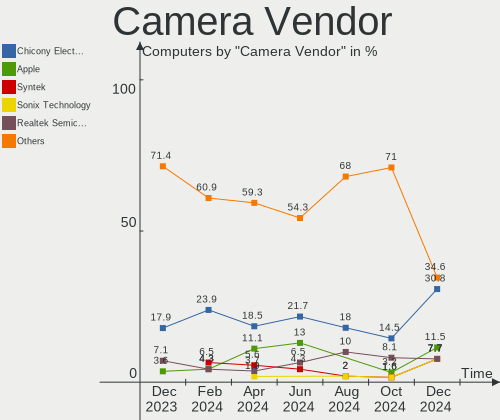
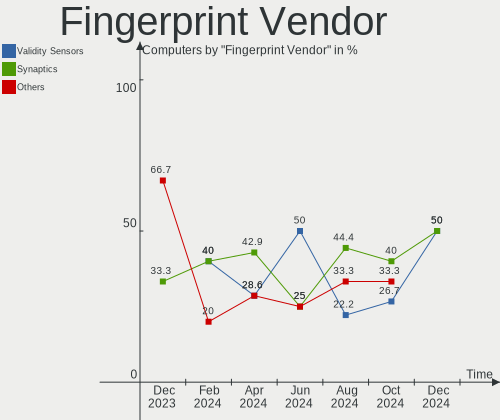

KDE neon - Hardware Trends
--------------------------

A project to identify most popular hardware characteristics and track their change
over time based on data collected by Linux users at https://Linux-Hardware.org.

Anyone can contribute to this report by the [hw-probe](https://github.com/linuxhw/hw-probe) tool:

    sudo -E hw-probe -all -upload

This is a report for all computer types. See also reports for [desktops](/Dist/KDE_neon/Desktop/README.md) and [notebooks](/Dist/KDE_neon/Notebook/README.md).

This report is for one last month. Overall report since the beginning of time: [TestDays](https://github.com/linuxhw/TestDays)

Period: Sep, 2023.

Contents
--------

* [ System ](#system)
  - [ OS                       ](#os)
  - [ OS Family                ](#os-family)
  - [ Kernel                   ](#kernel)
  - [ Kernel Family            ](#kernel-family)
  - [ Kernel Major Ver.        ](#kernel-major-ver)
  - [ Arch                     ](#arch)
  - [ DE                       ](#de)
  - [ Display Server           ](#display-server)
  - [ Display Manager          ](#display-manager)
  - [ OS Lang                  ](#os-lang)
  - [ Boot Mode                ](#boot-mode)
  - [ Filesystem               ](#filesystem)
  - [ Part. scheme             ](#part-scheme)
  - [ Dual Boot with Linux/BSD ](#dual-boot-with-linuxbsd)
  - [ Dual Boot (Win)          ](#dual-boot-win)

* [ Board ](#board)
  - [ Vendor                   ](#vendor)
  - [ Model                    ](#model)
  - [ Model Family             ](#model-family)
  - [ MFG Year                 ](#mfg-year)
  - [ Form Factor              ](#form-factor)
  - [ Secure Boot              ](#secure-boot)
  - [ Coreboot                 ](#coreboot)
  - [ RAM Size                 ](#ram-size)
  - [ RAM Used                 ](#ram-used)
  - [ Total Drives             ](#total-drives)
  - [ Has CD-ROM               ](#has-cd-rom)
  - [ Has Ethernet             ](#has-ethernet)
  - [ Has WiFi                 ](#has-wifi)
  - [ Has Bluetooth            ](#has-bluetooth)

* [ Location ](#location)
  - [ Country                  ](#country)
  - [ City                     ](#city)

* [ Drives ](#drives)
  - [ Drive Vendor             ](#drive-vendor)
  - [ Drive Model              ](#drive-model)
  - [ HDD Vendor               ](#hdd-vendor)
  - [ SSD Vendor               ](#ssd-vendor)
  - [ Drive Kind               ](#drive-kind)
  - [ Drive Connector          ](#drive-connector)
  - [ Drive Size               ](#drive-size)
  - [ Space Total              ](#space-total)
  - [ Space Used               ](#space-used)
  - [ Malfunc. Drives          ](#malfunc-drives)
  - [ Malfunc. Drive Vendor    ](#malfunc-drive-vendor)
  - [ Malfunc. HDD Vendor      ](#malfunc-hdd-vendor)
  - [ Malfunc. Drive Kind      ](#malfunc-drive-kind)
  - [ Failed Drives            ](#failed-drives)
  - [ Failed Drive Vendor      ](#failed-drive-vendor)
  - [ Drive Status             ](#drive-status)

* [ Storage controller ](#storage-controller)
  - [ Storage Vendor           ](#storage-vendor)
  - [ Storage Model            ](#storage-model)
  - [ Storage Kind             ](#storage-kind)

* [ Processor ](#processor)
  - [ CPU Vendor               ](#cpu-vendor)
  - [ CPU Model                ](#cpu-model)
  - [ CPU Model Family         ](#cpu-model-family)
  - [ CPU Cores                ](#cpu-cores)
  - [ CPU Sockets              ](#cpu-sockets)
  - [ CPU Threads              ](#cpu-threads)
  - [ CPU Op-Modes             ](#cpu-op-modes)
  - [ CPU Microcode            ](#cpu-microcode)
  - [ CPU Microarch            ](#cpu-microarch)

* [ Graphics ](#graphics)
  - [ GPU Vendor               ](#gpu-vendor)
  - [ GPU Model                ](#gpu-model)
  - [ GPU Combo                ](#gpu-combo)
  - [ GPU Driver               ](#gpu-driver)
  - [ GPU Memory               ](#gpu-memory)

* [ Monitor ](#monitor)
  - [ Monitor Vendor           ](#monitor-vendor)
  - [ Monitor Model            ](#monitor-model)
  - [ Monitor Resolution       ](#monitor-resolution)
  - [ Monitor Diagonal         ](#monitor-diagonal)
  - [ Monitor Width            ](#monitor-width)
  - [ Aspect Ratio             ](#aspect-ratio)
  - [ Monitor Area             ](#monitor-area)
  - [ Pixel Density            ](#pixel-density)
  - [ Multiple Monitors        ](#multiple-monitors)

* [ Network ](#network)
  - [ Net Controller Vendor    ](#net-controller-vendor)
  - [ Net Controller Model     ](#net-controller-model)
  - [ Wireless Vendor          ](#wireless-vendor)
  - [ Wireless Model           ](#wireless-model)
  - [ Ethernet Vendor          ](#ethernet-vendor)
  - [ Ethernet Model           ](#ethernet-model)
  - [ Net Controller Kind      ](#net-controller-kind)
  - [ Used Controller          ](#used-controller)
  - [ NICs                     ](#nics)
  - [ IPv6                     ](#ipv6)

* [ Bluetooth ](#bluetooth)
  - [ Bluetooth Vendor         ](#bluetooth-vendor)
  - [ Bluetooth Model          ](#bluetooth-model)

* [ Sound ](#sound)
  - [ Sound Vendor             ](#sound-vendor)
  - [ Sound Model              ](#sound-model)

* [ Memory ](#memory)
  - [ Memory Vendor            ](#memory-vendor)
  - [ Memory Model             ](#memory-model)
  - [ Memory Kind              ](#memory-kind)
  - [ Memory Form Factor       ](#memory-form-factor)
  - [ Memory Size              ](#memory-size)
  - [ Memory Speed             ](#memory-speed)

* [ Printers & scanners ](#printers--scanners)
  - [ Printer Vendor           ](#printer-vendor)
  - [ Printer Model            ](#printer-model)
  - [ Scanner Vendor           ](#scanner-vendor)
  - [ Scanner Model            ](#scanner-model)

* [ Camera ](#camera)
  - [ Camera Vendor            ](#camera-vendor)
  - [ Camera Model             ](#camera-model)

* [ Security ](#security)
  - [ Fingerprint Vendor       ](#fingerprint-vendor)
  - [ Fingerprint Model        ](#fingerprint-model)
  - [ Chipcard Vendor          ](#chipcard-vendor)
  - [ Chipcard Model           ](#chipcard-model)

* [ Unsupported ](#unsupported)
  - [ Unsupported Devices      ](#unsupported-devices)
  - [ Unsupported Device Types ](#unsupported-device-types)

System
------

OS
--

Installed operating systems

| Name           | Computers | Percent |
|----------------|-----------|---------|
| KDE neon 22.04 | 76        | 97.44%  |
| KDE neon 20.04 | 2         | 2.56%   |

OS Family
---------

OS without a version

| Name     | Computers | Percent |
|----------|-----------|---------|
| KDE neon | 78        | 100%    |

Kernel
------

Version of the Linux kernel

| Version                | Computers | Percent |
|------------------------|-----------|---------|
| 6.2.0-32-generic       | 32        | 41.03%  |
| 6.2.0-33-generic       | 21        | 26.92%  |
| 6.2.0-31-generic       | 6         | 7.69%   |
| 5.19.0-50-generic      | 5         | 6.41%   |
| 6.2.0-34-generic       | 2         | 2.56%   |
| 6.2.0-26-generic       | 2         | 2.56%   |
| 5.15.0-52-generic      | 2         | 2.56%   |
| 6.4.12-surface         | 1         | 1.28%   |
| 6.2.16-060216-generic  | 1         | 1.28%   |
| 6.1.0-1019-oem         | 1         | 1.28%   |
| 5.19.0-46-generic      | 1         | 1.28%   |
| 5.19.0-41-generic      | 1         | 1.28%   |
| 5.19.0-1025-lowlatency | 1         | 1.28%   |
| 5.15.0-84-generic      | 1         | 1.28%   |
| 5.15.0-56-generic      | 1         | 1.28%   |

Kernel Family
-------------

Linux kernel without a distro release

| Version | Computers | Percent |
|---------|-----------|---------|
| 6.2.0   | 63        | 80.77%  |
| 5.19.0  | 8         | 10.26%  |
| 5.15.0  | 4         | 5.13%   |
| 6.4.12  | 1         | 1.28%   |
| 6.2.16  | 1         | 1.28%   |
| 6.1.0   | 1         | 1.28%   |

Kernel Major Ver.
-----------------

Linux kernel major version

| Version | Computers | Percent |
|---------|-----------|---------|
| 6.2     | 64        | 82.05%  |
| 5.19    | 8         | 10.26%  |
| 5.15    | 4         | 5.13%   |
| 6.4     | 1         | 1.28%   |
| 6.1     | 1         | 1.28%   |

Arch
----

OS architecture (x86_64, i586, etc.)

| Name   | Computers | Percent |
|--------|-----------|---------|
| x86_64 | 78        | 100%    |

DE
--

Desktop Environment

| Name | Computers | Percent |
|------|-----------|---------|
| KDE5 | 77        | 98.72%  |
| KDE6 | 1         | 1.28%   |

Display Server
--------------

X11 or Wayland

| Name    | Computers | Percent |
|---------|-----------|---------|
| X11     | 71        | 91.03%  |
| Wayland | 6         | 7.69%   |
| Tty     | 1         | 1.28%   |

Display Manager
---------------

SDDM, LightDM, etc.

| Name    | Computers | Percent |
|---------|-----------|---------|
| Unknown | 65        | 83.33%  |
| SDDM    | 13        | 16.67%  |

OS Lang
-------

Language

| Lang  | Computers | Percent |
|-------|-----------|---------|
| en_US | 34        | 43.59%  |
| es_MX | 6         | 7.69%   |
| en_GB | 6         | 7.69%   |
| ru_RU | 5         | 6.41%   |
| C     | 5         | 6.41%   |
| pt_BR | 3         | 3.85%   |
| de_DE | 3         | 3.85%   |
| zh_CN | 2         | 2.56%   |
| it_IT | 2         | 2.56%   |
| fr_FR | 2         | 2.56%   |
| es_ES | 2         | 2.56%   |
| en_CA | 2         | 2.56%   |
| pl_PL | 1         | 1.28%   |
| ja_JP | 1         | 1.28%   |
| es_EC | 1         | 1.28%   |
| es_CO | 1         | 1.28%   |
| es_CL | 1         | 1.28%   |
| en_IN | 1         | 1.28%   |

Boot Mode
---------

EFI or BIOS

| Mode | Computers | Percent |
|------|-----------|---------|
| BIOS | 68        | 87.18%  |
| EFI  | 10        | 12.82%  |

Filesystem
----------

Type of filesystem

| Type    | Computers | Percent |
|---------|-----------|---------|
| Ext4    | 69        | 88.46%  |
| Tmpfs   | 5         | 6.41%   |
| Overlay | 2         | 2.56%   |
| Btrfs   | 2         | 2.56%   |

Part. scheme
------------

Scheme of partitioning

| Type    | Computers | Percent |
|---------|-----------|---------|
| Unknown | 65        | 83.33%  |
| GPT     | 11        | 14.1%   |
| MBR     | 2         | 2.56%   |

Dual Boot with Linux/BSD
------------------------

Hosting more than one Linux/BSD

| Dual boot | Computers | Percent |
|-----------|-----------|---------|
| No        | 73        | 93.59%  |
| Yes       | 5         | 6.41%   |

Dual Boot (Win)
---------------

Hosting Linux and Windows

| Dual boot | Computers | Percent |
|-----------|-----------|---------|
| No        | 70        | 89.74%  |
| Yes       | 8         | 10.26%  |

Board
-----

Vendor
------

Motherboard manufacturer

| Name                | Computers | Percent |
|---------------------|-----------|---------|
| ASUSTek Computer    | 12        | 15.38%  |
| Dell                | 11        | 14.1%   |
| Hewlett-Packard     | 8         | 10.26%  |
| Lenovo              | 6         | 7.69%   |
| Gigabyte Technology | 6         | 7.69%   |
| Apple               | 6         | 7.69%   |
| MSI                 | 5         | 6.41%   |
| Toshiba             | 3         | 3.85%   |
| Intel               | 3         | 3.85%   |
| Acer                | 3         | 3.85%   |
| Timi                | 2         | 2.56%   |
| Samsung Electronics | 2         | 2.56%   |
| Microsoft           | 2         | 2.56%   |
| Sony                | 1         | 1.28%   |
| SLIMBOOK            | 1         | 1.28%   |
| QIYIDA              | 1         | 1.28%   |
| Packard Bell        | 1         | 1.28%   |
| Multilaser          | 1         | 1.28%   |
| HUAWEI              | 1         | 1.28%   |
| Biostar             | 1         | 1.28%   |
| ASRock              | 1         | 1.28%   |
| Unknown             | 1         | 1.28%   |

Model
-----

Motherboard model

| Name                                 | Computers | Percent |
|--------------------------------------|-----------|---------|
| MSI MS-7C37                          | 2         | 2.56%   |
| Toshiba Satellite L50-B              | 1         | 1.28%   |
| Toshiba dynabook Satellite B552/H    | 1         | 1.28%   |
| Toshiba dynabook R632/H              | 1         | 1.28%   |
| Timi Xiaomi Book Pro 16 2022         | 1         | 1.28%   |
| Timi TM1612                          | 1         | 1.28%   |
| Sony SVE14A27CXH                     | 1         | 1.28%   |
| SLIMBOOK PROX-AMD5                   | 1         | 1.28%   |
| Samsung 900X3K                       | 1         | 1.28%   |
| Samsung 550XED                       | 1         | 1.28%   |
| QIYIDA X99-H9 V2.0                   | 1         | 1.28%   |
| Packard Bell EasyNote TE11HC         | 1         | 1.28%   |
| Multilaser PC31X                     | 1         | 1.28%   |
| MSI p7-1233w                         | 1         | 1.28%   |
| MSI MS-7C56                          | 1         | 1.28%   |
| MSI Katana 15 B12VGK                 | 1         | 1.28%   |
| Microsoft Surface Pro 7              | 1         | 1.28%   |
| Microsoft Surface Pro                | 1         | 1.28%   |
| Lenovo V15 G2 ALC 82KD               | 1         | 1.28%   |
| Lenovo ThinkPad X201 3680KS9         | 1         | 1.28%   |
| Lenovo ThinkPad E14 Gen 2 20T60023TX | 1         | 1.28%   |
| Lenovo IdeaPad 330S-15ARR 81FB       | 1         | 1.28%   |
| Lenovo IDEA 315-15 81WE              | 1         | 1.28%   |
| Lenovo 1051F 60073                   | 1         | 1.28%   |
| Intel NUC8i5BEH                      | 1         | 1.28%   |
| Intel DQ77KB AAG81483-500            | 1         | 1.28%   |
| Intel DH67CL AAG10212-210            | 1         | 1.28%   |
| HUAWEI NBLB-WAX9N                    | 1         | 1.28%   |
| HP Z240 Tower Workstation            | 1         | 1.28%   |
| HP ProBook 6470b                     | 1         | 1.28%   |
| HP Pavilion Desktop PC 570-p0XX      | 1         | 1.28%   |
| HP OMEN by Laptop 16-c0xxx           | 1         | 1.28%   |
| HP Laptop 15-db1xxx                  | 1         | 1.28%   |
| HP EliteDesk 800 G3 TWR              | 1         | 1.28%   |
| HP EliteBook 2560p                   | 1         | 1.28%   |
| HP Dev One Notebook PC               | 1         | 1.28%   |
| Gigabyte X570 UD                     | 1         | 1.28%   |
| Gigabyte GA-78LMT-USB3 R2            | 1         | 1.28%   |
| Gigabyte G31M-ES2C                   | 1         | 1.28%   |
| Gigabyte C1037UN-EU                  | 1         | 1.28%   |

Model Family
------------

Motherboard model prefix

| Name                  | Computers | Percent |
|-----------------------|-----------|---------|
| Dell Inspiron         | 5         | 6.41%   |
| Toshiba dynabook      | 2         | 2.56%   |
| MSI MS-7C37           | 2         | 2.56%   |
| Microsoft Surface     | 2         | 2.56%   |
| Lenovo ThinkPad       | 2         | 2.56%   |
| Gigabyte A320M-S2H    | 2         | 2.56%   |
| Dell OptiPlex         | 2         | 2.56%   |
| Dell Latitude         | 2         | 2.56%   |
| ASUS VivoBook         | 2         | 2.56%   |
| ASUS PRIME            | 2         | 2.56%   |
| Acer Aspire           | 2         | 2.56%   |
| Toshiba Satellite     | 1         | 1.28%   |
| Timi Xiaomi           | 1         | 1.28%   |
| Timi TM1612           | 1         | 1.28%   |
| Sony SVE14A27CXH      | 1         | 1.28%   |
| SLIMBOOK PROX-AMD5    | 1         | 1.28%   |
| Samsung 900X3K        | 1         | 1.28%   |
| Samsung 550XED        | 1         | 1.28%   |
| QIYIDA X99-H9         | 1         | 1.28%   |
| Packard Bell EasyNote | 1         | 1.28%   |
| Multilaser PC31X      | 1         | 1.28%   |
| MSI p7-1233w          | 1         | 1.28%   |
| MSI MS-7C56           | 1         | 1.28%   |
| MSI Katana            | 1         | 1.28%   |
| Lenovo V15            | 1         | 1.28%   |
| Lenovo IdeaPad        | 1         | 1.28%   |
| Lenovo IDEA           | 1         | 1.28%   |
| Lenovo 1051F          | 1         | 1.28%   |
| Intel NUC8i5BEH       | 1         | 1.28%   |
| Intel DQ77KB          | 1         | 1.28%   |
| Intel DH67CL          | 1         | 1.28%   |
| HUAWEI NBLB-WAX9N     | 1         | 1.28%   |
| HP Z240               | 1         | 1.28%   |
| HP ProBook            | 1         | 1.28%   |
| HP Pavilion           | 1         | 1.28%   |
| HP OMEN               | 1         | 1.28%   |
| HP Laptop             | 1         | 1.28%   |
| HP EliteDesk          | 1         | 1.28%   |
| HP EliteBook          | 1         | 1.28%   |
| HP Dev                | 1         | 1.28%   |

MFG Year
--------

Motherboard manufacture year

| Year | Computers | Percent |
|------|-----------|---------|
| 2021 | 7         | 8.97%   |
| 2020 | 7         | 8.97%   |
| 2018 | 7         | 8.97%   |
| 2015 | 7         | 8.97%   |
| 2012 | 7         | 8.97%   |
| 2011 | 7         | 8.97%   |
| 2019 | 6         | 7.69%   |
| 2022 | 5         | 6.41%   |
| 2013 | 5         | 6.41%   |
| 2023 | 4         | 5.13%   |
| 2017 | 4         | 5.13%   |
| 2016 | 4         | 5.13%   |
| 2014 | 4         | 5.13%   |
| 2010 | 2         | 2.56%   |
| 2009 | 1         | 1.28%   |
| 2008 | 1         | 1.28%   |

Form Factor
-----------

Physical design of the computer

| Name       | Computers | Percent |
|------------|-----------|---------|
| Notebook   | 42        | 53.85%  |
| Desktop    | 28        | 35.9%   |
| Tablet     | 4         | 5.13%   |
| All in one | 3         | 3.85%   |
| Mini pc    | 1         | 1.28%   |

Secure Boot
-----------

Enabled or disabled

| State    | Computers | Percent |
|----------|-----------|---------|
| Disabled | 75        | 96.15%  |
| Enabled  | 3         | 3.85%   |

Coreboot
--------

Have coreboot on board

| Used | Computers | Percent |
|------|-----------|---------|
| No   | 78        | 100%    |

RAM Size
--------

Total RAM memory

| Size in GB  | Computers | Percent |
|-------------|-----------|---------|
| 16.01-24.0  | 23        | 29.49%  |
| 4.01-8.0    | 22        | 28.21%  |
| 8.01-16.0   | 16        | 20.51%  |
| 3.01-4.0    | 7         | 8.97%   |
| 32.01-64.0  | 5         | 6.41%   |
| 24.01-32.0  | 2         | 2.56%   |
| 64.01-256.0 | 2         | 2.56%   |
| 1.01-2.0    | 1         | 1.28%   |

RAM Used
--------

Used RAM memory

| Used GB   | Computers | Percent |
|-----------|-----------|---------|
| 2.01-3.0  | 29        | 37.18%  |
| 1.01-2.0  | 19        | 24.36%  |
| 3.01-4.0  | 18        | 23.08%  |
| 4.01-8.0  | 8         | 10.26%  |
| 8.01-16.0 | 4         | 5.13%   |

Total Drives
------------

Number of drives on board

| Drives | Computers | Percent |
|--------|-----------|---------|
| 1      | 39        | 50%     |
| 2      | 31        | 39.74%  |
| 4      | 3         | 3.85%   |
| 3      | 3         | 3.85%   |
| 5      | 2         | 2.56%   |

Has CD-ROM
----------

Has CD-ROM on board

| Presented | Computers | Percent |
|-----------|-----------|---------|
| No        | 56        | 71.79%  |
| Yes       | 22        | 28.21%  |

Has Ethernet
------------

Has Ethernet on board

| Presented | Computers | Percent |
|-----------|-----------|---------|
| Yes       | 66        | 84.62%  |
| No        | 12        | 15.38%  |

Has WiFi
--------

Has WiFi module

| Presented | Computers | Percent |
|-----------|-----------|---------|
| Yes       | 60        | 76.92%  |
| No        | 18        | 23.08%  |

Has Bluetooth
-------------

Has Bluetooth module

| Presented | Computers | Percent |
|-----------|-----------|---------|
| Yes       | 46        | 58.97%  |
| No        | 32        | 41.03%  |

Location
--------

Country
-------

Geographic location (country)

| Country      | Computers | Percent |
|--------------|-----------|---------|
| USA          | 17        | 21.79%  |
| France       | 7         | 8.97%   |
| Russia       | 5         | 6.41%   |
| Mexico       | 4         | 5.13%   |
| Italy        | 4         | 5.13%   |
| Brazil       | 4         | 5.13%   |
| Colombia     | 3         | 3.85%   |
| UK           | 2         | 2.56%   |
| Sweden       | 2         | 2.56%   |
| Indonesia    | 2         | 2.56%   |
| Germany      | 2         | 2.56%   |
| Chile        | 2         | 2.56%   |
| Canada       | 2         | 2.56%   |
| Ukraine      | 1         | 1.28%   |
| Switzerland  | 1         | 1.28%   |
| Spain        | 1         | 1.28%   |
| South Africa | 1         | 1.28%   |
| Slovenia     | 1         | 1.28%   |
| Poland       | 1         | 1.28%   |
| Peru         | 1         | 1.28%   |
| Netherlands  | 1         | 1.28%   |
| Malaysia     | 1         | 1.28%   |
| Japan        | 1         | 1.28%   |
| Ireland      | 1         | 1.28%   |
| India        | 1         | 1.28%   |
| Honduras     | 1         | 1.28%   |
| Greece       | 1         | 1.28%   |
| Ecuador      | 1         | 1.28%   |
| Dominica     | 1         | 1.28%   |
| Costa Rica   | 1         | 1.28%   |
| China        | 1         | 1.28%   |
| Bangladesh   | 1         | 1.28%   |
| Azerbaijan   | 1         | 1.28%   |
| Austria      | 1         | 1.28%   |
| Armenia      | 1         | 1.28%   |

City
----

Geographic location (city)

| City                 | Computers | Percent |
|----------------------|-----------|---------|
| Santiago             | 2         | 2.56%   |
| Poitiers             | 2         | 2.56%   |
| Barranquilla         | 2         | 2.56%   |
| Apple Valley         | 2         | 2.56%   |
| Zarichne             | 1         | 1.28%   |
| Yokohama             | 1         | 1.28%   |
| Yerevan              | 1         | 1.28%   |
| Wellsboro            | 1         | 1.28%   |
| Verona               | 1         | 1.28%   |
| Valley Village       | 1         | 1.28%   |
| Vaihingen an der Enz | 1         | 1.28%   |
| Tyumen               | 1         | 1.28%   |
| Troutville           | 1         | 1.28%   |
| Trail                | 1         | 1.28%   |
| Toms River           | 1         | 1.28%   |
| Tegucigalpa          | 1         | 1.28%   |
| Stockholm            | 1         | 1.28%   |
| Steinach             | 1         | 1.28%   |
| Springfield          | 1         | 1.28%   |
| Seattle              | 1         | 1.28%   |
| Santiago de Cali     | 1         | 1.28%   |
| San Luis Obispo      | 1         | 1.28%   |
| Samara               | 1         | 1.28%   |
| Royal Oak            | 1         | 1.28%   |
| Roseau               | 1         | 1.28%   |
| Rome                 | 1         | 1.28%   |
| Rhodes               | 1         | 1.28%   |
| Raleigh              | 1         | 1.28%   |
| Pune                 | 1         | 1.28%   |
| Puebla City          | 1         | 1.28%   |
| Pretoria             | 1         | 1.28%   |
| Paris                | 1         | 1.28%   |
| Pantin               | 1         | 1.28%   |
| Pantano              | 1         | 1.28%   |
| OEdeshoeg            | 1         | 1.28%   |
| Nizhniy Novgorod     | 1         | 1.28%   |
| Naberezhnyye Chelny  | 1         | 1.28%   |
| Morada Nova          | 1         | 1.28%   |
| Montpellier          | 1         | 1.28%   |
| Mogi Guacu           | 1         | 1.28%   |

Drives
------

Drive Vendor
------------

Hard drive vendors

| Vendor                      | Computers | Drives | Percent |
|-----------------------------|-----------|--------|---------|
| WDC                         | 18        | 21     | 15%     |
| Seagate                     | 18        | 21     | 15%     |
| Samsung Electronics         | 16        | 20     | 13.33%  |
| SanDisk                     | 8         | 9      | 6.67%   |
| Kingston                    | 7         | 7      | 5.83%   |
| Crucial                     | 6         | 6      | 5%      |
| Unknown                     | 5         | 6      | 4.17%   |
| Toshiba                     | 4         | 4      | 3.33%   |
| SK hynix                    | 3         | 3      | 2.5%    |
| Silicon Motion              | 2         | 2      | 1.67%   |
| Realtek Semiconductor       | 2         | 2      | 1.67%   |
| PNY                         | 2         | 2      | 1.67%   |
| Phison Electronics          | 2         | 2      | 1.67%   |
| Micron Technology           | 2         | 2      | 1.67%   |
| Hitachi                     | 2         | 2      | 1.67%   |
| Apple                       | 2         | 2      | 1.67%   |
| A-DATA Technology           | 2         | 2      | 1.67%   |
| XrayDisk                    | 1         | 1      | 0.83%   |
| Union Memory                | 1         | 1      | 0.83%   |
| Transcend                   | 1         | 1      | 0.83%   |
| T-FORCE                     | 1         | 2      | 0.83%   |
| StoreJet                    | 1         | 1      | 0.83%   |
| SSSTC                       | 1         | 1      | 0.83%   |
| SPCC                        | 1         | 1      | 0.83%   |
| SOLIDIGM                    | 1         | 1      | 0.83%   |
| Smartbuy                    | 1         | 1      | 0.83%   |
| OVATION                     | 1         | 1      | 0.83%   |
| Neo                         | 1         | 1      | 0.83%   |
| MAXIO Technology (Hangzhou) | 1         | 1      | 0.83%   |
| KIOXIA                      | 1         | 1      | 0.83%   |
| JMicron Technology          | 1         | 1      | 0.83%   |
| Intel                       | 1         | 1      | 0.83%   |
| INNOVATION IT               | 1         | 1      | 0.83%   |
| HGST                        | 1         | 1      | 0.83%   |
| China                       | 1         | 1      | 0.83%   |
| BIWIN                       | 1         | 1      | 0.83%   |

Drive Model
-----------

Hard drive models

| Model                                               | Computers | Percent |
|-----------------------------------------------------|-----------|---------|
| Seagate ST500DM002-1BD142 500GB                     | 4         | 3.03%   |
| Samsung NVMe SSD Controller SM981/PM981/PM983 256GB | 3         | 2.27%   |
| Unknown MMC Card  64GB                              | 2         | 1.52%   |
| Seagate ST1000LM024 HN-M101MBB 1TB                  | 2         | 1.52%   |
| Sandisk WD Blue SN550 NVMe SSD 512GB                | 2         | 1.52%   |
| Samsung SSD 860 EVO 500GB                           | 2         | 1.52%   |
| Samsung NVMe SSD Controller PM9A1/PM9A3/980PRO 1TB  | 2         | 1.52%   |
| Realtek RTS5763DL NVMe SSD Controller 256GB         | 2         | 1.52%   |
| Phison PS5013 E13 NVMe Controller 512GB             | 2         | 1.52%   |
| Micron 2400_MTFDKBA1T0QFM 1024GB                    | 2         | 1.52%   |
| Crucial CT480BX500SSD1 480GB                        | 2         | 1.52%   |
| XrayDisk 256GB                                      | 1         | 0.76%   |
| WDC WDS500G2B0B-00YS70 500GB SSD                    | 1         | 0.76%   |
| WDC WDS240G1G0A-00SS50 240GB SSD                    | 1         | 0.76%   |
| WDC WDBNCE0010PNC 1TB SSD                           | 1         | 0.76%   |
| WDC WD7500BPKX-00HPJT0 752GB                        | 1         | 0.76%   |
| WDC WD7500AADS-00M2B0 752GB                         | 1         | 0.76%   |
| WDC WD5003ABYX-01WERA1 500GB                        | 1         | 0.76%   |
| WDC WD5000LPVX-22V0TT0 500GB                        | 1         | 0.76%   |
| WDC WD20EFAX-68B2RN1 2TB                            | 1         | 0.76%   |
| WDC WD20EARS-00MVWB0 2TB                            | 1         | 0.76%   |
| WDC WD10SPZX-24Z10 1TB                              | 1         | 0.76%   |
| WDC WD10SPZX-21Z10T0 1TB                            | 1         | 0.76%   |
| WDC WD10JPVX-75JC3T0 1TB                            | 1         | 0.76%   |
| WDC WD10JPVX-22JC3T0 1TB                            | 1         | 0.76%   |
| WDC WD10JPVT-55A1YT0 1TB                            | 1         | 0.76%   |
| WDC WD10EZEX-22MFCA0 1TB                            | 1         | 0.76%   |
| WDC WD10EZEX-08WN4A1 1TB                            | 1         | 0.76%   |
| WDC WD10EZEX-08RKKA0 1TB                            | 1         | 0.76%   |
| WDC WD10EZEX-00RKKA0 1TB                            | 1         | 0.76%   |
| WDC WD10EFRX-68FYTN0 1TB                            | 1         | 0.76%   |
| WDC WD10EALS-00Z8A0 1TB                             | 1         | 0.76%   |
| WDC PC SN730 SDBPNTY-256G                           | 1         | 0.76%   |
| Unknown SD/MMC/MS PRO 128GB                         | 1         | 0.76%   |
| Unknown NVMe SSD Drive 1TB                          | 1         | 0.76%   |
| Unknown MMC Card  32GB                              | 1         | 0.76%   |
| Unknown MMC Card  16GB                              | 1         | 0.76%   |
| Union Memory UMIS RPJTJ256MEE1OWX 256GB             | 1         | 0.76%   |
| Transcend TS64GMSA370 64GB SSD                      | 1         | 0.76%   |
| Toshiba THNSNF128GMCS 128GB SSD                     | 1         | 0.76%   |

HDD Vendor
----------

Hard disk drive vendors

| Vendor  | Computers | Drives | Percent |
|---------|-----------|--------|---------|
| Seagate | 17        | 20     | 43.59%  |
| WDC     | 14        | 17     | 35.9%   |
| Toshiba | 3         | 3      | 7.69%   |
| Hitachi | 2         | 2      | 5.13%   |
| Unknown | 1         | 1      | 2.56%   |
| HGST    | 1         | 1      | 2.56%   |
| Apple   | 1         | 1      | 2.56%   |

SSD Vendor
----------

Solid state drive vendors

| Vendor              | Computers | Drives | Percent |
|---------------------|-----------|--------|---------|
| Samsung Electronics | 9         | 9      | 21.43%  |
| Crucial             | 6         | 6      | 14.29%  |
| Kingston            | 5         | 5      | 11.9%   |
| WDC                 | 3         | 3      | 7.14%   |
| SanDisk             | 2         | 2      | 4.76%   |
| PNY                 | 2         | 2      | 4.76%   |
| A-DATA Technology   | 2         | 2      | 4.76%   |
| Transcend           | 1         | 1      | 2.38%   |
| Toshiba             | 1         | 1      | 2.38%   |
| T-FORCE             | 1         | 1      | 2.38%   |
| StoreJet            | 1         | 1      | 2.38%   |
| SSSTC               | 1         | 1      | 2.38%   |
| SPCC                | 1         | 1      | 2.38%   |
| SOLIDIGM            | 1         | 1      | 2.38%   |
| Smartbuy            | 1         | 1      | 2.38%   |
| Neo                 | 1         | 1      | 2.38%   |
| INNOVATION IT       | 1         | 1      | 2.38%   |
| China               | 1         | 1      | 2.38%   |
| BIWIN               | 1         | 1      | 2.38%   |
| Apple               | 1         | 1      | 2.38%   |

Drive Kind
----------

HDD or SSD

| Kind    | Computers | Drives | Percent |
|---------|-----------|--------|---------|
| SSD     | 37        | 42     | 32.74%  |
| HDD     | 36        | 45     | 31.86%  |
| NVMe    | 32        | 37     | 28.32%  |
| Unknown | 5         | 5      | 4.42%   |
| MMC     | 3         | 4      | 2.65%   |

Drive Connector
---------------

SATA, SAS, NVMe, etc.

| Type | Computers | Drives | Percent |
|------|-----------|--------|---------|
| SATA | 59        | 86     | 59.6%   |
| NVMe | 32        | 37     | 32.32%  |
| SAS  | 5         | 6      | 5.05%   |
| MMC  | 3         | 4      | 3.03%   |

Drive Size
----------

Size of hard drive

| Size in TB | Computers | Drives | Percent |
|------------|-----------|--------|---------|
| 0.01-0.5   | 39        | 47     | 51.32%  |
| 0.51-1.0   | 31        | 34     | 40.79%  |
| 1.01-2.0   | 5         | 5      | 6.58%   |
| 3.01-4.0   | 1         | 1      | 1.32%   |

Space Total
-----------

Amount of disk space available on the file system

| Size in GB     | Computers | Percent |
|----------------|-----------|---------|
| 101-250        | 24        | 30.77%  |
| 501-1000       | 17        | 21.79%  |
| 251-500        | 14        | 17.95%  |
| 1001-2000      | 6         | 7.69%   |
| 1-20           | 4         | 5.13%   |
| 51-100         | 4         | 5.13%   |
| Unknown        | 4         | 5.13%   |
| 21-50          | 3         | 3.85%   |
| More than 3000 | 1         | 1.28%   |
| 2001-3000      | 1         | 1.28%   |

Space Used
----------

Amount of used disk space

| Used GB        | Computers | Percent |
|----------------|-----------|---------|
| 1-20           | 32        | 41.03%  |
| 21-50          | 14        | 17.95%  |
| 51-100         | 11        | 14.1%   |
| 251-500        | 7         | 8.97%   |
| 101-250        | 6         | 7.69%   |
| Unknown        | 4         | 5.13%   |
| 501-1000       | 3         | 3.85%   |
| More than 3000 | 1         | 1.28%   |

Malfunc. Drives
---------------

Drive models with a malfunction

| Model                                   | Computers | Drives | Percent |
|-----------------------------------------|-----------|--------|---------|
| WDC WD10EZEX-22MFCA0 1TB                | 1         | 1      | 33.33%  |
| Seagate ST95005620AS 500GB              | 1         | 1      | 33.33%  |
| Neo Forza NFS121SA312-6007000 120GB SSD | 1         | 1      | 33.33%  |

Malfunc. Drive Vendor
---------------------

Vendors of faulty drives

| Vendor  | Computers | Drives | Percent |
|---------|-----------|--------|---------|
| WDC     | 1         | 1      | 33.33%  |
| Seagate | 1         | 1      | 33.33%  |
| Neo     | 1         | 1      | 33.33%  |

Malfunc. HDD Vendor
-------------------

Vendors of faulty HDD drives

| Vendor  | Computers | Drives | Percent |
|---------|-----------|--------|---------|
| WDC     | 1         | 1      | 50%     |
| Seagate | 1         | 1      | 50%     |

Malfunc. Drive Kind
-------------------

Kinds of faulty drives

| Kind | Computers | Drives | Percent |
|------|-----------|--------|---------|
| HDD  | 2         | 2      | 66.67%  |
| SSD  | 1         | 1      | 33.33%  |

Failed Drives
-------------

Failed drive models

Zero info for selected period =(

Failed Drive Vendor
-------------------

Failed drive vendors

Zero info for selected period =(

Drive Status
------------

Number of failed and malfunc. drives

| Status   | Computers | Drives | Percent |
|----------|-----------|--------|---------|
| Detected | 70        | 115    | 85.37%  |
| Works    | 10        | 15     | 12.2%   |
| Malfunc  | 2         | 3      | 2.44%   |

Storage controller
------------------

Storage Vendor
--------------

Storage controller vendors

| Vendor                      | Computers | Percent |
|-----------------------------|-----------|---------|
| Intel                       | 49        | 46.67%  |
| AMD                         | 18        | 17.14%  |
| Samsung Electronics         | 9         | 8.57%   |
| SanDisk                     | 8         | 7.62%   |
| SK hynix                    | 3         | 2.86%   |
| ASMedia Technology          | 3         | 2.86%   |
| Silicon Motion              | 2         | 1.9%    |
| Realtek Semiconductor       | 2         | 1.9%    |
| Phison Electronics          | 2         | 1.9%    |
| Micron Technology           | 2         | 1.9%    |
| Kingston Technology Company | 2         | 1.9%    |
| Union Memory (Shenzhen)     | 1         | 0.95%   |
| Nvidia                      | 1         | 0.95%   |
| MAXIO Technology (Hangzhou) | 1         | 0.95%   |
| LSI Logic / Symbios Logic   | 1         | 0.95%   |
| KIOXIA                      | 1         | 0.95%   |

Storage Model
-------------

Storage controller models

| Model                                                                          | Computers | Percent |
|--------------------------------------------------------------------------------|-----------|---------|
| AMD FCH SATA Controller [AHCI mode]                                            | 14        | 12.73%  |
| Intel 7 Series Chipset Family 6-port SATA Controller [AHCI mode]               | 9         | 8.18%   |
| Intel 8 Series/C220 Series Chipset Family 6-port SATA Controller 1 [AHCI mode] | 4         | 3.64%   |
| Samsung NVMe SSD Controller SM981/PM981/PM983                                  | 3         | 2.73%   |
| Intel Sunrise Point-LP SATA Controller [AHCI mode]                             | 3         | 2.73%   |
| Intel 6 Series/C200 Series Chipset Family 6 port Desktop SATA AHCI Controller  | 3         | 2.73%   |
| ASMedia ASM1062 Serial ATA Controller                                          | 3         | 2.73%   |
| SK hynix Gold P31/BC711/PC711 NVMe Solid State Drive                           | 2         | 1.82%   |
| SanDisk WD Blue SN550 NVMe SSD                                                 | 2         | 1.82%   |
| SanDisk WD Black SN770 / PC SN740 256GB / PC SN560 (DRAM-less) NVMe SSD        | 2         | 1.82%   |
| Samsung NVMe SSD SM0032L                                                       | 2         | 1.82%   |
| Samsung NVMe SSD Controller PM9A1/PM9A3/980PRO                                 | 2         | 1.82%   |
| Realtek RTS5763DL NVMe SSD Controller                                          | 2         | 1.82%   |
| Phison PS5013 E13 NVMe Controller                                              | 2         | 1.82%   |
| Micron 2400 NVMe SSD (DRAM-less)                                               | 2         | 1.82%   |
| Intel Volume Management Device NVMe RAID Controller                            | 2         | 1.82%   |
| Intel SATA Controller [RAID mode]                                              | 2         | 1.82%   |
| Intel Cannon Point-LP SATA Controller [AHCI Mode]                              | 2         | 1.82%   |
| Intel Alder Lake-P SATA AHCI Controller                                        | 2         | 1.82%   |
| Intel 82801 Mobile SATA Controller [RAID mode]                                 | 2         | 1.82%   |
| Intel 8 Series SATA Controller 1 [AHCI mode]                                   | 2         | 1.82%   |
| Intel 6 Series/C200 Series Chipset Family 6 port Mobile SATA AHCI Controller   | 2         | 1.82%   |
| Intel 200 Series PCH SATA controller [AHCI mode]                               | 2         | 1.82%   |
| AMD 500 Series Chipset SATA Controller                                         | 2         | 1.82%   |
| Union Memory (Shenzhen) AM620 PCIe 3.0 NVMe SSD 256GB                          | 1         | 0.91%   |
| SK hynix BC501 NVMe Solid State Drive                                          | 1         | 0.91%   |
| Silicon Motion SM2263EN/SM2263XT (DRAM-less) NVMe SSD Controllers              | 1         | 0.91%   |
| Silicon Motion SM2262/SM2262EN SSD Controller                                  | 1         | 0.91%   |
| SanDisk WD Black SN750 / PC SN730 NVMe SSD                                     | 1         | 0.91%   |
| SanDisk PC SN530 NVMe SSD (DRAM-less)                                          | 1         | 0.91%   |
| SanDisk PC SN530 NVMe SSD                                                      | 1         | 0.91%   |
| SanDisk PC SN520 NVMe SSD                                                      | 1         | 0.91%   |
| Samsung NVMe SSD Controller SM961/PM961/SM963                                  | 1         | 0.91%   |
| Samsung NVMe SSD Controller 980                                                | 1         | 0.91%   |
| Nvidia MCP79 AHCI Controller                                                   | 1         | 0.91%   |
| MAXIO (Hangzhou) NVMe SSD Controller MAP1202                                   | 1         | 0.91%   |
| LSI Logic / Symbios Logic 53c1030 PCI-X Fusion-MPT Dual Ultra320 SCSI          | 1         | 0.91%   |
| KIOXIA NVMe SSD Controller BG5 (DRAM-less)                                     | 1         | 0.91%   |
| Kingston Company NV1 NVMe SSD                                                  | 1         | 0.91%   |
| Kingston Company KC3000/Renegade NVMe SSD                                      | 1         | 0.91%   |

Storage Kind
------------

Kind of storage controller (IDE, SATA, NVMe, SAS, ...)

| Kind | Computers | Percent |
|------|-----------|---------|
| SATA | 58        | 56.86%  |
| NVMe | 32        | 31.37%  |
| RAID | 7         | 6.86%   |
| IDE  | 4         | 3.92%   |
| SCSI | 1         | 0.98%   |

Processor
---------

CPU Vendor
----------

Processor vendors

| Vendor | Computers | Percent |
|--------|-----------|---------|
| Intel  | 56        | 71.79%  |
| AMD    | 22        | 28.21%  |

CPU Model
---------

Processor models

| Model                               | Computers | Percent |
|-------------------------------------|-----------|---------|
| Intel Core i5-2520M CPU @ 2.50GHz   | 2         | 2.56%   |
| AMD Ryzen 7 3700X 8-Core Processor  | 2         | 2.56%   |
| AMD Ryzen 5 3600 6-Core Processor   | 2         | 2.56%   |
| Intel Xeon CPU E5-2620 v3 @ 2.40GHz | 1         | 1.28%   |
| Intel Pentium CPU N3700 @ 1.60GHz   | 1         | 1.28%   |
| Intel Pentium CPU B960 @ 2.20GHz    | 1         | 1.28%   |
| Intel Core m3-6Y30 CPU @ 0.90GHz    | 1         | 1.28%   |
| Intel Core i7-8700K CPU @ 3.70GHz   | 1         | 1.28%   |
| Intel Core i7-7700 CPU @ 3.60GHz    | 1         | 1.28%   |
| Intel Core i7-6700HQ CPU @ 2.60GHz  | 1         | 1.28%   |
| Intel Core i7-6700 CPU @ 3.40GHz    | 1         | 1.28%   |
| Intel Core i7-5500U CPU @ 2.40GHz   | 1         | 1.28%   |
| Intel Core i7-4770 CPU @ 3.40GHz    | 1         | 1.28%   |
| Intel Core i7-4720HQ CPU @ 2.60GHz  | 1         | 1.28%   |
| Intel Core i7-4510U CPU @ 2.00GHz   | 1         | 1.28%   |
| Intel Core i7-3820QM CPU @ 2.70GHz  | 1         | 1.28%   |
| Intel Core i7-3770T CPU @ 2.50GHz   | 1         | 1.28%   |
| Intel Core i7-3632QM CPU @ 2.20GHz  | 1         | 1.28%   |
| Intel Core i7-3610QM CPU @ 2.30GHz  | 1         | 1.28%   |
| Intel Core i7-2700K CPU @ 3.50GHz   | 1         | 1.28%   |
| Intel Core i7-2640M CPU @ 2.80GHz   | 1         | 1.28%   |
| Intel Core i7-2600 CPU @ 3.40GHz    | 1         | 1.28%   |
| Intel Core i5-8265U CPU @ 1.60GHz   | 1         | 1.28%   |
| Intel Core i5-8259U CPU @ 2.30GHz   | 1         | 1.28%   |
| Intel Core i5-7500 CPU @ 3.40GHz    | 1         | 1.28%   |
| Intel Core i5-7400 CPU @ 3.00GHz    | 1         | 1.28%   |
| Intel Core i5-7300U CPU @ 2.60GHz   | 1         | 1.28%   |
| Intel Core i5-7200U CPU @ 2.50GHz   | 1         | 1.28%   |
| Intel Core i5-6360U CPU @ 2.00GHz   | 1         | 1.28%   |
| Intel Core i5-6300U CPU @ 2.40GHz   | 1         | 1.28%   |
| Intel Core i5-4590 CPU @ 3.30GHz    | 1         | 1.28%   |
| Intel Core i5-4570R CPU @ 2.70GHz   | 1         | 1.28%   |
| Intel Core i5-4210U CPU @ 1.70GHz   | 1         | 1.28%   |
| Intel Core i5-3437U CPU @ 1.90GHz   | 1         | 1.28%   |
| Intel Core i5-3320M CPU @ 2.60GHz   | 1         | 1.28%   |
| Intel Core i5-3230M CPU @ 2.60GHz   | 1         | 1.28%   |
| Intel Core i5-2500S CPU @ 2.70GHz   | 1         | 1.28%   |
| Intel Core i5-2320 CPU @ 3.00GHz    | 1         | 1.28%   |
| Intel Core i5-1035G4 CPU @ 1.10GHz  | 1         | 1.28%   |
| Intel Core i5-1035G1 CPU @ 1.00GHz  | 1         | 1.28%   |

CPU Model Family
----------------

Processor model prefix

| Model            | Computers | Percent |
|------------------|-----------|---------|
| Intel Core i5    | 21        | 26.92%  |
| Intel Core i7    | 15        | 19.23%  |
| Other            | 7         | 8.97%   |
| AMD Ryzen 7      | 7         | 8.97%   |
| AMD Ryzen 5      | 6         | 7.69%   |
| Intel Core i3    | 5         | 6.41%   |
| AMD Ryzen 3      | 3         | 3.85%   |
| Intel Pentium    | 2         | 2.56%   |
| Intel Core 2 Duo | 2         | 2.56%   |
| Intel Xeon       | 1         | 1.28%   |
| Intel Core m3    | 1         | 1.28%   |
| Intel Celeron    | 1         | 1.28%   |
| Intel Atom       | 1         | 1.28%   |
| AMD Ryzen 7 PRO  | 1         | 1.28%   |
| AMD Ryzen 5 PRO  | 1         | 1.28%   |
| AMD Phenom II X4 | 1         | 1.28%   |
| AMD A8           | 1         | 1.28%   |
| AMD A6           | 1         | 1.28%   |
| AMD A10          | 1         | 1.28%   |

CPU Cores
---------

Number of processor cores

| Number | Computers | Percent |
|--------|-----------|---------|
| 4      | 29        | 37.18%  |
| 2      | 28        | 35.9%   |
| 8      | 8         | 10.26%  |
| 6      | 8         | 10.26%  |
| 10     | 3         | 3.85%   |
| 14     | 1         | 1.28%   |
| 12     | 1         | 1.28%   |

CPU Sockets
-----------

Number of sockets

| Number | Computers | Percent |
|--------|-----------|---------|
| 1      | 78        | 100%    |

CPU Threads
-----------

Threads per core (Hyper-Threading)

| Number | Computers | Percent |
|--------|-----------|---------|
| 2      | 62        | 79.49%  |
| 1      | 16        | 20.51%  |

CPU Op-Modes
------------

CPU Operation Modes (32-bit, 64-bit)

| Op mode        | Computers | Percent |
|----------------|-----------|---------|
| 32-bit, 64-bit | 78        | 100%    |

CPU Microcode
-------------

Microcode number

| Number     | Computers | Percent |
|------------|-----------|---------|
| Unknown    | 71        | 91.03%  |
| 0x806ec    | 1         | 1.28%   |
| 0x206a7    | 1         | 1.28%   |
| 0x0a601203 | 1         | 1.28%   |
| 0x08600103 | 1         | 1.28%   |
| 0x08108109 | 1         | 1.28%   |
| 0x0800820d | 1         | 1.28%   |
| 0x08001138 | 1         | 1.28%   |

CPU Microarch
-------------

Microarchitecture

| Name             | Computers | Percent |
|------------------|-----------|---------|
| KabyLake         | 9         | 11.54%  |
| IvyBridge        | 9         | 11.54%  |
| SandyBridge      | 8         | 10.26%  |
| Haswell          | 8         | 10.26%  |
| Unknown          | 8         | 10.26%  |
| Skylake          | 6         | 7.69%   |
| Zen 2            | 5         | 6.41%   |
| Zen              | 4         | 5.13%   |
| Zen+             | 3         | 3.85%   |
| Zen 3            | 3         | 3.85%   |
| Westmere         | 2         | 2.56%   |
| Silvermont       | 2         | 2.56%   |
| Penryn           | 2         | 2.56%   |
| IceLake          | 2         | 2.56%   |
| TigerLake        | 1         | 1.28%   |
| Puma             | 1         | 1.28%   |
| Piledriver       | 1         | 1.28%   |
| K10              | 1         | 1.28%   |
| Excavator        | 1         | 1.28%   |
| Broadwell        | 1         | 1.28%   |
| Alderlake Hybrid | 1         | 1.28%   |

Graphics
--------

GPU Vendor
----------

Vendors of graphics cards

| Vendor | Computers | Percent |
|--------|-----------|---------|
| Intel  | 47        | 51.09%  |
| AMD    | 27        | 29.35%  |
| Nvidia | 18        | 19.57%  |

GPU Model
---------

Graphics card models

| Model                                                                                 | Computers | Percent |
|---------------------------------------------------------------------------------------|-----------|---------|
| Intel 3rd Gen Core processor Graphics Controller                                      | 7         | 7.61%   |
| Intel 2nd Generation Core Processor Family Integrated Graphics Controller             | 6         | 6.52%   |
| Intel Skylake GT2 [HD Graphics 520]                                                   | 2         | 2.17%   |
| Intel HD Graphics 630                                                                 | 2         | 2.17%   |
| Intel HD Graphics 620                                                                 | 2         | 2.17%   |
| Intel Haswell-ULT Integrated Graphics Controller                                      | 2         | 2.17%   |
| Intel Core Processor Integrated Graphics Controller                                   | 2         | 2.17%   |
| Intel Alder Lake-UP3 GT2 [Iris Xe Graphics]                                           | 2         | 2.17%   |
| Intel Alder Lake-P GT1 [UHD Graphics]                                                 | 2         | 2.17%   |
| AMD Topaz XT [Radeon R7 M260/M265 / M340/M360 / M440/M445 / 530/535 / 620/625 Mobile] | 2         | 2.17%   |
| AMD Raven Ridge [Radeon Vega Series / Radeon Vega Mobile Series]                      | 2         | 2.17%   |
| AMD Picasso/Raven 2 [Radeon Vega Series / Radeon Vega Mobile Series]                  | 2         | 2.17%   |
| AMD Lucienne                                                                          | 2         | 2.17%   |
| AMD Cezanne [Radeon Vega Series / Radeon Vega Mobile Series]                          | 2         | 2.17%   |
| Nvidia GT218 [GeForce 405]                                                            | 1         | 1.09%   |
| Nvidia GP107 [GeForce GTX 1050]                                                       | 1         | 1.09%   |
| Nvidia GP107 [GeForce GTX 1050 Ti]                                                    | 1         | 1.09%   |
| Nvidia GM206 [GeForce GTX 950]                                                        | 1         | 1.09%   |
| Nvidia GM108M [GeForce MX130]                                                         | 1         | 1.09%   |
| Nvidia GM107M [GeForce GTX 960M]                                                      | 1         | 1.09%   |
| Nvidia GM107M [GeForce GTX 950M]                                                      | 1         | 1.09%   |
| Nvidia GM107 [GeForce GTX 750 Ti]                                                     | 1         | 1.09%   |
| Nvidia GK107M [GeForce GT 650M Mac Edition]                                           | 1         | 1.09%   |
| Nvidia GK107 [GeForce GTX 650]                                                        | 1         | 1.09%   |
| Nvidia GF117M [GeForce 610M/710M/810M/820M / GT 620M/625M/630M/720M]                  | 1         | 1.09%   |
| Nvidia GF114M [GeForce GTX 670M]                                                      | 1         | 1.09%   |
| Nvidia GA107M [GeForce RTX 3050 Ti Mobile]                                            | 1         | 1.09%   |
| Nvidia GA104GL [RTX A4000]                                                            | 1         | 1.09%   |
| Nvidia G98 [GeForce 8400 GS Rev. 2]                                                   | 1         | 1.09%   |
| Nvidia C79 [GeForce 9400M]                                                            | 1         | 1.09%   |
| Nvidia AD107M [GeForce RTX 4060 Max-Q / Mobile]                                       | 1         | 1.09%   |
| Nvidia AD106M [GeForce RTX 4070 Max-Q / Mobile]                                       | 1         | 1.09%   |
| Intel Xeon E3-1200 v3/4th Gen Core Processor Integrated Graphics Controller           | 1         | 1.09%   |
| Intel WhiskeyLake-U GT2 [UHD Graphics 620]                                            | 1         | 1.09%   |
| Intel TigerLake-LP GT2 [Iris Xe Graphics]                                             | 1         | 1.09%   |
| Intel Raptor Lake-P [Iris Xe Graphics]                                                | 1         | 1.09%   |
| Intel IvyBridge GT2 [HD Graphics 4000]                                                | 1         | 1.09%   |
| Intel Iris Plus Graphics G4 (Ice Lake)                                                | 1         | 1.09%   |
| Intel Iris Plus Graphics G1 (Ice Lake)                                                | 1         | 1.09%   |
| Intel Iris Graphics 540                                                               | 1         | 1.09%   |

GPU Combo
---------

Combinations of graphics cards

| Name           | Computers | Percent |
|----------------|-----------|---------|
| 1 x Intel      | 35        | 44.87%  |
| 1 x AMD        | 21        | 26.92%  |
| 1 x Nvidia     | 9         | 11.54%  |
| Intel + Nvidia | 7         | 8.97%   |
| Intel + AMD    | 4         | 5.13%   |
| AMD + Nvidia   | 2         | 2.56%   |

GPU Driver
----------

Free vs proprietary

| Driver      | Computers | Percent |
|-------------|-----------|---------|
| Free        | 71        | 91.03%  |
| Proprietary | 6         | 7.69%   |
| Unknown     | 1         | 1.28%   |

GPU Memory
----------

Total video memory

| Size in GB | Computers | Percent |
|------------|-----------|---------|
| Unknown    | 68        | 87.18%  |
| 1.01-2.0   | 3         | 3.85%   |
| 0.51-1.0   | 3         | 3.85%   |
| 7.01-8.0   | 2         | 2.56%   |
| 3.01-4.0   | 1         | 1.28%   |
| 2.01-3.0   | 1         | 1.28%   |

Monitor
-------

Monitor Vendor
--------------

Monitor vendors

| Vendor                  | Computers | Percent |
|-------------------------|-----------|---------|
| Samsung Electronics     | 11        | 12.79%  |
| BOE                     | 8         | 9.3%    |
| Chimei Innolux          | 7         | 8.14%   |
| AU Optronics            | 7         | 8.14%   |
| Dell                    | 6         | 6.98%   |
| Apple                   | 6         | 6.98%   |
| LG Display              | 5         | 5.81%   |
| Goldstar                | 4         | 4.65%   |
| AOC                     | 4         | 4.65%   |
| Hewlett-Packard         | 3         | 3.49%   |
| Chi Mei Optoelectronics | 3         | 3.49%   |
| ViewSonic               | 2         | 2.33%   |
| Philips                 | 2         | 2.33%   |
| Iiyama                  | 2         | 2.33%   |
| WST                     | 1         | 1.16%   |
| Plain Tree Systems      | 1         | 1.16%   |
| MiTAC                   | 1         | 1.16%   |
| Lenovo                  | 1         | 1.16%   |
| IPS                     | 1         | 1.16%   |
| InfoVision              | 1         | 1.16%   |
| HKC                     | 1         | 1.16%   |
| Gigabyte Technology     | 1         | 1.16%   |
| Envision                | 1         | 1.16%   |
| Eizo                    | 1         | 1.16%   |
| DZX                     | 1         | 1.16%   |
| Compal                  | 1         | 1.16%   |
| BenQ                    | 1         | 1.16%   |
| Ancor Communications    | 1         | 1.16%   |
| Acer                    | 1         | 1.16%   |
| Unknown                 | 1         | 1.16%   |

Monitor Model
-------------

Monitor models

| Model                                                                   | Computers | Percent |
|-------------------------------------------------------------------------|-----------|---------|
| LG Display LCD Monitor LGD0555 2736x1824 260x173mm 12.3-inch            | 2         | 2.33%   |
| WST LCD Monitor WST3316 2160x1440 254x169mm 12.0-inch                   | 1         | 1.16%   |
| ViewSonic XG2402 SERIES VSC1B35 1920x1080 531x299mm 24.0-inch           | 1         | 1.16%   |
| ViewSonic VX2250 SERIES VSCCB25 1920x1080 477x268mm 21.5-inch           | 1         | 1.16%   |
| Samsung Electronics S27B550 SAM091B 1920x1080 598x336mm 27.0-inch       | 1         | 1.16%   |
| Samsung Electronics S24D330 SAM0D92 1920x1080 531x299mm 24.0-inch       | 1         | 1.16%   |
| Samsung Electronics LCD Monitor SEC5441 1366x768 344x194mm 15.5-inch    | 1         | 1.16%   |
| Samsung Electronics LCD Monitor SEC4149 1366x768 292x174mm 13.4-inch    | 1         | 1.16%   |
| Samsung Electronics LCD Monitor SDCC34F 3840x2160 344x194mm 15.5-inch   | 1         | 1.16%   |
| Samsung Electronics LCD Monitor SDC424A 3200x1800 293x165mm 13.2-inch   | 1         | 1.16%   |
| Samsung Electronics LCD Monitor SDC4178 3200x2000 344x215mm 16.0-inch   | 1         | 1.16%   |
| Samsung Electronics LCD Monitor SDC4173 3840x2400 344x215mm 16.0-inch   | 1         | 1.16%   |
| Samsung Electronics LCD Monitor SDC4158 1920x1080 294x165mm 13.3-inch   | 1         | 1.16%   |
| Samsung Electronics LCD Monitor SAM0F14 3840x2160 1872x1053mm 84.6-inch | 1         | 1.16%   |
| Samsung Electronics LCD Monitor SAM03A6 1360x768 885x498mm 40.0-inch    | 1         | 1.16%   |
| Plain Tree Systems FULL HDTV PTS00D7 1920x1080 477x268mm 21.5-inch      | 1         | 1.16%   |
| Philips PHL 245B1 PHL094C 2560x1440 527x296mm 23.8-inch                 | 1         | 1.16%   |
| Philips 160EW PHL0875 1366x768 344x194mm 15.5-inch                      | 1         | 1.16%   |
| MiTAC Smart TV MTC0030 1920x1080 708x398mm 32.0-inch                    | 1         | 1.16%   |
| LG Display LCD Monitor LGD0448 1920x1080 345x194mm 15.6-inch            | 1         | 1.16%   |
| LG Display LCD Monitor LGD03DB 1366x768 345x194mm 15.6-inch             | 1         | 1.16%   |
| LG Display LCD Monitor LGD028A 1366x768 344x194mm 15.5-inch             | 1         | 1.16%   |
| Lenovo LCD Monitor LEN4011 1280x800 261x163mm 12.1-inch                 | 1         | 1.16%   |
| IPS 21.5HQ-LED IPS2150 1920x1080 475x267mm 21.5-inch                    | 1         | 1.16%   |
| InfoVision LCD Monitor IVO8C78 1920x1080 309x174mm 14.0-inch            | 1         | 1.16%   |
| Iiyama XB2776QS-B1 IVM660E 2560x1440 597x336mm 27.0-inch                | 1         | 1.16%   |
| Iiyama PL2294H IVM563B 1920x1080 476x268mm 21.5-inch                    | 1         | 1.16%   |
| HKC 27E6QC HKC274F 2560x1440 597x336mm 27.0-inch                        | 1         | 1.16%   |
| Hewlett-Packard w2558hc HWP2818 1920x1200 550x309mm 24.8-inch           | 1         | 1.16%   |
| Hewlett-Packard E232 HWP327A 1920x1080 509x286mm 23.0-inch              | 1         | 1.16%   |
| Hewlett-Packard 25es HWP3323 1920x1080 553x309mm 24.9-inch              | 1         | 1.16%   |
| Goldstar M237WDP GSM5778 1920x1080 510x290mm 23.1-inch                  | 1         | 1.16%   |
| Goldstar FULL HD GSM5B55 1920x1080 480x270mm 21.7-inch                  | 1         | 1.16%   |
| Goldstar 27GL650F GSM5B70 1920x1080 531x298mm 24.0-inch                 | 1         | 1.16%   |
| Goldstar 20M35 GSM4EED 1600x900 433x236mm 19.4-inch                     | 1         | 1.16%   |
| Gigabyte Technology M32U GBT3204 3840x2160 697x392mm 31.5-inch          | 1         | 1.16%   |
| Envision LE32M1370 EPI1370 1360x768 708x398mm 32.0-inch                 | 1         | 1.16%   |
| Eizo CG211 ENC1844 1200x1600 324x432mm 21.3-inch                        | 1         | 1.16%   |
| DZX K3-1 DZX1581 1920x1080 340x190mm 15.3-inch                          | 1         | 1.16%   |
| Dell U2715H DELD066 2560x1440 597x336mm 27.0-inch                       | 1         | 1.16%   |

Monitor Resolution
------------------

Monitor screen resolution

| Resolution        | Computers | Percent |
|-------------------|-----------|---------|
| 1920x1080 (FHD)   | 36        | 44.44%  |
| 1366x768 (WXGA)   | 12        | 14.81%  |
| 3840x2160 (4K)    | 8         | 9.88%   |
| 2560x1440 (QHD)   | 6         | 7.41%   |
| 1600x900 (HD+)    | 4         | 4.94%   |
| 2880x1800         | 2         | 2.47%   |
| 2736x1824         | 2         | 2.47%   |
| 1360x768          | 2         | 2.47%   |
| 1280x800 (WXGA)   | 2         | 2.47%   |
| 3840x2400         | 1         | 1.23%   |
| 3200x2000         | 1         | 1.23%   |
| 3200x1800 (QHD+)  | 1         | 1.23%   |
| 2160x1440         | 1         | 1.23%   |
| 1920x1200 (WUXGA) | 1         | 1.23%   |
| 1280x1024 (SXGA)  | 1         | 1.23%   |
| 1200x1600         | 1         | 1.23%   |

Monitor Diagonal
----------------

Diagonal size in inches

| Inches  | Computers | Percent |
|---------|-----------|---------|
| 15      | 20        | 23.81%  |
| 21      | 10        | 11.9%   |
| 13      | 10        | 11.9%   |
| 27      | 9         | 10.71%  |
| 24      | 6         | 7.14%   |
| 14      | 5         | 5.95%   |
| 12      | 5         | 5.95%   |
| 23      | 3         | 3.57%   |
| 19      | 3         | 3.57%   |
| 16      | 3         | 3.57%   |
| 17      | 2         | 2.38%   |
| Unknown | 2         | 2.38%   |
| 84      | 1         | 1.19%   |
| 52      | 1         | 1.19%   |
| 40      | 1         | 1.19%   |
| 32      | 1         | 1.19%   |
| 31      | 1         | 1.19%   |
| 18      | 1         | 1.19%   |

Monitor Width
-------------

Physical width

| Width in mm | Computers | Percent |
|-------------|-----------|---------|
| 301-350     | 31        | 36.47%  |
| 501-600     | 17        | 20%     |
| 401-500     | 12        | 14.12%  |
| 201-300     | 11        | 12.94%  |
| 351-400     | 5         | 5.88%   |
| 601-700     | 3         | 3.53%   |
| Unknown     | 2         | 2.35%   |
| 801-900     | 1         | 1.18%   |
| 701-800     | 1         | 1.18%   |
| 1501-2000   | 1         | 1.18%   |
| 1001-1500   | 1         | 1.18%   |

Aspect Ratio
------------

Proportional relationship between the width and the height

| Ratio   | Computers | Percent |
|---------|-----------|---------|
| 16/9    | 63        | 84%     |
| 3/2     | 4         | 5.33%   |
| 16/10   | 4         | 5.33%   |
| Unknown | 2         | 2.67%   |
| 5/4     | 1         | 1.33%   |
| 0.75    | 1         | 1.33%   |

Monitor Area
------------

Area in inch

| Area in inch | Computers | Percent |
|----------------|-----------|---------|
| 101-110        | 20        | 24.1%   |
| 201-250        | 14        | 16.87%  |
| 81-90          | 10        | 12.05%  |
| 301-350        | 9         | 10.84%  |
| 71-80          | 8         | 9.64%   |
| 151-200        | 6         | 7.23%   |
| More than 1000 | 2         | 2.41%   |
| 61-70          | 2         | 2.41%   |
| 351-500        | 2         | 2.41%   |
| 251-300        | 2         | 2.41%   |
| 121-130        | 2         | 2.41%   |
| 111-120        | 2         | 2.41%   |
| Unknown        | 2         | 2.41%   |
| 141-150        | 1         | 1.2%    |
| 501-1000       | 1         | 1.2%    |

Pixel Density
-------------

Pixels per inch

| Density       | Computers | Percent |
|---------------|-----------|---------|
| 121-160       | 25        | 30.49%  |
| 101-120       | 23        | 28.05%  |
| 51-100        | 19        | 23.17%  |
| 161-240       | 6         | 7.32%   |
| More than 240 | 4         | 4.88%   |
| 1-50          | 3         | 3.66%   |
| Unknown       | 2         | 2.44%   |

Multiple Monitors
-----------------

Total monitors connected

| Total | Computers | Percent |
|-------|-----------|---------|
| 1     | 64        | 82.05%  |
| 2     | 14        | 17.95%  |

Network
-------

Net Controller Vendor
---------------------

Controller vendors

| Vendor                   | Computers | Percent |
|--------------------------|-----------|---------|
| Realtek Semiconductor    | 44        | 35.48%  |
| Intel                    | 39        | 31.45%  |
| Qualcomm Atheros         | 12        | 9.68%   |
| Broadcom                 | 10        | 8.06%   |
| Broadcom Limited         | 4         | 3.23%   |
| MediaTek                 | 2         | 1.61%   |
| ASIX Electronics         | 2         | 1.61%   |
| TP-Link                  | 1         | 0.81%   |
| Nvidia                   | 1         | 0.81%   |
| Motorola PCS             | 1         | 0.81%   |
| Microsoft                | 1         | 0.81%   |
| Marvell Technology Group | 1         | 0.81%   |
| Huawei Technologies      | 1         | 0.81%   |
| Google                   | 1         | 0.81%   |
| Dell                     | 1         | 0.81%   |
| D-Link                   | 1         | 0.81%   |
| Aquantia                 | 1         | 0.81%   |
| Apple                    | 1         | 0.81%   |

Net Controller Model
--------------------

Controller models

| Model                                                             | Computers | Percent |
|-------------------------------------------------------------------|-----------|---------|
| Realtek RTL8111/8168/8411 PCI Express Gigabit Ethernet Controller | 31        | 22.46%  |
| Realtek RTL8821CE 802.11ac PCIe Wireless Network Adapter          | 4         | 2.9%    |
| Realtek RTL810xE PCI Express Fast Ethernet controller             | 4         | 2.9%    |
| Intel Alder Lake-P PCH CNVi WiFi                                  | 4         | 2.9%    |
| Intel 82579V Gigabit Network Connection                           | 4         | 2.9%    |
| Intel 82579LM Gigabit Network Connection (Lewisville)             | 4         | 2.9%    |
| Qualcomm Atheros QCA6174 802.11ac Wireless Network Adapter        | 3         | 2.17%   |
| Qualcomm Atheros AR9485 Wireless Network Adapter                  | 3         | 2.17%   |
| Qualcomm Atheros AR9462 Wireless Network Adapter                  | 2         | 1.45%   |
| Qualcomm Atheros AR8151 v2.0 Gigabit Ethernet                     | 2         | 1.45%   |
| Intel Wireless 8260                                               | 2         | 1.45%   |
| Intel Wi-Fi 6 AX200                                               | 2         | 1.45%   |
| Intel Ice Lake-LP PCH CNVi WiFi                                   | 2         | 1.45%   |
| Intel I211 Gigabit Network Connection                             | 2         | 1.45%   |
| Intel Ethernet Connection I217-LM                                 | 2         | 1.45%   |
| Intel Dual Band Wireless-AC 3168NGW [Stone Peak]                  | 2         | 1.45%   |
| Intel Cannon Point-LP CNVi [Wireless-AC]                          | 2         | 1.45%   |
| Broadcom NetXtreme BCM57766 Gigabit Ethernet PCIe                 | 2         | 1.45%   |
| Broadcom BCM43142 802.11b/g/n                                     | 2         | 1.45%   |
| ASIX AX88179 Gigabit Ethernet                                     | 2         | 1.45%   |
| TP-Link Archer T3U [Realtek RTL8812BU]                            | 1         | 0.72%   |
| Realtek RTL8852AE 802.11ax PCIe Wireless Network Adapter          | 1         | 0.72%   |
| Realtek RTL8822CE 802.11ac PCIe Wireless Network Adapter          | 1         | 0.72%   |
| Realtek RTL8192CU 802.11n WLAN Adapter                            | 1         | 0.72%   |
| Realtek RTL8191SU 802.11n WLAN Adapter                            | 1         | 0.72%   |
| Realtek RTL8188CUS 802.11n WLAN Adapter                           | 1         | 0.72%   |
| Realtek RTL8153 Gigabit Ethernet Adapter                          | 1         | 0.72%   |
| Realtek 802.11n WLAN Adapter                                      | 1         | 0.72%   |
| Realtek 802.11ac NIC                                              | 1         | 0.72%   |
| Qualcomm Atheros QCA9377 802.11ac Wireless Network Adapter        | 1         | 0.72%   |
| Qualcomm Atheros AR93xx Wireless Network Adapter                  | 1         | 0.72%   |
| Qualcomm Atheros AR922X Wireless Network Adapter                  | 1         | 0.72%   |
| Qualcomm Atheros AR8161 Gigabit Ethernet                          | 1         | 0.72%   |
| Nvidia MCP79 Ethernet                                             | 1         | 0.72%   |
| Motorola PCS moto g power (2022)                                  | 1         | 0.72%   |
| Microsoft RTL8153 GigE [Surface Ethernet Adapter]                 | 1         | 0.72%   |
| MediaTek MT7922 802.11ax PCI Express Wireless Network Adapter     | 1         | 0.72%   |
| MediaTek Infinix SMART 6 HD                                       | 1         | 0.72%   |
| Marvell Group 88W8897 [AVASTAR] 802.11ac Wireless                 | 1         | 0.72%   |
| Intel Wireless 8265 / 8275                                        | 1         | 0.72%   |

Wireless Vendor
---------------

Wireless vendors

| Vendor                   | Computers | Percent |
|--------------------------|-----------|---------|
| Intel                    | 25        | 40.32%  |
| Realtek Semiconductor    | 11        | 17.74%  |
| Qualcomm Atheros         | 11        | 17.74%  |
| Broadcom                 | 7         | 11.29%  |
| Broadcom Limited         | 4         | 6.45%   |
| TP-Link                  | 1         | 1.61%   |
| MediaTek                 | 1         | 1.61%   |
| Marvell Technology Group | 1         | 1.61%   |
| D-Link                   | 1         | 1.61%   |

Wireless Model
--------------

Wireless models

| Model                                                         | Computers | Percent |
|---------------------------------------------------------------|-----------|---------|
| Realtek RTL8821CE 802.11ac PCIe Wireless Network Adapter      | 4         | 6.45%   |
| Intel Alder Lake-P PCH CNVi WiFi                              | 4         | 6.45%   |
| Qualcomm Atheros QCA6174 802.11ac Wireless Network Adapter    | 3         | 4.84%   |
| Qualcomm Atheros AR9485 Wireless Network Adapter              | 3         | 4.84%   |
| Qualcomm Atheros AR9462 Wireless Network Adapter              | 2         | 3.23%   |
| Intel Wireless 8260                                           | 2         | 3.23%   |
| Intel Wi-Fi 6 AX200                                           | 2         | 3.23%   |
| Intel Ice Lake-LP PCH CNVi WiFi                               | 2         | 3.23%   |
| Intel Dual Band Wireless-AC 3168NGW [Stone Peak]              | 2         | 3.23%   |
| Intel Cannon Point-LP CNVi [Wireless-AC]                      | 2         | 3.23%   |
| Broadcom BCM43142 802.11b/g/n                                 | 2         | 3.23%   |
| TP-Link Archer T3U [Realtek RTL8812BU]                        | 1         | 1.61%   |
| Realtek RTL8852AE 802.11ax PCIe Wireless Network Adapter      | 1         | 1.61%   |
| Realtek RTL8822CE 802.11ac PCIe Wireless Network Adapter      | 1         | 1.61%   |
| Realtek RTL8192CU 802.11n WLAN Adapter                        | 1         | 1.61%   |
| Realtek RTL8191SU 802.11n WLAN Adapter                        | 1         | 1.61%   |
| Realtek RTL8188CUS 802.11n WLAN Adapter                       | 1         | 1.61%   |
| Realtek 802.11n WLAN Adapter                                  | 1         | 1.61%   |
| Realtek 802.11ac NIC                                          | 1         | 1.61%   |
| Qualcomm Atheros QCA9377 802.11ac Wireless Network Adapter    | 1         | 1.61%   |
| Qualcomm Atheros AR93xx Wireless Network Adapter              | 1         | 1.61%   |
| Qualcomm Atheros AR922X Wireless Network Adapter              | 1         | 1.61%   |
| MediaTek MT7922 802.11ax PCI Express Wireless Network Adapter | 1         | 1.61%   |
| Marvell Group 88W8897 [AVASTAR] 802.11ac Wireless             | 1         | 1.61%   |
| Intel Wireless 8265 / 8275                                    | 1         | 1.61%   |
| Intel Wireless 7265                                           | 1         | 1.61%   |
| Intel Wireless 7260                                           | 1         | 1.61%   |
| Intel Wireless 3165                                           | 1         | 1.61%   |
| Intel Wi-Fi 6 AX201                                           | 1         | 1.61%   |
| Intel Raptor Lake PCH CNVi WiFi                               | 1         | 1.61%   |
| Intel Comet Lake PCH-LP CNVi WiFi                             | 1         | 1.61%   |
| Intel Centrino Ultimate-N 6300                                | 1         | 1.61%   |
| Intel Centrino Advanced-N 6230 [Rainbow Peak]                 | 1         | 1.61%   |
| Intel Centrino Advanced-N 6205 [Taylor Peak]                  | 1         | 1.61%   |
| Intel Centrino Advanced-N 6200                                | 1         | 1.61%   |
| D-Link 11ac adapter                                           | 1         | 1.61%   |
| Broadcom Limited BCM4360 802.11ac Wireless Network Adapter    | 1         | 1.61%   |
| Broadcom Limited BCM4331 802.11a/b/g/n                        | 1         | 1.61%   |
| Broadcom Limited BCM43228 802.11a/b/g/n                       | 1         | 1.61%   |
| Broadcom Limited BCM4312 802.11b/g LP-PHY                     | 1         | 1.61%   |

Ethernet Vendor
---------------

Ethernet vendors

| Vendor                | Computers | Percent |
|-----------------------|-----------|---------|
| Realtek Semiconductor | 36        | 49.32%  |
| Intel                 | 20        | 27.4%   |
| Broadcom              | 5         | 6.85%   |
| Qualcomm Atheros      | 3         | 4.11%   |
| ASIX Electronics      | 2         | 2.74%   |
| Nvidia                | 1         | 1.37%   |
| Microsoft             | 1         | 1.37%   |
| MediaTek              | 1         | 1.37%   |
| Huawei Technologies   | 1         | 1.37%   |
| Google                | 1         | 1.37%   |
| Aquantia              | 1         | 1.37%   |
| Apple                 | 1         | 1.37%   |

Ethernet Model
--------------

Ethernet models

| Model                                                               | Computers | Percent |
|---------------------------------------------------------------------|-----------|---------|
| Realtek RTL8111/8168/8411 PCI Express Gigabit Ethernet Controller   | 31        | 41.89%  |
| Realtek RTL810xE PCI Express Fast Ethernet controller               | 4         | 5.41%   |
| Intel 82579V Gigabit Network Connection                             | 4         | 5.41%   |
| Intel 82579LM Gigabit Network Connection (Lewisville)               | 4         | 5.41%   |
| Qualcomm Atheros AR8151 v2.0 Gigabit Ethernet                       | 2         | 2.7%    |
| Intel I211 Gigabit Network Connection                               | 2         | 2.7%    |
| Intel Ethernet Connection I217-LM                                   | 2         | 2.7%    |
| Broadcom NetXtreme BCM57766 Gigabit Ethernet PCIe                   | 2         | 2.7%    |
| ASIX AX88179 Gigabit Ethernet                                       | 2         | 2.7%    |
| Realtek RTL8153 Gigabit Ethernet Adapter                            | 1         | 1.35%   |
| Qualcomm Atheros AR8161 Gigabit Ethernet                            | 1         | 1.35%   |
| Nvidia MCP79 Ethernet                                               | 1         | 1.35%   |
| Microsoft RTL8153 GigE [Surface Ethernet Adapter]                   | 1         | 1.35%   |
| MediaTek Infinix SMART 6 HD                                         | 1         | 1.35%   |
| Intel Ethernet Controller I225-V                                    | 1         | 1.35%   |
| Intel Ethernet Connection I219-LM                                   | 1         | 1.35%   |
| Intel Ethernet Connection (6) I219-V                                | 1         | 1.35%   |
| Intel Ethernet Connection (5) I219-LM                               | 1         | 1.35%   |
| Intel Ethernet Connection (2) I219-LM                               | 1         | 1.35%   |
| Intel Ethernet Connection (16) I219-LM                              | 1         | 1.35%   |
| Intel 82577LC Gigabit Network Connection                            | 1         | 1.35%   |
| Intel 82576 Gigabit Network Connection                              | 1         | 1.35%   |
| Intel 82574L Gigabit Network Connection                             | 1         | 1.35%   |
| Huawei JKM-LX1                                                      | 1         | 1.35%   |
| Google Nexus/Pixel Device (tether)                                  | 1         | 1.35%   |
| Broadcom NetXtreme BCM57786 Gigabit Ethernet PCIe                   | 1         | 1.35%   |
| Broadcom NetXtreme BCM57765 Gigabit Ethernet PCIe                   | 1         | 1.35%   |
| Broadcom NetLink BCM57785 Gigabit Ethernet PCIe                     | 1         | 1.35%   |
| Aquantia AQC113CS NBase-T/IEEE 802.3bz Ethernet Controller [AQtion] | 1         | 1.35%   |
| Apple iPad 4/Mini1                                                  | 1         | 1.35%   |

Net Controller Kind
-------------------

Ethernet, WiFi or modem

| Kind     | Computers | Percent |
|----------|-----------|---------|
| Ethernet | 65        | 51.18%  |
| WiFi     | 60        | 47.24%  |
| Modem    | 1         | 0.79%   |
| Unknown  | 1         | 0.79%   |

Used Controller
---------------

Currently used network controller

| Kind     | Computers | Percent |
|----------|-----------|---------|
| WiFi     | 43        | 55.13%  |
| Ethernet | 35        | 44.87%  |

NICs
----

Total network controllers on board

| Total | Computers | Percent |
|-------|-----------|---------|
| 2     | 41        | 52.56%  |
| 1     | 32        | 41.03%  |
| 3     | 3         | 3.85%   |
| 0     | 2         | 2.56%   |

IPv6
----

IPv6 vs IPv4

| Used | Computers | Percent |
|------|-----------|---------|
| No   | 55        | 70.51%  |
| Yes  | 23        | 29.49%  |

Bluetooth
---------

Bluetooth Vendor
----------------

Controller vendors

| Vendor                          | Computers | Percent |
|---------------------------------|-----------|---------|
| Intel                           | 21        | 45.65%  |
| Apple                           | 6         | 13.04%  |
| Realtek Semiconductor           | 5         | 10.87%  |
| Foxconn / Hon Hai               | 3         | 6.52%   |
| Broadcom                        | 3         | 6.52%   |
| Qualcomm Atheros Communications | 2         | 4.35%   |
| Lite-On Technology              | 2         | 4.35%   |
| IMC Networks                    | 2         | 4.35%   |
| Marvell Semiconductor           | 1         | 2.17%   |
| Dell                            | 1         | 2.17%   |

Bluetooth Model
---------------

Controller models

| Model                                             | Computers | Percent |
|---------------------------------------------------|-----------|---------|
| Intel Bluetooth wireless interface                | 5         | 10.87%  |
| Intel Bluetooth 9460/9560 Jefferson Peak (JfP)    | 5         | 10.87%  |
| Realtek Bluetooth Radio                           | 4         | 8.7%    |
| Apple Bluetooth Host Controller                   | 4         | 8.7%    |
| Intel Bluetooth Device                            | 3         | 6.52%   |
| Intel AX201 Bluetooth                             | 3         | 6.52%   |
| Qualcomm Atheros QCA61x4 Bluetooth 4.0            | 2         | 4.35%   |
| Intel Wireless-AC 3168 Bluetooth                  | 2         | 4.35%   |
| Intel AX200 Bluetooth                             | 2         | 4.35%   |
| Realtek  Bluetooth 4.2 Adapter                    | 1         | 2.17%   |
| Marvell Bluetooth and Wireless LAN Composite      | 1         | 2.17%   |
| Lite-On Broadcom BCM43142A0 Bluetooth Device      | 1         | 2.17%   |
| Lite-On Bluetooth Device                          | 1         | 2.17%   |
| Intel Centrino Advanced-N 6230 Bluetooth adapter  | 1         | 2.17%   |
| IMC Networks Bluetooth Radio                      | 1         | 2.17%   |
| IMC Networks Atheros AR3012 Bluetooth 4.0 Adapter | 1         | 2.17%   |
| Foxconn / Hon Hai Wireless_Device                 | 1         | 2.17%   |
| Foxconn / Hon Hai Bluetooth USB Host Controller   | 1         | 2.17%   |
| Foxconn / Hon Hai Bluetooth Device                | 1         | 2.17%   |
| Dell DW375 Bluetooth Module                       | 1         | 2.17%   |
| Broadcom HP Portable SoftSailing                  | 1         | 2.17%   |
| Broadcom BCM43142 Bluetooth 4.0                   | 1         | 2.17%   |
| Broadcom BCM2045B (BDC-2.1)                       | 1         | 2.17%   |
| Apple Built-in Bluetooth 2.0+EDR HCI              | 1         | 2.17%   |
| Apple Bluetooth USB Host Controller               | 1         | 2.17%   |

Sound
-----

Sound Vendor
------------

Sound card vendors

| Vendor                                       | Computers | Percent |
|----------------------------------------------|-----------|---------|
| Intel                                        | 54        | 50.47%  |
| AMD                                          | 26        | 24.3%   |
| Nvidia                                       | 13        | 12.15%  |
| C-Media Electronics                          | 3         | 2.8%    |
| Corsair                                      | 2         | 1.87%   |
| Zoran Co. Personal Media Division (Nogatech) | 1         | 0.93%   |
| Yamaha                                       | 1         | 0.93%   |
| SteelSeries ApS                              | 1         | 0.93%   |
| Razer USA                                    | 1         | 0.93%   |
| Logitech                                     | 1         | 0.93%   |
| Generalplus Technology                       | 1         | 0.93%   |
| Dell                                         | 1         | 0.93%   |
| Creative Technology                          | 1         | 0.93%   |
| ASUSTek Computer                             | 1         | 0.93%   |

Sound Model
-----------

Sound card models

| Model                                                                             | Computers | Percent |
|-----------------------------------------------------------------------------------|-----------|---------|
| Intel 7 Series/C216 Chipset Family High Definition Audio Controller               | 10        | 7.58%   |
| AMD Family 17h/19h HD Audio Controller                                            | 10        | 7.58%   |
| Intel 6 Series/C200 Series Chipset Family High Definition Audio Controller        | 7         | 5.3%    |
| Intel Sunrise Point-LP HD Audio                                                   | 6         | 4.55%   |
| Intel 8 Series/C220 Series Chipset High Definition Audio Controller               | 6         | 4.55%   |
| Intel Alder Lake PCH-P High Definition Audio Controller                           | 5         | 3.79%   |
| AMD Starship/Matisse HD Audio Controller                                          | 5         | 3.79%   |
| AMD Renoir Radeon High Definition Audio Controller                                | 5         | 3.79%   |
| AMD Raven/Raven2/Fenghuang HDMI/DP Audio Controller                               | 4         | 3.03%   |
| AMD Navi 21/23 HDMI/DP Audio Controller                                           | 4         | 3.03%   |
| Nvidia Audio device                                                               | 3         | 2.27%   |
| Intel Xeon E3-1200 v3/4th Gen Core Processor HD Audio Controller                  | 3         | 2.27%   |
| Intel 100 Series/C230 Series Chipset Family HD Audio Controller                   | 3         | 2.27%   |
| AMD Family 17h (Models 00h-0fh) HD Audio Controller                               | 3         | 2.27%   |
| Nvidia GP107GL High Definition Audio Controller                                   | 2         | 1.52%   |
| Nvidia GK107 HDMI Audio Controller                                                | 2         | 1.52%   |
| Intel Ice Lake-LP Smart Sound Technology Audio Controller                         | 2         | 1.52%   |
| Intel Haswell-ULT HD Audio Controller                                             | 2         | 1.52%   |
| Intel Cannon Point-LP High Definition Audio Controller                            | 2         | 1.52%   |
| Intel 8 Series HD Audio Controller                                                | 2         | 1.52%   |
| Intel 5 Series/3400 Series Chipset High Definition Audio                          | 2         | 1.52%   |
| Intel 200 Series PCH HD Audio                                                     | 2         | 1.52%   |
| AMD Kabini HDMI/DP Audio                                                          | 2         | 1.52%   |
| AMD FCH Azalia Controller                                                         | 2         | 1.52%   |
| AMD Ellesmere HDMI Audio [Radeon RX 470/480 / 570/580/590]                        | 2         | 1.52%   |
| AMD Caicos HDMI Audio [Radeon HD 6450 / 7450/8450/8490 OEM / R5 230/235/235X OEM] | 2         | 1.52%   |
| Zoran Co. Personal Media Division (Nogatech) USB Audio and HID                    | 1         | 0.76%   |
| Yamaha NX-U02                                                                     | 1         | 0.76%   |
| SteelSeries ApS Arctis Nova 7                                                     | 1         | 0.76%   |
| Razer USA Razer Barracuda X                                                       | 1         | 0.76%   |
| Nvidia MCP79 High Definition Audio                                                | 1         | 0.76%   |
| Nvidia High Definition Audio Controller                                           | 1         | 0.76%   |
| Nvidia GM206 High Definition Audio Controller                                     | 1         | 0.76%   |
| Nvidia GM107 High Definition Audio Controller [GeForce 940MX]                     | 1         | 0.76%   |
| Nvidia GF114 HDMI Audio Controller                                                | 1         | 0.76%   |
| Nvidia GA104 High Definition Audio Controller                                     | 1         | 0.76%   |
| Logitech Logi Z407                                                                | 1         | 0.76%   |
| Intel Wildcat Point-LP High Definition Audio Controller                           | 1         | 0.76%   |
| Intel Tiger Lake-LP Smart Sound Technology Audio Controller                       | 1         | 0.76%   |
| Intel Raptor Lake-P/U/H cAVS                                                      | 1         | 0.76%   |

Memory
------

Memory Vendor
-------------

Memory module vendors

| Vendor              | Computers | Percent |
|---------------------|-----------|---------|
| SK hynix            | 4         | 25%     |
| Samsung Electronics | 3         | 18.75%  |
| Kingston            | 2         | 12.5%   |
| Corsair             | 2         | 12.5%   |
| Unknown (88BC)      | 1         | 6.25%   |
| Unknown             | 1         | 6.25%   |
| Nanya Technology    | 1         | 6.25%   |
| Micron Technology   | 1         | 6.25%   |
| A-DATA Technology   | 1         | 6.25%   |

Memory Model
------------

Memory module models

| Model                                                        | Computers | Percent |
|--------------------------------------------------------------|-----------|---------|
| Unknown RAM Module 4GB SODIMM DDR3                           | 1         | 5.56%   |
| Unknown (88BC) RAM CS4S2666D19321C 32GB SODIMM DDR4 2667MT/s | 1         | 5.56%   |
| Unknown (88BC) RAM CS4S2666D19161C 16GB SODIMM DDR4 2667MT/s | 1         | 5.56%   |
| SK hynix RAM Module 4GB SODIMM DDR3 1600MT/s                 | 1         | 5.56%   |
| SK hynix RAM HMT425S6AFR6A-PB 2GB SODIMM DDR3 3200MT/s       | 1         | 5.56%   |
| SK hynix RAM HMT41GS6AFR8A-PB 8192MB SODIMM DDR3 1600MT/s    | 1         | 5.56%   |
| SK hynix RAM HMT351S6CFR8C-PB 4GB SODIMM DDR3 1600MT/s       | 1         | 5.56%   |
| SK hynix RAM H5AN8G6NCJR-VKC 4GB SODIMM DDR4 2667MT/s        | 1         | 5.56%   |
| Samsung RAM M471B5173QH0-YK0 4GB SODIMM DDR3 1600MT/s        | 1         | 5.56%   |
| Samsung RAM M425R1GB4BB0-CQKOL 8GB SODIMM DDR5 4800MT/s      | 1         | 5.56%   |
| Samsung RAM K4UBE3D4AA-MGCR 2GB Row Of Chips LPDDR4 4267MT/s | 1         | 5.56%   |
| Nanya RAM NT2GC64B88G0NS-CG 2GB SODIMM DDR3 1600MT/s         | 1         | 5.56%   |
| Micron RAM MTC4C10163S1SC48BA1 8GB SODIMM DDR5 4800MT/s      | 1         | 5.56%   |
| Kingston RAM KN2M64-ETB 8GB SODIMM DDR3 1600MT/s             | 1         | 5.56%   |
| Kingston RAM 99U5428-018.A00LF 8GB SODIMM DDR3 1600MT/s      | 1         | 5.56%   |
| Corsair RAM CMK16GX4M2A2400C16 8GB DIMM DDR4 2933MT/s        | 1         | 5.56%   |
| Corsair RAM CMH64GX5M2B6000Z30 32GB DIMM DDR5 4800MT/s       | 1         | 5.56%   |
| A-DATA RAM DDR4 3200 8GB DIMM DDR4 3600MT/s                  | 1         | 5.56%   |

Memory Kind
-----------

Memory module kinds

| Kind   | Computers | Percent |
|--------|-----------|---------|
| DDR3   | 6         | 46.15%  |
| DDR4   | 4         | 30.77%  |
| DDR5   | 2         | 15.38%  |
| LPDDR4 | 1         | 7.69%   |

Memory Form Factor
------------------

Physical design of the memory module

| Name         | Computers | Percent |
|--------------|-----------|---------|
| SODIMM       | 9         | 69.23%  |
| DIMM         | 3         | 23.08%  |
| Row Of Chips | 1         | 7.69%   |

Memory Size
-----------

Memory module size

| Size  | Computers | Percent |
|-------|-----------|---------|
| 8192  | 5         | 31.25%  |
| 4096  | 5         | 31.25%  |
| 32768 | 3         | 18.75%  |
| 2048  | 2         | 12.5%   |
| 16384 | 1         | 6.25%   |

Memory Speed
------------

Memory module speed

| Speed   | Computers | Percent |
|---------|-----------|---------|
| 1600    | 5         | 35.71%  |
| 4800    | 2         | 14.29%  |
| 2667    | 2         | 14.29%  |
| 4267    | 1         | 7.14%   |
| 3600    | 1         | 7.14%   |
| 3200    | 1         | 7.14%   |
| 2933    | 1         | 7.14%   |
| Unknown | 1         | 7.14%   |

Printers & scanners
-------------------

Printer Vendor
--------------

Printer device vendors

| Vendor             | Computers | Percent |
|--------------------|-----------|---------|
| Brother Industries | 2         | 66.67%  |
| Hewlett-Packard    | 1         | 33.33%  |

Printer Model
-------------

Printer device models

| Model                        | Computers | Percent |
|------------------------------|-----------|---------|
| HP Officejet 4500 G510g-m    | 1         | 33.33%  |
| Brother MFC-L2710DW series   | 1         | 33.33%  |
| Brother MFC Composite Device | 1         | 33.33%  |

Scanner Vendor
--------------

Scanner device vendors

Zero info for selected period =(

Scanner Model
-------------

Scanner device models

Zero info for selected period =(

Camera
------

Camera Vendor
-------------

Camera device vendors

| Vendor                        | Computers | Percent |
|-------------------------------|-----------|---------|
| Chicony Electronics           | 8         | 16.33%  |
| Sunplus Innovation Technology | 7         | 14.29%  |
| Apple                         | 6         | 12.24%  |
| IMC Networks                  | 4         | 8.16%   |
| Quanta                        | 3         | 6.12%   |
| Microdia                      | 3         | 6.12%   |
| Logitech                      | 3         | 6.12%   |
| Realtek Semiconductor         | 2         | 4.08%   |
| Suyin                         | 1         | 2.04%   |
| SunplusIT                     | 1         | 2.04%   |
| Sonix Technology              | 1         | 2.04%   |
| Silicon Motion                | 1         | 2.04%   |
| Pixart Imaging                | 1         | 2.04%   |
| Microsoft                     | 1         | 2.04%   |
| Luxvisions Innotech Limited   | 1         | 2.04%   |
| Lite-On Technology            | 1         | 2.04%   |
| Lenovo                        | 1         | 2.04%   |
| Hewlett-Packard               | 1         | 2.04%   |
| Foxconn / Hon Hai             | 1         | 2.04%   |
| Creative Technology           | 1         | 2.04%   |
| Alcor Micro                   | 1         | 2.04%   |

Camera Model
------------

Camera device models

| Model                                                   | Computers | Percent |
|---------------------------------------------------------|-----------|---------|
| Apple FaceTime HD Camera (Built-in)                     | 4         | 8.16%   |
| Sunplus Integrated_Webcam_HD                            | 2         | 4.08%   |
| Realtek USB Camera                                      | 2         | 4.08%   |
| Logitech HD Webcam C525                                 | 2         | 4.08%   |
| Chicony Integrated Camera                               | 2         | 4.08%   |
| Suyin Integrated_Webcam_HD                              | 1         | 2.04%   |
| SunplusIT 720p HD Camera                                | 1         | 2.04%   |
| Sunplus XiaoMi WebCam                                   | 1         | 2.04%   |
| Sunplus Laptop_Integrated_Webcam_FHD                    | 1         | 2.04%   |
| Sunplus HD WebCam                                       | 1         | 2.04%   |
| Sunplus Dell E5570 integrated webcam                    | 1         | 2.04%   |
| Sunplus ASUS Webcam                                     | 1         | 2.04%   |
| Sonix USB2.0 FHD UVC WebCam                             | 1         | 2.04%   |
| Silicon Motion ATIV Real HD WebCam                      | 1         | 2.04%   |
| Quanta USB2.0 HD UVC WebCam                             | 1         | 2.04%   |
| Quanta HP Wide Vision HD Camera                         | 1         | 2.04%   |
| Quanta HP HD Camera                                     | 1         | 2.04%   |
| Pixart Imaging USB_2.0_Webcam                           | 1         | 2.04%   |
| Microsoft LifeCam HD-3000                               | 1         | 2.04%   |
| Microdia Laptop Integrated Webcam HD (Composite Device) | 1         | 2.04%   |
| Microdia Integrated_Webcam_HD                           | 1         | 2.04%   |
| Microdia 1.3 MPixel Integrated Webcam                   | 1         | 2.04%   |
| Luxvisions Innotech Limited Integrated Camera           | 1         | 2.04%   |
| Logitech C922 Pro Stream Webcam                         | 1         | 2.04%   |
| Lite-On HP Webcam                                       | 1         | 2.04%   |
| Lenovo Integrated Webcam                                | 1         | 2.04%   |
| IMC Networks USB2.0 VGA UVC WebCam                      | 1         | 2.04%   |
| IMC Networks USB2.0 UVC HD Webcam                       | 1         | 2.04%   |
| IMC Networks Integrated Camera                          | 1         | 2.04%   |
| IMC Networks HD Camera                                  | 1         | 2.04%   |
| HP Webcam                                               | 1         | 2.04%   |
| Foxconn / Hon Hai USB2.0 Camera                         | 1         | 2.04%   |
| Creative Live! Cam Sync 1080p                           | 1         | 2.04%   |
| Chicony XiaoMi USB 2.0 Webcam                           | 1         | 2.04%   |
| Chicony Web Camera - HD                                 | 1         | 2.04%   |
| Chicony TOSHIBA Web Camera - HD                         | 1         | 2.04%   |
| Chicony Integrated IR Camera                            | 1         | 2.04%   |
| Chicony HD WebCam                                       | 1         | 2.04%   |
| Chicony ACER FHD User Facing                            | 1         | 2.04%   |
| Apple iPhone 5/5C/5S/6/SE/7/8/X/XR                      | 1         | 2.04%   |

Security
--------

Fingerprint Vendor
------------------

Fingerprint sensor vendors

| Vendor                     | Computers | Percent |
|----------------------------|-----------|---------|
| Validity Sensors           | 2         | 50%     |
| Upek                       | 1         | 25%     |
| Shenzhen Goodix Technology | 1         | 25%     |

Fingerprint Model
-----------------

Fingerprint sensor models

| Model                                                  | Computers | Percent |
|--------------------------------------------------------|-----------|---------|
| Validity Sensors VFS5011 Fingerprint Reader            | 1         | 25%     |
| Validity Sensors VFS471 Fingerprint Reader             | 1         | 25%     |
| Upek Biometric Touchchip/Touchstrip Fingerprint Sensor | 1         | 25%     |
| Shenzhen Goodix  FingerPrint Device                    | 1         | 25%     |

Chipcard Vendor
---------------

Chipcard module vendors

| Vendor           | Computers | Percent |
|------------------|-----------|---------|
| Broadcom         | 2         | 66.67%  |
| SCM Microsystems | 1         | 33.33%  |

Chipcard Model
--------------

Chipcard module models

| Model                                                      | Computers | Percent |
|------------------------------------------------------------|-----------|---------|
| SCM Microsystems SCR3340 - ExpressCard54 Smart Card Reader | 1         | 33.33%  |
| Broadcom BCM5880 Secure Applications Processor             | 1         | 33.33%  |
| Broadcom 5880                                              | 1         | 33.33%  |

Unsupported
-----------

Unsupported Devices
-------------------

Total unsupported devices on board

| Total | Computers | Percent |
|-------|-----------|---------|
| 0     | 57        | 73.08%  |
| 1     | 14        | 17.95%  |
| 2     | 7         | 8.97%   |

Unsupported Device Types
------------------------

Types of unsupported devices

| Type                     | Computers | Percent |
|--------------------------|-----------|---------|
| Multimedia controller    | 6         | 22.22%  |
| Graphics card            | 5         | 18.52%  |
| Fingerprint reader       | 4         | 14.81%  |
| Chipcard                 | 3         | 11.11%  |
| Sound                    | 2         | 7.41%   |
| Net/wireless             | 2         | 7.41%   |
| Network                  | 1         | 3.7%    |
| Net/ethernet             | 1         | 3.7%    |
| Communication controller | 1         | 3.7%    |
| Camera                   | 1         | 3.7%    |
| Bluetooth                | 1         | 3.7%    |

