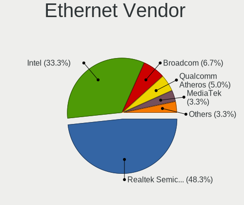
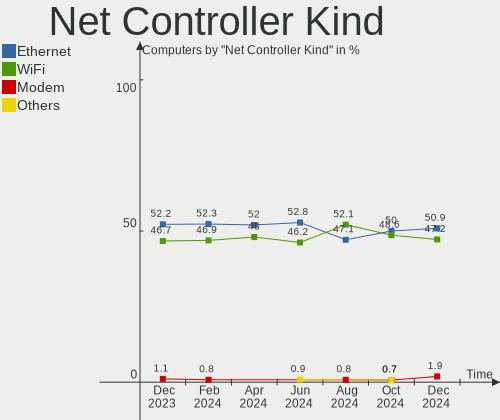

KDE neon Hardware Trends
------------------------

A project to identify most popular hardware characteristics and track their change
over time based on data collected by KDE neon users at https://Linux-Hardware.org.

Anyone can contribute to this report by the [hw-probe](https://github.com/linuxhw/hw-probe) tool:

    sudo -E hw-probe -all -upload

This is a report for all computer types. See also reports for [desktops](/Dist/KDE_neon/Desktop/README.md) and [notebooks](/Dist/KDE_neon/Notebook/README.md).

Full-feature report is available here: https://linux-hardware.org/?view=trends

Period: Mar, 2022.

Contents
--------

* [ System ](#system)
  - [ OS                       ](#os)
  - [ OS Family                ](#os-family)
  - [ Kernel                   ](#kernel)
  - [ Kernel Family            ](#kernel-family)
  - [ Kernel Major Ver.        ](#kernel-major-ver)
  - [ Arch                     ](#arch)
  - [ DE                       ](#de)
  - [ Display Server           ](#display-server)
  - [ Display Manager          ](#display-manager)
  - [ OS Lang                  ](#os-lang)
  - [ Boot Mode                ](#boot-mode)
  - [ Filesystem               ](#filesystem)
  - [ Part. scheme             ](#part-scheme)
  - [ Dual Boot with Linux/BSD ](#dual-boot-with-linuxbsd)
  - [ Dual Boot (Win)          ](#dual-boot-win)

* [ Board ](#board)
  - [ Vendor                   ](#vendor)
  - [ Model                    ](#model)
  - [ Model Family             ](#model-family)
  - [ MFG Year                 ](#mfg-year)
  - [ Form Factor              ](#form-factor)
  - [ Secure Boot              ](#secure-boot)
  - [ Coreboot                 ](#coreboot)
  - [ RAM Size                 ](#ram-size)
  - [ RAM Used                 ](#ram-used)
  - [ Total Drives             ](#total-drives)
  - [ Has CD-ROM               ](#has-cd-rom)
  - [ Has Ethernet             ](#has-ethernet)
  - [ Has WiFi                 ](#has-wifi)
  - [ Has Bluetooth            ](#has-bluetooth)

* [ Location ](#location)
  - [ Country                  ](#country)
  - [ City                     ](#city)

* [ Drives ](#drives)
  - [ Drive Vendor             ](#drive-vendor)
  - [ Drive Model              ](#drive-model)
  - [ HDD Vendor               ](#hdd-vendor)
  - [ SSD Vendor               ](#ssd-vendor)
  - [ Drive Kind               ](#drive-kind)
  - [ Drive Connector          ](#drive-connector)
  - [ Drive Size               ](#drive-size)
  - [ Space Total              ](#space-total)
  - [ Space Used               ](#space-used)
  - [ Malfunc. Drives          ](#malfunc-drives)
  - [ Malfunc. Drive Vendor    ](#malfunc-drive-vendor)
  - [ Malfunc. HDD Vendor      ](#malfunc-hdd-vendor)
  - [ Malfunc. Drive Kind      ](#malfunc-drive-kind)
  - [ Failed Drives            ](#failed-drives)
  - [ Failed Drive Vendor      ](#failed-drive-vendor)
  - [ Drive Status             ](#drive-status)

* [ Storage controller ](#storage-controller)
  - [ Storage Vendor           ](#storage-vendor)
  - [ Storage Model            ](#storage-model)
  - [ Storage Kind             ](#storage-kind)

* [ Processor ](#processor)
  - [ CPU Vendor               ](#cpu-vendor)
  - [ CPU Model                ](#cpu-model)
  - [ CPU Model Family         ](#cpu-model-family)
  - [ CPU Cores                ](#cpu-cores)
  - [ CPU Sockets              ](#cpu-sockets)
  - [ CPU Threads              ](#cpu-threads)
  - [ CPU Op-Modes             ](#cpu-op-modes)
  - [ CPU Microcode            ](#cpu-microcode)
  - [ CPU Microarch            ](#cpu-microarch)

* [ Graphics ](#graphics)
  - [ GPU Vendor               ](#gpu-vendor)
  - [ GPU Model                ](#gpu-model)
  - [ GPU Combo                ](#gpu-combo)
  - [ GPU Driver               ](#gpu-driver)
  - [ GPU Memory               ](#gpu-memory)

* [ Monitor ](#monitor)
  - [ Monitor Vendor           ](#monitor-vendor)
  - [ Monitor Model            ](#monitor-model)
  - [ Monitor Resolution       ](#monitor-resolution)
  - [ Monitor Diagonal         ](#monitor-diagonal)
  - [ Monitor Width            ](#monitor-width)
  - [ Aspect Ratio             ](#aspect-ratio)
  - [ Monitor Area             ](#monitor-area)
  - [ Pixel Density            ](#pixel-density)
  - [ Multiple Monitors        ](#multiple-monitors)

* [ Network ](#network)
  - [ Net Controller Vendor    ](#net-controller-vendor)
  - [ Net Controller Model     ](#net-controller-model)
  - [ Wireless Vendor          ](#wireless-vendor)
  - [ Wireless Model           ](#wireless-model)
  - [ Ethernet Vendor          ](#ethernet-vendor)
  - [ Ethernet Model           ](#ethernet-model)
  - [ Net Controller Kind      ](#net-controller-kind)
  - [ Used Controller          ](#used-controller)
  - [ NICs                     ](#nics)
  - [ IPv6                     ](#ipv6)

* [ Bluetooth ](#bluetooth)
  - [ Bluetooth Vendor         ](#bluetooth-vendor)
  - [ Bluetooth Model          ](#bluetooth-model)

* [ Sound ](#sound)
  - [ Sound Vendor             ](#sound-vendor)
  - [ Sound Model              ](#sound-model)

* [ Memory ](#memory)
  - [ Memory Vendor            ](#memory-vendor)
  - [ Memory Model             ](#memory-model)
  - [ Memory Kind              ](#memory-kind)
  - [ Memory Form Factor       ](#memory-form-factor)
  - [ Memory Size              ](#memory-size)
  - [ Memory Speed             ](#memory-speed)

* [ Printers & scanners ](#printers--scanners)
  - [ Printer Vendor           ](#printer-vendor)
  - [ Printer Model            ](#printer-model)
  - [ Scanner Vendor           ](#scanner-vendor)
  - [ Scanner Model            ](#scanner-model)

* [ Camera ](#camera)
  - [ Camera Vendor            ](#camera-vendor)
  - [ Camera Model             ](#camera-model)

* [ Security ](#security)
  - [ Fingerprint Vendor       ](#fingerprint-vendor)
  - [ Fingerprint Model        ](#fingerprint-model)
  - [ Chipcard Vendor          ](#chipcard-vendor)
  - [ Chipcard Model           ](#chipcard-model)

* [ Unsupported ](#unsupported)
  - [ Unsupported Devices      ](#unsupported-devices)
  - [ Unsupported Device Types ](#unsupported-device-types)

System
------

OS
--

Installed operating systems

| Name           | Computers | Percent |
|----------------|-----------|---------|
| KDE neon 20.04 | 153       | 100%    |

OS Family
---------

OS without a version

| Name     | Computers | Percent |
|----------|-----------|---------|
| KDE neon | 153       | 100%    |

Kernel
------

Version of the Linux kernel

| Version                           | Computers | Percent |
|-----------------------------------|-----------|---------|
| 5.13.0-35-generic                 | 72        | 47.06%  |
| 5.13.0-30-generic                 | 29        | 18.95%  |
| 5.13.0-37-generic                 | 27        | 17.65%  |
| 5.13.0-39-generic                 | 8         | 5.23%   |
| 5.13.0-28-generic                 | 5         | 3.27%   |
| 5.11.0-46-generic                 | 2         | 1.31%   |
| 5.11.0-37-generic                 | 2         | 1.31%   |
| 5.16.13-ext73-96.13-intelstandard | 1         | 0.65%   |
| 5.16.11-surface                   | 1         | 0.65%   |
| 5.15.31-xanmod1                   | 1         | 0.65%   |
| 5.15.26-xanmod1                   | 1         | 0.65%   |
| 5.14.0-1031-oem                   | 1         | 0.65%   |
| 5.14.0-1020-oem                   | 1         | 0.65%   |
| 5.13.0-1009-intel                 | 1         | 0.65%   |
| 5.11.0-41-generic                 | 1         | 0.65%   |

Kernel Family
-------------

Linux kernel without a distro release

| Version | Computers | Percent |
|---------|-----------|---------|
| 5.13.0  | 142       | 92.81%  |
| 5.11.0  | 5         | 3.27%   |
| 5.14.0  | 2         | 1.31%   |
| 5.16.13 | 1         | 0.65%   |
| 5.16.11 | 1         | 0.65%   |
| 5.15.31 | 1         | 0.65%   |
| 5.15.26 | 1         | 0.65%   |

Kernel Major Ver.
-----------------

Linux kernel major version

| Version | Computers | Percent |
|---------|-----------|---------|
| 5.13    | 142       | 92.81%  |
| 5.11    | 5         | 3.27%   |
| 5.16    | 2         | 1.31%   |
| 5.15    | 2         | 1.31%   |
| 5.14    | 2         | 1.31%   |

Arch
----

OS architecture (x86_64, i586, etc.)

| Name   | Computers | Percent |
|--------|-----------|---------|
| x86_64 | 153       | 100%    |

DE
--

Desktop Environment

| Name    | Computers | Percent |
|---------|-----------|---------|
| KDE5    | 152       | 99.35%  |
| Unknown | 1         | 0.65%   |

Display Server
--------------

X11 or Wayland

| Name    | Computers | Percent |
|---------|-----------|---------|
| X11     | 146       | 95.42%  |
| Wayland | 7         | 4.58%   |

Display Manager
---------------

SDDM, LightDM, etc.

| Name    | Computers | Percent |
|---------|-----------|---------|
| Unknown | 120       | 78.43%  |
| SDDM    | 33        | 21.57%  |

OS Lang
-------

Language

| Lang    | Computers | Percent |
|---------|-----------|---------|
| en_US   | 71        | 46.41%  |
| de_DE   | 14        | 9.15%   |
| en_GB   | 8         | 5.23%   |
| pt_BR   | 6         | 3.92%   |
| it_IT   | 6         | 3.92%   |
| ru_RU   | 5         | 3.27%   |
| en_IN   | 5         | 3.27%   |
| es_MX   | 4         | 2.61%   |
| en_CA   | 4         | 2.61%   |
| pt_PT   | 2         | 1.31%   |
| fr_FR   | 2         | 1.31%   |
| es_UY   | 2         | 1.31%   |
| es_ES   | 2         | 1.31%   |
| en_PH   | 2         | 1.31%   |
| en_NZ   | 2         | 1.31%   |
| de_CH   | 2         | 1.31%   |
| C       | 2         | 1.31%   |
| zh_TW   | 1         | 0.65%   |
| zh_CN   | 1         | 0.65%   |
| sv_SE   | 1         | 0.65%   |
| pl_PL   | 1         | 0.65%   |
| nl_NL   | 1         | 0.65%   |
| nb_NO   | 1         | 0.65%   |
| ja_JP   | 1         | 0.65%   |
| hu_HU   | 1         | 0.65%   |
| fr_DZ   | 1         | 0.65%   |
| en_SG   | 1         | 0.65%   |
| en_AU   | 1         | 0.65%   |
| de_AT   | 1         | 0.65%   |
| Default | 1         | 0.65%   |
| cs_CZ   | 1         | 0.65%   |

Boot Mode
---------

EFI or BIOS

| Mode | Computers | Percent |
|------|-----------|---------|
| EFI  | 101       | 66.01%  |
| BIOS | 52        | 33.99%  |

Filesystem
----------

Type of filesystem

| Type    | Computers | Percent |
|---------|-----------|---------|
| Ext4    | 142       | 92.81%  |
| Btrfs   | 10        | 6.54%   |
| Overlay | 1         | 0.65%   |

Part. scheme
------------

Scheme of partitioning

| Type    | Computers | Percent |
|---------|-----------|---------|
| Unknown | 130       | 84.97%  |
| GPT     | 19        | 12.42%  |
| MBR     | 4         | 2.61%   |

Dual Boot with Linux/BSD
------------------------

Hosting more than one Linux/BSD

| Dual boot | Computers | Percent |
|-----------|-----------|---------|
| No        | 144       | 94.12%  |
| Yes       | 9         | 5.88%   |

Dual Boot (Win)
---------------

Hosting Linux and Windows

| Dual boot | Computers | Percent |
|-----------|-----------|---------|
| No        | 135       | 88.24%  |
| Yes       | 18        | 11.76%  |

Board
-----

Vendor
------

Motherboard manufacturer

| Name                | Computers | Percent |
|---------------------|-----------|---------|
| ASUSTek Computer    | 29        | 18.95%  |
| Lenovo              | 26        | 16.99%  |
| Hewlett-Packard     | 23        | 15.03%  |
| MSI                 | 14        | 9.15%   |
| Acer                | 14        | 9.15%   |
| Dell                | 13        | 8.5%    |
| Apple               | 8         | 5.23%   |
| Gigabyte Technology | 6         | 3.92%   |
| ASRock              | 4         | 2.61%   |
| AMI                 | 3         | 1.96%   |
| Biostar             | 2         | 1.31%   |
| TUXEDO              | 1         | 0.65%   |
| THUNDEROBOT         | 1         | 0.65%   |
| Sony                | 1         | 0.65%   |
| SiComputer          | 1         | 0.65%   |
| Samsung Electronics | 1         | 0.65%   |
| MOTILE              | 1         | 0.65%   |
| Microsoft           | 1         | 0.65%   |
| Intel               | 1         | 0.65%   |
| Fujitsu Siemens     | 1         | 0.65%   |
| BESSTAR Tech        | 1         | 0.65%   |
| Unknown             | 1         | 0.65%   |

Model
-----

Motherboard model

| Name                                             | Computers | Percent |
|--------------------------------------------------|-----------|---------|
| ASUS All Series                                  | 2         | 1.31%   |
| Apple MacBookPro8,1                              | 2         | 1.31%   |
| TUXEDO N8xEJEK                                   | 1         | 0.65%   |
| THUNDEROBOT 911Targa                             | 1         | 0.65%   |
| Sony VJF153                                      | 1         | 0.65%   |
| SiComputer Activa Pico                           | 1         | 0.65%   |
| Samsung 500R5L/501R5L/500R5P/550R5L              | 1         | 0.65%   |
| MSI MS-7D25                                      | 1         | 0.65%   |
| MSI MS-7D06                                      | 1         | 0.65%   |
| MSI MS-7C37                                      | 1         | 0.65%   |
| MSI MS-7C35                                      | 1         | 0.65%   |
| MSI MS-7B93                                      | 1         | 0.65%   |
| MSI MS-7B86                                      | 1         | 0.65%   |
| MSI MS-7B85                                      | 1         | 0.65%   |
| MSI MS-7A62                                      | 1         | 0.65%   |
| MSI MS-7A32                                      | 1         | 0.65%   |
| MSI MS-7996                                      | 1         | 0.65%   |
| MSI MS-7918                                      | 1         | 0.65%   |
| MSI MS-7760                                      | 1         | 0.65%   |
| MSI MBB-56X16                                    | 1         | 0.65%   |
| MSI Alpha 17 B5EEK                               | 1         | 0.65%   |
| MOTILE M142                                      | 1         | 0.65%   |
| Microsoft Surface Pro 4                          | 1         | 0.65%   |
| Lenovo Z50-70 20354                              | 1         | 0.65%   |
| Lenovo Yoga 730-15IKB 81CU                       | 1         | 0.65%   |
| Lenovo V110-15ISK 80TL                           | 1         | 0.65%   |
| Lenovo ThinkPad X13 Yoga Gen 2 20W8001TUS        | 1         | 0.65%   |
| Lenovo ThinkPad X1 Carbon 3rd 20BS003HIX         | 1         | 0.65%   |
| Lenovo ThinkPad W530 24472SU                     | 1         | 0.65%   |
| Lenovo ThinkPad T480 20L60033MX                  | 1         | 0.65%   |
| Lenovo ThinkPad T430s 23539LU                    | 1         | 0.65%   |
| Lenovo ThinkPad L512 44444WG                     | 1         | 0.65%   |
| Lenovo ThinkPad L14 Gen 2 20X2S2HG00             | 1         | 0.65%   |
| Lenovo ThinkPad L14 Gen 1 20U1002EMB             | 1         | 0.65%   |
| Lenovo ThinkPad Edge E545 20B20015GE             | 1         | 0.65%   |
| Lenovo ThinkPad E14 Gen 3 20Y70077GE             | 1         | 0.65%   |
| Lenovo ThinkPad E14 Gen 2 20TBS4FM00             | 1         | 0.65%   |
| Lenovo ThinkCentre M710t 10M90007GE              | 1         | 0.65%   |
| Lenovo Legion 7 16ACHg6 82N6                     | 1         | 0.65%   |
| Lenovo IdeaPad Y700-15ISK 80NV                   | 1         | 0.65%   |
| Lenovo IdeaPad Y410P 20216                       | 1         | 0.65%   |
| Lenovo IdeaPad Gaming 3 15IMH05 81Y4             | 1         | 0.65%   |
| Lenovo IdeaPad D330-10IGL 82H0                   | 1         | 0.65%   |
| Lenovo IdeaPad 3 15ALC6 82MF                     | 1         | 0.65%   |
| Lenovo IdeaPad 110-15ACL 80TJ                    | 1         | 0.65%   |
| Lenovo IdeaCentre Y700-34ISH 90DF00JVMW          | 1         | 0.65%   |
| Lenovo G700 20251                                | 1         | 0.65%   |
| Lenovo Erazer X310 90AV000CMT                    | 1         | 0.65%   |
| Lenovo B50-70 20384                              | 1         | 0.65%   |
| Intel HURONRIVER                                 | 1         | 0.65%   |
| HP ZBook Fury 15.6 inch G8 Mobile Workstation PC | 1         | 0.65%   |
| HP Z220 CMT Workstation                          | 1         | 0.65%   |
| HP x2 Detachable 10-p0XX                         | 1         | 0.65%   |
| HP x2 210 G2                                     | 1         | 0.65%   |
| HP ProDesk 400 G2 MINI                           | 1         | 0.65%   |
| HP ProBook 6560b                                 | 1         | 0.65%   |
| HP Pavilion x360 Convertible 14m-dy0xxx          | 1         | 0.65%   |
| HP Pavilion x360 Convertible 14-dy1xxx           | 1         | 0.65%   |
| HP Pavilion Gaming Laptop 16-a0xxx               | 1         | 0.65%   |
| HP Pavilion dv7                                  | 1         | 0.65%   |

Model Family
------------

Motherboard model prefix

| Name                 | Computers | Percent |
|----------------------|-----------|---------|
| Lenovo ThinkPad      | 11        | 7.19%   |
| Acer Aspire          | 11        | 7.19%   |
| Lenovo IdeaPad       | 6         | 3.92%   |
| HP Pavilion          | 6         | 3.92%   |
| HP EliteBook         | 5         | 3.27%   |
| Dell Latitude        | 5         | 3.27%   |
| Dell Precision       | 4         | 2.61%   |
| ASUS ROG             | 4         | 2.61%   |
| HP x2                | 2         | 1.31%   |
| HP ENVY              | 2         | 1.31%   |
| Dell Inspiron        | 2         | 1.31%   |
| ASUS TUF             | 2         | 1.31%   |
| ASUS PRIME           | 2         | 1.31%   |
| ASUS M5A78L-M        | 2         | 1.31%   |
| ASUS All             | 2         | 1.31%   |
| Apple MacBookPro8    | 2         | 1.31%   |
| Acer Swift           | 2         | 1.31%   |
| TUXEDO N8xEJEK       | 1         | 0.65%   |
| THUNDEROBOT 911Targa | 1         | 0.65%   |
| Sony VJF153          | 1         | 0.65%   |
| SiComputer Activa    | 1         | 0.65%   |
| Samsung 500R5L       | 1         | 0.65%   |
| MSI MS-7D25          | 1         | 0.65%   |
| MSI MS-7D06          | 1         | 0.65%   |
| MSI MS-7C37          | 1         | 0.65%   |
| MSI MS-7C35          | 1         | 0.65%   |
| MSI MS-7B93          | 1         | 0.65%   |
| MSI MS-7B86          | 1         | 0.65%   |
| MSI MS-7B85          | 1         | 0.65%   |
| MSI MS-7A62          | 1         | 0.65%   |
| MSI MS-7A32          | 1         | 0.65%   |
| MSI MS-7996          | 1         | 0.65%   |
| MSI MS-7918          | 1         | 0.65%   |
| MSI MS-7760          | 1         | 0.65%   |
| MSI MBB-56X16        | 1         | 0.65%   |
| MSI Alpha            | 1         | 0.65%   |
| MOTILE M142          | 1         | 0.65%   |
| Microsoft Surface    | 1         | 0.65%   |
| Lenovo Z50-70        | 1         | 0.65%   |
| Lenovo Yoga          | 1         | 0.65%   |
| Lenovo V110-15ISK    | 1         | 0.65%   |
| Lenovo ThinkCentre   | 1         | 0.65%   |
| Lenovo Legion        | 1         | 0.65%   |
| Lenovo IdeaCentre    | 1         | 0.65%   |
| Lenovo G700          | 1         | 0.65%   |
| Lenovo Erazer        | 1         | 0.65%   |
| Lenovo B50-70        | 1         | 0.65%   |
| Intel HURONRIVER     | 1         | 0.65%   |
| HP ZBook             | 1         | 0.65%   |
| HP Z220              | 1         | 0.65%   |
| HP ProDesk           | 1         | 0.65%   |
| HP ProBook           | 1         | 0.65%   |
| HP OMEN              | 1         | 0.65%   |
| HP Compaq            | 1         | 0.65%   |
| HP 2B3B              | 1         | 0.65%   |
| HP 200-010           | 1         | 0.65%   |
| Gigabyte Z370        | 1         | 0.65%   |
| Gigabyte X570        | 1         | 0.65%   |
| Gigabyte GA-78LMT-S2 | 1         | 0.65%   |
| Gigabyte B560M       | 1         | 0.65%   |

MFG Year
--------

Motherboard manufacture year

| Year | Computers | Percent |
|------|-----------|---------|
| 2021 | 20        | 13.07%  |
| 2020 | 17        | 11.11%  |
| 2011 | 14        | 9.15%   |
| 2015 | 13        | 8.5%    |
| 2012 | 13        | 8.5%    |
| 2019 | 11        | 7.19%   |
| 2018 | 11        | 7.19%   |
| 2017 | 11        | 7.19%   |
| 2016 | 9         | 5.88%   |
| 2014 | 9         | 5.88%   |
| 2013 | 9         | 5.88%   |
| 2010 | 5         | 3.27%   |
| 2008 | 5         | 3.27%   |
| 2009 | 3         | 1.96%   |
| 2022 | 2         | 1.31%   |
| 2007 | 1         | 0.65%   |

Form Factor
-----------

Physical design of the computer

| Name        | Computers | Percent |
|-------------|-----------|---------|
| Notebook    | 74        | 48.37%  |
| Desktop     | 61        | 39.87%  |
| Convertible | 6         | 3.92%   |
| Tablet      | 5         | 3.27%   |
| Mini pc     | 3         | 1.96%   |
| All in one  | 3         | 1.96%   |
| Server      | 1         | 0.65%   |

Secure Boot
-----------

Enabled or disabled

| State    | Computers | Percent |
|----------|-----------|---------|
| Disabled | 136       | 88.89%  |
| Enabled  | 17        | 11.11%  |

Coreboot
--------

Have coreboot on board

| Used | Computers | Percent |
|------|-----------|---------|
| No   | 153       | 100%    |

RAM Size
--------

Total RAM memory

| Size in GB  | Computers | Percent |
|-------------|-----------|---------|
| 4.01-8.0    | 44        | 28.76%  |
| 16.01-24.0  | 42        | 27.45%  |
| 3.01-4.0    | 19        | 12.42%  |
| 8.01-16.0   | 19        | 12.42%  |
| 32.01-64.0  | 12        | 7.84%   |
| 64.01-256.0 | 8         | 5.23%   |
| 1.01-2.0    | 6         | 3.92%   |
| 24.01-32.0  | 2         | 1.31%   |
| 2.01-3.0    | 1         | 0.65%   |

RAM Used
--------

Used RAM memory

| Used GB   | Computers | Percent |
|-----------|-----------|---------|
| 1.01-2.0  | 73        | 47.71%  |
| 2.01-3.0  | 31        | 20.26%  |
| 3.01-4.0  | 20        | 13.07%  |
| 4.01-8.0  | 17        | 11.11%  |
| 0.51-1.0  | 9         | 5.88%   |
| 8.01-16.0 | 3         | 1.96%   |

Total Drives
------------

Number of drives on board

| Drives | Computers | Percent |
|--------|-----------|---------|
| 1      | 86        | 56.21%  |
| 2      | 44        | 28.76%  |
| 3      | 13        | 8.5%    |
| 4      | 5         | 3.27%   |
| 5      | 2         | 1.31%   |
| 9      | 1         | 0.65%   |
| 7      | 1         | 0.65%   |
| 6      | 1         | 0.65%   |

Has CD-ROM
----------

Has CD-ROM on board

| Presented | Computers | Percent |
|-----------|-----------|---------|
| No        | 105       | 68.63%  |
| Yes       | 48        | 31.37%  |

Has Ethernet
------------

Has Ethernet on board

| Presented | Computers | Percent |
|-----------|-----------|---------|
| Yes       | 139       | 90.85%  |
| No        | 14        | 9.15%   |

Has WiFi
--------

Has WiFi module

| Presented | Computers | Percent |
|-----------|-----------|---------|
| Yes       | 120       | 78.43%  |
| No        | 33        | 21.57%  |

Has Bluetooth
-------------

Has Bluetooth module

| Presented | Computers | Percent |
|-----------|-----------|---------|
| Yes       | 104       | 67.97%  |
| No        | 49        | 32.03%  |

Location
--------

Country
-------

Geographic location (country)

| Country     | Computers | Percent |
|-------------|-----------|---------|
| USA         | 30        | 19.61%  |
| Germany     | 19        | 12.42%  |
| Brazil      | 8         | 5.23%   |
| Russia      | 7         | 4.58%   |
| Italy       | 6         | 3.92%   |
| UK          | 5         | 3.27%   |
| Spain       | 5         | 3.27%   |
| Mexico      | 5         | 3.27%   |
| India       | 5         | 3.27%   |
| Canada      | 5         | 3.27%   |
| Switzerland | 3         | 1.96%   |
| Sweden      | 3         | 1.96%   |
| Netherlands | 3         | 1.96%   |
| France      | 3         | 1.96%   |
| Poland      | 2         | 1.31%   |
| Philippines | 2         | 1.31%   |
| Norway      | 2         | 1.31%   |
| New Zealand | 2         | 1.31%   |
| Hong Kong   | 2         | 1.31%   |
| Cambodia    | 2         | 1.31%   |
| Argentina   | 2         | 1.31%   |
| Algeria     | 2         | 1.31%   |
| Zimbabwe    | 1         | 0.65%   |
| Vietnam     | 1         | 0.65%   |
| Uzbekistan  | 1         | 0.65%   |
| Uruguay     | 1         | 0.65%   |
| Ukraine     | 1         | 0.65%   |
| Singapore   | 1         | 0.65%   |
| Serbia      | 1         | 0.65%   |
| Romania     | 1         | 0.65%   |
| Portugal    | 1         | 0.65%   |
| Morocco     | 1         | 0.65%   |
| Malta       | 1         | 0.65%   |
| Lithuania   | 1         | 0.65%   |
| Lebanon     | 1         | 0.65%   |
| Jordan      | 1         | 0.65%   |
| Japan       | 1         | 0.65%   |
| Iceland     | 1         | 0.65%   |
| Hungary     | 1         | 0.65%   |
| Greece      | 1         | 0.65%   |
| Estonia     | 1         | 0.65%   |
| Egypt       | 1         | 0.65%   |
| Czechia     | 1         | 0.65%   |
| Costa Rica  | 1         | 0.65%   |
| Colombia    | 1         | 0.65%   |
| China       | 1         | 0.65%   |
| Cabo Verde  | 1         | 0.65%   |
| Bulgaria    | 1         | 0.65%   |
| Belgium     | 1         | 0.65%   |
| Belarus     | 1         | 0.65%   |
| Austria     | 1         | 0.65%   |
| Australia   | 1         | 0.65%   |

City
----

Geographic location (city)

| City                     | Computers | Percent |
|--------------------------|-----------|---------|
| St Petersburg            | 2         | 1.31%   |
| Seattle                  | 2         | 1.31%   |
| Rome                     | 2         | 1.31%   |
| Pune                     | 2         | 1.31%   |
| Phnom Penh               | 2         | 1.31%   |
| New York                 | 2         | 1.31%   |
| Moscow                   | 2         | 1.31%   |
| Lucerne                  | 2         | 1.31%   |
| Lake Worth               | 2         | 1.31%   |
| Karlsruhe                | 2         | 1.31%   |
| Düsseldorf              | 2         | 1.31%   |
| Berlin                   | 2         | 1.31%   |
| Zeitz                    | 1         | 0.65%   |
| Zaragoza                 | 1         | 0.65%   |
| Zapopan                  | 1         | 0.65%   |
| Yefremov                 | 1         | 0.65%   |
| Wroclaw                  | 1         | 0.65%   |
| Winter Park              | 1         | 0.65%   |
| Weisswasser              | 1         | 0.65%   |
| Wegberg                  | 1         | 0.65%   |
| Washington               | 1         | 0.65%   |
| Vienna                   | 1         | 0.65%   |
| Two Harbors              | 1         | 0.65%   |
| Tuen Mun                 | 1         | 0.65%   |
| Toril                    | 1         | 0.65%   |
| Tokyo                    | 1         | 0.65%   |
| Tazoult-Lambese          | 1         | 0.65%   |
| Tauranga                 | 1         | 0.65%   |
| Tashkent                 | 1         | 0.65%   |
| Tandil                   | 1         | 0.65%   |
| Tamworth                 | 1         | 0.65%   |
| Tallinn                  | 1         | 0.65%   |
| Sun City West            | 1         | 0.65%   |
| Sueca                    | 1         | 0.65%   |
| Strengelbach             | 1         | 0.65%   |
| Stockton-on-Tees         | 1         | 0.65%   |
| Stepps                   | 1         | 0.65%   |
| Singapore                | 1         | 0.65%   |
| Šiauliai                | 1         | 0.65%   |
| Schwäbisch Gmünd       | 1         | 0.65%   |
| Sao Paulo                | 1         | 0.65%   |
| Salem                    | 1         | 0.65%   |
| Sainte-Marthe-sur-le-Lac | 1         | 0.65%   |
| Reykjavik                | 1         | 0.65%   |
| Queretaro                | 1         | 0.65%   |
| Purmerend                | 1         | 0.65%   |
| Puebla City              | 1         | 0.65%   |
| Poulsbo                  | 1         | 0.65%   |
| Pilica                   | 1         | 0.65%   |
| Pflugerville             | 1         | 0.65%   |
| Pfaffenhofen an der Ilm  | 1         | 0.65%   |
| Pelotas                  | 1         | 0.65%   |
| Patna                    | 1         | 0.65%   |
| Passo Fundo              | 1         | 0.65%   |
| Oegstgeest               | 1         | 0.65%   |
| North Las Vegas          | 1         | 0.65%   |
| Murmansk                 | 1         | 0.65%   |
| Morelia                  | 1         | 0.65%   |
| Montevideo               | 1         | 0.65%   |
| Monfalcone               | 1         | 0.65%   |

Drives
------

Drive Vendor
------------

Hard drive vendors

| Vendor                      | Computers | Drives | Percent |
|-----------------------------|-----------|--------|---------|
| WDC                         | 37        | 54     | 15.48%  |
| Seagate                     | 32        | 34     | 13.39%  |
| Samsung Electronics         | 29        | 35     | 12.13%  |
| Kingston                    | 19        | 20     | 7.95%   |
| SanDisk                     | 17        | 17     | 7.11%   |
| Toshiba                     | 14        | 15     | 5.86%   |
| Crucial                     | 13        | 15     | 5.44%   |
| Unknown                     | 12        | 14     | 5.02%   |
| Intel                       | 6         | 6      | 2.51%   |
| A-DATA Technology           | 6         | 6      | 2.51%   |
| SK Hynix                    | 5         | 5      | 2.09%   |
| Micron Technology           | 5         | 5      | 2.09%   |
| Hitachi                     | 4         | 4      | 1.67%   |
| PNY                         | 3         | 3      | 1.26%   |
| Phison                      | 3         | 4      | 1.26%   |
| XPG                         | 2         | 2      | 0.84%   |
| Patriot                     | 2         | 2      | 0.84%   |
| LITEON                      | 2         | 2      | 0.84%   |
| Lexar                       | 2         | 2      | 0.84%   |
| KIOXIA                      | 2         | 2      | 0.84%   |
| Colorful                    | 2         | 2      | 0.84%   |
| China                       | 2         | 2      | 0.84%   |
| Apacer                      | 2         | 2      | 0.84%   |
| TO Exter                    | 1         | 1      | 0.42%   |
| Team                        | 1         | 1      | 0.42%   |
| Sonnics                     | 1         | 1      | 0.42%   |
| Silicon Motion              | 1         | 1      | 0.42%   |
| OCZ                         | 1         | 1      | 0.42%   |
| N600                        | 1         | 1      | 0.42%   |
| MyDigitalSSD                | 1         | 1      | 0.42%   |
| Micron/Crucial Technology   | 1         | 1      | 0.42%   |
| MAXIO Technology (Hangzhou) | 1         | 1      | 0.42%   |
| KingSpec                    | 1         | 1      | 0.42%   |
| JMicron                     | 1         | 1      | 0.42%   |
| Intenso                     | 1         | 1      | 0.42%   |
| GOODRAM                     | 1         | 1      | 0.42%   |
| GALAX                       | 1         | 1      | 0.42%   |
| BIWIN                       | 1         | 1      | 0.42%   |
| Aura                        | 1         | 1      | 0.42%   |
| Apple                       | 1         | 1      | 0.42%   |
| Unknown                     | 1         | 1      | 0.42%   |

Drive Model
-----------

Hard drive models

| Model                              | Computers | Percent |
|------------------------------------|-----------|---------|
| Unknown MMC Card  64GB             | 5         | 1.92%   |
| WDC WD10SPZX-21Z10T0 1TB           | 4         | 1.54%   |
| Samsung NVMe SSD Drive 512GB       | 4         | 1.54%   |
| Samsung NVMe SSD Drive 500GB       | 4         | 1.54%   |
| Kingston SA400S37480G 480GB SSD    | 4         | 1.54%   |
| Kingston SA400S37240G 240GB SSD    | 4         | 1.54%   |
| Crucial CT240BX500SSD1 240GB       | 4         | 1.54%   |
| Unknown MMC Card  32GB             | 3         | 1.15%   |
| Seagate ST4000DM004-2CV104 4TB     | 3         | 1.15%   |
| Seagate ST2000DM008-2FR102 2TB     | 3         | 1.15%   |
| Sandisk NVMe SSD Drive 1TB         | 3         | 1.15%   |
| XPG NVMe SSD Drive 1024GB          | 2         | 0.77%   |
| WDC WDS500G2B0C-00PXH0 500GB       | 2         | 0.77%   |
| WDC WDS240G2G0A-00JH30 240GB SSD   | 2         | 0.77%   |
| WDC WD5000AAKX-00ERMA0 500GB       | 2         | 0.77%   |
| WDC WD10EZEX-08WN4A0 1TB           | 2         | 0.77%   |
| Unknown MMC Card  128GB            | 2         | 0.77%   |
| Toshiba MQ01ABD100 1TB             | 2         | 0.77%   |
| Toshiba DT01ACA200 2TB             | 2         | 0.77%   |
| Toshiba DT01ACA100 1TB             | 2         | 0.77%   |
| Seagate ST1000LM048-2E7172 1TB     | 2         | 0.77%   |
| Seagate ST1000LM024 HN-M101MBB 1TB | 2         | 0.77%   |
| Seagate ST1000DM010-2EP102 1TB     | 2         | 0.77%   |
| Sandisk NVMe SSD Drive 512GB       | 2         | 0.77%   |
| Sandisk NVMe SSD Drive 500GB       | 2         | 0.77%   |
| Sandisk NVMe SSD Drive 256GB       | 2         | 0.77%   |
| Samsung SSD 860 EVO 1TB            | 2         | 0.77%   |
| Samsung SSD 850 EVO 250GB          | 2         | 0.77%   |
| Samsung HD103UJ 1TB                | 2         | 0.77%   |
| Kingston NVMe SSD Drive 256GB      | 2         | 0.77%   |
| Crucial CT525MX300SSD1 528GB       | 2         | 0.77%   |
| Crucial CT500MX500SSD1 500GB       | 2         | 0.77%   |
| WDC WDS500G2B0A-00SM50 500GB SSD   | 1         | 0.38%   |
| WDC WDS500G2B0A 500GB SSD          | 1         | 0.38%   |
| WDC WDS240G2G0B-00EPW0 240GB SSD   | 1         | 0.38%   |
| WDC WDS240G1G0A-00SS50 240GB SSD   | 1         | 0.38%   |
| WDC WDS120G2G0B-00EPW0 120GB SSD   | 1         | 0.38%   |
| WDC WDS100T2B0C-00PXH0 1TB         | 1         | 0.38%   |
| WDC WDS100T2B0A-00SM50 1TB SSD     | 1         | 0.38%   |
| WDC WD800BEVT-75ZCT2 80GB          | 1         | 0.38%   |
| WDC WD800BB-75CAA0 80GB            | 1         | 0.38%   |
| WDC WD7500AVVS-63E1B1 752GB        | 1         | 0.38%   |
| WDC WD5000LUCT-63C26Y0 500GB       | 1         | 0.38%   |
| WDC WD5000LPVX-08V0TT2 500GB       | 1         | 0.38%   |
| WDC WD5000LPLX-08ZNTT0 500GB       | 1         | 0.38%   |
| WDC WD5000BPKT-75PK4T0 500GB       | 1         | 0.38%   |
| WDC WD5000AAKS-22A7B0 500GB        | 1         | 0.38%   |
| WDC WD40EZRZ-75GXCB0 4TB           | 1         | 0.38%   |
| WDC WD40EZRZ-00GXCB0 4TB           | 1         | 0.38%   |
| WDC WD40EZAZ-00SF3B0 4TB           | 1         | 0.38%   |
| WDC WD40EFAX-68JH4N1 4TB           | 1         | 0.38%   |
| WDC WD4003FZEX-00Z4SA0 4TB         | 1         | 0.38%   |
| WDC WD3200BEKX-75B7WT0 320GB       | 1         | 0.38%   |
| WDC WD3200BEKT-75PVMT1 320GB       | 1         | 0.38%   |
| WDC WD2500AAKX-00ERMA0 250GB       | 1         | 0.38%   |
| WDC WD20EFRX-68AX9N0 2TB           | 1         | 0.38%   |
| WDC WD20EARS-00MVWB0 2TB           | 1         | 0.38%   |
| WDC WD1500HLFS-01G6U0 150GB        | 1         | 0.38%   |
| WDC WD10SPZX-08Z10 1TB             | 1         | 0.38%   |
| WDC WD10JFCX-68N6GN0 1TB           | 1         | 0.38%   |

HDD Vendor
----------

Hard disk drive vendors

| Vendor              | Computers | Drives | Percent |
|---------------------|-----------|--------|---------|
| WDC                 | 29        | 39     | 37.18%  |
| Seagate             | 29        | 31     | 37.18%  |
| Toshiba             | 12        | 13     | 15.38%  |
| Hitachi             | 4         | 4      | 5.13%   |
| Samsung Electronics | 2         | 2      | 2.56%   |
| Unknown             | 1         | 1      | 1.28%   |
| Apple               | 1         | 1      | 1.28%   |

SSD Vendor
----------

Solid state drive vendors

| Vendor              | Computers | Drives | Percent |
|---------------------|-----------|--------|---------|
| Samsung Electronics | 16        | 16     | 17.39%  |
| Kingston            | 12        | 13     | 13.04%  |
| Crucial             | 12        | 14     | 13.04%  |
| WDC                 | 8         | 8      | 8.7%    |
| SanDisk             | 7         | 7      | 7.61%   |
| A-DATA Technology   | 6         | 6      | 6.52%   |
| Intel               | 4         | 4      | 4.35%   |
| PNY                 | 3         | 3      | 3.26%   |
| Patriot             | 2         | 2      | 2.17%   |
| Micron Technology   | 2         | 2      | 2.17%   |
| LITEON              | 2         | 2      | 2.17%   |
| Lexar               | 2         | 2      | 2.17%   |
| China               | 2         | 2      | 2.17%   |
| Apacer              | 2         | 2      | 2.17%   |
| TO Exter            | 1         | 1      | 1.09%   |
| Team                | 1         | 1      | 1.09%   |
| SK Hynix            | 1         | 1      | 1.09%   |
| OCZ                 | 1         | 1      | 1.09%   |
| N600                | 1         | 1      | 1.09%   |
| MyDigitalSSD        | 1         | 1      | 1.09%   |
| KingSpec            | 1         | 1      | 1.09%   |
| JMicron             | 1         | 1      | 1.09%   |
| GOODRAM             | 1         | 1      | 1.09%   |
| Colorful            | 1         | 1      | 1.09%   |
| BIWIN               | 1         | 1      | 1.09%   |
| Aura                | 1         | 1      | 1.09%   |

Drive Kind
----------

HDD or SSD

| Kind    | Computers | Drives | Percent |
|---------|-----------|--------|---------|
| SSD     | 79        | 95     | 35.75%  |
| HDD     | 70        | 91     | 31.67%  |
| NVMe    | 54        | 65     | 24.43%  |
| MMC     | 11        | 13     | 4.98%   |
| Unknown | 7         | 7      | 3.17%   |

Drive Connector
---------------

SATA, SAS, NVMe, etc.

| Type | Computers | Drives | Percent |
|------|-----------|--------|---------|
| SATA | 117       | 184    | 61.26%  |
| NVMe | 54        | 65     | 28.27%  |
| MMC  | 11        | 13     | 5.76%   |
| SAS  | 9         | 9      | 4.71%   |

Drive Size
----------

Size of hard drive

| Size in TB | Computers | Drives | Percent |
|------------|-----------|--------|---------|
| 0.01-0.5   | 83        | 98     | 54.61%  |
| 0.51-1.0   | 46        | 56     | 30.26%  |
| 1.01-2.0   | 12        | 15     | 7.89%   |
| 3.01-4.0   | 6         | 11     | 3.95%   |
| 4.01-10.0  | 3         | 3      | 1.97%   |
| 2.01-3.0   | 2         | 3      | 1.32%   |

Space Total
-----------

Amount of disk space available on the file system

| Size in GB     | Computers | Percent |
|----------------|-----------|---------|
| 101-250        | 43        | 28.1%   |
| 251-500        | 28        | 18.3%   |
| 501-1000       | 28        | 18.3%   |
| 1001-2000      | 17        | 11.11%  |
| 51-100         | 11        | 7.19%   |
| 21-50          | 8         | 5.23%   |
| More than 3000 | 7         | 4.58%   |
| Unknown        | 6         | 3.92%   |
| 2001-3000      | 4         | 2.61%   |
| 1-20           | 1         | 0.65%   |

Space Used
----------

Amount of used disk space

| Used GB        | Computers | Percent |
|----------------|-----------|---------|
| 1-20           | 69        | 45.1%   |
| 101-250        | 19        | 12.42%  |
| 21-50          | 17        | 11.11%  |
| 51-100         | 14        | 9.15%   |
| 251-500        | 11        | 7.19%   |
| 501-1000       | 9         | 5.88%   |
| Unknown        | 6         | 3.92%   |
| 1001-2000      | 4         | 2.61%   |
| More than 3000 | 2         | 1.31%   |
| 2001-3000      | 2         | 1.31%   |

Malfunc. Drives
---------------

Drive models with a malfunction

| Model                                               | Computers | Drives | Percent |
|-----------------------------------------------------|-----------|--------|---------|
| WDC WDS240G2G0A-00JH30 240GB SSD                    | 1         | 1      | 33.33%  |
| Seagate ST1000DM003-1CH162 1TB                      | 1         | 2      | 33.33%  |
| Micron Technology MTFDDAK256MAY-1AH1ZABHA 256GB SSD | 1         | 1      | 33.33%  |

Malfunc. Drive Vendor
---------------------

Vendors of faulty drives

| Vendor            | Computers | Drives | Percent |
|-------------------|-----------|--------|---------|
| WDC               | 1         | 1      | 33.33%  |
| Seagate           | 1         | 2      | 33.33%  |
| Micron Technology | 1         | 1      | 33.33%  |

Malfunc. HDD Vendor
-------------------

Vendors of faulty HDD drives

| Vendor  | Computers | Drives | Percent |
|---------|-----------|--------|---------|
| Seagate | 1         | 2      | 100%    |

Malfunc. Drive Kind
-------------------

Kinds of faulty drives

| Kind | Computers | Drives | Percent |
|------|-----------|--------|---------|
| SSD  | 2         | 2      | 66.67%  |
| HDD  | 1         | 2      | 33.33%  |

Failed Drives
-------------

Failed drive models

Zero info for selected period =(

Failed Drive Vendor
-------------------

Failed drive vendors

Zero info for selected period =(

Drive Status
------------

Number of failed and malfunc. drives

| Status   | Computers | Drives | Percent |
|----------|-----------|--------|---------|
| Detected | 132       | 229    | 84.62%  |
| Works    | 22        | 38     | 14.1%   |
| Malfunc  | 2         | 4      | 1.28%   |

Storage controller
------------------

Storage Vendor
--------------

Storage controller vendors

| Vendor                       | Computers | Percent |
|------------------------------|-----------|---------|
| Intel                        | 95        | 47.5%   |
| AMD                          | 37        | 18.5%   |
| Samsung Electronics          | 14        | 7%      |
| Sandisk                      | 13        | 6.5%    |
| ASMedia Technology           | 9         | 4.5%    |
| Kingston Technology Company  | 7         | 3.5%    |
| SK Hynix                     | 4         | 2%      |
| Phison Electronics           | 3         | 1.5%    |
| Micron Technology            | 3         | 1.5%    |
| Toshiba America Info Systems | 2         | 1%      |
| Micron/Crucial Technology    | 2         | 1%      |
| KIOXIA                       | 2         | 1%      |
| ADATA Technology             | 2         | 1%      |
| Silicon Motion               | 1         | 0.5%    |
| Seagate Technology           | 1         | 0.5%    |
| Nvidia                       | 1         | 0.5%    |
| MAXIO Technology (Hangzhou)  | 1         | 0.5%    |
| Marvell Technology Group     | 1         | 0.5%    |
| JMicron Technology           | 1         | 0.5%    |
| Adaptec                      | 1         | 0.5%    |

Storage Model
-------------

Storage controller models

| Model                                                                          | Computers | Percent |
|--------------------------------------------------------------------------------|-----------|---------|
| AMD FCH SATA Controller [AHCI mode]                                            | 24        | 10.53%  |
| Sandisk WD Blue SN550 NVMe SSD                                                 | 10        | 4.39%   |
| Samsung NVMe SSD Controller SM981/PM981/PM983                                  | 9         | 3.95%   |
| Intel 7 Series Chipset Family 6-port SATA Controller [AHCI mode]               | 9         | 3.95%   |
| ASMedia ASM1062 Serial ATA Controller                                          | 8         | 3.51%   |
| Intel Sunrise Point-LP SATA Controller [AHCI mode]                             | 7         | 3.07%   |
| Intel 6 Series/C200 Series Chipset Family 6 port Mobile SATA AHCI Controller   | 6         | 2.63%   |
| AMD 400 Series Chipset SATA Controller                                         | 6         | 2.63%   |
| Intel Volume Management Device NVMe RAID Controller                            | 5         | 2.19%   |
| Intel SATA Controller [RAID mode]                                              | 5         | 2.19%   |
| Intel 8 Series SATA Controller 1 [AHCI mode]                                   | 5         | 2.19%   |
| Intel HM170/QM170 Chipset SATA Controller [AHCI Mode]                          | 4         | 1.75%   |
| Intel 82801 Mobile SATA Controller [RAID mode]                                 | 4         | 1.75%   |
| Intel 6 Series/C200 Series Chipset Family 6 port Desktop SATA AHCI Controller  | 4         | 1.75%   |
| AMD SB7x0/SB8x0/SB9x0 SATA Controller [IDE mode]                               | 4         | 1.75%   |
| AMD SB7x0/SB8x0/SB9x0 IDE Controller                                           | 4         | 1.75%   |
| Samsung NVMe SSD Controller 980                                                | 3         | 1.32%   |
| Micron Non-Volatile memory controller                                          | 3         | 1.32%   |
| Kingston Company OM3PDP3 NVMe SSD                                              | 3         | 1.32%   |
| Intel Wildcat Point-LP SATA Controller [AHCI Mode]                             | 3         | 1.32%   |
| Intel Tiger Lake-LP SATA Controller [AHCI mode]                                | 3         | 1.32%   |
| Intel Q170/Q150/B150/H170/H110/Z170/CM236 Chipset SATA Controller [AHCI Mode]  | 3         | 1.32%   |
| Intel C600/X79 series chipset 6-Port SATA AHCI Controller                      | 3         | 1.32%   |
| Intel 82801IBM/IEM (ICH9M/ICH9M-E) 4 port SATA Controller [AHCI mode]          | 3         | 1.32%   |
| Intel 8 Series/C220 Series Chipset Family 6-port SATA Controller 1 [AHCI mode] | 3         | 1.32%   |
| Intel 400 Series Chipset Family SATA AHCI Controller                           | 3         | 1.32%   |
| AMD 500 Series Chipset SATA Controller                                         | 3         | 1.32%   |
| Toshiba America Info Systems XG6 NVMe SSD Controller                           | 2         | 0.88%   |
| SK Hynix Gold P31 SSD                                                          | 2         | 0.88%   |
| Sandisk WD Black SN750 / PC SN730 NVMe SSD                                     | 2         | 0.88%   |
| Samsung NVMe SSD Controller PM9A1/PM9A3/980PRO                                 | 2         | 0.88%   |
| Phison E16 PCIe4 NVMe Controller                                               | 2         | 0.88%   |
| KIOXIA Non-Volatile memory controller                                          | 2         | 0.88%   |
| Intel NM10/ICH7 Family SATA Controller [IDE mode]                              | 2         | 0.88%   |
| Intel Cannon Lake Mobile PCH SATA AHCI Controller                              | 2         | 0.88%   |
| Intel 9 Series Chipset Family SATA Controller [AHCI Mode]                      | 2         | 0.88%   |
| Intel 82801HM/HEM (ICH8M/ICH8M-E) SATA Controller [AHCI mode]                  | 2         | 0.88%   |
| Intel 82801HM/HEM (ICH8M/ICH8M-E) IDE Controller                               | 2         | 0.88%   |
| Intel 82801G (ICH7 Family) IDE Controller                                      | 2         | 0.88%   |
| Intel 500 Series Chipset Family SATA AHCI Controller                           | 2         | 0.88%   |
| AMD SB7x0/SB8x0/SB9x0 SATA Controller [AHCI mode]                              | 2         | 0.88%   |
| ADATA XPG SX8200 Pro PCIe Gen3x4 M.2 2280 Solid State Drive                    | 2         | 0.88%   |
| SK Hynix Non-Volatile memory controller                                        | 1         | 0.44%   |
| SK Hynix BC511                                                                 | 1         | 0.44%   |
| Silicon Motion SM2263EN/SM2263XT SSD Controller                                | 1         | 0.44%   |
| Seagate FireCuda 530 SSD                                                       | 1         | 0.44%   |
| Sandisk WD Blue SN570 NVMe SSD                                                 | 1         | 0.44%   |
| Sandisk WD Blue SN500 / PC SN520 NVMe SSD                                      | 1         | 0.44%   |
| Sandisk Non-Volatile memory controller                                         | 1         | 0.44%   |
| Samsung NVMe SSD Controller SM951/PM951                                        | 1         | 0.44%   |
| Phison E12 NVMe Controller                                                     | 1         | 0.44%   |
| Nvidia MCP79 AHCI Controller                                                   | 1         | 0.44%   |
| Micron/Crucial NVMe Controller                                                 | 1         | 0.44%   |
| Micron/Crucial Non-Volatile memory controller                                  | 1         | 0.44%   |
| MAXIO (Hangzhou) NVMe SSD Controller MAP1202                                   | 1         | 0.44%   |
| Marvell Group 88SE9128 PCIe SATA 6 Gb/s RAID controller with HyperDuo          | 1         | 0.44%   |
| Kingston Company U-SNS8154P3 NVMe SSD                                          | 1         | 0.44%   |
| Kingston Company Company Non-Volatile memory controller                        | 1         | 0.44%   |
| Kingston Company SNVS2000G [NV1 NVMe PCIe SSD 2TB]                             | 1         | 0.44%   |
| Kingston Company A2000 NVMe SSD                                                | 1         | 0.44%   |

Storage Kind
------------

Kind of storage controller (IDE, SATA, NVMe, SAS, ...)

| Kind | Computers | Percent |
|------|-----------|---------|
| SATA | 115       | 57.5%   |
| NVMe | 54        | 27%     |
| RAID | 15        | 7.5%    |
| IDE  | 14        | 7%      |
| SAS  | 1         | 0.5%    |
| SCSI | 1         | 0.5%    |

Processor
---------

CPU Vendor
----------

Processor vendors

| Vendor | Computers | Percent |
|--------|-----------|---------|
| Intel  | 112       | 73.2%   |
| AMD    | 41        | 26.8%   |

CPU Model
---------

Processor models

| Model                                         | Computers | Percent |
|-----------------------------------------------|-----------|---------|
| Intel Core i5-7400 CPU @ 3.00GHz              | 4         | 2.61%   |
| Intel Core i5-6200U CPU @ 2.30GHz             | 3         | 1.96%   |
| Intel Core i5-5200U CPU @ 2.20GHz             | 3         | 1.96%   |
| Intel Core i5-10300H CPU @ 2.50GHz            | 3         | 1.96%   |
| Intel Atom x5-Z8350 CPU @ 1.44GHz             | 3         | 1.96%   |
| Intel 11th Gen Core i7-1165G7 @ 2.80GHz       | 3         | 1.96%   |
| Intel 11th Gen Core i5-1135G7 @ 2.40GHz       | 3         | 1.96%   |
| AMD Ryzen 5 5500U with Radeon Graphics        | 3         | 1.96%   |
| Intel Core i7-8750H CPU @ 2.20GHz             | 2         | 1.31%   |
| Intel Core i7-3820 CPU @ 3.60GHz              | 2         | 1.31%   |
| Intel Core i7-3770 CPU @ 3.40GHz              | 2         | 1.31%   |
| Intel Core i7-3630QM CPU @ 2.40GHz            | 2         | 1.31%   |
| Intel Core i5-8250U CPU @ 1.60GHz             | 2         | 1.31%   |
| Intel Core i5-6300HQ CPU @ 2.30GHz            | 2         | 1.31%   |
| Intel Core i5-4460 CPU @ 3.20GHz              | 2         | 1.31%   |
| Intel Core i5-4210U CPU @ 1.70GHz             | 2         | 1.31%   |
| Intel Core i5-3320M CPU @ 2.60GHz             | 2         | 1.31%   |
| Intel Core i5-2520M CPU @ 2.50GHz             | 2         | 1.31%   |
| Intel Core 2 Duo CPU P8600 @ 2.40GHz          | 2         | 1.31%   |
| Intel Atom CPU Z3735F @ 1.33GHz               | 2         | 1.31%   |
| AMD Ryzen 9 5950X 16-Core Processor           | 2         | 1.31%   |
| AMD Ryzen 9 3900X 12-Core Processor           | 2         | 1.31%   |
| AMD Ryzen 7 5800X 8-Core Processor            | 2         | 1.31%   |
| AMD Ryzen 7 5800H with Radeon Graphics        | 2         | 1.31%   |
| AMD Ryzen 5 5600X 6-Core Processor            | 2         | 1.31%   |
| AMD Ryzen 5 3550H with Radeon Vega Mobile Gfx | 2         | 1.31%   |
| AMD Ryzen 5 1600 Six-Core Processor           | 2         | 1.31%   |
| AMD FX-8120 Eight-Core Processor              | 2         | 1.31%   |
| Intel Xeon Gold 6242R CPU @ 3.10GHz           | 1         | 0.65%   |
| Intel Xeon CPU E5-2690 0 @ 2.90GHz            | 1         | 0.65%   |
| Intel Pentium Silver N6000 @ 1.10GHz          | 1         | 0.65%   |
| Intel Pentium Dual-Core CPU T4500 @ 2.30GHz   | 1         | 0.65%   |
| Intel Pentium Dual-Core CPU E6700 @ 3.20GHz   | 1         | 0.65%   |
| Intel Pentium Dual CPU T2370 @ 1.73GHz        | 1         | 0.65%   |
| Intel Pentium CPU N3540 @ 2.16GHz             | 1         | 0.65%   |
| Intel Pentium CPU 2020M @ 2.40GHz             | 1         | 0.65%   |
| Intel Core m3-6Y30 CPU @ 0.90GHz              | 1         | 0.65%   |
| Intel Core i9-9900 CPU @ 3.10GHz              | 1         | 0.65%   |
| Intel Core i9-10850K CPU @ 3.60GHz            | 1         | 0.65%   |
| Intel Core i7-8700K CPU @ 3.70GHz             | 1         | 0.65%   |
| Intel Core i7-8565U CPU @ 1.80GHz             | 1         | 0.65%   |
| Intel Core i7-8550U CPU @ 1.80GHz             | 1         | 0.65%   |
| Intel Core i7-7700K CPU @ 4.20GHz             | 1         | 0.65%   |
| Intel Core i7-7700HQ CPU @ 2.80GHz            | 1         | 0.65%   |
| Intel Core i7-6700HQ CPU @ 2.60GHz            | 1         | 0.65%   |
| Intel Core i7-4790 CPU @ 3.60GHz              | 1         | 0.65%   |
| Intel Core i7-4702MQ CPU @ 2.20GHz            | 1         | 0.65%   |
| Intel Core i7-4700MQ CPU @ 2.40GHz            | 1         | 0.65%   |
| Intel Core i7-3820QM CPU @ 2.70GHz            | 1         | 0.65%   |
| Intel Core i7-3615QM CPU @ 2.30GHz            | 1         | 0.65%   |
| Intel Core i7-2710QE CPU @ 2.10GHz            | 1         | 0.65%   |
| Intel Core i7-2620M CPU @ 2.70GHz             | 1         | 0.65%   |
| Intel Core i7-10750H CPU @ 2.60GHz            | 1         | 0.65%   |
| Intel Core i7-10700K CPU @ 3.80GHz            | 1         | 0.65%   |
| Intel Core i5-8350U CPU @ 1.70GHz             | 1         | 0.65%   |
| Intel Core i5-7300U CPU @ 2.60GHz             | 1         | 0.65%   |
| Intel Core i5-7200U CPU @ 2.50GHz             | 1         | 0.65%   |
| Intel Core i5-6500T CPU @ 2.50GHz             | 1         | 0.65%   |
| Intel Core i5-6267U CPU @ 2.90GHz             | 1         | 0.65%   |
| Intel Core i5-4690K CPU @ 3.50GHz             | 1         | 0.65%   |

CPU Model Family
----------------

Processor model prefix

| Model                   | Computers | Percent |
|-------------------------|-----------|---------|
| Intel Core i5           | 45        | 29.41%  |
| Intel Core i7           | 23        | 15.03%  |
| AMD Ryzen 5             | 14        | 9.15%   |
| Other                   | 10        | 6.54%   |
| AMD Ryzen 7             | 10        | 6.54%   |
| Intel Atom              | 6         | 3.92%   |
| Intel Core i3           | 5         | 3.27%   |
| Intel Core 2 Duo        | 5         | 3.27%   |
| Intel Celeron           | 5         | 3.27%   |
| AMD Ryzen 9             | 5         | 3.27%   |
| AMD FX                  | 4         | 2.61%   |
| Intel Pentium Dual-Core | 2         | 1.31%   |
| Intel Pentium           | 2         | 1.31%   |
| Intel Core i9           | 2         | 1.31%   |
| Intel Core 2 Quad       | 2         | 1.31%   |
| AMD A8                  | 2         | 1.31%   |
| Intel Xeon Gold         | 1         | 0.65%   |
| Intel Xeon              | 1         | 0.65%   |
| Intel Pentium Silver    | 1         | 0.65%   |
| Intel Pentium Dual      | 1         | 0.65%   |
| Intel Core m3           | 1         | 0.65%   |
| AMD Ryzen 3             | 1         | 0.65%   |
| AMD E2                  | 1         | 0.65%   |
| AMD Athlon II X4        | 1         | 0.65%   |
| AMD Athlon II X2        | 1         | 0.65%   |
| AMD A6                  | 1         | 0.65%   |
| AMD A10                 | 1         | 0.65%   |

CPU Cores
---------

Number of processor cores

| Number | Computers | Percent |
|--------|-----------|---------|
| 4      | 70        | 45.75%  |
| 2      | 45        | 29.41%  |
| 6      | 16        | 10.46%  |
| 8      | 12        | 7.84%   |
| 16     | 5         | 3.27%   |
| 12     | 2         | 1.31%   |
| 40     | 1         | 0.65%   |
| 10     | 1         | 0.65%   |
| 3      | 1         | 0.65%   |

CPU Sockets
-----------

Number of sockets

| Number | Computers | Percent |
|--------|-----------|---------|
| 1      | 151       | 98.69%  |
| 2      | 2         | 1.31%   |

CPU Threads
-----------

Threads per core (Hyper-Threading)

| Number | Computers | Percent |
|--------|-----------|---------|
| 2      | 106       | 69.28%  |
| 1      | 47        | 30.72%  |

CPU Op-Modes
------------

CPU Operation Modes (32-bit, 64-bit)

| Op mode        | Computers | Percent |
|----------------|-----------|---------|
| 32-bit, 64-bit | 153       | 100%    |

CPU Microcode
-------------

Microcode number

| Number     | Computers | Percent |
|------------|-----------|---------|
| 0x306a9    | 12        | 7.84%   |
| Unknown    | 11        | 7.19%   |
| 0x206a7    | 10        | 6.54%   |
| 0x306c3    | 7         | 4.58%   |
| 0x806c1    | 6         | 3.92%   |
| 0x40651    | 6         | 3.92%   |
| 0x1067a    | 6         | 3.92%   |
| 0x906e9    | 5         | 3.27%   |
| 0xa0652    | 4         | 2.61%   |
| 0x506e3    | 4         | 2.61%   |
| 0x406e3    | 4         | 2.61%   |
| 0x0a50000c | 4         | 2.61%   |
| 0x0a201016 | 4         | 2.61%   |
| 0x08701021 | 4         | 2.61%   |
| 0x806ea    | 3         | 1.96%   |
| 0x406c4    | 3         | 1.96%   |
| 0x306d4    | 3         | 1.96%   |
| 0x30678    | 3         | 1.96%   |
| 0x206d7    | 3         | 1.96%   |
| 0x20655    | 3         | 1.96%   |
| 0x08608103 | 3         | 1.96%   |
| 0x0600063e | 3         | 1.96%   |
| 0xa0655    | 2         | 1.31%   |
| 0x906ea    | 2         | 1.31%   |
| 0x806ec    | 2         | 1.31%   |
| 0x806e9    | 2         | 1.31%   |
| 0x406c3    | 2         | 1.31%   |
| 0x10676    | 2         | 1.31%   |
| 0x08108102 | 2         | 1.31%   |
| 0x0800820d | 2         | 1.31%   |
| 0x08001137 | 2         | 1.31%   |
| 0x07030105 | 2         | 1.31%   |
| 0x906ed    | 1         | 0.65%   |
| 0x906c0    | 1         | 0.65%   |
| 0x90672    | 1         | 0.65%   |
| 0x806d1    | 1         | 0.65%   |
| 0x806c2    | 1         | 0.65%   |
| 0x706a8    | 1         | 0.65%   |
| 0x706a1    | 1         | 0.65%   |
| 0x6fd      | 1         | 0.65%   |
| 0x50657    | 1         | 0.65%   |
| 0x0a201205 | 1         | 0.65%   |
| 0x0a201204 | 1         | 0.65%   |
| 0x08608102 | 1         | 0.65%   |
| 0x08600103 | 1         | 0.65%   |
| 0x08101016 | 1         | 0.65%   |
| 0x0810100b | 1         | 0.65%   |
| 0x08001129 | 1         | 0.65%   |
| 0x07030104 | 1         | 0.65%   |
| 0x0600611a | 1         | 0.65%   |
| 0x06001119 | 1         | 0.65%   |
| 0x06000852 | 1         | 0.65%   |
| 0x010000db | 1         | 0.65%   |
| 0x010000c8 | 1         | 0.65%   |

CPU Microarch
-------------

Microarchitecture

| Name             | Computers | Percent |
|------------------|-----------|---------|
| KabyLake         | 18        | 11.76%  |
| SandyBridge      | 14        | 9.15%   |
| IvyBridge        | 13        | 8.5%    |
| Haswell          | 13        | 8.5%    |
| Zen 3            | 10        | 6.54%   |
| Skylake          | 10        | 6.54%   |
| TigerLake        | 8         | 5.23%   |
| Silvermont       | 8         | 5.23%   |
| Penryn           | 8         | 5.23%   |
| CometLake        | 7         | 4.58%   |
| Zen              | 6         | 3.92%   |
| Zen+             | 5         | 3.27%   |
| Zen 2            | 5         | 3.27%   |
| Unknown          | 4         | 2.61%   |
| Westmere         | 3         | 1.96%   |
| Puma             | 3         | 1.96%   |
| Bulldozer        | 3         | 1.96%   |
| Broadwell        | 3         | 1.96%   |
| Piledriver       | 2         | 1.31%   |
| K10              | 2         | 1.31%   |
| Goldmont plus    | 2         | 1.31%   |
| Core             | 2         | 1.31%   |
| Tremont          | 1         | 0.65%   |
| Icelake          | 1         | 0.65%   |
| Excavator        | 1         | 0.65%   |
| Alderlake Hybrid | 1         | 0.65%   |

Graphics
--------

GPU Vendor
----------

Vendors of graphics cards

| Vendor | Computers | Percent |
|--------|-----------|---------|
| Intel  | 87        | 47.03%  |
| Nvidia | 67        | 36.22%  |
| AMD    | 31        | 16.76%  |

GPU Model
---------

Graphics card models

| Model                                                                                    | Computers | Percent |
|------------------------------------------------------------------------------------------|-----------|---------|
| Intel 2nd Generation Core Processor Family Integrated Graphics Controller                | 10        | 5.35%   |
| Intel TigerLake-LP GT2 [Iris Xe Graphics]                                                | 7         | 3.74%   |
| Intel 3rd Gen Core processor Graphics Controller                                         | 7         | 3.74%   |
| Intel Haswell-ULT Integrated Graphics Controller                                         | 6         | 3.21%   |
| Intel Atom/Celeron/Pentium Processor x5-E8000/J3xxx/N3xxx Integrated Graphics Controller | 5         | 2.67%   |
| Intel UHD Graphics 620                                                                   | 4         | 2.14%   |
| Intel HD Graphics 530                                                                    | 4         | 2.14%   |
| Intel CometLake-H GT2 [UHD Graphics]                                                     | 4         | 2.14%   |
| AMD Lucienne                                                                             | 4         | 2.14%   |
| Nvidia TU117M                                                                            | 3         | 1.6%    |
| Nvidia GP104 [GeForce GTX 1070]                                                          | 3         | 1.6%    |
| Nvidia GM107M [GeForce GTX 960M]                                                         | 3         | 1.6%    |
| Intel Skylake GT2 [HD Graphics 520]                                                      | 3         | 1.6%    |
| Intel HD Graphics 5500                                                                   | 3         | 1.6%    |
| Intel Core Processor Integrated Graphics Controller                                      | 3         | 1.6%    |
| Intel Atom Processor Z36xxx/Z37xxx Series Graphics & Display                             | 3         | 1.6%    |
| AMD Picasso/Raven 2 [Radeon Vega Series / Radeon Vega Mobile Series]                     | 3         | 1.6%    |
| AMD Navi 23 [Radeon RX 6600/6600 XT/6600M]                                               | 3         | 1.6%    |
| AMD Cezanne                                                                              | 3         | 1.6%    |
| Nvidia GP107M [GeForce MX350]                                                            | 2         | 1.07%   |
| Nvidia GP107 [GeForce GTX 1050 Ti]                                                       | 2         | 1.07%   |
| Nvidia GP106 [GeForce GTX 1060 6GB]                                                      | 2         | 1.07%   |
| Nvidia GF117M [GeForce 610M/710M/810M/820M / GT 620M/625M/630M/720M]                     | 2         | 1.07%   |
| Intel Xeon E3-1200 v3/4th Gen Core Processor Integrated Graphics Controller              | 2         | 1.07%   |
| Intel Mobile 4 Series Chipset Integrated Graphics Controller                             | 2         | 1.07%   |
| Intel IvyBridge GT2 [HD Graphics 4000]                                                   | 2         | 1.07%   |
| Intel HD Graphics 630                                                                    | 2         | 1.07%   |
| Intel HD Graphics 620                                                                    | 2         | 1.07%   |
| Intel GeminiLake [UHD Graphics 600]                                                      | 2         | 1.07%   |
| Intel CoffeeLake-H GT2 [UHD Graphics 630]                                                | 2         | 1.07%   |
| Intel 4 Series Chipset Integrated Graphics Controller                                    | 2         | 1.07%   |
| AMD Navi 10 [Radeon RX 5600 OEM/5600 XT / 5700/5700 XT]                                  | 2         | 1.07%   |
| AMD Mullins [Radeon R4/R5 Graphics]                                                      | 2         | 1.07%   |
| Nvidia TU117M [GeForce GTX 1650 Ti Mobile]                                               | 1         | 0.53%   |
| Nvidia TU116 [GeForce GTX 1660 SUPER]                                                    | 1         | 0.53%   |
| Nvidia TU116 [GeForce GTX 1650 SUPER]                                                    | 1         | 0.53%   |
| Nvidia TU106M [GeForce RTX 2060 Mobile]                                                  | 1         | 0.53%   |
| Nvidia TU106 [GeForce RTX 2070]                                                          | 1         | 0.53%   |
| Nvidia TU106 [GeForce RTX 2060 Rev. A]                                                   | 1         | 0.53%   |
| Nvidia TU104GL [Quadro RTX 4000]                                                         | 1         | 0.53%   |
| Nvidia TU104 [GeForce RTX 2080 SUPER]                                                    | 1         | 0.53%   |
| Nvidia TU104 [GeForce RTX 2070 SUPER]                                                    | 1         | 0.53%   |
| Nvidia TU104 [GeForce RTX 2060]                                                          | 1         | 0.53%   |
| Nvidia TU102 [GeForce RTX 2080 Ti Rev. A]                                                | 1         | 0.53%   |
| Nvidia GP108M [GeForce MX150]                                                            | 1         | 0.53%   |
| Nvidia GP108 [GeForce GT 1030]                                                           | 1         | 0.53%   |
| Nvidia GP107M [GeForce GTX 1050 Ti Mobile]                                               | 1         | 0.53%   |
| Nvidia GP107M [GeForce GTX 1050 Mobile]                                                  | 1         | 0.53%   |
| Nvidia GP107M [GeForce GTX 1050 3 GB Max-Q]                                              | 1         | 0.53%   |
| Nvidia GP106 [GeForce GTX 1060 3GB]                                                      | 1         | 0.53%   |
| Nvidia GM206 [GeForce GTX 960]                                                           | 1         | 0.53%   |
| Nvidia GM204 [GeForce GTX 980]                                                           | 1         | 0.53%   |
| Nvidia GM204 [GeForce GTX 970]                                                           | 1         | 0.53%   |
| Nvidia GM200 [GeForce GTX 980 Ti]                                                        | 1         | 0.53%   |
| Nvidia GM108M [GeForce MX130]                                                            | 1         | 0.53%   |
| Nvidia GM108M [GeForce 940MX]                                                            | 1         | 0.53%   |
| Nvidia GM108M [GeForce 840M]                                                             | 1         | 0.53%   |
| Nvidia GM107GL [Quadro K620]                                                             | 1         | 0.53%   |
| Nvidia GK208B [GeForce GT 730]                                                           | 1         | 0.53%   |
| Nvidia GK208 [GeForce GT 640 Rev. 2]                                                     | 1         | 0.53%   |

GPU Combo
---------

Combinations of graphics cards

| Name           | Computers | Percent |
|----------------|-----------|---------|
| 1 x Intel      | 58        | 37.91%  |
| 1 x Nvidia     | 40        | 26.14%  |
| 1 x AMD        | 26        | 16.99%  |
| Intel + Nvidia | 24        | 15.69%  |
| AMD + Nvidia   | 3         | 1.96%   |
| 2 x AMD        | 1         | 0.65%   |
| Intel + AMD    | 1         | 0.65%   |

GPU Driver
----------

Free vs proprietary

| Driver      | Computers | Percent |
|-------------|-----------|---------|
| Free        | 131       | 85.62%  |
| Proprietary | 18        | 11.76%  |
| Unknown     | 4         | 2.61%   |

GPU Memory
----------

Total video memory

| Size in GB | Computers | Percent |
|------------|-----------|---------|
| Unknown    | 68        | 44.44%  |
| 1.01-2.0   | 17        | 11.11%  |
| 3.01-4.0   | 16        | 10.46%  |
| 0.01-0.5   | 15        | 9.8%    |
| 7.01-8.0   | 13        | 8.5%    |
| 0.51-1.0   | 12        | 7.84%   |
| 5.01-6.0   | 5         | 3.27%   |
| 2.01-3.0   | 3         | 1.96%   |
| 8.01-16.0  | 3         | 1.96%   |
| 16.01-24.0 | 1         | 0.65%   |

Monitor
-------

Monitor Vendor
--------------

Monitor vendors

| Vendor               | Computers | Percent |
|----------------------|-----------|---------|
| Samsung Electronics  | 21        | 12.43%  |
| AU Optronics         | 21        | 12.43%  |
| LG Display           | 17        | 10.06%  |
| Chimei Innolux       | 17        | 10.06%  |
| Goldstar             | 8         | 4.73%   |
| BOE                  | 8         | 4.73%   |
| Ancor Communications | 8         | 4.73%   |
| Hewlett-Packard      | 7         | 4.14%   |
| AOC                  | 7         | 4.14%   |
| Acer                 | 7         | 4.14%   |
| Apple                | 6         | 3.55%   |
| Philips              | 5         | 2.96%   |
| Dell                 | 5         | 2.96%   |
| LG Electronics       | 3         | 1.78%   |
| Lenovo               | 3         | 1.78%   |
| Vizio                | 2         | 1.18%   |
| Unknown              | 2         | 1.18%   |
| Sceptre Tech         | 2         | 1.18%   |
| PANDA                | 2         | 1.18%   |
| InfoVision           | 2         | 1.18%   |
| ViewSonic            | 1         | 0.59%   |
| Valve                | 1         | 0.59%   |
| Toshiba              | 1         | 0.59%   |
| Sharp                | 1         | 0.59%   |
| Plain Tree Systems   | 1         | 0.59%   |
| Lenovo Group Limited | 1         | 0.59%   |
| Iiyama               | 1         | 0.59%   |
| Idek Iiyama          | 1         | 0.59%   |
| Hitachi              | 1         | 0.59%   |
| Elgato               | 1         | 0.59%   |
| Element              | 1         | 0.59%   |
| Eizo                 | 1         | 0.59%   |
| DEX                  | 1         | 0.59%   |
| CSO                  | 1         | 0.59%   |
| BenQ                 | 1         | 0.59%   |
| Unknown              | 1         | 0.59%   |

Monitor Model
-------------

Monitor models

| Model                                                                   | Computers | Percent |
|-------------------------------------------------------------------------|-----------|---------|
| Chimei Innolux LCD Monitor CMN14D4 1920x1080 309x173mm 13.9-inch        | 4         | 2.26%   |
| Vizio V405-H9 VIZ1039 3840x2160 878x485mm 39.5-inch                     | 2         | 1.13%   |
| Dell P2414H DELA09A 1920x1080 527x297mm 23.8-inch                       | 2         | 1.13%   |
| Chimei Innolux LCD Monitor CMN15D5 1920x1080 344x193mm 15.5-inch        | 2         | 1.13%   |
| AU Optronics LCD Monitor AUO18D4 1280x800 216x135mm 10.0-inch           | 2         | 1.13%   |
| AU Optronics LCD Monitor AUO133D 1920x1080 309x173mm 13.9-inch          | 2         | 1.13%   |
| Apple LCD Monitor APP9CC3 1280x800 286x179mm 13.3-inch                  | 2         | 1.13%   |
| ViewSonic VE710b VSCF618 1280x1024 338x270mm 17.0-inch                  | 1         | 0.56%   |
| Valve Index HMD VLV91A8                                                 | 1         | 0.56%   |
| Unknown LCD Monitor Sanyo Electric Co.,Ltd. LCD TV                      | 1         | 0.56%   |
| Unknown LCD Monitor HISENSE                                             | 1         | 0.56%   |
| Toshiba TV TSB010E 1920x1080 882x498mm 39.9-inch                        | 1         | 0.56%   |
| Sharp PN-K321 SHP21DC 3840x2160 698x393mm 31.5-inch                     | 1         | 0.56%   |
| Sceptre Tech Sceptre P30 SPT0BCC 2560x1080 690x290mm 29.5-inch          | 1         | 0.56%   |
| Sceptre Tech Sceptre M24 SPT09A1 1920x1080 527x296mm 23.8-inch          | 1         | 0.56%   |
| Samsung Electronics U32J59x SAM0F35 3840x2160 700x390mm 31.5-inch       | 1         | 0.56%   |
| Samsung Electronics SyncMaster SAM01D0 1600x1200 432x324mm 21.3-inch    | 1         | 0.56%   |
| Samsung Electronics S32D850 SAM0BCB 2560x1440 708x398mm 32.0-inch       | 1         | 0.56%   |
| Samsung Electronics S24D330 SAM0D93 1920x1080 531x299mm 24.0-inch       | 1         | 0.56%   |
| Samsung Electronics S24C650 SAM0B13 1920x1200 518x324mm 24.1-inch       | 1         | 0.56%   |
| Samsung Electronics S20C300 SAM0A18 1600x900 432x240mm 19.5-inch        | 1         | 0.56%   |
| Samsung Electronics LCD Monitor SEC5A42 1366x768 309x174mm 14.0-inch    | 1         | 0.56%   |
| Samsung Electronics LCD Monitor SEC5044 1920x1080 382x215mm 17.3-inch   | 1         | 0.56%   |
| Samsung Electronics LCD Monitor SEC4E45 1280x800 331x207mm 15.4-inch    | 1         | 0.56%   |
| Samsung Electronics LCD Monitor SEC4545 1280x800 331x207mm 15.4-inch    | 1         | 0.56%   |
| Samsung Electronics LCD Monitor SEC334B 1440x900 367x230mm 17.1-inch    | 1         | 0.56%   |
| Samsung Electronics LCD Monitor SDC5441 1366x768 344x194mm 15.5-inch    | 1         | 0.56%   |
| Samsung Electronics LCD Monitor SDC3853 2736x1824 260x173mm 12.3-inch   | 1         | 0.56%   |
| Samsung Electronics LCD Monitor SAM0F14 3840x2160 1872x1053mm 84.6-inch | 1         | 0.56%   |
| Samsung Electronics LCD Monitor SAM0F13 3840x2160 1872x1053mm 84.6-inch | 1         | 0.56%   |
| Samsung Electronics LCD Monitor S34J55x 5360x1440                       | 1         | 0.56%   |
| Samsung Electronics LCD Monitor LC27G5xT 2560x1440                      | 1         | 0.56%   |
| Samsung Electronics LC27T55 SAM701E 1920x1080 609x349mm 27.6-inch       | 1         | 0.56%   |
| Samsung Electronics LC27G5xT SAM707A 2560x1440 597x336mm 27.0-inch      | 1         | 0.56%   |
| Samsung Electronics C32F391 SAM0D35 1920x1080 698x393mm 31.5-inch       | 1         | 0.56%   |
| Samsung Electronics C27F398 SAM0D45 1920x1080 598x336mm 27.0-inch       | 1         | 0.56%   |
| Samsung Electronics C24F390 SAM0D2C 1920x1080 521x293mm 23.5-inch       | 1         | 0.56%   |
| Plain Tree Systems Monitor PTS076F 1440x900 410x256mm 19.0-inch         | 1         | 0.56%   |
| Philips PHL 345E2 PHLC237 3440x1440 800x335mm 34.1-inch                 | 1         | 0.56%   |
| Philips PHL 288P6L PHL08F2 3840x2160 621x341mm 27.9-inch                | 1         | 0.56%   |
| Philips PHL 272B8Q PHL0918 2560x1440 597x336mm 27.0-inch                | 1         | 0.56%   |
| Philips PHL 223V5LH PHLC114 1920x1080 477x268mm 21.5-inch               | 1         | 0.56%   |
| Philips 240PW PHL0873 1920x1200 519x324mm 24.1-inch                     | 1         | 0.56%   |
| PANDA LCD Monitor NCP004D 1920x1080 344x194mm 15.5-inch                 | 1         | 0.56%   |
| PANDA LCD Monitor NCP002D 1920x1080 344x194mm 15.5-inch                 | 1         | 0.56%   |
| LG Electronics LCD Monitor LG QHD 2560x1440                             | 1         | 0.56%   |
| LG Electronics LCD Monitor IPS235                                       | 1         | 0.56%   |
| LG Electronics LCD Monitor E2441                                        | 1         | 0.56%   |
| LG Display LCD Monitor LGD0685 1920x1080 309x174mm 14.0-inch            | 1         | 0.56%   |
| LG Display LCD Monitor LGD0671 1920x1080 382x215mm 17.3-inch            | 1         | 0.56%   |
| LG Display LCD Monitor LGD05F3 1920x1080 309x174mm 14.0-inch            | 1         | 0.56%   |
| LG Display LCD Monitor LGD0599 1920x1080 309x174mm 14.0-inch            | 1         | 0.56%   |
| LG Display LCD Monitor LGD0570 1920x1080 344x194mm 15.5-inch            | 1         | 0.56%   |
| LG Display LCD Monitor LGD04CB 1920x1080 294x165mm 13.3-inch            | 1         | 0.56%   |
| LG Display LCD Monitor LGD04B9 1920x1080 344x194mm 15.5-inch            | 1         | 0.56%   |
| LG Display LCD Monitor LGD04A7 1920x1080 344x194mm 15.5-inch            | 1         | 0.56%   |
| LG Display LCD Monitor LGD046F 1920x1080 345x194mm 15.6-inch            | 1         | 0.56%   |
| LG Display LCD Monitor LGD046A 1366x768 344x194mm 15.5-inch             | 1         | 0.56%   |
| LG Display LCD Monitor LGD0456 1366x768 340x190mm 15.3-inch             | 1         | 0.56%   |
| LG Display LCD Monitor LGD0396 1600x900 382x215mm 17.3-inch             | 1         | 0.56%   |

Monitor Resolution
------------------

Monitor screen resolution

| Resolution        | Computers | Percent |
|-------------------|-----------|---------|
| 1920x1080 (FHD)   | 68        | 41.72%  |
| 1366x768 (WXGA)   | 22        | 13.5%   |
| 2560x1440 (QHD)   | 13        | 7.98%   |
| 3840x2160 (4K)    | 11        | 6.75%   |
| 1600x900 (HD+)    | 8         | 4.91%   |
| 1280x800 (WXGA)   | 7         | 4.29%   |
| Unknown           | 7         | 4.29%   |
| 1440x900 (WXGA+)  | 5         | 3.07%   |
| 3440x1440         | 4         | 2.45%   |
| 1920x1200 (WUXGA) | 3         | 1.84%   |
| 2560x1080         | 2         | 1.23%   |
| 1280x1024 (SXGA)  | 2         | 1.23%   |
| 6400x2160         | 1         | 0.61%   |
| 5360x1440         | 1         | 0.61%   |
| 5120x1080         | 1         | 0.61%   |
| 4480x1440         | 1         | 0.61%   |
| 3840x1600         | 1         | 0.61%   |
| 3840x1080         | 1         | 0.61%   |
| 3600x1080         | 1         | 0.61%   |
| 2880x1800         | 1         | 0.61%   |
| 2736x1824         | 1         | 0.61%   |
| 2560x1600         | 1         | 0.61%   |
| 1600x1200         | 1         | 0.61%   |

Monitor Diagonal
----------------

Diagonal size in inches

| Inches  | Computers | Percent |
|---------|-----------|---------|
| 15      | 40        | 24.24%  |
| 13      | 19        | 11.52%  |
| 27      | 15        | 9.09%   |
| 21      | 10        | 6.06%   |
| 14      | 10        | 6.06%   |
| Unknown | 10        | 6.06%   |
| 31      | 8         | 4.85%   |
| 24      | 7         | 4.24%   |
| 23      | 7         | 4.24%   |
| 17      | 7         | 4.24%   |
| 34      | 5         | 3.03%   |
| 19      | 4         | 2.42%   |
| 32      | 3         | 1.82%   |
| 20      | 3         | 1.82%   |
| 84      | 2         | 1.21%   |
| 49      | 2         | 1.21%   |
| 16      | 2         | 1.21%   |
| 12      | 2         | 1.21%   |
| 10      | 2         | 1.21%   |
| 46      | 1         | 0.61%   |
| 37      | 1         | 0.61%   |
| 33      | 1         | 0.61%   |
| 29      | 1         | 0.61%   |
| 25      | 1         | 0.61%   |
| 18      | 1         | 0.61%   |
| 11      | 1         | 0.61%   |

Monitor Width
-------------

Physical width

| Width in mm | Computers | Percent |
|-------------|-----------|---------|
| 301-350     | 64        | 39.02%  |
| 501-600     | 27        | 16.46%  |
| 401-500     | 17        | 10.37%  |
| 201-300     | 12        | 7.32%   |
| 601-700     | 11        | 6.71%   |
| Unknown     | 10        | 6.1%    |
| 701-800     | 9         | 5.49%   |
| 351-400     | 8         | 4.88%   |
| 1001-1500   | 3         | 1.83%   |
| 1501-2000   | 2         | 1.22%   |
| 801-900     | 1         | 0.61%   |

Aspect Ratio
------------

Proportional relationship between the width and the height

| Ratio   | Computers | Percent |
|---------|-----------|---------|
| 16/9    | 109       | 74.15%  |
| 16/10   | 17        | 11.56%  |
| Unknown | 10        | 6.8%    |
| 21/9    | 7         | 4.76%   |
| 5/4     | 2         | 1.36%   |
| 4/3     | 1         | 0.68%   |
| 3/2     | 1         | 0.68%   |

Monitor Area
------------

Area in inch²

| Area in inch² | Computers | Percent |
|----------------|-----------|---------|
| 101-110        | 41        | 25%     |
| 81-90          | 25        | 15.24%  |
| 201-250        | 20        | 12.2%   |
| 351-500        | 16        | 9.76%   |
| 301-350        | 16        | 9.76%   |
| 151-200        | 10        | 6.1%    |
| Unknown        | 10        | 6.1%    |
| 121-130        | 5         | 3.05%   |
| More than 1000 | 4         | 2.44%   |
| 71-80          | 4         | 2.44%   |
| 251-300        | 3         | 1.83%   |
| 61-70          | 2         | 1.22%   |
| 41-50          | 2         | 1.22%   |
| 501-1000       | 2         | 1.22%   |
| 51-60          | 1         | 0.61%   |
| 141-150        | 1         | 0.61%   |
| 131-140        | 1         | 0.61%   |
| 111-120        | 1         | 0.61%   |

Pixel Density
-------------

Pixels per inch

| Density       | Computers | Percent |
|---------------|-----------|---------|
| 121-160       | 47        | 29.75%  |
| 51-100        | 47        | 29.75%  |
| 101-120       | 43        | 27.22%  |
| Unknown       | 10        | 6.33%   |
| 161-240       | 8         | 5.06%   |
| More than 240 | 2         | 1.27%   |
| 1-50          | 1         | 0.63%   |

Multiple Monitors
-----------------

Total monitors connected

| Total | Computers | Percent |
|-------|-----------|---------|
| 1     | 119       | 77.78%  |
| 2     | 24        | 15.69%  |
| 3     | 5         | 3.27%   |
| 0     | 5         | 3.27%   |

Network
-------

Net Controller Vendor
---------------------

Controller vendors

| Vendor                          | Computers | Percent |
|---------------------------------|-----------|---------|
| Realtek Semiconductor           | 91        | 36.69%  |
| Intel                           | 74        | 29.84%  |
| Broadcom                        | 22        | 8.87%   |
| Qualcomm Atheros                | 21        | 8.47%   |
| MEDIATEK                        | 5         | 2.02%   |
| Samsung Electronics             | 3         | 1.21%   |
| Microsoft                       | 3         | 1.21%   |
| Marvell Technology Group        | 3         | 1.21%   |
| Broadcom Limited                | 3         | 1.21%   |
| Ralink Technology               | 2         | 0.81%   |
| Motorola PCS                    | 2         | 0.81%   |
| ASIX Electronics                | 2         | 0.81%   |
| T & A Mobile Phones             | 1         | 0.4%    |
| Spreadtrum Communications       | 1         | 0.4%    |
| Qualcomm Atheros Communications | 1         | 0.4%    |
| Qualcomm                        | 1         | 0.4%    |
| QLogic                          | 1         | 0.4%    |
| OPPO Electronics                | 1         | 0.4%    |
| Nvidia                          | 1         | 0.4%    |
| NetGear                         | 1         | 0.4%    |
| Mellanox Technologies           | 1         | 0.4%    |
| Linksys                         | 1         | 0.4%    |
| Lenovo                          | 1         | 0.4%    |
| InterBiometrics                 | 1         | 0.4%    |
| Huawei Technologies             | 1         | 0.4%    |
| FIBOCOM                         | 1         | 0.4%    |
| D-Link                          | 1         | 0.4%    |
| Belkin Components               | 1         | 0.4%    |
| Apple                           | 1         | 0.4%    |

Net Controller Model
--------------------

Controller models

| Model                                                                                         | Computers | Percent |
|-----------------------------------------------------------------------------------------------|-----------|---------|
| Realtek RTL8111/8168/8411 PCI Express Gigabit Ethernet Controller                             | 69        | 23.71%  |
| Intel Wi-Fi 6 AX200                                                                           | 10        | 3.44%   |
| Intel 82579LM Gigabit Network Connection (Lewisville)                                         | 10        | 3.44%   |
| Intel I211 Gigabit Network Connection                                                         | 8         | 2.75%   |
| Broadcom BCM43142 802.11b/g/n                                                                 | 8         | 2.75%   |
| Realtek RTL810xE PCI Express Fast Ethernet controller                                         | 6         | 2.06%   |
| Realtek RTL8822CE 802.11ac PCIe Wireless Network Adapter                                      | 5         | 1.72%   |
| Intel Wireless 8265 / 8275                                                                    | 5         | 1.72%   |
| Intel Wi-Fi 6 AX201                                                                           | 5         | 1.72%   |
| Qualcomm Atheros QCA9377 802.11ac Wireless Network Adapter                                    | 4         | 1.37%   |
| Qualcomm Atheros QCA6174 802.11ac Wireless Network Adapter                                    | 4         | 1.37%   |
| MEDIATEK MT7921 802.11ax PCI Express Wireless Network Adapter                                 | 4         | 1.37%   |
| Intel Wireless 7265                                                                           | 4         | 1.37%   |
| Intel Ethernet Controller I225-V                                                              | 4         | 1.37%   |
| Intel Dual Band Wireless-AC 3168NGW [Stone Peak]                                              | 4         | 1.37%   |
| Intel Centrino Advanced-N 6205 [Taylor Peak]                                                  | 4         | 1.37%   |
| Broadcom NetXtreme BCM57765 Gigabit Ethernet PCIe                                             | 4         | 1.37%   |
| Qualcomm Atheros QCA8171 Gigabit Ethernet                                                     | 3         | 1.03%   |
| Qualcomm Atheros AR9485 Wireless Network Adapter                                              | 3         | 1.03%   |
| Intel Wireless-AC 9260                                                                        | 3         | 1.03%   |
| Intel Wireless 7260                                                                           | 3         | 1.03%   |
| Intel Wireless 3165                                                                           | 3         | 1.03%   |
| Intel Comet Lake PCH CNVi WiFi                                                                | 3         | 1.03%   |
| Broadcom BCM4331 802.11a/b/g/n                                                                | 3         | 1.03%   |
| Samsung GT-I9070 (network tethering, USB debugging enabled)                                   | 2         | 0.69%   |
| Realtek RTL88x2bu [AC1200 Techkey]                                                            | 2         | 0.69%   |
| Realtek RTL8822BE 802.11a/b/g/n/ac WiFi adapter                                               | 2         | 0.69%   |
| Realtek RTL8821CE 802.11ac PCIe Wireless Network Adapter                                      | 2         | 0.69%   |
| Realtek RTL8188EUS 802.11n Wireless Network Adapter                                           | 2         | 0.69%   |
| Realtek RTL8153 Gigabit Ethernet Adapter                                                      | 2         | 0.69%   |
| Realtek RTL8125 2.5GbE Controller                                                             | 2         | 0.69%   |
| Realtek 802.11ac NIC                                                                          | 2         | 0.69%   |
| Ralink MT7601U Wireless Adapter                                                               | 2         | 0.69%   |
| Motorola PCS moto g power (2021)                                                              | 2         | 0.69%   |
| Microsoft XBOX ACC                                                                            | 2         | 0.69%   |
| Intel Wireless 8260                                                                           | 2         | 0.69%   |
| Intel Wireless 3160                                                                           | 2         | 0.69%   |
| Intel Centrino Ultimate-N 6300                                                                | 2         | 0.69%   |
| Intel Cannon Lake PCH CNVi WiFi                                                               | 2         | 0.69%   |
| Intel 82579V Gigabit Network Connection                                                       | 2         | 0.69%   |
| Broadcom BCM4352 802.11ac Wireless Network Adapter                                            | 2         | 0.69%   |
| Broadcom BCM4313 802.11bgn Wireless Network Adapter                                           | 2         | 0.69%   |
| ASIX AX88179 Gigabit Ethernet                                                                 | 2         | 0.69%   |
| T & A Mobile Phones Mobilebroadband                                                           | 1         | 0.34%   |
| Spreadtrum Unisoc Phone                                                                       | 1         | 0.34%   |
| Samsung Galaxy series, misc. (tethering mode)                                                 | 1         | 0.34%   |
| Realtek RTL8852AE 802.11ax PCIe Wireless Network Adapter                                      | 1         | 0.34%   |
| Realtek RTL8821AE 802.11ac PCIe Wireless Network Adapter                                      | 1         | 0.34%   |
| Realtek RTL8812AU 802.11a/b/g/n/ac 2T2R DB WLAN Adapter                                       | 1         | 0.34%   |
| Realtek RTL8812AE 802.11ac PCIe Wireless Network Adapter                                      | 1         | 0.34%   |
| Realtek RTL8191SEvB Wireless LAN Controller                                                   | 1         | 0.34%   |
| Realtek RTL8187B Wireless 802.11g 54Mbps Network Adapter                                      | 1         | 0.34%   |
| Realtek RTL8169 PCI Gigabit Ethernet Controller                                               | 1         | 0.34%   |
| Realtek RTL8152 Fast Ethernet Adapter                                                         | 1         | 0.34%   |
| Realtek RTL-8110SC/8169SC Gigabit Ethernet                                                    | 1         | 0.34%   |
| Realtek RTL-8100/8101L/8139 PCI Fast Ethernet Adapter                                         | 1         | 0.34%   |
| Realtek Realtek 8812AU/8821AU 802.11ac WLAN Adapter [USB Wireless Dual-Band Adapter 2.4/5Ghz] | 1         | 0.34%   |
| Realtek Killer E2600 Gigabit Ethernet Controller                                              | 1         | 0.34%   |
| Qualcomm Redmi Note 7                                                                         | 1         | 0.34%   |
| Qualcomm Atheros QCA9565 / AR9565 Wireless Network Adapter                                    | 1         | 0.34%   |

Wireless Vendor
---------------

Wireless vendors

| Vendor                          | Computers | Percent |
|---------------------------------|-----------|---------|
| Intel                           | 57        | 44.19%  |
| Realtek Semiconductor           | 22        | 17.05%  |
| Broadcom                        | 17        | 13.18%  |
| Qualcomm Atheros                | 13        | 10.08%  |
| MEDIATEK                        | 5         | 3.88%   |
| Microsoft                       | 3         | 2.33%   |
| Broadcom Limited                | 3         | 2.33%   |
| Ralink Technology               | 2         | 1.55%   |
| Qualcomm Atheros Communications | 1         | 0.78%   |
| NetGear                         | 1         | 0.78%   |
| Marvell Technology Group        | 1         | 0.78%   |
| Linksys                         | 1         | 0.78%   |
| FIBOCOM                         | 1         | 0.78%   |
| D-Link                          | 1         | 0.78%   |
| Belkin Components               | 1         | 0.78%   |

Wireless Model
--------------

Wireless models

| Model                                                                                         | Computers | Percent |
|-----------------------------------------------------------------------------------------------|-----------|---------|
| Intel Wi-Fi 6 AX200                                                                           | 10        | 7.75%   |
| Broadcom BCM43142 802.11b/g/n                                                                 | 8         | 6.2%    |
| Realtek RTL8822CE 802.11ac PCIe Wireless Network Adapter                                      | 5         | 3.88%   |
| Intel Wireless 8265 / 8275                                                                    | 5         | 3.88%   |
| Intel Wi-Fi 6 AX201                                                                           | 5         | 3.88%   |
| Qualcomm Atheros QCA9377 802.11ac Wireless Network Adapter                                    | 4         | 3.1%    |
| Qualcomm Atheros QCA6174 802.11ac Wireless Network Adapter                                    | 4         | 3.1%    |
| MEDIATEK MT7921 802.11ax PCI Express Wireless Network Adapter                                 | 4         | 3.1%    |
| Intel Wireless 7265                                                                           | 4         | 3.1%    |
| Intel Dual Band Wireless-AC 3168NGW [Stone Peak]                                              | 4         | 3.1%    |
| Intel Centrino Advanced-N 6205 [Taylor Peak]                                                  | 4         | 3.1%    |
| Qualcomm Atheros AR9485 Wireless Network Adapter                                              | 3         | 2.33%   |
| Intel Wireless-AC 9260                                                                        | 3         | 2.33%   |
| Intel Wireless 7260                                                                           | 3         | 2.33%   |
| Intel Wireless 3165                                                                           | 3         | 2.33%   |
| Intel Comet Lake PCH CNVi WiFi                                                                | 3         | 2.33%   |
| Broadcom BCM4331 802.11a/b/g/n                                                                | 3         | 2.33%   |
| Realtek RTL88x2bu [AC1200 Techkey]                                                            | 2         | 1.55%   |
| Realtek RTL8822BE 802.11a/b/g/n/ac WiFi adapter                                               | 2         | 1.55%   |
| Realtek RTL8821CE 802.11ac PCIe Wireless Network Adapter                                      | 2         | 1.55%   |
| Realtek RTL8188EUS 802.11n Wireless Network Adapter                                           | 2         | 1.55%   |
| Realtek 802.11ac NIC                                                                          | 2         | 1.55%   |
| Ralink MT7601U Wireless Adapter                                                               | 2         | 1.55%   |
| Microsoft XBOX ACC                                                                            | 2         | 1.55%   |
| Intel Wireless 8260                                                                           | 2         | 1.55%   |
| Intel Wireless 3160                                                                           | 2         | 1.55%   |
| Intel Centrino Ultimate-N 6300                                                                | 2         | 1.55%   |
| Intel Cannon Lake PCH CNVi WiFi                                                               | 2         | 1.55%   |
| Broadcom BCM4352 802.11ac Wireless Network Adapter                                            | 2         | 1.55%   |
| Broadcom BCM4313 802.11bgn Wireless Network Adapter                                           | 2         | 1.55%   |
| Realtek RTL8852AE 802.11ax PCIe Wireless Network Adapter                                      | 1         | 0.78%   |
| Realtek RTL8821AE 802.11ac PCIe Wireless Network Adapter                                      | 1         | 0.78%   |
| Realtek RTL8812AU 802.11a/b/g/n/ac 2T2R DB WLAN Adapter                                       | 1         | 0.78%   |
| Realtek RTL8812AE 802.11ac PCIe Wireless Network Adapter                                      | 1         | 0.78%   |
| Realtek RTL8191SEvB Wireless LAN Controller                                                   | 1         | 0.78%   |
| Realtek RTL8187B Wireless 802.11g 54Mbps Network Adapter                                      | 1         | 0.78%   |
| Realtek Realtek 8812AU/8821AU 802.11ac WLAN Adapter [USB Wireless Dual-Band Adapter 2.4/5Ghz] | 1         | 0.78%   |
| Qualcomm Atheros QCA9565 / AR9565 Wireless Network Adapter                                    | 1         | 0.78%   |
| Qualcomm Atheros AR9271 802.11n                                                               | 1         | 0.78%   |
| Qualcomm Atheros AR93xx Wireless Network Adapter                                              | 1         | 0.78%   |
| NetGear WNA3100M(v1) Wireless-N 300 [Realtek RTL8192CU]                                       | 1         | 0.78%   |
| Microsoft Wireless XBox Controller Dongle                                                     | 1         | 0.78%   |
| MEDIATEK RZ608 Wi-Fi 6E 80MHz                                                                 | 1         | 0.78%   |
| Marvell Group 88W8897 [AVASTAR] 802.11ac Wireless                                             | 1         | 0.78%   |
| Linksys WUSB6300 802.11a/b/g/n/ac Wireless Adapter [Realtek RTL8812AU]                        | 1         | 0.78%   |
| Intel Wi-Fi 6 AX201 160MHz                                                                    | 1         | 0.78%   |
| Intel Tiger Lake PCH CNVi WiFi                                                                | 1         | 0.78%   |
| Intel PRO/Wireless 5100 AGN [Shiloh] Network Connection                                       | 1         | 0.78%   |
| Intel Cannon Point-LP CNVi [Wireless-AC]                                                      | 1         | 0.78%   |
| Intel Alder Lake-S PCH CNVi WiFi                                                              | 1         | 0.78%   |
| FIBOCOM L830-EB                                                                               | 1         | 0.78%   |
| D-Link DWA-182 Wireless AC Dualband Adapter(rev.C) [Realtek RTL8812AU]                        | 1         | 0.78%   |
| Broadcom Limited BCM4360 802.11ac Wireless Network Adapter                                    | 1         | 0.78%   |
| Broadcom Limited BCM4331 802.11a/b/g/n                                                        | 1         | 0.78%   |
| Broadcom Limited BCM4312 802.11b/g LP-PHY                                                     | 1         | 0.78%   |
| Broadcom BCM43228 802.11a/b/g/n                                                               | 1         | 0.78%   |
| Broadcom BCM4321 802.11a/b/g/n                                                                | 1         | 0.78%   |
| Belkin Components F5D8053 N Wireless USB Adapter v3000 [Ralink RT2870]                        | 1         | 0.78%   |

Ethernet Vendor
---------------

Ethernet vendors

| Vendor                    | Computers | Percent |
|---------------------------|-----------|---------|
| Realtek Semiconductor     | 81        | 52.94%  |
| Intel                     | 39        | 25.49%  |
| Qualcomm Atheros          | 8         | 5.23%   |
| Broadcom                  | 8         | 5.23%   |
| Samsung Electronics       | 3         | 1.96%   |
| Marvell Technology Group  | 2         | 1.31%   |
| ASIX Electronics          | 2         | 1.31%   |
| Spreadtrum Communications | 1         | 0.65%   |
| Qualcomm                  | 1         | 0.65%   |
| QLogic                    | 1         | 0.65%   |
| OPPO Electronics          | 1         | 0.65%   |
| Nvidia                    | 1         | 0.65%   |
| Motorola PCS              | 1         | 0.65%   |
| Mellanox Technologies     | 1         | 0.65%   |
| Lenovo                    | 1         | 0.65%   |
| Huawei Technologies       | 1         | 0.65%   |
| Apple                     | 1         | 0.65%   |

Ethernet Model
--------------

Ethernet models

| Model                                                             | Computers | Percent |
|-------------------------------------------------------------------|-----------|---------|
| Realtek RTL8111/8168/8411 PCI Express Gigabit Ethernet Controller | 69        | 43.67%  |
| Intel 82579LM Gigabit Network Connection (Lewisville)             | 10        | 6.33%   |
| Intel I211 Gigabit Network Connection                             | 8         | 5.06%   |
| Realtek RTL810xE PCI Express Fast Ethernet controller             | 6         | 3.8%    |
| Intel Ethernet Controller I225-V                                  | 4         | 2.53%   |
| Broadcom NetXtreme BCM57765 Gigabit Ethernet PCIe                 | 4         | 2.53%   |
| Qualcomm Atheros QCA8171 Gigabit Ethernet                         | 3         | 1.9%    |
| Samsung GT-I9070 (network tethering, USB debugging enabled)       | 2         | 1.27%   |
| Realtek RTL8153 Gigabit Ethernet Adapter                          | 2         | 1.27%   |
| Realtek RTL8125 2.5GbE Controller                                 | 2         | 1.27%   |
| Intel 82579V Gigabit Network Connection                           | 2         | 1.27%   |
| ASIX AX88179 Gigabit Ethernet                                     | 2         | 1.27%   |
| Spreadtrum Unisoc Phone                                           | 1         | 0.63%   |
| Samsung Galaxy series, misc. (tethering mode)                     | 1         | 0.63%   |
| Realtek RTL8169 PCI Gigabit Ethernet Controller                   | 1         | 0.63%   |
| Realtek RTL8152 Fast Ethernet Adapter                             | 1         | 0.63%   |
| Realtek RTL-8110SC/8169SC Gigabit Ethernet                        | 1         | 0.63%   |
| Realtek RTL-8100/8101L/8139 PCI Fast Ethernet Adapter             | 1         | 0.63%   |
| Realtek Killer E2600 Gigabit Ethernet Controller                  | 1         | 0.63%   |
| Qualcomm Redmi Note 7                                             | 1         | 0.63%   |
| Qualcomm Atheros Killer E2500 Gigabit Ethernet Controller         | 1         | 0.63%   |
| Qualcomm Atheros Killer E220x Gigabit Ethernet Controller         | 1         | 0.63%   |
| Qualcomm Atheros AR8162 Fast Ethernet                             | 1         | 0.63%   |
| Qualcomm Atheros AR8152 v1.1 Fast Ethernet                        | 1         | 0.63%   |
| Qualcomm Atheros AR8151 v2.0 Gigabit Ethernet                     | 1         | 0.63%   |
| QLogic cLOM8214 1/10GbE Controller                                | 1         | 0.63%   |
| OPPO RMX2001                                                      | 1         | 0.63%   |
| Nvidia MCP79 Ethernet                                             | 1         | 0.63%   |
| Motorola PCS moto g(7) optimo maxx(XT1955DL)                      | 1         | 0.63%   |
| Mellanox MT26448 [ConnectX EN 10GigE, PCIe 2.0 5GT/s]             | 1         | 0.63%   |
| Marvell Group 88E8058 PCI-E Gigabit Ethernet Controller           | 1         | 0.63%   |
| Marvell Group 88E8056 PCI-E Gigabit Ethernet Controller           | 1         | 0.63%   |
| Lenovo ThinkPad TBT3 LAN                                          | 1         | 0.63%   |
| Intel I210 Gigabit Network Connection                             | 1         | 0.63%   |
| Intel Ethernet Connection I218-LM                                 | 1         | 0.63%   |
| Intel Ethernet Connection I217-LM                                 | 1         | 0.63%   |
| Intel Ethernet Connection (7) I219-LM                             | 1         | 0.63%   |
| Intel Ethernet Connection (4) I219-V                              | 1         | 0.63%   |
| Intel Ethernet Connection (3) I219-LM                             | 1         | 0.63%   |
| Intel Ethernet Connection (3) I218-V                              | 1         | 0.63%   |
| Intel Ethernet Connection (3) I218-LM                             | 1         | 0.63%   |
| Intel Ethernet Connection (2) I219-V                              | 1         | 0.63%   |
| Intel Ethernet Connection (2) I218-V                              | 1         | 0.63%   |
| Intel Ethernet Connection (14) I219-V                             | 1         | 0.63%   |
| Intel Ethernet Connection (13) I219-V                             | 1         | 0.63%   |
| Intel Ethernet Connection (10) I219-V                             | 1         | 0.63%   |
| Intel 82577LM Gigabit Network Connection                          | 1         | 0.63%   |
| Intel 82574L Gigabit Network Connection                           | 1         | 0.63%   |
| Intel 82567LM-3 Gigabit Network Connection                        | 1         | 0.63%   |
| Intel 82567LF Gigabit Network Connection                          | 1         | 0.63%   |
| Huawei E353/E3131                                                 | 1         | 0.63%   |
| Broadcom NetXtreme BCM57786 Gigabit Ethernet PCIe                 | 1         | 0.63%   |
| Broadcom NetXtreme BCM57766 Gigabit Ethernet PCIe                 | 1         | 0.63%   |
| Broadcom NetXtreme BCM5761e Gigabit Ethernet PCIe                 | 1         | 0.63%   |
| Broadcom NetLink BCM57785 Gigabit Ethernet PCIe                   | 1         | 0.63%   |
| Apple iPad 4/Mini1                                                | 1         | 0.63%   |

Net Controller Kind
-------------------

Ethernet, WiFi or modem

| Kind     | Computers | Percent |
|----------|-----------|---------|
| Ethernet | 138       | 52.67%  |
| WiFi     | 120       | 45.8%   |
| Modem    | 2         | 0.76%   |
| Unknown  | 2         | 0.76%   |

Used Controller
---------------

Currently used network controller

| Kind     | Computers | Percent |
|----------|-----------|---------|
| Ethernet | 91        | 51.41%  |
| WiFi     | 85        | 48.02%  |
| Modem    | 1         | 0.56%   |

NICs
----

Total network controllers on board

| Total | Computers | Percent |
|-------|-----------|---------|
| 2     | 93        | 60.78%  |
| 1     | 53        | 34.64%  |
| 3     | 5         | 3.27%   |
| 0     | 2         | 1.31%   |

IPv6
----

IPv6 vs IPv4

| Used | Computers | Percent |
|------|-----------|---------|
| No   | 111       | 72.55%  |
| Yes  | 42        | 27.45%  |

Bluetooth
---------

Bluetooth Vendor
----------------

Controller vendors

| Vendor                          | Computers | Percent |
|---------------------------------|-----------|---------|
| Intel                           | 44        | 42.31%  |
| Realtek Semiconductor           | 9         | 8.65%   |
| Lite-On Technology              | 8         | 7.69%   |
| Apple                           | 8         | 7.69%   |
| IMC Networks                    | 7         | 6.73%   |
| Broadcom                        | 7         | 6.73%   |
| Qualcomm Atheros Communications | 4         | 3.85%   |
| Foxconn / Hon Hai               | 3         | 2.88%   |
| Cambridge Silicon Radio         | 3         | 2.88%   |
| MediaTek                        | 2         | 1.92%   |
| Hewlett-Packard                 | 2         | 1.92%   |
| Foxconn International           | 2         | 1.92%   |
| ASUSTek Computer                | 2         | 1.92%   |
| Marvell Semiconductor           | 1         | 0.96%   |
| Logitech                        | 1         | 0.96%   |
| Dell                            | 1         | 0.96%   |

Bluetooth Model
---------------

Controller models

| Model                                               | Computers | Percent |
|-----------------------------------------------------|-----------|---------|
| Intel Bluetooth wireless interface                  | 18        | 17.31%  |
| Intel AX200 Bluetooth                               | 8         | 7.69%   |
| Realtek Bluetooth Radio                             | 7         | 6.73%   |
| Intel AX201 Bluetooth                               | 7         | 6.73%   |
| Intel Bluetooth 9460/9560 Jefferson Peak (JfP)      | 5         | 4.81%   |
| Apple Bluetooth Host Controller                     | 5         | 4.81%   |
| Intel Wireless-AC 3168 Bluetooth                    | 4         | 3.85%   |
| IMC Networks Bluetooth Radio                        | 3         | 2.88%   |
| Cambridge Silicon Radio Bluetooth Dongle (HCI mode) | 3         | 2.88%   |
| MediaTek Wireless_Device                            | 2         | 1.92%   |
| Lite-On Qualcomm Atheros QCA9377 Bluetooth          | 2         | 1.92%   |
| Lite-On Bluetooth Device                            | 2         | 1.92%   |
| Lite-On BCM43142A0                                  | 2         | 1.92%   |
| Intel Bluetooth Device                              | 2         | 1.92%   |
| IMC Networks Wireless_Device                        | 2         | 1.92%   |
| HP Broadcom 2070 Bluetooth Combo                    | 2         | 1.92%   |
| Foxconn International BCM43142A0 Bluetooth module   | 2         | 1.92%   |
| Foxconn / Hon Hai Bluetooth Device                  | 2         | 1.92%   |
| Broadcom BCM43142A0 Bluetooth 4.0                   | 2         | 1.92%   |
| Realtek RTL8822BE Bluetooth 4.2 Adapter             | 1         | 0.96%   |
| Realtek RTL8821A Bluetooth                          | 1         | 0.96%   |
| Qualcomm Atheros  Bluetooth Device                  | 1         | 0.96%   |
| Qualcomm Atheros QCA61x4 Bluetooth 4.0              | 1         | 0.96%   |
| Qualcomm Atheros Bluetooth USB Host Controller      | 1         | 0.96%   |
| Qualcomm Atheros AR3011 Bluetooth                   | 1         | 0.96%   |
| Marvell Bluetooth and Wireless LAN Composite        | 1         | 0.96%   |
| Logitech BT Mini-Receiver (HCI mode)                | 1         | 0.96%   |
| Lite-On Wireless_Device                             | 1         | 0.96%   |
| Lite-On Broadcom BCM43142A0 Bluetooth Device        | 1         | 0.96%   |
| IMC Networks Bluetooth Device                       | 1         | 0.96%   |
| IMC Networks BCM20702A0                             | 1         | 0.96%   |
| Foxconn / Hon Hai Wireless_Device                   | 1         | 0.96%   |
| Dell DW375 Bluetooth Module                         | 1         | 0.96%   |
| Broadcom HP Portable Valentine                      | 1         | 0.96%   |
| Broadcom HP Portable SoftSailing                    | 1         | 0.96%   |
| Broadcom BCM43142A0 Bluetooth Device                | 1         | 0.96%   |
| Broadcom BCM20702 Bluetooth 4.0 [ThinkPad]          | 1         | 0.96%   |
| Broadcom BCM2045B (BDC-2.1)                         | 1         | 0.96%   |
| ASUS Broadcom BCM20702A0 Bluetooth                  | 1         | 0.96%   |
| ASUS Bluetooth Radio                                | 1         | 0.96%   |
| Apple Built-in Bluetooth 2.0+EDR HCI                | 1         | 0.96%   |
| Apple Bluetooth USB Host Controller                 | 1         | 0.96%   |
| Apple Bluetooth HCI                                 | 1         | 0.96%   |

Sound
-----

Sound Vendor
------------

Sound card vendors

| Vendor                      | Computers | Percent |
|-----------------------------|-----------|---------|
| Intel                       | 103       | 44.98%  |
| Nvidia                      | 49        | 21.4%   |
| AMD                         | 45        | 19.65%  |
| C-Media Electronics         | 5         | 2.18%   |
| Logitech                    | 3         | 1.31%   |
| Kingston Technology         | 3         | 1.31%   |
| Realtek Semiconductor       | 2         | 0.87%   |
| Razer USA                   | 2         | 0.87%   |
| Elgato Systems              | 2         | 0.87%   |
| XMOS                        | 1         | 0.44%   |
| Valve Software              | 1         | 0.44%   |
| SteelSeries ApS             | 1         | 0.44%   |
| Plantronics                 | 1         | 0.44%   |
| Nektar                      | 1         | 0.44%   |
| Micro Star International    | 1         | 0.44%   |
| Medeli Electronics          | 1         | 0.44%   |
| Lenovo                      | 1         | 0.44%   |
| Generalplus Technology      | 1         | 0.44%   |
| FiiO Electronics Technology | 1         | 0.44%   |
| Dell                        | 1         | 0.44%   |
| DCMT Technology             | 1         | 0.44%   |
| BEHRINGER International     | 1         | 0.44%   |
| Asahi Kasei Microsystems    | 1         | 0.44%   |
| AlfaPlus Semiconductor      | 1         | 0.44%   |

Sound Model
-----------

Sound card models

| Model                                                                      | Computers | Percent |
|----------------------------------------------------------------------------|-----------|---------|
| AMD Family 17h/19h HD Audio Controller                                     | 14        | 5.26%   |
| Intel 6 Series/C200 Series Chipset Family High Definition Audio Controller | 12        | 4.51%   |
| Intel Sunrise Point-LP HD Audio                                            | 11        | 4.14%   |
| Intel 7 Series/C216 Chipset Family High Definition Audio Controller        | 11        | 4.14%   |
| AMD Starship/Matisse HD Audio Controller                                   | 10        | 3.76%   |
| Intel Tiger Lake-LP Smart Sound Technology Audio Controller                | 8         | 3.01%   |
| AMD Renoir Radeon High Definition Audio Controller                         | 7         | 2.63%   |
| Intel Haswell-ULT HD Audio Controller                                      | 6         | 2.26%   |
| Intel 8 Series HD Audio Controller                                         | 6         | 2.26%   |
| Intel 100 Series/C230 Series Chipset Family HD Audio Controller            | 6         | 2.26%   |
| AMD SBx00 Azalia (Intel HDA)                                               | 6         | 2.26%   |
| AMD Family 17h (Models 00h-0fh) HD Audio Controller                        | 6         | 2.26%   |
| Intel Comet Lake PCH cAVS                                                  | 5         | 1.88%   |
| Intel 8 Series/C220 Series Chipset High Definition Audio Controller        | 5         | 1.88%   |
| Nvidia TU107 GeForce GTX 1650 High Definition Audio Controller             | 4         | 1.5%    |
| Nvidia TU104 HD Audio Controller                                           | 4         | 1.5%    |
| Nvidia GP107GL High Definition Audio Controller                            | 4         | 1.5%    |
| Intel 82801I (ICH9 Family) HD Audio Controller                             | 4         | 1.5%    |
| AMD Kabini HDMI/DP Audio                                                   | 4         | 1.5%    |
| AMD FCH Azalia Controller                                                  | 4         | 1.5%    |
| Nvidia TU106 High Definition Audio Controller                              | 3         | 1.13%   |
| Nvidia GP106 High Definition Audio Controller                              | 3         | 1.13%   |
| Nvidia GP104 High Definition Audio Controller                              | 3         | 1.13%   |
| Nvidia GK107 HDMI Audio Controller                                         | 3         | 1.13%   |
| Kingston Technology HyperX 7.1 Audio                                       | 3         | 1.13%   |
| Intel Wildcat Point-LP High Definition Audio Controller                    | 3         | 1.13%   |
| Intel Cannon Lake PCH cAVS                                                 | 3         | 1.13%   |
| Intel C600/X79 series chipset High Definition Audio Controller             | 3         | 1.13%   |
| Intel Broadwell-U Audio Controller                                         | 3         | 1.13%   |
| Intel 5 Series/3400 Series Chipset High Definition Audio                   | 3         | 1.13%   |
| Intel 200 Series PCH HD Audio                                              | 3         | 1.13%   |
| AMD Raven/Raven2/Fenghuang HDMI/DP Audio Controller                        | 3         | 1.13%   |
| AMD Oland/Hainan/Cape Verde/Pitcairn HDMI Audio [Radeon HD 7000 Series]    | 3         | 1.13%   |
| AMD Navi 21/23 HDMI/DP Audio Controller                                    | 3         | 1.13%   |
| Realtek Semiconductor USB Audio                                            | 2         | 0.75%   |
| Nvidia TU116 High Definition Audio Controller                              | 2         | 0.75%   |
| Nvidia GM204 High Definition Audio Controller                              | 2         | 0.75%   |
| Nvidia GK208 HDMI/DP Audio Controller                                      | 2         | 0.75%   |
| Nvidia GK104 HDMI Audio Controller                                         | 2         | 0.75%   |
| Nvidia GF108 High Definition Audio Controller                              | 2         | 0.75%   |
| Nvidia GA104 High Definition Audio Controller                              | 2         | 0.75%   |
| Nvidia GA102 High Definition Audio Controller                              | 2         | 0.75%   |
| Nvidia Audio device                                                        | 2         | 0.75%   |
| Intel Xeon E3-1200 v3/4th Gen Core Processor HD Audio Controller           | 2         | 0.75%   |
| Intel NM10/ICH7 Family High Definition Audio Controller                    | 2         | 0.75%   |
| Intel Celeron/Pentium Silver Processor High Definition Audio               | 2         | 0.75%   |
| Intel Audio device                                                         | 2         | 0.75%   |
| Intel 9 Series Chipset Family HD Audio Controller                          | 2         | 0.75%   |
| Intel 82801H (ICH8 Family) HD Audio Controller                             | 2         | 0.75%   |
| Elgato Systems Elgato Wave:3                                               | 2         | 0.75%   |
| C-Media Electronics Blue Snowball                                          | 2         | 0.75%   |
| C-Media Electronics Anua Mic CM 900                                        | 2         | 0.75%   |
| AMD Turks HDMI Audio [Radeon HD 6500/6600 / 6700M Series]                  | 2         | 0.75%   |
| AMD Navi 10 HDMI Audio                                                     | 2         | 0.75%   |
| XMOS EDIFIER S880DB                                                        | 1         | 0.38%   |
| Valve Software Valve VR Radio & HMD Mic                                    | 1         | 0.38%   |
| SteelSeries ApS Arctis 7 wireless adapter                                  | 1         | 0.38%   |
| Razer USA RZ19-0229 Gaming Microphone                                      | 1         | 0.38%   |
| Razer USA Razer BlackShark V2 Pro                                          | 1         | 0.38%   |
| Plantronics BT600                                                          | 1         | 0.38%   |

Memory
------

Memory Vendor
-------------

Memory module vendors

| Vendor                         | Computers | Percent |
|--------------------------------|-----------|---------|
| Kingston                       | 7         | 23.33%  |
| Samsung Electronics            | 6         | 20%     |
| SK Hynix                       | 5         | 16.67%  |
| Corsair                        | 3         | 10%     |
| Crucial                        | 2         | 6.67%   |
| Smart Modular                  | 1         | 3.33%   |
| Smart                          | 1         | 3.33%   |
| Ramaxel Technology             | 1         | 3.33%   |
| MKF_SMBIOS_TYPE17_MANUFACTURER | 1         | 3.33%   |
| Micron Technology              | 1         | 3.33%   |
| G.Skill                        | 1         | 3.33%   |
| Elpida                         | 1         | 3.33%   |

Memory Model
------------

Memory module models

| Model                                                                                     | Computers | Percent |
|-------------------------------------------------------------------------------------------|-----------|---------|
| Samsung RAM M471B1G73QH0-YK0 8GB SODIMM DDR3 1600MT/s                                     | 2         | 6.45%   |
| Smart RAM SH564568FH8NZPHSCR 2048MB SODIMM DDR3 1333MT/s                                  | 1         | 3.23%   |
| Smart Modular RAM SDQC8G8W16XCWE9N1T 4096MB SODIMM DDR4 3200MT/s                          | 1         | 3.23%   |
| SK Hynix RAM HMT425S6AFR6A-PB 2048MB SODIMM DDR3 1600MT/s                                 | 1         | 3.23%   |
| SK Hynix RAM HMAA2GS6CJR8N-XN 16GB SODIMM DDR4 3200MT/s                                   | 1         | 3.23%   |
| SK Hynix RAM HMA82GR7CJR8N-XN 16384MB DIMM DDR4 3200MT/s                                  | 1         | 3.23%   |
| SK Hynix RAM HMA81GS6DJR8N-XN 8GB SODIMM DDR4 3200MT/s                                    | 1         | 3.23%   |
| SK Hynix RAM HMA81GS6DJR8N-VK 8192MB SODIMM DDR4 2667MT/s                                 | 1         | 3.23%   |
| Samsung RAM M471B5173CB0-YK0 8192MB DIMM DDR3 1600MT/s                                    | 1         | 3.23%   |
| Samsung RAM M471A2K43CB1-CRC 16384MB SODIMM DDR4 2667MT/s                                 | 1         | 3.23%   |
| Samsung RAM M471A1K43EB1-CWE 8GB SODIMM DDR4 3200MT/s                                     | 1         | 3.23%   |
| Samsung RAM K4U6E3S4AA-MGCR 4096MB SODIMM LPDDR4 4266MT/s                                 | 1         | 3.23%   |
| Ramaxel RAM RMSA3230KE68H9F2133 4096MB SODIMM DDR4 2133MT/s                               | 1         | 3.23%   |
| MKF_SMBIOS_TYPE17_MANUFACTURER RAM MKF_SMBIOS_TYPE17_PART_NUM 2048MB SODIMM DDR3 1333MT/s | 1         | 3.23%   |
| Micron RAM 4ATF51264HZ-2G3B2 4096MB SODIMM DDR4 2400MT/s                                  | 1         | 3.23%   |
| Kingston RAM KHX3200C16D4/16GX 16384MB DIMM DDR4 3600MT/s                                 | 1         | 3.23%   |
| Kingston RAM KHX2666C16D4/16GX 16384MB DIMM DDR4 2667MT/s                                 | 1         | 3.23%   |
| Kingston RAM KF3200C20S4/8G 8GB SODIMM DDR4 3200MT/s                                      | 1         | 3.23%   |
| Kingston RAM HP687515-H64-KEF 4096MB SODIMM DDR3 1600MT/s                                 | 1         | 3.23%   |
| Kingston RAM 99U5428-078.A00LF 4096MB SODIMM DDR3 1333MT/s                                | 1         | 3.23%   |
| Kingston RAM 9965745-020.A00G 32GB DIMM DDR4 3600MT/s                                     | 1         | 3.23%   |
| Kingston RAM 9905744-011.A00G 32GB SODIMM DDR4 2667MT/s                                   | 1         | 3.23%   |
| G.Skill RAM F4-3200C16-16GIS 16GB DIMM DDR4 3600MT/s                                      | 1         | 3.23%   |
| Elpida RAM EBJ41UF8BDW0-GN-F 4096MB DIMM DDR3 1600MT/s                                    | 1         | 3.23%   |
| Crucial RAM Module 2048MB SODIMM DDR3 1067MT/s                                            | 1         | 3.23%   |
| Crucial RAM CB8GS2666.C8JT 8192MB SODIMM DDR4 2667MT/s                                    | 1         | 3.23%   |
| Corsair RAM CMK32GX4M2B3200C16 16384MB DIMM DDR4 3400MT/s                                 | 1         | 3.23%   |
| Corsair RAM CMK16GX4M2D3600C18 8192MB DIMM DDR4 3600MT/s                                  | 1         | 3.23%   |
| Corsair RAM CMK16GX4M2B3200C16 8192MB DIMM DDR4 3600MT/s                                  | 1         | 3.23%   |
| Corsair RAM CM4X8GD3200C16K2E 8192MB DIMM DDR4 3200MT/s                                   | 1         | 3.23%   |

Memory Kind
-----------

Memory module kinds

| Kind   | Computers | Percent |
|--------|-----------|---------|
| DDR4   | 16        | 64%     |
| DDR3   | 8         | 32%     |
| LPDDR4 | 1         | 4%      |

Memory Form Factor
------------------

Physical design of the memory module

| Name   | Computers | Percent |
|--------|-----------|---------|
| SODIMM | 15        | 60%     |
| DIMM   | 10        | 40%     |

Memory Size
-----------

Memory module size

| Size  | Computers | Percent |
|-------|-----------|---------|
| 8192  | 10        | 35.71%  |
| 16384 | 7         | 25%     |
| 4096  | 5         | 17.86%  |
| 2048  | 4         | 14.29%  |
| 32768 | 2         | 7.14%   |

Memory Speed
------------

Memory module speed

| Speed | Computers | Percent |
|-------|-----------|---------|
| 3200  | 6         | 21.43%  |
| 2667  | 6         | 21.43%  |
| 3600  | 5         | 17.86%  |
| 1600  | 3         | 10.71%  |
| 1333  | 2         | 7.14%   |
| 4266  | 1         | 3.57%   |
| 3400  | 1         | 3.57%   |
| 2400  | 1         | 3.57%   |
| 2133  | 1         | 3.57%   |
| 1334  | 1         | 3.57%   |
| 1067  | 1         | 3.57%   |

Printers & scanners
-------------------

Printer Vendor
--------------

Printer device vendors

| Vendor              | Computers | Percent |
|---------------------|-----------|---------|
| Canon               | 2         | 66.67%  |
| Samsung Electronics | 1         | 33.33%  |

Printer Model
-------------

Printer device models

| Model                      | Computers | Percent |
|----------------------------|-----------|---------|
| Samsung M2070 Series       | 1         | 33.33%  |
| Canon Pixma iP4500 Printer | 1         | 33.33%  |
| Canon MF4410               | 1         | 33.33%  |

Scanner Vendor
--------------

Scanner device vendors

| Vendor | Computers | Percent |
|--------|-----------|---------|
| Canon  | 1         | 100%    |

Scanner Model
-------------

Scanner device models

| Model                         | Computers | Percent |
|-------------------------------|-----------|---------|
| Canon CanoScan N1240U/LiDE 30 | 1         | 100%    |

Camera
------

Camera Vendor
-------------

Camera device vendors

| Vendor                                 | Computers | Percent |
|----------------------------------------|-----------|---------|
| Chicony Electronics                    | 22        | 21.78%  |
| Quanta                                 | 10        | 9.9%    |
| Acer                                   | 10        | 9.9%    |
| Sunplus Innovation Technology          | 8         | 7.92%   |
| Apple                                  | 7         | 6.93%   |
| Microdia                               | 6         | 5.94%   |
| Logitech                               | 6         | 5.94%   |
| Cheng Uei Precision Industry (Foxlink) | 5         | 4.95%   |
| Realtek Semiconductor                  | 3         | 2.97%   |
| Alcor Micro                            | 3         | 2.97%   |
| IMC Networks                           | 2         | 1.98%   |
| Generalplus Technology                 | 2         | 1.98%   |
| Valve Software                         | 1         | 0.99%   |
| Unknown                                | 1         | 0.99%   |
| Tobii AB                               | 1         | 0.99%   |
| Syntek                                 | 1         | 0.99%   |
| Suyin                                  | 1         | 0.99%   |
| Sonix Technology                       | 1         | 0.99%   |
| Silicon Motion                         | 1         | 0.99%   |
| Ricoh                                  | 1         | 0.99%   |
| Razer USA                              | 1         | 0.99%   |
| Omnivision                             | 1         | 0.99%   |
| Microsoft                              | 1         | 0.99%   |
| Luxvisions Innotech Limited            | 1         | 0.99%   |
| Linux Foundation                       | 1         | 0.99%   |
| Lenovo                                 | 1         | 0.99%   |
| Intel                                  | 1         | 0.99%   |
| GEMBIRD                                | 1         | 0.99%   |
| DJKANA1BIFZTDM                         | 1         | 0.99%   |

Camera Model
------------

Camera device models

| Model                                                   | Computers | Percent |
|---------------------------------------------------------|-----------|---------|
| Chicony Integrated Camera                               | 7         | 6.86%   |
| Quanta HD User Facing                                   | 5         | 4.9%    |
| Chicony USB2.0 HD UVC WebCam                            | 4         | 3.92%   |
| Chicony HD WebCam                                       | 4         | 3.92%   |
| Sunplus Integrated_Webcam_HD                            | 3         | 2.94%   |
| Logitech C922 Pro Stream Webcam                         | 3         | 2.94%   |
| Apple FaceTime HD Camera                                | 3         | 2.94%   |
| Acer Lenovo EasyCamera                                  | 3         | 2.94%   |
| Quanta HP Wide Vision HD Camera                         | 2         | 1.96%   |
| Cheng Uei Precision Industry (Foxlink) HP TrueVision HD | 2         | 1.96%   |
| Apple FaceTime HD Camera (Built-in)                     | 2         | 1.96%   |
| Apple Built-in iSight                                   | 2         | 1.96%   |
| Acer Integrated Camera                                  | 2         | 1.96%   |
| Valve Software 3D Camera                                | 1         | 0.98%   |
| Unknown ATIV VGA CAMERA                                 | 1         | 0.98%   |
| Tobii AB EyeChip                                        | 1         | 0.98%   |
| Syntek Lenovo EasyCamera                                | 1         | 0.98%   |
| Suyin HP Truevision HD                                  | 1         | 0.98%   |
| Sunplus Laptop_Integrated_Webcam_FHD                    | 1         | 0.98%   |
| Sunplus HP HD Webcam [Fixed]                            | 1         | 0.98%   |
| Sunplus HD WebCam                                       | 1         | 0.98%   |
| Sunplus Full HD webcam                                  | 1         | 0.98%   |
| Sunplus ASUS Webcam                                     | 1         | 0.98%   |
| Sonix USB2.0 HD UVC WebCam                              | 1         | 0.98%   |
| Silicon Motion HP Webcam                                | 1         | 0.98%   |
| Ricoh Integrated Camera                                 | 1         | 0.98%   |
| Realtek Lenovo EasyCamera                               | 1         | 0.98%   |
| Realtek Intergrated Camera 5M                           | 1         | 0.98%   |
| Realtek Integrated Camera 2M                            | 1         | 0.98%   |
| Realtek Acer 640 x 480 laptop camera                    | 1         | 0.98%   |
| Razer USA Gaming Webcam [Kiyo]                          | 1         | 0.98%   |
| Quanta VGA WebCam                                       | 1         | 0.98%   |
| Quanta HP TrueVision HD Camera                          | 1         | 0.98%   |
| Quanta HP HD Camera                                     | 1         | 0.98%   |
| Omnivision Scanner Mouse                                | 1         | 0.98%   |
| Microsoft LifeCam HD-3000                               | 1         | 0.98%   |
| Microdia Webcam Vitade AF                               | 1         | 0.98%   |
| Microdia Integrated_Webcam_HD                           | 1         | 0.98%   |
| Microdia Integrated_Webcam_FHD                          | 1         | 0.98%   |
| Microdia Integrated Webcam                              | 1         | 0.98%   |
| Microdia Hy-HD-Camera                                   | 1         | 0.98%   |
| Microdia 1.3 MPixel Integrated Webcam                   | 1         | 0.98%   |
| Luxvisions Innotech Limited Integrated Camera           | 1         | 0.98%   |
| Logitech Webcam Pro 9000                                | 1         | 0.98%   |
| Logitech Webcam C270                                    | 1         | 0.98%   |
| Logitech StreamCam                                      | 1         | 0.98%   |
| Linux Foundation EEM Gadget                             | 1         | 0.98%   |
| Lenovo Integrated Webcam [R5U877]                       | 1         | 0.98%   |
| Intel RealSense Camera SR300                            | 1         | 0.98%   |
| IMC Networks USB2.0 HD UVC WebCam                       | 1         | 0.98%   |
| IMC Networks Integrated Camera                          | 1         | 0.98%   |
| Generalplus WEB CAM                                     | 1         | 0.98%   |
| Generalplus GENERAL WEBCAM                              | 1         | 0.98%   |
| GEMBIRD Generic UVC 1.00 camera [AppoTech AX2311]       | 1         | 0.98%   |
| DJKANA1BIFZTDM HP Wide Vision HD Camera                 | 1         | 0.98%   |
| Chicony UVC 1.00 device HD UVC WebCam                   | 1         | 0.98%   |
| Chicony Integrated HP HD Webcam                         | 1         | 0.98%   |
| Chicony HP Wide Vision HD Camera                        | 1         | 0.98%   |
| Chicony HP Truevision HD camera                         | 1         | 0.98%   |
| Chicony HP HD Webcam [Fixed]                            | 1         | 0.98%   |

Security
--------

Fingerprint Vendor
------------------

Fingerprint sensor vendors

| Vendor                     | Computers | Percent |
|----------------------------|-----------|---------|
| Validity Sensors           | 6         | 40%     |
| Synaptics                  | 5         | 33.33%  |
| Upek                       | 1         | 6.67%   |
| Shenzhen Goodix Technology | 1         | 6.67%   |
| LighTuning Technology      | 1         | 6.67%   |
| Elan Microelectronics      | 1         | 6.67%   |

Fingerprint Model
-----------------

Fingerprint sensor models

| Model                                                                      | Computers | Percent |
|----------------------------------------------------------------------------|-----------|---------|
| Validity Sensors VFS495 Fingerprint Reader                                 | 2         | 13.33%  |
| Unknown                                                                    | 2         | 13.33%  |
| Validity Sensors VFS471 Fingerprint Reader                                 | 1         | 6.67%   |
| Validity Sensors VFS 5011 fingerprint sensor                               | 1         | 6.67%   |
| Validity Sensors Synaptics VFS7552 Touch Fingerprint Sensor with PurePrint | 1         | 6.67%   |
| Validity Sensors Swipe Fingerprint Sensor                                  | 1         | 6.67%   |
| Upek TCS5B Fingerprint sensor                                              | 1         | 6.67%   |
| Synaptics  WBDI                                                            | 1         | 6.67%   |
| Synaptics Prometheus MIS Touch Fingerprint Reader                          | 1         | 6.67%   |
| Synaptics Metallica MIS Touch Fingerprint Reader                           | 1         | 6.67%   |
| Shenzhen Goodix  FingerPrint Device                                        | 1         | 6.67%   |
| LighTuning ES603 Swipe Fingerprint Sensor                                  | 1         | 6.67%   |
| Elan ELAN:ARM-M4                                                           | 1         | 6.67%   |

Chipcard Vendor
---------------

Chipcard module vendors

| Vendor      | Computers | Percent |
|-------------|-----------|---------|
| Broadcom    | 3         | 37.5%   |
| Upek        | 2         | 25%     |
| Alcor Micro | 2         | 25%     |
| O2 Micro    | 1         | 12.5%   |

Chipcard Model
--------------

Chipcard module models

| Model                                                                        | Computers | Percent |
|------------------------------------------------------------------------------|-----------|---------|
| Upek TouchChip Fingerprint Coprocessor (WBF advanced mode)                   | 2         | 25%     |
| Broadcom BCM5880 Secure Applications Processor                               | 2         | 25%     |
| Alcor Micro AU9540 Smartcard Reader                                          | 2         | 25%     |
| O2 Micro OZ776 CCID Smartcard Reader                                         | 1         | 12.5%   |
| Broadcom BCM5880 Secure Applications Processor with fingerprint swipe sensor | 1         | 12.5%   |

Unsupported
-----------

Unsupported Devices
-------------------

Total unsupported devices on board

| Total | Computers | Percent |
|-------|-----------|---------|
| 0     | 110       | 71.9%   |
| 1     | 35        | 22.88%  |
| 2     | 6         | 3.92%   |
| 5     | 1         | 0.65%   |
| 3     | 1         | 0.65%   |

Unsupported Device Types
------------------------

Types of unsupported devices

| Type                  | Computers | Percent |
|-----------------------|-----------|---------|
| Fingerprint reader    | 15        | 28.3%   |
| Net/wireless          | 10        | 18.87%  |
| Graphics card         | 8         | 15.09%  |
| Chipcard              | 8         | 15.09%  |
| Multimedia controller | 4         | 7.55%   |
| Storage               | 2         | 3.77%   |
| Unassigned class      | 1         | 1.89%   |
| Storage/raid          | 1         | 1.89%   |
| Storage/ide           | 1         | 1.89%   |
| Sound                 | 1         | 1.89%   |
| Net/ethernet          | 1         | 1.89%   |
| Card reader           | 1         | 1.89%   |

