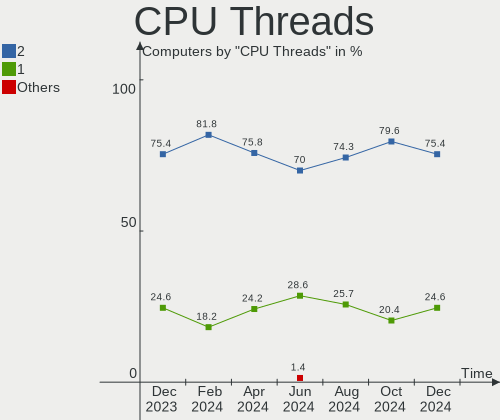
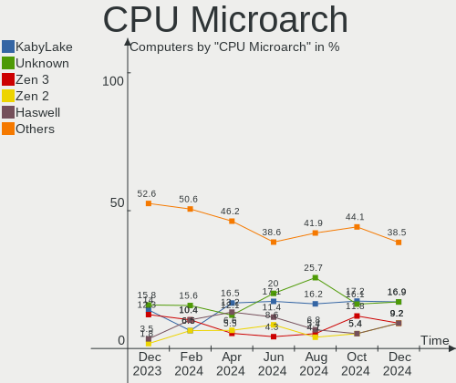
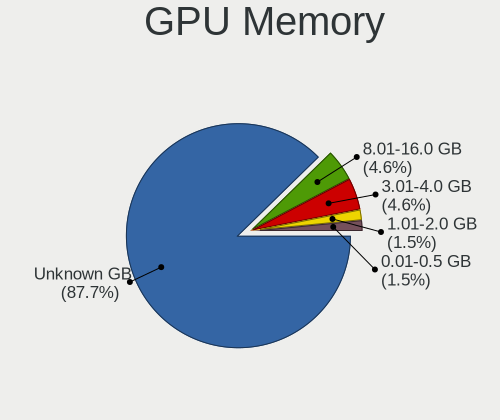
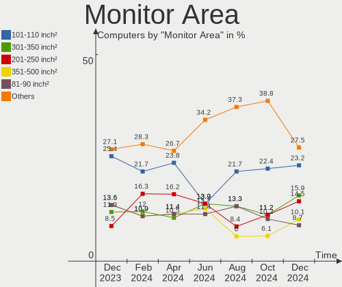

KDE neon - Hardware Trends
--------------------------

A project to identify most popular hardware characteristics and track their change
over time based on data collected by Linux users at https://Linux-Hardware.org.

Anyone can contribute to this report by the [hw-probe](https://github.com/linuxhw/hw-probe) tool:

    sudo -E hw-probe -all -upload

This is a report for all computer types. See also reports for [desktops](/Dist/KDE_neon/Desktop/README.md) and [notebooks](/Dist/KDE_neon/Notebook/README.md).

This report is for one last month. Overall report since the beginning of time: [TestCoverage](https://github.com/linuxhw/TestCoverage)

Period: Jun, 2022.

Contents
--------

* [ System ](#system)
  - [ OS                       ](#os)
  - [ OS Family                ](#os-family)
  - [ Kernel                   ](#kernel)
  - [ Kernel Family            ](#kernel-family)
  - [ Kernel Major Ver.        ](#kernel-major-ver)
  - [ Arch                     ](#arch)
  - [ DE                       ](#de)
  - [ Display Server           ](#display-server)
  - [ Display Manager          ](#display-manager)
  - [ OS Lang                  ](#os-lang)
  - [ Boot Mode                ](#boot-mode)
  - [ Filesystem               ](#filesystem)
  - [ Part. scheme             ](#part-scheme)
  - [ Dual Boot with Linux/BSD ](#dual-boot-with-linuxbsd)
  - [ Dual Boot (Win)          ](#dual-boot-win)

* [ Board ](#board)
  - [ Vendor                   ](#vendor)
  - [ Model                    ](#model)
  - [ Model Family             ](#model-family)
  - [ MFG Year                 ](#mfg-year)
  - [ Form Factor              ](#form-factor)
  - [ Secure Boot              ](#secure-boot)
  - [ Coreboot                 ](#coreboot)
  - [ RAM Size                 ](#ram-size)
  - [ RAM Used                 ](#ram-used)
  - [ Total Drives             ](#total-drives)
  - [ Has CD-ROM               ](#has-cd-rom)
  - [ Has Ethernet             ](#has-ethernet)
  - [ Has WiFi                 ](#has-wifi)
  - [ Has Bluetooth            ](#has-bluetooth)

* [ Location ](#location)
  - [ Country                  ](#country)
  - [ City                     ](#city)

* [ Drives ](#drives)
  - [ Drive Vendor             ](#drive-vendor)
  - [ Drive Model              ](#drive-model)
  - [ HDD Vendor               ](#hdd-vendor)
  - [ SSD Vendor               ](#ssd-vendor)
  - [ Drive Kind               ](#drive-kind)
  - [ Drive Connector          ](#drive-connector)
  - [ Drive Size               ](#drive-size)
  - [ Space Total              ](#space-total)
  - [ Space Used               ](#space-used)
  - [ Malfunc. Drives          ](#malfunc-drives)
  - [ Malfunc. Drive Vendor    ](#malfunc-drive-vendor)
  - [ Malfunc. HDD Vendor      ](#malfunc-hdd-vendor)
  - [ Malfunc. Drive Kind      ](#malfunc-drive-kind)
  - [ Failed Drives            ](#failed-drives)
  - [ Failed Drive Vendor      ](#failed-drive-vendor)
  - [ Drive Status             ](#drive-status)

* [ Storage controller ](#storage-controller)
  - [ Storage Vendor           ](#storage-vendor)
  - [ Storage Model            ](#storage-model)
  - [ Storage Kind             ](#storage-kind)

* [ Processor ](#processor)
  - [ CPU Vendor               ](#cpu-vendor)
  - [ CPU Model                ](#cpu-model)
  - [ CPU Model Family         ](#cpu-model-family)
  - [ CPU Cores                ](#cpu-cores)
  - [ CPU Sockets              ](#cpu-sockets)
  - [ CPU Threads              ](#cpu-threads)
  - [ CPU Op-Modes             ](#cpu-op-modes)
  - [ CPU Microcode            ](#cpu-microcode)
  - [ CPU Microarch            ](#cpu-microarch)

* [ Graphics ](#graphics)
  - [ GPU Vendor               ](#gpu-vendor)
  - [ GPU Model                ](#gpu-model)
  - [ GPU Combo                ](#gpu-combo)
  - [ GPU Driver               ](#gpu-driver)
  - [ GPU Memory               ](#gpu-memory)

* [ Monitor ](#monitor)
  - [ Monitor Vendor           ](#monitor-vendor)
  - [ Monitor Model            ](#monitor-model)
  - [ Monitor Resolution       ](#monitor-resolution)
  - [ Monitor Diagonal         ](#monitor-diagonal)
  - [ Monitor Width            ](#monitor-width)
  - [ Aspect Ratio             ](#aspect-ratio)
  - [ Monitor Area             ](#monitor-area)
  - [ Pixel Density            ](#pixel-density)
  - [ Multiple Monitors        ](#multiple-monitors)

* [ Network ](#network)
  - [ Net Controller Vendor    ](#net-controller-vendor)
  - [ Net Controller Model     ](#net-controller-model)
  - [ Wireless Vendor          ](#wireless-vendor)
  - [ Wireless Model           ](#wireless-model)
  - [ Ethernet Vendor          ](#ethernet-vendor)
  - [ Ethernet Model           ](#ethernet-model)
  - [ Net Controller Kind      ](#net-controller-kind)
  - [ Used Controller          ](#used-controller)
  - [ NICs                     ](#nics)
  - [ IPv6                     ](#ipv6)

* [ Bluetooth ](#bluetooth)
  - [ Bluetooth Vendor         ](#bluetooth-vendor)
  - [ Bluetooth Model          ](#bluetooth-model)

* [ Sound ](#sound)
  - [ Sound Vendor             ](#sound-vendor)
  - [ Sound Model              ](#sound-model)

* [ Memory ](#memory)
  - [ Memory Vendor            ](#memory-vendor)
  - [ Memory Model             ](#memory-model)
  - [ Memory Kind              ](#memory-kind)
  - [ Memory Form Factor       ](#memory-form-factor)
  - [ Memory Size              ](#memory-size)
  - [ Memory Speed             ](#memory-speed)

* [ Printers & scanners ](#printers--scanners)
  - [ Printer Vendor           ](#printer-vendor)
  - [ Printer Model            ](#printer-model)
  - [ Scanner Vendor           ](#scanner-vendor)
  - [ Scanner Model            ](#scanner-model)

* [ Camera ](#camera)
  - [ Camera Vendor            ](#camera-vendor)
  - [ Camera Model             ](#camera-model)

* [ Security ](#security)
  - [ Fingerprint Vendor       ](#fingerprint-vendor)
  - [ Fingerprint Model        ](#fingerprint-model)
  - [ Chipcard Vendor          ](#chipcard-vendor)
  - [ Chipcard Model           ](#chipcard-model)

* [ Unsupported ](#unsupported)
  - [ Unsupported Devices      ](#unsupported-devices)
  - [ Unsupported Device Types ](#unsupported-device-types)

System
------

OS
--

Installed operating systems

| Name           | Computers | Percent |
|----------------|-----------|---------|
| KDE neon 20.04 | 109       | 100%    |

OS Family
---------

OS without a version

| Name     | Computers | Percent |
|----------|-----------|---------|
| KDE neon | 109       | 100%    |

Kernel
------

Version of the Linux kernel

| Version                 | Computers | Percent |
|-------------------------|-----------|---------|
| 5.13.0-51-generic       | 45        | 41.28%  |
| 5.13.0-44-generic       | 30        | 27.52%  |
| 5.13.0-48-generic       | 19        | 17.43%  |
| 5.13.0-41-generic       | 4         | 3.67%   |
| 5.13.0-52-generic       | 3         | 2.75%   |
| 5.4.0-120-generic       | 1         | 0.92%   |
| 5.4.0-117-generic       | 1         | 0.92%   |
| 5.14.0-1042-oem         | 1         | 0.92%   |
| 5.13.0-39-generic       | 1         | 0.92%   |
| 5.13.0-30-generic       | 1         | 0.92%   |
| 5.13.0-1014-intel       | 1         | 0.92%   |
| 5.11.0-38-generic       | 1         | 0.92%   |
| 5.0.0-050000rc1-generic | 1         | 0.92%   |

Kernel Family
-------------

Linux kernel without a distro release

| Version | Computers | Percent |
|---------|-----------|---------|
| 5.13.0  | 104       | 95.41%  |
| 5.4.0   | 2         | 1.83%   |
| 5.14.0  | 1         | 0.92%   |
| 5.11.0  | 1         | 0.92%   |
| 5.0.0   | 1         | 0.92%   |

Kernel Major Ver.
-----------------

Linux kernel major version

| Version | Computers | Percent |
|---------|-----------|---------|
| 5.13    | 104       | 95.41%  |
| 5.4     | 2         | 1.83%   |
| 5.14    | 1         | 0.92%   |
| 5.11    | 1         | 0.92%   |
| 5.0     | 1         | 0.92%   |

Arch
----

OS architecture (x86_64, i586, etc.)

| Name   | Computers | Percent |
|--------|-----------|---------|
| x86_64 | 109       | 100%    |

DE
--

Desktop Environment

| Name | Computers | Percent |
|------|-----------|---------|
| KDE5 | 109       | 100%    |

Display Server
--------------

X11 or Wayland

| Name    | Computers | Percent |
|---------|-----------|---------|
| X11     | 101       | 92.66%  |
| Wayland | 8         | 7.34%   |

Display Manager
---------------

SDDM, LightDM, etc.

| Name    | Computers | Percent |
|---------|-----------|---------|
| Unknown | 88        | 80.73%  |
| SDDM    | 21        | 19.27%  |

OS Lang
-------

Language

| Lang           | Computers | Percent |
|----------------|-----------|---------|
| en_US          | 47        | 43.12%  |
| en_GB          | 7         | 6.42%   |
| de_DE          | 7         | 6.42%   |
| C              | 5         | 4.59%   |
| ru_RU          | 4         | 3.67%   |
| pt_BR          | 4         | 3.67%   |
| it_IT          | 4         | 3.67%   |
| en_CA          | 3         | 2.75%   |
| zh_TW          | 2         | 1.83%   |
| tr_TR          | 2         | 1.83%   |
| fr_FR          | 2         | 1.83%   |
| en_IN          | 2         | 1.83%   |
| th_TH          | 1         | 0.92%   |
| sv_SE          | 1         | 0.92%   |
| ru_UA          | 1         | 0.92%   |
| pt_PT          | 1         | 0.92%   |
| nl_NL          | 1         | 0.92%   |
| fi_FI          | 1         | 0.92%   |
| es_VE          | 1         | 0.92%   |
| es_PR          | 1         | 0.92%   |
| es_MX          | 1         | 0.92%   |
| es_ES          | 1         | 0.92%   |
| es_CO          | 1         | 0.92%   |
| es_BO          | 1         | 0.92%   |
| en_ZW          | 1         | 0.92%   |
| en_PH          | 1         | 0.92%   |
| en_IL          | 1         | 0.92%   |
| en_AU          | 1         | 0.92%   |
| de_CH          | 1         | 0.92%   |
| de_AT          | 1         | 0.92%   |
| Default        | 1         | 0.92%   |
| ca_ES@valencia | 1         | 0.92%   |

Boot Mode
---------

EFI or BIOS

| Mode | Computers | Percent |
|------|-----------|---------|
| EFI  | 72        | 66.06%  |
| BIOS | 37        | 33.94%  |

Filesystem
----------

Type of filesystem

| Type    | Computers | Percent |
|---------|-----------|---------|
| Ext4    | 102       | 93.58%  |
| Overlay | 5         | 4.59%   |
| Btrfs   | 2         | 1.83%   |

Part. scheme
------------

Scheme of partitioning

| Type    | Computers | Percent |
|---------|-----------|---------|
| Unknown | 98        | 89.91%  |
| GPT     | 9         | 8.26%   |
| MBR     | 2         | 1.83%   |

Dual Boot with Linux/BSD
------------------------

Hosting more than one Linux/BSD

| Dual boot | Computers | Percent |
|-----------|-----------|---------|
| No        | 107       | 98.17%  |
| Yes       | 2         | 1.83%   |

Dual Boot (Win)
---------------

Hosting Linux and Windows

| Dual boot | Computers | Percent |
|-----------|-----------|---------|
| No        | 99        | 90.83%  |
| Yes       | 10        | 9.17%   |

Board
-----

Vendor
------

Motherboard manufacturer

| Name                | Computers | Percent |
|---------------------|-----------|---------|
| ASUSTek Computer    | 21        | 19.27%  |
| Hewlett-Packard     | 17        | 15.6%   |
| Dell                | 17        | 15.6%   |
| Acer                | 12        | 11.01%  |
| Gigabyte Technology | 9         | 8.26%   |
| ASRock              | 8         | 7.34%   |
| MSI                 | 6         | 5.5%    |
| Lenovo              | 6         | 5.5%    |
| Samsung Electronics | 3         | 2.75%   |
| Toshiba             | 2         | 1.83%   |
| Google              | 2         | 1.83%   |
| Sony                | 1         | 0.92%   |
| Positivo            | 1         | 0.92%   |
| Intel               | 1         | 0.92%   |
| Cincoze             | 1         | 0.92%   |
| AZW                 | 1         | 0.92%   |
| Apple               | 1         | 0.92%   |

Model
-----

Motherboard model

| Name                                   | Computers | Percent |
|----------------------------------------|-----------|---------|
| Dell OptiPlex 9020                     | 2         | 1.83%   |
| ASUS ZenBook UX425UAZ_UM425UAZ         | 2         | 1.83%   |
| ASUS All Series                        | 2         | 1.83%   |
| Toshiba Satellite Pro C70-C-19V        | 1         | 0.92%   |
| Toshiba Satellite L775D                | 1         | 0.92%   |
| Sony SVS15115FWB                       | 1         | 0.92%   |
| Samsung R530/R730                      | 1         | 0.92%   |
| Samsung 670Z5E                         | 1         | 0.92%   |
| Samsung 550XDA                         | 1         | 0.92%   |
| Positivo CHT14B                        | 1         | 0.92%   |
| MSI WE208AA-ABH HPE-120nl              | 1         | 0.92%   |
| MSI US PIO PRO AP241                   | 1         | 0.92%   |
| MSI MS-7C95                            | 1         | 0.92%   |
| MSI MS-7C56                            | 1         | 0.92%   |
| MSI MS-7693                            | 1         | 0.92%   |
| MSI GF63 8RC                           | 1         | 0.92%   |
| Lenovo ThinkStation S20 410599U        | 1         | 0.92%   |
| Lenovo ThinkPad X140e 20BLS00400       | 1         | 0.92%   |
| Lenovo ThinkPad T510 4384FF3           | 1         | 0.92%   |
| Lenovo ThinkPad 10 20C1000UGE          | 1         | 0.92%   |
| Lenovo IdeaPadFlex 5 15ITL05 82HT      | 1         | 0.92%   |
| Lenovo IdeaPad Gaming 3 15ACH6 82K2    | 1         | 0.92%   |
| Intel NUC6CAYB J23203-402              | 1         | 0.92%   |
| HP Stream Notebook PC 11               | 1         | 0.92%   |
| HP ProLiant ML110 G7                   | 1         | 0.92%   |
| HP ProDesk 600 G6 Small Form Factor PC | 1         | 0.92%   |
| HP ProBook 6470b                       | 1         | 0.92%   |
| HP ProBook 450 G3                      | 1         | 0.92%   |
| HP ProBook 430 G4                      | 1         | 0.92%   |
| HP Pavilion x2 Detachable              | 1         | 0.92%   |
| HP Pavilion Gaming Laptop 15-cx0xxx    | 1         | 0.92%   |
| HP Pavilion g6                         | 1         | 0.92%   |
| HP OMEN Laptop 15-en1xxx               | 1         | 0.92%   |
| HP OMEN by Laptop 16-c0xxx             | 1         | 0.92%   |
| HP EliteDesk 800 G2 DM 35W             | 1         | 0.92%   |
| HP EliteBook 855 G8 Notebook PC        | 1         | 0.92%   |
| HP EliteBook 840 G2                    | 1         | 0.92%   |
| HP Compaq 8000 Elite CMT PC            | 1         | 0.92%   |
| HP 860-050na                           | 1         | 0.92%   |
| HP 255 G8 Notebook PC                  | 1         | 0.92%   |
| Google Cyan                            | 1         | 0.92%   |
| Google Banon                           | 1         | 0.92%   |
| Gigabyte X99-UD5 WIFI-CF               | 1         | 0.92%   |
| Gigabyte X570 AORUS MASTER             | 1         | 0.92%   |
| Gigabyte H67M-UD2H-B3                  | 1         | 0.92%   |
| Gigabyte GA-H310TN-R2                  | 1         | 0.92%   |
| Gigabyte GA-78LMT-USB3 6.0             | 1         | 0.92%   |
| Gigabyte EX58-UD5                      | 1         | 0.92%   |
| Gigabyte B75M-D3V                      | 1         | 0.92%   |
| Gigabyte B250M-D3H                     | 1         | 0.92%   |
| Gigabyte AORUS 5 MB                    | 1         | 0.92%   |
| Dell XPS 17 9710                       | 1         | 0.92%   |
| Dell XPS 15 9520                       | 1         | 0.92%   |
| Dell XPS 13 9310                       | 1         | 0.92%   |
| Dell Vostro 3560                       | 1         | 0.92%   |
| Dell Studio XPS 1340                   | 1         | 0.92%   |
| Dell Precision T3610                   | 1         | 0.92%   |
| Dell Precision 5530                    | 1         | 0.92%   |
| Dell OptiPlex 3080                     | 1         | 0.92%   |
| Dell Latitude E7440                    | 1         | 0.92%   |

Model Family
------------

Motherboard model prefix

| Name                   | Computers | Percent |
|------------------------|-----------|---------|
| Acer Aspire            | 8         | 7.34%   |
| Dell Inspiron          | 4         | 3.67%   |
| Lenovo ThinkPad        | 3         | 2.75%   |
| HP ProBook             | 3         | 2.75%   |
| HP Pavilion            | 3         | 2.75%   |
| Dell XPS               | 3         | 2.75%   |
| Dell OptiPlex          | 3         | 2.75%   |
| Dell Latitude          | 3         | 2.75%   |
| ASUS ROG               | 3         | 2.75%   |
| Toshiba Satellite      | 2         | 1.83%   |
| HP OMEN                | 2         | 1.83%   |
| HP EliteBook           | 2         | 1.83%   |
| Dell Precision         | 2         | 1.83%   |
| ASUS ZenBook           | 2         | 1.83%   |
| ASUS VivoBook          | 2         | 1.83%   |
| ASUS All               | 2         | 1.83%   |
| Acer Nitro             | 2         | 1.83%   |
| Sony SVS15115FWB       | 1         | 0.92%   |
| Samsung R530           | 1         | 0.92%   |
| Samsung 670Z5E         | 1         | 0.92%   |
| Samsung 550XDA         | 1         | 0.92%   |
| Positivo CHT14B        | 1         | 0.92%   |
| MSI WE208AA-ABH        | 1         | 0.92%   |
| MSI US                 | 1         | 0.92%   |
| MSI MS-7C95            | 1         | 0.92%   |
| MSI MS-7C56            | 1         | 0.92%   |
| MSI MS-7693            | 1         | 0.92%   |
| MSI GF63               | 1         | 0.92%   |
| Lenovo ThinkStation    | 1         | 0.92%   |
| Lenovo IdeaPadFlex     | 1         | 0.92%   |
| Lenovo IdeaPad         | 1         | 0.92%   |
| Intel NUC6CAYB         | 1         | 0.92%   |
| HP Stream              | 1         | 0.92%   |
| HP ProLiant            | 1         | 0.92%   |
| HP ProDesk             | 1         | 0.92%   |
| HP EliteDesk           | 1         | 0.92%   |
| HP Compaq              | 1         | 0.92%   |
| HP 860-050na           | 1         | 0.92%   |
| HP 255                 | 1         | 0.92%   |
| Google Cyan            | 1         | 0.92%   |
| Google Banon           | 1         | 0.92%   |
| Gigabyte X99-UD5       | 1         | 0.92%   |
| Gigabyte X570          | 1         | 0.92%   |
| Gigabyte H67M-UD2H-B3  | 1         | 0.92%   |
| Gigabyte GA-H310TN-R2  | 1         | 0.92%   |
| Gigabyte GA-78LMT-USB3 | 1         | 0.92%   |
| Gigabyte EX58-UD5      | 1         | 0.92%   |
| Gigabyte B75M-D3V      | 1         | 0.92%   |
| Gigabyte B250M-D3H     | 1         | 0.92%   |
| Gigabyte AORUS         | 1         | 0.92%   |
| Dell Vostro            | 1         | 0.92%   |
| Dell Studio            | 1         | 0.92%   |
| Cincoze P1101          | 1         | 0.92%   |
| AZW GT-R               | 1         | 0.92%   |
| ASUS TUF               | 1         | 0.92%   |
| ASUS ProArt            | 1         | 0.92%   |
| ASUS PRIME             | 1         | 0.92%   |
| ASUS P9X79             | 1         | 0.92%   |
| ASUS N53SV             | 1         | 0.92%   |
| ASUS M5A97             | 1         | 0.92%   |

MFG Year
--------

Motherboard manufacture year

| Year | Computers | Percent |
|------|-----------|---------|
| 2021 | 17        | 15.6%   |
| 2020 | 16        | 14.68%  |
| 2014 | 12        | 11.01%  |
| 2012 | 10        | 9.17%   |
| 2018 | 7         | 6.42%   |
| 2013 | 7         | 6.42%   |
| 2009 | 7         | 6.42%   |
| 2016 | 6         | 5.5%    |
| 2011 | 6         | 5.5%    |
| 2017 | 5         | 4.59%   |
| 2015 | 5         | 4.59%   |
| 2019 | 4         | 3.67%   |
| 2022 | 3         | 2.75%   |
| 2010 | 3         | 2.75%   |
| 2008 | 1         | 0.92%   |

Form Factor
-----------

Physical design of the computer

| Name        | Computers | Percent |
|-------------|-----------|---------|
| Notebook    | 58        | 53.21%  |
| Desktop     | 46        | 42.2%   |
| Tablet      | 2         | 1.83%   |
| Convertible | 1         | 0.92%   |
| Mini pc     | 1         | 0.92%   |
| All in one  | 1         | 0.92%   |

Secure Boot
-----------

Enabled or disabled

| State    | Computers | Percent |
|----------|-----------|---------|
| Disabled | 98        | 89.91%  |
| Enabled  | 11        | 10.09%  |

Coreboot
--------

Have coreboot on board

| Used | Computers | Percent |
|------|-----------|---------|
| No   | 107       | 98.17%  |
| Yes  | 2         | 1.83%   |

RAM Size
--------

Total RAM memory

| Size in GB      | Computers | Percent |
|-----------------|-----------|---------|
| 4.01-8.0        | 29        | 26.61%  |
| 16.01-24.0      | 24        | 22.02%  |
| 8.01-16.0       | 17        | 15.6%   |
| 32.01-64.0      | 13        | 11.93%  |
| 3.01-4.0        | 12        | 11.01%  |
| 64.01-256.0     | 5         | 4.59%   |
| 1.01-2.0        | 5         | 4.59%   |
| 24.01-32.0      | 3         | 2.75%   |
| More than 256.0 | 1         | 0.92%   |

RAM Used
--------

Used RAM memory

| Used GB   | Computers | Percent |
|-----------|-----------|---------|
| 1.01-2.0  | 52        | 47.71%  |
| 2.01-3.0  | 27        | 24.77%  |
| 3.01-4.0  | 11        | 10.09%  |
| 4.01-8.0  | 10        | 9.17%   |
| 8.01-16.0 | 5         | 4.59%   |
| 0.51-1.0  | 4         | 3.67%   |

Total Drives
------------

Number of drives on board

| Drives | Computers | Percent |
|--------|-----------|---------|
| 1      | 58        | 53.21%  |
| 2      | 33        | 30.28%  |
| 3      | 12        | 11.01%  |
| 5      | 3         | 2.75%   |
| 4      | 2         | 1.83%   |
| 6      | 1         | 0.92%   |

Has CD-ROM
----------

Has CD-ROM on board

| Presented | Computers | Percent |
|-----------|-----------|---------|
| No        | 76        | 69.72%  |
| Yes       | 33        | 30.28%  |

Has Ethernet
------------

Has Ethernet on board

| Presented | Computers | Percent |
|-----------|-----------|---------|
| Yes       | 94        | 86.24%  |
| No        | 15        | 13.76%  |

Has WiFi
--------

Has WiFi module

| Presented | Computers | Percent |
|-----------|-----------|---------|
| Yes       | 84        | 77.06%  |
| No        | 25        | 22.94%  |

Has Bluetooth
-------------

Has Bluetooth module

| Presented | Computers | Percent |
|-----------|-----------|---------|
| Yes       | 73        | 66.97%  |
| No        | 36        | 33.03%  |

Location
--------

Country
-------

Geographic location (country)

| Country     | Computers | Percent |
|-------------|-----------|---------|
| USA         | 34        | 31.19%  |
| Germany     | 8         | 7.34%   |
| UK          | 7         | 6.42%   |
| Brazil      | 5         | 4.59%   |
| Italy       | 4         | 3.67%   |
| Ukraine     | 3         | 2.75%   |
| Turkey      | 3         | 2.75%   |
| Spain       | 3         | 2.75%   |
| Canada      | 3         | 2.75%   |
| Bulgaria    | 3         | 2.75%   |
| Taiwan      | 2         | 1.83%   |
| Sweden      | 2         | 1.83%   |
| Serbia      | 2         | 1.83%   |
| Russia      | 2         | 1.83%   |
| India       | 2         | 1.83%   |
| Colombia    | 2         | 1.83%   |
| Belarus     | 2         | 1.83%   |
| Zimbabwe    | 1         | 0.92%   |
| Venezuela   | 1         | 0.92%   |
| Thailand    | 1         | 0.92%   |
| Switzerland | 1         | 0.92%   |
| South Korea | 1         | 0.92%   |
| Slovenia    | 1         | 0.92%   |
| Réunion    | 1         | 0.92%   |
| Puerto Rico | 1         | 0.92%   |
| Portugal    | 1         | 0.92%   |
| Philippines | 1         | 0.92%   |
| Netherlands | 1         | 0.92%   |
| Mexico      | 1         | 0.92%   |
| Kazakhstan  | 1         | 0.92%   |
| Israel      | 1         | 0.92%   |
| Georgia     | 1         | 0.92%   |
| France      | 1         | 0.92%   |
| Finland     | 1         | 0.92%   |
| Croatia     | 1         | 0.92%   |
| Bolivia     | 1         | 0.92%   |
| Bangladesh  | 1         | 0.92%   |
| Austria     | 1         | 0.92%   |
| Australia   | 1         | 0.92%   |

City
----

Geographic location (city)

| City             | Computers | Percent |
|------------------|-----------|---------|
| Plovdiv          | 2         | 1.83%   |
| New York         | 2         | 1.83%   |
| Melbourne        | 2         | 1.83%   |
| Kyiv             | 2         | 1.83%   |
| Zagreb           | 1         | 0.92%   |
| Wolfsburg        | 1         | 0.92%   |
| Winterthur       | 1         | 0.92%   |
| Wigan            | 1         | 0.92%   |
| Vienna           | 1         | 0.92%   |
| Vicenza          | 1         | 0.92%   |
| Vernon           | 1         | 0.92%   |
| Västerås       | 1         | 0.92%   |
| Valence          | 1         | 0.92%   |
| Turkoba          | 1         | 0.92%   |
| Troy             | 1         | 0.92%   |
| Temecula         | 1         | 0.92%   |
| Tbilisi          | 1         | 0.92%   |
| Taoyuan District | 1         | 0.92%   |
| Tampere          | 1         | 0.92%   |
| Tainan City      | 1         | 0.92%   |
| Sweet            | 1         | 0.92%   |
| Statesboro       | 1         | 0.92%   |
| Stara Zagora     | 1         | 0.92%   |
| Solleftea        | 1         | 0.92%   |
| Santee           | 1         | 0.92%   |
| San Juan         | 1         | 0.92%   |
| Salvador         | 1         | 0.92%   |
| Saint-Denis      | 1         | 0.92%   |
| Roseland         | 1         | 0.92%   |
| Rome             | 1         | 0.92%   |
| Riverside        | 1         | 0.92%   |
| Rho              | 1         | 0.92%   |
| Rheinberg        | 1         | 0.92%   |
| Resende          | 1         | 0.92%   |
| Puyallup         | 1         | 0.92%   |
| Pocking          | 1         | 0.92%   |
| Plymouth         | 1         | 0.92%   |
| Pikesville       | 1         | 0.92%   |
| Perkasie         | 1         | 0.92%   |
| Perivale         | 1         | 0.92%   |
| Pančevo         | 1         | 0.92%   |
| Pachuca          | 1         | 0.92%   |
| Oxford           | 1         | 0.92%   |
| Orleans          | 1         | 0.92%   |
| Norman           | 1         | 0.92%   |
| Niverville       | 1         | 0.92%   |
| New Delhi        | 1         | 0.92%   |
| Nederland        | 1         | 0.92%   |
| Mount Holly      | 1         | 0.92%   |
| Moscow           | 1         | 0.92%   |
| Montería        | 1         | 0.92%   |
| Minsk            | 1         | 0.92%   |
| Maracaibo        | 1         | 0.92%   |
| Ljubljana        | 1         | 0.92%   |
| Lincoln          | 1         | 0.92%   |
| Licking          | 1         | 0.92%   |
| Lakewood         | 1         | 0.92%   |
| La Paz           | 1         | 0.92%   |
| Köthen          | 1         | 0.92%   |
| Kiel             | 1         | 0.92%   |

Drives
------

Drive Vendor
------------

Hard drive vendors

| Vendor                         | Computers | Drives | Percent |
|--------------------------------|-----------|--------|---------|
| Samsung Electronics            | 31        | 42     | 19.14%  |
| WDC                            | 22        | 25     | 13.58%  |
| Seagate                        | 16        | 21     | 9.88%   |
| Kingston                       | 12        | 17     | 7.41%   |
| Toshiba                        | 11        | 12     | 6.79%   |
| SanDisk                        | 11        | 11     | 6.79%   |
| Unknown                        | 9         | 11     | 5.56%   |
| Micron Technology              | 5         | 5      | 3.09%   |
| Intel                          | 4         | 5      | 2.47%   |
| A-DATA Technology              | 4         | 4      | 2.47%   |
| SK hynix                       | 3         | 3      | 1.85%   |
| SPCC                           | 2         | 2      | 1.23%   |
| Silicon Motion                 | 2         | 2      | 1.23%   |
| Realtek Semiconductor          | 2         | 2      | 1.23%   |
| Hitachi                        | 2         | 2      | 1.23%   |
| Hewlett-Packard                | 2         | 2      | 1.23%   |
| Crucial                        | 2         | 4      | 1.23%   |
| XINTOR                         | 1         | 1      | 0.62%   |
| USB3.0                         | 1         | 1      | 0.62%   |
| Team                           | 1         | 1      | 0.62%   |
| SSK                            | 1         | 1      | 0.62%   |
| Solid State Storage Technology | 1         | 1      | 0.62%   |
| Shenzhen Longsys Electronics   | 1         | 1      | 0.62%   |
| PNY                            | 1         | 1      | 0.62%   |
| Phison                         | 1         | 1      | 0.62%   |
| OCZ                            | 1         | 1      | 0.62%   |
| Micron/Crucial Technology      | 1         | 1      | 0.62%   |
| MAXIO Technology (Hangzhou)    | 1         | 1      | 0.62%   |
| KIOXIA                         | 1         | 1      | 0.62%   |
| KingDian                       | 1         | 1      | 0.62%   |
| INTEL SS                       | 1         | 1      | 0.62%   |
| Integral                       | 1         | 1      | 0.62%   |
| Innodisk                       | 1         | 1      | 0.62%   |
| HGST                           | 1         | 1      | 0.62%   |
| Gigabyte Technology            | 1         | 1      | 0.62%   |
| Dogfish                        | 1         | 1      | 0.62%   |
| BIWIN                          | 1         | 1      | 0.62%   |
| ASMT                           | 1         | 1      | 0.62%   |
| Unknown                        | 1         | 1      | 0.62%   |

Drive Model
-----------

Hard drive models

| Model                                    | Computers | Percent |
|------------------------------------------|-----------|---------|
| Kingston SA400S37240G 240GB SSD          | 7         | 3.8%    |
| Samsung NVMe SSD Drive 1TB               | 5         | 2.72%   |
| Samsung NVMe SSD Drive 512GB             | 4         | 2.17%   |
| WDC WD10JPVX-22JC3T0 1TB                 | 3         | 1.63%   |
| Unknown MMC Card  32GB                   | 3         | 1.63%   |
| SanDisk NVMe SSD Drive 512GB             | 3         | 1.63%   |
| Samsung NVMe SSD Drive 256GB             | 3         | 1.63%   |
| Samsung NVMe SSD Drive 1024GB            | 3         | 1.63%   |
| WDC WDBNCE0010PNC 1TB SSD                | 2         | 1.09%   |
| WDC WD10EZEX-00BBHA0 1TB                 | 2         | 1.09%   |
| Unknown SD/MMC/MS PRO 128GB              | 2         | 1.09%   |
| SPCC Solid State Disk 512GB              | 2         | 1.09%   |
| Samsung SSD 860 EVO 1TB                  | 2         | 1.09%   |
| Samsung SSD 850 EVO 250GB                | 2         | 1.09%   |
| Samsung SSD 840 EVO 250GB                | 2         | 1.09%   |
| Samsung SM963 2.5" NVMe PCIe SSD 500GB   | 2         | 1.09%   |
| Micron NVMe SSD Drive 512GB              | 2         | 1.09%   |
| Kingston SA400S37480G 480GB SSD          | 2         | 1.09%   |
| Kingston NVMe SSD Drive 500GB            | 2         | 1.09%   |
| Intel NVMe SSD Drive 512GB               | 2         | 1.09%   |
| HP SSD S700 500GB                        | 2         | 1.09%   |
| XINTOR SSD 240GB                         | 1         | 0.54%   |
| WDC WDS500G2B0A-00SM50 500GB SSD         | 1         | 0.54%   |
| WDC WDS250G2B0A 250GB SSD                | 1         | 0.54%   |
| WDC WDS240G2G0A-00JH30 240GB SSD         | 1         | 0.54%   |
| WDC WD800JD-22MSA1 80GB                  | 1         | 0.54%   |
| WDC WD5003AZEX-00K1GA0 500GB             | 1         | 0.54%   |
| WDC WD5000AVDS-73U7B1 500GB              | 1         | 0.54%   |
| WDC WD5000AURX-63UY4Y0 500GB             | 1         | 0.54%   |
| WDC WD5000AAKX-00ERMA0 500GB             | 1         | 0.54%   |
| WDC WD5000AAKS-00UU3A0 500GB             | 1         | 0.54%   |
| WDC WD3200BEVT-75ZCT2 320GB              | 1         | 0.54%   |
| WDC WD2500AAJS-60Z0A0 250GB              | 1         | 0.54%   |
| WDC WD20EZBX-00AYRA0 2TB                 | 1         | 0.54%   |
| WDC WD1600BEVT-75ZCT0 160GB              | 1         | 0.54%   |
| WDC WD1600AAJS-00WAA0 160GB              | 1         | 0.54%   |
| WDC WD15EARS-00MVWB0 1TB                 | 1         | 0.54%   |
| WDC WD10EZEX-21M2NA0 1TB                 | 1         | 0.54%   |
| WDC WD10EZEX-00BN5A0 1TB                 | 1         | 0.54%   |
| WDC WD10EADS-65M2BX 1TB                  | 1         | 0.54%   |
| USB3.0 Super Speed 320GB                 | 1         | 0.54%   |
| Unknown MMC Card  64GB                   | 1         | 0.54%   |
| Unknown MMC Card  256GB                  | 1         | 0.54%   |
| Unknown MMC Card  16GB                   | 1         | 0.54%   |
| Unknown ED2S5  128GB                     | 1         | 0.54%   |
| Unknown DF4016  16GB                     | 1         | 0.54%   |
| Toshiba THNSNH128GMCT 128GB SSD          | 1         | 0.54%   |
| Toshiba Q300 Pro. 1024GB SSD             | 1         | 0.54%   |
| Toshiba MQ04ABF100 1TB                   | 1         | 0.54%   |
| Toshiba MQ01ACF050 500GB                 | 1         | 0.54%   |
| Toshiba MQ01ABF050 500GB                 | 1         | 0.54%   |
| Toshiba MQ01ABD100 1TB                   | 1         | 0.54%   |
| Toshiba MK6475GSX 640GB                  | 1         | 0.54%   |
| Toshiba KBG30ZMS128G 128GB NVMe SSD      | 1         | 0.54%   |
| Toshiba HDWQ140 4TB                      | 1         | 0.54%   |
| Toshiba HDWL110 1TB                      | 1         | 0.54%   |
| Toshiba DT01ACA050 500GB                 | 1         | 0.54%   |
| Team T253LE120G 120GB SSD                | 1         | 0.54%   |
| SSK Disk 480GB                           | 1         | 0.54%   |
| Solid State Storage NVMe SSD Drive 256GB | 1         | 0.54%   |

HDD Vendor
----------

Hard disk drive vendors

| Vendor              | Computers | Drives | Percent |
|---------------------|-----------|--------|---------|
| WDC                 | 19        | 20     | 37.25%  |
| Seagate             | 15        | 20     | 29.41%  |
| Toshiba             | 8         | 9      | 15.69%  |
| Samsung Electronics | 3         | 3      | 5.88%   |
| Unknown             | 2         | 2      | 3.92%   |
| Hitachi             | 2         | 2      | 3.92%   |
| HGST                | 1         | 1      | 1.96%   |
| ASMT                | 1         | 1      | 1.96%   |

SSD Vendor
----------

Solid state drive vendors

| Vendor              | Computers | Drives | Percent |
|---------------------|-----------|--------|---------|
| Samsung Electronics | 16        | 18     | 25.4%   |
| Kingston            | 10        | 14     | 15.87%  |
| WDC                 | 5         | 5      | 7.94%   |
| SanDisk             | 5         | 5      | 7.94%   |
| A-DATA Technology   | 4         | 4      | 6.35%   |
| Toshiba             | 2         | 2      | 3.17%   |
| SPCC                | 2         | 2      | 3.17%   |
| Micron Technology   | 2         | 2      | 3.17%   |
| Hewlett-Packard     | 2         | 2      | 3.17%   |
| Crucial             | 2         | 3      | 3.17%   |
| XINTOR              | 1         | 1      | 1.59%   |
| USB3.0              | 1         | 1      | 1.59%   |
| Team                | 1         | 1      | 1.59%   |
| SK hynix            | 1         | 1      | 1.59%   |
| PNY                 | 1         | 1      | 1.59%   |
| OCZ                 | 1         | 1      | 1.59%   |
| KingDian            | 1         | 1      | 1.59%   |
| INTEL SS            | 1         | 1      | 1.59%   |
| Intel               | 1         | 1      | 1.59%   |
| Integral            | 1         | 1      | 1.59%   |
| Innodisk            | 1         | 1      | 1.59%   |
| Gigabyte Technology | 1         | 1      | 1.59%   |
| Dogfish             | 1         | 1      | 1.59%   |

Drive Kind
----------

HDD or SSD

| Kind    | Computers | Drives | Percent |
|---------|-----------|--------|---------|
| SSD     | 53        | 70     | 34.87%  |
| HDD     | 45        | 58     | 29.61%  |
| NVMe    | 43        | 52     | 28.29%  |
| MMC     | 9         | 10     | 5.92%   |
| Unknown | 2         | 2      | 1.32%   |

Drive Connector
---------------

SATA, SAS, NVMe, etc.

| Type | Computers | Drives | Percent |
|------|-----------|--------|---------|
| SATA | 77        | 119    | 55.4%   |
| NVMe | 43        | 52     | 30.94%  |
| SAS  | 10        | 11     | 7.19%   |
| MMC  | 9         | 10     | 6.47%   |

Drive Size
----------

Size of hard drive

| Size in TB | Computers | Drives | Percent |
|------------|-----------|--------|---------|
| 0.01-0.5   | 56        | 77     | 54.37%  |
| 0.51-1.0   | 35        | 38     | 33.98%  |
| 1.01-2.0   | 8         | 8      | 7.77%   |
| 3.01-4.0   | 3         | 4      | 2.91%   |
| 2.01-3.0   | 1         | 1      | 0.97%   |

Space Total
-----------

Amount of disk space available on the file system

| Size in GB     | Computers | Percent |
|----------------|-----------|---------|
| 101-250        | 33        | 30.28%  |
| 251-500        | 19        | 17.43%  |
| 1001-2000      | 16        | 14.68%  |
| 501-1000       | 12        | 11.01%  |
| 21-50          | 7         | 6.42%   |
| 1-20           | 7         | 6.42%   |
| 51-100         | 7         | 6.42%   |
| More than 3000 | 6         | 5.5%    |
| Unknown        | 2         | 1.83%   |

Space Used
----------

Amount of used disk space

| Used GB        | Computers | Percent |
|----------------|-----------|---------|
| 1-20           | 58        | 53.21%  |
| 21-50          | 13        | 11.93%  |
| 251-500        | 11        | 10.09%  |
| 101-250        | 9         | 8.26%   |
| 51-100         | 7         | 6.42%   |
| 1001-2000      | 4         | 3.67%   |
| 501-1000       | 3         | 2.75%   |
| Unknown        | 2         | 1.83%   |
| More than 3000 | 1         | 0.92%   |
| 2001-3000      | 1         | 0.92%   |

Malfunc. Drives
---------------

Drive models with a malfunction

| Model                                  | Computers | Drives | Percent |
|----------------------------------------|-----------|--------|---------|
| Innodisk DES25-64GM41BW1DC-27 64GB SSD | 1         | 1      | 100%    |

Malfunc. Drive Vendor
---------------------

Vendors of faulty drives

| Vendor   | Computers | Drives | Percent |
|----------|-----------|--------|---------|
| Innodisk | 1         | 1      | 100%    |

Malfunc. HDD Vendor
-------------------

Vendors of faulty HDD drives

Zero info for selected period =(

Malfunc. Drive Kind
-------------------

Kinds of faulty drives

| Kind | Computers | Drives | Percent |
|------|-----------|--------|---------|
| SSD  | 1         | 1      | 100%    |

Failed Drives
-------------

Failed drive models

Zero info for selected period =(

Failed Drive Vendor
-------------------

Failed drive vendors

Zero info for selected period =(

Drive Status
------------

Number of failed and malfunc. drives

| Status   | Computers | Drives | Percent |
|----------|-----------|--------|---------|
| Detected | 101       | 178    | 90.18%  |
| Works    | 10        | 13     | 8.93%   |
| Malfunc  | 1         | 1      | 0.89%   |

Storage controller
------------------

Storage Vendor
--------------

Storage controller vendors

| Vendor                         | Computers | Percent |
|--------------------------------|-----------|---------|
| Intel                          | 76        | 52.41%  |
| AMD                            | 19        | 13.1%   |
| Samsung Electronics            | 17        | 11.72%  |
| SanDisk                        | 6         | 4.14%   |
| Micron Technology              | 3         | 2.07%   |
| Kingston Technology Company    | 3         | 2.07%   |
| ASMedia Technology             | 3         | 2.07%   |
| SK hynix                       | 2         | 1.38%   |
| Silicon Motion                 | 2         | 1.38%   |
| Realtek Semiconductor          | 2         | 1.38%   |
| JMicron Technology             | 2         | 1.38%   |
| Toshiba America Info Systems   | 1         | 0.69%   |
| Solid State Storage Technology | 1         | 0.69%   |
| Shenzhen Longsys Electronics   | 1         | 0.69%   |
| Phison Electronics             | 1         | 0.69%   |
| Nvidia                         | 1         | 0.69%   |
| Micron/Crucial Technology      | 1         | 0.69%   |
| MAXIO Technology (Hangzhou)    | 1         | 0.69%   |
| Marvell Technology Group       | 1         | 0.69%   |
| KIOXIA                         | 1         | 0.69%   |
| Biwin Storage Technology       | 1         | 0.69%   |

Storage Model
-------------

Storage controller models

| Model                                                                                   | Computers | Percent |
|-----------------------------------------------------------------------------------------|-----------|---------|
| AMD FCH SATA Controller [AHCI mode]                                                     | 12        | 7.41%   |
| Samsung NVMe SSD Controller PM9A1/PM9A3/980PRO                                          | 6         | 3.7%    |
| Samsung NVMe SSD Controller 980                                                         | 6         | 3.7%    |
| Intel Volume Management Device NVMe RAID Controller                                     | 6         | 3.7%    |
| Samsung NVMe SSD Controller SM981/PM981/PM983                                           | 5         | 3.09%   |
| Intel Sunrise Point-LP SATA Controller [AHCI mode]                                      | 5         | 3.09%   |
| Intel 7 Series Chipset Family 6-port SATA Controller [AHCI mode]                        | 5         | 3.09%   |
| Intel 400 Series Chipset Family SATA AHCI Controller                                    | 5         | 3.09%   |
| SanDisk Non-Volatile memory controller                                                  | 4         | 2.47%   |
| Intel SATA Controller [RAID mode]                                                       | 4         | 2.47%   |
| Intel NM10/ICH7 Family SATA Controller [IDE mode]                                       | 4         | 2.47%   |
| Micron Non-Volatile memory controller                                                   | 3         | 1.85%   |
| Intel Wildcat Point-LP SATA Controller [AHCI Mode]                                      | 3         | 1.85%   |
| Intel Cannon Lake Mobile PCH SATA AHCI Controller                                       | 3         | 1.85%   |
| Intel C600/X79 series chipset 6-Port SATA AHCI Controller                               | 3         | 1.85%   |
| Intel 82801G (ICH7 Family) IDE Controller                                               | 3         | 1.85%   |
| Intel 8 Series SATA Controller 1 [AHCI mode]                                            | 3         | 1.85%   |
| Intel 500 Series Chipset Family SATA AHCI Controller                                    | 3         | 1.85%   |
| ASMedia ASM1062 Serial ATA Controller                                                   | 3         | 1.85%   |
| AMD 500 Series Chipset SATA Controller                                                  | 3         | 1.85%   |
| SK hynix PC401 NVMe Solid State Drive 256GB                                             | 2         | 1.23%   |
| Silicon Motion SM2263EN/SM2263XT SSD Controller                                         | 2         | 1.23%   |
| Intel Q170/Q150/B150/H170/H110/Z170/CM236 Chipset SATA Controller [AHCI Mode]           | 2         | 1.23%   |
| Intel Non-Volatile memory controller                                                    | 2         | 1.23%   |
| Intel Comet Lake SATA AHCI Controller                                                   | 2         | 1.23%   |
| Intel Celeron N3350/Pentium N4200/Atom E3900 Series SATA AHCI Controller                | 2         | 1.23%   |
| Intel 9 Series Chipset Family SATA Controller [AHCI Mode]                               | 2         | 1.23%   |
| Intel 82801IBM/IEM (ICH9M/ICH9M-E) 4 port SATA Controller [AHCI mode]                   | 2         | 1.23%   |
| Intel 82801 Mobile SATA Controller [RAID mode]                                          | 2         | 1.23%   |
| Intel 6 Series/C200 Series Chipset Family Desktop SATA Controller (IDE mode, ports 4-5) | 2         | 1.23%   |
| Intel 6 Series/C200 Series Chipset Family Desktop SATA Controller (IDE mode, ports 0-3) | 2         | 1.23%   |
| Intel 6 Series/C200 Series Chipset Family 6 port Mobile SATA AHCI Controller            | 2         | 1.23%   |
| Intel 6 Series/C200 Series Chipset Family 6 port Desktop SATA AHCI Controller           | 2         | 1.23%   |
| AMD SB7x0/SB8x0/SB9x0 SATA Controller [AHCI mode]                                       | 2         | 1.23%   |
| Toshiba America Info Systems BG3 NVMe SSD Controller                                    | 1         | 0.62%   |
| Solid State Storage Non-Volatile memory controller                                      | 1         | 0.62%   |
| Shenzhen Longsys Non-Volatile memory controller                                         | 1         | 0.62%   |
| SanDisk WD PC SN810 / Black SN850 NVMe SSD                                              | 1         | 0.62%   |
| SanDisk WD Blue SN570 NVMe SSD                                                          | 1         | 0.62%   |
| Samsung NVMe SSD Controller SM961/PM961/SM963                                           | 1         | 0.62%   |
| Realtek RTS5763DL NVMe SSD Controller                                                   | 1         | 0.62%   |
| Realtek Realtek Non-Volatile memory controller                                          | 1         | 0.62%   |
| Phison E16 PCIe4 NVMe Controller                                                        | 1         | 0.62%   |
| Nvidia MCP79 AHCI Controller                                                            | 1         | 0.62%   |
| Micron/Crucial Non-Volatile memory controller                                           | 1         | 0.62%   |
| MAXIO (Hangzhou) NVMe SSD Controller MAP1002                                            | 1         | 0.62%   |
| Marvell Group 88SE9230 PCIe 2.0 x2 4-port SATA 6 Gb/s RAID Controller                   | 1         | 0.62%   |
| KIOXIA Non-Volatile memory controller                                                   | 1         | 0.62%   |
| Kingston Company Company Non-Volatile memory controller                                 | 1         | 0.62%   |
| Kingston Company SNVS2000G [NV1 NVMe PCIe SSD 2TB]                                      | 1         | 0.62%   |
| Kingston Company KC2000 NVMe SSD                                                        | 1         | 0.62%   |
| JMicron JMB363 SATA/IDE Controller                                                      | 1         | 0.62%   |
| JMicron JMB362 SATA Controller                                                          | 1         | 0.62%   |
| Intel Tiger Lake-LP SATA Controller [AHCI mode]                                         | 1         | 0.62%   |
| Intel Celeron/Pentium Silver Processor SATA Controller                                  | 1         | 0.62%   |
| Intel Cannon Lake PCH SATA AHCI Controller                                              | 1         | 0.62%   |
| Intel C610/X99 series chipset 6-Port SATA Controller [AHCI mode]                        | 1         | 0.62%   |
| Intel C602 chipset 4-Port SATA Storage Control Unit                                     | 1         | 0.62%   |
| Intel Alder Lake-S PCH SATA Controller [AHCI Mode]                                      | 1         | 0.62%   |
| Intel 82801JI (ICH10 Family) 4 port SATA IDE Controller #1                              | 1         | 0.62%   |

Storage Kind
------------

Kind of storage controller (IDE, SATA, NVMe, SAS, ...)

| Kind | Computers | Percent |
|------|-----------|---------|
| SATA | 74        | 52.11%  |
| NVMe | 42        | 29.58%  |
| RAID | 13        | 9.15%   |
| IDE  | 12        | 8.45%   |
| SAS  | 1         | 0.7%    |

Processor
---------

CPU Vendor
----------

Processor vendors

| Vendor | Computers | Percent |
|--------|-----------|---------|
| Intel  | 84        | 77.06%  |
| AMD    | 25        | 22.94%  |

CPU Model
---------

Processor models

| Model                                       | Computers | Percent |
|---------------------------------------------|-----------|---------|
| Intel Core i7-4770 CPU @ 3.40GHz            | 3         | 2.75%   |
| Intel Core i5-5200U CPU @ 2.20GHz           | 3         | 2.75%   |
| AMD Ryzen 7 5800X 8-Core Processor          | 3         | 2.75%   |
| AMD Ryzen 5 5500U with Radeon Graphics      | 3         | 2.75%   |
| Intel Pentium Dual-Core CPU T4400 @ 2.20GHz | 2         | 1.83%   |
| Intel Core i7-10700K CPU @ 3.80GHz          | 2         | 1.83%   |
| Intel Core i5-8300H CPU @ 2.30GHz           | 2         | 1.83%   |
| Intel Core i5-7200U CPU @ 2.50GHz           | 2         | 1.83%   |
| Intel Core i5-6200U CPU @ 2.30GHz           | 2         | 1.83%   |
| Intel Core i5-3210M CPU @ 2.50GHz           | 2         | 1.83%   |
| Intel Core i5-10300H CPU @ 2.50GHz          | 2         | 1.83%   |
| Intel Core i3-2370M CPU @ 2.40GHz           | 2         | 1.83%   |
| Intel Celeron CPU N3060 @ 1.60GHz           | 2         | 1.83%   |
| Intel 11th Gen Core i7-11370H @ 3.30GHz     | 2         | 1.83%   |
| Intel 11th Gen Core i5-1135G7 @ 2.40GHz     | 2         | 1.83%   |
| AMD Ryzen 7 5800H with Radeon Graphics      | 2         | 1.83%   |
| Intel Xeon CPU W3520 @ 2.67GHz              | 1         | 0.92%   |
| Intel Xeon CPU E5-2670 0 @ 2.60GHz          | 1         | 0.92%   |
| Intel Xeon CPU E5-1650 v2 @ 3.50GHz         | 1         | 0.92%   |
| Intel Pentium Dual CPU E2180 @ 2.00GHz      | 1         | 0.92%   |
| Intel Pentium CPU N4200 @ 1.10GHz           | 1         | 0.92%   |
| Intel Pentium CPU G840 @ 2.80GHz            | 1         | 0.92%   |
| Intel Pentium CPU G4560T @ 2.90GHz          | 1         | 0.92%   |
| Intel Pentium CPU G4560 @ 3.50GHz           | 1         | 0.92%   |
| Intel Core i7-8850H CPU @ 2.60GHz           | 1         | 0.92%   |
| Intel Core i7-8750H CPU @ 2.20GHz           | 1         | 0.92%   |
| Intel Core i7-5820K CPU @ 3.30GHz           | 1         | 0.92%   |
| Intel Core i7-4930K CPU @ 3.40GHz           | 1         | 0.92%   |
| Intel Core i7-4790K CPU @ 4.00GHz           | 1         | 0.92%   |
| Intel Core i7-4702MQ CPU @ 2.20GHz          | 1         | 0.92%   |
| Intel Core i7-4510U CPU @ 2.00GHz           | 1         | 0.92%   |
| Intel Core i7-3770 CPU @ 3.40GHz            | 1         | 0.92%   |
| Intel Core i7-2635QM CPU @ 2.00GHz          | 1         | 0.92%   |
| Intel Core i7-2630QM CPU @ 2.00GHz          | 1         | 0.92%   |
| Intel Core i7-10850H CPU @ 2.70GHz          | 1         | 0.92%   |
| Intel Core i7 CPU 950 @ 3.07GHz             | 1         | 0.92%   |
| Intel Core i7 CPU 860 @ 2.80GHz             | 1         | 0.92%   |
| Intel Core i5-8500T CPU @ 2.10GHz           | 1         | 0.92%   |
| Intel Core i5-8250U CPU @ 1.60GHz           | 1         | 0.92%   |
| Intel Core i5-7600K CPU @ 3.80GHz           | 1         | 0.92%   |
| Intel Core i5-6600K CPU @ 3.50GHz           | 1         | 0.92%   |
| Intel Core i5-6500T CPU @ 2.50GHz           | 1         | 0.92%   |
| Intel Core i5-4310U CPU @ 2.00GHz           | 1         | 0.92%   |
| Intel Core i5-4200U CPU @ 1.60GHz           | 1         | 0.92%   |
| Intel Core i5-3320M CPU @ 2.60GHz           | 1         | 0.92%   |
| Intel Core i5-3230M CPU @ 2.60GHz           | 1         | 0.92%   |
| Intel Core i5-2500K CPU @ 3.30GHz           | 1         | 0.92%   |
| Intel Core i5-2400 CPU @ 3.10GHz            | 1         | 0.92%   |
| Intel Core i5-2310 CPU @ 2.90GHz            | 1         | 0.92%   |
| Intel Core i5-10500T CPU @ 2.30GHz          | 1         | 0.92%   |
| Intel Core i5-10500 CPU @ 3.10GHz           | 1         | 0.92%   |
| Intel Core i5-10400F CPU @ 2.90GHz          | 1         | 0.92%   |
| Intel Core i5-10200H CPU @ 2.40GHz          | 1         | 0.92%   |
| Intel Core i5 CPU M 560 @ 2.67GHz           | 1         | 0.92%   |
| Intel Core i3-6100U CPU @ 2.30GHz           | 1         | 0.92%   |
| Intel Core i3-3220 CPU @ 3.30GHz            | 1         | 0.92%   |
| Intel Core 2 Quad CPU Q9500 @ 2.83GHz       | 1         | 0.92%   |
| Intel Core 2 Duo CPU P8400 @ 2.26GHz        | 1         | 0.92%   |
| Intel Core 2 Duo CPU E8400 @ 3.00GHz        | 1         | 0.92%   |
| Intel Core 2 Duo CPU E7500 @ 2.93GHz        | 1         | 0.92%   |

CPU Model Family
----------------

Processor model prefix

| Model                   | Computers | Percent |
|-------------------------|-----------|---------|
| Intel Core i5           | 30        | 27.52%  |
| Intel Core i7           | 18        | 16.51%  |
| Other                   | 9         | 8.26%   |
| AMD Ryzen 7             | 7         | 6.42%   |
| AMD Ryzen 5             | 7         | 6.42%   |
| Intel Celeron           | 5         | 4.59%   |
| Intel Pentium           | 4         | 3.67%   |
| Intel Core i3           | 4         | 3.67%   |
| Intel Atom              | 4         | 3.67%   |
| Intel Xeon              | 3         | 2.75%   |
| Intel Core 2 Duo        | 3         | 2.75%   |
| AMD FX                  | 3         | 2.75%   |
| Intel Pentium Dual-Core | 2         | 1.83%   |
| AMD Athlon              | 2         | 1.83%   |
| AMD A6                  | 2         | 1.83%   |
| Intel Pentium Dual      | 1         | 0.92%   |
| Intel Core 2 Quad       | 1         | 0.92%   |
| AMD Ryzen Threadripper  | 1         | 0.92%   |
| AMD Ryzen 7 PRO         | 1         | 0.92%   |
| AMD Athlon X4           | 1         | 0.92%   |
| AMD A4                  | 1         | 0.92%   |

CPU Cores
---------

Number of processor cores

| Number | Computers | Percent |
|--------|-----------|---------|
| 4      | 41        | 37.61%  |
| 2      | 36        | 33.03%  |
| 6      | 17        | 15.6%   |
| 8      | 10        | 9.17%   |
| 24     | 1         | 0.92%   |
| 16     | 1         | 0.92%   |
| 14     | 1         | 0.92%   |
| 12     | 1         | 0.92%   |
| 3      | 1         | 0.92%   |

CPU Sockets
-----------

Number of sockets

| Number | Computers | Percent |
|--------|-----------|---------|
| 1      | 108       | 99.08%  |
| 2      | 1         | 0.92%   |

CPU Threads
-----------

Threads per core (Hyper-Threading)

| Number | Computers | Percent |
|--------|-----------|---------|
| 2      | 77        | 70.64%  |
| 1      | 32        | 29.36%  |

CPU Op-Modes
------------

CPU Operation Modes (32-bit, 64-bit)

| Op mode        | Computers | Percent |
|----------------|-----------|---------|
| 32-bit, 64-bit | 109       | 100%    |

CPU Microcode
-------------

Microcode number

| Number     | Computers | Percent |
|------------|-----------|---------|
| 0x206a7    | 8         | 7.34%   |
| 0x306a9    | 6         | 5.5%    |
| Unknown    | 6         | 5.5%    |
| 0x806c1    | 5         | 4.59%   |
| 0x306c3    | 5         | 4.59%   |
| 0x1067a    | 5         | 4.59%   |
| 0xa0652    | 4         | 3.67%   |
| 0x906ea    | 4         | 3.67%   |
| 0x0a50000c | 4         | 3.67%   |
| 0xa0653    | 3         | 2.75%   |
| 0x906e9    | 3         | 2.75%   |
| 0x406e3    | 3         | 2.75%   |
| 0x406c4    | 3         | 2.75%   |
| 0x40651    | 3         | 2.75%   |
| 0x306d4    | 3         | 2.75%   |
| 0x30678    | 3         | 2.75%   |
| 0x06000852 | 3         | 2.75%   |
| 0x806e9    | 2         | 1.83%   |
| 0x506e3    | 2         | 1.83%   |
| 0x306e4    | 2         | 1.83%   |
| 0x08608103 | 2         | 1.83%   |
| 0x08108109 | 2         | 1.83%   |
| 0x03000027 | 2         | 1.83%   |
| 0xa0671    | 1         | 0.92%   |
| 0xa0655    | 1         | 0.92%   |
| 0x90672    | 1         | 0.92%   |
| 0x806ea    | 1         | 0.92%   |
| 0x806d1    | 1         | 0.92%   |
| 0x706a8    | 1         | 0.92%   |
| 0x6fd      | 1         | 0.92%   |
| 0x506ca    | 1         | 0.92%   |
| 0x506c9    | 1         | 0.92%   |
| 0x306f2    | 1         | 0.92%   |
| 0x206d7    | 1         | 0.92%   |
| 0x20655    | 1         | 0.92%   |
| 0x106e5    | 1         | 0.92%   |
| 0x106a5    | 1         | 0.92%   |
| 0x10676    | 1         | 0.92%   |
| 0x0a20120a | 1         | 0.92%   |
| 0x0a201016 | 1         | 0.92%   |
| 0x0a201009 | 1         | 0.92%   |
| 0x08701021 | 1         | 0.92%   |
| 0x08608102 | 1         | 0.92%   |
| 0x08600103 | 1         | 0.92%   |
| 0x08301025 | 1         | 0.92%   |
| 0x08108102 | 1         | 0.92%   |
| 0x0810100b | 1         | 0.92%   |
| 0x0700010f | 1         | 0.92%   |
| 0x06003106 | 1         | 0.92%   |

CPU Microarch
-------------

Microarchitecture

| Name             | Computers | Percent |
|------------------|-----------|---------|
| KabyLake         | 11        | 10.09%  |
| SandyBridge      | 9         | 8.26%   |
| Haswell          | 9         | 8.26%   |
| CometLake        | 9         | 8.26%   |
| Zen 3            | 8         | 7.34%   |
| IvyBridge        | 8         | 7.34%   |
| Silvermont       | 6         | 5.5%    |
| Penryn           | 6         | 5.5%    |
| TigerLake        | 5         | 4.59%   |
| Skylake          | 5         | 4.59%   |
| Zen+             | 3         | 2.75%   |
| Zen 2            | 3         | 2.75%   |
| Piledriver       | 3         | 2.75%   |
| Nehalem          | 3         | 2.75%   |
| Broadwell        | 3         | 2.75%   |
| Unknown          | 3         | 2.75%   |
| K10 Llano        | 2         | 1.83%   |
| Icelake          | 2         | 1.83%   |
| Goldmont         | 2         | 1.83%   |
| Alderlake Hybrid | 2         | 1.83%   |
| Zen              | 1         | 0.92%   |
| Westmere         | 1         | 0.92%   |
| Steamroller      | 1         | 0.92%   |
| Jaguar           | 1         | 0.92%   |
| Goldmont plus    | 1         | 0.92%   |
| Core             | 1         | 0.92%   |
| Bonnell          | 1         | 0.92%   |

Graphics
--------

GPU Vendor
----------

Vendors of graphics cards

| Vendor                     | Computers | Percent |
|----------------------------|-----------|---------|
| Intel                      | 58        | 42.96%  |
| Nvidia                     | 51        | 37.78%  |
| AMD                        | 25        | 18.52%  |
| Matrox Electronics Systems | 1         | 0.74%   |

GPU Model
---------

Graphics card models

| Model                                                                                    | Computers | Percent |
|------------------------------------------------------------------------------------------|-----------|---------|
| Intel TigerLake-LP GT2 [Iris Xe Graphics]                                                | 5         | 3.62%   |
| Intel 2nd Generation Core Processor Family Integrated Graphics Controller                | 5         | 3.62%   |
| Intel CoffeeLake-H GT2 [UHD Graphics 630]                                                | 4         | 2.9%    |
| Intel 3rd Gen Core processor Graphics Controller                                         | 4         | 2.9%    |
| AMD Cezanne                                                                              | 4         | 2.9%    |
| Nvidia GA106M [GeForce RTX 3060 Mobile / Max-Q]                                          | 3         | 2.17%   |
| Intel Skylake GT2 [HD Graphics 520]                                                      | 3         | 2.17%   |
| Intel HD Graphics 5500                                                                   | 3         | 2.17%   |
| Intel Haswell-ULT Integrated Graphics Controller                                         | 3         | 2.17%   |
| Intel CometLake-H GT2 [UHD Graphics]                                                     | 3         | 2.17%   |
| Intel Atom/Celeron/Pentium Processor x5-E8000/J3xxx/N3xxx Integrated Graphics Controller | 3         | 2.17%   |
| Intel Atom Processor Z36xxx/Z37xxx Series Graphics & Display                             | 3         | 2.17%   |
| AMD Picasso/Raven 2 [Radeon Vega Series / Radeon Vega Mobile Series]                     | 3         | 2.17%   |
| AMD Lucienne                                                                             | 3         | 2.17%   |
| Nvidia TU117 [GeForce GTX 1650]                                                          | 2         | 1.45%   |
| Nvidia GP107M [GeForce GTX 1050 Mobile]                                                  | 2         | 1.45%   |
| Nvidia GM206 [GeForce GTX 960]                                                           | 2         | 1.45%   |
| Nvidia GM107 [GeForce GTX 750 Ti]                                                        | 2         | 1.45%   |
| Nvidia GK208B [GeForce GT 710]                                                           | 2         | 1.45%   |
| Nvidia GK107 [GeForce GTX 650]                                                           | 2         | 1.45%   |
| Nvidia GA107M [GeForce RTX 3050 Mobile]                                                  | 2         | 1.45%   |
| Intel Xeon E3-1200 v3/4th Gen Core Processor Integrated Graphics Controller              | 2         | 1.45%   |
| Intel HD Graphics 620                                                                    | 2         | 1.45%   |
| Intel CometLake-S GT2 [UHD Graphics 630]                                                 | 2         | 1.45%   |
| AMD Sumo [Radeon HD 6520G]                                                               | 2         | 1.45%   |
| Nvidia TU117M [GeForce GTX 1650 Ti Mobile]                                               | 1         | 0.72%   |
| Nvidia TU117M [GeForce GTX 1650 Mobile / Max-Q]                                          | 1         | 0.72%   |
| Nvidia TU106M [GeForce RTX 2070 Mobile / Max-Q Refresh]                                  | 1         | 0.72%   |
| Nvidia TU106 [GeForce RTX 2060 Rev. A]                                                   | 1         | 0.72%   |
| Nvidia GT218M [GeForce 310M]                                                             | 1         | 0.72%   |
| Nvidia GT218 [ION]                                                                       | 1         | 0.72%   |
| Nvidia GT218 [GeForce 210]                                                               | 1         | 0.72%   |
| Nvidia GT216 [GeForce GT 220]                                                            | 1         | 0.72%   |
| Nvidia GP107M [GeForce MX150]                                                            | 1         | 0.72%   |
| Nvidia GP107M [GeForce GTX 1050 Ti Mobile]                                               | 1         | 0.72%   |
| Nvidia GP107GLM [Quadro P1000 Mobile]                                                    | 1         | 0.72%   |
| Nvidia GP107 [GeForce GTX 1050 Ti]                                                       | 1         | 0.72%   |
| Nvidia GP106 [GeForce GTX 1060 3GB]                                                      | 1         | 0.72%   |
| Nvidia GP104 [GeForce GTX 1080]                                                          | 1         | 0.72%   |
| Nvidia GP102 [GeForce GTX 1080 Ti]                                                       | 1         | 0.72%   |
| Nvidia GM206 [GeForce GTX 950]                                                           | 1         | 0.72%   |
| Nvidia GM108M [GeForce 930M]                                                             | 1         | 0.72%   |
| Nvidia GM108M [GeForce 840M]                                                             | 1         | 0.72%   |
| Nvidia GM107M [GeForce GTX 950M]                                                         | 1         | 0.72%   |
| Nvidia GM107 [GeForce GTX 750]                                                           | 1         | 0.72%   |
| Nvidia GK208M [GeForce GT 740M]                                                          | 1         | 0.72%   |
| Nvidia GK208B [GeForce GT 730]                                                           | 1         | 0.72%   |
| Nvidia GK107M [GeForce GT 750M]                                                          | 1         | 0.72%   |
| Nvidia GK107M [GeForce GT 640M LE]                                                       | 1         | 0.72%   |
| Nvidia GK104 [GeForce GTX 660 Ti]                                                        | 1         | 0.72%   |
| Nvidia GF119 [GeForce GT 610]                                                            | 1         | 0.72%   |
| Nvidia GF108M [GeForce GT 620M/630M/635M/640M LE]                                        | 1         | 0.72%   |
| Nvidia GF108M [GeForce GT 540M]                                                          | 1         | 0.72%   |
| Nvidia GA107M [GeForce RTX 3050 Ti Mobile]                                               | 1         | 0.72%   |
| Nvidia GA106 [GeForce RTX 3060 Lite Hash Rate]                                           | 1         | 0.72%   |
| Nvidia GA104 [GeForce RTX 3070 Ti]                                                       | 1         | 0.72%   |
| Nvidia G96C [GeForce 9500 GT]                                                            | 1         | 0.72%   |
| Nvidia G86 [GeForce 8400 GS]                                                             | 1         | 0.72%   |
| Nvidia C79 [GeForce 9400M G]                                                             | 1         | 0.72%   |
| Matrox Electronics Systems MGA G200EH                                                    | 1         | 0.72%   |

GPU Combo
---------

Combinations of graphics cards

| Name           | Computers | Percent |
|----------------|-----------|---------|
| 1 x Intel      | 34        | 31.19%  |
| 1 x Nvidia     | 29        | 26.61%  |
| Intel + Nvidia | 20        | 18.35%  |
| 1 x AMD        | 18        | 16.51%  |
| Intel + AMD    | 3         | 2.75%   |
| 2 x AMD        | 2         | 1.83%   |
| AMD + Nvidia   | 2         | 1.83%   |
| 1 x Matrox     | 1         | 0.92%   |

GPU Driver
----------

Free vs proprietary

| Driver      | Computers | Percent |
|-------------|-----------|---------|
| Free        | 90        | 82.57%  |
| Proprietary | 16        | 14.68%  |
| Unknown     | 3         | 2.75%   |

GPU Memory
----------

Total video memory

| Size in GB | Computers | Percent |
|------------|-----------|---------|
| Unknown    | 47        | 43.12%  |
| 1.01-2.0   | 20        | 18.35%  |
| 0.01-0.5   | 13        | 11.93%  |
| 3.01-4.0   | 12        | 11.01%  |
| 0.51-1.0   | 10        | 9.17%   |
| 7.01-8.0   | 3         | 2.75%   |
| 8.01-16.0  | 2         | 1.83%   |
| 5.01-6.0   | 1         | 0.92%   |
| 2.01-3.0   | 1         | 0.92%   |

Monitor
-------

Monitor Vendor
--------------

Monitor vendors

| Vendor                  | Computers | Percent |
|-------------------------|-----------|---------|
| AU Optronics            | 17        | 14.29%  |
| Samsung Electronics     | 12        | 10.08%  |
| Chimei Innolux          | 11        | 9.24%   |
| Goldstar                | 9         | 7.56%   |
| Dell                    | 8         | 6.72%   |
| LG Display              | 7         | 5.88%   |
| Philips                 | 5         | 4.2%    |
| BOE                     | 5         | 4.2%    |
| PANDA                   | 4         | 3.36%   |
| ASUSTek Computer        | 4         | 3.36%   |
| Sharp                   | 3         | 2.52%   |
| Hewlett-Packard         | 3         | 2.52%   |
| Acer                    | 3         | 2.52%   |
| ViewSonic               | 2         | 1.68%   |
| Unknown                 | 2         | 1.68%   |
| Lenovo                  | 2         | 1.68%   |
| Iiyama                  | 2         | 1.68%   |
| Grundig                 | 2         | 1.68%   |
| Ancor Communications    | 2         | 1.68%   |
| Xerox                   | 1         | 0.84%   |
| Vizio                   | 1         | 0.84%   |
| RTK                     | 1         | 0.84%   |
| Panasonic               | 1         | 0.84%   |
| LG Electronics          | 1         | 0.84%   |
| KTC                     | 1         | 0.84%   |
| InnoLux Display         | 1         | 0.84%   |
| HUAWEI                  | 1         | 0.84%   |
| Gigabyte Technology     | 1         | 0.84%   |
| G-Story                 | 1         | 0.84%   |
| Eizo                    | 1         | 0.84%   |
| EIA                     | 1         | 0.84%   |
| Chi Mei Optoelectronics | 1         | 0.84%   |
| BenQ                    | 1         | 0.84%   |
| AUS                     | 1         | 0.84%   |
| Apple                   | 1         | 0.84%   |

Monitor Model
-------------

Monitor models

| Model                                                                   | Computers | Percent |
|-------------------------------------------------------------------------|-----------|---------|
| PANDA LCD Monitor NCP0035 1920x1080 309x174mm 14.0-inch                 | 2         | 1.59%   |
| Grundig WXGA GRU4448 1600x1200                                          | 2         | 1.59%   |
| Goldstar FULL HD GSM5B55 1920x1080 480x270mm 21.7-inch                  | 2         | 1.59%   |
| AU Optronics LCD Monitor AUO81EC 1366x768 344x193mm 15.5-inch           | 2         | 1.59%   |
| Acer S243HL ACRADCF 1920x1080 530x300mm 24.0-inch                       | 2         | 1.59%   |
| Xerox XA7-19i XER95B2 1280x1024 376x301mm 19.0-inch                     | 1         | 0.79%   |
| Vizio D32f-G1 VIZ1027 1920x1080 698x392mm 31.5-inch                     | 1         | 0.79%   |
| ViewSonic VX2370 SERIES VSC342C 1920x1080 509x286mm 23.0-inch           | 1         | 0.79%   |
| ViewSonic VA2432-FHD VSCB639 1920x1080 527x296mm 23.8-inch              | 1         | 0.79%   |
| Unknown LCD Monitor SAMSUNG 1920x1080                                   | 1         | 0.79%   |
| Unknown LCD Monitor RTK UHD HDR                                         | 1         | 0.79%   |
| Sharp LCD Monitor SHP1517 3840x2400 366x229mm 17.0-inch                 | 1         | 0.79%   |
| Sharp LCD Monitor SHP14FA 3840x2400 288x180mm 13.4-inch                 | 1         | 0.79%   |
| Sharp LCD Monitor SHP148D 3840x2160 344x194mm 15.5-inch                 | 1         | 0.79%   |
| Samsung Electronics U28H75x SAM0E00 3840x2160 607x345mm 27.5-inch       | 1         | 0.79%   |
| Samsung Electronics U28E570 SAM0D6F 3840x2160 607x345mm 27.5-inch       | 1         | 0.79%   |
| Samsung Electronics SyncMaster SAM0599 1600x900 443x249mm 20.0-inch     | 1         | 0.79%   |
| Samsung Electronics S23B350 SAM08D6 1920x1080 510x287mm 23.0-inch       | 1         | 0.79%   |
| Samsung Electronics LCD Monitor U28E570 5760x2160                       | 1         | 0.79%   |
| Samsung Electronics LCD Monitor SEC5441 1366x768 344x194mm 15.5-inch    | 1         | 0.79%   |
| Samsung Electronics LCD Monitor SEC345A 1366x768 309x174mm 14.0-inch    | 1         | 0.79%   |
| Samsung Electronics LCD Monitor SEC3245 1280x800 261x163mm 12.1-inch    | 1         | 0.79%   |
| Samsung Electronics LCD Monitor SDC5441 1366x768 344x193mm 15.5-inch    | 1         | 0.79%   |
| Samsung Electronics LCD Monitor SDC4171 2880x1800 302x189mm 14.0-inch   | 1         | 0.79%   |
| Samsung Electronics LCD Monitor SAM0FEE 3840x2160 1872x1053mm 84.6-inch | 1         | 0.79%   |
| Samsung Electronics LCD Monitor SAM0C26 1920x1080 1209x680mm 54.6-inch  | 1         | 0.79%   |
| Samsung Electronics C32F391 SAM0D35 1920x1080 698x393mm 31.5-inch       | 1         | 0.79%   |
| RTK PRO AP241 RTK2136 1920x1080 527x296mm 23.8-inch                     | 1         | 0.79%   |
| Philips PHL 271E1 PHLC208 1920x1080 598x336mm 27.0-inch                 | 1         | 0.79%   |
| Philips PHL 241B4 PHL08D4 1920x1080 531x299mm 24.0-inch                 | 1         | 0.79%   |
| Philips PHL 203V5 PHLC0CE 1600x900 434x236mm 19.4-inch                  | 1         | 0.79%   |
| Philips 273ELH PHLC07D 1920x1080 598x336mm 27.0-inch                    | 1         | 0.79%   |
| Philips 226V4 PHLC0B1 1920x1080 477x268mm 21.5-inch                     | 1         | 0.79%   |
| PANDA LCD Monitor NCP004D 1920x1080 344x194mm 15.5-inch                 | 1         | 0.79%   |
| PANDA LCD Monitor NCP0025 1920x1080 344x194mm 15.5-inch                 | 1         | 0.79%   |
| Panasonic PanasonicTV0 MEIA0C1 1920x540                                 | 1         | 0.79%   |
| LG Electronics LCD Monitor LG Ultra HD                                  | 1         | 0.79%   |
| LG Display LCD Monitor LGD0590 1920x1080 344x194mm 15.5-inch            | 1         | 0.79%   |
| LG Display LCD Monitor LGD052D 1920x1080 294x165mm 13.3-inch            | 1         | 0.79%   |
| LG Display LCD Monitor LGD0456 1366x768 344x194mm 15.5-inch             | 1         | 0.79%   |
| LG Display LCD Monitor LGD0397 1600x900 382x215mm 17.3-inch             | 1         | 0.79%   |
| LG Display LCD Monitor LGD0323 1920x1080 345x194mm 15.6-inch            | 1         | 0.79%   |
| LG Display LCD Monitor LGD02F7 1600x900 382x215mm 17.3-inch             | 1         | 0.79%   |
| LG Display LCD Monitor LGD02F2 1366x768 344x194mm 15.5-inch             | 1         | 0.79%   |
| Lenovo LCD Monitor LEN40B0 1366x768 344x194mm 15.5-inch                 | 1         | 0.79%   |
| Lenovo D27-30 LEN66B8 1920x1080 597x336mm 27.0-inch                     | 1         | 0.79%   |
| KTC VESTEL V-5005 L KTC1550 1024x768 304x228mm 15.0-inch                | 1         | 0.79%   |
| InnoLux Display LCD Monitor INL0002 1366x768 309x174mm 14.0-inch        | 1         | 0.79%   |
| Iiyama PL2779Q IVM6615 2560x1440 597x336mm 27.0-inch                    | 1         | 0.79%   |
| Iiyama PL2409HD IVM560C 1920x1080 521x293mm 23.5-inch                   | 1         | 0.79%   |
| HUAWEI AD80HW HWV2402 1920x1080 527x296mm 23.8-inch                     | 1         | 0.79%   |
| Hewlett-Packard L2245w HWP26FB 1680x1050 473x296mm 22.0-inch            | 1         | 0.79%   |
| Hewlett-Packard E24 G4 HPN3688 1920x1080 527x296mm 23.8-inch            | 1         | 0.79%   |
| Hewlett-Packard 2710 HWP2894 1920x1080 600x340mm 27.2-inch              | 1         | 0.79%   |
| Goldstar W2753VC GSM5766 1920x1080 598x336mm 27.0-inch                  | 1         | 0.79%   |
| Goldstar W2353 GSM56F0 1920x1080 510x290mm 23.1-inch                    | 1         | 0.79%   |
| Goldstar ULTRAWIDE GSM76F9 2560x1080 531x298mm 24.0-inch                | 1         | 0.79%   |
| Goldstar ULTRAGEAR GSM5B70 1920x1080 531x298mm 24.0-inch                | 1         | 0.79%   |
| Goldstar Ultra HD GSM5B08 3840x2160 600x340mm 27.2-inch                 | 1         | 0.79%   |
| Goldstar HDR 4K GSM7706 3840x2160 600x340mm 27.2-inch                   | 1         | 0.79%   |

Monitor Resolution
------------------

Monitor screen resolution

| Resolution         | Computers | Percent |
|--------------------|-----------|---------|
| 1920x1080 (FHD)    | 54        | 46.55%  |
| 1366x768 (WXGA)    | 24        | 20.69%  |
| 3840x2160 (4K)     | 10        | 8.62%   |
| 1600x900 (HD+)     | 6         | 5.17%   |
| 2560x1440 (QHD)    | 4         | 3.45%   |
| Unknown            | 3         | 2.59%   |
| 3840x2400          | 2         | 1.72%   |
| 1920x1200 (WUXGA)  | 2         | 1.72%   |
| 5760x2160          | 1         | 0.86%   |
| 3840x1080          | 1         | 0.86%   |
| 3440x1440          | 1         | 0.86%   |
| 2880x1800          | 1         | 0.86%   |
| 2560x1080          | 1         | 0.86%   |
| 1920x540           | 1         | 0.86%   |
| 1680x1050 (WSXGA+) | 1         | 0.86%   |
| 1440x900 (WXGA+)   | 1         | 0.86%   |
| 1280x800 (WXGA)    | 1         | 0.86%   |
| 1280x1024 (SXGA)   | 1         | 0.86%   |
| 1024x768 (XGA)     | 1         | 0.86%   |

Monitor Diagonal
----------------

Diagonal size in inches

| Inches  | Computers | Percent |
|---------|-----------|---------|
| 15      | 36        | 30%     |
| 27      | 14        | 11.67%  |
| 23      | 10        | 8.33%   |
| 24      | 9         | 7.5%    |
| 21      | 8         | 6.67%   |
| 17      | 6         | 5%      |
| 13      | 6         | 5%      |
| Unknown | 5         | 4.17%   |
| 31      | 4         | 3.33%   |
| 14      | 3         | 2.5%    |
| 11      | 3         | 2.5%    |
| 54      | 2         | 1.67%   |
| 34      | 2         | 1.67%   |
| 19      | 2         | 1.67%   |
| 18      | 2         | 1.67%   |
| 84      | 1         | 0.83%   |
| 60      | 1         | 0.83%   |
| 49      | 1         | 0.83%   |
| 32      | 1         | 0.83%   |
| 22      | 1         | 0.83%   |
| 20      | 1         | 0.83%   |
| 16      | 1         | 0.83%   |
| 10      | 1         | 0.83%   |

Monitor Width
-------------

Physical width

| Width in mm | Computers | Percent |
|-------------|-----------|---------|
| 301-350     | 41        | 34.75%  |
| 501-600     | 31        | 26.27%  |
| 401-500     | 11        | 9.32%   |
| 351-400     | 9         | 7.63%   |
| 201-300     | 7         | 5.93%   |
| 601-700     | 6         | 5.08%   |
| Unknown     | 5         | 4.24%   |
| 1001-1500   | 4         | 3.39%   |
| 701-800     | 3         | 2.54%   |
| 1501-2000   | 1         | 0.85%   |

Aspect Ratio
------------

Proportional relationship between the width and the height

| Ratio   | Computers | Percent |
|---------|-----------|---------|
| 16/9    | 92        | 84.4%   |
| 16/10   | 8         | 7.34%   |
| Unknown | 5         | 4.59%   |
| 21/9    | 2         | 1.83%   |
| 5/4     | 1         | 0.92%   |
| 4/3     | 1         | 0.92%   |

Monitor Area
------------

Area in inch²

| Area in inch² | Computers | Percent |
|----------------|-----------|---------|
| 101-110        | 37        | 30.83%  |
| 201-250        | 26        | 21.67%  |
| 301-350        | 14        | 11.67%  |
| 81-90          | 7         | 5.83%   |
| 351-500        | 7         | 5.83%   |
| 121-130        | 6         | 5%      |
| More than 1000 | 5         | 4.17%   |
| Unknown        | 5         | 4.17%   |
| 151-200        | 4         | 3.33%   |
| 51-60          | 3         | 2.5%    |
| 71-80          | 2         | 1.67%   |
| 41-50          | 1         | 0.83%   |
| 251-300        | 1         | 0.83%   |
| 141-150        | 1         | 0.83%   |
| 131-140        | 1         | 0.83%   |

Pixel Density
-------------

Pixels per inch

| Density       | Computers | Percent |
|---------------|-----------|---------|
| 51-100        | 46        | 38.66%  |
| 101-120       | 32        | 26.89%  |
| 121-160       | 26        | 21.85%  |
| Unknown       | 5         | 4.2%    |
| More than 240 | 4         | 3.36%   |
| 161-240       | 4         | 3.36%   |
| 1-50          | 2         | 1.68%   |

Multiple Monitors
-----------------

Total monitors connected

| Total | Computers | Percent |
|-------|-----------|---------|
| 1     | 87        | 79.82%  |
| 2     | 19        | 17.43%  |
| 0     | 3         | 2.75%   |

Network
-------

Net Controller Vendor
---------------------

Controller vendors

| Vendor                   | Computers | Percent |
|--------------------------|-----------|---------|
| Realtek Semiconductor    | 66        | 39.52%  |
| Intel                    | 56        | 33.53%  |
| Qualcomm Atheros         | 16        | 9.58%   |
| Broadcom                 | 5         | 2.99%   |
| MediaTek                 | 4         | 2.4%    |
| Broadcom Limited         | 4         | 2.4%    |
| Sierra Wireless          | 2         | 1.2%    |
| D-Link                   | 2         | 1.2%    |
| Xiaomi                   | 1         | 0.6%    |
| TP-Link                  | 1         | 0.6%    |
| Ralink Technology        | 1         | 0.6%    |
| Qualcomm                 | 1         | 0.6%    |
| Nvidia                   | 1         | 0.6%    |
| Motorola PCS             | 1         | 0.6%    |
| Microchip Technology     | 1         | 0.6%    |
| Mellanox Technologies    | 1         | 0.6%    |
| Marvell Technology Group | 1         | 0.6%    |
| Google                   | 1         | 0.6%    |
| DisplayLink              | 1         | 0.6%    |
| Aquantia                 | 1         | 0.6%    |

Net Controller Model
--------------------

Controller models

| Model                                                                                         | Computers | Percent |
|-----------------------------------------------------------------------------------------------|-----------|---------|
| Realtek RTL8111/8168/8411 PCI Express Gigabit Ethernet Controller                             | 48        | 25.26%  |
| Intel Wi-Fi 6 AX200                                                                           | 9         | 4.74%   |
| Intel Wireless 7265                                                                           | 8         | 4.21%   |
| Realtek RTL810xE PCI Express Fast Ethernet controller                                         | 6         | 3.16%   |
| Qualcomm Atheros AR9462 Wireless Network Adapter                                              | 4         | 2.11%   |
| MediaTek MT7921 802.11ax PCI Express Wireless Network Adapter                                 | 4         | 2.11%   |
| Intel Wi-Fi 6 AX201                                                                           | 4         | 2.11%   |
| Intel Comet Lake PCH CNVi WiFi                                                                | 4         | 2.11%   |
| Realtek RTL8153 Gigabit Ethernet Adapter                                                      | 3         | 1.58%   |
| Realtek RTL8125 2.5GbE Controller                                                             | 3         | 1.58%   |
| Qualcomm Atheros QCA9377 802.11ac Wireless Network Adapter                                    | 3         | 1.58%   |
| Intel Ethernet Controller I225-V                                                              | 3         | 1.58%   |
| Intel Ethernet Connection (2) I218-V                                                          | 3         | 1.58%   |
| Realtek RTL8852AE 802.11ax PCIe Wireless Network Adapter                                      | 2         | 1.05%   |
| Realtek RTL8822CE 802.11ac PCIe Wireless Network Adapter                                      | 2         | 1.05%   |
| Realtek Killer E2600 Gigabit Ethernet Controller                                              | 2         | 1.05%   |
| Qualcomm Atheros QCA9565 / AR9565 Wireless Network Adapter                                    | 2         | 1.05%   |
| Qualcomm Atheros AR9285 Wireless Network Adapter (PCI-Express)                                | 2         | 1.05%   |
| Intel Wireless 7260                                                                           | 2         | 1.05%   |
| Intel Wi-Fi 6 AX210/AX211/AX411 160MHz                                                        | 2         | 1.05%   |
| Intel Tiger Lake PCH CNVi WiFi                                                                | 2         | 1.05%   |
| Intel I211 Gigabit Network Connection                                                         | 2         | 1.05%   |
| Intel I210 Gigabit Network Connection                                                         | 2         | 1.05%   |
| Intel Ethernet Connection I217-LM                                                             | 2         | 1.05%   |
| Intel Ethernet Connection (2) I219-V                                                          | 2         | 1.05%   |
| Intel Ethernet Connection (11) I219-LM                                                        | 2         | 1.05%   |
| Intel Centrino Advanced-N 6235                                                                | 2         | 1.05%   |
| Intel Cannon Lake PCH CNVi WiFi                                                               | 2         | 1.05%   |
| Intel 82579LM Gigabit Network Connection (Lewisville)                                         | 2         | 1.05%   |
| Intel 82574L Gigabit Network Connection                                                       | 2         | 1.05%   |
| Broadcom Limited BCM43228 802.11a/b/g/n                                                       | 2         | 1.05%   |
| Broadcom BCM43228 802.11a/b/g/n                                                               | 2         | 1.05%   |
| Xiaomi Mi/Redmi series (RNDIS + ADB)                                                          | 1         | 0.53%   |
| TP-Link TL-WN823N v2/v3 [Realtek RTL8192EU]                                                   | 1         | 0.53%   |
| Sierra Wireless EM7345 4G LTE                                                                 | 1         | 0.53%   |
| Sierra Wireless AirPrime MC7455 3G/4G LTE Modem                                               | 1         | 0.53%   |
| Realtek RTL8822BE 802.11a/b/g/n/ac WiFi adapter                                               | 1         | 0.53%   |
| Realtek RTL8821CE 802.11ac PCIe Wireless Network Adapter                                      | 1         | 0.53%   |
| Realtek RTL8812AU 802.11a/b/g/n/ac 2T2R DB WLAN Adapter                                       | 1         | 0.53%   |
| Realtek RTL8188EE Wireless Network Adapter                                                    | 1         | 0.53%   |
| Realtek RTL8188CUS 802.11n WLAN Adapter                                                       | 1         | 0.53%   |
| Realtek RTL8188CE 802.11b/g/n WiFi Adapter                                                    | 1         | 0.53%   |
| Realtek Realtek 8812AU/8821AU 802.11ac WLAN Adapter [USB Wireless Dual-Band Adapter 2.4/5Ghz] | 1         | 0.53%   |
| Ralink MT7601U Wireless Adapter                                                               | 1         | 0.53%   |
| Qualcomm Redmi 9T                                                                             | 1         | 0.53%   |
| Qualcomm Atheros QCA8171 Gigabit Ethernet                                                     | 1         | 0.53%   |
| Qualcomm Atheros QCA6174 802.11ac Wireless Network Adapter                                    | 1         | 0.53%   |
| Qualcomm Atheros Killer E220x Gigabit Ethernet Controller                                     | 1         | 0.53%   |
| Qualcomm Atheros AR93xx Wireless Network Adapter                                              | 1         | 0.53%   |
| Qualcomm Atheros AR928X Wireless Network Adapter (PCI-Express)                                | 1         | 0.53%   |
| Nvidia MCP79 Ethernet                                                                         | 1         | 0.53%   |
| Motorola PCS Moto G (5S) Plus                                                                 | 1         | 0.53%   |
| Microchip CDC RS-232 Emulation Demo                                                           | 1         | 0.53%   |
| Mellanox MT26448 [ConnectX EN 10GigE, PCIe 2.0 5GT/s]                                         | 1         | 0.53%   |
| Marvell Group 88E8040 PCI-E Fast Ethernet Controller                                          | 1         | 0.53%   |
| Intel Wireless-AC 9260                                                                        | 1         | 0.53%   |
| Intel Wireless 3165                                                                           | 1         | 0.53%   |
| Intel Wireless 3160                                                                           | 1         | 0.53%   |
| Intel Ethernet Connection I218-LM                                                             | 1         | 0.53%   |
| Intel Ethernet Connection (3) I218-LM                                                         | 1         | 0.53%   |

Wireless Vendor
---------------

Wireless vendors

| Vendor                | Computers | Percent |
|-----------------------|-----------|---------|
| Intel                 | 43        | 50.59%  |
| Qualcomm Atheros      | 14        | 16.47%  |
| Realtek Semiconductor | 11        | 12.94%  |
| MediaTek              | 4         | 4.71%   |
| Broadcom              | 4         | 4.71%   |
| Broadcom Limited      | 3         | 3.53%   |
| Sierra Wireless       | 2         | 2.35%   |
| D-Link                | 2         | 2.35%   |
| TP-Link               | 1         | 1.18%   |
| Ralink Technology     | 1         | 1.18%   |

Wireless Model
--------------

Wireless models

| Model                                                                                         | Computers | Percent |
|-----------------------------------------------------------------------------------------------|-----------|---------|
| Intel Wi-Fi 6 AX200                                                                           | 9         | 10.59%  |
| Intel Wireless 7265                                                                           | 8         | 9.41%   |
| Qualcomm Atheros AR9462 Wireless Network Adapter                                              | 4         | 4.71%   |
| MediaTek MT7921 802.11ax PCI Express Wireless Network Adapter                                 | 4         | 4.71%   |
| Intel Wi-Fi 6 AX201                                                                           | 4         | 4.71%   |
| Intel Comet Lake PCH CNVi WiFi                                                                | 4         | 4.71%   |
| Qualcomm Atheros QCA9377 802.11ac Wireless Network Adapter                                    | 3         | 3.53%   |
| Realtek RTL8852AE 802.11ax PCIe Wireless Network Adapter                                      | 2         | 2.35%   |
| Realtek RTL8822CE 802.11ac PCIe Wireless Network Adapter                                      | 2         | 2.35%   |
| Qualcomm Atheros QCA9565 / AR9565 Wireless Network Adapter                                    | 2         | 2.35%   |
| Qualcomm Atheros AR9285 Wireless Network Adapter (PCI-Express)                                | 2         | 2.35%   |
| Intel Wireless 7260                                                                           | 2         | 2.35%   |
| Intel Wi-Fi 6 AX210/AX211/AX411 160MHz                                                        | 2         | 2.35%   |
| Intel Tiger Lake PCH CNVi WiFi                                                                | 2         | 2.35%   |
| Intel Centrino Advanced-N 6235                                                                | 2         | 2.35%   |
| Intel Cannon Lake PCH CNVi WiFi                                                               | 2         | 2.35%   |
| Broadcom Limited BCM43228 802.11a/b/g/n                                                       | 2         | 2.35%   |
| Broadcom BCM43228 802.11a/b/g/n                                                               | 2         | 2.35%   |
| TP-Link TL-WN823N v2/v3 [Realtek RTL8192EU]                                                   | 1         | 1.18%   |
| Sierra Wireless EM7345 4G LTE                                                                 | 1         | 1.18%   |
| Sierra Wireless AirPrime MC7455 3G/4G LTE Modem                                               | 1         | 1.18%   |
| Realtek RTL8822BE 802.11a/b/g/n/ac WiFi adapter                                               | 1         | 1.18%   |
| Realtek RTL8821CE 802.11ac PCIe Wireless Network Adapter                                      | 1         | 1.18%   |
| Realtek RTL8812AU 802.11a/b/g/n/ac 2T2R DB WLAN Adapter                                       | 1         | 1.18%   |
| Realtek RTL8188EE Wireless Network Adapter                                                    | 1         | 1.18%   |
| Realtek RTL8188CUS 802.11n WLAN Adapter                                                       | 1         | 1.18%   |
| Realtek RTL8188CE 802.11b/g/n WiFi Adapter                                                    | 1         | 1.18%   |
| Realtek Realtek 8812AU/8821AU 802.11ac WLAN Adapter [USB Wireless Dual-Band Adapter 2.4/5Ghz] | 1         | 1.18%   |
| Ralink MT7601U Wireless Adapter                                                               | 1         | 1.18%   |
| Qualcomm Atheros QCA6174 802.11ac Wireless Network Adapter                                    | 1         | 1.18%   |
| Qualcomm Atheros AR93xx Wireless Network Adapter                                              | 1         | 1.18%   |
| Qualcomm Atheros AR928X Wireless Network Adapter (PCI-Express)                                | 1         | 1.18%   |
| Intel Wireless-AC 9260                                                                        | 1         | 1.18%   |
| Intel Wireless 3165                                                                           | 1         | 1.18%   |
| Intel Wireless 3160                                                                           | 1         | 1.18%   |
| Intel Dual Band Wireless-AC 3168NGW [Stone Peak]                                              | 1         | 1.18%   |
| Intel Centrino Wireless-N 1000 [Condor Peak]                                                  | 1         | 1.18%   |
| Intel Centrino Advanced-N 6205 [Taylor Peak]                                                  | 1         | 1.18%   |
| Intel Centrino Advanced-N 6200                                                                | 1         | 1.18%   |
| Intel Alder Lake-P PCH CNVi WiFi                                                              | 1         | 1.18%   |
| D-Link DWA-160 802.11abgn Xtreme N Dual Band Adapter(rev.B2) [Ralink RT5572]                  | 1         | 1.18%   |
| D-Link 802.11ac NIC                                                                           | 1         | 1.18%   |
| Broadcom Limited BCM4312 802.11b/g LP-PHY                                                     | 1         | 1.18%   |
| Broadcom BCM4331 802.11a/b/g/n                                                                | 1         | 1.18%   |
| Broadcom BCM43142 802.11b/g/n                                                                 | 1         | 1.18%   |

Ethernet Vendor
---------------

Ethernet vendors

| Vendor                   | Computers | Percent |
|--------------------------|-----------|---------|
| Realtek Semiconductor    | 62        | 61.39%  |
| Intel                    | 26        | 25.74%  |
| Broadcom                 | 3         | 2.97%   |
| Qualcomm Atheros         | 2         | 1.98%   |
| Xiaomi                   | 1         | 0.99%   |
| Qualcomm                 | 1         | 0.99%   |
| Nvidia                   | 1         | 0.99%   |
| Mellanox Technologies    | 1         | 0.99%   |
| Marvell Technology Group | 1         | 0.99%   |
| DisplayLink              | 1         | 0.99%   |
| Broadcom Limited         | 1         | 0.99%   |
| Aquantia                 | 1         | 0.99%   |

Ethernet Model
--------------

Ethernet models

| Model                                                               | Computers | Percent |
|---------------------------------------------------------------------|-----------|---------|
| Realtek RTL8111/8168/8411 PCI Express Gigabit Ethernet Controller   | 48        | 47.06%  |
| Realtek RTL810xE PCI Express Fast Ethernet controller               | 6         | 5.88%   |
| Realtek RTL8153 Gigabit Ethernet Adapter                            | 3         | 2.94%   |
| Realtek RTL8125 2.5GbE Controller                                   | 3         | 2.94%   |
| Intel Ethernet Controller I225-V                                    | 3         | 2.94%   |
| Intel Ethernet Connection (2) I218-V                                | 3         | 2.94%   |
| Realtek Killer E2600 Gigabit Ethernet Controller                    | 2         | 1.96%   |
| Intel I211 Gigabit Network Connection                               | 2         | 1.96%   |
| Intel I210 Gigabit Network Connection                               | 2         | 1.96%   |
| Intel Ethernet Connection I217-LM                                   | 2         | 1.96%   |
| Intel Ethernet Connection (2) I219-V                                | 2         | 1.96%   |
| Intel Ethernet Connection (11) I219-LM                              | 2         | 1.96%   |
| Intel 82579LM Gigabit Network Connection (Lewisville)               | 2         | 1.96%   |
| Intel 82574L Gigabit Network Connection                             | 2         | 1.96%   |
| Xiaomi Mi/Redmi series (RNDIS + ADB)                                | 1         | 0.98%   |
| Qualcomm Redmi 9T                                                   | 1         | 0.98%   |
| Qualcomm Atheros QCA8171 Gigabit Ethernet                           | 1         | 0.98%   |
| Qualcomm Atheros Killer E220x Gigabit Ethernet Controller           | 1         | 0.98%   |
| Nvidia MCP79 Ethernet                                               | 1         | 0.98%   |
| Mellanox MT26448 [ConnectX EN 10GigE, PCIe 2.0 5GT/s]               | 1         | 0.98%   |
| Marvell Group 88E8040 PCI-E Fast Ethernet Controller                | 1         | 0.98%   |
| Intel Ethernet Connection I218-LM                                   | 1         | 0.98%   |
| Intel Ethernet Connection (3) I218-LM                               | 1         | 0.98%   |
| Intel Ethernet Connection (2) I219-LM                               | 1         | 0.98%   |
| Intel Ethernet Connection (14) I219-V                               | 1         | 0.98%   |
| Intel 82579V Gigabit Network Connection                             | 1         | 0.98%   |
| Intel 82577LM Gigabit Network Connection                            | 1         | 0.98%   |
| Intel 82567LM-3 Gigabit Network Connection                          | 1         | 0.98%   |
| DisplayLink Dell Universal Dock D6000                               | 1         | 0.98%   |
| Broadcom NetXtreme BCM57765 Gigabit Ethernet PCIe                   | 1         | 0.98%   |
| Broadcom NetXtreme BCM5755 Gigabit Ethernet PCI Express             | 1         | 0.98%   |
| Broadcom NetLink BCM57785 Gigabit Ethernet PCIe                     | 1         | 0.98%   |
| Broadcom Limited NetLink BCM57780 Gigabit Ethernet PCIe             | 1         | 0.98%   |
| Aquantia AQC113CS NBase-T/IEEE 802.3bz Ethernet Controller [AQtion] | 1         | 0.98%   |

Net Controller Kind
-------------------

Ethernet, WiFi or modem

| Kind     | Computers | Percent |
|----------|-----------|---------|
| Ethernet | 94        | 51.93%  |
| WiFi     | 84        | 46.41%  |
| Modem    | 2         | 1.1%    |
| Unknown  | 1         | 0.55%   |

Used Controller
---------------

Currently used network controller

| Kind     | Computers | Percent |
|----------|-----------|---------|
| WiFi     | 58        | 55.24%  |
| Ethernet | 47        | 44.76%  |

NICs
----

Total network controllers on board

| Total | Computers | Percent |
|-------|-----------|---------|
| 2     | 57        | 52.29%  |
| 1     | 40        | 36.7%   |
| 3     | 6         | 5.5%    |
| 0     | 4         | 3.67%   |
| 4     | 2         | 1.83%   |

IPv6
----

IPv6 vs IPv4

| Used | Computers | Percent |
|------|-----------|---------|
| No   | 78        | 71.56%  |
| Yes  | 31        | 28.44%  |

Bluetooth
---------

Bluetooth Vendor
----------------

Controller vendors

| Vendor                          | Computers | Percent |
|---------------------------------|-----------|---------|
| Intel                           | 40        | 54.05%  |
| Broadcom                        | 6         | 8.11%   |
| Realtek Semiconductor           | 5         | 6.76%   |
| IMC Networks                    | 5         | 6.76%   |
| Foxconn / Hon Hai               | 5         | 6.76%   |
| Qualcomm Atheros Communications | 4         | 5.41%   |
| Lite-On Technology              | 3         | 4.05%   |
| Cambridge Silicon Radio         | 3         | 4.05%   |
| Dell                            | 1         | 1.35%   |
| ASUSTek Computer                | 1         | 1.35%   |
| Apple                           | 1         | 1.35%   |

Bluetooth Model
---------------

Controller models

| Model                                               | Computers | Percent |
|-----------------------------------------------------|-----------|---------|
| Intel Bluetooth wireless interface                  | 12        | 16.22%  |
| Intel Bluetooth Device                              | 10        | 13.51%  |
| Intel AX200 Bluetooth                               | 9         | 12.16%  |
| Realtek Bluetooth Radio                             | 4         | 5.41%   |
| Intel Bluetooth 9460/9560 Jefferson Peak (JfP)      | 3         | 4.05%   |
| IMC Networks Wireless_Device                        | 3         | 4.05%   |
| Foxconn / Hon Hai Bluetooth Device                  | 3         | 4.05%   |
| Cambridge Silicon Radio Bluetooth Dongle (HCI mode) | 3         | 4.05%   |
| Qualcomm Atheros  Bluetooth Device                  | 2         | 2.7%    |
| Intel Centrino Bluetooth Wireless Transceiver       | 2         | 2.7%    |
| Intel AX210 Bluetooth                               | 2         | 2.7%    |
| Foxconn / Hon Hai BCM20702A0                        | 2         | 2.7%    |
| Broadcom BCM20702A0                                 | 2         | 2.7%    |
| Realtek  Bluetooth 4.2 Adapter                      | 1         | 1.35%   |
| Qualcomm Atheros AR9462 Bluetooth                   | 1         | 1.35%   |
| Qualcomm Atheros AR3011 Bluetooth                   | 1         | 1.35%   |
| Lite-On Wireless_Device                             | 1         | 1.35%   |
| Lite-On Qualcomm Atheros Bluetooth                  | 1         | 1.35%   |
| Lite-On Bluetooth Device                            | 1         | 1.35%   |
| Intel Wireless-AC 9260 Bluetooth Adapter            | 1         | 1.35%   |
| Intel Wireless-AC 3168 Bluetooth                    | 1         | 1.35%   |
| IMC Networks Bluetooth Radio                        | 1         | 1.35%   |
| IMC Networks Bluetooth Device                       | 1         | 1.35%   |
| Dell Wireless 370 Bluetooth Mini-card               | 1         | 1.35%   |
| Broadcom HP Portable SoftSailing                    | 1         | 1.35%   |
| Broadcom BCM43142A0 Bluetooth Device                | 1         | 1.35%   |
| Broadcom BCM20702A0 Bluetooth 4.0                   | 1         | 1.35%   |
| Broadcom BCM2045B (BDC-2.1)                         | 1         | 1.35%   |
| ASUS Broadcom BCM20702A0 Bluetooth                  | 1         | 1.35%   |
| Apple Bluetooth Host Controller                     | 1         | 1.35%   |

Sound
-----

Sound Vendor
------------

Sound card vendors

| Vendor                    | Computers | Percent |
|---------------------------|-----------|---------|
| Intel                     | 76        | 46.91%  |
| Nvidia                    | 37        | 22.84%  |
| AMD                       | 31        | 19.14%  |
| Generalplus Technology    | 3         | 1.85%   |
| Conexant Systems          | 2         | 1.23%   |
| C-Media Electronics       | 2         | 1.23%   |
| ASUSTek Computer          | 2         | 1.23%   |
| Sennheiser Communications | 1         | 0.62%   |
| Razer USA                 | 1         | 0.62%   |
| QinHeng Electronics       | 1         | 0.62%   |
| Plantronics               | 1         | 0.62%   |
| Mackie Designs            | 1         | 0.62%   |
| Kingston Technology       | 1         | 0.62%   |
| JMTek                     | 1         | 0.62%   |
| Dell                      | 1         | 0.62%   |
| Creative Labs             | 1         | 0.62%   |

Sound Model
-----------

Sound card models

| Model                                                                                             | Computers | Percent |
|---------------------------------------------------------------------------------------------------|-----------|---------|
| AMD Family 17h/19h HD Audio Controller                                                            | 12        | 6.35%   |
| Intel 7 Series/C216 Chipset Family High Definition Audio Controller                               | 7         | 3.7%    |
| AMD Renoir Radeon High Definition Audio Controller                                                | 7         | 3.7%    |
| Intel Sunrise Point-LP HD Audio                                                                   | 6         | 3.17%   |
| Intel Comet Lake PCH cAVS                                                                         | 6         | 3.17%   |
| AMD Starship/Matisse HD Audio Controller                                                          | 6         | 3.17%   |
| Intel Tiger Lake-LP Smart Sound Technology Audio Controller                                       | 5         | 2.65%   |
| Intel Cannon Lake PCH cAVS                                                                        | 5         | 2.65%   |
| Intel 6 Series/C200 Series Chipset Family High Definition Audio Controller                        | 5         | 2.65%   |
| Nvidia TU107 GeForce GTX 1650 High Definition Audio Controller                                    | 4         | 2.12%   |
| Nvidia Audio device                                                                               | 4         | 2.12%   |
| Intel NM10/ICH7 Family High Definition Audio Controller                                           | 4         | 2.12%   |
| AMD Raven/Raven2/Fenghuang HDMI/DP Audio Controller                                               | 4         | 2.12%   |
| AMD FCH Azalia Controller                                                                         | 4         | 2.12%   |
| Nvidia High Definition Audio Controller                                                           | 3         | 1.59%   |
| Nvidia GP107GL High Definition Audio Controller                                                   | 3         | 1.59%   |
| Nvidia GM206 High Definition Audio Controller                                                     | 3         | 1.59%   |
| Nvidia GM107 High Definition Audio Controller [GeForce 940MX]                                     | 3         | 1.59%   |
| Nvidia GK208 HDMI/DP Audio Controller                                                             | 3         | 1.59%   |
| Intel Xeon E3-1200 v3/4th Gen Core Processor HD Audio Controller                                  | 3         | 1.59%   |
| Intel Wildcat Point-LP High Definition Audio Controller                                           | 3         | 1.59%   |
| Intel Haswell-ULT HD Audio Controller                                                             | 3         | 1.59%   |
| Intel Broadwell-U Audio Controller                                                                | 3         | 1.59%   |
| Intel 8 Series/C220 Series Chipset High Definition Audio Controller                               | 3         | 1.59%   |
| Intel 8 Series HD Audio Controller                                                                | 3         | 1.59%   |
| Intel 200 Series PCH HD Audio                                                                     | 3         | 1.59%   |
| Generalplus Technology IMYB 7.1 Channel                                                           | 3         | 1.59%   |
| AMD SBx00 Azalia (Intel HDA)                                                                      | 3         | 1.59%   |
| Nvidia TU106 High Definition Audio Controller                                                     | 2         | 1.06%   |
| Nvidia GK107 HDMI Audio Controller                                                                | 2         | 1.06%   |
| Nvidia GF108 High Definition Audio Controller                                                     | 2         | 1.06%   |
| Intel Tiger Lake-H HD Audio Controller                                                            | 2         | 1.06%   |
| Intel Celeron N3350/Pentium N4200/Atom E3900 Series Audio Cluster                                 | 2         | 1.06%   |
| Intel Audio device                                                                                | 2         | 1.06%   |
| Intel Atom/Celeron/Pentium Processor x5-E8000/J3xxx/N3xxx Series High Definition Audio Controller | 2         | 1.06%   |
| Intel 9 Series Chipset Family HD Audio Controller                                                 | 2         | 1.06%   |
| Intel 82801JI (ICH10 Family) HD Audio Controller                                                  | 2         | 1.06%   |
| Intel 82801I (ICH9 Family) HD Audio Controller                                                    | 2         | 1.06%   |
| Intel 5 Series/3400 Series Chipset High Definition Audio                                          | 2         | 1.06%   |
| Intel 100 Series/C230 Series Chipset Family HD Audio Controller                                   | 2         | 1.06%   |
| ASUSTek Computer USB Audio                                                                        | 2         | 1.06%   |
| AMD Navi 21/23 HDMI/DP Audio Controller                                                           | 2         | 1.06%   |
| AMD BeaverCreek HDMI Audio [Radeon HD 6500D and 6400G-6600G series]                               | 2         | 1.06%   |
| Sennheiser Communications GSX 1000 Main Audio                                                     | 1         | 0.53%   |
| Razer USA Kraken Tournament Edition                                                               | 1         | 0.53%   |
| QinHeng Electronics CH345 MIDI adapter                                                            | 1         | 0.53%   |
| Plantronics RIG WX1                                                                               | 1         | 0.53%   |
| Nvidia MCP79 High Definition Audio                                                                | 1         | 0.53%   |
| Nvidia GT216 HDMI Audio Controller                                                                | 1         | 0.53%   |
| Nvidia GP106 High Definition Audio Controller                                                     | 1         | 0.53%   |
| Nvidia GP104 High Definition Audio Controller                                                     | 1         | 0.53%   |
| Nvidia GP102 HDMI Audio Controller                                                                | 1         | 0.53%   |
| Nvidia GK104 HDMI Audio Controller                                                                | 1         | 0.53%   |
| Nvidia GF119 HDMI Audio Controller                                                                | 1         | 0.53%   |
| Nvidia GA104 High Definition Audio Controller                                                     | 1         | 0.53%   |
| Mackie Designs Onyx Producer 2-2                                                                  | 1         | 0.53%   |
| Kingston Technology HyperX 7.1 Audio                                                              | 1         | 0.53%   |
| JMTek USB PnP Audio Device                                                                        | 1         | 0.53%   |
| Intel Comet Lake PCH-V cAVS                                                                       | 1         | 0.53%   |
| Intel Celeron/Pentium Silver Processor High Definition Audio                                      | 1         | 0.53%   |

Memory
------

Memory Vendor
-------------

Memory module vendors

| Vendor              | Computers | Percent |
|---------------------|-----------|---------|
| Samsung Electronics | 4         | 23.53%  |
| Unknown             | 3         | 17.65%  |
| Micron Technology   | 2         | 11.76%  |
| Kingston            | 2         | 11.76%  |
| Unknown             | 2         | 11.76%  |
| Team                | 1         | 5.88%   |
| SK hynix            | 1         | 5.88%   |
| Crucial             | 1         | 5.88%   |
| A-DATA Technology   | 1         | 5.88%   |

Memory Model
------------

Memory module models

| Model                                                   | Computers | Percent |
|---------------------------------------------------------|-----------|---------|
| Unknown                                                 | 2         | 10.53%  |
| Unknown RAM Module 4GB DIMM 800MT/s                     | 1         | 5.26%   |
| Unknown RAM Module 2GB DIMM 400MT/s                     | 1         | 5.26%   |
| Unknown RAM Module 2048MB SODIMM DDR2 800MT/s           | 1         | 5.26%   |
| Unknown RAM Module 2048MB Row Of Chips LPDDR4 4267MT/s  | 1         | 5.26%   |
| Unknown RAM Module 1024MB SODIMM DDR2 800MT/s           | 1         | 5.26%   |
| Team RAM Module 8192MB SODIMM DDR4 2133MT/s             | 1         | 5.26%   |
| SK hynix RAM HMT41GU6MFR8C-PB 8192MB DIMM DDR3 1600MT/s | 1         | 5.26%   |
| Samsung RAM Module 16384MB DIMM DDR4 3200MT/s           | 1         | 5.26%   |
| Samsung RAM M393B2G70BH0 16GB DIMM DDR3 1600MT/s        | 1         | 5.26%   |
| Samsung RAM M378B5173QH0-CK0 4096MB DIMM DDR3 1866MT/s  | 1         | 5.26%   |
| Samsung RAM K4E8E324EB-EGCF 2048MB LPDDR3 1867MT/s      | 1         | 5.26%   |
| Micron RAM MTC8C1084S1UC48BA1 16384MB DIMM 4000MT/s     | 1         | 5.26%   |
| Micron RAM Module 8GB SODIMM DDR4 3200MT/s              | 1         | 5.26%   |
| Kingston RAM 9934635-P01.A00G 32GB DIMM DDR4 2667MT/s   | 1         | 5.26%   |
| Kingston RAM 9905744-101.A00G 32GB SODIMM DDR4 3200MT/s | 1         | 5.26%   |
| Crucial RAM BL8G36C16U4B.M8FE1 8GB DIMM DDR4 3733MT/s   | 1         | 5.26%   |
| A-DATA RAM AD4S320038G22-BHYD 8GB SODIMM DDR4 3200MT/s  | 1         | 5.26%   |

Memory Kind
-----------

Memory module kinds

| Kind    | Computers | Percent |
|---------|-----------|---------|
| DDR4    | 7         | 43.75%  |
| DDR3    | 4         | 25%     |
| Unknown | 2         | 12.5%   |
| LPDDR4  | 1         | 6.25%   |
| LPDDR3  | 1         | 6.25%   |
| DDR2    | 1         | 6.25%   |

Memory Form Factor
------------------

Physical design of the memory module

| Name         | Computers | Percent |
|--------------|-----------|---------|
| DIMM         | 8         | 50%     |
| SODIMM       | 6         | 37.5%   |
| Row Of Chips | 1         | 6.25%   |
| Unknown      | 1         | 6.25%   |

Memory Size
-----------

Memory module size

| Size  | Computers | Percent |
|-------|-----------|---------|
| 8192  | 6         | 30%     |
| 2048  | 5         | 25%     |
| 16384 | 3         | 15%     |
| 4096  | 3         | 15%     |
| 32768 | 2         | 10%     |
| 1024  | 1         | 5%      |

Memory Speed
------------

Memory module speed

| Speed | Computers | Percent |
|-------|-----------|---------|
| 3200  | 4         | 22.22%  |
| 1866  | 2         | 11.11%  |
| 1600  | 2         | 11.11%  |
| 800   | 2         | 11.11%  |
| 4267  | 1         | 5.56%   |
| 4000  | 1         | 5.56%   |
| 3733  | 1         | 5.56%   |
| 2667  | 1         | 5.56%   |
| 2133  | 1         | 5.56%   |
| 1867  | 1         | 5.56%   |
| 400   | 1         | 5.56%   |
| 133   | 1         | 5.56%   |

Printers & scanners
-------------------

Printer Vendor
--------------

Printer device vendors

| Vendor             | Computers | Percent |
|--------------------|-----------|---------|
| Brother Industries | 2         | 100%    |

Printer Model
-------------

Printer device models

| Model                        | Computers | Percent |
|------------------------------|-----------|---------|
| Brother MFC Composite Device | 1         | 50%     |
| Brother DCP-L2530DW series   | 1         | 50%     |

Scanner Vendor
--------------

Scanner device vendors

Zero info for selected period =(

Scanner Model
-------------

Scanner device models

Zero info for selected period =(

Camera
------

Camera Vendor
-------------

Camera device vendors

| Vendor                                 | Computers | Percent |
|----------------------------------------|-----------|---------|
| Microdia                               | 10        | 16.13%  |
| Quanta                                 | 9         | 14.52%  |
| Chicony Electronics                    | 9         | 14.52%  |
| Sunplus Innovation Technology          | 5         | 8.06%   |
| Realtek Semiconductor                  | 5         | 8.06%   |
| Logitech                               | 5         | 8.06%   |
| Cheng Uei Precision Industry (Foxlink) | 5         | 8.06%   |
| IMC Networks                           | 3         | 4.84%   |
| Syntek                                 | 1         | 1.61%   |
| Sonix Technology                       | 1         | 1.61%   |
| Silicon Motion                         | 1         | 1.61%   |
| Ricoh                                  | 1         | 1.61%   |
| Pixart Imaging                         | 1         | 1.61%   |
| Nikon                                  | 1         | 1.61%   |
| Luxvisions Innotech Limited            | 1         | 1.61%   |
| Foxconn / Hon Hai                      | 1         | 1.61%   |
| DigiTech                               | 1         | 1.61%   |
| Apple                                  | 1         | 1.61%   |
| Acer                                   | 1         | 1.61%   |

Camera Model
------------

Camera device models

| Model                                                                    | Computers | Percent |
|--------------------------------------------------------------------------|-----------|---------|
| Quanta HD User Facing                                                    | 4         | 6.35%   |
| Microdia Integrated_Webcam_HD                                            | 4         | 6.35%   |
| Sunplus HD WebCam                                                        | 2         | 3.17%   |
| Realtek HD WebCam                                                        | 2         | 3.17%   |
| Quanta USB2.0 HD UVC WebCam                                              | 2         | 3.17%   |
| Microdia USB 2.0 Camera                                                  | 2         | 3.17%   |
| Microdia Integrated Webcam                                               | 2         | 3.17%   |
| Logitech Webcam C310                                                     | 2         | 3.17%   |
| Chicony HD WebCam                                                        | 2         | 3.17%   |
| Syntek Integrated Camera                                                 | 1         | 1.59%   |
| Sunplus Integrated_Webcam_HD                                             | 1         | 1.59%   |
| Sunplus FHD Camera Microphone                                            | 1         | 1.59%   |
| Sunplus Asus Webcam                                                      | 1         | 1.59%   |
| Sonix USB 2.0 Camera                                                     | 1         | 1.59%   |
| Silicon Motion WebCam SC-10HDP12631N                                     | 1         | 1.59%   |
| Ricoh Integrated Webcam                                                  | 1         | 1.59%   |
| Realtek HD Webcam - Realtek                                              | 1         | 1.59%   |
| Realtek Dell_Monitor_IR_Webcam                                           | 1         | 1.59%   |
| Realtek 2SF001                                                           | 1         | 1.59%   |
| Quanta HP Wide Vision HD Camera                                          | 1         | 1.59%   |
| Quanta HP HD Camera                                                      | 1         | 1.59%   |
| Quanta HD Webcam                                                         | 1         | 1.59%   |
| Pixart Imaging VGA Webcam                                                | 1         | 1.59%   |
| Nikon DSC COOLPIX S3300-PTP                                              | 1         | 1.59%   |
| Microdia USB Microscope                                                  | 1         | 1.59%   |
| Microdia Integrated_Webcam_1.3M                                          | 1         | 1.59%   |
| Microdia Dell Laptop Integrated Webcam HD                                | 1         | 1.59%   |
| Luxvisions Innotech Limited HP TrueVision HD Camera                      | 1         | 1.59%   |
| Logitech Webcam C270                                                     | 1         | 1.59%   |
| Logitech HD Webcam C910                                                  | 1         | 1.59%   |
| Logitech C505 HD Webcam                                                  | 1         | 1.59%   |
| IMC Networks USB2.0 VGA UVC WebCam                                       | 1         | 1.59%   |
| IMC Networks USB2.0 HD UVC WebCam                                        | 1         | 1.59%   |
| IMC Networks Integrated Camera                                           | 1         | 1.59%   |
| Foxconn / Hon Hai USB2.0 Camera                                          | 1         | 1.59%   |
| DigiTech USB 2.0 PC Camera                                               | 1         | 1.59%   |
| Chicony VGA Webcam                                                       | 1         | 1.59%   |
| Chicony USB2.0 Camera                                                    | 1         | 1.59%   |
| Chicony TOSHIBA Web Camera - MP                                          | 1         | 1.59%   |
| Chicony TOSHIBA Web Camera - HD                                          | 1         | 1.59%   |
| Chicony HP Integrated Webcam                                             | 1         | 1.59%   |
| Chicony HP HD Camera                                                     | 1         | 1.59%   |
| Chicony 2.0M UVC WebCam                                                  | 1         | 1.59%   |
| Cheng Uei Precision Industry (Foxlink) Webcam                            | 1         | 1.59%   |
| Cheng Uei Precision Industry (Foxlink) VGA Camera                        | 1         | 1.59%   |
| Cheng Uei Precision Industry (Foxlink) HP Wide Vision HD Camera          | 1         | 1.59%   |
| Cheng Uei Precision Industry (Foxlink) HP HD Camera                      | 1         | 1.59%   |
| Cheng Uei Precision Industry (Foxlink) HP EliteBook integrated HD Webcam | 1         | 1.59%   |
| Apple FaceTime HD Camera                                                 | 1         | 1.59%   |
| Acer Lenovo Integrated Webcam                                            | 1         | 1.59%   |

Security
--------

Fingerprint Vendor
------------------

Fingerprint sensor vendors

| Vendor                     | Computers | Percent |
|----------------------------|-----------|---------|
| Validity Sensors           | 5         | 55.56%  |
| Shenzhen Goodix Technology | 2         | 22.22%  |
| Synaptics                  | 1         | 11.11%  |
| AuthenTec                  | 1         | 11.11%  |

Fingerprint Model
-----------------

Fingerprint sensor models

| Model                                       | Computers | Percent |
|---------------------------------------------|-----------|---------|
| Validity Sensors VFS495 Fingerprint Reader  | 4         | 44.44%  |
| Validity Sensors VFS5011 Fingerprint Reader | 1         | 11.11%  |
| Shenzhen Goodix Fingerprint Reader          | 1         | 11.11%  |
| Shenzhen Goodix FingerPrint                 | 1         | 11.11%  |
| AuthenTec AES1660 Fingerprint Sensor        | 1         | 11.11%  |
| Unknown                                     | 1         | 11.11%  |

Chipcard Vendor
---------------

Chipcard module vendors

| Vendor   | Computers | Percent |
|----------|-----------|---------|
| Lenovo   | 1         | 50%     |
| Broadcom | 1         | 50%     |

Chipcard Model
--------------

Chipcard module models

| Model                               | Computers | Percent |
|-------------------------------------|-----------|---------|
| Lenovo Integrated Smart Card Reader | 1         | 50%     |
| Broadcom 58200                      | 1         | 50%     |

Unsupported
-----------

Unsupported Devices
-------------------

Total unsupported devices on board

| Total | Computers | Percent |
|-------|-----------|---------|
| 0     | 78        | 71.56%  |
| 1     | 28        | 25.69%  |
| 2     | 2         | 1.83%   |
| 3     | 1         | 0.92%   |

Unsupported Device Types
------------------------

Types of unsupported devices

| Type                     | Computers | Percent |
|--------------------------|-----------|---------|
| Fingerprint reader       | 9         | 28.13%  |
| Graphics card            | 8         | 25%     |
| Net/wireless             | 4         | 12.5%   |
| Multimedia controller    | 4         | 12.5%   |
| Chipcard                 | 2         | 6.25%   |
| Unassigned class         | 1         | 3.13%   |
| Sound                    | 1         | 3.13%   |
| Communication controller | 1         | 3.13%   |
| Camera                   | 1         | 3.13%   |
| Bluetooth                | 1         | 3.13%   |

