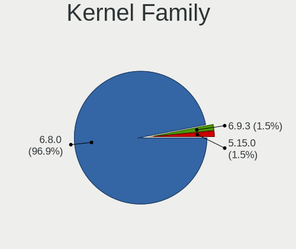
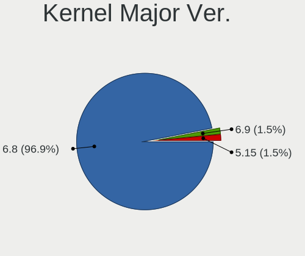
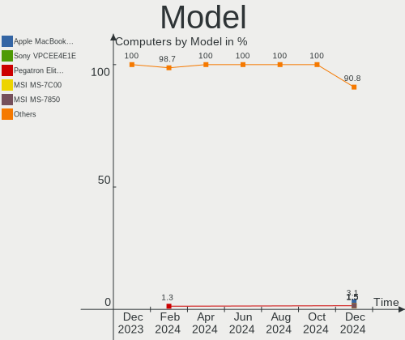
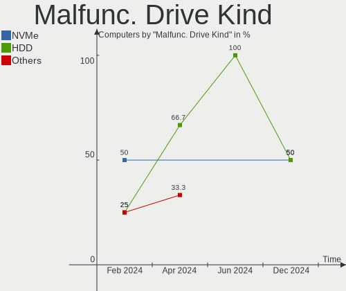
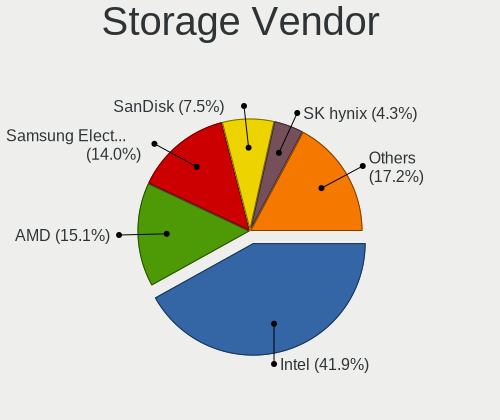
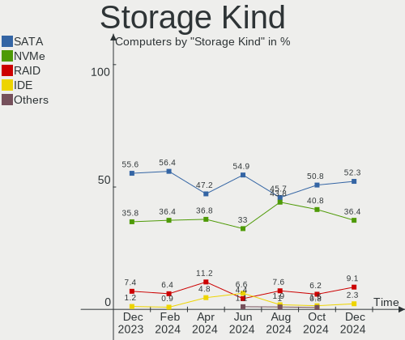
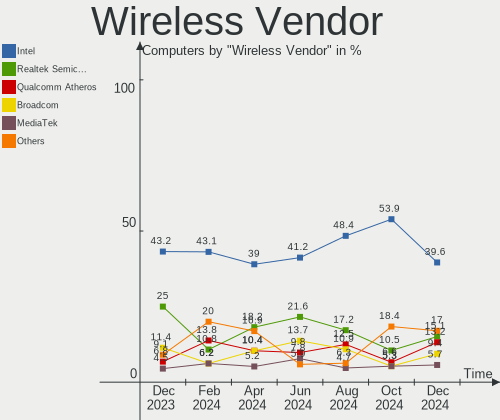

KDE neon - Hardware Trends
--------------------------

A project to identify most popular hardware characteristics and track their change
over time based on data collected by Linux users at https://Linux-Hardware.org.

Anyone can contribute to this report by the [hw-probe](https://github.com/linuxhw/hw-probe) tool:

    sudo -E hw-probe -all -upload

This is a report for all computer types. See also reports for [desktops](/Dist/KDE_neon/Desktop/README.md) and [notebooks](/Dist/KDE_neon/Notebook/README.md).

This report is for one last month. Overall report since the beginning of time: [TestCoverage](https://github.com/linuxhw/TestCoverage)

Period: Oct, 2022.

Contents
--------

* [ System ](#system)
  - [ OS                       ](#os)
  - [ OS Family                ](#os-family)
  - [ Kernel                   ](#kernel)
  - [ Kernel Family            ](#kernel-family)
  - [ Kernel Major Ver.        ](#kernel-major-ver)
  - [ Arch                     ](#arch)
  - [ DE                       ](#de)
  - [ Display Server           ](#display-server)
  - [ Display Manager          ](#display-manager)
  - [ OS Lang                  ](#os-lang)
  - [ Boot Mode                ](#boot-mode)
  - [ Filesystem               ](#filesystem)
  - [ Part. scheme             ](#part-scheme)
  - [ Dual Boot with Linux/BSD ](#dual-boot-with-linuxbsd)
  - [ Dual Boot (Win)          ](#dual-boot-win)

* [ Board ](#board)
  - [ Vendor                   ](#vendor)
  - [ Model                    ](#model)
  - [ Model Family             ](#model-family)
  - [ MFG Year                 ](#mfg-year)
  - [ Form Factor              ](#form-factor)
  - [ Secure Boot              ](#secure-boot)
  - [ Coreboot                 ](#coreboot)
  - [ RAM Size                 ](#ram-size)
  - [ RAM Used                 ](#ram-used)
  - [ Total Drives             ](#total-drives)
  - [ Has CD-ROM               ](#has-cd-rom)
  - [ Has Ethernet             ](#has-ethernet)
  - [ Has WiFi                 ](#has-wifi)
  - [ Has Bluetooth            ](#has-bluetooth)

* [ Location ](#location)
  - [ Country                  ](#country)
  - [ City                     ](#city)

* [ Drives ](#drives)
  - [ Drive Vendor             ](#drive-vendor)
  - [ Drive Model              ](#drive-model)
  - [ HDD Vendor               ](#hdd-vendor)
  - [ SSD Vendor               ](#ssd-vendor)
  - [ Drive Kind               ](#drive-kind)
  - [ Drive Connector          ](#drive-connector)
  - [ Drive Size               ](#drive-size)
  - [ Space Total              ](#space-total)
  - [ Space Used               ](#space-used)
  - [ Malfunc. Drives          ](#malfunc-drives)
  - [ Malfunc. Drive Vendor    ](#malfunc-drive-vendor)
  - [ Malfunc. HDD Vendor      ](#malfunc-hdd-vendor)
  - [ Malfunc. Drive Kind      ](#malfunc-drive-kind)
  - [ Failed Drives            ](#failed-drives)
  - [ Failed Drive Vendor      ](#failed-drive-vendor)
  - [ Drive Status             ](#drive-status)

* [ Storage controller ](#storage-controller)
  - [ Storage Vendor           ](#storage-vendor)
  - [ Storage Model            ](#storage-model)
  - [ Storage Kind             ](#storage-kind)

* [ Processor ](#processor)
  - [ CPU Vendor               ](#cpu-vendor)
  - [ CPU Model                ](#cpu-model)
  - [ CPU Model Family         ](#cpu-model-family)
  - [ CPU Cores                ](#cpu-cores)
  - [ CPU Sockets              ](#cpu-sockets)
  - [ CPU Threads              ](#cpu-threads)
  - [ CPU Op-Modes             ](#cpu-op-modes)
  - [ CPU Microcode            ](#cpu-microcode)
  - [ CPU Microarch            ](#cpu-microarch)

* [ Graphics ](#graphics)
  - [ GPU Vendor               ](#gpu-vendor)
  - [ GPU Model                ](#gpu-model)
  - [ GPU Combo                ](#gpu-combo)
  - [ GPU Driver               ](#gpu-driver)
  - [ GPU Memory               ](#gpu-memory)

* [ Monitor ](#monitor)
  - [ Monitor Vendor           ](#monitor-vendor)
  - [ Monitor Model            ](#monitor-model)
  - [ Monitor Resolution       ](#monitor-resolution)
  - [ Monitor Diagonal         ](#monitor-diagonal)
  - [ Monitor Width            ](#monitor-width)
  - [ Aspect Ratio             ](#aspect-ratio)
  - [ Monitor Area             ](#monitor-area)
  - [ Pixel Density            ](#pixel-density)
  - [ Multiple Monitors        ](#multiple-monitors)

* [ Network ](#network)
  - [ Net Controller Vendor    ](#net-controller-vendor)
  - [ Net Controller Model     ](#net-controller-model)
  - [ Wireless Vendor          ](#wireless-vendor)
  - [ Wireless Model           ](#wireless-model)
  - [ Ethernet Vendor          ](#ethernet-vendor)
  - [ Ethernet Model           ](#ethernet-model)
  - [ Net Controller Kind      ](#net-controller-kind)
  - [ Used Controller          ](#used-controller)
  - [ NICs                     ](#nics)
  - [ IPv6                     ](#ipv6)

* [ Bluetooth ](#bluetooth)
  - [ Bluetooth Vendor         ](#bluetooth-vendor)
  - [ Bluetooth Model          ](#bluetooth-model)

* [ Sound ](#sound)
  - [ Sound Vendor             ](#sound-vendor)
  - [ Sound Model              ](#sound-model)

* [ Memory ](#memory)
  - [ Memory Vendor            ](#memory-vendor)
  - [ Memory Model             ](#memory-model)
  - [ Memory Kind              ](#memory-kind)
  - [ Memory Form Factor       ](#memory-form-factor)
  - [ Memory Size              ](#memory-size)
  - [ Memory Speed             ](#memory-speed)

* [ Printers & scanners ](#printers--scanners)
  - [ Printer Vendor           ](#printer-vendor)
  - [ Printer Model            ](#printer-model)
  - [ Scanner Vendor           ](#scanner-vendor)
  - [ Scanner Model            ](#scanner-model)

* [ Camera ](#camera)
  - [ Camera Vendor            ](#camera-vendor)
  - [ Camera Model             ](#camera-model)

* [ Security ](#security)
  - [ Fingerprint Vendor       ](#fingerprint-vendor)
  - [ Fingerprint Model        ](#fingerprint-model)
  - [ Chipcard Vendor          ](#chipcard-vendor)
  - [ Chipcard Model           ](#chipcard-model)

* [ Unsupported ](#unsupported)
  - [ Unsupported Devices      ](#unsupported-devices)
  - [ Unsupported Device Types ](#unsupported-device-types)

System
------

OS
--

Installed operating systems

| Name           | Computers | Percent |
|----------------|-----------|---------|
| KDE neon 20.04 | 86        | 66.67%  |
| KDE neon 22.04 | 43        | 33.33%  |

OS Family
---------

OS without a version

| Name     | Computers | Percent |
|----------|-----------|---------|
| KDE neon | 129       | 100%    |

Kernel
------

Version of the Linux kernel

| Version                    | Computers | Percent |
|----------------------------|-----------|---------|
| 5.15.0-52-generic          | 53        | 41.09%  |
| 5.15.0-50-generic          | 30        | 23.26%  |
| 5.15.0-48-generic          | 29        | 22.48%  |
| 5.15.0-46-generic          | 4         | 3.1%    |
| 6.0.5-060005-generic       | 1         | 0.78%   |
| 6.0.0-060000-generic       | 1         | 0.78%   |
| 5.8.0-55-generic           | 1         | 0.78%   |
| 5.19.0-16.4-liquorix-amd64 | 1         | 0.78%   |
| 5.16.11-76051611-generic   | 1         | 0.78%   |
| 5.15.0-53-generic          | 1         | 0.78%   |
| 5.15.0-41-generic          | 1         | 0.78%   |
| 5.14.0-1042-oem            | 1         | 0.78%   |
| 5.13.0-52-generic          | 1         | 0.78%   |
| 5.13.0-39-generic          | 1         | 0.78%   |
| 5.13.0-35-generic          | 1         | 0.78%   |
| 5.11.0-43-generic          | 1         | 0.78%   |
| 5.11.0-34-generic          | 1         | 0.78%   |

Kernel Family
-------------

Linux kernel without a distro release

| Version | Computers | Percent |
|---------|-----------|---------|
| 5.15.0  | 118       | 91.47%  |
| 5.13.0  | 3         | 2.33%   |
| 5.11.0  | 2         | 1.55%   |
| 6.0.5   | 1         | 0.78%   |
| 6.0.0   | 1         | 0.78%   |
| 5.8.0   | 1         | 0.78%   |
| 5.19.0  | 1         | 0.78%   |
| 5.16.11 | 1         | 0.78%   |
| 5.14.0  | 1         | 0.78%   |

Kernel Major Ver.
-----------------

Linux kernel major version

| Version | Computers | Percent |
|---------|-----------|---------|
| 5.15    | 118       | 91.47%  |
| 5.13    | 3         | 2.33%   |
| 6.0     | 2         | 1.55%   |
| 5.11    | 2         | 1.55%   |
| 5.8     | 1         | 0.78%   |
| 5.19    | 1         | 0.78%   |
| 5.16    | 1         | 0.78%   |
| 5.14    | 1         | 0.78%   |

Arch
----

OS architecture (x86_64, i586, etc.)

| Name   | Computers | Percent |
|--------|-----------|---------|
| x86_64 | 129       | 100%    |

DE
--

Desktop Environment

| Name | Computers | Percent |
|------|-----------|---------|
| KDE5 | 128       | 99.22%  |
| KDE  | 1         | 0.78%   |

Display Server
--------------

X11 or Wayland

| Name    | Computers | Percent |
|---------|-----------|---------|
| X11     | 119       | 92.25%  |
| Wayland | 10        | 7.75%   |

Display Manager
---------------

SDDM, LightDM, etc.

| Name    | Computers | Percent |
|---------|-----------|---------|
| Unknown | 96        | 74.42%  |
| SDDM    | 33        | 25.58%  |

OS Lang
-------

Language

| Lang    | Computers | Percent |
|---------|-----------|---------|
| en_US   | 42        | 32.56%  |
| en_AG   | 16        | 12.4%   |
| pt_BR   | 12        | 9.3%    |
| it_IT   | 9         | 6.98%   |
| de_DE   | 8         | 6.2%    |
| ru_RU   | 5         | 3.88%   |
| es_MX   | 4         | 3.1%    |
| en_GB   | 4         | 3.1%    |
| C       | 4         | 3.1%    |
| fr_FR   | 3         | 2.33%   |
| pl_PL   | 2         | 1.55%   |
| es_ES   | 2         | 1.55%   |
| es_CO   | 2         | 1.55%   |
| es_CL   | 2         | 1.55%   |
| en_ZA   | 2         | 1.55%   |
| en_AU   | 2         | 1.55%   |
| uk_UA   | 1         | 0.78%   |
| sv_SE   | 1         | 0.78%   |
| nb_NO   | 1         | 0.78%   |
| es_VE   | 1         | 0.78%   |
| es_HN   | 1         | 0.78%   |
| es_GT   | 1         | 0.78%   |
| en_SG   | 1         | 0.78%   |
| en_NZ   | 1         | 0.78%   |
| en_CA   | 1         | 0.78%   |
| Default | 1         | 0.78%   |

Boot Mode
---------

EFI or BIOS

| Mode | Computers | Percent |
|------|-----------|---------|
| EFI  | 69        | 53.49%  |
| BIOS | 60        | 46.51%  |

Filesystem
----------

Type of filesystem

| Type    | Computers | Percent |
|---------|-----------|---------|
| Ext4    | 118       | 91.47%  |
| Btrfs   | 5         | 3.88%   |
| Overlay | 4         | 3.1%    |
| Xfs     | 2         | 1.55%   |

Part. scheme
------------

Scheme of partitioning

| Type    | Computers | Percent |
|---------|-----------|---------|
| Unknown | 96        | 74.42%  |
| GPT     | 31        | 24.03%  |
| MBR     | 2         | 1.55%   |

Dual Boot with Linux/BSD
------------------------

Hosting more than one Linux/BSD

| Dual boot | Computers | Percent |
|-----------|-----------|---------|
| No        | 126       | 97.67%  |
| Yes       | 3         | 2.33%   |

Dual Boot (Win)
---------------

Hosting Linux and Windows

| Dual boot | Computers | Percent |
|-----------|-----------|---------|
| No        | 112       | 86.82%  |
| Yes       | 17        | 13.18%  |

Board
-----

Vendor
------

Motherboard manufacturer

| Name                | Computers | Percent |
|---------------------|-----------|---------|
| ASUSTek Computer    | 27        | 20.93%  |
| Hewlett-Packard     | 20        | 15.5%   |
| MSI                 | 15        | 11.63%  |
| Lenovo              | 14        | 10.85%  |
| Dell                | 11        | 8.53%   |
| Gigabyte Technology | 5         | 3.88%   |
| Acer                | 5         | 3.88%   |
| HUAWEI              | 3         | 2.33%   |
| Apple               | 3         | 2.33%   |
| Toshiba             | 2         | 1.55%   |
| System76            | 2         | 1.55%   |
| Samsung Electronics | 2         | 1.55%   |
| ASRock              | 2         | 1.55%   |
| UNOWHY              | 1         | 0.78%   |
| Sony                | 1         | 0.78%   |
| SLIMBOOK            | 1         | 0.78%   |
| Positivo            | 1         | 0.78%   |
| PC Specialist       | 1         | 0.78%   |
| Notebook            | 1         | 0.78%   |
| Medion              | 1         | 0.78%   |
| Linx                | 1         | 0.78%   |
| LG Electronics      | 1         | 0.78%   |
| Intel               | 1         | 0.78%   |
| GPU Company         | 1         | 0.78%   |
| Google              | 1         | 0.78%   |
| Gateway             | 1         | 0.78%   |
| Fujitsu Siemens     | 1         | 0.78%   |
| Biostar             | 1         | 0.78%   |
| AZW                 | 1         | 0.78%   |
| Acidanthera         | 1         | 0.78%   |
| A-DATA Technology   | 1         | 0.78%   |

Model
-----

Motherboard model

| Name                                       | Computers | Percent |
|--------------------------------------------|-----------|---------|
| ASUS All Series                            | 3         | 2.33%   |
| UNOWHY Y13G010S4EI                         | 1         | 0.78%   |
| Toshiba TECRA M11                          | 1         | 0.78%   |
| Toshiba Satellite A505                     | 1         | 0.78%   |
| System76 Gazelle                           | 1         | 0.78%   |
| System76 Galago Pro                        | 1         | 0.78%   |
| Sony VPCEA23FB                             | 1         | 0.78%   |
| SLIMBOOK PROX-AMD5                         | 1         | 0.78%   |
| Samsung 930QDB                             | 1         | 0.78%   |
| Samsung 550XBE/350XBE                      | 1         | 0.78%   |
| Positivo DH8BW01                           | 1         | 0.78%   |
| PC Specialist N750HU                       | 1         | 0.78%   |
| Notebook NL5xNU                            | 1         | 0.78%   |
| MSI MS-7D32                                | 1         | 0.78%   |
| MSI MS-7D25                                | 1         | 0.78%   |
| MSI MS-7D20                                | 1         | 0.78%   |
| MSI MS-7C95                                | 1         | 0.78%   |
| MSI MS-7C91                                | 1         | 0.78%   |
| MSI MS-7C87                                | 1         | 0.78%   |
| MSI MS-7C79                                | 1         | 0.78%   |
| MSI MS-7C02                                | 1         | 0.78%   |
| MSI MS-7B98                                | 1         | 0.78%   |
| MSI MS-7B85                                | 1         | 0.78%   |
| MSI MS-7B79                                | 1         | 0.78%   |
| MSI MS-7918                                | 1         | 0.78%   |
| MSI MS-7751                                | 1         | 0.78%   |
| MSI MS-7623                                | 1         | 0.78%   |
| MSI Cubi N 8GL (MS-B171)                   | 1         | 0.78%   |
| Medion Akoya E6239                         | 1         | 0.78%   |
| Linx LINX12X64                             | 1         | 0.78%   |
| LG A560-T.BG77P1                           | 1         | 0.78%   |
| Lenovo Y520-15IKBM 80YY                    | 1         | 0.78%   |
| Lenovo ThinkPad X1 Carbon Gen 9 20XWS21H00 | 1         | 0.78%   |
| Lenovo ThinkPad X1 Carbon 5th 20HR0021MX   | 1         | 0.78%   |
| Lenovo ThinkPad L14 Gen 1 20U6S1JD00       | 1         | 0.78%   |
| Lenovo ThinkPad E550 20DFCTO1WW            | 1         | 0.78%   |
| Lenovo Legion Y540-15IRH-PG0 81SY          | 1         | 0.78%   |
| Lenovo IdeaPadFlex 5 15ITL05 82HT          | 1         | 0.78%   |
| Lenovo IdeaPad U430 Touch 20270            | 1         | 0.78%   |
| Lenovo IdeaPad 330-15ARR 81D2              | 1         | 0.78%   |

Model Family
------------

Motherboard model prefix

| Name                 | Computers | Percent |
|----------------------|-----------|---------|
| ASUS PRIME           | 6         | 4.65%   |
| Dell Inspiron        | 5         | 3.88%   |
| Lenovo ThinkPad      | 4         | 3.1%    |
| Lenovo IdeaPad       | 4         | 3.1%    |
| HP Laptop            | 4         | 3.1%    |
| Acer Aspire          | 4         | 3.1%    |
| HP ProBook           | 3         | 2.33%   |
| HP EliteBook         | 3         | 2.33%   |
| Dell Latitude        | 3         | 2.33%   |
| ASUS VivoBook        | 3         | 2.33%   |
| ASUS ROG             | 3         | 2.33%   |
| ASUS All             | 3         | 2.33%   |
| HP Pavilion          | 2         | 1.55%   |
| ASUS TUF             | 2         | 1.55%   |
| UNOWHY Y13G010S4EI   | 1         | 0.78%   |
| Toshiba TECRA        | 1         | 0.78%   |
| Toshiba Satellite    | 1         | 0.78%   |
| System76 Gazelle     | 1         | 0.78%   |
| System76 Galago      | 1         | 0.78%   |
| Sony VPCEA23FB       | 1         | 0.78%   |
| SLIMBOOK PROX-AMD5   | 1         | 0.78%   |
| Samsung 930QDB       | 1         | 0.78%   |
| Samsung 550XBE       | 1         | 0.78%   |
| Positivo DH8BW01     | 1         | 0.78%   |
| PC Specialist N750HU | 1         | 0.78%   |
| Notebook NL5xNU      | 1         | 0.78%   |
| MSI MS-7D32          | 1         | 0.78%   |
| MSI MS-7D25          | 1         | 0.78%   |
| MSI MS-7D20          | 1         | 0.78%   |
| MSI MS-7C95          | 1         | 0.78%   |
| MSI MS-7C91          | 1         | 0.78%   |
| MSI MS-7C87          | 1         | 0.78%   |
| MSI MS-7C79          | 1         | 0.78%   |
| MSI MS-7C02          | 1         | 0.78%   |
| MSI MS-7B98          | 1         | 0.78%   |
| MSI MS-7B85          | 1         | 0.78%   |
| MSI MS-7B79          | 1         | 0.78%   |
| MSI MS-7918          | 1         | 0.78%   |
| MSI MS-7751          | 1         | 0.78%   |
| MSI MS-7623          | 1         | 0.78%   |

MFG Year
--------

Motherboard manufacture year

| Year | Computers | Percent |
|------|-----------|---------|
| 2020 | 20        | 15.5%   |
| 2021 | 19        | 14.73%  |
| 2018 | 12        | 9.3%    |
| 2014 | 11        | 8.53%   |
| 2019 | 10        | 7.75%   |
| 2017 | 8         | 6.2%    |
| 2013 | 8         | 6.2%    |
| 2012 | 8         | 6.2%    |
| 2022 | 7         | 5.43%   |
| 2015 | 7         | 5.43%   |
| 2010 | 6         | 4.65%   |
| 2011 | 4         | 3.1%    |
| 2009 | 4         | 3.1%    |
| 2016 | 3         | 2.33%   |
| 2008 | 2         | 1.55%   |

Form Factor
-----------

Physical design of the computer

| Name        | Computers | Percent |
|-------------|-----------|---------|
| Notebook    | 67        | 51.94%  |
| Desktop     | 53        | 41.09%  |
| Convertible | 3         | 2.33%   |
| All in one  | 3         | 2.33%   |
| Mini pc     | 2         | 1.55%   |
| Tablet      | 1         | 0.78%   |

Secure Boot
-----------

Enabled or disabled

| State    | Computers | Percent |
|----------|-----------|---------|
| Disabled | 117       | 90.7%   |
| Enabled  | 12        | 9.3%    |

Coreboot
--------

Have coreboot on board

| Used | Computers | Percent |
|------|-----------|---------|
| No   | 126       | 97.67%  |
| Yes  | 3         | 2.33%   |

RAM Size
--------

Total RAM memory

| Size in GB  | Computers | Percent |
|-------------|-----------|---------|
| 16.01-24.0  | 37        | 28.68%  |
| 4.01-8.0    | 30        | 23.26%  |
| 8.01-16.0   | 27        | 20.93%  |
| 32.01-64.0  | 17        | 13.18%  |
| 3.01-4.0    | 10        | 7.75%   |
| 64.01-256.0 | 5         | 3.88%   |
| 24.01-32.0  | 2         | 1.55%   |
| 1.01-2.0    | 1         | 0.78%   |

RAM Used
--------

Used RAM memory

| Used GB    | Computers | Percent |
|------------|-----------|---------|
| 2.01-3.0   | 39        | 30.23%  |
| 1.01-2.0   | 39        | 30.23%  |
| 3.01-4.0   | 23        | 17.83%  |
| 4.01-8.0   | 18        | 13.95%  |
| 8.01-16.0  | 5         | 3.88%   |
| 0.51-1.0   | 4         | 3.1%    |
| 16.01-24.0 | 1         | 0.78%   |

Total Drives
------------

Number of drives on board

| Drives | Computers | Percent |
|--------|-----------|---------|
| 1      | 66        | 51.16%  |
| 2      | 39        | 30.23%  |
| 3      | 10        | 7.75%   |
| 6      | 4         | 3.1%    |
| 5      | 3         | 2.33%   |
| 4      | 3         | 2.33%   |
| 7      | 2         | 1.55%   |
| 9      | 1         | 0.78%   |
| 8      | 1         | 0.78%   |

Has CD-ROM
----------

Has CD-ROM on board

| Presented | Computers | Percent |
|-----------|-----------|---------|
| No        | 96        | 74.42%  |
| Yes       | 33        | 25.58%  |

Has Ethernet
------------

Has Ethernet on board

| Presented | Computers | Percent |
|-----------|-----------|---------|
| Yes       | 109       | 84.5%   |
| No        | 20        | 15.5%   |

Has WiFi
--------

Has WiFi module

| Presented | Computers | Percent |
|-----------|-----------|---------|
| Yes       | 99        | 76.74%  |
| No        | 30        | 23.26%  |

Has Bluetooth
-------------

Has Bluetooth module

| Presented | Computers | Percent |
|-----------|-----------|---------|
| Yes       | 90        | 69.77%  |
| No        | 39        | 30.23%  |

Location
--------

Country
-------

Geographic location (country)

| Country                | Computers | Percent |
|------------------------|-----------|---------|
| USA                    | 27        | 20.93%  |
| Brazil                 | 15        | 11.63%  |
| Italy                  | 10        | 7.75%   |
| Germany                | 10        | 7.75%   |
| Russia                 | 7         | 5.43%   |
| Spain                  | 6         | 4.65%   |
| Mexico                 | 4         | 3.1%    |
| India                  | 4         | 3.1%    |
| UK                     | 3         | 2.33%   |
| Switzerland            | 3         | 2.33%   |
| France                 | 3         | 2.33%   |
| Chile                  | 3         | 2.33%   |
| Sweden                 | 2         | 1.55%   |
| South Africa           | 2         | 1.55%   |
| Poland                 | 2         | 1.55%   |
| Australia              | 2         | 1.55%   |
| Vietnam                | 1         | 0.78%   |
| Venezuela              | 1         | 0.78%   |
| Ukraine                | 1         | 0.78%   |
| Tunisia                | 1         | 0.78%   |
| Trinidad and Tobago    | 1         | 0.78%   |
| Singapore              | 1         | 0.78%   |
| San Marino             | 1         | 0.78%   |
| Romania                | 1         | 0.78%   |
| Norway                 | 1         | 0.78%   |
| New Zealand            | 1         | 0.78%   |
| Netherlands            | 1         | 0.78%   |
| Nepal                  | 1         | 0.78%   |
| Morocco                | 1         | 0.78%   |
| Iraq                   | 1         | 0.78%   |
| Iran                   | 1         | 0.78%   |
| Indonesia              | 1         | 0.78%   |
| Honduras               | 1         | 0.78%   |
| Guatemala              | 1         | 0.78%   |
| Ecuador                | 1         | 0.78%   |
| Croatia                | 1         | 0.78%   |
| Colombia               | 1         | 0.78%   |
| Canada                 | 1         | 0.78%   |
| Bosnia and Herzegovina | 1         | 0.78%   |
| Belgium                | 1         | 0.78%   |

City
----

Geographic location (city)

| City                   | Computers | Percent |
|------------------------|-----------|---------|
| Sao Paulo              | 3         | 2.33%   |
| Augsburg               | 3         | 2.33%   |
| Seville                | 2         | 1.55%   |
| Moscow                 | 2         | 1.55%   |
| Milan                  | 2         | 1.55%   |
| Madrid                 | 2         | 1.55%   |
| Kaliningrad            | 2         | 1.55%   |
| Zapopan                | 1         | 0.78%   |
| Zagreb                 | 1         | 0.78%   |
| Yverdon-les-Bains      | 1         | 0.78%   |
| Yerres                 | 1         | 0.78%   |
| Warsaw                 | 1         | 0.78%   |
| Voronezh               | 1         | 0.78%   |
| Vicksburg              | 1         | 0.78%   |
| Viamao                 | 1         | 0.78%   |
| Venice                 | 1         | 0.78%   |
| Vadodara               | 1         | 0.78%   |
| Tubarao                | 1         | 0.78%   |
| Tirana                 | 1         | 0.78%   |
| Timișoara             | 1         | 0.78%   |
| The Hague              | 1         | 0.78%   |
| Teslic                 | 1         | 0.78%   |
| Tehran                 | 1         | 0.78%   |
| Tegucigalpa            | 1         | 0.78%   |
| Sydney                 | 1         | 0.78%   |
| Spilamberto            | 1         | 0.78%   |
| Södertälje           | 1         | 0.78%   |
| Singapore              | 1         | 0.78%   |
| Seattle                | 1         | 0.78%   |
| Santiago               | 1         | 0.78%   |
| Santa Helena           | 1         | 0.78%   |
| Sanary-sur-Mer         | 1         | 0.78%   |
| San Marino             | 1         | 0.78%   |
| San Carlos del Zulia   | 1         | 0.78%   |
| Sabadell               | 1         | 0.78%   |
| Rome                   | 1         | 0.78%   |
| Prignano sulla Secchia | 1         | 0.78%   |
| Pretoria               | 1         | 0.78%   |
| Phoenix                | 1         | 0.78%   |
| Orenburg               | 1         | 0.78%   |

Drives
------

Drive Vendor
------------

Hard drive vendors

| Vendor                      | Computers | Drives | Percent |
|-----------------------------|-----------|--------|---------|
| Samsung Electronics         | 42        | 53     | 18.75%  |
| WDC                         | 34        | 39     | 15.18%  |
| Seagate                     | 32        | 44     | 14.29%  |
| Kingston                    | 17        | 18     | 7.59%   |
| Sandisk                     | 14        | 15     | 6.25%   |
| Unknown                     | 9         | 9      | 4.02%   |
| Crucial                     | 8         | 8      | 3.57%   |
| Toshiba                     | 7         | 10     | 3.13%   |
| Hitachi                     | 7         | 7      | 3.13%   |
| Micron/Crucial Technology   | 4         | 4      | 1.79%   |
| Intel                       | 4         | 4      | 1.79%   |
| SK hynix                    | 3         | 3      | 1.34%   |
| Phison Electronics          | 3         | 3      | 1.34%   |
| A-DATA Technology           | 3         | 3      | 1.34%   |
| Team                        | 2         | 2      | 0.89%   |
| Silicon Motion              | 2         | 2      | 0.89%   |
| Phison                      | 2         | 2      | 0.89%   |
| Micron Technology           | 2         | 2      | 0.89%   |
| Kingston Technology Company | 2         | 2      | 0.89%   |
| HGST                        | 2         | 2      | 0.89%   |
| China                       | 2         | 2      | 0.89%   |
| Apple                       | 2         | 2      | 0.89%   |
| ADATA Technology            | 2         | 2      | 0.89%   |
| SABRENT                     | 1         | 1      | 0.45%   |
| PNY USB                     | 1         | 1      | 0.45%   |
| PNY                         | 1         | 1      | 0.45%   |
| OWC                         | 1         | 1      | 0.45%   |
| OCZ                         | 1         | 1      | 0.45%   |
| LITEON                      | 1         | 1      | 0.45%   |
| Lenovo                      | 1         | 1      | 0.45%   |
| KIOXIA                      | 1         | 1      | 0.45%   |
| JMicron Technology          | 1         | 1      | 0.45%   |
| JAJMS600                    | 1         | 1      | 0.45%   |
| Intenso                     | 1         | 1      | 0.45%   |
| HS-SSD-C100                 | 1         | 1      | 0.45%   |
| GeIL                        | 1         | 1      | 0.45%   |
| DeTech                      | 1         | 1      | 0.45%   |
| CT4000MX                    | 1         | 1      | 0.45%   |
| Corsair                     | 1         | 1      | 0.45%   |
| BIWIN                       | 1         | 1      | 0.45%   |

Drive Model
-----------

Hard drive models

| Model                                                | Computers | Percent |
|------------------------------------------------------|-----------|---------|
| Samsung NVMe SSD Controller SM981/PM981/PM983 500GB  | 11        | 4.37%   |
| Samsung SSD 860 EVO 500GB                            | 5         | 1.98%   |
| Samsung NVMe SSD Controller PM9A1/PM9A3/980PRO 250GB | 5         | 1.98%   |
| Kingston SA400S37240G 240GB SSD                      | 4         | 1.59%   |
| WDC WD10JPCX-24UE4T0 1TB                             | 3         | 1.19%   |
| Unknown MMC Card  32GB                               | 3         | 1.19%   |
| Seagate ST1000DM003-1CH162 1TB                       | 3         | 1.19%   |
| Kingston SA400S37480G 480GB SSD                      | 3         | 1.19%   |
| WDC WD5000LPCX-24VHAT0 500GB                         | 2         | 0.79%   |
| WDC WD10JPVX-22JC3T0 1TB                             | 2         | 0.79%   |
| WDC WD10EZEX-08WN4A0 1TB                             | 2         | 0.79%   |
| Unknown SD/MMC/MS PRO 1TB                            | 2         | 0.79%   |
| Unknown MMC Card  64GB                               | 2         | 0.79%   |
| Toshiba HDWE140 4TB                                  | 2         | 0.79%   |
| SK hynix BC511 256GB                                 | 2         | 0.79%   |
| Seagate ST9250315AS 250GB                            | 2         | 0.79%   |
| Seagate ST500DM002-1BD142 500GB                      | 2         | 0.79%   |
| Seagate ST31000528AS 1TB                             | 2         | 0.79%   |
| Seagate ST18000NM000J-2TV103 18TB                    | 2         | 0.79%   |
| Seagate ST1000DM010-2EP102 1TB                       | 2         | 0.79%   |
| Seagate ST1000DM003-1ER162 1TB                       | 2         | 0.79%   |
| Seagate ST10000VX0004-1ZE101 10TB                    | 2         | 0.79%   |
| Sandisk WD Black SN750 / PC SN730 NVMe SSD 1TB       | 2         | 0.79%   |
| SanDisk SDSSDA120G 120GB                             | 2         | 0.79%   |
| Samsung SSD 870 EVO 500GB                            | 2         | 0.79%   |
| Samsung SSD 860 EVO 1TB                              | 2         | 0.79%   |
| Samsung SSD 840 EVO 250GB                            | 2         | 0.79%   |
| Kingston SV300S37A120G 120GB SSD                     | 2         | 0.79%   |
| Crucial CT1000MX500SSD1 1TB                          | 2         | 0.79%   |
| WDC WDS500G2B0A-00SM50 500GB SSD                     | 1         | 0.4%    |
| WDC WDS240G2G0A-00JH30 240GB SSD                     | 1         | 0.4%    |
| WDC WDS200T2B0B-00YS70 2TB SSD                       | 1         | 0.4%    |
| WDC WDS100T2B0A-00SM50 1TB SSD                       | 1         | 0.4%    |
| WDC WDS100T1R0B-68A4Z0 1TB SSD                       | 1         | 0.4%    |
| WDC WD7500BPKX-60HPJT0 752GB                         | 1         | 0.4%    |
| WDC WD5000AAKX-00U6AA0 500GB                         | 1         | 0.4%    |
| WDC WD5000AAKX-00ERMA0 500GB                         | 1         | 0.4%    |
| WDC WD5000AAKS-00A7B2 500GB                          | 1         | 0.4%    |
| WDC WD40EFRX-68WT0N0 4TB                             | 1         | 0.4%    |
| WDC WD4005FZBX-00K5WB0 4TB                           | 1         | 0.4%    |

HDD Vendor
----------

Hard disk drive vendors

| Vendor              | Computers | Drives | Percent |
|---------------------|-----------|--------|---------|
| Seagate             | 32        | 43     | 39.51%  |
| WDC                 | 27        | 32     | 33.33%  |
| Toshiba             | 7         | 10     | 8.64%   |
| Hitachi             | 7         | 7      | 8.64%   |
| Samsung Electronics | 3         | 3      | 3.7%    |
| Unknown             | 2         | 2      | 2.47%   |
| HGST                | 2         | 2      | 2.47%   |
| SABRENT             | 1         | 1      | 1.23%   |

SSD Vendor
----------

Solid state drive vendors

| Vendor              | Computers | Drives | Percent |
|---------------------|-----------|--------|---------|
| Samsung Electronics | 19        | 23     | 25%     |
| Kingston            | 13        | 14     | 17.11%  |
| SanDisk             | 8         | 8      | 10.53%  |
| Crucial             | 8         | 8      | 10.53%  |
| WDC                 | 5         | 5      | 6.58%   |
| A-DATA Technology   | 3         | 3      | 3.95%   |
| Team                | 2         | 2      | 2.63%   |
| Intel               | 2         | 2      | 2.63%   |
| China               | 2         | 2      | 2.63%   |
| Apple               | 2         | 2      | 2.63%   |
| Seagate             | 1         | 1      | 1.32%   |
| PNY USB             | 1         | 1      | 1.32%   |
| PNY                 | 1         | 1      | 1.32%   |
| OWC                 | 1         | 1      | 1.32%   |
| OCZ                 | 1         | 1      | 1.32%   |
| Micron Technology   | 1         | 1      | 1.32%   |
| LITEON              | 1         | 1      | 1.32%   |
| Intenso             | 1         | 1      | 1.32%   |
| CT4000MX            | 1         | 1      | 1.32%   |
| BIWIN               | 1         | 1      | 1.32%   |
| Apacer              | 1         | 1      | 1.32%   |
| Unknown             | 1         | 1      | 1.32%   |

Drive Kind
----------

HDD or SSD

| Kind    | Computers | Drives | Percent |
|---------|-----------|--------|---------|
| HDD     | 65        | 100    | 33.33%  |
| SSD     | 60        | 81     | 30.77%  |
| NVMe    | 58        | 64     | 29.74%  |
| MMC     | 7         | 7      | 3.59%   |
| Unknown | 5         | 5      | 2.56%   |

Drive Connector
---------------

SATA, SAS, NVMe, etc.

| Type | Computers | Drives | Percent |
|------|-----------|--------|---------|
| SATA | 91        | 177    | 55.49%  |
| NVMe | 58        | 64     | 35.37%  |
| SAS  | 8         | 9      | 4.88%   |
| MMC  | 7         | 7      | 4.27%   |

Drive Size
----------

Size of hard drive

| Size in TB | Computers | Drives | Percent |
|------------|-----------|--------|---------|
| 0.01-0.5   | 71        | 96     | 50%     |
| 0.51-1.0   | 45        | 50     | 31.69%  |
| 1.01-2.0   | 11        | 15     | 7.75%   |
| 3.01-4.0   | 8         | 8      | 5.63%   |
| 4.01-10.0  | 5         | 6      | 3.52%   |
| 10.01-20.0 | 2         | 6      | 1.41%   |

Space Total
-----------

Amount of disk space available on the file system

| Size in GB     | Computers | Percent |
|----------------|-----------|---------|
| 251-500        | 37        | 28.68%  |
| 101-250        | 29        | 22.48%  |
| 501-1000       | 20        | 15.5%   |
| 1001-2000      | 13        | 10.08%  |
| 21-50          | 9         | 6.98%   |
| More than 3000 | 7         | 5.43%   |
| 51-100         | 5         | 3.88%   |
| 2001-3000      | 4         | 3.1%    |
| 1-20           | 3         | 2.33%   |
| Unknown        | 2         | 1.55%   |

Space Used
----------

Amount of used disk space

| Used GB        | Computers | Percent |
|----------------|-----------|---------|
| 1-20           | 48        | 37.21%  |
| 51-100         | 18        | 13.95%  |
| 101-250        | 17        | 13.18%  |
| 21-50          | 13        | 10.08%  |
| 251-500        | 12        | 9.3%    |
| 501-1000       | 10        | 7.75%   |
| More than 3000 | 3         | 2.33%   |
| 2001-3000      | 3         | 2.33%   |
| 1001-2000      | 3         | 2.33%   |
| Unknown        | 2         | 1.55%   |

Malfunc. Drives
---------------

Drive models with a malfunction

| Model                    | Computers | Drives | Percent |
|--------------------------|-----------|--------|---------|
| WDC WD10JPVX-22JC3T0 1TB | 1         | 1      | 100%    |

Malfunc. Drive Vendor
---------------------

Vendors of faulty drives

| Vendor | Computers | Drives | Percent |
|--------|-----------|--------|---------|
| WDC    | 1         | 1      | 100%    |

Malfunc. HDD Vendor
-------------------

Vendors of faulty HDD drives

| Vendor | Computers | Drives | Percent |
|--------|-----------|--------|---------|
| WDC    | 1         | 1      | 100%    |

Malfunc. Drive Kind
-------------------

Kinds of faulty drives

| Kind | Computers | Drives | Percent |
|------|-----------|--------|---------|
| HDD  | 1         | 1      | 100%    |

Failed Drives
-------------

Failed drive models

Zero info for selected period =(

Failed Drive Vendor
-------------------

Failed drive vendors

Zero info for selected period =(

Drive Status
------------

Number of failed and malfunc. drives

| Status   | Computers | Drives | Percent |
|----------|-----------|--------|---------|
| Detected | 112       | 229    | 85.5%   |
| Works    | 18        | 27     | 13.74%  |
| Malfunc  | 1         | 1      | 0.76%   |

Storage controller
------------------

Storage Vendor
--------------

Storage controller vendors

| Vendor                      | Computers | Percent |
|-----------------------------|-----------|---------|
| Intel                       | 80        | 45.2%   |
| AMD                         | 28        | 15.82%  |
| Samsung Electronics         | 27        | 15.25%  |
| SanDisk                     | 8         | 4.52%   |
| Phison Electronics          | 6         | 3.39%   |
| Kingston Technology Company | 6         | 3.39%   |
| Micron/Crucial Technology   | 4         | 2.26%   |
| ASMedia Technology          | 4         | 2.26%   |
| SK hynix                    | 3         | 1.69%   |
| Marvell Technology Group    | 3         | 1.69%   |
| Silicon Motion              | 2         | 1.13%   |
| ADATA Technology            | 2         | 1.13%   |
| Micron Technology           | 1         | 0.56%   |
| Lenovo                      | 1         | 0.56%   |
| KIOXIA                      | 1         | 0.56%   |
| JMicron Technology          | 1         | 0.56%   |

Storage Model
-------------

Storage controller models

| Model                                                                          | Computers | Percent |
|--------------------------------------------------------------------------------|-----------|---------|
| AMD FCH SATA Controller [AHCI mode]                                            | 18        | 9.09%   |
| Samsung NVMe SSD Controller SM981/PM981/PM983                                  | 14        | 7.07%   |
| Intel 500 Series Chipset Family SATA AHCI Controller                           | 8         | 4.04%   |
| AMD 400 Series Chipset SATA Controller                                         | 7         | 3.54%   |
| Samsung NVMe SSD Controller PM9A1/PM9A3/980PRO                                 | 5         | 2.53%   |
| Samsung NVMe SSD Controller 980                                                | 5         | 2.53%   |
| Intel 8 Series SATA Controller 1 [AHCI mode]                                   | 5         | 2.53%   |
| Phison E12 NVMe Controller                                                     | 4         | 2.02%   |
| Intel 8 Series/C220 Series Chipset Family 6-port SATA Controller 1 [AHCI mode] | 4         | 2.02%   |
| Intel 7 Series Chipset Family 6-port SATA Controller [AHCI mode]               | 4         | 2.02%   |
| Intel 5 Series/3400 Series Chipset 4 port SATA AHCI Controller                 | 4         | 2.02%   |
| Intel 200 Series PCH SATA controller [AHCI mode]                               | 4         | 2.02%   |
| ASMedia ASM1062 Serial ATA Controller                                          | 4         | 2.02%   |
| SanDisk WD Black SN750 / PC SN730 NVMe SSD                                     | 3         | 1.52%   |
| Micron/Crucial Non-Volatile memory controller                                  | 3         | 1.52%   |
| Intel Wildcat Point-LP SATA Controller [AHCI Mode]                             | 3         | 1.52%   |
| Intel Volume Management Device NVMe RAID Controller                            | 3         | 1.52%   |
| Intel Tiger Lake-LP SATA Controller                                            | 3         | 1.52%   |
| Intel Sunrise Point-LP SATA Controller [AHCI mode]                             | 3         | 1.52%   |
| Intel HM170/QM170 Chipset SATA Controller [AHCI Mode]                          | 3         | 1.52%   |
| Intel Cannon Point-LP SATA Controller [AHCI Mode]                              | 3         | 1.52%   |
| Intel Cannon Lake PCH SATA AHCI Controller                                     | 3         | 1.52%   |
| Intel Alder Lake-S PCH SATA Controller [AHCI Mode]                             | 3         | 1.52%   |
| Intel 5 Series/3400 Series Chipset 4 port SATA IDE Controller                  | 3         | 1.52%   |
| Intel 5 Series/3400 Series Chipset 2 port SATA IDE Controller                  | 3         | 1.52%   |
| AMD 500 Series Chipset SATA Controller                                         | 3         | 1.52%   |
| SK hynix BC511                                                                 | 2         | 1.01%   |
| SanDisk Non-Volatile memory controller                                         | 2         | 1.01%   |
| Intel Comet Lake SATA AHCI Controller                                          | 2         | 1.01%   |
| Intel Celeron/Pentium Silver Processor SATA Controller                         | 2         | 1.01%   |
| Intel Cannon Lake Mobile PCH SATA AHCI Controller                              | 2         | 1.01%   |
| Intel Atom Processor E3800 Series SATA AHCI Controller                         | 2         | 1.01%   |
| Intel 7 Series/C210 Series Chipset Family 6-port SATA Controller [AHCI mode]   | 2         | 1.01%   |
| Intel 6 Series/C200 Series Chipset Family 6 port Mobile SATA AHCI Controller   | 2         | 1.01%   |
| AMD SB7x0/SB8x0/SB9x0 SATA Controller [IDE mode]                               | 2         | 1.01%   |
| AMD SB7x0/SB8x0/SB9x0 IDE Controller                                           | 2         | 1.01%   |
| SK hynix Gold P31 SSD                                                          | 1         | 0.51%   |
| Silicon Motion SM2263EN/SM2263XT SSD Controller                                | 1         | 0.51%   |
| Silicon Motion Non-Volatile memory controller                                  | 1         | 0.51%   |
| SanDisk WD PC SN810 / Black SN850 NVMe SSD                                     | 1         | 0.51%   |

Storage Kind
------------

Kind of storage controller (IDE, SATA, NVMe, SAS, ...)

| Kind | Computers | Percent |
|------|-----------|---------|
| SATA | 98        | 57.31%  |
| NVMe | 57        | 33.33%  |
| IDE  | 10        | 5.85%   |
| RAID | 6         | 3.51%   |

Processor
---------

CPU Vendor
----------

Processor vendors

| Vendor | Computers | Percent |
|--------|-----------|---------|
| Intel  | 94        | 72.87%  |
| AMD    | 35        | 27.13%  |

CPU Model
---------

Processor models

| Model                                       | Computers | Percent |
|---------------------------------------------|-----------|---------|
| Intel 11th Gen Core i5-1135G7 @ 2.40GHz     | 5         | 3.88%   |
| AMD Ryzen 5 3600 6-Core Processor           | 4         | 3.1%    |
| Intel 11th Gen Core i7-1165G7 @ 2.80GHz     | 3         | 2.33%   |
| Intel Core i7-8565U CPU @ 1.80GHz           | 2         | 1.55%   |
| Intel Core i7-7700HQ CPU @ 2.80GHz          | 2         | 1.55%   |
| Intel Core i7-10700K CPU @ 3.80GHz          | 2         | 1.55%   |
| Intel Core i3-5005U CPU @ 2.00GHz           | 2         | 1.55%   |
| Intel 12th Gen Core i7-12700KF              | 2         | 1.55%   |
| AMD Ryzen 7 4700U with Radeon Graphics      | 2         | 1.55%   |
| AMD Ryzen 7 3700X 8-Core Processor          | 2         | 1.55%   |
| AMD Ryzen 7 2700X Eight-Core Processor      | 2         | 1.55%   |
| AMD Ryzen 5 5600X 6-Core Processor          | 2         | 1.55%   |
| AMD Ryzen 5 5500U with Radeon Graphics      | 2         | 1.55%   |
| Intel Xeon CPU W3565 @ 3.20GHz              | 1         | 0.78%   |
| Intel Xeon CPU E5-2620 v3 @ 2.40GHz         | 1         | 0.78%   |
| Intel Pentium Silver N5000 CPU @ 1.10GHz    | 1         | 0.78%   |
| Intel Pentium Dual-Core CPU E5800 @ 3.20GHz | 1         | 0.78%   |
| Intel Pentium CPU N3520 @ 2.16GHz           | 1         | 0.78%   |
| Intel Pentium CPU G4560T @ 2.90GHz          | 1         | 0.78%   |
| Intel Pentium CPU 2020M @ 2.40GHz           | 1         | 0.78%   |
| Intel Core i9-9900K CPU @ 3.60GHz           | 1         | 0.78%   |
| Intel Core i9-10900K CPU @ 3.70GHz          | 1         | 0.78%   |
| Intel Core i7-9700K CPU @ 3.60GHz           | 1         | 0.78%   |
| Intel Core i7-9700F CPU @ 3.00GHz           | 1         | 0.78%   |
| Intel Core i7-8750H CPU @ 2.20GHz           | 1         | 0.78%   |
| Intel Core i7-8550U CPU @ 1.80GHz           | 1         | 0.78%   |
| Intel Core i7-6600U CPU @ 2.60GHz           | 1         | 0.78%   |
| Intel Core i7-5930K CPU @ 3.50GHz           | 1         | 0.78%   |
| Intel Core i7-5500U CPU @ 2.40GHz           | 1         | 0.78%   |
| Intel Core i7-4850HQ CPU @ 2.30GHz          | 1         | 0.78%   |
| Intel Core i7-4500U CPU @ 1.80GHz           | 1         | 0.78%   |
| Intel Core i7-3770 CPU @ 3.40GHz            | 1         | 0.78%   |
| Intel Core i7-3630QM CPU @ 2.40GHz          | 1         | 0.78%   |
| Intel Core i7-3537U CPU @ 2.00GHz           | 1         | 0.78%   |
| Intel Core i7-2670QM CPU @ 2.20GHz          | 1         | 0.78%   |
| Intel Core i7-2630QM CPU @ 2.00GHz          | 1         | 0.78%   |
| Intel Core i7-10850H CPU @ 2.70GHz          | 1         | 0.78%   |
| Intel Core i7 CPU Q 720 @ 1.60GHz           | 1         | 0.78%   |
| Intel Core i7 CPU 870 @ 2.93GHz             | 1         | 0.78%   |
| Intel Core i5-9400F CPU @ 2.90GHz           | 1         | 0.78%   |

CPU Model Family
----------------

Processor model prefix

| Model                   | Computers | Percent |
|-------------------------|-----------|---------|
| Intel Core i5           | 25        | 19.38%  |
| Intel Core i7           | 23        | 17.83%  |
| Other                   | 20        | 15.5%   |
| AMD Ryzen 5             | 14        | 10.85%  |
| Intel Core i3           | 11        | 8.53%   |
| AMD Ryzen 7             | 9         | 6.98%   |
| Intel Celeron           | 4         | 3.1%    |
| Intel Pentium           | 3         | 2.33%   |
| Intel Xeon              | 2         | 1.55%   |
| Intel Core i9           | 2         | 1.55%   |
| Intel Atom              | 2         | 1.55%   |
| AMD Ryzen 5 PRO         | 2         | 1.55%   |
| AMD A10                 | 2         | 1.55%   |
| Intel Pentium Silver    | 1         | 0.78%   |
| Intel Pentium Dual-Core | 1         | 0.78%   |
| AMD Ryzen 9             | 1         | 0.78%   |
| AMD Ryzen 7 PRO         | 1         | 0.78%   |
| AMD Ryzen 3             | 1         | 0.78%   |
| AMD Phenom II X6        | 1         | 0.78%   |
| AMD FX                  | 1         | 0.78%   |
| AMD Athlon II X4        | 1         | 0.78%   |
| AMD Athlon              | 1         | 0.78%   |
| AMD A8                  | 1         | 0.78%   |

CPU Cores
---------

Number of processor cores

| Number | Computers | Percent |
|--------|-----------|---------|
| 4      | 47        | 36.43%  |
| 2      | 37        | 28.68%  |
| 6      | 21        | 16.28%  |
| 8      | 18        | 13.95%  |
| 12     | 3         | 2.33%   |
| 10     | 2         | 1.55%   |
| 3      | 1         | 0.78%   |

CPU Sockets
-----------

Number of sockets

| Number | Computers | Percent |
|--------|-----------|---------|
| 1      | 129       | 100%    |

CPU Threads
-----------

Threads per core (Hyper-Threading)

| Number | Computers | Percent |
|--------|-----------|---------|
| 2      | 98        | 75.97%  |
| 1      | 31        | 24.03%  |

CPU Op-Modes
------------

CPU Operation Modes (32-bit, 64-bit)

| Op mode        | Computers | Percent |
|----------------|-----------|---------|
| 32-bit, 64-bit | 129       | 100%    |

CPU Microcode
-------------

Microcode number

| Number     | Computers | Percent |
|------------|-----------|---------|
| Unknown    | 36        | 27.91%  |
| 0x306a9    | 8         | 6.2%    |
| 0x806c1    | 6         | 4.65%   |
| 0x906ea    | 4         | 3.1%    |
| 0x906e9    | 4         | 3.1%    |
| 0x40651    | 4         | 3.1%    |
| 0xa0655    | 3         | 2.33%   |
| 0x306d4    | 3         | 2.33%   |
| 0x306c3    | 3         | 2.33%   |
| 0x30678    | 3         | 2.33%   |
| 0x206a7    | 3         | 2.33%   |
| 0x08701021 | 3         | 2.33%   |
| 0x0800820d | 3         | 2.33%   |
| 0xa0671    | 2         | 1.55%   |
| 0x90672    | 2         | 1.55%   |
| 0x806ec    | 2         | 1.55%   |
| 0x806eb    | 2         | 1.55%   |
| 0x706a1    | 2         | 1.55%   |
| 0x20652    | 2         | 1.55%   |
| 0x106e5    | 2         | 1.55%   |
| 0x08608103 | 2         | 1.55%   |
| 0x08600104 | 2         | 1.55%   |
| 0x0810100b | 2         | 1.55%   |
| 0xa0652    | 1         | 0.78%   |
| 0x906ed    | 1         | 0.78%   |
| 0x906a4    | 1         | 0.78%   |
| 0x906a3    | 1         | 0.78%   |
| 0x806e9    | 1         | 0.78%   |
| 0x506e3    | 1         | 0.78%   |
| 0x406e3    | 1         | 0.78%   |
| 0x406c4    | 1         | 0.78%   |
| 0x40661    | 1         | 0.78%   |
| 0x306f2    | 1         | 0.78%   |
| 0x30673    | 1         | 0.78%   |
| 0x20655    | 1         | 0.78%   |
| 0x106a5    | 1         | 0.78%   |
| 0x1067a    | 1         | 0.78%   |
| 0x0a50000c | 1         | 0.78%   |
| 0x08701013 | 1         | 0.78%   |
| 0x08608102 | 1         | 0.78%   |

CPU Microarch
-------------

Microarchitecture

| Name             | Computers | Percent |
|------------------|-----------|---------|
| KabyLake         | 18        | 13.95%  |
| Haswell          | 13        | 10.08%  |
| Zen 2            | 11        | 8.53%   |
| TigerLake        | 10        | 7.75%   |
| Zen+             | 9         | 6.98%   |
| IvyBridge        | 9         | 6.98%   |
| Unknown          | 7         | 5.43%   |
| Silvermont       | 6         | 4.65%   |
| Westmere         | 5         | 3.88%   |
| CometLake        | 5         | 3.88%   |
| Zen 3            | 4         | 3.1%    |
| SandyBridge      | 4         | 3.1%    |
| Nehalem          | 4         | 3.1%    |
| Broadwell        | 4         | 3.1%    |
| Alderlake Hybrid | 4         | 3.1%    |
| Skylake          | 3         | 2.33%   |
| Zen              | 2         | 1.55%   |
| Piledriver       | 2         | 1.55%   |
| K10              | 2         | 1.55%   |
| Icelake          | 2         | 1.55%   |
| Goldmont plus    | 2         | 1.55%   |
| Penryn           | 1         | 0.78%   |
| Excavator        | 1         | 0.78%   |
| Bulldozer        | 1         | 0.78%   |

Graphics
--------

GPU Vendor
----------

Vendors of graphics cards

| Vendor | Computers | Percent |
|--------|-----------|---------|
| Intel  | 66        | 43.42%  |
| Nvidia | 47        | 30.92%  |
| AMD    | 39        | 25.66%  |

GPU Model
---------

Graphics card models

| Model                                                                                    | Computers | Percent |
|------------------------------------------------------------------------------------------|-----------|---------|
| Intel TigerLake-LP GT2 [Iris Xe Graphics]                                                | 9         | 5.88%   |
| AMD Picasso/Raven 2 [Radeon Vega Series / Radeon Vega Mobile Series]                     | 6         | 3.92%   |
| Intel Haswell-ULT Integrated Graphics Controller                                         | 5         | 3.27%   |
| Intel 3rd Gen Core processor Graphics Controller                                         | 5         | 3.27%   |
| Intel HD Graphics 630                                                                    | 4         | 2.61%   |
| Intel Core Processor Integrated Graphics Controller                                      | 4         | 2.61%   |
| Intel Atom Processor Z36xxx/Z37xxx Series Graphics & Display                             | 4         | 2.61%   |
| AMD Renoir                                                                               | 4         | 2.61%   |
| Intel WhiskeyLake-U GT2 [UHD Graphics 620]                                               | 3         | 1.96%   |
| Intel HD Graphics 5500                                                                   | 3         | 1.96%   |
| AMD Lucienne                                                                             | 3         | 1.96%   |
| Nvidia GP107 [GeForce GTX 1050]                                                          | 2         | 1.31%   |
| Nvidia GP107 [GeForce GTX 1050 Ti]                                                       | 2         | 1.31%   |
| Nvidia GP106 [GeForce GTX 1060 6GB]                                                      | 2         | 1.31%   |
| Nvidia GP104 [GeForce GTX 1070]                                                          | 2         | 1.31%   |
| Nvidia GK208B [GeForce GT 710]                                                           | 2         | 1.31%   |
| Nvidia GF117M [GeForce 610M/710M/810M/820M / GT 620M/625M/630M/720M]                     | 2         | 1.31%   |
| Intel Skylake GT2 [HD Graphics 520]                                                      | 2         | 1.31%   |
| Intel CometLake-S GT2 [UHD Graphics 630]                                                 | 2         | 1.31%   |
| Intel CoffeeLake-S GT2 [UHD Graphics 630]                                                | 2         | 1.31%   |
| Intel Atom/Celeron/Pentium Processor x5-E8000/J3xxx/N3xxx Integrated Graphics Controller | 2         | 1.31%   |
| Intel 2nd Generation Core Processor Family Integrated Graphics Controller                | 2         | 1.31%   |
| AMD Raven Ridge [Radeon Vega Series / Radeon Vega Mobile Series]                         | 2         | 1.31%   |
| AMD Opal XT [Radeon R7 M265/M365X/M465]                                                  | 2         | 1.31%   |
| AMD Ellesmere [Radeon RX 470/480/570/570X/580/580X/590]                                  | 2         | 1.31%   |
| AMD Cezanne                                                                              | 2         | 1.31%   |
| Nvidia TU117M [GeForce GTX 1650 Mobile / Max-Q]                                          | 1         | 0.65%   |
| Nvidia TU117M                                                                            | 1         | 0.65%   |
| Nvidia TU116 [GeForce GTX 1660 Ti]                                                       | 1         | 0.65%   |
| Nvidia TU116 [GeForce GTX 1650]                                                          | 1         | 0.65%   |
| Nvidia TU116 [GeForce GTX 1650 SUPER]                                                    | 1         | 0.65%   |
| Nvidia TU106 [GeForce RTX 2060 SUPER]                                                    | 1         | 0.65%   |
| Nvidia TU106 [GeForce RTX 2060 Rev. A]                                                   | 1         | 0.65%   |
| Nvidia GT218M [GeForce 310M]                                                             | 1         | 0.65%   |
| Nvidia GT218 [GeForce 210]                                                               | 1         | 0.65%   |
| Nvidia GT216 [GeForce GT 220]                                                            | 1         | 0.65%   |
| Nvidia GP108M [GeForce MX330]                                                            | 1         | 0.65%   |
| Nvidia GP108M [GeForce MX150]                                                            | 1         | 0.65%   |
| Nvidia GP107M [GeForce MX150]                                                            | 1         | 0.65%   |
| Nvidia GP107M [GeForce GTX 1050 Ti Mobile]                                               | 1         | 0.65%   |

GPU Combo
---------

Combinations of graphics cards

| Name           | Computers | Percent |
|----------------|-----------|---------|
| 1 x Intel      | 45        | 34.88%  |
| 1 x Nvidia     | 33        | 25.58%  |
| 1 x AMD        | 32        | 24.81%  |
| Intel + Nvidia | 12        | 9.3%    |
| Intel + AMD    | 4         | 3.1%    |
| AMD + Nvidia   | 2         | 1.55%   |
| 2 x AMD        | 1         | 0.78%   |

GPU Driver
----------

Free vs proprietary

| Driver      | Computers | Percent |
|-------------|-----------|---------|
| Free        | 114       | 88.37%  |
| Proprietary | 12        | 9.3%    |
| Unknown     | 3         | 2.33%   |

GPU Memory
----------

Total video memory

| Size in GB | Computers | Percent |
|------------|-----------|---------|
| Unknown    | 77        | 59.69%  |
| 1.01-2.0   | 19        | 14.73%  |
| 0.51-1.0   | 10        | 7.75%   |
| 7.01-8.0   | 7         | 5.43%   |
| 0.01-0.5   | 7         | 5.43%   |
| 3.01-4.0   | 5         | 3.88%   |
| 5.01-6.0   | 3         | 2.33%   |
| 8.01-16.0  | 1         | 0.78%   |

Monitor
-------

Monitor Vendor
--------------

Monitor vendors

| Vendor                  | Computers | Percent |
|-------------------------|-----------|---------|
| BOE                     | 15        | 10%     |
| AU Optronics            | 14        | 9.33%   |
| Samsung Electronics     | 13        | 8.67%   |
| Chimei Innolux          | 11        | 7.33%   |
| LG Display              | 10        | 6.67%   |
| Goldstar                | 9         | 6%      |
| Dell                    | 9         | 6%      |
| PANDA                   | 8         | 5.33%   |
| Hewlett-Packard         | 8         | 5.33%   |
| AOC                     | 5         | 3.33%   |
| BenQ                    | 4         | 2.67%   |
| Ancor Communications    | 4         | 2.67%   |
| Acer                    | 4         | 2.67%   |
| Philips                 | 3         | 2%      |
| Gigabyte Technology     | 3         | 2%      |
| Apple                   | 3         | 2%      |
| Sony                    | 2         | 1.33%   |
| Sharp                   | 2         | 1.33%   |
| LG Electronics          | 2         | 1.33%   |
| Lenovo                  | 2         | 1.33%   |
| Huion                   | 2         | 1.33%   |
| Xiaomi                  | 1         | 0.67%   |
| ViewSonic               | 1         | 0.67%   |
| Vestel Elektronik       | 1         | 0.67%   |
| Unknown                 | 1         | 0.67%   |
| Tianma XM               | 1         | 0.67%   |
| RTK                     | 1         | 0.67%   |
| MSI                     | 1         | 0.67%   |
| Mi                      | 1         | 0.67%   |
| InfoVision              | 1         | 0.67%   |
| Iiyama                  | 1         | 0.67%   |
| HKC                     | 1         | 0.67%   |
| Hitachi                 | 1         | 0.67%   |
| Grundig                 | 1         | 0.67%   |
| Daewoo                  | 1         | 0.67%   |
| CHO                     | 1         | 0.67%   |
| Chi Mei Optoelectronics | 1         | 0.67%   |
| ASUSTek Computer        | 1         | 0.67%   |

Monitor Model
-------------

Monitor models

| Model                                                                   | Computers | Percent |
|-------------------------------------------------------------------------|-----------|---------|
| PANDA LCD Monitor NCP0040 1920x1080 344x194mm 15.5-inch                 | 2         | 1.26%   |
| Dell U2412M DELA07B 1920x1200 518x324mm 24.1-inch                       | 2         | 1.26%   |
| Chimei Innolux LCD Monitor CMN15AB 1366x768 344x194mm 15.5-inch         | 2         | 1.26%   |
| BenQ GW2780 BNQ78E6 1920x1080 598x336mm 27.0-inch                       | 2         | 1.26%   |
| Xiaomi Mi TV XMD00E2 3840x2160 800x450mm 36.1-inch                      | 1         | 0.63%   |
| ViewSonic VX3276-QHD VSCE635 2560x1440 700x390mm 31.5-inch              | 1         | 0.63%   |
| Vestel Elektronik 50UHD_LCD_TV VES3700 3840x2160 1872x1053mm 84.6-inch  | 1         | 0.63%   |
| Unknown LCD Monitor FFFF 2288x1287 2550x2550mm 142.0-inch               | 1         | 0.63%   |
| Tianma XM LCD Monitor TLX1388 3000x2000 293x196mm 13.9-inch             | 1         | 0.63%   |
| Sony TV SNYEF03 1600x900                                                | 1         | 0.63%   |
| Sony TV SNY4803 1920x1080 1107x623mm 50.0-inch                          | 1         | 0.63%   |
| Sharp LCD Monitor SHP149A 1920x1080 344x194mm 15.5-inch                 | 1         | 0.63%   |
| Sharp LC-42LE540U SHP4254 1920x1080 930x523mm 42.0-inch                 | 1         | 0.63%   |
| Samsung Electronics SyncMaster SAM05C5 1920x1080                        | 1         | 0.63%   |
| Samsung Electronics SyncMaster SAM055C 1920x1200                        | 1         | 0.63%   |
| Samsung Electronics SyncMaster SAM02E3 1440x900 367x229mm 17.0-inch     | 1         | 0.63%   |
| Samsung Electronics SMBX2450 SAM0722 1920x1080 531x299mm 24.0-inch      | 1         | 0.63%   |
| Samsung Electronics SMBX1931N SAM0768 1366x768 410x230mm 18.5-inch      | 1         | 0.63%   |
| Samsung Electronics SM2333TN SAM06FC 1920x1080 477x268mm 21.5-inch      | 1         | 0.63%   |
| Samsung Electronics S24B300 SAM08CC 1920x1080 521x293mm 23.5-inch       | 1         | 0.63%   |
| Samsung Electronics LCD Monitor SEC3041 1366x768 353x198mm 15.9-inch    | 1         | 0.63%   |
| Samsung Electronics LCD Monitor SDC4156 1920x1080 294x165mm 13.3-inch   | 1         | 0.63%   |
| Samsung Electronics LCD Monitor SAM0F14 3840x2160 1872x1053mm 84.6-inch | 1         | 0.63%   |
| Samsung Electronics LCD Monitor SAM0677 1360x768 410x256mm 19.0-inch    | 1         | 0.63%   |
| Samsung Electronics LCD Monitor SAM04FD 1360x768                        | 1         | 0.63%   |
| Samsung Electronics 170EI-A01-V50 SEC0004 1280x1024 338x270mm 17.0-inch | 1         | 0.63%   |
| RTK LCD Monitor RTK1D1A 1920x1080 1020x570mm 46.0-inch                  | 1         | 0.63%   |
| Philips PHL 346B1C PHL093E 3440x1440 797x334mm 34.0-inch                | 1         | 0.63%   |
| Philips PHL 328E9F PHLC181 2560x1440 697x392mm 31.5-inch                | 1         | 0.63%   |
| Philips PHL 243V7 PHLC155 1920x1080 530x300mm 24.0-inch                 | 1         | 0.63%   |
| Philips 248CLH PHLC088 1920x1080 521x293mm 23.5-inch                    | 1         | 0.63%   |
| PANDA LCD Monitor NCP0067 1920x1080 309x174mm 14.0-inch                 | 1         | 0.63%   |
| PANDA LCD Monitor NCP004D 1920x1080 344x194mm 15.5-inch                 | 1         | 0.63%   |
| PANDA LCD Monitor NCP0046 1920x1080 344x194mm 15.5-inch                 | 1         | 0.63%   |
| PANDA LCD Monitor NCP0035 1920x1080 309x174mm 14.0-inch                 | 1         | 0.63%   |
| PANDA LCD Monitor NCP0027 1920x1080 344x194mm 15.5-inch                 | 1         | 0.63%   |
| PANDA LC133LF2L03 NCP0015 1920x1080 294x165mm 13.3-inch                 | 1         | 0.63%   |
| MSI MAG271C MSI3FA6 1920x1080 598x336mm 27.0-inch                       | 1         | 0.63%   |
| Mi Monitor XMI3444 3440x1440 800x330mm 34.1-inch                        | 1         | 0.63%   |
| LG Electronics LCD Monitor IPS231 1920x1080                             | 1         | 0.63%   |

Monitor Resolution
------------------

Monitor screen resolution

| Resolution         | Computers | Percent |
|--------------------|-----------|---------|
| 1920x1080 (FHD)    | 75        | 51.37%  |
| 1366x768 (WXGA)    | 23        | 15.75%  |
| 3840x2160 (4K)     | 9         | 6.16%   |
| 1920x1200 (WUXGA)  | 8         | 5.48%   |
| 2560x1440 (QHD)    | 7         | 4.79%   |
| 1600x900 (HD+)     | 7         | 4.79%   |
| 1280x1024 (SXGA)   | 3         | 2.05%   |
| 3440x1440          | 2         | 1.37%   |
| 1680x1050 (WSXGA+) | 2         | 1.37%   |
| 1440x900 (WXGA+)   | 2         | 1.37%   |
| 3840x1080          | 1         | 0.68%   |
| 3000x2000          | 1         | 0.68%   |
| 2880x1800          | 1         | 0.68%   |
| 2560x1080          | 1         | 0.68%   |
| 2288x1287          | 1         | 0.68%   |
| 1360x768           | 1         | 0.68%   |
| 1280x800 (WXGA)    | 1         | 0.68%   |
| Unknown            | 1         | 0.68%   |

Monitor Diagonal
----------------

Diagonal size in inches

| Inches  | Computers | Percent |
|---------|-----------|---------|
| 15      | 39        | 25.66%  |
| 24      | 18        | 11.84%  |
| 21      | 12        | 7.89%   |
| 14      | 11        | 7.24%   |
| 13      | 10        | 6.58%   |
| 23      | 9         | 5.92%   |
| 27      | 8         | 5.26%   |
| Unknown | 6         | 3.95%   |
| 17      | 5         | 3.29%   |
| 31      | 4         | 2.63%   |
| 20      | 4         | 2.63%   |
| 84      | 3         | 1.97%   |
| 34      | 3         | 1.97%   |
| 18      | 3         | 1.97%   |
| 22      | 2         | 1.32%   |
| 19      | 2         | 1.32%   |
| 16      | 2         | 1.32%   |
| 142     | 1         | 0.66%   |
| 72      | 1         | 0.66%   |
| 63      | 1         | 0.66%   |
| 60      | 1         | 0.66%   |
| 54      | 1         | 0.66%   |
| 46      | 1         | 0.66%   |
| 42      | 1         | 0.66%   |
| 36      | 1         | 0.66%   |
| 25      | 1         | 0.66%   |
| 12      | 1         | 0.66%   |
| 11      | 1         | 0.66%   |

Monitor Width
-------------

Physical width

| Width in mm    | Computers | Percent |
|----------------|-----------|---------|
| 301-350        | 54        | 37.5%   |
| 501-600        | 30        | 20.83%  |
| 401-500        | 20        | 13.89%  |
| 201-300        | 9         | 6.25%   |
| 351-400        | 7         | 4.86%   |
| Unknown        | 6         | 4.17%   |
| 601-700        | 4         | 2.78%   |
| 1501-2000      | 4         | 2.78%   |
| 1001-1500      | 4         | 2.78%   |
| 701-800        | 3         | 2.08%   |
| More than 2000 | 1         | 0.69%   |
| 801-900        | 1         | 0.69%   |
| 901-1000       | 1         | 0.69%   |

Aspect Ratio
------------

Proportional relationship between the width and the height

| Ratio   | Computers | Percent |
|---------|-----------|---------|
| 16/9    | 108       | 80%     |
| 16/10   | 15        | 11.11%  |
| Unknown | 4         | 2.96%   |
| 5/4     | 3         | 2.22%   |
| 21/9    | 3         | 2.22%   |
| 3/2     | 1         | 0.74%   |
| 1.00    | 1         | 0.74%   |

Monitor Area
------------

Area in inch²

| Area in inch² | Computers | Percent |
|----------------|-----------|---------|
| 101-110        | 40        | 26.67%  |
| 201-250        | 27        | 18%     |
| 81-90          | 17        | 11.33%  |
| 151-200        | 12        | 8%      |
| More than 1000 | 8         | 5.33%   |
| 301-350        | 8         | 5.33%   |
| 351-500        | 7         | 4.67%   |
| 251-300        | 7         | 4.67%   |
| Unknown        | 6         | 4%      |
| 141-150        | 5         | 3.33%   |
| 71-80          | 4         | 2.67%   |
| 501-1000       | 3         | 2%      |
| 121-130        | 2         | 1.33%   |
| 61-70          | 1         | 0.67%   |
| 51-60          | 1         | 0.67%   |
| 131-140        | 1         | 0.67%   |
| 111-120        | 1         | 0.67%   |

Pixel Density
-------------

Pixels per inch

| Density       | Computers | Percent |
|---------------|-----------|---------|
| 51-100        | 52        | 36.36%  |
| 121-160       | 39        | 27.27%  |
| 101-120       | 36        | 25.17%  |
| Unknown       | 6         | 4.2%    |
| 161-240       | 5         | 3.5%    |
| 1-50          | 4         | 2.8%    |
| More than 240 | 1         | 0.7%    |

Multiple Monitors
-----------------

Total monitors connected

| Total | Computers | Percent |
|-------|-----------|---------|
| 1     | 96        | 74.42%  |
| 2     | 29        | 22.48%  |
| 0     | 2         | 1.55%   |
| 4     | 1         | 0.78%   |
| 3     | 1         | 0.78%   |

Network
-------

Net Controller Vendor
---------------------

Controller vendors

| Vendor                                 | Computers | Percent |
|----------------------------------------|-----------|---------|
| Realtek Semiconductor                  | 80        | 40.82%  |
| Intel                                  | 63        | 32.14%  |
| Qualcomm Atheros                       | 19        | 9.69%   |
| Broadcom                               | 13        | 6.63%   |
| Ralink Technology                      | 3         | 1.53%   |
| Marvell Technology Group               | 2         | 1.02%   |
| Broadcom Limited                       | 2         | 1.02%   |
| TP-Link                                | 1         | 0.51%   |
| Sony Ericsson Mobile Communications AB | 1         | 0.51%   |
| Samsung Electronics                    | 1         | 0.51%   |
| Ralink                                 | 1         | 0.51%   |
| Qualcomm Atheros Communications        | 1         | 0.51%   |
| Microchip Technology                   | 1         | 0.51%   |
| MediaTek                               | 1         | 0.51%   |
| Huawei Technologies                    | 1         | 0.51%   |
| DisplayLink                            | 1         | 0.51%   |
| D-Link                                 | 1         | 0.51%   |
| ASUSTek Computer                       | 1         | 0.51%   |
| ASIX Electronics                       | 1         | 0.51%   |
| Arduino SA                             | 1         | 0.51%   |
| Aquantia                               | 1         | 0.51%   |

Net Controller Model
--------------------

Controller models

| Model                                                             | Computers | Percent |
|-------------------------------------------------------------------|-----------|---------|
| Realtek RTL8111/8168/8411 PCI Express Gigabit Ethernet Controller | 57        | 25.45%  |
| Intel Wi-Fi 6 AX200                                               | 9         | 4.02%   |
| Realtek RTL8821CE 802.11ac PCIe Wireless Network Adapter          | 6         | 2.68%   |
| Intel Wi-Fi 6 AX201                                               | 6         | 2.68%   |
| Realtek RTL8153 Gigabit Ethernet Adapter                          | 5         | 2.23%   |
| Realtek RTL810xE PCI Express Fast Ethernet controller             | 5         | 2.23%   |
| Intel Ethernet Controller I225-V                                  | 5         | 2.23%   |
| Realtek RTL8125 2.5GbE Controller                                 | 4         | 1.79%   |
| Intel Wireless-AC 9260                                            | 4         | 1.79%   |
| Intel I211 Gigabit Network Connection                             | 4         | 1.79%   |
| Realtek RTL8822CE 802.11ac PCIe Wireless Network Adapter          | 3         | 1.34%   |
| Qualcomm Atheros QCA6174 802.11ac Wireless Network Adapter        | 3         | 1.34%   |
| Qualcomm Atheros AR9485 Wireless Network Adapter                  | 3         | 1.34%   |
| Intel Wireless 7260                                               | 3         | 1.34%   |
| Intel Wi-Fi 6 AX210/AX211/AX411 160MHz                            | 3         | 1.34%   |
| Intel Ethernet Connection (7) I219-V                              | 3         | 1.34%   |
| Intel Dual Band Wireless-AC 3168NGW [Stone Peak]                  | 3         | 1.34%   |
| Broadcom BCM4360 802.11ac Wireless Network Adapter                | 3         | 1.34%   |
| Broadcom BCM43228 802.11a/b/g/n                                   | 3         | 1.34%   |
| Broadcom BCM43142 802.11b/g/n                                     | 3         | 1.34%   |
| Realtek RTL88x2bu [AC1200 Techkey]                                | 2         | 0.89%   |
| Realtek RTL8822BE 802.11a/b/g/n/ac WiFi adapter                   | 2         | 0.89%   |
| Realtek RTL8723BE PCIe Wireless Network Adapter                   | 2         | 0.89%   |
| Realtek 802.11ac NIC                                              | 2         | 0.89%   |
| Ralink MT7601U Wireless Adapter                                   | 2         | 0.89%   |
| Qualcomm Atheros QCA9565 / AR9565 Wireless Network Adapter        | 2         | 0.89%   |
| Qualcomm Atheros QCA9377 802.11ac Wireless Network Adapter        | 2         | 0.89%   |
| Qualcomm Atheros AR9285 Wireless Network Adapter (PCI-Express)    | 2         | 0.89%   |
| Qualcomm Atheros AR8161 Gigabit Ethernet                          | 2         | 0.89%   |
| Intel Wireless 8265 / 8275                                        | 2         | 0.89%   |
| Intel Wireless 3160                                               | 2         | 0.89%   |
| Intel Ethernet Connection I217-V                                  | 2         | 0.89%   |
| Intel Ethernet Connection (14) I219-V                             | 2         | 0.89%   |
| Intel Comet Lake PCH CNVi WiFi                                    | 2         | 0.89%   |
| Intel 82579LM Gigabit Network Connection (Lewisville)             | 2         | 0.89%   |
| TP-Link TL-WN722N v2/v3 [Realtek RTL8188EUS]                      | 1         | 0.45%   |
| Sony Ericsson Mobile AB D2502                                     | 1         | 0.45%   |
| Samsung Galaxy series, misc. (tethering mode)                     | 1         | 0.45%   |
| Realtek RTL8192CU 802.11n WLAN Adapter                            | 1         | 0.45%   |
| Realtek RTL8191SEvB Wireless LAN Controller                       | 1         | 0.45%   |

Wireless Vendor
---------------

Wireless vendors

| Vendor                          | Computers | Percent |
|---------------------------------|-----------|---------|
| Intel                           | 45        | 42.86%  |
| Realtek Semiconductor           | 22        | 20.95%  |
| Qualcomm Atheros                | 16        | 15.24%  |
| Broadcom                        | 11        | 10.48%  |
| Ralink Technology               | 3         | 2.86%   |
| Broadcom Limited                | 2         | 1.9%    |
| TP-Link                         | 1         | 0.95%   |
| Ralink                          | 1         | 0.95%   |
| Qualcomm Atheros Communications | 1         | 0.95%   |
| MediaTek                        | 1         | 0.95%   |
| D-Link                          | 1         | 0.95%   |
| ASUSTek Computer                | 1         | 0.95%   |

Wireless Model
--------------

Wireless models

| Model                                                          | Computers | Percent |
|----------------------------------------------------------------|-----------|---------|
| Intel Wi-Fi 6 AX200                                            | 9         | 8.57%   |
| Realtek RTL8821CE 802.11ac PCIe Wireless Network Adapter       | 6         | 5.71%   |
| Intel Wi-Fi 6 AX201                                            | 6         | 5.71%   |
| Intel Wireless-AC 9260                                         | 4         | 3.81%   |
| Realtek RTL8822CE 802.11ac PCIe Wireless Network Adapter       | 3         | 2.86%   |
| Qualcomm Atheros QCA6174 802.11ac Wireless Network Adapter     | 3         | 2.86%   |
| Qualcomm Atheros AR9485 Wireless Network Adapter               | 3         | 2.86%   |
| Intel Wireless 7260                                            | 3         | 2.86%   |
| Intel Wi-Fi 6 AX210/AX211/AX411 160MHz                         | 3         | 2.86%   |
| Intel Dual Band Wireless-AC 3168NGW [Stone Peak]               | 3         | 2.86%   |
| Broadcom BCM4360 802.11ac Wireless Network Adapter             | 3         | 2.86%   |
| Broadcom BCM43228 802.11a/b/g/n                                | 3         | 2.86%   |
| Broadcom BCM43142 802.11b/g/n                                  | 3         | 2.86%   |
| Realtek RTL88x2bu [AC1200 Techkey]                             | 2         | 1.9%    |
| Realtek RTL8822BE 802.11a/b/g/n/ac WiFi adapter                | 2         | 1.9%    |
| Realtek RTL8723BE PCIe Wireless Network Adapter                | 2         | 1.9%    |
| Realtek 802.11ac NIC                                           | 2         | 1.9%    |
| Ralink MT7601U Wireless Adapter                                | 2         | 1.9%    |
| Qualcomm Atheros QCA9565 / AR9565 Wireless Network Adapter     | 2         | 1.9%    |
| Qualcomm Atheros QCA9377 802.11ac Wireless Network Adapter     | 2         | 1.9%    |
| Qualcomm Atheros AR9285 Wireless Network Adapter (PCI-Express) | 2         | 1.9%    |
| Intel Wireless 8265 / 8275                                     | 2         | 1.9%    |
| Intel Wireless 3160                                            | 2         | 1.9%    |
| Intel Comet Lake PCH CNVi WiFi                                 | 2         | 1.9%    |
| TP-Link TL-WN722N v2/v3 [Realtek RTL8188EUS]                   | 1         | 0.95%   |
| Realtek RTL8192CU 802.11n WLAN Adapter                         | 1         | 0.95%   |
| Realtek RTL8191SEvB Wireless LAN Controller                    | 1         | 0.95%   |
| Realtek RTL8191SEvA Wireless LAN Controller                    | 1         | 0.95%   |
| Realtek RTL8188FTV 802.11b/g/n 1T1R 2.4G WLAN Adapter          | 1         | 0.95%   |
| Realtek RTL8188CE 802.11b/g/n WiFi Adapter                     | 1         | 0.95%   |
| Ralink RT2870/RT3070 Wireless Adapter                          | 1         | 0.95%   |
| Ralink RT3090 Wireless 802.11n 1T/1R PCIe                      | 1         | 0.95%   |
| Qualcomm Atheros AR9271 802.11n                                | 1         | 0.95%   |
| Qualcomm Atheros AR9462 Wireless Network Adapter               | 1         | 0.95%   |
| Qualcomm Atheros AR9287 Wireless Network Adapter (PCI-Express) | 1         | 0.95%   |
| Qualcomm Atheros AR922X Wireless Network Adapter               | 1         | 0.95%   |
| Qualcomm Atheros AR9227 Wireless Network Adapter               | 1         | 0.95%   |
| MediaTek MT7921K (RZ608) Wi-Fi 6E 80MHz                        | 1         | 0.95%   |
| Intel Wireless 8260                                            | 1         | 0.95%   |
| Intel Wireless 7265                                            | 1         | 0.95%   |

Ethernet Vendor
---------------

Ethernet vendors

| Vendor                   | Computers | Percent |
|--------------------------|-----------|---------|
| Realtek Semiconductor    | 72        | 62.61%  |
| Intel                    | 28        | 24.35%  |
| Qualcomm Atheros         | 4         | 3.48%   |
| Broadcom                 | 3         | 2.61%   |
| Marvell Technology Group | 2         | 1.74%   |
| Samsung Electronics      | 1         | 0.87%   |
| Microchip Technology     | 1         | 0.87%   |
| Huawei Technologies      | 1         | 0.87%   |
| DisplayLink              | 1         | 0.87%   |
| ASIX Electronics         | 1         | 0.87%   |
| Aquantia                 | 1         | 0.87%   |

Ethernet Model
--------------

Ethernet models

| Model                                                                          | Computers | Percent |
|--------------------------------------------------------------------------------|-----------|---------|
| Realtek RTL8111/8168/8411 PCI Express Gigabit Ethernet Controller              | 57        | 48.72%  |
| Realtek RTL8153 Gigabit Ethernet Adapter                                       | 5         | 4.27%   |
| Realtek RTL810xE PCI Express Fast Ethernet controller                          | 5         | 4.27%   |
| Intel Ethernet Controller I225-V                                               | 5         | 4.27%   |
| Realtek RTL8125 2.5GbE Controller                                              | 4         | 3.42%   |
| Intel I211 Gigabit Network Connection                                          | 4         | 3.42%   |
| Intel Ethernet Connection (7) I219-V                                           | 3         | 2.56%   |
| Qualcomm Atheros AR8161 Gigabit Ethernet                                       | 2         | 1.71%   |
| Intel Ethernet Connection I217-V                                               | 2         | 1.71%   |
| Intel Ethernet Connection (14) I219-V                                          | 2         | 1.71%   |
| Intel 82579LM Gigabit Network Connection (Lewisville)                          | 2         | 1.71%   |
| Samsung Galaxy series, misc. (tethering mode)                                  | 1         | 0.85%   |
| Realtek RTL8169 PCI Gigabit Ethernet Controller                                | 1         | 0.85%   |
| Realtek RTL-8100/8101L/8139 PCI Fast Ethernet Adapter                          | 1         | 0.85%   |
| Qualcomm Atheros Killer E220x Gigabit Ethernet Controller                      | 1         | 0.85%   |
| Qualcomm Atheros AR8131 Gigabit Ethernet                                       | 1         | 0.85%   |
| Microchip SMSC9512/9514 Fast Ethernet Adapter                                  | 1         | 0.85%   |
| Marvell Group Yukon Optima 88E8059 [PCIe Gigabit Ethernet Controller with AVB] | 1         | 0.85%   |
| Marvell Group 88E8072 PCI-E Gigabit Ethernet Controller                        | 1         | 0.85%   |
| Intel Ethernet Connection I219-LM                                              | 1         | 0.85%   |
| Intel Ethernet Connection I218-LM                                              | 1         | 0.85%   |
| Intel Ethernet Connection (4) I219-V                                           | 1         | 0.85%   |
| Intel Ethernet Connection (3) I218-V                                           | 1         | 0.85%   |
| Intel Ethernet Connection (2) I219-V                                           | 1         | 0.85%   |
| Intel Ethernet Connection (2) I218-V                                           | 1         | 0.85%   |
| Intel Ethernet Connection (2) I218-LM                                          | 1         | 0.85%   |
| Intel Ethernet Connection (14) I219-LM                                         | 1         | 0.85%   |
| Intel Ethernet Connection (11) I219-LM                                         | 1         | 0.85%   |
| Intel 82579V Gigabit Network Connection                                        | 1         | 0.85%   |
| Intel 82577LC Gigabit Network Connection                                       | 1         | 0.85%   |
| Huawei LYA-L09                                                                 | 1         | 0.85%   |
| DisplayLink Dell Universal Dock D6000                                          | 1         | 0.85%   |
| Broadcom NetXtreme BCM57786 Gigabit Ethernet PCIe                              | 1         | 0.85%   |
| Broadcom NetXtreme BCM57765 Gigabit Ethernet PCIe                              | 1         | 0.85%   |
| Broadcom NetXtreme BCM5764M Gigabit Ethernet PCIe                              | 1         | 0.85%   |
| ASIX AX88179 Gigabit Ethernet                                                  | 1         | 0.85%   |
| Aquantia AQC107 NBase-T/IEEE 802.3bz Ethernet Controller [AQtion]              | 1         | 0.85%   |

Net Controller Kind
-------------------

Ethernet, WiFi or modem

| Kind     | Computers | Percent |
|----------|-----------|---------|
| Ethernet | 109       | 51.9%   |
| WiFi     | 99        | 47.14%  |
| Modem    | 1         | 0.48%   |
| Unknown  | 1         | 0.48%   |

Used Controller
---------------

Currently used network controller

| Kind     | Computers | Percent |
|----------|-----------|---------|
| WiFi     | 69        | 53.08%  |
| Ethernet | 60        | 46.15%  |
| Unknown  | 1         | 0.77%   |

NICs
----

Total network controllers on board

| Total | Computers | Percent |
|-------|-----------|---------|
| 2     | 70        | 54.26%  |
| 1     | 52        | 40.31%  |
| 0     | 4         | 3.1%    |
| 3     | 2         | 1.55%   |
| 4     | 1         | 0.78%   |

IPv6
----

IPv6 vs IPv4

| Used | Computers | Percent |
|------|-----------|---------|
| No   | 96        | 74.42%  |
| Yes  | 33        | 25.58%  |

Bluetooth
---------

Bluetooth Vendor
----------------

Controller vendors

| Vendor                          | Computers | Percent |
|---------------------------------|-----------|---------|
| Intel                           | 44        | 48.35%  |
| Realtek Semiconductor           | 11        | 12.09%  |
| Qualcomm Atheros Communications | 6         | 6.59%   |
| Broadcom                        | 5         | 5.49%   |
| IMC Networks                    | 4         | 4.4%    |
| Cambridge Silicon Radio         | 4         | 4.4%    |
| Apple                           | 4         | 4.4%    |
| Lite-On Technology              | 3         | 3.3%    |
| Foxconn / Hon Hai               | 3         | 3.3%    |
| ASUSTek Computer                | 2         | 2.2%    |
| Realtek                         | 1         | 1.1%    |
| Ralink Technology               | 1         | 1.1%    |
| MediaTek                        | 1         | 1.1%    |
| Hewlett-Packard                 | 1         | 1.1%    |
| Foxconn International           | 1         | 1.1%    |

Bluetooth Model
---------------

Controller models

| Model                                                                               | Computers | Percent |
|-------------------------------------------------------------------------------------|-----------|---------|
| Intel Bluetooth wireless interface                                                  | 11        | 12.09%  |
| Realtek Bluetooth Radio                                                             | 9         | 9.89%   |
| Intel AX201 Bluetooth                                                               | 9         | 9.89%   |
| Intel AX200 Bluetooth                                                               | 9         | 9.89%   |
| Intel Wireless-AC 9260 Bluetooth Adapter                                            | 4         | 4.4%    |
| Intel Bluetooth 9460/9560 Jefferson Peak (JfP)                                      | 4         | 4.4%    |
| Cambridge Silicon Radio Bluetooth Dongle (HCI mode)                                 | 4         | 4.4%    |
| Intel Wireless-AC 3168 Bluetooth                                                    | 3         | 3.3%    |
| Intel AX210 Bluetooth                                                               | 3         | 3.3%    |
| IMC Networks Bluetooth Radio                                                        | 3         | 3.3%    |
| Qualcomm Atheros  Bluetooth Device                                                  | 2         | 2.2%    |
| Qualcomm Atheros QCA61x4 Bluetooth 4.0                                              | 2         | 2.2%    |
| Lite-On Broadcom BCM43142A0 Bluetooth Device                                        | 2         | 2.2%    |
| Broadcom HP Portable Bumble Bee                                                     | 2         | 2.2%    |
| Broadcom BCM2045 Bluetooth                                                          | 2         | 2.2%    |
| Apple Bluetooth USB Host Controller                                                 | 2         | 2.2%    |
| Apple Bluetooth Host Controller                                                     | 2         | 2.2%    |
| Realtek RTL8723B Bluetooth                                                          | 1         | 1.1%    |
| Realtek  Bluetooth 4.2 Adapter                                                      | 1         | 1.1%    |
| Realtek Bluetooth Radio                                                             | 1         | 1.1%    |
| Ralink Motorola BC4 Bluetooth 3.0+HS Adapter                                        | 1         | 1.1%    |
| Qualcomm Atheros AR3012 Bluetooth 4.0                                               | 1         | 1.1%    |
| Qualcomm Atheros AR3011 Bluetooth                                                   | 1         | 1.1%    |
| MediaTek Wireless_Device                                                            | 1         | 1.1%    |
| Lite-On Atheros AR3012 Bluetooth                                                    | 1         | 1.1%    |
| Intel Centrino Bluetooth Wireless Transceiver                                       | 1         | 1.1%    |
| IMC Networks Bluetooth USB Host Controller                                          | 1         | 1.1%    |
| HP Bluetooth Adapter                                                                | 1         | 1.1%    |
| Foxconn International BCM43142A0 Bluetooth module                                   | 1         | 1.1%    |
| Foxconn / Hon Hai Foxconn T77H114 BCM2070 [Single-Chip Bluetooth 2.1 + EDR Adapter] | 1         | 1.1%    |
| Foxconn / Hon Hai Bluetooth USB Host Controller                                     | 1         | 1.1%    |
| Foxconn / Hon Hai Bluetooth Device                                                  | 1         | 1.1%    |
| Broadcom BCM20702A0                                                                 | 1         | 1.1%    |
| ASUS Broadcom BCM20702 Single-Chip Bluetooth 4.0 + LE                               | 1         | 1.1%    |
| ASUS Bluetooth Radio                                                                | 1         | 1.1%    |

Sound
-----

Sound Vendor
------------

Sound card vendors

| Vendor                   | Computers | Percent |
|--------------------------|-----------|---------|
| Intel                    | 91        | 48.15%  |
| AMD                      | 45        | 23.81%  |
| Nvidia                   | 37        | 19.58%  |
| C-Media Electronics      | 4         | 2.12%   |
| Texas Instruments        | 1         | 0.53%   |
| Microsoft                | 1         | 0.53%   |
| Micro Star International | 1         | 0.53%   |
| JMTek                    | 1         | 0.53%   |
| JBL                      | 1         | 0.53%   |
| Guillemot                | 1         | 0.53%   |
| Focusrite-Novation       | 1         | 0.53%   |
| Creative Technology      | 1         | 0.53%   |
| Corsair                  | 1         | 0.53%   |
| Audioengine              | 1         | 0.53%   |
| ASUSTek Computer         | 1         | 0.53%   |
| AlfaPlus Semiconductor   | 1         | 0.53%   |

Sound Model
-----------

Sound card models

| Model                                                                      | Computers | Percent |
|----------------------------------------------------------------------------|-----------|---------|
| AMD Family 17h/19h HD Audio Controller                                     | 17        | 7.59%   |
| Intel Tiger Lake-LP Smart Sound Technology Audio Controller                | 10        | 4.46%   |
| AMD Starship/Matisse HD Audio Controller                                   | 9         | 4.02%   |
| Intel 7 Series/C216 Chipset Family High Definition Audio Controller        | 8         | 3.57%   |
| Intel 5 Series/3400 Series Chipset High Definition Audio                   | 8         | 3.57%   |
| AMD Renoir Radeon High Definition Audio Controller                         | 8         | 3.57%   |
| AMD Raven/Raven2/Fenghuang HDMI/DP Audio Controller                        | 8         | 3.57%   |
| Intel Tiger Lake-H HD Audio Controller                                     | 5         | 2.23%   |
| Intel Haswell-ULT HD Audio Controller                                      | 5         | 2.23%   |
| Intel Cannon Lake PCH cAVS                                                 | 5         | 2.23%   |
| Intel 8 Series/C220 Series Chipset High Definition Audio Controller        | 5         | 2.23%   |
| Intel 8 Series HD Audio Controller                                         | 5         | 2.23%   |
| Intel 6 Series/C200 Series Chipset Family High Definition Audio Controller | 5         | 2.23%   |
| Nvidia GP107GL High Definition Audio Controller                            | 4         | 1.79%   |
| Nvidia GP106 High Definition Audio Controller                              | 4         | 1.79%   |
| Intel Wildcat Point-LP High Definition Audio Controller                    | 4         | 1.79%   |
| Intel Sunrise Point-LP HD Audio                                            | 4         | 1.79%   |
| Intel Broadwell-U Audio Controller                                         | 4         | 1.79%   |
| Intel 200 Series PCH HD Audio                                              | 4         | 1.79%   |
| AMD Navi 21/23 HDMI/DP Audio Controller                                    | 4         | 1.79%   |
| Nvidia TU116 High Definition Audio Controller                              | 3         | 1.34%   |
| Nvidia GP104 High Definition Audio Controller                              | 3         | 1.34%   |
| Nvidia GF108 High Definition Audio Controller                              | 3         | 1.34%   |
| Intel CM238 HD Audio Controller                                            | 3         | 1.34%   |
| Intel Cannon Point-LP High Definition Audio Controller                     | 3         | 1.34%   |
| Intel Audio device                                                         | 3         | 1.34%   |
| Intel Atom Processor Z36xxx/Z37xxx Series High Definition Audio Controller | 3         | 1.34%   |
| AMD SBx00 Azalia (Intel HDA)                                               | 3         | 1.34%   |
| AMD Family 17h (Models 00h-0fh) HD Audio Controller                        | 3         | 1.34%   |
| AMD Cedar HDMI Audio [Radeon HD 5400/6300/7300 Series]                     | 3         | 1.34%   |
| Nvidia TU107 GeForce GTX 1650 High Definition Audio Controller             | 2         | 0.89%   |
| Nvidia TU106 High Definition Audio Controller                              | 2         | 0.89%   |
| Nvidia High Definition Audio Controller                                    | 2         | 0.89%   |
| Nvidia GK208 HDMI/DP Audio Controller                                      | 2         | 0.89%   |
| Nvidia GK107 HDMI Audio Controller                                         | 2         | 0.89%   |
| Nvidia GA106 High Definition Audio Controller                              | 2         | 0.89%   |
| Nvidia GA104 High Definition Audio Controller                              | 2         | 0.89%   |
| Intel Comet Lake PCH cAVS                                                  | 2         | 0.89%   |
| Intel Celeron/Pentium Silver Processor High Definition Audio               | 2         | 0.89%   |
| Intel C610/X99 series chipset HD Audio Controller                          | 2         | 0.89%   |

Memory
------

Memory Vendor
-------------

Memory module vendors

| Vendor              | Computers | Percent |
|---------------------|-----------|---------|
| SK hynix            | 4         | 18.18%  |
| Samsung Electronics | 4         | 18.18%  |
| Micron Technology   | 3         | 13.64%  |
| Kingston            | 3         | 13.64%  |
| Corsair             | 3         | 13.64%  |
| Crucial             | 2         | 9.09%   |
| Unknown (ABCD)      | 1         | 4.55%   |
| Team                | 1         | 4.55%   |
| Ramaxel Technology  | 1         | 4.55%   |

Memory Model
------------

Memory module models

| Model                                                            | Computers | Percent |
|------------------------------------------------------------------|-----------|---------|
| Samsung RAM M471A5244CB0-CTD 4GB SODIMM DDR4 3266MT/s            | 2         | 8%      |
| Unknown (ABCD) RAM 123456789012345678 2GB SODIMM LPDDR4 2400MT/s | 1         | 4%      |
| Team RAM TEAMGROUP-UD4-3000 8192MB DIMM DDR4 3067MT/s            | 1         | 4%      |
| SK hynix RAM HMT451S6BFR8A-PB 4GB SODIMM DDR3 1600MT/s           | 1         | 4%      |
| SK hynix RAM HMT425S6CFR6A-PB 2GB SODIMM DDR3 1600MT/s           | 1         | 4%      |
| SK hynix RAM HMAA2GU6CJR8N-XN 16GB DIMM DDR4 3200MT/s            | 1         | 4%      |
| SK hynix RAM HMAA1GS6CJR6N-XN 8GB SODIMM DDR4 3200MT/s           | 1         | 4%      |
| SK hynix RAM HMA82GS6JJR8N-VK 16GB SODIMM DDR4 2667MT/s          | 1         | 4%      |
| Samsung RAM M471A5244CB0-CWE 4GB SODIMM DDR4 3200MT/s            | 1         | 4%      |
| Samsung RAM M471A5244CB0-CRC 4GB SODIMM DDR4 2667MT/s            | 1         | 4%      |
| Samsung RAM M471A1G44AB0-CWE 8GB SODIMM DDR4 3200MT/s            | 1         | 4%      |
| Ramaxel RAM RMSA3270MB76H8F2400 2048MB SODIMM DDR4 2400MT/s      | 1         | 4%      |
| Micron RAM 8ATF1G64HZ-2G6E1 8GB SODIMM DDR4 2667MT/s             | 1         | 4%      |
| Micron RAM 53E1G32D4NQ 2GB Row Of Chips LPDDR4 4267MT/s          | 1         | 4%      |
| Micron RAM 16KTF1G64HZ-1G6E1 8GB SODIMM DDR3 1600MT/s            | 1         | 4%      |
| Kingston RAM KF3600C18D4/32GX 32GB DIMM DDR4 3600MT/s            | 1         | 4%      |
| Kingston RAM ACR16D3LS1KFG/4G 4GB SODIMM DDR3 1600MT/s           | 1         | 4%      |
| Kingston RAM 9905744-101.A00G 32GB SODIMM DDR4 3200MT/s          | 1         | 4%      |
| Crucial RAM CT8G4SFS824A.C8FN 8192MB SODIMM DDR4 2400MT/s        | 1         | 4%      |
| Crucial RAM BLS8G4D26BFSB.16FD2 8192MB DIMM DDR4 2667MT/s        | 1         | 4%      |
| Crucial RAM BLS8G4D26B 8192MB DIMM DDR4 2667MT/s                 | 1         | 4%      |
| Corsair RAM CMK16GX4M2D3600C18 8GB DIMM DDR4 3600MT/s            | 1         | 4%      |
| Corsair RAM CMK16GX4M2D3000C16 8GB DIMM DDR4 3200MT/s            | 1         | 4%      |
| Corsair RAM CMK16GX4M2B3200C16 8192MB DIMM DDR4 3600MT/s         | 1         | 4%      |

Memory Kind
-----------

Memory module kinds

| Kind   | Computers | Percent |
|--------|-----------|---------|
| DDR4   | 16        | 80%     |
| LPDDR4 | 2         | 10%     |
| DDR3   | 2         | 10%     |

Memory Form Factor
------------------

Physical design of the memory module

| Name         | Computers | Percent |
|--------------|-----------|---------|
| SODIMM       | 12        | 60%     |
| DIMM         | 7         | 35%     |
| Row Of Chips | 1         | 5%      |

Memory Size
-----------

Memory module size

| Size  | Computers | Percent |
|-------|-----------|---------|
| 8192  | 9         | 39.13%  |
| 4096  | 6         | 26.09%  |
| 16384 | 3         | 13.04%  |
| 2048  | 3         | 13.04%  |
| 32768 | 2         | 8.7%    |

Memory Speed
------------

Memory module speed

| Speed | Computers | Percent |
|-------|-----------|---------|
| 3200  | 6         | 27.27%  |
| 2667  | 4         | 18.18%  |
| 3600  | 3         | 13.64%  |
| 2400  | 3         | 13.64%  |
| 3266  | 2         | 9.09%   |
| 1600  | 2         | 9.09%   |
| 4267  | 1         | 4.55%   |
| 3067  | 1         | 4.55%   |

Printers & scanners
-------------------

Printer Vendor
--------------

Printer device vendors

| Vendor          | Computers | Percent |
|-----------------|-----------|---------|
| Seiko Epson     | 1         | 33.33%  |
| Hewlett-Packard | 1         | 33.33%  |
| Dymo-CoStar     | 1         | 33.33%  |

Printer Model
-------------

Printer device models

| Model                       | Computers | Percent |
|-----------------------------|-----------|---------|
| Seiko Epson WF-2510 Series  | 1         | 33.33%  |
| HP LaserJet 1200            | 1         | 33.33%  |
| Dymo-CoStar LabelWriter 400 | 1         | 33.33%  |

Scanner Vendor
--------------

Scanner device vendors

Zero info for selected period =(

Scanner Model
-------------

Scanner device models

Zero info for selected period =(

Camera
------

Camera Vendor
-------------

Camera device vendors

| Vendor                                 | Computers | Percent |
|----------------------------------------|-----------|---------|
| Chicony Electronics                    | 18        | 24.66%  |
| IMC Networks                           | 8         | 10.96%  |
| Realtek Semiconductor                  | 7         | 9.59%   |
| Acer                                   | 7         | 9.59%   |
| Sunplus Innovation Technology          | 5         | 6.85%   |
| Suyin                                  | 3         | 4.11%   |
| Logitech                               | 3         | 4.11%   |
| Quanta                                 | 2         | 2.74%   |
| Microdia                               | 2         | 2.74%   |
| Luxvisions Innotech Limited            | 2         | 2.74%   |
| Lite-On Technology                     | 2         | 2.74%   |
| Apple                                  | 2         | 2.74%   |
| Z-Star Microelectronics                | 1         | 1.37%   |
| Unknown                                | 1         | 1.37%   |
| Sonix Technology                       | 1         | 1.37%   |
| Silicon Motion                         | 1         | 1.37%   |
| Samsung Electronics                    | 1         | 1.37%   |
| Microsoft                              | 1         | 1.37%   |
| Lenovo                                 | 1         | 1.37%   |
| HRY                                    | 1         | 1.37%   |
| Cubeternet                             | 1         | 1.37%   |
| Cheng Uei Precision Industry (Foxlink) | 1         | 1.37%   |
| AVerMedia Technologies                 | 1         | 1.37%   |
| Alcor Micro                            | 1         | 1.37%   |

Camera Model
------------

Camera device models

| Model                                                       | Computers | Percent |
|-------------------------------------------------------------|-----------|---------|
| Realtek Integrated_Webcam_HD                                | 4         | 5.48%   |
| Microdia Integrated_Webcam_HD                               | 2         | 2.74%   |
| Luxvisions Innotech Limited HP TrueVision HD Camera         | 2         | 2.74%   |
| IMC Networks USB2.0 HD UVC WebCam                           | 2         | 2.74%   |
| IMC Networks HP TrueVision HD Camera                        | 2         | 2.74%   |
| Chicony USB2.0 UVC WebCam                                   | 2         | 2.74%   |
| Chicony USB2.0 HD UVC WebCam                                | 2         | 2.74%   |
| Chicony HP HD Webcam                                        | 2         | 2.74%   |
| Chicony HP HD Camera                                        | 2         | 2.74%   |
| Chicony HD WebCam (Acer)                                    | 2         | 2.74%   |
| Chicony HD Webcam                                           | 2         | 2.74%   |
| Acer Lenovo EasyCamera                                      | 2         | 2.74%   |
| Acer Integrated Camera                                      | 2         | 2.74%   |
| Acer BisonCam,NB Pro                                        | 2         | 2.74%   |
| Z-Star Venus USB2.0 Camera                                  | 1         | 1.37%   |
| Unknown 720p HD Camera                                      | 1         | 1.37%   |
| Suyin Integrated_Webcam_HD                                  | 1         | 1.37%   |
| Suyin HP TrueVision HD Integrated Webcam                    | 1         | 1.37%   |
| Suyin 1.3M WebCam (notebook emachines E730, Acer sub-brand) | 1         | 1.37%   |
| Sunplus Integrated_Webcam_HD                                | 1         | 1.37%   |
| Sunplus Integrated Webcam                                   | 1         | 1.37%   |
| Sunplus Integrated Camera                                   | 1         | 1.37%   |
| Sunplus Dell Integrated Webcam                              | 1         | 1.37%   |
| Sunplus Aukey-PC-LM1E Camera                                | 1         | 1.37%   |
| Sonix Integrated Webcam_FHD                                 | 1         | 1.37%   |
| Silicon Motion Web Camera                                   | 1         | 1.37%   |
| Samsung Galaxy series, misc. (MTP mode)                     | 1         | 1.37%   |
| Realtek USB Camera                                          | 1         | 1.37%   |
| Realtek Lenovo EasyCamera                                   | 1         | 1.37%   |
| Realtek 2SF022                                              | 1         | 1.37%   |
| Quanta ov9734_techfront_camera                              | 1         | 1.37%   |
| Quanta HP HD Camera                                         | 1         | 1.37%   |
| Microsoft LifeCam HD-5000                                   | 1         | 1.37%   |
| Logitech Webcam C270                                        | 1         | 1.37%   |
| Logitech QuickCam Communicate MP/S5500                      | 1         | 1.37%   |
| Logitech C505 HD Webcam                                     | 1         | 1.37%   |
| Lite-On Integrated Camera                                   | 1         | 1.37%   |
| Lite-On HP HD Camera                                        | 1         | 1.37%   |
| Lenovo 510 Camera                                           | 1         | 1.37%   |
| IMC Networks USB2.0 VGA UVC WebCam                          | 1         | 1.37%   |

Security
--------

Fingerprint Vendor
------------------

Fingerprint sensor vendors

| Vendor                     | Computers | Percent |
|----------------------------|-----------|---------|
| Validity Sensors           | 5         | 33.33%  |
| Synaptics                  | 3         | 20%     |
| Shenzhen Goodix Technology | 2         | 13.33%  |
| LighTuning Technology      | 2         | 13.33%  |
| Focal-systems.Corp         | 1         | 6.67%   |
| Elan Microelectronics      | 1         | 6.67%   |
| AuthenTec                  | 1         | 6.67%   |

Fingerprint Model
-----------------

Fingerprint sensor models

| Model                                                      | Computers | Percent |
|------------------------------------------------------------|-----------|---------|
| Synaptics  VFS7552 Touch Fingerprint Sensor with PurePrint | 2         | 13.33%  |
| Shenzhen Goodix Fingerprint Reader                         | 2         | 13.33%  |
| Validity Sensors VFS5011 Fingerprint Reader                | 1         | 6.67%   |
| Validity Sensors VFS495 Fingerprint Reader                 | 1         | 6.67%   |
| Validity Sensors VFS451 Fingerprint Reader                 | 1         | 6.67%   |
| Validity Sensors Synaptics WBDI                            | 1         | 6.67%   |
| Validity Sensors Fingerprint scanner                       | 1         | 6.67%   |
| LighTuning Fingerprint Sensor                              | 1         | 6.67%   |
| LighTuning Fingerprint Reader                              | 1         | 6.67%   |
| Focal-systems.Corp FT9201Fingerprint.                      | 1         | 6.67%   |
| Elan ELAN:Fingerprint                                      | 1         | 6.67%   |
| AuthenTec Fingerprint Sensor                               | 1         | 6.67%   |
| Unknown                                                    | 1         | 6.67%   |

Chipcard Vendor
---------------

Chipcard module vendors

| Vendor   | Computers | Percent |
|----------|-----------|---------|
| Broadcom | 3         | 100%    |

Chipcard Model
--------------

Chipcard module models

| Model                                                                        | Computers | Percent |
|------------------------------------------------------------------------------|-----------|---------|
| Broadcom BCM5880 Secure Applications Processor with fingerprint swipe sensor | 1         | 33.33%  |
| Broadcom 5880                                                                | 1         | 33.33%  |
| Broadcom 58200                                                               | 1         | 33.33%  |

Unsupported
-----------

Unsupported Devices
-------------------

Total unsupported devices on board

| Total | Computers | Percent |
|-------|-----------|---------|
| 0     | 87        | 67.44%  |
| 1     | 39        | 30.23%  |
| 2     | 2         | 1.55%   |
| 7     | 1         | 0.78%   |

Unsupported Device Types
------------------------

Types of unsupported devices

| Type                     | Computers | Percent |
|--------------------------|-----------|---------|
| Fingerprint reader       | 15        | 30.61%  |
| Multimedia controller    | 9         | 18.37%  |
| Net/wireless             | 7         | 14.29%  |
| Graphics card            | 6         | 12.24%  |
| Chipcard                 | 3         | 6.12%   |
| Unassigned class         | 2         | 4.08%   |
| Communication controller | 2         | 4.08%   |
| Storage/ide              | 1         | 2.04%   |
| Sound                    | 1         | 2.04%   |
| Modem                    | 1         | 2.04%   |
| Camera                   | 1         | 2.04%   |
| Bluetooth                | 1         | 2.04%   |

