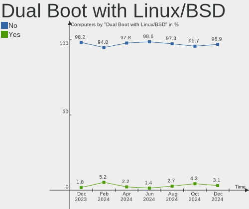
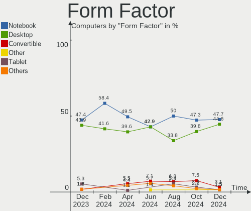
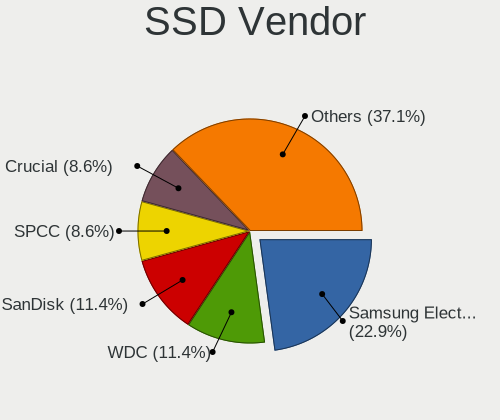
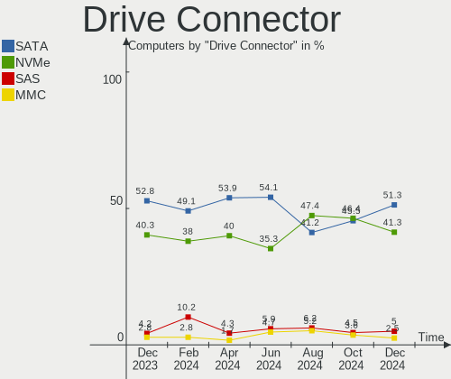
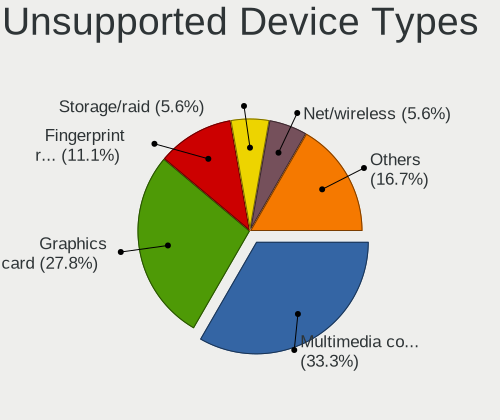

KDE neon Hardware Trends
------------------------

A project to identify most popular hardware characteristics and track their change
over time based on data collected by KDE neon users at https://Linux-Hardware.org.

Anyone can contribute to the study by uploading probes of their computers by
the [hw-probe](https://github.com/linuxhw/hw-probe) tool:

    sudo -E hw-probe -all -upload

This is a report for all computer types. See also reports for [desktops](/Dist/KDE_neon/Desktop/README.md) and [notebooks](/Dist/KDE_neon/Notebook/README.md).

Full-feature report is available here: https://linux-hardware.org/?view=trends

Period: Dec, 2020.

Contents
--------

- [ OS                       ](#os)
- [ OS Family                ](#os-family)
- [ Kernel                   ](#kernel)
- [ Kernel Family            ](#kernel-family)
- [ Kernel Major Ver.        ](#kernel-major-ver)
- [ Arch                     ](#arch)
- [ DE                       ](#de)
- [ Display Server           ](#display-server)
- [ Display Manager          ](#display-manager)
- [ OS Lang                  ](#os-lang)
- [ Boot Mode                ](#boot-mode)
- [ Filesystem               ](#filesystem)
- [ Part. scheme             ](#part-scheme)
- [ Dual Boot with Linux/BSD ](#dual-boot-with-linux/bsd)
- [ Dual Boot (Win)          ](#dual-boot-win)
- [ Country                  ](#country)
- [ City                     ](#city)
- [ Vendor                   ](#vendor)
- [ Model                    ](#model)
- [ Model Family             ](#model-family)
- [ MFG Year                 ](#mfg-year)
- [ Form Factor              ](#form-factor)
- [ Secure Boot              ](#secure-boot)
- [ Coreboot                 ](#coreboot)
- [ RAM Size                 ](#ram-size)
- [ RAM Used                 ](#ram-used)
- [ Has CD-ROM               ](#has-cd-rom)
- [ Total Drives             ](#total-drives)
- [ Has Ethernet             ](#has-ethernet)
- [ Drive Vendor             ](#drive-vendor)
- [ Drive Model              ](#drive-model)
- [ HDD Vendor               ](#hdd-vendor)
- [ SSD Vendor               ](#ssd-vendor)
- [ Drive Kind               ](#drive-kind)
- [ Drive Connector          ](#drive-connector)
- [ Drive Size               ](#drive-size)
- [ Space Total              ](#space-total)
- [ Space Used               ](#space-used)
- [ Malfunc. Drives          ](#malfunc-drives)
- [ Malfunc. Drive Vendor    ](#malfunc-drive-vendor)
- [ Malfunc. HDD Vendor      ](#malfunc-hdd-vendor)
- [ Malfunc. Drive Kind      ](#malfunc-drive-kind)
- [ Failed Drives            ](#failed-drives)
- [ Failed Drive Vendor      ](#failed-drive-vendor)
- [ Drive Status             ](#drive-status)
- [ Storage Vendor           ](#storage-vendor)
- [ Storage Model            ](#storage-model)
- [ Storage Kind             ](#storage-kind)
- [ CPU Vendor               ](#cpu-vendor)
- [ CPU Model                ](#cpu-model)
- [ CPU Model Family         ](#cpu-model-family)
- [ CPU Cores                ](#cpu-cores)
- [ CPU Sockets              ](#cpu-sockets)
- [ CPU Threads              ](#cpu-threads)
- [ CPU Op-Modes             ](#cpu-op-modes)
- [ CPU Microcode            ](#cpu-microcode)
- [ CPU Microarch            ](#cpu-microarch)
- [ GPU Vendor               ](#gpu-vendor)
- [ GPU Model                ](#gpu-model)
- [ GPU Combo                ](#gpu-combo)
- [ GPU Driver               ](#gpu-driver)
- [ GPU Memory               ](#gpu-memory)
- [ Monitor Vendor           ](#monitor-vendor)
- [ Monitor Model            ](#monitor-model)
- [ Monitor Resolution       ](#monitor-resolution)
- [ Monitor Diagonal         ](#monitor-diagonal)
- [ Monitor Width            ](#monitor-width)
- [ Aspect Ratio             ](#aspect-ratio)
- [ Monitor Area             ](#monitor-area)
- [ Pixel Density            ](#pixel-density)
- [ Multiple Monitors        ](#multiple-monitors)
- [ Net Controller Vendor    ](#net-controller-vendor)
- [ Net Controller Model     ](#net-controller-model)
- [ Wireless Vendor          ](#wireless-vendor)
- [ Wireless Model           ](#wireless-model)
- [ Ethernet Vendor          ](#ethernet-vendor)
- [ Ethernet Model           ](#ethernet-model)
- [ Net Controller Kind      ](#net-controller-kind)
- [ Used Controller          ](#used-controller)
- [ NICs                     ](#nics)
- [ Memory Vendor            ](#memory-vendor)
- [ Memory Model             ](#memory-model)
- [ Memory Kind              ](#memory-kind)
- [ Memory Form Factor       ](#memory-form-factor)
- [ Memory Size              ](#memory-size)
- [ Memory Speed             ](#memory-speed)
- [ Sound Vendor             ](#sound-vendor)
- [ Sound Model              ](#sound-model)
- [ Camera Vendor            ](#camera-vendor)
- [ Camera Model             ](#camera-model)
- [ Fingerprint Vendor       ](#fingerprint-vendor)
- [ Fingerprint Model        ](#fingerprint-model)
- [ Chipcard Vendor          ](#chipcard-vendor)
- [ Chipcard Model           ](#chipcard-model)
- [ Printer Vendor           ](#printer-vendor)
- [ Printer Model            ](#printer-model)
- [ Scanner Vendor           ](#scanner-vendor)
- [ Scanner Model            ](#scanner-model)
- [ Bluetooth Vendor         ](#bluetooth-vendor)
- [ Bluetooth Model          ](#bluetooth-model)
- [ Unsupported Devices      ](#unsupported-devices)
- [ Unsupported Device Types ](#unsupported-device-types)

OS
--

Installed operating systems

| Name           | Computers | Percent |
|----------------|-----------|---------|
| KDE neon 20.04 | 215       | 99.54%  |
| KDE neon 18.04 | 1         | 0.46%   |

OS Family
---------

OS without a version

| Name     | Computers | Percent |
|----------|-----------|---------|
| KDE neon | 216       | 100%    |

Kernel
------

Version of the Linux kernel

| Version               | Computers | Percent |
|-----------------------|-----------|---------|
| 5.4.0-58-generic      | 112       | 51.85%  |
| 5.4.0-56-generic      | 65        | 30.09%  |
| 5.4.0-54-generic      | 23        | 10.65%  |
| 5.4.0-57-generic      | 3         | 1.39%   |
| 5.4.0-52-generic      | 2         | 0.93%   |
| 5.9.15-xanmod1        | 1         | 0.46%   |
| 5.9.12-050912-generic | 1         | 0.46%   |
| 5.8.0-33-generic      | 1         | 0.46%   |
| 5.6.0-1035-oem        | 1         | 0.46%   |
| 5.5.4-050504-generic  | 1         | 0.46%   |
| 5.4.0-59-generic      | 1         | 0.46%   |
| 5.4.0-53-generic      | 1         | 0.46%   |
| 5.4.0-42-generic      | 1         | 0.46%   |
| 5.3.0-62-generic      | 1         | 0.46%   |
| 5.10.2-051002-generic | 1         | 0.46%   |
| 5.10.1-051001-generic | 1         | 0.46%   |

Kernel Family
-------------

Linux kernel without a distro release

| Version | Computers | Percent |
|---------|-----------|---------|
| 5.4.0   | 208       | 96.3%   |
| 5.9.15  | 1         | 0.46%   |
| 5.9.12  | 1         | 0.46%   |
| 5.8.0   | 1         | 0.46%   |
| 5.6.0   | 1         | 0.46%   |
| 5.5.4   | 1         | 0.46%   |
| 5.3.0   | 1         | 0.46%   |
| 5.10.2  | 1         | 0.46%   |
| 5.10.1  | 1         | 0.46%   |

Kernel Major Ver.
-----------------

Linux kernel major version

| Version | Computers | Percent |
|---------|-----------|---------|
| 5.4     | 208       | 96.3%   |
| 5.9     | 2         | 0.93%   |
| 5.10    | 2         | 0.93%   |
| 5.8     | 1         | 0.46%   |
| 5.6     | 1         | 0.46%   |
| 5.5     | 1         | 0.46%   |
| 5.3     | 1         | 0.46%   |

Arch
----

OS architecture (x86_64, i586, etc.)

| Name   | Computers | Percent |
|--------|-----------|---------|
| x86_64 | 216       | 100%    |

DE
--

Desktop Environment

| Name    | Computers | Percent |
|---------|-----------|---------|
| KDE     | 198       | 91.67%  |
| KDE5    | 15        | 6.94%   |
| Unknown | 3         | 1.39%   |

Display Server
--------------

X11 or Wayland

| Name    | Computers | Percent |
|---------|-----------|---------|
| X11     | 212       | 98.15%  |
| Wayland | 3         | 1.39%   |
| Unknown | 1         | 0.46%   |

Display Manager
---------------

SDDM, LightDM, etc.

| Name    | Computers | Percent |
|---------|-----------|---------|
| Unknown | 199       | 92.13%  |
| SDDM    | 16        | 7.41%   |
| GDM     | 1         | 0.46%   |

OS Lang
-------

Language

| Lang  | Computers | Percent |
|-------|-----------|---------|
| en_US | 68        | 31.48%  |
| de_DE | 16        | 7.41%   |
| pt_BR | 14        | 6.48%   |
| it_IT | 14        | 6.48%   |
| en_GB | 11        | 5.09%   |
| ru_RU | 10        | 4.63%   |
| fr_FR | 10        | 4.63%   |
| es_ES | 8         | 3.7%    |
| C     | 8         | 3.7%    |
| pl_PL | 6         | 2.78%   |
| en_IN | 6         | 2.78%   |
| en_CA | 6         | 2.78%   |
| es_MX | 4         | 1.85%   |
| en_AU | 4         | 1.85%   |
| tr_TR | 2         | 0.93%   |
| sv_SE | 2         | 0.93%   |
| fr_CA | 2         | 0.93%   |
| el_GR | 2         | 0.93%   |
| C     | 2         | 0.93%   |
| zh_TW | 1         | 0.46%   |
| vi_VN | 1         | 0.46%   |
| sl_SI | 1         | 0.46%   |
| sk_SK | 1         | 0.46%   |
| ru_UA | 1         | 0.46%   |
| nl_NL | 1         | 0.46%   |
| nb_NO | 1         | 0.46%   |
| hu_HU | 1         | 0.46%   |
| fr_BE | 1         | 0.46%   |
| fi_FI | 1         | 0.46%   |
| es_NI | 1         | 0.46%   |
| es_CO | 1         | 0.46%   |
| es_CL | 1         | 0.46%   |
| es_AR | 1         | 0.46%   |
| en_ZA | 1         | 0.46%   |
| en_PK | 1         | 0.46%   |
| en_IE | 1         | 0.46%   |
| de_CH | 1         | 0.46%   |
| de_AT | 1         | 0.46%   |
| ca_ES | 1         | 0.46%   |
| an_ES | 1         | 0.46%   |

Boot Mode
---------

EFI or BIOS

| Mode | Computers | Percent |
|------|-----------|---------|
| EFI  | 121       | 56.02%  |
| BIOS | 95        | 43.98%  |

Filesystem
----------

Type of filesystem

| Type    | Computers | Percent |
|---------|-----------|---------|
| Ext4    | 204       | 94.44%  |
| Btrfs   | 9         | 4.17%   |
| Overlay | 2         | 0.93%   |
| Xfs     | 1         | 0.46%   |

Part. scheme
------------

Scheme of partitioning

| Type    | Computers | Percent |
|---------|-----------|---------|
| Unknown | 201       | 93.06%  |
| GPT     | 11        | 5.09%   |
| MBR     | 4         | 1.85%   |

Dual Boot with Linux/BSD
------------------------

Hosting more than one Linux/BSD

| Dual boot | Computers | Percent |
|-----------|-----------|---------|
| No        | 205       | 94.91%  |
| Yes       | 11        | 5.09%   |

Dual Boot (Win)
---------------

Hosting Linux and Windows

| Dual boot | Computers | Percent |
|-----------|-----------|---------|
| No        | 201       | 93.06%  |
| Yes       | 15        | 6.94%   |

Country
-------

Geographic location (country)

| Country        | Computers | Percent |
|----------------|-----------|---------|
| USA            | 37        | 17.13%  |
| Germany        | 20        | 9.26%   |
| Brazil         | 16        | 7.41%   |
| Italy          | 14        | 6.48%   |
| Canada         | 12        | 5.56%   |
| Russia         | 11        | 5.09%   |
| Spain          | 10        | 4.63%   |
| Poland         | 8         | 3.7%    |
| UK             | 7         | 3.24%   |
| France         | 7         | 3.24%   |
| India          | 6         | 2.78%   |
| Australia      | 5         | 2.31%   |
| Mexico         | 4         | 1.85%   |
| Switzerland    | 3         | 1.39%   |
| Sweden         | 3         | 1.39%   |
| Netherlands    | 3         | 1.39%   |
| Greece         | 3         | 1.39%   |
| Argentina      | 3         | 1.39%   |
| Vietnam        | 2         | 0.93%   |
| Ukraine        | 2         | 0.93%   |
| Turkey         | 2         | 0.93%   |
| South Africa   | 2         | 0.93%   |
| Slovakia       | 2         | 0.93%   |
| Serbia         | 2         | 0.93%   |
| Norway         | 2         | 0.93%   |
| Morocco        | 2         | 0.93%   |
| Hungary        | 2         | 0.93%   |
| Finland        | 2         | 0.93%   |
| Czech Republic | 2         | 0.93%   |
| Colombia       | 2         | 0.93%   |
| Chile          | 2         | 0.93%   |
| Bulgaria       | 2         | 0.93%   |
| Thailand       | 1         | 0.46%   |
| Taiwan         | 1         | 0.46%   |
| Slovenia       | 1         | 0.46%   |
| Saudi Arabia   | 1         | 0.46%   |
| Romania        | 1         | 0.46%   |
| Pakistan       | 1         | 0.46%   |
| Nicaragua      | 1         | 0.46%   |
| Malaysia       | 1         | 0.46%   |
| Kazakhstan     | 1         | 0.46%   |
| Ireland        | 1         | 0.46%   |
| Iran           | 1         | 0.46%   |
| Denmark        | 1         | 0.46%   |
| Croatia        | 1         | 0.46%   |
| Belgium        | 1         | 0.46%   |
| Belarus        | 1         | 0.46%   |
| Austria        | 1         | 0.46%   |

City
----

Geographic location (city)

| City                  | Computers | Percent |
|-----------------------|-----------|---------|
| Cologne               | 3         | 1.39%   |
| Berlin                | 3         | 1.39%   |
| Zurich                | 2         | 0.93%   |
| Zaragoza              | 2         | 0.93%   |
| Warsaw                | 2         | 0.93%   |
| Thessaloniki          | 2         | 0.93%   |
| St Petersburg         | 2         | 0.93%   |
| Slattum               | 2         | 0.93%   |
| Rome                  | 2         | 0.93%   |
| Rio de Janeiro        | 2         | 0.93%   |
| Québec               | 2         | 0.93%   |
| Newcastle upon Tyne   | 2         | 0.93%   |
| Munich                | 2         | 0.93%   |
| Montreal              | 2         | 0.93%   |
| Milwaukee             | 2         | 0.93%   |
| Milan                 | 2         | 0.93%   |
| Melbourne             | 2         | 0.93%   |
| Kansas City           | 2         | 0.93%   |
| Jacksonville          | 2         | 0.93%   |
| Izmir                 | 2         | 0.93%   |
| Hanoi                 | 2         | 0.93%   |
| Burlington            | 2         | 0.93%   |
| Belgrade              | 2         | 0.93%   |
| Łódź               | 1         | 0.46%   |
| Zell am Harmersbach   | 1         | 0.46%   |
| Zaporizhia            | 1         | 0.46%   |
| Zagreb                | 1         | 0.46%   |
| Wiesbaden             | 1         | 0.46%   |
| Wałbrzych            | 1         | 0.46%   |
| Washington            | 1         | 0.46%   |
| Vélez-Málaga        | 1         | 0.46%   |
| Vicar                 | 1         | 0.46%   |
| Venegono Inferiore    | 1         | 0.46%   |
| Val-d'Or              | 1         | 0.46%   |
| Urbana                | 1         | 0.46%   |
| Ufa                   | 1         | 0.46%   |
| Uberlândia           | 1         | 0.46%   |
| Třebíč             | 1         | 0.46%   |
| Turlock               | 1         | 0.46%   |
| Trieste               | 1         | 0.46%   |
| Toulouse              | 1         | 0.46%   |
| Thrissur              | 1         | 0.46%   |
| Tehran                | 1         | 0.46%   |
| Taoyuan District      | 1         | 0.46%   |
| Tandil                | 1         | 0.46%   |
| Tampere               | 1         | 0.46%   |
| Słupsk               | 1         | 0.46%   |
| Sønderborg           | 1         | 0.46%   |
| São Paulo            | 1         | 0.46%   |
| Sulejowek             | 1         | 0.46%   |
| Stratford             | 1         | 0.46%   |
| Stockton-on-Tees      | 1         | 0.46%   |
| Stockholm             | 1         | 0.46%   |
| Sofia                 | 1         | 0.46%   |
| Skondal               | 1         | 0.46%   |
| Savona                | 1         | 0.46%   |
| Sarlat-la-Canéda     | 1         | 0.46%   |
| Saratov               | 1         | 0.46%   |
| Santiago              | 1         | 0.46%   |
| San Luis Potosí City | 1         | 0.46%   |

Vendor
------

Motherboard manufacturer

| Name                | Computers | Percent |
|---------------------|-----------|---------|
| Lenovo              | 37        | 17.13%  |
| Dell                | 33        | 15.28%  |
| ASUSTek Computer    | 33        | 15.28%  |
| Hewlett-Packard     | 27        | 12.5%   |
| Gigabyte Technology | 26        | 12.04%  |
| Acer                | 11        | 5.09%   |
| MSI                 | 10        | 4.63%   |
| ASRock              | 9         | 4.17%   |
| Apple               | 5         | 2.31%   |
| Sony                | 3         | 1.39%   |
| Intel               | 3         | 1.39%   |
| Toshiba             | 2         | 0.93%   |
| Teclast             | 1         | 0.46%   |
| System76            | 1         | 0.46%   |
| Supermicro          | 1         | 0.46%   |
| Sapphire            | 1         | 0.46%   |
| Pegatron            | 1         | 0.46%   |
| PC Specialist       | 1         | 0.46%   |
| Packard Bell        | 1         | 0.46%   |
| Microsoft           | 1         | 0.46%   |
| Medion              | 1         | 0.46%   |
| MAIBENBEN           | 1         | 0.46%   |
| KIANO               | 1         | 0.46%   |
| ICP / iEi           | 1         | 0.46%   |
| Hungaro Flotta Kft  | 1         | 0.46%   |
| Centrium            | 1         | 0.46%   |
| AMI                 | 1         | 0.46%   |
| Alienware           | 1         | 0.46%   |
| Unknown             | 1         | 0.46%   |

Model
-----

Motherboard model

| Name                                     | Computers | Percent |
|------------------------------------------|-----------|---------|
| Lenovo IdeaPad 3 15IIL05 81WE            | 2         | 0.93%   |
| Gigabyte H310M S2H 2.0                   | 2         | 0.93%   |
| Gigabyte H310M S2 2.0                    | 2         | 0.93%   |
| ASUS All Series                          | 2         | 0.93%   |
| Apple MacBookPro7,1                      | 2         | 0.93%   |
| Toshiba Satellite L50-A-158              | 1         | 0.46%   |
| Toshiba Satellite A300                   | 1         | 0.46%   |
| Teclast X98Pro                           | 1         | 0.46%   |
| System76 Thelio                          | 1         | 0.46%   |
| Supermicro H8DI3+                        | 1         | 0.46%   |
| Sony VGN-NW270F                          | 1         | 0.46%   |
| Sony SVE15125CBW                         | 1         | 0.46%   |
| Sony SVE14A25CBH                         | 1         | 0.46%   |
| Sapphire PI-AM3RS785G                    | 1         | 0.46%   |
| Pegatron 600-1365qd                      | 1         | 0.46%   |
| PC Specialist P65_67RSRP                 | 1         | 0.46%   |
| Packard Bell EasyNote TK85               | 1         | 0.46%   |
| MSI s5780es                              | 1         | 0.46%   |
| MSI MS-7C37                              | 1         | 0.46%   |
| MSI MS-7B89                              | 1         | 0.46%   |
| MSI MS-7A33                              | 1         | 0.46%   |
| MSI MS-7971                              | 1         | 0.46%   |
| MSI MS-7817                              | 1         | 0.46%   |
| MSI MS-7641                              | 1         | 0.46%   |
| MSI MS-16Y1                              | 1         | 0.46%   |
| MSI GP72M 7RDX                           | 1         | 0.46%   |
| MSI CX61 2QC                             | 1         | 0.46%   |
| Microsoft Surface Pro 2                  | 1         | 0.46%   |
| Medion E6228                             | 1         | 0.46%   |
| MAIBENBEN E5100                          | 1         | 0.46%   |
| Lenovo Yoga C940-15IRH 81TE              | 1         | 0.46%   |
| Lenovo Y520-15IKBN 80WK                  | 1         | 0.46%   |
| Lenovo Y50-70 20378                      | 1         | 0.46%   |
| Lenovo ThinkPad X250 20CLS8J400          | 1         | 0.46%   |
| Lenovo ThinkPad X230 23301G3             | 1         | 0.46%   |
| Lenovo ThinkPad X220 Tablet 4299CC3      | 1         | 0.46%   |
| Lenovo ThinkPad X131e 33711H3            | 1         | 0.46%   |
| Lenovo ThinkPad X1 Tablet 20GGS00S00     | 1         | 0.46%   |
| Lenovo ThinkPad X1 Carbon 3rd 20BSCTO1WW | 1         | 0.46%   |
| Lenovo ThinkPad W530 2447GW3             | 1         | 0.46%   |
| Lenovo ThinkPad S1 Yoga 12 20DKS0GF00    | 1         | 0.46%   |
| Lenovo ThinkPad P51 20HH002WMX           | 1         | 0.46%   |
| Lenovo ThinkPad P15v Gen 1 20TQCTO1WW    | 1         | 0.46%   |
| Lenovo ThinkPad P15 Gen 1 20STCTO1WW     | 1         | 0.46%   |
| Lenovo ThinkPad Edge E540 20C600HHZA     | 1         | 0.46%   |
| Lenovo ThinkPad E570 20H50078IX          | 1         | 0.46%   |
| Lenovo ThinkPad E15 20RD0011MC           | 1         | 0.46%   |
| Lenovo ThinkCentre M93p 10AAA0FA00       | 1         | 0.46%   |
| Lenovo ThinkCentre M910q 10MUS46V00      | 1         | 0.46%   |
| Lenovo ThinkCentre M75q-1 11A4003XUS     | 1         | 0.46%   |
| Lenovo ThinkCentre E73 10AW008RMX        | 1         | 0.46%   |
| Lenovo MIIX 320-10ICR 80XF               | 1         | 0.46%   |
| Lenovo Legion Y540-15IRH-PG0 81SY        | 1         | 0.46%   |
| Lenovo IdeaPad Z500 20202                | 1         | 0.46%   |
| Lenovo IdeaPad Y510P 20217               | 1         | 0.46%   |
| Lenovo IdeaPad Slim 1-11AST-05 81VR      | 1         | 0.46%   |
| Lenovo IdeaPad S540-15IML 81NG           | 1         | 0.46%   |
| Lenovo IdeaPad S145-14API 81UV           | 1         | 0.46%   |
| Lenovo IdeaPad 520-15IKB 80YL            | 1         | 0.46%   |
| Lenovo IdeaPad 330-15AST 81D6            | 1         | 0.46%   |

Model Family
------------

Motherboard model prefix

| Name                     | Computers | Percent |
|--------------------------|-----------|---------|
| Lenovo ThinkPad          | 14        | 6.48%   |
| Dell Inspiron            | 14        | 6.48%   |
| Lenovo IdeaPad           | 10        | 4.63%   |
| HP Pavilion              | 10        | 4.63%   |
| Dell Latitude            | 10        | 4.63%   |
| Acer Aspire              | 6         | 2.78%   |
| Lenovo ThinkCentre       | 4         | 1.85%   |
| Gigabyte H310M           | 4         | 1.85%   |
| ASUS ROG                 | 4         | 1.85%   |
| ASUS PRIME               | 4         | 1.85%   |
| Dell OptiPlex            | 3         | 1.39%   |
| Toshiba Satellite        | 2         | 0.93%   |
| HP ZBook                 | 2         | 0.93%   |
| HP ProBook               | 2         | 0.93%   |
| HP Laptop                | 2         | 0.93%   |
| HP ENVY                  | 2         | 0.93%   |
| HP Compaq                | 2         | 0.93%   |
| Dell Vostro              | 2         | 0.93%   |
| ASUS ZenBook             | 2         | 0.93%   |
| ASUS VivoBook            | 2         | 0.93%   |
| ASUS All                 | 2         | 0.93%   |
| Apple MacBookPro7        | 2         | 0.93%   |
| Teclast X98Pro           | 1         | 0.46%   |
| System76 Thelio          | 1         | 0.46%   |
| Supermicro H8DI3+        | 1         | 0.46%   |
| Sony VGN-NW270F          | 1         | 0.46%   |
| Sony SVE15125CBW         | 1         | 0.46%   |
| Sony SVE14A25CBH         | 1         | 0.46%   |
| Sapphire PI-AM3RS785G    | 1         | 0.46%   |
| Pegatron 600-1365qd      | 1         | 0.46%   |
| PC Specialist P65        | 1         | 0.46%   |
| Packard Bell EasyNote    | 1         | 0.46%   |
| MSI s5780es              | 1         | 0.46%   |
| MSI MS-7C37              | 1         | 0.46%   |
| MSI MS-7B89              | 1         | 0.46%   |
| MSI MS-7A33              | 1         | 0.46%   |
| MSI MS-7971              | 1         | 0.46%   |
| MSI MS-7817              | 1         | 0.46%   |
| MSI MS-7641              | 1         | 0.46%   |
| MSI MS-16Y1              | 1         | 0.46%   |
| MSI GP72M                | 1         | 0.46%   |
| MSI CX61                 | 1         | 0.46%   |
| Microsoft Surface        | 1         | 0.46%   |
| Medion E6228             | 1         | 0.46%   |
| MAIBENBEN E5100          | 1         | 0.46%   |
| Lenovo Yoga              | 1         | 0.46%   |
| Lenovo Y520-15IKBN       | 1         | 0.46%   |
| Lenovo Y50-70            | 1         | 0.46%   |
| Lenovo MIIX              | 1         | 0.46%   |
| Lenovo Legion            | 1         | 0.46%   |
| Lenovo IdeaCentre        | 1         | 0.46%   |
| Lenovo G700              | 1         | 0.46%   |
| Lenovo G70-35            | 1         | 0.46%   |
| Lenovo B50-30            | 1         | 0.46%   |
| KIANO SlimNote           | 1         | 0.46%   |
| Intel HURONRIVER         | 1         | 0.46%   |
| Intel DP45SG             | 1         | 0.46%   |
| Intel DH61WW             | 1         | 0.46%   |
| ICP / iEi B202           | 1         | 0.46%   |
| Hungaro Flotta Kft Navon | 1         | 0.46%   |

MFG Year
--------

Motherboard manufacture year

| Year | Computers | Percent |
|------|-----------|---------|
| 2020 | 48        | 22.22%  |
| 2019 | 28        | 12.96%  |
| 2018 | 26        | 12.04%  |
| 2015 | 17        | 7.87%   |
| 2017 | 16        | 7.41%   |
| 2013 | 14        | 6.48%   |
| 2012 | 13        | 6.02%   |
| 2014 | 11        | 5.09%   |
| 2011 | 11        | 5.09%   |
| 2016 | 10        | 4.63%   |
| 2010 | 9         | 4.17%   |
| 2009 | 9         | 4.17%   |
| 2007 | 2         | 0.93%   |
| 2008 | 1         | 0.46%   |
| 2006 | 1         | 0.46%   |

Form Factor
-----------

Physical design of the computer

| Name        | Computers | Percent |
|-------------|-----------|---------|
| Notebook    | 115       | 53.24%  |
| Desktop     | 91        | 42.13%  |
| Convertible | 5         | 2.31%   |
| Tablet      | 2         | 0.93%   |
| Mini pc     | 2         | 0.93%   |
| All in one  | 1         | 0.46%   |

Secure Boot
-----------

Enabled or disabled

| State    | Computers | Percent |
|----------|-----------|---------|
| Disabled | 195       | 90.28%  |
| Enabled  | 21        | 9.72%   |

Coreboot
--------

Have coreboot on board

| Used | Computers | Percent |
|------|-----------|---------|
| No   | 216       | 100%    |

RAM Size
--------

Total RAM memory

| Size in GB  | Computers | Percent |
|-------------|-----------|---------|
| 4.01-8.0    | 59        | 27.31%  |
| 8.01-16.0   | 52        | 24.07%  |
| 16.01-24.0  | 46        | 21.3%   |
| 3.01-4.0    | 36        | 16.67%  |
| 32.01-64.0  | 15        | 6.94%   |
| 1.01-2.0    | 4         | 1.85%   |
| 24.01-32.0  | 2         | 0.93%   |
| 64.01-256.0 | 2         | 0.93%   |

RAM Used
--------

Used RAM memory

| Used GB   | Computers | Percent |
|-----------|-----------|---------|
| 1.01-2.0  | 87        | 40.28%  |
| 2.01-3.0  | 66        | 30.56%  |
| 3.01-4.0  | 29        | 13.43%  |
| 4.01-8.0  | 22        | 10.19%  |
| 0.51-1.0  | 7         | 3.24%   |
| 8.01-16.0 | 5         | 2.31%   |

Has CD-ROM
----------

Has CD-ROM on board

| Presented | Computers | Percent |
|-----------|-----------|---------|
| No        | 139       | 64.35%  |
| Yes       | 77        | 35.65%  |

Total Drives
------------

Number of drives on board

| Drives | Computers | Percent |
|--------|-----------|---------|
| 1      | 114       | 52.78%  |
| 2      | 76        | 35.19%  |
| 3      | 12        | 5.56%   |
| 4      | 6         | 2.78%   |
| 6      | 5         | 2.31%   |
| 5      | 2         | 0.93%   |
| 8      | 1         | 0.46%   |

Has Ethernet
------------

Has Ethernet on board

| Presented | Computers | Percent |
|-----------|-----------|---------|
| Yes       | 194       | 89.81%  |
| No        | 22        | 10.19%  |

Drive Vendor
------------

Hard drive vendors

| Vendor                | Computers | Drives | Percent |
|-----------------------|-----------|--------|---------|
| Samsung Electronics   | 51        | 61     | 15.5%   |
| Seagate               | 50        | 64     | 15.2%   |
| WDC                   | 49        | 58     | 14.89%  |
| Kingston              | 24        | 26     | 7.29%   |
| Toshiba               | 22        | 24     | 6.69%   |
| Sandisk               | 22        | 23     | 6.69%   |
| Unknown               | 14        | 14     | 4.26%   |
| Crucial               | 14        | 14     | 4.26%   |
| Intel                 | 12        | 13     | 3.65%   |
| Hitachi               | 10        | 10     | 3.04%   |
| SK Hynix              | 9         | 10     | 2.74%   |
| HGST                  | 7         | 7      | 2.13%   |
| A-DATA Technology     | 5         | 6      | 1.52%   |
| Intenso               | 3         | 3      | 0.91%   |
| China                 | 3         | 3      | 0.91%   |
| Silicon Motion        | 2         | 2      | 0.61%   |
| Realtek Semiconductor | 2         | 2      | 0.61%   |
| Phison                | 2         | 2      | 0.61%   |
| Micron Technology     | 2         | 2      | 0.61%   |
| LITEONIT              | 2         | 2      | 0.61%   |
| Corsair               | 2         | 2      | 0.61%   |
| Apple                 | 2         | 2      | 0.61%   |
| WD MediaMax           | 1         | 1      | 0.3%    |
| Transcend             | 1         | 1      | 0.3%    |
| Team                  | 1         | 1      | 0.3%    |
| SPCC                  | 1         | 1      | 0.3%    |
| PNY                   | 1         | 1      | 0.3%    |
| PLEXTOR               | 1         | 2      | 0.3%    |
| Patriot               | 1         | 1      | 0.3%    |
| MAXTOR                | 1         | 1      | 0.3%    |
| LITEON                | 1         | 1      | 0.3%    |
| Lexar                 | 1         | 1      | 0.3%    |
| Lenovo                | 1         | 1      | 0.3%    |
| KIOXIA                | 1         | 1      | 0.3%    |
| KingFast              | 1         | 1      | 0.3%    |
| JMicron               | 1         | 1      | 0.3%    |
| GOODRAM               | 1         | 1      | 0.3%    |
| Gigabyte Technology   | 1         | 1      | 0.3%    |
| Fujitsu               | 1         | 1      | 0.3%    |
| DAS                   | 1         | 2      | 0.3%    |
| Biostar               | 1         | 1      | 0.3%    |
| BHT                   | 1         | 1      | 0.3%    |

Drive Model
-----------

Hard drive models

| Model                               | Computers | Percent |
|-------------------------------------|-----------|---------|
| Seagate ST1000LM035-1RK172 1TB      | 7         | 1.91%   |
| Samsung SSD 860 EVO 500GB           | 6         | 1.64%   |
| Samsung NVMe SSD Drive 256GB        | 6         | 1.64%   |
| Kingston SA400S37240G 240GB SSD     | 6         | 1.64%   |
| Crucial CT500MX500SSD1 500GB        | 5         | 1.37%   |
| WDC WDS240G2G0B-00EPW0 240GB SSD    | 4         | 1.09%   |
| Toshiba MQ01ABF050 500GB            | 4         | 1.09%   |
| Seagate ST500DM002-1BD142 500GB     | 4         | 1.09%   |
| Sandisk NVMe SSD Drive 1TB          | 4         | 1.09%   |
| Samsung SSD 850 EVO 250GB           | 4         | 1.09%   |
| Samsung NVMe SSD Drive 512GB        | 4         | 1.09%   |
| Samsung NVMe SSD Drive 250GB        | 4         | 1.09%   |
| Kingston SA400S37120G 120GB SSD     | 4         | 1.09%   |
| Intel NVMe SSD Drive 512GB          | 4         | 1.09%   |
| WDC WD10EZEX-08WN4A0 1TB            | 3         | 0.82%   |
| Unknown SD/MMC/MS PRO 128GB         | 3         | 0.82%   |
| Unknown MMC Card  32GB              | 3         | 0.82%   |
| Toshiba MQ04ABF100 1TB              | 3         | 0.82%   |
| SK Hynix NVMe SSD Drive 512GB       | 3         | 0.82%   |
| SK Hynix NVMe SSD Drive 256GB       | 3         | 0.82%   |
| Seagate ST3500418AS 500GB           | 3         | 0.82%   |
| Sandisk NVMe SSD Drive 512GB        | 3         | 0.82%   |
| Sandisk NVMe SSD Drive 500GB        | 3         | 0.82%   |
| Sandisk NVMe SSD Drive 256GB        | 3         | 0.82%   |
| Samsung SSD 860 EVO 1TB             | 3         | 0.82%   |
| Kingston SUV400S37120G 120GB SSD    | 3         | 0.82%   |
| Crucial CT240BX500SSD1 240GB        | 3         | 0.82%   |
| WDC WDS240G2G0A-00JH30 240GB SSD    | 2         | 0.55%   |
| WDC WD20EZRZ-00Z5HB0 2TB            | 2         | 0.55%   |
| WDC WD10JPVX-22JC3T0 1TB            | 2         | 0.55%   |
| Unknown MMC Card  64GB              | 2         | 0.55%   |
| Unknown MMC Card  16GB              | 2         | 0.55%   |
| Toshiba NVMe SSD Drive 256GB        | 2         | 0.55%   |
| Toshiba MQ01ABD100 1TB              | 2         | 0.55%   |
| SK Hynix NVMe SSD Drive 1024GB      | 2         | 0.55%   |
| Seagate ST9500325AS 500GB           | 2         | 0.55%   |
| Seagate ST750LM022 HN-M750MBB 752GB | 2         | 0.55%   |
| Seagate ST2000LM007-1R8174 2TB      | 2         | 0.55%   |
| Seagate ST2000DM006-2DM164 2TB      | 2         | 0.55%   |
| Seagate ST1000VM002-1CT162 1TB      | 2         | 0.55%   |
| Seagate ST1000LM048-2E7172 1TB      | 2         | 0.55%   |
| Seagate ST1000LM024 HN-M101MBB 1TB  | 2         | 0.55%   |
| Seagate ST1000DM010-2EP102 1TB      | 2         | 0.55%   |
| SanDisk SDSSDA240G 240GB            | 2         | 0.55%   |
| Samsung SSD 860 QVO 2TB             | 2         | 0.55%   |
| Samsung SSD 840 EVO 250GB           | 2         | 0.55%   |
| Samsung SSD 840 EVO 120GB           | 2         | 0.55%   |
| Samsung NVMe SSD Drive 1TB          | 2         | 0.55%   |
| LITEONIT LCT-256M3S 256GB SSD       | 2         | 0.55%   |
| Kingston SV300S37A120G 120GB SSD    | 2         | 0.55%   |
| Kingston SA400S37480G 480GB SSD     | 2         | 0.55%   |
| Intenso SSD SATAIII 480GB           | 2         | 0.55%   |
| Intel NVMe SSD Drive 1024GB         | 2         | 0.55%   |
| HGST HTS721010A9E630 1TB            | 2         | 0.55%   |
| HGST HTS545050A7E680 500GB          | 2         | 0.55%   |
| Crucial CT120BX500SSD1 120GB        | 2         | 0.55%   |
| WDC WDS250G2B0A 250GB SSD           | 1         | 0.27%   |
| WDC WDS200T2B0A-00SM50 2TB SSD      | 1         | 0.27%   |
| WDC WDS120G2G0A-00JH30 120GB SSD    | 1         | 0.27%   |
| WDC WDS100T2G0A-00JH30 1TB SSD      | 1         | 0.27%   |

HDD Vendor
----------

Hard disk drive vendors

| Vendor              | Computers | Drives | Percent |
|---------------------|-----------|--------|---------|
| Seagate             | 50        | 64     | 37.59%  |
| WDC                 | 40        | 48     | 30.08%  |
| Toshiba             | 19        | 21     | 14.29%  |
| Hitachi             | 10        | 10     | 7.52%   |
| HGST                | 7         | 7      | 5.26%   |
| Samsung Electronics | 3         | 3      | 2.26%   |
| MAXTOR              | 1         | 1      | 0.75%   |
| Intenso             | 1         | 1      | 0.75%   |
| Fujitsu             | 1         | 1      | 0.75%   |
| Apple               | 1         | 1      | 0.75%   |

SSD Vendor
----------

Solid state drive vendors

| Vendor              | Computers | Drives | Percent |
|---------------------|-----------|--------|---------|
| Samsung Electronics | 30        | 33     | 25%     |
| Kingston            | 21        | 23     | 17.5%   |
| Crucial             | 13        | 13     | 10.83%  |
| WDC                 | 10        | 10     | 8.33%   |
| SanDisk             | 10        | 10     | 8.33%   |
| Intel               | 6         | 6      | 5%      |
| A-DATA Technology   | 5         | 6      | 4.17%   |
| China               | 3         | 3      | 2.5%    |
| SK Hynix            | 2         | 2      | 1.67%   |
| Micron Technology   | 2         | 2      | 1.67%   |
| LITEONIT            | 2         | 2      | 1.67%   |
| Intenso             | 2         | 2      | 1.67%   |
| Corsair             | 2         | 2      | 1.67%   |
| Transcend           | 1         | 1      | 0.83%   |
| Team                | 1         | 1      | 0.83%   |
| SPCC                | 1         | 1      | 0.83%   |
| PNY                 | 1         | 1      | 0.83%   |
| PLEXTOR             | 1         | 2      | 0.83%   |
| Patriot             | 1         | 1      | 0.83%   |
| LITEON              | 1         | 1      | 0.83%   |
| JMicron             | 1         | 1      | 0.83%   |
| GOODRAM             | 1         | 1      | 0.83%   |
| Gigabyte Technology | 1         | 1      | 0.83%   |
| Biostar             | 1         | 1      | 0.83%   |
| Apple               | 1         | 1      | 0.83%   |

Drive Kind
----------

HDD or SSD

| Kind    | Computers | Drives | Percent |
|---------|-----------|--------|---------|
| HDD     | 115       | 157    | 39.12%  |
| SSD     | 106       | 127    | 36.05%  |
| NVMe    | 56        | 70     | 19.05%  |
| MMC     | 10        | 10     | 3.4%    |
| Unknown | 7         | 8      | 2.38%   |

Drive Connector
---------------

SATA, SAS, NVMe, etc.

| Type | Computers | Drives | Percent |
|------|-----------|--------|---------|
| SATA | 188       | 281    | 71.21%  |
| NVMe | 56        | 70     | 21.21%  |
| SAS  | 10        | 11     | 3.79%   |
| MMC  | 10        | 10     | 3.79%   |

Drive Size
----------

Size of hard drive

| Size in TB | Computers | Drives | Percent |
|------------|-----------|--------|---------|
| 0.01-0.5   | 134       | 179    | 58.52%  |
| 0.51-1.0   | 72        | 77     | 31.44%  |
| 1.01-2.0   | 16        | 18     | 6.99%   |
| 3.01-4.0   | 5         | 8      | 2.18%   |
| 2.01-3.0   | 2         | 2      | 0.87%   |

Space Total
-----------

Amount of disk space available on the file system

| Size in GB     | Computers | Percent |
|----------------|-----------|---------|
| 101-250        | 66        | 30.56%  |
| 251-500        | 41        | 18.98%  |
| 501-1000       | 36        | 16.67%  |
| 1001-2000      | 18        | 8.33%   |
| 51-100         | 16        | 7.41%   |
| 21-50          | 15        | 6.94%   |
| Unknown        | 8         | 3.7%    |
| 1-20           | 7         | 3.24%   |
| More than 3000 | 5         | 2.31%   |
| 2001-3000      | 4         | 1.85%   |

Space Used
----------

Amount of used disk space

| Used GB        | Computers | Percent |
|----------------|-----------|---------|
| 1-20           | 110       | 50.93%  |
| 21-50          | 34        | 15.74%  |
| 101-250        | 18        | 8.33%   |
| 51-100         | 16        | 7.41%   |
| 501-1000       | 14        | 6.48%   |
| Unknown        | 8         | 3.7%    |
| 251-500        | 7         | 3.24%   |
| 1001-2000      | 5         | 2.31%   |
| More than 3000 | 3         | 1.39%   |
| 2001-3000      | 1         | 0.46%   |

Malfunc. Drives
---------------

Drive models with a malfunction

| Model                                 | Computers | Drives | Percent |
|---------------------------------------|-----------|--------|---------|
| Toshiba MQ02ABD100H 1TB               | 1         | 1      | 20%     |
| Seagate ST1000LM048-2E7172 1TB        | 1         | 1      | 20%     |
| Samsung Electronics SSD 970 EVO 500GB | 1         | 1      | 20%     |
| Hitachi HTS543232L9A300 320GB         | 1         | 1      | 20%     |
| Crucial CT500MX500SSD1 500GB          | 1         | 1      | 20%     |

Malfunc. Drive Vendor
---------------------

Vendors of faulty drives

| Vendor              | Computers | Drives | Percent |
|---------------------|-----------|--------|---------|
| Toshiba             | 1         | 1      | 20%     |
| Seagate             | 1         | 1      | 20%     |
| Samsung Electronics | 1         | 1      | 20%     |
| Hitachi             | 1         | 1      | 20%     |
| Crucial             | 1         | 1      | 20%     |

Malfunc. HDD Vendor
-------------------

Vendors of faulty HDD drives

| Vendor  | Computers | Drives | Percent |
|---------|-----------|--------|---------|
| Toshiba | 1         | 1      | 33.33%  |
| Seagate | 1         | 1      | 33.33%  |
| Hitachi | 1         | 1      | 33.33%  |

Malfunc. Drive Kind
-------------------

Kinds of faulty drives

| Kind | Computers | Drives | Percent |
|------|-----------|--------|---------|
| HDD  | 3         | 3      | 60%     |
| NVMe | 1         | 1      | 20%     |
| SSD  | 1         | 1      | 20%     |

Failed Drives
-------------

Failed drive models

Zero info for selected period =(

Failed Drive Vendor
-------------------

Failed drive vendors

Zero info for selected period =(

Drive Status
------------

Number of failed and malfunc. drives

| Status   | Computers | Drives | Percent |
|----------|-----------|--------|---------|
| Detected | 204       | 337    | 89.47%  |
| Works    | 19        | 30     | 8.33%   |
| Malfunc  | 5         | 5      | 2.19%   |

Storage Vendor
--------------

Storage controller vendors

| Vendor                       | Computers | Percent |
|------------------------------|-----------|---------|
| Intel                        | 153       | 56.04%  |
| AMD                          | 47        | 17.22%  |
| Samsung Electronics          | 21        | 7.69%   |
| Sandisk                      | 12        | 4.4%    |
| SK Hynix                     | 7         | 2.56%   |
| ASMedia Technology           | 6         | 2.2%    |
| Nvidia                       | 4         | 1.47%   |
| Toshiba America Info Systems | 3         | 1.1%    |
| Kingston Technology Company  | 3         | 1.1%    |
| Silicon Motion               | 2         | 0.73%   |
| Realtek Semiconductor        | 2         | 0.73%   |
| Phison Electronics           | 2         | 0.73%   |
| Marvell Technology Group     | 2         | 0.73%   |
| JMicron Technology           | 2         | 0.73%   |
| VIA Technologies             | 1         | 0.37%   |
| Shenzhen Longsys Electronics | 1         | 0.37%   |
| Micron/Crucial Technology    | 1         | 0.37%   |
| LSI Logic / Symbios Logic    | 1         | 0.37%   |
| Lenovo                       | 1         | 0.37%   |
| KIOXIA                       | 1         | 0.37%   |
| HighPoint Technologies       | 1         | 0.37%   |

Storage Model
-------------

Storage controller models

| Model                                                                                   | Computers | Percent |
|-----------------------------------------------------------------------------------------|-----------|---------|
| AMD FCH SATA Controller [AHCI mode]                                                     | 33        | 10.51%  |
| Intel 8 Series/C220 Series Chipset Family 6-port SATA Controller 1 [AHCI mode]          | 15        | 4.78%   |
| Intel Sunrise Point-LP SATA Controller [AHCI mode]                                      | 13        | 4.14%   |
| Intel 7 Series Chipset Family 6-port SATA Controller [AHCI mode]                        | 13        | 4.14%   |
| Samsung NVMe SSD Controller SM981/PM981/PM983                                           | 9         | 2.87%   |
| Intel 82801 Mobile SATA Controller [RAID mode]                                          | 9         | 2.87%   |
| Intel 200 Series PCH SATA controller [AHCI mode]                                        | 9         | 2.87%   |
| Samsung NVMe SSD Controller SM961/PM961/SM963                                           | 7         | 2.23%   |
| Intel Q170/Q150/B150/H170/H110/Z170/CM236 Chipset SATA Controller [AHCI Mode]           | 7         | 2.23%   |
| Intel 6 Series/C200 Series Chipset Family 6 port Mobile SATA AHCI Controller            | 7         | 2.23%   |
| AMD 400 Series Chipset SATA Controller                                                  | 7         | 2.23%   |
| Intel SSD 660P Series                                                                   | 6         | 1.91%   |
| Intel HM170/QM170 Chipset SATA Controller [AHCI Mode]                                   | 6         | 1.91%   |
| Intel 8 Series SATA Controller 1 [AHCI mode]                                            | 6         | 1.91%   |
| Intel 7 Series/C210 Series Chipset Family 6-port SATA Controller [AHCI mode]            | 6         | 1.91%   |
| ASMedia ASM1062 Serial ATA Controller                                                   | 6         | 1.91%   |
| AMD SB7x0/SB8x0/SB9x0 SATA Controller [AHCI mode]                                       | 6         | 1.91%   |
| Intel 82801IBM/IEM (ICH9M/ICH9M-E) 4 port SATA Controller [AHCI mode]                   | 5         | 1.59%   |
| Intel 6 Series/C200 Series Chipset Family 6 port Desktop SATA AHCI Controller           | 5         | 1.59%   |
| AMD SB7x0/SB8x0/SB9x0 IDE Controller                                                    | 5         | 1.59%   |
| SK Hynix BC501 NVMe Solid State Drive 512GB                                             | 4         | 1.27%   |
| Sandisk WD Black SN750 / PC SN730 NVMe SSD                                              | 4         | 1.27%   |
| Intel Ice Lake-LP SATA Controller [AHCI mode]                                           | 4         | 1.27%   |
| Intel Cannon Lake Mobile PCH SATA AHCI Controller                                       | 4         | 1.27%   |
| Intel 6 Series/C200 Series Chipset Family Desktop SATA Controller (IDE mode, ports 4-5) | 4         | 1.27%   |
| Intel 6 Series/C200 Series Chipset Family Desktop SATA Controller (IDE mode, ports 0-3) | 4         | 1.27%   |
| AMD SATA controller                                                                     | 4         | 1.27%   |
| SK Hynix Non-Volatile memory controller                                                 | 3         | 0.96%   |
| Samsung Electronics Non-Volatile memory controller                                      | 3         | 0.96%   |
| Intel Wildcat Point-LP SATA Controller [AHCI Mode]                                      | 3         | 0.96%   |
| Intel SATA Controller [RAID mode]                                                       | 3         | 0.96%   |
| Intel Cannon Lake PCH SATA AHCI Controller                                              | 3         | 0.96%   |
| Intel Atom Processor E3800 Series SATA AHCI Controller                                  | 3         | 0.96%   |
| Intel 82801JI (ICH10 Family) 4 port SATA IDE Controller #1                              | 3         | 0.96%   |
| Intel 82801JI (ICH10 Family) 2 port SATA IDE Controller #2                              | 3         | 0.96%   |
| AMD X370 Series Chipset SATA Controller                                                 | 3         | 0.96%   |
| AMD 300 Series Chipset SATA Controller                                                  | 3         | 0.96%   |
| Silicon Motion SM2263EN/SM2263XT SSD Controller                                         | 2         | 0.64%   |
| Sandisk WD Blue SN550 NVMe SSD                                                          | 2         | 0.64%   |
| Sandisk WD Black 2018 / PC SN720 NVMe SSD                                               | 2         | 0.64%   |
| Nvidia MCP89 SATA Controller (AHCI mode)                                                | 2         | 0.64%   |
| Nvidia MCP61 SATA Controller                                                            | 2         | 0.64%   |
| Kingston Company A2000 NVMe SSD                                                         | 2         | 0.64%   |
| Intel NM10/ICH7 Family SATA Controller [IDE mode]                                       | 2         | 0.64%   |
| Intel Atom/Celeron/Pentium Processor x5-E8000/J3xxx/N3xxx Series SATA Controller        | 2         | 0.64%   |
| Intel 9 Series Chipset Family SATA Controller [AHCI Mode]                               | 2         | 0.64%   |
| Intel 82801HM/HEM (ICH8M/ICH8M-E) SATA Controller [AHCI mode]                           | 2         | 0.64%   |
| Intel 82801HM/HEM (ICH8M/ICH8M-E) IDE Controller                                        | 2         | 0.64%   |
| Intel 82801G (ICH7 Family) IDE Controller                                               | 2         | 0.64%   |
| Intel 6 Series/C200 Series Chipset Family IDE-r Controller                              | 2         | 0.64%   |
| Intel 5 Series/3400 Series Chipset 6 port SATA AHCI Controller                          | 2         | 0.64%   |
| Intel 5 Series/3400 Series Chipset 4 port SATA AHCI Controller                          | 2         | 0.64%   |
| AMD SB7x0/SB8x0/SB9x0 SATA Controller [IDE mode]                                        | 2         | 0.64%   |
| VIA VT6415 PATA IDE Host Controller                                                     | 1         | 0.32%   |
| Toshiba America Info Systems XG6 NVMe SSD Controller                                    | 1         | 0.32%   |
| Toshiba America Info Systems XG4 NVMe SSD Controller                                    | 1         | 0.32%   |
| Toshiba America Info Systems Toshiba America Info Non-Volatile memory controller        | 1         | 0.32%   |
| Shenzhen Longsys Non-Volatile memory controller                                         | 1         | 0.32%   |
| Sandisk WD Blue SN500 / PC SN520 NVMe SSD                                               | 1         | 0.32%   |
| Sandisk WD Black NVMe SSD                                                               | 1         | 0.32%   |

Storage Kind
------------

Kind of storage controller (IDE, SATA, NVMe, SAS, ...)

| Kind | Computers | Percent |
|------|-----------|---------|
| SATA | 174       | 63.5%   |
| NVMe | 56        | 20.44%  |
| IDE  | 29        | 10.58%  |
| RAID | 14        | 5.11%   |
| SCSI | 1         | 0.36%   |

CPU Vendor
----------

Processor vendors

| Vendor | Computers | Percent |
|--------|-----------|---------|
| Intel  | 163       | 75.46%  |
| AMD    | 53        | 24.54%  |

CPU Model
---------

Processor models

| Model                                         | Computers | Percent |
|-----------------------------------------------|-----------|---------|
| Intel Core i7-7700HQ CPU @ 2.80GHz            | 3         | 1.39%   |
| Intel Core i5-5300U CPU @ 2.30GHz             | 3         | 1.39%   |
| Intel Core i3-2350M CPU @ 2.30GHz             | 3         | 1.39%   |
| Intel Core 2 Duo CPU P8600 @ 2.40GHz          | 3         | 1.39%   |
| AMD Ryzen 7 3700X 8-Core Processor            | 3         | 1.39%   |
| AMD Ryzen 5 3600 6-Core Processor             | 3         | 1.39%   |
| Intel Core i7-8565U CPU @ 1.80GHz             | 2         | 0.93%   |
| Intel Core i7-6700HQ CPU @ 2.60GHz            | 2         | 0.93%   |
| Intel Core i7-6700 CPU @ 3.40GHz              | 2         | 0.93%   |
| Intel Core i7-4790K CPU @ 4.00GHz             | 2         | 0.93%   |
| Intel Core i7-4700MQ CPU @ 2.40GHz            | 2         | 0.93%   |
| Intel Core i7-2600 CPU @ 3.40GHz              | 2         | 0.93%   |
| Intel Core i7-10510U CPU @ 1.80GHz            | 2         | 0.93%   |
| Intel Core i5-8250U CPU @ 1.60GHz             | 2         | 0.93%   |
| Intel Core i5-7400 CPU @ 3.00GHz              | 2         | 0.93%   |
| Intel Core i5-7300HQ CPU @ 2.50GHz            | 2         | 0.93%   |
| Intel Core i5-7200U CPU @ 2.50GHz             | 2         | 0.93%   |
| Intel Core i5-6200U CPU @ 2.30GHz             | 2         | 0.93%   |
| Intel Core i5-4300U CPU @ 1.90GHz             | 2         | 0.93%   |
| Intel Core i5-4200U CPU @ 1.60GHz             | 2         | 0.93%   |
| Intel Core i5-2520M CPU @ 2.50GHz             | 2         | 0.93%   |
| Intel Core i5-1035G1 CPU @ 1.00GHz            | 2         | 0.93%   |
| Intel Core i3-9100F CPU @ 3.60GHz             | 2         | 0.93%   |
| Intel Core i3-8100 CPU @ 3.60GHz              | 2         | 0.93%   |
| Intel Core i3-6006U CPU @ 2.00GHz             | 2         | 0.93%   |
| Intel Core i3-3217U CPU @ 1.80GHz             | 2         | 0.93%   |
| Intel Core i3 CPU M 370 @ 2.40GHz             | 2         | 0.93%   |
| Intel Atom x5-Z8350 CPU @ 1.44GHz             | 2         | 0.93%   |
| AMD Ryzen 7 3800X 8-Core Processor            | 2         | 0.93%   |
| AMD Ryzen 5 3600X 6-Core Processor            | 2         | 0.93%   |
| AMD Ryzen 5 3550H with Radeon Vega Mobile Gfx | 2         | 0.93%   |
| AMD Ryzen 3 3200U with Radeon Vega Mobile Gfx | 2         | 0.93%   |
| AMD FX-6300 Six-Core Processor                | 2         | 0.93%   |
| Intel Xeon CPU X5650 @ 2.67GHz                | 1         | 0.46%   |
| Intel Xeon CPU E5-2689 0 @ 2.60GHz            | 1         | 0.46%   |
| Intel Xeon CPU E3-1505M v5 @ 2.80GHz          | 1         | 0.46%   |
| Intel Xeon CPU E3-1245 V2 @ 3.40GHz           | 1         | 0.46%   |
| Intel Xeon CPU 3040 @ 1.86GHz                 | 1         | 0.46%   |
| Intel Pentium Gold G5400 CPU @ 3.70GHz        | 1         | 0.46%   |
| Intel Pentium Dual-Core CPU T4500 @ 2.30GHz   | 1         | 0.46%   |
| Intel Pentium Dual-Core CPU T4200 @ 2.00GHz   | 1         | 0.46%   |
| Intel Pentium Dual-Core CPU E5500 @ 2.80GHz   | 1         | 0.46%   |
| Intel Pentium Dual CPU T2370 @ 1.73GHz        | 1         | 0.46%   |
| Intel Pentium CPU N3710 @ 1.60GHz             | 1         | 0.46%   |
| Intel Pentium CPU N3540 @ 2.16GHz             | 1         | 0.46%   |
| Intel Pentium CPU N3520 @ 2.16GHz             | 1         | 0.46%   |
| Intel Pentium CPU G640 @ 2.80GHz              | 1         | 0.46%   |
| Intel Pentium CPU G630 @ 2.70GHz              | 1         | 0.46%   |
| Intel Pentium CPU G4560 @ 3.50GHz             | 1         | 0.46%   |
| Intel Pentium CPU G3258 @ 3.20GHz             | 1         | 0.46%   |
| Intel Pentium CPU 6405U @ 2.40GHz             | 1         | 0.46%   |
| Intel Pentium CPU 2020M @ 2.40GHz             | 1         | 0.46%   |
| Intel Pentium 4 CPU 3.00GHz                   | 1         | 0.46%   |
| Intel Pentium 3556U @ 1.70GHz                 | 1         | 0.46%   |
| Intel Core m5-6Y54 CPU @ 1.10GHz              | 1         | 0.46%   |
| Intel Core i9-9900K CPU @ 3.60GHz             | 1         | 0.46%   |
| Intel Core i7-9850H CPU @ 2.60GHz             | 1         | 0.46%   |
| Intel Core i7-9750H CPU @ 2.60GHz             | 1         | 0.46%   |
| Intel Core i7-9700F CPU @ 3.00GHz             | 1         | 0.46%   |
| Intel Core i7-8850H CPU @ 2.60GHz             | 1         | 0.46%   |

CPU Model Family
----------------

Processor model prefix

| Model                   | Computers | Percent |
|-------------------------|-----------|---------|
| Intel Core i7           | 49        | 22.69%  |
| Intel Core i5           | 49        | 22.69%  |
| Intel Core i3           | 23        | 10.65%  |
| AMD Ryzen 5             | 12        | 5.56%   |
| Intel Pentium           | 10        | 4.63%   |
| AMD Ryzen 7             | 9         | 4.17%   |
| Intel Core 2 Duo        | 7         | 3.24%   |
| Intel Celeron           | 6         | 2.78%   |
| Intel Xeon              | 5         | 2.31%   |
| AMD Ryzen 3             | 5         | 2.31%   |
| AMD FX                  | 4         | 1.85%   |
| Intel Pentium Dual-Core | 3         | 1.39%   |
| Intel Atom              | 3         | 1.39%   |
| AMD A10                 | 3         | 1.39%   |
| Intel Core 2 Quad       | 2         | 0.93%   |
| AMD A8                  | 2         | 0.93%   |
| AMD A4                  | 2         | 0.93%   |
| Other                   | 1         | 0.46%   |
| Intel Pentium Gold      | 1         | 0.46%   |
| Intel Pentium Dual      | 1         | 0.46%   |
| Intel Pentium 4         | 1         | 0.46%   |
| Intel Core m5           | 1         | 0.46%   |
| Intel Core i9           | 1         | 0.46%   |
| Intel Core 2            | 1         | 0.46%   |
| AMD Turion 64 X2 Mobile | 1         | 0.46%   |
| AMD Six-Core Opteron    | 1         | 0.46%   |
| AMD Ryzen 9             | 1         | 0.46%   |
| AMD Ryzen 5 PRO         | 1         | 0.46%   |
| AMD Ryzen 3 PRO         | 1         | 0.46%   |
| AMD PRO A10             | 1         | 0.46%   |
| AMD Phenom II X4        | 1         | 0.46%   |
| AMD Phenom II X2        | 1         | 0.46%   |
| AMD Phenom II           | 1         | 0.46%   |
| AMD E2                  | 1         | 0.46%   |
| AMD E1                  | 1         | 0.46%   |
| AMD Athlon Dual Core    | 1         | 0.46%   |
| AMD Athlon 64 X2        | 1         | 0.46%   |
| AMD A6                  | 1         | 0.46%   |
| AMD A12                 | 1         | 0.46%   |

CPU Cores
---------

Number of processor cores

| Number | Computers | Percent |
|--------|-----------|---------|
| 2      | 95        | 43.98%  |
| 4      | 83        | 38.43%  |
| 6      | 18        | 8.33%   |
| 8      | 14        | 6.48%   |
| 3      | 3         | 1.39%   |
| 12     | 2         | 0.93%   |
| 1      | 1         | 0.46%   |

CPU Sockets
-----------

Number of sockets

| Number | Computers | Percent |
|--------|-----------|---------|
| 1      | 214       | 99.07%  |
| 2      | 2         | 0.93%   |

CPU Threads
-----------

Threads per core (Hyper-Threading)

| Number | Computers | Percent |
|--------|-----------|---------|
| 2      | 146       | 67.59%  |
| 1      | 70        | 32.41%  |

CPU Op-Modes
------------

CPU Operation Modes (32-bit, 64-bit)

| Op mode        | Computers | Percent |
|----------------|-----------|---------|
| 32-bit, 64-bit | 216       | 100%    |

CPU Microcode
-------------

Microcode number

| Number     | Computers | Percent |
|------------|-----------|---------|
| 0x306a9    | 18        | 8.33%   |
| 0x206a7    | 17        | 7.87%   |
| 0x306c3    | 16        | 7.41%   |
| Unknown    | 13        | 6.02%   |
| 0x906e9    | 10        | 4.63%   |
| 0x1067a    | 9         | 4.17%   |
| 0x906ea    | 8         | 3.7%    |
| 0x406e3    | 8         | 3.7%    |
| 0x506e3    | 7         | 3.24%   |
| 0x40651    | 7         | 3.24%   |
| 0x806ec    | 6         | 2.78%   |
| 0x306d4    | 5         | 2.31%   |
| 0x08701013 | 5         | 2.31%   |
| 0x906ed    | 4         | 1.85%   |
| 0x706e5    | 4         | 1.85%   |
| 0x20655    | 4         | 1.85%   |
| 0x08108109 | 4         | 1.85%   |
| 0x08108102 | 4         | 1.85%   |
| 0xa0652    | 3         | 1.39%   |
| 0x906eb    | 3         | 1.39%   |
| 0x806ea    | 3         | 1.39%   |
| 0x806e9    | 3         | 1.39%   |
| 0x406c4    | 3         | 1.39%   |
| 0x30678    | 3         | 1.39%   |
| 0x08701021 | 3         | 1.39%   |
| 0x08001138 | 3         | 1.39%   |
| 0x06006705 | 3         | 1.39%   |
| 0x06000852 | 3         | 1.39%   |
| 0x406c3    | 2         | 0.93%   |
| 0x0800820d | 2         | 0.93%   |
| 0x0600611a | 2         | 0.93%   |
| 0x06001119 | 2         | 0.93%   |
| 0xf43      | 1         | 0.46%   |
| 0x806eb    | 1         | 0.46%   |
| 0x6fd      | 1         | 0.46%   |
| 0x6fa      | 1         | 0.46%   |
| 0x6f6      | 1         | 0.46%   |
| 0x6f2      | 1         | 0.46%   |
| 0x506c9    | 1         | 0.46%   |
| 0x40661    | 1         | 0.46%   |
| 0x30673    | 1         | 0.46%   |
| 0x206d7    | 1         | 0.46%   |
| 0x206c2    | 1         | 0.46%   |
| 0x20652    | 1         | 0.46%   |
| 0x106e5    | 1         | 0.46%   |
| 0x106a5    | 1         | 0.46%   |
| 0x10676    | 1         | 0.46%   |
| 0x0a201009 | 1         | 0.46%   |
| 0x08600104 | 1         | 0.46%   |
| 0x0810100b | 1         | 0.46%   |
| 0x08001137 | 1         | 0.46%   |
| 0x08001129 | 1         | 0.46%   |
| 0x07030105 | 1         | 0.46%   |
| 0x06006118 | 1         | 0.46%   |
| 0x06006110 | 1         | 0.46%   |
| 0x06003106 | 1         | 0.46%   |
| 0x0600063e | 1         | 0.46%   |
| 0x05000119 | 1         | 0.46%   |
| 0x010000db | 1         | 0.46%   |
| 0x010000da | 1         | 0.46%   |

CPU Microarch
-------------

Microarchitecture

| Name        | Computers | Percent |
|-------------|-----------|---------|
| KabyLake    | 40        | 18.52%  |
| Haswell     | 24        | 11.11%  |
| SandyBridge | 20        | 9.26%   |
| IvyBridge   | 18        | 8.33%   |
| Skylake     | 15        | 6.94%   |
| Zen 2       | 12        | 5.56%   |
| Zen+        | 10        | 4.63%   |
| Penryn      | 10        | 4.63%   |
| Silvermont  | 9         | 4.17%   |
| Excavator   | 7         | 3.24%   |
| Zen         | 6         | 2.78%   |
| Westmere    | 6         | 2.78%   |
| Piledriver  | 5         | 2.31%   |
| Core        | 5         | 2.31%   |
| Broadwell   | 5         | 2.31%   |
| K10         | 4         | 1.85%   |
| IceLake     | 4         | 1.85%   |
| K8 Hammer   | 3         | 1.39%   |
| CometLake   | 3         | 1.39%   |
| Puma        | 2         | 0.93%   |
| Nehalem     | 2         | 0.93%   |
| Steamroller | 1         | 0.46%   |
| NetBurst    | 1         | 0.46%   |
| Goldmont    | 1         | 0.46%   |
| Bulldozer   | 1         | 0.46%   |
| Bobcat      | 1         | 0.46%   |
| Unknown     | 1         | 0.46%   |

GPU Vendor
----------

Vendors of graphics cards

| Vendor                     | Computers | Percent |
|----------------------------|-----------|---------|
| Intel                      | 121       | 44.98%  |
| Nvidia                     | 92        | 34.2%   |
| AMD                        | 55        | 20.45%  |
| Matrox Electronics Systems | 1         | 0.37%   |

GPU Model
---------

Graphics card models

| Model                                                                                    | Computers | Percent |
|------------------------------------------------------------------------------------------|-----------|---------|
| Intel 3rd Gen Core processor Graphics Controller                                         | 13        | 4.74%   |
| Intel 2nd Generation Core Processor Family Integrated Graphics Controller                | 13        | 4.74%   |
| Intel HD Graphics 630                                                                    | 8         | 2.92%   |
| AMD Picasso                                                                              | 8         | 2.92%   |
| Intel Xeon E3-1200 v3/4th Gen Core Processor Integrated Graphics Controller              | 7         | 2.55%   |
| Intel UHD Graphics                                                                       | 7         | 2.55%   |
| Intel Skylake GT2 [HD Graphics 520]                                                      | 7         | 2.55%   |
| Intel Haswell-ULT Integrated Graphics Controller                                         | 7         | 2.55%   |
| Intel 4th Gen Core Processor Integrated Graphics Controller                              | 7         | 2.55%   |
| AMD Ellesmere [Radeon RX 470/480/570/570X/580/580X/590]                                  | 6         | 2.19%   |
| Intel Mobile 4 Series Chipset Integrated Graphics Controller                             | 5         | 1.82%   |
| Intel HD Graphics 5500                                                                   | 5         | 1.82%   |
| Intel Atom/Celeron/Pentium Processor x5-E8000/J3xxx/N3xxx Integrated Graphics Controller | 5         | 1.82%   |
| Nvidia GP107M [GeForce GTX 1050 Mobile]                                                  | 4         | 1.46%   |
| Nvidia GP107 [GeForce GTX 1050 Ti]                                                       | 4         | 1.46%   |
| Nvidia GK208B [GeForce GT 710]                                                           | 4         | 1.46%   |
| Intel UHD Graphics 630 (Mobile)                                                          | 4         | 1.46%   |
| Intel HD Graphics 620                                                                    | 4         | 1.46%   |
| Intel Atom Processor Z36xxx/Z37xxx Series Graphics & Display                             | 4         | 1.46%   |
| Nvidia TU106 [GeForce RTX 2060 Rev. A]                                                   | 3         | 1.09%   |
| Nvidia GT218 [GeForce 210]                                                               | 3         | 1.09%   |
| Nvidia GP106 [GeForce GTX 1060 6GB]                                                      | 3         | 1.09%   |
| Nvidia GM108M [GeForce 940MX]                                                            | 3         | 1.09%   |
| Nvidia GK208B [GeForce GT 730]                                                           | 3         | 1.09%   |
| Intel UHD Graphics 620 (Whiskey Lake)                                                    | 3         | 1.09%   |
| Intel Iris Plus Graphics G1 (Ice Lake)                                                   | 3         | 1.09%   |
| Intel Core Processor Integrated Graphics Controller                                      | 3         | 1.09%   |
| AMD Wani [Radeon R5/R6/R7 Graphics]                                                      | 3         | 1.09%   |
| AMD Stoney [Radeon R2/R3/R4/R5 Graphics]                                                 | 3         | 1.09%   |
| Nvidia TU117M [GeForce GTX 1650 Mobile / Max-Q]                                          | 2         | 0.73%   |
| Nvidia TU117GLM [Quadro T2000 Mobile / Max-Q]                                            | 2         | 0.73%   |
| Nvidia TU117 [GeForce GTX 1650]                                                          | 2         | 0.73%   |
| Nvidia TU116 [GeForce GTX 1660 Ti]                                                       | 2         | 0.73%   |
| Nvidia TU116 [GeForce GTX 1660 SUPER]                                                    | 2         | 0.73%   |
| Nvidia MCP89 [GeForce 320M]                                                              | 2         | 0.73%   |
| Nvidia GP104BM [GeForce GTX 1070 Mobile]                                                 | 2         | 0.73%   |
| Nvidia GM206 [GeForce GTX 960]                                                           | 2         | 0.73%   |
| Nvidia GM108M [GeForce 840M]                                                             | 2         | 0.73%   |
| Nvidia GK208M [GeForce GT 740M]                                                          | 2         | 0.73%   |
| Nvidia GF117M [GeForce 610M/710M/810M/820M / GT 620M/625M/630M/720M]                     | 2         | 0.73%   |
| Nvidia G96C [GeForce 9500 GT]                                                            | 2         | 0.73%   |
| Intel Xeon E3-1200 v2/3rd Gen Core processor Graphics Controller                         | 2         | 0.73%   |
| Intel UHD Graphics 620                                                                   | 2         | 0.73%   |
| Intel Mobile GM965/GL960 Integrated Graphics Controller (secondary)                      | 2         | 0.73%   |
| Intel Mobile GM965/GL960 Integrated Graphics Controller (primary)                        | 2         | 0.73%   |
| AMD Sun XT [Radeon HD 8670A/8670M/8690M / R5 M330 / M430 / Radeon 520 Mobile]            | 2         | 0.73%   |
| AMD Renoir                                                                               | 2         | 0.73%   |
| AMD Mullins [Radeon R3 Graphics]                                                         | 2         | 0.73%   |
| AMD Juniper XT [Radeon HD 5770]                                                          | 2         | 0.73%   |
| Nvidia TU117M                                                                            | 1         | 0.36%   |
| Nvidia TU116 [GeForce GTX 1660]                                                          | 1         | 0.36%   |
| Nvidia TU106M [GeForce RTX 2060 Max-Q]                                                   | 1         | 0.36%   |
| Nvidia TU104 [GeForce RTX 2080 SUPER]                                                    | 1         | 0.36%   |
| Nvidia TU104 [GeForce RTX 2070 SUPER]                                                    | 1         | 0.36%   |
| Nvidia NV44 [GeForce 6200 LE]                                                            | 1         | 0.36%   |
| Nvidia GT218M [NVS 3100M]                                                                | 1         | 0.36%   |
| Nvidia GT216M [GeForce GT 230M]                                                          | 1         | 0.36%   |
| Nvidia GT216 [GeForce GT 220]                                                            | 1         | 0.36%   |
| Nvidia GP108M [GeForce MX150]                                                            | 1         | 0.36%   |
| Nvidia GP107M [GeForce MX350]                                                            | 1         | 0.36%   |

GPU Combo
---------

Combinations of graphics cards

| Name           | Computers | Percent |
|----------------|-----------|---------|
| 1 x Intel      | 72        | 33.33%  |
| 1 x Nvidia     | 53        | 24.54%  |
| 1 x AMD        | 40        | 18.52%  |
| Intel + Nvidia | 36        | 16.67%  |
| Intel + AMD    | 8         | 3.7%    |
| 2 x AMD        | 3         | 1.39%   |
| AMD + Nvidia   | 3         | 1.39%   |
| AMD + Matrox   | 1         | 0.46%   |

GPU Driver
----------

Free vs proprietary

| Driver      | Computers | Percent |
|-------------|-----------|---------|
| Free        | 175       | 81.02%  |
| Proprietary | 31        | 14.35%  |
| Unknown     | 10        | 4.63%   |

GPU Memory
----------

Total video memory

| Size in GB | Computers | Percent |
|------------|-----------|---------|
| Unknown    | 92        | 42.59%  |
| 1.01-2.0   | 37        | 17.13%  |
| 0.51-1.0   | 23        | 10.65%  |
| 3.01-4.0   | 21        | 9.72%   |
| 0.01-0.5   | 18        | 8.33%   |
| 7.01-8.0   | 13        | 6.02%   |
| 5.01-6.0   | 11        | 5.09%   |
| 2.01-3.0   | 1         | 0.46%   |

Monitor Vendor
--------------

Monitor vendors

| Vendor                  | Computers | Percent |
|-------------------------|-----------|---------|
| Samsung Electronics     | 28        | 12.28%  |
| LG Display              | 22        | 9.65%   |
| Chimei Innolux          | 22        | 9.65%   |
| BOE                     | 21        | 9.21%   |
| AU Optronics            | 19        | 8.33%   |
| Dell                    | 17        | 7.46%   |
| Goldstar                | 12        | 5.26%   |
| Hewlett-Packard         | 11        | 4.82%   |
| AOC                     | 9         | 3.95%   |
| Ancor Communications    | 8         | 3.51%   |
| Acer                    | 6         | 2.63%   |
| Apple                   | 5         | 2.19%   |
| InfoVision              | 4         | 1.75%   |
| BenQ                    | 4         | 1.75%   |
| ViewSonic               | 3         | 1.32%   |
| Unknown                 | 3         | 1.32%   |
| Lenovo                  | 3         | 1.32%   |
| Sony                    | 2         | 0.88%   |
| Philips                 | 2         | 0.88%   |
| InnoLux Display         | 2         | 0.88%   |
| FUS                     | 2         | 0.88%   |
| CSO                     | 2         | 0.88%   |
| WDT                     | 1         | 0.44%   |
| Sharp                   | 1         | 0.44%   |
| Seiko/Epson             | 1         | 0.44%   |
| Sceptre Tech            | 1         | 0.44%   |
| SAC                     | 1         | 0.44%   |
| Pixio                   | 1         | 0.44%   |
| PANDA                   | 1         | 0.44%   |
| NEC Computers           | 1         | 0.44%   |
| LGD                     | 1         | 0.44%   |
| LG Philips              | 1         | 0.44%   |
| LG Electronics          | 1         | 0.44%   |
| KTC                     | 1         | 0.44%   |
| Iiyama                  | 1         | 0.44%   |
| Idek Iiyama             | 1         | 0.44%   |
| Hitachi                 | 1         | 0.44%   |
| Gateway                 | 1         | 0.44%   |
| Fujitsu Siemens         | 1         | 0.44%   |
| DENON                   | 1         | 0.44%   |
| Chi Mei Optoelectronics | 1         | 0.44%   |
| ASUSTek Computer        | 1         | 0.44%   |
| AMT International       | 1         | 0.44%   |

Monitor Model
-------------

Monitor models

| Model                                                                  | Computers | Percent |
|------------------------------------------------------------------------|-----------|---------|
| LG Display LCD Monitor LGD039F 1366x768 345x194mm 15.6-inch            | 2         | 0.84%   |
| Goldstar FULL HD GSM5B55 1920x1080 480x270mm 21.7-inch                 | 2         | 0.84%   |
| Dell U2412M DELA07B 1920x1200 518x324mm 24.1-inch                      | 2         | 0.84%   |
| CSO LCD Monitor CSO1500 3840x2160 344x194mm 15.5-inch                  | 2         | 0.84%   |
| Chimei Innolux LCD Monitor CMN15F5 1920x1080 344x193mm 15.5-inch       | 2         | 0.84%   |
| Chimei Innolux LCD Monitor CMN15DB 1366x768 344x193mm 15.5-inch        | 2         | 0.84%   |
| Chimei Innolux LCD Monitor CMN15C9 1366x768 344x193mm 15.5-inch        | 2         | 0.84%   |
| BOE LCD Monitor BOE0700 1920x1080 344x194mm 15.5-inch                  | 2         | 0.84%   |
| AU Optronics LCD Monitor AUO71EC 1366x768 340x190mm 15.3-inch          | 2         | 0.84%   |
| AU Optronics LCD Monitor AUO61ED 1920x1080 340x190mm 15.3-inch         | 2         | 0.84%   |
| Apple Color LCD APP9CC7 1280x800 290x180mm 13.4-inch                   | 2         | 0.84%   |
| AOC LCD Monitor 936W 1366x768                                          | 2         | 0.84%   |
| WDT LCD Monitor TV 1366x768                                            | 1         | 0.42%   |
| ViewSonic VA2703 Series VSC622A 1920x1080 598x336mm 27.0-inch          | 1         | 0.42%   |
| ViewSonic VA2342 SERIES VSCFA2B 1920x1080 509x286mm 23.0-inch          | 1         | 0.42%   |
| ViewSonic LCD Monitor VX3276-QHD                                       | 1         | 0.42%   |
| ViewSonic LCD Monitor VX3211-2K                                        | 1         | 0.42%   |
| Unknown LCD Monitor SAMSUNG 3840x2160                                  | 1         | 0.42%   |
| Unknown LCD Monitor DELL3007WFPHC 2560x1600                            | 1         | 0.42%   |
| Unknown HV-734TB ___1770 1280x1024 338x270mm 17.0-inch                 | 1         | 0.42%   |
| Sony TV SNY7702 1920x1080 886x498mm 40.0-inch                          | 1         | 0.42%   |
| Sony TV *00 SNY4904 3840x2160 1600x900mm 72.3-inch                     | 1         | 0.42%   |
| Sony LCD Monitor TV  *00                                               | 1         | 0.42%   |
| Sharp LCD Monitor SHP1445 3840x2160 350x190mm 15.7-inch                | 1         | 0.42%   |
| Seiko/Epson LCD Monitor 1440x900                                       | 1         | 0.42%   |
| Sceptre Tech E275W-1920 SPT0ABF 1920x1080 443x249mm 20.0-inch          | 1         | 0.42%   |
| Samsung Electronics SyncMaster SAM0657 1920x1080                       | 1         | 0.42%   |
| Samsung Electronics SyncMaster SAM0304 1680x1050 494x320mm 23.2-inch   | 1         | 0.42%   |
| Samsung Electronics SyncMaster SAM0303 1680x1050 494x320mm 23.2-inch   | 1         | 0.42%   |
| Samsung Electronics SMB2230 SAM063E 1920x1080 477x268mm 21.5-inch      | 1         | 0.42%   |
| Samsung Electronics SA300/SA350 SAM084A 1920x1080 510x287mm 23.0-inch  | 1         | 0.42%   |
| Samsung Electronics S24D330 SAM0D92 1920x1080 531x299mm 24.0-inch      | 1         | 0.42%   |
| Samsung Electronics S24D300 SAM0B43 1920x1080 531x299mm 24.0-inch      | 1         | 0.42%   |
| Samsung Electronics S24C650 SAM0B12 1920x1200 518x324mm 24.1-inch      | 1         | 0.42%   |
| Samsung Electronics S24B300 SAM08B4 1920x1080 521x293mm 23.5-inch      | 1         | 0.42%   |
| Samsung Electronics S23C350 SAM0A36 1920x1080 510x287mm 23.0-inch      | 1         | 0.42%   |
| Samsung Electronics S22B300 SAM08C8 1920x1080 480x270mm 21.7-inch      | 1         | 0.42%   |
| Samsung Electronics LCD Monitor SEC544B 1600x900 382x214mm 17.2-inch   | 1         | 0.42%   |
| Samsung Electronics LCD Monitor SEC5441 1366x768 344x194mm 15.5-inch   | 1         | 0.42%   |
| Samsung Electronics LCD Monitor SEC4251 1366x768 344x194mm 15.5-inch   | 1         | 0.42%   |
| Samsung Electronics LCD Monitor SEC4141 1366x768 344x193mm 15.5-inch   | 1         | 0.42%   |
| Samsung Electronics LCD Monitor SEC3741 1280x800 331x207mm 15.4-inch   | 1         | 0.42%   |
| Samsung Electronics LCD Monitor SEC3358 1280x800 331x207mm 15.4-inch   | 1         | 0.42%   |
| Samsung Electronics LCD Monitor SEC334B 1440x900 367x230mm 17.1-inch   | 1         | 0.42%   |
| Samsung Electronics LCD Monitor SEC3242 1920x1080 230x130mm 10.4-inch  | 1         | 0.42%   |
| Samsung Electronics LCD Monitor SDC484E 1600x900 309x174mm 14.0-inch   | 1         | 0.42%   |
| Samsung Electronics LCD Monitor SDC4552 1366x768 344x194mm 15.5-inch   | 1         | 0.42%   |
| Samsung Electronics LCD Monitor SDC4244 2160x1440 254x169mm 12.0-inch  | 1         | 0.42%   |
| Samsung Electronics LCD Monitor SDC3147 1920x1080 276x155mm 12.5-inch  | 1         | 0.42%   |
| Samsung Electronics LCD Monitor SAM0FEE 3840x2160 950x540mm 43.0-inch  | 1         | 0.42%   |
| Samsung Electronics LCD Monitor SAM0DF6 3840x2160 890x500mm 40.2-inch  | 1         | 0.42%   |
| Samsung Electronics LCD Monitor SAM0A7D 1920x1080 1060x626mm 48.5-inch | 1         | 0.42%   |
| Samsung Electronics LCD Monitor SA300/SA350                            | 1         | 0.42%   |
| Samsung Electronics LC27T55 SAM701E 1920x1080 609x349mm 27.6-inch      | 1         | 0.42%   |
| Samsung Electronics C32F391 SAM0D34 1920x1080 698x393mm 31.5-inch      | 1         | 0.42%   |
| SAC DP SAC3236 1920x1080 697x392mm 31.5-inch                           | 1         | 0.42%   |
| Pixio PX275h WAM2700 2560x1440 600x330mm 27.0-inch                     | 1         | 0.42%   |
| Philips PHL 243V7 PHLC155 1920x1080 530x300mm 24.0-inch                | 1         | 0.42%   |
| Philips LCD Monitor PHLC081 1920x1080 480x270mm 21.7-inch              | 1         | 0.42%   |
| PANDA LCD Monitor NCP002D 1920x1080 344x194mm 15.5-inch                | 1         | 0.42%   |

Monitor Resolution
------------------

Monitor screen resolution

| Resolution         | Computers | Percent |
|--------------------|-----------|---------|
| 1920x1080 (FHD)    | 91        | 40.81%  |
| 1366x768 (WXGA)    | 57        | 25.56%  |
| 3840x2160 (4K)     | 13        | 5.83%   |
| 1600x900 (HD+)     | 11        | 4.93%   |
| 1680x1050 (WSXGA+) | 9         | 4.04%   |
| 2560x1440 (QHD)    | 8         | 3.59%   |
| 1280x1024 (SXGA)   | 7         | 3.14%   |
| 1280x800 (WXGA)    | 5         | 2.24%   |
| 1920x1200 (WUXGA)  | 4         | 1.79%   |
| Unknown            | 4         | 1.79%   |
| 1440x900 (WXGA+)   | 3         | 1.35%   |
| 1600x1200          | 2         | 0.9%    |
| 1024x768 (XGA)     | 2         | 0.9%    |
| 7680x2160          | 1         | 0.45%   |
| 7040x1440          | 1         | 0.45%   |
| 5760x2160          | 1         | 0.45%   |
| 3440x1440          | 1         | 0.45%   |
| 2560x1600          | 1         | 0.45%   |
| 2160x1440          | 1         | 0.45%   |
| 2048x1152          | 1         | 0.45%   |

Monitor Diagonal
----------------

Diagonal size in inches

| Inches  | Computers | Percent |
|---------|-----------|---------|
| 15      | 62        | 27.43%  |
| Unknown | 22        | 9.73%   |
| 27      | 17        | 7.52%   |
| 24      | 17        | 7.52%   |
| 17      | 16        | 7.08%   |
| 21      | 14        | 6.19%   |
| 13      | 14        | 6.19%   |
| 14      | 12        | 5.31%   |
| 23      | 11        | 4.87%   |
| 22      | 7         | 3.1%    |
| 12      | 7         | 3.1%    |
| 18      | 6         | 2.65%   |
| 31      | 4         | 1.77%   |
| 11      | 4         | 1.77%   |
| 19      | 3         | 1.33%   |
| 84      | 2         | 0.88%   |
| 20      | 2         | 0.88%   |
| 72      | 1         | 0.44%   |
| 48      | 1         | 0.44%   |
| 46      | 1         | 0.44%   |
| 34      | 1         | 0.44%   |
| 32      | 1         | 0.44%   |
| 10      | 1         | 0.44%   |

Monitor Width
-------------

Physical width

| Width in mm | Computers | Percent |
|-------------|-----------|---------|
| 301-350     | 80        | 36.04%  |
| 501-600     | 39        | 17.57%  |
| 401-500     | 29        | 13.06%  |
| Unknown     | 22        | 9.91%   |
| 201-300     | 21        | 9.46%   |
| 351-400     | 18        | 8.11%   |
| 601-700     | 6         | 2.7%    |
| 1501-2000   | 3         | 1.35%   |
| 701-800     | 2         | 0.9%    |
| 1001-1500   | 2         | 0.9%    |

Aspect Ratio
------------

Proportional relationship between the width and the height

| Ratio   | Computers | Percent |
|---------|-----------|---------|
| 16/9    | 158       | 74.88%  |
| Unknown | 21        | 9.95%   |
| 16/10   | 19        | 9%      |
| 5/4     | 6         | 2.84%   |
| 4/3     | 3         | 1.42%   |
| 3/2     | 3         | 1.42%   |
| 21/9    | 1         | 0.47%   |

Monitor Area
------------

Area in inch²

| Area in inch² | Computers | Percent |
|----------------|-----------|---------|
| 101-110        | 62        | 27.43%  |
| 201-250        | 43        | 19.03%  |
| Unknown        | 22        | 9.73%   |
| 81-90          | 20        | 8.85%   |
| 301-350        | 17        | 7.52%   |
| 121-130        | 11        | 4.87%   |
| 151-200        | 10        | 4.42%   |
| 61-70          | 7         | 3.1%    |
| 71-80          | 6         | 2.65%   |
| 351-500        | 6         | 2.65%   |
| 141-150        | 6         | 2.65%   |
| More than 1000 | 4         | 1.77%   |
| 51-60          | 4         | 1.77%   |
| 251-300        | 4         | 1.77%   |
| 131-140        | 2         | 0.88%   |
| 41-50          | 1         | 0.44%   |
| 501-1000       | 1         | 0.44%   |

Pixel Density
-------------

Pixels per inch

| Density       | Computers | Percent |
|---------------|-----------|---------|
| 101-120       | 69        | 31.51%  |
| 51-100        | 66        | 30.14%  |
| 121-160       | 48        | 21.92%  |
| Unknown       | 22        | 10.05%  |
| 161-240       | 8         | 3.65%   |
| More than 240 | 3         | 1.37%   |
| 1-50          | 3         | 1.37%   |

Multiple Monitors
-----------------

Total monitors connected

| Total | Computers | Percent |
|-------|-----------|---------|
| 1     | 172       | 79.63%  |
| 2     | 29        | 13.43%  |
| 0     | 10        | 4.63%   |
| 3     | 5         | 2.31%   |

Net Controller Vendor
---------------------

Controller vendors

| Vendor                         | Computers | Percent |
|--------------------------------|-----------|---------|
| Realtek Semiconductor          | 117       | 36.79%  |
| Intel                          | 90        | 28.3%   |
| Qualcomm Atheros               | 43        | 13.52%  |
| Broadcom Inc. and subsidiaries | 20        | 6.29%   |
| Broadcom Limited               | 7         | 2.2%    |
| Ralink Technology              | 5         | 1.57%   |
| Marvell Technology Group       | 5         | 1.57%   |
| TP-Link                        | 4         | 1.26%   |
| Ralink                         | 3         | 0.94%   |
| Dell                           | 3         | 0.94%   |
| DisplayLink                    | 2         | 0.63%   |
| D-Link System                  | 2         | 0.63%   |
| D-Link                         | 2         | 0.63%   |
| Xiaomi                         | 1         | 0.31%   |
| VIA Technologies               | 1         | 0.31%   |
| Sierra Wireless                | 1         | 0.31%   |
| Samsung Electronics            | 1         | 0.31%   |
| Qualcomm                       | 1         | 0.31%   |
| Nvidia                         | 1         | 0.31%   |
| Motorola PCS                   | 1         | 0.31%   |
| Microsoft                      | 1         | 0.31%   |
| Lenovo                         | 1         | 0.31%   |
| InterBiometrics                | 1         | 0.31%   |
| ICS Advent                     | 1         | 0.31%   |
| Huawei Technologies            | 1         | 0.31%   |
| Broadcom                       | 1         | 0.31%   |
| ASUSTek Computer               | 1         | 0.31%   |
| ASIX Electronics               | 1         | 0.31%   |

Net Controller Model
--------------------

Controller models

| Model                                                                        | Computers | Percent |
|------------------------------------------------------------------------------|-----------|---------|
| Realtek RTL8111/8168/8411 PCI Express Gigabit Ethernet Controller            | 88        | 23.28%  |
| Realtek RTL810xE PCI Express Fast Ethernet controller                        | 16        | 4.23%   |
| Qualcomm Atheros QCA9565 / AR9565 Wireless Network Adapter                   | 11        | 2.91%   |
| Intel 82579LM Gigabit Network Connection (Lewisville)                        | 9         | 2.38%   |
| Realtek RTL8821CE 802.11ac PCIe Wireless Network Adapter                     | 7         | 1.85%   |
| Intel Wireless 7265                                                          | 7         | 1.85%   |
| Intel I211 Gigabit Network Connection                                        | 7         | 1.85%   |
| Intel Wireless 3165                                                          | 6         | 1.59%   |
| Intel Wi-Fi 6 AX200                                                          | 6         | 1.59%   |
| Realtek RTL8723BE PCIe Wireless Network Adapter                              | 5         | 1.32%   |
| Qualcomm Atheros QCA9377 802.11ac Wireless Network Adapter                   | 5         | 1.32%   |
| Qualcomm Atheros AR8161 Gigabit Ethernet                                     | 5         | 1.32%   |
| Intel Wireless 8260                                                          | 5         | 1.32%   |
| Intel Ethernet Connection (2) I219-V                                         | 5         | 1.32%   |
| Realtek RTL8822CE 802.11ac PCIe Wireless Network Adapter                     | 4         | 1.06%   |
| Qualcomm Atheros AR9485 Wireless Network Adapter                             | 4         | 1.06%   |
| Intel Wireless 8265 / 8275                                                   | 4         | 1.06%   |
| Intel Wireless 7260                                                          | 4         | 1.06%   |
| Intel Centrino Wireless-N 2230                                               | 4         | 1.06%   |
| Intel Centrino Ultimate-N 6300                                               | 4         | 1.06%   |
| Intel 82579V Gigabit Network Connection                                      | 4         | 1.06%   |
| Intel 82574L Gigabit Network Connection                                      | 4         | 1.06%   |
| TP-Link TL-WN823N v2/v3 [Realtek RTL8192EU]                                  | 3         | 0.79%   |
| Realtek RTL8153 Gigabit Ethernet Adapter                                     | 3         | 0.79%   |
| Qualcomm Atheros QCA8171 Gigabit Ethernet                                    | 3         | 0.79%   |
| Qualcomm Atheros AR9285 Wireless Network Adapter (PCI-Express)               | 3         | 0.79%   |
| Intel Wireless-AC 9260                                                       | 3         | 0.79%   |
| Intel Ethernet Connection (3) I218-LM                                        | 3         | 0.79%   |
| Intel Dual Band Wireless-AC 3168NGW [Stone Peak]                             | 3         | 0.79%   |
| Intel Comet Lake PCH-LP CNVi WiFi                                            | 3         | 0.79%   |
| Intel Comet Lake PCH CNVi WiFi                                               | 3         | 0.79%   |
| Broadcom Limited NetLink BCM57780 Gigabit Ethernet PCIe                      | 3         | 0.79%   |
| Broadcom Inc. and subsidiaries NetXtreme BCM5764M Gigabit Ethernet PCIe      | 3         | 0.79%   |
| Broadcom Inc. and subsidiaries BCM4322 802.11a/b/g/n Wireless LAN Controller | 3         | 0.79%   |
| Realtek RTL8822BE 802.11a/b/g/n/ac WiFi adapter                              | 2         | 0.53%   |
| Realtek RTL8188EUS 802.11n Wireless Network Adapter                          | 2         | 0.53%   |
| Ralink MT7601U Wireless Adapter                                              | 2         | 0.53%   |
| Qualcomm Atheros QCA6174 802.11ac Wireless Network Adapter                   | 2         | 0.53%   |
| Qualcomm Atheros AR8162 Fast Ethernet                                        | 2         | 0.53%   |
| Qualcomm Atheros AR8121/AR8113/AR8114 Gigabit or Fast Ethernet               | 2         | 0.53%   |
| Intel Wireless-AC 9560 [Jefferson Peak]                                      | 2         | 0.53%   |
| Intel Killer Wi-Fi 6 AX1650i 160MHz Wireless Network Adapter (201NGW)        | 2         | 0.53%   |
| Intel Ethernet Controller I225-V                                             | 2         | 0.53%   |
| Intel Ethernet Connection I219-LM                                            | 2         | 0.53%   |
| Intel Ethernet Connection I218-LM                                            | 2         | 0.53%   |
| Intel Ethernet Connection I217-V                                             | 2         | 0.53%   |
| Intel Ethernet Connection I217-LM                                            | 2         | 0.53%   |
| Intel Ethernet Connection (7) I219-V                                         | 2         | 0.53%   |
| Intel Ethernet Connection (7) I219-LM                                        | 2         | 0.53%   |
| Intel Ethernet Connection (2) I219-LM                                        | 2         | 0.53%   |
| Intel Cannon Point-LP CNVi [Wireless-AC]                                     | 2         | 0.53%   |
| Dell DW5550                                                                  | 2         | 0.53%   |
| Broadcom Limited BCM4312 802.11b/g LP-PHY                                    | 2         | 0.53%   |
| Broadcom Inc. and subsidiaries BCM4360 802.11ac Wireless Network Adapter     | 2         | 0.53%   |
| Broadcom Inc. and subsidiaries BCM43225 802.11b/g/n                          | 2         | 0.53%   |
| Broadcom Inc. and subsidiaries BCM43142 802.11b/g/n                          | 2         | 0.53%   |
| Broadcom Inc. and subsidiaries BCM4313 802.11bgn Wireless Network Adapter    | 2         | 0.53%   |
| Broadcom Inc. and subsidiaries BCM4312 802.11b/g LP-PHY                      | 2         | 0.53%   |
| Xiaomi Mi/Redmi series (RNDIS)                                               | 1         | 0.26%   |
| VIA VT6105/VT6106S [Rhine-III]                                               | 1         | 0.26%   |

Wireless Vendor
---------------

Wireless vendors

| Vendor                         | Computers | Percent |
|--------------------------------|-----------|---------|
| Intel                          | 64        | 39.02%  |
| Qualcomm Atheros               | 31        | 18.9%   |
| Realtek Semiconductor          | 30        | 18.29%  |
| Broadcom Inc. and subsidiaries | 16        | 9.76%   |
| Ralink Technology              | 5         | 3.05%   |
| TP-Link                        | 4         | 2.44%   |
| Ralink                         | 3         | 1.83%   |
| Broadcom Limited               | 3         | 1.83%   |
| D-Link System                  | 2         | 1.22%   |
| D-Link                         | 2         | 1.22%   |
| Sierra Wireless                | 1         | 0.61%   |
| Microsoft                      | 1         | 0.61%   |
| Dell                           | 1         | 0.61%   |
| ASUSTek Computer               | 1         | 0.61%   |

Wireless Model
--------------

Wireless models

| Model                                                                                         | Computers | Percent |
|-----------------------------------------------------------------------------------------------|-----------|---------|
| Qualcomm Atheros QCA9565 / AR9565 Wireless Network Adapter                                    | 11        | 6.67%   |
| Realtek RTL8821CE 802.11ac PCIe Wireless Network Adapter                                      | 7         | 4.24%   |
| Intel Wireless 7265                                                                           | 7         | 4.24%   |
| Intel Wireless 3165                                                                           | 6         | 3.64%   |
| Intel Wi-Fi 6 AX200                                                                           | 6         | 3.64%   |
| Realtek RTL8723BE PCIe Wireless Network Adapter                                               | 5         | 3.03%   |
| Qualcomm Atheros QCA9377 802.11ac Wireless Network Adapter                                    | 5         | 3.03%   |
| Intel Wireless 8260                                                                           | 5         | 3.03%   |
| Realtek RTL8822CE 802.11ac PCIe Wireless Network Adapter                                      | 4         | 2.42%   |
| Qualcomm Atheros AR9485 Wireless Network Adapter                                              | 4         | 2.42%   |
| Intel Wireless 8265 / 8275                                                                    | 4         | 2.42%   |
| Intel Wireless 7260                                                                           | 4         | 2.42%   |
| Intel Centrino Wireless-N 2230                                                                | 4         | 2.42%   |
| Intel Centrino Ultimate-N 6300                                                                | 4         | 2.42%   |
| TP-Link TL-WN823N v2/v3 [Realtek RTL8192EU]                                                   | 3         | 1.82%   |
| Qualcomm Atheros AR9285 Wireless Network Adapter (PCI-Express)                                | 3         | 1.82%   |
| Intel Wireless-AC 9260                                                                        | 3         | 1.82%   |
| Intel Dual Band Wireless-AC 3168NGW [Stone Peak]                                              | 3         | 1.82%   |
| Intel Comet Lake PCH-LP CNVi WiFi                                                             | 3         | 1.82%   |
| Intel Comet Lake PCH CNVi WiFi                                                                | 3         | 1.82%   |
| Broadcom Inc. and subsidiaries BCM4322 802.11a/b/g/n Wireless LAN Controller                  | 3         | 1.82%   |
| Realtek RTL8822BE 802.11a/b/g/n/ac WiFi adapter                                               | 2         | 1.21%   |
| Realtek RTL8188EUS 802.11n Wireless Network Adapter                                           | 2         | 1.21%   |
| Ralink MT7601U Wireless Adapter                                                               | 2         | 1.21%   |
| Qualcomm Atheros QCA6174 802.11ac Wireless Network Adapter                                    | 2         | 1.21%   |
| Intel Wireless-AC 9560 [Jefferson Peak]                                                       | 2         | 1.21%   |
| Intel Killer Wi-Fi 6 AX1650i 160MHz Wireless Network Adapter (201NGW)                         | 2         | 1.21%   |
| Intel Cannon Point-LP CNVi [Wireless-AC]                                                      | 2         | 1.21%   |
| Broadcom Limited BCM4312 802.11b/g LP-PHY                                                     | 2         | 1.21%   |
| Broadcom Inc. and subsidiaries BCM4360 802.11ac Wireless Network Adapter                      | 2         | 1.21%   |
| Broadcom Inc. and subsidiaries BCM43225 802.11b/g/n                                           | 2         | 1.21%   |
| Broadcom Inc. and subsidiaries BCM43142 802.11b/g/n                                           | 2         | 1.21%   |
| Broadcom Inc. and subsidiaries BCM4313 802.11bgn Wireless Network Adapter                     | 2         | 1.21%   |
| Broadcom Inc. and subsidiaries BCM4312 802.11b/g LP-PHY                                       | 2         | 1.21%   |
| TP-Link 802.11n NIC                                                                           | 1         | 0.61%   |
| Sierra Wireless EM7455                                                                        | 1         | 0.61%   |
| Realtek RTL88x2bu [AC1200 Techkey]                                                            | 1         | 0.61%   |
| Realtek RTL8821AE 802.11ac PCIe Wireless Network Adapter                                      | 1         | 0.61%   |
| Realtek RTL8812AE 802.11ac PCIe Wireless Network Adapter                                      | 1         | 0.61%   |
| Realtek RTL8723AE PCIe Wireless Network Adapter                                               | 1         | 0.61%   |
| Realtek RTL8192CU 802.11n WLAN Adapter                                                        | 1         | 0.61%   |
| Realtek RTL8188EE Wireless Network Adapter                                                    | 1         | 0.61%   |
| Realtek RTL8188CE 802.11b/g/n WiFi Adapter                                                    | 1         | 0.61%   |
| Realtek RTL8187B Wireless Adapter                                                             | 1         | 0.61%   |
| Realtek RTL-8185 IEEE 802.11a/b/g Wireless LAN Controller                                     | 1         | 0.61%   |
| Realtek Realtek 8812AU/8821AU 802.11ac WLAN Adapter [USB Wireless Dual-Band Adapter 2.4/5Ghz] | 1         | 0.61%   |
| Realtek 802.11n WLAN Adapter                                                                  | 1         | 0.61%   |
| Ralink RT5372 Wireless Adapter                                                                | 1         | 0.61%   |
| Ralink RT3072 Wireless Adapter                                                                | 1         | 0.61%   |
| Ralink RT2870/RT3070 Wireless Adapter                                                         | 1         | 0.61%   |
| Ralink RT5390 Wireless 802.11n 1T/1R PCIe                                                     | 1         | 0.61%   |
| Ralink RT3290 Wireless 802.11n 1T/1R PCIe                                                     | 1         | 0.61%   |
| Ralink RT3092 Wireless 802.11n 2T/2R PCIe                                                     | 1         | 0.61%   |
| Qualcomm Atheros AR9462 Wireless Network Adapter                                              | 1         | 0.61%   |
| Qualcomm Atheros AR93xx Wireless Network Adapter                                              | 1         | 0.61%   |
| Qualcomm Atheros AR9287 Wireless Network Adapter (PCI-Express)                                | 1         | 0.61%   |
| Qualcomm Atheros AR922X Wireless Network Adapter                                              | 1         | 0.61%   |
| Qualcomm Atheros AR9227 Wireless Network Adapter                                              | 1         | 0.61%   |
| Qualcomm Atheros AR5212/5213/2414 Wireless Network Adapter                                    | 1         | 0.61%   |
| Microsoft XBOX ACC                                                                            | 1         | 0.61%   |

Ethernet Vendor
---------------

Ethernet vendors

| Vendor                         | Computers | Percent |
|--------------------------------|-----------|---------|
| Realtek Semiconductor          | 108       | 52.68%  |
| Intel                          | 52        | 25.37%  |
| Qualcomm Atheros               | 16        | 7.8%    |
| Broadcom Inc. and subsidiaries | 7         | 3.41%   |
| Marvell Technology Group       | 5         | 2.44%   |
| Broadcom Limited               | 4         | 1.95%   |
| DisplayLink                    | 2         | 0.98%   |
| Xiaomi                         | 1         | 0.49%   |
| VIA Technologies               | 1         | 0.49%   |
| Samsung Electronics            | 1         | 0.49%   |
| Qualcomm                       | 1         | 0.49%   |
| Nvidia                         | 1         | 0.49%   |
| Motorola PCS                   | 1         | 0.49%   |
| Lenovo                         | 1         | 0.49%   |
| ICS Advent                     | 1         | 0.49%   |
| Huawei Technologies            | 1         | 0.49%   |
| Broadcom                       | 1         | 0.49%   |
| ASIX Electronics               | 1         | 0.49%   |

Ethernet Model
--------------

Ethernet models

| Model                                                                         | Computers | Percent |
|-------------------------------------------------------------------------------|-----------|---------|
| Realtek RTL8111/8168/8411 PCI Express Gigabit Ethernet Controller             | 88        | 42.11%  |
| Realtek RTL810xE PCI Express Fast Ethernet controller                         | 16        | 7.66%   |
| Intel 82579LM Gigabit Network Connection (Lewisville)                         | 9         | 4.31%   |
| Intel I211 Gigabit Network Connection                                         | 7         | 3.35%   |
| Qualcomm Atheros AR8161 Gigabit Ethernet                                      | 5         | 2.39%   |
| Intel Ethernet Connection (2) I219-V                                          | 5         | 2.39%   |
| Intel 82579V Gigabit Network Connection                                       | 4         | 1.91%   |
| Intel 82574L Gigabit Network Connection                                       | 4         | 1.91%   |
| Realtek RTL8153 Gigabit Ethernet Adapter                                      | 3         | 1.44%   |
| Qualcomm Atheros QCA8171 Gigabit Ethernet                                     | 3         | 1.44%   |
| Intel Ethernet Connection (3) I218-LM                                         | 3         | 1.44%   |
| Broadcom Limited NetLink BCM57780 Gigabit Ethernet PCIe                       | 3         | 1.44%   |
| Broadcom Inc. and subsidiaries NetXtreme BCM5764M Gigabit Ethernet PCIe       | 3         | 1.44%   |
| Qualcomm Atheros AR8162 Fast Ethernet                                         | 2         | 0.96%   |
| Qualcomm Atheros AR8121/AR8113/AR8114 Gigabit or Fast Ethernet                | 2         | 0.96%   |
| Intel Ethernet Controller I225-V                                              | 2         | 0.96%   |
| Intel Ethernet Connection I219-LM                                             | 2         | 0.96%   |
| Intel Ethernet Connection I218-LM                                             | 2         | 0.96%   |
| Intel Ethernet Connection I217-V                                              | 2         | 0.96%   |
| Intel Ethernet Connection I217-LM                                             | 2         | 0.96%   |
| Intel Ethernet Connection (7) I219-V                                          | 2         | 0.96%   |
| Intel Ethernet Connection (7) I219-LM                                         | 2         | 0.96%   |
| Intel Ethernet Connection (2) I219-LM                                         | 2         | 0.96%   |
| Xiaomi Mi/Redmi series (RNDIS)                                                | 1         | 0.48%   |
| VIA VT6105/VT6106S [Rhine-III]                                                | 1         | 0.48%   |
| Samsung Galaxy series, misc. (tethering mode)                                 | 1         | 0.48%   |
| Realtek RTL8125 2.5GbE Controller                                             | 1         | 0.48%   |
| Qualcomm Atheros Killer E2500 Gigabit Ethernet Controller                     | 1         | 0.48%   |
| Qualcomm Atheros Killer E2400 Gigabit Ethernet Controller                     | 1         | 0.48%   |
| Qualcomm Atheros AR8152 v2.0 Fast Ethernet                                    | 1         | 0.48%   |
| Qualcomm Atheros AR8151 v2.0 Gigabit Ethernet                                 | 1         | 0.48%   |
| Qualcomm Active 1                                                             | 1         | 0.48%   |
| Nvidia MCP61 Ethernet                                                         | 1         | 0.48%   |
| Motorola PCS moto g(8) power                                                  | 1         | 0.48%   |
| Marvell Group 88E8058 PCI-E Gigabit Ethernet Controller                       | 1         | 0.48%   |
| Marvell Group 88E8057 PCI-E Gigabit Ethernet Controller                       | 1         | 0.48%   |
| Marvell Group 88E8056 PCI-E Gigabit Ethernet Controller                       | 1         | 0.48%   |
| Marvell Group 88E8040T PCI-E Fast Ethernet Controller                         | 1         | 0.48%   |
| Marvell Group 88E8040 PCI-E Fast Ethernet Controller                          | 1         | 0.48%   |
| Lenovo RTL8153 Gigabit Ethernet [ThinkPad OneLink Pro Dock]                   | 1         | 0.48%   |
| Intel Ethernet Connection (5) I219-LM                                         | 1         | 0.48%   |
| Intel Ethernet Connection (2) I218-V                                          | 1         | 0.48%   |
| Intel Ethernet Connection (11) I219-V                                         | 1         | 0.48%   |
| Intel Ethernet Connection (11) I219-LM                                        | 1         | 0.48%   |
| Intel 82583V Gigabit Network Connection                                       | 1         | 0.48%   |
| Intel 82577LM Gigabit Network Connection                                      | 1         | 0.48%   |
| Intel 82567LM Gigabit Network Connection                                      | 1         | 0.48%   |
| Intel 82567LF-2 Gigabit Network Connection                                    | 1         | 0.48%   |
| ICS Advent USB 10/100 LAN                                                     | 1         | 0.48%   |
| Huawei SNE-LX1                                                                | 1         | 0.48%   |
| DisplayLink Targus USB3.0 DV Dock with Power                                  | 1         | 0.48%   |
| DisplayLink Dell D3100 Docking Station                                        | 1         | 0.48%   |
| Broadcom NetXtreme BCM5721 Gigabit Ethernet PCI Express                       | 1         | 0.48%   |
| Broadcom Limited NetXtreme BCM5755M Gigabit Ethernet PCI Express              | 1         | 0.48%   |
| Broadcom Inc. and subsidiaries NetXtreme BCM57786 Gigabit Ethernet PCIe       | 1         | 0.48%   |
| Broadcom Inc. and subsidiaries NetXtreme BCM57766 Gigabit Ethernet PCIe       | 1         | 0.48%   |
| Broadcom Inc. and subsidiaries NetXtreme BCM5762 Gigabit Ethernet PCIe        | 1         | 0.48%   |
| Broadcom Inc. and subsidiaries NetXtreme BCM5751 Gigabit Ethernet PCI Express | 1         | 0.48%   |
| ASIX AX88179 Gigabit Ethernet                                                 | 1         | 0.48%   |

Net Controller Kind
-------------------

Ethernet, WiFi or modem

| Kind     | Computers | Percent |
|----------|-----------|---------|
| Ethernet | 194       | 54.34%  |
| WiFi     | 159       | 44.54%  |
| Modem    | 4         | 1.12%   |

Used Controller
---------------

Currently used network controller

| Kind     | Computers | Percent |
|----------|-----------|---------|
| Ethernet | 183       | 55.62%  |
| WiFi     | 146       | 44.38%  |

NICs
----

Total network controllers on board

| Total | Computers | Percent |
|-------|-----------|---------|
| 2     | 122       | 56.48%  |
| 1     | 88        | 40.74%  |
| 0     | 4         | 1.85%   |
| 3     | 2         | 0.93%   |

Memory Vendor
-------------

Memory module vendors

| Vendor              | Computers | Percent |
|---------------------|-----------|---------|
| Samsung Electronics | 6         | 19.35%  |
| Kingston            | 5         | 16.13%  |
| SK Hynix            | 4         | 12.9%   |
| Crucial             | 3         | 9.68%   |
| Unknown             | 2         | 6.45%   |
| Ramaxel Technology  | 2         | 6.45%   |
| Micron Technology   | 2         | 6.45%   |
| G.Skill             | 2         | 6.45%   |
| Corsair             | 2         | 6.45%   |
| Teikon              | 1         | 3.23%   |
| Gloway              | 1         | 3.23%   |
| Elpida              | 1         | 3.23%   |

Memory Model
------------

Memory module models

| Model                                                          | Computers | Percent |
|----------------------------------------------------------------|-----------|---------|
| SK Hynix RAM HMA81GS6AFR8N-UH 8GB SODIMM DDR4 2667MT/s         | 3         | 8.82%   |
| Crucial RAM CT8G4DFS824A.C8FDD1 8192MB DIMM DDR4 2667MT/s      | 2         | 5.88%   |
| Unknown RAM Module 8GB DIMM 1333MT/s                           | 1         | 2.94%   |
| Unknown RAM Module 4GB DIMM 1333MT/s                           | 1         | 2.94%   |
| Unknown RAM Module 4096MB DIMM 1333MT/s                        | 1         | 2.94%   |
| Unknown RAM Module 2GB DIMM 1333MT/s                           | 1         | 2.94%   |
| Teikon RAM TMA81GS6AFR8N-UHSC 8192MB SODIMM DDR4 2400MT/s      | 1         | 2.94%   |
| SK Hynix RAM HMP31GP7AFR4C-Y5 32MB DIMM DDR2 266MT/s           | 1         | 2.94%   |
| Samsung RAM M471B5273DH0-CK0 4096MB SODIMM DDR3 1600MT/s       | 1         | 2.94%   |
| Samsung RAM M471B5273CH0-CH9 4096MB DIMM DDR3 1333MT/s         | 1         | 2.94%   |
| Samsung RAM M471B1G73EB0-YK0 8GB SODIMM DDR3 1600MT/s          | 1         | 2.94%   |
| Samsung RAM M471A1K43CB1-CRC 8192MB SODIMM DDR4 2667MT/s       | 1         | 2.94%   |
| Samsung RAM M471A1K43BB1-CRC 8192MB SODIMM DDR4 2667MT/s       | 1         | 2.94%   |
| Samsung RAM M471A1G44AB0-CTD 8GB SODIMM DDR4 2667MT/s          | 1         | 2.94%   |
| Ramaxel RAM RMUA5110ME78HAF-2666 8GB DIMM DDR4 2667MT/s        | 1         | 2.94%   |
| Ramaxel RAM RMSA3270ME86H9F-2666 4096MB SODIMM DDR4 2667MT/s   | 1         | 2.94%   |
| Micron RAM MT16JTF1G64AZ-1G6E 8192MB DIMM DDR3 1600MT/s        | 1         | 2.94%   |
| Micron RAM 4ATF51264HZ-372J1 4096MB Row Of Chips DDR4 1866MT/s | 1         | 2.94%   |
| Kingston RAM 99U5471-058.A00LF 8192MB DIMM DDR3 1600MT/s       | 1         | 2.94%   |
| Kingston RAM 9905678-121.A00G 8192MB DIMM DDR4 1866MT/s        | 1         | 2.94%   |
| Kingston RAM 9905471-006.A00LF 4GB DIMM DDR3 1333MT/s          | 1         | 2.94%   |
| Kingston RAM 9905403-590.A00G 8192MB DIMM DDR3 1600MT/s        | 1         | 2.94%   |
| Kingston RAM 9905403-400.A00LF 4096MB DIMM DDR3 1600MT/s       | 1         | 2.94%   |
| Gloway RAM TYA4U2666D19081C 8192MB DIMM DDR4 2666MT/s          | 1         | 2.94%   |
| G.Skill RAM F4-3600C16-16GVKC 16GB DIMM DDR4 3600MT/s          | 1         | 2.94%   |
| G.Skill RAM F4-3200C16-8GIS 8192MB DIMM DDR4 3200MT/s          | 1         | 2.94%   |
| Elpida RAM EBJ40UG8EFU0 4GB SODIMM DDR3 1600MT/s               | 1         | 2.94%   |
| Crucial RAM CT8G4DFD8213.C16FDD2 8192MB DIMM DDR4 2134MT/s     | 1         | 2.94%   |
| Crucial RAM CT51264BF160BJ.M8F 4096MB SODIMM DDR3 1600MT/s     | 1         | 2.94%   |
| Corsair RAM CMV8GX3M2A1600C11 4096MB DIMM 1333MT/s             | 1         | 2.94%   |
| Corsair RAM CMK16GX4M4B3000C15 4096MB DIMM DDR4 3000MT/s       | 1         | 2.94%   |

Memory Kind
-----------

Memory module kinds

| Kind    | Computers | Percent |
|---------|-----------|---------|
| DDR4    | 16        | 55.17%  |
| DDR3    | 10        | 34.48%  |
| Unknown | 2         | 6.9%    |
| DDR2    | 1         | 3.45%   |

Memory Form Factor
------------------

Physical design of the memory module

| Name         | Computers | Percent |
|--------------|-----------|---------|
| DIMM         | 16        | 55.17%  |
| SODIMM       | 12        | 41.38%  |
| Row Of Chips | 1         | 3.45%   |

Memory Size
-----------

Memory module size

| Size  | Computers | Percent |
|-------|-----------|---------|
| 8192  | 17        | 54.84%  |
| 4096  | 11        | 35.48%  |
| 16384 | 1         | 3.23%   |
| 2048  | 1         | 3.23%   |
| 32    | 1         | 3.23%   |

Memory Speed
------------

Memory module speed

| Speed | Computers | Percent |
|-------|-----------|---------|
| 2667  | 10        | 32.26%  |
| 1600  | 8         | 25.81%  |
| 1333  | 4         | 12.9%   |
| 1866  | 2         | 6.45%   |
| 3600  | 1         | 3.23%   |
| 3200  | 1         | 3.23%   |
| 3000  | 1         | 3.23%   |
| 2666  | 1         | 3.23%   |
| 2400  | 1         | 3.23%   |
| 2134  | 1         | 3.23%   |
| 266   | 1         | 3.23%   |

Sound Vendor
------------

Sound card vendors

| Vendor                     | Computers | Percent |
|----------------------------|-----------|---------|
| Intel                      | 154       | 49.52%  |
| Nvidia                     | 63        | 20.26%  |
| AMD                        | 63        | 20.26%  |
| C-Media Electronics        | 5         | 1.61%   |
| Logitech                   | 3         | 0.96%   |
| JMTek                      | 3         | 0.96%   |
| Creative Labs              | 3         | 0.96%   |
| Razer USA                  | 2         | 0.64%   |
| Plantronics                | 2         | 0.64%   |
| Creative Technology        | 2         | 0.64%   |
| Texas Instruments          | 1         | 0.32%   |
| Samson Technologies        | 1         | 0.32%   |
| Realtek Semiconductor      | 1         | 0.32%   |
| PreSonus Audio Electronics | 1         | 0.32%   |
| ONN                        | 1         | 0.32%   |
| M-Audio                    | 1         | 0.32%   |
| Lenovo                     | 1         | 0.32%   |
| Holtek Semiconductor       | 1         | 0.32%   |
| Focusrite-Novation         | 1         | 0.32%   |
| Corsair                    | 1         | 0.32%   |
| ASUSTek Computer           | 1         | 0.32%   |

Sound Model
-----------

Sound card models

| Model                                                                                             | Computers | Percent |
|---------------------------------------------------------------------------------------------------|-----------|---------|
| Intel 7 Series/C216 Chipset Family High Definition Audio Controller                               | 21        | 5.66%   |
| Intel 6 Series/C200 Series Chipset Family High Definition Audio Controller                        | 16        | 4.31%   |
| Intel Sunrise Point-LP HD Audio                                                                   | 14        | 3.77%   |
| Intel 8 Series/C220 Series Chipset High Definition Audio Controller                               | 14        | 3.77%   |
| Intel Xeon E3-1200 v3/4th Gen Core Processor HD Audio Controller                                  | 13        | 3.5%    |
| AMD Starship/Matisse HD Audio Controller                                                          | 11        | 2.96%   |
| AMD Family 17h (Models 10h-1fh) HD Audio Controller                                               | 11        | 2.96%   |
| Intel 200 Series PCH HD Audio                                                                     | 10        | 2.7%    |
| Intel Cannon Lake PCH cAVS                                                                        | 9         | 2.43%   |
| Intel 100 Series/C230 Series Chipset Family HD Audio Controller                                   | 9         | 2.43%   |
| Nvidia GK208 HDMI/DP Audio Controller                                                             | 8         | 2.16%   |
| AMD SBx00 Azalia (Intel HDA)                                                                      | 8         | 2.16%   |
| AMD Raven/Raven2/Fenghuang HDMI/DP Audio Controller                                               | 8         | 2.16%   |
| Intel Haswell-ULT HD Audio Controller                                                             | 7         | 1.89%   |
| Intel 8 Series HD Audio Controller                                                                | 7         | 1.89%   |
| AMD Family 15h (Models 60h-6fh) Audio Controller                                                  | 7         | 1.89%   |
| Nvidia TU107 GeForce GTX 1650 High Definition Audio Controller                                    | 6         | 1.62%   |
| Intel CM238 HD Audio Controller                                                                   | 6         | 1.62%   |
| Intel 82801I (ICH9 Family) HD Audio Controller                                                    | 6         | 1.62%   |
| Intel 5 Series/3400 Series Chipset High Definition Audio                                          | 6         | 1.62%   |
| AMD FCH Azalia Controller                                                                         | 6         | 1.62%   |
| AMD Family 17h (Models 00h-0fh) HD Audio Controller                                               | 6         | 1.62%   |
| AMD Ellesmere HDMI Audio [Radeon RX 470/480 / 570/580/590]                                        | 6         | 1.62%   |
| Nvidia TU116 High Definition Audio Controller                                                     | 5         | 1.35%   |
| Nvidia GP107GL High Definition Audio Controller                                                   | 5         | 1.35%   |
| Nvidia GP106 High Definition Audio Controller                                                     | 5         | 1.35%   |
| Intel Wildcat Point-LP High Definition Audio Controller                                           | 5         | 1.35%   |
| Intel Broadwell-U Audio Controller                                                                | 5         | 1.35%   |
| AMD Kabini HDMI/DP Audio                                                                          | 5         | 1.35%   |
| Nvidia TU106 High Definition Audio Controller                                                     | 4         | 1.08%   |
| Nvidia GP104 High Definition Audio Controller                                                     | 4         | 1.08%   |
| Intel Ice Lake-LP Smart Sound Technology Audio Controller                                         | 4         | 1.08%   |
| Intel Comet Lake PCH-LP cAVS                                                                      | 4         | 1.08%   |
| Intel Atom Processor Z36xxx/Z37xxx Series High Definition Audio Controller                        | 4         | 1.08%   |
| Nvidia High Definition Audio Controller                                                           | 3         | 0.81%   |
| Nvidia GM206 High Definition Audio Controller                                                     | 3         | 0.81%   |
| Intel Comet Lake PCH cAVS                                                                         | 3         | 0.81%   |
| Intel Cannon Point-LP High Definition Audio Controller                                            | 3         | 0.81%   |
| Intel 82801JI (ICH10 Family) HD Audio Controller                                                  | 3         | 0.81%   |
| Intel 82801H (ICH8 Family) HD Audio Controller                                                    | 3         | 0.81%   |
| AMD Oland/Hainan/Cape Verde/Pitcairn HDMI Audio [Radeon HD 7000 Series]                           | 3         | 0.81%   |
| AMD High Definition Audio Controller                                                              | 3         | 0.81%   |
| Nvidia TU104 HD Audio Controller                                                                  | 2         | 0.54%   |
| Nvidia MCP89 High Definition Audio                                                                | 2         | 0.54%   |
| Nvidia MCP61 High Definition Audio                                                                | 2         | 0.54%   |
| Nvidia GT216 HDMI Audio Controller                                                                | 2         | 0.54%   |
| Nvidia GM107 High Definition Audio Controller [GeForce 940MX]                                     | 2         | 0.54%   |
| Nvidia GK107 HDMI Audio Controller                                                                | 2         | 0.54%   |
| Nvidia GF108 High Definition Audio Controller                                                     | 2         | 0.54%   |
| JMTek USB PnP Audio Device                                                                        | 2         | 0.54%   |
| Intel Atom/Celeron/Pentium Processor x5-E8000/J3xxx/N3xxx Series High Definition Audio Controller | 2         | 0.54%   |
| Intel 9 Series Chipset Family HD Audio Controller                                                 | 2         | 0.54%   |
| Creative Technology Sound Blaster Premium HD [SBX]                                                | 2         | 0.54%   |
| Creative Labs CA0106/CA0111 [SB Live!/Audigy/X-Fi Series]                                         | 2         | 0.54%   |
| C-Media Electronics CMI8738/CMI8768 PCI Audio                                                     | 2         | 0.54%   |
| AMD Trinity HDMI Audio Controller                                                                 | 2         | 0.54%   |
| AMD Renoir Radeon High Definition Audio Controller                                                | 2         | 0.54%   |
| AMD Navi 10 HDMI Audio                                                                            | 2         | 0.54%   |
| AMD Juniper HDMI Audio [Radeon HD 5700 Series]                                                    | 2         | 0.54%   |
| AMD Baffin HDMI/DP Audio [Radeon RX 550 640SP / RX 560/560X]                                      | 2         | 0.54%   |

Camera Vendor
-------------

Camera device vendors

| Vendor                                 | Computers | Percent |
|----------------------------------------|-----------|---------|
| Chicony Electronics                    | 27        | 21.77%  |
| IMC Networks                           | 13        | 10.48%  |
| Sunplus Innovation Technology          | 10        | 8.06%   |
| Realtek Semiconductor                  | 10        | 8.06%   |
| Microdia                               | 10        | 8.06%   |
| Acer                                   | 9         | 7.26%   |
| Logitech                               | 8         | 6.45%   |
| Suyin                                  | 6         | 4.84%   |
| Cheng Uei Precision Industry (Foxlink) | 6         | 4.84%   |
| Quanta                                 | 4         | 3.23%   |
| Apple                                  | 4         | 3.23%   |
| Syntek                                 | 3         | 2.42%   |
| Silicon Motion                         | 2         | 1.61%   |
| Ricoh                                  | 2         | 1.61%   |
| Microsoft                              | 2         | 1.61%   |
| Z-Star Microelectronics                | 1         | 0.81%   |
| Ruision                                | 1         | 0.81%   |
| Lite-On Technology                     | 1         | 0.81%   |
| Generalplus Technology                 | 1         | 0.81%   |
| Foxconn / Hon Hai                      | 1         | 0.81%   |
| Cubeternet                             | 1         | 0.81%   |
| ALi                                    | 1         | 0.81%   |
| Alcor Micro                            | 1         | 0.81%   |

Camera Model
------------

Camera device models

| Model                                                       | Computers | Percent |
|-------------------------------------------------------------|-----------|---------|
| Sunplus Integrated_Webcam_HD                                | 6         | 4.76%   |
| IMC Networks USB2.0 HD UVC WebCam                           | 5         | 3.97%   |
| Logitech HD Pro Webcam C920                                 | 4         | 3.17%   |
| Chicony Integrated Camera                                   | 4         | 3.17%   |
| IMC Networks Integrated Camera                              | 3         | 2.38%   |
| Chicony USB2.0 HD UVC WebCam                                | 3         | 2.38%   |
| Chicony USB 2.0 Camera                                      | 3         | 2.38%   |
| Syntek Integrated Camera                                    | 2         | 1.59%   |
| Realtek USB Camera                                          | 2         | 1.59%   |
| Realtek Integrated_Webcam_HD                                | 2         | 1.59%   |
| Realtek Integrated Camera                                   | 2         | 1.59%   |
| Quanta HP TrueVision HD Camera                              | 2         | 1.59%   |
| Microdia Laptop_Integrated_Webcam_HD                        | 2         | 1.59%   |
| Microdia Integrated Webcam                                  | 2         | 1.59%   |
| Chicony HP Wide Vision HD Camera                            | 2         | 1.59%   |
| Chicony HD WebCam                                           | 2         | 1.59%   |
| Apple FaceTime HD Camera (Built-in)                         | 2         | 1.59%   |
| Apple Built-in iSight                                       | 2         | 1.59%   |
| Acer ThinkPad Integrated Camera                             | 2         | 1.59%   |
| Acer Lenovo Integrated Webcam                               | 2         | 1.59%   |
| Acer Lenovo EasyCamera                                      | 2         | 1.59%   |
| Acer EasyCamera                                             | 2         | 1.59%   |
| Z-Star Venus USB2.0 Camera                                  | 1         | 0.79%   |
| Syntek Lenovo EasyCamera                                    | 1         | 0.79%   |
| Suyin WebCam                                                | 1         | 0.79%   |
| Suyin Laptop_Integrated_Webcam_HD                           | 1         | 0.79%   |
| Suyin HP webcam [dv6-1190en]                                | 1         | 0.79%   |
| Suyin HP Truevision HD                                      | 1         | 0.79%   |
| Suyin 1.3M WebCam (notebook emachines E730, Acer sub-brand) | 1         | 0.79%   |
| Suyin 1.3M HD WebCam                                        | 1         | 0.79%   |
| Sunplus Laptop_Integrated_Webcam_FHD                        | 1         | 0.79%   |
| Sunplus Laptop Integrated Webcam HD                         | 1         | 0.79%   |
| Sunplus HP Wide Vision HD                                   | 1         | 0.79%   |
| Sunplus Dell HD Webcam                                      | 1         | 0.79%   |
| Silicon Motion USB Video Device                             | 1         | 0.79%   |
| Silicon Motion HP Webcam                                    | 1         | 0.79%   |
| Ruision UVC Camera                                          | 1         | 0.79%   |
| Ricoh USB2.0 Camera                                         | 1         | 0.79%   |
| Ricoh HD Webcam                                             | 1         | 0.79%   |
| Realtek Integrated Webcam                                   | 1         | 0.79%   |
| Realtek HP Wide Vision HD Camera                            | 1         | 0.79%   |
| Realtek HP Truevision HD                                    | 1         | 0.79%   |
| Realtek EasyCamera                                          | 1         | 0.79%   |
| Quanta VGA WebCam                                           | 1         | 0.79%   |
| Quanta HP Webcam                                            | 1         | 0.79%   |
| Microsoft Rear LifeCam                                      | 1         | 0.79%   |
| Microsoft Microsoft LifeCam Cinema                        | 1         | 0.79%   |
| Microsoft Front LifeCam                                     | 1         | 0.79%   |
| Microdia Lenovo EasyCamera                                  | 1         | 0.79%   |
| Microdia Laptop_Integrated_Webcam_2M                        | 1         | 0.79%   |
| Microdia Integrated_Webcam_HD                               | 1         | 0.79%   |
| Microdia Integrated_Webcam_1.3M                             | 1         | 0.79%   |
| Microdia Integrated Webcam HD                               | 1         | 0.79%   |
| Microdia HP Webcam                                          | 1         | 0.79%   |
| Logitech Webcam C270                                        | 1         | 0.79%   |
| Logitech Webcam C210                                        | 1         | 0.79%   |
| Logitech HD Webcam C910                                     | 1         | 0.79%   |
| Logitech HD Webcam C525                                     | 1         | 0.79%   |
| Logitech CrystalCam                                         | 1         | 0.79%   |
| Lite-On Integrated Camera                                   | 1         | 0.79%   |

Fingerprint Vendor
------------------

Fingerprint sensor vendors

| Vendor                     | Computers | Percent |
|----------------------------|-----------|---------|
| Validity Sensors           | 9         | 47.37%  |
| Synaptics                  | 6         | 31.58%  |
| Shenzhen Goodix Technology | 2         | 10.53%  |
| LighTuning Technology      | 1         | 5.26%   |
| Elan Microelectronics      | 1         | 5.26%   |

Fingerprint Model
-----------------

Fingerprint sensor models

| Model                                                      | Computers | Percent |
|------------------------------------------------------------|-----------|---------|
| Validity Sensors VFS5011 Fingerprint Reader                | 3         | 15.79%  |
| Validity Sensors VFS495 Fingerprint Reader                 | 2         | 10.53%  |
| Synaptics Prometheus MIS Touch Fingerprint Reader          | 2         | 10.53%  |
| Shenzhen Goodix Fingerprint Reader                         | 2         | 10.53%  |
| Unknown                                                    | 2         | 10.53%  |
| Validity Sensors VFS471 Fingerprint Reader                 | 1         | 5.26%   |
| Validity Sensors VFS Fingerprint sensor                    | 1         | 5.26%   |
| Validity Sensors VFS 5011 fingerprint sensor               | 1         | 5.26%   |
| Validity Sensors Synaptics WBDI                            | 1         | 5.26%   |
| Synaptics  WBDI                                            | 1         | 5.26%   |
| Synaptics  VFS7552 Touch Fingerprint Sensor with PurePrint | 1         | 5.26%   |
| LighTuning ES603 Swipe Fingerprint Sensor                  | 1         | 5.26%   |
| Elan ELAN:Fingerprint                                      | 1         | 5.26%   |

Chipcard Vendor
---------------

Chipcard module vendors

| Vendor      | Computers | Percent |
|-------------|-----------|---------|
| Broadcom    | 10        | 83.33%  |
| Lenovo      | 1         | 8.33%   |
| Alcor Micro | 1         | 8.33%   |

Chipcard Model
--------------

Chipcard module models

| Model                                                                        | Computers | Percent |
|------------------------------------------------------------------------------|-----------|---------|
| Broadcom BCM5880 Secure Applications Processor                               | 4         | 33.33%  |
| Broadcom BCM5880 Secure Applications Processor with fingerprint swipe sensor | 3         | 25%     |
| Broadcom 5880                                                                | 3         | 25%     |
| Lenovo Integrated Smart Card Reader                                          | 1         | 8.33%   |
| Alcor Micro AU9540 Smartcard Reader                                          | 1         | 8.33%   |

Printer Vendor
--------------

Printer device vendors

| Vendor              | Computers | Percent |
|---------------------|-----------|---------|
| Brother Industries  | 3         | 50%     |
| Samsung Electronics | 1         | 16.67%  |
| Hewlett-Packard     | 1         | 16.67%  |
| Canon               | 1         | 16.67%  |

Printer Model
-------------

Printer device models

| Model                                                 | Computers | Percent |
|-------------------------------------------------------|-----------|---------|
| Samsung C48x Series Color Laser Multifunction Printer | 1         | 16.67%  |
| HP LaserJet P1005                                     | 1         | 16.67%  |
| Canon PIXMA MP495                                     | 1         | 16.67%  |
| Brother Printer                                       | 1         | 16.67%  |
| Brother MFC-J480DW                                    | 1         | 16.67%  |
| Brother HL-3170CDW series                             | 1         | 16.67%  |

Scanner Vendor
--------------

Scanner device vendors

| Vendor          | Computers | Percent |
|-----------------|-----------|---------|
| Seiko Epson     | 2         | 66.67%  |
| Hewlett-Packard | 1         | 33.33%  |

Scanner Model
-------------

Scanner device models

| Model                                                   | Computers | Percent |
|---------------------------------------------------------|-----------|---------|
| Seiko Epson GT-F730 [GT-S630/Perfection V33/V330 Photo] | 1         | 33.33%  |
| Seiko Epson GT-9300UF [Perfection 2400 PHOTO]           | 1         | 33.33%  |
| HP ScanJet 3570c                                        | 1         | 33.33%  |

Bluetooth Vendor
----------------

Controller vendors

| Vendor                          | Computers | Percent |
|---------------------------------|-----------|---------|
| Intel                           | 52        | 43.33%  |
| Realtek Semiconductor           | 15        | 12.5%   |
| Qualcomm Atheros Communications | 13        | 10.83%  |
| Broadcom                        | 9         | 7.5%    |
| Lite-On Technology              | 6         | 5%      |
| Dell                            | 5         | 4.17%   |
| Cambridge Silicon Radio         | 5         | 4.17%   |
| Apple                           | 5         | 4.17%   |
| IMC Networks                    | 3         | 2.5%    |
| Toshiba                         | 2         | 1.67%   |
| Foxconn / Hon Hai               | 2         | 1.67%   |
| Ralink                          | 1         | 0.83%   |
| Marvell Semiconductor           | 1         | 0.83%   |
| Foxconn International           | 1         | 0.83%   |

Bluetooth Model
---------------

Controller models

| Model                                               | Computers | Percent |
|-----------------------------------------------------|-----------|---------|
| Intel Bluetooth wireless interface                  | 17        | 14.17%  |
| Intel Bluetooth Device                              | 17        | 14.17%  |
| Qualcomm Atheros  Bluetooth Device                  | 9         | 7.5%    |
| Intel Bluetooth 9460/9560 Jefferson Peak (JfP)      | 8         | 6.67%   |
| Realtek Bluetooth Radio                             | 7         | 5.83%   |
| Realtek  Bluetooth 4.2 Adapter                      | 5         | 4.17%   |
| Cambridge Silicon Radio Bluetooth Dongle (HCI mode) | 5         | 4.17%   |
| Intel Centrino Bluetooth Wireless Transceiver       | 4         | 3.33%   |
| Intel Wireless-AC 9260 Bluetooth Adapter            | 3         | 2.5%    |
| Intel Wireless-AC 3168 Bluetooth                    | 3         | 2.5%    |
| Realtek RTL8723B Bluetooth                          | 2         | 1.67%   |
| Qualcomm Atheros AR3012 Bluetooth 4.0               | 2         | 1.67%   |
| Lite-On Bluetooth Device                            | 2         | 1.67%   |
| Lite-On Atheros AR3012 Bluetooth                    | 2         | 1.67%   |
| Foxconn / Hon Hai Bluetooth USB Host Controller     | 2         | 1.67%   |
| Dell Wireless 365 Bluetooth                         | 2         | 1.67%   |
| Dell DW375 Bluetooth Module                         | 2         | 1.67%   |
| Broadcom BCM20702 Bluetooth 4.0 [ThinkPad]          | 2         | 1.67%   |
| Apple Bluetooth Host Controller                     | 2         | 1.67%   |
| Toshiba Integrated Bluetooth HCI                    | 1         | 0.83%   |
| Toshiba Bluetooth Device                            | 1         | 0.83%   |
| Realtek CSR BS8510                                  | 1         | 0.83%   |
| Ralink RT3290 Bluetooth                             | 1         | 0.83%   |
| Qualcomm Atheros QCA61x4 Bluetooth 4.0              | 1         | 0.83%   |
| Qualcomm Atheros Bluetooth USB Host Controller      | 1         | 0.83%   |
| Marvell Bluetooth and Wireless LAN Composite Device | 1         | 0.83%   |
| Lite-On Qualcomm Atheros Bluetooth                  | 1         | 0.83%   |
| Lite-On Bluetooth Radio                             | 1         | 0.83%   |
| IMC Networks Bluetooth Radio                        | 1         | 0.83%   |
| IMC Networks Bluetooth Device                       | 1         | 0.83%   |
| IMC Networks Bluetooth                              | 1         | 0.83%   |
| Foxconn International BCM43142A0 Bluetooth module   | 1         | 0.83%   |
| Dell Wireless 360 Bluetooth                         | 1         | 0.83%   |
| Broadcom HP Portable Valentine                      | 1         | 0.83%   |
| Broadcom HP Portable Bumble Bee                     | 1         | 0.83%   |
| Broadcom HP Bluetooth Module                        | 1         | 0.83%   |
| Broadcom BCM43142A0 Bluetooth Device                | 1         | 0.83%   |
| Broadcom BCM20702A0 Bluetooth 4.0                   | 1         | 0.83%   |
| Broadcom BCM20702A0                                 | 1         | 0.83%   |
| Broadcom BCM2045B (BDC-2.1)                         | 1         | 0.83%   |
| Apple Built-in Bluetooth 2.0+EDR HCI                | 1         | 0.83%   |
| Apple Bluetooth USB Host Controller                 | 1         | 0.83%   |
| Apple Bluetooth HCI                                 | 1         | 0.83%   |

Unsupported Devices
-------------------

Total unsupported devices on board

| Total | Computers | Percent |
|-------|-----------|---------|
| 0     | 157       | 72.69%  |
| 1     | 47        | 21.76%  |
| 2     | 7         | 3.24%   |
| 3     | 5         | 2.31%   |

Unsupported Device Types
------------------------

Types of unsupported devices

| Type                     | Computers | Percent |
|--------------------------|-----------|---------|
| Fingerprint reader       | 19        | 26.03%  |
| Graphics card            | 15        | 20.55%  |
| Chipcard                 | 12        | 16.44%  |
| Net/wireless             | 10        | 13.7%   |
| Multimedia controller    | 6         | 8.22%   |
| Storage                  | 3         | 4.11%   |
| Communication controller | 2         | 2.74%   |
| Card reader              | 2         | 2.74%   |
| Network                  | 1         | 1.37%   |
| Net/ethernet             | 1         | 1.37%   |
| Modem                    | 1         | 1.37%   |
| Bluetooth                | 1         | 1.37%   |

