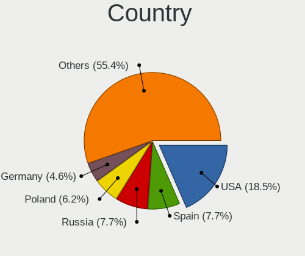
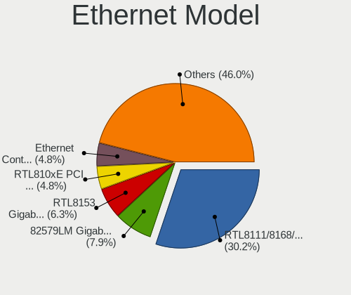
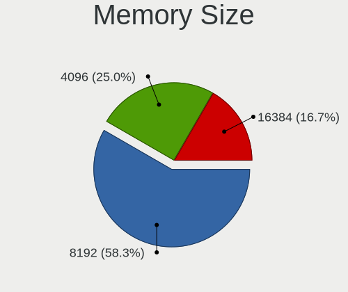
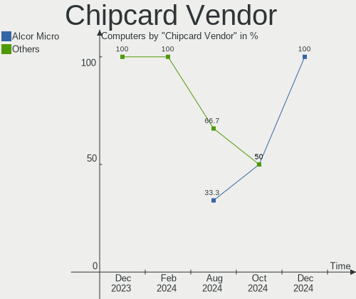

KDE neon - Hardware Trends
--------------------------

A project to identify most popular hardware characteristics and track their change
over time based on data collected by Linux users at https://Linux-Hardware.org.

Anyone can contribute to this report by the [hw-probe](https://github.com/linuxhw/hw-probe) tool:

    sudo -E hw-probe -all -upload

This is a report for all computer types. See also reports for [desktops](/Dist/KDE_neon/Desktop/README.md) and [notebooks](/Dist/KDE_neon/Notebook/README.md).

This report is for one last month. Overall report since the beginning of time: [TestDays](https://github.com/linuxhw/TestDays)

Period: Dec, 2024.

Contents
--------

* [ System ](#system)
  - [ OS                       ](#os)
  - [ OS Family                ](#os-family)
  - [ Kernel                   ](#kernel)
  - [ Kernel Family            ](#kernel-family)
  - [ Kernel Major Ver.        ](#kernel-major-ver)
  - [ Arch                     ](#arch)
  - [ DE                       ](#de)
  - [ Display Server           ](#display-server)
  - [ Display Manager          ](#display-manager)
  - [ OS Lang                  ](#os-lang)
  - [ Boot Mode                ](#boot-mode)
  - [ Filesystem               ](#filesystem)
  - [ Part. scheme             ](#part-scheme)
  - [ Dual Boot with Linux/BSD ](#dual-boot-with-linuxbsd)
  - [ Dual Boot (Win)          ](#dual-boot-win)

* [ Board ](#board)
  - [ Vendor                   ](#vendor)
  - [ Model                    ](#model)
  - [ Model Family             ](#model-family)
  - [ MFG Year                 ](#mfg-year)
  - [ Form Factor              ](#form-factor)
  - [ Secure Boot              ](#secure-boot)
  - [ Coreboot                 ](#coreboot)
  - [ RAM Size                 ](#ram-size)
  - [ RAM Used                 ](#ram-used)
  - [ Total Drives             ](#total-drives)
  - [ Has CD-ROM               ](#has-cd-rom)
  - [ Has Ethernet             ](#has-ethernet)
  - [ Has WiFi                 ](#has-wifi)
  - [ Has Bluetooth            ](#has-bluetooth)

* [ Location ](#location)
  - [ Country                  ](#country)
  - [ City                     ](#city)

* [ Drives ](#drives)
  - [ Drive Vendor             ](#drive-vendor)
  - [ Drive Model              ](#drive-model)
  - [ HDD Vendor               ](#hdd-vendor)
  - [ SSD Vendor               ](#ssd-vendor)
  - [ Drive Kind               ](#drive-kind)
  - [ Drive Connector          ](#drive-connector)
  - [ Drive Size               ](#drive-size)
  - [ Space Total              ](#space-total)
  - [ Space Used               ](#space-used)
  - [ Malfunc. Drives          ](#malfunc-drives)
  - [ Malfunc. Drive Vendor    ](#malfunc-drive-vendor)
  - [ Malfunc. HDD Vendor      ](#malfunc-hdd-vendor)
  - [ Malfunc. Drive Kind      ](#malfunc-drive-kind)
  - [ Failed Drives            ](#failed-drives)
  - [ Failed Drive Vendor      ](#failed-drive-vendor)
  - [ Drive Status             ](#drive-status)

* [ Storage controller ](#storage-controller)
  - [ Storage Vendor           ](#storage-vendor)
  - [ Storage Model            ](#storage-model)
  - [ Storage Kind             ](#storage-kind)

* [ Processor ](#processor)
  - [ CPU Vendor               ](#cpu-vendor)
  - [ CPU Model                ](#cpu-model)
  - [ CPU Model Family         ](#cpu-model-family)
  - [ CPU Cores                ](#cpu-cores)
  - [ CPU Sockets              ](#cpu-sockets)
  - [ CPU Threads              ](#cpu-threads)
  - [ CPU Op-Modes             ](#cpu-op-modes)
  - [ CPU Microcode            ](#cpu-microcode)
  - [ CPU Microarch            ](#cpu-microarch)

* [ Graphics ](#graphics)
  - [ GPU Vendor               ](#gpu-vendor)
  - [ GPU Model                ](#gpu-model)
  - [ GPU Combo                ](#gpu-combo)
  - [ GPU Driver               ](#gpu-driver)
  - [ GPU Memory               ](#gpu-memory)

* [ Monitor ](#monitor)
  - [ Monitor Vendor           ](#monitor-vendor)
  - [ Monitor Model            ](#monitor-model)
  - [ Monitor Resolution       ](#monitor-resolution)
  - [ Monitor Diagonal         ](#monitor-diagonal)
  - [ Monitor Width            ](#monitor-width)
  - [ Aspect Ratio             ](#aspect-ratio)
  - [ Monitor Area             ](#monitor-area)
  - [ Pixel Density            ](#pixel-density)
  - [ Multiple Monitors        ](#multiple-monitors)

* [ Network ](#network)
  - [ Net Controller Vendor    ](#net-controller-vendor)
  - [ Net Controller Model     ](#net-controller-model)
  - [ Wireless Vendor          ](#wireless-vendor)
  - [ Wireless Model           ](#wireless-model)
  - [ Ethernet Vendor          ](#ethernet-vendor)
  - [ Ethernet Model           ](#ethernet-model)
  - [ Net Controller Kind      ](#net-controller-kind)
  - [ Used Controller          ](#used-controller)
  - [ NICs                     ](#nics)
  - [ IPv6                     ](#ipv6)

* [ Bluetooth ](#bluetooth)
  - [ Bluetooth Vendor         ](#bluetooth-vendor)
  - [ Bluetooth Model          ](#bluetooth-model)

* [ Sound ](#sound)
  - [ Sound Vendor             ](#sound-vendor)
  - [ Sound Model              ](#sound-model)

* [ Memory ](#memory)
  - [ Memory Vendor            ](#memory-vendor)
  - [ Memory Model             ](#memory-model)
  - [ Memory Kind              ](#memory-kind)
  - [ Memory Form Factor       ](#memory-form-factor)
  - [ Memory Size              ](#memory-size)
  - [ Memory Speed             ](#memory-speed)

* [ Printers & scanners ](#printers--scanners)
  - [ Printer Vendor           ](#printer-vendor)
  - [ Printer Model            ](#printer-model)
  - [ Scanner Vendor           ](#scanner-vendor)
  - [ Scanner Model            ](#scanner-model)

* [ Camera ](#camera)
  - [ Camera Vendor            ](#camera-vendor)
  - [ Camera Model             ](#camera-model)

* [ Security ](#security)
  - [ Fingerprint Vendor       ](#fingerprint-vendor)
  - [ Fingerprint Model        ](#fingerprint-model)
  - [ Chipcard Vendor          ](#chipcard-vendor)
  - [ Chipcard Model           ](#chipcard-model)

* [ Unsupported ](#unsupported)
  - [ Unsupported Devices      ](#unsupported-devices)
  - [ Unsupported Device Types ](#unsupported-device-types)

System
------

OS
--

Installed operating systems

| Name           | Computers | Percent |
|----------------|-----------|---------|
| KDE neon 24.04 | 60        | 92.31%  |
| KDE neon 22.04 | 5         | 7.69%   |

OS Family
---------

OS without a version

| Name     | Computers | Percent |
|----------|-----------|---------|
| KDE neon | 65        | 100%    |

Kernel
------

Version of the Linux kernel

| Version                | Computers | Percent |
|------------------------|-----------|---------|
| 6.8.0-51-generic       | 31        | 47.69%  |
| 6.8.0-49-generic       | 12        | 18.46%  |
| 6.8.0-50-generic       | 11        | 16.92%  |
| 6.8.0-48-generic       | 3         | 4.62%   |
| 6.8.0-40-generic       | 3         | 4.62%   |
| 6.8.0-47-generic       | 2         | 3.08%   |
| 6.9.3-76060903-generic | 1         | 1.54%   |
| 6.8.0-45-generic       | 1         | 1.54%   |
| 5.15.0-122-generic     | 1         | 1.54%   |

Kernel Family
-------------

Linux kernel without a distro release

| Version | Computers | Percent |
|---------|-----------|---------|
| 6.8.0   | 63        | 96.92%  |
| 6.9.3   | 1         | 1.54%   |
| 5.15.0  | 1         | 1.54%   |

Kernel Major Ver.
-----------------

Linux kernel major version

| Version | Computers | Percent |
|---------|-----------|---------|
| 6.8     | 63        | 96.92%  |
| 6.9     | 1         | 1.54%   |
| 5.15    | 1         | 1.54%   |

Arch
----

OS architecture (x86_64, i586, etc.)

| Name   | Computers | Percent |
|--------|-----------|---------|
| x86_64 | 65        | 100%    |

DE
--

Desktop Environment

| Name    | Computers | Percent |
|---------|-----------|---------|
| KDE6    | 62        | 95.38%  |
| XFCE    | 1         | 1.54%   |
| KDE     | 1         | 1.54%   |
| Unknown | 1         | 1.54%   |

Display Server
--------------

X11 or Wayland

| Name    | Computers | Percent |
|---------|-----------|---------|
| Wayland | 57        | 87.69%  |
| X11     | 7         | 10.77%  |
| Tty     | 1         | 1.54%   |

Display Manager
---------------

SDDM, LightDM, etc.

| Name    | Computers | Percent |
|---------|-----------|---------|
| Unknown | 47        | 72.31%  |
| SDDM    | 18        | 27.69%  |

OS Lang
-------

Language

| Lang  | Computers | Percent |
|-------|-----------|---------|
| en_US | 27        | 41.54%  |
| ru_RU | 7         | 10.77%  |
| en_GB | 5         | 7.69%   |
| es_ES | 4         | 6.15%   |
| C     | 4         | 6.15%   |
| de_DE | 3         | 4.62%   |
| it_IT | 2         | 3.08%   |
| en_CA | 2         | 3.08%   |
| en_AU | 2         | 3.08%   |
| pt_BR | 1         | 1.54%   |
| pl_PL | 1         | 1.54%   |
| nl_NL | 1         | 1.54%   |
| fr_FR | 1         | 1.54%   |
| es_AR | 1         | 1.54%   |
| en_ZM | 1         | 1.54%   |
| en_NZ | 1         | 1.54%   |
| en_IE | 1         | 1.54%   |
| da_DK | 1         | 1.54%   |

Boot Mode
---------

EFI or BIOS

| Mode | Computers | Percent |
|------|-----------|---------|
| BIOS | 56        | 86.15%  |
| EFI  | 9         | 13.85%  |

Filesystem
----------

Type of filesystem

| Type    | Computers | Percent |
|---------|-----------|---------|
| Ext4    | 56        | 86.15%  |
| Tmpfs   | 7         | 10.77%  |
| Overlay | 2         | 3.08%   |

Part. scheme
------------

Scheme of partitioning

| Type    | Computers | Percent |
|---------|-----------|---------|
| Unknown | 47        | 72.31%  |
| GPT     | 16        | 24.62%  |
| MBR     | 2         | 3.08%   |

Dual Boot with Linux/BSD
------------------------

Hosting more than one Linux/BSD

| Dual boot | Computers | Percent |
|-----------|-----------|---------|
| No        | 63        | 96.92%  |
| Yes       | 2         | 3.08%   |

Dual Boot (Win)
---------------

Hosting Linux and Windows

| Dual boot | Computers | Percent |
|-----------|-----------|---------|
| No        | 54        | 83.08%  |
| Yes       | 11        | 16.92%  |

Board
-----

Vendor
------

Motherboard manufacturer

| Name                | Computers | Percent |
|---------------------|-----------|---------|
| ASUSTek Computer    | 14        | 21.54%  |
| Hewlett-Packard     | 13        | 20%     |
| Lenovo              | 6         | 9.23%   |
| MSI                 | 4         | 6.15%   |
| Gigabyte Technology | 4         | 6.15%   |
| Dell                | 4         | 6.15%   |
| Apple               | 4         | 6.15%   |
| Acer                | 4         | 6.15%   |
| ASRock              | 3         | 4.62%   |
| Sony                | 1         | 1.54%   |
| Pegatron            | 1         | 1.54%   |
| MECHREVO            | 1         | 1.54%   |
| MACHINIST           | 1         | 1.54%   |
| Intel               | 1         | 1.54%   |
| Google              | 1         | 1.54%   |
| GMKtec              | 1         | 1.54%   |
| Alienware           | 1         | 1.54%   |
| Alder lake          | 1         | 1.54%   |

Model
-----

Motherboard model

| Name                                  | Computers | Percent |
|---------------------------------------|-----------|---------|
| Apple MacBookPro12,1                  | 2         | 3.08%   |
| Sony VPCEE4E1E                        | 1         | 1.54%   |
| Pegatron Elite 7500 Series MT         | 1         | 1.54%   |
| MSI MS-7C00                           | 1         | 1.54%   |
| MSI MS-7850                           | 1         | 1.54%   |
| MSI MS-7693                           | 1         | 1.54%   |
| MSI GL65 9SFK                         | 1         | 1.54%   |
| MECHREVO WUJIE14XA                    | 1         | 1.54%   |
| MACHINIST X99-RS9 V1.11               | 1         | 1.54%   |
| Lenovo Yoga Slim 7 Pro 14ACH5 OD 82NK | 1         | 1.54%   |
| Lenovo V14 G2 ITL 82NM                | 1         | 1.54%   |
| Lenovo ThinkPad T430 2349TUM          | 1         | 1.54%   |
| Lenovo ThinkPad L580 20LXS45K00       | 1         | 1.54%   |
| Lenovo ThinkCentre M700 10HY0000AU    | 1         | 1.54%   |
| Lenovo Legion S7 15ACH6 82K8          | 1         | 1.54%   |
| Intel X99 V1.0                        | 1         | 1.54%   |
| HP ZBook FuRY 16 G10 Mobile           | 1         | 1.54%   |
| HP VR backpack G2                     | 1         | 1.54%   |
| HP Pavilion Gaming Laptop 16-a0xxx    | 1         | 1.54%   |
| HP Pavilion Gaming Laptop 15-ec2xxx   | 1         | 1.54%   |
| HP Pavilion dv4                       | 1         | 1.54%   |
| HP OMEN by Laptop                     | 1         | 1.54%   |
| HP ENVY x360 Convertible 15m-ee0xxx   | 1         | 1.54%   |
| HP ENVY TS 15                         | 1         | 1.54%   |
| HP EliteBook x360 830 G6              | 1         | 1.54%   |
| HP Compaq Elite 8300 SFF              | 1         | 1.54%   |
| HP Compaq 8200 Elite CMT PC           | 1         | 1.54%   |
| HP Compaq 6200 Pro SFF PC             | 1         | 1.54%   |
| HP 635                                | 1         | 1.54%   |
| Google Magolor                        | 1         | 1.54%   |
| GMKtec NucBoxG3 Plus                  | 1         | 1.54%   |
| Gigabyte X570 I AORUS PRO WIFI        | 1         | 1.54%   |
| Gigabyte H87-HD3                      | 1         | 1.54%   |
| Gigabyte B550M S2H                    | 1         | 1.54%   |
| Gigabyte B550 AORUS ELITE             | 1         | 1.54%   |
| Dell XPS 15 9570                      | 1         | 1.54%   |
| Dell PowerEdge T20                    | 1         | 1.54%   |
| Dell OptiPlex 7010                    | 1         | 1.54%   |
| Dell Inspiron 7773                    | 1         | 1.54%   |
| ASUS X541UJ                           | 1         | 1.54%   |

Model Family
------------

Motherboard model prefix

| Name               | Computers | Percent |
|--------------------|-----------|---------|
| ASUS ROG           | 4         | 6.15%   |
| Acer Aspire        | 4         | 6.15%   |
| HP Pavilion        | 3         | 4.62%   |
| HP Compaq          | 3         | 4.62%   |
| Lenovo ThinkPad    | 2         | 3.08%   |
| HP ENVY            | 2         | 3.08%   |
| ASUS PRIME         | 2         | 3.08%   |
| ASUS ASUS          | 2         | 3.08%   |
| Apple MacBookPro12 | 2         | 3.08%   |
| Sony VPCEE4E1E     | 1         | 1.54%   |
| Pegatron Elite     | 1         | 1.54%   |
| MSI MS-7C00        | 1         | 1.54%   |
| MSI MS-7850        | 1         | 1.54%   |
| MSI MS-7693        | 1         | 1.54%   |
| MSI GL65           | 1         | 1.54%   |
| MECHREVO WUJIE14XA | 1         | 1.54%   |
| MACHINIST X99-RS9  | 1         | 1.54%   |
| Lenovo Yoga        | 1         | 1.54%   |
| Lenovo V14         | 1         | 1.54%   |
| Lenovo ThinkCentre | 1         | 1.54%   |
| Lenovo Legion      | 1         | 1.54%   |
| Intel X99          | 1         | 1.54%   |
| HP ZBook           | 1         | 1.54%   |
| HP VR              | 1         | 1.54%   |
| HP OMEN            | 1         | 1.54%   |
| HP EliteBook       | 1         | 1.54%   |
| HP 635             | 1         | 1.54%   |
| Google Magolor     | 1         | 1.54%   |
| GMKtec NucBoxG3    | 1         | 1.54%   |
| Gigabyte X570      | 1         | 1.54%   |
| Gigabyte H87-HD3   | 1         | 1.54%   |
| Gigabyte B550M     | 1         | 1.54%   |
| Gigabyte B550      | 1         | 1.54%   |
| Dell XPS           | 1         | 1.54%   |
| Dell PowerEdge     | 1         | 1.54%   |
| Dell OptiPlex      | 1         | 1.54%   |
| Dell Inspiron      | 1         | 1.54%   |
| ASUS X541UJ        | 1         | 1.54%   |
| ASUS TUF           | 1         | 1.54%   |
| ASUS T304UA        | 1         | 1.54%   |

MFG Year
--------

Motherboard manufacture year

| Year | Computers | Percent |
|------|-----------|---------|
| 2022 | 7         | 10.77%  |
| 2021 | 7         | 10.77%  |
| 2020 | 7         | 10.77%  |
| 2024 | 5         | 7.69%   |
| 2019 | 5         | 7.69%   |
| 2015 | 5         | 7.69%   |
| 2011 | 5         | 7.69%   |
| 2023 | 4         | 6.15%   |
| 2018 | 4         | 6.15%   |
| 2013 | 4         | 6.15%   |
| 2014 | 3         | 4.62%   |
| 2012 | 3         | 4.62%   |
| 2017 | 2         | 3.08%   |
| 2016 | 2         | 3.08%   |
| 2010 | 1         | 1.54%   |
| 2008 | 1         | 1.54%   |

Form Factor
-----------

Physical design of the computer

| Name        | Computers | Percent |
|-------------|-----------|---------|
| Notebook    | 31        | 47.69%  |
| Desktop     | 29        | 44.62%  |
| Convertible | 2         | 3.08%   |
| Other       | 1         | 1.54%   |
| Tablet      | 1         | 1.54%   |
| Mini pc     | 1         | 1.54%   |

Secure Boot
-----------

Enabled or disabled

| State    | Computers | Percent |
|----------|-----------|---------|
| Disabled | 63        | 96.92%  |
| Enabled  | 2         | 3.08%   |

Coreboot
--------

Have coreboot on board

| Used | Computers | Percent |
|------|-----------|---------|
| No   | 64        | 98.46%  |
| Yes  | 1         | 1.54%   |

RAM Size
--------

Total RAM memory

| Size in GB  | Computers | Percent |
|-------------|-----------|---------|
| 32.01-64.0  | 15        | 23.08%  |
| 16.01-24.0  | 14        | 21.54%  |
| 4.01-8.0    | 11        | 16.92%  |
| 8.01-16.0   | 11        | 16.92%  |
| 64.01-256.0 | 5         | 7.69%   |
| 3.01-4.0    | 4         | 6.15%   |
| 24.01-32.0  | 4         | 6.15%   |
| 1.01-2.0    | 1         | 1.54%   |

RAM Used
--------

Used RAM memory

| Used GB    | Computers | Percent |
|------------|-----------|---------|
| 4.01-8.0   | 18        | 27.69%  |
| 2.01-3.0   | 17        | 26.15%  |
| 3.01-4.0   | 14        | 21.54%  |
| 1.01-2.0   | 8         | 12.31%  |
| 8.01-16.0  | 4         | 6.15%   |
| 16.01-24.0 | 3         | 4.62%   |
| 0.51-1.0   | 1         | 1.54%   |

Total Drives
------------

Number of drives on board

| Drives | Computers | Percent |
|--------|-----------|---------|
| 1      | 30        | 46.15%  |
| 2      | 27        | 41.54%  |
| 4      | 4         | 6.15%   |
| 5      | 2         | 3.08%   |
| 3      | 2         | 3.08%   |

Has CD-ROM
----------

Has CD-ROM on board

| Presented | Computers | Percent |
|-----------|-----------|---------|
| No        | 48        | 73.85%  |
| Yes       | 17        | 26.15%  |

Has Ethernet
------------

Has Ethernet on board

| Presented | Computers | Percent |
|-----------|-----------|---------|
| Yes       | 55        | 84.62%  |
| No        | 10        | 15.38%  |

Has WiFi
--------

Has WiFi module

| Presented | Computers | Percent |
|-----------|-----------|---------|
| Yes       | 51        | 78.46%  |
| No        | 14        | 21.54%  |

Has Bluetooth
-------------

Has Bluetooth module

| Presented | Computers | Percent |
|-----------|-----------|---------|
| Yes       | 47        | 72.31%  |
| No        | 18        | 27.69%  |

Location
--------

Country
-------

Geographic location (country)

| Country             | Computers | Percent |
|---------------------|-----------|---------|
| USA                 | 12        | 18.46%  |
| Spain               | 5         | 7.69%   |
| Russia              | 5         | 7.69%   |
| Poland              | 4         | 6.15%   |
| Germany             | 3         | 4.62%   |
| France              | 3         | 4.62%   |
| Australia           | 3         | 4.62%   |
| The Netherlands     | 2         | 3.08%   |
| Romania             | 2         | 3.08%   |
| Canada              | 2         | 3.08%   |
| Brazil              | 2         | 3.08%   |
| Belarus             | 2         | 3.08%   |
| Zambia              | 1         | 1.54%   |
| Venezuela           | 1         | 1.54%   |
| UK                  | 1         | 1.54%   |
| U.S. Virgin Islands | 1         | 1.54%   |
| Sweden              | 1         | 1.54%   |
| Singapore           | 1         | 1.54%   |
| Saudi Arabia        | 1         | 1.54%   |
| Philippines         | 1         | 1.54%   |
| New Zealand         | 1         | 1.54%   |
| Latvia              | 1         | 1.54%   |
| Italy               | 1         | 1.54%   |
| Iran                | 1         | 1.54%   |
| Indonesia           | 1         | 1.54%   |
| Hungary             | 1         | 1.54%   |
| Faroe Islands       | 1         | 1.54%   |
| Dominican Republic  | 1         | 1.54%   |
| Croatia             | 1         | 1.54%   |
| Belgium             | 1         | 1.54%   |
| Azerbaijan          | 1         | 1.54%   |
| Argentina           | 1         | 1.54%   |

City
----

Geographic location (city)

| City              | Computers | Percent |
|-------------------|-----------|---------|
| Warsaw            | 2         | 3.08%   |
| Moscow            | 2         | 3.08%   |
| Melbourne         | 2         | 3.08%   |
| Amsterdam         | 2         | 3.08%   |
| Zaragoza          | 1         | 1.54%   |
| Wroclaw           | 1         | 1.54%   |
| Winnipeg          | 1         | 1.54%   |
| Whiteville        | 1         | 1.54%   |
| Vitebsk           | 1         | 1.54%   |
| Turin             | 1         | 1.54%   |
| Tórshavn         | 1         | 1.54%   |
| Teruel            | 1         | 1.54%   |
| Tehran            | 1         | 1.54%   |
| Szczecin          | 1         | 1.54%   |
| St Petersburg     | 1         | 1.54%   |
| Singapore         | 1         | 1.54%   |
| Santo Domingo     | 1         | 1.54%   |
| San Fernando City | 1         | 1.54%   |
| Salt Lake City    | 1         | 1.54%   |
| Rosny-sous-Bois   | 1         | 1.54%   |
| Riyadh            | 1         | 1.54%   |
| Riga              | 1         | 1.54%   |
| Quilmes           | 1         | 1.54%   |
| Pueblo            | 1         | 1.54%   |
| Portland          | 1         | 1.54%   |
| Port de Sagunt    | 1         | 1.54%   |
| Plerneuf          | 1         | 1.54%   |
| Napier City       | 1         | 1.54%   |
| Münster          | 1         | 1.54%   |
| Munich            | 1         | 1.54%   |
| Montauban         | 1         | 1.54%   |
| Minsk             | 1         | 1.54%   |
| Mesa              | 1         | 1.54%   |
| Mertztown         | 1         | 1.54%   |
| Merksem           | 1         | 1.54%   |
| Medway            | 1         | 1.54%   |
| Madrid            | 1         | 1.54%   |
| Madera            | 1         | 1.54%   |
| Lusaka            | 1         | 1.54%   |
| Lambeth           | 1         | 1.54%   |

Drives
------

Drive Vendor
------------

Hard drive vendors

| Vendor                      | Computers | Drives | Percent |
|-----------------------------|-----------|--------|---------|
| Samsung Electronics         | 18        | 24     | 17.65%  |
| WDC                         | 12        | 15     | 11.76%  |
| Seagate                     | 12        | 15     | 11.76%  |
| SanDisk                     | 10        | 11     | 9.8%    |
| SK hynix                    | 5         | 5      | 4.9%    |
| SPCC                        | 3         | 3      | 2.94%   |
| Phison Electronics          | 3         | 4      | 2.94%   |
| Micron/Crucial Technology   | 3         | 3      | 2.94%   |
| Intel                       | 3         | 3      | 2.94%   |
| Crucial                     | 3         | 3      | 2.94%   |
| Apple                       | 3         | 3      | 2.94%   |
| Unknown                     | 2         | 2      | 1.96%   |
| Silicon Motion              | 2         | 2      | 1.96%   |
| Kingston                    | 2         | 2      | 1.96%   |
| GOODRAM                     | 2         | 2      | 1.96%   |
| A-DATA Technology           | 2         | 3      | 1.96%   |
| Yangtze Memory Technologies | 1         | 1      | 0.98%   |
| USB                         | 1         | 1      | 0.98%   |
| Toshiba                     | 1         | 1      | 0.98%   |
| Seagate Technology          | 1         | 1      | 0.98%   |
| Patriot                     | 1         | 1      | 0.98%   |
| OCZ                         | 1         | 1      | 0.98%   |
| Micron Technology           | 1         | 1      | 0.98%   |
| MAXIO Technology (Hangzhou) | 1         | 1      | 0.98%   |
| Lexar                       | 1         | 1      | 0.98%   |
| Kingston Technology Company | 1         | 1      | 0.98%   |
| HS-SSD-C100                 | 1         | 1      | 0.98%   |
| Hitachi                     | 1         | 1      | 0.98%   |
| HGST                        | 1         | 1      | 0.98%   |
| External                    | 1         | 1      | 0.98%   |
| Corsair                     | 1         | 1      | 0.98%   |
| China                       | 1         | 1      | 0.98%   |
| Azerty                      | 1         | 1      | 0.98%   |

Drive Model
-----------

Hard drive models

| Model                                                 | Computers | Percent |
|-------------------------------------------------------|-----------|---------|
| Samsung NVMe SSD Controller SM981/PM981/PM983 512GB   | 5         | 4.55%   |
| Seagate ST2000DM008-2FR102 2TB                        | 3         | 2.73%   |
| SK hynix SKHynix_HFS001TDE9X084N 1TB                  | 2         | 1.82%   |
| Seagate ST1000LM024 HN-M101MBB 1TB                    | 2         | 1.82%   |
| Samsung SSD 860 EVO 500GB                             | 2         | 1.82%   |
| Samsung NVMe SSD Controller SM961/PM961/SM963 256GB   | 2         | 1.82%   |
| Micron/Crucial CT1000P5PSSD8 1TB                      | 2         | 1.82%   |
| Yangtze Memory YMTC PC411-1024GB-B                    | 1         | 0.91%   |
| WDC WDS500G2B0A-00SM50 500GB SSD                      | 1         | 0.91%   |
| WDC WDS250G2B0A-00SM50 250GB SSD                      | 1         | 0.91%   |
| WDC WDS240G2G0A-00JH30 240GB SSD                      | 1         | 0.91%   |
| WDC WDS120G2G0A-00JH30 120GB SSD                      | 1         | 0.91%   |
| WDC WD5000AVCS-632DY1 500GB                           | 1         | 0.91%   |
| WDC WD5000AAKX-75U6AA0 500GB                          | 1         | 0.91%   |
| WDC WD30EZRX-00D8PB0 3TB                              | 1         | 0.91%   |
| WDC WD20EZRZ-00Z5HB0 2TB                              | 1         | 0.91%   |
| WDC WD10EZEX-75M2NA0 1TB                              | 1         | 0.91%   |
| WDC WD10EZEX-22MFCA0 1TB                              | 1         | 0.91%   |
| WDC WD10EZEX-00BBHA0 1TB                              | 1         | 0.91%   |
| WDC WD101EFBX-68B0AN0 10TB                            | 1         | 0.91%   |
| WDC WD1003FZEX-00K3CA0 1TB                            | 1         | 0.91%   |
| WDC PC SN520 SDAPNUW-512G-1032 512GB                  | 1         | 0.91%   |
| USB SanDisk 3.2Gen1 250GB                             | 1         | 0.91%   |
| Unknown MMC Card  32GB                                | 1         | 0.91%   |
| Unknown DA4032  32GB                                  | 1         | 0.91%   |
| Toshiba MQ01ABD100 1TB                                | 1         | 0.91%   |
| SPCC Solid State Disk 512GB                           | 1         | 0.91%   |
| SPCC Solid State Disk 4TB                             | 1         | 0.91%   |
| SPCC Solid State Disk 2TB                             | 1         | 0.91%   |
| SK hynix PC711 NVMe 1TB                               | 1         | 0.91%   |
| SK hynix PC601 HFS001TD9TNG-L2A0A 1024GB              | 1         | 0.91%   |
| SK hynix HFS256G39TND-N210A 256GB SSD                 | 1         | 0.91%   |
| Silicon Motion SM2263EN/SM2263XT SSD Controller 256GB | 1         | 0.91%   |
| Silicon Motion Asgard AN1TNVMe-M.2-80 1TB             | 1         | 0.91%   |
| Seagate ZP1000GM30053 1TB                             | 1         | 0.91%   |
| Seagate ST9320325AS 320GB                             | 1         | 0.91%   |
| Seagate ST500DM002-1BD142 500GB                       | 1         | 0.91%   |
| Seagate ST4000DM004-2CV104 4TB                        | 1         | 0.91%   |
| Seagate ST4000DM000-1F2168 4TB                        | 1         | 0.91%   |
| Seagate ST3750528AS 752GB                             | 1         | 0.91%   |

HDD Vendor
----------

Hard disk drive vendors

| Vendor              | Computers | Drives | Percent |
|---------------------|-----------|--------|---------|
| Seagate             | 12        | 15     | 46.15%  |
| WDC                 | 8         | 10     | 30.77%  |
| Toshiba             | 1         | 1      | 3.85%   |
| Samsung Electronics | 1         | 1      | 3.85%   |
| Hitachi             | 1         | 1      | 3.85%   |
| HGST                | 1         | 1      | 3.85%   |
| External            | 1         | 1      | 3.85%   |
| Apple               | 1         | 1      | 3.85%   |

SSD Vendor
----------

Solid state drive vendors

| Vendor              | Computers | Drives | Percent |
|---------------------|-----------|--------|---------|
| Samsung Electronics | 8         | 8      | 22.86%  |
| WDC                 | 4         | 4      | 11.43%  |
| SanDisk             | 4         | 4      | 11.43%  |
| SPCC                | 3         | 3      | 8.57%   |
| Crucial             | 3         | 3      | 8.57%   |
| Kingston            | 2         | 2      | 5.71%   |
| GOODRAM             | 2         | 2      | 5.71%   |
| Apple               | 2         | 2      | 5.71%   |
| A-DATA Technology   | 2         | 3      | 5.71%   |
| SK hynix            | 1         | 1      | 2.86%   |
| Patriot             | 1         | 1      | 2.86%   |
| OCZ                 | 1         | 1      | 2.86%   |
| China               | 1         | 1      | 2.86%   |
| Azerty              | 1         | 1      | 2.86%   |

Drive Kind
----------

HDD or SSD

| Kind    | Computers | Drives | Percent |
|---------|-----------|--------|---------|
| NVMe    | 33        | 46     | 35.48%  |
| SSD     | 31        | 36     | 33.33%  |
| HDD     | 25        | 31     | 26.88%  |
| MMC     | 2         | 2      | 2.15%   |
| Unknown | 2         | 2      | 2.15%   |

Drive Connector
---------------

SATA, SAS, NVMe, etc.

| Type | Computers | Drives | Percent |
|------|-----------|--------|---------|
| SATA | 41        | 65     | 51.25%  |
| NVMe | 33        | 46     | 41.25%  |
| SAS  | 4         | 4      | 5%      |
| MMC  | 2         | 2      | 2.5%    |

Drive Size
----------

Size of hard drive

| Size in TB | Computers | Drives | Percent |
|------------|-----------|--------|---------|
| 0.01-0.5   | 27        | 33     | 47.37%  |
| 0.51-1.0   | 21        | 23     | 36.84%  |
| 1.01-2.0   | 4         | 6      | 7.02%   |
| 3.01-4.0   | 3         | 3      | 5.26%   |
| 2.01-3.0   | 1         | 1      | 1.75%   |
| 4.01-10.0  | 1         | 1      | 1.75%   |

Space Total
-----------

Amount of disk space available on the file system

| Size in GB     | Computers | Percent |
|----------------|-----------|---------|
| 251-500        | 16        | 24.62%  |
| 501-1000       | 16        | 24.62%  |
| 101-250        | 14        | 21.54%  |
| 1-20           | 5         | 7.69%   |
| 1001-2000      | 4         | 6.15%   |
| More than 3000 | 3         | 4.62%   |
| 21-50          | 3         | 4.62%   |
| 51-100         | 3         | 4.62%   |
| Unknown        | 1         | 1.54%   |

Space Used
----------

Amount of used disk space

| Used GB        | Computers | Percent |
|----------------|-----------|---------|
| 1-20           | 30        | 46.15%  |
| 101-250        | 12        | 18.46%  |
| 21-50          | 11        | 16.92%  |
| 251-500        | 4         | 6.15%   |
| 501-1000       | 3         | 4.62%   |
| 51-100         | 2         | 3.08%   |
| More than 3000 | 1         | 1.54%   |
| 2001-3000      | 1         | 1.54%   |
| Unknown        | 1         | 1.54%   |

Malfunc. Drives
---------------

Drive models with a malfunction

| Model                                     | Computers | Drives | Percent |
|-------------------------------------------|-----------|--------|---------|
| Silicon Motion Asgard AN1TNVMe-M.2-80 1TB | 1         | 1      | 50%     |
| Seagate ST9320325AS 320GB                 | 1         | 1      | 50%     |

Malfunc. Drive Vendor
---------------------

Vendors of faulty drives

| Vendor         | Computers | Drives | Percent |
|----------------|-----------|--------|---------|
| Silicon Motion | 1         | 1      | 50%     |
| Seagate        | 1         | 1      | 50%     |

Malfunc. HDD Vendor
-------------------

Vendors of faulty HDD drives

| Vendor  | Computers | Drives | Percent |
|---------|-----------|--------|---------|
| Seagate | 1         | 1      | 100%    |

Malfunc. Drive Kind
-------------------

Kinds of faulty drives

| Kind | Computers | Drives | Percent |
|------|-----------|--------|---------|
| NVMe | 1         | 1      | 50%     |
| HDD  | 1         | 1      | 50%     |

Failed Drives
-------------

Failed drive models

Zero info for selected period =(

Failed Drive Vendor
-------------------

Failed drive vendors

Zero info for selected period =(

Drive Status
------------

Number of failed and malfunc. drives

| Status   | Computers | Drives | Percent |
|----------|-----------|--------|---------|
| Detected | 55        | 101    | 82.09%  |
| Works    | 10        | 14     | 14.93%  |
| Malfunc  | 2         | 2      | 2.99%   |

Storage controller
------------------

Storage Vendor
--------------

Storage controller vendors

| Vendor                      | Computers | Percent |
|-----------------------------|-----------|---------|
| Intel                       | 39        | 41.94%  |
| AMD                         | 14        | 15.05%  |
| Samsung Electronics         | 13        | 13.98%  |
| SanDisk                     | 7         | 7.53%   |
| SK hynix                    | 4         | 4.3%    |
| Phison Electronics          | 3         | 3.23%   |
| Micron/Crucial Technology   | 3         | 3.23%   |
| ASMedia Technology          | 3         | 3.23%   |
| Silicon Motion              | 2         | 2.15%   |
| Yangtze Memory Technologies | 1         | 1.08%   |
| Seagate Technology          | 1         | 1.08%   |
| Micron Technology           | 1         | 1.08%   |
| MAXIO Technology (Hangzhou) | 1         | 1.08%   |
| Kingston Technology Company | 1         | 1.08%   |

Storage Model
-------------

Storage controller models

| Model                                                                          | Computers | Percent |
|--------------------------------------------------------------------------------|-----------|---------|
| Samsung NVMe SSD Controller SM981/PM981/PM983                                  | 5         | 5.05%   |
| Intel Sunrise Point-LP SATA Controller [AHCI mode]                             | 4         | 4.04%   |
| Intel 8 Series/C220 Series Chipset Family 6-port SATA Controller 1 [AHCI mode] | 4         | 4.04%   |
| AMD FCH SATA Controller [AHCI mode]                                            | 4         | 4.04%   |
| SK hynix Gold P31/BC711/PC711 NVMe Solid State Drive                           | 3         | 3.03%   |
| Intel Volume Management Device NVMe RAID Controller Intel Corporation          | 3         | 3.03%   |
| Intel 82801 Mobile SATA Controller [RAID mode]                                 | 3         | 3.03%   |
| Intel 7 Series/C210 Series Chipset Family 6-port SATA Controller [AHCI mode]   | 3         | 3.03%   |
| ASMedia ASM1061/ASM1062 Serial ATA Controller                                  | 3         | 3.03%   |
| AMD SB7x0/SB8x0/SB9x0 SATA Controller [AHCI mode]                              | 3         | 3.03%   |
| AMD 600 Series Chipset SATA Controller                                         | 3         | 3.03%   |
| Silicon Motion SM2263EN/SM2263XT (DRAM-less) NVMe SSD Controllers              | 2         | 2.02%   |
| Sandisk WD Black SN850X NVMe SSD                                               | 2         | 2.02%   |
| SanDisk Ultra 3D / WD Blue SN570 NVMe SSD (DRAM-less)                          | 2         | 2.02%   |
| Samsung S4LN058A01[SSUBX] AHCI SSD Controller (Apple slot)                     | 2         | 2.02%   |
| Samsung NVMe SSD Controller SM961/PM961/SM963                                  | 2         | 2.02%   |
| Samsung NVMe SSD Controller 980 (DRAM-less)                                    | 2         | 2.02%   |
| Micron/Crucial P5 Plus NVMe PCIe SSD                                           | 2         | 2.02%   |
| Intel SSD 670p Series [Keystone Harbor]                                        | 2         | 2.02%   |
| Intel Cannon Lake PCH SATA AHCI Controller                                     | 2         | 2.02%   |
| Intel Cannon Lake Mobile PCH SATA AHCI Controller                              | 2         | 2.02%   |
| Intel Alder Lake-P SATA AHCI Controller                                        | 2         | 2.02%   |
| Intel 6 Series/C200 Series Chipset Family 6 port Desktop SATA AHCI Controller  | 2         | 2.02%   |
| AMD 500 Series Chipset SATA Controller                                         | 2         | 2.02%   |
| Yangtze Memory PC411 NVMe SSD (DRAM-less)                                      | 1         | 1.01%   |
| SK hynix PC601 NVMe Solid State Drive                                          | 1         | 1.01%   |
| Seagate E18 PCIe SSD                                                           | 1         | 1.01%   |
| SanDisk WD Blue SN500 / PC SN520 x2 M.2 2280 NVMe SSD                          | 1         | 1.01%   |
| SanDisk WD Black SN770 / PC SN740 256GB / PC SN560 (DRAM-less) NVMe SSD        | 1         | 1.01%   |
| SanDisk Extreme Pro / WD Black SN750 / PC SN730 / Red SN700 NVMe SSD           | 1         | 1.01%   |
| SanDisk Extreme Pro / WD Black 2018/SN750/PC SN720 NVMe SSD                    | 1         | 1.01%   |
| Samsung NVMe SSD Controller S4LV008[Pascal]                                    | 1         | 1.01%   |
| Samsung NVMe SSD Controller PM9C1a (DRAM-less)                                 | 1         | 1.01%   |
| Phison PS5027-E27T PCIe4 NVMe Controller (DRAM-less)                           | 1         | 1.01%   |
| Phison PS5021-E21 PCIe4 NVMe Controller (DRAM-less)                            | 1         | 1.01%   |
| Phison E12 NVMe Controller                                                     | 1         | 1.01%   |
| Micron/Crucial T705 NVMe PCIe SSD                                              | 1         | 1.01%   |
| Micron 2450 NVMe SSD [HendrixV] (DRAM-less)                                    | 1         | 1.01%   |
| MAXIO (Hangzhou) NVMe SSD Controller MAP1202 (DRAM-less)                       | 1         | 1.01%   |
| Kingston Company NV3 NVMe SSD TC2201 (DRAM-less)                               | 1         | 1.01%   |

Storage Kind
------------

Kind of storage controller (IDE, SATA, NVMe, SAS, ...)

| Kind | Computers | Percent |
|------|-----------|---------|
| SATA | 46        | 52.27%  |
| NVMe | 32        | 36.36%  |
| RAID | 8         | 9.09%   |
| IDE  | 2         | 2.27%   |

Processor
---------

CPU Vendor
----------

Processor vendors

| Vendor | Computers | Percent |
|--------|-----------|---------|
| Intel  | 45        | 69.23%  |
| AMD    | 20        | 30.77%  |

CPU Model
---------

Processor models

| Model                                       | Computers | Percent |
|---------------------------------------------|-----------|---------|
| Intel Core i7-8750H CPU @ 2.20GHz           | 2         | 3.08%   |
| AMD Ryzen 7 5800X 8-Core Processor          | 2         | 3.08%   |
| AMD Ryzen 7 3700X 8-Core Processor          | 2         | 3.08%   |
| AMD Ryzen 5 3600 6-Core Processor           | 2         | 3.08%   |
| Intel Xeon CPU E5-2699 v3 @ 2.30GHz         | 1         | 1.54%   |
| Intel Xeon CPU E5-2667 v4 @ 3.20GHz         | 1         | 1.54%   |
| Intel Xeon CPU E3-1225 v3 @ 3.20GHz         | 1         | 1.54%   |
| Intel Pentium Dual-Core CPU E6500 @ 2.93GHz | 1         | 1.54%   |
| Intel N150                                  | 1         | 1.54%   |
| Intel Core i9-9900K CPU @ 3.60GHz           | 1         | 1.54%   |
| Intel Core i7-9750H CPU @ 2.60GHz           | 1         | 1.54%   |
| Intel Core i7-9700K CPU @ 3.60GHz           | 1         | 1.54%   |
| Intel Core i7-8850H CPU @ 2.60GHz           | 1         | 1.54%   |
| Intel Core i7-8550U CPU @ 1.80GHz           | 1         | 1.54%   |
| Intel Core i7-7500U CPU @ 2.70GHz           | 1         | 1.54%   |
| Intel Core i7-6700T CPU @ 2.80GHz           | 1         | 1.54%   |
| Intel Core i7-5775C CPU @ 3.30GHz           | 1         | 1.54%   |
| Intel Core i7-5557U CPU @ 3.10GHz           | 1         | 1.54%   |
| Intel Core i7-4790 CPU @ 3.60GHz            | 1         | 1.54%   |
| Intel Core i7-4720HQ CPU @ 2.60GHz          | 1         | 1.54%   |
| Intel Core i7-4702MQ CPU @ 2.20GHz          | 1         | 1.54%   |
| Intel Core i7-3770 CPU @ 3.40GHz            | 1         | 1.54%   |
| Intel Core i7-3520M CPU @ 2.90GHz           | 1         | 1.54%   |
| Intel Core i7-10750H CPU @ 2.60GHz          | 1         | 1.54%   |
| Intel Core i5-8365U CPU @ 1.60GHz           | 1         | 1.54%   |
| Intel Core i5-8250U CPU @ 1.60GHz           | 1         | 1.54%   |
| Intel Core i5-7200U CPU @ 2.50GHz           | 1         | 1.54%   |
| Intel Core i5-6200U CPU @ 2.30GHz           | 1         | 1.54%   |
| Intel Core i5-5257U CPU @ 2.70GHz           | 1         | 1.54%   |
| Intel Core i5-4278U CPU @ 2.60GHz           | 1         | 1.54%   |
| Intel Core i5-3570 CPU @ 3.40GHz            | 1         | 1.54%   |
| Intel Core i5-3470 CPU @ 3.20GHz            | 1         | 1.54%   |
| Intel Core i5-2415M CPU @ 2.30GHz           | 1         | 1.54%   |
| Intel Core i5-2400 CPU @ 3.10GHz            | 1         | 1.54%   |
| Intel Core i3-2100 CPU @ 3.10GHz            | 1         | 1.54%   |
| Intel Core i3-10100F CPU @ 3.60GHz          | 1         | 1.54%   |
| Intel Core 2 Duo CPU P8700 @ 2.53GHz        | 1         | 1.54%   |
| Intel Celeron N4500 @ 1.10GHz               | 1         | 1.54%   |
| Intel Celeron CPU J1800 @ 2.41GHz           | 1         | 1.54%   |
| Intel Atom x5-Z8300 CPU @ 1.44GHz           | 1         | 1.54%   |

CPU Model Family
----------------

Processor model prefix

| Model                   | Computers | Percent |
|-------------------------|-----------|---------|
| Intel Core i7           | 16        | 24.62%  |
| Intel Core i5           | 10        | 15.38%  |
| AMD Ryzen 7             | 10        | 15.38%  |
| Other                   | 8         | 12.31%  |
| AMD Ryzen 9             | 4         | 6.15%   |
| Intel Xeon              | 3         | 4.62%   |
| AMD Ryzen 5             | 3         | 4.62%   |
| Intel Core i3           | 2         | 3.08%   |
| Intel Celeron           | 2         | 3.08%   |
| Intel Pentium Dual-Core | 1         | 1.54%   |
| Intel Core i9           | 1         | 1.54%   |
| Intel Core 2 Duo        | 1         | 1.54%   |
| Intel Atom              | 1         | 1.54%   |
| AMD FX                  | 1         | 1.54%   |
| AMD E                   | 1         | 1.54%   |
| AMD Athlon II           | 1         | 1.54%   |

CPU Cores
---------

Number of processor cores

| Number | Computers | Percent |
|--------|-----------|---------|
| 4      | 17        | 26.15%  |
| 2      | 16        | 24.62%  |
| 8      | 15        | 23.08%  |
| 6      | 8         | 12.31%  |
| 14     | 3         | 4.62%   |
| 12     | 2         | 3.08%   |
| 20     | 1         | 1.54%   |
| 18     | 1         | 1.54%   |
| 16     | 1         | 1.54%   |
| 10     | 1         | 1.54%   |

CPU Sockets
-----------

Number of sockets

| Number | Computers | Percent |
|--------|-----------|---------|
| 1      | 65        | 100%    |

CPU Threads
-----------

Threads per core (Hyper-Threading)

| Number | Computers | Percent |
|--------|-----------|---------|
| 2      | 49        | 75.38%  |
| 1      | 16        | 24.62%  |

CPU Op-Modes
------------

CPU Operation Modes (32-bit, 64-bit)

| Op mode        | Computers | Percent |
|----------------|-----------|---------|
| 32-bit, 64-bit | 65        | 100%    |

CPU Microcode
-------------

Microcode number

| Number  | Computers | Percent |
|---------|-----------|---------|
| Unknown | 65        | 100%    |

CPU Microarch
-------------

Microarchitecture

| Name             | Computers | Percent |
|------------------|-----------|---------|
| KabyLake         | 11        | 16.92%  |
| Unknown          | 11        | 16.92%  |
| Zen 3            | 6         | 9.23%   |
| Zen 2            | 6         | 9.23%   |
| Haswell          | 6         | 9.23%   |
| IvyBridge        | 4         | 6.15%   |
| Broadwell        | 4         | 6.15%   |
| SandyBridge      | 3         | 4.62%   |
| Skylake          | 2         | 3.08%   |
| Silvermont       | 2         | 3.08%   |
| Penryn           | 2         | 3.08%   |
| CometLake        | 2         | 3.08%   |
| Tremont          | 1         | 1.54%   |
| TigerLake        | 1         | 1.54%   |
| K10              | 1         | 1.54%   |
| Bulldozer        | 1         | 1.54%   |
| Bobcat           | 1         | 1.54%   |
| Alderlake Hybrid | 1         | 1.54%   |

Graphics
--------

GPU Vendor
----------

Vendors of graphics cards

| Vendor | Computers | Percent |
|--------|-----------|---------|
| Nvidia | 33        | 39.76%  |
| Intel  | 28        | 33.73%  |
| AMD    | 22        | 26.51%  |

GPU Model
---------

Graphics card models

| Model                                                                     | Computers | Percent |
|---------------------------------------------------------------------------|-----------|---------|
| AMD Raphael                                                               | 3         | 3.53%   |
| AMD Cezanne [Radeon Vega Series / Radeon Vega Mobile Series]              | 3         | 3.53%   |
| Nvidia GT218 [GeForce 210]                                                | 2         | 2.35%   |
| Nvidia GM107M [GeForce GTX 950M]                                          | 2         | 2.35%   |
| Nvidia GA107M [GeForce RTX 3050 Mobile]                                   | 2         | 2.35%   |
| Nvidia GA106 [GeForce RTX 3060 Lite Hash Rate]                            | 2         | 2.35%   |
| Intel UHD Graphics 620                                                    | 2         | 2.35%   |
| Intel Raptor Lake-S UHD Graphics                                          | 2         | 2.35%   |
| Intel Iris Graphics 6100                                                  | 2         | 2.35%   |
| Intel HD Graphics 620                                                     | 2         | 2.35%   |
| Intel CoffeeLake-H GT2 [UHD Graphics 630]                                 | 2         | 2.35%   |
| Intel 4th Gen Core Processor Integrated Graphics Controller               | 2         | 2.35%   |
| Intel 2nd Generation Core Processor Family Integrated Graphics Controller | 2         | 2.35%   |
| AMD Renoir [Radeon Vega Series / Radeon Vega Mobile Series]               | 2         | 2.35%   |
| AMD Navi 22 [Radeon RX 6700/6700 XT/6750 XT / 6800M/6850M XT]             | 2         | 2.35%   |
| AMD Lexa PRO [Radeon 540/540X/550/550X / RX 540X/550/550X]                | 2         | 2.35%   |
| AMD Ellesmere [Radeon RX 470/480/570/570X/580/580X/590]                   | 2         | 2.35%   |
| Nvidia TU117M [GeForce MX450]                                             | 1         | 1.18%   |
| Nvidia TU117M [GeForce GTX 1650 Ti Mobile]                                | 1         | 1.18%   |
| Nvidia TU116 [GeForce GTX 1660 SUPER]                                     | 1         | 1.18%   |
| Nvidia TU104M [GeForce RTX 2080 Mobile]                                   | 1         | 1.18%   |
| Nvidia TU104 [GeForce RTX 2070 SUPER]                                     | 1         | 1.18%   |
| Nvidia GP108M [GeForce MX150]                                             | 1         | 1.18%   |
| Nvidia GP107M [GeForce GTX 1050 Ti Mobile]                                | 1         | 1.18%   |
| Nvidia GP106M [GeForce GTX 1060 Mobile]                                   | 1         | 1.18%   |
| Nvidia GP104 [GeForce GTX 1070]                                           | 1         | 1.18%   |
| Nvidia GP104 [GeForce GTX 1070 Ti]                                        | 1         | 1.18%   |
| Nvidia GM107GL [Quadro K620]                                              | 1         | 1.18%   |
| Nvidia GK208BM [GeForce 920M]                                             | 1         | 1.18%   |
| Nvidia GK208B [GeForce GT 710]                                            | 1         | 1.18%   |
| Nvidia GK107M [GeForce GT 750M]                                           | 1         | 1.18%   |
| Nvidia GF108M [NVS 5400M]                                                 | 1         | 1.18%   |
| Nvidia GA107M [GeForce RTX 3050 Ti Mobile]                                | 1         | 1.18%   |
| Nvidia GA106M [GeForce RTX 3050 Ti Mobile / Max-Q]                        | 1         | 1.18%   |
| Nvidia GA106 [GeForce RTX 3060]                                           | 1         | 1.18%   |
| Nvidia GA104M [GeForce RTX 3080 Mobile / Max-Q 8GB/16GB]                  | 1         | 1.18%   |
| Nvidia GA104 [GeForce RTX 3070]                                           | 1         | 1.18%   |
| Nvidia GA104 [GeForce RTX 3070 Lite Hash Rate]                            | 1         | 1.18%   |
| Nvidia GA102GL [RTX A6000]                                                | 1         | 1.18%   |
| Nvidia GA102 [GeForce RTX 3090]                                           | 1         | 1.18%   |

GPU Combo
---------

Combinations of graphics cards

| Name               | Computers | Percent |
|--------------------|-----------|---------|
| 1 x Intel          | 17        | 26.15%  |
| 1 x Nvidia         | 15        | 23.08%  |
| 1 x AMD            | 14        | 21.54%  |
| Intel + Nvidia     | 10        | 15.38%  |
| AMD + Nvidia       | 7         | 10.77%  |
| 2 x AMD            | 1         | 1.54%   |
| Intel + 2 x Nvidia | 1         | 1.54%   |

GPU Driver
----------

Free vs proprietary

| Driver      | Computers | Percent |
|-------------|-----------|---------|
| Free        | 51        | 78.46%  |
| Proprietary | 9         | 13.85%  |
| Unknown     | 5         | 7.69%   |

GPU Memory
----------

Total video memory

| Size in GB | Computers | Percent |
|------------|-----------|---------|
| Unknown    | 57        | 87.69%  |
| 3.01-4.0   | 3         | 4.62%   |
| 8.01-16.0  | 3         | 4.62%   |
| 1.01-2.0   | 1         | 1.54%   |
| 0.01-0.5   | 1         | 1.54%   |

Monitor
-------

Monitor Vendor
--------------

Monitor vendors

| Vendor               | Computers | Percent |
|----------------------|-----------|---------|
| Samsung Electronics  | 11        | 15.71%  |
| Chimei Innolux       | 7         | 10%     |
| BOE                  | 6         | 8.57%   |
| LG Display           | 5         | 7.14%   |
| Philips              | 4         | 5.71%   |
| Goldstar             | 4         | 5.71%   |
| Apple                | 4         | 5.71%   |
| Dell                 | 3         | 4.29%   |
| MSI                  | 2         | 2.86%   |
| Hitachi              | 2         | 2.86%   |
| Hewlett-Packard      | 2         | 2.86%   |
| AU Optronics         | 2         | 2.86%   |
| ASUSTek Computer     | 2         | 2.86%   |
| Acer                 | 2         | 2.86%   |
| ViewSonic            | 1         | 1.43%   |
| Unknown              | 1         | 1.43%   |
| TMA                  | 1         | 1.43%   |
| Sharp                | 1         | 1.43%   |
| NEC Computers        | 1         | 1.43%   |
| Iiyama               | 1         | 1.43%   |
| HannStar             | 1         | 1.43%   |
| GOL                  | 1         | 1.43%   |
| Gigabyte Technology  | 1         | 1.43%   |
| ECM                  | 1         | 1.43%   |
| CSO                  | 1         | 1.43%   |
| BenQ                 | 1         | 1.43%   |
| AOC                  | 1         | 1.43%   |
| Ancor Communications | 1         | 1.43%   |

Monitor Model
-------------

Monitor models

| Model                                                                   | Computers | Percent |
|-------------------------------------------------------------------------|-----------|---------|
| ViewSonic VX1932wm-3 VSCD41F 1440x900 410x256mm 19.0-inch               | 1         | 1.39%   |
| Unknown LCD Monitor FFFF 2288x1287 2550x2550mm 142.0-inch               | 1         | 1.39%   |
| TMA TL140ADXP24-0 TMA2004 2880x1800 300x190mm 14.0-inch                 | 1         | 1.39%   |
| Sharp LCD Monitor SHP149A 1920x1080 344x194mm 15.5-inch                 | 1         | 1.39%   |
| Samsung Electronics S27D390 SAM0B67 1920x1080 598x336mm 27.0-inch       | 1         | 1.39%   |
| Samsung Electronics S23C200 SAM09BB 1920x1080 510x287mm 23.0-inch       | 1         | 1.39%   |
| Samsung Electronics LS24AG32x SAM71DA 1920x1080 527x296mm 23.8-inch     | 1         | 1.39%   |
| Samsung Electronics LF27T35 SAM707F 1920x1080 598x337mm 27.0-inch       | 1         | 1.39%   |
| Samsung Electronics LCD Monitor SEC5142 1280x800 303x190mm 14.1-inch    | 1         | 1.39%   |
| Samsung Electronics LCD Monitor SEC304C 1366x768 309x174mm 14.0-inch    | 1         | 1.39%   |
| Samsung Electronics LCD Monitor SDC4152 2880x1800 302x189mm 14.0-inch   | 1         | 1.39%   |
| Samsung Electronics LCD Monitor SAM0FEE 3840x2160 1872x1053mm 84.6-inch | 1         | 1.39%   |
| Samsung Electronics LCD Monitor SAM06C6 1920x1080 1110x620mm 50.1-inch  | 1         | 1.39%   |
| Samsung Electronics LCD Monitor SAM0669 1920x1080                       | 1         | 1.39%   |
| Samsung Electronics LC27G5xT SAM707A 2560x1440 698x393mm 31.5-inch      | 1         | 1.39%   |
| Philips PHL 346B1C PHL093E 3440x1440 797x334mm 34.0-inch                | 1         | 1.39%   |
| Philips PHL 223V5 PHLC0CF 1920x1080 480x270mm 21.7-inch                 | 1         | 1.39%   |
| Philips PHL 221V8 PHLC211 1920x1080 477x268mm 21.5-inch                 | 1         | 1.39%   |
| Philips 166VL PHLC07E 1366x768 344x194mm 15.5-inch                      | 1         | 1.39%   |
| NEC Computers EX231Wp NEC684E 1920x1080 510x290mm 23.1-inch             | 1         | 1.39%   |
| MSI MD241PW MSI30A5 1920x1080 527x296mm 23.8-inch                       | 1         | 1.39%   |
| MSI G2412 MSI9BA4 1920x1080 527x296mm 23.8-inch                         | 1         | 1.39%   |
| LG Display LCD Monitor LGD0638 1920x1080 294x165mm 13.3-inch            | 1         | 1.39%   |
| LG Display LCD Monitor LGD05FE 1920x1080 344x194mm 15.5-inch            | 1         | 1.39%   |
| LG Display LCD Monitor LGD0469 1920x1080 382x215mm 17.3-inch            | 1         | 1.39%   |
| LG Display LCD Monitor LGD02F1 1366x768 344x194mm 15.5-inch             | 1         | 1.39%   |
| LG Display LCD Monitor LGD02CA 1366x768 345x194mm 15.6-inch             | 1         | 1.39%   |
| Iiyama PL3467WQ IVM7624 3440x1440 797x334mm 34.0-inch                   | 1         | 1.39%   |
| Hitachi HISENSE HEC0030 3840x2160 1872x1053mm 84.6-inch                 | 1         | 1.39%   |
| Hitachi HISENSE HEC002F 3840x2160 1872x1053mm 84.6-inch                 | 1         | 1.39%   |
| Hewlett-Packard LP2465 HWP2676 1920x1200 519x324mm 24.1-inch            | 1         | 1.39%   |
| Hewlett-Packard 27f HPN354B 1920x1080 598x336mm 27.0-inch               | 1         | 1.39%   |
| HannStar HT231 HSD5173 1920x1080 509x286mm 23.0-inch                    | 1         | 1.39%   |
| Goldstar ULTRAWIDE GSM7768 3440x1440 800x334mm 34.1-inch                | 1         | 1.39%   |
| Goldstar ULTRAGEAR GSM7765 2560x1440 697x392mm 31.5-inch                | 1         | 1.39%   |
| Goldstar E2260 GSM57DF 1920x1080 477x268mm 21.5-inch                    | 1         | 1.39%   |
| Goldstar 2D FHD TV GSM59C4 1920x1080 509x286mm 23.0-inch                | 1         | 1.39%   |
| GOL GGM-L328QN GOL3200 2560x1440 530x280mm 23.6-inch                    | 1         | 1.39%   |
| Gigabyte Technology GS27QC GBT271F 2560x1440 597x336mm 27.0-inch        | 1         | 1.39%   |
| ECM VGA ECM3200 1920x1080 409x230mm 18.5-inch                           | 1         | 1.39%   |

Monitor Resolution
------------------

Monitor screen resolution

| Resolution        | Computers | Percent |
|-------------------|-----------|---------|
| 1920x1080 (FHD)   | 32        | 49.23%  |
| 2560x1440 (QHD)   | 8         | 12.31%  |
| 3840x2160 (4K)    | 5         | 7.69%   |
| 1366x768 (WXGA)   | 5         | 7.69%   |
| 3440x1440         | 3         | 4.62%   |
| 2560x1600         | 3         | 4.62%   |
| 2880x1800         | 2         | 3.08%   |
| 1920x1200 (WUXGA) | 2         | 3.08%   |
| 1280x800 (WXGA)   | 2         | 3.08%   |
| 2288x1287         | 1         | 1.54%   |
| 2160x1440         | 1         | 1.54%   |
| 1440x900 (WXGA+)  | 1         | 1.54%   |

Monitor Diagonal
----------------

Diagonal size in inches

| Inches  | Computers | Percent |
|---------|-----------|---------|
| 15      | 15        | 21.43%  |
| 27      | 10        | 14.29%  |
| 24      | 6         | 8.57%   |
| 23      | 5         | 7.14%   |
| 13      | 5         | 7.14%   |
| 31      | 4         | 5.71%   |
| 84      | 3         | 4.29%   |
| 34      | 3         | 4.29%   |
| 21      | 3         | 4.29%   |
| 16      | 3         | 4.29%   |
| 14      | 3         | 4.29%   |
| 26      | 2         | 2.86%   |
| 17      | 2         | 2.86%   |
| 142     | 1         | 1.43%   |
| 58      | 1         | 1.43%   |
| 19      | 1         | 1.43%   |
| 12      | 1         | 1.43%   |
| 11      | 1         | 1.43%   |
| Unknown | 1         | 1.43%   |

Monitor Width
-------------

Physical width

| Width in mm    | Computers | Percent |
|----------------|-----------|---------|
| 501-600        | 21        | 30.88%  |
| 301-350        | 19        | 27.94%  |
| 201-300        | 7         | 10.29%  |
| 601-700        | 4         | 5.88%   |
| 401-500        | 4         | 5.88%   |
| 351-400        | 4         | 5.88%   |
| 701-800        | 3         | 4.41%   |
| 1501-2000      | 3         | 4.41%   |
| More than 2000 | 1         | 1.47%   |
| 1001-1500      | 1         | 1.47%   |
| Unknown        | 1         | 1.47%   |

Aspect Ratio
------------

Proportional relationship between the width and the height

| Ratio | Computers | Percent |
|-------|-----------|---------|
| 16/9  | 47        | 75.81%  |
| 16/10 | 10        | 16.13%  |
| 21/9  | 3         | 4.84%   |
| 3/2   | 1         | 1.61%   |
| 1.00  | 1         | 1.61%   |

Monitor Area
------------

Area in inch²

| Area in inch² | Computers | Percent |
|----------------|-----------|---------|
| 101-110        | 16        | 23.19%  |
| 301-350        | 11        | 15.94%  |
| 201-250        | 10        | 14.49%  |
| 351-500        | 7         | 10.14%  |
| 81-90          | 6         | 8.7%    |
| More than 1000 | 5         | 7.25%   |
| 251-300        | 4         | 5.8%    |
| 71-80          | 3         | 4.35%   |
| 121-130        | 2         | 2.9%    |
| 111-120        | 2         | 2.9%    |
| 51-60          | 1         | 1.45%   |
| 151-200        | 1         | 1.45%   |
| Unknown        | 1         | 1.45%   |

Pixel Density
-------------

Pixels per inch

| Density       | Computers | Percent |
|---------------|-----------|---------|
| 51-100        | 22        | 34.38%  |
| 121-160       | 15        | 23.44%  |
| 101-120       | 15        | 23.44%  |
| 161-240       | 6         | 9.38%   |
| More than 240 | 3         | 4.69%   |
| 1-50          | 2         | 3.13%   |
| Unknown       | 1         | 1.56%   |

Multiple Monitors
-----------------

Total monitors connected

| Total | Computers | Percent |
|-------|-----------|---------|
| 1     | 50        | 76.92%  |
| 2     | 14        | 21.54%  |
| 3     | 1         | 1.54%   |

Network
-------

Net Controller Vendor
---------------------

Controller vendors

| Vendor                                 | Computers | Percent |
|----------------------------------------|-----------|---------|
| Intel                                  | 35        | 34.31%  |
| Realtek Semiconductor                  | 32        | 31.37%  |
| Qualcomm Atheros                       | 10        | 9.8%    |
| Broadcom                               | 7         | 6.86%   |
| MediaTek                               | 5         | 4.9%    |
| TP-Link                                | 2         | 1.96%   |
| Samsung Electronics                    | 2         | 1.96%   |
| Ralink Technology                      | 2         | 1.96%   |
| Suzhou Motorcomm Electronic Technology | 1         | 0.98%   |
| Qualcomm Atheros Communications        | 1         | 0.98%   |
| Microsoft                              | 1         | 0.98%   |
| D-Link System                          | 1         | 0.98%   |
| Broadcom Limited                       | 1         | 0.98%   |
| ASUSTek Computer                       | 1         | 0.98%   |
| Aquantia                               | 1         | 0.98%   |

Net Controller Model
--------------------

Controller models

| Model                                                                  | Computers | Percent |
|------------------------------------------------------------------------|-----------|---------|
| Realtek RTL8111/8168/8211/8411 PCI Express Gigabit Ethernet Controller | 19        | 16.1%   |
| Intel Wi-Fi 6 AX200                                                    | 5         | 4.24%   |
| Intel 82579LM Gigabit Network Connection (Lewisville)                  | 5         | 4.24%   |
| Realtek RTL8153 Gigabit Ethernet Adapter                               | 4         | 3.39%   |
| Realtek RTL8852AE 802.11ax PCIe Wireless Network Adapter               | 3         | 2.54%   |
| Realtek RTL810xE PCI Express Fast Ethernet controller                  | 3         | 2.54%   |
| MediaTek MT7922 802.11ax PCI Express Wireless Network Adapter          | 3         | 2.54%   |
| Intel Ethernet Controller I225-V                                       | 3         | 2.54%   |
| Samsung GT-I9070 (network tethering, USB debugging enabled)            | 2         | 1.69%   |
| Realtek RTL8852BE PCIe 802.11ax Wireless Network Controller            | 2         | 1.69%   |
| Realtek RTL8125 2.5GbE Controller                                      | 2         | 1.69%   |
| Realtek Killer E2600 GbE Controller                                    | 2         | 1.69%   |
| Qualcomm Atheros QCA9377 802.11ac Wireless Network Adapter             | 2         | 1.69%   |
| Qualcomm Atheros QCA6174 802.11ac Wireless Network Adapter             | 2         | 1.69%   |
| Qualcomm Atheros AR9285 Wireless Network Adapter (PCI-Express)         | 2         | 1.69%   |
| MediaTek MT7921 802.11ax PCI Express Wireless Network Adapter          | 2         | 1.69%   |
| Intel Wi-Fi 6E(802.11ax) AX210/AX1675* 2x2 [Typhoon Peak]              | 2         | 1.69%   |
| Intel Wi-Fi 5(802.11ac) Wireless-AC 9x6x [Thunder Peak]                | 2         | 1.69%   |
| Intel Raptor Lake-S PCH CNVi WiFi                                      | 2         | 1.69%   |
| Intel I211 Gigabit Network Connection                                  | 2         | 1.69%   |
| Intel Ethernet Controller I226-V                                       | 2         | 1.69%   |
| Intel Ethernet Connection (7) I219-V                                   | 2         | 1.69%   |
| Intel Cannon Lake PCH CNVi WiFi                                        | 2         | 1.69%   |
| Broadcom BCM43602 802.11ac Wireless LAN SoC                            | 2         | 1.69%   |
| TP-Link Archer T4U ver.3                                               | 1         | 0.85%   |
| TP-Link 802.11ac WLAN Adapter                                          | 1         | 0.85%   |
| Suzhou Motorcomm Electronic YT6801 Gigabit Ethernet Controller         | 1         | 0.85%   |
| Realtek RTL8822CE 802.11ac PCIe Wireless Network Adapter               | 1         | 0.85%   |
| Realtek RTL8723BE PCIe Wireless Network Adapter                        | 1         | 0.85%   |
| Realtek RTL8192EU 802.11b/g/n WLAN Adapter                             | 1         | 0.85%   |
| Realtek RTL8169 PCI Gigabit Ethernet Controller                        | 1         | 0.85%   |
| Ralink RT5370 Wireless Adapter                                         | 1         | 0.85%   |
| Ralink MT7601U Wireless Adapter                                        | 1         | 0.85%   |
| Qualcomm Atheros Killer E220x Gigabit Ethernet Controller              | 1         | 0.85%   |
| Qualcomm Atheros AR9271 802.11n                                        | 1         | 0.85%   |
| Qualcomm Atheros AR93xx Wireless Network Adapter                       | 1         | 0.85%   |
| Qualcomm Atheros AR8161 Gigabit Ethernet                               | 1         | 0.85%   |
| Qualcomm Atheros AR8121/AR8113/AR8114 Gigabit or Fast Ethernet         | 1         | 0.85%   |
| Microsoft Xbox 360 Wireless Adapter                                    | 1         | 0.85%   |
| Intel Wireless 8265 / 8275                                             | 1         | 0.85%   |

Wireless Vendor
---------------

Wireless vendors

| Vendor                          | Computers | Percent |
|---------------------------------|-----------|---------|
| Intel                           | 21        | 39.62%  |
| Realtek Semiconductor           | 8         | 15.09%  |
| Qualcomm Atheros                | 7         | 13.21%  |
| Broadcom                        | 5         | 9.43%   |
| MediaTek                        | 3         | 5.66%   |
| TP-Link                         | 2         | 3.77%   |
| Ralink Technology               | 2         | 3.77%   |
| Qualcomm Atheros Communications | 1         | 1.89%   |
| Microsoft                       | 1         | 1.89%   |
| D-Link System                   | 1         | 1.89%   |
| Broadcom Limited                | 1         | 1.89%   |
| ASUSTek Computer                | 1         | 1.89%   |

Wireless Model
--------------

Wireless models

| Model                                                                | Computers | Percent |
|----------------------------------------------------------------------|-----------|---------|
| Intel Wi-Fi 6 AX200                                                  | 5         | 9.43%   |
| Realtek RTL8852AE 802.11ax PCIe Wireless Network Adapter             | 3         | 5.66%   |
| Realtek RTL8852BE PCIe 802.11ax Wireless Network Controller          | 2         | 3.77%   |
| Qualcomm Atheros QCA9377 802.11ac Wireless Network Adapter           | 2         | 3.77%   |
| Qualcomm Atheros QCA6174 802.11ac Wireless Network Adapter           | 2         | 3.77%   |
| Qualcomm Atheros AR9285 Wireless Network Adapter (PCI-Express)       | 2         | 3.77%   |
| MediaTek MT7921 802.11ax PCI Express Wireless Network Adapter        | 2         | 3.77%   |
| Intel Wi-Fi 6E(802.11ax) AX210/AX1675* 2x2 [Typhoon Peak]            | 2         | 3.77%   |
| Intel Wi-Fi 5(802.11ac) Wireless-AC 9x6x [Thunder Peak]              | 2         | 3.77%   |
| Intel Cannon Lake PCH CNVi WiFi                                      | 2         | 3.77%   |
| Broadcom BCM43602 802.11ac Wireless LAN SoC                          | 2         | 3.77%   |
| TP-Link Archer T4U ver.3                                             | 1         | 1.89%   |
| TP-Link 802.11ac WLAN Adapter                                        | 1         | 1.89%   |
| Realtek RTL8822CE 802.11ac PCIe Wireless Network Adapter             | 1         | 1.89%   |
| Realtek RTL8723BE PCIe Wireless Network Adapter                      | 1         | 1.89%   |
| Realtek RTL8192EU 802.11b/g/n WLAN Adapter                           | 1         | 1.89%   |
| Ralink RT5370 Wireless Adapter                                       | 1         | 1.89%   |
| Ralink MT7601U Wireless Adapter                                      | 1         | 1.89%   |
| Qualcomm Atheros AR9271 802.11n                                      | 1         | 1.89%   |
| Qualcomm Atheros AR93xx Wireless Network Adapter                     | 1         | 1.89%   |
| Microsoft Xbox 360 Wireless Adapter                                  | 1         | 1.89%   |
| MediaTek MT7922 802.11ax PCI Express Wireless Network Adapter        | 1         | 1.89%   |
| Intel Wireless 8265 / 8275                                           | 1         | 1.89%   |
| Intel Wireless 8260                                                  | 1         | 1.89%   |
| Intel Wireless 7265                                                  | 1         | 1.89%   |
| Intel Wireless 7260                                                  | 1         | 1.89%   |
| Intel Wireless 3165                                                  | 1         | 1.89%   |
| Intel Wi-Fi 6 AX201 160MHz                                           | 1         | 1.89%   |
| Intel Wi-Fi 6 AX201                                                  | 1         | 1.89%   |
| Intel Raptor Lake-S PCH CNVi WiFi                                    | 1         | 1.89%   |
| Intel Dual Band Wireless-AC 3168NGW [Stone Peak]                     | 1         | 1.89%   |
| Intel Alder Lake-P PCH CNVi WiFi                                     | 1         | 1.89%   |
| D-Link System DWA-140 RangeBooster N Adapter(rev.B2) [Ralink RT3072] | 1         | 1.89%   |
| Broadcom Limited BCM4360 802.11ac Dual Band Wireless Network Adapter | 1         | 1.89%   |
| Broadcom BCM4331 802.11a/b/g/n                                       | 1         | 1.89%   |
| Broadcom BCM4313 802.11bgn Wireless Network Adapter                  | 1         | 1.89%   |
| Broadcom BCM4312 802.11b/g LP-PHY                                    | 1         | 1.89%   |
| ASUS WL-167G v1 802.11g Adapter [Ralink RT2571]                      | 1         | 1.89%   |

Ethernet Vendor
---------------

Ethernet vendors

| Vendor                                 | Computers | Percent |
|----------------------------------------|-----------|---------|
| Realtek Semiconductor                  | 29        | 48.33%  |
| Intel                                  | 20        | 33.33%  |
| Broadcom                               | 4         | 6.67%   |
| Qualcomm Atheros                       | 3         | 5%      |
| MediaTek                               | 2         | 3.33%   |
| Suzhou Motorcomm Electronic Technology | 1         | 1.67%   |
| Aquantia                               | 1         | 1.67%   |

Ethernet Model
--------------

Ethernet models

| Model                                                                           | Computers | Percent |
|---------------------------------------------------------------------------------|-----------|---------|
| Realtek RTL8111/8168/8211/8411 PCI Express Gigabit Ethernet Controller          | 19        | 30.16%  |
| Intel 82579LM Gigabit Network Connection (Lewisville)                           | 5         | 7.94%   |
| Realtek RTL8153 Gigabit Ethernet Adapter                                        | 4         | 6.35%   |
| Realtek RTL810xE PCI Express Fast Ethernet controller                           | 3         | 4.76%   |
| Intel Ethernet Controller I225-V                                                | 3         | 4.76%   |
| Realtek RTL8125 2.5GbE Controller                                               | 2         | 3.17%   |
| Realtek Killer E2600 GbE Controller                                             | 2         | 3.17%   |
| MediaTek MT7922 802.11ax PCI Express Wireless Network Adapter                   | 2         | 3.17%   |
| Intel I211 Gigabit Network Connection                                           | 2         | 3.17%   |
| Intel Ethernet Controller I226-V                                                | 2         | 3.17%   |
| Intel Ethernet Connection (7) I219-V                                            | 2         | 3.17%   |
| Suzhou Motorcomm Electronic YT6801 Gigabit Ethernet Controller                  | 1         | 1.59%   |
| Realtek RTL8169 PCI Gigabit Ethernet Controller                                 | 1         | 1.59%   |
| Qualcomm Atheros Killer E220x Gigabit Ethernet Controller                       | 1         | 1.59%   |
| Qualcomm Atheros AR8161 Gigabit Ethernet                                        | 1         | 1.59%   |
| Qualcomm Atheros AR8121/AR8113/AR8114 Gigabit or Fast Ethernet                  | 1         | 1.59%   |
| Intel Raptor Lake-S PCH CNVi WiFi                                               | 1         | 1.59%   |
| Intel Ethernet Controller I219-LM                                               | 1         | 1.59%   |
| Intel Ethernet Connection I217-LM                                               | 1         | 1.59%   |
| Intel Ethernet Connection (7) I219-LM                                           | 1         | 1.59%   |
| Intel Ethernet Connection (4) I219-V                                            | 1         | 1.59%   |
| Intel Ethernet Connection (2) I219-V                                            | 1         | 1.59%   |
| Intel Ethernet Connection (17) I219-V                                           | 1         | 1.59%   |
| Broadcom NetXtreme BCM57766 Gigabit Ethernet PCIe                               | 1         | 1.59%   |
| Broadcom NetXtreme BCM57765 Gigabit Ethernet PCIe                               | 1         | 1.59%   |
| Broadcom NetXtreme BCM57762 Gigabit Ethernet PCIe                               | 1         | 1.59%   |
| Broadcom NetLink BCM57780 Gigabit Ethernet PCIe                                 | 1         | 1.59%   |
| Aquantia AQtion AQC113CS NBase-T/IEEE 802.3an Ethernet Controller [Antigua 10G] | 1         | 1.59%   |

Net Controller Kind
-------------------

Ethernet, WiFi or modem

| Kind     | Computers | Percent |
|----------|-----------|---------|
| Ethernet | 55        | 50.93%  |
| WiFi     | 51        | 47.22%  |
| Modem    | 2         | 1.85%   |

Used Controller
---------------

Currently used network controller

| Kind     | Computers | Percent |
|----------|-----------|---------|
| Ethernet | 34        | 50.75%  |
| WiFi     | 33        | 49.25%  |

NICs
----

Total network controllers on board

| Total | Computers | Percent |
|-------|-----------|---------|
| 2     | 36        | 55.38%  |
| 1     | 26        | 40%     |
| 3     | 2         | 3.08%   |
| 0     | 1         | 1.54%   |

IPv6
----

IPv6 vs IPv4

| Used | Computers | Percent |
|------|-----------|---------|
| No   | 43        | 66.15%  |
| Yes  | 22        | 33.85%  |

Bluetooth
---------

Bluetooth Vendor
----------------

Controller vendors

| Vendor                          | Computers | Percent |
|---------------------------------|-----------|---------|
| Intel                           | 19        | 40.43%  |
| Realtek Semiconductor           | 7         | 14.89%  |
| Cambridge Silicon Radio         | 6         | 12.77%  |
| Qualcomm Atheros Communications | 4         | 8.51%   |
| Apple                           | 4         | 8.51%   |
| IMC Networks                    | 3         | 6.38%   |
| Foxconn / Hon Hai               | 3         | 6.38%   |
| ASUSTek Computer                | 1         | 2.13%   |

Bluetooth Model
---------------

Controller models

| Model                                               | Computers | Percent |
|-----------------------------------------------------|-----------|---------|
| Realtek Bluetooth Radio                             | 7         | 14.89%  |
| Cambridge Silicon Radio Bluetooth Dongle (HCI mode) | 6         | 12.77%  |
| Intel AX200 Bluetooth                               | 5         | 10.64%  |
| Apple Bluetooth Host Controller                     | 4         | 8.51%   |
| Intel Bluetooth 9460/9560 Jefferson Peak (JfP)      | 3         | 6.38%   |
| IMC Networks Wireless_Device                        | 3         | 6.38%   |
| Qualcomm Atheros  Bluetooth Device                  | 2         | 4.26%   |
| Intel Wireless-AC 9260 Bluetooth Adapter            | 2         | 4.26%   |
| Intel Bluetooth wireless interface                  | 2         | 4.26%   |
| Intel AX211 Bluetooth                               | 2         | 4.26%   |
| Intel AX210 Bluetooth                               | 2         | 4.26%   |
| Intel AX201 Bluetooth                               | 2         | 4.26%   |
| Foxconn / Hon Hai Wireless_Device                   | 2         | 4.26%   |
| Qualcomm Atheros QCA61x4 Bluetooth 4.0              | 1         | 2.13%   |
| Qualcomm Atheros AR3011 Bluetooth                   | 1         | 2.13%   |
| Intel Wireless-AC 3168 Bluetooth                    | 1         | 2.13%   |
| Foxconn / Hon Hai Bluetooth Device                  | 1         | 2.13%   |
| ASUS Broadcom BCM20702A0 Bluetooth                  | 1         | 2.13%   |

Sound
-----

Sound Vendor
------------

Sound card vendors

| Vendor                                       | Computers | Percent |
|----------------------------------------------|-----------|---------|
| Intel                                        | 44        | 39.29%  |
| Nvidia                                       | 27        | 24.11%  |
| AMD                                          | 25        | 22.32%  |
| ASUSTek Computer                             | 4         | 3.57%   |
| C-Media Electronics                          | 2         | 1.79%   |
| Zoran Co. Personal Media Division (Nogatech) | 1         | 0.89%   |
| Turtle Beach                                 | 1         | 0.89%   |
| Texas Instruments                            | 1         | 0.89%   |
| Sony                                         | 1         | 0.89%   |
| Micronas                                     | 1         | 0.89%   |
| Logitech                                     | 1         | 0.89%   |
| Kingston Technology                          | 1         | 0.89%   |
| BEHRINGER International                      | 1         | 0.89%   |
| Audio-Technica                               | 1         | 0.89%   |
| Apple                                        | 1         | 0.89%   |

Sound Model
-----------

Sound card models

| Model                                                                      | Computers | Percent |
|----------------------------------------------------------------------------|-----------|---------|
| AMD Starship/Matisse HD Audio Controller                                   | 7         | 5.38%   |
| AMD Family 17h/19h/1ah HD Audio Controller                                 | 7         | 5.38%   |
| Intel Cannon Lake PCH cAVS                                                 | 6         | 4.62%   |
| Intel 8 Series/C220 Series Chipset High Definition Audio Controller        | 6         | 4.62%   |
| Intel Sunrise Point-LP HD Audio                                            | 5         | 3.85%   |
| Nvidia GA106 High Definition Audio Controller                              | 4         | 3.08%   |
| Intel 7 Series/C216 Chipset Family High Definition Audio Controller        | 4         | 3.08%   |
| AMD Rembrandt Radeon High Definition Audio Controller                      | 4         | 3.08%   |
| Nvidia GA107 High Definition Audio Controller                              | 3         | 2.31%   |
| Nvidia GA104 High Definition Audio Controller                              | 3         | 2.31%   |
| Intel Raptor Lake High Definition Audio Controller                         | 3         | 2.31%   |
| Intel 6 Series/C200 Series Chipset Family High Definition Audio Controller | 3         | 2.31%   |
| ASUSTek Computer USB Audio                                                 | 3         | 2.31%   |
| AMD SBx00 Azalia (Intel HDA)                                               | 3         | 2.31%   |
| AMD Renoir Radeon High Definition Audio Controller                         | 3         | 2.31%   |
| Nvidia TU104 HD Audio Controller                                           | 2         | 1.54%   |
| Nvidia High Definition Audio Controller                                    | 2         | 1.54%   |
| Nvidia GP104 High Definition Audio Controller                              | 2         | 1.54%   |
| Nvidia GK208 HDMI/DP Audio Controller                                      | 2         | 1.54%   |
| Nvidia GA102 High Definition Audio Controller                              | 2         | 1.54%   |
| Nvidia AD107 High Definition Audio Controller                              | 2         | 1.54%   |
| Intel Xeon E3-1200 v3/4th Gen Core Processor HD Audio Controller           | 2         | 1.54%   |
| Intel Wildcat Point-LP High Definition Audio Controller                    | 2         | 1.54%   |
| Intel Broadwell-U Audio Controller                                         | 2         | 1.54%   |
| Intel Alder Lake PCH-P High Definition Audio Controller                    | 2         | 1.54%   |
| AMD Navi 21/23 HDMI/DP Audio Controller                                    | 2         | 1.54%   |
| AMD Ellesmere HDMI Audio [Radeon RX 470/480 / 570/580/590]                 | 2         | 1.54%   |
| AMD Baffin HDMI/DP Audio [Radeon RX 550 640SP / RX 560/560X]               | 2         | 1.54%   |
| Zoran Co. Personal Media Division (Nogatech) USB Audio and HID             | 1         | 0.77%   |
| Turtle Beach PX22                                                          | 1         | 0.77%   |
| Texas Instruments PCM2900C Audio CODEC                                     | 1         | 0.77%   |
| Sony DualShock 4 [CUH-ZCT2x]                                               | 1         | 0.77%   |
| Nvidia TU116 High Definition Audio Controller                              | 1         | 0.77%   |
| Nvidia TU107 GeForce GTX 1650 High Definition Audio Controller             | 1         | 0.77%   |
| Nvidia GP106 High Definition Audio Controller                              | 1         | 0.77%   |
| Nvidia GM107 High Definition Audio Controller [GeForce 940MX]              | 1         | 0.77%   |
| Nvidia GF108 High Definition Audio Controller                              | 1         | 0.77%   |
| Nvidia AD106M High Definition Audio Controller                             | 1         | 0.77%   |
| Micronas QSB                                                               | 1         | 0.77%   |
| Logitech Blue Microphones                                                  | 1         | 0.77%   |

Memory
------

Memory Vendor
-------------

Memory module vendors

| Vendor              | Computers | Percent |
|---------------------|-----------|---------|
| Samsung Electronics | 4         | 26.67%  |
| SK hynix            | 3         | 20%     |
| Crucial             | 2         | 13.33%  |
| Unknown             | 1         | 6.67%   |
| Micron Technology   | 1         | 6.67%   |
| Lenovo              | 1         | 6.67%   |
| Kingston            | 1         | 6.67%   |
| G.Skill             | 1         | 6.67%   |
| Elpida              | 1         | 6.67%   |

Memory Model
------------

Memory module models

| Model                                                       | Computers | Percent |
|-------------------------------------------------------------|-----------|---------|
| Samsung RAM M471A1G44AB0-CWE 8GB Row Of Chips DDR4 3200MT/s | 2         | 12.5%   |
| Unknown RAM Module 4GB SODIMM DDR3 1066MT/s                 | 1         | 6.25%   |
| SK hynix RAM Module 8GB SODIMM DDR4 3200MT/s                | 1         | 6.25%   |
| SK hynix RAM Module 4GB Row Of Chips LPDDR4 2933MT/s        | 1         | 6.25%   |
| SK hynix RAM HMAA1GS6CJR6N-XN 8GB SODIMM DDR4 3200MT/s      | 1         | 6.25%   |
| Samsung RAM Module 8GB SODIMM DDR4 2667MT/s                 | 1         | 6.25%   |
| Samsung RAM M471B5173DB0-YK0 4GB SODIMM DDR3 1600MT/s       | 1         | 6.25%   |
| Micron RAM 8ATF1G64HZ-3G2R1 8GB SODIMM DDR4 3200MT/s        | 1         | 6.25%   |
| Lenovo RAM Module 8GB SODIMM DDR4 3200MT/s                  | 1         | 6.25%   |
| Kingston RAM 99U5471-037.A00LF 8GB DIMM DDR3 1600MT/s       | 1         | 6.25%   |
| Kingston RAM 9905471-079.A00LF 8GB DIMM DDR3 1600MT/s       | 1         | 6.25%   |
| G.Skill RAM F4-3200C22-16GRS 16GB SODIMM DDR4 3200MT/s      | 1         | 6.25%   |
| Elpida RAM Module 8GB SODIMM DDR3 1867MT/s                  | 1         | 6.25%   |
| Crucial RAM CT16G4SFD8266.M16FE 16GB SODIMM DDR4 2667MT/s   | 1         | 6.25%   |
| Crucial RAM CT102464BA160B.C16 8192MB DIMM DDR3 1600MT/s    | 1         | 6.25%   |

Memory Kind
-----------

Memory module kinds

| Kind   | Computers | Percent |
|--------|-----------|---------|
| DDR4   | 6         | 50%     |
| DDR3   | 5         | 41.67%  |
| LPDDR4 | 1         | 8.33%   |

Memory Form Factor
------------------

Physical design of the memory module

| Name         | Computers | Percent |
|--------------|-----------|---------|
| SODIMM       | 9         | 64.29%  |
| Row Of Chips | 3         | 21.43%  |
| DIMM         | 2         | 14.29%  |

Memory Size
-----------

Memory module size

| Size  | Computers | Percent |
|-------|-----------|---------|
| 8192  | 7         | 58.33%  |
| 4096  | 3         | 25%     |
| 16384 | 2         | 16.67%  |

Memory Speed
------------

Memory module speed

| Speed | Computers | Percent |
|-------|-----------|---------|
| 3200  | 5         | 38.46%  |
| 1600  | 3         | 23.08%  |
| 2667  | 2         | 15.38%  |
| 2933  | 1         | 7.69%   |
| 1867  | 1         | 7.69%   |
| 1066  | 1         | 7.69%   |

Printers & scanners
-------------------

Printer Vendor
--------------

Printer device vendors

| Vendor             | Computers | Percent |
|--------------------|-----------|---------|
| Pantum             | 1         | 50%     |
| Brother Industries | 1         | 50%     |

Printer Model
-------------

Printer device models

| Model                | Computers | Percent |
|----------------------|-----------|---------|
| Pantum M6500W-series | 1         | 50%     |
| Brother MFC-7340     | 1         | 50%     |

Scanner Vendor
--------------

Scanner device vendors

Zero info for selected period =(

Scanner Model
-------------

Scanner device models

Zero info for selected period =(

Camera
------

Camera Vendor
-------------

Camera device vendors

| Vendor                                 | Computers | Percent |
|----------------------------------------|-----------|---------|
| Chicony Electronics                    | 8         | 30.77%  |
| Apple                                  | 3         | 11.54%  |
| Syntek                                 | 2         | 7.69%   |
| Sonix Technology                       | 2         | 7.69%   |
| Realtek Semiconductor                  | 2         | 7.69%   |
| Quanta                                 | 2         | 7.69%   |
| SunplusIT                              | 1         | 3.85%   |
| Microdia                               | 1         | 3.85%   |
| Luxvisions Innotech Limited            | 1         | 3.85%   |
| IMC Networks                           | 1         | 3.85%   |
| Cheng Uei Precision Industry (Foxlink) | 1         | 3.85%   |
| Bison Electronics                      | 1         | 3.85%   |
| A4Tech                                 | 1         | 3.85%   |

Camera Model
------------

Camera device models

| Model                                                | Computers | Percent |
|------------------------------------------------------|-----------|---------|
| Sonix USB2.0 HD UVC WebCam                           | 2         | 7.41%   |
| Chicony Integrated Camera                            | 2         | 7.41%   |
| Apple iPhone 5/5C/5S/6/SE/7/8/X/XR                   | 2         | 7.41%   |
| Syntek USB Camera Device                             | 1         | 3.7%    |
| Syntek Integrated Camera                             | 1         | 3.7%    |
| SunplusIT HD Webcam                                  | 1         | 3.7%    |
| Realtek Integrated_Webcam_HD                         | 1         | 3.7%    |
| Realtek HP Wide Vision HD Camera                     | 1         | 3.7%    |
| Quanta HP 5MP Camera                                 | 1         | 3.7%    |
| Quanta ACER HD User Facing                           | 1         | 3.7%    |
| Microdia Integrated_Webcam_HD                        | 1         | 3.7%    |
| Luxvisions Innotech Limited HP TrueVision HD Camera  | 1         | 3.7%    |
| IMC Networks USB2.0 HD UVC WebCam                    | 1         | 3.7%    |
| Chicony HP Wide Vision HD Camera                     | 1         | 3.7%    |
| Chicony HP TrueVision HD Camera                      | 1         | 3.7%    |
| Chicony HP Truevision HD                             | 1         | 3.7%    |
| Chicony HP HD Camera                                 | 1         | 3.7%    |
| Chicony HD WebCam                                    | 1         | 3.7%    |
| Chicony HD User Facing                               | 1         | 3.7%    |
| Cheng Uei Precision Industry (Foxlink) HP Webcam-101 | 1         | 3.7%    |
| Bison SunplusIT Integrated Camera                    | 1         | 3.7%    |
| Apple iSight in LED Cinema Display                   | 1         | 3.7%    |
| Apple FaceTime HD Camera                             | 1         | 3.7%    |
| A4Tech A4tech FHD 1080P PC Camera                    | 1         | 3.7%    |

Security
--------

Fingerprint Vendor
------------------

Fingerprint sensor vendors

| Vendor           | Computers | Percent |
|------------------|-----------|---------|
| Validity Sensors | 1         | 50%     |
| Synaptics        | 1         | 50%     |

Fingerprint Model
-----------------

Fingerprint sensor models

| Model                                                    | Computers | Percent |
|----------------------------------------------------------|-----------|---------|
| Validity Sensors Swipe Fingerprint Sensor                | 1         | 50%     |
| Synaptics FS7604 Touch Fingerprint Sensor with PurePrint | 1         | 50%     |

Chipcard Vendor
---------------

Chipcard module vendors

| Vendor      | Computers | Percent |
|-------------|-----------|---------|
| Alcor Micro | 1         | 100%    |

Chipcard Model
--------------

Chipcard module models

| Model                               | Computers | Percent |
|-------------------------------------|-----------|---------|
| Alcor Micro AU9540 Smartcard Reader | 1         | 100%    |

Unsupported
-----------

Unsupported Devices
-------------------

Total unsupported devices on board

| Total | Computers | Percent |
|-------|-----------|---------|
| 0     | 47        | 72.31%  |
| 1     | 18        | 27.69%  |

Unsupported Device Types
------------------------

Types of unsupported devices

| Type                  | Computers | Percent |
|-----------------------|-----------|---------|
| Multimedia controller | 6         | 33.33%  |
| Graphics card         | 5         | 27.78%  |
| Fingerprint reader    | 2         | 11.11%  |
| Storage/raid          | 1         | 5.56%   |
| Net/wireless          | 1         | 5.56%   |
| Net/ethernet          | 1         | 5.56%   |
| Chipcard              | 1         | 5.56%   |
| Card reader           | 1         | 5.56%   |

