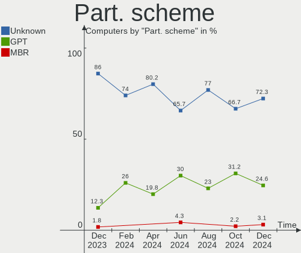
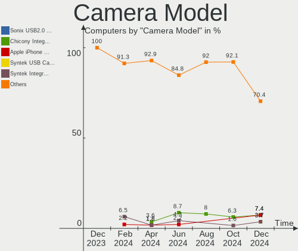
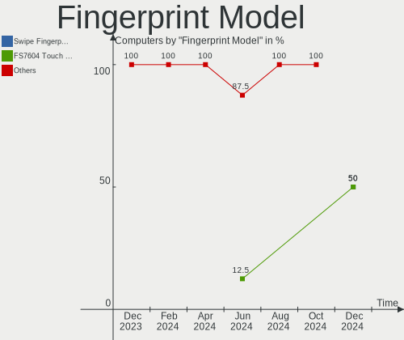

KDE neon Hardware Trends
------------------------

A project to identify most popular hardware characteristics and track their change
over time based on data collected by KDE neon users at https://Linux-Hardware.org.

Anyone can contribute to this report by the [hw-probe](https://github.com/linuxhw/hw-probe) tool:

    sudo -E hw-probe -all -upload

This is a report for all computer types. See also reports for [desktops](/Dist/KDE_neon/Desktop/README.md) and [notebooks](/Dist/KDE_neon/Notebook/README.md).

Full-feature report is available here: https://linux-hardware.org/?view=trends

Period: Oct, 2021.

Contents
--------

* [ System ](#system)
  - [ OS                       ](#os)
  - [ OS Family                ](#os-family)
  - [ Kernel                   ](#kernel)
  - [ Kernel Family            ](#kernel-family)
  - [ Kernel Major Ver.        ](#kernel-major-ver)
  - [ Arch                     ](#arch)
  - [ DE                       ](#de)
  - [ Display Server           ](#display-server)
  - [ Display Manager          ](#display-manager)
  - [ OS Lang                  ](#os-lang)
  - [ Boot Mode                ](#boot-mode)
  - [ Filesystem               ](#filesystem)
  - [ Part. scheme             ](#part-scheme)
  - [ Dual Boot with Linux/BSD ](#dual-boot-with-linuxbsd)
  - [ Dual Boot (Win)          ](#dual-boot-win)

* [ Board ](#board)
  - [ Vendor                   ](#vendor)
  - [ Model                    ](#model)
  - [ Model Family             ](#model-family)
  - [ MFG Year                 ](#mfg-year)
  - [ Form Factor              ](#form-factor)
  - [ Secure Boot              ](#secure-boot)
  - [ Coreboot                 ](#coreboot)
  - [ RAM Size                 ](#ram-size)
  - [ RAM Used                 ](#ram-used)
  - [ Total Drives             ](#total-drives)
  - [ Has CD-ROM               ](#has-cd-rom)
  - [ Has Ethernet             ](#has-ethernet)
  - [ Has WiFi                 ](#has-wifi)
  - [ Has Bluetooth            ](#has-bluetooth)

* [ Location ](#location)
  - [ Country                  ](#country)
  - [ City                     ](#city)

* [ Drives ](#drives)
  - [ Drive Vendor             ](#drive-vendor)
  - [ Drive Model              ](#drive-model)
  - [ HDD Vendor               ](#hdd-vendor)
  - [ SSD Vendor               ](#ssd-vendor)
  - [ Drive Kind               ](#drive-kind)
  - [ Drive Connector          ](#drive-connector)
  - [ Drive Size               ](#drive-size)
  - [ Space Total              ](#space-total)
  - [ Space Used               ](#space-used)
  - [ Malfunc. Drives          ](#malfunc-drives)
  - [ Malfunc. Drive Vendor    ](#malfunc-drive-vendor)
  - [ Malfunc. HDD Vendor      ](#malfunc-hdd-vendor)
  - [ Malfunc. Drive Kind      ](#malfunc-drive-kind)
  - [ Failed Drives            ](#failed-drives)
  - [ Failed Drive Vendor      ](#failed-drive-vendor)
  - [ Drive Status             ](#drive-status)

* [ Storage controller ](#storage-controller)
  - [ Storage Vendor           ](#storage-vendor)
  - [ Storage Model            ](#storage-model)
  - [ Storage Kind             ](#storage-kind)

* [ Processor ](#processor)
  - [ CPU Vendor               ](#cpu-vendor)
  - [ CPU Model                ](#cpu-model)
  - [ CPU Model Family         ](#cpu-model-family)
  - [ CPU Cores                ](#cpu-cores)
  - [ CPU Sockets              ](#cpu-sockets)
  - [ CPU Threads              ](#cpu-threads)
  - [ CPU Op-Modes             ](#cpu-op-modes)
  - [ CPU Microcode            ](#cpu-microcode)
  - [ CPU Microarch            ](#cpu-microarch)

* [ Graphics ](#graphics)
  - [ GPU Vendor               ](#gpu-vendor)
  - [ GPU Model                ](#gpu-model)
  - [ GPU Combo                ](#gpu-combo)
  - [ GPU Driver               ](#gpu-driver)
  - [ GPU Memory               ](#gpu-memory)

* [ Monitor ](#monitor)
  - [ Monitor Vendor           ](#monitor-vendor)
  - [ Monitor Model            ](#monitor-model)
  - [ Monitor Resolution       ](#monitor-resolution)
  - [ Monitor Diagonal         ](#monitor-diagonal)
  - [ Monitor Width            ](#monitor-width)
  - [ Aspect Ratio             ](#aspect-ratio)
  - [ Monitor Area             ](#monitor-area)
  - [ Pixel Density            ](#pixel-density)
  - [ Multiple Monitors        ](#multiple-monitors)

* [ Network ](#network)
  - [ Net Controller Vendor    ](#net-controller-vendor)
  - [ Net Controller Model     ](#net-controller-model)
  - [ Wireless Vendor          ](#wireless-vendor)
  - [ Wireless Model           ](#wireless-model)
  - [ Ethernet Vendor          ](#ethernet-vendor)
  - [ Ethernet Model           ](#ethernet-model)
  - [ Net Controller Kind      ](#net-controller-kind)
  - [ Used Controller          ](#used-controller)
  - [ NICs                     ](#nics)
  - [ IPv6                     ](#ipv6)

* [ Bluetooth ](#bluetooth)
  - [ Bluetooth Vendor         ](#bluetooth-vendor)
  - [ Bluetooth Model          ](#bluetooth-model)

* [ Sound ](#sound)
  - [ Sound Vendor             ](#sound-vendor)
  - [ Sound Model              ](#sound-model)

* [ Memory ](#memory)
  - [ Memory Vendor            ](#memory-vendor)
  - [ Memory Model             ](#memory-model)
  - [ Memory Kind              ](#memory-kind)
  - [ Memory Form Factor       ](#memory-form-factor)
  - [ Memory Size              ](#memory-size)
  - [ Memory Speed             ](#memory-speed)

* [ Printers & scanners ](#printers--scanners)
  - [ Printer Vendor           ](#printer-vendor)
  - [ Printer Model            ](#printer-model)
  - [ Scanner Vendor           ](#scanner-vendor)
  - [ Scanner Model            ](#scanner-model)

* [ Camera ](#camera)
  - [ Camera Vendor            ](#camera-vendor)
  - [ Camera Model             ](#camera-model)

* [ Security ](#security)
  - [ Fingerprint Vendor       ](#fingerprint-vendor)
  - [ Fingerprint Model        ](#fingerprint-model)
  - [ Chipcard Vendor          ](#chipcard-vendor)
  - [ Chipcard Model           ](#chipcard-model)

* [ Unsupported ](#unsupported)
  - [ Unsupported Devices      ](#unsupported-devices)
  - [ Unsupported Device Types ](#unsupported-device-types)

System
------

OS
--

Installed operating systems

| Name           | Computers | Percent |
|----------------|-----------|---------|
| KDE neon 20.04 | 102       | 100%    |

OS Family
---------

OS without a version

| Name     | Computers | Percent |
|----------|-----------|---------|
| KDE neon | 102       | 100%    |

Kernel
------

Version of the Linux kernel

| Version                   | Computers | Percent |
|---------------------------|-----------|---------|
| 5.11.0-37-generic         | 57        | 55.88%  |
| 5.11.0-38-generic         | 26        | 25.49%  |
| 5.11.0-36-generic         | 3         | 2.94%   |
| 5.4.0-74-generic          | 2         | 1.96%   |
| 5.11.0-34-generic         | 2         | 1.96%   |
| 5.8.0-63-generic          | 1         | 0.98%   |
| 5.4.0-90-generic          | 1         | 0.98%   |
| 5.4.0-89-generic          | 1         | 0.98%   |
| 5.4.0-88-generic          | 1         | 0.98%   |
| 5.4.0-77-generic          | 1         | 0.98%   |
| 5.4.0-70-generic          | 1         | 0.98%   |
| 5.4.0-58-generic          | 1         | 0.98%   |
| 5.14.11-xanmod1-cacule    | 1         | 0.98%   |
| 5.14.0-9.1-liquorix-amd64 | 1         | 0.98%   |
| 5.13.0-1012-oem           | 1         | 0.98%   |
| 5.11.0-27-generic         | 1         | 0.98%   |
| 5.11.0-25-generic         | 1         | 0.98%   |

Kernel Family
-------------

Linux kernel without a distro release

| Version | Computers | Percent |
|---------|-----------|---------|
| 5.11.0  | 90        | 88.24%  |
| 5.4.0   | 8         | 7.84%   |
| 5.8.0   | 1         | 0.98%   |
| 5.14.11 | 1         | 0.98%   |
| 5.14.0  | 1         | 0.98%   |
| 5.13.0  | 1         | 0.98%   |

Kernel Major Ver.
-----------------

Linux kernel major version

| Version | Computers | Percent |
|---------|-----------|---------|
| 5.11    | 90        | 88.24%  |
| 5.4     | 8         | 7.84%   |
| 5.14    | 2         | 1.96%   |
| 5.8     | 1         | 0.98%   |
| 5.13    | 1         | 0.98%   |

Arch
----

OS architecture (x86_64, i586, etc.)

| Name   | Computers | Percent |
|--------|-----------|---------|
| x86_64 | 102       | 100%    |

DE
--

Desktop Environment

| Name            | Computers | Percent |
|-----------------|-----------|---------|
| KDE5            | 93        | 91.18%  |
| KDE             | 4         | 3.92%   |
| Unknown         | 4         | 3.92%   |
| GNOME Flashback | 1         | 0.98%   |

Display Server
--------------

X11 or Wayland

| Name    | Computers | Percent |
|---------|-----------|---------|
| X11     | 98        | 96.08%  |
| Wayland | 2         | 1.96%   |
| Tty     | 2         | 1.96%   |

Display Manager
---------------

SDDM, LightDM, etc.

| Name    | Computers | Percent |
|---------|-----------|---------|
| Unknown | 71        | 69.61%  |
| SDDM    | 31        | 30.39%  |

OS Lang
-------

Language

| Lang   | Computers | Percent |
|--------|-----------|---------|
| en_US  | 32        | 31.37%  |
| de_DE  | 11        | 10.78%  |
| pt_BR  | 8         | 7.84%   |
| en_GB  | 7         | 6.86%   |
| ru_RU  | 5         | 4.9%    |
| it_IT  | 4         | 3.92%   |
| es_ES  | 4         | 3.92%   |
| en_CA  | 4         | 3.92%   |
| es_MX  | 3         | 2.94%   |
| C      | 3         | 2.94%   |
| uk_UA  | 2         | 1.96%   |
| ru_UA  | 2         | 1.96%   |
| nl_NL  | 2         | 1.96%   |
| fr_FR  | 2         | 1.96%   |
| en_IN  | 2         | 1.96%   |
| en_AU  | 2         | 1.96%   |
| szl_PL | 1         | 0.98%   |
| sv_SE  | 1         | 0.98%   |
| pl_PL  | 1         | 0.98%   |
| lv_LV  | 1         | 0.98%   |
| ja_JP  | 1         | 0.98%   |
| hr_HR  | 1         | 0.98%   |
| es_VE  | 1         | 0.98%   |
| es_CL  | 1         | 0.98%   |
| en_ZA  | 1         | 0.98%   |

Boot Mode
---------

EFI or BIOS

| Mode | Computers | Percent |
|------|-----------|---------|
| EFI  | 53        | 51.96%  |
| BIOS | 49        | 48.04%  |

Filesystem
----------

Type of filesystem

| Type    | Computers | Percent |
|---------|-----------|---------|
| Ext4    | 92        | 90.2%   |
| Btrfs   | 6         | 5.88%   |
| Overlay | 3         | 2.94%   |
| Xfs     | 1         | 0.98%   |

Part. scheme
------------

Scheme of partitioning

| Type    | Computers | Percent |
|---------|-----------|---------|
| Unknown | 89        | 87.25%  |
| GPT     | 12        | 11.76%  |
| MBR     | 1         | 0.98%   |

Dual Boot with Linux/BSD
------------------------

Hosting more than one Linux/BSD

| Dual boot | Computers | Percent |
|-----------|-----------|---------|
| No        | 97        | 95.1%   |
| Yes       | 5         | 4.9%    |

Dual Boot (Win)
---------------

Hosting Linux and Windows

| Dual boot | Computers | Percent |
|-----------|-----------|---------|
| No        | 84        | 82.35%  |
| Yes       | 18        | 17.65%  |

Board
-----

Vendor
------

Motherboard manufacturer

| Name                | Computers | Percent |
|---------------------|-----------|---------|
| ASUSTek Computer    | 19        | 18.63%  |
| Lenovo              | 14        | 13.73%  |
| Hewlett-Packard     | 14        | 13.73%  |
| Dell                | 11        | 10.78%  |
| ASRock              | 9         | 8.82%   |
| Acer                | 7         | 6.86%   |
| Gigabyte Technology | 6         | 5.88%   |
| MSI                 | 4         | 3.92%   |
| Apple               | 4         | 3.92%   |
| Biostar             | 3         | 2.94%   |
| Toshiba             | 2         | 1.96%   |
| HUAWEI              | 2         | 1.96%   |
| Samsung Electronics | 1         | 0.98%   |
| Microsoft           | 1         | 0.98%   |
| HONOR               | 1         | 0.98%   |
| Fujitsu Siemens     | 1         | 0.98%   |
| Fujitsu             | 1         | 0.98%   |
| Eluktronics         | 1         | 0.98%   |
| Alienware           | 1         | 0.98%   |

Model
-----

Motherboard model

| Name                                     | Computers | Percent |
|------------------------------------------|-----------|---------|
| ASUS VivoBook_ASUSLaptop X415JA_X415JA   | 2         | 1.96%   |
| Acer Aspire E5-571                       | 2         | 1.96%   |
| Toshiba Satellite P200                   | 1         | 0.98%   |
| Toshiba Satellite C55D-A-15H             | 1         | 0.98%   |
| Samsung 900X5T                           | 1         | 0.98%   |
| MSI MS-7C35                              | 1         | 0.98%   |
| MSI MS-7B89                              | 1         | 0.98%   |
| MSI MS-7A94                              | 1         | 0.98%   |
| MSI MS-7A59                              | 1         | 0.98%   |
| Microsoft Surface Pro 3                  | 1         | 0.98%   |
| Lenovo ThinkPad X220 4291B48             | 1         | 0.98%   |
| Lenovo ThinkPad X1 Carbon 6th 20KHS0KV00 | 1         | 0.98%   |
| Lenovo ThinkPad X1 Carbon 2nd 20A7005JGE | 1         | 0.98%   |
| Lenovo ThinkPad T460s 20FAS4A200         | 1         | 0.98%   |
| Lenovo ThinkPad L15 Gen 1 20U3CTO1WW     | 1         | 0.98%   |
| Lenovo ThinkPad E490s 20NGA000AU         | 1         | 0.98%   |
| Lenovo ThinkPad E490 20N9001FBR          | 1         | 0.98%   |
| Lenovo ThinkPad E14 Gen 3 20Y7CTO1WW     | 1         | 0.98%   |
| Lenovo ThinkCentre E73 10DS000KUK        | 1         | 0.98%   |
| Lenovo M710e ThinkCentre 10UR001MUS      | 1         | 0.98%   |
| Lenovo IdeaPad L3 15IML05 81Y3           | 1         | 0.98%   |
| Lenovo IdeaPad Gaming 3 15ACH6 82K2      | 1         | 0.98%   |
| Lenovo G700 20251                        | 1         | 0.98%   |
| Lenovo G50-80 80E5                       | 1         | 0.98%   |
| HUAWEI WRT-WX9                           | 1         | 0.98%   |
| HUAWEI HVY-WXX9                          | 1         | 0.98%   |
| HONOR NBD-WXX9                           | 1         | 0.98%   |
| HP Z230 SFF Workstation                  | 1         | 0.98%   |
| HP ProBook 6475b                         | 1         | 0.98%   |
| HP Pavilion x360 Convertible 14-dh1xxx   | 1         | 0.98%   |
| HP Pavilion g6                           | 1         | 0.98%   |
| HP Laptop 17-by2xxx                      | 1         | 0.98%   |
| HP Laptop 15-dw0xxx                      | 1         | 0.98%   |
| HP Laptop 14-bw0xx                       | 1         | 0.98%   |
| HP ENVY x360 Convertible 13-ay0xxx       | 1         | 0.98%   |
| HP EliteBook Revolve 810 G3              | 1         | 0.98%   |
| HP EliteBook 850 G4                      | 1         | 0.98%   |
| HP Compaq dc7700 Small Form Factor       | 1         | 0.98%   |
| HP Compaq 8200 Elite SFF PC              | 1         | 0.98%   |
| HP Compaq 6005 Pro SFF PC                | 1         | 0.98%   |
| HP Compaq 15                             | 1         | 0.98%   |
| Gigabyte Z77-DS3H                        | 1         | 0.98%   |
| Gigabyte Z370 HD3P                       | 1         | 0.98%   |
| Gigabyte X570 AORUS PRO WIFI             | 1         | 0.98%   |
| Gigabyte H61MA-D3V                       | 1         | 0.98%   |
| Gigabyte H170-D3HP                       | 1         | 0.98%   |
| Gigabyte EP43T-S3L                       | 1         | 0.98%   |
| Fujitsu Siemens MS-7379VP                | 1         | 0.98%   |
| Fujitsu LIFEBOOK E556                    | 1         | 0.98%   |
| Eluktronics MAX-17                       | 1         | 0.98%   |
| Dell XPS 15 9570                         | 1         | 0.98%   |
| Dell Precision WorkStation T3500         | 1         | 0.98%   |
| Dell Precision 7510                      | 1         | 0.98%   |
| Dell OptiPlex 7010                       | 1         | 0.98%   |
| Dell Latitude E6520                      | 1         | 0.98%   |
| Dell Latitude 5420                       | 1         | 0.98%   |
| Dell Inspiron 7573                       | 1         | 0.98%   |
| Dell Inspiron 3520                       | 1         | 0.98%   |
| Dell Inspiron 1545                       | 1         | 0.98%   |
| Dell Inspiron 1525                       | 1         | 0.98%   |

Model Family
------------

Motherboard model prefix

| Name                      | Computers | Percent |
|---------------------------|-----------|---------|
| Lenovo ThinkPad           | 8         | 7.84%   |
| HP Compaq                 | 4         | 3.92%   |
| Dell Inspiron             | 4         | 3.92%   |
| Acer Aspire               | 4         | 3.92%   |
| HP Laptop                 | 3         | 2.94%   |
| ASUS ROG                  | 3         | 2.94%   |
| ASUS PRIME                | 3         | 2.94%   |
| Toshiba Satellite         | 2         | 1.96%   |
| Lenovo IdeaPad            | 2         | 1.96%   |
| HP Pavilion               | 2         | 1.96%   |
| HP EliteBook              | 2         | 1.96%   |
| Dell Precision            | 2         | 1.96%   |
| Dell Latitude             | 2         | 1.96%   |
| ASUS VivoBook             | 2         | 1.96%   |
| ASRock Z170               | 2         | 1.96%   |
| Apple MacBookPro11        | 2         | 1.96%   |
| Samsung 900X5T            | 1         | 0.98%   |
| MSI MS-7C35               | 1         | 0.98%   |
| MSI MS-7B89               | 1         | 0.98%   |
| MSI MS-7A94               | 1         | 0.98%   |
| MSI MS-7A59               | 1         | 0.98%   |
| Microsoft Surface         | 1         | 0.98%   |
| Lenovo ThinkCentre        | 1         | 0.98%   |
| Lenovo M710e              | 1         | 0.98%   |
| Lenovo G700               | 1         | 0.98%   |
| Lenovo G50-80             | 1         | 0.98%   |
| HUAWEI WRT-WX9            | 1         | 0.98%   |
| HUAWEI HVY-WXX9           | 1         | 0.98%   |
| HONOR NBD-WXX9            | 1         | 0.98%   |
| HP Z230                   | 1         | 0.98%   |
| HP ProBook                | 1         | 0.98%   |
| HP ENVY                   | 1         | 0.98%   |
| Gigabyte Z77-DS3H         | 1         | 0.98%   |
| Gigabyte Z370             | 1         | 0.98%   |
| Gigabyte X570             | 1         | 0.98%   |
| Gigabyte H61MA-D3V        | 1         | 0.98%   |
| Gigabyte H170-D3HP        | 1         | 0.98%   |
| Gigabyte EP43T-S3L        | 1         | 0.98%   |
| Fujitsu Siemens MS-7379VP | 1         | 0.98%   |
| Fujitsu LIFEBOOK          | 1         | 0.98%   |
| Eluktronics MAX-17        | 1         | 0.98%   |
| Dell XPS                  | 1         | 0.98%   |
| Dell OptiPlex             | 1         | 0.98%   |
| Dell G3                   | 1         | 0.98%   |
| Biostar B350GTN           | 1         | 0.98%   |
| Biostar A55MLC2           | 1         | 0.98%   |
| Biostar A10N-9630E        | 1         | 0.98%   |
| ASUS P7P55D               | 1         | 0.98%   |
| ASUS P5G41T-M             | 1         | 0.98%   |
| ASUS P5B-Deluxe           | 1         | 0.98%   |
| ASUS M2N-E                | 1         | 0.98%   |
| ASUS K75VM                | 1         | 0.98%   |
| ASUS K52JT                | 1         | 0.98%   |
| ASUS H110M-C              | 1         | 0.98%   |
| ASUS G751JT               | 1         | 0.98%   |
| ASUS F1A55-M              | 1         | 0.98%   |
| ASUS E520                 | 1         | 0.98%   |
| ASUS A68HM-PLUS           | 1         | 0.98%   |
| ASRock Z370               | 1         | 0.98%   |
| ASRock X370               | 1         | 0.98%   |

MFG Year
--------

Motherboard manufacture year

| Year | Computers | Percent |
|------|-----------|---------|
| 2021 | 22        | 21.57%  |
| 2020 | 16        | 15.69%  |
| 2018 | 11        | 10.78%  |
| 2013 | 10        | 9.8%    |
| 2012 | 10        | 9.8%    |
| 2017 | 5         | 4.9%    |
| 2019 | 4         | 3.92%   |
| 2016 | 4         | 3.92%   |
| 2015 | 3         | 2.94%   |
| 2014 | 3         | 2.94%   |
| 2011 | 3         | 2.94%   |
| 2010 | 3         | 2.94%   |
| 2009 | 3         | 2.94%   |
| 2008 | 3         | 2.94%   |
| 2007 | 2         | 1.96%   |

Form Factor
-----------

Physical design of the computer

| Name        | Computers | Percent |
|-------------|-----------|---------|
| Notebook    | 53        | 51.96%  |
| Desktop     | 44        | 43.14%  |
| Convertible | 3         | 2.94%   |
| Tablet      | 1         | 0.98%   |
| All in one  | 1         | 0.98%   |

Secure Boot
-----------

Enabled or disabled

| State    | Computers | Percent |
|----------|-----------|---------|
| Disabled | 93        | 91.18%  |
| Enabled  | 9         | 8.82%   |

Coreboot
--------

Have coreboot on board

| Used | Computers | Percent |
|------|-----------|---------|
| No   | 102       | 100%    |

RAM Size
--------

Total RAM memory

| Size in GB  | Computers | Percent |
|-------------|-----------|---------|
| 8.01-16.0   | 28        | 27.45%  |
| 16.01-24.0  | 24        | 23.53%  |
| 4.01-8.0    | 20        | 19.61%  |
| 3.01-4.0    | 13        | 12.75%  |
| 32.01-64.0  | 8         | 7.84%   |
| 64.01-256.0 | 3         | 2.94%   |
| 24.01-32.0  | 2         | 1.96%   |
| 2.01-3.0    | 2         | 1.96%   |
| 1.01-2.0    | 2         | 1.96%   |

RAM Used
--------

Used RAM memory

| Used GB    | Computers | Percent |
|------------|-----------|---------|
| 1.01-2.0   | 39        | 38.24%  |
| 2.01-3.0   | 17        | 16.67%  |
| 3.01-4.0   | 15        | 14.71%  |
| 4.01-8.0   | 14        | 13.73%  |
| 0.51-1.0   | 13        | 12.75%  |
| 8.01-16.0  | 3         | 2.94%   |
| 16.01-24.0 | 1         | 0.98%   |

Total Drives
------------

Number of drives on board

| Drives | Computers | Percent |
|--------|-----------|---------|
| 1      | 60        | 58.82%  |
| 2      | 29        | 28.43%  |
| 3      | 6         | 5.88%   |
| 7      | 2         | 1.96%   |
| 5      | 2         | 1.96%   |
| 4      | 2         | 1.96%   |
| 6      | 1         | 0.98%   |

Has CD-ROM
----------

Has CD-ROM on board

| Presented | Computers | Percent |
|-----------|-----------|---------|
| No        | 65        | 63.73%  |
| Yes       | 37        | 36.27%  |

Has Ethernet
------------

Has Ethernet on board

| Presented | Computers | Percent |
|-----------|-----------|---------|
| Yes       | 88        | 86.27%  |
| No        | 14        | 13.73%  |

Has WiFi
--------

Has WiFi module

| Presented | Computers | Percent |
|-----------|-----------|---------|
| Yes       | 83        | 81.37%  |
| No        | 19        | 18.63%  |

Has Bluetooth
-------------

Has Bluetooth module

| Presented | Computers | Percent |
|-----------|-----------|---------|
| Yes       | 63        | 61.76%  |
| No        | 39        | 38.24%  |

Location
--------

Country
-------

Geographic location (country)

| Country      | Computers | Percent |
|--------------|-----------|---------|
| USA          | 19        | 18.63%  |
| Germany      | 13        | 12.75%  |
| Brazil       | 9         | 8.82%   |
| Russia       | 8         | 7.84%   |
| UK           | 7         | 6.86%   |
| Italy        | 4         | 3.92%   |
| Canada       | 4         | 3.92%   |
| Ukraine      | 3         | 2.94%   |
| Sweden       | 3         | 2.94%   |
| Spain        | 3         | 2.94%   |
| Poland       | 3         | 2.94%   |
| Netherlands  | 3         | 2.94%   |
| Mexico       | 3         | 2.94%   |
| France       | 2         | 1.96%   |
| Australia    | 2         | 1.96%   |
| Vietnam      | 1         | 0.98%   |
| Venezuela    | 1         | 0.98%   |
| UAE          | 1         | 0.98%   |
| Thailand     | 1         | 0.98%   |
| South Africa | 1         | 0.98%   |
| Serbia       | 1         | 0.98%   |
| Paraguay     | 1         | 0.98%   |
| Latvia       | 1         | 0.98%   |
| Kazakhstan   | 1         | 0.98%   |
| Japan        | 1         | 0.98%   |
| Iran         | 1         | 0.98%   |
| Indonesia    | 1         | 0.98%   |
| India        | 1         | 0.98%   |
| Croatia      | 1         | 0.98%   |
| Chile        | 1         | 0.98%   |
| Bahrain      | 1         | 0.98%   |

City
----

Geographic location (city)

| City                      | Computers | Percent |
|---------------------------|-----------|---------|
| Berlin                    | 3         | 2.94%   |
| S??o Paulo                | 2         | 1.96%   |
| Novosibirsk               | 2         | 1.96%   |
| Moscow                    | 2         | 1.96%   |
| Melbourne                 | 2         | 1.96%   |
| Zapopan                   | 1         | 0.98%   |
| Zagreb                    | 1         | 0.98%   |
| Wuppertal                 | 1         | 0.98%   |
| Williamsport              | 1         | 0.98%   |
| West Lafayette            | 1         | 0.98%   |
| Warsaw                    | 1         | 0.98%   |
| Voronezh                  | 1         | 0.98%   |
| Vancouver                 | 1         | 0.98%   |
| Valen?§a                  | 1         | 0.98%   |
| Turin                     | 1         | 0.98%   |
| Swansea                   | 1         | 0.98%   |
| Strongsville              | 1         | 0.98%   |
| St Louis                  | 1         | 0.98%   |
| Sheffield                 | 1         | 0.98%   |
| Sharjah                   | 1         | 0.98%   |
| Secaucus                  | 1         | 0.98%   |
| Santa Pola                | 1         | 0.98%   |
| Santa Fe                  | 1         | 0.98%   |
| San Pedro de la Paz       | 1         | 0.98%   |
| San Marcos                | 1         | 0.98%   |
| Salt Lake City            | 1         | 0.98%   |
| Saint-Hilaire-sur-Benaize | 1         | 0.98%   |
| Saint Cloud               | 1         | 0.98%   |
| Rio de Janeiro            | 1         | 0.98%   |
| Riga                      | 1         | 0.98%   |
| Ridderkerk                | 1         | 0.98%   |
| Rey                       | 1         | 0.98%   |
| Quer?©taro City           | 1         | 0.98%   |
| Praia Grande              | 1         | 0.98%   |
| Poznan                    | 1         | 0.98%   |
| Plymouth                  | 1         | 0.98%   |
| Pite??                    | 1         | 0.98%   |
| Pisa                      | 1         | 0.98%   |
| Phoenix                   | 1         | 0.98%   |
| Petrozavodsk              | 1         | 0.98%   |
| Paris                     | 1         | 0.98%   |
| Palmas                    | 1         | 0.98%   |
| Palma                     | 1         | 0.98%   |
| Osnabr??ck                | 1         | 0.98%   |
| Osasco                    | 1         | 0.98%   |
| Oberhausen                | 1         | 0.98%   |
| Nur-Sultan                | 1         | 0.98%   |
| Newport News              | 1         | 0.98%   |
| New Milford               | 1         | 0.98%   |
| Neasden                   | 1         | 0.98%   |
| Munich                    | 1         | 0.98%   |
| Moncton                   | 1         | 0.98%   |
| Monahans                  | 1         | 0.98%   |
| Matsudo                   | 1         | 0.98%   |
| Mandaguari                | 1         | 0.98%   |
| Malmo                     | 1         | 0.98%   |
| Lviv                      | 1         | 0.98%   |
| Los Osos                  | 1         | 0.98%   |
| Loja                      | 1         | 0.98%   |
| Lissone                   | 1         | 0.98%   |

Drives
------

Drive Vendor
------------

Hard drive vendors

| Vendor                      | Computers | Drives | Percent |
|-----------------------------|-----------|--------|---------|
| WDC                         | 27        | 37     | 18%     |
| Samsung Electronics         | 22        | 27     | 14.67%  |
| Seagate                     | 20        | 21     | 13.33%  |
| Crucial                     | 8         | 8      | 5.33%   |
| Sandisk                     | 7         | 7      | 4.67%   |
| Toshiba                     | 5         | 6      | 3.33%   |
| SK Hynix                    | 4         | 4      | 2.67%   |
| Phison                      | 4         | 6      | 2.67%   |
| Kingston                    | 4         | 4      | 2.67%   |
| Intel                       | 4         | 4      | 2.67%   |
| Hitachi                     | 4         | 4      | 2.67%   |
| HGST                        | 4         | 4      | 2.67%   |
| A-DATA Technology           | 4         | 5      | 2.67%   |
| Unknown                     | 3         | 3      | 2%      |
| Smartbuy                    | 2         | 2      | 1.33%   |
| PNY                         | 2         | 2      | 1.33%   |
| Micron Technology           | 2         | 2      | 1.33%   |
| Apple                       | 2         | 2      | 1.33%   |
| Yangtze Memory Technologies | 1         | 1      | 0.67%   |
| V-GeN                       | 1         | 1      | 0.67%   |
| USB3.0                      | 1         | 1      | 0.67%   |
| Tanbassh                    | 1         | 1      | 0.67%   |
| Silicon Motion              | 1         | 1      | 0.67%   |
| Realtek Semiconductor       | 1         | 1      | 0.67%   |
| PLEXTOR                     | 1         | 1      | 0.67%   |
| Patriot                     | 1         | 1      | 0.67%   |
| PALIT                       | 1         | 2      | 0.67%   |
| Micron/Crucial Technology   | 1         | 1      | 0.67%   |
| MAXTOR                      | 1         | 1      | 0.67%   |
| LITEONIT                    | 1         | 1      | 0.67%   |
| Lenovo                      | 1         | 1      | 0.67%   |
| KingFast                    | 1         | 1      | 0.67%   |
| Intenso                     | 1         | 1      | 0.67%   |
| Integral                    | 1         | 1      | 0.67%   |
| GOODRAM                     | 1         | 1      | 0.67%   |
| Fujitsu                     | 1         | 1      | 0.67%   |
| China                       | 1         | 2      | 0.67%   |
| ASMT                        | 1         | 1      | 0.67%   |
| ADATA Technology            | 1         | 1      | 0.67%   |
| 2-Power                     | 1         | 1      | 0.67%   |

Drive Model
-----------

Hard drive models

| Model                                  | Computers | Percent |
|----------------------------------------|-----------|---------|
| Seagate ST2000DM008-2FR102 2TB         | 3         | 1.8%    |
| Sandisk NVMe SSD Drive 512GB           | 3         | 1.8%    |
| Samsung NVMe SSD Drive 1TB             | 3         | 1.8%    |
| Kingston SA400S37240G 240GB SSD        | 3         | 1.8%    |
| WDC WD10EZEX-08WN4A0 1TB               | 2         | 1.2%    |
| SK Hynix NVMe SSD Drive 128GB          | 2         | 1.2%    |
| Seagate ST500LT012-1DG142 500GB        | 2         | 1.2%    |
| Seagate ST2000DM006-2DM164 2TB         | 2         | 1.2%    |
| Samsung SSD 860 EVO 1TB                | 2         | 1.2%    |
| Samsung SSD 850 EVO 500GB              | 2         | 1.2%    |
| Samsung PM963 2.5" NVMe PCIe SSD 512GB | 2         | 1.2%    |
| Intel NVMe SSD Drive 512GB             | 2         | 1.2%    |
| HGST HTS541010A9E680 1TB               | 2         | 1.2%    |
| Crucial CT500MX500SSD1 500GB           | 2         | 1.2%    |
| Crucial CT480BX500SSD1 480GB           | 2         | 1.2%    |
| A-DATA SX8200PNP 1TB                   | 2         | 1.2%    |
| Yangtze Memory NVMe SSD Drive 512GB    | 1         | 0.6%    |
| WDC WUH721414ALE6L4 14TB               | 1         | 0.6%    |
| WDC WDS500G2B0B-00YS70 500GB SSD       | 1         | 0.6%    |
| WDC WDS480G2G0A-00JH30 480GB SSD       | 1         | 0.6%    |
| WDC WDS240G2G0A-00JH30 240GB SSD       | 1         | 0.6%    |
| WDC WDS100T2B0A-00SM50 1TB SSD         | 1         | 0.6%    |
| WDC WDS100T2B0A 1TB SSD                | 1         | 0.6%    |
| WDC WD5001FZWX-00ZHUA0 5TB             | 1         | 0.6%    |
| WDC WD5000LPVX-22V0TT0 500GB           | 1         | 0.6%    |
| WDC WD5000LPCX-60VHAT0 500GB           | 1         | 0.6%    |
| WDC WD5000LPCX-24VHAT0 500GB           | 1         | 0.6%    |
| WDC WD5000AAKX-22ERMA0 500GB           | 1         | 0.6%    |
| WDC WD5000AAKX-08U6AA0 500GB           | 1         | 0.6%    |
| WDC WD5000AAKX-08ERMA0 500GB           | 1         | 0.6%    |
| WDC WD40EZRZ-00WN9B0 4TB               | 1         | 0.6%    |
| WDC WD3200BEVT-22ZCT0 320GB            | 1         | 0.6%    |
| WDC WD3200AAKS-75L9A0 320GB            | 1         | 0.6%    |
| WDC WD2500BEVT-22ZCT0 250GB            | 1         | 0.6%    |
| WDC WD20EZAZ-00GGJB0 2TB               | 1         | 0.6%    |
| WDC WD2005FBYZ-01YCBB2 2TB             | 1         | 0.6%    |
| WDC WD2003FZEX-00Z4SA0 2TB             | 1         | 0.6%    |
| WDC WD1600AAJS-08L7A0 160GB            | 1         | 0.6%    |
| WDC WD1600AAJS-00L7A0 160GB            | 1         | 0.6%    |
| WDC WD15EARX-00PASB0 1TB               | 1         | 0.6%    |
| WDC WD1200BEVS-75UST0 120GB            | 1         | 0.6%    |
| WDC WD10SPZX-21Z10T0 1TB               | 1         | 0.6%    |
| WDC WD10SPZX-08Z10 1TB                 | 1         | 0.6%    |
| WDC WD10SPCX-60KHST0 1TB               | 1         | 0.6%    |
| WDC WD10EZEX-00WN4A0 1TB               | 1         | 0.6%    |
| WDC WD10EARS-22Y5B1 1TB                | 1         | 0.6%    |
| WDC WD1005FBYZ-01YCBB2 1TB             | 1         | 0.6%    |
| WDC WD1003FZEX-00K3CA0 1TB             | 1         | 0.6%    |
| WDC PC SN730 SDBQNTY-512G-1001 512GB   | 1         | 0.6%    |
| WDC PC SN730 SDBPNTY-512G-1027 512GB   | 1         | 0.6%    |
| WDC PC SN530 SDBPMPZ-256G-1001 256GB   | 1         | 0.6%    |
| WDC PC SN530 NVMe 512GB                | 1         | 0.6%    |
| V-GeN V-GEN12SM20AR128SDK 128GB        | 1         | 0.6%    |
| USB3.0 Disk 1TB                        | 1         | 0.6%    |
| Unknown SD/MMC/MS PRO 128GB            | 1         | 0.6%    |
| Unknown NVMe SSD Drive 1024GB          | 1         | 0.6%    |
| Unknown MMC Card  128GB                | 1         | 0.6%    |
| Toshiba NVMe SSD Drive 512GB           | 1         | 0.6%    |
| Toshiba NVMe SSD Drive 256GB           | 1         | 0.6%    |
| Toshiba MQ04ABF100 1TB                 | 1         | 0.6%    |

HDD Vendor
----------

Hard disk drive vendors

| Vendor              | Computers | Drives | Percent |
|---------------------|-----------|--------|---------|
| WDC                 | 21        | 28     | 36.21%  |
| Seagate             | 19        | 20     | 32.76%  |
| Toshiba             | 4         | 4      | 6.9%    |
| Hitachi             | 4         | 4      | 6.9%    |
| HGST                | 4         | 4      | 6.9%    |
| USB3.0              | 1         | 1      | 1.72%   |
| Unknown             | 1         | 1      | 1.72%   |
| Samsung Electronics | 1         | 1      | 1.72%   |
| MAXTOR              | 1         | 1      | 1.72%   |
| Fujitsu             | 1         | 1      | 1.72%   |
| Apple               | 1         | 1      | 1.72%   |

SSD Vendor
----------

Solid state drive vendors

| Vendor              | Computers | Drives | Percent |
|---------------------|-----------|--------|---------|
| Samsung Electronics | 12        | 15     | 23.08%  |
| Crucial             | 8         | 8      | 15.38%  |
| WDC                 | 4         | 5      | 7.69%   |
| Kingston            | 4         | 4      | 7.69%   |
| Smartbuy            | 2         | 2      | 3.85%   |
| SK Hynix            | 2         | 2      | 3.85%   |
| SanDisk             | 2         | 2      | 3.85%   |
| PNY                 | 2         | 2      | 3.85%   |
| Micron Technology   | 2         | 2      | 3.85%   |
| A-DATA Technology   | 2         | 2      | 3.85%   |
| PLEXTOR             | 1         | 1      | 1.92%   |
| Patriot             | 1         | 1      | 1.92%   |
| PALIT               | 1         | 2      | 1.92%   |
| LITEONIT            | 1         | 1      | 1.92%   |
| Intenso             | 1         | 1      | 1.92%   |
| Intel               | 1         | 1      | 1.92%   |
| Integral            | 1         | 1      | 1.92%   |
| GOODRAM             | 1         | 1      | 1.92%   |
| China               | 1         | 2      | 1.92%   |
| ASMT                | 1         | 1      | 1.92%   |
| Apple               | 1         | 1      | 1.92%   |
| 2-Power             | 1         | 1      | 1.92%   |

Drive Kind
----------

HDD or SSD

| Kind    | Computers | Drives | Percent |
|---------|-----------|--------|---------|
| HDD     | 53        | 66     | 38.69%  |
| SSD     | 44        | 58     | 32.12%  |
| NVMe    | 36        | 44     | 26.28%  |
| Unknown | 3         | 3      | 2.19%   |
| MMC     | 1         | 1      | 0.73%   |

Drive Connector
---------------

SATA, SAS, NVMe, etc.

| Type | Computers | Drives | Percent |
|------|-----------|--------|---------|
| SATA | 78        | 123    | 65.55%  |
| NVMe | 36        | 44     | 30.25%  |
| SAS  | 4         | 4      | 3.36%   |
| MMC  | 1         | 1      | 0.84%   |

Drive Size
----------

Size of hard drive

| Size in TB | Computers | Drives | Percent |
|------------|-----------|--------|---------|
| 0.01-0.5   | 55        | 72     | 56.12%  |
| 0.51-1.0   | 27        | 35     | 27.55%  |
| 1.01-2.0   | 11        | 11     | 11.22%  |
| 4.01-10.0  | 3         | 3      | 3.06%   |
| 3.01-4.0   | 1         | 2      | 1.02%   |
| 10.01-20.0 | 1         | 1      | 1.02%   |

Space Total
-----------

Amount of disk space available on the file system

| Size in GB     | Computers | Percent |
|----------------|-----------|---------|
| 101-250        | 31        | 30.39%  |
| 251-500        | 22        | 21.57%  |
| 501-1000       | 13        | 12.75%  |
| 51-100         | 11        | 10.78%  |
| 1001-2000      | 9         | 8.82%   |
| Unknown        | 5         | 4.9%    |
| 2001-3000      | 4         | 3.92%   |
| 21-50          | 3         | 2.94%   |
| More than 3000 | 2         | 1.96%   |
| 1-20           | 2         | 1.96%   |

Space Used
----------

Amount of used disk space

| Used GB        | Computers | Percent |
|----------------|-----------|---------|
| 1-20           | 41        | 40.2%   |
| 21-50          | 16        | 15.69%  |
| 51-100         | 12        | 11.76%  |
| 101-250        | 11        | 10.78%  |
| 251-500        | 7         | 6.86%   |
| Unknown        | 5         | 4.9%    |
| 1001-2000      | 4         | 3.92%   |
| 501-1000       | 4         | 3.92%   |
| More than 3000 | 2         | 1.96%   |

Malfunc. Drives
---------------

Drive models with a malfunction

Zero info for selected period =(

Malfunc. Drive Vendor
---------------------

Vendors of faulty drives

Zero info for selected period =(

Malfunc. HDD Vendor
-------------------

Vendors of faulty HDD drives

Zero info for selected period =(

Malfunc. Drive Kind
-------------------

Kinds of faulty drives

Zero info for selected period =(

Failed Drives
-------------

Failed drive models

Zero info for selected period =(

Failed Drive Vendor
-------------------

Failed drive vendors

Zero info for selected period =(

Drive Status
------------

Number of failed and malfunc. drives

| Status   | Computers | Drives | Percent |
|----------|-----------|--------|---------|
| Detected | 87        | 147    | 85.29%  |
| Works    | 15        | 25     | 14.71%  |

Storage controller
------------------

Storage Vendor
--------------

Storage controller vendors

| Vendor                       | Computers | Percent |
|------------------------------|-----------|---------|
| Intel                        | 66        | 48.18%  |
| AMD                          | 19        | 13.87%  |
| Samsung Electronics          | 12        | 8.76%   |
| Sandisk                      | 9         | 6.57%   |
| ASMedia Technology           | 5         | 3.65%   |
| Phison Electronics           | 4         | 2.92%   |
| Nvidia                       | 3         | 2.19%   |
| ADATA Technology             | 3         | 2.19%   |
| Toshiba America Info Systems | 2         | 1.46%   |
| SK Hynix                     | 2         | 1.46%   |
| Realtek Semiconductor        | 2         | 1.46%   |
| JMicron Technology           | 2         | 1.46%   |
| Yangtze Memory Technologies  | 1         | 0.73%   |
| Unknown                      | 1         | 0.73%   |
| Silicon Motion               | 1         | 0.73%   |
| Silicon Image                | 1         | 0.73%   |
| Seagate Technology           | 1         | 0.73%   |
| Micron/Crucial Technology    | 1         | 0.73%   |
| Marvell Technology Group     | 1         | 0.73%   |
| Lenovo                       | 1         | 0.73%   |

Storage Model
-------------

Storage controller models

| Model                                                                          | Computers | Percent |
|--------------------------------------------------------------------------------|-----------|---------|
| AMD FCH SATA Controller [AHCI mode]                                            | 15        | 9.62%   |
| Intel Q170/Q150/B150/H170/H110/Z170/CM236 Chipset SATA Controller [AHCI Mode]  | 6         | 3.85%   |
| Intel 200 Series PCH SATA controller [AHCI mode]                               | 6         | 3.85%   |
| Samsung NVMe SSD Controller SM981/PM981/PM983                                  | 5         | 3.21%   |
| Samsung NVMe SSD Controller SM961/PM961/SM963                                  | 5         | 3.21%   |
| Intel 82801 Mobile SATA Controller [RAID mode]                                 | 5         | 3.21%   |
| Intel 8 Series SATA Controller 1 [AHCI mode]                                   | 5         | 3.21%   |
| ASMedia ASM1062 Serial ATA Controller                                          | 5         | 3.21%   |
| Intel Sunrise Point-LP SATA Controller [AHCI mode]                             | 4         | 2.56%   |
| Intel 7 Series Chipset Family 6-port SATA Controller [AHCI mode]               | 4         | 2.56%   |
| Sandisk WD Black SN750 / PC SN730 NVMe SSD                                     | 3         | 1.92%   |
| Sandisk Non-Volatile memory controller                                         | 3         | 1.92%   |
| Intel NM10/ICH7 Family SATA Controller [IDE mode]                              | 3         | 1.92%   |
| Intel 82801HM/HEM (ICH8M/ICH8M-E) IDE Controller                               | 3         | 1.92%   |
| Intel 82801G (ICH7 Family) IDE Controller                                      | 3         | 1.92%   |
| AMD 400 Series Chipset SATA Controller                                         | 3         | 1.92%   |
| Toshiba America Info Systems BG3 NVMe SSD Controller                           | 2         | 1.28%   |
| SK Hynix BC501 NVMe Solid State Drive                                          | 2         | 1.28%   |
| Phison E16 PCIe4 NVMe Controller                                               | 2         | 1.28%   |
| Intel Wildcat Point-LP SATA Controller [AHCI Mode]                             | 2         | 1.28%   |
| Intel SSD 660P Series                                                          | 2         | 1.28%   |
| Intel SATA Controller [RAID mode]                                              | 2         | 1.28%   |
| Intel Comet Lake SATA AHCI Controller                                          | 2         | 1.28%   |
| Intel Cannon Lake Mobile PCH SATA AHCI Controller                              | 2         | 1.28%   |
| Intel 82801HM/HEM (ICH8M/ICH8M-E) SATA Controller [AHCI mode]                  | 2         | 1.28%   |
| Intel 8 Series/C220 Series Chipset Family 6-port SATA Controller 1 [AHCI mode] | 2         | 1.28%   |
| Intel 7 Series/C210 Series Chipset Family 6-port SATA Controller [AHCI mode]   | 2         | 1.28%   |
| Intel 6 Series/C200 Series Chipset Family 6 port Mobile SATA AHCI Controller   | 2         | 1.28%   |
| Intel 6 Series/C200 Series Chipset Family 6 port Desktop SATA AHCI Controller  | 2         | 1.28%   |
| AMD FCH SATA Controller [IDE mode]                                             | 2         | 1.28%   |
| AMD FCH IDE Controller                                                         | 2         | 1.28%   |
| ADATA XPG SX8200 Pro PCIe Gen3x4 M.2 2280 Solid State Drive                    | 2         | 1.28%   |
| Yangtze Memory Non-Volatile memory controller                                  | 1         | 0.64%   |
| Unknown Non-Volatile memory controller                                         | 1         | 0.64%   |
| Silicon Motion SM2263EN/SM2263XT SSD Controller                                | 1         | 0.64%   |
| Silicon Image SiI 3132 Serial ATA Raid II Controller                           | 1         | 0.64%   |
| Seagate FireCuda 510 SSD                                                       | 1         | 0.64%   |
| Sandisk WD Blue SN550 NVMe SSD                                                 | 1         | 0.64%   |
| Sandisk WD Blue SN500 / PC SN520 NVMe SSD                                      | 1         | 0.64%   |
| Sandisk WD Black SN850                                                         | 1         | 0.64%   |
| Samsung NVMe SSD Controller SM951/PM951                                        | 1         | 0.64%   |
| Samsung Apple PCIe SSD                                                         | 1         | 0.64%   |
| Realtek RTS5763DL NVMe SSD Controller                                          | 1         | 0.64%   |
| Realtek Realtek Non-Volatile memory controller                                 | 1         | 0.64%   |
| Phison PS5013 E13 NVMe Controller                                              | 1         | 0.64%   |
| Phison E12 NVMe Controller                                                     | 1         | 0.64%   |
| Nvidia MCP79 AHCI Controller                                                   | 1         | 0.64%   |
| Nvidia MCP61 SATA Controller                                                   | 1         | 0.64%   |
| Nvidia MCP61 IDE                                                               | 1         | 0.64%   |
| Nvidia MCP55 SATA Controller                                                   | 1         | 0.64%   |
| Nvidia MCP55 IDE                                                               | 1         | 0.64%   |
| Micron/Crucial P1 NVMe PCIe SSD                                                | 1         | 0.64%   |
| Marvell Group 88SE9172 SATA 6Gb/s Controller                                   | 1         | 0.64%   |
| Lenovo Non-Volatile memory controller                                          | 1         | 0.64%   |
| JMicron JMB368 IDE controller                                                  | 1         | 0.64%   |
| JMicron JMB363 SATA/IDE Controller                                             | 1         | 0.64%   |
| Intel SSD 600P Series                                                          | 1         | 0.64%   |
| Intel Celeron/Pentium Silver Processor SATA Controller                         | 1         | 0.64%   |
| Intel Atom Processor E3800 Series SATA AHCI Controller                         | 1         | 0.64%   |
| Intel 82801JI (ICH10 Family) SATA AHCI Controller                              | 1         | 0.64%   |

Storage Kind
------------

Kind of storage controller (IDE, SATA, NVMe, SAS, ...)

| Kind | Computers | Percent |
|------|-----------|---------|
| SATA | 69        | 53.49%  |
| NVMe | 36        | 27.91%  |
| IDE  | 16        | 12.4%   |
| RAID | 8         | 6.2%    |

Processor
---------

CPU Vendor
----------

Processor vendors

| Vendor | Computers | Percent |
|--------|-----------|---------|
| Intel  | 77        | 75.49%  |
| AMD    | 25        | 24.51%  |

CPU Model
---------

Processor models

| Model                                       | Computers | Percent |
|---------------------------------------------|-----------|---------|
| Intel Core i7-8550U CPU @ 1.80GHz           | 4         | 3.92%   |
| Intel Core i7-3770 CPU @ 3.40GHz            | 3         | 2.94%   |
| Intel Core i5-8265U CPU @ 1.60GHz           | 3         | 2.94%   |
| Intel Core i7-8700K CPU @ 3.70GHz           | 2         | 1.96%   |
| Intel Core i5-4210U CPU @ 1.70GHz           | 2         | 1.96%   |
| Intel Core i5-2520M CPU @ 2.50GHz           | 2         | 1.96%   |
| Intel Core i5-10210U CPU @ 1.60GHz          | 2         | 1.96%   |
| Intel Core i3-1005G1 CPU @ 1.20GHz          | 2         | 1.96%   |
| Intel 11th Gen Core i5-1135G7 @ 2.40GHz     | 2         | 1.96%   |
| AMD Ryzen 7 5800H with Radeon Graphics      | 2         | 1.96%   |
| AMD A6-4400M APU with Radeon HD Graphics    | 2         | 1.96%   |
| Intel Xeon CPU W3565 @ 3.20GHz              | 1         | 0.98%   |
| Intel Xeon CPU E3-1240 v3 @ 3.40GHz         | 1         | 0.98%   |
| Intel Pentium Silver J5040 CPU @ 2.00GHz    | 1         | 0.98%   |
| Intel Pentium Dual-Core CPU T4400 @ 2.20GHz | 1         | 0.98%   |
| Intel Pentium Dual-Core CPU E5700 @ 3.00GHz | 1         | 0.98%   |
| Intel Pentium Dual CPU T2330 @ 1.60GHz      | 1         | 0.98%   |
| Intel Pentium CPU 6405U @ 2.40GHz           | 1         | 0.98%   |
| Intel Pentium CPU 2020M @ 2.40GHz           | 1         | 0.98%   |
| Intel Core i9-9980XE CPU @ 3.00GHz          | 1         | 0.98%   |
| Intel Core i7-8750H CPU @ 2.20GHz           | 1         | 0.98%   |
| Intel Core i7-8700 CPU @ 3.20GHz            | 1         | 0.98%   |
| Intel Core i7-7700 CPU @ 3.60GHz            | 1         | 0.98%   |
| Intel Core i7-7600U CPU @ 2.80GHz           | 1         | 0.98%   |
| Intel Core i7-6820HQ CPU @ 2.70GHz          | 1         | 0.98%   |
| Intel Core i7-6700K CPU @ 4.00GHz           | 1         | 0.98%   |
| Intel Core i7-6700 CPU @ 3.40GHz            | 1         | 0.98%   |
| Intel Core i7-6500U CPU @ 2.50GHz           | 1         | 0.98%   |
| Intel Core i7-4850HQ CPU @ 2.30GHz          | 1         | 0.98%   |
| Intel Core i7-4750HQ CPU @ 2.00GHz          | 1         | 0.98%   |
| Intel Core i7-4710HQ CPU @ 2.50GHz          | 1         | 0.98%   |
| Intel Core i7-4550U CPU @ 1.50GHz           | 1         | 0.98%   |
| Intel Core i7-3615QM CPU @ 2.30GHz          | 1         | 0.98%   |
| Intel Core i7-3610QM CPU @ 2.30GHz          | 1         | 0.98%   |
| Intel Core i7-2630QM CPU @ 2.00GHz          | 1         | 0.98%   |
| Intel Core i7-10750H CPU @ 2.60GHz          | 1         | 0.98%   |
| Intel Core i7-10510U CPU @ 1.80GHz          | 1         | 0.98%   |
| Intel Core i5-9300H CPU @ 2.40GHz           | 1         | 0.98%   |
| Intel Core i5-8600K CPU @ 3.60GHz           | 1         | 0.98%   |
| Intel Core i5-6600K CPU @ 3.50GHz           | 1         | 0.98%   |
| Intel Core i5-6500 CPU @ 3.20GHz            | 1         | 0.98%   |
| Intel Core i5-6300U CPU @ 2.40GHz           | 1         | 0.98%   |
| Intel Core i5-5300U CPU @ 2.30GHz           | 1         | 0.98%   |
| Intel Core i5-5200U CPU @ 2.20GHz           | 1         | 0.98%   |
| Intel Core i5-4300U CPU @ 1.90GHz           | 1         | 0.98%   |
| Intel Core i5-3330 CPU @ 3.00GHz            | 1         | 0.98%   |
| Intel Core i5-2500 CPU @ 3.30GHz            | 1         | 0.98%   |
| Intel Core i5 CPU 750 @ 2.67GHz             | 1         | 0.98%   |
| Intel Core i3-8145U CPU @ 2.10GHz           | 1         | 0.98%   |
| Intel Core i3-7100T CPU @ 3.40GHz           | 1         | 0.98%   |
| Intel Core i3-7020U CPU @ 2.30GHz           | 1         | 0.98%   |
| Intel Core i3-6100 CPU @ 3.70GHz            | 1         | 0.98%   |
| Intel Core i3-4160 CPU @ 3.60GHz            | 1         | 0.98%   |
| Intel Core i3-3240 CPU @ 3.40GHz            | 1         | 0.98%   |
| Intel Core i3-2370M CPU @ 2.40GHz           | 1         | 0.98%   |
| Intel Core i3 CPU M 350 @ 2.27GHz           | 1         | 0.98%   |
| Intel Core 2 Quad CPU Q9400 @ 2.66GHz       | 1         | 0.98%   |
| Intel Core 2 Quad CPU Q8200 @ 2.33GHz       | 1         | 0.98%   |
| Intel Core 2 Duo CPU T8100 @ 2.10GHz        | 1         | 0.98%   |
| Intel Core 2 Duo CPU T5670 @ 1.80GHz        | 1         | 0.98%   |

CPU Model Family
----------------

Processor model prefix

| Model                   | Computers | Percent |
|-------------------------|-----------|---------|
| Intel Core i7           | 26        | 25.49%  |
| Intel Core i5           | 20        | 19.61%  |
| Intel Core i3           | 10        | 9.8%    |
| AMD Ryzen 7             | 7         | 6.86%   |
| Intel Core 2 Duo        | 5         | 4.9%    |
| AMD Ryzen 5             | 3         | 2.94%   |
| AMD A6                  | 3         | 2.94%   |
| Other                   | 2         | 1.96%   |
| Intel Xeon              | 2         | 1.96%   |
| Intel Pentium Dual-Core | 2         | 1.96%   |
| Intel Pentium           | 2         | 1.96%   |
| Intel Core 2 Quad       | 2         | 1.96%   |
| Intel Celeron           | 2         | 1.96%   |
| AMD Ryzen 9             | 2         | 1.96%   |
| AMD A10                 | 2         | 1.96%   |
| Intel Pentium Silver    | 1         | 0.98%   |
| Intel Pentium Dual      | 1         | 0.98%   |
| Intel Core i9           | 1         | 0.98%   |
| Intel Core 2            | 1         | 0.98%   |
| AMD Sempron             | 1         | 0.98%   |
| AMD Ryzen 3             | 1         | 0.98%   |
| AMD Phenom II X4        | 1         | 0.98%   |
| AMD FX                  | 1         | 0.98%   |
| AMD E2                  | 1         | 0.98%   |
| AMD E1                  | 1         | 0.98%   |
| AMD A8                  | 1         | 0.98%   |
| AMD A4                  | 1         | 0.98%   |

CPU Cores
---------

Number of processor cores

| Number | Computers | Percent |
|--------|-----------|---------|
| 4      | 42        | 41.18%  |
| 2      | 39        | 38.24%  |
| 6      | 8         | 7.84%   |
| 8      | 7         | 6.86%   |
| 1      | 3         | 2.94%   |
| 12     | 2         | 1.96%   |
| 18     | 1         | 0.98%   |

CPU Sockets
-----------

Number of sockets

| Number | Computers | Percent |
|--------|-----------|---------|
| 1      | 102       | 100%    |

CPU Threads
-----------

Threads per core (Hyper-Threading)

| Number | Computers | Percent |
|--------|-----------|---------|
| 2      | 72        | 70.59%  |
| 1      | 30        | 29.41%  |

CPU Op-Modes
------------

CPU Operation Modes (32-bit, 64-bit)

| Op mode        | Computers | Percent |
|----------------|-----------|---------|
| 32-bit, 64-bit | 102       | 100%    |

CPU Microcode
-------------

Microcode number

| Number     | Computers | Percent |
|------------|-----------|---------|
| 0x306a9    | 8         | 7.84%   |
| 0x806ec    | 7         | 6.86%   |
| 0x906ea    | 6         | 5.88%   |
| 0x506e3    | 6         | 5.88%   |
| Unknown    | 6         | 5.88%   |
| 0x1067a    | 5         | 4.9%    |
| 0x40651    | 4         | 3.92%   |
| 0x206a7    | 4         | 3.92%   |
| 0x806ea    | 3         | 2.94%   |
| 0x306c3    | 3         | 2.94%   |
| 0x906e9    | 2         | 1.96%   |
| 0x806e9    | 2         | 1.96%   |
| 0x806c1    | 2         | 1.96%   |
| 0x706e5    | 2         | 1.96%   |
| 0x6fd      | 2         | 1.96%   |
| 0x406e3    | 2         | 1.96%   |
| 0x40661    | 2         | 1.96%   |
| 0x306d4    | 2         | 1.96%   |
| 0x08701021 | 2         | 1.96%   |
| 0x06001119 | 2         | 1.96%   |
| 0x03000027 | 2         | 1.96%   |
| 0x010000c8 | 2         | 1.96%   |
| 0xa0652    | 1         | 0.98%   |
| 0x806eb    | 1         | 0.98%   |
| 0x706a8    | 1         | 0.98%   |
| 0x6fb      | 1         | 0.98%   |
| 0x6f2      | 1         | 0.98%   |
| 0x50654    | 1         | 0.98%   |
| 0x30673    | 1         | 0.98%   |
| 0x20652    | 1         | 0.98%   |
| 0x106e5    | 1         | 0.98%   |
| 0x106a5    | 1         | 0.98%   |
| 0x10677    | 1         | 0.98%   |
| 0x10676    | 1         | 0.98%   |
| 0x0a50000c | 1         | 0.98%   |
| 0x0a201016 | 1         | 0.98%   |
| 0x08608103 | 1         | 0.98%   |
| 0x08600106 | 1         | 0.98%   |
| 0x08600104 | 1         | 0.98%   |
| 0x08101016 | 1         | 0.98%   |
| 0x0800820d | 1         | 0.98%   |
| 0x08001136 | 1         | 0.98%   |
| 0x07030105 | 1         | 0.98%   |
| 0x0700010f | 1         | 0.98%   |
| 0x06006705 | 1         | 0.98%   |
| 0x0600611a | 1         | 0.98%   |
| 0x06003106 | 1         | 0.98%   |
| 0x06000852 | 1         | 0.98%   |

CPU Microarch
-------------

Microarchitecture

| Name          | Computers | Percent |
|---------------|-----------|---------|
| KabyLake      | 22        | 21.57%  |
| Haswell       | 10        | 9.8%    |
| Skylake       | 9         | 8.82%   |
| IvyBridge     | 8         | 7.84%   |
| Penryn        | 7         | 6.86%   |
| SandyBridge   | 5         | 4.9%    |
| Zen 3         | 4         | 3.92%   |
| Zen 2         | 4         | 3.92%   |
| Core          | 4         | 3.92%   |
| Zen           | 3         | 2.94%   |
| Piledriver    | 3         | 2.94%   |
| TigerLake     | 2         | 1.96%   |
| Nehalem       | 2         | 1.96%   |
| K10 Llano     | 2         | 1.96%   |
| K10           | 2         | 1.96%   |
| IceLake       | 2         | 1.96%   |
| Excavator     | 2         | 1.96%   |
| Broadwell     | 2         | 1.96%   |
| Zen+          | 1         | 0.98%   |
| Westmere      | 1         | 0.98%   |
| Steamroller   | 1         | 0.98%   |
| Silvermont    | 1         | 0.98%   |
| Puma          | 1         | 0.98%   |
| Jaguar        | 1         | 0.98%   |
| Goldmont plus | 1         | 0.98%   |
| CometLake     | 1         | 0.98%   |
| Unknown       | 1         | 0.98%   |

Graphics
--------

GPU Vendor
----------

Vendors of graphics cards

| Vendor | Computers | Percent |
|--------|-----------|---------|
| Intel  | 51        | 43.22%  |
| Nvidia | 40        | 33.9%   |
| AMD    | 27        | 22.88%  |

GPU Model
---------

Graphics card models

| Model                                                                     | Computers | Percent |
|---------------------------------------------------------------------------|-----------|---------|
| Intel Haswell-ULT Integrated Graphics Controller                          | 5         | 4.2%    |
| Intel 2nd Generation Core Processor Family Integrated Graphics Controller | 5         | 4.2%    |
| Nvidia GM108M [GeForce MX130]                                             | 4         | 3.36%   |
| Intel WhiskeyLake-U GT2 [UHD Graphics 620]                                | 4         | 3.36%   |
| Intel UHD Graphics 620                                                    | 4         | 3.36%   |
| Nvidia GP107 [GeForce GTX 1050 Ti]                                        | 3         | 2.52%   |
| Intel HD Graphics 530                                                     | 3         | 2.52%   |
| Intel CometLake-U GT2 [UHD Graphics]                                      | 3         | 2.52%   |
| Intel 3rd Gen Core processor Graphics Controller                          | 3         | 2.52%   |
| AMD Ellesmere [Radeon RX 470/480/570/570X/580/580X/590]                   | 3         | 2.52%   |
| Intel TigerLake-LP GT2 [Iris Xe Graphics]                                 | 2         | 1.68%   |
| Intel Skylake GT2 [HD Graphics 520]                                       | 2         | 1.68%   |
| Intel Iris Plus Graphics G1 (Ice Lake)                                    | 2         | 1.68%   |
| Intel HD Graphics 620                                                     | 2         | 1.68%   |
| Intel HD Graphics 5500                                                    | 2         | 1.68%   |
| Intel CoffeeLake-H GT2 [UHD Graphics 630]                                 | 2         | 1.68%   |
| AMD Trinity 2 [Radeon HD 7520G]                                           | 2         | 1.68%   |
| AMD RV630/M76 [Mobility Radeon HD 2600]                                   | 2         | 1.68%   |
| AMD Renoir                                                                | 2         | 1.68%   |
| AMD Cezanne                                                               | 2         | 1.68%   |
| Nvidia TU117M [GeForce GTX 1650 Ti Mobile]                                | 1         | 0.84%   |
| Nvidia TU117M [GeForce GTX 1650 Mobile / Max-Q]                           | 1         | 0.84%   |
| Nvidia TU117 [GeForce GTX 1650]                                           | 1         | 0.84%   |
| Nvidia TU116 [GeForce GTX 1660 Ti]                                        | 1         | 0.84%   |
| Nvidia TU116 [GeForce GTX 1650]                                           | 1         | 0.84%   |
| Nvidia TU106 [GeForce RTX 2060 SUPER]                                     | 1         | 0.84%   |
| Nvidia TU104 [GeForce RTX 2080 SUPER]                                     | 1         | 0.84%   |
| Nvidia TU104 [GeForce RTX 2080 Rev. A]                                    | 1         | 0.84%   |
| Nvidia TU104 [GeForce RTX 2070 SUPER]                                     | 1         | 0.84%   |
| Nvidia GT216 [GeForce GT 220]                                             | 1         | 0.84%   |
| Nvidia GP108M [GeForce MX250]                                             | 1         | 0.84%   |
| Nvidia GP108M [GeForce MX150]                                             | 1         | 0.84%   |
| Nvidia GP107M [GeForce GTX 1050 Ti Mobile]                                | 1         | 0.84%   |
| Nvidia GP106 [GeForce GTX 1060 3GB]                                       | 1         | 0.84%   |
| Nvidia GP104 [GeForce GTX 1060 3GB]                                       | 1         | 0.84%   |
| Nvidia GM204M [GeForce GTX 970M]                                          | 1         | 0.84%   |
| Nvidia GM107GLM [Quadro M2000M]                                           | 1         | 0.84%   |
| Nvidia GK208B [GeForce GT 710]                                            | 1         | 0.84%   |
| Nvidia GK107M [GeForce GT 750M Mac Edition]                               | 1         | 0.84%   |
| Nvidia GK107M [GeForce GT 650M Mac Edition]                               | 1         | 0.84%   |
| Nvidia GK107 [NVS 510]                                                    | 1         | 0.84%   |
| Nvidia GF119M [NVS 4200M]                                                 | 1         | 0.84%   |
| Nvidia GF114 [GeForce GTX 560 Ti]                                         | 1         | 0.84%   |
| Nvidia GF108M [GeForce GT 620M/630M/635M/640M LE]                         | 1         | 0.84%   |
| Nvidia GF108 [GeForce GT 630]                                             | 1         | 0.84%   |
| Nvidia GF104 [GeForce GTX 460]                                            | 1         | 0.84%   |
| Nvidia GA107M [GeForce RTX 3050 Mobile]                                   | 1         | 0.84%   |
| Nvidia GA104M [GeForce RTX 3080 Mobile / Max-Q 8GB/16GB]                  | 1         | 0.84%   |
| Nvidia GA102 [GeForce RTX 3090]                                           | 1         | 0.84%   |
| Nvidia GA102 [GeForce RTX 3080]                                           | 1         | 0.84%   |
| Nvidia G98 [GeForce 9300 GE]                                              | 1         | 0.84%   |
| Nvidia G96 [GeForce GT 120 Mac Edition]                                   | 1         | 0.84%   |
| Nvidia G86 [GeForce 8400 GS]                                              | 1         | 0.84%   |
| Intel Xeon E3-1200 v2/3rd Gen Core processor Graphics Controller          | 1         | 0.84%   |
| Intel Mobile GM965/GL960 Integrated Graphics Controller (secondary)       | 1         | 0.84%   |
| Intel Mobile GM965/GL960 Integrated Graphics Controller (primary)         | 1         | 0.84%   |
| Intel Mobile 4 Series Chipset Integrated Graphics Controller              | 1         | 0.84%   |
| Intel HD Graphics 630                                                     | 1         | 0.84%   |
| Intel GeminiLake [UHD Graphics 605]                                       | 1         | 0.84%   |
| Intel Crystal Well Integrated Graphics Controller                         | 1         | 0.84%   |

GPU Combo
---------

Combinations of graphics cards

| Name           | Computers | Percent |
|----------------|-----------|---------|
| 1 x Intel      | 38        | 37.25%  |
| 1 x Nvidia     | 24        | 23.53%  |
| 1 x AMD        | 24        | 23.53%  |
| Intel + Nvidia | 13        | 12.75%  |
| AMD + Nvidia   | 3         | 2.94%   |

GPU Driver
----------

Free vs proprietary

| Driver      | Computers | Percent |
|-------------|-----------|---------|
| Free        | 84        | 82.35%  |
| Proprietary | 15        | 14.71%  |
| Unknown     | 3         | 2.94%   |

GPU Memory
----------

Total video memory

| Size in GB | Computers | Percent |
|------------|-----------|---------|
| Unknown    | 44        | 43.14%  |
| 0.01-0.5   | 13        | 12.75%  |
| 3.01-4.0   | 11        | 10.78%  |
| 1.01-2.0   | 11        | 10.78%  |
| 0.51-1.0   | 9         | 8.82%   |
| 7.01-8.0   | 8         | 7.84%   |
| 2.01-3.0   | 3         | 2.94%   |
| 5.01-6.0   | 1         | 0.98%   |
| 16.01-24.0 | 1         | 0.98%   |
| 8.01-16.0  | 1         | 0.98%   |

Monitor
-------

Monitor Vendor
--------------

Monitor vendors

| Vendor                  | Computers | Percent |
|-------------------------|-----------|---------|
| Samsung Electronics     | 18        | 15%     |
| Dell                    | 12        | 10%     |
| AU Optronics            | 12        | 10%     |
| Goldstar                | 11        | 9.17%   |
| LG Display              | 10        | 8.33%   |
| BOE                     | 10        | 8.33%   |
| Chimei Innolux          | 8         | 6.67%   |
| BenQ                    | 5         | 4.17%   |
| Hewlett-Packard         | 4         | 3.33%   |
| Apple                   | 4         | 3.33%   |
| Philips                 | 3         | 2.5%    |
| Acer                    | 3         | 2.5%    |
| Sharp                   | 2         | 1.67%   |
| AOC                     | 2         | 1.67%   |
| Ancor Communications    | 2         | 1.67%   |
| Unknown                 | 1         | 0.83%   |
| SKY                     | 1         | 0.83%   |
| RTK                     | 1         | 0.83%   |
| Pixio                   | 1         | 0.83%   |
| PANDA                   | 1         | 0.83%   |
| LG Philips              | 1         | 0.83%   |
| LG Electronics          | 1         | 0.83%   |
| Lenovo                  | 1         | 0.83%   |
| InfoVision              | 1         | 0.83%   |
| Hitachi                 | 1         | 0.83%   |
| Grundig                 | 1         | 0.83%   |
| Fujitsu Siemens         | 1         | 0.83%   |
| Chi Mei Optoelectronics | 1         | 0.83%   |
| ASUSTek Computer        | 1         | 0.83%   |

Monitor Model
-------------

Monitor models

| Model                                                                   | Computers | Percent |
|-------------------------------------------------------------------------|-----------|---------|
| Chimei Innolux LCD Monitor CMN15BF 1366x768 344x193mm 15.5-inch         | 2         | 1.6%    |
| Chimei Innolux LCD Monitor CMN14D4 1920x1080 309x173mm 13.9-inch        | 2         | 1.6%    |
| AU Optronics LCD Monitor AUO40EC 1366x768 340x190mm 15.3-inch           | 2         | 1.6%    |
| Unknown LCD Monitor SAMSUNG 1920x1080                                   | 1         | 0.8%    |
| SKY TV Monitor SKY1502 3840x2160 1430x800mm 64.5-inch                   | 1         | 0.8%    |
| Sharp LCD Monitor SHP149A 1920x1080 344x194mm 15.5-inch                 | 1         | 0.8%    |
| Sharp LCD Monitor SHP1491 3840x2160 346x194mm 15.6-inch                 | 1         | 0.8%    |
| Samsung Electronics SyncMaster SAM037A 1680x1050 433x271mm 20.1-inch    | 1         | 0.8%    |
| Samsung Electronics SyncMaster SAM0354 1920x1200 291x364mm 18.3-inch    | 1         | 0.8%    |
| Samsung Electronics SMB1930N SAM0632 1366x768 410x230mm 18.5-inch       | 1         | 0.8%    |
| Samsung Electronics S22E390 SAM0C18 1920x1080 480x270mm 21.7-inch       | 1         | 0.8%    |
| Samsung Electronics S19C170 SAM0B02 1366x768 410x230mm 18.5-inch        | 1         | 0.8%    |
| Samsung Electronics LCD Monitor SME1920                                 | 1         | 0.8%    |
| Samsung Electronics LCD Monitor SEC3542 2160x1440 250x170mm 11.9-inch   | 1         | 0.8%    |
| Samsung Electronics LCD Monitor SEC3358 1280x800 331x207mm 15.4-inch    | 1         | 0.8%    |
| Samsung Electronics LCD Monitor SEC315A 1366x768 344x194mm 15.5-inch    | 1         | 0.8%    |
| Samsung Electronics LCD Monitor SDC824F 1920x1080 344x194mm 15.5-inch   | 1         | 0.8%    |
| Samsung Electronics LCD Monitor SDC4347 1366x768 340x190mm 15.3-inch    | 1         | 0.8%    |
| Samsung Electronics LCD Monitor SAM0FF0 3840x2160 1872x1053mm 84.6-inch | 1         | 0.8%    |
| Samsung Electronics LCD Monitor SAM0F13 3840x2160 1872x1053mm 84.6-inch | 1         | 0.8%    |
| Samsung Electronics LCD Monitor SAM04FB 1920x1080                       | 1         | 0.8%    |
| Samsung Electronics LCD Monitor SAM04FA 1920x1080 886x498mm 40.0-inch   | 1         | 0.8%    |
| Samsung Electronics LCD Monitor S24E391 1024x768                        | 1         | 0.8%    |
| Samsung Electronics LC27T55 SAM701E 1920x1080 609x349mm 27.6-inch       | 1         | 0.8%    |
| Samsung Electronics EPSON PJ SECA10D 1280x1024                          | 1         | 0.8%    |
| Samsung Electronics C27F390 SAM0D32 1920x1080 600x340mm 27.2-inch       | 1         | 0.8%    |
| RTK FHD HDR RTK1920 1920x1080 344x195mm 15.6-inch                       | 1         | 0.8%    |
| Pixio PX248P PNS0279 1920x1080 698x393mm 31.5-inch                      | 1         | 0.8%    |
| Philips PHL 276E9Q PHLC17B 1920x1080 598x336mm 27.0-inch                | 1         | 0.8%    |
| Philips LCD Monitor 237E4                                               | 1         | 0.8%    |
| Philips 220S PHL0886 1680x1050 470x300mm 22.0-inch                      | 1         | 0.8%    |
| PANDA LCD Monitor NCP004D 1920x1080 344x194mm 15.5-inch                 | 1         | 0.8%    |
| LG Philips LCD Monitor LPLA002 1440x900 367x230mm 17.1-inch             | 1         | 0.8%    |
| LG Electronics LCD Monitor LG Ultra HD 8704x2160                        | 1         | 0.8%    |
| LG Electronics LCD Monitor LG HDR 4K                                    | 1         | 0.8%    |
| LG Display LCD Monitor LGD068B 1920x1080 309x174mm 14.0-inch            | 1         | 0.8%    |
| LG Display LCD Monitor LGD04A7 1920x1080 340x190mm 15.3-inch            | 1         | 0.8%    |
| LG Display LCD Monitor LGD046C 1920x1080 380x210mm 17.1-inch            | 1         | 0.8%    |
| LG Display LCD Monitor LGD0419 2560x1440 310x174mm 14.0-inch            | 1         | 0.8%    |
| LG Display LCD Monitor LGD03CF 1366x768 256x144mm 11.6-inch             | 1         | 0.8%    |
| LG Display LCD Monitor LGD039F 1366x768 345x194mm 15.6-inch             | 1         | 0.8%    |
| LG Display LCD Monitor LGD0396 1600x900 382x215mm 17.3-inch             | 1         | 0.8%    |
| LG Display LCD Monitor LGD0386 1366x768 309x174mm 14.0-inch             | 1         | 0.8%    |
| LG Display LCD Monitor LGD02D8 1366x768 277x156mm 12.5-inch             | 1         | 0.8%    |
| LG Display LCD Monitor LGD0266 1366x768 344x194mm 15.5-inch             | 1         | 0.8%    |
| Lenovo LEN G32qc-10 LEN66A2 2560x1440 698x392mm 31.5-inch               | 1         | 0.8%    |
| InfoVision LCD Monitor IVO8584 1920x1080 294x165mm 13.3-inch            | 1         | 0.8%    |
| Hitachi PROJECTOR HTC663A 1280x1024                                     | 1         | 0.8%    |
| Hewlett-Packard V270 HPN3521 1920x1080 598x336mm 27.0-inch              | 1         | 0.8%    |
| Hewlett-Packard Pavilion32 HWP3339 2560x1440 708x399mm 32.0-inch        | 1         | 0.8%    |
| Hewlett-Packard LCD Monitor HPN3421 2560x1440 600x340mm 27.2-inch       | 1         | 0.8%    |
| Hewlett-Packard E232 HWP327A 1920x1080 509x286mm 23.0-inch              | 1         | 0.8%    |
| Grundig G2 1080p dig GRU4448 1920x1080 1600x900mm 72.3-inch             | 1         | 0.8%    |
| Goldstar W2261 GSM56CD 1680x1050 480x270mm 21.7-inch                    | 1         | 0.8%    |
| Goldstar ULTRAWIDE GSM5AE2 3440x1440 800x335mm 34.1-inch                | 1         | 0.8%    |
| Goldstar T730SH GSM43CB 1152x864 310x230mm 15.2-inch                    | 1         | 0.8%    |
| Goldstar L177W GSM448B 1280x720 373x209mm 16.8-inch                     | 1         | 0.8%    |
| Goldstar HDR 4K GSM7707 3840x2160 600x340mm 27.2-inch                   | 1         | 0.8%    |
| Goldstar E2241 GSM5818 1920x1080 477x268mm 21.5-inch                    | 1         | 0.8%    |
| Goldstar E2240 GSM57A4 1920x1080 477x268mm 21.5-inch                    | 1         | 0.8%    |

Monitor Resolution
------------------

Monitor screen resolution

| Resolution         | Computers | Percent |
|--------------------|-----------|---------|
| 1920x1080 (FHD)    | 43        | 38.05%  |
| 1366x768 (WXGA)    | 18        | 15.93%  |
| 2560x1440 (QHD)    | 12        | 10.62%  |
| 3840x2160 (4K)     | 8         | 7.08%   |
| 1600x900 (HD+)     | 6         | 5.31%   |
| 1680x1050 (WSXGA+) | 3         | 2.65%   |
| 1440x900 (WXGA+)   | 3         | 2.65%   |
| Unknown            | 3         | 2.65%   |
| 2880x1800          | 2         | 1.77%   |
| 2160x1440          | 2         | 1.77%   |
| 1920x1200 (WUXGA)  | 2         | 1.77%   |
| 1280x800 (WXGA)    | 2         | 1.77%   |
| 1280x1024 (SXGA)   | 2         | 1.77%   |
| 8704x2160          | 1         | 0.88%   |
| 3440x1440          | 1         | 0.88%   |
| 2732x768           | 1         | 0.88%   |
| 2048x768           | 1         | 0.88%   |
| 1280x720 (HD)      | 1         | 0.88%   |
| 1152x864           | 1         | 0.88%   |
| 1024x768 (XGA)     | 1         | 0.88%   |

Monitor Diagonal
----------------

Diagonal size in inches

| Inches  | Computers | Percent |
|---------|-----------|---------|
| 15      | 29        | 24.79%  |
| Unknown | 12        | 10.26%  |
| 27      | 11        | 9.4%    |
| 14      | 9         | 7.69%   |
| 21      | 8         | 6.84%   |
| 17      | 7         | 5.98%   |
| 13      | 7         | 5.98%   |
| 23      | 5         | 4.27%   |
| 31      | 4         | 3.42%   |
| 18      | 4         | 3.42%   |
| 24      | 3         | 2.56%   |
| 20      | 3         | 2.56%   |
| 84      | 2         | 1.71%   |
| 19      | 2         | 1.71%   |
| 16      | 2         | 1.71%   |
| 72      | 1         | 0.85%   |
| 64      | 1         | 0.85%   |
| 40      | 1         | 0.85%   |
| 34      | 1         | 0.85%   |
| 32      | 1         | 0.85%   |
| 25      | 1         | 0.85%   |
| 22      | 1         | 0.85%   |
| 12      | 1         | 0.85%   |
| 11      | 1         | 0.85%   |

Monitor Width
-------------

Physical width

| Width in mm | Computers | Percent |
|-------------|-----------|---------|
| 301-350     | 43        | 37.07%  |
| 501-600     | 18        | 15.52%  |
| 401-500     | 17        | 14.66%  |
| Unknown     | 12        | 10.34%  |
| 351-400     | 9         | 7.76%   |
| 601-700     | 5         | 4.31%   |
| 201-300     | 5         | 4.31%   |
| 1501-2000   | 3         | 2.59%   |
| 701-800     | 2         | 1.72%   |
| 801-900     | 1         | 0.86%   |
| 1001-1500   | 1         | 0.86%   |

Aspect Ratio
------------

Proportional relationship between the width and the height

| Ratio   | Computers | Percent |
|---------|-----------|---------|
| 16/9    | 80        | 75.47%  |
| 16/10   | 11        | 10.38%  |
| Unknown | 9         | 8.49%   |
| 5/4     | 2         | 1.89%   |
| 4/3     | 1         | 0.94%   |
| 3/2     | 1         | 0.94%   |
| 21/9    | 1         | 0.94%   |
| 0.80    | 1         | 0.94%   |

Monitor Area
------------

Area in inch²

| Area in inch² | Computers | Percent |
|----------------|-----------|---------|
| 101-110        | 28        | 24.14%  |
| 201-250        | 15        | 12.93%  |
| 81-90          | 14        | 12.07%  |
| Unknown        | 12        | 10.34%  |
| 301-350        | 11        | 9.48%   |
| 121-130        | 7         | 6.03%   |
| 351-500        | 6         | 5.17%   |
| 151-200        | 6         | 5.17%   |
| More than 1000 | 4         | 3.45%   |
| 141-150        | 3         | 2.59%   |
| 71-80          | 2         | 1.72%   |
| 251-300        | 2         | 1.72%   |
| 61-70          | 1         | 0.86%   |
| 51-60          | 1         | 0.86%   |
| 131-140        | 1         | 0.86%   |
| 111-120        | 1         | 0.86%   |
| 501-1000       | 1         | 0.86%   |
| 91-100         | 1         | 0.86%   |

Pixel Density
-------------

Pixels per inch

| Density       | Computers | Percent |
|---------------|-----------|---------|
| 51-100        | 34        | 30.09%  |
| 101-120       | 30        | 26.55%  |
| 121-160       | 27        | 23.89%  |
| Unknown       | 12        | 10.62%  |
| 161-240       | 8         | 7.08%   |
| More than 240 | 1         | 0.88%   |
| 1-50          | 1         | 0.88%   |

Multiple Monitors
-----------------

Total monitors connected

| Total | Computers | Percent |
|-------|-----------|---------|
| 1     | 77        | 75.49%  |
| 2     | 21        | 20.59%  |
| 3     | 2         | 1.96%   |
| 0     | 2         | 1.96%   |

Network
-------

Net Controller Vendor
---------------------

Controller vendors

| Vendor                          | Computers | Percent |
|---------------------------------|-----------|---------|
| Realtek Semiconductor           | 50        | 32.68%  |
| Intel                           | 43        | 28.1%   |
| Qualcomm Atheros                | 19        | 12.42%  |
| Broadcom                        | 11        | 7.19%   |
| TP-Link                         | 4         | 2.61%   |
| Marvell Technology Group        | 4         | 2.61%   |
| Ralink Technology               | 3         | 1.96%   |
| Nvidia                          | 3         | 1.96%   |
| Hewlett-Packard                 | 2         | 1.31%   |
| Xiaomi                          | 1         | 0.65%   |
| SysKonnect                      | 1         | 0.65%   |
| Sierra Wireless                 | 1         | 0.65%   |
| Samsung Electronics             | 1         | 0.65%   |
| Realtek                         | 1         | 0.65%   |
| Ralink                          | 1         | 0.65%   |
| Qualcomm Atheros Communications | 1         | 0.65%   |
| PLANEX                          | 1         | 0.65%   |
| Motorola PCS                    | 1         | 0.65%   |
| Microsoft                       | 1         | 0.65%   |
| MEDIATEK                        | 1         | 0.65%   |
| Broadcom Limited                | 1         | 0.65%   |
| Belkin Components               | 1         | 0.65%   |
| AVM                             | 1         | 0.65%   |

Net Controller Model
--------------------

Controller models

| Model                                                                          | Computers | Percent |
|--------------------------------------------------------------------------------|-----------|---------|
| Realtek RTL8111/8168/8411 PCI Express Gigabit Ethernet Controller              | 36        | 19.67%  |
| Intel Ethernet Connection (2) I219-V                                           | 9         | 4.92%   |
| Intel Wi-Fi 6 AX200                                                            | 6         | 3.28%   |
| Qualcomm Atheros QCA9565 / AR9565 Wireless Network Adapter                     | 5         | 2.73%   |
| Realtek RTL810xE PCI Express Fast Ethernet controller                          | 4         | 2.19%   |
| Qualcomm Atheros AR9485 Wireless Network Adapter                               | 4         | 2.19%   |
| Intel I211 Gigabit Network Connection                                          | 4         | 2.19%   |
| Intel 82579LM Gigabit Network Connection (Lewisville)                          | 4         | 2.19%   |
| Realtek RTL8821CE 802.11ac PCIe Wireless Network Adapter                       | 3         | 1.64%   |
| Realtek RTL8188EUS 802.11n Wireless Network Adapter                            | 3         | 1.64%   |
| Intel Wireless 8265 / 8275                                                     | 3         | 1.64%   |
| Intel Wireless 7265                                                            | 3         | 1.64%   |
| Intel Centrino Advanced-N 6205 [Taylor Peak]                                   | 3         | 1.64%   |
| TP-Link TL-WN722N v2/v3 [Realtek RTL8188EUS]                                   | 2         | 1.09%   |
| Realtek RTL8723DE Wireless Network Adapter                                     | 2         | 1.09%   |
| Realtek RTL8723BE PCIe Wireless Network Adapter                                | 2         | 1.09%   |
| Realtek RTL8188CUS 802.11n WLAN Adapter                                        | 2         | 1.09%   |
| Realtek RTL8125 2.5GbE Controller                                              | 2         | 1.09%   |
| Qualcomm Atheros QCA9377 802.11ac Wireless Network Adapter                     | 2         | 1.09%   |
| Qualcomm Atheros AR8151 v2.0 Gigabit Ethernet                                  | 2         | 1.09%   |
| Marvell Group 88E8040 PCI-E Fast Ethernet Controller                           | 2         | 1.09%   |
| Intel Wireless-AC 9260                                                         | 2         | 1.09%   |
| Intel Wireless 8260                                                            | 2         | 1.09%   |
| Intel Wireless 7260                                                            | 2         | 1.09%   |
| Intel Wi-Fi 6 AX201                                                            | 2         | 1.09%   |
| Broadcom BCM4360 802.11ac Wireless Network Adapter                             | 2         | 1.09%   |
| Xiaomi Mi/Redmi series (RNDIS + ADB)                                           | 1         | 0.55%   |
| TP-Link UE300 10/100/1000 LAN (ethernet mode) [Realtek RTL8153]                | 1         | 0.55%   |
| TP-Link Archer T3U [Realtek RTL8812BU]                                         | 1         | 0.55%   |
| SysKonnect SK-98xx V2.0 Gigabit Ethernet Adapter [Marvell 88E8001]             | 1         | 0.55%   |
| Sierra Wireless EM7345 4G LTE                                                  | 1         | 0.55%   |
| Samsung Galaxy series, misc. (tethering mode)                                  | 1         | 0.55%   |
| Realtek RTL88x2bu [AC1200 Techkey]                                             | 1         | 0.55%   |
| Realtek RTL8852AE 802.11ax PCIe Wireless Network Adapter                       | 1         | 0.55%   |
| Realtek RTL8822CE 802.11ac PCIe Wireless Network Adapter                       | 1         | 0.55%   |
| Realtek RTL8822BE 802.11a/b/g/n/ac WiFi adapter                                | 1         | 0.55%   |
| Realtek RTL8192EE PCIe Wireless Network Adapter                                | 1         | 0.55%   |
| Realtek RTL8192CE PCIe Wireless Network Adapter                                | 1         | 0.55%   |
| Realtek RTL8188EE Wireless Network Adapter                                     | 1         | 0.55%   |
| Realtek RTL8153 Gigabit Ethernet Adapter                                       | 1         | 0.55%   |
| Realtek 802.11ac NIC                                                           | 1         | 0.55%   |
| Realtek 802.11n NIC                                                            | 1         | 0.55%   |
| Ralink RT5370 Wireless Adapter                                                 | 1         | 0.55%   |
| Ralink MT7610U ("Archer T2U" 2.4G+5G WLAN Adapter                              | 1         | 0.55%   |
| Ralink MT7601U Wireless Adapter                                                | 1         | 0.55%   |
| Ralink RT3290 Wireless 802.11n 1T/1R PCIe                                      | 1         | 0.55%   |
| Qualcomm Atheros QCA8172 Fast Ethernet                                         | 1         | 0.55%   |
| Qualcomm Atheros QCA6174 802.11ac Wireless Network Adapter                     | 1         | 0.55%   |
| Qualcomm Atheros AR9271 802.11n                                                | 1         | 0.55%   |
| Qualcomm Atheros AR9287 Wireless Network Adapter (PCI-Express)                 | 1         | 0.55%   |
| Qualcomm Atheros AR8162 Fast Ethernet                                          | 1         | 0.55%   |
| Qualcomm Atheros AR8131 Gigabit Ethernet                                       | 1         | 0.55%   |
| Qualcomm Atheros AR5413/AR5414 Wireless Network Adapter [AR5006X(S) 802.11abg] | 1         | 0.55%   |
| Qualcomm Atheros AR242x / AR542x Wireless Network Adapter (PCI-Express)        | 1         | 0.55%   |
| PLANEX GW-USValue-EZ 802.11n Wireless Adapter [Realtek RTL8188CUS]             | 1         | 0.55%   |
| Nvidia MCP79 Ethernet                                                          | 1         | 0.55%   |
| Nvidia MCP61 Ethernet                                                          | 1         | 0.55%   |
| Nvidia MCP55 Ethernet                                                          | 1         | 0.55%   |
| Motorola PCS REVVLRY                                                           | 1         | 0.55%   |
| Microsoft XBOX ACC                                                             | 1         | 0.55%   |

Wireless Vendor
---------------

Wireless vendors

| Vendor                          | Computers | Percent |
|---------------------------------|-----------|---------|
| Intel                           | 28        | 31.82%  |
| Realtek Semiconductor           | 20        | 22.73%  |
| Qualcomm Atheros                | 15        | 17.05%  |
| Broadcom                        | 8         | 9.09%   |
| TP-Link                         | 3         | 3.41%   |
| Ralink Technology               | 3         | 3.41%   |
| Sierra Wireless                 | 1         | 1.14%   |
| Realtek                         | 1         | 1.14%   |
| Ralink                          | 1         | 1.14%   |
| Qualcomm Atheros Communications | 1         | 1.14%   |
| PLANEX                          | 1         | 1.14%   |
| Microsoft                       | 1         | 1.14%   |
| MEDIATEK                        | 1         | 1.14%   |
| Marvell Technology Group        | 1         | 1.14%   |
| Broadcom Limited                | 1         | 1.14%   |
| Belkin Components               | 1         | 1.14%   |
| AVM                             | 1         | 1.14%   |

Wireless Model
--------------

Wireless models

| Model                                                                          | Computers | Percent |
|--------------------------------------------------------------------------------|-----------|---------|
| Intel Wi-Fi 6 AX200                                                            | 6         | 6.82%   |
| Qualcomm Atheros QCA9565 / AR9565 Wireless Network Adapter                     | 5         | 5.68%   |
| Qualcomm Atheros AR9485 Wireless Network Adapter                               | 4         | 4.55%   |
| Realtek RTL8821CE 802.11ac PCIe Wireless Network Adapter                       | 3         | 3.41%   |
| Realtek RTL8188EUS 802.11n Wireless Network Adapter                            | 3         | 3.41%   |
| Intel Wireless 8265 / 8275                                                     | 3         | 3.41%   |
| Intel Wireless 7265                                                            | 3         | 3.41%   |
| Intel Centrino Advanced-N 6205 [Taylor Peak]                                   | 3         | 3.41%   |
| TP-Link TL-WN722N v2/v3 [Realtek RTL8188EUS]                                   | 2         | 2.27%   |
| Realtek RTL8723DE Wireless Network Adapter                                     | 2         | 2.27%   |
| Realtek RTL8723BE PCIe Wireless Network Adapter                                | 2         | 2.27%   |
| Realtek RTL8188CUS 802.11n WLAN Adapter                                        | 2         | 2.27%   |
| Qualcomm Atheros QCA9377 802.11ac Wireless Network Adapter                     | 2         | 2.27%   |
| Intel Wireless-AC 9260                                                         | 2         | 2.27%   |
| Intel Wireless 8260                                                            | 2         | 2.27%   |
| Intel Wireless 7260                                                            | 2         | 2.27%   |
| Intel Wi-Fi 6 AX201                                                            | 2         | 2.27%   |
| Broadcom BCM4360 802.11ac Wireless Network Adapter                             | 2         | 2.27%   |
| TP-Link Archer T3U [Realtek RTL8812BU]                                         | 1         | 1.14%   |
| Sierra Wireless EM7345 4G LTE                                                  | 1         | 1.14%   |
| Realtek RTL88x2bu [AC1200 Techkey]                                             | 1         | 1.14%   |
| Realtek RTL8852AE 802.11ax PCIe Wireless Network Adapter                       | 1         | 1.14%   |
| Realtek RTL8822CE 802.11ac PCIe Wireless Network Adapter                       | 1         | 1.14%   |
| Realtek RTL8822BE 802.11a/b/g/n/ac WiFi adapter                                | 1         | 1.14%   |
| Realtek RTL8192EE PCIe Wireless Network Adapter                                | 1         | 1.14%   |
| Realtek RTL8192CE PCIe Wireless Network Adapter                                | 1         | 1.14%   |
| Realtek RTL8188EE Wireless Network Adapter                                     | 1         | 1.14%   |
| Realtek 802.11ac NIC                                                           | 1         | 1.14%   |
| Realtek 802.11n NIC                                                            | 1         | 1.14%   |
| Ralink RT5370 Wireless Adapter                                                 | 1         | 1.14%   |
| Ralink MT7610U ("Archer T2U" 2.4G+5G WLAN Adapter                              | 1         | 1.14%   |
| Ralink MT7601U Wireless Adapter                                                | 1         | 1.14%   |
| Ralink RT3290 Wireless 802.11n 1T/1R PCIe                                      | 1         | 1.14%   |
| Qualcomm Atheros QCA6174 802.11ac Wireless Network Adapter                     | 1         | 1.14%   |
| Qualcomm Atheros AR9271 802.11n                                                | 1         | 1.14%   |
| Qualcomm Atheros AR9287 Wireless Network Adapter (PCI-Express)                 | 1         | 1.14%   |
| Qualcomm Atheros AR5413/AR5414 Wireless Network Adapter [AR5006X(S) 802.11abg] | 1         | 1.14%   |
| Qualcomm Atheros AR242x / AR542x Wireless Network Adapter (PCI-Express)        | 1         | 1.14%   |
| PLANEX GW-USValue-EZ 802.11n Wireless Adapter [Realtek RTL8188CUS]             | 1         | 1.14%   |
| Microsoft XBOX ACC                                                             | 1         | 1.14%   |
| MEDIATEK Network controller                                                    | 1         | 1.14%   |
| Marvell Group 88W8897 [AVASTAR] 802.11ac Wireless                              | 1         | 1.14%   |
| Intel PRO/Wireless 4965 AG or AGN [Kedron] Network Connection                  | 1         | 1.14%   |
| Intel Dual Band Wireless-AC 3168NGW [Stone Peak]                               | 1         | 1.14%   |
| Intel Comet Lake PCH-LP CNVi WiFi                                              | 1         | 1.14%   |
| Intel Comet Lake PCH CNVi WiFi                                                 | 1         | 1.14%   |
| Intel Cannon Point-LP CNVi [Wireless-AC]                                       | 1         | 1.14%   |
| Broadcom Limited BCM4312 802.11b/g LP-PHY                                      | 1         | 1.14%   |
| Broadcom BCM4331 802.11a/b/g/n                                                 | 1         | 1.14%   |
| Broadcom BCM43228 802.11a/b/g/n                                                | 1         | 1.14%   |
| Broadcom BCM4322 802.11a/b/g/n Wireless LAN Controller                         | 1         | 1.14%   |
| Broadcom BCM43142 802.11b/g/n                                                  | 1         | 1.14%   |
| Broadcom BCM4313 802.11bgn Wireless Network Adapter                            | 1         | 1.14%   |
| Broadcom BCM4312 802.11b/g LP-PHY                                              | 1         | 1.14%   |
| Belkin Components F9L1103 N750 DB 802.11abgn 2x3:3 [Ralink RT3573]             | 1         | 1.14%   |
| AVM Fritz!WLAN N [Atheros AR9001U]                                             | 1         | 1.14%   |

Ethernet Vendor
---------------

Ethernet vendors

| Vendor                   | Computers | Percent |
|--------------------------|-----------|---------|
| Realtek Semiconductor    | 42        | 46.15%  |
| Intel                    | 27        | 29.67%  |
| Qualcomm Atheros         | 5         | 5.49%   |
| Broadcom                 | 5         | 5.49%   |
| Nvidia                   | 3         | 3.3%    |
| Marvell Technology Group | 3         | 3.3%    |
| Hewlett-Packard          | 2         | 2.2%    |
| Xiaomi                   | 1         | 1.1%    |
| TP-Link                  | 1         | 1.1%    |
| SysKonnect               | 1         | 1.1%    |
| Samsung Electronics      | 1         | 1.1%    |

Ethernet Model
--------------

Ethernet models

| Model                                                              | Computers | Percent |
|--------------------------------------------------------------------|-----------|---------|
| Realtek RTL8111/8168/8411 PCI Express Gigabit Ethernet Controller  | 36        | 38.3%   |
| Intel Ethernet Connection (2) I219-V                               | 9         | 9.57%   |
| Realtek RTL810xE PCI Express Fast Ethernet controller              | 4         | 4.26%   |
| Intel I211 Gigabit Network Connection                              | 4         | 4.26%   |
| Intel 82579LM Gigabit Network Connection (Lewisville)              | 4         | 4.26%   |
| Realtek RTL8125 2.5GbE Controller                                  | 2         | 2.13%   |
| Qualcomm Atheros AR8151 v2.0 Gigabit Ethernet                      | 2         | 2.13%   |
| Marvell Group 88E8040 PCI-E Fast Ethernet Controller               | 2         | 2.13%   |
| Xiaomi Mi/Redmi series (RNDIS + ADB)                               | 1         | 1.06%   |
| TP-Link UE300 10/100/1000 LAN (ethernet mode) [Realtek RTL8153]    | 1         | 1.06%   |
| SysKonnect SK-98xx V2.0 Gigabit Ethernet Adapter [Marvell 88E8001] | 1         | 1.06%   |
| Samsung Galaxy series, misc. (tethering mode)                      | 1         | 1.06%   |
| Realtek RTL8153 Gigabit Ethernet Adapter                           | 1         | 1.06%   |
| Qualcomm Atheros QCA8172 Fast Ethernet                             | 1         | 1.06%   |
| Qualcomm Atheros AR8162 Fast Ethernet                              | 1         | 1.06%   |
| Qualcomm Atheros AR8131 Gigabit Ethernet                           | 1         | 1.06%   |
| Nvidia MCP79 Ethernet                                              | 1         | 1.06%   |
| Nvidia MCP61 Ethernet                                              | 1         | 1.06%   |
| Nvidia MCP55 Ethernet                                              | 1         | 1.06%   |
| Marvell Group 88E8056 PCI-E Gigabit Ethernet Controller            | 1         | 1.06%   |
| Intel Ethernet Connection I219-V                                   | 1         | 1.06%   |
| Intel Ethernet Connection I219-LM                                  | 1         | 1.06%   |
| Intel Ethernet Connection I218-V                                   | 1         | 1.06%   |
| Intel Ethernet Connection I217-LM                                  | 1         | 1.06%   |
| Intel Ethernet Connection (4) I219-V                               | 1         | 1.06%   |
| Intel Ethernet Connection (4) I219-LM                              | 1         | 1.06%   |
| Intel Ethernet Connection (3) I218-LM                              | 1         | 1.06%   |
| Intel Ethernet Connection (2) I219-LM                              | 1         | 1.06%   |
| Intel Ethernet Connection (13) I219-V                              | 1         | 1.06%   |
| Intel Ethernet Connection (10) I219-V                              | 1         | 1.06%   |
| Intel 82599 10 Gigabit Dual Port Network Connection                | 1         | 1.06%   |
| Intel 82566DM Gigabit Network Connection                           | 1         | 1.06%   |
| HP lt4211 Gobi 4G Module                                           | 1         | 1.06%   |
| HP lt4120 Snapdragon X5 LTE                                        | 1         | 1.06%   |
| Broadcom NetXtreme BCM57786 Gigabit Ethernet PCIe                  | 1         | 1.06%   |
| Broadcom NetXtreme BCM57765 Gigabit Ethernet PCIe                  | 1         | 1.06%   |
| Broadcom NetXtreme BCM57762 Gigabit Ethernet PCIe                  | 1         | 1.06%   |
| Broadcom NetXtreme BCM5761 Gigabit Ethernet PCIe                   | 1         | 1.06%   |
| Broadcom NetLink BCM5787M Gigabit Ethernet PCI Express             | 1         | 1.06%   |

Net Controller Kind
-------------------

Ethernet, WiFi or modem

| Kind     | Computers | Percent |
|----------|-----------|---------|
| Ethernet | 88        | 51.16%  |
| WiFi     | 83        | 48.26%  |
| Unknown  | 1         | 0.58%   |

Used Controller
---------------

Currently used network controller

| Kind     | Computers | Percent |
|----------|-----------|---------|
| Ethernet | 75        | 50.68%  |
| WiFi     | 73        | 49.32%  |

NICs
----

Total network controllers on board

| Total | Computers | Percent |
|-------|-----------|---------|
| 2     | 53        | 51.96%  |
| 1     | 47        | 46.08%  |
| 3     | 1         | 0.98%   |
| 0     | 1         | 0.98%   |

IPv6
----

IPv6 vs IPv4

| Used | Computers | Percent |
|------|-----------|---------|
| No   | 75        | 73.53%  |
| Yes  | 27        | 26.47%  |

Bluetooth
---------

Bluetooth Vendor
----------------

Controller vendors

| Vendor                          | Computers | Percent |
|---------------------------------|-----------|---------|
| Intel                           | 24        | 38.1%   |
| Realtek Semiconductor           | 10        | 15.87%  |
| Cambridge Silicon Radio         | 5         | 7.94%   |
| Broadcom                        | 4         | 6.35%   |
| Apple                           | 4         | 6.35%   |
| Lite-On Technology              | 3         | 4.76%   |
| IMC Networks                    | 3         | 4.76%   |
| Foxconn / Hon Hai               | 3         | 4.76%   |
| Qualcomm Atheros Communications | 2         | 3.17%   |
| Toshiba                         | 1         | 1.59%   |
| Ralink                          | 1         | 1.59%   |
| Marvell Semiconductor           | 1         | 1.59%   |
| Foxconn International           | 1         | 1.59%   |
| Dell                            | 1         | 1.59%   |

Bluetooth Model
---------------

Controller models

| Model                                               | Computers | Percent |
|-----------------------------------------------------|-----------|---------|
| Realtek Bluetooth Radio                             | 6         | 9.52%   |
| Intel AX200 Bluetooth                               | 6         | 9.52%   |
| Intel Bluetooth wireless interface                  | 5         | 7.94%   |
| Intel Bluetooth Device                              | 5         | 7.94%   |
| Cambridge Silicon Radio Bluetooth Dongle (HCI mode) | 5         | 7.94%   |
| Intel AX201 Bluetooth                               | 3         | 4.76%   |
| Realtek  Bluetooth 4.2 Adapter                      | 2         | 3.17%   |
| Qualcomm Atheros  Bluetooth Device                  | 2         | 3.17%   |
| Lite-On Atheros AR3012 Bluetooth                    | 2         | 3.17%   |
| Intel Wireless-AC 9260 Bluetooth Adapter            | 2         | 3.17%   |
| Intel Bluetooth 9460/9560 Jefferson Peak (JfP)      | 2         | 3.17%   |
| IMC Networks Bluetooth Radio                        | 2         | 3.17%   |
| Foxconn / Hon Hai Bluetooth Device                  | 2         | 3.17%   |
| Apple Bluetooth Host Controller                     | 2         | 3.17%   |
| Toshiba Integrated Bluetooth HCI                    | 1         | 1.59%   |
| Realtek RTL8822BE Bluetooth 4.2 Adapter             | 1         | 1.59%   |
| Realtek RTL8723B Bluetooth                          | 1         | 1.59%   |
| Ralink RT3290 Bluetooth                             | 1         | 1.59%   |
| Marvell Bluetooth and Wireless LAN Composite Device | 1         | 1.59%   |
| Lite-On Bluetooth Device                            | 1         | 1.59%   |
| Intel Wireless-AC 3168 Bluetooth                    | 1         | 1.59%   |
| IMC Networks Atheros AR3012 Bluetooth 4.0 Adapter   | 1         | 1.59%   |
| Foxconn International BCM43142A0 Bluetooth module   | 1         | 1.59%   |
| Foxconn / Hon Hai Wireless_Device                   | 1         | 1.59%   |
| Dell DW375 Bluetooth Module                         | 1         | 1.59%   |
| Broadcom HP Portable SoftSailing                    | 1         | 1.59%   |
| Broadcom BCM20702A0 Bluetooth 4.0                   | 1         | 1.59%   |
| Broadcom BCM2045B (BDC-2.1)                         | 1         | 1.59%   |
| Broadcom BCM2045 Bluetooth                          | 1         | 1.59%   |
| Apple Built-in Bluetooth 2.0+EDR HCI                | 1         | 1.59%   |
| Apple Bluetooth USB Host Controller                 | 1         | 1.59%   |

Sound
-----

Sound Vendor
------------

Sound card vendors

| Vendor                     | Computers | Percent |
|----------------------------|-----------|---------|
| Intel                      | 75        | 47.77%  |
| Nvidia                     | 31        | 19.75%  |
| AMD                        | 29        | 18.47%  |
| Logitech                   | 4         | 2.55%   |
| C-Media Electronics        | 3         | 1.91%   |
| Kingston Technology        | 2         | 1.27%   |
| Creative Labs              | 2         | 1.27%   |
| Corsair                    | 2         | 1.27%   |
| Tenx Technology            | 1         | 0.64%   |
| SteelSeries ApS            | 1         | 0.64%   |
| Samson Technologies        | 1         | 0.64%   |
| Roland                     | 1         | 0.64%   |
| Razer USA                  | 1         | 0.64%   |
| PreSonus Audio Electronics | 1         | 0.64%   |
| Plantronics                | 1         | 0.64%   |
| Harman                     | 1         | 0.64%   |
| FIFINE Microphones         | 1         | 0.64%   |

Sound Model
-----------

Sound card models

| Model                                                                      | Computers | Percent |
|----------------------------------------------------------------------------|-----------|---------|
| Intel Sunrise Point-LP HD Audio                                            | 8         | 4.4%    |
| Intel 200 Series PCH HD Audio                                              | 7         | 3.85%   |
| AMD FCH Azalia Controller                                                  | 7         | 3.85%   |
| Intel 7 Series/C216 Chipset Family High Definition Audio Controller        | 6         | 3.3%    |
| Intel 6 Series/C200 Series Chipset Family High Definition Audio Controller | 6         | 3.3%    |
| Intel 100 Series/C230 Series Chipset Family HD Audio Controller            | 6         | 3.3%    |
| Intel Haswell-ULT HD Audio Controller                                      | 5         | 2.75%   |
| Intel 82801H (ICH8 Family) HD Audio Controller                             | 5         | 2.75%   |
| Intel 8 Series/C220 Series Chipset High Definition Audio Controller        | 5         | 2.75%   |
| Intel 8 Series HD Audio Controller                                         | 5         | 2.75%   |
| AMD Family 17h (Models 10h-1fh) HD Audio Controller                        | 5         | 2.75%   |
| Intel Comet Lake PCH-LP cAVS                                               | 4         | 2.2%    |
| Intel Cannon Point-LP High Definition Audio Controller                     | 4         | 2.2%    |
| AMD Renoir Radeon High Definition Audio Controller                         | 4         | 2.2%    |
| Nvidia TU107 GeForce GTX 1650 High Definition Audio Controller             | 3         | 1.65%   |
| Nvidia TU104 HD Audio Controller                                           | 3         | 1.65%   |
| Nvidia GP107GL High Definition Audio Controller                            | 3         | 1.65%   |
| Nvidia GK107 HDMI Audio Controller                                         | 3         | 1.65%   |
| AMD Starship/Matisse HD Audio Controller                                   | 3         | 1.65%   |
| AMD Kabini HDMI/DP Audio                                                   | 3         | 1.65%   |
| AMD Ellesmere HDMI Audio [Radeon RX 470/480 / 570/580/590]                 | 3         | 1.65%   |
| Nvidia TU116 High Definition Audio Controller                              | 2         | 1.1%    |
| Nvidia GF108 High Definition Audio Controller                              | 2         | 1.1%    |
| Nvidia GA102 High Definition Audio Controller                              | 2         | 1.1%    |
| Logitech PRO X                                                             | 2         | 1.1%    |
| Kingston Technology HyperX 7.1 Audio                                       | 2         | 1.1%    |
| Intel Wildcat Point-LP High Definition Audio Controller                    | 2         | 1.1%    |
| Intel Tiger Lake-LP Smart Sound Technology Audio Controller                | 2         | 1.1%    |
| Intel NM10/ICH7 Family High Definition Audio Controller                    | 2         | 1.1%    |
| Intel Ice Lake-LP Smart Sound Technology Audio Controller                  | 2         | 1.1%    |
| Intel Cannon Lake PCH cAVS                                                 | 2         | 1.1%    |
| Intel Broadwell-U Audio Controller                                         | 2         | 1.1%    |
| Intel 82801JI (ICH10 Family) HD Audio Controller                           | 2         | 1.1%    |
| Intel 5 Series/3400 Series Chipset High Definition Audio                   | 2         | 1.1%    |
| Creative Labs Sound Core3D [Sound Blaster Recon3D / Z-Series]              | 2         | 1.1%    |
| AMD Trinity HDMI Audio Controller                                          | 2         | 1.1%    |
| AMD Family 17h (Models 00h-0fh) HD Audio Controller                        | 2         | 1.1%    |
| AMD Family 15h (Models 60h-6fh) Audio Controller                           | 2         | 1.1%    |
| Tenx Technology USB AUDIO                                                  | 1         | 0.55%   |
| SteelSeries ApS SteelSeries Arctis 7                                       | 1         | 0.55%   |
| Samson Technologies GoMic compact condenser mic                            | 1         | 0.55%   |
| Roland UA-4FX                                                              | 1         | 0.55%   |
| Razer USA RZ19-0229 Gaming Microphone                                      | 1         | 0.55%   |
| PreSonus Audio Electronics Studio 26c                                      | 1         | 0.55%   |
| Plantronics DA45                                                           | 1         | 0.55%   |
| Nvidia TU106 High Definition Audio Controller                              | 1         | 0.55%   |
| Nvidia MCP79 High Definition Audio                                         | 1         | 0.55%   |
| Nvidia MCP61 High Definition Audio                                         | 1         | 0.55%   |
| Nvidia MCP55 High Definition Audio                                         | 1         | 0.55%   |
| Nvidia GT216 HDMI Audio Controller                                         | 1         | 0.55%   |
| Nvidia GP106 High Definition Audio Controller                              | 1         | 0.55%   |
| Nvidia GP104 High Definition Audio Controller                              | 1         | 0.55%   |
| Nvidia GM204 High Definition Audio Controller                              | 1         | 0.55%   |
| Nvidia GM107 High Definition Audio Controller [GeForce 940MX]              | 1         | 0.55%   |
| Nvidia GK208 HDMI/DP Audio Controller                                      | 1         | 0.55%   |
| Nvidia GF119 HDMI Audio Controller                                         | 1         | 0.55%   |
| Nvidia GF114 HDMI Audio Controller                                         | 1         | 0.55%   |
| Nvidia GF104 High Definition Audio Controller                              | 1         | 0.55%   |
| Nvidia GA104 High Definition Audio Controller                              | 1         | 0.55%   |
| Logitech Headset H340                                                      | 1         | 0.55%   |

Memory
------

Memory Vendor
-------------

Memory module vendors

| Vendor              | Computers | Percent |
|---------------------|-----------|---------|
| SK Hynix            | 6         | 27.27%  |
| Samsung Electronics | 6         | 27.27%  |
| G.Skill             | 4         | 18.18%  |
| Unknown             | 2         | 9.09%   |
| Micron Technology   | 2         | 9.09%   |
| Kingston            | 2         | 9.09%   |

Memory Model
------------

Memory module models

| Model                                                               | Computers | Percent |
|---------------------------------------------------------------------|-----------|---------|
| SK Hynix RAM HMAA1GS6CJR6N-XN 8GB SODIMM DDR4 3200MT/s              | 2         | 7.69%   |
| Samsung RAM M471A2K43DB1-CWE 16GB SODIMM DDR4 3200MT/s              | 2         | 7.69%   |
| Samsung RAM M471A1K43DB1-CTD 8192MB SODIMM DDR4 2667MT/s            | 2         | 7.69%   |
| Unknown RAM Module 4GB DIMM DDR 1333MT/s                            | 1         | 3.85%   |
| Unknown RAM Module 4096MB SODIMM DDR3 1600MT/s                      | 1         | 3.85%   |
| Unknown RAM Module 2GB DIMM DDR 1333MT/s                            | 1         | 3.85%   |
| SK Hynix RAM HMT451S6BFR8A-PB 4GB SODIMM DDR3 1600MT/s              | 1         | 3.85%   |
| SK Hynix RAM HMT451S6AFR8A-PB 4GB SODIMM DDR3 1600MT/s              | 1         | 3.85%   |
| SK Hynix RAM HMT351S6CFR8C-H9 4GB SODIMM DDR3 1333MT/s              | 1         | 3.85%   |
| SK Hynix RAM HMAA2GS6CJR8N-XN 16GB SODIMM DDR4 3200MT/s             | 1         | 3.85%   |
| SK Hynix RAM HMA851S6CJR6N-UH 4096MB SODIMM DDR4 2400MT/s           | 1         | 3.85%   |
| SK Hynix RAM H9CCNNNCLGALAR-NVD 8192MB Row Of Chips LPDDR3 2133MT/s | 1         | 3.85%   |
| Samsung RAM Module 16384MB SODIMM DDR4 2133MT/s                     | 1         | 3.85%   |
| Samsung RAM K4EBE304EB-EGCG 8GB Row Of Chips LPDDR3 2133MT/s        | 1         | 3.85%   |
| Micron RAM 4ATF51264HZ-3G2J1 4GB Row Of Chips DDR4 3200MT/s         | 1         | 3.85%   |
| Micron RAM 4ATF51264HZ-2G6E1 4GB Row Of Chips DDR4 2667MT/s         | 1         | 3.85%   |
| Kingston RAM KHX3200C20S4/16G 16GB SODIMM DDR4 3200MT/s             | 1         | 3.85%   |
| Kingston RAM KHX2666C13/16GX 16384MB DIMM DDR4 3200MT/s             | 1         | 3.85%   |
| G.Skill RAM F4-3600C16-8GVKC 8192MB DIMM DDR4 3600MT/s              | 1         | 3.85%   |
| G.Skill RAM F4-3200C16-16GTZR 16GB DIMM DDR4 3333MT/s               | 1         | 3.85%   |
| G.Skill RAM F4-2400C15-8GNT 8GB DIMM DDR4 2400MT/s                  | 1         | 3.85%   |
| G.Skill RAM F4-2400C15-8GIS 8GB DIMM DDR4 2400MT/s                  | 1         | 3.85%   |
| G.Skill RAM F3-12800CL9-4GBXL 4GB DIMM DDR3 1600MT/s                | 1         | 3.85%   |

Memory Kind
-----------

Memory module kinds

| Kind   | Computers | Percent |
|--------|-----------|---------|
| DDR4   | 15        | 68.18%  |
| DDR3   | 4         | 18.18%  |
| LPDDR3 | 2         | 9.09%   |
| DDR    | 1         | 4.55%   |

Memory Form Factor
------------------

Physical design of the memory module

| Name         | Computers | Percent |
|--------------|-----------|---------|
| SODIMM       | 12        | 54.55%  |
| DIMM         | 6         | 27.27%  |
| Row Of Chips | 4         | 18.18%  |

Memory Size
-----------

Memory module size

| Size  | Computers | Percent |
|-------|-----------|---------|
| 8192  | 8         | 33.33%  |
| 4096  | 8         | 33.33%  |
| 16384 | 7         | 29.17%  |
| 2048  | 1         | 4.17%   |

Memory Speed
------------

Memory module speed

| Speed | Computers | Percent |
|-------|-----------|---------|
| 3200  | 7         | 31.82%  |
| 2667  | 3         | 13.64%  |
| 2133  | 3         | 13.64%  |
| 1600  | 3         | 13.64%  |
| 2400  | 2         | 9.09%   |
| 1333  | 2         | 9.09%   |
| 3600  | 1         | 4.55%   |
| 3333  | 1         | 4.55%   |

Printers & scanners
-------------------

Printer Vendor
--------------

Printer device vendors

| Vendor             | Computers | Percent |
|--------------------|-----------|---------|
| Seiko Epson        | 1         | 33.33%  |
| Canon              | 1         | 33.33%  |
| Brother Industries | 1         | 33.33%  |

Printer Model
-------------

Printer device models

| Model                      | Computers | Percent |
|----------------------------|-----------|---------|
| Seiko Epson XP-2100 Series | 1         | 33.33%  |
| Canon iP2700 series        | 1         | 33.33%  |
| Brother HL-5440D series    | 1         | 33.33%  |

Scanner Vendor
--------------

Scanner device vendors

Zero info for selected period =(

Scanner Model
-------------

Scanner device models

Zero info for selected period =(

Camera
------

Camera Vendor
-------------

Camera device vendors

| Vendor                                 | Computers | Percent |
|----------------------------------------|-----------|---------|
| Chicony Electronics                    | 18        | 31.58%  |
| IMC Networks                           | 8         | 14.04%  |
| Quanta                                 | 5         | 8.77%   |
| Sunplus Innovation Technology          | 3         | 5.26%   |
| Realtek Semiconductor                  | 3         | 5.26%   |
| Microdia                               | 3         | 5.26%   |
| Suyin                                  | 2         | 3.51%   |
| Ricoh                                  | 2         | 3.51%   |
| Apple                                  | 2         | 3.51%   |
| Acer                                   | 2         | 3.51%   |
| Syntek                                 | 1         | 1.75%   |
| Silicon Motion                         | 1         | 1.75%   |
| OmniVision Technologies                | 1         | 1.75%   |
| Microsoft                              | 1         | 1.75%   |
| Logitech                               | 1         | 1.75%   |
| Lite-On Technology                     | 1         | 1.75%   |
| Cheng Uei Precision Industry (Foxlink) | 1         | 1.75%   |
| Alcor Micro                            | 1         | 1.75%   |
| A4Tech                                 | 1         | 1.75%   |

Camera Model
------------

Camera device models

| Model                                         | Computers | Percent |
|-----------------------------------------------|-----------|---------|
| Chicony HD Webcam                             | 4         | 6.78%   |
| IMC Networks Integrated Camera                | 3         | 5.08%   |
| Chicony Integrated Camera                     | 3         | 5.08%   |
| Quanta HP TrueVision HD Camera                | 2         | 3.39%   |
| Microdia Integrated_Webcam_HD                 | 2         | 3.39%   |
| IMC Networks USB2.0 VGA UVC WebCam            | 2         | 3.39%   |
| IMC Networks HD Camera                        | 2         | 3.39%   |
| Chicony HD WebCam (Acer)                      | 2         | 3.39%   |
| Syntek Integrated Camera                      | 1         | 1.69%   |
| Suyin HP TrueVision HD Integrated Webcam      | 1         | 1.69%   |
| Suyin Acer/HP Integrated Webcam [CN0314]      | 1         | 1.69%   |
| Sunplus NexiGo N940 2K Webcam                 | 1         | 1.69%   |
| Sunplus Integrated_Webcam_HD                  | 1         | 1.69%   |
| Sunplus Full HD webcam                        | 1         | 1.69%   |
| Silicon Motion 720p HD Camera                 | 1         | 1.69%   |
| Ricoh Laptop_Integrated_Webcam_3M             | 1         | 1.69%   |
| Ricoh Integrated Webcam                       | 1         | 1.69%   |
| Realtek Lenovo EasyCamera                     | 1         | 1.69%   |
| Realtek Integrated_Webcam_HD                  | 1         | 1.69%   |
| Realtek Full HD webcam                        | 1         | 1.69%   |
| Quanta VGA WebCam                             | 1         | 1.69%   |
| Quanta ov9734_techfront_camera                | 1         | 1.69%   |
| Quanta HP Wide Vision HD Camera               | 1         | 1.69%   |
| OmniVision OV2640 Webcam                      | 1         | 1.69%   |
| Microsoft LifeCam Rear                        | 1         | 1.69%   |
| Microsoft LifeCam Front                       | 1         | 1.69%   |
| Microdia USB 2.0 Camera                       | 1         | 1.69%   |
| Logitech HD Webcam C615                       | 1         | 1.69%   |
| Logitech CrystalCam                           | 1         | 1.69%   |
| Lite-On HP HD Webcam                          | 1         | 1.69%   |
| IMC Networks Integrated Webcam                | 1         | 1.69%   |
| Chicony USB2.0 HD UVC WebCam                  | 1         | 1.69%   |
| Chicony USB 2.0 Camera                        | 1         | 1.69%   |
| Chicony Lenovo Integrated Camera (0.3MP)      | 1         | 1.69%   |
| Chicony Integrated Camera (1280x720@30)       | 1         | 1.69%   |
| Chicony HP Wide Vision HD Camera              | 1         | 1.69%   |
| Chicony HP Webcam                             | 1         | 1.69%   |
| Chicony HP HD Webcam [Fixed]                  | 1         | 1.69%   |
| Chicony HP HD Camera                          | 1         | 1.69%   |
| Chicony FJ Camera                             | 1         | 1.69%   |
| Cheng Uei Precision Industry (Foxlink) Webcam | 1         | 1.69%   |
| Apple FaceTime HD Camera                      | 1         | 1.69%   |
| Apple Built-in iSight                         | 1         | 1.69%   |
| Alcor Micro Asus Integrated Webcam            | 1         | 1.69%   |
| Acer Lenovo Integrated Webcam                 | 1         | 1.69%   |
| Acer Integrated Camera                        | 1         | 1.69%   |
| A4Tech HD 720P PC Camera                      | 1         | 1.69%   |

Security
--------

Fingerprint Vendor
------------------

Fingerprint sensor vendors

| Vendor                     | Computers | Percent |
|----------------------------|-----------|---------|
| Synaptics                  | 4         | 33.33%  |
| Validity Sensors           | 3         | 25%     |
| Shenzhen Goodix Technology | 3         | 25%     |
| Samsung Electronics        | 1         | 8.33%   |
| LighTuning Technology      | 1         | 8.33%   |

Fingerprint Model
-----------------

Fingerprint sensor models

| Model                                             | Computers | Percent |
|---------------------------------------------------|-----------|---------|
| Shenzhen Goodix Fingerprint Reader                | 2         | 16.67%  |
| Validity Sensors VFS7500 Touch Fingerprint Sensor | 1         | 8.33%   |
| Validity Sensors VFS491                           | 1         | 8.33%   |
| Validity Sensors VFS 5011 fingerprint sensor      | 1         | 8.33%   |
| Synaptics  WBDI Fingerprint Reader - USB 052      | 1         | 8.33%   |
| Synaptics Metallica MOH Touch Fingerprint Reader  | 1         | 8.33%   |
| Synaptics Metallica MIS Touch Fingerprint Reader  | 1         | 8.33%   |
| Shenzhen Goodix  Fingerprint Device               | 1         | 8.33%   |
| Samsung Fingerprint Device                        | 1         | 8.33%   |
| LighTuning EgisTec Touch Fingerprint Sensor       | 1         | 8.33%   |
| Unknown                                           | 1         | 8.33%   |

Chipcard Vendor
---------------

Chipcard module vendors

| Vendor      | Computers | Percent |
|-------------|-----------|---------|
| Broadcom    | 2         | 66.67%  |
| Alcor Micro | 1         | 33.33%  |

Chipcard Model
--------------

Chipcard module models

| Model                                          | Computers | Percent |
|------------------------------------------------|-----------|---------|
| Broadcom BCM5880 Secure Applications Processor | 1         | 33.33%  |
| Broadcom 5880                                  | 1         | 33.33%  |
| Alcor Micro AU9540 Smartcard Reader            | 1         | 33.33%  |

Unsupported
-----------

Unsupported Devices
-------------------

Total unsupported devices on board

| Total | Computers | Percent |
|-------|-----------|---------|
| 0     | 72        | 70.59%  |
| 1     | 25        | 24.51%  |
| 2     | 3         | 2.94%   |
| 3     | 2         | 1.96%   |

Unsupported Device Types
------------------------

Types of unsupported devices

| Type                  | Computers | Percent |
|-----------------------|-----------|---------|
| Fingerprint reader    | 12        | 32.43%  |
| Net/wireless          | 7         | 18.92%  |
| Graphics card         | 7         | 18.92%  |
| Multimedia controller | 5         | 13.51%  |
| Chipcard              | 2         | 5.41%   |
| Bluetooth             | 2         | 5.41%   |
| Storage               | 1         | 2.7%    |
| Modem                 | 1         | 2.7%    |

