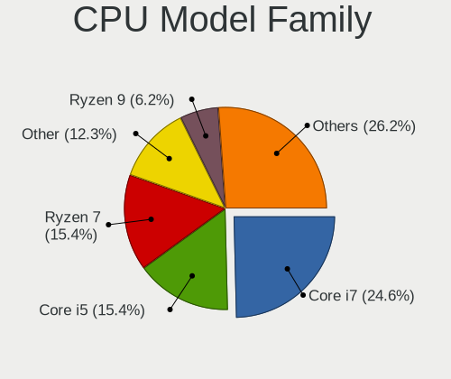
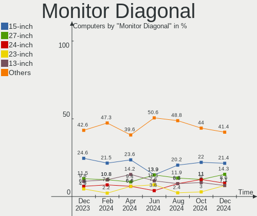

KDE neon - Hardware Trends
--------------------------

A project to identify most popular hardware characteristics and track their change
over time based on data collected by Linux users at https://Linux-Hardware.org.

Anyone can contribute to this report by the [hw-probe](https://github.com/linuxhw/hw-probe) tool:

    sudo -E hw-probe -all -upload

This is a report for all computer types. See also reports for [desktops](/Dist/KDE_neon/Desktop/README.md) and [notebooks](/Dist/KDE_neon/Notebook/README.md).

This report is for one last month. Overall report since the beginning of time: [TestDays](https://github.com/linuxhw/TestDays)

Period: Apr, 2024.

Contents
--------

* [ System ](#system)
  - [ OS                       ](#os)
  - [ OS Family                ](#os-family)
  - [ Kernel                   ](#kernel)
  - [ Kernel Family            ](#kernel-family)
  - [ Kernel Major Ver.        ](#kernel-major-ver)
  - [ Arch                     ](#arch)
  - [ DE                       ](#de)
  - [ Display Server           ](#display-server)
  - [ Display Manager          ](#display-manager)
  - [ OS Lang                  ](#os-lang)
  - [ Boot Mode                ](#boot-mode)
  - [ Filesystem               ](#filesystem)
  - [ Part. scheme             ](#part-scheme)
  - [ Dual Boot with Linux/BSD ](#dual-boot-with-linuxbsd)
  - [ Dual Boot (Win)          ](#dual-boot-win)

* [ Board ](#board)
  - [ Vendor                   ](#vendor)
  - [ Model                    ](#model)
  - [ Model Family             ](#model-family)
  - [ MFG Year                 ](#mfg-year)
  - [ Form Factor              ](#form-factor)
  - [ Secure Boot              ](#secure-boot)
  - [ Coreboot                 ](#coreboot)
  - [ RAM Size                 ](#ram-size)
  - [ RAM Used                 ](#ram-used)
  - [ Total Drives             ](#total-drives)
  - [ Has CD-ROM               ](#has-cd-rom)
  - [ Has Ethernet             ](#has-ethernet)
  - [ Has WiFi                 ](#has-wifi)
  - [ Has Bluetooth            ](#has-bluetooth)

* [ Location ](#location)
  - [ Country                  ](#country)
  - [ City                     ](#city)

* [ Drives ](#drives)
  - [ Drive Vendor             ](#drive-vendor)
  - [ Drive Model              ](#drive-model)
  - [ HDD Vendor               ](#hdd-vendor)
  - [ SSD Vendor               ](#ssd-vendor)
  - [ Drive Kind               ](#drive-kind)
  - [ Drive Connector          ](#drive-connector)
  - [ Drive Size               ](#drive-size)
  - [ Space Total              ](#space-total)
  - [ Space Used               ](#space-used)
  - [ Malfunc. Drives          ](#malfunc-drives)
  - [ Malfunc. Drive Vendor    ](#malfunc-drive-vendor)
  - [ Malfunc. HDD Vendor      ](#malfunc-hdd-vendor)
  - [ Malfunc. Drive Kind      ](#malfunc-drive-kind)
  - [ Failed Drives            ](#failed-drives)
  - [ Failed Drive Vendor      ](#failed-drive-vendor)
  - [ Drive Status             ](#drive-status)

* [ Storage controller ](#storage-controller)
  - [ Storage Vendor           ](#storage-vendor)
  - [ Storage Model            ](#storage-model)
  - [ Storage Kind             ](#storage-kind)

* [ Processor ](#processor)
  - [ CPU Vendor               ](#cpu-vendor)
  - [ CPU Model                ](#cpu-model)
  - [ CPU Model Family         ](#cpu-model-family)
  - [ CPU Cores                ](#cpu-cores)
  - [ CPU Sockets              ](#cpu-sockets)
  - [ CPU Threads              ](#cpu-threads)
  - [ CPU Op-Modes             ](#cpu-op-modes)
  - [ CPU Microcode            ](#cpu-microcode)
  - [ CPU Microarch            ](#cpu-microarch)

* [ Graphics ](#graphics)
  - [ GPU Vendor               ](#gpu-vendor)
  - [ GPU Model                ](#gpu-model)
  - [ GPU Combo                ](#gpu-combo)
  - [ GPU Driver               ](#gpu-driver)
  - [ GPU Memory               ](#gpu-memory)

* [ Monitor ](#monitor)
  - [ Monitor Vendor           ](#monitor-vendor)
  - [ Monitor Model            ](#monitor-model)
  - [ Monitor Resolution       ](#monitor-resolution)
  - [ Monitor Diagonal         ](#monitor-diagonal)
  - [ Monitor Width            ](#monitor-width)
  - [ Aspect Ratio             ](#aspect-ratio)
  - [ Monitor Area             ](#monitor-area)
  - [ Pixel Density            ](#pixel-density)
  - [ Multiple Monitors        ](#multiple-monitors)

* [ Network ](#network)
  - [ Net Controller Vendor    ](#net-controller-vendor)
  - [ Net Controller Model     ](#net-controller-model)
  - [ Wireless Vendor          ](#wireless-vendor)
  - [ Wireless Model           ](#wireless-model)
  - [ Ethernet Vendor          ](#ethernet-vendor)
  - [ Ethernet Model           ](#ethernet-model)
  - [ Net Controller Kind      ](#net-controller-kind)
  - [ Used Controller          ](#used-controller)
  - [ NICs                     ](#nics)
  - [ IPv6                     ](#ipv6)

* [ Bluetooth ](#bluetooth)
  - [ Bluetooth Vendor         ](#bluetooth-vendor)
  - [ Bluetooth Model          ](#bluetooth-model)

* [ Sound ](#sound)
  - [ Sound Vendor             ](#sound-vendor)
  - [ Sound Model              ](#sound-model)

* [ Memory ](#memory)
  - [ Memory Vendor            ](#memory-vendor)
  - [ Memory Model             ](#memory-model)
  - [ Memory Kind              ](#memory-kind)
  - [ Memory Form Factor       ](#memory-form-factor)
  - [ Memory Size              ](#memory-size)
  - [ Memory Speed             ](#memory-speed)

* [ Printers & scanners ](#printers--scanners)
  - [ Printer Vendor           ](#printer-vendor)
  - [ Printer Model            ](#printer-model)
  - [ Scanner Vendor           ](#scanner-vendor)
  - [ Scanner Model            ](#scanner-model)

* [ Camera ](#camera)
  - [ Camera Vendor            ](#camera-vendor)
  - [ Camera Model             ](#camera-model)

* [ Security ](#security)
  - [ Fingerprint Vendor       ](#fingerprint-vendor)
  - [ Fingerprint Model        ](#fingerprint-model)
  - [ Chipcard Vendor          ](#chipcard-vendor)
  - [ Chipcard Model           ](#chipcard-model)

* [ Unsupported ](#unsupported)
  - [ Unsupported Devices      ](#unsupported-devices)
  - [ Unsupported Device Types ](#unsupported-device-types)

System
------

OS
--

Installed operating systems

| Name           | Computers | Percent |
|----------------|-----------|---------|
| KDE neon 22.04 | 91        | 100%    |

OS Family
---------

OS without a version

| Name     | Computers | Percent |
|----------|-----------|---------|
| KDE neon | 91        | 100%    |

Kernel
------

Version of the Linux kernel

| Version              | Computers | Percent |
|----------------------|-----------|---------|
| 6.5.0-26-generic     | 29        | 31.87%  |
| 6.5.0-27-generic     | 28        | 30.77%  |
| 6.5.0-28-generic     | 26        | 28.57%  |
| 6.7.12-x64v3-xanmod1 | 1         | 1.1%    |
| 6.5.0-21-generic     | 1         | 1.1%    |
| 6.2.0-39-generic     | 1         | 1.1%    |
| 6.2.0-37-generic     | 1         | 1.1%    |
| 6.2.0-36-generic     | 1         | 1.1%    |
| 6.2.0-32-generic     | 1         | 1.1%    |
| 5.19.0-50-generic    | 1         | 1.1%    |
| 5.19.0-41-generic    | 1         | 1.1%    |

Kernel Family
-------------

Linux kernel without a distro release

| Version | Computers | Percent |
|---------|-----------|---------|
| 6.5.0   | 84        | 92.31%  |
| 6.2.0   | 4         | 4.4%    |
| 5.19.0  | 2         | 2.2%    |
| 6.7.12  | 1         | 1.1%    |

Kernel Major Ver.
-----------------

Linux kernel major version

| Version | Computers | Percent |
|---------|-----------|---------|
| 6.5     | 84        | 92.31%  |
| 6.2     | 4         | 4.4%    |
| 5.19    | 2         | 2.2%    |
| 6.7     | 1         | 1.1%    |

Arch
----

OS architecture (x86_64, i586, etc.)

| Name   | Computers | Percent |
|--------|-----------|---------|
| x86_64 | 91        | 100%    |

DE
--

Desktop Environment

| Name | Computers | Percent |
|------|-----------|---------|
| KDE6 | 86        | 94.51%  |
| KDE5 | 4         | 4.4%    |
| KDE  | 1         | 1.1%    |

Display Server
--------------

X11 or Wayland

| Name    | Computers | Percent |
|---------|-----------|---------|
| Wayland | 78        | 85.71%  |
| X11     | 12        | 13.19%  |
| Tty     | 1         | 1.1%    |

Display Manager
---------------

SDDM, LightDM, etc.

| Name    | Computers | Percent |
|---------|-----------|---------|
| Unknown | 73        | 80.22%  |
| SDDM    | 18        | 19.78%  |

OS Lang
-------

Language

| Lang  | Computers | Percent |
|-------|-----------|---------|
| en_US | 41        | 45.05%  |
| en_GB | 9         | 9.89%   |
| de_DE | 5         | 5.49%   |
| ru_RU | 4         | 4.4%    |
| en_AU | 4         | 4.4%    |
| pt_BR | 3         | 3.3%    |
| it_IT | 3         | 3.3%    |
| es_ES | 3         | 3.3%    |
| C     | 3         | 3.3%    |
| tr_TR | 2         | 2.2%    |
| hu_HU | 2         | 2.2%    |
| en_CA | 2         | 2.2%    |
| cs_CZ | 2         | 2.2%    |
| sv_SE | 1         | 1.1%    |
| nl_NL | 1         | 1.1%    |
| hr_HR | 1         | 1.1%    |
| fr_FR | 1         | 1.1%    |
| es_CU | 1         | 1.1%    |
| en_PH | 1         | 1.1%    |
| en_IN | 1         | 1.1%    |
| da_DK | 1         | 1.1%    |

Boot Mode
---------

EFI or BIOS

| Mode | Computers | Percent |
|------|-----------|---------|
| BIOS | 75        | 82.42%  |
| EFI  | 16        | 17.58%  |

Filesystem
----------

Type of filesystem

| Type    | Computers | Percent |
|---------|-----------|---------|
| Ext4    | 83        | 91.21%  |
| Tmpfs   | 3         | 3.3%    |
| Overlay | 2         | 2.2%    |
| Btrfs   | 2         | 2.2%    |
| F2fs    | 1         | 1.1%    |

Part. scheme
------------

Scheme of partitioning

| Type    | Computers | Percent |
|---------|-----------|---------|
| Unknown | 73        | 80.22%  |
| GPT     | 18        | 19.78%  |

Dual Boot with Linux/BSD
------------------------

Hosting more than one Linux/BSD

| Dual boot | Computers | Percent |
|-----------|-----------|---------|
| No        | 89        | 97.8%   |
| Yes       | 2         | 2.2%    |

Dual Boot (Win)
---------------

Hosting Linux and Windows

| Dual boot | Computers | Percent |
|-----------|-----------|---------|
| No        | 80        | 87.91%  |
| Yes       | 11        | 12.09%  |

Board
-----

Vendor
------

Motherboard manufacturer

| Name                                 | Computers | Percent |
|--------------------------------------|-----------|---------|
| ASUSTek Computer                     | 23        | 25.27%  |
| Hewlett-Packard                      | 14        | 15.38%  |
| Lenovo                               | 8         | 8.79%   |
| Apple                                | 8         | 8.79%   |
| MSI                                  | 7         | 7.69%   |
| Dell                                 | 6         | 6.59%   |
| Gigabyte Technology                  | 5         | 5.49%   |
| Acer                                 | 5         | 5.49%   |
| ASRock                               | 3         | 3.3%    |
| Pegatron                             | 2         | 2.2%    |
| Toshiba                              | 1         | 1.1%    |
| Shenzhen Meigao Electronic Equipment | 1         | 1.1%    |
| Panasonic                            | 1         | 1.1%    |
| Microsoft                            | 1         | 1.1%    |
| MAXSUN                               | 1         | 1.1%    |
| MACHINIST                            | 1         | 1.1%    |
| HUAWEI                               | 1         | 1.1%    |
| Google                               | 1         | 1.1%    |
| AZW                                  | 1         | 1.1%    |
| Unknown                              | 1         | 1.1%    |

Model
-----

Motherboard model

| Name                                          | Computers | Percent |
|-----------------------------------------------|-----------|---------|
| ASUS All Series                               | 2         | 2.2%    |
| Apple MacBookAir6,2                           | 2         | 2.2%    |
| Toshiba PORTEGE Z10t-A                        | 1         | 1.1%    |
| Shenzhen Meigao Electronic Equipment UM560 XT | 1         | 1.1%    |
| Pegatron Pro 3010 Microtower PC               | 1         | 1.1%    |
| Pegatron KT482AA-ABG IQ508a                   | 1         | 1.1%    |
| Panasonic CF-19-8                             | 1         | 1.1%    |
| MSI MS-7D78                                   | 1         | 1.1%    |
| MSI MS-7D25                                   | 1         | 1.1%    |
| MSI MS-7D15                                   | 1         | 1.1%    |
| MSI MS-7C75                                   | 1         | 1.1%    |
| MSI MS-7B86                                   | 1         | 1.1%    |
| MSI MS-7817                                   | 1         | 1.1%    |
| MSI GS60 2QE                                  | 1         | 1.1%    |
| Microsoft Surface Pro 3                       | 1         | 1.1%    |
| MAXSUN MS-Challenger B450M                    | 1         | 1.1%    |
| MACHINIST X99-MR9A PRO MAX V1.2               | 1         | 1.1%    |
| Lenovo Yoga 520-14IKB 80X8                    | 1         | 1.1%    |
| Lenovo V130-15IKB 81HN                        | 1         | 1.1%    |
| Lenovo ThinkPad Yoga 11e 3rd Gen 20G8S0SN00   | 1         | 1.1%    |
| Lenovo ThinkPad L13 Yoga Gen 2 20VLS20600     | 1         | 1.1%    |
| Lenovo ThinkCentre M720q 10T7006PMX           | 1         | 1.1%    |
| Lenovo ThinkBook 16p Gen 4 21J8               | 1         | 1.1%    |
| Lenovo IdeaPadFlex 5 14ARE05 81X2             | 1         | 1.1%    |
| Lenovo IdeaPad 330-15ARR 81D2                 | 1         | 1.1%    |
| HUAWEI NBLK-WAX9X                             | 1         | 1.1%    |
| HP ZHAN 66 Pro A 14 G4 Notebook PC            | 1         | 1.1%    |
| HP ZBook 15 G5                                | 1         | 1.1%    |
| HP Pavilion Laptop 15-eh0xxx                  | 1         | 1.1%    |
| HP Pavilion Laptop 15-cs2xxx                  | 1         | 1.1%    |
| HP Pavilion Desktop 595-p0xxx                 | 1         | 1.1%    |
| HP Notebook                                   | 1         | 1.1%    |
| HP Laptop 15-dy5xxx                           | 1         | 1.1%    |
| HP Laptop 15-dy1xxx                           | 1         | 1.1%    |
| HP Laptop 14-df0xxx                           | 1         | 1.1%    |
| HP ENVY x360 Convertible 13-ag0xxx            | 1         | 1.1%    |
| HP EliteBook 840 G4                           | 1         | 1.1%    |
| HP EliteBook 840 G3                           | 1         | 1.1%    |
| HP Compaq dc7900 Ultra-Slim Desktop           | 1         | 1.1%    |
| HP 255 G7 Notebook PC                         | 1         | 1.1%    |

Model Family
------------

Motherboard model prefix

| Name                                       | Computers | Percent |
|--------------------------------------------|-----------|---------|
| ASUS PRIME                                 | 4         | 4.4%    |
| HP Pavilion                                | 3         | 3.3%    |
| HP Laptop                                  | 3         | 3.3%    |
| ASUS ROG                                   | 3         | 3.3%    |
| Acer Aspire                                | 3         | 3.3%    |
| Lenovo ThinkPad                            | 2         | 2.2%    |
| HP EliteBook                               | 2         | 2.2%    |
| Dell XPS                                   | 2         | 2.2%    |
| Dell OptiPlex                              | 2         | 2.2%    |
| Dell Latitude                              | 2         | 2.2%    |
| ASUS VivoBook                              | 2         | 2.2%    |
| ASUS All                                   | 2         | 2.2%    |
| Apple MacBookAir6                          | 2         | 2.2%    |
| Toshiba PORTEGE                            | 1         | 1.1%    |
| Shenzhen Meigao Electronic Equipment UM560 | 1         | 1.1%    |
| Pegatron Pro                               | 1         | 1.1%    |
| Pegatron KT482AA-ABG                       | 1         | 1.1%    |
| Panasonic CF-19-8                          | 1         | 1.1%    |
| MSI MS-7D78                                | 1         | 1.1%    |
| MSI MS-7D25                                | 1         | 1.1%    |
| MSI MS-7D15                                | 1         | 1.1%    |
| MSI MS-7C75                                | 1         | 1.1%    |
| MSI MS-7B86                                | 1         | 1.1%    |
| MSI MS-7817                                | 1         | 1.1%    |
| MSI GS60                                   | 1         | 1.1%    |
| Microsoft Surface                          | 1         | 1.1%    |
| MAXSUN MS-Challenger                       | 1         | 1.1%    |
| MACHINIST X99-MR9A                         | 1         | 1.1%    |
| Lenovo Yoga                                | 1         | 1.1%    |
| Lenovo V130-15IKB                          | 1         | 1.1%    |
| Lenovo ThinkCentre                         | 1         | 1.1%    |
| Lenovo ThinkBook                           | 1         | 1.1%    |
| Lenovo IdeaPadFlex                         | 1         | 1.1%    |
| Lenovo IdeaPad                             | 1         | 1.1%    |
| HUAWEI NBLK-WAX9X                          | 1         | 1.1%    |
| HP ZHAN                                    | 1         | 1.1%    |
| HP ZBook                                   | 1         | 1.1%    |
| HP Notebook                                | 1         | 1.1%    |
| HP ENVY                                    | 1         | 1.1%    |
| HP Compaq                                  | 1         | 1.1%    |

MFG Year
--------

Motherboard manufacture year

| Year | Computers | Percent |
|------|-----------|---------|
| 2020 | 11        | 12.09%  |
| 2013 | 9         | 9.89%   |
| 2019 | 8         | 8.79%   |
| 2018 | 8         | 8.79%   |
| 2023 | 7         | 7.69%   |
| 2017 | 7         | 7.69%   |
| 2022 | 6         | 6.59%   |
| 2021 | 6         | 6.59%   |
| 2014 | 5         | 5.49%   |
| 2012 | 5         | 5.49%   |
| 2016 | 4         | 4.4%    |
| 2015 | 4         | 4.4%    |
| 2009 | 3         | 3.3%    |
| 2008 | 3         | 3.3%    |
| 2011 | 2         | 2.2%    |
| 2024 | 1         | 1.1%    |
| 2010 | 1         | 1.1%    |
| 2007 | 1         | 1.1%    |

Form Factor
-----------

Physical design of the computer

| Name        | Computers | Percent |
|-------------|-----------|---------|
| Notebook    | 45        | 49.45%  |
| Desktop     | 36        | 39.56%  |
| Convertible | 5         | 5.49%   |
| Mini pc     | 2         | 2.2%    |
| All in one  | 2         | 2.2%    |
| Tablet      | 1         | 1.1%    |

Secure Boot
-----------

Enabled or disabled

| State    | Computers | Percent |
|----------|-----------|---------|
| Disabled | 86        | 94.51%  |
| Enabled  | 5         | 5.49%   |

Coreboot
--------

Have coreboot on board

| Used | Computers | Percent |
|------|-----------|---------|
| No   | 90        | 98.9%   |
| Yes  | 1         | 1.1%    |

RAM Size
--------

Total RAM memory

| Size in GB  | Computers | Percent |
|-------------|-----------|---------|
| 4.01-8.0    | 27        | 29.67%  |
| 8.01-16.0   | 18        | 19.78%  |
| 16.01-24.0  | 16        | 17.58%  |
| 32.01-64.0  | 15        | 16.48%  |
| 3.01-4.0    | 8         | 8.79%   |
| 24.01-32.0  | 4         | 4.4%    |
| 64.01-256.0 | 3         | 3.3%    |

RAM Used
--------

Used RAM memory

| Used GB   | Computers | Percent |
|-----------|-----------|---------|
| 3.01-4.0  | 27        | 29.67%  |
| 2.01-3.0  | 24        | 26.37%  |
| 1.01-2.0  | 20        | 21.98%  |
| 4.01-8.0  | 18        | 19.78%  |
| 8.01-16.0 | 2         | 2.2%    |

Total Drives
------------

Number of drives on board

| Drives | Computers | Percent |
|--------|-----------|---------|
| 1      | 48        | 52.75%  |
| 2      | 22        | 24.18%  |
| 4      | 9         | 9.89%   |
| 3      | 9         | 9.89%   |
| 9      | 1         | 1.1%    |
| 6      | 1         | 1.1%    |
| 5      | 1         | 1.1%    |

Has CD-ROM
----------

Has CD-ROM on board

| Presented | Computers | Percent |
|-----------|-----------|---------|
| No        | 69        | 75.82%  |
| Yes       | 22        | 24.18%  |

Has Ethernet
------------

Has Ethernet on board

| Presented | Computers | Percent |
|-----------|-----------|---------|
| Yes       | 79        | 86.81%  |
| No        | 12        | 13.19%  |

Has WiFi
--------

Has WiFi module

| Presented | Computers | Percent |
|-----------|-----------|---------|
| Yes       | 72        | 79.12%  |
| No        | 19        | 20.88%  |

Has Bluetooth
-------------

Has Bluetooth module

| Presented | Computers | Percent |
|-----------|-----------|---------|
| Yes       | 71        | 78.02%  |
| No        | 20        | 21.98%  |

Location
--------

Country
-------

Geographic location (country)

| Country     | Computers | Percent |
|-------------|-----------|---------|
| USA         | 24        | 26.37%  |
| Germany     | 7         | 7.69%   |
| UK          | 6         | 6.59%   |
| Netherlands | 6         | 6.59%   |
| Italy       | 5         | 5.49%   |
| Russia      | 4         | 4.4%    |
| Brazil      | 4         | 4.4%    |
| Australia   | 4         | 4.4%    |
| Spain       | 3         | 3.3%    |
| Canada      | 3         | 3.3%    |
| Turkey      | 2         | 2.2%    |
| Sweden      | 2         | 2.2%    |
| Poland      | 2         | 2.2%    |
| Norway      | 2         | 2.2%    |
| India       | 2         | 2.2%    |
| Hungary     | 2         | 2.2%    |
| France      | 2         | 2.2%    |
| Czechia     | 2         | 2.2%    |
| Türkiye    | 1         | 1.1%    |
| Portugal    | 1         | 1.1%    |
| Philippines | 1         | 1.1%    |
| Greece      | 1         | 1.1%    |
| Denmark     | 1         | 1.1%    |
| Croatia     | 1         | 1.1%    |
| Colombia    | 1         | 1.1%    |
| Austria     | 1         | 1.1%    |
| Argentina   | 1         | 1.1%    |

City
----

Geographic location (city)

| City           | Computers | Percent |
|----------------|-----------|---------|
| Zaragoza       | 2         | 2.2%    |
| Rotterdam      | 2         | 2.2%    |
| Moscow         | 2         | 2.2%    |
| Melbourne      | 2         | 2.2%    |
| Krasnodar      | 2         | 2.2%    |
| Istanbul       | 2         | 2.2%    |
| Amsterdam      | 2         | 2.2%    |
| Zagreb         | 1         | 1.1%    |
| Yuma           | 1         | 1.1%    |
| Wichita        | 1         | 1.1%    |
| West Newton    | 1         | 1.1%    |
| Warsaw         | 1         | 1.1%    |
| Warrington     | 1         | 1.1%    |
| Vail           | 1         | 1.1%    |
| Utrecht        | 1         | 1.1%    |
| Uberlândia    | 1         | 1.1%    |
| Turin          | 1         | 1.1%    |
| Sydney         | 1         | 1.1%    |
| Sundsvall      | 1         | 1.1%    |
| Spanaway       | 1         | 1.1%    |
| San Francisco  | 1         | 1.1%    |
| Salto          | 1         | 1.1%    |
| Salt Lake City | 1         | 1.1%    |
| Rho            | 1         | 1.1%    |
| Prague         | 1         | 1.1%    |
| Poznan         | 1         | 1.1%    |
| Oslo           | 1         | 1.1%    |
| Orlando        | 1         | 1.1%    |
| Orcoyen        | 1         | 1.1%    |
| Oldenburg      | 1         | 1.1%    |
| Ogden          | 1         | 1.1%    |
| Oberhausen     | 1         | 1.1%    |
| Nyiregyhaza    | 1         | 1.1%    |
| Nordmaling     | 1         | 1.1%    |
| Newport News   | 1         | 1.1%    |
| Napanee        | 1         | 1.1%    |
| Mumbai         | 1         | 1.1%    |
| Milton Keynes  | 1         | 1.1%    |
| Milano         | 1         | 1.1%    |
| Messines       | 1         | 1.1%    |

Drives
------

Drive Vendor
------------

Hard drive vendors

| Vendor                       | Computers | Drives | Percent |
|------------------------------|-----------|--------|---------|
| Samsung Electronics          | 23        | 30     | 15.13%  |
| Seagate                      | 13        | 19     | 8.55%   |
| SanDisk                      | 13        | 15     | 8.55%   |
| WDC                          | 11        | 16     | 7.24%   |
| Toshiba                      | 9         | 12     | 5.92%   |
| Crucial                      | 9         | 9      | 5.92%   |
| Kingston                     | 7         | 7      | 4.61%   |
| SK hynix                     | 5         | 5      | 3.29%   |
| Micron Technology            | 5         | 5      | 3.29%   |
| Unknown                      | 4         | 5      | 2.63%   |
| Silicon Motion               | 4         | 5      | 2.63%   |
| Phison Electronics           | 4         | 4      | 2.63%   |
| Intel                        | 4         | 4      | 2.63%   |
| HGST                         | 4         | 4      | 2.63%   |
| Hitachi                      | 3         | 3      | 1.97%   |
| Apple                        | 3         | 5      | 1.97%   |
| A-DATA Technology            | 3         | 3      | 1.97%   |
| Shenzhen Longsys Electronics | 2         | 2      | 1.32%   |
| Realtek Semiconductor        | 2         | 2      | 1.32%   |
| Micron/Crucial Technology    | 2         | 2      | 1.32%   |
| Intenso                      | 2         | 2      | 1.32%   |
| China                        | 2         | 2      | 1.32%   |
| ADATA Technology             | 2         | 2      | 1.32%   |
| Union Memory                 | 1         | 1      | 0.66%   |
| SSK                          | 1         | 1      | 0.66%   |
| S3+                          | 1         | 1      | 0.66%   |
| PNY                          | 1         | 1      | 0.66%   |
| Phison                       | 1         | 1      | 0.66%   |
| Netac                        | 1         | 1      | 0.66%   |
| Maxtor                       | 1         | 1      | 0.66%   |
| KODAK                        | 1         | 1      | 0.66%   |
| KIOXIA                       | 1         | 1      | 0.66%   |
| KingSpec                     | 1         | 1      | 0.66%   |
| JMicron Technology           | 1         | 1      | 0.66%   |
| Integral                     | 1         | 1      | 0.66%   |
| Gigabyte Technology          | 1         | 1      | 0.66%   |
| Emtec                        | 1         | 1      | 0.66%   |
| ASMT                         | 1         | 1      | 0.66%   |
| Unknown                      | 1         | 1      | 0.66%   |

Drive Model
-----------

Hard drive models

| Model                                                 | Computers | Percent |
|-------------------------------------------------------|-----------|---------|
| Samsung SSD 860 EVO 1TB                               | 3         | 1.73%   |
| Samsung NVMe SSD Controller SM981/PM981/PM983 1TB     | 3         | 1.73%   |
| Samsung NVMe SSD Controller PM9A1/PM9A3/980PRO 1TB    | 3         | 1.73%   |
| Unknown MMC Card  64GB                                | 2         | 1.16%   |
| Toshiba XG6 NVMe SSD Controller 1024GB                | 2         | 1.16%   |
| SK hynix BC501 NVMe Solid State Drive 512GB           | 2         | 1.16%   |
| Silicon Motion SM2263EN/SM2263XT SSD Controller 256GB | 2         | 1.16%   |
| Silicon Motion SM2262/SM2262EN SSD Controller 2TB     | 2         | 1.16%   |
| Sandisk WD Blue SN550 NVMe SSD 2TB                    | 2         | 1.16%   |
| Sandisk WD Black SN750 / PC SN730 NVMe SSD 512GB      | 2         | 1.16%   |
| SanDisk SSD PLUS 1000GB                               | 2         | 1.16%   |
| Phison E12 NVMe Controller 2TB                        | 2         | 1.16%   |
| Kingston SV300S37A120G 120GB SSD                      | 2         | 1.16%   |
| Kingston SA400S37480G 480GB SSD                       | 2         | 1.16%   |
| HGST HTS721010A9E630 1TB                              | 2         | 1.16%   |
| Crucial CT512MX100SSD1 512GB                          | 2         | 1.16%   |
| Crucial CT500MX500SSD1 500GB                          | 2         | 1.16%   |
| China SSD 256GB                                       | 2         | 1.16%   |
| WDC WDS240G2G0A-00JH30 240GB SSD                      | 1         | 0.58%   |
| WDC WD5001AALS-00L3B2 500GB                           | 1         | 0.58%   |
| WDC WD5000AZRX-00L4HB0 500GB                          | 1         | 0.58%   |
| WDC WD40EFRX-68N32N0 4TB                              | 1         | 0.58%   |
| WDC WD4003FZEX-00Z4SA0 4TB                            | 1         | 0.58%   |
| WDC WD30EZRX-00D8PB0 3TB                              | 1         | 0.58%   |
| WDC WD2500AAJS-00V4A0 250GB                           | 1         | 0.58%   |
| WDC WD181KRYZ-01AGBB0 18TB                            | 1         | 0.58%   |
| WDC WD121KRYZ-01W0RB0 12TB                            | 1         | 0.58%   |
| WDC WD10PURZ-85U8XY0 1TB                              | 1         | 0.58%   |
| WDC WD10JPCX-24UE4T0 1TB                              | 1         | 0.58%   |
| WDC WD10EZEX-60WN4A0 1TB                              | 1         | 0.58%   |
| WDC WD10EZEX-22BN5A0 1TB                              | 1         | 0.58%   |
| WDC WD10EZEX-00RKKA0 1TB                              | 1         | 0.58%   |
| Unknown SD/MMC/MS PRO 128GB                           | 1         | 0.58%   |
| Unknown NVMe SSD Drive 1TB                            | 1         | 0.58%   |
| Unknown MMC Card  128GB                               | 1         | 0.58%   |
| Union Memory UMIS RPJTJ256MEE1OWX 256GB               | 1         | 0.58%   |
| Toshiba THNSNJ256GMCU 256GB SSD                       | 1         | 0.58%   |
| Toshiba THNSNJ128G8NU 128GB SSD                       | 1         | 0.58%   |
| Toshiba MK5065GSXF 500GB                              | 1         | 0.58%   |
| Toshiba MK5059GSXP 500GB                              | 1         | 0.58%   |

HDD Vendor
----------

Hard disk drive vendors

| Vendor              | Computers | Drives | Percent |
|---------------------|-----------|--------|---------|
| Seagate             | 13        | 19     | 32.5%   |
| WDC                 | 10        | 15     | 25%     |
| Toshiba             | 4         | 6      | 10%     |
| HGST                | 4         | 4      | 10%     |
| Hitachi             | 3         | 3      | 7.5%    |
| Apple               | 2         | 2      | 5%      |
| Unknown             | 1         | 1      | 2.5%    |
| Samsung Electronics | 1         | 1      | 2.5%    |
| Maxtor              | 1         | 1      | 2.5%    |
| JMicron Technology  | 1         | 1      | 2.5%    |

SSD Vendor
----------

Solid state drive vendors

| Vendor              | Computers | Drives | Percent |
|---------------------|-----------|--------|---------|
| Samsung Electronics | 14        | 15     | 22.95%  |
| Crucial             | 8         | 8      | 13.11%  |
| SanDisk             | 7         | 7      | 11.48%  |
| Kingston            | 7         | 7      | 11.48%  |
| A-DATA Technology   | 3         | 3      | 4.92%   |
| Toshiba             | 2         | 3      | 3.28%   |
| Intel               | 2         | 2      | 3.28%   |
| China               | 2         | 2      | 3.28%   |
| WDC                 | 1         | 1      | 1.64%   |
| SSK                 | 1         | 1      | 1.64%   |
| SK hynix            | 1         | 1      | 1.64%   |
| S3+                 | 1         | 1      | 1.64%   |
| PNY                 | 1         | 1      | 1.64%   |
| Netac               | 1         | 1      | 1.64%   |
| Micron Technology   | 1         | 1      | 1.64%   |
| KODAK               | 1         | 1      | 1.64%   |
| KingSpec            | 1         | 1      | 1.64%   |
| Intenso             | 1         | 1      | 1.64%   |
| Integral            | 1         | 1      | 1.64%   |
| Gigabyte Technology | 1         | 1      | 1.64%   |
| Emtec               | 1         | 1      | 1.64%   |
| ASMT                | 1         | 1      | 1.64%   |
| Apple               | 1         | 1      | 1.64%   |
| Unknown             | 1         | 1      | 1.64%   |

Drive Kind
----------

HDD or SSD

| Kind    | Computers | Drives | Percent |
|---------|-----------|--------|---------|
| SSD     | 47        | 63     | 36.72%  |
| NVMe    | 46        | 59     | 35.94%  |
| HDD     | 32        | 53     | 25%     |
| MMC     | 2         | 3      | 1.56%   |
| Unknown | 1         | 1      | 0.78%   |

Drive Connector
---------------

SATA, SAS, NVMe, etc.

| Type | Computers | Drives | Percent |
|------|-----------|--------|---------|
| SATA | 62        | 110    | 53.91%  |
| NVMe | 46        | 59     | 40%     |
| SAS  | 5         | 7      | 4.35%   |
| MMC  | 2         | 3      | 1.74%   |

Drive Size
----------

Size of hard drive

| Size in TB | Computers | Drives | Percent |
|------------|-----------|--------|---------|
| 0.01-0.5   | 41        | 58     | 47.67%  |
| 0.51-1.0   | 28        | 34     | 32.56%  |
| 1.01-2.0   | 7         | 7      | 8.14%   |
| 2.01-3.0   | 5         | 6      | 5.81%   |
| 3.01-4.0   | 3         | 4      | 3.49%   |
| 10.01-20.0 | 1         | 5      | 1.16%   |
| 4.01-10.0  | 1         | 2      | 1.16%   |

Space Total
-----------

Amount of disk space available on the file system

| Size in GB     | Computers | Percent |
|----------------|-----------|---------|
| 101-250        | 26        | 28.57%  |
| 501-1000       | 20        | 21.98%  |
| 251-500        | 13        | 14.29%  |
| More than 3000 | 9         | 9.89%   |
| 1001-2000      | 6         | 6.59%   |
| 51-100         | 6         | 6.59%   |
| 21-50          | 5         | 5.49%   |
| 1-20           | 3         | 3.3%    |
| Unknown        | 2         | 2.2%    |
| 2001-3000      | 1         | 1.1%    |

Space Used
----------

Amount of used disk space

| Used GB        | Computers | Percent |
|----------------|-----------|---------|
| 1-20           | 37        | 40.66%  |
| 21-50          | 12        | 13.19%  |
| 101-250        | 11        | 12.09%  |
| 51-100         | 11        | 12.09%  |
| 251-500        | 6         | 6.59%   |
| More than 3000 | 4         | 4.4%    |
| 2001-3000      | 3         | 3.3%    |
| 501-1000       | 3         | 3.3%    |
| 1001-2000      | 2         | 2.2%    |
| Unknown        | 2         | 2.2%    |

Malfunc. Drives
---------------

Drive models with a malfunction

| Model                                 | Computers | Drives | Percent |
|---------------------------------------|-----------|--------|---------|
| SK hynix HFS256G3AMNB-2200A 256GB SSD | 1         | 1      | 25%     |
| Seagate ST9750420AS 752GB             | 1         | 1      | 25%     |
| Seagate ST9250320AS 250GB             | 1         | 1      | 25%     |
| Intel SSDSC2BB480G4T 480GB            | 1         | 1      | 25%     |

Malfunc. Drive Vendor
---------------------

Vendors of faulty drives

| Vendor   | Computers | Drives | Percent |
|----------|-----------|--------|---------|
| Seagate  | 2         | 2      | 50%     |
| SK hynix | 1         | 1      | 25%     |
| Intel    | 1         | 1      | 25%     |

Malfunc. HDD Vendor
-------------------

Vendors of faulty HDD drives

| Vendor  | Computers | Drives | Percent |
|---------|-----------|--------|---------|
| Seagate | 2         | 2      | 100%    |

Malfunc. Drive Kind
-------------------

Kinds of faulty drives

| Kind | Computers | Drives | Percent |
|------|-----------|--------|---------|
| SSD  | 2         | 2      | 50%     |
| HDD  | 2         | 2      | 50%     |

Failed Drives
-------------

Failed drive models

Zero info for selected period =(

Failed Drive Vendor
-------------------

Failed drive vendors

Zero info for selected period =(

Drive Status
------------

Number of failed and malfunc. drives

| Status   | Computers | Drives | Percent |
|----------|-----------|--------|---------|
| Detected | 77        | 151    | 80.21%  |
| Works    | 15        | 24     | 15.63%  |
| Malfunc  | 4         | 4      | 4.17%   |

Storage controller
------------------

Storage Vendor
--------------

Storage controller vendors

| Vendor                       | Computers | Percent |
|------------------------------|-----------|---------|
| Intel                        | 56        | 42.75%  |
| AMD                          | 17        | 12.98%  |
| Samsung Electronics          | 11        | 8.4%    |
| SanDisk                      | 7         | 5.34%   |
| Phison Electronics           | 5         | 3.82%   |
| SK hynix                     | 4         | 3.05%   |
| Silicon Motion               | 4         | 3.05%   |
| Micron Technology            | 4         | 3.05%   |
| ASMedia Technology           | 4         | 3.05%   |
| Toshiba America Info Systems | 3         | 2.29%   |
| Micron/Crucial Technology    | 3         | 2.29%   |
| Shenzhen Longsys Electronics | 2         | 1.53%   |
| Realtek Semiconductor        | 2         | 1.53%   |
| ADATA Technology             | 2         | 1.53%   |
| Union Memory (Shenzhen)      | 1         | 0.76%   |
| Solidigm                     | 1         | 0.76%   |
| Nvidia                       | 1         | 0.76%   |
| Marvell Technology Group     | 1         | 0.76%   |
| KIOXIA                       | 1         | 0.76%   |
| JMicron Technology           | 1         | 0.76%   |
| Apple                        | 1         | 0.76%   |

Storage Model
-------------

Storage controller models

| Model                                                                          | Computers | Percent |
|--------------------------------------------------------------------------------|-----------|---------|
| AMD FCH SATA Controller [AHCI mode]                                            | 8         | 5.52%   |
| Intel 82801 Mobile SATA Controller [RAID mode]                                 | 7         | 4.83%   |
| Intel 8 Series/C220 Series Chipset Family 6-port SATA Controller 1 [AHCI mode] | 7         | 4.83%   |
| Samsung NVMe SSD Controller PM9A1/PM9A3/980PRO                                 | 5         | 3.45%   |
| Intel Q170/Q150/B150/H170/H110/Z170/CM236 Chipset SATA Controller [AHCI Mode]  | 4         | 2.76%   |
| AMD 400 Series Chipset SATA Controller                                         | 4         | 2.76%   |
| Samsung NVMe SSD Controller SM981/PM981/PM983                                  | 3         | 2.07%   |
| Samsung NVMe SSD Controller 980 (DRAM-less)                                    | 3         | 2.07%   |
| Intel Wildcat Point-LP SATA Controller [AHCI Mode]                             | 3         | 2.07%   |
| Intel Sunrise Point-LP SATA Controller [AHCI mode]                             | 3         | 2.07%   |
| Intel SATA Controller [RAID mode]                                              | 3         | 2.07%   |
| Intel 7 Series Chipset Family 6-port SATA Controller [AHCI mode]               | 3         | 2.07%   |
| ASMedia ASM1061/ASM1062 Serial ATA Controller                                  | 3         | 2.07%   |
| Toshiba America Info Systems XG6 NVMe SSD Controller                           | 2         | 1.38%   |
| SK hynix Gold P31/BC711/PC711 NVMe Solid State Drive                           | 2         | 1.38%   |
| SK hynix BC501 NVMe Solid State Drive                                          | 2         | 1.38%   |
| Silicon Motion SM2263EN/SM2263XT (DRAM-less) NVMe SSD Controllers              | 2         | 1.38%   |
| Silicon Motion SM2262/SM2262EN SSD Controller                                  | 2         | 1.38%   |
| SanDisk WD Black SN770 / PC SN740 256GB / PC SN560 (DRAM-less) NVMe SSD        | 2         | 1.38%   |
| SanDisk Ultra 3D / WD Blue SN550 NVMe SSD                                      | 2         | 1.38%   |
| SanDisk Extreme Pro / WD Black SN750 / PC SN730 / Red SN700 NVMe SSD           | 2         | 1.38%   |
| Phison E12 NVMe Controller                                                     | 2         | 1.38%   |
| Micron/Crucial P1 NVMe PCIe SSD[Frampton]                                      | 2         | 1.38%   |
| Intel Volume Management Device NVMe RAID Controller                            | 2         | 1.38%   |
| Intel Cannon Lake Mobile PCH SATA AHCI Controller                              | 2         | 1.38%   |
| Intel 82801JI (ICH10 Family) SATA AHCI Controller                              | 2         | 1.38%   |
| Intel 8 Series SATA Controller 1 [AHCI mode]                                   | 2         | 1.38%   |
| Intel 200 Series PCH SATA controller [AHCI mode]                               | 2         | 1.38%   |
| AMD 600 Series Chipset SATA Controller                                         | 2         | 1.38%   |
| AMD 500 Series Chipset SATA Controller                                         | 2         | 1.38%   |
| Union Memory (Shenzhen) AM620 PCIe 3.0 NVMe SSD 256GB                          | 1         | 0.69%   |
| Toshiba America Info Systems XG5 NVMe SSD Controller                           | 1         | 0.69%   |
| Solidigm P41 Plus NVMe SSD (DRAM-less) [Echo Harbor]                           | 1         | 0.69%   |
| Shenzhen Longsys Lexar NM800 PRO NVME SSD                                      | 1         | 0.69%   |
| Shenzhen Longsys Lexar NM790 NVME SSD (DRAM-less)                              | 1         | 0.69%   |
| SanDisk WD Blue SN570 NVMe SSD 2TB                                             | 1         | 0.69%   |
| SanDisk Ultra 3D / WD Blue SN570 NVMe SSD (DRAM-less)                          | 1         | 0.69%   |
| Samsung S4LN058A01[SSUBX] AHCI SSD Controller (Apple slot)                     | 1         | 0.69%   |
| Samsung NVMe SSD Controller SM961/PM961/SM963                                  | 1         | 0.69%   |
| Samsung NVMe SSD Controller PM9B1 (DRAM-less)                                  | 1         | 0.69%   |

Storage Kind
------------

Kind of storage controller (IDE, SATA, NVMe, SAS, ...)

| Kind | Computers | Percent |
|------|-----------|---------|
| SATA | 59        | 47.2%   |
| NVMe | 46        | 36.8%   |
| RAID | 14        | 11.2%   |
| IDE  | 6         | 4.8%    |

Processor
---------

CPU Vendor
----------

Processor vendors

| Vendor | Computers | Percent |
|--------|-----------|---------|
| Intel  | 67        | 73.63%  |
| AMD    | 24        | 26.37%  |

CPU Model
---------

Processor models

| Model                                         | Computers | Percent |
|-----------------------------------------------|-----------|---------|
| Intel Core i5-7200U CPU @ 2.50GHz             | 3         | 3.3%    |
| AMD Ryzen 5 4500U with Radeon Graphics        | 3         | 3.3%    |
| Intel Core i7-8750H CPU @ 2.20GHz             | 2         | 2.2%    |
| AMD Ryzen 5 5600G with Radeon Graphics        | 2         | 2.2%    |
| AMD Ryzen 5 2500U with Radeon Vega Mobile Gfx | 2         | 2.2%    |
| AMD Ryzen 3 3200U with Radeon Vega Mobile Gfx | 2         | 2.2%    |
| Intel Xeon CPU E5-2680 v4 @ 2.40GHz           | 1         | 1.1%    |
| Intel Pentium Dual-Core CPU E5400 @ 2.70GHz   | 1         | 1.1%    |
| Intel Pentium Dual-Core CPU E5200 @ 2.50GHz   | 1         | 1.1%    |
| Intel Pentium CPU 3825U @ 1.90GHz             | 1         | 1.1%    |
| Intel Core i9-9900K CPU @ 3.60GHz             | 1         | 1.1%    |
| Intel Core i9-10850K CPU @ 3.60GHz            | 1         | 1.1%    |
| Intel Core i7-8700K CPU @ 3.70GHz             | 1         | 1.1%    |
| Intel Core i7-8565U CPU @ 1.80GHz             | 1         | 1.1%    |
| Intel Core i7-8086K CPU @ 4.00GHz             | 1         | 1.1%    |
| Intel Core i7-7700K CPU @ 4.20GHz             | 1         | 1.1%    |
| Intel Core i7-7700HQ CPU @ 2.80GHz            | 1         | 1.1%    |
| Intel Core i7-6700K CPU @ 4.00GHz             | 1         | 1.1%    |
| Intel Core i7-4790 CPU @ 3.60GHz              | 1         | 1.1%    |
| Intel Core i7-4771 CPU @ 3.50GHz              | 1         | 1.1%    |
| Intel Core i7-4770K CPU @ 3.50GHz             | 1         | 1.1%    |
| Intel Core i7-4710HQ CPU @ 2.50GHz            | 1         | 1.1%    |
| Intel Core i7-4650U CPU @ 1.70GHz             | 1         | 1.1%    |
| Intel Core i7-3770 CPU @ 3.40GHz              | 1         | 1.1%    |
| Intel Core i7-3612QM CPU @ 2.10GHz            | 1         | 1.1%    |
| Intel Core i7-2600 CPU @ 3.40GHz              | 1         | 1.1%    |
| Intel Core i7-1065G7 CPU @ 1.30GHz            | 1         | 1.1%    |
| Intel Core i5-8400T CPU @ 1.70GHz             | 1         | 1.1%    |
| Intel Core i5-7500T CPU @ 2.70GHz             | 1         | 1.1%    |
| Intel Core i5-7500 CPU @ 3.40GHz              | 1         | 1.1%    |
| Intel Core i5-6500 CPU @ 3.20GHz              | 1         | 1.1%    |
| Intel Core i5-6300U CPU @ 2.40GHz             | 1         | 1.1%    |
| Intel Core i5-5257U CPU @ 2.70GHz             | 1         | 1.1%    |
| Intel Core i5-5250U CPU @ 1.60GHz             | 1         | 1.1%    |
| Intel Core i5-5200U CPU @ 2.20GHz             | 1         | 1.1%    |
| Intel Core i5-4670K CPU @ 3.40GHz             | 1         | 1.1%    |
| Intel Core i5-4590 CPU @ 3.30GHz              | 1         | 1.1%    |
| Intel Core i5-4460 CPU @ 3.20GHz              | 1         | 1.1%    |
| Intel Core i5-4300U CPU @ 1.90GHz             | 1         | 1.1%    |
| Intel Core i5-4250U CPU @ 1.30GHz             | 1         | 1.1%    |

CPU Model Family
----------------

Processor model prefix

| Model                   | Computers | Percent |
|-------------------------|-----------|---------|
| Intel Core i5           | 21        | 23.08%  |
| Intel Core i7           | 17        | 18.68%  |
| AMD Ryzen 5             | 14        | 15.38%  |
| Other                   | 10        | 10.99%  |
| Intel Celeron           | 5         | 5.49%   |
| Intel Core i3           | 4         | 4.4%    |
| AMD Ryzen 7             | 4         | 4.4%    |
| Intel Core 2 Duo        | 3         | 3.3%    |
| Intel Pentium Dual-Core | 2         | 2.2%    |
| Intel Core i9           | 2         | 2.2%    |
| AMD Ryzen 3             | 2         | 2.2%    |
| AMD A10                 | 2         | 2.2%    |
| Intel Xeon              | 1         | 1.1%    |
| Intel Pentium           | 1         | 1.1%    |
| Intel Core 2 Quad       | 1         | 1.1%    |
| AMD Ryzen 9             | 1         | 1.1%    |
| AMD FX                  | 1         | 1.1%    |

CPU Cores
---------

Number of processor cores

| Number | Computers | Percent |
|--------|-----------|---------|
| 2      | 31        | 34.07%  |
| 4      | 28        | 30.77%  |
| 6      | 16        | 17.58%  |
| 8      | 8         | 8.79%   |
| 10     | 4         | 4.4%    |
| 14     | 2         | 2.2%    |
| 16     | 1         | 1.1%    |
| 12     | 1         | 1.1%    |

CPU Sockets
-----------

Number of sockets

| Number | Computers | Percent |
|--------|-----------|---------|
| 1      | 91        | 100%    |

CPU Threads
-----------

Threads per core (Hyper-Threading)

| Number | Computers | Percent |
|--------|-----------|---------|
| 2      | 69        | 75.82%  |
| 1      | 22        | 24.18%  |

CPU Op-Modes
------------

CPU Operation Modes (32-bit, 64-bit)

| Op mode        | Computers | Percent |
|----------------|-----------|---------|
| 32-bit, 64-bit | 91        | 100%    |

CPU Microcode
-------------

Microcode number

| Number     | Computers | Percent |
|------------|-----------|---------|
| Unknown    | 84        | 92.31%  |
| 0x0a50000d | 2         | 2.2%    |
| 0x306a9    | 1         | 1.1%    |
| 0x0a601206 | 1         | 1.1%    |
| 0x0a404101 | 1         | 1.1%    |
| 0x08701021 | 1         | 1.1%    |
| 0x08600103 | 1         | 1.1%    |

CPU Microarch
-------------

Microarchitecture

| Name             | Computers | Percent |
|------------------|-----------|---------|
| KabyLake         | 15        | 16.48%  |
| Haswell          | 12        | 13.19%  |
| Unknown          | 11        | 12.09%  |
| Zen 2            | 6         | 6.59%   |
| Zen 3            | 5         | 5.49%   |
| Penryn           | 5         | 5.49%   |
| Broadwell        | 5         | 5.49%   |
| Zen+             | 4         | 4.4%    |
| Skylake          | 4         | 4.4%    |
| IvyBridge        | 4         | 4.4%    |
| SandyBridge      | 3         | 3.3%    |
| Zen              | 2         | 2.2%    |
| Piledriver       | 2         | 2.2%    |
| IceLake          | 2         | 2.2%    |
| Goldmont plus    | 2         | 2.2%    |
| Alderlake Hybrid | 2         | 2.2%    |
| Westmere         | 1         | 1.1%    |
| Tremont          | 1         | 1.1%    |
| TigerLake        | 1         | 1.1%    |
| Steamroller      | 1         | 1.1%    |
| Silvermont       | 1         | 1.1%    |
| Core             | 1         | 1.1%    |
| CometLake        | 1         | 1.1%    |

Graphics
--------

GPU Vendor
----------

Vendors of graphics cards

| Vendor | Computers | Percent |
|--------|-----------|---------|
| Intel  | 47        | 42.34%  |
| Nvidia | 34        | 30.63%  |
| AMD    | 30        | 27.03%  |

GPU Model
---------

Graphics card models

| Model                                                                       | Computers | Percent |
|-----------------------------------------------------------------------------|-----------|---------|
| Intel Haswell-ULT Integrated Graphics Controller                            | 4         | 3.54%   |
| Nvidia GP107 [GeForce GTX 1050 Ti]                                          | 3         | 2.65%   |
| Nvidia GA106 [GeForce RTX 3060 Lite Hash Rate]                              | 3         | 2.65%   |
| Intel Xeon E3-1200 v3/4th Gen Core Processor Integrated Graphics Controller | 3         | 2.65%   |
| Intel HD Graphics 620                                                       | 3         | 2.65%   |
| Intel 3rd Gen Core processor Graphics Controller                            | 3         | 2.65%   |
| AMD Renoir [Radeon RX Vega 6 (Ryzen 4000/5000 Mobile Series)]               | 3         | 2.65%   |
| AMD Picasso/Raven 2 [Radeon Vega Series / Radeon Vega Mobile Series]        | 3         | 2.65%   |
| AMD Ellesmere [Radeon RX 470/480/570/570X/580/580X/590]                     | 3         | 2.65%   |
| AMD Cezanne [Radeon Vega Series / Radeon Vega Mobile Series]                | 3         | 2.65%   |
| Nvidia GP104 [GeForce GTX 1070]                                             | 2         | 1.77%   |
| Nvidia GA107M [GeForce RTX 3050 Mobile]                                     | 2         | 1.77%   |
| Intel TigerLake-H GT1 [UHD Graphics]                                        | 2         | 1.77%   |
| Intel HD Graphics 630                                                       | 2         | 1.77%   |
| Intel GeminiLake [UHD Graphics 600]                                         | 2         | 1.77%   |
| Intel CoffeeLake-S GT2 [UHD Graphics 630]                                   | 2         | 1.77%   |
| Intel CoffeeLake-H GT2 [UHD Graphics 630]                                   | 2         | 1.77%   |
| Intel 4 Series Chipset Integrated Graphics Controller                       | 2         | 1.77%   |
| Intel 2nd Generation Core Processor Family Integrated Graphics Controller   | 2         | 1.77%   |
| AMD RV710 [Radeon HD 4350/4550]                                             | 2         | 1.77%   |
| AMD Raven Ridge [Radeon Vega Series / Radeon Vega Mobile Series]            | 2         | 1.77%   |
| AMD Raphael                                                                 | 2         | 1.77%   |
| AMD Pitcairn PRO [Radeon HD 7850 / R7 265 / R9 270 1024SP]                  | 2         | 1.77%   |
| Nvidia TU117 [GeForce GTX 1650]                                             | 1         | 0.88%   |
| Nvidia GP108M [GeForce MX250]                                               | 1         | 0.88%   |
| Nvidia GP108 [GeForce GT 1030]                                              | 1         | 0.88%   |
| Nvidia GP107M [GeForce GTX 1050 Mobile]                                     | 1         | 0.88%   |
| Nvidia GP107GLM [Quadro P1000 Mobile]                                       | 1         | 0.88%   |
| Nvidia GP107 [GeForce GTX 1050]                                             | 1         | 0.88%   |
| Nvidia GP106M [GeForce GTX 1060 Mobile]                                     | 1         | 0.88%   |
| Nvidia GP106 [GeForce GTX 1060 6GB]                                         | 1         | 0.88%   |
| Nvidia GP106 [GeForce GTX 1060 3GB]                                         | 1         | 0.88%   |
| Nvidia GN20-P0-R-K2 [GeForce RTX 3050 6GB Laptop GPU]                       | 1         | 0.88%   |
| Nvidia GM204M [GeForce GTX 960 OEM / 970M]                                  | 1         | 0.88%   |
| Nvidia GM108M [GeForce 940MX]                                               | 1         | 0.88%   |
| Nvidia GK208BM [GeForce 920M]                                               | 1         | 0.88%   |
| Nvidia GK208B [GeForce GT 710]                                              | 1         | 0.88%   |
| Nvidia GK107M [GeForce GT 640M]                                             | 1         | 0.88%   |
| Nvidia GK104 [GeForce GTX 680]                                              | 1         | 0.88%   |
| Nvidia GA107M [GeForce RTX 3050 Ti Mobile]                                  | 1         | 0.88%   |

GPU Combo
---------

Combinations of graphics cards

| Name           | Computers | Percent |
|----------------|-----------|---------|
| 1 x Intel      | 29        | 31.87%  |
| 1 x AMD        | 26        | 28.57%  |
| 1 x Nvidia     | 18        | 19.78%  |
| Intel + Nvidia | 14        | 15.38%  |
| 2 x AMD        | 2         | 2.2%    |
| AMD + Nvidia   | 2         | 2.2%    |

GPU Driver
----------

Free vs proprietary

| Driver      | Computers | Percent |
|-------------|-----------|---------|
| Free        | 79        | 86.81%  |
| Proprietary | 12        | 13.19%  |

GPU Memory
----------

Total video memory

| Size in GB | Computers | Percent |
|------------|-----------|---------|
| Unknown    | 74        | 81.32%  |
| 3.01-4.0   | 4         | 4.4%    |
| 0.01-0.5   | 4         | 4.4%    |
| 1.01-2.0   | 3         | 3.3%    |
| 7.01-8.0   | 1         | 1.1%    |
| 5.01-6.0   | 1         | 1.1%    |
| 2.01-3.0   | 1         | 1.1%    |
| 16.01-24.0 | 1         | 1.1%    |
| 8.01-16.0  | 1         | 1.1%    |
| 0.51-1.0   | 1         | 1.1%    |

Monitor
-------

Monitor Vendor
--------------

Monitor vendors

| Vendor               | Computers | Percent |
|----------------------|-----------|---------|
| AU Optronics         | 14        | 13.21%  |
| Samsung Electronics  | 9         | 8.49%   |
| Chimei Innolux       | 9         | 8.49%   |
| Apple                | 8         | 7.55%   |
| Acer                 | 8         | 7.55%   |
| Dell                 | 6         | 5.66%   |
| BOE                  | 6         | 5.66%   |
| LG Display           | 5         | 4.72%   |
| Hewlett-Packard      | 5         | 4.72%   |
| Goldstar             | 5         | 4.72%   |
| PANDA                | 3         | 2.83%   |
| Iiyama               | 3         | 2.83%   |
| AOC                  | 3         | 2.83%   |
| Sharp                | 2         | 1.89%   |
| Philips              | 2         | 1.89%   |
| Panasonic            | 2         | 1.89%   |
| MSI                  | 2         | 1.89%   |
| ViewSonic            | 1         | 0.94%   |
| SGT                  | 1         | 0.94%   |
| Positivo             | 1         | 0.94%   |
| Medion               | 1         | 0.94%   |
| IPS                  | 1         | 0.94%   |
| Idek Iiyama          | 1         | 0.94%   |
| HannStar             | 1         | 0.94%   |
| GAOMON               | 1         | 0.94%   |
| Fujitsu Siemens      | 1         | 0.94%   |
| Denver               | 1         | 0.94%   |
| Compal               | 1         | 0.94%   |
| CHD                  | 1         | 0.94%   |
| CCE                  | 1         | 0.94%   |
| Ancor Communications | 1         | 0.94%   |

Monitor Model
-------------

Monitor models

| Model                                                                 | Computers | Percent |
|-----------------------------------------------------------------------|-----------|---------|
| AU Optronics LCD Monitor AUO123D 1920x1080 309x173mm 13.9-inch        | 2         | 1.82%   |
| Apple Color LCD APP9CDF 1440x900 286x179mm 13.3-inch                  | 2         | 1.82%   |
| ViewSonic VX2452 Series VSCDE2E 1920x1080 521x293mm 23.5-inch         | 1         | 0.91%   |
| Sharp LQ156M1JW01 SHP14C3 1920x1080 344x194mm 15.5-inch               | 1         | 0.91%   |
| Sharp LCD Monitor SHP14CB 1920x1200 288x180mm 13.4-inch               | 1         | 0.91%   |
| SGT HX156U SGT1560 3840x2160 345x194mm 15.6-inch                      | 1         | 0.91%   |
| Samsung Electronics S24E450 SAM0C9B 1920x1080 521x293mm 23.5-inch     | 1         | 0.91%   |
| Samsung Electronics S24D330 SAM0D92 1920x1080 531x299mm 24.0-inch     | 1         | 0.91%   |
| Samsung Electronics LF27T35 SAM707F 1920x1080 598x337mm 27.0-inch     | 1         | 0.91%   |
| Samsung Electronics LCD Monitor SEC3542 2160x1440 254x169mm 12.0-inch | 1         | 0.91%   |
| Samsung Electronics LCD Monitor SDC4161 1920x1080 344x194mm 15.5-inch | 1         | 0.91%   |
| Samsung Electronics LCD Monitor SDC4143 3840x2160 344x194mm 15.5-inch | 1         | 0.91%   |
| Samsung Electronics LCD Monitor SAM0902 1920x1080 890x500mm 40.2-inch | 1         | 0.91%   |
| Samsung Electronics LCD Monitor SAM07C0 1920x1080 700x390mm 31.5-inch | 1         | 0.91%   |
| Samsung Electronics C27F398 SAM0D45 1920x1080 598x336mm 27.0-inch     | 1         | 0.91%   |
| Positivo EM3271QHD NON3270 2560x1440 597x336mm 27.0-inch              | 1         | 0.91%   |
| Philips TV PHL3234 1920x1080 640x360mm 28.9-inch                      | 1         | 0.91%   |
| Philips 246EL2SBH PHLC074 1920x1080 521x293mm 23.5-inch               | 1         | 0.91%   |
| Philips 220SW PHL086F 1680x1050 474x296mm 22.0-inch                   | 1         | 0.91%   |
| PANDA LCD Monitor NCP004D 1920x1080 344x194mm 15.5-inch               | 1         | 0.91%   |
| PANDA LCD Monitor NCP0040 1920x1080 344x194mm 15.5-inch               | 1         | 0.91%   |
| PANDA LCD Monitor NCP0035 1920x1080 309x174mm 14.0-inch               | 1         | 0.91%   |
| Panasonic VVX13F009G00 MEI96A2 1920x1080 344x193mm 15.5-inch          | 1         | 0.91%   |
| Panasonic TV MEIC329 1920x1080 698x392mm 31.5-inch                    | 1         | 0.91%   |
| MSI Optix MAG24C MSI1462 1920x1080 521x293mm 23.5-inch                | 1         | 0.91%   |
| MSI MP341CQ MSI30B2 3440x1440 797x334mm 34.0-inch                     | 1         | 0.91%   |
| Medion MEDION30058 MEDE2F1 1360x768 697x392mm 31.5-inch               | 1         | 0.91%   |
| LG Display LCD Monitor LGD05CE 1920x1080 344x194mm 15.5-inch          | 1         | 0.91%   |
| LG Display LCD Monitor LGD0597 1920x1080 294x165mm 13.3-inch          | 1         | 0.91%   |
| LG Display LCD Monitor LGD046F 1920x1080 340x190mm 15.3-inch          | 1         | 0.91%   |
| LG Display LCD Monitor LGD045D 1366x768 345x194mm 15.6-inch           | 1         | 0.91%   |
| LG Display LCD Monitor LGD045C 1366x768 345x194mm 15.6-inch           | 1         | 0.91%   |
| IPS GF270C IPS2700 1920x1080 598x337mm 27.0-inch                      | 1         | 0.91%   |
| Iiyama PL2796QS IVM666A 2560x1440 597x336mm 27.0-inch                 | 1         | 0.91%   |
| Iiyama PL2560H IVM613E 1920x1080 544x303mm 24.5-inch                  | 1         | 0.91%   |
| Iiyama PL2288H IVM5633 1920x1080 477x268mm 21.5-inch                  | 1         | 0.91%   |
| Idek Iiyama LCD Monitor PL2473H 1920x1080                             | 1         | 0.91%   |
| Hewlett-Packard w2007 HWP26A6 1680x1050 433x271mm 20.1-inch           | 1         | 0.91%   |
| Hewlett-Packard P34hc G4 HPN36FB 3440x1440 800x330mm 34.1-inch        | 1         | 0.91%   |
| Hewlett-Packard E243 HPN346A 1920x1080 527x296mm 23.8-inch            | 1         | 0.91%   |

Monitor Resolution
------------------

Monitor screen resolution

| Resolution         | Computers | Percent |
|--------------------|-----------|---------|
| 1920x1080 (FHD)    | 54        | 52.43%  |
| 3840x2160 (4K)     | 12        | 11.65%  |
| 1366x768 (WXGA)    | 10        | 9.71%   |
| 1440x900 (WXGA+)   | 5         | 4.85%   |
| 2560x1440 (QHD)    | 4         | 3.88%   |
| 3440x1440          | 3         | 2.91%   |
| 1680x1050 (WSXGA+) | 3         | 2.91%   |
| 1280x800 (WXGA)    | 3         | 2.91%   |
| 1920x1200 (WUXGA)  | 2         | 1.94%   |
| 1280x1024 (SXGA)   | 2         | 1.94%   |
| 2560x2880          | 1         | 0.97%   |
| 2560x1600          | 1         | 0.97%   |
| 2160x1440          | 1         | 0.97%   |
| 1360x768           | 1         | 0.97%   |
| 1024x768 (XGA)     | 1         | 0.97%   |

Monitor Diagonal
----------------

Diagonal size in inches

| Inches  | Computers | Percent |
|---------|-----------|---------|
| 15      | 25        | 23.58%  |
| 13      | 15        | 14.15%  |
| 27      | 10        | 9.43%   |
| 24      | 7         | 6.6%    |
| 23      | 7         | 6.6%    |
| 31      | 6         | 5.66%   |
| 21      | 6         | 5.66%   |
| 14      | 5         | 4.72%   |
| 34      | 3         | 2.83%   |
| 22      | 3         | 2.83%   |
| 19      | 3         | 2.83%   |
| 17      | 3         | 2.83%   |
| 11      | 3         | 2.83%   |
| 20      | 2         | 1.89%   |
| 54      | 1         | 0.94%   |
| 46      | 1         | 0.94%   |
| 40      | 1         | 0.94%   |
| 28      | 1         | 0.94%   |
| 26      | 1         | 0.94%   |
| 18      | 1         | 0.94%   |
| 16      | 1         | 0.94%   |
| Unknown | 1         | 0.94%   |

Monitor Width
-------------

Physical width

| Width in mm | Computers | Percent |
|-------------|-----------|---------|
| 301-350     | 37        | 35.92%  |
| 501-600     | 22        | 21.36%  |
| 201-300     | 14        | 13.59%  |
| 401-500     | 13        | 12.62%  |
| 601-700     | 8         | 7.77%   |
| 701-800     | 3         | 2.91%   |
| 351-400     | 2         | 1.94%   |
| 1001-1500   | 2         | 1.94%   |
| 801-900     | 1         | 0.97%   |
| Unknown     | 1         | 0.97%   |

Aspect Ratio
------------

Proportional relationship between the width and the height

| Ratio   | Computers | Percent |
|---------|-----------|---------|
| 16/9    | 72        | 75.79%  |
| 16/10   | 14        | 14.74%  |
| 21/9    | 3         | 3.16%   |
| 5/4     | 2         | 2.11%   |
| 4/3     | 2         | 2.11%   |
| 0.89    | 1         | 1.05%   |
| Unknown | 1         | 1.05%   |

Monitor Area
------------

Area in inch²

| Area in inch² | Computers | Percent |
|----------------|-----------|---------|
| 101-110        | 25        | 23.81%  |
| 201-250        | 18        | 17.14%  |
| 81-90          | 12        | 11.43%  |
| 301-350        | 11        | 10.48%  |
| 351-500        | 10        | 9.52%   |
| 151-200        | 8         | 7.62%   |
| 71-80          | 7         | 6.67%   |
| 51-60          | 3         | 2.86%   |
| 251-300        | 2         | 1.9%    |
| 141-150        | 2         | 1.9%    |
| 501-1000       | 2         | 1.9%    |
| More than 1000 | 1         | 0.95%   |
| 121-130        | 1         | 0.95%   |
| 111-120        | 1         | 0.95%   |
| 91-100         | 1         | 0.95%   |
| Unknown        | 1         | 0.95%   |

Pixel Density
-------------

Pixels per inch

| Density       | Computers | Percent |
|---------------|-----------|---------|
| 121-160       | 33        | 33.33%  |
| 51-100        | 30        | 30.3%   |
| 101-120       | 20        | 20.2%   |
| 161-240       | 10        | 10.1%   |
| 1-50          | 3         | 3.03%   |
| More than 240 | 2         | 2.02%   |
| Unknown       | 1         | 1.01%   |

Multiple Monitors
-----------------

Total monitors connected

| Total | Computers | Percent |
|-------|-----------|---------|
| 1     | 70        | 76.92%  |
| 2     | 18        | 19.78%  |
| 3     | 2         | 2.2%    |
| 0     | 1         | 1.1%    |

Network
-------

Net Controller Vendor
---------------------

Controller vendors

| Vendor                   | Computers | Percent |
|--------------------------|-----------|---------|
| Realtek Semiconductor    | 55        | 40.44%  |
| Intel                    | 42        | 30.88%  |
| Broadcom                 | 9         | 6.62%   |
| Qualcomm Atheros         | 8         | 5.88%   |
| TP-Link                  | 4         | 2.94%   |
| MediaTek                 | 4         | 2.94%   |
| Broadcom Limited         | 4         | 2.94%   |
| Samsung Electronics      | 2         | 1.47%   |
| Z-Com                    | 1         | 0.74%   |
| Ralink                   | 1         | 0.74%   |
| Nvidia                   | 1         | 0.74%   |
| NetGear                  | 1         | 0.74%   |
| Microsoft                | 1         | 0.74%   |
| Marvell Technology Group | 1         | 0.74%   |
| Hewlett-Packard          | 1         | 0.74%   |
| Edimax Technology        | 1         | 0.74%   |

Net Controller Model
--------------------

Controller models

| Model                                                                  | Computers | Percent |
|------------------------------------------------------------------------|-----------|---------|
| Realtek RTL8111/8168/8211/8411 PCI Express Gigabit Ethernet Controller | 37        | 22.98%  |
| Realtek RTL8821CE 802.11ac PCIe Wireless Network Adapter               | 5         | 3.11%   |
| Realtek RTL8125 2.5GbE Controller                                      | 5         | 3.11%   |
| Intel I211 Gigabit Network Connection                                  | 4         | 2.48%   |
| Intel Ethernet Connection (2) I219-V                                   | 4         | 2.48%   |
| TP-Link Archer T3U [Realtek RTL8812BU]                                 | 3         | 1.86%   |
| Realtek RTL8822CE 802.11ac PCIe Wireless Network Adapter               | 3         | 1.86%   |
| Realtek RTL8153 Gigabit Ethernet Adapter                               | 3         | 1.86%   |
| Qualcomm Atheros QCA6174 802.11ac Wireless Network Adapter             | 3         | 1.86%   |
| Intel Wireless 8265 / 8275                                             | 3         | 1.86%   |
| Intel Wi-Fi 6 AX200                                                    | 3         | 1.86%   |
| Intel Ethernet Connection I217-V                                       | 3         | 1.86%   |
| Intel Cannon Lake PCH CNVi WiFi                                        | 3         | 1.86%   |
| Broadcom Limited BCM4360 802.11ac Dual Band Wireless Network Adapter   | 3         | 1.86%   |
| Samsung Galaxy series, misc. (tethering mode)                          | 2         | 1.24%   |
| Realtek RTL8822BE 802.11a/b/g/n/ac WiFi adapter                        | 2         | 1.24%   |
| Qualcomm Atheros AR9485 Wireless Network Adapter                       | 2         | 1.24%   |
| Intel Wireless 7265                                                    | 2         | 1.24%   |
| Intel Raptor Lake PCH CNVi WiFi                                        | 2         | 1.24%   |
| Intel Ethernet Controller I225-V                                       | 2         | 1.24%   |
| Intel Ethernet Connection (7) I219-V                                   | 2         | 1.24%   |
| Intel Dual Band Wireless-AC 3165 Plus Bluetooth                        | 2         | 1.24%   |
| Intel Centrino Advanced-N 6235                                         | 2         | 1.24%   |
| Intel Alder Lake-P PCH CNVi WiFi                                       | 2         | 1.24%   |
| Broadcom NetXtreme BCM57766 Gigabit Ethernet PCIe                      | 2         | 1.24%   |
| Broadcom NetXtreme BCM57765 Gigabit Ethernet PCIe                      | 2         | 1.24%   |
| Broadcom BCM43602 802.11ac Wireless LAN SoC                            | 2         | 1.24%   |
| Z-Com XG-703A 802.11g Wireless Adapter [Intersil ISL3887]              | 1         | 0.62%   |
| TP-Link UE300 10/100/1000 LAN (ethernet mode) [Realtek RTL8153]        | 1         | 0.62%   |
| Realtek USB 10/100/1G/2.5G LAN                                         | 1         | 0.62%   |
| Realtek RTL8821AE 802.11ac PCIe Wireless Network Adapter               | 1         | 0.62%   |
| Realtek RTL8812AE 802.11ac PCIe Wireless Network Adapter               | 1         | 0.62%   |
| Realtek RTL8191SU 802.11n WLAN Adapter                                 | 1         | 0.62%   |
| Realtek RTL8188CUS 802.11n WLAN Adapter                                | 1         | 0.62%   |
| Realtek RTL810xE PCI Express Fast Ethernet controller                  | 1         | 0.62%   |
| Realtek RTL-8100/8101L/8139 PCI Fast Ethernet Adapter                  | 1         | 0.62%   |
| Realtek Killer E2600 GbE Controller                                    | 1         | 0.62%   |
| Ralink RT2790 Wireless 802.11n 1T/2R PCIe                              | 1         | 0.62%   |
| Qualcomm Atheros QCA9565 / AR9565 Wireless Network Adapter             | 1         | 0.62%   |
| Qualcomm Atheros Killer E220x Gigabit Ethernet Controller              | 1         | 0.62%   |

Wireless Vendor
---------------

Wireless vendors

| Vendor                   | Computers | Percent |
|--------------------------|-----------|---------|
| Intel                    | 30        | 38.96%  |
| Realtek Semiconductor    | 14        | 18.18%  |
| Qualcomm Atheros         | 8         | 10.39%  |
| Broadcom                 | 8         | 10.39%  |
| MediaTek                 | 4         | 5.19%   |
| Broadcom Limited         | 4         | 5.19%   |
| TP-Link                  | 3         | 3.9%    |
| Z-Com                    | 1         | 1.3%    |
| Ralink                   | 1         | 1.3%    |
| NetGear                  | 1         | 1.3%    |
| Microsoft                | 1         | 1.3%    |
| Marvell Technology Group | 1         | 1.3%    |
| Edimax Technology        | 1         | 1.3%    |

Wireless Model
--------------

Wireless models

| Model                                                                | Computers | Percent |
|----------------------------------------------------------------------|-----------|---------|
| Realtek RTL8821CE 802.11ac PCIe Wireless Network Adapter             | 5         | 6.49%   |
| TP-Link Archer T3U [Realtek RTL8812BU]                               | 3         | 3.9%    |
| Realtek RTL8822CE 802.11ac PCIe Wireless Network Adapter             | 3         | 3.9%    |
| Qualcomm Atheros QCA6174 802.11ac Wireless Network Adapter           | 3         | 3.9%    |
| Intel Wireless 8265 / 8275                                           | 3         | 3.9%    |
| Intel Wi-Fi 6 AX200                                                  | 3         | 3.9%    |
| Intel Cannon Lake PCH CNVi WiFi                                      | 3         | 3.9%    |
| Broadcom Limited BCM4360 802.11ac Dual Band Wireless Network Adapter | 3         | 3.9%    |
| Realtek RTL8822BE 802.11a/b/g/n/ac WiFi adapter                      | 2         | 2.6%    |
| Qualcomm Atheros AR9485 Wireless Network Adapter                     | 2         | 2.6%    |
| Intel Wireless 7265                                                  | 2         | 2.6%    |
| Intel Raptor Lake PCH CNVi WiFi                                      | 2         | 2.6%    |
| Intel Dual Band Wireless-AC 3165 Plus Bluetooth                      | 2         | 2.6%    |
| Intel Centrino Advanced-N 6235                                       | 2         | 2.6%    |
| Intel Alder Lake-P PCH CNVi WiFi                                     | 2         | 2.6%    |
| Broadcom BCM43602 802.11ac Wireless LAN SoC                          | 2         | 2.6%    |
| Z-Com XG-703A 802.11g Wireless Adapter [Intersil ISL3887]            | 1         | 1.3%    |
| Realtek RTL8821AE 802.11ac PCIe Wireless Network Adapter             | 1         | 1.3%    |
| Realtek RTL8812AE 802.11ac PCIe Wireless Network Adapter             | 1         | 1.3%    |
| Realtek RTL8191SU 802.11n WLAN Adapter                               | 1         | 1.3%    |
| Realtek RTL8188CUS 802.11n WLAN Adapter                              | 1         | 1.3%    |
| Ralink RT2790 Wireless 802.11n 1T/2R PCIe                            | 1         | 1.3%    |
| Qualcomm Atheros QCA9565 / AR9565 Wireless Network Adapter           | 1         | 1.3%    |
| Qualcomm Atheros AR9462 Wireless Network Adapter                     | 1         | 1.3%    |
| Qualcomm Atheros AR9285 Wireless Network Adapter (PCI-Express)       | 1         | 1.3%    |
| NetGear A6100 AC600 DB Wireless Adapter [Realtek RTL8811AU]          | 1         | 1.3%    |
| Microsoft XBOX ACC                                                   | 1         | 1.3%    |
| MediaTek Wi-Fi 6E MT7902 Wireless Network Adapter                    | 1         | 1.3%    |
| MediaTek MT7922 802.11ax PCI Express Wireless Network Adapter        | 1         | 1.3%    |
| MediaTek MT7921K (RZ608) Wi-Fi 6E 80MHz                              | 1         | 1.3%    |
| MediaTek MT7921 802.11ax PCI Express Wireless Network Adapter        | 1         | 1.3%    |
| Marvell Group 88W8897 [AVASTAR] 802.11ac Wireless                    | 1         | 1.3%    |
| Intel Wireless 8260                                                  | 1         | 1.3%    |
| Intel Wireless 7260                                                  | 1         | 1.3%    |
| Intel Wi-Fi 6 AX201 160MHz                                           | 1         | 1.3%    |
| Intel Wi-Fi 6 AX201                                                  | 1         | 1.3%    |
| Intel Tiger Lake PCH CNVi WiFi                                       | 1         | 1.3%    |
| Intel PRO/Wireless 4965 AG or AGN [Kedron] Network Connection        | 1         | 1.3%    |
| Intel Ice Lake-LP PCH CNVi WiFi                                      | 1         | 1.3%    |
| Intel Gemini Lake PCH CNVi WiFi                                      | 1         | 1.3%    |

Ethernet Vendor
---------------

Ethernet vendors

| Vendor                | Computers | Percent |
|-----------------------|-----------|---------|
| Realtek Semiconductor | 48        | 59.26%  |
| Intel                 | 22        | 27.16%  |
| Broadcom              | 5         | 6.17%   |
| Samsung Electronics   | 2         | 2.47%   |
| TP-Link               | 1         | 1.23%   |
| Qualcomm Atheros      | 1         | 1.23%   |
| Nvidia                | 1         | 1.23%   |
| Hewlett-Packard       | 1         | 1.23%   |

Ethernet Model
--------------

Ethernet models

| Model                                                                  | Computers | Percent |
|------------------------------------------------------------------------|-----------|---------|
| Realtek RTL8111/8168/8211/8411 PCI Express Gigabit Ethernet Controller | 37        | 44.05%  |
| Realtek RTL8125 2.5GbE Controller                                      | 5         | 5.95%   |
| Intel I211 Gigabit Network Connection                                  | 4         | 4.76%   |
| Intel Ethernet Connection (2) I219-V                                   | 4         | 4.76%   |
| Realtek RTL8153 Gigabit Ethernet Adapter                               | 3         | 3.57%   |
| Intel Ethernet Connection I217-V                                       | 3         | 3.57%   |
| Samsung Galaxy series, misc. (tethering mode)                          | 2         | 2.38%   |
| Intel Ethernet Controller I225-V                                       | 2         | 2.38%   |
| Intel Ethernet Connection (7) I219-V                                   | 2         | 2.38%   |
| Broadcom NetXtreme BCM57766 Gigabit Ethernet PCIe                      | 2         | 2.38%   |
| Broadcom NetXtreme BCM57765 Gigabit Ethernet PCIe                      | 2         | 2.38%   |
| TP-Link UE300 10/100/1000 LAN (ethernet mode) [Realtek RTL8153]        | 1         | 1.19%   |
| Realtek USB 10/100/1G/2.5G LAN                                         | 1         | 1.19%   |
| Realtek RTL810xE PCI Express Fast Ethernet controller                  | 1         | 1.19%   |
| Realtek RTL-8100/8101L/8139 PCI Fast Ethernet Adapter                  | 1         | 1.19%   |
| Realtek Killer E2600 GbE Controller                                    | 1         | 1.19%   |
| Qualcomm Atheros Killer E220x Gigabit Ethernet Controller              | 1         | 1.19%   |
| Nvidia MCP79 Ethernet                                                  | 1         | 1.19%   |
| Intel Ethernet Connection I219-LM                                      | 1         | 1.19%   |
| Intel Ethernet Connection I218-V                                       | 1         | 1.19%   |
| Intel Ethernet Connection I218-LM                                      | 1         | 1.19%   |
| Intel Ethernet Connection (7) I219-LM                                  | 1         | 1.19%   |
| Intel Ethernet Connection (4) I219-V                                   | 1         | 1.19%   |
| Intel Ethernet Connection (13) I219-V                                  | 1         | 1.19%   |
| Intel Ethernet Connection (10) I219-V                                  | 1         | 1.19%   |
| Intel 82579LM Gigabit Network Connection (Lewisville)                  | 1         | 1.19%   |
| Intel 82567LM-3 Gigabit Network Connection                             | 1         | 1.19%   |
| HP lt4120 Snapdragon X5 LTE                                            | 1         | 1.19%   |
| Broadcom NetLink BCM57785 Gigabit Ethernet PCIe                        | 1         | 1.19%   |

Net Controller Kind
-------------------

Ethernet, WiFi or modem

| Kind     | Computers | Percent |
|----------|-----------|---------|
| Ethernet | 78        | 52%     |
| WiFi     | 72        | 48%     |

Used Controller
---------------

Currently used network controller

| Kind     | Computers | Percent |
|----------|-----------|---------|
| WiFi     | 51        | 52.04%  |
| Ethernet | 47        | 47.96%  |

NICs
----

Total network controllers on board

| Total | Computers | Percent |
|-------|-----------|---------|
| 2     | 50        | 54.95%  |
| 1     | 40        | 43.96%  |
| 3     | 1         | 1.1%    |

IPv6
----

IPv6 vs IPv4

| Used | Computers | Percent |
|------|-----------|---------|
| No   | 65        | 71.43%  |
| Yes  | 26        | 28.57%  |

Bluetooth
---------

Bluetooth Vendor
----------------

Controller vendors

| Vendor                          | Computers | Percent |
|---------------------------------|-----------|---------|
| Intel                           | 29        | 40.85%  |
| Realtek Semiconductor           | 11        | 15.49%  |
| Apple                           | 7         | 9.86%   |
| IMC Networks                    | 4         | 5.63%   |
| Cambridge Silicon Radio         | 4         | 5.63%   |
| Lite-On Technology              | 3         | 4.23%   |
| ASUSTek Computer                | 3         | 4.23%   |
| TP-Link                         | 2         | 2.82%   |
| MediaTek                        | 2         | 2.82%   |
| Realtek                         | 1         | 1.41%   |
| Qualcomm Atheros Communications | 1         | 1.41%   |
| Marvell Semiconductor           | 1         | 1.41%   |
| Hewlett-Packard                 | 1         | 1.41%   |
| Foxconn / Hon Hai               | 1         | 1.41%   |
| Broadcom                        | 1         | 1.41%   |

Bluetooth Model
---------------

Controller models

| Model                                                 | Computers | Percent |
|-------------------------------------------------------|-----------|---------|
| Realtek Bluetooth Radio                               | 8         | 11.27%  |
| Intel Bluetooth wireless interface                    | 5         | 7.04%   |
| Intel Bluetooth 9460/9560 Jefferson Peak (JfP)        | 5         | 7.04%   |
| Intel AX211 Bluetooth                                 | 5         | 7.04%   |
| Intel AX201 Bluetooth                                 | 5         | 7.04%   |
| Apple Bluetooth USB Host Controller                   | 5         | 7.04%   |
| Intel Bluetooth Device                                | 4         | 5.63%   |
| Cambridge Silicon Radio Bluetooth Dongle (HCI mode)   | 4         | 5.63%   |
| Lite-On Bluetooth Device                              | 3         | 4.23%   |
| Intel AX200 Bluetooth                                 | 3         | 4.23%   |
| TP-Link UB500 Adapter                                 | 2         | 2.82%   |
| Realtek  Bluetooth 4.2 Adapter                        | 2         | 2.82%   |
| MediaTek Wireless_Device                              | 2         | 2.82%   |
| Intel Centrino Bluetooth Wireless Transceiver         | 2         | 2.82%   |
| IMC Networks Wireless_Device                          | 2         | 2.82%   |
| ASUS ASUS USB-BT500                                   | 2         | 2.82%   |
| Apple Bluetooth Host Controller                       | 2         | 2.82%   |
| Realtek 802.11ac WLAN Adapter                         | 1         | 1.41%   |
| Realtek Bluetooth Radio                               | 1         | 1.41%   |
| Qualcomm Atheros AR3012 Bluetooth 4.0                 | 1         | 1.41%   |
| Marvell Bluetooth and Wireless LAN Composite Device   | 1         | 1.41%   |
| IMC Networks Bluetooth Radio                          | 1         | 1.41%   |
| IMC Networks Bluetooth Device                         | 1         | 1.41%   |
| HP Bluetooth 2.0 Interface [Broadcom BCM2045]         | 1         | 1.41%   |
| Foxconn / Hon Hai BCM20702A0                          | 1         | 1.41%   |
| Broadcom BCM43142A0 Bluetooth 4.0                     | 1         | 1.41%   |
| ASUS Broadcom BCM20702 Single-Chip Bluetooth 4.0 + LE | 1         | 1.41%   |

Sound
-----

Sound Vendor
------------

Sound card vendors

| Vendor              | Computers | Percent |
|---------------------|-----------|---------|
| Intel               | 66        | 47.48%  |
| AMD                 | 31        | 22.3%   |
| Nvidia              | 27        | 19.42%  |
| C-Media Electronics | 4         | 2.88%   |
| TX                  | 1         | 0.72%   |
| Texas Instruments   | 1         | 0.72%   |
| Sony                | 1         | 0.72%   |
| Samson Technologies | 1         | 0.72%   |
| Roland              | 1         | 0.72%   |
| Razer USA           | 1         | 0.72%   |
| Logitech            | 1         | 0.72%   |
| Kingston Technology | 1         | 0.72%   |
| GN Netcom           | 1         | 0.72%   |
| Bose                | 1         | 0.72%   |
| ASUSTek Computer    | 1         | 0.72%   |

Sound Model
-----------

Sound card models

| Model                                                                      | Computers | Percent |
|----------------------------------------------------------------------------|-----------|---------|
| AMD Family 17h/19h HD Audio Controller                                     | 15        | 8.62%   |
| Intel 8 Series/C220 Series Chipset High Definition Audio Controller        | 8         | 4.6%    |
| AMD Renoir Radeon High Definition Audio Controller                         | 7         | 4.02%   |
| Nvidia GP107GL High Definition Audio Controller                            | 5         | 2.87%   |
| Intel Haswell-ULT HD Audio Controller                                      | 5         | 2.87%   |
| Intel 8 Series HD Audio Controller                                         | 5         | 2.87%   |
| Intel 7 Series/C216 Chipset Family High Definition Audio Controller        | 5         | 2.87%   |
| AMD Raven/Raven2/Fenghuang HDMI/DP Audio Controller                        | 5         | 2.87%   |
| Nvidia Audio device                                                        | 4         | 2.3%    |
| Intel Wildcat Point-LP High Definition Audio Controller                    | 4         | 2.3%    |
| Intel Sunrise Point-LP HD Audio                                            | 4         | 2.3%    |
| Intel Cannon Lake PCH cAVS                                                 | 4         | 2.3%    |
| Intel Broadwell-U Audio Controller                                         | 4         | 2.3%    |
| Intel 200 Series PCH HD Audio                                              | 4         | 2.3%    |
| Intel 100 Series/C230 Series Chipset Family HD Audio Controller            | 4         | 2.3%    |
| Nvidia GP106 High Definition Audio Controller                              | 3         | 1.72%   |
| Nvidia GA106 High Definition Audio Controller                              | 3         | 1.72%   |
| Intel Xeon E3-1200 v3/4th Gen Core Processor HD Audio Controller           | 3         | 1.72%   |
| Intel Tiger Lake-H HD Audio Controller                                     | 3         | 1.72%   |
| Intel Alder Lake PCH-P High Definition Audio Controller                    | 3         | 1.72%   |
| C-Media Electronics USB Audio Device                                       | 3         | 1.72%   |
| AMD Starship/Matisse HD Audio Controller                                   | 3         | 1.72%   |
| AMD Rembrandt Radeon High Definition Audio Controller                      | 3         | 1.72%   |
| AMD Oland/Hainan/Cape Verde/Pitcairn HDMI Audio [Radeon HD 7000 Series]    | 3         | 1.72%   |
| AMD Ellesmere HDMI Audio [Radeon RX 470/480 / 570/580/590]                 | 3         | 1.72%   |
| Nvidia GP104 High Definition Audio Controller                              | 2         | 1.15%   |
| Nvidia GK208 HDMI/DP Audio Controller                                      | 2         | 1.15%   |
| Nvidia GA104 High Definition Audio Controller                              | 2         | 1.15%   |
| Intel Raptor Lake-P/U/H cAVS                                               | 2         | 1.15%   |
| Intel Ice Lake-LP Smart Sound Technology Audio Controller                  | 2         | 1.15%   |
| Intel Celeron/Pentium Silver Processor High Definition Audio               | 2         | 1.15%   |
| Intel 82801JI (ICH10 Family) HD Audio Controller                           | 2         | 1.15%   |
| Intel 6 Series/C200 Series Chipset Family High Definition Audio Controller | 2         | 1.15%   |
| AMD RV710/730 HDMI Audio [Radeon HD 4000 series]                           | 2         | 1.15%   |
| AMD Navi 21/23 HDMI/DP Audio Controller                                    | 2         | 1.15%   |
| AMD FCH Azalia Controller                                                  | 2         | 1.15%   |
| TX USB Audio                                                               | 1         | 0.57%   |
| Texas Instruments PCM2902 Audio Codec                                      | 1         | 0.57%   |
| Sony DualShock 4 [CUH-ZCT2x]                                               | 1         | 0.57%   |
| Samson Technologies Go Mic Direct                                          | 1         | 0.57%   |

Memory
------

Memory Vendor
-------------

Memory module vendors

| Vendor              | Computers | Percent |
|---------------------|-----------|---------|
| Samsung Electronics | 6         | 26.09%  |
| Micron Technology   | 3         | 13.04%  |
| Kingston            | 3         | 13.04%  |
| Crucial             | 3         | 13.04%  |
| Unknown             | 2         | 8.7%    |
| SK hynix            | 2         | 8.7%    |
| Unknown (ABCD)      | 1         | 4.35%   |
| Timetec             | 1         | 4.35%   |
| Corsair             | 1         | 4.35%   |
| Atermiter           | 1         | 4.35%   |

Memory Model
------------

Memory module models

| Model                                                            | Computers | Percent |
|------------------------------------------------------------------|-----------|---------|
| Unknown RAM Module 4GB SODIMM DDR3 1600MT/s                      | 1         | 3.7%    |
| Unknown RAM Module 2GB DIMM DDR2 800MT/s                         | 1         | 3.7%    |
| Unknown (ABCD) RAM 123456789012345678 2GB SODIMM LPDDR4 2400MT/s | 1         | 3.7%    |
| Timetec RAM Module 8GB SODIMM DDR3 1867MT/s                      | 1         | 3.7%    |
| SK hynix RAM Module 8GB SODIMM DDR4 3200MT/s                     | 1         | 3.7%    |
| SK hynix RAM HMAA1GS6CMR6N-VK 8GB SODIMM DDR4 2667MT/s           | 1         | 3.7%    |
| Samsung RAM M471B1G73QH0-YK0 8GB SODIMM DDR3 1600MT/s            | 1         | 3.7%    |
| Samsung RAM M471B1G73BH0-YK0 8GB SODIMM DDR3 1600MT/s            | 1         | 3.7%    |
| Samsung RAM M471A2K43BB1-CRC 16GB SODIMM DDR4 2400MT/s           | 1         | 3.7%    |
| Samsung RAM M471A1K43EB1-CWE 8GB SODIMM DDR4 3200MT/s            | 1         | 3.7%    |
| Samsung RAM M471A1K43DB1-CWE 8GB SODIMM DDR4 3200MT/s            | 1         | 3.7%    |
| Samsung RAM M471A1G44BB0-CWE 8GB SODIMM DDR4 3200MT/s            | 1         | 3.7%    |
| Samsung RAM M425R1GB4BB0-CQKOL 8GB SODIMM 4800MT/s               | 1         | 3.7%    |
| Samsung RAM M425R1GB4BB0-CQKOD 8GB SODIMM DDR5 4800MT/s          | 1         | 3.7%    |
| Micron RAM MTC4C10163S1SC48BA1 8GB SODIMM DDR5 4800MT/s          | 1         | 3.7%    |
| Micron RAM MT53E512M32D1NP-046 WT:B 4GB LPDDR4 2933MT/s          | 1         | 3.7%    |
| Micron RAM Module 4GB SODIMM DDR3 1867MT/s                       | 1         | 3.7%    |
| Kingston RAM KHX3200C16D4/8GX 8GB DIMM DDR4 3733MT/s             | 1         | 3.7%    |
| Kingston RAM KHX1600C9D3/4GX 4GB DIMM DDR3 1600MT/s              | 1         | 3.7%    |
| Kingston RAM KHX1600C10D3/8GX 8GB DIMM DDR3 1600MT/s             | 1         | 3.7%    |
| Kingston RAM 9905402-544.A00LF 4GB DIMM DDR3 1333MT/s            | 1         | 3.7%    |
| Crucial RAM CT8G48C40S5.M4A1 8GB SODIMM DDR5 4800MT/s            | 1         | 3.7%    |
| Crucial RAM CT16G56C46S5.M8D1 16GB SODIMM DDR5 5600MT/s          | 1         | 3.7%    |
| Crucial RAM CT16G56C46S5.C8B2 16GB SODIMM DDR5 5600MT/s          | 1         | 3.7%    |
| Crucial RAM CT102464BA160B.C16 8GB DIMM DDR3 1600MT/s            | 1         | 3.7%    |
| Corsair RAM CMK64GX5M2B5200C40 32GB DIMM DDR5 5200MT/s           | 1         | 3.7%    |
| Atermiter RAM Module 8GB DIMM DDR4 3200MT/s                      | 1         | 3.7%    |

Memory Kind
-----------

Memory module kinds

| Kind   | Computers | Percent |
|--------|-----------|---------|
| DDR3   | 7         | 35%     |
| DDR4   | 6         | 30%     |
| DDR5   | 4         | 20%     |
| LPDDR4 | 2         | 10%     |
| DDR2   | 1         | 5%      |

Memory Form Factor
------------------

Physical design of the memory module

| Name    | Computers | Percent |
|---------|-----------|---------|
| SODIMM  | 12        | 60%     |
| DIMM    | 7         | 35%     |
| Unknown | 1         | 5%      |

Memory Size
-----------

Memory module size

| Size  | Computers | Percent |
|-------|-----------|---------|
| 8192  | 13        | 61.9%   |
| 4096  | 4         | 19.05%  |
| 16384 | 2         | 9.52%   |
| 32768 | 1         | 4.76%   |
| 2048  | 1         | 4.76%   |

Memory Speed
------------

Memory module speed

| Speed | Computers | Percent |
|-------|-----------|---------|
| 3200  | 4         | 18.18%  |
| 1600  | 4         | 18.18%  |
| 2400  | 3         | 13.64%  |
| 4800  | 2         | 9.09%   |
| 2667  | 2         | 9.09%   |
| 5600  | 1         | 4.55%   |
| 5200  | 1         | 4.55%   |
| 3733  | 1         | 4.55%   |
| 2933  | 1         | 4.55%   |
| 1867  | 1         | 4.55%   |
| 1333  | 1         | 4.55%   |
| 800   | 1         | 4.55%   |

Printers & scanners
-------------------

Printer Vendor
--------------

Printer device vendors

| Vendor          | Computers | Percent |
|-----------------|-----------|---------|
| Seiko Epson     | 1         | 50%     |
| Hewlett-Packard | 1         | 50%     |

Printer Model
-------------

Printer device models

| Model                      | Computers | Percent |
|----------------------------|-----------|---------|
| Seiko Epson WF-2870 Series | 1         | 50%     |
| HP Laser 107w              | 1         | 50%     |

Scanner Vendor
--------------

Scanner device vendors

Zero info for selected period =(

Scanner Model
-------------

Scanner device models

Zero info for selected period =(

Camera
------

Camera Vendor
-------------

Camera device vendors

| Vendor                      | Computers | Percent |
|-----------------------------|-----------|---------|
| Chicony Electronics         | 10        | 18.52%  |
| Quanta                      | 7         | 12.96%  |
| IMC Networks                | 6         | 11.11%  |
| Apple                       | 6         | 11.11%  |
| Syntek                      | 3         | 5.56%   |
| Microdia                    | 3         | 5.56%   |
| Luxvisions Innotech Limited | 3         | 5.56%   |
| Lite-On Technology          | 3         | 5.56%   |
| Realtek Semiconductor       | 2         | 3.7%    |
| Logitech                    | 2         | 3.7%    |
| Trust                       | 1         | 1.85%   |
| Sonix Technology            | 1         | 1.85%   |
| OPPO Electronics            | 1         | 1.85%   |
| Microsoft                   | 1         | 1.85%   |
| MacroSilicon                | 1         | 1.85%   |
| Creative Technology         | 1         | 1.85%   |
| Bison Electronics           | 1         | 1.85%   |
| ARC International           | 1         | 1.85%   |
| Alcor Micro                 | 1         | 1.85%   |

Camera Model
------------

Camera device models

| Model                                                | Computers | Percent |
|------------------------------------------------------|-----------|---------|
| IMC Networks USB2.0 HD UVC WebCam                    | 5         | 8.93%   |
| Quanta HD User Facing                                | 4         | 7.14%   |
| Quanta HP TrueVision HD Camera                       | 3         | 5.36%   |
| Syntek EasyCamera                                    | 2         | 3.57%   |
| Chicony Integrated Camera                            | 2         | 3.57%   |
| Chicony HP HD Camera                                 | 2         | 3.57%   |
| Apple FaceTime HD Camera (Built-in)                  | 2         | 3.57%   |
| Apple FaceTime HD Camera                             | 2         | 3.57%   |
| Trust Full HD Webcam                                 | 1         | 1.79%   |
| Syntek Integrated Camera                             | 1         | 1.79%   |
| Sonix USB2.0 FHD UVC WebCam                          | 1         | 1.79%   |
| Realtek USB Camera                                   | 1         | 1.79%   |
| Realtek Integrated_Webcam_HD                         | 1         | 1.79%   |
| OPPO SM6375-QRD _SN:EA0028BC                         | 1         | 1.79%   |
| Microsoft LifeCam Rear                               | 1         | 1.79%   |
| Microsoft LifeCam Front                              | 1         | 1.79%   |
| Microdia Laptop_Integrated_Webcam_1.3M               | 1         | 1.79%   |
| Microdia Integrated_Webcam_HD                        | 1         | 1.79%   |
| Microdia HP Webcam                                   | 1         | 1.79%   |
| MacroSilicon MiraBox Capture                         | 1         | 1.79%   |
| Luxvisions Innotech Limited Integrated RGB Camera    | 1         | 1.79%   |
| Luxvisions Innotech Limited HP Wide Vision HD Camera | 1         | 1.79%   |
| Luxvisions Innotech Limited HP HD Camera             | 1         | 1.79%   |
| Logitech Webcam C925e                                | 1         | 1.79%   |
| Logitech HD Webcam C615                              | 1         | 1.79%   |
| Lite-On Integrated Camera                            | 1         | 1.79%   |
| Lite-On HP Wide Vision HD Camera                     | 1         | 1.79%   |
| Lite-On HP IR Camera                                 | 1         | 1.79%   |
| Lite-On HP HD Camera                                 | 1         | 1.79%   |
| IMC Networks ov9734_azurewave_camera                 | 1         | 1.79%   |
| Creative Live! Cam Chat HD [VF0700/VF0790]           | 1         | 1.79%   |
| Chicony USB2.0 VGA UVC WebCam                        | 1         | 1.79%   |
| Chicony HP Wide Vision HD Camera                     | 1         | 1.79%   |
| Chicony HP Webcam                                    | 1         | 1.79%   |
| Chicony HD WebCam                                    | 1         | 1.79%   |
| Chicony CNF7042                                      | 1         | 1.79%   |
| Chicony ACER HD User Facing                          | 1         | 1.79%   |
| Bison BisonCam,NB Pro                                | 1         | 1.79%   |
| ARC International Camera                             | 1         | 1.79%   |
| Apple iPhone 5/5C/5S/6/SE/7/8/X                      | 1         | 1.79%   |

Security
--------

Fingerprint Vendor
------------------

Fingerprint sensor vendors

| Vendor                     | Computers | Percent |
|----------------------------|-----------|---------|
| Synaptics                  | 3         | 42.86%  |
| Validity Sensors           | 2         | 28.57%  |
| Shenzhen Goodix Technology | 2         | 28.57%  |

Fingerprint Model
-----------------

Fingerprint sensor models

| Model                                                                      | Computers | Percent |
|----------------------------------------------------------------------------|-----------|---------|
| Validity Sensors VFS495 Fingerprint Reader                                 | 1         | 14.29%  |
| Validity Sensors Synaptics VFS7552 Touch Fingerprint Sensor with PurePrint | 1         | 14.29%  |
| Synaptics WBDI                                                             | 1         | 14.29%  |
| Synaptics  WBDI                                                            | 1         | 14.29%  |
| Synaptics Prometheus MIS Touch Fingerprint Reader                          | 1         | 14.29%  |
| Shenzhen Goodix  Fingerprint Device                                        | 1         | 14.29%  |
| Shenzhen Goodix FingerPrint                                                | 1         | 14.29%  |

Chipcard Vendor
---------------

Chipcard module vendors

Zero info for selected period =(

Chipcard Model
--------------

Chipcard module models

Zero info for selected period =(

Unsupported
-----------

Unsupported Devices
-------------------

Total unsupported devices on board

| Total | Computers | Percent |
|-------|-----------|---------|
| 0     | 67        | 73.63%  |
| 1     | 23        | 25.27%  |
| 2     | 1         | 1.1%    |

Unsupported Device Types
------------------------

Types of unsupported devices

| Type                  | Computers | Percent |
|-----------------------|-----------|---------|
| Multimedia controller | 7         | 28%     |
| Fingerprint reader    | 7         | 28%     |
| Net/wireless          | 4         | 16%     |
| Graphics card         | 3         | 12%     |
| Camera                | 3         | 12%     |
| Net/ethernet          | 1         | 4%      |

