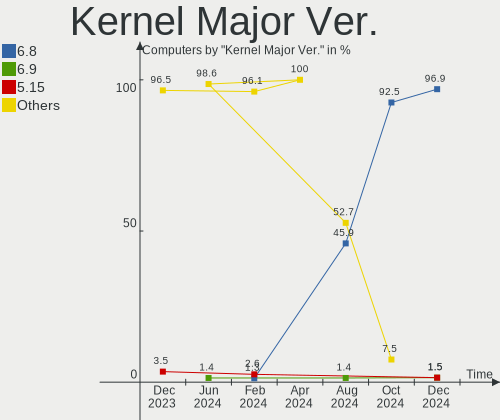

KDE neon Hardware Trends
------------------------

A project to identify most popular hardware characteristics and track their change
over time based on data collected by KDE neon users at https://Linux-Hardware.org.

Anyone can contribute to this report by the [hw-probe](https://github.com/linuxhw/hw-probe) tool:

    sudo -E hw-probe -all -upload

This is a report for all computer types. See also reports for [desktops](/Dist/KDE_neon/Desktop/README.md) and [notebooks](/Dist/KDE_neon/Notebook/README.md).

Full-feature report is available here: https://linux-hardware.org/?view=trends

Period: Feb, 2022.

Contents
--------

* [ System ](#system)
  - [ OS                       ](#os)
  - [ OS Family                ](#os-family)
  - [ Kernel                   ](#kernel)
  - [ Kernel Family            ](#kernel-family)
  - [ Kernel Major Ver.        ](#kernel-major-ver)
  - [ Arch                     ](#arch)
  - [ DE                       ](#de)
  - [ Display Server           ](#display-server)
  - [ Display Manager          ](#display-manager)
  - [ OS Lang                  ](#os-lang)
  - [ Boot Mode                ](#boot-mode)
  - [ Filesystem               ](#filesystem)
  - [ Part. scheme             ](#part-scheme)
  - [ Dual Boot with Linux/BSD ](#dual-boot-with-linuxbsd)
  - [ Dual Boot (Win)          ](#dual-boot-win)

* [ Board ](#board)
  - [ Vendor                   ](#vendor)
  - [ Model                    ](#model)
  - [ Model Family             ](#model-family)
  - [ MFG Year                 ](#mfg-year)
  - [ Form Factor              ](#form-factor)
  - [ Secure Boot              ](#secure-boot)
  - [ Coreboot                 ](#coreboot)
  - [ RAM Size                 ](#ram-size)
  - [ RAM Used                 ](#ram-used)
  - [ Total Drives             ](#total-drives)
  - [ Has CD-ROM               ](#has-cd-rom)
  - [ Has Ethernet             ](#has-ethernet)
  - [ Has WiFi                 ](#has-wifi)
  - [ Has Bluetooth            ](#has-bluetooth)

* [ Location ](#location)
  - [ Country                  ](#country)
  - [ City                     ](#city)

* [ Drives ](#drives)
  - [ Drive Vendor             ](#drive-vendor)
  - [ Drive Model              ](#drive-model)
  - [ HDD Vendor               ](#hdd-vendor)
  - [ SSD Vendor               ](#ssd-vendor)
  - [ Drive Kind               ](#drive-kind)
  - [ Drive Connector          ](#drive-connector)
  - [ Drive Size               ](#drive-size)
  - [ Space Total              ](#space-total)
  - [ Space Used               ](#space-used)
  - [ Malfunc. Drives          ](#malfunc-drives)
  - [ Malfunc. Drive Vendor    ](#malfunc-drive-vendor)
  - [ Malfunc. HDD Vendor      ](#malfunc-hdd-vendor)
  - [ Malfunc. Drive Kind      ](#malfunc-drive-kind)
  - [ Failed Drives            ](#failed-drives)
  - [ Failed Drive Vendor      ](#failed-drive-vendor)
  - [ Drive Status             ](#drive-status)

* [ Storage controller ](#storage-controller)
  - [ Storage Vendor           ](#storage-vendor)
  - [ Storage Model            ](#storage-model)
  - [ Storage Kind             ](#storage-kind)

* [ Processor ](#processor)
  - [ CPU Vendor               ](#cpu-vendor)
  - [ CPU Model                ](#cpu-model)
  - [ CPU Model Family         ](#cpu-model-family)
  - [ CPU Cores                ](#cpu-cores)
  - [ CPU Sockets              ](#cpu-sockets)
  - [ CPU Threads              ](#cpu-threads)
  - [ CPU Op-Modes             ](#cpu-op-modes)
  - [ CPU Microcode            ](#cpu-microcode)
  - [ CPU Microarch            ](#cpu-microarch)

* [ Graphics ](#graphics)
  - [ GPU Vendor               ](#gpu-vendor)
  - [ GPU Model                ](#gpu-model)
  - [ GPU Combo                ](#gpu-combo)
  - [ GPU Driver               ](#gpu-driver)
  - [ GPU Memory               ](#gpu-memory)

* [ Monitor ](#monitor)
  - [ Monitor Vendor           ](#monitor-vendor)
  - [ Monitor Model            ](#monitor-model)
  - [ Monitor Resolution       ](#monitor-resolution)
  - [ Monitor Diagonal         ](#monitor-diagonal)
  - [ Monitor Width            ](#monitor-width)
  - [ Aspect Ratio             ](#aspect-ratio)
  - [ Monitor Area             ](#monitor-area)
  - [ Pixel Density            ](#pixel-density)
  - [ Multiple Monitors        ](#multiple-monitors)

* [ Network ](#network)
  - [ Net Controller Vendor    ](#net-controller-vendor)
  - [ Net Controller Model     ](#net-controller-model)
  - [ Wireless Vendor          ](#wireless-vendor)
  - [ Wireless Model           ](#wireless-model)
  - [ Ethernet Vendor          ](#ethernet-vendor)
  - [ Ethernet Model           ](#ethernet-model)
  - [ Net Controller Kind      ](#net-controller-kind)
  - [ Used Controller          ](#used-controller)
  - [ NICs                     ](#nics)
  - [ IPv6                     ](#ipv6)

* [ Bluetooth ](#bluetooth)
  - [ Bluetooth Vendor         ](#bluetooth-vendor)
  - [ Bluetooth Model          ](#bluetooth-model)

* [ Sound ](#sound)
  - [ Sound Vendor             ](#sound-vendor)
  - [ Sound Model              ](#sound-model)

* [ Memory ](#memory)
  - [ Memory Vendor            ](#memory-vendor)
  - [ Memory Model             ](#memory-model)
  - [ Memory Kind              ](#memory-kind)
  - [ Memory Form Factor       ](#memory-form-factor)
  - [ Memory Size              ](#memory-size)
  - [ Memory Speed             ](#memory-speed)

* [ Printers & scanners ](#printers--scanners)
  - [ Printer Vendor           ](#printer-vendor)
  - [ Printer Model            ](#printer-model)
  - [ Scanner Vendor           ](#scanner-vendor)
  - [ Scanner Model            ](#scanner-model)

* [ Camera ](#camera)
  - [ Camera Vendor            ](#camera-vendor)
  - [ Camera Model             ](#camera-model)

* [ Security ](#security)
  - [ Fingerprint Vendor       ](#fingerprint-vendor)
  - [ Fingerprint Model        ](#fingerprint-model)
  - [ Chipcard Vendor          ](#chipcard-vendor)
  - [ Chipcard Model           ](#chipcard-model)

* [ Unsupported ](#unsupported)
  - [ Unsupported Devices      ](#unsupported-devices)
  - [ Unsupported Device Types ](#unsupported-device-types)

System
------

OS
--

Installed operating systems

| Name           | Computers | Percent |
|----------------|-----------|---------|
| KDE neon 20.04 | 137       | 100%    |

OS Family
---------

OS without a version

| Name     | Computers | Percent |
|----------|-----------|---------|
| KDE neon | 137       | 100%    |

Kernel
------

Version of the Linux kernel

| Version               | Computers | Percent |
|-----------------------|-----------|---------|
| 5.13.0-28-generic     | 80        | 58.39%  |
| 5.13.0-30-generic     | 44        | 32.12%  |
| 5.11.0-46-generic     | 6         | 4.38%   |
| 5.13.0-27-generic     | 2         | 1.46%   |
| 5.11.0-43-generic     | 2         | 1.46%   |
| 5.4.0-96-generic      | 1         | 0.73%   |
| 5.16.7-051607-generic | 1         | 0.73%   |
| 5.15.22-xanmod1       | 1         | 0.73%   |

Kernel Family
-------------

Linux kernel without a distro release

| Version | Computers | Percent |
|---------|-----------|---------|
| 5.13.0  | 126       | 91.97%  |
| 5.11.0  | 8         | 5.84%   |
| 5.4.0   | 1         | 0.73%   |
| 5.16.7  | 1         | 0.73%   |
| 5.15.22 | 1         | 0.73%   |

Kernel Major Ver.
-----------------

Linux kernel major version

| Version | Computers | Percent |
|---------|-----------|---------|
| 5.13    | 126       | 91.97%  |
| 5.11    | 8         | 5.84%   |
| 5.4     | 1         | 0.73%   |
| 5.16    | 1         | 0.73%   |
| 5.15    | 1         | 0.73%   |

Arch
----

OS architecture (x86_64, i586, etc.)

| Name   | Computers | Percent |
|--------|-----------|---------|
| x86_64 | 137       | 100%    |

DE
--

Desktop Environment

| Name    | Computers | Percent |
|---------|-----------|---------|
| KDE5    | 135       | 98.54%  |
| GNOME   | 1         | 0.73%   |
| Unknown | 1         | 0.73%   |

Display Server
--------------

X11 or Wayland

| Name    | Computers | Percent |
|---------|-----------|---------|
| X11     | 128       | 93.43%  |
| Wayland | 9         | 6.57%   |

Display Manager
---------------

SDDM, LightDM, etc.

| Name    | Computers | Percent |
|---------|-----------|---------|
| Unknown | 102       | 74.45%  |
| SDDM    | 34        | 24.82%  |
| GDM     | 1         | 0.73%   |

OS Lang
-------

Language

| Lang  | Computers | Percent |
|-------|-----------|---------|
| en_US | 51        | 37.23%  |
| pt_BR | 12        | 8.76%   |
| en_GB | 11        | 8.03%   |
| de_DE | 10        | 7.3%    |
| ru_RU | 5         | 3.65%   |
| it_IT | 5         | 3.65%   |
| en_CA | 5         | 3.65%   |
| es_ES | 4         | 2.92%   |
| en_IN | 3         | 2.19%   |
| fr_FR | 2         | 1.46%   |
| en_AU | 2         | 1.46%   |
| ca_ES | 2         | 1.46%   |
| zh_TW | 1         | 0.73%   |
| sv_SE | 1         | 0.73%   |
| ru_UA | 1         | 0.73%   |
| ro_RO | 1         | 0.73%   |
| nn_NO | 1         | 0.73%   |
| nl_NL | 1         | 0.73%   |
| nl_BE | 1         | 0.73%   |
| ko_KR | 1         | 0.73%   |
| ja_JP | 1         | 0.73%   |
| hu_HU | 1         | 0.73%   |
| gl_ES | 1         | 0.73%   |
| fr_CH | 1         | 0.73%   |
| fi_FI | 1         | 0.73%   |
| es_US | 1         | 0.73%   |
| es_MX | 1         | 0.73%   |
| es_CO | 1         | 0.73%   |
| es_CL | 1         | 0.73%   |
| en_ZA | 1         | 0.73%   |
| en_NZ | 1         | 0.73%   |
| en_IE | 1         | 0.73%   |
| de_CH | 1         | 0.73%   |
| de_AT | 1         | 0.73%   |
| C     | 1         | 0.73%   |
| bg_BG | 1         | 0.73%   |
| ar_IQ | 1         | 0.73%   |

Boot Mode
---------

EFI or BIOS

| Mode | Computers | Percent |
|------|-----------|---------|
| EFI  | 91        | 66.42%  |
| BIOS | 46        | 33.58%  |

Filesystem
----------

Type of filesystem

| Type  | Computers | Percent |
|-------|-----------|---------|
| Ext4  | 131       | 95.62%  |
| Btrfs | 6         | 4.38%   |

Part. scheme
------------

Scheme of partitioning

| Type    | Computers | Percent |
|---------|-----------|---------|
| Unknown | 120       | 87.59%  |
| GPT     | 15        | 10.95%  |
| MBR     | 2         | 1.46%   |

Dual Boot with Linux/BSD
------------------------

Hosting more than one Linux/BSD

| Dual boot | Computers | Percent |
|-----------|-----------|---------|
| No        | 133       | 97.08%  |
| Yes       | 4         | 2.92%   |

Dual Boot (Win)
---------------

Hosting Linux and Windows

| Dual boot | Computers | Percent |
|-----------|-----------|---------|
| No        | 122       | 89.05%  |
| Yes       | 15        | 10.95%  |

Board
-----

Vendor
------

Motherboard manufacturer

| Name                | Computers | Percent |
|---------------------|-----------|---------|
| ASUSTek Computer    | 26        | 18.98%  |
| Hewlett-Packard     | 25        | 18.25%  |
| Dell                | 21        | 15.33%  |
| Lenovo              | 11        | 8.03%   |
| MSI                 | 10        | 7.3%    |
| Gigabyte Technology | 10        | 7.3%    |
| Acer                | 7         | 5.11%   |
| Samsung Electronics | 5         | 3.65%   |
| Toshiba             | 4         | 2.92%   |
| ASRock              | 4         | 2.92%   |
| Apple               | 3         | 2.19%   |
| Jumper              | 2         | 1.46%   |
| Teclast             | 1         | 0.73%   |
| Razer               | 1         | 0.73%   |
| Microsoft           | 1         | 0.73%   |
| LG Electronics      | 1         | 0.73%   |
| Intel               | 1         | 0.73%   |
| HUAWEI              | 1         | 0.73%   |
| HANSUNG COMPUTER    | 1         | 0.73%   |
| Fujitsu             | 1         | 0.73%   |
| BESSTAR Tech        | 1         | 0.73%   |

Model
-----

Motherboard model

| Name                                      | Computers | Percent |
|-------------------------------------------|-----------|---------|
| ASUS All Series                           | 3         | 2.19%   |
| MSI MS-7C84                               | 2         | 1.46%   |
| Jumper EZbook                             | 2         | 1.46%   |
| HP Pavilion Gaming Laptop 15-dk0xxx       | 2         | 1.46%   |
| Gigabyte A320M-H                          | 2         | 1.46%   |
| Dell Latitude E6520                       | 2         | 1.46%   |
| Toshiba TECRA M10                         | 1         | 0.73%   |
| Toshiba Satellite L750                    | 1         | 0.73%   |
| Toshiba Satellite L505                    | 1         | 0.73%   |
| Toshiba Satellite C655D                   | 1         | 0.73%   |
| Teclast F7S                               | 1         | 0.73%   |
| Samsung 670Z5E                            | 1         | 0.73%   |
| Samsung 550XDA                            | 1         | 0.73%   |
| Samsung 530XBB                            | 1         | 0.73%   |
| Samsung 530U3C/530U4C/532U3C              | 1         | 0.73%   |
| Samsung 340XAA/350XAA/550XAA              | 1         | 0.73%   |
| Razer Blade                               | 1         | 0.73%   |
| MSI MS-7C90                               | 1         | 0.73%   |
| MSI MS-7B93                               | 1         | 0.73%   |
| MSI MS-7B85                               | 1         | 0.73%   |
| MSI MS-7B79                               | 1         | 0.73%   |
| MSI MS-7885                               | 1         | 0.73%   |
| MSI MS-7693                               | 1         | 0.73%   |
| MSI Katana GF76 11UD                      | 1         | 0.73%   |
| MSI GE75 Raider 10SE                      | 1         | 0.73%   |
| Microsoft Surface 3                       | 1         | 0.73%   |
| LG U460-G.BG51P1                          | 1         | 0.73%   |
| Lenovo ThinkPad X13 Yoga Gen 2 20W8001TUS | 1         | 0.73%   |
| Lenovo ThinkPad T430 2349GAG              | 1         | 0.73%   |
| Lenovo ThinkPad S1 Yoga 12 20DKA00B00     | 1         | 0.73%   |
| Lenovo ThinkPad P14s Gen 2i 20VX0068GE    | 1         | 0.73%   |
| Lenovo ThinkPad P14s Gen 2a 21A0003LUS    | 1         | 0.73%   |
| Lenovo ThinkPad E15 Gen 3 20YG006HGE      | 1         | 0.73%   |
| Lenovo MIIX 310-10ICR 80SG                | 1         | 0.73%   |
| Lenovo IdeaPad Y700-15ISK 80NV            | 1         | 0.73%   |
| Lenovo IdeaPad Gaming 3 15ARH05 82EY      | 1         | 0.73%   |
| Lenovo IdeaPad 500-15ISK 80NT             | 1         | 0.73%   |
| Lenovo B560 43308VG                       | 1         | 0.73%   |
| Intel NUC11PAHi7                          | 1         | 0.73%   |
| HUAWEI KLVL-WXXW                          | 1         | 0.73%   |
| HP x2 Detachable 10-p0XX                  | 1         | 0.73%   |
| HP Stream Laptop 11-ak0xxx                | 1         | 0.73%   |
| HP ProBook 450 G8 Notebook PC             | 1         | 0.73%   |
| HP ProBook 450 G6                         | 1         | 0.73%   |
| HP ProBook 430 G7                         | 1         | 0.73%   |
| HP Pavilion x360 Convertible 14-dh1xxx    | 1         | 0.73%   |
| HP Pavilion Notebook                      | 1         | 0.73%   |
| HP Pavilion Gaming Laptop 15-dk1xxx       | 1         | 0.73%   |
| HP Pavilion Desktop 595-p0xxx             | 1         | 0.73%   |
| HP OMEN Laptop 15-ek0xxx                  | 1         | 0.73%   |
| HP Notebook                               | 1         | 0.73%   |
| HP Laptop 15-db0xxx                       | 1         | 0.73%   |
| HP Laptop 15-bs0xx                        | 1         | 0.73%   |
| HP EliteBook x360 1030 G3                 | 1         | 0.73%   |
| HP EliteBook Folio 9470m                  | 1         | 0.73%   |
| HP EliteBook Folio 1040 G3                | 1         | 0.73%   |
| HP EliteBook 850 G7 Notebook PC           | 1         | 0.73%   |
| HP EliteBook 840 G7 Notebook PC           | 1         | 0.73%   |
| HP Compaq dc5750 Small Form Factor        | 1         | 0.73%   |
| HP Compaq 8510w                           | 1         | 0.73%   |

Model Family
------------

Motherboard model prefix

| Name                   | Computers | Percent |
|------------------------|-----------|---------|
| Lenovo ThinkPad        | 6         | 4.38%   |
| HP Pavilion            | 6         | 4.38%   |
| Dell Latitude          | 6         | 4.38%   |
| HP EliteBook           | 5         | 3.65%   |
| Dell OptiPlex          | 5         | 3.65%   |
| Dell Inspiron          | 5         | 3.65%   |
| ASUS VivoBook          | 5         | 3.65%   |
| Acer Aspire            | 5         | 3.65%   |
| Dell Precision         | 4         | 2.92%   |
| Toshiba Satellite      | 3         | 2.19%   |
| Lenovo IdeaPad         | 3         | 2.19%   |
| HP ProBook             | 3         | 2.19%   |
| ASUS TUF               | 3         | 2.19%   |
| ASUS ROG               | 3         | 2.19%   |
| ASUS All               | 3         | 2.19%   |
| MSI MS-7C84            | 2         | 1.46%   |
| Jumper EZbook          | 2         | 1.46%   |
| HP Laptop              | 2         | 1.46%   |
| HP Compaq              | 2         | 1.46%   |
| Gigabyte A320M-H       | 2         | 1.46%   |
| ASUS PRIME             | 2         | 1.46%   |
| Toshiba TECRA          | 1         | 0.73%   |
| Teclast F7S            | 1         | 0.73%   |
| Samsung 670Z5E         | 1         | 0.73%   |
| Samsung 550XDA         | 1         | 0.73%   |
| Samsung 530XBB         | 1         | 0.73%   |
| Samsung 530U3C         | 1         | 0.73%   |
| Samsung 340XAA         | 1         | 0.73%   |
| Razer Blade            | 1         | 0.73%   |
| MSI MS-7C90            | 1         | 0.73%   |
| MSI MS-7B93            | 1         | 0.73%   |
| MSI MS-7B85            | 1         | 0.73%   |
| MSI MS-7B79            | 1         | 0.73%   |
| MSI MS-7885            | 1         | 0.73%   |
| MSI MS-7693            | 1         | 0.73%   |
| MSI Katana             | 1         | 0.73%   |
| MSI GE75               | 1         | 0.73%   |
| Microsoft Surface      | 1         | 0.73%   |
| LG U460-G.BG51P1       | 1         | 0.73%   |
| Lenovo MIIX            | 1         | 0.73%   |
| Lenovo B560            | 1         | 0.73%   |
| Intel NUC11PAHi7       | 1         | 0.73%   |
| HUAWEI KLVL-WXXW       | 1         | 0.73%   |
| HP x2                  | 1         | 0.73%   |
| HP Stream              | 1         | 0.73%   |
| HP OMEN                | 1         | 0.73%   |
| HP Notebook            | 1         | 0.73%   |
| HP 750-437cb           | 1         | 0.73%   |
| HP 255                 | 1         | 0.73%   |
| HP 250                 | 1         | 0.73%   |
| HANSUNG COMPUTER EX58  | 1         | 0.73%   |
| Gigabyte X570          | 1         | 0.73%   |
| Gigabyte MZGLKBP-00    | 1         | 0.73%   |
| Gigabyte GA-78LMT-USB3 | 1         | 0.73%   |
| Gigabyte B550M         | 1         | 0.73%   |
| Gigabyte B450M         | 1         | 0.73%   |
| Gigabyte AERO          | 1         | 0.73%   |
| Gigabyte A320M-S2H     | 1         | 0.73%   |
| Gigabyte 970A-DS3P     | 1         | 0.73%   |
| Fujitsu LIFEBOOK       | 1         | 0.73%   |

MFG Year
--------

Motherboard manufacture year

| Year | Computers | Percent |
|------|-----------|---------|
| 2020 | 25        | 18.25%  |
| 2018 | 19        | 13.87%  |
| 2019 | 15        | 10.95%  |
| 2021 | 11        | 8.03%   |
| 2014 | 11        | 8.03%   |
| 2013 | 10        | 7.3%    |
| 2012 | 9         | 6.57%   |
| 2016 | 8         | 5.84%   |
| 2017 | 7         | 5.11%   |
| 2015 | 7         | 5.11%   |
| 2011 | 7         | 5.11%   |
| 2010 | 2         | 1.46%   |
| 2009 | 2         | 1.46%   |
| 2008 | 2         | 1.46%   |
| 2007 | 2         | 1.46%   |

Form Factor
-----------

Physical design of the computer

| Name        | Computers | Percent |
|-------------|-----------|---------|
| Notebook    | 80        | 58.39%  |
| Desktop     | 47        | 34.31%  |
| Convertible | 4         | 2.92%   |
| Tablet      | 3         | 2.19%   |
| All in one  | 2         | 1.46%   |
| Mini pc     | 1         | 0.73%   |

Secure Boot
-----------

Enabled or disabled

| State    | Computers | Percent |
|----------|-----------|---------|
| Disabled | 121       | 88.32%  |
| Enabled  | 16        | 11.68%  |

Coreboot
--------

Have coreboot on board

| Used | Computers | Percent |
|------|-----------|---------|
| No   | 137       | 100%    |

RAM Size
--------

Total RAM memory

| Size in GB  | Computers | Percent |
|-------------|-----------|---------|
| 4.01-8.0    | 39        | 28.47%  |
| 16.01-24.0  | 33        | 24.09%  |
| 3.01-4.0    | 21        | 15.33%  |
| 8.01-16.0   | 20        | 14.6%   |
| 32.01-64.0  | 12        | 8.76%   |
| 24.01-32.0  | 4         | 2.92%   |
| 64.01-256.0 | 4         | 2.92%   |
| 1.01-2.0    | 4         | 2.92%   |

RAM Used
--------

Used RAM memory

| Used GB   | Computers | Percent |
|-----------|-----------|---------|
| 1.01-2.0  | 54        | 39.42%  |
| 2.01-3.0  | 28        | 20.44%  |
| 4.01-8.0  | 19        | 13.87%  |
| 3.01-4.0  | 17        | 12.41%  |
| 0.51-1.0  | 11        | 8.03%   |
| 8.01-16.0 | 8         | 5.84%   |

Total Drives
------------

Number of drives on board

| Drives | Computers | Percent |
|--------|-----------|---------|
| 1      | 79        | 57.66%  |
| 2      | 42        | 30.66%  |
| 3      | 7         | 5.11%   |
| 6      | 3         | 2.19%   |
| 5      | 2         | 1.46%   |
| 4      | 2         | 1.46%   |
| 9      | 1         | 0.73%   |
| 7      | 1         | 0.73%   |

Has CD-ROM
----------

Has CD-ROM on board

| Presented | Computers | Percent |
|-----------|-----------|---------|
| No        | 94        | 68.61%  |
| Yes       | 43        | 31.39%  |

Has Ethernet
------------

Has Ethernet on board

| Presented | Computers | Percent |
|-----------|-----------|---------|
| Yes       | 118       | 86.13%  |
| No        | 19        | 13.87%  |

Has WiFi
--------

Has WiFi module

| Presented | Computers | Percent |
|-----------|-----------|---------|
| Yes       | 112       | 81.75%  |
| No        | 25        | 18.25%  |

Has Bluetooth
-------------

Has Bluetooth module

| Presented | Computers | Percent |
|-----------|-----------|---------|
| Yes       | 96        | 70.07%  |
| No        | 41        | 29.93%  |

Location
--------

Country
-------

Geographic location (country)

| Country      | Computers | Percent |
|--------------|-----------|---------|
| USA          | 25        | 18.25%  |
| Brazil       | 13        | 9.49%   |
| UK           | 11        | 8.03%   |
| Germany      | 10        | 7.3%    |
| Spain        | 9         | 6.57%   |
| Italy        | 7         | 5.11%   |
| Russia       | 6         | 4.38%   |
| France       | 4         | 2.92%   |
| Canada       | 4         | 2.92%   |
| Switzerland  | 3         | 2.19%   |
| Serbia       | 3         | 2.19%   |
| Mexico       | 3         | 2.19%   |
| India        | 3         | 2.19%   |
| Bulgaria     | 3         | 2.19%   |
| Sweden       | 2         | 1.46%   |
| Japan        | 2         | 1.46%   |
| Hungary      | 2         | 1.46%   |
| Belgium      | 2         | 1.46%   |
| Australia    | 2         | 1.46%   |
| Uzbekistan   | 1         | 0.73%   |
| Ukraine      | 1         | 0.73%   |
| South Korea  | 1         | 0.73%   |
| South Africa | 1         | 0.73%   |
| Slovenia     | 1         | 0.73%   |
| Singapore    | 1         | 0.73%   |
| Romania      | 1         | 0.73%   |
| Puerto Rico  | 1         | 0.73%   |
| Portugal     | 1         | 0.73%   |
| Philippines  | 1         | 0.73%   |
| Panama       | 1         | 0.73%   |
| Pakistan     | 1         | 0.73%   |
| New Zealand  | 1         | 0.73%   |
| Netherlands  | 1         | 0.73%   |
| Iraq         | 1         | 0.73%   |
| Indonesia    | 1         | 0.73%   |
| Hong Kong    | 1         | 0.73%   |
| Finland      | 1         | 0.73%   |
| Egypt        | 1         | 0.73%   |
| Czechia      | 1         | 0.73%   |
| Colombia     | 1         | 0.73%   |
| Chile        | 1         | 0.73%   |
| Austria      | 1         | 0.73%   |

City
----

Geographic location (city)

| City               | Computers | Percent |
|--------------------|-----------|---------|
| Rome               | 3         | 2.19%   |
| Paris              | 3         | 2.19%   |
| São Paulo       | 2         | 1.46%   |
| Rio de Janeiro     | 2         | 1.46%   |
| Maracaja           | 2         | 1.46%   |
| Cesano Boscone     | 2         | 1.46%   |
| Belgrade           | 2         | 1.46%   |
| Zurich             | 1         | 0.73%   |
| Yekaterinburg      | 1         | 0.73%   |
| Yangcheon-gu       | 1         | 0.73%   |
| Winslow            | 1         | 0.73%   |
| Winnipeg           | 1         | 0.73%   |
| Waren              | 1         | 0.73%   |
| Walsall            | 1         | 0.73%   |
| Walkersville       | 1         | 0.73%   |
| Varna              | 1         | 0.73%   |
| Vancouver          | 1         | 0.73%   |
| Tokyo              | 1         | 0.73%   |
| Teresina           | 1         | 0.73%   |
| Tashkent           | 1         | 0.73%   |
| Tampere            | 1         | 0.73%   |
| Stockholm          | 1         | 0.73%   |
| St Petersburg      | 1         | 0.73%   |
| Sofia              | 1         | 0.73%   |
| Singapore          | 1         | 0.73%   |
| Shinjuku           | 1         | 0.73%   |
| Serra              | 1         | 0.73%   |
| Seattle            | 1         | 0.73%   |
| Scunthorpe         | 1         | 0.73%   |
| Santiago           | 1         | 0.73%   |
| San Antonio        | 1         | 0.73%   |
| Sada               | 1         | 0.73%   |
| Rochester          | 1         | 0.73%   |
| Reading            | 1         | 0.73%   |
| Rahim Yar Khan     | 1         | 0.73%   |
| Rafelbunyol        | 1         | 0.73%   |
| Quezon City        | 1         | 0.73%   |
| Queretaro          | 1         | 0.73%   |
| Prague             | 1         | 0.73%   |
| Portland           | 1         | 0.73%   |
| Portage la Prairie | 1         | 0.73%   |
| Plovdiv            | 1         | 0.73%   |
| Pine Bluff         | 1         | 0.73%   |
| Penza              | 1         | 0.73%   |
| Panama City        | 1         | 0.73%   |
| Palamós         | 1         | 0.73%   |
| Paisley            | 1         | 0.73%   |
| Novi Sad           | 1         | 0.73%   |
| Norridgewock       | 1         | 0.73%   |
| Natick             | 1         | 0.73%   |
| Mostoles           | 1         | 0.73%   |
| Moscow             | 1         | 0.73%   |
| Mooresville        | 1         | 0.73%   |
| Moguer             | 1         | 0.73%   |
| Mjoelby            | 1         | 0.73%   |
| Mission Viejo      | 1         | 0.73%   |
| Melbourne          | 1         | 0.73%   |
| Marietta           | 1         | 0.73%   |
| Mannheim           | 1         | 0.73%   |
| Madrid             | 1         | 0.73%   |

Drives
------

Drive Vendor
------------

Hard drive vendors

| Vendor                    | Computers | Drives | Percent |
|---------------------------|-----------|--------|---------|
| Samsung Electronics       | 32        | 35     | 15.53%  |
| WDC                       | 30        | 40     | 14.56%  |
| Seagate                   | 25        | 31     | 12.14%  |
| Toshiba                   | 16        | 20     | 7.77%   |
| Unknown                   | 15        | 15     | 7.28%   |
| SanDisk                   | 15        | 15     | 7.28%   |
| Kingston                  | 8         | 8      | 3.88%   |
| Intel                     | 8         | 10     | 3.88%   |
| Crucial                   | 7         | 9      | 3.4%    |
| SK Hynix                  | 6         | 6      | 2.91%   |
| Phison                    | 6         | 7      | 2.91%   |
| Micron Technology         | 4         | 4      | 1.94%   |
| Hitachi                   | 4         | 4      | 1.94%   |
| A-DATA Technology         | 4         | 4      | 1.94%   |
| SPCC                      | 3         | 3      | 1.46%   |
| LITEONIT                  | 2         | 2      | 0.97%   |
| Intenso                   | 2         | 2      | 0.97%   |
| HGST                      | 2         | 2      | 0.97%   |
| Fujitsu                   | 2         | 2      | 0.97%   |
| China                     | 2         | 2      | 0.97%   |
| Apple                     | 2         | 2      | 0.97%   |
| walram                    | 1         | 1      | 0.49%   |
| V-GeN                     | 1         | 1      | 0.49%   |
| Smartbuy                  | 1         | 1      | 0.49%   |
| PNY                       | 1         | 1      | 0.49%   |
| PLEXTOR                   | 1         | 1      | 0.49%   |
| Patriot                   | 1         | 1      | 0.49%   |
| Micron/Crucial Technology | 1         | 1      | 0.49%   |
| LITEON                    | 1         | 1      | 0.49%   |
| Lexar                     | 1         | 1      | 0.49%   |
| HS-SSD-C100               | 1         | 1      | 0.49%   |
| GOODRAM                   | 1         | 1      | 0.49%   |

Drive Model
-----------

Hard drive models

| Model                               | Computers | Percent |
|-------------------------------------|-----------|---------|
| Samsung NVMe SSD Drive 500GB        | 5         | 2.19%   |
| Kingston SA400S37240G 240GB SSD     | 5         | 2.19%   |
| Unknown MMC Card  128GB             | 4         | 1.75%   |
| Samsung NVMe SSD Drive 512GB        | 4         | 1.75%   |
| Unknown MMC Card  64GB              | 3         | 1.32%   |
| Unknown MMC Card  32GB              | 3         | 1.32%   |
| Toshiba NVMe SSD Drive 512GB        | 3         | 1.32%   |
| Toshiba MQ04ABF100 1TB              | 3         | 1.32%   |
| Seagate ST500DM002-1BD142 500GB     | 3         | 1.32%   |
| Seagate ST2000DM008-2FR102 2TB      | 3         | 1.32%   |
| Sandisk NVMe SSD Drive 512GB        | 3         | 1.32%   |
| Sandisk NVMe SSD Drive 500GB        | 3         | 1.32%   |
| Sandisk NVMe SSD Drive 1TB          | 3         | 1.32%   |
| Samsung SSD 850 EVO 500GB           | 3         | 1.32%   |
| WDC WDS250G1B0A-00H9H0 250GB SSD    | 2         | 0.88%   |
| WDC WDS240G2G0A-00JH30 240GB SSD    | 2         | 0.88%   |
| Unknown SD/MMC/MS PRO 64GB          | 2         | 0.88%   |
| Toshiba MQ01ABF050 500GB            | 2         | 0.88%   |
| Toshiba KBG30ZMS128G 128GB NVMe SSD | 2         | 0.88%   |
| SK Hynix NVMe SSD Drive 256GB       | 2         | 0.88%   |
| Seagate ST500LT012-1DG142 500GB     | 2         | 0.88%   |
| Seagate ST2000DM001-1ER164 2TB      | 2         | 0.88%   |
| Seagate ST2000DM001-1CH164 2TB      | 2         | 0.88%   |
| Seagate ST1000LM024 HN-M101MBB 1TB  | 2         | 0.88%   |
| Sandisk NVMe SSD Drive 256GB        | 2         | 0.88%   |
| Samsung SSD 850 EVO 250GB           | 2         | 0.88%   |
| Samsung NVMe SSD Drive 1TB          | 2         | 0.88%   |
| Phison NVMe SSD Drive 500GB         | 2         | 0.88%   |
| Kingston SA400S37120G 120GB SSD     | 2         | 0.88%   |
| Intel NVMe SSD Drive 512GB          | 2         | 0.88%   |
| Hitachi HTS543232A7A384 320GB       | 2         | 0.88%   |
| WDC WDS500G2B0A-00SM50 500GB SSD    | 1         | 0.44%   |
| WDC WDS480G2G0A-00JH30 480GB SSD    | 1         | 0.44%   |
| WDC WDS250G2B0B-00YS70 250GB SSD    | 1         | 0.44%   |
| WDC WDS250G2B0A-00SM50 250GB SSD    | 1         | 0.44%   |
| WDC WDS100T2B0A-00SM50 1TB SSD      | 1         | 0.44%   |
| WDC WDBNCE5000PNC-WRSN 500GB SSD    | 1         | 0.44%   |
| WDC WDBNCE0010PNC 1TB SSD           | 1         | 0.44%   |
| WDC WD800JD-60LSA0 80GB             | 1         | 0.44%   |
| WDC WD7501AALS-00J7B1 752GB         | 1         | 0.44%   |
| WDC WD5000LPZX-35Z10T0 500GB        | 1         | 0.44%   |
| WDC WD5000LPVX-75V0TT0 500GB        | 1         | 0.44%   |
| WDC WD5000LPCX-60VHAT1 500GB        | 1         | 0.44%   |
| WDC WD5000AAKX-22ERMA0 500GB        | 1         | 0.44%   |
| WDC WD5000AAKX-00ERMA0 500GB        | 1         | 0.44%   |
| WDC WD5000AAKS-07A7B0 500GB         | 1         | 0.44%   |
| WDC WD40PURX-64NZ6Y0 4TB            | 1         | 0.44%   |
| WDC WD40PURX-64GVNY0 4TB            | 1         | 0.44%   |
| WDC WD40EZRZ-75GXCB0 4TB            | 1         | 0.44%   |
| WDC WD40EZRZ-00GXCB0 4TB            | 1         | 0.44%   |
| WDC WD4003FZEX-00Z4SA0 4TB          | 1         | 0.44%   |
| WDC WD3200BEVT-24A23T0 320GB        | 1         | 0.44%   |
| WDC WD1600BEVT-75ZCT2 160GB         | 1         | 0.44%   |
| WDC WD1600BEVT-00A23T0 160GB        | 1         | 0.44%   |
| WDC WD10SPZX-80Z10T2 1TB            | 1         | 0.44%   |
| WDC WD10SPZX-75Z10T3 1TB            | 1         | 0.44%   |
| WDC WD10SPZX-22Z10T0 1TB            | 1         | 0.44%   |
| WDC WD10SPZX-21Z10T0 1TB            | 1         | 0.44%   |
| WDC WD10PURZ-85U8XY0 1TB            | 1         | 0.44%   |
| WDC WD10EZEX-22BN5A0 1TB            | 1         | 0.44%   |

HDD Vendor
----------

Hard disk drive vendors

| Vendor              | Computers | Drives | Percent |
|---------------------|-----------|--------|---------|
| Seagate             | 24        | 30     | 35.82%  |
| WDC                 | 21        | 28     | 31.34%  |
| Toshiba             | 10        | 11     | 14.93%  |
| Hitachi             | 4         | 4      | 5.97%   |
| Unknown             | 2         | 2      | 2.99%   |
| Samsung Electronics | 2         | 2      | 2.99%   |
| HGST                | 2         | 2      | 2.99%   |
| Fujitsu             | 2         | 2      | 2.99%   |

SSD Vendor
----------

Solid state drive vendors

| Vendor              | Computers | Drives | Percent |
|---------------------|-----------|--------|---------|
| Samsung Electronics | 15        | 16     | 18.99%  |
| WDC                 | 11        | 11     | 13.92%  |
| Kingston            | 8         | 8      | 10.13%  |
| Crucial             | 7         | 9      | 8.86%   |
| Toshiba             | 4         | 4      | 5.06%   |
| SanDisk             | 4         | 4      | 5.06%   |
| A-DATA Technology   | 4         | 4      | 5.06%   |
| SPCC                | 3         | 3      | 3.8%    |
| Micron Technology   | 3         | 3      | 3.8%    |
| Intel               | 3         | 4      | 3.8%    |
| LITEONIT            | 2         | 2      | 2.53%   |
| Intenso             | 2         | 2      | 2.53%   |
| China               | 2         | 2      | 2.53%   |
| Apple               | 2         | 2      | 2.53%   |
| Unknown             | 1         | 1      | 1.27%   |
| Smartbuy            | 1         | 1      | 1.27%   |
| SK Hynix            | 1         | 1      | 1.27%   |
| PNY                 | 1         | 1      | 1.27%   |
| PLEXTOR             | 1         | 1      | 1.27%   |
| Patriot             | 1         | 1      | 1.27%   |
| LITEON              | 1         | 1      | 1.27%   |
| Lexar               | 1         | 1      | 1.27%   |
| GOODRAM             | 1         | 1      | 1.27%   |

Drive Kind
----------

HDD or SSD

| Kind    | Computers | Drives | Percent |
|---------|-----------|--------|---------|
| SSD     | 63        | 83     | 33.51%  |
| HDD     | 61        | 81     | 32.45%  |
| NVMe    | 49        | 54     | 26.06%  |
| MMC     | 12        | 13     | 6.38%   |
| Unknown | 3         | 3      | 1.6%    |

Drive Connector
---------------

SATA, SAS, NVMe, etc.

| Type | Computers | Drives | Percent |
|------|-----------|--------|---------|
| SATA | 101       | 160    | 59.76%  |
| NVMe | 49        | 54     | 28.99%  |
| MMC  | 12        | 13     | 7.1%    |
| SAS  | 7         | 7      | 4.14%   |

Drive Size
----------

Size of hard drive

| Size in TB | Computers | Drives | Percent |
|------------|-----------|--------|---------|
| 0.01-0.5   | 80        | 108    | 64.52%  |
| 0.51-1.0   | 28        | 34     | 22.58%  |
| 1.01-2.0   | 10        | 12     | 8.06%   |
| 3.01-4.0   | 3         | 7      | 2.42%   |
| 4.01-10.0  | 2         | 2      | 1.61%   |
| 2.01-3.0   | 1         | 1      | 0.81%   |

Space Total
-----------

Amount of disk space available on the file system

| Size in GB     | Computers | Percent |
|----------------|-----------|---------|
| 101-250        | 45        | 32.85%  |
| 251-500        | 34        | 24.82%  |
| 501-1000       | 19        | 13.87%  |
| 51-100         | 15        | 10.95%  |
| 1001-2000      | 8         | 5.84%   |
| More than 3000 | 5         | 3.65%   |
| 21-50          | 5         | 3.65%   |
| 1-20           | 4         | 2.92%   |
| 2001-3000      | 1         | 0.73%   |
| Unknown        | 1         | 0.73%   |

Space Used
----------

Amount of used disk space

| Used GB        | Computers | Percent |
|----------------|-----------|---------|
| 1-20           | 61        | 44.53%  |
| 101-250        | 20        | 14.6%   |
| 21-50          | 19        | 13.87%  |
| 51-100         | 15        | 10.95%  |
| 251-500        | 14        | 10.22%  |
| More than 3000 | 3         | 2.19%   |
| 501-1000       | 2         | 1.46%   |
| 2001-3000      | 1         | 0.73%   |
| 1001-2000      | 1         | 0.73%   |
| Unknown        | 1         | 0.73%   |

Malfunc. Drives
---------------

Drive models with a malfunction

| Model                             | Computers | Drives | Percent |
|-----------------------------------|-----------|--------|---------|
| Intenso SATA III SSD 120GB        | 1         | 1      | 50%     |
| A-DATA Technology SU800 512GB SSD | 1         | 1      | 50%     |

Malfunc. Drive Vendor
---------------------

Vendors of faulty drives

| Vendor            | Computers | Drives | Percent |
|-------------------|-----------|--------|---------|
| Intenso           | 1         | 1      | 50%     |
| A-DATA Technology | 1         | 1      | 50%     |

Malfunc. HDD Vendor
-------------------

Vendors of faulty HDD drives

Zero info for selected period =(

Malfunc. Drive Kind
-------------------

Kinds of faulty drives

| Kind | Computers | Drives | Percent |
|------|-----------|--------|---------|
| SSD  | 2         | 2      | 100%    |

Failed Drives
-------------

Failed drive models

Zero info for selected period =(

Failed Drive Vendor
-------------------

Failed drive vendors

Zero info for selected period =(

Drive Status
------------

Number of failed and malfunc. drives

| Status   | Computers | Drives | Percent |
|----------|-----------|--------|---------|
| Detected | 123       | 211    | 87.23%  |
| Works    | 16        | 21     | 11.35%  |
| Malfunc  | 2         | 2      | 1.42%   |

Storage controller
------------------

Storage Vendor
--------------

Storage controller vendors

| Vendor                       | Computers | Percent |
|------------------------------|-----------|---------|
| Intel                        | 88        | 50.57%  |
| AMD                          | 34        | 19.54%  |
| Samsung Electronics          | 17        | 9.77%   |
| Sandisk                      | 12        | 6.9%    |
| Phison Electronics           | 6         | 3.45%   |
| Toshiba America Info Systems | 5         | 2.87%   |
| SK Hynix                     | 4         | 2.3%    |
| ASMedia Technology           | 4         | 2.3%    |
| VIA Technologies             | 1         | 0.57%   |
| Seagate Technology           | 1         | 0.57%   |
| Micron/Crucial Technology    | 1         | 0.57%   |
| Micron Technology            | 1         | 0.57%   |

Storage Model
-------------

Storage controller models

| Model                                                                                   | Computers | Percent |
|-----------------------------------------------------------------------------------------|-----------|---------|
| AMD FCH SATA Controller [AHCI mode]                                                     | 24        | 11.94%  |
| Intel 7 Series Chipset Family 6-port SATA Controller [AHCI mode]                        | 11        | 5.47%   |
| Samsung NVMe SSD Controller SM981/PM981/PM983                                           | 9         | 4.48%   |
| Intel 82801 Mobile SATA Controller [RAID mode]                                          | 9         | 4.48%   |
| Samsung NVMe SSD Controller 980                                                         | 6         | 2.99%   |
| Intel Sunrise Point-LP SATA Controller [AHCI mode]                                      | 6         | 2.99%   |
| Intel Q170/Q150/B150/H170/H110/Z170/CM236 Chipset SATA Controller [AHCI Mode]           | 5         | 2.49%   |
| Intel 8 Series/C220 Series Chipset Family 6-port SATA Controller 1 [AHCI mode]          | 5         | 2.49%   |
| Sandisk WD Blue SN500 / PC SN520 NVMe SSD                                               | 4         | 1.99%   |
| Sandisk WD Black SN750 / PC SN730 NVMe SSD                                              | 4         | 1.99%   |
| Intel Celeron/Pentium Silver Processor SATA Controller                                  | 4         | 1.99%   |
| Intel 6 Series/C200 Series Chipset Family 6 port Mobile SATA AHCI Controller            | 4         | 1.99%   |
| AMD Starship/Matisse Chipset SATA Controller [AHCI mode]                                | 4         | 1.99%   |
| AMD FCH SATA Controller D                                                               | 4         | 1.99%   |
| AMD 400 Series Chipset SATA Controller                                                  | 4         | 1.99%   |
| Sandisk WD Blue SN550 NVMe SSD                                                          | 3         | 1.49%   |
| Phison E16 PCIe4 NVMe Controller                                                        | 3         | 1.49%   |
| Intel Volume Management Device NVMe RAID Controller                                     | 3         | 1.49%   |
| Intel Non-Volatile memory controller                                                    | 3         | 1.49%   |
| Intel Celeron N3350/Pentium N4200/Atom E3900 Series SATA AHCI Controller                | 3         | 1.49%   |
| Intel 9 Series Chipset Family SATA Controller [AHCI Mode]                               | 3         | 1.49%   |
| Intel 82801IBM/IEM (ICH9M/ICH9M-E) 4 port SATA Controller [AHCI mode]                   | 3         | 1.49%   |
| Intel 400 Series Chipset Family SATA AHCI Controller                                    | 3         | 1.49%   |
| ASMedia ASM1062 Serial ATA Controller                                                   | 3         | 1.49%   |
| AMD SB7x0/SB8x0/SB9x0 SATA Controller [AHCI mode]                                       | 3         | 1.49%   |
| AMD SB7x0/SB8x0/SB9x0 IDE Controller                                                    | 3         | 1.49%   |
| Toshiba America Info Systems Toshiba America Info Non-Volatile memory controller        | 2         | 1%      |
| Toshiba America Info Systems BG3 NVMe SSD Controller                                    | 2         | 1%      |
| SK Hynix BC501 NVMe Solid State Drive                                                   | 2         | 1%      |
| Phison PS5013 E13 NVMe Controller                                                       | 2         | 1%      |
| Intel Tiger Lake-LP SATA Controller [AHCI mode]                                         | 2         | 1%      |
| Intel SSD 660P Series                                                                   | 2         | 1%      |
| Intel SATA Controller [RAID mode]                                                       | 2         | 1%      |
| Intel HM170/QM170 Chipset SATA Controller [AHCI Mode]                                   | 2         | 1%      |
| Intel Comet Lake SATA AHCI Controller                                                   | 2         | 1%      |
| Intel C610/X99 series chipset sSATA Controller [AHCI mode]                              | 2         | 1%      |
| Intel C610/X99 series chipset 6-Port SATA Controller [AHCI mode]                        | 2         | 1%      |
| Intel 8 Series SATA Controller 1 [AHCI mode]                                            | 2         | 1%      |
| Intel 7 Series/C210 Series Chipset Family 6-port SATA Controller [AHCI mode]            | 2         | 1%      |
| Intel 6 Series/C200 Series Chipset Family Desktop SATA Controller (IDE mode, ports 4-5) | 2         | 1%      |
| Intel 6 Series/C200 Series Chipset Family Desktop SATA Controller (IDE mode, ports 0-3) | 2         | 1%      |
| Intel 500 Series Chipset Family SATA AHCI Controller                                    | 2         | 1%      |
| AMD 300 Series Chipset SATA Controller                                                  | 2         | 1%      |
| VIA VT6415 PATA IDE Host Controller                                                     | 1         | 0.5%    |
| Toshiba America Info Systems XG6 NVMe SSD Controller                                    | 1         | 0.5%    |
| SK Hynix Gold P31 SSD                                                                   | 1         | 0.5%    |
| SK Hynix BC511                                                                          | 1         | 0.5%    |
| Seagate FireCuda 520 SSD                                                                | 1         | 0.5%    |
| Sandisk WD PC SN810 / Black SN850 NVMe SSD                                              | 1         | 0.5%    |
| Samsung NVMe SSD Controller SM961/PM961/SM963                                           | 1         | 0.5%    |
| Samsung NVMe SSD Controller PM9A1/PM9A3/980PRO                                          | 1         | 0.5%    |
| Phison E18 PCIe4 NVMe Controller                                                        | 1         | 0.5%    |
| Micron/Crucial P2 NVMe PCIe SSD                                                         | 1         | 0.5%    |
| Micron Non-Volatile memory controller                                                   | 1         | 0.5%    |
| Intel Wildcat Point-LP SATA Controller [AHCI Mode]                                      | 1         | 0.5%    |
| Intel NM10/ICH7 Family SATA Controller [IDE mode]                                       | 1         | 0.5%    |
| Intel Ice Lake-LP SATA Controller [AHCI mode]                                           | 1         | 0.5%    |
| Intel Cannon Point-LP SATA Controller [AHCI Mode]                                       | 1         | 0.5%    |
| Intel Cannon Lake PCH SATA AHCI Controller                                              | 1         | 0.5%    |
| Intel Cannon Lake Mobile PCH SATA AHCI Controller                                       | 1         | 0.5%    |

Storage Kind
------------

Kind of storage controller (IDE, SATA, NVMe, SAS, ...)

| Kind | Computers | Percent |
|------|-----------|---------|
| SATA | 101       | 57.71%  |
| NVMe | 49        | 28%     |
| RAID | 15        | 8.57%   |
| IDE  | 10        | 5.71%   |

Processor
---------

CPU Vendor
----------

Processor vendors

| Vendor | Computers | Percent |
|--------|-----------|---------|
| Intel  | 99        | 72.26%  |
| AMD    | 38        | 27.74%  |

CPU Model
---------

Processor models

| Model                                       | Computers | Percent |
|---------------------------------------------|-----------|---------|
| Intel 11th Gen Core i7-1165G7 @ 2.80GHz     | 5         | 3.65%   |
| Intel Core i7-10510U CPU @ 1.80GHz          | 3         | 2.19%   |
| AMD Ryzen 7 5800X 8-Core Processor          | 3         | 2.19%   |
| AMD Ryzen 5 2600 Six-Core Processor         | 3         | 2.19%   |
| AMD Ryzen 3 3200G with Radeon Vega Graphics | 3         | 2.19%   |
| Intel Core i7-8565U CPU @ 1.80GHz           | 2         | 1.46%   |
| Intel Core i7-6700HQ CPU @ 2.60GHz          | 2         | 1.46%   |
| Intel Core i7-6500U CPU @ 2.50GHz           | 2         | 1.46%   |
| Intel Core i7-4790K CPU @ 4.00GHz           | 2         | 1.46%   |
| Intel Core i5-9300H CPU @ 2.40GHz           | 2         | 1.46%   |
| Intel Core i5-3427U CPU @ 1.80GHz           | 2         | 1.46%   |
| Intel Core i5-3320M CPU @ 2.60GHz           | 2         | 1.46%   |
| Intel Core i5-10300H CPU @ 2.50GHz          | 2         | 1.46%   |
| Intel Celeron N4020 CPU @ 1.10GHz           | 2         | 1.46%   |
| Intel Celeron N4000 CPU @ 1.10GHz           | 2         | 1.46%   |
| Intel Celeron CPU N3450 @ 1.10GHz           | 2         | 1.46%   |
| Intel Atom x5-Z8350 CPU @ 1.44GHz           | 2         | 1.46%   |
| AMD Ryzen 5 5600X 6-Core Processor          | 2         | 1.46%   |
| AMD Ryzen 5 4500U with Radeon Graphics      | 2         | 1.46%   |
| AMD Phenom II X4 945 Processor              | 2         | 1.46%   |
| Intel Xeon CPU E5-1620 v3 @ 3.50GHz         | 1         | 0.73%   |
| Intel Pentium Silver N6000 @ 1.10GHz        | 1         | 0.73%   |
| Intel Pentium Silver J5005 CPU @ 1.50GHz    | 1         | 0.73%   |
| Intel Pentium Dual-Core CPU T4400 @ 2.20GHz | 1         | 0.73%   |
| Intel Pentium Dual-Core CPU E5400 @ 2.70GHz | 1         | 0.73%   |
| Intel Pentium CPU P6100 @ 2.00GHz           | 1         | 0.73%   |
| Intel Pentium CPU G630 @ 2.70GHz            | 1         | 0.73%   |
| Intel Pentium 3556U @ 1.70GHz               | 1         | 0.73%   |
| Intel Core i7-9750H CPU @ 2.60GHz           | 1         | 0.73%   |
| Intel Core i7-8750H CPU @ 2.20GHz           | 1         | 0.73%   |
| Intel Core i7-8700K CPU @ 3.70GHz           | 1         | 0.73%   |
| Intel Core i7-8550U CPU @ 1.80GHz           | 1         | 0.73%   |
| Intel Core i7-7820HQ CPU @ 2.90GHz          | 1         | 0.73%   |
| Intel Core i7-6820HQ CPU @ 2.70GHz          | 1         | 0.73%   |
| Intel Core i7-6700 CPU @ 3.40GHz            | 1         | 0.73%   |
| Intel Core i7-5820K CPU @ 3.30GHz           | 1         | 0.73%   |
| Intel Core i7-4790 CPU @ 3.60GHz            | 1         | 0.73%   |
| Intel Core i7-4702HQ CPU @ 2.20GHz          | 1         | 0.73%   |
| Intel Core i7-4700HQ CPU @ 2.40GHz          | 1         | 0.73%   |
| Intel Core i7-4600U CPU @ 2.10GHz           | 1         | 0.73%   |
| Intel Core i7-3770S CPU @ 3.10GHz           | 1         | 0.73%   |
| Intel Core i7-3720QM CPU @ 2.60GHz          | 1         | 0.73%   |
| Intel Core i7-3635QM CPU @ 2.40GHz          | 1         | 0.73%   |
| Intel Core i7-2630QM CPU @ 2.00GHz          | 1         | 0.73%   |
| Intel Core i7-2620M CPU @ 2.70GHz           | 1         | 0.73%   |
| Intel Core i7-2600 CPU @ 3.40GHz            | 1         | 0.73%   |
| Intel Core i7-10850H CPU @ 2.70GHz          | 1         | 0.73%   |
| Intel Core i7-10750H CPU @ 2.60GHz          | 1         | 0.73%   |
| Intel Core i7-1065G7 CPU @ 1.30GHz          | 1         | 0.73%   |
| Intel Core i5-8400 CPU @ 2.80GHz            | 1         | 0.73%   |
| Intel Core i5-8350U CPU @ 1.70GHz           | 1         | 0.73%   |
| Intel Core i5-7300HQ CPU @ 2.50GHz          | 1         | 0.73%   |
| Intel Core i5-6600K CPU @ 3.50GHz           | 1         | 0.73%   |
| Intel Core i5-6300U CPU @ 2.40GHz           | 1         | 0.73%   |
| Intel Core i5-5200U CPU @ 2.20GHz           | 1         | 0.73%   |
| Intel Core i5-4690K CPU @ 3.50GHz           | 1         | 0.73%   |
| Intel Core i5-4570 CPU @ 3.20GHz            | 1         | 0.73%   |
| Intel Core i5-4250U CPU @ 1.30GHz           | 1         | 0.73%   |
| Intel Core i5-4200M CPU @ 2.50GHz           | 1         | 0.73%   |
| Intel Core i5-3470 CPU @ 3.20GHz            | 1         | 0.73%   |

CPU Model Family
----------------

Processor model prefix

| Model                   | Computers | Percent |
|-------------------------|-----------|---------|
| Intel Core i7           | 32        | 23.36%  |
| Intel Core i5           | 27        | 19.71%  |
| AMD Ryzen 5             | 13        | 9.49%   |
| Intel Core i3           | 11        | 8.03%   |
| Intel Celeron           | 9         | 6.57%   |
| AMD Ryzen 7             | 8         | 5.84%   |
| Other                   | 7         | 5.11%   |
| AMD Ryzen 3             | 4         | 2.92%   |
| Intel Pentium           | 3         | 2.19%   |
| Intel Atom              | 3         | 2.19%   |
| Intel Pentium Silver    | 2         | 1.46%   |
| Intel Pentium Dual-Core | 2         | 1.46%   |
| Intel Core 2 Duo        | 2         | 1.46%   |
| AMD Phenom II X4        | 2         | 1.46%   |
| AMD A6                  | 2         | 1.46%   |
| Intel Xeon              | 1         | 0.73%   |
| AMD Ryzen Threadripper  | 1         | 0.73%   |
| AMD Ryzen 9             | 1         | 0.73%   |
| AMD Ryzen 7 PRO         | 1         | 0.73%   |
| AMD FX                  | 1         | 0.73%   |
| AMD C-60                | 1         | 0.73%   |
| AMD Athlon II X2        | 1         | 0.73%   |
| AMD Athlon 64 X2        | 1         | 0.73%   |
| AMD A8                  | 1         | 0.73%   |
| AMD A4                  | 1         | 0.73%   |

CPU Cores
---------

Number of processor cores

| Number | Computers | Percent |
|--------|-----------|---------|
| 4      | 59        | 43.07%  |
| 2      | 47        | 34.31%  |
| 6      | 18        | 13.14%  |
| 8      | 10        | 7.3%    |
| 16     | 1         | 0.73%   |
| 12     | 1         | 0.73%   |
| 1      | 1         | 0.73%   |

CPU Sockets
-----------

Number of sockets

| Number | Computers | Percent |
|--------|-----------|---------|
| 1      | 137       | 100%    |

CPU Threads
-----------

Threads per core (Hyper-Threading)

| Number | Computers | Percent |
|--------|-----------|---------|
| 2      | 94        | 68.61%  |
| 1      | 43        | 31.39%  |

CPU Op-Modes
------------

CPU Operation Modes (32-bit, 64-bit)

| Op mode        | Computers | Percent |
|----------------|-----------|---------|
| 32-bit, 64-bit | 137       | 100%    |

CPU Microcode
-------------

Microcode number

| Number     | Computers | Percent |
|------------|-----------|---------|
| 0x306a9    | 12        | 8.76%   |
| 0x306c3    | 9         | 6.57%   |
| Unknown    | 9         | 6.57%   |
| 0x206a7    | 8         | 5.84%   |
| 0x906ea    | 6         | 4.38%   |
| 0x806ec    | 6         | 4.38%   |
| 0x806c1    | 6         | 4.38%   |
| 0x506e3    | 6         | 4.38%   |
| 0xa0652    | 4         | 2.92%   |
| 0x40651    | 4         | 2.92%   |
| 0x0800820d | 4         | 2.92%   |
| 0x706a1    | 3         | 2.19%   |
| 0x506c9    | 3         | 2.19%   |
| 0x406e3    | 3         | 2.19%   |
| 0x1067a    | 3         | 2.19%   |
| 0x0a201016 | 3         | 2.19%   |
| 0x906e9    | 2         | 1.46%   |
| 0x806ea    | 2         | 1.46%   |
| 0x806e9    | 2         | 1.46%   |
| 0x706a8    | 2         | 1.46%   |
| 0x406c4    | 2         | 1.46%   |
| 0x306f2    | 2         | 1.46%   |
| 0x0a50000c | 2         | 1.46%   |
| 0x0a201009 | 2         | 1.46%   |
| 0x08701021 | 2         | 1.46%   |
| 0x08108109 | 2         | 1.46%   |
| 0x0810100b | 2         | 1.46%   |
| 0x06006705 | 2         | 1.46%   |
| 0xa0655    | 1         | 0.73%   |
| 0xa0653    | 1         | 0.73%   |
| 0x906c0    | 1         | 0.73%   |
| 0x806eb    | 1         | 0.73%   |
| 0x806d1    | 1         | 0.73%   |
| 0x706e5    | 1         | 0.73%   |
| 0x6fb      | 1         | 0.73%   |
| 0x406c3    | 1         | 0.73%   |
| 0x306d4    | 1         | 0.73%   |
| 0x20655    | 1         | 0.73%   |
| 0x0a201005 | 1         | 0.73%   |
| 0x08608103 | 1         | 0.73%   |
| 0x08608102 | 1         | 0.73%   |
| 0x08600106 | 1         | 0.73%   |
| 0x08600104 | 1         | 0.73%   |
| 0x08600103 | 1         | 0.73%   |
| 0x08108102 | 1         | 0.73%   |
| 0x08001137 | 1         | 0.73%   |
| 0x07030105 | 1         | 0.73%   |
| 0x0600611a | 1         | 0.73%   |
| 0x06000852 | 1         | 0.73%   |
| 0x05000119 | 1         | 0.73%   |
| 0x010000db | 1         | 0.73%   |
| 0x010000c8 | 1         | 0.73%   |

CPU Microarch
-------------

Microarchitecture

| Name          | Computers | Percent |
|---------------|-----------|---------|
| KabyLake      | 19        | 13.87%  |
| Haswell       | 15        | 10.95%  |
| IvyBridge     | 13        | 9.49%   |
| Zen+          | 10        | 7.3%    |
| Skylake       | 9         | 6.57%   |
| SandyBridge   | 9         | 6.57%   |
| Zen 3         | 8         | 5.84%   |
| TigerLake     | 7         | 5.11%   |
| CometLake     | 6         | 4.38%   |
| Zen 2         | 5         | 3.65%   |
| Goldmont plus | 5         | 3.65%   |
| Penryn        | 4         | 2.92%   |
| Zen           | 3         | 2.19%   |
| Silvermont    | 3         | 2.19%   |
| K10           | 3         | 2.19%   |
| Goldmont      | 3         | 2.19%   |
| Excavator     | 3         | 2.19%   |
| Unknown       | 3         | 2.19%   |
| Westmere      | 1         | 0.73%   |
| Tremont       | 1         | 0.73%   |
| Puma          | 1         | 0.73%   |
| Piledriver    | 1         | 0.73%   |
| K8 Hammer     | 1         | 0.73%   |
| IceLake       | 1         | 0.73%   |
| Core          | 1         | 0.73%   |
| Broadwell     | 1         | 0.73%   |
| Bobcat        | 1         | 0.73%   |

Graphics
--------

GPU Vendor
----------

Vendors of graphics cards

| Vendor | Computers | Percent |
|--------|-----------|---------|
| Intel  | 85        | 49.71%  |
| Nvidia | 52        | 30.41%  |
| AMD    | 34        | 19.88%  |

GPU Model
---------

Graphics card models

| Model                                                                                    | Computers | Percent |
|------------------------------------------------------------------------------------------|-----------|---------|
| Intel 3rd Gen Core processor Graphics Controller                                         | 10        | 5.81%   |
| Intel TigerLake-LP GT2 [Iris Xe Graphics]                                                | 6         | 3.49%   |
| Intel 2nd Generation Core Processor Family Integrated Graphics Controller                | 6         | 3.49%   |
| Intel CometLake-U GT2 [UHD Graphics]                                                     | 5         | 2.91%   |
| Nvidia GP107 [GeForce GTX 1050 Ti]                                                       | 4         | 2.33%   |
| Intel HD Graphics 530                                                                    | 4         | 2.33%   |
| Intel Haswell-ULT Integrated Graphics Controller                                         | 4         | 2.33%   |
| Intel GeminiLake [UHD Graphics 600]                                                      | 4         | 2.33%   |
| Intel CometLake-H GT2 [UHD Graphics]                                                     | 4         | 2.33%   |
| Intel CoffeeLake-H GT2 [UHD Graphics 630]                                                | 4         | 2.33%   |
| AMD Picasso/Raven 2 [Radeon Vega Series / Radeon Vega Mobile Series]                     | 4         | 2.33%   |
| Nvidia GP107M [GeForce GTX 1050 3 GB Max-Q]                                              | 3         | 1.74%   |
| Nvidia GM108M [GeForce MX130]                                                            | 3         | 1.74%   |
| Intel Skylake GT2 [HD Graphics 520]                                                      | 3         | 1.74%   |
| Intel Mobile 4 Series Chipset Integrated Graphics Controller                             | 3         | 1.74%   |
| Intel HD Graphics 500                                                                    | 3         | 1.74%   |
| Intel Atom/Celeron/Pentium Processor x5-E8000/J3xxx/N3xxx Integrated Graphics Controller | 3         | 1.74%   |
| Intel 4th Gen Core Processor Integrated Graphics Controller                              | 3         | 1.74%   |
| AMD Renoir                                                                               | 3         | 1.74%   |
| AMD Ellesmere [Radeon RX 470/480/570/570X/580/580X/590]                                  | 3         | 1.74%   |
| Nvidia TU117M [GeForce GTX 1650 Ti Mobile]                                               | 2         | 1.16%   |
| Nvidia TU116 [GeForce GTX 1660]                                                          | 2         | 1.16%   |
| Nvidia TU106M [GeForce RTX 2060 Mobile]                                                  | 2         | 1.16%   |
| Nvidia GM107M [GeForce GTX 960M]                                                         | 2         | 1.16%   |
| Nvidia GF119M [NVS 4200M]                                                                | 2         | 1.16%   |
| Intel Xeon E3-1200 v3/4th Gen Core Processor Integrated Graphics Controller              | 2         | 1.16%   |
| Intel Xeon E3-1200 v2/3rd Gen Core processor Graphics Controller                         | 2         | 1.16%   |
| Intel WhiskeyLake-U GT2 [UHD Graphics 620]                                               | 2         | 1.16%   |
| Intel UHD Graphics 620                                                                   | 2         | 1.16%   |
| Intel HD Graphics 630                                                                    | 2         | 1.16%   |
| Intel HD Graphics 620                                                                    | 2         | 1.16%   |
| AMD Topaz XT [Radeon R7 M260/M265 / M340/M360 / M440/M445 / 530/535 / 620/625 Mobile]    | 2         | 1.16%   |
| AMD Stoney [Radeon R2/R3/R4/R5 Graphics]                                                 | 2         | 1.16%   |
| AMD Lucienne                                                                             | 2         | 1.16%   |
| AMD Curacao XT / Trinidad XT [Radeon R7 370 / R9 270X/370X]                              | 2         | 1.16%   |
| AMD Cezanne                                                                              | 2         | 1.16%   |
| AMD Baffin [Radeon RX 550 640SP / RX 560/560X]                                           | 2         | 1.16%   |
| Nvidia TU117M [GeForce GTX 1650 Mobile / Max-Q]                                          | 1         | 0.58%   |
| Nvidia TU117GLM [Quadro T500 Mobile]                                                     | 1         | 0.58%   |
| Nvidia TU116M [GeForce GTX 1660 Ti Mobile]                                               | 1         | 0.58%   |
| Nvidia TU116 [GeForce GTX 1660 SUPER]                                                    | 1         | 0.58%   |
| Nvidia TU106M [GeForce RTX 2060 Max-Q]                                                   | 1         | 0.58%   |
| Nvidia TU104 [GeForce RTX 2080]                                                          | 1         | 0.58%   |
| Nvidia TU104 [GeForce RTX 2070 SUPER]                                                    | 1         | 0.58%   |
| Nvidia GT218 [GeForce 210]                                                               | 1         | 0.58%   |
| Nvidia GT216 [GeForce GT 220]                                                            | 1         | 0.58%   |
| Nvidia GP108M [GeForce MX330]                                                            | 1         | 0.58%   |
| Nvidia GP108M [GeForce MX150]                                                            | 1         | 0.58%   |
| Nvidia GP108 [GeForce GT 1030]                                                           | 1         | 0.58%   |
| Nvidia GP107GLM [Quadro P620]                                                            | 1         | 0.58%   |
| Nvidia GP107 [GeForce GTX 1050]                                                          | 1         | 0.58%   |
| Nvidia GP106M [GeForce GTX 1060 Mobile]                                                  | 1         | 0.58%   |
| Nvidia GP106BM [GeForce GTX 1060 Mobile 6GB]                                             | 1         | 0.58%   |
| Nvidia GP104 [GeForce GTX 1060 6GB]                                                      | 1         | 0.58%   |
| Nvidia GM204GL [Quadro M4000]                                                            | 1         | 0.58%   |
| Nvidia GM204 [GeForce GTX 980]                                                           | 1         | 0.58%   |
| Nvidia GM107GLM [Quadro M620 Mobile]                                                     | 1         | 0.58%   |
| Nvidia GK208B [GeForce GT 730]                                                           | 1         | 0.58%   |
| Nvidia GK107M [GeForce GT 750M]                                                          | 1         | 0.58%   |
| Nvidia GK107M [GeForce GT 650M Mac Edition]                                              | 1         | 0.58%   |

GPU Combo
---------

Combinations of graphics cards

| Name           | Computers | Percent |
|----------------|-----------|---------|
| 1 x Intel      | 53        | 38.69%  |
| Intel + Nvidia | 26        | 18.98%  |
| 1 x AMD        | 25        | 18.25%  |
| 1 x Nvidia     | 24        | 17.52%  |
| Intel + AMD    | 6         | 4.38%   |
| AMD + Nvidia   | 2         | 1.46%   |
| 2 x AMD        | 1         | 0.73%   |

GPU Driver
----------

Free vs proprietary

| Driver      | Computers | Percent |
|-------------|-----------|---------|
| Free        | 119       | 86.86%  |
| Proprietary | 16        | 11.68%  |
| Unknown     | 2         | 1.46%   |

GPU Memory
----------

Total video memory

| Size in GB | Computers | Percent |
|------------|-----------|---------|
| Unknown    | 66        | 48.18%  |
| 1.01-2.0   | 22        | 16.06%  |
| 3.01-4.0   | 14        | 10.22%  |
| 0.01-0.5   | 10        | 7.3%    |
| 5.01-6.0   | 9         | 6.57%   |
| 0.51-1.0   | 9         | 6.57%   |
| 7.01-8.0   | 5         | 3.65%   |
| 2.01-3.0   | 2         | 1.46%   |

Monitor
-------

Monitor Vendor
--------------

Monitor vendors

| Vendor               | Computers | Percent |
|----------------------|-----------|---------|
| AU Optronics         | 26        | 17.45%  |
| Samsung Electronics  | 19        | 12.75%  |
| LG Display           | 14        | 9.4%    |
| BOE                  | 14        | 9.4%    |
| Chimei Innolux       | 11        | 7.38%   |
| Goldstar             | 9         | 6.04%   |
| Dell                 | 9         | 6.04%   |
| BenQ                 | 8         | 5.37%   |
| AOC                  | 5         | 3.36%   |
| PANDA                | 4         | 2.68%   |
| Acer                 | 4         | 2.68%   |
| Philips              | 3         | 2.01%   |
| LG Electronics       | 3         | 2.01%   |
| Apple                | 3         | 2.01%   |
| Ancor Communications | 3         | 2.01%   |
| Iiyama               | 2         | 1.34%   |
| Hewlett-Packard      | 2         | 1.34%   |
| ASUSTek Computer     | 2         | 1.34%   |
| Vizio                | 1         | 0.67%   |
| ViewSonic            | 1         | 0.67%   |
| Sharp                | 1         | 0.67%   |
| MSI                  | 1         | 0.67%   |
| Medion               | 1         | 0.67%   |
| InfoVision           | 1         | 0.67%   |
| Idek Iiyama          | 1         | 0.67%   |
| AUS                  | 1         | 0.67%   |

Monitor Model
-------------

Monitor models

| Model                                                                 | Computers | Percent |
|-----------------------------------------------------------------------|-----------|---------|
| AU Optronics LCD Monitor AUO21ED 1920x1080 344x194mm 15.5-inch        | 3         | 1.97%   |
| Samsung Electronics C27F390 SAM0D32 1920x1080 598x336mm 27.0-inch     | 2         | 1.32%   |
| PANDA LC133LF4L02 NCP0017 1920x1080 294x165mm 13.3-inch               | 2         | 1.32%   |
| Goldstar LG HD PLUS GSM5AC5 1600x900 440x250mm 19.9-inch              | 2         | 1.32%   |
| Chimei Innolux LCD Monitor CMN15DB 1366x768 344x193mm 15.5-inch       | 2         | 1.32%   |
| Chimei Innolux LCD Monitor CMN14D4 1920x1080 309x173mm 13.9-inch      | 2         | 1.32%   |
| Vizio E390i-A1 VIZ1004 1920x1080 853x480mm 38.5-inch                  | 1         | 0.66%   |
| ViewSonic VA2405-FHD VSCA939 1920x1080 527x296mm 23.8-inch            | 1         | 0.66%   |
| Sharp LCD Monitor SHP143A 3840x2160 346x194mm 15.6-inch               | 1         | 0.66%   |
| Samsung Electronics SyncMaster SAM05B0 1920x1080                      | 1         | 0.66%   |
| Samsung Electronics SME1920N SAM06A3 1366x768 410x230mm 18.5-inch     | 1         | 0.66%   |
| Samsung Electronics S27H85x SAM0E0F 2560x1440 597x336mm 27.0-inch     | 1         | 0.66%   |
| Samsung Electronics S27D850 SAM0BC9 2560x1440 598x336mm 27.0-inch     | 1         | 0.66%   |
| Samsung Electronics LF27T35 SAM707F 1920x1080 598x337mm 27.0-inch     | 1         | 0.66%   |
| Samsung Electronics LCD Monitor SEC5541 1366x768 344x193mm 15.5-inch  | 1         | 0.66%   |
| Samsung Electronics LCD Monitor SEC5448 1920x1080 344x194mm 15.5-inch | 1         | 0.66%   |
| Samsung Electronics LCD Monitor SEC4546 1920x1200 331x207mm 15.4-inch | 1         | 0.66%   |
| Samsung Electronics LCD Monitor SEC3150 1366x768 344x193mm 15.5-inch  | 1         | 0.66%   |
| Samsung Electronics LCD Monitor SDCA029 3840x2160 344x194mm 15.5-inch | 1         | 0.66%   |
| Samsung Electronics LCD Monitor SDC4161 1920x1080 344x194mm 15.5-inch | 1         | 0.66%   |
| Samsung Electronics LCD Monitor SDC4143 3840x2160 344x194mm 15.5-inch | 1         | 0.66%   |
| Samsung Electronics LCD Monitor SDC324C 1920x1080 344x194mm 15.5-inch | 1         | 0.66%   |
| Samsung Electronics LCD Monitor SAM0900 1366x768 410x230mm 18.5-inch  | 1         | 0.66%   |
| Samsung Electronics LCD Monitor SAM0678 1360x768                      | 1         | 0.66%   |
| Samsung Electronics LCD Monitor LC27G5xT 2560x1440                    | 1         | 0.66%   |
| Samsung Electronics C49HG9x SAM0E5E 3840x1080 1196x336mm 48.9-inch    | 1         | 0.66%   |
| Samsung Electronics C32HG7x SAM0E14 2560x1440 697x392mm 31.5-inch     | 1         | 0.66%   |
| Philips PHL 345E2 PHLC237 3440x1440 800x335mm 34.1-inch               | 1         | 0.66%   |
| Philips PHL 292E2 PHLC232 2560x1080 673x284mm 28.8-inch               | 1         | 0.66%   |
| Philips PHL 234E5 PHLC0C7 1920x1080 510x290mm 23.1-inch               | 1         | 0.66%   |
| PANDA LCD Monitor NCP002D 1920x1080 344x194mm 15.5-inch               | 1         | 0.66%   |
| PANDA LCD Monitor NCP0004 1920x1080 294x165mm 13.3-inch               | 1         | 0.66%   |
| MSI Optix G24C MSI1462 1920x1080 521x293mm 23.5-inch                  | 1         | 0.66%   |
| Medion MD 20165 MED3622 1920x1080 478x269mm 21.6-inch                 | 1         | 0.66%   |
| LG Electronics LCD Monitor W2442 3840x1080                            | 1         | 0.66%   |
| LG Electronics LCD Monitor W2442                                      | 1         | 0.66%   |
| LG Electronics LCD Monitor LG QHD 2560x1440                           | 1         | 0.66%   |
| LG Electronics LCD Monitor LG HDR 4K 3840x2160                        | 1         | 0.66%   |
| LG Display LCD Monitor LGD6302 1366x768 344x194mm 15.5-inch           | 1         | 0.66%   |
| LG Display LCD Monitor LGD06E1 1920x1080 344x194mm 15.5-inch          | 1         | 0.66%   |
| LG Display LCD Monitor LGD065A 1920x1080 344x194mm 15.5-inch          | 1         | 0.66%   |
| LG Display LCD Monitor LGD0650 1920x1080 344x194mm 15.5-inch          | 1         | 0.66%   |
| LG Display LCD Monitor LGD064E 1920x1080 309x174mm 14.0-inch          | 1         | 0.66%   |
| LG Display LCD Monitor LGD0612 1920x1080 344x194mm 15.5-inch          | 1         | 0.66%   |
| LG Display LCD Monitor LGD0503 1366x768 344x194mm 15.5-inch           | 1         | 0.66%   |
| LG Display LCD Monitor LGD046F 1920x1080 344x194mm 15.5-inch          | 1         | 0.66%   |
| LG Display LCD Monitor LGD0437 1920x1080 276x156mm 12.5-inch          | 1         | 0.66%   |
| LG Display LCD Monitor LGD03EA 1920x1080 309x174mm 14.0-inch          | 1         | 0.66%   |
| LG Display LCD Monitor LGD03B6 1366x768 309x174mm 14.0-inch           | 1         | 0.66%   |
| LG Display LCD Monitor LGD0390 1600x900 382x215mm 17.3-inch           | 1         | 0.66%   |
| LG Display LCD Monitor LGD038E 1366x768 344x194mm 15.5-inch           | 1         | 0.66%   |
| LG Display LCD Monitor LGD033B 1366x768 344x194mm 15.5-inch           | 1         | 0.66%   |
| InfoVision LCD Monitor IVO0535 1920x1080 294x165mm 13.3-inch          | 1         | 0.66%   |
| Iiyama PLE2283H IVM562E 1920x1080 477x268mm 21.5-inch                 | 1         | 0.66%   |
| Iiyama PL2780H IVM6609 1920x1080 598x336mm 27.0-inch                  | 1         | 0.66%   |
| Idek Iiyama LCD Monitor PL2710HD 1920x1080                            | 1         | 0.66%   |
| Hewlett-Packard 27ea HPN3395 1920x1080 527x296mm 23.8-inch            | 1         | 0.66%   |
| Hewlett-Packard 27 QD HPN3616 2560x1440 597x339mm 27.0-inch           | 1         | 0.66%   |
| Goldstar W2753VC GSM5766 1920x1080 598x336mm 27.0-inch                | 1         | 0.66%   |
| Goldstar MP59G GSM5B34 1920x1080 480x270mm 21.7-inch                  | 1         | 0.66%   |

Monitor Resolution
------------------

Monitor screen resolution

| Resolution        | Computers | Percent |
|-------------------|-----------|---------|
| 1920x1080 (FHD)   | 73        | 51.41%  |
| 1366x768 (WXGA)   | 27        | 19.01%  |
| 2560x1440 (QHD)   | 12        | 8.45%   |
| 3840x2160 (4K)    | 7         | 4.93%   |
| 1600x900 (HD+)    | 6         | 4.23%   |
| 1920x1200 (WUXGA) | 3         | 2.11%   |
| 3840x1080         | 2         | 1.41%   |
| 3440x1440         | 2         | 1.41%   |
| 1280x800 (WXGA)   | 2         | 1.41%   |
| 1280x1024 (SXGA)  | 2         | 1.41%   |
| 2880x1800         | 1         | 0.7%    |
| 2560x1080         | 1         | 0.7%    |
| 2160x1440         | 1         | 0.7%    |
| 1440x900 (WXGA+)  | 1         | 0.7%    |
| 1360x768          | 1         | 0.7%    |
| Unknown           | 1         | 0.7%    |

Monitor Diagonal
----------------

Diagonal size in inches

| Inches  | Computers | Percent |
|---------|-----------|---------|
| 15      | 46        | 30.87%  |
| 27      | 16        | 10.74%  |
| 13      | 14        | 9.4%    |
| 14      | 11        | 7.38%   |
| Unknown | 10        | 6.71%   |
| 23      | 9         | 6.04%   |
| 24      | 8         | 5.37%   |
| 21      | 7         | 4.7%    |
| 17      | 6         | 4.03%   |
| 18      | 5         | 3.36%   |
| 11      | 3         | 2.01%   |
| 49      | 2         | 1.34%   |
| 34      | 2         | 1.34%   |
| 31      | 2         | 1.34%   |
| 19      | 2         | 1.34%   |
| 32      | 1         | 0.67%   |
| 28      | 1         | 0.67%   |
| 22      | 1         | 0.67%   |
| 20      | 1         | 0.67%   |
| 12      | 1         | 0.67%   |
| 10      | 1         | 0.67%   |

Monitor Width
-------------

Physical width

| Width in mm | Computers | Percent |
|-------------|-----------|---------|
| 301-350     | 62        | 42.18%  |
| 501-600     | 31        | 21.09%  |
| 401-500     | 16        | 10.88%  |
| 201-300     | 15        | 10.2%   |
| Unknown     | 10        | 6.8%    |
| 601-700     | 4         | 2.72%   |
| 351-400     | 4         | 2.72%   |
| 701-800     | 3         | 2.04%   |
| 1001-1500   | 2         | 1.36%   |

Aspect Ratio
------------

Proportional relationship between the width and the height

| Ratio   | Computers | Percent |
|---------|-----------|---------|
| 16/9    | 110       | 83.33%  |
| Unknown | 8         | 6.06%   |
| 16/10   | 7         | 5.3%    |
| 21/9    | 3         | 2.27%   |
| 5/4     | 2         | 1.52%   |
| 32/9    | 1         | 0.76%   |
| 3/2     | 1         | 0.76%   |

Monitor Area
------------

Area in inch²

| Area in inch² | Computers | Percent |
|----------------|-----------|---------|
| 101-110        | 46        | 30.87%  |
| 201-250        | 22        | 14.77%  |
| 301-350        | 16        | 10.74%  |
| 81-90          | 15        | 10.07%  |
| Unknown        | 10        | 6.71%   |
| 71-80          | 9         | 6.04%   |
| 141-150        | 7         | 4.7%    |
| 351-500        | 5         | 3.36%   |
| 151-200        | 5         | 3.36%   |
| 121-130        | 4         | 2.68%   |
| 51-60          | 3         | 2.01%   |
| 251-300        | 2         | 1.34%   |
| More than 1000 | 1         | 0.67%   |
| 61-70          | 1         | 0.67%   |
| 41-50          | 1         | 0.67%   |
| 501-1000       | 1         | 0.67%   |
| 91-100         | 1         | 0.67%   |

Pixel Density
-------------

Pixels per inch

| Density       | Computers | Percent |
|---------------|-----------|---------|
| 121-160       | 47        | 32.19%  |
| 101-120       | 38        | 26.03%  |
| 51-100        | 33        | 22.6%   |
| 161-240       | 12        | 8.22%   |
| Unknown       | 10        | 6.85%   |
| More than 240 | 3         | 2.05%   |
| 1-50          | 3         | 2.05%   |

Multiple Monitors
-----------------

Total monitors connected

| Total | Computers | Percent |
|-------|-----------|---------|
| 1     | 112       | 81.75%  |
| 2     | 19        | 13.87%  |
| 3     | 3         | 2.19%   |
| 0     | 3         | 2.19%   |

Network
-------

Net Controller Vendor
---------------------

Controller vendors

| Vendor                          | Computers | Percent |
|---------------------------------|-----------|---------|
| Realtek Semiconductor           | 78        | 37.86%  |
| Intel                           | 72        | 34.95%  |
| Qualcomm Atheros                | 20        | 9.71%   |
| Broadcom                        | 10        | 4.85%   |
| TP-Link                         | 4         | 1.94%   |
| Broadcom Limited                | 4         | 1.94%   |
| Samsung Electronics             | 2         | 0.97%   |
| Ralink Technology               | 2         | 0.97%   |
| MediaTek                        | 2         | 0.97%   |
| Marvell Technology Group        | 2         | 0.97%   |
| DisplayLink                     | 2         | 0.97%   |
| Xiaomi                          | 1         | 0.49%   |
| Toshiba                         | 1         | 0.49%   |
| Qualcomm Atheros Communications | 1         | 0.49%   |
| Qualcomm                        | 1         | 0.49%   |
| Lenovo                          | 1         | 0.49%   |
| Huawei Technologies             | 1         | 0.49%   |
| Dell                            | 1         | 0.49%   |
| ASIX Electronics                | 1         | 0.49%   |

Net Controller Model
--------------------

Controller models

| Model                                                             | Computers | Percent |
|-------------------------------------------------------------------|-----------|---------|
| Realtek RTL8111/8168/8411 PCI Express Gigabit Ethernet Controller | 55        | 22.18%  |
| Intel Wi-Fi 6 AX200                                               | 8         | 3.23%   |
| Intel 82579LM Gigabit Network Connection (Lewisville)             | 7         | 2.82%   |
| Realtek RTL8822CE 802.11ac PCIe Wireless Network Adapter          | 6         | 2.42%   |
| Realtek RTL8153 Gigabit Ethernet Adapter                          | 6         | 2.42%   |
| Realtek RTL8125 2.5GbE Controller                                 | 6         | 2.42%   |
| Intel Wireless 8265 / 8275                                        | 6         | 2.42%   |
| Intel Wi-Fi 6 AX201                                               | 6         | 2.42%   |
| Realtek RTL8821CE 802.11ac PCIe Wireless Network Adapter          | 5         | 2.02%   |
| Qualcomm Atheros AR9485 Wireless Network Adapter                  | 5         | 2.02%   |
| Intel I211 Gigabit Network Connection                             | 5         | 2.02%   |
| Realtek RTL810xE PCI Express Fast Ethernet controller             | 4         | 1.61%   |
| Intel Wireless 7260                                               | 4         | 1.61%   |
| Intel Ethernet Controller I225-V                                  | 4         | 1.61%   |
| Intel Comet Lake PCH CNVi WiFi                                    | 4         | 1.61%   |
| Intel Centrino Advanced-N 6205 [Taylor Peak]                      | 4         | 1.61%   |
| Realtek RTL8822BE 802.11a/b/g/n/ac WiFi adapter                   | 3         | 1.21%   |
| Intel Ethernet Connection I217-LM                                 | 3         | 1.21%   |
| Intel Ethernet Connection (2) I218-V                              | 3         | 1.21%   |
| Intel Dual Band Wireless-AC 3168NGW [Stone Peak]                  | 3         | 1.21%   |
| Intel Comet Lake PCH-LP CNVi WiFi                                 | 3         | 1.21%   |
| Samsung Galaxy series, misc. (tethering mode)                     | 2         | 0.81%   |
| Realtek RTL8723DE Wireless Network Adapter                        | 2         | 0.81%   |
| Realtek RTL8188EUS 802.11n Wireless Network Adapter               | 2         | 0.81%   |
| Qualcomm Atheros QCA9565 / AR9565 Wireless Network Adapter        | 2         | 0.81%   |
| Qualcomm Atheros QCA9377 802.11ac Wireless Network Adapter        | 2         | 0.81%   |
| Qualcomm Atheros QCA6174 802.11ac Wireless Network Adapter        | 2         | 0.81%   |
| Qualcomm Atheros Killer E2500 Gigabit Ethernet Controller         | 2         | 0.81%   |
| Qualcomm Atheros AR9285 Wireless Network Adapter (PCI-Express)    | 2         | 0.81%   |
| Qualcomm Atheros AR8152 v2.0 Fast Ethernet                        | 2         | 0.81%   |
| Intel Wireless-AC 9260                                            | 2         | 0.81%   |
| Intel Wireless 8260                                               | 2         | 0.81%   |
| Intel Wireless 7265                                               | 2         | 0.81%   |
| Intel Tiger Lake PCH CNVi WiFi                                    | 2         | 0.81%   |
| Intel Gemini Lake PCH CNVi WiFi                                   | 2         | 0.81%   |
| Intel Ethernet Connection (5) I219-LM                             | 2         | 0.81%   |
| Intel Dual Band Wireless-AC 3165 Plus Bluetooth                   | 2         | 0.81%   |
| Intel Centrino Advanced-N 6235                                    | 2         | 0.81%   |
| Broadcom BCM4313 802.11bgn Wireless Network Adapter               | 2         | 0.81%   |
| Xiaomi Mi/Redmi series (RNDIS + ADB)                              | 1         | 0.4%    |
| TP-Link USB 10/100 LAN                                            | 1         | 0.4%    |
| TP-Link Archer T4UH wireless Realtek 8812AU                       | 1         | 0.4%    |
| TP-Link Archer T2U PLUS [RTL8821AU]                               | 1         | 0.4%    |
| TP-Link 802.11ac WLAN Adapter                                     | 1         | 0.4%    |
| Toshiba F3507g Mobile Broadband Module                            | 1         | 0.4%    |
| Realtek RTL8852AE 802.11ax PCIe Wireless Network Adapter          | 1         | 0.4%    |
| Realtek RTL8723AE PCIe Wireless Network Adapter                   | 1         | 0.4%    |
| Realtek RTL8188FTV 802.11b/g/n 1T1R 2.4G WLAN Adapter             | 1         | 0.4%    |
| Realtek RTL8188CE 802.11b/g/n WiFi Adapter                        | 1         | 0.4%    |
| Realtek RTL8169 PCI Gigabit Ethernet Controller                   | 1         | 0.4%    |
| Realtek RTL8152 Fast Ethernet Adapter                             | 1         | 0.4%    |
| Realtek Killer E2600 Gigabit Ethernet Controller                  | 1         | 0.4%    |
| Ralink RT2501/RT2573 Wireless Adapter                             | 1         | 0.4%    |
| Ralink MT7601U Wireless Adapter                                   | 1         | 0.4%    |
| Qualcomm FP3                                                      | 1         | 0.4%    |
| Qualcomm Atheros Killer E220x Gigabit Ethernet Controller         | 1         | 0.4%    |
| Qualcomm Atheros AR9271 802.11n                                   | 1         | 0.4%    |
| Qualcomm Atheros AR9462 Wireless Network Adapter                  | 1         | 0.4%    |
| Qualcomm Atheros AR8161 Gigabit Ethernet                          | 1         | 0.4%    |
| Qualcomm Atheros AR8131 Gigabit Ethernet                          | 1         | 0.4%    |

Wireless Vendor
---------------

Wireless vendors

| Vendor                          | Computers | Percent |
|---------------------------------|-----------|---------|
| Intel                           | 60        | 51.28%  |
| Realtek Semiconductor           | 22        | 18.8%   |
| Qualcomm Atheros                | 15        | 12.82%  |
| Broadcom                        | 7         | 5.98%   |
| TP-Link                         | 3         | 2.56%   |
| Broadcom Limited                | 3         | 2.56%   |
| Ralink Technology               | 2         | 1.71%   |
| MEDIATEK                        | 2         | 1.71%   |
| Qualcomm Atheros Communications | 1         | 0.85%   |
| Marvell Technology Group        | 1         | 0.85%   |
| Dell                            | 1         | 0.85%   |

Wireless Model
--------------

Wireless models

| Model                                                                   | Computers | Percent |
|-------------------------------------------------------------------------|-----------|---------|
| Intel Wi-Fi 6 AX200                                                     | 8         | 6.84%   |
| Realtek RTL8822CE 802.11ac PCIe Wireless Network Adapter                | 6         | 5.13%   |
| Intel Wireless 8265 / 8275                                              | 6         | 5.13%   |
| Intel Wi-Fi 6 AX201                                                     | 6         | 5.13%   |
| Realtek RTL8821CE 802.11ac PCIe Wireless Network Adapter                | 5         | 4.27%   |
| Qualcomm Atheros AR9485 Wireless Network Adapter                        | 5         | 4.27%   |
| Intel Wireless 7260                                                     | 4         | 3.42%   |
| Intel Comet Lake PCH CNVi WiFi                                          | 4         | 3.42%   |
| Intel Centrino Advanced-N 6205 [Taylor Peak]                            | 4         | 3.42%   |
| Realtek RTL8822BE 802.11a/b/g/n/ac WiFi adapter                         | 3         | 2.56%   |
| Intel Dual Band Wireless-AC 3168NGW [Stone Peak]                        | 3         | 2.56%   |
| Intel Comet Lake PCH-LP CNVi WiFi                                       | 3         | 2.56%   |
| Realtek RTL8723DE Wireless Network Adapter                              | 2         | 1.71%   |
| Realtek RTL8188EUS 802.11n Wireless Network Adapter                     | 2         | 1.71%   |
| Qualcomm Atheros QCA9565 / AR9565 Wireless Network Adapter              | 2         | 1.71%   |
| Qualcomm Atheros QCA9377 802.11ac Wireless Network Adapter              | 2         | 1.71%   |
| Qualcomm Atheros QCA6174 802.11ac Wireless Network Adapter              | 2         | 1.71%   |
| Qualcomm Atheros AR9285 Wireless Network Adapter (PCI-Express)          | 2         | 1.71%   |
| Intel Wireless-AC 9260                                                  | 2         | 1.71%   |
| Intel Wireless 8260                                                     | 2         | 1.71%   |
| Intel Wireless 7265                                                     | 2         | 1.71%   |
| Intel Tiger Lake PCH CNVi WiFi                                          | 2         | 1.71%   |
| Intel Gemini Lake PCH CNVi WiFi                                         | 2         | 1.71%   |
| Intel Dual Band Wireless-AC 3165 Plus Bluetooth                         | 2         | 1.71%   |
| Intel Centrino Advanced-N 6235                                          | 2         | 1.71%   |
| Broadcom BCM4313 802.11bgn Wireless Network Adapter                     | 2         | 1.71%   |
| TP-Link Archer T4UH wireless Realtek 8812AU                             | 1         | 0.85%   |
| TP-Link Archer T2U PLUS [RTL8821AU]                                     | 1         | 0.85%   |
| TP-Link 802.11ac WLAN Adapter                                           | 1         | 0.85%   |
| Realtek RTL8852AE 802.11ax PCIe Wireless Network Adapter                | 1         | 0.85%   |
| Realtek RTL8723AE PCIe Wireless Network Adapter                         | 1         | 0.85%   |
| Realtek RTL8188FTV 802.11b/g/n 1T1R 2.4G WLAN Adapter                   | 1         | 0.85%   |
| Realtek RTL8188CE 802.11b/g/n WiFi Adapter                              | 1         | 0.85%   |
| Ralink RT2501/RT2573 Wireless Adapter                                   | 1         | 0.85%   |
| Ralink MT7601U Wireless Adapter                                         | 1         | 0.85%   |
| Qualcomm Atheros AR9271 802.11n                                         | 1         | 0.85%   |
| Qualcomm Atheros AR9462 Wireless Network Adapter                        | 1         | 0.85%   |
| Qualcomm Atheros AR242x / AR542x Wireless Network Adapter (PCI-Express) | 1         | 0.85%   |
| MediaTek WiFi                                                           | 1         | 0.85%   |
| MEDIATEK MT7921 802.11ax PCI Express Wireless Network Adapter           | 1         | 0.85%   |
| Marvell Group 88W8897 [AVASTAR] 802.11ac Wireless                       | 1         | 0.85%   |
| Intel Wireless 3165                                                     | 1         | 0.85%   |
| Intel WiFi Link 5100                                                    | 1         | 0.85%   |
| Intel Wi-Fi 6 AX210/AX211/AX411 160MHz                                  | 1         | 0.85%   |
| Intel Wi-Fi 6 AX201 160MHz                                              | 1         | 0.85%   |
| Intel PRO/Wireless 4965 AG or AGN [Kedron] Network Connection           | 1         | 0.85%   |
| Intel Ice Lake-LP PCH CNVi WiFi                                         | 1         | 0.85%   |
| Intel Cannon Point-LP CNVi [Wireless-AC]                                | 1         | 0.85%   |
| Intel Cannon Lake PCH CNVi WiFi                                         | 1         | 0.85%   |
| Dell DW5811e Snapdragon™ X7 LTE                                    | 1         | 0.85%   |
| Broadcom Limited BCM4360 802.11ac Wireless Network Adapter              | 1         | 0.85%   |
| Broadcom Limited BCM4331 802.11a/b/g/n                                  | 1         | 0.85%   |
| Broadcom Limited BCM4312 802.11b/g LP-PHY                               | 1         | 0.85%   |
| Broadcom BCM4360 802.11ac Wireless Network Adapter                      | 1         | 0.85%   |
| Broadcom BCM4352 802.11ac Wireless Network Adapter                      | 1         | 0.85%   |
| Broadcom BCM43228 802.11a/b/g/n                                         | 1         | 0.85%   |
| Broadcom BCM43224 802.11a/b/g/n                                         | 1         | 0.85%   |
| Broadcom BCM43142 802.11b/g/n                                           | 1         | 0.85%   |

Ethernet Vendor
---------------

Ethernet vendors

| Vendor                   | Computers | Percent |
|--------------------------|-----------|---------|
| Realtek Semiconductor    | 69        | 55.65%  |
| Intel                    | 33        | 26.61%  |
| Qualcomm Atheros         | 7         | 5.65%   |
| Broadcom                 | 3         | 2.42%   |
| Samsung Electronics      | 2         | 1.61%   |
| DisplayLink              | 2         | 1.61%   |
| Xiaomi                   | 1         | 0.81%   |
| TP-Link                  | 1         | 0.81%   |
| Qualcomm                 | 1         | 0.81%   |
| Marvell Technology Group | 1         | 0.81%   |
| Lenovo                   | 1         | 0.81%   |
| Huawei Technologies      | 1         | 0.81%   |
| Broadcom Limited         | 1         | 0.81%   |
| ASIX Electronics         | 1         | 0.81%   |

Ethernet Model
--------------

Ethernet models

| Model                                                             | Computers | Percent |
|-------------------------------------------------------------------|-----------|---------|
| Realtek RTL8111/8168/8411 PCI Express Gigabit Ethernet Controller | 55        | 42.31%  |
| Intel 82579LM Gigabit Network Connection (Lewisville)             | 7         | 5.38%   |
| Realtek RTL8153 Gigabit Ethernet Adapter                          | 6         | 4.62%   |
| Realtek RTL8125 2.5GbE Controller                                 | 6         | 4.62%   |
| Intel I211 Gigabit Network Connection                             | 5         | 3.85%   |
| Realtek RTL810xE PCI Express Fast Ethernet controller             | 4         | 3.08%   |
| Intel Ethernet Controller I225-V                                  | 4         | 3.08%   |
| Intel Ethernet Connection I217-LM                                 | 3         | 2.31%   |
| Intel Ethernet Connection (2) I218-V                              | 3         | 2.31%   |
| Samsung Galaxy series, misc. (tethering mode)                     | 2         | 1.54%   |
| Qualcomm Atheros Killer E2500 Gigabit Ethernet Controller         | 2         | 1.54%   |
| Qualcomm Atheros AR8152 v2.0 Fast Ethernet                        | 2         | 1.54%   |
| Intel Ethernet Connection (5) I219-LM                             | 2         | 1.54%   |
| Xiaomi Mi/Redmi series (RNDIS + ADB)                              | 1         | 0.77%   |
| TP-Link USB 10/100 LAN                                            | 1         | 0.77%   |
| Realtek RTL8169 PCI Gigabit Ethernet Controller                   | 1         | 0.77%   |
| Realtek RTL8152 Fast Ethernet Adapter                             | 1         | 0.77%   |
| Realtek Killer E2600 Gigabit Ethernet Controller                  | 1         | 0.77%   |
| Qualcomm FP3                                                      | 1         | 0.77%   |
| Qualcomm Atheros Killer E220x Gigabit Ethernet Controller         | 1         | 0.77%   |
| Qualcomm Atheros AR8161 Gigabit Ethernet                          | 1         | 0.77%   |
| Qualcomm Atheros AR8131 Gigabit Ethernet                          | 1         | 0.77%   |
| Marvell Group 88E8040 PCI-E Fast Ethernet Controller              | 1         | 0.77%   |
| Lenovo USB-C Dock Ethernet                                        | 1         | 0.77%   |
| Intel Ethernet Connection I219-LM                                 | 1         | 0.77%   |
| Intel Ethernet Connection I218-LM                                 | 1         | 0.77%   |
| Intel Ethernet Connection (7) I219-V                              | 1         | 0.77%   |
| Intel Ethernet Connection (2) I219-V                              | 1         | 0.77%   |
| Intel Ethernet Connection (2) I219-LM                             | 1         | 0.77%   |
| Intel Ethernet Connection (13) I219-V                             | 1         | 0.77%   |
| Intel Ethernet Connection (11) I219-LM                            | 1         | 0.77%   |
| Intel 82567V Gigabit Network Connection                           | 1         | 0.77%   |
| Intel 82566MM Gigabit Network Connection                          | 1         | 0.77%   |
| Huawei INE-LX2                                                    | 1         | 0.77%   |
| DisplayLink ThinkPad USB 3.0 Pro Dock                             | 1         | 0.77%   |
| DisplayLink Dell Universal Dock D6000                             | 1         | 0.77%   |
| Broadcom NetXtreme BCM57786 Gigabit Ethernet PCIe                 | 1         | 0.77%   |
| Broadcom NetXtreme BCM57762 Gigabit Ethernet PCIe                 | 1         | 0.77%   |
| Broadcom NetLink BCM57785 Gigabit Ethernet PCIe                   | 1         | 0.77%   |
| Broadcom NetLink BCM57780 Gigabit Ethernet PCIe                   | 1         | 0.77%   |
| Broadcom Limited NetXtreme BCM5755 Gigabit Ethernet PCI Express   | 1         | 0.77%   |
| ASIX AX88772B                                                     | 1         | 0.77%   |

Net Controller Kind
-------------------

Ethernet, WiFi or modem

| Kind     | Computers | Percent |
|----------|-----------|---------|
| Ethernet | 116       | 50.66%  |
| WiFi     | 112       | 48.91%  |
| Modem    | 1         | 0.44%   |

Used Controller
---------------

Currently used network controller

| Kind     | Computers | Percent |
|----------|-----------|---------|
| Ethernet | 109       | 50.7%   |
| WiFi     | 106       | 49.3%   |

NICs
----

Total network controllers on board

| Total | Computers | Percent |
|-------|-----------|---------|
| 2     | 78        | 56.93%  |
| 1     | 55        | 40.15%  |
| 3     | 3         | 2.19%   |
| 0     | 1         | 0.73%   |

IPv6
----

IPv6 vs IPv4

| Used | Computers | Percent |
|------|-----------|---------|
| No   | 104       | 75.91%  |
| Yes  | 33        | 24.09%  |

Bluetooth
---------

Bluetooth Vendor
----------------

Controller vendors

| Vendor                          | Computers | Percent |
|---------------------------------|-----------|---------|
| Intel                           | 51        | 52.58%  |
| Realtek Semiconductor           | 15        | 15.46%  |
| Qualcomm Atheros Communications | 8         | 8.25%   |
| Cambridge Silicon Radio         | 6         | 6.19%   |
| IMC Networks                    | 4         | 4.12%   |
| Lite-On Technology              | 3         | 3.09%   |
| Broadcom                        | 3         | 3.09%   |
| Apple                           | 3         | 3.09%   |
| Toshiba                         | 1         | 1.03%   |
| Realtek                         | 1         | 1.03%   |
| Marvell Semiconductor           | 1         | 1.03%   |
| Foxconn / Hon Hai               | 1         | 1.03%   |

Bluetooth Model
---------------

Controller models

| Model                                               | Computers | Percent |
|-----------------------------------------------------|-----------|---------|
| Intel AX201 Bluetooth                               | 15        | 15.46%  |
| Intel Bluetooth Device                              | 13        | 13.4%   |
| Realtek Bluetooth Radio                             | 9         | 9.28%   |
| Intel Bluetooth wireless interface                  | 9         | 9.28%   |
| Intel AX200 Bluetooth                               | 7         | 7.22%   |
| Realtek  Bluetooth 4.2 Adapter                      | 6         | 6.19%   |
| Cambridge Silicon Radio Bluetooth Dongle (HCI mode) | 6         | 6.19%   |
| Lite-On Bluetooth Device                            | 3         | 3.09%   |
| Intel Wireless-AC 3168 Bluetooth                    | 3         | 3.09%   |
| Qualcomm Atheros  Bluetooth Device                  | 2         | 2.06%   |
| Qualcomm Atheros Bluetooth USB Host Controller      | 2         | 2.06%   |
| Qualcomm Atheros AR9462 Bluetooth                   | 2         | 2.06%   |
| Qualcomm Atheros AR3011 Bluetooth                   | 2         | 2.06%   |
| Intel Wireless-AC 9260 Bluetooth Adapter            | 2         | 2.06%   |
| Intel Centrino Bluetooth Wireless Transceiver       | 2         | 2.06%   |
| IMC Networks Bluetooth Radio                        | 2         | 2.06%   |
| Toshiba Integrated Bluetooth HCI                    | 1         | 1.03%   |
| Realtek Bluetooth Radio                             | 1         | 1.03%   |
| Marvell Bluetooth and Wireless LAN Composite        | 1         | 1.03%   |
| IMC Networks Wireless_Device                        | 1         | 1.03%   |
| IMC Networks Bluetooth                              | 1         | 1.03%   |
| Foxconn / Hon Hai BCM20702A0                        | 1         | 1.03%   |
| Broadcom BCM43142A0 Bluetooth 4.0                   | 1         | 1.03%   |
| Broadcom BCM20702A0 Bluetooth 4.0                   | 1         | 1.03%   |
| Broadcom BCM20702 Bluetooth 4.0 [ThinkPad]          | 1         | 1.03%   |
| Apple Built-in Bluetooth 2.0+EDR HCI                | 1         | 1.03%   |
| Apple Bluetooth USB Host Controller                 | 1         | 1.03%   |
| Apple Bluetooth Host Controller                     | 1         | 1.03%   |

Sound
-----

Sound Vendor
------------

Sound card vendors

| Vendor                | Computers | Percent |
|-----------------------|-----------|---------|
| Intel                 | 95        | 49.48%  |
| AMD                   | 37        | 19.27%  |
| Nvidia                | 35        | 18.23%  |
| C-Media Electronics   | 3         | 1.56%   |
| Texas Instruments     | 2         | 1.04%   |
| Samsung Electronics   | 2         | 1.04%   |
| Realtek Semiconductor | 2         | 1.04%   |
| Logitech              | 2         | 1.04%   |
| Lenovo                | 2         | 1.04%   |
| Kingston Technology   | 2         | 1.04%   |
| VIA Technologies      | 1         | 0.52%   |
| Sony                  | 1         | 0.52%   |
| RODE Microphones      | 1         | 0.52%   |
| Plantronics           | 1         | 0.52%   |
| Medeli Electronics    | 1         | 0.52%   |
| Hewlett-Packard       | 1         | 0.52%   |
| GN Netcom             | 1         | 0.52%   |
| Dell                  | 1         | 0.52%   |
| Creative Labs         | 1         | 0.52%   |
| ASUSTek Computer      | 1         | 0.52%   |

Sound Model
-----------

Sound card models

| Model                                                                      | Computers | Percent |
|----------------------------------------------------------------------------|-----------|---------|
| Intel 7 Series/C216 Chipset Family High Definition Audio Controller        | 15        | 6.64%   |
| AMD Family 17h/19h HD Audio Controller                                     | 14        | 6.19%   |
| Nvidia GP107GL High Definition Audio Controller                            | 8         | 3.54%   |
| Intel Tiger Lake-LP Smart Sound Technology Audio Controller                | 7         | 3.1%    |
| Intel Sunrise Point-LP HD Audio                                            | 7         | 3.1%    |
| Intel 6 Series/C200 Series Chipset Family High Definition Audio Controller | 7         | 3.1%    |
| AMD Starship/Matisse HD Audio Controller                                   | 7         | 3.1%    |
| Intel Xeon E3-1200 v3/4th Gen Core Processor HD Audio Controller           | 6         | 2.65%   |
| Intel 8 Series/C220 Series Chipset High Definition Audio Controller        | 6         | 2.65%   |
| AMD SBx00 Azalia (Intel HDA)                                               | 6         | 2.65%   |
| AMD Renoir Radeon High Definition Audio Controller                         | 6         | 2.65%   |
| Intel Comet Lake PCH-LP cAVS                                               | 5         | 2.21%   |
| Intel Celeron/Pentium Silver Processor High Definition Audio               | 5         | 2.21%   |
| Intel Cannon Lake PCH cAVS                                                 | 5         | 2.21%   |
| Intel 100 Series/C230 Series Chipset Family HD Audio Controller            | 5         | 2.21%   |
| Nvidia TU116 High Definition Audio Controller                              | 4         | 1.77%   |
| Intel Haswell-ULT HD Audio Controller                                      | 4         | 1.77%   |
| Intel Comet Lake PCH cAVS                                                  | 4         | 1.77%   |
| Intel 8 Series HD Audio Controller                                         | 4         | 1.77%   |
| AMD Raven/Raven2/Fenghuang HDMI/DP Audio Controller                        | 4         | 1.77%   |
| AMD Family 17h (Models 00h-0fh) HD Audio Controller                        | 4         | 1.77%   |
| Nvidia TU106 High Definition Audio Controller                              | 3         | 1.33%   |
| Intel Celeron N3350/Pentium N4200/Atom E3900 Series Audio Cluster          | 3         | 1.33%   |
| Intel 9 Series Chipset Family HD Audio Controller                          | 3         | 1.33%   |
| Intel 82801I (ICH9 Family) HD Audio Controller                             | 3         | 1.33%   |
| AMD Family 15h (Models 60h-6fh) Audio Controller                           | 3         | 1.33%   |
| AMD Ellesmere HDMI Audio [Radeon RX 470/480 / 570/580/590]                 | 3         | 1.33%   |
| AMD Baffin HDMI/DP Audio [Radeon RX 550 640SP / RX 560/560X]               | 3         | 1.33%   |
| Samsung Electronics USBC Headset                                           | 2         | 0.88%   |
| Realtek Semiconductor USB Audio                                            | 2         | 0.88%   |
| Nvidia TU104 HD Audio Controller                                           | 2         | 0.88%   |
| Nvidia GP106 High Definition Audio Controller                              | 2         | 0.88%   |
| Nvidia GM204 High Definition Audio Controller                              | 2         | 0.88%   |
| Nvidia GF119 HDMI Audio Controller                                         | 2         | 0.88%   |
| Kingston Technology HyperX 7.1 Audio                                       | 2         | 0.88%   |
| Intel CM238 HD Audio Controller                                            | 2         | 0.88%   |
| Intel Cannon Point-LP High Definition Audio Controller                     | 2         | 0.88%   |
| Intel C610/X99 series chipset HD Audio Controller                          | 2         | 0.88%   |
| C-Media Electronics Audio Adapter (Unitek Y-247A)                          | 2         | 0.88%   |
| AMD Oland/Hainan/Cape Verde/Pitcairn HDMI Audio [Radeon HD 7000 Series]    | 2         | 0.88%   |
| AMD Kabini HDMI/DP Audio                                                   | 2         | 0.88%   |
| AMD High Definition Audio Controller                                       | 2         | 0.88%   |
| VIA Technologies FX-AUDIO-DAC-X6                                           | 1         | 0.44%   |
| Texas Instruments PCM2900B Audio CODEC                                     | 1         | 0.44%   |
| Texas Instruments PCM2707 stereo audio DAC                                 | 1         | 0.44%   |
| Sony DualShock 4 [CUH-ZCT2x]                                               | 1         | 0.44%   |
| RODE Microphones RODE NT-USB                                               | 1         | 0.44%   |
| Plantronics Blackwire 3220 Series                                          | 1         | 0.44%   |
| Nvidia TU107 GeForce GTX 1650 High Definition Audio Controller             | 1         | 0.44%   |
| Nvidia High Definition Audio Controller                                    | 1         | 0.44%   |
| Nvidia GT216 HDMI Audio Controller                                         | 1         | 0.44%   |
| Nvidia GP108 High Definition Audio Controller                              | 1         | 0.44%   |
| Nvidia GP104 High Definition Audio Controller                              | 1         | 0.44%   |
| Nvidia GM107 High Definition Audio Controller [GeForce 940MX]              | 1         | 0.44%   |
| Nvidia GK208 HDMI/DP Audio Controller                                      | 1         | 0.44%   |
| Nvidia GK107 HDMI Audio Controller                                         | 1         | 0.44%   |
| Nvidia GK106 HDMI Audio Controller                                         | 1         | 0.44%   |
| Nvidia GF108 High Definition Audio Controller                              | 1         | 0.44%   |
| Nvidia GF106 High Definition Audio Controller                              | 1         | 0.44%   |
| Nvidia GF104 High Definition Audio Controller                              | 1         | 0.44%   |

Memory
------

Memory Vendor
-------------

Memory module vendors

| Vendor              | Computers | Percent |
|---------------------|-----------|---------|
| SK Hynix            | 10        | 40%     |
| Samsung Electronics | 4         | 16%     |
| Unknown             | 3         | 12%     |
| Micron Technology   | 2         | 8%      |
| Team                | 1         | 4%      |
| Smart               | 1         | 4%      |
| Kingston            | 1         | 4%      |
| Elpida              | 1         | 4%      |
| Crucial             | 1         | 4%      |
| A-DATA Technology   | 1         | 4%      |

Memory Model
------------

Memory module models

| Model                                                         | Computers | Percent |
|---------------------------------------------------------------|-----------|---------|
| SK Hynix RAM HMA81GS6AFR8N-UH 8192MB SODIMM DDR4 2667MT/s     | 2         | 7.69%   |
| Unknown RAM Module 4096MB SODIMM DDR4 2667MT/s                | 1         | 3.85%   |
| Unknown RAM Module 4096MB SODIMM DDR3 1600MT/s                | 1         | 3.85%   |
| Unknown RAM Module 4096MB DIMM 1333MT/s                       | 1         | 3.85%   |
| Unknown RAM Module 2048MB DIMM 1333MT/s                       | 1         | 3.85%   |
| Team RAM TEAMGROUP-UD4-2400 8192MB DIMM DDR4 2400MT/s         | 1         | 3.85%   |
| Smart RAM SH564128FJ8NZRNSDG 4096MB SODIMM DDR3 1600MT/s      | 1         | 3.85%   |
| SK Hynix RAM Module 4GB SODIMM DDR3 1600MT/s                  | 1         | 3.85%   |
| SK Hynix RAM Module 16384MB SODIMM DDR4 2667MT/s              | 1         | 3.85%   |
| SK Hynix RAM HMT351S6CFR8C-H9 4GB SODIMM DDR3 1333MT/s        | 1         | 3.85%   |
| SK Hynix RAM HMT351S6CFR8C-H9 4096MB SODIMM DDR3 1334MT/s     | 1         | 3.85%   |
| SK Hynix RAM HMAB2GS6AMR6N-XN 16GB SODIMM DDR4 3200MT/s       | 1         | 3.85%   |
| SK Hynix RAM HMAA1GS6CJR6N-XN 8GB SODIMM DDR4 3200MT/s        | 1         | 3.85%   |
| SK Hynix RAM HMA851S6CJR6N-VK 4GB SODIMM DDR4 2667MT/s        | 1         | 3.85%   |
| SK Hynix RAM HMA81GS6DJR8N-XN 8192MB SODIMM DDR4 3200MT/s     | 1         | 3.85%   |
| Samsung RAM Module 16384MB SODIMM DDR4 3200MT/s               | 1         | 3.85%   |
| Samsung RAM M471B5273DH0-CK0 4GB SODIMM DDR3 1600MT/s         | 1         | 3.85%   |
| Samsung RAM M471B5273DH0-CH9 4GB SODIMM DDR3 1334MT/s         | 1         | 3.85%   |
| Samsung RAM M471A1K43CB1-CRC 8192MB SODIMM DDR4 2667MT/s      | 1         | 3.85%   |
| Micron RAM 4ATF51264HZ-3G2J1 4GB SODIMM DDR4 3200MT/s         | 1         | 3.85%   |
| Micron RAM 4ATF1G64HZ-3G2E1 8192MB Row Of Chips DDR4 3200MT/s | 1         | 3.85%   |
| Kingston RAM 9905471-006.A00LF 4GB DIMM DDR3 1333MT/s         | 1         | 3.85%   |
| Elpida RAM EBJ41UF8BDU0-GN-F 4GB SODIMM DDR3 1600MT/s         | 1         | 3.85%   |
| Crucial RAM BLS8G4S240FSDK.8FD 8192MB SODIMM DDR4 2400MT/s    | 1         | 3.85%   |
| A-DATA RAM Module 8192MB DIMM DDR4 2666MT/s                   | 1         | 3.85%   |

Memory Kind
-----------

Memory module kinds

| Kind    | Computers | Percent |
|---------|-----------|---------|
| DDR4    | 13        | 61.9%   |
| DDR3    | 7         | 33.33%  |
| Unknown | 1         | 4.76%   |

Memory Form Factor
------------------

Physical design of the memory module

| Name         | Computers | Percent |
|--------------|-----------|---------|
| SODIMM       | 16        | 76.19%  |
| DIMM         | 4         | 19.05%  |
| Row Of Chips | 1         | 4.76%   |

Memory Size
-----------

Memory module size

| Size  | Computers | Percent |
|-------|-----------|---------|
| 4096  | 10        | 45.45%  |
| 8192  | 7         | 31.82%  |
| 16384 | 4         | 18.18%  |
| 2048  | 1         | 4.55%   |

Memory Speed
------------

Memory module speed

| Speed | Computers | Percent |
|-------|-----------|---------|
| 3200  | 6         | 27.27%  |
| 2667  | 5         | 22.73%  |
| 1600  | 4         | 18.18%  |
| 1333  | 3         | 13.64%  |
| 2400  | 2         | 9.09%   |
| 2666  | 1         | 4.55%   |
| 1334  | 1         | 4.55%   |

Printers & scanners
-------------------

Printer Vendor
--------------

Printer device vendors

| Vendor             | Computers | Percent |
|--------------------|-----------|---------|
| Xerox              | 1         | 33.33%  |
| Canon              | 1         | 33.33%  |
| Brother Industries | 1         | 33.33%  |

Printer Model
-------------

Printer device models

| Model                    | Computers | Percent |
|--------------------------|-----------|---------|
| Xerox Phaser 3020        | 1         | 33.33%  |
| Canon PIXMA MX470 Series | 1         | 33.33%  |
| Brother HL-L2305 series  | 1         | 33.33%  |

Scanner Vendor
--------------

Scanner device vendors

Zero info for selected period =(

Scanner Model
-------------

Scanner device models

Zero info for selected period =(

Camera
------

Camera Vendor
-------------

Camera device vendors

| Vendor                                 | Computers | Percent |
|----------------------------------------|-----------|---------|
| Chicony Electronics                    | 21        | 22.34%  |
| Microdia                               | 10        | 10.64%  |
| IMC Networks                           | 10        | 10.64%  |
| Quanta                                 | 8         | 8.51%   |
| Sunplus Innovation Technology          | 5         | 5.32%   |
| Silicon Motion                         | 5         | 5.32%   |
| Realtek Semiconductor                  | 5         | 5.32%   |
| Cheng Uei Precision Industry (Foxlink) | 5         | 5.32%   |
| Logitech                               | 4         | 4.26%   |
| Acer                                   | 4         | 4.26%   |
| Apple                                  | 3         | 3.19%   |
| Luxvisions Innotech Limited            | 2         | 2.13%   |
| Lite-On Technology                     | 2         | 2.13%   |
| WaveRider Communications               | 1         | 1.06%   |
| Syntek                                 | 1         | 1.06%   |
| Suyin                                  | 1         | 1.06%   |
| Ricoh                                  | 1         | 1.06%   |
| Microsoft                              | 1         | 1.06%   |
| Intel                                  | 1         | 1.06%   |
| Importek                               | 1         | 1.06%   |
| Generalplus Technology                 | 1         | 1.06%   |
| ARC International                      | 1         | 1.06%   |
| Alcor Micro                            | 1         | 1.06%   |

Camera Model
------------

Camera device models

| Model                                                                      | Computers | Percent |
|----------------------------------------------------------------------------|-----------|---------|
| IMC Networks USB2.0 HD UVC WebCam                                          | 6         | 6.38%   |
| Chicony Integrated Camera                                                  | 4         | 4.26%   |
| Microdia Integrated_Webcam_HD                                              | 3         | 3.19%   |
| Sunplus Integrated_Webcam_HD                                               | 2         | 2.13%   |
| Sunplus HD WebCam                                                          | 2         | 2.13%   |
| Silicon Motion Web Camera                                                  | 2         | 2.13%   |
| Realtek Integrated_Webcam_HD                                               | 2         | 2.13%   |
| Quanta HP Wide Vision HD Camera                                            | 2         | 2.13%   |
| Quanta HP Webcam                                                           | 2         | 2.13%   |
| Quanta HD User Facing                                                      | 2         | 2.13%   |
| Microdia USB 2.0 Camera                                                    | 2         | 2.13%   |
| Microdia Laptop_Integrated_Webcam_HD                                       | 2         | 2.13%   |
| Microdia Integrated Webcam                                                 | 2         | 2.13%   |
| Luxvisions Innotech Limited HP HD Camera                                   | 2         | 2.13%   |
| Logitech HD Webcam C525                                                    | 2         | 2.13%   |
| Chicony HP Wide Vision HD Camera                                           | 2         | 2.13%   |
| Chicony HD WebCam                                                          | 2         | 2.13%   |
| Cheng Uei Precision Industry (Foxlink) HP TrueVision HD                    | 2         | 2.13%   |
| Apple FaceTime HD Camera (Built-in)                                        | 2         | 2.13%   |
| Acer HD Webcam                                                             | 2         | 2.13%   |
| WaveRider USB 2.0 Camera                                                   | 1         | 1.06%   |
| Syntek Integrated Camera                                                   | 1         | 1.06%   |
| Suyin 1.3M HD WebCam                                                       | 1         | 1.06%   |
| Sunplus Asus Webcam                                                        | 1         | 1.06%   |
| Silicon Motion WebCam SC-13HDL12131N                                       | 1         | 1.06%   |
| Silicon Motion WebCam SC-10HDP12631N                                       | 1         | 1.06%   |
| Silicon Motion LG HD WebCam                                                | 1         | 1.06%   |
| Ricoh Laptop_Integrated_Webcam_FHD                                         | 1         | 1.06%   |
| Realtek USB Camera                                                         | 1         | 1.06%   |
| Realtek Laptop_Integrated_Webcam_FHD                                       | 1         | 1.06%   |
| Realtek HP Webcam                                                          | 1         | 1.06%   |
| Quanta HP TrueVision HD Camera                                             | 1         | 1.06%   |
| Quanta HD Webcam                                                           | 1         | 1.06%   |
| Microsoft LifeCam HD-3000                                                  | 1         | 1.06%   |
| Microdia AUKEY PC-W1                                                       | 1         | 1.06%   |
| Logitech HD Pro Webcam C920                                                | 1         | 1.06%   |
| Logitech BRIO Ultra HD Webcam                                              | 1         | 1.06%   |
| Lite-On HP Wide Vision HD Camera                                           | 1         | 1.06%   |
| Lite-On HP HD Camera                                                       | 1         | 1.06%   |
| Intel RealSense 3D Camera (Front F200)                                     | 1         | 1.06%   |
| Importek TOSHIBA Web Camera                                                | 1         | 1.06%   |
| IMC Networks VGA camera                                                    | 1         | 1.06%   |
| IMC Networks USB2.0 VGA UVC WebCam                                         | 1         | 1.06%   |
| IMC Networks Integrated Camera                                             | 1         | 1.06%   |
| IMC Networks HD Camera                                                     | 1         | 1.06%   |
| Generalplus GENERAL WEBCAM                                                 | 1         | 1.06%   |
| Chicony VGA WebCam                                                         | 1         | 1.06%   |
| Chicony USB2.0 UVC WebCam                                                  | 1         | 1.06%   |
| Chicony USB2.0 FHD Camera                                                  | 1         | 1.06%   |
| Chicony USB 2.0 Camera                                                     | 1         | 1.06%   |
| Chicony Lenovo EasyCamera                                                  | 1         | 1.06%   |
| Chicony HP Wide Vision HD                                                  | 1         | 1.06%   |
| Chicony HP HD Webcam [Fixed]                                               | 1         | 1.06%   |
| Chicony HP HD Camera                                                       | 1         | 1.06%   |
| Chicony HP Full-HD Camera                                                  | 1         | 1.06%   |
| Chicony HD WebCam (Asus N-series)                                          | 1         | 1.06%   |
| Chicony FJ Camera                                                          | 1         | 1.06%   |
| Chicony CNA7157                                                            | 1         | 1.06%   |
| Chicony 2.0M UVC WebCam                                                    | 1         | 1.06%   |
| Cheng Uei Precision Industry (Foxlink) HP Wide Vision HD Integrated Webcam | 1         | 1.06%   |

Security
--------

Fingerprint Vendor
------------------

Fingerprint sensor vendors

| Vendor                     | Computers | Percent |
|----------------------------|-----------|---------|
| Synaptics                  | 6         | 37.5%   |
| Validity Sensors           | 4         | 25%     |
| AuthenTec                  | 2         | 12.5%   |
| Shenzhen Goodix Technology | 1         | 6.25%   |
| Samsung Electronics        | 1         | 6.25%   |
| LighTuning Technology      | 1         | 6.25%   |
| Elan Microelectronics      | 1         | 6.25%   |

Fingerprint Model
-----------------

Fingerprint sensor models

| Model                                                                      | Computers | Percent |
|----------------------------------------------------------------------------|-----------|---------|
| Synaptics  FS7604 Touch Fingerprint Sensor with PurePrint                  | 2         | 12.5%   |
| Synaptics Prometheus MIS Touch Fingerprint Reader                          | 2         | 12.5%   |
| Validity Sensors VFS5011 Fingerprint Reader                                | 1         | 6.25%   |
| Validity Sensors VFS495 Fingerprint Reader                                 | 1         | 6.25%   |
| Validity Sensors VFS491                                                    | 1         | 6.25%   |
| Validity Sensors Synaptics VFS7552 Touch Fingerprint Sensor with PurePrint | 1         | 6.25%   |
| Synaptics WBDI Device                                                      | 1         | 6.25%   |
| Synaptics  VFS7552 Touch Fingerprint Sensor with PurePrint                 | 1         | 6.25%   |
| Shenzhen Goodix  Fingerprint Device                                        | 1         | 6.25%   |
| Samsung Fingerprint Device                                                 | 1         | 6.25%   |
| LighTuning Fingerprint Reader                                              | 1         | 6.25%   |
| Elan ELAN:Fingerprint                                                      | 1         | 6.25%   |
| AuthenTec Fingerprint Sensor                                               | 1         | 6.25%   |
| AuthenTec AES1600                                                          | 1         | 6.25%   |

Chipcard Vendor
---------------

Chipcard module vendors

| Vendor          | Computers | Percent |
|-----------------|-----------|---------|
| Broadcom        | 7         | 63.64%  |
| Upek            | 1         | 9.09%   |
| O2 Micro        | 1         | 9.09%   |
| Hewlett-Packard | 1         | 9.09%   |
| Alcor Micro     | 1         | 9.09%   |

Chipcard Model
--------------

Chipcard module models

| Model                                                                        | Computers | Percent |
|------------------------------------------------------------------------------|-----------|---------|
| Broadcom 5880                                                                | 3         | 27.27%  |
| Broadcom BCM5880 Secure Applications Processor                               | 2         | 18.18%  |
| Upek TouchChip Fingerprint Coprocessor (WBF advanced mode)                   | 1         | 9.09%   |
| O2 Micro OZ776 CCID Smartcard Reader                                         | 1         | 9.09%   |
| Hewlett-Packard SC Keyboard - Apollo (Liteon)                                | 1         | 9.09%   |
| Broadcom BCM5880 Secure Applications Processor with fingerprint swipe sensor | 1         | 9.09%   |
| Broadcom 58200                                                               | 1         | 9.09%   |
| Alcor Micro AU9540 Smartcard Reader                                          | 1         | 9.09%   |

Unsupported
-----------

Unsupported Devices
-------------------

Total unsupported devices on board

| Total | Computers | Percent |
|-------|-----------|---------|
| 0     | 96        | 70.07%  |
| 1     | 35        | 25.55%  |
| 2     | 4         | 2.92%   |
| 4     | 1         | 0.73%   |
| 3     | 1         | 0.73%   |

Unsupported Device Types
------------------------

Types of unsupported devices

| Type                  | Computers | Percent |
|-----------------------|-----------|---------|
| Fingerprint reader    | 16        | 32%     |
| Chipcard              | 10        | 20%     |
| Graphics card         | 7         | 14%     |
| Net/wireless          | 4         | 8%      |
| Multimedia controller | 4         | 8%      |
| Storage               | 3         | 6%      |
| Unassigned class      | 2         | 4%      |
| Network               | 1         | 2%      |
| Net/ethernet          | 1         | 2%      |
| Card reader           | 1         | 2%      |
| Bluetooth             | 1         | 2%      |

