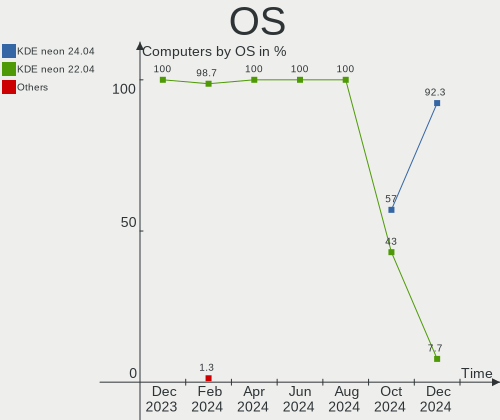
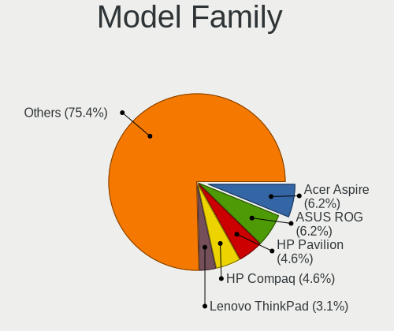
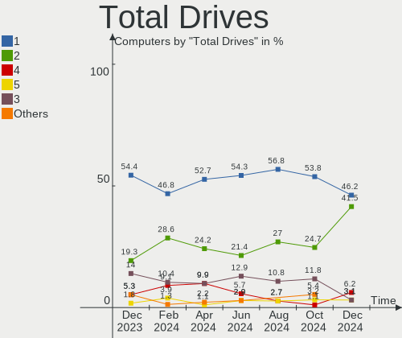
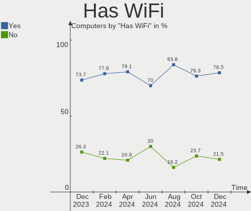
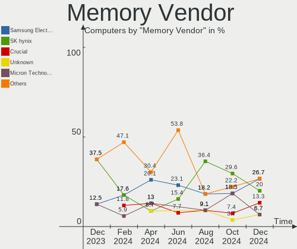

KDE neon Hardware Trends
------------------------

A project to identify most popular hardware characteristics and track their change
over time based on data collected by KDE neon users at https://Linux-Hardware.org.

Anyone can contribute to the study by uploading probes of their computers by
the [hw-probe](https://github.com/linuxhw/hw-probe) tool:

    sudo -E hw-probe -all -upload

This is a report for all computer types. See also reports for [desktops](/Dist/KDE_neon/Desktop/README.md) and [notebooks](/Dist/KDE_neon/Notebook/README.md).

Full-feature report is available here: https://linux-hardware.org/?view=trends

Period: Mar, 2021.

Contents
--------

- [ OS                       ](#os)
- [ OS Family                ](#os-family)
- [ Kernel                   ](#kernel)
- [ Kernel Family            ](#kernel-family)
- [ Kernel Major Ver.        ](#kernel-major-ver)
- [ Arch                     ](#arch)
- [ DE                       ](#de)
- [ Display Server           ](#display-server)
- [ Display Manager          ](#display-manager)
- [ OS Lang                  ](#os-lang)
- [ Boot Mode                ](#boot-mode)
- [ Filesystem               ](#filesystem)
- [ Part. scheme             ](#part-scheme)
- [ Dual Boot with Linux/BSD ](#dual-boot-with-linux/bsd)
- [ Dual Boot (Win)          ](#dual-boot-win)
- [ Country                  ](#country)
- [ City                     ](#city)
- [ Vendor                   ](#vendor)
- [ Model                    ](#model)
- [ Model Family             ](#model-family)
- [ MFG Year                 ](#mfg-year)
- [ Form Factor              ](#form-factor)
- [ Secure Boot              ](#secure-boot)
- [ Coreboot                 ](#coreboot)
- [ RAM Size                 ](#ram-size)
- [ RAM Used                 ](#ram-used)
- [ Has CD-ROM               ](#has-cd-rom)
- [ Total Drives             ](#total-drives)
- [ Has Ethernet             ](#has-ethernet)
- [ Has WiFi                 ](#has-wifi)
- [ Has Bluetooth            ](#has-bluetooth)
- [ Drive Vendor             ](#drive-vendor)
- [ Drive Model              ](#drive-model)
- [ HDD Vendor               ](#hdd-vendor)
- [ SSD Vendor               ](#ssd-vendor)
- [ Drive Kind               ](#drive-kind)
- [ Drive Connector          ](#drive-connector)
- [ Drive Size               ](#drive-size)
- [ Space Total              ](#space-total)
- [ Space Used               ](#space-used)
- [ Malfunc. Drives          ](#malfunc-drives)
- [ Malfunc. Drive Vendor    ](#malfunc-drive-vendor)
- [ Malfunc. HDD Vendor      ](#malfunc-hdd-vendor)
- [ Malfunc. Drive Kind      ](#malfunc-drive-kind)
- [ Failed Drives            ](#failed-drives)
- [ Failed Drive Vendor      ](#failed-drive-vendor)
- [ Drive Status             ](#drive-status)
- [ Storage Vendor           ](#storage-vendor)
- [ Storage Model            ](#storage-model)
- [ Storage Kind             ](#storage-kind)
- [ CPU Vendor               ](#cpu-vendor)
- [ CPU Model                ](#cpu-model)
- [ CPU Model Family         ](#cpu-model-family)
- [ CPU Cores                ](#cpu-cores)
- [ CPU Sockets              ](#cpu-sockets)
- [ CPU Threads              ](#cpu-threads)
- [ CPU Op-Modes             ](#cpu-op-modes)
- [ CPU Microcode            ](#cpu-microcode)
- [ CPU Microarch            ](#cpu-microarch)
- [ GPU Vendor               ](#gpu-vendor)
- [ GPU Model                ](#gpu-model)
- [ GPU Combo                ](#gpu-combo)
- [ GPU Driver               ](#gpu-driver)
- [ GPU Memory               ](#gpu-memory)
- [ Monitor Vendor           ](#monitor-vendor)
- [ Monitor Model            ](#monitor-model)
- [ Monitor Resolution       ](#monitor-resolution)
- [ Monitor Diagonal         ](#monitor-diagonal)
- [ Monitor Width            ](#monitor-width)
- [ Aspect Ratio             ](#aspect-ratio)
- [ Monitor Area             ](#monitor-area)
- [ Pixel Density            ](#pixel-density)
- [ Multiple Monitors        ](#multiple-monitors)
- [ Net Controller Vendor    ](#net-controller-vendor)
- [ Net Controller Model     ](#net-controller-model)
- [ Wireless Vendor          ](#wireless-vendor)
- [ Wireless Model           ](#wireless-model)
- [ Ethernet Vendor          ](#ethernet-vendor)
- [ Ethernet Model           ](#ethernet-model)
- [ Net Controller Kind      ](#net-controller-kind)
- [ Used Controller          ](#used-controller)
- [ NICs                     ](#nics)
- [ IPv6                     ](#ipv6)
- [ Memory Vendor            ](#memory-vendor)
- [ Memory Model             ](#memory-model)
- [ Memory Kind              ](#memory-kind)
- [ Memory Form Factor       ](#memory-form-factor)
- [ Memory Size              ](#memory-size)
- [ Memory Speed             ](#memory-speed)
- [ Sound Vendor             ](#sound-vendor)
- [ Sound Model              ](#sound-model)
- [ Camera Vendor            ](#camera-vendor)
- [ Camera Model             ](#camera-model)
- [ Fingerprint Vendor       ](#fingerprint-vendor)
- [ Fingerprint Model        ](#fingerprint-model)
- [ Chipcard Vendor          ](#chipcard-vendor)
- [ Chipcard Model           ](#chipcard-model)
- [ Printer Vendor           ](#printer-vendor)
- [ Printer Model            ](#printer-model)
- [ Scanner Vendor           ](#scanner-vendor)
- [ Scanner Model            ](#scanner-model)
- [ Bluetooth Vendor         ](#bluetooth-vendor)
- [ Bluetooth Model          ](#bluetooth-model)
- [ Unsupported Devices      ](#unsupported-devices)
- [ Unsupported Device Types ](#unsupported-device-types)

OS
--

Installed operating systems

| Name           | Computers | Percent |
|----------------|-----------|---------|
| KDE neon 20.04 | 178       | 100%    |

OS Family
---------

OS without a version

| Name     | Computers | Percent |
|----------|-----------|---------|
| KDE neon | 178       | 100%    |

Kernel
------

Version of the Linux kernel

| Version                  | Computers | Percent |
|--------------------------|-----------|---------|
| 5.4.0-66-generic         | 90        | 50.56%  |
| 5.4.0-67-generic         | 38        | 21.35%  |
| 5.4.0-70-generic         | 29        | 16.29%  |
| 5.8.0-44-generic         | 4         | 2.25%   |
| 5.8.0-45-generic         | 2         | 1.12%   |
| 5.4.0-65-generic         | 2         | 1.12%   |
| 5.4.0-52-generic         | 2         | 1.12%   |
| 5.10.23-xanmod1          | 2         | 1.12%   |
| 5.8.0-7642-generic       | 1         | 0.56%   |
| 5.8.0-48-generic         | 1         | 0.56%   |
| 5.4.0-70-lowlatency      | 1         | 0.56%   |
| 5.4.0-59-generic         | 1         | 0.56%   |
| 5.4.0-54-generic         | 1         | 0.56%   |
| 5.4.0-53-generic         | 1         | 0.56%   |
| 5.11.0-051100-lowlatency | 1         | 0.56%   |
| 5.10.20-xanmod1          | 1         | 0.56%   |
| 5.10.0-1011-oem          | 1         | 0.56%   |

Kernel Family
-------------

Linux kernel without a distro release

| Version | Computers | Percent |
|---------|-----------|---------|
| 5.4.0   | 165       | 92.7%   |
| 5.8.0   | 8         | 4.49%   |
| 5.10.23 | 2         | 1.12%   |
| 5.11.0  | 1         | 0.56%   |
| 5.10.20 | 1         | 0.56%   |
| 5.10.0  | 1         | 0.56%   |

Kernel Major Ver.
-----------------

Linux kernel major version

| Version | Computers | Percent |
|---------|-----------|---------|
| 5.4     | 165       | 92.7%   |
| 5.8     | 8         | 4.49%   |
| 5.10    | 4         | 2.25%   |
| 5.11    | 1         | 0.56%   |

Arch
----

OS architecture (x86_64, i586, etc.)

| Name   | Computers | Percent |
|--------|-----------|---------|
| x86_64 | 178       | 100%    |

DE
--

Desktop Environment

| Name    | Computers | Percent |
|---------|-----------|---------|
| KDE     | 157       | 88.2%   |
| KDE5    | 16        | 8.99%   |
| Unknown | 5         | 2.81%   |

Display Server
--------------

X11 or Wayland

| Name    | Computers | Percent |
|---------|-----------|---------|
| X11     | 171       | 96.07%  |
| Wayland | 6         | 3.37%   |
| Tty     | 1         | 0.56%   |

Display Manager
---------------

SDDM, LightDM, etc.

| Name    | Computers | Percent |
|---------|-----------|---------|
| Unknown | 162       | 91.01%  |
| SDDM    | 16        | 8.99%   |

OS Lang
-------

Language

| Lang        | Computers | Percent |
|-------------|-----------|---------|
| en_US       | 60        | 33.71%  |
| ru_RU       | 22        | 12.36%  |
| pt_BR       | 13        | 7.3%    |
| de_DE       | 12        | 6.74%   |
| es_ES       | 8         | 4.49%   |
| en_GB       | 7         | 3.93%   |
| it_IT       | 6         | 3.37%   |
| en_AU       | 6         | 3.37%   |
| en_IN       | 5         | 2.81%   |
| sv_SE       | 3         | 1.69%   |
| es_VE       | 3         | 1.69%   |
| en_CA       | 3         | 1.69%   |
| pt_PT       | 2         | 1.12%   |
| fr_FR       | 2         | 1.12%   |
| es_US       | 2         | 1.12%   |
| C           | 2         | 1.12%   |
| uk_UA       | 1         | 0.56%   |
| sr_RS@latin | 1         | 0.56%   |
| ru_UA       | 1         | 0.56%   |
| ro_RO       | 1         | 0.56%   |
| pl_PL       | 1         | 0.56%   |
| nl_BE       | 1         | 0.56%   |
| nb_NO       | 1         | 0.56%   |
| hu_HU       | 1         | 0.56%   |
| fr_CA       | 1         | 0.56%   |
| es_PY       | 1         | 0.56%   |
| es_PE       | 1         | 0.56%   |
| es_EC       | 1         | 0.56%   |
| es_CU       | 1         | 0.56%   |
| es_CL       | 1         | 0.56%   |
| es_BO       | 1         | 0.56%   |
| es_AR       | 1         | 0.56%   |
| en_NZ       | 1         | 0.56%   |
| en_HK       | 1         | 0.56%   |
| el_GR       | 1         | 0.56%   |
| de_CH       | 1         | 0.56%   |
| cs_CZ       | 1         | 0.56%   |
| bg_BG       | 1         | 0.56%   |

Boot Mode
---------

EFI or BIOS

| Mode | Computers | Percent |
|------|-----------|---------|
| EFI  | 97        | 54.49%  |
| BIOS | 81        | 45.51%  |

Filesystem
----------

Type of filesystem

| Type    | Computers | Percent |
|---------|-----------|---------|
| Ext4    | 170       | 95.51%  |
| Btrfs   | 6         | 3.37%   |
| Overlay | 2         | 1.12%   |

Part. scheme
------------

Scheme of partitioning

| Type    | Computers | Percent |
|---------|-----------|---------|
| Unknown | 162       | 91.01%  |
| GPT     | 10        | 5.62%   |
| MBR     | 6         | 3.37%   |

Dual Boot with Linux/BSD
------------------------

Hosting more than one Linux/BSD

| Dual boot | Computers | Percent |
|-----------|-----------|---------|
| No        | 169       | 94.94%  |
| Yes       | 9         | 5.06%   |

Dual Boot (Win)
---------------

Hosting Linux and Windows

| Dual boot | Computers | Percent |
|-----------|-----------|---------|
| No        | 156       | 87.64%  |
| Yes       | 22        | 12.36%  |

Country
-------

Geographic location (country)

| Country     | Computers | Percent |
|-------------|-----------|---------|
| USA         | 34        | 19.1%   |
| Russia      | 21        | 11.8%   |
| Brazil      | 13        | 7.3%    |
| Germany     | 11        | 6.18%   |
| Spain       | 8         | 4.49%   |
| UK          | 6         | 3.37%   |
| Italy       | 6         | 3.37%   |
| Australia   | 6         | 3.37%   |
| Ukraine     | 5         | 2.81%   |
| Sweden      | 5         | 2.81%   |
| India       | 5         | 2.81%   |
| Canada      | 5         | 2.81%   |
| Venezuela   | 3         | 1.69%   |
| Norway      | 3         | 1.69%   |
| Netherlands | 3         | 1.69%   |
| Serbia      | 2         | 1.12%   |
| Romania     | 2         | 1.12%   |
| Portugal    | 2         | 1.12%   |
| Lithuania   | 2         | 1.12%   |
| Latvia      | 2         | 1.12%   |
| Kazakhstan  | 2         | 1.12%   |
| Hungary     | 2         | 1.12%   |
| France      | 2         | 1.12%   |
| Cuba        | 2         | 1.12%   |
| Argentina   | 2         | 1.12%   |
| Uruguay     | 1         | 0.56%   |
| Thailand    | 1         | 0.56%   |
| Switzerland | 1         | 0.56%   |
| Slovenia    | 1         | 0.56%   |
| Poland      | 1         | 0.56%   |
| Peru        | 1         | 0.56%   |
| Pakistan    | 1         | 0.56%   |
| Kuwait      | 1         | 0.56%   |
| Japan       | 1         | 0.56%   |
| Iran        | 1         | 0.56%   |
| Hong Kong   | 1         | 0.56%   |
| Greece      | 1         | 0.56%   |
| Finland     | 1         | 0.56%   |
| Estonia     | 1         | 0.56%   |
| Ecuador     | 1         | 0.56%   |
| Czechia     | 1         | 0.56%   |
| Croatia     | 1         | 0.56%   |
| China       | 1         | 0.56%   |
| Chile       | 1         | 0.56%   |
| Bulgaria    | 1         | 0.56%   |
| Bolivia     | 1         | 0.56%   |
| Belgium     | 1         | 0.56%   |
| Belarus     | 1         | 0.56%   |
| Austria     | 1         | 0.56%   |

City
----

Geographic location (city)

| City                       | Computers | Percent |
|----------------------------|-----------|---------|
| St Petersburg              | 4         | 2.25%   |
| Perth                      | 4         | 2.25%   |
| Unknown                    | 3         | 1.69%   |
| Salvador                   | 2         | 1.12%   |
| Moscow                     | 2         | 1.12%   |
| Mjoelby                    | 2         | 1.12%   |
| Maringá                   | 2         | 1.12%   |
| Los Palacios y Villafranca | 2         | 1.12%   |
| Houston                    | 2         | 1.12%   |
| Havana                     | 2         | 1.12%   |
| Guarenas                   | 2         | 1.12%   |
| Córdoba                   | 2         | 1.12%   |
| Budapest                   | 2         | 1.12%   |
| Amsterdam                  | 2         | 1.12%   |
| Zaporizhzhya               | 1         | 0.56%   |
| Yekaterinburg              | 1         | 0.56%   |
| Yaroslavl                  | 1         | 0.56%   |
| Wudinna                    | 1         | 0.56%   |
| Woonsocket                 | 1         | 0.56%   |
| Woerth am Rhein            | 1         | 0.56%   |
| Wichita                    | 1         | 0.56%   |
| Wasilla                    | 1         | 0.56%   |
| Waltenschwil               | 1         | 0.56%   |
| Voronezh                   | 1         | 0.56%   |
| Vojka                      | 1         | 0.56%   |
| Vilyuchinsk                | 1         | 0.56%   |
| Vilnius                    | 1         | 0.56%   |
| Vienna                     | 1         | 0.56%   |
| Ventspils                  | 1         | 0.56%   |
| Uxbridge                   | 1         | 0.56%   |
| Ulan-Ude                   | 1         | 0.56%   |
| Ufa                        | 1         | 0.56%   |
| Târgu Jiu                 | 1         | 0.56%   |
| Toronto                    | 1         | 0.56%   |
| Tipp City                  | 1         | 0.56%   |
| Thale                      | 1         | 0.56%   |
| Tehran                     | 1         | 0.56%   |
| Tallinn                    | 1         | 0.56%   |
| Sydney                     | 1         | 0.56%   |
| Surgut                     | 1         | 0.56%   |
| Stockholm                  | 1         | 0.56%   |
| Srednyaya Akhtuba          | 1         | 0.56%   |
| Springfield                | 1         | 0.56%   |
| Songjiang                  | 1         | 0.56%   |
| Sofia                      | 1         | 0.56%   |
| Sheffield                  | 1         | 0.56%   |
| Setúbal                   | 1         | 0.56%   |
| Santa Cruz                 | 1         | 0.56%   |
| San Mateo                  | 1         | 0.56%   |
| Ruzayevka                  | 1         | 0.56%   |
| Rudolstadt                 | 1         | 0.56%   |
| Rostov-on-Don              | 1         | 0.56%   |
| Rochester                  | 1         | 0.56%   |
| River Falls                | 1         | 0.56%   |
| Rivarotta                  | 1         | 0.56%   |
| Riga                       | 1         | 0.56%   |
| Ribeirão das Neves        | 1         | 0.56%   |
| Quito                      | 1         | 0.56%   |
| Pune                       | 1         | 0.56%   |
| Prague                     | 1         | 0.56%   |

Vendor
------

Motherboard manufacturer

| Name                | Computers | Percent |
|---------------------|-----------|---------|
| ASUSTek Computer    | 33        | 18.54%  |
| Hewlett-Packard     | 29        | 16.29%  |
| Dell                | 26        | 14.61%  |
| Lenovo              | 19        | 10.67%  |
| Gigabyte Technology | 18        | 10.11%  |
| Acer                | 11        | 6.18%   |
| ASRock              | 10        | 5.62%   |
| MSI                 | 9         | 5.06%   |
| Apple               | 5         | 2.81%   |
| Intel               | 4         | 2.25%   |
| Samsung Electronics | 3         | 1.69%   |
| HUAWEI              | 2         | 1.12%   |
| ZOTAC               | 1         | 0.56%   |
| ZMAX                | 1         | 0.56%   |
| Toshiba             | 1         | 0.56%   |
| System76            | 1         | 0.56%   |
| Sony                | 1         | 0.56%   |
| Microsoft           | 1         | 0.56%   |
| Medion              | 1         | 0.56%   |
| HASEE Computer      | 1         | 0.56%   |
| Unknown             | 1         | 0.56%   |

Model
-----

Motherboard model

| Name                                     | Computers | Percent |
|------------------------------------------|-----------|---------|
| ASUS All Series                          | 3         | 1.69%   |
| HP Pavilion dv6                          | 2         | 1.12%   |
| ZOTAC ZBOX-ID88/ID89/ID90                | 1         | 0.56%   |
| ZMAX IPM41-D2                            | 1         | 0.56%   |
| Toshiba Satellite A665                   | 1         | 0.56%   |
| System76 Galago Pro                      | 1         | 0.56%   |
| Sony VGN-FZ31M                           | 1         | 0.56%   |
| Samsung R510/P510                        | 1         | 0.56%   |
| Samsung 550P5C/550P7C                    | 1         | 0.56%   |
| Samsung 300E5M/300E5L                    | 1         | 0.56%   |
| MSI MS-7C75                              | 1         | 0.56%   |
| MSI MS-7B89                              | 1         | 0.56%   |
| MSI MS-7B86                              | 1         | 0.56%   |
| MSI MS-7B79                              | 1         | 0.56%   |
| MSI MS-7A63                              | 1         | 0.56%   |
| MSI MS-7978                              | 1         | 0.56%   |
| MSI MS-7900                              | 1         | 0.56%   |
| MSI GL65 Leopard 10SCXR                  | 1         | 0.56%   |
| MSI B450M Gaming                         | 1         | 0.56%   |
| Microsoft Surface Go 2                   | 1         | 0.56%   |
| Medion E2216T MD99940                    | 1         | 0.56%   |
| Lenovo Yoga Slim 7 14ARE05 82A2          | 1         | 0.56%   |
| Lenovo V310-15ISK 80SY                   | 1         | 0.56%   |
| Lenovo ThinkStation S20 4157ZSK          | 1         | 0.56%   |
| Lenovo ThinkPad Yoga 11e 20DAS02M00      | 1         | 0.56%   |
| Lenovo ThinkPad X230 23301G3             | 1         | 0.56%   |
| Lenovo ThinkPad X1 Carbon 6th 20KGS3AC00 | 1         | 0.56%   |
| Lenovo ThinkPad T440 20B7000HUS          | 1         | 0.56%   |
| Lenovo ThinkPad T15 Gen 1 20S6005JMH     | 1         | 0.56%   |
| Lenovo ThinkPad L450 20DSS1G604          | 1         | 0.56%   |
| Lenovo Legion 5 15IMH05H 82CF            | 1         | 0.56%   |
| Lenovo IdeaPad L340-17IRH Gaming 81LL    | 1         | 0.56%   |
| Lenovo IdeaPad 3 15IIL05 81WE            | 1         | 0.56%   |
| Lenovo IdeaPad 3 14ADA05 81W0            | 1         | 0.56%   |
| Lenovo IdeaCentre 3 07ADA05 90MV007SUS   | 1         | 0.56%   |
| Lenovo G780                              | 1         | 0.56%   |
| Lenovo G700 20251                        | 1         | 0.56%   |
| Lenovo G570 20079                        | 1         | 0.56%   |
| Lenovo G510 20238                        | 1         | 0.56%   |
| Lenovo G500 20236                        | 1         | 0.56%   |
| Intel X99                                | 1         | 0.56%   |
| Intel S5500BC                            | 1         | 0.56%   |
| Intel NUC7i7DNKE                         | 1         | 0.56%   |
| Intel DN2820FYK H24582-201               | 1         | 0.56%   |
| HUAWEI NBLK-WAX9X                        | 1         | 0.56%   |
| HUAWEI HN-WX9X                           | 1         | 0.56%   |
| HP ZBook 15u G3                          | 1         | 0.56%   |
| HP Stream x360 Convertible 11-aa0XX      | 1         | 0.56%   |
| HP Slim Desktop 290-p0xxx                | 1         | 0.56%   |
| HP ProDesk 600 G1 TWR                    | 1         | 0.56%   |
| HP ProBook 650 G1                        | 1         | 0.56%   |
| HP ProBook 6460b                         | 1         | 0.56%   |
| HP ProBook 4540s                         | 1         | 0.56%   |
| HP Pavilion dv7                          | 1         | 0.56%   |
| HP Pavilion Desktop PC 570-p0XX          | 1         | 0.56%   |
| HP OMEN by HP Laptop 15-dh0xxx           | 1         | 0.56%   |
| HP Notebook                              | 1         | 0.56%   |
| HP Laptop 17-bs0xx                       | 1         | 0.56%   |
| HP Laptop 17-ak0xx                       | 1         | 0.56%   |
| HP Laptop 15s-eq0xxx                     | 1         | 0.56%   |

Model Family
------------

Motherboard model prefix

| Name                | Computers | Percent |
|---------------------|-----------|---------|
| Dell Latitude       | 9         | 5.06%   |
| Acer Aspire         | 9         | 5.06%   |
| Lenovo ThinkPad     | 6         | 3.37%   |
| Dell Inspiron       | 6         | 3.37%   |
| Dell OptiPlex       | 5         | 2.81%   |
| ASUS PRIME          | 5         | 2.81%   |
| HP Pavilion         | 4         | 2.25%   |
| HP Laptop           | 4         | 2.25%   |
| HP Compaq           | 4         | 2.25%   |
| Lenovo IdeaPad      | 3         | 1.69%   |
| HP ProBook          | 3         | 1.69%   |
| HP ENVY             | 3         | 1.69%   |
| ASUS ZenBook        | 3         | 1.69%   |
| ASUS All            | 3         | 1.69%   |
| HP EliteBook        | 2         | 1.12%   |
| Gigabyte B450       | 2         | 1.12%   |
| Dell XPS            | 2         | 1.12%   |
| ASUS TUF            | 2         | 1.12%   |
| ASUS STRIX          | 2         | 1.12%   |
| ZOTAC ZBOX-ID88     | 1         | 0.56%   |
| ZMAX IPM41-D2       | 1         | 0.56%   |
| Toshiba Satellite   | 1         | 0.56%   |
| System76 Galago     | 1         | 0.56%   |
| Sony VGN-FZ31M      | 1         | 0.56%   |
| Samsung R510        | 1         | 0.56%   |
| Samsung 550P5C      | 1         | 0.56%   |
| Samsung 300E5M      | 1         | 0.56%   |
| MSI MS-7C75         | 1         | 0.56%   |
| MSI MS-7B89         | 1         | 0.56%   |
| MSI MS-7B86         | 1         | 0.56%   |
| MSI MS-7B79         | 1         | 0.56%   |
| MSI MS-7A63         | 1         | 0.56%   |
| MSI MS-7978         | 1         | 0.56%   |
| MSI MS-7900         | 1         | 0.56%   |
| MSI GL65            | 1         | 0.56%   |
| MSI B450M           | 1         | 0.56%   |
| Microsoft Surface   | 1         | 0.56%   |
| Medion E2216T       | 1         | 0.56%   |
| Lenovo Yoga         | 1         | 0.56%   |
| Lenovo V310-15ISK   | 1         | 0.56%   |
| Lenovo ThinkStation | 1         | 0.56%   |
| Lenovo Legion       | 1         | 0.56%   |
| Lenovo IdeaCentre   | 1         | 0.56%   |
| Lenovo G780         | 1         | 0.56%   |
| Lenovo G700         | 1         | 0.56%   |
| Lenovo G570         | 1         | 0.56%   |
| Lenovo G510         | 1         | 0.56%   |
| Lenovo G500         | 1         | 0.56%   |
| Intel X99           | 1         | 0.56%   |
| Intel S5500BC       | 1         | 0.56%   |
| Intel NUC7i7DNKE    | 1         | 0.56%   |
| Intel DN2820FYK     | 1         | 0.56%   |
| HUAWEI NBLK-WAX9X   | 1         | 0.56%   |
| HUAWEI HN-WX9X      | 1         | 0.56%   |
| HP ZBook            | 1         | 0.56%   |
| HP Stream           | 1         | 0.56%   |
| HP Slim             | 1         | 0.56%   |
| HP ProDesk          | 1         | 0.56%   |
| HP OMEN             | 1         | 0.56%   |
| HP Notebook         | 1         | 0.56%   |

MFG Year
--------

Motherboard manufacture year

| Year | Computers | Percent |
|------|-----------|---------|
| 2020 | 41        | 23.03%  |
| 2019 | 23        | 12.92%  |
| 2018 | 20        | 11.24%  |
| 2013 | 15        | 8.43%   |
| 2017 | 13        | 7.3%    |
| 2014 | 10        | 5.62%   |
| 2012 | 9         | 5.06%   |
| 2011 | 9         | 5.06%   |
| 2010 | 9         | 5.06%   |
| 2016 | 7         | 3.93%   |
| 2015 | 6         | 3.37%   |
| 2009 | 6         | 3.37%   |
| 2021 | 4         | 2.25%   |
| 2007 | 3         | 1.69%   |
| 2008 | 2         | 1.12%   |
| 2006 | 1         | 0.56%   |

Form Factor
-----------

Physical design of the computer

| Name        | Computers | Percent |
|-------------|-----------|---------|
| Notebook    | 92        | 51.69%  |
| Desktop     | 77        | 43.26%  |
| Convertible | 3         | 1.69%   |
| Mini pc     | 3         | 1.69%   |
| Tablet      | 2         | 1.12%   |
| Server      | 1         | 0.56%   |

Secure Boot
-----------

Enabled or disabled

| State    | Computers | Percent |
|----------|-----------|---------|
| Disabled | 168       | 94.38%  |
| Enabled  | 10        | 5.62%   |

Coreboot
--------

Have coreboot on board

| Used | Computers | Percent |
|------|-----------|---------|
| No   | 177       | 99.44%  |
| Yes  | 1         | 0.56%   |

RAM Size
--------

Total RAM memory

| Size in GB  | Computers | Percent |
|-------------|-----------|---------|
| 16.01-24.0  | 42        | 23.6%   |
| 8.01-16.0   | 39        | 21.91%  |
| 4.01-8.0    | 38        | 21.35%  |
| 3.01-4.0    | 32        | 17.98%  |
| 32.01-64.0  | 15        | 8.43%   |
| 1.01-2.0    | 5         | 2.81%   |
| 24.01-32.0  | 4         | 2.25%   |
| 64.01-256.0 | 3         | 1.69%   |

RAM Used
--------

Used RAM memory

| Used GB    | Computers | Percent |
|------------|-----------|---------|
| 1.01-2.0   | 82        | 46.07%  |
| 2.01-3.0   | 38        | 21.35%  |
| 3.01-4.0   | 20        | 11.24%  |
| 4.01-8.0   | 19        | 10.67%  |
| 0.51-1.0   | 9         | 5.06%   |
| 8.01-16.0  | 6         | 3.37%   |
| 24.01-32.0 | 2         | 1.12%   |
| 16.01-24.0 | 2         | 1.12%   |

Has CD-ROM
----------

Has CD-ROM on board

| Presented | Computers | Percent |
|-----------|-----------|---------|
| No        | 99        | 55.62%  |
| Yes       | 79        | 44.38%  |

Total Drives
------------

Number of drives on board

| Drives | Computers | Percent |
|--------|-----------|---------|
| 1      | 96        | 53.93%  |
| 2      | 49        | 27.53%  |
| 3      | 15        | 8.43%   |
| 4      | 12        | 6.74%   |
| 5      | 4         | 2.25%   |
| 6      | 2         | 1.12%   |

Has Ethernet
------------

Has Ethernet on board

| Presented | Computers | Percent |
|-----------|-----------|---------|
| Yes       | 160       | 89.89%  |
| No        | 18        | 10.11%  |

Has WiFi
--------

Has WiFi module

| Presented | Computers | Percent |
|-----------|-----------|---------|
| Yes       | 132       | 74.16%  |
| No        | 46        | 25.84%  |

Has Bluetooth
-------------

Has Bluetooth module

| Presented | Computers | Percent |
|-----------|-----------|---------|
| Yes       | 106       | 59.55%  |
| No        | 72        | 40.45%  |

Drive Vendor
------------

Hard drive vendors

| Vendor                | Computers | Drives | Percent |
|-----------------------|-----------|--------|---------|
| Samsung Electronics   | 43        | 51     | 15.81%  |
| WDC                   | 40        | 57     | 14.71%  |
| Seagate               | 35        | 44     | 12.87%  |
| Toshiba               | 27        | 28     | 9.93%   |
| Kingston              | 21        | 24     | 7.72%   |
| Unknown               | 14        | 15     | 5.15%   |
| Intel                 | 14        | 15     | 5.15%   |
| Sandisk               | 11        | 11     | 4.04%   |
| Crucial               | 9         | 10     | 3.31%   |
| Hitachi               | 8         | 9      | 2.94%   |
| SK Hynix              | 5         | 5      | 1.84%   |
| HGST                  | 5         | 5      | 1.84%   |
| China                 | 5         | 5      | 1.84%   |
| PNY                   | 3         | 3      | 1.1%    |
| Phison                | 3         | 4      | 1.1%    |
| Micron Technology     | 3         | 3      | 1.1%    |
| A-DATA Technology     | 3         | 3      | 1.1%    |
| XPG                   | 2         | 2      | 0.74%   |
| SPCC                  | 2         | 2      | 0.74%   |
| Realtek Semiconductor | 2         | 2      | 0.74%   |
| GOODRAM               | 2         | 2      | 0.74%   |
| Corsair               | 2         | 2      | 0.74%   |
| Apple                 | 2         | 3      | 0.74%   |
| Zheino                | 1         | 1      | 0.37%   |
| Transcend             | 1         | 1      | 0.37%   |
| Silicon Motion        | 1         | 1      | 0.37%   |
| PLEXTOR               | 1         | 1      | 0.37%   |
| Netac                 | 1         | 1      | 0.37%   |
| LONDISK               | 1         | 1      | 0.37%   |
| LITEON                | 1         | 1      | 0.37%   |
| Lexar                 | 1         | 1      | 0.37%   |
| KIOXIA                | 1         | 1      | 0.37%   |
| KingSpec              | 1         | 1      | 0.37%   |
| HS-SSD-C100           | 1         | 1      | 0.37%   |

Drive Model
-----------

Hard drive models

| Model                               | Computers | Percent |
|-------------------------------------|-----------|---------|
| Kingston SA400S37240G 240GB SSD     | 7         | 2.3%    |
| Unknown MMC Card  64GB              | 6         | 1.97%   |
| Toshiba MQ01ABD100 1TB              | 6         | 1.97%   |
| Samsung SSD 860 EVO 500GB           | 6         | 1.97%   |
| Samsung NVMe SSD Drive 500GB        | 6         | 1.97%   |
| Kingston SA400S37480G 480GB SSD     | 5         | 1.64%   |
| Unknown SD/MMC/MS PRO 128GB         | 4         | 1.31%   |
| Samsung NVMe SSD Drive 1TB          | 4         | 1.31%   |
| WDC WD30EZRX-00D8PB0 3TB            | 3         | 0.98%   |
| WDC WD10EZEX-08WN4A0 1TB            | 3         | 0.98%   |
| SK Hynix NVMe SSD Drive 512GB       | 3         | 0.98%   |
| Samsung NVMe SSD Drive 256GB        | 3         | 0.98%   |
| XPG NVMe SSD Drive 512GB            | 2         | 0.66%   |
| WDC WDS500G2B0A-00SM50 500GB SSD    | 2         | 0.66%   |
| WDC WDS480G2G0A-00JH30 480GB SSD    | 2         | 0.66%   |
| WDC WDS240G2G0A-00JH30 240GB SSD    | 2         | 0.66%   |
| WDC WD5000AAKX-00ERMA0 500GB        | 2         | 0.66%   |
| WDC WD30EFRX-68EUZN0 3TB            | 2         | 0.66%   |
| WDC WD1002FAEX-00Z3A0 1TB           | 2         | 0.66%   |
| Toshiba MQ01ABF050 500GB            | 2         | 0.66%   |
| Toshiba MK3263GSXN 320GB            | 2         | 0.66%   |
| Seagate ST9500325AS 500GB           | 2         | 0.66%   |
| Seagate ST500LM012 HN-M500MBB 500GB | 2         | 0.66%   |
| Seagate ST500DM002-1BD142 500GB     | 2         | 0.66%   |
| Seagate ST2000DM001-1CH164 2TB      | 2         | 0.66%   |
| Seagate ST1000LM049-2GH172 1TB      | 2         | 0.66%   |
| Seagate ST1000DM010-2EP102 1TB      | 2         | 0.66%   |
| Samsung SSD 970 EVO 500GB           | 2         | 0.66%   |
| Samsung SSD 860 EVO 1TB             | 2         | 0.66%   |
| Samsung SSD 850 EVO 250GB           | 2         | 0.66%   |
| Realtek NVMe SSD Drive 512GB        | 2         | 0.66%   |
| Kingston SA400S37120G 120GB SSD     | 2         | 0.66%   |
| Intel NVMe SSD Drive 512GB          | 2         | 0.66%   |
| Intel NVMe SSD Drive 256GB          | 2         | 0.66%   |
| Intel NVMe SSD Drive 16GB           | 2         | 0.66%   |
| Intel NVMe SSD Drive 1024GB         | 2         | 0.66%   |
| HGST HTS725050A7E630 500GB          | 2         | 0.66%   |
| HGST HTS721010A9E630 1TB            | 2         | 0.66%   |
| Crucial CT525MX300SSD1 528GB        | 2         | 0.66%   |
| China SSD 120GB                     | 2         | 0.66%   |
| Zheino CHN-mSATAQ3-240 240GB        | 1         | 0.33%   |
| WDC WDS500G3X0C-00SJG0 500GB        | 1         | 0.33%   |
| WDC WDS250G2B0A-00SM50 250GB SSD    | 1         | 0.33%   |
| WDC WDS100T2B0C-00PXH0 1TB          | 1         | 0.33%   |
| WDC WDBNCE0010PNC 1TB SSD           | 1         | 0.33%   |
| WDC WD6400AARS-00Y5B1 640GB         | 1         | 0.33%   |
| WDC WD60EFRX-68MYMN1 6TB            | 1         | 0.33%   |
| WDC WD5002AALX-00J37A0 500GB        | 1         | 0.33%   |
| WDC WD5000LPCX-60VHAT0 500GB        | 1         | 0.33%   |
| WDC WD5000LPCX-24VHAT0 500GB        | 1         | 0.33%   |
| WDC WD5000BPVT-60HXZT3 500GB        | 1         | 0.33%   |
| WDC WD5000BPKT-75PK4T0 500GB        | 1         | 0.33%   |
| WDC WD5000AZLX-00CL5A0 500GB        | 1         | 0.33%   |
| WDC WD5000AVDS-63U7B1 500GB         | 1         | 0.33%   |
| WDC WD5000AAKX-001CA0 500GB         | 1         | 0.33%   |
| WDC WD5000AAKS-07A7B0 500GB         | 1         | 0.33%   |
| WDC WD40EZRZ-00WN9B0 4TB            | 1         | 0.33%   |
| WDC WD40EFRX-68WT0N0 4TB            | 1         | 0.33%   |
| WDC WD3200BEVT-60ZCT1 320GB         | 1         | 0.33%   |
| WDC WD3200BEVT-22ZCT0 320GB         | 1         | 0.33%   |

HDD Vendor
----------

Hard disk drive vendors

| Vendor              | Computers | Drives | Percent |
|---------------------|-----------|--------|---------|
| WDC                 | 34        | 47     | 30.63%  |
| Seagate             | 34        | 43     | 30.63%  |
| Toshiba             | 25        | 26     | 22.52%  |
| Hitachi             | 8         | 9      | 7.21%   |
| Samsung Electronics | 5         | 5      | 4.5%    |
| HGST                | 5         | 5      | 4.5%    |

SSD Vendor
----------

Solid state drive vendors

| Vendor              | Computers | Drives | Percent |
|---------------------|-----------|--------|---------|
| Samsung Electronics | 25        | 28     | 25.51%  |
| Kingston            | 19        | 22     | 19.39%  |
| Crucial             | 9         | 10     | 9.18%   |
| WDC                 | 8         | 8      | 8.16%   |
| SanDisk             | 7         | 7      | 7.14%   |
| China               | 5         | 5      | 5.1%    |
| Intel               | 4         | 4      | 4.08%   |
| PNY                 | 3         | 3      | 3.06%   |
| A-DATA Technology   | 3         | 3      | 3.06%   |
| SPCC                | 2         | 2      | 2.04%   |
| Micron Technology   | 2         | 2      | 2.04%   |
| GOODRAM             | 2         | 2      | 2.04%   |
| Transcend           | 1         | 1      | 1.02%   |
| SK Hynix            | 1         | 1      | 1.02%   |
| Seagate             | 1         | 1      | 1.02%   |
| PLEXTOR             | 1         | 1      | 1.02%   |
| LONDISK             | 1         | 1      | 1.02%   |
| Lexar               | 1         | 1      | 1.02%   |
| KingSpec            | 1         | 1      | 1.02%   |
| Corsair             | 1         | 1      | 1.02%   |
| Apple               | 1         | 1      | 1.02%   |

Drive Kind
----------

HDD or SSD

| Kind    | Computers | Drives | Percent |
|---------|-----------|--------|---------|
| HDD     | 92        | 135    | 37.55%  |
| SSD     | 84        | 105    | 34.29%  |
| NVMe    | 52        | 58     | 21.22%  |
| Unknown | 9         | 10     | 3.67%   |
| MMC     | 8         | 8      | 3.27%   |

Drive Connector
---------------

SATA, SAS, NVMe, etc.

| Type | Computers | Drives | Percent |
|------|-----------|--------|---------|
| SATA | 147       | 236    | 67.12%  |
| NVMe | 52        | 58     | 23.74%  |
| SAS  | 12        | 14     | 5.48%   |
| MMC  | 8         | 8      | 3.65%   |

Drive Size
----------

Size of hard drive

| Size in TB | Computers | Drives | Percent |
|------------|-----------|--------|---------|
| 0.01-0.5   | 104       | 139    | 55.91%  |
| 0.51-1.0   | 52        | 65     | 27.96%  |
| 1.01-2.0   | 11        | 12     | 5.91%   |
| 2.01-3.0   | 8         | 12     | 4.3%    |
| 4.01-10.0  | 6         | 7      | 3.23%   |
| 3.01-4.0   | 5         | 5      | 2.69%   |

Space Total
-----------

Amount of disk space available on the file system

| Size in GB     | Computers | Percent |
|----------------|-----------|---------|
| 101-250        | 54        | 30.34%  |
| 251-500        | 44        | 24.72%  |
| 501-1000       | 23        | 12.92%  |
| 51-100         | 17        | 9.55%   |
| 1001-2000      | 12        | 6.74%   |
| More than 3000 | 11        | 6.18%   |
| 21-50          | 5         | 2.81%   |
| Unknown        | 5         | 2.81%   |
| 2001-3000      | 4         | 2.25%   |
| 1-20           | 3         | 1.69%   |

Space Used
----------

Amount of used disk space

| Used GB        | Computers | Percent |
|----------------|-----------|---------|
| 1-20           | 76        | 42.7%   |
| 21-50          | 30        | 16.85%  |
| 101-250        | 20        | 11.24%  |
| 51-100         | 17        | 9.55%   |
| 251-500        | 10        | 5.62%   |
| More than 3000 | 8         | 4.49%   |
| 501-1000       | 7         | 3.93%   |
| Unknown        | 5         | 2.81%   |
| 1001-2000      | 4         | 2.25%   |
| 2001-3000      | 1         | 0.56%   |

Malfunc. Drives
---------------

Drive models with a malfunction

| Model                      | Computers | Drives | Percent |
|----------------------------|-----------|--------|---------|
| WDC WD30EFRX-68EUZN0 3TB   | 1         | 1      | 25%     |
| Toshiba MQ01ABD032 320GB   | 1         | 1      | 25%     |
| HGST HTS725050A7E630 500GB | 1         | 1      | 25%     |
| Corsair Force GS 240GB SSD | 1         | 1      | 25%     |

Malfunc. Drive Vendor
---------------------

Vendors of faulty drives

| Vendor  | Computers | Drives | Percent |
|---------|-----------|--------|---------|
| WDC     | 1         | 1      | 25%     |
| Toshiba | 1         | 1      | 25%     |
| HGST    | 1         | 1      | 25%     |
| Corsair | 1         | 1      | 25%     |

Malfunc. HDD Vendor
-------------------

Vendors of faulty HDD drives

| Vendor  | Computers | Drives | Percent |
|---------|-----------|--------|---------|
| WDC     | 1         | 1      | 33.33%  |
| Toshiba | 1         | 1      | 33.33%  |
| HGST    | 1         | 1      | 33.33%  |

Malfunc. Drive Kind
-------------------

Kinds of faulty drives

| Kind | Computers | Drives | Percent |
|------|-----------|--------|---------|
| HDD  | 3         | 3      | 75%     |
| SSD  | 1         | 1      | 25%     |

Failed Drives
-------------

Failed drive models

| Model                       | Computers | Drives | Percent |
|-----------------------------|-----------|--------|---------|
| WDC WD5000AVDS-63U7B1 500GB | 1         | 1      | 100%    |

Failed Drive Vendor
-------------------

Failed drive vendors

| Vendor | Computers | Drives | Percent |
|--------|-----------|--------|---------|
| WDC    | 1         | 1      | 100%    |

Drive Status
------------

Number of failed and malfunc. drives

| Status   | Computers | Drives | Percent |
|----------|-----------|--------|---------|
| Detected | 161       | 280    | 88.46%  |
| Works    | 16        | 31     | 8.79%   |
| Malfunc  | 4         | 4      | 2.2%    |
| Failed   | 1         | 1      | 0.55%   |

Storage Vendor
--------------

Storage controller vendors

| Vendor                       | Computers | Percent |
|------------------------------|-----------|---------|
| Intel                        | 120       | 54.79%  |
| AMD                          | 43        | 19.63%  |
| Samsung Electronics          | 18        | 8.22%   |
| Sandisk                      | 5         | 2.28%   |
| SK Hynix                     | 4         | 1.83%   |
| Phison Electronics           | 4         | 1.83%   |
| Marvell Technology Group     | 4         | 1.83%   |
| Nvidia                       | 3         | 1.37%   |
| Toshiba America Info Systems | 2         | 0.91%   |
| Realtek Semiconductor        | 2         | 0.91%   |
| Kingston Technology Company  | 2         | 0.91%   |
| JMicron Technology           | 2         | 0.91%   |
| ASMedia Technology           | 2         | 0.91%   |
| ADATA Technology             | 2         | 0.91%   |
| VIA Technologies             | 1         | 0.46%   |
| Silicon Motion               | 1         | 0.46%   |
| Micron Technology            | 1         | 0.46%   |
| Lite-On Technology           | 1         | 0.46%   |
| KIOXIA                       | 1         | 0.46%   |
| Apple                        | 1         | 0.46%   |

Storage Model
-------------

Storage controller models

| Model                                                                                   | Computers | Percent |
|-----------------------------------------------------------------------------------------|-----------|---------|
| AMD FCH SATA Controller [AHCI mode]                                                     | 29        | 11.2%   |
| Intel 7 Series Chipset Family 6-port SATA Controller [AHCI mode]                        | 13        | 5.02%   |
| Samsung NVMe SSD Controller SM981/PM981/PM983                                           | 12        | 4.63%   |
| Intel 8 Series/C220 Series Chipset Family 6-port SATA Controller 1 [AHCI mode]          | 12        | 4.63%   |
| AMD 400 Series Chipset SATA Controller                                                  | 12        | 4.63%   |
| Intel 82801 Mobile SATA Controller [RAID mode]                                          | 10        | 3.86%   |
| Intel 200 Series PCH SATA controller [AHCI mode]                                        | 9         | 3.47%   |
| Intel Sunrise Point-LP SATA Controller [AHCI mode]                                      | 8         | 3.09%   |
| Intel 6 Series/C200 Series Chipset Family 6 port Mobile SATA AHCI Controller            | 7         | 2.7%    |
| Intel 8 Series SATA Controller 1 [AHCI mode]                                            | 5         | 1.93%   |
| Intel 5 Series/3400 Series Chipset 6 port SATA AHCI Controller                          | 5         | 1.93%   |
| AMD SB7x0/SB8x0/SB9x0 IDE Controller                                                    | 5         | 1.93%   |
| Intel SSD 660P Series                                                                   | 4         | 1.54%   |
| Intel NM10/ICH7 Family SATA Controller [IDE mode]                                       | 4         | 1.54%   |
| Intel 6 Series/C200 Series Chipset Family 6 port Desktop SATA AHCI Controller           | 4         | 1.54%   |
| AMD SB7x0/SB8x0/SB9x0 SATA Controller [IDE mode]                                        | 4         | 1.54%   |
| AMD SB7x0/SB8x0/SB9x0 SATA Controller [AHCI mode]                                       | 4         | 1.54%   |
| Sandisk WD Blue SN550 NVMe SSD                                                          | 3         | 1.16%   |
| Samsung NVMe SSD Controller SM961/PM961/SM963                                           | 3         | 1.16%   |
| Phison E12 NVMe Controller                                                              | 3         | 1.16%   |
| Intel Volume Management Device NVMe RAID Controller                                     | 3         | 1.16%   |
| Intel Q170/Q150/B150/H170/H110/Z170/CM236 Chipset SATA Controller [AHCI Mode]           | 3         | 1.16%   |
| Intel Atom Processor E3800 Series SATA AHCI Controller                                  | 3         | 1.16%   |
| SK Hynix BC501 NVMe Solid State Drive 512GB                                             | 2         | 0.77%   |
| Sandisk WD Black SN750 / PC SN730 NVMe SSD                                              | 2         | 0.77%   |
| Marvell Group 88SE6111/6121 SATA II / PATA Controller                                   | 2         | 0.77%   |
| Kingston Company A2000 NVMe SSD                                                         | 2         | 0.77%   |
| JMicron JMB363 SATA/IDE Controller                                                      | 2         | 0.77%   |
| Intel Wildcat Point-LP SATA Controller [AHCI Mode]                                      | 2         | 0.77%   |
| Intel SSD Pro 7600p/760p/E 6100p Series                                                 | 2         | 0.77%   |
| Intel NVMe Optane Memory Series                                                         | 2         | 0.77%   |
| Intel Ice Lake-LP SATA Controller [AHCI mode]                                           | 2         | 0.77%   |
| Intel Comet Lake SATA AHCI Controller                                                   | 2         | 0.77%   |
| Intel Cannon Lake Mobile PCH SATA AHCI Controller                                       | 2         | 0.77%   |
| Intel 82801JI (ICH10 Family) SATA AHCI Controller                                       | 2         | 0.77%   |
| Intel 82801JI (ICH10 Family) 4 port SATA IDE Controller #1                              | 2         | 0.77%   |
| Intel 82801JI (ICH10 Family) 2 port SATA IDE Controller #2                              | 2         | 0.77%   |
| Intel 82801IBM/IEM (ICH9M/ICH9M-E) 4 port SATA Controller [AHCI mode]                   | 2         | 0.77%   |
| Intel 82801HM/HEM (ICH8M/ICH8M-E) SATA Controller [AHCI mode]                           | 2         | 0.77%   |
| Intel 82801HM/HEM (ICH8M/ICH8M-E) IDE Controller                                        | 2         | 0.77%   |
| Intel 82801G (ICH7 Family) IDE Controller                                               | 2         | 0.77%   |
| Intel 7 Series/C210 Series Chipset Family 6-port SATA Controller [AHCI mode]            | 2         | 0.77%   |
| Intel 6 Series/C200 Series Chipset Family Desktop SATA Controller (IDE mode, ports 4-5) | 2         | 0.77%   |
| Intel 6 Series/C200 Series Chipset Family Desktop SATA Controller (IDE mode, ports 0-3) | 2         | 0.77%   |
| Intel 5 Series/3400 Series Chipset 4 port SATA AHCI Controller                          | 2         | 0.77%   |
| Intel 400 Series Chipset Family SATA AHCI Controller                                    | 2         | 0.77%   |
| AMD Starship/Matisse Chipset SATA Controller [AHCI mode]                                | 2         | 0.77%   |
| AMD FCH SATA Controller D                                                               | 2         | 0.77%   |
| AMD 300 Series Chipset SATA Controller                                                  | 2         | 0.77%   |
| ADATA XPG SX8200 Pro PCIe Gen3x4 M.2 2280 Solid State Drive                             | 2         | 0.77%   |
| VIA VT6415 PATA IDE Host Controller                                                     | 1         | 0.39%   |
| Toshiba America Info Systems XG6 NVMe SSD Controller                                    | 1         | 0.39%   |
| Toshiba America Info Systems BG3 NVMe SSD Controller                                    | 1         | 0.39%   |
| SK Hynix Non-Volatile memory controller                                                 | 1         | 0.39%   |
| SK Hynix BC511                                                                          | 1         | 0.39%   |
| Silicon Motion SM2263EN/SM2263XT SSD Controller                                         | 1         | 0.39%   |
| Sandisk WD Black 2018/SN750 / PC SN720 NVMe SSD                                         | 1         | 0.39%   |
| Samsung NVMe SSD Controller SM951/PM951                                                 | 1         | 0.39%   |
| Samsung NVMe SSD Controller PM9A1/980PRO                                                | 1         | 0.39%   |
| Samsung NVMe Controller                                                                 | 1         | 0.39%   |

Storage Kind
------------

Kind of storage controller (IDE, SATA, NVMe, SAS, ...)

| Kind | Computers | Percent |
|------|-----------|---------|
| SATA | 139       | 61.5%   |
| NVMe | 51        | 22.57%  |
| IDE  | 23        | 10.18%  |
| RAID | 13        | 5.75%   |

CPU Vendor
----------

Processor vendors

| Vendor | Computers | Percent |
|--------|-----------|---------|
| Intel  | 128       | 71.91%  |
| AMD    | 50        | 28.09%  |

CPU Model
---------

Processor models

| Model                                         | Computers | Percent |
|-----------------------------------------------|-----------|---------|
| AMD Ryzen 5 3600 6-Core Processor             | 5         | 2.81%   |
| Intel 11th Gen Core i7-1165G7 @ 2.80GHz       | 4         | 2.25%   |
| Intel Core i5-2450M CPU @ 2.50GHz             | 3         | 1.69%   |
| AMD Ryzen 7 2700 Eight-Core Processor         | 3         | 1.69%   |
| AMD Ryzen 5 3500U with Radeon Vega Mobile Gfx | 3         | 1.69%   |
| AMD Ryzen 5 3400G with Radeon Vega Graphics   | 3         | 1.69%   |
| Intel Xeon CPU W3565 @ 3.20GHz                | 2         | 1.12%   |
| Intel Core i7-9750H CPU @ 2.60GHz             | 2         | 1.12%   |
| Intel Core i7-8700 CPU @ 3.20GHz              | 2         | 1.12%   |
| Intel Core i7-6500U CPU @ 2.50GHz             | 2         | 1.12%   |
| Intel Core i7-4770 CPU @ 3.40GHz              | 2         | 1.12%   |
| Intel Core i7-3630QM CPU @ 2.40GHz            | 2         | 1.12%   |
| Intel Core i7-10750H CPU @ 2.60GHz            | 2         | 1.12%   |
| Intel Core i7-10510U CPU @ 1.80GHz            | 2         | 1.12%   |
| Intel Core i5-8265U CPU @ 1.60GHz             | 2         | 1.12%   |
| Intel Core i5-8250U CPU @ 1.60GHz             | 2         | 1.12%   |
| Intel Core i5-6500 CPU @ 3.20GHz              | 2         | 1.12%   |
| Intel Core i5-4300U CPU @ 1.90GHz             | 2         | 1.12%   |
| Intel Core i5-2520M CPU @ 2.50GHz             | 2         | 1.12%   |
| Intel Core i5-1035G1 CPU @ 1.00GHz            | 2         | 1.12%   |
| Intel Core i3-6006U CPU @ 2.00GHz             | 2         | 1.12%   |
| Intel Core i3-4010U CPU @ 1.70GHz             | 2         | 1.12%   |
| Intel Core i3 CPU M 370 @ 2.40GHz             | 2         | 1.12%   |
| Intel Core 2 Duo CPU T7250 @ 2.00GHz          | 2         | 1.12%   |
| Intel Core 2 Duo CPU P8600 @ 2.40GHz          | 2         | 1.12%   |
| AMD Ryzen 7 3700U with Radeon Vega Mobile Gfx | 2         | 1.12%   |
| AMD Ryzen 7 2700X Eight-Core Processor        | 2         | 1.12%   |
| AMD Ryzen 5 2400G with Radeon Vega Graphics   | 2         | 1.12%   |
| AMD Ryzen 5 1500X Quad-Core Processor         | 2         | 1.12%   |
| AMD FX-6300 Six-Core Processor                | 2         | 1.12%   |
| AMD E2-7110 APU with AMD Radeon R2 Graphics   | 2         | 1.12%   |
| Intel Xeon CPU X5460 @ 3.16GHz                | 1         | 0.56%   |
| Intel Xeon CPU X3450 @ 2.67GHz                | 1         | 0.56%   |
| Intel Xeon CPU E5504 @ 2.00GHz                | 1         | 0.56%   |
| Intel Xeon CPU E5-2680 v3 @ 2.50GHz           | 1         | 0.56%   |
| Intel Xeon CPU 5150 @ 2.66GHz                 | 1         | 0.56%   |
| Intel Pentium Dual CPU T3200 @ 2.00GHz        | 1         | 0.56%   |
| Intel Pentium CPU B950 @ 2.10GHz              | 1         | 0.56%   |
| Intel Pentium CPU 4425Y @ 1.70GHz             | 1         | 0.56%   |
| Intel Pentium CPU 2020M @ 2.40GHz             | 1         | 0.56%   |
| Intel Pentium 4 CPU 3.06GHz                   | 1         | 0.56%   |
| Intel Core i9-9900K CPU @ 3.60GHz             | 1         | 0.56%   |
| Intel Core i9-7960X CPU @ 2.80GHz             | 1         | 0.56%   |
| Intel Core i9-10900KF CPU @ 3.70GHz           | 1         | 0.56%   |
| Intel Core i7-8750H CPU @ 2.20GHz             | 1         | 0.56%   |
| Intel Core i7-8650U CPU @ 1.90GHz             | 1         | 0.56%   |
| Intel Core i7-7Y75 CPU @ 1.30GHz              | 1         | 0.56%   |
| Intel Core i7-7700HQ CPU @ 2.80GHz            | 1         | 0.56%   |
| Intel Core i7-7700 CPU @ 3.60GHz              | 1         | 0.56%   |
| Intel Core i7-6700K CPU @ 4.00GHz             | 1         | 0.56%   |
| Intel Core i7-5820K CPU @ 3.30GHz             | 1         | 0.56%   |
| Intel Core i7-4790K CPU @ 4.00GHz             | 1         | 0.56%   |
| Intel Core i7-4720HQ CPU @ 2.60GHz            | 1         | 0.56%   |
| Intel Core i7-4700HQ CPU @ 2.40GHz            | 1         | 0.56%   |
| Intel Core i7-3770 CPU @ 3.40GHz              | 1         | 0.56%   |
| Intel Core i7-3720QM CPU @ 2.60GHz            | 1         | 0.56%   |
| Intel Core i7-3612QM CPU @ 2.10GHz            | 1         | 0.56%   |
| Intel Core i7-3537U CPU @ 2.00GHz             | 1         | 0.56%   |
| Intel Core i7-3520M CPU @ 2.90GHz             | 1         | 0.56%   |
| Intel Core i7-2600 CPU @ 3.40GHz              | 1         | 0.56%   |

CPU Model Family
----------------

Processor model prefix

| Model                          | Computers | Percent |
|--------------------------------|-----------|---------|
| Intel Core i5                  | 42        | 23.6%   |
| Intel Core i7                  | 32        | 17.98%  |
| Intel Core i3                  | 18        | 10.11%  |
| AMD Ryzen 5                    | 18        | 10.11%  |
| AMD Ryzen 7                    | 8         | 4.49%   |
| Intel Xeon                     | 7         | 3.93%   |
| Intel Celeron                  | 7         | 3.93%   |
| Other                          | 6         | 3.37%   |
| Intel Core 2 Duo               | 6         | 3.37%   |
| Intel Pentium                  | 3         | 1.69%   |
| Intel Core i9                  | 3         | 1.69%   |
| AMD FX                         | 3         | 1.69%   |
| AMD A10                        | 3         | 1.69%   |
| Intel Core 2 Quad              | 2         | 1.12%   |
| Intel Atom                     | 2         | 1.12%   |
| AMD Phenom                     | 2         | 1.12%   |
| AMD E2                         | 2         | 1.12%   |
| AMD E1                         | 2         | 1.12%   |
| AMD A4                         | 2         | 1.12%   |
| Intel Pentium Dual             | 1         | 0.56%   |
| Intel Pentium 4                | 1         | 0.56%   |
| AMD Turion X2 Dual-Core Mobile | 1         | 0.56%   |
| AMD Ryzen 9                    | 1         | 0.56%   |
| AMD Ryzen 3                    | 1         | 0.56%   |
| AMD Phenom II X4               | 1         | 0.56%   |
| AMD Phenom II                  | 1         | 0.56%   |
| AMD Athlon X2                  | 1         | 0.56%   |
| AMD Athlon                     | 1         | 0.56%   |
| AMD A8                         | 1         | 0.56%   |

CPU Cores
---------

Number of processor cores

| Number | Computers | Percent |
|--------|-----------|---------|
| 4      | 73        | 41.01%  |
| 2      | 71        | 39.89%  |
| 6      | 17        | 9.55%   |
| 8      | 7         | 3.93%   |
| 3      | 5         | 2.81%   |
| 24     | 1         | 0.56%   |
| 16     | 1         | 0.56%   |
| 12     | 1         | 0.56%   |
| 10     | 1         | 0.56%   |
| 1      | 1         | 0.56%   |

CPU Sockets
-----------

Number of sockets

| Number | Computers | Percent |
|--------|-----------|---------|
| 1      | 176       | 98.88%  |
| 2      | 2         | 1.12%   |

CPU Threads
-----------

Threads per core (Hyper-Threading)

| Number | Computers | Percent |
|--------|-----------|---------|
| 2      | 125       | 70.22%  |
| 1      | 53        | 29.78%  |

CPU Op-Modes
------------

CPU Operation Modes (32-bit, 64-bit)

| Op mode        | Computers | Percent |
|----------------|-----------|---------|
| 32-bit, 64-bit | 178       | 100%    |

CPU Microcode
-------------

Microcode number

| Number     | Computers | Percent |
|------------|-----------|---------|
| 0x206a7    | 15        | 8.43%   |
| 0x306a9    | 13        | 7.3%    |
| 0x306c3    | 12        | 6.74%   |
| 0x08108109 | 9         | 5.06%   |
| Unknown    | 9         | 5.06%   |
| 0x1067a    | 6         | 3.37%   |
| 0x08701021 | 6         | 3.37%   |
| 0x906ea    | 5         | 2.81%   |
| 0x906e9    | 5         | 2.81%   |
| 0x806e9    | 5         | 2.81%   |
| 0x406e3    | 5         | 2.81%   |
| 0x0800820d | 5         | 2.81%   |
| 0x806ec    | 4         | 2.25%   |
| 0x806ea    | 4         | 2.25%   |
| 0x506e3    | 4         | 2.25%   |
| 0x40651    | 4         | 2.25%   |
| 0x106a5    | 4         | 2.25%   |
| 0x07030105 | 4         | 2.25%   |
| 0x806c1    | 3         | 1.69%   |
| 0x306d4    | 3         | 1.69%   |
| 0x20655    | 3         | 1.69%   |
| 0xa0652    | 2         | 1.12%   |
| 0x706e5    | 2         | 1.12%   |
| 0x6fd      | 2         | 1.12%   |
| 0x406c4    | 2         | 1.12%   |
| 0x306f2    | 2         | 1.12%   |
| 0x30678    | 2         | 1.12%   |
| 0x20652    | 2         | 1.12%   |
| 0x106e5    | 2         | 1.12%   |
| 0x08101016 | 2         | 1.12%   |
| 0x08001138 | 2         | 1.12%   |
| 0x0700010f | 2         | 1.12%   |
| 0x06003106 | 2         | 1.12%   |
| 0x02000057 | 2         | 1.12%   |
| 0x010000c8 | 2         | 1.12%   |
| 0xf49      | 1         | 0.56%   |
| 0xa0655    | 1         | 0.56%   |
| 0xa0653    | 1         | 0.56%   |
| 0x906ec    | 1         | 0.56%   |
| 0x906eb    | 1         | 0.56%   |
| 0x6fb      | 1         | 0.56%   |
| 0x6f6      | 1         | 0.56%   |
| 0x50654    | 1         | 0.56%   |
| 0x406c3    | 1         | 0.56%   |
| 0x30673    | 1         | 0.56%   |
| 0x10676    | 1         | 0.56%   |
| 0x08701013 | 1         | 0.56%   |
| 0x08600106 | 1         | 0.56%   |
| 0x08001129 | 1         | 0.56%   |
| 0x06006705 | 1         | 0.56%   |
| 0x06006704 | 1         | 0.56%   |
| 0x06006118 | 1         | 0.56%   |
| 0x06000852 | 1         | 0.56%   |
| 0x0600063e | 1         | 0.56%   |
| 0x03000027 | 1         | 0.56%   |
| 0x01000095 | 1         | 0.56%   |
| 0x01000083 | 1         | 0.56%   |

CPU Microarch
-------------

Microarchitecture

| Name            | Computers | Percent |
|-----------------|-----------|---------|
| KabyLake        | 25        | 14.04%  |
| Haswell         | 19        | 10.67%  |
| SandyBridge     | 16        | 8.99%   |
| Zen+            | 15        | 8.43%   |
| IvyBridge       | 15        | 8.43%   |
| Skylake         | 10        | 5.62%   |
| Zen 2           | 8         | 4.49%   |
| Penryn          | 7         | 3.93%   |
| Silvermont      | 6         | 3.37%   |
| Nehalem         | 6         | 3.37%   |
| Zen             | 5         | 2.81%   |
| Westmere        | 5         | 2.81%   |
| Core            | 5         | 2.81%   |
| TigerLake       | 4         | 2.25%   |
| Puma            | 4         | 2.25%   |
| K10             | 4         | 2.25%   |
| CometLake       | 4         | 2.25%   |
| K8 & K10 hybrid | 3         | 1.69%   |
| Excavator       | 3         | 1.69%   |
| Broadwell       | 3         | 1.69%   |
| Steamroller     | 2         | 1.12%   |
| Piledriver      | 2         | 1.12%   |
| Jaguar          | 2         | 1.12%   |
| IceLake         | 2         | 1.12%   |
| NetBurst        | 1         | 0.56%   |
| K10 Llano       | 1         | 0.56%   |
| Bulldozer       | 1         | 0.56%   |

GPU Vendor
----------

Vendors of graphics cards

| Vendor | Computers | Percent |
|--------|-----------|---------|
| Intel  | 91        | 43.75%  |
| Nvidia | 60        | 28.85%  |
| AMD    | 57        | 27.4%   |

GPU Model
---------

Graphics card models

| Model                                                                                    | Computers | Percent |
|------------------------------------------------------------------------------------------|-----------|---------|
| Intel 2nd Generation Core Processor Family Integrated Graphics Controller                | 15        | 7.11%   |
| Intel 3rd Gen Core processor Graphics Controller                                         | 11        | 5.21%   |
| AMD Picasso                                                                              | 9         | 4.27%   |
| AMD Ellesmere [Radeon RX 470/480/570/570X/580/580X/590]                                  | 7         | 3.32%   |
| Intel Xeon E3-1200 v3/4th Gen Core Processor Integrated Graphics Controller              | 6         | 2.84%   |
| Intel Haswell-ULT Integrated Graphics Controller                                         | 5         | 2.37%   |
| Intel UHD Graphics 620                                                                   | 4         | 1.9%    |
| Intel TigerLake GT2 [Iris Xe Graphics]                                                   | 4         | 1.9%    |
| Intel Skylake GT2 [HD Graphics 520]                                                      | 4         | 1.9%    |
| Nvidia GP108 [GeForce GT 1030]                                                           | 3         | 1.42%   |
| Nvidia GM204 [GeForce GTX 970]                                                           | 3         | 1.42%   |
| Nvidia GM107 [GeForce GTX 750]                                                           | 3         | 1.42%   |
| Intel Xeon E3-1200 v2/3rd Gen Core processor Graphics Controller                         | 3         | 1.42%   |
| Intel Core Processor Integrated Graphics Controller                                      | 3         | 1.42%   |
| Intel Atom/Celeron/Pentium Processor x5-E8000/J3xxx/N3xxx Integrated Graphics Controller | 3         | 1.42%   |
| Intel Atom Processor Z36xxx/Z37xxx Series Graphics & Display                             | 3         | 1.42%   |
| Intel 4th Gen Core Processor Integrated Graphics Controller                              | 3         | 1.42%   |
| AMD Mullins [Radeon R3 Graphics]                                                         | 3         | 1.42%   |
| AMD Baffin [Radeon RX 460/560D / Pro 450/455/460/555/555X/560/560X]                      | 3         | 1.42%   |
| Nvidia TU117 [GeForce GTX 1650]                                                          | 2         | 0.95%   |
| Nvidia TU106M [GeForce RTX 2060 Mobile]                                                  | 2         | 0.95%   |
| Nvidia GT218 [GeForce 210]                                                               | 2         | 0.95%   |
| Nvidia GP107 [GeForce GTX 1050 Ti]                                                       | 2         | 0.95%   |
| Nvidia GP106 [GeForce GTX 1060 6GB]                                                      | 2         | 0.95%   |
| Nvidia GP106 [GeForce GTX 1060 3GB]                                                      | 2         | 0.95%   |
| Nvidia GF108GLM [NVS 5200M]                                                              | 2         | 0.95%   |
| Intel WhiskeyLake-U GT2 [UHD Graphics 620]                                               | 2         | 0.95%   |
| Intel Iris Plus Graphics G1 (Ice Lake)                                                   | 2         | 0.95%   |
| Intel HD Graphics 630                                                                    | 2         | 0.95%   |
| Intel HD Graphics 620                                                                    | 2         | 0.95%   |
| Intel HD Graphics 5500                                                                   | 2         | 0.95%   |
| Intel CometLake-U GT2 [UHD Graphics]                                                     | 2         | 0.95%   |
| Intel CometLake-H GT2 [UHD Graphics]                                                     | 2         | 0.95%   |
| Intel CoffeeLake-H GT2 [UHD Graphics 630]                                                | 2         | 0.95%   |
| Intel 4 Series Chipset Integrated Graphics Controller                                    | 2         | 0.95%   |
| AMD Sun XT [Radeon HD 8670A/8670M/8690M / R5 M330 / M430 / Radeon 520 Mobile]            | 2         | 0.95%   |
| AMD Stoney [Radeon R2/R3/R4/R5 Graphics]                                                 | 2         | 0.95%   |
| AMD Redwood XT [Radeon HD 5670/5690/5730]                                                | 2         | 0.95%   |
| AMD Raven Ridge [Radeon Vega Series / Radeon Vega Mobile Series]                         | 2         | 0.95%   |
| Nvidia TU117M [GeForce GTX 1650 Mobile / Max-Q]                                          | 1         | 0.47%   |
| Nvidia TU117M                                                                            | 1         | 0.47%   |
| Nvidia TU116 [GeForce GTX 1660 Ti]                                                       | 1         | 0.47%   |
| Nvidia TU116 [GeForce GTX 1660 SUPER]                                                    | 1         | 0.47%   |
| Nvidia TU106 [GeForce RTX 2060 SUPER]                                                    | 1         | 0.47%   |
| Nvidia TU106 [GeForce RTX 2060 Rev. A]                                                   | 1         | 0.47%   |
| Nvidia GT216M [GeForce GT 320M]                                                          | 1         | 0.47%   |
| Nvidia GP108M [GeForce MX330]                                                            | 1         | 0.47%   |
| Nvidia GP108M [GeForce MX250]                                                            | 1         | 0.47%   |
| Nvidia GP108M [GeForce MX230]                                                            | 1         | 0.47%   |
| Nvidia GP107M [GeForce MX350]                                                            | 1         | 0.47%   |
| Nvidia GP107M [GeForce GTX 1050 Ti Mobile]                                               | 1         | 0.47%   |
| Nvidia GP106M [GeForce GTX 1060 Mobile]                                                  | 1         | 0.47%   |
| Nvidia GP104 [GeForce GTX 1080]                                                          | 1         | 0.47%   |
| Nvidia GP102 [GeForce GTX 1080 Ti]                                                       | 1         | 0.47%   |
| Nvidia GM108M [GeForce MX130]                                                            | 1         | 0.47%   |
| Nvidia GM108M [GeForce 940M]                                                             | 1         | 0.47%   |
| Nvidia GM107M [GeForce GTX 950M]                                                         | 1         | 0.47%   |
| Nvidia GK208BM [GeForce 920M]                                                            | 1         | 0.47%   |
| Nvidia GK107M [GeForce GT 650M]                                                          | 1         | 0.47%   |
| Nvidia GK106M [GeForce GTX 770M]                                                         | 1         | 0.47%   |

GPU Combo
---------

Combinations of graphics cards

| Name           | Computers | Percent |
|----------------|-----------|---------|
| 1 x Intel      | 61        | 34.27%  |
| 1 x AMD        | 47        | 26.4%   |
| 1 x Nvidia     | 40        | 22.47%  |
| Intel + Nvidia | 20        | 11.24%  |
| Intel + AMD    | 7         | 3.93%   |
| 2 x AMD        | 3         | 1.69%   |

GPU Driver
----------

Free vs proprietary

| Driver      | Computers | Percent |
|-------------|-----------|---------|
| Free        | 150       | 84.27%  |
| Proprietary | 20        | 11.24%  |
| Unknown     | 8         | 4.49%   |

GPU Memory
----------

Total video memory

| Size in GB | Computers | Percent |
|------------|-----------|---------|
| Unknown    | 75        | 42.13%  |
| 1.01-2.0   | 25        | 14.04%  |
| 0.51-1.0   | 25        | 14.04%  |
| 0.01-0.5   | 18        | 10.11%  |
| 3.01-4.0   | 15        | 8.43%   |
| 7.01-8.0   | 8         | 4.49%   |
| 5.01-6.0   | 7         | 3.93%   |
| 2.01-3.0   | 3         | 1.69%   |
| 8.01-16.0  | 2         | 1.12%   |

Monitor Vendor
--------------

Monitor vendors

| Vendor                  | Computers | Percent |
|-------------------------|-----------|---------|
| AU Optronics            | 28        | 14.66%  |
| Samsung Electronics     | 22        | 11.52%  |
| Goldstar                | 19        | 9.95%   |
| LG Display              | 15        | 7.85%   |
| BOE                     | 14        | 7.33%   |
| Dell                    | 12        | 6.28%   |
| Chimei Innolux          | 12        | 6.28%   |
| Hewlett-Packard         | 10        | 5.24%   |
| Philips                 | 6         | 3.14%   |
| BenQ                    | 6         | 3.14%   |
| Apple                   | 5         | 2.62%   |
| AOC                     | 5         | 2.62%   |
| Acer                    | 5         | 2.62%   |
| LG Electronics          | 4         | 2.09%   |
| Chi Mei Optoelectronics | 4         | 2.09%   |
| Ancor Communications    | 3         | 1.57%   |
| Vizio                   | 2         | 1.05%   |
| Sharp                   | 2         | 1.05%   |
| LG Philips              | 2         | 1.05%   |
| Wacom                   | 1         | 0.52%   |
| Unknown                 | 1         | 0.52%   |
| Toshiba                 | 1         | 0.52%   |
| QBell                   | 1         | 0.52%   |
| PANDA                   | 1         | 0.52%   |
| NEC Computers           | 1         | 0.52%   |
| LGD                     | 1         | 0.52%   |
| Lenovo                  | 1         | 0.52%   |
| KTC                     | 1         | 0.52%   |
| Iiyama                  | 1         | 0.52%   |
| Idek Iiyama             | 1         | 0.52%   |
| HVR                     | 1         | 0.52%   |
| GSV                     | 1         | 0.52%   |
| FUS                     | 1         | 0.52%   |
| Fujitsu Siemens         | 1         | 0.52%   |

Monitor Model
-------------

Monitor models

| Model                                                                    | Computers | Percent |
|--------------------------------------------------------------------------|-----------|---------|
| Goldstar ULTRAWIDE GSM76FA 2560x1080 798x334mm 34.1-inch                 | 2         | 1.02%   |
| Goldstar LG ULTRAWIDE GSM59F1 1920x1080 580x240mm 24.7-inch              | 2         | 1.02%   |
| Goldstar HDR WFHD GSM7714 2560x1080 798x334mm 34.1-inch                  | 2         | 1.02%   |
| Goldstar FULL HD GSM5B55 1920x1080 480x270mm 21.7-inch                   | 2         | 1.02%   |
| Chi Mei Optoelectronics LCD Monitor CMO15A7 1366x768 350x190mm 15.7-inch | 2         | 1.02%   |
| AU Optronics LCD Monitor AUO38ED 1920x1080 340x190mm 15.3-inch           | 2         | 1.02%   |
| AU Optronics LCD Monitor AUO26EC 1366x768 344x193mm 15.5-inch            | 2         | 1.02%   |
| AU Optronics LCD Monitor AUO22EC 1366x768 344x193mm 15.5-inch            | 2         | 1.02%   |
| AU Optronics LCD Monitor AUO20EC 1366x768 344x193mm 15.5-inch            | 2         | 1.02%   |
| Wacom Cintiq 13HD WAC1040 1920x1080 293x165mm 13.2-inch                  | 1         | 0.51%   |
| Vizio E190VA VIZ0067 1360x768 410x230mm 18.5-inch                        | 1         | 0.51%   |
| Vizio D55-D2 VIZ1004 1920x1080 477x268mm 21.5-inch                       | 1         | 0.51%   |
| Unknown LCD Monitor XXX Beyond TV 4096x2160                              | 1         | 0.51%   |
| Toshiba 49FHD_LCD_TV TSB3700 1920x1080 1360x768mm 61.5-inch              | 1         | 0.51%   |
| Sharp LQ133M1JW40 SHP10CD 1920x1080 294x165mm 13.3-inch                  | 1         | 0.51%   |
| Sharp LCD Monitor SHP149A 1920x1080 344x194mm 15.5-inch                  | 1         | 0.51%   |
| Samsung Electronics T27B350 SAM0944 1920x1080 598x336mm 27.0-inch        | 1         | 0.51%   |
| Samsung Electronics T24E390 SAM0C20 1920x1080 521x293mm 23.5-inch        | 1         | 0.51%   |
| Samsung Electronics T22B300 SAM092B 1920x1080 477x268mm 21.5-inch        | 1         | 0.51%   |
| Samsung Electronics SyncMaster SAM058F 1920x1080 477x268mm 21.5-inch     | 1         | 0.51%   |
| Samsung Electronics SMT27A550 SAM07B8 1920x1080 598x336mm 27.0-inch      | 1         | 0.51%   |
| Samsung Electronics SME1920N SAM06A3 1366x768 410x230mm 18.5-inch        | 1         | 0.51%   |
| Samsung Electronics SMBX2231 SAM076C 1920x1080 477x268mm 21.5-inch       | 1         | 0.51%   |
| Samsung Electronics S27D590 SAM0B49 1920x1080 598x336mm 27.0-inch        | 1         | 0.51%   |
| Samsung Electronics S27C350 SAM0A3E 1920x1080 598x336mm 27.0-inch        | 1         | 0.51%   |
| Samsung Electronics S24F350 SAM0D20 1920x1080 521x293mm 23.5-inch        | 1         | 0.51%   |
| Samsung Electronics S24E650 SAM0CBE 1920x1200 520x320mm 24.0-inch        | 1         | 0.51%   |
| Samsung Electronics S24E650 SAM0C86 1920x1200 518x324mm 24.1-inch        | 1         | 0.51%   |
| Samsung Electronics S24D332 SAM0F5E 1920x1080 531x299mm 24.0-inch        | 1         | 0.51%   |
| Samsung Electronics S24D300 SAM0B43 1920x1080 531x299mm 24.0-inch        | 1         | 0.51%   |
| Samsung Electronics LCD Monitor T22B300                                  | 1         | 0.51%   |
| Samsung Electronics LCD Monitor SEC5842 1366x768 309x174mm 14.0-inch     | 1         | 0.51%   |
| Samsung Electronics LCD Monitor SEC544B 1600x900 382x214mm 17.2-inch     | 1         | 0.51%   |
| Samsung Electronics LCD Monitor SEC4256 1600x900 382x215mm 17.3-inch     | 1         | 0.51%   |
| Samsung Electronics LCD Monitor SEC3641 1366x768 353x198mm 15.9-inch     | 1         | 0.51%   |
| Samsung Electronics LCD Monitor SEC3245 1366x768 344x194mm 15.5-inch     | 1         | 0.51%   |
| Samsung Electronics LCD Monitor SEC314B 1680x945 409x230mm 18.5-inch     | 1         | 0.51%   |
| Samsung Electronics LCD Monitor S22B150                                  | 1         | 0.51%   |
| Samsung Electronics C43J89x SAM0F5B 3840x1200 1052x329mm 43.4-inch       | 1         | 0.51%   |
| Samsung Electronics C32HG7x SAM0E14 2560x1440 700x390mm 31.5-inch        | 1         | 0.51%   |
| Samsung Electronics C27F390 SAM0D33 1920x1080 598x336mm 27.0-inch        | 1         | 0.51%   |
| QBell QXL.185WA QBL8013 1360x768 304x228mm 15.0-inch                     | 1         | 0.51%   |
| Philips PHL 499P9 PHL092A 3840x1080 1193x336mm 48.8-inch                 | 1         | 0.51%   |
| Philips PHL 345B1C PHL093D 3440x1440 797x334mm 34.0-inch                 | 1         | 0.51%   |
| Philips PHL 328E9Q PHLC180 1920x1080 698x393mm 31.5-inch                 | 1         | 0.51%   |
| Philips PHL 276E8V PHLC18F 3840x2160 597x336mm 27.0-inch                 | 1         | 0.51%   |
| Philips 227EL PHLC079 1920x1080 480x268mm 21.6-inch                      | 1         | 0.51%   |
| Philips 190V4 PHLC0B0 1440x900 408x255mm 18.9-inch                       | 1         | 0.51%   |
| PANDA LCD Monitor NCP0035 1920x1080 309x174mm 14.0-inch                  | 1         | 0.51%   |
| NEC Computers EX231Wp NEC684E 1920x1080 510x287mm 23.0-inch              | 1         | 0.51%   |
| LGD LCD Monitor 3840x1080                                                | 1         | 0.51%   |
| LG Philips LCD Monitor LPLA104 1440x900 367x230mm 17.1-inch              | 1         | 0.51%   |
| LG Philips LCD Monitor LPL0140 1440x900 304x190mm 14.1-inch              | 1         | 0.51%   |
| LG Electronics LCD Monitor M1921A 1280x1024                              | 1         | 0.51%   |
| LG Electronics LCD Monitor LG ULTRAWIDE 4480x1080                        | 1         | 0.51%   |
| LG Electronics LCD Monitor LG FULL HD 5760x1080                          | 1         | 0.51%   |
| LG Electronics LCD Monitor IPS234 1920x1080                              | 1         | 0.51%   |
| LG Display LCD Monitor LGD059B 1920x1080 294x165mm 13.3-inch             | 1         | 0.51%   |
| LG Display LCD Monitor LGD056D 1920x1080 380x210mm 17.1-inch             | 1         | 0.51%   |
| LG Display LCD Monitor LGD0558 1920x1080 309x174mm 14.0-inch             | 1         | 0.51%   |

Monitor Resolution
------------------

Monitor screen resolution

| Resolution         | Computers | Percent |
|--------------------|-----------|---------|
| 1920x1080 (FHD)    | 69        | 37.7%   |
| 1366x768 (WXGA)    | 41        | 22.4%   |
| 1600x900 (HD+)     | 12        | 6.56%   |
| 3840x2160 (4K)     | 11        | 6.01%   |
| 1440x900 (WXGA+)   | 7         | 3.83%   |
| 2560x1080          | 6         | 3.28%   |
| 2560x1440 (QHD)    | 4         | 2.19%   |
| Unknown            | 4         | 2.19%   |
| 1680x1050 (WSXGA+) | 3         | 1.64%   |
| 1360x768           | 3         | 1.64%   |
| 1280x1024 (SXGA)   | 3         | 1.64%   |
| 3840x1080          | 2         | 1.09%   |
| 2560x1600          | 2         | 1.09%   |
| 1920x1200 (WUXGA)  | 2         | 1.09%   |
| 1280x800 (WXGA)    | 2         | 1.09%   |
| 5760x1080          | 1         | 0.55%   |
| 4480x1080          | 1         | 0.55%   |
| 4096x2160          | 1         | 0.55%   |
| 3840x1600          | 1         | 0.55%   |
| 3840x1200          | 1         | 0.55%   |
| 3600x1080          | 1         | 0.55%   |
| 3440x1440          | 1         | 0.55%   |
| 2304x1440          | 1         | 0.55%   |
| 2160x1440          | 1         | 0.55%   |
| 2160x1200          | 1         | 0.55%   |
| 1920x1280          | 1         | 0.55%   |
| 1680x945           | 1         | 0.55%   |

Monitor Diagonal
----------------

Diagonal size in inches

| Inches  | Computers | Percent |
|---------|-----------|---------|
| 15      | 47        | 25.27%  |
| 13      | 18        | 9.68%   |
| 27      | 14        | 7.53%   |
| 23      | 14        | 7.53%   |
| Unknown | 14        | 7.53%   |
| 21      | 12        | 6.45%   |
| 24      | 9         | 4.84%   |
| 14      | 9         | 4.84%   |
| 17      | 8         | 4.3%    |
| 34      | 7         | 3.76%   |
| 18      | 7         | 3.76%   |
| 31      | 5         | 2.69%   |
| 20      | 4         | 2.15%   |
| 19      | 3         | 1.61%   |
| 11      | 3         | 1.61%   |
| 12      | 2         | 1.08%   |
| 84      | 1         | 0.54%   |
| 49      | 1         | 0.54%   |
| 48      | 1         | 0.54%   |
| 43      | 1         | 0.54%   |
| 42      | 1         | 0.54%   |
| 37      | 1         | 0.54%   |
| 32      | 1         | 0.54%   |
| 29      | 1         | 0.54%   |
| 22      | 1         | 0.54%   |
| 10      | 1         | 0.54%   |

Monitor Width
-------------

Physical width

| Width in mm | Computers | Percent |
|-------------|-----------|---------|
| 301-350     | 64        | 34.59%  |
| 501-600     | 36        | 19.46%  |
| 401-500     | 25        | 13.51%  |
| 201-300     | 15        | 8.11%   |
| Unknown     | 14        | 7.57%   |
| 351-400     | 11        | 5.95%   |
| 701-800     | 8         | 4.32%   |
| 601-700     | 6         | 3.24%   |
| 1001-1500   | 3         | 1.62%   |
| 801-900     | 1         | 0.54%   |
| 1501-2000   | 1         | 0.54%   |
| 901-1000    | 1         | 0.54%   |

Aspect Ratio
------------

Proportional relationship between the width and the height

| Ratio   | Computers | Percent |
|---------|-----------|---------|
| 16/9    | 130       | 74.71%  |
| 16/10   | 16        | 9.2%    |
| Unknown | 13        | 7.47%   |
| 21/9    | 8         | 4.6%    |
| 5/4     | 2         | 1.15%   |
| 3/2     | 2         | 1.15%   |
| 4/3     | 1         | 0.57%   |
| 32/9    | 1         | 0.57%   |
| 3.20    | 1         | 0.57%   |

Monitor Area
------------

Area in inch²

| Area in inch² | Computers | Percent |
|----------------|-----------|---------|
| 101-110        | 47        | 25.27%  |
| 201-250        | 29        | 15.59%  |
| 81-90          | 20        | 10.75%  |
| 151-200        | 15        | 8.06%   |
| 351-500        | 14        | 7.53%   |
| 301-350        | 14        | 7.53%   |
| Unknown        | 14        | 7.53%   |
| 71-80          | 7         | 3.76%   |
| 121-130        | 7         | 3.76%   |
| 141-150        | 5         | 2.69%   |
| 51-60          | 4         | 2.15%   |
| 501-1000       | 4         | 2.15%   |
| More than 1000 | 2         | 1.08%   |
| 61-70          | 2         | 1.08%   |
| 251-300        | 1         | 0.54%   |
| 131-140        | 1         | 0.54%   |

Pixel Density
-------------

Pixels per inch

| Density       | Computers | Percent |
|---------------|-----------|---------|
| 51-100        | 60        | 33.33%  |
| 101-120       | 56        | 31.11%  |
| 121-160       | 35        | 19.44%  |
| Unknown       | 14        | 7.78%   |
| 161-240       | 12        | 6.67%   |
| 1-50          | 2         | 1.11%   |
| More than 240 | 1         | 0.56%   |

Multiple Monitors
-----------------

Total monitors connected

| Total | Computers | Percent |
|-------|-----------|---------|
| 1     | 144       | 80.9%   |
| 2     | 23        | 12.92%  |
| 0     | 8         | 4.49%   |
| 3     | 3         | 1.69%   |

Net Controller Vendor
---------------------

Controller vendors

| Vendor                          | Computers | Percent |
|---------------------------------|-----------|---------|
| Realtek Semiconductor           | 95        | 34.05%  |
| Intel                           | 79        | 28.32%  |
| Qualcomm Atheros                | 36        | 12.9%   |
| Broadcom Inc. and subsidiaries  | 25        | 8.96%   |
| Broadcom Limited                | 8         | 2.87%   |
| Marvell Technology Group        | 4         | 1.43%   |
| Ralink                          | 3         | 1.08%   |
| Nvidia                          | 3         | 1.08%   |
| TP-Link                         | 2         | 0.72%   |
| Samsung Electronics             | 2         | 0.72%   |
| Ralink Technology               | 2         | 0.72%   |
| Qualcomm Atheros Communications | 2         | 0.72%   |
| Motorola PCS                    | 2         | 0.72%   |
| DisplayLink                     | 2         | 0.72%   |
| Broadcom                        | 2         | 0.72%   |
| ASUSTek Computer                | 2         | 0.72%   |
| SysKonnect                      | 1         | 0.36%   |
| NetGear                         | 1         | 0.36%   |
| Microchip Technology            | 1         | 0.36%   |
| Mellanox Technologies           | 1         | 0.36%   |
| Huawei Technologies             | 1         | 0.36%   |
| HTC (High Tech Computer)        | 1         | 0.36%   |
| Edimax Technology               | 1         | 0.36%   |
| Digium                          | 1         | 0.36%   |
| Dell                            | 1         | 0.36%   |
| D-Link System                   | 1         | 0.36%   |

Net Controller Model
--------------------

Controller models

| Model                                                                                         | Computers | Percent |
|-----------------------------------------------------------------------------------------------|-----------|---------|
| Realtek RTL8111/8168/8411 PCI Express Gigabit Ethernet Controller                             | 71        | 22.33%  |
| Realtek RTL810xE PCI Express Fast Ethernet controller                                         | 11        | 3.46%   |
| Intel 82579LM Gigabit Network Connection (Lewisville)                                         | 9         | 2.83%   |
| Realtek RTL8153 Gigabit Ethernet Adapter                                                      | 8         | 2.52%   |
| Intel Wireless 8265 / 8275                                                                    | 7         | 2.2%    |
| Intel Wireless 7260                                                                           | 6         | 1.89%   |
| Intel Wi-Fi 6 AX200                                                                           | 6         | 1.89%   |
| Broadcom Inc. and subsidiaries BCM43142 802.11b/g/n                                           | 6         | 1.89%   |
| Qualcomm Atheros QCA9377 802.11ac Wireless Network Adapter                                    | 5         | 1.57%   |
| Qualcomm Atheros AR9485 Wireless Network Adapter                                              | 5         | 1.57%   |
| Intel Ethernet Connection (2) I219-V                                                          | 5         | 1.57%   |
| Intel Centrino Advanced-N 6205 [Taylor Peak]                                                  | 5         | 1.57%   |
| Qualcomm Atheros QCA6174 802.11ac Wireless Network Adapter                                    | 4         | 1.26%   |
| Intel Wireless 7265                                                                           | 4         | 1.26%   |
| Intel Wi-Fi 6 AX201                                                                           | 4         | 1.26%   |
| Intel I211 Gigabit Network Connection                                                         | 4         | 1.26%   |
| Intel Dual Band Wireless-AC 3168NGW [Stone Peak]                                              | 4         | 1.26%   |
| Realtek RTL8821CE 802.11ac PCIe Wireless Network Adapter                                      | 3         | 0.94%   |
| Realtek 802.11ac NIC                                                                          | 3         | 0.94%   |
| Qualcomm Atheros QCA9565 / AR9565 Wireless Network Adapter                                    | 3         | 0.94%   |
| Qualcomm Atheros QCA8171 Gigabit Ethernet                                                     | 3         | 0.94%   |
| Qualcomm Atheros AR8162 Fast Ethernet                                                         | 3         | 0.94%   |
| Qualcomm Atheros AR242x / AR542x Wireless Network Adapter (PCI-Express)                       | 3         | 0.94%   |
| Intel Ethernet Connection (4) I219-LM                                                         | 3         | 0.94%   |
| Broadcom Inc. and subsidiaries BCM4313 802.11bgn Wireless Network Adapter                     | 3         | 0.94%   |
| Samsung Galaxy series, misc. (tethering mode)                                                 | 2         | 0.63%   |
| Realtek RTL8822CE 802.11ac PCIe Wireless Network Adapter                                      | 2         | 0.63%   |
| Realtek RTL8723DE Wireless Network Adapter                                                    | 2         | 0.63%   |
| Realtek RTL8723BE PCIe Wireless Network Adapter                                               | 2         | 0.63%   |
| Realtek RTL8192EE PCIe Wireless Network Adapter                                               | 2         | 0.63%   |
| Realtek RTL8188EUS 802.11n Wireless Network Adapter                                           | 2         | 0.63%   |
| Realtek RTL8188EE Wireless Network Adapter                                                    | 2         | 0.63%   |
| Ralink RT3290 Wireless 802.11n 1T/1R PCIe                                                     | 2         | 0.63%   |
| Qualcomm Atheros QCA8172 Fast Ethernet                                                        | 2         | 0.63%   |
| Qualcomm Atheros AR9271 802.11n                                                               | 2         | 0.63%   |
| Nvidia MCP77 Ethernet                                                                         | 2         | 0.63%   |
| Intel Wireless-AC 9260                                                                        | 2         | 0.63%   |
| Intel Ethernet Connection I218-LM                                                             | 2         | 0.63%   |
| Intel Ethernet Connection I217-V                                                              | 2         | 0.63%   |
| Intel Ethernet Connection I217-LM                                                             | 2         | 0.63%   |
| Intel Comet Lake PCH-LP CNVi WiFi                                                             | 2         | 0.63%   |
| Intel Comet Lake PCH CNVi WiFi                                                                | 2         | 0.63%   |
| Broadcom Limited NetLink BCM57780 Gigabit Ethernet PCIe                                       | 2         | 0.63%   |
| Broadcom Limited BCM4312 802.11b/g LP-PHY                                                     | 2         | 0.63%   |
| Broadcom Inc. and subsidiaries BCM4360 802.11ac Wireless Network Adapter                      | 2         | 0.63%   |
| Broadcom Inc. and subsidiaries BCM4352 802.11ac Wireless Network Adapter                      | 2         | 0.63%   |
| TP-Link TL-WN8200ND [Realtek RTL8192CU]                                                       | 1         | 0.31%   |
| TP-Link 802.11ac WLAN Adapter                                                                 | 1         | 0.31%   |
| SysKonnect SK-98xx V2.0 Gigabit Ethernet Adapter [Marvell 88E8001]                            | 1         | 0.31%   |
| Realtek RTL8822BE 802.11a/b/g/n/ac WiFi adapter                                               | 1         | 0.31%   |
| Realtek RTL8812AE 802.11ac PCIe Wireless Network Adapter                                      | 1         | 0.31%   |
| Realtek RTL8125 2.5GbE Controller                                                             | 1         | 0.31%   |
| Realtek Realtek 8812AU/8821AU 802.11ac WLAN Adapter [USB Wireless Dual-Band Adapter 2.4/5Ghz] | 1         | 0.31%   |
| Ralink RT2870/RT3070 Wireless Adapter                                                         | 1         | 0.31%   |
| Ralink MT7601U Wireless Adapter                                                               | 1         | 0.31%   |
| Ralink RT3090 Wireless 802.11n 1T/1R PCIe                                                     | 1         | 0.31%   |
| Qualcomm Atheros Killer E2400 Gigabit Ethernet Controller                                     | 1         | 0.31%   |
| Qualcomm Atheros Killer E220x Gigabit Ethernet Controller                                     | 1         | 0.31%   |
| Qualcomm Atheros Attansic L2 Fast Ethernet                                                    | 1         | 0.31%   |
| Qualcomm Atheros AR9462 Wireless Network Adapter                                              | 1         | 0.31%   |

Wireless Vendor
---------------

Wireless vendors

| Vendor                          | Computers | Percent |
|---------------------------------|-----------|---------|
| Intel                           | 54        | 38.57%  |
| Qualcomm Atheros                | 24        | 17.14%  |
| Broadcom Inc. and subsidiaries  | 22        | 15.71%  |
| Realtek Semiconductor           | 21        | 15%     |
| Broadcom Limited                | 5         | 3.57%   |
| Ralink                          | 3         | 2.14%   |
| TP-Link                         | 2         | 1.43%   |
| Ralink Technology               | 2         | 1.43%   |
| Qualcomm Atheros Communications | 2         | 1.43%   |
| ASUSTek Computer                | 2         | 1.43%   |
| NetGear                         | 1         | 0.71%   |
| Edimax Technology               | 1         | 0.71%   |
| D-Link System                   | 1         | 0.71%   |

Wireless Model
--------------

Wireless models

| Model                                                                                         | Computers | Percent |
|-----------------------------------------------------------------------------------------------|-----------|---------|
| Intel Wireless 8265 / 8275                                                                    | 7         | 5%      |
| Intel Wireless 7260                                                                           | 6         | 4.29%   |
| Intel Wi-Fi 6 AX200                                                                           | 6         | 4.29%   |
| Broadcom Inc. and subsidiaries BCM43142 802.11b/g/n                                           | 6         | 4.29%   |
| Qualcomm Atheros QCA9377 802.11ac Wireless Network Adapter                                    | 5         | 3.57%   |
| Qualcomm Atheros AR9485 Wireless Network Adapter                                              | 5         | 3.57%   |
| Intel Centrino Advanced-N 6205 [Taylor Peak]                                                  | 5         | 3.57%   |
| Qualcomm Atheros QCA6174 802.11ac Wireless Network Adapter                                    | 4         | 2.86%   |
| Intel Wireless 7265                                                                           | 4         | 2.86%   |
| Intel Wi-Fi 6 AX201                                                                           | 4         | 2.86%   |
| Intel Dual Band Wireless-AC 3168NGW [Stone Peak]                                              | 4         | 2.86%   |
| Realtek RTL8821CE 802.11ac PCIe Wireless Network Adapter                                      | 3         | 2.14%   |
| Realtek 802.11ac NIC                                                                          | 3         | 2.14%   |
| Qualcomm Atheros QCA9565 / AR9565 Wireless Network Adapter                                    | 3         | 2.14%   |
| Qualcomm Atheros AR242x / AR542x Wireless Network Adapter (PCI-Express)                       | 3         | 2.14%   |
| Broadcom Inc. and subsidiaries BCM4313 802.11bgn Wireless Network Adapter                     | 3         | 2.14%   |
| Realtek RTL8822CE 802.11ac PCIe Wireless Network Adapter                                      | 2         | 1.43%   |
| Realtek RTL8723DE Wireless Network Adapter                                                    | 2         | 1.43%   |
| Realtek RTL8723BE PCIe Wireless Network Adapter                                               | 2         | 1.43%   |
| Realtek RTL8192EE PCIe Wireless Network Adapter                                               | 2         | 1.43%   |
| Realtek RTL8188EUS 802.11n Wireless Network Adapter                                           | 2         | 1.43%   |
| Realtek RTL8188EE Wireless Network Adapter                                                    | 2         | 1.43%   |
| Ralink RT3290 Wireless 802.11n 1T/1R PCIe                                                     | 2         | 1.43%   |
| Qualcomm Atheros AR9271 802.11n                                                               | 2         | 1.43%   |
| Intel Wireless-AC 9260                                                                        | 2         | 1.43%   |
| Intel Comet Lake PCH-LP CNVi WiFi                                                             | 2         | 1.43%   |
| Intel Comet Lake PCH CNVi WiFi                                                                | 2         | 1.43%   |
| Broadcom Limited BCM4312 802.11b/g LP-PHY                                                     | 2         | 1.43%   |
| Broadcom Inc. and subsidiaries BCM4360 802.11ac Wireless Network Adapter                      | 2         | 1.43%   |
| Broadcom Inc. and subsidiaries BCM4352 802.11ac Wireless Network Adapter                      | 2         | 1.43%   |
| TP-Link TL-WN8200ND [Realtek RTL8192CU]                                                       | 1         | 0.71%   |
| TP-Link 802.11ac WLAN Adapter                                                                 | 1         | 0.71%   |
| Realtek RTL8822BE 802.11a/b/g/n/ac WiFi adapter                                               | 1         | 0.71%   |
| Realtek RTL8812AE 802.11ac PCIe Wireless Network Adapter                                      | 1         | 0.71%   |
| Realtek Realtek 8812AU/8821AU 802.11ac WLAN Adapter [USB Wireless Dual-Band Adapter 2.4/5Ghz] | 1         | 0.71%   |
| Ralink RT2870/RT3070 Wireless Adapter                                                         | 1         | 0.71%   |
| Ralink MT7601U Wireless Adapter                                                               | 1         | 0.71%   |
| Ralink RT3090 Wireless 802.11n 1T/1R PCIe                                                     | 1         | 0.71%   |
| Qualcomm Atheros AR9462 Wireless Network Adapter                                              | 1         | 0.71%   |
| Qualcomm Atheros AR928X Wireless Network Adapter (PCI-Express)                                | 1         | 0.71%   |
| Qualcomm Atheros AR5212/5213/2414 Wireless Network Adapter                                    | 1         | 0.71%   |
| Qualcomm Atheros AR2413/AR2414 Wireless Network Adapter [AR5005G(S) 802.11bg]                 | 1         | 0.71%   |
| NetGear A6100 AC600 DB Wireless Adapter [Realtek RTL8811AU]                                   | 1         | 0.71%   |
| Intel Wireless 8260                                                                           | 1         | 0.71%   |
| Intel Wireless 3165                                                                           | 1         | 0.71%   |
| Intel Wireless 3160                                                                           | 1         | 0.71%   |
| Intel Ultimate N WiFi Link 5300                                                               | 1         | 0.71%   |
| Intel PRO/Wireless 4965 AG or AGN [Kedron] Network Connection                                 | 1         | 0.71%   |
| Intel Killer Wi-Fi 6 AX1650i 160MHz Wireless Network Adapter (201NGW)                         | 1         | 0.71%   |
| Intel Centrino Wireless-N 2230                                                                | 1         | 0.71%   |
| Intel Centrino Wireless-N 135                                                                 | 1         | 0.71%   |
| Intel Centrino Ultimate-N 6300                                                                | 1         | 0.71%   |
| Intel Centrino Advanced-N 6235                                                                | 1         | 0.71%   |
| Intel Centrino Advanced-N 6200                                                                | 1         | 0.71%   |
| Intel Cannon Point-LP CNVi [Wireless-AC]                                                      | 1         | 0.71%   |
| Edimax EW-7711UTn nLite Wireless Adapter [Ralink RT3070]                                      | 1         | 0.71%   |
| D-Link System DWA-140 RangeBooster N Adapter(rev.B2) [Ralink RT3072]                          | 1         | 0.71%   |
| Broadcom Limited BCM43225 802.11b/g/n                                                         | 1         | 0.71%   |
| Broadcom Limited BCM43224 802.11a/b/g/n                                                       | 1         | 0.71%   |
| Broadcom Limited BCM4313 802.11bgn Wireless Network Adapter                                   | 1         | 0.71%   |

Ethernet Vendor
---------------

Ethernet vendors

| Vendor                         | Computers | Percent |
|--------------------------------|-----------|---------|
| Realtek Semiconductor          | 89        | 52.05%  |
| Intel                          | 42        | 24.56%  |
| Qualcomm Atheros               | 14        | 8.19%   |
| Broadcom Inc. and subsidiaries | 5         | 2.92%   |
| Marvell Technology Group       | 4         | 2.34%   |
| Nvidia                         | 3         | 1.75%   |
| Broadcom Limited               | 3         | 1.75%   |
| Samsung Electronics            | 2         | 1.17%   |
| DisplayLink                    | 2         | 1.17%   |
| Broadcom                       | 2         | 1.17%   |
| SysKonnect                     | 1         | 0.58%   |
| Motorola PCS                   | 1         | 0.58%   |
| Mellanox Technologies          | 1         | 0.58%   |
| Huawei Technologies            | 1         | 0.58%   |
| HTC (High Tech Computer)       | 1         | 0.58%   |

Ethernet Model
--------------

Ethernet models

| Model                                                                          | Computers | Percent |
|--------------------------------------------------------------------------------|-----------|---------|
| Realtek RTL8111/8168/8411 PCI Express Gigabit Ethernet Controller              | 71        | 40.8%   |
| Realtek RTL810xE PCI Express Fast Ethernet controller                          | 11        | 6.32%   |
| Intel 82579LM Gigabit Network Connection (Lewisville)                          | 9         | 5.17%   |
| Realtek RTL8153 Gigabit Ethernet Adapter                                       | 8         | 4.6%    |
| Intel Ethernet Connection (2) I219-V                                           | 5         | 2.87%   |
| Intel I211 Gigabit Network Connection                                          | 4         | 2.3%    |
| Qualcomm Atheros QCA8171 Gigabit Ethernet                                      | 3         | 1.72%   |
| Qualcomm Atheros AR8162 Fast Ethernet                                          | 3         | 1.72%   |
| Intel Ethernet Connection (4) I219-LM                                          | 3         | 1.72%   |
| Samsung Galaxy series, misc. (tethering mode)                                  | 2         | 1.15%   |
| Qualcomm Atheros QCA8172 Fast Ethernet                                         | 2         | 1.15%   |
| Nvidia MCP77 Ethernet                                                          | 2         | 1.15%   |
| Intel Ethernet Connection I218-LM                                              | 2         | 1.15%   |
| Intel Ethernet Connection I217-V                                               | 2         | 1.15%   |
| Intel Ethernet Connection I217-LM                                              | 2         | 1.15%   |
| Broadcom Limited NetLink BCM57780 Gigabit Ethernet PCIe                        | 2         | 1.15%   |
| SysKonnect SK-98xx V2.0 Gigabit Ethernet Adapter [Marvell 88E8001]             | 1         | 0.57%   |
| Realtek RTL8125 2.5GbE Controller                                              | 1         | 0.57%   |
| Qualcomm Atheros Killer E2400 Gigabit Ethernet Controller                      | 1         | 0.57%   |
| Qualcomm Atheros Killer E220x Gigabit Ethernet Controller                      | 1         | 0.57%   |
| Qualcomm Atheros Attansic L2 Fast Ethernet                                     | 1         | 0.57%   |
| Qualcomm Atheros AR8152 v2.0 Fast Ethernet                                     | 1         | 0.57%   |
| Qualcomm Atheros AR8151 v2.0 Gigabit Ethernet                                  | 1         | 0.57%   |
| Qualcomm Atheros AR8151 v1.0 Gigabit Ethernet                                  | 1         | 0.57%   |
| Nvidia MCP79 Ethernet                                                          | 1         | 0.57%   |
| Motorola PCS XT1025                                                            | 1         | 0.57%   |
| Mellanox MT26448 [ConnectX EN 10GigE, PCIe 2.0 5GT/s]                          | 1         | 0.57%   |
| Marvell Group 88E8056 PCI-E Gigabit Ethernet Controller                        | 1         | 0.57%   |
| Marvell Group 88E8055 PCI-E Gigabit Ethernet Controller                        | 1         | 0.57%   |
| Marvell Group 88E8042 PCI-E Fast Ethernet Controller                           | 1         | 0.57%   |
| Marvell Group 88E8036 PCI-E Fast Ethernet Controller                           | 1         | 0.57%   |
| Intel Ethernet Controller 10G X550T                                            | 1         | 0.57%   |
| Intel Ethernet Connection I219-V                                               | 1         | 0.57%   |
| Intel Ethernet Connection I219-LM                                              | 1         | 0.57%   |
| Intel Ethernet Connection (7) I219-V                                           | 1         | 0.57%   |
| Intel Ethernet Connection (4) I219-V                                           | 1         | 0.57%   |
| Intel Ethernet Connection (2) I219-LM                                          | 1         | 0.57%   |
| Intel Ethernet Connection (2) I218-V                                           | 1         | 0.57%   |
| Intel Ethernet Connection (11) I219-V                                          | 1         | 0.57%   |
| Intel Ethernet Connection (10) I219-V                                          | 1         | 0.57%   |
| Intel 82579V Gigabit Network Connection                                        | 1         | 0.57%   |
| Intel 82574L Gigabit Network Connection                                        | 1         | 0.57%   |
| Intel 82567LM-3 Gigabit Network Connection                                     | 1         | 0.57%   |
| Intel 82567LM-2 Gigabit Network Connection                                     | 1         | 0.57%   |
| Intel 82567LM Gigabit Network Connection                                       | 1         | 0.57%   |
| Intel 82562V 10/100 Network Connection                                         | 1         | 0.57%   |
| Intel 80003ES2LAN Gigabit Ethernet Controller (Copper)                         | 1         | 0.57%   |
| Huawei E353/E3131                                                              | 1         | 0.57%   |
| HTC (High Tech Computer) Android USB Device                                    | 1         | 0.57%   |
| DisplayLink Plugable UD-3900                                                   | 1         | 0.57%   |
| DisplayLink Dell D3100 Docking Station                                         | 1         | 0.57%   |
| Broadcom NetLink BCM5784M Gigabit Ethernet PCIe                                | 1         | 0.57%   |
| Broadcom NetLink BCM57780 Gigabit Ethernet PCIe                                | 1         | 0.57%   |
| Broadcom Limited NetXtreme BCM5761 Gigabit Ethernet PCIe                       | 1         | 0.57%   |
| Broadcom Inc. and subsidiaries NetXtreme BCM57786 Gigabit Ethernet PCIe        | 1         | 0.57%   |
| Broadcom Inc. and subsidiaries NetXtreme BCM57765 Gigabit Ethernet PCIe        | 1         | 0.57%   |
| Broadcom Inc. and subsidiaries NetXtreme BCM5755M Gigabit Ethernet PCI Express | 1         | 0.57%   |
| Broadcom Inc. and subsidiaries NetXtreme BCM5755 Gigabit Ethernet PCI Express  | 1         | 0.57%   |
| Broadcom Inc. and subsidiaries NetLink BCM57785 Gigabit Ethernet PCIe          | 1         | 0.57%   |

Net Controller Kind
-------------------

Ethernet, WiFi or modem

| Kind     | Computers | Percent |
|----------|-----------|---------|
| Ethernet | 160       | 54.05%  |
| WiFi     | 132       | 44.59%  |
| Modem    | 2         | 0.68%   |
| Unknown  | 2         | 0.68%   |

Used Controller
---------------

Currently used network controller

| Kind     | Computers | Percent |
|----------|-----------|---------|
| Ethernet | 142       | 53.99%  |
| WiFi     | 121       | 46.01%  |

NICs
----

Total network controllers on board

| Total | Computers | Percent |
|-------|-----------|---------|
| 2     | 99        | 55.62%  |
| 1     | 72        | 40.45%  |
| 3     | 4         | 2.25%   |
| 0     | 2         | 1.12%   |
| 4     | 1         | 0.56%   |

IPv6
----

IPv6 vs IPv4

| Used | Computers | Percent |
|------|-----------|---------|
| No   | 150       | 84.27%  |
| Yes  | 28        | 15.73%  |

Memory Vendor
-------------

Memory module vendors

| Vendor              | Computers | Percent |
|---------------------|-----------|---------|
| Kingston            | 7         | 18.42%  |
| SK Hynix            | 6         | 15.79%  |
| Unknown             | 4         | 10.53%  |
| Corsair             | 4         | 10.53%  |
| Micron Technology   | 3         | 7.89%   |
| Crucial             | 3         | 7.89%   |
| Samsung Electronics | 2         | 5.26%   |
| ELPIDA              | 2         | 5.26%   |
| Teikon              | 1         | 2.63%   |
| Smart               | 1         | 2.63%   |
| Kllisre             | 1         | 2.63%   |
| Kembona             | 1         | 2.63%   |
| High Bridge         | 1         | 2.63%   |
| AMD                 | 1         | 2.63%   |
| A-DATA Technology   | 1         | 2.63%   |

Memory Model
------------

Memory module models

| Model                                                            | Computers | Percent |
|------------------------------------------------------------------|-----------|---------|
| Unknown RAM ZION8GBDDR4PC2666 8GB SODIMM DDR4 2667MT/s           | 1         | 2.56%   |
| Unknown RAM Module 8192MB DIMM DDR3 1866MT/s                     | 1         | 2.56%   |
| Unknown RAM Module 2048MB DIMM 1333MT/s                          | 1         | 2.56%   |
| Unknown RAM Module 16384MB DIMM DDR4 2666MT/s                    | 1         | 2.56%   |
| Teikon RAM TMT351S6EFR8A-PBHJ 4GB SODIMM DDR3 1600MT/s           | 1         | 2.56%   |
| Smart RAM SH564128FH8NZPHSCR 4GB SODIMM DDR3 1333MT/s            | 1         | 2.56%   |
| SK Hynix RAM Module 2GB SODIMM DDR3 1600MT/s                     | 1         | 2.56%   |
| SK Hynix RAM HT2SCRCH 2GB SODIMM DDR3 1333MT/s                   | 1         | 2.56%   |
| SK Hynix RAM HMT112S6DFR8C-H9 1024MB SODIMM DDR3 1333MT/s        | 1         | 2.56%   |
| SK Hynix RAM HMA851S6CJR6N-VK 4096MB SODIMM DDR4 2667MT/s        | 1         | 2.56%   |
| SK Hynix RAM HMA82GS6AFR8N-UH 16384MB SODIMM DDR4 2400MT/s       | 1         | 2.56%   |
| SK Hynix RAM HMA81GS6CJR8N-VK 8192MB SODIMM DDR4 2667MT/s        | 1         | 2.56%   |
| Samsung RAM M471B5273CH0-YK0 4GB SODIMM DDR3 1600MT/s            | 1         | 2.56%   |
| Samsung RAM M378A1K43EB2-CVF 8GB DIMM DDR4 2933MT/s              | 1         | 2.56%   |
| Micron RAM 53E512M32D2NP-046 1024MB Row Of Chips LPDDR4 4267MT/s | 1         | 2.56%   |
| Micron RAM 16ATF4G64HZ-3G2E1 32GB SODIMM DDR4 3200MT/s           | 1         | 2.56%   |
| Micron RAM 16ATF4G64HZ-2G6B2 32GB SODIMM DDR4 2667MT/s           | 1         | 2.56%   |
| Kllisre RAM KRE-D3S1600M/8G 8192MB SODIMM DDR3 1600MT/s          | 1         | 2.56%   |
| Kingston RAM KHX3000C15/16GX 16384MB DIMM DDR4 3200MT/s          | 1         | 2.56%   |
| Kingston RAM CL16-18-18 D4-3000 8192MB DIMM DDR4 3000MT/s        | 1         | 2.56%   |
| Kingston RAM ACR16D3LS1NGG/4G 4GB SODIMM DDR3 1600MT/s           | 1         | 2.56%   |
| Kingston RAM 99U5584-005.A00LF 4GB DIMM DDR3 1600MT/s            | 1         | 2.56%   |
| Kingston RAM 99U5471-037.A00LF 8GB DIMM DDR3 1600MT/s            | 1         | 2.56%   |
| Kingston RAM 99U5469-053.A00LF 4GB SODIMM DDR3 1333MT/s          | 1         | 2.56%   |
| Kingston RAM 9905471-079.A00LF 8GB DIMM DDR3 1600MT/s            | 1         | 2.56%   |
| Kingston RAM 9905428-095.D00LF 8192MB SODIMM DDR3 1600MT/s       | 1         | 2.56%   |
| Kembona RAM KBN24S17S8/8 8192MB SODIMM DDR4 2133MT/s             | 1         | 2.56%   |
| High Bridge RAM HB3SU002GFM8MMD33 2GB SODIMM DDR3 1333MT/s       | 1         | 2.56%   |
| ELPIDA RAM EBJ20UF8BDU0-GN- 0 2GB SODIMM DDR3 1333MT/s           | 1         | 2.56%   |
| Elpida RAM EBE21UE8AFSA-8G-F 2GB SODIMM DDR2 2048MT/s            | 1         | 2.56%   |
| Crucial RAM CT8G4SFRA32A.C8FE 8GB SODIMM DDR4 3200MT/s           | 1         | 2.56%   |
| Crucial RAM CT102464BF160B.C16 8GB SODIMM DDR3 1600MT/s          | 1         | 2.56%   |
| Crucial RAM BLS8G4D30AESEK.M8FE 8192MB DIMM DDR4 3600MT/s        | 1         | 2.56%   |
| Corsair RAM Module 16GB DIMM DDR4 3000MT/s                       | 1         | 2.56%   |
| Corsair RAM CMSX32GX4M2A2666C18 16GB SODIMM DDR4 2667MT/s        | 1         | 2.56%   |
| Corsair RAM CMK16GX4M2D3000C16 8GB DIMM DDR4 3200MT/s            | 1         | 2.56%   |
| Corsair RAM CMK16GX4M2B3200C16 8GB DIMM DDR4 3266MT/s            | 1         | 2.56%   |
| AMD RAM R9416G3000U2S 16384MB DIMM DDR4 3066MT/s                 | 1         | 2.56%   |
| A-DATA RAM DDR4 3000 2OZ 8192MB DIMM DDR4 2667MT/s               | 1         | 2.56%   |

Memory Kind
-----------

Memory module kinds

| Kind    | Computers | Percent |
|---------|-----------|---------|
| DDR4    | 15        | 50%     |
| DDR3    | 12        | 40%     |
| SDRAM   | 1         | 3.33%   |
| LPDDR4  | 1         | 3.33%   |
| Unknown | 1         | 3.33%   |

Memory Form Factor
------------------

Physical design of the memory module

| Name         | Computers | Percent |
|--------------|-----------|---------|
| SODIMM       | 17        | 56.67%  |
| DIMM         | 12        | 40%     |
| Row Of Chips | 1         | 3.33%   |

Memory Size
-----------

Memory module size

| Size  | Computers | Percent |
|-------|-----------|---------|
| 8192  | 13        | 36.11%  |
| 16384 | 7         | 19.44%  |
| 4096  | 6         | 16.67%  |
| 2048  | 6         | 16.67%  |
| 32768 | 2         | 5.56%   |
| 1024  | 2         | 5.56%   |

Memory Speed
------------

Memory module speed

| Speed | Computers | Percent |
|-------|-----------|---------|
| 1600  | 7         | 21.88%  |
| 2667  | 5         | 15.63%  |
| 1333  | 5         | 15.63%  |
| 3200  | 3         | 9.38%   |
| 3000  | 2         | 6.25%   |
| 4267  | 1         | 3.13%   |
| 3600  | 1         | 3.13%   |
| 3266  | 1         | 3.13%   |
| 3066  | 1         | 3.13%   |
| 2933  | 1         | 3.13%   |
| 2666  | 1         | 3.13%   |
| 2400  | 1         | 3.13%   |
| 2133  | 1         | 3.13%   |
| 2048  | 1         | 3.13%   |
| 1866  | 1         | 3.13%   |

Sound Vendor
------------

Sound card vendors

| Vendor                | Computers | Percent |
|-----------------------|-----------|---------|
| Intel                 | 123       | 49.2%   |
| AMD                   | 61        | 24.4%   |
| Nvidia                | 43        | 17.2%   |
| JMTek                 | 4         | 1.6%    |
| C-Media Electronics   | 4         | 1.6%    |
| Realtek Semiconductor | 3         | 1.2%    |
| Creative Labs         | 3         | 1.2%    |
| Razer USA             | 2         | 0.8%    |
| Focusrite-Novation    | 2         | 0.8%    |
| Texas Instruments     | 1         | 0.4%    |
| M-Audio               | 1         | 0.4%    |
| Logitech              | 1         | 0.4%    |
| Kingston Technology   | 1         | 0.4%    |
| Creative Technology   | 1         | 0.4%    |

Sound Model
-----------

Sound card models

| Model                                                                      | Computers | Percent |
|----------------------------------------------------------------------------|-----------|---------|
| Intel 7 Series/C216 Chipset Family High Definition Audio Controller        | 18        | 5.92%   |
| Intel Sunrise Point-LP HD Audio                                            | 14        | 4.61%   |
| Intel 6 Series/C200 Series Chipset Family High Definition Audio Controller | 13        | 4.28%   |
| Intel 8 Series/C220 Series Chipset High Definition Audio Controller        | 12        | 3.95%   |
| AMD Family 17h (Models 10h-1fh) HD Audio Controller                        | 12        | 3.95%   |
| AMD Raven/Raven2/Fenghuang HDMI/DP Audio Controller                        | 11        | 3.62%   |
| Intel Xeon E3-1200 v3/4th Gen Core Processor HD Audio Controller           | 10        | 3.29%   |
| AMD FCH Azalia Controller                                                  | 9         | 2.96%   |
| AMD Family 17h (Models 00h-0fh) HD Audio Controller                        | 9         | 2.96%   |
| Intel 200 Series PCH HD Audio                                              | 8         | 2.63%   |
| AMD SBx00 Azalia (Intel HDA)                                               | 8         | 2.63%   |
| Intel 5 Series/3400 Series Chipset High Definition Audio                   | 7         | 2.3%    |
| AMD Kabini HDMI/DP Audio                                                   | 7         | 2.3%    |
| AMD Ellesmere HDMI Audio [Radeon RX 470/480 / 570/580/590]                 | 7         | 2.3%    |
| AMD Starship/Matisse HD Audio Controller                                   | 6         | 1.97%   |
| Nvidia GP106 High Definition Audio Controller                              | 5         | 1.64%   |
| Nvidia GF108 High Definition Audio Controller                              | 5         | 1.64%   |
| Intel Haswell-ULT HD Audio Controller                                      | 5         | 1.64%   |
| Intel 8 Series HD Audio Controller                                         | 5         | 1.64%   |
| AMD Baffin HDMI/DP Audio [Radeon RX 550 640SP / RX 560/560X]               | 5         | 1.64%   |
| Nvidia TU106 High Definition Audio Controller                              | 4         | 1.32%   |
| JMTek USB PnP Audio Device                                                 | 4         | 1.32%   |
| Intel Tiger Lake-LP Smart Sound Technology Audio Controller                | 4         | 1.32%   |
| Intel NM10/ICH7 Family High Definition Audio Controller                    | 4         | 1.32%   |
| Intel Comet Lake PCH cAVS                                                  | 4         | 1.32%   |
| Intel Cannon Lake PCH cAVS                                                 | 4         | 1.32%   |
| Realtek Semiconductor USB Audio                                            | 3         | 0.99%   |
| Nvidia TU107 GeForce GTX 1650 High Definition Audio Controller             | 3         | 0.99%   |
| Nvidia GP108 High Definition Audio Controller                              | 3         | 0.99%   |
| Nvidia GM204 High Definition Audio Controller                              | 3         | 0.99%   |
| Nvidia GM107 High Definition Audio Controller [GeForce 940MX]              | 3         | 0.99%   |
| Intel Wildcat Point-LP High Definition Audio Controller                    | 3         | 0.99%   |
| Intel Broadwell-U Audio Controller                                         | 3         | 0.99%   |
| Intel Atom Processor Z36xxx/Z37xxx Series High Definition Audio Controller | 3         | 0.99%   |
| Intel 82801JI (ICH10 Family) HD Audio Controller                           | 3         | 0.99%   |
| Intel 82801I (ICH9 Family) HD Audio Controller                             | 3         | 0.99%   |
| Intel 82801H (ICH8 Family) HD Audio Controller                             | 3         | 0.99%   |
| Intel 100 Series/C230 Series Chipset Family HD Audio Controller            | 3         | 0.99%   |
| Creative Labs Sound Core3D [Sound Blaster Recon3D / Z-Series]              | 3         | 0.99%   |
| AMD Family 15h (Models 60h-6fh) Audio Controller                           | 3         | 0.99%   |
| Nvidia TU116 High Definition Audio Controller                              | 2         | 0.66%   |
| Nvidia MCP72XE/MCP72P/MCP78U/MCP78S High Definition Audio                  | 2         | 0.66%   |
| Nvidia High Definition Audio Controller                                    | 2         | 0.66%   |
| Nvidia GP107GL High Definition Audio Controller                            | 2         | 0.66%   |
| Intel Ice Lake-LP Smart Sound Technology Audio Controller                  | 2         | 0.66%   |
| Intel Comet Lake PCH-LP cAVS                                               | 2         | 0.66%   |
| Intel Cannon Point-LP High Definition Audio Controller                     | 2         | 0.66%   |
| Intel C610/X99 series chipset HD Audio Controller                          | 2         | 0.66%   |
| C-Media Electronics XIBERIA                                                | 2         | 0.66%   |
| AMD Turks HDMI Audio [Radeon HD 6500/6600 / 6700M Series]                  | 2         | 0.66%   |
| AMD Redwood HDMI Audio [Radeon HD 5000 Series]                             | 2         | 0.66%   |
| AMD High Definition Audio Controller                                       | 2         | 0.66%   |
| AMD Cedar HDMI Audio [Radeon HD 5400/6300/7300 Series]                     | 2         | 0.66%   |
| Texas Instruments PCM2902 Audio Codec                                      | 1         | 0.33%   |
| Razer USA Kraken Tournament Edition                                        | 1         | 0.33%   |
| Razer USA Kraken 7.1 V2                                                    | 1         | 0.33%   |
| Nvidia MCP79 High Definition Audio                                         | 1         | 0.33%   |
| Nvidia GT216 HDMI Audio Controller                                         | 1         | 0.33%   |
| Nvidia GP104 High Definition Audio Controller                              | 1         | 0.33%   |
| Nvidia GP102 HDMI Audio Controller                                         | 1         | 0.33%   |

Camera Vendor
-------------

Camera device vendors

| Vendor                                 | Computers | Percent |
|----------------------------------------|-----------|---------|
| Chicony Electronics                    | 21        | 20.79%  |
| Realtek Semiconductor                  | 11        | 10.89%  |
| IMC Networks                           | 9         | 8.91%   |
| Microdia                               | 7         | 6.93%   |
| Acer                                   | 7         | 6.93%   |
| Sunplus Innovation Technology          | 6         | 5.94%   |
| Logitech                               | 6         | 5.94%   |
| Suyin                                  | 4         | 3.96%   |
| Silicon Motion                         | 4         | 3.96%   |
| Quanta                                 | 4         | 3.96%   |
| Lite-On Technology                     | 4         | 3.96%   |
| Syntek                                 | 3         | 2.97%   |
| Primax Electronics                     | 2         | 1.98%   |
| Cheng Uei Precision Industry (Foxlink) | 2         | 1.98%   |
| Apple                                  | 2         | 1.98%   |
| Z-Star Microelectronics                | 1         | 0.99%   |
| Samsung Electronics                    | 1         | 0.99%   |
| Ricoh                                  | 1         | 0.99%   |
| OnePlus Technology (Shenzhen)          | 1         | 0.99%   |
| Microsoft                              | 1         | 0.99%   |
| GEMBIRD                                | 1         | 0.99%   |
| Elecom                                 | 1         | 0.99%   |
| Creative Technology                    | 1         | 0.99%   |
| Alcor Micro                            | 1         | 0.99%   |

Camera Model
------------

Camera device models

| Model                                                       | Computers | Percent |
|-------------------------------------------------------------|-----------|---------|
| Chicony Integrated Camera                                   | 4         | 3.96%   |
| Sunplus HD WebCam                                           | 3         | 2.97%   |
| Realtek Integrated_Webcam_HD                                | 3         | 2.97%   |
| Chicony HD WebCam                                           | 3         | 2.97%   |
| Realtek USB Camera                                          | 2         | 1.98%   |
| Realtek Integrated Webcam_HD                                | 2         | 1.98%   |
| Quanta HP Webcam                                            | 2         | 1.98%   |
| Microdia Integrated Webcam                                  | 2         | 1.98%   |
| Logitech HD Pro Webcam C920                                 | 2         | 1.98%   |
| IMC Networks USB2.0 UVC HD Webcam                           | 2         | 1.98%   |
| IMC Networks USB2.0 HD UVC WebCam                           | 2         | 1.98%   |
| Chicony USB2.0 HD UVC WebCam                                | 2         | 1.98%   |
| Chicony HP Webcam                                           | 2         | 1.98%   |
| Chicony HP TrueVision HD Camera                             | 2         | 1.98%   |
| Acer Lenovo Integrated Webcam                               | 2         | 1.98%   |
| Acer Integrated Camera                                      | 2         | 1.98%   |
| Z-Star Namuga 1.3M Webcam                                   | 1         | 0.99%   |
| Syntek Lenovo EasyCamera                                    | 1         | 0.99%   |
| Syntek Integrated Camera                                    | 1         | 0.99%   |
| Syntek EasyCamera                                           | 1         | 0.99%   |
| Suyin HP TrueVision HD                                      | 1         | 0.99%   |
| Suyin Acer/Lenovo Webcam [CN0316]                           | 1         | 0.99%   |
| Suyin 1.3M WebCam (notebook emachines E730, Acer sub-brand) | 1         | 0.99%   |
| Suyin 1.3M HD WebCam                                        | 1         | 0.99%   |
| Sunplus Laptop_Integrated_Webcam_1.3M                       | 1         | 0.99%   |
| Sunplus Laptop Integrated Webcam FHD                        | 1         | 0.99%   |
| Sunplus HP HD Webcam [Fixed]                                | 1         | 0.99%   |
| Silicon Motion WebCam SC-13HDL11939N                        | 1         | 0.99%   |
| Silicon Motion Web Camera                                   | 1         | 0.99%   |
| Silicon Motion HP Webcam                                    | 1         | 0.99%   |
| Silicon Motion 300k Pixel Camera                            | 1         | 0.99%   |
| Samsung Galaxy A5 (MTP)                                     | 1         | 0.99%   |
| Ricoh Visual Communication Camera VGP-VCC8 [R5U870]         | 1         | 0.99%   |
| Realtek Lenovo EasyCamera                                   | 1         | 0.99%   |
| Realtek Laptop_Integrated_Webcam_HD                         | 1         | 0.99%   |
| Realtek Integrated Webcam HD                                | 1         | 0.99%   |
| Realtek HP Truevision HD                                    | 1         | 0.99%   |
| Quanta HP Wide Vision HD Camera                             | 1         | 0.99%   |
| Quanta HP TrueVision HD Camera                              | 1         | 0.99%   |
| Primax HP HD Webcam [Fixed]                                 | 1         | 0.99%   |
| Primax Dell Laptop Integrated Webcam 2Mpix                  | 1         | 0.99%   |
| OnePlus (Shenzhen) A3000 phone (PTP mode, with debug) [3T]  | 1         | 0.99%   |
| Microsoft LifeCam Studio                                    | 1         | 0.99%   |
| Microdia Sonix Integrated Webcam                            | 1         | 0.99%   |
| Microdia Laptop_Integrated_Webcam_HD                        | 1         | 0.99%   |
| Microdia Laptop_Integrated_Webcam_E4HD                      | 1         | 0.99%   |
| Microdia Laptop_Integrated_Webcam_2M                        | 1         | 0.99%   |
| Microdia Integrated_Webcam_HD                               | 1         | 0.99%   |
| Logitech Webcam C600                                        | 1         | 0.99%   |
| Logitech QuickCam Communicate MP/S5500                      | 1         | 0.99%   |
| Logitech HD Webcam C615                                     | 1         | 0.99%   |
| Logitech HD Webcam C525                                     | 1         | 0.99%   |
| Lite-On Integrated Camera                                   | 1         | 0.99%   |
| Lite-On HP Wide Vision HD Camera                            | 1         | 0.99%   |
| Lite-On HP TrueVision HD Camera                             | 1         | 0.99%   |
| Lite-On HP HD Webcam                                        | 1         | 0.99%   |
| IMC Networks USB2.0 VGA UVC WebCam                          | 1         | 0.99%   |
| IMC Networks USB2.0 HD IR UVC WebCam                        | 1         | 0.99%   |
| IMC Networks ov9734_azurewave_camera                        | 1         | 0.99%   |
| IMC Networks Integrated Camera                              | 1         | 0.99%   |

Fingerprint Vendor
------------------

Fingerprint sensor vendors

| Vendor                     | Computers | Percent |
|----------------------------|-----------|---------|
| Validity Sensors           | 7         | 53.85%  |
| Synaptics                  | 3         | 23.08%  |
| Shenzhen Goodix Technology | 2         | 15.38%  |
| Elan Microelectronics      | 1         | 7.69%   |

Fingerprint Model
-----------------

Fingerprint sensor models

| Model                                             | Computers | Percent |
|---------------------------------------------------|-----------|---------|
| Validity Sensors VFS495 Fingerprint Reader        | 2         | 15.38%  |
| Validity Sensors VFS5011 Fingerprint Reader       | 1         | 7.69%   |
| Validity Sensors VFS491                           | 1         | 7.69%   |
| Validity Sensors VFS 5011 fingerprint sensor      | 1         | 7.69%   |
| Validity Sensors Swipe Fingerprint Sensor         | 1         | 7.69%   |
| Validity Sensors Fingerprint scanner              | 1         | 7.69%   |
| Synaptics Prometheus MIS Touch Fingerprint Reader | 1         | 7.69%   |
| Synaptics Metallica MIS Touch Fingerprint Reader  | 1         | 7.69%   |
| Shenzhen Goodix  Fingerprint Device               | 1         | 7.69%   |
| Shenzhen Goodix Fingerprint Reader                | 1         | 7.69%   |
| Elan ELAN:Fingerprint                             | 1         | 7.69%   |
| Unknown                                           | 1         | 7.69%   |

Chipcard Vendor
---------------

Chipcard module vendors

| Vendor      | Computers | Percent |
|-------------|-----------|---------|
| Broadcom    | 4         | 50%     |
| Alcor Micro | 2         | 25%     |
| OmniKey     | 1         | 12.5%   |
| O2 Micro    | 1         | 12.5%   |

Chipcard Model
--------------

Chipcard module models

| Model                                                                        | Computers | Percent |
|------------------------------------------------------------------------------|-----------|---------|
| Broadcom BCM5880 Secure Applications Processor                               | 2         | 25%     |
| Alcor Micro AU9540 Smartcard Reader                                          | 2         | 25%     |
| OmniKey CardMan 3121                                                         | 1         | 12.5%   |
| O2 Micro OZ776 CCID Smartcard Reader                                         | 1         | 12.5%   |
| Broadcom BCM5880 Secure Applications Processor with fingerprint swipe sensor | 1         | 12.5%   |
| Broadcom 5880                                                                | 1         | 12.5%   |

Printer Vendor
--------------

Printer device vendors

| Vendor             | Computers | Percent |
|--------------------|-----------|---------|
| Hewlett-Packard    | 3         | 42.86%  |
| Brother Industries | 2         | 28.57%  |
| Dell               | 1         | 14.29%  |
| Canon              | 1         | 14.29%  |

Printer Model
-------------

Printer device models

| Model                     | Computers | Percent |
|---------------------------|-----------|---------|
| HP OfficeJet 5200 series  | 1         | 14.29%  |
| HP Officejet 4500 G510g-m | 1         | 14.29%  |
| HP LaserJet P1005         | 1         | 14.29%  |
| Dell Color Laser 1320c    | 1         | 14.29%  |
| Canon PIXMA MP280         | 1         | 14.29%  |
| Brother Printer           | 1         | 14.29%  |
| Brother DCP-L2510D series | 1         | 14.29%  |

Scanner Vendor
--------------

Scanner device vendors

| Vendor | Computers | Percent |
|--------|-----------|---------|
| Canon  | 1         | 100%    |

Scanner Model
-------------

Scanner device models

| Model                  | Computers | Percent |
|------------------------|-----------|---------|
| Canon CanoScan LIDE 25 | 1         | 100%    |

Bluetooth Vendor
----------------

Controller vendors

| Vendor                          | Computers | Percent |
|---------------------------------|-----------|---------|
| Intel                           | 42        | 39.62%  |
| Cambridge Silicon Radio         | 11        | 10.38%  |
| Realtek Semiconductor           | 8         | 7.55%   |
| Qualcomm Atheros Communications | 8         | 7.55%   |
| Broadcom                        | 7         | 6.6%    |
| Dell                            | 5         | 4.72%   |
| Lite-On Technology              | 3         | 2.83%   |
| IMC Networks                    | 3         | 2.83%   |
| ASUSTek Computer                | 3         | 2.83%   |
| Apple                           | 3         | 2.83%   |
| Realtek                         | 2         | 1.89%   |
| Ralink                          | 2         | 1.89%   |
| Foxconn International           | 2         | 1.89%   |
| Foxconn / Hon Hai               | 2         | 1.89%   |
| USI                             | 1         | 0.94%   |
| Toshiba                         | 1         | 0.94%   |
| HTC (High Tech Computer)        | 1         | 0.94%   |
| Hewlett-Packard                 | 1         | 0.94%   |
| Edimax Technology               | 1         | 0.94%   |

Bluetooth Model
---------------

Controller models

| Model                                                                | Computers | Percent |
|----------------------------------------------------------------------|-----------|---------|
| Intel Bluetooth wireless interface                                   | 18        | 16.98%  |
| Intel Bluetooth Device                                               | 13        | 12.26%  |
| Cambridge Silicon Radio Bluetooth Dongle (HCI mode)                  | 11        | 10.38%  |
| Qualcomm Atheros  Bluetooth Device                                   | 5         | 4.72%   |
| Intel AX200 Bluetooth                                                | 5         | 4.72%   |
| Realtek Bluetooth Radio                                              | 4         | 3.77%   |
| Intel Centrino Bluetooth Wireless Transceiver                        | 3         | 2.83%   |
| Realtek  Bluetooth 4.2 Adapter                                       | 2         | 1.89%   |
| Realtek 802.11n WLAN Adapter                                         | 2         | 1.89%   |
| Realtek Bluetooth Radio                                              | 2         | 1.89%   |
| Ralink RT3290 Bluetooth                                              | 2         | 1.89%   |
| Qualcomm Atheros QCA61x4 Bluetooth 4.0                               | 2         | 1.89%   |
| Intel Wireless-AC 9260 Bluetooth Adapter                             | 2         | 1.89%   |
| IMC Networks BCM20702A0                                              | 2         | 1.89%   |
| Foxconn International BCM43142A0 Bluetooth module                    | 2         | 1.89%   |
| Dell Wireless 370 Bluetooth Mini-card                                | 2         | 1.89%   |
| Dell BCM20702A0 Bluetooth Module                                     | 2         | 1.89%   |
| Apple Bluetooth Host Controller                                      | 2         | 1.89%   |
| USI Bluetooth Module BCM92070                                        | 1         | 0.94%   |
| Toshiba Askey Bluetooth Module                                       | 1         | 0.94%   |
| Qualcomm Atheros AR3012 Bluetooth 4.0                                | 1         | 0.94%   |
| Lite-On Broadcom BCM43142A0 Bluetooth Device                         | 1         | 0.94%   |
| Lite-On Bluetooth Device                                             | 1         | 0.94%   |
| Lite-On Atheros AR3012 Bluetooth                                     | 1         | 0.94%   |
| Intel Bluetooth 9460/9560 Jefferson Peak (JfP)                       | 1         | 0.94%   |
| IMC Networks Bluetooth USB Host Controller                           | 1         | 0.94%   |
| HTC (High Tech Computer) Vive Hub Bluetooth 4.1 (Broadcom BCM920703) | 1         | 0.94%   |
| HP Broadcom 2070 Bluetooth Combo                                     | 1         | 0.94%   |
| Foxconn / Hon Hai Broadcom BCM20702 Bluetooth                        | 1         | 0.94%   |
| Foxconn / Hon Hai Bluetooth Device                                   | 1         | 0.94%   |
| Edimax EW-7611ULB 802.11b/g/n and Bluetooth 4.0 Adapter              | 1         | 0.94%   |
| Dell DW375 Bluetooth Module                                          | 1         | 0.94%   |
| Broadcom HP Portable SoftSailing                                     | 1         | 0.94%   |
| Broadcom HP Portable Bumble Bee                                      | 1         | 0.94%   |
| Broadcom BCM43142A0 Bluetooth Device                                 | 1         | 0.94%   |
| Broadcom BCM43142 Bluetooth 4.0                                      | 1         | 0.94%   |
| Broadcom BCM20702A0 Bluetooth 4.0                                    | 1         | 0.94%   |
| Broadcom BCM20702 Bluetooth 4.0 [ThinkPad]                           | 1         | 0.94%   |
| Broadcom BCM2070 Bluetooth 2.1 + EDR                                 | 1         | 0.94%   |
| ASUS Qualcomm Bluetooth 4.1                                          | 1         | 0.94%   |
| ASUS Broadcom BCM20702A0 Bluetooth                                   | 1         | 0.94%   |
| ASUS Bluetooth Radio                                                 | 1         | 0.94%   |
| Apple Built-in Bluetooth 2.0+EDR HCI                                 | 1         | 0.94%   |

Unsupported Devices
-------------------

Total unsupported devices on board

| Total | Computers | Percent |
|-------|-----------|---------|
| 0     | 126       | 70.79%  |
| 1     | 42        | 23.6%   |
| 2     | 10        | 5.62%   |

Unsupported Device Types
------------------------

Types of unsupported devices

| Type                     | Computers | Percent |
|--------------------------|-----------|---------|
| Fingerprint reader       | 13        | 21.67%  |
| Graphics card            | 11        | 18.33%  |
| Net/wireless             | 8         | 13.33%  |
| Multimedia controller    | 8         | 13.33%  |
| Chipcard                 | 8         | 13.33%  |
| Unassigned class         | 2         | 3.33%   |
| Storage                  | 2         | 3.33%   |
| Network                  | 2         | 3.33%   |
| Camera                   | 2         | 3.33%   |
| Bluetooth                | 2         | 3.33%   |
| Dvb card                 | 1         | 1.67%   |
| Communication controller | 1         | 1.67%   |

