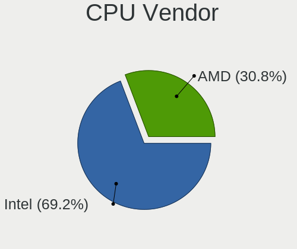

KDE neon Hardware Trends
------------------------

A project to identify most popular hardware characteristics and track their change
over time based on data collected by KDE neon users at https://Linux-Hardware.org.

Anyone can contribute to this report by the [hw-probe](https://github.com/linuxhw/hw-probe) tool:

    sudo -E hw-probe -all -upload

This is a report for all computer types. See also reports for [desktops](/Dist/KDE_neon/Desktop/README.md) and [notebooks](/Dist/KDE_neon/Notebook/README.md).

This report is for one last month. Overall report since the beginning of time: [TestCoverage](https://github.com/linuxhw/TestCoverage)

Period: Apr, 2022.

Contents
--------

* [ System ](#system)
  - [ OS                       ](#os)
  - [ OS Family                ](#os-family)
  - [ Kernel                   ](#kernel)
  - [ Kernel Family            ](#kernel-family)
  - [ Kernel Major Ver.        ](#kernel-major-ver)
  - [ Arch                     ](#arch)
  - [ DE                       ](#de)
  - [ Display Server           ](#display-server)
  - [ Display Manager          ](#display-manager)
  - [ OS Lang                  ](#os-lang)
  - [ Boot Mode                ](#boot-mode)
  - [ Filesystem               ](#filesystem)
  - [ Part. scheme             ](#part-scheme)
  - [ Dual Boot with Linux/BSD ](#dual-boot-with-linuxbsd)
  - [ Dual Boot (Win)          ](#dual-boot-win)

* [ Board ](#board)
  - [ Vendor                   ](#vendor)
  - [ Model                    ](#model)
  - [ Model Family             ](#model-family)
  - [ MFG Year                 ](#mfg-year)
  - [ Form Factor              ](#form-factor)
  - [ Secure Boot              ](#secure-boot)
  - [ Coreboot                 ](#coreboot)
  - [ RAM Size                 ](#ram-size)
  - [ RAM Used                 ](#ram-used)
  - [ Total Drives             ](#total-drives)
  - [ Has CD-ROM               ](#has-cd-rom)
  - [ Has Ethernet             ](#has-ethernet)
  - [ Has WiFi                 ](#has-wifi)
  - [ Has Bluetooth            ](#has-bluetooth)

* [ Location ](#location)
  - [ Country                  ](#country)
  - [ City                     ](#city)

* [ Drives ](#drives)
  - [ Drive Vendor             ](#drive-vendor)
  - [ Drive Model              ](#drive-model)
  - [ HDD Vendor               ](#hdd-vendor)
  - [ SSD Vendor               ](#ssd-vendor)
  - [ Drive Kind               ](#drive-kind)
  - [ Drive Connector          ](#drive-connector)
  - [ Drive Size               ](#drive-size)
  - [ Space Total              ](#space-total)
  - [ Space Used               ](#space-used)
  - [ Malfunc. Drives          ](#malfunc-drives)
  - [ Malfunc. Drive Vendor    ](#malfunc-drive-vendor)
  - [ Malfunc. HDD Vendor      ](#malfunc-hdd-vendor)
  - [ Malfunc. Drive Kind      ](#malfunc-drive-kind)
  - [ Failed Drives            ](#failed-drives)
  - [ Failed Drive Vendor      ](#failed-drive-vendor)
  - [ Drive Status             ](#drive-status)

* [ Storage controller ](#storage-controller)
  - [ Storage Vendor           ](#storage-vendor)
  - [ Storage Model            ](#storage-model)
  - [ Storage Kind             ](#storage-kind)

* [ Processor ](#processor)
  - [ CPU Vendor               ](#cpu-vendor)
  - [ CPU Model                ](#cpu-model)
  - [ CPU Model Family         ](#cpu-model-family)
  - [ CPU Cores                ](#cpu-cores)
  - [ CPU Sockets              ](#cpu-sockets)
  - [ CPU Threads              ](#cpu-threads)
  - [ CPU Op-Modes             ](#cpu-op-modes)
  - [ CPU Microcode            ](#cpu-microcode)
  - [ CPU Microarch            ](#cpu-microarch)

* [ Graphics ](#graphics)
  - [ GPU Vendor               ](#gpu-vendor)
  - [ GPU Model                ](#gpu-model)
  - [ GPU Combo                ](#gpu-combo)
  - [ GPU Driver               ](#gpu-driver)
  - [ GPU Memory               ](#gpu-memory)

* [ Monitor ](#monitor)
  - [ Monitor Vendor           ](#monitor-vendor)
  - [ Monitor Model            ](#monitor-model)
  - [ Monitor Resolution       ](#monitor-resolution)
  - [ Monitor Diagonal         ](#monitor-diagonal)
  - [ Monitor Width            ](#monitor-width)
  - [ Aspect Ratio             ](#aspect-ratio)
  - [ Monitor Area             ](#monitor-area)
  - [ Pixel Density            ](#pixel-density)
  - [ Multiple Monitors        ](#multiple-monitors)

* [ Network ](#network)
  - [ Net Controller Vendor    ](#net-controller-vendor)
  - [ Net Controller Model     ](#net-controller-model)
  - [ Wireless Vendor          ](#wireless-vendor)
  - [ Wireless Model           ](#wireless-model)
  - [ Ethernet Vendor          ](#ethernet-vendor)
  - [ Ethernet Model           ](#ethernet-model)
  - [ Net Controller Kind      ](#net-controller-kind)
  - [ Used Controller          ](#used-controller)
  - [ NICs                     ](#nics)
  - [ IPv6                     ](#ipv6)

* [ Bluetooth ](#bluetooth)
  - [ Bluetooth Vendor         ](#bluetooth-vendor)
  - [ Bluetooth Model          ](#bluetooth-model)

* [ Sound ](#sound)
  - [ Sound Vendor             ](#sound-vendor)
  - [ Sound Model              ](#sound-model)

* [ Memory ](#memory)
  - [ Memory Vendor            ](#memory-vendor)
  - [ Memory Model             ](#memory-model)
  - [ Memory Kind              ](#memory-kind)
  - [ Memory Form Factor       ](#memory-form-factor)
  - [ Memory Size              ](#memory-size)
  - [ Memory Speed             ](#memory-speed)

* [ Printers & scanners ](#printers--scanners)
  - [ Printer Vendor           ](#printer-vendor)
  - [ Printer Model            ](#printer-model)
  - [ Scanner Vendor           ](#scanner-vendor)
  - [ Scanner Model            ](#scanner-model)

* [ Camera ](#camera)
  - [ Camera Vendor            ](#camera-vendor)
  - [ Camera Model             ](#camera-model)

* [ Security ](#security)
  - [ Fingerprint Vendor       ](#fingerprint-vendor)
  - [ Fingerprint Model        ](#fingerprint-model)
  - [ Chipcard Vendor          ](#chipcard-vendor)
  - [ Chipcard Model           ](#chipcard-model)

* [ Unsupported ](#unsupported)
  - [ Unsupported Devices      ](#unsupported-devices)
  - [ Unsupported Device Types ](#unsupported-device-types)

System
------

OS
--

Installed operating systems

| Name           | Computers | Percent |
|----------------|-----------|---------|
| KDE neon 20.04 | 133       | 99.25%  |
| KDE neon 18.04 | 1         | 0.75%   |

OS Family
---------

OS without a version

| Name     | Computers | Percent |
|----------|-----------|---------|
| KDE neon | 134       | 100%    |

Kernel
------

Version of the Linux kernel

| Version                       | Computers | Percent |
|-------------------------------|-----------|---------|
| 5.13.0-39-generic             | 79        | 58.96%  |
| 5.13.0-40-generic             | 35        | 26.12%  |
| 5.13.0-37-generic             | 4         | 2.99%   |
| 5.13.0-30-generic             | 3         | 2.24%   |
| 5.13.0-28-generic             | 2         | 1.49%   |
| 5.4.0-108-generic             | 1         | 0.75%   |
| 5.4.0-107-generic             | 1         | 0.75%   |
| 5.4.0-105-generic             | 1         | 0.75%   |
| 5.4.0-104-generic             | 1         | 0.75%   |
| 5.17.1-051701-generic         | 1         | 0.75%   |
| 5.17.0-ext73-97.0-sandybridge | 1         | 0.75%   |
| 5.17.0-3.1-liquorix-amd64     | 1         | 0.75%   |
| 5.16.15-051615-generic        | 1         | 0.75%   |
| 5.15.5-051505-generic         | 1         | 0.75%   |
| 5.15.34-xanmod1               | 1         | 0.75%   |
| 5.13.0-35-generic             | 1         | 0.75%   |

Kernel Family
-------------

Linux kernel without a distro release

| Version | Computers | Percent |
|---------|-----------|---------|
| 5.13.0  | 124       | 92.54%  |
| 5.4.0   | 4         | 2.99%   |
| 5.17.0  | 2         | 1.49%   |
| 5.17.1  | 1         | 0.75%   |
| 5.16.15 | 1         | 0.75%   |
| 5.15.5  | 1         | 0.75%   |
| 5.15.34 | 1         | 0.75%   |

Kernel Major Ver.
-----------------

Linux kernel major version

| Version | Computers | Percent |
|---------|-----------|---------|
| 5.13    | 124       | 92.54%  |
| 5.4     | 4         | 2.99%   |
| 5.17    | 3         | 2.24%   |
| 5.15    | 2         | 1.49%   |
| 5.16    | 1         | 0.75%   |

Arch
----

OS architecture (x86_64, i586, etc.)

| Name   | Computers | Percent |
|--------|-----------|---------|
| x86_64 | 134       | 100%    |

DE
--

Desktop Environment

| Name    | Computers | Percent |
|---------|-----------|---------|
| KDE5    | 131       | 97.76%  |
| Unknown | 3         | 2.24%   |

Display Server
--------------

X11 or Wayland

| Name    | Computers | Percent |
|---------|-----------|---------|
| X11     | 120       | 89.55%  |
| Wayland | 13        | 9.7%    |
| Tty     | 1         | 0.75%   |

Display Manager
---------------

SDDM, LightDM, etc.

| Name    | Computers | Percent |
|---------|-----------|---------|
| Unknown | 101       | 75.37%  |
| SDDM    | 33        | 24.63%  |

OS Lang
-------

Language

| Lang    | Computers | Percent |
|---------|-----------|---------|
| en_US   | 54        | 40.3%   |
| en_GB   | 9         | 6.72%   |
| ru_RU   | 8         | 5.97%   |
| pt_BR   | 8         | 5.97%   |
| de_DE   | 8         | 5.97%   |
| pl_PL   | 5         | 3.73%   |
| it_IT   | 4         | 2.99%   |
| es_MX   | 4         | 2.99%   |
| en_ZA   | 3         | 2.24%   |
| en_IN   | 3         | 2.24%   |
| en_CA   | 3         | 2.24%   |
| es_UY   | 2         | 1.49%   |
| es_ES   | 2         | 1.49%   |
| es_AR   | 2         | 1.49%   |
| en_AU   | 2         | 1.49%   |
| Unknown | 2         | 1.49%   |
| sv_SE   | 1         | 0.75%   |
| pt_PT   | 1         | 0.75%   |
| io_001  | 1         | 0.75%   |
| hu_HU   | 1         | 0.75%   |
| fr_MA   | 1         | 0.75%   |
| fr_FR   | 1         | 0.75%   |
| fr_CA   | 1         | 0.75%   |
| es_PY   | 1         | 0.75%   |
| es_CO   | 1         | 0.75%   |
| es_CL   | 1         | 0.75%   |
| en_IE   | 1         | 0.75%   |
| de_AT   | 1         | 0.75%   |
| da_DK   | 1         | 0.75%   |
| cs_CZ   | 1         | 0.75%   |
| C       | 1         | 0.75%   |

Boot Mode
---------

EFI or BIOS

| Mode | Computers | Percent |
|------|-----------|---------|
| EFI  | 82        | 61.19%  |
| BIOS | 52        | 38.81%  |

Filesystem
----------

Type of filesystem

| Type    | Computers | Percent |
|---------|-----------|---------|
| Ext4    | 125       | 93.28%  |
| Btrfs   | 6         | 4.48%   |
| Zfs     | 1         | 0.75%   |
| Overlay | 1         | 0.75%   |
| Unknown | 1         | 0.75%   |

Part. scheme
------------

Scheme of partitioning

| Type    | Computers | Percent |
|---------|-----------|---------|
| Unknown | 111       | 82.84%  |
| GPT     | 18        | 13.43%  |
| MBR     | 5         | 3.73%   |

Dual Boot with Linux/BSD
------------------------

Hosting more than one Linux/BSD

| Dual boot | Computers | Percent |
|-----------|-----------|---------|
| No        | 129       | 96.27%  |
| Yes       | 5         | 3.73%   |

Dual Boot (Win)
---------------

Hosting Linux and Windows

| Dual boot | Computers | Percent |
|-----------|-----------|---------|
| No        | 121       | 90.3%   |
| Yes       | 13        | 9.7%    |

Board
-----

Vendor
------

Motherboard manufacturer

| Name                | Computers | Percent |
|---------------------|-----------|---------|
| Hewlett-Packard     | 24        | 17.91%  |
| ASUSTek Computer    | 21        | 15.67%  |
| Dell                | 19        | 14.18%  |
| Lenovo              | 13        | 9.7%    |
| MSI                 | 11        | 8.21%   |
| Gigabyte Technology | 9         | 6.72%   |
| Acer                | 7         | 5.22%   |
| ASRock              | 6         | 4.48%   |
| Apple               | 4         | 2.99%   |
| Toshiba             | 3         | 2.24%   |
| Samsung Electronics | 3         | 2.24%   |
| SLIMBOOK            | 2         | 1.49%   |
| Schenker            | 1         | 0.75%   |
| Positivo            | 1         | 0.75%   |
| Pegatron            | 1         | 0.75%   |
| MECER               | 1         | 0.75%   |
| LG Electronics      | 1         | 0.75%   |
| Itautec             | 1         | 0.75%   |
| HUAWEI              | 1         | 0.75%   |
| CONNEX              | 1         | 0.75%   |
| Compaq              | 1         | 0.75%   |
| Biostar             | 1         | 0.75%   |
| BESSTAR Tech        | 1         | 0.75%   |
| Unknown             | 1         | 0.75%   |

Model
-----

Motherboard model

| Name                                  | Computers | Percent |
|---------------------------------------|-----------|---------|
| ASUS All Series                       | 3         | 2.24%   |
| SLIMBOOK PROX15-AMD                   | 2         | 1.49%   |
| HP EliteBook 840 G1                   | 2         | 1.49%   |
| ASUS TUF Gaming X570-PLUS             | 2         | 1.49%   |
| ASUS TUF Gaming B550-PLUS             | 2         | 1.49%   |
| ASUS P5G41T-M                         | 2         | 1.49%   |
| Unknown                               | 2         | 1.49%   |
| Toshiba Satellite P775                | 1         | 0.75%   |
| Toshiba Satellite P200                | 1         | 0.75%   |
| Toshiba Satellite L655                | 1         | 0.75%   |
| Schenker XMG NEO (TGL/M21)            | 1         | 0.75%   |
| Samsung 700T                          | 1         | 0.75%   |
| Samsung 550XDA                        | 1         | 0.75%   |
| Samsung 300E4C/300E5C/300E7C          | 1         | 0.75%   |
| Positivo Q464C                        | 1         | 0.75%   |
| Pegatron HPE-380t                     | 1         | 0.75%   |
| MSI MS-7D41                           | 1         | 0.75%   |
| MSI MS-7C95                           | 1         | 0.75%   |
| MSI MS-7C35                           | 1         | 0.75%   |
| MSI MS-7C34                           | 1         | 0.75%   |
| MSI MS-7B84                           | 1         | 0.75%   |
| MSI MS-7A38                           | 1         | 0.75%   |
| MSI MS-7760                           | 1         | 0.75%   |
| MSI GT80S 6QD                         | 1         | 0.75%   |
| MSI GS65 Stealth 9SE                  | 1         | 0.75%   |
| MSI GS60 2QE                          | 1         | 0.75%   |
| MSI Bravo 17 A4DDR                    | 1         | 0.75%   |
| MECER YA13Q20-DP_PRO                  | 1         | 0.75%   |
| LG U460-G.BG51P1                      | 1         | 0.75%   |
| Lenovo ThinkPad X200 Tablet 744945F   | 1         | 0.75%   |
| Lenovo ThinkPad X1 Extreme 20MFCTO1WW | 1         | 0.75%   |
| Lenovo ThinkPad W530 24474E0          | 1         | 0.75%   |
| Lenovo ThinkPad W520 427639U          | 1         | 0.75%   |
| Lenovo ThinkPad T480s 20L7CTO1WW      | 1         | 0.75%   |
| Lenovo ThinkPad T460 20FN002SUS       | 1         | 0.75%   |
| Lenovo ThinkPad T440 20B7S1EV00       | 1         | 0.75%   |
| Lenovo ThinkPad E570 20H500BWRT       | 1         | 0.75%   |
| Lenovo S500 10HS0030MT                | 1         | 0.75%   |
| Lenovo Legion Y540-17IRH-PG0 81T3     | 1         | 0.75%   |
| Lenovo IdeaPad 320-15ABR 80XS         | 1         | 0.75%   |
| Lenovo G50-30 80G0                    | 1         | 0.75%   |
| Lenovo B50-45 20388                   | 1         | 0.75%   |
| Itautec Infoway                       | 1         | 0.75%   |
| HUAWEI NBLK-WAX9X                     | 1         | 0.75%   |
| HP Z440 Workstation                   | 1         | 0.75%   |
| HP Z200 SFF Workstation               | 1         | 0.75%   |
| HP Stream Laptop 11-y0XX              | 1         | 0.75%   |
| HP Presario CQ57                      | 1         | 0.75%   |
| HP Presario CQ56                      | 1         | 0.75%   |
| HP Pavilion m7                        | 1         | 0.75%   |
| HP Pavilion Laptop 15-cs0xxx          | 1         | 0.75%   |
| HP Pavilion Gaming Laptop 15-ec0xxx   | 1         | 0.75%   |
| HP Pavilion Gaming Laptop 15-dk0xxx   | 1         | 0.75%   |
| HP Pavilion Gaming Laptop 15-cx0xxx   | 1         | 0.75%   |
| HP Pavilion g7                        | 1         | 0.75%   |
| HP Pavilion dv7                       | 1         | 0.75%   |
| HP Pavilion dm1                       | 1         | 0.75%   |
| HP OMEN Laptop 15-en0xxx              | 1         | 0.75%   |
| HP Notebook                           | 1         | 0.75%   |
| HP Laptop 15s-fq2xxx                  | 1         | 0.75%   |

Model Family
------------

Motherboard model prefix

| Name                  | Computers | Percent |
|-----------------------|-----------|---------|
| Lenovo ThinkPad       | 8         | 5.97%   |
| HP Pavilion           | 8         | 5.97%   |
| Dell Latitude         | 6         | 4.48%   |
| HP EliteBook          | 4         | 2.99%   |
| ASUS TUF              | 4         | 2.99%   |
| Toshiba Satellite     | 3         | 2.24%   |
| Dell Precision        | 3         | 2.24%   |
| Dell OptiPlex         | 3         | 2.24%   |
| Dell Inspiron         | 3         | 2.24%   |
| ASUS PRIME            | 3         | 2.24%   |
| ASUS All              | 3         | 2.24%   |
| Acer Aspire           | 3         | 2.24%   |
| SLIMBOOK PROX15-AMD   | 2         | 1.49%   |
| HP Presario           | 2         | 1.49%   |
| Dell Studio           | 2         | 1.49%   |
| ASUS ROG              | 2         | 1.49%   |
| ASUS P5G41T-M         | 2         | 1.49%   |
| Acer Swift            | 2         | 1.49%   |
| Unknown               | 2         | 1.49%   |
| Schenker XMG          | 1         | 0.75%   |
| Samsung 700T          | 1         | 0.75%   |
| Samsung 550XDA        | 1         | 0.75%   |
| Samsung 300E4C        | 1         | 0.75%   |
| Positivo Q464C        | 1         | 0.75%   |
| Pegatron HPE-380t     | 1         | 0.75%   |
| MSI MS-7D41           | 1         | 0.75%   |
| MSI MS-7C95           | 1         | 0.75%   |
| MSI MS-7C35           | 1         | 0.75%   |
| MSI MS-7C34           | 1         | 0.75%   |
| MSI MS-7B84           | 1         | 0.75%   |
| MSI MS-7A38           | 1         | 0.75%   |
| MSI MS-7760           | 1         | 0.75%   |
| MSI GT80S             | 1         | 0.75%   |
| MSI GS65              | 1         | 0.75%   |
| MSI GS60              | 1         | 0.75%   |
| MSI Bravo             | 1         | 0.75%   |
| MECER YA13Q20-DP      | 1         | 0.75%   |
| LG U460-G.BG51P1      | 1         | 0.75%   |
| Lenovo S500           | 1         | 0.75%   |
| Lenovo Legion         | 1         | 0.75%   |
| Lenovo IdeaPad        | 1         | 0.75%   |
| Lenovo G50-30         | 1         | 0.75%   |
| Lenovo B50-45         | 1         | 0.75%   |
| Itautec Infoway       | 1         | 0.75%   |
| HUAWEI NBLK-WAX9X     | 1         | 0.75%   |
| HP Z440               | 1         | 0.75%   |
| HP Z200               | 1         | 0.75%   |
| HP Stream             | 1         | 0.75%   |
| HP OMEN               | 1         | 0.75%   |
| HP Notebook           | 1         | 0.75%   |
| HP Laptop             | 1         | 0.75%   |
| HP ENVY               | 1         | 0.75%   |
| HP Compaq             | 1         | 0.75%   |
| HP 255                | 1         | 0.75%   |
| Gigabyte Z97X-UD5H    | 1         | 0.75%   |
| Gigabyte Z68P-DS3     | 1         | 0.75%   |
| Gigabyte Z370         | 1         | 0.75%   |
| Gigabyte Z170-Gaming  | 1         | 0.75%   |
| Gigabyte H67M-UD2H-B3 | 1         | 0.75%   |
| Gigabyte F2A88XN-WIFI | 1         | 0.75%   |

MFG Year
--------

Motherboard manufacture year

| Year | Computers | Percent |
|------|-----------|---------|
| 2020 | 15        | 11.19%  |
| 2018 | 15        | 11.19%  |
| 2011 | 13        | 9.7%    |
| 2019 | 12        | 8.96%   |
| 2021 | 11        | 8.21%   |
| 2014 | 11        | 8.21%   |
| 2016 | 8         | 5.97%   |
| 2012 | 8         | 5.97%   |
| 2017 | 7         | 5.22%   |
| 2015 | 7         | 5.22%   |
| 2013 | 7         | 5.22%   |
| 2010 | 7         | 5.22%   |
| 2009 | 5         | 3.73%   |
| 2008 | 4         | 2.99%   |
| 2006 | 2         | 1.49%   |
| 2022 | 1         | 0.75%   |
| 2007 | 1         | 0.75%   |

Form Factor
-----------

Physical design of the computer

| Name     | Computers | Percent |
|----------|-----------|---------|
| Notebook | 80        | 59.7%   |
| Desktop  | 52        | 38.81%  |
| Tablet   | 1         | 0.75%   |
| Mini pc  | 1         | 0.75%   |

Secure Boot
-----------

Enabled or disabled

| State    | Computers | Percent |
|----------|-----------|---------|
| Disabled | 117       | 87.31%  |
| Enabled  | 17        | 12.69%  |

Coreboot
--------

Have coreboot on board

| Used | Computers | Percent |
|------|-----------|---------|
| No   | 134       | 100%    |

RAM Size
--------

Total RAM memory

| Size in GB  | Computers | Percent |
|-------------|-----------|---------|
| 4.01-8.0    | 31        | 23.13%  |
| 16.01-24.0  | 28        | 20.9%   |
| 3.01-4.0    | 24        | 17.91%  |
| 8.01-16.0   | 20        | 14.93%  |
| 32.01-64.0  | 16        | 11.94%  |
| 64.01-256.0 | 7         | 5.22%   |
| 1.01-2.0    | 5         | 3.73%   |
| 24.01-32.0  | 2         | 1.49%   |
| 2.01-3.0    | 1         | 0.75%   |

RAM Used
--------

Used RAM memory

| Used GB    | Computers | Percent |
|------------|-----------|---------|
| 1.01-2.0   | 61        | 45.52%  |
| 2.01-3.0   | 31        | 23.13%  |
| 4.01-8.0   | 15        | 11.19%  |
| 3.01-4.0   | 10        | 7.46%   |
| 8.01-16.0  | 7         | 5.22%   |
| 0.51-1.0   | 7         | 5.22%   |
| 32.01-64.0 | 2         | 1.49%   |
| 16.01-24.0 | 1         | 0.75%   |

Total Drives
------------

Number of drives on board

| Drives | Computers | Percent |
|--------|-----------|---------|
| 1      | 67        | 50%     |
| 2      | 42        | 31.34%  |
| 3      | 13        | 9.7%    |
| 4      | 6         | 4.48%   |
| 5      | 5         | 3.73%   |
| 0      | 1         | 0.75%   |

Has CD-ROM
----------

Has CD-ROM on board

| Presented | Computers | Percent |
|-----------|-----------|---------|
| No        | 89        | 66.42%  |
| Yes       | 45        | 33.58%  |

Has Ethernet
------------

Has Ethernet on board

| Presented | Computers | Percent |
|-----------|-----------|---------|
| Yes       | 118       | 88.06%  |
| No        | 16        | 11.94%  |

Has WiFi
--------

Has WiFi module

| Presented | Computers | Percent |
|-----------|-----------|---------|
| Yes       | 102       | 76.12%  |
| No        | 32        | 23.88%  |

Has Bluetooth
-------------

Has Bluetooth module

| Presented | Computers | Percent |
|-----------|-----------|---------|
| Yes       | 83        | 61.94%  |
| No        | 51        | 38.06%  |

Location
--------

Country
-------

Geographic location (country)

| Country      | Computers | Percent |
|--------------|-----------|---------|
| USA          | 36        | 26.87%  |
| Russia       | 10        | 7.46%   |
| Germany      | 9         | 6.72%   |
| UK           | 8         | 5.97%   |
| Brazil       | 8         | 5.97%   |
| Canada       | 7         | 5.22%   |
| Poland       | 6         | 4.48%   |
| Italy        | 5         | 3.73%   |
| Mexico       | 4         | 2.99%   |
| India        | 4         | 2.99%   |
| South Africa | 3         | 2.24%   |
| Uruguay      | 2         | 1.49%   |
| Sweden       | 2         | 1.49%   |
| Spain        | 2         | 1.49%   |
| Denmark      | 2         | 1.49%   |
| Belgium      | 2         | 1.49%   |
| Australia    | 2         | 1.49%   |
| Argentina    | 2         | 1.49%   |
| Uzbekistan   | 1         | 0.75%   |
| Turkey       | 1         | 0.75%   |
| Puerto Rico  | 1         | 0.75%   |
| Portugal     | 1         | 0.75%   |
| Paraguay     | 1         | 0.75%   |
| Pakistan     | 1         | 0.75%   |
| Netherlands  | 1         | 0.75%   |
| Morocco      | 1         | 0.75%   |
| Kosovo       | 1         | 0.75%   |
| Kazakhstan   | 1         | 0.75%   |
| Ireland      | 1         | 0.75%   |
| Iran         | 1         | 0.75%   |
| Indonesia    | 1         | 0.75%   |
| Hungary      | 1         | 0.75%   |
| Greece       | 1         | 0.75%   |
| France       | 1         | 0.75%   |
| Czechia      | 1         | 0.75%   |
| Colombia     | 1         | 0.75%   |
| Belarus      | 1         | 0.75%   |
| Austria      | 1         | 0.75%   |

City
----

Geographic location (city)

| City             | Computers | Percent |
|------------------|-----------|---------|
| Moscow           | 4         | 2.99%   |
| Warsaw           | 2         | 1.49%   |
| Salvador         | 2         | 1.49%   |
| Richmond         | 2         | 1.49%   |
| Patna            | 2         | 1.49%   |
| Ciudad del Plata | 2         | 1.49%   |
| Atlanta          | 2         | 1.49%   |
| York             | 1         | 0.75%   |
| Whippany         | 1         | 0.75%   |
| Wellington       | 1         | 0.75%   |
| Wasilla          | 1         | 0.75%   |
| Voronezh         | 1         | 0.75%   |
| Viseu            | 1         | 0.75%   |
| Vienna           | 1         | 0.75%   |
| Venice           | 1         | 0.75%   |
| Turin            | 1         | 0.75%   |
| Tulsa            | 1         | 0.75%   |
| Tucson           | 1         | 0.75%   |
| Torreón         | 1         | 0.75%   |
| Tonypandy        | 1         | 0.75%   |
| Toccoa           | 1         | 0.75%   |
| Tashkent         | 1         | 0.75%   |
| Surrey           | 1         | 0.75%   |
| Sundsvall        | 1         | 0.75%   |
| Statesboro       | 1         | 0.75%   |
| St Petersburg    | 1         | 0.75%   |
| Sheffield        | 1         | 0.75%   |
| Scottsdale       | 1         | 0.75%   |
| Savannah         | 1         | 0.75%   |
| Santiago de Cali | 1         | 0.75%   |
| Santa Fe         | 1         | 0.75%   |
| Rotselaar        | 1         | 0.75%   |
| Rostock          | 1         | 0.75%   |
| Rockville        | 1         | 0.75%   |
| Rochester        | 1         | 0.75%   |
| Roanoke          | 1         | 0.75%   |
| Rio de Janeiro   | 1         | 0.75%   |
| Rey              | 1         | 0.75%   |
| Resende          | 1         | 0.75%   |
| Rabat            | 1         | 0.75%   |
| Poznan           | 1         | 0.75%   |
| Port Elizabeth   | 1         | 0.75%   |
| Pilibhit         | 1         | 0.75%   |
| Perivale         | 1         | 0.75%   |
| Panambi          | 1         | 0.75%   |
| Panama City      | 1         | 0.75%   |
| Padova           | 1         | 0.75%   |
| Orange           | 1         | 0.75%   |
| Ocean Springs    | 1         | 0.75%   |
| Novara           | 1         | 0.75%   |
| Noril'sk         | 1         | 0.75%   |
| Nizhniy Novgorod | 1         | 0.75%   |
| Niagara Falls    | 1         | 0.75%   |
| New York         | 1         | 0.75%   |
| New Port Richey  | 1         | 0.75%   |
| Munich           | 1         | 0.75%   |
| Mount Vernon     | 1         | 0.75%   |
| Montreal         | 1         | 0.75%   |
| Montpellier      | 1         | 0.75%   |
| Monclova         | 1         | 0.75%   |

Drives
------

Drive Vendor
------------

Hard drive vendors

| Vendor                    | Computers | Drives | Percent |
|---------------------------|-----------|--------|---------|
| Samsung Electronics       | 30        | 41     | 14.78%  |
| Seagate                   | 29        | 31     | 14.29%  |
| WDC                       | 23        | 34     | 11.33%  |
| SanDisk                   | 15        | 16     | 7.39%   |
| Crucial                   | 15        | 16     | 7.39%   |
| Unknown                   | 11        | 12     | 5.42%   |
| Toshiba                   | 10        | 11     | 4.93%   |
| Kingston                  | 10        | 14     | 4.93%   |
| SK Hynix                  | 5         | 5      | 2.46%   |
| Hitachi                   | 5         | 5      | 2.46%   |
| HGST                      | 5         | 5      | 2.46%   |
| A-DATA Technology         | 5         | 5      | 2.46%   |
| Hewlett-Packard           | 3         | 4      | 1.48%   |
| SPCC                      | 2         | 3      | 0.99%   |
| PNY                       | 2         | 2      | 0.99%   |
| Patriot                   | 2         | 2      | 0.99%   |
| Micron Technology         | 2         | 2      | 0.99%   |
| Intel                     | 2         | 2      | 0.99%   |
| China                     | 2         | 4      | 0.99%   |
| Apple                     | 2         | 3      | 0.99%   |
| Unknown                   | 2         | 2      | 0.99%   |
| USB3.0                    | 1         | 1      | 0.49%   |
| Transcend                 | 1         | 1      | 0.49%   |
| Timetec                   | 1         | 1      | 0.49%   |
| Team                      | 1         | 1      | 0.49%   |
| Silicon Motion            | 1         | 1      | 0.49%   |
| SABRENT                   | 1         | 1      | 0.49%   |
| Phison                    | 1         | 1      | 0.49%   |
| OCZ                       | 1         | 1      | 0.49%   |
| Netac SS                  | 1         | 1      | 0.49%   |
| N600                      | 1         | 1      | 0.49%   |
| Mushkin                   | 1         | 1      | 0.49%   |
| Micron/Crucial Technology | 1         | 1      | 0.49%   |
| KIOXIA                    | 1         | 1      | 0.49%   |
| KINGBANK                  | 1         | 1      | 0.49%   |
| Intenso                   | 1         | 1      | 0.49%   |
| HS-SSD-C100               | 1         | 1      | 0.49%   |
| Fujitsu                   | 1         | 1      | 0.49%   |
| faspeed                   | 1         | 1      | 0.49%   |
| EMTEC                     | 1         | 1      | 0.49%   |
| ADATA SX                  | 1         | 1      | 0.49%   |
| ADATA SU                  | 1         | 1      | 0.49%   |

Drive Model
-----------

Hard drive models

| Model                               | Computers | Percent |
|-------------------------------------|-----------|---------|
| Samsung NVMe SSD Drive 1TB          | 6         | 2.59%   |
| Sandisk NVMe SSD Drive 1TB          | 4         | 1.72%   |
| Kingston SA400S37240G 240GB SSD     | 4         | 1.72%   |
| Unknown MMC Card  32GB              | 3         | 1.29%   |
| Samsung NVMe SSD Drive 512GB        | 3         | 1.29%   |
| Crucial CT500MX500SSD1 500GB        | 3         | 1.29%   |
| WDC WD800BB-75CAA0 80GB             | 2         | 0.86%   |
| WDC WD10JPVX-75JC3T0 1TB            | 2         | 0.86%   |
| WDC WD10EZEX-08M2NA0 1TB            | 2         | 0.86%   |
| Unknown MMC Card  64GB              | 2         | 0.86%   |
| Toshiba KBG30ZMS128G 128GB NVMe SSD | 2         | 0.86%   |
| SK Hynix NVMe SSD Drive 512GB       | 2         | 0.86%   |
| Seagate ST500LT012-1DG142 500GB     | 2         | 0.86%   |
| Seagate ST3100011A 100GB            | 2         | 0.86%   |
| Seagate ST2000DM006-2DM164 2TB      | 2         | 0.86%   |
| Seagate Expansion+ 2TB              | 2         | 0.86%   |
| SanDisk SDSSDP128G 128GB            | 2         | 0.86%   |
| Sandisk NVMe SSD Drive 256GB        | 2         | 0.86%   |
| Samsung SSD 860 EVO 500GB           | 2         | 0.86%   |
| Samsung SSD 860 EVO 250GB           | 2         | 0.86%   |
| Samsung SSD 850 EVO 250GB           | 2         | 0.86%   |
| Samsung MZVLB1T0HALR-000L7 1TB      | 2         | 0.86%   |
| Patriot Burst 120GB SSD             | 2         | 0.86%   |
| Kingston SUV400S37120G 120GB SSD    | 2         | 0.86%   |
| Kingston NVMe SSD Drive 250GB       | 2         | 0.86%   |
| HGST HTS721010A9E630 1TB            | 2         | 0.86%   |
| HP SSD S700 500GB                   | 2         | 0.86%   |
| Crucial CT240BX500SSD1 240GB        | 2         | 0.86%   |
| Crucial CT120BX500SSD1 120GB        | 2         | 0.86%   |
| Unknown                             | 2         | 0.86%   |
| WDC WDS500G2B0A-00SM50 500GB SSD    | 1         | 0.43%   |
| WDC WDS480G2G0A-00JH30 480GB SSD    | 1         | 0.43%   |
| WDC WDS250G2B0C-00PXH0 250GB        | 1         | 0.43%   |
| WDC WDS250G1B0B-00AS40 250GB SSD    | 1         | 0.43%   |
| WDC WDS250G1B0A-00H9H0 250GB SSD    | 1         | 0.43%   |
| WDC WDS100T2B0C-00PXH0 1TB          | 1         | 0.43%   |
| WDC WDBNCE0010PNC 1TB SSD           | 1         | 0.43%   |
| WDC WD7500BPVT-22HXZT3 752GB        | 1         | 0.43%   |
| WDC WD6400BPVT-35HXZT1 640GB        | 1         | 0.43%   |
| WDC WD5000AAKX-003CA0 500GB         | 1         | 0.43%   |
| WDC WD5000AAKS-22A7B0 500GB         | 1         | 0.43%   |
| WDC WD50 00AZRX-00A8LB0 500GB       | 1         | 0.43%   |
| WDC WD50 00AAKX-22ERMA0 500GB       | 1         | 0.43%   |
| WDC WD4005FZBX-00K5WB0 4TB          | 1         | 0.43%   |
| WDC WD3200LPCX-24C6HT0 320GB        | 1         | 0.43%   |
| WDC WD3200AAJS-07M0A0 320GB         | 1         | 0.43%   |
| WDC WD30EZRX-00SPEB0 3TB            | 1         | 0.43%   |
| WDC WD30EZRX-00D8PB0 3TB            | 1         | 0.43%   |
| WDC WD20EZAZ-00GGJB0 2TB            | 1         | 0.43%   |
| WDC WD20EARS-00MVWB0 2TB            | 1         | 0.43%   |
| WDC WD12 00BEVE-00UYT0 120GB        | 1         | 0.43%   |
| WDC WD10EZEX-75ZF5A0 1TB            | 1         | 0.43%   |
| WDC WD10EZEX-00WN4A0 1TB            | 1         | 0.43%   |
| WDC WD10EFRX-68FYTN0 1TB            | 1         | 0.43%   |
| WDC WD1002FAEX-00Z3A0 1TB           | 1         | 0.43%   |
| WDC WD1001FALS-00E8B0 1TB           | 1         | 0.43%   |
| USB3.0 Super Speed 1TB              | 1         | 0.43%   |
| Unknown MMC Card  16GB              | 1         | 0.43%   |
| Unknown MMC Card  128GB             | 1         | 0.43%   |
| Unknown MMC Card  1073GB            | 1         | 0.43%   |

HDD Vendor
----------

Hard disk drive vendors

| Vendor              | Computers | Drives | Percent |
|---------------------|-----------|--------|---------|
| Seagate             | 27        | 27     | 40.3%   |
| WDC                 | 17        | 27     | 25.37%  |
| Toshiba             | 6         | 6      | 8.96%   |
| Hitachi             | 5         | 5      | 7.46%   |
| HGST                | 5         | 5      | 7.46%   |
| Samsung Electronics | 4         | 4      | 5.97%   |
| SABRENT             | 1         | 1      | 1.49%   |
| Hewlett-Packard     | 1         | 1      | 1.49%   |
| Fujitsu             | 1         | 1      | 1.49%   |

SSD Vendor
----------

Solid state drive vendors

| Vendor              | Computers | Drives | Percent |
|---------------------|-----------|--------|---------|
| Crucial             | 14        | 15     | 17.28%  |
| Samsung Electronics | 13        | 17     | 16.05%  |
| Kingston            | 9         | 11     | 11.11%  |
| SanDisk             | 8         | 8      | 9.88%   |
| WDC                 | 5         | 5      | 6.17%   |
| A-DATA Technology   | 5         | 5      | 6.17%   |
| Toshiba             | 2         | 3      | 2.47%   |
| SPCC                | 2         | 3      | 2.47%   |
| PNY                 | 2         | 2      | 2.47%   |
| Patriot             | 2         | 2      | 2.47%   |
| Hewlett-Packard     | 2         | 3      | 2.47%   |
| China               | 2         | 4      | 2.47%   |
| USB3.0              | 1         | 1      | 1.23%   |
| Unknown             | 1         | 1      | 1.23%   |
| Transcend           | 1         | 1      | 1.23%   |
| Team                | 1         | 1      | 1.23%   |
| SK Hynix            | 1         | 1      | 1.23%   |
| Seagate             | 1         | 1      | 1.23%   |
| OCZ                 | 1         | 1      | 1.23%   |
| N600                | 1         | 1      | 1.23%   |
| Mushkin             | 1         | 1      | 1.23%   |
| Micron Technology   | 1         | 1      | 1.23%   |
| KINGBANK            | 1         | 1      | 1.23%   |
| EMTEC               | 1         | 1      | 1.23%   |
| Apple               | 1         | 1      | 1.23%   |
| ADATA SX            | 1         | 1      | 1.23%   |
| ADATA SU            | 1         | 1      | 1.23%   |

Drive Kind
----------

HDD or SSD

| Kind    | Computers | Drives | Percent |
|---------|-----------|--------|---------|
| SSD     | 67        | 93     | 36.22%  |
| HDD     | 57        | 77     | 30.81%  |
| NVMe    | 45        | 51     | 24.32%  |
| MMC     | 10        | 12     | 5.41%   |
| Unknown | 6         | 7      | 3.24%   |

Drive Connector
---------------

SATA, SAS, NVMe, etc.

| Type | Computers | Drives | Percent |
|------|-----------|--------|---------|
| SATA | 97        | 162    | 59.15%  |
| NVMe | 45        | 51     | 27.44%  |
| SAS  | 12        | 15     | 7.32%   |
| MMC  | 10        | 12     | 6.1%    |

Drive Size
----------

Size of hard drive

| Size in TB | Computers | Drives | Percent |
|------------|-----------|--------|---------|
| 0.01-0.5   | 76        | 111    | 59.38%  |
| 0.51-1.0   | 35        | 39     | 27.34%  |
| 1.01-2.0   | 12        | 13     | 9.38%   |
| 3.01-4.0   | 3         | 4      | 2.34%   |
| 2.01-3.0   | 2         | 3      | 1.56%   |

Space Total
-----------

Amount of disk space available on the file system

| Size in GB     | Computers | Percent |
|----------------|-----------|---------|
| 101-250        | 35        | 26.12%  |
| 251-500        | 27        | 20.15%  |
| 501-1000       | 22        | 16.42%  |
| 1001-2000      | 11        | 8.21%   |
| More than 3000 | 8         | 5.97%   |
| Unknown        | 8         | 5.97%   |
| 2001-3000      | 7         | 5.22%   |
| 21-50          | 6         | 4.48%   |
| 51-100         | 6         | 4.48%   |
| 1-20           | 4         | 2.99%   |

Space Used
----------

Amount of used disk space

| Used GB        | Computers | Percent |
|----------------|-----------|---------|
| 1-20           | 42        | 31.34%  |
| 101-250        | 23        | 17.16%  |
| 21-50          | 19        | 14.18%  |
| 51-100         | 15        | 11.19%  |
| 501-1000       | 10        | 7.46%   |
| 251-500        | 8         | 5.97%   |
| Unknown        | 8         | 5.97%   |
| 1001-2000      | 4         | 2.99%   |
| 2001-3000      | 3         | 2.24%   |
| More than 3000 | 2         | 1.49%   |

Malfunc. Drives
---------------

Drive models with a malfunction

| Model                            | Computers | Drives | Percent |
|----------------------------------|-----------|--------|---------|
| WDC WD7500BPVT-22HXZT3 752GB     | 1         | 1      | 25%     |
| Seagate ST3250318AS 250GB        | 1         | 1      | 25%     |
| Kingston SV300S37A120G 120GB SSD | 1         | 1      | 25%     |
| Crucial CT525MX300SSD1 528GB     | 1         | 1      | 25%     |

Malfunc. Drive Vendor
---------------------

Vendors of faulty drives

| Vendor   | Computers | Drives | Percent |
|----------|-----------|--------|---------|
| WDC      | 1         | 1      | 25%     |
| Seagate  | 1         | 1      | 25%     |
| Kingston | 1         | 1      | 25%     |
| Crucial  | 1         | 1      | 25%     |

Malfunc. HDD Vendor
-------------------

Vendors of faulty HDD drives

| Vendor  | Computers | Drives | Percent |
|---------|-----------|--------|---------|
| WDC     | 1         | 1      | 50%     |
| Seagate | 1         | 1      | 50%     |

Malfunc. Drive Kind
-------------------

Kinds of faulty drives

| Kind | Computers | Drives | Percent |
|------|-----------|--------|---------|
| HDD  | 2         | 2      | 66.67%  |
| SSD  | 1         | 2      | 33.33%  |

Failed Drives
-------------

Failed drive models

Zero info for selected period =(

Failed Drive Vendor
-------------------

Failed drive vendors

Zero info for selected period =(

Drive Status
------------

Number of failed and malfunc. drives

| Status   | Computers | Drives | Percent |
|----------|-----------|--------|---------|
| Detected | 114       | 203    | 83.82%  |
| Works    | 19        | 33     | 13.97%  |
| Malfunc  | 3         | 4      | 2.21%   |

Storage controller
------------------

Storage Vendor
--------------

Storage controller vendors

| Vendor                       | Computers | Percent |
|------------------------------|-----------|---------|
| Intel                        | 85        | 50.3%   |
| AMD                          | 33        | 19.53%  |
| Samsung Electronics          | 18        | 10.65%  |
| Sandisk                      | 9         | 5.33%   |
| SK Hynix                     | 4         | 2.37%   |
| Kingston Technology Company  | 3         | 1.78%   |
| ASMedia Technology           | 3         | 1.78%   |
| Toshiba America Info Systems | 2         | 1.18%   |
| Micron/Crucial Technology    | 2         | 1.18%   |
| JMicron Technology           | 2         | 1.18%   |
| Silicon Motion               | 1         | 0.59%   |
| Seagate Technology           | 1         | 0.59%   |
| Phison Electronics           | 1         | 0.59%   |
| Micron Technology            | 1         | 0.59%   |
| Marvell Technology Group     | 1         | 0.59%   |
| KIOXIA                       | 1         | 0.59%   |
| Apple                        | 1         | 0.59%   |
| Adaptec                      | 1         | 0.59%   |

Storage Model
-------------

Storage controller models

| Model                                                                                   | Computers | Percent |
|-----------------------------------------------------------------------------------------|-----------|---------|
| AMD FCH SATA Controller [AHCI mode]                                                     | 24        | 12.37%  |
| Samsung NVMe SSD Controller SM981/PM981/PM983                                           | 8         | 4.12%   |
| Samsung NVMe SSD Controller 980                                                         | 6         | 3.09%   |
| Intel Sunrise Point-LP SATA Controller [AHCI mode]                                      | 6         | 3.09%   |
| Intel 82801 Mobile SATA Controller [RAID mode]                                          | 6         | 3.09%   |
| Intel 7 Series Chipset Family 6-port SATA Controller [AHCI mode]                        | 6         | 3.09%   |
| Intel 6 Series/C200 Series Chipset Family 6 port Mobile SATA AHCI Controller            | 6         | 3.09%   |
| Sandisk WD Blue SN550 NVMe SSD                                                          | 5         | 2.58%   |
| Intel NM10/ICH7 Family SATA Controller [IDE mode]                                       | 4         | 2.06%   |
| Intel 82801IBM/IEM (ICH9M/ICH9M-E) 4 port SATA Controller [AHCI mode]                   | 4         | 2.06%   |
| Intel 8 Series/C220 Series Chipset Family 6-port SATA Controller 1 [AHCI mode]          | 4         | 2.06%   |
| Intel 8 Series SATA Controller 1 [AHCI mode]                                            | 4         | 2.06%   |
| AMD 500 Series Chipset SATA Controller                                                  | 4         | 2.06%   |
| AMD 400 Series Chipset SATA Controller                                                  | 4         | 2.06%   |
| Samsung NVMe SSD Controller PM9A1/PM9A3/980PRO                                          | 3         | 1.55%   |
| Intel SATA Controller [RAID mode]                                                       | 3         | 1.55%   |
| Intel Q170/Q150/B150/H170/H110/Z170/CM236 Chipset SATA Controller [AHCI Mode]           | 3         | 1.55%   |
| Intel Cannon Lake PCH SATA AHCI Controller                                              | 3         | 1.55%   |
| Intel 82801HM/HEM (ICH8M/ICH8M-E) SATA Controller [AHCI mode]                           | 3         | 1.55%   |
| Intel 82801HM/HEM (ICH8M/ICH8M-E) IDE Controller                                        | 3         | 1.55%   |
| Intel 82801G (ICH7 Family) IDE Controller                                               | 3         | 1.55%   |
| Intel 200 Series PCH SATA controller [AHCI mode]                                        | 3         | 1.55%   |
| ASMedia ASM1062 Serial ATA Controller                                                   | 3         | 1.55%   |
| Toshiba America Info Systems XG6 NVMe SSD Controller                                    | 2         | 1.03%   |
| SK Hynix BC501 NVMe Solid State Drive                                                   | 2         | 1.03%   |
| Sandisk WD PC SN810 / Black SN850 NVMe SSD                                              | 2         | 1.03%   |
| Sandisk Non-Volatile memory controller                                                  | 2         | 1.03%   |
| Kingston Company A2000 NVMe SSD                                                         | 2         | 1.03%   |
| Intel Volume Management Device NVMe RAID Controller                                     | 2         | 1.03%   |
| Intel Tiger Lake-LP SATA Controller [AHCI mode]                                         | 2         | 1.03%   |
| Intel Celeron/Pentium Silver Processor SATA Controller                                  | 2         | 1.03%   |
| Intel Cannon Lake Mobile PCH SATA AHCI Controller                                       | 2         | 1.03%   |
| Intel C600/X79 series chipset 6-Port SATA AHCI Controller                               | 2         | 1.03%   |
| Intel Atom Processor E3800 Series SATA AHCI Controller                                  | 2         | 1.03%   |
| Intel 9 Series Chipset Family SATA Controller [AHCI Mode]                               | 2         | 1.03%   |
| Intel 6 Series/C200 Series Chipset Family Desktop SATA Controller (IDE mode, ports 4-5) | 2         | 1.03%   |
| Intel 6 Series/C200 Series Chipset Family Desktop SATA Controller (IDE mode, ports 0-3) | 2         | 1.03%   |
| Intel 5 Series/3400 Series Chipset 4 port SATA AHCI Controller                          | 2         | 1.03%   |
| AMD SB7x0/SB8x0/SB9x0 SATA Controller [IDE mode]                                        | 2         | 1.03%   |
| AMD SB7x0/SB8x0/SB9x0 SATA Controller [AHCI mode]                                       | 2         | 1.03%   |
| AMD SB7x0/SB8x0/SB9x0 IDE Controller                                                    | 2         | 1.03%   |
| AMD FCH SATA Controller D                                                               | 2         | 1.03%   |
| SK Hynix Non-Volatile memory controller                                                 | 1         | 0.52%   |
| SK Hynix Gold P31 SSD                                                                   | 1         | 0.52%   |
| Silicon Motion SM2262/SM2262EN SSD Controller                                           | 1         | 0.52%   |
| Seagate FireCuda 530 SSD                                                                | 1         | 0.52%   |
| Seagate FireCuda 510 SSD                                                                | 1         | 0.52%   |
| Sandisk WD Black 2018/SN750 / PC SN720 NVMe SSD                                         | 1         | 0.52%   |
| Samsung NVMe SSD Controller SM951/PM951                                                 | 1         | 0.52%   |
| Phison E12 NVMe Controller                                                              | 1         | 0.52%   |
| Micron/Crucial P2 NVMe PCIe SSD                                                         | 1         | 0.52%   |
| Micron/Crucial NVMe Controller                                                          | 1         | 0.52%   |
| Micron Non-Volatile memory controller                                                   | 1         | 0.52%   |
| Marvell Group 88SE9172 SATA 6Gb/s Controller                                            | 1         | 0.52%   |
| KIOXIA Non-Volatile memory controller                                                   | 1         | 0.52%   |
| Kingston Company Company Non-Volatile memory controller                                 | 1         | 0.52%   |
| JMicron JMB368 IDE controller                                                           | 1         | 0.52%   |
| JMicron JMB363 SATA/IDE Controller                                                      | 1         | 0.52%   |
| Intel Wildcat Point-LP SATA Controller [AHCI Mode]                                      | 1         | 0.52%   |
| Intel SSD Pro 7600p/760p/E 6100p Series                                                 | 1         | 0.52%   |

Storage Kind
------------

Kind of storage controller (IDE, SATA, NVMe, SAS, ...)

| Kind | Computers | Percent |
|------|-----------|---------|
| SATA | 98        | 57.65%  |
| NVMe | 45        | 26.47%  |
| IDE  | 15        | 8.82%   |
| RAID | 11        | 6.47%   |
| SCSI | 1         | 0.59%   |

Processor
---------

CPU Vendor
----------

Processor vendors

| Vendor | Computers | Percent |
|--------|-----------|---------|
| Intel  | 99        | 73.88%  |
| AMD    | 35        | 26.12%  |

CPU Model
---------

Processor models

| Model                                       | Computers | Percent |
|---------------------------------------------|-----------|---------|
| AMD Ryzen 7 4800H with Radeon Graphics      | 4         | 2.99%   |
| Intel Core i7-8550U CPU @ 1.80GHz           | 3         | 2.24%   |
| Intel Pentium Dual-Core CPU E6700 @ 3.20GHz | 2         | 1.49%   |
| Intel Core i7-9750H CPU @ 2.60GHz           | 2         | 1.49%   |
| Intel Core i7-8700 CPU @ 3.20GHz            | 2         | 1.49%   |
| Intel Core i5-6600K CPU @ 3.50GHz           | 2         | 1.49%   |
| Intel Core i5-6200U CPU @ 2.30GHz           | 2         | 1.49%   |
| Intel Core i5-4300U CPU @ 1.90GHz           | 2         | 1.49%   |
| Intel Core i3-6006U CPU @ 2.00GHz           | 2         | 1.49%   |
| Intel Atom x5-Z8350 CPU @ 1.44GHz           | 2         | 1.49%   |
| Intel 11th Gen Core i7-1165G7 @ 2.80GHz     | 2         | 1.49%   |
| Intel 11th Gen Core i5-1135G7 @ 2.40GHz     | 2         | 1.49%   |
| AMD Ryzen 5 5600G with Radeon Graphics      | 2         | 1.49%   |
| AMD Ryzen 5 3600 6-Core Processor           | 2         | 1.49%   |
| Intel Xeon CPU E5-1620 v3 @ 3.50GHz         | 1         | 0.75%   |
| Intel Xeon CPU E31270 @ 3.40GHz             | 1         | 0.75%   |
| Intel Xeon CPU E3-1535M v5 @ 2.90GHz        | 1         | 0.75%   |
| Intel Pentium Silver N6000 @ 1.10GHz        | 1         | 0.75%   |
| Intel Pentium Silver N5030 CPU @ 1.10GHz    | 1         | 0.75%   |
| Intel Pentium Dual-Core CPU E6600 @ 3.06GHz | 1         | 0.75%   |
| Intel Pentium Dual-Core CPU E5700 @ 3.00GHz | 1         | 0.75%   |
| Intel Pentium Dual CPU T2370 @ 1.73GHz      | 1         | 0.75%   |
| Intel Pentium Dual CPU E2180 @ 2.00GHz      | 1         | 0.75%   |
| Intel Pentium CPU P6200 @ 2.13GHz           | 1         | 0.75%   |
| Intel Core i7-9700F CPU @ 3.00GHz           | 1         | 0.75%   |
| Intel Core i7-8850H CPU @ 2.60GHz           | 1         | 0.75%   |
| Intel Core i7-7820HQ CPU @ 2.90GHz          | 1         | 0.75%   |
| Intel Core i7-7700HQ CPU @ 2.80GHz          | 1         | 0.75%   |
| Intel Core i7-6820HK CPU @ 2.70GHz          | 1         | 0.75%   |
| Intel Core i7-4930K CPU @ 3.40GHz           | 1         | 0.75%   |
| Intel Core i7-4790 CPU @ 3.60GHz            | 1         | 0.75%   |
| Intel Core i7-4710HQ CPU @ 2.50GHz          | 1         | 0.75%   |
| Intel Core i7-4610M CPU @ 3.00GHz           | 1         | 0.75%   |
| Intel Core i7-4600U CPU @ 2.10GHz           | 1         | 0.75%   |
| Intel Core i7-3820 CPU @ 3.60GHz            | 1         | 0.75%   |
| Intel Core i7-3740QM CPU @ 2.70GHz          | 1         | 0.75%   |
| Intel Core i7-3615QM CPU @ 2.30GHz          | 1         | 0.75%   |
| Intel Core i7-3610QM CPU @ 2.30GHz          | 1         | 0.75%   |
| Intel Core i7-2820QM CPU @ 2.30GHz          | 1         | 0.75%   |
| Intel Core i7-2670QM CPU @ 2.20GHz          | 1         | 0.75%   |
| Intel Core i7-10700 CPU @ 2.90GHz           | 1         | 0.75%   |
| Intel Core i7 CPU Q 720 @ 1.60GHz           | 1         | 0.75%   |
| Intel Core i7 CPU 930 @ 2.80GHz             | 1         | 0.75%   |
| Intel Core i7 CPU 870 @ 2.93GHz             | 1         | 0.75%   |
| Intel Core i5-9400 CPU @ 2.90GHz            | 1         | 0.75%   |
| Intel Core i5-9300H CPU @ 2.40GHz           | 1         | 0.75%   |
| Intel Core i5-8300H CPU @ 2.30GHz           | 1         | 0.75%   |
| Intel Core i5-8265U CPU @ 1.60GHz           | 1         | 0.75%   |
| Intel Core i5-7360U CPU @ 2.30GHz           | 1         | 0.75%   |
| Intel Core i5-6400 CPU @ 2.70GHz            | 1         | 0.75%   |
| Intel Core i5-5257U CPU @ 2.70GHz           | 1         | 0.75%   |
| Intel Core i5-4690K CPU @ 3.50GHz           | 1         | 0.75%   |
| Intel Core i5-4590T CPU @ 2.00GHz           | 1         | 0.75%   |
| Intel Core i5-4460S CPU @ 2.90GHz           | 1         | 0.75%   |
| Intel Core i5-4460 CPU @ 3.20GHz            | 1         | 0.75%   |
| Intel Core i5-4440 CPU @ 3.10GHz            | 1         | 0.75%   |
| Intel Core i5-4260U CPU @ 1.40GHz           | 1         | 0.75%   |
| Intel Core i5-3337U CPU @ 1.80GHz           | 1         | 0.75%   |
| Intel Core i5-3320M CPU @ 2.60GHz           | 1         | 0.75%   |
| Intel Core i5-3230M CPU @ 2.60GHz           | 1         | 0.75%   |

CPU Model Family
----------------

Processor model prefix

| Model                   | Computers | Percent |
|-------------------------|-----------|---------|
| Intel Core i5           | 30        | 22.39%  |
| Intel Core i7           | 27        | 20.15%  |
| AMD Ryzen 5             | 14        | 10.45%  |
| Other                   | 8         | 5.97%   |
| Intel Core i3           | 7         | 5.22%   |
| Intel Celeron           | 6         | 4.48%   |
| Intel Core 2 Duo        | 5         | 3.73%   |
| AMD Ryzen 7             | 5         | 3.73%   |
| Intel Pentium Dual-Core | 4         | 2.99%   |
| Intel Xeon              | 3         | 2.24%   |
| Intel Atom              | 3         | 2.24%   |
| AMD Ryzen 9             | 3         | 2.24%   |
| Intel Pentium Silver    | 2         | 1.49%   |
| Intel Pentium Dual      | 2         | 1.49%   |
| AMD Ryzen 3             | 2         | 1.49%   |
| AMD FX                  | 2         | 1.49%   |
| AMD E                   | 2         | 1.49%   |
| AMD A10                 | 2         | 1.49%   |
| Intel Pentium           | 1         | 0.75%   |
| Intel Core 2            | 1         | 0.75%   |
| AMD Ryzen 3 PRO         | 1         | 0.75%   |
| AMD E1                  | 1         | 0.75%   |
| AMD A8                  | 1         | 0.75%   |
| AMD A6                  | 1         | 0.75%   |
| AMD A4                  | 1         | 0.75%   |

CPU Cores
---------

Number of processor cores

| Number | Computers | Percent |
|--------|-----------|---------|
| 4      | 57        | 42.54%  |
| 2      | 47        | 35.07%  |
| 6      | 16        | 11.94%  |
| 8      | 10        | 7.46%   |
| 16     | 1         | 0.75%   |
| 12     | 1         | 0.75%   |
| 10     | 1         | 0.75%   |
| 1      | 1         | 0.75%   |

CPU Sockets
-----------

Number of sockets

| Number | Computers | Percent |
|--------|-----------|---------|
| 1      | 134       | 100%    |

CPU Threads
-----------

Threads per core (Hyper-Threading)

| Number | Computers | Percent |
|--------|-----------|---------|
| 2      | 90        | 67.16%  |
| 1      | 44        | 32.84%  |

CPU Op-Modes
------------

CPU Operation Modes (32-bit, 64-bit)

| Op mode        | Computers | Percent |
|----------------|-----------|---------|
| 32-bit, 64-bit | 134       | 100%    |

CPU Microcode
-------------

Microcode number

| Number     | Computers | Percent |
|------------|-----------|---------|
| 0x206a7    | 10        | 7.46%   |
| 0x306c3    | 9         | 6.72%   |
| 0x906ea    | 7         | 5.22%   |
| Unknown    | 7         | 5.22%   |
| 0x306a9    | 6         | 4.48%   |
| 0x1067a    | 6         | 4.48%   |
| 0x806c1    | 5         | 3.73%   |
| 0x506e3    | 5         | 3.73%   |
| 0x406e3    | 5         | 3.73%   |
| 0x08701021 | 5         | 3.73%   |
| 0x406c4    | 4         | 2.99%   |
| 0x806ea    | 3         | 2.24%   |
| 0x6fd      | 3         | 2.24%   |
| 0x40651    | 3         | 2.24%   |
| 0x20655    | 3         | 2.24%   |
| 0x08600103 | 3         | 2.24%   |
| 0x08108109 | 3         | 2.24%   |
| 0x906ed    | 2         | 1.49%   |
| 0x906e9    | 2         | 1.49%   |
| 0x806d1    | 2         | 1.49%   |
| 0x706a8    | 2         | 1.49%   |
| 0x106e5    | 2         | 1.49%   |
| 0x10676    | 2         | 1.49%   |
| 0x0a50000c | 2         | 1.49%   |
| 0x0a201016 | 2         | 1.49%   |
| 0x08600106 | 2         | 1.49%   |
| 0xa0655    | 1         | 0.75%   |
| 0x906c0    | 1         | 0.75%   |
| 0x90672    | 1         | 0.75%   |
| 0x806ec    | 1         | 0.75%   |
| 0x806e9    | 1         | 0.75%   |
| 0x6f6      | 1         | 0.75%   |
| 0x406c3    | 1         | 0.75%   |
| 0x306f2    | 1         | 0.75%   |
| 0x306e4    | 1         | 0.75%   |
| 0x306d4    | 1         | 0.75%   |
| 0x30678    | 1         | 0.75%   |
| 0x30673    | 1         | 0.75%   |
| 0x206d7    | 1         | 0.75%   |
| 0x20652    | 1         | 0.75%   |
| 0x106a5    | 1         | 0.75%   |
| 0x08600104 | 1         | 0.75%   |
| 0x08101007 | 1         | 0.75%   |
| 0x08001136 | 1         | 0.75%   |
| 0x0800111c | 1         | 0.75%   |
| 0x07030104 | 1         | 0.75%   |
| 0x07000110 | 1         | 0.75%   |
| 0x0700010f | 1         | 0.75%   |
| 0x0600611a | 1         | 0.75%   |
| 0x06003106 | 1         | 0.75%   |
| 0x06001119 | 1         | 0.75%   |
| 0x06000852 | 1         | 0.75%   |
| 0x0600063e | 1         | 0.75%   |
| 0x05000119 | 1         | 0.75%   |
| 0x05000029 | 1         | 0.75%   |

CPU Microarch
-------------

Microarchitecture

| Name             | Computers | Percent |
|------------------|-----------|---------|
| KabyLake         | 16        | 11.94%  |
| Haswell          | 14        | 10.45%  |
| Zen 2            | 12        | 8.96%   |
| SandyBridge      | 11        | 8.21%   |
| Skylake          | 10        | 7.46%   |
| Penryn           | 9         | 6.72%   |
| IvyBridge        | 8         | 5.97%   |
| Silvermont       | 7         | 5.22%   |
| Zen+             | 6         | 4.48%   |
| TigerLake        | 5         | 3.73%   |
| Zen 3            | 4         | 2.99%   |
| Westmere         | 4         | 2.99%   |
| Core             | 4         | 2.99%   |
| Zen              | 3         | 2.24%   |
| Nehalem          | 3         | 2.24%   |
| Piledriver       | 2         | 1.49%   |
| Jaguar           | 2         | 1.49%   |
| Icelake          | 2         | 1.49%   |
| Goldmont plus    | 2         | 1.49%   |
| Bobcat           | 2         | 1.49%   |
| Tremont          | 1         | 0.75%   |
| Steamroller      | 1         | 0.75%   |
| Puma             | 1         | 0.75%   |
| Excavator        | 1         | 0.75%   |
| CometLake        | 1         | 0.75%   |
| Bulldozer        | 1         | 0.75%   |
| Broadwell        | 1         | 0.75%   |
| Alderlake Hybrid | 1         | 0.75%   |

Graphics
--------

GPU Vendor
----------

Vendors of graphics cards

| Vendor | Computers | Percent |
|--------|-----------|---------|
| Intel  | 72        | 45.28%  |
| Nvidia | 53        | 33.33%  |
| AMD    | 34        | 21.38%  |

GPU Model
---------

Graphics card models

| Model                                                                                    | Computers | Percent |
|------------------------------------------------------------------------------------------|-----------|---------|
| Intel 3rd Gen Core processor Graphics Controller                                         | 7         | 4.27%   |
| Intel 2nd Generation Core Processor Family Integrated Graphics Controller                | 7         | 4.27%   |
| AMD Renoir                                                                               | 7         | 4.27%   |
| Intel TigerLake-LP GT2 [Iris Xe Graphics]                                                | 5         | 3.05%   |
| Intel Skylake GT2 [HD Graphics 520]                                                      | 5         | 3.05%   |
| Intel Atom/Celeron/Pentium Processor x5-E8000/J3xxx/N3xxx Integrated Graphics Controller | 5         | 3.05%   |
| AMD Ellesmere [Radeon RX 470/480/570/570X/580/580X/590]                                  | 5         | 3.05%   |
| Intel Haswell-ULT Integrated Graphics Controller                                         | 4         | 2.44%   |
| Intel Core Processor Integrated Graphics Controller                                      | 4         | 2.44%   |
| Intel CoffeeLake-H GT2 [UHD Graphics 630]                                                | 4         | 2.44%   |
| AMD Picasso/Raven 2 [Radeon Vega Series / Radeon Vega Mobile Series]                     | 4         | 2.44%   |
| Nvidia GP107 [GeForce GTX 1050 Ti]                                                       | 3         | 1.83%   |
| Nvidia GP106 [GeForce GTX 1060 6GB]                                                      | 3         | 1.83%   |
| Intel Xeon E3-1200 v3/4th Gen Core Processor Integrated Graphics Controller              | 3         | 1.83%   |
| Intel UHD Graphics 620                                                                   | 3         | 1.83%   |
| Nvidia TU106M [GeForce RTX 2060 Mobile]                                                  | 2         | 1.22%   |
| Nvidia GP107M [GeForce GTX 1050 Ti Mobile]                                               | 2         | 1.22%   |
| Nvidia GP107M [GeForce GTX 1050 3 GB Max-Q]                                              | 2         | 1.22%   |
| Nvidia GM204M [GeForce GTX 970M]                                                         | 2         | 1.22%   |
| Nvidia GM107 [GeForce 940MX]                                                             | 2         | 1.22%   |
| Nvidia GK208B [GeForce GT 710]                                                           | 2         | 1.22%   |
| Nvidia GK107 [GeForce GT 640]                                                            | 2         | 1.22%   |
| Intel TigerLake-H GT1 [UHD Graphics]                                                     | 2         | 1.22%   |
| Intel Mobile GM965/GL960 Integrated Graphics Controller (secondary)                      | 2         | 1.22%   |
| Intel Mobile GM965/GL960 Integrated Graphics Controller (primary)                        | 2         | 1.22%   |
| Intel Mobile 4 Series Chipset Integrated Graphics Controller                             | 2         | 1.22%   |
| Intel HD Graphics 630                                                                    | 2         | 1.22%   |
| Intel Atom Processor Z36xxx/Z37xxx Series Graphics & Display                             | 2         | 1.22%   |
| Intel 4th Gen Core Processor Integrated Graphics Controller                              | 2         | 1.22%   |
| Intel 4 Series Chipset Integrated Graphics Controller                                    | 2         | 1.22%   |
| AMD Wrestler [Radeon HD 6310]                                                            | 2         | 1.22%   |
| Nvidia TU117M [GeForce GTX 1650 Ti Mobile]                                               | 1         | 0.61%   |
| Nvidia TU117M [GeForce GTX 1650 Mobile / Max-Q]                                          | 1         | 0.61%   |
| Nvidia TU117GLM [T1200 Laptop GPU]                                                       | 1         | 0.61%   |
| Nvidia TU117GLM [Quadro T500 Mobile]                                                     | 1         | 0.61%   |
| Nvidia TU117 [GeForce GTX 1650]                                                          | 1         | 0.61%   |
| Nvidia TU116 [GeForce GTX 1660]                                                          | 1         | 0.61%   |
| Nvidia TU116 [GeForce GTX 1660 SUPER]                                                    | 1         | 0.61%   |
| Nvidia TU104 [GeForce RTX 2080 SUPER]                                                    | 1         | 0.61%   |
| Nvidia TU102GL [Quadro RTX 6000/8000]                                                    | 1         | 0.61%   |
| Nvidia GT216 [GeForce 210]                                                               | 1         | 0.61%   |
| Nvidia GP108M [GeForce MX150]                                                            | 1         | 0.61%   |
| Nvidia GP107M [GeForce GTX 1050 Mobile]                                                  | 1         | 0.61%   |
| Nvidia GP104 [GeForce GTX 1080]                                                          | 1         | 0.61%   |
| Nvidia GP104 [GeForce GTX 1070]                                                          | 1         | 0.61%   |
| Nvidia GM206 [GeForce GTX 950]                                                           | 1         | 0.61%   |
| Nvidia GM204 [GeForce GTX 970]                                                           | 1         | 0.61%   |
| Nvidia GM108M [GeForce 940M]                                                             | 1         | 0.61%   |
| Nvidia GM107 [GeForce GTX 750 Ti]                                                        | 1         | 0.61%   |
| Nvidia GK107M [GeForce GT 650M Mac Edition]                                              | 1         | 0.61%   |
| Nvidia GK107GLM [Quadro K2000M]                                                          | 1         | 0.61%   |
| Nvidia GK104 [GeForce GTX 760]                                                           | 1         | 0.61%   |
| Nvidia GK104 [GeForce GTX 660 OEM]                                                       | 1         | 0.61%   |
| Nvidia GF119 [NVS 310]                                                                   | 1         | 0.61%   |
| Nvidia GF119 [GeForce GT 620 OEM]                                                        | 1         | 0.61%   |
| Nvidia GF116 [GeForce GTX 550 Ti]                                                        | 1         | 0.61%   |
| Nvidia GF108M [GeForce GT 620M/630M/635M/640M LE]                                        | 1         | 0.61%   |
| Nvidia GF108M [GeForce GT 520M]                                                          | 1         | 0.61%   |
| Nvidia GF108GLM [Quadro 1000M]                                                           | 1         | 0.61%   |
| Nvidia GA106M [GeForce RTX 3060 Mobile / Max-Q]                                          | 1         | 0.61%   |

GPU Combo
---------

Combinations of graphics cards

| Name           | Computers | Percent |
|----------------|-----------|---------|
| 1 x Intel      | 51        | 38.06%  |
| 1 x Nvidia     | 30        | 22.39%  |
| 1 x AMD        | 25        | 18.66%  |
| Intel + Nvidia | 19        | 14.18%  |
| AMD + Nvidia   | 4         | 2.99%   |
| 2 x AMD        | 3         | 2.24%   |
| Intel + AMD    | 2         | 1.49%   |

GPU Driver
----------

Free vs proprietary

| Driver      | Computers | Percent |
|-------------|-----------|---------|
| Free        | 116       | 86.57%  |
| Proprietary | 17        | 12.69%  |
| Unknown     | 1         | 0.75%   |

GPU Memory
----------

Total video memory

| Size in GB | Computers | Percent |
|------------|-----------|---------|
| Unknown    | 59        | 44.03%  |
| 1.01-2.0   | 19        | 14.18%  |
| 0.01-0.5   | 18        | 13.43%  |
| 3.01-4.0   | 12        | 8.96%   |
| 0.51-1.0   | 10        | 7.46%   |
| 5.01-6.0   | 8         | 5.97%   |
| 7.01-8.0   | 6         | 4.48%   |
| 32.01-64.0 | 1         | 0.75%   |
| 2.01-3.0   | 1         | 0.75%   |

Monitor
-------

Monitor Vendor
--------------

Monitor vendors

| Vendor                  | Computers | Percent |
|-------------------------|-----------|---------|
| Samsung Electronics     | 20        | 13.16%  |
| AU Optronics            | 16        | 10.53%  |
| Chimei Innolux          | 11        | 7.24%   |
| LG Display              | 10        | 6.58%   |
| BOE                     | 10        | 6.58%   |
| Dell                    | 8         | 5.26%   |
| AOC                     | 8         | 5.26%   |
| Goldstar                | 7         | 4.61%   |
| BenQ                    | 6         | 3.95%   |
| Sharp                   | 5         | 3.29%   |
| Hewlett-Packard         | 5         | 3.29%   |
| LG Electronics          | 4         | 2.63%   |
| Philips                 | 3         | 1.97%   |
| Lenovo                  | 3         | 1.97%   |
| Chi Mei Optoelectronics | 3         | 1.97%   |
| ASUSTek Computer        | 3         | 1.97%   |
| Apple                   | 3         | 1.97%   |
| Acer                    | 3         | 1.97%   |
| Unknown                 | 2         | 1.32%   |
| PANDA                   | 2         | 1.32%   |
| Ancor Communications    | 2         | 1.32%   |
| ViewSonic               | 1         | 0.66%   |
| Toshiba                 | 1         | 0.66%   |
| STD                     | 1         | 0.66%   |
| Sony                    | 1         | 0.66%   |
| SLD                     | 1         | 0.66%   |
| SDC                     | 1         | 0.66%   |
| Sceptre Tech            | 1         | 0.66%   |
| Panasonic               | 1         | 0.66%   |
| MSI                     | 1         | 0.66%   |
| LG Philips              | 1         | 0.66%   |
| InnoLux Display         | 1         | 0.66%   |
| InfoVision              | 1         | 0.66%   |
| HPN                     | 1         | 0.66%   |
| HannStar                | 1         | 0.66%   |
| Eizo                    | 1         | 0.66%   |
| EIA                     | 1         | 0.66%   |
| DAO                     | 1         | 0.66%   |
| Unknown                 | 1         | 0.66%   |

Monitor Model
-------------

Monitor models

| Model                                                                   | Computers | Percent |
|-------------------------------------------------------------------------|-----------|---------|
| LG Display LCD Monitor LGD0372 1600x900 382x215mm 17.3-inch             | 2         | 1.25%   |
| Chimei Innolux LCD Monitor CMN15DB 1366x768 344x193mm 15.5-inch         | 2         | 1.25%   |
| Chimei Innolux LCD Monitor CMN1490 1366x768 309x173mm 13.9-inch         | 2         | 1.25%   |
| AOC 1970W AOC1970 1366x768 410x230mm 18.5-inch                          | 2         | 1.25%   |
| ViewSonic VX2776 Series VSC3E32 1920x1080 598x336mm 27.0-inch           | 1         | 0.63%   |
| ViewSonic LCD Monitor VX2776 Series 1920x1080                           | 1         | 0.63%   |
| Unknown LCD Monitor SAMSUNG                                             | 1         | 0.63%   |
| Unknown LCD Monitor RTK UHD HDR                                         | 1         | 0.63%   |
| Toshiba TV TSB0206 1920x1080 700x390mm 31.5-inch                        | 1         | 0.63%   |
| STD HDMI TV STD00C7 1680x1050 698x392mm 31.5-inch                       | 1         | 0.63%   |
| Sony TV SNYE903 1920x1080                                               | 1         | 0.63%   |
| SLD LCD Monitor SLD003C 1366x768 309x173mm 13.9-inch                    | 1         | 0.63%   |
| Sharp LQ156M1JW03 SHP14C5 1920x1080 344x194mm 15.5-inch                 | 1         | 0.63%   |
| Sharp LQ156M1JW01 SHP14C3 1920x1080 344x194mm 15.5-inch                 | 1         | 0.63%   |
| Sharp LQ133M1JW08 SHP1425 1920x1080 294x165mm 13.3-inch                 | 1         | 0.63%   |
| Sharp LCD Monitor SHP1516 3840x2400 336x210mm 15.6-inch                 | 1         | 0.63%   |
| Sharp LCD Monitor SHP1453 1920x1080 346x194mm 15.6-inch                 | 1         | 0.63%   |
| SDC LCD Monitor 5760x2160                                               | 1         | 0.63%   |
| Sceptre Tech Sceptre P30 SPT0BCC 2560x1080 690x290mm 29.5-inch          | 1         | 0.63%   |
| Samsung Electronics U32J59x SAM0F52 3840x2160 697x392mm 31.5-inch       | 1         | 0.63%   |
| Samsung Electronics U28E590 SAM0C4E 3840x2160 608x345mm 27.5-inch       | 1         | 0.63%   |
| Samsung Electronics SyncMaster SAM0350 1440x900 428x255mm 19.6-inch     | 1         | 0.63%   |
| Samsung Electronics SMB1930N SAM0632 1360x768 410x230mm 18.5-inch       | 1         | 0.63%   |
| Samsung Electronics S24B350 SAM08DA 1920x1080 531x299mm 24.0-inch       | 1         | 0.63%   |
| Samsung Electronics S19F350 SAM0D46 1366x768 410x230mm 18.5-inch        | 1         | 0.63%   |
| Samsung Electronics LCD Monitor SEC5541 1366x768 344x193mm 15.5-inch    | 1         | 0.63%   |
| Samsung Electronics LCD Monitor SEC5448 1920x1080 410x230mm 18.5-inch   | 1         | 0.63%   |
| Samsung Electronics LCD Monitor SEC5441 1366x768 309x174mm 14.0-inch    | 1         | 0.63%   |
| Samsung Electronics LCD Monitor SEC4351 1366x768 344x194mm 15.5-inch    | 1         | 0.63%   |
| Samsung Electronics LCD Monitor SEC4251 1366x768 344x194mm 15.5-inch    | 1         | 0.63%   |
| Samsung Electronics LCD Monitor SEC3454 1600x900 382x215mm 17.3-inch    | 1         | 0.63%   |
| Samsung Electronics LCD Monitor SEC334B 1440x900 367x230mm 17.1-inch    | 1         | 0.63%   |
| Samsung Electronics LCD Monitor SDC4E51 1366x768 344x194mm 15.5-inch    | 1         | 0.63%   |
| Samsung Electronics LCD Monitor SDC4171 2880x1800 302x189mm 14.0-inch   | 1         | 0.63%   |
| Samsung Electronics LCD Monitor SAM7016 3840x2160 1872x1053mm 84.6-inch | 1         | 0.63%   |
| Samsung Electronics LCD Monitor SAM0DEF 3840x2160 1872x1053mm 84.6-inch | 1         | 0.63%   |
| Samsung Electronics LCD Monitor SAM0659 1920x1080                       | 1         | 0.63%   |
| Samsung Electronics LCD Monitor SAM0503 1920x1080                       | 1         | 0.63%   |
| Samsung Electronics C24F390 SAM0D2C 1920x1080 521x293mm 23.5-inch       | 1         | 0.63%   |
| Philips PHL 343E2 PHLC23F 2560x1080 800x335mm 34.1-inch                 | 1         | 0.63%   |
| Philips PHL 328P6V PHL090B 3840x2160 698x398mm 31.6-inch                | 1         | 0.63%   |
| Philips PHL 234E5 PHLC0C7 1920x1080 509x286mm 23.0-inch                 | 1         | 0.63%   |
| PANDA LM156LF1L03 NCP001C 1920x1080 344x194mm 15.5-inch                 | 1         | 0.63%   |
| PANDA LCD Monitor NCP0057 1920x1080 344x194mm 15.5-inch                 | 1         | 0.63%   |
| Panasonic LCD Monitor MEI96A2 2560x1440 309x173mm 13.9-inch             | 1         | 0.63%   |
| MSI MAG273R MSI3CB6 1920x1080 599x335mm 27.0-inch                       | 1         | 0.63%   |
| LG Philips LCD Monitor LPLA002 1440x900 367x230mm 17.1-inch             | 1         | 0.63%   |
| LG Electronics LCD Monitor LG Ultra HD                                  | 1         | 0.63%   |
| LG Electronics LCD Monitor LG TV 1920x1080                              | 1         | 0.63%   |
| LG Electronics LCD Monitor LG FULL HD 1920x1080                         | 1         | 0.63%   |
| LG Electronics LCD Monitor IPS234                                       | 1         | 0.63%   |
| LG Display LCD Monitor LGD0546 1920x1080 344x194mm 15.5-inch            | 1         | 0.63%   |
| LG Display LCD Monitor LGD04B9 1920x1080 344x194mm 15.5-inch            | 1         | 0.63%   |
| LG Display LCD Monitor LGD046B 1366x768 344x194mm 15.5-inch             | 1         | 0.63%   |
| LG Display LCD Monitor LGD0468 1366x768 344x194mm 15.5-inch             | 1         | 0.63%   |
| LG Display LCD Monitor LGD0465 1366x768 344x194mm 15.5-inch             | 1         | 0.63%   |
| LG Display LCD Monitor LGD03B6 1366x768 309x174mm 14.0-inch             | 1         | 0.63%   |
| LG Display LCD Monitor LGD02DC 1366x768 344x194mm 15.5-inch             | 1         | 0.63%   |
| LG Display LCD Monitor LGD024B 1366x768 344x194mm 15.5-inch             | 1         | 0.63%   |
| Lenovo T24i-10 LEN61A6 1920x1080 527x296mm 23.8-inch                    | 1         | 0.63%   |

Monitor Resolution
------------------

Monitor screen resolution

| Resolution         | Computers | Percent |
|--------------------|-----------|---------|
| 1920x1080 (FHD)    | 62        | 42.18%  |
| 1366x768 (WXGA)    | 35        | 23.81%  |
| 3840x2160 (4K)     | 11        | 7.48%   |
| 2560x1440 (QHD)    | 5         | 3.4%    |
| 1600x900 (HD+)     | 5         | 3.4%    |
| 1440x900 (WXGA+)   | 5         | 3.4%    |
| Unknown            | 4         | 2.72%   |
| 2880x1800          | 3         | 2.04%   |
| 1920x1200 (WUXGA)  | 3         | 2.04%   |
| 1280x1024 (SXGA)   | 3         | 2.04%   |
| 3440x1440          | 2         | 1.36%   |
| 2560x1080          | 2         | 1.36%   |
| 1680x1050 (WSXGA+) | 2         | 1.36%   |
| 5760x2160          | 1         | 0.68%   |
| 4480x1440          | 1         | 0.68%   |
| 3840x2400          | 1         | 0.68%   |
| 3200x1080          | 1         | 0.68%   |
| 1280x800 (WXGA)    | 1         | 0.68%   |

Monitor Diagonal
----------------

Diagonal size in inches

| Inches  | Computers | Percent |
|---------|-----------|---------|
| 15      | 44        | 29.53%  |
| 24      | 12        | 8.05%   |
| 23      | 12        | 8.05%   |
| Unknown | 11        | 7.38%   |
| 27      | 10        | 6.71%   |
| 13      | 10        | 6.71%   |
| 17      | 9         | 6.04%   |
| 18      | 7         | 4.7%    |
| 14      | 7         | 4.7%    |
| 19      | 5         | 3.36%   |
| 31      | 4         | 2.68%   |
| 34      | 3         | 2.01%   |
| 21      | 3         | 2.01%   |
| 11      | 3         | 2.01%   |
| 84      | 2         | 1.34%   |
| 12      | 2         | 1.34%   |
| 74      | 1         | 0.67%   |
| 72      | 1         | 0.67%   |
| 29      | 1         | 0.67%   |
| 22      | 1         | 0.67%   |
| 20      | 1         | 0.67%   |

Monitor Width
-------------

Physical width

| Width in mm | Computers | Percent |
|-------------|-----------|---------|
| 301-350     | 55        | 37.67%  |
| 501-600     | 28        | 19.18%  |
| 401-500     | 14        | 9.59%   |
| 351-400     | 13        | 8.9%    |
| Unknown     | 11        | 7.53%   |
| 201-300     | 10        | 6.85%   |
| 601-700     | 9         | 6.16%   |
| 701-800     | 3         | 2.05%   |
| 1501-2000   | 3         | 2.05%   |

Aspect Ratio
------------

Proportional relationship between the width and the height

| Ratio   | Computers | Percent |
|---------|-----------|---------|
| 16/9    | 106       | 77.37%  |
| 16/10   | 14        | 10.22%  |
| Unknown | 9         | 6.57%   |
| 21/9    | 4         | 2.92%   |
| 5/4     | 3         | 2.19%   |
| 3/2     | 1         | 0.73%   |

Monitor Area
------------

Area in inch²

| Area in inch² | Computers | Percent |
|----------------|-----------|---------|
| 101-110        | 44        | 29.53%  |
| 201-250        | 24        | 16.11%  |
| 81-90          | 12        | 8.05%   |
| 301-350        | 11        | 7.38%   |
| Unknown        | 11        | 7.38%   |
| 351-500        | 7         | 4.7%    |
| 151-200        | 7         | 4.7%    |
| 121-130        | 7         | 4.7%    |
| 141-150        | 6         | 4.03%   |
| 71-80          | 5         | 3.36%   |
| 251-300        | 4         | 2.68%   |
| More than 1000 | 3         | 2.01%   |
| 51-60          | 3         | 2.01%   |
| 131-140        | 3         | 2.01%   |
| 61-70          | 2         | 1.34%   |

Pixel Density
-------------

Pixels per inch

| Density       | Computers | Percent |
|---------------|-----------|---------|
| 51-100        | 45        | 31.69%  |
| 121-160       | 37        | 26.06%  |
| 101-120       | 35        | 24.65%  |
| Unknown       | 11        | 7.75%   |
| 161-240       | 7         | 4.93%   |
| More than 240 | 5         | 3.52%   |
| 1-50          | 2         | 1.41%   |

Multiple Monitors
-----------------

Total monitors connected

| Total | Computers | Percent |
|-------|-----------|---------|
| 1     | 107       | 79.85%  |
| 2     | 25        | 18.66%  |
| 4     | 1         | 0.75%   |
| 0     | 1         | 0.75%   |

Network
-------

Net Controller Vendor
---------------------

Controller vendors

| Vendor                   | Computers | Percent |
|--------------------------|-----------|---------|
| Realtek Semiconductor    | 82        | 40.2%   |
| Intel                    | 66        | 32.35%  |
| Qualcomm Atheros         | 21        | 10.29%  |
| Broadcom                 | 12        | 5.88%   |
| Broadcom Limited         | 5         | 2.45%   |
| TP-Link                  | 3         | 1.47%   |
| Ralink Technology        | 3         | 1.47%   |
| Ralink                   | 2         | 0.98%   |
| Motorola PCS             | 2         | 0.98%   |
| Marvell Technology Group | 2         | 0.98%   |
| Samsung Electronics      | 1         | 0.49%   |
| Microchip Technology     | 1         | 0.49%   |
| MEDIATEK                 | 1         | 0.49%   |
| Lenovo                   | 1         | 0.49%   |
| Huawei Technologies      | 1         | 0.49%   |
| Aquantia                 | 1         | 0.49%   |

Net Controller Model
--------------------

Controller models

| Model                                                                   | Computers | Percent |
|-------------------------------------------------------------------------|-----------|---------|
| Realtek RTL8111/8168/8411 PCI Express Gigabit Ethernet Controller       | 51        | 21.16%  |
| Intel Wi-Fi 6 AX200                                                     | 9         | 3.73%   |
| Realtek RTL810xE PCI Express Fast Ethernet controller                   | 8         | 3.32%   |
| Intel Wireless 7260                                                     | 6         | 2.49%   |
| Realtek RTL8153 Gigabit Ethernet Adapter                                | 5         | 2.07%   |
| Realtek RTL8125 2.5GbE Controller                                       | 5         | 2.07%   |
| Qualcomm Atheros QCA9565 / AR9565 Wireless Network Adapter              | 4         | 1.66%   |
| Intel Wi-Fi 6 AX201                                                     | 4         | 1.66%   |
| Intel I211 Gigabit Network Connection                                   | 4         | 1.66%   |
| Intel 82579LM Gigabit Network Connection (Lewisville)                   | 4         | 1.66%   |
| Realtek RTL8822CE 802.11ac PCIe Wireless Network Adapter                | 3         | 1.24%   |
| Realtek RTL8822BE 802.11a/b/g/n/ac WiFi adapter                         | 3         | 1.24%   |
| Realtek RTL8821CE 802.11ac PCIe Wireless Network Adapter                | 3         | 1.24%   |
| Qualcomm Atheros QCA9377 802.11ac Wireless Network Adapter              | 3         | 1.24%   |
| Qualcomm Atheros AR9485 Wireless Network Adapter                        | 3         | 1.24%   |
| Qualcomm Atheros AR9285 Wireless Network Adapter (PCI-Express)          | 3         | 1.24%   |
| Intel Wireless 8265 / 8275                                              | 3         | 1.24%   |
| Intel Ethernet Connection I218-LM                                       | 3         | 1.24%   |
| Intel Ethernet Connection (7) I219-V                                    | 3         | 1.24%   |
| Intel Cannon Lake PCH CNVi WiFi                                         | 3         | 1.24%   |
| Realtek RTL8723BU 802.11b/g/n WLAN Adapter                              | 2         | 0.83%   |
| Realtek RTL8192EU 802.11b/g/n WLAN Adapter                              | 2         | 0.83%   |
| Realtek RTL8192EE PCIe Wireless Network Adapter                         | 2         | 0.83%   |
| Realtek Killer E2600 Gigabit Ethernet Controller                        | 2         | 0.83%   |
| Realtek 802.11ac NIC                                                    | 2         | 0.83%   |
| Ralink MT7601U Wireless Adapter                                         | 2         | 0.83%   |
| Qualcomm Atheros QCA6174 802.11ac Wireless Network Adapter              | 2         | 0.83%   |
| Qualcomm Atheros Killer E2400 Gigabit Ethernet Controller               | 2         | 0.83%   |
| Qualcomm Atheros Killer E220x Gigabit Ethernet Controller               | 2         | 0.83%   |
| Motorola PCS moto g power (2021)                                        | 2         | 0.83%   |
| Intel Wireless 8260                                                     | 2         | 0.83%   |
| Intel Tiger Lake PCH CNVi WiFi                                          | 2         | 0.83%   |
| Intel PRO/Wireless 5100 AGN [Shiloh] Network Connection                 | 2         | 0.83%   |
| Intel Ethernet Connection I217-V                                        | 2         | 0.83%   |
| Intel Ethernet Connection I217-LM                                       | 2         | 0.83%   |
| Intel Ethernet Connection (4) I219-V                                    | 2         | 0.83%   |
| Intel Ethernet Connection (2) I219-V                                    | 2         | 0.83%   |
| Intel Dual Band Wireless-AC 3168NGW [Stone Peak]                        | 2         | 0.83%   |
| Intel Centrino Advanced-N 6205 [Taylor Peak]                            | 2         | 0.83%   |
| Intel 82579V Gigabit Network Connection                                 | 2         | 0.83%   |
| TP-Link TL-WN822N Version 4 RTL8192EU                                   | 1         | 0.41%   |
| TP-Link TL-WN821N v5/v6 [RTL8192EU]                                     | 1         | 0.41%   |
| TP-Link TL-WN722N v2/v3 [Realtek RTL8188EUS]                            | 1         | 0.41%   |
| Samsung GT-I9070 (network tethering, USB debugging enabled)             | 1         | 0.41%   |
| Realtek RTL88x2bu [AC1200 Techkey]                                      | 1         | 0.41%   |
| Realtek RTL8812AE 802.11ac PCIe Wireless Network Adapter                | 1         | 0.41%   |
| Realtek RTL8723BE PCIe Wireless Network Adapter                         | 1         | 0.41%   |
| Realtek RTL8723AE PCIe Wireless Network Adapter                         | 1         | 0.41%   |
| Realtek RTL8192CU 802.11n WLAN Adapter                                  | 1         | 0.41%   |
| Realtek RTL8191SEvA Wireless LAN Controller                             | 1         | 0.41%   |
| Realtek RTL8188EUS 802.11n Wireless Network Adapter                     | 1         | 0.41%   |
| Realtek RTL8188CE 802.11b/g/n WiFi Adapter                              | 1         | 0.41%   |
| Realtek Killer E3000 2.5GbE Controller                                  | 1         | 0.41%   |
| Ralink RT2501/RT2573 Wireless Adapter                                   | 1         | 0.41%   |
| Ralink RT5390 Wireless 802.11n 1T/1R PCIe                               | 1         | 0.41%   |
| Ralink RT3090 Wireless 802.11n 1T/1R PCIe                               | 1         | 0.41%   |
| Qualcomm Atheros Killer E2500 Gigabit Ethernet Controller               | 1         | 0.41%   |
| Qualcomm Atheros AR8152 v1.1 Fast Ethernet                              | 1         | 0.41%   |
| Qualcomm Atheros AR242x / AR542x Wireless Network Adapter (PCI-Express) | 1         | 0.41%   |
| Microchip HTC Hub Controller                                            | 1         | 0.41%   |

Wireless Vendor
---------------

Wireless vendors

| Vendor                | Computers | Percent |
|-----------------------|-----------|---------|
| Intel                 | 47        | 43.52%  |
| Realtek Semiconductor | 25        | 23.15%  |
| Qualcomm Atheros      | 16        | 14.81%  |
| Broadcom              | 7         | 6.48%   |
| Broadcom Limited      | 4         | 3.7%    |
| TP-Link               | 3         | 2.78%   |
| Ralink Technology     | 3         | 2.78%   |
| Ralink                | 2         | 1.85%   |
| MEDIATEK              | 1         | 0.93%   |

Wireless Model
--------------

Wireless models

| Model                                                                       | Computers | Percent |
|-----------------------------------------------------------------------------|-----------|---------|
| Intel Wi-Fi 6 AX200                                                         | 9         | 8.26%   |
| Intel Wireless 7260                                                         | 6         | 5.5%    |
| Qualcomm Atheros QCA9565 / AR9565 Wireless Network Adapter                  | 4         | 3.67%   |
| Intel Wi-Fi 6 AX201                                                         | 4         | 3.67%   |
| Realtek RTL8822CE 802.11ac PCIe Wireless Network Adapter                    | 3         | 2.75%   |
| Realtek RTL8822BE 802.11a/b/g/n/ac WiFi adapter                             | 3         | 2.75%   |
| Realtek RTL8821CE 802.11ac PCIe Wireless Network Adapter                    | 3         | 2.75%   |
| Qualcomm Atheros QCA9377 802.11ac Wireless Network Adapter                  | 3         | 2.75%   |
| Qualcomm Atheros AR9485 Wireless Network Adapter                            | 3         | 2.75%   |
| Qualcomm Atheros AR9285 Wireless Network Adapter (PCI-Express)              | 3         | 2.75%   |
| Intel Wireless 8265 / 8275                                                  | 3         | 2.75%   |
| Intel Cannon Lake PCH CNVi WiFi                                             | 3         | 2.75%   |
| Realtek RTL8723BU 802.11b/g/n WLAN Adapter                                  | 2         | 1.83%   |
| Realtek RTL8192EU 802.11b/g/n WLAN Adapter                                  | 2         | 1.83%   |
| Realtek RTL8192EE PCIe Wireless Network Adapter                             | 2         | 1.83%   |
| Realtek 802.11ac NIC                                                        | 2         | 1.83%   |
| Ralink MT7601U Wireless Adapter                                             | 2         | 1.83%   |
| Qualcomm Atheros QCA6174 802.11ac Wireless Network Adapter                  | 2         | 1.83%   |
| Intel Wireless 8260                                                         | 2         | 1.83%   |
| Intel Tiger Lake PCH CNVi WiFi                                              | 2         | 1.83%   |
| Intel PRO/Wireless 5100 AGN [Shiloh] Network Connection                     | 2         | 1.83%   |
| Intel Dual Band Wireless-AC 3168NGW [Stone Peak]                            | 2         | 1.83%   |
| Intel Centrino Advanced-N 6205 [Taylor Peak]                                | 2         | 1.83%   |
| TP-Link TL-WN822N Version 4 RTL8192EU                                       | 1         | 0.92%   |
| TP-Link TL-WN821N v5/v6 [RTL8192EU]                                         | 1         | 0.92%   |
| TP-Link TL-WN722N v2/v3 [Realtek RTL8188EUS]                                | 1         | 0.92%   |
| Realtek RTL88x2bu [AC1200 Techkey]                                          | 1         | 0.92%   |
| Realtek RTL8812AE 802.11ac PCIe Wireless Network Adapter                    | 1         | 0.92%   |
| Realtek RTL8723BE PCIe Wireless Network Adapter                             | 1         | 0.92%   |
| Realtek RTL8723AE PCIe Wireless Network Adapter                             | 1         | 0.92%   |
| Realtek RTL8192CU 802.11n WLAN Adapter                                      | 1         | 0.92%   |
| Realtek RTL8191SEvA Wireless LAN Controller                                 | 1         | 0.92%   |
| Realtek RTL8188EUS 802.11n Wireless Network Adapter                         | 1         | 0.92%   |
| Realtek RTL8188CE 802.11b/g/n WiFi Adapter                                  | 1         | 0.92%   |
| Ralink RT2501/RT2573 Wireless Adapter                                       | 1         | 0.92%   |
| Ralink RT5390 Wireless 802.11n 1T/1R PCIe                                   | 1         | 0.92%   |
| Ralink RT3090 Wireless 802.11n 1T/1R PCIe                                   | 1         | 0.92%   |
| Qualcomm Atheros AR242x / AR542x Wireless Network Adapter (PCI-Express)     | 1         | 0.92%   |
| MEDIATEK RZ608 Wi-Fi 6E 80MHz                                               | 1         | 0.92%   |
| Intel Wireless-AC 9260                                                      | 1         | 0.92%   |
| Intel Wireless 3165                                                         | 1         | 0.92%   |
| Intel Wireless 3160                                                         | 1         | 0.92%   |
| Intel Wi-Fi 6 AX210/AX211/AX411 160MHz                                      | 1         | 0.92%   |
| Intel Wi-Fi 6 AX201 160MHz                                                  | 1         | 0.92%   |
| Intel Ultimate N WiFi Link 5300                                             | 1         | 0.92%   |
| Intel PRO/Wireless 4965 AG or AGN [Kedron] Network Connection               | 1         | 0.92%   |
| Intel Centrino Wireless-N 1030 [Rainbow Peak]                               | 1         | 0.92%   |
| Intel Centrino Wireless-N 1000 [Condor Peak]                                | 1         | 0.92%   |
| Intel Centrino Ultimate-N 6300                                              | 1         | 0.92%   |
| Intel Centrino Advanced-N 6230 [Rainbow Peak]                               | 1         | 0.92%   |
| Intel Cannon Point-LP CNVi [Wireless-AC]                                    | 1         | 0.92%   |
| Intel Alder Lake-S PCH CNVi WiFi                                            | 1         | 0.92%   |
| Broadcom Limited BCM4360 802.11ac Wireless Network Adapter                  | 1         | 0.92%   |
| Broadcom Limited BCM4331 802.11a/b/g/n                                      | 1         | 0.92%   |
| Broadcom Limited BCM4318 [AirForce One 54g] 802.11g Wireless LAN Controller | 1         | 0.92%   |
| Broadcom Limited BCM4312 802.11b/g LP-PHY                                   | 1         | 0.92%   |
| Broadcom BCM4350 802.11ac Wireless Network Adapter                          | 1         | 0.92%   |
| Broadcom BCM43228 802.11a/b/g/n                                             | 1         | 0.92%   |
| Broadcom BCM43227 802.11b/g/n                                               | 1         | 0.92%   |
| Broadcom BCM43224 802.11a/b/g/n                                             | 1         | 0.92%   |

Ethernet Vendor
---------------

Ethernet vendors

| Vendor                   | Computers | Percent |
|--------------------------|-----------|---------|
| Realtek Semiconductor    | 70        | 55.56%  |
| Intel                    | 38        | 30.16%  |
| Qualcomm Atheros         | 6         | 4.76%   |
| Broadcom                 | 6         | 4.76%   |
| Marvell Technology Group | 2         | 1.59%   |
| Samsung Electronics      | 1         | 0.79%   |
| Lenovo                   | 1         | 0.79%   |
| Broadcom Limited         | 1         | 0.79%   |
| Aquantia                 | 1         | 0.79%   |

Ethernet Model
--------------

Ethernet models

| Model                                                             | Computers | Percent |
|-------------------------------------------------------------------|-----------|---------|
| Realtek RTL8111/8168/8411 PCI Express Gigabit Ethernet Controller | 51        | 39.84%  |
| Realtek RTL810xE PCI Express Fast Ethernet controller             | 8         | 6.25%   |
| Realtek RTL8153 Gigabit Ethernet Adapter                          | 5         | 3.91%   |
| Realtek RTL8125 2.5GbE Controller                                 | 5         | 3.91%   |
| Intel I211 Gigabit Network Connection                             | 4         | 3.13%   |
| Intel 82579LM Gigabit Network Connection (Lewisville)             | 4         | 3.13%   |
| Intel Ethernet Connection I218-LM                                 | 3         | 2.34%   |
| Intel Ethernet Connection (7) I219-V                              | 3         | 2.34%   |
| Realtek Killer E2600 Gigabit Ethernet Controller                  | 2         | 1.56%   |
| Qualcomm Atheros Killer E2400 Gigabit Ethernet Controller         | 2         | 1.56%   |
| Qualcomm Atheros Killer E220x Gigabit Ethernet Controller         | 2         | 1.56%   |
| Intel Ethernet Connection I217-V                                  | 2         | 1.56%   |
| Intel Ethernet Connection I217-LM                                 | 2         | 1.56%   |
| Intel Ethernet Connection (4) I219-V                              | 2         | 1.56%   |
| Intel Ethernet Connection (2) I219-V                              | 2         | 1.56%   |
| Intel 82579V Gigabit Network Connection                           | 2         | 1.56%   |
| Samsung GT-I9070 (network tethering, USB debugging enabled)       | 1         | 0.78%   |
| Realtek Killer E3000 2.5GbE Controller                            | 1         | 0.78%   |
| Qualcomm Atheros Killer E2500 Gigabit Ethernet Controller         | 1         | 0.78%   |
| Qualcomm Atheros AR8152 v1.1 Fast Ethernet                        | 1         | 0.78%   |
| Marvell Group 88E8058 PCI-E Gigabit Ethernet Controller           | 1         | 0.78%   |
| Marvell Group 88E8040 PCI-E Fast Ethernet Controller              | 1         | 0.78%   |
| Lenovo USB-C Dock Ethernet                                        | 1         | 0.78%   |
| Intel Ethernet Controller I225-V                                  | 1         | 0.78%   |
| Intel Ethernet Connection I219-V                                  | 1         | 0.78%   |
| Intel Ethernet Connection (7) I219-LM                             | 1         | 0.78%   |
| Intel Ethernet Connection (5) I219-LM                             | 1         | 0.78%   |
| Intel Ethernet Connection (2) I219-LM                             | 1         | 0.78%   |
| Intel Ethernet Connection (2) I218-LM                             | 1         | 0.78%   |
| Intel Ethernet Connection (13) I219-V                             | 1         | 0.78%   |
| Intel Ethernet Connection (11) I219-LM                            | 1         | 0.78%   |
| Intel 82578DM Gigabit Network Connection                          | 1         | 0.78%   |
| Intel 82577LM Gigabit Network Connection                          | 1         | 0.78%   |
| Intel 82567V-2 Gigabit Network Connection                         | 1         | 0.78%   |
| Intel 82567LM-3 Gigabit Network Connection                        | 1         | 0.78%   |
| Intel 82567LM Gigabit Network Connection                          | 1         | 0.78%   |
| Intel 82566DM Gigabit Network Connection                          | 1         | 0.78%   |
| Broadcom NetXtreme BCM57786 Gigabit Ethernet PCIe                 | 1         | 0.78%   |
| Broadcom NetXtreme BCM57766 Gigabit Ethernet PCIe                 | 1         | 0.78%   |
| Broadcom NetLink BCM5784M Gigabit Ethernet PCIe                   | 1         | 0.78%   |
| Broadcom NetLink BCM57785 Gigabit Ethernet PCIe                   | 1         | 0.78%   |
| Broadcom NetLink BCM57781 Gigabit Ethernet PCIe                   | 1         | 0.78%   |
| Broadcom NetLink BCM57780 Gigabit Ethernet PCIe                   | 1         | 0.78%   |
| Broadcom Limited NetLink BCM57780 Gigabit Ethernet PCIe           | 1         | 0.78%   |
| Aquantia AQC107 NBase-T/IEEE 802.3bz Ethernet Controller [AQtion] | 1         | 0.78%   |

Net Controller Kind
-------------------

Ethernet, WiFi or modem

| Kind     | Computers | Percent |
|----------|-----------|---------|
| Ethernet | 118       | 52.68%  |
| WiFi     | 102       | 45.54%  |
| Modem    | 2         | 0.89%   |
| Unknown  | 2         | 0.89%   |

Used Controller
---------------

Currently used network controller

| Kind     | Computers | Percent |
|----------|-----------|---------|
| WiFi     | 77        | 57.46%  |
| Ethernet | 56        | 41.79%  |
| Unknown  | 1         | 0.75%   |

NICs
----

Total network controllers on board

| Total | Computers | Percent |
|-------|-----------|---------|
| 2     | 77        | 57.46%  |
| 1     | 48        | 35.82%  |
| 0     | 5         | 3.73%   |
| 3     | 4         | 2.99%   |

IPv6
----

IPv6 vs IPv4

| Used | Computers | Percent |
|------|-----------|---------|
| No   | 93        | 69.4%   |
| Yes  | 41        | 30.6%   |

Bluetooth
---------

Bluetooth Vendor
----------------

Controller vendors

| Vendor                          | Computers | Percent |
|---------------------------------|-----------|---------|
| Intel                           | 37        | 44.05%  |
| Realtek Semiconductor           | 10        | 11.9%   |
| Qualcomm Atheros Communications | 9         | 10.71%  |
| Cambridge Silicon Radio         | 8         | 9.52%   |
| Broadcom                        | 7         | 8.33%   |
| Apple                           | 3         | 3.57%   |
| IMC Networks                    | 2         | 2.38%   |
| Dell                            | 2         | 2.38%   |
| Toshiba                         | 1         | 1.19%   |
| Realtek                         | 1         | 1.19%   |
| MediaTek                        | 1         | 1.19%   |
| Lite-On Technology              | 1         | 1.19%   |
| Integrated System Solution      | 1         | 1.19%   |
| HTC (High Tech Computer)        | 1         | 1.19%   |

Bluetooth Model
---------------

Controller models

| Model                                                                | Computers | Percent |
|----------------------------------------------------------------------|-----------|---------|
| Intel Bluetooth wireless interface                                   | 12        | 14.29%  |
| Intel AX200 Bluetooth                                                | 9         | 10.71%  |
| Cambridge Silicon Radio Bluetooth Dongle (HCI mode)                  | 8         | 9.52%   |
| Intel Bluetooth Device                                               | 7         | 8.33%   |
| Realtek Bluetooth Radio                                              | 5         | 5.95%   |
| Intel Bluetooth 9460/9560 Jefferson Peak (JfP)                       | 5         | 5.95%   |
| Realtek  Bluetooth 4.2 Adapter                                       | 4         | 4.76%   |
| Qualcomm Atheros  Bluetooth Device                                   | 4         | 4.76%   |
| Qualcomm Atheros AR3012 Bluetooth 4.0                                | 3         | 3.57%   |
| Toshiba Integrated Bluetooth HCI                                     | 1         | 1.19%   |
| Realtek RTL8723B Bluetooth                                           | 1         | 1.19%   |
| Realtek Bluetooth Radio                                              | 1         | 1.19%   |
| Qualcomm Atheros QCA61x4 Bluetooth 4.0                               | 1         | 1.19%   |
| Qualcomm Atheros AR3011 Bluetooth                                    | 1         | 1.19%   |
| MediaTek Wireless_Device                                             | 1         | 1.19%   |
| Lite-On Bluetooth Device                                             | 1         | 1.19%   |
| Intel Wireless-AC 9260 Bluetooth Adapter                             | 1         | 1.19%   |
| Intel Wireless-AC 3168 Bluetooth                                     | 1         | 1.19%   |
| Intel Centrino Advanced-N 6230 Bluetooth adapter                     | 1         | 1.19%   |
| Intel AX210 Bluetooth                                                | 1         | 1.19%   |
| Integrated System Solution Bluetooth Device                          | 1         | 1.19%   |
| IMC Networks Bluetooth Device                                        | 1         | 1.19%   |
| IMC Networks Bluetooth                                               | 1         | 1.19%   |
| HTC (High Tech Computer) Vive Hub Bluetooth 4.1 (Broadcom BCM920703) | 1         | 1.19%   |
| Dell Wireless 360 Bluetooth                                          | 1         | 1.19%   |
| Dell DW375 Bluetooth Module                                          | 1         | 1.19%   |
| Broadcom HP Portable SoftSailing                                     | 1         | 1.19%   |
| Broadcom BCM43142A0 Bluetooth 4.0                                    | 1         | 1.19%   |
| Broadcom BCM20702A0 Bluetooth 4.0                                    | 1         | 1.19%   |
| Broadcom BCM20702 Bluetooth 4.0 [ThinkPad]                           | 1         | 1.19%   |
| Broadcom BCM2070 Bluetooth 2.1 + EDR                                 | 1         | 1.19%   |
| Broadcom BCM2045B (BDC-2.1)                                          | 1         | 1.19%   |
| Broadcom BCM2035 Bluetooth dongle                                    | 1         | 1.19%   |
| Apple Bluetooth USB Host Controller                                  | 1         | 1.19%   |
| Apple Bluetooth Host Controller                                      | 1         | 1.19%   |
| Apple Bluetooth HCI                                                  | 1         | 1.19%   |

Sound
-----

Sound Vendor
------------

Sound card vendors

| Vendor                   | Computers | Percent |
|--------------------------|-----------|---------|
| Intel                    | 94        | 46.31%  |
| Nvidia                   | 44        | 21.67%  |
| AMD                      | 41        | 20.2%   |
| C-Media Electronics      | 3         | 1.48%   |
| Texas Instruments        | 2         | 0.99%   |
| Creative Technology      | 2         | 0.99%   |
| Creative Labs            | 2         | 0.99%   |
| Blue Microphones         | 2         | 0.99%   |
| ZOOM                     | 1         | 0.49%   |
| Synaptics                | 1         | 0.49%   |
| Razer USA                | 1         | 0.49%   |
| Micro Star International | 1         | 0.49%   |
| Logitech                 | 1         | 0.49%   |
| Lenovo                   | 1         | 0.49%   |
| Kingston Technology      | 1         | 0.49%   |
| GN Netcom                | 1         | 0.49%   |
| Generalplus Technology   | 1         | 0.49%   |
| ELMCU                    | 1         | 0.49%   |
| Corsair                  | 1         | 0.49%   |
| Cooler Master            | 1         | 0.49%   |
| Conexant Systems         | 1         | 0.49%   |

Sound Model
-----------

Sound card models

| Model                                                                                             | Computers | Percent |
|---------------------------------------------------------------------------------------------------|-----------|---------|
| AMD Family 17h/19h HD Audio Controller                                                            | 13        | 5.53%   |
| Intel Sunrise Point-LP HD Audio                                                                   | 9         | 3.83%   |
| Intel 6 Series/C200 Series Chipset Family High Definition Audio Controller                        | 9         | 3.83%   |
| Intel Cannon Lake PCH cAVS                                                                        | 8         | 3.4%    |
| Intel 7 Series/C216 Chipset Family High Definition Audio Controller                               | 8         | 3.4%    |
| Nvidia GP107GL High Definition Audio Controller                                                   | 7         | 2.98%   |
| Intel 8 Series/C220 Series Chipset High Definition Audio Controller                               | 7         | 2.98%   |
| Intel 5 Series/3400 Series Chipset High Definition Audio                                          | 6         | 2.55%   |
| AMD Starship/Matisse HD Audio Controller                                                          | 6         | 2.55%   |
| AMD Renoir Radeon High Definition Audio Controller                                                | 6         | 2.55%   |
| Intel Xeon E3-1200 v3/4th Gen Core Processor HD Audio Controller                                  | 5         | 2.13%   |
| Intel Tiger Lake-LP Smart Sound Technology Audio Controller                                       | 5         | 2.13%   |
| AMD FCH Azalia Controller                                                                         | 5         | 2.13%   |
| AMD Ellesmere HDMI Audio [Radeon RX 470/480 / 570/580/590]                                        | 5         | 2.13%   |
| Nvidia GK107 HDMI Audio Controller                                                                | 4         | 1.7%    |
| Intel NM10/ICH7 Family High Definition Audio Controller                                           | 4         | 1.7%    |
| Intel Haswell-ULT HD Audio Controller                                                             | 4         | 1.7%    |
| Intel 82801I (ICH9 Family) HD Audio Controller                                                    | 4         | 1.7%    |
| Intel 82801H (ICH8 Family) HD Audio Controller                                                    | 4         | 1.7%    |
| Intel 8 Series HD Audio Controller                                                                | 4         | 1.7%    |
| AMD SBx00 Azalia (Intel HDA)                                                                      | 4         | 1.7%    |
| AMD Raven/Raven2/Fenghuang HDMI/DP Audio Controller                                               | 4         | 1.7%    |
| AMD Kabini HDMI/DP Audio                                                                          | 4         | 1.7%    |
| AMD Family 17h (Models 00h-0fh) HD Audio Controller                                               | 4         | 1.7%    |
| Nvidia TU107 GeForce GTX 1650 High Definition Audio Controller                                    | 3         | 1.28%   |
| Nvidia GP106 High Definition Audio Controller                                                     | 3         | 1.28%   |
| Nvidia GM107 High Definition Audio Controller [GeForce 940MX]                                     | 3         | 1.28%   |
| Nvidia GF108 High Definition Audio Controller                                                     | 3         | 1.28%   |
| Intel 200 Series PCH HD Audio                                                                     | 3         | 1.28%   |
| Intel 100 Series/C230 Series Chipset Family HD Audio Controller                                   | 3         | 1.28%   |
| C-Media Electronics Audio Adapter (Unitek Y-247A)                                                 | 3         | 1.28%   |
| Nvidia TU116 High Definition Audio Controller                                                     | 2         | 0.85%   |
| Nvidia TU106 High Definition Audio Controller                                                     | 2         | 0.85%   |
| Nvidia GP104 High Definition Audio Controller                                                     | 2         | 0.85%   |
| Nvidia GM204 High Definition Audio Controller                                                     | 2         | 0.85%   |
| Nvidia GK208 HDMI/DP Audio Controller                                                             | 2         | 0.85%   |
| Nvidia GK104 HDMI Audio Controller                                                                | 2         | 0.85%   |
| Nvidia GF119 HDMI Audio Controller                                                                | 2         | 0.85%   |
| Nvidia Audio device                                                                               | 2         | 0.85%   |
| Intel Tiger Lake-H HD Audio Controller                                                            | 2         | 0.85%   |
| Intel CM238 HD Audio Controller                                                                   | 2         | 0.85%   |
| Intel Celeron/Pentium Silver Processor High Definition Audio                                      | 2         | 0.85%   |
| Intel Atom/Celeron/Pentium Processor x5-E8000/J3xxx/N3xxx Series High Definition Audio Controller | 2         | 0.85%   |
| Intel Atom Processor Z36xxx/Z37xxx Series High Definition Audio Controller                        | 2         | 0.85%   |
| Intel 9 Series Chipset Family HD Audio Controller                                                 | 2         | 0.85%   |
| Creative Labs Sound Core3D [Sound Blaster Recon3D / Z-Series]                                     | 2         | 0.85%   |
| Blue Microphones Yeti Stereo Microphone                                                           | 2         | 0.85%   |
| AMD Oland/Hainan/Cape Verde/Pitcairn HDMI Audio [Radeon HD 7000 Series]                           | 2         | 0.85%   |
| ZOOM UAC-2                                                                                        | 1         | 0.43%   |
| Texas Instruments PCM2902 Audio Codec                                                             | 1         | 0.43%   |
| Texas Instruments PCM2900C Audio CODEC                                                            | 1         | 0.43%   |
| Synaptics TX 384Khz HiFi Audio                                                                    | 1         | 0.43%   |
| Razer USA Razer Seiren Pro                                                                        | 1         | 0.43%   |
| Nvidia TU104 HD Audio Controller                                                                  | 1         | 0.43%   |
| Nvidia TU102 High Definition Audio Controller                                                     | 1         | 0.43%   |
| Nvidia GT216 HDMI Audio Controller                                                                | 1         | 0.43%   |
| Nvidia GM206 High Definition Audio Controller                                                     | 1         | 0.43%   |
| Nvidia GF116 High Definition Audio Controller                                                     | 1         | 0.43%   |
| Micro Star International Xtreme Audio DAC                                                         | 1         | 0.43%   |
| Logitech H600 [Wireless Headset]                                                                  | 1         | 0.43%   |

Memory
------

Memory Vendor
-------------

Memory module vendors

| Vendor              | Computers | Percent |
|---------------------|-----------|---------|
| Samsung Electronics | 4         | 16.67%  |
| Micron Technology   | 4         | 16.67%  |
| Unknown             | 3         | 12.5%   |
| Corsair             | 3         | 12.5%   |
| SK Hynix            | 2         | 8.33%   |
| Crucial             | 2         | 8.33%   |
| Team                | 1         | 4.17%   |
| Ramaxel Technology  | 1         | 4.17%   |
| Kingston            | 1         | 4.17%   |
| GOODRAM             | 1         | 4.17%   |
| G.Skill             | 1         | 4.17%   |
| A-DATA Technology   | 1         | 4.17%   |

Memory Model
------------

Memory module models

| Model                                                     | Computers | Percent |
|-----------------------------------------------------------|-----------|---------|
| Unknown RAM Module 8192MB DIMM 1333MT/s                   | 1         | 3.7%    |
| Unknown RAM Module 4096MB SODIMM DDR3 1600MT/s            | 1         | 3.7%    |
| Unknown RAM Module 4096MB DIMM 1333MT/s                   | 1         | 3.7%    |
| Unknown RAM Module 2048MB SODIMM DDR3 1600MT/s            | 1         | 3.7%    |
| Team RAM Module 16GB SODIMM DDR4 2400MT/s                 | 1         | 3.7%    |
| SK Hynix RAM HMT451S6DFR8A-PB 4GB SODIMM DDR3 1600MT/s    | 1         | 3.7%    |
| SK Hynix RAM HMT451S6BFR8A-PB 4096MB SODIMM DDR3 1600MT/s | 1         | 3.7%    |
| Samsung RAM M471A4G43MB1-CTD 32GB SODIMM DDR4 2667MT/s    | 1         | 3.7%    |
| Samsung RAM M471A2K43CB1-CTD 16GB SODIMM DDR4 2667MT/s    | 1         | 3.7%    |
| Samsung RAM M471A1K43DB1-CTD 8GB SODIMM DDR4 2667MT/s     | 1         | 3.7%    |
| Samsung RAM M471A1K43CB1-CRC 8GB SODIMM DDR4 2667MT/s     | 1         | 3.7%    |
| Samsung RAM M471A1K43BB1-CRC 8192MB SODIMM DDR4 2667MT/s  | 1         | 3.7%    |
| Ramaxel RAM RMT3170MN68F9F1600 4GB SODIMM DDR3 1600MT/s   | 1         | 3.7%    |
| Micron RAM Module 8192MB SODIMM DDR4 3200MT/s             | 1         | 3.7%    |
| Micron RAM Module 4096MB SODIMM LPDDR3 2133MT/s           | 1         | 3.7%    |
| Micron RAM 18JSF25672AZ-1G4F 2048MB DIMM DDR3 1333MT/s    | 1         | 3.7%    |
| Micron RAM 16ATF1G64HZ-2G1B1 8GB SODIMM DDR4 2133MT/s     | 1         | 3.7%    |
| Kingston RAM KHX3200C16D4/16GX 16GB DIMM DDR4 3600MT/s    | 1         | 3.7%    |
| GOODRAM RAM GR3200S464L22/16G 16GB SODIMM DDR4 3200MT/s   | 1         | 3.7%    |
| G.Skill RAM F4-3600C18-8GTZRX 8GB DIMM DDR4 3600MT/s      | 1         | 3.7%    |
| Crucial RAM CT8G4SFS824A.C8FE 8192MB SODIMM DDR4 2667MT/s | 1         | 3.7%    |
| Crucial RAM BLS8G4D32AESBK.M8FE 8192MB DIMM DDR4 3200MT/s | 1         | 3.7%    |
| Corsair RAM CMK32GX4M2B3000C15 16384MB DIMM DDR4 3000MT/s | 1         | 3.7%    |
| Corsair RAM CMK16GX4M2Z3200C16 8GB DIMM DDR4 3200MT/s     | 1         | 3.7%    |
| Corsair RAM CMK16GX4M2B3200C16 8GB DIMM DDR4 3600MT/s     | 1         | 3.7%    |
| Corsair RAM CMK16GX4M2B3000C15 8GB DIMM DDR4 3000MT/s     | 1         | 3.7%    |
| A-DATA RAM AD73I1C1674EV 4096MB SODIMM DDR3 1334MT/s      | 1         | 3.7%    |

Memory Kind
-----------

Memory module kinds

| Kind    | Computers | Percent |
|---------|-----------|---------|
| DDR4    | 14        | 60.87%  |
| DDR3    | 7         | 30.43%  |
| LPDDR3  | 1         | 4.35%   |
| Unknown | 1         | 4.35%   |

Memory Form Factor
------------------

Physical design of the memory module

| Name   | Computers | Percent |
|--------|-----------|---------|
| SODIMM | 15        | 65.22%  |
| DIMM   | 8         | 34.78%  |

Memory Size
-----------

Memory module size

| Size  | Computers | Percent |
|-------|-----------|---------|
| 8192  | 9         | 37.5%   |
| 4096  | 7         | 29.17%  |
| 16384 | 5         | 20.83%  |
| 2048  | 2         | 8.33%   |
| 32768 | 1         | 4.17%   |

Memory Speed
------------

Memory module speed

| Speed | Computers | Percent |
|-------|-----------|---------|
| 2667  | 5         | 20%     |
| 1600  | 5         | 20%     |
| 3200  | 4         | 16%     |
| 3600  | 3         | 12%     |
| 2133  | 2         | 8%      |
| 1333  | 2         | 8%      |
| 3466  | 1         | 4%      |
| 3000  | 1         | 4%      |
| 2400  | 1         | 4%      |
| 1334  | 1         | 4%      |

Printers & scanners
-------------------

Printer Vendor
--------------

Printer device vendors

| Vendor              | Computers | Percent |
|---------------------|-----------|---------|
| Samsung Electronics | 1         | 33.33%  |
| Hewlett-Packard     | 1         | 33.33%  |
| Canon               | 1         | 33.33%  |

Printer Model
-------------

Printer device models

| Model                    | Computers | Percent |
|--------------------------|-----------|---------|
| Samsung M2070 Series     | 1         | 33.33%  |
| HP DeskJet 980c          | 1         | 33.33%  |
| Canon PIXMA MX920 Series | 1         | 33.33%  |

Scanner Vendor
--------------

Scanner device vendors

| Vendor | Computers | Percent |
|--------|-----------|---------|
| Canon  | 1         | 100%    |

Scanner Model
-------------

Scanner device models

| Model                              | Computers | Percent |
|------------------------------------|-----------|---------|
| Canon CanoScan N670U/N676U/LiDE 20 | 1         | 100%    |

Camera
------

Camera Vendor
-------------

Camera device vendors

| Vendor                                 | Computers | Percent |
|----------------------------------------|-----------|---------|
| Chicony Electronics                    | 20        | 23.26%  |
| Realtek Semiconductor                  | 8         | 9.3%    |
| Microdia                               | 7         | 8.14%   |
| Sunplus Innovation Technology          | 6         | 6.98%   |
| Suyin                                  | 5         | 5.81%   |
| Acer                                   | 5         | 5.81%   |
| Quanta                                 | 4         | 4.65%   |
| Cheng Uei Precision Industry (Foxlink) | 4         | 4.65%   |
| Silicon Motion                         | 3         | 3.49%   |
| Logitech                               | 3         | 3.49%   |
| IMC Networks                           | 3         | 3.49%   |
| Luxvisions Innotech Limited            | 2         | 2.33%   |
| Apple                                  | 2         | 2.33%   |
| Z-Star Microelectronics                | 1         | 1.16%   |
| webcam                                 | 1         | 1.16%   |
| Samsung Electronics                    | 1         | 1.16%   |
| Ricoh                                  | 1         | 1.16%   |
| Razer USA                              | 1         | 1.16%   |
| Lite-On Technology                     | 1         | 1.16%   |
| Lenovo                                 | 1         | 1.16%   |
| Importek                               | 1         | 1.16%   |
| Hewlett-Packard                        | 1         | 1.16%   |
| Genesys Logic                          | 1         | 1.16%   |
| Generalplus Technology                 | 1         | 1.16%   |
| GEMBIRD                                | 1         | 1.16%   |
| DigiTech                               | 1         | 1.16%   |
| Alcorlink                              | 1         | 1.16%   |

Camera Model
------------

Camera device models

| Model                                                | Computers | Percent |
|------------------------------------------------------|-----------|---------|
| Sunplus Integrated_Webcam_HD                         | 4         | 4.6%    |
| Chicony HD Webcam                                    | 4         | 4.6%    |
| Quanta HD User Facing                                | 3         | 3.45%   |
| Suyin 1.3M HD WebCam                                 | 2         | 2.3%    |
| Realtek USB Camera                                   | 2         | 2.3%    |
| Realtek Integrated_Webcam_HD                         | 2         | 2.3%    |
| Microdia Integrated_Webcam_HD                        | 2         | 2.3%    |
| Chicony Integrated Camera (1280x720@30)              | 2         | 2.3%    |
| Chicony Integrated Camera                            | 2         | 2.3%    |
| Chicony HP Truevision HD                             | 2         | 2.3%    |
| Z-Star WebCam SC-03FFL11739P                         | 1         | 1.15%   |
| webcam webcam                                        | 1         | 1.15%   |
| Suyin Integrated_Webcam_HD                           | 1         | 1.15%   |
| Suyin HP Webcam-101                                  | 1         | 1.15%   |
| Suyin HP TrueVision HD Integrated Webcam             | 1         | 1.15%   |
| Sunplus UHD Capture                                  | 1         | 1.15%   |
| Sunplus HP TrueVision HD Camera                      | 1         | 1.15%   |
| Silicon Motion WebCam SC-20FHM11347N                 | 1         | 1.15%   |
| Silicon Motion LG HD WebCam                          | 1         | 1.15%   |
| Silicon Motion HP Webcam                             | 1         | 1.15%   |
| Samsung Galaxy A5 (MTP)                              | 1         | 1.15%   |
| Ricoh Integrated Webcam                              | 1         | 1.15%   |
| Realtek USB2.0 HD UVC WebCam                         | 1         | 1.15%   |
| Realtek MTD Camera                                   | 1         | 1.15%   |
| Realtek Lenovo EasyCamera                            | 1         | 1.15%   |
| Realtek Integrated Webcam HD                         | 1         | 1.15%   |
| Razer USA Gaming Webcam [Kiyo]                       | 1         | 1.15%   |
| Quanta HP TrueVision HD Camera                       | 1         | 1.15%   |
| Microdia Webcam Vitade AF                            | 1         | 1.15%   |
| Microdia Sonix USB 2.0 Camera                        | 1         | 1.15%   |
| Microdia Sonix Integrated Webcam                     | 1         | 1.15%   |
| Microdia Laptop_Integrated_Webcam_HD                 | 1         | 1.15%   |
| Microdia Laptop_Integrated_Webcam_2M                 | 1         | 1.15%   |
| Luxvisions Innotech Limited HP Wide Vision HD Camera | 1         | 1.15%   |
| Luxvisions Innotech Limited HP TrueVision HD Camera  | 1         | 1.15%   |
| Logitech Webcam C930e                                | 1         | 1.15%   |
| Logitech Webcam C270                                 | 1         | 1.15%   |
| Logitech HD Pro Webcam C920                          | 1         | 1.15%   |
| Lite-On HP Wide Vision HD Camera                     | 1         | 1.15%   |
| Lenovo Integrated Webcam                             | 1         | 1.15%   |
| Importek Laptop Integrated Webcam                    | 1         | 1.15%   |
| IMC Networks USB2.0 HD UVC WebCam                    | 1         | 1.15%   |
| IMC Networks ov9734_azurewave_camera                 | 1         | 1.15%   |
| IMC Networks Lenovo EasyCamera                       | 1         | 1.15%   |
| HP Webcam HD 2300                                    | 1         | 1.15%   |
| Genesys Logic Digital Microscope                     | 1         | 1.15%   |
| Generalplus 808 Camera #9 (web-cam mode)             | 1         | 1.15%   |
| GEMBIRD Generic UVC 1.00 camera [AppoTech AX2311]    | 1         | 1.15%   |
| DigiTech WebCam SC-30AFL11449M                       | 1         | 1.15%   |
| Chicony USB 2.0 Camera                               | 1         | 1.15%   |
| Chicony Lenovo Integrated Camera (0.3MP)             | 1         | 1.15%   |
| Chicony Integrated IR Camera                         | 1         | 1.15%   |
| Chicony Integrated HP HD Webcam                      | 1         | 1.15%   |
| Chicony HP Wide Vision FHD Camera                    | 1         | 1.15%   |
| Chicony HP Webcam-101                                | 1         | 1.15%   |
| Chicony HP Webcam                                    | 1         | 1.15%   |
| Chicony HP Integrated Webcam                         | 1         | 1.15%   |
| Chicony HP HD Webcam                                 | 1         | 1.15%   |
| Chicony HP HD Camera                                 | 1         | 1.15%   |
| Chicony EasyCamera                                   | 1         | 1.15%   |

Security
--------

Fingerprint Vendor
------------------

Fingerprint sensor vendors

| Vendor                     | Computers | Percent |
|----------------------------|-----------|---------|
| Validity Sensors           | 9         | 52.94%  |
| Synaptics                  | 2         | 11.76%  |
| Upek                       | 1         | 5.88%   |
| STMicroelectronics         | 1         | 5.88%   |
| Shenzhen Goodix Technology | 1         | 5.88%   |
| Focal-systems.Corp         | 1         | 5.88%   |
| Elan Microelectronics      | 1         | 5.88%   |
| AuthenTec                  | 1         | 5.88%   |

Fingerprint Model
-----------------

Fingerprint sensor models

| Model                                                                      | Computers | Percent |
|----------------------------------------------------------------------------|-----------|---------|
| Validity Sensors VFS495 Fingerprint Reader                                 | 2         | 11.76%  |
| Validity Sensors VFS 5011 fingerprint sensor                               | 2         | 11.76%  |
| Validity Sensors Fingerprint scanner                                       | 2         | 11.76%  |
| Synaptics Metallica MIS Touch Fingerprint Reader                           | 2         | 11.76%  |
| Validity Sensors VFS5011 Fingerprint Reader                                | 1         | 5.88%   |
| Validity Sensors VFS471 Fingerprint Reader                                 | 1         | 5.88%   |
| Validity Sensors Synaptics VFS7552 Touch Fingerprint Sensor with PurePrint | 1         | 5.88%   |
| Upek Biometric Touchchip/Touchstrip Fingerprint Sensor                     | 1         | 5.88%   |
| STMicroelectronics Fingerprint Reader                                      | 1         | 5.88%   |
| Shenzhen Goodix  Fingerprint Device                                        | 1         | 5.88%   |
| Focal-systems.Corp FT9201Fingerprint.                                      | 1         | 5.88%   |
| Elan ELAN:Fingerprint                                                      | 1         | 5.88%   |
| AuthenTec AES2810                                                          | 1         | 5.88%   |

Chipcard Vendor
---------------

Chipcard module vendors

| Vendor           | Computers | Percent |
|------------------|-----------|---------|
| Broadcom         | 4         | 66.67%  |
| SCM Microsystems | 1         | 16.67%  |
| Alcor Micro      | 1         | 16.67%  |

Chipcard Model
--------------

Chipcard module models

| Model                                          | Computers | Percent |
|------------------------------------------------|-----------|---------|
| Broadcom BCM5880 Secure Applications Processor | 2         | 33.33%  |
| SCM Microsystems uTrust 3700 F CL Reader       | 1         | 16.67%  |
| Broadcom 5880                                  | 1         | 16.67%  |
| Broadcom 58200                                 | 1         | 16.67%  |
| Alcor Micro AU9540 Smartcard Reader            | 1         | 16.67%  |

Unsupported
-----------

Unsupported Devices
-------------------

Total unsupported devices on board

| Total | Computers | Percent |
|-------|-----------|---------|
| 0     | 96        | 71.64%  |
| 1     | 32        | 23.88%  |
| 2     | 5         | 3.73%   |
| 3     | 1         | 0.75%   |

Unsupported Device Types
------------------------

Types of unsupported devices

| Type                  | Computers | Percent |
|-----------------------|-----------|---------|
| Fingerprint reader    | 16        | 36.36%  |
| Graphics card         | 8         | 18.18%  |
| Chipcard              | 6         | 13.64%  |
| Multimedia controller | 5         | 11.36%  |
| Net/wireless          | 4         | 9.09%   |
| Storage               | 2         | 4.55%   |
| Unassigned class      | 1         | 2.27%   |
| Net/ethernet          | 1         | 2.27%   |
| Card reader           | 1         | 2.27%   |

