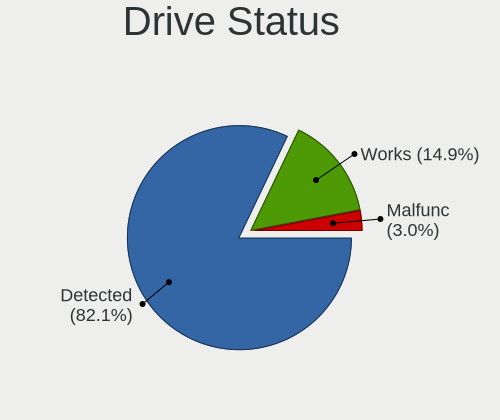
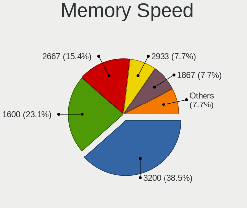
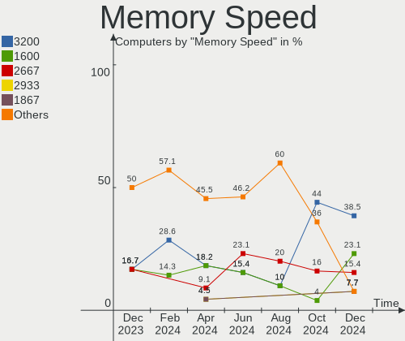

KDE neon Hardware Trends
------------------------

A project to identify most popular hardware characteristics and track their change
over time based on data collected by KDE neon users at https://Linux-Hardware.org.

Anyone can contribute to the study by uploading probes of their computers by
the [hw-probe](https://github.com/linuxhw/hw-probe) tool:

    sudo -E hw-probe -all -upload

This is a report for all computer types. See also reports for [desktops](/Dist/KDE_neon/Desktop/README.md) and [notebooks](/Dist/KDE_neon/Notebook/README.md).

Full-feature report is available here: https://linux-hardware.org/?view=trends

Period: Nov, 2020.

Contents
--------

- [ OS                       ](#os)
- [ OS Family                ](#os-family)
- [ Kernel                   ](#kernel)
- [ Kernel Family            ](#kernel-family)
- [ Kernel Major Ver.        ](#kernel-major-ver)
- [ Arch                     ](#arch)
- [ DE                       ](#de)
- [ Display Server           ](#display-server)
- [ Display Manager          ](#display-manager)
- [ OS Lang                  ](#os-lang)
- [ Boot Mode                ](#boot-mode)
- [ Filesystem               ](#filesystem)
- [ Part. scheme             ](#part-scheme)
- [ Dual Boot with Linux/BSD ](#dual-boot-with-linux/bsd)
- [ Dual Boot (Win)          ](#dual-boot-win)
- [ Country                  ](#country)
- [ City                     ](#city)
- [ Vendor                   ](#vendor)
- [ Model                    ](#model)
- [ Model Family             ](#model-family)
- [ MFG Year                 ](#mfg-year)
- [ Form Factor              ](#form-factor)
- [ Secure Boot              ](#secure-boot)
- [ Coreboot                 ](#coreboot)
- [ RAM Size                 ](#ram-size)
- [ RAM Used                 ](#ram-used)
- [ Has CD-ROM               ](#has-cd-rom)
- [ Total Drives             ](#total-drives)
- [ Has Ethernet             ](#has-ethernet)
- [ Drive Vendor             ](#drive-vendor)
- [ Drive Model              ](#drive-model)
- [ HDD Vendor               ](#hdd-vendor)
- [ SSD Vendor               ](#ssd-vendor)
- [ Drive Kind               ](#drive-kind)
- [ Drive Connector          ](#drive-connector)
- [ Drive Size               ](#drive-size)
- [ Space Total              ](#space-total)
- [ Space Used               ](#space-used)
- [ Malfunc. Drives          ](#malfunc-drives)
- [ Malfunc. Drive Vendor    ](#malfunc-drive-vendor)
- [ Malfunc. HDD Vendor      ](#malfunc-hdd-vendor)
- [ Malfunc. Drive Kind      ](#malfunc-drive-kind)
- [ Failed Drives            ](#failed-drives)
- [ Failed Drive Vendor      ](#failed-drive-vendor)
- [ Drive Status             ](#drive-status)
- [ Storage Vendor           ](#storage-vendor)
- [ Storage Model            ](#storage-model)
- [ Storage Kind             ](#storage-kind)
- [ CPU Vendor               ](#cpu-vendor)
- [ CPU Model                ](#cpu-model)
- [ CPU Model Family         ](#cpu-model-family)
- [ CPU Cores                ](#cpu-cores)
- [ CPU Sockets              ](#cpu-sockets)
- [ CPU Threads              ](#cpu-threads)
- [ CPU Op-Modes             ](#cpu-op-modes)
- [ CPU Microcode            ](#cpu-microcode)
- [ CPU Microarch            ](#cpu-microarch)
- [ GPU Vendor               ](#gpu-vendor)
- [ GPU Model                ](#gpu-model)
- [ GPU Combo                ](#gpu-combo)
- [ GPU Driver               ](#gpu-driver)
- [ GPU Memory               ](#gpu-memory)
- [ Monitor Vendor           ](#monitor-vendor)
- [ Monitor Model            ](#monitor-model)
- [ Monitor Resolution       ](#monitor-resolution)
- [ Monitor Diagonal         ](#monitor-diagonal)
- [ Monitor Width            ](#monitor-width)
- [ Aspect Ratio             ](#aspect-ratio)
- [ Monitor Area             ](#monitor-area)
- [ Pixel Density            ](#pixel-density)
- [ Multiple Monitors        ](#multiple-monitors)
- [ Net Controller Vendor    ](#net-controller-vendor)
- [ Net Controller Model     ](#net-controller-model)
- [ Wireless Vendor          ](#wireless-vendor)
- [ Wireless Model           ](#wireless-model)
- [ Ethernet Vendor          ](#ethernet-vendor)
- [ Ethernet Model           ](#ethernet-model)
- [ Net Controller Kind      ](#net-controller-kind)
- [ Used Controller          ](#used-controller)
- [ NICs                     ](#nics)
- [ Memory Vendor            ](#memory-vendor)
- [ Memory Model             ](#memory-model)
- [ Memory Kind              ](#memory-kind)
- [ Memory Form Factor       ](#memory-form-factor)
- [ Memory Size              ](#memory-size)
- [ Memory Speed             ](#memory-speed)
- [ Sound Vendor             ](#sound-vendor)
- [ Sound Model              ](#sound-model)
- [ Camera Vendor            ](#camera-vendor)
- [ Camera Model             ](#camera-model)
- [ Fingerprint Vendor       ](#fingerprint-vendor)
- [ Fingerprint Model        ](#fingerprint-model)
- [ Chipcard Vendor          ](#chipcard-vendor)
- [ Chipcard Model           ](#chipcard-model)
- [ Printer Vendor           ](#printer-vendor)
- [ Printer Model            ](#printer-model)
- [ Scanner Vendor           ](#scanner-vendor)
- [ Scanner Model            ](#scanner-model)
- [ Bluetooth Vendor         ](#bluetooth-vendor)
- [ Bluetooth Model          ](#bluetooth-model)
- [ Unsupported Devices      ](#unsupported-devices)
- [ Unsupported Device Types ](#unsupported-device-types)

OS
--

Installed operating systems

| Name           | Computers | Percent |
|----------------|-----------|---------|
| KDE neon 20.04 | 194       | 98.48%  |
| KDE neon 18.04 | 3         | 1.52%   |

OS Family
---------

OS without a version

| Name     | Computers | Percent |
|----------|-----------|---------|
| KDE neon | 197       | 100%    |

Kernel
------

Version of the Linux kernel

| Version              | Computers | Percent |
|----------------------|-----------|---------|
| 5.4.0-52-generic     | 77        | 39.09%  |
| 5.4.0-54-generic     | 65        | 32.99%  |
| 5.4.0-53-generic     | 41        | 20.81%  |
| 5.9.8-050908-generic | 3         | 1.52%   |
| 5.4.0-51-generic     | 3         | 1.52%   |
| 5.6.0-1032-oem       | 2         | 1.02%   |
| 5.9.3-050903-generic | 1         | 0.51%   |
| 5.8.0-25-generic     | 1         | 0.51%   |
| 5.7.1-050701-generic | 1         | 0.51%   |
| 5.5.4-050504-generic | 1         | 0.51%   |
| 5.4.0-47-generic     | 1         | 0.51%   |
| 5.3.0-62-generic     | 1         | 0.51%   |

Kernel Family
-------------

Linux kernel without a distro release

| Version | Computers | Percent |
|---------|-----------|---------|
| 5.4.0   | 187       | 94.92%  |
| 5.9.8   | 3         | 1.52%   |
| 5.6.0   | 2         | 1.02%   |
| 5.9.3   | 1         | 0.51%   |
| 5.8.0   | 1         | 0.51%   |
| 5.7.1   | 1         | 0.51%   |
| 5.5.4   | 1         | 0.51%   |
| 5.3.0   | 1         | 0.51%   |

Kernel Major Ver.
-----------------

Linux kernel major version

| Version | Computers | Percent |
|---------|-----------|---------|
| 5.4     | 187       | 94.92%  |
| 5.9     | 4         | 2.03%   |
| 5.6     | 2         | 1.02%   |
| 5.8     | 1         | 0.51%   |
| 5.7     | 1         | 0.51%   |
| 5.5     | 1         | 0.51%   |
| 5.3     | 1         | 0.51%   |

Arch
----

OS architecture (x86_64, i586, etc.)

| Name   | Computers | Percent |
|--------|-----------|---------|
| x86_64 | 197       | 100%    |

DE
--

Desktop Environment

| Name    | Computers | Percent |
|---------|-----------|---------|
| KDE     | 178       | 90.36%  |
| KDE5    | 15        | 7.61%   |
| Unknown | 4         | 2.03%   |

Display Server
--------------

X11 or Wayland

| Name    | Computers | Percent |
|---------|-----------|---------|
| X11     | 195       | 98.98%  |
| Wayland | 2         | 1.02%   |

Display Manager
---------------

SDDM, LightDM, etc.

| Name    | Computers | Percent |
|---------|-----------|---------|
| Unknown | 180       | 91.37%  |
| SDDM    | 17        | 8.63%   |

OS Lang
-------

Language

| Lang  | Computers | Percent |
|-------|-----------|---------|
| en_US | 70        | 35.53%  |
| de_DE | 16        | 8.12%   |
| ru_RU | 13        | 6.6%    |
| es_ES | 11        | 5.58%   |
| pt_BR | 10        | 5.08%   |
| en_GB | 9         | 4.57%   |
| C     | 8         | 4.06%   |
| fr_FR | 7         | 3.55%   |
| pl_PL | 6         | 3.05%   |
| it_IT | 6         | 3.05%   |
| en_IN | 6         | 3.05%   |
| en_AU | 4         | 2.03%   |
| pt_PT | 2         | 1.02%   |
| fr_BE | 2         | 1.02%   |
| en_CA | 2         | 1.02%   |
| el_GR | 2         | 1.02%   |
| zh_CN | 1         | 0.51%   |
| vi_VN | 1         | 0.51%   |
| uk_UA | 1         | 0.51%   |
| tr_TR | 1         | 0.51%   |
| sv_SE | 1         | 0.51%   |
| sk_SK | 1         | 0.51%   |
| nl_NL | 1         | 0.51%   |
| nl_BE | 1         | 0.51%   |
| nb_NO | 1         | 0.51%   |
| mn_CN | 1         | 0.51%   |
| ja_JP | 1         | 0.51%   |
| hu_HU | 1         | 0.51%   |
| gl_ES | 1         | 0.51%   |
| fr_CH | 1         | 0.51%   |
| fr_CA | 1         | 0.51%   |
| es_VE | 1         | 0.51%   |
| es_PE | 1         | 0.51%   |
| es_MX | 1         | 0.51%   |
| es_GT | 1         | 0.51%   |
| es_CO | 1         | 0.51%   |
| es_AR | 1         | 0.51%   |
| en_IE | 1         | 0.51%   |
| C     | 1         | 0.51%   |

Boot Mode
---------

EFI or BIOS

| Mode | Computers | Percent |
|------|-----------|---------|
| EFI  | 111       | 56.35%  |
| BIOS | 86        | 43.65%  |

Filesystem
----------

Type of filesystem

| Type    | Computers | Percent |
|---------|-----------|---------|
| Ext4    | 187       | 94.92%  |
| Btrfs   | 6         | 3.05%   |
| Overlay | 3         | 1.52%   |
| Ext2    | 1         | 0.51%   |

Part. scheme
------------

Scheme of partitioning

| Type    | Computers | Percent |
|---------|-----------|---------|
| Unknown | 180       | 91.37%  |
| GPT     | 12        | 6.09%   |
| MBR     | 5         | 2.54%   |

Dual Boot with Linux/BSD
------------------------

Hosting more than one Linux/BSD

| Dual boot | Computers | Percent |
|-----------|-----------|---------|
| No        | 194       | 98.48%  |
| Yes       | 3         | 1.52%   |

Dual Boot (Win)
---------------

Hosting Linux and Windows

| Dual boot | Computers | Percent |
|-----------|-----------|---------|
| No        | 182       | 92.39%  |
| Yes       | 15        | 7.61%   |

Country
-------

Geographic location (country)

| Country              | Computers | Percent |
|----------------------|-----------|---------|
| USA                  | 37        | 18.78%  |
| Germany              | 20        | 10.15%  |
| Russia               | 15        | 7.61%   |
| Brazil               | 14        | 7.11%   |
| Spain                | 12        | 6.09%   |
| Poland               | 8         | 4.06%   |
| Italy                | 7         | 3.55%   |
| India                | 7         | 3.55%   |
| UK                   | 6         | 3.05%   |
| Netherlands          | 5         | 2.54%   |
| France               | 5         | 2.54%   |
| Ukraine              | 4         | 2.03%   |
| Canada               | 4         | 2.03%   |
| Australia            | 4         | 2.03%   |
| Switzerland          | 3         | 1.52%   |
| Sweden               | 3         | 1.52%   |
| Belgium              | 3         | 1.52%   |
| Slovenia             | 2         | 1.02%   |
| Portugal             | 2         | 1.02%   |
| Norway               | 2         | 1.02%   |
| Mexico               | 2         | 1.02%   |
| Kazakhstan           | 2         | 1.02%   |
| Indonesia            | 2         | 1.02%   |
| Greece               | 2         | 1.02%   |
| Colombia             | 2         | 1.02%   |
| China                | 2         | 1.02%   |
| Vietnam              | 1         | 0.51%   |
| Venezuela            | 1         | 0.51%   |
| Turkey               | 1         | 0.51%   |
| Thailand             | 1         | 0.51%   |
| Singapore            | 1         | 0.51%   |
| Romania              | 1         | 0.51%   |
| Philippines          | 1         | 0.51%   |
| Peru                 | 1         | 0.51%   |
| Morocco              | 1         | 0.51%   |
| Moldova, Republic of | 1         | 0.51%   |
| Malaysia             | 1         | 0.51%   |
| Latvia               | 1         | 0.51%   |
| Japan                | 1         | 0.51%   |
| Ireland              | 1         | 0.51%   |
| Iraq                 | 1         | 0.51%   |
| Iceland              | 1         | 0.51%   |
| Hungary              | 1         | 0.51%   |
| Guatemala            | 1         | 0.51%   |
| Ghana                | 1         | 0.51%   |
| Argentina            | 1         | 0.51%   |
| Andorra              | 1         | 0.51%   |
| Algeria              | 1         | 0.51%   |

City
----

Geographic location (city)

| City                   | Computers | Percent |
|------------------------|-----------|---------|
| Moscow                 | 5         | 2.54%   |
| Warsaw                 | 2         | 1.02%   |
| Stuttgart              | 2         | 1.02%   |
| Paris                  | 2         | 1.02%   |
| Milan                  | 2         | 1.02%   |
| Lincoln                | 2         | 1.02%   |
| Kansas City            | 2         | 1.02%   |
| Jakarta                | 2         | 1.02%   |
| Hamburg                | 2         | 1.02%   |
| Gothenburg             | 2         | 1.02%   |
| Fruitland              | 2         | 1.02%   |
| Barcelona              | 2         | 1.02%   |
| Almaty                 | 2         | 1.02%   |
| Zurich                 | 1         | 0.51%   |
| Wyszków               | 1         | 0.51%   |
| Wiesbaden              | 1         | 0.51%   |
| Walla Walla            | 1         | 0.51%   |
| Wadowice               | 1         | 0.51%   |
| Vulkannyy              | 1         | 0.51%   |
| Voronezh               | 1         | 0.51%   |
| Vladivostok            | 1         | 0.51%   |
| Vigevano               | 1         | 0.51%   |
| Venda do Pinheiro      | 1         | 0.51%   |
| Veliky Novgorod        | 1         | 0.51%   |
| Valladolid             | 1         | 0.51%   |
| Valencia               | 1         | 0.51%   |
| Utrera                 | 1         | 0.51%   |
| Uppsala                | 1         | 0.51%   |
| Turlock                | 1         | 0.51%   |
| Trussville             | 1         | 0.51%   |
| Toronto                | 1         | 0.51%   |
| Tlemcen                | 1         | 0.51%   |
| Tlalpan                | 1         | 0.51%   |
| Tipp City              | 1         | 0.51%   |
| São Paulo             | 1         | 0.51%   |
| São José dos Pinhais | 1         | 0.51%   |
| Sumter                 | 1         | 0.51%   |
| Starachowice           | 1         | 0.51%   |
| St Petersburg          | 1         | 0.51%   |
| Srinagar               | 1         | 0.51%   |
| Sloviansk              | 1         | 0.51%   |
| Sint-Niklaas           | 1         | 0.51%   |
| Singapore              | 1         | 0.51%   |
| Siedenbruenzow         | 1         | 0.51%   |
| Shinjuku               | 1         | 0.51%   |
| Shenzhen               | 1         | 0.51%   |
| Severna Park           | 1         | 0.51%   |
| Sarlat-la-Canéda      | 1         | 0.51%   |
| Santa Rosa             | 1         | 0.51%   |
| Sandnes                | 1         | 0.51%   |
| San Francisco          | 1         | 0.51%   |
| Salvador               | 1         | 0.51%   |
| Saint-Denis-en-Val     | 1         | 0.51%   |
| Ruurlo                 | 1         | 0.51%   |
| Round Rock             | 1         | 0.51%   |
| Rochester              | 1         | 0.51%   |
| Rivera                 | 1         | 0.51%   |
| Rio de Janeiro         | 1         | 0.51%   |
| Rijssen                | 1         | 0.51%   |
| Riga                   | 1         | 0.51%   |

Vendor
------

Motherboard manufacturer

| Name                | Computers | Percent |
|---------------------|-----------|---------|
| ASUSTek Computer    | 30        | 15.23%  |
| Hewlett-Packard     | 28        | 14.21%  |
| Dell                | 25        | 12.69%  |
| Lenovo              | 19        | 9.64%   |
| Gigabyte Technology | 19        | 9.64%   |
| MSI                 | 14        | 7.11%   |
| ASRock              | 11        | 5.58%   |
| Acer                | 11        | 5.58%   |
| Apple               | 10        | 5.08%   |
| Intel               | 5         | 2.54%   |
| Sony                | 4         | 2.03%   |
| SLIMBOOK            | 3         | 1.52%   |
| Samsung Electronics | 3         | 1.52%   |
| Toshiba             | 2         | 1.02%   |
| Alienware           | 2         | 1.02%   |
| SYWZ                | 1         | 0.51%   |
| System76            | 1         | 0.51%   |
| Positivo            | 1         | 0.51%   |
| Notebook            | 1         | 0.51%   |
| Microsoft           | 1         | 0.51%   |
| Medion              | 1         | 0.51%   |
| ICP / iEi           | 1         | 0.51%   |
| HUAWEI              | 1         | 0.51%   |
| Fujitsu             | 1         | 0.51%   |
| ABIT                | 1         | 0.51%   |
| Unknown             | 1         | 0.51%   |

Model
-----

Motherboard model

| Name                                        | Computers | Percent |
|---------------------------------------------|-----------|---------|
| SLIMBOOK PROX14-AMD                         | 3         | 1.52%   |
| HP Pavilion Gaming Laptop 15-cx0xxx         | 3         | 1.52%   |
| Dell Latitude E6440                         | 3         | 1.52%   |
| Apple MacBookPro9,2                         | 3         | 1.52%   |
| HP Pavilion dv6                             | 2         | 1.02%   |
| Gigabyte B450M DS3H                         | 2         | 1.02%   |
| Dell Latitude E6400                         | 2         | 1.02%   |
| ASRock B450M Pro4                           | 2         | 1.02%   |
| Toshiba Satellite C870-DJW                  | 1         | 0.51%   |
| Toshiba Satellite C855-1XJ                  | 1         | 0.51%   |
| SYWZ S200 Series                            | 1         | 0.51%   |
| System76 Thelio                             | 1         | 0.51%   |
| Sony VPCEB15FM                              | 1         | 0.51%   |
| Sony SVF14N11CXB                            | 1         | 0.51%   |
| Sony SVE1512C6EW                            | 1         | 0.51%   |
| Sony SVE14A25CLB                            | 1         | 0.51%   |
| Samsung QX310/QX410/QX510/SF310/SF410/SF510 | 1         | 0.51%   |
| Samsung 870Z5G/880Z5F                       | 1         | 0.51%   |
| Samsung 370E4K                              | 1         | 0.51%   |
| Positivo CHT14B                             | 1         | 0.51%   |
| Notebook NH5xAx                             | 1         | 0.51%   |
| MSI MS-7A70                                 | 1         | 0.51%   |
| MSI MS-7890                                 | 1         | 0.51%   |
| MSI MS-7817                                 | 1         | 0.51%   |
| MSI MS-7816                                 | 1         | 0.51%   |
| MSI MS-7798                                 | 1         | 0.51%   |
| MSI MS-7752                                 | 1         | 0.51%   |
| MSI MS-7599                                 | 1         | 0.51%   |
| MSI MS-7522                                 | 1         | 0.51%   |
| MSI MS-7253                                 | 1         | 0.51%   |
| MSI GS70 2QD                                | 1         | 0.51%   |
| MSI GP63 Leopard 8RE                        | 1         | 0.51%   |
| MSI GP60 2OD                                | 1         | 0.51%   |
| MSI GL65 Leopard 10SEK                      | 1         | 0.51%   |
| MSI CX62 6QD                                | 1         | 0.51%   |
| Microsoft Surface Go 2                      | 1         | 0.51%   |
| Medion H67H2-EM                             | 1         | 0.51%   |
| Lenovo Yoga 530-14ARR 81H9                  | 1         | 0.51%   |
| Lenovo Y520-15IKBN 80WK                     | 1         | 0.51%   |
| Lenovo V145-15AST 81MT                      | 1         | 0.51%   |
| Lenovo ThinkPad Yoga 11e 20DAS02M00         | 1         | 0.51%   |
| Lenovo ThinkPad X1 Tablet 20GGS00S00        | 1         | 0.51%   |
| Lenovo ThinkPad X1 Carbon 7th 20QD0000US    | 1         | 0.51%   |
| Lenovo ThinkPad L15 Gen 1 20U3CTO1WW        | 1         | 0.51%   |
| Lenovo ThinkPad Edge E540 20C60046UK        | 1         | 0.51%   |
| Lenovo QIWG5                                | 1         | 0.51%   |
| Lenovo Legion 5 17IMH05H 81Y8               | 1         | 0.51%   |
| Lenovo IdeaPad U510 20191                   | 1         | 0.51%   |
| Lenovo IdeaPad 500-15ISK 80NT               | 1         | 0.51%   |
| Lenovo IdeaPad 320-15ABR 80XS               | 1         | 0.51%   |
| Lenovo IdeaPad 110-14IBR 80T6               | 1         | 0.51%   |
| Lenovo IdeaCentre K330B                     | 1         | 0.51%   |
| Lenovo G700 20251                           | 1         | 0.51%   |
| Lenovo G50-45 80MQ                          | 1         | 0.51%   |
| Lenovo G50-45 80E3                          | 1         | 0.51%   |
| Lenovo 1.01UL F40-30                        | 1         | 0.51%   |
| Intel NUC8i7BEH                             | 1         | 0.51%   |
| Intel H61                                   | 1         | 0.51%   |
| Intel DH87RL AAG74240-403                   | 1         | 0.51%   |
| Intel DG41KR AAE62839-304                   | 1         | 0.51%   |

Model Family
------------

Motherboard model prefix

| Name                | Computers | Percent |
|---------------------|-----------|---------|
| Dell Inspiron       | 12        | 6.09%   |
| Acer Aspire         | 9         | 4.57%   |
| HP Pavilion         | 7         | 3.55%   |
| Dell Latitude       | 7         | 3.55%   |
| Lenovo ThinkPad     | 5         | 2.54%   |
| HP EliteBook        | 5         | 2.54%   |
| ASUS PRIME          | 5         | 2.54%   |
| Lenovo IdeaPad      | 4         | 2.03%   |
| HP Laptop           | 4         | 2.03%   |
| SLIMBOOK PROX14-AMD | 3         | 1.52%   |
| ASRock B450         | 3         | 1.52%   |
| Apple MacBookPro9   | 3         | 1.52%   |
| Toshiba Satellite   | 2         | 1.02%   |
| Lenovo G50-45       | 2         | 1.02%   |
| HP Compaq           | 2         | 1.02%   |
| Gigabyte X570       | 2         | 1.02%   |
| Gigabyte B450M      | 2         | 1.02%   |
| Dell OptiPlex       | 2         | 1.02%   |
| ASUS VivoBook       | 2         | 1.02%   |
| ASUS ROG            | 2         | 1.02%   |
| ASRock B450M        | 2         | 1.02%   |
| Apple MacBookPro11  | 2         | 1.02%   |
| SYWZ S200           | 1         | 0.51%   |
| System76 Thelio     | 1         | 0.51%   |
| Sony VPCEB15FM      | 1         | 0.51%   |
| Sony SVF14N11CXB    | 1         | 0.51%   |
| Sony SVE1512C6EW    | 1         | 0.51%   |
| Sony SVE14A25CLB    | 1         | 0.51%   |
| Samsung QX310       | 1         | 0.51%   |
| Samsung 870Z5G      | 1         | 0.51%   |
| Samsung 370E4K      | 1         | 0.51%   |
| Positivo CHT14B     | 1         | 0.51%   |
| Notebook NH5xAx     | 1         | 0.51%   |
| MSI MS-7A70         | 1         | 0.51%   |
| MSI MS-7890         | 1         | 0.51%   |
| MSI MS-7817         | 1         | 0.51%   |
| MSI MS-7816         | 1         | 0.51%   |
| MSI MS-7798         | 1         | 0.51%   |
| MSI MS-7752         | 1         | 0.51%   |
| MSI MS-7599         | 1         | 0.51%   |
| MSI MS-7522         | 1         | 0.51%   |
| MSI MS-7253         | 1         | 0.51%   |
| MSI GS70            | 1         | 0.51%   |
| MSI GP63            | 1         | 0.51%   |
| MSI GP60            | 1         | 0.51%   |
| MSI GL65            | 1         | 0.51%   |
| MSI CX62            | 1         | 0.51%   |
| Microsoft Surface   | 1         | 0.51%   |
| Medion H67H2-EM     | 1         | 0.51%   |
| Lenovo Yoga         | 1         | 0.51%   |
| Lenovo Y520-15IKBN  | 1         | 0.51%   |
| Lenovo V145-15AST   | 1         | 0.51%   |
| Lenovo QIWG5        | 1         | 0.51%   |
| Lenovo Legion       | 1         | 0.51%   |
| Lenovo IdeaCentre   | 1         | 0.51%   |
| Lenovo G700         | 1         | 0.51%   |
| Lenovo 1.01UL       | 1         | 0.51%   |
| Intel NUC8i7BEH     | 1         | 0.51%   |
| Intel H61           | 1         | 0.51%   |
| Intel DH87RL        | 1         | 0.51%   |

MFG Year
--------

Motherboard manufacture year

| Year | Computers | Percent |
|------|-----------|---------|
| 2020 | 37        | 18.78%  |
| 2019 | 34        | 17.26%  |
| 2013 | 19        | 9.64%   |
| 2018 | 18        | 9.14%   |
| 2015 | 13        | 6.6%    |
| 2017 | 12        | 6.09%   |
| 2014 | 12        | 6.09%   |
| 2012 | 10        | 5.08%   |
| 2011 | 10        | 5.08%   |
| 2010 | 10        | 5.08%   |
| 2009 | 9         | 4.57%   |
| 2016 | 7         | 3.55%   |
| 2008 | 3         | 1.52%   |
| 2007 | 3         | 1.52%   |

Form Factor
-----------

Physical design of the computer

| Name        | Computers | Percent |
|-------------|-----------|---------|
| Notebook    | 106       | 53.81%  |
| Desktop     | 84        | 42.64%  |
| Convertible | 3         | 1.52%   |
| Mini pc     | 2         | 1.02%   |
| Tablet      | 1         | 0.51%   |
| All in one  | 1         | 0.51%   |

Secure Boot
-----------

Enabled or disabled

| State    | Computers | Percent |
|----------|-----------|---------|
| Disabled | 182       | 92.39%  |
| Enabled  | 15        | 7.61%   |

Coreboot
--------

Have coreboot on board

| Used | Computers | Percent |
|------|-----------|---------|
| No   | 197       | 100%    |

RAM Size
--------

Total RAM memory

| Size in GB  | Computers | Percent |
|-------------|-----------|---------|
| 16.01-24.0  | 51        | 25.89%  |
| 3.01-4.0    | 40        | 20.3%   |
| 8.01-16.0   | 40        | 20.3%   |
| 4.01-8.0    | 37        | 18.78%  |
| 32.01-64.0  | 14        | 7.11%   |
| 1.01-2.0    | 8         | 4.06%   |
| 64.01-256.0 | 4         | 2.03%   |
| 24.01-32.0  | 3         | 1.52%   |

RAM Used
--------

Used RAM memory

| Used GB   | Computers | Percent |
|-----------|-----------|---------|
| 1.01-2.0  | 85        | 43.15%  |
| 2.01-3.0  | 49        | 24.87%  |
| 4.01-8.0  | 26        | 13.2%   |
| 3.01-4.0  | 19        | 9.64%   |
| 0.01-1.0  | 14        | 7.11%   |
| 8.01-16.0 | 4         | 2.03%   |

Has CD-ROM
----------

Has CD-ROM on board

| Presented | Computers | Percent |
|-----------|-----------|---------|
| No        | 104       | 52.79%  |
| Yes       | 93        | 47.21%  |

Total Drives
------------

Number of drives on board

| Drives | Computers | Percent |
|--------|-----------|---------|
| 1      | 105       | 53.3%   |
| 2      | 63        | 31.98%  |
| 3      | 19        | 9.64%   |
| 4      | 7         | 3.55%   |
| 6      | 3         | 1.52%   |

Has Ethernet
------------

Has Ethernet on board

| Presented | Computers | Percent |
|-----------|-----------|---------|
| Yes       | 183       | 92.89%  |
| No        | 14        | 7.11%   |

Drive Vendor
------------

Hard drive vendors

| Vendor                    | Computers | Drives | Percent |
|---------------------------|-----------|--------|---------|
| Seagate                   | 48        | 56     | 16%     |
| Samsung Electronics       | 48        | 60     | 16%     |
| WDC                       | 40        | 48     | 13.33%  |
| Kingston                  | 27        | 27     | 9%      |
| Toshiba                   | 25        | 26     | 8.33%   |
| SanDisk                   | 17        | 18     | 5.67%   |
| Crucial                   | 16        | 16     | 5.33%   |
| Intel                     | 9         | 10     | 3%      |
| Hitachi                   | 9         | 10     | 3%      |
| Phison                    | 7         | 7      | 2.33%   |
| Unknown                   | 6         | 7      | 2%      |
| HGST                      | 5         | 5      | 1.67%   |
| XPG                       | 4         | 4      | 1.33%   |
| PNY                       | 4         | 4      | 1.33%   |
| Intenso                   | 4         | 4      | 1.33%   |
| Corsair                   | 3         | 3      | 1%      |
| Transcend                 | 2         | 2      | 0.67%   |
| SPCC                      | 2         | 2      | 0.67%   |
| SK Hynix                  | 2         | 2      | 0.67%   |
| PLEXTOR                   | 2         | 2      | 0.67%   |
| Micron Technology         | 2         | 2      | 0.67%   |
| KIOXIA                    | 2         | 2      | 0.67%   |
| Apple                     | 2         | 2      | 0.67%   |
| A-DATA Technology         | 2         | 2      | 0.67%   |
| WD MediaMax               | 1         | 1      | 0.33%   |
| S528                      | 1         | 1      | 0.33%   |
| Patriot                   | 1         | 1      | 0.33%   |
| OCZ                       | 1         | 1      | 0.33%   |
| Micron/Crucial Technology | 1         | 1      | 0.33%   |
| Maxtor                    | 1         | 1      | 0.33%   |
| LITEON                    | 1         | 1      | 0.33%   |
| HP SSD E                  | 1         | 1      | 0.33%   |
| Fujitsu                   | 1         | 1      | 0.33%   |
| China                     | 1         | 1      | 0.33%   |
| BHT                       | 1         | 1      | 0.33%   |
| AMD                       | 1         | 1      | 0.33%   |

Drive Model
-----------

Hard drive models

| Model                              | Computers | Percent |
|------------------------------------|-----------|---------|
| Seagate ST1000LM035-1RK172 1TB     | 7         | 2.14%   |
| Samsung SSD 860 EVO 500GB          | 6         | 1.83%   |
| Kingston SA400S37480G 480GB SSD    | 6         | 1.83%   |
| Kingston SA400S37240G 240GB SSD    | 6         | 1.83%   |
| Samsung NVMe SSD Drive 512GB       | 5         | 1.53%   |
| Samsung NVMe SSD Drive 500GB       | 5         | 1.53%   |
| Crucial CT500MX500SSD1 500GB       | 5         | 1.53%   |
| Seagate ST500DM002-1BD142 500GB    | 4         | 1.22%   |
| Kingston SA400S37120G 120GB SSD    | 4         | 1.22%   |
| Toshiba MQ01ABF050 500GB           | 3         | 0.92%   |
| Toshiba MQ01ABD100 1TB             | 3         | 0.92%   |
| Seagate ST2000DM001-1ER164 2TB     | 3         | 0.92%   |
| Seagate ST1000LM024 HN-M101MBB 1TB | 3         | 0.92%   |
| PNY CS900 500GB SSD                | 3         | 0.92%   |
| Phison NVMe SSD Drive 1024GB       | 3         | 0.92%   |
| HGST HTS721010A9E630 1TB           | 3         | 0.92%   |
| XPG NVMe SSD Drive 512GB           | 2         | 0.61%   |
| WDC WD5000LPVX-75V0TT0 500GB       | 2         | 0.61%   |
| WDC WD5000AAKX-001CA0 500GB        | 2         | 0.61%   |
| WDC WD10JPVX-22JC3T0 1TB           | 2         | 0.61%   |
| WDC WD10EZEX-08WN4A0 1TB           | 2         | 0.61%   |
| Unknown SD/MMC/MS PRO 128GB        | 2         | 0.61%   |
| Unknown MMC Card  32GB             | 2         | 0.61%   |
| Unknown MMC Card  16GB             | 2         | 0.61%   |
| Toshiba NVMe SSD Drive 256GB       | 2         | 0.61%   |
| Toshiba MQ04ABF100 1TB             | 2         | 0.61%   |
| Toshiba HDWL110 1TB                | 2         | 0.61%   |
| Toshiba DT01ACA050 500GB           | 2         | 0.61%   |
| Seagate ST250DM000-1BD141 250GB    | 2         | 0.61%   |
| Seagate ST1000LX015-1U7172 1TB     | 2         | 0.61%   |
| Seagate ST1000DM003-1CH162 1TB     | 2         | 0.61%   |
| Sandisk NVMe SSD Drive 500GB       | 2         | 0.61%   |
| Sandisk NVMe SSD Drive 256GB       | 2         | 0.61%   |
| SanDisk Extreme SSD 250GB          | 2         | 0.61%   |
| Samsung SSD 860 QVO 1TB            | 2         | 0.61%   |
| Samsung SSD 860 EVO 1TB            | 2         | 0.61%   |
| Samsung SSD 850 PRO 128GB          | 2         | 0.61%   |
| Samsung SSD 850 EVO 250GB          | 2         | 0.61%   |
| Samsung NVMe SSD Drive 256GB       | 2         | 0.61%   |
| Samsung NVMe SSD Drive 1TB         | 2         | 0.61%   |
| Phison NVMe SSD Drive 500GB        | 2         | 0.61%   |
| Kingston SV300S37A240G 240GB SSD   | 2         | 0.61%   |
| Kingston SA400M8240G 240GB SSD     | 2         | 0.61%   |
| Intel SSDSC2CT180A3 180GB          | 2         | 0.61%   |
| Hitachi HTS545050A7E380 500GB      | 2         | 0.61%   |
| Crucial CT120BX500SSD1 120GB       | 2         | 0.61%   |
| XPG NVMe SSD Drive 256GB           | 1         | 0.31%   |
| XPG NVMe SSD Drive 1024GB          | 1         | 0.31%   |
| WDC WDS500G1B0A-00H9H0 500GB SSD   | 1         | 0.31%   |
| WDC WDS480G2G0B-00EPW0 480GB SSD   | 1         | 0.31%   |
| WDC WDS480G2G0A-00JH30 480GB SSD   | 1         | 0.31%   |
| WDC WDS240G2G0B-00EPW0 240GB SSD   | 1         | 0.31%   |
| WDC WDS240G2G0A-00JH30 240GB SSD   | 1         | 0.31%   |
| WDC WDS120G2G0A-00JH30 120GB SSD   | 1         | 0.31%   |
| WDC WDS100T2B0A-00SM50 1TB SSD     | 1         | 0.31%   |
| WDC WDS100T1B0A-00H9H0 1TB SSD     | 1         | 0.31%   |
| WDC WD80EFZX-68UW8N0 8TB           | 1         | 0.31%   |
| WDC WD800JD-75MSA3 80GB            | 1         | 0.31%   |
| WDC WD800JD-60LSA0 80GB            | 1         | 0.31%   |
| WDC WD800JD-08MSA1 80GB            | 1         | 0.31%   |

HDD Vendor
----------

Hard disk drive vendors

| Vendor              | Computers | Drives | Percent |
|---------------------|-----------|--------|---------|
| Seagate             | 47        | 53     | 38.21%  |
| WDC                 | 32        | 39     | 26.02%  |
| Toshiba             | 21        | 22     | 17.07%  |
| Hitachi             | 9         | 10     | 7.32%   |
| Samsung Electronics | 7         | 11     | 5.69%   |
| HGST                | 5         | 5      | 4.07%   |
| Maxtor              | 1         | 1      | 0.81%   |
| Fujitsu             | 1         | 1      | 0.81%   |

SSD Vendor
----------

Solid state drive vendors

| Vendor              | Computers | Drives | Percent |
|---------------------|-----------|--------|---------|
| Samsung Electronics | 29        | 33     | 23.39%  |
| Kingston            | 24        | 24     | 19.35%  |
| Crucial             | 15        | 15     | 12.1%   |
| SanDisk             | 11        | 12     | 8.87%   |
| WDC                 | 8         | 8      | 6.45%   |
| Intel               | 6         | 6      | 4.84%   |
| PNY                 | 4         | 4      | 3.23%   |
| Intenso             | 3         | 3      | 2.42%   |
| Corsair             | 3         | 3      | 2.42%   |
| Transcend           | 2         | 2      | 1.61%   |
| Toshiba             | 2         | 2      | 1.61%   |
| SPCC                | 2         | 2      | 1.61%   |
| PLEXTOR             | 2         | 2      | 1.61%   |
| Micron Technology   | 2         | 2      | 1.61%   |
| Apple               | 2         | 2      | 1.61%   |
| A-DATA Technology   | 2         | 2      | 1.61%   |
| Seagate             | 1         | 2      | 0.81%   |
| S528                | 1         | 1      | 0.81%   |
| Patriot             | 1         | 1      | 0.81%   |
| OCZ                 | 1         | 1      | 0.81%   |
| LITEON              | 1         | 1      | 0.81%   |
| China               | 1         | 1      | 0.81%   |
| AMD                 | 1         | 1      | 0.81%   |

Drive Kind
----------

HDD or SSD

| Kind    | Computers | Drives | Percent |
|---------|-----------|--------|---------|
| SSD     | 111       | 130    | 40.81%  |
| HDD     | 107       | 142    | 39.34%  |
| NVMe    | 43        | 49     | 15.81%  |
| Unknown | 7         | 7      | 2.57%   |
| MMC     | 4         | 5      | 1.47%   |

Drive Connector
---------------

SATA, SAS, NVMe, etc.

| Type | Computers | Drives | Percent |
|------|-----------|--------|---------|
| SATA | 176       | 264    | 74.58%  |
| NVMe | 43        | 49     | 18.22%  |
| SAS  | 13        | 15     | 5.51%   |
| MMC  | 4         | 5      | 1.69%   |

Drive Size
----------

Size of hard drive

| Size in TB | Computers | Drives | Percent |
|------------|-----------|--------|---------|
| 0.01-0.5   | 134       | 176    | 60.09%  |
| 0.51-1.0   | 68        | 73     | 30.49%  |
| 1.01-2.0   | 15        | 15     | 6.73%   |
| 3.01-4.0   | 2         | 2      | 0.9%    |
| 2.01-3.0   | 2         | 3      | 0.9%    |
| 4.01-10.0  | 2         | 3      | 0.9%    |

Space Total
-----------

Amount of disk space available on the file system

| Size in GB     | Computers | Percent |
|----------------|-----------|---------|
| 101-250        | 53        | 26.9%   |
| 251-500        | 46        | 23.35%  |
| 501-1000       | 35        | 17.77%  |
| 51-100         | 16        | 8.12%   |
| 1001-2000      | 14        | 7.11%   |
| 1-20           | 9         | 4.57%   |
| 21-50          | 8         | 4.06%   |
| 2001-3000      | 7         | 3.55%   |
| Unknown        | 5         | 2.54%   |
| More than 3000 | 4         | 2.03%   |

Space Used
----------

Amount of used disk space

| Used GB        | Computers | Percent |
|----------------|-----------|---------|
| 1-20           | 103       | 52.28%  |
| 21-50          | 26        | 13.2%   |
| 51-100         | 19        | 9.64%   |
| 101-250        | 17        | 8.63%   |
| 251-500        | 10        | 5.08%   |
| 501-1000       | 9         | 4.57%   |
| 1001-2000      | 5         | 2.54%   |
| Unknown        | 5         | 2.54%   |
| More than 3000 | 3         | 1.52%   |

Malfunc. Drives
---------------

Drive models with a malfunction

| Model                        | Computers | Drives | Percent |
|------------------------------|-----------|--------|---------|
| WDC WD5000LPVX-75V0TT0 500GB | 1         | 1      | 16.67%  |
| WDC WD5000AAKX-001CA0 500GB  | 1         | 1      | 16.67%  |
| WDC WD10EZEX-22MFCA0 1TB     | 1         | 1      | 16.67%  |
| WDC WD10EARS-22Y5B1 1TB      | 1         | 1      | 16.67%  |
| WDC WD10EARS-00Z5B1 1TB      | 1         | 1      | 16.67%  |
| Intel SSDSC2CT240A4 240GB    | 1         | 1      | 16.67%  |

Malfunc. Drive Vendor
---------------------

Vendors of faulty drives

| Vendor | Computers | Drives | Percent |
|--------|-----------|--------|---------|
| WDC    | 4         | 5      | 80%     |
| Intel  | 1         | 1      | 20%     |

Malfunc. HDD Vendor
-------------------

Vendors of faulty HDD drives

| Vendor | Computers | Drives | Percent |
|--------|-----------|--------|---------|
| WDC    | 4         | 5      | 100%    |

Malfunc. Drive Kind
-------------------

Kinds of faulty drives

| Kind | Computers | Drives | Percent |
|------|-----------|--------|---------|
| HDD  | 4         | 5      | 80%     |
| SSD  | 1         | 1      | 20%     |

Failed Drives
-------------

Failed drive models

Zero info for selected period =(

Failed Drive Vendor
-------------------

Failed drive vendors

Zero info for selected period =(

Drive Status
------------

Number of failed and malfunc. drives

| Status   | Computers | Drives | Percent |
|----------|-----------|--------|---------|
| Detected | 181       | 308    | 90.05%  |
| Works    | 15        | 19     | 7.46%   |
| Malfunc  | 5         | 6      | 2.49%   |

Storage Vendor
--------------

Storage controller vendors

| Vendor                       | Computers | Percent |
|------------------------------|-----------|---------|
| Intel                        | 140       | 57.38%  |
| AMD                          | 44        | 18.03%  |
| Samsung Electronics          | 17        | 6.97%   |
| Sandisk                      | 7         | 2.87%   |
| Phison Electronics           | 7         | 2.87%   |
| ASMedia Technology           | 4         | 1.64%   |
| ADATA Technology             | 4         | 1.64%   |
| Kingston Technology Company  | 3         | 1.23%   |
| JMicron Technology           | 3         | 1.23%   |
| VIA Technologies             | 2         | 0.82%   |
| Toshiba America Info Systems | 2         | 0.82%   |
| SK Hynix                     | 2         | 0.82%   |
| Nvidia                       | 2         | 0.82%   |
| Micron/Crucial Technology    | 2         | 0.82%   |
| KIOXIA                       | 2         | 0.82%   |
| Marvell Technology Group     | 1         | 0.41%   |
| LSI Logic / Symbios Logic    | 1         | 0.41%   |
| Broadcom / LSI               | 1         | 0.41%   |

Storage Model
-------------

Storage controller models

| Model                                                                                   | Computers | Percent |
|-----------------------------------------------------------------------------------------|-----------|---------|
| AMD FCH SATA Controller [AHCI mode]                                                     | 27        | 9.34%   |
| Intel 7 Series Chipset Family 6-port SATA Controller [AHCI mode]                        | 18        | 6.23%   |
| Intel 8 Series/C220 Series Chipset Family 6-port SATA Controller 1 [AHCI mode]          | 14        | 4.84%   |
| Samsung Electronics NVMe SSD Controller SM981/PM981/PM983                               | 11        | 3.81%   |
| AMD 400 Series Chipset SATA Controller                                                  | 11        | 3.81%   |
| Intel Sunrise Point-LP SATA Controller [AHCI mode]                                      | 10        | 3.46%   |
| Intel 82801 Mobile SATA Controller [RAID mode]                                          | 10        | 3.46%   |
| AMD SB7x0/SB8x0/SB9x0 IDE Controller                                                    | 10        | 3.46%   |
| Intel 200 Series PCH SATA controller [AHCI mode]                                        | 9         | 3.11%   |
| AMD SB7x0/SB8x0/SB9x0 SATA Controller [AHCI mode]                                       | 8         | 2.77%   |
| Intel Cannon Lake Mobile PCH SATA AHCI Controller                                       | 7         | 2.42%   |
| Intel 6 Series/C200 Series Chipset Family 6 port Desktop SATA AHCI Controller           | 7         | 2.42%   |
| Intel 8 Series SATA Controller 1 [AHCI mode]                                            | 6         | 2.08%   |
| AMD SB7x0/SB8x0/SB9x0 SATA Controller [IDE mode]                                        | 6         | 2.08%   |
| Phison Electronics E12 NVMe Controller                                                  | 5         | 1.73%   |
| Intel Q170/Q150/B150/H170/H110/Z170/CM236 Chipset SATA Controller [AHCI Mode]           | 5         | 1.73%   |
| Intel Atom/Celeron/Pentium Processor x5-E8000/J3xxx/N3xxx Series SATA Controller        | 4         | 1.38%   |
| Intel 82801IBM/IEM (ICH9M/ICH9M-E) 4 port SATA Controller [AHCI mode]                   | 4         | 1.38%   |
| Intel 7 Series/C210 Series Chipset Family 6-port SATA Controller [AHCI mode]            | 4         | 1.38%   |
| Intel 6 Series/C200 Series Chipset Family 6 port Mobile SATA AHCI Controller            | 4         | 1.38%   |
| ASMedia Technology ASM1062 Serial ATA Controller                                        | 4         | 1.38%   |
| ADATA Technology XPG SX8200 Pro PCIe Gen3x4 M.2 2280 Solid State Drive                  | 4         | 1.38%   |
| Sandisk WD Black 2018 / PC SN720 NVMe SSD                                               | 3         | 1.04%   |
| Samsung Electronics NVMe SSD Controller SM961/PM961                                     | 3         | 1.04%   |
| JMicron Technology JMB363 SATA/IDE Controller                                           | 3         | 1.04%   |
| Intel Wildcat Point-LP SATA Controller [AHCI Mode]                                      | 3         | 1.04%   |
| Intel NM10/ICH7 Family SATA Controller [IDE mode]                                       | 3         | 1.04%   |
| Intel HM170/QM170 Chipset SATA Controller [AHCI Mode]                                   | 3         | 1.04%   |
| Intel 82801G (ICH7 Family) IDE Controller                                               | 3         | 1.04%   |
| Intel 6 Series/C200 Series Chipset Family Desktop SATA Controller (IDE mode, ports 4-5) | 3         | 1.04%   |
| Intel 6 Series/C200 Series Chipset Family Desktop SATA Controller (IDE mode, ports 0-3) | 3         | 1.04%   |
| Sandisk WD Black 2019/PC SN750 NVMe SSD                                                 | 2         | 0.69%   |
| Sandisk WD Black 2018 / PC SN520 NVMe SSD                                               | 2         | 0.69%   |
| Samsung Electronics NVMe SSD Controller SM951/PM951                                     | 2         | 0.69%   |
| Phison Electronics E16 PCIe4 NVMe Controller                                            | 2         | 0.69%   |
| Micron/Crucial Technology Non-Volatile memory controller                                | 2         | 0.69%   |
| KIOXIA Non-Volatile memory controller                                                   | 2         | 0.69%   |
| Kingston Technology Company Non-Volatile memory controller                              | 2         | 0.69%   |
| Intel C610/X99 series chipset sSATA Controller [AHCI mode]                              | 2         | 0.69%   |
| Intel C610/X99 series chipset 6-Port SATA Controller [AHCI mode]                        | 2         | 0.69%   |
| Intel C600/X79 series chipset 6-Port SATA AHCI Controller                               | 2         | 0.69%   |
| Intel Atom Processor E3800 Series SATA AHCI Controller                                  | 2         | 0.69%   |
| Intel 82801JI (ICH10 Family) 4 port SATA IDE Controller #1                              | 2         | 0.69%   |
| Intel 82801JI (ICH10 Family) 2 port SATA IDE Controller #2                              | 2         | 0.69%   |
| Intel 5 Series/3400 Series Chipset 4 port SATA AHCI Controller                          | 2         | 0.69%   |
| Intel 400 Series Chipset Family SATA AHCI Controller                                    | 2         | 0.69%   |
| AMD SATA controller                                                                     | 2         | 0.69%   |
| VIA Technologies VT82C586A/B/VT82C686/A/B/VT823x/A/C PIPC Bus Master IDE                | 1         | 0.35%   |
| VIA Technologies VT8237A SATA 2-Port Controller                                         | 1         | 0.35%   |
| VIA Technologies VT6415 PATA IDE Host Controller                                        | 1         | 0.35%   |
| Toshiba America Info Systems XG4 NVMe SSD Controller                                    | 1         | 0.35%   |
| Toshiba America Info Systems Toshiba America Info Non-Volatile memory controller        | 1         | 0.35%   |
| SK Hynix Non-Volatile memory controller                                                 | 1         | 0.35%   |
| SK Hynix BC501 NVMe Solid State Drive 512GB                                             | 1         | 0.35%   |
| Samsung Electronics Apple PCIe SSD                                                      | 1         | 0.35%   |
| Nvidia MCP79 AHCI Controller                                                            | 1         | 0.35%   |
| Nvidia MCP51 Serial ATA Controller                                                      | 1         | 0.35%   |
| Nvidia MCP51 IDE                                                                        | 1         | 0.35%   |
| Marvell Technology Group 88SE9128 PCIe SATA 6 Gb/s RAID controller with HyperDuo        | 1         | 0.35%   |
| LSI Logic / Symbios Logic SAS1068E PCI-Express Fusion-MPT SAS                           | 1         | 0.35%   |

Storage Kind
------------

Kind of storage controller (IDE, SATA, NVMe, SAS, ...)

| Kind | Computers | Percent |
|------|-----------|---------|
| SATA | 162       | 65.59%  |
| NVMe | 43        | 17.41%  |
| IDE  | 28        | 11.34%  |
| RAID | 12        | 4.86%   |
| SAS  | 1         | 0.4%    |
| SCSI | 1         | 0.4%    |

CPU Vendor
----------

Processor vendors

| Vendor | Computers | Percent |
|--------|-----------|---------|
| Intel  | 149       | 75.63%  |
| AMD    | 48        | 24.37%  |

CPU Model
---------

Processor models

| Model                                         | Computers | Percent |
|-----------------------------------------------|-----------|---------|
| Intel Core i5-8300H CPU @ 2.30GHz             | 5         | 2.54%   |
| AMD Ryzen 7 3700X 8-Core Processor            | 5         | 2.54%   |
| Intel Core i5-3210M CPU @ 2.50GHz             | 4         | 2.03%   |
| Intel Core i7-7700HQ CPU @ 2.80GHz            | 3         | 1.52%   |
| Intel Core i7-3770 CPU @ 3.40GHz              | 3         | 1.52%   |
| Intel Core i7-10750H CPU @ 2.60GHz            | 3         | 1.52%   |
| Intel Core i7-10510U CPU @ 1.80GHz            | 3         | 1.52%   |
| Intel Core i5-7200U CPU @ 2.50GHz             | 3         | 1.52%   |
| AMD Ryzen 7 4800H with Radeon Graphics        | 3         | 1.52%   |
| AMD Phenom II X4 955 Processor                | 3         | 1.52%   |
| Intel Core i7-8750H CPU @ 2.20GHz             | 2         | 1.02%   |
| Intel Core i7-6700 CPU @ 3.40GHz              | 2         | 1.02%   |
| Intel Core i7-5820K CPU @ 3.30GHz             | 2         | 1.02%   |
| Intel Core i7-2600 CPU @ 3.40GHz              | 2         | 1.02%   |
| Intel Core i5-7500 CPU @ 3.40GHz              | 2         | 1.02%   |
| Intel Core i5-6200U CPU @ 2.30GHz             | 2         | 1.02%   |
| Intel Core i5-4310M CPU @ 2.70GHz             | 2         | 1.02%   |
| Intel Core i5-4200U CPU @ 1.60GHz             | 2         | 1.02%   |
| Intel Core i5-4200M CPU @ 2.50GHz             | 2         | 1.02%   |
| Intel Core i5-3470 CPU @ 3.20GHz              | 2         | 1.02%   |
| Intel Core i5-3320M CPU @ 2.60GHz             | 2         | 1.02%   |
| Intel Core i5-2520M CPU @ 2.50GHz             | 2         | 1.02%   |
| Intel Core i5-2500 CPU @ 3.30GHz              | 2         | 1.02%   |
| Intel Core i3-6006U CPU @ 2.00GHz             | 2         | 1.02%   |
| Intel Core i3-5005U CPU @ 2.00GHz             | 2         | 1.02%   |
| Intel Core i3-4005U CPU @ 1.70GHz             | 2         | 1.02%   |
| Intel Core i3-2312M CPU @ 2.10GHz             | 2         | 1.02%   |
| Intel Celeron CPU N3150 @ 1.60GHz             | 2         | 1.02%   |
| AMD Ryzen 5 3500U with Radeon Vega Mobile Gfx | 2         | 1.02%   |
| AMD Ryzen 5 3400G with Radeon Vega Graphics   | 2         | 1.02%   |
| AMD Ryzen 3 3200G with Radeon Vega Graphics   | 2         | 1.02%   |
| AMD Phenom II X4 965 Processor                | 2         | 1.02%   |
| AMD FX-8350 Eight-Core Processor              | 2         | 1.02%   |
| Intel Xeon CPU X5650 @ 2.67GHz                | 1         | 0.51%   |
| Intel Xeon CPU X5450 @ 3.00GHz                | 1         | 0.51%   |
| Intel Xeon CPU E5462 @ 2.80GHz                | 1         | 0.51%   |
| Intel Xeon CPU E5-2630 v2 @ 2.60GHz           | 1         | 0.51%   |
| Intel Xeon CPU E5-1620 0 @ 3.60GHz            | 1         | 0.51%   |
| Intel Pentium Dual-Core CPU E5700 @ 3.00GHz   | 1         | 0.51%   |
| Intel Pentium CPU N3710 @ 1.60GHz             | 1         | 0.51%   |
| Intel Pentium CPU G620 @ 2.60GHz              | 1         | 0.51%   |
| Intel Pentium CPU G4560 @ 3.50GHz             | 1         | 0.51%   |
| Intel Pentium CPU B980 @ 2.40GHz              | 1         | 0.51%   |
| Intel Pentium CPU 4425Y @ 1.70GHz             | 1         | 0.51%   |
| Intel Pentium CPU 2020M @ 2.40GHz             | 1         | 0.51%   |
| Intel Pentium 3805U @ 1.90GHz                 | 1         | 0.51%   |
| Intel Pentium 3558U @ 1.70GHz                 | 1         | 0.51%   |
| Intel Core m5-6Y54 CPU @ 1.10GHz              | 1         | 0.51%   |
| Intel Core i9-9900K CPU @ 3.60GHz             | 1         | 0.51%   |
| Intel Core i7-9750H CPU @ 2.60GHz             | 1         | 0.51%   |
| Intel Core i7-8565U CPU @ 1.80GHz             | 1         | 0.51%   |
| Intel Core i7-8559U CPU @ 2.70GHz             | 1         | 0.51%   |
| Intel Core i7-8550U CPU @ 1.80GHz             | 1         | 0.51%   |
| Intel Core i7-7700K CPU @ 4.20GHz             | 1         | 0.51%   |
| Intel Core i7-6820HQ CPU @ 2.70GHz            | 1         | 0.51%   |
| Intel Core i7-6700K CPU @ 4.00GHz             | 1         | 0.51%   |
| Intel Core i7-6700HQ CPU @ 2.60GHz            | 1         | 0.51%   |
| Intel Core i7-6500U CPU @ 2.50GHz             | 1         | 0.51%   |
| Intel Core i7-5700HQ CPU @ 2.70GHz            | 1         | 0.51%   |
| Intel Core i7-4870HQ CPU @ 2.50GHz            | 1         | 0.51%   |

CPU Model Family
----------------

Processor model prefix

| Model                                | Computers | Percent |
|--------------------------------------|-----------|---------|
| Intel Core i5                        | 49        | 24.87%  |
| Intel Core i7                        | 44        | 22.34%  |
| Intel Core i3                        | 18        | 9.14%   |
| AMD Ryzen 5                          | 11        | 5.58%   |
| AMD Ryzen 7                          | 10        | 5.08%   |
| Intel Core 2 Duo                     | 9         | 4.57%   |
| Intel Pentium                        | 8         | 4.06%   |
| Intel Celeron                        | 7         | 3.55%   |
| AMD Phenom II X4                     | 6         | 3.05%   |
| Intel Xeon                           | 5         | 2.54%   |
| AMD Ryzen 3                          | 5         | 2.54%   |
| AMD A4                               | 3         | 1.52%   |
| Intel Core 2 Quad                    | 2         | 1.02%   |
| Intel Core 2                         | 2         | 1.02%   |
| AMD FX                               | 2         | 1.02%   |
| AMD Athlon 64 X2                     | 2         | 1.02%   |
| AMD A6                               | 2         | 1.02%   |
| Other                                | 1         | 0.51%   |
| Intel Pentium Dual-Core              | 1         | 0.51%   |
| Intel Core m5                        | 1         | 0.51%   |
| Intel Core i9                        | 1         | 0.51%   |
| Intel Atom                           | 1         | 0.51%   |
| AMD Turion X2 Ultra Dual-Core Mobile | 1         | 0.51%   |
| AMD QC                               | 1         | 0.51%   |
| AMD Phenom II                        | 1         | 0.51%   |
| AMD E                                | 1         | 0.51%   |
| AMD Athlon II X4                     | 1         | 0.51%   |
| AMD Athlon 64                        | 1         | 0.51%   |
| AMD A12                              | 1         | 0.51%   |

CPU Cores
---------

Number of processor cores

| Number | Computers | Percent |
|--------|-----------|---------|
| 4      | 86        | 43.65%  |
| 2      | 81        | 41.12%  |
| 6      | 15        | 7.61%   |
| 8      | 12        | 6.09%   |
| 1      | 2         | 1.02%   |
| 12     | 1         | 0.51%   |

CPU Sockets
-----------

Number of sockets

| Number | Computers | Percent |
|--------|-----------|---------|
| 1      | 195       | 98.98%  |
| 2      | 2         | 1.02%   |

CPU Threads
-----------

Threads per core (Hyper-Threading)

| Number | Computers | Percent |
|--------|-----------|---------|
| 2      | 129       | 65.48%  |
| 1      | 68        | 34.52%  |

CPU Op-Modes
------------

CPU Operation Modes (32-bit, 64-bit)

| Op mode        | Computers | Percent |
|----------------|-----------|---------|
| 32-bit, 64-bit | 197       | 100%    |

CPU Microcode
-------------

Microcode number

| Number     | Computers | Percent |
|------------|-----------|---------|
| 0x306a9    | 24        | 12.18%  |
| 0x306c3    | 15        | 7.61%   |
| 0x206a7    | 11        | 5.58%   |
| Unknown    | 10        | 5.08%   |
| 0x906e9    | 9         | 4.57%   |
| 0x1067a    | 9         | 4.57%   |
| 0x906ea    | 8         | 4.06%   |
| 0x08108109 | 7         | 3.55%   |
| 0x506e3    | 6         | 3.05%   |
| 0x406e3    | 6         | 3.05%   |
| 0x40651    | 6         | 3.05%   |
| 0x08701021 | 6         | 3.05%   |
| 0x010000c8 | 5         | 2.54%   |
| 0x806ec    | 4         | 2.03%   |
| 0x806e9    | 4         | 2.03%   |
| 0xa0652    | 3         | 1.52%   |
| 0x806ea    | 3         | 1.52%   |
| 0x406c4    | 3         | 1.52%   |
| 0x306d4    | 3         | 1.52%   |
| 0x30678    | 3         | 1.52%   |
| 0x08600103 | 3         | 1.52%   |
| 0x0800820d | 3         | 1.52%   |
| 0x010000db | 3         | 1.52%   |
| 0x706e5    | 2         | 1.02%   |
| 0x6f6      | 2         | 1.02%   |
| 0x406c3    | 2         | 1.02%   |
| 0x306f2    | 2         | 1.02%   |
| 0x206d7    | 2         | 1.02%   |
| 0x20652    | 2         | 1.02%   |
| 0x10676    | 2         | 1.02%   |
| 0x08108102 | 2         | 1.02%   |
| 0x08101016 | 2         | 1.02%   |
| 0x06000852 | 2         | 1.02%   |
| 0x906ed    | 1         | 0.51%   |
| 0x806c1    | 1         | 0.51%   |
| 0x706a1    | 1         | 0.51%   |
| 0x6fd      | 1         | 0.51%   |
| 0x6fb      | 1         | 0.51%   |
| 0x40671    | 1         | 0.51%   |
| 0x40661    | 1         | 0.51%   |
| 0x306e4    | 1         | 0.51%   |
| 0x206c2    | 1         | 0.51%   |
| 0x20655    | 1         | 0.51%   |
| 0x106a5    | 1         | 0.51%   |
| 0x10677    | 1         | 0.51%   |
| 0x08701013 | 1         | 0.51%   |
| 0x0810100b | 1         | 0.51%   |
| 0x07030105 | 1         | 0.51%   |
| 0x07030104 | 1         | 0.51%   |
| 0x0700010f | 1         | 0.51%   |
| 0x06006705 | 1         | 0.51%   |
| 0x06006118 | 1         | 0.51%   |
| 0x06001119 | 1         | 0.51%   |
| 0x05000119 | 1         | 0.51%   |
| 0x03000027 | 1         | 0.51%   |
| 0x02000032 | 1         | 0.51%   |

CPU Microarch
-------------

Microarchitecture

| Name            | Computers | Percent |
|-----------------|-----------|---------|
| KabyLake        | 32        | 16.24%  |
| Haswell         | 26        | 13.2%   |
| IvyBridge       | 25        | 12.69%  |
| SandyBridge     | 14        | 7.11%   |
| Zen+            | 12        | 6.09%   |
| Skylake         | 12        | 6.09%   |
| Penryn          | 12        | 6.09%   |
| Zen 2           | 11        | 5.58%   |
| Silvermont      | 8         | 4.06%   |
| K10             | 8         | 4.06%   |
| Westmere        | 4         | 2.03%   |
| Core            | 4         | 2.03%   |
| Broadwell       | 4         | 2.03%   |
| Zen             | 3         | 1.52%   |
| Piledriver      | 3         | 1.52%   |
| K8 Hammer       | 3         | 1.52%   |
| CometLake       | 3         | 1.52%   |
| Puma            | 2         | 1.02%   |
| IceLake         | 2         | 1.02%   |
| Excavator       | 2         | 1.02%   |
| TigerLake       | 1         | 0.51%   |
| Nehalem         | 1         | 0.51%   |
| K8 & K10 hybrid | 1         | 0.51%   |
| K10 Llano       | 1         | 0.51%   |
| Jaguar          | 1         | 0.51%   |
| Goldmont plus   | 1         | 0.51%   |
| Bobcat          | 1         | 0.51%   |

GPU Vendor
----------

Vendors of graphics cards

| Vendor | Computers | Percent |
|--------|-----------|---------|
| Intel  | 102       | 44.54%  |
| Nvidia | 71        | 31%     |
| AMD    | 56        | 24.45%  |

GPU Model
---------

Graphics card models

| Model                                                                                    | Computers | Percent |
|------------------------------------------------------------------------------------------|-----------|---------|
| Intel 3rd Gen Core processor Graphics Controller                                         | 15        | 6.49%   |
| Intel UHD Graphics 630 (Mobile)                                                          | 8         | 3.46%   |
| Intel 4th Gen Core Processor Integrated Graphics Controller                              | 8         | 3.46%   |
| Intel 2nd Generation Core Processor Family Integrated Graphics Controller                | 8         | 3.46%   |
| AMD Ellesmere [Radeon RX 470/480/570/570X/580/580X/590]                                  | 7         | 3.03%   |
| Intel Haswell-ULT Integrated Graphics Controller                                         | 6         | 2.6%    |
| AMD Picasso                                                                              | 6         | 2.6%    |
| Intel Xeon E3-1200 v3/4th Gen Core Processor Integrated Graphics Controller              | 5         | 2.16%   |
| Intel Skylake GT2 [HD Graphics 520]                                                      | 5         | 2.16%   |
| Intel HD Graphics 630                                                                    | 5         | 2.16%   |
| Intel Atom/Celeron/Pentium Processor x5-E8000/J3xxx/N3xxx Integrated Graphics Controller | 5         | 2.16%   |
| Nvidia GP107 [GeForce GTX 1050 Ti]                                                       | 4         | 1.73%   |
| Nvidia GM206 [GeForce GTX 960]                                                           | 4         | 1.73%   |
| Intel UHD Graphics                                                                       | 4         | 1.73%   |
| Intel Mobile 4 Series Chipset Integrated Graphics Controller                             | 4         | 1.73%   |
| Nvidia GP107M [GeForce GTX 1050 Ti Mobile]                                               | 3         | 1.3%    |
| Nvidia GP107M [GeForce GTX 1050 Mobile]                                                  | 3         | 1.3%    |
| Nvidia GP106 [GeForce GTX 1060 6GB]                                                      | 3         | 1.3%    |
| Nvidia GM204 [GeForce GTX 970]                                                           | 3         | 1.3%    |
| Intel HD Graphics 620                                                                    | 3         | 1.3%    |
| Intel Atom Processor Z36xxx/Z37xxx Series Graphics & Display                             | 3         | 1.3%    |
| AMD Whistler [Radeon HD 6630M/6650M/6750M/7670M/7690M]                                   | 3         | 1.3%    |
| AMD Sun XT [Radeon HD 8670A/8670M/8690M / R5 M330 / M430 / Radeon 520 Mobile]            | 3         | 1.3%    |
| AMD Renoir                                                                               | 3         | 1.3%    |
| AMD Navi 10 [Radeon RX 5600 OEM/5600 XT / 5700/5700 XT]                                  | 3         | 1.3%    |
| Nvidia TU106M [GeForce RTX 2060 Mobile]                                                  | 2         | 0.87%   |
| Nvidia GT215 [GeForce GT 240]                                                            | 2         | 0.87%   |
| Nvidia GP106M [GeForce GTX 1060 Mobile]                                                  | 2         | 0.87%   |
| Nvidia GP106 [GeForce GTX 1060 3GB]                                                      | 2         | 0.87%   |
| Nvidia GP102 [GeForce GTX 1080 Ti]                                                       | 2         | 0.87%   |
| Nvidia GK208M [GeForce GT 740M]                                                          | 2         | 0.87%   |
| Nvidia GK104 [GeForce GTX 660 Ti]                                                        | 2         | 0.87%   |
| Intel Xeon E3-1200 v2/3rd Gen Core processor Graphics Controller                         | 2         | 0.87%   |
| Intel UHD Graphics 620                                                                   | 2         | 0.87%   |
| Intel HD Graphics 5500                                                                   | 2         | 0.87%   |
| Intel HD Graphics 530                                                                    | 2         | 0.87%   |
| Intel Core Processor Integrated Graphics Controller                                      | 2         | 0.87%   |
| AMD Topaz XT [Radeon R7 M260/M265 / M340/M360 / M440/M445 / 530/535 / 620/625 Mobile]    | 2         | 0.87%   |
| AMD Raven Ridge [Radeon Vega Series / Radeon Vega Mobile Series]                         | 2         | 0.87%   |
| AMD Baffin [Radeon RX 460/560D / Pro 450/455/460/555/555X/560/560X]                      | 2         | 0.87%   |
| Nvidia TU117M [GeForce GTX 1650 Mobile / Max-Q]                                          | 1         | 0.43%   |
| Nvidia TU117 [GeForce GTX 1650]                                                          | 1         | 0.43%   |
| Nvidia TU116M [GeForce GTX 1660 Ti Mobile]                                               | 1         | 0.43%   |
| Nvidia TU116 [GeForce GTX 1660]                                                          | 1         | 0.43%   |
| Nvidia TU106M [GeForce RTX 2070 Mobile / Max-Q Refresh]                                  | 1         | 0.43%   |
| Nvidia GT218M [GeForce 310M]                                                             | 1         | 0.43%   |
| Nvidia GT218 [GeForce 210]                                                               | 1         | 0.43%   |
| Nvidia GP108 [GeForce GT 1030]                                                           | 1         | 0.43%   |
| Nvidia GP104BM [GeForce GTX 1070 Mobile]                                                 | 1         | 0.43%   |
| Nvidia GM204M [GeForce GTX 965M]                                                         | 1         | 0.43%   |
| Nvidia GM108M [GeForce 940MX]                                                            | 1         | 0.43%   |
| Nvidia GM107GLM [Quadro M1000M]                                                          | 1         | 0.43%   |
| Nvidia GM107 [GeForce GTX 750]                                                           | 1         | 0.43%   |
| Nvidia GK208BM [GeForce 920M]                                                            | 1         | 0.43%   |
| Nvidia GK208B [GeForce GT 710]                                                           | 1         | 0.43%   |
| Nvidia GK107M [GeForce GT 750M]                                                          | 1         | 0.43%   |
| Nvidia GK107M [GeForce GT 750M Mac Edition]                                              | 1         | 0.43%   |
| Nvidia GK107 [NVS 510]                                                                   | 1         | 0.43%   |
| Nvidia GK107 [GeForce GTX 650]                                                           | 1         | 0.43%   |
| Nvidia GK106 [GeForce GTX 650 Ti]                                                        | 1         | 0.43%   |

GPU Combo
---------

Combinations of graphics cards

| Name           | Computers | Percent |
|----------------|-----------|---------|
| 1 x Intel      | 71        | 36.04%  |
| 1 x Nvidia     | 50        | 25.38%  |
| 1 x AMD        | 48        | 24.37%  |
| Intel + Nvidia | 20        | 10.15%  |
| Intel + AMD    | 6         | 3.05%   |
| 2 x AMD        | 2         | 1.02%   |

GPU Driver
----------

Free vs proprietary

| Driver      | Computers | Percent |
|-------------|-----------|---------|
| Free        | 165       | 83.76%  |
| Proprietary | 22        | 11.17%  |
| Unknown     | 10        | 5.08%   |

GPU Memory
----------

Total video memory

| Size in GB | Computers | Percent |
|------------|-----------|---------|
| Unknown    | 87        | 44.16%  |
| 1.01-2.0   | 30        | 15.23%  |
| 0.51-1.0   | 23        | 11.68%  |
| 0.01-0.5   | 22        | 11.17%  |
| 3.01-4.0   | 14        | 7.11%   |
| 7.01-8.0   | 10        | 5.08%   |
| 5.01-6.0   | 7         | 3.55%   |
| 2.01-3.0   | 2         | 1.02%   |
| 8.01-16.0  | 2         | 1.02%   |

Monitor Vendor
--------------

Monitor vendors

| Vendor                  | Computers | Percent |
|-------------------------|-----------|---------|
| Samsung Electronics     | 26        | 12.62%  |
| AU Optronics            | 23        | 11.17%  |
| Chimei Innolux          | 22        | 10.68%  |
| LG Display              | 18        | 8.74%   |
| Goldstar                | 16        | 7.77%   |
| Dell                    | 13        | 6.31%   |
| BOE                     | 12        | 5.83%   |
| Ancor Communications    | 9         | 4.37%   |
| Acer                    | 8         | 3.88%   |
| Hewlett-Packard         | 7         | 3.4%    |
| Apple                   | 7         | 3.4%    |
| AOC                     | 7         | 3.4%    |
| BenQ                    | 6         | 2.91%   |
| Philips                 | 4         | 1.94%   |
| ViewSonic               | 3         | 1.46%   |
| Chi Mei Optoelectronics | 3         | 1.46%   |
| Unknown                 | 2         | 0.97%   |
| PANDA                   | 2         | 0.97%   |
| MSI                     | 2         | 0.97%   |
| Iiyama                  | 2         | 0.97%   |
| Viotek                  | 1         | 0.49%   |
| SYK                     | 1         | 0.49%   |
| SKY                     | 1         | 0.49%   |
| Sharp                   | 1         | 0.49%   |
| LG Philips              | 1         | 0.49%   |
| LG Electronics          | 1         | 0.49%   |
| Lenovo                  | 1         | 0.49%   |
| InfoVision              | 1         | 0.49%   |
| Hitachi                 | 1         | 0.49%   |
| FUS                     | 1         | 0.49%   |
| Fujitsu Siemens         | 1         | 0.49%   |
| eMachines               | 1         | 0.49%   |
| Eizo                    | 1         | 0.49%   |
| ASUSTek Computer        | 1         | 0.49%   |

Monitor Model
-------------

Monitor models

| Model                                                                   | Computers | Percent |
|-------------------------------------------------------------------------|-----------|---------|
| Chimei Innolux LCD Monitor CMN14D5 1920x1080 309x173mm 13.9-inch        | 3         | 1.4%    |
| Apple Color LCD APP9CC7 1280x800 290x180mm 13.4-inch                    | 3         | 1.4%    |
| Samsung Electronics LCD Monitor SAM0A7A 1920x1080 1060x626mm 48.5-inch  | 2         | 0.93%   |
| MSI MAG241C MSI3EA2 1920x1080 521x293mm 23.5-inch                       | 2         | 0.93%   |
| LG Display LCD Monitor LGD045E 1366x768 309x174mm 14.0-inch             | 2         | 0.93%   |
| Goldstar IPS FULLHD GSM5AB8 1920x1080 480x270mm 21.7-inch               | 2         | 0.93%   |
| Goldstar FULL HD GSM5B55 1920x1080 480x270mm 21.7-inch                  | 2         | 0.93%   |
| Chimei Innolux LCD Monitor CMN15DB 1366x768 344x193mm 15.5-inch         | 2         | 0.93%   |
| AU Optronics LCD Monitor AUO183C 1366x768 309x173mm 13.9-inch           | 2         | 0.93%   |
| AU Optronics LCD Monitor AUO109D 1920x1080 381x214mm 17.2-inch          | 2         | 0.93%   |
| Viotek GFV24C VTK0236 1920x1080 530x280mm 23.6-inch                     | 1         | 0.47%   |
| ViewSonic VX2476 Series VSCD332 1920x1080 527x296mm 23.8-inch           | 1         | 0.47%   |
| ViewSonic VG2230wm-EU VSCA21E 1680x1050 474x296mm 22.0-inch             | 1         | 0.47%   |
| ViewSonic LCD Monitor VX3276-QHD                                        | 1         | 0.47%   |
| ViewSonic LCD Monitor VX3211-2K                                         | 1         | 0.47%   |
| Unknown LCD Monitor DELL3007WFPHC 2560x1600                             | 1         | 0.47%   |
| Unknown HV-734TB ___1770 1280x1024 338x270mm 17.0-inch                  | 1         | 0.47%   |
| SYK HDMI TO AV SYK0030 1920x540 708x398mm 32.0-inch                     | 1         | 0.47%   |
| SKY TV-monitor SKY0104 1920x1080 885x498mm 40.0-inch                    | 1         | 0.47%   |
| Sharp LCD Monitor SHP14B9 3840x2160 344x194mm 15.5-inch                 | 1         | 0.47%   |
| Samsung Electronics U32J59x SAM0F33 3840x2160 697x392mm 31.5-inch       | 1         | 0.47%   |
| Samsung Electronics U28E850 SAM0CCE 3840x2160 608x345mm 27.5-inch       | 1         | 0.47%   |
| Samsung Electronics SyncMaster SAM03E5 1680x1050 470x300mm 22.0-inch    | 1         | 0.47%   |
| Samsung Electronics SyncMaster SAM0273 1440x900 410x257mm 19.1-inch     | 1         | 0.47%   |
| Samsung Electronics SyncMaster SAM01F9 1280x1024 376x301mm 19.0-inch    | 1         | 0.47%   |
| Samsung Electronics SMT24A350 SAM07AD 1920x1080 531x299mm 24.0-inch     | 1         | 0.47%   |
| Samsung Electronics SMS24A450/460 SAM0838 1920x1080 531x299mm 24.0-inch | 1         | 0.47%   |
| Samsung Electronics SA300/SA350 SAM0788 1366x768 410x230mm 18.5-inch    | 1         | 0.47%   |
| Samsung Electronics S27D390 SAM0B67 1920x1080 600x340mm 27.2-inch       | 1         | 0.47%   |
| Samsung Electronics S24C350 SAM0A3C 1920x1080 520x290mm 23.4-inch       | 1         | 0.47%   |
| Samsung Electronics LCD Monitor SEC5441 1366x768 344x194mm 15.5-inch    | 1         | 0.47%   |
| Samsung Electronics LCD Monitor SEC4841 1280x800 261x163mm 12.1-inch    | 1         | 0.47%   |
| Samsung Electronics LCD Monitor SEC4251 1366x768 344x194mm 15.5-inch    | 1         | 0.47%   |
| Samsung Electronics LCD Monitor SEC4149 1366x768 292x174mm 13.4-inch    | 1         | 0.47%   |
| Samsung Electronics LCD Monitor SEC3649 1366x768 309x174mm 14.0-inch    | 1         | 0.47%   |
| Samsung Electronics LCD Monitor SEC3355 1366x768 293x165mm 13.2-inch    | 1         | 0.47%   |
| Samsung Electronics LCD Monitor SEC315A 1366x768 344x194mm 15.5-inch    | 1         | 0.47%   |
| Samsung Electronics LCD Monitor SEC3150 1366x768 344x193mm 15.5-inch    | 1         | 0.47%   |
| Samsung Electronics LCD Monitor SDC4244 2160x1440 254x169mm 12.0-inch   | 1         | 0.47%   |
| Samsung Electronics LCD Monitor SDC324C 1920x1080 344x194mm 15.5-inch   | 1         | 0.47%   |
| Samsung Electronics LCD Monitor SAM0DF7 3840x2160 1872x1053mm 84.6-inch | 1         | 0.47%   |
| Samsung Electronics LCD Monitor SAM0DF6 3840x2160 890x500mm 40.2-inch   | 1         | 0.47%   |
| Samsung Electronics LCD Monitor SAM0B7C 1920x1080 886x498mm 40.0-inch   | 1         | 0.47%   |
| Samsung Electronics C27F390 SAM0D32 1920x1080 600x340mm 27.2-inch       | 1         | 0.47%   |
| Samsung Electronics C24F390 SAM0D2D 1920x1080 521x293mm 23.5-inch       | 1         | 0.47%   |
| Philips PHL BDM4065 PHL08E1 1920x1080 880x490mm 39.7-inch               | 1         | 0.47%   |
| Philips PHL 273V7 PHLC156 1920x1080 598x336mm 27.0-inch                 | 1         | 0.47%   |
| Philips PHL 223G5 PHLC106 1920x1080 477x268mm 21.5-inch                 | 1         | 0.47%   |
| Philips LCD Monitor PHLC081 1920x1080 480x270mm 21.7-inch               | 1         | 0.47%   |
| PANDA LCD Monitor NCP0040 1920x1080 344x194mm 15.5-inch                 | 1         | 0.47%   |
| PANDA LCD Monitor NCP0036 1920x1080 344x194mm 15.5-inch                 | 1         | 0.47%   |
| LG Philips LCD Monitor LPL1201 1280x800 300x190mm 14.0-inch             | 1         | 0.47%   |
| LG Electronics LCD Monitor LG IPS FULLHD 1920x1080                      | 1         | 0.47%   |
| LG Display LCD Monitor LGD4601 1280x800 286x179mm 13.3-inch             | 1         | 0.47%   |
| LG Display LCD Monitor LGD11F9 1280x800 290x180mm 13.4-inch             | 1         | 0.47%   |
| LG Display LCD Monitor LGD0534 1920x1080 344x194mm 15.5-inch            | 1         | 0.47%   |
| LG Display LCD Monitor LGD0533 1920x1080 344x194mm 15.5-inch            | 1         | 0.47%   |
| LG Display LCD Monitor LGD0512 3200x1800 293x165mm 13.2-inch            | 1         | 0.47%   |
| LG Display LCD Monitor LGD04E2 1366x768 344x194mm 15.5-inch             | 1         | 0.47%   |
| LG Display LCD Monitor LGD04B9 1920x1080 344x194mm 15.5-inch            | 1         | 0.47%   |

Monitor Resolution
------------------

Monitor screen resolution

| Resolution         | Computers | Percent |
|--------------------|-----------|---------|
| 1920x1080 (FHD)    | 81        | 40.3%   |
| 1366x768 (WXGA)    | 47        | 23.38%  |
| 3840x2160 (4K)     | 10        | 4.98%   |
| 1600x900 (HD+)     | 10        | 4.98%   |
| 1280x800 (WXGA)    | 9         | 4.48%   |
| 2560x1440 (QHD)    | 6         | 2.99%   |
| 1280x1024 (SXGA)   | 6         | 2.99%   |
| 1680x1050 (WSXGA+) | 5         | 2.49%   |
| 1440x900 (WXGA+)   | 5         | 2.49%   |
| Unknown            | 4         | 1.99%   |
| 3840x1080          | 2         | 1%      |
| 2560x1080          | 2         | 1%      |
| 2160x1440          | 2         | 1%      |
| 1920x1200 (WUXGA)  | 2         | 1%      |
| 7040x1440          | 1         | 0.5%    |
| 4864x1080          | 1         | 0.5%    |
| 3440x1440          | 1         | 0.5%    |
| 3200x1800 (QHD+)   | 1         | 0.5%    |
| 2880x1800          | 1         | 0.5%    |
| 2560x1600          | 1         | 0.5%    |
| 1920x540           | 1         | 0.5%    |
| 1920x1280          | 1         | 0.5%    |
| 1600x1200          | 1         | 0.5%    |
| 1024x768 (XGA)     | 1         | 0.5%    |

Monitor Diagonal
----------------

Diagonal size in inches

| Inches  | Computers | Percent |
|---------|-----------|---------|
| 15      | 43        | 21.18%  |
| 13      | 23        | 11.33%  |
| 27      | 17        | 8.37%   |
| 23      | 17        | 8.37%   |
| 14      | 16        | 7.88%   |
| 24      | 14        | 6.9%    |
| 17      | 12        | 5.91%   |
| Unknown | 12        | 5.91%   |
| 21      | 11        | 5.42%   |
| 19      | 5         | 2.46%   |
| 18      | 5         | 2.46%   |
| 22      | 4         | 1.97%   |
| 12      | 4         | 1.97%   |
| 20      | 3         | 1.48%   |
| 11      | 3         | 1.48%   |
| 84      | 2         | 0.99%   |
| 48      | 2         | 0.99%   |
| 40      | 2         | 0.99%   |
| 34      | 2         | 0.99%   |
| 32      | 2         | 0.99%   |
| 39      | 1         | 0.49%   |
| 31      | 1         | 0.49%   |
| 28      | 1         | 0.49%   |
| 10      | 1         | 0.49%   |

Monitor Width
-------------

Physical width

| Width in mm | Computers | Percent |
|-------------|-----------|---------|
| 301-350     | 74        | 37.56%  |
| 501-600     | 40        | 20.3%   |
| 401-500     | 25        | 12.69%  |
| 201-300     | 18        | 9.14%   |
| 351-400     | 12        | 6.09%   |
| Unknown     | 12        | 6.09%   |
| 601-700     | 5         | 2.54%   |
| 701-800     | 4         | 2.03%   |
| 801-900     | 3         | 1.52%   |
| 1501-2000   | 2         | 1.02%   |
| 1001-1500   | 2         | 1.02%   |

Aspect Ratio
------------

Proportional relationship between the width and the height

| Ratio   | Computers | Percent |
|---------|-----------|---------|
| 16/9    | 142       | 75.53%  |
| 16/10   | 21        | 11.17%  |
| Unknown | 12        | 6.38%   |
| 5/4     | 5         | 2.66%   |
| 3/2     | 4         | 2.13%   |
| 21/9    | 3         | 1.6%    |
| 4/3     | 1         | 0.53%   |

Monitor Area
------------

Area in inch²

| Area in inch² | Computers | Percent |
|----------------|-----------|---------|
| 101-110        | 43        | 21.08%  |
| 201-250        | 41        | 20.1%   |
| 81-90          | 34        | 16.67%  |
| 301-350        | 17        | 8.33%   |
| Unknown        | 12        | 5.88%   |
| 151-200        | 11        | 5.39%   |
| 121-130        | 8         | 3.92%   |
| 141-150        | 7         | 3.43%   |
| 71-80          | 6         | 2.94%   |
| 351-500        | 5         | 2.45%   |
| More than 1000 | 4         | 1.96%   |
| 61-70          | 4         | 1.96%   |
| 51-60          | 4         | 1.96%   |
| 251-300        | 4         | 1.96%   |
| 501-1000       | 3         | 1.47%   |
| 131-140        | 1         | 0.49%   |

Pixel Density
-------------

Pixels per inch

| Density       | Computers | Percent |
|---------------|-----------|---------|
| 101-120       | 68        | 34.34%  |
| 51-100        | 63        | 31.82%  |
| 121-160       | 45        | 22.73%  |
| Unknown       | 12        | 6.06%   |
| 161-240       | 6         | 3.03%   |
| More than 240 | 2         | 1.01%   |
| 1-50          | 2         | 1.01%   |

Multiple Monitors
-----------------

Total monitors connected

| Total | Computers | Percent |
|-------|-----------|---------|
| 1     | 157       | 79.7%   |
| 2     | 27        | 13.71%  |
| 0     | 10        | 5.08%   |
| 3     | 3         | 1.52%   |

Net Controller Vendor
---------------------

Controller vendors

| Vendor                         | Computers | Percent |
|--------------------------------|-----------|---------|
| Realtek Semiconductor          | 122       | 40.13%  |
| Intel                          | 82        | 26.97%  |
| Qualcomm Atheros               | 34        | 11.18%  |
| Broadcom Inc. and subsidiaries | 24        | 7.89%   |
| Ralink Technology              | 5         | 1.64%   |
| Broadcom Limited               | 5         | 1.64%   |
| TP-Link                        | 3         | 0.99%   |
| Marvell Technology Group       | 3         | 0.99%   |
| Xiaomi                         | 2         | 0.66%   |
| Samsung Electronics            | 2         | 0.66%   |
| Nvidia                         | 2         | 0.66%   |
| NetGear                        | 2         | 0.66%   |
| Motorola PCS                   | 2         | 0.66%   |
| Belkin Components              | 2         | 0.66%   |
| VIA Technologies               | 1         | 0.33%   |
| Sierra Wireless                | 1         | 0.33%   |
| Qualcomm                       | 1         | 0.33%   |
| OPPO Electronics               | 1         | 0.33%   |
| Microsoft                      | 1         | 0.33%   |
| Mellanox Technologies          | 1         | 0.33%   |
| MediaTek                       | 1         | 0.33%   |
| InterBiometrics                | 1         | 0.33%   |
| IMC Networks                   | 1         | 0.33%   |
| Huawei Technologies            | 1         | 0.33%   |
| Edimax Technology              | 1         | 0.33%   |
| D-Link System                  | 1         | 0.33%   |
| D-Link                         | 1         | 0.33%   |
| Broadcom                       | 1         | 0.33%   |

Net Controller Model
--------------------

Controller models

| Model                                                                          | Computers | Percent |
|--------------------------------------------------------------------------------|-----------|---------|
| Realtek RTL8111/8168/8411 PCI Express Gigabit Ethernet Controller              | 86        | 24.29%  |
| Realtek RTL810xE PCI Express Fast Ethernet controller                          | 21        | 5.93%   |
| Intel Wi-Fi 6 AX200                                                            | 12        | 3.39%   |
| Realtek RTL8821CE 802.11ac PCIe Wireless Network Adapter                       | 8         | 2.26%   |
| Qualcomm Atheros QCA9565 / AR9565 Wireless Network Adapter                     | 7         | 1.98%   |
| Intel 82579LM Gigabit Network Connection (Lewisville)                          | 7         | 1.98%   |
| Broadcom Inc. and subsidiaries BCM43142 802.11b/g/n                            | 7         | 1.98%   |
| Intel Wireless 7260                                                            | 6         | 1.69%   |
| Intel Wireless 3165                                                            | 6         | 1.69%   |
| Intel I211 Gigabit Network Connection                                          | 6         | 1.69%   |
| Intel Ethernet Connection (2) I219-V                                           | 6         | 1.69%   |
| Qualcomm Atheros QCA9377 802.11ac Wireless Network Adapter                     | 5         | 1.41%   |
| Broadcom Inc. and subsidiaries NetXtreme BCM57765 Gigabit Ethernet PCIe        | 5         | 1.41%   |
| Realtek RTL8153 Gigabit Ethernet Adapter                                       | 4         | 1.13%   |
| Qualcomm Atheros QCA6174 802.11ac Wireless Network Adapter                     | 4         | 1.13%   |
| Qualcomm Atheros AR9485 Wireless Network Adapter                               | 4         | 1.13%   |
| Intel Wireless-AC 9560 [Jefferson Peak]                                        | 4         | 1.13%   |
| Intel Ethernet Connection I217-V                                               | 4         | 1.13%   |
| Intel 82567LM Gigabit Network Connection                                       | 4         | 1.13%   |
| Broadcom Inc. and subsidiaries BCM4331 802.11a/b/g/n                           | 4         | 1.13%   |
| Realtek RTL8723BE PCIe Wireless Network Adapter                                | 3         | 0.85%   |
| Realtek RTL8723AE PCIe Wireless Network Adapter                                | 3         | 0.85%   |
| Qualcomm Atheros Killer E220x Gigabit Ethernet Controller                      | 3         | 0.85%   |
| Intel Wireless 8260                                                            | 3         | 0.85%   |
| Intel WiFi Link 5100                                                           | 3         | 0.85%   |
| Intel Ethernet Connection I217-LM                                              | 3         | 0.85%   |
| Intel Dual Band Wireless-AC 3168NGW [Stone Peak]                               | 3         | 0.85%   |
| Intel Comet Lake PCH CNVi WiFi                                                 | 3         | 0.85%   |
| Intel Centrino Advanced-N 6205 [Taylor Peak]                                   | 3         | 0.85%   |
| Samsung Galaxy series, misc. (tethering mode)                                  | 2         | 0.56%   |
| Realtek RTL8822BE 802.11a/b/g/n/ac WiFi adapter                                | 2         | 0.56%   |
| Qualcomm Atheros Killer E2500 Gigabit Ethernet Controller                      | 2         | 0.56%   |
| Qualcomm Atheros AR9462 Wireless Network Adapter                               | 2         | 0.56%   |
| Qualcomm Atheros AR9285 Wireless Network Adapter (PCI-Express)                 | 2         | 0.56%   |
| Qualcomm Atheros AR8162 Fast Ethernet                                          | 2         | 0.56%   |
| Qualcomm Atheros AR8161 Gigabit Ethernet                                       | 2         | 0.56%   |
| Marvell Group Yukon Optima 88E8059 [PCIe Gigabit Ethernet Controller with AVB] | 2         | 0.56%   |
| Intel Wireless 7265                                                            | 2         | 0.56%   |
| Intel Ethernet Connection (6) I219-V                                           | 2         | 0.56%   |
| Intel Ethernet Connection (2) I219-LM                                          | 2         | 0.56%   |
| Intel Ethernet Connection (2) I218-V                                           | 2         | 0.56%   |
| Intel Dual Band Wireless-AC 3165 Plus Bluetooth                                | 2         | 0.56%   |
| Intel Comet Lake PCH-LP CNVi WiFi                                              | 2         | 0.56%   |
| Intel Centrino Ultimate-N 6300                                                 | 2         | 0.56%   |
| Intel Cannon Point-LP CNVi [Wireless-AC]                                       | 2         | 0.56%   |
| Intel 82579V Gigabit Network Connection                                        | 2         | 0.56%   |
| Broadcom Inc. and subsidiaries NetLink BCM57780 Gigabit Ethernet PCIe          | 2         | 0.56%   |
| Broadcom Inc. and subsidiaries BCM4313 802.11bgn Wireless Network Adapter      | 2         | 0.56%   |
| Belkin Components F7D1101 v1 Basic Wireless Adapter [Realtek RTL8188SU]        | 2         | 0.56%   |
| Xiaomi Mi/Redmi series (RNDIS + ADB)                                           | 1         | 0.28%   |
| Xiaomi Mi A3                                                                   | 1         | 0.28%   |
| VIA VT6102/VT6103 [Rhine-II]                                                   | 1         | 0.28%   |
| TP-Link TL-WN722N v2/v3 [Realtek RTL8188EUS]                                   | 1         | 0.28%   |
| TP-Link RTL8812AU Archer T4U 802.11ac                                          | 1         | 0.28%   |
| TP-Link Archer T3U [Realtek RTL8812BU]                                         | 1         | 0.28%   |
| Sierra Wireless EM7455 Qualcomm Snapdragon X7 LTE-A                            | 1         | 0.28%   |
| Realtek RTL8822CE 802.11ac PCIe Wireless Network Adapter                       | 1         | 0.28%   |
| Realtek RTL8812AU 802.11a/b/g/n/ac 2T2R DB WLAN Adapter                        | 1         | 0.28%   |
| Realtek RTL8192EU 802.11b/g/n WLAN Adapter                                     | 1         | 0.28%   |
| Realtek RTL8191SU 802.11n WLAN Adapter                                         | 1         | 0.28%   |

Wireless Vendor
---------------

Wireless vendors

| Vendor                         | Computers | Percent |
|--------------------------------|-----------|---------|
| Intel                          | 61        | 39.61%  |
| Qualcomm Atheros               | 26        | 16.88%  |
| Realtek Semiconductor          | 25        | 16.23%  |
| Broadcom Inc. and subsidiaries | 19        | 12.34%  |
| Ralink Technology              | 5         | 3.25%   |
| Broadcom Limited               | 4         | 2.6%    |
| TP-Link                        | 3         | 1.95%   |
| NetGear                        | 2         | 1.3%    |
| Belkin Components              | 2         | 1.3%    |
| Sierra Wireless                | 1         | 0.65%   |
| Microsoft                      | 1         | 0.65%   |
| IMC Networks                   | 1         | 0.65%   |
| Edimax Technology              | 1         | 0.65%   |
| D-Link System                  | 1         | 0.65%   |
| D-Link                         | 1         | 0.65%   |
| Broadcom                       | 1         | 0.65%   |

Wireless Model
--------------

Wireless models

| Model                                                                                         | Computers | Percent |
|-----------------------------------------------------------------------------------------------|-----------|---------|
| Intel Wi-Fi 6 AX200                                                                           | 12        | 7.74%   |
| Realtek RTL8821CE 802.11ac PCIe Wireless Network Adapter                                      | 8         | 5.16%   |
| Qualcomm Atheros QCA9565 / AR9565 Wireless Network Adapter                                    | 7         | 4.52%   |
| Broadcom Inc. and subsidiaries BCM43142 802.11b/g/n                                           | 7         | 4.52%   |
| Intel Wireless 7260                                                                           | 6         | 3.87%   |
| Intel Wireless 3165                                                                           | 6         | 3.87%   |
| Qualcomm Atheros QCA9377 802.11ac Wireless Network Adapter                                    | 5         | 3.23%   |
| Qualcomm Atheros QCA6174 802.11ac Wireless Network Adapter                                    | 4         | 2.58%   |
| Qualcomm Atheros AR9485 Wireless Network Adapter                                              | 4         | 2.58%   |
| Intel Wireless-AC 9560 [Jefferson Peak]                                                       | 4         | 2.58%   |
| Broadcom Inc. and subsidiaries BCM4331 802.11a/b/g/n                                          | 4         | 2.58%   |
| Realtek RTL8723BE PCIe Wireless Network Adapter                                               | 3         | 1.94%   |
| Realtek RTL8723AE PCIe Wireless Network Adapter                                               | 3         | 1.94%   |
| Intel Wireless 8260                                                                           | 3         | 1.94%   |
| Intel WiFi Link 5100                                                                          | 3         | 1.94%   |
| Intel Dual Band Wireless-AC 3168NGW [Stone Peak]                                              | 3         | 1.94%   |
| Intel Comet Lake PCH CNVi WiFi                                                                | 3         | 1.94%   |
| Intel Centrino Advanced-N 6205 [Taylor Peak]                                                  | 3         | 1.94%   |
| Realtek RTL8822BE 802.11a/b/g/n/ac WiFi adapter                                               | 2         | 1.29%   |
| Qualcomm Atheros AR9462 Wireless Network Adapter                                              | 2         | 1.29%   |
| Qualcomm Atheros AR9285 Wireless Network Adapter (PCI-Express)                                | 2         | 1.29%   |
| Intel Wireless 7265                                                                           | 2         | 1.29%   |
| Intel Dual Band Wireless-AC 3165 Plus Bluetooth                                               | 2         | 1.29%   |
| Intel Comet Lake PCH-LP CNVi WiFi                                                             | 2         | 1.29%   |
| Intel Centrino Ultimate-N 6300                                                                | 2         | 1.29%   |
| Intel Cannon Point-LP CNVi [Wireless-AC]                                                      | 2         | 1.29%   |
| Broadcom Inc. and subsidiaries BCM4313 802.11bgn Wireless Network Adapter                     | 2         | 1.29%   |
| Belkin Components F7D1101 v1 Basic Wireless Adapter [Realtek RTL8188SU]                       | 2         | 1.29%   |
| TP-Link TL-WN722N v2/v3 [Realtek RTL8188EUS]                                                  | 1         | 0.65%   |
| TP-Link RTL8812AU Archer T4U 802.11ac                                                         | 1         | 0.65%   |
| TP-Link Archer T3U [Realtek RTL8812BU]                                                        | 1         | 0.65%   |
| Sierra Wireless EM7455 Qualcomm Snapdragon X7 LTE-A                                           | 1         | 0.65%   |
| Realtek RTL8822CE 802.11ac PCIe Wireless Network Adapter                                      | 1         | 0.65%   |
| Realtek RTL8812AU 802.11a/b/g/n/ac 2T2R DB WLAN Adapter                                       | 1         | 0.65%   |
| Realtek RTL8192EU 802.11b/g/n WLAN Adapter                                                    | 1         | 0.65%   |
| Realtek RTL8191SU 802.11n WLAN Adapter                                                        | 1         | 0.65%   |
| Realtek RTL8188EUS 802.11n Wireless Network Adapter                                           | 1         | 0.65%   |
| Realtek RTL8188EE Wireless Network Adapter                                                    | 1         | 0.65%   |
| Realtek RTL8188CE 802.11b/g/n WiFi Adapter                                                    | 1         | 0.65%   |
| Realtek RTL8187B Wireless 802.11g 54Mbps Network Adapter                                      | 1         | 0.65%   |
| Realtek Realtek 8812AU/8821AU 802.11ac WLAN Adapter [USB Wireless Dual-Band Adapter 2.4/5Ghz] | 1         | 0.65%   |
| Realtek 802.11ac NIC                                                                          | 1         | 0.65%   |
| Ralink RT5370 Wireless Adapter                                                                | 1         | 0.65%   |
| Ralink RT3072 Wireless Adapter                                                                | 1         | 0.65%   |
| Ralink RT2870/RT3070 Wireless Adapter                                                         | 1         | 0.65%   |
| Ralink RT2501/RT2573 Wireless Adapter                                                         | 1         | 0.65%   |
| Ralink MT7601U Wireless Adapter                                                               | 1         | 0.65%   |
| Qualcomm Atheros AR9227 Wireless Network Adapter                                              | 1         | 0.65%   |
| Qualcomm Atheros AR5418 Wireless Network Adapter [AR5008E 802.11(a)bgn] (PCI-Express)         | 1         | 0.65%   |
| NetGear WNDA4100 802.11abgn 3x3:3 [Ralink RT3573]                                             | 1         | 0.65%   |
| NetGear WG111v3 54 Mbps Wireless [realtek RTL8187B]                                           | 1         | 0.65%   |
| Microsoft Wireless XBox Controller Dongle                                                     | 1         | 0.65%   |
| Intel Wireless 8265 / 8275                                                                    | 1         | 0.65%   |
| Intel Wireless 3160                                                                           | 1         | 0.65%   |
| Intel Wi-Fi 6 AX201                                                                           | 1         | 0.65%   |
| Intel PRO/Wireless 5100 AGN [Shiloh] Network Connection                                       | 1         | 0.65%   |
| Intel PRO/Wireless 3945ABG [Golan] Network Connection                                         | 1         | 0.65%   |
| Intel Centrino Wireless-N 2230                                                                | 1         | 0.65%   |
| Intel Centrino Advanced-N 6235                                                                | 1         | 0.65%   |
| Intel Centrino Advanced-N 6200                                                                | 1         | 0.65%   |

Ethernet Vendor
---------------

Ethernet vendors

| Vendor                         | Computers | Percent |
|--------------------------------|-----------|---------|
| Realtek Semiconductor          | 112       | 58.03%  |
| Intel                          | 42        | 21.76%  |
| Qualcomm Atheros               | 12        | 6.22%   |
| Broadcom Inc. and subsidiaries | 9         | 4.66%   |
| Marvell Technology Group       | 3         | 1.55%   |
| Xiaomi                         | 2         | 1.04%   |
| Samsung Electronics            | 2         | 1.04%   |
| Nvidia                         | 2         | 1.04%   |
| VIA Technologies               | 1         | 0.52%   |
| Qualcomm                       | 1         | 0.52%   |
| OPPO Electronics               | 1         | 0.52%   |
| NetGear                        | 1         | 0.52%   |
| Motorola PCS                   | 1         | 0.52%   |
| Mellanox Technologies          | 1         | 0.52%   |
| MediaTek                       | 1         | 0.52%   |
| Huawei Technologies            | 1         | 0.52%   |
| Broadcom Limited               | 1         | 0.52%   |

Ethernet Model
--------------

Ethernet models

| Model                                                                          | Computers | Percent |
|--------------------------------------------------------------------------------|-----------|---------|
| Realtek RTL8111/8168/8411 PCI Express Gigabit Ethernet Controller              | 86        | 43.65%  |
| Realtek RTL810xE PCI Express Fast Ethernet controller                          | 21        | 10.66%  |
| Intel 82579LM Gigabit Network Connection (Lewisville)                          | 7         | 3.55%   |
| Intel I211 Gigabit Network Connection                                          | 6         | 3.05%   |
| Intel Ethernet Connection (2) I219-V                                           | 6         | 3.05%   |
| Broadcom Inc. and subsidiaries NetXtreme BCM57765 Gigabit Ethernet PCIe        | 5         | 2.54%   |
| Realtek RTL8153 Gigabit Ethernet Adapter                                       | 4         | 2.03%   |
| Intel Ethernet Connection I217-V                                               | 4         | 2.03%   |
| Intel 82567LM Gigabit Network Connection                                       | 4         | 2.03%   |
| Qualcomm Atheros Killer E220x Gigabit Ethernet Controller                      | 3         | 1.52%   |
| Intel Ethernet Connection I217-LM                                              | 3         | 1.52%   |
| Samsung Galaxy series, misc. (tethering mode)                                  | 2         | 1.02%   |
| Qualcomm Atheros Killer E2500 Gigabit Ethernet Controller                      | 2         | 1.02%   |
| Qualcomm Atheros AR8162 Fast Ethernet                                          | 2         | 1.02%   |
| Qualcomm Atheros AR8161 Gigabit Ethernet                                       | 2         | 1.02%   |
| Marvell Group Yukon Optima 88E8059 [PCIe Gigabit Ethernet Controller with AVB] | 2         | 1.02%   |
| Intel Ethernet Connection (6) I219-V                                           | 2         | 1.02%   |
| Intel Ethernet Connection (2) I219-LM                                          | 2         | 1.02%   |
| Intel Ethernet Connection (2) I218-V                                           | 2         | 1.02%   |
| Intel 82579V Gigabit Network Connection                                        | 2         | 1.02%   |
| Broadcom Inc. and subsidiaries NetLink BCM57780 Gigabit Ethernet PCIe          | 2         | 1.02%   |
| Xiaomi Mi/Redmi series (RNDIS + ADB)                                           | 1         | 0.51%   |
| Xiaomi Mi A3                                                                   | 1         | 0.51%   |
| VIA VT6102/VT6103 [Rhine-II]                                                   | 1         | 0.51%   |
| Realtek RTL8169 PCI Gigabit Ethernet Controller                                | 1         | 0.51%   |
| Realtek RTL8125 2.5GbE Controller                                              | 1         | 0.51%   |
| Realtek RTL-8110SC/8169SC Gigabit Ethernet                                     | 1         | 0.51%   |
| Qualcomm Atheros QCA8171 Gigabit Ethernet                                      | 1         | 0.51%   |
| Qualcomm Atheros Killer E2400 Gigabit Ethernet Controller                      | 1         | 0.51%   |
| Qualcomm Atheros AR8151 v2.0 Gigabit Ethernet                                  | 1         | 0.51%   |
| Qualcomm Android                                                               | 1         | 0.51%   |
| OPPO SDM665-IDP _SN:6FFE58A5                                                   | 1         | 0.51%   |
| Nvidia MCP79 Ethernet                                                          | 1         | 0.51%   |
| Nvidia MCP51 Ethernet Controller                                               | 1         | 0.51%   |
| NetGear LB1120-100NAS                                                          | 1         | 0.51%   |
| Motorola PCS moto g(7) optimo maxx(XT1955DL)                                   | 1         | 0.51%   |
| Mellanox MT26448 [ConnectX EN 10GigE, PCIe 2.0 5GT/s]                          | 1         | 0.51%   |
| MediaTek Infinix X572                                                          | 1         | 0.51%   |
| Marvell Group 88E8053 PCI-E Gigabit Ethernet Controller                        | 1         | 0.51%   |
| Intel I350 Gigabit Network Connection                                          | 1         | 0.51%   |
| Intel I210 Gigabit Network Connection                                          | 1         | 0.51%   |
| Intel Ethernet Connection I218-LM                                              | 1         | 0.51%   |
| Intel Ethernet Connection (10) I219-V                                          | 1         | 0.51%   |
| Intel 82566DC Gigabit Network Connection                                       | 1         | 0.51%   |
| Intel 80003ES2LAN Gigabit Ethernet Controller (Copper)                         | 1         | 0.51%   |
| Huawei LYA-L09                                                                 | 1         | 0.51%   |
| Broadcom Limited BCM4401-B0 100Base-TX                                         | 1         | 0.51%   |
| Broadcom Inc. and subsidiaries NetXtreme BCM5764M Gigabit Ethernet PCIe        | 1         | 0.51%   |
| Broadcom Inc. and subsidiaries NetLink BCM57785 Gigabit Ethernet PCIe          | 1         | 0.51%   |

Net Controller Kind
-------------------

Ethernet, WiFi or modem

| Kind     | Computers | Percent |
|----------|-----------|---------|
| Ethernet | 183       | 55.45%  |
| WiFi     | 145       | 43.94%  |
| Modem    | 1         | 0.3%    |
| Unknown  | 1         | 0.3%    |

Used Controller
---------------

Currently used network controller

| Kind     | Computers | Percent |
|----------|-----------|---------|
| Ethernet | 166       | 55.7%   |
| WiFi     | 132       | 44.3%   |

NICs
----

Total network controllers on board

| Total | Computers | Percent |
|-------|-----------|---------|
| 2     | 113       | 57.36%  |
| 1     | 79        | 40.1%   |
| 3     | 3         | 1.52%   |
| 4     | 1         | 0.51%   |
| 0     | 1         | 0.51%   |

Memory Vendor
-------------

Memory module vendors

| Vendor                 | Computers | Percent |
|------------------------|-----------|---------|
| Samsung Electronics    | 6         | 23.08%  |
| SK Hynix               | 5         | 19.23%  |
| Unknown                | 4         | 15.38%  |
| Micron Technology      | 3         | 11.54%  |
| Kingston               | 3         | 11.54%  |
| Unknown (009C23240000) | 1         | 3.85%   |
| Ramaxel Technology     | 1         | 3.85%   |
| Crucial                | 1         | 3.85%   |
| Corsair                | 1         | 3.85%   |
| A-DATA Technology      | 1         | 3.85%   |

Memory Model
------------

Memory module models

| Model                                                             | Computers | Percent |
|-------------------------------------------------------------------|-----------|---------|
| Unknown RAM Module 4096MB DIMM 1333MT/s                           | 1         | 3.57%   |
| Unknown RAM Module 2GB DIMM DDR2 667MT/s                          | 1         | 3.57%   |
| Unknown RAM Module 2048MB SODIMM DDR3                             | 1         | 3.57%   |
| Unknown RAM Module 2048MB DIMM 1333MT/s                           | 1         | 3.57%   |
| Unknown RAM CompuStocx (CSX) 4096MB DIMM DDR3 1333MT/s            | 1         | 3.57%   |
| Unknown (009C23240000) RAM KMKYF9-MIB 8192MB SODIMM DDR4 2400MT/s | 1         | 3.57%   |
| SK Hynix RAM Module 4096MB SODIMM DDR3 1600MT/s                   | 1         | 3.57%   |
| SK Hynix RAM KMKYF9-MIH 8192MB SODIMM DDR4 2400MT/s               | 1         | 3.57%   |
| SK Hynix RAM HMT451S6BFR8A-PB 4GB SODIMM DDR3 1600MT/s            | 1         | 3.57%   |
| SK Hynix RAM HMT41GS6BFR8A-PB 8192MB SODIMM DDR3 1600MT/s         | 1         | 3.57%   |
| SK Hynix RAM HMAA1GS6CMR6N-VK 8192MB SODIMM DDR4 2667MT/s         | 1         | 3.57%   |
| Samsung RAM M471B5173QH0-YK0 4GB SODIMM DDR3 1600MT/s             | 1         | 3.57%   |
| Samsung RAM M471B5173DB0-YK0 4096MB SODIMM DDR3 1600MT/s          | 1         | 3.57%   |
| Samsung RAM M471A5244CB0-CRC 4GB SODIMM DDR4 2667MT/s             | 1         | 3.57%   |
| Samsung RAM M471A2K43DB1-CWE 16384MB SODIMM DDR4 3200MT/s         | 1         | 3.57%   |
| Samsung RAM M471A1K43CB1-CTD 8192MB SODIMM DDR4 2667MT/s          | 1         | 3.57%   |
| Samsung RAM K4E6E304EB-EGCF 4096MB SODIMM LPDDR3 1867MT/s         | 1         | 3.57%   |
| Ramaxel RAM RMSA3260NA78HAF-2666 8GB SODIMM DDR4 2667MT/s         | 1         | 3.57%   |
| Micron RAM 8KTF51264HZ-1G6N1 4GB SODIMM DDR3 1600MT/s             | 1         | 3.57%   |
| Micron RAM 4KTF25664HZ-1G9P1 2GB SODIMM DDR3 1776MT/s             | 1         | 3.57%   |
| Micron RAM 16ATF1G64AZ-2G1A1 8GB DIMM DDR4 2133MT/s               | 1         | 3.57%   |
| Kingston RAM KHX2400C15D4/8G 8GB DIMM DDR4 2400MT/s               | 1         | 3.57%   |
| Kingston RAM KHX2400C15/16G 16384MB DIMM DDR4 2400MT/s            | 1         | 3.57%   |
| Kingston RAM KHX1866C9D3/8GX 8GB DIMM DDR3 1866MT/s               | 1         | 3.57%   |
| Kingston RAM 99U5471-036.A00LF 8192MB DIMM DDR3 1600MT/s          | 1         | 3.57%   |
| Crucial RAM BLS8G3D1609DS1S00. 8192MB DIMM DDR3 1600MT/s          | 1         | 3.57%   |
| Corsair RAM CMK32GX4M4A2133C13 8192MB DIMM DDR4 2133MT/s          | 1         | 3.57%   |
| A-DATA RAM Module 32GB SODIMM DDR4 3200MT/s                       | 1         | 3.57%   |

Memory Kind
-----------

Memory module kinds

| Kind    | Computers | Percent |
|---------|-----------|---------|
| DDR3    | 11        | 47.83%  |
| DDR4    | 9         | 39.13%  |
| LPDDR3  | 1         | 4.35%   |
| DDR2    | 1         | 4.35%   |
| Unknown | 1         | 4.35%   |

Memory Form Factor
------------------

Physical design of the memory module

| Name   | Computers | Percent |
|--------|-----------|---------|
| SODIMM | 15        | 65.22%  |
| DIMM   | 8         | 34.78%  |

Memory Size
-----------

Memory module size

| Size  | Computers | Percent |
|-------|-----------|---------|
| 8192  | 11        | 40.74%  |
| 4096  | 9         | 33.33%  |
| 2048  | 4         | 14.81%  |
| 16384 | 2         | 7.41%   |
| 32768 | 1         | 3.7%    |

Memory Speed
------------

Memory module speed

| Speed   | Computers | Percent |
|---------|-----------|---------|
| 1600    | 7         | 28%     |
| 2667    | 4         | 16%     |
| 2400    | 3         | 12%     |
| 3200    | 2         | 8%      |
| 2133    | 2         | 8%      |
| 1333    | 2         | 8%      |
| 1867    | 1         | 4%      |
| 1866    | 1         | 4%      |
| 1776    | 1         | 4%      |
| 667     | 1         | 4%      |
| Unknown | 1         | 4%      |

Sound Vendor
------------

Sound card vendors

| Vendor                               | Computers | Percent |
|--------------------------------------|-----------|---------|
| Intel                                | 145       | 51.24%  |
| AMD                                  | 61        | 21.55%  |
| Nvidia                               | 56        | 19.79%  |
| Texas Instruments                    | 4         | 1.41%   |
| C-Media Electronics                  | 3         | 1.06%   |
| VIA Technologies                     | 2         | 0.71%   |
| Plantronics                          | 2         | 0.71%   |
| Thesycon Systemsoftware & Consulting | 1         | 0.35%   |
| Sony                                 | 1         | 0.35%   |
| Realtek Semiconductor                | 1         | 0.35%   |
| Midiplus                             | 1         | 0.35%   |
| Logitech                             | 1         | 0.35%   |
| Kingston Technology                  | 1         | 0.35%   |
| JMTek                                | 1         | 0.35%   |
| FDUCE PRO AUDIO MADE                 | 1         | 0.35%   |
| Dell                                 | 1         | 0.35%   |
| Creative Labs                        | 1         | 0.35%   |

Sound Model
-----------

Sound card models

| Model                                                                                             | Computers | Percent |
|---------------------------------------------------------------------------------------------------|-----------|---------|
| Intel 7 Series/C216 Chipset Family High Definition Audio Controller                               | 22        | 6.49%   |
| Intel 8 Series/C220 Series Chipset High Definition Audio Controller                               | 18        | 5.31%   |
| AMD Family 17h (Models 10h-1fh) HD Audio Controller                                               | 15        | 4.42%   |
| Intel 6 Series/C200 Series Chipset Family High Definition Audio Controller                        | 14        | 4.13%   |
| AMD SBx00 Azalia (Intel HDA)                                                                      | 14        | 4.13%   |
| Intel Xeon E3-1200 v3/4th Gen Core Processor HD Audio Controller                                  | 13        | 3.83%   |
| Intel Sunrise Point-LP HD Audio                                                                   | 13        | 3.83%   |
| Nvidia GP107GL High Definition Audio Controller                                                   | 8         | 2.36%   |
| Intel Cannon Lake PCH cAVS                                                                        | 8         | 2.36%   |
| Intel 200 Series PCH HD Audio                                                                     | 8         | 2.36%   |
| AMD Starship/Matisse HD Audio Controller                                                          | 8         | 2.36%   |
| AMD Raven/Raven2/Fenghuang HDMI/DP Audio Controller                                               | 8         | 2.36%   |
| Nvidia GP106 High Definition Audio Controller                                                     | 7         | 2.06%   |
| Intel 82801I (ICH9 Family) HD Audio Controller                                                    | 7         | 2.06%   |
| AMD Ellesmere HDMI Audio [Radeon RX 470/480 / 570/580/590]                                        | 7         | 2.06%   |
| Intel Haswell-ULT HD Audio Controller                                                             | 6         | 1.77%   |
| Intel 8 Series HD Audio Controller                                                                | 6         | 1.77%   |
| Intel 100 Series/C230 Series Chipset Family HD Audio Controller                                   | 5         | 1.47%   |
| AMD FCH Azalia Controller                                                                         | 5         | 1.47%   |
| Nvidia High Definition Audio Controller                                                           | 4         | 1.18%   |
| Nvidia GM206 High Definition Audio Controller                                                     | 4         | 1.18%   |
| Intel CM238 HD Audio Controller                                                                   | 4         | 1.18%   |
| Intel Broadwell-U Audio Controller                                                                | 4         | 1.18%   |
| Intel Atom/Celeron/Pentium Processor x5-E8000/J3xxx/N3xxx Series High Definition Audio Controller | 4         | 1.18%   |
| AMD Oland/Hainan/Cape Verde/Pitcairn HDMI Audio [Radeon HD 7000 Series]                           | 4         | 1.18%   |
| AMD Navi 10 HDMI Audio                                                                            | 4         | 1.18%   |
| AMD Kabini HDMI/DP Audio                                                                          | 4         | 1.18%   |
| Texas Instruments PCM2902 Audio Codec                                                             | 3         | 0.88%   |
| Nvidia TU106 High Definition Audio Controller                                                     | 3         | 0.88%   |
| Nvidia GM204 High Definition Audio Controller                                                     | 3         | 0.88%   |
| Nvidia GK107 HDMI Audio Controller                                                                | 3         | 0.88%   |
| Nvidia GK104 HDMI Audio Controller                                                                | 3         | 0.88%   |
| Intel Wildcat Point-LP High Definition Audio Controller                                           | 3         | 0.88%   |
| Intel NM10/ICH7 Family High Definition Audio Controller                                           | 3         | 0.88%   |
| Intel Comet Lake PCH-LP cAVS                                                                      | 3         | 0.88%   |
| Intel Comet Lake PCH cAVS                                                                         | 3         | 0.88%   |
| Intel C600/X79 series chipset High Definition Audio Controller                                    | 3         | 0.88%   |
| Intel Atom Processor Z36xxx/Z37xxx Series High Definition Audio Controller                        | 3         | 0.88%   |
| Intel 82801JI (ICH10 Family) HD Audio Controller                                                  | 3         | 0.88%   |
| Intel 5 Series/3400 Series Chipset High Definition Audio                                          | 3         | 0.88%   |
| AMD Turks HDMI Audio [Radeon HD 6500/6600 / 6700M Series]                                         | 3         | 0.88%   |
| AMD Renoir Radeon High Definition Audio Controller                                                | 3         | 0.88%   |
| AMD Family 17h (Models 00h-0fh) HD Audio Controller                                               | 3         | 0.88%   |
| Nvidia TU116 High Definition Audio Controller                                                     | 2         | 0.59%   |
| Nvidia GP102 HDMI Audio Controller                                                                | 2         | 0.59%   |
| Nvidia GM107 High Definition Audio Controller [GeForce 940MX]                                     | 2         | 0.59%   |
| Nvidia GK208 HDMI/DP Audio Controller                                                             | 2         | 0.59%   |
| Nvidia GF119 HDMI Audio Controller                                                                | 2         | 0.59%   |
| Nvidia GF108 High Definition Audio Controller                                                     | 2         | 0.59%   |
| Nvidia GF106 High Definition Audio Controller                                                     | 2         | 0.59%   |
| Intel Smart Sound Technology Audio Controller                                                     | 2         | 0.59%   |
| Intel Cannon Point-LP High Definition Audio Controller                                            | 2         | 0.59%   |
| Intel C610/X99 series chipset HD Audio Controller                                                 | 2         | 0.59%   |
| C-Media Electronics Audio Adapter (Planet UP-100, Genius G-Talk)                                  | 2         | 0.59%   |
| AMD Family 15h (Models 60h-6fh) Audio Controller                                                  | 2         | 0.59%   |
| AMD Baffin HDMI/DP Audio [Radeon RX 550 640SP / RX 560/560X]                                      | 2         | 0.59%   |
| VIA Technologies VT8237A/VT8251 HDA Controller                                                    | 1         | 0.29%   |
| VIA Technologies FX-AUDIO-DAC-X6                                                                  | 1         | 0.29%   |
| Thesycon Systemsoftware & Consulting D90 MQA                                                      | 1         | 0.29%   |
| Texas Instruments PCM2704C stereo audio DAC                                                       | 1         | 0.29%   |

Camera Vendor
-------------

Camera device vendors

| Vendor                                 | Computers | Percent |
|----------------------------------------|-----------|---------|
| Chicony Electronics                    | 26        | 22.61%  |
| Microdia                               | 16        | 13.91%  |
| Acer                                   | 8         | 6.96%   |
| Sunplus Innovation Technology          | 7         | 6.09%   |
| Suyin                                  | 6         | 5.22%   |
| Quanta                                 | 6         | 5.22%   |
| Logitech                               | 6         | 5.22%   |
| IMC Networks                           | 6         | 5.22%   |
| Apple                                  | 6         | 5.22%   |
| Realtek Semiconductor                  | 5         | 4.35%   |
| Cheng Uei Precision Industry (Foxlink) | 4         | 3.48%   |
| Silicon Motion                         | 2         | 1.74%   |
| Alcor Micro                            | 2         | 1.74%   |
| Trust                                  | 1         | 0.87%   |
| Samsung Electronics                    | 1         | 0.87%   |
| Ricoh                                  | 1         | 0.87%   |
| Pixart Imaging                         | 1         | 0.87%   |
| OmniVision Technologies                | 1         | 0.87%   |
| Microsoft                              | 1         | 0.87%   |
| MacroSilicon                           | 1         | 0.87%   |
| Luxvisions Innotech Limited            | 1         | 0.87%   |
| KYE Systems (Mouse Systems)            | 1         | 0.87%   |
| Jieli Technology                       | 1         | 0.87%   |
| Intel                                  | 1         | 0.87%   |
| Huawei Technologies                    | 1         | 0.87%   |
| Foxconn / Hon Hai                      | 1         | 0.87%   |
| DigiTech                               | 1         | 0.87%   |
| Creative Technology                    | 1         | 0.87%   |

Camera Model
------------

Camera device models

| Model                                                | Computers | Percent |
|------------------------------------------------------|-----------|---------|
| Microdia Integrated_Webcam_HD                        | 5         | 4.35%   |
| Chicony HP TrueVision HD Camera                      | 5         | 4.35%   |
| Quanta HP Wide Vision HD Camera                      | 4         | 3.48%   |
| Chicony Integrated Camera                            | 4         | 3.48%   |
| Chicony HD Webcam                                    | 4         | 3.48%   |
| Apple FaceTime HD Camera                             | 4         | 3.48%   |
| Sunplus Integrated_Webcam_HD                         | 3         | 2.61%   |
| Microdia Integrated Webcam                           | 3         | 2.61%   |
| Suyin HP TrueVision HD                               | 2         | 1.74%   |
| Sunplus HD WebCam                                    | 2         | 1.74%   |
| Realtek Integrated Webcam HD                         | 2         | 1.74%   |
| Microdia Laptop_Integrated_Webcam_HD                 | 2         | 1.74%   |
| Microdia Dell Laptop Integrated Webcam HD            | 2         | 1.74%   |
| Logitech Webcam C270                                 | 2         | 1.74%   |
| Logitech HD Pro Webcam C920                          | 2         | 1.74%   |
| IMC Networks USB2.0 VGA UVC WebCam                   | 2         | 1.74%   |
| IMC Networks EasyCamera                              | 2         | 1.74%   |
| Chicony USB2.0 HD UVC WebCam                         | 2         | 1.74%   |
| Chicony TOSHIBA Web Camera - HD                      | 2         | 1.74%   |
| Cheng Uei Precision Industry (Foxlink) Webcam        | 2         | 1.74%   |
| Acer Lenovo Integrated Webcam                        | 2         | 1.74%   |
| Acer HD Webcam                                       | 2         | 1.74%   |
| Trust Full HD Webcam                                 | 1         | 0.87%   |
| Suyin HP webcam [dv6-1190en]                         | 1         | 0.87%   |
| Suyin HP Webcam                                      | 1         | 0.87%   |
| Suyin HP Integrated Webcam                           | 1         | 0.87%   |
| Suyin HD WebCam                                      | 1         | 0.87%   |
| Sunplus FHD Camera Microphone                        | 1         | 0.87%   |
| Sunplus Aukey-PC-LM1E Camera                         | 1         | 0.87%   |
| Silicon Motion WebCam SC-10HDP12631N                 | 1         | 0.87%   |
| Silicon Motion ATIV VGA Camera                       | 1         | 0.87%   |
| Samsung Galaxy A5 (MTP)                              | 1         | 0.87%   |
| Ricoh USB2.0 Camera                                  | 1         | 0.87%   |
| Realtek USB Camera                                   | 1         | 0.87%   |
| Realtek Lenovo EasyCamera                            | 1         | 0.87%   |
| Realtek Integrated_Webcam_HD                         | 1         | 0.87%   |
| Quanta HD Webcam                                     | 1         | 0.87%   |
| Quanta HD User Facing                                | 1         | 0.87%   |
| Pixart Imaging USB_2.0_Webcam                        | 1         | 0.87%   |
| OmniVision OV511+ Webcam                             | 1         | 0.87%   |
| Microsoft LifeCam HD-5000                            | 1         | 0.87%   |
| Microdia Webcam Vitade AF                            | 1         | 0.87%   |
| Microdia Webcam                                      | 1         | 0.87%   |
| Microdia Lenovo EasyCamera                           | 1         | 0.87%   |
| Microdia Laptop_Integrated_Webcam_1.3M               | 1         | 0.87%   |
| MacroSilicon USB Video                               | 1         | 0.87%   |
| Luxvisions Innotech Limited HP Wide Vision HD Camera | 1         | 0.87%   |
| Logitech QuickCam Communicate MP/S5500               | 1         | 0.87%   |
| Logitech HD Webcam C910                              | 1         | 0.87%   |
| KYE Systems (Mouse Systems) PC-LM1E Camera           | 1         | 0.87%   |
| Jieli USB PHY 2.0                                    | 1         | 0.87%   |
| Intel RealSense 3D Camera (Front F200)               | 1         | 0.87%   |
| IMC Networks USB2.0 HD UVC WebCam                    | 1         | 0.87%   |
| IMC Networks HD Camera                               | 1         | 0.87%   |
| Huawei HiCamera                                      | 1         | 0.87%   |
| Foxconn / Hon Hai USB2.0 Camera                      | 1         | 0.87%   |
| DigiTech WebCam SCB-0380M                            | 1         | 0.87%   |
| Creative Live! Cam Socialize [VF0640]                | 1         | 0.87%   |
| Chicony VGA WebCam                                   | 1         | 0.87%   |
| Chicony Lenovo EasyCamera                            | 1         | 0.87%   |

Fingerprint Vendor
------------------

Fingerprint sensor vendors

| Vendor                     | Computers | Percent |
|----------------------------|-----------|---------|
| Validity Sensors           | 8         | 47.06%  |
| Synaptics                  | 3         | 17.65%  |
| AuthenTec                  | 3         | 17.65%  |
| Shenzhen Goodix Technology | 2         | 11.76%  |
| Elan Microelectronics      | 1         | 5.88%   |

Fingerprint Model
-----------------

Fingerprint sensor models

| Model                                                                      | Computers | Percent |
|----------------------------------------------------------------------------|-----------|---------|
| Validity Sensors VFS5011 Fingerprint Reader                                | 2         | 11.76%  |
| Validity Sensors VFS495 Fingerprint Reader                                 | 2         | 11.76%  |
| Shenzhen Goodix Fingerprint Reader                                         | 2         | 11.76%  |
| Validity Sensors VFS491                                                    | 1         | 5.88%   |
| Validity Sensors VFS471 Fingerprint Reader                                 | 1         | 5.88%   |
| Validity Sensors Synaptics VFS7552 Touch Fingerprint Sensor with PurePrint | 1         | 5.88%   |
| Validity Sensors Fingerprint scanner                                       | 1         | 5.88%   |
| Synaptics  WBDI                                                            | 1         | 5.88%   |
| Synaptics Prometheus MIS Touch Fingerprint Reader                          | 1         | 5.88%   |
| Elan ELAN:Fingerprint                                                      | 1         | 5.88%   |
| AuthenTec Fingerprint Sensor                                               | 1         | 5.88%   |
| AuthenTec AES2810                                                          | 1         | 5.88%   |
| AuthenTec AES1600                                                          | 1         | 5.88%   |
| Unknown                                                                    | 1         | 5.88%   |

Chipcard Vendor
---------------

Chipcard module vendors

| Vendor           | Computers | Percent |
|------------------|-----------|---------|
| Broadcom         | 7         | 77.78%  |
| SCM Microsystems | 1         | 11.11%  |
| Alcor Micro      | 1         | 11.11%  |

Chipcard Model
--------------

Chipcard module models

| Model                                                                        | Computers | Percent |
|------------------------------------------------------------------------------|-----------|---------|
| Broadcom BCM5880 Secure Applications Processor                               | 4         | 44.44%  |
| SCM Microsystems SCR335 SmartCard Reader                                     | 1         | 11.11%  |
| Broadcom BCM5880 Secure Applications Processor with fingerprint touch sensor | 1         | 11.11%  |
| Broadcom BCM5880 Secure Applications Processor with fingerprint swipe sensor | 1         | 11.11%  |
| Broadcom 5880                                                                | 1         | 11.11%  |
| Alcor Micro AU9540 Smartcard Reader                                          | 1         | 11.11%  |

Printer Vendor
--------------

Printer device vendors

| Vendor             | Computers | Percent |
|--------------------|-----------|---------|
| Hewlett-Packard    | 2         | 40%     |
| Brother Industries | 2         | 40%     |
| Seiko Epson        | 1         | 20%     |

Printer Model
-------------

Printer device models

| Model                           | Computers | Percent |
|---------------------------------|-----------|---------|
| Seiko Epson L355 Series         | 1         | 16.67%  |
| HP Deskjet F4500 series         | 1         | 16.67%  |
| HP DeskJet F4100 Printer series | 1         | 16.67%  |
| HP DeskJet 1110 series          | 1         | 16.67%  |
| Brother HL-2230 series          | 1         | 16.67%  |
| Brother HL-2030 Laser Printer   | 1         | 16.67%  |

Scanner Vendor
--------------

Scanner device vendors

Zero info for selected period =(

Scanner Model
-------------

Scanner device models

Zero info for selected period =(

Bluetooth Vendor
----------------

Controller vendors

| Vendor                          | Computers | Percent |
|---------------------------------|-----------|---------|
| Intel                           | 48        | 39.67%  |
| Qualcomm Atheros Communications | 14        | 11.57%  |
| Apple                           | 10        | 8.26%   |
| Broadcom                        | 9         | 7.44%   |
| Realtek Semiconductor           | 8         | 6.61%   |
| Cambridge Silicon Radio         | 6         | 4.96%   |
| Foxconn / Hon Hai               | 5         | 4.13%   |
| IMC Networks                    | 4         | 3.31%   |
| Lite-On Technology              | 3         | 2.48%   |
| Foxconn International           | 3         | 2.48%   |
| ASUSTek Computer                | 3         | 2.48%   |
| Toshiba                         | 2         | 1.65%   |
| Dell                            | 2         | 1.65%   |
| Realtek                         | 1         | 0.83%   |
| Hewlett-Packard                 | 1         | 0.83%   |
| Dynex                           | 1         | 0.83%   |
| Belkin Components               | 1         | 0.83%   |

Bluetooth Model
---------------

Controller models

| Model                                                    | Computers | Percent |
|----------------------------------------------------------|-----------|---------|
| Intel Bluetooth wireless interface                       | 20        | 16.53%  |
| Intel AX200 Bluetooth                                    | 12        | 9.92%   |
| Qualcomm Atheros  Bluetooth Device                       | 6         | 4.96%   |
| Intel Bluetooth Device                                   | 6         | 4.96%   |
| Intel Bluetooth 9460/9560 Jefferson Peak (JfP)           | 6         | 4.96%   |
| Cambridge Silicon Radio Bluetooth Dongle (HCI mode)      | 6         | 4.96%   |
| Realtek  Bluetooth 4.2 Adapter                           | 4         | 3.31%   |
| Realtek Bluetooth Radio                                  | 4         | 3.31%   |
| Qualcomm Atheros AR9462 Bluetooth                        | 4         | 3.31%   |
| Apple Bluetooth USB Host Controller                      | 4         | 3.31%   |
| Apple Bluetooth Host Controller                          | 4         | 3.31%   |
| Lite-On Bluetooth Device                                 | 3         | 2.48%   |
| Intel Wireless-AC 3168 Bluetooth                         | 3         | 2.48%   |
| IMC Networks Bluetooth Radio                             | 3         | 2.48%   |
| Foxconn International BCM43142A0 Bluetooth module        | 3         | 2.48%   |
| Toshiba RT Bluetooth Radio                               | 2         | 1.65%   |
| Qualcomm Atheros AR3012 Bluetooth 4.0                    | 2         | 1.65%   |
| Foxconn / Hon Hai Bluetooth USB Host Controller          | 2         | 1.65%   |
| Foxconn / Hon Hai Bluetooth Device                       | 2         | 1.65%   |
| Broadcom BCM20702A0 Bluetooth 4.0                        | 2         | 1.65%   |
| Realtek Bluetooth Radio                                  | 1         | 0.83%   |
| Qualcomm Atheros Bluetooth USB Host Controller           | 1         | 0.83%   |
| Qualcomm Atheros AR3011 Bluetooth                        | 1         | 0.83%   |
| Intel Centrino Bluetooth Wireless Transceiver            | 1         | 0.83%   |
| IMC Networks Bluetooth                                   | 1         | 0.83%   |
| HP Bluetooth 2.0 Interface [Broadcom BCM2045]            | 1         | 0.83%   |
| Foxconn / Hon Hai BCM20702A0                             | 1         | 0.83%   |
| Dynex Bluetooth 4.0 Adapter [Broadcom, 1.12, BCM20702A0] | 1         | 0.83%   |
| Dell Wireless 365 Bluetooth                              | 1         | 0.83%   |
| Dell BCM20702A0 Bluetooth Module                         | 1         | 0.83%   |
| Broadcom HP Portable SoftSailing                         | 1         | 0.83%   |
| Broadcom HP Portable Bumble Bee                          | 1         | 0.83%   |
| Broadcom BCM43142A0 Bluetooth Device                     | 1         | 0.83%   |
| Broadcom BCM43142A0 Bluetooth 4.0                        | 1         | 0.83%   |
| Broadcom BCM43142 Bluetooth 4.0                          | 1         | 0.83%   |
| Broadcom BCM2070 Bluetooth Device                        | 1         | 0.83%   |
| Broadcom BCM2070 Bluetooth 2.1 + EDR                     | 1         | 0.83%   |
| Belkin Components F8T065BF Mini Bluetooth 4.0 Adapter    | 1         | 0.83%   |
| ASUS Broadcom BCM20702A0 Bluetooth                       | 1         | 0.83%   |
| ASUS Bluetooth Radio                                     | 1         | 0.83%   |
| ASUS Bluetooth Adapter                                   | 1         | 0.83%   |
| Apple Built-in Bluetooth 2.0+EDR HCI                     | 1         | 0.83%   |
| Apple Bluetooth HCI                                      | 1         | 0.83%   |

Unsupported Devices
-------------------

Total unsupported devices on board

| Total | Computers | Percent |
|-------|-----------|---------|
| 0     | 139       | 70.56%  |
| 1     | 46        | 23.35%  |
| 2     | 10        | 5.08%   |
| 3     | 2         | 1.02%   |

Unsupported Device Types
------------------------

Types of unsupported devices

| Type                  | Computers | Percent |
|-----------------------|-----------|---------|
| Fingerprint reader    | 17        | 24.29%  |
| Graphics card         | 16        | 22.86%  |
| Net/wireless          | 14        | 20%     |
| Chipcard              | 9         | 12.86%  |
| Multimedia controller | 5         | 7.14%   |
| Card reader           | 3         | 4.29%   |
| Unassigned class      | 2         | 2.86%   |
| Storage/ide           | 1         | 1.43%   |
| Network               | 1         | 1.43%   |
| Modem                 | 1         | 1.43%   |
| Camera                | 1         | 1.43%   |

