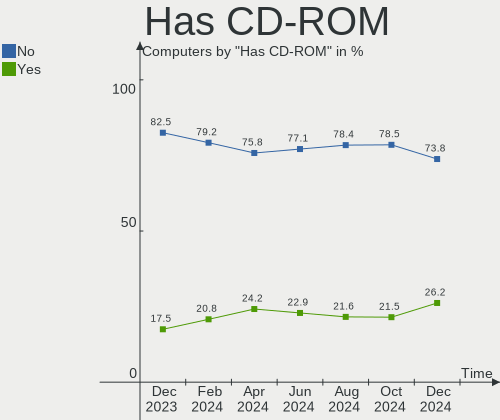
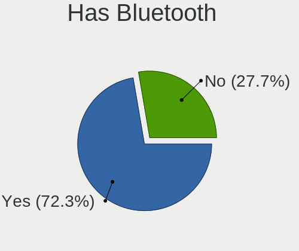
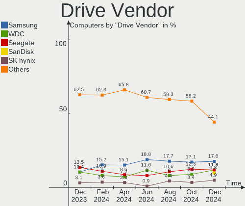
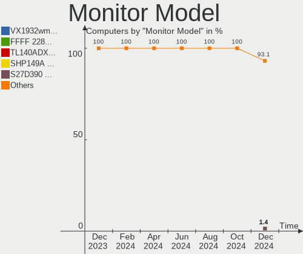
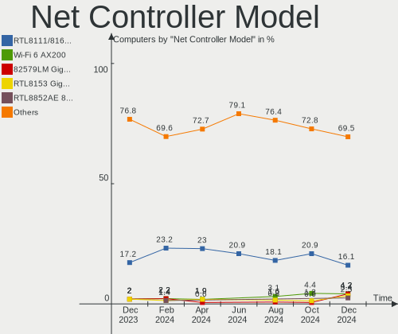

KDE neon Hardware Trends
------------------------

A project to identify most popular hardware characteristics and track their change
over time based on data collected by KDE neon users at https://Linux-Hardware.org.

Anyone can contribute to this report by the [hw-probe](https://github.com/linuxhw/hw-probe) tool:

    sudo -E hw-probe -all -upload

This is a report for all computer types. See also reports for [desktops](/Dist/KDE_neon/Desktop/README.md) and [notebooks](/Dist/KDE_neon/Notebook/README.md).

Full-feature report is available here: https://linux-hardware.org/?view=trends

Period: Aug, 2021.

Contents
--------

* [ System ](#system)
  - [ OS                       ](#os)
  - [ OS Family                ](#os-family)
  - [ Kernel                   ](#kernel)
  - [ Kernel Family            ](#kernel-family)
  - [ Kernel Major Ver.        ](#kernel-major-ver)
  - [ Arch                     ](#arch)
  - [ DE                       ](#de)
  - [ Display Server           ](#display-server)
  - [ Display Manager          ](#display-manager)
  - [ OS Lang                  ](#os-lang)
  - [ Boot Mode                ](#boot-mode)
  - [ Filesystem               ](#filesystem)
  - [ Part. scheme             ](#part-scheme)
  - [ Dual Boot with Linux/BSD ](#dual-boot-with-linuxbsd)
  - [ Dual Boot (Win)          ](#dual-boot-win)

* [ Board ](#board)
  - [ Vendor                   ](#vendor)
  - [ Model                    ](#model)
  - [ Model Family             ](#model-family)
  - [ MFG Year                 ](#mfg-year)
  - [ Form Factor              ](#form-factor)
  - [ Secure Boot              ](#secure-boot)
  - [ Coreboot                 ](#coreboot)
  - [ RAM Size                 ](#ram-size)
  - [ RAM Used                 ](#ram-used)
  - [ Total Drives             ](#total-drives)
  - [ Has CD-ROM               ](#has-cd-rom)
  - [ Has Ethernet             ](#has-ethernet)
  - [ Has WiFi                 ](#has-wifi)
  - [ Has Bluetooth            ](#has-bluetooth)

* [ Location ](#location)
  - [ Country                  ](#country)
  - [ City                     ](#city)

* [ Drives ](#drives)
  - [ Drive Vendor             ](#drive-vendor)
  - [ Drive Model              ](#drive-model)
  - [ HDD Vendor               ](#hdd-vendor)
  - [ SSD Vendor               ](#ssd-vendor)
  - [ Drive Kind               ](#drive-kind)
  - [ Drive Connector          ](#drive-connector)
  - [ Drive Size               ](#drive-size)
  - [ Space Total              ](#space-total)
  - [ Space Used               ](#space-used)
  - [ Malfunc. Drives          ](#malfunc-drives)
  - [ Malfunc. Drive Vendor    ](#malfunc-drive-vendor)
  - [ Malfunc. HDD Vendor      ](#malfunc-hdd-vendor)
  - [ Malfunc. Drive Kind      ](#malfunc-drive-kind)
  - [ Failed Drives            ](#failed-drives)
  - [ Failed Drive Vendor      ](#failed-drive-vendor)
  - [ Drive Status             ](#drive-status)

* [ Storage controller ](#storage-controller)
  - [ Storage Vendor           ](#storage-vendor)
  - [ Storage Model            ](#storage-model)
  - [ Storage Kind             ](#storage-kind)

* [ Processor ](#processor)
  - [ CPU Vendor               ](#cpu-vendor)
  - [ CPU Model                ](#cpu-model)
  - [ CPU Model Family         ](#cpu-model-family)
  - [ CPU Cores                ](#cpu-cores)
  - [ CPU Sockets              ](#cpu-sockets)
  - [ CPU Threads              ](#cpu-threads)
  - [ CPU Op-Modes             ](#cpu-op-modes)
  - [ CPU Microcode            ](#cpu-microcode)
  - [ CPU Microarch            ](#cpu-microarch)

* [ Graphics ](#graphics)
  - [ GPU Vendor               ](#gpu-vendor)
  - [ GPU Model                ](#gpu-model)
  - [ GPU Combo                ](#gpu-combo)
  - [ GPU Driver               ](#gpu-driver)
  - [ GPU Memory               ](#gpu-memory)

* [ Monitor ](#monitor)
  - [ Monitor Vendor           ](#monitor-vendor)
  - [ Monitor Model            ](#monitor-model)
  - [ Monitor Resolution       ](#monitor-resolution)
  - [ Monitor Diagonal         ](#monitor-diagonal)
  - [ Monitor Width            ](#monitor-width)
  - [ Aspect Ratio             ](#aspect-ratio)
  - [ Monitor Area             ](#monitor-area)
  - [ Pixel Density            ](#pixel-density)
  - [ Multiple Monitors        ](#multiple-monitors)

* [ Network ](#network)
  - [ Net Controller Vendor    ](#net-controller-vendor)
  - [ Net Controller Model     ](#net-controller-model)
  - [ Wireless Vendor          ](#wireless-vendor)
  - [ Wireless Model           ](#wireless-model)
  - [ Ethernet Vendor          ](#ethernet-vendor)
  - [ Ethernet Model           ](#ethernet-model)
  - [ Net Controller Kind      ](#net-controller-kind)
  - [ Used Controller          ](#used-controller)
  - [ NICs                     ](#nics)
  - [ IPv6                     ](#ipv6)

* [ Bluetooth ](#bluetooth)
  - [ Bluetooth Vendor         ](#bluetooth-vendor)
  - [ Bluetooth Model          ](#bluetooth-model)

* [ Sound ](#sound)
  - [ Sound Vendor             ](#sound-vendor)
  - [ Sound Model              ](#sound-model)

* [ Memory ](#memory)
  - [ Memory Vendor            ](#memory-vendor)
  - [ Memory Model             ](#memory-model)
  - [ Memory Kind              ](#memory-kind)
  - [ Memory Form Factor       ](#memory-form-factor)
  - [ Memory Size              ](#memory-size)
  - [ Memory Speed             ](#memory-speed)

* [ Printers & scanners ](#printers--scanners)
  - [ Printer Vendor           ](#printer-vendor)
  - [ Printer Model            ](#printer-model)
  - [ Scanner Vendor           ](#scanner-vendor)
  - [ Scanner Model            ](#scanner-model)

* [ Camera ](#camera)
  - [ Camera Vendor            ](#camera-vendor)
  - [ Camera Model             ](#camera-model)

* [ Security ](#security)
  - [ Fingerprint Vendor       ](#fingerprint-vendor)
  - [ Fingerprint Model        ](#fingerprint-model)
  - [ Chipcard Vendor          ](#chipcard-vendor)
  - [ Chipcard Model           ](#chipcard-model)

* [ Unsupported ](#unsupported)
  - [ Unsupported Devices      ](#unsupported-devices)
  - [ Unsupported Device Types ](#unsupported-device-types)

System
------

OS
--

Installed operating systems

| Name           | Computers | Percent |
|----------------|-----------|---------|
| KDE neon 20.04 | 130       | 100%    |

OS Family
---------

OS without a version

| Name     | Computers | Percent |
|----------|-----------|---------|
| KDE neon | 130       | 100%    |

Kernel
------

Version of the Linux kernel

| Version                    | Computers | Percent |
|----------------------------|-----------|---------|
| 5.11.0-25-generic          | 57        | 43.85%  |
| 5.11.0-27-generic          | 47        | 36.15%  |
| 5.8.0-63-generic           | 15        | 11.54%  |
| 5.4.0-74-generic           | 2         | 1.54%   |
| 5.4.0-72-generic           | 2         | 1.54%   |
| 5.8.0-59-generic           | 1         | 0.77%   |
| 5.4.0-80-lowlatency        | 1         | 0.77%   |
| 5.4.0-73-generic           | 1         | 0.77%   |
| 5.13.0-10.3-liquorix-amd64 | 1         | 0.77%   |
| 5.12.2-051202-generic      | 1         | 0.77%   |
| 5.11.10-051110-generic     | 1         | 0.77%   |
| 5.10.0-1038-oem            | 1         | 0.77%   |

Kernel Family
-------------

Linux kernel without a distro release

| Version | Computers | Percent |
|---------|-----------|---------|
| 5.11.0  | 104       | 80%     |
| 5.8.0   | 16        | 12.31%  |
| 5.4.0   | 6         | 4.62%   |
| 5.13.0  | 1         | 0.77%   |
| 5.12.2  | 1         | 0.77%   |
| 5.11.10 | 1         | 0.77%   |
| 5.10.0  | 1         | 0.77%   |

Kernel Major Ver.
-----------------

Linux kernel major version

| Version | Computers | Percent |
|---------|-----------|---------|
| 5.11    | 105       | 80.77%  |
| 5.8     | 16        | 12.31%  |
| 5.4     | 6         | 4.62%   |
| 5.13    | 1         | 0.77%   |
| 5.12    | 1         | 0.77%   |
| 5.10    | 1         | 0.77%   |

Arch
----

OS architecture (x86_64, i586, etc.)

| Name   | Computers | Percent |
|--------|-----------|---------|
| x86_64 | 130       | 100%    |

DE
--

Desktop Environment

| Name    | Computers | Percent |
|---------|-----------|---------|
| KDE     | 118       | 90.77%  |
| KDE5    | 7         | 5.38%   |
| Unknown | 5         | 3.85%   |

Display Server
--------------

X11 or Wayland

| Name    | Computers | Percent |
|---------|-----------|---------|
| X11     | 126       | 96.92%  |
| Wayland | 4         | 3.08%   |

Display Manager
---------------

SDDM, LightDM, etc.

| Name    | Computers | Percent |
|---------|-----------|---------|
| Unknown | 123       | 94.62%  |
| SDDM    | 7         | 5.38%   |

OS Lang
-------

Language

| Lang    | Computers | Percent |
|---------|-----------|---------|
| en_US   | 45        | 34.62%  |
| de_DE   | 13        | 10%     |
| ru_RU   | 11        | 8.46%   |
| en_GB   | 10        | 7.69%   |
| en_AU   | 5         | 3.85%   |
| C       | 5         | 3.85%   |
| pt_BR   | 4         | 3.08%   |
| fr_FR   | 4         | 3.08%   |
| es_ES   | 4         | 3.08%   |
| es_MX   | 3         | 2.31%   |
| en_ZA   | 3         | 2.31%   |
| en_IN   | 3         | 2.31%   |
| en_CA   | 3         | 2.31%   |
| ru_UA   | 2         | 1.54%   |
| lt_LT   | 2         | 1.54%   |
| it_IT   | 2         | 1.54%   |
| zh_TW   | 1         | 0.77%   |
| sv_SE   | 1         | 0.77%   |
| pl_PL   | 1         | 0.77%   |
| fr_CA   | 1         | 0.77%   |
| es_CU   | 1         | 0.77%   |
| es_CO   | 1         | 0.77%   |
| en_ZW   | 1         | 0.77%   |
| en_PH   | 1         | 0.77%   |
| el_GR   | 1         | 0.77%   |
| ca_ES   | 1         | 0.77%   |
| Unknown | 1         | 0.77%   |

Boot Mode
---------

EFI or BIOS

| Mode | Computers | Percent |
|------|-----------|---------|
| EFI  | 69        | 53.08%  |
| BIOS | 61        | 46.92%  |

Filesystem
----------

Type of filesystem

| Type    | Computers | Percent |
|---------|-----------|---------|
| Ext4    | 125       | 96.15%  |
| Btrfs   | 3         | 2.31%   |
| Overlay | 2         | 1.54%   |

Part. scheme
------------

Scheme of partitioning

| Type    | Computers | Percent |
|---------|-----------|---------|
| Unknown | 122       | 93.85%  |
| MBR     | 5         | 3.85%   |
| GPT     | 3         | 2.31%   |

Dual Boot with Linux/BSD
------------------------

Hosting more than one Linux/BSD

| Dual boot | Computers | Percent |
|-----------|-----------|---------|
| No        | 121       | 93.08%  |
| Yes       | 9         | 6.92%   |

Dual Boot (Win)
---------------

Hosting Linux and Windows

| Dual boot | Computers | Percent |
|-----------|-----------|---------|
| No        | 119       | 91.54%  |
| Yes       | 11        | 8.46%   |

Board
-----

Vendor
------

Motherboard manufacturer

| Name                | Computers | Percent |
|---------------------|-----------|---------|
| Dell                | 17        | 13.08%  |
| Hewlett-Packard     | 16        | 12.31%  |
| Lenovo              | 14        | 10.77%  |
| Gigabyte Technology | 13        | 10%     |
| ASUSTek Computer    | 12        | 9.23%   |
| MSI                 | 10        | 7.69%   |
| Acer                | 10        | 7.69%   |
| ASRock              | 5         | 3.85%   |
| Toshiba             | 4         | 3.08%   |
| Intel               | 4         | 3.08%   |
| Samsung Electronics | 3         | 2.31%   |
| Apple               | 3         | 2.31%   |
| Supermicro          | 2         | 1.54%   |
| Sony                | 2         | 1.54%   |
| Positivo            | 2         | 1.54%   |
| Fujitsu             | 2         | 1.54%   |
| Pegatron            | 1         | 0.77%   |
| Panasonic           | 1         | 0.77%   |
| Novatech            | 1         | 0.77%   |
| MOTILE              | 1         | 0.77%   |
| Monster             | 1         | 0.77%   |
| Medion              | 1         | 0.77%   |
| Jumper              | 1         | 0.77%   |
| HUAWEI              | 1         | 0.77%   |
| Gateway             | 1         | 0.77%   |
| Fujitsu Siemens     | 1         | 0.77%   |
| Foxconn             | 1         | 0.77%   |

Model
-----

Motherboard model

| Name                                                                                     | Computers | Percent |
|------------------------------------------------------------------------------------------|-----------|---------|
| MSI MS-7885                                                                              | 2         | 1.54%   |
| Dell Inspiron 1545                                                                       | 2         | 1.54%   |
| Apple MacBookAir7,2                                                                      | 2         | 1.54%   |
| Toshiba Satellite PRO L770-12Q                                                           | 1         | 0.77%   |
| Toshiba Satellite L740                                                                   | 1         | 0.77%   |
| Toshiba Satellite C55t-C                                                                 | 1         | 0.77%   |
| Toshiba Satellite C55-C                                                                  | 1         | 0.77%   |
| Supermicro H8QM8                                                                         | 1         | 0.77%   |
| Supermicro C2SBA                                                                         | 1         | 0.77%   |
| Sony VPCEA3S1E                                                                           | 1         | 0.77%   |
| Sony SVE1511P1EW                                                                         | 1         | 0.77%   |
| Samsung 700T                                                                             | 1         | 0.77%   |
| Samsung 355V4C/356V4C/3445VC/3545VC                                                      | 1         | 0.77%   |
| Samsung 355V4C/355V4X/355V5C/355V5X/356V4C/356V4X/356V5C/356V5X/3445VC/3445VX/3545VC/354 | 1         | 0.77%   |
| Positivo POS-EINM70CS                                                                    | 1         | 0.77%   |
| Positivo POS-EIH61CQ                                                                     | 1         | 0.77%   |
| Pegatron 9100                                                                            | 1         | 0.77%   |
| Panasonic CF-31-5                                                                        | 1         | 0.77%   |
| Novatech N15_17RD                                                                        | 1         | 0.77%   |
| MSI MS-7C95                                                                              | 1         | 0.77%   |
| MSI MS-7C88                                                                              | 1         | 0.77%   |
| MSI MS-7C82                                                                              | 1         | 0.77%   |
| MSI MS-7C81                                                                              | 1         | 0.77%   |
| MSI MS-7C52                                                                              | 1         | 0.77%   |
| MSI HPE-410fr                                                                            | 1         | 0.77%   |
| MSI GE70 2PL                                                                             | 1         | 0.77%   |
| MSI GE66 Raider 10UG                                                                     | 1         | 0.77%   |
| MOTILE M142                                                                              | 1         | 0.77%   |
| Monster TULPAR T7 V5.x                                                                   | 1         | 0.77%   |
| Medion Akoya E6424 MD99850                                                               | 1         | 0.77%   |
| Lenovo Yoga 7 14ITL5 82BH                                                                | 1         | 0.77%   |
| Lenovo XiaoXin-14API QC 2019 81UW                                                        | 1         | 0.77%   |
| Lenovo ThinkPad X230 2325SYU                                                             | 1         | 0.77%   |
| Lenovo ThinkPad T61 6464AS3                                                              | 1         | 0.77%   |
| Lenovo ThinkPad T470s W10DG 20JTS14R00                                                   | 1         | 0.77%   |
| Lenovo ThinkPad T440p 20AWA0MQ03                                                         | 1         | 0.77%   |
| Lenovo ThinkPad T420 4236NGG                                                             | 1         | 0.77%   |
| Lenovo IdeaPad S540-13ARE 82DL                                                           | 1         | 0.77%   |
| Lenovo IdeaPad 5 14ALC05 82LM                                                            | 1         | 0.77%   |
| Lenovo IdeaPad 330S-15ARR 81FB                                                           | 1         | 0.77%   |
| Lenovo IdeaCentre 300S-11IBR 90DQ004GUS                                                  | 1         | 0.77%   |
| Lenovo G580 2189                                                                         | 1         | 0.77%   |
| Lenovo G40-30 80FY                                                                       | 1         | 0.77%   |
| Lenovo B51-80 80LM                                                                       | 1         | 0.77%   |
| Jumper EZbook                                                                            | 1         | 0.77%   |
| Intel X99 V1.0                                                                           | 1         | 0.77%   |
| Intel NUC7i7DNKE                                                                         | 1         | 0.77%   |
| Intel DH61WW AAG23116-300                                                                | 1         | 0.77%   |
| Intel DB75EN AAG39650-303                                                                | 1         | 0.77%   |
| HUAWEI BOHK-WAX9X                                                                        | 1         | 0.77%   |
| HP Z420 Workstation                                                                      | 1         | 0.77%   |
| HP Stream Laptop 11-aj0xxx                                                               | 1         | 0.77%   |
| HP ProBook 645 G1                                                                        | 1         | 0.77%   |
| HP ProBook 430 G7                                                                        | 1         | 0.77%   |
| HP Pavilion Laptop 15-cw1xxx                                                             | 1         | 0.77%   |
| HP Notebook                                                                              | 1         | 0.77%   |
| HP Laptop 14s-fq0xxx                                                                     | 1         | 0.77%   |
| HP Laptop 14-ck0xxx                                                                      | 1         | 0.77%   |
| HP EliteDesk 800 G2 DM 65W                                                               | 1         | 0.77%   |
| HP EliteBook 8460p                                                                       | 1         | 0.77%   |

Model Family
------------

Motherboard model prefix

| Name                  | Computers | Percent |
|-----------------------|-----------|---------|
| Acer Aspire           | 7         | 5.38%   |
| Lenovo ThinkPad       | 5         | 3.85%   |
| HP Compaq             | 5         | 3.85%   |
| Dell Latitude         | 5         | 3.85%   |
| Dell Inspiron         | 5         | 3.85%   |
| Toshiba Satellite     | 4         | 3.08%   |
| Lenovo IdeaPad        | 3         | 2.31%   |
| Samsung 355V4C        | 2         | 1.54%   |
| MSI MS-7885           | 2         | 1.54%   |
| HP ProBook            | 2         | 1.54%   |
| HP Laptop             | 2         | 1.54%   |
| Dell Precision        | 2         | 1.54%   |
| Dell OptiPlex         | 2         | 1.54%   |
| Apple MacBookAir7     | 2         | 1.54%   |
| Acer Swift            | 2         | 1.54%   |
| Supermicro H8QM8      | 1         | 0.77%   |
| Supermicro C2SBA      | 1         | 0.77%   |
| Sony VPCEA3S1E        | 1         | 0.77%   |
| Sony SVE1511P1EW      | 1         | 0.77%   |
| Samsung 700T          | 1         | 0.77%   |
| Positivo POS-EINM70CS | 1         | 0.77%   |
| Positivo POS-EIH61CQ  | 1         | 0.77%   |
| Pegatron 9100         | 1         | 0.77%   |
| Panasonic CF-31-5     | 1         | 0.77%   |
| Novatech N15          | 1         | 0.77%   |
| MSI MS-7C95           | 1         | 0.77%   |
| MSI MS-7C88           | 1         | 0.77%   |
| MSI MS-7C82           | 1         | 0.77%   |
| MSI MS-7C81           | 1         | 0.77%   |
| MSI MS-7C52           | 1         | 0.77%   |
| MSI HPE-410fr         | 1         | 0.77%   |
| MSI GE70              | 1         | 0.77%   |
| MSI GE66              | 1         | 0.77%   |
| MOTILE M142           | 1         | 0.77%   |
| Monster TULPAR        | 1         | 0.77%   |
| Medion Akoya          | 1         | 0.77%   |
| Lenovo Yoga           | 1         | 0.77%   |
| Lenovo XiaoXin-14API  | 1         | 0.77%   |
| Lenovo IdeaCentre     | 1         | 0.77%   |
| Lenovo G580           | 1         | 0.77%   |
| Lenovo G40-30         | 1         | 0.77%   |
| Lenovo B51-80         | 1         | 0.77%   |
| Jumper EZbook         | 1         | 0.77%   |
| Intel X99             | 1         | 0.77%   |
| Intel NUC7i7DNKE      | 1         | 0.77%   |
| Intel DH61WW          | 1         | 0.77%   |
| Intel DB75EN          | 1         | 0.77%   |
| HUAWEI BOHK-WAX9X     | 1         | 0.77%   |
| HP Z420               | 1         | 0.77%   |
| HP Stream             | 1         | 0.77%   |
| HP Pavilion           | 1         | 0.77%   |
| HP Notebook           | 1         | 0.77%   |
| HP EliteDesk          | 1         | 0.77%   |
| HP EliteBook          | 1         | 0.77%   |
| Gigabyte Z77-DS3H     | 1         | 0.77%   |
| Gigabyte Z77-D3H      | 1         | 0.77%   |
| Gigabyte Z390         | 1         | 0.77%   |
| Gigabyte X570         | 1         | 0.77%   |
| Gigabyte H97-HD3      | 1         | 0.77%   |
| Gigabyte H110M-H      | 1         | 0.77%   |

MFG Year
--------

Motherboard manufacture year

| Year | Computers | Percent |
|------|-----------|---------|
| 2020 | 21        | 16.15%  |
| 2021 | 15        | 11.54%  |
| 2015 | 15        | 11.54%  |
| 2019 | 14        | 10.77%  |
| 2013 | 11        | 8.46%   |
| 2010 | 9         | 6.92%   |
| 2012 | 8         | 6.15%   |
| 2018 | 7         | 5.38%   |
| 2017 | 6         | 4.62%   |
| 2014 | 5         | 3.85%   |
| 2009 | 5         | 3.85%   |
| 2011 | 4         | 3.08%   |
| 2008 | 4         | 3.08%   |
| 2016 | 3         | 2.31%   |
| 2007 | 3         | 2.31%   |

Form Factor
-----------

Physical design of the computer

| Name        | Computers | Percent |
|-------------|-----------|---------|
| Notebook    | 69        | 53.08%  |
| Desktop     | 56        | 43.08%  |
| Convertible | 2         | 1.54%   |
| Mini pc     | 2         | 1.54%   |
| Server      | 1         | 0.77%   |

Secure Boot
-----------

Enabled or disabled

| State    | Computers | Percent |
|----------|-----------|---------|
| Disabled | 121       | 93.08%  |
| Enabled  | 9         | 6.92%   |

Coreboot
--------

Have coreboot on board

| Used | Computers | Percent |
|------|-----------|---------|
| No   | 130       | 100%    |

RAM Size
--------

Total RAM memory

| Size in GB | Computers | Percent |
|------------|-----------|---------|
| 4.01-8.0   | 33        | 25.38%  |
| 3.01-4.0   | 30        | 23.08%  |
| 8.01-16.0  | 25        | 19.23%  |
| 16.01-24.0 | 19        | 14.62%  |
| 32.01-64.0 | 16        | 12.31%  |
| 24.01-32.0 | 3         | 2.31%   |
| 1.01-2.0   | 2         | 1.54%   |
| 2.01-3.0   | 1         | 0.77%   |
| Unknown    | 1         | 0.77%   |

RAM Used
--------

Used RAM memory

| Used GB    | Computers | Percent |
|------------|-----------|---------|
| 1.01-2.0   | 64        | 49.23%  |
| 2.01-3.0   | 35        | 26.92%  |
| 0.51-1.0   | 15        | 11.54%  |
| 4.01-8.0   | 7         | 5.38%   |
| 3.01-4.0   | 5         | 3.85%   |
| 8.01-16.0  | 2         | 1.54%   |
| 16.01-24.0 | 1         | 0.77%   |
| Unknown    | 1         | 0.77%   |

Total Drives
------------

Number of drives on board

| Drives | Computers | Percent |
|--------|-----------|---------|
| 1      | 77        | 59.23%  |
| 2      | 35        | 26.92%  |
| 3      | 8         | 6.15%   |
| 7      | 5         | 3.85%   |
| 5      | 3         | 2.31%   |
| 4      | 2         | 1.54%   |

Has CD-ROM
----------

Has CD-ROM on board

| Presented | Computers | Percent |
|-----------|-----------|---------|
| No        | 77        | 59.23%  |
| Yes       | 53        | 40.77%  |

Has Ethernet
------------

Has Ethernet on board

| Presented | Computers | Percent |
|-----------|-----------|---------|
| Yes       | 118       | 90.77%  |
| No        | 12        | 9.23%   |

Has WiFi
--------

Has WiFi module

| Presented | Computers | Percent |
|-----------|-----------|---------|
| Yes       | 93        | 71.54%  |
| No        | 37        | 28.46%  |

Has Bluetooth
-------------

Has Bluetooth module

| Presented | Computers | Percent |
|-----------|-----------|---------|
| Yes       | 82        | 63.08%  |
| No        | 48        | 36.92%  |

Location
--------

Country
-------

Geographic location (country)

| Country      | Computers | Percent |
|--------------|-----------|---------|
| USA          | 27        | 20.77%  |
| Russia       | 12        | 9.23%   |
| Germany      | 12        | 9.23%   |
| UK           | 6         | 4.62%   |
| Poland       | 6         | 4.62%   |
| Canada       | 6         | 4.62%   |
| Spain        | 5         | 3.85%   |
| Brazil       | 5         | 3.85%   |
| Australia    | 5         | 3.85%   |
| Ukraine      | 4         | 3.08%   |
| Mexico       | 4         | 3.08%   |
| France       | 4         | 3.08%   |
| Sweden       | 3         | 2.31%   |
| South Africa | 3         | 2.31%   |
| Italy        | 3         | 2.31%   |
| India        | 3         | 2.31%   |
| Turkey       | 2         | 1.54%   |
| Malaysia     | 2         | 1.54%   |
| Lithuania    | 2         | 1.54%   |
| Hong Kong    | 2         | 1.54%   |
| Argentina    | 2         | 1.54%   |
| Zimbabwe     | 1         | 0.77%   |
| Switzerland  | 1         | 0.77%   |
| Sri Lanka    | 1         | 0.77%   |
| Philippines  | 1         | 0.77%   |
| Morocco      | 1         | 0.77%   |
| Greece       | 1         | 0.77%   |
| Cuba         | 1         | 0.77%   |
| Colombia     | 1         | 0.77%   |
| Belize       | 1         | 0.77%   |
| Belgium      | 1         | 0.77%   |
| Austria      | 1         | 0.77%   |
| Algeria      | 1         | 0.77%   |

City
----

Geographic location (city)

| City                   | Computers | Percent |
|------------------------|-----------|---------|
| Moscow                 | 3         | 2.31%   |
| Warsaw                 | 2         | 1.54%   |
| Sydney                 | 2         | 1.54%   |
| New York               | 2         | 1.54%   |
| Manorville             | 2         | 1.54%   |
| Kyiv                   | 2         | 1.54%   |
| Central                | 2         | 1.54%   |
| Brisbane               | 2         | 1.54%   |
| Xalapa                 | 1         | 0.77%   |
| Wroclaw                | 1         | 0.77%   |
| Williamsport           | 1         | 0.77%   |
| Vilnius                | 1         | 0.77%   |
| Vienna                 | 1         | 0.77%   |
| Verbania               | 1         | 0.77%   |
| Udine                  | 1         | 0.77%   |
| Tucson                 | 1         | 0.77%   |
| Torre??n               | 1         | 0.77%   |
| Toronto                | 1         | 0.77%   |
| Tence                  | 1         | 0.77%   |
| Sych?«vka              | 1         | 0.77%   |
| Swindon                | 1         | 0.77%   |
| Summerland             | 1         | 0.77%   |
| Strongsville           | 1         | 0.77%   |
| St Petersburg          | 1         | 0.77%   |
| Solingen               | 1         | 0.77%   |
| Simferopol             | 1         | 0.77%   |
| Selma                  | 1         | 0.77%   |
| S??o Paulo             | 1         | 0.77%   |
| S??o Bernardo do Campo | 1         | 0.77%   |
| Sankt Ingbert          | 1         | 0.77%   |
| San Pedro              | 1         | 0.77%   |
| Salobre?±a             | 1         | 0.77%   |
| Round Rock             | 1         | 0.77%   |
| Rostov-on-Don          | 1         | 0.77%   |
| Ronnenberg             | 1         | 0.77%   |
| Roanoke                | 1         | 0.77%   |
| Richmond               | 1         | 0.77%   |
| Puebla City            | 1         | 0.77%   |
| Plymouth               | 1         | 0.77%   |
| Petershagen            | 1         | 0.77%   |
| Petaling Jaya          | 1         | 0.77%   |
| Passo Fundo            | 1         | 0.77%   |
| Panama City            | 1         | 0.77%   |
| Oxie                   | 1         | 0.77%   |
| Omaha                  | 1         | 0.77%   |
| Novosibirsk            | 1         | 0.77%   |
| Norwich                | 1         | 0.77%   |
| Northeim               | 1         | 0.77%   |
| North Port             | 1         | 0.77%   |
| Noginsk                | 1         | 0.77%   |
| Nichelino              | 1         | 0.77%   |
| Newmarket              | 1         | 0.77%   |
| Nanterre               | 1         | 0.77%   |
| Muriyakadawala         | 1         | 0.77%   |
| Mont-Tremblant         | 1         | 0.77%   |
| Mons                   | 1         | 0.77%   |
| Michigan City          | 1         | 0.77%   |
| Marrakesh              | 1         | 0.77%   |
| Mar del Plata          | 1         | 0.77%   |
| Maidenhead             | 1         | 0.77%   |

Drives
------

Drive Vendor
------------

Hard drive vendors

| Vendor                  | Computers | Drives | Percent |
|-------------------------|-----------|--------|---------|
| Samsung Electronics     | 32        | 38     | 17.11%  |
| WDC                     | 29        | 41     | 15.51%  |
| Seagate                 | 23        | 36     | 12.3%   |
| SanDisk                 | 17        | 20     | 9.09%   |
| Toshiba                 | 15        | 16     | 8.02%   |
| Kingston                | 15        | 16     | 8.02%   |
| Hitachi                 | 7         | 7      | 3.74%   |
| Unknown                 | 6         | 7      | 3.21%   |
| Crucial                 | 6         | 6      | 3.21%   |
| Intel                   | 4         | 4      | 2.14%   |
| HGST                    | 3         | 3      | 1.6%    |
| GOODRAM                 | 3         | 3      | 1.6%    |
| Union Memory (Shenzhen) | 2         | 2      | 1.07%   |
| Micron Technology       | 2         | 2      | 1.07%   |
| Apple                   | 2         | 2      | 1.07%   |
| A-DATA Technology       | 2         | 2      | 1.07%   |
| ZTC                     | 1         | 1      | 0.53%   |
| XPG                     | 1         | 1      | 0.53%   |
| TCSUNBOW                | 1         | 1      | 0.53%   |
| SPCC                    | 1         | 1      | 0.53%   |
| Smartbuy                | 1         | 1      | 0.53%   |
| SK Hynix                | 1         | 1      | 0.53%   |
| Silicon Motion          | 1         | 1      | 0.53%   |
| RSH                     | 1         | 1      | 0.53%   |
| LITEON                  | 1         | 1      | 0.53%   |
| Lite-On                 | 1         | 1      | 0.53%   |
| Lexar                   | 1         | 1      | 0.53%   |
| KingSpec                | 1         | 1      | 0.53%   |
| Intenso                 | 1         | 1      | 0.53%   |
| Hewlett-Packard         | 1         | 1      | 0.53%   |
| Gigabyte Technology     | 1         | 2      | 0.53%   |
| China                   | 1         | 1      | 0.53%   |
| BIWIN                   | 1         | 1      | 0.53%   |
| ASMT                    | 1         | 1      | 0.53%   |
| ADATA Technology        | 1         | 1      | 0.53%   |

Drive Model
-----------

Hard drive models

| Model                                        | Computers | Percent |
|----------------------------------------------|-----------|---------|
| Toshiba MQ01ABD100 1TB                       | 4         | 1.9%    |
| Sandisk NVMe SSD Drive 500GB                 | 4         | 1.9%    |
| Seagate ST1000DM010-2EP102 1TB               | 3         | 1.43%   |
| Samsung SSD 860 EVO 1TB                      | 3         | 1.43%   |
| Samsung NVMe SSD Drive 500GB                 | 3         | 1.43%   |
| Kingston SA400S37240G 240GB SSD              | 3         | 1.43%   |
| Crucial CT500MX500SSD1 500GB                 | 3         | 1.43%   |
| WDC WD40EZRZ-00GXCB0 4TB                     | 2         | 0.95%   |
| Unknown SD/MMC/MS PRO 128GB                  | 2         | 0.95%   |
| Union Memory (Shenzhen) NVMe SSD Drive 512GB | 2         | 0.95%   |
| Toshiba HDWD110 1TB                          | 2         | 0.95%   |
| Seagate ST500DM002-1BD142 500GB              | 2         | 0.95%   |
| Seagate ST3500413AS 500GB                    | 2         | 0.95%   |
| Seagate ST31000528AS 1TB                     | 2         | 0.95%   |
| Seagate ST2000DM008-2FR102 2TB               | 2         | 0.95%   |
| Seagate ST1000LM035-1RK172 1TB               | 2         | 0.95%   |
| SanDisk SSD PLUS 480GB                       | 2         | 0.95%   |
| SanDisk SDSSDA240G 240GB                     | 2         | 0.95%   |
| SanDisk SDSSDA120G 120GB                     | 2         | 0.95%   |
| Sandisk NVMe SSD Drive 1TB                   | 2         | 0.95%   |
| Samsung SSD SM841 2.5 7mm 256GB              | 2         | 0.95%   |
| Samsung SSD 870 QVO 1TB                      | 2         | 0.95%   |
| Samsung SSD 860 EVO 500GB                    | 2         | 0.95%   |
| Samsung SSD 850 EVO 500GB                    | 2         | 0.95%   |
| Samsung SSD 830 Series 128GB                 | 2         | 0.95%   |
| Samsung NVMe SSD Drive 256GB                 | 2         | 0.95%   |
| Samsung NVMe SSD Drive 1TB                   | 2         | 0.95%   |
| Kingston SV300S37A120G 120GB SSD             | 2         | 0.95%   |
| Kingston SA400S37480G 480GB SSD              | 2         | 0.95%   |
| Kingston NVMe SSD Drive 512GB                | 2         | 0.95%   |
| Kingston NVMe SSD Drive 500GB                | 2         | 0.95%   |
| HGST HTS545050A7E680 500GB                   | 2         | 0.95%   |
| ZTC SM201-256G                               | 1         | 0.48%   |
| XPG NVMe SSD Drive 512GB                     | 1         | 0.48%   |
| WDC WDS500G2B0B-00YS70 500GB SSD             | 1         | 0.48%   |
| WDC WDS500G2B0A-00SM50 500GB SSD             | 1         | 0.48%   |
| WDC WD800JD-75MSA3 80GB                      | 1         | 0.48%   |
| WDC WD5001FZWX-00ZHUA0 5TB                   | 1         | 0.48%   |
| WDC WD5000LPVX-22V0TT0 500GB                 | 1         | 0.48%   |
| WDC WD5000LPCX-21VHAT0 500GB                 | 1         | 0.48%   |
| WDC WD5000AAKX-00ERMA0 500GB                 | 1         | 0.48%   |
| WDC WD5000AAKX-001CA0 500GB                  | 1         | 0.48%   |
| WDC WD5000AAKS-00YGA0 500GB                  | 1         | 0.48%   |
| WDC WD5000AAKS-00E4A0 500GB                  | 1         | 0.48%   |
| WDC WD40EZRZ-75GXCB0 4TB                     | 1         | 0.48%   |
| WDC WD40EZRZ-00WN9B0 4TB                     | 1         | 0.48%   |
| WDC WD40EFRX-68N32N0 4TB                     | 1         | 0.48%   |
| WDC WD4003FZEX-00Z4SA0 4TB                   | 1         | 0.48%   |
| WDC WD3200BPVT-22JJ5T0 320GB                 | 1         | 0.48%   |
| WDC WD3200AAKS-75VYA0 320GB                  | 1         | 0.48%   |
| WDC WD3000HLFS-01G6U4 304GB                  | 1         | 0.48%   |
| WDC WD2500AAKX-07U6AA1 250GB                 | 1         | 0.48%   |
| WDC WD20EZRZ-00Z5HB0 2TB                     | 1         | 0.48%   |
| WDC WD2003FZEX-00Z4SA0 2TB                   | 1         | 0.48%   |
| WDC WD2003FYPS-27Y2B0 2TB                    | 1         | 0.48%   |
| WDC WD10SPZX-24Z10T0 1TB                     | 1         | 0.48%   |
| WDC WD10SPZX-21Z10T0 1TB                     | 1         | 0.48%   |
| WDC WD10SPCX-60KHST0 1TB                     | 1         | 0.48%   |
| WDC WD10SPCX-00HWST0 1TB                     | 1         | 0.48%   |
| WDC WD10JPVX-60JC3T0 1TB                     | 1         | 0.48%   |

HDD Vendor
----------

Hard disk drive vendors

| Vendor              | Computers | Drives | Percent |
|---------------------|-----------|--------|---------|
| WDC                 | 26        | 38     | 34.67%  |
| Seagate             | 23        | 36     | 30.67%  |
| Toshiba             | 14        | 15     | 18.67%  |
| Hitachi             | 7         | 7      | 9.33%   |
| HGST                | 3         | 3      | 4%      |
| Samsung Electronics | 2         | 2      | 2.67%   |

SSD Vendor
----------

Solid state drive vendors

| Vendor              | Computers | Drives | Percent |
|---------------------|-----------|--------|---------|
| Samsung Electronics | 23        | 26     | 30.67%  |
| Kingston            | 10        | 10     | 13.33%  |
| SanDisk             | 9         | 11     | 12%     |
| Crucial             | 6         | 6      | 8%      |
| GOODRAM             | 3         | 3      | 4%      |
| WDC                 | 2         | 2      | 2.67%   |
| Micron Technology   | 2         | 2      | 2.67%   |
| Intel               | 2         | 2      | 2.67%   |
| Apple               | 2         | 2      | 2.67%   |
| A-DATA Technology   | 2         | 2      | 2.67%   |
| ZTC                 | 1         | 1      | 1.33%   |
| Unknown             | 1         | 1      | 1.33%   |
| Toshiba             | 1         | 1      | 1.33%   |
| TCSUNBOW            | 1         | 1      | 1.33%   |
| SPCC                | 1         | 1      | 1.33%   |
| Smartbuy            | 1         | 1      | 1.33%   |
| LITEON              | 1         | 1      | 1.33%   |
| Lexar               | 1         | 1      | 1.33%   |
| KingSpec            | 1         | 1      | 1.33%   |
| Intenso             | 1         | 1      | 1.33%   |
| Hewlett-Packard     | 1         | 1      | 1.33%   |
| China               | 1         | 1      | 1.33%   |
| BIWIN               | 1         | 1      | 1.33%   |
| ASMT                | 1         | 1      | 1.33%   |

Drive Kind
----------

HDD or SSD

| Kind    | Computers | Drives | Percent |
|---------|-----------|--------|---------|
| SSD     | 70        | 80     | 39.55%  |
| HDD     | 66        | 101    | 37.29%  |
| NVMe    | 34        | 37     | 19.21%  |
| MMC     | 4         | 4      | 2.26%   |
| Unknown | 3         | 3      | 1.69%   |

Drive Connector
---------------

SATA, SAS, NVMe, etc.

| Type | Computers | Drives | Percent |
|------|-----------|--------|---------|
| SATA | 113       | 175    | 70.63%  |
| NVMe | 34        | 37     | 21.25%  |
| SAS  | 9         | 9      | 5.63%   |
| MMC  | 4         | 4      | 2.5%    |

Drive Size
----------

Size of hard drive

| Size in TB | Computers | Drives | Percent |
|------------|-----------|--------|---------|
| 0.01-0.5   | 85        | 106    | 61.15%  |
| 0.51-1.0   | 37        | 51     | 26.62%  |
| 1.01-2.0   | 7         | 8      | 5.04%   |
| 3.01-4.0   | 6         | 10     | 4.32%   |
| 2.01-3.0   | 2         | 3      | 1.44%   |
| 4.01-10.0  | 2         | 3      | 1.44%   |

Space Total
-----------

Amount of disk space available on the file system

| Size in GB     | Computers | Percent |
|----------------|-----------|---------|
| 101-250        | 42        | 32.31%  |
| 251-500        | 27        | 20.77%  |
| 501-1000       | 19        | 14.62%  |
| 51-100         | 9         | 6.92%   |
| More than 3000 | 8         | 6.15%   |
| 21-50          | 8         | 6.15%   |
| 1001-2000      | 8         | 6.15%   |
| 1-20           | 6         | 4.62%   |
| Unknown        | 3         | 2.31%   |

Space Used
----------

Amount of used disk space

| Used GB        | Computers | Percent |
|----------------|-----------|---------|
| 1-20           | 67        | 51.54%  |
| 21-50          | 25        | 19.23%  |
| 101-250        | 13        | 10%     |
| 51-100         | 7         | 5.38%   |
| 1001-2000      | 5         | 3.85%   |
| 251-500        | 4         | 3.08%   |
| More than 3000 | 3         | 2.31%   |
| Unknown        | 3         | 2.31%   |
| 501-1000       | 2         | 1.54%   |
| 2001-3000      | 1         | 0.77%   |

Malfunc. Drives
---------------

Drive models with a malfunction

| Model                         | Computers | Drives | Percent |
|-------------------------------|-----------|--------|---------|
| Hitachi HTS542512K9SA00 120GB | 1         | 1      | 50%     |
| Hitachi HDS721616PLA380 160GB | 1         | 1      | 50%     |

Malfunc. Drive Vendor
---------------------

Vendors of faulty drives

| Vendor  | Computers | Drives | Percent |
|---------|-----------|--------|---------|
| Hitachi | 2         | 2      | 100%    |

Malfunc. HDD Vendor
-------------------

Vendors of faulty HDD drives

| Vendor  | Computers | Drives | Percent |
|---------|-----------|--------|---------|
| Hitachi | 2         | 2      | 100%    |

Malfunc. Drive Kind
-------------------

Kinds of faulty drives

| Kind | Computers | Drives | Percent |
|------|-----------|--------|---------|
| HDD  | 2         | 2      | 100%    |

Failed Drives
-------------

Failed drive models

Zero info for selected period =(

Failed Drive Vendor
-------------------

Failed drive vendors

Zero info for selected period =(

Drive Status
------------

Number of failed and malfunc. drives

| Status   | Computers | Drives | Percent |
|----------|-----------|--------|---------|
| Detected | 122       | 206    | 91.04%  |
| Works    | 10        | 17     | 7.46%   |
| Malfunc  | 2         | 2      | 1.49%   |

Storage controller
------------------

Storage Vendor
--------------

Storage controller vendors

| Vendor                        | Computers | Percent |
|-------------------------------|-----------|---------|
| Intel                         | 91        | 54.82%  |
| AMD                           | 29        | 17.47%  |
| Samsung Electronics           | 12        | 7.23%   |
| Sandisk                       | 9         | 5.42%   |
| Kingston Technology Company   | 5         | 3.01%   |
| JMicron Technology            | 4         | 2.41%   |
| ASMedia Technology            | 3         | 1.81%   |
| Union Memory (Shenzhen)       | 2         | 1.2%    |
| Nvidia                        | 2         | 1.2%    |
| ADATA Technology              | 2         | 1.2%    |
| SK Hynix                      | 1         | 0.6%    |
| Silicon Motion                | 1         | 0.6%    |
| Silicon Image                 | 1         | 0.6%    |
| Phison Electronics            | 1         | 0.6%    |
| Lite-On Technology            | 1         | 0.6%    |
| Integrated Technology Express | 1         | 0.6%    |
| Broadcom / LSI                | 1         | 0.6%    |

Storage Model
-------------

Storage controller models

| Model                                                                          | Computers | Percent |
|--------------------------------------------------------------------------------|-----------|---------|
| AMD FCH SATA Controller [AHCI mode]                                            | 21        | 10.88%  |
| Intel Sunrise Point-LP SATA Controller [AHCI mode]                             | 8         | 4.15%   |
| Intel 82801 Mobile SATA Controller [RAID mode]                                 | 8         | 4.15%   |
| Intel 7 Series Chipset Family 6-port SATA Controller [AHCI mode]               | 6         | 3.11%   |
| Intel 6 Series/C200 Series Chipset Family 6 port Mobile SATA AHCI Controller   | 6         | 3.11%   |
| Intel 6 Series/C200 Series Chipset Family 6 port Desktop SATA AHCI Controller  | 5         | 2.59%   |
| Sandisk WD Black SN750 / PC SN730 NVMe SSD                                     | 4         | 2.07%   |
| Samsung NVMe SSD Controller SM981/PM981/PM983                                  | 4         | 2.07%   |
| Intel Q170/Q150/B150/H170/H110/Z170/CM236 Chipset SATA Controller [AHCI Mode]  | 4         | 2.07%   |
| Intel 8 Series/C220 Series Chipset Family 6-port SATA Controller 1 [AHCI mode] | 4         | 2.07%   |
| Samsung NVMe SSD Controller SM961/PM961/SM963                                  | 3         | 1.55%   |
| Intel Wildcat Point-LP SATA Controller [AHCI Mode]                             | 3         | 1.55%   |
| Intel Volume Management Device NVMe RAID Controller                            | 3         | 1.55%   |
| Intel Cannon Lake PCH SATA AHCI Controller                                     | 3         | 1.55%   |
| Intel Atom Processor E3800 Series SATA AHCI Controller                         | 3         | 1.55%   |
| Intel 82801IBM/IEM (ICH9M/ICH9M-E) 4 port SATA Controller [AHCI mode]          | 3         | 1.55%   |
| Intel 82801HM/HEM (ICH8M/ICH8M-E) SATA Controller [AHCI mode]                  | 3         | 1.55%   |
| Intel 82801HM/HEM (ICH8M/ICH8M-E) IDE Controller                               | 3         | 1.55%   |
| Intel 7 Series/C210 Series Chipset Family 6-port SATA Controller [AHCI mode]   | 3         | 1.55%   |
| Intel 400 Series Chipset Family SATA AHCI Controller                           | 3         | 1.55%   |
| ASMedia ASM1062 Serial ATA Controller                                          | 3         | 1.55%   |
| AMD SB7x0/SB8x0/SB9x0 SATA Controller [AHCI mode]                              | 3         | 1.55%   |
| AMD FCH SATA Controller D                                                      | 3         | 1.55%   |
| AMD 400 Series Chipset SATA Controller                                         | 3         | 1.55%   |
| Union Memory (Shenzhen) Non-Volatile memory controller                         | 2         | 1.04%   |
| Sandisk WD Blue SN550 NVMe SSD                                                 | 2         | 1.04%   |
| Sandisk WD Blue SN500 / PC SN520 NVMe SSD                                      | 2         | 1.04%   |
| Samsung Electronics SATA controller                                            | 2         | 1.04%   |
| Kingston Company U-SNS8154P3 NVMe SSD                                          | 2         | 1.04%   |
| Kingston Company A2000 NVMe SSD                                                | 2         | 1.04%   |
| JMicron JMB363 SATA/IDE Controller                                             | 2         | 1.04%   |
| Intel 82Q35 Express PT IDER Controller                                         | 2         | 1.04%   |
| Intel 82801JI (ICH10 Family) SATA AHCI Controller                              | 2         | 1.04%   |
| Intel 82801IR/IO/IH (ICH9R/DO/DH) 6 port SATA Controller [AHCI mode]           | 2         | 1.04%   |
| Intel 82801IR/IO/IH (ICH9R/DO/DH) 4 port SATA Controller [IDE mode]            | 2         | 1.04%   |
| Intel 82801I (ICH9 Family) 2 port SATA Controller [IDE mode]                   | 2         | 1.04%   |
| AMD SB7x0/SB8x0/SB9x0 IDE Controller                                           | 2         | 1.04%   |
| AMD FCH SATA Controller [IDE mode]                                             | 2         | 1.04%   |
| SK Hynix BC501 NVMe Solid State Drive                                          | 1         | 0.52%   |
| Silicon Motion SM2263EN/SM2263XT SSD Controller                                | 1         | 0.52%   |
| Silicon Image PCI0680 Ultra ATA-133 Host Controller                            | 1         | 0.52%   |
| Sandisk WD Black 2018/SN750 / PC SN720 NVMe SSD                                | 1         | 0.52%   |
| Samsung NVMe SSD Controller SM951/PM951                                        | 1         | 0.52%   |
| Samsung NVMe SSD Controller PM9A1/PM9A3/980PRO                                 | 1         | 0.52%   |
| Samsung NVMe Controller                                                        | 1         | 0.52%   |
| Phison E16 PCIe4 NVMe Controller                                               | 1         | 0.52%   |
| Nvidia MCP79 AHCI Controller                                                   | 1         | 0.52%   |
| Nvidia MCP55 SATA Controller                                                   | 1         | 0.52%   |
| Nvidia MCP55 IDE                                                               | 1         | 0.52%   |
| Lite-On Non-Volatile memory controller                                         | 1         | 0.52%   |
| Kingston Company Company Non-Volatile memory controller                        | 1         | 0.52%   |
| JMicron JMB368 IDE controller                                                  | 1         | 0.52%   |
| JMicron JMB360 AHCI Controller                                                 | 1         | 0.52%   |
| Intel Tiger Lake-LP SATA Controller [AHCI mode]                                | 1         | 0.52%   |
| Intel SSD Pro 7600p/760p/E 6100p Series                                        | 1         | 0.52%   |
| Intel SSD 660P Series                                                          | 1         | 0.52%   |
| Intel SATA Controller [RAID mode]                                              | 1         | 0.52%   |
| Intel NM10/ICH7 Family SATA Controller [AHCI mode]                             | 1         | 0.52%   |
| Intel HM170/QM170 Chipset SATA Controller [AHCI Mode]                          | 1         | 0.52%   |
| Intel Comet Lake SATA AHCI Controller                                          | 1         | 0.52%   |

Storage Kind
------------

Kind of storage controller (IDE, SATA, NVMe, SAS, ...)

| Kind | Computers | Percent |
|------|-----------|---------|
| SATA | 106       | 61.27%  |
| NVMe | 34        | 19.65%  |
| IDE  | 17        | 9.83%   |
| RAID | 15        | 8.67%   |
| SAS  | 1         | 0.58%   |

Processor
---------

CPU Vendor
----------

Processor vendors

| Vendor | Computers | Percent |
|--------|-----------|---------|
| Intel  | 97        | 74.62%  |
| AMD    | 33        | 25.38%  |

CPU Model
---------

Processor models

| Model                                         | Computers | Percent |
|-----------------------------------------------|-----------|---------|
| AMD Ryzen 5 3500U with Radeon Vega Mobile Gfx | 4         | 3.08%   |
| Intel Core i7-8650U CPU @ 1.90GHz             | 2         | 1.54%   |
| Intel Core i7-6700K CPU @ 4.00GHz             | 2         | 1.54%   |
| Intel Core i7-6500U CPU @ 2.50GHz             | 2         | 1.54%   |
| Intel Core i7-5820K CPU @ 3.30GHz             | 2         | 1.54%   |
| Intel Core i7-3770 CPU @ 3.40GHz              | 2         | 1.54%   |
| Intel Core i7 CPU 920 @ 2.67GHz               | 2         | 1.54%   |
| Intel Core i5-6300U CPU @ 2.40GHz             | 2         | 1.54%   |
| Intel Core i5-5250U CPU @ 1.60GHz             | 2         | 1.54%   |
| Intel Core i5-4460 CPU @ 3.20GHz              | 2         | 1.54%   |
| Intel Core i5-3470 CPU @ 3.20GHz              | 2         | 1.54%   |
| Intel Core i5-3320M CPU @ 2.60GHz             | 2         | 1.54%   |
| Intel Core 2 Duo CPU E8500 @ 3.16GHz          | 2         | 1.54%   |
| Intel Celeron N4000 CPU @ 1.10GHz             | 2         | 1.54%   |
| Intel Celeron CPU N2840 @ 2.16GHz             | 2         | 1.54%   |
| Intel 11th Gen Core i7-1165G7 @ 2.80GHz       | 2         | 1.54%   |
| Intel 11th Gen Core i5-1135G7 @ 2.40GHz       | 2         | 1.54%   |
| AMD Ryzen 7 4700U with Radeon Graphics        | 2         | 1.54%   |
| AMD Ryzen 7 3700X 8-Core Processor            | 2         | 1.54%   |
| Intel Xeon CPU E5-2630L v3 @ 1.80GHz          | 1         | 0.77%   |
| Intel Xeon CPU E5-1620 0 @ 3.60GHz            | 1         | 0.77%   |
| Intel Pentium Dual-Core CPU T4200 @ 2.00GHz   | 1         | 0.77%   |
| Intel Pentium Dual CPU T2370 @ 1.73GHz        | 1         | 0.77%   |
| Intel Pentium CPU J3710 @ 1.60GHz             | 1         | 0.77%   |
| Intel Pentium CPU G620 @ 2.60GHz              | 1         | 0.77%   |
| Intel Pentium CPU 2117U @ 1.80GHz             | 1         | 0.77%   |
| Intel Genuine CPU T1600 @ 1.66GHz             | 1         | 0.77%   |
| Intel Core i9-9900K CPU @ 3.60GHz             | 1         | 0.77%   |
| Intel Core i7-9700K CPU @ 3.60GHz             | 1         | 0.77%   |
| Intel Core i7-8700K CPU @ 3.70GHz             | 1         | 0.77%   |
| Intel Core i7-8550U CPU @ 1.80GHz             | 1         | 0.77%   |
| Intel Core i7-4500U CPU @ 1.80GHz             | 1         | 0.77%   |
| Intel Core i7-3740QM CPU @ 2.70GHz            | 1         | 0.77%   |
| Intel Core i7-2760QM CPU @ 2.40GHz            | 1         | 0.77%   |
| Intel Core i7-2620M CPU @ 2.70GHz             | 1         | 0.77%   |
| Intel Core i7-10870H CPU @ 2.20GHz            | 1         | 0.77%   |
| Intel Core i7-10700KF CPU @ 3.80GHz           | 1         | 0.77%   |
| Intel Core i7 CPU M 620 @ 2.67GHz             | 1         | 0.77%   |
| Intel Core i5-9300H CPU @ 2.40GHz             | 1         | 0.77%   |
| Intel Core i5-8265U CPU @ 1.60GHz             | 1         | 0.77%   |
| Intel Core i5-7200U CPU @ 2.50GHz             | 1         | 0.77%   |
| Intel Core i5-6500 CPU @ 3.20GHz              | 1         | 0.77%   |
| Intel Core i5-6300HQ CPU @ 2.30GHz            | 1         | 0.77%   |
| Intel Core i5-6267U CPU @ 2.90GHz             | 1         | 0.77%   |
| Intel Core i5-6200U CPU @ 2.30GHz             | 1         | 0.77%   |
| Intel Core i5-5300U CPU @ 2.30GHz             | 1         | 0.77%   |
| Intel Core i5-5200U CPU @ 2.20GHz             | 1         | 0.77%   |
| Intel Core i5-4300M CPU @ 2.60GHz             | 1         | 0.77%   |
| Intel Core i5-4200H CPU @ 2.80GHz             | 1         | 0.77%   |
| Intel Core i5-3450 CPU @ 3.10GHz              | 1         | 0.77%   |
| Intel Core i5-3330 CPU @ 3.00GHz              | 1         | 0.77%   |
| Intel Core i5-3210M CPU @ 2.50GHz             | 1         | 0.77%   |
| Intel Core i5-2540M CPU @ 2.60GHz             | 1         | 0.77%   |
| Intel Core i5-2467M CPU @ 1.60GHz             | 1         | 0.77%   |
| Intel Core i5-2450M CPU @ 2.50GHz             | 1         | 0.77%   |
| Intel Core i5-2430M CPU @ 2.40GHz             | 1         | 0.77%   |
| Intel Core i5-2415M CPU @ 2.30GHz             | 1         | 0.77%   |
| Intel Core i5-2300 CPU @ 2.80GHz              | 1         | 0.77%   |
| Intel Core i5-10400F CPU @ 2.90GHz            | 1         | 0.77%   |
| Intel Core i5-10400 CPU @ 2.90GHz             | 1         | 0.77%   |

CPU Model Family
----------------

Processor model prefix

| Model                   | Computers | Percent |
|-------------------------|-----------|---------|
| Intel Core i5           | 36        | 27.69%  |
| Intel Core i7           | 22        | 16.92%  |
| AMD Ryzen 5             | 12        | 9.23%   |
| Intel Core i3           | 8         | 6.15%   |
| Intel Core 2 Duo        | 8         | 6.15%   |
| Intel Celeron           | 7         | 5.38%   |
| AMD Ryzen 7             | 6         | 4.62%   |
| Other                   | 5         | 3.85%   |
| AMD Ryzen 3             | 4         | 3.08%   |
| Intel Pentium           | 3         | 2.31%   |
| AMD A8                  | 3         | 2.31%   |
| Intel Xeon              | 2         | 1.54%   |
| AMD A4                  | 2         | 1.54%   |
| Intel Pentium Dual-Core | 1         | 0.77%   |
| Intel Pentium Dual      | 1         | 0.77%   |
| Intel Genuine           | 1         | 0.77%   |
| Intel Core i9           | 1         | 0.77%   |
| Intel Core 2 Quad       | 1         | 0.77%   |
| Intel Core 2            | 1         | 0.77%   |
| Intel Atom              | 1         | 0.77%   |
| AMD Phenom              | 1         | 0.77%   |
| AMD FX                  | 1         | 0.77%   |
| AMD Athlon II X4        | 1         | 0.77%   |
| AMD Athlon              | 1         | 0.77%   |
| AMD A10                 | 1         | 0.77%   |

CPU Cores
---------

Number of processor cores

| Number  | Computers | Percent |
|---------|-----------|---------|
| 2       | 60        | 46.15%  |
| 4       | 44        | 33.85%  |
| 8       | 12        | 9.23%   |
| 6       | 11        | 8.46%   |
| 1       | 2         | 1.54%   |
| Unknown | 1         | 0.77%   |

CPU Sockets
-----------

Number of sockets

| Number  | Computers | Percent |
|---------|-----------|---------|
| 1       | 128       | 98.46%  |
| 4       | 1         | 0.77%   |
| Unknown | 1         | 0.77%   |

CPU Threads
-----------

Threads per core (Hyper-Threading)

| Number  | Computers | Percent |
|---------|-----------|---------|
| 2       | 85        | 65.38%  |
| 1       | 44        | 33.85%  |
| Unknown | 1         | 0.77%   |

CPU Op-Modes
------------

CPU Operation Modes (32-bit, 64-bit)

| Op mode        | Computers | Percent |
|----------------|-----------|---------|
| 32-bit, 64-bit | 129       | 99.23%  |
| Unknown        | 1         | 0.77%   |

CPU Microcode
-------------

Microcode number

| Number     | Computers | Percent |
|------------|-----------|---------|
| 0x306a9    | 11        | 8.46%   |
| 0x206a7    | 11        | 8.46%   |
| 0x406e3    | 6         | 4.62%   |
| 0x306d4    | 5         | 3.85%   |
| 0x306c3    | 5         | 3.85%   |
| 0x1067a    | 5         | 3.85%   |
| 0x806c1    | 4         | 3.08%   |
| 0x6fd      | 4         | 3.08%   |
| 0x506e3    | 4         | 3.08%   |
| 0x08108102 | 4         | 3.08%   |
| 0x06001119 | 4         | 3.08%   |
| Unknown    | 4         | 3.08%   |
| 0x806ea    | 3         | 2.31%   |
| 0x306f2    | 3         | 2.31%   |
| 0x30678    | 3         | 2.31%   |
| 0x20655    | 3         | 2.31%   |
| 0x08701021 | 3         | 2.31%   |
| 0x08600106 | 3         | 2.31%   |
| 0x0800820d | 3         | 2.31%   |
| 0xa0655    | 2         | 1.54%   |
| 0x906ed    | 2         | 1.54%   |
| 0x706a1    | 2         | 1.54%   |
| 0x106a5    | 2         | 1.54%   |
| 0x08108109 | 2         | 1.54%   |
| 0x0810100b | 2         | 1.54%   |
| 0x01000095 | 2         | 1.54%   |
| 0xa0653    | 1         | 0.77%   |
| 0xa0652    | 1         | 0.77%   |
| 0x906ec    | 1         | 0.77%   |
| 0x906eb    | 1         | 0.77%   |
| 0x906ea    | 1         | 0.77%   |
| 0x906e9    | 1         | 0.77%   |
| 0x806ec    | 1         | 0.77%   |
| 0x806eb    | 1         | 0.77%   |
| 0x806e9    | 1         | 0.77%   |
| 0x6fb      | 1         | 0.77%   |
| 0x6f2      | 1         | 0.77%   |
| 0x506ca    | 1         | 0.77%   |
| 0x406c4    | 1         | 0.77%   |
| 0x40651    | 1         | 0.77%   |
| 0x206d7    | 1         | 0.77%   |
| 0x20652    | 1         | 0.77%   |
| 0x106e5    | 1         | 0.77%   |
| 0x106ca    | 1         | 0.77%   |
| 0x10677    | 1         | 0.77%   |
| 0x10676    | 1         | 0.77%   |
| 0x08608103 | 1         | 0.77%   |
| 0x08600104 | 1         | 0.77%   |
| 0x08600103 | 1         | 0.77%   |
| 0x0800111c | 1         | 0.77%   |
| 0x0600111f | 1         | 0.77%   |
| 0x06000852 | 1         | 0.77%   |
| 0x03000027 | 1         | 0.77%   |
| 0x010000c8 | 1         | 0.77%   |

CPU Microarch
-------------

Microarchitecture

| Name          | Computers | Percent |
|---------------|-----------|---------|
| SandyBridge   | 13        | 10%     |
| KabyLake      | 12        | 9.23%   |
| IvyBridge     | 12        | 9.23%   |
| Zen+          | 10        | 7.69%   |
| Skylake       | 10        | 7.69%   |
| Haswell       | 9         | 6.92%   |
| Zen 2         | 8         | 6.15%   |
| Penryn        | 7         | 5.38%   |
| Piledriver    | 6         | 4.62%   |
| Core          | 6         | 4.62%   |
| Broadwell     | 5         | 3.85%   |
| Westmere      | 4         | 3.08%   |
| TigerLake     | 4         | 3.08%   |
| Silvermont    | 4         | 3.08%   |
| CometLake     | 4         | 3.08%   |
| Zen           | 3         | 2.31%   |
| Nehalem       | 3         | 2.31%   |
| K10           | 3         | 2.31%   |
| Goldmont plus | 2         | 1.54%   |
| K8 Hammer     | 1         | 0.77%   |
| K10 Llano     | 1         | 0.77%   |
| Goldmont      | 1         | 0.77%   |
| Bonnell       | 1         | 0.77%   |
| Unknown       | 1         | 0.77%   |

Graphics
--------

GPU Vendor
----------

Vendors of graphics cards

| Vendor | Computers | Percent |
|--------|-----------|---------|
| Intel  | 66        | 43.42%  |
| Nvidia | 45        | 29.61%  |
| AMD    | 41        | 26.97%  |

GPU Model
---------

Graphics card models

| Model                                                                         | Computers | Percent |
|-------------------------------------------------------------------------------|-----------|---------|
| Intel 2nd Generation Core Processor Family Integrated Graphics Controller     | 9         | 5.56%   |
| Intel 3rd Gen Core processor Graphics Controller                              | 6         | 3.7%    |
| AMD Picasso                                                                   | 6         | 3.7%    |
| Intel Skylake GT2 [HD Graphics 520]                                           | 5         | 3.09%   |
| AMD Renoir                                                                    | 5         | 3.09%   |
| Intel TigerLake-LP GT2 [Iris Xe Graphics]                                     | 4         | 2.47%   |
| AMD Sun XT [Radeon HD 8670A/8670M/8690M / R5 M330 / M430 / Radeon 520 Mobile] | 4         | 2.47%   |
| Nvidia TU117 [GeForce GTX 1650]                                               | 3         | 1.85%   |
| Intel UHD Graphics 620                                                        | 3         | 1.85%   |
| Intel Mobile GM965/GL960 Integrated Graphics Controller (secondary)           | 3         | 1.85%   |
| Intel Mobile GM965/GL960 Integrated Graphics Controller (primary)             | 3         | 1.85%   |
| Intel Mobile 4 Series Chipset Integrated Graphics Controller                  | 3         | 1.85%   |
| Intel HD Graphics 5500                                                        | 3         | 1.85%   |
| Intel Atom Processor Z36xxx/Z37xxx Series Graphics & Display                  | 3         | 1.85%   |
| AMD Ellesmere [Radeon RX 470/480/570/570X/580/580X/590]                       | 3         | 1.85%   |
| Nvidia TU116 [GeForce GTX 1660 SUPER]                                         | 2         | 1.23%   |
| Nvidia GP106 [GeForce GTX 1060 3GB]                                           | 2         | 1.23%   |
| Nvidia GK208B [GeForce GT 710]                                                | 2         | 1.23%   |
| Nvidia GF119M [GeForce 610M]                                                  | 2         | 1.23%   |
| Nvidia GF119 [GeForce GT 520]                                                 | 2         | 1.23%   |
| Intel Xeon E3-1200 v3/4th Gen Core Processor Integrated Graphics Controller   | 2         | 1.23%   |
| Intel Xeon E3-1200 v2/3rd Gen Core processor Graphics Controller              | 2         | 1.23%   |
| Intel HD Graphics 6000                                                        | 2         | 1.23%   |
| Intel HD Graphics 530                                                         | 2         | 1.23%   |
| Intel GeminiLake [UHD Graphics 600]                                           | 2         | 1.23%   |
| Intel 4th Gen Core Processor Integrated Graphics Controller                   | 2         | 1.23%   |
| AMD Thames [Radeon HD 7500M/7600M Series]                                     | 2         | 1.23%   |
| AMD RV730 XT [Radeon HD 4670]                                                 | 2         | 1.23%   |
| AMD Raven Ridge [Radeon Vega Series / Radeon Vega Mobile Series]              | 2         | 1.23%   |
| AMD Lexa PRO [Radeon 540/540X/550/550X / RX 540X/550/550X]                    | 2         | 1.23%   |
| Nvidia TU117M [GeForce GTX 1650 Ti Mobile]                                    | 1         | 0.62%   |
| Nvidia TU116 [GeForce GTX 1650]                                               | 1         | 0.62%   |
| Nvidia TU116 [GeForce GTX 1650 SUPER]                                         | 1         | 0.62%   |
| Nvidia TU106M [GeForce RTX 2060 Mobile]                                       | 1         | 0.62%   |
| Nvidia TU104 [GeForce RTX 2080 Rev. A]                                        | 1         | 0.62%   |
| Nvidia GT218 [ION]                                                            | 1         | 0.62%   |
| Nvidia GT218 [GeForce 210]                                                    | 1         | 0.62%   |
| Nvidia GT215GLM [Quadro FX 1800M]                                             | 1         | 0.62%   |
| Nvidia GP108M [GeForce MX330]                                                 | 1         | 0.62%   |
| Nvidia GP108M [GeForce MX150]                                                 | 1         | 0.62%   |
| Nvidia GP108 [GeForce GT 1030]                                                | 1         | 0.62%   |
| Nvidia GP107M [GeForce MX350]                                                 | 1         | 0.62%   |
| Nvidia GP107 [GeForce GTX 1050 Ti]                                            | 1         | 0.62%   |
| Nvidia GM206 [GeForce GTX 950]                                                | 1         | 0.62%   |
| Nvidia GM204M [GeForce GTX 970M]                                              | 1         | 0.62%   |
| Nvidia GM108M [GeForce MX130]                                                 | 1         | 0.62%   |
| Nvidia GM107M [GeForce GTX 960M]                                              | 1         | 0.62%   |
| Nvidia GM107M [GeForce GTX 860M]                                              | 1         | 0.62%   |
| Nvidia GM107M [GeForce GTX 850M]                                              | 1         | 0.62%   |
| Nvidia GK208B [GeForce GT 730]                                                | 1         | 0.62%   |
| Nvidia GK107GLM [Quadro K1000M]                                               | 1         | 0.62%   |
| Nvidia GF119M [NVS 4200M]                                                     | 1         | 0.62%   |
| Nvidia GF119 [NVS 310]                                                        | 1         | 0.62%   |
| Nvidia GF114 [GeForce GTX 560 Ti]                                             | 1         | 0.62%   |
| Nvidia GF108M [GeForce GT 525M]                                               | 1         | 0.62%   |
| Nvidia GF108 [GeForce GT 730]                                                 | 1         | 0.62%   |
| Nvidia GA104M [GeForce RTX 3070 Mobile / Max-Q]                               | 1         | 0.62%   |
| Nvidia GA102 [GeForce RTX 3080]                                               | 1         | 0.62%   |
| Nvidia G94 [GeForce 9600 GT]                                                  | 1         | 0.62%   |
| Nvidia G84 [GeForce 8600 GT]                                                  | 1         | 0.62%   |

GPU Combo
---------

Combinations of graphics cards

| Name           | Computers | Percent |
|----------------|-----------|---------|
| 1 x Intel      | 47        | 36.15%  |
| 1 x Nvidia     | 29        | 22.31%  |
| 1 x AMD        | 29        | 22.31%  |
| Intel + Nvidia | 14        | 10.77%  |
| 2 x AMD        | 5         | 3.85%   |
| Intel + AMD    | 4         | 3.08%   |
| AMD + Nvidia   | 2         | 1.54%   |

GPU Driver
----------

Free vs proprietary

| Driver      | Computers | Percent |
|-------------|-----------|---------|
| Free        | 116       | 89.23%  |
| Proprietary | 13        | 10%     |
| Unknown     | 1         | 0.77%   |

GPU Memory
----------

Total video memory

| Size in GB | Computers | Percent |
|------------|-----------|---------|
| Unknown    | 52        | 40%     |
| 1.01-2.0   | 26        | 20%     |
| 0.01-0.5   | 17        | 13.08%  |
| 0.51-1.0   | 14        | 10.77%  |
| 3.01-4.0   | 9         | 6.92%   |
| 7.01-8.0   | 5         | 3.85%   |
| 5.01-6.0   | 4         | 3.08%   |
| 2.01-3.0   | 2         | 1.54%   |
| 8.01-16.0  | 1         | 0.77%   |

Monitor
-------

Monitor Vendor
--------------

Monitor vendors

| Vendor                  | Computers | Percent |
|-------------------------|-----------|---------|
| LG Display              | 23        | 16.55%  |
| Samsung Electronics     | 16        | 11.51%  |
| AU Optronics            | 12        | 8.63%   |
| Dell                    | 9         | 6.47%   |
| Chimei Innolux          | 9         | 6.47%   |
| BOE                     | 8         | 5.76%   |
| Goldstar                | 7         | 5.04%   |
| Acer                    | 7         | 5.04%   |
| Hewlett-Packard         | 5         | 3.6%    |
| BenQ                    | 5         | 3.6%    |
| Sharp                   | 4         | 2.88%   |
| Apple                   | 3         | 2.16%   |
| AOC                     | 3         | 2.16%   |
| Sony                    | 2         | 1.44%   |
| Positivo                | 2         | 1.44%   |
| Philips                 | 2         | 1.44%   |
| NEC Computers           | 2         | 1.44%   |
| Chi Mei Optoelectronics | 2         | 1.44%   |
| ASUSTek Computer        | 2         | 1.44%   |
| Ancor Communications    | 2         | 1.44%   |
| PANDA                   | 1         | 0.72%   |
| Panasonic               | 1         | 0.72%   |
| Onkyo                   | 1         | 0.72%   |
| LG Electronics          | 1         | 0.72%   |
| InfoVision              | 1         | 0.72%   |
| Iiyama                  | 1         | 0.72%   |
| Idek Iiyama             | 1         | 0.72%   |
| IBM                     | 1         | 0.72%   |
| GML                     | 1         | 0.72%   |
| Eizo                    | 1         | 0.72%   |
| DSC                     | 1         | 0.72%   |
| DENON                   | 1         | 0.72%   |
| CSO                     | 1         | 0.72%   |
| ATS                     | 1         | 0.72%   |

Monitor Model
-------------

Monitor models

| Model                                                                  | Computers | Percent |
|------------------------------------------------------------------------|-----------|---------|
| LG Display LCD Monitor LGD065A 1920x1080 344x194mm 15.5-inch           | 2         | 1.4%    |
| LG Display LCD Monitor LGD045E 1366x768 309x174mm 14.0-inch            | 2         | 1.4%    |
| LG Display LCD Monitor LGD0456 1366x768 344x194mm 15.5-inch            | 2         | 1.4%    |
| Goldstar LG ULTRAWIDE GSM59F1 1920x1080 580x240mm 24.7-inch            | 2         | 1.4%    |
| AU Optronics LCD Monitor AUO12EC 1366x768 344x193mm 15.5-inch          | 2         | 1.4%    |
| Sony TV SNY5901 1360x768 1600x900mm 72.3-inch                          | 1         | 0.7%    |
| Sony Nvidia Defaul SNY05FA 1366x768 290x170mm 13.2-inch                | 1         | 0.7%    |
| Sharp LQ156M1JW03 SHP14C5 1920x1080 344x194mm 15.5-inch                | 1         | 0.7%    |
| Sharp LCD Monitor SHP1497 1920x1080 309x174mm 14.0-inch                | 1         | 0.7%    |
| Sharp LCD Monitor SHP1491 3840x2160 346x194mm 15.6-inch                | 1         | 0.7%    |
| Sharp LCD Monitor SHP144A 3200x1800 294x165mm 13.3-inch                | 1         | 0.7%    |
| Samsung Electronics U28E590 SAM0C4D 3840x2160 607x345mm 27.5-inch      | 1         | 0.7%    |
| Samsung Electronics SyncMaster SAM01AE 1600x1200 408x306mm 20.1-inch   | 1         | 0.7%    |
| Samsung Electronics SyncMaster SAM0161 1280x1024 338x270mm 17.0-inch   | 1         | 0.7%    |
| Samsung Electronics SyncMaster SAM0014 1280x1024 376x301mm 19.0-inch   | 1         | 0.7%    |
| Samsung Electronics SMB2230 SAM063F 1920x1080 477x268mm 21.5-inch      | 1         | 0.7%    |
| Samsung Electronics SMB1930N SAM0632 1366x768 410x230mm 18.5-inch      | 1         | 0.7%    |
| Samsung Electronics S27F350 SAM0D22 1920x1080 598x336mm 27.0-inch      | 1         | 0.7%    |
| Samsung Electronics S22C150 SAM0AE5 1920x1080 477x268mm 21.5-inch      | 1         | 0.7%    |
| Samsung Electronics S22B370 SAM0899 1920x1080 480x270mm 21.7-inch      | 1         | 0.7%    |
| Samsung Electronics S22B300 SAM08A9 1440x900 440x250mm 19.9-inch       | 1         | 0.7%    |
| Samsung Electronics LCD Monitor SEC4545 1280x800 331x207mm 15.4-inch   | 1         | 0.7%    |
| Samsung Electronics LCD Monitor SDC5441 1366x768 340x190mm 15.3-inch   | 1         | 0.7%    |
| Samsung Electronics LCD Monitor SAM0C39 1920x1080 1050x590mm 47.4-inch | 1         | 0.7%    |
| Samsung Electronics LCD Monitor SAM0B30 1920x1080 890x500mm 40.2-inch  | 1         | 0.7%    |
| Samsung Electronics LCD Monitor SAM0902 1920x1080 1020x570mm 46.0-inch | 1         | 0.7%    |
| Samsung Electronics LCD Monitor S22C150 1920x1080                      | 1         | 0.7%    |
| Samsung Electronics C27F390 SAM0D32 1920x1080 600x340mm 27.2-inch      | 1         | 0.7%    |
| Positivo SMILE563 NON1503 1360x768 344x194mm 15.5-inch                 | 1         | 0.7%    |
| Positivo FIT85X NON1801 1360x768 344x194mm 15.5-inch                   | 1         | 0.7%    |
| Philips PHL 345E2 PHLC237 3440x1440 800x335mm 34.1-inch                | 1         | 0.7%    |
| Philips 220VW PHL0853 1680x1050 474x296mm 22.0-inch                    | 1         | 0.7%    |
| PANDA LC133LF2L03 NCP0015 1920x1080 294x165mm 13.3-inch                | 1         | 0.7%    |
| Panasonic TV MEIA296 1920x1080 1280x720mm 57.8-inch                    | 1         | 0.7%    |
| Onkyo TX-SR606 ONK0863 1920x1080 480x270mm 21.7-inch                   | 1         | 0.7%    |
| NEC Computers LCD190V NEC66D3 1280x1024 376x301mm 19.0-inch            | 1         | 0.7%    |
| NEC Computers EA273WM NEC6860 1920x1080 598x337mm 27.0-inch            | 1         | 0.7%    |
| LG Electronics LCD Monitor LG HDR 4K 3840x2160                         | 1         | 0.7%    |
| LG Display LP156WH1-TLA1 LGD6301 1366x768 344x194mm 15.5-inch          | 1         | 0.7%    |
| LG Display LCD Monitor LGD060F 1920x1080 309x174mm 14.0-inch           | 1         | 0.7%    |
| LG Display LCD Monitor LGD05F6 1920x1080 309x174mm 14.0-inch           | 1         | 0.7%    |
| LG Display LCD Monitor LGD0599 1920x1080 309x174mm 14.0-inch           | 1         | 0.7%    |
| LG Display LCD Monitor LGD0521 1920x1080 309x174mm 14.0-inch           | 1         | 0.7%    |
| LG Display LCD Monitor LGD046C 1920x1080 380x210mm 17.1-inch           | 1         | 0.7%    |
| LG Display LCD Monitor LGD045C 1366x768 350x190mm 15.7-inch            | 1         | 0.7%    |
| LG Display LCD Monitor LGD044F 1920x1080 350x190mm 15.7-inch           | 1         | 0.7%    |
| LG Display LCD Monitor LGD03AB 1366x768 344x194mm 15.5-inch            | 1         | 0.7%    |
| LG Display LCD Monitor LGD034B 1366x768 345x194mm 15.6-inch            | 1         | 0.7%    |
| LG Display LCD Monitor LGD033E 1366x768 309x174mm 14.0-inch            | 1         | 0.7%    |
| LG Display LCD Monitor LGD033A 1366x768 340x190mm 15.3-inch            | 1         | 0.7%    |
| LG Display LCD Monitor LGD02F8 1366x768 309x174mm 14.0-inch            | 1         | 0.7%    |
| LG Display LCD Monitor LGD02F6 1600x900 382x215mm 17.3-inch            | 1         | 0.7%    |
| LG Display LCD Monitor LGD02EB 1366x768 309x174mm 14.0-inch            | 1         | 0.7%    |
| LG Display LCD Monitor LGD02D8 1366x768 277x156mm 12.5-inch            | 1         | 0.7%    |
| LG Display LCD Monitor LGD024B 1366x768 344x194mm 15.5-inch            | 1         | 0.7%    |
| InfoVision LCD Monitor IVO8C41 1920x1080 309x174mm 14.0-inch           | 1         | 0.7%    |
| Iiyama X2485 IVM6122 1920x1080 520x320mm 24.0-inch                     | 1         | 0.7%    |
| Idek Iiyama LCD Monitor PLE2207WS 3600x1080                            | 1         | 0.7%    |
| IBM LCD Monitor IBM2887 1680x1050 331x207mm 15.4-inch                  | 1         | 0.7%    |
| Hewlett-Packard Z27i HWP3097 2560x1440 597x336mm 27.0-inch             | 1         | 0.7%    |

Monitor Resolution
------------------

Monitor screen resolution

| Resolution         | Computers | Percent |
|--------------------|-----------|---------|
| 1920x1080 (FHD)    | 49        | 36.03%  |
| 1366x768 (WXGA)    | 32        | 23.53%  |
| 2560x1440 (QHD)    | 8         | 5.88%   |
| 3840x2160 (4K)     | 7         | 5.15%   |
| 1920x1200 (WUXGA)  | 5         | 3.68%   |
| 1600x900 (HD+)     | 5         | 3.68%   |
| 2560x1080          | 4         | 2.94%   |
| 1680x1050 (WSXGA+) | 4         | 2.94%   |
| 1280x1024 (SXGA)   | 4         | 2.94%   |
| 1360x768           | 3         | 2.21%   |
| 1280x800 (WXGA)    | 3         | 2.21%   |
| 1440x900 (WXGA+)   | 2         | 1.47%   |
| Unknown            | 2         | 1.47%   |
| 3840x1200          | 1         | 0.74%   |
| 3840x1080          | 1         | 0.74%   |
| 3600x1080          | 1         | 0.74%   |
| 3440x1440          | 1         | 0.74%   |
| 3200x1800 (QHD+)   | 1         | 0.74%   |
| 2560x1600          | 1         | 0.74%   |
| 2200x1650          | 1         | 0.74%   |
| 1600x1200          | 1         | 0.74%   |

Monitor Diagonal
----------------

Diagonal size in inches

| Inches  | Computers | Percent |
|---------|-----------|---------|
| 15      | 34        | 24.82%  |
| 14      | 17        | 12.41%  |
| 13      | 12        | 8.76%   |
| 27      | 10        | 7.3%    |
| 24      | 10        | 7.3%    |
| 21      | 7         | 5.11%   |
| Unknown | 7         | 5.11%   |
| 17      | 6         | 4.38%   |
| 34      | 5         | 3.65%   |
| 23      | 4         | 2.92%   |
| 18      | 4         | 2.92%   |
| 22      | 3         | 2.19%   |
| 20      | 3         | 2.19%   |
| 19      | 3         | 2.19%   |
| 31      | 2         | 1.46%   |
| 11      | 2         | 1.46%   |
| 84      | 1         | 0.73%   |
| 72      | 1         | 0.73%   |
| 47      | 1         | 0.73%   |
| 46      | 1         | 0.73%   |
| 40      | 1         | 0.73%   |
| 33      | 1         | 0.73%   |
| 32      | 1         | 0.73%   |
| 12      | 1         | 0.73%   |

Monitor Width
-------------

Physical width

| Width in mm | Computers | Percent |
|-------------|-----------|---------|
| 301-350     | 56        | 41.48%  |
| 501-600     | 22        | 16.3%   |
| 401-500     | 17        | 12.59%  |
| 201-300     | 11        | 8.15%   |
| 701-800     | 7         | 5.19%   |
| 351-400     | 7         | 5.19%   |
| Unknown     | 7         | 5.19%   |
| 601-700     | 3         | 2.22%   |
| 1501-2000   | 2         | 1.48%   |
| 1001-1500   | 2         | 1.48%   |
| 801-900     | 1         | 0.74%   |

Aspect Ratio
------------

Proportional relationship between the width and the height

| Ratio   | Computers | Percent |
|---------|-----------|---------|
| 16/9    | 98        | 75.38%  |
| 16/10   | 15        | 11.54%  |
| Unknown | 6         | 4.62%   |
| 21/9    | 5         | 3.85%   |
| 5/4     | 4         | 3.08%   |
| 4/3     | 1         | 0.77%   |
| 1.00    | 1         | 0.77%   |

Monitor Area
------------

Area in inch²

| Area in inch² | Computers | Percent |
|----------------|-----------|---------|
| 101-110        | 34        | 24.82%  |
| 81-90          | 24        | 17.52%  |
| 201-250        | 17        | 12.41%  |
| 301-350        | 10        | 7.3%    |
| 351-500        | 9         | 6.57%   |
| 151-200        | 8         | 5.84%   |
| Unknown        | 7         | 5.11%   |
| 251-300        | 5         | 3.65%   |
| 141-150        | 5         | 3.65%   |
| 121-130        | 5         | 3.65%   |
| 71-80          | 4         | 2.92%   |
| 501-1000       | 3         | 2.19%   |
| More than 1000 | 2         | 1.46%   |
| 51-60          | 2         | 1.46%   |
| 61-70          | 1         | 0.73%   |
| 91-100         | 1         | 0.73%   |

Pixel Density
-------------

Pixels per inch

| Density       | Computers | Percent |
|---------------|-----------|---------|
| 51-100        | 43        | 31.85%  |
| 101-120       | 40        | 29.63%  |
| 121-160       | 34        | 25.19%  |
| Unknown       | 7         | 5.19%   |
| 161-240       | 5         | 3.7%    |
| More than 240 | 3         | 2.22%   |
| 1-50          | 3         | 2.22%   |

Multiple Monitors
-----------------

Total monitors connected

| Total | Computers | Percent |
|-------|-----------|---------|
| 1     | 112       | 86.15%  |
| 2     | 15        | 11.54%  |
| 3     | 2         | 1.54%   |
| 0     | 1         | 0.77%   |

Network
-------

Net Controller Vendor
---------------------

Controller vendors

| Vendor                          | Computers | Percent |
|---------------------------------|-----------|---------|
| Realtek Semiconductor           | 74        | 37.37%  |
| Intel                           | 62        | 31.31%  |
| Qualcomm Atheros                | 21        | 10.61%  |
| Broadcom                        | 13        | 6.57%   |
| Broadcom Limited                | 5         | 2.53%   |
| Marvell Technology Group        | 4         | 2.02%   |
| Ralink Technology               | 3         | 1.52%   |
| Xiaomi                          | 2         | 1.01%   |
| TP-Link                         | 2         | 1.01%   |
| Sierra Wireless                 | 1         | 0.51%   |
| Ralink                          | 1         | 0.51%   |
| Qualcomm Atheros Communications | 1         | 0.51%   |
| Qualcomm                        | 1         | 0.51%   |
| NetGear                         | 1         | 0.51%   |
| Motorola PCS                    | 1         | 0.51%   |
| Linksys                         | 1         | 0.51%   |
| Edimax Technology               | 1         | 0.51%   |
| D-Link System                   | 1         | 0.51%   |
| D-Link                          | 1         | 0.51%   |
| ASUSTek Computer                | 1         | 0.51%   |
| ASIX Electronics                | 1         | 0.51%   |

Net Controller Model
--------------------

Controller models

| Model                                                                                | Computers | Percent |
|--------------------------------------------------------------------------------------|-----------|---------|
| Realtek RTL8111/8168/8411 PCI Express Gigabit Ethernet Controller                    | 48        | 21.24%  |
| Realtek RTL810xE PCI Express Fast Ethernet controller                                | 12        | 5.31%   |
| Intel 82579LM Gigabit Network Connection (Lewisville)                                | 8         | 3.54%   |
| Intel Wi-Fi 6 AX200                                                                  | 6         | 2.65%   |
| Qualcomm Atheros AR9485 Wireless Network Adapter                                     | 4         | 1.77%   |
| Intel Wi-Fi 6 AX201                                                                  | 4         | 1.77%   |
| Intel 82579V Gigabit Network Connection                                              | 4         | 1.77%   |
| Realtek RTL8822CE 802.11ac PCIe Wireless Network Adapter                             | 3         | 1.33%   |
| Realtek RTL8821CE 802.11ac PCIe Wireless Network Adapter                             | 3         | 1.33%   |
| Realtek RTL8153 Gigabit Ethernet Adapter                                             | 3         | 1.33%   |
| Realtek RTL8125 2.5GbE Controller                                                    | 3         | 1.33%   |
| Ralink MT7601U Wireless Adapter                                                      | 3         | 1.33%   |
| Qualcomm Atheros QCA9565 / AR9565 Wireless Network Adapter                           | 3         | 1.33%   |
| Qualcomm Atheros AR9285 Wireless Network Adapter (PCI-Express)                       | 3         | 1.33%   |
| Intel Wireless 8260                                                                  | 3         | 1.33%   |
| Intel Wireless 7265                                                                  | 3         | 1.33%   |
| Intel Ethernet Connection I219-LM                                                    | 3         | 1.33%   |
| Intel 82566DM-2 Gigabit Network Connection                                           | 3         | 1.33%   |
| Broadcom BCM4360 802.11ac Wireless Network Adapter                                   | 3         | 1.33%   |
| Broadcom BCM43142 802.11b/g/n                                                        | 3         | 1.33%   |
| Xiaomi Mi/Redmi series (RNDIS)                                                       | 2         | 0.88%   |
| Realtek RTL8723BE PCIe Wireless Network Adapter                                      | 2         | 0.88%   |
| Realtek RTL8188EUS 802.11n Wireless Network Adapter                                  | 2         | 0.88%   |
| Qualcomm Atheros QCA6174 802.11ac Wireless Network Adapter                           | 2         | 0.88%   |
| Qualcomm Atheros AR8151 v2.0 Gigabit Ethernet                                        | 2         | 0.88%   |
| Marvell Group 88E8040 PCI-E Fast Ethernet Controller                                 | 2         | 0.88%   |
| Intel Wireless 8265 / 8275                                                           | 2         | 0.88%   |
| Intel Wireless 3160                                                                  | 2         | 0.88%   |
| Intel I211 Gigabit Network Connection                                                | 2         | 0.88%   |
| Intel Ethernet Connection (7) I219-V                                                 | 2         | 0.88%   |
| Intel Ethernet Connection (2) I219-V                                                 | 2         | 0.88%   |
| Intel Ethernet Connection (2) I218-V                                                 | 2         | 0.88%   |
| Intel Dual Band Wireless-AC 3165 Plus Bluetooth                                      | 2         | 0.88%   |
| Intel Centrino Advanced-N 6205 [Taylor Peak]                                         | 2         | 0.88%   |
| Intel 82577LM Gigabit Network Connection                                             | 2         | 0.88%   |
| Broadcom Limited BCM4360 802.11ac Wireless Network Adapter                           | 2         | 0.88%   |
| Broadcom BCM43228 802.11a/b/g/n                                                      | 2         | 0.88%   |
| Broadcom BCM43224 802.11a/b/g/n                                                      | 2         | 0.88%   |
| TP-Link TL-WN823N v2/v3 [Realtek RTL8192EU]                                          | 1         | 0.44%   |
| TP-Link TL-WN722N v2/v3 [Realtek RTL8188EUS]                                         | 1         | 0.44%   |
| Sierra Wireless EM7305 Modem                                                         | 1         | 0.44%   |
| Realtek RTL88x2bu [AC1200 Techkey]                                                   | 1         | 0.44%   |
| Realtek RTL8852AE 802.11ax PCIe Wireless Network Adapter                             | 1         | 0.44%   |
| Realtek RTL8822BE 802.11a/b/g/n/ac WiFi adapter                                      | 1         | 0.44%   |
| Realtek RTL8812AE 802.11ac PCIe Wireless Network Adapter                             | 1         | 0.44%   |
| Realtek RTL8723DE Wireless Network Adapter                                           | 1         | 0.44%   |
| Realtek RTL8188GU 802.11n WLAN Adapter (After Modeswitch)                            | 1         | 0.44%   |
| Realtek RTL-8100/8101L/8139 PCI Fast Ethernet Adapter                                | 1         | 0.44%   |
| Realtek 802.11ac NIC                                                                 | 1         | 0.44%   |
| Ralink RT3090 Wireless 802.11n 1T/1R PCIe                                            | 1         | 0.44%   |
| Qualcomm Mobile Router                                                               | 1         | 0.44%   |
| Qualcomm Atheros QCA9377 802.11ac Wireless Network Adapter                           | 1         | 0.44%   |
| Qualcomm Atheros Killer E2500 Gigabit Ethernet Controller                            | 1         | 0.44%   |
| Qualcomm Atheros Killer E2400 Gigabit Ethernet Controller                            | 1         | 0.44%   |
| Qualcomm Atheros Killer E220x Gigabit Ethernet Controller                            | 1         | 0.44%   |
| Qualcomm Atheros TP-Link TL-WN821N v3 / TL-WN822N v2 802.11n [Atheros AR7010+AR9287] | 1         | 0.44%   |
| Qualcomm Atheros AR8162 Fast Ethernet                                                | 1         | 0.44%   |
| Qualcomm Atheros AR8152 v2.0 Fast Ethernet                                           | 1         | 0.44%   |
| Qualcomm Atheros AR5416 Wireless Network Adapter [AR5008 802.11(a)bgn]               | 1         | 0.44%   |
| Qualcomm Atheros AR242x / AR542x Wireless Network Adapter (PCI-Express)              | 1         | 0.44%   |

Wireless Vendor
---------------

Wireless vendors

| Vendor                          | Computers | Percent |
|---------------------------------|-----------|---------|
| Intel                           | 38        | 39.18%  |
| Realtek Semiconductor           | 15        | 15.46%  |
| Qualcomm Atheros                | 15        | 15.46%  |
| Broadcom                        | 12        | 12.37%  |
| Broadcom Limited                | 4         | 4.12%   |
| Ralink Technology               | 3         | 3.09%   |
| TP-Link                         | 2         | 2.06%   |
| Sierra Wireless                 | 1         | 1.03%   |
| Ralink                          | 1         | 1.03%   |
| Qualcomm Atheros Communications | 1         | 1.03%   |
| NetGear                         | 1         | 1.03%   |
| Linksys                         | 1         | 1.03%   |
| Edimax Technology               | 1         | 1.03%   |
| D-Link                          | 1         | 1.03%   |
| ASUSTek Computer                | 1         | 1.03%   |

Wireless Model
--------------

Wireless models

| Model                                                                                | Computers | Percent |
|--------------------------------------------------------------------------------------|-----------|---------|
| Intel Wi-Fi 6 AX200                                                                  | 6         | 6.12%   |
| Qualcomm Atheros AR9485 Wireless Network Adapter                                     | 4         | 4.08%   |
| Intel Wi-Fi 6 AX201                                                                  | 4         | 4.08%   |
| Realtek RTL8821CE 802.11ac PCIe Wireless Network Adapter                             | 3         | 3.06%   |
| Ralink MT7601U Wireless Adapter                                                      | 3         | 3.06%   |
| Qualcomm Atheros QCA9565 / AR9565 Wireless Network Adapter                           | 3         | 3.06%   |
| Qualcomm Atheros AR9285 Wireless Network Adapter (PCI-Express)                       | 3         | 3.06%   |
| Intel Wireless 8260                                                                  | 3         | 3.06%   |
| Intel Wireless 7265                                                                  | 3         | 3.06%   |
| Broadcom BCM4360 802.11ac Wireless Network Adapter                                   | 3         | 3.06%   |
| Broadcom BCM43142 802.11b/g/n                                                        | 3         | 3.06%   |
| Realtek RTL8822CE 802.11ac PCIe Wireless Network Adapter                             | 2         | 2.04%   |
| Realtek RTL8723BE PCIe Wireless Network Adapter                                      | 2         | 2.04%   |
| Realtek RTL8188EUS 802.11n Wireless Network Adapter                                  | 2         | 2.04%   |
| Qualcomm Atheros QCA6174 802.11ac Wireless Network Adapter                           | 2         | 2.04%   |
| Intel Wireless 8265 / 8275                                                           | 2         | 2.04%   |
| Intel Wireless 3160                                                                  | 2         | 2.04%   |
| Intel Dual Band Wireless-AC 3165 Plus Bluetooth                                      | 2         | 2.04%   |
| Intel Centrino Advanced-N 6205 [Taylor Peak]                                         | 2         | 2.04%   |
| Broadcom Limited BCM4360 802.11ac Wireless Network Adapter                           | 2         | 2.04%   |
| Broadcom BCM43228 802.11a/b/g/n                                                      | 2         | 2.04%   |
| Broadcom BCM43224 802.11a/b/g/n                                                      | 2         | 2.04%   |
| TP-Link TL-WN823N v2/v3 [Realtek RTL8192EU]                                          | 1         | 1.02%   |
| TP-Link TL-WN722N v2/v3 [Realtek RTL8188EUS]                                         | 1         | 1.02%   |
| Sierra Wireless EM7305 Modem                                                         | 1         | 1.02%   |
| Realtek RTL88x2bu [AC1200 Techkey]                                                   | 1         | 1.02%   |
| Realtek RTL8852AE 802.11ax PCIe Wireless Network Adapter                             | 1         | 1.02%   |
| Realtek RTL8822BE 802.11a/b/g/n/ac WiFi adapter                                      | 1         | 1.02%   |
| Realtek RTL8812AE 802.11ac PCIe Wireless Network Adapter                             | 1         | 1.02%   |
| Realtek RTL8723DE Wireless Network Adapter                                           | 1         | 1.02%   |
| Realtek RTL8188GU 802.11n WLAN Adapter (After Modeswitch)                            | 1         | 1.02%   |
| Realtek 802.11ac NIC                                                                 | 1         | 1.02%   |
| Ralink RT3090 Wireless 802.11n 1T/1R PCIe                                            | 1         | 1.02%   |
| Qualcomm Atheros QCA9377 802.11ac Wireless Network Adapter                           | 1         | 1.02%   |
| Qualcomm Atheros TP-Link TL-WN821N v3 / TL-WN822N v2 802.11n [Atheros AR7010+AR9287] | 1         | 1.02%   |
| Qualcomm Atheros AR5416 Wireless Network Adapter [AR5008 802.11(a)bgn]               | 1         | 1.02%   |
| Qualcomm Atheros AR242x / AR542x Wireless Network Adapter (PCI-Express)              | 1         | 1.02%   |
| NetGear A6100 AC600 DB Wireless Adapter [Realtek RTL8811AU]                          | 1         | 1.02%   |
| Linksys WUSB54GC v1 802.11g Adapter [Ralink RT73]                                    | 1         | 1.02%   |
| Intel Wireless 7260                                                                  | 1         | 1.02%   |
| Intel Wireless 3165                                                                  | 1         | 1.02%   |
| Intel WiFi Link 5100                                                                 | 1         | 1.02%   |
| Intel Wi-Fi 6 AX210/AX211/AX411 160MHz                                               | 1         | 1.02%   |
| Intel PRO/Wireless 4965 AG or AGN [Kedron] Network Connection                        | 1         | 1.02%   |
| Intel PRO/Wireless 3945ABG [Golan] Network Connection                                | 1         | 1.02%   |
| Intel Dual Band Wireless-AC 3168NGW [Stone Peak]                                     | 1         | 1.02%   |
| Intel Comet Lake PCH-LP CNVi WiFi                                                    | 1         | 1.02%   |
| Intel Centrino Wireless-N 2230                                                       | 1         | 1.02%   |
| Intel Centrino Ultimate-N 6300                                                       | 1         | 1.02%   |
| Intel Centrino Advanced-N 6230 [Rainbow Peak]                                        | 1         | 1.02%   |
| Intel Centrino Advanced-N 6200                                                       | 1         | 1.02%   |
| Intel Cannon Point-LP CNVi [Wireless-AC]                                             | 1         | 1.02%   |
| Intel Cannon Lake PCH CNVi WiFi                                                      | 1         | 1.02%   |
| Edimax EW-7811Un 802.11n Wireless Adapter [Realtek RTL8188CUS]                       | 1         | 1.02%   |
| D-Link 802.11 n WLAN                                                                 | 1         | 1.02%   |
| Broadcom Limited BCM4313 802.11bgn Wireless Network Adapter                          | 1         | 1.02%   |
| Broadcom Limited BCM4312 802.11b/g LP-PHY                                            | 1         | 1.02%   |
| Broadcom BCM4350 802.11ac Wireless Network Adapter                                   | 1         | 1.02%   |
| Broadcom BCM4331 802.11a/b/g/n                                                       | 1         | 1.02%   |
| ASUS 802.11ac NIC                                                                    | 1         | 1.02%   |

Ethernet Vendor
---------------

Ethernet vendors

| Vendor                   | Computers | Percent |
|--------------------------|-----------|---------|
| Realtek Semiconductor    | 68        | 53.97%  |
| Intel                    | 38        | 30.16%  |
| Qualcomm Atheros         | 7         | 5.56%   |
| Marvell Technology Group | 4         | 3.17%   |
| Xiaomi                   | 2         | 1.59%   |
| Broadcom                 | 2         | 1.59%   |
| Qualcomm                 | 1         | 0.79%   |
| Motorola PCS             | 1         | 0.79%   |
| D-Link System            | 1         | 0.79%   |
| Broadcom Limited         | 1         | 0.79%   |
| ASIX Electronics         | 1         | 0.79%   |

Ethernet Model
--------------

Ethernet models

| Model                                                                          | Computers | Percent |
|--------------------------------------------------------------------------------|-----------|---------|
| Realtek RTL8111/8168/8411 PCI Express Gigabit Ethernet Controller              | 48        | 37.5%   |
| Realtek RTL810xE PCI Express Fast Ethernet controller                          | 12        | 9.38%   |
| Intel 82579LM Gigabit Network Connection (Lewisville)                          | 8         | 6.25%   |
| Intel 82579V Gigabit Network Connection                                        | 4         | 3.13%   |
| Realtek RTL8153 Gigabit Ethernet Adapter                                       | 3         | 2.34%   |
| Realtek RTL8125 2.5GbE Controller                                              | 3         | 2.34%   |
| Intel Ethernet Connection I219-LM                                              | 3         | 2.34%   |
| Intel 82566DM-2 Gigabit Network Connection                                     | 3         | 2.34%   |
| Xiaomi Mi/Redmi series (RNDIS)                                                 | 2         | 1.56%   |
| Qualcomm Atheros AR8151 v2.0 Gigabit Ethernet                                  | 2         | 1.56%   |
| Marvell Group 88E8040 PCI-E Fast Ethernet Controller                           | 2         | 1.56%   |
| Intel I211 Gigabit Network Connection                                          | 2         | 1.56%   |
| Intel Ethernet Connection (7) I219-V                                           | 2         | 1.56%   |
| Intel Ethernet Connection (2) I219-V                                           | 2         | 1.56%   |
| Intel Ethernet Connection (2) I218-V                                           | 2         | 1.56%   |
| Intel 82577LM Gigabit Network Connection                                       | 2         | 1.56%   |
| Realtek RTL8822CE 802.11ac PCIe Wireless Network Adapter                       | 1         | 0.78%   |
| Realtek RTL-8100/8101L/8139 PCI Fast Ethernet Adapter                          | 1         | 0.78%   |
| Qualcomm Mobile Router                                                         | 1         | 0.78%   |
| Qualcomm Atheros Killer E2500 Gigabit Ethernet Controller                      | 1         | 0.78%   |
| Qualcomm Atheros Killer E2400 Gigabit Ethernet Controller                      | 1         | 0.78%   |
| Qualcomm Atheros Killer E220x Gigabit Ethernet Controller                      | 1         | 0.78%   |
| Qualcomm Atheros AR8162 Fast Ethernet                                          | 1         | 0.78%   |
| Qualcomm Atheros AR8152 v2.0 Fast Ethernet                                     | 1         | 0.78%   |
| Motorola PCS moto g(30)                                                        | 1         | 0.78%   |
| Marvell Group Yukon Optima 88E8059 [PCIe Gigabit Ethernet Controller with AVB] | 1         | 0.78%   |
| Marvell Group 88E8071 PCI-E Gigabit Ethernet Controller                        | 1         | 0.78%   |
| Intel I350 Gigabit Network Connection                                          | 1         | 0.78%   |
| Intel I210 Gigabit Network Connection                                          | 1         | 0.78%   |
| Intel Ethernet controller                                                      | 1         | 0.78%   |
| Intel Ethernet Connection I217-LM                                              | 1         | 0.78%   |
| Intel Ethernet Connection (4) I219-LM                                          | 1         | 0.78%   |
| Intel Ethernet Connection (3) I218-LM                                          | 1         | 0.78%   |
| Intel Ethernet Connection (2) I219-LM                                          | 1         | 0.78%   |
| Intel Ethernet Connection (11) I219-V                                          | 1         | 0.78%   |
| Intel 82567LM-3 Gigabit Network Connection                                     | 1         | 0.78%   |
| Intel 82566MM Gigabit Network Connection                                       | 1         | 0.78%   |
| Intel 82566DM Gigabit Network Connection                                       | 1         | 0.78%   |
| Intel 82546GB Gigabit Ethernet Controller                                      | 1         | 0.78%   |
| D-Link System RTL8139 Ethernet                                                 | 1         | 0.78%   |
| Broadcom NetXtreme BCM57765 Gigabit Ethernet PCIe                              | 1         | 0.78%   |
| Broadcom NetLink BCM57780 Gigabit Ethernet PCIe                                | 1         | 0.78%   |
| Broadcom Limited NetLink BCM5787M Gigabit Ethernet PCI Express                 | 1         | 0.78%   |
| ASIX AX88179 Gigabit Ethernet                                                  | 1         | 0.78%   |

Net Controller Kind
-------------------

Ethernet, WiFi or modem

| Kind     | Computers | Percent |
|----------|-----------|---------|
| Ethernet | 118       | 55.92%  |
| WiFi     | 93        | 44.08%  |

Used Controller
---------------

Currently used network controller

| Kind     | Computers | Percent |
|----------|-----------|---------|
| Ethernet | 107       | 56.61%  |
| WiFi     | 82        | 43.39%  |

NICs
----

Total network controllers on board

| Total | Computers | Percent |
|-------|-----------|---------|
| 2     | 66        | 50.77%  |
| 1     | 59        | 45.38%  |
| 3     | 4         | 3.08%   |
| 0     | 1         | 0.77%   |

IPv6
----

IPv6 vs IPv4

| Used | Computers | Percent |
|------|-----------|---------|
| No   | 99        | 76.15%  |
| Yes  | 31        | 23.85%  |

Bluetooth
---------

Bluetooth Vendor
----------------

Controller vendors

| Vendor                          | Computers | Percent |
|---------------------------------|-----------|---------|
| Intel                           | 31        | 36.47%  |
| Cambridge Silicon Radio         | 11        | 12.94%  |
| Realtek Semiconductor           | 8         | 9.41%   |
| Qualcomm Atheros Communications | 6         | 7.06%   |
| Apple                           | 6         | 7.06%   |
| Broadcom                        | 5         | 5.88%   |
| Lite-On Technology              | 4         | 4.71%   |
| Foxconn / Hon Hai               | 3         | 3.53%   |
| Dell                            | 3         | 3.53%   |
| Toshiba                         | 2         | 2.35%   |
| IMC Networks                    | 2         | 2.35%   |
| Hewlett-Packard                 | 2         | 2.35%   |
| Realtek                         | 1         | 1.18%   |
| Logitech                        | 1         | 1.18%   |

Bluetooth Model
---------------

Controller models

| Model                                                                               | Computers | Percent |
|-------------------------------------------------------------------------------------|-----------|---------|
| Intel Bluetooth wireless interface                                                  | 14        | 16.47%  |
| Cambridge Silicon Radio Bluetooth Dongle (HCI mode)                                 | 11        | 12.94%  |
| Realtek Bluetooth Radio                                                             | 6         | 7.06%   |
| Intel AX200 Bluetooth                                                               | 6         | 7.06%   |
| Intel Bluetooth Device                                                              | 5         | 5.88%   |
| Apple Bluetooth USB Host Controller                                                 | 5         | 5.88%   |
| Qualcomm Atheros AR3012 Bluetooth 4.0                                               | 3         | 3.53%   |
| Intel Bluetooth 9460/9560 Jefferson Peak (JfP)                                      | 3         | 3.53%   |
| Toshiba BCM43142A0                                                                  | 2         | 2.35%   |
| Qualcomm Atheros AR3011 Bluetooth                                                   | 2         | 2.35%   |
| Lite-On Bluetooth Device                                                            | 2         | 2.35%   |
| IMC Networks Bluetooth Radio                                                        | 2         | 2.35%   |
| Broadcom BCM20702A0 Bluetooth 4.0                                                   | 2         | 2.35%   |
| Realtek  Bluetooth 4.2 Adapter                                                      | 1         | 1.18%   |
| Realtek 802.11n WLAN Adapter                                                        | 1         | 1.18%   |
| Realtek Bluetooth Radio                                                             | 1         | 1.18%   |
| Qualcomm Atheros AR9462 Bluetooth                                                   | 1         | 1.18%   |
| Logitech BT Mini-Receiver (HCI mode)                                                | 1         | 1.18%   |
| Lite-On Qualcomm Atheros QCA9377 Bluetooth                                          | 1         | 1.18%   |
| Lite-On Atheros AR3012 Bluetooth                                                    | 1         | 1.18%   |
| Intel Wireless-AC 3168 Bluetooth                                                    | 1         | 1.18%   |
| Intel Centrino Bluetooth Wireless Transceiver                                       | 1         | 1.18%   |
| Intel Centrino Advanced-N 6230 Bluetooth adapter                                    | 1         | 1.18%   |
| HP Broadcom 2070 Bluetooth Combo                                                    | 1         | 1.18%   |
| HP Bluetooth 2.0 Interface [Broadcom BCM2045]                                       | 1         | 1.18%   |
| Foxconn / Hon Hai Foxconn T77H114 BCM2070 [Single-Chip Bluetooth 2.1 + EDR Adapter] | 1         | 1.18%   |
| Foxconn / Hon Hai Broadcom BCM20702 Bluetooth                                       | 1         | 1.18%   |
| Foxconn / Hon Hai BCM43142A0 broadcom bluetooth                                     | 1         | 1.18%   |
| Dell Wireless 365 Bluetooth                                                         | 1         | 1.18%   |
| Dell DW375 Bluetooth Module                                                         | 1         | 1.18%   |
| Dell BCM20702A0 Bluetooth Module                                                    | 1         | 1.18%   |
| Broadcom HP Portable Bumble Bee                                                     | 1         | 1.18%   |
| Broadcom HP Bluetooth Module                                                        | 1         | 1.18%   |
| Broadcom BCM2045A0                                                                  | 1         | 1.18%   |
| Apple Bluetooth Host Controller                                                     | 1         | 1.18%   |

Sound
-----

Sound Vendor
------------

Sound card vendors

| Vendor                 | Computers | Percent |
|------------------------|-----------|---------|
| Intel                  | 95        | 50.53%  |
| AMD                    | 43        | 22.87%  |
| Nvidia                 | 35        | 18.62%  |
| C-Media Electronics    | 4         | 2.13%   |
| Texas Instruments      | 1         | 0.53%   |
| Roland                 | 1         | 0.53%   |
| Plantronics            | 1         | 0.53%   |
| Logitech               | 1         | 0.53%   |
| Kingston Technology    | 1         | 0.53%   |
| JMTek                  | 1         | 0.53%   |
| Generalplus Technology | 1         | 0.53%   |
| Focusrite-Novation     | 1         | 0.53%   |
| Creative Labs          | 1         | 0.53%   |
| Conexant Systems       | 1         | 0.53%   |
| ASUSTek Computer       | 1         | 0.53%   |

Sound Model
-----------

Sound card models

| Model                                                                      | Computers | Percent |
|----------------------------------------------------------------------------|-----------|---------|
| AMD Family 17h (Models 10h-1fh) HD Audio Controller                        | 14        | 6.22%   |
| Intel 7 Series/C216 Chipset Family High Definition Audio Controller        | 12        | 5.33%   |
| Intel 6 Series/C200 Series Chipset Family High Definition Audio Controller | 12        | 5.33%   |
| Intel Sunrise Point-LP HD Audio                                            | 10        | 4.44%   |
| AMD Raven/Raven2/Fenghuang HDMI/DP Audio Controller                        | 8         | 3.56%   |
| Intel 82801I (ICH9 Family) HD Audio Controller                             | 6         | 2.67%   |
| AMD Renoir Radeon High Definition Audio Controller                         | 6         | 2.67%   |
| AMD FCH Azalia Controller                                                  | 6         | 2.67%   |
| Intel Wildcat Point-LP High Definition Audio Controller                    | 5         | 2.22%   |
| Intel Broadwell-U Audio Controller                                         | 5         | 2.22%   |
| Intel 5 Series/3400 Series Chipset High Definition Audio                   | 5         | 2.22%   |
| Intel 100 Series/C230 Series Chipset Family HD Audio Controller            | 5         | 2.22%   |
| AMD Family 17h (Models 00h-0fh) HD Audio Controller                        | 5         | 2.22%   |
| Nvidia TU116 High Definition Audio Controller                              | 4         | 1.78%   |
| Nvidia TU107 GeForce GTX 1650 High Definition Audio Controller             | 4         | 1.78%   |
| Nvidia GF119 HDMI Audio Controller                                         | 4         | 1.78%   |
| Intel Xeon E3-1200 v3/4th Gen Core Processor HD Audio Controller           | 4         | 1.78%   |
| Intel Tiger Lake-LP Smart Sound Technology Audio Controller                | 4         | 1.78%   |
| Intel Cannon Lake PCH cAVS                                                 | 4         | 1.78%   |
| Intel 82801H (ICH8 Family) HD Audio Controller                             | 4         | 1.78%   |
| Intel 8 Series/C220 Series Chipset High Definition Audio Controller        | 4         | 1.78%   |
| AMD Trinity HDMI Audio Controller                                          | 4         | 1.78%   |
| AMD SBx00 Azalia (Intel HDA)                                               | 4         | 1.78%   |
| Nvidia High Definition Audio Controller                                    | 3         | 1.33%   |
| Nvidia GK208 HDMI/DP Audio Controller                                      | 3         | 1.33%   |
| Intel Comet Lake PCH-V Smart Sound Technology Audio Controller             | 3         | 1.33%   |
| Intel Atom Processor Z36xxx/Z37xxx Series High Definition Audio Controller | 3         | 1.33%   |
| Intel 82801JI (ICH10 Family) HD Audio Controller                           | 3         | 1.33%   |
| AMD Starship/Matisse HD Audio Controller                                   | 3         | 1.33%   |
| AMD Ellesmere HDMI Audio [Radeon RX 470/480 / 570/580/590]                 | 3         | 1.33%   |
| AMD Baffin HDMI/DP Audio [Radeon RX 550 640SP / RX 560/560X]               | 3         | 1.33%   |
| Nvidia GP106 High Definition Audio Controller                              | 2         | 0.89%   |
| Nvidia GM107 High Definition Audio Controller [GeForce 940MX]              | 2         | 0.89%   |
| Nvidia GF108 High Definition Audio Controller                              | 2         | 0.89%   |
| Intel Celeron/Pentium Silver Processor High Definition Audio               | 2         | 0.89%   |
| Intel C610/X99 series chipset HD Audio Controller                          | 2         | 0.89%   |
| AMD RV710/730 HDMI Audio [Radeon HD 4000 series]                           | 2         | 0.89%   |
| AMD Oland/Hainan/Cape Verde/Pitcairn HDMI Audio [Radeon HD 7000 Series]    | 2         | 0.89%   |
| AMD Cedar HDMI Audio [Radeon HD 5400/6300/7300 Series]                     | 2         | 0.89%   |
| Texas Instruments PCM2902 Audio Codec                                      | 1         | 0.44%   |
| Roland UA-4FX                                                              | 1         | 0.44%   |
| Plantronics RIG                                                            | 1         | 0.44%   |
| Nvidia TU106 High Definition Audio Controller                              | 1         | 0.44%   |
| Nvidia TU104 HD Audio Controller                                           | 1         | 0.44%   |
| Nvidia MCP79 High Definition Audio                                         | 1         | 0.44%   |
| Nvidia GP108 High Definition Audio Controller                              | 1         | 0.44%   |
| Nvidia GP107GL High Definition Audio Controller                            | 1         | 0.44%   |
| Nvidia GM206 High Definition Audio Controller                              | 1         | 0.44%   |
| Nvidia GM204 High Definition Audio Controller                              | 1         | 0.44%   |
| Nvidia GK107 HDMI Audio Controller                                         | 1         | 0.44%   |
| Nvidia GF114 HDMI Audio Controller                                         | 1         | 0.44%   |
| Nvidia GA104 High Definition Audio Controller                              | 1         | 0.44%   |
| Nvidia GA102 High Definition Audio Controller                              | 1         | 0.44%   |
| Logitech G432 Gaming Headset                                               | 1         | 0.44%   |
| Kingston Technology HyperX 7.1 Audio                                       | 1         | 0.44%   |
| JMTek USB PnP Audio Device                                                 | 1         | 0.44%   |
| Intel NM10/ICH7 Family High Definition Audio Controller                    | 1         | 0.44%   |
| Intel Haswell-ULT HD Audio Controller                                      | 1         | 0.44%   |
| Intel Comet Lake PCH-LP cAVS                                               | 1         | 0.44%   |
| Intel Comet Lake PCH cAVS                                                  | 1         | 0.44%   |

Memory
------

Memory Vendor
-------------

Memory module vendors

| Vendor              | Computers | Percent |
|---------------------|-----------|---------|
| SK Hynix            | 6         | 26.09%  |
| Samsung Electronics | 3         | 13.04%  |
| Crucial             | 3         | 13.04%  |
| Unknown             | 2         | 8.7%    |
| Micron Technology   | 2         | 8.7%    |
| Corsair             | 2         | 8.7%    |
| Team                | 1         | 4.35%   |
| Strontium           | 1         | 4.35%   |
| Ramaxel Technology  | 1         | 4.35%   |
| Netlist             | 1         | 4.35%   |
| Kingston            | 1         | 4.35%   |

Memory Model
------------

Memory module models

| Model                                                       | Computers | Percent |
|-------------------------------------------------------------|-----------|---------|
| Unknown RAM Module 4GB DIMM DDR3 1333MT/s                   | 1         | 3.7%    |
| Unknown RAM Module 1GB SODIMM DDR2 667MT/s                  | 1         | 3.7%    |
| Team RAM TEAMGROUP-UD4-3200 8GB DIMM DDR4 3200MT/s          | 1         | 3.7%    |
| Strontium RAM SRT4G86U1-H9H 4GB DIMM DDR3 1333MT/s          | 1         | 3.7%    |
| SK Hynix RAM HYMP564U64P8-C4 512MB DIMM DDR2 533MT/s        | 1         | 3.7%    |
| SK Hynix RAM HYMP512U64CP8-Y5 1024MB DIMM DDR2 667MT/s      | 1         | 3.7%    |
| SK Hynix RAM HYMP125S64CP8-S6 2048MB SODIMM DDR 975MT/s     | 1         | 3.7%    |
| SK Hynix RAM HMT451S6BFR8A-PB 4096MB SODIMM DDR3 1600MT/s   | 1         | 3.7%    |
| SK Hynix RAM HMA851S6CJR6N-VK 4096MB SODIMM DDR4 2667MT/s   | 1         | 3.7%    |
| SK Hynix RAM HMA81GS6CJR8N-VK 8GB SODIMM DDR4 2667MT/s      | 1         | 3.7%    |
| SK Hynix RAM D471A1K43CB1-CTD 8GB SODIMM DDR4 2400MT/s      | 1         | 3.7%    |
| Samsung RAM M471B5773DH0-CH9 2048MB SODIMM DDR3 1600MT/s    | 1         | 3.7%    |
| Samsung RAM M471B5273EB0-CK0 4GB SODIMM DDR3 4199MT/s       | 1         | 3.7%    |
| Samsung RAM M471B5273CH0-CH9 4096MB SODIMM DDR3 1334MT/s    | 1         | 3.7%    |
| Samsung RAM M471A5244CB0-CTD 4GB Row Of Chips DDR4 2667MT/s | 1         | 3.7%    |
| Ramaxel RAM RMR5030EF68F9W1600 4GB DIMM DDR3 1600MT/s       | 1         | 3.7%    |
| Netlist RAM NL8256421207F-D53M 2GB SODIMM DDR2 667MT/s      | 1         | 3.7%    |
| Micron RAM 8JTF25664AZ-1G4D1 2GB DIMM DDR3 1333MT/s         | 1         | 3.7%    |
| Micron RAM 4ATF51264HZ-2G6E! 4GB SODIMM DDR4 2400MT/s       | 1         | 3.7%    |
| Kingston RAM 99U5584-010.A00LF 4096MB DIMM DDR3 1600MT/s    | 1         | 3.7%    |
| Crucial RAM CT8G4SFRA32A.C4FE 8192MB SODIMM DDR4 3200MT/s   | 1         | 3.7%    |
| Crucial RAM CT8G4DFS824A.C8FE 8GB DIMM DDR4 3000MT/s        | 1         | 3.7%    |
| Crucial RAM CT8G4DFS824A.C8FBD1 8192MB DIMM DDR4 3000MT/s   | 1         | 3.7%    |
| Crucial RAM CT51264BF160B.C16F 4GB SODIMM DDR3 1600MT/s     | 1         | 3.7%    |
| Corsair RAM VS2GB1333D4 2048MB DIMM DDR3 1600MT/s           | 1         | 3.7%    |
| Corsair RAM CMZ8GX3M1A1600C10 8GB DIMM DDR3 1600MT/s        | 1         | 3.7%    |
| Corsair RAM CM3X4GD1600C11N2 4GB DIMM DDR3 1333MT/s         | 1         | 3.7%    |

Memory Kind
-----------

Memory module kinds

| Kind  | Computers | Percent |
|-------|-----------|---------|
| DDR3  | 7         | 36.84%  |
| DDR4  | 6         | 31.58%  |
| DDR2  | 4         | 21.05%  |
| SDRAM | 2         | 10.53%  |

Memory Form Factor
------------------

Physical design of the memory module

| Name         | Computers | Percent |
|--------------|-----------|---------|
| SODIMM       | 10        | 55.56%  |
| DIMM         | 7         | 38.89%  |
| Row Of Chips | 1         | 5.56%   |

Memory Size
-----------

Memory module size

| Size  | Computers | Percent |
|-------|-----------|---------|
| 4096  | 10        | 43.48%  |
| 8192  | 5         | 21.74%  |
| 2048  | 4         | 17.39%  |
| 1024  | 2         | 8.7%    |
| 32768 | 1         | 4.35%   |
| 512   | 1         | 4.35%   |

Memory Speed
------------

Memory module speed

| Speed | Computers | Percent |
|-------|-----------|---------|
| 1600  | 4         | 19.05%  |
| 2667  | 3         | 14.29%  |
| 1333  | 3         | 14.29%  |
| 667   | 3         | 14.29%  |
| 3200  | 2         | 9.52%   |
| 4199  | 1         | 4.76%   |
| 3000  | 1         | 4.76%   |
| 2400  | 1         | 4.76%   |
| 1334  | 1         | 4.76%   |
| 975   | 1         | 4.76%   |
| 533   | 1         | 4.76%   |

Printers & scanners
-------------------

Printer Vendor
--------------

Printer device vendors

Zero info for selected period =(

Printer Model
-------------

Printer device models

Zero info for selected period =(

Scanner Vendor
--------------

Scanner device vendors

Zero info for selected period =(

Scanner Model
-------------

Scanner device models

Zero info for selected period =(

Camera
------

Camera Vendor
-------------

Camera device vendors

| Vendor                                 | Computers | Percent |
|----------------------------------------|-----------|---------|
| Chicony Electronics                    | 16        | 23.19%  |
| Microdia                               | 8         | 11.59%  |
| Realtek Semiconductor                  | 7         | 10.14%  |
| Acer                                   | 6         | 8.7%    |
| Quanta                                 | 5         | 7.25%   |
| IMC Networks                           | 5         | 7.25%   |
| Logitech                               | 4         | 5.8%    |
| Silicon Motion                         | 3         | 4.35%   |
| Sunplus Innovation Technology          | 2         | 2.9%    |
| Cheng Uei Precision Industry (Foxlink) | 2         | 2.9%    |
| Z-Star Microelectronics                | 1         | 1.45%   |
| Syntek                                 | 1         | 1.45%   |
| Suyin                                  | 1         | 1.45%   |
| SunplusIT                              | 1         | 1.45%   |
| Ricoh                                  | 1         | 1.45%   |
| Microsoft                              | 1         | 1.45%   |
| DLEQNA1RSF8M7D                         | 1         | 1.45%   |
| DigiTech                               | 1         | 1.45%   |
| ARC International                      | 1         | 1.45%   |
| Apple                                  | 1         | 1.45%   |
| Alcor Micro                            | 1         | 1.45%   |

Camera Model
------------

Camera device models

| Model                                                   | Computers | Percent |
|---------------------------------------------------------|-----------|---------|
| Chicony HD WebCam                                       | 5         | 7.04%   |
| Realtek Integrated_Webcam_HD                            | 3         | 4.23%   |
| Quanta HD User Facing                                   | 3         | 4.23%   |
| Chicony Integrated Camera                               | 3         | 4.23%   |
| Silicon Motion WebCam SC-13HDL11939N                    | 2         | 2.82%   |
| Microdia Laptop_Integrated_Webcam_E4HD                  | 2         | 2.82%   |
| Microdia Integrated Webcam HD                           | 2         | 2.82%   |
| Logitech HD Webcam C615                                 | 2         | 2.82%   |
| IMC Networks USB2.0 HD UVC WebCam                       | 2         | 2.82%   |
| Acer BisonCam, NB Pro                                   | 2         | 2.82%   |
| Z-Star Venus USB2.0 Camera                              | 1         | 1.41%   |
| Syntek Integrated Camera                                | 1         | 1.41%   |
| Suyin USB 2.0 Camera                                    | 1         | 1.41%   |
| SunplusIT USB 2.0 Camera                                | 1         | 1.41%   |
| Sunplus Laptop_Integrated_Webcam_FHD                    | 1         | 1.41%   |
| Sunplus Aukey-PC-LM1E Camera                            | 1         | 1.41%   |
| Silicon Motion WebCam SC-20FHM11347N                    | 1         | 1.41%   |
| Ricoh USB2.0 Camera                                     | 1         | 1.41%   |
| Realtek HP Webcam                                       | 1         | 1.41%   |
| Realtek Built-In Video Camera                           | 1         | 1.41%   |
| Realtek Acer 640 x 480 laptop camera                    | 1         | 1.41%   |
| Realtek 2SF001                                          | 1         | 1.41%   |
| Quanta VGA WebCam                                       | 1         | 1.41%   |
| Quanta HP Webcam                                        | 1         | 1.41%   |
| Microsoft LifeCam Cinema                                | 1         | 1.41%   |
| Microdia Lenovo EasyCamera                              | 1         | 1.41%   |
| Microdia Integrated_Webcam_1.3M                         | 1         | 1.41%   |
| Microdia Integrated Camera                              | 1         | 1.41%   |
| Microdia Dell Laptop Integrated Webcam HD               | 1         | 1.41%   |
| Logitech Webcam C310                                    | 1         | 1.41%   |
| Logitech Webcam C270                                    | 1         | 1.41%   |
| Logitech QuickCam Pro 9000                              | 1         | 1.41%   |
| Logitech CrystalCam                                     | 1         | 1.41%   |
| IMC Networks TOSHIBA Web Camera - HD                    | 1         | 1.41%   |
| IMC Networks ov9734_azurewave_camera                    | 1         | 1.41%   |
| IMC Networks Integrated Camera                          | 1         | 1.41%   |
| DLEQNA1RSF8M7D HP TrueVision HD Camera                  | 1         | 1.41%   |
| DigiTech WebCam SC-30AFL11449M                          | 1         | 1.41%   |
| Chicony USB2.0 HD UVC WebCam                            | 1         | 1.41%   |
| Chicony TOSHIBA Web Camera - HD                         | 1         | 1.41%   |
| Chicony TOSHIBA Web Camera                              | 1         | 1.41%   |
| Chicony Lenovo EasyCamera                               | 1         | 1.41%   |
| Chicony Integrated HP HD Webcam                         | 1         | 1.41%   |
| Chicony HP Wide Vision HD Camera                        | 1         | 1.41%   |
| Chicony HP HD Camera                                    | 1         | 1.41%   |
| Chicony CNF8050 Webcam                                  | 1         | 1.41%   |
| Cheng Uei Precision Industry (Foxlink) HP TrueVision HD | 1         | 1.41%   |
| Cheng Uei Precision Industry (Foxlink) HP HD Webcam     | 1         | 1.41%   |
| ARC International Camera                                | 1         | 1.41%   |
| Apple FaceTime HD Camera                                | 1         | 1.41%   |
| Alcor Micro USB 2.0 Camera                              | 1         | 1.41%   |
| Acer USB HD Webcam                                      | 1         | 1.41%   |
| Acer SunplusIT INC. Integrated Camera                   | 1         | 1.41%   |
| Acer Lenovo EasyCamera                                  | 1         | 1.41%   |
| Acer Integrated Camera                                  | 1         | 1.41%   |

Security
--------

Fingerprint Vendor
------------------

Fingerprint sensor vendors

| Vendor                     | Computers | Percent |
|----------------------------|-----------|---------|
| LighTuning Technology      | 3         | 42.86%  |
| Validity Sensors           | 2         | 28.57%  |
| Shenzhen Goodix Technology | 2         | 28.57%  |

Fingerprint Model
-----------------

Fingerprint sensor models

| Model                                        | Computers | Percent |
|----------------------------------------------|-----------|---------|
| LighTuning ES603 Swipe Fingerprint Sensor    | 2         | 28.57%  |
| Validity Sensors VFS471 Fingerprint Reader   | 1         | 14.29%  |
| Validity Sensors VFS 5011 fingerprint sensor | 1         | 14.29%  |
| Shenzhen Goodix  Fingerprint Device          | 1         | 14.29%  |
| Shenzhen Goodix Fingerprint Reader           | 1         | 14.29%  |
| LighTuning EgisTec Touch Fingerprint Sensor  | 1         | 14.29%  |

Chipcard Vendor
---------------

Chipcard module vendors

| Vendor   | Computers | Percent |
|----------|-----------|---------|
| Broadcom | 6         | 85.71%  |
| OmniKey  | 1         | 14.29%  |

Chipcard Model
--------------

Chipcard module models

| Model                                                                        | Computers | Percent |
|------------------------------------------------------------------------------|-----------|---------|
| Broadcom BCM5880 Secure Applications Processor                               | 3         | 42.86%  |
| Broadcom 5880                                                                | 2         | 28.57%  |
| OmniKey CardMan 4321                                                         | 1         | 14.29%  |
| Broadcom BCM5880 Secure Applications Processor with fingerprint swipe sensor | 1         | 14.29%  |

Unsupported
-----------

Unsupported Devices
-------------------

Total unsupported devices on board

| Total | Computers | Percent |
|-------|-----------|---------|
| 0     | 100       | 76.92%  |
| 1     | 28        | 21.54%  |
| 2     | 2         | 1.54%   |

Unsupported Device Types
------------------------

Types of unsupported devices

| Type                     | Computers | Percent |
|--------------------------|-----------|---------|
| Fingerprint reader       | 7         | 21.88%  |
| Chipcard                 | 7         | 21.88%  |
| Net/wireless             | 6         | 18.75%  |
| Multimedia controller    | 6         | 18.75%  |
| Unassigned class         | 2         | 6.25%   |
| Graphics card            | 2         | 6.25%   |
| Storage                  | 1         | 3.13%   |
| Communication controller | 1         | 3.13%   |

