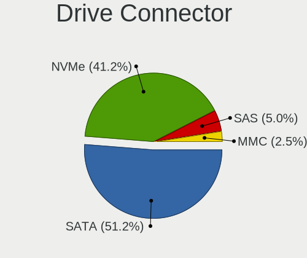
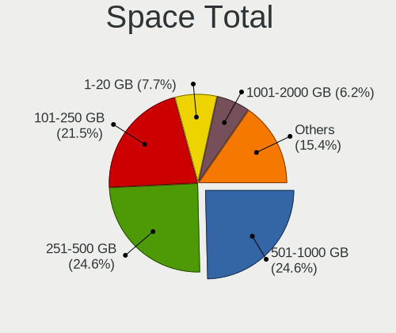
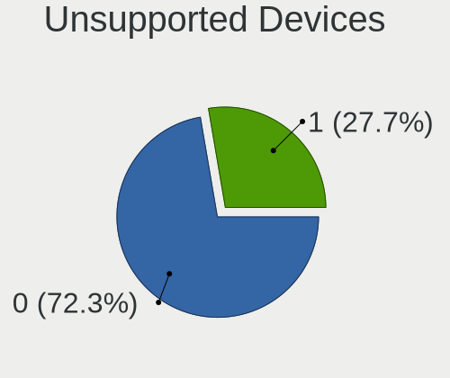

KDE neon Hardware Trends
------------------------

A project to identify most popular hardware characteristics and track their change
over time based on data collected by KDE neon users at https://Linux-Hardware.org.

Anyone can contribute to the study by uploading probes of their computers by
the [hw-probe](https://github.com/linuxhw/hw-probe) tool:

    sudo -E hw-probe -all -upload

This is a report for all computer types. See also reports for [desktops](/Dist/KDE_neon/Desktop/README.md) and [notebooks](/Dist/KDE_neon/Notebook/README.md).

Full-feature report is available here: https://linux-hardware.org/?view=trends

Period: May, 2021.

Contents
--------

- [ OS                       ](#os)
- [ OS Family                ](#os-family)
- [ Kernel                   ](#kernel)
- [ Kernel Family            ](#kernel-family)
- [ Kernel Major Ver.        ](#kernel-major-ver)
- [ Arch                     ](#arch)
- [ DE                       ](#de)
- [ Display Server           ](#display-server)
- [ Display Manager          ](#display-manager)
- [ OS Lang                  ](#os-lang)
- [ Boot Mode                ](#boot-mode)
- [ Filesystem               ](#filesystem)
- [ Part. scheme             ](#part-scheme)
- [ Dual Boot with Linux/BSD ](#dual-boot-with-linux/bsd)
- [ Dual Boot (Win)          ](#dual-boot-win)
- [ Country                  ](#country)
- [ City                     ](#city)
- [ Vendor                   ](#vendor)
- [ Model                    ](#model)
- [ Model Family             ](#model-family)
- [ MFG Year                 ](#mfg-year)
- [ Form Factor              ](#form-factor)
- [ Secure Boot              ](#secure-boot)
- [ Coreboot                 ](#coreboot)
- [ RAM Size                 ](#ram-size)
- [ RAM Used                 ](#ram-used)
- [ Has CD-ROM               ](#has-cd-rom)
- [ Total Drives             ](#total-drives)
- [ Has Ethernet             ](#has-ethernet)
- [ Has WiFi                 ](#has-wifi)
- [ Has Bluetooth            ](#has-bluetooth)
- [ Drive Vendor             ](#drive-vendor)
- [ Drive Model              ](#drive-model)
- [ HDD Vendor               ](#hdd-vendor)
- [ SSD Vendor               ](#ssd-vendor)
- [ Drive Kind               ](#drive-kind)
- [ Drive Connector          ](#drive-connector)
- [ Drive Size               ](#drive-size)
- [ Space Total              ](#space-total)
- [ Space Used               ](#space-used)
- [ Malfunc. Drives          ](#malfunc-drives)
- [ Malfunc. Drive Vendor    ](#malfunc-drive-vendor)
- [ Malfunc. HDD Vendor      ](#malfunc-hdd-vendor)
- [ Malfunc. Drive Kind      ](#malfunc-drive-kind)
- [ Failed Drives            ](#failed-drives)
- [ Failed Drive Vendor      ](#failed-drive-vendor)
- [ Drive Status             ](#drive-status)
- [ Storage Vendor           ](#storage-vendor)
- [ Storage Model            ](#storage-model)
- [ Storage Kind             ](#storage-kind)
- [ CPU Vendor               ](#cpu-vendor)
- [ CPU Model                ](#cpu-model)
- [ CPU Model Family         ](#cpu-model-family)
- [ CPU Cores                ](#cpu-cores)
- [ CPU Sockets              ](#cpu-sockets)
- [ CPU Threads              ](#cpu-threads)
- [ CPU Op-Modes             ](#cpu-op-modes)
- [ CPU Microcode            ](#cpu-microcode)
- [ CPU Microarch            ](#cpu-microarch)
- [ GPU Vendor               ](#gpu-vendor)
- [ GPU Model                ](#gpu-model)
- [ GPU Combo                ](#gpu-combo)
- [ GPU Driver               ](#gpu-driver)
- [ GPU Memory               ](#gpu-memory)
- [ Monitor Vendor           ](#monitor-vendor)
- [ Monitor Model            ](#monitor-model)
- [ Monitor Resolution       ](#monitor-resolution)
- [ Monitor Diagonal         ](#monitor-diagonal)
- [ Monitor Width            ](#monitor-width)
- [ Aspect Ratio             ](#aspect-ratio)
- [ Monitor Area             ](#monitor-area)
- [ Pixel Density            ](#pixel-density)
- [ Multiple Monitors        ](#multiple-monitors)
- [ Net Controller Vendor    ](#net-controller-vendor)
- [ Net Controller Model     ](#net-controller-model)
- [ Wireless Vendor          ](#wireless-vendor)
- [ Wireless Model           ](#wireless-model)
- [ Ethernet Vendor          ](#ethernet-vendor)
- [ Ethernet Model           ](#ethernet-model)
- [ Net Controller Kind      ](#net-controller-kind)
- [ Used Controller          ](#used-controller)
- [ NICs                     ](#nics)
- [ IPv6                     ](#ipv6)
- [ Memory Vendor            ](#memory-vendor)
- [ Memory Model             ](#memory-model)
- [ Memory Kind              ](#memory-kind)
- [ Memory Form Factor       ](#memory-form-factor)
- [ Memory Size              ](#memory-size)
- [ Memory Speed             ](#memory-speed)
- [ Sound Vendor             ](#sound-vendor)
- [ Sound Model              ](#sound-model)
- [ Camera Vendor            ](#camera-vendor)
- [ Camera Model             ](#camera-model)
- [ Fingerprint Vendor       ](#fingerprint-vendor)
- [ Fingerprint Model        ](#fingerprint-model)
- [ Chipcard Vendor          ](#chipcard-vendor)
- [ Chipcard Model           ](#chipcard-model)
- [ Printer Vendor           ](#printer-vendor)
- [ Printer Model            ](#printer-model)
- [ Scanner Vendor           ](#scanner-vendor)
- [ Scanner Model            ](#scanner-model)
- [ Bluetooth Vendor         ](#bluetooth-vendor)
- [ Bluetooth Model          ](#bluetooth-model)
- [ Unsupported Devices      ](#unsupported-devices)
- [ Unsupported Device Types ](#unsupported-device-types)

OS
--

Installed operating systems

| Name           | Computers | Percent |
|----------------|-----------|---------|
| KDE neon 20.04 | 140       | 100%    |

OS Family
---------

OS without a version

| Name     | Computers | Percent |
|----------|-----------|---------|
| KDE neon | 140       | 100%    |

Kernel
------

Version of the Linux kernel

| Version                | Computers | Percent |
|------------------------|-----------|---------|
| 5.4.0-73-generic       | 71        | 50.71%  |
| 5.4.0-72-generic       | 48        | 34.29%  |
| 5.8.0-53-generic       | 4         | 2.86%   |
| 5.4.0-70-generic       | 2         | 1.43%   |
| 5.4.0-66-generic       | 2         | 1.43%   |
| 5.11.16-051116-generic | 2         | 1.43%   |
| 5.9.16-050916-generic  | 1         | 0.71%   |
| 5.8.0-50-generic       | 1         | 0.71%   |
| 5.4.0-65-generic       | 1         | 0.71%   |
| 5.4.0-58-generic       | 1         | 0.71%   |
| 5.4.0-52-generic       | 1         | 0.71%   |
| 5.4.0-42-generic       | 1         | 0.71%   |
| 5.12.5-051205-generic  | 1         | 0.71%   |
| 5.12.2-051202-generic  | 1         | 0.71%   |
| 5.11.20-051120-generic | 1         | 0.71%   |
| 5.10.41-xanmod1        | 1         | 0.71%   |
| 5.10.37-xanmod1        | 1         | 0.71%   |

Kernel Family
-------------

Linux kernel without a distro release

| Version | Computers | Percent |
|---------|-----------|---------|
| 5.4.0   | 127       | 90.71%  |
| 5.8.0   | 5         | 3.57%   |
| 5.11.16 | 2         | 1.43%   |
| 5.9.16  | 1         | 0.71%   |
| 5.12.5  | 1         | 0.71%   |
| 5.12.2  | 1         | 0.71%   |
| 5.11.20 | 1         | 0.71%   |
| 5.10.41 | 1         | 0.71%   |
| 5.10.37 | 1         | 0.71%   |

Kernel Major Ver.
-----------------

Linux kernel major version

| Version | Computers | Percent |
|---------|-----------|---------|
| 5.4     | 127       | 90.71%  |
| 5.8     | 5         | 3.57%   |
| 5.11    | 3         | 2.14%   |
| 5.12    | 2         | 1.43%   |
| 5.10    | 2         | 1.43%   |
| 5.9     | 1         | 0.71%   |

Arch
----

OS architecture (x86_64, i586, etc.)

| Name   | Computers | Percent |
|--------|-----------|---------|
| x86_64 | 140       | 100%    |

DE
--

Desktop Environment

| Name    | Computers | Percent |
|---------|-----------|---------|
| KDE     | 130       | 92.86%  |
| KDE5    | 7         | 5%      |
| Unknown | 3         | 2.14%   |

Display Server
--------------

X11 or Wayland

| Name    | Computers | Percent |
|---------|-----------|---------|
| X11     | 134       | 95.71%  |
| Wayland | 6         | 4.29%   |

Display Manager
---------------

SDDM, LightDM, etc.

| Name    | Computers | Percent |
|---------|-----------|---------|
| Unknown | 130       | 92.86%  |
| SDDM    | 10        | 7.14%   |

OS Lang
-------

Language

| Lang  | Computers | Percent |
|-------|-----------|---------|
| en_US | 47        | 33.57%  |
| de_DE | 13        | 9.29%   |
| en_GB | 10        | 7.14%   |
| es_ES | 8         | 5.71%   |
| C     | 8         | 5.71%   |
| ru_RU | 5         | 3.57%   |
| pt_BR | 5         | 3.57%   |
| zh_CN | 4         | 2.86%   |
| es_MX | 4         | 2.86%   |
| en_IN | 4         | 2.86%   |
| it_IT | 3         | 2.14%   |
| en_CA | 3         | 2.14%   |
| en_AU | 3         | 2.14%   |
| pt_PT | 2         | 1.43%   |
| nl_NL | 2         | 1.43%   |
| fr_FR | 2         | 1.43%   |
| es_AR | 2         | 1.43%   |
| sv_SE | 1         | 0.71%   |
| ru_UA | 1         | 0.71%   |
| ja_JP | 1         | 0.71%   |
| fr_CH | 1         | 0.71%   |
| es_PE | 1         | 0.71%   |
| es_GT | 1         | 0.71%   |
| es_CO | 1         | 0.71%   |
| es_CL | 1         | 0.71%   |
| en_ZA | 1         | 0.71%   |
| en_PH | 1         | 0.71%   |
| en_NZ | 1         | 0.71%   |
| de_CH | 1         | 0.71%   |
| da_DK | 1         | 0.71%   |
| cs_CZ | 1         | 0.71%   |
| bg_BG | 1         | 0.71%   |

Boot Mode
---------

EFI or BIOS

| Mode | Computers | Percent |
|------|-----------|---------|
| EFI  | 81        | 57.86%  |
| BIOS | 59        | 42.14%  |

Filesystem
----------

Type of filesystem

| Type    | Computers | Percent |
|---------|-----------|---------|
| Ext4    | 133       | 95%     |
| Overlay | 4         | 2.86%   |
| Btrfs   | 3         | 2.14%   |

Part. scheme
------------

Scheme of partitioning

| Type    | Computers | Percent |
|---------|-----------|---------|
| Unknown | 131       | 93.57%  |
| GPT     | 8         | 5.71%   |
| MBR     | 1         | 0.71%   |

Dual Boot with Linux/BSD
------------------------

Hosting more than one Linux/BSD

| Dual boot | Computers | Percent |
|-----------|-----------|---------|
| No        | 136       | 97.14%  |
| Yes       | 4         | 2.86%   |

Dual Boot (Win)
---------------

Hosting Linux and Windows

| Dual boot | Computers | Percent |
|-----------|-----------|---------|
| No        | 128       | 91.43%  |
| Yes       | 12        | 8.57%   |

Country
-------

Geographic location (country)

| Country      | Computers | Percent |
|--------------|-----------|---------|
| USA          | 28        | 20%     |
| Germany      | 15        | 10.71%  |
| Spain        | 10        | 7.14%   |
| UK           | 8         | 5.71%   |
| Brazil       | 8         | 5.71%   |
| Russia       | 6         | 4.29%   |
| Netherlands  | 6         | 4.29%   |
| Mexico       | 4         | 2.86%   |
| India        | 4         | 2.86%   |
| Australia    | 4         | 2.86%   |
| Poland       | 3         | 2.14%   |
| Italy        | 3         | 2.14%   |
| France       | 3         | 2.14%   |
| China        | 3         | 2.14%   |
| Canada       | 3         | 2.14%   |
| Argentina    | 3         | 2.14%   |
| Thailand     | 2         | 1.43%   |
| Switzerland  | 2         | 1.43%   |
| Sweden       | 2         | 1.43%   |
| Portugal     | 2         | 1.43%   |
| Ukraine      | 1         | 0.71%   |
| UAE          | 1         | 0.71%   |
| South Africa | 1         | 0.71%   |
| Puerto Rico  | 1         | 0.71%   |
| Philippines  | 1         | 0.71%   |
| Peru         | 1         | 0.71%   |
| New Zealand  | 1         | 0.71%   |
| Japan        | 1         | 0.71%   |
| Israel       | 1         | 0.71%   |
| Iran         | 1         | 0.71%   |
| Hungary      | 1         | 0.71%   |
| Hong Kong    | 1         | 0.71%   |
| Guatemala    | 1         | 0.71%   |
| Denmark      | 1         | 0.71%   |
| Czechia      | 1         | 0.71%   |
| Colombia     | 1         | 0.71%   |
| Chile        | 1         | 0.71%   |
| Bulgaria     | 1         | 0.71%   |
| Belgium      | 1         | 0.71%   |
| Bangladesh   | 1         | 0.71%   |
| Albania      | 1         | 0.71%   |

City
----

Geographic location (city)

| City                   | Computers | Percent |
|------------------------|-----------|---------|
| Tipp City              | 2         | 1.43%   |
| São Paulo             | 2         | 1.43%   |
| Rio de Janeiro         | 2         | 1.43%   |
| Mexico City            | 2         | 1.43%   |
| Lünen                 | 2         | 1.43%   |
| Everett                | 2         | 1.43%   |
| Buenos Aires           | 2         | 1.43%   |
| Bangkok                | 2         | 1.43%   |
| Zhengzhou              | 1         | 0.71%   |
| Zbiroh                 | 1         | 0.71%   |
| Wuxi                   | 1         | 0.71%   |
| Wilderness Rim         | 1         | 0.71%   |
| Wetzlar                | 1         | 0.71%   |
| West Lafayette         | 1         | 0.71%   |
| Washington             | 1         | 0.71%   |
| Warsaw                 | 1         | 0.71%   |
| Warminster             | 1         | 0.71%   |
| Wabern                 | 1         | 0.71%   |
| Vigo                   | 1         | 0.71%   |
| Vasvar                 | 1         | 0.71%   |
| Valladolid             | 1         | 0.71%   |
| Two Harbors            | 1         | 0.71%   |
| Tver                   | 1         | 0.71%   |
| Tuluá                 | 1         | 0.71%   |
| Torreón               | 1         | 0.71%   |
| The Hague              | 1         | 0.71%   |
| Tettnang Castle        | 1         | 0.71%   |
| Tehran                 | 1         | 0.71%   |
| Słupsk                | 1         | 0.71%   |
| São Carlos            | 1         | 0.71%   |
| Swadlincote            | 1         | 0.71%   |
| Sullana                | 1         | 0.71%   |
| Stalybridge            | 1         | 0.71%   |
| Srednyaya Akhtuba      | 1         | 0.71%   |
| Southampton            | 1         | 0.71%   |
| Sierra Vista           | 1         | 0.71%   |
| Shumen                 | 1         | 0.71%   |
| Senhora da Hora        | 1         | 0.71%   |
| Schiedam               | 1         | 0.71%   |
| Santiago               | 1         | 0.71%   |
| San Luis Potosí City  | 1         | 0.71%   |
| Saint Paul             | 1         | 0.71%   |
| Rome                   | 1         | 0.71%   |
| Rivas-Vaciamadrid      | 1         | 0.71%   |
| Reus                   | 1         | 0.71%   |
| Ramonville-Saint-Agne  | 1         | 0.71%   |
| Radom                  | 1         | 0.71%   |
| Quezon City            | 1         | 0.71%   |
| Pune                   | 1         | 0.71%   |
| Prignano sulla Secchia | 1         | 0.71%   |
| Portland               | 1         | 0.71%   |
| Petrozavodsk           | 1         | 0.71%   |
| Peterborough           | 1         | 0.71%   |
| Perth                  | 1         | 0.71%   |
| Patchogue              | 1         | 0.71%   |
| Oxie                   | 1         | 0.71%   |
| Olivos                 | 1         | 0.71%   |
| Odense                 | 1         | 0.71%   |
| Nova Iguaçu           | 1         | 0.71%   |
| Nij Beets              | 1         | 0.71%   |

Vendor
------

Motherboard manufacturer

| Name                | Computers | Percent |
|---------------------|-----------|---------|
| Hewlett-Packard     | 29        | 20.71%  |
| Lenovo              | 19        | 13.57%  |
| ASUSTek Computer    | 19        | 13.57%  |
| Dell                | 15        | 10.71%  |
| MSI                 | 10        | 7.14%   |
| Gigabyte Technology | 7         | 5%      |
| ASRock              | 7         | 5%      |
| Acer                | 6         | 4.29%   |
| Intel               | 4         | 2.86%   |
| Apple               | 4         | 2.86%   |
| Toshiba             | 2         | 1.43%   |
| Fujitsu             | 2         | 1.43%   |
| Foxconn             | 2         | 1.43%   |
| YJKC                | 1         | 0.71%   |
| Supermicro          | 1         | 0.71%   |
| Standard            | 1         | 0.71%   |
| Sony                | 1         | 0.71%   |
| Samsung Electronics | 1         | 0.71%   |
| PRIXTON             | 1         | 0.71%   |
| OEGStone            | 1         | 0.71%   |
| Microsoft           | 1         | 0.71%   |
| Itautec             | 1         | 0.71%   |
| Huanghe             | 1         | 0.71%   |
| Biostar             | 1         | 0.71%   |
| Alienware           | 1         | 0.71%   |
| ADMIRAL             | 1         | 0.71%   |
| Unknown             | 1         | 0.71%   |

Model
-----

Motherboard model

| Name                                  | Computers | Percent |
|---------------------------------------|-----------|---------|
| Intel H61                             | 2         | 1.43%   |
| HP Pavilion Notebook                  | 2         | 1.43%   |
| HP 15 Notebook PC                     | 2         | 1.43%   |
| Apple MacBookPro8,1                   | 2         | 1.43%   |
| Acer Aspire A515-43                   | 2         | 1.43%   |
| Unknown                               | 2         | 1.43%   |
| YJKC vBOOK Plus                       | 1         | 0.71%   |
| Toshiba Satellite S55t-C              | 1         | 0.71%   |
| Toshiba Satellite C55t-B              | 1         | 0.71%   |
| Supermicro X8DTH-i/6/iF/6F            | 1         | 0.71%   |
| Sony SVE14A25CAB                      | 1         | 0.71%   |
| Samsung 700T1C                        | 1         | 0.71%   |
| PRIXTON Flex Pro F100 4/64            | 1         | 0.71%   |
| OEGStone C4100/C5100                  | 1         | 0.71%   |
| MSI MS-7C52                           | 1         | 0.71%   |
| MSI MS-7C51                           | 1         | 0.71%   |
| MSI MS-7C37                           | 1         | 0.71%   |
| MSI MS-7B98                           | 1         | 0.71%   |
| MSI MS-7A38                           | 1         | 0.71%   |
| MSI MS-7A34                           | 1         | 0.71%   |
| MSI MS-7A32                           | 1         | 0.71%   |
| MSI GS75 Stealth 8SF                  | 1         | 0.71%   |
| MSI GP62 6QE                          | 1         | 0.71%   |
| MSI GF65 Thin 9SD                     | 1         | 0.71%   |
| Microsoft Surface Pro 3               | 1         | 0.71%   |
| Lenovo Yoga C740-15IML 81TD           | 1         | 0.71%   |
| Lenovo Yoga 530-14IKB 81EK            | 1         | 0.71%   |
| Lenovo YangTianT4900v-00 90MCCTO1WW   | 1         | 0.71%   |
| Lenovo Y520-15IKBN 80WK               | 1         | 0.71%   |
| Lenovo V15-IIL 82C5                   | 1         | 0.71%   |
| Lenovo V15-ADA 82C7                   | 1         | 0.71%   |
| Lenovo ThinkPad X1 Extreme 20MFCTO1WW | 1         | 0.71%   |
| Lenovo ThinkPad T530 239265U          | 1         | 0.71%   |
| Lenovo ThinkPad L14 Gen 1 20U6S1JD00  | 1         | 0.71%   |
| Lenovo ThinkCentre E73 10AS002PGE     | 1         | 0.71%   |
| Lenovo IdeaPad S145-15API 81V7        | 1         | 0.71%   |
| Lenovo IdeaPad S145-14IWL 81MU        | 1         | 0.71%   |
| Lenovo IdeaPad 330-15ARR 81D2         | 1         | 0.71%   |
| Lenovo IdeaPad 320-15IKB 81BG         | 1         | 0.71%   |
| Lenovo IdeaPad 320-15ABR 80XS         | 1         | 0.71%   |
| Lenovo IdeaPad 3 15IIL05 81WE         | 1         | 0.71%   |
| Lenovo G700 20251                     | 1         | 0.71%   |
| Lenovo G570 20079                     | 1         | 0.71%   |
| Lenovo G50-80 80R0                    | 1         | 0.71%   |
| Itautec Infoway ST-4272               | 1         | 0.71%   |
| Intel NUC8i7BEK                       | 1         | 0.71%   |
| Intel DP55WB AAE64798-205             | 1         | 0.71%   |
| Huanghe PRO H410M-C                   | 1         | 0.71%   |
| HP ZBook Studio G5                    | 1         | 0.71%   |
| HP Stream Laptop 11-y0XX              | 1         | 0.71%   |
| HP Slim Desktop 290-p0xxx             | 1         | 0.71%   |
| HP ProDesk 400 G1 MT                  | 1         | 0.71%   |
| HP ProBook 455 G7                     | 1         | 0.71%   |
| HP ProBook 4540s                      | 1         | 0.71%   |
| HP Pavilion g7                        | 1         | 0.71%   |
| HP Pavilion g4                        | 1         | 0.71%   |
| HP Pavilion dv7                       | 1         | 0.71%   |
| HP Pavilion Desktop TP01-0xxx         | 1         | 0.71%   |
| HP Pavilion Desktop PC 570-p0xx       | 1         | 0.71%   |
| HP Notebook                           | 1         | 0.71%   |

Model Family
------------

Motherboard model prefix

| Name                     | Computers | Percent |
|--------------------------|-----------|---------|
| HP Pavilion              | 7         | 5%      |
| Lenovo IdeaPad           | 6         | 4.29%   |
| Dell Latitude            | 6         | 4.29%   |
| HP Compaq                | 5         | 3.57%   |
| Dell Inspiron            | 5         | 3.57%   |
| Acer Aspire              | 5         | 3.57%   |
| Lenovo ThinkPad          | 3         | 2.14%   |
| HP Laptop                | 3         | 2.14%   |
| ASUS PRIME               | 3         | 2.14%   |
| Toshiba Satellite        | 2         | 1.43%   |
| Lenovo Yoga              | 2         | 1.43%   |
| Intel H61                | 2         | 1.43%   |
| HP ProBook               | 2         | 1.43%   |
| HP EliteBook             | 2         | 1.43%   |
| HP 15                    | 2         | 1.43%   |
| Dell XPS                 | 2         | 1.43%   |
| ASUS ROG                 | 2         | 1.43%   |
| Apple MacBookPro8        | 2         | 1.43%   |
| Unknown                  | 2         | 1.43%   |
| YJKC vBOOK               | 1         | 0.71%   |
| Supermicro X8DTH-i       | 1         | 0.71%   |
| Sony SVE14A25CAB         | 1         | 0.71%   |
| Samsung 700T1C           | 1         | 0.71%   |
| PRIXTON Flex             | 1         | 0.71%   |
| OEGStone C4100           | 1         | 0.71%   |
| MSI MS-7C52              | 1         | 0.71%   |
| MSI MS-7C51              | 1         | 0.71%   |
| MSI MS-7C37              | 1         | 0.71%   |
| MSI MS-7B98              | 1         | 0.71%   |
| MSI MS-7A38              | 1         | 0.71%   |
| MSI MS-7A34              | 1         | 0.71%   |
| MSI MS-7A32              | 1         | 0.71%   |
| MSI GS75                 | 1         | 0.71%   |
| MSI GP62                 | 1         | 0.71%   |
| MSI GF65                 | 1         | 0.71%   |
| Microsoft Surface        | 1         | 0.71%   |
| Lenovo YangTianT4900v-00 | 1         | 0.71%   |
| Lenovo Y520-15IKBN       | 1         | 0.71%   |
| Lenovo V15-IIL           | 1         | 0.71%   |
| Lenovo V15-ADA           | 1         | 0.71%   |
| Lenovo ThinkCentre       | 1         | 0.71%   |
| Lenovo G700              | 1         | 0.71%   |
| Lenovo G570              | 1         | 0.71%   |
| Lenovo G50-80            | 1         | 0.71%   |
| Itautec Infoway          | 1         | 0.71%   |
| Intel NUC8i7BEK          | 1         | 0.71%   |
| Intel DP55WB             | 1         | 0.71%   |
| Huanghe PRO              | 1         | 0.71%   |
| HP ZBook                 | 1         | 0.71%   |
| HP Stream                | 1         | 0.71%   |
| HP Slim                  | 1         | 0.71%   |
| HP ProDesk               | 1         | 0.71%   |
| HP Notebook              | 1         | 0.71%   |
| HP ENVY                  | 1         | 0.71%   |
| HP All-in-One            | 1         | 0.71%   |
| HP 205                   | 1         | 0.71%   |
| Gigabyte X99-UD5         | 1         | 0.71%   |
| Gigabyte P55M-UD2        | 1         | 0.71%   |
| Gigabyte GA-990FXA-UD3   | 1         | 0.71%   |
| Gigabyte GA-78LMT-USB3   | 1         | 0.71%   |

MFG Year
--------

Motherboard manufacture year

| Year | Computers | Percent |
|------|-----------|---------|
| 2020 | 35        | 25%     |
| 2019 | 22        | 15.71%  |
| 2018 | 20        | 14.29%  |
| 2012 | 11        | 7.86%   |
| 2017 | 9         | 6.43%   |
| 2013 | 8         | 5.71%   |
| 2016 | 7         | 5%      |
| 2021 | 6         | 4.29%   |
| 2015 | 4         | 2.86%   |
| 2011 | 4         | 2.86%   |
| 2010 | 4         | 2.86%   |
| 2014 | 3         | 2.14%   |
| 2009 | 3         | 2.14%   |
| 2008 | 2         | 1.43%   |
| 2007 | 2         | 1.43%   |

Form Factor
-----------

Physical design of the computer

| Name        | Computers | Percent |
|-------------|-----------|---------|
| Notebook    | 76        | 54.29%  |
| Desktop     | 52        | 37.14%  |
| Convertible | 5         | 3.57%   |
| All in one  | 3         | 2.14%   |
| Server      | 2         | 1.43%   |
| Tablet      | 1         | 0.71%   |
| Mini pc     | 1         | 0.71%   |

Secure Boot
-----------

Enabled or disabled

| State    | Computers | Percent |
|----------|-----------|---------|
| Disabled | 130       | 92.86%  |
| Enabled  | 10        | 7.14%   |

Coreboot
--------

Have coreboot on board

| Used | Computers | Percent |
|------|-----------|---------|
| No   | 140       | 100%    |

RAM Size
--------

Total RAM memory

| Size in GB  | Computers | Percent |
|-------------|-----------|---------|
| 4.01-8.0    | 34        | 24.29%  |
| 16.01-24.0  | 31        | 22.14%  |
| 3.01-4.0    | 29        | 20.71%  |
| 8.01-16.0   | 27        | 19.29%  |
| 32.01-64.0  | 12        | 8.57%   |
| 24.01-32.0  | 3         | 2.14%   |
| 64.01-256.0 | 3         | 2.14%   |
| 2.01-3.0    | 1         | 0.71%   |

RAM Used
--------

Used RAM memory

| Used GB   | Computers | Percent |
|-----------|-----------|---------|
| 1.01-2.0  | 58        | 41.43%  |
| 2.01-3.0  | 43        | 30.71%  |
| 3.01-4.0  | 17        | 12.14%  |
| 4.01-8.0  | 16        | 11.43%  |
| 0.51-1.0  | 5         | 3.57%   |
| 8.01-16.0 | 1         | 0.71%   |

Has CD-ROM
----------

Has CD-ROM on board

| Presented | Computers | Percent |
|-----------|-----------|---------|
| No        | 84        | 60%     |
| Yes       | 56        | 40%     |

Total Drives
------------

Number of drives on board

| Drives | Computers | Percent |
|--------|-----------|---------|
| 1      | 78        | 55.71%  |
| 2      | 39        | 27.86%  |
| 3      | 12        | 8.57%   |
| 6      | 3         | 2.14%   |
| 5      | 3         | 2.14%   |
| 4      | 3         | 2.14%   |
| 7      | 1         | 0.71%   |
| 0      | 1         | 0.71%   |

Has Ethernet
------------

Has Ethernet on board

| Presented | Computers | Percent |
|-----------|-----------|---------|
| Yes       | 118       | 84.29%  |
| No        | 22        | 15.71%  |

Has WiFi
--------

Has WiFi module

| Presented | Computers | Percent |
|-----------|-----------|---------|
| Yes       | 106       | 75.71%  |
| No        | 34        | 24.29%  |

Has Bluetooth
-------------

Has Bluetooth module

| Presented | Computers | Percent |
|-----------|-----------|---------|
| Yes       | 90        | 64.29%  |
| No        | 50        | 35.71%  |

Drive Vendor
------------

Hard drive vendors

| Vendor                    | Computers | Drives | Percent |
|---------------------------|-----------|--------|---------|
| WDC                       | 32        | 44     | 15.76%  |
| Samsung Electronics       | 31        | 46     | 15.27%  |
| Seagate                   | 27        | 31     | 13.3%   |
| Kingston                  | 16        | 18     | 7.88%   |
| Sandisk                   | 14        | 14     | 6.9%    |
| Crucial                   | 11        | 12     | 5.42%   |
| Toshiba                   | 9         | 10     | 4.43%   |
| Unknown                   | 7         | 11     | 3.45%   |
| Intel                     | 7         | 8      | 3.45%   |
| Hitachi                   | 7         | 8      | 3.45%   |
| HGST                      | 6         | 6      | 2.96%   |
| SK Hynix                  | 3         | 3      | 1.48%   |
| KingSpec                  | 3         | 4      | 1.48%   |
| SPCC                      | 2         | 2      | 0.99%   |
| Micron/Crucial Technology | 2         | 2      | 0.99%   |
| LITEON                    | 2         | 2      | 0.99%   |
| A-DATA Technology         | 2         | 2      | 0.99%   |
| XPG                       | 1         | 1      | 0.49%   |
| Union Memory              | 1         | 1      | 0.49%   |
| Transcend                 | 1         | 1      | 0.49%   |
| TCSUNBOW                  | 1         | 1      | 0.49%   |
| StarTech                  | 1         | 2      | 0.49%   |
| Silicon Motion            | 1         | 2      | 0.49%   |
| ShanDianZhe               | 1         | 1      | 0.49%   |
| Phison                    | 1         | 1      | 0.49%   |
| OCZ-VERTEX2               | 1         | 1      | 0.49%   |
| Micron Technology         | 1         | 1      | 0.49%   |
| LITEONIT                  | 1         | 1      | 0.49%   |
| Lexar                     | 1         | 1      | 0.49%   |
| Lenovo                    | 1         | 1      | 0.49%   |
| Intenso                   | 1         | 1      | 0.49%   |
| Integral                  | 1         | 1      | 0.49%   |
| GOODRAM                   | 1         | 1      | 0.49%   |
| Gigabyte Technology       | 1         | 2      | 0.49%   |
| Fujitsu                   | 1         | 1      | 0.49%   |
| Corsair                   | 1         | 1      | 0.49%   |
| Blackpcs                  | 1         | 1      | 0.49%   |
| Asmedia                   | 1         | 1      | 0.49%   |
| Apple                     | 1         | 1      | 0.49%   |

Drive Model
-----------

Hard drive models

| Model                              | Computers | Percent |
|------------------------------------|-----------|---------|
| Seagate ST1000LM035-1RK172 1TB     | 5         | 2.07%   |
| Samsung NVMe SSD Drive 512GB       | 5         | 2.07%   |
| Samsung NVMe SSD Drive 1TB         | 5         | 2.07%   |
| Kingston SA400S37240G 240GB SSD    | 5         | 2.07%   |
| Samsung NVMe SSD Drive 256GB       | 4         | 1.65%   |
| Unknown SD/MMC/MS PRO 8GB          | 3         | 1.24%   |
| Seagate ST1000DM010-2EP102 1TB     | 3         | 1.24%   |
| Samsung SSD 860 EVO 1TB            | 3         | 1.24%   |
| Samsung NVMe SSD Drive 250GB       | 3         | 1.24%   |
| Kingston SV300S37A120G 120GB SSD   | 3         | 1.24%   |
| Kingston SA400S37480G 480GB SSD    | 3         | 1.24%   |
| Intel NVMe SSD Drive 512GB         | 3         | 1.24%   |
| HGST HTS545050A7E680 500GB         | 3         | 1.24%   |
| Crucial CT500MX500SSD1 500GB       | 3         | 1.24%   |
| WDC WD20EZAZ-00GGJB0 2TB           | 2         | 0.83%   |
| Unknown MMC Card  64GB             | 2         | 0.83%   |
| Unknown MMC Card  134GB            | 2         | 0.83%   |
| SK Hynix NVMe SSD Drive 256GB      | 2         | 0.83%   |
| Seagate ST500DM002-1BD142 500GB    | 2         | 0.83%   |
| Seagate ST1000LM024 HN-M101MBB 1TB | 2         | 0.83%   |
| Sandisk NVMe SSD Drive 512GB       | 2         | 0.83%   |
| Sandisk NVMe SSD Drive 1TB         | 2         | 0.83%   |
| Samsung SSD 860 EVO 500GB          | 2         | 0.83%   |
| Samsung NVMe SSD Drive 500GB       | 2         | 0.83%   |
| Micron/Crucial NVMe SSD Drive 1TB  | 2         | 0.83%   |
| Crucial CT240BX500SSD1 240GB       | 2         | 0.83%   |
| Crucial CT1000MX500SSD1 1TB        | 2         | 0.83%   |
| XPG NVMe SSD Drive 2TB             | 1         | 0.41%   |
| WDC WDS480G2G0A-00JH30 480GB SSD   | 1         | 0.41%   |
| WDC WDS240G2G0B-00EPW0 240GB SSD   | 1         | 0.41%   |
| WDC WDS120G2G0A-00JH30 120GB SSD   | 1         | 0.41%   |
| WDC WDS120G1G0B-00RC30 120GB SSD   | 1         | 0.41%   |
| WDC WDS100T2B0B-00YS70 1TB SSD     | 1         | 0.41%   |
| WDC WDS100T2B0A-00SM50 1TB SSD     | 1         | 0.41%   |
| WDC WDBNCE2500PNC 250GB SSD        | 1         | 0.41%   |
| WDC WD60EZAZ-00SF3B0 6TB           | 1         | 0.41%   |
| WDC WD60EFAX-68SHWN0 6TB           | 1         | 0.41%   |
| WDC WD5000LPVX-22V0TT0 500GB       | 1         | 0.41%   |
| WDC WD5000LPVX-08V0TT6 500GB       | 1         | 0.41%   |
| WDC WD5000BPVT-22HXZT3 500GB       | 1         | 0.41%   |
| WDC WD5000AZRX-00A8LB0 500GB       | 1         | 0.41%   |
| WDC WD5000AZLX-75K2TA0 500GB       | 1         | 0.41%   |
| WDC WD5000AVDS-63U7B1 500GB        | 1         | 0.41%   |
| WDC WD5000AAKX-22ERMA0 500GB       | 1         | 0.41%   |
| WDC WD5000AADS-11M2B2 500GB        | 1         | 0.41%   |
| WDC WD40PURZ-85TTDY0 4TB           | 1         | 0.41%   |
| WDC WD40PURZ-85AKKY0 4TB           | 1         | 0.41%   |
| WDC WD40EFRX-68WT0N0 4TB           | 1         | 0.41%   |
| WDC WD3200BPVT-35ZEST0 320GB       | 1         | 0.41%   |
| WDC WD3200BEVT-80A0RT0 320GB       | 1         | 0.41%   |
| WDC WD3200AAKS-00L9A0 320GB        | 1         | 0.41%   |
| WDC WD30EZRX-00SPEB0 3TB           | 1         | 0.41%   |
| WDC WD30EZRX-00D8PB0 3TB           | 1         | 0.41%   |
| WDC WD30EFRX-68EUZN0 3TB           | 1         | 0.41%   |
| WDC WD2500JS-00SGB0 250GB          | 1         | 0.41%   |
| WDC WD2500AAKX-001CA0 250GB        | 1         | 0.41%   |
| WDC WD20EZRZ-00Z5HB0 2TB           | 1         | 0.41%   |
| WDC WD10SPZX-00Z10T0 1TB           | 1         | 0.41%   |
| WDC WD10JPVX-60JC3T1 1TB           | 1         | 0.41%   |
| WDC WD10JPVX-60JC3T0 1TB           | 1         | 0.41%   |

HDD Vendor
----------

Hard disk drive vendors

| Vendor              | Computers | Drives | Percent |
|---------------------|-----------|--------|---------|
| WDC                 | 26        | 37     | 34.21%  |
| Seagate             | 25        | 29     | 32.89%  |
| Toshiba             | 7         | 7      | 9.21%   |
| Hitachi             | 7         | 8      | 9.21%   |
| HGST                | 6         | 6      | 7.89%   |
| Samsung Electronics | 3         | 3      | 3.95%   |
| Fujitsu             | 1         | 1      | 1.32%   |
| Apple               | 1         | 1      | 1.32%   |

SSD Vendor
----------

Solid state drive vendors

| Vendor              | Computers | Drives | Percent |
|---------------------|-----------|--------|---------|
| Samsung Electronics | 14        | 19     | 18.42%  |
| Kingston            | 14        | 15     | 18.42%  |
| Crucial             | 10        | 11     | 13.16%  |
| WDC                 | 7         | 7      | 9.21%   |
| SanDisk             | 7         | 7      | 9.21%   |
| KingSpec            | 3         | 4      | 3.95%   |
| Toshiba             | 2         | 2      | 2.63%   |
| LITEON              | 2         | 2      | 2.63%   |
| Union Memory        | 1         | 1      | 1.32%   |
| Transcend           | 1         | 1      | 1.32%   |
| TCSUNBOW            | 1         | 1      | 1.32%   |
| SPCC                | 1         | 1      | 1.32%   |
| SK Hynix            | 1         | 1      | 1.32%   |
| OCZ-VERTEX2         | 1         | 1      | 1.32%   |
| LITEONIT            | 1         | 1      | 1.32%   |
| Lexar               | 1         | 1      | 1.32%   |
| Lenovo              | 1         | 1      | 1.32%   |
| Intenso             | 1         | 1      | 1.32%   |
| Intel               | 1         | 1      | 1.32%   |
| Integral            | 1         | 1      | 1.32%   |
| GOODRAM             | 1         | 1      | 1.32%   |
| Gigabyte Technology | 1         | 2      | 1.32%   |
| Corsair             | 1         | 1      | 1.32%   |
| Blackpcs            | 1         | 1      | 1.32%   |
| A-DATA Technology   | 1         | 1      | 1.32%   |

Drive Kind
----------

HDD or SSD

| Kind    | Computers | Drives | Percent |
|---------|-----------|--------|---------|
| HDD     | 68        | 92     | 36.36%  |
| SSD     | 66        | 85     | 35.29%  |
| NVMe    | 41        | 55     | 21.93%  |
| Unknown | 8         | 9      | 4.28%   |
| MMC     | 4         | 7      | 2.14%   |

Drive Connector
---------------

SATA, SAS, NVMe, etc.

| Type | Computers | Drives | Percent |
|------|-----------|--------|---------|
| SATA | 116       | 179    | 69.46%  |
| NVMe | 41        | 55     | 24.55%  |
| SAS  | 6         | 7      | 3.59%   |
| MMC  | 4         | 7      | 2.4%    |

Drive Size
----------

Size of hard drive

| Size in TB | Computers | Drives | Percent |
|------------|-----------|--------|---------|
| 0.01-0.5   | 81        | 104    | 57.45%  |
| 0.51-1.0   | 42        | 48     | 29.79%  |
| 1.01-2.0   | 9         | 10     | 6.38%   |
| 4.01-10.0  | 4         | 6      | 2.84%   |
| 3.01-4.0   | 3         | 5      | 2.13%   |
| 2.01-3.0   | 2         | 4      | 1.42%   |

Space Total
-----------

Amount of disk space available on the file system

| Size in GB     | Computers | Percent |
|----------------|-----------|---------|
| 101-250        | 44        | 31.43%  |
| 251-500        | 39        | 27.86%  |
| 501-1000       | 19        | 13.57%  |
| 1001-2000      | 7         | 5%      |
| 1-20           | 7         | 5%      |
| 51-100         | 7         | 5%      |
| 21-50          | 5         | 3.57%   |
| 2001-3000      | 5         | 3.57%   |
| Unknown        | 4         | 2.86%   |
| More than 3000 | 3         | 2.14%   |

Space Used
----------

Amount of used disk space

| Used GB        | Computers | Percent |
|----------------|-----------|---------|
| 1-20           | 66        | 47.14%  |
| 21-50          | 21        | 15%     |
| 101-250        | 17        | 12.14%  |
| 51-100         | 16        | 11.43%  |
| 251-500        | 7         | 5%      |
| 1001-2000      | 4         | 2.86%   |
| Unknown        | 4         | 2.86%   |
| 501-1000       | 3         | 2.14%   |
| More than 3000 | 1         | 0.71%   |
| 2001-3000      | 1         | 0.71%   |

Malfunc. Drives
---------------

Drive models with a malfunction

| Model                          | Computers | Drives | Percent |
|--------------------------------|-----------|--------|---------|
| WDC WD40PURZ-85AKKY0 4TB       | 1         | 2      | 20%     |
| Seagate ST1000LM035-1RK172 1TB | 1         | 1      | 20%     |
| Hitachi HTS723232A7A364 320GB  | 1         | 1      | 20%     |
| Hitachi HDS721616PLA380 160GB  | 1         | 1      | 20%     |
| HGST HTS545050A7E680 500GB     | 1         | 1      | 20%     |

Malfunc. Drive Vendor
---------------------

Vendors of faulty drives

| Vendor  | Computers | Drives | Percent |
|---------|-----------|--------|---------|
| WDC     | 1         | 2      | 25%     |
| Seagate | 1         | 1      | 25%     |
| Hitachi | 1         | 2      | 25%     |
| HGST    | 1         | 1      | 25%     |

Malfunc. HDD Vendor
-------------------

Vendors of faulty HDD drives

| Vendor  | Computers | Drives | Percent |
|---------|-----------|--------|---------|
| WDC     | 1         | 2      | 25%     |
| Seagate | 1         | 1      | 25%     |
| Hitachi | 1         | 2      | 25%     |
| HGST    | 1         | 1      | 25%     |

Malfunc. Drive Kind
-------------------

Kinds of faulty drives

| Kind | Computers | Drives | Percent |
|------|-----------|--------|---------|
| HDD  | 4         | 6      | 100%    |

Failed Drives
-------------

Failed drive models

Zero info for selected period =(

Failed Drive Vendor
-------------------

Failed drive vendors

Zero info for selected period =(

Drive Status
------------

Number of failed and malfunc. drives

| Status   | Computers | Drives | Percent |
|----------|-----------|--------|---------|
| Detected | 131       | 232    | 91.61%  |
| Works    | 8         | 10     | 5.59%   |
| Malfunc  | 4         | 6      | 2.8%    |

Storage Vendor
--------------

Storage controller vendors

| Vendor                          | Computers | Percent |
|---------------------------------|-----------|---------|
| Intel                           | 97        | 54.49%  |
| AMD                             | 34        | 19.1%   |
| Samsung Electronics             | 17        | 9.55%   |
| Sandisk                         | 6         | 3.37%   |
| ASMedia Technology              | 4         | 2.25%   |
| Micron/Crucial Technology       | 3         | 1.69%   |
| SK Hynix                        | 2         | 1.12%   |
| Phison Electronics              | 2         | 1.12%   |
| Kingston Technology Company     | 2         | 1.12%   |
| JMicron Technology              | 2         | 1.12%   |
| ADATA Technology                | 2         | 1.12%   |
| Toshiba America Info Systems    | 1         | 0.56%   |
| Silicon Motion                  | 1         | 0.56%   |
| Seagate Technology              | 1         | 0.56%   |
| Nvidia                          | 1         | 0.56%   |
| Micron Technology               | 1         | 0.56%   |
| Marvell Technology Group        | 1         | 0.56%   |
| Hefei DATANG Storage Technology | 1         | 0.56%   |

Storage Model
-------------

Storage controller models

| Model                                                                            | Computers | Percent |
|----------------------------------------------------------------------------------|-----------|---------|
| AMD FCH SATA Controller [AHCI mode]                                              | 24        | 11.32%  |
| Intel 7 Series Chipset Family 6-port SATA Controller [AHCI mode]                 | 12        | 5.66%   |
| Intel Sunrise Point-LP SATA Controller [AHCI mode]                               | 10        | 4.72%   |
| Samsung NVMe SSD Controller SM981/PM981/PM983                                    | 8         | 3.77%   |
| AMD 400 Series Chipset SATA Controller                                           | 8         | 3.77%   |
| Intel 8 Series/C220 Series Chipset Family 6-port SATA Controller 1 [AHCI mode]   | 6         | 2.83%   |
| Samsung NVMe SSD Controller SM961/PM961/SM963                                    | 5         | 2.36%   |
| Samsung NVMe SSD Controller SM951/PM951                                          | 4         | 1.89%   |
| Intel Q170/Q150/B150/H170/H110/Z170/CM236 Chipset SATA Controller [AHCI Mode]    | 4         | 1.89%   |
| Intel HM170/QM170 Chipset SATA Controller [AHCI Mode]                            | 4         | 1.89%   |
| Intel Comet Lake SATA AHCI Controller                                            | 4         | 1.89%   |
| Intel 82801 Mobile SATA Controller [RAID mode]                                   | 4         | 1.89%   |
| Intel 6 Series/C200 Series Chipset Family 6 port Mobile SATA AHCI Controller     | 4         | 1.89%   |
| ASMedia ASM1062 Serial ATA Controller                                            | 4         | 1.89%   |
| AMD SB7x0/SB8x0/SB9x0 SATA Controller [AHCI mode]                                | 4         | 1.89%   |
| Intel SSD 660P Series                                                            | 3         | 1.42%   |
| Intel Cannon Lake PCH SATA AHCI Controller                                       | 3         | 1.42%   |
| Intel Cannon Lake Mobile PCH SATA AHCI Controller                                | 3         | 1.42%   |
| Intel Atom Processor E3800 Series SATA AHCI Controller                           | 3         | 1.42%   |
| Intel 82801IBM/IEM (ICH9M/ICH9M-E) 4 port SATA Controller [AHCI mode]            | 3         | 1.42%   |
| Intel 82801HM/HEM (ICH8M/ICH8M-E) IDE Controller                                 | 3         | 1.42%   |
| Intel 8 Series SATA Controller 1 [AHCI mode]                                     | 3         | 1.42%   |
| Intel 6 Series/C200 Series Chipset Family 6 port Desktop SATA AHCI Controller    | 3         | 1.42%   |
| Intel 5 Series/3400 Series Chipset 4 port SATA IDE Controller                    | 3         | 1.42%   |
| Intel 5 Series/3400 Series Chipset 2 port SATA IDE Controller                    | 3         | 1.42%   |
| Intel 200 Series PCH SATA controller [AHCI mode]                                 | 3         | 1.42%   |
| AMD SB7x0/SB8x0/SB9x0 SATA Controller [IDE mode]                                 | 3         | 1.42%   |
| Sandisk WD Blue SN550 NVMe SSD                                                   | 2         | 0.94%   |
| Samsung NVMe SSD Controller PM9A1/PM9A3/980PRO                                   | 2         | 0.94%   |
| Phison E12 NVMe Controller                                                       | 2         | 0.94%   |
| JMicron JMB363 SATA/IDE Controller                                               | 2         | 0.94%   |
| Intel Wildcat Point-LP SATA Controller [AHCI Mode]                               | 2         | 0.94%   |
| Intel Ice Lake-LP SATA Controller [AHCI mode]                                    | 2         | 0.94%   |
| Intel Celeron/Pentium Silver Processor SATA Controller                           | 2         | 0.94%   |
| Intel Cannon Point-LP SATA Controller [AHCI Mode]                                | 2         | 0.94%   |
| Intel 82801HM/HEM (ICH8M/ICH8M-E) SATA Controller [AHCI mode]                    | 2         | 0.94%   |
| Intel 82801H (ICH8 Family) 4 port SATA Controller [IDE mode]                     | 2         | 0.94%   |
| Intel 400 Series Chipset Family SATA AHCI Controller                             | 2         | 0.94%   |
| AMD X370 Series Chipset SATA Controller                                          | 2         | 0.94%   |
| AMD SB7x0/SB8x0/SB9x0 IDE Controller                                             | 2         | 0.94%   |
| AMD FCH SATA Controller D                                                        | 2         | 0.94%   |
| AMD 300 Series Chipset SATA Controller                                           | 2         | 0.94%   |
| Toshiba America Info Systems Toshiba America Info Non-Volatile memory controller | 1         | 0.47%   |
| SK Hynix PC401 NVMe Solid State Drive 256GB                                      | 1         | 0.47%   |
| SK Hynix BC511                                                                   | 1         | 0.47%   |
| Silicon Motion SM2262/SM2262EN SSD Controller                                    | 1         | 0.47%   |
| Seagate FireCuda 510 SSD                                                         | 1         | 0.47%   |
| Sandisk WD Blue SN500 / PC SN520 NVMe SSD                                        | 1         | 0.47%   |
| Sandisk WD Black SN750 / PC SN730 NVMe SSD                                       | 1         | 0.47%   |
| Sandisk WD Black 2018/SN750 / PC SN720 NVMe SSD                                  | 1         | 0.47%   |
| Sandisk Non-Volatile memory controller                                           | 1         | 0.47%   |
| Samsung NVMe Controller                                                          | 1         | 0.47%   |
| Nvidia MCP61 SATA Controller                                                     | 1         | 0.47%   |
| Nvidia MCP61 IDE                                                                 | 1         | 0.47%   |
| Micron/Crucial P2 NVMe PCIe SSD                                                  | 1         | 0.47%   |
| Micron/Crucial NVMe Controller                                                   | 1         | 0.47%   |
| Micron/Crucial Non-Volatile memory controller                                    | 1         | 0.47%   |
| Micron Non-Volatile memory controller                                            | 1         | 0.47%   |
| Marvell Group 88SE9172 SATA III 6Gb/s RAID Controller                            | 1         | 0.47%   |
| Kingston Company U-SNS8154P3 NVMe SSD                                            | 1         | 0.47%   |

Storage Kind
------------

Kind of storage controller (IDE, SATA, NVMe, SAS, ...)

| Kind | Computers | Percent |
|------|-----------|---------|
| SATA | 115       | 65.34%  |
| NVMe | 41        | 23.3%   |
| IDE  | 16        | 9.09%   |
| RAID | 4         | 2.27%   |

CPU Vendor
----------

Processor vendors

| Vendor | Computers | Percent |
|--------|-----------|---------|
| Intel  | 101       | 72.14%  |
| AMD    | 39        | 27.86%  |

CPU Model
---------

Processor models

| Model                                           | Computers | Percent |
|-------------------------------------------------|-----------|---------|
| Intel Core i5-6200U CPU @ 2.30GHz               | 4         | 2.86%   |
| Intel Core i7-6700HQ CPU @ 2.60GHz              | 3         | 2.14%   |
| Intel Core i5-3210M CPU @ 2.50GHz               | 3         | 2.14%   |
| AMD Ryzen 5 2400G with Radeon Vega Graphics     | 3         | 2.14%   |
| Intel Core i7-8750H CPU @ 2.20GHz               | 2         | 1.43%   |
| Intel Core i7-8550U CPU @ 1.80GHz               | 2         | 1.43%   |
| Intel Core i5-7200U CPU @ 2.50GHz               | 2         | 1.43%   |
| Intel Core i5-3320M CPU @ 2.60GHz               | 2         | 1.43%   |
| Intel Core i5-1035G1 CPU @ 1.00GHz              | 2         | 1.43%   |
| Intel Core i3-1005G1 CPU @ 1.20GHz              | 2         | 1.43%   |
| Intel Core 2 Duo CPU E8400 @ 3.00GHz            | 2         | 1.43%   |
| Intel Celeron CPU N2840 @ 2.16GHz               | 2         | 1.43%   |
| AMD Ryzen 7 3700X 8-Core Processor              | 2         | 1.43%   |
| AMD Ryzen 5 4500U with Radeon Graphics          | 2         | 1.43%   |
| AMD Ryzen 5 3500U with Radeon Vega Mobile Gfx   | 2         | 1.43%   |
| AMD Ryzen 5 2600 Six-Core Processor             | 2         | 1.43%   |
| AMD A12-9720P RADEON R7, 12 COMPUTE CORES 4C+8G | 2         | 1.43%   |
| Intel Xeon CPU L5640 @ 2.27GHz                  | 1         | 0.71%   |
| Intel Pentium Gold G6400 CPU @ 4.00GHz          | 1         | 0.71%   |
| Intel Pentium Dual-Core CPU T4400 @ 2.20GHz     | 1         | 0.71%   |
| Intel Core i7-9700K CPU @ 3.60GHz               | 1         | 0.71%   |
| Intel Core i7-8850H CPU @ 2.60GHz               | 1         | 0.71%   |
| Intel Core i7-8700 CPU @ 3.20GHz                | 1         | 0.71%   |
| Intel Core i7-8565U CPU @ 1.80GHz               | 1         | 0.71%   |
| Intel Core i7-8559U CPU @ 2.70GHz               | 1         | 0.71%   |
| Intel Core i7-8086K CPU @ 4.00GHz               | 1         | 0.71%   |
| Intel Core i7-7820HK CPU @ 2.90GHz              | 1         | 0.71%   |
| Intel Core i7-7700K CPU @ 4.20GHz               | 1         | 0.71%   |
| Intel Core i7-7700HQ CPU @ 2.80GHz              | 1         | 0.71%   |
| Intel Core i7-7500U CPU @ 2.70GHz               | 1         | 0.71%   |
| Intel Core i7-6700K CPU @ 4.00GHz               | 1         | 0.71%   |
| Intel Core i7-5820K CPU @ 3.30GHz               | 1         | 0.71%   |
| Intel Core i7-5600U CPU @ 2.60GHz               | 1         | 0.71%   |
| Intel Core i7-5500U CPU @ 2.40GHz               | 1         | 0.71%   |
| Intel Core i7-4790 CPU @ 3.60GHz                | 1         | 0.71%   |
| Intel Core i7-4770K CPU @ 3.50GHz               | 1         | 0.71%   |
| Intel Core i7-4770 CPU @ 3.40GHz                | 1         | 0.71%   |
| Intel Core i7-4702MQ CPU @ 2.20GHz              | 1         | 0.71%   |
| Intel Core i7-4650U CPU @ 1.70GHz               | 1         | 0.71%   |
| Intel Core i7-4510U CPU @ 2.00GHz               | 1         | 0.71%   |
| Intel Core i7-3770 CPU @ 3.40GHz                | 1         | 0.71%   |
| Intel Core i7-3632QM CPU @ 2.20GHz              | 1         | 0.71%   |
| Intel Core i7-3612QM CPU @ 2.10GHz              | 1         | 0.71%   |
| Intel Core i7-3520M CPU @ 2.90GHz               | 1         | 0.71%   |
| Intel Core i7-2630QM CPU @ 2.00GHz              | 1         | 0.71%   |
| Intel Core i7-2600 CPU @ 3.40GHz                | 1         | 0.71%   |
| Intel Core i7-10750H CPU @ 2.60GHz              | 1         | 0.71%   |
| Intel Core i7-10700 CPU @ 2.90GHz               | 1         | 0.71%   |
| Intel Core i7-10510U CPU @ 1.80GHz              | 1         | 0.71%   |
| Intel Core i5-9400F CPU @ 2.90GHz               | 1         | 0.71%   |
| Intel Core i5-9400 CPU @ 2.90GHz                | 1         | 0.71%   |
| Intel Core i5-9300H CPU @ 2.40GHz               | 1         | 0.71%   |
| Intel Core i5-8250U CPU @ 1.60GHz               | 1         | 0.71%   |
| Intel Core i5-6300HQ CPU @ 2.30GHz              | 1         | 0.71%   |
| Intel Core i5-4430S CPU @ 2.70GHz               | 1         | 0.71%   |
| Intel Core i5-3317U CPU @ 1.70GHz               | 1         | 0.71%   |
| Intel Core i5-2500K CPU @ 3.30GHz               | 1         | 0.71%   |
| Intel Core i5-2500 CPU @ 3.30GHz                | 1         | 0.71%   |
| Intel Core i5-2435M CPU @ 2.40GHz               | 1         | 0.71%   |
| Intel Core i5-2415M CPU @ 2.30GHz               | 1         | 0.71%   |

CPU Model Family
----------------

Processor model prefix

| Model                   | Computers | Percent |
|-------------------------|-----------|---------|
| Intel Core i7           | 36        | 25.71%  |
| Intel Core i5           | 30        | 21.43%  |
| AMD Ryzen 5             | 13        | 9.29%   |
| Intel Core i3           | 12        | 8.57%   |
| Intel Celeron           | 10        | 7.14%   |
| AMD Ryzen 7             | 8         | 5.71%   |
| Intel Core 2 Duo        | 7         | 5%      |
| AMD FX                  | 4         | 2.86%   |
| AMD Ryzen 3             | 2         | 1.43%   |
| AMD Phenom II X4        | 2         | 1.43%   |
| AMD A8                  | 2         | 1.43%   |
| AMD A12                 | 2         | 1.43%   |
| Intel Xeon              | 1         | 0.71%   |
| Intel Pentium Gold      | 1         | 0.71%   |
| Intel Pentium Dual-Core | 1         | 0.71%   |
| Intel Core 2 Quad       | 1         | 0.71%   |
| Intel Core 2            | 1         | 0.71%   |
| Intel Atom              | 1         | 0.71%   |
| AMD Turion              | 1         | 0.71%   |
| AMD Sempron             | 1         | 0.71%   |
| AMD Ryzen Threadripper  | 1         | 0.71%   |
| AMD Ryzen 5 PRO         | 1         | 0.71%   |
| AMD E1                  | 1         | 0.71%   |
| AMD A4                  | 1         | 0.71%   |

CPU Cores
---------

Number of processor cores

| Number | Computers | Percent |
|--------|-----------|---------|
| 2      | 58        | 41.43%  |
| 4      | 50        | 35.71%  |
| 6      | 18        | 12.86%  |
| 8      | 8         | 5.71%   |
| 3      | 2         | 1.43%   |
| 1      | 2         | 1.43%   |
| 16     | 1         | 0.71%   |
| 12     | 1         | 0.71%   |

CPU Sockets
-----------

Number of sockets

| Number | Computers | Percent |
|--------|-----------|---------|
| 1      | 139       | 99.29%  |
| 2      | 1         | 0.71%   |

CPU Threads
-----------

Threads per core (Hyper-Threading)

| Number | Computers | Percent |
|--------|-----------|---------|
| 2      | 98        | 70%     |
| 1      | 42        | 30%     |

CPU Op-Modes
------------

CPU Operation Modes (32-bit, 64-bit)

| Op mode        | Computers | Percent |
|----------------|-----------|---------|
| 32-bit, 64-bit | 140       | 100%    |

CPU Microcode
-------------

Microcode number

| Number     | Computers | Percent |
|------------|-----------|---------|
| Unknown    | 15        | 10.71%  |
| 0x306a9    | 11        | 7.86%   |
| 0x206a7    | 10        | 7.14%   |
| 0x906ea    | 7         | 5%      |
| 0x306c3    | 6         | 4.29%   |
| 0x906e9    | 4         | 2.86%   |
| 0x806ea    | 4         | 2.86%   |
| 0x806e9    | 4         | 2.86%   |
| 0x706e5    | 4         | 2.86%   |
| 0x406e3    | 4         | 2.86%   |
| 0x506e3    | 3         | 2.14%   |
| 0x40651    | 3         | 2.14%   |
| 0x30678    | 3         | 2.14%   |
| 0x1067a    | 3         | 2.14%   |
| 0x10676    | 3         | 2.14%   |
| 0x08108109 | 3         | 2.14%   |
| 0x010000c8 | 3         | 2.14%   |
| 0xa0653    | 2         | 1.43%   |
| 0x806eb    | 2         | 1.43%   |
| 0x6fb      | 2         | 1.43%   |
| 0x406c4    | 2         | 1.43%   |
| 0x106e5    | 2         | 1.43%   |
| 0x08701021 | 2         | 1.43%   |
| 0x08701013 | 2         | 1.43%   |
| 0x08600106 | 2         | 1.43%   |
| 0x08108102 | 2         | 1.43%   |
| 0x08101016 | 2         | 1.43%   |
| 0x0800820d | 2         | 1.43%   |
| 0x08001137 | 2         | 1.43%   |
| 0x08001129 | 2         | 1.43%   |
| 0x07030105 | 2         | 1.43%   |
| 0x06006118 | 2         | 1.43%   |
| 0x06000852 | 2         | 1.43%   |
| 0xa0655    | 1         | 0.71%   |
| 0xa0652    | 1         | 0.71%   |
| 0x906ec    | 1         | 0.71%   |
| 0x806ec    | 1         | 0.71%   |
| 0x706a8    | 1         | 0.71%   |
| 0x706a1    | 1         | 0.71%   |
| 0x6f2      | 1         | 0.71%   |
| 0x406c3    | 1         | 0.71%   |
| 0x306f2    | 1         | 0.71%   |
| 0x306d4    | 1         | 0.71%   |
| 0x30679    | 1         | 0.71%   |
| 0x206c2    | 1         | 0.71%   |
| 0x20655    | 1         | 0.71%   |
| 0x0810100b | 1         | 0.71%   |
| 0x0600611a | 1         | 0.71%   |
| 0x06001119 | 1         | 0.71%   |
| 0x0600063e | 1         | 0.71%   |
| 0x02000057 | 1         | 0.71%   |

CPU Microarch
-------------

Microarchitecture

| Name            | Computers | Percent |
|-----------------|-----------|---------|
| KabyLake        | 26        | 18.57%  |
| IvyBridge       | 12        | 8.57%   |
| Skylake         | 10        | 7.14%   |
| SandyBridge     | 10        | 7.14%   |
| Haswell         | 10        | 7.14%   |
| Zen+            | 8         | 5.71%   |
| Zen 2           | 8         | 5.71%   |
| Zen             | 8         | 5.71%   |
| Silvermont      | 7         | 5%      |
| Penryn          | 7         | 5%      |
| Piledriver      | 4         | 2.86%   |
| IceLake         | 4         | 2.86%   |
| CometLake       | 4         | 2.86%   |
| K10             | 3         | 2.14%   |
| Excavator       | 3         | 2.14%   |
| Core            | 3         | 2.14%   |
| Westmere        | 2         | 1.43%   |
| Puma            | 2         | 1.43%   |
| Nehalem         | 2         | 1.43%   |
| Goldmont plus   | 2         | 1.43%   |
| Broadwell       | 2         | 1.43%   |
| Zen 3           | 1         | 0.71%   |
| K8 & K10 hybrid | 1         | 0.71%   |
| Bulldozer       | 1         | 0.71%   |

GPU Vendor
----------

Vendors of graphics cards

| Vendor | Computers | Percent |
|--------|-----------|---------|
| Intel  | 80        | 47.9%   |
| Nvidia | 45        | 26.95%  |
| AMD    | 42        | 25.15%  |

GPU Model
---------

Graphics card models

| Model                                                                                    | Computers | Percent |
|------------------------------------------------------------------------------------------|-----------|---------|
| Intel 3rd Gen Core processor Graphics Controller                                         | 11        | 6.47%   |
| Intel 2nd Generation Core Processor Family Integrated Graphics Controller                | 9         | 5.29%   |
| AMD Picasso                                                                              | 6         | 3.53%   |
| Intel Skylake GT2 [HD Graphics 520]                                                      | 5         | 2.94%   |
| Intel HD Graphics 620                                                                    | 5         | 2.94%   |
| AMD Ellesmere [Radeon RX 470/480/570/570X/580/580X/590]                                  | 5         | 2.94%   |
| Nvidia GP106 [GeForce GTX 1060 6GB]                                                      | 4         | 2.35%   |
| Intel Iris Plus Graphics G1 (Ice Lake)                                                   | 4         | 2.35%   |
| Intel CometLake-S GT2 [UHD Graphics 630]                                                 | 4         | 2.35%   |
| Intel Atom Processor Z36xxx/Z37xxx Series Graphics & Display                             | 4         | 2.35%   |
| AMD Renoir                                                                               | 4         | 2.35%   |
| Nvidia GT218 [GeForce 210]                                                               | 3         | 1.76%   |
| Intel UHD Graphics 620                                                                   | 3         | 1.76%   |
| Intel HD Graphics 630                                                                    | 3         | 1.76%   |
| Intel HD Graphics 530                                                                    | 3         | 1.76%   |
| Intel Haswell-ULT Integrated Graphics Controller                                         | 3         | 1.76%   |
| Intel CoffeeLake-H GT2 [UHD Graphics 630]                                                | 3         | 1.76%   |
| Intel Atom/Celeron/Pentium Processor x5-E8000/J3xxx/N3xxx Integrated Graphics Controller | 3         | 1.76%   |
| AMD Raven Ridge [Radeon Vega Series / Radeon Vega Mobile Series]                         | 3         | 1.76%   |
| Nvidia GP108 [GeForce GT 1030]                                                           | 2         | 1.18%   |
| Nvidia GP102 [GeForce GTX 1080 Ti]                                                       | 2         | 1.18%   |
| Nvidia GM107M [GeForce GTX 950M]                                                         | 2         | 1.18%   |
| Nvidia GM107 [GeForce GTX 750 Ti]                                                        | 2         | 1.18%   |
| Nvidia GK208B [GeForce GT 710]                                                           | 2         | 1.18%   |
| Nvidia GF117M [GeForce 610M/710M/810M/820M / GT 620M/625M/630M/720M]                     | 2         | 1.18%   |
| Intel Xeon E3-1200 v3/4th Gen Core Processor Integrated Graphics Controller              | 2         | 1.18%   |
| Intel Mobile 4 Series Chipset Integrated Graphics Controller                             | 2         | 1.18%   |
| Intel HD Graphics 5500                                                                   | 2         | 1.18%   |
| Intel GeminiLake [UHD Graphics 600]                                                      | 2         | 1.18%   |
| Intel CometLake-U GT2 [UHD Graphics]                                                     | 2         | 1.18%   |
| AMD Wani [Radeon R5/R6/R7 Graphics]                                                      | 2         | 1.18%   |
| AMD Thames [Radeon HD 7500M/7600M Series]                                                | 2         | 1.18%   |
| AMD Lexa XT [Radeon PRO WX 2100]                                                         | 2         | 1.18%   |
| AMD Baffin [Radeon RX 460/560D / Pro 450/455/460/555/555X/560/560X]                      | 2         | 1.18%   |
| Nvidia TU117M [GeForce GTX 1650 Ti Mobile]                                               | 1         | 0.59%   |
| Nvidia TU116M [GeForce GTX 1660 Ti Mobile]                                               | 1         | 0.59%   |
| Nvidia TU116 [GeForce GTX 1660 Ti]                                                       | 1         | 0.59%   |
| Nvidia TU106M [GeForce RTX 2070 Mobile]                                                  | 1         | 0.59%   |
| Nvidia TU104 [GeForce RTX 2060]                                                          | 1         | 0.59%   |
| Nvidia GT216 [GeForce GT 220]                                                            | 1         | 0.59%   |
| Nvidia GT200b [GeForce GTX 275]                                                          | 1         | 0.59%   |
| Nvidia GP108M [GeForce MX150]                                                            | 1         | 0.59%   |
| Nvidia GP107M [GeForce GTX 1050 Ti Mobile]                                               | 1         | 0.59%   |
| Nvidia GP107M [GeForce GTX 1050 Mobile]                                                  | 1         | 0.59%   |
| Nvidia GP107GLM [Quadro P1000 Mobile]                                                    | 1         | 0.59%   |
| Nvidia GP107GL [Quadro P1000]                                                            | 1         | 0.59%   |
| Nvidia GP107 [GeForce GTX 1050 Ti]                                                       | 1         | 0.59%   |
| Nvidia GP104BM [GeForce GTX 1080 Mobile]                                                 | 1         | 0.59%   |
| Nvidia GP104 [GeForce GTX 1070 Ti]                                                       | 1         | 0.59%   |
| Nvidia GM204M [GeForce GTX 980M]                                                         | 1         | 0.59%   |
| Nvidia GM204 [GeForce GTX 970]                                                           | 1         | 0.59%   |
| Nvidia GM108M [GeForce 920MX]                                                            | 1         | 0.59%   |
| Nvidia GM107M [GeForce GTX 960M]                                                         | 1         | 0.59%   |
| Nvidia GM107 [GeForce 940MX]                                                             | 1         | 0.59%   |
| Nvidia GK208B [GeForce GT 730]                                                           | 1         | 0.59%   |
| Nvidia GF108M [GeForce GT 620M/630M/635M/640M LE]                                        | 1         | 0.59%   |
| Nvidia GF108M [GeForce GT 550M]                                                          | 1         | 0.59%   |
| Nvidia GA104M [GeForce RTX 3070 Mobile / Max-Q]                                          | 1         | 0.59%   |
| Nvidia G96CM [GeForce 9600M GT]                                                          | 1         | 0.59%   |
| Nvidia G86M [Quadro NVS 140M]                                                            | 1         | 0.59%   |

GPU Combo
---------

Combinations of graphics cards

| Name           | Computers | Percent |
|----------------|-----------|---------|
| 1 x Intel      | 55        | 39.29%  |
| 1 x AMD        | 34        | 24.29%  |
| 1 x Nvidia     | 26        | 18.57%  |
| Intel + Nvidia | 17        | 12.14%  |
| Intel + AMD    | 6         | 4.29%   |
| 2 x AMD        | 2         | 1.43%   |

GPU Driver
----------

Free vs proprietary

| Driver      | Computers | Percent |
|-------------|-----------|---------|
| Free        | 120       | 85.71%  |
| Proprietary | 14        | 10%     |
| Unknown     | 6         | 4.29%   |

GPU Memory
----------

Total video memory

| Size in GB | Computers | Percent |
|------------|-----------|---------|
| Unknown    | 73        | 52.14%  |
| 1.01-2.0   | 17        | 12.14%  |
| 3.01-4.0   | 11        | 7.86%   |
| 0.01-0.5   | 11        | 7.86%   |
| 0.51-1.0   | 10        | 7.14%   |
| 7.01-8.0   | 8         | 5.71%   |
| 5.01-6.0   | 7         | 5%      |
| 8.01-16.0  | 2         | 1.43%   |
| 2.01-3.0   | 1         | 0.71%   |

Monitor Vendor
--------------

Monitor vendors

| Vendor                  | Computers | Percent |
|-------------------------|-----------|---------|
| AU Optronics            | 20        | 13.33%  |
| Chimei Innolux          | 19        | 12.67%  |
| Samsung Electronics     | 16        | 10.67%  |
| Goldstar                | 13        | 8.67%   |
| LG Display              | 12        | 8%      |
| BOE                     | 8         | 5.33%   |
| Hewlett-Packard         | 7         | 4.67%   |
| Ancor Communications    | 7         | 4.67%   |
| AOC                     | 6         | 4%      |
| BenQ                    | 5         | 3.33%   |
| Apple                   | 4         | 2.67%   |
| Acer                    | 4         | 2.67%   |
| Lenovo                  | 3         | 2%      |
| InfoVision              | 3         | 2%      |
| Dell                    | 3         | 2%      |
| Sharp                   | 2         | 1.33%   |
| Philips                 | 2         | 1.33%   |
| LG Philips              | 2         | 1.33%   |
| Fujitsu Siemens         | 2         | 1.33%   |
| ViewSonic               | 1         | 0.67%   |
| Unknown                 | 1         | 0.67%   |
| Pioneer                 | 1         | 0.67%   |
| PANDA                   | 1         | 0.67%   |
| MCT                     | 1         | 0.67%   |
| KTC                     | 1         | 0.67%   |
| KOA                     | 1         | 0.67%   |
| Iiyama                  | 1         | 0.67%   |
| Gateway                 | 1         | 0.67%   |
| Element                 | 1         | 0.67%   |
| Chi Mei Optoelectronics | 1         | 0.67%   |
| AUS                     | 1         | 0.67%   |

Monitor Model
-------------

Monitor models

| Model                                                                 | Computers | Percent |
|-----------------------------------------------------------------------|-----------|---------|
| Goldstar HDR 4K GSM7707 3840x2160 600x340mm 27.2-inch                 | 5         | 3.29%   |
| Chimei Innolux LCD Monitor CMN15DB 1366x768 344x193mm 15.5-inch       | 3         | 1.97%   |
| AU Optronics LCD Monitor AUO10EC 1366x768 340x190mm 15.3-inch         | 3         | 1.97%   |
| Goldstar 23MB35 GSM5A3E 1920x1080 510x290mm 23.1-inch                 | 2         | 1.32%   |
| Chimei Innolux LCD Monitor CMN15E6 1366x768 344x193mm 15.5-inch       | 2         | 1.32%   |
| AU Optronics LCD Monitor AUO723C 1366x768 309x173mm 13.9-inch         | 2         | 1.32%   |
| Apple LCD Monitor APP9CC5 1280x800 286x179mm 13.3-inch                | 2         | 1.32%   |
| ViewSonic VX2458-mhd VSC0437 1920x1080 520x290mm 23.4-inch            | 1         | 0.66%   |
| Unknown LCD Monitor ELEFW328 1360x768                                 | 1         | 0.66%   |
| Sharp LCD Monitor SHP14AD 3840x2160 294x165mm 13.3-inch               | 1         | 0.66%   |
| Sharp LCD Monitor SHP144A 3200x1800 294x165mm 13.3-inch               | 1         | 0.66%   |
| Samsung Electronics T27B350 SAM0944 1920x1080 598x336mm 27.0-inch     | 1         | 0.66%   |
| Samsung Electronics SyncMaster SAM0524 1920x1080 477x268mm 21.5-inch  | 1         | 0.66%   |
| Samsung Electronics SyncMaster SAM01CE 1024x768 304x228mm 15.0-inch   | 1         | 0.66%   |
| Samsung Electronics SMBX2240 SAM0684 1920x1080 477x268mm 21.5-inch    | 1         | 0.66%   |
| Samsung Electronics SMB1930N SAM0632 1366x768 410x230mm 18.5-inch     | 1         | 0.66%   |
| Samsung Electronics S27D590 SAM0B49 1920x1080 598x336mm 27.0-inch     | 1         | 0.66%   |
| Samsung Electronics LCD Monitor U28E850 3840x2160                     | 1         | 0.66%   |
| Samsung Electronics LCD Monitor SMT27A550 1680x1050                   | 1         | 0.66%   |
| Samsung Electronics LCD Monitor SEC5441 1366x768 344x194mm 15.5-inch  | 1         | 0.66%   |
| Samsung Electronics LCD Monitor SEC3542 2160x1440 250x170mm 11.9-inch | 1         | 0.66%   |
| Samsung Electronics LCD Monitor SEC3454 1600x900 382x215mm 17.3-inch  | 1         | 0.66%   |
| Samsung Electronics LCD Monitor SEC334B 1440x900 367x230mm 17.1-inch  | 1         | 0.66%   |
| Samsung Electronics LCD Monitor SDC5844 1920x1080 344x194mm 15.5-inch | 1         | 0.66%   |
| Samsung Electronics LCD Monitor SDC324C 1920x1080 344x194mm 15.5-inch | 1         | 0.66%   |
| Samsung Electronics C32HG7x SAM0E13 2560x1440 697x392mm 31.5-inch     | 1         | 0.66%   |
| Samsung Electronics C24F390 SAM0D2C 1920x1080 520x290mm 23.4-inch     | 1         | 0.66%   |
| Pioneer PDP-425CMX PIO008F 1920x540 918x518mm 41.5-inch               | 1         | 0.66%   |
| Pioneer PDP-425CMX PIO008E 1600x1200 918x518mm 41.5-inch              | 1         | 0.66%   |
| Philips PHL 273V5 PHLC0D2 1920x1080 600x340mm 27.2-inch               | 1         | 0.66%   |
| Philips 273EL PHLC07C 1920x1080 598x336mm 27.0-inch                   | 1         | 0.66%   |
| PANDA LCD Monitor NCP003D 1920x1080 344x194mm 15.5-inch               | 1         | 0.66%   |
| MCT BOBCAT2800 MCT0AF0 1920x1200 518x324mm 24.1-inch                  | 1         | 0.66%   |
| LG Philips LP154WX4-TLAB LPL3D01 1280x800 331x207mm 15.4-inch         | 1         | 0.66%   |
| LG Philips LCD Monitor LPL0140 1440x900 304x190mm 14.1-inch           | 1         | 0.66%   |
| LG Display LCD Monitor LGD05A9 1920x1080 344x194mm 15.5-inch          | 1         | 0.66%   |
| LG Display LCD Monitor LGD0590 1920x1080 344x194mm 15.5-inch          | 1         | 0.66%   |
| LG Display LCD Monitor LGD04E8 1920x1080 382x215mm 17.3-inch          | 1         | 0.66%   |
| LG Display LCD Monitor LGD04CF 3840x2160 340x190mm 15.3-inch          | 1         | 0.66%   |
| LG Display LCD Monitor LGD0493 1366x768 344x194mm 15.5-inch           | 1         | 0.66%   |
| LG Display LCD Monitor LGD045D 1366x768 345x194mm 15.6-inch           | 1         | 0.66%   |
| LG Display LCD Monitor LGD0396 1600x900 382x215mm 17.3-inch           | 1         | 0.66%   |
| LG Display LCD Monitor LGD0395 1366x768 344x194mm 15.5-inch           | 1         | 0.66%   |
| LG Display LCD Monitor LGD0385 1366x768 309x174mm 14.0-inch           | 1         | 0.66%   |
| LG Display LCD Monitor LGD0353 1366x768 345x194mm 15.6-inch           | 1         | 0.66%   |
| LG Display LCD Monitor LGD034C 1366x768 293x165mm 13.2-inch           | 1         | 0.66%   |
| LG Display LCD Monitor LGD02DC 1366x768 344x194mm 15.5-inch           | 1         | 0.66%   |
| Lenovo LEN L24q-30 LEN65FB 2560x1440 527x296mm 23.8-inch              | 1         | 0.66%   |
| Lenovo LCD Monitor LEN40B1 1600x900 344x194mm 15.5-inch               | 1         | 0.66%   |
| Lenovo L2251x Wide LEN0A12 1680x1050 474x296mm 22.0-inch              | 1         | 0.66%   |
| KTC W5006L KTC1542 1280x768 331x207mm 15.4-inch                       | 1         | 0.66%   |
| KOA LCD Monitor TV MONIOR 1280x720                                    | 1         | 0.66%   |
| InfoVision M140NWR2 R1 IVO057A 1366x768 309x174mm 14.0-inch           | 1         | 0.66%   |
| InfoVision LCD Monitor IVO8584 1920x1080 294x165mm 13.3-inch          | 1         | 0.66%   |
| InfoVision LCD Monitor IVO061F 1920x1080 344x194mm 15.5-inch          | 1         | 0.66%   |
| Iiyama PL2730Q IVM6644 2560x1440 597x336mm 27.0-inch                  | 1         | 0.66%   |
| Hewlett-Packard LE1711 HWP2856 1280x960 340x270mm 17.1-inch           | 1         | 0.66%   |
| Hewlett-Packard LA2405 HWP284C 1920x1200 518x324mm 24.1-inch          | 1         | 0.66%   |
| Hewlett-Packard L1940T HWP2683 1280x1024 376x301mm 19.0-inch          | 1         | 0.66%   |
| Hewlett-Packard ALL-in-One HWP425E 1920x1080 527x297mm 23.8-inch      | 1         | 0.66%   |

Monitor Resolution
------------------

Monitor screen resolution

| Resolution         | Computers | Percent |
|--------------------|-----------|---------|
| 1920x1080 (FHD)    | 60        | 40.82%  |
| 1366x768 (WXGA)    | 34        | 23.13%  |
| 3840x2160 (4K)     | 10        | 6.8%    |
| 2560x1440 (QHD)    | 7         | 4.76%   |
| 1600x900 (HD+)     | 6         | 4.08%   |
| 1680x1050 (WSXGA+) | 5         | 3.4%    |
| 1280x800 (WXGA)    | 4         | 2.72%   |
| 1440x900 (WXGA+)   | 3         | 2.04%   |
| 2560x1080          | 2         | 1.36%   |
| 1920x1200 (WUXGA)  | 2         | 1.36%   |
| 1280x1024 (SXGA)   | 2         | 1.36%   |
| 3840x1080          | 1         | 0.68%   |
| 3200x1800 (QHD+)   | 1         | 0.68%   |
| 2880x1920          | 1         | 0.68%   |
| 2160x1440          | 1         | 0.68%   |
| 1920x540           | 1         | 0.68%   |
| 1600x1200          | 1         | 0.68%   |
| 1360x768           | 1         | 0.68%   |
| 1280x960           | 1         | 0.68%   |
| 1280x768           | 1         | 0.68%   |
| 1280x720 (HD)      | 1         | 0.68%   |
| 1024x768 (XGA)     | 1         | 0.68%   |
| Unknown            | 1         | 0.68%   |

Monitor Diagonal
----------------

Diagonal size in inches

| Inches  | Computers | Percent |
|---------|-----------|---------|
| 15      | 46        | 30.87%  |
| 27      | 18        | 12.08%  |
| 13      | 15        | 10.07%  |
| 23      | 13        | 8.72%   |
| 14      | 9         | 6.04%   |
| 21      | 8         | 5.37%   |
| 17      | 7         | 4.7%    |
| 24      | 6         | 4.03%   |
| Unknown | 6         | 4.03%   |
| 22      | 4         | 2.68%   |
| 19      | 3         | 2.01%   |
| 11      | 3         | 2.01%   |
| 34      | 2         | 1.34%   |
| 18      | 2         | 1.34%   |
| 12      | 2         | 1.34%   |
| 72      | 1         | 0.67%   |
| 41      | 1         | 0.67%   |
| 33      | 1         | 0.67%   |
| 31      | 1         | 0.67%   |
| 20      | 1         | 0.67%   |

Monitor Width
-------------

Physical width

| Width in mm | Computers | Percent |
|-------------|-----------|---------|
| 301-350     | 60        | 41.1%   |
| 501-600     | 35        | 23.97%  |
| 401-500     | 15        | 10.27%  |
| 201-300     | 15        | 10.27%  |
| 351-400     | 9         | 6.16%   |
| Unknown     | 6         | 4.11%   |
| 701-800     | 3         | 2.05%   |
| 601-700     | 1         | 0.68%   |
| 1501-2000   | 1         | 0.68%   |
| 901-1000    | 1         | 0.68%   |

Aspect Ratio
------------

Proportional relationship between the width and the height

| Ratio   | Computers | Percent |
|---------|-----------|---------|
| 16/9    | 110       | 79.71%  |
| 16/10   | 15        | 10.87%  |
| Unknown | 6         | 4.35%   |
| 5/4     | 3         | 2.17%   |
| 21/9    | 2         | 1.45%   |
| 4/3     | 1         | 0.72%   |
| 3/2     | 1         | 0.72%   |

Monitor Area
------------

Area in inch²

| Area in inch² | Computers | Percent |
|----------------|-----------|---------|
| 101-110        | 46        | 31.51%  |
| 201-250        | 22        | 15.07%  |
| 301-350        | 18        | 12.33%  |
| 81-90          | 17        | 11.64%  |
| 71-80          | 8         | 5.48%   |
| 151-200        | 7         | 4.79%   |
| Unknown        | 6         | 4.11%   |
| 121-130        | 5         | 3.42%   |
| 351-500        | 4         | 2.74%   |
| 51-60          | 3         | 2.05%   |
| 251-300        | 3         | 2.05%   |
| 141-150        | 3         | 2.05%   |
| More than 1000 | 1         | 0.68%   |
| 61-70          | 1         | 0.68%   |
| 131-140        | 1         | 0.68%   |
| 501-1000       | 1         | 0.68%   |

Pixel Density
-------------

Pixels per inch

| Density       | Computers | Percent |
|---------------|-----------|---------|
| 101-120       | 45        | 31.69%  |
| 51-100        | 44        | 30.99%  |
| 121-160       | 29        | 20.42%  |
| 161-240       | 11        | 7.75%   |
| Unknown       | 6         | 4.23%   |
| More than 240 | 5         | 3.52%   |
| 1-50          | 2         | 1.41%   |

Multiple Monitors
-----------------

Total monitors connected

| Total | Computers | Percent |
|-------|-----------|---------|
| 1     | 112       | 80%     |
| 2     | 19        | 13.57%  |
| 0     | 8         | 5.71%   |
| 3     | 1         | 0.71%   |

Net Controller Vendor
---------------------

Controller vendors

| Vendor                          | Computers | Percent |
|---------------------------------|-----------|---------|
| Realtek Semiconductor           | 77        | 35.48%  |
| Intel                           | 60        | 27.65%  |
| Qualcomm Atheros                | 21        | 9.68%   |
| Broadcom                        | 18        | 8.29%   |
| Ralink                          | 4         | 1.84%   |
| TP-Link                         | 3         | 1.38%   |
| Ralink Technology               | 3         | 1.38%   |
| MediaTek                        | 3         | 1.38%   |
| Marvell Technology Group        | 3         | 1.38%   |
| Xiaomi                          | 2         | 0.92%   |
| Samsung Electronics             | 2         | 0.92%   |
| Qualcomm                        | 2         | 0.92%   |
| JMicron Technology              | 2         | 0.92%   |
| Huawei Technologies             | 2         | 0.92%   |
| Broadcom Limited                | 2         | 0.92%   |
| TRENDnet                        | 1         | 0.46%   |
| Sitecom Europe                  | 1         | 0.46%   |
| Qualcomm Atheros Communications | 1         | 0.46%   |
| OPPO Electronics                | 1         | 0.46%   |
| Nvidia                          | 1         | 0.46%   |
| Microsoft                       | 1         | 0.46%   |
| Mellanox Technologies           | 1         | 0.46%   |
| Loupedeck                       | 1         | 0.46%   |
| Edimax Technology               | 1         | 0.46%   |
| Dell                            | 1         | 0.46%   |
| Davicom Semiconductor           | 1         | 0.46%   |
| Cypress Semiconductor           | 1         | 0.46%   |
| ASUSTek Computer                | 1         | 0.46%   |

Net Controller Model
--------------------

Controller models

| Model                                                                      | Computers | Percent |
|----------------------------------------------------------------------------|-----------|---------|
| Realtek RTL8111/8168/8411 PCI Express Gigabit Ethernet Controller          | 54        | 21.51%  |
| Realtek RTL810xE PCI Express Fast Ethernet controller                      | 13        | 5.18%   |
| Realtek RTL8821CE 802.11ac PCIe Wireless Network Adapter                   | 9         | 3.59%   |
| Intel Wireless 7265                                                        | 6         | 2.39%   |
| Intel Wi-Fi 6 AX200                                                        | 6         | 2.39%   |
| Qualcomm Atheros QCA9377 802.11ac Wireless Network Adapter                 | 5         | 1.99%   |
| Intel 82579LM Gigabit Network Connection (Lewisville)                      | 5         | 1.99%   |
| Qualcomm Atheros QCA9565 / AR9565 Wireless Network Adapter                 | 4         | 1.59%   |
| Qualcomm Atheros QCA6174 802.11ac Wireless Network Adapter                 | 4         | 1.59%   |
| Intel Cannon Lake PCH CNVi WiFi                                            | 4         | 1.59%   |
| Realtek RTL8188EUS 802.11n Wireless Network Adapter                        | 3         | 1.2%    |
| Realtek RTL8188EE Wireless Network Adapter                                 | 3         | 1.2%    |
| Realtek RTL8153 Gigabit Ethernet Adapter                                   | 3         | 1.2%    |
| MediaTek A80Pro                                                            | 3         | 1.2%    |
| Intel Wireless 3165                                                        | 3         | 1.2%    |
| Intel Ice Lake-LP PCH CNVi WiFi                                            | 3         | 1.2%    |
| Intel I211 Gigabit Network Connection                                      | 3         | 1.2%    |
| Intel Ethernet Connection (2) I219-V                                       | 3         | 1.2%    |
| Broadcom NetXtreme BCM57765 Gigabit Ethernet PCIe                          | 3         | 1.2%    |
| Broadcom BCM4331 802.11a/b/g/n                                             | 3         | 1.2%    |
| Broadcom BCM43142 802.11b/g/n                                              | 3         | 1.2%    |
| Samsung Galaxy series, misc. (tethering mode)                              | 2         | 0.8%    |
| Ralink MT7610U ("Archer T2U" 2.4G+5G WLAN Adapter                          | 2         | 0.8%    |
| Ralink RT3290 Wireless 802.11n 1T/1R PCIe                                  | 2         | 0.8%    |
| Qualcomm Atheros Killer E2500 Gigabit Ethernet Controller                  | 2         | 0.8%    |
| Qualcomm Atheros AR8161 Gigabit Ethernet                                   | 2         | 0.8%    |
| Intel Wireless-AC 9260                                                     | 2         | 0.8%    |
| Intel Wireless 7260                                                        | 2         | 0.8%    |
| Intel Dual Band Wireless-AC 3168NGW [Stone Peak]                           | 2         | 0.8%    |
| Intel Comet Lake PCH-LP CNVi WiFi                                          | 2         | 0.8%    |
| Intel Comet Lake PCH CNVi WiFi                                             | 2         | 0.8%    |
| Intel Centrino Advanced-N 6235                                             | 2         | 0.8%    |
| Broadcom BCM4313 802.11bgn Wireless Network Adapter                        | 2         | 0.8%    |
| Xiaomi Mi/Redmi series (RNDIS)                                             | 1         | 0.4%    |
| Xiaomi Mi/Redmi series (RNDIS + ADB)                                       | 1         | 0.4%    |
| TRENDnet 802.11n WLAN Adapter                                              | 1         | 0.4%    |
| TP-Link TL-WN823N v2/v3 [Realtek RTL8192EU]                                | 1         | 0.4%    |
| TP-Link TL-WN722N v2/v3 [Realtek RTL8188EUS]                               | 1         | 0.4%    |
| TP-Link AC600 wireless Realtek RTL8811AU [Archer T2U Nano]                 | 1         | 0.4%    |
| Sitecom Europe WL-349v3 Wireless Micro Adapter 150N X1 [Realtek RTL8192SU] | 1         | 0.4%    |
| Realtek RTL88x2bu [AC1200 Techkey]                                         | 1         | 0.4%    |
| Realtek RTL8822CE 802.11ac PCIe Wireless Network Adapter                   | 1         | 0.4%    |
| Realtek RTL8821AE 802.11ac PCIe Wireless Network Adapter                   | 1         | 0.4%    |
| Realtek RTL8723BE PCIe Wireless Network Adapter                            | 1         | 0.4%    |
| Realtek RTL8192EE PCIe Wireless Network Adapter                            | 1         | 0.4%    |
| Realtek RTL8192CE PCIe Wireless Network Adapter                            | 1         | 0.4%    |
| Realtek RTL8188CE 802.11b/g/n WiFi Adapter                                 | 1         | 0.4%    |
| Realtek RTL8187 Wireless Adapter                                           | 1         | 0.4%    |
| Realtek RTL8125 2.5GbE Controller                                          | 1         | 0.4%    |
| Realtek RTL-8110SC/8169SC Gigabit Ethernet                                 | 1         | 0.4%    |
| Realtek 802.11ac NIC                                                       | 1         | 0.4%    |
| Ralink RT5370 Wireless Adapter                                             | 1         | 0.4%    |
| Ralink RT5392 PCIe Wireless Network Adapter                                | 1         | 0.4%    |
| Ralink RT5360 Wireless 802.11n 1T/1R                                       | 1         | 0.4%    |
| Qualcomm U693CL                                                            | 1         | 0.4%    |
| Qualcomm Redmi Note 7                                                      | 1         | 0.4%    |
| Qualcomm Atheros QCA8172 Fast Ethernet                                     | 1         | 0.4%    |
| Qualcomm Atheros Killer E2400 Gigabit Ethernet Controller                  | 1         | 0.4%    |
| Qualcomm Atheros AR9271 802.11n                                            | 1         | 0.4%    |
| Qualcomm Atheros AR9285 Wireless Network Adapter (PCI-Express)             | 1         | 0.4%    |

Wireless Vendor
---------------

Wireless vendors

| Vendor                          | Computers | Percent |
|---------------------------------|-----------|---------|
| Intel                           | 43        | 38.05%  |
| Realtek Semiconductor           | 23        | 20.35%  |
| Broadcom                        | 15        | 13.27%  |
| Qualcomm Atheros                | 14        | 12.39%  |
| Ralink                          | 4         | 3.54%   |
| TP-Link                         | 3         | 2.65%   |
| Ralink Technology               | 3         | 2.65%   |
| TRENDnet                        | 1         | 0.88%   |
| Sitecom Europe                  | 1         | 0.88%   |
| Qualcomm Atheros Communications | 1         | 0.88%   |
| Microsoft                       | 1         | 0.88%   |
| Marvell Technology Group        | 1         | 0.88%   |
| Edimax Technology               | 1         | 0.88%   |
| Broadcom Limited                | 1         | 0.88%   |
| ASUSTek Computer                | 1         | 0.88%   |

Wireless Model
--------------

Wireless models

| Model                                                                      | Computers | Percent |
|----------------------------------------------------------------------------|-----------|---------|
| Realtek RTL8821CE 802.11ac PCIe Wireless Network Adapter                   | 9         | 7.89%   |
| Intel Wireless 7265                                                        | 6         | 5.26%   |
| Intel Wi-Fi 6 AX200                                                        | 6         | 5.26%   |
| Qualcomm Atheros QCA9377 802.11ac Wireless Network Adapter                 | 5         | 4.39%   |
| Qualcomm Atheros QCA9565 / AR9565 Wireless Network Adapter                 | 4         | 3.51%   |
| Qualcomm Atheros QCA6174 802.11ac Wireless Network Adapter                 | 4         | 3.51%   |
| Intel Cannon Lake PCH CNVi WiFi                                            | 4         | 3.51%   |
| Realtek RTL8188EUS 802.11n Wireless Network Adapter                        | 3         | 2.63%   |
| Realtek RTL8188EE Wireless Network Adapter                                 | 3         | 2.63%   |
| Intel Wireless 3165                                                        | 3         | 2.63%   |
| Intel Ice Lake-LP PCH CNVi WiFi                                            | 3         | 2.63%   |
| Broadcom BCM4331 802.11a/b/g/n                                             | 3         | 2.63%   |
| Broadcom BCM43142 802.11b/g/n                                              | 3         | 2.63%   |
| Ralink MT7610U ("Archer T2U" 2.4G+5G WLAN Adapter                          | 2         | 1.75%   |
| Ralink RT3290 Wireless 802.11n 1T/1R PCIe                                  | 2         | 1.75%   |
| Intel Wireless-AC 9260                                                     | 2         | 1.75%   |
| Intel Wireless 7260                                                        | 2         | 1.75%   |
| Intel Dual Band Wireless-AC 3168NGW [Stone Peak]                           | 2         | 1.75%   |
| Intel Comet Lake PCH-LP CNVi WiFi                                          | 2         | 1.75%   |
| Intel Comet Lake PCH CNVi WiFi                                             | 2         | 1.75%   |
| Intel Centrino Advanced-N 6235                                             | 2         | 1.75%   |
| Broadcom BCM4313 802.11bgn Wireless Network Adapter                        | 2         | 1.75%   |
| TRENDnet 802.11n WLAN Adapter                                              | 1         | 0.88%   |
| TP-Link TL-WN823N v2/v3 [Realtek RTL8192EU]                                | 1         | 0.88%   |
| TP-Link TL-WN722N v2/v3 [Realtek RTL8188EUS]                               | 1         | 0.88%   |
| TP-Link AC600 wireless Realtek RTL8811AU [Archer T2U Nano]                 | 1         | 0.88%   |
| Sitecom Europe WL-349v3 Wireless Micro Adapter 150N X1 [Realtek RTL8192SU] | 1         | 0.88%   |
| Realtek RTL88x2bu [AC1200 Techkey]                                         | 1         | 0.88%   |
| Realtek RTL8822CE 802.11ac PCIe Wireless Network Adapter                   | 1         | 0.88%   |
| Realtek RTL8821AE 802.11ac PCIe Wireless Network Adapter                   | 1         | 0.88%   |
| Realtek RTL8723BE PCIe Wireless Network Adapter                            | 1         | 0.88%   |
| Realtek RTL8192EE PCIe Wireless Network Adapter                            | 1         | 0.88%   |
| Realtek RTL8192CE PCIe Wireless Network Adapter                            | 1         | 0.88%   |
| Realtek RTL8188CE 802.11b/g/n WiFi Adapter                                 | 1         | 0.88%   |
| Realtek RTL8187 Wireless Adapter                                           | 1         | 0.88%   |
| Realtek 802.11ac NIC                                                       | 1         | 0.88%   |
| Ralink RT5370 Wireless Adapter                                             | 1         | 0.88%   |
| Ralink RT5392 PCIe Wireless Network Adapter                                | 1         | 0.88%   |
| Ralink RT5360 Wireless 802.11n 1T/1R                                       | 1         | 0.88%   |
| Qualcomm Atheros AR9271 802.11n                                            | 1         | 0.88%   |
| Qualcomm Atheros AR9285 Wireless Network Adapter (PCI-Express)             | 1         | 0.88%   |
| Microsoft XBOX ACC                                                         | 1         | 0.88%   |
| Marvell Group 88W8897 [AVASTAR] 802.11ac Wireless                          | 1         | 0.88%   |
| Intel Wireless 8265 / 8275                                                 | 1         | 0.88%   |
| Intel PRO/Wireless 5100 AGN [Shiloh] Network Connection                    | 1         | 0.88%   |
| Intel PRO/Wireless 4965 AG or AGN [Kedron] Network Connection              | 1         | 0.88%   |
| Intel Centrino Wireless-N 2230                                             | 1         | 0.88%   |
| Intel Centrino Wireless-N 1030 [Rainbow Peak]                              | 1         | 0.88%   |
| Intel Centrino Ultimate-N 6300                                             | 1         | 0.88%   |
| Intel Centrino Advanced-N 6205 [Taylor Peak]                               | 1         | 0.88%   |
| Intel Centrino Advanced-N + WiMAX 6250 [Kilmer Peak]                       | 1         | 0.88%   |
| Intel Cannon Point-LP CNVi [Wireless-AC]                                   | 1         | 0.88%   |
| Edimax EW-7711UTn nLite Wireless Adapter [Ralink RT3070]                   | 1         | 0.88%   |
| Broadcom Limited BCM4360 802.11ac Wireless Network Adapter                 | 1         | 0.88%   |
| Broadcom BCM4360 802.11ac Wireless Network Adapter                         | 1         | 0.88%   |
| Broadcom BCM4350 802.11ac Wireless Network Adapter                         | 1         | 0.88%   |
| Broadcom BCM43228 802.11a/b/g/n                                            | 1         | 0.88%   |
| Broadcom BCM4322 802.11a/b/g/n Wireless LAN Controller                     | 1         | 0.88%   |
| Broadcom BCM4321 802.11a/b/g/n                                             | 1         | 0.88%   |
| Broadcom BCM4312 802.11b/g LP-PHY                                          | 1         | 0.88%   |

Ethernet Vendor
---------------

Ethernet vendors

| Vendor                   | Computers | Percent |
|--------------------------|-----------|---------|
| Realtek Semiconductor    | 72        | 54.14%  |
| Intel                    | 27        | 20.3%   |
| Qualcomm Atheros         | 7         | 5.26%   |
| Broadcom                 | 7         | 5.26%   |
| MediaTek                 | 3         | 2.26%   |
| Xiaomi                   | 2         | 1.5%    |
| Samsung Electronics      | 2         | 1.5%    |
| Qualcomm                 | 2         | 1.5%    |
| Marvell Technology Group | 2         | 1.5%    |
| JMicron Technology       | 2         | 1.5%    |
| OPPO Electronics         | 1         | 0.75%   |
| Nvidia                   | 1         | 0.75%   |
| Mellanox Technologies    | 1         | 0.75%   |
| Huawei Technologies      | 1         | 0.75%   |
| Davicom Semiconductor    | 1         | 0.75%   |
| Cypress Semiconductor    | 1         | 0.75%   |
| Broadcom Limited         | 1         | 0.75%   |

Ethernet Model
--------------

Ethernet models

| Model                                                             | Computers | Percent |
|-------------------------------------------------------------------|-----------|---------|
| Realtek RTL8111/8168/8411 PCI Express Gigabit Ethernet Controller | 54        | 40.3%   |
| Realtek RTL810xE PCI Express Fast Ethernet controller             | 13        | 9.7%    |
| Intel 82579LM Gigabit Network Connection (Lewisville)             | 5         | 3.73%   |
| Realtek RTL8153 Gigabit Ethernet Adapter                          | 3         | 2.24%   |
| MediaTek A80Pro                                                   | 3         | 2.24%   |
| Intel I211 Gigabit Network Connection                             | 3         | 2.24%   |
| Intel Ethernet Connection (2) I219-V                              | 3         | 2.24%   |
| Broadcom NetXtreme BCM57765 Gigabit Ethernet PCIe                 | 3         | 2.24%   |
| Samsung Galaxy series, misc. (tethering mode)                     | 2         | 1.49%   |
| Qualcomm Atheros Killer E2500 Gigabit Ethernet Controller         | 2         | 1.49%   |
| Qualcomm Atheros AR8161 Gigabit Ethernet                          | 2         | 1.49%   |
| Xiaomi Mi/Redmi series (RNDIS)                                    | 1         | 0.75%   |
| Xiaomi Mi/Redmi series (RNDIS + ADB)                              | 1         | 0.75%   |
| Realtek RTL8125 2.5GbE Controller                                 | 1         | 0.75%   |
| Realtek RTL-8110SC/8169SC Gigabit Ethernet                        | 1         | 0.75%   |
| Qualcomm U693CL                                                   | 1         | 0.75%   |
| Qualcomm Redmi Note 7                                             | 1         | 0.75%   |
| Qualcomm Atheros QCA8172 Fast Ethernet                            | 1         | 0.75%   |
| Qualcomm Atheros Killer E2400 Gigabit Ethernet Controller         | 1         | 0.75%   |
| Qualcomm Atheros AR8152 v2.0 Fast Ethernet                        | 1         | 0.75%   |
| OPPO SDM665-IDP _SN:58DDC4D7                                      | 1         | 0.75%   |
| Nvidia MCP61 Ethernet                                             | 1         | 0.75%   |
| Mellanox MT26448 [ConnectX EN 10GigE, PCIe 2.0 5GT/s]             | 1         | 0.75%   |
| Marvell Group 88E8058 PCI-E Gigabit Ethernet Controller           | 1         | 0.75%   |
| Marvell Group 88E8056 PCI-E Gigabit Ethernet Controller           | 1         | 0.75%   |
| JMicron JMC260 PCI Express Fast Ethernet Controller               | 1         | 0.75%   |
| JMicron JMC250 PCI Express Gigabit Ethernet Controller            | 1         | 0.75%   |
| Intel WiMAX Connection 2400m                                      | 1         | 0.75%   |
| Intel Ethernet Connection I217-V                                  | 1         | 0.75%   |
| Intel Ethernet Connection (7) I219-V                              | 1         | 0.75%   |
| Intel Ethernet Connection (7) I219-LM                             | 1         | 0.75%   |
| Intel Ethernet Connection (6) I219-V                              | 1         | 0.75%   |
| Intel Ethernet Connection (3) I218-LM                             | 1         | 0.75%   |
| Intel Ethernet Connection (2) I218-V                              | 1         | 0.75%   |
| Intel Ethernet Connection (12) I219-V                             | 1         | 0.75%   |
| Intel Ethernet Connection (11) I219-V                             | 1         | 0.75%   |
| Intel Ethernet Connection (11) I219-LM                            | 1         | 0.75%   |
| Intel 82578DC Gigabit Network Connection                          | 1         | 0.75%   |
| Intel 82577LM Gigabit Network Connection                          | 1         | 0.75%   |
| Intel 82576 Gigabit Network Connection                            | 1         | 0.75%   |
| Intel 82567LM Gigabit Network Connection                          | 1         | 0.75%   |
| Intel 82566MM Gigabit Network Connection                          | 1         | 0.75%   |
| Intel 82566DM Gigabit Network Connection                          | 1         | 0.75%   |
| Intel 82562V 10/100 Network Connection                            | 1         | 0.75%   |
| Huawei RNE-L21                                                    | 1         | 0.75%   |
| Davicom ST268                                                     | 1         | 0.75%   |
| Cypress K38231_03                                                 | 1         | 0.75%   |
| Broadcom NetXtreme BCM5761 Gigabit Ethernet PCIe                  | 1         | 0.75%   |
| Broadcom NetLink BCM5787M Gigabit Ethernet PCI Express            | 1         | 0.75%   |
| Broadcom NetLink BCM57788 Gigabit Ethernet PCIe                   | 1         | 0.75%   |
| Broadcom NetLink BCM57780 Gigabit Ethernet PCIe                   | 1         | 0.75%   |
| Broadcom Limited NetXtreme BCM5755M Gigabit Ethernet PCI Express  | 1         | 0.75%   |

Net Controller Kind
-------------------

Ethernet, WiFi or modem

| Kind     | Computers | Percent |
|----------|-----------|---------|
| Ethernet | 119       | 52.19%  |
| WiFi     | 106       | 46.49%  |
| Modem    | 3         | 1.32%   |

Used Controller
---------------

Currently used network controller

| Kind     | Computers | Percent |
|----------|-----------|---------|
| Ethernet | 105       | 53.03%  |
| WiFi     | 92        | 46.46%  |
| Modem    | 1         | 0.51%   |

NICs
----

Total network controllers on board

| Total | Computers | Percent |
|-------|-----------|---------|
| 2     | 71        | 50.71%  |
| 1     | 66        | 47.14%  |
| 3     | 2         | 1.43%   |
| 0     | 1         | 0.71%   |

IPv6
----

IPv6 vs IPv4

| Used | Computers | Percent |
|------|-----------|---------|
| No   | 99        | 70.71%  |
| Yes  | 41        | 29.29%  |

Memory Vendor
-------------

Memory module vendors

| Vendor              | Computers | Percent |
|---------------------|-----------|---------|
| Samsung Electronics | 5         | 27.78%  |
| Kingston            | 5         | 27.78%  |
| SK Hynix            | 4         | 22.22%  |
| Unknown             | 1         | 5.56%   |
| Elpida              | 1         | 5.56%   |
| Crucial             | 1         | 5.56%   |
| Corsair             | 1         | 5.56%   |

Memory Model
------------

Memory module models

| Model                                                        | Computers | Percent |
|--------------------------------------------------------------|-----------|---------|
| Unknown RAM SP016GBLFU266B02 16384MB DIMM DDR4 2666MT/s      | 1         | 5%      |
| SK Hynix RAM Module 4096MB SODIMM DDR3 1066MT/s              | 1         | 5%      |
| SK Hynix RAM HYMP564U64P8-C4 512MB DIMM DDR2 533MT/s         | 1         | 5%      |
| SK Hynix RAM HYMP512U64CP8-Y5 1024MB DIMM DDR2 667MT/s       | 1         | 5%      |
| SK Hynix RAM HMT451S6BFR8A-PB 4GB SODIMM DDR3 1600MT/s       | 1         | 5%      |
| SK Hynix RAM HMA82GS6JJR8N-VK 16GB SODIMM DDR4 2667MT/s      | 1         | 5%      |
| Samsung RAM Module 2048MB Row Of Chips DDR3 1600MT/s         | 1         | 5%      |
| Samsung RAM M471B5173DB0-YK0 4096MB SODIMM DDR3 1600MT/s     | 1         | 5%      |
| Samsung RAM M471A1K43CB1-CRC 8192MB SODIMM DDR4 2667MT/s     | 1         | 5%      |
| Samsung RAM M471A1G44AB0-CWE 8192MB SODIMM DDR4 3200MT/s     | 1         | 5%      |
| Samsung RAM K4U6E3S4AA-MGCL 4GB Row Of Chips LPDDR4 4267MT/s | 1         | 5%      |
| Kingston RAM Module 8GB DIMM DDR4 2666MT/s                   | 1         | 5%      |
| Kingston RAM KHX1866C10D3/8G 8GB DIMM DDR3 2133MT/s          | 1         | 5%      |
| Kingston RAM HP687515-H66-MCN 4096MB SODIMM DDR3 1600MT/s    | 1         | 5%      |
| Kingston RAM HP16D3LS1KFG/4G 4096MB SODIMM DDR3 1600MT/s     | 1         | 5%      |
| Kingston RAM 99U5428-082.A00LF 8GB SODIMM DDR3 1600MT/s      | 1         | 5%      |
| Kingston RAM 9905702-027.A00G 8GB DIMM DDR4 2667MT/s         | 1         | 5%      |
| Elpida RAM EDFA232A2MA-JD-F-R 4096MB Chip LPDDR3 1867MT/s    | 1         | 5%      |
| Crucial RAM BLT8G3D1608ET3LX0. 8192MB DIMM DDR3 1867MT/s     | 1         | 5%      |
| Corsair RAM CMK16GX4M2B3200C16 8GB DIMM DDR4 3600MT/s        | 1         | 5%      |

Memory Kind
-----------

Memory module kinds

| Kind   | Computers | Percent |
|--------|-----------|---------|
| DDR3   | 7         | 41.18%  |
| DDR4   | 6         | 35.29%  |
| SDRAM  | 1         | 5.88%   |
| LPDDR4 | 1         | 5.88%   |
| LPDDR3 | 1         | 5.88%   |
| DDR2   | 1         | 5.88%   |

Memory Form Factor
------------------

Physical design of the memory module

| Name         | Computers | Percent |
|--------------|-----------|---------|
| SODIMM       | 8         | 50%     |
| DIMM         | 5         | 31.25%  |
| Row Of Chips | 2         | 12.5%   |
| Chip         | 1         | 6.25%   |

Memory Size
-----------

Memory module size

| Size  | Computers | Percent |
|-------|-----------|---------|
| 8192  | 6         | 35.29%  |
| 4096  | 6         | 35.29%  |
| 16384 | 2         | 11.76%  |
| 2048  | 1         | 5.88%   |
| 1024  | 1         | 5.88%   |
| 512   | 1         | 5.88%   |

Memory Speed
------------

Memory module speed

| Speed | Computers | Percent |
|-------|-----------|---------|
| 1600  | 5         | 26.32%  |
| 2667  | 3         | 15.79%  |
| 2666  | 2         | 10.53%  |
| 1867  | 2         | 10.53%  |
| 4267  | 1         | 5.26%   |
| 3600  | 1         | 5.26%   |
| 3200  | 1         | 5.26%   |
| 2133  | 1         | 5.26%   |
| 1066  | 1         | 5.26%   |
| 667   | 1         | 5.26%   |
| 533   | 1         | 5.26%   |

Sound Vendor
------------

Sound card vendors

| Vendor                    | Computers | Percent |
|---------------------------|-----------|---------|
| Intel                     | 98        | 51.31%  |
| AMD                       | 43        | 22.51%  |
| Nvidia                    | 36        | 18.85%  |
| SteelSeries ApS           | 2         | 1.05%   |
| Texas Instruments         | 1         | 0.52%   |
| Sennheiser Communications | 1         | 0.52%   |
| Razer USA                 | 1         | 0.52%   |
| Pro-Ject                  | 1         | 0.52%   |
| Phison Electronics        | 1         | 0.52%   |
| Microsoft                 | 1         | 0.52%   |
| Kingston Technology       | 1         | 0.52%   |
| JMTek                     | 1         | 0.52%   |
| Generalplus Technology    | 1         | 0.52%   |
| ESI                       | 1         | 0.52%   |
| Creative Labs             | 1         | 0.52%   |
| C-Media Electronics       | 1         | 0.52%   |

Sound Model
-----------

Sound card models

| Model                                                                                             | Computers | Percent |
|---------------------------------------------------------------------------------------------------|-----------|---------|
| AMD Family 17h (Models 10h-1fh) HD Audio Controller                                               | 15        | 6.61%   |
| Intel 7 Series/C216 Chipset Family High Definition Audio Controller                               | 14        | 6.17%   |
| Intel Sunrise Point-LP HD Audio                                                                   | 13        | 5.73%   |
| AMD Raven/Raven2/Fenghuang HDMI/DP Audio Controller                                               | 9         | 3.96%   |
| Intel 6 Series/C200 Series Chipset Family High Definition Audio Controller                        | 8         | 3.52%   |
| Intel Cannon Lake PCH cAVS                                                                        | 7         | 3.08%   |
| AMD SBx00 Azalia (Intel HDA)                                                                      | 7         | 3.08%   |
| Intel 100 Series/C230 Series Chipset Family HD Audio Controller                                   | 6         | 2.64%   |
| AMD Family 17h (Models 00h-0fh) HD Audio Controller                                               | 6         | 2.64%   |
| Intel 82801H (ICH8 Family) HD Audio Controller                                                    | 5         | 2.2%    |
| Intel 8 Series/C220 Series Chipset High Definition Audio Controller                               | 5         | 2.2%    |
| AMD Ellesmere HDMI Audio [Radeon RX 470/480 / 570/580/590]                                        | 5         | 2.2%    |
| Nvidia GP107GL High Definition Audio Controller                                                   | 4         | 1.76%   |
| Nvidia GP106 High Definition Audio Controller                                                     | 4         | 1.76%   |
| Intel Ice Lake-LP Smart Sound Technology Audio Controller                                         | 4         | 1.76%   |
| Intel Atom Processor Z36xxx/Z37xxx Series High Definition Audio Controller                        | 4         | 1.76%   |
| Intel 82801I (ICH9 Family) HD Audio Controller                                                    | 4         | 1.76%   |
| AMD Starship/Matisse HD Audio Controller                                                          | 4         | 1.76%   |
| AMD Renoir Radeon High Definition Audio Controller                                                | 4         | 1.76%   |
| AMD Kabini HDMI/DP Audio                                                                          | 4         | 1.76%   |
| AMD Baffin HDMI/DP Audio [Radeon RX 550 640SP / RX 560/560X]                                      | 4         | 1.76%   |
| Nvidia High Definition Audio Controller                                                           | 3         | 1.32%   |
| Nvidia GM107 High Definition Audio Controller [GeForce 940MX]                                     | 3         | 1.32%   |
| Nvidia GK208 HDMI/DP Audio Controller                                                             | 3         | 1.32%   |
| Intel Xeon E3-1200 v3/4th Gen Core Processor HD Audio Controller                                  | 3         | 1.32%   |
| Intel Haswell-ULT HD Audio Controller                                                             | 3         | 1.32%   |
| Intel Comet Lake PCH cAVS                                                                         | 3         | 1.32%   |
| Intel Cannon Point-LP High Definition Audio Controller                                            | 3         | 1.32%   |
| Intel 8 Series HD Audio Controller                                                                | 3         | 1.32%   |
| Intel 5 Series/3400 Series Chipset High Definition Audio                                          | 3         | 1.32%   |
| AMD FCH Azalia Controller                                                                         | 3         | 1.32%   |
| AMD Family 15h (Models 60h-6fh) Audio Controller                                                  | 3         | 1.32%   |
| Nvidia TU116 High Definition Audio Controller                                                     | 2         | 0.88%   |
| Nvidia TU107 GeForce GTX 1650 High Definition Audio Controller                                    | 2         | 0.88%   |
| Nvidia GP108 High Definition Audio Controller                                                     | 2         | 0.88%   |
| Nvidia GP104 High Definition Audio Controller                                                     | 2         | 0.88%   |
| Nvidia GP102 HDMI Audio Controller                                                                | 2         | 0.88%   |
| Nvidia GM204 High Definition Audio Controller                                                     | 2         | 0.88%   |
| Nvidia GF108 High Definition Audio Controller                                                     | 2         | 0.88%   |
| Intel Wildcat Point-LP High Definition Audio Controller                                           | 2         | 0.88%   |
| Intel Comet Lake PCH-LP cAVS                                                                      | 2         | 0.88%   |
| Intel CM238 HD Audio Controller                                                                   | 2         | 0.88%   |
| Intel Celeron/Pentium Silver Processor High Definition Audio                                      | 2         | 0.88%   |
| Intel Broadwell-U Audio Controller                                                                | 2         | 0.88%   |
| Intel Atom/Celeron/Pentium Processor x5-E8000/J3xxx/N3xxx Series High Definition Audio Controller | 2         | 0.88%   |
| Intel 200 Series PCH HD Audio                                                                     | 2         | 0.88%   |
| AMD Juniper HDMI Audio [Radeon HD 5700 Series]                                                    | 2         | 0.88%   |
| Texas Instruments PCM2912A Audio Codec                                                            | 1         | 0.44%   |
| SteelSeries ApS SteelSeries Arctis 5                                                              | 1         | 0.44%   |
| SteelSeries ApS Arctis Pro Wireless                                                               | 1         | 0.44%   |
| Sennheiser Communications Sennheiser USB Headset                                                  | 1         | 0.44%   |
| Sennheiser Communications Sennheiser Main Audio                                                   | 1         | 0.44%   |
| Razer USA Nommo Chroma                                                                            | 1         | 0.44%   |
| Pro-Ject Pre Box S2 Digital                                                                       | 1         | 0.44%   |
| Phison Electronics SoundYou Voyage                                                                | 1         | 0.44%   |
| Nvidia TU106 High Definition Audio Controller                                                     | 1         | 0.44%   |
| Nvidia TU104 HD Audio Controller                                                                  | 1         | 0.44%   |
| Nvidia MCP61 High Definition Audio                                                                | 1         | 0.44%   |
| Nvidia GT216 HDMI Audio Controller                                                                | 1         | 0.44%   |
| Nvidia GA104 High Definition Audio Controller                                                     | 1         | 0.44%   |

Camera Vendor
-------------

Camera device vendors

| Vendor                                 | Computers | Percent |
|----------------------------------------|-----------|---------|
| Chicony Electronics                    | 22        | 24.72%  |
| Microdia                               | 9         | 10.11%  |
| Realtek Semiconductor                  | 8         | 8.99%   |
| IMC Networks                           | 6         | 6.74%   |
| Acer                                   | 6         | 6.74%   |
| Sunplus Innovation Technology          | 5         | 5.62%   |
| Logitech                               | 5         | 5.62%   |
| Apple                                  | 5         | 5.62%   |
| Cheng Uei Precision Industry (Foxlink) | 4         | 4.49%   |
| Syntek                                 | 3         | 3.37%   |
| Silicon Motion                         | 2         | 2.25%   |
| Samsung Electronics                    | 2         | 2.25%   |
| Quanta                                 | 2         | 2.25%   |
| Microsoft                              | 2         | 2.25%   |
| Z-Star Microelectronics                | 1         | 1.12%   |
| Trust                                  | 1         | 1.12%   |
| Tobii Technology AB                    | 1         | 1.12%   |
| Suyin                                  | 1         | 1.12%   |
| Luxvisions Innotech Limited            | 1         | 1.12%   |
| Importek                               | 1         | 1.12%   |
| Cubeternet                             | 1         | 1.12%   |
| Alcor Micro                            | 1         | 1.12%   |

Camera Model
------------

Camera device models

| Model                                               | Computers | Percent |
|-----------------------------------------------------|-----------|---------|
| Microdia Integrated_Webcam_HD                       | 3         | 3.26%   |
| Microdia Integrated Webcam                          | 3         | 3.26%   |
| IMC Networks Integrated Camera                      | 3         | 3.26%   |
| Apple FaceTime HD Camera                            | 3         | 3.26%   |
| Acer Integrated Camera                              | 3         | 3.26%   |
| Syntek Integrated Camera                            | 2         | 2.17%   |
| Samsung Galaxy A5 (MTP)                             | 2         | 2.17%   |
| Realtek Lenovo EasyCamera                           | 2         | 2.17%   |
| Logitech Webcam C270                                | 2         | 2.17%   |
| IMC Networks USB2.0 HD UVC WebCam                   | 2         | 2.17%   |
| Chicony VGA Webcam                                  | 2         | 2.17%   |
| Chicony USB2.0 VGA UVC WebCam                       | 2         | 2.17%   |
| Chicony HP Webcam                                   | 2         | 2.17%   |
| Chicony HD User Facing                              | 2         | 2.17%   |
| Chicony EasyCamera                                  | 2         | 2.17%   |
| Z-Star Lenovo USB 2.0 UVC Camera                    | 1         | 1.09%   |
| Trust Full HD Webcam                                | 1         | 1.09%   |
| Tobii AB EyeChip                                    | 1         | 1.09%   |
| Syntek USB Video Device                             | 1         | 1.09%   |
| Suyin HP Integrated Webcam                          | 1         | 1.09%   |
| Sunplus USB2.0 Camera                               | 1         | 1.09%   |
| Sunplus HP Wide Vision HD                           | 1         | 1.09%   |
| Sunplus HP TrueVision HD Camera                     | 1         | 1.09%   |
| Sunplus HP Truevision HD                            | 1         | 1.09%   |
| Sunplus ASUS USB2.0 Webcam                          | 1         | 1.09%   |
| Silicon Motion WebCam SC-50AFL11C54N                | 1         | 1.09%   |
| Silicon Motion WebCam SC-20HDM12347N                | 1         | 1.09%   |
| Silicon Motion HP Webcam                            | 1         | 1.09%   |
| Realtek USB2.0 VGA UVC WebCam                       | 1         | 1.09%   |
| Realtek USB 2.0 Camera                              | 1         | 1.09%   |
| Realtek Integrated_Webcam_HD                        | 1         | 1.09%   |
| Realtek HP Truevision HD                            | 1         | 1.09%   |
| Realtek HD WebCam                                   | 1         | 1.09%   |
| Realtek 2SF001                                      | 1         | 1.09%   |
| Quanta HP TrueVision HD Camera                      | 1         | 1.09%   |
| Quanta HP HD Camera                                 | 1         | 1.09%   |
| Microsoft LifeCam Rear                              | 1         | 1.09%   |
| Microsoft LifeCam HD-3000                           | 1         | 1.09%   |
| Microsoft LifeCam Front                             | 1         | 1.09%   |
| Microdia Integrated_Webcam_FHD                      | 1         | 1.09%   |
| Microdia Integrated Webcam HD                       | 1         | 1.09%   |
| Microdia Integrated Camera                          | 1         | 1.09%   |
| Luxvisions Innotech Limited HP TrueVision HD Camera | 1         | 1.09%   |
| Logitech Webcam Pro 9000                            | 1         | 1.09%   |
| Logitech QuickCam E 3500                            | 1         | 1.09%   |
| Logitech C505 HD Webcam                             | 1         | 1.09%   |
| Importek FJ Camera                                  | 1         | 1.09%   |
| IMC Networks EasyCamera                             | 1         | 1.09%   |
| Cubeternet WebCam                                   | 1         | 1.09%   |
| Chicony UVC 1.00 device HD UVC WebCam               | 1         | 1.09%   |
| Chicony USB2.0 UVC VGA                              | 1         | 1.09%   |
| Chicony USB 2.0 Webcam Device                       | 1         | 1.09%   |
| Chicony TOSHIBA Web Camera - HD                     | 1         | 1.09%   |
| Chicony Integrated Camera                           | 1         | 1.09%   |
| Chicony HP Wide Vision HD Camera                    | 1         | 1.09%   |
| Chicony HP Webcam-50                                | 1         | 1.09%   |
| Chicony HP TrueVision HD                            | 1         | 1.09%   |
| Chicony HP HD Webcam [Fixed]                        | 1         | 1.09%   |
| Chicony HP Full-HD Camera                           | 1         | 1.09%   |
| Chicony HD WebCam (Asus N-series)                   | 1         | 1.09%   |

Fingerprint Vendor
------------------

Fingerprint sensor vendors

| Vendor                     | Computers | Percent |
|----------------------------|-----------|---------|
| Synaptics                  | 4         | 44.44%  |
| Validity Sensors           | 2         | 22.22%  |
| AuthenTec                  | 2         | 22.22%  |
| Shenzhen Goodix Technology | 1         | 11.11%  |

Fingerprint Model
-----------------

Fingerprint sensor models

| Model                                                                      | Computers | Percent |
|----------------------------------------------------------------------------|-----------|---------|
| Validity Sensors Synaptics VFS7552 Touch Fingerprint Sensor with PurePrint | 2         | 22.22%  |
| Synaptics  WBDI                                                            | 1         | 11.11%  |
| Synaptics  FS7604 Touch Fingerprint Sensor with PurePrint                  | 1         | 11.11%  |
| Synaptics Metallica MIS Touch Fingerprint Reader                           | 1         | 11.11%  |
| Shenzhen Goodix Fingerprint Reader                                         | 1         | 11.11%  |
| AuthenTec AES2810                                                          | 1         | 11.11%  |
| AuthenTec AES2501 Fingerprint Sensor                                       | 1         | 11.11%  |
| Unknown                                                                    | 1         | 11.11%  |

Chipcard Vendor
---------------

Chipcard module vendors

| Vendor      | Computers | Percent |
|-------------|-----------|---------|
| Broadcom    | 2         | 33.33%  |
| Upek        | 1         | 16.67%  |
| OmniKey     | 1         | 16.67%  |
| O2 Micro    | 1         | 16.67%  |
| Alcor Micro | 1         | 16.67%  |

Chipcard Model
--------------

Chipcard module models

| Model                                                      | Computers | Percent |
|------------------------------------------------------------|-----------|---------|
| Broadcom BCM5880 Secure Applications Processor             | 2         | 33.33%  |
| Upek TouchChip Fingerprint Coprocessor (WBF advanced mode) | 1         | 16.67%  |
| OmniKey CardMan 3121                                       | 1         | 16.67%  |
| O2 Micro OZ776 CCID Smartcard Reader                       | 1         | 16.67%  |
| Alcor Micro AU9540 Smartcard Reader                        | 1         | 16.67%  |

Printer Vendor
--------------

Printer device vendors

| Vendor          | Computers | Percent |
|-----------------|-----------|---------|
| Hewlett-Packard | 3         | 75%     |
| Seiko Epson     | 1         | 25%     |

Printer Model
-------------

Printer device models

| Model                           | Computers | Percent |
|---------------------------------|-----------|---------|
| Seiko Epson L1300 Series        | 1         | 25%     |
| HP LaserJet 200 colorMFP M275nw | 1         | 25%     |
| HP LaserJet 1020                | 1         | 25%     |
| HP DeskJet 990c                 | 1         | 25%     |

Scanner Vendor
--------------

Scanner device vendors

Zero info for selected period =(

Scanner Model
-------------

Scanner device models

Zero info for selected period =(

Bluetooth Vendor
----------------

Controller vendors

| Vendor                          | Computers | Percent |
|---------------------------------|-----------|---------|
| Intel                           | 36        | 39.56%  |
| Realtek Semiconductor           | 14        | 15.38%  |
| Qualcomm Atheros Communications | 8         | 8.79%   |
| Cambridge Silicon Radio         | 6         | 6.59%   |
| Apple                           | 5         | 5.49%   |
| Lite-On Technology              | 4         | 4.4%    |
| Dell                            | 4         | 4.4%    |
| Broadcom                        | 4         | 4.4%    |
| Ralink                          | 2         | 2.2%    |
| Foxconn / Hon Hai               | 2         | 2.2%    |
| ASUSTek Computer                | 2         | 2.2%    |
| Toshiba                         | 1         | 1.1%    |
| Marvell Semiconductor           | 1         | 1.1%    |
| Hewlett-Packard                 | 1         | 1.1%    |
| Foxconn International           | 1         | 1.1%    |

Bluetooth Model
---------------

Controller models

| Model                                               | Computers | Percent |
|-----------------------------------------------------|-----------|---------|
| Realtek Bluetooth Radio                             | 13        | 14.29%  |
| Intel Bluetooth Device                              | 13        | 14.29%  |
| Intel Bluetooth 9460/9560 Jefferson Peak (JfP)      | 8         | 8.79%   |
| Cambridge Silicon Radio Bluetooth Dongle (HCI mode) | 6         | 6.59%   |
| Qualcomm Atheros  Bluetooth Device                  | 5         | 5.49%   |
| Intel AX200 Bluetooth                               | 5         | 5.49%   |
| Intel Bluetooth wireless interface                  | 4         | 4.4%    |
| Lite-On Bluetooth Device                            | 3         | 3.3%    |
| Ralink RT3290 Bluetooth                             | 2         | 2.2%    |
| Intel Wireless-AC 9260 Bluetooth Adapter            | 2         | 2.2%    |
| Intel Wireless-AC 3168 Bluetooth                    | 2         | 2.2%    |
| Intel Centrino Bluetooth Wireless Transceiver       | 2         | 2.2%    |
| Dell BCM20702A0                                     | 2         | 2.2%    |
| ASUS Broadcom BCM20702A0 Bluetooth                  | 2         | 2.2%    |
| Apple Bluetooth USB Host Controller                 | 2         | 2.2%    |
| Apple Bluetooth Host Controller                     | 2         | 2.2%    |
| Toshiba Bluetooth Device                            | 1         | 1.1%    |
| Realtek RTL8821A Bluetooth                          | 1         | 1.1%    |
| Qualcomm Atheros AR9462 Bluetooth                   | 1         | 1.1%    |
| Qualcomm Atheros AR3012 Bluetooth 4.0               | 1         | 1.1%    |
| Qualcomm Atheros AR3011 Bluetooth                   | 1         | 1.1%    |
| Marvell Bluetooth and Wireless LAN Composite Device | 1         | 1.1%    |
| Lite-On Qualcomm Atheros QCA9377 Bluetooth          | 1         | 1.1%    |
| HP Bluetooth 2.0 Interface [Broadcom BCM2045]       | 1         | 1.1%    |
| Foxconn International BCM43142A0 Bluetooth module   | 1         | 1.1%    |
| Foxconn / Hon Hai Bluetooth Device                  | 1         | 1.1%    |
| Foxconn / Hon Hai BCM43142A0 broadcom bluetooth     | 1         | 1.1%    |
| Dell Wireless 370 Bluetooth Mini-card               | 1         | 1.1%    |
| Dell Wireless 360 Bluetooth                         | 1         | 1.1%    |
| Broadcom HP Portable Valentine                      | 1         | 1.1%    |
| Broadcom BCM43142A0 Bluetooth Device                | 1         | 1.1%    |
| Broadcom BCM20702 Bluetooth 4.0 [ThinkPad]          | 1         | 1.1%    |
| Broadcom BCM2045A0                                  | 1         | 1.1%    |
| Apple Bluetooth HCI                                 | 1         | 1.1%    |

Unsupported Devices
-------------------

Total unsupported devices on board

| Total | Computers | Percent |
|-------|-----------|---------|
| 0     | 99        | 70.71%  |
| 1     | 35        | 25%     |
| 2     | 6         | 4.29%   |

Unsupported Device Types
------------------------

Types of unsupported devices

| Type                     | Computers | Percent |
|--------------------------|-----------|---------|
| Net/wireless             | 15        | 31.91%  |
| Fingerprint reader       | 9         | 19.15%  |
| Graphics card            | 7         | 14.89%  |
| Multimedia controller    | 5         | 10.64%  |
| Chipcard                 | 5         | 10.64%  |
| Bluetooth                | 2         | 4.26%   |
| Unassigned class         | 1         | 2.13%   |
| Sound                    | 1         | 2.13%   |
| Communication controller | 1         | 2.13%   |
| Camera                   | 1         | 2.13%   |

