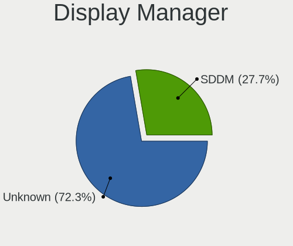
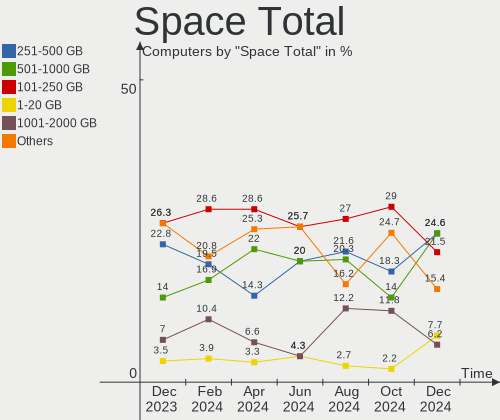
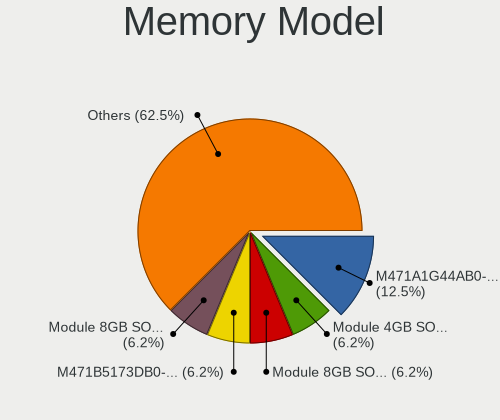
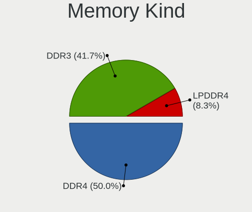
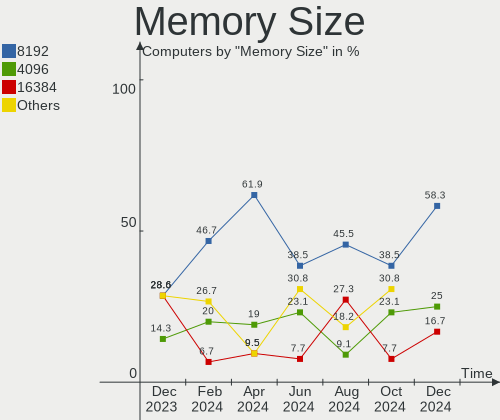

KDE neon - Hardware Trends
--------------------------

A project to identify most popular hardware characteristics and track their change
over time based on data collected by Linux users at https://Linux-Hardware.org.

Anyone can contribute to this report by the [hw-probe](https://github.com/linuxhw/hw-probe) tool:

    sudo -E hw-probe -all -upload

This is a report for all computer types. See also reports for [desktops](/Dist/KDE_neon/Desktop/README.md) and [notebooks](/Dist/KDE_neon/Notebook/README.md).

This report is for one last month. Overall report since the beginning of time: [TestCoverage](https://github.com/linuxhw/TestCoverage)

Period: Dec, 2022.

Contents
--------

* [ System ](#system)
  - [ OS                       ](#os)
  - [ OS Family                ](#os-family)
  - [ Kernel                   ](#kernel)
  - [ Kernel Family            ](#kernel-family)
  - [ Kernel Major Ver.        ](#kernel-major-ver)
  - [ Arch                     ](#arch)
  - [ DE                       ](#de)
  - [ Display Server           ](#display-server)
  - [ Display Manager          ](#display-manager)
  - [ OS Lang                  ](#os-lang)
  - [ Boot Mode                ](#boot-mode)
  - [ Filesystem               ](#filesystem)
  - [ Part. scheme             ](#part-scheme)
  - [ Dual Boot with Linux/BSD ](#dual-boot-with-linuxbsd)
  - [ Dual Boot (Win)          ](#dual-boot-win)

* [ Board ](#board)
  - [ Vendor                   ](#vendor)
  - [ Model                    ](#model)
  - [ Model Family             ](#model-family)
  - [ MFG Year                 ](#mfg-year)
  - [ Form Factor              ](#form-factor)
  - [ Secure Boot              ](#secure-boot)
  - [ Coreboot                 ](#coreboot)
  - [ RAM Size                 ](#ram-size)
  - [ RAM Used                 ](#ram-used)
  - [ Total Drives             ](#total-drives)
  - [ Has CD-ROM               ](#has-cd-rom)
  - [ Has Ethernet             ](#has-ethernet)
  - [ Has WiFi                 ](#has-wifi)
  - [ Has Bluetooth            ](#has-bluetooth)

* [ Location ](#location)
  - [ Country                  ](#country)
  - [ City                     ](#city)

* [ Drives ](#drives)
  - [ Drive Vendor             ](#drive-vendor)
  - [ Drive Model              ](#drive-model)
  - [ HDD Vendor               ](#hdd-vendor)
  - [ SSD Vendor               ](#ssd-vendor)
  - [ Drive Kind               ](#drive-kind)
  - [ Drive Connector          ](#drive-connector)
  - [ Drive Size               ](#drive-size)
  - [ Space Total              ](#space-total)
  - [ Space Used               ](#space-used)
  - [ Malfunc. Drives          ](#malfunc-drives)
  - [ Malfunc. Drive Vendor    ](#malfunc-drive-vendor)
  - [ Malfunc. HDD Vendor      ](#malfunc-hdd-vendor)
  - [ Malfunc. Drive Kind      ](#malfunc-drive-kind)
  - [ Failed Drives            ](#failed-drives)
  - [ Failed Drive Vendor      ](#failed-drive-vendor)
  - [ Drive Status             ](#drive-status)

* [ Storage controller ](#storage-controller)
  - [ Storage Vendor           ](#storage-vendor)
  - [ Storage Model            ](#storage-model)
  - [ Storage Kind             ](#storage-kind)

* [ Processor ](#processor)
  - [ CPU Vendor               ](#cpu-vendor)
  - [ CPU Model                ](#cpu-model)
  - [ CPU Model Family         ](#cpu-model-family)
  - [ CPU Cores                ](#cpu-cores)
  - [ CPU Sockets              ](#cpu-sockets)
  - [ CPU Threads              ](#cpu-threads)
  - [ CPU Op-Modes             ](#cpu-op-modes)
  - [ CPU Microcode            ](#cpu-microcode)
  - [ CPU Microarch            ](#cpu-microarch)

* [ Graphics ](#graphics)
  - [ GPU Vendor               ](#gpu-vendor)
  - [ GPU Model                ](#gpu-model)
  - [ GPU Combo                ](#gpu-combo)
  - [ GPU Driver               ](#gpu-driver)
  - [ GPU Memory               ](#gpu-memory)

* [ Monitor ](#monitor)
  - [ Monitor Vendor           ](#monitor-vendor)
  - [ Monitor Model            ](#monitor-model)
  - [ Monitor Resolution       ](#monitor-resolution)
  - [ Monitor Diagonal         ](#monitor-diagonal)
  - [ Monitor Width            ](#monitor-width)
  - [ Aspect Ratio             ](#aspect-ratio)
  - [ Monitor Area             ](#monitor-area)
  - [ Pixel Density            ](#pixel-density)
  - [ Multiple Monitors        ](#multiple-monitors)

* [ Network ](#network)
  - [ Net Controller Vendor    ](#net-controller-vendor)
  - [ Net Controller Model     ](#net-controller-model)
  - [ Wireless Vendor          ](#wireless-vendor)
  - [ Wireless Model           ](#wireless-model)
  - [ Ethernet Vendor          ](#ethernet-vendor)
  - [ Ethernet Model           ](#ethernet-model)
  - [ Net Controller Kind      ](#net-controller-kind)
  - [ Used Controller          ](#used-controller)
  - [ NICs                     ](#nics)
  - [ IPv6                     ](#ipv6)

* [ Bluetooth ](#bluetooth)
  - [ Bluetooth Vendor         ](#bluetooth-vendor)
  - [ Bluetooth Model          ](#bluetooth-model)

* [ Sound ](#sound)
  - [ Sound Vendor             ](#sound-vendor)
  - [ Sound Model              ](#sound-model)

* [ Memory ](#memory)
  - [ Memory Vendor            ](#memory-vendor)
  - [ Memory Model             ](#memory-model)
  - [ Memory Kind              ](#memory-kind)
  - [ Memory Form Factor       ](#memory-form-factor)
  - [ Memory Size              ](#memory-size)
  - [ Memory Speed             ](#memory-speed)

* [ Printers & scanners ](#printers--scanners)
  - [ Printer Vendor           ](#printer-vendor)
  - [ Printer Model            ](#printer-model)
  - [ Scanner Vendor           ](#scanner-vendor)
  - [ Scanner Model            ](#scanner-model)

* [ Camera ](#camera)
  - [ Camera Vendor            ](#camera-vendor)
  - [ Camera Model             ](#camera-model)

* [ Security ](#security)
  - [ Fingerprint Vendor       ](#fingerprint-vendor)
  - [ Fingerprint Model        ](#fingerprint-model)
  - [ Chipcard Vendor          ](#chipcard-vendor)
  - [ Chipcard Model           ](#chipcard-model)

* [ Unsupported ](#unsupported)
  - [ Unsupported Devices      ](#unsupported-devices)
  - [ Unsupported Device Types ](#unsupported-device-types)

System
------

OS
--

Installed operating systems

| Name           | Computers | Percent |
|----------------|-----------|---------|
| KDE neon 22.04 | 88        | 96.7%   |
| KDE neon 20.04 | 3         | 3.3%    |

OS Family
---------

OS without a version

| Name     | Computers | Percent |
|----------|-----------|---------|
| KDE neon | 91        | 100%    |

Kernel
------

Version of the Linux kernel

| Version                | Computers | Percent |
|------------------------|-----------|---------|
| 5.15.0-56-generic      | 79        | 86.81%  |
| 5.15.0-52-generic      | 4         | 4.4%    |
| 5.15.0-53-generic      | 2         | 2.2%    |
| 6.1.0-x64v3-xanmod1    | 1         | 1.1%    |
| 6.0.0-1007-oem         | 1         | 1.1%    |
| 5.4.0-113-generic      | 1         | 1.1%    |
| 5.16.12-051612-generic | 1         | 1.1%    |
| 5.13.0-44-generic      | 1         | 1.1%    |
| 5.11.0-37-generic      | 1         | 1.1%    |

Kernel Family
-------------

Linux kernel without a distro release

| Version | Computers | Percent |
|---------|-----------|---------|
| 5.15.0  | 85        | 93.41%  |
| 6.1.0   | 1         | 1.1%    |
| 6.0.0   | 1         | 1.1%    |
| 5.4.0   | 1         | 1.1%    |
| 5.16.12 | 1         | 1.1%    |
| 5.13.0  | 1         | 1.1%    |
| 5.11.0  | 1         | 1.1%    |

Kernel Major Ver.
-----------------

Linux kernel major version

| Version | Computers | Percent |
|---------|-----------|---------|
| 5.15    | 85        | 93.41%  |
| 6.1     | 1         | 1.1%    |
| 6.0     | 1         | 1.1%    |
| 5.4     | 1         | 1.1%    |
| 5.16    | 1         | 1.1%    |
| 5.13    | 1         | 1.1%    |
| 5.11    | 1         | 1.1%    |

Arch
----

OS architecture (x86_64, i586, etc.)

| Name   | Computers | Percent |
|--------|-----------|---------|
| x86_64 | 91        | 100%    |

DE
--

Desktop Environment

| Name | Computers | Percent |
|------|-----------|---------|
| KDE5 | 91        | 100%    |

Display Server
--------------

X11 or Wayland

| Name    | Computers | Percent |
|---------|-----------|---------|
| X11     | 89        | 97.8%   |
| Wayland | 2         | 2.2%    |

Display Manager
---------------

SDDM, LightDM, etc.

| Name    | Computers | Percent |
|---------|-----------|---------|
| Unknown | 70        | 76.92%  |
| SDDM    | 21        | 23.08%  |

OS Lang
-------

Language

| Lang  | Computers | Percent |
|-------|-----------|---------|
| en_US | 38        | 41.76%  |
| en_GB | 9         | 9.89%   |
| de_DE | 5         | 5.49%   |
| es_MX | 4         | 4.4%    |
| ru_RU | 3         | 3.3%    |
| pt_BR | 3         | 3.3%    |
| es_ES | 3         | 3.3%    |
| en_CA | 3         | 3.3%    |
| C     | 3         | 3.3%    |
| it_IT | 2         | 2.2%    |
| fr_BE | 2         | 2.2%    |
| en_ZA | 2         | 2.2%    |
| en_AU | 2         | 2.2%    |
| tr_TR | 1         | 1.1%    |
| sv_SE | 1         | 1.1%    |
| sk_SK | 1         | 1.1%    |
| hu_HU | 1         | 1.1%    |
| fr_FR | 1         | 1.1%    |
| es_PE | 1         | 1.1%    |
| es_EC | 1         | 1.1%    |
| en_SG | 1         | 1.1%    |
| en_IN | 1         | 1.1%    |
| en_DK | 1         | 1.1%    |
| en_AG | 1         | 1.1%    |
| bg_BG | 1         | 1.1%    |

Boot Mode
---------

EFI or BIOS

| Mode | Computers | Percent |
|------|-----------|---------|
| BIOS | 78        | 85.71%  |
| EFI  | 13        | 14.29%  |

Filesystem
----------

Type of filesystem

| Type    | Computers | Percent |
|---------|-----------|---------|
| Ext4    | 82        | 90.11%  |
| Overlay | 4         | 4.4%    |
| Btrfs   | 4         | 4.4%    |
| Ext3    | 1         | 1.1%    |

Part. scheme
------------

Scheme of partitioning

| Type    | Computers | Percent |
|---------|-----------|---------|
| Unknown | 70        | 76.92%  |
| GPT     | 17        | 18.68%  |
| MBR     | 4         | 4.4%    |

Dual Boot with Linux/BSD
------------------------

Hosting more than one Linux/BSD

| Dual boot | Computers | Percent |
|-----------|-----------|---------|
| No        | 88        | 96.7%   |
| Yes       | 3         | 3.3%    |

Dual Boot (Win)
---------------

Hosting Linux and Windows

| Dual boot | Computers | Percent |
|-----------|-----------|---------|
| No        | 83        | 91.21%  |
| Yes       | 8         | 8.79%   |

Board
-----

Vendor
------

Motherboard manufacturer

| Name                | Computers | Percent |
|---------------------|-----------|---------|
| Lenovo              | 17        | 18.68%  |
| ASUSTek Computer    | 15        | 16.48%  |
| MSI                 | 12        | 13.19%  |
| Dell                | 11        | 12.09%  |
| Hewlett-Packard     | 10        | 10.99%  |
| Gigabyte Technology | 6         | 6.59%   |
| Acer                | 6         | 6.59%   |
| Timi                | 2         | 2.2%    |
| Biostar             | 2         | 2.2%    |
| ASRock              | 2         | 2.2%    |
| Apple               | 2         | 2.2%    |
| Sony                | 1         | 1.1%    |
| Razer               | 1         | 1.1%    |
| Google              | 1         | 1.1%    |
| Fujitsu             | 1         | 1.1%    |
| CompuLab            | 1         | 1.1%    |
| Alienware           | 1         | 1.1%    |

Model
-----

Motherboard model

| Name                                       | Computers | Percent |
|--------------------------------------------|-----------|---------|
| Timi RedmiBook Pro 15S                     | 2         | 2.2%    |
| Lenovo Y520-15IKBN 80WK                    | 2         | 2.2%    |
| ASUS TUF Gaming FX505DT_FX505DT            | 2         | 2.2%    |
| ASUS All Series                            | 2         | 2.2%    |
| Sony VPCEA23FB                             | 1         | 1.1%    |
| Razer Blade Stealth                        | 1         | 1.1%    |
| MSI MS-7D76                                | 1         | 1.1%    |
| MSI MS-7C56                                | 1         | 1.1%    |
| MSI MS-7B93                                | 1         | 1.1%    |
| MSI MS-7B84                                | 1         | 1.1%    |
| MSI MS-7B78                                | 1         | 1.1%    |
| MSI MS-7A38                                | 1         | 1.1%    |
| MSI MS-7918                                | 1         | 1.1%    |
| MSI MS-7885                                | 1         | 1.1%    |
| MSI Modern 14 A10RB                        | 1         | 1.1%    |
| MSI GP65 Leopard 9SE                       | 1         | 1.1%    |
| MSI GL62M 7RE                              | 1         | 1.1%    |
| MSI GF63 Thin 11UC                         | 1         | 1.1%    |
| Lenovo ThinkPad X13 Gen 1 20UF0020MX       | 1         | 1.1%    |
| Lenovo ThinkPad X1 Carbon 6th 20KHCTO1WW   | 1         | 1.1%    |
| Lenovo ThinkPad T530 2392APU               | 1         | 1.1%    |
| Lenovo ThinkPad T470p 20J6CTO1WW           | 1         | 1.1%    |
| Lenovo ThinkCentre M91p 7033H45            | 1         | 1.1%    |
| Lenovo ThinkCentre E73 10AU003JUK          | 1         | 1.1%    |
| Lenovo ThinkBook 15 G3 ACL 21A4            | 1         | 1.1%    |
| Lenovo Legion 5 15ARH7H 82RD               | 1         | 1.1%    |
| Lenovo IdeaPadFlex 5 15ITL05 82HT          | 1         | 1.1%    |
| Lenovo IdeaPad U430 Touch 20270            | 1         | 1.1%    |
| Lenovo IdeaPad U400 099342G                | 1         | 1.1%    |
| Lenovo IdeaPad Gaming 3 15ARH05 82EY       | 1         | 1.1%    |
| Lenovo IdeaPad Gaming 3 15ACH6 82MJ        | 1         | 1.1%    |
| Lenovo IdeaCentre AIO 520-24IKL F0D1008YSA | 1         | 1.1%    |
| Lenovo B70-80 80MR                         | 1         | 1.1%    |
| HP ZBook 15 G2                             | 1         | 1.1%    |
| HP Z400 Workstation                        | 1         | 1.1%    |
| HP Pavilion Laptop 14-ce0xxx               | 1         | 1.1%    |
| HP Pavilion Gaming Laptop 15-ec2xxx        | 1         | 1.1%    |
| HP Pavilion dv7                            | 1         | 1.1%    |
| HP G62                                     | 1         | 1.1%    |
| HP EliteDesk 800 G1 TWR                    | 1         | 1.1%    |

Model Family
------------

Motherboard model prefix

| Name               | Computers | Percent |
|--------------------|-----------|---------|
| Dell Inspiron      | 7         | 7.69%   |
| Lenovo ThinkPad    | 4         | 4.4%    |
| Lenovo IdeaPad     | 4         | 4.4%    |
| HP Pavilion        | 3         | 3.3%    |
| ASUS PRIME         | 3         | 3.3%    |
| Acer Aspire        | 3         | 3.3%    |
| Timi RedmiBook     | 2         | 2.2%    |
| Lenovo Y520-15IKBN | 2         | 2.2%    |
| Lenovo ThinkCentre | 2         | 2.2%    |
| HP EliteBook       | 2         | 2.2%    |
| Dell OptiPlex      | 2         | 2.2%    |
| ASUS TUF           | 2         | 2.2%    |
| ASUS ROG           | 2         | 2.2%    |
| ASUS All           | 2         | 2.2%    |
| Apple MacBookPro10 | 2         | 2.2%    |
| Acer Nitro         | 2         | 2.2%    |
| Sony VPCEA23FB     | 1         | 1.1%    |
| Razer Blade        | 1         | 1.1%    |
| MSI MS-7D76        | 1         | 1.1%    |
| MSI MS-7C56        | 1         | 1.1%    |
| MSI MS-7B93        | 1         | 1.1%    |
| MSI MS-7B84        | 1         | 1.1%    |
| MSI MS-7B78        | 1         | 1.1%    |
| MSI MS-7A38        | 1         | 1.1%    |
| MSI MS-7918        | 1         | 1.1%    |
| MSI MS-7885        | 1         | 1.1%    |
| MSI Modern         | 1         | 1.1%    |
| MSI GP65           | 1         | 1.1%    |
| MSI GL62M          | 1         | 1.1%    |
| MSI GF63           | 1         | 1.1%    |
| Lenovo ThinkBook   | 1         | 1.1%    |
| Lenovo Legion      | 1         | 1.1%    |
| Lenovo IdeaPadFlex | 1         | 1.1%    |
| Lenovo IdeaCentre  | 1         | 1.1%    |
| Lenovo B70-80      | 1         | 1.1%    |
| HP ZBook           | 1         | 1.1%    |
| HP Z400            | 1         | 1.1%    |
| HP G62             | 1         | 1.1%    |
| HP EliteDesk       | 1         | 1.1%    |
| HP 100B            | 1         | 1.1%    |

MFG Year
--------

Motherboard manufacture year

| Year | Computers | Percent |
|------|-----------|---------|
| 2018 | 14        | 15.38%  |
| 2021 | 11        | 12.09%  |
| 2015 | 10        | 10.99%  |
| 2020 | 8         | 8.79%   |
| 2019 | 8         | 8.79%   |
| 2017 | 6         | 6.59%   |
| 2013 | 6         | 6.59%   |
| 2012 | 6         | 6.59%   |
| 2014 | 5         | 5.49%   |
| 2011 | 5         | 5.49%   |
| 2009 | 4         | 4.4%    |
| 2022 | 3         | 3.3%    |
| 2010 | 3         | 3.3%    |
| 2016 | 1         | 1.1%    |
| 2008 | 1         | 1.1%    |

Form Factor
-----------

Physical design of the computer

| Name        | Computers | Percent |
|-------------|-----------|---------|
| Notebook    | 50        | 54.95%  |
| Desktop     | 37        | 40.66%  |
| Tablet      | 1         | 1.1%    |
| Convertible | 1         | 1.1%    |
| Mini pc     | 1         | 1.1%    |
| All in one  | 1         | 1.1%    |

Secure Boot
-----------

Enabled or disabled

| State    | Computers | Percent |
|----------|-----------|---------|
| Disabled | 87        | 95.6%   |
| Enabled  | 4         | 4.4%    |

Coreboot
--------

Have coreboot on board

| Used | Computers | Percent |
|------|-----------|---------|
| No   | 90        | 98.9%   |
| Yes  | 1         | 1.1%    |

RAM Size
--------

Total RAM memory

| Size in GB  | Computers | Percent |
|-------------|-----------|---------|
| 4.01-8.0    | 23        | 25.27%  |
| 16.01-24.0  | 22        | 24.18%  |
| 8.01-16.0   | 20        | 21.98%  |
| 32.01-64.0  | 13        | 14.29%  |
| 3.01-4.0    | 9         | 9.89%   |
| 24.01-32.0  | 2         | 2.2%    |
| 2.01-3.0    | 1         | 1.1%    |
| 64.01-256.0 | 1         | 1.1%    |

RAM Used
--------

Used RAM memory

| Used GB   | Computers | Percent |
|-----------|-----------|---------|
| 2.01-3.0  | 29        | 31.87%  |
| 4.01-8.0  | 20        | 21.98%  |
| 3.01-4.0  | 20        | 21.98%  |
| 1.01-2.0  | 20        | 21.98%  |
| 8.01-16.0 | 1         | 1.1%    |
| 0.51-1.0  | 1         | 1.1%    |

Total Drives
------------

Number of drives on board

| Drives | Computers | Percent |
|--------|-----------|---------|
| 1      | 54        | 59.34%  |
| 2      | 24        | 26.37%  |
| 4      | 6         | 6.59%   |
| 3      | 5         | 5.49%   |
| 5      | 2         | 2.2%    |

Has CD-ROM
----------

Has CD-ROM on board

| Presented | Computers | Percent |
|-----------|-----------|---------|
| No        | 58        | 63.74%  |
| Yes       | 33        | 36.26%  |

Has Ethernet
------------

Has Ethernet on board

| Presented | Computers | Percent |
|-----------|-----------|---------|
| Yes       | 82        | 90.11%  |
| No        | 9         | 9.89%   |

Has WiFi
--------

Has WiFi module

| Presented | Computers | Percent |
|-----------|-----------|---------|
| Yes       | 73        | 80.22%  |
| No        | 18        | 19.78%  |

Has Bluetooth
-------------

Has Bluetooth module

| Presented | Computers | Percent |
|-----------|-----------|---------|
| Yes       | 65        | 71.43%  |
| No        | 26        | 28.57%  |

Location
--------

Country
-------

Geographic location (country)

| Country      | Computers | Percent |
|--------------|-----------|---------|
| USA          | 23        | 25.27%  |
| Germany      | 6         | 6.59%   |
| UK           | 5         | 5.49%   |
| Spain        | 5         | 5.49%   |
| Italy        | 4         | 4.4%    |
| Brazil       | 4         | 4.4%    |
| Sweden       | 3         | 3.3%    |
| Russia       | 3         | 3.3%    |
| Canada       | 3         | 3.3%    |
| Australia    | 3         | 3.3%    |
| South Africa | 2         | 2.2%    |
| Slovakia     | 2         | 2.2%    |
| Netherlands  | 2         | 2.2%    |
| Mexico       | 2         | 2.2%    |
| Latvia       | 2         | 2.2%    |
| India        | 2         | 2.2%    |
| Denmark      | 2         | 2.2%    |
| Bulgaria     | 2         | 2.2%    |
| Turkey       | 1         | 1.1%    |
| Tunisia      | 1         | 1.1%    |
| Singapore    | 1         | 1.1%    |
| Peru         | 1         | 1.1%    |
| Malaysia     | 1         | 1.1%    |
| Iran         | 1         | 1.1%    |
| Hungary      | 1         | 1.1%    |
| France       | 1         | 1.1%    |
| Finland      | 1         | 1.1%    |
| Estonia      | 1         | 1.1%    |
| El Salvador  | 1         | 1.1%    |
| Ecuador      | 1         | 1.1%    |
| Chile        | 1         | 1.1%    |
| Belgium      | 1         | 1.1%    |
| Belarus      | 1         | 1.1%    |
| Algeria      | 1         | 1.1%    |

City
----

Geographic location (city)

| City                      | Computers | Percent |
|---------------------------|-----------|---------|
| Sofia                     | 2         | 2.2%    |
| Riga                      | 2         | 2.2%    |
| Randers                   | 2         | 2.2%    |
| Porto Alegre              | 2         | 2.2%    |
| Johannesburg              | 2         | 2.2%    |
| Jackson                   | 2         | 2.2%    |
| Brisbane                  | 2         | 2.2%    |
| Zapopan                   | 1         | 1.1%    |
| Ypsilanti                 | 1         | 1.1%    |
| Worcester                 | 1         | 1.1%    |
| Waren                     | 1         | 1.1%    |
| Vohenstrauss              | 1         | 1.1%    |
| Villafranca de los Barros | 1         | 1.1%    |
| Valencia                  | 1         | 1.1%    |
| Tuscola                   | 1         | 1.1%    |
| Tipasa                    | 1         | 1.1%    |
| The Hague                 | 1         | 1.1%    |
| Tallinn                   | 1         | 1.1%    |
| Sumaré                   | 1         | 1.1%    |
| Stockholm                 | 1         | 1.1%    |
| St. Claude                | 1         | 1.1%    |
| Singapore                 | 1         | 1.1%    |
| Sfax                      | 1         | 1.1%    |
| Santiago                  | 1         | 1.1%    |
| San Salvador              | 1         | 1.1%    |
| Rome                      | 1         | 1.1%    |
| Pune                      | 1         | 1.1%    |
| Poway                     | 1         | 1.1%    |
| Pontiac                   | 1         | 1.1%    |
| Plainfield                | 1         | 1.1%    |
| Phoenix                   | 1         | 1.1%    |
| Paris                     | 1         | 1.1%    |
| New York                  | 1         | 1.1%    |
| Neuss                     | 1         | 1.1%    |
| Moscow                    | 1         | 1.1%    |
| Modena                    | 1         | 1.1%    |
| Minsk                     | 1         | 1.1%    |
| Milan                     | 1         | 1.1%    |
| McMinnville               | 1         | 1.1%    |
| Maracena                  | 1         | 1.1%    |

Drives
------

Drive Vendor
------------

Hard drive vendors

| Vendor                      | Computers | Drives | Percent |
|-----------------------------|-----------|--------|---------|
| Samsung Electronics         | 21        | 23     | 15.11%  |
| Seagate                     | 19        | 21     | 13.67%  |
| WDC                         | 16        | 20     | 11.51%  |
| Kingston                    | 10        | 10     | 7.19%   |
| Toshiba                     | 9         | 11     | 6.47%   |
| Crucial                     | 9         | 10     | 6.47%   |
| SK hynix                    | 7         | 7      | 5.04%   |
| SanDisk                     | 7         | 7      | 5.04%   |
| Intel                       | 5         | 6      | 3.6%    |
| A-DATA Technology           | 4         | 4      | 2.88%   |
| Unknown                     | 3         | 3      | 2.16%   |
| Phison Electronics          | 3         | 3      | 2.16%   |
| Micron Technology           | 3         | 3      | 2.16%   |
| China                       | 3         | 3      | 2.16%   |
| Intenso                     | 2         | 2      | 1.44%   |
| Hitachi                     | 2         | 3      | 1.44%   |
| ADATA Technology            | 2         | 2      | 1.44%   |
| TO Exter                    | 1         | 1      | 0.72%   |
| Team                        | 1         | 1      | 0.72%   |
| SPCC                        | 1         | 1      | 0.72%   |
| PNY                         | 1         | 1      | 0.72%   |
| Plextor                     | 1         | 1      | 0.72%   |
| Pioneer                     | 1         | 1      | 0.72%   |
| OYUNKEY                     | 1         | 1      | 0.72%   |
| Netac                       | 1         | 1      | 0.72%   |
| Kingston Technology Company | 1         | 1      | 0.72%   |
| KingFast                    | 1         | 1      | 0.72%   |
| HS-SSD-C100                 | 1         | 1      | 0.72%   |
| Gigabyte Technology         | 1         | 1      | 0.72%   |
| Apple                       | 1         | 1      | 0.72%   |
| Apacer                      | 1         | 1      | 0.72%   |

Drive Model
-----------

Hard drive models

| Model                                               | Computers | Percent |
|-----------------------------------------------------|-----------|---------|
| Kingston SA400S37240G 240GB SSD                     | 5         | 3.38%   |
| Samsung NVMe SSD Controller SM981/PM981/PM983 500GB | 3         | 2.03%   |
| WDC WD10EZEX-08WN4A0 1TB                            | 2         | 1.35%   |
| Toshiba DT01ACA050 500GB                            | 2         | 1.35%   |
| SK hynix HFM001TD3JX013N 1TB                        | 2         | 1.35%   |
| Seagate ST1000LM024 HN-M101MBB 1TB                  | 2         | 1.35%   |
| Sandisk WD Blue SN550 NVMe SSD 500GB                | 2         | 1.35%   |
| Samsung SSD 860 EVO 500GB                           | 2         | 1.35%   |
| Micron 2200V_MTFDHBA512TCK 512GB                    | 2         | 1.35%   |
| Crucial CT480BX500SSD1 480GB                        | 2         | 1.35%   |
| Crucial CT240BX500SSD1 240GB                        | 2         | 1.35%   |
| Crucial CT1000MX500SSD1 1TB                         | 2         | 1.35%   |
| WDC WDS240G2G0A-00JH30 240GB SSD                    | 1         | 0.68%   |
| WDC WDS100T1R0B-68A4Z0 1TB SSD                      | 1         | 0.68%   |
| WDC WD800BB-22JHA0 80GB                             | 1         | 0.68%   |
| WDC WD6400AARS-00Y5B1 640GB                         | 1         | 0.68%   |
| WDC WD6400AAKS-22A7B0 640GB                         | 1         | 0.68%   |
| WDC WD5000BPKX-22HPJT0 500GB                        | 1         | 0.68%   |
| WDC WD40EZAZ-00SF3B0 4TB                            | 1         | 0.68%   |
| WDC WD20EZRZ-00Z5HB0 2TB                            | 1         | 0.68%   |
| WDC WD20EARX-00PASB0 2TB                            | 1         | 0.68%   |
| WDC WD2003FYYS-02W0B0 2TB                           | 1         | 0.68%   |
| WDC WD1600BEKT-00PVMT0 160GB                        | 1         | 0.68%   |
| WDC WD140EDGZ-11B1PA0 14TB                          | 1         | 0.68%   |
| WDC WD10SPZX-75Z10T2 1TB                            | 1         | 0.68%   |
| WDC WD10JPCX-24UE4T0 1TB                            | 1         | 0.68%   |
| WDC WD10EZEX-75WN4A1 1TB                            | 1         | 0.68%   |
| WDC WD Blue SA510 2.5 500GB                         | 1         | 0.68%   |
| WDC PC SN730 NVMe 1024GB                            | 1         | 0.68%   |
| Unknown MMC Card  64GB                              | 1         | 0.68%   |
| Unknown MMC Card  16GB                              | 1         | 0.68%   |
| Unknown MMC Card  128GB                             | 1         | 0.68%   |
| Toshiba MQ01ABD100 1TB                              | 1         | 0.68%   |
| Toshiba MK6476GSX 640GB                             | 1         | 0.68%   |
| Toshiba HDWD130 3TB                                 | 1         | 0.68%   |
| Toshiba HDWD110 1TB                                 | 1         | 0.68%   |
| Toshiba DT01ACA200 2TB                              | 1         | 0.68%   |
| Toshiba DT01ACA100 1TB                              | 1         | 0.68%   |
| Toshiba BG3 NVMe SSD Controller 256GB               | 1         | 0.68%   |
| TO Exter nal USB 3.0 512GB                          | 1         | 0.68%   |

HDD Vendor
----------

Hard disk drive vendors

| Vendor              | Computers | Drives | Percent |
|---------------------|-----------|--------|---------|
| Seagate             | 18        | 20     | 41.86%  |
| WDC                 | 13        | 16     | 30.23%  |
| Toshiba             | 8         | 10     | 18.6%   |
| Hitachi             | 2         | 3      | 4.65%   |
| Samsung Electronics | 1         | 1      | 2.33%   |
| Pioneer             | 1         | 1      | 2.33%   |

SSD Vendor
----------

Solid state drive vendors

| Vendor              | Computers | Drives | Percent |
|---------------------|-----------|--------|---------|
| Samsung Electronics | 10        | 12     | 20.83%  |
| Crucial             | 8         | 9      | 16.67%  |
| Kingston            | 5         | 5      | 10.42%  |
| A-DATA Technology   | 4         | 4      | 8.33%   |
| WDC                 | 3         | 3      | 6.25%   |
| China               | 3         | 3      | 6.25%   |
| SanDisk             | 2         | 2      | 4.17%   |
| Intenso             | 2         | 2      | 4.17%   |
| TO Exter            | 1         | 1      | 2.08%   |
| Team                | 1         | 1      | 2.08%   |
| SPCC                | 1         | 1      | 2.08%   |
| SK hynix            | 1         | 1      | 2.08%   |
| PNY                 | 1         | 1      | 2.08%   |
| Plextor             | 1         | 1      | 2.08%   |
| Micron Technology   | 1         | 1      | 2.08%   |
| Intel               | 1         | 1      | 2.08%   |
| Gigabyte Technology | 1         | 1      | 2.08%   |
| Apple               | 1         | 1      | 2.08%   |
| Apacer              | 1         | 1      | 2.08%   |

Drive Kind
----------

HDD or SSD

| Kind    | Computers | Drives | Percent |
|---------|-----------|--------|---------|
| SSD     | 41        | 51     | 33.06%  |
| NVMe    | 39        | 43     | 31.45%  |
| HDD     | 37        | 51     | 29.84%  |
| Unknown | 4         | 4      | 3.23%   |
| MMC     | 3         | 3      | 2.42%   |

Drive Connector
---------------

SATA, SAS, NVMe, etc.

| Type | Computers | Drives | Percent |
|------|-----------|--------|---------|
| SATA | 63        | 100    | 56.76%  |
| NVMe | 39        | 43     | 35.14%  |
| SAS  | 6         | 6      | 5.41%   |
| MMC  | 3         | 3      | 2.7%    |

Drive Size
----------

Size of hard drive

| Size in TB | Computers | Drives | Percent |
|------------|-----------|--------|---------|
| 0.01-0.5   | 43        | 52     | 51.19%  |
| 0.51-1.0   | 22        | 29     | 26.19%  |
| 1.01-2.0   | 10        | 12     | 11.9%   |
| 3.01-4.0   | 3         | 3      | 3.57%   |
| 2.01-3.0   | 3         | 3      | 3.57%   |
| 4.01-10.0  | 2         | 2      | 2.38%   |
| 10.01-20.0 | 1         | 1      | 1.19%   |

Space Total
-----------

Amount of disk space available on the file system

| Size in GB     | Computers | Percent |
|----------------|-----------|---------|
| 101-250        | 23        | 25.27%  |
| 251-500        | 18        | 19.78%  |
| 501-1000       | 16        | 17.58%  |
| 51-100         | 8         | 8.79%   |
| 1-20           | 7         | 7.69%   |
| 1001-2000      | 6         | 6.59%   |
| Unknown        | 5         | 5.49%   |
| More than 3000 | 4         | 4.4%    |
| 21-50          | 3         | 3.3%    |
| 2001-3000      | 1         | 1.1%    |

Space Used
----------

Amount of used disk space

| Used GB        | Computers | Percent |
|----------------|-----------|---------|
| 1-20           | 42        | 46.15%  |
| 21-50          | 20        | 21.98%  |
| 101-250        | 8         | 8.79%   |
| 51-100         | 8         | 8.79%   |
| Unknown        | 5         | 5.49%   |
| More than 3000 | 2         | 2.2%    |
| 1001-2000      | 2         | 2.2%    |
| 501-1000       | 2         | 2.2%    |
| 251-500        | 1         | 1.1%    |
| 2001-3000      | 1         | 1.1%    |

Malfunc. Drives
---------------

Drive models with a malfunction

| Model                          | Computers | Drives | Percent |
|--------------------------------|-----------|--------|---------|
| Toshiba MK6476GSX 640GB        | 1         | 1      | 50%     |
| Seagate ST5000LM000-2AN170 5TB | 1         | 1      | 50%     |

Malfunc. Drive Vendor
---------------------

Vendors of faulty drives

| Vendor  | Computers | Drives | Percent |
|---------|-----------|--------|---------|
| Toshiba | 1         | 1      | 50%     |
| Seagate | 1         | 1      | 50%     |

Malfunc. HDD Vendor
-------------------

Vendors of faulty HDD drives

| Vendor  | Computers | Drives | Percent |
|---------|-----------|--------|---------|
| Toshiba | 1         | 1      | 50%     |
| Seagate | 1         | 1      | 50%     |

Malfunc. Drive Kind
-------------------

Kinds of faulty drives

| Kind | Computers | Drives | Percent |
|------|-----------|--------|---------|
| HDD  | 2         | 2      | 100%    |

Failed Drives
-------------

Failed drive models

Zero info for selected period =(

Failed Drive Vendor
-------------------

Failed drive vendors

Zero info for selected period =(

Drive Status
------------

Number of failed and malfunc. drives

| Status   | Computers | Drives | Percent |
|----------|-----------|--------|---------|
| Detected | 80        | 132    | 82.47%  |
| Works    | 15        | 18     | 15.46%  |
| Malfunc  | 2         | 2      | 2.06%   |

Storage controller
------------------

Storage Vendor
--------------

Storage controller vendors

| Vendor                       | Computers | Percent |
|------------------------------|-----------|---------|
| Intel                        | 54        | 45.38%  |
| AMD                          | 23        | 19.33%  |
| Samsung Electronics          | 10        | 8.4%    |
| SK hynix                     | 6         | 5.04%   |
| SanDisk                      | 6         | 5.04%   |
| Kingston Technology Company  | 6         | 5.04%   |
| ASMedia Technology           | 4         | 3.36%   |
| Phison Electronics           | 3         | 2.52%   |
| Micron Technology            | 2         | 1.68%   |
| ADATA Technology             | 2         | 1.68%   |
| Toshiba America Info Systems | 1         | 0.84%   |
| Nvidia                       | 1         | 0.84%   |
| Micron/Crucial Technology    | 1         | 0.84%   |

Storage Model
-------------

Storage controller models

| Model                                                                            | Computers | Percent |
|----------------------------------------------------------------------------------|-----------|---------|
| AMD FCH SATA Controller [AHCI mode]                                              | 19        | 14.62%  |
| Intel 8 Series/C220 Series Chipset Family 6-port SATA Controller 1 [AHCI mode]   | 6         | 4.62%   |
| Samsung NVMe SSD Controller SM981/PM981/PM983                                    | 4         | 3.08%   |
| Intel 7 Series Chipset Family 6-port SATA Controller [AHCI mode]                 | 4         | 3.08%   |
| ASMedia ASM1062 Serial ATA Controller                                            | 4         | 3.08%   |
| AMD 400 Series Chipset SATA Controller                                           | 4         | 3.08%   |
| SK hynix Gold P31/PC711 NVMe Solid State Drive                                   | 3         | 2.31%   |
| Samsung NVMe SSD Controller 980                                                  | 3         | 2.31%   |
| Kingston Company Company Non-Volatile memory controller                          | 3         | 2.31%   |
| Intel Q170/Q150/B150/H170/H110/Z170/CM236 Chipset SATA Controller [AHCI Mode]    | 3         | 2.31%   |
| Intel Non-Volatile memory controller                                             | 3         | 2.31%   |
| Intel HM170/QM170 Chipset SATA Controller [AHCI Mode]                            | 3         | 2.31%   |
| Intel 7 Series/C210 Series Chipset Family 6-port SATA Controller [AHCI mode]     | 3         | 2.31%   |
| Intel 6 Series/C200 Series Chipset Family 6 port Mobile SATA AHCI Controller     | 3         | 2.31%   |
| SanDisk WD Blue SN550 NVMe SSD                                                   | 2         | 1.54%   |
| SanDisk Non-Volatile memory controller                                           | 2         | 1.54%   |
| Micron Non-Volatile memory controller                                            | 2         | 1.54%   |
| Kingston Company OM3PDP3 NVMe SSD                                                | 2         | 1.54%   |
| Intel Wildcat Point-LP SATA Controller [AHCI Mode]                               | 2         | 1.54%   |
| Intel SATA Controller [RAID mode]                                                | 2         | 1.54%   |
| Intel NM10/ICH7 Family SATA Controller [IDE mode]                                | 2         | 1.54%   |
| Intel Cannon Lake Mobile PCH SATA AHCI Controller                                | 2         | 1.54%   |
| Intel Atom/Celeron/Pentium Processor x5-E8000/J3xxx/N3xxx Series SATA Controller | 2         | 1.54%   |
| Intel 9 Series Chipset Family SATA Controller [AHCI Mode]                        | 2         | 1.54%   |
| Intel 82801IBM/IEM (ICH9M/ICH9M-E) 4 port SATA Controller [AHCI mode]            | 2         | 1.54%   |
| Intel 8 Series SATA Controller 1 [AHCI mode]                                     | 2         | 1.54%   |
| Intel 6 Series/C200 Series Chipset Family 6 port Desktop SATA AHCI Controller    | 2         | 1.54%   |
| Intel 5 Series/3400 Series Chipset 4 port SATA AHCI Controller                   | 2         | 1.54%   |
| Intel 200 Series PCH SATA controller [AHCI mode]                                 | 2         | 1.54%   |
| AMD X370 Series Chipset SATA Controller                                          | 2         | 1.54%   |
| AMD SB7x0/SB8x0/SB9x0 SATA Controller [AHCI mode]                                | 2         | 1.54%   |
| Toshiba America Info Systems BG3 NVMe SSD Controller                             | 1         | 0.77%   |
| SK hynix Non-Volatile memory controller                                          | 1         | 0.77%   |
| SK hynix BC511                                                                   | 1         | 0.77%   |
| SK hynix BC501 NVMe Solid State Drive                                            | 1         | 0.77%   |
| SanDisk WD Blue SN500 / PC SN520 NVMe SSD                                        | 1         | 0.77%   |
| SanDisk WD Black SN750 / PC SN730 NVMe SSD                                       | 1         | 0.77%   |
| Samsung NVMe SSD Controller SM961/PM961/SM963                                    | 1         | 0.77%   |
| Samsung NVMe SSD Controller PM9A1/PM9A3/980PRO                                   | 1         | 0.77%   |
| Samsung Electronics Non-Volatile memory controller                               | 1         | 0.77%   |

Storage Kind
------------

Kind of storage controller (IDE, SATA, NVMe, SAS, ...)

| Kind | Computers | Percent |
|------|-----------|---------|
| SATA | 67        | 58.26%  |
| NVMe | 38        | 33.04%  |
| RAID | 6         | 5.22%   |
| IDE  | 4         | 3.48%   |

Processor
---------

CPU Vendor
----------

Processor vendors

| Vendor | Computers | Percent |
|--------|-----------|---------|
| Intel  | 62        | 68.13%  |
| AMD    | 29        | 31.87%  |

CPU Model
---------

Processor models

| Model                                       | Computers | Percent |
|---------------------------------------------|-----------|---------|
| AMD Ryzen 7 5800H with Radeon Graphics      | 5         | 5.49%   |
| Intel Core i7-8550U CPU @ 1.80GHz           | 2         | 2.2%    |
| Intel Core i7-4770 CPU @ 3.40GHz            | 2         | 2.2%    |
| Intel Core i5-7300HQ CPU @ 2.50GHz          | 2         | 2.2%    |
| Intel Celeron CPU N3150 @ 1.60GHz           | 2         | 2.2%    |
| AMD Ryzen 7 5700U with Radeon Graphics      | 2         | 2.2%    |
| AMD Ryzen 5 2600 Six-Core Processor         | 2         | 2.2%    |
| AMD Ryzen 5 1600 Six-Core Processor         | 2         | 2.2%    |
| Intel Xeon CPU W3565 @ 3.20GHz              | 1         | 1.1%    |
| Intel Pentium Dual-Core CPU T4300 @ 2.10GHz | 1         | 1.1%    |
| Intel Pentium Dual-Core CPU E5400 @ 2.70GHz | 1         | 1.1%    |
| Intel Pentium CPU P6100 @ 2.00GHz           | 1         | 1.1%    |
| Intel Pentium CPU G3220 @ 3.00GHz           | 1         | 1.1%    |
| Intel Pentium CPU B960 @ 2.20GHz            | 1         | 1.1%    |
| Intel Core i7-9750H CPU @ 2.60GHz           | 1         | 1.1%    |
| Intel Core i7-9700F CPU @ 3.00GHz           | 1         | 1.1%    |
| Intel Core i7-8565U CPU @ 1.80GHz           | 1         | 1.1%    |
| Intel Core i7-7820HQ CPU @ 2.90GHz          | 1         | 1.1%    |
| Intel Core i7-7700HQ CPU @ 2.80GHz          | 1         | 1.1%    |
| Intel Core i7-7500U CPU @ 2.70GHz           | 1         | 1.1%    |
| Intel Core i7-6700 CPU @ 3.40GHz            | 1         | 1.1%    |
| Intel Core i7-5820K CPU @ 3.30GHz           | 1         | 1.1%    |
| Intel Core i7-4810MQ CPU @ 2.80GHz          | 1         | 1.1%    |
| Intel Core i7-4790K CPU @ 4.00GHz           | 1         | 1.1%    |
| Intel Core i7-4500U CPU @ 1.80GHz           | 1         | 1.1%    |
| Intel Core i7-3820 CPU @ 3.60GHz            | 1         | 1.1%    |
| Intel Core i7-3720QM CPU @ 2.60GHz          | 1         | 1.1%    |
| Intel Core i7-3615QM CPU @ 2.30GHz          | 1         | 1.1%    |
| Intel Core i7-3517UE CPU @ 1.70GHz          | 1         | 1.1%    |
| Intel Core i7-2620M CPU @ 2.70GHz           | 1         | 1.1%    |
| Intel Core i7-10850H CPU @ 2.70GHz          | 1         | 1.1%    |
| Intel Core i7-10750H CPU @ 2.60GHz          | 1         | 1.1%    |
| Intel Core i7-1065G7 CPU @ 1.30GHz          | 1         | 1.1%    |
| Intel Core i5-8300H CPU @ 2.30GHz           | 1         | 1.1%    |
| Intel Core i5-8250U CPU @ 1.60GHz           | 1         | 1.1%    |
| Intel Core i5-7400T CPU @ 2.40GHz           | 1         | 1.1%    |
| Intel Core i5-6600K CPU @ 3.50GHz           | 1         | 1.1%    |
| Intel Core i5-6600 CPU @ 3.30GHz            | 1         | 1.1%    |
| Intel Core i5-5200U CPU @ 2.20GHz           | 1         | 1.1%    |
| Intel Core i5-4690 CPU @ 3.50GHz            | 1         | 1.1%    |

CPU Model Family
----------------

Processor model prefix

| Model                   | Computers | Percent |
|-------------------------|-----------|---------|
| Intel Core i7           | 23        | 25.27%  |
| Intel Core i5           | 17        | 18.68%  |
| AMD Ryzen 7             | 11        | 12.09%  |
| AMD Ryzen 5             | 8         | 8.79%   |
| Intel Core i3           | 6         | 6.59%   |
| Intel Celeron           | 4         | 4.4%    |
| Other                   | 3         | 3.3%    |
| Intel Pentium           | 3         | 3.3%    |
| Intel Pentium Dual-Core | 2         | 2.2%    |
| AMD Ryzen 9             | 2         | 2.2%    |
| Intel Xeon              | 1         | 1.1%    |
| Intel Core 2 Quad       | 1         | 1.1%    |
| Intel Core 2 Duo        | 1         | 1.1%    |
| Intel Atom              | 1         | 1.1%    |
| AMD Ryzen 5 PRO         | 1         | 1.1%    |
| AMD Ryzen 3             | 1         | 1.1%    |
| AMD FX                  | 1         | 1.1%    |
| AMD E                   | 1         | 1.1%    |
| AMD Athlon II X2        | 1         | 1.1%    |
| AMD Athlon              | 1         | 1.1%    |
| AMD A6                  | 1         | 1.1%    |
| AMD A10                 | 1         | 1.1%    |

CPU Cores
---------

Number of processor cores

| Number | Computers | Percent |
|--------|-----------|---------|
| 4      | 42        | 46.15%  |
| 2      | 24        | 26.37%  |
| 8      | 12        | 13.19%  |
| 6      | 12        | 13.19%  |
| 12     | 1         | 1.1%    |

CPU Sockets
-----------

Number of sockets

| Number | Computers | Percent |
|--------|-----------|---------|
| 1      | 91        | 100%    |

CPU Threads
-----------

Threads per core (Hyper-Threading)

| Number | Computers | Percent |
|--------|-----------|---------|
| 2      | 62        | 68.13%  |
| 1      | 29        | 31.87%  |

CPU Op-Modes
------------

CPU Operation Modes (32-bit, 64-bit)

| Op mode        | Computers | Percent |
|----------------|-----------|---------|
| 32-bit, 64-bit | 91        | 100%    |

CPU Microcode
-------------

Microcode number

| Number     | Computers | Percent |
|------------|-----------|---------|
| Unknown    | 69        | 75.82%  |
| 0x806c1    | 2         | 2.2%    |
| 0x306a9    | 2         | 2.2%    |
| 0x906eb    | 1         | 1.1%    |
| 0x806ec    | 1         | 1.1%    |
| 0x806e9    | 1         | 1.1%    |
| 0x706e5    | 1         | 1.1%    |
| 0x406c4    | 1         | 1.1%    |
| 0x40651    | 1         | 1.1%    |
| 0x306f2    | 1         | 1.1%    |
| 0x306c3    | 1         | 1.1%    |
| 0x1067a    | 1         | 1.1%    |
| 0x0a601201 | 1         | 1.1%    |
| 0x0a50000d | 1         | 1.1%    |
| 0x08608103 | 1         | 1.1%    |
| 0x08608102 | 1         | 1.1%    |
| 0x08108102 | 1         | 1.1%    |
| 0x08101016 | 1         | 1.1%    |
| 0x0800820d | 1         | 1.1%    |
| 0x08001138 | 1         | 1.1%    |
| 0x06000852 | 1         | 1.1%    |

CPU Microarch
-------------

Microarchitecture

| Name        | Computers | Percent |
|-------------|-----------|---------|
| KabyLake    | 15        | 16.48%  |
| Haswell     | 11        | 12.09%  |
| IvyBridge   | 8         | 8.79%   |
| Zen+        | 7         | 7.69%   |
| Zen 3       | 7         | 7.69%   |
| Unknown     | 6         | 6.59%   |
| SandyBridge | 5         | 5.49%   |
| Silvermont  | 4         | 4.4%    |
| Penryn      | 4         | 4.4%    |
| Zen 2       | 3         | 3.3%    |
| Zen         | 3         | 3.3%    |
| Skylake     | 3         | 3.3%    |
| Westmere    | 2         | 2.2%    |
| TigerLake   | 2         | 2.2%    |
| CometLake   | 2         | 2.2%    |
| Broadwell   | 2         | 2.2%    |
| Puma        | 1         | 1.1%    |
| Piledriver  | 1         | 1.1%    |
| Nehalem     | 1         | 1.1%    |
| K10         | 1         | 1.1%    |
| IceLake     | 1         | 1.1%    |
| Excavator   | 1         | 1.1%    |
| Bobcat      | 1         | 1.1%    |

Graphics
--------

GPU Vendor
----------

Vendors of graphics cards

| Vendor | Computers | Percent |
|--------|-----------|---------|
| Intel  | 51        | 43.22%  |
| Nvidia | 39        | 33.05%  |
| AMD    | 28        | 23.73%  |

GPU Model
---------

Graphics card models

| Model                                                                                    | Computers | Percent |
|------------------------------------------------------------------------------------------|-----------|---------|
| AMD Cezanne [Radeon Vega Series / Radeon Vega Mobile Series]                             | 6         | 5.08%   |
| Intel HD Graphics 630                                                                    | 5         | 4.24%   |
| Intel 3rd Gen Core processor Graphics Controller                                         | 4         | 3.39%   |
| Intel 2nd Generation Core Processor Family Integrated Graphics Controller                | 4         | 3.39%   |
| Nvidia TU117M [GeForce GTX 1650 Mobile / Max-Q]                                          | 3         | 2.54%   |
| Intel Xeon E3-1200 v3/4th Gen Core Processor Integrated Graphics Controller              | 3         | 2.54%   |
| Intel UHD Graphics 620                                                                   | 3         | 2.54%   |
| Intel Atom/Celeron/Pentium Processor x5-E8000/J3xxx/N3xxx Integrated Graphics Controller | 3         | 2.54%   |
| AMD Picasso/Raven 2 [Radeon Vega Series / Radeon Vega Mobile Series]                     | 3         | 2.54%   |
| Nvidia TU117M [GeForce GTX 1650 Ti Mobile]                                               | 2         | 1.69%   |
| Nvidia GP107M [GeForce GTX 1050 Ti Mobile]                                               | 2         | 1.69%   |
| Nvidia GP104 [GeForce GTX 1080]                                                          | 2         | 1.69%   |
| Nvidia GA106M [GeForce RTX 3060 Mobile / Max-Q]                                          | 2         | 1.69%   |
| Intel Xeon E3-1200 v2/3rd Gen Core processor Graphics Controller                         | 2         | 1.69%   |
| Intel TigerLake-LP GT2 [Iris Xe Graphics]                                                | 2         | 1.69%   |
| Intel HD Graphics 5500                                                                   | 2         | 1.69%   |
| Intel HD Graphics 530                                                                    | 2         | 1.69%   |
| Intel Haswell-ULT Integrated Graphics Controller                                         | 2         | 1.69%   |
| Intel Core Processor Integrated Graphics Controller                                      | 2         | 1.69%   |
| Intel CometLake-H GT2 [UHD Graphics]                                                     | 2         | 1.69%   |
| Intel CoffeeLake-H GT2 [UHD Graphics 630]                                                | 2         | 1.69%   |
| AMD Renoir                                                                               | 2         | 1.69%   |
| AMD Lucienne                                                                             | 2         | 1.69%   |
| AMD Ellesmere [Radeon RX 470/480/570/570X/580/580X/590]                                  | 2         | 1.69%   |
| Nvidia TU117GLM [Quadro T1000 Mobile]                                                    | 1         | 0.85%   |
| Nvidia TU116 [GeForce GTX 1650 SUPER]                                                    | 1         | 0.85%   |
| Nvidia TU106M [GeForce RTX 2060 Mobile]                                                  | 1         | 0.85%   |
| Nvidia TU106 [GeForce RTX 2060 Rev. A]                                                   | 1         | 0.85%   |
| Nvidia TU104 [GeForce RTX 2080 SUPER]                                                    | 1         | 0.85%   |
| Nvidia TU104 [GeForce RTX 2070 SUPER]                                                    | 1         | 0.85%   |
| Nvidia GP108M [GeForce MX330]                                                            | 1         | 0.85%   |
| Nvidia GP108M [GeForce MX250]                                                            | 1         | 0.85%   |
| Nvidia GP108M [GeForce MX150]                                                            | 1         | 0.85%   |
| Nvidia GP108 [GeForce GT 1030]                                                           | 1         | 0.85%   |
| Nvidia GP107M [GeForce GTX 1050 Mobile]                                                  | 1         | 0.85%   |
| Nvidia GP107 [GeForce GTX 1050]                                                          | 1         | 0.85%   |
| Nvidia GP107 [GeForce GTX 1050 Ti]                                                       | 1         | 0.85%   |
| Nvidia GM206 [GeForce GTX 960]                                                           | 1         | 0.85%   |
| Nvidia GM204 [GeForce GTX 970]                                                           | 1         | 0.85%   |
| Nvidia GM108M [GeForce MX130]                                                            | 1         | 0.85%   |

GPU Combo
---------

Combinations of graphics cards

| Name           | Computers | Percent |
|----------------|-----------|---------|
| 1 x Intel      | 31        | 34.07%  |
| 1 x AMD        | 19        | 20.88%  |
| 1 x Nvidia     | 16        | 17.58%  |
| Intel + Nvidia | 16        | 17.58%  |
| AMD + Nvidia   | 7         | 7.69%   |
| Intel + AMD    | 2         | 2.2%    |

GPU Driver
----------

Free vs proprietary

| Driver      | Computers | Percent |
|-------------|-----------|---------|
| Free        | 81        | 89.01%  |
| Proprietary | 7         | 7.69%   |
| Unknown     | 3         | 3.3%    |

GPU Memory
----------

Total video memory

| Size in GB | Computers | Percent |
|------------|-----------|---------|
| Unknown    | 79        | 86.81%  |
| 1.01-2.0   | 6         | 6.59%   |
| 3.01-4.0   | 2         | 2.2%    |
| 0.01-0.5   | 2         | 2.2%    |
| 7.01-8.0   | 1         | 1.1%    |
| 0.51-1.0   | 1         | 1.1%    |

Monitor
-------

Monitor Vendor
--------------

Monitor vendors

| Vendor                  | Computers | Percent |
|-------------------------|-----------|---------|
| Chimei Innolux          | 12        | 11.65%  |
| Samsung Electronics     | 11        | 10.68%  |
| AU Optronics            | 11        | 10.68%  |
| LG Display              | 7         | 6.8%    |
| Dell                    | 7         | 6.8%    |
| BOE                     | 6         | 5.83%   |
| Acer                    | 5         | 4.85%   |
| Hewlett-Packard         | 4         | 3.88%   |
| Goldstar                | 4         | 3.88%   |
| BenQ                    | 4         | 3.88%   |
| Philips                 | 3         | 2.91%   |
| PANDA                   | 3         | 2.91%   |
| ViewSonic               | 2         | 1.94%   |
| TMX                     | 2         | 1.94%   |
| Sharp                   | 2         | 1.94%   |
| MSI                     | 2         | 1.94%   |
| HannStar                | 2         | 1.94%   |
| Apple                   | 2         | 1.94%   |
| Ancor Communications    | 2         | 1.94%   |
| Viotek                  | 1         | 0.97%   |
| Toshiba                 | 1         | 0.97%   |
| STA                     | 1         | 0.97%   |
| Sceptre Tech            | 1         | 0.97%   |
| MiTAC                   | 1         | 0.97%   |
| Medion                  | 1         | 0.97%   |
| Lenovo                  | 1         | 0.97%   |
| InfoVision              | 1         | 0.97%   |
| Eizo                    | 1         | 0.97%   |
| CHO                     | 1         | 0.97%   |
| Chi Mei Optoelectronics | 1         | 0.97%   |
| AOC                     | 1         | 0.97%   |

Monitor Model
-------------

Monitor models

| Model                                                                   | Computers | Percent |
|-------------------------------------------------------------------------|-----------|---------|
| TMX TL156MDMP01-0 TMX1560 3200x2000 336x210mm 15.6-inch                 | 2         | 1.87%   |
| Samsung Electronics S24D300 SAM0B43 1920x1080 531x299mm 24.0-inch       | 2         | 1.87%   |
| Chimei Innolux LCD Monitor CMN14D5 1920x1080 309x173mm 13.9-inch        | 2         | 1.87%   |
| AU Optronics LCD Monitor AUO61ED 1920x1080 344x194mm 15.5-inch          | 2         | 1.87%   |
| Viotek GNV29CB VTK2900 2560x1080 680x288mm 29.1-inch                    | 1         | 0.93%   |
| ViewSonic VX2768-PC-mhd VSC083A 1920x1080 598x336mm 27.0-inch           | 1         | 0.93%   |
| ViewSonic VX2453 Series VSC0C28 1920x1080 520x290mm 23.4-inch           | 1         | 0.93%   |
| Toshiba ScreenXpert TSB8888 1080x2160                                   | 1         | 0.93%   |
| STA LCD Monitor STA5DCA 1366x768 256x144mm 11.6-inch                    | 1         | 0.93%   |
| Sharp LQ125T1JW02 SHP142F 2560x1440 277x155mm 12.5-inch                 | 1         | 0.93%   |
| Sharp LCD Monitor SHP14D0 3840x2400 336x210mm 15.6-inch                 | 1         | 0.93%   |
| Sceptre Tech Sceptre F24 SPT09AB 1920x1080 530x290mm 23.8-inch          | 1         | 0.93%   |
| Samsung Electronics SyncMaster SAM05A5 1920x1080 510x290mm 23.1-inch    | 1         | 0.93%   |
| Samsung Electronics SyncMaster SAM0525 1920x1080 510x287mm 23.0-inch    | 1         | 0.93%   |
| Samsung Electronics SMB1630N SAM0630 1366x768 344x194mm 15.5-inch       | 1         | 0.93%   |
| Samsung Electronics S24B150 SAM0983 1920x1080 521x293mm 23.5-inch       | 1         | 0.93%   |
| Samsung Electronics S23B350 SAM08D6 1920x1080 510x287mm 23.0-inch       | 1         | 0.93%   |
| Samsung Electronics LF27T450F SAM7097 1920x1080 597x336mm 27.0-inch     | 1         | 0.93%   |
| Samsung Electronics LCD Monitor SDC415B 3840x2400 302x189mm 14.0-inch   | 1         | 0.93%   |
| Samsung Electronics LCD Monitor SAM0F14 3840x2160 950x540mm 43.0-inch   | 1         | 0.93%   |
| Samsung Electronics LCD Monitor SAM0F13 3840x2160 1872x1053mm 84.6-inch | 1         | 0.93%   |
| Samsung Electronics LCD Monitor SAM0A7A 1920x1080 1060x626mm 48.5-inch  | 1         | 0.93%   |
| Philips PHL 246V5 PHLC0C5 1920x1080 531x299mm 24.0-inch                 | 1         | 0.93%   |
| Philips 273ELH PHLC07D 1920x1080 598x336mm 27.0-inch                    | 1         | 0.93%   |
| Philips 202E PHLC059 1600x900 443x249mm 20.0-inch                       | 1         | 0.93%   |
| PANDA LCD Monitor NCP0036 1920x1080 344x194mm 15.5-inch                 | 1         | 0.93%   |
| PANDA LCD Monitor NCP002D 1920x1080 344x194mm 15.5-inch                 | 1         | 0.93%   |
| PANDA LCD Monitor NCP0027 1920x1080 344x194mm 15.5-inch                 | 1         | 0.93%   |
| MSI Optix G241VC MSI1462 1920x1080 521x294mm 23.6-inch                  | 1         | 0.93%   |
| MSI MAG322CQRV MSI3DA4 2560x1440 700x390mm 31.5-inch                    | 1         | 0.93%   |
| MiTAC Smart TV SZM0030 1920x1080 708x398mm 32.0-inch                    | 1         | 0.93%   |
| Medion MD 20165 MED3622 1920x1080 478x269mm 21.6-inch                   | 1         | 0.93%   |
| LG Display LCD Monitor LGDD901 1366x768 344x194mm 15.5-inch             | 1         | 0.93%   |
| LG Display LCD Monitor LGD0625 1920x1080 344x194mm 15.5-inch            | 1         | 0.93%   |
| LG Display LCD Monitor LGD05D8 1920x1080 344x194mm 15.5-inch            | 1         | 0.93%   |
| LG Display LCD Monitor LGD03DE 1600x900 382x215mm 17.3-inch             | 1         | 0.93%   |
| LG Display LCD Monitor LGD0365 1600x900 382x215mm 17.3-inch             | 1         | 0.93%   |
| LG Display LCD Monitor LGD02AC 1366x768 344x194mm 15.5-inch             | 1         | 0.93%   |
| LG Display LCD Monitor LGD01DD 1600x900 382x215mm 17.3-inch             | 1         | 0.93%   |
| Lenovo LEN-24IKL-B LEN1206 1920x1080 527x296mm 23.8-inch                | 1         | 0.93%   |

Monitor Resolution
------------------

Monitor screen resolution

| Resolution         | Computers | Percent |
|--------------------|-----------|---------|
| 1920x1080 (FHD)    | 44        | 46.81%  |
| 1366x768 (WXGA)    | 12        | 12.77%  |
| 2560x1440 (QHD)    | 9         | 9.57%   |
| 1600x900 (HD+)     | 8         | 8.51%   |
| 3840x2160 (4K)     | 6         | 6.38%   |
| 1920x1200 (WUXGA)  | 3         | 3.19%   |
| 3840x2400          | 2         | 2.13%   |
| 3200x2000          | 2         | 2.13%   |
| 1280x1024 (SXGA)   | 2         | 2.13%   |
| 3440x1440          | 1         | 1.06%   |
| 2880x1800          | 1         | 1.06%   |
| 2560x1600          | 1         | 1.06%   |
| 2560x1080          | 1         | 1.06%   |
| 1680x1050 (WSXGA+) | 1         | 1.06%   |
| 1600x1200          | 1         | 1.06%   |

Monitor Diagonal
----------------

Diagonal size in inches

| Inches | Computers | Percent |
|--------|-----------|---------|
| 15     | 31        | 30.1%   |
| 24     | 11        | 10.68%  |
| 23     | 9         | 8.74%   |
| 27     | 8         | 7.77%   |
| 14     | 6         | 5.83%   |
| 13     | 5         | 4.85%   |
| 21     | 4         | 3.88%   |
| 20     | 4         | 3.88%   |
| 17     | 4         | 3.88%   |
| 11     | 3         | 2.91%   |
| 32     | 2         | 1.94%   |
| 31     | 2         | 1.94%   |
| 19     | 2         | 1.94%   |
| 18     | 2         | 1.94%   |
| 84     | 1         | 0.97%   |
| 72     | 1         | 0.97%   |
| 63     | 1         | 0.97%   |
| 48     | 1         | 0.97%   |
| 34     | 1         | 0.97%   |
| 33     | 1         | 0.97%   |
| 29     | 1         | 0.97%   |
| 26     | 1         | 0.97%   |
| 22     | 1         | 0.97%   |
| 12     | 1         | 0.97%   |

Monitor Width
-------------

Physical width

| Width in mm | Computers | Percent |
|-------------|-----------|---------|
| 301-350     | 40        | 39.6%   |
| 501-600     | 27        | 26.73%  |
| 401-500     | 12        | 11.88%  |
| 201-300     | 6         | 5.94%   |
| 351-400     | 5         | 4.95%   |
| 701-800     | 4         | 3.96%   |
| 601-700     | 3         | 2.97%   |
| 1501-2000   | 2         | 1.98%   |
| 1001-1500   | 2         | 1.98%   |

Aspect Ratio
------------

Proportional relationship between the width and the height

| Ratio | Computers | Percent |
|-------|-----------|---------|
| 16/9  | 77        | 83.7%   |
| 16/10 | 10        | 10.87%  |
| 4/3   | 2         | 2.17%   |
| 21/9  | 2         | 2.17%   |
| 5/4   | 1         | 1.09%   |

Monitor Area
------------

Area in inch²

| Area in inch² | Computers | Percent |
|----------------|-----------|---------|
| 101-110        | 31        | 30.69%  |
| 201-250        | 18        | 17.82%  |
| 301-350        | 10        | 9.9%    |
| 81-90          | 9         | 8.91%   |
| 151-200        | 8         | 7.92%   |
| 351-500        | 6         | 5.94%   |
| More than 1000 | 4         | 3.96%   |
| 121-130        | 4         | 3.96%   |
| 51-60          | 3         | 2.97%   |
| 251-300        | 3         | 2.97%   |
| 71-80          | 2         | 1.98%   |
| 141-150        | 2         | 1.98%   |
| 61-70          | 1         | 0.99%   |

Pixel Density
-------------

Pixels per inch

| Density       | Computers | Percent |
|---------------|-----------|---------|
| 51-100        | 36        | 37.11%  |
| 121-160       | 29        | 29.9%   |
| 101-120       | 19        | 19.59%  |
| 161-240       | 8         | 8.25%   |
| More than 240 | 4         | 4.12%   |
| 1-50          | 1         | 1.03%   |

Multiple Monitors
-----------------

Total monitors connected

| Total | Computers | Percent |
|-------|-----------|---------|
| 1     | 72        | 79.12%  |
| 2     | 12        | 13.19%  |
| 0     | 3         | 3.3%    |
| 4     | 2         | 2.2%    |
| 3     | 2         | 2.2%    |

Network
-------

Net Controller Vendor
---------------------

Controller vendors

| Vendor                   | Computers | Percent |
|--------------------------|-----------|---------|
| Realtek Semiconductor    | 57        | 40.71%  |
| Intel                    | 39        | 27.86%  |
| Qualcomm Atheros         | 19        | 13.57%  |
| MediaTek                 | 5         | 3.57%   |
| Broadcom                 | 5         | 3.57%   |
| Samsung Electronics      | 3         | 2.14%   |
| Ralink                   | 2         | 1.43%   |
| Sitecom Europe           | 1         | 0.71%   |
| Ralink Technology        | 1         | 0.71%   |
| Nvidia                   | 1         | 0.71%   |
| NetGear                  | 1         | 0.71%   |
| Marvell Technology Group | 1         | 0.71%   |
| Lenovo                   | 1         | 0.71%   |
| Edimax Technology        | 1         | 0.71%   |
| Broadcom Limited         | 1         | 0.71%   |
| ASUSTek Computer         | 1         | 0.71%   |
| Aquantia                 | 1         | 0.71%   |

Net Controller Model
--------------------

Controller models

| Model                                                             | Computers | Percent |
|-------------------------------------------------------------------|-----------|---------|
| Realtek RTL8111/8168/8411 PCI Express Gigabit Ethernet Controller | 42        | 25.3%   |
| Intel Wireless 8265 / 8275                                        | 6         | 3.61%   |
| Intel Wireless 7260                                               | 5         | 3.01%   |
| Realtek RTL8822CE 802.11ac PCIe Wireless Network Adapter          | 4         | 2.41%   |
| Realtek RTL810xE PCI Express Fast Ethernet controller             | 4         | 2.41%   |
| Qualcomm Atheros AR9285 Wireless Network Adapter (PCI-Express)    | 4         | 2.41%   |
| MediaTek MT7921 802.11ax PCI Express Wireless Network Adapter     | 4         | 2.41%   |
| Intel I211 Gigabit Network Connection                             | 4         | 2.41%   |
| Realtek Realtek Network controller                                | 3         | 1.81%   |
| Realtek 802.11ac NIC                                              | 3         | 1.81%   |
| Qualcomm Atheros QCA9565 / AR9565 Wireless Network Adapter        | 3         | 1.81%   |
| Qualcomm Atheros QCA6174 802.11ac Wireless Network Adapter        | 3         | 1.81%   |
| Intel Cannon Lake PCH CNVi WiFi                                   | 3         | 1.81%   |
| Intel 82579LM Gigabit Network Connection (Lewisville)             | 3         | 1.81%   |
| Samsung Galaxy series, misc. (tethering mode)                     | 2         | 1.2%    |
| Realtek RTL8852AE 802.11ax PCIe Wireless Network Adapter          | 2         | 1.2%    |
| Realtek RTL8153 Gigabit Ethernet Adapter                          | 2         | 1.2%    |
| Realtek RTL8125 2.5GbE Controller                                 | 2         | 1.2%    |
| Realtek Killer E2600 Gigabit Ethernet Controller                  | 2         | 1.2%    |
| Intel Wireless 7265                                               | 2         | 1.2%    |
| Intel Wi-Fi 6 AX201                                               | 2         | 1.2%    |
| Intel Wi-Fi 6 AX200                                               | 2         | 1.2%    |
| Intel Ethernet Connection I217-LM                                 | 2         | 1.2%    |
| Intel Ethernet Connection (4) I219-V                              | 2         | 1.2%    |
| Intel Ethernet Connection (2) I219-V                              | 2         | 1.2%    |
| Intel Ethernet Connection (2) I218-V                              | 2         | 1.2%    |
| Broadcom NetXtreme BCM57786 Gigabit Ethernet PCIe                 | 2         | 1.2%    |
| Sitecom Europe WL-608 Wireless USB Adapter 54g                    | 1         | 0.6%    |
| Samsung GT-I9070 (network tethering, USB debugging enabled)       | 1         | 0.6%    |
| Realtek RTL8822BE 802.11a/b/g/n/ac WiFi adapter                   | 1         | 0.6%    |
| Realtek RTL8821CE 802.11ac PCIe Wireless Network Adapter          | 1         | 0.6%    |
| Realtek RTL8723AE PCIe Wireless Network Adapter                   | 1         | 0.6%    |
| Realtek RTL8192EE PCIe Wireless Network Adapter                   | 1         | 0.6%    |
| Realtek RTL8188FTV 802.11b/g/n 1T1R 2.4G WLAN Adapter             | 1         | 0.6%    |
| Realtek RTL8188EUS 802.11n Wireless Network Adapter               | 1         | 0.6%    |
| Realtek RTL-8100/8101L/8139 PCI Fast Ethernet Adapter             | 1         | 0.6%    |
| Realtek Realtek Ethernet controller                               | 1         | 0.6%    |
| Ralink MT7601U Wireless Adapter                                   | 1         | 0.6%    |
| Ralink RT5390 Wireless 802.11n 1T/1R PCIe                         | 1         | 0.6%    |
| Ralink RT3090 Wireless 802.11n 1T/1R PCIe                         | 1         | 0.6%    |

Wireless Vendor
---------------

Wireless vendors

| Vendor                | Computers | Percent |
|-----------------------|-----------|---------|
| Intel                 | 29        | 38.67%  |
| Realtek Semiconductor | 18        | 24%     |
| Qualcomm Atheros      | 14        | 18.67%  |
| MediaTek              | 5         | 6.67%   |
| Ralink                | 2         | 2.67%   |
| Sitecom Europe        | 1         | 1.33%   |
| Ralink Technology     | 1         | 1.33%   |
| NetGear               | 1         | 1.33%   |
| Edimax Technology     | 1         | 1.33%   |
| Broadcom Limited      | 1         | 1.33%   |
| Broadcom              | 1         | 1.33%   |
| ASUSTek Computer      | 1         | 1.33%   |

Wireless Model
--------------

Wireless models

| Model                                                          | Computers | Percent |
|----------------------------------------------------------------|-----------|---------|
| Intel Wireless 8265 / 8275                                     | 6         | 8%      |
| Intel Wireless 7260                                            | 5         | 6.67%   |
| Realtek RTL8822CE 802.11ac PCIe Wireless Network Adapter       | 4         | 5.33%   |
| Qualcomm Atheros AR9285 Wireless Network Adapter (PCI-Express) | 4         | 5.33%   |
| MediaTek MT7921 802.11ax PCI Express Wireless Network Adapter  | 4         | 5.33%   |
| Realtek Realtek Network controller                             | 3         | 4%      |
| Realtek 802.11ac NIC                                           | 3         | 4%      |
| Qualcomm Atheros QCA9565 / AR9565 Wireless Network Adapter     | 3         | 4%      |
| Qualcomm Atheros QCA6174 802.11ac Wireless Network Adapter     | 3         | 4%      |
| Intel Cannon Lake PCH CNVi WiFi                                | 3         | 4%      |
| Realtek RTL8852AE 802.11ax PCIe Wireless Network Adapter       | 2         | 2.67%   |
| Intel Wireless 7265                                            | 2         | 2.67%   |
| Intel Wi-Fi 6 AX201                                            | 2         | 2.67%   |
| Intel Wi-Fi 6 AX200                                            | 2         | 2.67%   |
| Sitecom Europe WL-608 Wireless USB Adapter 54g                 | 1         | 1.33%   |
| Realtek RTL8822BE 802.11a/b/g/n/ac WiFi adapter                | 1         | 1.33%   |
| Realtek RTL8821CE 802.11ac PCIe Wireless Network Adapter       | 1         | 1.33%   |
| Realtek RTL8723AE PCIe Wireless Network Adapter                | 1         | 1.33%   |
| Realtek RTL8192EE PCIe Wireless Network Adapter                | 1         | 1.33%   |
| Realtek RTL8188FTV 802.11b/g/n 1T1R 2.4G WLAN Adapter          | 1         | 1.33%   |
| Realtek RTL8188EUS 802.11n Wireless Network Adapter            | 1         | 1.33%   |
| Ralink MT7601U Wireless Adapter                                | 1         | 1.33%   |
| Ralink RT5390 Wireless 802.11n 1T/1R PCIe                      | 1         | 1.33%   |
| Ralink RT3090 Wireless 802.11n 1T/1R PCIe                      | 1         | 1.33%   |
| Qualcomm Atheros QCA9377 802.11ac Wireless Network Adapter     | 1         | 1.33%   |
| Qualcomm Atheros AR9485 Wireless Network Adapter               | 1         | 1.33%   |
| Qualcomm Atheros AR9462 Wireless Network Adapter               | 1         | 1.33%   |
| Qualcomm Atheros AR928X Wireless Network Adapter (PCI-Express) | 1         | 1.33%   |
| NetGear A6210                                                  | 1         | 1.33%   |
| MediaTek MT7922 802.11ax PCI Express Wireless Network Adapter  | 1         | 1.33%   |
| Intel Wireless-AC 9260                                         | 1         | 1.33%   |
| Intel Wireless 3160                                            | 1         | 1.33%   |
| Intel Wi-Fi 6 AX201 160MHz                                     | 1         | 1.33%   |
| Intel Tiger Lake PCH CNVi WiFi                                 | 1         | 1.33%   |
| Intel PRO/Wireless 5100 AGN [Shiloh] Network Connection        | 1         | 1.33%   |
| Intel Dual Band Wireless-AC 3165 Plus Bluetooth                | 1         | 1.33%   |
| Intel Comet Lake PCH-LP CNVi WiFi                              | 1         | 1.33%   |
| Intel Comet Lake PCH CNVi WiFi                                 | 1         | 1.33%   |
| Intel Centrino Wireless-N 1030 [Rainbow Peak]                  | 1         | 1.33%   |
| Edimax EW-7811Un 802.11n Wireless Adapter [Realtek RTL8188CUS] | 1         | 1.33%   |

Ethernet Vendor
---------------

Ethernet vendors

| Vendor                   | Computers | Percent |
|--------------------------|-----------|---------|
| Realtek Semiconductor    | 52        | 58.43%  |
| Intel                    | 19        | 21.35%  |
| Qualcomm Atheros         | 6         | 6.74%   |
| Broadcom                 | 5         | 5.62%   |
| Samsung Electronics      | 3         | 3.37%   |
| Nvidia                   | 1         | 1.12%   |
| Marvell Technology Group | 1         | 1.12%   |
| Lenovo                   | 1         | 1.12%   |
| Aquantia                 | 1         | 1.12%   |

Ethernet Model
--------------

Ethernet models

| Model                                                                          | Computers | Percent |
|--------------------------------------------------------------------------------|-----------|---------|
| Realtek RTL8111/8168/8411 PCI Express Gigabit Ethernet Controller              | 42        | 46.15%  |
| Realtek RTL810xE PCI Express Fast Ethernet controller                          | 4         | 4.4%    |
| Intel I211 Gigabit Network Connection                                          | 4         | 4.4%    |
| Intel 82579LM Gigabit Network Connection (Lewisville)                          | 3         | 3.3%    |
| Samsung Galaxy series, misc. (tethering mode)                                  | 2         | 2.2%    |
| Realtek RTL8153 Gigabit Ethernet Adapter                                       | 2         | 2.2%    |
| Realtek RTL8125 2.5GbE Controller                                              | 2         | 2.2%    |
| Realtek Killer E2600 Gigabit Ethernet Controller                               | 2         | 2.2%    |
| Intel Ethernet Connection I217-LM                                              | 2         | 2.2%    |
| Intel Ethernet Connection (4) I219-V                                           | 2         | 2.2%    |
| Intel Ethernet Connection (2) I219-V                                           | 2         | 2.2%    |
| Intel Ethernet Connection (2) I218-V                                           | 2         | 2.2%    |
| Broadcom NetXtreme BCM57786 Gigabit Ethernet PCIe                              | 2         | 2.2%    |
| Samsung GT-I9070 (network tethering, USB debugging enabled)                    | 1         | 1.1%    |
| Realtek RTL-8100/8101L/8139 PCI Fast Ethernet Adapter                          | 1         | 1.1%    |
| Realtek Realtek Ethernet controller                                            | 1         | 1.1%    |
| Qualcomm Atheros QCA8171 Gigabit Ethernet                                      | 1         | 1.1%    |
| Qualcomm Atheros Killer E2400 Gigabit Ethernet Controller                      | 1         | 1.1%    |
| Qualcomm Atheros Killer E220x Gigabit Ethernet Controller                      | 1         | 1.1%    |
| Qualcomm Atheros AR8151 v2.0 Gigabit Ethernet                                  | 1         | 1.1%    |
| Qualcomm Atheros AR8132 Fast Ethernet                                          | 1         | 1.1%    |
| Qualcomm Atheros AR8121/AR8113/AR8114 Gigabit or Fast Ethernet                 | 1         | 1.1%    |
| Nvidia MCP61 Ethernet                                                          | 1         | 1.1%    |
| Marvell Group Yukon Optima 88E8059 [PCIe Gigabit Ethernet Controller with AVB] | 1         | 1.1%    |
| Lenovo USB-C Dock Ethernet                                                     | 1         | 1.1%    |
| Intel Ethernet Connection I217-V                                               | 1         | 1.1%    |
| Intel Ethernet Connection (5) I219-LM                                          | 1         | 1.1%    |
| Intel Ethernet Connection (3) I218-LM                                          | 1         | 1.1%    |
| Intel 82579V Gigabit Network Connection                                        | 1         | 1.1%    |
| Broadcom NetXtreme BCM5764M Gigabit Ethernet PCIe                              | 1         | 1.1%    |
| Broadcom NetLink BCM57781 Gigabit Ethernet PCIe                                | 1         | 1.1%    |
| Broadcom NetLink BCM57780 Gigabit Ethernet PCIe                                | 1         | 1.1%    |
| Aquantia AQC107 NBase-T/IEEE 802.3bz Ethernet Controller [AQtion]              | 1         | 1.1%    |

Net Controller Kind
-------------------

Ethernet, WiFi or modem

| Kind     | Computers | Percent |
|----------|-----------|---------|
| Ethernet | 82        | 52.9%   |
| WiFi     | 73        | 47.1%   |

Used Controller
---------------

Currently used network controller

| Kind     | Computers | Percent |
|----------|-----------|---------|
| WiFi     | 55        | 59.78%  |
| Ethernet | 37        | 40.22%  |

NICs
----

Total network controllers on board

| Total | Computers | Percent |
|-------|-----------|---------|
| 2     | 53        | 58.24%  |
| 1     | 35        | 38.46%  |
| 3     | 3         | 3.3%    |

IPv6
----

IPv6 vs IPv4

| Used | Computers | Percent |
|------|-----------|---------|
| No   | 63        | 69.23%  |
| Yes  | 28        | 30.77%  |

Bluetooth
---------

Bluetooth Vendor
----------------

Controller vendors

| Vendor                          | Computers | Percent |
|---------------------------------|-----------|---------|
| Intel                           | 27        | 40.91%  |
| Realtek Semiconductor           | 7         | 10.61%  |
| Qualcomm Atheros Communications | 7         | 10.61%  |
| Cambridge Silicon Radio         | 5         | 7.58%   |
| IMC Networks                    | 4         | 6.06%   |
| Lite-On Technology              | 3         | 4.55%   |
| Opticis                         | 2         | 3.03%   |
| Broadcom                        | 2         | 3.03%   |
| ASUSTek Computer                | 2         | 3.03%   |
| Apple                           | 2         | 3.03%   |
| Realtek                         | 1         | 1.52%   |
| Ralink Technology               | 1         | 1.52%   |
| MediaTek                        | 1         | 1.52%   |
| Hewlett-Packard                 | 1         | 1.52%   |
| Foxconn / Hon Hai               | 1         | 1.52%   |

Bluetooth Model
---------------

Controller models

| Model                                               | Computers | Percent |
|-----------------------------------------------------|-----------|---------|
| Intel Bluetooth wireless interface                  | 14        | 21.21%  |
| Realtek Bluetooth Radio                             | 5         | 7.58%   |
| Intel Bluetooth 9460/9560 Jefferson Peak (JfP)      | 5         | 7.58%   |
| Cambridge Silicon Radio Bluetooth Dongle (HCI mode) | 5         | 7.58%   |
| Qualcomm Atheros  Bluetooth Device                  | 4         | 6.06%   |
| Intel AX201 Bluetooth                               | 4         | 6.06%   |
| IMC Networks Bluetooth Radio                        | 3         | 4.55%   |
| Opticis Bluetooth Radio                             | 2         | 3.03%   |
| Lite-On Wireless_Device                             | 2         | 3.03%   |
| Intel AX200 Bluetooth                               | 2         | 3.03%   |
| Apple Bluetooth Host Controller                     | 2         | 3.03%   |
| Realtek RTL8723A Bluetooth                          | 1         | 1.52%   |
| Realtek  Bluetooth 4.2 Adapter                      | 1         | 1.52%   |
| Realtek Bluetooth Radio                             | 1         | 1.52%   |
| Ralink Motorola BC4 Bluetooth 3.0+HS Adapter        | 1         | 1.52%   |
| Qualcomm Atheros QCA61x4 Bluetooth 4.0              | 1         | 1.52%   |
| Qualcomm Atheros AR9462 Bluetooth                   | 1         | 1.52%   |
| Qualcomm Atheros AR3011 Bluetooth                   | 1         | 1.52%   |
| MediaTek Wireless_Device                            | 1         | 1.52%   |
| Lite-On Qualcomm Atheros Bluetooth                  | 1         | 1.52%   |
| Intel Wireless-AC 9260 Bluetooth Adapter            | 1         | 1.52%   |
| Intel Centrino Advanced-N 6230 Bluetooth adapter    | 1         | 1.52%   |
| IMC Networks Wireless_Device                        | 1         | 1.52%   |
| HP Bluetooth 2.0 Interface [Broadcom BCM2045]       | 1         | 1.52%   |
| Foxconn / Hon Hai Wireless_Device                   | 1         | 1.52%   |
| Broadcom BCM20702A0 Bluetooth 4.0                   | 1         | 1.52%   |
| Broadcom BCM20702 Bluetooth 4.0 [ThinkPad]          | 1         | 1.52%   |
| ASUS Broadcom BCM20702A0 Bluetooth                  | 1         | 1.52%   |
| ASUS Bluetooth Radio                                | 1         | 1.52%   |

Sound
-----

Sound Vendor
------------

Sound card vendors

| Vendor                   | Computers | Percent |
|--------------------------|-----------|---------|
| Intel                    | 60        | 44.44%  |
| AMD                      | 33        | 24.44%  |
| Nvidia                   | 28        | 20.74%  |
| Logitech                 | 3         | 2.22%   |
| JMTek                    | 2         | 1.48%   |
| XMOS                     | 1         | 0.74%   |
| Samson Technologies      | 1         | 0.74%   |
| Micro Star International | 1         | 0.74%   |
| Lenovo                   | 1         | 0.74%   |
| Hewlett-Packard          | 1         | 0.74%   |
| GN Netcom                | 1         | 0.74%   |
| DSEA A/S                 | 1         | 0.74%   |
| Digidesign               | 1         | 0.74%   |
| Cooler Master            | 1         | 0.74%   |

Sound Model
-----------

Sound card models

| Model                                                                                             | Computers | Percent |
|---------------------------------------------------------------------------------------------------|-----------|---------|
| AMD Family 17h/19h HD Audio Controller                                                            | 16        | 10%     |
| AMD Renoir Radeon High Definition Audio Controller                                                | 7         | 4.38%   |
| Intel 8 Series/C220 Series Chipset High Definition Audio Controller                               | 6         | 3.75%   |
| Intel 7 Series/C216 Chipset Family High Definition Audio Controller                               | 6         | 3.75%   |
| AMD Family 17h (Models 00h-0fh) HD Audio Controller                                               | 6         | 3.75%   |
| Intel 6 Series/C200 Series Chipset Family High Definition Audio Controller                        | 5         | 3.13%   |
| Nvidia TU107 GeForce GTX 1650 High Definition Audio Controller                                    | 4         | 2.5%    |
| Intel Xeon E3-1200 v3/4th Gen Core Processor HD Audio Controller                                  | 4         | 2.5%    |
| Intel Sunrise Point-LP HD Audio                                                                   | 4         | 2.5%    |
| Intel CM238 HD Audio Controller                                                                   | 4         | 2.5%    |
| Nvidia GP107GL High Definition Audio Controller                                                   | 3         | 1.88%   |
| Nvidia GK208 HDMI/DP Audio Controller                                                             | 3         | 1.88%   |
| Intel Cannon Lake PCH cAVS                                                                        | 3         | 1.88%   |
| Intel 100 Series/C230 Series Chipset Family HD Audio Controller                                   | 3         | 1.88%   |
| Nvidia TU106 High Definition Audio Controller                                                     | 2         | 1.25%   |
| Nvidia TU104 HD Audio Controller                                                                  | 2         | 1.25%   |
| Nvidia GP104 High Definition Audio Controller                                                     | 2         | 1.25%   |
| Nvidia GK107 HDMI Audio Controller                                                                | 2         | 1.25%   |
| Nvidia GA106 High Definition Audio Controller                                                     | 2         | 1.25%   |
| Logitech 960 Headset                                                                              | 2         | 1.25%   |
| Intel Wildcat Point-LP High Definition Audio Controller                                           | 2         | 1.25%   |
| Intel Tiger Lake-LP Smart Sound Technology Audio Controller                                       | 2         | 1.25%   |
| Intel NM10/ICH7 Family High Definition Audio Controller                                           | 2         | 1.25%   |
| Intel Haswell-ULT HD Audio Controller                                                             | 2         | 1.25%   |
| Intel Comet Lake PCH cAVS                                                                         | 2         | 1.25%   |
| Intel Broadwell-U Audio Controller                                                                | 2         | 1.25%   |
| Intel Atom/Celeron/Pentium Processor x5-E8000/J3xxx/N3xxx Series High Definition Audio Controller | 2         | 1.25%   |
| Intel 9 Series Chipset Family HD Audio Controller                                                 | 2         | 1.25%   |
| Intel 82801I (ICH9 Family) HD Audio Controller                                                    | 2         | 1.25%   |
| Intel 8 Series HD Audio Controller                                                                | 2         | 1.25%   |
| Intel 5 Series/3400 Series Chipset High Definition Audio                                          | 2         | 1.25%   |
| Intel 200 Series PCH HD Audio                                                                     | 2         | 1.25%   |
| AMD Starship/Matisse HD Audio Controller                                                          | 2         | 1.25%   |
| AMD SBx00 Azalia (Intel HDA)                                                                      | 2         | 1.25%   |
| AMD Rembrandt Radeon High Definition Audio Controller                                             | 2         | 1.25%   |
| AMD Navi 21/23 HDMI/DP Audio Controller                                                           | 2         | 1.25%   |
| AMD Kabini HDMI/DP Audio                                                                          | 2         | 1.25%   |
| AMD Ellesmere HDMI Audio [Radeon RX 470/480 / 570/580/590]                                        | 2         | 1.25%   |
| AMD Cedar HDMI Audio [Radeon HD 5400/6300/7300 Series]                                            | 2         | 1.25%   |
| XMOS iFi (by AMR) HD USB Audio                                                                    | 1         | 0.63%   |

Memory
------

Memory Vendor
-------------

Memory module vendors

| Vendor              | Computers | Percent |
|---------------------|-----------|---------|
| Micron Technology   | 5         | 23.81%  |
| Samsung Electronics | 4         | 19.05%  |
| SK hynix            | 3         | 14.29%  |
| Kingston            | 3         | 14.29%  |
| Team                | 2         | 9.52%   |
| Ramaxel Technology  | 1         | 4.76%   |
| Kllisre             | 1         | 4.76%   |
| Crucial             | 1         | 4.76%   |
| Unknown             | 1         | 4.76%   |

Memory Model
------------

Memory module models

| Model                                                         | Computers | Percent |
|---------------------------------------------------------------|-----------|---------|
| Team RAM TEAMGROUP-UD4-2400 4GB DIMM DDR4 2400MT/s            | 1         | 4.55%   |
| Team RAM TEAMGROUP-SD4-3200 16GB SODIMM DDR4 3200MT/s         | 1         | 4.55%   |
| SK hynix RAM HMT351S6EFR8A-PB 4096MB SODIMM DDR3 1600MT/s     | 1         | 4.55%   |
| SK hynix RAM HMP351S6AFR8C-S6 4GB SODIMM DDR2 800MT/s         | 1         | 4.55%   |
| SK hynix RAM HMAA1GS6CJR6N-XN 8GB SODIMM DDR4 3200MT/s        | 1         | 4.55%   |
| Samsung RAM M471A1G44BB0-CWE 8GB SODIMM DDR4 3200MT/s         | 1         | 4.55%   |
| Samsung RAM M471A1G44AB0-CWE 8GB Row Of Chips DDR4 3200MT/s   | 1         | 4.55%   |
| Samsung RAM M4 70T5663QZ3-CF7 2GB SODIMM DDR2 2048MT/s        | 1         | 4.55%   |
| Samsung RAM K4U6E3S4AA-MGCR 4GB SODIMM LPDDR4 4266MT/s        | 1         | 4.55%   |
| Samsung RAM K4EBE304EB-EGCF 8GB Row Of Chips LPDDR3 1867MT/s  | 1         | 4.55%   |
| Ramaxel RAM RMSA3320KE78HAF-3200 8GB SODIMM DDR4 3200MT/s     | 1         | 4.55%   |
| Micron RAM Module 4GB DIMM DDR4 2400MT/s                      | 1         | 4.55%   |
| Micron RAM 8ATF1G64HZ-3G2J1 8GB SODIMM DDR4 3200MT/s          | 1         | 4.55%   |
| Micron RAM 8ATF1G64AZ-2G6H1 8GB DIMM DDR4 2667MT/s            | 1         | 4.55%   |
| Micron RAM 53E512M32D2NP-046 1GB Row Of Chips LPDDR4 4267MT/s | 1         | 4.55%   |
| Micron RAM 16KTF1G64HZ-1G4D1 8GB SODIMM DDR3 1333MT/s         | 1         | 4.55%   |
| Kllisre RAM DDR3 8GB DIMM DDR3 800MT/s                        | 1         | 4.55%   |
| Kingston RAM KHX3200C16D4/8GX 8GB DIMM DDR4 3600MT/s          | 1         | 4.55%   |
| Kingston RAM KF548C38-16 16GB DIMM DDR5 4800MT/s              | 1         | 4.55%   |
| Kingston RAM 9905744-067.A00G 32GB SODIMM DDR4 2667MT/s       | 1         | 4.55%   |
| Crucial RAM BLS8G3N18AES4.16FE 8GB SODIMM DDR3 1867MT/s       | 1         | 4.55%   |
| Unknown                                                       | 1         | 4.55%   |

Memory Kind
-----------

Memory module kinds

| Kind   | Computers | Percent |
|--------|-----------|---------|
| DDR4   | 9         | 45%     |
| DDR3   | 4         | 20%     |
| LPDDR4 | 2         | 10%     |
| LPDDR3 | 2         | 10%     |
| SDRAM  | 1         | 5%      |
| DDR5   | 1         | 5%      |
| DDR2   | 1         | 5%      |

Memory Form Factor
------------------

Physical design of the memory module

| Name         | Computers | Percent |
|--------------|-----------|---------|
| SODIMM       | 12        | 60%     |
| DIMM         | 5         | 25%     |
| Row Of Chips | 3         | 15%     |

Memory Size
-----------

Memory module size

| Size  | Computers | Percent |
|-------|-----------|---------|
| 8192  | 10        | 47.62%  |
| 4096  | 5         | 23.81%  |
| 32768 | 2         | 9.52%   |
| 16384 | 2         | 9.52%   |
| 2048  | 2         | 9.52%   |

Memory Speed
------------

Memory module speed

| Speed | Computers | Percent |
|-------|-----------|---------|
| 3200  | 5         | 23.81%  |
| 2667  | 2         | 9.52%   |
| 2400  | 2         | 9.52%   |
| 1867  | 2         | 9.52%   |
| 1600  | 2         | 9.52%   |
| 800   | 2         | 9.52%   |
| 4800  | 1         | 4.76%   |
| 4267  | 1         | 4.76%   |
| 4266  | 1         | 4.76%   |
| 3600  | 1         | 4.76%   |
| 2048  | 1         | 4.76%   |
| 1333  | 1         | 4.76%   |

Printers & scanners
-------------------

Printer Vendor
--------------

Printer device vendors

| Vendor      | Computers | Percent |
|-------------|-----------|---------|
| Seiko Epson | 1         | 50%     |
| Canon       | 1         | 50%     |

Printer Model
-------------

Printer device models

| Model                    | Computers | Percent |
|--------------------------|-----------|---------|
| Seiko Epson L1250 Series | 1         | 50%     |
| Canon TR8500 series      | 1         | 50%     |

Scanner Vendor
--------------

Scanner device vendors

Zero info for selected period =(

Scanner Model
-------------

Scanner device models

Zero info for selected period =(

Camera
------

Camera Vendor
-------------

Camera device vendors

| Vendor                                 | Computers | Percent |
|----------------------------------------|-----------|---------|
| Acer                                   | 10        | 17.54%  |
| Realtek Semiconductor                  | 8         | 14.04%  |
| IMC Networks                           | 7         | 12.28%  |
| Logitech                               | 5         | 8.77%   |
| Sunplus Innovation Technology          | 4         | 7.02%   |
| Quanta                                 | 3         | 5.26%   |
| Microdia                               | 3         | 5.26%   |
| Chicony Electronics                    | 3         | 5.26%   |
| Apple                                  | 3         | 5.26%   |
| Syntek                                 | 2         | 3.51%   |
| Samsung Electronics                    | 2         | 3.51%   |
| Suyin                                  | 1         | 1.75%   |
| Microsoft                              | 1         | 1.75%   |
| Lite-On Technology                     | 1         | 1.75%   |
| LG Electronics                         | 1         | 1.75%   |
| Cheng Uei Precision Industry (Foxlink) | 1         | 1.75%   |
| ARC International                      | 1         | 1.75%   |
| Alcor Micro                            | 1         | 1.75%   |

Camera Model
------------

Camera device models

| Model                                                                    | Computers | Percent |
|--------------------------------------------------------------------------|-----------|---------|
| IMC Networks USB2.0 HD UVC WebCam                                        | 4         | 7.02%   |
| Realtek Integrated_Webcam_HD                                             | 3         | 5.26%   |
| IMC Networks Integrated Camera                                           | 3         | 5.26%   |
| Acer Lenovo EasyCamera                                                   | 3         | 5.26%   |
| Syntek Integrated Camera                                                 | 2         | 3.51%   |
| Sunplus XiaoMi USB 2.0 Webcam                                            | 2         | 3.51%   |
| Samsung Galaxy A5 (MTP)                                                  | 2         | 3.51%   |
| Microdia Integrated_Webcam_HD                                            | 2         | 3.51%   |
| Apple FaceTime HD Camera (Built-in)                                      | 2         | 3.51%   |
| Acer Integrated Camera                                                   | 2         | 3.51%   |
| Acer HD Webcam                                                           | 2         | 3.51%   |
| Acer EasyCamera                                                          | 2         | 3.51%   |
| Suyin Integrated_Webcam_HD                                               | 1         | 1.75%   |
| Sunplus USB 2.0 Camera                                                   | 1         | 1.75%   |
| Sunplus NexiGo N930AF FHD Webcam                                         | 1         | 1.75%   |
| Realtek USB Camera                                                       | 1         | 1.75%   |
| Realtek Lenovo EasyCamera                                                | 1         | 1.75%   |
| Realtek Integrated Webcam                                                | 1         | 1.75%   |
| Realtek Integrated Camera                                                | 1         | 1.75%   |
| Realtek Acer 640 x 480 laptop camera                                     | 1         | 1.75%   |
| Quanta HP TrueVision HD Camera                                           | 1         | 1.75%   |
| Quanta HD Webcam                                                         | 1         | 1.75%   |
| Quanta HD User Facing                                                    | 1         | 1.75%   |
| Microsoft Microsoft LifeCam Cinema                                     | 1         | 1.75%   |
| Microdia Integrated HD Webcam                                            | 1         | 1.75%   |
| Logitech Webcam C270                                                     | 1         | 1.75%   |
| Logitech HD Webcam C615                                                  | 1         | 1.75%   |
| Logitech HD Webcam C510                                                  | 1         | 1.75%   |
| Logitech HD Pro Webcam C920                                              | 1         | 1.75%   |
| Logitech C920 PRO HD Webcam                                              | 1         | 1.75%   |
| Lite-On HP Wide Vision FHD Camera                                        | 1         | 1.75%   |
| LG AN-VC500 Camera                                                       | 1         | 1.75%   |
| Chicony Webcam-101                                                       | 1         | 1.75%   |
| Chicony Integrated Camera                                                | 1         | 1.75%   |
| Chicony HD User Facing                                                   | 1         | 1.75%   |
| Cheng Uei Precision Industry (Foxlink) HP EliteBook integrated HD Webcam | 1         | 1.75%   |
| ARC International Camera                                                 | 1         | 1.75%   |
| Apple iPhone5/5C/5S/6                                                    | 1         | 1.75%   |
| Alcor Micro Asus Integrated Webcam                                       | 1         | 1.75%   |
| Acer HP Webcam                                                           | 1         | 1.75%   |

Security
--------

Fingerprint Vendor
------------------

Fingerprint sensor vendors

| Vendor                     | Computers | Percent |
|----------------------------|-----------|---------|
| Validity Sensors           | 2         | 33.33%  |
| Shenzhen Goodix Technology | 2         | 33.33%  |
| Synaptics                  | 1         | 16.67%  |
| Next Biometrics            | 1         | 16.67%  |

Fingerprint Model
-----------------

Fingerprint sensor models

| Model                                            | Computers | Percent |
|--------------------------------------------------|-----------|---------|
| Validity Sensors VFS495 Fingerprint Reader       | 1         | 16.67%  |
| Validity Sensors Synaptics WBDI                  | 1         | 16.67%  |
| Synaptics Metallica MIS Touch Fingerprint Reader | 1         | 16.67%  |
| Shenzhen Goodix Fingerprint Reader               | 1         | 16.67%  |
| Shenzhen Goodix FingerPrint                      | 1         | 16.67%  |
| Next Biometrics NB-2020-U Fingerprint Reader     | 1         | 16.67%  |

Chipcard Vendor
---------------

Chipcard module vendors

| Vendor      | Computers | Percent |
|-------------|-----------|---------|
| Alcor Micro | 2         | 66.67%  |
| Upek        | 1         | 33.33%  |

Chipcard Model
--------------

Chipcard module models

| Model                                                      | Computers | Percent |
|------------------------------------------------------------|-----------|---------|
| Alcor Micro AU9540 Smartcard Reader                        | 2         | 66.67%  |
| Upek TouchChip Fingerprint Coprocessor (WBF advanced mode) | 1         | 33.33%  |

Unsupported
-----------

Unsupported Devices
-------------------

Total unsupported devices on board

| Total | Computers | Percent |
|-------|-----------|---------|
| 0     | 62        | 68.13%  |
| 1     | 22        | 24.18%  |
| 2     | 5         | 5.49%   |
| 3     | 2         | 2.2%    |

Unsupported Device Types
------------------------

Types of unsupported devices

| Type                     | Computers | Percent |
|--------------------------|-----------|---------|
| Graphics card            | 8         | 22.22%  |
| Multimedia controller    | 6         | 16.67%  |
| Fingerprint reader       | 6         | 16.67%  |
| Net/wireless             | 5         | 13.89%  |
| Chipcard                 | 3         | 8.33%   |
| Net/ethernet             | 2         | 5.56%   |
| Unassigned class         | 1         | 2.78%   |
| Storage/raid             | 1         | 2.78%   |
| Sound                    | 1         | 2.78%   |
| Communication controller | 1         | 2.78%   |
| Card reader              | 1         | 2.78%   |
| Camera                   | 1         | 2.78%   |

