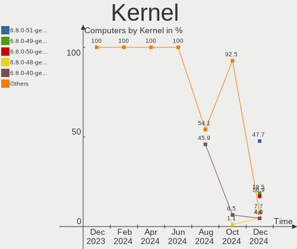
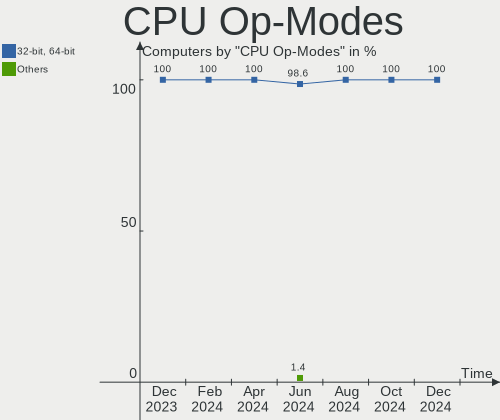
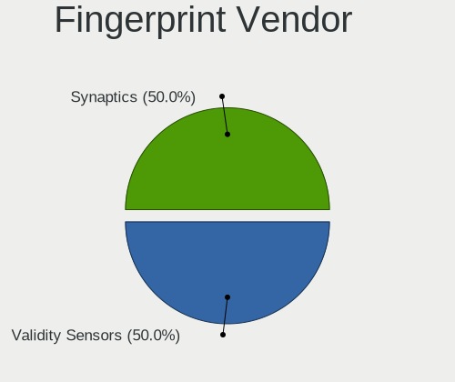

KDE neon - Hardware Trends
--------------------------

A project to identify most popular hardware characteristics and track their change
over time based on data collected by Linux users at https://Linux-Hardware.org.

Anyone can contribute to this report by the [hw-probe](https://github.com/linuxhw/hw-probe) tool:

    sudo -E hw-probe -all -upload

This is a report for all computer types. See also reports for [desktops](/Dist/KDE_neon/Desktop/README.md) and [notebooks](/Dist/KDE_neon/Notebook/README.md).

This report is for one last month. Overall report since the beginning of time: [TestDays](https://github.com/linuxhw/TestDays)

Period: Jul, 2023.

Contents
--------

* [ System ](#system)
  - [ OS                       ](#os)
  - [ OS Family                ](#os-family)
  - [ Kernel                   ](#kernel)
  - [ Kernel Family            ](#kernel-family)
  - [ Kernel Major Ver.        ](#kernel-major-ver)
  - [ Arch                     ](#arch)
  - [ DE                       ](#de)
  - [ Display Server           ](#display-server)
  - [ Display Manager          ](#display-manager)
  - [ OS Lang                  ](#os-lang)
  - [ Boot Mode                ](#boot-mode)
  - [ Filesystem               ](#filesystem)
  - [ Part. scheme             ](#part-scheme)
  - [ Dual Boot with Linux/BSD ](#dual-boot-with-linuxbsd)
  - [ Dual Boot (Win)          ](#dual-boot-win)

* [ Board ](#board)
  - [ Vendor                   ](#vendor)
  - [ Model                    ](#model)
  - [ Model Family             ](#model-family)
  - [ MFG Year                 ](#mfg-year)
  - [ Form Factor              ](#form-factor)
  - [ Secure Boot              ](#secure-boot)
  - [ Coreboot                 ](#coreboot)
  - [ RAM Size                 ](#ram-size)
  - [ RAM Used                 ](#ram-used)
  - [ Total Drives             ](#total-drives)
  - [ Has CD-ROM               ](#has-cd-rom)
  - [ Has Ethernet             ](#has-ethernet)
  - [ Has WiFi                 ](#has-wifi)
  - [ Has Bluetooth            ](#has-bluetooth)

* [ Location ](#location)
  - [ Country                  ](#country)
  - [ City                     ](#city)

* [ Drives ](#drives)
  - [ Drive Vendor             ](#drive-vendor)
  - [ Drive Model              ](#drive-model)
  - [ HDD Vendor               ](#hdd-vendor)
  - [ SSD Vendor               ](#ssd-vendor)
  - [ Drive Kind               ](#drive-kind)
  - [ Drive Connector          ](#drive-connector)
  - [ Drive Size               ](#drive-size)
  - [ Space Total              ](#space-total)
  - [ Space Used               ](#space-used)
  - [ Malfunc. Drives          ](#malfunc-drives)
  - [ Malfunc. Drive Vendor    ](#malfunc-drive-vendor)
  - [ Malfunc. HDD Vendor      ](#malfunc-hdd-vendor)
  - [ Malfunc. Drive Kind      ](#malfunc-drive-kind)
  - [ Failed Drives            ](#failed-drives)
  - [ Failed Drive Vendor      ](#failed-drive-vendor)
  - [ Drive Status             ](#drive-status)

* [ Storage controller ](#storage-controller)
  - [ Storage Vendor           ](#storage-vendor)
  - [ Storage Model            ](#storage-model)
  - [ Storage Kind             ](#storage-kind)

* [ Processor ](#processor)
  - [ CPU Vendor               ](#cpu-vendor)
  - [ CPU Model                ](#cpu-model)
  - [ CPU Model Family         ](#cpu-model-family)
  - [ CPU Cores                ](#cpu-cores)
  - [ CPU Sockets              ](#cpu-sockets)
  - [ CPU Threads              ](#cpu-threads)
  - [ CPU Op-Modes             ](#cpu-op-modes)
  - [ CPU Microcode            ](#cpu-microcode)
  - [ CPU Microarch            ](#cpu-microarch)

* [ Graphics ](#graphics)
  - [ GPU Vendor               ](#gpu-vendor)
  - [ GPU Model                ](#gpu-model)
  - [ GPU Combo                ](#gpu-combo)
  - [ GPU Driver               ](#gpu-driver)
  - [ GPU Memory               ](#gpu-memory)

* [ Monitor ](#monitor)
  - [ Monitor Vendor           ](#monitor-vendor)
  - [ Monitor Model            ](#monitor-model)
  - [ Monitor Resolution       ](#monitor-resolution)
  - [ Monitor Diagonal         ](#monitor-diagonal)
  - [ Monitor Width            ](#monitor-width)
  - [ Aspect Ratio             ](#aspect-ratio)
  - [ Monitor Area             ](#monitor-area)
  - [ Pixel Density            ](#pixel-density)
  - [ Multiple Monitors        ](#multiple-monitors)

* [ Network ](#network)
  - [ Net Controller Vendor    ](#net-controller-vendor)
  - [ Net Controller Model     ](#net-controller-model)
  - [ Wireless Vendor          ](#wireless-vendor)
  - [ Wireless Model           ](#wireless-model)
  - [ Ethernet Vendor          ](#ethernet-vendor)
  - [ Ethernet Model           ](#ethernet-model)
  - [ Net Controller Kind      ](#net-controller-kind)
  - [ Used Controller          ](#used-controller)
  - [ NICs                     ](#nics)
  - [ IPv6                     ](#ipv6)

* [ Bluetooth ](#bluetooth)
  - [ Bluetooth Vendor         ](#bluetooth-vendor)
  - [ Bluetooth Model          ](#bluetooth-model)

* [ Sound ](#sound)
  - [ Sound Vendor             ](#sound-vendor)
  - [ Sound Model              ](#sound-model)

* [ Memory ](#memory)
  - [ Memory Vendor            ](#memory-vendor)
  - [ Memory Model             ](#memory-model)
  - [ Memory Kind              ](#memory-kind)
  - [ Memory Form Factor       ](#memory-form-factor)
  - [ Memory Size              ](#memory-size)
  - [ Memory Speed             ](#memory-speed)

* [ Printers & scanners ](#printers--scanners)
  - [ Printer Vendor           ](#printer-vendor)
  - [ Printer Model            ](#printer-model)
  - [ Scanner Vendor           ](#scanner-vendor)
  - [ Scanner Model            ](#scanner-model)

* [ Camera ](#camera)
  - [ Camera Vendor            ](#camera-vendor)
  - [ Camera Model             ](#camera-model)

* [ Security ](#security)
  - [ Fingerprint Vendor       ](#fingerprint-vendor)
  - [ Fingerprint Model        ](#fingerprint-model)
  - [ Chipcard Vendor          ](#chipcard-vendor)
  - [ Chipcard Model           ](#chipcard-model)

* [ Unsupported ](#unsupported)
  - [ Unsupported Devices      ](#unsupported-devices)
  - [ Unsupported Device Types ](#unsupported-device-types)

System
------

OS
--

Installed operating systems

| Name           | Computers | Percent |
|----------------|-----------|---------|
| KDE neon 22.04 | 57        | 100%    |

OS Family
---------

OS without a version

| Name     | Computers | Percent |
|----------|-----------|---------|
| KDE neon | 57        | 100%    |

Kernel
------

Version of the Linux kernel

| Version               | Computers | Percent |
|-----------------------|-----------|---------|
| 5.19.0-46-generic     | 40        | 70.18%  |
| 5.19.0-50-generic     | 9         | 15.79%  |
| 5.19.0-45-generic     | 2         | 3.51%   |
| 5.19.0-43-generic     | 2         | 3.51%   |
| 6.4.0-060400-generic  | 1         | 1.75%   |
| 6.3.13-060313-generic | 1         | 1.75%   |
| 6.3.1-060301-generic  | 1         | 1.75%   |
| 5.15.0-60-generic     | 1         | 1.75%   |

Kernel Family
-------------

Linux kernel without a distro release

| Version | Computers | Percent |
|---------|-----------|---------|
| 5.19.0  | 53        | 92.98%  |
| 6.4.0   | 1         | 1.75%   |
| 6.3.13  | 1         | 1.75%   |
| 6.3.1   | 1         | 1.75%   |
| 5.15.0  | 1         | 1.75%   |

Kernel Major Ver.
-----------------

Linux kernel major version

| Version | Computers | Percent |
|---------|-----------|---------|
| 5.19    | 53        | 92.98%  |
| 6.3     | 2         | 3.51%   |
| 6.4     | 1         | 1.75%   |
| 5.15    | 1         | 1.75%   |

Arch
----

OS architecture (x86_64, i586, etc.)

| Name   | Computers | Percent |
|--------|-----------|---------|
| x86_64 | 57        | 100%    |

DE
--

Desktop Environment

| Name | Computers | Percent |
|------|-----------|---------|
| KDE5 | 57        | 100%    |

Display Server
--------------

X11 or Wayland

| Name    | Computers | Percent |
|---------|-----------|---------|
| X11     | 53        | 92.98%  |
| Wayland | 4         | 7.02%   |

Display Manager
---------------

SDDM, LightDM, etc.

| Name    | Computers | Percent |
|---------|-----------|---------|
| Unknown | 38        | 66.67%  |
| SDDM    | 19        | 33.33%  |

OS Lang
-------

Language

| Lang  | Computers | Percent |
|-------|-----------|---------|
| en_US | 28        | 49.12%  |
| de_DE | 5         | 8.77%   |
| en_GB | 4         | 7.02%   |
| C     | 4         | 7.02%   |
| en_CA | 3         | 5.26%   |
| ru_RU | 2         | 3.51%   |
| pt_BR | 2         | 3.51%   |
| nl_NL | 2         | 3.51%   |
| fr_FR | 2         | 3.51%   |
| pl_PL | 1         | 1.75%   |
| nn_NO | 1         | 1.75%   |
| es_CL | 1         | 1.75%   |
| en_IN | 1         | 1.75%   |
| en_AU | 1         | 1.75%   |

Boot Mode
---------

EFI or BIOS

| Mode | Computers | Percent |
|------|-----------|---------|
| BIOS | 45        | 78.95%  |
| EFI  | 12        | 21.05%  |

Filesystem
----------

Type of filesystem

| Type    | Computers | Percent |
|---------|-----------|---------|
| Ext4    | 48        | 84.21%  |
| Tmpfs   | 6         | 10.53%  |
| Overlay | 3         | 5.26%   |

Part. scheme
------------

Scheme of partitioning

| Type    | Computers | Percent |
|---------|-----------|---------|
| Unknown | 38        | 66.67%  |
| GPT     | 16        | 28.07%  |
| MBR     | 3         | 5.26%   |

Dual Boot with Linux/BSD
------------------------

Hosting more than one Linux/BSD

| Dual boot | Computers | Percent |
|-----------|-----------|---------|
| No        | 55        | 96.49%  |
| Yes       | 2         | 3.51%   |

Dual Boot (Win)
---------------

Hosting Linux and Windows

| Dual boot | Computers | Percent |
|-----------|-----------|---------|
| No        | 52        | 91.23%  |
| Yes       | 5         | 8.77%   |

Board
-----

Vendor
------

Motherboard manufacturer

| Name                | Computers | Percent |
|---------------------|-----------|---------|
| ASUSTek Computer    | 11        | 19.3%   |
| Lenovo              | 9         | 15.79%  |
| Hewlett-Packard     | 6         | 10.53%  |
| Dell                | 6         | 10.53%  |
| Sony                | 3         | 5.26%   |
| MSI                 | 3         | 5.26%   |
| Acer                | 3         | 5.26%   |
| Timi                | 2         | 3.51%   |
| Gigabyte Technology | 2         | 3.51%   |
| Fujitsu             | 2         | 3.51%   |
| Apple               | 2         | 3.51%   |
| Teclast             | 1         | 1.75%   |
| Medion              | 1         | 1.75%   |
| Intel               | 1         | 1.75%   |
| Google              | 1         | 1.75%   |
| Biostar             | 1         | 1.75%   |
| AZW                 | 1         | 1.75%   |
| ASRock              | 1         | 1.75%   |
| Unknown             | 1         | 1.75%   |

Model
-----

Motherboard model

| Name                                               | Computers | Percent |
|----------------------------------------------------|-----------|---------|
| Timi TM1701                                        | 1         | 1.75%   |
| Timi TM1612                                        | 1         | 1.75%   |
| Teclast F6 Plus                                    | 1         | 1.75%   |
| Sony VPCZ214GX                                     | 1         | 1.75%   |
| Sony VPCEF4E1E                                     | 1         | 1.75%   |
| Sony SVP1321M2EB                                   | 1         | 1.75%   |
| MSI p7-1233w                                       | 1         | 1.75%   |
| MSI MS-7A38                                        | 1         | 1.75%   |
| MSI GF63 Thin 10SCXR                               | 1         | 1.75%   |
| Medion E14303                                      | 1         | 1.75%   |
| Lenovo V15 G2 ITL 82KB                             | 1         | 1.75%   |
| Lenovo ThinkPad X201 3680KS9                       | 1         | 1.75%   |
| Lenovo ThinkCentre M720q 10T700AHMH                | 1         | 1.75%   |
| Lenovo Legion Pro 5 16IRX8 82WK                    | 1         | 1.75%   |
| Lenovo IdeaPadFlex 5 14ALC05 82HU                  | 1         | 1.75%   |
| Lenovo IdeaPad U430 Touch 20270                    | 1         | 1.75%   |
| Lenovo IdeaPad 5 15ALC05 82LN                      | 1         | 1.75%   |
| Lenovo IdeaPad 330-15IKB 81FD                      | 1         | 1.75%   |
| Lenovo IdeaCentre 510A-15ARR 90J0000WBF            | 1         | 1.75%   |
| Intel NUC8i5BEH                                    | 1         | 1.75%   |
| HP ZBook Studio 15.6 inch G8 Mobile Workstation PC | 1         | 1.75%   |
| HP Pavilion Laptop 15-eg3xxx                       | 1         | 1.75%   |
| HP EliteBook 855 G8 Notebook PC                    | 1         | 1.75%   |
| HP EliteBook 840 G3                                | 1         | 1.75%   |
| HP Elite Dragonfly                                 | 1         | 1.75%   |
| HP Compaq 6200 Pro MT PC                           | 1         | 1.75%   |
| Google Cave                                        | 1         | 1.75%   |
| Gigabyte H81M-S2PV                                 | 1         | 1.75%   |
| Gigabyte G5 GE                                     | 1         | 1.75%   |
| Fujitsu LIFEBOOK T936                              | 1         | 1.75%   |
| Fujitsu LIFEBOOK A544                              | 1         | 1.75%   |
| Dell Precision M6700                               | 1         | 1.75%   |
| Dell Latitude 7370                                 | 1         | 1.75%   |
| Dell Latitude 5511                                 | 1         | 1.75%   |
| Dell Latitude 5300 2-in-1                          | 1         | 1.75%   |
| Dell Inspiron 5566                                 | 1         | 1.75%   |
| Dell Inspiron 13-5368                              | 1         | 1.75%   |
| Biostar X370GTN                                    | 1         | 1.75%   |
| AZW SER                                            | 1         | 1.75%   |
| ASUS VivoBook_ASUSLaptop X512DA_F512DA             | 1         | 1.75%   |

Model Family
------------

Motherboard model prefix

| Name               | Computers | Percent |
|--------------------|-----------|---------|
| ASUS VivoBook      | 4         | 7.02%   |
| Lenovo IdeaPad     | 3         | 5.26%   |
| Dell Latitude      | 3         | 5.26%   |
| HP EliteBook       | 2         | 3.51%   |
| Fujitsu LIFEBOOK   | 2         | 3.51%   |
| Dell Inspiron      | 2         | 3.51%   |
| Acer Aspire        | 2         | 3.51%   |
| Timi TM1701        | 1         | 1.75%   |
| Timi TM1612        | 1         | 1.75%   |
| Teclast F6         | 1         | 1.75%   |
| Sony VPCZ214GX     | 1         | 1.75%   |
| Sony VPCEF4E1E     | 1         | 1.75%   |
| Sony SVP1321M2EB   | 1         | 1.75%   |
| MSI p7-1233w       | 1         | 1.75%   |
| MSI MS-7A38        | 1         | 1.75%   |
| MSI GF63           | 1         | 1.75%   |
| Medion E14303      | 1         | 1.75%   |
| Lenovo V15         | 1         | 1.75%   |
| Lenovo ThinkPad    | 1         | 1.75%   |
| Lenovo ThinkCentre | 1         | 1.75%   |
| Lenovo Legion      | 1         | 1.75%   |
| Lenovo IdeaPadFlex | 1         | 1.75%   |
| Lenovo IdeaCentre  | 1         | 1.75%   |
| Intel NUC8i5BEH    | 1         | 1.75%   |
| HP ZBook           | 1         | 1.75%   |
| HP Pavilion        | 1         | 1.75%   |
| HP Elite           | 1         | 1.75%   |
| HP Compaq          | 1         | 1.75%   |
| Google Cave        | 1         | 1.75%   |
| Gigabyte H81M-S2PV | 1         | 1.75%   |
| Gigabyte G5        | 1         | 1.75%   |
| Dell Precision     | 1         | 1.75%   |
| Biostar X370GTN    | 1         | 1.75%   |
| AZW SER            | 1         | 1.75%   |
| ASUS TUF           | 1         | 1.75%   |
| ASUS ROG           | 1         | 1.75%   |
| ASUS M5A97         | 1         | 1.75%   |
| ASUS M4A88T-V      | 1         | 1.75%   |
| ASUS GL752VW       | 1         | 1.75%   |
| ASUS G75VW         | 1         | 1.75%   |

MFG Year
--------

Motherboard manufacture year

| Year | Computers | Percent |
|------|-----------|---------|
| 2022 | 8         | 14.04%  |
| 2021 | 8         | 14.04%  |
| 2018 | 6         | 10.53%  |
| 2012 | 6         | 10.53%  |
| 2016 | 5         | 8.77%   |
| 2019 | 4         | 7.02%   |
| 2013 | 4         | 7.02%   |
| 2023 | 3         | 5.26%   |
| 2020 | 3         | 5.26%   |
| 2015 | 3         | 5.26%   |
| 2010 | 3         | 5.26%   |
| 2017 | 2         | 3.51%   |
| 2014 | 1         | 1.75%   |
| 2011 | 1         | 1.75%   |

Form Factor
-----------

Physical design of the computer

| Name        | Computers | Percent |
|-------------|-----------|---------|
| Notebook    | 36        | 63.16%  |
| Desktop     | 13        | 22.81%  |
| Convertible | 5         | 8.77%   |
| Mini pc     | 3         | 5.26%   |

Secure Boot
-----------

Enabled or disabled

| State    | Computers | Percent |
|----------|-----------|---------|
| Disabled | 56        | 98.25%  |
| Enabled  | 1         | 1.75%   |

Coreboot
--------

Have coreboot on board

| Used | Computers | Percent |
|------|-----------|---------|
| No   | 56        | 98.25%  |
| Yes  | 1         | 1.75%   |

RAM Size
--------

Total RAM memory

| Size in GB  | Computers | Percent |
|-------------|-----------|---------|
| 16.01-24.0  | 17        | 29.82%  |
| 4.01-8.0    | 14        | 24.56%  |
| 3.01-4.0    | 8         | 14.04%  |
| 8.01-16.0   | 8         | 14.04%  |
| 32.01-64.0  | 6         | 10.53%  |
| 24.01-32.0  | 2         | 3.51%   |
| 64.01-256.0 | 2         | 3.51%   |

RAM Used
--------

Used RAM memory

| Used GB   | Computers | Percent |
|-----------|-----------|---------|
| 1.01-2.0  | 19        | 33.33%  |
| 4.01-8.0  | 14        | 24.56%  |
| 2.01-3.0  | 14        | 24.56%  |
| 3.01-4.0  | 6         | 10.53%  |
| 8.01-16.0 | 4         | 7.02%   |

Total Drives
------------

Number of drives on board

| Drives | Computers | Percent |
|--------|-----------|---------|
| 1      | 37        | 64.91%  |
| 2      | 19        | 33.33%  |
| 6      | 1         | 1.75%   |

Has CD-ROM
----------

Has CD-ROM on board

| Presented | Computers | Percent |
|-----------|-----------|---------|
| No        | 46        | 80.7%   |
| Yes       | 11        | 19.3%   |

Has Ethernet
------------

Has Ethernet on board

| Presented | Computers | Percent |
|-----------|-----------|---------|
| Yes       | 38        | 66.67%  |
| No        | 19        | 33.33%  |

Has WiFi
--------

Has WiFi module

| Presented | Computers | Percent |
|-----------|-----------|---------|
| Yes       | 50        | 87.72%  |
| No        | 7         | 12.28%  |

Has Bluetooth
-------------

Has Bluetooth module

| Presented | Computers | Percent |
|-----------|-----------|---------|
| Yes       | 44        | 77.19%  |
| No        | 13        | 22.81%  |

Location
--------

Country
-------

Geographic location (country)

| Country            | Computers | Percent |
|--------------------|-----------|---------|
| USA                | 14        | 24.56%  |
| Germany            | 7         | 12.28%  |
| UK                 | 4         | 7.02%   |
| Brazil             | 4         | 7.02%   |
| Netherlands        | 3         | 5.26%   |
| France             | 3         | 5.26%   |
| Canada             | 3         | 5.26%   |
| Russia             | 2         | 3.51%   |
| Tunisia            | 1         | 1.75%   |
| Switzerland        | 1         | 1.75%   |
| South Africa       | 1         | 1.75%   |
| Romania            | 1         | 1.75%   |
| Puerto Rico        | 1         | 1.75%   |
| Poland             | 1         | 1.75%   |
| Norway             | 1         | 1.75%   |
| Nepal              | 1         | 1.75%   |
| Moldova            | 1         | 1.75%   |
| Mexico             | 1         | 1.75%   |
| Italy              | 1         | 1.75%   |
| Indonesia          | 1         | 1.75%   |
| India              | 1         | 1.75%   |
| Dominican Republic | 1         | 1.75%   |
| China              | 1         | 1.75%   |
| Chile              | 1         | 1.75%   |
| Australia          | 1         | 1.75%   |

City
----

Geographic location (city)

| City                   | Computers | Percent |
|------------------------|-----------|---------|
| Coventry               | 2         | 3.51%   |
| Zurich                 | 1         | 1.75%   |
| Witten                 | 1         | 1.75%   |
| Whiting                | 1         | 1.75%   |
| Vernon                 | 1         | 1.75%   |
| Tomsk                  | 1         | 1.75%   |
| Tobias Barreto         | 1         | 1.75%   |
| Tijuana                | 1         | 1.75%   |
| Tempe                  | 1         | 1.75%   |
| Tappahannock           | 1         | 1.75%   |
| St. Marys              | 1         | 1.75%   |
| Sfax                   | 1         | 1.75%   |
| Santiago               | 1         | 1.75%   |
| Santa Rita do Sapucai  | 1         | 1.75%   |
| Santa Cruz de Barahona | 1         | 1.75%   |
| Saint-Michel-sur-Orge  | 1         | 1.75%   |
| Saint Paul             | 1         | 1.75%   |
| Rochelle               | 1         | 1.75%   |
| Oxnard                 | 1         | 1.75%   |
| Oldenburg              | 1         | 1.75%   |
| Nunspeet               | 1         | 1.75%   |
| Noisy-le-Grand         | 1         | 1.75%   |
| Montreal               | 1         | 1.75%   |
| Miamisburg             | 1         | 1.75%   |
| Mareil-Marly           | 1         | 1.75%   |
| Mannheim               | 1         | 1.75%   |
| Longmont               | 1         | 1.75%   |
| Lelystad               | 1         | 1.75%   |
| Lambeth                | 1         | 1.75%   |
| Kelowna                | 1         | 1.75%   |
| Katowice               | 1         | 1.75%   |
| Kathmandu              | 1         | 1.75%   |
| Kaspiysk               | 1         | 1.75%   |
| Karlsruhe              | 1         | 1.75%   |
| Johannesburg           | 1         | 1.75%   |
| Jakarta                | 1         | 1.75%   |
| Islington              | 1         | 1.75%   |
| Gold Coast             | 1         | 1.75%   |
| Glen Allen             | 1         | 1.75%   |
| Gelnhausen             | 1         | 1.75%   |

Drives
------

Drive Vendor
------------

Hard drive vendors

| Vendor                       | Computers | Drives | Percent |
|------------------------------|-----------|--------|---------|
| Samsung Electronics          | 12        | 14     | 16.67%  |
| Seagate                      | 8         | 9      | 11.11%  |
| Toshiba                      | 7         | 7      | 9.72%   |
| SanDisk                      | 5         | 5      | 6.94%   |
| WDC                          | 4         | 9      | 5.56%   |
| Micron Technology            | 4         | 4      | 5.56%   |
| Kingston                     | 4         | 4      | 5.56%   |
| Kingston Technology Company  | 2         | 2      | 2.78%   |
| Intel                        | 2         | 3      | 2.78%   |
| China                        | 2         | 2      | 2.78%   |
| ADATA Technology             | 2         | 2      | 2.78%   |
| X12                          | 1         | 1      | 1.39%   |
| Unknown                      | 1         | 1      | 1.39%   |
| Union Memory                 | 1         | 1      | 1.39%   |
| Teclast                      | 1         | 1      | 1.39%   |
| Team                         | 1         | 1      | 1.39%   |
| TCSUNBOW                     | 1         | 1      | 1.39%   |
| SPCC                         | 1         | 1      | 1.39%   |
| SK hynix                     | 1         | 1      | 1.39%   |
| Silicon Motion               | 1         | 1      | 1.39%   |
| Shenzhen Longsys Electronics | 1         | 1      | 1.39%   |
| Phison Electronics           | 1         | 1      | 1.39%   |
| Netac                        | 1         | 1      | 1.39%   |
| Micron/Crucial Technology    | 1         | 1      | 1.39%   |
| MAXIO Technology (Hangzhou)  | 1         | 1      | 1.39%   |
| LITEON                       | 1         | 1      | 1.39%   |
| Intenso                      | 1         | 1      | 1.39%   |
| Hitachi                      | 1         | 1      | 1.39%   |
| HGST                         | 1         | 1      | 1.39%   |
| Crucial                      | 1         | 1      | 1.39%   |
| Apple                        | 1         | 1      | 1.39%   |

Drive Model
-----------

Hard drive models

| Model                                               | Computers | Percent |
|-----------------------------------------------------|-----------|---------|
| Samsung NVMe SSD Controller SM981/PM981/PM983 500GB | 3         | 3.85%   |
| Toshiba MQ01ABD100 1TB                              | 2         | 2.56%   |
| Seagate ST1000DM003-1SB102 1TB                      | 2         | 2.56%   |
| X12 SSD 480GB                                       | 1         | 1.28%   |
| WDC WDS500G2B0A 500GB SSD                           | 1         | 1.28%   |
| WDC WDS100T2B0B-00YS70 1TB SSD                      | 1         | 1.28%   |
| WDC WD5000LPCX-75VHAT0 500GB                        | 1         | 1.28%   |
| WDC WD40EZRZ-22GXCB0 4TB                            | 1         | 1.28%   |
| WDC WD40EFAX-68JH4N1 4TB                            | 1         | 1.28%   |
| WDC WD10JPVX-75JC3T0 1TB                            | 1         | 1.28%   |
| WDC WD10JPVX-00JC3T0 1TB                            | 1         | 1.28%   |
| Unknown MMC Card  64GB                              | 1         | 1.28%   |
| Union Memory UMIS RPJTJ256MEE1OWX 256GB             | 1         | 1.28%   |
| Toshiba THNSNH128G8NT 128GB SSD                     | 1         | 1.28%   |
| Toshiba MQ01ABF050 500GB                            | 1         | 1.28%   |
| Toshiba MK2565GSX 250GB                             | 1         | 1.28%   |
| Toshiba KBG30ZMT128G 128GB                          | 1         | 1.28%   |
| Toshiba HDWD110 1TB                                 | 1         | 1.28%   |
| Teclast 256GB NS550-2242 SSD                        | 1         | 1.28%   |
| Team T253E2512G 512GB SSD                           | 1         | 1.28%   |
| TCSUNBOW X3 240GB                                   | 1         | 1.28%   |
| SPCC Solid State Disk 512GB                         | 1         | 1.28%   |
| SK hynix HFM512GD3JX013N 512GB                      | 1         | 1.28%   |
| Silicon Motion SM2262/SM2262EN SSD Controller 512GB | 1         | 1.28%   |
| Shenzhen Longsys Lexar SSD NM710 2TB                | 1         | 1.28%   |
| Seagate STT_FTM25JB25C 256GB                        | 1         | 1.28%   |
| Seagate ST500LT012-1DG142 500GB                     | 1         | 1.28%   |
| Seagate ST500LM000-SSHD-8GB                         | 1         | 1.28%   |
| Seagate ST3500630AS 500GB                           | 1         | 1.28%   |
| Seagate ST3160316CS 160GB                           | 1         | 1.28%   |
| Seagate ST2000DM008-2FR102 2TB                      | 1         | 1.28%   |
| Seagate ST1000DM003-1ER162 1TB                      | 1         | 1.28%   |
| Sandisk WD_BLACK SN770 2TB                          | 1         | 1.28%   |
| Sandisk WD Black SN750 / PC SN730 NVMe SSD 1024GB   | 1         | 1.28%   |
| SanDisk SDSSDHP256G 256GB                           | 1         | 1.28%   |
| SanDisk SD8SN8U1T001122 1TB SSD                     | 1         | 1.28%   |
| SanDisk A400 NVMe 256GB                             | 1         | 1.28%   |
| Samsung SSD 870 EVO 500GB                           | 1         | 1.28%   |
| Samsung SSD 850 EVO 250GB                           | 1         | 1.28%   |
| Samsung NVMe SSD Controller SM961/PM961/SM963 256GB | 1         | 1.28%   |

HDD Vendor
----------

Hard disk drive vendors

| Vendor  | Computers | Drives | Percent |
|---------|-----------|--------|---------|
| Seagate | 7         | 8      | 38.89%  |
| Toshiba | 5         | 5      | 27.78%  |
| WDC     | 4         | 7      | 22.22%  |
| Hitachi | 1         | 1      | 5.56%   |
| HGST    | 1         | 1      | 5.56%   |

SSD Vendor
----------

Solid state drive vendors

| Vendor              | Computers | Drives | Percent |
|---------------------|-----------|--------|---------|
| Samsung Electronics | 5         | 6      | 20%     |
| Kingston            | 3         | 3      | 12%     |
| WDC                 | 2         | 2      | 8%      |
| SanDisk             | 2         | 2      | 8%      |
| Micron Technology   | 2         | 2      | 8%      |
| X12                 | 1         | 1      | 4%      |
| Toshiba             | 1         | 1      | 4%      |
| Teclast             | 1         | 1      | 4%      |
| Team                | 1         | 1      | 4%      |
| TCSUNBOW            | 1         | 1      | 4%      |
| SPCC                | 1         | 1      | 4%      |
| Netac               | 1         | 1      | 4%      |
| LITEON              | 1         | 1      | 4%      |
| Intenso             | 1         | 1      | 4%      |
| China               | 1         | 1      | 4%      |
| Apple               | 1         | 1      | 4%      |

Drive Kind
----------

HDD or SSD

| Kind    | Computers | Drives | Percent |
|---------|-----------|--------|---------|
| NVMe    | 27        | 30     | 38.03%  |
| SSD     | 24        | 26     | 33.8%   |
| HDD     | 17        | 22     | 23.94%  |
| Unknown | 2         | 2      | 2.82%   |
| MMC     | 1         | 1      | 1.41%   |

Drive Connector
---------------

SATA, SAS, NVMe, etc.

| Type | Computers | Drives | Percent |
|------|-----------|--------|---------|
| SATA | 36        | 50     | 56.25%  |
| NVMe | 27        | 30     | 42.19%  |
| MMC  | 1         | 1      | 1.56%   |

Drive Size
----------

Size of hard drive

| Size in TB | Computers | Drives | Percent |
|------------|-----------|--------|---------|
| 0.01-0.5   | 23        | 27     | 58.97%  |
| 0.51-1.0   | 14        | 16     | 35.9%   |
| 3.01-4.0   | 1         | 4      | 2.56%   |
| 1.01-2.0   | 1         | 1      | 2.56%   |

Space Total
-----------

Amount of disk space available on the file system

| Size in GB     | Computers | Percent |
|----------------|-----------|---------|
| 101-250        | 15        | 26.32%  |
| 251-500        | 10        | 17.54%  |
| 1001-2000      | 9         | 15.79%  |
| 501-1000       | 6         | 10.53%  |
| 1-20           | 5         | 8.77%   |
| Unknown        | 5         | 8.77%   |
| 21-50          | 3         | 5.26%   |
| 51-100         | 2         | 3.51%   |
| More than 3000 | 1         | 1.75%   |
| 2001-3000      | 1         | 1.75%   |

Space Used
----------

Amount of used disk space

| Used GB   | Computers | Percent |
|-----------|-----------|---------|
| 1-20      | 22        | 38.6%   |
| 21-50     | 11        | 19.3%   |
| 501-1000  | 6         | 10.53%  |
| 101-250   | 5         | 8.77%   |
| 51-100    | 5         | 8.77%   |
| Unknown   | 5         | 8.77%   |
| 1001-2000 | 2         | 3.51%   |
| 251-500   | 1         | 1.75%   |

Malfunc. Drives
---------------

Drive models with a malfunction

| Model                                           | Computers | Drives | Percent |
|-------------------------------------------------|-----------|--------|---------|
| Samsung Electronics MZRPA128HMCD-000SO 64GB SSD | 1         | 2      | 100%    |

Malfunc. Drive Vendor
---------------------

Vendors of faulty drives

| Vendor              | Computers | Drives | Percent |
|---------------------|-----------|--------|---------|
| Samsung Electronics | 1         | 2      | 100%    |

Malfunc. HDD Vendor
-------------------

Vendors of faulty HDD drives

Zero info for selected period =(

Malfunc. Drive Kind
-------------------

Kinds of faulty drives

| Kind | Computers | Drives | Percent |
|------|-----------|--------|---------|
| SSD  | 1         | 2      | 100%    |

Failed Drives
-------------

Failed drive models

Zero info for selected period =(

Failed Drive Vendor
-------------------

Failed drive vendors

Zero info for selected period =(

Drive Status
------------

Number of failed and malfunc. drives

| Status   | Computers | Drives | Percent |
|----------|-----------|--------|---------|
| Detected | 44        | 62     | 77.19%  |
| Works    | 12        | 17     | 21.05%  |
| Malfunc  | 1         | 2      | 1.75%   |

Storage controller
------------------

Storage Vendor
--------------

Storage controller vendors

| Vendor                       | Computers | Percent |
|------------------------------|-----------|---------|
| Intel                        | 30        | 40.54%  |
| AMD                          | 16        | 21.62%  |
| Samsung Electronics          | 8         | 10.81%  |
| SanDisk                      | 3         | 4.05%   |
| Kingston Technology Company  | 3         | 4.05%   |
| Micron/Crucial Technology    | 2         | 2.7%    |
| Micron Technology            | 2         | 2.7%    |
| ADATA Technology             | 2         | 2.7%    |
| Union Memory (Shenzhen)      | 1         | 1.35%   |
| Toshiba America Info Systems | 1         | 1.35%   |
| SK hynix                     | 1         | 1.35%   |
| Silicon Motion               | 1         | 1.35%   |
| Shenzhen Longsys Electronics | 1         | 1.35%   |
| Phison Electronics           | 1         | 1.35%   |
| MAXIO Technology (Hangzhou)  | 1         | 1.35%   |
| ASMedia Technology           | 1         | 1.35%   |

Storage Model
-------------

Storage controller models

| Model                                                                          | Computers | Percent |
|--------------------------------------------------------------------------------|-----------|---------|
| AMD FCH SATA Controller [AHCI mode]                                            | 13        | 15.29%  |
| Intel Sunrise Point-LP SATA Controller [AHCI mode]                             | 6         | 7.06%   |
| Samsung NVMe SSD Controller SM981/PM981/PM983                                  | 4         | 4.71%   |
| AMD 400 Series Chipset SATA Controller                                         | 4         | 4.71%   |
| Intel 82801 Mobile SATA Controller [RAID mode]                                 | 3         | 3.53%   |
| Intel 8 Series/C220 Series Chipset Family 6-port SATA Controller 1 [AHCI mode] | 3         | 3.53%   |
| Intel 8 Series SATA Controller 1 [AHCI mode]                                   | 3         | 3.53%   |
| Samsung NVMe SSD Controller PM9A1/PM9A3/980PRO                                 | 2         | 2.35%   |
| Micron/Crucial P2 [Nick P2] / P3 / P3 Plus NVMe PCIe SSD (DRAM-less)           | 2         | 2.35%   |
| Micron 2210 NVMe SSD [Cobain]                                                  | 2         | 2.35%   |
| Intel Volume Management Device NVMe RAID Controller                            | 2         | 2.35%   |
| Intel Tiger Lake-LP SATA Controller                                            | 2         | 2.35%   |
| Intel 7 Series Chipset Family 6-port SATA Controller [AHCI mode]               | 2         | 2.35%   |
| Intel 400 Series Chipset Family SATA AHCI Controller                           | 2         | 2.35%   |
| AMD SB7x0/SB8x0/SB9x0 SATA Controller [AHCI mode]                              | 2         | 2.35%   |
| AMD SB7x0/SB8x0/SB9x0 IDE Controller                                           | 2         | 2.35%   |
| Union Memory (Shenzhen) AM620 PCIe 3.0 NVMe SSD 256GB                          | 1         | 1.18%   |
| Toshiba America Info Systems BG3 NVMe SSD Controller                           | 1         | 1.18%   |
| SK hynix Gold P31/BC711/PC711 NVMe Solid State Drive                           | 1         | 1.18%   |
| Silicon Motion SM2262/SM2262EN SSD Controller                                  | 1         | 1.18%   |
| Shenzhen Longsys Non-Volatile memory controller                                | 1         | 1.18%   |
| SanDisk WD Black SN770 / PC SN740 256GB / PC SN560 (DRAM-less) NVMe SSD        | 1         | 1.18%   |
| SanDisk WD Black SN750 / PC SN730 NVMe SSD                                     | 1         | 1.18%   |
| SanDisk WD Black NVMe SSD                                                      | 1         | 1.18%   |
| Samsung S4LN058A01[SSUBX] AHCI SSD Controller (Apple slot)                     | 1         | 1.18%   |
| Samsung NVMe SSD Controller SM961/PM961/SM963                                  | 1         | 1.18%   |
| Samsung NVMe SSD Controller 980                                                | 1         | 1.18%   |
| Phison PS5013 E13 NVMe Controller                                              | 1         | 1.18%   |
| MAXIO (Hangzhou) NVMe SSD Controller MAP1202                                   | 1         | 1.18%   |
| Kingston Company Company Non-Volatile memory controller                        | 1         | 1.18%   |
| Kingston Company OM3PDP3 NVMe SSD                                              | 1         | 1.18%   |
| Kingston Company KC2000/KC2500 NVMe SSD                                        | 1         | 1.18%   |
| Intel Wildcat Point-LP SATA Controller [AHCI Mode]                             | 1         | 1.18%   |
| Intel SSD 670p Series [Keystone Harbor]                                        | 1         | 1.18%   |
| Intel Optane NVME SSD H10 with Solid State Storage [Teton Glacier]             | 1         | 1.18%   |
| Intel HM170/QM170 Chipset SATA Controller [AHCI Mode]                          | 1         | 1.18%   |
| Intel Celeron/Pentium Silver Processor SATA Controller                         | 1         | 1.18%   |
| Intel Cannon Point-LP SATA Controller [AHCI Mode]                              | 1         | 1.18%   |
| Intel Cannon Lake PCH SATA AHCI Controller                                     | 1         | 1.18%   |
| Intel Alder Lake-P SATA AHCI Controller                                        | 1         | 1.18%   |

Storage Kind
------------

Kind of storage controller (IDE, SATA, NVMe, SAS, ...)

| Kind | Computers | Percent |
|------|-----------|---------|
| SATA | 43        | 55.84%  |
| NVMe | 27        | 35.06%  |
| RAID | 5         | 6.49%   |
| IDE  | 2         | 2.6%    |

Processor
---------

CPU Vendor
----------

Processor vendors

| Vendor | Computers | Percent |
|--------|-----------|---------|
| Intel  | 37        | 64.91%  |
| AMD    | 20        | 35.09%  |

CPU Model
---------

Processor models

| Model                                      | Computers | Percent |
|--------------------------------------------|-----------|---------|
| Intel Core m3-6Y30 CPU @ 0.90GHz           | 2         | 3.51%   |
| Intel Core i5-4210U CPU @ 1.70GHz          | 2         | 3.51%   |
| AMD Ryzen 7 5800H with Radeon Graphics     | 2         | 3.51%   |
| AMD Ryzen 5 3600X 6-Core Processor         | 2         | 3.51%   |
| Intel Pentium Gold 7505 @ 2.00GHz          | 1         | 1.75%   |
| Intel Core m7-6Y75 CPU @ 1.20GHz           | 1         | 1.75%   |
| Intel Core i7-8665U CPU @ 1.90GHz          | 1         | 1.75%   |
| Intel Core i7-8565U CPU @ 1.80GHz          | 1         | 1.75%   |
| Intel Core i7-6700HQ CPU @ 2.60GHz         | 1         | 1.75%   |
| Intel Core i7-4870HQ CPU @ 2.50GHz         | 1         | 1.75%   |
| Intel Core i7-4770K CPU @ 3.50GHz          | 1         | 1.75%   |
| Intel Core i7-3840QM CPU @ 2.80GHz         | 1         | 1.75%   |
| Intel Core i7-3610QM CPU @ 2.30GHz         | 1         | 1.75%   |
| Intel Core i7-2620M CPU @ 2.70GHz          | 1         | 1.75%   |
| Intel Core i7-10850H CPU @ 2.70GHz         | 1         | 1.75%   |
| Intel Core i7-10750H CPU @ 2.60GHz         | 1         | 1.75%   |
| Intel Core i5-9400T CPU @ 1.80GHz          | 1         | 1.75%   |
| Intel Core i5-8259U CPU @ 2.30GHz          | 1         | 1.75%   |
| Intel Core i5-8250U CPU @ 1.60GHz          | 1         | 1.75%   |
| Intel Core i5-6300U CPU @ 2.40GHz          | 1         | 1.75%   |
| Intel Core i5-6200U CPU @ 2.30GHz          | 1         | 1.75%   |
| Intel Core i5-5200U CPU @ 2.20GHz          | 1         | 1.75%   |
| Intel Core i5-4200U CPU @ 1.60GHz          | 1         | 1.75%   |
| Intel Core i5-4200M CPU @ 2.50GHz          | 1         | 1.75%   |
| Intel Core i5-3210M CPU @ 2.50GHz          | 1         | 1.75%   |
| Intel Core i5-2400 CPU @ 3.10GHz           | 1         | 1.75%   |
| Intel Core i5 CPU M 540 @ 2.53GHz          | 1         | 1.75%   |
| Intel Core i3-7020U CPU @ 2.30GHz          | 1         | 1.75%   |
| Intel Core i3-6100U CPU @ 2.30GHz          | 1         | 1.75%   |
| Intel Core i3-6006U CPU @ 2.00GHz          | 1         | 1.75%   |
| Intel Core i3-4170 CPU @ 3.70GHz           | 1         | 1.75%   |
| Intel Celeron N4100 CPU @ 1.10GHz          | 1         | 1.75%   |
| Intel 13th Gen Core i9-13900HX             | 1         | 1.75%   |
| Intel 13th Gen Core i5-1340P               | 1         | 1.75%   |
| Intel 12th Gen Core i5-12500H              | 1         | 1.75%   |
| Intel 11th Gen Core i9-11900H @ 2.50GHz    | 1         | 1.75%   |
| Intel 11th Gen Core i5-1135G7 @ 2.40GHz    | 1         | 1.75%   |
| AMD Ryzen 7 PRO 5850U with Radeon Graphics | 1         | 1.75%   |
| AMD Ryzen 7 5800HS with Radeon Graphics    | 1         | 1.75%   |
| AMD Ryzen 5 5600H with Radeon Graphics     | 1         | 1.75%   |

CPU Model Family
----------------

Processor model prefix

| Model              | Computers | Percent |
|--------------------|-----------|---------|
| Intel Core i5      | 13        | 22.81%  |
| Intel Core i7      | 10        | 17.54%  |
| Other              | 6         | 10.53%  |
| AMD Ryzen 5        | 6         | 10.53%  |
| Intel Core i3      | 4         | 7.02%   |
| AMD Ryzen 3        | 4         | 7.02%   |
| AMD Ryzen 7        | 3         | 5.26%   |
| Intel Core m3      | 2         | 3.51%   |
| Intel Pentium Gold | 1         | 1.75%   |
| Intel Core m7      | 1         | 1.75%   |
| Intel Celeron      | 1         | 1.75%   |
| AMD Ryzen 7 PRO    | 1         | 1.75%   |
| AMD FX             | 1         | 1.75%   |
| AMD Athlon II X3   | 1         | 1.75%   |
| AMD Athlon II      | 1         | 1.75%   |
| AMD A8             | 1         | 1.75%   |
| AMD A10            | 1         | 1.75%   |

CPU Cores
---------

Number of processor cores

| Number | Computers | Percent |
|--------|-----------|---------|
| 2      | 23        | 40.35%  |
| 4      | 15        | 26.32%  |
| 6      | 9         | 15.79%  |
| 8      | 6         | 10.53%  |
| 12     | 2         | 3.51%   |
| 24     | 1         | 1.75%   |
| 3      | 1         | 1.75%   |

CPU Sockets
-----------

Number of sockets

| Number | Computers | Percent |
|--------|-----------|---------|
| 1      | 57        | 100%    |

CPU Threads
-----------

Threads per core (Hyper-Threading)

| Number | Computers | Percent |
|--------|-----------|---------|
| 2      | 49        | 85.96%  |
| 1      | 8         | 14.04%  |

CPU Op-Modes
------------

CPU Operation Modes (32-bit, 64-bit)

| Op mode        | Computers | Percent |
|----------------|-----------|---------|
| 32-bit, 64-bit | 57        | 100%    |

CPU Microcode
-------------

Microcode number

| Number     | Computers | Percent |
|------------|-----------|---------|
| Unknown    | 46        | 80.7%   |
| 0xb06a2    | 1         | 1.75%   |
| 0xa0652    | 1         | 1.75%   |
| 0x806ec    | 1         | 1.75%   |
| 0x506e3    | 1         | 1.75%   |
| 0x40661    | 1         | 1.75%   |
| 0x40651    | 1         | 1.75%   |
| 0x0a50000d | 1         | 1.75%   |
| 0x0a50000c | 1         | 1.75%   |
| 0x08600106 | 1         | 1.75%   |
| 0x08108109 | 1         | 1.75%   |
| 0x08101007 | 1         | 1.75%   |

CPU Microarch
-------------

Microarchitecture

| Name             | Computers | Percent |
|------------------|-----------|---------|
| Skylake          | 8         | 14.04%  |
| Haswell          | 7         | 12.28%  |
| Zen 3            | 6         | 10.53%  |
| KabyLake         | 6         | 10.53%  |
| Unknown          | 6         | 10.53%  |
| Zen 2            | 4         | 7.02%   |
| IvyBridge        | 3         | 5.26%   |
| TigerLake        | 2         | 3.51%   |
| SandyBridge      | 2         | 3.51%   |
| Piledriver       | 2         | 3.51%   |
| K10              | 2         | 3.51%   |
| CometLake        | 2         | 3.51%   |
| Zen+             | 1         | 1.75%   |
| Zen              | 1         | 1.75%   |
| Westmere         | 1         | 1.75%   |
| Goldmont plus    | 1         | 1.75%   |
| Excavator        | 1         | 1.75%   |
| Broadwell        | 1         | 1.75%   |
| Alderlake Hybrid | 1         | 1.75%   |

Graphics
--------

GPU Vendor
----------

Vendors of graphics cards

| Vendor | Computers | Percent |
|--------|-----------|---------|
| Intel  | 32        | 47.06%  |
| AMD    | 19        | 27.94%  |
| Nvidia | 17        | 25%     |

GPU Model
---------

Graphics card models

| Model                                                        | Computers | Percent |
|--------------------------------------------------------------|-----------|---------|
| AMD Cezanne [Radeon Vega Series / Radeon Vega Mobile Series] | 6         | 8.82%   |
| Intel Skylake GT2 [HD Graphics 520]                          | 4         | 5.88%   |
| Intel HD Graphics 515                                        | 3         | 4.41%   |
| Intel Haswell-ULT Integrated Graphics Controller             | 3         | 4.41%   |
| Nvidia GA107M [GeForce RTX 3050 Mobile]                      | 2         | 2.94%   |
| Intel WhiskeyLake-U GT2 [UHD Graphics 620]                   | 2         | 2.94%   |
| Intel CometLake-H GT2 [UHD Graphics]                         | 2         | 2.94%   |
| Intel 3rd Gen Core processor Graphics Controller             | 2         | 2.94%   |
| AMD Lucienne                                                 | 2         | 2.94%   |
| AMD Ellesmere [Radeon RX 470/480/570/570X/580/580X/590]      | 2         | 2.94%   |
| Nvidia TU117M [GeForce GTX 1650 Mobile / Max-Q]              | 1         | 1.47%   |
| Nvidia TU117M                                                | 1         | 1.47%   |
| Nvidia TU117 [GeForce GTX 1650]                              | 1         | 1.47%   |
| Nvidia TU116 [GeForce GTX 1660 SUPER]                        | 1         | 1.47%   |
| Nvidia GP108M [GeForce MX150]                                | 1         | 1.47%   |
| Nvidia GP108 [GeForce GT 1030]                               | 1         | 1.47%   |
| Nvidia GP107M [GeForce MX150]                                | 1         | 1.47%   |
| Nvidia GP107 [GeForce GTX 1050 Ti]                           | 1         | 1.47%   |
| Nvidia GP102 [GeForce GTX 1080 Ti]                           | 1         | 1.47%   |
| Nvidia GM107M [GeForce GTX 960M]                             | 1         | 1.47%   |
| Nvidia GK107M [GeForce GTX 660M]                             | 1         | 1.47%   |
| Nvidia GK104GLM [Quadro K5000M]                              | 1         | 1.47%   |
| Nvidia GF108 [GeForce GT 630]                                | 1         | 1.47%   |
| Nvidia GA104GLM [RTX A3000 Mobile]                           | 1         | 1.47%   |
| Nvidia AD106M [GeForce RTX 4070 Max-Q / Mobile]              | 1         | 1.47%   |
| Intel UHD Graphics 620                                       | 1         | 1.47%   |
| Intel TigerLake-LP GT2 [Iris Xe Graphics]                    | 1         | 1.47%   |
| Intel TigerLake-H GT1 [UHD Graphics]                         | 1         | 1.47%   |
| Intel Tiger Lake-LP GT2 [UHD Graphics G4]                    | 1         | 1.47%   |
| Intel Raptor Lake-S UHD Graphics                             | 1         | 1.47%   |
| Intel Raptor Lake-P [Iris Xe Graphics]                       | 1         | 1.47%   |
| Intel HD Graphics 620                                        | 1         | 1.47%   |
| Intel HD Graphics 5500                                       | 1         | 1.47%   |
| Intel HD Graphics 530                                        | 1         | 1.47%   |
| Intel GeminiLake [UHD Graphics 600]                          | 1         | 1.47%   |
| Intel Core Processor Integrated Graphics Controller          | 1         | 1.47%   |
| Intel CoffeeLake-U GT3e [Iris Plus Graphics 655]             | 1         | 1.47%   |
| Intel CoffeeLake-S GT2 [UHD Graphics 630]                    | 1         | 1.47%   |
| Intel Alder Lake-P Integrated Graphics Controller            | 1         | 1.47%   |
| Intel 4th Gen Core Processor Integrated Graphics Controller  | 1         | 1.47%   |

GPU Combo
---------

Combinations of graphics cards

| Name           | Computers | Percent |
|----------------|-----------|---------|
| 1 x Intel      | 24        | 42.11%  |
| 1 x AMD        | 16        | 28.07%  |
| Intel + Nvidia | 8         | 14.04%  |
| 1 x Nvidia     | 6         | 10.53%  |
| AMD + Nvidia   | 3         | 5.26%   |

GPU Driver
----------

Free vs proprietary

| Driver      | Computers | Percent |
|-------------|-----------|---------|
| Free        | 48        | 84.21%  |
| Proprietary | 9         | 15.79%  |

GPU Memory
----------

Total video memory

| Size in GB | Computers | Percent |
|------------|-----------|---------|
| Unknown    | 47        | 82.46%  |
| 3.01-4.0   | 4         | 7.02%   |
| 1.01-2.0   | 2         | 3.51%   |
| 0.01-0.5   | 2         | 3.51%   |
| 8.01-16.0  | 1         | 1.75%   |
| 0.51-1.0   | 1         | 1.75%   |

Monitor
-------

Monitor Vendor
--------------

Monitor vendors

| Vendor               | Computers | Percent |
|----------------------|-----------|---------|
| AU Optronics         | 10        | 15.38%  |
| Chimei Innolux       | 8         | 12.31%  |
| BOE                  | 8         | 12.31%  |
| Goldstar             | 5         | 7.69%   |
| Samsung Electronics  | 4         | 6.15%   |
| LG Display           | 3         | 4.62%   |
| Dell                 | 3         | 4.62%   |
| Sharp                | 2         | 3.08%   |
| Panasonic            | 2         | 3.08%   |
| Apple                | 2         | 3.08%   |
| Ancor Communications | 2         | 3.08%   |
| Acer                 | 2         | 3.08%   |
| VIE                  | 1         | 1.54%   |
| Sony                 | 1         | 1.54%   |
| SAC                  | 1         | 1.54%   |
| Philips              | 1         | 1.54%   |
| PANDA                | 1         | 1.54%   |
| Lenovo               | 1         | 1.54%   |
| InfoVision           | 1         | 1.54%   |
| Hewlett-Packard      | 1         | 1.54%   |
| G-Story              | 1         | 1.54%   |
| Fujitsu Siemens      | 1         | 1.54%   |
| Eizo                 | 1         | 1.54%   |
| CSO                  | 1         | 1.54%   |
| ASUSTek Computer     | 1         | 1.54%   |
| AOC                  | 1         | 1.54%   |

Monitor Model
-------------

Monitor models

| Model                                                                  | Computers | Percent |
|------------------------------------------------------------------------|-----------|---------|
| Chimei Innolux LCD Monitor CMN1521 1920x1080 344x193mm 15.5-inch       | 2         | 3.08%   |
| AU Optronics LCD Monitor AUOAF90 1920x1080 344x193mm 15.5-inch         | 2         | 3.08%   |
| VIE HORIZON Z27 VIE2700 1920x1080 598x336mm 27.0-inch                  | 1         | 1.54%   |
| Sony LCD SNY06FA 1600x900 291x164mm 13.2-inch                          | 1         | 1.54%   |
| Sharp LQ133M1JW01 SHP141B 1920x1080 294x165mm 13.3-inch                | 1         | 1.54%   |
| Sharp LCD Monitor SHP1461 3200x1800 294x165mm 13.3-inch                | 1         | 1.54%   |
| Samsung Electronics LCD Monitor SEC3642 1366x768 344x194mm 15.5-inch   | 1         | 1.54%   |
| Samsung Electronics LCD Monitor SDC4171 2880x1800 302x189mm 14.0-inch  | 1         | 1.54%   |
| Samsung Electronics LCD Monitor SAM0E33 1920x1080 1210x680mm 54.6-inch | 1         | 1.54%   |
| Samsung Electronics LCD Monitor SAM07D0 1360x768 700x390mm 31.5-inch   | 1         | 1.54%   |
| SAC LED MONITOR SAC309A 1920x1080 443x249mm 20.0-inch                  | 1         | 1.54%   |
| Philips PHL 242E2F PHLC238 1920x1080 527x296mm 23.8-inch               | 1         | 1.54%   |
| PANDA LM133LF5L01 NCP0020 1920x1080 294x165mm 13.3-inch                | 1         | 1.54%   |
| Panasonic TV MEIA296 3840x2160 698x392mm 31.5-inch                     | 1         | 1.54%   |
| Panasonic LCD Monitor MEI96A2 2560x1440 309x173mm 13.9-inch            | 1         | 1.54%   |
| LG Display LCD Monitor LGD40A9 1920x1080 309x174mm 14.0-inch           | 1         | 1.54%   |
| LG Display LCD Monitor LGD02DA 1920x1080 382x215mm 17.3-inch           | 1         | 1.54%   |
| LG Display LCD Monitor LGD02D1 1600x900 382x215mm 17.3-inch            | 1         | 1.54%   |
| Lenovo LCD Monitor LEN4011 1280x800 261x163mm 12.1-inch                | 1         | 1.54%   |
| InfoVision LCD Monitor IVO857E 1920x1080 294x165mm 13.3-inch           | 1         | 1.54%   |
| Hewlett-Packard w2558hc HWP2818 1920x1200 550x309mm 24.8-inch          | 1         | 1.54%   |
| Goldstar ULTRAWIDE GSM76F9 2560x1080 531x298mm 24.0-inch               | 1         | 1.54%   |
| Goldstar M2380A GSM57EE 1920x1080 509x286mm 23.0-inch                  | 1         | 1.54%   |
| Goldstar L222W GSM5665 1680x1050 474x296mm 22.0-inch                   | 1         | 1.54%   |
| Goldstar HDR QHD GSM5B95 2560x1440 698x392mm 31.5-inch                 | 1         | 1.54%   |
| Goldstar BK550Y GSM5B41 1920x1080 480x270mm 21.7-inch                  | 1         | 1.54%   |
| G-Story 2CH 1080 3D GSV0100 1920x1080 708x398mm 32.0-inch              | 1         | 1.54%   |
| Fujitsu Siemens B22W-6 LED pG FUS0780 1680x1050 474x296mm 22.0-inch    | 1         | 1.54%   |
| Eizo S1921-X ENC2202 1280x1024 377x302mm 19.0-inch                     | 1         | 1.54%   |
| Dell U2417H DEL40E8 1920x1080 527x296mm 23.8-inch                      | 1         | 1.54%   |
| Dell S3220DGF DELD0F3 2560x1440 697x392mm 31.5-inch                    | 1         | 1.54%   |
| Dell E2218HN DELF09E 1920x1080 476x268mm 21.5-inch                     | 1         | 1.54%   |
| CSO LCD Monitor CSO1628 2560x1600 344x215mm 16.0-inch                  | 1         | 1.54%   |
| Chimei Innolux LCD Monitor CMN1737 1920x1080 381x214mm 17.2-inch       | 1         | 1.54%   |
| Chimei Innolux LCD Monitor CMN15DB 1366x768 344x193mm 15.5-inch        | 1         | 1.54%   |
| Chimei Innolux LCD Monitor CMN153E 1920x1080 344x193mm 15.5-inch       | 1         | 1.54%   |
| Chimei Innolux LCD Monitor CMN1509 1920x1080 344x193mm 15.5-inch       | 1         | 1.54%   |
| Chimei Innolux LCD Monitor CMN1482 1600x900 309x174mm 14.0-inch        | 1         | 1.54%   |
| Chimei Innolux LCD Monitor CMN1382 1920x1080 293x165mm 13.2-inch       | 1         | 1.54%   |
| BOE LCD Monitor BOE08E2 1920x1080 344x194mm 15.5-inch                  | 1         | 1.54%   |

Monitor Resolution
------------------

Monitor screen resolution

| Resolution         | Computers | Percent |
|--------------------|-----------|---------|
| 1920x1080 (FHD)    | 33        | 53.23%  |
| 1366x768 (WXGA)    | 6         | 9.68%   |
| 1600x900 (HD+)     | 5         | 8.06%   |
| 2560x1440 (QHD)    | 4         | 6.45%   |
| 3840x2160 (4K)     | 2         | 3.23%   |
| 2880x1800          | 2         | 3.23%   |
| 1680x1050 (WSXGA+) | 2         | 3.23%   |
| 1280x800 (WXGA)    | 2         | 3.23%   |
| 3200x1800 (QHD+)   | 1         | 1.61%   |
| 2560x1600          | 1         | 1.61%   |
| 2560x1080          | 1         | 1.61%   |
| 1920x1200 (WUXGA)  | 1         | 1.61%   |
| 1360x768           | 1         | 1.61%   |
| 1280x1024 (SXGA)   | 1         | 1.61%   |

Monitor Diagonal
----------------

Diagonal size in inches

| Inches | Computers | Percent |
|--------|-----------|---------|
| 15     | 17        | 26.15%  |
| 13     | 9         | 13.85%  |
| 24     | 6         | 9.23%   |
| 17     | 6         | 9.23%   |
| 14     | 5         | 7.69%   |
| 31     | 3         | 4.62%   |
| 12     | 3         | 4.62%   |
| 27     | 2         | 3.08%   |
| 23     | 2         | 3.08%   |
| 22     | 2         | 3.08%   |
| 21     | 2         | 3.08%   |
| 20     | 2         | 3.08%   |
| 84     | 1         | 1.54%   |
| 54     | 1         | 1.54%   |
| 34     | 1         | 1.54%   |
| 32     | 1         | 1.54%   |
| 19     | 1         | 1.54%   |
| 16     | 1         | 1.54%   |

Monitor Width
-------------

Physical width

| Width in mm | Computers | Percent |
|-------------|-----------|---------|
| 301-350     | 24        | 37.5%   |
| 201-300     | 11        | 17.19%  |
| 501-600     | 9         | 14.06%  |
| 351-400     | 7         | 10.94%  |
| 401-500     | 6         | 9.38%   |
| 601-700     | 3         | 4.69%   |
| 701-800     | 2         | 3.13%   |
| 1501-2000   | 1         | 1.56%   |
| 1001-1500   | 1         | 1.56%   |

Aspect Ratio
------------

Proportional relationship between the width and the height

| Ratio | Computers | Percent |
|-------|-----------|---------|
| 16/9  | 48        | 84.21%  |
| 16/10 | 6         | 10.53%  |
| 5/4   | 1         | 1.75%   |
| 3/2   | 1         | 1.75%   |
| 21/9  | 1         | 1.75%   |

Monitor Area
------------

Area in inch

| Area in inch | Computers | Percent |
|----------------|-----------|---------|
| 101-110        | 17        | 26.56%  |
| 201-250        | 10        | 15.63%  |
| 71-80          | 8         | 12.5%   |
| 81-90          | 7         | 10.94%  |
| 121-130        | 6         | 9.38%   |
| 351-500        | 5         | 7.81%   |
| 151-200        | 3         | 4.69%   |
| More than 1000 | 2         | 3.13%   |
| 61-70          | 2         | 3.13%   |
| 301-350        | 2         | 3.13%   |
| 251-300        | 1         | 1.56%   |
| 111-120        | 1         | 1.56%   |

Pixel Density
-------------

Pixels per inch

| Density       | Computers | Percent |
|---------------|-----------|---------|
| 121-160       | 19        | 30.16%  |
| 51-100        | 16        | 25.4%   |
| 101-120       | 14        | 22.22%  |
| 161-240       | 9         | 14.29%  |
| More than 240 | 3         | 4.76%   |
| 1-50          | 2         | 3.17%   |

Multiple Monitors
-----------------

Total monitors connected

| Total | Computers | Percent |
|-------|-----------|---------|
| 1     | 47        | 82.46%  |
| 2     | 10        | 17.54%  |

Network
-------

Net Controller Vendor
---------------------

Controller vendors

| Vendor                | Computers | Percent |
|-----------------------|-----------|---------|
| Intel                 | 32        | 41.03%  |
| Realtek Semiconductor | 25        | 32.05%  |
| Qualcomm Atheros      | 7         | 8.97%   |
| MediaTek              | 4         | 5.13%   |
| Broadcom              | 2         | 2.56%   |
| ASIX Electronics      | 2         | 2.56%   |
| TP-Link               | 1         | 1.28%   |
| Sierra Wireless       | 1         | 1.28%   |
| Ralink Technology     | 1         | 1.28%   |
| OPPO Electronics      | 1         | 1.28%   |
| DisplayLink           | 1         | 1.28%   |
| Belkin Components     | 1         | 1.28%   |

Net Controller Model
--------------------

Controller models

| Model                                                             | Computers | Percent |
|-------------------------------------------------------------------|-----------|---------|
| Realtek RTL8111/8168/8411 PCI Express Gigabit Ethernet Controller | 22        | 23.91%  |
| MediaTek MT7921 802.11ax PCI Express Wireless Network Adapter     | 4         | 4.35%   |
| Intel Wireless 8260                                               | 4         | 4.35%   |
| Intel Wireless 8265 / 8275                                        | 3         | 3.26%   |
| Intel Wireless 7265                                               | 3         | 3.26%   |
| Intel Wireless 3165                                               | 3         | 3.26%   |
| Qualcomm Atheros QCA9377 802.11ac Wireless Network Adapter        | 2         | 2.17%   |
| Intel Wireless 7260                                               | 2         | 2.17%   |
| Intel Wi-Fi 6 AX210/AX211/AX411 160MHz                            | 2         | 2.17%   |
| Intel Wi-Fi 6 AX200                                               | 2         | 2.17%   |
| Intel Comet Lake PCH CNVi WiFi                                    | 2         | 2.17%   |
| Intel Cannon Point-LP CNVi [Wireless-AC]                          | 2         | 2.17%   |
| Intel 82579LM Gigabit Network Connection (Lewisville)             | 2         | 2.17%   |
| ASIX AX88179 Gigabit Ethernet                                     | 2         | 2.17%   |
| TP-Link 802.11n NIC                                               | 1         | 1.09%   |
| Sierra Wireless EM7305 Modem                                      | 1         | 1.09%   |
| Realtek RTL8852BE PCIe 802.11ax Wireless Network Controller       | 1         | 1.09%   |
| Realtek RTL8822CE 802.11ac PCIe Wireless Network Adapter          | 1         | 1.09%   |
| Realtek RTL8821CE 802.11ac PCIe Wireless Network Adapter          | 1         | 1.09%   |
| Realtek RTL8192CE PCIe Wireless Network Adapter                   | 1         | 1.09%   |
| Realtek RTL810xE PCI Express Fast Ethernet controller             | 1         | 1.09%   |
| Realtek Killer E2600 Gigabit Ethernet Controller                  | 1         | 1.09%   |
| Realtek 802.11ac NIC                                              | 1         | 1.09%   |
| Ralink MT7601U Wireless Adapter                                   | 1         | 1.09%   |
| Qualcomm Atheros QCA9565 / AR9565 Wireless Network Adapter        | 1         | 1.09%   |
| Qualcomm Atheros QCA6174 802.11ac Wireless Network Adapter        | 1         | 1.09%   |
| Qualcomm Atheros AR9485 Wireless Network Adapter                  | 1         | 1.09%   |
| Qualcomm Atheros AR9285 Wireless Network Adapter (PCI-Express)    | 1         | 1.09%   |
| Qualcomm Atheros AR8161 Gigabit Ethernet                          | 1         | 1.09%   |
| Qualcomm Atheros AR8151 v2.0 Gigabit Ethernet                     | 1         | 1.09%   |
| OPPO SM6375-QRD _SN:F4A23F05                                      | 1         | 1.09%   |
| Intel Wi-Fi 6 AX201                                               | 1         | 1.09%   |
| Intel Tiger Lake PCH CNVi WiFi                                    | 1         | 1.09%   |
| Intel I211 Gigabit Network Connection                             | 1         | 1.09%   |
| Intel Ethernet Connection I219-V                                  | 1         | 1.09%   |
| Intel Ethernet Connection I219-LM                                 | 1         | 1.09%   |
| Intel Ethernet Connection (7) I219-V                              | 1         | 1.09%   |
| Intel Ethernet Connection (6) I219-V                              | 1         | 1.09%   |
| Intel Ethernet Connection (11) I219-LM                            | 1         | 1.09%   |
| Intel Dual Band Wireless-AC 3165 Plus Bluetooth                   | 1         | 1.09%   |

Wireless Vendor
---------------

Wireless vendors

| Vendor                | Computers | Percent |
|-----------------------|-----------|---------|
| Intel                 | 31        | 59.62%  |
| Qualcomm Atheros      | 6         | 11.54%  |
| Realtek Semiconductor | 5         | 9.62%   |
| MediaTek              | 4         | 7.69%   |
| Broadcom              | 2         | 3.85%   |
| TP-Link               | 1         | 1.92%   |
| Sierra Wireless       | 1         | 1.92%   |
| Ralink Technology     | 1         | 1.92%   |
| Belkin Components     | 1         | 1.92%   |

Wireless Model
--------------

Wireless models

| Model                                                                   | Computers | Percent |
|-------------------------------------------------------------------------|-----------|---------|
| MediaTek MT7921 802.11ax PCI Express Wireless Network Adapter           | 4         | 7.69%   |
| Intel Wireless 8260                                                     | 4         | 7.69%   |
| Intel Wireless 8265 / 8275                                              | 3         | 5.77%   |
| Intel Wireless 7265                                                     | 3         | 5.77%   |
| Intel Wireless 3165                                                     | 3         | 5.77%   |
| Qualcomm Atheros QCA9377 802.11ac Wireless Network Adapter              | 2         | 3.85%   |
| Intel Wireless 7260                                                     | 2         | 3.85%   |
| Intel Wi-Fi 6 AX210/AX211/AX411 160MHz                                  | 2         | 3.85%   |
| Intel Wi-Fi 6 AX200                                                     | 2         | 3.85%   |
| Intel Comet Lake PCH CNVi WiFi                                          | 2         | 3.85%   |
| Intel Cannon Point-LP CNVi [Wireless-AC]                                | 2         | 3.85%   |
| TP-Link 802.11n NIC                                                     | 1         | 1.92%   |
| Sierra Wireless EM7305 Modem                                            | 1         | 1.92%   |
| Realtek RTL8852BE PCIe 802.11ax Wireless Network Controller             | 1         | 1.92%   |
| Realtek RTL8822CE 802.11ac PCIe Wireless Network Adapter                | 1         | 1.92%   |
| Realtek RTL8821CE 802.11ac PCIe Wireless Network Adapter                | 1         | 1.92%   |
| Realtek RTL8192CE PCIe Wireless Network Adapter                         | 1         | 1.92%   |
| Realtek 802.11ac NIC                                                    | 1         | 1.92%   |
| Ralink MT7601U Wireless Adapter                                         | 1         | 1.92%   |
| Qualcomm Atheros QCA9565 / AR9565 Wireless Network Adapter              | 1         | 1.92%   |
| Qualcomm Atheros QCA6174 802.11ac Wireless Network Adapter              | 1         | 1.92%   |
| Qualcomm Atheros AR9485 Wireless Network Adapter                        | 1         | 1.92%   |
| Qualcomm Atheros AR9285 Wireless Network Adapter (PCI-Express)          | 1         | 1.92%   |
| Intel Wi-Fi 6 AX201                                                     | 1         | 1.92%   |
| Intel Tiger Lake PCH CNVi WiFi                                          | 1         | 1.92%   |
| Intel Dual Band Wireless-AC 3165 Plus Bluetooth                         | 1         | 1.92%   |
| Intel Centrino Advanced-N 6230 [Rainbow Peak]                           | 1         | 1.92%   |
| Intel Centrino Advanced-N 6205 [Taylor Peak]                            | 1         | 1.92%   |
| Intel Centrino Advanced-N 6200                                          | 1         | 1.92%   |
| Intel Alder Lake-P PCH CNVi WiFi                                        | 1         | 1.92%   |
| Intel 700 Series Chipset Family Wi-Fi                                   | 1         | 1.92%   |
| Broadcom BCM43602 802.11ac Wireless LAN SoC                             | 1         | 1.92%   |
| Broadcom BCM4331 802.11a/b/g/n                                          | 1         | 1.92%   |
| Belkin Components F7D1101 v1 Basic Wireless Adapter [Realtek RTL8188SU] | 1         | 1.92%   |

Ethernet Vendor
---------------

Ethernet vendors

| Vendor                | Computers | Percent |
|-----------------------|-----------|---------|
| Realtek Semiconductor | 24        | 60%     |
| Intel                 | 9         | 22.5%   |
| Qualcomm Atheros      | 2         | 5%      |
| ASIX Electronics      | 2         | 5%      |
| OPPO Electronics      | 1         | 2.5%    |
| DisplayLink           | 1         | 2.5%    |
| Broadcom              | 1         | 2.5%    |

Ethernet Model
--------------

Ethernet models

| Model                                                             | Computers | Percent |
|-------------------------------------------------------------------|-----------|---------|
| Realtek RTL8111/8168/8411 PCI Express Gigabit Ethernet Controller | 22        | 55%     |
| Intel 82579LM Gigabit Network Connection (Lewisville)             | 2         | 5%      |
| ASIX AX88179 Gigabit Ethernet                                     | 2         | 5%      |
| Realtek RTL810xE PCI Express Fast Ethernet controller             | 1         | 2.5%    |
| Realtek Killer E2600 Gigabit Ethernet Controller                  | 1         | 2.5%    |
| Qualcomm Atheros AR8161 Gigabit Ethernet                          | 1         | 2.5%    |
| Qualcomm Atheros AR8151 v2.0 Gigabit Ethernet                     | 1         | 2.5%    |
| OPPO SM6375-QRD _SN:F4A23F05                                      | 1         | 2.5%    |
| Intel I211 Gigabit Network Connection                             | 1         | 2.5%    |
| Intel Ethernet Connection I219-V                                  | 1         | 2.5%    |
| Intel Ethernet Connection I219-LM                                 | 1         | 2.5%    |
| Intel Ethernet Connection (7) I219-V                              | 1         | 2.5%    |
| Intel Ethernet Connection (6) I219-V                              | 1         | 2.5%    |
| Intel Ethernet Connection (11) I219-LM                            | 1         | 2.5%    |
| Intel 82577LC Gigabit Network Connection                          | 1         | 2.5%    |
| DisplayLink Dell Universal Dock D6000                             | 1         | 2.5%    |
| Broadcom NetXtreme BCM57765 Gigabit Ethernet PCIe                 | 1         | 2.5%    |

Net Controller Kind
-------------------

Ethernet, WiFi or modem

| Kind     | Computers | Percent |
|----------|-----------|---------|
| WiFi     | 50        | 56.82%  |
| Ethernet | 38        | 43.18%  |

Used Controller
---------------

Currently used network controller

| Kind     | Computers | Percent |
|----------|-----------|---------|
| WiFi     | 40        | 67.8%   |
| Ethernet | 19        | 32.2%   |

NICs
----

Total network controllers on board

| Total | Computers | Percent |
|-------|-----------|---------|
| 1     | 29        | 50.88%  |
| 2     | 27        | 47.37%  |
| 0     | 1         | 1.75%   |

IPv6
----

IPv6 vs IPv4

| Used | Computers | Percent |
|------|-----------|---------|
| No   | 39        | 68.42%  |
| Yes  | 18        | 31.58%  |

Bluetooth
---------

Bluetooth Vendor
----------------

Controller vendors

| Vendor                          | Computers | Percent |
|---------------------------------|-----------|---------|
| Intel                           | 29        | 64.44%  |
| IMC Networks                    | 4         | 8.89%   |
| Realtek Semiconductor           | 3         | 6.67%   |
| Qualcomm Atheros Communications | 2         | 4.44%   |
| Foxconn / Hon Hai               | 2         | 4.44%   |
| Apple                           | 2         | 4.44%   |
| Realtek                         | 1         | 2.22%   |
| Lite-On Technology              | 1         | 2.22%   |
| Broadcom                        | 1         | 2.22%   |

Bluetooth Model
---------------

Controller models

| Model                                             | Computers | Percent |
|---------------------------------------------------|-----------|---------|
| Intel Bluetooth wireless interface                | 16        | 35.56%  |
| Realtek Bluetooth Radio                           | 3         | 6.67%   |
| Intel Bluetooth 9460/9560 Jefferson Peak (JfP)    | 3         | 6.67%   |
| Intel AX201 Bluetooth                             | 3         | 6.67%   |
| Intel Bluetooth Device                            | 2         | 4.44%   |
| Intel AX210 Bluetooth                             | 2         | 4.44%   |
| Intel AX200 Bluetooth                             | 2         | 4.44%   |
| IMC Networks Wireless_Device                      | 2         | 4.44%   |
| Realtek Bluetooth Radio                           | 1         | 2.22%   |
| Qualcomm Atheros  Bluetooth Device                | 1         | 2.22%   |
| Qualcomm Atheros QCA61x4 Bluetooth 4.0            | 1         | 2.22%   |
| Lite-On Wireless_Device                           | 1         | 2.22%   |
| Intel Centrino Advanced-N 6230 Bluetooth adapter  | 1         | 2.22%   |
| IMC Networks Bluetooth Device                     | 1         | 2.22%   |
| IMC Networks Atheros AR3012 Bluetooth 4.0 Adapter | 1         | 2.22%   |
| Foxconn / Hon Hai MediaTek Bluetooth Adapter      | 1         | 2.22%   |
| Foxconn / Hon Hai Bluetooth Device                | 1         | 2.22%   |
| Broadcom BCM2045B (BDC-2.1)                       | 1         | 2.22%   |
| Apple Bluetooth USB Host Controller               | 1         | 2.22%   |
| Apple Bluetooth Host Controller                   | 1         | 2.22%   |

Sound
-----

Sound Vendor
------------

Sound card vendors

| Vendor              | Computers | Percent |
|---------------------|-----------|---------|
| Intel               | 37        | 49.33%  |
| AMD                 | 23        | 30.67%  |
| Nvidia              | 11        | 14.67%  |
| USB MICROPHONE      | 1         | 1.33%   |
| Jieli Technology    | 1         | 1.33%   |
| Focusrite-Novation  | 1         | 1.33%   |
| C-Media Electronics | 1         | 1.33%   |

Sound Model
-----------

Sound card models

| Model                                                                      | Computers | Percent |
|----------------------------------------------------------------------------|-----------|---------|
| AMD Family 17h/19h HD Audio Controller                                     | 11        | 11.7%   |
| Intel Sunrise Point-LP HD Audio                                            | 9         | 9.57%   |
| AMD Renoir Radeon High Definition Audio Controller                         | 8         | 8.51%   |
| Intel 8 Series/C220 Series Chipset High Definition Audio Controller        | 4         | 4.26%   |
| Intel Haswell-ULT HD Audio Controller                                      | 3         | 3.19%   |
| Intel Cannon Point-LP High Definition Audio Controller                     | 3         | 3.19%   |
| Intel 8 Series HD Audio Controller                                         | 3         | 3.19%   |
| Intel 7 Series/C216 Chipset Family High Definition Audio Controller        | 3         | 3.19%   |
| AMD Starship/Matisse HD Audio Controller                                   | 3         | 3.19%   |
| AMD SBx00 Azalia (Intel HDA)                                               | 3         | 3.19%   |
| Nvidia TU107 GeForce GTX 1650 High Definition Audio Controller             | 2         | 2.13%   |
| Intel Tiger Lake-LP Smart Sound Technology Audio Controller                | 2         | 2.13%   |
| Intel Comet Lake PCH cAVS                                                  | 2         | 2.13%   |
| Intel 6 Series/C200 Series Chipset Family High Definition Audio Controller | 2         | 2.13%   |
| AMD Raven/Raven2/Fenghuang HDMI/DP Audio Controller                        | 2         | 2.13%   |
| AMD FCH Azalia Controller                                                  | 2         | 2.13%   |
| AMD Ellesmere HDMI Audio [Radeon RX 470/480 / 570/580/590]                 | 2         | 2.13%   |
| USB MICROPHONE USB MICROPHONE                                              | 1         | 1.06%   |
| Nvidia TU116 High Definition Audio Controller                              | 1         | 1.06%   |
| Nvidia GP108 High Definition Audio Controller                              | 1         | 1.06%   |
| Nvidia GP107GL High Definition Audio Controller                            | 1         | 1.06%   |
| Nvidia GP102 HDMI Audio Controller                                         | 1         | 1.06%   |
| Nvidia GK107 HDMI Audio Controller                                         | 1         | 1.06%   |
| Nvidia GK104 HDMI Audio Controller                                         | 1         | 1.06%   |
| Nvidia GF108 High Definition Audio Controller                              | 1         | 1.06%   |
| Nvidia GA104 High Definition Audio Controller                              | 1         | 1.06%   |
| Nvidia Audio device                                                        | 1         | 1.06%   |
| Jieli Technology MK-01                                                     | 1         | 1.06%   |
| Intel Xeon E3-1200 v3/4th Gen Core Processor HD Audio Controller           | 1         | 1.06%   |
| Intel Wildcat Point-LP High Definition Audio Controller                    | 1         | 1.06%   |
| Intel Tiger Lake-H HD Audio Controller                                     | 1         | 1.06%   |
| Intel Raptor Lake-P/U/H cAVS                                               | 1         | 1.06%   |
| Intel Celeron/Pentium Silver Processor High Definition Audio               | 1         | 1.06%   |
| Intel Cannon Lake PCH cAVS                                                 | 1         | 1.06%   |
| Intel Broadwell-U Audio Controller                                         | 1         | 1.06%   |
| Intel Alder Lake PCH-P High Definition Audio Controller                    | 1         | 1.06%   |
| Intel 700 Series Chipset Family Precise Touch and Stylus Port #1           | 1         | 1.06%   |
| Intel 5 Series/3400 Series Chipset High Definition Audio                   | 1         | 1.06%   |
| Intel 100 Series/C230 Series Chipset Family HD Audio Controller            | 1         | 1.06%   |
| Focusrite-Novation Speedio                                                 | 1         | 1.06%   |

Memory
------

Memory Vendor
-------------

Memory module vendors

| Vendor              | Computers | Percent |
|---------------------|-----------|---------|
| SK hynix            | 5         | 27.78%  |
| Unknown             | 3         | 16.67%  |
| Samsung Electronics | 3         | 16.67%  |
| Micron Technology   | 3         | 16.67%  |
| Kingston            | 2         | 11.11%  |
| Smart               | 1         | 5.56%   |
| Corsair             | 1         | 5.56%   |

Memory Model
------------

Memory module models

| Model                                                     | Computers | Percent |
|-----------------------------------------------------------|-----------|---------|
| Unknown RAM Module 2GB SODIMM DDR3                        | 2         | 11.11%  |
| Unknown RAM Module 4GB SODIMM LPDDR3 1600MT/s             | 1         | 5.56%   |
| Smart RAM SMS4WEC8C1K0446FCG 8GB SODIMM DDR4 3200MT/s     | 1         | 5.56%   |
| SK hynix RAM HMA851S6DJR6N-XN 4GB SODIMM DDR4 3200MT/s    | 1         | 5.56%   |
| SK hynix RAM HMA851S6CJR6N-VK 4GB SODIMM DDR4 2667MT/s    | 1         | 5.56%   |
| SK hynix RAM HMA851S6AFR6N-UH 4096MB SODIMM DDR4 2400MT/s | 1         | 5.56%   |
| SK hynix RAM HMA81GS6DJR8N-XN 8GB SODIMM DDR4 3200MT/s    | 1         | 5.56%   |
| SK hynix RAM HMA41GS6AFR8N-TF 8GB SODIMM DDR4 2667MT/s    | 1         | 5.56%   |
| Samsung RAM Module 8GB Row Of Chips LPDDR3 2133MT/s       | 1         | 5.56%   |
| Samsung RAM M471A1K43BB0-CPB 8GB SODIMM DDR4 2133MT/s     | 1         | 5.56%   |
| Samsung RAM M378A5244CB0-CTD 4GB DIMM DDR4 3334MT/s       | 1         | 5.56%   |
| Micron RAM Module 8GB SODIMM DDR3 1600MT/s                | 1         | 5.56%   |
| Micron RAM 8ATF1G64HZ-3G2R1 8GB SODIMM DDR4 3200MT/s      | 1         | 5.56%   |
| Micron RAM 4ATF1G64HZ-3G2E2 8GB SODIMM DDR4 3200MT/s      | 1         | 5.56%   |
| Kingston RAM KF556S40-16 16GB SODIMM DDR5 5600MT/s        | 1         | 5.56%   |
| Kingston RAM 9905744-101.A00G 32GB SODIMM DDR4 3200MT/s   | 1         | 5.56%   |
| Corsair RAM CMSX16GX4M1A3200C22 16GB SODIMM DDR4 3200MT/s | 1         | 5.56%   |

Memory Kind
-----------

Memory module kinds

| Kind   | Computers | Percent |
|--------|-----------|---------|
| DDR4   | 9         | 60%     |
| DDR3   | 3         | 20%     |
| LPDDR3 | 2         | 13.33%  |
| DDR5   | 1         | 6.67%   |

Memory Form Factor
------------------

Physical design of the memory module

| Name         | Computers | Percent |
|--------------|-----------|---------|
| SODIMM       | 13        | 86.67%  |
| Row Of Chips | 1         | 6.67%   |
| DIMM         | 1         | 6.67%   |

Memory Size
-----------

Memory module size

| Size  | Computers | Percent |
|-------|-----------|---------|
| 8192  | 7         | 41.18%  |
| 4096  | 5         | 29.41%  |
| 16384 | 2         | 11.76%  |
| 2048  | 2         | 11.76%  |
| 32768 | 1         | 5.88%   |

Memory Speed
------------

Memory module speed

| Speed   | Computers | Percent |
|---------|-----------|---------|
| 3200    | 6         | 35.29%  |
| 2667    | 2         | 11.76%  |
| 2133    | 2         | 11.76%  |
| 1600    | 2         | 11.76%  |
| Unknown | 2         | 11.76%  |
| 5600    | 1         | 5.88%   |
| 3334    | 1         | 5.88%   |
| 2400    | 1         | 5.88%   |

Printers & scanners
-------------------

Printer Vendor
--------------

Printer device vendors

| Vendor             | Computers | Percent |
|--------------------|-----------|---------|
| Hewlett-Packard    | 1         | 50%     |
| Brother Industries | 1         | 50%     |

Printer Model
-------------

Printer device models

| Model                  | Computers | Percent |
|------------------------|-----------|---------|
| HP DeskJet 3630 series | 1         | 50%     |
| Brother MFC-L3750CDW   | 1         | 50%     |

Scanner Vendor
--------------

Scanner device vendors

Zero info for selected period =(

Scanner Model
-------------

Scanner device models

Zero info for selected period =(

Camera
------

Camera Vendor
-------------

Camera device vendors

| Vendor                                 | Computers | Percent |
|----------------------------------------|-----------|---------|
| Chicony Electronics                    | 9         | 22.5%   |
| Realtek Semiconductor                  | 6         | 15%     |
| Cheng Uei Precision Industry (Foxlink) | 4         | 10%     |
| Microdia                               | 3         | 7.5%    |
| Sonix Technology                       | 2         | 5%      |
| Quanta                                 | 2         | 5%      |
| Logitech                               | 2         | 5%      |
| IMC Networks                           | 2         | 5%      |
| Apple                                  | 2         | 5%      |
| Acer                                   | 2         | 5%      |
| Syntek                                 | 1         | 2.5%    |
| Sunplus Innovation Technology          | 1         | 2.5%    |
| Mustek Systems                         | 1         | 2.5%    |
| Lenovo                                 | 1         | 2.5%    |
| Hewlett-Packard                        | 1         | 2.5%    |
| Bison Electronics                      | 1         | 2.5%    |

Camera Model
------------

Camera device models

| Model                                                           | Computers | Percent |
|-----------------------------------------------------------------|-----------|---------|
| Sonix USB2.0 FHD UVC WebCam                                     | 2         | 4.88%   |
| Realtek Integrated_Webcam_HD                                    | 2         | 4.88%   |
| Quanta HP HD Camera                                             | 2         | 4.88%   |
| IMC Networks USB2.0 HD UVC WebCam                               | 2         | 4.88%   |
| Chicony Integrated Camera                                       | 2         | 4.88%   |
| Syntek Integrated Camera                                        | 1         | 2.44%   |
| Sunplus ASUS Webcam                                             | 1         | 2.44%   |
| Realtek USB Webcam                                              | 1         | 2.44%   |
| Realtek Integrated Webcam                                       | 1         | 2.44%   |
| Realtek FJ Camera                                               | 1         | 2.44%   |
| Realtek EasyCamera                                              | 1         | 2.44%   |
| Mustek Systems USB 2.0 PC Camera                                | 1         | 2.44%   |
| Microdia USB 2.0 Camera                                         | 1         | 2.44%   |
| Microdia Laptop_Integrated_Webcam_HD                            | 1         | 2.44%   |
| Microdia Integrated_Webcam_HD                                   | 1         | 2.44%   |
| Microdia Integrated Webcam HD                                   | 1         | 2.44%   |
| Logitech Webcam C925e                                           | 1         | 2.44%   |
| Logitech VGA WebCam                                             | 1         | 2.44%   |
| Lenovo Integrated Webcam                                        | 1         | 2.44%   |
| HP Webcam                                                       | 1         | 2.44%   |
| Chicony XiaoMi USB 2.0 Webcam                                   | 1         | 2.44%   |
| Chicony USB2.0 HD UVC WebCam                                    | 1         | 2.44%   |
| Chicony Sony Visual Communication Camera                        | 1         | 2.44%   |
| Chicony HP HD Camera                                            | 1         | 2.44%   |
| Chicony HD WebCam                                               | 1         | 2.44%   |
| Chicony HD User Facing                                          | 1         | 2.44%   |
| Chicony FJ Camera                                               | 1         | 2.44%   |
| Cheng Uei Precision Industry (Foxlink) XiaoMi USB 2.0 Webcam    | 1         | 2.44%   |
| Cheng Uei Precision Industry (Foxlink) Webcam                   | 1         | 2.44%   |
| Cheng Uei Precision Industry (Foxlink) HP Wide Vision HD Camera | 1         | 2.44%   |
| Cheng Uei Precision Industry (Foxlink) HP HD Camera             | 1         | 2.44%   |
| Bison Lenovo EasyCamera                                         | 1         | 2.44%   |
| Apple iPhone 5/5C/5S/6/SE/7/8/X                                 | 1         | 2.44%   |
| Apple FaceTime HD Camera                                        | 1         | 2.44%   |
| Acer Integrated Camera                                          | 1         | 2.44%   |
| Acer BisonCam,NB Pro                                            | 1         | 2.44%   |

Security
--------

Fingerprint Vendor
------------------

Fingerprint sensor vendors

| Vendor                             | Computers | Percent |
|------------------------------------|-----------|---------|
| Elan Microelectronics              | 3         | 27.27%  |
| Synaptics                          | 2         | 18.18%  |
| Realtek USB2.0 Finger Print Bridge | 2         | 18.18%  |
| Validity Sensors                   | 1         | 9.09%   |
| Upek                               | 1         | 9.09%   |
| DigitalPersona                     | 1         | 9.09%   |
| AuthenTec                          | 1         | 9.09%   |

Fingerprint Model
-----------------

Fingerprint sensor models

| Model                                                           | Computers | Percent |
|-----------------------------------------------------------------|-----------|---------|
| Realtek USB2.0 Finger Print Bridge FocalTech Fingerprint Device | 2         | 18.18%  |
| Elan ELAN:Fingerprint                                           | 2         | 18.18%  |
| Validity Sensors VFS495 Fingerprint Reader                      | 1         | 9.09%   |
| Upek Biometric Touchchip/Touchstrip Fingerprint Sensor          | 1         | 9.09%   |
| Synaptics WBDI                                                  | 1         | 9.09%   |
| Synaptics FS7604 Touch Fingerprint Sensor with PurePrint        | 1         | 9.09%   |
| Elan ELAN:ARM-M4                                                | 1         | 9.09%   |
| DigitalPersona Fingerprint Reader                               | 1         | 9.09%   |
| AuthenTec AES1660 Fingerprint Sensor                            | 1         | 9.09%   |

Chipcard Vendor
---------------

Chipcard module vendors

| Vendor   | Computers | Percent |
|----------|-----------|---------|
| Broadcom | 4         | 100%    |

Chipcard Model
--------------

Chipcard module models

| Model                                          | Computers | Percent |
|------------------------------------------------|-----------|---------|
| Broadcom 58200                                 | 2         | 50%     |
| Broadcom BCM5880 Secure Applications Processor | 1         | 25%     |
| Broadcom 5880                                  | 1         | 25%     |

Unsupported
-----------

Unsupported Devices
-------------------

Total unsupported devices on board

| Total | Computers | Percent |
|-------|-----------|---------|
| 0     | 39        | 68.42%  |
| 1     | 16        | 28.07%  |
| 2     | 2         | 3.51%   |

Unsupported Device Types
------------------------

Types of unsupported devices

| Type                  | Computers | Percent |
|-----------------------|-----------|---------|
| Fingerprint reader    | 10        | 50%     |
| Multimedia controller | 4         | 20%     |
| Chipcard              | 4         | 20%     |
| Network               | 1         | 5%      |
| Camera                | 1         | 5%      |

