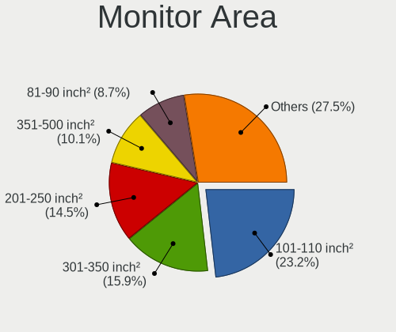

KDE neon - Hardware Trends
--------------------------

A project to identify most popular hardware characteristics and track their change
over time based on data collected by Linux users at https://Linux-Hardware.org.

Anyone can contribute to this report by the [hw-probe](https://github.com/linuxhw/hw-probe) tool:

    sudo -E hw-probe -all -upload

This is a report for all computer types. See also reports for [desktops](/Dist/KDE_neon/Desktop/README.md) and [notebooks](/Dist/KDE_neon/Notebook/README.md).

This report is for one last month. Overall report since the beginning of time: [TestDays](https://github.com/linuxhw/TestDays)

Period: May, 2023.

Contents
--------

* [ System ](#system)
  - [ OS                       ](#os)
  - [ OS Family                ](#os-family)
  - [ Kernel                   ](#kernel)
  - [ Kernel Family            ](#kernel-family)
  - [ Kernel Major Ver.        ](#kernel-major-ver)
  - [ Arch                     ](#arch)
  - [ DE                       ](#de)
  - [ Display Server           ](#display-server)
  - [ Display Manager          ](#display-manager)
  - [ OS Lang                  ](#os-lang)
  - [ Boot Mode                ](#boot-mode)
  - [ Filesystem               ](#filesystem)
  - [ Part. scheme             ](#part-scheme)
  - [ Dual Boot with Linux/BSD ](#dual-boot-with-linuxbsd)
  - [ Dual Boot (Win)          ](#dual-boot-win)

* [ Board ](#board)
  - [ Vendor                   ](#vendor)
  - [ Model                    ](#model)
  - [ Model Family             ](#model-family)
  - [ MFG Year                 ](#mfg-year)
  - [ Form Factor              ](#form-factor)
  - [ Secure Boot              ](#secure-boot)
  - [ Coreboot                 ](#coreboot)
  - [ RAM Size                 ](#ram-size)
  - [ RAM Used                 ](#ram-used)
  - [ Total Drives             ](#total-drives)
  - [ Has CD-ROM               ](#has-cd-rom)
  - [ Has Ethernet             ](#has-ethernet)
  - [ Has WiFi                 ](#has-wifi)
  - [ Has Bluetooth            ](#has-bluetooth)

* [ Location ](#location)
  - [ Country                  ](#country)
  - [ City                     ](#city)

* [ Drives ](#drives)
  - [ Drive Vendor             ](#drive-vendor)
  - [ Drive Model              ](#drive-model)
  - [ HDD Vendor               ](#hdd-vendor)
  - [ SSD Vendor               ](#ssd-vendor)
  - [ Drive Kind               ](#drive-kind)
  - [ Drive Connector          ](#drive-connector)
  - [ Drive Size               ](#drive-size)
  - [ Space Total              ](#space-total)
  - [ Space Used               ](#space-used)
  - [ Malfunc. Drives          ](#malfunc-drives)
  - [ Malfunc. Drive Vendor    ](#malfunc-drive-vendor)
  - [ Malfunc. HDD Vendor      ](#malfunc-hdd-vendor)
  - [ Malfunc. Drive Kind      ](#malfunc-drive-kind)
  - [ Failed Drives            ](#failed-drives)
  - [ Failed Drive Vendor      ](#failed-drive-vendor)
  - [ Drive Status             ](#drive-status)

* [ Storage controller ](#storage-controller)
  - [ Storage Vendor           ](#storage-vendor)
  - [ Storage Model            ](#storage-model)
  - [ Storage Kind             ](#storage-kind)

* [ Processor ](#processor)
  - [ CPU Vendor               ](#cpu-vendor)
  - [ CPU Model                ](#cpu-model)
  - [ CPU Model Family         ](#cpu-model-family)
  - [ CPU Cores                ](#cpu-cores)
  - [ CPU Sockets              ](#cpu-sockets)
  - [ CPU Threads              ](#cpu-threads)
  - [ CPU Op-Modes             ](#cpu-op-modes)
  - [ CPU Microcode            ](#cpu-microcode)
  - [ CPU Microarch            ](#cpu-microarch)

* [ Graphics ](#graphics)
  - [ GPU Vendor               ](#gpu-vendor)
  - [ GPU Model                ](#gpu-model)
  - [ GPU Combo                ](#gpu-combo)
  - [ GPU Driver               ](#gpu-driver)
  - [ GPU Memory               ](#gpu-memory)

* [ Monitor ](#monitor)
  - [ Monitor Vendor           ](#monitor-vendor)
  - [ Monitor Model            ](#monitor-model)
  - [ Monitor Resolution       ](#monitor-resolution)
  - [ Monitor Diagonal         ](#monitor-diagonal)
  - [ Monitor Width            ](#monitor-width)
  - [ Aspect Ratio             ](#aspect-ratio)
  - [ Monitor Area             ](#monitor-area)
  - [ Pixel Density            ](#pixel-density)
  - [ Multiple Monitors        ](#multiple-monitors)

* [ Network ](#network)
  - [ Net Controller Vendor    ](#net-controller-vendor)
  - [ Net Controller Model     ](#net-controller-model)
  - [ Wireless Vendor          ](#wireless-vendor)
  - [ Wireless Model           ](#wireless-model)
  - [ Ethernet Vendor          ](#ethernet-vendor)
  - [ Ethernet Model           ](#ethernet-model)
  - [ Net Controller Kind      ](#net-controller-kind)
  - [ Used Controller          ](#used-controller)
  - [ NICs                     ](#nics)
  - [ IPv6                     ](#ipv6)

* [ Bluetooth ](#bluetooth)
  - [ Bluetooth Vendor         ](#bluetooth-vendor)
  - [ Bluetooth Model          ](#bluetooth-model)

* [ Sound ](#sound)
  - [ Sound Vendor             ](#sound-vendor)
  - [ Sound Model              ](#sound-model)

* [ Memory ](#memory)
  - [ Memory Vendor            ](#memory-vendor)
  - [ Memory Model             ](#memory-model)
  - [ Memory Kind              ](#memory-kind)
  - [ Memory Form Factor       ](#memory-form-factor)
  - [ Memory Size              ](#memory-size)
  - [ Memory Speed             ](#memory-speed)

* [ Printers & scanners ](#printers--scanners)
  - [ Printer Vendor           ](#printer-vendor)
  - [ Printer Model            ](#printer-model)
  - [ Scanner Vendor           ](#scanner-vendor)
  - [ Scanner Model            ](#scanner-model)

* [ Camera ](#camera)
  - [ Camera Vendor            ](#camera-vendor)
  - [ Camera Model             ](#camera-model)

* [ Security ](#security)
  - [ Fingerprint Vendor       ](#fingerprint-vendor)
  - [ Fingerprint Model        ](#fingerprint-model)
  - [ Chipcard Vendor          ](#chipcard-vendor)
  - [ Chipcard Model           ](#chipcard-model)

* [ Unsupported ](#unsupported)
  - [ Unsupported Devices      ](#unsupported-devices)
  - [ Unsupported Device Types ](#unsupported-device-types)

System
------

OS
--

Installed operating systems

| Name           | Computers | Percent |
|----------------|-----------|---------|
| KDE neon 22.04 | 82        | 94.25%  |
| KDE neon 20.04 | 5         | 5.75%   |

OS Family
---------

OS without a version

| Name     | Computers | Percent |
|----------|-----------|---------|
| KDE neon | 87        | 100%    |

Kernel
------

Version of the Linux kernel

| Version              | Computers | Percent |
|----------------------|-----------|---------|
| 5.19.0-41-generic    | 48        | 55.17%  |
| 5.19.0-42-generic    | 19        | 21.84%  |
| 5.19.0-40-generic    | 5         | 5.75%   |
| 5.19.0-35-generic    | 2         | 2.3%    |
| 5.15.0-53-generic    | 2         | 2.3%    |
| 6.3.2-060302-generic | 1         | 1.15%   |
| 6.2.9-060209-generic | 1         | 1.15%   |
| 6.1.0-1009-oem       | 1         | 1.15%   |
| 6.0.0-1014-oem       | 1         | 1.15%   |
| 5.8.0-59-generic     | 1         | 1.15%   |
| 5.19.0-43-generic    | 1         | 1.15%   |
| 5.15.0-71-generic    | 1         | 1.15%   |
| 5.15.0-69-generic    | 1         | 1.15%   |
| 5.15.0-67-generic    | 1         | 1.15%   |
| 5.15.0-60-generic    | 1         | 1.15%   |
| 5.15.0-46-generic    | 1         | 1.15%   |

Kernel Family
-------------

Linux kernel without a distro release

| Version | Computers | Percent |
|---------|-----------|---------|
| 5.19.0  | 75        | 86.21%  |
| 5.15.0  | 7         | 8.05%   |
| 6.3.2   | 1         | 1.15%   |
| 6.2.9   | 1         | 1.15%   |
| 6.1.0   | 1         | 1.15%   |
| 6.0.0   | 1         | 1.15%   |
| 5.8.0   | 1         | 1.15%   |

Kernel Major Ver.
-----------------

Linux kernel major version

| Version | Computers | Percent |
|---------|-----------|---------|
| 5.19    | 75        | 86.21%  |
| 5.15    | 7         | 8.05%   |
| 6.3     | 1         | 1.15%   |
| 6.2     | 1         | 1.15%   |
| 6.1     | 1         | 1.15%   |
| 6.0     | 1         | 1.15%   |
| 5.8     | 1         | 1.15%   |

Arch
----

OS architecture (x86_64, i586, etc.)

| Name   | Computers | Percent |
|--------|-----------|---------|
| x86_64 | 87        | 100%    |

DE
--

Desktop Environment

| Name | Computers | Percent |
|------|-----------|---------|
| KDE5 | 87        | 100%    |

Display Server
--------------

X11 or Wayland

| Name    | Computers | Percent |
|---------|-----------|---------|
| X11     | 80        | 91.95%  |
| Wayland | 7         | 8.05%   |

Display Manager
---------------

SDDM, LightDM, etc.

| Name    | Computers | Percent |
|---------|-----------|---------|
| Unknown | 68        | 78.16%  |
| SDDM    | 19        | 21.84%  |

OS Lang
-------

Language

| Lang  | Computers | Percent |
|-------|-----------|---------|
| en_US | 38        | 43.68%  |
| en_GB | 11        | 12.64%  |
| pt_BR | 7         | 8.05%   |
| ru_RU | 5         | 5.75%   |
| fr_FR | 4         | 4.6%    |
| it_IT | 3         | 3.45%   |
| de_DE | 3         | 3.45%   |
| es_MX | 2         | 2.3%    |
| es_ES | 2         | 2.3%    |
| en_AU | 2         | 2.3%    |
| C     | 2         | 2.3%    |
| uk_UA | 1         | 1.15%   |
| ro_RO | 1         | 1.15%   |
| pl_PL | 1         | 1.15%   |
| nn_NO | 1         | 1.15%   |
| ko_KR | 1         | 1.15%   |
| es_CR | 1         | 1.15%   |
| en_ZA | 1         | 1.15%   |
| en_CA | 1         | 1.15%   |

Boot Mode
---------

EFI or BIOS

| Mode | Computers | Percent |
|------|-----------|---------|
| BIOS | 75        | 86.21%  |
| EFI  | 12        | 13.79%  |

Filesystem
----------

Type of filesystem

| Type    | Computers | Percent |
|---------|-----------|---------|
| Ext4    | 76        | 87.36%  |
| Btrfs   | 5         | 5.75%   |
| Tmpfs   | 4         | 4.6%    |
| Overlay | 2         | 2.3%    |

Part. scheme
------------

Scheme of partitioning

| Type    | Computers | Percent |
|---------|-----------|---------|
| Unknown | 68        | 78.16%  |
| GPT     | 17        | 19.54%  |
| MBR     | 2         | 2.3%    |

Dual Boot with Linux/BSD
------------------------

Hosting more than one Linux/BSD

| Dual boot | Computers | Percent |
|-----------|-----------|---------|
| No        | 85        | 97.7%   |
| Yes       | 2         | 2.3%    |

Dual Boot (Win)
---------------

Hosting Linux and Windows

| Dual boot | Computers | Percent |
|-----------|-----------|---------|
| No        | 77        | 88.51%  |
| Yes       | 10        | 11.49%  |

Board
-----

Vendor
------

Motherboard manufacturer

| Name                | Computers | Percent |
|---------------------|-----------|---------|
| ASUSTek Computer    | 18        | 20.69%  |
| Hewlett-Packard     | 13        | 14.94%  |
| Dell                | 13        | 14.94%  |
| Lenovo              | 12        | 13.79%  |
| Gigabyte Technology | 7         | 8.05%   |
| Acer                | 7         | 8.05%   |
| Toshiba             | 3         | 3.45%   |
| MSI                 | 3         | 3.45%   |
| ASRock              | 3         | 3.45%   |
| Apple               | 2         | 2.3%    |
| Timi                | 1         | 1.15%   |
| SYWZ                | 1         | 1.15%   |
| Microsoft           | 1         | 1.15%   |
| Intel               | 1         | 1.15%   |
| Chuwi               | 1         | 1.15%   |
| AZW                 | 1         | 1.15%   |

Model
-----

Motherboard model

| Name                                    | Computers | Percent |
|-----------------------------------------|-----------|---------|
| Dell Inspiron 3505                      | 2         | 2.3%    |
| Toshiba Satellite P870                  | 1         | 1.15%   |
| Toshiba Satellite L775                  | 1         | 1.15%   |
| Toshiba Satellite L50-C                 | 1         | 1.15%   |
| Timi Xiaomi Book Pro 16 2022            | 1         | 1.15%   |
| SYWZ S200 Series                        | 1         | 1.15%   |
| MSI Stealth 17Studio A13VH              | 1         | 1.15%   |
| MSI MS-7816                             | 1         | 1.15%   |
| MSI GE620/GE620DX/FX620DX/FX623         | 1         | 1.15%   |
| Microsoft Surface Go 3                  | 1         | 1.15%   |
| Lenovo Y520-15IKBN 80WK                 | 1         | 1.15%   |
| Lenovo ThinkStation P510 30B4S2BA00     | 1         | 1.15%   |
| Lenovo ThinkPad T420 4236WR1            | 1         | 1.15%   |
| Lenovo ThinkBook 16 G4+ ARA 21D1        | 1         | 1.15%   |
| Lenovo Legion 5 15ARH05 82B5            | 1         | 1.15%   |
| Lenovo IdeaPadFlex 5 15ITL05 82HT       | 1         | 1.15%   |
| Lenovo IdeaPad S145-15IWL 81MV          | 1         | 1.15%   |
| Lenovo IdeaPad L3 15IML05 81Y3          | 1         | 1.15%   |
| Lenovo IdeaPad 310-15ISK 80SM           | 1         | 1.15%   |
| Lenovo IdeaPad 3 15ALC6 82KU            | 1         | 1.15%   |
| Lenovo G50-80 80L0                      | 1         | 1.15%   |
| Lenovo B570e HuronRiver Platform        | 1         | 1.15%   |
| Intel NUC12WSHi7                        | 1         | 1.15%   |
| HP ZBook 14u G5                         | 1         | 1.15%   |
| HP ProBook 645 G1                       | 1         | 1.15%   |
| HP Pavilion Laptop 15-eh1xxx            | 1         | 1.15%   |
| HP Pavilion g6                          | 1         | 1.15%   |
| HP Pavilion dv6                         | 1         | 1.15%   |
| HP Pavilion dm4                         | 1         | 1.15%   |
| HP Pavilion All-in-One 24-x0xx          | 1         | 1.15%   |
| HP Notebook                             | 1         | 1.15%   |
| HP Laptop 17-cp0xxx                     | 1         | 1.15%   |
| HP Laptop 14-dk1xxx                     | 1         | 1.15%   |
| HP EliteBook 845 14 inch G9 Notebook PC | 1         | 1.15%   |
| HP EliteBook 820 G1                     | 1         | 1.15%   |
| HP Compaq dc5700 Small Form Factor      | 1         | 1.15%   |
| Gigabyte X99-UD4-CF                     | 1         | 1.15%   |
| Gigabyte X570 AORUS PRO WIFI            | 1         | 1.15%   |
| Gigabyte X570 AORUS ELITE WIFI          | 1         | 1.15%   |
| Gigabyte M68MT-S2                       | 1         | 1.15%   |

Model Family
------------

Motherboard model prefix

| Name                 | Computers | Percent |
|----------------------|-----------|---------|
| Dell Inspiron        | 6         | 6.9%    |
| HP Pavilion          | 5         | 5.75%   |
| Lenovo IdeaPad       | 4         | 4.6%    |
| Dell Latitude        | 4         | 4.6%    |
| Acer Aspire          | 4         | 4.6%    |
| Toshiba Satellite    | 3         | 3.45%   |
| ASUS TUF             | 3         | 3.45%   |
| ASUS ROG             | 3         | 3.45%   |
| ASUS ASUS            | 3         | 3.45%   |
| HP Laptop            | 2         | 2.3%    |
| HP EliteBook         | 2         | 2.3%    |
| Gigabyte X570        | 2         | 2.3%    |
| Dell XPS             | 2         | 2.3%    |
| Timi Xiaomi          | 1         | 1.15%   |
| SYWZ S200            | 1         | 1.15%   |
| MSI Stealth          | 1         | 1.15%   |
| MSI MS-7816          | 1         | 1.15%   |
| MSI GE620            | 1         | 1.15%   |
| Microsoft Surface    | 1         | 1.15%   |
| Lenovo Y520-15IKBN   | 1         | 1.15%   |
| Lenovo ThinkStation  | 1         | 1.15%   |
| Lenovo ThinkPad      | 1         | 1.15%   |
| Lenovo ThinkBook     | 1         | 1.15%   |
| Lenovo Legion        | 1         | 1.15%   |
| Lenovo IdeaPadFlex   | 1         | 1.15%   |
| Lenovo G50-80        | 1         | 1.15%   |
| Lenovo B570e         | 1         | 1.15%   |
| Intel NUC12WSHi7     | 1         | 1.15%   |
| HP ZBook             | 1         | 1.15%   |
| HP ProBook           | 1         | 1.15%   |
| HP Notebook          | 1         | 1.15%   |
| HP Compaq            | 1         | 1.15%   |
| Gigabyte X99-UD4-CF  | 1         | 1.15%   |
| Gigabyte M68MT-S2    | 1         | 1.15%   |
| Gigabyte H410M       | 1         | 1.15%   |
| Gigabyte B550        | 1         | 1.15%   |
| Gigabyte AB350M-DS3H | 1         | 1.15%   |
| Dell OptiPlex        | 1         | 1.15%   |
| Chuwi LarkBox        | 1         | 1.15%   |
| AZW MINI             | 1         | 1.15%   |

MFG Year
--------

Motherboard manufacture year

| Year | Computers | Percent |
|------|-----------|---------|
| 2020 | 15        | 17.24%  |
| 2021 | 11        | 12.64%  |
| 2022 | 10        | 11.49%  |
| 2017 | 8         | 9.2%    |
| 2019 | 6         | 6.9%    |
| 2015 | 5         | 5.75%   |
| 2014 | 5         | 5.75%   |
| 2011 | 5         | 5.75%   |
| 2010 | 5         | 5.75%   |
| 2018 | 4         | 4.6%    |
| 2016 | 4         | 4.6%    |
| 2013 | 3         | 3.45%   |
| 2012 | 3         | 3.45%   |
| 2008 | 1         | 1.15%   |
| 2007 | 1         | 1.15%   |
| 2006 | 1         | 1.15%   |

Form Factor
-----------

Physical design of the computer

| Name        | Computers | Percent |
|-------------|-----------|---------|
| Notebook    | 55        | 63.22%  |
| Desktop     | 25        | 28.74%  |
| All in one  | 3         | 3.45%   |
| Mini pc     | 2         | 2.3%    |
| Tablet      | 1         | 1.15%   |
| Convertible | 1         | 1.15%   |

Secure Boot
-----------

Enabled or disabled

| State    | Computers | Percent |
|----------|-----------|---------|
| Disabled | 84        | 96.55%  |
| Enabled  | 3         | 3.45%   |

Coreboot
--------

Have coreboot on board

| Used | Computers | Percent |
|------|-----------|---------|
| No   | 87        | 100%    |

RAM Size
--------

Total RAM memory

| Size in GB  | Computers | Percent |
|-------------|-----------|---------|
| 4.01-8.0    | 22        | 25.29%  |
| 8.01-16.0   | 20        | 22.99%  |
| 32.01-64.0  | 15        | 17.24%  |
| 16.01-24.0  | 15        | 17.24%  |
| 3.01-4.0    | 10        | 11.49%  |
| 24.01-32.0  | 4         | 4.6%    |
| 64.01-256.0 | 1         | 1.15%   |

RAM Used
--------

Used RAM memory

| Used GB    | Computers | Percent |
|------------|-----------|---------|
| 4.01-8.0   | 30        | 34.48%  |
| 2.01-3.0   | 22        | 25.29%  |
| 1.01-2.0   | 20        | 22.99%  |
| 3.01-4.0   | 10        | 11.49%  |
| 8.01-16.0  | 4         | 4.6%    |
| 16.01-24.0 | 1         | 1.15%   |

Total Drives
------------

Number of drives on board

| Drives | Computers | Percent |
|--------|-----------|---------|
| 1      | 51        | 58.62%  |
| 2      | 20        | 22.99%  |
| 3      | 10        | 11.49%  |
| 4      | 3         | 3.45%   |
| 5      | 2         | 2.3%    |
| 6      | 1         | 1.15%   |

Has CD-ROM
----------

Has CD-ROM on board

| Presented | Computers | Percent |
|-----------|-----------|---------|
| No        | 60        | 68.97%  |
| Yes       | 27        | 31.03%  |

Has Ethernet
------------

Has Ethernet on board

| Presented | Computers | Percent |
|-----------|-----------|---------|
| Yes       | 72        | 82.76%  |
| No        | 15        | 17.24%  |

Has WiFi
--------

Has WiFi module

| Presented | Computers | Percent |
|-----------|-----------|---------|
| Yes       | 74        | 85.06%  |
| No        | 13        | 14.94%  |

Has Bluetooth
-------------

Has Bluetooth module

| Presented | Computers | Percent |
|-----------|-----------|---------|
| Yes       | 68        | 78.16%  |
| No        | 19        | 21.84%  |

Location
--------

Country
-------

Geographic location (country)

| Country      | Computers | Percent |
|--------------|-----------|---------|
| USA          | 15        | 17.24%  |
| UK           | 9         | 10.34%  |
| Brazil       | 7         | 8.05%   |
| Russia       | 5         | 5.75%   |
| Germany      | 5         | 5.75%   |
| Italy        | 4         | 4.6%    |
| France       | 4         | 4.6%    |
| Poland       | 3         | 3.45%   |
| Australia    | 3         | 3.45%   |
| Romania      | 2         | 2.3%    |
| New Zealand  | 2         | 2.3%    |
| Netherlands  | 2         | 2.3%    |
| Canada       | 2         | 2.3%    |
| Argentina    | 2         | 2.3%    |
| Venezuela    | 1         | 1.15%   |
| Ukraine      | 1         | 1.15%   |
| UAE          | 1         | 1.15%   |
| Tunisia      | 1         | 1.15%   |
| Thailand     | 1         | 1.15%   |
| Spain        | 1         | 1.15%   |
| South Korea  | 1         | 1.15%   |
| South Africa | 1         | 1.15%   |
| Portugal     | 1         | 1.15%   |
| Pakistan     | 1         | 1.15%   |
| Norway       | 1         | 1.15%   |
| Nepal        | 1         | 1.15%   |
| Morocco      | 1         | 1.15%   |
| Mexico       | 1         | 1.15%   |
| Indonesia    | 1         | 1.15%   |
| Greece       | 1         | 1.15%   |
| Costa Rica   | 1         | 1.15%   |
| Colombia     | 1         | 1.15%   |
| Belarus      | 1         | 1.15%   |
| Bangladesh   | 1         | 1.15%   |
| Armenia      | 1         | 1.15%   |
| Algeria      | 1         | 1.15%   |

City
----

Geographic location (city)

| City                   | Computers | Percent |
|------------------------|-----------|---------|
| Dolgoprudnyy           | 2         | 2.3%    |
| Austin                 | 2         | 2.3%    |
| Yerevan                | 1         | 1.15%   |
| Winterswijk            | 1         | 1.15%   |
| Wellington             | 1         | 1.15%   |
| Waterloo               | 1         | 1.15%   |
| Vitebsk                | 1         | 1.15%   |
| Vargem Grande Paulista | 1         | 1.15%   |
| Valencia               | 1         | 1.15%   |
| Urdiain                | 1         | 1.15%   |
| Tyumen                 | 1         | 1.15%   |
| Trier                  | 1         | 1.15%   |
| Tigard                 | 1         | 1.15%   |
| Thessaloniki           | 1         | 1.15%   |
| Tangerang              | 1         | 1.15%   |
| Sydney                 | 1         | 1.15%   |
| Susa                   | 1         | 1.15%   |
| Surprise               | 1         | 1.15%   |
| Stockton-on-Tees       | 1         | 1.15%   |
| Stockton               | 1         | 1.15%   |
| Stevenage              | 1         | 1.15%   |
| St. George             | 1         | 1.15%   |
| Srokowo                | 1         | 1.15%   |
| Silverton              | 1         | 1.15%   |
| Sfax                   | 1         | 1.15%   |
| Santo André           | 1         | 1.15%   |
| San Bruno              | 1         | 1.15%   |
| Rostov-on-Don          | 1         | 1.15%   |
| Rochester              | 1         | 1.15%   |
| Rimini                 | 1         | 1.15%   |
| Puebla City            | 1         | 1.15%   |
| Poitiers               | 1         | 1.15%   |
| Pinet                  | 1         | 1.15%   |
| Perth                  | 1         | 1.15%   |
| Oxford                 | 1         | 1.15%   |
| Oujda                  | 1         | 1.15%   |
| Osasco                 | 1         | 1.15%   |
| Novo Hamburgo          | 1         | 1.15%   |
| Newcastle upon Tyne    | 1         | 1.15%   |
| Naranjo                | 1         | 1.15%   |

Drives
------

Drive Vendor
------------

Hard drive vendors

| Vendor                         | Computers | Drives | Percent |
|--------------------------------|-----------|--------|---------|
| Samsung Electronics            | 21        | 28     | 16.15%  |
| WDC                            | 14        | 17     | 10.77%  |
| Seagate                        | 14        | 18     | 10.77%  |
| Micron Technology              | 10        | 10     | 7.69%   |
| SanDisk                        | 9         | 10     | 6.92%   |
| Crucial                        | 9         | 9      | 6.92%   |
| Toshiba                        | 8         | 8      | 6.15%   |
| Kingston                       | 8         | 8      | 6.15%   |
| Unknown                        | 5         | 6      | 3.85%   |
| KIOXIA                         | 3         | 3      | 2.31%   |
| Intel                          | 3         | 3      | 2.31%   |
| Hitachi                        | 3         | 4      | 2.31%   |
| SK hynix                       | 2         | 2      | 1.54%   |
| PNY                            | 2         | 2      | 1.54%   |
| HGST                           | 2         | 2      | 1.54%   |
| China                          | 2         | 2      | 1.54%   |
| TSA                            | 1         | 1      | 0.77%   |
| Transcend                      | 1         | 1      | 0.77%   |
| Solid State Storage Technology | 1         | 1      | 0.77%   |
| RSH-319                        | 1         | 1      | 0.77%   |
| Phison Electronics             | 1         | 1      | 0.77%   |
| Netac                          | 1         | 2      | 0.77%   |
| Micron/Crucial Technology      | 1         | 2      | 0.77%   |
| MAXIO Technology (Hangzhou)    | 1         | 1      | 0.77%   |
| KLEVV                          | 1         | 1      | 0.77%   |
| General                        | 1         | 1      | 0.77%   |
| Fanxiang                       | 1         | 1      | 0.77%   |
| Apple                          | 1         | 1      | 0.77%   |
| Apacer                         | 1         | 1      | 0.77%   |
| ADATA Technology               | 1         | 1      | 0.77%   |
| A-DATA Technology              | 1         | 1      | 0.77%   |

Drive Model
-----------

Hard drive models

| Model                                               | Computers | Percent |
|-----------------------------------------------------|-----------|---------|
| Samsung NVMe SSD Controller SM981/PM981/PM983 256GB | 4         | 2.76%   |
| Seagate ST1000DM010-2EP102 1TB                      | 3         | 2.07%   |
| Samsung NVMe SSD Controller PM9A1/PM9A3/980PRO 1TB  | 3         | 2.07%   |
| Toshiba MQ04ABF100 1TB                              | 2         | 1.38%   |
| Samsung SSD 980 PRO 1TB                             | 2         | 1.38%   |
| Samsung SSD 860 EVO 500GB                           | 2         | 1.38%   |
| Samsung SSD 860 EVO 250GB                           | 2         | 1.38%   |
| Micron 2450_MTFDKBA1T0TFK 1TB                       | 2         | 1.38%   |
| Micron 2210_MTFDHBA512QFD 512GB                     | 2         | 1.38%   |
| Kingston SA400S37240G 240GB SSD                     | 2         | 1.38%   |
| Kingston SA400S37120G 120GB SSD                     | 2         | 1.38%   |
| Intel SSD 660P Series 512GB                         | 2         | 1.38%   |
| Crucial CT240BX500SSD1 240GB                        | 2         | 1.38%   |
| Crucial CT1000MX500SSD1 1TB                         | 2         | 1.38%   |
| WDC WDS500G2B0A-00SM50 500GB SSD                    | 1         | 0.69%   |
| WDC WDS240G2G0A-00JH30 240GB SSD                    | 1         | 0.69%   |
| WDC WDS200T2B0B-00YS70 2TB SSD                      | 1         | 0.69%   |
| WDC WDS200T2B0A-00SM50 2TB SSD                      | 1         | 0.69%   |
| WDC WD6400BPVT-22HXZT1 640GB                        | 1         | 0.69%   |
| WDC WD5000BEVT-22A0RT0 500GB                        | 1         | 0.69%   |
| WDC WD5000AAKX-001CA0 500GB                         | 1         | 0.69%   |
| WDC WD40EFRX-68N32N0 4TB                            | 1         | 0.69%   |
| WDC WD10JPVX-22JC3T0 1TB                            | 1         | 0.69%   |
| WDC WD10JPCX-24UE4T0 1TB                            | 1         | 0.69%   |
| WDC WD10EZEX-21WN4A0 1TB                            | 1         | 0.69%   |
| WDC WD10EZEX-08WN4A0 1TB                            | 1         | 0.69%   |
| WDC WD10EZEX-08M2NA0 1TB                            | 1         | 0.69%   |
| WDC WD10EZEX-00ZF5A0 1TB                            | 1         | 0.69%   |
| WDC WD10EFRX-68JCSN0 1TB                            | 1         | 0.69%   |
| WDC WD10EAVS-00D7B1 1TB                             | 1         | 0.69%   |
| WDC WD Blue SA510 M.2 2280 1000GB                   | 1         | 0.69%   |
| Unknown ZYmSATA120 120GB                            | 1         | 0.69%   |
| Unknown SD/MMC/MS PRO 64GB                          | 1         | 0.69%   |
| Unknown MMC Card  64GB                              | 1         | 0.69%   |
| Unknown MMC Card  32GB                              | 1         | 0.69%   |
| Unknown MMC Card  134GB                             | 1         | 0.69%   |
| Unknown MMC Card  128GB                             | 1         | 0.69%   |
| TSA SSD 256GB                                       | 1         | 0.69%   |
| Transcend TS128GSSD370S 128GB                       | 1         | 0.69%   |
| Toshiba MQ01ABF050 500GB                            | 1         | 0.69%   |

HDD Vendor
----------

Hard disk drive vendors

| Vendor  | Computers | Drives | Percent |
|---------|-----------|--------|---------|
| Seagate | 14        | 17     | 35.9%   |
| WDC     | 11        | 12     | 28.21%  |
| Toshiba | 7         | 7      | 17.95%  |
| Hitachi | 3         | 4      | 7.69%   |
| HGST    | 2         | 2      | 5.13%   |
| Unknown | 1         | 1      | 2.56%   |
| RSH-319 | 1         | 1      | 2.56%   |

SSD Vendor
----------

Solid state drive vendors

| Vendor              | Computers | Drives | Percent |
|---------------------|-----------|--------|---------|
| Crucial             | 9         | 9      | 20%     |
| Samsung Electronics | 8         | 10     | 17.78%  |
| Kingston            | 6         | 6      | 13.33%  |
| WDC                 | 4         | 5      | 8.89%   |
| SanDisk             | 4         | 4      | 8.89%   |
| Micron Technology   | 3         | 3      | 6.67%   |
| PNY                 | 2         | 2      | 4.44%   |
| China               | 2         | 2      | 4.44%   |
| TSA                 | 1         | 1      | 2.22%   |
| Transcend           | 1         | 1      | 2.22%   |
| Netac               | 1         | 2      | 2.22%   |
| Fanxiang            | 1         | 1      | 2.22%   |
| Apple               | 1         | 1      | 2.22%   |
| Apacer              | 1         | 1      | 2.22%   |
| A-DATA Technology   | 1         | 1      | 2.22%   |

Drive Kind
----------

HDD or SSD

| Kind    | Computers | Drives | Percent |
|---------|-----------|--------|---------|
| NVMe    | 42        | 49     | 34.43%  |
| SSD     | 41        | 49     | 33.61%  |
| HDD     | 32        | 44     | 26.23%  |
| MMC     | 4         | 4      | 3.28%   |
| Unknown | 3         | 3      | 2.46%   |

Drive Connector
---------------

SATA, SAS, NVMe, etc.

| Type | Computers | Drives | Percent |
|------|-----------|--------|---------|
| SATA | 56        | 87     | 51.38%  |
| NVMe | 42        | 49     | 38.53%  |
| SAS  | 7         | 9      | 6.42%   |
| MMC  | 4         | 4      | 3.67%   |

Drive Size
----------

Size of hard drive

| Size in TB | Computers | Drives | Percent |
|------------|-----------|--------|---------|
| 0.01-0.5   | 36        | 47     | 48%     |
| 0.51-1.0   | 25        | 29     | 33.33%  |
| 1.01-2.0   | 10        | 12     | 13.33%  |
| 4.01-10.0  | 2         | 3      | 2.67%   |
| 3.01-4.0   | 1         | 1      | 1.33%   |
| 10.01-20.0 | 1         | 1      | 1.33%   |

Space Total
-----------

Amount of disk space available on the file system

| Size in GB     | Computers | Percent |
|----------------|-----------|---------|
| 251-500        | 23        | 26.44%  |
| 101-250        | 22        | 25.29%  |
| 501-1000       | 13        | 14.94%  |
| 51-100         | 8         | 9.2%    |
| 1001-2000      | 7         | 8.05%   |
| 21-50          | 5         | 5.75%   |
| 2001-3000      | 3         | 3.45%   |
| More than 3000 | 2         | 2.3%    |
| 1-20           | 2         | 2.3%    |
| Unknown        | 2         | 2.3%    |

Space Used
----------

Amount of used disk space

| Used GB   | Computers | Percent |
|-----------|-----------|---------|
| 1-20      | 34        | 39.08%  |
| 21-50     | 15        | 17.24%  |
| 101-250   | 13        | 14.94%  |
| 51-100    | 12        | 13.79%  |
| 1001-2000 | 4         | 4.6%    |
| 251-500   | 3         | 3.45%   |
| 501-1000  | 3         | 3.45%   |
| Unknown   | 2         | 2.3%    |
| 2001-3000 | 1         | 1.15%   |

Malfunc. Drives
---------------

Drive models with a malfunction

| Model                    | Computers | Drives | Percent |
|--------------------------|-----------|--------|---------|
| WDC WD10EFRX-68JCSN0 1TB | 1         | 1      | 100%    |

Malfunc. Drive Vendor
---------------------

Vendors of faulty drives

| Vendor | Computers | Drives | Percent |
|--------|-----------|--------|---------|
| WDC    | 1         | 1      | 100%    |

Malfunc. HDD Vendor
-------------------

Vendors of faulty HDD drives

| Vendor | Computers | Drives | Percent |
|--------|-----------|--------|---------|
| WDC    | 1         | 1      | 100%    |

Malfunc. Drive Kind
-------------------

Kinds of faulty drives

| Kind | Computers | Drives | Percent |
|------|-----------|--------|---------|
| HDD  | 1         | 1      | 100%    |

Failed Drives
-------------

Failed drive models

Zero info for selected period =(

Failed Drive Vendor
-------------------

Failed drive vendors

Zero info for selected period =(

Drive Status
------------

Number of failed and malfunc. drives

| Status   | Computers | Drives | Percent |
|----------|-----------|--------|---------|
| Detected | 75        | 127    | 82.42%  |
| Works    | 15        | 21     | 16.48%  |
| Malfunc  | 1         | 1      | 1.1%    |

Storage controller
------------------

Storage Vendor
--------------

Storage controller vendors

| Vendor                         | Computers | Percent |
|--------------------------------|-----------|---------|
| Intel                          | 53        | 46.9%   |
| AMD                            | 17        | 15.04%  |
| Samsung Electronics            | 14        | 12.39%  |
| Micron Technology              | 7         | 6.19%   |
| SanDisk                        | 6         | 5.31%   |
| KIOXIA                         | 3         | 2.65%   |
| SK hynix                       | 2         | 1.77%   |
| Nvidia                         | 2         | 1.77%   |
| Kingston Technology Company    | 2         | 1.77%   |
| VIA Technologies               | 1         | 0.88%   |
| Toshiba America Info Systems   | 1         | 0.88%   |
| Solid State Storage Technology | 1         | 0.88%   |
| Phison Electronics             | 1         | 0.88%   |
| Micron/Crucial Technology      | 1         | 0.88%   |
| MAXIO Technology (Hangzhou)    | 1         | 0.88%   |
| ADATA Technology               | 1         | 0.88%   |

Storage Model
-------------

Storage controller models

| Model                                                                          | Computers | Percent |
|--------------------------------------------------------------------------------|-----------|---------|
| AMD FCH SATA Controller [AHCI mode]                                            | 12        | 9.6%    |
| Micron NVMe Storage Controller                                                 | 7         | 5.6%    |
| Samsung NVMe SSD Controller PM9A1/PM9A3/980PRO                                 | 6         | 4.8%    |
| Intel 6 Series/C200 Series Chipset Family 6 port Mobile SATA AHCI Controller   | 6         | 4.8%    |
| Samsung NVMe SSD Controller SM981/PM981/PM983                                  | 5         | 4%      |
| AMD 500 Series Chipset SATA Controller                                         | 5         | 4%      |
| Samsung NVMe SSD Controller 980                                                | 4         | 3.2%    |
| Intel Sunrise Point-LP SATA Controller [AHCI mode]                             | 4         | 3.2%    |
| Intel 400 Series Chipset Family SATA AHCI Controller                           | 4         | 3.2%    |
| SanDisk Non-Volatile memory controller                                         | 3         | 2.4%    |
| Intel Wildcat Point-LP SATA Controller [AHCI Mode]                             | 3         | 2.4%    |
| Intel Q170/Q150/B150/H170/H110/Z170/CM236 Chipset SATA Controller [AHCI Mode]  | 3         | 2.4%    |
| Intel Comet Lake SATA AHCI Controller                                          | 3         | 2.4%    |
| Intel 7 Series Chipset Family 6-port SATA Controller [AHCI mode]               | 3         | 2.4%    |
| Intel SSD 660P Series                                                          | 2         | 1.6%    |
| Intel HM170/QM170 Chipset SATA Controller [AHCI Mode]                          | 2         | 1.6%    |
| Intel Cannon Point-LP SATA Controller [AHCI Mode]                              | 2         | 1.6%    |
| Intel C610/X99 series chipset 6-Port SATA Controller [AHCI mode]               | 2         | 1.6%    |
| Intel 82801 Mobile SATA Controller [RAID mode]                                 | 2         | 1.6%    |
| Intel 8 Series/C220 Series Chipset Family 6-port SATA Controller 1 [AHCI mode] | 2         | 1.6%    |
| Intel 8 Series SATA Controller 1 [AHCI mode]                                   | 2         | 1.6%    |
| Intel 500 Series Chipset Family SATA AHCI Controller                           | 2         | 1.6%    |
| AMD 300 Series Chipset SATA Controller                                         | 2         | 1.6%    |
| VIA VT6415 PATA IDE Host Controller                                            | 1         | 0.8%    |
| Toshiba America Info Systems XG5 NVMe SSD Controller                           | 1         | 0.8%    |
| Solid State Storage Non-Volatile memory controller                             | 1         | 0.8%    |
| SK hynix BC511                                                                 | 1         | 0.8%    |
| SK hynix BC501 NVMe Solid State Drive                                          | 1         | 0.8%    |
| SanDisk WD Blue SN570 NVMe SSD 1TB                                             | 1         | 0.8%    |
| SanDisk WD Blue SN550 NVMe SSD                                                 | 1         | 0.8%    |
| SanDisk WD Black NVMe SSD                                                      | 1         | 0.8%    |
| Samsung Surface NVMe Controller                                                | 1         | 0.8%    |
| Samsung Electronics Non-Volatile memory controller                             | 1         | 0.8%    |
| Phison E12 NVMe Controller                                                     | 1         | 0.8%    |
| Nvidia MCP89 SATA Controller (AHCI mode)                                       | 1         | 0.8%    |
| Nvidia MCP61 SATA Controller                                                   | 1         | 0.8%    |
| Micron/Crucial P2 NVMe PCIe SSD                                                | 1         | 0.8%    |
| MAXIO (Hangzhou) NVMe SSD Controller MAP1202                                   | 1         | 0.8%    |
| KIOXIA NVMe SSD Controller BG4                                                 | 1         | 0.8%    |
| KIOXIA NVMe SSD                                                                | 1         | 0.8%    |

Storage Kind
------------

Kind of storage controller (IDE, SATA, NVMe, SAS, ...)

| Kind | Computers | Percent |
|------|-----------|---------|
| SATA | 64        | 56.14%  |
| NVMe | 42        | 36.84%  |
| IDE  | 6         | 5.26%   |
| RAID | 2         | 1.75%   |

Processor
---------

CPU Vendor
----------

Processor vendors

| Vendor | Computers | Percent |
|--------|-----------|---------|
| Intel  | 61        | 70.11%  |
| AMD    | 26        | 29.89%  |

CPU Model
---------

Processor models

| Model                                  | Computers | Percent |
|----------------------------------------|-----------|---------|
| Intel Core i7-8550U CPU @ 1.80GHz      | 3         | 3.45%   |
| Intel Pentium Gold G6400 CPU @ 4.00GHz | 2         | 2.3%    |
| Intel Core i7-5500U CPU @ 2.40GHz      | 2         | 2.3%    |
| Intel Core i5-10300H CPU @ 2.50GHz     | 2         | 2.3%    |
| AMD Ryzen 7 6800U with Radeon Graphics | 2         | 2.3%    |
| AMD Ryzen 7 4800H with Radeon Graphics | 2         | 2.3%    |
| AMD Ryzen 7 3700X 8-Core Processor     | 2         | 2.3%    |
| AMD Ryzen 5 5500U with Radeon Graphics | 2         | 2.3%    |
| Intel Xeon CPU E5440 @ 2.83GHz         | 1         | 1.15%   |
| Intel Xeon CPU E5-2630 v4 @ 2.20GHz    | 1         | 1.15%   |
| Intel Pentium CPU GOLD 6500Y @ 1.10GHz | 1         | 1.15%   |
| Intel Core m7-6Y75 CPU @ 1.20GHz       | 1         | 1.15%   |
| Intel Core i9-8950HK CPU @ 2.90GHz     | 1         | 1.15%   |
| Intel Core i7-8750H CPU @ 2.20GHz      | 1         | 1.15%   |
| Intel Core i7-7700HQ CPU @ 2.80GHz     | 1         | 1.15%   |
| Intel Core i7-6950X CPU @ 3.00GHz      | 1         | 1.15%   |
| Intel Core i7-6700HQ CPU @ 2.60GHz     | 1         | 1.15%   |
| Intel Core i7-6500U CPU @ 2.50GHz      | 1         | 1.15%   |
| Intel Core i7-4790 CPU @ 3.60GHz       | 1         | 1.15%   |
| Intel Core i7-4600U CPU @ 2.10GHz      | 1         | 1.15%   |
| Intel Core i7-3610QM CPU @ 2.30GHz     | 1         | 1.15%   |
| Intel Core i7-3537U CPU @ 2.00GHz      | 1         | 1.15%   |
| Intel Core i7-2630QM CPU @ 2.00GHz     | 1         | 1.15%   |
| Intel Core i7-10850H CPU @ 2.70GHz     | 1         | 1.15%   |
| Intel Core i7-10700 CPU @ 2.90GHz      | 1         | 1.15%   |
| Intel Core i7-1065G7 CPU @ 1.30GHz     | 1         | 1.15%   |
| Intel Core i5-8365U CPU @ 1.60GHz      | 1         | 1.15%   |
| Intel Core i5-8265U CPU @ 1.60GHz      | 1         | 1.15%   |
| Intel Core i5-7500 CPU @ 3.40GHz       | 1         | 1.15%   |
| Intel Core i5-7400T CPU @ 2.40GHz      | 1         | 1.15%   |
| Intel Core i5-7300HQ CPU @ 2.50GHz     | 1         | 1.15%   |
| Intel Core i5-7200U CPU @ 2.50GHz      | 1         | 1.15%   |
| Intel Core i5-6200U CPU @ 2.30GHz      | 1         | 1.15%   |
| Intel Core i5-4590 CPU @ 3.30GHz       | 1         | 1.15%   |
| Intel Core i5-4570 CPU @ 3.20GHz       | 1         | 1.15%   |
| Intel Core i5-4200U CPU @ 1.60GHz      | 1         | 1.15%   |
| Intel Core i5-3210M CPU @ 2.50GHz      | 1         | 1.15%   |
| Intel Core i5-2540M CPU @ 2.60GHz      | 1         | 1.15%   |
| Intel Core i5-2500 CPU @ 3.30GHz       | 1         | 1.15%   |
| Intel Core i5-2430M CPU @ 2.40GHz      | 1         | 1.15%   |

CPU Model Family
----------------

Processor model prefix

| Model              | Computers | Percent |
|--------------------|-----------|---------|
| Intel Core i5      | 20        | 22.99%  |
| Intel Core i7      | 18        | 20.69%  |
| AMD Ryzen 5        | 9         | 10.34%  |
| AMD Ryzen 7        | 8         | 9.2%    |
| Other              | 4         | 4.6%    |
| Intel Core i3      | 4         | 4.6%    |
| Intel Celeron      | 4         | 4.6%    |
| AMD Ryzen 9        | 3         | 3.45%   |
| Intel Xeon         | 2         | 2.3%    |
| Intel Pentium Gold | 2         | 2.3%    |
| Intel Core 2 Duo   | 2         | 2.3%    |
| AMD Ryzen 3        | 2         | 2.3%    |
| Intel Pentium      | 1         | 1.15%   |
| Intel Core m7      | 1         | 1.15%   |
| Intel Core i9      | 1         | 1.15%   |
| Intel Core 2       | 1         | 1.15%   |
| Intel Atom         | 1         | 1.15%   |
| AMD Athlon II X2   | 1         | 1.15%   |
| AMD Athlon         | 1         | 1.15%   |
| AMD A6             | 1         | 1.15%   |
| AMD A10            | 1         | 1.15%   |

CPU Cores
---------

Number of processor cores

| Number | Computers | Percent |
|--------|-----------|---------|
| 4      | 30        | 34.48%  |
| 2      | 28        | 32.18%  |
| 8      | 11        | 12.64%  |
| 6      | 11        | 12.64%  |
| 12     | 3         | 3.45%   |
| 10     | 2         | 2.3%    |
| 14     | 1         | 1.15%   |
| 1      | 1         | 1.15%   |

CPU Sockets
-----------

Number of sockets

| Number | Computers | Percent |
|--------|-----------|---------|
| 1      | 87        | 100%    |

CPU Threads
-----------

Threads per core (Hyper-Threading)

| Number | Computers | Percent |
|--------|-----------|---------|
| 2      | 69        | 79.31%  |
| 1      | 18        | 20.69%  |

CPU Op-Modes
------------

CPU Operation Modes (32-bit, 64-bit)

| Op mode        | Computers | Percent |
|----------------|-----------|---------|
| 32-bit, 64-bit | 87        | 100%    |

CPU Microcode
-------------

Microcode number

| Number     | Computers | Percent |
|------------|-----------|---------|
| Unknown    | 66        | 75.86%  |
| 0x406e3    | 3         | 3.45%   |
| 0x0a404102 | 3         | 3.45%   |
| 0x906e9    | 2         | 2.3%    |
| 0xa0652    | 1         | 1.15%   |
| 0x806e9    | 1         | 1.15%   |
| 0x806c1    | 1         | 1.15%   |
| 0x6fa      | 1         | 1.15%   |
| 0x6f2      | 1         | 1.15%   |
| 0x406f1    | 1         | 1.15%   |
| 0x40651    | 1         | 1.15%   |
| 0x306c3    | 1         | 1.15%   |
| 0x206a7    | 1         | 1.15%   |
| 0x0a404101 | 1         | 1.15%   |
| 0x08701021 | 1         | 1.15%   |
| 0x08608103 | 1         | 1.15%   |
| 0x0600111f | 1         | 1.15%   |

CPU Microarch
-------------

Microarchitecture

| Name          | Computers | Percent |
|---------------|-----------|---------|
| KabyLake      | 14        | 16.09%  |
| Unknown       | 12        | 13.79%  |
| CometLake     | 8         | 9.2%    |
| SandyBridge   | 7         | 8.05%   |
| Haswell       | 6         | 6.9%    |
| Zen 3         | 5         | 5.75%   |
| Zen 2         | 5         | 5.75%   |
| Broadwell     | 5         | 5.75%   |
| Zen+          | 4         | 4.6%    |
| Skylake       | 4         | 4.6%    |
| IvyBridge     | 3         | 3.45%   |
| Silvermont    | 2         | 2.3%    |
| Penryn        | 2         | 2.3%    |
| Core          | 2         | 2.3%    |
| Zen           | 1         | 1.15%   |
| Westmere      | 1         | 1.15%   |
| TigerLake     | 1         | 1.15%   |
| Steamroller   | 1         | 1.15%   |
| Piledriver    | 1         | 1.15%   |
| K10           | 1         | 1.15%   |
| IceLake       | 1         | 1.15%   |
| Goldmont plus | 1         | 1.15%   |

Graphics
--------

GPU Vendor
----------

Vendors of graphics cards

| Vendor | Computers | Percent |
|--------|-----------|---------|
| Intel  | 47        | 42.34%  |
| Nvidia | 34        | 30.63%  |
| AMD    | 30        | 27.03%  |

GPU Model
---------

Graphics card models

| Model                                                                                    | Computers | Percent |
|------------------------------------------------------------------------------------------|-----------|---------|
| Intel 2nd Generation Core Processor Family Integrated Graphics Controller                | 6         | 5.31%   |
| AMD Rembrandt [Radeon 680M]                                                              | 5         | 4.42%   |
| Nvidia GP107M [GeForce GTX 1050 Mobile]                                                  | 4         | 3.54%   |
| Nvidia TU117M [GeForce GTX 1650 Ti Mobile]                                               | 3         | 2.65%   |
| Intel UHD Graphics 620                                                                   | 3         | 2.65%   |
| Intel HD Graphics 630                                                                    | 3         | 2.65%   |
| Intel HD Graphics 5500                                                                   | 3         | 2.65%   |
| Intel Haswell-ULT Integrated Graphics Controller                                         | 3         | 2.65%   |
| Intel CometLake-H GT2 [UHD Graphics]                                                     | 3         | 2.65%   |
| Intel 3rd Gen Core processor Graphics Controller                                         | 3         | 2.65%   |
| AMD Picasso/Raven 2 [Radeon Vega Series / Radeon Vega Mobile Series]                     | 3         | 2.65%   |
| AMD Lucienne                                                                             | 3         | 2.65%   |
| Intel WhiskeyLake-U GT2 [UHD Graphics 620]                                               | 2         | 1.77%   |
| Intel Skylake GT2 [HD Graphics 520]                                                      | 2         | 1.77%   |
| Intel CoffeeLake-H GT2 [UHD Graphics 630]                                                | 2         | 1.77%   |
| Intel Atom/Celeron/Pentium Processor x5-E8000/J3xxx/N3xxx Integrated Graphics Controller | 2         | 1.77%   |
| Intel Alder Lake-P Integrated Graphics Controller                                        | 2         | 1.77%   |
| AMD Ellesmere [Radeon RX 470/480/570/570X/580/580X/590]                                  | 2         | 1.77%   |
| Nvidia TU117M                                                                            | 1         | 0.88%   |
| Nvidia TU106 [GeForce RTX 2060 Rev. A]                                                   | 1         | 0.88%   |
| Nvidia TU104 [GeForce RTX 2070 SUPER]                                                    | 1         | 0.88%   |
| Nvidia MCP89 [GeForce 320M]                                                              | 1         | 0.88%   |
| Nvidia GP108M [GeForce MX150]                                                            | 1         | 0.88%   |
| Nvidia GP107M [GeForce MX150]                                                            | 1         | 0.88%   |
| Nvidia GP107 [GeForce GTX 1050 Ti]                                                       | 1         | 0.88%   |
| Nvidia GP104 [GeForce GTX 1080]                                                          | 1         | 0.88%   |
| Nvidia GP104 [GeForce GTX 1070 Ti]                                                       | 1         | 0.88%   |
| Nvidia GM204M [GeForce GTX 980M]                                                         | 1         | 0.88%   |
| Nvidia GM108M [GeForce MX130]                                                            | 1         | 0.88%   |
| Nvidia GM108M [GeForce MX110]                                                            | 1         | 0.88%   |
| Nvidia GM108M [GeForce 920MX]                                                            | 1         | 0.88%   |
| Nvidia GK208BM [GeForce 920M]                                                            | 1         | 0.88%   |
| Nvidia GK208B [GeForce GT 710]                                                           | 1         | 0.88%   |
| Nvidia GK107M [GeForce GT 730M]                                                          | 1         | 0.88%   |
| Nvidia GK107 [NVS 510]                                                                   | 1         | 0.88%   |
| Nvidia GK104GL [Quadro K5000]                                                            | 1         | 0.88%   |
| Nvidia GF116M [GeForce GT 555M/635M]                                                     | 1         | 0.88%   |
| Nvidia GF108M [GeForce GT 620M/630M/635M/640M LE]                                        | 1         | 0.88%   |
| Nvidia GF108M [GeForce GT 540M]                                                          | 1         | 0.88%   |
| Nvidia GA104 [GeForce RTX 3070]                                                          | 1         | 0.88%   |

GPU Combo
---------

Combinations of graphics cards

| Name           | Computers | Percent |
|----------------|-----------|---------|
| 1 x Intel      | 26        | 29.89%  |
| 1 x AMD        | 21        | 24.14%  |
| Intel + Nvidia | 17        | 19.54%  |
| 1 x Nvidia     | 14        | 16.09%  |
| Intel + AMD    | 4         | 4.6%    |
| AMD + Nvidia   | 3         | 3.45%   |
| 2 x AMD        | 2         | 2.3%    |

GPU Driver
----------

Free vs proprietary

| Driver      | Computers | Percent |
|-------------|-----------|---------|
| Free        | 73        | 83.91%  |
| Proprietary | 10        | 11.49%  |
| Unknown     | 4         | 4.6%    |

GPU Memory
----------

Total video memory

| Size in GB | Computers | Percent |
|------------|-----------|---------|
| Unknown    | 75        | 86.21%  |
| 7.01-8.0   | 4         | 4.6%    |
| 1.01-2.0   | 3         | 3.45%   |
| 0.01-0.5   | 3         | 3.45%   |
| 3.01-4.0   | 1         | 1.15%   |
| 0.51-1.0   | 1         | 1.15%   |

Monitor
-------

Monitor Vendor
--------------

Monitor vendors

| Vendor                  | Computers | Percent |
|-------------------------|-----------|---------|
| Samsung Electronics     | 13        | 12.75%  |
| Goldstar                | 12        | 11.76%  |
| AU Optronics            | 12        | 11.76%  |
| Chimei Innolux          | 10        | 9.8%    |
| BOE                     | 10        | 9.8%    |
| LG Display              | 7         | 6.86%   |
| Dell                    | 5         | 4.9%    |
| Sharp                   | 3         | 2.94%   |
| Hewlett-Packard         | 3         | 2.94%   |
| Acer                    | 3         | 2.94%   |
| Philips                 | 2         | 1.96%   |
| PANDA                   | 2         | 1.96%   |
| Chi Mei Optoelectronics | 2         | 1.96%   |
| BenQ                    | 2         | 1.96%   |
| Apple                   | 2         | 1.96%   |
| AOC                     | 2         | 1.96%   |
| Ancor Communications    | 2         | 1.96%   |
| Unknown                 | 1         | 0.98%   |
| Sony                    | 1         | 0.98%   |
| PCH                     | 1         | 0.98%   |
| NEC Computers           | 1         | 0.98%   |
| LG Electronics          | 1         | 0.98%   |
| G-Story                 | 1         | 0.98%   |
| CSO                     | 1         | 0.98%   |
| ASUSTek Computer        | 1         | 0.98%   |
| Arnos Instruments       | 1         | 0.98%   |
| AGO                     | 1         | 0.98%   |

Monitor Model
-------------

Monitor models

| Model                                                                 | Computers | Percent |
|-----------------------------------------------------------------------|-----------|---------|
| Unknown LCD Monitor FFFF 2288x1287 2550x2550mm 142.0-inch             | 1         | 0.97%   |
| Sony SDM-HS75P SNY2300 1280x1024 338x270mm 17.0-inch                  | 1         | 0.97%   |
| Sharp LCD Monitor SHP14CC 3840x2400 288x180mm 13.4-inch               | 1         | 0.97%   |
| Sharp LCD Monitor SHP1476 3840x2160 346x194mm 15.6-inch               | 1         | 0.97%   |
| Sharp LCD Monitor SHP1461 3200x1800 294x165mm 13.3-inch               | 1         | 0.97%   |
| Samsung Electronics U32R59x SAM0F95 3840x2160 697x392mm 31.5-inch     | 1         | 0.97%   |
| Samsung Electronics U32J59x SAM0F33 3840x2160 697x392mm 31.5-inch     | 1         | 0.97%   |
| Samsung Electronics U28E590 SAM0C4D 1680x1050 610x350mm 27.7-inch     | 1         | 0.97%   |
| Samsung Electronics SA300/SA350 SAM078A 1366x768 410x230mm 18.5-inch  | 1         | 0.97%   |
| Samsung Electronics S20D300 SAM0B3A 1600x900 432x240mm 19.5-inch      | 1         | 0.97%   |
| Samsung Electronics LU28R55 SAM101A 3840x2160 632x360mm 28.6-inch     | 1         | 0.97%   |
| Samsung Electronics LCD Monitor SEC4251 1366x768 344x194mm 15.5-inch  | 1         | 0.97%   |
| Samsung Electronics LCD Monitor SEC3945 1280x800 331x207mm 15.4-inch  | 1         | 0.97%   |
| Samsung Electronics LCD Monitor SDC4852 1920x1080 344x194mm 15.5-inch | 1         | 0.97%   |
| Samsung Electronics LCD Monitor SDC4173 3840x2400 344x215mm 16.0-inch | 1         | 0.97%   |
| Samsung Electronics LCD Monitor SDC4172 2880x1800 289x186mm 13.5-inch | 1         | 0.97%   |
| Samsung Electronics LCD Monitor SA300/SA350                           | 1         | 0.97%   |
| Samsung Electronics C49RG9x SAM0F9C 3840x1080 1193x336mm 48.8-inch    | 1         | 0.97%   |
| Samsung Electronics 173HT02-T01 SEC5044 1920x1080 382x215mm 17.3-inch | 1         | 0.97%   |
| Philips PHL 275E2F PHLC23A 2560x1440 597x336mm 27.0-inch              | 1         | 0.97%   |
| Philips PHL 240B7QPJ PHL0903 1920x1200 518x324mm 24.1-inch            | 1         | 0.97%   |
| PCH VALAK UZ31 PCH0032 1920x1080 697x392mm 31.5-inch                  | 1         | 0.97%   |
| PANDA LCD Monitor NCP004D 1920x1080 344x194mm 15.5-inch               | 1         | 0.97%   |
| PANDA LCD Monitor NCP002D 1920x1080 344x194mm 15.5-inch               | 1         | 0.97%   |
| NEC Computers LCD2190UXp NEC66BC 1600x1200 432x324mm 21.3-inch        | 1         | 0.97%   |
| LG Electronics LCD Monitor W1953 2726x768                             | 1         | 0.97%   |
| LG Display LCD Monitor LGD40A0 1366x768 310x174mm 14.0-inch           | 1         | 0.97%   |
| LG Display LCD Monitor LGD06E8 1920x1080 344x194mm 15.5-inch          | 1         | 0.97%   |
| LG Display LCD Monitor LGD04E8 1920x1080 382x215mm 17.3-inch          | 1         | 0.97%   |
| LG Display LCD Monitor LGD0493 1366x768 344x194mm 15.5-inch           | 1         | 0.97%   |
| LG Display LCD Monitor LGD0492 1920x1080 344x194mm 15.5-inch          | 1         | 0.97%   |
| LG Display LCD Monitor LGD0456 1366x768 344x194mm 15.5-inch           | 1         | 0.97%   |
| LG Display LCD Monitor LGD0201 1366x768 310x174mm 14.0-inch           | 1         | 0.97%   |
| Hewlett-Packard E232 HWP327B 1920x1080 509x286mm 23.0-inch            | 1         | 0.97%   |
| Hewlett-Packard ALL-in-One HWP4273 1920x1080 527x296mm 23.8-inch      | 1         | 0.97%   |
| Hewlett-Packard 23cw HWP3187 1920x1080 509x286mm 23.0-inch            | 1         | 0.97%   |
| Goldstar W2253 GSM56DB 1920x1080 477x268mm 21.5-inch                  | 1         | 0.97%   |
| Goldstar W1953 GSM4BA7 1360x768 406x229mm 18.4-inch                   | 1         | 0.97%   |
| Goldstar ULTRAGEAR GSM776E 2560x1440 697x392mm 31.5-inch              | 1         | 0.97%   |
| Goldstar ULTRAGEAR GSM5B70 1920x1080 531x298mm 24.0-inch              | 1         | 0.97%   |

Monitor Resolution
------------------

Monitor screen resolution

| Resolution         | Computers | Percent |
|--------------------|-----------|---------|
| 1920x1080 (FHD)    | 37        | 38.14%  |
| 1366x768 (WXGA)    | 18        | 18.56%  |
| 3840x2160 (4K)     | 11        | 11.34%  |
| 2560x1440 (QHD)    | 7         | 7.22%   |
| 3840x2400          | 2         | 2.06%   |
| 2560x1600          | 2         | 2.06%   |
| 1920x1200 (WUXGA)  | 2         | 2.06%   |
| 1680x1050 (WSXGA+) | 2         | 2.06%   |
| 1600x900 (HD+)     | 2         | 2.06%   |
| 1440x900 (WXGA+)   | 2         | 2.06%   |
| 1280x1024 (SXGA)   | 2         | 2.06%   |
| 3840x1080          | 1         | 1.03%   |
| 3200x1800 (QHD+)   | 1         | 1.03%   |
| 2880x1800          | 1         | 1.03%   |
| 2726x768           | 1         | 1.03%   |
| 2288x1287          | 1         | 1.03%   |
| 1920x1280          | 1         | 1.03%   |
| 1600x1200          | 1         | 1.03%   |
| 1360x768           | 1         | 1.03%   |
| 1280x800 (WXGA)    | 1         | 1.03%   |
| Unknown            | 1         | 1.03%   |

Monitor Diagonal
----------------

Diagonal size in inches

| Inches  | Computers | Percent |
|---------|-----------|---------|
| 15      | 27        | 26.73%  |
| 27      | 9         | 8.91%   |
| 17      | 9         | 8.91%   |
| 14      | 7         | 6.93%   |
| 13      | 7         | 6.93%   |
| 31      | 6         | 5.94%   |
| 21      | 6         | 5.94%   |
| 24      | 5         | 4.95%   |
| 23      | 5         | 4.95%   |
| 22      | 4         | 3.96%   |
| 19      | 2         | 1.98%   |
| 18      | 2         | 1.98%   |
| 16      | 2         | 1.98%   |
| 12      | 2         | 1.98%   |
| 142     | 1         | 0.99%   |
| 48      | 1         | 0.99%   |
| 32      | 1         | 0.99%   |
| 28      | 1         | 0.99%   |
| 26      | 1         | 0.99%   |
| 11      | 1         | 0.99%   |
| 10      | 1         | 0.99%   |
| Unknown | 1         | 0.99%   |

Monitor Width
-------------

Physical width

| Width in mm    | Computers | Percent |
|----------------|-----------|---------|
| 301-350        | 40        | 40.4%   |
| 501-600        | 17        | 17.17%  |
| 401-500        | 13        | 13.13%  |
| 351-400        | 9         | 9.09%   |
| 601-700        | 8         | 8.08%   |
| 201-300        | 8         | 8.08%   |
| More than 2000 | 1         | 1.01%   |
| 701-800        | 1         | 1.01%   |
| 1001-1500      | 1         | 1.01%   |
| Unknown        | 1         | 1.01%   |

Aspect Ratio
------------

Proportional relationship between the width and the height

| Ratio   | Computers | Percent |
|---------|-----------|---------|
| 16/9    | 67        | 73.63%  |
| 16/10   | 16        | 17.58%  |
| 5/4     | 2         | 2.2%    |
| 4/3     | 2         | 2.2%    |
| 32/9    | 1         | 1.1%    |
| 3/2     | 1         | 1.1%    |
| 1.00    | 1         | 1.1%    |
| Unknown | 1         | 1.1%    |

Monitor Area
------------

Area in inch²

| Area in inch² | Computers | Percent |
|----------------|-----------|---------|
| 101-110        | 27        | 26.73%  |
| 201-250        | 18        | 17.82%  |
| 81-90          | 12        | 11.88%  |
| 301-350        | 10        | 9.9%    |
| 351-500        | 8         | 7.92%   |
| 121-130        | 8         | 7.92%   |
| 71-80          | 3         | 2.97%   |
| 151-200        | 3         | 2.97%   |
| 51-60          | 2         | 1.98%   |
| 251-300        | 2         | 1.98%   |
| 141-150        | 2         | 1.98%   |
| 111-120        | 2         | 1.98%   |
| More than 1000 | 1         | 0.99%   |
| 61-70          | 1         | 0.99%   |
| 501-1000       | 1         | 0.99%   |
| Unknown        | 1         | 0.99%   |

Pixel Density
-------------

Pixels per inch

| Density       | Computers | Percent |
|---------------|-----------|---------|
| 121-160       | 30        | 30.93%  |
| 51-100        | 26        | 26.8%   |
| 101-120       | 25        | 25.77%  |
| 161-240       | 9         | 9.28%   |
| More than 240 | 5         | 5.15%   |
| 1-50          | 1         | 1.03%   |
| Unknown       | 1         | 1.03%   |

Multiple Monitors
-----------------

Total monitors connected

| Total | Computers | Percent |
|-------|-----------|---------|
| 1     | 62        | 71.26%  |
| 2     | 22        | 25.29%  |
| 0     | 3         | 3.45%   |

Network
-------

Net Controller Vendor
---------------------

Controller vendors

| Vendor                | Computers | Percent |
|-----------------------|-----------|---------|
| Realtek Semiconductor | 57        | 41.01%  |
| Intel                 | 43        | 30.94%  |
| Qualcomm Atheros      | 12        | 8.63%   |
| Broadcom              | 6         | 4.32%   |
| MediaTek              | 4         | 2.88%   |
| Xiaomi                | 2         | 1.44%   |
| TP-Link               | 2         | 1.44%   |
| DisplayLink           | 2         | 1.44%   |
| Broadcom Limited      | 2         | 1.44%   |
| ASIX Electronics      | 2         | 1.44%   |
| Ralink Technology     | 1         | 0.72%   |
| OPPO Electronics      | 1         | 0.72%   |
| Nvidia                | 1         | 0.72%   |
| NetGear               | 1         | 0.72%   |
| MosChip Semiconductor | 1         | 0.72%   |
| Microsoft             | 1         | 0.72%   |
| Aquantia              | 1         | 0.72%   |

Net Controller Model
--------------------

Controller models

| Model                                                             | Computers | Percent |
|-------------------------------------------------------------------|-----------|---------|
| Realtek RTL8111/8168/8411 PCI Express Gigabit Ethernet Controller | 37        | 23.27%  |
| Realtek RTL810xE PCI Express Fast Ethernet controller             | 7         | 4.4%    |
| Intel Wi-Fi 6 AX200                                               | 7         | 4.4%    |
| Realtek RTL8821CE 802.11ac PCIe Wireless Network Adapter          | 6         | 3.77%   |
| Qualcomm Atheros QCA9377 802.11ac Wireless Network Adapter        | 5         | 3.14%   |
| Intel Wireless 3165                                               | 4         | 2.52%   |
| Realtek RTL8153 Gigabit Ethernet Adapter                          | 3         | 1.89%   |
| Realtek RTL8125 2.5GbE Controller                                 | 3         | 1.89%   |
| MediaTek MT7922 802.11ax PCI Express Wireless Network Adapter     | 3         | 1.89%   |
| Intel Wireless 8260                                               | 3         | 1.89%   |
| Intel Comet Lake PCH CNVi WiFi                                    | 3         | 1.89%   |
| Xiaomi Mi/Redmi series (RNDIS)                                    | 2         | 1.26%   |
| Realtek RTL8822CE 802.11ac PCIe Wireless Network Adapter          | 2         | 1.26%   |
| Qualcomm Atheros QCA9565 / AR9565 Wireless Network Adapter        | 2         | 1.26%   |
| Intel Wireless 3160                                               | 2         | 1.26%   |
| Intel Wi-Fi 6 AX210/AX211/AX411 160MHz                            | 2         | 1.26%   |
| Intel I211 Gigabit Network Connection                             | 2         | 1.26%   |
| Intel Ethernet Controller I225-V                                  | 2         | 1.26%   |
| Intel Ethernet Connection I218-LM                                 | 2         | 1.26%   |
| Intel Ethernet Connection (2) I218-V                              | 2         | 1.26%   |
| Intel Centrino Wireless-N 1000 [Condor Peak]                      | 2         | 1.26%   |
| Intel Alder Lake-P PCH CNVi WiFi                                  | 2         | 1.26%   |
| ASIX AX88179 Gigabit Ethernet                                     | 2         | 1.26%   |
| TP-Link Archer T3U [Realtek RTL8812BU]                            | 1         | 0.63%   |
| TP-Link AC600 wireless Realtek RTL8811AU [Archer T2U Nano]        | 1         | 0.63%   |
| Realtek RTL8852BE PCIe 802.11ax Wireless Network Controller       | 1         | 0.63%   |
| Realtek RTL8822BE 802.11a/b/g/n/ac WiFi adapter                   | 1         | 0.63%   |
| Realtek RTL8723AE PCIe Wireless Network Adapter                   | 1         | 0.63%   |
| Realtek RTL8191SU 802.11n WLAN Adapter                            | 1         | 0.63%   |
| Realtek RTL8188ETV Wireless LAN 802.11n Network Adapter           | 1         | 0.63%   |
| Realtek Killer E3000 2.5GbE Controller                            | 1         | 0.63%   |
| Realtek Killer E2600 Gigabit Ethernet Controller                  | 1         | 0.63%   |
| Ralink RT2870/RT3070 Wireless Adapter                             | 1         | 0.63%   |
| Qualcomm Atheros AR9485 Wireless Network Adapter                  | 1         | 0.63%   |
| Qualcomm Atheros AR9462 Wireless Network Adapter                  | 1         | 0.63%   |
| Qualcomm Atheros AR9285 Wireless Network Adapter (PCI-Express)    | 1         | 0.63%   |
| Qualcomm Atheros AR8161 Gigabit Ethernet                          | 1         | 0.63%   |
| Qualcomm Atheros AR8131 Gigabit Ethernet                          | 1         | 0.63%   |
| OPPO SM8350-MTP _SN:1518BD09                                      | 1         | 0.63%   |
| Nvidia MCP61 Ethernet                                             | 1         | 0.63%   |

Wireless Vendor
---------------

Wireless vendors

| Vendor                | Computers | Percent |
|-----------------------|-----------|---------|
| Intel                 | 39        | 50.65%  |
| Realtek Semiconductor | 13        | 16.88%  |
| Qualcomm Atheros      | 10        | 12.99%  |
| Broadcom              | 5         | 6.49%   |
| MediaTek              | 4         | 5.19%   |
| TP-Link               | 2         | 2.6%    |
| Ralink Technology     | 1         | 1.3%    |
| NetGear               | 1         | 1.3%    |
| Microsoft             | 1         | 1.3%    |
| Broadcom Limited      | 1         | 1.3%    |

Wireless Model
--------------

Wireless models

| Model                                                          | Computers | Percent |
|----------------------------------------------------------------|-----------|---------|
| Intel Wi-Fi 6 AX200                                            | 7         | 9.09%   |
| Realtek RTL8821CE 802.11ac PCIe Wireless Network Adapter       | 6         | 7.79%   |
| Qualcomm Atheros QCA9377 802.11ac Wireless Network Adapter     | 5         | 6.49%   |
| Intel Wireless 3165                                            | 4         | 5.19%   |
| MediaTek MT7922 802.11ax PCI Express Wireless Network Adapter  | 3         | 3.9%    |
| Intel Wireless 8260                                            | 3         | 3.9%    |
| Intel Comet Lake PCH CNVi WiFi                                 | 3         | 3.9%    |
| Realtek RTL8822CE 802.11ac PCIe Wireless Network Adapter       | 2         | 2.6%    |
| Qualcomm Atheros QCA9565 / AR9565 Wireless Network Adapter     | 2         | 2.6%    |
| Intel Wireless 3160                                            | 2         | 2.6%    |
| Intel Wi-Fi 6 AX210/AX211/AX411 160MHz                         | 2         | 2.6%    |
| Intel Centrino Wireless-N 1000 [Condor Peak]                   | 2         | 2.6%    |
| Intel Alder Lake-P PCH CNVi WiFi                               | 2         | 2.6%    |
| TP-Link Archer T3U [Realtek RTL8812BU]                         | 1         | 1.3%    |
| TP-Link AC600 wireless Realtek RTL8811AU [Archer T2U Nano]     | 1         | 1.3%    |
| Realtek RTL8852BE PCIe 802.11ax Wireless Network Controller    | 1         | 1.3%    |
| Realtek RTL8822BE 802.11a/b/g/n/ac WiFi adapter                | 1         | 1.3%    |
| Realtek RTL8723AE PCIe Wireless Network Adapter                | 1         | 1.3%    |
| Realtek RTL8191SU 802.11n WLAN Adapter                         | 1         | 1.3%    |
| Realtek RTL8188ETV Wireless LAN 802.11n Network Adapter        | 1         | 1.3%    |
| Ralink RT2870/RT3070 Wireless Adapter                          | 1         | 1.3%    |
| Qualcomm Atheros AR9485 Wireless Network Adapter               | 1         | 1.3%    |
| Qualcomm Atheros AR9462 Wireless Network Adapter               | 1         | 1.3%    |
| Qualcomm Atheros AR9285 Wireless Network Adapter (PCI-Express) | 1         | 1.3%    |
| NetGear WNA3100M(v1) Wireless-N 300 [Realtek RTL8192CU]        | 1         | 1.3%    |
| Microsoft XBOX ACC                                             | 1         | 1.3%    |
| MediaTek MT7921 802.11ax PCI Express Wireless Network Adapter  | 1         | 1.3%    |
| Intel Wireless-AC 9260                                         | 1         | 1.3%    |
| Intel Wireless 8265 / 8275                                     | 1         | 1.3%    |
| Intel Wireless 7260                                            | 1         | 1.3%    |
| Intel Wi-Fi 6 AX201                                            | 1         | 1.3%    |
| Intel PRO/Wireless 3945ABG [Golan] Network Connection          | 1         | 1.3%    |
| Intel Ice Lake-LP PCH CNVi WiFi                                | 1         | 1.3%    |
| Intel Gemini Lake PCH CNVi WiFi                                | 1         | 1.3%    |
| Intel Dual Band Wireless-AC 3168NGW [Stone Peak]               | 1         | 1.3%    |
| Intel Comet Lake PCH-LP CNVi WiFi                              | 1         | 1.3%    |
| Intel Centrino Wireless-N 130                                  | 1         | 1.3%    |
| Intel Centrino Ultimate-N 6300                                 | 1         | 1.3%    |
| Intel Cannon Point-LP CNVi [Wireless-AC]                       | 1         | 1.3%    |
| Intel Cannon Lake PCH CNVi WiFi                                | 1         | 1.3%    |

Ethernet Vendor
---------------

Ethernet vendors

| Vendor                | Computers | Percent |
|-----------------------|-----------|---------|
| Realtek Semiconductor | 50        | 62.5%   |
| Intel                 | 14        | 17.5%   |
| Broadcom              | 3         | 3.75%   |
| Xiaomi                | 2         | 2.5%    |
| Qualcomm Atheros      | 2         | 2.5%    |
| DisplayLink           | 2         | 2.5%    |
| ASIX Electronics      | 2         | 2.5%    |
| OPPO Electronics      | 1         | 1.25%   |
| Nvidia                | 1         | 1.25%   |
| MosChip Semiconductor | 1         | 1.25%   |
| Broadcom Limited      | 1         | 1.25%   |
| Aquantia              | 1         | 1.25%   |

Ethernet Model
--------------

Ethernet models

| Model                                                             | Computers | Percent |
|-------------------------------------------------------------------|-----------|---------|
| Realtek RTL8111/8168/8411 PCI Express Gigabit Ethernet Controller | 37        | 45.12%  |
| Realtek RTL810xE PCI Express Fast Ethernet controller             | 7         | 8.54%   |
| Realtek RTL8153 Gigabit Ethernet Adapter                          | 3         | 3.66%   |
| Realtek RTL8125 2.5GbE Controller                                 | 3         | 3.66%   |
| Xiaomi Mi/Redmi series (RNDIS)                                    | 2         | 2.44%   |
| Intel I211 Gigabit Network Connection                             | 2         | 2.44%   |
| Intel Ethernet Controller I225-V                                  | 2         | 2.44%   |
| Intel Ethernet Connection I218-LM                                 | 2         | 2.44%   |
| Intel Ethernet Connection (2) I218-V                              | 2         | 2.44%   |
| ASIX AX88179 Gigabit Ethernet                                     | 2         | 2.44%   |
| Realtek Killer E3000 2.5GbE Controller                            | 1         | 1.22%   |
| Realtek Killer E2600 Gigabit Ethernet Controller                  | 1         | 1.22%   |
| Qualcomm Atheros AR8161 Gigabit Ethernet                          | 1         | 1.22%   |
| Qualcomm Atheros AR8131 Gigabit Ethernet                          | 1         | 1.22%   |
| OPPO SM8350-MTP _SN:1518BD09                                      | 1         | 1.22%   |
| Nvidia MCP61 Ethernet                                             | 1         | 1.22%   |
| MosChip MCS7830 10/100 Mbps Ethernet adapter                      | 1         | 1.22%   |
| Intel Ethernet Connection (6) I219-LM                             | 1         | 1.22%   |
| Intel Ethernet Connection (4) I219-V                              | 1         | 1.22%   |
| Intel Ethernet Connection (2) I218-LM                             | 1         | 1.22%   |
| Intel Ethernet Connection (12) I219-V                             | 1         | 1.22%   |
| Intel Ethernet Connection (11) I219-LM                            | 1         | 1.22%   |
| Intel 82579LM Gigabit Network Connection (Lewisville)             | 1         | 1.22%   |
| DisplayLink USB3.0 5K Graphic Docking                             | 1         | 1.22%   |
| DisplayLink Dell Universal Dock D6000                             | 1         | 1.22%   |
| Broadcom NetXtreme BCM57766 Gigabit Ethernet PCIe                 | 1         | 1.22%   |
| Broadcom NetXtreme BCM57761 Gigabit Ethernet PCIe                 | 1         | 1.22%   |
| Broadcom NetLink BCM5787M Gigabit Ethernet PCI Express            | 1         | 1.22%   |
| Broadcom Limited NetXtreme BCM5755 Gigabit Ethernet PCI Express   | 1         | 1.22%   |
| Aquantia AQC107 NBase-T/IEEE 802.3bz Ethernet Controller [AQtion] | 1         | 1.22%   |

Net Controller Kind
-------------------

Ethernet, WiFi or modem

| Kind     | Computers | Percent |
|----------|-----------|---------|
| WiFi     | 74        | 51.03%  |
| Ethernet | 71        | 48.97%  |

Used Controller
---------------

Currently used network controller

| Kind     | Computers | Percent |
|----------|-----------|---------|
| WiFi     | 55        | 62.5%   |
| Ethernet | 33        | 37.5%   |

NICs
----

Total network controllers on board

| Total | Computers | Percent |
|-------|-----------|---------|
| 2     | 53        | 60.92%  |
| 1     | 32        | 36.78%  |
| 3     | 1         | 1.15%   |
| 0     | 1         | 1.15%   |

IPv6
----

IPv6 vs IPv4

| Used | Computers | Percent |
|------|-----------|---------|
| No   | 68        | 78.16%  |
| Yes  | 19        | 21.84%  |

Bluetooth
---------

Bluetooth Vendor
----------------

Controller vendors

| Vendor                          | Computers | Percent |
|---------------------------------|-----------|---------|
| Intel                           | 33        | 47.83%  |
| Realtek Semiconductor           | 7         | 10.14%  |
| Qualcomm Atheros Communications | 7         | 10.14%  |
| IMC Networks                    | 4         | 5.8%    |
| Lite-On Technology              | 3         | 4.35%   |
| Foxconn / Hon Hai               | 3         | 4.35%   |
| Cambridge Silicon Radio         | 3         | 4.35%   |
| Broadcom                        | 3         | 4.35%   |
| Apple                           | 3         | 4.35%   |
| Toshiba                         | 1         | 1.45%   |
| SINO WEALTH                     | 1         | 1.45%   |
| Hewlett-Packard                 | 1         | 1.45%   |

Bluetooth Model
---------------

Controller models

| Model                                               | Computers | Percent |
|-----------------------------------------------------|-----------|---------|
| Intel Bluetooth wireless interface                  | 11        | 15.94%  |
| Intel AX200 Bluetooth                               | 7         | 10.14%  |
| Realtek Bluetooth Radio                             | 5         | 7.25%   |
| Qualcomm Atheros  Bluetooth Device                  | 5         | 7.25%   |
| Intel Bluetooth 9460/9560 Jefferson Peak (JfP)      | 5         | 7.25%   |
| Intel AX201 Bluetooth                               | 5         | 7.25%   |
| Cambridge Silicon Radio Bluetooth Dongle (HCI mode) | 3         | 4.35%   |
| Realtek  Bluetooth 4.2 Adapter                      | 2         | 2.9%    |
| Intel Bluetooth Device                              | 2         | 2.9%    |
| IMC Networks Wireless_Device                        | 2         | 2.9%    |
| IMC Networks Bluetooth Radio                        | 2         | 2.9%    |
| Foxconn / Hon Hai Wireless_Device                   | 2         | 2.9%    |
| Toshiba RT Bluetooth Radio                          | 1         | 1.45%   |
| SINO WEALTH RK Bluetooth Keyboard                   | 1         | 1.45%   |
| Qualcomm Atheros Bluetooth USB Host Controller      | 1         | 1.45%   |
| Qualcomm Atheros AR3012 Bluetooth                   | 1         | 1.45%   |
| Lite-On Qualcomm Atheros QCA9377 Bluetooth          | 1         | 1.45%   |
| Lite-On Bluetooth Radio                             | 1         | 1.45%   |
| Lite-On Atheros AR3012 Bluetooth                    | 1         | 1.45%   |
| Intel Wireless-AC 9260 Bluetooth Adapter            | 1         | 1.45%   |
| Intel Wireless-AC 3168 Bluetooth                    | 1         | 1.45%   |
| Intel AX210 Bluetooth                               | 1         | 1.45%   |
| HP Broadcom 2070 Bluetooth Combo                    | 1         | 1.45%   |
| Foxconn / Hon Hai Acer Module                       | 1         | 1.45%   |
| Broadcom HP Portable Bumble Bee                     | 1         | 1.45%   |
| Broadcom Bluetooth                                  | 1         | 1.45%   |
| Broadcom BCM2045B (BDC-2.1)                         | 1         | 1.45%   |
| Apple Built-in Bluetooth 2.0+EDR HCI                | 1         | 1.45%   |
| Apple Bluetooth USB Host Controller                 | 1         | 1.45%   |
| Apple Bluetooth Host Controller                     | 1         | 1.45%   |

Sound
-----

Sound Vendor
------------

Sound card vendors

| Vendor                | Computers | Percent |
|-----------------------|-----------|---------|
| Intel                 | 59        | 43.38%  |
| AMD                   | 35        | 25.74%  |
| Nvidia                | 25        | 18.38%  |
| C-Media Electronics   | 3         | 2.21%   |
| Logitech              | 2         | 1.47%   |
| VIA Technologies      | 1         | 0.74%   |
| Sony                  | 1         | 0.74%   |
| RODE Microphones      | 1         | 0.74%   |
| Realtek Semiconductor | 1         | 0.74%   |
| OPPO Electronics      | 1         | 0.74%   |
| No brand              | 1         | 0.74%   |
| KTMicro               | 1         | 0.74%   |
| Hewlett-Packard       | 1         | 0.74%   |
| Focusrite-Novation    | 1         | 0.74%   |
| Digidesign            | 1         | 0.74%   |
| Creative Technology   | 1         | 0.74%   |
| B & W Group           | 1         | 0.74%   |

Sound Model
-----------

Sound card models

| Model                                                                             | Computers | Percent |
|-----------------------------------------------------------------------------------|-----------|---------|
| AMD Family 17h/19h HD Audio Controller                                            | 15        | 9.38%   |
| Intel Sunrise Point-LP HD Audio                                                   | 8         | 5%      |
| Intel 6 Series/C200 Series Chipset Family High Definition Audio Controller        | 7         | 4.38%   |
| AMD Starship/Matisse HD Audio Controller                                          | 6         | 3.75%   |
| AMD Renoir Radeon High Definition Audio Controller                                | 6         | 3.75%   |
| Intel Comet Lake PCH cAVS                                                         | 5         | 3.13%   |
| Nvidia TU107 GeForce GTX 1650 High Definition Audio Controller                    | 4         | 2.5%    |
| Nvidia GA104 High Definition Audio Controller                                     | 4         | 2.5%    |
| AMD Rembrandt Radeon High Definition Audio Controller                             | 4         | 2.5%    |
| Intel Wildcat Point-LP High Definition Audio Controller                           | 3         | 1.88%   |
| Intel Haswell-ULT HD Audio Controller                                             | 3         | 1.88%   |
| Intel Broadwell-U Audio Controller                                                | 3         | 1.88%   |
| Intel 8 Series HD Audio Controller                                                | 3         | 1.88%   |
| Intel 7 Series/C216 Chipset Family High Definition Audio Controller               | 3         | 1.88%   |
| Intel 100 Series/C230 Series Chipset Family HD Audio Controller                   | 3         | 1.88%   |
| AMD Raven/Raven2/Fenghuang HDMI/DP Audio Controller                               | 3         | 1.88%   |
| Nvidia GP107GL High Definition Audio Controller                                   | 2         | 1.25%   |
| Nvidia GP104 High Definition Audio Controller                                     | 2         | 1.25%   |
| Nvidia GK208 HDMI/DP Audio Controller                                             | 2         | 1.25%   |
| Nvidia GF108 High Definition Audio Controller                                     | 2         | 1.25%   |
| Intel Smart Sound Technology (SST) Audio Controller                               | 2         | 1.25%   |
| Intel CM238 HD Audio Controller                                                   | 2         | 1.25%   |
| Intel Cannon Point-LP High Definition Audio Controller                            | 2         | 1.25%   |
| Intel C610/X99 series chipset HD Audio Controller                                 | 2         | 1.25%   |
| Intel Alder Lake PCH-P High Definition Audio Controller                           | 2         | 1.25%   |
| Intel 82801H (ICH8 Family) HD Audio Controller                                    | 2         | 1.25%   |
| AMD Tobago HDMI Audio [Radeon R7 360 / R9 360 OEM]                                | 2         | 1.25%   |
| AMD Oland/Hainan/Cape Verde/Pitcairn HDMI Audio [Radeon HD 7000 Series]           | 2         | 1.25%   |
| AMD Navi 21/23 HDMI/DP Audio Controller                                           | 2         | 1.25%   |
| AMD FCH Azalia Controller                                                         | 2         | 1.25%   |
| AMD Family 17h (Models 00h-0fh) HD Audio Controller                               | 2         | 1.25%   |
| AMD Ellesmere HDMI Audio [Radeon RX 470/480 / 570/580/590]                        | 2         | 1.25%   |
| AMD Caicos HDMI Audio [Radeon HD 6450 / 7450/8450/8490 OEM / R5 230/235/235X OEM] | 2         | 1.25%   |
| AMD Baffin HDMI/DP Audio [Radeon RX 550 640SP / RX 560/560X]                      | 2         | 1.25%   |
| VIA Technologies FX-Audio DAC-X6                                                  | 1         | 0.63%   |
| Sony DualSense wireless controller (PS5)                                          | 1         | 0.63%   |
| RODE Microphones RODE NT-USB Mini                                                 | 1         | 0.63%   |
| Realtek Semiconductor USB Audio                                                   | 1         | 0.63%   |
| OPPO Electronics CPH2269                                                          | 1         | 0.63%   |
| Nvidia TU106 High Definition Audio Controller                                     | 1         | 0.63%   |

Memory
------

Memory Vendor
-------------

Memory module vendors

| Vendor              | Computers | Percent |
|---------------------|-----------|---------|
| SK hynix            | 5         | 20.83%  |
| Samsung Electronics | 4         | 16.67%  |
| Unknown             | 3         | 12.5%   |
| Micron Technology   | 2         | 8.33%   |
| Kingston            | 2         | 8.33%   |
| G.Skill             | 2         | 8.33%   |
| Crucial             | 2         | 8.33%   |
| Qumo                | 1         | 4.17%   |
| Patriot             | 1         | 4.17%   |
| KLEVV               | 1         | 4.17%   |
| Corsair             | 1         | 4.17%   |

Memory Model
------------

Memory module models

| Model                                                            | Computers | Percent |
|------------------------------------------------------------------|-----------|---------|
| Unknown RAM Module 8GB SODIMM DDR4 2400MT/s                      | 1         | 4.17%   |
| Unknown RAM Module 4GB SODIMM LPDDR3 1600MT/s                    | 1         | 4.17%   |
| Unknown RAM Module 2GB SODIMM DDR2 667MT/s                       | 1         | 4.17%   |
| SK hynix RAM Module 16GB SODIMM DDR5 4800MT/s                    | 1         | 4.17%   |
| SK hynix RAM HMCG78MEBSA092N 16GB SODIMM DDR5 4800MT/s           | 1         | 4.17%   |
| SK hynix RAM HMAA1GS6CJR6N-XN 8192MB SODIMM DDR4 3200MT/s        | 1         | 4.17%   |
| SK hynix RAM HMA81GS6AFR8N-UH 8GB SODIMM DDR4 2667MT/s           | 1         | 4.17%   |
| SK hynix RAM H9JCNNNCP3MLYR-N6E 4GB Row Of Chips LPDDR5 6400MT/s | 1         | 4.17%   |
| Samsung RAM M471A5244CB0-CWE 4GB Row Of Chips DDR4 3200MT/s      | 1         | 4.17%   |
| Samsung RAM M471A5244BB0-CPB 4GB SODIMM DDR4 2400MT/s            | 1         | 4.17%   |
| Samsung RAM M471A1K43BB1-CRC 8GB SODIMM DDR4 2667MT/s            | 1         | 4.17%   |
| Samsung RAM K3LKBKB0BM-MGCP 4GB SODIMM LPDDR5 6400MT/s           | 1         | 4.17%   |
| Qumo RAM QUM3S-8G1600C11 8GB SODIMM DDR3 1333MT/s                | 1         | 4.17%   |
| Patriot RAM PSD416G32002S 16GB SODIMM DDR4 3200MT/s              | 1         | 4.17%   |
| Micron RAM MT62F1G32D4DR-031 WT 4GB Row Of Chips LPDDR5 6400MT/s | 1         | 4.17%   |
| Micron RAM 8ATF1G64HZ-3G2J1 8GB SODIMM DDR4 3200MT/s             | 1         | 4.17%   |
| KLEVV RAM KD48GU880-36A180Z 8GB DIMM DDR4 3600MT/s               | 1         | 4.17%   |
| Kingston RAM KHX2800C14D4/8GX 8GB DIMM DDR4 2800MT/s             | 1         | 4.17%   |
| Kingston RAM 99U5471-066.A00LF 8GB DIMM DDR3 1600MT/s            | 1         | 4.17%   |
| G.Skill RAM F4-2400C16-16GRS 16GB SODIMM DDR4 2667MT/s           | 1         | 4.17%   |
| G.Skill RAM F3-1600C9-8GXM 8GB DIMM DDR3 1867MT/s                | 1         | 4.17%   |
| Crucial RAM CT16G48C40S5.M8A1 16GB SODIMM DDR5 4800MT/s          | 1         | 4.17%   |
| Crucial RAM BL16G32C16U4R.M8FB1 16GB DIMM DDR4 2667MT/s          | 1         | 4.17%   |
| Corsair RAM CMSX32GX4M2A2400C16 16GB SODIMM DDR4 2400MT/s        | 1         | 4.17%   |

Memory Kind
-----------

Memory module kinds

| Kind   | Computers | Percent |
|--------|-----------|---------|
| DDR4   | 10        | 50%     |
| LPDDR5 | 3         | 15%     |
| DDR3   | 3         | 15%     |
| DDR5   | 2         | 10%     |
| LPDDR3 | 1         | 5%      |
| DDR2   | 1         | 5%      |

Memory Form Factor
------------------

Physical design of the memory module

| Name         | Computers | Percent |
|--------------|-----------|---------|
| SODIMM       | 13        | 61.9%   |
| DIMM         | 5         | 23.81%  |
| Row Of Chips | 3         | 14.29%  |

Memory Size
-----------

Memory module size

| Size  | Computers | Percent |
|-------|-----------|---------|
| 8192  | 9         | 42.86%  |
| 16384 | 6         | 28.57%  |
| 4096  | 5         | 23.81%  |
| 2048  | 1         | 4.76%   |

Memory Speed
------------

Memory module speed

| Speed | Computers | Percent |
|-------|-----------|---------|
| 6400  | 3         | 14.29%  |
| 3200  | 3         | 14.29%  |
| 2667  | 3         | 14.29%  |
| 2400  | 3         | 14.29%  |
| 4800  | 2         | 9.52%   |
| 1600  | 2         | 9.52%   |
| 3600  | 1         | 4.76%   |
| 2800  | 1         | 4.76%   |
| 1867  | 1         | 4.76%   |
| 1333  | 1         | 4.76%   |
| 667   | 1         | 4.76%   |

Printers & scanners
-------------------

Printer Vendor
--------------

Printer device vendors

| Vendor          | Computers | Percent |
|-----------------|-----------|---------|
| Hewlett-Packard | 1         | 100%    |

Printer Model
-------------

Printer device models

| Model              | Computers | Percent |
|--------------------|-----------|---------|
| HP LaserJet CP1025 | 1         | 100%    |

Scanner Vendor
--------------

Scanner device vendors

Zero info for selected period =(

Scanner Model
-------------

Scanner device models

Zero info for selected period =(

Camera
------

Camera Vendor
-------------

Camera device vendors

| Vendor                                 | Computers | Percent |
|----------------------------------------|-----------|---------|
| Chicony Electronics                    | 14        | 21.88%  |
| IMC Networks                           | 10        | 15.63%  |
| Sunplus Innovation Technology          | 5         | 7.81%   |
| Realtek Semiconductor                  | 5         | 7.81%   |
| Microdia                               | 5         | 7.81%   |
| Suyin                                  | 3         | 4.69%   |
| Luxvisions Innotech Limited            | 3         | 4.69%   |
| Logitech                               | 3         | 4.69%   |
| Cheng Uei Precision Industry (Foxlink) | 3         | 4.69%   |
| Importek                               | 2         | 3.13%   |
| Bison Electronics                      | 2         | 3.13%   |
| Apple                                  | 2         | 3.13%   |
| Acer                                   | 2         | 3.13%   |
| Syntek                                 | 1         | 1.56%   |
| Sonix Technology                       | 1         | 1.56%   |
| Quanta                                 | 1         | 1.56%   |
| Nebraska Furniture Mart                | 1         | 1.56%   |
| Jieli Technology                       | 1         | 1.56%   |

Camera Model
------------

Camera device models

| Model                                                | Computers | Percent |
|------------------------------------------------------|-----------|---------|
| IMC Networks USB2.0 HD UVC WebCam                    | 5         | 7.58%   |
| Realtek Integrated_Webcam_HD                         | 4         | 6.06%   |
| Microdia Integrated_Webcam_HD                        | 3         | 4.55%   |
| Chicony Integrated Camera                            | 3         | 4.55%   |
| IMC Networks Integrated Camera                       | 2         | 3.03%   |
| Apple FaceTime HD Camera (Built-in)                  | 2         | 3.03%   |
| Syntek EasyCamera                                    | 1         | 1.52%   |
| Suyin Integrated_Webcam_HD                           | 1         | 1.52%   |
| Suyin HP TrueVision HD Integrated Webcam             | 1         | 1.52%   |
| Suyin Acer CrystalEye Webcam                         | 1         | 1.52%   |
| Sunplus XiaoMi WebCam                                | 1         | 1.52%   |
| Sunplus Laptop Integrated Webcam HD                  | 1         | 1.52%   |
| Sunplus Integrated_Webcam_HD                         | 1         | 1.52%   |
| Sunplus HD 720P webcam                               | 1         | 1.52%   |
| Sunplus 1.3M HD WebCam                               | 1         | 1.52%   |
| Sonix USB2.0 HD UVC WebCam                           | 1         | 1.52%   |
| Realtek USB2.0 VGA UVC WebCam                        | 1         | 1.52%   |
| Quanta HP 2.0MP High Definition Webcam               | 1         | 1.52%   |
| Nebraska Furniture Mart USB 2.0 Webcamera            | 1         | 1.52%   |
| Microdia Webcam Vitade AF                            | 1         | 1.52%   |
| Microdia USB 2.0 Camera                              | 1         | 1.52%   |
| Microdia Laptop_Integrated_Webcam_HD                 | 1         | 1.52%   |
| Luxvisions Innotech Limited Integrated Camera        | 1         | 1.52%   |
| Luxvisions Innotech Limited HP Wide Vision HD Camera | 1         | 1.52%   |
| Luxvisions Innotech Limited HP 5MP Camera            | 1         | 1.52%   |
| Logitech QuickCam Pro for Notebooks                  | 1         | 1.52%   |
| Logitech HD Webcam C525                              | 1         | 1.52%   |
| Logitech BRIO Ultra HD Webcam                        | 1         | 1.52%   |
| Jieli USB PHY 2.0                                    | 1         | 1.52%   |
| Importek TOSHIBA Web Camera - HD                     | 1         | 1.52%   |
| Importek HP Webcam                                   | 1         | 1.52%   |
| IMC Networks XHC Camera                              | 1         | 1.52%   |
| IMC Networks TOSHIBA Web Camera - HD                 | 1         | 1.52%   |
| IMC Networks Lenovo EasyCamera                       | 1         | 1.52%   |
| Chicony USB2.0 VGA UVC WebCam                        | 1         | 1.52%   |
| Chicony USB2.0 FHD Camera                            | 1         | 1.52%   |
| Chicony Lenovo EasyCamera                            | 1         | 1.52%   |
| Chicony HP TrueVision HD Camera                      | 1         | 1.52%   |
| Chicony HP HD Webcam                                 | 1         | 1.52%   |
| Chicony HP HD Camera                                 | 1         | 1.52%   |

Security
--------

Fingerprint Vendor
------------------

Fingerprint sensor vendors

| Vendor                     | Computers | Percent |
|----------------------------|-----------|---------|
| Validity Sensors           | 7         | 53.85%  |
| Shenzhen Goodix Technology | 2         | 15.38%  |
| Upek                       | 1         | 7.69%   |
| Synaptics                  | 1         | 7.69%   |
| LighTuning Technology      | 1         | 7.69%   |
| Elan Microelectronics      | 1         | 7.69%   |

Fingerprint Model
-----------------

Fingerprint sensor models

| Model                                                                      | Computers | Percent |
|----------------------------------------------------------------------------|-----------|---------|
| Validity Sensors VFS495 Fingerprint Reader                                 | 2         | 15.38%  |
| Validity Sensors VFS7552 Touch Fingerprint Sensor                          | 1         | 7.69%   |
| Validity Sensors VFS301 Fingerprint Reader                                 | 1         | 7.69%   |
| Validity Sensors VFS Fingerprint sensor                                    | 1         | 7.69%   |
| Validity Sensors Synaptics VFS7552 Touch Fingerprint Sensor with PurePrint | 1         | 7.69%   |
| Validity Sensors Fingerprint scanner                                       | 1         | 7.69%   |
| Upek Biometric Touchchip/Touchstrip Fingerprint Sensor                     | 1         | 7.69%   |
| Synaptics FS7604 Touch Fingerprint Sensor with PurePrint                   | 1         | 7.69%   |
| Shenzhen Goodix Fingerprint Reader                                         | 1         | 7.69%   |
| Shenzhen Goodix FingerPrint                                                | 1         | 7.69%   |
| LighTuning ES603 Swipe Fingerprint Sensor                                  | 1         | 7.69%   |
| Elan ELAN:ARM-M4                                                           | 1         | 7.69%   |

Chipcard Vendor
---------------

Chipcard module vendors

| Vendor                    | Computers | Percent |
|---------------------------|-----------|---------|
| Broadcom                  | 3         | 60%     |
| Gemalto (was Gemplus)     | 1         | 20%     |
| Aladdin Knowledge Systems | 1         | 20%     |

Chipcard Model
--------------

Chipcard module models

| Model                                             | Computers | Percent |
|---------------------------------------------------|-----------|---------|
| Broadcom 58200                                    | 2         | 40%     |
| Gemalto (was Gemplus) GemPC Twin SmartCard Reader | 1         | 20%     |
| Broadcom 5880                                     | 1         | 20%     |
| Aladdin Knowledge Systems Token JC                | 1         | 20%     |

Unsupported
-----------

Unsupported Devices
-------------------

Total unsupported devices on board

| Total | Computers | Percent |
|-------|-----------|---------|
| 0     | 54        | 62.07%  |
| 1     | 29        | 33.33%  |
| 2     | 4         | 4.6%    |

Unsupported Device Types
------------------------

Types of unsupported devices

| Type                  | Computers | Percent |
|-----------------------|-----------|---------|
| Fingerprint reader    | 13        | 36.11%  |
| Graphics card         | 7         | 19.44%  |
| Net/wireless          | 4         | 11.11%  |
| Multimedia controller | 4         | 11.11%  |
| Chipcard              | 4         | 11.11%  |
| Unassigned class      | 2         | 5.56%   |
| Video                 | 1         | 2.78%   |
| Camera                | 1         | 2.78%   |

