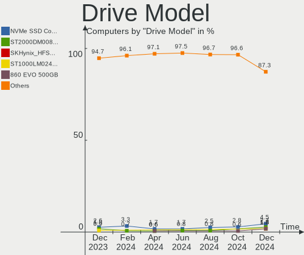
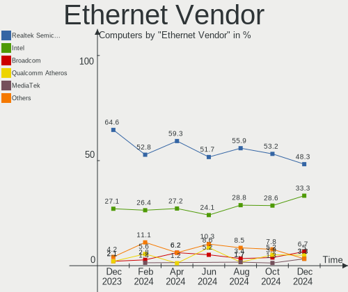
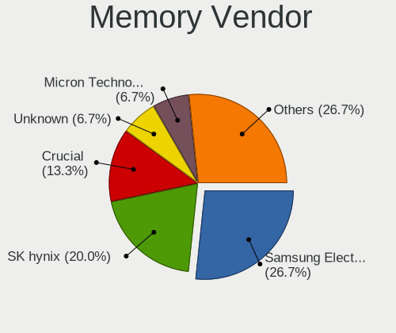
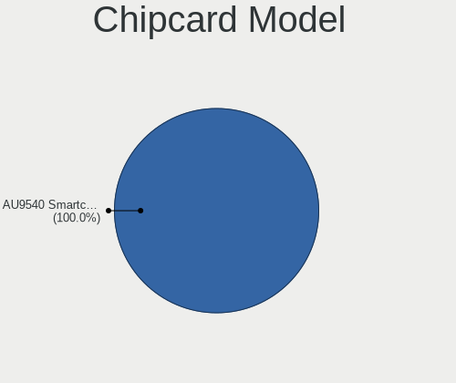

KDE neon - Hardware Trends
--------------------------

A project to identify most popular hardware characteristics and track their change
over time based on data collected by Linux users at https://Linux-Hardware.org.

Anyone can contribute to this report by the [hw-probe](https://github.com/linuxhw/hw-probe) tool:

    sudo -E hw-probe -all -upload

This is a report for all computer types. See also reports for [desktops](/Dist/KDE_neon/Desktop/README.md) and [notebooks](/Dist/KDE_neon/Notebook/README.md).

This report is for one last month. Overall report since the beginning of time: [TestCoverage](https://github.com/linuxhw/TestCoverage)

Period: Jul, 2022.

Contents
--------

* [ System ](#system)
  - [ OS                       ](#os)
  - [ OS Family                ](#os-family)
  - [ Kernel                   ](#kernel)
  - [ Kernel Family            ](#kernel-family)
  - [ Kernel Major Ver.        ](#kernel-major-ver)
  - [ Arch                     ](#arch)
  - [ DE                       ](#de)
  - [ Display Server           ](#display-server)
  - [ Display Manager          ](#display-manager)
  - [ OS Lang                  ](#os-lang)
  - [ Boot Mode                ](#boot-mode)
  - [ Filesystem               ](#filesystem)
  - [ Part. scheme             ](#part-scheme)
  - [ Dual Boot with Linux/BSD ](#dual-boot-with-linuxbsd)
  - [ Dual Boot (Win)          ](#dual-boot-win)

* [ Board ](#board)
  - [ Vendor                   ](#vendor)
  - [ Model                    ](#model)
  - [ Model Family             ](#model-family)
  - [ MFG Year                 ](#mfg-year)
  - [ Form Factor              ](#form-factor)
  - [ Secure Boot              ](#secure-boot)
  - [ Coreboot                 ](#coreboot)
  - [ RAM Size                 ](#ram-size)
  - [ RAM Used                 ](#ram-used)
  - [ Total Drives             ](#total-drives)
  - [ Has CD-ROM               ](#has-cd-rom)
  - [ Has Ethernet             ](#has-ethernet)
  - [ Has WiFi                 ](#has-wifi)
  - [ Has Bluetooth            ](#has-bluetooth)

* [ Location ](#location)
  - [ Country                  ](#country)
  - [ City                     ](#city)

* [ Drives ](#drives)
  - [ Drive Vendor             ](#drive-vendor)
  - [ Drive Model              ](#drive-model)
  - [ HDD Vendor               ](#hdd-vendor)
  - [ SSD Vendor               ](#ssd-vendor)
  - [ Drive Kind               ](#drive-kind)
  - [ Drive Connector          ](#drive-connector)
  - [ Drive Size               ](#drive-size)
  - [ Space Total              ](#space-total)
  - [ Space Used               ](#space-used)
  - [ Malfunc. Drives          ](#malfunc-drives)
  - [ Malfunc. Drive Vendor    ](#malfunc-drive-vendor)
  - [ Malfunc. HDD Vendor      ](#malfunc-hdd-vendor)
  - [ Malfunc. Drive Kind      ](#malfunc-drive-kind)
  - [ Failed Drives            ](#failed-drives)
  - [ Failed Drive Vendor      ](#failed-drive-vendor)
  - [ Drive Status             ](#drive-status)

* [ Storage controller ](#storage-controller)
  - [ Storage Vendor           ](#storage-vendor)
  - [ Storage Model            ](#storage-model)
  - [ Storage Kind             ](#storage-kind)

* [ Processor ](#processor)
  - [ CPU Vendor               ](#cpu-vendor)
  - [ CPU Model                ](#cpu-model)
  - [ CPU Model Family         ](#cpu-model-family)
  - [ CPU Cores                ](#cpu-cores)
  - [ CPU Sockets              ](#cpu-sockets)
  - [ CPU Threads              ](#cpu-threads)
  - [ CPU Op-Modes             ](#cpu-op-modes)
  - [ CPU Microcode            ](#cpu-microcode)
  - [ CPU Microarch            ](#cpu-microarch)

* [ Graphics ](#graphics)
  - [ GPU Vendor               ](#gpu-vendor)
  - [ GPU Model                ](#gpu-model)
  - [ GPU Combo                ](#gpu-combo)
  - [ GPU Driver               ](#gpu-driver)
  - [ GPU Memory               ](#gpu-memory)

* [ Monitor ](#monitor)
  - [ Monitor Vendor           ](#monitor-vendor)
  - [ Monitor Model            ](#monitor-model)
  - [ Monitor Resolution       ](#monitor-resolution)
  - [ Monitor Diagonal         ](#monitor-diagonal)
  - [ Monitor Width            ](#monitor-width)
  - [ Aspect Ratio             ](#aspect-ratio)
  - [ Monitor Area             ](#monitor-area)
  - [ Pixel Density            ](#pixel-density)
  - [ Multiple Monitors        ](#multiple-monitors)

* [ Network ](#network)
  - [ Net Controller Vendor    ](#net-controller-vendor)
  - [ Net Controller Model     ](#net-controller-model)
  - [ Wireless Vendor          ](#wireless-vendor)
  - [ Wireless Model           ](#wireless-model)
  - [ Ethernet Vendor          ](#ethernet-vendor)
  - [ Ethernet Model           ](#ethernet-model)
  - [ Net Controller Kind      ](#net-controller-kind)
  - [ Used Controller          ](#used-controller)
  - [ NICs                     ](#nics)
  - [ IPv6                     ](#ipv6)

* [ Bluetooth ](#bluetooth)
  - [ Bluetooth Vendor         ](#bluetooth-vendor)
  - [ Bluetooth Model          ](#bluetooth-model)

* [ Sound ](#sound)
  - [ Sound Vendor             ](#sound-vendor)
  - [ Sound Model              ](#sound-model)

* [ Memory ](#memory)
  - [ Memory Vendor            ](#memory-vendor)
  - [ Memory Model             ](#memory-model)
  - [ Memory Kind              ](#memory-kind)
  - [ Memory Form Factor       ](#memory-form-factor)
  - [ Memory Size              ](#memory-size)
  - [ Memory Speed             ](#memory-speed)

* [ Printers & scanners ](#printers--scanners)
  - [ Printer Vendor           ](#printer-vendor)
  - [ Printer Model            ](#printer-model)
  - [ Scanner Vendor           ](#scanner-vendor)
  - [ Scanner Model            ](#scanner-model)

* [ Camera ](#camera)
  - [ Camera Vendor            ](#camera-vendor)
  - [ Camera Model             ](#camera-model)

* [ Security ](#security)
  - [ Fingerprint Vendor       ](#fingerprint-vendor)
  - [ Fingerprint Model        ](#fingerprint-model)
  - [ Chipcard Vendor          ](#chipcard-vendor)
  - [ Chipcard Model           ](#chipcard-model)

* [ Unsupported ](#unsupported)
  - [ Unsupported Devices      ](#unsupported-devices)
  - [ Unsupported Device Types ](#unsupported-device-types)

System
------

OS
--

Installed operating systems

| Name           | Computers | Percent |
|----------------|-----------|---------|
| KDE neon 20.04 | 131       | 100%    |

OS Family
---------

OS without a version

| Name     | Computers | Percent |
|----------|-----------|---------|
| KDE neon | 131       | 100%    |

Kernel
------

Version of the Linux kernel

| Version               | Computers | Percent |
|-----------------------|-----------|---------|
| 5.15.0-41-generic     | 56        | 42.75%  |
| 5.13.0-52-generic     | 51        | 38.93%  |
| 5.13.0-51-generic     | 13        | 9.92%   |
| 5.15.0-33-generic     | 2         | 1.53%   |
| 5.13.0-44-generic     | 2         | 1.53%   |
| 5.4.0-107-generic     | 1         | 0.76%   |
| 5.18.0-051800-generic | 1         | 0.76%   |
| 5.14.0-1047-oem       | 1         | 0.76%   |
| 5.13.0-41-generic     | 1         | 0.76%   |
| 5.13.0-40-generic     | 1         | 0.76%   |
| 5.13.0-39-generic     | 1         | 0.76%   |
| 5.13.0-27-generic     | 1         | 0.76%   |

Kernel Family
-------------

Linux kernel without a distro release

| Version | Computers | Percent |
|---------|-----------|---------|
| 5.13.0  | 70        | 53.44%  |
| 5.15.0  | 58        | 44.27%  |
| 5.4.0   | 1         | 0.76%   |
| 5.18.0  | 1         | 0.76%   |
| 5.14.0  | 1         | 0.76%   |

Kernel Major Ver.
-----------------

Linux kernel major version

| Version | Computers | Percent |
|---------|-----------|---------|
| 5.13    | 70        | 53.44%  |
| 5.15    | 58        | 44.27%  |
| 5.4     | 1         | 0.76%   |
| 5.18    | 1         | 0.76%   |
| 5.14    | 1         | 0.76%   |

Arch
----

OS architecture (x86_64, i586, etc.)

| Name   | Computers | Percent |
|--------|-----------|---------|
| x86_64 | 131       | 100%    |

DE
--

Desktop Environment

| Name    | Computers | Percent |
|---------|-----------|---------|
| KDE5    | 129       | 98.47%  |
| Unknown | 2         | 1.53%   |

Display Server
--------------

X11 or Wayland

| Name    | Computers | Percent |
|---------|-----------|---------|
| X11     | 123       | 93.89%  |
| Wayland | 6         | 4.58%   |
| Tty     | 2         | 1.53%   |

Display Manager
---------------

SDDM, LightDM, etc.

| Name    | Computers | Percent |
|---------|-----------|---------|
| Unknown | 114       | 87.02%  |
| SDDM    | 17        | 12.98%  |

OS Lang
-------

Language

| Lang    | Computers | Percent |
|---------|-----------|---------|
| en_US   | 65        | 49.62%  |
| ru_RU   | 12        | 9.16%   |
| pt_BR   | 8         | 6.11%   |
| de_DE   | 7         | 5.34%   |
| en_GB   | 6         | 4.58%   |
| en_CA   | 5         | 3.82%   |
| en_AU   | 5         | 3.82%   |
| en_ZA   | 4         | 3.05%   |
| fr_FR   | 3         | 2.29%   |
| C       | 3         | 2.29%   |
| es_MX   | 2         | 1.53%   |
| zh_TW   | 1         | 0.76%   |
| sv_SE   | 1         | 0.76%   |
| ru_UA   | 1         | 0.76%   |
| pl_PL   | 1         | 0.76%   |
| nl_NL   | 1         | 0.76%   |
| es_SV   | 1         | 0.76%   |
| en_SI   | 1         | 0.76%   |
| en_IN   | 1         | 0.76%   |
| el_GR   | 1         | 0.76%   |
| de_AT   | 1         | 0.76%   |
| Unknown | 1         | 0.76%   |

Boot Mode
---------

EFI or BIOS

| Mode | Computers | Percent |
|------|-----------|---------|
| EFI  | 89        | 67.94%  |
| BIOS | 42        | 32.06%  |

Filesystem
----------

Type of filesystem

| Type    | Computers | Percent |
|---------|-----------|---------|
| Ext4    | 124       | 94.66%  |
| Btrfs   | 3         | 2.29%   |
| Overlay | 2         | 1.53%   |
| F2fs    | 1         | 0.76%   |
| Unknown | 1         | 0.76%   |

Part. scheme
------------

Scheme of partitioning

| Type    | Computers | Percent |
|---------|-----------|---------|
| Unknown | 121       | 92.37%  |
| GPT     | 10        | 7.63%   |

Dual Boot with Linux/BSD
------------------------

Hosting more than one Linux/BSD

| Dual boot | Computers | Percent |
|-----------|-----------|---------|
| No        | 127       | 96.95%  |
| Yes       | 4         | 3.05%   |

Dual Boot (Win)
---------------

Hosting Linux and Windows

| Dual boot | Computers | Percent |
|-----------|-----------|---------|
| No        | 121       | 92.37%  |
| Yes       | 10        | 7.63%   |

Board
-----

Vendor
------

Motherboard manufacturer

| Name                | Computers | Percent |
|---------------------|-----------|---------|
| Dell                | 23        | 17.56%  |
| ASUSTek Computer    | 18        | 13.74%  |
| Hewlett-Packard     | 17        | 12.98%  |
| Lenovo              | 16        | 12.21%  |
| Gigabyte Technology | 13        | 9.92%   |
| Acer                | 11        | 8.4%    |
| MSI                 | 8         | 6.11%   |
| Apple               | 6         | 4.58%   |
| ASRock              | 5         | 3.82%   |
| Microsoft           | 2         | 1.53%   |
| Toshiba             | 1         | 0.76%   |
| Samsung Electronics | 1         | 0.76%   |
| ReachingTech        | 1         | 0.76%   |
| Pegatron            | 1         | 0.76%   |
| Intel               | 1         | 0.76%   |
| Getac               | 1         | 0.76%   |
| GALAX               | 1         | 0.76%   |
| Fujitsu             | 1         | 0.76%   |
| Clevo               | 1         | 0.76%   |
| Biostar             | 1         | 0.76%   |
| AMI                 | 1         | 0.76%   |
| Unknown             | 1         | 0.76%   |

Model
-----

Motherboard model

| Name                                      | Computers | Percent |
|-------------------------------------------|-----------|---------|
| Dell Latitude E7440                       | 3         | 2.29%   |
| MSI MS-7C37                               | 2         | 1.53%   |
| ASUS TUF Gaming X570-PLUS                 | 2         | 1.53%   |
| ASUS All Series                           | 2         | 1.53%   |
| Apple MacBookPro9,2                       | 2         | 1.53%   |
| Toshiba Satellite C640                    | 1         | 0.76%   |
| Samsung 535U3C                            | 1         | 0.76%   |
| ReachingTech Dream Quest Office 2021      | 1         | 0.76%   |
| Pegatron 2ACE                             | 1         | 0.76%   |
| MSI Pulse GL66 11UEK                      | 1         | 0.76%   |
| MSI p6-2429                               | 1         | 0.76%   |
| MSI MS-7D31                               | 1         | 0.76%   |
| MSI MS-7D09                               | 1         | 0.76%   |
| MSI MS-7B89                               | 1         | 0.76%   |
| MSI MS-7A71                               | 1         | 0.76%   |
| Microsoft Surface Pro 4                   | 1         | 0.76%   |
| Microsoft Surface 3                       | 1         | 0.76%   |
| Lenovo Z50-70 20354                       | 1         | 0.76%   |
| Lenovo Yoga 9 14ITL5 82BG                 | 1         | 0.76%   |
| Lenovo Yoga 7 14ACN6 82N7                 | 1         | 0.76%   |
| Lenovo ThinkPad X270 20HMS0GJ00           | 1         | 0.76%   |
| Lenovo ThinkPad X13 Yoga Gen 2 20W8001TUS | 1         | 0.76%   |
| Lenovo ThinkPad W530 24472SU              | 1         | 0.76%   |
| Lenovo ThinkPad T470s 20HGS15V00          | 1         | 0.76%   |
| Lenovo MIIX 300-10IBY 80NR                | 1         | 0.76%   |
| Lenovo Legion T5 28IMB05 90NC00JAUS       | 1         | 0.76%   |
| Lenovo Legion S7 15ACH6 82K8              | 1         | 0.76%   |
| Lenovo IdeaPad S145-15API 81V7            | 1         | 0.76%   |
| Lenovo IdeaPad L340-15API 81LW            | 1         | 0.76%   |
| Lenovo IdeaPad 3 15IGL05 82BU             | 1         | 0.76%   |
| Lenovo G50-45 80E3                        | 1         | 0.76%   |
| Lenovo B570e HuronRiver Platform          | 1         | 0.76%   |
| Lenovo B50-30 20382                       | 1         | 0.76%   |
| Intel NUC6CAYB J23203-402                 | 1         | 0.76%   |
| HP Stream Laptop 14-cb1xxx                | 1         | 0.76%   |
| HP ProBook 450 G7                         | 1         | 0.76%   |
| HP Pavilion Notebook                      | 1         | 0.76%   |
| HP Pavilion Gaming Laptop 15-ec1xxx       | 1         | 0.76%   |
| HP Pavilion Gaming Laptop 15-ec0xxx       | 1         | 0.76%   |
| HP Laptop 15-dw3xxx                       | 1         | 0.76%   |
| HP Laptop 15-db0xxx                       | 1         | 0.76%   |
| HP Laptop 15-bs1xx                        | 1         | 0.76%   |
| HP G62                                    | 1         | 0.76%   |
| HP ENVY 15                                | 1         | 0.76%   |
| HP EliteBook Folio 1040 G2                | 1         | 0.76%   |
| HP EliteBook 840 G2                       | 1         | 0.76%   |
| HP EliteBook 830 G5                       | 1         | 0.76%   |
| HP EliteBook 2570p                        | 1         | 0.76%   |
| HP Compaq Pro 6300 SFF                    | 1         | 0.76%   |
| HP 870-224                                | 1         | 0.76%   |
| HP 250 G4                                 | 1         | 0.76%   |
| Gigabyte Z87-HD3                          | 1         | 0.76%   |
| Gigabyte Z690 GAMING X                    | 1         | 0.76%   |
| Gigabyte Z270M-D3H                        | 1         | 0.76%   |
| Gigabyte Z270-Gaming K3                   | 1         | 0.76%   |
| Gigabyte X570 AORUS ULTRA                 | 1         | 0.76%   |
| Gigabyte X570 AORUS PRO WIFI              | 1         | 0.76%   |
| Gigabyte X399 AORUS Gaming 7              | 1         | 0.76%   |
| Gigabyte H97-D3H                          | 1         | 0.76%   |
| Gigabyte H410M H                          | 1         | 0.76%   |

Model Family
------------

Motherboard model prefix

| Name                      | Computers | Percent |
|---------------------------|-----------|---------|
| Dell Latitude             | 13        | 9.92%   |
| Acer Aspire               | 8         | 6.11%   |
| Lenovo ThinkPad           | 4         | 3.05%   |
| HP EliteBook              | 4         | 3.05%   |
| Dell OptiPlex             | 4         | 3.05%   |
| Dell Inspiron             | 4         | 3.05%   |
| Lenovo IdeaPad            | 3         | 2.29%   |
| HP Pavilion               | 3         | 2.29%   |
| HP Laptop                 | 3         | 2.29%   |
| ASUS TUF                  | 3         | 2.29%   |
| MSI MS-7C37               | 2         | 1.53%   |
| Microsoft Surface         | 2         | 1.53%   |
| Lenovo Yoga               | 2         | 1.53%   |
| Lenovo Legion             | 2         | 1.53%   |
| Gigabyte X570             | 2         | 1.53%   |
| ASUS PRIME                | 2         | 1.53%   |
| ASUS All                  | 2         | 1.53%   |
| Apple MacBookPro9         | 2         | 1.53%   |
| Toshiba Satellite         | 1         | 0.76%   |
| Samsung 535U3C            | 1         | 0.76%   |
| ReachingTech Dream        | 1         | 0.76%   |
| Pegatron 2ACE             | 1         | 0.76%   |
| MSI Pulse                 | 1         | 0.76%   |
| MSI p6-2429               | 1         | 0.76%   |
| MSI MS-7D31               | 1         | 0.76%   |
| MSI MS-7D09               | 1         | 0.76%   |
| MSI MS-7B89               | 1         | 0.76%   |
| MSI MS-7A71               | 1         | 0.76%   |
| Lenovo Z50-70             | 1         | 0.76%   |
| Lenovo MIIX               | 1         | 0.76%   |
| Lenovo G50-45             | 1         | 0.76%   |
| Lenovo B570e              | 1         | 0.76%   |
| Lenovo B50-30             | 1         | 0.76%   |
| Intel NUC6CAYB            | 1         | 0.76%   |
| HP Stream                 | 1         | 0.76%   |
| HP ProBook                | 1         | 0.76%   |
| HP G62                    | 1         | 0.76%   |
| HP ENVY                   | 1         | 0.76%   |
| HP Compaq                 | 1         | 0.76%   |
| HP 870-224                | 1         | 0.76%   |
| HP 250                    | 1         | 0.76%   |
| Gigabyte Z87-HD3          | 1         | 0.76%   |
| Gigabyte Z690             | 1         | 0.76%   |
| Gigabyte Z270M-D3H        | 1         | 0.76%   |
| Gigabyte Z270-Gaming      | 1         | 0.76%   |
| Gigabyte X399             | 1         | 0.76%   |
| Gigabyte H97-D3H          | 1         | 0.76%   |
| Gigabyte H410M            | 1         | 0.76%   |
| Gigabyte H310M            | 1         | 0.76%   |
| Gigabyte GA-MA785GMT-UD2H | 1         | 0.76%   |
| Gigabyte GA-890XA-UD3     | 1         | 0.76%   |
| Gigabyte G41MT-S2PT       | 1         | 0.76%   |
| Getac F110                | 1         | 0.76%   |
| GALAX A320M               | 1         | 0.76%   |
| Fujitsu LIFEBOOK          | 1         | 0.76%   |
| Dell XPS                  | 1         | 0.76%   |
| Dell Precision            | 1         | 0.76%   |
| Clevo W240BU              | 1         | 0.76%   |
| Biostar TZ77XE3           | 1         | 0.76%   |
| ASUS X75VC                | 1         | 0.76%   |

MFG Year
--------

Motherboard manufacture year

| Year | Computers | Percent |
|------|-----------|---------|
| 2019 | 17        | 12.98%  |
| 2020 | 13        | 9.92%   |
| 2017 | 12        | 9.16%   |
| 2012 | 11        | 8.4%    |
| 2011 | 11        | 8.4%    |
| 2016 | 10        | 7.63%   |
| 2014 | 10        | 7.63%   |
| 2021 | 9         | 6.87%   |
| 2013 | 9         | 6.87%   |
| 2018 | 8         | 6.11%   |
| 2015 | 8         | 6.11%   |
| 2022 | 5         | 3.82%   |
| 2009 | 4         | 3.05%   |
| 2010 | 3         | 2.29%   |
| 2008 | 1         | 0.76%   |

Form Factor
-----------

Physical design of the computer

| Name        | Computers | Percent |
|-------------|-----------|---------|
| Notebook    | 68        | 51.91%  |
| Desktop     | 50        | 38.17%  |
| Tablet      | 4         | 3.05%   |
| Convertible | 4         | 3.05%   |
| Mini pc     | 4         | 3.05%   |
| All in one  | 1         | 0.76%   |

Secure Boot
-----------

Enabled or disabled

| State    | Computers | Percent |
|----------|-----------|---------|
| Disabled | 117       | 89.31%  |
| Enabled  | 14        | 10.69%  |

Coreboot
--------

Have coreboot on board

| Used | Computers | Percent |
|------|-----------|---------|
| No   | 131       | 100%    |

RAM Size
--------

Total RAM memory

| Size in GB  | Computers | Percent |
|-------------|-----------|---------|
| 4.01-8.0    | 33        | 25.19%  |
| 16.01-24.0  | 30        | 22.9%   |
| 32.01-64.0  | 22        | 16.79%  |
| 3.01-4.0    | 20        | 15.27%  |
| 8.01-16.0   | 20        | 15.27%  |
| 1.01-2.0    | 4         | 3.05%   |
| 24.01-32.0  | 1         | 0.76%   |
| 64.01-256.0 | 1         | 0.76%   |

RAM Used
--------

Used RAM memory

| Used GB    | Computers | Percent |
|------------|-----------|---------|
| 1.01-2.0   | 52        | 39.69%  |
| 2.01-3.0   | 35        | 26.72%  |
| 3.01-4.0   | 18        | 13.74%  |
| 4.01-8.0   | 17        | 12.98%  |
| 0.51-1.0   | 6         | 4.58%   |
| 8.01-16.0  | 2         | 1.53%   |
| 24.01-32.0 | 1         | 0.76%   |

Total Drives
------------

Number of drives on board

| Drives | Computers | Percent |
|--------|-----------|---------|
| 1      | 67        | 51.15%  |
| 2      | 34        | 25.95%  |
| 3      | 16        | 12.21%  |
| 4      | 10        | 7.63%   |
| 5      | 3         | 2.29%   |
| 9      | 1         | 0.76%   |

Has CD-ROM
----------

Has CD-ROM on board

| Presented | Computers | Percent |
|-----------|-----------|---------|
| No        | 98        | 74.81%  |
| Yes       | 33        | 25.19%  |

Has Ethernet
------------

Has Ethernet on board

| Presented | Computers | Percent |
|-----------|-----------|---------|
| Yes       | 111       | 84.73%  |
| No        | 20        | 15.27%  |

Has WiFi
--------

Has WiFi module

| Presented | Computers | Percent |
|-----------|-----------|---------|
| Yes       | 107       | 81.68%  |
| No        | 24        | 18.32%  |

Has Bluetooth
-------------

Has Bluetooth module

| Presented | Computers | Percent |
|-----------|-----------|---------|
| Yes       | 90        | 68.7%   |
| No        | 41        | 31.3%   |

Location
--------

Country
-------

Geographic location (country)

| Country      | Computers | Percent |
|--------------|-----------|---------|
| USA          | 41        | 31.3%   |
| Brazil       | 11        | 8.4%    |
| Russia       | 9         | 6.87%   |
| Germany      | 7         | 5.34%   |
| Australia    | 7         | 5.34%   |
| Canada       | 6         | 4.58%   |
| South Africa | 4         | 3.05%   |
| Netherlands  | 4         | 3.05%   |
| Turkey       | 3         | 2.29%   |
| Moldova      | 3         | 2.29%   |
| Ukraine      | 2         | 1.53%   |
| UK           | 2         | 1.53%   |
| Switzerland  | 2         | 1.53%   |
| Slovenia     | 2         | 1.53%   |
| Poland       | 2         | 1.53%   |
| Mexico       | 2         | 1.53%   |
| Indonesia    | 2         | 1.53%   |
| Hungary      | 2         | 1.53%   |
| France       | 2         | 1.53%   |
| Belarus      | 2         | 1.53%   |
| Taiwan       | 1         | 0.76%   |
| Sweden       | 1         | 0.76%   |
| Romania      | 1         | 0.76%   |
| Portugal     | 1         | 0.76%   |
| Morocco      | 1         | 0.76%   |
| Malaysia     | 1         | 0.76%   |
| Lebanon      | 1         | 0.76%   |
| Latvia       | 1         | 0.76%   |
| Iraq         | 1         | 0.76%   |
| Iran         | 1         | 0.76%   |
| India        | 1         | 0.76%   |
| Greece       | 1         | 0.76%   |
| El Salvador  | 1         | 0.76%   |
| Croatia      | 1         | 0.76%   |
| Chile        | 1         | 0.76%   |
| Austria      | 1         | 0.76%   |

City
----

Geographic location (city)

| City             | Computers | Percent |
|------------------|-----------|---------|
| Melbourne        | 4         | 3.05%   |
| Seattle          | 3         | 2.29%   |
| Zurich           | 2         | 1.53%   |
| Sydney           | 2         | 1.53%   |
| Cape Town        | 2         | 1.53%   |
| Aracaju          | 2         | 1.53%   |
| Đakovo          | 1         | 0.76%   |
| Yekaterinburg    | 1         | 0.76%   |
| Yasinovataya     | 1         | 0.76%   |
| Wylie            | 1         | 0.76%   |
| Wuppertal        | 1         | 0.76%   |
| Wroclaw          | 1         | 0.76%   |
| Winschoten       | 1         | 0.76%   |
| Winnipeg         | 1         | 0.76%   |
| Wilmington       | 1         | 0.76%   |
| Warrington       | 1         | 0.76%   |
| Voorburg         | 1         | 0.76%   |
| Volgograd        | 1         | 0.76%   |
| Vienna           | 1         | 0.76%   |
| Vaudreuil-Dorion | 1         | 0.76%   |
| Toronto          | 1         | 0.76%   |
| Tiraspol         | 1         | 0.76%   |
| Tehran           | 1         | 0.76%   |
| Taoyuan District | 1         | 0.76%   |
| Surgut           | 1         | 0.76%   |
| Stavropol        | 1         | 0.76%   |
| Soroca           | 1         | 0.76%   |
| Shipman          | 1         | 0.76%   |
| Sevastopol       | 1         | 0.76%   |
| Seffner          | 1         | 0.76%   |
| Sao Paulo        | 1         | 0.76%   |
| San Salvador     | 1         | 0.76%   |
| Salé            | 1         | 0.76%   |
| Saint Paul       | 1         | 0.76%   |
| Saint Augustine  | 1         | 0.76%   |
| Rostock          | 1         | 0.76%   |
| Riga             | 1         | 0.76%   |
| Puyallup         | 1         | 0.76%   |
| Port Elizabeth   | 1         | 0.76%   |
| Ploieşti        | 1         | 0.76%   |
| Plainfield       | 1         | 0.76%   |
| Phoenix          | 1         | 0.76%   |
| Philadelphia     | 1         | 0.76%   |
| Petaling Jaya    | 1         | 0.76%   |
| Pekanbaru        | 1         | 0.76%   |
| Pekan Baru       | 1         | 0.76%   |
| Palmas           | 1         | 0.76%   |
| Paducah          | 1         | 0.76%   |
| Oświęcim       | 1         | 0.76%   |
| Orsay            | 1         | 0.76%   |
| Orillia          | 1         | 0.76%   |
| Noyabrsk         | 1         | 0.76%   |
| Novo Mesto       | 1         | 0.76%   |
| Nottingham       | 1         | 0.76%   |
| Nizhniy Novgorod | 1         | 0.76%   |
| New York         | 1         | 0.76%   |
| Nelspruit        | 1         | 0.76%   |
| Murfreesboro     | 1         | 0.76%   |
| Moscow           | 1         | 0.76%   |
| Mora             | 1         | 0.76%   |

Drives
------

Drive Vendor
------------

Hard drive vendors

| Vendor                         | Computers | Drives | Percent |
|--------------------------------|-----------|--------|---------|
| Samsung Electronics            | 37        | 55     | 16.74%  |
| Seagate                        | 34        | 36     | 15.38%  |
| WDC                            | 24        | 27     | 10.86%  |
| SanDisk                        | 17        | 18     | 7.69%   |
| Unknown                        | 11        | 13     | 4.98%   |
| Toshiba                        | 11        | 11     | 4.98%   |
| Kingston                       | 11        | 11     | 4.98%   |
| Hitachi                        | 6         | 7      | 2.71%   |
| A-DATA Technology              | 6         | 7      | 2.71%   |
| SK hynix                       | 5         | 6      | 2.26%   |
| Phison                         | 4         | 4      | 1.81%   |
| HGST                           | 4         | 4      | 1.81%   |
| Crucial                        | 4         | 4      | 1.81%   |
| SPCC                           | 3         | 3      | 1.36%   |
| PNY                            | 3         | 3      | 1.36%   |
| KIOXIA                         | 3         | 3      | 1.36%   |
| Intel                          | 3         | 3      | 1.36%   |
| China                          | 3         | 3      | 1.36%   |
| Apple                          | 3         | 5      | 1.36%   |
| Team                           | 2         | 2      | 0.9%    |
| Netac                          | 2         | 2      | 0.9%    |
| Micron/Crucial Technology      | 2         | 2      | 0.9%    |
| XrayDisk                       | 1         | 1      | 0.45%   |
| Transcend                      | 1         | 1      | 0.45%   |
| TO Exter                       | 1         | 1      | 0.45%   |
| Solid State Storage Technology | 1         | 1      | 0.45%   |
| Smartbuy                       | 1         | 1      | 0.45%   |
| Realtek Semiconductor          | 1         | 1      | 0.45%   |
| Patriot                        | 1         | 1      | 0.45%   |
| OWC                            | 1         | 1      | 0.45%   |
| NGFF                           | 1         | 1      | 0.45%   |
| Neo                            | 1         | 1      | 0.45%   |
| Mushkin                        | 1         | 1      | 0.45%   |
| MidasForce                     | 1         | 1      | 0.45%   |
| Micron Technology              | 1         | 1      | 0.45%   |
| LITEONIT                       | 1         | 1      | 0.45%   |
| LITEON                         | 1         | 1      | 0.45%   |
| Lexar                          | 1         | 1      | 0.45%   |
| Lenovo                         | 1         | 1      | 0.45%   |
| HS-SSD-E100N                   | 1         | 1      | 0.45%   |
| Hewlett-Packard                | 1         | 1      | 0.45%   |
| Gigabyte Technology            | 1         | 1      | 0.45%   |
| GALAX                          | 1         | 1      | 0.45%   |
| Corsair                        | 1         | 1      | 0.45%   |
| Unknown                        | 1         | 1      | 0.45%   |

Drive Model
-----------

Hard drive models

| Model                                | Computers | Percent |
|--------------------------------------|-----------|---------|
| Samsung NVMe SSD Drive 1TB           | 9         | 3.63%   |
| Unknown MMC Card  32GB               | 4         | 1.61%   |
| SanDisk NVMe SSD Drive 512GB         | 4         | 1.61%   |
| Unknown MMC Card  64GB               | 3         | 1.21%   |
| Seagate ST1000LM024 HN-M101MBB 1TB   | 3         | 1.21%   |
| Seagate ST1000DM010-2EP102 1TB       | 3         | 1.21%   |
| Samsung SSD 850 EVO 500GB            | 3         | 1.21%   |
| Samsung SSD 850 EVO 250GB            | 3         | 1.21%   |
| Samsung NVMe SSD Drive 512GB         | 3         | 1.21%   |
| WDC WDS500G2B0A-00SM50 500GB SSD     | 2         | 0.81%   |
| WDC WD10EZEX-08WN4A0 1TB             | 2         | 0.81%   |
| Unknown SD/MMC/MS PRO 64GB           | 2         | 0.81%   |
| Toshiba MQ04ABF100 1TB               | 2         | 0.81%   |
| Toshiba MQ01ABF050 500GB             | 2         | 0.81%   |
| Seagate ST500LT012-1DG142 500GB      | 2         | 0.81%   |
| Seagate ST500DM002-1BD142 500GB      | 2         | 0.81%   |
| Seagate ST31000528AS 1TB             | 2         | 0.81%   |
| Seagate ST1000LM035-1RK172 1TB       | 2         | 0.81%   |
| SanDisk NVMe SSD Drive 500GB         | 2         | 0.81%   |
| SanDisk NVMe SSD Drive 256GB         | 2         | 0.81%   |
| SanDisk NVMe SSD Drive 1TB           | 2         | 0.81%   |
| Samsung SSD 860 EVO 500GB            | 2         | 0.81%   |
| Samsung SSD 860 EVO 250GB            | 2         | 0.81%   |
| Samsung SSD 850 EVO M.2 250GB        | 2         | 0.81%   |
| Samsung NVMe SSD Drive 1024GB        | 2         | 0.81%   |
| KIOXIA NVMe SSD Drive 256GB          | 2         | 0.81%   |
| Kingston SA400S37480G 480GB SSD      | 2         | 0.81%   |
| Intel NVMe SSD Drive 512GB           | 2         | 0.81%   |
| China SSD 256GB                      | 2         | 0.81%   |
| A-DATA SX8200PNP 1TB                 | 2         | 0.81%   |
| XrayDisk 240GB                       | 1         | 0.4%    |
| WDC WDS500G2B0C-00PXH0 500GB         | 1         | 0.4%    |
| WDC WDS480G2G0A-00JH30 480GB SSD     | 1         | 0.4%    |
| WDC WDS240G2G0A-00JH30 240GB SSD     | 1         | 0.4%    |
| WDC WD5000BPVX-00JC3T0 500GB         | 1         | 0.4%    |
| WDC WD5000BEVT-22A0RT0 500GB         | 1         | 0.4%    |
| WDC WD40EFRX-68WT0N0 4TB             | 1         | 0.4%    |
| WDC WD40EFRX-68N32N0 4TB             | 1         | 0.4%    |
| WDC WD4003FZEX-00Z4SA0 4TB           | 1         | 0.4%    |
| WDC WD25EZRX-00MMMB0 2TB             | 1         | 0.4%    |
| WDC WD20EZRX-00D8PB0 2TB             | 1         | 0.4%    |
| WDC WD20EZAZ-00L9GB0 2TB             | 1         | 0.4%    |
| WDC WD20EARS-00MVWB0 2TB             | 1         | 0.4%    |
| WDC WD1600BEVT-60ZCT1 160GB          | 1         | 0.4%    |
| WDC WD10SPZX-24Z10 1TB               | 1         | 0.4%    |
| WDC WD10JPCX-24UE4T0 1TB             | 1         | 0.4%    |
| WDC WD10EZEX-60ZF5A0 1TB             | 1         | 0.4%    |
| WDC WD10EZEX-60WN4A0 1TB             | 1         | 0.4%    |
| WDC WD10EZEX-60M2NA0 1TB             | 1         | 0.4%    |
| WDC WD10EZEX-22MFCA0 1TB             | 1         | 0.4%    |
| WDC WD10EZEX-00MFCA0 1TB             | 1         | 0.4%    |
| WDC WD10EURX-63FH1Y0 1TB             | 1         | 0.4%    |
| WDC WD1002FAEX-00Z3A0 1TB            | 1         | 0.4%    |
| WDC PC SN520 SDAPNUW-256G-1006 256GB | 1         | 0.4%    |
| Unknown MMC Card  968MB              | 1         | 0.4%    |
| Unknown MMC Card  128GB              | 1         | 0.4%    |
| Unknown M52532  32GB                 | 1         | 0.4%    |
| Unknown 00000  64GB                  | 1         | 0.4%    |
| Transcend TS120GMTS820S 120GB SSD    | 1         | 0.4%    |
| Toshiba NVMe SSD Drive 512GB         | 1         | 0.4%    |

HDD Vendor
----------

Hard disk drive vendors

| Vendor              | Computers | Drives | Percent |
|---------------------|-----------|--------|---------|
| Seagate             | 32        | 34     | 41.56%  |
| WDC                 | 19        | 21     | 24.68%  |
| Toshiba             | 9         | 9      | 11.69%  |
| Hitachi             | 6         | 7      | 7.79%   |
| Samsung Electronics | 4         | 7      | 5.19%   |
| HGST                | 4         | 4      | 5.19%   |
| Unknown             | 2         | 2      | 2.6%    |
| Apple               | 1         | 1      | 1.3%    |

SSD Vendor
----------

Solid state drive vendors

| Vendor              | Computers | Drives | Percent |
|---------------------|-----------|--------|---------|
| Samsung Electronics | 18        | 24     | 23.08%  |
| Kingston            | 8         | 8      | 10.26%  |
| SanDisk             | 7         | 8      | 8.97%   |
| WDC                 | 4         | 4      | 5.13%   |
| Crucial             | 4         | 4      | 5.13%   |
| A-DATA Technology   | 4         | 4      | 5.13%   |
| SPCC                | 3         | 3      | 3.85%   |
| PNY                 | 3         | 3      | 3.85%   |
| China               | 3         | 3      | 3.85%   |
| Team                | 2         | 2      | 2.56%   |
| Apple               | 2         | 2      | 2.56%   |
| Transcend           | 1         | 1      | 1.28%   |
| TO Exter            | 1         | 1      | 1.28%   |
| Smartbuy            | 1         | 1      | 1.28%   |
| SK hynix            | 1         | 1      | 1.28%   |
| Patriot             | 1         | 1      | 1.28%   |
| OWC                 | 1         | 1      | 1.28%   |
| NGFF                | 1         | 1      | 1.28%   |
| Netac               | 1         | 1      | 1.28%   |
| Neo                 | 1         | 1      | 1.28%   |
| Mushkin             | 1         | 1      | 1.28%   |
| MidasForce          | 1         | 1      | 1.28%   |
| Micron Technology   | 1         | 1      | 1.28%   |
| LITEONIT            | 1         | 1      | 1.28%   |
| LITEON              | 1         | 1      | 1.28%   |
| Lexar               | 1         | 1      | 1.28%   |
| Intel               | 1         | 1      | 1.28%   |
| Hewlett-Packard     | 1         | 1      | 1.28%   |
| Gigabyte Technology | 1         | 1      | 1.28%   |
| Corsair             | 1         | 1      | 1.28%   |
| Unknown             | 1         | 1      | 1.28%   |

Drive Kind
----------

HDD or SSD

| Kind    | Computers | Drives | Percent |
|---------|-----------|--------|---------|
| SSD     | 68        | 85     | 36.96%  |
| HDD     | 61        | 85     | 33.15%  |
| NVMe    | 43        | 67     | 23.37%  |
| MMC     | 9         | 11     | 4.89%   |
| Unknown | 3         | 4      | 1.63%   |

Drive Connector
---------------

SATA, SAS, NVMe, etc.

| Type | Computers | Drives | Percent |
|------|-----------|--------|---------|
| SATA | 99        | 166    | 62.26%  |
| NVMe | 43        | 67     | 27.04%  |
| MMC  | 9         | 11     | 5.66%   |
| SAS  | 8         | 8      | 5.03%   |

Drive Size
----------

Size of hard drive

| Size in TB | Computers | Drives | Percent |
|------------|-----------|--------|---------|
| 0.01-0.5   | 75        | 103    | 57.69%  |
| 0.51-1.0   | 41        | 50     | 31.54%  |
| 1.01-2.0   | 7         | 9      | 5.38%   |
| 3.01-4.0   | 5         | 6      | 3.85%   |
| 2.01-3.0   | 1         | 1      | 0.77%   |
| 4.01-10.0  | 1         | 1      | 0.77%   |

Space Total
-----------

Amount of disk space available on the file system

| Size in GB     | Computers | Percent |
|----------------|-----------|---------|
| 101-250        | 45        | 34.35%  |
| 251-500        | 28        | 21.37%  |
| 501-1000       | 21        | 16.03%  |
| 21-50          | 8         | 6.11%   |
| 1001-2000      | 8         | 6.11%   |
| More than 3000 | 6         | 4.58%   |
| 51-100         | 6         | 4.58%   |
| 2001-3000      | 3         | 2.29%   |
| 1-20           | 3         | 2.29%   |
| Unknown        | 3         | 2.29%   |

Space Used
----------

Amount of used disk space

| Used GB        | Computers | Percent |
|----------------|-----------|---------|
| 1-20           | 61        | 46.56%  |
| 21-50          | 22        | 16.79%  |
| 101-250        | 16        | 12.21%  |
| 251-500        | 10        | 7.63%   |
| 51-100         | 10        | 7.63%   |
| 501-1000       | 4         | 3.05%   |
| 2001-3000      | 3         | 2.29%   |
| Unknown        | 3         | 2.29%   |
| More than 3000 | 2         | 1.53%   |

Malfunc. Drives
---------------

Drive models with a malfunction

| Model                                            | Computers | Drives | Percent |
|--------------------------------------------------|-----------|--------|---------|
| WDC WD20EARS-00MVWB0 2TB                         | 1         | 1      | 20%     |
| WDC WD10EZEX-22MFCA0 1TB                         | 1         | 1      | 20%     |
| Seagate ST31000528AS 1TB                         | 1         | 1      | 20%     |
| Samsung Electronics MZNLH128HBHQ-000H1 128GB SSD | 1         | 1      | 20%     |
| Neo Forza NFS121SA312-6007000 120GB SSD          | 1         | 1      | 20%     |

Malfunc. Drive Vendor
---------------------

Vendors of faulty drives

| Vendor              | Computers | Drives | Percent |
|---------------------|-----------|--------|---------|
| WDC                 | 2         | 2      | 40%     |
| Seagate             | 1         | 1      | 20%     |
| Samsung Electronics | 1         | 1      | 20%     |
| Neo                 | 1         | 1      | 20%     |

Malfunc. HDD Vendor
-------------------

Vendors of faulty HDD drives

| Vendor  | Computers | Drives | Percent |
|---------|-----------|--------|---------|
| WDC     | 2         | 2      | 66.67%  |
| Seagate | 1         | 1      | 33.33%  |

Malfunc. Drive Kind
-------------------

Kinds of faulty drives

| Kind | Computers | Drives | Percent |
|------|-----------|--------|---------|
| SSD  | 2         | 2      | 50%     |
| HDD  | 2         | 3      | 50%     |

Failed Drives
-------------

Failed drive models

Zero info for selected period =(

Failed Drive Vendor
-------------------

Failed drive vendors

Zero info for selected period =(

Drive Status
------------

Number of failed and malfunc. drives

| Status   | Computers | Drives | Percent |
|----------|-----------|--------|---------|
| Detected | 123       | 227    | 88.49%  |
| Works    | 13        | 20     | 9.35%   |
| Malfunc  | 3         | 5      | 2.16%   |

Storage controller
------------------

Storage Vendor
--------------

Storage controller vendors

| Vendor                         | Computers | Percent |
|--------------------------------|-----------|---------|
| Intel                          | 82        | 46.33%  |
| AMD                            | 31        | 17.51%  |
| Samsung Electronics            | 18        | 10.17%  |
| SanDisk                        | 10        | 5.65%   |
| ASMedia Technology             | 5         | 2.82%   |
| SK hynix                       | 4         | 2.26%   |
| Phison Electronics             | 4         | 2.26%   |
| KIOXIA                         | 3         | 1.69%   |
| Kingston Technology Company    | 3         | 1.69%   |
| Toshiba America Info Systems   | 2         | 1.13%   |
| Realtek Semiconductor          | 2         | 1.13%   |
| Nvidia                         | 2         | 1.13%   |
| Micron/Crucial Technology      | 2         | 1.13%   |
| ADATA Technology               | 2         | 1.13%   |
| Solid State Storage Technology | 1         | 0.56%   |
| Silicon Motion                 | 1         | 0.56%   |
| Seagate Technology             | 1         | 0.56%   |
| Marvell Technology Group       | 1         | 0.56%   |
| Lenovo                         | 1         | 0.56%   |
| JMicron Technology             | 1         | 0.56%   |
| Apple                          | 1         | 0.56%   |

Storage Model
-------------

Storage controller models

| Model                                                                          | Computers | Percent |
|--------------------------------------------------------------------------------|-----------|---------|
| AMD FCH SATA Controller [AHCI mode]                                            | 22        | 11.64%  |
| Intel 82801 Mobile SATA Controller [RAID mode]                                 | 9         | 4.76%   |
| Intel 200 Series PCH SATA controller [AHCI mode]                               | 9         | 4.76%   |
| Samsung NVMe SSD Controller SM981/PM981/PM983                                  | 6         | 3.17%   |
| Intel 8 Series/C220 Series Chipset Family 6-port SATA Controller 1 [AHCI mode] | 6         | 3.17%   |
| Intel 7 Series Chipset Family 6-port SATA Controller [AHCI mode]               | 6         | 3.17%   |
| Samsung NVMe SSD Controller PM9A1/PM9A3/980PRO                                 | 5         | 2.65%   |
| Samsung NVMe SSD Controller 980                                                | 5         | 2.65%   |
| Intel Wildcat Point-LP SATA Controller [AHCI Mode]                             | 5         | 2.65%   |
| Intel Sunrise Point-LP SATA Controller [AHCI mode]                             | 5         | 2.65%   |
| Intel 8 Series SATA Controller 1 [AHCI mode]                                   | 5         | 2.65%   |
| Intel 6 Series/C200 Series Chipset Family 6 port Mobile SATA AHCI Controller   | 5         | 2.65%   |
| ASMedia ASM1062 Serial ATA Controller                                          | 5         | 2.65%   |
| SanDisk WD Black SN750 / PC SN730 NVMe SSD                                     | 4         | 2.12%   |
| Intel 400 Series Chipset Family SATA AHCI Controller                           | 4         | 2.12%   |
| AMD SB7x0/SB8x0/SB9x0 SATA Controller [AHCI mode]                              | 4         | 2.12%   |
| Phison E12 NVMe Controller                                                     | 3         | 1.59%   |
| Intel Volume Management Device NVMe RAID Controller                            | 3         | 1.59%   |
| AMD 500 Series Chipset SATA Controller                                         | 3         | 1.59%   |
| Toshiba America Info Systems XG6 NVMe SSD Controller                           | 2         | 1.06%   |
| SK hynix Gold P31 SSD                                                          | 2         | 1.06%   |
| SanDisk WD Blue SN550 NVMe SSD                                                 | 2         | 1.06%   |
| Realtek RTS5763DL NVMe SSD Controller                                          | 2         | 1.06%   |
| Nvidia MCP79 AHCI Controller                                                   | 2         | 1.06%   |
| KIOXIA NVMe SSD Controller BG4                                                 | 2         | 1.06%   |
| Kingston Company A2000 NVMe SSD                                                | 2         | 1.06%   |
| Intel Tiger Lake-LP SATA Controller                                            | 2         | 1.06%   |
| Intel Q170/Q150/B150/H170/H110/Z170/CM236 Chipset SATA Controller [AHCI Mode]  | 2         | 1.06%   |
| Intel Celeron/Pentium Silver Processor SATA Controller                         | 2         | 1.06%   |
| Intel Alder Lake-S PCH SATA Controller [AHCI Mode]                             | 2         | 1.06%   |
| Intel 9 Series Chipset Family SATA Controller [AHCI Mode]                      | 2         | 1.06%   |
| Intel 7 Series/C210 Series Chipset Family 4-port SATA Controller [IDE mode]    | 2         | 1.06%   |
| Intel 7 Series/C210 Series Chipset Family 2-port SATA Controller [IDE mode]    | 2         | 1.06%   |
| Intel 500 Series Chipset Family SATA AHCI Controller                           | 2         | 1.06%   |
| Intel 5 Series/3400 Series Chipset 4 port SATA AHCI Controller                 | 2         | 1.06%   |
| AMD SB7x0/SB8x0/SB9x0 IDE Controller                                           | 2         | 1.06%   |
| ADATA XPG SX8200 Pro PCIe Gen3x4 M.2 2280 Solid State Drive                    | 2         | 1.06%   |
| Solid State Storage Non-Volatile memory controller                             | 1         | 0.53%   |
| SK hynix PC401 NVMe Solid State Drive 256GB                                    | 1         | 0.53%   |
| SK hynix Non-Volatile memory controller                                        | 1         | 0.53%   |
| Silicon Motion SM2262/SM2262EN SSD Controller                                  | 1         | 0.53%   |
| Seagate FireCuda 520 SSD                                                       | 1         | 0.53%   |
| SanDisk WD PC SN810 / Black SN850 NVMe SSD                                     | 1         | 0.53%   |
| SanDisk WD Blue SN570 NVMe SSD                                                 | 1         | 0.53%   |
| SanDisk WD Blue SN500 / PC SN520 NVMe SSD                                      | 1         | 0.53%   |
| SanDisk WD Black NVMe SSD                                                      | 1         | 0.53%   |
| Samsung NVMe SSD Controller SM951/PM951                                        | 1         | 0.53%   |
| Samsung Apple PCIe SSD                                                         | 1         | 0.53%   |
| Phison PS5013 E13 NVMe Controller                                              | 1         | 0.53%   |
| Micron/Crucial NVMe Controller                                                 | 1         | 0.53%   |
| Micron/Crucial Non-Volatile memory controller                                  | 1         | 0.53%   |
| Marvell Group 88SS9183 PCIe SSD Controller                                     | 1         | 0.53%   |
| Lenovo Non-Volatile memory controller                                          | 1         | 0.53%   |
| KIOXIA Non-Volatile memory controller                                          | 1         | 0.53%   |
| Kingston Company U-SNS8154P3 NVMe SSD                                          | 1         | 0.53%   |
| JMicron JMB363 SATA/IDE Controller                                             | 1         | 0.53%   |
| Intel SSD 660P Series                                                          | 1         | 0.53%   |
| Intel Non-Volatile memory controller                                           | 1         | 0.53%   |
| Intel NM10/ICH7 Family SATA Controller [IDE mode]                              | 1         | 0.53%   |
| Intel Comet Lake SATA AHCI Controller                                          | 1         | 0.53%   |

Storage Kind
------------

Kind of storage controller (IDE, SATA, NVMe, SAS, ...)

| Kind | Computers | Percent |
|------|-----------|---------|
| SATA | 101       | 61.96%  |
| NVMe | 43        | 26.38%  |
| RAID | 12        | 7.36%   |
| IDE  | 7         | 4.29%   |

Processor
---------

CPU Vendor
----------

Processor vendors

| Vendor | Computers | Percent |
|--------|-----------|---------|
| Intel  | 98        | 74.81%  |
| AMD    | 33        | 25.19%  |

CPU Model
---------

Processor models

| Model                                   | Computers | Percent |
|-----------------------------------------|-----------|---------|
| Intel Core i5-3470 CPU @ 3.20GHz        | 3         | 2.29%   |
| Intel Core i5-2520M CPU @ 2.50GHz       | 3         | 2.29%   |
| Intel Core i5-8265U CPU @ 1.60GHz       | 2         | 1.53%   |
| Intel Core i5-7400 CPU @ 3.00GHz        | 2         | 1.53%   |
| Intel Core i5-7300U CPU @ 2.60GHz       | 2         | 1.53%   |
| Intel Core i5-5200U CPU @ 2.20GHz       | 2         | 1.53%   |
| Intel Core i5-4310U CPU @ 2.00GHz       | 2         | 1.53%   |
| Intel Core i5-4300U CPU @ 1.90GHz       | 2         | 1.53%   |
| Intel Core i5-3210M CPU @ 2.50GHz       | 2         | 1.53%   |
| Intel Core i3-5005U CPU @ 2.00GHz       | 2         | 1.53%   |
| Intel 11th Gen Core i7-1165G7 @ 2.80GHz | 2         | 1.53%   |
| Intel 11th Gen Core i5-1135G7 @ 2.40GHz | 2         | 1.53%   |
| AMD Ryzen 9 5900X 12-Core Processor     | 2         | 1.53%   |
| AMD Ryzen 5 5600X 6-Core Processor      | 2         | 1.53%   |
| Intel Xeon CPU E3-1220 v3 @ 3.10GHz     | 1         | 0.76%   |
| Intel Pentium CPU B950 @ 2.10GHz        | 1         | 0.76%   |
| Intel Pentium CPU 4417U @ 2.30GHz       | 1         | 0.76%   |
| Intel Core m5-6Y54 CPU @ 1.10GHz        | 1         | 0.76%   |
| Intel Core i7-8850H CPU @ 2.60GHz       | 1         | 0.76%   |
| Intel Core i7-8700K CPU @ 3.70GHz       | 1         | 0.76%   |
| Intel Core i7-8700 CPU @ 3.20GHz        | 1         | 0.76%   |
| Intel Core i7-7700K CPU @ 4.20GHz       | 1         | 0.76%   |
| Intel Core i7-7700HQ CPU @ 2.80GHz      | 1         | 0.76%   |
| Intel Core i7-7700 CPU @ 3.60GHz        | 1         | 0.76%   |
| Intel Core i7-6600U CPU @ 2.60GHz       | 1         | 0.76%   |
| Intel Core i7-5600U CPU @ 2.60GHz       | 1         | 0.76%   |
| Intel Core i7-4820K CPU @ 3.70GHz       | 1         | 0.76%   |
| Intel Core i7-4790K CPU @ 4.00GHz       | 1         | 0.76%   |
| Intel Core i7-4770HQ CPU @ 2.20GHz      | 1         | 0.76%   |
| Intel Core i7-4770 CPU @ 3.40GHz        | 1         | 0.76%   |
| Intel Core i7-4600U CPU @ 2.10GHz       | 1         | 0.76%   |
| Intel Core i7-3820QM CPU @ 2.70GHz      | 1         | 0.76%   |
| Intel Core i7-2677M CPU @ 1.80GHz       | 1         | 0.76%   |
| Intel Core i7-10850H CPU @ 2.70GHz      | 1         | 0.76%   |
| Intel Core i7-10510U CPU @ 1.80GHz      | 1         | 0.76%   |
| Intel Core i5-9400F CPU @ 2.90GHz       | 1         | 0.76%   |
| Intel Core i5-8600K CPU @ 3.60GHz       | 1         | 0.76%   |
| Intel Core i5-8250U CPU @ 1.60GHz       | 1         | 0.76%   |
| Intel Core i5-7500T CPU @ 2.70GHz       | 1         | 0.76%   |
| Intel Core i5-7200U CPU @ 2.50GHz       | 1         | 0.76%   |
| Intel Core i5-6600 CPU @ 3.30GHz        | 1         | 0.76%   |
| Intel Core i5-6500 CPU @ 3.20GHz        | 1         | 0.76%   |
| Intel Core i5-6300U CPU @ 2.40GHz       | 1         | 0.76%   |
| Intel Core i5-6200U CPU @ 2.30GHz       | 1         | 0.76%   |
| Intel Core i5-4690 CPU @ 3.50GHz        | 1         | 0.76%   |
| Intel Core i5-4670 CPU @ 3.40GHz        | 1         | 0.76%   |
| Intel Core i5-4570 CPU @ 3.20GHz        | 1         | 0.76%   |
| Intel Core i5-4300M CPU @ 2.60GHz       | 1         | 0.76%   |
| Intel Core i5-4210U CPU @ 1.70GHz       | 1         | 0.76%   |
| Intel Core i5-3570K CPU @ 3.40GHz       | 1         | 0.76%   |
| Intel Core i5-3320M CPU @ 2.60GHz       | 1         | 0.76%   |
| Intel Core i5-10400F CPU @ 2.90GHz      | 1         | 0.76%   |
| Intel Core i5-10400 CPU @ 2.90GHz       | 1         | 0.76%   |
| Intel Core i5-10300H CPU @ 2.50GHz      | 1         | 0.76%   |
| Intel Core i5 CPU M 460 @ 2.53GHz       | 1         | 0.76%   |
| Intel Core i3-7100U CPU @ 2.40GHz       | 1         | 0.76%   |
| Intel Core i3-7020U CPU @ 2.30GHz       | 1         | 0.76%   |
| Intel Core i3-6100U CPU @ 2.30GHz       | 1         | 0.76%   |
| Intel Core i3-4000M CPU @ 2.40GHz       | 1         | 0.76%   |
| Intel Core i3-3220 CPU @ 3.30GHz        | 1         | 0.76%   |

CPU Model Family
----------------

Processor model prefix

| Model                  | Computers | Percent |
|------------------------|-----------|---------|
| Intel Core i5          | 40        | 30.53%  |
| Intel Core i7          | 17        | 12.98%  |
| Other                  | 11        | 8.4%    |
| Intel Core i3          | 11        | 8.4%    |
| Intel Celeron          | 8         | 6.11%   |
| AMD Ryzen 7            | 7         | 5.34%   |
| AMD Ryzen 5            | 7         | 5.34%   |
| AMD A6                 | 6         | 4.58%   |
| Intel Atom             | 5         | 3.82%   |
| AMD Ryzen 9            | 4         | 3.05%   |
| Intel Pentium          | 2         | 1.53%   |
| Intel Core 2 Duo       | 2         | 1.53%   |
| AMD Phenom II X6       | 2         | 1.53%   |
| Intel Xeon             | 1         | 0.76%   |
| Intel Core m5          | 1         | 0.76%   |
| Intel Core 2 Quad      | 1         | 0.76%   |
| AMD Ryzen Threadripper | 1         | 0.76%   |
| AMD Ryzen 3            | 1         | 0.76%   |
| AMD Phenom II X4       | 1         | 0.76%   |
| AMD FX                 | 1         | 0.76%   |
| AMD C-60               | 1         | 0.76%   |
| AMD Athlon X4          | 1         | 0.76%   |

CPU Cores
---------

Number of processor cores

| Number | Computers | Percent |
|--------|-----------|---------|
| 2      | 53        | 40.46%  |
| 4      | 44        | 33.59%  |
| 6      | 15        | 11.45%  |
| 8      | 11        | 8.4%    |
| 12     | 5         | 3.82%   |
| 1      | 3         | 2.29%   |

CPU Sockets
-----------

Number of sockets

| Number | Computers | Percent |
|--------|-----------|---------|
| 1      | 131       | 100%    |

CPU Threads
-----------

Threads per core (Hyper-Threading)

| Number | Computers | Percent |
|--------|-----------|---------|
| 2      | 91        | 69.47%  |
| 1      | 40        | 30.53%  |

CPU Op-Modes
------------

CPU Operation Modes (32-bit, 64-bit)

| Op mode        | Computers | Percent |
|----------------|-----------|---------|
| 32-bit, 64-bit | 131       | 100%    |

CPU Microcode
-------------

Microcode number

| Number     | Computers | Percent |
|------------|-----------|---------|
| 0x306a9    | 10        | 7.63%   |
| 0x306c3    | 8         | 6.11%   |
| 0x40651    | 6         | 4.58%   |
| 0x206a7    | 6         | 4.58%   |
| Unknown    | 6         | 4.58%   |
| 0x906ea    | 5         | 3.82%   |
| 0x906e9    | 5         | 3.82%   |
| 0x806e9    | 5         | 3.82%   |
| 0x806c1    | 5         | 3.82%   |
| 0x406e3    | 5         | 3.82%   |
| 0x306d4    | 5         | 3.82%   |
| 0x0a201016 | 5         | 3.82%   |
| 0x30678    | 3         | 2.29%   |
| 0x0a50000c | 3         | 2.29%   |
| 0x08701021 | 3         | 2.29%   |
| 0xa0653    | 2         | 1.53%   |
| 0xa0652    | 2         | 1.53%   |
| 0x90672    | 2         | 1.53%   |
| 0x806eb    | 2         | 1.53%   |
| 0x806ea    | 2         | 1.53%   |
| 0x706a8    | 2         | 1.53%   |
| 0x506e3    | 2         | 1.53%   |
| 0x406c3    | 2         | 1.53%   |
| 0x20655    | 2         | 1.53%   |
| 0x106c2    | 2         | 1.53%   |
| 0x1067a    | 2         | 1.53%   |
| 0x08108102 | 2         | 1.53%   |
| 0x06006705 | 2         | 1.53%   |
| 0x06001119 | 2         | 1.53%   |
| 0x010000dc | 2         | 1.53%   |
| 0xa0671    | 1         | 0.76%   |
| 0x906c0    | 1         | 0.76%   |
| 0x806ec    | 1         | 0.76%   |
| 0x506c9    | 1         | 0.76%   |
| 0x40661    | 1         | 0.76%   |
| 0x306e4    | 1         | 0.76%   |
| 0x10676    | 1         | 0.76%   |
| 0x0a20120a | 1         | 0.76%   |
| 0x08701013 | 1         | 0.76%   |
| 0x08600106 | 1         | 0.76%   |
| 0x08108109 | 1         | 0.76%   |
| 0x0800820d | 1         | 0.76%   |
| 0x08001138 | 1         | 0.76%   |
| 0x08001137 | 1         | 0.76%   |
| 0x07030104 | 1         | 0.76%   |
| 0x06006704 | 1         | 0.76%   |
| 0x0600610e | 1         | 0.76%   |
| 0x06000852 | 1         | 0.76%   |
| 0x05000119 | 1         | 0.76%   |
| 0x03000027 | 1         | 0.76%   |
| 0x010000c8 | 1         | 0.76%   |

CPU Microarch
-------------

Microarchitecture

| Name             | Computers | Percent |
|------------------|-----------|---------|
| KabyLake         | 21        | 16.03%  |
| Haswell          | 16        | 12.21%  |
| IvyBridge        | 11        | 8.4%    |
| Zen 3            | 9         | 6.87%   |
| Skylake          | 7         | 5.34%   |
| SandyBridge      | 7         | 5.34%   |
| TigerLake        | 6         | 4.58%   |
| Zen 2            | 5         | 3.82%   |
| Silvermont       | 5         | 3.82%   |
| Broadwell        | 5         | 3.82%   |
| Zen+             | 4         | 3.05%   |
| Excavator        | 4         | 3.05%   |
| CometLake        | 4         | 3.05%   |
| Piledriver       | 3         | 2.29%   |
| Penryn           | 3         | 2.29%   |
| K10              | 3         | 2.29%   |
| Goldmont plus    | 3         | 2.29%   |
| Zen              | 2         | 1.53%   |
| Westmere         | 2         | 1.53%   |
| Bonnell          | 2         | 1.53%   |
| Alderlake Hybrid | 2         | 1.53%   |
| Tremont          | 1         | 0.76%   |
| Puma             | 1         | 0.76%   |
| K10 Llano        | 1         | 0.76%   |
| Icelake          | 1         | 0.76%   |
| Goldmont         | 1         | 0.76%   |
| Bobcat           | 1         | 0.76%   |
| Unknown          | 1         | 0.76%   |

Graphics
--------

GPU Vendor
----------

Vendors of graphics cards

| Vendor | Computers | Percent |
|--------|-----------|---------|
| Intel  | 72        | 46.45%  |
| Nvidia | 55        | 35.48%  |
| AMD    | 28        | 18.06%  |

GPU Model
---------

Graphics card models

| Model                                                                                    | Computers | Percent |
|------------------------------------------------------------------------------------------|-----------|---------|
| Intel 2nd Generation Core Processor Family Integrated Graphics Controller                | 7         | 4.49%   |
| Intel TigerLake-LP GT2 [Iris Xe Graphics]                                                | 6         | 3.85%   |
| Intel Haswell-ULT Integrated Graphics Controller                                         | 6         | 3.85%   |
| Intel HD Graphics 5500                                                                   | 5         | 3.21%   |
| Intel 3rd Gen Core processor Graphics Controller                                         | 5         | 3.21%   |
| Intel Skylake GT2 [HD Graphics 520]                                                      | 4         | 2.56%   |
| Intel HD Graphics 620                                                                    | 4         | 2.56%   |
| Nvidia GP107 [GeForce GTX 1050 Ti]                                                       | 3         | 1.92%   |
| Intel GeminiLake [UHD Graphics 600]                                                      | 3         | 1.92%   |
| Intel Atom Processor Z36xxx/Z37xxx Series Graphics & Display                             | 3         | 1.92%   |
| AMD Stoney [Radeon R2/R3/R4/R5 Graphics]                                                 | 3         | 1.92%   |
| AMD Picasso/Raven 2 [Radeon Vega Series / Radeon Vega Mobile Series]                     | 3         | 1.92%   |
| AMD Lexa PRO [Radeon 540/540X/550/550X / RX 540X/550/550X]                               | 3         | 1.92%   |
| AMD Cezanne                                                                              | 3         | 1.92%   |
| Nvidia TU117 [GeForce GTX 1650]                                                          | 2         | 1.28%   |
| Nvidia TU116 [GeForce GTX 1660 SUPER]                                                    | 2         | 1.28%   |
| Nvidia GP107 [GeForce GTX 1050]                                                          | 2         | 1.28%   |
| Nvidia GP106 [GeForce GTX 1060 6GB]                                                      | 2         | 1.28%   |
| Nvidia GP106 [GeForce GTX 1060 3GB]                                                      | 2         | 1.28%   |
| Nvidia GM107 [GeForce GTX 750 Ti]                                                        | 2         | 1.28%   |
| Nvidia GK208B [GeForce GT 710]                                                           | 2         | 1.28%   |
| Nvidia GA104 [GeForce RTX 3060 Ti Lite Hash Rate]                                        | 2         | 1.28%   |
| Intel Xeon E3-1200 v3/4th Gen Core Processor Integrated Graphics Controller              | 2         | 1.28%   |
| Intel Xeon E3-1200 v2/3rd Gen Core processor Graphics Controller                         | 2         | 1.28%   |
| Intel WhiskeyLake-U GT2 [UHD Graphics 620]                                               | 2         | 1.28%   |
| Intel Mobile 4 Series Chipset Integrated Graphics Controller                             | 2         | 1.28%   |
| Intel HD Graphics 630                                                                    | 2         | 1.28%   |
| Intel CometLake-H GT2 [UHD Graphics]                                                     | 2         | 1.28%   |
| Intel Atom/Celeron/Pentium Processor x5-E8000/J3xxx/N3xxx Integrated Graphics Controller | 2         | 1.28%   |
| Intel 4th Gen Core Processor Integrated Graphics Controller                              | 2         | 1.28%   |
| Nvidia TU117M [GeForce MX450]                                                            | 1         | 0.64%   |
| Nvidia TU117M [GeForce GTX 1650 Mobile / Max-Q]                                          | 1         | 0.64%   |
| Nvidia TU117M                                                                            | 1         | 0.64%   |
| Nvidia TU116 [GeForce GTX 1660 Ti]                                                       | 1         | 0.64%   |
| Nvidia TU116 [GeForce GTX 1650]                                                          | 1         | 0.64%   |
| Nvidia TU102 [GeForce RTX 2080 Ti Rev. A]                                                | 1         | 0.64%   |
| Nvidia GP108M [GeForce MX330]                                                            | 1         | 0.64%   |
| Nvidia GP108M [GeForce MX150]                                                            | 1         | 0.64%   |
| Nvidia GP108 [GeForce GT 1030]                                                           | 1         | 0.64%   |
| Nvidia GP107M [GeForce MX150]                                                            | 1         | 0.64%   |
| Nvidia GP107M [GeForce GTX 1050 3 GB Max-Q]                                              | 1         | 0.64%   |
| Nvidia GP107GLM [Quadro P1000 Mobile]                                                    | 1         | 0.64%   |
| Nvidia GP106M [GeForce GTX 1060 Mobile]                                                  | 1         | 0.64%   |
| Nvidia GP104 [GeForce GTX 1070]                                                          | 1         | 0.64%   |
| Nvidia GP102 [GeForce GTX 1080 Ti]                                                       | 1         | 0.64%   |
| Nvidia GM204 [GeForce GTX 970]                                                           | 1         | 0.64%   |
| Nvidia GM108M [GeForce MX130]                                                            | 1         | 0.64%   |
| Nvidia GM108M [GeForce 840M]                                                             | 1         | 0.64%   |
| Nvidia GM107 [GeForce GTX 750]                                                           | 1         | 0.64%   |
| Nvidia GM107 [GeForce 940MX]                                                             | 1         | 0.64%   |
| Nvidia GK208M [GeForce GT 740M]                                                          | 1         | 0.64%   |
| Nvidia GK208BM [GeForce 920M]                                                            | 1         | 0.64%   |
| Nvidia GK107GLM [Quadro K2000M]                                                          | 1         | 0.64%   |
| Nvidia GF119M [GeForce 410M]                                                             | 1         | 0.64%   |
| Nvidia GF117M [GeForce 610M/710M/810M/820M / GT 620M/625M/630M/720M]                     | 1         | 0.64%   |
| Nvidia GF108 [GeForce GT 730]                                                            | 1         | 0.64%   |
| Nvidia GA107M [GeForce RTX 3050 Mobile]                                                  | 1         | 0.64%   |
| Nvidia GA106M [GeForce RTX 3060 Mobile / Max-Q]                                          | 1         | 0.64%   |
| Nvidia GA106M [GeForce RTX 3050 Ti Mobile / Max-Q]                                       | 1         | 0.64%   |
| Nvidia GA106 [GeForce RTX 3060 Lite Hash Rate]                                           | 1         | 0.64%   |

GPU Combo
---------

Combinations of graphics cards

| Name           | Computers | Percent |
|----------------|-----------|---------|
| 1 x Intel      | 52        | 39.69%  |
| 1 x Nvidia     | 35        | 26.72%  |
| 1 x AMD        | 22        | 16.79%  |
| Intel + Nvidia | 16        | 12.21%  |
| AMD + Nvidia   | 4         | 3.05%   |
| 2 x AMD        | 1         | 0.76%   |
| Intel + AMD    | 1         | 0.76%   |

GPU Driver
----------

Free vs proprietary

| Driver      | Computers | Percent |
|-------------|-----------|---------|
| Free        | 111       | 84.73%  |
| Proprietary | 16        | 12.21%  |
| Unknown     | 4         | 3.05%   |

GPU Memory
----------

Total video memory

| Size in GB | Computers | Percent |
|------------|-----------|---------|
| Unknown    | 65        | 49.62%  |
| 1.01-2.0   | 18        | 13.74%  |
| 3.01-4.0   | 13        | 9.92%   |
| 0.01-0.5   | 10        | 7.63%   |
| 0.51-1.0   | 7         | 5.34%   |
| 7.01-8.0   | 6         | 4.58%   |
| 5.01-6.0   | 6         | 4.58%   |
| 8.01-16.0  | 4         | 3.05%   |
| 2.01-3.0   | 2         | 1.53%   |

Monitor
-------

Monitor Vendor
--------------

Monitor vendors

| Vendor                  | Computers | Percent |
|-------------------------|-----------|---------|
| Chimei Innolux          | 16        | 11.35%  |
| Samsung Electronics     | 15        | 10.64%  |
| AU Optronics            | 15        | 10.64%  |
| Goldstar                | 11        | 7.8%    |
| BOE                     | 11        | 7.8%    |
| LG Display              | 9         | 6.38%   |
| Dell                    | 9         | 6.38%   |
| Apple                   | 7         | 4.96%   |
| AOC                     | 6         | 4.26%   |
| Philips                 | 5         | 3.55%   |
| Ancor Communications    | 5         | 3.55%   |
| Acer                    | 3         | 2.13%   |
| Sharp                   | 2         | 1.42%   |
| Lenovo                  | 2         | 1.42%   |
| CPT                     | 2         | 1.42%   |
| BenQ                    | 2         | 1.42%   |
| ASUSTek Computer        | 2         | 1.42%   |
| Vizio                   | 1         | 0.71%   |
| VIZ                     | 1         | 0.71%   |
| ViewSonic               | 1         | 0.71%   |
| Sony                    | 1         | 0.71%   |
| Sceptre Tech            | 1         | 0.71%   |
| Roku                    | 1         | 0.71%   |
| NOR                     | 1         | 0.71%   |
| MiTAC                   | 1         | 0.71%   |
| LG Electronics          | 1         | 0.71%   |
| Lenovo Group Limited    | 1         | 0.71%   |
| ITE                     | 1         | 0.71%   |
| InfoVision              | 1         | 0.71%   |
| Hewlett-Packard         | 1         | 0.71%   |
| Gigabyte Technology     | 1         | 0.71%   |
| G-Story                 | 1         | 0.71%   |
| CSO                     | 1         | 0.71%   |
| Chi Mei Optoelectronics | 1         | 0.71%   |
| CHD                     | 1         | 0.71%   |
| Unknown                 | 1         | 0.71%   |

Monitor Model
-------------

Monitor models

| Model                                                                   | Computers | Percent |
|-------------------------------------------------------------------------|-----------|---------|
| AU Optronics LCD Monitor AUO61ED 1920x1080 344x193mm 15.5-inch          | 3         | 2.04%   |
| Goldstar FULL HD GSM5B55 1920x1080 480x270mm 21.7-inch                  | 2         | 1.36%   |
| Dell P2416D DELA0C3 2560x1440 527x296mm 23.8-inch                       | 2         | 1.36%   |
| Chimei Innolux LCD Monitor CMN15DC 1366x768 344x193mm 15.5-inch         | 2         | 1.36%   |
| AU Optronics LCD Monitor AUO133D 1920x1080 309x173mm 13.9-inch          | 2         | 1.36%   |
| Apple Color LCD APPA010 1366x768 256x144mm 11.6-inch                    | 2         | 1.36%   |
| Vizio E500i-A1 VIZ1004 1920x1080 1095x616mm 49.5-inch                   | 1         | 0.68%   |
| VIZ LCD Monitor D650i-B2                                                | 1         | 0.68%   |
| ViewSonic VA2432-FHD VSCB639 1920x1080 527x296mm 23.8-inch              | 1         | 0.68%   |
| Sony TV SNY9C01 1920x1080                                               | 1         | 0.68%   |
| Sharp LCD Monitor SHP1542 1920x1080 309x174mm 14.0-inch                 | 1         | 0.68%   |
| Sharp LCD Monitor SHP148D 3840x2160 344x194mm 15.5-inch                 | 1         | 0.68%   |
| Sceptre Tech C32 SPT0CB3 1920x1080 598x336mm 27.0-inch                  | 1         | 0.68%   |
| Samsung Electronics T20C310 SAM0AE8 1600x900 432x240mm 19.5-inch        | 1         | 0.68%   |
| Samsung Electronics SyncMaster SAM0613 1920x1080                        | 1         | 0.68%   |
| Samsung Electronics SyncMaster SAM0599 1600x900 443x249mm 20.0-inch     | 1         | 0.68%   |
| Samsung Electronics SyncMaster SAM0579 1920x1080                        | 1         | 0.68%   |
| Samsung Electronics SyncMaster SAM03E1 1440x900 410x257mm 19.1-inch     | 1         | 0.68%   |
| Samsung Electronics SyncMaster SAM00BB 1280x1024 376x301mm 19.0-inch    | 1         | 0.68%   |
| Samsung Electronics S24D332 SAM0F5E 1920x1080 531x299mm 24.0-inch       | 1         | 0.68%   |
| Samsung Electronics LU28R55 SAM1015 3840x2160 632x360mm 28.6-inch       | 1         | 0.68%   |
| Samsung Electronics LCD Monitor SEC5441 1366x768 344x194mm 15.5-inch    | 1         | 0.68%   |
| Samsung Electronics LCD Monitor SDC5441 1366x768 344x193mm 15.5-inch    | 1         | 0.68%   |
| Samsung Electronics LCD Monitor SDC4C51 1366x768 344x194mm 15.5-inch    | 1         | 0.68%   |
| Samsung Electronics LCD Monitor SDC4171 2880x1800 302x189mm 14.0-inch   | 1         | 0.68%   |
| Samsung Electronics LCD Monitor SDC3853 2736x1824 260x173mm 12.3-inch   | 1         | 0.68%   |
| Samsung Electronics LCD Monitor SAM7016 3840x2160 1872x1053mm 84.6-inch | 1         | 0.68%   |
| Samsung Electronics LCD Monitor SAM0502 1920x1080 886x498mm 40.0-inch   | 1         | 0.68%   |
| Roku TV RKU8526 1920x1080 930x520mm 41.9-inch                           | 1         | 0.68%   |
| Philips PHL 278B1 PHL0949 3840x2160 597x336mm 27.0-inch                 | 1         | 0.68%   |
| Philips PHL 243V7 PHLC155 1920x1080 527x296mm 23.8-inch                 | 1         | 0.68%   |
| Philips LCD Monitor PHL 243V5 1920x1080                                 | 1         | 0.68%   |
| Philips 220TS PHLC06B 1920x1080 477x268mm 21.5-inch                     | 1         | 0.68%   |
| Philips 192E PHLC04D 1366x768 410x230mm 18.5-inch                       | 1         | 0.68%   |
| NOR LM730 NORA730 1280x1024 340x270mm 17.1-inch                         | 1         | 0.68%   |
| MiTAC JVC TV SZM0B01 1920x1080 698x392mm 31.5-inch                      | 1         | 0.68%   |
| LG Electronics LCD Monitor MP59G 1920x1080                              | 1         | 0.68%   |
| LG Display LCD Monitor LGD0ABC 1280x800 304x190mm 14.1-inch             | 1         | 0.68%   |
| LG Display LCD Monitor LGD0508 1366x768 309x174mm 14.0-inch             | 1         | 0.68%   |
| LG Display LCD Monitor LGD04E8 1920x1080 382x215mm 17.3-inch            | 1         | 0.68%   |
| LG Display LCD Monitor LGD0465 1366x768 344x194mm 15.5-inch             | 1         | 0.68%   |
| LG Display LCD Monitor LGD0464 1366x768 293x165mm 13.2-inch             | 1         | 0.68%   |
| LG Display LCD Monitor LGD03EA 1920x1080 309x174mm 14.0-inch            | 1         | 0.68%   |
| LG Display LCD Monitor LGD033B 1366x768 344x194mm 15.5-inch             | 1         | 0.68%   |
| LG Display LCD Monitor LGD02EB 1366x768 309x174mm 14.0-inch             | 1         | 0.68%   |
| LG Display LCD Monitor LGD01E6 1366x768 309x174mm 14.0-inch             | 1         | 0.68%   |
| Lenovo LEN T24i-10 LEN61CE 1920x1080 527x296mm 23.8-inch                | 1         | 0.68%   |
| Lenovo LCD Monitor LEN40B2 1920x1080 344x193mm 15.5-inch                | 1         | 0.68%   |
| Lenovo Group Limited LCD Monitor LEN T23i-10                            | 1         | 0.68%   |
| ITE DP2VGA V226 ITE6516 1920x1080 600x340mm 27.2-inch                   | 1         | 0.68%   |
| InfoVision LCD Monitor IVO057E 1366x768 309x174mm 14.0-inch             | 1         | 0.68%   |
| Hewlett-Packard LCD Monitor 20wm                                        | 1         | 0.68%   |
| Goldstar W1942 GSM4B6F 1440x900 408x255mm 18.9-inch                     | 1         | 0.68%   |
| Goldstar IPS FULLHD GSM5AB6 1920x1080 480x270mm 21.7-inch               | 1         | 0.68%   |
| Goldstar HDR WQHD GSM772B 3440x1440 800x335mm 34.1-inch                 | 1         | 0.68%   |
| Goldstar HDR DQHD GSM9E7B 3840x1080 1198x337mm 49.0-inch                | 1         | 0.68%   |
| Goldstar FULL HD GSM5B54 1920x1080 480x270mm 21.7-inch                  | 1         | 0.68%   |
| Goldstar E2251 GSM586D 1920x1080 480x270mm 21.7-inch                    | 1         | 0.68%   |
| Goldstar E1641 GSM8B3E 1366x768 344x194mm 15.5-inch                     | 1         | 0.68%   |
| Goldstar 27MP75 GSM5A61 1920x1080 600x340mm 27.2-inch                   | 1         | 0.68%   |

Monitor Resolution
------------------

Monitor screen resolution

| Resolution         | Computers | Percent |
|--------------------|-----------|---------|
| 1920x1080 (FHD)    | 58        | 42.96%  |
| 1366x768 (WXGA)    | 33        | 24.44%  |
| 3840x2160 (4K)     | 11        | 8.15%   |
| 2560x1440 (QHD)    | 5         | 3.7%    |
| 1600x900 (HD+)     | 5         | 3.7%    |
| 1280x800 (WXGA)    | 3         | 2.22%   |
| 1280x1024 (SXGA)   | 3         | 2.22%   |
| Unknown            | 3         | 2.22%   |
| 3840x1080          | 2         | 1.48%   |
| 2880x1800          | 2         | 1.48%   |
| 1920x1200 (WUXGA)  | 2         | 1.48%   |
| 5440x1080          | 1         | 0.74%   |
| 4480x1440          | 1         | 0.74%   |
| 3440x1440          | 1         | 0.74%   |
| 2736x1824          | 1         | 0.74%   |
| 2304x1440          | 1         | 0.74%   |
| 1920x540           | 1         | 0.74%   |
| 1680x1050 (WSXGA+) | 1         | 0.74%   |
| 1440x900 (WXGA+)   | 1         | 0.74%   |

Monitor Diagonal
----------------

Diagonal size in inches

| Inches  | Computers | Percent |
|---------|-----------|---------|
| 15      | 33        | 24.09%  |
| 14      | 15        | 10.95%  |
| 13      | 13        | 9.49%   |
| 24      | 12        | 8.76%   |
| 27      | 10        | 7.3%    |
| Unknown | 9         | 6.57%   |
| 21      | 7         | 5.11%   |
| 17      | 6         | 4.38%   |
| 23      | 4         | 2.92%   |
| 12      | 4         | 2.92%   |
| 19      | 3         | 2.19%   |
| 18      | 3         | 2.19%   |
| 49      | 2         | 1.46%   |
| 32      | 2         | 1.46%   |
| 31      | 2         | 1.46%   |
| 11      | 2         | 1.46%   |
| 84      | 1         | 0.73%   |
| 72      | 1         | 0.73%   |
| 63      | 1         | 0.73%   |
| 42      | 1         | 0.73%   |
| 41      | 1         | 0.73%   |
| 40      | 1         | 0.73%   |
| 34      | 1         | 0.73%   |
| 28      | 1         | 0.73%   |
| 22      | 1         | 0.73%   |
| 20      | 1         | 0.73%   |

Monitor Width
-------------

Physical width

| Width in mm | Computers | Percent |
|-------------|-----------|---------|
| 301-350     | 56        | 41.48%  |
| 501-600     | 25        | 18.52%  |
| 401-500     | 13        | 9.63%   |
| 201-300     | 12        | 8.89%   |
| Unknown     | 9         | 6.67%   |
| 351-400     | 6         | 4.44%   |
| 701-800     | 3         | 2.22%   |
| 601-700     | 3         | 2.22%   |
| 1001-1500   | 3         | 2.22%   |
| 1501-2000   | 2         | 1.48%   |
| 901-1000    | 2         | 1.48%   |
| 801-900     | 1         | 0.74%   |

Aspect Ratio
------------

Proportional relationship between the width and the height

| Ratio   | Computers | Percent |
|---------|-----------|---------|
| 16/9    | 101       | 80.8%   |
| 16/10   | 11        | 8.8%    |
| Unknown | 7         | 5.6%    |
| 5/4     | 3         | 2.4%    |
| 32/9    | 1         | 0.8%    |
| 3/2     | 1         | 0.8%    |
| 21/9    | 1         | 0.8%    |

Monitor Area
------------

Area in inch²

| Area in inch² | Computers | Percent |
|----------------|-----------|---------|
| 101-110        | 33        | 23.91%  |
| 81-90          | 24        | 17.39%  |
| 201-250        | 22        | 15.94%  |
| 301-350        | 10        | 7.25%   |
| Unknown        | 9         | 6.52%   |
| 351-500        | 6         | 4.35%   |
| 151-200        | 5         | 3.62%   |
| 141-150        | 5         | 3.62%   |
| More than 1000 | 4         | 2.9%    |
| 71-80          | 4         | 2.9%    |
| 61-70          | 4         | 2.9%    |
| 501-1000       | 4         | 2.9%    |
| 121-130        | 3         | 2.17%   |
| 51-60          | 2         | 1.45%   |
| 251-300        | 2         | 1.45%   |
| 131-140        | 1         | 0.72%   |

Pixel Density
-------------

Pixels per inch

| Density       | Computers | Percent |
|---------------|-----------|---------|
| 101-120       | 40        | 30.3%   |
| 51-100        | 39        | 29.55%  |
| 121-160       | 31        | 23.48%  |
| Unknown       | 9         | 6.82%   |
| 161-240       | 7         | 5.3%    |
| More than 240 | 4         | 3.03%   |
| 1-50          | 2         | 1.52%   |

Multiple Monitors
-----------------

Total monitors connected

| Total | Computers | Percent |
|-------|-----------|---------|
| 1     | 101       | 77.1%   |
| 2     | 23        | 17.56%  |
| 0     | 5         | 3.82%   |
| 4     | 1         | 0.76%   |
| 3     | 1         | 0.76%   |

Network
-------

Net Controller Vendor
---------------------

Controller vendors

| Vendor                        | Computers | Percent |
|-------------------------------|-----------|---------|
| Realtek Semiconductor         | 69        | 34.16%  |
| Intel                         | 62        | 30.69%  |
| Qualcomm Atheros              | 22        | 10.89%  |
| Broadcom                      | 13        | 6.44%   |
| TP-Link                       | 4         | 1.98%   |
| Ralink Technology             | 4         | 1.98%   |
| Xiaomi                        | 3         | 1.49%   |
| Linksys                       | 3         | 1.49%   |
| Sierra Wireless               | 2         | 0.99%   |
| Ralink                        | 2         | 0.99%   |
| Marvell Technology Group      | 2         | 0.99%   |
| Broadcom Limited              | 2         | 0.99%   |
| OnePlus Technology (Shenzhen) | 1         | 0.5%    |
| Nvidia                        | 1         | 0.5%    |
| Motorola PCS                  | 1         | 0.5%    |
| Microsoft                     | 1         | 0.5%    |
| MediaTek                      | 1         | 0.5%    |
| JMicron Technology            | 1         | 0.5%    |
| Hewlett-Packard               | 1         | 0.5%    |
| Google                        | 1         | 0.5%    |
| Edimax Technology             | 1         | 0.5%    |
| DisplayLink                   | 1         | 0.5%    |
| Dell                          | 1         | 0.5%    |
| D-Link                        | 1         | 0.5%    |
| ASIX Electronics              | 1         | 0.5%    |
| Aquantia                      | 1         | 0.5%    |

Net Controller Model
--------------------

Controller models

| Model                                                                                         | Computers | Percent |
|-----------------------------------------------------------------------------------------------|-----------|---------|
| Realtek RTL8111/8168/8411 PCI Express Gigabit Ethernet Controller                             | 50        | 20.58%  |
| Qualcomm Atheros QCA9377 802.11ac Wireless Network Adapter                                    | 7         | 2.88%   |
| Intel Wireless 8265 / 8275                                                                    | 7         | 2.88%   |
| Intel Wireless 7260                                                                           | 7         | 2.88%   |
| Realtek RTL810xE PCI Express Fast Ethernet controller                                         | 6         | 2.47%   |
| Intel Wi-Fi 6 AX200                                                                           | 6         | 2.47%   |
| Intel 82579LM Gigabit Network Connection (Lewisville)                                         | 6         | 2.47%   |
| Intel Wi-Fi 6 AX201                                                                           | 5         | 2.06%   |
| Intel I211 Gigabit Network Connection                                                         | 5         | 2.06%   |
| Intel Dual Band Wireless-AC 3168NGW [Stone Peak]                                              | 5         | 2.06%   |
| Intel Ethernet Connection I218-LM                                                             | 4         | 1.65%   |
| Intel Ethernet Connection (4) I219-LM                                                         | 4         | 1.65%   |
| Xiaomi Mi/Redmi series (RNDIS)                                                                | 3         | 1.23%   |
| TP-Link AC600 wireless Realtek RTL8811AU [Archer T2U Nano]                                    | 3         | 1.23%   |
| Realtek RTL88x2bu [AC1200 Techkey]                                                            | 3         | 1.23%   |
| Realtek RTL8153 Gigabit Ethernet Adapter                                                      | 3         | 1.23%   |
| Ralink MT7601U Wireless Adapter                                                               | 3         | 1.23%   |
| Qualcomm Atheros AR9485 Wireless Network Adapter                                              | 3         | 1.23%   |
| Qualcomm Atheros AR9285 Wireless Network Adapter (PCI-Express)                                | 3         | 1.23%   |
| Intel Wireless 7265                                                                           | 3         | 1.23%   |
| Intel Ethernet Connection (2) I219-V                                                          | 3         | 1.23%   |
| Broadcom NetXtreme BCM57765 Gigabit Ethernet PCIe                                             | 3         | 1.23%   |
| Broadcom BCM4331 802.11a/b/g/n                                                                | 3         | 1.23%   |
| Sierra Wireless EM7305 Modem                                                                  | 2         | 0.82%   |
| Realtek RTL8822CE 802.11ac PCIe Wireless Network Adapter                                      | 2         | 0.82%   |
| Realtek RTL8821CE 802.11ac PCIe Wireless Network Adapter                                      | 2         | 0.82%   |
| Realtek RTL8125 2.5GbE Controller                                                             | 2         | 0.82%   |
| Qualcomm Atheros QCA9565 / AR9565 Wireless Network Adapter                                    | 2         | 0.82%   |
| Qualcomm Atheros Killer E2500 Gigabit Ethernet Controller                                     | 2         | 0.82%   |
| Qualcomm Atheros AR8161 Gigabit Ethernet                                                      | 2         | 0.82%   |
| Marvell Group 88W8897 [AVASTAR] 802.11ac Wireless                                             | 2         | 0.82%   |
| Intel Wireless 3160                                                                           | 2         | 0.82%   |
| Intel Ethernet Controller I225-V                                                              | 2         | 0.82%   |
| Intel Ethernet Connection I217-V                                                              | 2         | 0.82%   |
| Intel Ethernet Connection (3) I218-LM                                                         | 2         | 0.82%   |
| Intel Comet Lake PCH CNVi WiFi                                                                | 2         | 0.82%   |
| Intel Cannon Point-LP CNVi [Wireless-AC]                                                      | 2         | 0.82%   |
| Broadcom BCM4360 802.11ac Wireless Network Adapter                                            | 2         | 0.82%   |
| Broadcom BCM43228 802.11a/b/g/n                                                               | 2         | 0.82%   |
| Broadcom BCM43142 802.11b/g/n                                                                 | 2         | 0.82%   |
| TP-Link TL-WN821N v5/v6 [RTL8192EU]                                                           | 1         | 0.41%   |
| Realtek RTL8852AE 802.11ax PCIe Wireless Network Adapter                                      | 1         | 0.41%   |
| Realtek RTL8822BE 802.11a/b/g/n/ac WiFi adapter                                               | 1         | 0.41%   |
| Realtek RTL8812AU 802.11a/b/g/n/ac 2T2R DB WLAN Adapter                                       | 1         | 0.41%   |
| Realtek RTL8723DE Wireless Network Adapter                                                    | 1         | 0.41%   |
| Realtek RTL8723BE PCIe Wireless Network Adapter                                               | 1         | 0.41%   |
| Realtek RTL8191SEvB Wireless LAN Controller                                                   | 1         | 0.41%   |
| Realtek RTL8188EUS 802.11n Wireless Network Adapter                                           | 1         | 0.41%   |
| Realtek RTL8188ETV Wireless LAN 802.11n Network Adapter                                       | 1         | 0.41%   |
| Realtek RTL8188CE 802.11b/g/n WiFi Adapter                                                    | 1         | 0.41%   |
| Realtek Realtek 8812AU/8821AU 802.11ac WLAN Adapter [USB Wireless Dual-Band Adapter 2.4/5Ghz] | 1         | 0.41%   |
| Realtek Killer E2600 Gigabit Ethernet Controller                                              | 1         | 0.41%   |
| Ralink RT5572 Wireless Adapter                                                                | 1         | 0.41%   |
| Ralink RT5390R 802.11bgn PCIe Wireless Network Adapter                                        | 1         | 0.41%   |
| Ralink RT3090 Wireless 802.11n 1T/1R PCIe                                                     | 1         | 0.41%   |
| Qualcomm Atheros Killer E2400 Gigabit Ethernet Controller                                     | 1         | 0.41%   |
| Qualcomm Atheros AR9462 Wireless Network Adapter                                              | 1         | 0.41%   |
| Qualcomm Atheros AR93xx Wireless Network Adapter                                              | 1         | 0.41%   |
| Qualcomm Atheros AR8152 v1.1 Fast Ethernet                                                    | 1         | 0.41%   |
| Qualcomm Atheros AR8151 v2.0 Gigabit Ethernet                                                 | 1         | 0.41%   |

Wireless Vendor
---------------

Wireless vendors

| Vendor                   | Computers | Percent |
|--------------------------|-----------|---------|
| Intel                    | 49        | 41.18%  |
| Realtek Semiconductor    | 17        | 14.29%  |
| Qualcomm Atheros         | 17        | 14.29%  |
| Broadcom                 | 13        | 10.92%  |
| TP-Link                  | 4         | 3.36%   |
| Ralink Technology        | 4         | 3.36%   |
| Linksys                  | 3         | 2.52%   |
| Sierra Wireless          | 2         | 1.68%   |
| Ralink                   | 2         | 1.68%   |
| Marvell Technology Group | 2         | 1.68%   |
| Microsoft                | 1         | 0.84%   |
| MediaTek                 | 1         | 0.84%   |
| Hewlett-Packard          | 1         | 0.84%   |
| Edimax Technology        | 1         | 0.84%   |
| D-Link                   | 1         | 0.84%   |
| Broadcom Limited         | 1         | 0.84%   |

Wireless Model
--------------

Wireless models

| Model                                                                                         | Computers | Percent |
|-----------------------------------------------------------------------------------------------|-----------|---------|
| Qualcomm Atheros QCA9377 802.11ac Wireless Network Adapter                                    | 7         | 5.88%   |
| Intel Wireless 8265 / 8275                                                                    | 7         | 5.88%   |
| Intel Wireless 7260                                                                           | 7         | 5.88%   |
| Intel Wi-Fi 6 AX200                                                                           | 6         | 5.04%   |
| Intel Wi-Fi 6 AX201                                                                           | 5         | 4.2%    |
| Intel Dual Band Wireless-AC 3168NGW [Stone Peak]                                              | 5         | 4.2%    |
| TP-Link AC600 wireless Realtek RTL8811AU [Archer T2U Nano]                                    | 3         | 2.52%   |
| Realtek RTL88x2bu [AC1200 Techkey]                                                            | 3         | 2.52%   |
| Ralink MT7601U Wireless Adapter                                                               | 3         | 2.52%   |
| Qualcomm Atheros AR9485 Wireless Network Adapter                                              | 3         | 2.52%   |
| Qualcomm Atheros AR9285 Wireless Network Adapter (PCI-Express)                                | 3         | 2.52%   |
| Intel Wireless 7265                                                                           | 3         | 2.52%   |
| Broadcom BCM4331 802.11a/b/g/n                                                                | 3         | 2.52%   |
| Sierra Wireless EM7305 Modem                                                                  | 2         | 1.68%   |
| Realtek RTL8822CE 802.11ac PCIe Wireless Network Adapter                                      | 2         | 1.68%   |
| Realtek RTL8821CE 802.11ac PCIe Wireless Network Adapter                                      | 2         | 1.68%   |
| Qualcomm Atheros QCA9565 / AR9565 Wireless Network Adapter                                    | 2         | 1.68%   |
| Marvell Group 88W8897 [AVASTAR] 802.11ac Wireless                                             | 2         | 1.68%   |
| Intel Wireless 3160                                                                           | 2         | 1.68%   |
| Intel Comet Lake PCH CNVi WiFi                                                                | 2         | 1.68%   |
| Intel Cannon Point-LP CNVi [Wireless-AC]                                                      | 2         | 1.68%   |
| Broadcom BCM4360 802.11ac Wireless Network Adapter                                            | 2         | 1.68%   |
| Broadcom BCM43228 802.11a/b/g/n                                                               | 2         | 1.68%   |
| Broadcom BCM43142 802.11b/g/n                                                                 | 2         | 1.68%   |
| TP-Link TL-WN821N v5/v6 [RTL8192EU]                                                           | 1         | 0.84%   |
| Realtek RTL8852AE 802.11ax PCIe Wireless Network Adapter                                      | 1         | 0.84%   |
| Realtek RTL8822BE 802.11a/b/g/n/ac WiFi adapter                                               | 1         | 0.84%   |
| Realtek RTL8812AU 802.11a/b/g/n/ac 2T2R DB WLAN Adapter                                       | 1         | 0.84%   |
| Realtek RTL8723DE Wireless Network Adapter                                                    | 1         | 0.84%   |
| Realtek RTL8723BE PCIe Wireless Network Adapter                                               | 1         | 0.84%   |
| Realtek RTL8191SEvB Wireless LAN Controller                                                   | 1         | 0.84%   |
| Realtek RTL8188EUS 802.11n Wireless Network Adapter                                           | 1         | 0.84%   |
| Realtek RTL8188ETV Wireless LAN 802.11n Network Adapter                                       | 1         | 0.84%   |
| Realtek RTL8188CE 802.11b/g/n WiFi Adapter                                                    | 1         | 0.84%   |
| Realtek Realtek 8812AU/8821AU 802.11ac WLAN Adapter [USB Wireless Dual-Band Adapter 2.4/5Ghz] | 1         | 0.84%   |
| Ralink RT5572 Wireless Adapter                                                                | 1         | 0.84%   |
| Ralink RT5390R 802.11bgn PCIe Wireless Network Adapter                                        | 1         | 0.84%   |
| Ralink RT3090 Wireless 802.11n 1T/1R PCIe                                                     | 1         | 0.84%   |
| Qualcomm Atheros AR9462 Wireless Network Adapter                                              | 1         | 0.84%   |
| Qualcomm Atheros AR93xx Wireless Network Adapter                                              | 1         | 0.84%   |
| Microsoft XBOX ACC                                                                            | 1         | 0.84%   |
| MediaTek MT7921 802.11ax PCI Express Wireless Network Adapter                                 | 1         | 0.84%   |
| Linksys WUSB6100M 802.11a/b/g/n/ac Wireless Adapter                                           | 1         | 0.84%   |
| Linksys WUSB54GC v1 802.11g Adapter [Ralink RT73]                                             | 1         | 0.84%   |
| Linksys AE1200 802.11bgn Wireless Adapter [Broadcom BCM43235]                                 | 1         | 0.84%   |
| Intel Wireless-AC 9260                                                                        | 1         | 0.84%   |
| Intel Wireless 3165                                                                           | 1         | 0.84%   |
| Intel WiFi Link 5100                                                                          | 1         | 0.84%   |
| Intel Wi-Fi 6 AX210/AX211/AX411 160MHz                                                        | 1         | 0.84%   |
| Intel Wi-Fi 6 AX201 160MHz                                                                    | 1         | 0.84%   |
| Intel Tiger Lake PCH CNVi WiFi                                                                | 1         | 0.84%   |
| Intel Gemini Lake PCH CNVi WiFi                                                               | 1         | 0.84%   |
| Intel Comet Lake PCH-LP CNVi WiFi                                                             | 1         | 0.84%   |
| Intel Centrino Ultimate-N 6300                                                                | 1         | 0.84%   |
| Intel Centrino Advanced-N 6205 [Taylor Peak]                                                  | 1         | 0.84%   |
| HP lt4112 Gobi 4G Module Network Device                                                       | 1         | 0.84%   |
| Edimax EW-7811Un 802.11n Wireless Adapter [Realtek RTL8188CUS]                                | 1         | 0.84%   |
| D-Link 802.11ac NIC                                                                           | 1         | 0.84%   |
| Broadcom Limited BCM4352 802.11ac Wireless Network Adapter                                    | 1         | 0.84%   |
| Broadcom BCM4352 802.11ac Wireless Network Adapter                                            | 1         | 0.84%   |

Ethernet Vendor
---------------

Ethernet vendors

| Vendor                | Computers | Percent |
|-----------------------|-----------|---------|
| Realtek Semiconductor | 61        | 51.26%  |
| Intel                 | 35        | 29.41%  |
| Qualcomm Atheros      | 8         | 6.72%   |
| Broadcom              | 4         | 3.36%   |
| Xiaomi                | 3         | 2.52%   |
| Nvidia                | 1         | 0.84%   |
| Motorola PCS          | 1         | 0.84%   |
| JMicron Technology    | 1         | 0.84%   |
| Google                | 1         | 0.84%   |
| DisplayLink           | 1         | 0.84%   |
| Broadcom Limited      | 1         | 0.84%   |
| ASIX Electronics      | 1         | 0.84%   |
| Aquantia              | 1         | 0.84%   |

Ethernet Model
--------------

Ethernet models

| Model                                                             | Computers | Percent |
|-------------------------------------------------------------------|-----------|---------|
| Realtek RTL8111/8168/8411 PCI Express Gigabit Ethernet Controller | 50        | 40.98%  |
| Realtek RTL810xE PCI Express Fast Ethernet controller             | 6         | 4.92%   |
| Intel 82579LM Gigabit Network Connection (Lewisville)             | 6         | 4.92%   |
| Intel I211 Gigabit Network Connection                             | 5         | 4.1%    |
| Intel Ethernet Connection I218-LM                                 | 4         | 3.28%   |
| Intel Ethernet Connection (4) I219-LM                             | 4         | 3.28%   |
| Xiaomi Mi/Redmi series (RNDIS)                                    | 3         | 2.46%   |
| Realtek RTL8153 Gigabit Ethernet Adapter                          | 3         | 2.46%   |
| Intel Ethernet Connection (2) I219-V                              | 3         | 2.46%   |
| Broadcom NetXtreme BCM57765 Gigabit Ethernet PCIe                 | 3         | 2.46%   |
| Realtek RTL8125 2.5GbE Controller                                 | 2         | 1.64%   |
| Qualcomm Atheros Killer E2500 Gigabit Ethernet Controller         | 2         | 1.64%   |
| Qualcomm Atheros AR8161 Gigabit Ethernet                          | 2         | 1.64%   |
| Intel Ethernet Controller I225-V                                  | 2         | 1.64%   |
| Intel Ethernet Connection I217-V                                  | 2         | 1.64%   |
| Intel Ethernet Connection (3) I218-LM                             | 2         | 1.64%   |
| Realtek Killer E2600 Gigabit Ethernet Controller                  | 1         | 0.82%   |
| Qualcomm Atheros Killer E2400 Gigabit Ethernet Controller         | 1         | 0.82%   |
| Qualcomm Atheros AR8152 v1.1 Fast Ethernet                        | 1         | 0.82%   |
| Qualcomm Atheros AR8151 v2.0 Gigabit Ethernet                     | 1         | 0.82%   |
| Qualcomm Atheros AR8121/AR8113/AR8114 Gigabit or Fast Ethernet    | 1         | 0.82%   |
| Nvidia MCP79 Ethernet                                             | 1         | 0.82%   |
| Motorola PCS moto g(9) play                                       | 1         | 0.82%   |
| JMicron JMC260 PCI Express Fast Ethernet Controller               | 1         | 0.82%   |
| Intel Ethernet Connection I217-LM                                 | 1         | 0.82%   |
| Intel Ethernet Connection (5) I219-LM                             | 1         | 0.82%   |
| Intel Ethernet Connection (4) I219-V                              | 1         | 0.82%   |
| Intel Ethernet Connection (2) I219-LM                             | 1         | 0.82%   |
| Intel Ethernet Connection (2) I218-V                              | 1         | 0.82%   |
| Intel Ethernet Connection (13) I219-LM                            | 1         | 0.82%   |
| Intel Ethernet Connection (11) I219-LM                            | 1         | 0.82%   |
| Intel 82599 10 Gigabit Network Connection                         | 1         | 0.82%   |
| Intel 82567LM Gigabit Network Connection                          | 1         | 0.82%   |
| Google Nexus/Pixel Device (tether)                                | 1         | 0.82%   |
| DisplayLink Dell Universal Dock D6000                             | 1         | 0.82%   |
| Broadcom NetXtreme BCM57766 Gigabit Ethernet PCIe                 | 1         | 0.82%   |
| Broadcom Limited NetXtreme BCM5761 Gigabit Ethernet PCIe          | 1         | 0.82%   |
| ASIX AX88179 Gigabit Ethernet                                     | 1         | 0.82%   |
| Aquantia AQC108 NBase-T/IEEE 802.3bz Ethernet Controller [AQtion] | 1         | 0.82%   |

Net Controller Kind
-------------------

Ethernet, WiFi or modem

| Kind     | Computers | Percent |
|----------|-----------|---------|
| Ethernet | 111       | 50.45%  |
| WiFi     | 107       | 48.64%  |
| Modem    | 1         | 0.45%   |
| Unknown  | 1         | 0.45%   |

Used Controller
---------------

Currently used network controller

| Kind     | Computers | Percent |
|----------|-----------|---------|
| WiFi     | 84        | 62.69%  |
| Ethernet | 50        | 37.31%  |

NICs
----

Total network controllers on board

| Total | Computers | Percent |
|-------|-----------|---------|
| 2     | 75        | 57.25%  |
| 1     | 50        | 38.17%  |
| 0     | 4         | 3.05%   |
| 4     | 1         | 0.76%   |
| 3     | 1         | 0.76%   |

IPv6
----

IPv6 vs IPv4

| Used | Computers | Percent |
|------|-----------|---------|
| No   | 94        | 71.76%  |
| Yes  | 37        | 28.24%  |

Bluetooth
---------

Bluetooth Vendor
----------------

Controller vendors

| Vendor                          | Computers | Percent |
|---------------------------------|-----------|---------|
| Intel                           | 42        | 46.67%  |
| Realtek Semiconductor           | 10        | 11.11%  |
| Broadcom                        | 7         | 7.78%   |
| Cambridge Silicon Radio         | 6         | 6.67%   |
| Qualcomm Atheros Communications | 5         | 5.56%   |
| Apple                           | 5         | 5.56%   |
| Lite-On Technology              | 4         | 4.44%   |
| IMC Networks                    | 3         | 3.33%   |
| Marvell Semiconductor           | 2         | 2.22%   |
| Dell                            | 2         | 2.22%   |
| ASUSTek Computer                | 2         | 2.22%   |
| Ralink Technology               | 1         | 1.11%   |
| Foxconn / Hon Hai               | 1         | 1.11%   |

Bluetooth Model
---------------

Controller models

| Model                                               | Computers | Percent |
|-----------------------------------------------------|-----------|---------|
| Intel Bluetooth wireless interface                  | 17        | 18.89%  |
| Intel AX201 Bluetooth                               | 9         | 10%     |
| Realtek Bluetooth Radio                             | 7         | 7.78%   |
| Cambridge Silicon Radio Bluetooth Dongle (HCI mode) | 6         | 6.67%   |
| Intel Wireless-AC 3168 Bluetooth                    | 5         | 5.56%   |
| Intel AX200 Bluetooth                               | 5         | 5.56%   |
| Lite-On Qualcomm Atheros QCA9377 Bluetooth          | 4         | 4.44%   |
| Intel Bluetooth 9460/9560 Jefferson Peak (JfP)      | 4         | 4.44%   |
| Apple Bluetooth USB Host Controller                 | 3         | 3.33%   |
| Realtek  Bluetooth 4.2 Adapter                      | 2         | 2.22%   |
| Qualcomm Atheros  Bluetooth Device                  | 2         | 2.22%   |
| Qualcomm Atheros AR3012 Bluetooth 4.0               | 2         | 2.22%   |
| Marvell Bluetooth and Wireless LAN Composite        | 2         | 2.22%   |
| IMC Networks Atheros AR3012 Bluetooth 4.0 Adapter   | 2         | 2.22%   |
| Broadcom BCM43142A0 Bluetooth 4.0                   | 2         | 2.22%   |
| Apple Bluetooth Host Controller                     | 2         | 2.22%   |
| Realtek RTL8723B Bluetooth                          | 1         | 1.11%   |
| Ralink Motorola BC4 Bluetooth 3.0+HS Adapter        | 1         | 1.11%   |
| Qualcomm Atheros Bluetooth USB Host Controller      | 1         | 1.11%   |
| Intel Bluetooth Device                              | 1         | 1.11%   |
| Intel AX210 Bluetooth                               | 1         | 1.11%   |
| IMC Networks Bluetooth Device                       | 1         | 1.11%   |
| Foxconn / Hon Hai Wireless_Device                   | 1         | 1.11%   |
| Dell Wireless 370 Bluetooth Mini-card               | 1         | 1.11%   |
| Dell DW375 Bluetooth Module                         | 1         | 1.11%   |
| Broadcom HP Portable SoftSailing                    | 1         | 1.11%   |
| Broadcom Bluetooth 3.0 Device                       | 1         | 1.11%   |
| Broadcom BCM20702A0 Bluetooth 4.0                   | 1         | 1.11%   |
| Broadcom BCM20702A0                                 | 1         | 1.11%   |
| Broadcom BCM20702 Bluetooth 4.0 [ThinkPad]          | 1         | 1.11%   |
| ASUS Broadcom BCM20702A0 Bluetooth                  | 1         | 1.11%   |
| ASUS BCM20702A0                                     | 1         | 1.11%   |

Sound
-----

Sound Vendor
------------

Sound card vendors

| Vendor                     | Computers | Percent |
|----------------------------|-----------|---------|
| Intel                      | 92        | 47.92%  |
| Nvidia                     | 44        | 22.92%  |
| AMD                        | 39        | 20.31%  |
| Kingston Technology        | 2         | 1.04%   |
| JMTek                      | 2         | 1.04%   |
| Blue Microphones           | 2         | 1.04%   |
| SteelSeries ApS            | 1         | 0.52%   |
| Schiit Audio               | 1         | 0.52%   |
| SAVITECH                   | 1         | 0.52%   |
| Razer USA                  | 1         | 0.52%   |
| PreSonus Audio Electronics | 1         | 0.52%   |
| Micro Star International   | 1         | 0.52%   |
| Logitech                   | 1         | 0.52%   |
| GYROCOM C&C                | 1         | 0.52%   |
| GN Netcom                  | 1         | 0.52%   |
| Cambridge Silicon Radio    | 1         | 0.52%   |
| C-Media Electronics        | 1         | 0.52%   |

Sound Model
-----------

Sound card models

| Model                                                                      | Computers | Percent |
|----------------------------------------------------------------------------|-----------|---------|
| Intel Sunrise Point-LP HD Audio                                            | 12        | 5.33%   |
| Intel 7 Series/C216 Chipset Family High Definition Audio Controller        | 9         | 4%      |
| Intel 200 Series PCH HD Audio                                              | 9         | 4%      |
| AMD Starship/Matisse HD Audio Controller                                   | 9         | 4%      |
| Intel 8 Series/C220 Series Chipset High Definition Audio Controller        | 8         | 3.56%   |
| Intel 6 Series/C200 Series Chipset Family High Definition Audio Controller | 8         | 3.56%   |
| AMD Family 17h/19h HD Audio Controller                                     | 7         | 3.11%   |
| Nvidia GP107GL High Definition Audio Controller                            | 6         | 2.67%   |
| Intel Tiger Lake-LP Smart Sound Technology Audio Controller                | 6         | 2.67%   |
| Intel Haswell-ULT HD Audio Controller                                      | 6         | 2.67%   |
| Intel 8 Series HD Audio Controller                                         | 6         | 2.67%   |
| Nvidia GP106 High Definition Audio Controller                              | 5         | 2.22%   |
| Intel Wildcat Point-LP High Definition Audio Controller                    | 5         | 2.22%   |
| Intel Broadwell-U Audio Controller                                         | 5         | 2.22%   |
| AMD SBx00 Azalia (Intel HDA)                                               | 5         | 2.22%   |
| AMD FCH Azalia Controller                                                  | 5         | 2.22%   |
| Nvidia TU116 High Definition Audio Controller                              | 4         | 1.78%   |
| Nvidia TU107 GeForce GTX 1650 High Definition Audio Controller             | 4         | 1.78%   |
| Nvidia GM107 High Definition Audio Controller [GeForce 940MX]              | 4         | 1.78%   |
| Nvidia GA104 High Definition Audio Controller                              | 4         | 1.78%   |
| Intel Xeon E3-1200 v3/4th Gen Core Processor HD Audio Controller           | 4         | 1.78%   |
| Nvidia GK208 HDMI/DP Audio Controller                                      | 3         | 1.33%   |
| Nvidia GA106 High Definition Audio Controller                              | 3         | 1.33%   |
| Intel Celeron/Pentium Silver Processor High Definition Audio               | 3         | 1.33%   |
| AMD High Definition Audio Controller                                       | 3         | 1.33%   |
| AMD Family 17h (Models 00h-0fh) HD Audio Controller                        | 3         | 1.33%   |
| AMD Family 15h (Models 60h-6fh) Audio Controller                           | 3         | 1.33%   |
| AMD Baffin HDMI/DP Audio [Radeon RX 550 640SP / RX 560/560X]               | 3         | 1.33%   |
| Nvidia MCP79 High Definition Audio                                         | 2         | 0.89%   |
| Nvidia GA102 High Definition Audio Controller                              | 2         | 0.89%   |
| Kingston Technology HyperX 7.1 Audio                                       | 2         | 0.89%   |
| JMTek USB PnP Audio Device                                                 | 2         | 0.89%   |
| Intel Tiger Lake-H HD Audio Controller                                     | 2         | 0.89%   |
| Intel Comet Lake PCH-V cAVS                                                | 2         | 0.89%   |
| Intel Comet Lake PCH cAVS                                                  | 2         | 0.89%   |
| Intel Cannon Point-LP High Definition Audio Controller                     | 2         | 0.89%   |
| Intel Atom Processor Z36xxx/Z37xxx Series High Definition Audio Controller | 2         | 0.89%   |
| Intel 9 Series Chipset Family HD Audio Controller                          | 2         | 0.89%   |
| Intel 82801I (ICH9 Family) HD Audio Controller                             | 2         | 0.89%   |
| Intel 5 Series/3400 Series Chipset High Definition Audio                   | 2         | 0.89%   |
| Intel 100 Series/C230 Series Chipset Family HD Audio Controller            | 2         | 0.89%   |
| AMD Renoir Radeon High Definition Audio Controller                         | 2         | 0.89%   |
| AMD Raven/Raven2/Fenghuang HDMI/DP Audio Controller                        | 2         | 0.89%   |
| AMD Oland/Hainan/Cape Verde/Pitcairn HDMI Audio [Radeon HD 7000 Series]    | 2         | 0.89%   |
| AMD Cedar HDMI Audio [Radeon HD 5400/6300/7300 Series]                     | 2         | 0.89%   |
| SteelSeries ApS Arctis 7+                                                  | 1         | 0.44%   |
| Schiit Audio Schiit Modi 3+                                                | 1         | 0.44%   |
| SAVITECH SA9023 audio controller                                           | 1         | 0.44%   |
| Razer USA Gaming Flightstick [Panthera Evo]                                | 1         | 0.44%   |
| PreSonus Audio Electronics Studio 24c                                      | 1         | 0.44%   |
| Nvidia TU102 High Definition Audio Controller                              | 1         | 0.44%   |
| Nvidia GP108 High Definition Audio Controller                              | 1         | 0.44%   |
| Nvidia GP104 High Definition Audio Controller                              | 1         | 0.44%   |
| Nvidia GP102 HDMI Audio Controller                                         | 1         | 0.44%   |
| Nvidia GM204 High Definition Audio Controller                              | 1         | 0.44%   |
| Nvidia GK107 HDMI Audio Controller                                         | 1         | 0.44%   |
| Nvidia GF108 High Definition Audio Controller                              | 1         | 0.44%   |
| Micro Star International USB Audio                                         | 1         | 0.44%   |
| Logitech Headset H340                                                      | 1         | 0.44%   |
| Intel NM10/ICH7 Family High Definition Audio Controller                    | 1         | 0.44%   |

Memory
------

Memory Vendor
-------------

Memory module vendors

| Vendor              | Computers | Percent |
|---------------------|-----------|---------|
| Micron Technology   | 3         | 17.65%  |
| Kingston            | 3         | 17.65%  |
| Unknown             | 2         | 11.76%  |
| SK hynix            | 2         | 11.76%  |
| Samsung Electronics | 2         | 11.76%  |
| G.Skill             | 2         | 11.76%  |
| Patriot             | 1         | 5.88%   |
| Kllisre             | 1         | 5.88%   |
| Corsair             | 1         | 5.88%   |

Memory Model
------------

Memory module models

| Model                                                       | Computers | Percent |
|-------------------------------------------------------------|-----------|---------|
| Unknown RAM Module 4GB DIMM 1333MT/s                        | 1         | 5.56%   |
| Unknown RAM Module 2GB DIMM 1333MT/s                        | 1         | 5.56%   |
| Unknown RAM Module 2048MB SODIMM DDR3 1600MT/s              | 1         | 5.56%   |
| SK hynix RAM HMAA1GS6CJR6N-XN 8GB SODIMM DDR4 3200MT/s      | 1         | 5.56%   |
| SK hynix RAM HMA81GS6DJR8N-XN 8GB SODIMM DDR4 3200MT/s      | 1         | 5.56%   |
| Samsung RAM Module 8192MB SODIMM DDR4 2400MT/s              | 1         | 5.56%   |
| Samsung RAM M471A1G44AB0-CWE 8GB Row Of Chips DDR4 3200MT/s | 1         | 5.56%   |
| Patriot RAM 3200 C16 Series 8GB DIMM DDR4 3200MT/s          | 1         | 5.56%   |
| Micron RAM 8KTF51264HZ-1G9P2 4096MB SODIMM DDR3 1867MT/s    | 1         | 5.56%   |
| Micron RAM 4ATF51264HZ-3G2J1 4GB SODIMM DDR4 3200MT/s       | 1         | 5.56%   |
| Micron RAM 16KTF1G64HZ-1G6N1 8GB SODIMM DDR3 1600MT/s       | 1         | 5.56%   |
| Kllisre RAM DDR4 NB 8G 2666 8192MB SODIMM DDR4 2667MT/s     | 1         | 5.56%   |
| Kingston RAM KHX3733C19D4/16GX 16384MB DIMM DDR4 3733MT/s   | 1         | 5.56%   |
| Kingston RAM KHX2400C15/8G 8GB DIMM DDR4 2933MT/s           | 1         | 5.56%   |
| Kingston RAM KF2666C16D4/8G 8192MB DIMM DDR4 2667MT/s       | 1         | 5.56%   |
| G.Skill RAM F4-3200C22-16GRS 16GB SODIMM DDR4 3200MT/s      | 1         | 5.56%   |
| G.Skill RAM F4-3200C16-16GTZR 16GB DIMM DDR4 3333MT/s       | 1         | 5.56%   |
| Corsair RAM CML16GX3M2A1600C10 8GB DIMM DDR3 1600MT/s       | 1         | 5.56%   |

Memory Kind
-----------

Memory module kinds

| Kind    | Computers | Percent |
|---------|-----------|---------|
| DDR4    | 11        | 68.75%  |
| DDR3    | 4         | 25%     |
| Unknown | 1         | 6.25%   |

Memory Form Factor
------------------

Physical design of the memory module

| Name         | Computers | Percent |
|--------------|-----------|---------|
| SODIMM       | 9         | 52.94%  |
| DIMM         | 7         | 41.18%  |
| Row Of Chips | 1         | 5.88%   |

Memory Size
-----------

Memory module size

| Size  | Computers | Percent |
|-------|-----------|---------|
| 8192  | 8         | 47.06%  |
| 16384 | 3         | 17.65%  |
| 4096  | 3         | 17.65%  |
| 2048  | 2         | 11.76%  |
| 32768 | 1         | 5.88%   |

Memory Speed
------------

Memory module speed

| Speed | Computers | Percent |
|-------|-----------|---------|
| 3200  | 5         | 31.25%  |
| 1600  | 3         | 18.75%  |
| 2667  | 2         | 12.5%   |
| 3733  | 1         | 6.25%   |
| 3333  | 1         | 6.25%   |
| 2933  | 1         | 6.25%   |
| 2400  | 1         | 6.25%   |
| 1867  | 1         | 6.25%   |
| 1333  | 1         | 6.25%   |

Printers & scanners
-------------------

Printer Vendor
--------------

Printer device vendors

| Vendor             | Computers | Percent |
|--------------------|-----------|---------|
| Brother Industries | 2         | 100%    |

Printer Model
-------------

Printer device models

| Model                   | Computers | Percent |
|-------------------------|-----------|---------|
| Brother HL-L2305 series | 1         | 50%     |
| Brother HL-2240 series  | 1         | 50%     |

Scanner Vendor
--------------

Scanner device vendors

Zero info for selected period =(

Scanner Model
-------------

Scanner device models

Zero info for selected period =(

Camera
------

Camera Vendor
-------------

Camera device vendors

| Vendor                                 | Computers | Percent |
|----------------------------------------|-----------|---------|
| Chicony Electronics                    | 11        | 14.1%   |
| Realtek Semiconductor                  | 8         | 10.26%  |
| Microdia                               | 8         | 10.26%  |
| Quanta                                 | 7         | 8.97%   |
| Acer                                   | 6         | 7.69%   |
| Logitech                               | 5         | 6.41%   |
| Cheng Uei Precision Industry (Foxlink) | 5         | 6.41%   |
| Sunplus Innovation Technology          | 4         | 5.13%   |
| Samsung Electronics                    | 3         | 3.85%   |
| IMC Networks                           | 3         | 3.85%   |
| Apple                                  | 3         | 3.85%   |
| Syntek                                 | 2         | 2.56%   |
| Lite-On Technology                     | 2         | 2.56%   |
| Z-Star Microelectronics                | 1         | 1.28%   |
| Sunplus Technology                     | 1         | 1.28%   |
| Silicon Motion                         | 1         | 1.28%   |
| Ricoh                                  | 1         | 1.28%   |
| Microsoft                              | 1         | 1.28%   |
| Luxvisions Innotech Limited            | 1         | 1.28%   |
| Linux Foundation                       | 1         | 1.28%   |
| Importek                               | 1         | 1.28%   |
| Hewlett-Packard                        | 1         | 1.28%   |
| Cubeternet                             | 1         | 1.28%   |
| ARC International                      | 1         | 1.28%   |

Camera Model
------------

Camera device models

| Model                                                                      | Computers | Percent |
|----------------------------------------------------------------------------|-----------|---------|
| Microdia Integrated_Webcam_HD                                              | 4         | 5%      |
| Samsung Galaxy A5 (MTP)                                                    | 3         | 3.75%   |
| Quanta HD User Facing                                                      | 3         | 3.75%   |
| Microdia Integrated Webcam                                                 | 3         | 3.75%   |
| Syntek Integrated Camera                                                   | 2         | 2.5%    |
| Sunplus Integrated_Webcam_HD                                               | 2         | 2.5%    |
| Realtek Lenovo EasyCamera                                                  | 2         | 2.5%    |
| Quanta VGA WebCam                                                          | 2         | 2.5%    |
| Logitech Webcam C270                                                       | 2         | 2.5%    |
| Chicony VGA WebCam                                                         | 2         | 2.5%    |
| Chicony Integrated Camera                                                  | 2         | 2.5%    |
| Cheng Uei Precision Industry (Foxlink) HP EliteBook integrated HD Webcam   | 2         | 2.5%    |
| Apple FaceTime HD Camera                                                   | 2         | 2.5%    |
| Acer Integrated Camera                                                     | 2         | 2.5%    |
| Z-Star Vimicro USB Camera (Altair)                                         | 1         | 1.25%   |
| Sunplus 1.3M HD WebCam                                                     | 1         | 1.25%   |
| Sunplus Full HD webcam                                                     | 1         | 1.25%   |
| Sunplus ASUS USB2.0 Webcam                                                 | 1         | 1.25%   |
| Silicon Motion WebCam SC-13HDL12131N                                       | 1         | 1.25%   |
| Ricoh Laptop_Integrated_Webcam_FHD                                         | 1         | 1.25%   |
| Realtek USB2.0 VGA UVC WebCam                                              | 1         | 1.25%   |
| Realtek Integrated_Webcam_HD                                               | 1         | 1.25%   |
| Realtek Integrated Webcam HD                                               | 1         | 1.25%   |
| Realtek HP Webcam-101                                                      | 1         | 1.25%   |
| Realtek HP Webcam                                                          | 1         | 1.25%   |
| Realtek HP Truevision HD                                                   | 1         | 1.25%   |
| Quanta HP Webcam                                                           | 1         | 1.25%   |
| Quanta HP TrueVision HD Camera                                             | 1         | 1.25%   |
| Microsoft Modern Webcam                                                    | 1         | 1.25%   |
| Microdia USB 2.0 Camera                                                    | 1         | 1.25%   |
| Microdia Laptop_Integrated_Webcam_HD                                       | 1         | 1.25%   |
| Luxvisions Innotech Limited HP TrueVision HD Camera                        | 1         | 1.25%   |
| Logitech Webcam C310                                                       | 1         | 1.25%   |
| Logitech C922 Pro Stream Webcam                                            | 1         | 1.25%   |
| Logitech BRIO Ultra HD Webcam                                              | 1         | 1.25%   |
| Lite-On Integrated Camera                                                  | 1         | 1.25%   |
| Lite-On HP HD Camera                                                       | 1         | 1.25%   |
| Linux Foundation EEM Gadget                                                | 1         | 1.25%   |
| Importek Laptop Integrated Webcam                                          | 1         | 1.25%   |
| IMC Networks USB2.0 VGA Webcam                                             | 1         | 1.25%   |
| IMC Networks USB2.0 HD UVC WebCam                                          | 1         | 1.25%   |
| IMC Networks Integrated Camera                                             | 1         | 1.25%   |
| HP Webcam HD 2300                                                          | 1         | 1.25%   |
| Cubeternet USB2.0 Camera                                                   | 1         | 1.25%   |
| Chicony USB 5M WebCam                                                      | 1         | 1.25%   |
| Chicony USB 2.0 Camera                                                     | 1         | 1.25%   |
| Chicony Lenovo EasyCamera                                                  | 1         | 1.25%   |
| Chicony HP Webcam                                                          | 1         | 1.25%   |
| Chicony HP HD Webcam [Fixed]                                               | 1         | 1.25%   |
| Chicony HD WebCam                                                          | 1         | 1.25%   |
| Chicony FJ Camera                                                          | 1         | 1.25%   |
| Chicony 2.0M UVC Webcam / CNF7129                                          | 1         | 1.25%   |
| Cheng Uei Precision Industry (Foxlink) Webcam                              | 1         | 1.25%   |
| Cheng Uei Precision Industry (Foxlink) HP Wide Vision HD integrated webcam | 1         | 1.25%   |
| Cheng Uei Precision Industry (Foxlink) HP Webcam                           | 1         | 1.25%   |
| ARC International Camera                                                   | 1         | 1.25%   |
| Apple FaceTime HD Camera (Built-in)                                        | 1         | 1.25%   |
| Acer ThinkPad Integrated Camera                                            | 1         | 1.25%   |
| Acer Lenovo EasyCamera                                                     | 1         | 1.25%   |
| Acer HD Webcam                                                             | 1         | 1.25%   |

Security
--------

Fingerprint Vendor
------------------

Fingerprint sensor vendors

| Vendor                     | Computers | Percent |
|----------------------------|-----------|---------|
| Validity Sensors           | 8         | 72.73%  |
| Synaptics                  | 1         | 9.09%   |
| Shenzhen Goodix Technology | 1         | 9.09%   |
| Elan Microelectronics      | 1         | 9.09%   |

Fingerprint Model
-----------------

Fingerprint sensor models

| Model                                                                      | Computers | Percent |
|----------------------------------------------------------------------------|-----------|---------|
| Validity Sensors VFS495 Fingerprint Reader                                 | 2         | 18.18%  |
| Validity Sensors Synaptics WBDI                                            | 2         | 18.18%  |
| Validity Sensors Swipe Fingerprint Sensor                                  | 2         | 18.18%  |
| Validity Sensors VFS5011 Fingerprint Reader                                | 1         | 9.09%   |
| Validity Sensors Synaptics VFS7552 Touch Fingerprint Sensor with PurePrint | 1         | 9.09%   |
| Synaptics  FS7604 Touch Fingerprint Sensor with PurePrint                  | 1         | 9.09%   |
| Shenzhen Goodix Fingerprint Reader                                         | 1         | 9.09%   |
| Elan ELAN:ARM-M4                                                           | 1         | 9.09%   |

Chipcard Vendor
---------------

Chipcard module vendors

| Vendor      | Computers | Percent |
|-------------|-----------|---------|
| Broadcom    | 6         | 66.67%  |
| Alcor Micro | 2         | 22.22%  |
| Upek        | 1         | 11.11%  |

Chipcard Model
--------------

Chipcard module models

| Model                                                                        | Computers | Percent |
|------------------------------------------------------------------------------|-----------|---------|
| Broadcom BCM5880 Secure Applications Processor                               | 3         | 33.33%  |
| Alcor Micro AU9540 Smartcard Reader                                          | 2         | 22.22%  |
| Upek TouchChip Fingerprint Coprocessor (WBF advanced mode)                   | 1         | 11.11%  |
| Broadcom BCM5880 Secure Applications Processor with fingerprint swipe sensor | 1         | 11.11%  |
| Broadcom 5880                                                                | 1         | 11.11%  |
| Broadcom 58200                                                               | 1         | 11.11%  |

Unsupported
-----------

Unsupported Devices
-------------------

Total unsupported devices on board

| Total | Computers | Percent |
|-------|-----------|---------|
| 0     | 90        | 68.7%   |
| 1     | 35        | 26.72%  |
| 2     | 6         | 4.58%   |

Unsupported Device Types
------------------------

Types of unsupported devices

| Type                     | Computers | Percent |
|--------------------------|-----------|---------|
| Fingerprint reader       | 11        | 22.45%  |
| Graphics card            | 10        | 20.41%  |
| Chipcard                 | 9         | 18.37%  |
| Net/wireless             | 8         | 16.33%  |
| Multimedia controller    | 6         | 12.24%  |
| Storage                  | 3         | 6.12%   |
| Communication controller | 1         | 2.04%   |
| Camera                   | 1         | 2.04%   |

