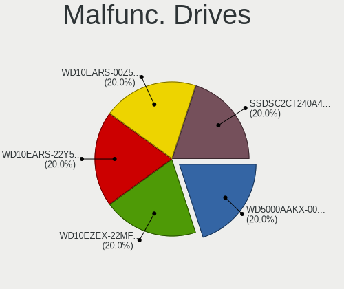
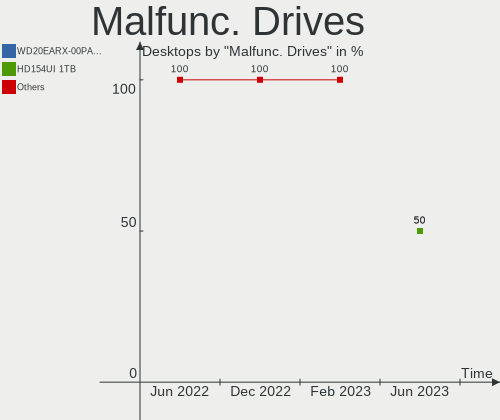
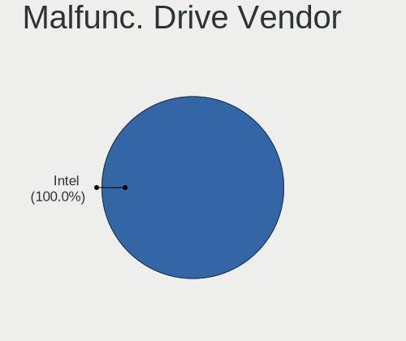
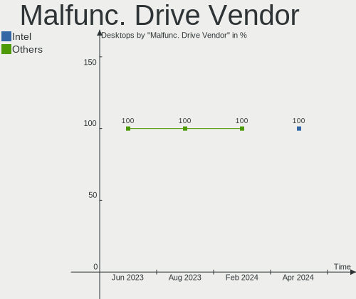
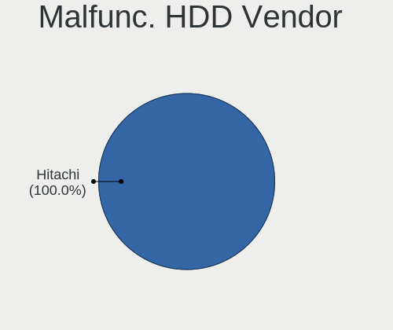
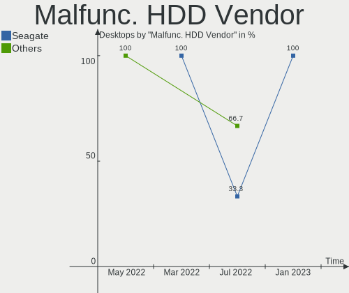
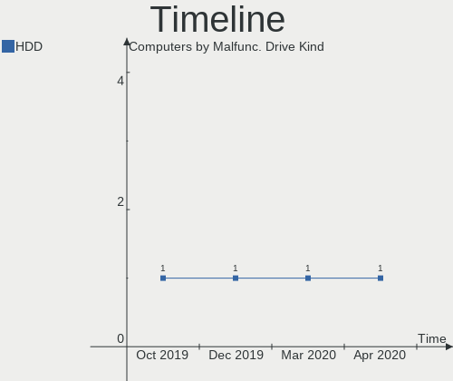
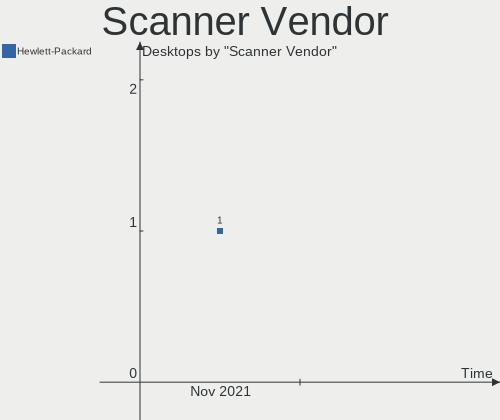
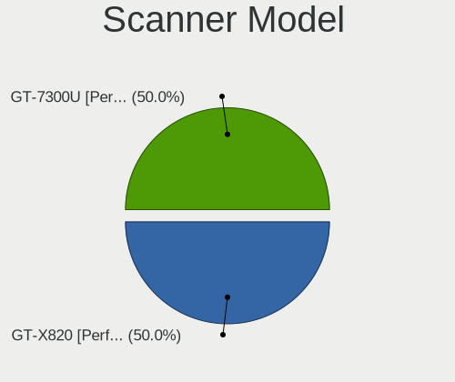
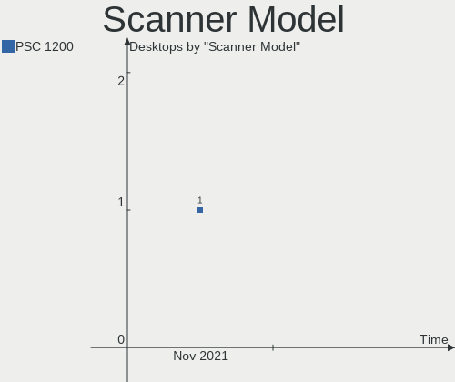

KDE neon Hardware Trends (Desktops)
-----------------------------------

A project to identify most popular hardware characteristics and track their change
over time based on data collected by Linux users at https://Linux-Hardware.org.

Anyone can contribute to this report by the [hw-probe](https://github.com/linuxhw/hw-probe) tool:

    sudo -E hw-probe -all -upload

Full-feature report is available here: https://linux-hardware.org/?view=trends&formfactor=desktop

Period: Jul, 2021.

Contents
--------

* [ System ](#system)
  - [ OS                       ](#os)
  - [ OS Family                ](#os-family)
  - [ Kernel                   ](#kernel)
  - [ Kernel Family            ](#kernel-family)
  - [ Kernel Major Ver.        ](#kernel-major-ver)
  - [ Arch                     ](#arch)
  - [ DE                       ](#de)
  - [ Display Server           ](#display-server)
  - [ Display Manager          ](#display-manager)
  - [ OS Lang                  ](#os-lang)
  - [ Boot Mode                ](#boot-mode)
  - [ Filesystem               ](#filesystem)
  - [ Part. scheme             ](#part-scheme)
  - [ Dual Boot with Linux/BSD ](#dual-boot-with-linuxbsd)
  - [ Dual Boot (Win)          ](#dual-boot-win)

* [ Board ](#board)
  - [ Vendor                   ](#vendor)
  - [ Model                    ](#model)
  - [ Model Family             ](#model-family)
  - [ MFG Year                 ](#mfg-year)
  - [ Form Factor              ](#form-factor)
  - [ Secure Boot              ](#secure-boot)
  - [ Coreboot                 ](#coreboot)
  - [ RAM Size                 ](#ram-size)
  - [ RAM Used                 ](#ram-used)
  - [ Total Drives             ](#total-drives)
  - [ Has CD-ROM               ](#has-cd-rom)
  - [ Has Ethernet             ](#has-ethernet)
  - [ Has WiFi                 ](#has-wifi)
  - [ Has Bluetooth            ](#has-bluetooth)

* [ Location ](#location)
  - [ Country                  ](#country)
  - [ City                     ](#city)

* [ Drives ](#drives)
  - [ Drive Vendor             ](#drive-vendor)
  - [ Drive Model              ](#drive-model)
  - [ HDD Vendor               ](#hdd-vendor)
  - [ SSD Vendor               ](#ssd-vendor)
  - [ Drive Kind               ](#drive-kind)
  - [ Drive Connector          ](#drive-connector)
  - [ Drive Size               ](#drive-size)
  - [ Space Total              ](#space-total)
  - [ Space Used               ](#space-used)
  - [ Malfunc. Drives          ](#malfunc-drives)
  - [ Malfunc. Drive Vendor    ](#malfunc-drive-vendor)
  - [ Malfunc. HDD Vendor      ](#malfunc-hdd-vendor)
  - [ Malfunc. Drive Kind      ](#malfunc-drive-kind)
  - [ Failed Drives            ](#failed-drives)
  - [ Failed Drive Vendor      ](#failed-drive-vendor)
  - [ Drive Status             ](#drive-status)

* [ Storage controller ](#storage-controller)
  - [ Storage Vendor           ](#storage-vendor)
  - [ Storage Model            ](#storage-model)
  - [ Storage Kind             ](#storage-kind)

* [ Processor ](#processor)
  - [ CPU Vendor               ](#cpu-vendor)
  - [ CPU Model                ](#cpu-model)
  - [ CPU Model Family         ](#cpu-model-family)
  - [ CPU Cores                ](#cpu-cores)
  - [ CPU Sockets              ](#cpu-sockets)
  - [ CPU Threads              ](#cpu-threads)
  - [ CPU Op-Modes             ](#cpu-op-modes)
  - [ CPU Microcode            ](#cpu-microcode)
  - [ CPU Microarch            ](#cpu-microarch)

* [ Graphics ](#graphics)
  - [ GPU Vendor               ](#gpu-vendor)
  - [ GPU Model                ](#gpu-model)
  - [ GPU Combo                ](#gpu-combo)
  - [ GPU Driver               ](#gpu-driver)
  - [ GPU Memory               ](#gpu-memory)

* [ Monitor ](#monitor)
  - [ Monitor Vendor           ](#monitor-vendor)
  - [ Monitor Model            ](#monitor-model)
  - [ Monitor Resolution       ](#monitor-resolution)
  - [ Monitor Diagonal         ](#monitor-diagonal)
  - [ Monitor Width            ](#monitor-width)
  - [ Aspect Ratio             ](#aspect-ratio)
  - [ Monitor Area             ](#monitor-area)
  - [ Pixel Density            ](#pixel-density)
  - [ Multiple Monitors        ](#multiple-monitors)

* [ Network ](#network)
  - [ Net Controller Vendor    ](#net-controller-vendor)
  - [ Net Controller Model     ](#net-controller-model)
  - [ Wireless Vendor          ](#wireless-vendor)
  - [ Wireless Model           ](#wireless-model)
  - [ Ethernet Vendor          ](#ethernet-vendor)
  - [ Ethernet Model           ](#ethernet-model)
  - [ Net Controller Kind      ](#net-controller-kind)
  - [ Used Controller          ](#used-controller)
  - [ NICs                     ](#nics)
  - [ IPv6                     ](#ipv6)

* [ Bluetooth ](#bluetooth)
  - [ Bluetooth Vendor         ](#bluetooth-vendor)
  - [ Bluetooth Model          ](#bluetooth-model)

* [ Sound ](#sound)
  - [ Sound Vendor             ](#sound-vendor)
  - [ Sound Model              ](#sound-model)

* [ Memory ](#memory)
  - [ Memory Vendor            ](#memory-vendor)
  - [ Memory Model             ](#memory-model)
  - [ Memory Kind              ](#memory-kind)
  - [ Memory Form Factor       ](#memory-form-factor)
  - [ Memory Size              ](#memory-size)
  - [ Memory Speed             ](#memory-speed)

* [ Printers & scanners ](#printers-&-scanners)
  - [ Printer Vendor           ](#printer-vendor)
  - [ Printer Model            ](#printer-model)
  - [ Scanner Vendor           ](#scanner-vendor)
  - [ Scanner Model            ](#scanner-model)

* [ Camera ](#camera)
  - [ Camera Vendor            ](#camera-vendor)
  - [ Camera Model             ](#camera-model)

* [ Security ](#security)
  - [ Fingerprint Vendor       ](#fingerprint-vendor)
  - [ Fingerprint Model        ](#fingerprint-model)
  - [ Chipcard Vendor          ](#chipcard-vendor)
  - [ Chipcard Model           ](#chipcard-model)

* [ Unsupported ](#unsupported)
  - [ Unsupported Devices      ](#unsupported-devices)
  - [ Unsupported Device Types ](#unsupported-device-types)

System
------

OS
--

Installed operating systems

| Name           | Desktops | Percent |
|----------------|----------|---------|
| KDE neon 20.04 | 38       | 100%    |

OS Family
---------

OS without a version

| Name     | Desktops | Percent |
|----------|----------|---------|
| KDE neon | 38       | 100%    |

Kernel
------

Version of the Linux kernel

| Version             | Desktops | Percent |
|---------------------|----------|---------|
| 5.8.0-59-generic    | 28       | 73.68%  |
| 5.8.0-63-generic    | 4        | 10.53%  |
| 5.4.0-73-generic    | 3        | 7.89%   |
| 5.8.0-61-lowlatency | 1        | 2.63%   |
| 5.4.0-77-generic    | 1        | 2.63%   |
| 5.4.0-64-generic    | 1        | 2.63%   |

Kernel Family
-------------

Linux kernel without a distro release

| Version | Desktops | Percent |
|---------|----------|---------|
| 5.8.0   | 33       | 86.84%  |
| 5.4.0   | 5        | 13.16%  |

Kernel Major Ver.
-----------------

Linux kernel major version

| Version | Desktops | Percent |
|---------|----------|---------|
| 5.8     | 33       | 86.84%  |
| 5.4     | 5        | 13.16%  |

Arch
----

OS architecture (x86_64, i586, etc.)

| Name   | Desktops | Percent |
|--------|----------|---------|
| x86_64 | 38       | 100%    |

DE
--

Desktop Environment

| Name    | Desktops | Percent |
|---------|----------|---------|
| KDE     | 30       | 78.95%  |
| KDE5    | 6        | 15.79%  |
| Unknown | 2        | 5.26%   |

Display Server
--------------

X11 or Wayland

| Name | Desktops | Percent |
|------|----------|---------|
| X11  | 37       | 97.37%  |
| Tty  | 1        | 2.63%   |

Display Manager
---------------

SDDM, LightDM, etc.

| Name    | Desktops | Percent |
|---------|----------|---------|
| Unknown | 32       | 84.21%  |
| SDDM    | 5        | 13.16%  |
| TDM     | 1        | 2.63%   |

OS Lang
-------

Language

| Lang  | Desktops | Percent |
|-------|----------|---------|
| en_US | 10       | 26.32%  |
| ru_RU | 5        | 13.16%  |
| pt_BR | 4        | 10.53%  |
| de_DE | 3        | 7.89%   |
| fr_FR | 2        | 5.26%   |
| es_ES | 2        | 5.26%   |
| en_GB | 2        | 5.26%   |
| C     | 2        | 5.26%   |
| sv_SE | 1        | 2.63%   |
| ru_UA | 1        | 2.63%   |
| it_IT | 1        | 2.63%   |
| en_ZA | 1        | 2.63%   |
| en_IN | 1        | 2.63%   |
| en_DK | 1        | 2.63%   |
| en_CA | 1        | 2.63%   |
| en_AU | 1        | 2.63%   |

Boot Mode
---------

EFI or BIOS

| Mode | Desktops | Percent |
|------|----------|---------|
| EFI  | 22       | 57.89%  |
| BIOS | 16       | 42.11%  |

Filesystem
----------

Type of filesystem

| Type    | Desktops | Percent |
|---------|----------|---------|
| Ext4    | 32       | 84.21%  |
| Btrfs   | 3        | 7.89%   |
| Overlay | 2        | 5.26%   |
| Xfs     | 1        | 2.63%   |

Part. scheme
------------

Scheme of partitioning

| Type    | Desktops | Percent |
|---------|----------|---------|
| Unknown | 31       | 81.58%  |
| GPT     | 5        | 13.16%  |
| MBR     | 2        | 5.26%   |

Dual Boot with Linux/BSD
------------------------

Hosting more than one Linux/BSD

| Dual boot | Desktops | Percent |
|-----------|----------|---------|
| No        | 34       | 89.47%  |
| Yes       | 4        | 10.53%  |

Dual Boot (Win)
---------------

Hosting Linux and Windows

| Dual boot | Desktops | Percent |
|-----------|----------|---------|
| No        | 31       | 81.58%  |
| Yes       | 7        | 18.42%  |

Board
-----

Vendor
------

Motherboard manufacturer

| Name                | Desktops | Percent |
|---------------------|----------|---------|
| ASUSTek Computer    | 9        | 23.68%  |
| ASRock              | 9        | 23.68%  |
| Gigabyte Technology | 6        | 15.79%  |
| MSI                 | 4        | 10.53%  |
| Hewlett-Packard     | 4        | 10.53%  |
| ECS                 | 2        | 5.26%   |
| Dell                | 2        | 5.26%   |
| Intel               | 1        | 2.63%   |
| Biostar             | 1        | 2.63%   |

Model
-----

Motherboard model

| Name                         | Desktops | Percent |
|------------------------------|----------|---------|
| MSI MS-7B89                  | 1        | 2.63%   |
| MSI MS-7A32                  | 1        | 2.63%   |
| MSI MS-7681                  | 1        | 2.63%   |
| MSI MS-7623                  | 1        | 2.63%   |
| Intel DH61WW AAG23116-300    | 1        | 2.63%   |
| HP Z420 Workstation          | 1        | 2.63%   |
| HP EliteDesk 800 G1 SFF      | 1        | 2.63%   |
| HP Compaq Elite 8300 SFF     | 1        | 2.63%   |
| HP Compaq Elite 8300 CMT     | 1        | 2.63%   |
| Gigabyte Z390 GAMING X       | 1        | 2.63%   |
| Gigabyte P85-D3              | 1        | 2.63%   |
| Gigabyte H87-HD3             | 1        | 2.63%   |
| Gigabyte H61M-S1             | 1        | 2.63%   |
| Gigabyte H310M H             | 1        | 2.63%   |
| Gigabyte 970A-DS3P FX        | 1        | 2.63%   |
| ECS B85H3-M4                 | 1        | 2.63%   |
| ECS A785GM-AD3               | 1        | 2.63%   |
| Dell Precision Tower 5810    | 1        | 2.63%   |
| Dell OptiPlex 3040           | 1        | 2.63%   |
| Biostar A960D+V3             | 1        | 2.63%   |
| ASUS ROG STRIX B450-F GAMING | 1        | 2.63%   |
| ASUS PRIME X570-PRO          | 1        | 2.63%   |
| ASUS PRIME B450-PLUS         | 1        | 2.63%   |
| ASUS PRIME B360M-K           | 1        | 2.63%   |
| ASUS PRIME B350-PLUS         | 1        | 2.63%   |
| ASUS P8P67                   | 1        | 2.63%   |
| ASUS P7H55                   | 1        | 2.63%   |
| ASUS M5A97 LE R2.0           | 1        | 2.63%   |
| ASUS F2A55-M LK2             | 1        | 2.63%   |
| ASRock X470 Gaming K4        | 1        | 2.63%   |
| ASRock H110M-DVS R3.0        | 1        | 2.63%   |
| ASRock FM2A78M-HD+           | 1        | 2.63%   |
| ASRock B460 Phantom Gaming 4 | 1        | 2.63%   |
| ASRock B450M-HDV R4.0        | 1        | 2.63%   |
| ASRock B450M Pro4            | 1        | 2.63%   |
| ASRock B450 Pro4             | 1        | 2.63%   |
| ASRock 970 Pro3 R2.0         | 1        | 2.63%   |
| ASRock 970 Extreme3          | 1        | 2.63%   |

Model Family
------------

Motherboard model prefix

| Name               | Desktops | Percent |
|--------------------|----------|---------|
| ASUS PRIME         | 4        | 10.53%  |
| HP Compaq          | 2        | 5.26%   |
| ASRock 970         | 2        | 5.26%   |
| MSI MS-7B89        | 1        | 2.63%   |
| MSI MS-7A32        | 1        | 2.63%   |
| MSI MS-7681        | 1        | 2.63%   |
| MSI MS-7623        | 1        | 2.63%   |
| Intel DH61WW       | 1        | 2.63%   |
| HP Z420            | 1        | 2.63%   |
| HP EliteDesk       | 1        | 2.63%   |
| Gigabyte Z390      | 1        | 2.63%   |
| Gigabyte P85-D3    | 1        | 2.63%   |
| Gigabyte H87-HD3   | 1        | 2.63%   |
| Gigabyte H61M-S1   | 1        | 2.63%   |
| Gigabyte H310M     | 1        | 2.63%   |
| Gigabyte 970A-DS3P | 1        | 2.63%   |
| ECS B85H3-M4       | 1        | 2.63%   |
| ECS A785GM-AD3     | 1        | 2.63%   |
| Dell Precision     | 1        | 2.63%   |
| Dell OptiPlex      | 1        | 2.63%   |
| Biostar A960D+V3   | 1        | 2.63%   |
| ASUS ROG           | 1        | 2.63%   |
| ASUS P8P67         | 1        | 2.63%   |
| ASUS P7H55         | 1        | 2.63%   |
| ASUS M5A97         | 1        | 2.63%   |
| ASUS F2A55-M       | 1        | 2.63%   |
| ASRock X470        | 1        | 2.63%   |
| ASRock H110M-DVS   | 1        | 2.63%   |
| ASRock FM2A78M-HD+ | 1        | 2.63%   |
| ASRock B460        | 1        | 2.63%   |
| ASRock B450M-HDV   | 1        | 2.63%   |
| ASRock B450M       | 1        | 2.63%   |
| ASRock B450        | 1        | 2.63%   |

MFG Year
--------

Motherboard manufacture year

| Year | Desktops | Percent |
|------|----------|---------|
| 2020 | 8        | 21.05%  |
| 2019 | 5        | 13.16%  |
| 2013 | 4        | 10.53%  |
| 2018 | 3        | 7.89%   |
| 2016 | 3        | 7.89%   |
| 2014 | 3        | 7.89%   |
| 2012 | 3        | 7.89%   |
| 2017 | 2        | 5.26%   |
| 2015 | 2        | 5.26%   |
| 2011 | 2        | 5.26%   |
| 2010 | 2        | 5.26%   |
| 2021 | 1        | 2.63%   |

Form Factor
-----------

Physical design of the computer

| Name    | Desktops | Percent |
|---------|----------|---------|
| Desktop | 38       | 100%    |

Secure Boot
-----------

Enabled or disabled

| State    | Desktops | Percent |
|----------|----------|---------|
| Disabled | 38       | 100%    |

Coreboot
--------

Have coreboot on board

| Used | Desktops | Percent |
|------|----------|---------|
| No   | 38       | 100%    |

RAM Size
--------

Total RAM memory

| Size in GB  | Desktops | Percent |
|-------------|----------|---------|
| 16.01-24.0  | 14       | 36.84%  |
| 8.01-16.0   | 12       | 31.58%  |
| 32.01-64.0  | 5        | 13.16%  |
| 24.01-32.0  | 3        | 7.89%   |
| 3.01-4.0    | 2        | 5.26%   |
| 4.01-8.0    | 1        | 2.63%   |
| 64.01-256.0 | 1        | 2.63%   |

RAM Used
--------

Used RAM memory

| Used GB    | Desktops | Percent |
|------------|----------|---------|
| 4.01-8.0   | 11       | 28.95%  |
| 2.01-3.0   | 11       | 28.95%  |
| 1.01-2.0   | 7        | 18.42%  |
| 3.01-4.0   | 5        | 13.16%  |
| 8.01-16.0  | 2        | 5.26%   |
| 32.01-64.0 | 1        | 2.63%   |
| 0.51-1.0   | 1        | 2.63%   |

Total Drives
------------

Number of drives on board

| Drives | Desktops | Percent |
|--------|----------|---------|
| 2      | 14       | 36.84%  |
| 4      | 8        | 21.05%  |
| 1      | 8        | 21.05%  |
| 3      | 6        | 15.79%  |
| 6      | 1        | 2.63%   |
| 5      | 1        | 2.63%   |

Has CD-ROM
----------

Has CD-ROM on board

| Presented | Desktops | Percent |
|-----------|----------|---------|
| No        | 22       | 57.89%  |
| Yes       | 16       | 42.11%  |

Has Ethernet
------------

Has Ethernet on board

| Presented | Desktops | Percent |
|-----------|----------|---------|
| Yes       | 38       | 100%    |

Has WiFi
--------

Has WiFi module

| Presented | Desktops | Percent |
|-----------|----------|---------|
| No        | 26       | 68.42%  |
| Yes       | 12       | 31.58%  |

Has Bluetooth
-------------

Has Bluetooth module

| Presented | Desktops | Percent |
|-----------|----------|---------|
| No        | 26       | 68.42%  |
| Yes       | 12       | 31.58%  |

Location
--------

Country
-------

Geographic location (country)

| Country      | Desktops | Percent |
|--------------|----------|---------|
| USA          | 10       | 26.32%  |
| Russia       | 5        | 13.16%  |
| Brazil       | 5        | 13.16%  |
| Spain        | 2        | 5.26%   |
| Germany      | 2        | 5.26%   |
| France       | 2        | 5.26%   |
| Ukraine      | 1        | 2.63%   |
| UK           | 1        | 2.63%   |
| Thailand     | 1        | 2.63%   |
| Sweden       | 1        | 2.63%   |
| South Africa | 1        | 2.63%   |
| Norway       | 1        | 2.63%   |
| Italy        | 1        | 2.63%   |
| India        | 1        | 2.63%   |
| Denmark      | 1        | 2.63%   |
| Canada       | 1        | 2.63%   |
| Belarus      | 1        | 2.63%   |
| Australia    | 1        | 2.63%   |

City
----

Geographic location (city)

| City                 | Desktops | Percent |
|----------------------|----------|---------|
| Viry-Châtillon      | 1        | 2.63%   |
| Saratov              | 1        | 2.63%   |
| Salto de Pirapora    | 1        | 2.63%   |
| Round Rock           | 1        | 2.63%   |
| Rio de Janeiro       | 1        | 2.63%   |
| Pune                 | 1        | 2.63%   |
| Pontevedra           | 1        | 2.63%   |
| Plainfield           | 1        | 2.63%   |
| Perugia              | 1        | 2.63%   |
| Novosibirsk          | 1        | 2.63%   |
| Moscow               | 1        | 2.63%   |
| Mjoelby              | 1        | 2.63%   |
| Minsk                | 1        | 2.63%   |
| Melbourne            | 1        | 2.63%   |
| Maulden              | 1        | 2.63%   |
| Krasnokamensk        | 1        | 2.63%   |
| Khon Kaen            | 1        | 2.63%   |
| Harleysville         | 1        | 2.63%   |
| Grozny               | 1        | 2.63%   |
| Grenoble             | 1        | 2.63%   |
| Frankfurt am Main    | 1        | 2.63%   |
| Fort McCoy           | 1        | 2.63%   |
| Dnipropetrovsk       | 1        | 2.63%   |
| Dallas               | 1        | 2.63%   |
| Copenhagen           | 1        | 2.63%   |
| Conselheiro Lafaiete | 1        | 2.63%   |
| Cologne              | 1        | 2.63%   |
| Chattanooga          | 1        | 2.63%   |
| Chandler             | 1        | 2.63%   |
| Chalmette            | 1        | 2.63%   |
| Cerritos             | 1        | 2.63%   |
| Casselman            | 1        | 2.63%   |
| Cape Town            | 1        | 2.63%   |
| Cangas               | 1        | 2.63%   |
| Bryne                | 1        | 2.63%   |
| Betim                | 1        | 2.63%   |
| Belo Horizonte       | 1        | 2.63%   |
| Albany               | 1        | 2.63%   |

Drives
------

Drive Vendor
------------

Hard drive vendors

| Vendor                    | Desktops | Drives | Percent |
|---------------------------|----------|--------|---------|
| WDC                       | 13       | 20     | 16.46%  |
| Seagate                   | 12       | 17     | 15.19%  |
| Samsung Electronics       | 10       | 12     | 12.66%  |
| Kingston                  | 7        | 9      | 8.86%   |
| Toshiba                   | 5        | 6      | 6.33%   |
| Unknown                   | 2        | 2      | 2.53%   |
| Silicon Motion            | 2        | 2      | 2.53%   |
| SanDisk                   | 2        | 2      | 2.53%   |
| Phison                    | 2        | 2      | 2.53%   |
| LDLC                      | 2        | 2      | 2.53%   |
| JMicron                   | 2        | 2      | 2.53%   |
| Crucial                   | 2        | 3      | 2.53%   |
| SPCC                      | 1        | 1      | 1.27%   |
| Smartbuy                  | 1        | 1      | 1.27%   |
| PNY                       | 1        | 1      | 1.27%   |
| Patriot                   | 1        | 1      | 1.27%   |
| OCZ                       | 1        | 1      | 1.27%   |
| Netac                     | 1        | 1      | 1.27%   |
| Micron/Crucial Technology | 1        | 1      | 1.27%   |
| Micron Technology         | 1        | 4      | 1.27%   |
| Maxone                    | 1        | 1      | 1.27%   |
| LaCie                     | 1        | 1      | 1.27%   |
| KingSpec                  | 1        | 1      | 1.27%   |
| HGST                      | 1        | 1      | 1.27%   |
| Hewlett-Packard           | 1        | 1      | 1.27%   |
| GOODRAM                   | 1        | 1      | 1.27%   |
| Gigabyte Technology       | 1        | 1      | 1.27%   |
| China                     | 1        | 2      | 1.27%   |
| ASMT                      | 1        | 1      | 1.27%   |
| A-DATA Technology         | 1        | 1      | 1.27%   |

Drive Model
-----------

Hard drive models

| Model                               | Desktops | Percent |
|-------------------------------------|----------|---------|
| Kingston SA400S37240G 240GB SSD     | 4        | 4.26%   |
| Seagate ST1000DM003-1ER162 1TB      | 3        | 3.19%   |
| Samsung SSD 840 EVO 250GB           | 3        | 3.19%   |
| WDC WD30EFRX-68EUZN0 3TB            | 2        | 2.13%   |
| WDC WD10EZRZ-00HTKB0 1TB            | 2        | 2.13%   |
| WDC WD10EZEX-00BN5A0 1TB            | 2        | 2.13%   |
| Toshiba DT01ACA050 500GB            | 2        | 2.13%   |
| Seagate ST500DM002-1BD142 500GB     | 2        | 2.13%   |
| Seagate ST2000DM001-1CH164 2TB      | 2        | 2.13%   |
| Seagate ST1000DM003-9YN162 1TB      | 2        | 2.13%   |
| Kingston SA400S37480G 480GB SSD     | 2        | 2.13%   |
| WDC WDS250G2B0A-00SM50 250GB SSD    | 1        | 1.06%   |
| WDC WDBNCE5000PNC 500GB SSD         | 1        | 1.06%   |
| WDC WD800JD-00LSA5 80GB             | 1        | 1.06%   |
| WDC WD5000LUCT-63RC2Y0 500GB        | 1        | 1.06%   |
| WDC WD5000AZRX-00A8LB0 500GB        | 1        | 1.06%   |
| WDC WD5000AVVS-63ZWB0 500GB         | 1        | 1.06%   |
| WDC WD5000AAKX-75U6AA0 500GB        | 1        | 1.06%   |
| WDC WD5000AAKX-22ERMA0 500GB        | 1        | 1.06%   |
| WDC WD5000AAKX-221CA1 500GB         | 1        | 1.06%   |
| WDC WD40PURX-64GVNY0 4TB            | 1        | 1.06%   |
| WDC WD20EARX-00PASB0 2TB            | 1        | 1.06%   |
| WDC WD1600BEVT-22A23T0 160GB        | 1        | 1.06%   |
| WDC WD10EAVS-00D7B1 1TB             | 1        | 1.06%   |
| WDC WD1002FAEX-00Y9A0 1TB           | 1        | 1.06%   |
| Unknown RZX-19SSD6G/120G 120GB      | 1        | 1.06%   |
| Unknown PH5-CE120 120GB             | 1        | 1.06%   |
| Toshiba TR200 240GB SSD             | 1        | 1.06%   |
| Toshiba HDWE150 5TB                 | 1        | 1.06%   |
| Toshiba DT01ACA300 3TB              | 1        | 1.06%   |
| SPCC Solid State Disk 120GB         | 1        | 1.06%   |
| Smartbuy SSD 256GB                  | 1        | 1.06%   |
| Silicon Motion NVMe SSD Drive 256GB | 1        | 1.06%   |
| Silicon Motion NVMe SSD Drive 240GB | 1        | 1.06%   |
| Seagate ST4000VN008-2DR166 4TB      | 1        | 1.06%   |
| Seagate ST3500630AS 500GB           | 1        | 1.06%   |
| Seagate ST3250318AS 250GB           | 1        | 1.06%   |
| Seagate ST31000533CS 1TB            | 1        | 1.06%   |
| Seagate ST2000DM001-9YN164 2TB      | 1        | 1.06%   |
| Seagate ST1500DL003-9VT16L 1TB      | 1        | 1.06%   |
| Seagate ST1000VM002-1ET162 1TB      | 1        | 1.06%   |
| Seagate ST1000DM010-2EP102 1TB      | 1        | 1.06%   |
| SanDisk SDSSDA240G 240GB            | 1        | 1.06%   |
| Sandisk NVMe SSD Drive 1TB          | 1        | 1.06%   |
| Samsung SSD PM871b 2.5 7mm 512GB    | 1        | 1.06%   |
| Samsung SSD 870 QVO 1TB             | 1        | 1.06%   |
| Samsung SSD 860 PRO 512GB           | 1        | 1.06%   |
| Samsung SSD 860 EVO 500GB           | 1        | 1.06%   |
| Samsung SSD 860 EVO 250GB           | 1        | 1.06%   |
| Samsung NVMe SSD Drive 1TB          | 1        | 1.06%   |
| Samsung HD322GJ 320GB               | 1        | 1.06%   |
| Samsung HD103SI 1TB                 | 1        | 1.06%   |
| PNY SSD2SC240G1CS1754D117-820 240GB | 1        | 1.06%   |
| Phison NVMe SSD Drive 512GB         | 1        | 1.06%   |
| Phison NVMe SSD Drive 256GB         | 1        | 1.06%   |
| Patriot Burst 120GB SSD             | 1        | 1.06%   |
| OCZ VERTEX4 128GB SSD               | 1        | 1.06%   |
| Netac SSD 512GB                     | 1        | 1.06%   |
| Micron/Crucial NVMe SSD Drive 500GB | 1        | 1.06%   |
| Micron 1100 SATA 512GB SSD          | 1        | 1.06%   |

HDD Vendor
----------

Hard disk drive vendors

| Vendor              | Desktops | Drives | Percent |
|---------------------|----------|--------|---------|
| WDC                 | 12       | 18     | 34.29%  |
| Seagate             | 12       | 17     | 34.29%  |
| Toshiba             | 4        | 5      | 11.43%  |
| Samsung Electronics | 2        | 2      | 5.71%   |
| Maxone              | 1        | 1      | 2.86%   |
| LaCie               | 1        | 1      | 2.86%   |
| HGST                | 1        | 1      | 2.86%   |
| Hewlett-Packard     | 1        | 1      | 2.86%   |
| ASMT                | 1        | 1      | 2.86%   |

SSD Vendor
----------

Solid state drive vendors

| Vendor              | Desktops | Drives | Percent |
|---------------------|----------|--------|---------|
| Samsung Electronics | 7        | 9      | 20%     |
| Kingston            | 7        | 9      | 20%     |
| WDC                 | 2        | 2      | 5.71%   |
| JMicron             | 2        | 2      | 5.71%   |
| Crucial             | 2        | 3      | 5.71%   |
| Unknown             | 1        | 1      | 2.86%   |
| Toshiba             | 1        | 1      | 2.86%   |
| SPCC                | 1        | 1      | 2.86%   |
| Smartbuy            | 1        | 1      | 2.86%   |
| SanDisk             | 1        | 1      | 2.86%   |
| PNY                 | 1        | 1      | 2.86%   |
| Patriot             | 1        | 1      | 2.86%   |
| OCZ                 | 1        | 1      | 2.86%   |
| Netac               | 1        | 1      | 2.86%   |
| Micron Technology   | 1        | 4      | 2.86%   |
| LDLC                | 1        | 1      | 2.86%   |
| KingSpec            | 1        | 1      | 2.86%   |
| GOODRAM             | 1        | 1      | 2.86%   |
| China               | 1        | 2      | 2.86%   |
| A-DATA Technology   | 1        | 1      | 2.86%   |

Drive Kind
----------

HDD or SSD

| Kind    | Desktops | Drives | Percent |
|---------|----------|--------|---------|
| SSD     | 30       | 44     | 45.45%  |
| HDD     | 26       | 47     | 39.39%  |
| NVMe    | 8        | 8      | 12.12%  |
| Unknown | 2        | 2      | 3.03%   |

Drive Connector
---------------

SATA, SAS, NVMe, etc.

| Type | Desktops | Drives | Percent |
|------|----------|--------|---------|
| SATA | 37       | 88     | 77.08%  |
| NVMe | 8        | 8      | 16.67%  |
| SAS  | 3        | 5      | 6.25%   |

Drive Size
----------

Size of hard drive

| Size in TB | Desktops | Drives | Percent |
|------------|----------|--------|---------|
| 0.01-0.5   | 33       | 51     | 53.23%  |
| 0.51-1.0   | 18       | 28     | 29.03%  |
| 1.01-2.0   | 4        | 4      | 6.45%   |
| 2.01-3.0   | 3        | 4      | 4.84%   |
| 3.01-4.0   | 2        | 2      | 3.23%   |
| 4.01-10.0  | 2        | 2      | 3.23%   |

Space Total
-----------

Amount of disk space available on the file system

| Size in GB     | Desktops | Percent |
|----------------|----------|---------|
| 101-250        | 11       | 28.95%  |
| 251-500        | 8        | 21.05%  |
| 501-1000       | 6        | 15.79%  |
| 1001-2000      | 5        | 13.16%  |
| More than 3000 | 4        | 10.53%  |
| 2001-3000      | 2        | 5.26%   |
| 1-20           | 2        | 5.26%   |

Space Used
----------

Amount of used disk space

| Used GB        | Desktops | Percent |
|----------------|----------|---------|
| 1-20           | 13       | 34.21%  |
| 101-250        | 5        | 13.16%  |
| 251-500        | 4        | 10.53%  |
| 21-50          | 4        | 10.53%  |
| 2001-3000      | 3        | 7.89%   |
| 1001-2000      | 3        | 7.89%   |
| More than 3000 | 2        | 5.26%   |
| 501-1000       | 2        | 5.26%   |
| 51-100         | 2        | 5.26%   |

Malfunc. Drives
---------------

Drive models with a malfunction

| Model                                 | Desktops | Drives | Percent |
|---------------------------------------|----------|--------|---------|
| WDC WD30EFRX-68EUZN0 3TB              | 1        | 1      | 33.33%  |
| Seagate ST2000DM001-1CH164 2TB        | 1        | 1      | 33.33%  |
| Micron Technology 1100 SATA 512GB SSD | 1        | 4      | 33.33%  |

Malfunc. Drive Vendor
---------------------

Vendors of faulty drives

| Vendor            | Desktops | Drives | Percent |
|-------------------|----------|--------|---------|
| WDC               | 1        | 1      | 33.33%  |
| Seagate           | 1        | 1      | 33.33%  |
| Micron Technology | 1        | 4      | 33.33%  |

Malfunc. HDD Vendor
-------------------

Vendors of faulty HDD drives

| Vendor  | Desktops | Drives | Percent |
|---------|----------|--------|---------|
| WDC     | 1        | 1      | 50%     |
| Seagate | 1        | 1      | 50%     |

Malfunc. Drive Kind
-------------------

Kinds of faulty drives

| Kind | Desktops | Drives | Percent |
|------|----------|--------|---------|
| HDD  | 2        | 2      | 66.67%  |
| SSD  | 1        | 4      | 33.33%  |

Failed Drives
-------------

Failed drive models

Zero info for selected period =(

Failed Drive Vendor
-------------------

Failed drive vendors

Zero info for selected period =(

Drive Status
------------

Number of failed and malfunc. drives

| Status   | Desktops | Drives | Percent |
|----------|----------|--------|---------|
| Detected | 29       | 77     | 70.73%  |
| Works    | 9        | 18     | 21.95%  |
| Malfunc  | 3        | 6      | 7.32%   |

Storage controller
------------------

Storage Vendor
--------------

Storage controller vendors

| Vendor                    | Desktops | Percent |
|---------------------------|----------|---------|
| Intel                     | 19       | 35.19%  |
| AMD                       | 19       | 35.19%  |
| ASMedia Technology        | 4        | 7.41%   |
| Phison Electronics        | 3        | 5.56%   |
| Silicon Motion            | 2        | 3.7%    |
| Marvell Technology Group  | 2        | 3.7%    |
| VIA Technologies          | 1        | 1.85%   |
| Sandisk                   | 1        | 1.85%   |
| Samsung Electronics       | 1        | 1.85%   |
| Micron/Crucial Technology | 1        | 1.85%   |
| Broadcom / LSI            | 1        | 1.85%   |

Storage Model
-------------

Storage controller models

| Model                                                                                   | Desktops | Percent |
|-----------------------------------------------------------------------------------------|----------|---------|
| AMD FCH SATA Controller [AHCI mode]                                                     | 12       | 15.19%  |
| AMD 400 Series Chipset SATA Controller                                                  | 7        | 8.86%   |
| AMD SB7x0/SB8x0/SB9x0 IDE Controller                                                    | 6        | 7.59%   |
| Intel 8 Series/C220 Series Chipset Family 6-port SATA Controller 1 [AHCI mode]          | 4        | 5.06%   |
| ASMedia ASM1062 Serial ATA Controller                                                   | 4        | 5.06%   |
| AMD SB7x0/SB8x0/SB9x0 SATA Controller [IDE mode]                                        | 4        | 5.06%   |
| Intel Cannon Lake PCH SATA AHCI Controller                                              | 3        | 3.8%    |
| Intel 6 Series/C200 Series Chipset Family Desktop SATA Controller (IDE mode, ports 4-5) | 3        | 3.8%    |
| Intel 6 Series/C200 Series Chipset Family 6 port Desktop SATA AHCI Controller           | 3        | 3.8%    |
| Intel Q170/Q150/B150/H170/H110/Z170/CM236 Chipset SATA Controller [AHCI Mode]           | 2        | 2.53%   |
| Intel C600/X79 series chipset SATA RAID Controller                                      | 2        | 2.53%   |
| Intel 7 Series/C210 Series Chipset Family 6-port SATA Controller [AHCI mode]            | 2        | 2.53%   |
| Intel 6 Series/C200 Series Chipset Family Desktop SATA Controller (IDE mode, ports 0-3) | 2        | 2.53%   |
| AMD SB7x0/SB8x0/SB9x0 SATA Controller [AHCI mode]                                       | 2        | 2.53%   |
| VIA VT6415 PATA IDE Host Controller                                                     | 1        | 1.27%   |
| Silicon Motion SM2263EN/SM2263XT SSD Controller                                         | 1        | 1.27%   |
| Silicon Motion SM2262/SM2262EN SSD Controller                                           | 1        | 1.27%   |
| Sandisk WD Blue SN550 NVMe SSD                                                          | 1        | 1.27%   |
| Samsung NVMe SSD Controller SM981/PM981/PM983                                           | 1        | 1.27%   |
| Phison PS5013 E13 NVMe Controller                                                       | 1        | 1.27%   |
| Phison E16 PCIe4 NVMe Controller                                                        | 1        | 1.27%   |
| Phison E12 NVMe Controller                                                              | 1        | 1.27%   |
| Micron/Crucial P2 NVMe PCIe SSD                                                         | 1        | 1.27%   |
| Marvell Group 88SE91A3 SATA-600 Controller                                              | 1        | 1.27%   |
| Marvell Group 88SE912x IDE Controller                                                   | 1        | 1.27%   |
| Marvell Group 88SE9120 SATA 6Gb/s Controller                                            | 1        | 1.27%   |
| Intel C610/X99 series chipset sSATA Controller [AHCI mode]                              | 1        | 1.27%   |
| Intel C602 chipset 4-Port SATA Storage Control Unit                                     | 1        | 1.27%   |
| Intel C600/X79 series chipset IDE-r Controller                                          | 1        | 1.27%   |
| Intel 5 Series/3400 Series Chipset 4 port SATA IDE Controller                           | 1        | 1.27%   |
| Intel 5 Series/3400 Series Chipset 2 port SATA IDE Controller                           | 1        | 1.27%   |
| Intel 400 Series Chipset Family SATA AHCI Controller                                    | 1        | 1.27%   |
| Broadcom / LSI SAS2308 PCI-Express Fusion-MPT SAS-2                                     | 1        | 1.27%   |
| AMD X370 Series Chipset SATA Controller                                                 | 1        | 1.27%   |
| AMD SB7x0/SB8x0/SB9x0 SATA Controller [RAID5 mode]                                      | 1        | 1.27%   |
| AMD FCH IDE Controller                                                                  | 1        | 1.27%   |
| AMD 300 Series Chipset SATA Controller                                                  | 1        | 1.27%   |

Storage Kind
------------

Kind of storage controller (IDE, SATA, NVMe, SAS, ...)

| Kind | Desktops | Percent |
|------|----------|---------|
| SATA | 35       | 59.32%  |
| IDE  | 12       | 20.34%  |
| NVMe | 8        | 13.56%  |
| RAID | 3        | 5.08%   |
| SAS  | 1        | 1.69%   |

Processor
---------

CPU Vendor
----------

Processor vendors

| Vendor | Desktops | Percent |
|--------|----------|---------|
| Intel  | 19       | 50%     |
| AMD    | 19       | 50%     |

CPU Model
---------

Processor models

| Model                                       | Desktops | Percent |
|---------------------------------------------|----------|---------|
| AMD Ryzen 5 2600 Six-Core Processor         | 2        | 5.26%   |
| AMD FX-8350 Eight-Core Processor            | 2        | 5.26%   |
| AMD FX-6300 Six-Core Processor              | 2        | 5.26%   |
| AMD Athlon II X4 640 Processor              | 2        | 5.26%   |
| Intel Xeon CPU E5-2640 v3 @ 2.60GHz         | 1        | 2.63%   |
| Intel Xeon CPU E5-1620 0 @ 3.60GHz          | 1        | 2.63%   |
| Intel Pentium CPU G4400 @ 3.30GHz           | 1        | 2.63%   |
| Intel Core i7-8700 CPU @ 3.20GHz            | 1        | 2.63%   |
| Intel Core i7-4790K CPU @ 4.00GHz           | 1        | 2.63%   |
| Intel Core i7-4790 CPU @ 3.60GHz            | 1        | 2.63%   |
| Intel Core i7-3770 CPU @ 3.40GHz            | 1        | 2.63%   |
| Intel Core i7-2600 CPU @ 3.40GHz            | 1        | 2.63%   |
| Intel Core i5-9400F CPU @ 2.90GHz           | 1        | 2.63%   |
| Intel Core i5-8500 CPU @ 3.00GHz            | 1        | 2.63%   |
| Intel Core i5-6500 CPU @ 3.20GHz            | 1        | 2.63%   |
| Intel Core i5-4670 CPU @ 3.40GHz            | 1        | 2.63%   |
| Intel Core i5-4570 CPU @ 3.20GHz            | 1        | 2.63%   |
| Intel Core i5-3470 CPU @ 3.20GHz            | 1        | 2.63%   |
| Intel Core i5-3450 CPU @ 3.10GHz            | 1        | 2.63%   |
| Intel Core i5-2500K CPU @ 3.30GHz           | 1        | 2.63%   |
| Intel Core i5-10400F CPU @ 2.90GHz          | 1        | 2.63%   |
| Intel Core i5 CPU 760 @ 2.80GHz             | 1        | 2.63%   |
| Intel Celeron CPU G530 @ 2.40GHz            | 1        | 2.63%   |
| AMD Ryzen 7 3800X 8-Core Processor          | 1        | 2.63%   |
| AMD Ryzen 7 1800X Eight-Core Processor      | 1        | 2.63%   |
| AMD Ryzen 7 1700X Eight-Core Processor      | 1        | 2.63%   |
| AMD Ryzen 5 3600 6-Core Processor           | 1        | 2.63%   |
| AMD Ryzen 5 3500X 6-Core Processor          | 1        | 2.63%   |
| AMD Ryzen 5 2600X Six-Core Processor        | 1        | 2.63%   |
| AMD Ryzen 5 2400G with Radeon Vega Graphics | 1        | 2.63%   |
| AMD Ryzen 3 4300GE with Radeon Graphics     | 1        | 2.63%   |
| AMD FX-8300 Eight-Core Processor            | 1        | 2.63%   |
| AMD A8-5600K APU with Radeon HD Graphics    | 1        | 2.63%   |
| AMD A10-6700 APU with Radeon HD Graphics    | 1        | 2.63%   |

CPU Model Family
----------------

Processor model prefix

| Model            | Desktops | Percent |
|------------------|----------|---------|
| Intel Core i5    | 10       | 26.32%  |
| AMD Ryzen 5      | 6        | 15.79%  |
| Intel Core i7    | 5        | 13.16%  |
| AMD FX           | 5        | 13.16%  |
| AMD Ryzen 7      | 3        | 7.89%   |
| Intel Xeon       | 2        | 5.26%   |
| AMD Athlon II X4 | 2        | 5.26%   |
| Intel Pentium    | 1        | 2.63%   |
| Intel Celeron    | 1        | 2.63%   |
| AMD Ryzen 3      | 1        | 2.63%   |
| AMD A8           | 1        | 2.63%   |
| AMD A10          | 1        | 2.63%   |

CPU Cores
---------

Number of processor cores

| Number | Desktops | Percent |
|--------|----------|---------|
| 4      | 19       | 50%     |
| 6      | 9        | 23.68%  |
| 8      | 4        | 10.53%  |
| 2      | 4        | 10.53%  |
| 3      | 2        | 5.26%   |

CPU Sockets
-----------

Number of sockets

| Number | Desktops | Percent |
|--------|----------|---------|
| 1      | 38       | 100%    |

CPU Threads
-----------

Threads per core (Hyper-Threading)

| Number | Desktops | Percent |
|--------|----------|---------|
| 2      | 24       | 63.16%  |
| 1      | 14       | 36.84%  |

CPU Op-Modes
------------

CPU Operation Modes (32-bit, 64-bit)

| Op mode        | Desktops | Percent |
|----------------|----------|---------|
| 32-bit, 64-bit | 38       | 100%    |

CPU Microcode
-------------

Microcode number

| Number     | Desktops | Percent |
|------------|----------|---------|
| 0x06000852 | 5        | 13.16%  |
| 0x306c3    | 4        | 10.53%  |
| 0x906ea    | 3        | 7.89%   |
| 0x306a9    | 3        | 7.89%   |
| 0x0800820d | 3        | 7.89%   |
| 0x506e3    | 2        | 5.26%   |
| 0x206a7    | 2        | 5.26%   |
| 0x08701021 | 2        | 5.26%   |
| 0x06001119 | 2        | 5.26%   |
| Unknown    | 2        | 5.26%   |
| 0xa0655    | 1        | 2.63%   |
| 0x306f2    | 1        | 2.63%   |
| 0x206d7    | 1        | 2.63%   |
| 0x106e5    | 1        | 2.63%   |
| 0x08701013 | 1        | 2.63%   |
| 0x08600106 | 1        | 2.63%   |
| 0x0810100b | 1        | 2.63%   |
| 0x08001138 | 1        | 2.63%   |
| 0x08001137 | 1        | 2.63%   |
| 0x010000c8 | 1        | 2.63%   |

CPU Microarch
-------------

Microarchitecture

| Name        | Desktops | Percent |
|-------------|----------|---------|
| Piledriver  | 7        | 18.42%  |
| Haswell     | 5        | 13.16%  |
| Zen 2       | 4        | 10.53%  |
| SandyBridge | 4        | 10.53%  |
| Zen+        | 3        | 7.89%   |
| Zen         | 3        | 7.89%   |
| KabyLake    | 3        | 7.89%   |
| IvyBridge   | 3        | 7.89%   |
| Skylake     | 2        | 5.26%   |
| K10         | 2        | 5.26%   |
| Nehalem     | 1        | 2.63%   |
| CometLake   | 1        | 2.63%   |

Graphics
--------

GPU Vendor
----------

Vendors of graphics cards

| Vendor | Desktops | Percent |
|--------|----------|---------|
| Nvidia | 18       | 45%     |
| AMD    | 16       | 40%     |
| Intel  | 6        | 15%     |

GPU Model
---------

Graphics card models

| Model                                                                       | Desktops | Percent |
|-----------------------------------------------------------------------------|----------|---------|
| AMD Ellesmere [Radeon RX 470/480/570/570X/580/580X/590]                     | 5        | 11.9%   |
| Intel Xeon E3-1200 v3/4th Gen Core Processor Integrated Graphics Controller | 3        | 7.14%   |
| Nvidia GP108 [GeForce GT 1030]                                              | 2        | 4.76%   |
| Nvidia GP107 [GeForce GTX 1050 Ti]                                          | 2        | 4.76%   |
| AMD Baffin [Radeon RX 460/560D / Pro 450/455/460/555/555X/560/560X]         | 2        | 4.76%   |
| Nvidia TU117 [GeForce GTX 1650]                                             | 1        | 2.38%   |
| Nvidia TU116 [GeForce GTX 1660]                                             | 1        | 2.38%   |
| Nvidia TU116 [GeForce GTX 1660 SUPER]                                       | 1        | 2.38%   |
| Nvidia GP107GL [Quadro P620]                                                | 1        | 2.38%   |
| Nvidia GP107 [GeForce GTX 1050]                                             | 1        | 2.38%   |
| Nvidia GP104GL [Quadro P4000]                                               | 1        | 2.38%   |
| Nvidia GP104 [GeForce GTX 1070 Ti]                                          | 1        | 2.38%   |
| Nvidia GM107GL [Quadro K2200]                                               | 1        | 2.38%   |
| Nvidia GK208B [GeForce GT 710]                                              | 1        | 2.38%   |
| Nvidia GK106 [GeForce GTX 650 Ti]                                           | 1        | 2.38%   |
| Nvidia GK104 [GeForce GTX 660 Ti]                                           | 1        | 2.38%   |
| Nvidia GF114 [GeForce GTX 560]                                              | 1        | 2.38%   |
| Nvidia GF108GL [Quadro 600]                                                 | 1        | 2.38%   |
| Nvidia GF108 [GeForce GT 730]                                               | 1        | 2.38%   |
| Nvidia GF108 [GeForce GT 630]                                               | 1        | 2.38%   |
| Nvidia G96C [GeForce 9500 GT]                                               | 1        | 2.38%   |
| Intel Xeon E3-1200 v2/3rd Gen Core processor Graphics Controller            | 1        | 2.38%   |
| Intel HD Graphics 530                                                       | 1        | 2.38%   |
| Intel 2nd Generation Core Processor Family Integrated Graphics Controller   | 1        | 2.38%   |
| AMD Turks [Radeon HD 7600 Series]                                           | 1        | 2.38%   |
| AMD Turks PRO [Radeon HD 7570]                                              | 1        | 2.38%   |
| AMD Trinity [Radeon HD 7560D]                                               | 1        | 2.38%   |
| AMD Renoir                                                                  | 1        | 2.38%   |
| AMD Navi 10 [Radeon RX 5600 OEM/5600 XT / 5700/5700 XT]                     | 1        | 2.38%   |
| AMD Hawaii PRO [Radeon R9 290/390]                                          | 1        | 2.38%   |
| AMD Cedar [Radeon HD 5000/6000/7350/8350 Series]                            | 1        | 2.38%   |
| AMD Cape Verde XT [Radeon HD 7770/8760 / R7 250X]                           | 1        | 2.38%   |
| AMD Cape Verde PRO [Radeon HD 7750/8740 / R7 250E]                          | 1        | 2.38%   |

GPU Combo
---------

Combinations of graphics cards

| Name             | Desktops | Percent |
|------------------|----------|---------|
| 1 x Nvidia       | 16       | 42.11%  |
| 1 x AMD          | 14       | 36.84%  |
| 1 x Intel        | 5        | 13.16%  |
| 2 x Nvidia       | 1        | 2.63%   |
| Intel + AMD      | 1        | 2.63%   |
| AMD + 2 x Nvidia | 1        | 2.63%   |

GPU Driver
----------

Free vs proprietary

| Driver      | Desktops | Percent |
|-------------|----------|---------|
| Free        | 31       | 81.58%  |
| Proprietary | 5        | 13.16%  |
| Unknown     | 2        | 5.26%   |

GPU Memory
----------

Total video memory

| Size in GB | Desktops | Percent |
|------------|----------|---------|
| 3.01-4.0   | 10       | 26.32%  |
| 1.01-2.0   | 8        | 21.05%  |
| Unknown    | 6        | 15.79%  |
| 7.01-8.0   | 5        | 13.16%  |
| 0.51-1.0   | 5        | 13.16%  |
| 5.01-6.0   | 2        | 5.26%   |
| 0.01-0.5   | 2        | 5.26%   |

Monitor
-------

Monitor Vendor
--------------

Monitor vendors

| Vendor               | Desktops | Percent |
|----------------------|----------|---------|
| Goldstar             | 8        | 19.51%  |
| Samsung Electronics  | 5        | 12.2%   |
| Dell                 | 5        | 12.2%   |
| Hewlett-Packard      | 4        | 9.76%   |
| BenQ                 | 3        | 7.32%   |
| Acer                 | 3        | 7.32%   |
| ASUSTek Computer     | 2        | 4.88%   |
| Ancor Communications | 2        | 4.88%   |
| WXM                  | 1        | 2.44%   |
| Vizio                | 1        | 2.44%   |
| ViewSonic            | 1        | 2.44%   |
| VIE                  | 1        | 2.44%   |
| Philips              | 1        | 2.44%   |
| LG Electronics       | 1        | 2.44%   |
| LDLC                 | 1        | 2.44%   |
| HannStar             | 1        | 2.44%   |
| Daewoo               | 1        | 2.44%   |

Monitor Model
-------------

Monitor models

| Model                                                                 | Desktops | Percent |
|-----------------------------------------------------------------------|----------|---------|
| ASUSTek Computer VG278 AUS2720 1920x1080 598x336mm 27.0-inch          | 2        | 4.55%   |
| WXM AAAA WXM2380 1920x1080 368x207mm 16.6-inch                        | 1        | 2.27%   |
| Vizio D32h-F0 VIZ1028 1366x768 698x392mm 31.5-inch                    | 1        | 2.27%   |
| ViewSonic VA2038 SERIES VSC6C26 1600x900 443x249mm 20.0-inch          | 1        | 2.27%   |
| VIE R200S VIE2020 1920x1080 520x320mm 24.0-inch                       | 1        | 2.27%   |
| Samsung Electronics SMB2230 SAM063F 1920x1080 477x268mm 21.5-inch     | 1        | 2.27%   |
| Samsung Electronics S27F350 SAM0D22 1920x1080 598x336mm 27.0-inch     | 1        | 2.27%   |
| Samsung Electronics LCD Monitor SAM0B7C 1920x1080 886x498mm 40.0-inch | 1        | 2.27%   |
| Samsung Electronics C32F391 SAM0D35 1920x1080 698x393mm 31.5-inch     | 1        | 2.27%   |
| Samsung Electronics C24F390 SAM0D2C 1920x1080 520x290mm 23.4-inch     | 1        | 2.27%   |
| Philips LCD Monitor PHL 246E9Q 1920x1080                              | 1        | 2.27%   |
| LG Electronics LCD Monitor LG IPS FULLHD 1920x1080                    | 1        | 2.27%   |
| LDLC RS32 LDL3200 2560x1440 708x398mm 32.0-inch                       | 1        | 2.27%   |
| Hewlett-Packard VH240a HPN3499 1920x1080 527x296mm 23.8-inch          | 1        | 2.27%   |
| Hewlett-Packard V270 HPN3521 1920x1080 598x336mm 27.0-inch            | 1        | 2.27%   |
| Hewlett-Packard S231d HWP313F 1920x1080 510x287mm 23.0-inch           | 1        | 2.27%   |
| Hewlett-Packard LV2311 HWP300E 1920x1080 510x287mm 23.0-inch          | 1        | 2.27%   |
| Hewlett-Packard LE1901w HWP2842 1440x900 410x256mm 19.0-inch          | 1        | 2.27%   |
| HannStar HSG1074 HSP0019 1920x1080 543x305mm 24.5-inch                | 1        | 2.27%   |
| Goldstar W2043 GSM4E9D 1600x900 443x249mm 20.0-inch                   | 1        | 2.27%   |
| Goldstar LG ULTRAWIDE GSM59F1 1920x1080 580x240mm 24.7-inch           | 1        | 2.27%   |
| Goldstar E1941 GSM4BF0 1024x768 410x230mm 18.5-inch                   | 1        | 2.27%   |
| Goldstar D2343 GSM592A 1920x1080 500x280mm 22.6-inch                  | 1        | 2.27%   |
| Goldstar 2D FHD LG TV GSM59C6 1920x1080 509x286mm 23.0-inch           | 1        | 2.27%   |
| Goldstar 24MP55 GSM5A1F 1920x1080 510x290mm 23.1-inch                 | 1        | 2.27%   |
| Goldstar 22MP55 GSM5A25 1680x1050 480x270mm 21.7-inch                 | 1        | 2.27%   |
| Goldstar 20EN33 GSM4EE1 1600x900 443x249mm 20.0-inch                  | 1        | 2.27%   |
| Goldstar 19LS4D-ZB GSM4B72 1920x1080 409x230mm 18.5-inch              | 1        | 2.27%   |
| Dell U2414H DELA0A4 1920x1080 530x300mm 24.0-inch                     | 1        | 2.27%   |
| Dell U2412M DELA07B 1920x1200 518x324mm 24.1-inch                     | 1        | 2.27%   |
| Dell U2312HM DEL4073 1920x1080 510x287mm 23.0-inch                    | 1        | 2.27%   |
| Dell S3220DGF DELD0F2 2560x1440 697x392mm 31.5-inch                   | 1        | 2.27%   |
| Dell LCD Monitor P2213 1680x1050                                      | 1        | 2.27%   |
| Dell G2410 DEL404A 1920x1080 531x298mm 24.0-inch                      | 1        | 2.27%   |
| Daewoo 23.6W monitor DWE0236 1920x1080 521x293mm 23.5-inch            | 1        | 2.27%   |
| BenQ GW2750H BNQ78C3 1920x1080 598x336mm 27.0-inch                    | 1        | 2.27%   |
| BenQ GW2270 BNQ78DB 1920x1080 476x268mm 21.5-inch                     | 1        | 2.27%   |
| BenQ G2420HDBL BNQ785F 1920x1080 477x268mm 21.5-inch                  | 1        | 2.27%   |
| Ancor Communications VX238 ACI23C1 1920x1080 510x290mm 23.1-inch      | 1        | 2.27%   |
| Ancor Communications VS248 ACI2498 1920x1080 531x299mm 24.0-inch      | 1        | 2.27%   |
| Acer LCD Monitor K272HUL 2560x1440                                    | 1        | 2.27%   |
| Acer KG251Q ACR0591 1920x1080 544x303mm 24.5-inch                     | 1        | 2.27%   |
| Acer B223W ACR0018 1680x1050 474x296mm 22.0-inch                      | 1        | 2.27%   |

Monitor Resolution
------------------

Monitor screen resolution

| Resolution         | Desktops | Percent |
|--------------------|----------|---------|
| 1920x1080 (FHD)    | 28       | 68.29%  |
| 2560x1440 (QHD)    | 3        | 7.32%   |
| 1600x900 (HD+)     | 3        | 7.32%   |
| 1680x1050 (WSXGA+) | 2        | 4.88%   |
| 1366x768 (WXGA)    | 2        | 4.88%   |
| 2560x1080          | 1        | 2.44%   |
| 1920x1200 (WUXGA)  | 1        | 2.44%   |
| 1440x900 (WXGA+)   | 1        | 2.44%   |

Monitor Diagonal
----------------

Diagonal size in inches

| Inches  | Desktops | Percent |
|---------|----------|---------|
| 23      | 9        | 20.93%  |
| 24      | 8        | 18.6%   |
| 27      | 5        | 11.63%  |
| Unknown | 4        | 9.3%    |
| 31      | 3        | 6.98%   |
| 21      | 3        | 6.98%   |
| 20      | 3        | 6.98%   |
| 18      | 2        | 4.65%   |
| 40      | 1        | 2.33%   |
| 34      | 1        | 2.33%   |
| 32      | 1        | 2.33%   |
| 22      | 1        | 2.33%   |
| 19      | 1        | 2.33%   |
| 16      | 1        | 2.33%   |

Monitor Width
-------------

Physical width

| Width in mm | Desktops | Percent |
|-------------|----------|---------|
| 501-600     | 20       | 51.28%  |
| 401-500     | 8        | 20.51%  |
| Unknown     | 4        | 10.26%  |
| 601-700     | 3        | 7.69%   |
| 701-800     | 2        | 5.13%   |
| 801-900     | 1        | 2.56%   |
| 351-400     | 1        | 2.56%   |

Aspect Ratio
------------

Proportional relationship between the width and the height

| Ratio   | Desktops | Percent |
|---------|----------|---------|
| 16/9    | 30       | 78.95%  |
| Unknown | 4        | 10.53%  |
| 16/10   | 3        | 7.89%   |
| 21/9    | 1        | 2.63%   |

Monitor Area
------------

Area in inch²

| Area in inch² | Desktops | Percent |
|----------------|----------|---------|
| 201-250        | 15       | 35.71%  |
| 351-500        | 5        | 11.9%   |
| 301-350        | 5        | 11.9%   |
| 151-200        | 5        | 11.9%   |
| 251-300        | 4        | 9.52%   |
| Unknown        | 4        | 9.52%   |
| 141-150        | 2        | 4.76%   |
| 111-120        | 1        | 2.38%   |
| 501-1000       | 1        | 2.38%   |

Pixel Density
-------------

Pixels per inch

| Density | Desktops | Percent |
|---------|----------|---------|
| 51-100  | 28       | 73.68%  |
| 101-120 | 4        | 10.53%  |
| Unknown | 4        | 10.53%  |
| 1-50    | 1        | 2.63%   |
| 121-160 | 1        | 2.63%   |

Multiple Monitors
-----------------

Total monitors connected

| Total | Desktops | Percent |
|-------|----------|---------|
| 1     | 31       | 81.58%  |
| 2     | 7        | 18.42%  |

Network
-------

Net Controller Vendor
---------------------

Controller vendors

| Vendor                | Desktops | Percent |
|-----------------------|----------|---------|
| Realtek Semiconductor | 26       | 55.32%  |
| Intel                 | 15       | 31.91%  |
| Qualcomm Atheros      | 2        | 4.26%   |
| TP-Link               | 1        | 2.13%   |
| Ralink Technology     | 1        | 2.13%   |
| Huawei Technologies   | 1        | 2.13%   |
| Belkin Components     | 1        | 2.13%   |

Net Controller Model
--------------------

Controller models

| Model                                                                                     | Desktops | Percent |
|-------------------------------------------------------------------------------------------|----------|---------|
| Realtek RTL8111/8168/8411 PCI Express Gigabit Ethernet Controller                         | 25       | 48.08%  |
| Intel I211 Gigabit Network Connection                                                     | 4        | 7.69%   |
| Intel 82579LM Gigabit Network Connection (Lewisville)                                     | 3        | 5.77%   |
| Intel Wireless-AC 9260                                                                    | 2        | 3.85%   |
| Intel Ethernet Connection I217-LM                                                         | 2        | 3.85%   |
| TP-Link TL-WN823N v2/v3 [Realtek RTL8192EU]                                               | 1        | 1.92%   |
| Realtek RTL88x2bu [AC1200 Techkey]                                                        | 1        | 1.92%   |
| Realtek RTL8192EE PCIe Wireless Network Adapter                                           | 1        | 1.92%   |
| Realtek RTL8188EUS 802.11n Wireless Network Adapter                                       | 1        | 1.92%   |
| Realtek 802.11ac NIC                                                                      | 1        | 1.92%   |
| Ralink MT7601U Wireless Adapter                                                           | 1        | 1.92%   |
| Qualcomm Atheros AR9287 Wireless Network Adapter (PCI-Express)                            | 1        | 1.92%   |
| Qualcomm Atheros AR8131 Gigabit Ethernet                                                  | 1        | 1.92%   |
| Intel Wireless 8260                                                                       | 1        | 1.92%   |
| Intel Wi-Fi 6 AX200                                                                       | 1        | 1.92%   |
| Intel I350 Gigabit Network Connection                                                     | 1        | 1.92%   |
| Intel Ethernet Connection (7) I219-V                                                      | 1        | 1.92%   |
| Intel Ethernet Connection (2) I219-LM                                                     | 1        | 1.92%   |
| Intel 82579V Gigabit Network Connection                                                   | 1        | 1.92%   |
| Huawei PRA-LX1                                                                            | 1        | 1.92%   |
| Belkin Components F7D2101 802.11n Surf & Share Wireless Adapter v1000 [Realtek RTL8192SU] | 1        | 1.92%   |

Wireless Vendor
---------------

Wireless vendors

| Vendor                | Desktops | Percent |
|-----------------------|----------|---------|
| Realtek Semiconductor | 4        | 33.33%  |
| Intel                 | 4        | 33.33%  |
| TP-Link               | 1        | 8.33%   |
| Ralink Technology     | 1        | 8.33%   |
| Qualcomm Atheros      | 1        | 8.33%   |
| Belkin Components     | 1        | 8.33%   |

Wireless Model
--------------

Wireless models

| Model                                                                                     | Desktops | Percent |
|-------------------------------------------------------------------------------------------|----------|---------|
| Intel Wireless-AC 9260                                                                    | 2        | 16.67%  |
| TP-Link TL-WN823N v2/v3 [Realtek RTL8192EU]                                               | 1        | 8.33%   |
| Realtek RTL88x2bu [AC1200 Techkey]                                                        | 1        | 8.33%   |
| Realtek RTL8192EE PCIe Wireless Network Adapter                                           | 1        | 8.33%   |
| Realtek RTL8188EUS 802.11n Wireless Network Adapter                                       | 1        | 8.33%   |
| Realtek 802.11ac NIC                                                                      | 1        | 8.33%   |
| Ralink MT7601U Wireless Adapter                                                           | 1        | 8.33%   |
| Qualcomm Atheros AR9287 Wireless Network Adapter (PCI-Express)                            | 1        | 8.33%   |
| Intel Wireless 8260                                                                       | 1        | 8.33%   |
| Intel Wi-Fi 6 AX200                                                                       | 1        | 8.33%   |
| Belkin Components F7D2101 802.11n Surf & Share Wireless Adapter v1000 [Realtek RTL8192SU] | 1        | 8.33%   |

Ethernet Vendor
---------------

Ethernet vendors

| Vendor                | Desktops | Percent |
|-----------------------|----------|---------|
| Realtek Semiconductor | 25       | 64.1%   |
| Intel                 | 12       | 30.77%  |
| Qualcomm Atheros      | 1        | 2.56%   |
| Huawei Technologies   | 1        | 2.56%   |

Ethernet Model
--------------

Ethernet models

| Model                                                             | Desktops | Percent |
|-------------------------------------------------------------------|----------|---------|
| Realtek RTL8111/8168/8411 PCI Express Gigabit Ethernet Controller | 25       | 62.5%   |
| Intel I211 Gigabit Network Connection                             | 4        | 10%     |
| Intel 82579LM Gigabit Network Connection (Lewisville)             | 3        | 7.5%    |
| Intel Ethernet Connection I217-LM                                 | 2        | 5%      |
| Qualcomm Atheros AR8131 Gigabit Ethernet                          | 1        | 2.5%    |
| Intel I350 Gigabit Network Connection                             | 1        | 2.5%    |
| Intel Ethernet Connection (7) I219-V                              | 1        | 2.5%    |
| Intel Ethernet Connection (2) I219-LM                             | 1        | 2.5%    |
| Intel 82579V Gigabit Network Connection                           | 1        | 2.5%    |
| Huawei PRA-LX1                                                    | 1        | 2.5%    |

Net Controller Kind
-------------------

Ethernet, WiFi or modem

| Kind     | Desktops | Percent |
|----------|----------|---------|
| Ethernet | 38       | 76%     |
| WiFi     | 12       | 24%     |

Used Controller
---------------

Currently used network controller

| Kind     | Desktops | Percent |
|----------|----------|---------|
| Ethernet | 37       | 80.43%  |
| WiFi     | 9        | 19.57%  |

NICs
----

Total network controllers on board

| Total | Desktops | Percent |
|-------|----------|---------|
| 1     | 30       | 78.95%  |
| 2     | 7        | 18.42%  |
| 3     | 1        | 2.63%   |

IPv6
----

IPv6 vs IPv4

| Used | Desktops | Percent |
|------|----------|---------|
| No   | 24       | 63.16%  |
| Yes  | 14       | 36.84%  |

Bluetooth
---------

Bluetooth Vendor
----------------

Controller vendors

| Vendor                          | Desktops | Percent |
|---------------------------------|----------|---------|
| Cambridge Silicon Radio         | 6        | 46.15%  |
| Intel                           | 4        | 30.77%  |
| Realtek Semiconductor           | 1        | 7.69%   |
| Qualcomm Atheros Communications | 1        | 7.69%   |
| ASUSTek Computer                | 1        | 7.69%   |

Bluetooth Model
---------------

Controller models

| Model                                               | Desktops | Percent |
|-----------------------------------------------------|----------|---------|
| Cambridge Silicon Radio Bluetooth Dongle (HCI mode) | 6        | 46.15%  |
| Intel Wireless-AC 9260 Bluetooth Adapter            | 2        | 15.38%  |
| Realtek Bluetooth Radio                             | 1        | 7.69%   |
| Qualcomm Atheros AR3011 Bluetooth                   | 1        | 7.69%   |
| Intel Bluetooth wireless interface                  | 1        | 7.69%   |
| Intel AX200 Bluetooth                               | 1        | 7.69%   |
| ASUS Broadcom BCM20702A0 Bluetooth                  | 1        | 7.69%   |

Sound
-----

Sound Vendor
------------

Sound card vendors

| Vendor                                          | Desktops | Percent |
|-------------------------------------------------|----------|---------|
| AMD                                             | 22       | 32.35%  |
| Intel                                           | 20       | 29.41%  |
| Nvidia                                          | 17       | 25%     |
| C-Media Electronics                             | 4        | 5.88%   |
| Generalplus Technology                          | 2        | 2.94%   |
| Licensed by Sony Computer Entertainment America | 1        | 1.47%   |
| GN Netcom                                       | 1        | 1.47%   |
| Creative Labs                                   | 1        | 1.47%   |

Sound Model
-----------

Sound card models

| Model                                                                      | Desktops | Percent |
|----------------------------------------------------------------------------|----------|---------|
| AMD SBx00 Azalia (Intel HDA)                                               | 6        | 7.14%   |
| AMD Ellesmere HDMI Audio [Radeon RX 470/480 / 570/580/590]                 | 5        | 5.95%   |
| Nvidia GP107GL High Definition Audio Controller                            | 4        | 4.76%   |
| Intel 8 Series/C220 Series Chipset High Definition Audio Controller        | 4        | 4.76%   |
| Intel 6 Series/C200 Series Chipset Family High Definition Audio Controller | 4        | 4.76%   |
| AMD Family 17h (Models 00h-0fh) HD Audio Controller                        | 4        | 4.76%   |
| Nvidia GF108 High Definition Audio Controller                              | 3        | 3.57%   |
| Intel Xeon E3-1200 v3/4th Gen Core Processor HD Audio Controller           | 3        | 3.57%   |
| Intel Cannon Lake PCH cAVS                                                 | 3        | 3.57%   |
| AMD Starship/Matisse HD Audio Controller                                   | 3        | 3.57%   |
| Nvidia TU116 High Definition Audio Controller                              | 2        | 2.38%   |
| Nvidia GP108 High Definition Audio Controller                              | 2        | 2.38%   |
| Nvidia GP104 High Definition Audio Controller                              | 2        | 2.38%   |
| Intel 7 Series/C216 Chipset Family High Definition Audio Controller        | 2        | 2.38%   |
| Intel 100 Series/C230 Series Chipset Family HD Audio Controller            | 2        | 2.38%   |
| Generalplus Technology USB Audio Device                                    | 2        | 2.38%   |
| AMD Turks HDMI Audio [Radeon HD 6500/6600 / 6700M Series]                  | 2        | 2.38%   |
| AMD Oland/Hainan/Cape Verde/Pitcairn HDMI Audio [Radeon HD 7000 Series]    | 2        | 2.38%   |
| AMD FCH Azalia Controller                                                  | 2        | 2.38%   |
| AMD Family 17h (Models 10h-1fh) HD Audio Controller                        | 2        | 2.38%   |
| AMD Baffin HDMI/DP Audio [Radeon RX 550 640SP / RX 560/560X]               | 2        | 2.38%   |
| Nvidia TU107 GeForce GTX 1650 High Definition Audio Controller             | 1        | 1.19%   |
| Nvidia GM107 High Definition Audio Controller [GeForce 940MX]              | 1        | 1.19%   |
| Nvidia GK208 HDMI/DP Audio Controller                                      | 1        | 1.19%   |
| Nvidia GK106 HDMI Audio Controller                                         | 1        | 1.19%   |
| Nvidia GK104 HDMI Audio Controller                                         | 1        | 1.19%   |
| Nvidia GF114 HDMI Audio Controller                                         | 1        | 1.19%   |
| Licensed by Sony Computer Entertainment America Rocksmith Guitar Adapter   | 1        | 1.19%   |
| Intel USB PnP Sound Device                                                 | 1        | 1.19%   |
| Intel Comet Lake PCH-V Smart Sound Technology Audio Controller             | 1        | 1.19%   |
| Intel C610/X99 series chipset HD Audio Controller                          | 1        | 1.19%   |
| Intel C600/X79 series chipset High Definition Audio Controller             | 1        | 1.19%   |
| Intel 5 Series/3400 Series Chipset High Definition Audio                   | 1        | 1.19%   |
| GN Netcom Jabra UC VOICE 550a MS                                           | 1        | 1.19%   |
| Creative Labs Sound Core3D [Sound Blaster Recon3D / Z-Series]              | 1        | 1.19%   |
| C-Media Electronics USB Audio Device                                       | 1        | 1.19%   |
| C-Media Electronics CMI8788 [Oxygen HD Audio]                              | 1        | 1.19%   |
| C-Media Electronics CMI8738/CMI8768 PCI Audio                              | 1        | 1.19%   |
| C-Media Electronics CM106 Like Sound Device                                | 1        | 1.19%   |
| AMD Trinity HDMI Audio Controller                                          | 1        | 1.19%   |
| AMD Renoir Radeon High Definition Audio Controller                         | 1        | 1.19%   |
| AMD Navi 10 HDMI Audio                                                     | 1        | 1.19%   |
| AMD Hawaii HDMI Audio [Radeon R9 290/290X / 390/390X]                      | 1        | 1.19%   |
| AMD Cedar HDMI Audio [Radeon HD 5400/6300/7300 Series]                     | 1        | 1.19%   |

Memory
------

Memory Vendor
-------------

Memory module vendors

| Vendor            | Desktops | Percent |
|-------------------|----------|---------|
| Kingston          | 5        | 35.71%  |
| Unknown           | 2        | 14.29%  |
| G.Skill           | 2        | 14.29%  |
| Corsair           | 2        | 14.29%  |
| Micron Technology | 1        | 7.14%   |
| Exceleram         | 1        | 7.14%   |
| Crucial           | 1        | 7.14%   |

Memory Model
------------

Memory module models

| Model                                                    | Desktops | Percent |
|----------------------------------------------------------|----------|---------|
| Unknown RAM TS512MLK64V6H 4GB DIMM DDR3 1600MT/s         | 1        | 6.67%   |
| Unknown RAM Module 4GB DIMM DDR 1333MT/s                 | 1        | 6.67%   |
| Micron RAM 36ASF2G72PZ-2G1A2 16384MB RIMM DDR4 2133MT/s  | 1        | 6.67%   |
| Kingston RAM KHX3200C16D4/8GX 8GB DIMM DDR4 3533MT/s     | 1        | 6.67%   |
| Kingston RAM KHX2666C16/8G 8GB DIMM DDR4 3200MT/s        | 1        | 6.67%   |
| Kingston RAM 99U5471-037.A00LF 8192MB DIMM DDR3 1600MT/s | 1        | 6.67%   |
| Kingston RAM 9905471-079.A00LF 8192MB DIMM DDR3 1600MT/s | 1        | 6.67%   |
| Kingston RAM 9905471-011.A00LF 4096MB DIMM DDR3 1600MT/s | 1        | 6.67%   |
| Kingston RAM 9905471-006.A00LF 4096MB DIMM 1333MT/s      | 1        | 6.67%   |
| G.Skill RAM F4-3000C16-16GTZN 16384MB DIMM DDR4 3000MT/s | 1        | 6.67%   |
| G.Skill RAM F3-1600C9-8GXM 8GB DIMM DDR3 1600MT/s        | 1        | 6.67%   |
| Exceleram RAM E30111A 2GB DIMM DDR3 1333MT/s             | 1        | 6.67%   |
| Crucial RAM CT16G4DFD824A.C16FE 16GB DIMM DDR4 2400MT/s  | 1        | 6.67%   |
| Corsair RAM CMV8GX4M1A2666C18 8GB DIMM DDR4 2667MT/s     | 1        | 6.67%   |
| Corsair RAM CML16GX3M4A1600C9 4GB DIMM DDR3 1600MT/s     | 1        | 6.67%   |

Memory Kind
-----------

Memory module kinds

| Kind | Desktops | Percent |
|------|----------|---------|
| DDR4 | 6        | 50%     |
| DDR3 | 5        | 41.67%  |
| DDR  | 1        | 8.33%   |

Memory Form Factor
------------------

Physical design of the memory module

| Name | Desktops | Percent |
|------|----------|---------|
| DIMM | 11       | 91.67%  |
| RIMM | 1        | 8.33%   |

Memory Size
-----------

Memory module size

| Size  | Desktops | Percent |
|-------|----------|---------|
| 8192  | 5        | 38.46%  |
| 4096  | 4        | 30.77%  |
| 16384 | 3        | 23.08%  |
| 2048  | 1        | 7.69%   |

Memory Speed
------------

Memory module speed

| Speed | Desktops | Percent |
|-------|----------|---------|
| 1600  | 4        | 30.77%  |
| 1333  | 3        | 23.08%  |
| 3533  | 1        | 7.69%   |
| 3200  | 1        | 7.69%   |
| 3000  | 1        | 7.69%   |
| 2667  | 1        | 7.69%   |
| 2400  | 1        | 7.69%   |
| 2133  | 1        | 7.69%   |

Printers & scanners
-------------------

Printer Vendor
--------------

Printer device vendors

| Vendor      | Desktops | Percent |
|-------------|----------|---------|
| Seiko Epson | 2        | 100%    |

Printer Model
-------------

Printer device models

| Model                                 | Desktops | Percent |
|---------------------------------------|----------|---------|
| Seiko Epson USB2.0 Printer (Hi-speed) | 1        | 50%     |
| Seiko Epson L120 Series               | 1        | 50%     |

Scanner Vendor
--------------

Scanner device vendors

| Vendor      | Desktops | Percent |
|-------------|----------|---------|
| Seiko Epson | 2        | 100%    |

Scanner Model
-------------

Scanner device models

| Model                                             | Desktops | Percent |
|---------------------------------------------------|----------|---------|
| Seiko Epson GT-X820 [Perfection V600 Photo]       | 1        | 50%     |
| Seiko Epson GT-7300U [Perfection 1260/1260 PHOTO] | 1        | 50%     |

Camera
------

Camera Vendor
-------------

Camera device vendors

| Vendor              | Desktops | Percent |
|---------------------|----------|---------|
| Logitech            | 4        | 40%     |
| Apple               | 2        | 20%     |
| Xiaomi              | 1        | 10%     |
| Microdia            | 1        | 10%     |
| Creative Technology | 1        | 10%     |
| A4Tech              | 1        | 10%     |

Camera Model
------------

Camera device models

| Model                               | Desktops | Percent |
|-------------------------------------|----------|---------|
| Apple iPhone 5/5C/5S/6/SE           | 2        | 20%     |
| Xiaomi Mi 10 Lite 5G                | 1        | 10%     |
| Microdia Webcam Vitade AF           | 1        | 10%     |
| Logitech Webcam C925e               | 1        | 10%     |
| Logitech Webcam C600                | 1        | 10%     |
| Logitech Quickcam 3000 For Business | 1        | 10%     |
| Logitech C922 Pro Stream Webcam     | 1        | 10%     |
| Creative Live! Cam Chat HD [VF0700] | 1        | 10%     |
| A4Tech FHD 1080P PC Camera          | 1        | 10%     |

Security
--------

Fingerprint Vendor
------------------

Fingerprint sensor vendors

Zero info for selected period =(

Fingerprint Model
-----------------

Fingerprint sensor models

Zero info for selected period =(

Chipcard Vendor
---------------

Chipcard module vendors

Zero info for selected period =(

Chipcard Model
--------------

Chipcard module models

Zero info for selected period =(

Unsupported
-----------

Unsupported Devices
-------------------

Total unsupported devices on board

| Total | Desktops | Percent |
|-------|----------|---------|
| 0     | 32       | 84.21%  |
| 1     | 6        | 15.79%  |

Unsupported Device Types
------------------------

Types of unsupported devices

| Type             | Desktops | Percent |
|------------------|----------|---------|
| Net/wireless     | 3        | 50%     |
| Graphics card    | 2        | 33.33%  |
| Unassigned class | 1        | 16.67%  |

