KDE neon - Hardware Trends (Desktops)
-------------------------------------

A project to identify most popular hardware characteristics and track their change
over time based on data collected by Linux users at https://Linux-Hardware.org.

Anyone can contribute to this report by the [hw-probe](https://github.com/linuxhw/hw-probe) tool:

    sudo -E hw-probe -all -upload

This report is for one last month. Overall report since the beginning of time: [TestDays](https://github.com/linuxhw/TestDays)

Period: Dec, 2025.

Contents
--------

* [ System ](#system)
  - [ OS                       ](#os)
  - [ OS Family                ](#os-family)
  - [ Kernel                   ](#kernel)
  - [ Kernel Family            ](#kernel-family)
  - [ Kernel Major Ver.        ](#kernel-major-ver)
  - [ Arch                     ](#arch)
  - [ DE                       ](#de)
  - [ Display Server           ](#display-server)
  - [ Display Manager          ](#display-manager)
  - [ OS Lang                  ](#os-lang)
  - [ Boot Mode                ](#boot-mode)
  - [ Filesystem               ](#filesystem)
  - [ Part. scheme             ](#part-scheme)
  - [ Dual Boot with Linux/BSD ](#dual-boot-with-linuxbsd)
  - [ Dual Boot (Win)          ](#dual-boot-win)

* [ Board ](#board)
  - [ Vendor                   ](#vendor)
  - [ Model                    ](#model)
  - [ Model Family             ](#model-family)
  - [ MFG Year                 ](#mfg-year)
  - [ Form Factor              ](#form-factor)
  - [ Secure Boot              ](#secure-boot)
  - [ Coreboot                 ](#coreboot)
  - [ RAM Size                 ](#ram-size)
  - [ RAM Used                 ](#ram-used)
  - [ Total Drives             ](#total-drives)
  - [ Has CD-ROM               ](#has-cd-rom)
  - [ Has Ethernet             ](#has-ethernet)
  - [ Has WiFi                 ](#has-wifi)
  - [ Has Bluetooth            ](#has-bluetooth)

* [ Location ](#location)
  - [ Country                  ](#country)
  - [ City                     ](#city)

* [ Drives ](#drives)
  - [ Drive Vendor             ](#drive-vendor)
  - [ Drive Model              ](#drive-model)
  - [ HDD Vendor               ](#hdd-vendor)
  - [ SSD Vendor               ](#ssd-vendor)
  - [ Drive Kind               ](#drive-kind)
  - [ Drive Connector          ](#drive-connector)
  - [ Drive Size               ](#drive-size)
  - [ Space Total              ](#space-total)
  - [ Space Used               ](#space-used)
  - [ Malfunc. Drives          ](#malfunc-drives)
  - [ Malfunc. Drive Vendor    ](#malfunc-drive-vendor)
  - [ Malfunc. HDD Vendor      ](#malfunc-hdd-vendor)
  - [ Malfunc. Drive Kind      ](#malfunc-drive-kind)
  - [ Failed Drives            ](#failed-drives)
  - [ Failed Drive Vendor      ](#failed-drive-vendor)
  - [ Drive Status             ](#drive-status)

* [ Storage controller ](#storage-controller)
  - [ Storage Vendor           ](#storage-vendor)
  - [ Storage Model            ](#storage-model)
  - [ Storage Kind             ](#storage-kind)

* [ Processor ](#processor)
  - [ CPU Vendor               ](#cpu-vendor)
  - [ CPU Model                ](#cpu-model)
  - [ CPU Model Family         ](#cpu-model-family)
  - [ CPU Cores                ](#cpu-cores)
  - [ CPU Sockets              ](#cpu-sockets)
  - [ CPU Threads              ](#cpu-threads)
  - [ CPU Op-Modes             ](#cpu-op-modes)
  - [ CPU Microcode            ](#cpu-microcode)
  - [ CPU Microarch            ](#cpu-microarch)

* [ Graphics ](#graphics)
  - [ GPU Vendor               ](#gpu-vendor)
  - [ GPU Model                ](#gpu-model)
  - [ GPU Combo                ](#gpu-combo)
  - [ GPU Driver               ](#gpu-driver)
  - [ GPU Memory               ](#gpu-memory)

* [ Monitor ](#monitor)
  - [ Monitor Vendor           ](#monitor-vendor)
  - [ Monitor Model            ](#monitor-model)
  - [ Monitor Resolution       ](#monitor-resolution)
  - [ Monitor Diagonal         ](#monitor-diagonal)
  - [ Monitor Width            ](#monitor-width)
  - [ Aspect Ratio             ](#aspect-ratio)
  - [ Monitor Area             ](#monitor-area)
  - [ Pixel Density            ](#pixel-density)
  - [ Multiple Monitors        ](#multiple-monitors)

* [ Network ](#network)
  - [ Net Controller Vendor    ](#net-controller-vendor)
  - [ Net Controller Model     ](#net-controller-model)
  - [ Wireless Vendor          ](#wireless-vendor)
  - [ Wireless Model           ](#wireless-model)
  - [ Ethernet Vendor          ](#ethernet-vendor)
  - [ Ethernet Model           ](#ethernet-model)
  - [ Net Controller Kind      ](#net-controller-kind)
  - [ Used Controller          ](#used-controller)
  - [ NICs                     ](#nics)
  - [ IPv6                     ](#ipv6)

* [ Bluetooth ](#bluetooth)
  - [ Bluetooth Vendor         ](#bluetooth-vendor)
  - [ Bluetooth Model          ](#bluetooth-model)

* [ Sound ](#sound)
  - [ Sound Vendor             ](#sound-vendor)
  - [ Sound Model              ](#sound-model)

* [ Memory ](#memory)
  - [ Memory Vendor            ](#memory-vendor)
  - [ Memory Model             ](#memory-model)
  - [ Memory Kind              ](#memory-kind)
  - [ Memory Form Factor       ](#memory-form-factor)
  - [ Memory Size              ](#memory-size)
  - [ Memory Speed             ](#memory-speed)

* [ Printers & scanners ](#printers--scanners)
  - [ Printer Vendor           ](#printer-vendor)
  - [ Printer Model            ](#printer-model)
  - [ Scanner Vendor           ](#scanner-vendor)
  - [ Scanner Model            ](#scanner-model)

* [ Camera ](#camera)
  - [ Camera Vendor            ](#camera-vendor)
  - [ Camera Model             ](#camera-model)

* [ Security ](#security)
  - [ Fingerprint Vendor       ](#fingerprint-vendor)
  - [ Fingerprint Model        ](#fingerprint-model)
  - [ Chipcard Vendor          ](#chipcard-vendor)
  - [ Chipcard Model           ](#chipcard-model)

* [ Unsupported ](#unsupported)
  - [ Unsupported Devices      ](#unsupported-devices)
  - [ Unsupported Device Types ](#unsupported-device-types)

System
------

OS
--

Installed operating systems

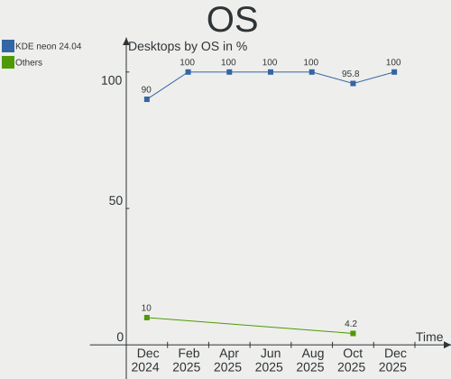

| Name           | Desktops | Percent |
|----------------|----------|---------|
| KDE neon 24.04 | 27       | 100%    |

OS Family
---------

OS without a version

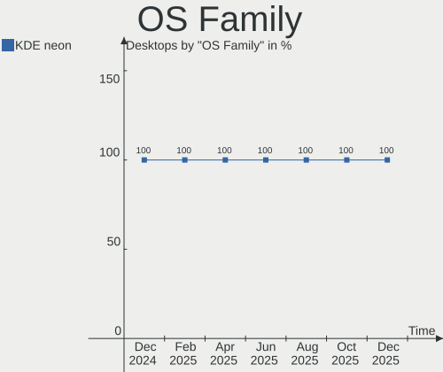

| Name     | Desktops | Percent |
|----------|----------|---------|
| KDE neon | 27       | 100%    |

Kernel
------

Version of the Linux kernel

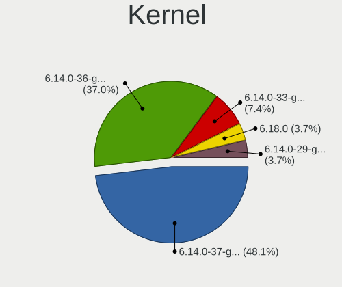

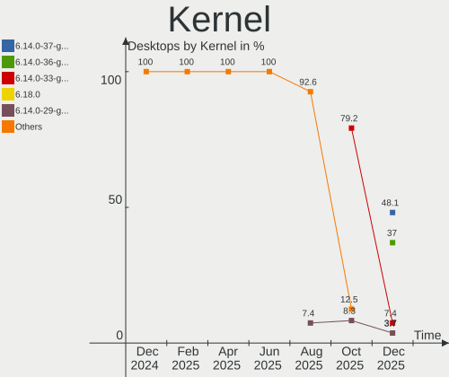

| Version           | Desktops | Percent |
|-------------------|----------|---------|
| 6.14.0-37-generic | 13       | 48.15%  |
| 6.14.0-36-generic | 10       | 37.04%  |
| 6.14.0-33-generic | 2        | 7.41%   |
| 6.18.0            | 1        | 3.7%    |
| 6.14.0-29-generic | 1        | 3.7%    |

Kernel Family
-------------

Linux kernel without a distro release

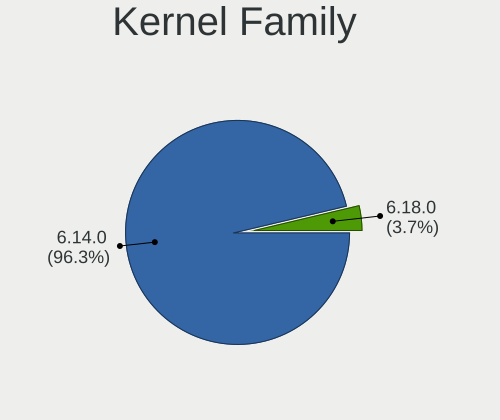

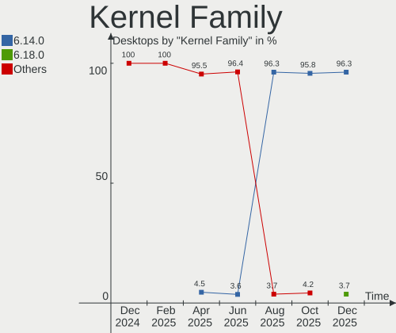

| Version | Desktops | Percent |
|---------|----------|---------|
| 6.14.0  | 26       | 96.3%   |
| 6.18.0  | 1        | 3.7%    |

Kernel Major Ver.
-----------------

Linux kernel major version

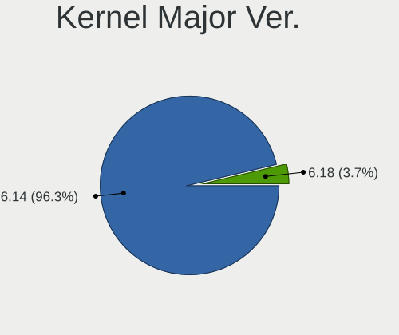

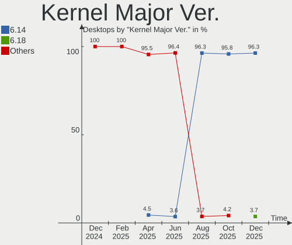

| Version | Desktops | Percent |
|---------|----------|---------|
| 6.14    | 26       | 96.3%   |
| 6.18    | 1        | 3.7%    |

Arch
----

OS architecture (x86_64, i586, etc.)

| Name   | Desktops | Percent |
|--------|----------|---------|
| x86_64 | 27       | 100%    |

DE
--

Desktop Environment

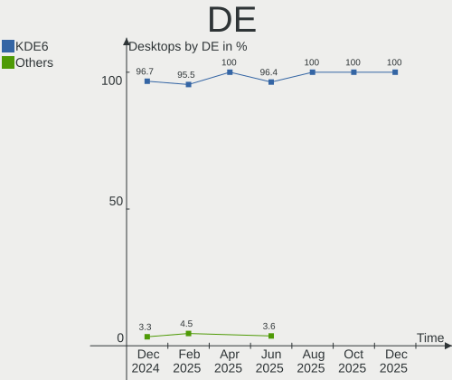

| Name | Desktops | Percent |
|------|----------|---------|
| KDE6 | 27       | 100%    |

Display Server
--------------

X11 or Wayland

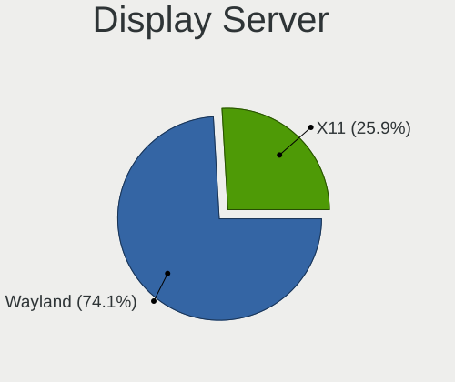

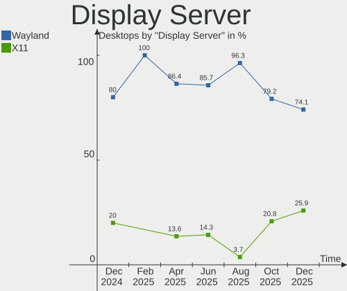

| Name    | Desktops | Percent |
|---------|----------|---------|
| Wayland | 20       | 74.07%  |
| X11     | 7        | 25.93%  |

Display Manager
---------------

SDDM, LightDM, etc.

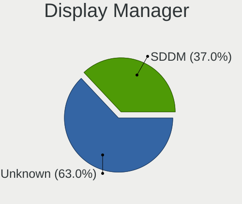

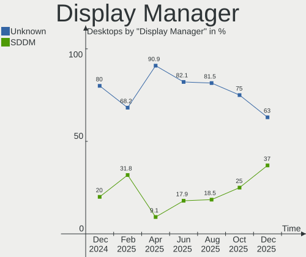

| Name    | Desktops | Percent |
|---------|----------|---------|
| Unknown | 17       | 62.96%  |
| SDDM    | 10       | 37.04%  |

OS Lang
-------

Language

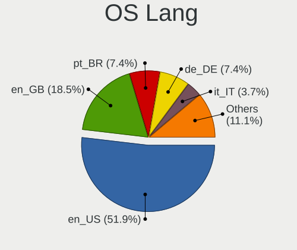

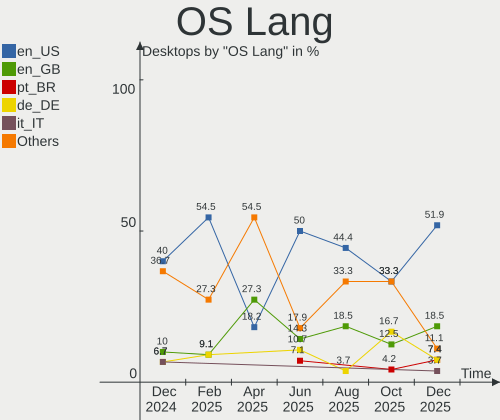

| Lang  | Desktops | Percent |
|-------|----------|---------|
| en_US | 14       | 51.85%  |
| en_GB | 5        | 18.52%  |
| pt_BR | 2        | 7.41%   |
| de_DE | 2        | 7.41%   |
| it_IT | 1        | 3.7%    |
| fr_FR | 1        | 3.7%    |
| es_ES | 1        | 3.7%    |
| en_CA | 1        | 3.7%    |

Boot Mode
---------

EFI or BIOS

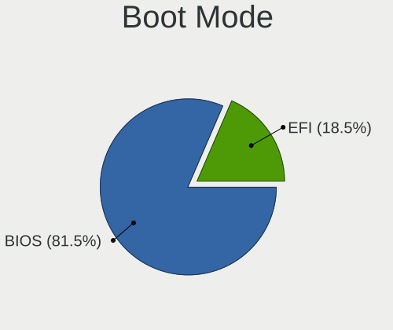

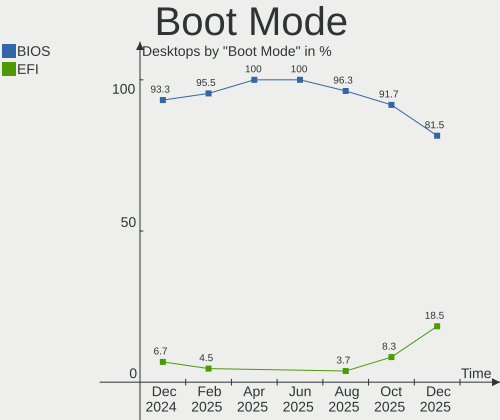

| Mode | Desktops | Percent |
|------|----------|---------|
| BIOS | 22       | 81.48%  |
| EFI  | 5        | 18.52%  |

Filesystem
----------

Type of filesystem

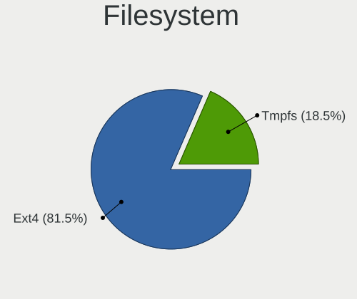

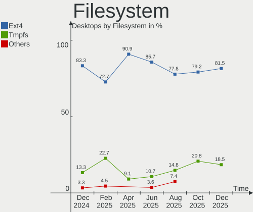

| Type  | Desktops | Percent |
|-------|----------|---------|
| Ext4  | 22       | 81.48%  |
| Tmpfs | 5        | 18.52%  |

Part. scheme
------------

Scheme of partitioning

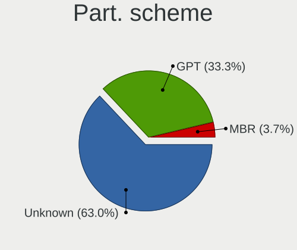

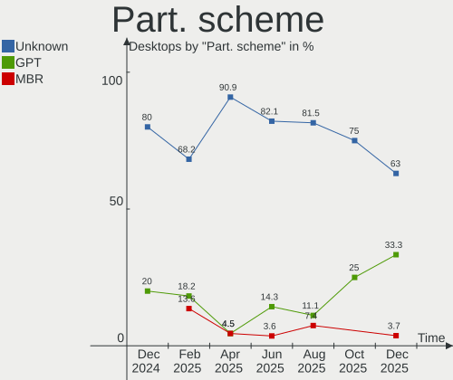

| Type    | Desktops | Percent |
|---------|----------|---------|
| Unknown | 17       | 62.96%  |
| GPT     | 9        | 33.33%  |
| MBR     | 1        | 3.7%    |

Dual Boot with Linux/BSD
------------------------

Hosting more than one Linux/BSD

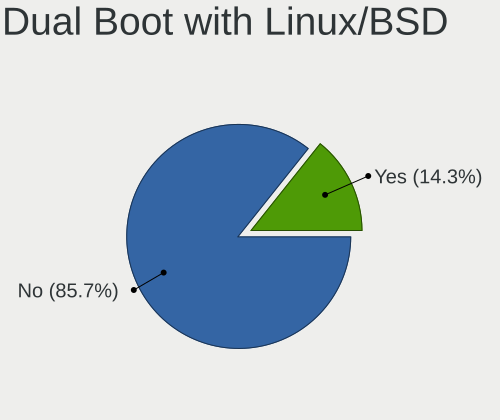

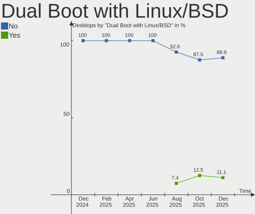

| Dual boot | Desktops | Percent |
|-----------|----------|---------|
| No        | 24       | 88.89%  |
| Yes       | 3        | 11.11%  |

Dual Boot (Win)
---------------

Hosting Linux and Windows

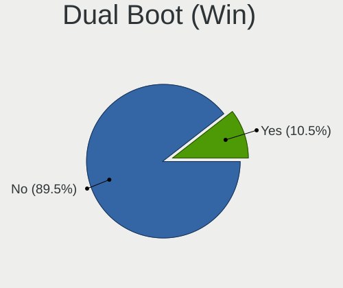

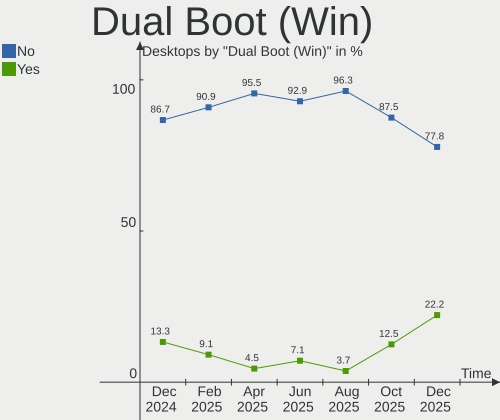

| Dual boot | Desktops | Percent |
|-----------|----------|---------|
| No        | 21       | 77.78%  |
| Yes       | 6        | 22.22%  |

Board
-----

Vendor
------

Motherboard manufacturer

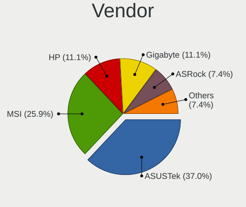

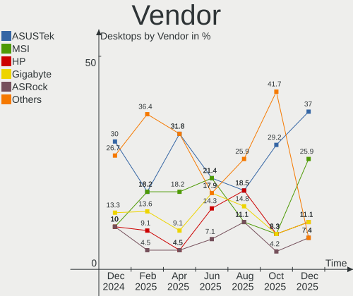

| Name                | Desktops | Percent |
|---------------------|----------|---------|
| ASUSTek Computer    | 10       | 37.04%  |
| MSI                 | 7        | 25.93%  |
| Hewlett-Packard     | 3        | 11.11%  |
| Gigabyte Technology | 3        | 11.11%  |
| ASRock              | 2        | 7.41%   |
| MACHINIST           | 1        | 3.7%    |
| Dell                | 1        | 3.7%    |

Model
-----

Motherboard model

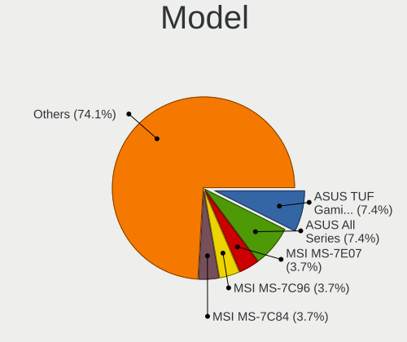

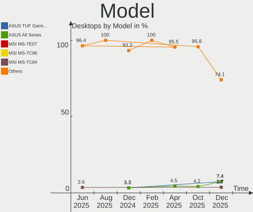

| Name                                   | Desktops | Percent |
|----------------------------------------|----------|---------|
| ASUS TUF Gaming X570-PLUS              | 2        | 7.41%   |
| ASUS All Series                        | 2        | 7.41%   |
| MSI MS-7E07                            | 1        | 3.7%    |
| MSI MS-7C96                            | 1        | 3.7%    |
| MSI MS-7C84                            | 1        | 3.7%    |
| MSI MS-7C56                            | 1        | 3.7%    |
| MSI MS-7B49                            | 1        | 3.7%    |
| MSI MS-7A33                            | 1        | 3.7%    |
| MSI MS-7917                            | 1        | 3.7%    |
| MACHINIST X99 B9                       | 1        | 3.7%    |
| HP EliteDesk 800 G3 TWR                | 1        | 3.7%    |
| HP EliteDesk 705 G1 SFF                | 1        | 3.7%    |
| HP Compaq dc7900 Convertible Minitower | 1        | 3.7%    |
| Gigabyte GA-MA78GM-UD2H                | 1        | 3.7%    |
| Gigabyte B650 AORUS ELITE AX           | 1        | 3.7%    |
| Gigabyte B550 AORUS PRO AC             | 1        | 3.7%    |
| Dell XPS 8700                          | 1        | 3.7%    |
| ASUS TUF Gaming B550M-PLUS             | 1        | 3.7%    |
| ASUS ROG STRIX Z790-F GAMING WIFI      | 1        | 3.7%    |
| ASUS ROG STRIX X570-F GAMING           | 1        | 3.7%    |
| ASUS ProArt X570-CREATOR WIFI          | 1        | 3.7%    |
| ASUS M5A78L-M LX/BR                    | 1        | 3.7%    |
| ASUS H170-PRO                          | 1        | 3.7%    |
| ASRock Z790 Pro RS                     | 1        | 3.7%    |
| ASRock B450 Steel Legend               | 1        | 3.7%    |

Model Family
------------

Motherboard model prefix

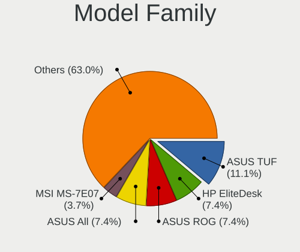

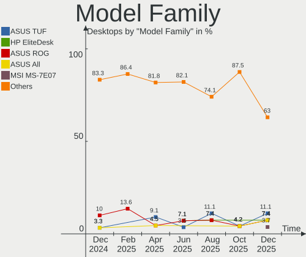

| Name                    | Desktops | Percent |
|-------------------------|----------|---------|
| ASUS TUF                | 3        | 11.11%  |
| HP EliteDesk            | 2        | 7.41%   |
| ASUS ROG                | 2        | 7.41%   |
| ASUS All                | 2        | 7.41%   |
| MSI MS-7E07             | 1        | 3.7%    |
| MSI MS-7C96             | 1        | 3.7%    |
| MSI MS-7C84             | 1        | 3.7%    |
| MSI MS-7C56             | 1        | 3.7%    |
| MSI MS-7B49             | 1        | 3.7%    |
| MSI MS-7A33             | 1        | 3.7%    |
| MSI MS-7917             | 1        | 3.7%    |
| MACHINIST X99           | 1        | 3.7%    |
| HP Compaq               | 1        | 3.7%    |
| Gigabyte GA-MA78GM-UD2H | 1        | 3.7%    |
| Gigabyte B650           | 1        | 3.7%    |
| Gigabyte B550           | 1        | 3.7%    |
| Dell XPS                | 1        | 3.7%    |
| ASUS ProArt             | 1        | 3.7%    |
| ASUS M5A78L-M           | 1        | 3.7%    |
| ASUS H170-PRO           | 1        | 3.7%    |
| ASRock Z790             | 1        | 3.7%    |
| ASRock B450             | 1        | 3.7%    |

MFG Year
--------

Motherboard manufacture year

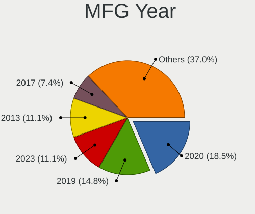

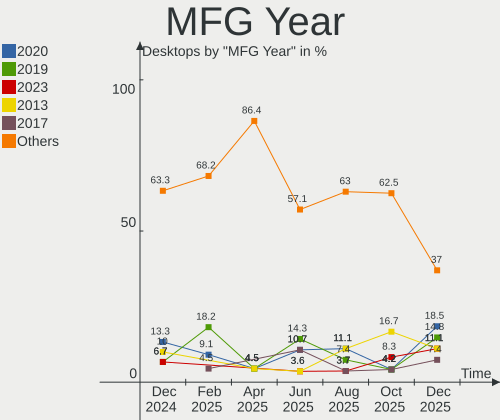

| Year | Desktops | Percent |
|------|----------|---------|
| 2020 | 5        | 18.52%  |
| 2019 | 4        | 14.81%  |
| 2023 | 3        | 11.11%  |
| 2013 | 3        | 11.11%  |
| 2017 | 2        | 7.41%   |
| 2014 | 2        | 7.41%   |
| 2024 | 1        | 3.7%    |
| 2022 | 1        | 3.7%    |
| 2021 | 1        | 3.7%    |
| 2018 | 1        | 3.7%    |
| 2015 | 1        | 3.7%    |
| 2011 | 1        | 3.7%    |
| 2009 | 1        | 3.7%    |
| 2008 | 1        | 3.7%    |

Form Factor
-----------

Physical design of the computer

| Name    | Desktops | Percent |
|---------|----------|---------|
| Desktop | 27       | 100%    |

Secure Boot
-----------

Enabled or disabled

| State    | Desktops | Percent |
|----------|----------|---------|
| Disabled | 27       | 100%    |

Coreboot
--------

Have coreboot on board

| Used | Desktops | Percent |
|------|----------|---------|
| No   | 27       | 100%    |

RAM Size
--------

Total RAM memory

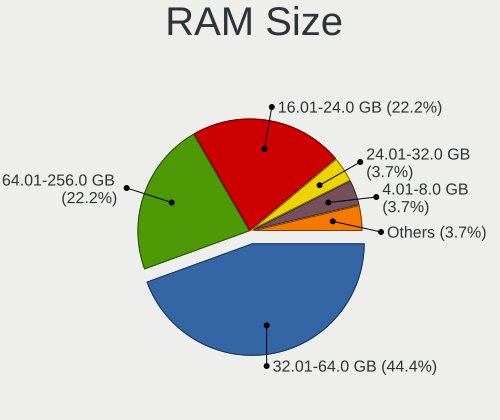

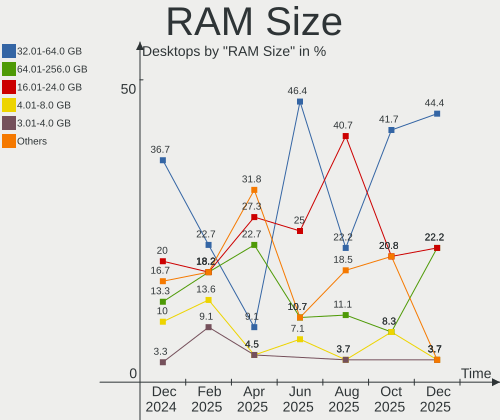

| Size in GB  | Desktops | Percent |
|-------------|----------|---------|
| 32.01-64.0  | 12       | 44.44%  |
| 64.01-256.0 | 6        | 22.22%  |
| 16.01-24.0  | 6        | 22.22%  |
| 4.01-8.0    | 1        | 3.7%    |
| 3.01-4.0    | 1        | 3.7%    |
| 24.01-32.0  | 1        | 3.7%    |

RAM Used
--------

Used RAM memory

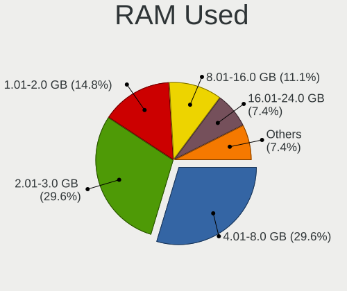

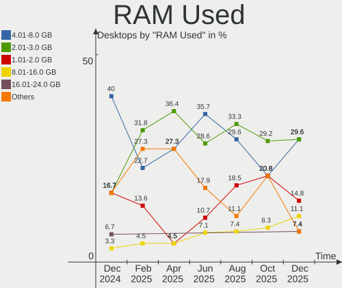

| Used GB    | Desktops | Percent |
|------------|----------|---------|
| 4.01-8.0   | 8        | 29.63%  |
| 2.01-3.0   | 8        | 29.63%  |
| 1.01-2.0   | 4        | 14.81%  |
| 8.01-16.0  | 3        | 11.11%  |
| 16.01-24.0 | 2        | 7.41%   |
| 3.01-4.0   | 1        | 3.7%    |
| 24.01-32.0 | 1        | 3.7%    |

Total Drives
------------

Number of drives on board

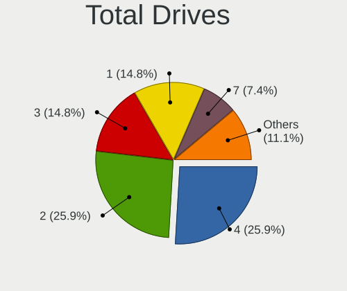

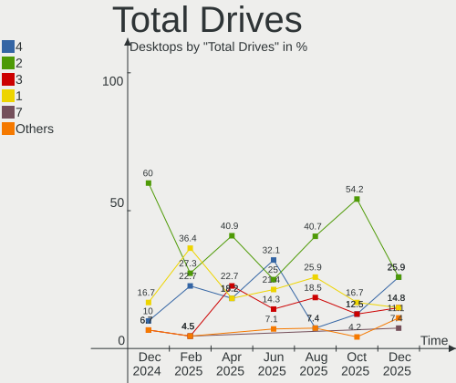

| Drives | Desktops | Percent |
|--------|----------|---------|
| 4      | 7        | 25.93%  |
| 2      | 7        | 25.93%  |
| 3      | 4        | 14.81%  |
| 1      | 4        | 14.81%  |
| 7      | 2        | 7.41%   |
| 5      | 2        | 7.41%   |
| 6      | 1        | 3.7%    |

Has CD-ROM
----------

Has CD-ROM on board

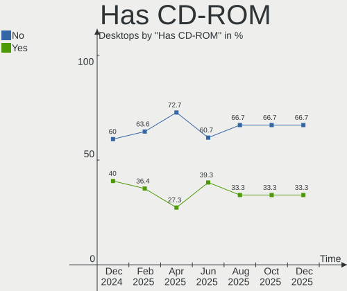

| Presented | Desktops | Percent |
|-----------|----------|---------|
| No        | 18       | 66.67%  |
| Yes       | 9        | 33.33%  |

Has Ethernet
------------

Has Ethernet on board

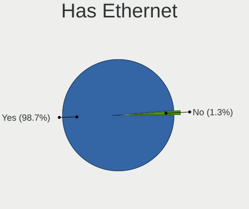

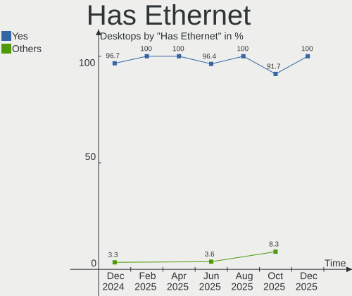

| Presented | Desktops | Percent |
|-----------|----------|---------|
| Yes       | 27       | 100%    |

Has WiFi
--------

Has WiFi module

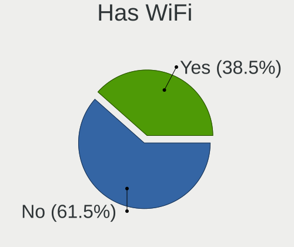

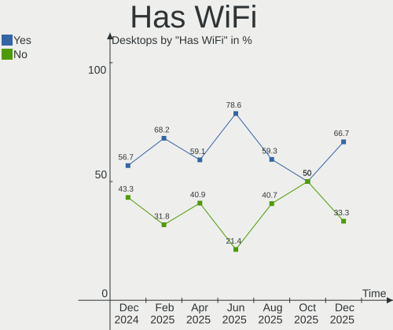

| Presented | Desktops | Percent |
|-----------|----------|---------|
| Yes       | 18       | 66.67%  |
| No        | 9        | 33.33%  |

Has Bluetooth
-------------

Has Bluetooth module

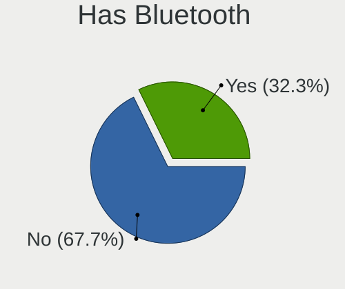

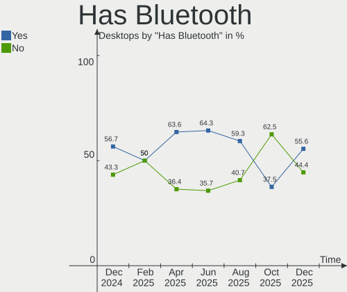

| Presented | Desktops | Percent |
|-----------|----------|---------|
| Yes       | 15       | 55.56%  |
| No        | 12       | 44.44%  |

Location
--------

Country
-------

Geographic location (country)

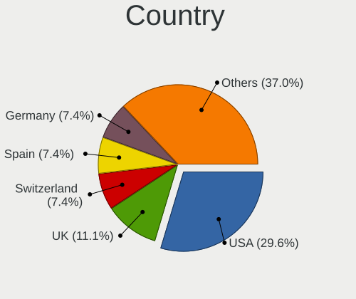

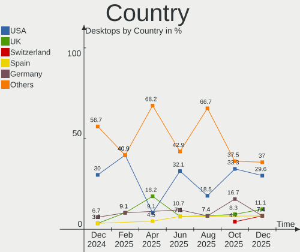

| Country         | Desktops | Percent |
|-----------------|----------|---------|
| USA             | 8        | 29.63%  |
| UK              | 3        | 11.11%  |
| Switzerland     | 2        | 7.41%   |
| Spain           | 2        | 7.41%   |
| Germany         | 2        | 7.41%   |
| France          | 2        | 7.41%   |
| Brazil          | 2        | 7.41%   |
| The Netherlands | 1        | 3.7%    |
| Sweden          | 1        | 3.7%    |
| Italy           | 1        | 3.7%    |
| Egypt           | 1        | 3.7%    |
| Canada          | 1        | 3.7%    |
| Bulgaria        | 1        | 3.7%    |

City
----

Geographic location (city)

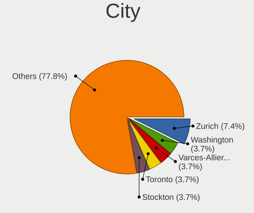

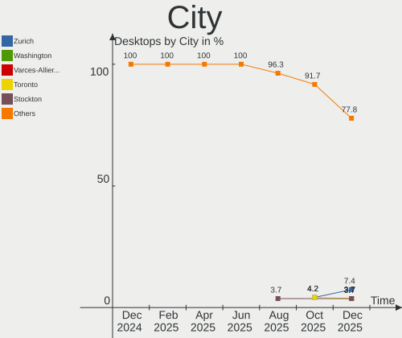

| City                      | Desktops | Percent |
|---------------------------|----------|---------|
| Zurich                    | 2        | 7.41%   |
| Washington                | 1        | 3.7%    |
| Varces-Allieres-et-Risset | 1        | 3.7%    |
| Toronto                   | 1        | 3.7%    |
| Stockton                  | 1        | 3.7%    |
| Sao José dos Campos      | 1        | 3.7%    |
| Sandanski                 | 1        | 3.7%    |
| Salerno                   | 1        | 3.7%    |
| Purley                    | 1        | 3.7%    |
| Paris                     | 1        | 3.7%    |
| Norwood                   | 1        | 3.7%    |
| Newmarket                 | 1        | 3.7%    |
| Maringá                  | 1        | 3.7%    |
| Las Vegas                 | 1        | 3.7%    |
| Lansing                   | 1        | 3.7%    |
| La Victoria de Acentejo   | 1        | 3.7%    |
| Kannapolis                | 1        | 3.7%    |
| Hull                      | 1        | 3.7%    |
| Hamburg                   | 1        | 3.7%    |
| Gothenburg                | 1        | 3.7%    |
| Frankfurt am Main         | 1        | 3.7%    |
| Fowlerville               | 1        | 3.7%    |
| Edgware                   | 1        | 3.7%    |
| Drachten                  | 1        | 3.7%    |
| Cairo                     | 1        | 3.7%    |
| Almería                  | 1        | 3.7%    |

Drives
------

Drive Vendor
------------

Hard drive vendors

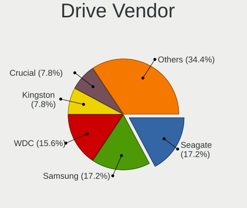

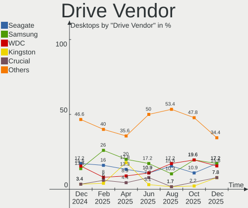

| Vendor                | Desktops | Drives | Percent |
|-----------------------|----------|--------|---------|
| Seagate               | 11       | 15     | 17.19%  |
| Samsung Electronics   | 11       | 19     | 17.19%  |
| WDC                   | 10       | 15     | 15.63%  |
| Kingston              | 5        | 6      | 7.81%   |
| Crucial               | 5        | 10     | 7.81%   |
| Sandisk               | 4        | 5      | 6.25%   |
| Realtek Semiconductor | 2        | 2      | 3.13%   |
| Patriot               | 2        | 2      | 3.13%   |
| OCZ                   | 2        | 2      | 3.13%   |
| LITEONIT              | 2        | 2      | 3.13%   |
| HGST                  | 2        | 2      | 3.13%   |
| SPCC                  | 1        | 1      | 1.56%   |
| Phison Electronics    | 1        | 1      | 1.56%   |
| Micron Technology     | 1        | 1      | 1.56%   |
| Intenso               | 1        | 1      | 1.56%   |
| Intel                 | 1        | 2      | 1.56%   |
| Hitachi               | 1        | 1      | 1.56%   |
| Corsair               | 1        | 1      | 1.56%   |
| ADATA Technology      | 1        | 1      | 1.56%   |

Drive Model
-----------

Hard drive models

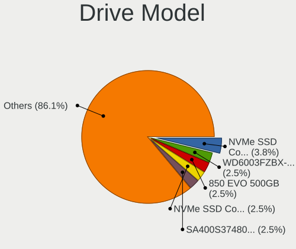

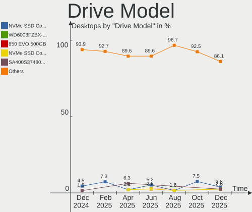

| Model                                                 | Desktops | Percent |
|-------------------------------------------------------|----------|---------|
| Samsung NVMe SSD Controller SM981/PM981/PM983 1TB     | 3        | 3.8%    |
| WDC WD6003FZBX-00K5WB0 6TB                            | 2        | 2.53%   |
| Samsung SSD 850 EVO 500GB                             | 2        | 2.53%   |
| Samsung NVMe SSD Controller PM9A1/PM9A3/980PRO 1TB    | 2        | 2.53%   |
| Kingston SA400S37480G 480GB SSD                       | 2        | 2.53%   |
| HGST HTS721010A9E630 1TB                              | 2        | 2.53%   |
| Crucial CT1000MX500SSD1 1TB                           | 2        | 2.53%   |
| WDC WDS200T2B0A-00SM50 2TB SSD                        | 1        | 1.27%   |
| WDC WD60EZAZ-22SF3B0 6TB                              | 1        | 1.27%   |
| WDC WD60EFRX-68MYMN1 6TB                              | 1        | 1.27%   |
| WDC WD5000AADS-00M2B0 500GB                           | 1        | 1.27%   |
| WDC WD4000FYYZ-01UL1B3 4TB                            | 1        | 1.27%   |
| WDC WD30EZRZ-00Z5HB0 3TB                              | 1        | 1.27%   |
| WDC WD3003FZEX-00Z4SA0 3TB                            | 1        | 1.27%   |
| WDC WD2003FZEX-00SRLA0 2TB                            | 1        | 1.27%   |
| WDC WD10EZEX-08WN4A0 1TB                              | 1        | 1.27%   |
| WDC WD10EZEX-00BN5A0 1TB                              | 1        | 1.27%   |
| WDC WD My Passport 264F 1TB                           | 1        | 1.27%   |
| WDC WD Blue SA510 2.5 1TB SSD                         | 1        | 1.27%   |
| SPCC Solid State Disk 512GB                           | 1        | 1.27%   |
| Seagate ST9500325AS 500GB                             | 1        | 1.27%   |
| Seagate ST500DM002-1SB10A 500GB                       | 1        | 1.27%   |
| Seagate ST5000DM000-1FK178 5TB                        | 1        | 1.27%   |
| Seagate ST4000VX016-3CV104 4TB                        | 1        | 1.27%   |
| Seagate ST3500312CS 500GB                             | 1        | 1.27%   |
| Seagate ST3320418AS 320GB                             | 1        | 1.27%   |
| Seagate ST2000DX001-1NS164 2TB                        | 1        | 1.27%   |
| Seagate ST2000DM001-1CH164 2TB                        | 1        | 1.27%   |
| Seagate ST18000NT001-3NF101 18TB                      | 1        | 1.27%   |
| Seagate ST1000LM049-2GH172 1TB                        | 1        | 1.27%   |
| Seagate ST1000LM024 HN-M101MBB 1TB                    | 1        | 1.27%   |
| Seagate ST1000DM003-1SB102 1TB                        | 1        | 1.27%   |
| Seagate Expansion Desk 4TB                            | 1        | 1.27%   |
| Sandisk WD Black SN750 / PC SN730 NVMe SSD 500GB      | 1        | 1.27%   |
| Sandisk WD Black 2018/SN750 / PC SN720 NVMe SSD 512GB | 1        | 1.27%   |
| SanDisk SDSSDHII960G 960GB                            | 1        | 1.27%   |
| SanDisk SD8SN8U-256G-1006 256GB SSD                   | 1        | 1.27%   |
| SanDisk NVMe SSD Drive 2TB                            | 1        | 1.27%   |
| Samsung SSD 990 PRO 2TB                               | 1        | 1.27%   |
| Samsung SSD 990 PRO 1TB                               | 1        | 1.27%   |

HDD Vendor
----------

Hard disk drive vendors

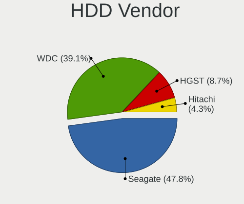

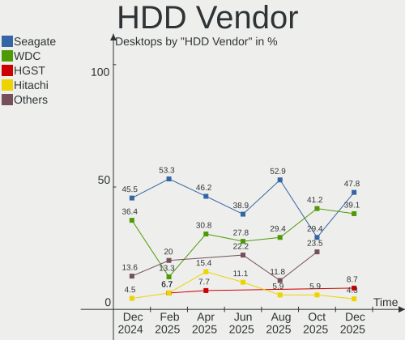

| Vendor  | Desktops | Drives | Percent |
|---------|----------|--------|---------|
| Seagate | 11       | 15     | 47.83%  |
| WDC     | 9        | 12     | 39.13%  |
| HGST    | 2        | 2      | 8.7%    |
| Hitachi | 1        | 1      | 4.35%   |

SSD Vendor
----------

Solid state drive vendors

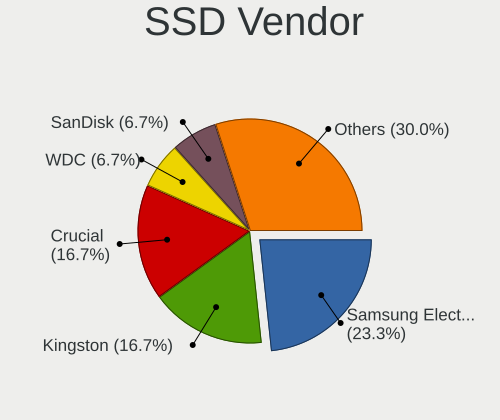

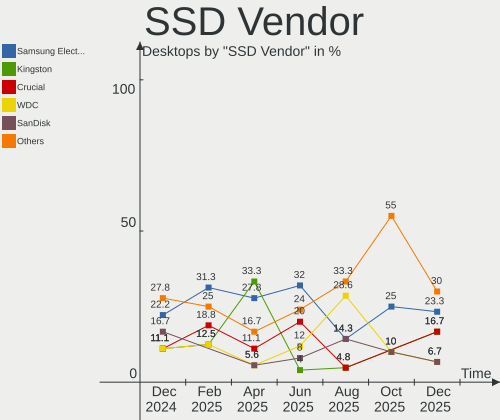

| Vendor              | Desktops | Drives | Percent |
|---------------------|----------|--------|---------|
| Samsung Electronics | 7        | 9      | 23.33%  |
| Kingston            | 5        | 6      | 16.67%  |
| Crucial             | 5        | 10     | 16.67%  |
| WDC                 | 2        | 2      | 6.67%   |
| SanDisk             | 2        | 2      | 6.67%   |
| Patriot             | 2        | 2      | 6.67%   |
| OCZ                 | 2        | 2      | 6.67%   |
| LITEONIT            | 2        | 2      | 6.67%   |
| SPCC                | 1        | 1      | 3.33%   |
| Micron Technology   | 1        | 1      | 3.33%   |
| Intenso             | 1        | 1      | 3.33%   |

Drive Kind
----------

HDD or SSD

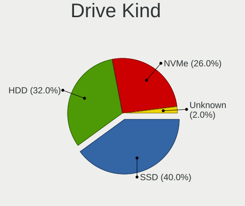

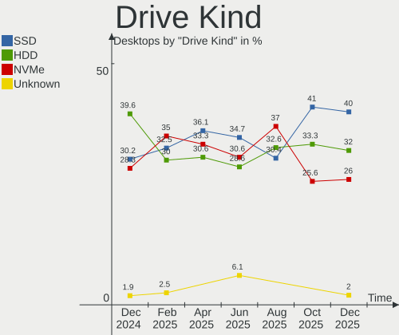

| Kind    | Desktops | Drives | Percent |
|---------|----------|--------|---------|
| SSD     | 20       | 38     | 40%     |
| HDD     | 16       | 30     | 32%     |
| NVMe    | 13       | 20     | 26%     |
| Unknown | 1        | 1      | 2%      |

Drive Connector
---------------

SATA, SAS, NVMe, etc.

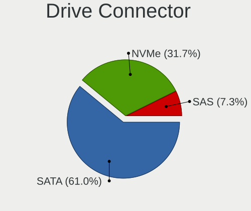

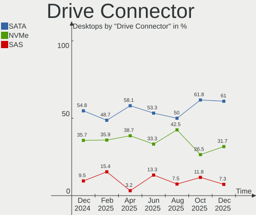

| Type | Desktops | Drives | Percent |
|------|----------|--------|---------|
| SATA | 25       | 65     | 60.98%  |
| NVMe | 13       | 20     | 31.71%  |
| SAS  | 3        | 4      | 7.32%   |

Drive Size
----------

Size of hard drive

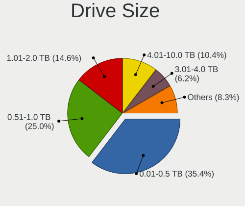

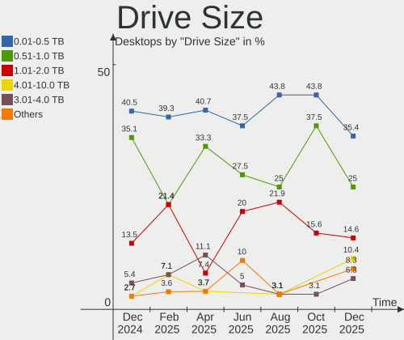

| Size in TB | Desktops | Drives | Percent |
|------------|----------|--------|---------|
| 0.01-0.5   | 17       | 24     | 35.42%  |
| 0.51-1.0   | 12       | 20     | 25%     |
| 1.01-2.0   | 7        | 10     | 14.58%  |
| 4.01-10.0  | 5        | 6      | 10.42%  |
| 3.01-4.0   | 3        | 3      | 6.25%   |
| 2.01-3.0   | 3        | 3      | 6.25%   |
| 10.01-20.0 | 1        | 2      | 2.08%   |

Space Total
-----------

Amount of disk space available on the file system

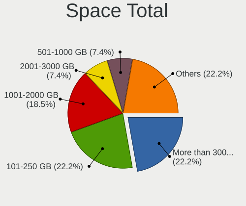

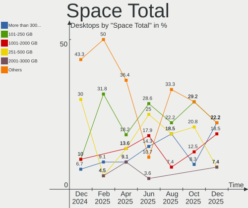

| Size in GB     | Desktops | Percent |
|----------------|----------|---------|
| More than 3000 | 6        | 22.22%  |
| 101-250        | 6        | 22.22%  |
| 1001-2000      | 5        | 18.52%  |
| 251-500        | 2        | 7.41%   |
| 2001-3000      | 2        | 7.41%   |
| 1-20           | 2        | 7.41%   |
| 501-1000       | 2        | 7.41%   |
| 21-50          | 1        | 3.7%    |
| 51-100         | 1        | 3.7%    |

Space Used
----------

Amount of used disk space

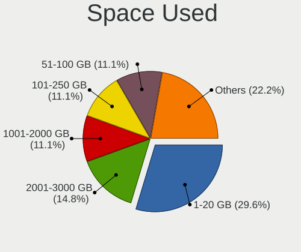

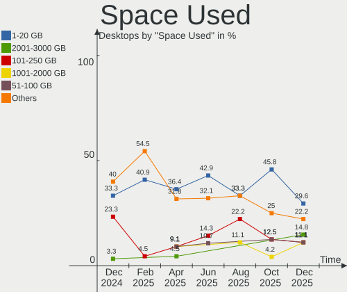

| Used GB        | Desktops | Percent |
|----------------|----------|---------|
| 1-20           | 8        | 29.63%  |
| 2001-3000      | 4        | 14.81%  |
| 101-250        | 3        | 11.11%  |
| 1001-2000      | 3        | 11.11%  |
| 51-100         | 3        | 11.11%  |
| More than 3000 | 2        | 7.41%   |
| 251-500        | 2        | 7.41%   |
| 21-50          | 1        | 3.7%    |
| 501-1000       | 1        | 3.7%    |

Malfunc. Drives
---------------

Drive models with a malfunction

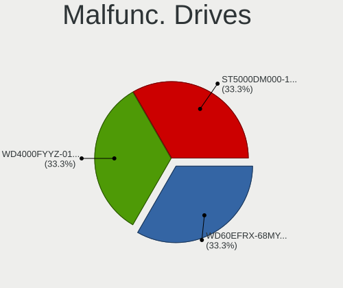

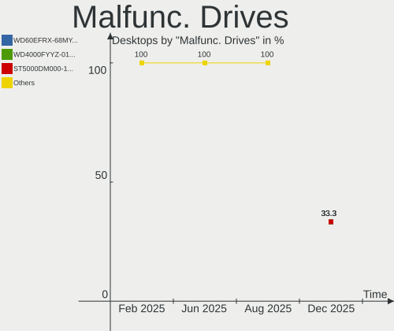

| Model                          | Desktops | Drives | Percent |
|--------------------------------|----------|--------|---------|
| WDC WD60EFRX-68MYMN1 6TB       | 1        | 2      | 33.33%  |
| WDC WD4000FYYZ-01UL1B3 4TB     | 1        | 1      | 33.33%  |
| Seagate ST5000DM000-1FK178 5TB | 1        | 1      | 33.33%  |

Malfunc. Drive Vendor
---------------------

Vendors of faulty drives

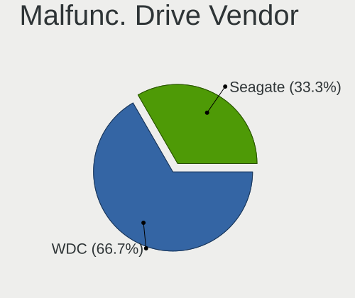

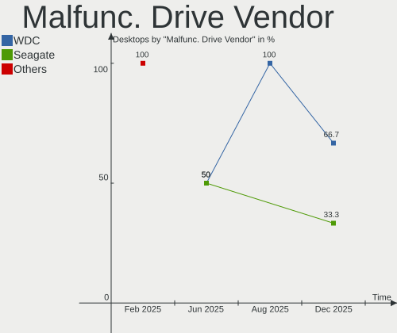

| Vendor  | Desktops | Drives | Percent |
|---------|----------|--------|---------|
| WDC     | 2        | 3      | 66.67%  |
| Seagate | 1        | 1      | 33.33%  |

Malfunc. HDD Vendor
-------------------

Vendors of faulty HDD drives

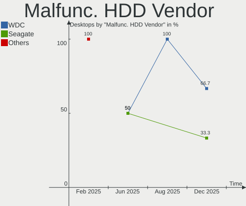

| Vendor  | Desktops | Drives | Percent |
|---------|----------|--------|---------|
| WDC     | 2        | 3      | 66.67%  |
| Seagate | 1        | 1      | 33.33%  |

Malfunc. Drive Kind
-------------------

Kinds of faulty drives

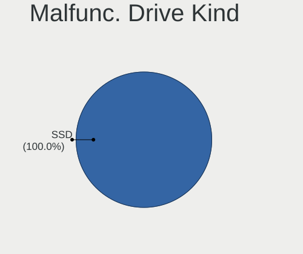

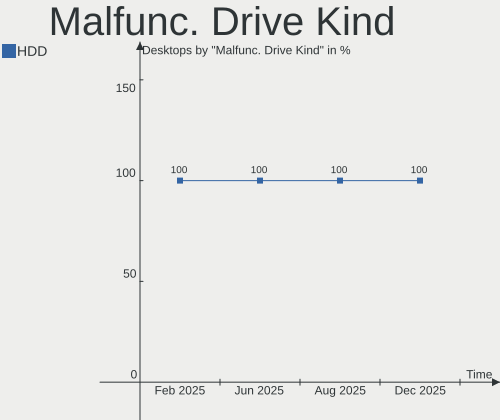

| Kind | Desktops | Drives | Percent |
|------|----------|--------|---------|
| HDD  | 3        | 4      | 100%    |

Failed Drives
-------------

Failed drive models

Zero info for selected period =(

Failed Drive Vendor
-------------------

Failed drive vendors

Zero info for selected period =(

Drive Status
------------

Number of failed and malfunc. drives

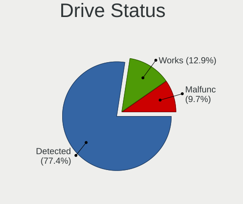

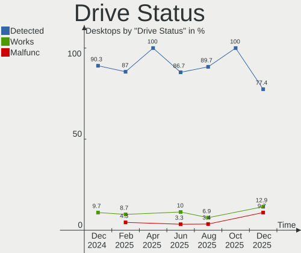

| Status   | Desktops | Drives | Percent |
|----------|----------|--------|---------|
| Detected | 24       | 65     | 77.42%  |
| Works    | 4        | 20     | 12.9%   |
| Malfunc  | 3        | 4      | 9.68%   |

Storage controller
------------------

Storage Vendor
--------------

Storage controller vendors

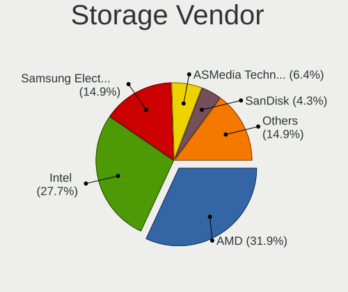

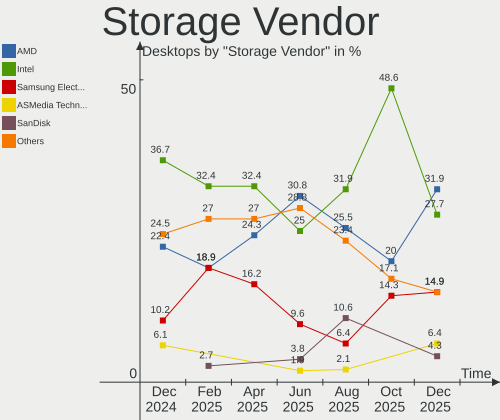

| Vendor                    | Desktops | Percent |
|---------------------------|----------|---------|
| AMD                       | 15       | 31.91%  |
| Intel                     | 13       | 27.66%  |
| Samsung Electronics       | 7        | 14.89%  |
| ASMedia Technology        | 3        | 6.38%   |
| SanDisk                   | 2        | 4.26%   |
| Realtek Semiconductor     | 2        | 4.26%   |
| Phison Electronics        | 2        | 4.26%   |
| LSI Logic / Symbios Logic | 2        | 4.26%   |
| ADATA Technology          | 1        | 2.13%   |

Storage Model
-------------

Storage controller models

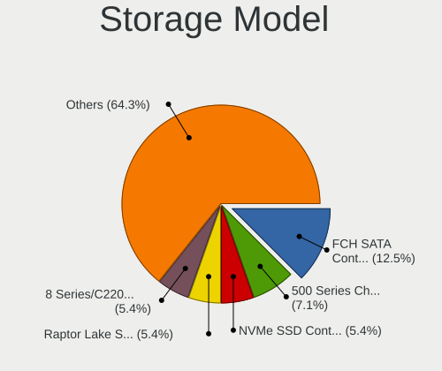

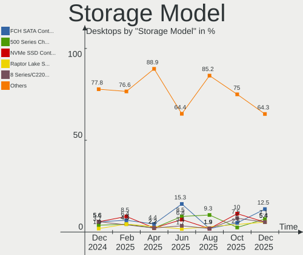

| Model                                                                          | Desktops | Percent |
|--------------------------------------------------------------------------------|----------|---------|
| AMD FCH SATA Controller [AHCI mode]                                            | 7        | 12.5%   |
| AMD 500 Series Chipset SATA Controller                                         | 4        | 7.14%   |
| Samsung NVMe SSD Controller SM981/PM981/PM983                                  | 3        | 5.36%   |
| Intel Raptor Lake SATA AHCI Controller                                         | 3        | 5.36%   |
| Intel 8 Series/C220 Series Chipset Family 6-port SATA Controller 1 [AHCI mode] | 3        | 5.36%   |
| ASMedia ASM1061/ASM1062 Serial ATA Controller                                  | 3        | 5.36%   |
| Samsung NVMe SSD Controller S4LV008[Pascal]                                    | 2        | 3.57%   |
| Samsung NVMe SSD Controller PM9A1/PM9A3/980PRO                                 | 2        | 3.57%   |
| Realtek RTS5765DL NVMe SSD Controller (DRAM-less)                              | 2        | 3.57%   |
| LSI Logic / Symbios Logic 53c1030 PCI-X Fusion-MPT Dual Ultra320 SCSI          | 2        | 3.57%   |
| Intel 200 Series PCH SATA controller [AHCI mode]                               | 2        | 3.57%   |
| AMD SB7x0/SB8x0/SB9x0 SATA Controller [IDE mode]                               | 2        | 3.57%   |
| AMD SB7x0/SB8x0/SB9x0 IDE Controller                                           | 2        | 3.57%   |
| Sandisk WD Black SN850X NVMe SSD                                               | 1        | 1.79%   |
| SanDisk Extreme Pro / WD Black SN750 / PC SN730 / Red SN700 NVMe SSD           | 1        | 1.79%   |
| SanDisk Extreme Pro / WD Black 2018/SN750/PC SN720 NVMe SSD                    | 1        | 1.79%   |
| Samsung NVMe SSD Controller SM961/PM961/SM963                                  | 1        | 1.79%   |
| Samsung NVMe SSD Controller PM9C1a (DRAM-less)                                 | 1        | 1.79%   |
| Phison E16 PCIe4 NVMe Controller                                               | 1        | 1.79%   |
| Phison E12 NVMe Controller                                                     | 1        | 1.79%   |
| Intel SSD 660P Series                                                          | 1        | 1.79%   |
| Intel RST Volume Management Device Controller                                  | 1        | 1.79%   |
| Intel Q170/Q150/B150/H170/H110/Z170/CM236 Chipset SATA Controller [AHCI Mode]  | 1        | 1.79%   |
| Intel C610/X99 series chipset 6-Port SATA Controller [AHCI mode]               | 1        | 1.79%   |
| Intel 9 Series Chipset Family SATA Controller [AHCI Mode]                      | 1        | 1.79%   |
| Intel 82801JD/DO (ICH10 Family) 4-port SATA IDE Controller                     | 1        | 1.79%   |
| Intel 82801JD/DO (ICH10 Family) 2-port SATA IDE Controller                     | 1        | 1.79%   |
| Intel 4 Series Chipset PT IDER Controller                                      | 1        | 1.79%   |
| AMD X370 Series Chipset SATA Controller                                        | 1        | 1.79%   |
| AMD 600 Series Chipset SATA Controller                                         | 1        | 1.79%   |
| AMD 400 Series Chipset SATA Controller                                         | 1        | 1.79%   |
| ADATA LEGEND 850 LITE NVMe SSD (DRAM-less)                                     | 1        | 1.79%   |

Storage Kind
------------

Kind of storage controller (IDE, SATA, NVMe, SAS, ...)

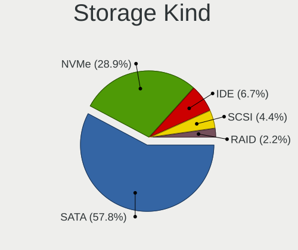

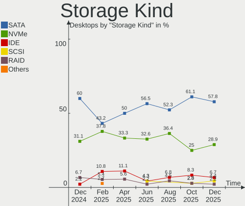

| Kind | Desktops | Percent |
|------|----------|---------|
| SATA | 26       | 57.78%  |
| NVMe | 13       | 28.89%  |
| IDE  | 3        | 6.67%   |
| SCSI | 2        | 4.44%   |
| RAID | 1        | 2.22%   |

Processor
---------

CPU Vendor
----------

Processor vendors

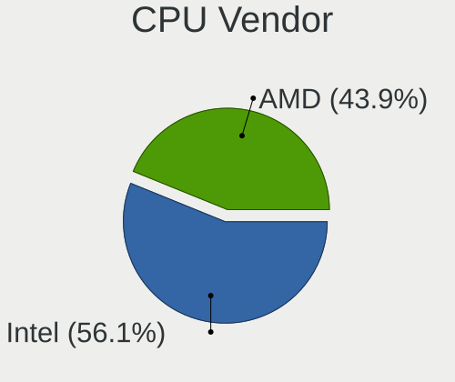

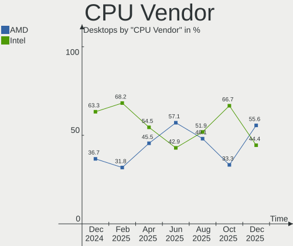

| Vendor | Desktops | Percent |
|--------|----------|---------|
| AMD    | 15       | 55.56%  |
| Intel  | 12       | 44.44%  |

CPU Model
---------

Processor models

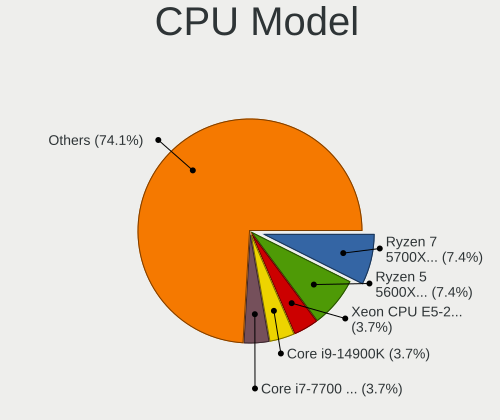

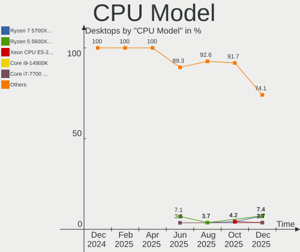

| Model                                        | Desktops | Percent |
|----------------------------------------------|----------|---------|
| AMD Ryzen 7 5700X 8-Core Processor           | 2        | 7.41%   |
| AMD Ryzen 5 5600X 6-Core Processor           | 2        | 7.41%   |
| Intel Xeon CPU E5-2680 v4 @ 2.40GHz          | 1        | 3.7%    |
| Intel Core i9-14900K                         | 1        | 3.7%    |
| Intel Core i7-7700 CPU @ 3.60GHz             | 1        | 3.7%    |
| Intel Core i7-4771 CPU @ 3.50GHz             | 1        | 3.7%    |
| Intel Core i7-4770K CPU @ 3.50GHz            | 1        | 3.7%    |
| Intel Core i7-4770 CPU @ 3.40GHz             | 1        | 3.7%    |
| Intel Core i5-8600K CPU @ 3.60GHz            | 1        | 3.7%    |
| Intel Core i5-6500 CPU @ 3.20GHz             | 1        | 3.7%    |
| Intel Core i5-4690K CPU @ 3.50GHz            | 1        | 3.7%    |
| Intel Core i5-14600K                         | 1        | 3.7%    |
| Intel Core 2 Duo CPU E8400 @ 3.00GHz         | 1        | 3.7%    |
| Intel 13th Gen Core i9-13900K                | 1        | 3.7%    |
| AMD Ryzen 9 5900X 12-Core Processor          | 1        | 3.7%    |
| AMD Ryzen 9 3900X 12-Core Processor          | 1        | 3.7%    |
| AMD Ryzen 7 7700X 8-Core Processor           | 1        | 3.7%    |
| AMD Ryzen 7 5800X 8-Core Processor           | 1        | 3.7%    |
| AMD Ryzen 7 3700X 8-Core Processor           | 1        | 3.7%    |
| AMD Ryzen 7 2700X Eight-Core Processor       | 1        | 3.7%    |
| AMD Ryzen 5 3600X 6-Core Processor           | 1        | 3.7%    |
| AMD Ryzen 5 3600 6-Core Processor            | 1        | 3.7%    |
| AMD Phenom II X6 1075T Processor             | 1        | 3.7%    |
| AMD FX-6300 Six-Core Processor               | 1        | 3.7%    |
| AMD A4 PRO-7300B APU with Radeon HD Graphics | 1        | 3.7%    |

CPU Model Family
----------------

Processor model prefix

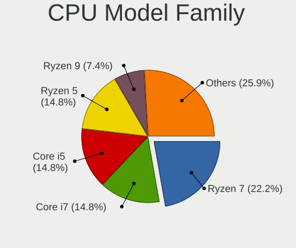

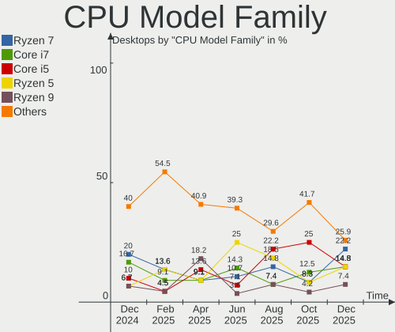

| Model            | Desktops | Percent |
|------------------|----------|---------|
| AMD Ryzen 7      | 6        | 22.22%  |
| Intel Core i7    | 4        | 14.81%  |
| Intel Core i5    | 4        | 14.81%  |
| AMD Ryzen 5      | 4        | 14.81%  |
| AMD Ryzen 9      | 2        | 7.41%   |
| Other            | 1        | 3.7%    |
| Intel Xeon       | 1        | 3.7%    |
| Intel Core i9    | 1        | 3.7%    |
| Intel Core 2 Duo | 1        | 3.7%    |
| AMD Phenom II X6 | 1        | 3.7%    |
| AMD FX           | 1        | 3.7%    |
| AMD A4           | 1        | 3.7%    |

CPU Cores
---------

Number of processor cores

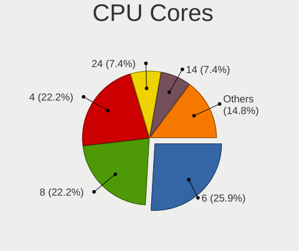

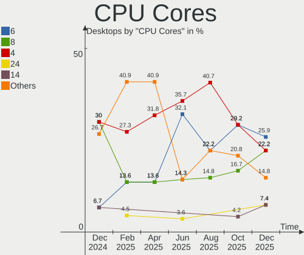

| Number | Desktops | Percent |
|--------|----------|---------|
| 6      | 7        | 25.93%  |
| 8      | 6        | 22.22%  |
| 4      | 6        | 22.22%  |
| 24     | 2        | 7.41%   |
| 14     | 2        | 7.41%   |
| 12     | 2        | 7.41%   |
| 2      | 2        | 7.41%   |

CPU Sockets
-----------

Number of sockets

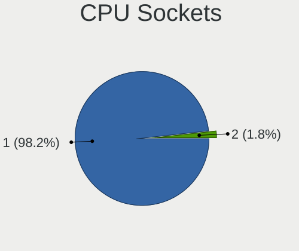

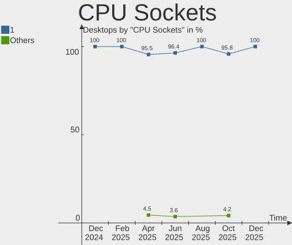

| Number | Desktops | Percent |
|--------|----------|---------|
| 1      | 27       | 100%    |

CPU Threads
-----------

Threads per core (Hyper-Threading)

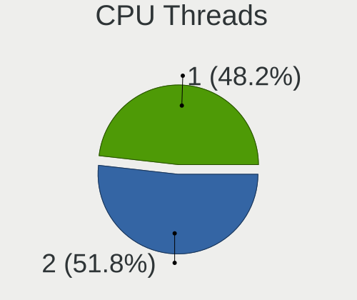

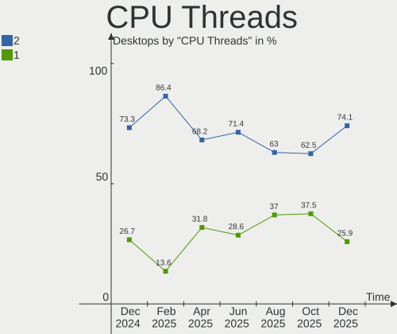

| Number | Desktops | Percent |
|--------|----------|---------|
| 2      | 20       | 74.07%  |
| 1      | 7        | 25.93%  |

CPU Op-Modes
------------

CPU Operation Modes (32-bit, 64-bit)

| Op mode        | Desktops | Percent |
|----------------|----------|---------|
| 32-bit, 64-bit | 27       | 100%    |

CPU Microcode
-------------

Microcode number

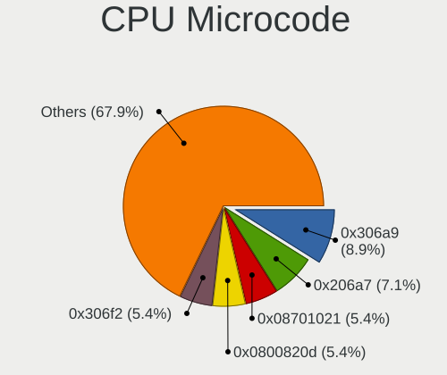

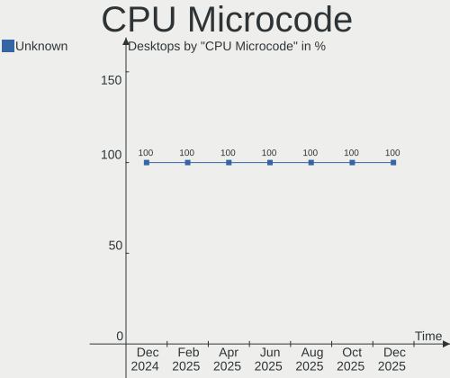

| Number  | Desktops | Percent |
|---------|----------|---------|
| Unknown | 27       | 100%    |

CPU Microarch
-------------

Microarchitecture

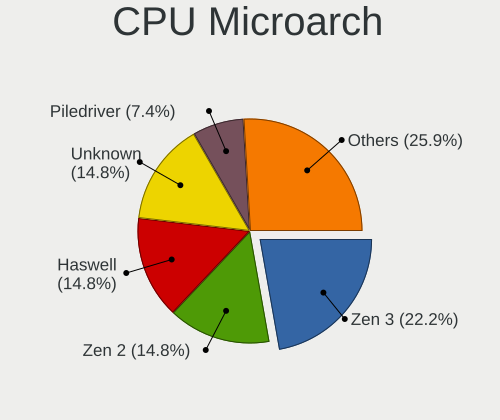

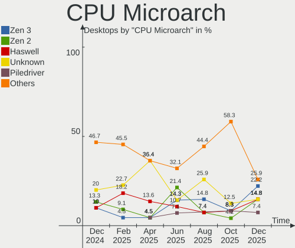

| Name       | Desktops | Percent |
|------------|----------|---------|
| Zen 3      | 6        | 22.22%  |
| Zen 2      | 4        | 14.81%  |
| Haswell    | 4        | 14.81%  |
| Unknown    | 4        | 14.81%  |
| Piledriver | 2        | 7.41%   |
| KabyLake   | 2        | 7.41%   |
| Zen+       | 1        | 3.7%    |
| Skylake    | 1        | 3.7%    |
| Penryn     | 1        | 3.7%    |
| K10        | 1        | 3.7%    |
| Broadwell  | 1        | 3.7%    |

Graphics
--------

GPU Vendor
----------

Vendors of graphics cards

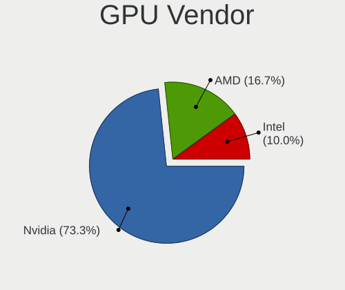

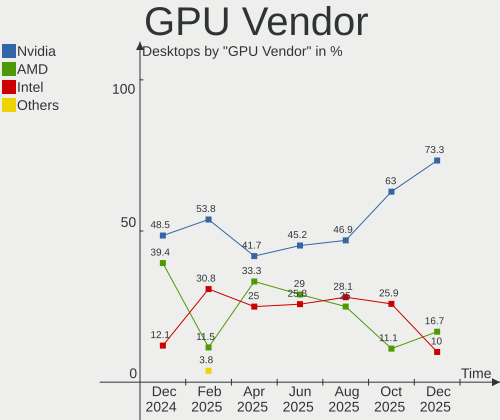

| Vendor | Desktops | Percent |
|--------|----------|---------|
| Nvidia | 22       | 73.33%  |
| AMD    | 5        | 16.67%  |
| Intel  | 3        | 10%     |

GPU Model
---------

Graphics card models

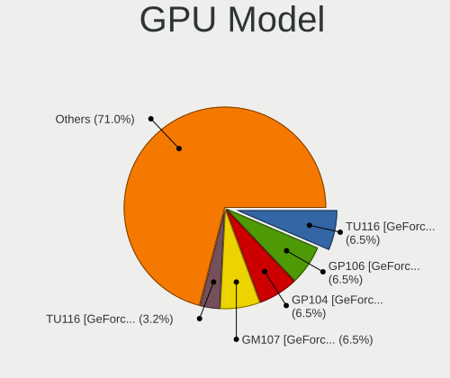

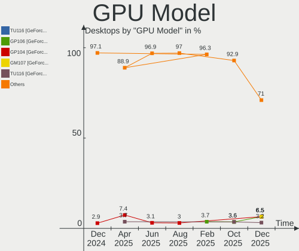

| Model                                                   | Desktops | Percent |
|---------------------------------------------------------|----------|---------|
| Nvidia TU116 [GeForce GTX 1660]                         | 2        | 6.45%   |
| Nvidia GP106 [GeForce GTX 1060 6GB]                     | 2        | 6.45%   |
| Nvidia GP104 [GeForce GTX 1070]                         | 2        | 6.45%   |
| Nvidia GM107 [GeForce GTX 750 Ti]                       | 2        | 6.45%   |
| Nvidia TU116 [GeForce GTX 1660 Ti]                      | 1        | 3.23%   |
| Nvidia GP107 [GeForce GTX 1050 Ti]                      | 1        | 3.23%   |
| Nvidia GP104 [GeForce GTX 1080]                         | 1        | 3.23%   |
| Nvidia GP102 [GeForce GTX 1080 Ti]                      | 1        | 3.23%   |
| Nvidia GM107GL [Quadro K620]                            | 1        | 3.23%   |
| Nvidia GK208 [GeForce GT 635]                           | 1        | 3.23%   |
| Nvidia GK106 [GeForce GTX 660]                          | 1        | 3.23%   |
| Nvidia GB207 [GeForce RTX 5050]                         | 1        | 3.23%   |
| Nvidia GB206 [GeForce RTX 5060]                         | 1        | 3.23%   |
| Nvidia GA106 [GeForce RTX 3060 Lite Hash Rate]          | 1        | 3.23%   |
| Nvidia GA104 [GeForce RTX 3060 Ti Lite Hash Rate]       | 1        | 3.23%   |
| Nvidia GA102 [GeForce RTX 3080 Ti]                      | 1        | 3.23%   |
| Nvidia AD104 [GeForce RTX 4070]                         | 1        | 3.23%   |
| Nvidia AD103 [GeForce RTX 4080 SUPER]                   | 1        | 3.23%   |
| Nvidia AD102 [GeForce RTX 4090]                         | 1        | 3.23%   |
| Intel Skylake-S GT2 [HD Graphics 530]                   | 1        | 3.23%   |
| Intel Raptor Lake-S GT1 [UHD Graphics 770]              | 1        | 3.23%   |
| Intel Kaby Lake-S GT2 [HD Graphics 630]                 | 1        | 3.23%   |
| AMD Turks PRO [Radeon HD 7570]                          | 1        | 3.23%   |
| AMD Richland [Radeon HD 8470D]                          | 1        | 3.23%   |
| AMD Raphael                                             | 1        | 3.23%   |
| AMD Navi 48 [Radeon RX 9070/9070 XT/9070 GRE]           | 1        | 3.23%   |
| AMD Ellesmere [Radeon RX 470/480/570/570X/580/580X/590] | 1        | 3.23%   |

GPU Combo
---------

Combinations of graphics cards

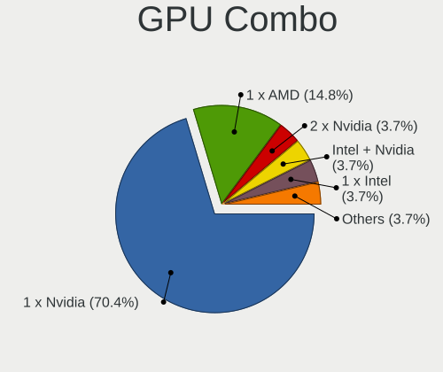

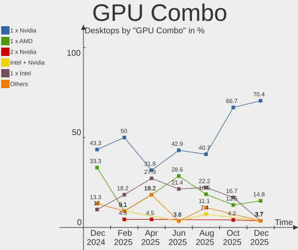

| Name           | Desktops | Percent |
|----------------|----------|---------|
| 1 x Nvidia     | 19       | 70.37%  |
| 1 x AMD        | 4        | 14.81%  |
| 2 x Nvidia     | 1        | 3.7%    |
| Intel + Nvidia | 1        | 3.7%    |
| 1 x Intel      | 1        | 3.7%    |
| AMD + Nvidia   | 1        | 3.7%    |

GPU Driver
----------

Free vs proprietary

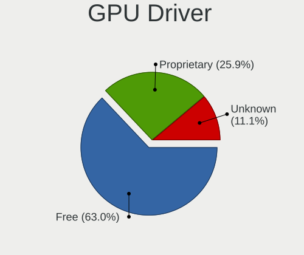

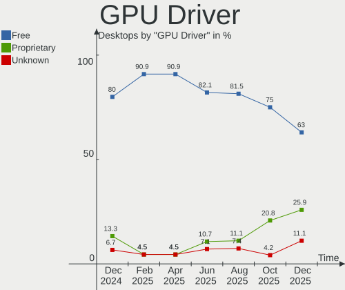

| Driver      | Desktops | Percent |
|-------------|----------|---------|
| Free        | 17       | 62.96%  |
| Proprietary | 7        | 25.93%  |
| Unknown     | 3        | 11.11%  |

GPU Memory
----------

Total video memory

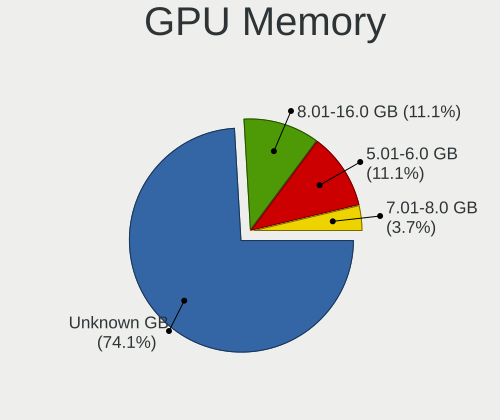

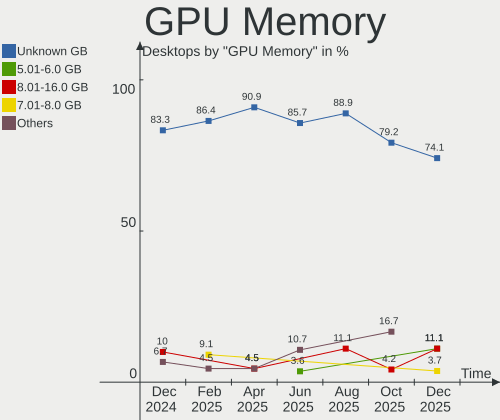

| Size in GB | Desktops | Percent |
|------------|----------|---------|
| Unknown    | 20       | 74.07%  |
| 5.01-6.0   | 3        | 11.11%  |
| 8.01-16.0  | 3        | 11.11%  |
| 7.01-8.0   | 1        | 3.7%    |

Monitor
-------

Monitor Vendor
--------------

Monitor vendors

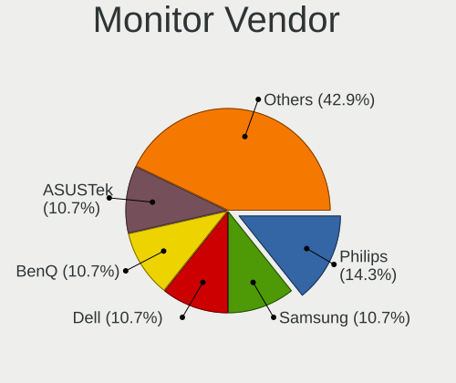

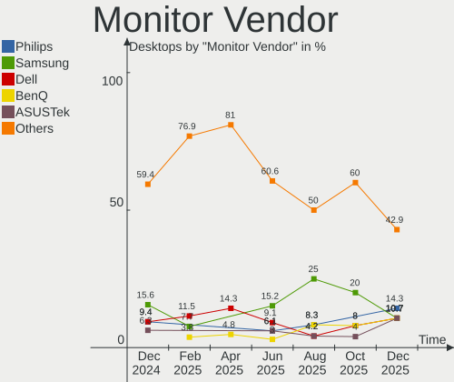

| Vendor               | Desktops | Percent |
|----------------------|----------|---------|
| Philips              | 4        | 14.29%  |
| Samsung Electronics  | 3        | 10.71%  |
| Dell                 | 3        | 10.71%  |
| BenQ                 | 3        | 10.71%  |
| ASUSTek Computer     | 3        | 10.71%  |
| Sceptre Tech         | 2        | 7.14%   |
| Hitachi              | 2        | 7.14%   |
| ViewSonic            | 1        | 3.57%   |
| Valve                | 1        | 3.57%   |
| Unknown              | 1        | 3.57%   |
| Goldstar             | 1        | 3.57%   |
| AOC                  | 1        | 3.57%   |
| Ancor Communications | 1        | 3.57%   |
| Acer                 | 1        | 3.57%   |
| Unknown              | 1        | 3.57%   |

Monitor Model
-------------

Monitor models

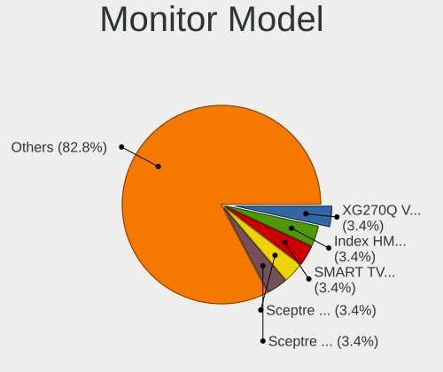

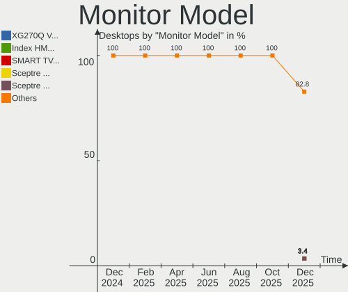

| Model                                                              | Desktops | Percent |
|--------------------------------------------------------------------|----------|---------|
| ViewSonic XG270Q VSC3C3A 2560x1440 597x336mm 27.0-inch             | 1        | 3.45%   |
| Valve Index HMD VLV91A8                                            | 1        | 3.45%   |
| Unknown SMART TV 0563 1920x1080 1209x680mm 54.6-inch               | 1        | 3.45%   |
| Sceptre Tech Sceptre Y32 SPT0CAD 2560x1440 697x392mm 31.5-inch     | 1        | 3.45%   |
| Sceptre Tech Sceptre E22 SPT08D5 1920x1080 470x300mm 22.0-inch     | 1        | 3.45%   |
| Samsung Electronics S27B350 SAM08DC 1920x1080 598x336mm 27.0-inch  | 1        | 3.45%   |
| Samsung Electronics LCD Monitor LS24AG32x                          | 1        | 3.45%   |
| Samsung Electronics C49HG9x SAM0E5E 3840x1080 1200x340mm 49.1-inch | 1        | 3.45%   |
| Philips PHL 275V8 PHLC292 2560x1440 597x336mm 27.0-inch            | 1        | 3.45%   |
| Philips PHL 245B1 PHL094C 2560x1440 530x300mm 24.0-inch            | 1        | 3.45%   |
| Philips FTV PHL01EA 1920x1080 1440x810mm 65.0-inch                 | 1        | 3.45%   |
| Philips 170C PHLC011 1280x1024 338x270mm 17.0-inch                 | 1        | 3.45%   |
| Hitachi HISENSE HEC0030 3840x2160 1872x1053mm 84.6-inch            | 1        | 3.45%   |
| Hitachi HISENSE HEC002F 3840x2160 1872x1053mm 84.6-inch            | 1        | 3.45%   |
| Goldstar HDR 4K GSM7707 3840x2160 600x340mm 27.2-inch              | 1        | 3.45%   |
| Dell U2515H DELD070 2560x1440 553x311mm 25.0-inch                  | 1        | 3.45%   |
| Dell U2414H DELA0A2 1920x1080 527x296mm 23.8-inch                  | 1        | 3.45%   |
| Dell S2721QS DELA198 3840x2160 597x336mm 27.0-inch                 | 1        | 3.45%   |
| Dell E207WFP DELD011 1680x1050 430x270mm 20.0-inch                 | 1        | 3.45%   |
| BenQ ZOWIE XL LCD BNQ7F33 1920x1080 531x298mm 24.0-inch            | 1        | 3.45%   |
| BenQ FP202WA BNQ76C2 1680x1050 376x301mm 19.0-inch                 | 1        | 3.45%   |
| BenQ EX2710Q BNQ7F87 2560x1440 597x336mm 27.0-inch                 | 1        | 3.45%   |
| ASUSTek Computer VZ239 AUS23CC 1920x1080 509x286mm 23.0-inch       | 1        | 3.45%   |
| ASUSTek Computer VG245 AUS24A1 1920x1080 531x299mm 24.0-inch       | 1        | 3.45%   |
| ASUSTek Computer PG27AQDM AUS27FD 2560x1440 590x334mm 26.7-inch    | 1        | 3.45%   |
| AOC U2790B AOC2790 3840x2160 597x336mm 27.0-inch                   | 1        | 3.45%   |
| Ancor Communications VG248 ACI24A5 1920x1080 531x299mm 24.0-inch   | 1        | 3.45%   |
| Acer P206HV ACR0200 1600x900 443x249mm 20.0-inch                   | 1        | 3.45%   |
| Unknown                                                            | 1        | 3.45%   |

Monitor Resolution
------------------

Monitor screen resolution

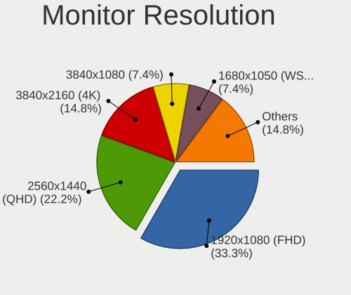

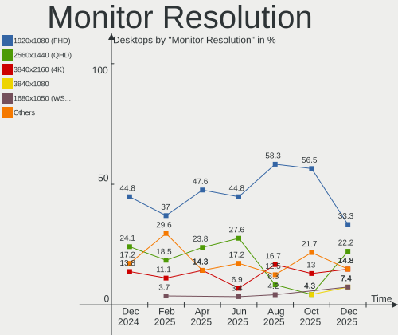

| Resolution         | Desktops | Percent |
|--------------------|----------|---------|
| 1920x1080 (FHD)    | 9        | 33.33%  |
| 2560x1440 (QHD)    | 6        | 22.22%  |
| 3840x2160 (4K)     | 4        | 14.81%  |
| 3840x1080          | 2        | 7.41%   |
| 1680x1050 (WSXGA+) | 2        | 7.41%   |
| Unknown            | 2        | 7.41%   |
| 1600x900 (HD+)     | 1        | 3.7%    |
| 1280x1024 (SXGA)   | 1        | 3.7%    |

Monitor Diagonal
----------------

Diagonal size in inches

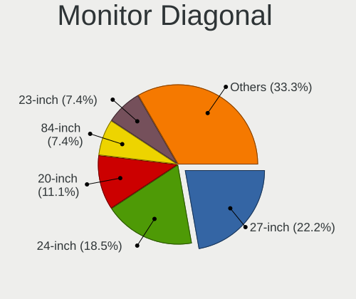

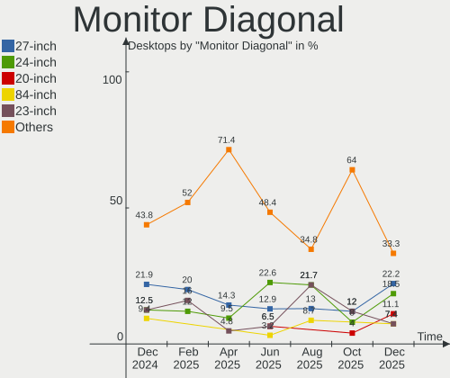

| Inches  | Desktops | Percent |
|---------|----------|---------|
| 27      | 6        | 22.22%  |
| 24      | 5        | 18.52%  |
| 20      | 3        | 11.11%  |
| 84      | 2        | 7.41%   |
| 23      | 2        | 7.41%   |
| Unknown | 2        | 7.41%   |
| 65      | 1        | 3.7%    |
| 54      | 1        | 3.7%    |
| 49      | 1        | 3.7%    |
| 31      | 1        | 3.7%    |
| 26      | 1        | 3.7%    |
| 25      | 1        | 3.7%    |
| 17      | 1        | 3.7%    |

Monitor Width
-------------

Physical width

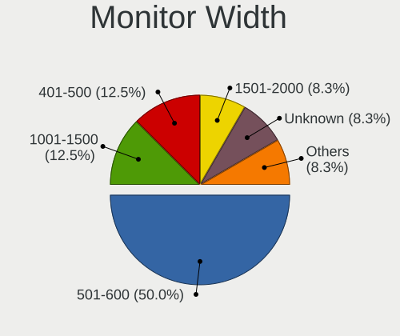

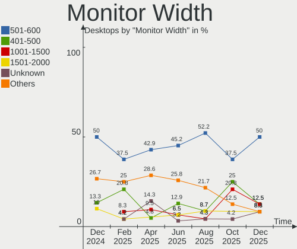

| Width in mm | Desktops | Percent |
|-------------|----------|---------|
| 501-600     | 12       | 50%     |
| 401-500     | 3        | 12.5%   |
| 1001-1500   | 3        | 12.5%   |
| 1501-2000   | 2        | 8.33%   |
| Unknown     | 2        | 8.33%   |
| 601-700     | 1        | 4.17%   |
| 301-350     | 1        | 4.17%   |

Aspect Ratio
------------

Proportional relationship between the width and the height

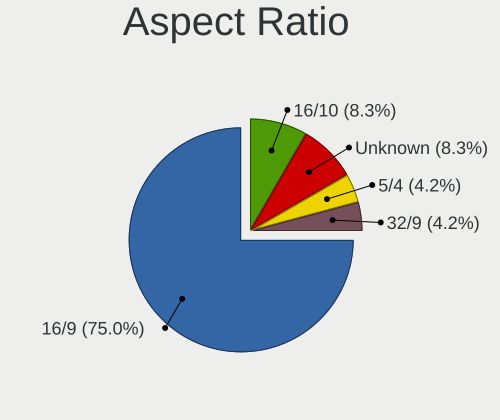

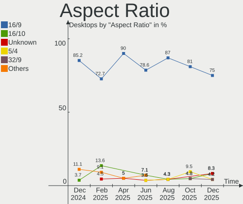

| Ratio   | Desktops | Percent |
|---------|----------|---------|
| 16/9    | 18       | 75%     |
| 16/10   | 2        | 8.33%   |
| Unknown | 2        | 8.33%   |
| 5/4     | 1        | 4.17%   |
| 32/9    | 1        | 4.17%   |

Monitor Area
------------

Area in inch²

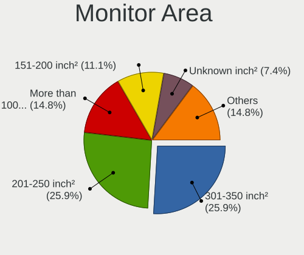

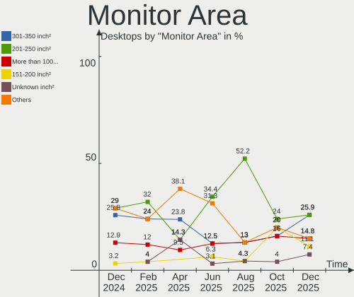

| Area in inch² | Desktops | Percent |
|----------------|----------|---------|
| 301-350        | 7        | 25.93%  |
| 201-250        | 7        | 25.93%  |
| More than 1000 | 4        | 14.81%  |
| 151-200        | 3        | 11.11%  |
| Unknown        | 2        | 7.41%   |
| 351-500        | 1        | 3.7%    |
| 251-300        | 1        | 3.7%    |
| 141-150        | 1        | 3.7%    |
| 501-1000       | 1        | 3.7%    |

Pixel Density
-------------

Pixels per inch

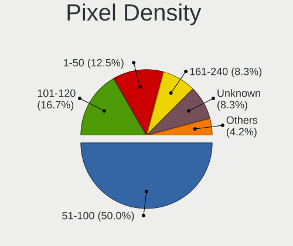

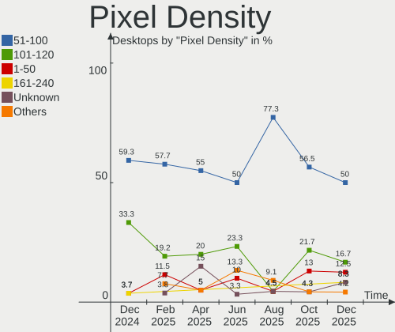

| Density | Desktops | Percent |
|---------|----------|---------|
| 51-100  | 12       | 50%     |
| 101-120 | 4        | 16.67%  |
| 1-50    | 3        | 12.5%   |
| 161-240 | 2        | 8.33%   |
| Unknown | 2        | 8.33%   |
| 121-160 | 1        | 4.17%   |

Multiple Monitors
-----------------

Total monitors connected

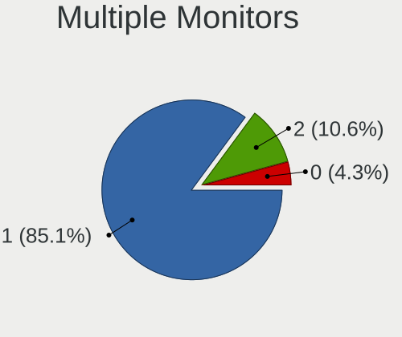

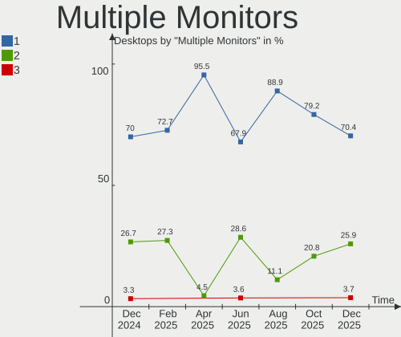

| Total | Desktops | Percent |
|-------|----------|---------|
| 1     | 19       | 70.37%  |
| 2     | 7        | 25.93%  |
| 3     | 1        | 3.7%    |

Network
-------

Net Controller Vendor
---------------------

Controller vendors

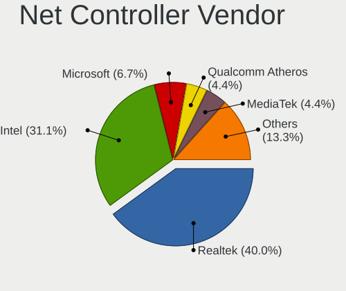

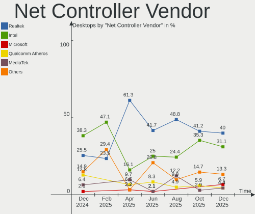

| Vendor                          | Desktops | Percent |
|---------------------------------|----------|---------|
| Realtek Semiconductor           | 18       | 40%     |
| Intel                           | 14       | 31.11%  |
| Microsoft                       | 3        | 6.67%   |
| Qualcomm Atheros                | 2        | 4.44%   |
| MediaTek                        | 2        | 4.44%   |
| TP-Link                         | 1        | 2.22%   |
| Qualcomm Atheros Communications | 1        | 2.22%   |
| Qualcomm                        | 1        | 2.22%   |
| DisplayLink                     | 1        | 2.22%   |
| Broadcom                        | 1        | 2.22%   |
| Aquantia                        | 1        | 2.22%   |

Net Controller Model
--------------------

Controller models

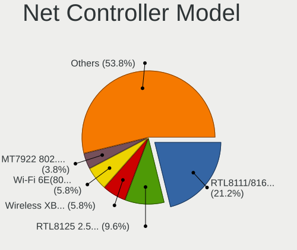

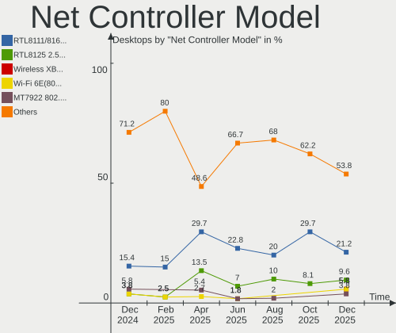

| Model                                                                           | Desktops | Percent |
|---------------------------------------------------------------------------------|----------|---------|
| Realtek RTL8111/8168/8211/8411 PCI Express Gigabit Ethernet Controller          | 11       | 21.15%  |
| Realtek RTL8125 2.5GbE Controller                                               | 5        | 9.62%   |
| Microsoft Wireless XBox Controller Dongle                                       | 3        | 5.77%   |
| Intel Wi-Fi 6E(802.11ax) AX210/AX1675* 2x2 [Typhoon Peak]                       | 3        | 5.77%   |
| MediaTek MT7922 802.11ax PCI Express Wireless Network Adapter                   | 2        | 3.85%   |
| Intel Wi-Fi 6 AX200                                                             | 2        | 3.85%   |
| Intel Wi-Fi 5(802.11ac) Wireless-AC 9x6x [Thunder Peak]                         | 2        | 3.85%   |
| Intel Ethernet Controller I226-V                                                | 2        | 3.85%   |
| Intel Ethernet Connection I217-V                                                | 2        | 3.85%   |
| TP-Link TL-WN821N v5/v6 [RTL8192EU]                                             | 1        | 1.92%   |
| Realtek RTL8723BU 802.11b/g/n WLAN Adapter                                      | 1        | 1.92%   |
| Realtek RTL8188ETV Wireless LAN 802.11n Network Adapter                         | 1        | 1.92%   |
| Realtek RTL8153 Gigabit Ethernet Adapter                                        | 1        | 1.92%   |
| Realtek 802.11ac NIC                                                            | 1        | 1.92%   |
| Qualcomm Nokia X30 5G                                                           | 1        | 1.92%   |
| Qualcomm Atheros Killer E220x Gigabit Ethernet Controller                       | 1        | 1.92%   |
| Qualcomm Atheros AR9271 802.11n                                                 | 1        | 1.92%   |
| Qualcomm Atheros AR9485 Wireless Network Adapter                                | 1        | 1.92%   |
| Intel Wireless 7265                                                             | 1        | 1.92%   |
| Intel I211 Gigabit Network Connection                                           | 1        | 1.92%   |
| Intel Ethernet Controller I225-V                                                | 1        | 1.92%   |
| Intel Ethernet Connection (5) I219-LM                                           | 1        | 1.92%   |
| Intel Ethernet Connection (2) I219-V                                            | 1        | 1.92%   |
| Intel Dual Band Wireless-AC 3168NGW [Stone Peak]                                | 1        | 1.92%   |
| Intel 82567LM-3 Gigabit Network Connection                                      | 1        | 1.92%   |
| Intel 700 Series Chipset CNVi WiFi                                              | 1        | 1.92%   |
| DisplayLink USB-C Triple-4K Dock                                                | 1        | 1.92%   |
| Broadcom NetXtreme BCM5762 Gigabit Ethernet PCIe                                | 1        | 1.92%   |
| Aquantia AQtion AQC113CS NBase-T/IEEE 802.3an Ethernet Controller [Antigua 10G] | 1        | 1.92%   |

Wireless Vendor
---------------

Wireless vendors

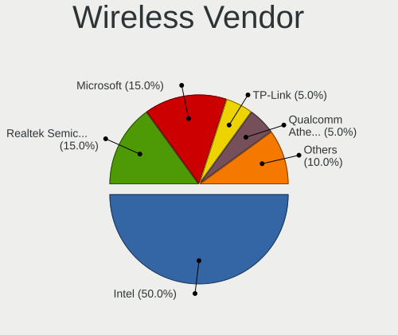

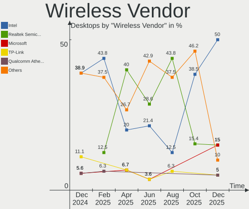

| Vendor                          | Desktops | Percent |
|---------------------------------|----------|---------|
| Intel                           | 10       | 50%     |
| Realtek Semiconductor           | 3        | 15%     |
| Microsoft                       | 3        | 15%     |
| TP-Link                         | 1        | 5%      |
| Qualcomm Atheros Communications | 1        | 5%      |
| Qualcomm Atheros                | 1        | 5%      |
| MediaTek                        | 1        | 5%      |

Wireless Model
--------------

Wireless models

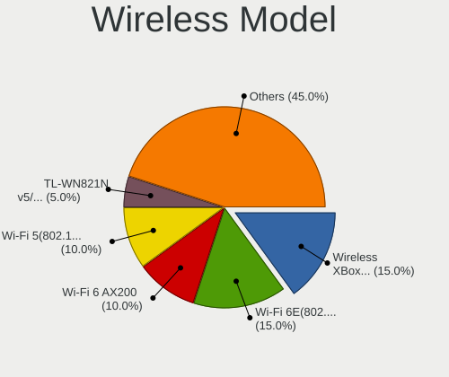

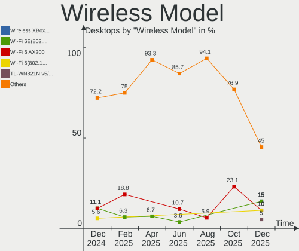

| Model                                                         | Desktops | Percent |
|---------------------------------------------------------------|----------|---------|
| Microsoft Wireless XBox Controller Dongle                     | 3        | 15%     |
| Intel Wi-Fi 6E(802.11ax) AX210/AX1675* 2x2 [Typhoon Peak]     | 3        | 15%     |
| Intel Wi-Fi 6 AX200                                           | 2        | 10%     |
| Intel Wi-Fi 5(802.11ac) Wireless-AC 9x6x [Thunder Peak]       | 2        | 10%     |
| TP-Link TL-WN821N v5/v6 [RTL8192EU]                           | 1        | 5%      |
| Realtek RTL8723BU 802.11b/g/n WLAN Adapter                    | 1        | 5%      |
| Realtek RTL8188ETV Wireless LAN 802.11n Network Adapter       | 1        | 5%      |
| Realtek 802.11ac NIC                                          | 1        | 5%      |
| Qualcomm Atheros AR9271 802.11n                               | 1        | 5%      |
| Qualcomm Atheros AR9485 Wireless Network Adapter              | 1        | 5%      |
| MediaTek MT7922 802.11ax PCI Express Wireless Network Adapter | 1        | 5%      |
| Intel Wireless 7265                                           | 1        | 5%      |
| Intel Dual Band Wireless-AC 3168NGW [Stone Peak]              | 1        | 5%      |
| Intel 700 Series Chipset CNVi WiFi                            | 1        | 5%      |

Ethernet Vendor
---------------

Ethernet vendors

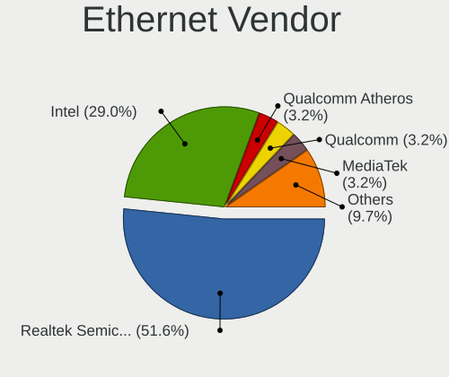

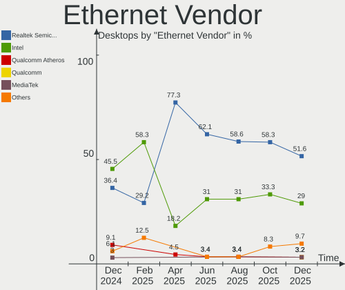

| Vendor                | Desktops | Percent |
|-----------------------|----------|---------|
| Realtek Semiconductor | 16       | 51.61%  |
| Intel                 | 9        | 29.03%  |
| Qualcomm Atheros      | 1        | 3.23%   |
| Qualcomm              | 1        | 3.23%   |
| MediaTek              | 1        | 3.23%   |
| DisplayLink           | 1        | 3.23%   |
| Broadcom              | 1        | 3.23%   |
| Aquantia              | 1        | 3.23%   |

Ethernet Model
--------------

Ethernet models

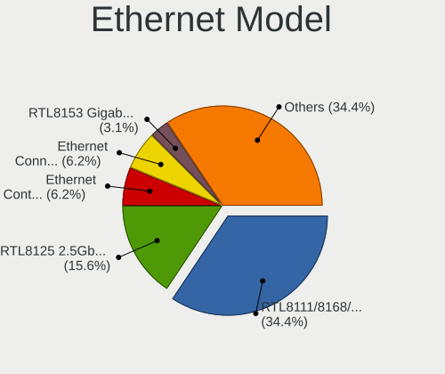

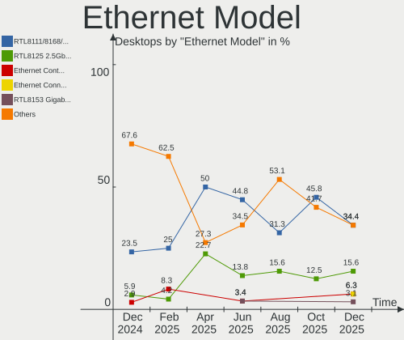

| Model                                                                           | Desktops | Percent |
|---------------------------------------------------------------------------------|----------|---------|
| Realtek RTL8111/8168/8211/8411 PCI Express Gigabit Ethernet Controller          | 11       | 34.38%  |
| Realtek RTL8125 2.5GbE Controller                                               | 5        | 15.63%  |
| Intel Ethernet Controller I226-V                                                | 2        | 6.25%   |
| Intel Ethernet Connection I217-V                                                | 2        | 6.25%   |
| Realtek RTL8153 Gigabit Ethernet Adapter                                        | 1        | 3.13%   |
| Qualcomm Nokia X30 5G                                                           | 1        | 3.13%   |
| Qualcomm Atheros Killer E220x Gigabit Ethernet Controller                       | 1        | 3.13%   |
| MediaTek MT7922 802.11ax PCI Express Wireless Network Adapter                   | 1        | 3.13%   |
| Intel I211 Gigabit Network Connection                                           | 1        | 3.13%   |
| Intel Ethernet Controller I225-V                                                | 1        | 3.13%   |
| Intel Ethernet Connection (5) I219-LM                                           | 1        | 3.13%   |
| Intel Ethernet Connection (2) I219-V                                            | 1        | 3.13%   |
| Intel 82567LM-3 Gigabit Network Connection                                      | 1        | 3.13%   |
| DisplayLink USB-C Triple-4K Dock                                                | 1        | 3.13%   |
| Broadcom NetXtreme BCM5762 Gigabit Ethernet PCIe                                | 1        | 3.13%   |
| Aquantia AQtion AQC113CS NBase-T/IEEE 802.3an Ethernet Controller [Antigua 10G] | 1        | 3.13%   |

Net Controller Kind
-------------------

Ethernet, WiFi or modem

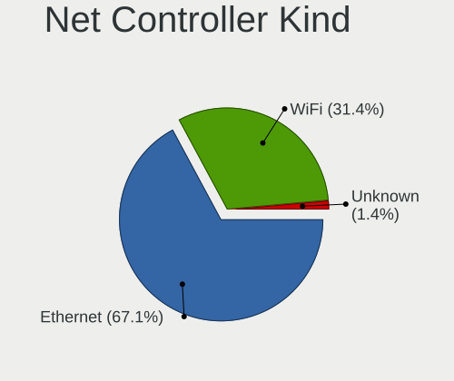

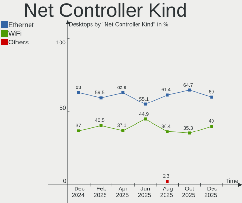

| Kind     | Desktops | Percent |
|----------|----------|---------|
| Ethernet | 27       | 60%     |
| WiFi     | 18       | 40%     |

Used Controller
---------------

Currently used network controller

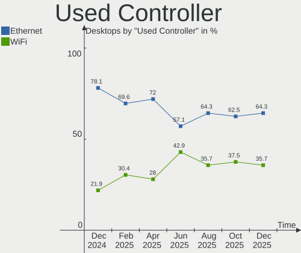

| Kind     | Desktops | Percent |
|----------|----------|---------|
| Ethernet | 18       | 64.29%  |
| WiFi     | 10       | 35.71%  |

NICs
----

Total network controllers on board

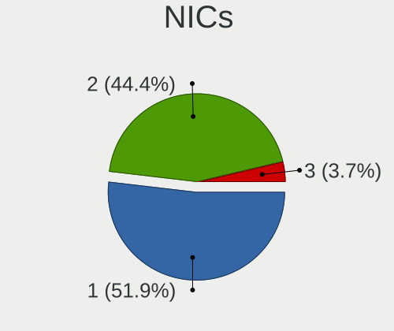

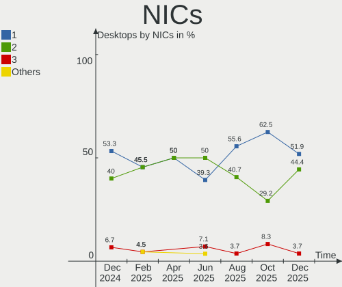

| Total | Desktops | Percent |
|-------|----------|---------|
| 1     | 14       | 51.85%  |
| 2     | 12       | 44.44%  |
| 3     | 1        | 3.7%    |

IPv6
----

IPv6 vs IPv4

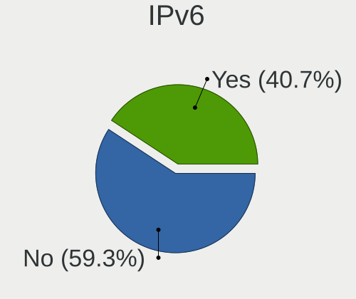

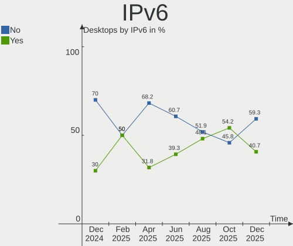

| Used | Desktops | Percent |
|------|----------|---------|
| No   | 16       | 59.26%  |
| Yes  | 11       | 40.74%  |

Bluetooth
---------

Bluetooth Vendor
----------------

Controller vendors

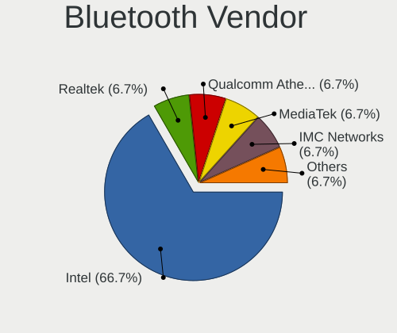

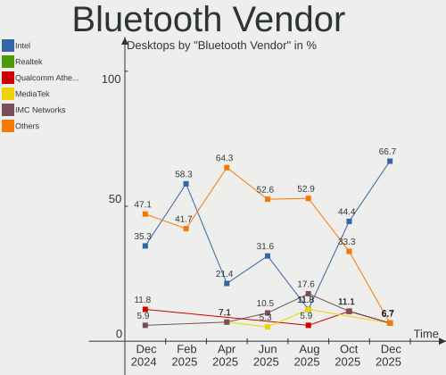

| Vendor                          | Desktops | Percent |
|---------------------------------|----------|---------|
| Intel                           | 10       | 66.67%  |
| Realtek                         | 1        | 6.67%   |
| Qualcomm Atheros Communications | 1        | 6.67%   |
| MediaTek                        | 1        | 6.67%   |
| IMC Networks                    | 1        | 6.67%   |
| Foxconn / Hon Hai               | 1        | 6.67%   |

Bluetooth Model
---------------

Controller models

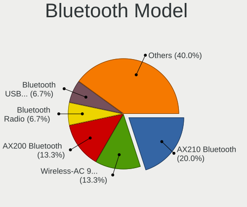

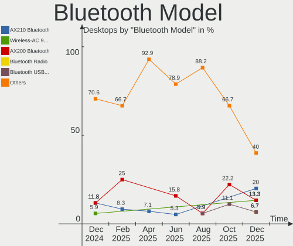

| Model                                          | Desktops | Percent |
|------------------------------------------------|----------|---------|
| Intel AX210 Bluetooth                          | 3        | 20%     |
| Intel Wireless-AC 9260 Bluetooth Adapter       | 2        | 13.33%  |
| Intel AX200 Bluetooth                          | 2        | 13.33%  |
| Realtek Bluetooth Radio                        | 1        | 6.67%   |
| Qualcomm Atheros Bluetooth USB Host Controller | 1        | 6.67%   |
| MediaTek Wireless_Device                       | 1        | 6.67%   |
| Intel Wireless-AC 3168 Bluetooth               | 1        | 6.67%   |
| Intel Bluetooth wireless interface             | 1        | 6.67%   |
| Intel Bluetooth Device                         | 1        | 6.67%   |
| IMC Networks Wireless_Device                   | 1        | 6.67%   |
| Foxconn / Hon Hai Bluetooth Device             | 1        | 6.67%   |

Sound
-----

Sound Vendor
------------

Sound card vendors

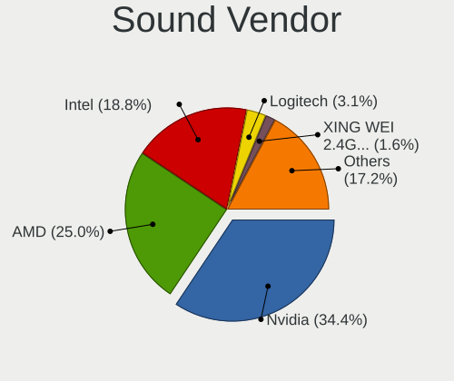

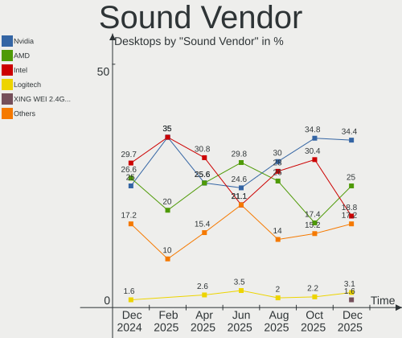

| Vendor                   | Desktops | Percent |
|--------------------------|----------|---------|
| Nvidia                   | 22       | 34.38%  |
| AMD                      | 16       | 25%     |
| Intel                    | 12       | 18.75%  |
| Logitech                 | 2        | 3.13%   |
| XING WEI 2.4G USB        | 1        | 1.56%   |
| Valve Software           | 1        | 1.56%   |
| Micro Star International | 1        | 1.56%   |
| Mark of the Unicorn      | 1        | 1.56%   |
| KTMicro                  | 1        | 1.56%   |
| JMTek                    | 1        | 1.56%   |
| Huawei Technologies      | 1        | 1.56%   |
| Hewlett-Packard          | 1        | 1.56%   |
| Creative Technology      | 1        | 1.56%   |
| Audio-Technica           | 1        | 1.56%   |
| ASUSTek Computer         | 1        | 1.56%   |
| Astro Gaming             | 1        | 1.56%   |

Sound Model
-----------

Sound card models

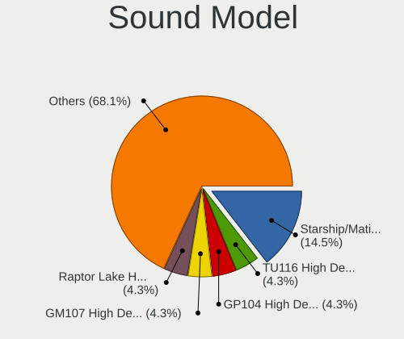

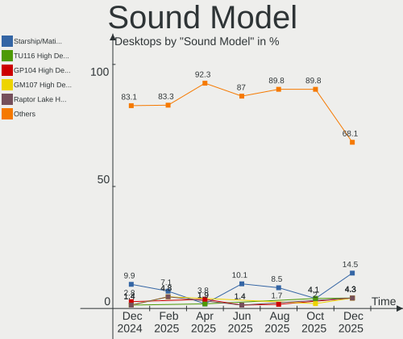

| Model                                                               | Desktops | Percent |
|---------------------------------------------------------------------|----------|---------|
| AMD Starship/Matisse HD Audio Controller                            | 10       | 14.49%  |
| Nvidia TU116 High Definition Audio Controller                       | 3        | 4.35%   |
| Nvidia GP104 High Definition Audio Controller                       | 3        | 4.35%   |
| Nvidia GM107 High Definition Audio Controller [GeForce 940MX]       | 3        | 4.35%   |
| Intel Raptor Lake High Definition Audio Controller                  | 3        | 4.35%   |
| Intel 8 Series/C220 Series Chipset High Definition Audio Controller | 3        | 4.35%   |
| Nvidia GP106 High Definition Audio Controller                       | 2        | 2.9%    |
| Intel 200 Series PCH HD Audio                                       | 2        | 2.9%    |
| AMD SBx00 Azalia (Intel HDA)                                        | 2        | 2.9%    |
| XING WEI 2.4G USB USB Composite Device                              | 1        | 1.45%   |
| Valve Software Valve VR Radio & HMD Mic                             | 1        | 1.45%   |
| Nvidia GP107GL High Definition Audio Controller                     | 1        | 1.45%   |
| Nvidia GP102 HDMI Audio Controller                                  | 1        | 1.45%   |
| Nvidia GK208 HDMI/DP Audio Controller                               | 1        | 1.45%   |
| Nvidia GK106 HDMI Audio Controller                                  | 1        | 1.45%   |
| Nvidia GB207 High Definition Audio Controller                       | 1        | 1.45%   |
| Nvidia GB206 High Definition Audio Controller                       | 1        | 1.45%   |
| Nvidia GA106 High Definition Audio Controller                       | 1        | 1.45%   |
| Nvidia GA104 High Definition Audio Controller                       | 1        | 1.45%   |
| Nvidia GA102 High Definition Audio Controller                       | 1        | 1.45%   |
| Nvidia AD104 High Definition Audio Controller                       | 1        | 1.45%   |
| Nvidia AD103 High Definition Audio Controller                       | 1        | 1.45%   |
| Nvidia AD102 High Definition Audio Controller                       | 1        | 1.45%   |
| Micro Star International USB Audio                                  | 1        | 1.45%   |
| Mark of the Unicorn M2                                              | 1        | 1.45%   |
| Logitech Yeti Nano                                                  | 1        | 1.45%   |
| Logitech G733 Gaming Headset                                        | 1        | 1.45%   |
| KTMicro K38                                                         | 1        | 1.45%   |
| JMTek USB PnP Audio Device                                          | 1        | 1.45%   |
| Intel C610/X99 series chipset HD Audio Controller                   | 1        | 1.45%   |
| Intel 9 Series Chipset Family HD Audio Controller                   | 1        | 1.45%   |
| Intel 82801JD/DO (ICH10 Family) HD Audio Controller                 | 1        | 1.45%   |
| Intel 100 Series/C230 Series Chipset Family HD Audio Controller     | 1        | 1.45%   |
| Huawei Technologies KT USB Audio                                    | 1        | 1.45%   |
| Hewlett-Packard HyperX Cloud III Wireless                           | 1        | 1.45%   |
| Creative Technology SoundBlaster MP3+                               | 1        | 1.45%   |
| Audio-Technica AT2020USB-XP                                         | 1        | 1.45%   |
| ASUSTek Computer USB Audio                                          | 1        | 1.45%   |
| Astro Gaming Astro A50                                              | 1        | 1.45%   |
| AMD Turks HDMI Audio [Radeon HD 6500/6600 / 6700M Series]           | 1        | 1.45%   |

Memory
------

Memory Vendor
-------------

Memory module vendors

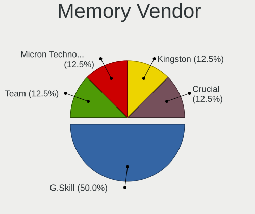

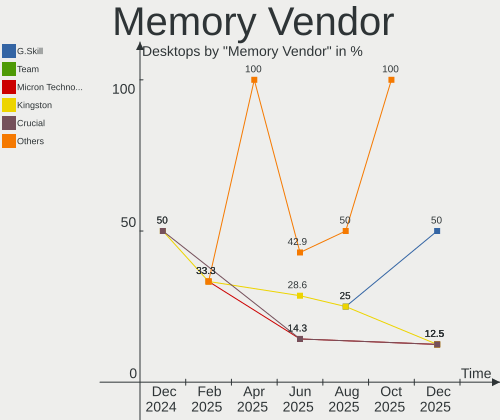

| Vendor            | Desktops | Percent |
|-------------------|----------|---------|
| G.Skill           | 4        | 50%     |
| Team              | 1        | 12.5%   |
| Micron Technology | 1        | 12.5%   |
| Kingston          | 1        | 12.5%   |
| Crucial           | 1        | 12.5%   |

Memory Model
------------

Memory module models

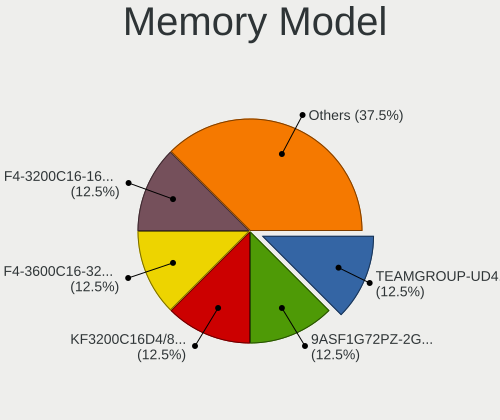

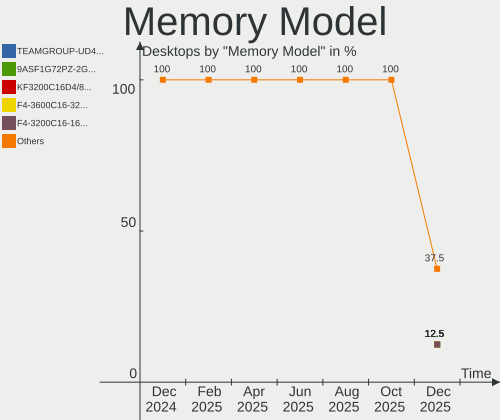

| Model                                                    | Desktops | Percent |
|----------------------------------------------------------|----------|---------|
| Team RAM TEAMGROUP-UD4-3200 8GB DIMM DDR4 3800MT/s       | 1        | 12.5%   |
| Micron RAM 9ASF1G72PZ-2G3B1 8GB RIMM DDR4 2400MT/s       | 1        | 12.5%   |
| Kingston RAM KF3200C16D4/8GX 8GiB DIMM DDR4 3600MT/s     | 1        | 12.5%   |
| G.Skill RAM F4-3600C16-32GTZN 32GB DIMM DDR4 3600MT/s    | 1        | 12.5%   |
| G.Skill RAM F4-3200C16-16GVK 16GB DIMM DDR4 3600MT/s     | 1        | 12.5%   |
| G.Skill RAM F4-2933C16-8GTZRX 8GB DIMM DDR4 1866MT/s     | 1        | 12.5%   |
| G.Skill RAM F3-10666CL9-4GBRL 4GB DIMM DDR3 1333MT/s     | 1        | 12.5%   |
| Crucial RAM BLS16G4D32AESE.M16FE 16GB DIMM DDR4 3733MT/s | 1        | 12.5%   |

Memory Kind
-----------

Memory module kinds

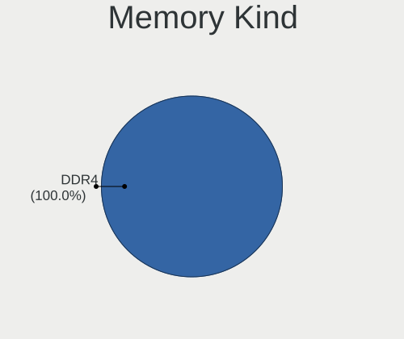

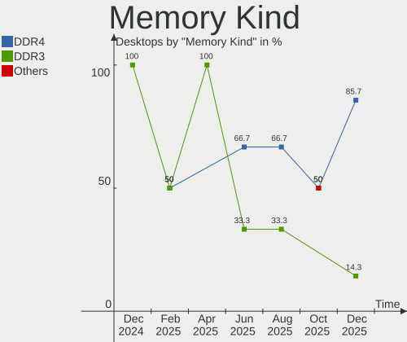

| Kind | Desktops | Percent |
|------|----------|---------|
| DDR4 | 6        | 85.71%  |
| DDR3 | 1        | 14.29%  |

Memory Form Factor
------------------

Physical design of the memory module

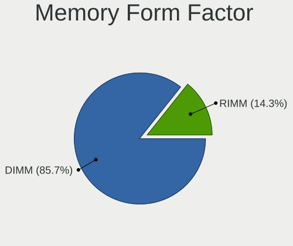

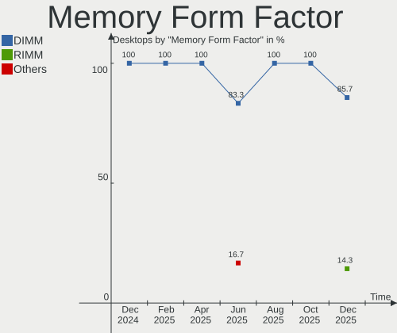

| Name | Desktops | Percent |
|------|----------|---------|
| DIMM | 6        | 85.71%  |
| RIMM | 1        | 14.29%  |

Memory Size
-----------

Memory module size

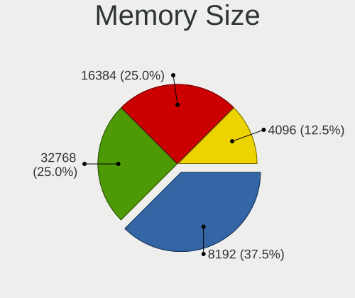

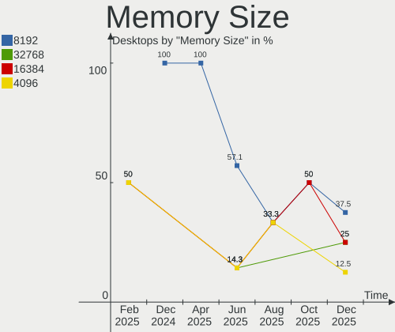

| Size  | Desktops | Percent |
|-------|----------|---------|
| 8192  | 3        | 37.5%   |
| 32768 | 2        | 25%     |
| 16384 | 2        | 25%     |
| 4096  | 1        | 12.5%   |

Memory Speed
------------

Memory module speed

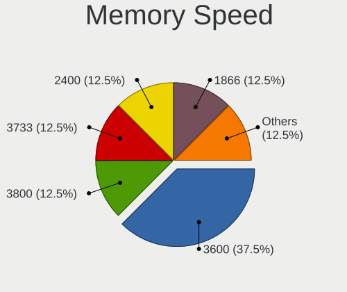

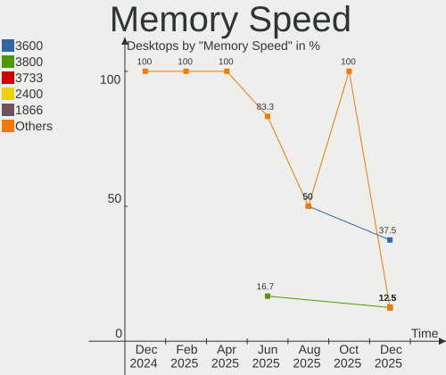

| Speed | Desktops | Percent |
|-------|----------|---------|
| 3600  | 3        | 37.5%   |
| 3800  | 1        | 12.5%   |
| 3733  | 1        | 12.5%   |
| 2400  | 1        | 12.5%   |
| 1866  | 1        | 12.5%   |
| 1333  | 1        | 12.5%   |

Printers & scanners
-------------------

Printer Vendor
--------------

Printer device vendors

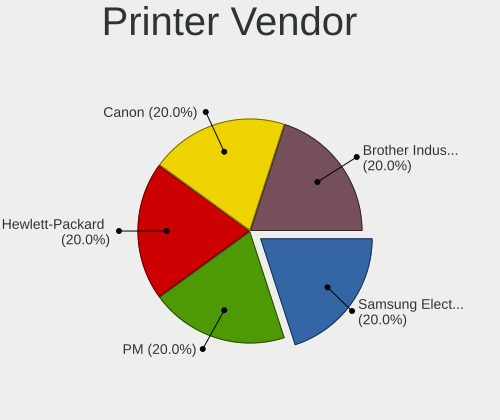

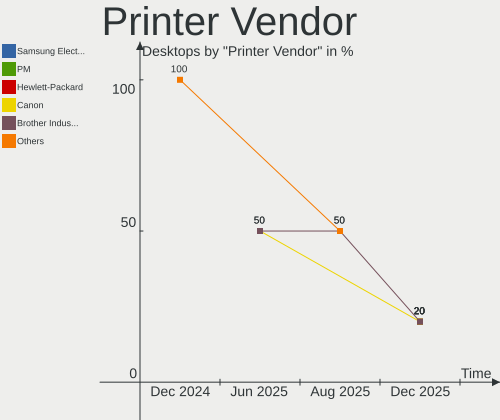

| Vendor              | Desktops | Percent |
|---------------------|----------|---------|
| Samsung Electronics | 1        | 20%     |
| PM                  | 1        | 20%     |
| Hewlett-Packard     | 1        | 20%     |
| Canon               | 1        | 20%     |
| Brother Industries  | 1        | 20%     |

Printer Model
-------------

Printer device models

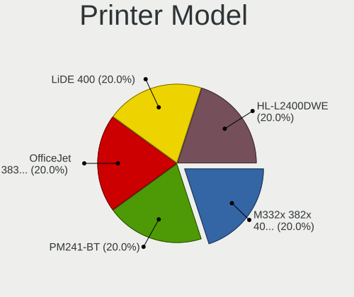

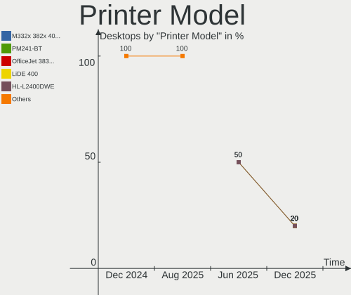

| Model                          | Desktops | Percent |
|--------------------------------|----------|---------|
| Samsung M332x 382x 402x Series | 1        | 20%     |
| PM PM241-BT                    | 1        | 20%     |
| HP OfficeJet 3830 series       | 1        | 20%     |
| Canon LiDE 400                 | 1        | 20%     |
| Brother HL-L2400DWE            | 1        | 20%     |

Scanner Vendor
--------------

Scanner device vendors

Zero info for selected period =(

Scanner Model
-------------

Scanner device models

Zero info for selected period =(

Camera
------

Camera Vendor
-------------

Camera device vendors

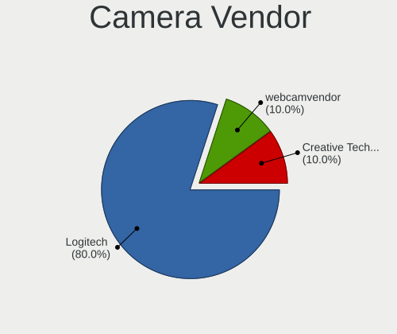

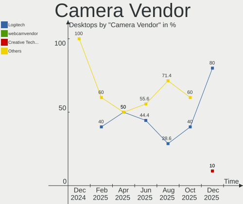

| Vendor              | Desktops | Percent |
|---------------------|----------|---------|
| Logitech            | 8        | 80%     |
| webcamvendor        | 1        | 10%     |
| Creative Technology | 1        | 10%     |

Camera Model
------------

Camera device models

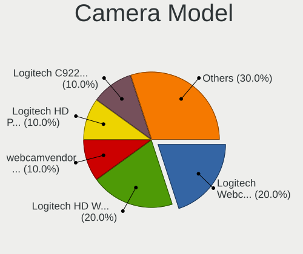

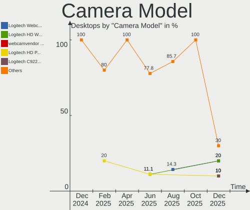

| Model                              | Desktops | Percent |
|------------------------------------|----------|---------|
| Logitech Webcam C270               | 2        | 20%     |
| Logitech HD Webcam C525            | 2        | 20%     |
| webcamvendor NexiGo N60 FHD Webcam | 1        | 10%     |
| Logitech HD Pro Webcam C920        | 1        | 10%     |
| Logitech C922 Pro Stream Webcam    | 1        | 10%     |
| Logitech C920 PRO HD Webcam        | 1        | 10%     |
| Logitech BRIO Ultra HD Webcam      | 1        | 10%     |
| Creative Live! Cam Sync 1080p V2   | 1        | 10%     |

Security
--------

Fingerprint Vendor
------------------

Fingerprint sensor vendors

Zero info for selected period =(

Fingerprint Model
-----------------

Fingerprint sensor models

Zero info for selected period =(

Chipcard Vendor
---------------

Chipcard module vendors

Zero info for selected period =(

Chipcard Model
--------------

Chipcard module models

Zero info for selected period =(

Unsupported
-----------

Unsupported Devices
-------------------

Total unsupported devices on board

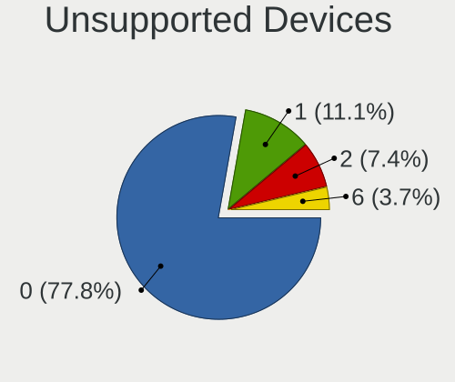

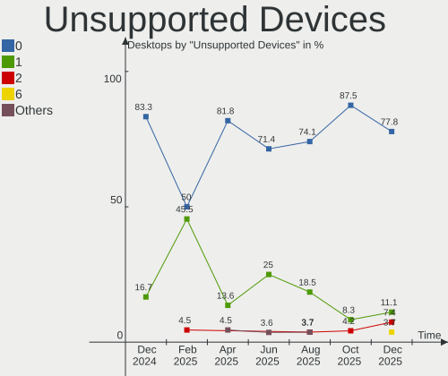

| Total | Desktops | Percent |
|-------|----------|---------|
| 0     | 21       | 77.78%  |
| 1     | 3        | 11.11%  |
| 2     | 2        | 7.41%   |
| 6     | 1        | 3.7%    |

Unsupported Device Types
------------------------

Types of unsupported devices

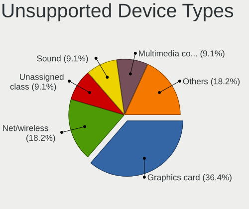

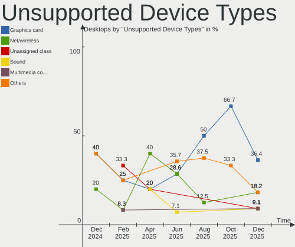

| Type                  | Desktops | Percent |
|-----------------------|----------|---------|
| Graphics card         | 4        | 36.36%  |
| Net/wireless          | 2        | 18.18%  |
| Unassigned class      | 1        | 9.09%   |
| Sound                 | 1        | 9.09%   |
| Multimedia controller | 1        | 9.09%   |
| Camera                | 1        | 9.09%   |
| Bluetooth             | 1        | 9.09%   |

