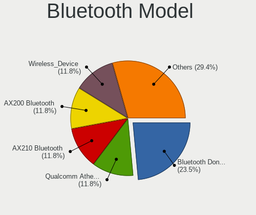

KDE neon Hardware Trends (Desktops)
-----------------------------------

A project to identify most popular hardware characteristics and track their change
over time based on data collected by KDE neon users at https://Linux-Hardware.org.

Anyone can contribute to this report by the [hw-probe](https://github.com/linuxhw/hw-probe) tool:

    sudo -E hw-probe -all -upload

Full-feature report is available here: https://linux-hardware.org/?view=trends

Period: Mar, 2022.

Contents
--------

* [ System ](#system)
  - [ OS                       ](#os)
  - [ OS Family                ](#os-family)
  - [ Kernel                   ](#kernel)
  - [ Kernel Family            ](#kernel-family)
  - [ Kernel Major Ver.        ](#kernel-major-ver)
  - [ Arch                     ](#arch)
  - [ DE                       ](#de)
  - [ Display Server           ](#display-server)
  - [ Display Manager          ](#display-manager)
  - [ OS Lang                  ](#os-lang)
  - [ Boot Mode                ](#boot-mode)
  - [ Filesystem               ](#filesystem)
  - [ Part. scheme             ](#part-scheme)
  - [ Dual Boot with Linux/BSD ](#dual-boot-with-linuxbsd)
  - [ Dual Boot (Win)          ](#dual-boot-win)

* [ Board ](#board)
  - [ Vendor                   ](#vendor)
  - [ Model                    ](#model)
  - [ Model Family             ](#model-family)
  - [ MFG Year                 ](#mfg-year)
  - [ Form Factor              ](#form-factor)
  - [ Secure Boot              ](#secure-boot)
  - [ Coreboot                 ](#coreboot)
  - [ RAM Size                 ](#ram-size)
  - [ RAM Used                 ](#ram-used)
  - [ Total Drives             ](#total-drives)
  - [ Has CD-ROM               ](#has-cd-rom)
  - [ Has Ethernet             ](#has-ethernet)
  - [ Has WiFi                 ](#has-wifi)
  - [ Has Bluetooth            ](#has-bluetooth)

* [ Location ](#location)
  - [ Country                  ](#country)
  - [ City                     ](#city)

* [ Drives ](#drives)
  - [ Drive Vendor             ](#drive-vendor)
  - [ Drive Model              ](#drive-model)
  - [ HDD Vendor               ](#hdd-vendor)
  - [ SSD Vendor               ](#ssd-vendor)
  - [ Drive Kind               ](#drive-kind)
  - [ Drive Connector          ](#drive-connector)
  - [ Drive Size               ](#drive-size)
  - [ Space Total              ](#space-total)
  - [ Space Used               ](#space-used)
  - [ Malfunc. Drives          ](#malfunc-drives)
  - [ Malfunc. Drive Vendor    ](#malfunc-drive-vendor)
  - [ Malfunc. HDD Vendor      ](#malfunc-hdd-vendor)
  - [ Malfunc. Drive Kind      ](#malfunc-drive-kind)
  - [ Failed Drives            ](#failed-drives)
  - [ Failed Drive Vendor      ](#failed-drive-vendor)
  - [ Drive Status             ](#drive-status)

* [ Storage controller ](#storage-controller)
  - [ Storage Vendor           ](#storage-vendor)
  - [ Storage Model            ](#storage-model)
  - [ Storage Kind             ](#storage-kind)

* [ Processor ](#processor)
  - [ CPU Vendor               ](#cpu-vendor)
  - [ CPU Model                ](#cpu-model)
  - [ CPU Model Family         ](#cpu-model-family)
  - [ CPU Cores                ](#cpu-cores)
  - [ CPU Sockets              ](#cpu-sockets)
  - [ CPU Threads              ](#cpu-threads)
  - [ CPU Op-Modes             ](#cpu-op-modes)
  - [ CPU Microcode            ](#cpu-microcode)
  - [ CPU Microarch            ](#cpu-microarch)

* [ Graphics ](#graphics)
  - [ GPU Vendor               ](#gpu-vendor)
  - [ GPU Model                ](#gpu-model)
  - [ GPU Combo                ](#gpu-combo)
  - [ GPU Driver               ](#gpu-driver)
  - [ GPU Memory               ](#gpu-memory)

* [ Monitor ](#monitor)
  - [ Monitor Vendor           ](#monitor-vendor)
  - [ Monitor Model            ](#monitor-model)
  - [ Monitor Resolution       ](#monitor-resolution)
  - [ Monitor Diagonal         ](#monitor-diagonal)
  - [ Monitor Width            ](#monitor-width)
  - [ Aspect Ratio             ](#aspect-ratio)
  - [ Monitor Area             ](#monitor-area)
  - [ Pixel Density            ](#pixel-density)
  - [ Multiple Monitors        ](#multiple-monitors)

* [ Network ](#network)
  - [ Net Controller Vendor    ](#net-controller-vendor)
  - [ Net Controller Model     ](#net-controller-model)
  - [ Wireless Vendor          ](#wireless-vendor)
  - [ Wireless Model           ](#wireless-model)
  - [ Ethernet Vendor          ](#ethernet-vendor)
  - [ Ethernet Model           ](#ethernet-model)
  - [ Net Controller Kind      ](#net-controller-kind)
  - [ Used Controller          ](#used-controller)
  - [ NICs                     ](#nics)
  - [ IPv6                     ](#ipv6)

* [ Bluetooth ](#bluetooth)
  - [ Bluetooth Vendor         ](#bluetooth-vendor)
  - [ Bluetooth Model          ](#bluetooth-model)

* [ Sound ](#sound)
  - [ Sound Vendor             ](#sound-vendor)
  - [ Sound Model              ](#sound-model)

* [ Memory ](#memory)
  - [ Memory Vendor            ](#memory-vendor)
  - [ Memory Model             ](#memory-model)
  - [ Memory Kind              ](#memory-kind)
  - [ Memory Form Factor       ](#memory-form-factor)
  - [ Memory Size              ](#memory-size)
  - [ Memory Speed             ](#memory-speed)

* [ Printers & scanners ](#printers--scanners)
  - [ Printer Vendor           ](#printer-vendor)
  - [ Printer Model            ](#printer-model)
  - [ Scanner Vendor           ](#scanner-vendor)
  - [ Scanner Model            ](#scanner-model)

* [ Camera ](#camera)
  - [ Camera Vendor            ](#camera-vendor)
  - [ Camera Model             ](#camera-model)

* [ Security ](#security)
  - [ Fingerprint Vendor       ](#fingerprint-vendor)
  - [ Fingerprint Model        ](#fingerprint-model)
  - [ Chipcard Vendor          ](#chipcard-vendor)
  - [ Chipcard Model           ](#chipcard-model)

* [ Unsupported ](#unsupported)
  - [ Unsupported Devices      ](#unsupported-devices)
  - [ Unsupported Device Types ](#unsupported-device-types)

System
------

OS
--

Installed operating systems

| Name           | Desktops | Percent |
|----------------|----------|---------|
| KDE neon 20.04 | 61       | 100%    |

OS Family
---------

OS without a version

| Name     | Desktops | Percent |
|----------|----------|---------|
| KDE neon | 61       | 100%    |

Kernel
------

Version of the Linux kernel

| Version                           | Desktops | Percent |
|-----------------------------------|----------|---------|
| 5.13.0-35-generic                 | 26       | 42.62%  |
| 5.13.0-30-generic                 | 12       | 19.67%  |
| 5.13.0-37-generic                 | 10       | 16.39%  |
| 5.13.0-39-generic                 | 4        | 6.56%   |
| 5.13.0-28-generic                 | 3        | 4.92%   |
| 5.11.0-46-generic                 | 2        | 3.28%   |
| 5.16.13-ext73-96.13-intelstandard | 1        | 1.64%   |
| 5.15.31-xanmod1                   | 1        | 1.64%   |
| 5.15.26-xanmod1                   | 1        | 1.64%   |
| 5.11.0-37-generic                 | 1        | 1.64%   |

Kernel Family
-------------

Linux kernel without a distro release

| Version | Desktops | Percent |
|---------|----------|---------|
| 5.13.0  | 55       | 90.16%  |
| 5.11.0  | 3        | 4.92%   |
| 5.16.13 | 1        | 1.64%   |
| 5.15.31 | 1        | 1.64%   |
| 5.15.26 | 1        | 1.64%   |

Kernel Major Ver.
-----------------

Linux kernel major version

| Version | Desktops | Percent |
|---------|----------|---------|
| 5.13    | 55       | 90.16%  |
| 5.11    | 3        | 4.92%   |
| 5.15    | 2        | 3.28%   |
| 5.16    | 1        | 1.64%   |

Arch
----

OS architecture (x86_64, i586, etc.)

| Name   | Desktops | Percent |
|--------|----------|---------|
| x86_64 | 61       | 100%    |

DE
--

Desktop Environment

| Name | Desktops | Percent |
|------|----------|---------|
| KDE5 | 61       | 100%    |

Display Server
--------------

X11 or Wayland

| Name    | Desktops | Percent |
|---------|----------|---------|
| X11     | 59       | 96.72%  |
| Wayland | 2        | 3.28%   |

Display Manager
---------------

SDDM, LightDM, etc.

| Name    | Desktops | Percent |
|---------|----------|---------|
| Unknown | 46       | 75.41%  |
| SDDM    | 15       | 24.59%  |

OS Lang
-------

Language

| Lang    | Desktops | Percent |
|---------|----------|---------|
| en_US   | 28       | 45.9%   |
| de_DE   | 6        | 9.84%   |
| en_GB   | 5        | 8.2%    |
| ru_RU   | 4        | 6.56%   |
| it_IT   | 2        | 3.28%   |
| en_PH   | 2        | 3.28%   |
| en_IN   | 2        | 3.28%   |
| zh_TW   | 1        | 1.64%   |
| sv_SE   | 1        | 1.64%   |
| pl_PL   | 1        | 1.64%   |
| nl_NL   | 1        | 1.64%   |
| fr_FR   | 1        | 1.64%   |
| es_MX   | 1        | 1.64%   |
| es_ES   | 1        | 1.64%   |
| en_NZ   | 1        | 1.64%   |
| en_CA   | 1        | 1.64%   |
| de_CH   | 1        | 1.64%   |
| Default | 1        | 1.64%   |
| C       | 1        | 1.64%   |

Boot Mode
---------

EFI or BIOS

| Mode | Desktops | Percent |
|------|----------|---------|
| EFI  | 37       | 60.66%  |
| BIOS | 24       | 39.34%  |

Filesystem
----------

Type of filesystem

| Type    | Desktops | Percent |
|---------|----------|---------|
| Ext4    | 53       | 86.89%  |
| Btrfs   | 7        | 11.48%  |
| Overlay | 1        | 1.64%   |

Part. scheme
------------

Scheme of partitioning

| Type    | Desktops | Percent |
|---------|----------|---------|
| Unknown | 51       | 83.61%  |
| GPT     | 9        | 14.75%  |
| MBR     | 1        | 1.64%   |

Dual Boot with Linux/BSD
------------------------

Hosting more than one Linux/BSD

| Dual boot | Desktops | Percent |
|-----------|----------|---------|
| No        | 54       | 88.52%  |
| Yes       | 7        | 11.48%  |

Dual Boot (Win)
---------------

Hosting Linux and Windows

| Dual boot | Desktops | Percent |
|-----------|----------|---------|
| No        | 52       | 85.25%  |
| Yes       | 9        | 14.75%  |

Board
-----

Vendor
------

Motherboard manufacturer

| Name                | Desktops | Percent |
|---------------------|----------|---------|
| ASUSTek Computer    | 21       | 34.43%  |
| MSI                 | 13       | 21.31%  |
| Gigabyte Technology | 6        | 9.84%   |
| Hewlett-Packard     | 5        | 8.2%    |
| ASRock              | 4        | 6.56%   |
| Lenovo              | 3        | 4.92%   |
| Dell                | 3        | 4.92%   |
| Biostar             | 2        | 3.28%   |
| SiComputer          | 1        | 1.64%   |
| Intel               | 1        | 1.64%   |
| BESSTAR Tech        | 1        | 1.64%   |
| AMI                 | 1        | 1.64%   |

Model
-----

Motherboard model

| Name                                     | Desktops | Percent |
|------------------------------------------|----------|---------|
| ASUS All Series                          | 2        | 3.28%   |
| SiComputer Activa Pico                   | 1        | 1.64%   |
| MSI MS-7D25                              | 1        | 1.64%   |
| MSI MS-7D06                              | 1        | 1.64%   |
| MSI MS-7C37                              | 1        | 1.64%   |
| MSI MS-7C35                              | 1        | 1.64%   |
| MSI MS-7B93                              | 1        | 1.64%   |
| MSI MS-7B86                              | 1        | 1.64%   |
| MSI MS-7B85                              | 1        | 1.64%   |
| MSI MS-7A62                              | 1        | 1.64%   |
| MSI MS-7A32                              | 1        | 1.64%   |
| MSI MS-7996                              | 1        | 1.64%   |
| MSI MS-7918                              | 1        | 1.64%   |
| MSI MS-7760                              | 1        | 1.64%   |
| MSI MBB-56X16                            | 1        | 1.64%   |
| Lenovo ThinkCentre M710t 10M90007GE      | 1        | 1.64%   |
| Lenovo IdeaCentre Y700-34ISH 90DF00JVMW  | 1        | 1.64%   |
| Lenovo Erazer X310 90AV000CMT            | 1        | 1.64%   |
| Intel HURONRIVER                         | 1        | 1.64%   |
| HP Z220 CMT Workstation                  | 1        | 1.64%   |
| HP ProDesk 400 G2 MINI                   | 1        | 1.64%   |
| HP Pavilion Desktop PC 570-p0XX          | 1        | 1.64%   |
| HP Compaq 6000 Pro MT PC                 | 1        | 1.64%   |
| HP 200-010                               | 1        | 1.64%   |
| Gigabyte Z370 HD3-OP                     | 1        | 1.64%   |
| Gigabyte X570 AORUS ELITE                | 1        | 1.64%   |
| Gigabyte GA-78LMT-S2                     | 1        | 1.64%   |
| Gigabyte B560M DS3H AC                   | 1        | 1.64%   |
| Gigabyte B550I AORUS PRO AX              | 1        | 1.64%   |
| Gigabyte AB350M-Gaming 3                 | 1        | 1.64%   |
| Dell Precision T5600                     | 1        | 1.64%   |
| Dell Precision T1700                     | 1        | 1.64%   |
| Dell OptiPlex 7070                       | 1        | 1.64%   |
| Biostar B450MHC                          | 1        | 1.64%   |
| Biostar A10N-9630E                       | 1        | 1.64%   |
| BESSTAR Tech DMAF5                       | 1        | 1.64%   |
| ASUS TUF Gaming X570-PLUS                | 1        | 1.64%   |
| ASUS ROG STRIX Z490-I GAMING             | 1        | 1.64%   |
| ASUS ROG STRIX B550-F GAMING             | 1        | 1.64%   |
| ASUS ROG STRIX B450-F GAMING II          | 1        | 1.64%   |
| ASUS ROG CROSSHAIR VI EXTREME            | 1        | 1.64%   |
| ASUS PRIME B450M-A                       | 1        | 1.64%   |
| ASUS PRIME A320M-K                       | 1        | 1.64%   |
| ASUS P9X79 PRO                           | 1        | 1.64%   |
| ASUS P8Z77-M PRO                         | 1        | 1.64%   |
| ASUS P8H61-M LE/USB3                     | 1        | 1.64%   |
| ASUS P5KPL-AM SE                         | 1        | 1.64%   |
| ASUS P5K Deluxe                          | 1        | 1.64%   |
| ASUS P5G41T-M                            | 1        | 1.64%   |
| ASUS M5A99FX PRO R2.0                    | 1        | 1.64%   |
| ASUS M5A97 R2.0                          | 1        | 1.64%   |
| ASUS M5A78L-M/USB3                       | 1        | 1.64%   |
| ASUS M5A78L-M LX3                        | 1        | 1.64%   |
| ASUS M4A785TD-M EVO                      | 1        | 1.64%   |
| ASUS CM6330_CM6630_CM6730_CM6830_M11AA-8 | 1        | 1.64%   |
| ASRock X570 Taichi                       | 1        | 1.64%   |
| ASRock P67 Pro3                          | 1        | 1.64%   |
| ASRock H61M-VG3                          | 1        | 1.64%   |
| ASRock B450 Pro4                         | 1        | 1.64%   |
| AMI T4                                   | 1        | 1.64%   |

Model Family
------------

Motherboard model prefix

| Name                   | Desktops | Percent |
|------------------------|----------|---------|
| ASUS ROG               | 4        | 6.56%   |
| Dell Precision         | 2        | 3.28%   |
| ASUS PRIME             | 2        | 3.28%   |
| ASUS M5A78L-M          | 2        | 3.28%   |
| ASUS All               | 2        | 3.28%   |
| SiComputer Activa      | 1        | 1.64%   |
| MSI MS-7D25            | 1        | 1.64%   |
| MSI MS-7D06            | 1        | 1.64%   |
| MSI MS-7C37            | 1        | 1.64%   |
| MSI MS-7C35            | 1        | 1.64%   |
| MSI MS-7B93            | 1        | 1.64%   |
| MSI MS-7B86            | 1        | 1.64%   |
| MSI MS-7B85            | 1        | 1.64%   |
| MSI MS-7A62            | 1        | 1.64%   |
| MSI MS-7A32            | 1        | 1.64%   |
| MSI MS-7996            | 1        | 1.64%   |
| MSI MS-7918            | 1        | 1.64%   |
| MSI MS-7760            | 1        | 1.64%   |
| MSI MBB-56X16          | 1        | 1.64%   |
| Lenovo ThinkCentre     | 1        | 1.64%   |
| Lenovo IdeaCentre      | 1        | 1.64%   |
| Lenovo Erazer          | 1        | 1.64%   |
| Intel HURONRIVER       | 1        | 1.64%   |
| HP Z220                | 1        | 1.64%   |
| HP ProDesk             | 1        | 1.64%   |
| HP Pavilion            | 1        | 1.64%   |
| HP Compaq              | 1        | 1.64%   |
| HP 200-010             | 1        | 1.64%   |
| Gigabyte Z370          | 1        | 1.64%   |
| Gigabyte X570          | 1        | 1.64%   |
| Gigabyte GA-78LMT-S2   | 1        | 1.64%   |
| Gigabyte B560M         | 1        | 1.64%   |
| Gigabyte B550I         | 1        | 1.64%   |
| Gigabyte AB350M-Gaming | 1        | 1.64%   |
| Dell OptiPlex          | 1        | 1.64%   |
| Biostar B450MHC        | 1        | 1.64%   |
| Biostar A10N-9630E     | 1        | 1.64%   |
| BESSTAR Tech DMAF5     | 1        | 1.64%   |
| ASUS TUF               | 1        | 1.64%   |
| ASUS P9X79             | 1        | 1.64%   |
| ASUS P8Z77-M           | 1        | 1.64%   |
| ASUS P8H61-M           | 1        | 1.64%   |
| ASUS P5KPL-AM          | 1        | 1.64%   |
| ASUS P5K               | 1        | 1.64%   |
| ASUS P5G41T-M          | 1        | 1.64%   |
| ASUS M5A99FX           | 1        | 1.64%   |
| ASUS M5A97             | 1        | 1.64%   |
| ASUS M4A785TD-M        | 1        | 1.64%   |
| ASUS CM6330            | 1        | 1.64%   |
| ASRock X570            | 1        | 1.64%   |
| ASRock P67             | 1        | 1.64%   |
| ASRock H61M-VG3        | 1        | 1.64%   |
| ASRock B450            | 1        | 1.64%   |
| AMI T4                 | 1        | 1.64%   |

MFG Year
--------

Motherboard manufacture year

| Year | Desktops | Percent |
|------|----------|---------|
| 2020 | 8        | 13.11%  |
| 2012 | 8        | 13.11%  |
| 2019 | 7        | 11.48%  |
| 2021 | 6        | 9.84%   |
| 2011 | 6        | 9.84%   |
| 2018 | 5        | 8.2%    |
| 2017 | 5        | 8.2%    |
| 2014 | 5        | 8.2%    |
| 2016 | 2        | 3.28%   |
| 2015 | 2        | 3.28%   |
| 2013 | 2        | 3.28%   |
| 2009 | 2        | 3.28%   |
| 2022 | 1        | 1.64%   |
| 2008 | 1        | 1.64%   |
| 2007 | 1        | 1.64%   |

Form Factor
-----------

Physical design of the computer

| Name    | Desktops | Percent |
|---------|----------|---------|
| Desktop | 61       | 100%    |

Secure Boot
-----------

Enabled or disabled

| State    | Desktops | Percent |
|----------|----------|---------|
| Disabled | 59       | 96.72%  |
| Enabled  | 2        | 3.28%   |

Coreboot
--------

Have coreboot on board

| Used | Desktops | Percent |
|------|----------|---------|
| No   | 61       | 100%    |

RAM Size
--------

Total RAM memory

| Size in GB  | Desktops | Percent |
|-------------|----------|---------|
| 16.01-24.0  | 23       | 37.7%   |
| 32.01-64.0  | 10       | 16.39%  |
| 4.01-8.0    | 7        | 11.48%  |
| 64.01-256.0 | 7        | 11.48%  |
| 8.01-16.0   | 6        | 9.84%   |
| 3.01-4.0    | 5        | 8.2%    |
| 1.01-2.0    | 2        | 3.28%   |
| 24.01-32.0  | 1        | 1.64%   |

RAM Used
--------

Used RAM memory

| Used GB   | Desktops | Percent |
|-----------|----------|---------|
| 1.01-2.0  | 26       | 42.62%  |
| 2.01-3.0  | 11       | 18.03%  |
| 4.01-8.0  | 9        | 14.75%  |
| 3.01-4.0  | 7        | 11.48%  |
| 0.51-1.0  | 5        | 8.2%    |
| 8.01-16.0 | 3        | 4.92%   |

Total Drives
------------

Number of drives on board

| Drives | Desktops | Percent |
|--------|----------|---------|
| 1      | 22       | 36.07%  |
| 2      | 19       | 31.15%  |
| 3      | 10       | 16.39%  |
| 4      | 5        | 8.2%    |
| 5      | 2        | 3.28%   |
| 9      | 1        | 1.64%   |
| 7      | 1        | 1.64%   |
| 6      | 1        | 1.64%   |

Has CD-ROM
----------

Has CD-ROM on board

| Presented | Desktops | Percent |
|-----------|----------|---------|
| No        | 39       | 63.93%  |
| Yes       | 22       | 36.07%  |

Has Ethernet
------------

Has Ethernet on board

| Presented | Desktops | Percent |
|-----------|----------|---------|
| Yes       | 61       | 100%    |

Has WiFi
--------

Has WiFi module

| Presented | Desktops | Percent |
|-----------|----------|---------|
| Yes       | 32       | 52.46%  |
| No        | 29       | 47.54%  |

Has Bluetooth
-------------

Has Bluetooth module

| Presented | Desktops | Percent |
|-----------|----------|---------|
| No        | 37       | 60.66%  |
| Yes       | 24       | 39.34%  |

Location
--------

Country
-------

Geographic location (country)

| Country     | Desktops | Percent |
|-------------|----------|---------|
| USA         | 14       | 22.95%  |
| Germany     | 10       | 16.39%  |
| UK          | 4        | 6.56%   |
| Russia      | 4        | 6.56%   |
| Spain       | 3        | 4.92%   |
| Canada      | 3        | 4.92%   |
| Sweden      | 2        | 3.28%   |
| Philippines | 2        | 3.28%   |
| Italy       | 2        | 3.28%   |
| India       | 2        | 3.28%   |
| Hong Kong   | 2        | 3.28%   |
| France      | 2        | 3.28%   |
| Ukraine     | 1        | 1.64%   |
| Switzerland | 1        | 1.64%   |
| Poland      | 1        | 1.64%   |
| New Zealand | 1        | 1.64%   |
| Netherlands | 1        | 1.64%   |
| Mexico      | 1        | 1.64%   |
| Greece      | 1        | 1.64%   |
| Estonia     | 1        | 1.64%   |
| Cambodia    | 1        | 1.64%   |
| Brazil      | 1        | 1.64%   |
| Belarus     | 1        | 1.64%   |

City
----

Geographic location (city)

| City                     | Desktops | Percent |
|--------------------------|----------|---------|
| Lake Worth               | 2        | 3.28%   |
| Karlsruhe                | 2        | 3.28%   |
| Düsseldorf              | 2        | 3.28%   |
| Berlin                   | 2        | 3.28%   |
| Zaragoza                 | 1        | 1.64%   |
| Zapopan                  | 1        | 1.64%   |
| Yefremov                 | 1        | 1.64%   |
| Wroclaw                  | 1        | 1.64%   |
| Winter Park              | 1        | 1.64%   |
| Washington               | 1        | 1.64%   |
| Two Harbors              | 1        | 1.64%   |
| Tuen Mun                 | 1        | 1.64%   |
| Tamworth                 | 1        | 1.64%   |
| Tallinn                  | 1        | 1.64%   |
| Strengelbach             | 1        | 1.64%   |
| Stockton-on-Tees         | 1        | 1.64%   |
| Stepps                   | 1        | 1.64%   |
| St Petersburg            | 1        | 1.64%   |
| Salem                    | 1        | 1.64%   |
| Sainte-Marthe-sur-le-Lac | 1        | 1.64%   |
| Purmerend                | 1        | 1.64%   |
| Pune                     | 1        | 1.64%   |
| Phnom Penh               | 1        | 1.64%   |
| Pflugerville             | 1        | 1.64%   |
| Pfaffenhofen an der Ilm  | 1        | 1.64%   |
| New York                 | 1        | 1.64%   |
| Murmansk                 | 1        | 1.64%   |
| Mission Viejo            | 1        | 1.64%   |
| Minsk                    | 1        | 1.64%   |
| Manhattan                | 1        | 1.64%   |
| Magugpo Poblacion        | 1        | 1.64%   |
| Madrid                   | 1        | 1.64%   |
| Lyon                     | 1        | 1.64%   |
| Ludhiana                 | 1        | 1.64%   |
| Kyiv                     | 1        | 1.64%   |
| Kowloon                  | 1        | 1.64%   |
| Kitchener                | 1        | 1.64%   |
| Huddinge                 | 1        | 1.64%   |
| Huddersfield             | 1        | 1.64%   |
| Hettstedt                | 1        | 1.64%   |
| Gelsenkirchen            | 1        | 1.64%   |
| Fryazino                 | 1        | 1.64%   |
| Friedberg                | 1        | 1.64%   |
| Fowlerville              | 1        | 1.64%   |
| Fort Wayne               | 1        | 1.64%   |
| Fontenay-le-Pesnel       | 1        | 1.64%   |
| Florina                  | 1        | 1.64%   |
| Edmonton                 | 1        | 1.64%   |
| Easley                   | 1        | 1.64%   |
| Colombo                  | 1        | 1.64%   |
| Bollate                  | 1        | 1.64%   |
| Bareggio                 | 1        | 1.64%   |
| Barcelona                | 1        | 1.64%   |
| Austin                   | 1        | 1.64%   |
| Auckland                 | 1        | 1.64%   |
| Angeles City             | 1        | 1.64%   |
| AErla                    | 1        | 1.64%   |

Drives
------

Drive Vendor
------------

Hard drive vendors

| Vendor                    | Desktops | Drives | Percent |
|---------------------------|----------|--------|---------|
| WDC                       | 22       | 38     | 18.18%  |
| Seagate                   | 22       | 24     | 18.18%  |
| Samsung Electronics       | 14       | 16     | 11.57%  |
| SanDisk                   | 10       | 10     | 8.26%   |
| Kingston                  | 9        | 10     | 7.44%   |
| Toshiba                   | 7        | 8      | 5.79%   |
| Crucial                   | 7        | 9      | 5.79%   |
| Phison                    | 3        | 4      | 2.48%   |
| Intel                     | 3        | 3      | 2.48%   |
| A-DATA Technology         | 3        | 3      | 2.48%   |
| Unknown                   | 2        | 2      | 1.65%   |
| PNY                       | 2        | 2      | 1.65%   |
| Micron Technology         | 2        | 2      | 1.65%   |
| Lexar                     | 2        | 2      | 1.65%   |
| Hitachi                   | 2        | 2      | 1.65%   |
| XPG                       | 1        | 1      | 0.83%   |
| Sonnics                   | 1        | 1      | 0.83%   |
| Patriot                   | 1        | 1      | 0.83%   |
| N600                      | 1        | 1      | 0.83%   |
| Micron/Crucial Technology | 1        | 1      | 0.83%   |
| LITEON                    | 1        | 1      | 0.83%   |
| GOODRAM                   | 1        | 1      | 0.83%   |
| Colorful                  | 1        | 1      | 0.83%   |
| China                     | 1        | 1      | 0.83%   |
| Apacer                    | 1        | 1      | 0.83%   |
| Unknown                   | 1        | 1      | 0.83%   |

Drive Model
-----------

Hard drive models

| Model                            | Desktops | Percent |
|----------------------------------|----------|---------|
| Seagate ST4000DM004-2CV104 4TB   | 3        | 2.21%   |
| Seagate ST2000DM008-2FR102 2TB   | 3        | 2.21%   |
| Sandisk NVMe SSD Drive 1TB       | 3        | 2.21%   |
| WDC WD5000AAKX-00ERMA0 500GB     | 2        | 1.47%   |
| WDC WD10EZEX-08WN4A0 1TB         | 2        | 1.47%   |
| Toshiba DT01ACA200 2TB           | 2        | 1.47%   |
| Toshiba DT01ACA100 1TB           | 2        | 1.47%   |
| Seagate ST1000DM010-2EP102 1TB   | 2        | 1.47%   |
| Samsung SSD 860 EVO 1TB          | 2        | 1.47%   |
| Samsung NVMe SSD Drive 500GB     | 2        | 1.47%   |
| Kingston SA400S37240G 240GB SSD  | 2        | 1.47%   |
| Crucial CT525MX300SSD1 528GB     | 2        | 1.47%   |
| Crucial CT500MX500SSD1 500GB     | 2        | 1.47%   |
| Crucial CT240BX500SSD1 240GB     | 2        | 1.47%   |
| XPG NVMe SSD Drive 1024GB        | 1        | 0.74%   |
| WDC WDS500G2B0C-00PXH0 500GB     | 1        | 0.74%   |
| WDC WDS500G2B0A-00SM50 500GB SSD | 1        | 0.74%   |
| WDC WDS500G2B0A 500GB SSD        | 1        | 0.74%   |
| WDC WDS240G2G0B-00EPW0 240GB SSD | 1        | 0.74%   |
| WDC WDS240G2G0A-00JH30 240GB SSD | 1        | 0.74%   |
| WDC WDS240G1G0A-00SS50 240GB SSD | 1        | 0.74%   |
| WDC WDS100T2B0C-00PXH0 1TB       | 1        | 0.74%   |
| WDC WDS100T2B0A-00SM50 1TB SSD   | 1        | 0.74%   |
| WDC WD800BB-75CAA0 80GB          | 1        | 0.74%   |
| WDC WD7500AVVS-63E1B1 752GB      | 1        | 0.74%   |
| WDC WD5000BPKT-75PK4T0 500GB     | 1        | 0.74%   |
| WDC WD5000AAKS-22A7B0 500GB      | 1        | 0.74%   |
| WDC WD40EZRZ-75GXCB0 4TB         | 1        | 0.74%   |
| WDC WD40EZRZ-00GXCB0 4TB         | 1        | 0.74%   |
| WDC WD40EZAZ-00SF3B0 4TB         | 1        | 0.74%   |
| WDC WD40EFAX-68JH4N1 4TB         | 1        | 0.74%   |
| WDC WD4003FZEX-00Z4SA0 4TB       | 1        | 0.74%   |
| WDC WD2500AAKX-00ERMA0 250GB     | 1        | 0.74%   |
| WDC WD20EFRX-68AX9N0 2TB         | 1        | 0.74%   |
| WDC WD20EARS-00MVWB0 2TB         | 1        | 0.74%   |
| WDC WD1500HLFS-01G6U0 150GB      | 1        | 0.74%   |
| WDC WD10JFCX-68N6GN0 1TB         | 1        | 0.74%   |
| WDC WD10EZRX-00A8LB0 1TB         | 1        | 0.74%   |
| WDC WD10EZEX-75ZF5A0 1TB         | 1        | 0.74%   |
| WDC WD10EZEX-08M2NA0 1TB         | 1        | 0.74%   |
| WDC WD10EZEX-00BBHA0 1TB         | 1        | 0.74%   |
| WDC WD1001FALS-00E8B0 1TB        | 1        | 0.74%   |
| WDC WD FILEIO 10TB               | 1        | 0.74%   |
| Unknown SD/MMC/MS PRO 32GB       | 1        | 0.74%   |
| Unknown MMC Card  64GB           | 1        | 0.74%   |
| Toshiba HDWE150 5TB              | 1        | 0.74%   |
| Toshiba HDWD110 1TB              | 1        | 0.74%   |
| Toshiba DT01ACA300 3TB           | 1        | 0.74%   |
| Sonnics USB 3.0 2TB              | 1        | 0.74%   |
| Seagate ST96812A S 64GB          | 1        | 0.74%   |
| Seagate ST9160821AS 160GB        | 1        | 0.74%   |
| Seagate ST8000VN0022-2EL112 8TB  | 1        | 0.74%   |
| Seagate ST500DM002-1BD142 500GB  | 1        | 0.74%   |
| Seagate ST4000VN008-2DR166 4TB   | 1        | 0.74%   |
| Seagate ST32000542AS 2TB         | 1        | 0.74%   |
| Seagate ST250DM000-1BD141 250GB  | 1        | 0.74%   |
| Seagate ST2000DX002-2DV164 2TB   | 1        | 0.74%   |
| Seagate ST2000DM006-2DM164 2TB   | 1        | 0.74%   |
| Seagate ST2000DL003-9VT166 2TB   | 1        | 0.74%   |
| Seagate ST1000DX001-1CM162 1TB   | 1        | 0.74%   |

HDD Vendor
----------

Hard disk drive vendors

| Vendor              | Desktops | Drives | Percent |
|---------------------|----------|--------|---------|
| Seagate             | 19       | 21     | 40.43%  |
| WDC                 | 17       | 27     | 36.17%  |
| Toshiba             | 7        | 8      | 14.89%  |
| Hitachi             | 2        | 2      | 4.26%   |
| Unknown             | 1        | 1      | 2.13%   |
| Samsung Electronics | 1        | 1      | 2.13%   |

SSD Vendor
----------

Solid state drive vendors

| Vendor              | Desktops | Drives | Percent |
|---------------------|----------|--------|---------|
| Samsung Electronics | 9        | 9      | 18.37%  |
| WDC                 | 6        | 6      | 12.24%  |
| Kingston            | 6        | 7      | 12.24%  |
| Crucial             | 6        | 8      | 12.24%  |
| SanDisk             | 5        | 5      | 10.2%   |
| A-DATA Technology   | 3        | 3      | 6.12%   |
| PNY                 | 2        | 2      | 4.08%   |
| Micron Technology   | 2        | 2      | 4.08%   |
| Lexar               | 2        | 2      | 4.08%   |
| Patriot             | 1        | 1      | 2.04%   |
| N600                | 1        | 1      | 2.04%   |
| LITEON              | 1        | 1      | 2.04%   |
| Intel               | 1        | 1      | 2.04%   |
| GOODRAM             | 1        | 1      | 2.04%   |
| Colorful            | 1        | 1      | 2.04%   |
| China               | 1        | 1      | 2.04%   |
| Apacer              | 1        | 1      | 2.04%   |

Drive Kind
----------

HDD or SSD

| Kind    | Desktops | Drives | Percent |
|---------|----------|--------|---------|
| SSD     | 40       | 52     | 37.74%  |
| HDD     | 39       | 60     | 36.79%  |
| NVMe    | 22       | 29     | 20.75%  |
| Unknown | 4        | 4      | 3.77%   |
| MMC     | 1        | 1      | 0.94%   |

Drive Connector
---------------

SATA, SAS, NVMe, etc.

| Type | Desktops | Drives | Percent |
|------|----------|--------|---------|
| SATA | 56       | 111    | 66.67%  |
| NVMe | 22       | 29     | 26.19%  |
| SAS  | 5        | 5      | 5.95%   |
| MMC  | 1        | 1      | 1.19%   |

Drive Size
----------

Size of hard drive

| Size in TB | Desktops | Drives | Percent |
|------------|----------|--------|---------|
| 0.01-0.5   | 41       | 51     | 48.24%  |
| 0.51-1.0   | 22       | 30     | 25.88%  |
| 1.01-2.0   | 11       | 14     | 12.94%  |
| 3.01-4.0   | 6        | 11     | 7.06%   |
| 4.01-10.0  | 3        | 3      | 3.53%   |
| 2.01-3.0   | 2        | 3      | 2.35%   |

Space Total
-----------

Amount of disk space available on the file system

| Size in GB     | Desktops | Percent |
|----------------|----------|---------|
| 101-250        | 14       | 22.95%  |
| 501-1000       | 12       | 19.67%  |
| 251-500        | 9        | 14.75%  |
| 1001-2000      | 9        | 14.75%  |
| More than 3000 | 6        | 9.84%   |
| 2001-3000      | 4        | 6.56%   |
| 51-100         | 3        | 4.92%   |
| 21-50          | 2        | 3.28%   |
| Unknown        | 2        | 3.28%   |

Space Used
----------

Amount of used disk space

| Used GB        | Desktops | Percent |
|----------------|----------|---------|
| 1-20           | 25       | 40.98%  |
| 101-250        | 8        | 13.11%  |
| 251-500        | 5        | 8.2%    |
| 21-50          | 5        | 8.2%    |
| 1001-2000      | 4        | 6.56%   |
| 501-1000       | 4        | 6.56%   |
| 51-100         | 4        | 6.56%   |
| More than 3000 | 2        | 3.28%   |
| 2001-3000      | 2        | 3.28%   |
| Unknown        | 2        | 3.28%   |

Malfunc. Drives
---------------

Drive models with a malfunction

| Model                                               | Desktops | Drives | Percent |
|-----------------------------------------------------|----------|--------|---------|
| Seagate ST1000DM003-1CH162 1TB                      | 1        | 2      | 50%     |
| Micron Technology MTFDDAK256MAY-1AH1ZABHA 256GB SSD | 1        | 1      | 50%     |

Malfunc. Drive Vendor
---------------------

Vendors of faulty drives

| Vendor            | Desktops | Drives | Percent |
|-------------------|----------|--------|---------|
| Seagate           | 1        | 2      | 50%     |
| Micron Technology | 1        | 1      | 50%     |

Malfunc. HDD Vendor
-------------------

Vendors of faulty HDD drives

| Vendor  | Desktops | Drives | Percent |
|---------|----------|--------|---------|
| Seagate | 1        | 2      | 100%    |

Malfunc. Drive Kind
-------------------

Kinds of faulty drives

| Kind | Desktops | Drives | Percent |
|------|----------|--------|---------|
| SSD  | 1        | 1      | 50%     |
| HDD  | 1        | 2      | 50%     |

Failed Drives
-------------

Failed drive models

Zero info for selected period =(

Failed Drive Vendor
-------------------

Failed drive vendors

Zero info for selected period =(

Drive Status
------------

Number of failed and malfunc. drives

| Status   | Desktops | Drives | Percent |
|----------|----------|--------|---------|
| Detected | 52       | 119    | 82.54%  |
| Works    | 10       | 24     | 15.87%  |
| Malfunc  | 1        | 3      | 1.59%   |

Storage controller
------------------

Storage Vendor
--------------

Storage controller vendors

| Vendor                      | Desktops | Percent |
|-----------------------------|----------|---------|
| Intel                       | 34       | 35.79%  |
| AMD                         | 27       | 28.42%  |
| ASMedia Technology          | 9        | 9.47%   |
| Sandisk                     | 6        | 6.32%   |
| Samsung Electronics         | 6        | 6.32%   |
| Phison Electronics          | 3        | 3.16%   |
| Kingston Technology Company | 3        | 3.16%   |
| Micron/Crucial Technology   | 2        | 2.11%   |
| Seagate Technology          | 1        | 1.05%   |
| Marvell Technology Group    | 1        | 1.05%   |
| JMicron Technology          | 1        | 1.05%   |
| ADATA Technology            | 1        | 1.05%   |
| Adaptec                     | 1        | 1.05%   |

Storage Model
-------------

Storage controller models

| Model                                                                                   | Desktops | Percent |
|-----------------------------------------------------------------------------------------|----------|---------|
| AMD FCH SATA Controller [AHCI mode]                                                     | 14       | 12.28%  |
| ASMedia ASM1062 Serial ATA Controller                                                   | 8        | 7.02%   |
| Sandisk WD Blue SN550 NVMe SSD                                                          | 6        | 5.26%   |
| AMD 400 Series Chipset SATA Controller                                                  | 6        | 5.26%   |
| Intel SATA Controller [RAID mode]                                                       | 5        | 4.39%   |
| Samsung NVMe SSD Controller SM981/PM981/PM983                                           | 4        | 3.51%   |
| AMD SB7x0/SB8x0/SB9x0 SATA Controller [IDE mode]                                        | 4        | 3.51%   |
| AMD SB7x0/SB8x0/SB9x0 IDE Controller                                                    | 4        | 3.51%   |
| Intel Q170/Q150/B150/H170/H110/Z170/CM236 Chipset SATA Controller [AHCI Mode]           | 3        | 2.63%   |
| Intel C600/X79 series chipset 6-Port SATA AHCI Controller                               | 3        | 2.63%   |
| Intel 6 Series/C200 Series Chipset Family 6 port Desktop SATA AHCI Controller           | 3        | 2.63%   |
| AMD 500 Series Chipset SATA Controller                                                  | 3        | 2.63%   |
| Phison E16 PCIe4 NVMe Controller                                                        | 2        | 1.75%   |
| Intel NM10/ICH7 Family SATA Controller [IDE mode]                                       | 2        | 1.75%   |
| Intel 9 Series Chipset Family SATA Controller [AHCI Mode]                               | 2        | 1.75%   |
| Intel 82801G (ICH7 Family) IDE Controller                                               | 2        | 1.75%   |
| Intel 8 Series/C220 Series Chipset Family 6-port SATA Controller 1 [AHCI mode]          | 2        | 1.75%   |
| Intel 500 Series Chipset Family SATA AHCI Controller                                    | 2        | 1.75%   |
| AMD SB7x0/SB8x0/SB9x0 SATA Controller [AHCI mode]                                       | 2        | 1.75%   |
| Seagate FireCuda 530 SSD                                                                | 1        | 0.88%   |
| Sandisk WD Blue SN570 NVMe SSD                                                          | 1        | 0.88%   |
| Sandisk Non-Volatile memory controller                                                  | 1        | 0.88%   |
| Samsung NVMe SSD Controller PM9A1/PM9A3/980PRO                                          | 1        | 0.88%   |
| Samsung NVMe SSD Controller 980                                                         | 1        | 0.88%   |
| Phison E12 NVMe Controller                                                              | 1        | 0.88%   |
| Micron/Crucial NVMe Controller                                                          | 1        | 0.88%   |
| Micron/Crucial Non-Volatile memory controller                                           | 1        | 0.88%   |
| Marvell Group 88SE9128 PCIe SATA 6 Gb/s RAID controller with HyperDuo                   | 1        | 0.88%   |
| Kingston Company SNVS2000G [NV1 NVMe PCIe SSD 2TB]                                      | 1        | 0.88%   |
| Kingston Company OM3PDP3 NVMe SSD                                                       | 1        | 0.88%   |
| Kingston Company A2000 NVMe SSD                                                         | 1        | 0.88%   |
| JMicron JMB363 SATA/IDE Controller                                                      | 1        | 0.88%   |
| Intel SSD 660P Series                                                                   | 1        | 0.88%   |
| Intel SSD 600P Series                                                                   | 1        | 0.88%   |
| Intel Comet Lake SATA AHCI Controller                                                   | 1        | 0.88%   |
| Intel Cannon Lake PCH SATA AHCI Controller                                              | 1        | 0.88%   |
| Intel C602 chipset 4-Port SATA Storage Control Unit                                     | 1        | 0.88%   |
| Intel Alder Lake-S PCH SATA Controller [AHCI Mode]                                      | 1        | 0.88%   |
| Intel 82801JD/DO (ICH10 Family) SATA AHCI Controller                                    | 1        | 0.88%   |
| Intel 82801IR/IO/IH (ICH9R/DO/DH) 6 port SATA Controller [AHCI mode]                    | 1        | 0.88%   |
| Intel 82801IBM/IEM (ICH9M/ICH9M-E) 4 port SATA Controller [AHCI mode]                   | 1        | 0.88%   |
| Intel 8 Series SATA Controller 1 [AHCI mode]                                            | 1        | 0.88%   |
| Intel 7 Series/C210 Series Chipset Family 6-port SATA Controller [AHCI mode]            | 1        | 0.88%   |
| Intel 6 Series/C200 Series Chipset Family Desktop SATA Controller (IDE mode, ports 4-5) | 1        | 0.88%   |
| Intel 6 Series/C200 Series Chipset Family Desktop SATA Controller (IDE mode, ports 0-3) | 1        | 0.88%   |
| Intel 6 Series/C200 Series Chipset Family 6 port Mobile SATA AHCI Controller            | 1        | 0.88%   |
| Intel 4 Series Chipset PT IDER Controller                                               | 1        | 0.88%   |
| Intel 200 Series PCH SATA controller [AHCI mode]                                        | 1        | 0.88%   |
| ASMedia ASM1166 Serial ATA Controller                                                   | 1        | 0.88%   |
| AMD X370 Series Chipset SATA Controller                                                 | 1        | 0.88%   |
| AMD RS690 PCI to PCI Bridge (PCI Express Port 2)                                        | 1        | 0.88%   |
| AMD FCH SATA Controller D                                                               | 1        | 0.88%   |
| AMD FCH RAID Controller                                                                 | 1        | 0.88%   |
| AMD 300 Series Chipset SATA Controller                                                  | 1        | 0.88%   |
| ADATA XPG SX8200 Pro PCIe Gen3x4 M.2 2280 Solid State Drive                             | 1        | 0.88%   |
| Adaptec AIC-7850T/7856T [AVA-2902/4/6 / AHA-2910]                                       | 1        | 0.88%   |

Storage Kind
------------

Kind of storage controller (IDE, SATA, NVMe, SAS, ...)

| Kind | Desktops | Percent |
|------|----------|---------|
| SATA | 51       | 56.67%  |
| NVMe | 22       | 24.44%  |
| IDE  | 9        | 10%     |
| RAID | 6        | 6.67%   |
| SAS  | 1        | 1.11%   |
| SCSI | 1        | 1.11%   |

Processor
---------

CPU Vendor
----------

Processor vendors

| Vendor | Desktops | Percent |
|--------|----------|---------|
| Intel  | 34       | 55.74%  |
| AMD    | 27       | 44.26%  |

CPU Model
---------

Processor models

| Model                                           | Desktops | Percent |
|-------------------------------------------------|----------|---------|
| Intel Core i5-7400 CPU @ 3.00GHz                | 4        | 6.56%   |
| Intel Core i7-3820 CPU @ 3.60GHz                | 2        | 3.28%   |
| Intel Core i7-3770 CPU @ 3.40GHz                | 2        | 3.28%   |
| Intel Core i5-4460 CPU @ 3.20GHz                | 2        | 3.28%   |
| AMD Ryzen 9 5950X 16-Core Processor             | 2        | 3.28%   |
| AMD Ryzen 9 3900X 12-Core Processor             | 2        | 3.28%   |
| AMD Ryzen 7 5800X 8-Core Processor              | 2        | 3.28%   |
| AMD Ryzen 5 5600X 6-Core Processor              | 2        | 3.28%   |
| AMD Ryzen 5 1600 Six-Core Processor             | 2        | 3.28%   |
| AMD FX-8120 Eight-Core Processor                | 2        | 3.28%   |
| Intel Xeon CPU E5-2690 0 @ 2.90GHz              | 1        | 1.64%   |
| Intel Pentium Dual-Core CPU T4500 @ 2.30GHz     | 1        | 1.64%   |
| Intel Pentium Dual-Core CPU E6700 @ 3.20GHz     | 1        | 1.64%   |
| Intel Core i9-9900 CPU @ 3.10GHz                | 1        | 1.64%   |
| Intel Core i9-10850K CPU @ 3.60GHz              | 1        | 1.64%   |
| Intel Core i7-8700K CPU @ 3.70GHz               | 1        | 1.64%   |
| Intel Core i7-7700K CPU @ 4.20GHz               | 1        | 1.64%   |
| Intel Core i7-4790 CPU @ 3.60GHz                | 1        | 1.64%   |
| Intel Core i7-2710QE CPU @ 2.10GHz              | 1        | 1.64%   |
| Intel Core i7-10700K CPU @ 3.80GHz              | 1        | 1.64%   |
| Intel Core i5-6500T CPU @ 2.50GHz               | 1        | 1.64%   |
| Intel Core i5-4690K CPU @ 3.50GHz               | 1        | 1.64%   |
| Intel Core i5-4590 CPU @ 3.30GHz                | 1        | 1.64%   |
| Intel Core i5-3570K CPU @ 3.40GHz               | 1        | 1.64%   |
| Intel Core i5-3475S CPU @ 2.90GHz               | 1        | 1.64%   |
| Intel Core i5-2500K CPU @ 3.30GHz               | 1        | 1.64%   |
| Intel Core i5-10600K CPU @ 4.10GHz              | 1        | 1.64%   |
| Intel Core 2 Quad CPU Q9550 @ 2.83GHz           | 1        | 1.64%   |
| Intel Core 2 Quad CPU Q9500 @ 2.83GHz           | 1        | 1.64%   |
| Intel Core 2 Duo CPU E6750 @ 2.66GHz            | 1        | 1.64%   |
| Intel Celeron CPU G1620 @ 2.70GHz               | 1        | 1.64%   |
| Intel Celeron 2957U @ 1.40GHz                   | 1        | 1.64%   |
| Intel Atom x5-Z8500 CPU @ 1.44GHz               | 1        | 1.64%   |
| Intel 12th Gen Core i9-12900KF                  | 1        | 1.64%   |
| AMD Ryzen 9 3950X 16-Core Processor             | 1        | 1.64%   |
| AMD Ryzen 7 5700G with Radeon Graphics          | 1        | 1.64%   |
| AMD Ryzen 7 2700 Eight-Core Processor           | 1        | 1.64%   |
| AMD Ryzen 7 1700X Eight-Core Processor          | 1        | 1.64%   |
| AMD Ryzen 5 5600G with Radeon Graphics          | 1        | 1.64%   |
| AMD Ryzen 5 3600 6-Core Processor               | 1        | 1.64%   |
| AMD Ryzen 5 3550H with Radeon Vega Mobile Gfx   | 1        | 1.64%   |
| AMD Ryzen 5 2600 Six-Core Processor             | 1        | 1.64%   |
| AMD Ryzen 5 1600X Six-Core Processor            | 1        | 1.64%   |
| AMD Ryzen 3 2200G with Radeon Vega Graphics     | 1        | 1.64%   |
| AMD FX-8350 Eight-Core Processor                | 1        | 1.64%   |
| AMD FX-6100 Six-Core Processor                  | 1        | 1.64%   |
| AMD Athlon II X4 620 Processor                  | 1        | 1.64%   |
| AMD Athlon II X2 270 Processor                  | 1        | 1.64%   |
| AMD A10-9630P RADEON R5, 10 COMPUTE CORES 4C+6G | 1        | 1.64%   |

CPU Model Family
----------------

Processor model prefix

| Model                   | Desktops | Percent |
|-------------------------|----------|---------|
| Intel Core i5           | 13       | 21.31%  |
| Intel Core i7           | 9        | 14.75%  |
| AMD Ryzen 5             | 9        | 14.75%  |
| AMD Ryzen 9             | 5        | 8.2%    |
| AMD Ryzen 7             | 5        | 8.2%    |
| AMD FX                  | 4        | 6.56%   |
| Intel Pentium Dual-Core | 2        | 3.28%   |
| Intel Core i9           | 2        | 3.28%   |
| Intel Core 2 Quad       | 2        | 3.28%   |
| Intel Celeron           | 2        | 3.28%   |
| Other                   | 1        | 1.64%   |
| Intel Xeon              | 1        | 1.64%   |
| Intel Core 2 Duo        | 1        | 1.64%   |
| Intel Atom              | 1        | 1.64%   |
| AMD Ryzen 3             | 1        | 1.64%   |
| AMD Athlon II X4        | 1        | 1.64%   |
| AMD Athlon II X2        | 1        | 1.64%   |
| AMD A10                 | 1        | 1.64%   |

CPU Cores
---------

Number of processor cores

| Number | Desktops | Percent |
|--------|----------|---------|
| 4      | 28       | 45.9%   |
| 6      | 10       | 16.39%  |
| 8      | 7        | 11.48%  |
| 2      | 7        | 11.48%  |
| 16     | 5        | 8.2%    |
| 12     | 2        | 3.28%   |
| 10     | 1        | 1.64%   |
| 3      | 1        | 1.64%   |

CPU Sockets
-----------

Number of sockets

| Number | Desktops | Percent |
|--------|----------|---------|
| 1      | 60       | 98.36%  |
| 2      | 1        | 1.64%   |

CPU Threads
-----------

Threads per core (Hyper-Threading)

| Number | Desktops | Percent |
|--------|----------|---------|
| 2      | 37       | 60.66%  |
| 1      | 24       | 39.34%  |

CPU Op-Modes
------------

CPU Operation Modes (32-bit, 64-bit)

| Op mode        | Desktops | Percent |
|----------------|----------|---------|
| 32-bit, 64-bit | 61       | 100%    |

CPU Microcode
-------------

Microcode number

| Number     | Desktops | Percent |
|------------|----------|---------|
| Unknown    | 7        | 11.48%  |
| 0x306c3    | 5        | 8.2%    |
| 0x906e9    | 4        | 6.56%   |
| 0x306a9    | 4        | 6.56%   |
| 0x1067a    | 4        | 6.56%   |
| 0x0a201016 | 4        | 6.56%   |
| 0x08701021 | 4        | 6.56%   |
| 0x206d7    | 3        | 4.92%   |
| 0x0600063e | 3        | 4.92%   |
| 0xa0655    | 2        | 3.28%   |
| 0x0a50000c | 2        | 3.28%   |
| 0x0800820d | 2        | 3.28%   |
| 0x08001137 | 2        | 3.28%   |
| 0x906ed    | 1        | 1.64%   |
| 0x906ea    | 1        | 1.64%   |
| 0x90672    | 1        | 1.64%   |
| 0x506e3    | 1        | 1.64%   |
| 0x406c3    | 1        | 1.64%   |
| 0x40651    | 1        | 1.64%   |
| 0x206a7    | 1        | 1.64%   |
| 0x0a201205 | 1        | 1.64%   |
| 0x0a201204 | 1        | 1.64%   |
| 0x08101016 | 1        | 1.64%   |
| 0x08001129 | 1        | 1.64%   |
| 0x0600611a | 1        | 1.64%   |
| 0x06000852 | 1        | 1.64%   |
| 0x010000db | 1        | 1.64%   |
| 0x010000c8 | 1        | 1.64%   |

CPU Microarch
-------------

Microarchitecture

| Name             | Desktops | Percent |
|------------------|----------|---------|
| Zen 3            | 8        | 13.11%  |
| KabyLake         | 7        | 11.48%  |
| Haswell          | 6        | 9.84%   |
| Zen              | 5        | 8.2%    |
| SandyBridge      | 5        | 8.2%    |
| IvyBridge        | 5        | 8.2%    |
| Zen 2            | 4        | 6.56%   |
| Penryn           | 4        | 6.56%   |
| Zen+             | 3        | 4.92%   |
| CometLake        | 3        | 4.92%   |
| Bulldozer        | 3        | 4.92%   |
| K10              | 2        | 3.28%   |
| Skylake          | 1        | 1.64%   |
| Silvermont       | 1        | 1.64%   |
| Piledriver       | 1        | 1.64%   |
| Excavator        | 1        | 1.64%   |
| Core             | 1        | 1.64%   |
| Alderlake Hybrid | 1        | 1.64%   |

Graphics
--------

GPU Vendor
----------

Vendors of graphics cards

| Vendor | Desktops | Percent |
|--------|----------|---------|
| Nvidia | 34       | 52.31%  |
| AMD    | 16       | 24.62%  |
| Intel  | 15       | 23.08%  |

GPU Model
---------

Graphics card models

| Model                                                                                    | Desktops | Percent |
|------------------------------------------------------------------------------------------|----------|---------|
| Nvidia GP104 [GeForce GTX 1070]                                                          | 3        | 4.62%   |
| Nvidia GP107 [GeForce GTX 1050 Ti]                                                       | 2        | 3.08%   |
| Nvidia GP106 [GeForce GTX 1060 6GB]                                                      | 2        | 3.08%   |
| Intel Xeon E3-1200 v3/4th Gen Core Processor Integrated Graphics Controller              | 2        | 3.08%   |
| Intel IvyBridge GT2 [HD Graphics 4000]                                                   | 2        | 3.08%   |
| Intel 4 Series Chipset Integrated Graphics Controller                                    | 2        | 3.08%   |
| AMD Navi 23 [Radeon RX 6600/6600 XT/6600M]                                               | 2        | 3.08%   |
| AMD Navi 10 [Radeon RX 5600 OEM/5600 XT / 5700/5700 XT]                                  | 2        | 3.08%   |
| AMD Cezanne                                                                              | 2        | 3.08%   |
| Nvidia TU116 [GeForce GTX 1660 SUPER]                                                    | 1        | 1.54%   |
| Nvidia TU116 [GeForce GTX 1650 SUPER]                                                    | 1        | 1.54%   |
| Nvidia TU106 [GeForce RTX 2070]                                                          | 1        | 1.54%   |
| Nvidia TU106 [GeForce RTX 2060 Rev. A]                                                   | 1        | 1.54%   |
| Nvidia TU104 [GeForce RTX 2080 SUPER]                                                    | 1        | 1.54%   |
| Nvidia TU104 [GeForce RTX 2070 SUPER]                                                    | 1        | 1.54%   |
| Nvidia TU104 [GeForce RTX 2060]                                                          | 1        | 1.54%   |
| Nvidia TU102 [GeForce RTX 2080 Ti Rev. A]                                                | 1        | 1.54%   |
| Nvidia GP108 [GeForce GT 1030]                                                           | 1        | 1.54%   |
| Nvidia GP106 [GeForce GTX 1060 3GB]                                                      | 1        | 1.54%   |
| Nvidia GM206 [GeForce GTX 960]                                                           | 1        | 1.54%   |
| Nvidia GM204 [GeForce GTX 980]                                                           | 1        | 1.54%   |
| Nvidia GM204 [GeForce GTX 970]                                                           | 1        | 1.54%   |
| Nvidia GM200 [GeForce GTX 980 Ti]                                                        | 1        | 1.54%   |
| Nvidia GM107GL [Quadro K620]                                                             | 1        | 1.54%   |
| Nvidia GK208B [GeForce GT 730]                                                           | 1        | 1.54%   |
| Nvidia GK208 [GeForce GT 640 Rev. 2]                                                     | 1        | 1.54%   |
| Nvidia GK106 [GeForce GTX 650 Ti]                                                        | 1        | 1.54%   |
| Nvidia GK104 [GeForce GTX 660 OEM]                                                       | 1        | 1.54%   |
| Nvidia GF116 [GeForce GTX 550 Ti]                                                        | 1        | 1.54%   |
| Nvidia GF108 [GeForce GT 420]                                                            | 1        | 1.54%   |
| Nvidia GA106 [GeForce RTX 3060]                                                          | 1        | 1.54%   |
| Nvidia GA106 [GeForce RTX 3060 Lite Hash Rate]                                           | 1        | 1.54%   |
| Nvidia GA102 [GeForce RTX 3090]                                                          | 1        | 1.54%   |
| Nvidia GA102 [GeForce RTX 3080]                                                          | 1        | 1.54%   |
| Nvidia G84 [GeForce 8600 GT]                                                             | 1        | 1.54%   |
| Nvidia G84 [GeForce 8600 GTS]                                                            | 1        | 1.54%   |
| Intel Xeon E3-1200 v2/3rd Gen Core processor Graphics Controller                         | 1        | 1.54%   |
| Intel Mobile 4 Series Chipset Integrated Graphics Controller                             | 1        | 1.54%   |
| Intel HD Graphics 630                                                                    | 1        | 1.54%   |
| Intel HD Graphics 530                                                                    | 1        | 1.54%   |
| Intel Haswell-ULT Integrated Graphics Controller                                         | 1        | 1.54%   |
| Intel CometLake-S GT2 [UHD Graphics 630]                                                 | 1        | 1.54%   |
| Intel CoffeeLake-S GT2 [UHD Graphics 630]                                                | 1        | 1.54%   |
| Intel Atom/Celeron/Pentium Processor x5-E8000/J3xxx/N3xxx Integrated Graphics Controller | 1        | 1.54%   |
| Intel 2nd Generation Core Processor Family Integrated Graphics Controller                | 1        | 1.54%   |
| AMD Wani [Radeon R5/R6/R7 Graphics]                                                      | 1        | 1.54%   |
| AMD Vega 10 XL/XT [Radeon RX Vega 56/64]                                                 | 1        | 1.54%   |
| AMD Turks XT [Radeon HD 6670/7670]                                                       | 1        | 1.54%   |
| AMD RS880 [Radeon HD 4200]                                                               | 1        | 1.54%   |
| AMD RS780L [Radeon 3000]                                                                 | 1        | 1.54%   |
| AMD Picasso/Raven 2 [Radeon Vega Series / Radeon Vega Mobile Series]                     | 1        | 1.54%   |
| AMD Oland PRO [Radeon R7 240/340 / Radeon 520]                                           | 1        | 1.54%   |
| AMD Curacao PRO [Radeon R7 370 / R9 270/370 OEM]                                         | 1        | 1.54%   |
| AMD Cape Verde PRO / Venus LE / Tropo PRO-L [Radeon HD 8830M / R7 250 / R7 M465X]        | 1        | 1.54%   |
| AMD Barts XT [Radeon HD 6870]                                                            | 1        | 1.54%   |

GPU Combo
---------

Combinations of graphics cards

| Name         | Desktops | Percent |
|--------------|----------|---------|
| 1 x Nvidia   | 33       | 54.1%   |
| 1 x AMD      | 15       | 24.59%  |
| 1 x Intel    | 12       | 19.67%  |
| AMD + Nvidia | 1        | 1.64%   |

GPU Driver
----------

Free vs proprietary

| Driver      | Desktops | Percent |
|-------------|----------|---------|
| Free        | 44       | 72.13%  |
| Proprietary | 14       | 22.95%  |
| Unknown     | 3        | 4.92%   |

GPU Memory
----------

Total video memory

| Size in GB | Desktops | Percent |
|------------|----------|---------|
| Unknown    | 18       | 29.51%  |
| 7.01-8.0   | 10       | 16.39%  |
| 3.01-4.0   | 7        | 11.48%  |
| 0.01-0.5   | 7        | 11.48%  |
| 5.01-6.0   | 5        | 8.2%    |
| 1.01-2.0   | 5        | 8.2%    |
| 0.51-1.0   | 4        | 6.56%   |
| 8.01-16.0  | 3        | 4.92%   |
| 2.01-3.0   | 1        | 1.64%   |
| 16.01-24.0 | 1        | 1.64%   |

Monitor
-------

Monitor Vendor
--------------

Monitor vendors

| Vendor               | Desktops | Percent |
|----------------------|----------|---------|
| Samsung Electronics  | 12       | 16.44%  |
| Goldstar             | 7        | 9.59%   |
| Ancor Communications | 7        | 9.59%   |
| Hewlett-Packard      | 6        | 8.22%   |
| AOC                  | 6        | 8.22%   |
| Acer                 | 5        | 6.85%   |
| Dell                 | 4        | 5.48%   |
| LG Electronics       | 3        | 4.11%   |
| Vizio                | 2        | 2.74%   |
| Unknown              | 2        | 2.74%   |
| Sceptre Tech         | 2        | 2.74%   |
| Philips              | 2        | 2.74%   |
| ViewSonic            | 1        | 1.37%   |
| Valve                | 1        | 1.37%   |
| Toshiba              | 1        | 1.37%   |
| Plain Tree Systems   | 1        | 1.37%   |
| Lenovo Group Limited | 1        | 1.37%   |
| Lenovo               | 1        | 1.37%   |
| Iiyama               | 1        | 1.37%   |
| Idek Iiyama          | 1        | 1.37%   |
| Hitachi              | 1        | 1.37%   |
| Elgato               | 1        | 1.37%   |
| Element              | 1        | 1.37%   |
| Eizo                 | 1        | 1.37%   |
| DEX                  | 1        | 1.37%   |
| BenQ                 | 1        | 1.37%   |
| Unknown              | 1        | 1.37%   |

Monitor Model
-------------

Monitor models

| Model                                                                   | Desktops | Percent |
|-------------------------------------------------------------------------|----------|---------|
| Vizio V405-H9 VIZ1039 3840x2160 878x485mm 39.5-inch                     | 2        | 2.47%   |
| Dell P2414H DELA09A 1920x1080 527x297mm 23.8-inch                       | 2        | 2.47%   |
| ViewSonic VE710b VSCF618 1280x1024 338x270mm 17.0-inch                  | 1        | 1.23%   |
| Valve Index HMD VLV91A8                                                 | 1        | 1.23%   |
| Unknown LCD Monitor Sanyo Electric Co.,Ltd. LCD TV                      | 1        | 1.23%   |
| Unknown LCD Monitor HISENSE                                             | 1        | 1.23%   |
| Toshiba TV TSB010E 1920x1080 882x498mm 39.9-inch                        | 1        | 1.23%   |
| Sceptre Tech Sceptre P30 SPT0BCC 2560x1080 690x290mm 29.5-inch          | 1        | 1.23%   |
| Sceptre Tech Sceptre M24 SPT09A1 1920x1080 527x296mm 23.8-inch          | 1        | 1.23%   |
| Samsung Electronics U32J59x SAM0F35 3840x2160 700x390mm 31.5-inch       | 1        | 1.23%   |
| Samsung Electronics SyncMaster SAM01D0 1600x1200 432x324mm 21.3-inch    | 1        | 1.23%   |
| Samsung Electronics S32D850 SAM0BCB 2560x1440 708x398mm 32.0-inch       | 1        | 1.23%   |
| Samsung Electronics S24D330 SAM0D93 1920x1080 531x299mm 24.0-inch       | 1        | 1.23%   |
| Samsung Electronics S24C650 SAM0B13 1920x1200 518x324mm 24.1-inch       | 1        | 1.23%   |
| Samsung Electronics S20C300 SAM0A18 1600x900 432x240mm 19.5-inch        | 1        | 1.23%   |
| Samsung Electronics LCD Monitor SAM0F14 3840x2160 1872x1053mm 84.6-inch | 1        | 1.23%   |
| Samsung Electronics LCD Monitor SAM0F13 3840x2160 1872x1053mm 84.6-inch | 1        | 1.23%   |
| Samsung Electronics LCD Monitor S34J55x 5360x1440                       | 1        | 1.23%   |
| Samsung Electronics LCD Monitor LC27G5xT 2560x1440                      | 1        | 1.23%   |
| Samsung Electronics LC27T55 SAM701E 1920x1080 609x349mm 27.6-inch       | 1        | 1.23%   |
| Samsung Electronics LC27G5xT SAM707A 2560x1440 597x336mm 27.0-inch      | 1        | 1.23%   |
| Samsung Electronics C32F391 SAM0D35 1920x1080 698x393mm 31.5-inch       | 1        | 1.23%   |
| Plain Tree Systems Monitor PTS076F 1440x900 410x256mm 19.0-inch         | 1        | 1.23%   |
| Philips PHL 345E2 PHLC237 3440x1440 800x335mm 34.1-inch                 | 1        | 1.23%   |
| Philips PHL 272B8Q PHL0918 2560x1440 597x336mm 27.0-inch                | 1        | 1.23%   |
| LG Electronics LCD Monitor LG QHD 2560x1440                             | 1        | 1.23%   |
| LG Electronics LCD Monitor IPS235                                       | 1        | 1.23%   |
| LG Electronics LCD Monitor E2441                                        | 1        | 1.23%   |
| Lenovo Group Limited LCD Monitor LEN G25-10                             | 1        | 1.23%   |
| Lenovo G27-20 LEN66C2 1920x1080 598x336mm 27.0-inch                     | 1        | 1.23%   |
| Iiyama PL3493WQ IVM7613 3440x1440 800x345mm 34.3-inch                   | 1        | 1.23%   |
| Idek Iiyama LCD Monitor PLE2207WS 3600x1080                             | 1        | 1.23%   |
| Hitachi HISENSE HEC0030 3840x2160 1872x1053mm 84.6-inch                 | 1        | 1.23%   |
| Hewlett-Packard Z34c HWP3201 3440x1440 797x333mm 34.0-inch              | 1        | 1.23%   |
| Hewlett-Packard W2072a HWP3000 1600x900 443x249mm 20.0-inch             | 1        | 1.23%   |
| Hewlett-Packard w1907 HWP26A2 1440x900 408x255mm 18.9-inch              | 1        | 1.23%   |
| Hewlett-Packard LA1905 HWP2844 1440x900 408x255mm 18.9-inch             | 1        | 1.23%   |
| Hewlett-Packard 27f HPN354C 1920x1080 598x336mm 27.0-inch               | 1        | 1.23%   |
| Hewlett-Packard 22cwa HWP3183 1920x1080 476x268mm 21.5-inch             | 1        | 1.23%   |
| Goldstar ULTRAWIDE GSM59F1 2560x1080 673x284mm 28.8-inch                | 1        | 1.23%   |
| Goldstar ULTRAGEAR GSM5B71 1920x1080 597x336mm 27.0-inch                | 1        | 1.23%   |
| Goldstar QHD GSM7729 2560x1440 697x392mm 31.5-inch                      | 1        | 1.23%   |
| Goldstar MP59G GSM5B34 1920x1080 480x270mm 21.7-inch                    | 1        | 1.23%   |
| Goldstar M2280D GSM57B9 1920x1080 598x336mm 27.0-inch                   | 1        | 1.23%   |
| Goldstar LG HDR 4K GSM7707 3840x2160 600x340mm 27.2-inch                | 1        | 1.23%   |
| Goldstar FULL HD GSM5B55 1920x1080 480x270mm 21.7-inch                  | 1        | 1.23%   |
| Goldstar FULL HD GSM5B54 1920x1080 480x270mm 21.7-inch                  | 1        | 1.23%   |
| Goldstar 32ML60TM GSM7746 1920x1080 480x270mm 21.7-inch                 | 1        | 1.23%   |
| Goldstar 27EA33 GSM59BC 1920x1080 598x337mm 27.0-inch                   | 1        | 1.23%   |
| Elgato HD60 S EGA0001 1920x1080                                         | 1        | 1.23%   |
| Element ELFW4017BF ELE3553 1920x1080 708x398mm 32.0-inch                | 1        | 1.23%   |
| Eizo EV2333W ENC2069 1920x1080 510x287mm 23.0-inch                      | 1        | 1.23%   |
| DEX DEXA GRABBER DEX0001 1920x1080 477x268mm 21.5-inch                  | 1        | 1.23%   |
| Dell U2719D DEL415A 2560x1440 597x336mm 27.0-inch                       | 1        | 1.23%   |
| Dell U2520D DELA14E 2560x1440 550x310mm 24.9-inch                       | 1        | 1.23%   |
| Dell U2515H DELD072 2560x1440 550x310mm 24.9-inch                       | 1        | 1.23%   |
| Dell S3220DGF DELD0F2 2560x1440 697x392mm 31.5-inch                     | 1        | 1.23%   |
| BenQ PD2700U BNQ802E 3840x2160 597x336mm 27.0-inch                      | 1        | 1.23%   |
| AOC Q3279WG5B AOC3279 2560x1440 725x428mm 33.1-inch                     | 1        | 1.23%   |
| AOC Q27G2WG4 AOC2702 2560x1440 597x336mm 27.0-inch                      | 1        | 1.23%   |

Monitor Resolution
------------------

Monitor screen resolution

| Resolution        | Desktops | Percent |
|-------------------|----------|---------|
| 1920x1080 (FHD)   | 24       | 32.88%  |
| 2560x1440 (QHD)   | 10       | 13.7%   |
| 3840x2160 (4K)    | 8        | 10.96%  |
| Unknown           | 7        | 9.59%   |
| 3440x1440         | 4        | 5.48%   |
| 1600x900 (HD+)    | 4        | 5.48%   |
| 1440x900 (WXGA+)  | 3        | 4.11%   |
| 2560x1080         | 2        | 2.74%   |
| 1280x1024 (SXGA)  | 2        | 2.74%   |
| 6400x2160         | 1        | 1.37%   |
| 5360x1440         | 1        | 1.37%   |
| 5120x1080         | 1        | 1.37%   |
| 4480x1440         | 1        | 1.37%   |
| 3840x1600         | 1        | 1.37%   |
| 3840x1080         | 1        | 1.37%   |
| 3600x1080         | 1        | 1.37%   |
| 1920x1200 (WUXGA) | 1        | 1.37%   |
| 1600x1200         | 1        | 1.37%   |

Monitor Diagonal
----------------

Diagonal size in inches

| Inches  | Desktops | Percent |
|---------|----------|---------|
| 27      | 11       | 15.71%  |
| Unknown | 10       | 14.29%  |
| 21      | 8        | 11.43%  |
| 31      | 6        | 8.57%   |
| 34      | 5        | 7.14%   |
| 24      | 5        | 7.14%   |
| 23      | 4        | 5.71%   |
| 19      | 4        | 5.71%   |
| 32      | 3        | 4.29%   |
| 20      | 3        | 4.29%   |
| 84      | 2        | 2.86%   |
| 49      | 2        | 2.86%   |
| 46      | 1        | 1.43%   |
| 37      | 1        | 1.43%   |
| 33      | 1        | 1.43%   |
| 29      | 1        | 1.43%   |
| 25      | 1        | 1.43%   |
| 18      | 1        | 1.43%   |
| 17      | 1        | 1.43%   |

Monitor Width
-------------

Physical width

| Width in mm | Desktops | Percent |
|-------------|----------|---------|
| 501-600     | 20       | 28.57%  |
| 401-500     | 15       | 21.43%  |
| Unknown     | 10       | 14.29%  |
| 701-800     | 9        | 12.86%  |
| 601-700     | 8        | 11.43%  |
| 1001-1500   | 3        | 4.29%   |
| 1501-2000   | 2        | 2.86%   |
| 801-900     | 1        | 1.43%   |
| 351-400     | 1        | 1.43%   |
| 301-350     | 1        | 1.43%   |

Aspect Ratio
------------

Proportional relationship between the width and the height

| Ratio   | Desktops | Percent |
|---------|----------|---------|
| 16/9    | 36       | 60%     |
| Unknown | 10       | 16.67%  |
| 21/9    | 7        | 11.67%  |
| 16/10   | 4        | 6.67%   |
| 5/4     | 2        | 3.33%   |
| 4/3     | 1        | 1.67%   |

Monitor Area
------------

Area in inch²

| Area in inch² | Desktops | Percent |
|----------------|----------|---------|
| 201-250        | 15       | 21.74%  |
| 351-500        | 14       | 20.29%  |
| 301-350        | 12       | 17.39%  |
| Unknown        | 10       | 14.49%  |
| 151-200        | 9        | 13.04%  |
| More than 1000 | 4        | 5.8%    |
| 251-300        | 2        | 2.9%    |
| 501-1000       | 2        | 2.9%    |
| 141-150        | 1        | 1.45%   |

Pixel Density
-------------

Pixels per inch

| Density | Desktops | Percent |
|---------|----------|---------|
| 51-100  | 37       | 56.92%  |
| 101-120 | 14       | 21.54%  |
| Unknown | 10       | 15.38%  |
| 161-240 | 2        | 3.08%   |
| 1-50    | 1        | 1.54%   |
| 121-160 | 1        | 1.54%   |

Multiple Monitors
-----------------

Total monitors connected

| Total | Desktops | Percent |
|-------|----------|---------|
| 1     | 39       | 63.93%  |
| 2     | 15       | 24.59%  |
| 3     | 4        | 6.56%   |
| 0     | 3        | 4.92%   |

Network
-------

Net Controller Vendor
---------------------

Controller vendors

| Vendor                          | Desktops | Percent |
|---------------------------------|----------|---------|
| Realtek Semiconductor           | 40       | 43.96%  |
| Intel                           | 28       | 30.77%  |
| Qualcomm Atheros                | 4        | 4.4%    |
| Microsoft                       | 3        | 3.3%    |
| Motorola PCS                    | 2        | 2.2%    |
| Broadcom                        | 2        | 2.2%    |
| Samsung Electronics             | 1        | 1.1%    |
| Qualcomm Atheros Communications | 1        | 1.1%    |
| Qualcomm                        | 1        | 1.1%    |
| QLogic                          | 1        | 1.1%    |
| Mellanox Technologies           | 1        | 1.1%    |
| MEDIATEK                        | 1        | 1.1%    |
| Marvell Technology Group        | 1        | 1.1%    |
| Linksys                         | 1        | 1.1%    |
| InterBiometrics                 | 1        | 1.1%    |
| D-Link                          | 1        | 1.1%    |
| Belkin Components               | 1        | 1.1%    |
| Apple                           | 1        | 1.1%    |

Net Controller Model
--------------------

Controller models

| Model                                                                  | Desktops | Percent |
|------------------------------------------------------------------------|----------|---------|
| Realtek RTL8111/8168/8411 PCI Express Gigabit Ethernet Controller      | 32       | 29.36%  |
| Intel I211 Gigabit Network Connection                                  | 8        | 7.34%   |
| Intel Wi-Fi 6 AX200                                                    | 7        | 6.42%   |
| Intel Ethernet Controller I225-V                                       | 4        | 3.67%   |
| Intel 82579LM Gigabit Network Connection (Lewisville)                  | 3        | 2.75%   |
| Realtek RTL8821CE 802.11ac PCIe Wireless Network Adapter               | 2        | 1.83%   |
| Realtek RTL8125 2.5GbE Controller                                      | 2        | 1.83%   |
| Realtek 802.11ac NIC                                                   | 2        | 1.83%   |
| Motorola PCS moto g power (2021)                                       | 2        | 1.83%   |
| Microsoft XBOX ACC                                                     | 2        | 1.83%   |
| Intel Wireless-AC 9260                                                 | 2        | 1.83%   |
| Intel Dual Band Wireless-AC 3168NGW [Stone Peak]                       | 2        | 1.83%   |
| Intel 82579V Gigabit Network Connection                                | 2        | 1.83%   |
| Samsung GT-I9070 (network tethering, USB debugging enabled)            | 1        | 0.92%   |
| Realtek RTL88x2bu [AC1200 Techkey]                                     | 1        | 0.92%   |
| Realtek RTL8822BE 802.11a/b/g/n/ac WiFi adapter                        | 1        | 0.92%   |
| Realtek RTL8812AE 802.11ac PCIe Wireless Network Adapter               | 1        | 0.92%   |
| Realtek RTL8188EUS 802.11n Wireless Network Adapter                    | 1        | 0.92%   |
| Realtek RTL8187B Wireless 802.11g 54Mbps Network Adapter               | 1        | 0.92%   |
| Realtek RTL8169 PCI Gigabit Ethernet Controller                        | 1        | 0.92%   |
| Realtek RTL810xE PCI Express Fast Ethernet controller                  | 1        | 0.92%   |
| Realtek RTL-8110SC/8169SC Gigabit Ethernet                             | 1        | 0.92%   |
| Realtek RTL-8100/8101L/8139 PCI Fast Ethernet Adapter                  | 1        | 0.92%   |
| Qualcomm Redmi Note 7                                                  | 1        | 0.92%   |
| Qualcomm Atheros QCA8171 Gigabit Ethernet                              | 1        | 0.92%   |
| Qualcomm Atheros QCA6174 802.11ac Wireless Network Adapter             | 1        | 0.92%   |
| Qualcomm Atheros Killer E2500 Gigabit Ethernet Controller              | 1        | 0.92%   |
| Qualcomm Atheros Killer E220x Gigabit Ethernet Controller              | 1        | 0.92%   |
| Qualcomm Atheros AR9271 802.11n                                        | 1        | 0.92%   |
| QLogic cLOM8214 1/10GbE Controller                                     | 1        | 0.92%   |
| Motorola PCS moto g(7) optimo maxx(XT1955DL)                           | 1        | 0.92%   |
| Microsoft Wireless XBox Controller Dongle                              | 1        | 0.92%   |
| Mellanox MT26448 [ConnectX EN 10GigE, PCIe 2.0 5GT/s]                  | 1        | 0.92%   |
| MEDIATEK RZ608 Wi-Fi 6E 80MHz                                          | 1        | 0.92%   |
| Marvell Group 88E8056 PCI-E Gigabit Ethernet Controller                | 1        | 0.92%   |
| Linksys WUSB6300 802.11a/b/g/n/ac Wireless Adapter [Realtek RTL8812AU] | 1        | 0.92%   |
| InterBiometrics Dygma Shortcut Keyboard                                | 1        | 0.92%   |
| Intel Ethernet Connection I217-LM                                      | 1        | 0.92%   |
| Intel Ethernet Connection (7) I219-LM                                  | 1        | 0.92%   |
| Intel Ethernet Connection (2) I219-V                                   | 1        | 0.92%   |
| Intel Ethernet Connection (2) I218-V                                   | 1        | 0.92%   |
| Intel Comet Lake PCH CNVi WiFi                                         | 1        | 0.92%   |
| Intel Cannon Lake PCH CNVi WiFi                                        | 1        | 0.92%   |
| Intel Alder Lake-S PCH CNVi WiFi                                       | 1        | 0.92%   |
| Intel 82574L Gigabit Network Connection                                | 1        | 0.92%   |
| Intel 82567LM-3 Gigabit Network Connection                             | 1        | 0.92%   |
| Intel 82567LF Gigabit Network Connection                               | 1        | 0.92%   |
| D-Link DWA-182 Wireless AC Dualband Adapter(rev.C) [Realtek RTL8812AU] | 1        | 0.92%   |
| Broadcom BCM4352 802.11ac Wireless Network Adapter                     | 1        | 0.92%   |
| Broadcom BCM43142 802.11b/g/n                                          | 1        | 0.92%   |
| Belkin Components F5D8053 N Wireless USB Adapter v3000 [Ralink RT2870] | 1        | 0.92%   |
| Apple iPad 4/Mini1                                                     | 1        | 0.92%   |

Wireless Vendor
---------------

Wireless vendors

| Vendor                          | Desktops | Percent |
|---------------------------------|----------|---------|
| Intel                           | 14       | 41.18%  |
| Realtek Semiconductor           | 9        | 26.47%  |
| Microsoft                       | 3        | 8.82%   |
| Broadcom                        | 2        | 5.88%   |
| Qualcomm Atheros Communications | 1        | 2.94%   |
| Qualcomm Atheros                | 1        | 2.94%   |
| MEDIATEK                        | 1        | 2.94%   |
| Linksys                         | 1        | 2.94%   |
| D-Link                          | 1        | 2.94%   |
| Belkin Components               | 1        | 2.94%   |

Wireless Model
--------------

Wireless models

| Model                                                                  | Desktops | Percent |
|------------------------------------------------------------------------|----------|---------|
| Intel Wi-Fi 6 AX200                                                    | 7        | 20.59%  |
| Realtek RTL8821CE 802.11ac PCIe Wireless Network Adapter               | 2        | 5.88%   |
| Realtek 802.11ac NIC                                                   | 2        | 5.88%   |
| Microsoft XBOX ACC                                                     | 2        | 5.88%   |
| Intel Wireless-AC 9260                                                 | 2        | 5.88%   |
| Intel Dual Band Wireless-AC 3168NGW [Stone Peak]                       | 2        | 5.88%   |
| Realtek RTL88x2bu [AC1200 Techkey]                                     | 1        | 2.94%   |
| Realtek RTL8822BE 802.11a/b/g/n/ac WiFi adapter                        | 1        | 2.94%   |
| Realtek RTL8812AE 802.11ac PCIe Wireless Network Adapter               | 1        | 2.94%   |
| Realtek RTL8188EUS 802.11n Wireless Network Adapter                    | 1        | 2.94%   |
| Realtek RTL8187B Wireless 802.11g 54Mbps Network Adapter               | 1        | 2.94%   |
| Qualcomm Atheros QCA6174 802.11ac Wireless Network Adapter             | 1        | 2.94%   |
| Qualcomm Atheros AR9271 802.11n                                        | 1        | 2.94%   |
| Microsoft Wireless XBox Controller Dongle                              | 1        | 2.94%   |
| MEDIATEK RZ608 Wi-Fi 6E 80MHz                                          | 1        | 2.94%   |
| Linksys WUSB6300 802.11a/b/g/n/ac Wireless Adapter [Realtek RTL8812AU] | 1        | 2.94%   |
| Intel Comet Lake PCH CNVi WiFi                                         | 1        | 2.94%   |
| Intel Cannon Lake PCH CNVi WiFi                                        | 1        | 2.94%   |
| Intel Alder Lake-S PCH CNVi WiFi                                       | 1        | 2.94%   |
| D-Link DWA-182 Wireless AC Dualband Adapter(rev.C) [Realtek RTL8812AU] | 1        | 2.94%   |
| Broadcom BCM4352 802.11ac Wireless Network Adapter                     | 1        | 2.94%   |
| Broadcom BCM43142 802.11b/g/n                                          | 1        | 2.94%   |
| Belkin Components F5D8053 N Wireless USB Adapter v3000 [Ralink RT2870] | 1        | 2.94%   |

Ethernet Vendor
---------------

Ethernet vendors

| Vendor                   | Desktops | Percent |
|--------------------------|----------|---------|
| Realtek Semiconductor    | 36       | 52.17%  |
| Intel                    | 23       | 33.33%  |
| Qualcomm Atheros         | 3        | 4.35%   |
| Samsung Electronics      | 1        | 1.45%   |
| Qualcomm                 | 1        | 1.45%   |
| QLogic                   | 1        | 1.45%   |
| Motorola PCS             | 1        | 1.45%   |
| Mellanox Technologies    | 1        | 1.45%   |
| Marvell Technology Group | 1        | 1.45%   |
| Apple                    | 1        | 1.45%   |

Ethernet Model
--------------

Ethernet models

| Model                                                             | Desktops | Percent |
|-------------------------------------------------------------------|----------|---------|
| Realtek RTL8111/8168/8411 PCI Express Gigabit Ethernet Controller | 32       | 44.44%  |
| Intel I211 Gigabit Network Connection                             | 8        | 11.11%  |
| Intel Ethernet Controller I225-V                                  | 4        | 5.56%   |
| Intel 82579LM Gigabit Network Connection (Lewisville)             | 3        | 4.17%   |
| Realtek RTL8125 2.5GbE Controller                                 | 2        | 2.78%   |
| Intel 82579V Gigabit Network Connection                           | 2        | 2.78%   |
| Samsung GT-I9070 (network tethering, USB debugging enabled)       | 1        | 1.39%   |
| Realtek RTL8169 PCI Gigabit Ethernet Controller                   | 1        | 1.39%   |
| Realtek RTL810xE PCI Express Fast Ethernet controller             | 1        | 1.39%   |
| Realtek RTL-8110SC/8169SC Gigabit Ethernet                        | 1        | 1.39%   |
| Realtek RTL-8100/8101L/8139 PCI Fast Ethernet Adapter             | 1        | 1.39%   |
| Qualcomm Redmi Note 7                                             | 1        | 1.39%   |
| Qualcomm Atheros QCA8171 Gigabit Ethernet                         | 1        | 1.39%   |
| Qualcomm Atheros Killer E2500 Gigabit Ethernet Controller         | 1        | 1.39%   |
| Qualcomm Atheros Killer E220x Gigabit Ethernet Controller         | 1        | 1.39%   |
| QLogic cLOM8214 1/10GbE Controller                                | 1        | 1.39%   |
| Motorola PCS moto g(7) optimo maxx(XT1955DL)                      | 1        | 1.39%   |
| Mellanox MT26448 [ConnectX EN 10GigE, PCIe 2.0 5GT/s]             | 1        | 1.39%   |
| Marvell Group 88E8056 PCI-E Gigabit Ethernet Controller           | 1        | 1.39%   |
| Intel Ethernet Connection I217-LM                                 | 1        | 1.39%   |
| Intel Ethernet Connection (7) I219-LM                             | 1        | 1.39%   |
| Intel Ethernet Connection (2) I219-V                              | 1        | 1.39%   |
| Intel Ethernet Connection (2) I218-V                              | 1        | 1.39%   |
| Intel 82574L Gigabit Network Connection                           | 1        | 1.39%   |
| Intel 82567LM-3 Gigabit Network Connection                        | 1        | 1.39%   |
| Intel 82567LF Gigabit Network Connection                          | 1        | 1.39%   |
| Apple iPad 4/Mini1                                                | 1        | 1.39%   |

Net Controller Kind
-------------------

Ethernet, WiFi or modem

| Kind     | Desktops | Percent |
|----------|----------|---------|
| Ethernet | 61       | 63.54%  |
| WiFi     | 32       | 33.33%  |
| Unknown  | 2        | 2.08%   |
| Modem    | 1        | 1.04%   |

Used Controller
---------------

Currently used network controller

| Kind     | Desktops | Percent |
|----------|----------|---------|
| Ethernet | 53       | 77.94%  |
| WiFi     | 15       | 22.06%  |

NICs
----

Total network controllers on board

| Total | Desktops | Percent |
|-------|----------|---------|
| 1     | 34       | 55.74%  |
| 2     | 23       | 37.7%   |
| 3     | 4        | 6.56%   |

IPv6
----

IPv6 vs IPv4

| Used | Desktops | Percent |
|------|----------|---------|
| No   | 47       | 77.05%  |
| Yes  | 14       | 22.95%  |

Bluetooth
---------

Bluetooth Vendor
----------------

Controller vendors

| Vendor                          | Desktops | Percent |
|---------------------------------|----------|---------|
| Intel                           | 10       | 41.67%  |
| Realtek Semiconductor           | 3        | 12.5%   |
| Cambridge Silicon Radio         | 3        | 12.5%   |
| Qualcomm Atheros Communications | 2        | 8.33%   |
| ASUSTek Computer                | 2        | 8.33%   |
| MediaTek                        | 1        | 4.17%   |
| Logitech                        | 1        | 4.17%   |
| IMC Networks                    | 1        | 4.17%   |
| Broadcom                        | 1        | 4.17%   |

Bluetooth Model
---------------

Controller models

| Model                                               | Desktops | Percent |
|-----------------------------------------------------|----------|---------|
| Intel AX200 Bluetooth                               | 5        | 20.83%  |
| Realtek Bluetooth Radio                             | 3        | 12.5%   |
| Cambridge Silicon Radio Bluetooth Dongle (HCI mode) | 3        | 12.5%   |
| Intel Wireless-AC 3168 Bluetooth                    | 2        | 8.33%   |
| Qualcomm Atheros QCA61x4 Bluetooth 4.0              | 1        | 4.17%   |
| Qualcomm Atheros AR3011 Bluetooth                   | 1        | 4.17%   |
| MediaTek Wireless_Device                            | 1        | 4.17%   |
| Logitech BT Mini-Receiver (HCI mode)                | 1        | 4.17%   |
| Intel Bluetooth Device                              | 1        | 4.17%   |
| Intel Bluetooth 9460/9560 Jefferson Peak (JfP)      | 1        | 4.17%   |
| Intel AX201 Bluetooth                               | 1        | 4.17%   |
| IMC Networks Bluetooth Radio                        | 1        | 4.17%   |
| Broadcom BCM43142A0 Bluetooth 4.0                   | 1        | 4.17%   |
| ASUS Broadcom BCM20702A0 Bluetooth                  | 1        | 4.17%   |
| ASUS Bluetooth Radio                                | 1        | 4.17%   |

Sound
-----

Sound Vendor
------------

Sound card vendors

| Vendor                      | Desktops | Percent |
|-----------------------------|----------|---------|
| Nvidia                      | 32       | 26.67%  |
| Intel                       | 31       | 25.83%  |
| AMD                         | 30       | 25%     |
| C-Media Electronics         | 5        | 4.17%   |
| Razer USA                   | 2        | 1.67%   |
| Logitech                    | 2        | 1.67%   |
| Kingston Technology         | 2        | 1.67%   |
| Elgato Systems              | 2        | 1.67%   |
| XMOS                        | 1        | 0.83%   |
| Valve Software              | 1        | 0.83%   |
| SteelSeries ApS             | 1        | 0.83%   |
| Realtek Semiconductor       | 1        | 0.83%   |
| Plantronics                 | 1        | 0.83%   |
| Nektar                      | 1        | 0.83%   |
| Micro Star International    | 1        | 0.83%   |
| Medeli Electronics          | 1        | 0.83%   |
| Generalplus Technology      | 1        | 0.83%   |
| FiiO Electronics Technology | 1        | 0.83%   |
| Dell                        | 1        | 0.83%   |
| BEHRINGER International     | 1        | 0.83%   |
| Asahi Kasei Microsystems    | 1        | 0.83%   |
| AlfaPlus Semiconductor      | 1        | 0.83%   |

Sound Model
-----------

Sound card models

| Model                                                                      | Desktops | Percent |
|----------------------------------------------------------------------------|----------|---------|
| AMD Starship/Matisse HD Audio Controller                                   | 10       | 7.41%   |
| AMD SBx00 Azalia (Intel HDA)                                               | 6        | 4.44%   |
| AMD Family 17h (Models 00h-0fh) HD Audio Controller                        | 6        | 4.44%   |
| Intel 6 Series/C200 Series Chipset Family High Definition Audio Controller | 4        | 2.96%   |
| AMD Family 17h/19h HD Audio Controller                                     | 4        | 2.96%   |
| Nvidia TU104 HD Audio Controller                                           | 3        | 2.22%   |
| Nvidia GP106 High Definition Audio Controller                              | 3        | 2.22%   |
| Nvidia GP104 High Definition Audio Controller                              | 3        | 2.22%   |
| Intel C600/X79 series chipset High Definition Audio Controller             | 3        | 2.22%   |
| Intel 8 Series/C220 Series Chipset High Definition Audio Controller        | 3        | 2.22%   |
| Intel 200 Series PCH HD Audio                                              | 3        | 2.22%   |
| Intel 100 Series/C230 Series Chipset Family HD Audio Controller            | 3        | 2.22%   |
| AMD Oland/Hainan/Cape Verde/Pitcairn HDMI Audio [Radeon HD 7000 Series]    | 3        | 2.22%   |
| Nvidia TU116 High Definition Audio Controller                              | 2        | 1.48%   |
| Nvidia TU106 High Definition Audio Controller                              | 2        | 1.48%   |
| Nvidia GP107GL High Definition Audio Controller                            | 2        | 1.48%   |
| Nvidia GM204 High Definition Audio Controller                              | 2        | 1.48%   |
| Nvidia GK208 HDMI/DP Audio Controller                                      | 2        | 1.48%   |
| Nvidia GA102 High Definition Audio Controller                              | 2        | 1.48%   |
| Nvidia Audio device                                                        | 2        | 1.48%   |
| Kingston Technology HyperX 7.1 Audio                                       | 2        | 1.48%   |
| Intel NM10/ICH7 Family High Definition Audio Controller                    | 2        | 1.48%   |
| Intel Audio device                                                         | 2        | 1.48%   |
| Intel 9 Series Chipset Family HD Audio Controller                          | 2        | 1.48%   |
| Intel 82801I (ICH9 Family) HD Audio Controller                             | 2        | 1.48%   |
| Intel 7 Series/C216 Chipset Family High Definition Audio Controller        | 2        | 1.48%   |
| Elgato Systems Elgato Wave:3                                               | 2        | 1.48%   |
| C-Media Electronics Blue Snowball                                          | 2        | 1.48%   |
| C-Media Electronics Anua Mic CM 900                                        | 2        | 1.48%   |
| AMD Renoir Radeon High Definition Audio Controller                         | 2        | 1.48%   |
| AMD Navi 21/23 HDMI/DP Audio Controller                                    | 2        | 1.48%   |
| AMD Navi 10 HDMI Audio                                                     | 2        | 1.48%   |
| XMOS EDIFIER S880DB                                                        | 1        | 0.74%   |
| Valve Software Valve VR Radio & HMD Mic                                    | 1        | 0.74%   |
| SteelSeries ApS Arctis 7 wireless adapter                                  | 1        | 0.74%   |
| Realtek Semiconductor USB Audio                                            | 1        | 0.74%   |
| Razer USA RZ19-0229 Gaming Microphone                                      | 1        | 0.74%   |
| Razer USA Razer BlackShark V2 Pro                                          | 1        | 0.74%   |
| Plantronics BT600                                                          | 1        | 0.74%   |
| Nvidia TU102 High Definition Audio Controller                              | 1        | 0.74%   |
| Nvidia GP108 High Definition Audio Controller                              | 1        | 0.74%   |
| Nvidia GM206 High Definition Audio Controller                              | 1        | 0.74%   |
| Nvidia GM200 High Definition Audio                                         | 1        | 0.74%   |
| Nvidia GM107 High Definition Audio Controller [GeForce 940MX]              | 1        | 0.74%   |
| Nvidia GK106 HDMI Audio Controller                                         | 1        | 0.74%   |
| Nvidia GK104 HDMI Audio Controller                                         | 1        | 0.74%   |
| Nvidia GF116 High Definition Audio Controller                              | 1        | 0.74%   |
| Nvidia GF108 High Definition Audio Controller                              | 1        | 0.74%   |
| Nektar SE49                                                                | 1        | 0.74%   |
| Micro Star International USB Audio                                         | 1        | 0.74%   |
| Medeli Electronics MU900                                                   | 1        | 0.74%   |
| Logitech G933 Wireless Headset Dongle                                      | 1        | 0.74%   |
| Logitech G733 Gaming Headset                                               | 1        | 0.74%   |
| Intel Xeon E3-1200 v3/4th Gen Core Processor HD Audio Controller           | 1        | 0.74%   |
| Intel USB PnP Sound Device                                                 | 1        | 0.74%   |
| Intel Haswell-ULT HD Audio Controller                                      | 1        | 0.74%   |
| Intel Comet Lake PCH cAVS                                                  | 1        | 0.74%   |
| Intel Cannon Lake PCH cAVS                                                 | 1        | 0.74%   |
| Intel Alder Lake-S HD Audio Controller                                     | 1        | 0.74%   |
| Intel 82801JD/DO (ICH10 Family) HD Audio Controller                        | 1        | 0.74%   |

Memory
------

Memory Vendor
-------------

Memory module vendors

| Vendor              | Desktops | Percent |
|---------------------|----------|---------|
| Kingston            | 4        | 40%     |
| Corsair             | 3        | 30%     |
| Samsung Electronics | 1        | 10%     |
| G.Skill             | 1        | 10%     |
| Elpida              | 1        | 10%     |

Memory Model
------------

Memory module models

| Model                                                     | Desktops | Percent |
|-----------------------------------------------------------|----------|---------|
| Samsung RAM M471B5173CB0-YK0 8192MB DIMM DDR3 1600MT/s    | 1        | 9.09%   |
| Kingston RAM KHX3200C16D4/16GX 16384MB DIMM DDR4 3600MT/s | 1        | 9.09%   |
| Kingston RAM KHX2666C16D4/16GX 16384MB DIMM DDR4 2667MT/s | 1        | 9.09%   |
| Kingston RAM 9965745-020.A00G 32GB DIMM DDR4 3600MT/s     | 1        | 9.09%   |
| Kingston RAM 9905744-011.A00G 32GB SODIMM DDR4 2667MT/s   | 1        | 9.09%   |
| G.Skill RAM F4-3200C16-16GIS 16GB DIMM DDR4 3600MT/s      | 1        | 9.09%   |
| Elpida RAM EBJ41UF8BDW0-GN-F 4096MB DIMM DDR3 1600MT/s    | 1        | 9.09%   |
| Corsair RAM CMK32GX4M2B3200C16 16384MB DIMM DDR4 3400MT/s | 1        | 9.09%   |
| Corsair RAM CMK16GX4M2D3600C18 8192MB DIMM DDR4 3600MT/s  | 1        | 9.09%   |
| Corsair RAM CMK16GX4M2B3200C16 8192MB DIMM DDR4 3600MT/s  | 1        | 9.09%   |
| Corsair RAM CM4X8GD3200C16K2E 8192MB DIMM DDR4 3200MT/s   | 1        | 9.09%   |

Memory Kind
-----------

Memory module kinds

| Kind | Desktops | Percent |
|------|----------|---------|
| DDR4 | 8        | 80%     |
| DDR3 | 2        | 20%     |

Memory Form Factor
------------------

Physical design of the memory module

| Name   | Desktops | Percent |
|--------|----------|---------|
| DIMM   | 9        | 90%     |
| SODIMM | 1        | 10%     |

Memory Size
-----------

Memory module size

| Size  | Desktops | Percent |
|-------|----------|---------|
| 16384 | 4        | 40%     |
| 8192  | 3        | 30%     |
| 32768 | 2        | 20%     |
| 4096  | 1        | 10%     |

Memory Speed
------------

Memory module speed

| Speed | Desktops | Percent |
|-------|----------|---------|
| 3600  | 5        | 45.45%  |
| 2667  | 2        | 18.18%  |
| 1600  | 2        | 18.18%  |
| 3400  | 1        | 9.09%   |
| 3200  | 1        | 9.09%   |

Printers & scanners
-------------------

Printer Vendor
--------------

Printer device vendors

| Vendor              | Desktops | Percent |
|---------------------|----------|---------|
| Canon               | 2        | 66.67%  |
| Samsung Electronics | 1        | 33.33%  |

Printer Model
-------------

Printer device models

| Model                      | Desktops | Percent |
|----------------------------|----------|---------|
| Samsung M2070 Series       | 1        | 33.33%  |
| Canon Pixma iP4500 Printer | 1        | 33.33%  |
| Canon MF4410               | 1        | 33.33%  |

Scanner Vendor
--------------

Scanner device vendors

| Vendor | Desktops | Percent |
|--------|----------|---------|
| Canon  | 1        | 100%    |

Scanner Model
-------------

Scanner device models

| Model                         | Desktops | Percent |
|-------------------------------|----------|---------|
| Canon CanoScan N1240U/LiDE 30 | 1        | 100%    |

Camera
------

Camera Vendor
-------------

Camera device vendors

| Vendor                        | Desktops | Percent |
|-------------------------------|----------|---------|
| Logitech                      | 6        | 37.5%   |
| Sunplus Innovation Technology | 2        | 12.5%   |
| Microdia                      | 2        | 12.5%   |
| Valve Software                | 1        | 6.25%   |
| Tobii AB                      | 1        | 6.25%   |
| Razer USA                     | 1        | 6.25%   |
| Microsoft                     | 1        | 6.25%   |
| Linux Foundation              | 1        | 6.25%   |
| Generalplus Technology        | 1        | 6.25%   |

Camera Model
------------

Camera device models

| Model                           | Desktops | Percent |
|---------------------------------|----------|---------|
| Logitech C922 Pro Stream Webcam | 3        | 18.75%  |
| Valve Software 3D Camera        | 1        | 6.25%   |
| Tobii AB EyeChip                | 1        | 6.25%   |
| Sunplus Integrated_Webcam_HD    | 1        | 6.25%   |
| Sunplus Full HD webcam          | 1        | 6.25%   |
| Razer USA Gaming Webcam [Kiyo]  | 1        | 6.25%   |
| Microsoft LifeCam HD-3000       | 1        | 6.25%   |
| Microdia Webcam Vitade AF       | 1        | 6.25%   |
| Microdia Integrated_Webcam_FHD  | 1        | 6.25%   |
| Logitech Webcam Pro 9000        | 1        | 6.25%   |
| Logitech Webcam C270            | 1        | 6.25%   |
| Logitech StreamCam              | 1        | 6.25%   |
| Linux Foundation EEM Gadget     | 1        | 6.25%   |
| Generalplus WEB CAM             | 1        | 6.25%   |

Security
--------

Fingerprint Vendor
------------------

Fingerprint sensor vendors

Zero info for selected period =(

Fingerprint Model
-----------------

Fingerprint sensor models

Zero info for selected period =(

Chipcard Vendor
---------------

Chipcard module vendors

Zero info for selected period =(

Chipcard Model
--------------

Chipcard module models

Zero info for selected period =(

Unsupported
-----------

Unsupported Devices
-------------------

Total unsupported devices on board

| Total | Desktops | Percent |
|-------|----------|---------|
| 0     | 53       | 86.89%  |
| 1     | 8        | 13.11%  |

Unsupported Device Types
------------------------

Types of unsupported devices

| Type          | Desktops | Percent |
|---------------|----------|---------|
| Net/wireless  | 4        | 50%     |
| Graphics card | 3        | 37.5%   |
| Storage/raid  | 1        | 12.5%   |

