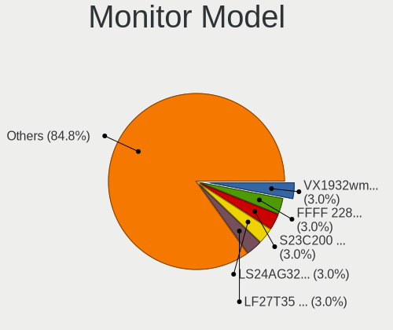
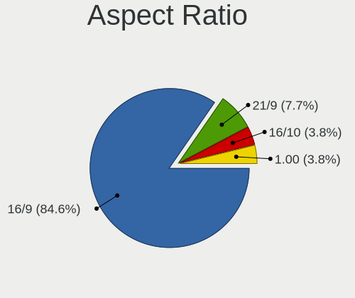
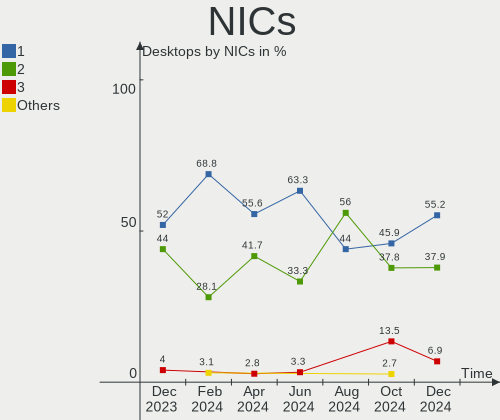
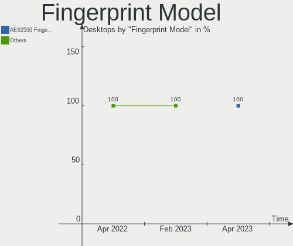

KDE neon - Hardware Trends (Desktops)
-------------------------------------

A project to identify most popular hardware characteristics and track their change
over time based on data collected by Linux users at https://Linux-Hardware.org.

Anyone can contribute to this report by the [hw-probe](https://github.com/linuxhw/hw-probe) tool:

    sudo -E hw-probe -all -upload

This report is for one last month. Overall report since the beginning of time: [TestDays](https://github.com/linuxhw/TestDays)

Period: Feb, 2023.

Contents
--------

* [ System ](#system)
  - [ OS                       ](#os)
  - [ OS Family                ](#os-family)
  - [ Kernel                   ](#kernel)
  - [ Kernel Family            ](#kernel-family)
  - [ Kernel Major Ver.        ](#kernel-major-ver)
  - [ Arch                     ](#arch)
  - [ DE                       ](#de)
  - [ Display Server           ](#display-server)
  - [ Display Manager          ](#display-manager)
  - [ OS Lang                  ](#os-lang)
  - [ Boot Mode                ](#boot-mode)
  - [ Filesystem               ](#filesystem)
  - [ Part. scheme             ](#part-scheme)
  - [ Dual Boot with Linux/BSD ](#dual-boot-with-linuxbsd)
  - [ Dual Boot (Win)          ](#dual-boot-win)

* [ Board ](#board)
  - [ Vendor                   ](#vendor)
  - [ Model                    ](#model)
  - [ Model Family             ](#model-family)
  - [ MFG Year                 ](#mfg-year)
  - [ Form Factor              ](#form-factor)
  - [ Secure Boot              ](#secure-boot)
  - [ Coreboot                 ](#coreboot)
  - [ RAM Size                 ](#ram-size)
  - [ RAM Used                 ](#ram-used)
  - [ Total Drives             ](#total-drives)
  - [ Has CD-ROM               ](#has-cd-rom)
  - [ Has Ethernet             ](#has-ethernet)
  - [ Has WiFi                 ](#has-wifi)
  - [ Has Bluetooth            ](#has-bluetooth)

* [ Location ](#location)
  - [ Country                  ](#country)
  - [ City                     ](#city)

* [ Drives ](#drives)
  - [ Drive Vendor             ](#drive-vendor)
  - [ Drive Model              ](#drive-model)
  - [ HDD Vendor               ](#hdd-vendor)
  - [ SSD Vendor               ](#ssd-vendor)
  - [ Drive Kind               ](#drive-kind)
  - [ Drive Connector          ](#drive-connector)
  - [ Drive Size               ](#drive-size)
  - [ Space Total              ](#space-total)
  - [ Space Used               ](#space-used)
  - [ Malfunc. Drives          ](#malfunc-drives)
  - [ Malfunc. Drive Vendor    ](#malfunc-drive-vendor)
  - [ Malfunc. HDD Vendor      ](#malfunc-hdd-vendor)
  - [ Malfunc. Drive Kind      ](#malfunc-drive-kind)
  - [ Failed Drives            ](#failed-drives)
  - [ Failed Drive Vendor      ](#failed-drive-vendor)
  - [ Drive Status             ](#drive-status)

* [ Storage controller ](#storage-controller)
  - [ Storage Vendor           ](#storage-vendor)
  - [ Storage Model            ](#storage-model)
  - [ Storage Kind             ](#storage-kind)

* [ Processor ](#processor)
  - [ CPU Vendor               ](#cpu-vendor)
  - [ CPU Model                ](#cpu-model)
  - [ CPU Model Family         ](#cpu-model-family)
  - [ CPU Cores                ](#cpu-cores)
  - [ CPU Sockets              ](#cpu-sockets)
  - [ CPU Threads              ](#cpu-threads)
  - [ CPU Op-Modes             ](#cpu-op-modes)
  - [ CPU Microcode            ](#cpu-microcode)
  - [ CPU Microarch            ](#cpu-microarch)

* [ Graphics ](#graphics)
  - [ GPU Vendor               ](#gpu-vendor)
  - [ GPU Model                ](#gpu-model)
  - [ GPU Combo                ](#gpu-combo)
  - [ GPU Driver               ](#gpu-driver)
  - [ GPU Memory               ](#gpu-memory)

* [ Monitor ](#monitor)
  - [ Monitor Vendor           ](#monitor-vendor)
  - [ Monitor Model            ](#monitor-model)
  - [ Monitor Resolution       ](#monitor-resolution)
  - [ Monitor Diagonal         ](#monitor-diagonal)
  - [ Monitor Width            ](#monitor-width)
  - [ Aspect Ratio             ](#aspect-ratio)
  - [ Monitor Area             ](#monitor-area)
  - [ Pixel Density            ](#pixel-density)
  - [ Multiple Monitors        ](#multiple-monitors)

* [ Network ](#network)
  - [ Net Controller Vendor    ](#net-controller-vendor)
  - [ Net Controller Model     ](#net-controller-model)
  - [ Wireless Vendor          ](#wireless-vendor)
  - [ Wireless Model           ](#wireless-model)
  - [ Ethernet Vendor          ](#ethernet-vendor)
  - [ Ethernet Model           ](#ethernet-model)
  - [ Net Controller Kind      ](#net-controller-kind)
  - [ Used Controller          ](#used-controller)
  - [ NICs                     ](#nics)
  - [ IPv6                     ](#ipv6)

* [ Bluetooth ](#bluetooth)
  - [ Bluetooth Vendor         ](#bluetooth-vendor)
  - [ Bluetooth Model          ](#bluetooth-model)

* [ Sound ](#sound)
  - [ Sound Vendor             ](#sound-vendor)
  - [ Sound Model              ](#sound-model)

* [ Memory ](#memory)
  - [ Memory Vendor            ](#memory-vendor)
  - [ Memory Model             ](#memory-model)
  - [ Memory Kind              ](#memory-kind)
  - [ Memory Form Factor       ](#memory-form-factor)
  - [ Memory Size              ](#memory-size)
  - [ Memory Speed             ](#memory-speed)

* [ Printers & scanners ](#printers--scanners)
  - [ Printer Vendor           ](#printer-vendor)
  - [ Printer Model            ](#printer-model)
  - [ Scanner Vendor           ](#scanner-vendor)
  - [ Scanner Model            ](#scanner-model)

* [ Camera ](#camera)
  - [ Camera Vendor            ](#camera-vendor)
  - [ Camera Model             ](#camera-model)

* [ Security ](#security)
  - [ Fingerprint Vendor       ](#fingerprint-vendor)
  - [ Fingerprint Model        ](#fingerprint-model)
  - [ Chipcard Vendor          ](#chipcard-vendor)
  - [ Chipcard Model           ](#chipcard-model)

* [ Unsupported ](#unsupported)
  - [ Unsupported Devices      ](#unsupported-devices)
  - [ Unsupported Device Types ](#unsupported-device-types)

System
------

OS
--

Installed operating systems

| Name           | Desktops | Percent |
|----------------|----------|---------|
| KDE neon 22.04 | 43       | 97.73%  |
| KDE neon 20.04 | 1        | 2.27%   |

OS Family
---------

OS without a version

| Name     | Desktops | Percent |
|----------|----------|---------|
| KDE neon | 44       | 100%    |

Kernel
------

Version of the Linux kernel

| Version                | Desktops | Percent |
|------------------------|----------|---------|
| 5.19.0-32-generic      | 21       | 47.73%  |
| 5.15.0-60-generic      | 10       | 22.73%  |
| 5.15.0-58-generic      | 9        | 20.45%  |
| 6.1.13-x64v3-xanmod1   | 1        | 2.27%   |
| 6.1.0-1004-oem         | 1        | 2.27%   |
| 5.4.0-113-generic      | 1        | 2.27%   |
| 5.19.17-051917-generic | 1        | 2.27%   |

Kernel Family
-------------

Linux kernel without a distro release

| Version | Desktops | Percent |
|---------|----------|---------|
| 5.19.0  | 21       | 47.73%  |
| 5.15.0  | 19       | 43.18%  |
| 6.1.13  | 1        | 2.27%   |
| 6.1.0   | 1        | 2.27%   |
| 5.4.0   | 1        | 2.27%   |
| 5.19.17 | 1        | 2.27%   |

Kernel Major Ver.
-----------------

Linux kernel major version

| Version | Desktops | Percent |
|---------|----------|---------|
| 5.19    | 22       | 50%     |
| 5.15    | 19       | 43.18%  |
| 6.1     | 2        | 4.55%   |
| 5.4     | 1        | 2.27%   |

Arch
----

OS architecture (x86_64, i586, etc.)

| Name   | Desktops | Percent |
|--------|----------|---------|
| x86_64 | 44       | 100%    |

DE
--

Desktop Environment

| Name | Desktops | Percent |
|------|----------|---------|
| KDE5 | 44       | 100%    |

Display Server
--------------

X11 or Wayland

| Name    | Desktops | Percent |
|---------|----------|---------|
| X11     | 43       | 97.73%  |
| Wayland | 1        | 2.27%   |

Display Manager
---------------

SDDM, LightDM, etc.

| Name    | Desktops | Percent |
|---------|----------|---------|
| Unknown | 33       | 75%     |
| SDDM    | 11       | 25%     |

OS Lang
-------

Language

| Lang           | Desktops | Percent |
|----------------|----------|---------|
| en_US          | 13       | 29.55%  |
| de_DE          | 5        | 11.36%  |
| en_GB          | 4        | 9.09%   |
| ru_RU          | 3        | 6.82%   |
| pl_PL          | 3        | 6.82%   |
| es_ES          | 3        | 6.82%   |
| fr_FR          | 2        | 4.55%   |
| en_NZ          | 2        | 4.55%   |
| pt_BR          | 1        | 2.27%   |
| nl_NL          | 1        | 2.27%   |
| es_MX          | 1        | 2.27%   |
| es_CU          | 1        | 2.27%   |
| en_PH          | 1        | 2.27%   |
| en_IN          | 1        | 2.27%   |
| en_CA          | 1        | 2.27%   |
| en_AG          | 1        | 2.27%   |
| ca_ES@valencia | 1        | 2.27%   |

Boot Mode
---------

EFI or BIOS

| Mode | Desktops | Percent |
|------|----------|---------|
| BIOS | 40       | 90.91%  |
| EFI  | 4        | 9.09%   |

Filesystem
----------

Type of filesystem

| Type  | Desktops | Percent |
|-------|----------|---------|
| Ext4  | 40       | 90.91%  |
| Btrfs | 4        | 9.09%   |

Part. scheme
------------

Scheme of partitioning

| Type    | Desktops | Percent |
|---------|----------|---------|
| Unknown | 33       | 75%     |
| GPT     | 10       | 22.73%  |
| MBR     | 1        | 2.27%   |

Dual Boot with Linux/BSD
------------------------

Hosting more than one Linux/BSD

| Dual boot | Desktops | Percent |
|-----------|----------|---------|
| No        | 38       | 86.36%  |
| Yes       | 6        | 13.64%  |

Dual Boot (Win)
---------------

Hosting Linux and Windows

| Dual boot | Desktops | Percent |
|-----------|----------|---------|
| No        | 39       | 88.64%  |
| Yes       | 5        | 11.36%  |

Board
-----

Vendor
------

Motherboard manufacturer

| Name                | Desktops | Percent |
|---------------------|----------|---------|
| ASUSTek Computer    | 15       | 34.09%  |
| MSI                 | 11       | 25%     |
| Gigabyte Technology | 8        | 18.18%  |
| Dell                | 3        | 6.82%   |
| Acer                | 2        | 4.55%   |
| Lenovo              | 1        | 2.27%   |
| Hewlett-Packard     | 1        | 2.27%   |
| AZW                 | 1        | 2.27%   |
| ASRock              | 1        | 2.27%   |
| Unknown             | 1        | 2.27%   |

Model
-----

Motherboard model

| Name                            | Desktops | Percent |
|---------------------------------|----------|---------|
| Dell OptiPlex 7010              | 2        | 4.55%   |
| MSI X5836                       | 1        | 2.27%   |
| MSI MS-9A65                     | 1        | 2.27%   |
| MSI MS-7C94                     | 1        | 2.27%   |
| MSI MS-7C52                     | 1        | 2.27%   |
| MSI MS-7C37                     | 1        | 2.27%   |
| MSI MS-7B98                     | 1        | 2.27%   |
| MSI MS-7B85                     | 1        | 2.27%   |
| MSI MS-7B84                     | 1        | 2.27%   |
| MSI MS-7A38                     | 1        | 2.27%   |
| MSI MS-7A37                     | 1        | 2.27%   |
| MSI MS-7970                     | 1        | 2.27%   |
| Lenovo ThinkCentre M92P 3237CC4 | 1        | 2.27%   |
| HP EliteDesk 800 G3 SFF         | 1        | 2.27%   |
| Gigabyte Z690 GAMING X DDR4     | 1        | 2.27%   |
| Gigabyte Z390 UD                | 1        | 2.27%   |
| Gigabyte X570 UD                | 1        | 2.27%   |
| Gigabyte X570 I AORUS PRO WIFI  | 1        | 2.27%   |
| Gigabyte X399 DESIGNARE EX      | 1        | 2.27%   |
| Gigabyte H310M H                | 1        | 2.27%   |
| Gigabyte B550M AORUS ELITE      | 1        | 2.27%   |
| Gigabyte B450M DS3H             | 1        | 2.27%   |
| Dell Inspiron 660               | 1        | 2.27%   |
| AZW GTR                         | 1        | 2.27%   |
| ASUS TUF Gaming X570-PLUS       | 1        | 2.27%   |
| ASUS TUF Gaming B450M-PRO II    | 1        | 2.27%   |
| ASUS ROG STRIX Z390-F GAMING    | 1        | 2.27%   |
| ASUS ROG STRIX B550-F GAMING    | 1        | 2.27%   |
| ASUS ROG Maximus X HERO         | 1        | 2.27%   |
| ASUS PRIME X470-PRO             | 1        | 2.27%   |
| ASUS PRIME B450M-A              | 1        | 2.27%   |
| ASUS PRIME B450-PLUS            | 1        | 2.27%   |
| ASUS PRIME A320M-K              | 1        | 2.27%   |
| ASUS P8H67                      | 1        | 2.27%   |
| ASUS P8H61-M LX3 PLUS           | 1        | 2.27%   |
| ASUS M5A97 EVO R2.0             | 1        | 2.27%   |
| ASUS M5A78L LE                  | 1        | 2.27%   |
| ASUS H81M-CT                    | 1        | 2.27%   |
| ASUS All Series                 | 1        | 2.27%   |
| ASRock P67 Pro3                 | 1        | 2.27%   |

Model Family
------------

Motherboard model prefix

| Name               | Desktops | Percent |
|--------------------|----------|---------|
| ASUS PRIME         | 4        | 9.09%   |
| ASUS ROG           | 3        | 6.82%   |
| Gigabyte X570      | 2        | 4.55%   |
| Dell OptiPlex      | 2        | 4.55%   |
| ASUS TUF           | 2        | 4.55%   |
| MSI X5836          | 1        | 2.27%   |
| MSI MS-9A65        | 1        | 2.27%   |
| MSI MS-7C94        | 1        | 2.27%   |
| MSI MS-7C52        | 1        | 2.27%   |
| MSI MS-7C37        | 1        | 2.27%   |
| MSI MS-7B98        | 1        | 2.27%   |
| MSI MS-7B85        | 1        | 2.27%   |
| MSI MS-7B84        | 1        | 2.27%   |
| MSI MS-7A38        | 1        | 2.27%   |
| MSI MS-7A37        | 1        | 2.27%   |
| MSI MS-7970        | 1        | 2.27%   |
| Lenovo ThinkCentre | 1        | 2.27%   |
| HP EliteDesk       | 1        | 2.27%   |
| Gigabyte Z690      | 1        | 2.27%   |
| Gigabyte Z390      | 1        | 2.27%   |
| Gigabyte X399      | 1        | 2.27%   |
| Gigabyte H310M     | 1        | 2.27%   |
| Gigabyte B550M     | 1        | 2.27%   |
| Gigabyte B450M     | 1        | 2.27%   |
| Dell Inspiron      | 1        | 2.27%   |
| AZW GTR            | 1        | 2.27%   |
| ASUS P8H67         | 1        | 2.27%   |
| ASUS P8H61-M       | 1        | 2.27%   |
| ASUS M5A97         | 1        | 2.27%   |
| ASUS M5A78L        | 1        | 2.27%   |
| ASUS H81M-CT       | 1        | 2.27%   |
| ASUS All           | 1        | 2.27%   |
| ASRock P67         | 1        | 2.27%   |
| Acer Veriton       | 1        | 2.27%   |
| Acer Aspire        | 1        | 2.27%   |
| Unknown            | 1        | 2.27%   |

MFG Year
--------

Motherboard manufacture year

| Year | Desktops | Percent |
|------|----------|---------|
| 2018 | 11       | 25%     |
| 2019 | 8        | 18.18%  |
| 2020 | 6        | 13.64%  |
| 2012 | 5        | 11.36%  |
| 2017 | 3        | 6.82%   |
| 2016 | 2        | 4.55%   |
| 2013 | 2        | 4.55%   |
| 2011 | 2        | 4.55%   |
| 2010 | 2        | 4.55%   |
| 2022 | 1        | 2.27%   |
| 2021 | 1        | 2.27%   |
| 2015 | 1        | 2.27%   |

Form Factor
-----------

Physical design of the computer

| Name    | Desktops | Percent |
|---------|----------|---------|
| Desktop | 44       | 100%    |

Secure Boot
-----------

Enabled or disabled

| State    | Desktops | Percent |
|----------|----------|---------|
| Disabled | 44       | 100%    |

Coreboot
--------

Have coreboot on board

| Used | Desktops | Percent |
|------|----------|---------|
| No   | 44       | 100%    |

RAM Size
--------

Total RAM memory

| Size in GB  | Desktops | Percent |
|-------------|----------|---------|
| 16.01-24.0  | 12       | 27.27%  |
| 32.01-64.0  | 8        | 18.18%  |
| 8.01-16.0   | 8        | 18.18%  |
| 4.01-8.0    | 7        | 15.91%  |
| 64.01-256.0 | 5        | 11.36%  |
| 3.01-4.0    | 2        | 4.55%   |
| 24.01-32.0  | 2        | 4.55%   |

RAM Used
--------

Used RAM memory

| Used GB  | Desktops | Percent |
|----------|----------|---------|
| 2.01-3.0 | 19       | 43.18%  |
| 3.01-4.0 | 10       | 22.73%  |
| 1.01-2.0 | 10       | 22.73%  |
| 4.01-8.0 | 5        | 11.36%  |

Total Drives
------------

Number of drives on board

| Drives | Desktops | Percent |
|--------|----------|---------|
| 2      | 19       | 43.18%  |
| 3      | 9        | 20.45%  |
| 1      | 8        | 18.18%  |
| 4      | 5        | 11.36%  |
| 11     | 1        | 2.27%   |
| 6      | 1        | 2.27%   |
| 5      | 1        | 2.27%   |

Has CD-ROM
----------

Has CD-ROM on board

| Presented | Desktops | Percent |
|-----------|----------|---------|
| No        | 31       | 70.45%  |
| Yes       | 13       | 29.55%  |

Has Ethernet
------------

Has Ethernet on board

| Presented | Desktops | Percent |
|-----------|----------|---------|
| Yes       | 44       | 100%    |

Has WiFi
--------

Has WiFi module

| Presented | Desktops | Percent |
|-----------|----------|---------|
| No        | 28       | 63.64%  |
| Yes       | 16       | 36.36%  |

Has Bluetooth
-------------

Has Bluetooth module

| Presented | Desktops | Percent |
|-----------|----------|---------|
| No        | 24       | 54.55%  |
| Yes       | 20       | 45.45%  |

Location
--------

Country
-------

Geographic location (country)

| Country      | Desktops | Percent |
|--------------|----------|---------|
| USA          | 9        | 20.45%  |
| Spain        | 4        | 9.09%   |
| Germany      | 4        | 9.09%   |
| UK           | 3        | 6.82%   |
| Russia       | 3        | 6.82%   |
| Poland       | 3        | 6.82%   |
| Netherlands  | 2        | 4.55%   |
| Canada       | 2        | 4.55%   |
| Ukraine      | 1        | 2.27%   |
| South Africa | 1        | 2.27%   |
| Philippines  | 1        | 2.27%   |
| Norway       | 1        | 2.27%   |
| New Zealand  | 1        | 2.27%   |
| Mexico       | 1        | 2.27%   |
| Martinique   | 1        | 2.27%   |
| India        | 1        | 2.27%   |
| France       | 1        | 2.27%   |
| Finland      | 1        | 2.27%   |
| Cuba         | 1        | 2.27%   |
| Brazil       | 1        | 2.27%   |
| Belgium      | 1        | 2.27%   |
| Australia    | 1        | 2.27%   |

City
----

Geographic location (city)

| City                  | Desktops | Percent |
|-----------------------|----------|---------|
| Nizhniy Novgorod      | 2        | 4.55%   |
| Wroclaw               | 1        | 2.27%   |
| Wilmington            | 1        | 2.27%   |
| Watford               | 1        | 2.27%   |
| Walcz                 | 1        | 2.27%   |
| Vantaa                | 1        | 2.27%   |
| Valladolid            | 1        | 2.27%   |
| Valencia              | 1        | 2.27%   |
| Tromsø               | 1        | 2.27%   |
| Tracy                 | 1        | 2.27%   |
| Telford               | 1        | 2.27%   |
| Tavares               | 1        | 2.27%   |
| Sorel-Tracy           | 1        | 2.27%   |
| Simferopol            | 1        | 2.27%   |
| San Antonio           | 1        | 2.27%   |
| Rostock               | 1        | 2.27%   |
| Ridderkerk            | 1        | 2.27%   |
| Quimperlé            | 1        | 2.27%   |
| Pickering             | 1        | 2.27%   |
| Orange City           | 1        | 2.27%   |
| Moscow                | 1        | 2.27%   |
| Mexico City           | 1        | 2.27%   |
| Melbourne             | 1        | 2.27%   |
| Maxhutte-Haidhof      | 1        | 2.27%   |
| Marthandam            | 1        | 2.27%   |
| Lexington             | 1        | 2.27%   |
| Leipzig               | 1        | 2.27%   |
| Kerkdriel             | 1        | 2.27%   |
| Havana                | 1        | 2.27%   |
| Hanover               | 1        | 2.27%   |
| Hamme                 | 1        | 2.27%   |
| Guarulhos             | 1        | 2.27%   |
| Fort-de-France        | 1        | 2.27%   |
| Christchurch          | 1        | 2.27%   |
| Chicago               | 1        | 2.27%   |
| Ceres                 | 1        | 2.27%   |
| Castelló de la Plana | 1        | 2.27%   |
| Calgary               | 1        | 2.27%   |
| Bydgoszcz             | 1        | 2.27%   |
| Bellefontaine         | 1        | 2.27%   |

Drives
------

Drive Vendor
------------

Hard drive vendors

| Vendor                    | Desktops | Drives | Percent |
|---------------------------|----------|--------|---------|
| Seagate                   | 16       | 16     | 17.02%  |
| Samsung Electronics       | 16       | 23     | 17.02%  |
| WDC                       | 13       | 22     | 13.83%  |
| Sandisk                   | 8        | 10     | 8.51%   |
| Kingston                  | 8        | 10     | 8.51%   |
| Toshiba                   | 4        | 4      | 4.26%   |
| XPG                       | 2        | 2      | 2.13%   |
| Realtek Semiconductor     | 2        | 2      | 2.13%   |
| Intenso                   | 2        | 3      | 2.13%   |
| Unknown                   | 1        | 1      | 1.06%   |
| UMIS                      | 1        | 1      | 1.06%   |
| Transcend                 | 1        | 1      | 1.06%   |
| SSK                       | 1        | 1      | 1.06%   |
| SPCC                      | 1        | 1      | 1.06%   |
| Smartbuy                  | 1        | 1      | 1.06%   |
| SK hynix                  | 1        | 1      | 1.06%   |
| Phison Electronics        | 1        | 1      | 1.06%   |
| OCZ                       | 1        | 1      | 1.06%   |
| NT-1TB                    | 1        | 1      | 1.06%   |
| Neo                       | 1        | 1      | 1.06%   |
| Micron/Crucial Technology | 1        | 2      | 1.06%   |
| Micron Technology         | 1        | 1      | 1.06%   |
| Lite-On Technology        | 1        | 1      | 1.06%   |
| Leven                     | 1        | 1      | 1.06%   |
| KingFast                  | 1        | 1      | 1.06%   |
| Integral                  | 1        | 1      | 1.06%   |
| Innodisk                  | 1        | 1      | 1.06%   |
| HS-SSD-C100               | 1        | 1      | 1.06%   |
| Hitachi                   | 1        | 1      | 1.06%   |
| GOODRAM                   | 1        | 1      | 1.06%   |
| Gigabyte Technology       | 1        | 1      | 1.06%   |
| Crucial                   | 1        | 1      | 1.06%   |

Drive Model
-----------

Hard drive models

| Model                                               | Desktops | Percent |
|-----------------------------------------------------|----------|---------|
| Samsung NVMe SSD Controller SM981/PM981/PM983 250GB | 4        | 3.6%    |
| Seagate ST1000DM010-2EP102 1TB                      | 3        | 2.7%    |
| Toshiba HDWD110 1TB                                 | 2        | 1.8%    |
| Seagate ST500DM002-1BD142 500GB                     | 2        | 1.8%    |
| Seagate ST2000DM008-2UB102 2TB                      | 2        | 1.8%    |
| Sandisk WD Black SN750 / PC SN730 NVMe SSD 512GB    | 2        | 1.8%    |
| Samsung SSD 860 EVO 500GB                           | 2        | 1.8%    |
| Samsung SSD 860 EVO 1TB                             | 2        | 1.8%    |
| Samsung SSD 850 EVO 250GB                           | 2        | 1.8%    |
| Realtek RTS5763DL NVMe SSD Controller 4TB           | 2        | 1.8%    |
| Kingston SUV500120G 120GB SSD                       | 2        | 1.8%    |
| Kingston SA400S37480G 480GB SSD                     | 2        | 1.8%    |
| XPG SPECTRIX S40G 4TB                               | 1        | 0.9%    |
| XPG GAMMIX S11 Pro 512GB                            | 1        | 0.9%    |
| WDC WUH721414ALE604 14TB                            | 1        | 0.9%    |
| WDC WDS500G2B0A-00SM50 500GB SSD                    | 1        | 0.9%    |
| WDC WDS200T2B0B-00YS70 2TB SSD                      | 1        | 0.9%    |
| WDC WDS120G2G0A-00JH30 120GB SSD                    | 1        | 0.9%    |
| WDC WD6001FZWX-00A2VA0 6TB                          | 1        | 0.9%    |
| WDC WD5000AAKX-00ERMA0 500GB                        | 1        | 0.9%    |
| WDC WD40EZRZ-00GXCB0 4TB                            | 1        | 0.9%    |
| WDC WD4003FZEX-00Z4SA0 4TB                          | 1        | 0.9%    |
| WDC WD30EFRX-68EUZN0 3TB                            | 1        | 0.9%    |
| WDC WD20EZRZ-00Z5HB0 2TB                            | 1        | 0.9%    |
| WDC WD20EFRX-68EUZN0 2TB                            | 1        | 0.9%    |
| WDC WD2003FYPS-27W9B0 2TB                           | 1        | 0.9%    |
| WDC WD121KRYZ-01W0RB0 12TB                          | 1        | 0.9%    |
| WDC WD10EZEX-22MFCA0 1TB                            | 1        | 0.9%    |
| WDC WD10EZEX-21WN4A0 1TB                            | 1        | 0.9%    |
| WDC WD10EZEX-08WN4A0 1TB                            | 1        | 0.9%    |
| WDC WD10EZEX-00BBHA0 1TB                            | 1        | 0.9%    |
| WDC WD101KRYZ-01JPDB0 10TB                          | 1        | 0.9%    |
| WDC WD1003FZEX-00K3CA0 1TB                          | 1        | 0.9%    |
| Unknown SD/MMC/MS PRO 16GB                          | 1        | 0.9%    |
| UMIS RPJTJ256MEE1OWX 256GB                          | 1        | 0.9%    |
| Transcend TS500GSSD220Q 500GB                       | 1        | 0.9%    |
| Toshiba HDWN160 6TB                                 | 1        | 0.9%    |
| Toshiba HDWD130 3TB                                 | 1        | 0.9%    |
| SSK Disk 1TB                                        | 1        | 0.9%    |
| SPCC Solid State Disk 256GB                         | 1        | 0.9%    |

HDD Vendor
----------

Hard disk drive vendors

| Vendor              | Desktops | Drives | Percent |
|---------------------|----------|--------|---------|
| Seagate             | 16       | 16     | 45.71%  |
| WDC                 | 11       | 19     | 31.43%  |
| Toshiba             | 4        | 4      | 11.43%  |
| Samsung Electronics | 2        | 4      | 5.71%   |
| Unknown             | 1        | 1      | 2.86%   |
| Hitachi             | 1        | 1      | 2.86%   |

SSD Vendor
----------

Solid state drive vendors

| Vendor              | Desktops | Drives | Percent |
|---------------------|----------|--------|---------|
| Samsung Electronics | 12       | 14     | 32.43%  |
| Kingston            | 5        | 7      | 13.51%  |
| SanDisk             | 4        | 4      | 10.81%  |
| WDC                 | 3        | 3      | 8.11%   |
| Intenso             | 2        | 3      | 5.41%   |
| Transcend           | 1        | 1      | 2.7%    |
| SPCC                | 1        | 1      | 2.7%    |
| Smartbuy            | 1        | 1      | 2.7%    |
| OCZ                 | 1        | 1      | 2.7%    |
| NT-1TB              | 1        | 1      | 2.7%    |
| Neo                 | 1        | 1      | 2.7%    |
| Micron Technology   | 1        | 1      | 2.7%    |
| Leven               | 1        | 1      | 2.7%    |
| Integral            | 1        | 1      | 2.7%    |
| Gigabyte Technology | 1        | 1      | 2.7%    |
| Crucial             | 1        | 1      | 2.7%    |

Drive Kind
----------

HDD or SSD

| Kind    | Desktops | Drives | Percent |
|---------|----------|--------|---------|
| SSD     | 29       | 42     | 38.16%  |
| HDD     | 26       | 45     | 34.21%  |
| NVMe    | 17       | 25     | 22.37%  |
| Unknown | 4        | 4      | 5.26%   |

Drive Connector
---------------

SATA, SAS, NVMe, etc.

| Type | Desktops | Drives | Percent |
|------|----------|--------|---------|
| SATA | 39       | 86     | 63.93%  |
| NVMe | 17       | 25     | 27.87%  |
| SAS  | 5        | 5      | 8.2%    |

Drive Size
----------

Size of hard drive

| Size in TB | Desktops | Drives | Percent |
|------------|----------|--------|---------|
| 0.01-0.5   | 28       | 39     | 40.58%  |
| 0.51-1.0   | 19       | 21     | 27.54%  |
| 1.01-2.0   | 10       | 10     | 14.49%  |
| 3.01-4.0   | 4        | 4      | 5.8%    |
| 4.01-10.0  | 4        | 6      | 5.8%    |
| 2.01-3.0   | 3        | 3      | 4.35%   |
| 10.01-20.0 | 1        | 4      | 1.45%   |

Space Total
-----------

Amount of disk space available on the file system

| Size in GB     | Desktops | Percent |
|----------------|----------|---------|
| 251-500        | 12       | 27.27%  |
| 101-250        | 10       | 22.73%  |
| 501-1000       | 9        | 20.45%  |
| 1001-2000      | 5        | 11.36%  |
| 2001-3000      | 3        | 6.82%   |
| 51-100         | 3        | 6.82%   |
| More than 3000 | 1        | 2.27%   |
| Unknown        | 1        | 2.27%   |

Space Used
----------

Amount of used disk space

| Used GB   | Desktops | Percent |
|-----------|----------|---------|
| 1-20      | 20       | 45.45%  |
| 21-50     | 8        | 18.18%  |
| 101-250   | 4        | 9.09%   |
| 51-100    | 4        | 9.09%   |
| 251-500   | 3        | 6.82%   |
| 501-1000  | 3        | 6.82%   |
| 2001-3000 | 1        | 2.27%   |
| Unknown   | 1        | 2.27%   |

Malfunc. Drives
---------------

Drive models with a malfunction

| Model                                   | Desktops | Drives | Percent |
|-----------------------------------------|----------|--------|---------|
| WDC WD10EZEX-22MFCA0 1TB                | 1        | 1      | 50%     |
| Neo Forza NFS121SA312-6007000 120GB SSD | 1        | 1      | 50%     |

Malfunc. Drive Vendor
---------------------

Vendors of faulty drives

| Vendor | Desktops | Drives | Percent |
|--------|----------|--------|---------|
| WDC    | 1        | 1      | 50%     |
| Neo    | 1        | 1      | 50%     |

Malfunc. HDD Vendor
-------------------

Vendors of faulty HDD drives

| Vendor | Desktops | Drives | Percent |
|--------|----------|--------|---------|
| WDC    | 1        | 1      | 100%    |

Malfunc. Drive Kind
-------------------

Kinds of faulty drives

| Kind | Desktops | Drives | Percent |
|------|----------|--------|---------|
| SSD  | 1        | 1      | 50%     |
| HDD  | 1        | 1      | 50%     |

Failed Drives
-------------

Failed drive models

Zero info for selected period =(

Failed Drive Vendor
-------------------

Failed drive vendors

Zero info for selected period =(

Drive Status
------------

Number of failed and malfunc. drives

| Status   | Desktops | Drives | Percent |
|----------|----------|--------|---------|
| Detected | 39       | 102    | 82.98%  |
| Works    | 7        | 12     | 14.89%  |
| Malfunc  | 1        | 2      | 2.13%   |

Storage controller
------------------

Storage Vendor
--------------

Storage controller vendors

| Vendor                      | Desktops | Percent |
|-----------------------------|----------|---------|
| AMD                         | 24       | 34.29%  |
| Intel                       | 21       | 30%     |
| Samsung Electronics         | 5        | 7.14%   |
| SanDisk                     | 4        | 5.71%   |
| Kingston Technology Company | 3        | 4.29%   |
| Realtek Semiconductor       | 2        | 2.86%   |
| Phison Electronics          | 2        | 2.86%   |
| ASMedia Technology          | 2        | 2.86%   |
| VIA Technologies            | 1        | 1.43%   |
| Union Memory (Shenzhen)     | 1        | 1.43%   |
| SK hynix                    | 1        | 1.43%   |
| Micron/Crucial Technology   | 1        | 1.43%   |
| Marvell Technology Group    | 1        | 1.43%   |
| Lite-On Technology          | 1        | 1.43%   |
| ADATA Technology            | 1        | 1.43%   |

Storage Model
-------------

Storage controller models

| Model                                                                                   | Desktops | Percent |
|-----------------------------------------------------------------------------------------|----------|---------|
| AMD FCH SATA Controller [AHCI mode]                                                     | 17       | 19.32%  |
| AMD 400 Series Chipset SATA Controller                                                  | 7        | 7.95%   |
| Samsung NVMe SSD Controller SM981/PM981/PM983                                           | 4        | 4.55%   |
| Intel Cannon Lake PCH SATA AHCI Controller                                              | 4        | 4.55%   |
| AMD FCH SATA Controller D                                                               | 4        | 4.55%   |
| Intel 7 Series/C210 Series Chipset Family 6-port SATA Controller [AHCI mode]            | 3        | 3.41%   |
| Intel 6 Series/C200 Series Chipset Family Desktop SATA Controller (IDE mode, ports 4-5) | 3        | 3.41%   |
| Intel 6 Series/C200 Series Chipset Family Desktop SATA Controller (IDE mode, ports 0-3) | 3        | 3.41%   |
| AMD 500 Series Chipset SATA Controller                                                  | 3        | 3.41%   |
| SanDisk WD Black SN750 / PC SN730 NVMe SSD                                              | 2        | 2.27%   |
| Realtek RTS5763DL NVMe SSD Controller                                                   | 2        | 2.27%   |
| Kingston Company Company Non-Volatile memory controller                                 | 2        | 2.27%   |
| Intel Q170/Q150/B150/H170/H110/Z170/CM236 Chipset SATA Controller [AHCI Mode]           | 2        | 2.27%   |
| Intel 8 Series/C220 Series Chipset Family 6-port SATA Controller 1 [AHCI mode]          | 2        | 2.27%   |
| Intel 7 Series/C210 Series Chipset Family 4-port SATA Controller [IDE mode]             | 2        | 2.27%   |
| Intel 7 Series/C210 Series Chipset Family 2-port SATA Controller [IDE mode]             | 2        | 2.27%   |
| Intel 200 Series PCH SATA controller [AHCI mode]                                        | 2        | 2.27%   |
| ASMedia ASM1062 Serial ATA Controller                                                   | 2        | 2.27%   |
| AMD SB7x0/SB8x0/SB9x0 SATA Controller [AHCI mode]                                       | 2        | 2.27%   |
| VIA VT6415 PATA IDE Host Controller                                                     | 1        | 1.14%   |
| Union Memory (Shenzhen) Non-Volatile memory controller                                  | 1        | 1.14%   |
| SK hynix BC501 NVMe Solid State Drive                                                   | 1        | 1.14%   |
| SanDisk WD PC SN810 / Black SN850 NVMe SSD                                              | 1        | 1.14%   |
| SanDisk WD Blue SN550 NVMe SSD                                                          | 1        | 1.14%   |
| Samsung NVMe SSD Controller SM961/PM961/SM963                                           | 1        | 1.14%   |
| Phison PS5013 E13 NVMe Controller                                                       | 1        | 1.14%   |
| Phison E12 NVMe Controller                                                              | 1        | 1.14%   |
| Micron/Crucial P2 NVMe PCIe SSD                                                         | 1        | 1.14%   |
| Marvell Group 88SE9235 PCIe 2.0 x2 4-port SATA 6 Gb/s Controller                        | 1        | 1.14%   |
| Lite-On Non-Volatile memory controller                                                  | 1        | 1.14%   |
| Kingston Company SNVS2000G [NV1 NVMe PCIe SSD 2TB]                                      | 1        | 1.14%   |
| Intel SATA Controller [RAID mode]                                                       | 1        | 1.14%   |
| Intel Atom Processor E3800 Series SATA AHCI Controller                                  | 1        | 1.14%   |
| Intel Alder Lake-S PCH SATA Controller [AHCI Mode]                                      | 1        | 1.14%   |
| AMD X399 Series Chipset SATA Controller                                                 | 1        | 1.14%   |
| AMD SB7x0/SB8x0/SB9x0 SATA Controller [Non-RAID5 mode]                                  | 1        | 1.14%   |
| AMD SB7x0/SB8x0/SB9x0 IDE Controller                                                    | 1        | 1.14%   |
| AMD 300 Series Chipset SATA Controller                                                  | 1        | 1.14%   |
| ADATA XPG SX8200 Pro PCIe Gen3x4 M.2 2280 Solid State Drive                             | 1        | 1.14%   |

Storage Kind
------------

Kind of storage controller (IDE, SATA, NVMe, SAS, ...)

| Kind | Desktops | Percent |
|------|----------|---------|
| SATA | 38       | 60.32%  |
| NVMe | 17       | 26.98%  |
| IDE  | 6        | 9.52%   |
| RAID | 2        | 3.17%   |

Processor
---------

CPU Vendor
----------

Processor vendors

| Vendor | Desktops | Percent |
|--------|----------|---------|
| AMD    | 24       | 54.55%  |
| Intel  | 20       | 45.45%  |

CPU Model
---------

Processor models

| Model                                           | Desktops | Percent |
|-------------------------------------------------|----------|---------|
| AMD Ryzen 5 3600 6-Core Processor               | 3        | 6.82%   |
| AMD Ryzen 5 2400G with Radeon Vega Graphics     | 2        | 4.55%   |
| Intel Xeon CPU E5-2689 0 @ 2.60GHz              | 1        | 2.27%   |
| Intel Xeon CPU E3-1220 v3 @ 3.10GHz             | 1        | 2.27%   |
| Intel Pentium CPU G630 @ 2.70GHz                | 1        | 2.27%   |
| Intel Core i7-9700K CPU @ 3.60GHz               | 1        | 2.27%   |
| Intel Core i7-8700K CPU @ 3.70GHz               | 1        | 2.27%   |
| Intel Core i7-6700 CPU @ 3.40GHz                | 1        | 2.27%   |
| Intel Core i7-4770 CPU @ 3.40GHz                | 1        | 2.27%   |
| Intel Core i7-2600 CPU @ 3.40GHz                | 1        | 2.27%   |
| Intel Core i5-9400F CPU @ 2.90GHz               | 1        | 2.27%   |
| Intel Core i5-9400 CPU @ 2.90GHz                | 1        | 2.27%   |
| Intel Core i5-6600 CPU @ 3.30GHz                | 1        | 2.27%   |
| Intel Core i5-6400 CPU @ 2.70GHz                | 1        | 2.27%   |
| Intel Core i5-3470T CPU @ 2.90GHz               | 1        | 2.27%   |
| Intel Core i5-3470 CPU @ 3.20GHz                | 1        | 2.27%   |
| Intel Core i5-3330 CPU @ 3.00GHz                | 1        | 2.27%   |
| Intel Core i5-2500K CPU @ 3.30GHz               | 1        | 2.27%   |
| Intel Core i3-8100 CPU @ 3.60GHz                | 1        | 2.27%   |
| Intel Core i3-3220 CPU @ 3.30GHz                | 1        | 2.27%   |
| Intel Celeron CPU J1900 @ 1.99GHz               | 1        | 2.27%   |
| Intel 12th Gen Core i7-12700                    | 1        | 2.27%   |
| AMD Ryzen Threadripper 2950X 16-Core Processor  | 1        | 2.27%   |
| AMD Ryzen 9 6900HX with Radeon Graphics         | 1        | 2.27%   |
| AMD Ryzen 9 5900X 12-Core Processor             | 1        | 2.27%   |
| AMD Ryzen 9 3900XT 12-Core Processor            | 1        | 2.27%   |
| AMD Ryzen 9 3900X 12-Core Processor             | 1        | 2.27%   |
| AMD Ryzen 7 3800X 8-Core Processor              | 1        | 2.27%   |
| AMD Ryzen 7 2700 Eight-Core Processor           | 1        | 2.27%   |
| AMD Ryzen 5 PRO 3350G with Radeon Vega Graphics | 1        | 2.27%   |
| AMD Ryzen 5 5600X 6-Core Processor              | 1        | 2.27%   |
| AMD Ryzen 5 5600G with Radeon Graphics          | 1        | 2.27%   |
| AMD Ryzen 5 5600 6-Core Processor               | 1        | 2.27%   |
| AMD Ryzen 5 3600X 6-Core Processor              | 1        | 2.27%   |
| AMD Ryzen 5 2600X Six-Core Processor            | 1        | 2.27%   |
| AMD Ryzen 5 2600 Six-Core Processor             | 1        | 2.27%   |
| AMD Ryzen 3 3200G with Radeon Vega Graphics     | 1        | 2.27%   |
| AMD Phenom II X4 965 Processor                  | 1        | 2.27%   |
| AMD FX-6300 Six-Core Processor                  | 1        | 2.27%   |
| AMD Athlon II X4 635 Processor                  | 1        | 2.27%   |

CPU Model Family
----------------

Processor model prefix

| Model                  | Desktops | Percent |
|------------------------|----------|---------|
| AMD Ryzen 5            | 11       | 25%     |
| Intel Core i5          | 8        | 18.18%  |
| Intel Core i7          | 5        | 11.36%  |
| AMD Ryzen 9            | 4        | 9.09%   |
| Intel Xeon             | 2        | 4.55%   |
| Intel Core i3          | 2        | 4.55%   |
| AMD Ryzen 7            | 2        | 4.55%   |
| Other                  | 1        | 2.27%   |
| Intel Pentium          | 1        | 2.27%   |
| Intel Celeron          | 1        | 2.27%   |
| AMD Ryzen Threadripper | 1        | 2.27%   |
| AMD Ryzen 5 PRO        | 1        | 2.27%   |
| AMD Ryzen 3            | 1        | 2.27%   |
| AMD Phenom II X4       | 1        | 2.27%   |
| AMD FX                 | 1        | 2.27%   |
| AMD Athlon II X4       | 1        | 2.27%   |
| AMD Athlon             | 1        | 2.27%   |

CPU Cores
---------

Number of processor cores

| Number | Desktops | Percent |
|--------|----------|---------|
| 4      | 17       | 38.64%  |
| 6      | 12       | 27.27%  |
| 8      | 5        | 11.36%  |
| 12     | 4        | 9.09%   |
| 2      | 4        | 9.09%   |
| 16     | 1        | 2.27%   |
| 3      | 1        | 2.27%   |

CPU Sockets
-----------

Number of sockets

| Number | Desktops | Percent |
|--------|----------|---------|
| 1      | 44       | 100%    |

CPU Threads
-----------

Threads per core (Hyper-Threading)

| Number | Desktops | Percent |
|--------|----------|---------|
| 2      | 29       | 65.91%  |
| 1      | 15       | 34.09%  |

CPU Op-Modes
------------

CPU Operation Modes (32-bit, 64-bit)

| Op mode        | Desktops | Percent |
|----------------|----------|---------|
| 32-bit, 64-bit | 44       | 100%    |

CPU Microcode
-------------

Microcode number

| Number     | Desktops | Percent |
|------------|----------|---------|
| Unknown    | 37       | 84.09%  |
| 0x506e3    | 1        | 2.27%   |
| 0x206a7    | 1        | 2.27%   |
| 0x0a404102 | 1        | 2.27%   |
| 0x08701021 | 1        | 2.27%   |
| 0x08101016 | 1        | 2.27%   |
| 0x0810100b | 1        | 2.27%   |
| 0x010000c8 | 1        | 2.27%   |

CPU Microarch
-------------

Microarchitecture

| Name        | Desktops | Percent |
|-------------|----------|---------|
| Zen 2       | 7        | 15.91%  |
| Zen+        | 6        | 13.64%  |
| KabyLake    | 5        | 11.36%  |
| Zen 3       | 4        | 9.09%   |
| SandyBridge | 4        | 9.09%   |
| IvyBridge   | 4        | 9.09%   |
| Zen         | 3        | 6.82%   |
| Skylake     | 3        | 6.82%   |
| K10         | 2        | 4.55%   |
| Haswell     | 2        | 4.55%   |
| Unknown     | 2        | 4.55%   |
| Silvermont  | 1        | 2.27%   |
| Piledriver  | 1        | 2.27%   |

Graphics
--------

GPU Vendor
----------

Vendors of graphics cards

| Vendor | Desktops | Percent |
|--------|----------|---------|
| Nvidia | 24       | 50%     |
| AMD    | 13       | 27.08%  |
| Intel  | 11       | 22.92%  |

GPU Model
---------

Graphics card models

| Model                                                                       | Desktops | Percent |
|-----------------------------------------------------------------------------|----------|---------|
| Intel Xeon E3-1200 v2/3rd Gen Core processor Graphics Controller            | 4        | 8.16%   |
| Intel HD Graphics 530                                                       | 3        | 6.12%   |
| Nvidia GP104 [GeForce GTX 1080]                                             | 2        | 4.08%   |
| Nvidia GP104 [GeForce GTX 1070]                                             | 2        | 4.08%   |
| AMD Raven Ridge [Radeon Vega Series / Radeon Vega Mobile Series]            | 2        | 4.08%   |
| AMD Picasso/Raven 2 [Radeon Vega Series / Radeon Vega Mobile Series]        | 2        | 4.08%   |
| AMD Ellesmere [Radeon RX 470/480/570/570X/580/580X/590]                     | 2        | 4.08%   |
| Nvidia TU117 [GeForce GTX 1650]                                             | 1        | 2.04%   |
| Nvidia TU116 [GeForce GTX 1660]                                             | 1        | 2.04%   |
| Nvidia TU116 [GeForce GTX 1660 Ti]                                          | 1        | 2.04%   |
| Nvidia TU106 [GeForce RTX 2070]                                             | 1        | 2.04%   |
| Nvidia TU106 [GeForce RTX 2060 Rev. A]                                      | 1        | 2.04%   |
| Nvidia TU102 [GeForce RTX 2080 Ti]                                          | 1        | 2.04%   |
| Nvidia TU102 [GeForce RTX 2080 Ti Rev. A]                                   | 1        | 2.04%   |
| Nvidia GT218 [GeForce 210]                                                  | 1        | 2.04%   |
| Nvidia GP108 [GeForce GT 1030]                                              | 1        | 2.04%   |
| Nvidia GP107 [GeForce GTX 1050 Ti]                                          | 1        | 2.04%   |
| Nvidia GP106 [GeForce GTX 1060 6GB]                                         | 1        | 2.04%   |
| Nvidia GP102 [GeForce GTX 1080 Ti]                                          | 1        | 2.04%   |
| Nvidia GM204 [GeForce GTX 970]                                              | 1        | 2.04%   |
| Nvidia GK208B [GeForce GT 710]                                              | 1        | 2.04%   |
| Nvidia GK107GL [Quadro K2000]                                               | 1        | 2.04%   |
| Nvidia GK107 [GeForce GTX 650]                                              | 1        | 2.04%   |
| Nvidia GK104 [GeForce GTX 760]                                              | 1        | 2.04%   |
| Nvidia GF119 [GeForce GT 620 OEM]                                           | 1        | 2.04%   |
| Nvidia GF104 [GeForce GTX 460]                                              | 1        | 2.04%   |
| Nvidia GA102 [GeForce RTX 3090]                                             | 1        | 2.04%   |
| Intel Xeon E3-1200 v3/4th Gen Core Processor Integrated Graphics Controller | 1        | 2.04%   |
| Intel Atom Processor Z36xxx/Z37xxx Series Graphics & Display                | 1        | 2.04%   |
| Intel AlderLake-S GT1                                                       | 1        | 2.04%   |
| Intel 2nd Generation Core Processor Family Integrated Graphics Controller   | 1        | 2.04%   |
| AMD RV710 [Radeon HD 4350/4550]                                             | 1        | 2.04%   |
| AMD Rembrandt [Radeon 680M]                                                 | 1        | 2.04%   |
| AMD Navi 24 [Radeon RX 6400/6500 XT/6500M]                                  | 1        | 2.04%   |
| AMD Navi 23 [Radeon RX 6650 XT]                                             | 1        | 2.04%   |
| AMD Lexa PRO [Radeon 540/540X/550/550X / RX 540X/550/550X]                  | 1        | 2.04%   |
| AMD Cezanne [Radeon Vega Series / Radeon Vega Mobile Series]                | 1        | 2.04%   |
| AMD Caicos [Radeon HD 6450/7450/8450 / R5 230 OEM]                          | 1        | 2.04%   |
| AMD Barts XT [Radeon HD 6870]                                               | 1        | 2.04%   |

GPU Combo
---------

Combinations of graphics cards

| Name           | Desktops | Percent |
|----------------|----------|---------|
| 1 x Nvidia     | 23       | 52.27%  |
| 1 x AMD        | 11       | 25%     |
| 1 x Intel      | 7        | 15.91%  |
| 2 x AMD        | 1        | 2.27%   |
| Intel + Nvidia | 1        | 2.27%   |
| Intel + AMD    | 1        | 2.27%   |

GPU Driver
----------

Free vs proprietary

| Driver      | Desktops | Percent |
|-------------|----------|---------|
| Free        | 40       | 90.91%  |
| Proprietary | 3        | 6.82%   |
| Unknown     | 1        | 2.27%   |

GPU Memory
----------

Total video memory

| Size in GB | Desktops | Percent |
|------------|----------|---------|
| Unknown    | 37       | 84.09%  |
| 3.01-4.0   | 2        | 4.55%   |
| 7.01-8.0   | 1        | 2.27%   |
| 5.01-6.0   | 1        | 2.27%   |
| 2.01-3.0   | 1        | 2.27%   |
| 8.01-16.0  | 1        | 2.27%   |
| 0.51-1.0   | 1        | 2.27%   |

Monitor
-------

Monitor Vendor
--------------

Monitor vendors

| Vendor               | Desktops | Percent |
|----------------------|----------|---------|
| Samsung Electronics  | 12       | 25.53%  |
| Goldstar             | 7        | 14.89%  |
| Hewlett-Packard      | 5        | 10.64%  |
| Acer                 | 5        | 10.64%  |
| Dell                 | 4        | 8.51%   |
| Philips              | 2        | 4.26%   |
| ASUSTek Computer     | 2        | 4.26%   |
| Westinghouse         | 1        | 2.13%   |
| Wacom                | 1        | 2.13%   |
| ViewSonic            | 1        | 2.13%   |
| VIE                  | 1        | 2.13%   |
| MSI                  | 1        | 2.13%   |
| MiTAC                | 1        | 2.13%   |
| ITE                  | 1        | 2.13%   |
| Iiyama               | 1        | 2.13%   |
| BenQ                 | 1        | 2.13%   |
| Ancor Communications | 1        | 2.13%   |

Monitor Model
-------------

Monitor models

| Model                                                                 | Desktops | Percent |
|-----------------------------------------------------------------------|----------|---------|
| Goldstar HDR 4K GSM7707 3840x2160 600x340mm 27.2-inch                 | 2        | 4.17%   |
| Westinghouse WD50FB1200 WETA307 1920x1080 930x530mm 42.1-inch         | 1        | 2.08%   |
| Wacom Cintiq 22HD WAC1031 1920x1080 476x268mm 21.5-inch               | 1        | 2.08%   |
| ViewSonic VX2718-2KPC VSCB73A 2560x1440 598x336mm 27.0-inch           | 1        | 2.08%   |
| VIE NXM24FHD01 VIEA238 1920x1080 520x310mm 23.8-inch                  | 1        | 2.08%   |
| Samsung Electronics T20C310 SAM0AE8 1600x900 432x240mm 19.5-inch      | 1        | 2.08%   |
| Samsung Electronics SyncMaster SAM03EE 1680x1050                      | 1        | 2.08%   |
| Samsung Electronics S34J55x SAM0F71 3440x1440 797x333mm 34.0-inch     | 1        | 2.08%   |
| Samsung Electronics S24F350 SAM0D21 1920x1080 521x293mm 23.5-inch     | 1        | 2.08%   |
| Samsung Electronics S22R35x SAM103A 1920x1080 476x268mm 21.5-inch     | 1        | 2.08%   |
| Samsung Electronics S22E390 SAM0C18 1920x1080 477x268mm 21.5-inch     | 1        | 2.08%   |
| Samsung Electronics LS27AG32x SAM71DC 1920x1080 597x336mm 27.0-inch   | 1        | 2.08%   |
| Samsung Electronics LCD Monitor SAM0F0B 1920x1080 708x398mm 32.0-inch | 1        | 2.08%   |
| Samsung Electronics LCD Monitor SAM0DF7 3840x2160 890x500mm 40.2-inch | 1        | 2.08%   |
| Samsung Electronics LC32G5xT SAM7088 2560x1440 698x393mm 31.5-inch    | 1        | 2.08%   |
| Samsung Electronics EPSON PJ SECA519 1920x1080                        | 1        | 2.08%   |
| Samsung Electronics C24F390 SAM0D2C 1920x1080 521x293mm 23.5-inch     | 1        | 2.08%   |
| Philips PHL 345E2 PHLC237 3440x1440 800x335mm 34.1-inch               | 1        | 2.08%   |
| Philips 220P4LPY PHL08C1 1680x1050 474x296mm 22.0-inch                | 1        | 2.08%   |
| MSI G27C6 MSI5CA9 1920x1080 598x336mm 27.0-inch                       | 1        | 2.08%   |
| MiTAC Smart TV MTC0030 1920x1080 708x398mm 32.0-inch                  | 1        | 2.08%   |
| ITE FHD ITE6662 1920x1080 621x341mm 27.9-inch                         | 1        | 2.08%   |
| Iiyama PL2710HD IVM6600 1920x1080 598x336mm 27.0-inch                 | 1        | 2.08%   |
| Hewlett-Packard w2207 HWP26A8 1680x1050 473x296mm 22.0-inch           | 1        | 2.08%   |
| Hewlett-Packard LCD Monitor Inc. HP 24mh                              | 1        | 2.08%   |
| Hewlett-Packard 25x HPN357F 1920x1080 544x303mm 24.5-inch             | 1        | 2.08%   |
| Hewlett-Packard 24es HWP3320 1920x1080 527x296mm 23.8-inch            | 1        | 2.08%   |
| Hewlett-Packard 2011 HWP2935 1600x900 443x249mm 20.0-inch             | 1        | 2.08%   |
| Goldstar M2280D GSM57B9 1920x1080 598x336mm 27.0-inch                 | 1        | 2.08%   |
| Goldstar IPS FULLHD GSM5AB8 1920x1080 480x270mm 21.7-inch             | 1        | 2.08%   |
| Goldstar FULL HD GSM5B54 1920x1080 480x270mm 21.7-inch                | 1        | 2.08%   |
| Goldstar E2251 GSM586D 1920x1080 477x268mm 21.5-inch                  | 1        | 2.08%   |
| Goldstar 38GN950 GSM7754 3840x1600 879x366mm 37.5-inch                | 1        | 2.08%   |
| Goldstar 27GN950 GSM5B9A 3840x2160 600x340mm 27.2-inch                | 1        | 2.08%   |
| Dell U3415W DELA0AA 3440x1440 798x335mm 34.1-inch                     | 1        | 2.08%   |
| Dell ST2421L DELA070 1920x1080 531x299mm 24.0-inch                    | 1        | 2.08%   |
| Dell S3220DGF DELD0F2 2560x1440 697x392mm 31.5-inch                   | 1        | 2.08%   |
| Dell D1918H DEL2005 1366x768 410x230mm 18.5-inch                      | 1        | 2.08%   |
| BenQ GW2780 BNQ78E6 1920x1080 598x336mm 27.0-inch                     | 1        | 2.08%   |
| ASUSTek Computer VG249Q1R AUS2401 1920x1080 597x336mm 27.0-inch       | 1        | 2.08%   |

Monitor Resolution
------------------

Monitor screen resolution

| Resolution         | Desktops | Percent |
|--------------------|----------|---------|
| 1920x1080 (FHD)    | 23       | 51.11%  |
| 3840x2160 (4K)     | 6        | 13.33%  |
| 3440x1440          | 4        | 8.89%   |
| 2560x1440 (QHD)    | 4        | 8.89%   |
| 1680x1050 (WSXGA+) | 3        | 6.67%   |
| 1600x900 (HD+)     | 2        | 4.44%   |
| 3840x1600          | 1        | 2.22%   |
| 1366x768 (WXGA)    | 1        | 2.22%   |
| Unknown            | 1        | 2.22%   |

Monitor Diagonal
----------------

Diagonal size in inches

| Inches  | Desktops | Percent |
|---------|----------|---------|
| 27      | 11       | 23.91%  |
| 21      | 7        | 15.22%  |
| 34      | 4        | 8.7%    |
| 24      | 4        | 8.7%    |
| 23      | 4        | 8.7%    |
| 31      | 3        | 6.52%   |
| Unknown | 3        | 6.52%   |
| 84      | 2        | 4.35%   |
| 22      | 2        | 4.35%   |
| 52      | 1        | 2.17%   |
| 42      | 1        | 2.17%   |
| 37      | 1        | 2.17%   |
| 20      | 1        | 2.17%   |
| 19      | 1        | 2.17%   |
| 18      | 1        | 2.17%   |

Monitor Width
-------------

Physical width

| Width in mm | Desktops | Percent |
|-------------|----------|---------|
| 501-600     | 19       | 40.43%  |
| 401-500     | 12       | 25.53%  |
| 701-800     | 4        | 8.51%   |
| 601-700     | 4        | 8.51%   |
| Unknown     | 3        | 6.38%   |
| 1501-2000   | 2        | 4.26%   |
| 801-900     | 1        | 2.13%   |
| 1001-1500   | 1        | 2.13%   |
| 901-1000    | 1        | 2.13%   |

Aspect Ratio
------------

Proportional relationship between the width and the height

| Ratio   | Desktops | Percent |
|---------|----------|---------|
| 16/9    | 33       | 78.57%  |
| 21/9    | 5        | 11.9%   |
| 16/10   | 3        | 7.14%   |
| Unknown | 1        | 2.38%   |

Monitor Area
------------

Area in inch²

| Area in inch² | Desktops | Percent |
|----------------|----------|---------|
| 201-250        | 13       | 29.55%  |
| 301-350        | 11       | 25%     |
| 351-500        | 8        | 18.18%  |
| More than 1000 | 3        | 6.82%   |
| 151-200        | 3        | 6.82%   |
| Unknown        | 3        | 6.82%   |
| 251-300        | 1        | 2.27%   |
| 141-150        | 1        | 2.27%   |
| 501-1000       | 1        | 2.27%   |

Pixel Density
-------------

Pixels per inch

| Density | Desktops | Percent |
|---------|----------|---------|
| 51-100  | 23       | 52.27%  |
| 101-120 | 13       | 29.55%  |
| Unknown | 3        | 6.82%   |
| 1-50    | 2        | 4.55%   |
| 161-240 | 2        | 4.55%   |
| 121-160 | 1        | 2.27%   |

Multiple Monitors
-----------------

Total monitors connected

| Total | Desktops | Percent |
|-------|----------|---------|
| 1     | 36       | 81.82%  |
| 2     | 5        | 11.36%  |
| 3     | 2        | 4.55%   |
| 0     | 1        | 2.27%   |

Network
-------

Net Controller Vendor
---------------------

Controller vendors

| Vendor                | Desktops | Percent |
|-----------------------|----------|---------|
| Realtek Semiconductor | 34       | 58.62%  |
| Intel                 | 18       | 31.03%  |
| Xiaomi                | 1        | 1.72%   |
| Qualcomm Atheros      | 1        | 1.72%   |
| NetGear               | 1        | 1.72%   |
| Microchip Technology  | 1        | 1.72%   |
| MediaTek              | 1        | 1.72%   |
| Edimax Technology     | 1        | 1.72%   |

Net Controller Model
--------------------

Controller models

| Model                                                             | Desktops | Percent |
|-------------------------------------------------------------------|----------|---------|
| Realtek RTL8111/8168/8411 PCI Express Gigabit Ethernet Controller | 29       | 44.62%  |
| Intel I211 Gigabit Network Connection                             | 4        | 6.15%   |
| Intel Wi-Fi 6 AX200                                               | 3        | 4.62%   |
| Intel 82579LM Gigabit Network Connection (Lewisville)             | 3        | 4.62%   |
| Realtek RTL8125 2.5GbE Controller                                 | 2        | 3.08%   |
| Intel Ethernet Controller I225-V                                  | 2        | 3.08%   |
| Intel Ethernet Connection (7) I219-V                              | 2        | 3.08%   |
| Xiaomi Mi/Redmi series (RNDIS)                                    | 1        | 1.54%   |
| Realtek RTL88x2bu [AC1200 Techkey]                                | 1        | 1.54%   |
| Realtek RTL8822BE 802.11a/b/g/n/ac WiFi adapter                   | 1        | 1.54%   |
| Realtek RTL8723BE PCIe Wireless Network Adapter                   | 1        | 1.54%   |
| Realtek RTL8192EE PCIe Wireless Network Adapter                   | 1        | 1.54%   |
| Realtek RTL8188EUS 802.11n Wireless Network Adapter               | 1        | 1.54%   |
| Qualcomm Atheros AR9287 Wireless Network Adapter (PCI-Express)    | 1        | 1.54%   |
| NetGear A6100 AC600 DB Wireless Adapter [Realtek RTL8811AU]       | 1        | 1.54%   |
| Microchip HTC Hub Controller                                      | 1        | 1.54%   |
| MediaTek MT7921K (RZ608) Wi-Fi 6E 80MHz                           | 1        | 1.54%   |
| Intel Wireless-AC 9260                                            | 1        | 1.54%   |
| Intel Wireless 8265 / 8275                                        | 1        | 1.54%   |
| Intel Wireless 7260                                               | 1        | 1.54%   |
| Intel Wireless 3165                                               | 1        | 1.54%   |
| Intel Wi-Fi 6 AX210/AX211/AX411 160MHz                            | 1        | 1.54%   |
| Intel I210 Gigabit Network Connection                             | 1        | 1.54%   |
| Intel Ethernet Connection (5) I219-LM                             | 1        | 1.54%   |
| Intel Ethernet Connection (2) I219-V                              | 1        | 1.54%   |
| Intel Centrino Wireless-N 1000 [Condor Peak]                      | 1        | 1.54%   |
| Edimax EW-7612UAn V2 802.11n Wireless Adapter [Realtek RTL8192CU] | 1        | 1.54%   |

Wireless Vendor
---------------

Wireless vendors

| Vendor                | Desktops | Percent |
|-----------------------|----------|---------|
| Intel                 | 9        | 50%     |
| Realtek Semiconductor | 5        | 27.78%  |
| Qualcomm Atheros      | 1        | 5.56%   |
| NetGear               | 1        | 5.56%   |
| MediaTek              | 1        | 5.56%   |
| Edimax Technology     | 1        | 5.56%   |

Wireless Model
--------------

Wireless models

| Model                                                             | Desktops | Percent |
|-------------------------------------------------------------------|----------|---------|
| Intel Wi-Fi 6 AX200                                               | 3        | 16.67%  |
| Realtek RTL88x2bu [AC1200 Techkey]                                | 1        | 5.56%   |
| Realtek RTL8822BE 802.11a/b/g/n/ac WiFi adapter                   | 1        | 5.56%   |
| Realtek RTL8723BE PCIe Wireless Network Adapter                   | 1        | 5.56%   |
| Realtek RTL8192EE PCIe Wireless Network Adapter                   | 1        | 5.56%   |
| Realtek RTL8188EUS 802.11n Wireless Network Adapter               | 1        | 5.56%   |
| Qualcomm Atheros AR9287 Wireless Network Adapter (PCI-Express)    | 1        | 5.56%   |
| NetGear A6100 AC600 DB Wireless Adapter [Realtek RTL8811AU]       | 1        | 5.56%   |
| MediaTek MT7921K (RZ608) Wi-Fi 6E 80MHz                           | 1        | 5.56%   |
| Intel Wireless-AC 9260                                            | 1        | 5.56%   |
| Intel Wireless 8265 / 8275                                        | 1        | 5.56%   |
| Intel Wireless 7260                                               | 1        | 5.56%   |
| Intel Wireless 3165                                               | 1        | 5.56%   |
| Intel Wi-Fi 6 AX210/AX211/AX411 160MHz                            | 1        | 5.56%   |
| Intel Centrino Wireless-N 1000 [Condor Peak]                      | 1        | 5.56%   |
| Edimax EW-7612UAn V2 802.11n Wireless Adapter [Realtek RTL8192CU] | 1        | 5.56%   |

Ethernet Vendor
---------------

Ethernet vendors

| Vendor                | Desktops | Percent |
|-----------------------|----------|---------|
| Realtek Semiconductor | 31       | 67.39%  |
| Intel                 | 14       | 30.43%  |
| Xiaomi                | 1        | 2.17%   |

Ethernet Model
--------------

Ethernet models

| Model                                                             | Desktops | Percent |
|-------------------------------------------------------------------|----------|---------|
| Realtek RTL8111/8168/8411 PCI Express Gigabit Ethernet Controller | 29       | 63.04%  |
| Intel I211 Gigabit Network Connection                             | 4        | 8.7%    |
| Intel 82579LM Gigabit Network Connection (Lewisville)             | 3        | 6.52%   |
| Realtek RTL8125 2.5GbE Controller                                 | 2        | 4.35%   |
| Intel Ethernet Controller I225-V                                  | 2        | 4.35%   |
| Intel Ethernet Connection (7) I219-V                              | 2        | 4.35%   |
| Xiaomi Mi/Redmi series (RNDIS)                                    | 1        | 2.17%   |
| Intel I210 Gigabit Network Connection                             | 1        | 2.17%   |
| Intel Ethernet Connection (5) I219-LM                             | 1        | 2.17%   |
| Intel Ethernet Connection (2) I219-V                              | 1        | 2.17%   |

Net Controller Kind
-------------------

Ethernet, WiFi or modem

| Kind     | Desktops | Percent |
|----------|----------|---------|
| Ethernet | 44       | 72.13%  |
| WiFi     | 16       | 26.23%  |
| Modem    | 1        | 1.64%   |

Used Controller
---------------

Currently used network controller

| Kind     | Desktops | Percent |
|----------|----------|---------|
| Ethernet | 33       | 76.74%  |
| WiFi     | 10       | 23.26%  |

NICs
----

Total network controllers on board

| Total | Desktops | Percent |
|-------|----------|---------|
| 1     | 30       | 68.18%  |
| 2     | 11       | 25%     |
| 3     | 3        | 6.82%   |

IPv6
----

IPv6 vs IPv4

| Used | Desktops | Percent |
|------|----------|---------|
| No   | 28       | 63.64%  |
| Yes  | 16       | 36.36%  |

Bluetooth
---------

Bluetooth Vendor
----------------

Controller vendors

| Vendor                   | Desktops | Percent |
|--------------------------|----------|---------|
| Cambridge Silicon Radio  | 8        | 38.1%   |
| Intel                    | 7        | 33.33%  |
| ASUSTek Computer         | 2        | 9.52%   |
| TP-Link                  | 1        | 4.76%   |
| MediaTek                 | 1        | 4.76%   |
| IMC Networks             | 1        | 4.76%   |
| HTC (High Tech Computer) | 1        | 4.76%   |

Bluetooth Model
---------------

Controller models

| Model                                                                | Desktops | Percent |
|----------------------------------------------------------------------|----------|---------|
| Cambridge Silicon Radio Bluetooth Dongle (HCI mode)                  | 8        | 38.1%   |
| Intel Bluetooth wireless interface                                   | 3        | 14.29%  |
| Intel AX200 Bluetooth                                                | 3        | 14.29%  |
| TP-Link TPuLink UB500 Adapter                                        | 1        | 4.76%   |
| MediaTek Wireless_Device                                             | 1        | 4.76%   |
| Intel Wireless-AC 9260 Bluetooth Adapter                             | 1        | 4.76%   |
| IMC Networks Bluetooth Radio                                         | 1        | 4.76%   |
| HTC (High Tech Computer) Vive Hub Bluetooth 4.1 (Broadcom BCM920703) | 1        | 4.76%   |
| ASUS Bluetooth Radio                                                 | 1        | 4.76%   |
| ASUS ASUS USB-BT500                                                  | 1        | 4.76%   |

Sound
-----

Sound Vendor
------------

Sound card vendors

| Vendor              | Desktops | Percent |
|---------------------|----------|---------|
| AMD                 | 26       | 32.5%   |
| Nvidia              | 24       | 30%     |
| Intel               | 20       | 25%     |
| Logitech            | 2        | 2.5%    |
| C-Media Electronics | 2        | 2.5%    |
| USB MICROPHONE      | 1        | 1.25%   |
| SteelSeries ApS     | 1        | 1.25%   |
| Samson Technologies | 1        | 1.25%   |
| Kingston Technology | 1        | 1.25%   |
| JMTek               | 1        | 1.25%   |
| Creative Technology | 1        | 1.25%   |

Sound Model
-----------

Sound card models

| Model                                                                      | Desktops | Percent |
|----------------------------------------------------------------------------|----------|---------|
| AMD Starship/Matisse HD Audio Controller                                   | 10       | 10.75%  |
| AMD Family 17h/19h HD Audio Controller                                     | 7        | 7.53%   |
| Intel 7 Series/C216 Chipset Family High Definition Audio Controller        | 5        | 5.38%   |
| Nvidia GP104 High Definition Audio Controller                              | 4        | 4.3%    |
| Intel Cannon Lake PCH cAVS                                                 | 4        | 4.3%    |
| AMD Raven/Raven2/Fenghuang HDMI/DP Audio Controller                        | 4        | 4.3%    |
| AMD Family 17h (Models 00h-0fh) HD Audio Controller                        | 4        | 4.3%    |
| Intel 6 Series/C200 Series Chipset Family High Definition Audio Controller | 3        | 3.23%   |
| AMD SBx00 Azalia (Intel HDA)                                               | 3        | 3.23%   |
| Nvidia TU116 High Definition Audio Controller                              | 2        | 2.15%   |
| Nvidia TU106 High Definition Audio Controller                              | 2        | 2.15%   |
| Nvidia TU102 High Definition Audio Controller                              | 2        | 2.15%   |
| Nvidia GK107 HDMI Audio Controller                                         | 2        | 2.15%   |
| Intel 8 Series/C220 Series Chipset High Definition Audio Controller        | 2        | 2.15%   |
| Intel 200 Series PCH HD Audio                                              | 2        | 2.15%   |
| Intel 100 Series/C230 Series Chipset Family HD Audio Controller            | 2        | 2.15%   |
| AMD Navi 21/23 HDMI/DP Audio Controller                                    | 2        | 2.15%   |
| AMD Ellesmere HDMI Audio [Radeon RX 470/480 / 570/580/590]                 | 2        | 2.15%   |
| USB MICROPHONE USB MICROPHONE                                              | 1        | 1.08%   |
| SteelSeries ApS Arctis Pro Wireless                                        | 1        | 1.08%   |
| Samson Technologies G-Track Pro microphone                                 | 1        | 1.08%   |
| Nvidia TU107 GeForce GTX 1650 High Definition Audio Controller             | 1        | 1.08%   |
| Nvidia High Definition Audio Controller                                    | 1        | 1.08%   |
| Nvidia GP108 High Definition Audio Controller                              | 1        | 1.08%   |
| Nvidia GP107GL High Definition Audio Controller                            | 1        | 1.08%   |
| Nvidia GP106 High Definition Audio Controller                              | 1        | 1.08%   |
| Nvidia GP102 HDMI Audio Controller                                         | 1        | 1.08%   |
| Nvidia GM204 High Definition Audio Controller                              | 1        | 1.08%   |
| Nvidia GK208 HDMI/DP Audio Controller                                      | 1        | 1.08%   |
| Nvidia GK104 HDMI Audio Controller                                         | 1        | 1.08%   |
| Nvidia GF119 HDMI Audio Controller                                         | 1        | 1.08%   |
| Nvidia GF104 High Definition Audio Controller                              | 1        | 1.08%   |
| Nvidia GA102 High Definition Audio Controller                              | 1        | 1.08%   |
| Logitech G432 Gaming Headset                                               | 1        | 1.08%   |
| Logitech Blue Microphones                                                  | 1        | 1.08%   |
| Kingston Technology HyperX 7.1 Audio                                       | 1        | 1.08%   |
| JMTek USB PnP Audio Device                                                 | 1        | 1.08%   |
| Intel Xeon E3-1200 v3/4th Gen Core Processor HD Audio Controller           | 1        | 1.08%   |
| Intel Atom Processor Z36xxx/Z37xxx Series High Definition Audio Controller | 1        | 1.08%   |
| Intel Alder Lake-S HD Audio Controller                                     | 1        | 1.08%   |

Memory
------

Memory Vendor
-------------

Memory module vendors

| Vendor            | Desktops | Percent |
|-------------------|----------|---------|
| SK hynix          | 3        | 30%     |
| Unknown           | 2        | 20%     |
| Kingston          | 2        | 20%     |
| G.Skill           | 1        | 10%     |
| Crucial           | 1        | 10%     |
| A-DATA Technology | 1        | 10%     |

Memory Model
------------

Memory module models

| Model                                                   | Desktops | Percent |
|---------------------------------------------------------|----------|---------|
| Unknown RAM Module 4GB DIMM DDR3 1067MT/s               | 1        | 9.09%   |
| Unknown RAM Module 4GB DIMM 1333MT/s                    | 1        | 9.09%   |
| Unknown RAM Module 2GB DIMM 1333MT/s                    | 1        | 9.09%   |
| SK hynix RAM HMA82GU6DJR8N-XN 16GB DIMM DDR4 1866MT/s   | 1        | 9.09%   |
| SK hynix RAM HMA81GU6JJR8N-VK 8GB DIMM DDR4 2667MT/s    | 1        | 9.09%   |
| SK hynix RAM HMA41GU6AFR8N-TF 8GB DIMM DDR4 2465MT/s    | 1        | 9.09%   |
| Kingston RAM KF3200C16D4/32GX 32GB DIMM DDR4 3266MT/s   | 1        | 9.09%   |
| Kingston RAM 99U5471-020.A00LF 4GB DIMM DDR3 1600MT/s   | 1        | 9.09%   |
| G.Skill RAM F4-3200C16-8GVKB 8GB DIMM DDR4 3866MT/s     | 1        | 9.09%   |
| Crucial RAM CT16G48C40S5.M8A1 16GB SODIMM DDR5 4800MT/s | 1        | 9.09%   |
| A-DATA RAM DDR4 3000 8GB DIMM DDR4 3600MT/s             | 1        | 9.09%   |

Memory Kind
-----------

Memory module kinds

| Kind    | Desktops | Percent |
|---------|----------|---------|
| DDR4    | 5        | 62.5%   |
| DDR5    | 1        | 12.5%   |
| DDR3    | 1        | 12.5%   |
| Unknown | 1        | 12.5%   |

Memory Form Factor
------------------

Physical design of the memory module

| Name   | Desktops | Percent |
|--------|----------|---------|
| DIMM   | 7        | 87.5%   |
| SODIMM | 1        | 12.5%   |

Memory Size
-----------

Memory module size

| Size  | Desktops | Percent |
|-------|----------|---------|
| 16384 | 3        | 30%     |
| 8192  | 3        | 30%     |
| 4096  | 2        | 20%     |
| 32768 | 1        | 10%     |
| 2048  | 1        | 10%     |

Memory Speed
------------

Memory module speed

| Speed | Desktops | Percent |
|-------|----------|---------|
| 4800  | 1        | 10%     |
| 3866  | 1        | 10%     |
| 3600  | 1        | 10%     |
| 3266  | 1        | 10%     |
| 2667  | 1        | 10%     |
| 2465  | 1        | 10%     |
| 1866  | 1        | 10%     |
| 1600  | 1        | 10%     |
| 1333  | 1        | 10%     |
| 1067  | 1        | 10%     |

Printers & scanners
-------------------

Printer Vendor
--------------

Printer device vendors

| Vendor             | Desktops | Percent |
|--------------------|----------|---------|
| Brother Industries | 1        | 100%    |

Printer Model
-------------

Printer device models

| Model                   | Desktops | Percent |
|-------------------------|----------|---------|
| Brother HL-L2305 series | 1        | 100%    |

Scanner Vendor
--------------

Scanner device vendors

| Vendor | Desktops | Percent |
|--------|----------|---------|
| Canon  | 1        | 100%    |

Scanner Model
-------------

Scanner device models

| Model                   | Desktops | Percent |
|-------------------------|----------|---------|
| Canon CanoScan LiDE 210 | 1        | 100%    |

Camera
------

Camera Vendor
-------------

Camera device vendors

| Vendor                 | Desktops | Percent |
|------------------------|----------|---------|
| Logitech               | 2        | 33.33%  |
| Samsung Electronics    | 1        | 16.67%  |
| Microsoft              | 1        | 16.67%  |
| Microdia               | 1        | 16.67%  |
| Generalplus Technology | 1        | 16.67%  |

Camera Model
------------

Camera device models

| Model                       | Desktops | Percent |
|-----------------------------|----------|---------|
| Samsung Galaxy A5 (MTP)     | 1        | 16.67%  |
| Microsoft LifeCam HD-3000   | 1        | 16.67%  |
| Microdia Integrated Camera  | 1        | 16.67%  |
| Logitech Webcam C170        | 1        | 16.67%  |
| Logitech C920 PRO HD Webcam | 1        | 16.67%  |
| Generalplus GENERAL WEBCAM  | 1        | 16.67%  |

Security
--------

Fingerprint Vendor
------------------

Fingerprint sensor vendors

| Vendor                | Desktops | Percent |
|-----------------------|----------|---------|
| LighTuning Technology | 1        | 100%    |

Fingerprint Model
-----------------

Fingerprint sensor models

| Model                         | Desktops | Percent |
|-------------------------------|----------|---------|
| LighTuning Fingerprint Sensor | 1        | 100%    |

Chipcard Vendor
---------------

Chipcard module vendors

Zero info for selected period =(

Chipcard Model
--------------

Chipcard module models

Zero info for selected period =(

Unsupported
-----------

Unsupported Devices
-------------------

Total unsupported devices on board

| Total | Desktops | Percent |
|-------|----------|---------|
| 0     | 39       | 88.64%  |
| 1     | 4        | 9.09%   |
| 2     | 1        | 2.27%   |

Unsupported Device Types
------------------------

Types of unsupported devices

| Type               | Desktops | Percent |
|--------------------|----------|---------|
| Graphics card      | 2        | 40%     |
| Net/wireless       | 1        | 20%     |
| Fingerprint reader | 1        | 20%     |
| Card reader        | 1        | 20%     |

