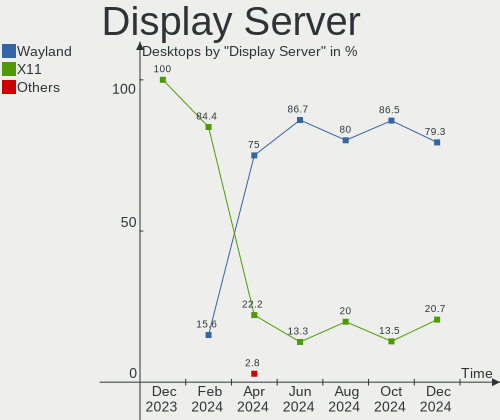
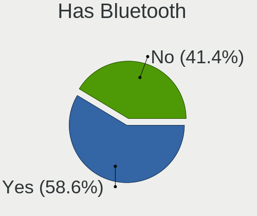
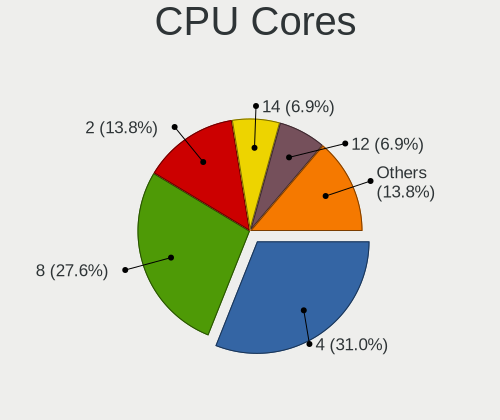
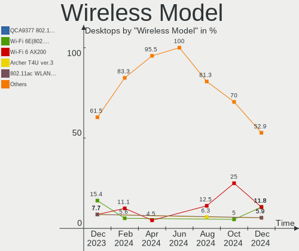

KDE neon - Hardware Trends (Desktops)
-------------------------------------

A project to identify most popular hardware characteristics and track their change
over time based on data collected by Linux users at https://Linux-Hardware.org.

Anyone can contribute to this report by the [hw-probe](https://github.com/linuxhw/hw-probe) tool:

    sudo -E hw-probe -all -upload

This report is for one last month. Overall report since the beginning of time: [TestCoverage](https://github.com/linuxhw/TestCoverage)

Period: May, 2022.

Contents
--------

* [ System ](#system)
  - [ OS                       ](#os)
  - [ OS Family                ](#os-family)
  - [ Kernel                   ](#kernel)
  - [ Kernel Family            ](#kernel-family)
  - [ Kernel Major Ver.        ](#kernel-major-ver)
  - [ Arch                     ](#arch)
  - [ DE                       ](#de)
  - [ Display Server           ](#display-server)
  - [ Display Manager          ](#display-manager)
  - [ OS Lang                  ](#os-lang)
  - [ Boot Mode                ](#boot-mode)
  - [ Filesystem               ](#filesystem)
  - [ Part. scheme             ](#part-scheme)
  - [ Dual Boot with Linux/BSD ](#dual-boot-with-linuxbsd)
  - [ Dual Boot (Win)          ](#dual-boot-win)

* [ Board ](#board)
  - [ Vendor                   ](#vendor)
  - [ Model                    ](#model)
  - [ Model Family             ](#model-family)
  - [ MFG Year                 ](#mfg-year)
  - [ Form Factor              ](#form-factor)
  - [ Secure Boot              ](#secure-boot)
  - [ Coreboot                 ](#coreboot)
  - [ RAM Size                 ](#ram-size)
  - [ RAM Used                 ](#ram-used)
  - [ Total Drives             ](#total-drives)
  - [ Has CD-ROM               ](#has-cd-rom)
  - [ Has Ethernet             ](#has-ethernet)
  - [ Has WiFi                 ](#has-wifi)
  - [ Has Bluetooth            ](#has-bluetooth)

* [ Location ](#location)
  - [ Country                  ](#country)
  - [ City                     ](#city)

* [ Drives ](#drives)
  - [ Drive Vendor             ](#drive-vendor)
  - [ Drive Model              ](#drive-model)
  - [ HDD Vendor               ](#hdd-vendor)
  - [ SSD Vendor               ](#ssd-vendor)
  - [ Drive Kind               ](#drive-kind)
  - [ Drive Connector          ](#drive-connector)
  - [ Drive Size               ](#drive-size)
  - [ Space Total              ](#space-total)
  - [ Space Used               ](#space-used)
  - [ Malfunc. Drives          ](#malfunc-drives)
  - [ Malfunc. Drive Vendor    ](#malfunc-drive-vendor)
  - [ Malfunc. HDD Vendor      ](#malfunc-hdd-vendor)
  - [ Malfunc. Drive Kind      ](#malfunc-drive-kind)
  - [ Failed Drives            ](#failed-drives)
  - [ Failed Drive Vendor      ](#failed-drive-vendor)
  - [ Drive Status             ](#drive-status)

* [ Storage controller ](#storage-controller)
  - [ Storage Vendor           ](#storage-vendor)
  - [ Storage Model            ](#storage-model)
  - [ Storage Kind             ](#storage-kind)

* [ Processor ](#processor)
  - [ CPU Vendor               ](#cpu-vendor)
  - [ CPU Model                ](#cpu-model)
  - [ CPU Model Family         ](#cpu-model-family)
  - [ CPU Cores                ](#cpu-cores)
  - [ CPU Sockets              ](#cpu-sockets)
  - [ CPU Threads              ](#cpu-threads)
  - [ CPU Op-Modes             ](#cpu-op-modes)
  - [ CPU Microcode            ](#cpu-microcode)
  - [ CPU Microarch            ](#cpu-microarch)

* [ Graphics ](#graphics)
  - [ GPU Vendor               ](#gpu-vendor)
  - [ GPU Model                ](#gpu-model)
  - [ GPU Combo                ](#gpu-combo)
  - [ GPU Driver               ](#gpu-driver)
  - [ GPU Memory               ](#gpu-memory)

* [ Monitor ](#monitor)
  - [ Monitor Vendor           ](#monitor-vendor)
  - [ Monitor Model            ](#monitor-model)
  - [ Monitor Resolution       ](#monitor-resolution)
  - [ Monitor Diagonal         ](#monitor-diagonal)
  - [ Monitor Width            ](#monitor-width)
  - [ Aspect Ratio             ](#aspect-ratio)
  - [ Monitor Area             ](#monitor-area)
  - [ Pixel Density            ](#pixel-density)
  - [ Multiple Monitors        ](#multiple-monitors)

* [ Network ](#network)
  - [ Net Controller Vendor    ](#net-controller-vendor)
  - [ Net Controller Model     ](#net-controller-model)
  - [ Wireless Vendor          ](#wireless-vendor)
  - [ Wireless Model           ](#wireless-model)
  - [ Ethernet Vendor          ](#ethernet-vendor)
  - [ Ethernet Model           ](#ethernet-model)
  - [ Net Controller Kind      ](#net-controller-kind)
  - [ Used Controller          ](#used-controller)
  - [ NICs                     ](#nics)
  - [ IPv6                     ](#ipv6)

* [ Bluetooth ](#bluetooth)
  - [ Bluetooth Vendor         ](#bluetooth-vendor)
  - [ Bluetooth Model          ](#bluetooth-model)

* [ Sound ](#sound)
  - [ Sound Vendor             ](#sound-vendor)
  - [ Sound Model              ](#sound-model)

* [ Memory ](#memory)
  - [ Memory Vendor            ](#memory-vendor)
  - [ Memory Model             ](#memory-model)
  - [ Memory Kind              ](#memory-kind)
  - [ Memory Form Factor       ](#memory-form-factor)
  - [ Memory Size              ](#memory-size)
  - [ Memory Speed             ](#memory-speed)

* [ Printers & scanners ](#printers--scanners)
  - [ Printer Vendor           ](#printer-vendor)
  - [ Printer Model            ](#printer-model)
  - [ Scanner Vendor           ](#scanner-vendor)
  - [ Scanner Model            ](#scanner-model)

* [ Camera ](#camera)
  - [ Camera Vendor            ](#camera-vendor)
  - [ Camera Model             ](#camera-model)

* [ Security ](#security)
  - [ Fingerprint Vendor       ](#fingerprint-vendor)
  - [ Fingerprint Model        ](#fingerprint-model)
  - [ Chipcard Vendor          ](#chipcard-vendor)
  - [ Chipcard Model           ](#chipcard-model)

* [ Unsupported ](#unsupported)
  - [ Unsupported Devices      ](#unsupported-devices)
  - [ Unsupported Device Types ](#unsupported-device-types)

System
------

OS
--

Installed operating systems

| Name           | Desktops | Percent |
|----------------|----------|---------|
| KDE neon 20.04 | 57       | 100%    |

OS Family
---------

OS without a version

| Name     | Desktops | Percent |
|----------|----------|---------|
| KDE neon | 57       | 100%    |

Kernel
------

Version of the Linux kernel

| Version           | Desktops | Percent |
|-------------------|----------|---------|
| 5.13.0-41-generic | 29       | 50.88%  |
| 5.13.0-40-generic | 15       | 26.32%  |
| 5.13.0-44-generic | 10       | 17.54%  |
| 5.13.0-39-generic | 2        | 3.51%   |
| 5.4.0-107-generic | 1        | 1.75%   |

Kernel Family
-------------

Linux kernel without a distro release

| Version | Desktops | Percent |
|---------|----------|---------|
| 5.13.0  | 56       | 98.25%  |
| 5.4.0   | 1        | 1.75%   |

Kernel Major Ver.
-----------------

Linux kernel major version

| Version | Desktops | Percent |
|---------|----------|---------|
| 5.13    | 56       | 98.25%  |
| 5.4     | 1        | 1.75%   |

Arch
----

OS architecture (x86_64, i586, etc.)

| Name   | Desktops | Percent |
|--------|----------|---------|
| x86_64 | 57       | 100%    |

DE
--

Desktop Environment

| Name | Desktops | Percent |
|------|----------|---------|
| KDE5 | 57       | 100%    |

Display Server
--------------

X11 or Wayland

| Name    | Desktops | Percent |
|---------|----------|---------|
| X11     | 55       | 96.49%  |
| Wayland | 2        | 3.51%   |

Display Manager
---------------

SDDM, LightDM, etc.

| Name    | Desktops | Percent |
|---------|----------|---------|
| Unknown | 48       | 84.21%  |
| SDDM    | 9        | 15.79%  |

OS Lang
-------

Language

| Lang  | Desktops | Percent |
|-------|----------|---------|
| en_US | 25       | 43.86%  |
| pt_BR | 6        | 10.53%  |
| en_GB | 4        | 7.02%   |
| de_DE | 3        | 5.26%   |
| C     | 3        | 5.26%   |
| ru_RU | 2        | 3.51%   |
| it_IT | 2        | 3.51%   |
| en_AU | 2        | 3.51%   |
| sv_SE | 1        | 1.75%   |
| pl_PL | 1        | 1.75%   |
| hu_HU | 1        | 1.75%   |
| fr_CA | 1        | 1.75%   |
| fi_FI | 1        | 1.75%   |
| es_PE | 1        | 1.75%   |
| es_MX | 1        | 1.75%   |
| es_ES | 1        | 1.75%   |
| es_CL | 1        | 1.75%   |
| en_IN | 1        | 1.75%   |

Boot Mode
---------

EFI or BIOS

| Mode | Desktops | Percent |
|------|----------|---------|
| EFI  | 30       | 52.63%  |
| BIOS | 27       | 47.37%  |

Filesystem
----------

Type of filesystem

| Type    | Desktops | Percent |
|---------|----------|---------|
| Ext4    | 54       | 94.74%  |
| Overlay | 2        | 3.51%   |
| Btrfs   | 1        | 1.75%   |

Part. scheme
------------

Scheme of partitioning

| Type    | Desktops | Percent |
|---------|----------|---------|
| Unknown | 52       | 91.23%  |
| GPT     | 4        | 7.02%   |
| MBR     | 1        | 1.75%   |

Dual Boot with Linux/BSD
------------------------

Hosting more than one Linux/BSD

| Dual boot | Desktops | Percent |
|-----------|----------|---------|
| No        | 54       | 94.74%  |
| Yes       | 3        | 5.26%   |

Dual Boot (Win)
---------------

Hosting Linux and Windows

| Dual boot | Desktops | Percent |
|-----------|----------|---------|
| No        | 52       | 91.23%  |
| Yes       | 5        | 8.77%   |

Board
-----

Vendor
------

Motherboard manufacturer

| Name                | Desktops | Percent |
|---------------------|----------|---------|
| ASUSTek Computer    | 21       | 36.84%  |
| MSI                 | 8        | 14.04%  |
| Gigabyte Technology | 6        | 10.53%  |
| Hewlett-Packard     | 5        | 8.77%   |
| Intel               | 4        | 7.02%   |
| Dell                | 4        | 7.02%   |
| ASRock              | 4        | 7.02%   |
| Lenovo              | 3        | 5.26%   |
| JGINYUE             | 1        | 1.75%   |
| Biostar             | 1        | 1.75%   |

Model
-----

Motherboard model

| Name                                    | Desktops | Percent |
|-----------------------------------------|----------|---------|
| ASUS ROG STRIX B450-F GAMING            | 2        | 3.51%   |
| ASUS All Series                         | 2        | 3.51%   |
| MSI MS-7D43                             | 1        | 1.75%   |
| MSI MS-7C35                             | 1        | 1.75%   |
| MSI MS-7B93                             | 1        | 1.75%   |
| MSI MS-7B89                             | 1        | 1.75%   |
| MSI MS-7B87                             | 1        | 1.75%   |
| MSI MS-7B79                             | 1        | 1.75%   |
| MSI MS-7B31                             | 1        | 1.75%   |
| MSI MS-7641                             | 1        | 1.75%   |
| Lenovo Legion T5 28IMB05 90NC00JAUS     | 1        | 1.75%   |
| Lenovo IdeaCentre Y700-34ISH 90DF00JVMW | 1        | 1.75%   |
| Lenovo H50-30g 90AS0005BR               | 1        | 1.75%   |
| JGINYUE X99M-PLUS V2 V2.0               | 1        | 1.75%   |
| Intel H61M-DS2                          | 1        | 1.75%   |
| Intel H61                               | 1        | 1.75%   |
| Intel D946GZIS AAD66165-501             | 1        | 1.75%   |
| Intel B75 V124                          | 1        | 1.75%   |
| HP Z800 Workstation                     | 1        | 1.75%   |
| HP Pavilion Desktop 595-p0xxx           | 1        | 1.75%   |
| HP OMEN by Obelisk Desktop 875-0xxx     | 1        | 1.75%   |
| HP EliteDesk 800 G1 SFF                 | 1        | 1.75%   |
| HP 310-1205uk                           | 1        | 1.75%   |
| Gigabyte X470 AORUS ULTRA GAMING        | 1        | 1.75%   |
| Gigabyte H67M-UD2H-B3                   | 1        | 1.75%   |
| Gigabyte EX58-UD5                       | 1        | 1.75%   |
| Gigabyte B85M-DS3H-A                    | 1        | 1.75%   |
| Gigabyte B85M-DS3H                      | 1        | 1.75%   |
| Gigabyte B75M-D3H                       | 1        | 1.75%   |
| Dell Studio XPS 8100                    | 1        | 1.75%   |
| Dell Precision Tower 3620               | 1        | 1.75%   |
| Dell Precision T3610                    | 1        | 1.75%   |
| Dell OptiPlex 3020                      | 1        | 1.75%   |
| Biostar A10N-9630E                      | 1        | 1.75%   |
| ASUS TUF Gaming B560M-PLUS WIFI         | 1        | 1.75%   |
| ASUS TUF Gaming B550M-PLUS              | 1        | 1.75%   |
| ASUS TUF Gaming B550-PLUS               | 1        | 1.75%   |
| ASUS SABERTOOTH 990FX R2.0              | 1        | 1.75%   |
| ASUS ROG STRIX B550-E GAMING            | 1        | 1.75%   |
| ASUS ROG Maximus XI HERO                | 1        | 1.75%   |
| ASUS ROG CROSSHAIR VI EXTREME           | 1        | 1.75%   |
| ASUS ProArt Z690-CREATOR WIFI           | 1        | 1.75%   |
| ASUS PRIME X570-P                       | 1        | 1.75%   |
| ASUS PRIME X370-PRO                     | 1        | 1.75%   |
| ASUS PRIME B450M-GAMING/BR              | 1        | 1.75%   |
| ASUS PRIME B350M-E                      | 1        | 1.75%   |
| ASUS PRIME A320M-K                      | 1        | 1.75%   |
| ASUS P5G41T-M                           | 1        | 1.75%   |
| ASUS M4A785TD-M EVO                     | 1        | 1.75%   |
| ASUS F1A55-M LX                         | 1        | 1.75%   |
| ASUS B250 MINING EXPERT                 | 1        | 1.75%   |
| ASRock Z170 Pro4                        | 1        | 1.75%   |
| ASRock X99 Taichi                       | 1        | 1.75%   |
| ASRock FM2A55M-HD+ R2.0                 | 1        | 1.75%   |
| ASRock B250M-HDV                        | 1        | 1.75%   |

Model Family
------------

Motherboard model prefix

| Name                  | Desktops | Percent |
|-----------------------|----------|---------|
| ASUS ROG              | 5        | 8.77%   |
| ASUS PRIME            | 5        | 8.77%   |
| ASUS TUF              | 3        | 5.26%   |
| Dell Precision        | 2        | 3.51%   |
| ASUS All              | 2        | 3.51%   |
| MSI MS-7D43           | 1        | 1.75%   |
| MSI MS-7C35           | 1        | 1.75%   |
| MSI MS-7B93           | 1        | 1.75%   |
| MSI MS-7B89           | 1        | 1.75%   |
| MSI MS-7B87           | 1        | 1.75%   |
| MSI MS-7B79           | 1        | 1.75%   |
| MSI MS-7B31           | 1        | 1.75%   |
| MSI MS-7641           | 1        | 1.75%   |
| Lenovo Legion         | 1        | 1.75%   |
| Lenovo IdeaCentre     | 1        | 1.75%   |
| Lenovo H50-30g        | 1        | 1.75%   |
| JGINYUE X99M-PLUS     | 1        | 1.75%   |
| Intel H61M-DS2        | 1        | 1.75%   |
| Intel H61             | 1        | 1.75%   |
| Intel D946GZIS        | 1        | 1.75%   |
| Intel B75             | 1        | 1.75%   |
| HP Z800               | 1        | 1.75%   |
| HP Pavilion           | 1        | 1.75%   |
| HP OMEN               | 1        | 1.75%   |
| HP EliteDesk          | 1        | 1.75%   |
| HP 310-1205uk         | 1        | 1.75%   |
| Gigabyte X470         | 1        | 1.75%   |
| Gigabyte H67M-UD2H-B3 | 1        | 1.75%   |
| Gigabyte EX58-UD5     | 1        | 1.75%   |
| Gigabyte B85M-DS3H-A  | 1        | 1.75%   |
| Gigabyte B85M-DS3H    | 1        | 1.75%   |
| Gigabyte B75M-D3H     | 1        | 1.75%   |
| Dell Studio           | 1        | 1.75%   |
| Dell OptiPlex         | 1        | 1.75%   |
| Biostar A10N-9630E    | 1        | 1.75%   |
| ASUS SABERTOOTH       | 1        | 1.75%   |
| ASUS ProArt           | 1        | 1.75%   |
| ASUS P5G41T-M         | 1        | 1.75%   |
| ASUS M4A785TD-M       | 1        | 1.75%   |
| ASUS F1A55-M          | 1        | 1.75%   |
| ASUS B250             | 1        | 1.75%   |
| ASRock Z170           | 1        | 1.75%   |
| ASRock X99            | 1        | 1.75%   |
| ASRock FM2A55M-HD+    | 1        | 1.75%   |
| ASRock B250M-HDV      | 1        | 1.75%   |

MFG Year
--------

Motherboard manufacture year

| Year | Desktops | Percent |
|------|----------|---------|
| 2019 | 9        | 15.79%  |
| 2017 | 9        | 15.79%  |
| 2021 | 5        | 8.77%   |
| 2020 | 5        | 8.77%   |
| 2018 | 5        | 8.77%   |
| 2011 | 5        | 8.77%   |
| 2013 | 4        | 7.02%   |
| 2016 | 3        | 5.26%   |
| 2014 | 3        | 5.26%   |
| 2012 | 3        | 5.26%   |
| 2009 | 2        | 3.51%   |
| 2015 | 1        | 1.75%   |
| 2010 | 1        | 1.75%   |
| 2008 | 1        | 1.75%   |
| 2006 | 1        | 1.75%   |

Form Factor
-----------

Physical design of the computer

| Name    | Desktops | Percent |
|---------|----------|---------|
| Desktop | 57       | 100%    |

Secure Boot
-----------

Enabled or disabled

| State    | Desktops | Percent |
|----------|----------|---------|
| Disabled | 56       | 98.25%  |
| Enabled  | 1        | 1.75%   |

Coreboot
--------

Have coreboot on board

| Used | Desktops | Percent |
|------|----------|---------|
| No   | 57       | 100%    |

RAM Size
--------

Total RAM memory

| Size in GB  | Desktops | Percent |
|-------------|----------|---------|
| 16.01-24.0  | 21       | 36.84%  |
| 32.01-64.0  | 11       | 19.3%   |
| 8.01-16.0   | 9        | 15.79%  |
| 4.01-8.0    | 7        | 12.28%  |
| 64.01-256.0 | 4        | 7.02%   |
| 3.01-4.0    | 3        | 5.26%   |
| 2.01-3.0    | 2        | 3.51%   |

RAM Used
--------

Used RAM memory

| Used GB   | Desktops | Percent |
|-----------|----------|---------|
| 1.01-2.0  | 26       | 45.61%  |
| 2.01-3.0  | 15       | 26.32%  |
| 4.01-8.0  | 6        | 10.53%  |
| 3.01-4.0  | 6        | 10.53%  |
| 8.01-16.0 | 2        | 3.51%   |
| 0.51-1.0  | 2        | 3.51%   |

Total Drives
------------

Number of drives on board

| Drives | Desktops | Percent |
|--------|----------|---------|
| 2      | 24       | 42.11%  |
| 3      | 16       | 28.07%  |
| 1      | 14       | 24.56%  |
| 4      | 3        | 5.26%   |

Has CD-ROM
----------

Has CD-ROM on board

| Presented | Desktops | Percent |
|-----------|----------|---------|
| No        | 32       | 56.14%  |
| Yes       | 25       | 43.86%  |

Has Ethernet
------------

Has Ethernet on board

| Presented | Desktops | Percent |
|-----------|----------|---------|
| Yes       | 55       | 96.49%  |
| No        | 2        | 3.51%   |

Has WiFi
--------

Has WiFi module

| Presented | Desktops | Percent |
|-----------|----------|---------|
| No        | 29       | 50.88%  |
| Yes       | 28       | 49.12%  |

Has Bluetooth
-------------

Has Bluetooth module

| Presented | Desktops | Percent |
|-----------|----------|---------|
| No        | 37       | 64.91%  |
| Yes       | 20       | 35.09%  |

Location
--------

Country
-------

Geographic location (country)

| Country     | Desktops | Percent |
|-------------|----------|---------|
| USA         | 13       | 22.81%  |
| Brazil      | 9        | 15.79%  |
| UK          | 4        | 7.02%   |
| Germany     | 4        | 7.02%   |
| Sweden      | 2        | 3.51%   |
| Spain       | 2        | 3.51%   |
| Russia      | 2        | 3.51%   |
| Netherlands | 2        | 3.51%   |
| Mexico      | 2        | 3.51%   |
| Italy       | 2        | 3.51%   |
| Australia   | 2        | 3.51%   |
| Ukraine     | 1        | 1.75%   |
| Poland      | 1        | 1.75%   |
| Peru        | 1        | 1.75%   |
| Latvia      | 1        | 1.75%   |
| India       | 1        | 1.75%   |
| Hungary     | 1        | 1.75%   |
| Finland     | 1        | 1.75%   |
| Czechia     | 1        | 1.75%   |
| Croatia     | 1        | 1.75%   |
| Chile       | 1        | 1.75%   |
| Canada      | 1        | 1.75%   |
| Austria     | 1        | 1.75%   |
| Argentina   | 1        | 1.75%   |

City
----

Geographic location (city)

| City                   | Desktops | Percent |
|------------------------|----------|---------|
| Yekaterinburg          | 1        | 1.75%   |
| Washington             | 1        | 1.75%   |
| Vienna                 | 1        | 1.75%   |
| Veranopolis            | 1        | 1.75%   |
| Slatina                | 1        | 1.75%   |
| Shawnee                | 1        | 1.75%   |
| Serra                  | 1        | 1.75%   |
| Sao Vicente            | 1        | 1.75%   |
| Sant Pere de Vilamajor | 1        | 1.75%   |
| San Bruno              | 1        | 1.75%   |
| Rio de Janeiro         | 1        | 1.75%   |
| Riga                   | 1        | 1.75%   |
| Richmond               | 1        | 1.75%   |
| Richardson             | 1        | 1.75%   |
| Québec                | 1        | 1.75%   |
| Prato Sesia            | 1        | 1.75%   |
| Prague                 | 1        | 1.75%   |
| Pian di Scò           | 1        | 1.75%   |
| Perth                  | 1        | 1.75%   |
| Orlando                | 1        | 1.75%   |
| Omsk                   | 1        | 1.75%   |
| Novo Gama              | 1        | 1.75%   |
| New York               | 1        | 1.75%   |
| Munich                 | 1        | 1.75%   |
| Madrid                 | 1        | 1.75%   |
| Long Jetty             | 1        | 1.75%   |
| Lima                   | 1        | 1.75%   |
| Lieto                  | 1        | 1.75%   |
| Lichfield              | 1        | 1.75%   |
| Lancaster              | 1        | 1.75%   |
| Kyiv                   | 1        | 1.75%   |
| Huddinge               | 1        | 1.75%   |
| Honolulu               | 1        | 1.75%   |
| Holyhead               | 1        | 1.75%   |
| Harlesden              | 1        | 1.75%   |
| Hackney                | 1        | 1.75%   |
| Haarlem                | 1        | 1.75%   |
| Guadalajara            | 1        | 1.75%   |
| Governador Valadares   | 1        | 1.75%   |
| Friesoythe             | 1        | 1.75%   |
| Frankfurt am Main      | 1        | 1.75%   |
| Ekerö                 | 1        | 1.75%   |
| Dallas                 | 1        | 1.75%   |
| Cuiabá                | 1        | 1.75%   |
| Cotia                  | 1        | 1.75%   |
| Corning                | 1        | 1.75%   |
| Cancún                | 1        | 1.75%   |
| Buenos Aires           | 1        | 1.75%   |
| Budapest               | 1        | 1.75%   |
| Breitscheid            | 1        | 1.75%   |
| Besko                  | 1        | 1.75%   |
| Benton                 | 1        | 1.75%   |
| Bengaluru              | 1        | 1.75%   |
| Baarle-Nassau          | 1        | 1.75%   |
| Araraquara             | 1        | 1.75%   |
| Antofagasta            | 1        | 1.75%   |
| Altoona                | 1        | 1.75%   |

Drives
------

Drive Vendor
------------

Hard drive vendors

| Vendor                    | Desktops | Drives | Percent |
|---------------------------|----------|--------|---------|
| WDC                       | 17       | 22     | 16.67%  |
| Seagate                   | 16       | 19     | 15.69%  |
| Samsung Electronics       | 16       | 25     | 15.69%  |
| Kingston                  | 10       | 11     | 9.8%    |
| Toshiba                   | 5        | 6      | 4.9%    |
| Crucial                   | 5        | 6      | 4.9%    |
| Sandisk                   | 4        | 4      | 3.92%   |
| Hitachi                   | 4        | 4      | 3.92%   |
| Intel                     | 3        | 3      | 2.94%   |
| Silicon Motion            | 2        | 2      | 1.96%   |
| PNY                       | 2        | 2      | 1.96%   |
| HGST                      | 2        | 2      | 1.96%   |
| China                     | 2        | 2      | 1.96%   |
| A-DATA Technology         | 2        | 2      | 1.96%   |
| TO Exter                  | 1        | 1      | 0.98%   |
| Team                      | 1        | 1      | 0.98%   |
| SK Hynix                  | 1        | 1      | 0.98%   |
| PLEXTOR                   | 1        | 1      | 0.98%   |
| Phison                    | 1        | 1      | 0.98%   |
| N600                      | 1        | 1      | 0.98%   |
| Micron/Crucial Technology | 1        | 1      | 0.98%   |
| Micron Technology         | 1        | 1      | 0.98%   |
| MAXTOR                    | 1        | 1      | 0.98%   |
| LITEON                    | 1        | 1      | 0.98%   |
| Hewlett-Packard           | 1        | 1      | 0.98%   |
| Gigabyte Technology       | 1        | 1      | 0.98%   |

Drive Model
-----------

Hard drive models

| Model                               | Desktops | Percent |
|-------------------------------------|----------|---------|
| Samsung NVMe SSD Drive 1TB          | 4        | 3.42%   |
| Seagate ST500DM002-1BD142 500GB     | 3        | 2.56%   |
| Kingston SA400S37240G 240GB SSD     | 3        | 2.56%   |
| WDC WD20EZRZ-00Z5HB0 2TB            | 2        | 1.71%   |
| Seagate ST2000DM001-1ER164 2TB      | 2        | 1.71%   |
| Seagate ST1000DM003-1ER162 1TB      | 2        | 1.71%   |
| Samsung SSD 840 EVO 500GB           | 2        | 1.71%   |
| Samsung NVMe SSD Drive 500GB        | 2        | 1.71%   |
| Kingston SA400S37120G 120GB SSD     | 2        | 1.71%   |
| Kingston NVMe SSD Drive 500GB       | 2        | 1.71%   |
| WDC WDS500G2B0B-00YS70 500GB SSD    | 1        | 0.85%   |
| WDC WDS240G2G0A-00JH30 240GB SSD    | 1        | 0.85%   |
| WDC WDBNCE0010PNC 1TB SSD           | 1        | 0.85%   |
| WDC WD5000AAKX-00ERMA0 500GB        | 1        | 0.85%   |
| WDC WD40PURX-64GVNY0 4TB            | 1        | 0.85%   |
| WDC WD40EFAX-68JH4N1 4TB            | 1        | 0.85%   |
| WDC WD3200AAJS-00YZCA0 320GB        | 1        | 0.85%   |
| WDC WD2500JS-60NCB1 250GB           | 1        | 0.85%   |
| WDC WD20PURX-64PFUY0 2TB            | 1        | 0.85%   |
| WDC WD20EZBX-00AYRA0 2TB            | 1        | 0.85%   |
| WDC WD20EARX-00PASB0 2TB            | 1        | 0.85%   |
| WDC WD20EARX-008FB0 2TB             | 1        | 0.85%   |
| WDC WD1600AAJS-00PSA0 160GB         | 1        | 0.85%   |
| WDC WD10EZEX-60WN4A0 1TB            | 1        | 0.85%   |
| WDC WD10EZEX-08WN4A0 1TB            | 1        | 0.85%   |
| WDC WD10EZEX-08M2NA0 1TB            | 1        | 0.85%   |
| WDC WD10EZEX-00WN4A0 1TB            | 1        | 0.85%   |
| WDC WD10EZEX-00BBHA0 1TB            | 1        | 0.85%   |
| WDC WD10EURX-63FH1Y0 1TB            | 1        | 0.85%   |
| Toshiba THNSNH128GCST 128GB SSD     | 1        | 0.85%   |
| Toshiba NVMe SSD Drive 1024GB       | 1        | 0.85%   |
| Toshiba MQ01ABF050 500GB            | 1        | 0.85%   |
| Toshiba KBG30ZMS128G 128GB NVMe SSD | 1        | 0.85%   |
| Toshiba HDWD240 4TB                 | 1        | 0.85%   |
| Toshiba DT01ACA100 1TB              | 1        | 0.85%   |
| TO Exter nal USB 3.0 320GB          | 1        | 0.85%   |
| Team T253X1240G 240GB SSD           | 1        | 0.85%   |
| SK Hynix NVMe SSD Drive 128GB       | 1        | 0.85%   |
| Silicon Motion NVMe SSD Drive 128GB | 1        | 0.85%   |
| Silicon Motion NVMe SSD Drive 120GB | 1        | 0.85%   |
| Seagate ST8000DM004-2CX188 8TB      | 1        | 0.85%   |
| Seagate ST4000DM004-2CV104 4TB      | 1        | 0.85%   |
| Seagate ST3320418AS 320GB           | 1        | 0.85%   |
| Seagate ST3000DM007-1WY10G 3TB      | 1        | 0.85%   |
| Seagate ST2000DM006-2DM164 2TB      | 1        | 0.85%   |
| Seagate ST2000DM005-2CW102 2TB      | 1        | 0.85%   |
| Seagate ST2000DM001-1CH164 2TB      | 1        | 0.85%   |
| Seagate ST1000LM014-1EJ164 1TB      | 1        | 0.85%   |
| Seagate ST1000DM003-1CH162 1TB      | 1        | 0.85%   |
| Seagate Expansion 4TB               | 1        | 0.85%   |
| Seagate Backup+ Hub BK 8TB          | 1        | 0.85%   |
| SanDisk SDSSDH3 1T02 1024GB         | 1        | 0.85%   |
| Sandisk NVMe SSD Drive 256GB        | 1        | 0.85%   |
| Sandisk NVMe SSD Drive 250GB        | 1        | 0.85%   |
| Sandisk NVMe SSD Drive 1TB          | 1        | 0.85%   |
| Samsung SSD 980 PRO 1TB             | 1        | 0.85%   |
| Samsung SSD 970 EVO Plus 1TB        | 1        | 0.85%   |
| Samsung SSD 860 EVO 1TB             | 1        | 0.85%   |
| Samsung SSD 850 EVO 500GB           | 1        | 0.85%   |
| Samsung SSD 850 EVO 250GB           | 1        | 0.85%   |

HDD Vendor
----------

Hard disk drive vendors

| Vendor              | Desktops | Drives | Percent |
|---------------------|----------|--------|---------|
| WDC                 | 16       | 19     | 34.78%  |
| Seagate             | 16       | 19     | 34.78%  |
| Hitachi             | 4        | 4      | 8.7%    |
| Toshiba             | 3        | 3      | 6.52%   |
| Samsung Electronics | 3        | 4      | 6.52%   |
| HGST                | 2        | 2      | 4.35%   |
| MAXTOR              | 1        | 1      | 2.17%   |
| Hewlett-Packard     | 1        | 1      | 2.17%   |

SSD Vendor
----------

Solid state drive vendors

| Vendor              | Desktops | Drives | Percent |
|---------------------|----------|--------|---------|
| Samsung Electronics | 8        | 11     | 19.51%  |
| Kingston            | 8        | 8      | 19.51%  |
| Crucial             | 5        | 6      | 12.2%   |
| WDC                 | 3        | 3      | 7.32%   |
| PNY                 | 2        | 2      | 4.88%   |
| Intel               | 2        | 2      | 4.88%   |
| China               | 2        | 2      | 4.88%   |
| A-DATA Technology   | 2        | 2      | 4.88%   |
| Toshiba             | 1        | 1      | 2.44%   |
| TO Exter            | 1        | 1      | 2.44%   |
| Team                | 1        | 1      | 2.44%   |
| SanDisk             | 1        | 1      | 2.44%   |
| PLEXTOR             | 1        | 1      | 2.44%   |
| N600                | 1        | 1      | 2.44%   |
| Micron Technology   | 1        | 1      | 2.44%   |
| LITEON              | 1        | 1      | 2.44%   |
| Gigabyte Technology | 1        | 1      | 2.44%   |

Drive Kind
----------

HDD or SSD

| Kind | Desktops | Drives | Percent |
|------|----------|--------|---------|
| HDD  | 39       | 53     | 41.49%  |
| SSD  | 33       | 45     | 35.11%  |
| NVMe | 22       | 24     | 23.4%   |

Drive Connector
---------------

SATA, SAS, NVMe, etc.

| Type | Desktops | Drives | Percent |
|------|----------|--------|---------|
| SATA | 50       | 94     | 65.79%  |
| NVMe | 22       | 24     | 28.95%  |
| SAS  | 4        | 4      | 5.26%   |

Drive Size
----------

Size of hard drive

| Size in TB | Desktops | Drives | Percent |
|------------|----------|--------|---------|
| 0.01-0.5   | 38       | 54     | 49.35%  |
| 0.51-1.0   | 17       | 20     | 22.08%  |
| 1.01-2.0   | 12       | 13     | 15.58%  |
| 3.01-4.0   | 6        | 6      | 7.79%   |
| 2.01-3.0   | 2        | 2      | 2.6%    |
| 4.01-10.0  | 2        | 3      | 2.6%    |

Space Total
-----------

Amount of disk space available on the file system

| Size in GB     | Desktops | Percent |
|----------------|----------|---------|
| 251-500        | 12       | 21.05%  |
| More than 3000 | 9        | 15.79%  |
| 101-250        | 9        | 15.79%  |
| 501-1000       | 9        | 15.79%  |
| 1001-2000      | 5        | 8.77%   |
| 51-100         | 4        | 7.02%   |
| 2001-3000      | 3        | 5.26%   |
| 1-20           | 3        | 5.26%   |
| Unknown        | 2        | 3.51%   |
| 21-50          | 1        | 1.75%   |

Space Used
----------

Amount of used disk space

| Used GB        | Desktops | Percent |
|----------------|----------|---------|
| 1-20           | 24       | 42.11%  |
| 251-500        | 8        | 14.04%  |
| 101-250        | 5        | 8.77%   |
| 1001-2000      | 5        | 8.77%   |
| 21-50          | 4        | 7.02%   |
| 501-1000       | 4        | 7.02%   |
| More than 3000 | 3        | 5.26%   |
| 51-100         | 2        | 3.51%   |
| Unknown        | 2        | 3.51%   |

Malfunc. Drives
---------------

Drive models with a malfunction

| Model                             | Desktops | Drives | Percent |
|-----------------------------------|----------|--------|---------|
| Samsung Electronics HD250HJ 250GB | 1        | 1      | 50%     |
| MAXTOR 6L160M0 164GB              | 1        | 1      | 50%     |

Malfunc. Drive Vendor
---------------------

Vendors of faulty drives

| Vendor              | Desktops | Drives | Percent |
|---------------------|----------|--------|---------|
| Samsung Electronics | 1        | 1      | 50%     |
| MAXTOR              | 1        | 1      | 50%     |

Malfunc. HDD Vendor
-------------------

Vendors of faulty HDD drives

| Vendor              | Desktops | Drives | Percent |
|---------------------|----------|--------|---------|
| Samsung Electronics | 1        | 1      | 50%     |
| MAXTOR              | 1        | 1      | 50%     |

Malfunc. Drive Kind
-------------------

Kinds of faulty drives

| Kind | Desktops | Drives | Percent |
|------|----------|--------|---------|
| HDD  | 2        | 2      | 100%    |

Failed Drives
-------------

Failed drive models

Zero info for selected period =(

Failed Drive Vendor
-------------------

Failed drive vendors

Zero info for selected period =(

Drive Status
------------

Number of failed and malfunc. drives

| Status   | Desktops | Drives | Percent |
|----------|----------|--------|---------|
| Detected | 53       | 108    | 88.33%  |
| Works    | 5        | 12     | 8.33%   |
| Malfunc  | 2        | 2      | 3.33%   |

Storage controller
------------------

Storage Vendor
--------------

Storage controller vendors

| Vendor                       | Desktops | Percent |
|------------------------------|----------|---------|
| Intel                        | 32       | 39.02%  |
| AMD                          | 25       | 30.49%  |
| Samsung Electronics          | 8        | 9.76%   |
| Sandisk                      | 3        | 3.66%   |
| Kingston Technology Company  | 3        | 3.66%   |
| Toshiba America Info Systems | 2        | 2.44%   |
| Silicon Motion               | 2        | 2.44%   |
| ASMedia Technology           | 2        | 2.44%   |
| SK Hynix                     | 1        | 1.22%   |
| Phison Electronics           | 1        | 1.22%   |
| Micron/Crucial Technology    | 1        | 1.22%   |
| LSI Logic / Symbios Logic    | 1        | 1.22%   |
| JMicron Technology           | 1        | 1.22%   |

Storage Model
-------------

Storage controller models

| Model                                                                                   | Desktops | Percent |
|-----------------------------------------------------------------------------------------|----------|---------|
| AMD FCH SATA Controller [AHCI mode]                                                     | 15       | 14.56%  |
| Intel 8 Series/C220 Series Chipset Family 6-port SATA Controller 1 [AHCI mode]          | 7        | 6.8%    |
| AMD 400 Series Chipset SATA Controller                                                  | 7        | 6.8%    |
| Samsung NVMe SSD Controller SM981/PM981/PM983                                           | 6        | 5.83%   |
| Intel Q170/Q150/B150/H170/H110/Z170/CM236 Chipset SATA Controller [AHCI Mode]           | 3        | 2.91%   |
| Intel Cannon Lake PCH SATA AHCI Controller                                              | 3        | 2.91%   |
| AMD SB7x0/SB8x0/SB9x0 SATA Controller [AHCI mode]                                       | 3        | 2.91%   |
| AMD 500 Series Chipset SATA Controller                                                  | 3        | 2.91%   |
| Silicon Motion SM2263EN/SM2263XT SSD Controller                                         | 2        | 1.94%   |
| Sandisk WD Black SN750 / PC SN730 NVMe SSD                                              | 2        | 1.94%   |
| Samsung NVMe SSD Controller PM9A1/PM9A3/980PRO                                          | 2        | 1.94%   |
| Kingston Company A2000 NVMe SSD                                                         | 2        | 1.94%   |
| Intel NM10/ICH7 Family SATA Controller [IDE mode]                                       | 2        | 1.94%   |
| Intel Alder Lake-S PCH SATA Controller [AHCI Mode]                                      | 2        | 1.94%   |
| Intel 82801G (ICH7 Family) IDE Controller                                               | 2        | 1.94%   |
| Intel 7 Series/C210 Series Chipset Family 6-port SATA Controller [AHCI mode]            | 2        | 1.94%   |
| Intel 6 Series/C200 Series Chipset Family 6 port Desktop SATA AHCI Controller           | 2        | 1.94%   |
| ASMedia ASM1062 Serial ATA Controller                                                   | 2        | 1.94%   |
| AMD X370 Series Chipset SATA Controller                                                 | 2        | 1.94%   |
| AMD 300 Series Chipset SATA Controller                                                  | 2        | 1.94%   |
| Toshiba America Info Systems Toshiba America Info Non-Volatile memory controller        | 1        | 0.97%   |
| Toshiba America Info Systems BG3 NVMe SSD Controller                                    | 1        | 0.97%   |
| SK Hynix BC501 NVMe Solid State Drive                                                   | 1        | 0.97%   |
| Sandisk WD PC SN810 / Black SN850 NVMe SSD                                              | 1        | 0.97%   |
| Samsung NVMe SSD Controller SM961/PM961/SM963                                           | 1        | 0.97%   |
| Phison E12 NVMe Controller                                                              | 1        | 0.97%   |
| Micron/Crucial Non-Volatile memory controller                                           | 1        | 0.97%   |
| LSI Logic / Symbios Logic SAS1068E PCI-Express Fusion-MPT SAS                           | 1        | 0.97%   |
| Kingston Company SNVS2000G [NV1 NVMe PCIe SSD 2TB]                                      | 1        | 0.97%   |
| JMicron JMB363 SATA/IDE Controller                                                      | 1        | 0.97%   |
| Intel Volume Management Device NVMe RAID Controller                                     | 1        | 0.97%   |
| Intel SSD 660P Series                                                                   | 1        | 0.97%   |
| Intel SATA Controller [RAID mode]                                                       | 1        | 0.97%   |
| Intel C610/X99 series chipset sSATA Controller [AHCI mode]                              | 1        | 0.97%   |
| Intel C610/X99 series chipset 6-Port SATA Controller [AHCI mode]                        | 1        | 0.97%   |
| Intel C600/X79 series chipset IDE-r Controller                                          | 1        | 0.97%   |
| Intel C600/X79 series chipset 6-Port SATA AHCI Controller                               | 1        | 0.97%   |
| Intel 9 Series Chipset Family SATA Controller [AHCI Mode]                               | 1        | 0.97%   |
| Intel 82801JI (ICH10 Family) 4 port SATA IDE Controller #1                              | 1        | 0.97%   |
| Intel 82801JI (ICH10 Family) 2 port SATA IDE Controller #2                              | 1        | 0.97%   |
| Intel 6 Series/C200 Series Chipset Family Desktop SATA Controller (IDE mode, ports 4-5) | 1        | 0.97%   |
| Intel 6 Series/C200 Series Chipset Family Desktop SATA Controller (IDE mode, ports 0-3) | 1        | 0.97%   |
| Intel 500 Series Chipset Family SATA AHCI Controller                                    | 1        | 0.97%   |
| Intel 5 Series/3400 Series Chipset 4 port SATA IDE Controller                           | 1        | 0.97%   |
| Intel 5 Series/3400 Series Chipset 2 port SATA IDE Controller                           | 1        | 0.97%   |
| Intel 400 Series Chipset Family SATA AHCI Controller                                    | 1        | 0.97%   |
| Intel 200 Series PCH SATA controller [AHCI mode]                                        | 1        | 0.97%   |
| AMD SB7x0/SB8x0/SB9x0 SATA Controller [IDE mode]                                        | 1        | 0.97%   |
| AMD SB7x0/SB8x0/SB9x0 IDE Controller                                                    | 1        | 0.97%   |
| AMD FCH SATA Controller [IDE mode]                                                      | 1        | 0.97%   |
| AMD FCH SATA Controller D                                                               | 1        | 0.97%   |
| AMD FCH IDE Controller                                                                  | 1        | 0.97%   |

Storage Kind
------------

Kind of storage controller (IDE, SATA, NVMe, SAS, ...)

| Kind | Desktops | Percent |
|------|----------|---------|
| SATA | 50       | 60.24%  |
| NVMe | 22       | 26.51%  |
| IDE  | 8        | 9.64%   |
| RAID | 2        | 2.41%   |
| SCSI | 1        | 1.2%    |

Processor
---------

CPU Vendor
----------

Processor vendors

| Vendor | Desktops | Percent |
|--------|----------|---------|
| Intel  | 32       | 56.14%  |
| AMD    | 25       | 43.86%  |

CPU Model
---------

Processor models

| Model                                           | Desktops | Percent |
|-------------------------------------------------|----------|---------|
| AMD Ryzen 5 3600 6-Core Processor               | 3        | 5.26%   |
| AMD Ryzen 5 1600 Six-Core Processor             | 3        | 5.26%   |
| Intel Core i7-4790K CPU @ 4.00GHz               | 2        | 3.51%   |
| Intel Core i5-4570 CPU @ 3.20GHz                | 2        | 3.51%   |
| AMD Ryzen 5 3500X 6-Core Processor              | 2        | 3.51%   |
| Intel Xeon CPU X5675 @ 3.07GHz                  | 1        | 1.75%   |
| Intel Xeon CPU E5-2630 v3 @ 2.40GHz             | 1        | 1.75%   |
| Intel Xeon CPU E5-2620 0 @ 2.00GHz              | 1        | 1.75%   |
| Intel Xeon CPU E31270 @ 3.40GHz                 | 1        | 1.75%   |
| Intel Pentium Dual-Core CPU E6700 @ 3.20GHz     | 1        | 1.75%   |
| Intel Pentium CPU G620 @ 2.60GHz                | 1        | 1.75%   |
| Intel Pentium CPU G4560T @ 2.90GHz              | 1        | 1.75%   |
| Intel Pentium CPU G4560 @ 3.50GHz               | 1        | 1.75%   |
| Intel Pentium 4 CPU 3.00GHz                     | 1        | 1.75%   |
| Intel Core i7-9700F CPU @ 3.00GHz               | 1        | 1.75%   |
| Intel Core i7-8700 CPU @ 3.20GHz                | 1        | 1.75%   |
| Intel Core i7-6800K CPU @ 3.40GHz               | 1        | 1.75%   |
| Intel Core i7-3770 CPU @ 3.40GHz                | 1        | 1.75%   |
| Intel Core i7 CPU 950 @ 3.07GHz                 | 1        | 1.75%   |
| Intel Core i7 CPU 870 @ 2.93GHz                 | 1        | 1.75%   |
| Intel Core i5-8500 CPU @ 3.00GHz                | 1        | 1.75%   |
| Intel Core i5-7400 CPU @ 3.00GHz                | 1        | 1.75%   |
| Intel Core i5-6600K CPU @ 3.50GHz               | 1        | 1.75%   |
| Intel Core i5-6500 CPU @ 3.20GHz                | 1        | 1.75%   |
| Intel Core i5-4690 CPU @ 3.50GHz                | 1        | 1.75%   |
| Intel Core i5-2400 CPU @ 3.10GHz                | 1        | 1.75%   |
| Intel Core i5-10400 CPU @ 2.90GHz               | 1        | 1.75%   |
| Intel Core i3-4170 CPU @ 3.70GHz                | 1        | 1.75%   |
| Intel Core i3-4130 CPU @ 3.40GHz                | 1        | 1.75%   |
| Intel Core i3-2100 CPU @ 3.10GHz                | 1        | 1.75%   |
| Intel 12th Gen Core i7-12700                    | 1        | 1.75%   |
| Intel 12th Gen Core i5-12400F                   | 1        | 1.75%   |
| Intel 11th Gen Core i5-11400 @ 2.60GHz          | 1        | 1.75%   |
| AMD Ryzen 9 3950X 16-Core Processor             | 1        | 1.75%   |
| AMD Ryzen 9 3900X 12-Core Processor             | 1        | 1.75%   |
| AMD Ryzen 7 5800X 8-Core Processor              | 1        | 1.75%   |
| AMD Ryzen 7 3700X 8-Core Processor              | 1        | 1.75%   |
| AMD Ryzen 7 1700 Eight-Core Processor           | 1        | 1.75%   |
| AMD Ryzen 5 5600X 6-Core Processor              | 1        | 1.75%   |
| AMD Ryzen 5 5600G with Radeon Graphics          | 1        | 1.75%   |
| AMD Ryzen 5 3600X 6-Core Processor              | 1        | 1.75%   |
| AMD Ryzen 5 2400G with Radeon Vega Graphics     | 1        | 1.75%   |
| AMD Ryzen 3 3200G with Radeon Vega Graphics     | 1        | 1.75%   |
| AMD Phenom II X6 1100T Processor                | 1        | 1.75%   |
| AMD FX-8320 Eight-Core Processor                | 1        | 1.75%   |
| AMD Athlon II X4 620 Processor                  | 1        | 1.75%   |
| AMD Athlon II X2 245e Processor                 | 1        | 1.75%   |
| AMD A6-3500 APU with Radeon HD Graphics         | 1        | 1.75%   |
| AMD A10-9630P RADEON R5, 10 COMPUTE CORES 4C+6G | 1        | 1.75%   |
| AMD A10-7860K Radeon R7, 12 Compute Cores 4C+8G | 1        | 1.75%   |

CPU Model Family
----------------

Processor model prefix

| Model                   | Desktops | Percent |
|-------------------------|----------|---------|
| AMD Ryzen 5             | 12       | 21.05%  |
| Intel Core i5           | 9        | 15.79%  |
| Intel Core i7           | 8        | 14.04%  |
| Intel Xeon              | 4        | 7.02%   |
| Other                   | 3        | 5.26%   |
| Intel Pentium           | 3        | 5.26%   |
| Intel Core i3           | 3        | 5.26%   |
| AMD Ryzen 7             | 3        | 5.26%   |
| AMD Ryzen 9             | 2        | 3.51%   |
| AMD A10                 | 2        | 3.51%   |
| Intel Pentium Dual-Core | 1        | 1.75%   |
| Intel Pentium 4         | 1        | 1.75%   |
| AMD Ryzen 3             | 1        | 1.75%   |
| AMD Phenom II X6        | 1        | 1.75%   |
| AMD FX                  | 1        | 1.75%   |
| AMD Athlon II X4        | 1        | 1.75%   |
| AMD Athlon II X2        | 1        | 1.75%   |
| AMD A6                  | 1        | 1.75%   |

CPU Cores
---------

Number of processor cores

| Number | Desktops | Percent |
|--------|----------|---------|
| 6      | 19       | 33.33%  |
| 4      | 17       | 29.82%  |
| 2      | 10       | 17.54%  |
| 8      | 5        | 8.77%   |
| 12     | 3        | 5.26%   |
| 16     | 1        | 1.75%   |
| 3      | 1        | 1.75%   |
| 1      | 1        | 1.75%   |

CPU Sockets
-----------

Number of sockets

| Number | Desktops | Percent |
|--------|----------|---------|
| 1      | 56       | 98.25%  |
| 2      | 1        | 1.75%   |

CPU Threads
-----------

Threads per core (Hyper-Threading)

| Number | Desktops | Percent |
|--------|----------|---------|
| 2      | 38       | 66.67%  |
| 1      | 19       | 33.33%  |

CPU Op-Modes
------------

CPU Operation Modes (32-bit, 64-bit)

| Op mode        | Desktops | Percent |
|----------------|----------|---------|
| 32-bit, 64-bit | 57       | 100%    |

CPU Microcode
-------------

Microcode number

| Number     | Desktops | Percent |
|------------|----------|---------|
| 0x306c3    | 7        | 12.28%  |
| 0x08701021 | 7        | 12.28%  |
| Unknown    | 5        | 8.77%   |
| 0x206a7    | 4        | 7.02%   |
| 0x906ea    | 2        | 3.51%   |
| 0x506e3    | 2        | 3.51%   |
| 0x08701013 | 2        | 3.51%   |
| 0xf65      | 1        | 1.75%   |
| 0xa0653    | 1        | 1.75%   |
| 0x906ed    | 1        | 1.75%   |
| 0x906e9    | 1        | 1.75%   |
| 0x90675    | 1        | 1.75%   |
| 0x90672    | 1        | 1.75%   |
| 0x406f1    | 1        | 1.75%   |
| 0x306f2    | 1        | 1.75%   |
| 0x306a9    | 1        | 1.75%   |
| 0x206d7    | 1        | 1.75%   |
| 0x206c2    | 1        | 1.75%   |
| 0x106e5    | 1        | 1.75%   |
| 0x1067a    | 1        | 1.75%   |
| 0x0a50000c | 1        | 1.75%   |
| 0x0a201016 | 1        | 1.75%   |
| 0x0a201009 | 1        | 1.75%   |
| 0x08108109 | 1        | 1.75%   |
| 0x0810100b | 1        | 1.75%   |
| 0x0800820d | 1        | 1.75%   |
| 0x08001138 | 1        | 1.75%   |
| 0x08001105 | 1        | 1.75%   |
| 0x0600611a | 1        | 1.75%   |
| 0x06003106 | 1        | 1.75%   |
| 0x06000852 | 1        | 1.75%   |
| 0x03000027 | 1        | 1.75%   |
| 0x010000dc | 1        | 1.75%   |
| 0x010000db | 1        | 1.75%   |
| 0x010000c8 | 1        | 1.75%   |

CPU Microarch
-------------

Microarchitecture

| Name             | Desktops | Percent |
|------------------|----------|---------|
| Zen 2            | 9        | 15.79%  |
| Haswell          | 8        | 14.04%  |
| KabyLake         | 6        | 10.53%  |
| SandyBridge      | 5        | 8.77%   |
| Zen              | 4        | 7.02%   |
| Zen 3            | 3        | 5.26%   |
| K10              | 3        | 5.26%   |
| Zen+             | 2        | 3.51%   |
| Skylake          | 2        | 3.51%   |
| Nehalem          | 2        | 3.51%   |
| Alderlake Hybrid | 2        | 3.51%   |
| Westmere         | 1        | 1.75%   |
| Steamroller      | 1        | 1.75%   |
| Piledriver       | 1        | 1.75%   |
| Penryn           | 1        | 1.75%   |
| NetBurst         | 1        | 1.75%   |
| K10 Llano        | 1        | 1.75%   |
| IvyBridge        | 1        | 1.75%   |
| Icelake          | 1        | 1.75%   |
| Excavator        | 1        | 1.75%   |
| CometLake        | 1        | 1.75%   |
| Broadwell        | 1        | 1.75%   |

Graphics
--------

GPU Vendor
----------

Vendors of graphics cards

| Vendor | Desktops | Percent |
|--------|----------|---------|
| Nvidia | 35       | 59.32%  |
| AMD    | 13       | 22.03%  |
| Intel  | 11       | 18.64%  |

GPU Model
---------

Graphics card models

| Model                                                                       | Desktops | Percent |
|-----------------------------------------------------------------------------|----------|---------|
| Nvidia GP107 [GeForce GTX 1050 Ti]                                          | 5        | 8.47%   |
| Nvidia GP106 [GeForce GTX 1060 6GB]                                         | 3        | 5.08%   |
| Nvidia GP104 [GeForce GTX 1080]                                             | 2        | 3.39%   |
| Nvidia GP104 [GeForce GTX 1070]                                             | 2        | 3.39%   |
| Nvidia GM206 [GeForce GTX 960]                                              | 2        | 3.39%   |
| Nvidia GK208B [GeForce GT 730]                                              | 2        | 3.39%   |
| Intel Xeon E3-1200 v3/4th Gen Core Processor Integrated Graphics Controller | 2        | 3.39%   |
| Intel HD Graphics 610                                                       | 2        | 3.39%   |
| Intel 2nd Generation Core Processor Family Integrated Graphics Controller   | 2        | 3.39%   |
| Nvidia TU117 [GeForce GTX 1650]                                             | 1        | 1.69%   |
| Nvidia TU116 [GeForce GTX 1660 Ti]                                          | 1        | 1.69%   |
| Nvidia TU116 [GeForce GTX 1660 SUPER]                                       | 1        | 1.69%   |
| Nvidia TU116 [GeForce GTX 1650 SUPER]                                       | 1        | 1.69%   |
| Nvidia TU106 [GeForce RTX 2060 Rev. A]                                      | 1        | 1.69%   |
| Nvidia TU104 [GeForce RTX 2080 SUPER]                                       | 1        | 1.69%   |
| Nvidia GP108 [GeForce GT 1030]                                              | 1        | 1.69%   |
| Nvidia GP107 [GeForce GTX 1050]                                             | 1        | 1.69%   |
| Nvidia GM206 [GeForce GTX 950]                                              | 1        | 1.69%   |
| Nvidia GM204GL [Quadro M4000]                                               | 1        | 1.69%   |
| Nvidia GM107 [GeForce GTX 750 Ti]                                           | 1        | 1.69%   |
| Nvidia GK107 [GeForce GTX 650]                                              | 1        | 1.69%   |
| Nvidia GK104 [GeForce GTX 760]                                              | 1        | 1.69%   |
| Nvidia GK104 [GeForce GTX 660 Ti]                                           | 1        | 1.69%   |
| Nvidia GF108 [GeForce GT 730]                                               | 1        | 1.69%   |
| Nvidia GF100GL [Quadro 5000]                                                | 1        | 1.69%   |
| Nvidia GA104 [GeForce RTX 3060 Ti Lite Hash Rate]                           | 1        | 1.69%   |
| Nvidia GA102 [GeForce RTX 3080 Ti]                                          | 1        | 1.69%   |
| Nvidia G92 [GeForce 9800 GT]                                                | 1        | 1.69%   |
| Intel RocketLake-S GT1 [UHD Graphics 730]                                   | 1        | 1.69%   |
| Intel HD Graphics 530                                                       | 1        | 1.69%   |
| Intel 82946GZ/GL Integrated Graphics Controller                             | 1        | 1.69%   |
| Intel 4th Generation Core Processor Family Integrated Graphics Controller   | 1        | 1.69%   |
| Intel 4 Series Chipset Integrated Graphics Controller                       | 1        | 1.69%   |
| AMD Wani [Radeon R5/R6/R7 Graphics]                                         | 1        | 1.69%   |
| AMD Sumo [Radeon HD 6530D]                                                  | 1        | 1.69%   |
| AMD RV610 [Radeon HD 2400 PRO]                                              | 1        | 1.69%   |
| AMD RS880M [Mobility Radeon HD 4225/4250]                                   | 1        | 1.69%   |
| AMD RS880 [Radeon HD 4200]                                                  | 1        | 1.69%   |
| AMD Raven Ridge [Radeon Vega Series / Radeon Vega Mobile Series]            | 1        | 1.69%   |
| AMD Pitcairn XT [Radeon HD 7870 GHz Edition]                                | 1        | 1.69%   |
| AMD Navi 24 [Radeon RX 6400 / 6500 XT]                                      | 1        | 1.69%   |
| AMD Navi 23 [Radeon RX 6600/6600 XT/6600M]                                  | 1        | 1.69%   |
| AMD Kaveri [Radeon R7 Graphics]                                             | 1        | 1.69%   |
| AMD Ellesmere [Radeon RX 470/480/570/570X/580/580X/590]                     | 1        | 1.69%   |
| AMD Cezanne                                                                 | 1        | 1.69%   |
| AMD Cape Verde PRO [Radeon HD 7750/8740 / R7 250E]                          | 1        | 1.69%   |

GPU Combo
---------

Combinations of graphics cards

| Name           | Desktops | Percent |
|----------------|----------|---------|
| 1 x Nvidia     | 34       | 59.65%  |
| 1 x AMD        | 13       | 22.81%  |
| 1 x Intel      | 9        | 15.79%  |
| Intel + Nvidia | 1        | 1.75%   |

GPU Driver
----------

Free vs proprietary

| Driver      | Desktops | Percent |
|-------------|----------|---------|
| Free        | 44       | 77.19%  |
| Proprietary | 11       | 19.3%   |
| Unknown     | 2        | 3.51%   |

GPU Memory
----------

Total video memory

| Size in GB | Desktops | Percent |
|------------|----------|---------|
| 1.01-2.0   | 12       | 21.05%  |
| Unknown    | 12       | 21.05%  |
| 7.01-8.0   | 8        | 14.04%  |
| 3.01-4.0   | 8        | 14.04%  |
| 5.01-6.0   | 6        | 10.53%  |
| 0.01-0.5   | 5        | 8.77%   |
| 0.51-1.0   | 4        | 7.02%   |
| 2.01-3.0   | 1        | 1.75%   |
| 8.01-16.0  | 1        | 1.75%   |

Monitor
-------

Monitor Vendor
--------------

Monitor vendors

| Vendor               | Desktops | Percent |
|----------------------|----------|---------|
| Samsung Electronics  | 12       | 20.34%  |
| Goldstar             | 9        | 15.25%  |
| Dell                 | 8        | 13.56%  |
| Hewlett-Packard      | 4        | 6.78%   |
| BenQ                 | 3        | 5.08%   |
| Ancor Communications | 3        | 5.08%   |
| AOC                  | 2        | 3.39%   |
| ___                  | 1        | 1.69%   |
| XKX                  | 1        | 1.69%   |
| Vizio                | 1        | 1.69%   |
| ViewSonic            | 1        | 1.69%   |
| Unknown              | 1        | 1.69%   |
| Sharp                | 1        | 1.69%   |
| Sceptre Tech         | 1        | 1.69%   |
| Planar               | 1        | 1.69%   |
| Plain Tree Systems   | 1        | 1.69%   |
| Philips              | 1        | 1.69%   |
| MSI                  | 1        | 1.69%   |
| Medion               | 1        | 1.69%   |
| Lenovo               | 1        | 1.69%   |
| KTC                  | 1        | 1.69%   |
| Huion                | 1        | 1.69%   |
| Grundig              | 1        | 1.69%   |
| Acer                 | 1        | 1.69%   |
| Unknown              | 1        | 1.69%   |

Monitor Model
-------------

Monitor models

| Model                                                                   | Desktops | Percent |
|-------------------------------------------------------------------------|----------|---------|
| Goldstar ULTRAWIDE GSM59F1 2560x1080 673x284mm 28.8-inch                | 2        | 3.03%   |
| ___ LCDTV16 ___9000 1360x768                                            | 1        | 1.52%   |
| XKX HDMI XKX0190 1440x900 368x207mm 16.6-inch                           | 1        | 1.52%   |
| Vizio D320-B1 VIZ0095 1360x768 697x392mm 31.5-inch                      | 1        | 1.52%   |
| ViewSonic VA2431 Series VSCD824 1920x1080 521x293mm 23.5-inch           | 1        | 1.52%   |
| Unknown LCDTV16 9000 1360x768 1600x900mm 72.3-inch                      | 1        | 1.52%   |
| Sharp HDMI SHP4404 1366x768 700x390mm 31.5-inch                         | 1        | 1.52%   |
| Sceptre Tech Sceptre P30 SPT0BCC 2560x1080 690x291mm 29.5-inch          | 1        | 1.52%   |
| Samsung Electronics SyncMaster SAM0350 1440x900 428x255mm 19.6-inch     | 1        | 1.52%   |
| Samsung Electronics SyncMaster SAM0027 1280x1024 312x234mm 15.4-inch    | 1        | 1.52%   |
| Samsung Electronics SMS24A450/460 SAM0837 1920x1080 531x299mm 24.0-inch | 1        | 1.52%   |
| Samsung Electronics S27E310 SAM0C31 1920x1080 598x336mm 27.0-inch       | 1        | 1.52%   |
| Samsung Electronics S27C450 SAM09D1 1920x1080 598x336mm 27.0-inch       | 1        | 1.52%   |
| Samsung Electronics S24B150 SAM0983 1920x1080 521x293mm 23.5-inch       | 1        | 1.52%   |
| Samsung Electronics S22E390 SAM0C18 1920x1080 477x268mm 21.5-inch       | 1        | 1.52%   |
| Samsung Electronics LCD Monitor SyncMaster 1440x900                     | 1        | 1.52%   |
| Samsung Electronics LCD Monitor SAM0FA5 3840x2160 1872x1053mm 84.6-inch | 1        | 1.52%   |
| Samsung Electronics LCD Monitor SAM0F14 3840x2160 1872x1053mm 84.6-inch | 1        | 1.52%   |
| Samsung Electronics LCD Monitor SAM0F13 3840x2160 1872x1053mm 84.6-inch | 1        | 1.52%   |
| Samsung Electronics LCD Monitor S27E310 3840x1080                       | 1        | 1.52%   |
| Samsung Electronics LCD Monitor S27E310                                 | 1        | 1.52%   |
| Samsung Electronics C24F390 SAM0D2C 1920x1080 521x293mm 23.5-inch       | 1        | 1.52%   |
| Planar PLL2410W PLN2410 1920x1080 521x293mm 23.5-inch                   | 1        | 1.52%   |
| Plain Tree Systems Monitor PTS076F 1440x900 410x256mm 19.0-inch         | 1        | 1.52%   |
| Philips 191EL PHLC050 1366x768 410x230mm 18.5-inch                      | 1        | 1.52%   |
| MSI MAG342CQRV MSI3DB6 3440x1440 797x333mm 34.0-inch                    | 1        | 1.52%   |
| Medion MD 20400 MED3657 1920x1080 477x268mm 21.5-inch                   | 1        | 1.52%   |
| Lenovo G27-20 LEN66C2 1920x1080 598x336mm 27.0-inch                     | 1        | 1.52%   |
| KTC PMO G270-CQK KTC2712 2560x1440 530x280mm 23.6-inch                  | 1        | 1.52%   |
| Huion Kamvas Pro 24 HAT2380 2560x1440 520x310mm 23.8-inch               | 1        | 1.52%   |
| Hewlett-Packard TouchSmart HWP4109 1600x900 440x250mm 19.9-inch         | 1        | 1.52%   |
| Hewlett-Packard OMEN by HP 25 HPN3426 1920x1080 543x302mm 24.5-inch     | 1        | 1.52%   |
| Hewlett-Packard E240c HWP327E 1920x1080 510x290mm 23.1-inch             | 1        | 1.52%   |
| Hewlett-Packard E221c HWP3092 1920x1080 497x292mm 22.7-inch             | 1        | 1.52%   |
| Hewlett-Packard 27f HPN354C 1920x1080 598x336mm 27.0-inch               | 1        | 1.52%   |
| Hewlett-Packard 2211 HWP2938 1920x1080 480x270mm 21.7-inch              | 1        | 1.52%   |
| Hewlett-Packard 2211 HWP2936 1920x1080 480x270mm 21.7-inch              | 1        | 1.52%   |
| Grundig WXGA GRU4448 1600x1200                                          | 1        | 1.52%   |
| Goldstar W2442 GSM56D9 1920x1080 531x299mm 24.0-inch                    | 1        | 1.52%   |
| Goldstar W2442 GSM56CC 1920x1080 531x299mm 24.0-inch                    | 1        | 1.52%   |
| Goldstar ULTRAGEAR GSM773B 2560x1080 798x334mm 34.1-inch                | 1        | 1.52%   |
| Goldstar LG 32 FHD GSM7701 1920x1080 600x340mm 27.2-inch                | 1        | 1.52%   |
| Goldstar L1530S GSM3B95 1024x768 304x228mm 15.0-inch                    | 1        | 1.52%   |
| Goldstar HD PLUS GSM5AC5 1600x900 440x250mm 19.9-inch                   | 1        | 1.52%   |
| Goldstar E2350 GSM5791 1920x1080 510x290mm 23.1-inch                    | 1        | 1.52%   |
| Goldstar 27GL650F GSM5B71 1920x1080 597x336mm 27.0-inch                 | 1        | 1.52%   |
| Dell U2415 DELA0B9 1920x1200 518x324mm 24.1-inch                        | 1        | 1.52%   |
| Dell U2410 DELF015 1920x1200 518x324mm 24.1-inch                        | 1        | 1.52%   |
| Dell S2719DGF DELD0E5 2560x1440 597x336mm 27.0-inch                     | 1        | 1.52%   |
| Dell P2419H DELD0D9 1920x1080 527x296mm 23.8-inch                       | 1        | 1.52%   |
| Dell P2219H DELA113 1920x1080 476x267mm 21.5-inch                       | 1        | 1.52%   |
| Dell P2210 DEL404E 1680x1050 474x296mm 22.0-inch                        | 1        | 1.52%   |
| Dell LCD Monitor P2715Q 7680x2160                                       | 1        | 1.52%   |
| Dell E1709W DELD022 1440x900 370x230mm 17.2-inch                        | 1        | 1.52%   |
| BenQ RL2755 BNQ7F41 1920x1080 598x336mm 27.0-inch                       | 1        | 1.52%   |
| BenQ ML2441 BNQ7588 1920x1080 521x293mm 23.5-inch                       | 1        | 1.52%   |
| BenQ GL2240 BNQ7887 1920x1080 480x270mm 21.7-inch                       | 1        | 1.52%   |
| AOC 27G2G4 AOC2702 1920x1080 598x336mm 27.0-inch                        | 1        | 1.52%   |
| AOC 2470W AOC2470 1920x1080 521x293mm 23.5-inch                         | 1        | 1.52%   |
| Ancor Communications LCD Monitor VG248 1920x1080                        | 1        | 1.52%   |

Monitor Resolution
------------------

Monitor screen resolution

| Resolution         | Desktops | Percent |
|--------------------|----------|---------|
| 1920x1080 (FHD)    | 26       | 42.62%  |
| 3840x2160 (4K)     | 6        | 9.84%   |
| 1440x900 (WXGA+)   | 6        | 9.84%   |
| 2560x1080          | 4        | 6.56%   |
| 2560x1440 (QHD)    | 3        | 4.92%   |
| 1366x768 (WXGA)    | 3        | 4.92%   |
| 1600x900 (HD+)     | 2        | 3.28%   |
| Unknown            | 2        | 3.28%   |
| 7680x2160          | 1        | 1.64%   |
| 6400x1440          | 1        | 1.64%   |
| 3840x1080          | 1        | 1.64%   |
| 3440x1440          | 1        | 1.64%   |
| 1920x1200 (WUXGA)  | 1        | 1.64%   |
| 1680x1050 (WSXGA+) | 1        | 1.64%   |
| 1360x768           | 1        | 1.64%   |
| 1280x1024 (SXGA)   | 1        | 1.64%   |
| 1024x768 (XGA)     | 1        | 1.64%   |

Monitor Diagonal
----------------

Diagonal size in inches

| Inches  | Desktops | Percent |
|---------|----------|---------|
| 23      | 10       | 16.67%  |
| 27      | 8        | 13.33%  |
| 24      | 7        | 11.67%  |
| Unknown | 7        | 11.67%  |
| 21      | 5        | 8.33%   |
| 34      | 4        | 6.67%   |
| 84      | 3        | 5%      |
| 19      | 3        | 5%      |
| 31      | 2        | 3.33%   |
| 22      | 2        | 3.33%   |
| 15      | 2        | 3.33%   |
| 72      | 1        | 1.67%   |
| 54      | 1        | 1.67%   |
| 29      | 1        | 1.67%   |
| 20      | 1        | 1.67%   |
| 18      | 1        | 1.67%   |
| 17      | 1        | 1.67%   |
| 16      | 1        | 1.67%   |

Monitor Width
-------------

Physical width

| Width in mm | Desktops | Percent |
|-------------|----------|---------|
| 501-600     | 23       | 39.66%  |
| 401-500     | 12       | 20.69%  |
| Unknown     | 7        | 12.07%  |
| 701-800     | 4        | 6.9%    |
| 1501-2000   | 4        | 6.9%    |
| 601-700     | 3        | 5.17%   |
| 351-400     | 2        | 3.45%   |
| 301-350     | 2        | 3.45%   |
| 1001-1500   | 1        | 1.72%   |

Aspect Ratio
------------

Proportional relationship between the width and the height

| Ratio   | Desktops | Percent |
|---------|----------|---------|
| 16/9    | 37       | 67.27%  |
| Unknown | 6        | 10.91%  |
| 21/9    | 5        | 9.09%   |
| 16/10   | 5        | 9.09%   |
| 4/3     | 2        | 3.64%   |

Monitor Area
------------

Area in inch²

| Area in inch² | Desktops | Percent |
|----------------|----------|---------|
| 201-250        | 19       | 32.2%   |
| 301-350        | 9        | 15.25%  |
| Unknown        | 7        | 11.86%  |
| 351-500        | 6        | 10.17%  |
| More than 1000 | 5        | 8.47%   |
| 151-200        | 5        | 8.47%   |
| 251-300        | 3        | 5.08%   |
| 111-120        | 2        | 3.39%   |
| 141-150        | 1        | 1.69%   |
| 131-140        | 1        | 1.69%   |
| 101-110        | 1        | 1.69%   |

Pixel Density
-------------

Pixels per inch

| Density | Desktops | Percent |
|---------|----------|---------|
| 51-100  | 36       | 63.16%  |
| 101-120 | 9        | 15.79%  |
| Unknown | 7        | 12.28%  |
| 1-50    | 3        | 5.26%   |
| 121-160 | 2        | 3.51%   |

Multiple Monitors
-----------------

Total monitors connected

| Total | Desktops | Percent |
|-------|----------|---------|
| 1     | 44       | 77.19%  |
| 2     | 9        | 15.79%  |
| 3     | 2        | 3.51%   |
| 0     | 2        | 3.51%   |

Network
-------

Net Controller Vendor
---------------------

Controller vendors

| Vendor                          | Desktops | Percent |
|---------------------------------|----------|---------|
| Realtek Semiconductor           | 37       | 44.58%  |
| Intel                           | 24       | 28.92%  |
| Broadcom                        | 4        | 4.82%   |
| Samsung Electronics             | 3        | 3.61%   |
| Qualcomm Atheros                | 3        | 3.61%   |
| Ralink Technology               | 2        | 2.41%   |
| Aquantia                        | 2        | 2.41%   |
| TP-Link                         | 1        | 1.2%    |
| Ralink                          | 1        | 1.2%    |
| Qualcomm Atheros Communications | 1        | 1.2%    |
| Motorola PCS                    | 1        | 1.2%    |
| Microsoft                       | 1        | 1.2%    |
| D-Link                          | 1        | 1.2%    |
| Broadcom Limited                | 1        | 1.2%    |
| 3Com                            | 1        | 1.2%    |

Net Controller Model
--------------------

Controller models

| Model                                                               | Desktops | Percent |
|---------------------------------------------------------------------|----------|---------|
| Realtek RTL8111/8168/8411 PCI Express Gigabit Ethernet Controller   | 28       | 29.79%  |
| Intel I211 Gigabit Network Connection                               | 8        | 8.51%   |
| Realtek RTL8125 2.5GbE Controller                                   | 5        | 5.32%   |
| Intel Wi-Fi 6 AX200                                                 | 5        | 5.32%   |
| Realtek RTL8822BE 802.11a/b/g/n/ac WiFi adapter                     | 3        | 3.19%   |
| Samsung Galaxy series, misc. (tethering mode)                       | 2        | 2.13%   |
| Realtek RTL810xE PCI Express Fast Ethernet controller               | 2        | 2.13%   |
| Intel Ethernet Controller I225-V                                    | 2        | 2.13%   |
| Intel Ethernet Connection (2) I219-V                                | 2        | 2.13%   |
| Intel Ethernet Connection (2) I218-V                                | 2        | 2.13%   |
| Broadcom BCM4352 802.11ac Wireless Network Adapter                  | 2        | 2.13%   |
| TP-Link Archer T3U [Realtek RTL8812BU]                              | 1        | 1.06%   |
| Samsung GT-I9070 (network tethering, USB debugging enabled)         | 1        | 1.06%   |
| Realtek RTL8812AU 802.11a/b/g/n/ac 2T2R DB WLAN Adapter             | 1        | 1.06%   |
| Realtek RTL8192CU 802.11n WLAN Adapter                              | 1        | 1.06%   |
| Realtek RTL8153 Gigabit Ethernet Adapter                            | 1        | 1.06%   |
| Realtek 802.11ac NIC                                                | 1        | 1.06%   |
| Ralink RT5372 Wireless Adapter                                      | 1        | 1.06%   |
| Ralink MT7601U Wireless Adapter                                     | 1        | 1.06%   |
| Ralink RT3090 Wireless 802.11n 1T/1R PCIe                           | 1        | 1.06%   |
| Qualcomm Atheros QCA6174 802.11ac Wireless Network Adapter          | 1        | 1.06%   |
| Qualcomm Atheros AR9271 802.11n                                     | 1        | 1.06%   |
| Qualcomm Atheros AR9485 Wireless Network Adapter                    | 1        | 1.06%   |
| Qualcomm Atheros AR9287 Wireless Network Adapter (PCI-Express)      | 1        | 1.06%   |
| Motorola PCS motorola edge 20 fusion                                | 1        | 1.06%   |
| Microsoft Wireless XBox Controller Dongle                           | 1        | 1.06%   |
| Intel Wireless 7265                                                 | 1        | 1.06%   |
| Intel Wireless 3160                                                 | 1        | 1.06%   |
| Intel Wi-Fi 6 AX210/AX211/AX411 160MHz                              | 1        | 1.06%   |
| Intel Tiger Lake PCH CNVi WiFi                                      | 1        | 1.06%   |
| Intel PRO/100 VE Network Connection                                 | 1        | 1.06%   |
| Intel Ethernet Connection I217-LM                                   | 1        | 1.06%   |
| Intel Ethernet Connection (7) I219-V                                | 1        | 1.06%   |
| Intel Ethernet Connection (2) I219-LM                               | 1        | 1.06%   |
| Intel Cannon Lake PCH CNVi WiFi                                     | 1        | 1.06%   |
| Intel Alder Lake-S PCH CNVi WiFi                                    | 1        | 1.06%   |
| Intel 82579LM Gigabit Network Connection (Lewisville)               | 1        | 1.06%   |
| D-Link DWA-123 Wireless N 150 Adapter (rev.D1)                      | 1        | 1.06%   |
| Broadcom NetXtreme BCM5764M Gigabit Ethernet PCIe                   | 1        | 1.06%   |
| Broadcom NetLink BCM57780 Gigabit Ethernet PCIe                     | 1        | 1.06%   |
| Broadcom Limited NetXtreme BCM5722 Gigabit Ethernet PCI Express     | 1        | 1.06%   |
| Aquantia AQC113CS NBase-T/IEEE 802.3bz Ethernet Controller [AQtion] | 1        | 1.06%   |
| Aquantia AQC107 NBase-T/IEEE 802.3bz Ethernet Controller [AQtion]   | 1        | 1.06%   |
| 3Com 3c905 100BaseTX [Boomerang]                                    | 1        | 1.06%   |

Wireless Vendor
---------------

Wireless vendors

| Vendor                          | Desktops | Percent |
|---------------------------------|----------|---------|
| Intel                           | 11       | 37.93%  |
| Realtek Semiconductor           | 6        | 20.69%  |
| Qualcomm Atheros                | 3        | 10.34%  |
| Ralink Technology               | 2        | 6.9%    |
| Broadcom                        | 2        | 6.9%    |
| TP-Link                         | 1        | 3.45%   |
| Ralink                          | 1        | 3.45%   |
| Qualcomm Atheros Communications | 1        | 3.45%   |
| Microsoft                       | 1        | 3.45%   |
| D-Link                          | 1        | 3.45%   |

Wireless Model
--------------

Wireless models

| Model                                                          | Desktops | Percent |
|----------------------------------------------------------------|----------|---------|
| Intel Wi-Fi 6 AX200                                            | 5        | 17.24%  |
| Realtek RTL8822BE 802.11a/b/g/n/ac WiFi adapter                | 3        | 10.34%  |
| Broadcom BCM4352 802.11ac Wireless Network Adapter             | 2        | 6.9%    |
| TP-Link Archer T3U [Realtek RTL8812BU]                         | 1        | 3.45%   |
| Realtek RTL8812AU 802.11a/b/g/n/ac 2T2R DB WLAN Adapter        | 1        | 3.45%   |
| Realtek RTL8192CU 802.11n WLAN Adapter                         | 1        | 3.45%   |
| Realtek 802.11ac NIC                                           | 1        | 3.45%   |
| Ralink RT5372 Wireless Adapter                                 | 1        | 3.45%   |
| Ralink MT7601U Wireless Adapter                                | 1        | 3.45%   |
| Ralink RT3090 Wireless 802.11n 1T/1R PCIe                      | 1        | 3.45%   |
| Qualcomm Atheros QCA6174 802.11ac Wireless Network Adapter     | 1        | 3.45%   |
| Qualcomm Atheros AR9271 802.11n                                | 1        | 3.45%   |
| Qualcomm Atheros AR9485 Wireless Network Adapter               | 1        | 3.45%   |
| Qualcomm Atheros AR9287 Wireless Network Adapter (PCI-Express) | 1        | 3.45%   |
| Microsoft Wireless XBox Controller Dongle                      | 1        | 3.45%   |
| Intel Wireless 7265                                            | 1        | 3.45%   |
| Intel Wireless 3160                                            | 1        | 3.45%   |
| Intel Wi-Fi 6 AX210/AX211/AX411 160MHz                         | 1        | 3.45%   |
| Intel Tiger Lake PCH CNVi WiFi                                 | 1        | 3.45%   |
| Intel Cannon Lake PCH CNVi WiFi                                | 1        | 3.45%   |
| Intel Alder Lake-S PCH CNVi WiFi                               | 1        | 3.45%   |
| D-Link DWA-123 Wireless N 150 Adapter (rev.D1)                 | 1        | 3.45%   |

Ethernet Vendor
---------------

Ethernet vendors

| Vendor                | Desktops | Percent |
|-----------------------|----------|---------|
| Realtek Semiconductor | 36       | 57.14%  |
| Intel                 | 18       | 28.57%  |
| Samsung Electronics   | 3        | 4.76%   |
| Broadcom              | 2        | 3.17%   |
| Aquantia              | 2        | 3.17%   |
| Broadcom Limited      | 1        | 1.59%   |
| 3Com                  | 1        | 1.59%   |

Ethernet Model
--------------

Ethernet models

| Model                                                               | Desktops | Percent |
|---------------------------------------------------------------------|----------|---------|
| Realtek RTL8111/8168/8411 PCI Express Gigabit Ethernet Controller   | 28       | 43.75%  |
| Intel I211 Gigabit Network Connection                               | 8        | 12.5%   |
| Realtek RTL8125 2.5GbE Controller                                   | 5        | 7.81%   |
| Samsung Galaxy series, misc. (tethering mode)                       | 2        | 3.13%   |
| Realtek RTL810xE PCI Express Fast Ethernet controller               | 2        | 3.13%   |
| Intel Ethernet Controller I225-V                                    | 2        | 3.13%   |
| Intel Ethernet Connection (2) I219-V                                | 2        | 3.13%   |
| Intel Ethernet Connection (2) I218-V                                | 2        | 3.13%   |
| Samsung GT-I9070 (network tethering, USB debugging enabled)         | 1        | 1.56%   |
| Realtek RTL8153 Gigabit Ethernet Adapter                            | 1        | 1.56%   |
| Intel PRO/100 VE Network Connection                                 | 1        | 1.56%   |
| Intel Ethernet Connection I217-LM                                   | 1        | 1.56%   |
| Intel Ethernet Connection (7) I219-V                                | 1        | 1.56%   |
| Intel Ethernet Connection (2) I219-LM                               | 1        | 1.56%   |
| Intel 82579LM Gigabit Network Connection (Lewisville)               | 1        | 1.56%   |
| Broadcom NetXtreme BCM5764M Gigabit Ethernet PCIe                   | 1        | 1.56%   |
| Broadcom NetLink BCM57780 Gigabit Ethernet PCIe                     | 1        | 1.56%   |
| Broadcom Limited NetXtreme BCM5722 Gigabit Ethernet PCI Express     | 1        | 1.56%   |
| Aquantia AQC113CS NBase-T/IEEE 802.3bz Ethernet Controller [AQtion] | 1        | 1.56%   |
| Aquantia AQC107 NBase-T/IEEE 802.3bz Ethernet Controller [AQtion]   | 1        | 1.56%   |
| 3Com 3c905 100BaseTX [Boomerang]                                    | 1        | 1.56%   |

Net Controller Kind
-------------------

Ethernet, WiFi or modem

| Kind     | Desktops | Percent |
|----------|----------|---------|
| Ethernet | 55       | 65.48%  |
| WiFi     | 28       | 33.33%  |
| Unknown  | 1        | 1.19%   |

Used Controller
---------------

Currently used network controller

| Kind     | Desktops | Percent |
|----------|----------|---------|
| Ethernet | 42       | 75%     |
| WiFi     | 14       | 25%     |

NICs
----

Total network controllers on board

| Total | Desktops | Percent |
|-------|----------|---------|
| 1     | 32       | 56.14%  |
| 2     | 19       | 33.33%  |
| 3     | 4        | 7.02%   |
| 0     | 2        | 3.51%   |

IPv6
----

IPv6 vs IPv4

| Used | Desktops | Percent |
|------|----------|---------|
| No   | 45       | 78.95%  |
| Yes  | 12       | 21.05%  |

Bluetooth
---------

Bluetooth Vendor
----------------

Controller vendors

| Vendor                          | Desktops | Percent |
|---------------------------------|----------|---------|
| Intel                           | 10       | 50%     |
| Realtek Semiconductor           | 3        | 15%     |
| Cambridge Silicon Radio         | 3        | 15%     |
| Broadcom                        | 2        | 10%     |
| Qualcomm Atheros Communications | 1        | 5%      |
| ASUSTek Computer                | 1        | 5%      |

Bluetooth Model
---------------

Controller models

| Model                                               | Desktops | Percent |
|-----------------------------------------------------|----------|---------|
| Intel AX200 Bluetooth                               | 5        | 25%     |
| Cambridge Silicon Radio Bluetooth Dongle (HCI mode) | 3        | 15%     |
| Realtek  Bluetooth 4.2 Adapter                      | 2        | 10%     |
| Intel Bluetooth wireless interface                  | 2        | 10%     |
| Realtek Bluetooth Radio                             | 1        | 5%      |
| Qualcomm Atheros QCA61x4 Bluetooth 4.0              | 1        | 5%      |
| Intel Bluetooth 9460/9560 Jefferson Peak (JfP)      | 1        | 5%      |
| Intel AX210 Bluetooth                               | 1        | 5%      |
| Intel AX201 Bluetooth                               | 1        | 5%      |
| Broadcom Bluetooth 2.0+eDR dongle                   | 1        | 5%      |
| Broadcom BCM92046DG-CL1ROM Bluetooth 2.1 Adapter    | 1        | 5%      |
| ASUS Bluetooth Radio                                | 1        | 5%      |

Sound
-----

Sound Vendor
------------

Sound card vendors

| Vendor              | Desktops | Percent |
|---------------------|----------|---------|
| Nvidia              | 34       | 31.78%  |
| Intel               | 30       | 28.04%  |
| AMD                 | 27       | 25.23%  |
| Logitech            | 5        | 4.67%   |
| C-Media Electronics | 4        | 3.74%   |
| Sony                | 2        | 1.87%   |
| Tenx Technology     | 1        | 0.93%   |
| Razer USA           | 1        | 0.93%   |
| No brand            | 1        | 0.93%   |
| Hewlett-Packard     | 1        | 0.93%   |
| AudioQuest          | 1        | 0.93%   |

Sound Model
-----------

Sound card models

| Model                                                                      | Desktops | Percent |
|----------------------------------------------------------------------------|----------|---------|
| AMD Starship/Matisse HD Audio Controller                                   | 11       | 9.17%   |
| Nvidia GP107GL High Definition Audio Controller                            | 6        | 5%      |
| Intel 8 Series/C220 Series Chipset High Definition Audio Controller        | 6        | 5%      |
| Nvidia GP104 High Definition Audio Controller                              | 4        | 3.33%   |
| AMD SBx00 Azalia (Intel HDA)                                               | 4        | 3.33%   |
| AMD Family 17h (Models 00h-0fh) HD Audio Controller                        | 4        | 3.33%   |
| Nvidia TU116 High Definition Audio Controller                              | 3        | 2.5%    |
| Nvidia GP106 High Definition Audio Controller                              | 3        | 2.5%    |
| Nvidia GM206 High Definition Audio Controller                              | 3        | 2.5%    |
| Intel Xeon E3-1200 v3/4th Gen Core Processor HD Audio Controller           | 3        | 2.5%    |
| Intel Cannon Lake PCH cAVS                                                 | 3        | 2.5%    |
| Intel 6 Series/C200 Series Chipset Family High Definition Audio Controller | 3        | 2.5%    |
| Intel 100 Series/C230 Series Chipset Family HD Audio Controller            | 3        | 2.5%    |
| AMD Family 17h/19h HD Audio Controller                                     | 3        | 2.5%    |
| Sony DualShock 4 [CUH-ZCT2x]                                               | 2        | 1.67%   |
| Nvidia GK208 HDMI/DP Audio Controller                                      | 2        | 1.67%   |
| Nvidia GK104 HDMI Audio Controller                                         | 2        | 1.67%   |
| Intel NM10/ICH7 Family High Definition Audio Controller                    | 2        | 1.67%   |
| Intel Alder Lake-S HD Audio Controller                                     | 2        | 1.67%   |
| Intel 82801JI (ICH10 Family) HD Audio Controller                           | 2        | 1.67%   |
| Intel 7 Series/C216 Chipset Family High Definition Audio Controller        | 2        | 1.67%   |
| AMD Oland/Hainan/Cape Verde/Pitcairn HDMI Audio [Radeon HD 7000 Series]    | 2        | 1.67%   |
| AMD Navi 21/23 HDMI/DP Audio Controller                                    | 2        | 1.67%   |
| AMD FCH Azalia Controller                                                  | 2        | 1.67%   |
| Tenx Technology USB AUDIO                                                  | 1        | 0.83%   |
| Razer USA Kraken Tournament Edition                                        | 1        | 0.83%   |
| Nvidia TU107 GeForce GTX 1650 High Definition Audio Controller             | 1        | 0.83%   |
| Nvidia TU106 High Definition Audio Controller                              | 1        | 0.83%   |
| Nvidia TU104 HD Audio Controller                                           | 1        | 0.83%   |
| Nvidia GP108 High Definition Audio Controller                              | 1        | 0.83%   |
| Nvidia GM204 High Definition Audio Controller                              | 1        | 0.83%   |
| Nvidia GM107 High Definition Audio Controller [GeForce 940MX]              | 1        | 0.83%   |
| Nvidia GK107 HDMI Audio Controller                                         | 1        | 0.83%   |
| Nvidia GF108 High Definition Audio Controller                              | 1        | 0.83%   |
| Nvidia GF100 High Definition Audio Controller                              | 1        | 0.83%   |
| Nvidia GA104 High Definition Audio Controller                              | 1        | 0.83%   |
| Nvidia GA102 High Definition Audio Controller                              | 1        | 0.83%   |
| No brand CalDigit Pro Audio                                                | 1        | 0.83%   |
| Logitech Headset H390                                                      | 1        | 0.83%   |
| Logitech H390 headset with microphone                                      | 1        | 0.83%   |
| Logitech G733 Gaming Headset                                               | 1        | 0.83%   |
| Logitech ClearChat Pro USB                                                 | 1        | 0.83%   |
| Logitech Blue Snowball                                                     | 1        | 0.83%   |
| Intel USB PnP Sound Device                                                 | 1        | 0.83%   |
| Intel Tiger Lake-H HD Audio Controller                                     | 1        | 0.83%   |
| Intel Comet Lake PCH-V cAVS                                                | 1        | 0.83%   |
| Intel C610/X99 series chipset HD Audio Controller                          | 1        | 0.83%   |
| Intel C600/X79 series chipset High Definition Audio Controller             | 1        | 0.83%   |
| Intel 9 Series Chipset Family HD Audio Controller                          | 1        | 0.83%   |
| Intel 5 Series/3400 Series Chipset High Definition Audio                   | 1        | 0.83%   |
| Intel 200 Series PCH HD Audio                                              | 1        | 0.83%   |
| Hewlett-Packard E240C                                                      | 1        | 0.83%   |
| C-Media Electronics USB Advanced Audio Device                              | 1        | 0.83%   |
| C-Media Electronics TONOR TC30 Audio Device                                | 1        | 0.83%   |
| C-Media Electronics SADES Luna                                             | 1        | 0.83%   |
| C-Media Electronics Blue Snowball                                          | 1        | 0.83%   |
| AudioQuest DragonFly Black v1.5                                            | 1        | 0.83%   |
| AMD RV610 HDMI Audio [Radeon HD 2350 PRO / 2400 PRO/XT / HD 3410]          | 1        | 0.83%   |
| AMD RS880 HDMI Audio [Radeon HD 4200 Series]                               | 1        | 0.83%   |
| AMD Renoir Radeon High Definition Audio Controller                         | 1        | 0.83%   |

Memory
------

Memory Vendor
-------------

Memory module vendors

| Vendor   | Desktops | Percent |
|----------|----------|---------|
| Kingston | 3        | 50%     |
| Unknown  | 2        | 33.33%  |
| Corsair  | 1        | 16.67%  |

Memory Model
------------

Memory module models

| Model                                                  | Desktops | Percent |
|--------------------------------------------------------|----------|---------|
| Unknown RAM Module 4GB DIMM 800MT/s                    | 1        | 14.29%  |
| Unknown RAM Module 2GB DIMM 400MT/s                    | 1        | 14.29%  |
| Unknown RAM Module 2048MB DIMM 1333MT/s                | 1        | 14.29%  |
| Kingston RAM KHX3200C16D4/16GX 16GB DIMM DDR4 3600MT/s | 1        | 14.29%  |
| Kingston RAM KHX1866C10D3/8G 8GB DIMM DDR3 1867MT/s    | 1        | 14.29%  |
| Kingston RAM KF3200C16D4/8GX 8GB DIMM DDR4 3200MT/s    | 1        | 14.29%  |
| Corsair RAM CMK8GX4M1A2400C16 8GB DIMM DDR4 2800MT/s   | 1        | 14.29%  |

Memory Kind
-----------

Memory module kinds

| Kind    | Desktops | Percent |
|---------|----------|---------|
| DDR4    | 3        | 50%     |
| Unknown | 2        | 33.33%  |
| DDR3    | 1        | 16.67%  |

Memory Form Factor
------------------

Physical design of the memory module

| Name | Desktops | Percent |
|------|----------|---------|
| DIMM | 6        | 100%    |

Memory Size
-----------

Memory module size

| Size  | Desktops | Percent |
|-------|----------|---------|
| 8192  | 3        | 42.86%  |
| 2048  | 2        | 28.57%  |
| 16384 | 1        | 14.29%  |
| 4096  | 1        | 14.29%  |

Memory Speed
------------

Memory module speed

| Speed | Desktops | Percent |
|-------|----------|---------|
| 3600  | 1        | 14.29%  |
| 3200  | 1        | 14.29%  |
| 2800  | 1        | 14.29%  |
| 2133  | 1        | 14.29%  |
| 1333  | 1        | 14.29%  |
| 800   | 1        | 14.29%  |
| 400   | 1        | 14.29%  |

Printers & scanners
-------------------

Printer Vendor
--------------

Printer device vendors

| Vendor              | Desktops | Percent |
|---------------------|----------|---------|
| Hewlett-Packard     | 3        | 60%     |
| Samsung Electronics | 1        | 20%     |
| Canon               | 1        | 20%     |

Printer Model
-------------

Printer device models

| Model                    | Desktops | Percent |
|--------------------------|----------|---------|
| Samsung M2070 Series     | 1        | 20%     |
| HP Officejet 2620 series | 1        | 20%     |
| HP LaserJet 1020         | 1        | 20%     |
| HP DeskJet 980c          | 1        | 20%     |
| Canon PIXMA MX470 Series | 1        | 20%     |

Scanner Vendor
--------------

Scanner device vendors

Zero info for selected period =(

Scanner Model
-------------

Scanner device models

Zero info for selected period =(

Camera
------

Camera Vendor
-------------

Camera device vendors

| Vendor                      | Desktops | Percent |
|-----------------------------|----------|---------|
| Logitech                    | 4        | 26.67%  |
| Microsoft                   | 3        | 20%     |
| Microdia                    | 2        | 13.33%  |
| Chicony Electronics         | 2        | 13.33%  |
| Lenovo                      | 1        | 6.67%   |
| KYE Systems (Mouse Systems) | 1        | 6.67%   |
| Creative Technology         | 1        | 6.67%   |
| Apple                       | 1        | 6.67%   |

Camera Model
------------

Camera device models

| Model                                               | Desktops | Percent |
|-----------------------------------------------------|----------|---------|
| Microdia USB Camera                                 | 2        | 12.5%   |
| Logitech Webcam C270                                | 2        | 12.5%   |
| Microsoft Microsoft LifeCam HD-6000 for Notebooks | 1        | 6.25%   |
| Microsoft LifeCam Studio                            | 1        | 6.25%   |
| Microsoft LifeCam HD-5000                           | 1        | 6.25%   |
| Logitech C922 Pro Stream Webcam                     | 1        | 6.25%   |
| Logitech BRIO Ultra HD Webcam                       | 1        | 6.25%   |
| Lenovo FHD Webcam                                   | 1        | 6.25%   |
| KYE Systems (Mouse Systems) PC-LM1E Camera          | 1        | 6.25%   |
| Creative Live! Cam Chat HD [VF0700]                 | 1        | 6.25%   |
| Chicony HP High Definition Webcam                   | 1        | 6.25%   |
| Chicony HP High Definition 1MP Webcam               | 1        | 6.25%   |
| Chicony HP 720p HD Monitor Webcam                   | 1        | 6.25%   |
| Apple iPhone 5/5C/5S/6/SE                           | 1        | 6.25%   |

Security
--------

Fingerprint Vendor
------------------

Fingerprint sensor vendors

Zero info for selected period =(

Fingerprint Model
-----------------

Fingerprint sensor models

Zero info for selected period =(

Chipcard Vendor
---------------

Chipcard module vendors

Zero info for selected period =(

Chipcard Model
--------------

Chipcard module models

Zero info for selected period =(

Unsupported
-----------

Unsupported Devices
-------------------

Total unsupported devices on board

| Total | Desktops | Percent |
|-------|----------|---------|
| 0     | 50       | 87.72%  |
| 1     | 7        | 12.28%  |

Unsupported Device Types
------------------------

Types of unsupported devices

| Type             | Desktops | Percent |
|------------------|----------|---------|
| Net/wireless     | 4        | 57.14%  |
| Graphics card    | 2        | 28.57%  |
| Unassigned class | 1        | 14.29%  |

