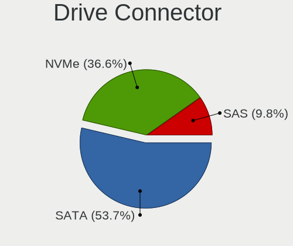
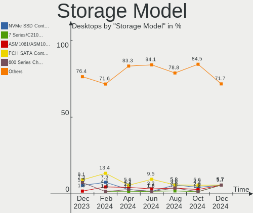
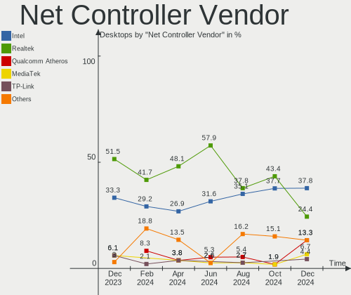

KDE neon Hardware Trends (Desktop)
----------------------------------

A project to identify most popular hardware characteristics and track their change
over time based on data collected by KDE neon users at https://Linux-Hardware.org.

Anyone can contribute to the study by uploading probes of their computers by
the [hw-probe](https://github.com/linuxhw/hw-probe) tool:

    sudo hw-probe -all -upload

Full-feature report is available here: https://linux-hardware.org/?view=trends&formfactor=desktop

Period: Apr, 2020.

Contents
--------

- [ OS                       ](#os)
- [ OS Family                ](#os-family)
- [ Kernel                   ](#kernel)
- [ Kernel Family            ](#kernel-family)
- [ Kernel Major Ver.        ](#kernel-major-ver)
- [ Arch                     ](#arch)
- [ DE                       ](#de)
- [ Display Server           ](#display-server)
- [ Display Manager          ](#display-manager)
- [ OS Lang                  ](#os-lang)
- [ Boot Mode                ](#boot-mode)
- [ Filesystem               ](#filesystem)
- [ Dual Boot with Linux/BSD ](#dual-boot-with-linux/bsd)
- [ Dual Boot (Win)          ](#dual-boot-win)
- [ Country                  ](#country)
- [ City                     ](#city)
- [ Vendor                   ](#vendor)
- [ Model                    ](#model)
- [ Model Family             ](#model-family)
- [ MFG Year                 ](#mfg-year)
- [ Form Factor              ](#form-factor)
- [ Secure Boot              ](#secure-boot)
- [ Coreboot                 ](#coreboot)
- [ RAM Size                 ](#ram-size)
- [ RAM Used                 ](#ram-used)
- [ Drive Vendor             ](#drive-vendor)
- [ Drive Model              ](#drive-model)
- [ Drive Kind               ](#drive-kind)
- [ Drive Connector          ](#drive-connector)
- [ Drive Size               ](#drive-size)
- [ Space Total              ](#space-total)
- [ Space Used               ](#space-used)
- [ Malfunc. Drives          ](#malfunc-drives)
- [ Malfunc. Drive Vendor    ](#malfunc-drive-vendor)
- [ Malfunc. Drive Kind      ](#malfunc-drive-kind)
- [ Failed Drives            ](#failed-drives)
- [ Failed Drive Vendor      ](#failed-drive-vendor)
- [ Drive Status             ](#drive-status)
- [ Storage Vendor           ](#storage-vendor)
- [ Storage Model            ](#storage-model)
- [ Storage Kind             ](#storage-kind)
- [ CPU Vendor               ](#cpu-vendor)
- [ CPU Model                ](#cpu-model)
- [ CPU Model Family         ](#cpu-model-family)
- [ CPU Cores                ](#cpu-cores)
- [ CPU Sockets              ](#cpu-sockets)
- [ CPU Threads              ](#cpu-threads)
- [ CPU Op-Modes             ](#cpu-op-modes)
- [ CPU Microarch            ](#cpu-microarch)
- [ CPU Microcode            ](#cpu-microcode)
- [ GPU Vendor               ](#gpu-vendor)
- [ GPU Model                ](#gpu-model)
- [ GPU Combo                ](#gpu-combo)
- [ GPU Driver               ](#gpu-driver)
- [ GPU Memory               ](#gpu-memory)
- [ Monitor Vendor           ](#monitor-vendor)
- [ Monitor Model            ](#monitor-model)
- [ Monitor Resolution       ](#monitor-resolution)
- [ Monitor Diagonal         ](#monitor-diagonal)
- [ Monitor Width            ](#monitor-width)
- [ Aspect Ratio             ](#aspect-ratio)
- [ Monitor Area             ](#monitor-area)
- [ Pixel Density            ](#pixel-density)
- [ Multiple Monitors        ](#multiple-monitors)
- [ Net Controller Vendor    ](#net-controller-vendor)
- [ Net Controller Model     ](#net-controller-model)
- [ Net Controller Kind      ](#net-controller-kind)
- [ Used Controller          ](#used-controller)
- [ NICs                     ](#nics)
- [ Unsupported Devices      ](#unsupported-devices)
- [ Unsupported Device Types ](#unsupported-device-types)

OS
--

Installed operating systems

| Name           | Computers | Percent |
|----------------|-----------|---------|
| KDE neon 18.04 | 18        | 100%    |

OS Family
---------

OS without a version

| Name     | Computers | Percent |
|----------|-----------|---------|
| KDE neon | 18        | 100%    |

Kernel
------

Version of the Linux kernel

| Version              | Computers | Percent |
|----------------------|-----------|---------|
| 5.3.0-46-generic     | 11        | 61.11%  |
| 5.3.0-51-generic     | 2         | 11.11%  |
| 5.6.7-050607-generic | 1         | 5.56%   |
| 5.3.0-45-generic     | 1         | 5.56%   |
| 5.3.0-42-generic     | 1         | 5.56%   |
| 4.15.0-99-generic    | 1         | 5.56%   |
| 4.15.0-96-generic    | 1         | 5.56%   |

Kernel Family
-------------

Linux kernel without a distro release

| Version | Computers | Percent |
|---------|-----------|---------|
| 5.3.0   | 15        | 83.33%  |
| 4.15.0  | 2         | 11.11%  |
| 5.6.7   | 1         | 5.56%   |

Kernel Major Ver.
-----------------

Linux kernel major version

| Version | Computers | Percent |
|---------|-----------|---------|
| 5.3     | 15        | 83.33%  |
| 4.15    | 2         | 11.11%  |
| 5.6     | 1         | 5.56%   |

Arch
----

OS architecture (x86_64, i586, etc.)

| Name   | Computers | Percent |
|--------|-----------|---------|
| x86_64 | 18        | 100%    |

DE
--

Desktop Environment

| Name    | Computers | Percent |
|---------|-----------|---------|
| KDE     | 15        | 83.33%  |
| MATE    | 1         | 5.56%   |
| KDE5    | 1         | 5.56%   |
| Unknown | 1         | 5.56%   |

Display Server
--------------

X11 or Wayland

| Name | Computers | Percent |
|------|-----------|---------|
| X11  | 18        | 100%    |

Display Manager
---------------

SDDM, LightDM, etc.

| Name    | Computers | Percent |
|---------|-----------|---------|
| Unknown | 17        | 94.44%  |
| SDDM    | 1         | 5.56%   |

OS Lang
-------

Language

| Lang  | Computers | Percent |
|-------|-----------|---------|
| en_US | 8         | 44.44%  |
| it_IT | 2         | 11.11%  |
| es_AR | 2         | 11.11%  |
| ru_RU | 1         | 5.56%   |
| es_UY | 1         | 5.56%   |
| es_ES | 1         | 5.56%   |
| en_IN | 1         | 5.56%   |
| en_CA | 1         | 5.56%   |
| de_DE | 1         | 5.56%   |

Boot Mode
---------

EFI or BIOS

| Mode | Computers | Percent |
|------|-----------|---------|
| BIOS | 14        | 77.78%  |
| EFI  | 4         | 22.22%  |

Filesystem
----------

Type of filesystem

| Type  | Computers | Percent |
|-------|-----------|---------|
| Ext4  | 17        | 94.44%  |
| Btrfs | 1         | 5.56%   |

Dual Boot with Linux/BSD
------------------------

Hosting more than one Linux/BSD

| Dual boot | Computers | Percent |
|-----------|-----------|---------|
| No        | 14        | 77.78%  |
| Yes       | 4         | 22.22%  |

Dual Boot (Win)
---------------

Hosting Linux and Windows

| Dual boot | Computers | Percent |
|-----------|-----------|---------|
| No        | 13        | 72.22%  |
| Yes       | 5         | 27.78%  |

Country
-------

Geographic location (country)

| Country                | Computers | Percent |
|------------------------|-----------|---------|
| USA                    | 5         | 27.78%  |
| Russia                 | 2         | 11.11%  |
| Italy                  | 2         | 11.11%  |
| Argentina              | 2         | 11.11%  |
| Uruguay                | 1         | 5.56%   |
| Spain                  | 1         | 5.56%   |
| India                  | 1         | 5.56%   |
| Germany                | 1         | 5.56%   |
| Canada                 | 1         | 5.56%   |
| Bulgaria               | 1         | 5.56%   |
| Bosnia and Herzegovina | 1         | 5.56%   |

City
----

Geographic location (city)

| City           | Computers | Percent |
|----------------|-----------|---------|
| Vittuone       | 1         | 5.56%   |
| Villamaina     | 1         | 5.56%   |
| The Bronx      | 1         | 5.56%   |
| Sofia          | 1         | 5.56%   |
| San Francisco  | 1         | 5.56%   |
| Samara         | 1         | 5.56%   |
| Offenbach      | 1         | 5.56%   |
| Montreal       | 1         | 5.56%   |
| Madrid         | 1         | 5.56%   |
| Hyderabad      | 1         | 5.56%   |
| Florida        | 1         | 5.56%   |
| Cumming        | 1         | 5.56%   |
| City Bell      | 1         | 5.56%   |
| Chelyabinsk    | 1         | 5.56%   |
| Burlington     | 1         | 5.56%   |
| Buenos Aires   | 1         | 5.56%   |
| Bonita Springs | 1         | 5.56%   |
| Bihać         | 1         | 5.56%   |

Vendor
------

Motherboard manufacturer

| Name                | Computers | Percent |
|---------------------|-----------|---------|
| ASUSTek Computer    | 5         | 27.78%  |
| Gigabyte Technology | 4         | 22.22%  |
| MSI                 | 3         | 16.67%  |
| ASRock              | 3         | 16.67%  |
| Gateway             | 1         | 5.56%   |
| Acer                | 1         | 5.56%   |
| ABIT                | 1         | 5.56%   |

Model
-----

Motherboard model

| Name                      | Computers | Percent |
|---------------------------|-----------|---------|
| MSI MS-7C37               | 1         | 5.56%   |
| MSI MS-7B87               | 1         | 5.56%   |
| MSI MS-7623               | 1         | 5.56%   |
| Gigabyte Z170X-UD3        | 1         | 5.56%   |
| Gigabyte P85-D3           | 1         | 5.56%   |
| Gigabyte M68MT-S2P        | 1         | 5.56%   |
| Gigabyte E2500N           | 1         | 5.56%   |
| Gateway DX4375            | 1         | 5.56%   |
| ASUS Z170-A               | 1         | 5.56%   |
| ASUS TUF GAMING X570-PLUS | 1         | 5.56%   |
| ASUS PRIME H310M-R R2.0   | 1         | 5.56%   |
| ASUS P5KPL-SE             | 1         | 5.56%   |
| ASUS KGPE-D16             | 1         | 5.56%   |
| ASRock N68-VS3 FX         | 1         | 5.56%   |
| ASRock G162               | 1         | 5.56%   |
| ASRock A320M-DVS R4.0     | 1         | 5.56%   |
| Acer Aspire M3970         | 1         | 5.56%   |
| ABIT IP35 Pro             | 1         | 5.56%   |

Model Family
------------

Motherboard model prefix

| Name               | Computers | Percent |
|--------------------|-----------|---------|
| MSI MS-7C37        | 1         | 5.56%   |
| MSI MS-7B87        | 1         | 5.56%   |
| MSI MS-7623        | 1         | 5.56%   |
| Gigabyte Z170X-UD3 | 1         | 5.56%   |
| Gigabyte P85-D3    | 1         | 5.56%   |
| Gigabyte M68MT-S2P | 1         | 5.56%   |
| Gigabyte E2500N    | 1         | 5.56%   |
| Gateway DX4375     | 1         | 5.56%   |
| ASUS Z170-A        | 1         | 5.56%   |
| ASUS TUF           | 1         | 5.56%   |
| ASUS PRIME         | 1         | 5.56%   |
| ASUS P5KPL-SE      | 1         | 5.56%   |
| ASUS KGPE-D16      | 1         | 5.56%   |
| ASRock N68-VS3     | 1         | 5.56%   |
| ASRock G162        | 1         | 5.56%   |
| ASRock A320M-DVS   | 1         | 5.56%   |
| Acer Aspire        | 1         | 5.56%   |
| ABIT IP35          | 1         | 5.56%   |

MFG Year
--------

Motherboard manufacture year

| Year | Computers | Percent |
|------|-----------|---------|
| 2019 | 5         | 27.78%  |
| 2011 | 4         | 22.22%  |
| 2018 | 3         | 16.67%  |
| 2020 | 1         | 5.56%   |
| 2016 | 1         | 5.56%   |
| 2014 | 1         | 5.56%   |
| 2013 | 1         | 5.56%   |
| 2010 | 1         | 5.56%   |
| 2009 | 1         | 5.56%   |

Form Factor
-----------

Physical design of the computer

| Name    | Computers | Percent |
|---------|-----------|---------|
| Desktop | 18        | 100%    |

Secure Boot
-----------

Enabled or disabled

| State    | Computers | Percent |
|----------|-----------|---------|
| Disabled | 18        | 100%    |

Coreboot
--------

Have coreboot on board

| Used | Computers | Percent |
|------|-----------|---------|
| No   | 18        | 100%    |

RAM Size
--------

Total RAM memory

| Size in GB | Computers | Percent |
|------------|-----------|---------|
| 32.01-64.0 | 5         | 27.78%  |
| 4.01-8.0   | 4         | 22.22%  |
| 3.01-4.0   | 4         | 22.22%  |
| 16.01-24.0 | 3         | 16.67%  |
| 24.01-32.0 | 1         | 5.56%   |
| 8.01-16.0  | 1         | 5.56%   |

RAM Used
--------

Used RAM memory

| Used GB    | Computers | Percent |
|------------|-----------|---------|
| 1.01-2.0   | 8         | 44.44%  |
| 4.01-8.0   | 2         | 11.11%  |
| 3.01-4.0   | 2         | 11.11%  |
| 2.01-3.0   | 2         | 11.11%  |
| 8.01-16.0  | 2         | 11.11%  |
| 16.01-24.0 | 1         | 5.56%   |
| 0.01-1.0   | 1         | 5.56%   |

Drive Vendor
------------

Hard drive vendors

| Vendor              | Computers | Drives | Percent |
|---------------------|-----------|--------|---------|
| Seagate             | 11        | 15     | 30.56%  |
| WDC                 | 5         | 5      | 13.89%  |
| Toshiba             | 5         | 5      | 13.89%  |
| Crucial             | 4         | 4      | 11.11%  |
| Samsung Electronics | 3         | 4      | 8.33%   |
| Kingston            | 2         | 2      | 5.56%   |
| Hitachi             | 2         | 2      | 5.56%   |
| SanDisk             | 1         | 1      | 2.78%   |
| Maxtor              | 1         | 1      | 2.78%   |
| LITEON              | 1         | 1      | 2.78%   |
| Hewlett-Packard     | 1         | 1      | 2.78%   |

Drive Model
-----------

Hard drive models

| Model                       | Computers | Percent |
|-----------------------------|-----------|---------|
| ST1000DM010-2EP102 1TB      | 2         | 4.88%   |
| DT01ACA050 500GB            | 2         | 4.88%   |
| WDS100T2B0A-00SM50 1TB SSD  | 1         | 2.44%   |
| WD800JD-60LSA5 80GB         | 1         | 2.44%   |
| WD800BD-22MRA1 80GB         | 1         | 2.44%   |
| WD5000AZLX-60K2TA0 500GB    | 1         | 2.44%   |
| WD1600HLFS-60G6U0 160GB     | 1         | 2.44%   |
| ST500DM005 HD502HJ 500GB    | 1         | 2.44%   |
| ST4000VN008-2DR166 4TB      | 1         | 2.44%   |
| ST4000DM005-2DP166 4TB      | 1         | 2.44%   |
| ST3500630AS 500GB           | 1         | 2.44%   |
| ST320LT012-9WS14C 320GB     | 1         | 2.44%   |
| ST3160812AS 160GB           | 1         | 2.44%   |
| ST2000DM001-9YN164 2TB      | 1         | 2.44%   |
| ST1500DL003-9VT16L 1TB      | 1         | 2.44%   |
| ST1000LM024 HN-M101MBB 1TB  | 1         | 2.44%   |
| ST1000DM003-9YN162 1TB      | 1         | 2.44%   |
| ST1000DM003-1SB102 1TB      | 1         | 2.44%   |
| ST1000DM003-1CH162 1TB      | 1         | 2.44%   |
| SSD 860 QVO 2TB             | 1         | 2.44%   |
| SSD 850 EVO 500GB           | 1         | 2.44%   |
| SSD 850 EVO 250GB           | 1         | 2.44%   |
| SDSSDA120G 120GB            | 1         | 2.44%   |
| SA400S37240G 240GB SSD      | 1         | 2.44%   |
| SA400S37120G 120GB SSD      | 1         | 2.44%   |
| MZVLW512HMJP-000L2 512GB    | 1         | 2.44%   |
| MK3265GSXN 320GB            | 1         | 2.44%   |
| M4-CT128M4SSD2 128GB        | 1         | 2.44%   |
| HDWF180 8TB                 | 1         | 2.44%   |
| HDWE150 5TB                 | 1         | 2.44%   |
| HDS721050CLA362 500GB       | 1         | 2.44%   |
| HDS721050CLA360 500GB       | 1         | 2.44%   |
| GB1000EAMYC 1TB             | 1         | 2.44%   |
| CV8-8E128-11 SATA 128GB SSD | 1         | 2.44%   |
| CT500MX500SSD4 500GB        | 1         | 2.44%   |
| CT250MX200SSD1 250GB        | 1         | 2.44%   |
| CT120BX500SSD1 120GB        | 1         | 2.44%   |
| BUP Slim BK 1TB             | 1         | 2.44%   |
| 6L300S0 304GB               | 1         | 2.44%   |

Drive Kind
----------

HDD or SSD

| Kind | Computers | Drives | Percent |
|------|-----------|--------|---------|
| HDD  | 16        | 28     | 59.26%  |
| SSD  | 10        | 12     | 37.04%  |
| NVMe | 1         | 1      | 3.7%    |

Drive Connector
---------------

SATA, SAS, NVMe, etc.

| Type | Computers | Drives | Percent |
|------|-----------|--------|---------|
| SATA | 17        | 39     | 89.47%  |
| SAS  | 1         | 1      | 5.26%   |
| NVMe | 1         | 1      | 5.26%   |

Drive Size
----------

Size of hard drive

| Size in TB | Computers | Drives | Percent |
|------------|-----------|--------|---------|
| 0.01-0.5   | 15        | 24     | 51.72%  |
| 0.51-1.0   | 8         | 11     | 27.59%  |
| 3.01-4.0   | 2         | 2      | 6.9%    |
| 1.01-2.0   | 2         | 2      | 6.9%    |
| 4.01-10.0  | 2         | 2      | 6.9%    |

Space Total
-----------

Amount of disk space available on the file system

| Size in GB     | Computers | Percent |
|----------------|-----------|---------|
| 251-500        | 5         | 27.78%  |
| More than 3000 | 3         | 16.67%  |
| 101-250        | 3         | 16.67%  |
| 1001-2000      | 2         | 11.11%  |
| 501-1000       | 2         | 11.11%  |
| 21-50          | 1         | 5.56%   |
| 2001-3000      | 1         | 5.56%   |
| 1-20           | 1         | 5.56%   |

Space Used
----------

Amount of used disk space

| Used GB        | Computers | Percent |
|----------------|-----------|---------|
| 1-20           | 5         | 27.78%  |
| 21-50          | 3         | 16.67%  |
| 1001-2000      | 3         | 16.67%  |
| 51-100         | 3         | 16.67%  |
| 501-1000       | 2         | 11.11%  |
| More than 3000 | 1         | 5.56%   |
| 101-250        | 1         | 5.56%   |

Malfunc. Drives
---------------

Drive models with a malfunction

| Model                  | Computers | Drives | Percent |
|------------------------|-----------|--------|---------|
| ST2000DM001-9YN164 2TB | 1         | 1      | 100%    |

Malfunc. Drive Vendor
---------------------

Vendors of faulty drives

| Vendor  | Computers | Drives | Percent |
|---------|-----------|--------|---------|
| Seagate | 1         | 1      | 100%    |

Malfunc. Drive Kind
-------------------

Kinds of faulty drives

| Kind | Computers | Drives | Percent |
|------|-----------|--------|---------|
| HDD  | 1         | 1      | 100%    |

Failed Drives
-------------

Failed drive models

Zero info for selected period =(

Failed Drive Vendor
-------------------

Failed drive vendors

Zero info for selected period =(

Drive Status
------------

Number of failed and malfunc. drives

| Status   | Computers | Drives | Percent |
|----------|-----------|--------|---------|
| Detected | 17        | 37     | 85%     |
| Works    | 2         | 3      | 10%     |
| Malfunc  | 1         | 1      | 5%      |

Storage Vendor
--------------

Storage controller vendors

| Vendor                    | Computers | Percent |
|---------------------------|-----------|---------|
| AMD                       | 9         | 36%     |
| Intel                     | 7         | 28%     |
| Phison Electronics        | 2         | 8%      |
| Nvidia                    | 2         | 8%      |
| ASMedia Technology        | 2         | 8%      |
| Samsung Electronics       | 1         | 4%      |
| Micron/Crucial Technology | 1         | 4%      |
| JMicron Technology        | 1         | 4%      |

Storage Model
-------------

Storage controller models

| Model                                                                    | Computers | Percent |
|--------------------------------------------------------------------------|-----------|---------|
| FCH SATA Controller [AHCI mode]                                          | 7         | 21.88%  |
| SB7x0/SB8x0/SB9x0 SATA Controller [IDE mode]                             | 2         | 6.25%   |
| SB7x0/SB8x0/SB9x0 IDE Controller                                         | 2         | 6.25%   |
| Q170/Q150/B150/H170/H110/Z170/CM236 Chipset SATA Controller [AHCI Mode]  | 2         | 6.25%   |
| MCP61 SATA Controller                                                    | 2         | 6.25%   |
| E12 NVMe Controller                                                      | 2         | 6.25%   |
| ASM1062 Serial ATA Controller                                            | 2         | 6.25%   |
| 400 Series Chipset SATA Controller                                       | 2         | 6.25%   |
| SATA Controller [RAID mode]                                              | 1         | 3.13%   |
| P1 NVMe PCIe SSD                                                         | 1         | 3.13%   |
| NVMe SSD Controller SM961/PM961                                          | 1         | 3.13%   |
| NM10/ICH7 Family SATA Controller [IDE mode]                              | 1         | 3.13%   |
| MCP61 IDE                                                                | 1         | 3.13%   |
| JMB363 SATA/IDE Controller                                               | 1         | 3.13%   |
| FCH SATA Controller D                                                    | 1         | 3.13%   |
| 82801IR/IO/IH (ICH9R/DO/DH) 6 port SATA Controller [AHCI mode]           | 1         | 3.13%   |
| 82801G (ICH7 Family) IDE Controller                                      | 1         | 3.13%   |
| 8 Series/C220 Series Chipset Family 6-port SATA Controller 1 [AHCI mode] | 1         | 3.13%   |
| 200 Series PCH SATA controller [AHCI mode]                               | 1         | 3.13%   |

Storage Kind
------------

Kind of storage controller (IDE, SATA, NVMe, SAS, ...)

| Kind | Computers | Percent |
|------|-----------|---------|
| SATA | 14        | 56%     |
| IDE  | 6         | 24%     |
| NVMe | 4         | 16%     |
| RAID | 1         | 4%      |

CPU Vendor
----------

Processor vendors

| Vendor | Computers | Percent |
|--------|-----------|---------|
| AMD    | 11        | 61.11%  |
| Intel  | 7         | 38.89%  |

CPU Model
---------

Processor models

| Model                                         | Computers | Percent |
|-----------------------------------------------|-----------|---------|
| Intel Pentium Dual-Core CPU E5700 @ 3.00GHz   | 1         | 5.56%   |
| Intel Core i7-7700K CPU @ 4.20GHz             | 1         | 5.56%   |
| Intel Core i7-6700K CPU @ 4.00GHz             | 1         | 5.56%   |
| Intel Core i7-4790K CPU @ 4.00GHz             | 1         | 5.56%   |
| Intel Core i3-8100 CPU @ 3.60GHz              | 1         | 5.56%   |
| Intel Core i3-2100 CPU @ 3.10GHz              | 1         | 5.56%   |
| Intel Core 2 Quad CPU Q6600 @ 2.40GHz         | 1         | 5.56%   |
| AMD Ryzen 9 3900X 12-Core Processor           | 1         | 5.56%   |
| AMD Ryzen 7 3800X 8-Core Processor            | 1         | 5.56%   |
| AMD Ryzen 7 2700X Eight-Core Processor        | 1         | 5.56%   |
| AMD Ryzen 5 2600 Six-Core Processor           | 1         | 5.56%   |
| AMD Phenom II X2 560 Processor                | 1         | 5.56%   |
| AMD Eng Sample, ZS288145TCG54_34/28/20_2/16   | 1         | 5.56%   |
| AMD E1-2500 APU with Radeon HD Graphics       | 1         | 5.56%   |
| AMD Athlon II X4 640 Processor                | 1         | 5.56%   |
| AMD Athlon II X2 4450e Processor              | 1         | 5.56%   |
| AMD A8-9600 RADEON R7, 10 COMPUTE CORES 4C+6G | 1         | 5.56%   |
| AMD A6-5200 APU with Radeon HD Graphics       | 1         | 5.56%   |

CPU Model Family
----------------

Processor model prefix

| Model                   | Computers | Percent |
|-------------------------|-----------|---------|
| Intel Core i7           | 3         | 16.67%  |
| Intel Core i3           | 2         | 11.11%  |
| AMD Ryzen 7             | 2         | 11.11%  |
| Intel Pentium Dual-Core | 1         | 5.56%   |
| Intel Core 2 Quad       | 1         | 5.56%   |
| AMD Ryzen 9             | 1         | 5.56%   |
| AMD Ryzen 5             | 1         | 5.56%   |
| AMD Phenom II X2        | 1         | 5.56%   |
| AMD E1                  | 1         | 5.56%   |
| AMD E                   | 1         | 5.56%   |
| AMD Athlon II X4        | 1         | 5.56%   |
| AMD Athlon II X2        | 1         | 5.56%   |
| AMD A8                  | 1         | 5.56%   |
| AMD A6                  | 1         | 5.56%   |

CPU Cores
---------

Number of processor cores

| Number | Computers | Percent |
|--------|-----------|---------|
| 4      | 7         | 38.89%  |
| 2      | 6         | 33.33%  |
| 8      | 2         | 11.11%  |
| 6      | 2         | 11.11%  |
| 12     | 1         | 5.56%   |

CPU Sockets
-----------

Number of sockets

| Number | Computers | Percent |
|--------|-----------|---------|
| 1      | 18        | 100%    |

CPU Threads
-----------

Threads per core (Hyper-Threading)

| Number | Computers | Percent |
|--------|-----------|---------|
| 2      | 10        | 55.56%  |
| 1      | 8         | 44.44%  |

CPU Op-Modes
------------

CPU Operation Modes (32-bit, 64-bit)

| Op mode        | Computers | Percent |
|----------------|-----------|---------|
| 32-bit, 64-bit | 18        | 100%    |

CPU Microarch
-------------

Microarchitecture

| Name        | Computers | Percent |
|-------------|-----------|---------|
| Skylake     | 3         | 16.67%  |
| K10         | 3         | 16.67%  |
| Zen+        | 2         | 11.11%  |
| Zen 2       | 2         | 11.11%  |
| Jaguar      | 2         | 11.11%  |
| Core        | 2         | 11.11%  |
| SandyBridge | 1         | 5.56%   |
| Piledriver  | 1         | 5.56%   |
| Haswell     | 1         | 5.56%   |
| Excavator   | 1         | 5.56%   |

CPU Microcode
-------------

Microcode number

| Number     | Computers | Percent |
|------------|-----------|---------|
| 0x010000c8 | 3         | 16.67%  |
| 0x08701013 | 2         | 11.11%  |
| 0x0800820d | 2         | 11.11%  |
| Unknown    | 2         | 11.11%  |
| 0x906eb    | 1         | 5.56%   |
| 0x906e9    | 1         | 5.56%   |
| 0x6fb      | 1         | 5.56%   |
| 0x506e3    | 1         | 5.56%   |
| 0x306c3    | 1         | 5.56%   |
| 0x1067a    | 1         | 5.56%   |
| 0x0700010f | 1         | 5.56%   |
| 0x0600611a | 1         | 5.56%   |
| 0x06000852 | 1         | 5.56%   |

GPU Vendor
----------

Vendors of graphics cards

| Vendor | Computers | Percent |
|--------|-----------|---------|
| Nvidia | 10        | 47.62%  |
| AMD    | 9         | 42.86%  |
| Intel  | 2         | 9.52%   |

GPU Model
---------

Graphics card models

| Model                                                                 | Computers | Percent |
|-----------------------------------------------------------------------|-----------|---------|
| GT218 [GeForce 210]                                                   | 2         | 9.52%   |
| Ellesmere [Radeon RX 470/480/570/570X/580/580X/590]                   | 2         | 9.52%   |
| Xeon E3-1200 v3/4th Gen Core Processor Integrated Graphics Controller | 1         | 4.76%   |
| Wani [Radeon R5/R6/R7 Graphics]                                       | 1         | 4.76%   |
| TU106 [GeForce RTX 2060 Rev. A]                                       | 1         | 4.76%   |
| Tonga XT / Amethyst XT [Radeon R9 380X / R9 M295X]                    | 1         | 4.76%   |
| Kabini [Radeon HD 8400 / R3 Series]                                   | 1         | 4.76%   |
| Kabini [Radeon HD 8240 / R3 Series]                                   | 1         | 4.76%   |
| Juniper XT [Radeon HD 6770]                                           | 1         | 4.76%   |
| Hawaii PRO [Radeon R9 290/390]                                        | 1         | 4.76%   |
| GT218 [GeForce 405]                                                   | 1         | 4.76%   |
| GP108 [GeForce GT 1030]                                               | 1         | 4.76%   |
| GP107 [GeForce GTX 1050 Ti]                                           | 1         | 4.76%   |
| GF116 [GeForce GTS 450 Rev. 2]                                        | 1         | 4.76%   |
| GF108GL [Quadro 600]                                                  | 1         | 4.76%   |
| G96 [GeForce 9500 GS]                                                 | 1         | 4.76%   |
| Caicos [Radeon HD 6450/7450/8450 / R5 230 OEM]                        | 1         | 4.76%   |
| C61 [GeForce 7025 / nForce 630a]                                      | 1         | 4.76%   |
| 8th Gen Core Processor Gaussian Mixture Model                         | 1         | 4.76%   |

GPU Combo
---------

Combinations of graphics cards

| Name         | Computers | Percent |
|--------------|-----------|---------|
| 1 x Nvidia   | 8         | 44.44%  |
| 1 x AMD      | 6         | 33.33%  |
| AMD + Nvidia | 2         | 11.11%  |
| Intel + AMD  | 1         | 5.56%   |
| 1 x Intel    | 1         | 5.56%   |

GPU Driver
----------

Free vs proprietary

| Driver      | Computers | Percent |
|-------------|-----------|---------|
| Free        | 12        | 66.67%  |
| Proprietary | 6         | 33.33%  |

GPU Memory
----------

Total video memory

| Size in GB | Computers | Percent |
|------------|-----------|---------|
| 0.01-0.5   | 4         | 22.22%  |
| Unknown    | 4         | 22.22%  |
| 3.01-4.0   | 3         | 16.67%  |
| 0.51-1.0   | 3         | 16.67%  |
| 1.01-2.0   | 2         | 11.11%  |
| 7.01-8.0   | 1         | 5.56%   |
| 5.01-6.0   | 1         | 5.56%   |

Monitor Vendor
--------------

Monitor vendors

| Vendor               | Computers | Percent |
|----------------------|-----------|---------|
| Samsung Electronics  | 5         | 20.83%  |
| Unknown              | 3         | 12.5%   |
| Dell                 | 3         | 12.5%   |
| Sony                 | 2         | 8.33%   |
| Lenovo Group Limited | 2         | 8.33%   |
| Goldstar             | 2         | 8.33%   |
| BenQ                 | 2         | 8.33%   |
| Acer                 | 2         | 8.33%   |
| MSI                  | 1         | 4.17%   |
| LG Electronics       | 1         | 4.17%   |
| AOC                  | 1         | 4.17%   |

Monitor Model
-------------

Monitor models

| Model                                               | Computers | Percent |
|-----------------------------------------------------|-----------|---------|
| W1934 GSM4B7A 1440x900 410x260mm 19.1-inch          | 1         | 4%      |
| U2713HM DEL407E 2560x1440 597x336mm 27.0-inch       | 1         | 4%      |
| U2414H DELA0A4 1920x1080 530x300mm 24.0-inch        | 1         | 4%      |
| TV SNY7402 1920x1080 890x500mm 40.2-inch            | 1         | 4%      |
| TV SNY1603 1920x1080 1600x900mm 72.3-inch           | 1         | 4%      |
| SyncMaster SAM0286 1280x720 372x209mm 16.8-inch     | 1         | 4%      |
| SMS23A350H SAM07D4 1920x1080 510x290mm 23.1-inch    | 1         | 4%      |
| S22B300 SAM08AC 1680x1050 480x270mm 21.7-inch       | 1         | 4%      |
| P2411H DELA06E 1920x1080 531x299mm 24.0-inch        | 1         | 4%      |
| Optix MAG27CQ MSI1462 2560x1440 597x336mm 27.0-inch | 1         | 4%      |
| LCD Monitor SyncMaster 3360x2160                    | 1         | 4%      |
| LCD Monitor Sony SDM-HX93                           | 1         | 4%      |
| LCD Monitor SAMSUNG                                 | 1         | 4%      |
| LCD Monitor S24D300 1920x1080                       | 1         | 4%      |
| LCD Monitor P243W                                   | 1         | 4%      |
| LCD Monitor LEN L171 1280x1024                      | 1         | 4%      |
| LCD Monitor LEN E2223swA                            | 1         | 4%      |
| LCD Monitor ET322QK 5760x2160                       | 1         | 4%      |
| LCD Monitor D2343 1920x1080                         | 1         | 4%      |
| LCD Monitor 1950w 1366x768                          | 1         | 4%      |
| HDR 4K GSM7706 3840x2160 600x340mm 27.2-inch        | 1         | 4%      |
| H277HK ACR0520 3840x2160 597x336mm 27.0-inch        | 1         | 4%      |
| GW2750H BNQ78C3 1920x1080 598x336mm 27.0-inch       | 1         | 4%      |
| GW2250H BNQ78BD 1920x1080 477x268mm 21.5-inch       | 1         | 4%      |
| 5655 SMART TV 5655 1920x1080 1209x680mm 54.6-inch   | 1         | 4%      |

Monitor Resolution
------------------

Monitor screen resolution

| Resolution       | Computers | Percent |
|------------------|-----------|---------|
| 1920x1080 (FHD)  | 9         | 42.86%  |
| Unknown          | 3         | 14.29%  |
| 3840x2160 (4K)   | 2         | 9.52%   |
| 5760x2160        | 1         | 4.76%   |
| 3360x2160        | 1         | 4.76%   |
| 2560x1440 (QHD)  | 1         | 4.76%   |
| 1440x900 (WXGA+) | 1         | 4.76%   |
| 1366x768 (WXGA)  | 1         | 4.76%   |
| 1280x720 (HD)    | 1         | 4.76%   |
| 1280x1024 (SXGA) | 1         | 4.76%   |

Monitor Diagonal
----------------

Diagonal size in inches

| Inches  | Computers | Percent |
|---------|-----------|---------|
| Unknown | 6         | 28.57%  |
| 27      | 3         | 14.29%  |
| 26      | 2         | 9.52%   |
| 23      | 2         | 9.52%   |
| 21      | 2         | 9.52%   |
| 72      | 1         | 4.76%   |
| 54      | 1         | 4.76%   |
| 46      | 1         | 4.76%   |
| 24      | 1         | 4.76%   |
| 19      | 1         | 4.76%   |
| 16      | 1         | 4.76%   |

Monitor Width
-------------

Physical width

| Width in mm | Computers | Percent |
|-------------|-----------|---------|
| 501-600     | 6         | 31.58%  |
| Unknown     | 6         | 31.58%  |
| 401-500     | 3         | 15.79%  |
| 1001-1500   | 2         | 10.53%  |
| 351-400     | 1         | 5.26%   |
| 1501-2000   | 1         | 5.26%   |

Aspect Ratio
------------

Proportional relationship between the width and the height

| Ratio   | Computers | Percent |
|---------|-----------|---------|
| 16/9    | 10        | 58.82%  |
| Unknown | 6         | 35.29%  |
| 16/10   | 1         | 5.88%   |

Monitor Area
------------

Area in inch²

| Area in inch² | Computers | Percent |
|----------------|-----------|---------|
| Unknown        | 6         | 28.57%  |
| 301-350        | 5         | 23.81%  |
| 201-250        | 3         | 14.29%  |
| 151-200        | 3         | 14.29%  |
| More than 1000 | 2         | 9.52%   |
| 121-130        | 1         | 4.76%   |
| 501-1000       | 1         | 4.76%   |

Pixel Density
-------------

Pixels per inch

| Density | Computers | Percent |
|---------|-----------|---------|
| Unknown | 6         | 33.33%  |
| 51-100  | 5         | 27.78%  |
| 1-50    | 3         | 16.67%  |
| 161-240 | 2         | 11.11%  |
| 101-120 | 2         | 11.11%  |

Multiple Monitors
-----------------

Total monitors connected

| Total | Computers | Percent |
|-------|-----------|---------|
| 1     | 12        | 66.67%  |
| 2     | 4         | 22.22%  |
| 3     | 2         | 11.11%  |

Net Controller Vendor
---------------------

Controller vendors

| Vendor              | Computers | Percent |
|---------------------|-----------|---------|
| Nvidia              | 2         | 50%     |
| Samsung Electronics | 1         | 25%     |
| Intel               | 1         | 25%     |

Net Controller Model
--------------------

Controller models

| Model                                                              | Computers | Percent |
|--------------------------------------------------------------------|-----------|---------|
| MCP61 Ethernet                                                     | 2         | 50%     |
| GT-I9500 [Galaxy S4] / GT-I9250 [Galaxy Nexus] (network tethering) | 1         | 25%     |
| 82574L Gigabit Network Connection                                  | 1         | 25%     |

Net Controller Kind
-------------------

Ethernet, WiFi or modem

| Kind     | Computers | Percent |
|----------|-----------|---------|
| Ethernet | 4         | 100%    |

Used Controller
---------------

Currently used network controller

| Kind     | Computers | Percent |
|----------|-----------|---------|
| Ethernet | 2         | 100%    |

NICs
----

Total network controllers on board

| Total | Computers | Percent |
|-------|-----------|---------|
| 1     | 12        | 66.67%  |
| 2     | 6         | 33.33%  |

Unsupported Devices
-------------------

Total unsupported devices on board

| Total | Computers | Percent |
|-------|-----------|---------|
| 0     | 17        | 94.44%  |
| 1     | 1         | 5.56%   |

Unsupported Device Types
------------------------

Types of unsupported devices

| Type         | Computers | Percent |
|--------------|-----------|---------|
| Net/wireless | 1         | 100%    |

