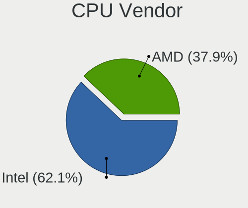

KDE neon - Hardware Trends (Desktops)
-------------------------------------

A project to identify most popular hardware characteristics and track their change
over time based on data collected by Linux users at https://Linux-Hardware.org.

Anyone can contribute to this report by the [hw-probe](https://github.com/linuxhw/hw-probe) tool:

    sudo -E hw-probe -all -upload

This report is for one last month. Overall report since the beginning of time: [TestCoverage](https://github.com/linuxhw/TestCoverage)

Period: Oct, 2022.

Contents
--------

* [ System ](#system)
  - [ OS                       ](#os)
  - [ OS Family                ](#os-family)
  - [ Kernel                   ](#kernel)
  - [ Kernel Family            ](#kernel-family)
  - [ Kernel Major Ver.        ](#kernel-major-ver)
  - [ Arch                     ](#arch)
  - [ DE                       ](#de)
  - [ Display Server           ](#display-server)
  - [ Display Manager          ](#display-manager)
  - [ OS Lang                  ](#os-lang)
  - [ Boot Mode                ](#boot-mode)
  - [ Filesystem               ](#filesystem)
  - [ Part. scheme             ](#part-scheme)
  - [ Dual Boot with Linux/BSD ](#dual-boot-with-linuxbsd)
  - [ Dual Boot (Win)          ](#dual-boot-win)

* [ Board ](#board)
  - [ Vendor                   ](#vendor)
  - [ Model                    ](#model)
  - [ Model Family             ](#model-family)
  - [ MFG Year                 ](#mfg-year)
  - [ Form Factor              ](#form-factor)
  - [ Secure Boot              ](#secure-boot)
  - [ Coreboot                 ](#coreboot)
  - [ RAM Size                 ](#ram-size)
  - [ RAM Used                 ](#ram-used)
  - [ Total Drives             ](#total-drives)
  - [ Has CD-ROM               ](#has-cd-rom)
  - [ Has Ethernet             ](#has-ethernet)
  - [ Has WiFi                 ](#has-wifi)
  - [ Has Bluetooth            ](#has-bluetooth)

* [ Location ](#location)
  - [ Country                  ](#country)
  - [ City                     ](#city)

* [ Drives ](#drives)
  - [ Drive Vendor             ](#drive-vendor)
  - [ Drive Model              ](#drive-model)
  - [ HDD Vendor               ](#hdd-vendor)
  - [ SSD Vendor               ](#ssd-vendor)
  - [ Drive Kind               ](#drive-kind)
  - [ Drive Connector          ](#drive-connector)
  - [ Drive Size               ](#drive-size)
  - [ Space Total              ](#space-total)
  - [ Space Used               ](#space-used)
  - [ Malfunc. Drives          ](#malfunc-drives)
  - [ Malfunc. Drive Vendor    ](#malfunc-drive-vendor)
  - [ Malfunc. HDD Vendor      ](#malfunc-hdd-vendor)
  - [ Malfunc. Drive Kind      ](#malfunc-drive-kind)
  - [ Failed Drives            ](#failed-drives)
  - [ Failed Drive Vendor      ](#failed-drive-vendor)
  - [ Drive Status             ](#drive-status)

* [ Storage controller ](#storage-controller)
  - [ Storage Vendor           ](#storage-vendor)
  - [ Storage Model            ](#storage-model)
  - [ Storage Kind             ](#storage-kind)

* [ Processor ](#processor)
  - [ CPU Vendor               ](#cpu-vendor)
  - [ CPU Model                ](#cpu-model)
  - [ CPU Model Family         ](#cpu-model-family)
  - [ CPU Cores                ](#cpu-cores)
  - [ CPU Sockets              ](#cpu-sockets)
  - [ CPU Threads              ](#cpu-threads)
  - [ CPU Op-Modes             ](#cpu-op-modes)
  - [ CPU Microcode            ](#cpu-microcode)
  - [ CPU Microarch            ](#cpu-microarch)

* [ Graphics ](#graphics)
  - [ GPU Vendor               ](#gpu-vendor)
  - [ GPU Model                ](#gpu-model)
  - [ GPU Combo                ](#gpu-combo)
  - [ GPU Driver               ](#gpu-driver)
  - [ GPU Memory               ](#gpu-memory)

* [ Monitor ](#monitor)
  - [ Monitor Vendor           ](#monitor-vendor)
  - [ Monitor Model            ](#monitor-model)
  - [ Monitor Resolution       ](#monitor-resolution)
  - [ Monitor Diagonal         ](#monitor-diagonal)
  - [ Monitor Width            ](#monitor-width)
  - [ Aspect Ratio             ](#aspect-ratio)
  - [ Monitor Area             ](#monitor-area)
  - [ Pixel Density            ](#pixel-density)
  - [ Multiple Monitors        ](#multiple-monitors)

* [ Network ](#network)
  - [ Net Controller Vendor    ](#net-controller-vendor)
  - [ Net Controller Model     ](#net-controller-model)
  - [ Wireless Vendor          ](#wireless-vendor)
  - [ Wireless Model           ](#wireless-model)
  - [ Ethernet Vendor          ](#ethernet-vendor)
  - [ Ethernet Model           ](#ethernet-model)
  - [ Net Controller Kind      ](#net-controller-kind)
  - [ Used Controller          ](#used-controller)
  - [ NICs                     ](#nics)
  - [ IPv6                     ](#ipv6)

* [ Bluetooth ](#bluetooth)
  - [ Bluetooth Vendor         ](#bluetooth-vendor)
  - [ Bluetooth Model          ](#bluetooth-model)

* [ Sound ](#sound)
  - [ Sound Vendor             ](#sound-vendor)
  - [ Sound Model              ](#sound-model)

* [ Memory ](#memory)
  - [ Memory Vendor            ](#memory-vendor)
  - [ Memory Model             ](#memory-model)
  - [ Memory Kind              ](#memory-kind)
  - [ Memory Form Factor       ](#memory-form-factor)
  - [ Memory Size              ](#memory-size)
  - [ Memory Speed             ](#memory-speed)

* [ Printers & scanners ](#printers--scanners)
  - [ Printer Vendor           ](#printer-vendor)
  - [ Printer Model            ](#printer-model)
  - [ Scanner Vendor           ](#scanner-vendor)
  - [ Scanner Model            ](#scanner-model)

* [ Camera ](#camera)
  - [ Camera Vendor            ](#camera-vendor)
  - [ Camera Model             ](#camera-model)

* [ Security ](#security)
  - [ Fingerprint Vendor       ](#fingerprint-vendor)
  - [ Fingerprint Model        ](#fingerprint-model)
  - [ Chipcard Vendor          ](#chipcard-vendor)
  - [ Chipcard Model           ](#chipcard-model)

* [ Unsupported ](#unsupported)
  - [ Unsupported Devices      ](#unsupported-devices)
  - [ Unsupported Device Types ](#unsupported-device-types)

System
------

OS
--

Installed operating systems

| Name           | Desktops | Percent |
|----------------|----------|---------|
| KDE neon 20.04 | 34       | 64.15%  |
| KDE neon 22.04 | 19       | 35.85%  |

OS Family
---------

OS without a version

| Name     | Desktops | Percent |
|----------|----------|---------|
| KDE neon | 53       | 100%    |

Kernel
------

Version of the Linux kernel

| Version                    | Desktops | Percent |
|----------------------------|----------|---------|
| 5.15.0-52-generic          | 24       | 45.28%  |
| 5.15.0-50-generic          | 10       | 18.87%  |
| 5.15.0-48-generic          | 9        | 16.98%  |
| 5.15.0-46-generic          | 4        | 7.55%   |
| 5.8.0-55-generic           | 1        | 1.89%   |
| 5.19.0-16.4-liquorix-amd64 | 1        | 1.89%   |
| 5.13.0-52-generic          | 1        | 1.89%   |
| 5.13.0-35-generic          | 1        | 1.89%   |
| 5.11.0-43-generic          | 1        | 1.89%   |
| 5.11.0-34-generic          | 1        | 1.89%   |

Kernel Family
-------------

Linux kernel without a distro release

| Version | Desktops | Percent |
|---------|----------|---------|
| 5.15.0  | 47       | 88.68%  |
| 5.13.0  | 2        | 3.77%   |
| 5.11.0  | 2        | 3.77%   |
| 5.8.0   | 1        | 1.89%   |
| 5.19.0  | 1        | 1.89%   |

Kernel Major Ver.
-----------------

Linux kernel major version

| Version | Desktops | Percent |
|---------|----------|---------|
| 5.15    | 47       | 88.68%  |
| 5.13    | 2        | 3.77%   |
| 5.11    | 2        | 3.77%   |
| 5.8     | 1        | 1.89%   |
| 5.19    | 1        | 1.89%   |

Arch
----

OS architecture (x86_64, i586, etc.)

| Name   | Desktops | Percent |
|--------|----------|---------|
| x86_64 | 53       | 100%    |

DE
--

Desktop Environment

| Name | Desktops | Percent |
|------|----------|---------|
| KDE5 | 52       | 98.11%  |
| KDE  | 1        | 1.89%   |

Display Server
--------------

X11 or Wayland

| Name    | Desktops | Percent |
|---------|----------|---------|
| X11     | 49       | 92.45%  |
| Wayland | 4        | 7.55%   |

Display Manager
---------------

SDDM, LightDM, etc.

| Name    | Desktops | Percent |
|---------|----------|---------|
| Unknown | 41       | 77.36%  |
| SDDM    | 12       | 22.64%  |

OS Lang
-------

Language

| Lang  | Desktops | Percent |
|-------|----------|---------|
| en_US | 15       | 28.3%   |
| de_DE | 6        | 11.32%  |
| it_IT | 5        | 9.43%   |
| pt_BR | 4        | 7.55%   |
| en_AG | 4        | 7.55%   |
| ru_RU | 3        | 5.66%   |
| en_GB | 3        | 5.66%   |
| C     | 3        | 5.66%   |
| fr_FR | 2        | 3.77%   |
| es_MX | 2        | 3.77%   |
| es_ES | 1        | 1.89%   |
| en_ZA | 1        | 1.89%   |
| en_SG | 1        | 1.89%   |
| en_NZ | 1        | 1.89%   |
| en_CA | 1        | 1.89%   |
| en_AU | 1        | 1.89%   |

Boot Mode
---------

EFI or BIOS

| Mode | Desktops | Percent |
|------|----------|---------|
| BIOS | 31       | 58.49%  |
| EFI  | 22       | 41.51%  |

Filesystem
----------

Type of filesystem

| Type    | Desktops | Percent |
|---------|----------|---------|
| Ext4    | 45       | 84.91%  |
| Btrfs   | 4        | 7.55%   |
| Overlay | 3        | 5.66%   |
| Xfs     | 1        | 1.89%   |

Part. scheme
------------

Scheme of partitioning

| Type    | Desktops | Percent |
|---------|----------|---------|
| Unknown | 41       | 77.36%  |
| GPT     | 12       | 22.64%  |

Dual Boot with Linux/BSD
------------------------

Hosting more than one Linux/BSD

| Dual boot | Desktops | Percent |
|-----------|----------|---------|
| No        | 51       | 96.23%  |
| Yes       | 2        | 3.77%   |

Dual Boot (Win)
---------------

Hosting Linux and Windows

| Dual boot | Desktops | Percent |
|-----------|----------|---------|
| No        | 46       | 86.79%  |
| Yes       | 7        | 13.21%  |

Board
-----

Vendor
------

Motherboard manufacturer

| Name                | Desktops | Percent |
|---------------------|----------|---------|
| ASUSTek Computer    | 21       | 39.62%  |
| MSI                 | 15       | 28.3%   |
| Gigabyte Technology | 5        | 9.43%   |
| Hewlett-Packard     | 4        | 7.55%   |
| Dell                | 2        | 3.77%   |
| ASRock              | 2        | 3.77%   |
| Acer                | 2        | 3.77%   |
| Fujitsu Siemens     | 1        | 1.89%   |
| Biostar             | 1        | 1.89%   |

Model
-----

Motherboard model

| Name                              | Desktops | Percent |
|-----------------------------------|----------|---------|
| ASUS All Series                   | 3        | 5.66%   |
| MSI MS-7D32                       | 1        | 1.89%   |
| MSI MS-7D25                       | 1        | 1.89%   |
| MSI MS-7D20                       | 1        | 1.89%   |
| MSI MS-7C95                       | 1        | 1.89%   |
| MSI MS-7C91                       | 1        | 1.89%   |
| MSI MS-7C87                       | 1        | 1.89%   |
| MSI MS-7C79                       | 1        | 1.89%   |
| MSI MS-7C02                       | 1        | 1.89%   |
| MSI MS-7B98                       | 1        | 1.89%   |
| MSI MS-7B85                       | 1        | 1.89%   |
| MSI MS-7B79                       | 1        | 1.89%   |
| MSI MS-7918                       | 1        | 1.89%   |
| MSI MS-7751                       | 1        | 1.89%   |
| MSI MS-7623                       | 1        | 1.89%   |
| MSI Cubi N 8GL (MS-B171)          | 1        | 1.89%   |
| HP Z440 Workstation               | 1        | 1.89%   |
| HP Z400 Workstation               | 1        | 1.89%   |
| HP Compaq Pro 6300 SFF            | 1        | 1.89%   |
| HP 500-322ng                      | 1        | 1.89%   |
| Gigabyte H310M S2 2.0             | 1        | 1.89%   |
| Gigabyte B560M DS3H AC            | 1        | 1.89%   |
| Gigabyte B450M DS3H               | 1        | 1.89%   |
| Gigabyte B250M-D3H                | 1        | 1.89%   |
| Gigabyte A320M-S2H                | 1        | 1.89%   |
| Fujitsu Siemens D2750-A2          | 1        | 1.89%   |
| Dell Studio XPS 8100              | 1        | 1.89%   |
| Dell Precision 3650 Tower         | 1        | 1.89%   |
| Biostar A10N-9630E                | 1        | 1.89%   |
| ASUS TUF Gaming X570-PLUS         | 1        | 1.89%   |
| ASUS TUF Gaming B450M-PRO II      | 1        | 1.89%   |
| ASUS ROG STRIX Z590-E GAMING WIFI | 1        | 1.89%   |
| ASUS ROG Maximus XI HERO          | 1        | 1.89%   |
| ASUS ROG CROSSHAIR VI EXTREME     | 1        | 1.89%   |
| ASUS PRIME Z690-A                 | 1        | 1.89%   |
| ASUS PRIME Z370-P                 | 1        | 1.89%   |
| ASUS PRIME X470-PRO               | 1        | 1.89%   |
| ASUS PRIME H510M-A                | 1        | 1.89%   |
| ASUS PRIME B560-PLUS              | 1        | 1.89%   |
| ASUS PRIME B550-PLUS              | 1        | 1.89%   |

Model Family
------------

Motherboard model prefix

| Name                     | Desktops | Percent |
|--------------------------|----------|---------|
| ASUS PRIME               | 6        | 11.32%  |
| ASUS ROG                 | 3        | 5.66%   |
| ASUS All                 | 3        | 5.66%   |
| ASUS TUF                 | 2        | 3.77%   |
| MSI MS-7D32              | 1        | 1.89%   |
| MSI MS-7D25              | 1        | 1.89%   |
| MSI MS-7D20              | 1        | 1.89%   |
| MSI MS-7C95              | 1        | 1.89%   |
| MSI MS-7C91              | 1        | 1.89%   |
| MSI MS-7C87              | 1        | 1.89%   |
| MSI MS-7C79              | 1        | 1.89%   |
| MSI MS-7C02              | 1        | 1.89%   |
| MSI MS-7B98              | 1        | 1.89%   |
| MSI MS-7B85              | 1        | 1.89%   |
| MSI MS-7B79              | 1        | 1.89%   |
| MSI MS-7918              | 1        | 1.89%   |
| MSI MS-7751              | 1        | 1.89%   |
| MSI MS-7623              | 1        | 1.89%   |
| MSI Cubi                 | 1        | 1.89%   |
| HP Z440                  | 1        | 1.89%   |
| HP Z400                  | 1        | 1.89%   |
| HP Compaq                | 1        | 1.89%   |
| HP 500-322ng             | 1        | 1.89%   |
| Gigabyte H310M           | 1        | 1.89%   |
| Gigabyte B560M           | 1        | 1.89%   |
| Gigabyte B450M           | 1        | 1.89%   |
| Gigabyte B250M-D3H       | 1        | 1.89%   |
| Gigabyte A320M-S2H       | 1        | 1.89%   |
| Fujitsu Siemens D2750-A2 | 1        | 1.89%   |
| Dell Studio              | 1        | 1.89%   |
| Dell Precision           | 1        | 1.89%   |
| Biostar A10N-9630E       | 1        | 1.89%   |
| ASUS P8Z77-V             | 1        | 1.89%   |
| ASUS P8H61-M             | 1        | 1.89%   |
| ASUS P7H57D-V            | 1        | 1.89%   |
| ASUS P7H55-M             | 1        | 1.89%   |
| ASUS M5A78L-M            | 1        | 1.89%   |
| ASUS H110M-K             | 1        | 1.89%   |
| ASUS B250                | 1        | 1.89%   |
| ASRock Z87               | 1        | 1.89%   |

MFG Year
--------

Motherboard manufacture year

| Year | Desktops | Percent |
|------|----------|---------|
| 2021 | 10       | 18.87%  |
| 2020 | 8        | 15.09%  |
| 2018 | 7        | 13.21%  |
| 2012 | 4        | 7.55%   |
| 2019 | 3        | 5.66%   |
| 2017 | 3        | 5.66%   |
| 2014 | 3        | 5.66%   |
| 2010 | 3        | 5.66%   |
| 2009 | 3        | 5.66%   |
| 2016 | 2        | 3.77%   |
| 2013 | 2        | 3.77%   |
| 2011 | 2        | 3.77%   |
| 2022 | 1        | 1.89%   |
| 2015 | 1        | 1.89%   |
| 2008 | 1        | 1.89%   |

Form Factor
-----------

Physical design of the computer

| Name    | Desktops | Percent |
|---------|----------|---------|
| Desktop | 53       | 100%    |

Secure Boot
-----------

Enabled or disabled

| State    | Desktops | Percent |
|----------|----------|---------|
| Disabled | 52       | 98.11%  |
| Enabled  | 1        | 1.89%   |

Coreboot
--------

Have coreboot on board

| Used | Desktops | Percent |
|------|----------|---------|
| No   | 53       | 100%    |

RAM Size
--------

Total RAM memory

| Size in GB  | Desktops | Percent |
|-------------|----------|---------|
| 16.01-24.0  | 20       | 37.74%  |
| 8.01-16.0   | 14       | 26.42%  |
| 32.01-64.0  | 12       | 22.64%  |
| 4.01-8.0    | 3        | 5.66%   |
| 64.01-256.0 | 2        | 3.77%   |
| 3.01-4.0    | 1        | 1.89%   |
| 24.01-32.0  | 1        | 1.89%   |

RAM Used
--------

Used RAM memory

| Used GB   | Desktops | Percent |
|-----------|----------|---------|
| 1.01-2.0  | 16       | 30.19%  |
| 3.01-4.0  | 15       | 28.3%   |
| 2.01-3.0  | 13       | 24.53%  |
| 4.01-8.0  | 6        | 11.32%  |
| 8.01-16.0 | 3        | 5.66%   |

Total Drives
------------

Number of drives on board

| Drives | Desktops | Percent |
|--------|----------|---------|
| 2      | 20       | 37.74%  |
| 1      | 13       | 24.53%  |
| 3      | 7        | 13.21%  |
| 6      | 4        | 7.55%   |
| 4      | 3        | 5.66%   |
| 7      | 2        | 3.77%   |
| 5      | 2        | 3.77%   |
| 9      | 1        | 1.89%   |
| 8      | 1        | 1.89%   |

Has CD-ROM
----------

Has CD-ROM on board

| Presented | Desktops | Percent |
|-----------|----------|---------|
| No        | 36       | 67.92%  |
| Yes       | 17       | 32.08%  |

Has Ethernet
------------

Has Ethernet on board

| Presented | Desktops | Percent |
|-----------|----------|---------|
| Yes       | 52       | 98.11%  |
| No        | 1        | 1.89%   |

Has WiFi
--------

Has WiFi module

| Presented | Desktops | Percent |
|-----------|----------|---------|
| No        | 28       | 52.83%  |
| Yes       | 25       | 47.17%  |

Has Bluetooth
-------------

Has Bluetooth module

| Presented | Desktops | Percent |
|-----------|----------|---------|
| No        | 31       | 58.49%  |
| Yes       | 22       | 41.51%  |

Location
--------

Country
-------

Geographic location (country)

| Country                | Desktops | Percent |
|------------------------|----------|---------|
| USA                    | 10       | 18.87%  |
| Germany                | 6        | 11.32%  |
| Italy                  | 5        | 9.43%   |
| Brazil                 | 5        | 9.43%   |
| UK                     | 3        | 5.66%   |
| Russia                 | 3        | 5.66%   |
| Switzerland            | 2        | 3.77%   |
| India                  | 2        | 3.77%   |
| France                 | 2        | 3.77%   |
| Vietnam                | 1        | 1.89%   |
| Ukraine                | 1        | 1.89%   |
| Spain                  | 1        | 1.89%   |
| South Africa           | 1        | 1.89%   |
| Singapore              | 1        | 1.89%   |
| San Marino             | 1        | 1.89%   |
| New Zealand            | 1        | 1.89%   |
| Netherlands            | 1        | 1.89%   |
| Mexico                 | 1        | 1.89%   |
| Croatia                | 1        | 1.89%   |
| Canada                 | 1        | 1.89%   |
| Bosnia and Herzegovina | 1        | 1.89%   |
| Australia              | 1        | 1.89%   |
| Argentina              | 1        | 1.89%   |
| Albania                | 1        | 1.89%   |

City
----

Geographic location (city)

| City                   | Desktops | Percent |
|------------------------|----------|---------|
| Kaliningrad            | 2        | 3.77%   |
| Augsburg               | 2        | 3.77%   |
| Zapopan                | 1        | 1.89%   |
| Zagreb                 | 1        | 1.89%   |
| Vicksburg              | 1        | 1.89%   |
| Venice                 | 1        | 1.89%   |
| Tirana                 | 1        | 1.89%   |
| The Hague              | 1        | 1.89%   |
| Teslic                 | 1        | 1.89%   |
| Spilamberto            | 1        | 1.89%   |
| Singapore              | 1        | 1.89%   |
| Seville                | 1        | 1.89%   |
| Santa Helena           | 1        | 1.89%   |
| Sanary-sur-Mer         | 1        | 1.89%   |
| San Marino             | 1        | 1.89%   |
| Prignano sulla Secchia | 1        | 1.89%   |
| Novopskov              | 1        | 1.89%   |
| Munich                 | 1        | 1.89%   |
| Munchenstein           | 1        | 1.89%   |
| Moscow                 | 1        | 1.89%   |
| Mönchengladbach       | 1        | 1.89%   |
| Milan                  | 1        | 1.89%   |
| Maringá               | 1        | 1.89%   |
| Lubbock                | 1        | 1.89%   |
| Lausanne               | 1        | 1.89%   |
| Kelowna                | 1        | 1.89%   |
| Johannesburg           | 1        | 1.89%   |
| Ilford                 | 1        | 1.89%   |
| Huxley                 | 1        | 1.89%   |
| Hull                   | 1        | 1.89%   |
| Ho Chi Minh City       | 1        | 1.89%   |
| Guarapari              | 1        | 1.89%   |
| Giron                  | 1        | 1.89%   |
| Ernakulam              | 1        | 1.89%   |
| Detmold                | 1        | 1.89%   |
| Delaware               | 1        | 1.89%   |
| Del Valle              | 1        | 1.89%   |
| Curitiba               | 1        | 1.89%   |
| City of Westminster    | 1        | 1.89%   |
| Chennai                | 1        | 1.89%   |

Drives
------

Drive Vendor
------------

Hard drive vendors

| Vendor                    | Desktops | Drives | Percent |
|---------------------------|----------|--------|---------|
| Seagate                   | 25       | 37     | 20.49%  |
| Samsung Electronics       | 24       | 35     | 19.67%  |
| WDC                       | 22       | 27     | 18.03%  |
| Kingston                  | 8        | 8      | 6.56%   |
| Toshiba                   | 6        | 9      | 4.92%   |
| Crucial                   | 6        | 6      | 4.92%   |
| Sandisk                   | 5        | 5      | 4.1%    |
| Team                      | 2        | 2      | 1.64%   |
| Phison Electronics        | 2        | 2      | 1.64%   |
| Intel                     | 2        | 2      | 1.64%   |
| A-DATA Technology         | 2        | 2      | 1.64%   |
| Silicon Motion            | 1        | 1      | 0.82%   |
| SABRENT                   | 1        | 1      | 0.82%   |
| PNY USB                   | 1        | 1      | 0.82%   |
| PNY                       | 1        | 1      | 0.82%   |
| Phison                    | 1        | 1      | 0.82%   |
| OWC                       | 1        | 1      | 0.82%   |
| OCZ                       | 1        | 1      | 0.82%   |
| Micron/Crucial Technology | 1        | 1      | 0.82%   |
| Lenovo                    | 1        | 1      | 0.82%   |
| JMicron Technology        | 1        | 1      | 0.82%   |
| JAJMS600                  | 1        | 1      | 0.82%   |
| HS-SSD-C100               | 1        | 1      | 0.82%   |
| Hitachi                   | 1        | 1      | 0.82%   |
| GeIL                      | 1        | 1      | 0.82%   |
| DeTech                    | 1        | 1      | 0.82%   |
| Corsair                   | 1        | 1      | 0.82%   |
| China                     | 1        | 1      | 0.82%   |
| Apacer                    | 1        | 1      | 0.82%   |

Drive Model
-----------

Hard drive models

| Model                                                | Desktops | Percent |
|------------------------------------------------------|----------|---------|
| Samsung NVMe SSD Controller SM981/PM981/PM983 500GB  | 5        | 3.38%   |
| Samsung SSD 860 EVO 500GB                            | 4        | 2.7%    |
| Seagate ST1000DM003-1CH162 1TB                       | 3        | 2.03%   |
| Samsung NVMe SSD Controller PM9A1/PM9A3/980PRO 250GB | 3        | 2.03%   |
| WDC WD10EZEX-08WN4A0 1TB                             | 2        | 1.35%   |
| Toshiba HDWE140 4TB                                  | 2        | 1.35%   |
| Seagate ST9250315AS 250GB                            | 2        | 1.35%   |
| Seagate ST500DM002-1BD142 500GB                      | 2        | 1.35%   |
| Seagate ST31000528AS 1TB                             | 2        | 1.35%   |
| Seagate ST18000NM000J-2TV103 18TB                    | 2        | 1.35%   |
| Seagate ST1000DM010-2EP102 1TB                       | 2        | 1.35%   |
| Seagate ST1000DM003-1ER162 1TB                       | 2        | 1.35%   |
| Seagate ST10000VX0004-1ZE101 10TB                    | 2        | 1.35%   |
| Samsung SSD 870 EVO 500GB                            | 2        | 1.35%   |
| Samsung SSD 860 EVO 1TB                              | 2        | 1.35%   |
| Samsung SSD 840 EVO 250GB                            | 2        | 1.35%   |
| Kingston SA400S37480G 480GB SSD                      | 2        | 1.35%   |
| Kingston SA400S37240G 240GB SSD                      | 2        | 1.35%   |
| WDC WDS500G2B0A-00SM50 500GB SSD                     | 1        | 0.68%   |
| WDC WDS100T2B0A-00SM50 1TB SSD                       | 1        | 0.68%   |
| WDC WDS100T1R0B-68A4Z0 1TB SSD                       | 1        | 0.68%   |
| WDC WD7500BPKX-60HPJT0 752GB                         | 1        | 0.68%   |
| WDC WD5000AAKX-00U6AA0 500GB                         | 1        | 0.68%   |
| WDC WD5000AAKX-00ERMA0 500GB                         | 1        | 0.68%   |
| WDC WD5000AAKS-00A7B2 500GB                          | 1        | 0.68%   |
| WDC WD40EFRX-68WT0N0 4TB                             | 1        | 0.68%   |
| WDC WD4005FZBX-00K5WB0 4TB                           | 1        | 0.68%   |
| WDC WD3200BEKT-75PVMT1 320GB                         | 1        | 0.68%   |
| WDC WD2500BEKT-75PVMT0 250GB                         | 1        | 0.68%   |
| WDC WD20EZRZ-00Z5HB0 2TB                             | 1        | 0.68%   |
| WDC WD20EADS-00S2B0 2TB                              | 1        | 0.68%   |
| WDC WD2003FYYS-02W0B0 2TB                            | 1        | 0.68%   |
| WDC WD181KRYZ-01AGBB0 18TB                           | 1        | 0.68%   |
| WDC WD1600BEVT-22ZCT0 160GB                          | 1        | 0.68%   |
| WDC WD1600AAJS-00L7A0 160GB                          | 1        | 0.68%   |
| WDC WD121KRYZ-01W0RB0 12TB                           | 1        | 0.68%   |
| WDC WD10EZRZ-00HTKB0 1TB                             | 1        | 0.68%   |
| WDC WD10EZRX-00A8LB0 1TB                             | 1        | 0.68%   |
| WDC WD10EZEX-00BN5A0 1TB                             | 1        | 0.68%   |
| WDC WD10EARS-00Y5B1 1TB                              | 1        | 0.68%   |

HDD Vendor
----------

Hard disk drive vendors

| Vendor              | Desktops | Drives | Percent |
|---------------------|----------|--------|---------|
| Seagate             | 25       | 36     | 46.3%   |
| WDC                 | 18       | 23     | 33.33%  |
| Toshiba             | 6        | 9      | 11.11%  |
| Samsung Electronics | 3        | 3      | 5.56%   |
| SABRENT             | 1        | 1      | 1.85%   |
| Hitachi             | 1        | 1      | 1.85%   |

SSD Vendor
----------

Solid state drive vendors

| Vendor              | Desktops | Drives | Percent |
|---------------------|----------|--------|---------|
| Samsung Electronics | 15       | 19     | 31.91%  |
| Kingston            | 7        | 7      | 14.89%  |
| Crucial             | 6        | 6      | 12.77%  |
| WDC                 | 3        | 3      | 6.38%   |
| SanDisk             | 3        | 3      | 6.38%   |
| Team                | 2        | 2      | 4.26%   |
| Intel               | 2        | 2      | 4.26%   |
| A-DATA Technology   | 2        | 2      | 4.26%   |
| Seagate             | 1        | 1      | 2.13%   |
| PNY USB             | 1        | 1      | 2.13%   |
| PNY                 | 1        | 1      | 2.13%   |
| OWC                 | 1        | 1      | 2.13%   |
| OCZ                 | 1        | 1      | 2.13%   |
| China               | 1        | 1      | 2.13%   |
| Apacer              | 1        | 1      | 2.13%   |

Drive Kind
----------

HDD or SSD

| Kind    | Desktops | Drives | Percent |
|---------|----------|--------|---------|
| HDD     | 40       | 73     | 40%     |
| SSD     | 34       | 51     | 34%     |
| NVMe    | 21       | 24     | 21%     |
| Unknown | 5        | 5      | 5%      |

Drive Connector
---------------

SATA, SAS, NVMe, etc.

| Type | Desktops | Drives | Percent |
|------|----------|--------|---------|
| SATA | 49       | 123    | 65.33%  |
| NVMe | 21       | 24     | 28%     |
| SAS  | 5        | 6      | 6.67%   |

Drive Size
----------

Size of hard drive

| Size in TB | Desktops | Drives | Percent |
|------------|----------|--------|---------|
| 0.01-0.5   | 38       | 59     | 42.7%   |
| 0.51-1.0   | 29       | 34     | 32.58%  |
| 1.01-2.0   | 9        | 13     | 10.11%  |
| 3.01-4.0   | 7        | 7      | 7.87%   |
| 4.01-10.0  | 4        | 5      | 4.49%   |
| 10.01-20.0 | 2        | 6      | 2.25%   |

Space Total
-----------

Amount of disk space available on the file system

| Size in GB     | Desktops | Percent |
|----------------|----------|---------|
| 251-500        | 16       | 30.19%  |
| 501-1000       | 8        | 15.09%  |
| More than 3000 | 7        | 13.21%  |
| 1001-2000      | 7        | 13.21%  |
| 101-250        | 5        | 9.43%   |
| 21-50          | 4        | 7.55%   |
| 51-100         | 3        | 5.66%   |
| 2001-3000      | 2        | 3.77%   |
| 1-20           | 1        | 1.89%   |

Space Used
----------

Amount of used disk space

| Used GB        | Desktops | Percent |
|----------------|----------|---------|
| 1-20           | 15       | 28.3%   |
| 251-500        | 7        | 13.21%  |
| 21-50          | 7        | 13.21%  |
| 101-250        | 7        | 13.21%  |
| 51-100         | 5        | 9.43%   |
| 501-1000       | 4        | 7.55%   |
| More than 3000 | 3        | 5.66%   |
| 2001-3000      | 3        | 5.66%   |
| 1001-2000      | 2        | 3.77%   |

Malfunc. Drives
---------------

Drive models with a malfunction

Zero info for selected period =(

Malfunc. Drive Vendor
---------------------

Vendors of faulty drives

Zero info for selected period =(

Malfunc. HDD Vendor
-------------------

Vendors of faulty HDD drives

Zero info for selected period =(

Malfunc. Drive Kind
-------------------

Kinds of faulty drives

Zero info for selected period =(

Failed Drives
-------------

Failed drive models

Zero info for selected period =(

Failed Drive Vendor
-------------------

Failed drive vendors

Zero info for selected period =(

Drive Status
------------

Number of failed and malfunc. drives

| Status   | Desktops | Drives | Percent |
|----------|----------|--------|---------|
| Detected | 46       | 136    | 85.19%  |
| Works    | 8        | 17     | 14.81%  |

Storage controller
------------------

Storage Vendor
--------------

Storage controller vendors

| Vendor                      | Desktops | Percent |
|-----------------------------|----------|---------|
| Intel                       | 35       | 42.17%  |
| AMD                         | 18       | 21.69%  |
| Samsung Electronics         | 11       | 13.25%  |
| Phison Electronics          | 4        | 4.82%   |
| ASMedia Technology          | 4        | 4.82%   |
| SanDisk                     | 3        | 3.61%   |
| Marvell Technology Group    | 3        | 3.61%   |
| Silicon Motion              | 1        | 1.2%    |
| Micron/Crucial Technology   | 1        | 1.2%    |
| Lenovo                      | 1        | 1.2%    |
| Kingston Technology Company | 1        | 1.2%    |
| JMicron Technology          | 1        | 1.2%    |

Storage Model
-------------

Storage controller models

| Model                                                                          | Desktops | Percent |
|--------------------------------------------------------------------------------|----------|---------|
| AMD FCH SATA Controller [AHCI mode]                                            | 8        | 8.08%   |
| Samsung NVMe SSD Controller SM981/PM981/PM983                                  | 7        | 7.07%   |
| Intel 500 Series Chipset Family SATA AHCI Controller                           | 7        | 7.07%   |
| AMD 400 Series Chipset SATA Controller                                         | 7        | 7.07%   |
| Intel 200 Series PCH SATA controller [AHCI mode]                               | 4        | 4.04%   |
| ASMedia ASM1062 Serial ATA Controller                                          | 4        | 4.04%   |
| Samsung NVMe SSD Controller PM9A1/PM9A3/980PRO                                 | 3        | 3.03%   |
| Phison E12 NVMe Controller                                                     | 3        | 3.03%   |
| Intel Alder Lake-S PCH SATA Controller [AHCI Mode]                             | 3        | 3.03%   |
| Intel 8 Series/C220 Series Chipset Family 6-port SATA Controller 1 [AHCI mode] | 3        | 3.03%   |
| AMD 500 Series Chipset SATA Controller                                         | 3        | 3.03%   |
| Intel Cannon Lake PCH SATA AHCI Controller                                     | 2        | 2.02%   |
| Intel 7 Series/C210 Series Chipset Family 6-port SATA Controller [AHCI mode]   | 2        | 2.02%   |
| Intel 5 Series/3400 Series Chipset 4 port SATA IDE Controller                  | 2        | 2.02%   |
| Intel 5 Series/3400 Series Chipset 2 port SATA IDE Controller                  | 2        | 2.02%   |
| AMD SB7x0/SB8x0/SB9x0 SATA Controller [IDE mode]                               | 2        | 2.02%   |
| AMD SB7x0/SB8x0/SB9x0 IDE Controller                                           | 2        | 2.02%   |
| Silicon Motion SM2263EN/SM2263XT SSD Controller                                | 1        | 1.01%   |
| SanDisk WD Blue SN570 NVMe SSD                                                 | 1        | 1.01%   |
| SanDisk WD Black 2018/SN750 / PC SN720 NVMe SSD                                | 1        | 1.01%   |
| SanDisk Non-Volatile memory controller                                         | 1        | 1.01%   |
| Samsung NVMe SSD Controller SM961/PM961/SM963                                  | 1        | 1.01%   |
| Samsung NVMe SSD Controller 980                                                | 1        | 1.01%   |
| Phison PS5013 E13 NVMe Controller                                              | 1        | 1.01%   |
| Micron/Crucial Non-Volatile memory controller                                  | 1        | 1.01%   |
| Marvell Group 88SE9230 PCIe 2.0 x2 4-port SATA 6 Gb/s RAID Controller          | 1        | 1.01%   |
| Marvell Group 88SE914D SATA-600 Controller                                     | 1        | 1.01%   |
| Marvell Group 88SE9120 SATA 6Gb/s Controller                                   | 1        | 1.01%   |
| Marvell Group 88SE6111/6121 SATA II / PATA Controller                          | 1        | 1.01%   |
| Lenovo Non-Volatile memory controller                                          | 1        | 1.01%   |
| Kingston Company SNVS2000G [NV1 NVMe PCIe SSD 2TB]                             | 1        | 1.01%   |
| JMicron JMB368 IDE controller                                                  | 1        | 1.01%   |
| Intel Volume Management Device NVMe RAID Controller                            | 1        | 1.01%   |
| Intel SATA Controller [RAID mode]                                              | 1        | 1.01%   |
| Intel Q170/Q150/B150/H170/H110/Z170/CM236 Chipset SATA Controller [AHCI Mode]  | 1        | 1.01%   |
| Intel NM10/ICH7 Family SATA Controller [IDE mode]                              | 1        | 1.01%   |
| Intel Comet Lake SATA AHCI Controller                                          | 1        | 1.01%   |
| Intel Celeron/Pentium Silver Processor SATA Controller                         | 1        | 1.01%   |
| Intel C610/X99 series chipset sSATA Controller [RAID mode]                     | 1        | 1.01%   |
| Intel C610/X99 series chipset 6-Port SATA Controller [AHCI mode]               | 1        | 1.01%   |

Storage Kind
------------

Kind of storage controller (IDE, SATA, NVMe, SAS, ...)

| Kind | Desktops | Percent |
|------|----------|---------|
| SATA | 46       | 59.74%  |
| NVMe | 20       | 25.97%  |
| IDE  | 8        | 10.39%  |
| RAID | 3        | 3.9%    |

Processor
---------

CPU Vendor
----------

Processor vendors

| Vendor | Desktops | Percent |
|--------|----------|---------|
| Intel  | 35       | 66.04%  |
| AMD    | 18       | 33.96%  |

CPU Model
---------

Processor models

| Model                                       | Desktops | Percent |
|---------------------------------------------|----------|---------|
| AMD Ryzen 5 3600 6-Core Processor           | 4        | 7.55%   |
| Intel Core i7-10700K CPU @ 3.80GHz          | 2        | 3.77%   |
| Intel 12th Gen Core i7-12700KF              | 2        | 3.77%   |
| AMD Ryzen 7 3700X 8-Core Processor          | 2        | 3.77%   |
| AMD Ryzen 7 2700X Eight-Core Processor      | 2        | 3.77%   |
| AMD Ryzen 5 5600X 6-Core Processor          | 2        | 3.77%   |
| Intel Xeon CPU W3565 @ 3.20GHz              | 1        | 1.89%   |
| Intel Xeon CPU E5-2620 v3 @ 2.40GHz         | 1        | 1.89%   |
| Intel Pentium Silver N5000 CPU @ 1.10GHz    | 1        | 1.89%   |
| Intel Pentium Dual-Core CPU E5800 @ 3.20GHz | 1        | 1.89%   |
| Intel Pentium CPU G4560T @ 2.90GHz          | 1        | 1.89%   |
| Intel Core i9-10900K CPU @ 3.70GHz          | 1        | 1.89%   |
| Intel Core i7-9700K CPU @ 3.60GHz           | 1        | 1.89%   |
| Intel Core i7-9700F CPU @ 3.00GHz           | 1        | 1.89%   |
| Intel Core i7-5930K CPU @ 3.50GHz           | 1        | 1.89%   |
| Intel Core i7-3770 CPU @ 3.40GHz            | 1        | 1.89%   |
| Intel Core i7 CPU 870 @ 2.93GHz             | 1        | 1.89%   |
| Intel Core i5-9400F CPU @ 2.90GHz           | 1        | 1.89%   |
| Intel Core i5-8400 CPU @ 2.80GHz            | 1        | 1.89%   |
| Intel Core i5-6500 CPU @ 3.20GHz            | 1        | 1.89%   |
| Intel Core i5-4690K CPU @ 3.50GHz           | 1        | 1.89%   |
| Intel Core i5-4670K CPU @ 3.40GHz           | 1        | 1.89%   |
| Intel Core i5-4460 CPU @ 3.20GHz            | 1        | 1.89%   |
| Intel Core i5-3570K CPU @ 3.40GHz           | 1        | 1.89%   |
| Intel Core i5-3470 CPU @ 3.20GHz            | 1        | 1.89%   |
| Intel Core i5-3330 CPU @ 3.00GHz            | 1        | 1.89%   |
| Intel Core i5 CPU 760 @ 2.80GHz             | 1        | 1.89%   |
| Intel Core i3-7100 CPU @ 3.90GHz            | 1        | 1.89%   |
| Intel Core i3-4160 CPU @ 3.60GHz            | 1        | 1.89%   |
| Intel Core i3-2120 CPU @ 3.30GHz            | 1        | 1.89%   |
| Intel Core i3-10100F CPU @ 3.60GHz          | 1        | 1.89%   |
| Intel Core i3 CPU 530 @ 2.93GHz             | 1        | 1.89%   |
| Intel 12th Gen Core i7-12700K               | 1        | 1.89%   |
| Intel 11th Gen Core i7-11700K @ 3.60GHz     | 1        | 1.89%   |
| Intel 11th Gen Core i5-11600K @ 3.90GHz     | 1        | 1.89%   |
| Intel 11th Gen Core i5-11600 @ 2.80GHz      | 1        | 1.89%   |
| Intel 11th Gen Core i5-11400F @ 2.60GHz     | 1        | 1.89%   |
| AMD Ryzen 5 3500 6-Core Processor           | 1        | 1.89%   |
| AMD Ryzen 5 3400G with Radeon Vega Graphics | 1        | 1.89%   |
| AMD Ryzen 5 2600 Six-Core Processor         | 1        | 1.89%   |

CPU Model Family
----------------

Processor model prefix

| Model                   | Desktops | Percent |
|-------------------------|----------|---------|
| Intel Core i5           | 10       | 18.87%  |
| AMD Ryzen 5             | 9        | 16.98%  |
| Other                   | 7        | 13.21%  |
| Intel Core i7           | 7        | 13.21%  |
| Intel Core i3           | 5        | 9.43%   |
| AMD Ryzen 7             | 4        | 7.55%   |
| Intel Xeon              | 2        | 3.77%   |
| AMD A10                 | 2        | 3.77%   |
| Intel Pentium Silver    | 1        | 1.89%   |
| Intel Pentium Dual-Core | 1        | 1.89%   |
| Intel Pentium           | 1        | 1.89%   |
| Intel Core i9           | 1        | 1.89%   |
| AMD Phenom II X6        | 1        | 1.89%   |
| AMD FX                  | 1        | 1.89%   |
| AMD Athlon II X4        | 1        | 1.89%   |

CPU Cores
---------

Number of processor cores

| Number | Desktops | Percent |
|--------|----------|---------|
| 6      | 16       | 30.19%  |
| 4      | 15       | 28.3%   |
| 8      | 9        | 16.98%  |
| 2      | 8        | 15.09%  |
| 12     | 3        | 5.66%   |
| 10     | 1        | 1.89%   |
| 3      | 1        | 1.89%   |

CPU Sockets
-----------

Number of sockets

| Number | Desktops | Percent |
|--------|----------|---------|
| 1      | 53       | 100%    |

CPU Threads
-----------

Threads per core (Hyper-Threading)

| Number | Desktops | Percent |
|--------|----------|---------|
| 2      | 35       | 66.04%  |
| 1      | 18       | 33.96%  |

CPU Op-Modes
------------

CPU Operation Modes (32-bit, 64-bit)

| Op mode        | Desktops | Percent |
|----------------|----------|---------|
| 32-bit, 64-bit | 53       | 100%    |

CPU Microcode
-------------

Microcode number

| Number     | Desktops | Percent |
|------------|----------|---------|
| Unknown    | 16       | 30.19%  |
| 0x306a9    | 4        | 7.55%   |
| 0xa0655    | 3        | 5.66%   |
| 0x08701021 | 3        | 5.66%   |
| 0x0800820d | 3        | 5.66%   |
| 0xa0671    | 2        | 3.77%   |
| 0x906ea    | 2        | 3.77%   |
| 0x90672    | 2        | 3.77%   |
| 0x306c3    | 2        | 3.77%   |
| 0x906ed    | 1        | 1.89%   |
| 0x906e9    | 1        | 1.89%   |
| 0x706a1    | 1        | 1.89%   |
| 0x506e3    | 1        | 1.89%   |
| 0x306f2    | 1        | 1.89%   |
| 0x206a7    | 1        | 1.89%   |
| 0x20652    | 1        | 1.89%   |
| 0x106e5    | 1        | 1.89%   |
| 0x106a5    | 1        | 1.89%   |
| 0x1067a    | 1        | 1.89%   |
| 0x08701013 | 1        | 1.89%   |
| 0x0600611a | 1        | 1.89%   |
| 0x06001119 | 1        | 1.89%   |
| 0x0600063e | 1        | 1.89%   |
| 0x010000dc | 1        | 1.89%   |
| 0x010000c8 | 1        | 1.89%   |

CPU Microarch
-------------

Microarchitecture

| Name             | Desktops | Percent |
|------------------|----------|---------|
| Zen 2            | 7        | 13.21%  |
| KabyLake         | 6        | 11.32%  |
| Haswell          | 6        | 11.32%  |
| Zen+             | 4        | 7.55%   |
| IvyBridge        | 4        | 7.55%   |
| CometLake        | 4        | 7.55%   |
| Nehalem          | 3        | 5.66%   |
| Unknown          | 3        | 5.66%   |
| Zen 3            | 2        | 3.77%   |
| K10              | 2        | 3.77%   |
| Icelake          | 2        | 3.77%   |
| Alderlake Hybrid | 2        | 3.77%   |
| Westmere         | 1        | 1.89%   |
| Skylake          | 1        | 1.89%   |
| SandyBridge      | 1        | 1.89%   |
| Piledriver       | 1        | 1.89%   |
| Penryn           | 1        | 1.89%   |
| Goldmont plus    | 1        | 1.89%   |
| Excavator        | 1        | 1.89%   |
| Bulldozer        | 1        | 1.89%   |

Graphics
--------

GPU Vendor
----------

Vendors of graphics cards

| Vendor | Desktops | Percent |
|--------|----------|---------|
| Nvidia | 31       | 53.45%  |
| AMD    | 16       | 27.59%  |
| Intel  | 11       | 18.97%  |

GPU Model
---------

Graphics card models

| Model                                                                     | Desktops | Percent |
|---------------------------------------------------------------------------|----------|---------|
| Nvidia GP107 [GeForce GTX 1050]                                           | 2        | 3.45%   |
| Nvidia GP107 [GeForce GTX 1050 Ti]                                        | 2        | 3.45%   |
| Nvidia GP106 [GeForce GTX 1060 6GB]                                       | 2        | 3.45%   |
| Nvidia GP104 [GeForce GTX 1070]                                           | 2        | 3.45%   |
| Nvidia GK208B [GeForce GT 710]                                            | 2        | 3.45%   |
| Intel CometLake-S GT2 [UHD Graphics 630]                                  | 2        | 3.45%   |
| AMD Ellesmere [Radeon RX 470/480/570/570X/580/580X/590]                   | 2        | 3.45%   |
| Nvidia TU116 [GeForce GTX 1660 Ti]                                        | 1        | 1.72%   |
| Nvidia TU116 [GeForce GTX 1650]                                           | 1        | 1.72%   |
| Nvidia TU116 [GeForce GTX 1650 SUPER]                                     | 1        | 1.72%   |
| Nvidia TU106 [GeForce RTX 2060 SUPER]                                     | 1        | 1.72%   |
| Nvidia TU106 [GeForce RTX 2060 Rev. A]                                    | 1        | 1.72%   |
| Nvidia GT218 [GeForce 210]                                                | 1        | 1.72%   |
| Nvidia GT216 [GeForce GT 220]                                             | 1        | 1.72%   |
| Nvidia GP106 [GeForce GTX 1060 3GB]                                       | 1        | 1.72%   |
| Nvidia GP104 [GeForce GTX 1080]                                           | 1        | 1.72%   |
| Nvidia GM204 [GeForce GTX 970]                                            | 1        | 1.72%   |
| Nvidia GM107 [GeForce GTX 750 Ti]                                         | 1        | 1.72%   |
| Nvidia GK107GL [Quadro K420]                                              | 1        | 1.72%   |
| Nvidia GK106 [GeForce GTX 650 Ti]                                         | 1        | 1.72%   |
| Nvidia GF119 [GeForce GT 610]                                             | 1        | 1.72%   |
| Nvidia GF108GL [Quadro 600]                                               | 1        | 1.72%   |
| Nvidia GF108 [GeForce GT 630]                                             | 1        | 1.72%   |
| Nvidia GF108 [GeForce GT 530]                                             | 1        | 1.72%   |
| Nvidia GA106 [GeForce RTX 3060 Lite Hash Rate]                            | 1        | 1.72%   |
| Nvidia GA106 [Geforce RTX 3050]                                           | 1        | 1.72%   |
| Nvidia GA104 [GeForce RTX 3070]                                           | 1        | 1.72%   |
| Nvidia GA104 [GeForce RTX 3060 Ti Lite Hash Rate]                         | 1        | 1.72%   |
| Intel Xeon E3-1200 v2/3rd Gen Core processor Graphics Controller          | 1        | 1.72%   |
| Intel RocketLake-S GT1 [UHD Graphics 750]                                 | 1        | 1.72%   |
| Intel IvyBridge GT2 [HD Graphics 4000]                                    | 1        | 1.72%   |
| Intel HD Graphics 630                                                     | 1        | 1.72%   |
| Intel HD Graphics 610                                                     | 1        | 1.72%   |
| Intel GeminiLake [UHD Graphics 605]                                       | 1        | 1.72%   |
| Intel CoffeeLake-S GT2 [UHD Graphics 630]                                 | 1        | 1.72%   |
| Intel AlderLake-S GT1                                                     | 1        | 1.72%   |
| Intel 4th Generation Core Processor Family Integrated Graphics Controller | 1        | 1.72%   |
| AMD Wani [Radeon R5/R6/R7 Graphics]                                       | 1        | 1.72%   |
| AMD Pitcairn PRO [Radeon HD 7850 / R7 265 / R9 270 1024SP]                | 1        | 1.72%   |
| AMD Picasso/Raven 2 [Radeon Vega Series / Radeon Vega Mobile Series]      | 1        | 1.72%   |

GPU Combo
---------

Combinations of graphics cards

| Name           | Desktops | Percent |
|----------------|----------|---------|
| 1 x Nvidia     | 30       | 56.6%   |
| 1 x AMD        | 15       | 28.3%   |
| 1 x Intel      | 6        | 11.32%  |
| Intel + Nvidia | 1        | 1.89%   |
| Intel + AMD    | 1        | 1.89%   |

GPU Driver
----------

Free vs proprietary

| Driver      | Desktops | Percent |
|-------------|----------|---------|
| Free        | 44       | 83.02%  |
| Proprietary | 7        | 13.21%  |
| Unknown     | 2        | 3.77%   |

GPU Memory
----------

Total video memory

| Size in GB | Desktops | Percent |
|------------|----------|---------|
| Unknown    | 22       | 41.51%  |
| 1.01-2.0   | 9        | 16.98%  |
| 7.01-8.0   | 7        | 13.21%  |
| 0.51-1.0   | 7        | 13.21%  |
| 3.01-4.0   | 4        | 7.55%   |
| 5.01-6.0   | 2        | 3.77%   |
| 8.01-16.0  | 1        | 1.89%   |
| 0.01-0.5   | 1        | 1.89%   |

Monitor
-------

Monitor Vendor
--------------

Monitor vendors

| Vendor               | Desktops | Percent |
|----------------------|----------|---------|
| Samsung Electronics  | 7        | 11.48%  |
| Hewlett-Packard      | 7        | 11.48%  |
| Dell                 | 7        | 11.48%  |
| Goldstar             | 5        | 8.2%    |
| AOC                  | 5        | 8.2%    |
| Ancor Communications | 4        | 6.56%   |
| Philips              | 3        | 4.92%   |
| BenQ                 | 3        | 4.92%   |
| Acer                 | 3        | 4.92%   |
| LG Electronics       | 2        | 3.28%   |
| Xiaomi               | 1        | 1.64%   |
| ViewSonic            | 1        | 1.64%   |
| Vestel Elektronik    | 1        | 1.64%   |
| Unknown              | 1        | 1.64%   |
| Sony                 | 1        | 1.64%   |
| Sharp                | 1        | 1.64%   |
| RTK                  | 1        | 1.64%   |
| Lenovo               | 1        | 1.64%   |
| Iiyama               | 1        | 1.64%   |
| Huion                | 1        | 1.64%   |
| Grundig              | 1        | 1.64%   |
| Gigabyte Technology  | 1        | 1.64%   |
| Daewoo               | 1        | 1.64%   |
| CHO                  | 1        | 1.64%   |
| ASUSTek Computer     | 1        | 1.64%   |

Monitor Model
-------------

Monitor models

| Model                                                                   | Desktops | Percent |
|-------------------------------------------------------------------------|----------|---------|
| Dell U2412M DELA07B 1920x1200 518x324mm 24.1-inch                       | 2        | 2.9%    |
| Xiaomi Mi TV XMD00E2 3840x2160 800x450mm 36.1-inch                      | 1        | 1.45%   |
| ViewSonic VX3276-QHD VSCE635 2560x1440 700x390mm 31.5-inch              | 1        | 1.45%   |
| Vestel Elektronik 50UHD_LCD_TV VES3700 3840x2160 1872x1053mm 84.6-inch  | 1        | 1.45%   |
| Unknown LCD Monitor FFFF 2288x1287 2550x2550mm 142.0-inch               | 1        | 1.45%   |
| Sony TV SNY4803 1920x1080 1107x623mm 50.0-inch                          | 1        | 1.45%   |
| Sharp LC-42LE540U SHP4254 1920x1080 930x523mm 42.0-inch                 | 1        | 1.45%   |
| Samsung Electronics SyncMaster SAM05C5 1920x1080                        | 1        | 1.45%   |
| Samsung Electronics SyncMaster SAM055C 1920x1200                        | 1        | 1.45%   |
| Samsung Electronics SMBX1931N SAM0768 1366x768 410x230mm 18.5-inch      | 1        | 1.45%   |
| Samsung Electronics S24B300 SAM08CC 1920x1080 521x293mm 23.5-inch       | 1        | 1.45%   |
| Samsung Electronics LCD Monitor SAM0F14 3840x2160 1872x1053mm 84.6-inch | 1        | 1.45%   |
| Samsung Electronics LCD Monitor SAM0677 1360x768 410x256mm 19.0-inch    | 1        | 1.45%   |
| Samsung Electronics LCD Monitor SAM04FD 1360x768                        | 1        | 1.45%   |
| RTK LCD Monitor RTK1D1A 1920x1080 1020x570mm 46.0-inch                  | 1        | 1.45%   |
| Philips PHL 346B1C PHL093E 3440x1440 797x334mm 34.0-inch                | 1        | 1.45%   |
| Philips PHL 328E9F PHLC181 2560x1440 697x392mm 31.5-inch                | 1        | 1.45%   |
| Philips PHL 243V7 PHLC155 1920x1080 530x300mm 24.0-inch                 | 1        | 1.45%   |
| Philips 248CLH PHLC088 1920x1080 521x293mm 23.5-inch                    | 1        | 1.45%   |
| LG Electronics LCD Monitor IPS231 1920x1080                             | 1        | 1.45%   |
| LG Electronics LCD Monitor D2343 3840x1080                              | 1        | 1.45%   |
| Lenovo LEN L27q-30 LEN65FC 2560x1440 597x336mm 27.0-inch                | 1        | 1.45%   |
| Iiyama PL2492H IVM612F 1920x1080 527x296mm 23.8-inch                    | 1        | 1.45%   |
| Huion GT2201 HAT2201 1920x1080 480x260mm 21.5-inch                      | 1        | 1.45%   |
| Hewlett-Packard w2408 HWP26CF 1920x1200 518x324mm 24.1-inch             | 1        | 1.45%   |
| Hewlett-Packard P201 HWP3055 1600x900 443x249mm 20.0-inch               | 1        | 1.45%   |
| Hewlett-Packard OMEN by HP 25 HPN3425 1920x1080 543x302mm 24.5-inch     | 1        | 1.45%   |
| Hewlett-Packard LA2205 HWP2848 1680x1050 473x296mm 22.0-inch            | 1        | 1.45%   |
| Hewlett-Packard LA2205 HWP2847 1680x1050 473x296mm 22.0-inch            | 1        | 1.45%   |
| Hewlett-Packard L1740 HWP2649 1280x1024 338x270mm 17.0-inch             | 1        | 1.45%   |
| Hewlett-Packard E241i HWP3123 1920x1200 518x324mm 24.1-inch             | 1        | 1.45%   |
| Hewlett-Packard E241i HWP3122 1920x1200 518x324mm 24.1-inch             | 1        | 1.45%   |
| Hewlett-Packard E223 HPN345C 1920x1080 476x268mm 21.5-inch              | 1        | 1.45%   |
| Grundig WXGA GRU4448 1600x1200                                          | 1        | 1.45%   |
| Goldstar W2043 GSM4E9D 1600x900 443x249mm 20.0-inch                     | 1        | 1.45%   |
| Goldstar IPS FULLHD GSM5AB8 1920x1080 480x270mm 21.7-inch               | 1        | 1.45%   |
| Goldstar FULL HD GSM5B55 1920x1080 480x270mm 21.7-inch                  | 1        | 1.45%   |
| Goldstar E2442 GSM58C4 1920x1080 531x299mm 24.0-inch                    | 1        | 1.45%   |
| Goldstar 27GL850 GSM5B7F 2560x1440 597x336mm 27.0-inch                  | 1        | 1.45%   |
| Gigabyte Technology G27FC A GBT2715 1920x1080 598x336mm 27.0-inch       | 1        | 1.45%   |

Monitor Resolution
------------------

Monitor screen resolution

| Resolution         | Desktops | Percent |
|--------------------|----------|---------|
| 1920x1080 (FHD)    | 32       | 52.46%  |
| 3840x2160 (4K)     | 7        | 11.48%  |
| 2560x1440 (QHD)    | 4        | 6.56%   |
| 1920x1200 (WUXGA)  | 4        | 6.56%   |
| 1600x900 (HD+)     | 3        | 4.92%   |
| 1680x1050 (WSXGA+) | 2        | 3.28%   |
| 1366x768 (WXGA)    | 2        | 3.28%   |
| 3840x1080          | 1        | 1.64%   |
| 3440x1440          | 1        | 1.64%   |
| 2560x1080          | 1        | 1.64%   |
| 2288x1287          | 1        | 1.64%   |
| 1360x768           | 1        | 1.64%   |
| 1280x1024 (SXGA)   | 1        | 1.64%   |
| Unknown            | 1        | 1.64%   |

Monitor Diagonal
----------------

Diagonal size in inches

| Inches  | Desktops | Percent |
|---------|----------|---------|
| 24      | 13       | 20.63%  |
| 21      | 10       | 15.87%  |
| 27      | 6        | 9.52%   |
| 23      | 6        | 9.52%   |
| Unknown | 5        | 7.94%   |
| 20      | 3        | 4.76%   |
| 84      | 2        | 3.17%   |
| 34      | 2        | 3.17%   |
| 31      | 2        | 3.17%   |
| 22      | 2        | 3.17%   |
| 19      | 2        | 3.17%   |
| 18      | 2        | 3.17%   |
| 142     | 1        | 1.59%   |
| 63      | 1        | 1.59%   |
| 60      | 1        | 1.59%   |
| 54      | 1        | 1.59%   |
| 46      | 1        | 1.59%   |
| 42      | 1        | 1.59%   |
| 36      | 1        | 1.59%   |
| 17      | 1        | 1.59%   |

Monitor Width
-------------

Physical width

| Width in mm    | Desktops | Percent |
|----------------|----------|---------|
| 501-600        | 21       | 36.21%  |
| 401-500        | 17       | 29.31%  |
| Unknown        | 5        | 8.62%   |
| 1001-1500      | 4        | 6.9%    |
| 701-800        | 2        | 3.45%   |
| 601-700        | 2        | 3.45%   |
| 1501-2000      | 2        | 3.45%   |
| More than 2000 | 1        | 1.72%   |
| 801-900        | 1        | 1.72%   |
| 351-400        | 1        | 1.72%   |
| 301-350        | 1        | 1.72%   |
| 901-1000       | 1        | 1.72%   |

Aspect Ratio
------------

Proportional relationship between the width and the height

| Ratio   | Desktops | Percent |
|---------|----------|---------|
| 16/9    | 41       | 73.21%  |
| 16/10   | 8        | 14.29%  |
| Unknown | 3        | 5.36%   |
| 21/9    | 2        | 3.57%   |
| 5/4     | 1        | 1.79%   |
| 1.00    | 1        | 1.79%   |

Monitor Area
------------

Area in inch²

| Area in inch² | Desktops | Percent |
|----------------|----------|---------|
| 201-250        | 19       | 31.15%  |
| 151-200        | 10       | 16.39%  |
| More than 1000 | 6        | 9.84%   |
| 301-350        | 6        | 9.84%   |
| 251-300        | 5        | 8.2%    |
| Unknown        | 5        | 8.2%    |
| 351-500        | 4        | 6.56%   |
| 141-150        | 3        | 4.92%   |
| 501-1000       | 3        | 4.92%   |

Pixel Density
-------------

Pixels per inch

| Density | Desktops | Percent |
|---------|----------|---------|
| 51-100  | 34       | 60.71%  |
| 101-120 | 13       | 23.21%  |
| Unknown | 5        | 8.93%   |
| 1-50    | 3        | 5.36%   |
| 121-160 | 1        | 1.79%   |

Multiple Monitors
-----------------

Total monitors connected

| Total | Desktops | Percent |
|-------|----------|---------|
| 1     | 37       | 69.81%  |
| 2     | 14       | 26.42%  |
| 3     | 1        | 1.89%   |
| 0     | 1        | 1.89%   |

Network
-------

Net Controller Vendor
---------------------

Controller vendors

| Vendor                                 | Desktops | Percent |
|----------------------------------------|----------|---------|
| Realtek Semiconductor                  | 34       | 47.22%  |
| Intel                                  | 26       | 36.11%  |
| Qualcomm Atheros                       | 5        | 6.94%   |
| Ralink Technology                      | 2        | 2.78%   |
| Broadcom                               | 2        | 2.78%   |
| Sony Ericsson Mobile Communications AB | 1        | 1.39%   |
| Qualcomm Atheros Communications        | 1        | 1.39%   |
| Aquantia                               | 1        | 1.39%   |

Net Controller Model
--------------------

Controller models

| Model                                                             | Desktops | Percent |
|-------------------------------------------------------------------|----------|---------|
| Realtek RTL8111/8168/8411 PCI Express Gigabit Ethernet Controller | 26       | 31.33%  |
| Intel I211 Gigabit Network Connection                             | 4        | 4.82%   |
| Intel Ethernet Controller I225-V                                  | 4        | 4.82%   |
| Realtek RTL8125 2.5GbE Controller                                 | 3        | 3.61%   |
| Intel Wi-Fi 6 AX200                                               | 3        | 3.61%   |
| Intel Dual Band Wireless-AC 3168NGW [Stone Peak]                  | 3        | 3.61%   |
| Intel Wireless-AC 9260                                            | 2        | 2.41%   |
| Intel Ethernet Connection I217-V                                  | 2        | 2.41%   |
| Intel Ethernet Connection (7) I219-V                              | 2        | 2.41%   |
| Intel Ethernet Connection (14) I219-V                             | 2        | 2.41%   |
| Sony Ericsson Mobile AB D2502                                     | 1        | 1.2%    |
| Realtek RTL88x2bu [AC1200 Techkey]                                | 1        | 1.2%    |
| Realtek RTL8822BE 802.11a/b/g/n/ac WiFi adapter                   | 1        | 1.2%    |
| Realtek RTL8821CE 802.11ac PCIe Wireless Network Adapter          | 1        | 1.2%    |
| Realtek RTL8192CU 802.11n WLAN Adapter                            | 1        | 1.2%    |
| Realtek RTL8191SEvA Wireless LAN Controller                       | 1        | 1.2%    |
| Realtek RTL8188FTV 802.11b/g/n 1T1R 2.4G WLAN Adapter             | 1        | 1.2%    |
| Realtek RTL8188CE 802.11b/g/n WiFi Adapter                        | 1        | 1.2%    |
| Realtek RTL8169 PCI Gigabit Ethernet Controller                   | 1        | 1.2%    |
| Realtek RTL8153 Gigabit Ethernet Adapter                          | 1        | 1.2%    |
| Realtek RTL-8100/8101L/8139 PCI Fast Ethernet Adapter             | 1        | 1.2%    |
| Realtek 802.11ac NIC                                              | 1        | 1.2%    |
| Ralink RT2870/RT3070 Wireless Adapter                             | 1        | 1.2%    |
| Ralink MT7601U Wireless Adapter                                   | 1        | 1.2%    |
| Qualcomm Atheros Killer E220x Gigabit Ethernet Controller         | 1        | 1.2%    |
| Qualcomm Atheros AR9271 802.11n                                   | 1        | 1.2%    |
| Qualcomm Atheros AR9485 Wireless Network Adapter                  | 1        | 1.2%    |
| Qualcomm Atheros AR922X Wireless Network Adapter                  | 1        | 1.2%    |
| Qualcomm Atheros AR9227 Wireless Network Adapter                  | 1        | 1.2%    |
| Qualcomm Atheros AR8131 Gigabit Ethernet                          | 1        | 1.2%    |
| Intel Wireless 8260                                               | 1        | 1.2%    |
| Intel Wi-Fi 6 AX210/AX211/AX411 160MHz                            | 1        | 1.2%    |
| Intel Ethernet Connection (2) I219-V                              | 1        | 1.2%    |
| Intel Ethernet Connection (2) I218-V                              | 1        | 1.2%    |
| Intel Ethernet Connection (2) I218-LM                             | 1        | 1.2%    |
| Intel Ethernet Connection (14) I219-LM                            | 1        | 1.2%    |
| Intel Comet Lake PCH CNVi WiFi                                    | 1        | 1.2%    |
| Intel 82579V Gigabit Network Connection                           | 1        | 1.2%    |
| Intel 82579LM Gigabit Network Connection (Lewisville)             | 1        | 1.2%    |
| Broadcom NetXtreme BCM5764M Gigabit Ethernet PCIe                 | 1        | 1.2%    |

Wireless Vendor
---------------

Wireless vendors

| Vendor                          | Desktops | Percent |
|---------------------------------|----------|---------|
| Intel                           | 11       | 42.31%  |
| Realtek Semiconductor           | 8        | 30.77%  |
| Qualcomm Atheros                | 3        | 11.54%  |
| Ralink Technology               | 2        | 7.69%   |
| Qualcomm Atheros Communications | 1        | 3.85%   |
| Broadcom                        | 1        | 3.85%   |

Wireless Model
--------------

Wireless models

| Model                                                    | Desktops | Percent |
|----------------------------------------------------------|----------|---------|
| Intel Wi-Fi 6 AX200                                      | 3        | 11.54%  |
| Intel Dual Band Wireless-AC 3168NGW [Stone Peak]         | 3        | 11.54%  |
| Intel Wireless-AC 9260                                   | 2        | 7.69%   |
| Realtek RTL88x2bu [AC1200 Techkey]                       | 1        | 3.85%   |
| Realtek RTL8822BE 802.11a/b/g/n/ac WiFi adapter          | 1        | 3.85%   |
| Realtek RTL8821CE 802.11ac PCIe Wireless Network Adapter | 1        | 3.85%   |
| Realtek RTL8192CU 802.11n WLAN Adapter                   | 1        | 3.85%   |
| Realtek RTL8191SEvA Wireless LAN Controller              | 1        | 3.85%   |
| Realtek RTL8188FTV 802.11b/g/n 1T1R 2.4G WLAN Adapter    | 1        | 3.85%   |
| Realtek RTL8188CE 802.11b/g/n WiFi Adapter               | 1        | 3.85%   |
| Realtek 802.11ac NIC                                     | 1        | 3.85%   |
| Ralink RT2870/RT3070 Wireless Adapter                    | 1        | 3.85%   |
| Ralink MT7601U Wireless Adapter                          | 1        | 3.85%   |
| Qualcomm Atheros AR9271 802.11n                          | 1        | 3.85%   |
| Qualcomm Atheros AR9485 Wireless Network Adapter         | 1        | 3.85%   |
| Qualcomm Atheros AR922X Wireless Network Adapter         | 1        | 3.85%   |
| Qualcomm Atheros AR9227 Wireless Network Adapter         | 1        | 3.85%   |
| Intel Wireless 8260                                      | 1        | 3.85%   |
| Intel Wi-Fi 6 AX210/AX211/AX411 160MHz                   | 1        | 3.85%   |
| Intel Comet Lake PCH CNVi WiFi                           | 1        | 3.85%   |
| Broadcom BCM4360 802.11ac Wireless Network Adapter       | 1        | 3.85%   |

Ethernet Vendor
---------------

Ethernet vendors

| Vendor                | Desktops | Percent |
|-----------------------|----------|---------|
| Realtek Semiconductor | 31       | 57.41%  |
| Intel                 | 19       | 35.19%  |
| Qualcomm Atheros      | 2        | 3.7%    |
| Broadcom              | 1        | 1.85%   |
| Aquantia              | 1        | 1.85%   |

Ethernet Model
--------------

Ethernet models

| Model                                                             | Desktops | Percent |
|-------------------------------------------------------------------|----------|---------|
| Realtek RTL8111/8168/8411 PCI Express Gigabit Ethernet Controller | 26       | 46.43%  |
| Intel I211 Gigabit Network Connection                             | 4        | 7.14%   |
| Intel Ethernet Controller I225-V                                  | 4        | 7.14%   |
| Realtek RTL8125 2.5GbE Controller                                 | 3        | 5.36%   |
| Intel Ethernet Connection I217-V                                  | 2        | 3.57%   |
| Intel Ethernet Connection (7) I219-V                              | 2        | 3.57%   |
| Intel Ethernet Connection (14) I219-V                             | 2        | 3.57%   |
| Realtek RTL8169 PCI Gigabit Ethernet Controller                   | 1        | 1.79%   |
| Realtek RTL8153 Gigabit Ethernet Adapter                          | 1        | 1.79%   |
| Realtek RTL-8100/8101L/8139 PCI Fast Ethernet Adapter             | 1        | 1.79%   |
| Qualcomm Atheros Killer E220x Gigabit Ethernet Controller         | 1        | 1.79%   |
| Qualcomm Atheros AR8131 Gigabit Ethernet                          | 1        | 1.79%   |
| Intel Ethernet Connection (2) I219-V                              | 1        | 1.79%   |
| Intel Ethernet Connection (2) I218-V                              | 1        | 1.79%   |
| Intel Ethernet Connection (2) I218-LM                             | 1        | 1.79%   |
| Intel Ethernet Connection (14) I219-LM                            | 1        | 1.79%   |
| Intel 82579V Gigabit Network Connection                           | 1        | 1.79%   |
| Intel 82579LM Gigabit Network Connection (Lewisville)             | 1        | 1.79%   |
| Broadcom NetXtreme BCM5764M Gigabit Ethernet PCIe                 | 1        | 1.79%   |
| Aquantia AQC107 NBase-T/IEEE 802.3bz Ethernet Controller [AQtion] | 1        | 1.79%   |

Net Controller Kind
-------------------

Ethernet, WiFi or modem

| Kind     | Desktops | Percent |
|----------|----------|---------|
| Ethernet | 52       | 66.67%  |
| WiFi     | 25       | 32.05%  |
| Unknown  | 1        | 1.28%   |

Used Controller
---------------

Currently used network controller

| Kind     | Desktops | Percent |
|----------|----------|---------|
| Ethernet | 42       | 75%     |
| WiFi     | 13       | 23.21%  |
| Unknown  | 1        | 1.79%   |

NICs
----

Total network controllers on board

| Total | Desktops | Percent |
|-------|----------|---------|
| 1     | 30       | 56.6%   |
| 2     | 20       | 37.74%  |
| 4     | 1        | 1.89%   |
| 3     | 1        | 1.89%   |
| 0     | 1        | 1.89%   |

IPv6
----

IPv6 vs IPv4

| Used | Desktops | Percent |
|------|----------|---------|
| No   | 38       | 71.7%   |
| Yes  | 15       | 28.3%   |

Bluetooth
---------

Bluetooth Vendor
----------------

Controller vendors

| Vendor                          | Desktops | Percent |
|---------------------------------|----------|---------|
| Intel                           | 11       | 50%     |
| Realtek Semiconductor           | 2        | 9.09%   |
| Cambridge Silicon Radio         | 2        | 9.09%   |
| Broadcom                        | 2        | 9.09%   |
| ASUSTek Computer                | 2        | 9.09%   |
| Qualcomm Atheros Communications | 1        | 4.55%   |
| IMC Networks                    | 1        | 4.55%   |
| Hewlett-Packard                 | 1        | 4.55%   |

Bluetooth Model
---------------

Controller models

| Model                                                 | Desktops | Percent |
|-------------------------------------------------------|----------|---------|
| Intel Wireless-AC 3168 Bluetooth                      | 3        | 13.64%  |
| Intel AX200 Bluetooth                                 | 3        | 13.64%  |
| Realtek Bluetooth Radio                               | 2        | 9.09%   |
| Intel Wireless-AC 9260 Bluetooth Adapter              | 2        | 9.09%   |
| Cambridge Silicon Radio Bluetooth Dongle (HCI mode)   | 2        | 9.09%   |
| Broadcom BCM2045 Bluetooth                            | 2        | 9.09%   |
| Qualcomm Atheros AR3011 Bluetooth                     | 1        | 4.55%   |
| Intel Bluetooth wireless interface                    | 1        | 4.55%   |
| Intel AX210 Bluetooth                                 | 1        | 4.55%   |
| Intel AX201 Bluetooth                                 | 1        | 4.55%   |
| IMC Networks Bluetooth Radio                          | 1        | 4.55%   |
| HP Bluetooth Adapter                                  | 1        | 4.55%   |
| ASUS Broadcom BCM20702 Single-Chip Bluetooth 4.0 + LE | 1        | 4.55%   |
| ASUS Bluetooth Radio                                  | 1        | 4.55%   |

Sound
-----

Sound Vendor
------------

Sound card vendors

| Vendor                   | Desktops | Percent |
|--------------------------|----------|---------|
| Intel                    | 34       | 34.34%  |
| Nvidia                   | 31       | 31.31%  |
| AMD                      | 25       | 25.25%  |
| C-Media Electronics      | 2        | 2.02%   |
| Texas Instruments        | 1        | 1.01%   |
| Micro Star International | 1        | 1.01%   |
| Creative Technology      | 1        | 1.01%   |
| Corsair                  | 1        | 1.01%   |
| Audioengine              | 1        | 1.01%   |
| ASUSTek Computer         | 1        | 1.01%   |
| AlfaPlus Semiconductor   | 1        | 1.01%   |

Sound Model
-----------

Sound card models

| Model                                                                      | Desktops | Percent |
|----------------------------------------------------------------------------|----------|---------|
| AMD Starship/Matisse HD Audio Controller                                   | 9        | 8.26%   |
| Nvidia GP107GL High Definition Audio Controller                            | 4        | 3.67%   |
| Intel Tiger Lake-H HD Audio Controller                                     | 4        | 3.67%   |
| Intel 200 Series PCH HD Audio                                              | 4        | 3.67%   |
| Nvidia TU116 High Definition Audio Controller                              | 3        | 2.75%   |
| Nvidia GP106 High Definition Audio Controller                              | 3        | 2.75%   |
| Nvidia GP104 High Definition Audio Controller                              | 3        | 2.75%   |
| Nvidia GF108 High Definition Audio Controller                              | 3        | 2.75%   |
| Intel Audio device                                                         | 3        | 2.75%   |
| Intel 8 Series/C220 Series Chipset High Definition Audio Controller        | 3        | 2.75%   |
| Intel 7 Series/C216 Chipset Family High Definition Audio Controller        | 3        | 2.75%   |
| Intel 5 Series/3400 Series Chipset High Definition Audio                   | 3        | 2.75%   |
| AMD SBx00 Azalia (Intel HDA)                                               | 3        | 2.75%   |
| AMD Navi 21/23 HDMI/DP Audio Controller                                    | 3        | 2.75%   |
| AMD Family 17h (Models 00h-0fh) HD Audio Controller                        | 3        | 2.75%   |
| Nvidia TU106 High Definition Audio Controller                              | 2        | 1.83%   |
| Nvidia GK208 HDMI/DP Audio Controller                                      | 2        | 1.83%   |
| Nvidia GA106 High Definition Audio Controller                              | 2        | 1.83%   |
| Nvidia GA104 High Definition Audio Controller                              | 2        | 1.83%   |
| Intel Cannon Lake PCH cAVS                                                 | 2        | 1.83%   |
| Intel C610/X99 series chipset HD Audio Controller                          | 2        | 1.83%   |
| Intel Alder Lake-S HD Audio Controller                                     | 2        | 1.83%   |
| Intel 6 Series/C200 Series Chipset Family High Definition Audio Controller | 2        | 1.83%   |
| AMD Oland/Hainan/Cape Verde/Pitcairn HDMI Audio [Radeon HD 7000 Series]    | 2        | 1.83%   |
| AMD Ellesmere HDMI Audio [Radeon RX 470/480 / 570/580/590]                 | 2        | 1.83%   |
| AMD Cedar HDMI Audio [Radeon HD 5400/6300/7300 Series]                     | 2        | 1.83%   |
| AMD Baffin HDMI/DP Audio [Radeon RX 550 640SP / RX 560/560X]               | 2        | 1.83%   |
| Texas Instruments SMSL M-3 Desktop DAC                                     | 1        | 0.92%   |
| Nvidia High Definition Audio Controller                                    | 1        | 0.92%   |
| Nvidia GT216 HDMI Audio Controller                                         | 1        | 0.92%   |
| Nvidia GM204 High Definition Audio Controller                              | 1        | 0.92%   |
| Nvidia GM107 High Definition Audio Controller [GeForce 940MX]              | 1        | 0.92%   |
| Nvidia GK107 HDMI Audio Controller                                         | 1        | 0.92%   |
| Nvidia GK106 HDMI Audio Controller                                         | 1        | 0.92%   |
| Nvidia GF119 HDMI Audio Controller                                         | 1        | 0.92%   |
| Micro Star International USB Audio                                         | 1        | 0.92%   |
| Intel Xeon E3-1200 v3/4th Gen Core Processor HD Audio Controller           | 1        | 0.92%   |
| Intel NM10/ICH7 Family High Definition Audio Controller                    | 1        | 0.92%   |
| Intel Comet Lake PCH cAVS                                                  | 1        | 0.92%   |
| Intel Celeron/Pentium Silver Processor High Definition Audio               | 1        | 0.92%   |

Memory
------

Memory Vendor
-------------

Memory module vendors

| Vendor   | Desktops | Percent |
|----------|----------|---------|
| Corsair  | 3        | 37.5%   |
| Crucial  | 2        | 25%     |
| Team     | 1        | 12.5%   |
| SK hynix | 1        | 12.5%   |
| Kingston | 1        | 12.5%   |

Memory Model
------------

Memory module models

| Model                                                     | Desktops | Percent |
|-----------------------------------------------------------|----------|---------|
| Team RAM TEAMGROUP-UD4-3000 8192MB DIMM DDR4 3067MT/s     | 1        | 11.11%  |
| SK hynix RAM HMAA2GU6CJR8N-XN 16GB DIMM DDR4 3200MT/s     | 1        | 11.11%  |
| Kingston RAM KF3600C18D4/32GX 32GB DIMM DDR4 3600MT/s     | 1        | 11.11%  |
| Crucial RAM CT8G4SFS824A.C8FN 8192MB SODIMM DDR4 2400MT/s | 1        | 11.11%  |
| Crucial RAM BLS8G4D26BFSB.16FD2 8192MB DIMM DDR4 2667MT/s | 1        | 11.11%  |
| Crucial RAM BLS8G4D26B 8192MB DIMM DDR4 2667MT/s          | 1        | 11.11%  |
| Corsair RAM CMK16GX4M2D3600C18 8GB DIMM DDR4 3600MT/s     | 1        | 11.11%  |
| Corsair RAM CMK16GX4M2D3000C16 8GB DIMM DDR4 3200MT/s     | 1        | 11.11%  |
| Corsair RAM CMK16GX4M2B3200C16 8192MB DIMM DDR4 3600MT/s  | 1        | 11.11%  |

Memory Kind
-----------

Memory module kinds

| Kind | Desktops | Percent |
|------|----------|---------|
| DDR4 | 8        | 100%    |

Memory Form Factor
------------------

Physical design of the memory module

| Name   | Desktops | Percent |
|--------|----------|---------|
| DIMM   | 7        | 87.5%   |
| SODIMM | 1        | 12.5%   |

Memory Size
-----------

Memory module size

| Size  | Desktops | Percent |
|-------|----------|---------|
| 8192  | 5        | 62.5%   |
| 16384 | 2        | 25%     |
| 32768 | 1        | 12.5%   |

Memory Speed
------------

Memory module speed

| Speed | Desktops | Percent |
|-------|----------|---------|
| 3600  | 3        | 37.5%   |
| 3200  | 2        | 25%     |
| 3067  | 1        | 12.5%   |
| 2667  | 1        | 12.5%   |
| 2400  | 1        | 12.5%   |

Printers & scanners
-------------------

Printer Vendor
--------------

Printer device vendors

| Vendor          | Desktops | Percent |
|-----------------|----------|---------|
| Seiko Epson     | 1        | 33.33%  |
| Hewlett-Packard | 1        | 33.33%  |
| Dymo-CoStar     | 1        | 33.33%  |

Printer Model
-------------

Printer device models

| Model                       | Desktops | Percent |
|-----------------------------|----------|---------|
| Seiko Epson WF-2510 Series  | 1        | 33.33%  |
| HP LaserJet 1200            | 1        | 33.33%  |
| Dymo-CoStar LabelWriter 400 | 1        | 33.33%  |

Scanner Vendor
--------------

Scanner device vendors

Zero info for selected period =(

Scanner Model
-------------

Scanner device models

Zero info for selected period =(

Camera
------

Camera Vendor
-------------

Camera device vendors

| Vendor                        | Desktops | Percent |
|-------------------------------|----------|---------|
| Logitech                      | 2        | 25%     |
| Z-Star Microelectronics       | 1        | 12.5%   |
| Sunplus Innovation Technology | 1        | 12.5%   |
| Lenovo                        | 1        | 12.5%   |
| Cubeternet                    | 1        | 12.5%   |
| AVerMedia Technologies        | 1        | 12.5%   |
| Apple                         | 1        | 12.5%   |

Camera Model
------------

Camera device models

| Model                                  | Desktops | Percent |
|----------------------------------------|----------|---------|
| Z-Star Venus USB2.0 Camera             | 1        | 12.5%   |
| Sunplus Aukey-PC-LM1E Camera           | 1        | 12.5%   |
| Logitech Webcam C270                   | 1        | 12.5%   |
| Logitech QuickCam Communicate MP/S5500 | 1        | 12.5%   |
| Lenovo 510 Camera                      | 1        | 12.5%   |
| Cubeternet WebCam                      | 1        | 12.5%   |
| AVerMedia Live Streamer CAM 313        | 1        | 12.5%   |
| Apple iPhone 5/5C/5S/6/SE              | 1        | 12.5%   |

Security
--------

Fingerprint Vendor
------------------

Fingerprint sensor vendors

Zero info for selected period =(

Fingerprint Model
-----------------

Fingerprint sensor models

Zero info for selected period =(

Chipcard Vendor
---------------

Chipcard module vendors

Zero info for selected period =(

Chipcard Model
--------------

Chipcard module models

Zero info for selected period =(

Unsupported
-----------

Unsupported Devices
-------------------

Total unsupported devices on board

| Total | Desktops | Percent |
|-------|----------|---------|
| 0     | 48       | 90.57%  |
| 1     | 5        | 9.43%   |

Unsupported Device Types
------------------------

Types of unsupported devices

| Type             | Desktops | Percent |
|------------------|----------|---------|
| Unassigned class | 2        | 40%     |
| Graphics card    | 2        | 40%     |
| Storage/ide      | 1        | 20%     |

