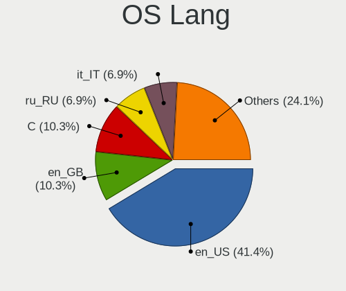
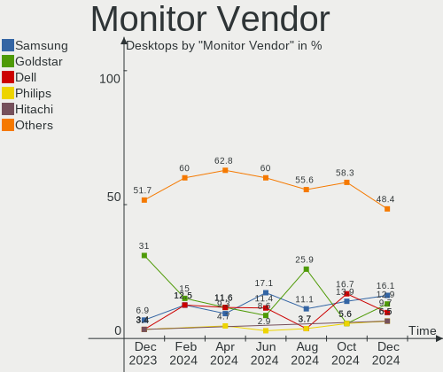

KDE neon Hardware Trends (Desktops)
-----------------------------------

A project to identify most popular hardware characteristics and track their change
over time based on data collected by KDE neon users at https://Linux-Hardware.org.

Anyone can contribute to this report by the [hw-probe](https://github.com/linuxhw/hw-probe) tool:

    sudo -E hw-probe -all -upload

Full-feature report is available here: https://linux-hardware.org/?view=trends

Period: Dec, 2021.

Contents
--------

* [ System ](#system)
  - [ OS                       ](#os)
  - [ OS Family                ](#os-family)
  - [ Kernel                   ](#kernel)
  - [ Kernel Family            ](#kernel-family)
  - [ Kernel Major Ver.        ](#kernel-major-ver)
  - [ Arch                     ](#arch)
  - [ DE                       ](#de)
  - [ Display Server           ](#display-server)
  - [ Display Manager          ](#display-manager)
  - [ OS Lang                  ](#os-lang)
  - [ Boot Mode                ](#boot-mode)
  - [ Filesystem               ](#filesystem)
  - [ Part. scheme             ](#part-scheme)
  - [ Dual Boot with Linux/BSD ](#dual-boot-with-linuxbsd)
  - [ Dual Boot (Win)          ](#dual-boot-win)

* [ Board ](#board)
  - [ Vendor                   ](#vendor)
  - [ Model                    ](#model)
  - [ Model Family             ](#model-family)
  - [ MFG Year                 ](#mfg-year)
  - [ Form Factor              ](#form-factor)
  - [ Secure Boot              ](#secure-boot)
  - [ Coreboot                 ](#coreboot)
  - [ RAM Size                 ](#ram-size)
  - [ RAM Used                 ](#ram-used)
  - [ Total Drives             ](#total-drives)
  - [ Has CD-ROM               ](#has-cd-rom)
  - [ Has Ethernet             ](#has-ethernet)
  - [ Has WiFi                 ](#has-wifi)
  - [ Has Bluetooth            ](#has-bluetooth)

* [ Location ](#location)
  - [ Country                  ](#country)
  - [ City                     ](#city)

* [ Drives ](#drives)
  - [ Drive Vendor             ](#drive-vendor)
  - [ Drive Model              ](#drive-model)
  - [ HDD Vendor               ](#hdd-vendor)
  - [ SSD Vendor               ](#ssd-vendor)
  - [ Drive Kind               ](#drive-kind)
  - [ Drive Connector          ](#drive-connector)
  - [ Drive Size               ](#drive-size)
  - [ Space Total              ](#space-total)
  - [ Space Used               ](#space-used)
  - [ Malfunc. Drives          ](#malfunc-drives)
  - [ Malfunc. Drive Vendor    ](#malfunc-drive-vendor)
  - [ Malfunc. HDD Vendor      ](#malfunc-hdd-vendor)
  - [ Malfunc. Drive Kind      ](#malfunc-drive-kind)
  - [ Failed Drives            ](#failed-drives)
  - [ Failed Drive Vendor      ](#failed-drive-vendor)
  - [ Drive Status             ](#drive-status)

* [ Storage controller ](#storage-controller)
  - [ Storage Vendor           ](#storage-vendor)
  - [ Storage Model            ](#storage-model)
  - [ Storage Kind             ](#storage-kind)

* [ Processor ](#processor)
  - [ CPU Vendor               ](#cpu-vendor)
  - [ CPU Model                ](#cpu-model)
  - [ CPU Model Family         ](#cpu-model-family)
  - [ CPU Cores                ](#cpu-cores)
  - [ CPU Sockets              ](#cpu-sockets)
  - [ CPU Threads              ](#cpu-threads)
  - [ CPU Op-Modes             ](#cpu-op-modes)
  - [ CPU Microcode            ](#cpu-microcode)
  - [ CPU Microarch            ](#cpu-microarch)

* [ Graphics ](#graphics)
  - [ GPU Vendor               ](#gpu-vendor)
  - [ GPU Model                ](#gpu-model)
  - [ GPU Combo                ](#gpu-combo)
  - [ GPU Driver               ](#gpu-driver)
  - [ GPU Memory               ](#gpu-memory)

* [ Monitor ](#monitor)
  - [ Monitor Vendor           ](#monitor-vendor)
  - [ Monitor Model            ](#monitor-model)
  - [ Monitor Resolution       ](#monitor-resolution)
  - [ Monitor Diagonal         ](#monitor-diagonal)
  - [ Monitor Width            ](#monitor-width)
  - [ Aspect Ratio             ](#aspect-ratio)
  - [ Monitor Area             ](#monitor-area)
  - [ Pixel Density            ](#pixel-density)
  - [ Multiple Monitors        ](#multiple-monitors)

* [ Network ](#network)
  - [ Net Controller Vendor    ](#net-controller-vendor)
  - [ Net Controller Model     ](#net-controller-model)
  - [ Wireless Vendor          ](#wireless-vendor)
  - [ Wireless Model           ](#wireless-model)
  - [ Ethernet Vendor          ](#ethernet-vendor)
  - [ Ethernet Model           ](#ethernet-model)
  - [ Net Controller Kind      ](#net-controller-kind)
  - [ Used Controller          ](#used-controller)
  - [ NICs                     ](#nics)
  - [ IPv6                     ](#ipv6)

* [ Bluetooth ](#bluetooth)
  - [ Bluetooth Vendor         ](#bluetooth-vendor)
  - [ Bluetooth Model          ](#bluetooth-model)

* [ Sound ](#sound)
  - [ Sound Vendor             ](#sound-vendor)
  - [ Sound Model              ](#sound-model)

* [ Memory ](#memory)
  - [ Memory Vendor            ](#memory-vendor)
  - [ Memory Model             ](#memory-model)
  - [ Memory Kind              ](#memory-kind)
  - [ Memory Form Factor       ](#memory-form-factor)
  - [ Memory Size              ](#memory-size)
  - [ Memory Speed             ](#memory-speed)

* [ Printers & scanners ](#printers--scanners)
  - [ Printer Vendor           ](#printer-vendor)
  - [ Printer Model            ](#printer-model)
  - [ Scanner Vendor           ](#scanner-vendor)
  - [ Scanner Model            ](#scanner-model)

* [ Camera ](#camera)
  - [ Camera Vendor            ](#camera-vendor)
  - [ Camera Model             ](#camera-model)

* [ Security ](#security)
  - [ Fingerprint Vendor       ](#fingerprint-vendor)
  - [ Fingerprint Model        ](#fingerprint-model)
  - [ Chipcard Vendor          ](#chipcard-vendor)
  - [ Chipcard Model           ](#chipcard-model)

* [ Unsupported ](#unsupported)
  - [ Unsupported Devices      ](#unsupported-devices)
  - [ Unsupported Device Types ](#unsupported-device-types)

System
------

OS
--

Installed operating systems

| Name           | Desktops | Percent |
|----------------|----------|---------|
| KDE neon 20.04 | 44       | 97.78%  |
| KDE neon 18.04 | 1        | 2.22%   |

OS Family
---------

OS without a version

| Name     | Desktops | Percent |
|----------|----------|---------|
| KDE neon | 45       | 100%    |

Kernel
------

Version of the Linux kernel

| Version                | Desktops | Percent |
|------------------------|----------|---------|
| 5.11.0-41-generic      | 28       | 62.22%  |
| 5.11.0-43-generic      | 11       | 24.44%  |
| 5.4.0-92-generic       | 2        | 4.44%   |
| 5.11.0-40-generic      | 2        | 4.44%   |
| 5.14.21-051421-generic | 1        | 2.22%   |
| 5.11.0-42-generic      | 1        | 2.22%   |

Kernel Family
-------------

Linux kernel without a distro release

| Version | Desktops | Percent |
|---------|----------|---------|
| 5.11.0  | 42       | 93.33%  |
| 5.4.0   | 2        | 4.44%   |
| 5.14.21 | 1        | 2.22%   |

Kernel Major Ver.
-----------------

Linux kernel major version

| Version | Desktops | Percent |
|---------|----------|---------|
| 5.11    | 42       | 93.33%  |
| 5.4     | 2        | 4.44%   |
| 5.14    | 1        | 2.22%   |

Arch
----

OS architecture (x86_64, i586, etc.)

| Name   | Desktops | Percent |
|--------|----------|---------|
| x86_64 | 45       | 100%    |

DE
--

Desktop Environment

| Name | Desktops | Percent |
|------|----------|---------|
| KDE5 | 45       | 100%    |

Display Server
--------------

X11 or Wayland

| Name    | Desktops | Percent |
|---------|----------|---------|
| X11     | 44       | 97.78%  |
| Wayland | 1        | 2.22%   |

Display Manager
---------------

SDDM, LightDM, etc.

| Name    | Desktops | Percent |
|---------|----------|---------|
| Unknown | 32       | 71.11%  |
| SDDM    | 13       | 28.89%  |

OS Lang
-------

Language

| Lang  | Desktops | Percent |
|-------|----------|---------|
| en_US | 18       | 40%     |
| pt_BR | 5        | 11.11%  |
| de_DE | 3        | 6.67%   |
| pl_PL | 2        | 4.44%   |
| fr_FR | 2        | 4.44%   |
| en_GB | 2        | 4.44%   |
| en_AU | 2        | 4.44%   |
| uk_UA | 1        | 2.22%   |
| ru_UA | 1        | 2.22%   |
| ru_RU | 1        | 2.22%   |
| it_IT | 1        | 2.22%   |
| es_VE | 1        | 2.22%   |
| es_MX | 1        | 2.22%   |
| es_ES | 1        | 2.22%   |
| es_BO | 1        | 2.22%   |
| en_HK | 1        | 2.22%   |
| el_GR | 1        | 2.22%   |
| de_CH | 1        | 2.22%   |

Boot Mode
---------

EFI or BIOS

| Mode | Desktops | Percent |
|------|----------|---------|
| EFI  | 26       | 57.78%  |
| BIOS | 19       | 42.22%  |

Filesystem
----------

Type of filesystem

| Type  | Desktops | Percent |
|-------|----------|---------|
| Ext4  | 44       | 97.78%  |
| Btrfs | 1        | 2.22%   |

Part. scheme
------------

Scheme of partitioning

| Type    | Desktops | Percent |
|---------|----------|---------|
| Unknown | 42       | 93.33%  |
| MBR     | 2        | 4.44%   |
| GPT     | 1        | 2.22%   |

Dual Boot with Linux/BSD
------------------------

Hosting more than one Linux/BSD

| Dual boot | Desktops | Percent |
|-----------|----------|---------|
| No        | 43       | 95.56%  |
| Yes       | 2        | 4.44%   |

Dual Boot (Win)
---------------

Hosting Linux and Windows

| Dual boot | Desktops | Percent |
|-----------|----------|---------|
| No        | 40       | 88.89%  |
| Yes       | 5        | 11.11%  |

Board
-----

Vendor
------

Motherboard manufacturer

| Name                | Desktops | Percent |
|---------------------|----------|---------|
| Gigabyte Technology | 19       | 42.22%  |
| ASUSTek Computer    | 11       | 24.44%  |
| ASRock              | 4        | 8.89%   |
| Lenovo              | 3        | 6.67%   |
| Hewlett-Packard     | 3        | 6.67%   |
| Positivo            | 2        | 4.44%   |
| MSI                 | 1        | 2.22%   |
| Intel               | 1        | 2.22%   |
| Dell                | 1        | 2.22%   |

Model
-----

Motherboard model

| Name                                   | Desktops | Percent |
|----------------------------------------|----------|---------|
| Gigabyte H81M-H                        | 2        | 4.44%   |
| Positivo POS-EINM70CS                  | 1        | 2.22%   |
| Positivo POS-EIBTPDC                   | 1        | 2.22%   |
| MSI MS-7693                            | 1        | 2.22%   |
| Lenovo ThinkCentre M93p 10A7000GUS     | 1        | 2.22%   |
| Lenovo ThinkCentre M73 10AXS3V400      | 1        | 2.22%   |
| Lenovo IdeaCentre 510-15ABR 90G7002RGE | 1        | 2.22%   |
| Intel H55                              | 1        | 2.22%   |
| HP Compaq Elite 8300 USDT              | 1        | 2.22%   |
| HP Compaq dc7700 Small Form Factor     | 1        | 2.22%   |
| HP 260-a010                            | 1        | 2.22%   |
| Gigabyte Z97X-SLI                      | 1        | 2.22%   |
| Gigabyte Z590I VISION D                | 1        | 2.22%   |
| Gigabyte Z390 GAMING X                 | 1        | 2.22%   |
| Gigabyte Z170X-UD5 TH                  | 1        | 2.22%   |
| Gigabyte H81M-HD3                      | 1        | 2.22%   |
| Gigabyte H61M-DS2H                     | 1        | 2.22%   |
| Gigabyte H310N 2.0                     | 1        | 2.22%   |
| Gigabyte F2A88XN-WIFI                  | 1        | 2.22%   |
| Gigabyte B75M-D3H                      | 1        | 2.22%   |
| Gigabyte B550M AORUS PRO-P             | 1        | 2.22%   |
| Gigabyte B550 AORUS ELITE V2           | 1        | 2.22%   |
| Gigabyte B550 AORUS ELITE              | 1        | 2.22%   |
| Gigabyte B450M S2H                     | 1        | 2.22%   |
| Gigabyte B450 AORUS M                  | 1        | 2.22%   |
| Gigabyte B450 AORUS ELITE              | 1        | 2.22%   |
| Gigabyte 970A-DS3P FX                  | 1        | 2.22%   |
| Gigabyte 970A-DS3P                     | 1        | 2.22%   |
| Dell OptiPlex 7010                     | 1        | 2.22%   |
| ASUS TUF GAMING X570-PRO               | 1        | 2.22%   |
| ASUS SABERTOOTH X79                    | 1        | 2.22%   |
| ASUS PRIME B560M-A                     | 1        | 2.22%   |
| ASUS PRIME B450M-A                     | 1        | 2.22%   |
| ASUS PRIME B450-PLUS                   | 1        | 2.22%   |
| ASUS PRIME A320M-K                     | 1        | 2.22%   |
| ASUS P6X58D-E                          | 1        | 2.22%   |
| ASUS P6T DELUXE V2                     | 1        | 2.22%   |
| ASUS P5Q-PRO                           | 1        | 2.22%   |
| ASUS M5A78L-M/USB3                     | 1        | 2.22%   |
| ASUS All Series                        | 1        | 2.22%   |
| ASRock Z77 Pro3                        | 1        | 2.22%   |
| ASRock X370 Taichi                     | 1        | 2.22%   |
| ASRock H410M-ITX/ac                    | 1        | 2.22%   |
| ASRock H310M-HG4                       | 1        | 2.22%   |

Model Family
------------

Motherboard model prefix

| Name                  | Desktops | Percent |
|-----------------------|----------|---------|
| ASUS PRIME            | 4        | 8.89%   |
| Lenovo ThinkCentre    | 2        | 4.44%   |
| HP Compaq             | 2        | 4.44%   |
| Gigabyte H81M-H       | 2        | 4.44%   |
| Gigabyte B550         | 2        | 4.44%   |
| Gigabyte B450         | 2        | 4.44%   |
| Gigabyte 970A-DS3P    | 2        | 4.44%   |
| Positivo POS-EINM70CS | 1        | 2.22%   |
| Positivo POS-EIBTPDC  | 1        | 2.22%   |
| MSI MS-7693           | 1        | 2.22%   |
| Lenovo IdeaCentre     | 1        | 2.22%   |
| Intel H55             | 1        | 2.22%   |
| HP 260-a010           | 1        | 2.22%   |
| Gigabyte Z97X-SLI     | 1        | 2.22%   |
| Gigabyte Z590I        | 1        | 2.22%   |
| Gigabyte Z390         | 1        | 2.22%   |
| Gigabyte Z170X-UD5    | 1        | 2.22%   |
| Gigabyte H81M-HD3     | 1        | 2.22%   |
| Gigabyte H61M-DS2H    | 1        | 2.22%   |
| Gigabyte H310N        | 1        | 2.22%   |
| Gigabyte F2A88XN-WIFI | 1        | 2.22%   |
| Gigabyte B75M-D3H     | 1        | 2.22%   |
| Gigabyte B550M        | 1        | 2.22%   |
| Gigabyte B450M        | 1        | 2.22%   |
| Dell OptiPlex         | 1        | 2.22%   |
| ASUS TUF              | 1        | 2.22%   |
| ASUS SABERTOOTH       | 1        | 2.22%   |
| ASUS P6X58D-E         | 1        | 2.22%   |
| ASUS P6T              | 1        | 2.22%   |
| ASUS P5Q-PRO          | 1        | 2.22%   |
| ASUS M5A78L-M         | 1        | 2.22%   |
| ASUS All              | 1        | 2.22%   |
| ASRock Z77            | 1        | 2.22%   |
| ASRock X370           | 1        | 2.22%   |
| ASRock H410M-ITX      | 1        | 2.22%   |
| ASRock H310M-HG4      | 1        | 2.22%   |

MFG Year
--------

Motherboard manufacture year

| Year | Desktops | Percent |
|------|----------|---------|
| 2021 | 9        | 20%     |
| 2015 | 7        | 15.56%  |
| 2018 | 5        | 11.11%  |
| 2014 | 5        | 11.11%  |
| 2020 | 4        | 8.89%   |
| 2019 | 4        | 8.89%   |
| 2012 | 3        | 6.67%   |
| 2017 | 2        | 4.44%   |
| 2013 | 2        | 4.44%   |
| 2010 | 2        | 4.44%   |
| 2008 | 1        | 2.22%   |
| 2007 | 1        | 2.22%   |

Form Factor
-----------

Physical design of the computer

| Name    | Desktops | Percent |
|---------|----------|---------|
| Desktop | 45       | 100%    |

Secure Boot
-----------

Enabled or disabled

| State    | Desktops | Percent |
|----------|----------|---------|
| Disabled | 44       | 97.78%  |
| Enabled  | 1        | 2.22%   |

Coreboot
--------

Have coreboot on board

| Used | Desktops | Percent |
|------|----------|---------|
| No   | 45       | 100%    |

RAM Size
--------

Total RAM memory

| Size in GB  | Desktops | Percent |
|-------------|----------|---------|
| 16.01-24.0  | 18       | 40%     |
| 8.01-16.0   | 10       | 22.22%  |
| 3.01-4.0    | 5        | 11.11%  |
| 4.01-8.0    | 4        | 8.89%   |
| 32.01-64.0  | 3        | 6.67%   |
| 24.01-32.0  | 3        | 6.67%   |
| 2.01-3.0    | 1        | 2.22%   |
| 64.01-256.0 | 1        | 2.22%   |

RAM Used
--------

Used RAM memory

| Used GB   | Desktops | Percent |
|-----------|----------|---------|
| 1.01-2.0  | 25       | 55.56%  |
| 2.01-3.0  | 11       | 24.44%  |
| 3.01-4.0  | 4        | 8.89%   |
| 4.01-8.0  | 3        | 6.67%   |
| 8.01-16.0 | 1        | 2.22%   |
| 0.51-1.0  | 1        | 2.22%   |

Total Drives
------------

Number of drives on board

| Drives | Desktops | Percent |
|--------|----------|---------|
| 2      | 17       | 37.78%  |
| 1      | 14       | 31.11%  |
| 3      | 8        | 17.78%  |
| 4      | 5        | 11.11%  |
| 6      | 1        | 2.22%   |

Has CD-ROM
----------

Has CD-ROM on board

| Presented | Desktops | Percent |
|-----------|----------|---------|
| No        | 25       | 55.56%  |
| Yes       | 20       | 44.44%  |

Has Ethernet
------------

Has Ethernet on board

| Presented | Desktops | Percent |
|-----------|----------|---------|
| Yes       | 43       | 95.56%  |
| No        | 2        | 4.44%   |

Has WiFi
--------

Has WiFi module

| Presented | Desktops | Percent |
|-----------|----------|---------|
| No        | 26       | 57.78%  |
| Yes       | 19       | 42.22%  |

Has Bluetooth
-------------

Has Bluetooth module

| Presented | Desktops | Percent |
|-----------|----------|---------|
| No        | 26       | 57.78%  |
| Yes       | 19       | 42.22%  |

Location
--------

Country
-------

Geographic location (country)

| Country     | Desktops | Percent |
|-------------|----------|---------|
| USA         | 10       | 22.22%  |
| Brazil      | 6        | 13.33%  |
| Netherlands | 3        | 6.67%   |
| Germany     | 3        | 6.67%   |
| Ukraine     | 2        | 4.44%   |
| UK          | 2        | 4.44%   |
| Russia      | 2        | 4.44%   |
| Poland      | 2        | 4.44%   |
| Italy       | 2        | 4.44%   |
| France      | 2        | 4.44%   |
| Australia   | 2        | 4.44%   |
| Venezuela   | 1        | 2.22%   |
| Switzerland | 1        | 2.22%   |
| Spain       | 1        | 2.22%   |
| Mexico      | 1        | 2.22%   |
| Hong Kong   | 1        | 2.22%   |
| Greece      | 1        | 2.22%   |
| Bolivia     | 1        | 2.22%   |
| Belarus     | 1        | 2.22%   |
| Bangladesh  | 1        | 2.22%   |

City
----

Geographic location (city)

| City            | Desktops | Percent |
|-----------------|----------|---------|
| Zoetermeer      | 1        | 2.22%   |
| Washington      | 1        | 2.22%   |
| Warsaw          | 1        | 2.22%   |
| Versailles      | 1        | 2.22%   |
| Thornlands      | 1        | 2.22%   |
| St Petersburg   | 1        | 2.22%   |
| St Louis        | 1        | 2.22%   |
| S??o Paulo      | 1        | 2.22%   |
| Santander       | 1        | 2.22%   |
| Salihorsk       | 1        | 2.22%   |
| Salem           | 1        | 2.22%   |
| Rosemount       | 1        | 2.22%   |
| Porter          | 1        | 2.22%   |
| Pinneberg       | 1        | 2.22%   |
| Passo Fundo     | 1        | 2.22%   |
| Parramatta      | 1        | 2.22%   |
| Odintsovo       | 1        | 2.22%   |
| Noordwijkerhout | 1        | 2.22%   |
| Lviv            | 1        | 2.22%   |
| Luce            | 1        | 2.22%   |
| Lowicz          | 1        | 2.22%   |
| Lerdo           | 1        | 2.22%   |
| Lehigh Acres    | 1        | 2.22%   |
| La Paz          | 1        | 2.22%   |
| Kemnath         | 1        | 2.22%   |
| Kato Achaia     | 1        | 2.22%   |
| Hillsboro       | 1        | 2.22%   |
| Hildesheim      | 1        | 2.22%   |
| Guaruja         | 1        | 2.22%   |
| Fonteblanda     | 1        | 2.22%   |
| Enfield         | 1        | 2.22%   |
| Eindhoven       | 1        | 2.22%   |
| Duque de Caxias | 1        | 2.22%   |
| Dnipro          | 1        | 2.22%   |
| Dhaka           | 1        | 2.22%   |
| Dallas          | 1        | 2.22%   |
| Cicero          | 1        | 2.22%   |
| Central         | 1        | 2.22%   |
| Carthage        | 1        | 2.22%   |
| Caracas         | 1        | 2.22%   |
| Blumenau        | 1        | 2.22%   |
| Birmingham      | 1        | 2.22%   |
| Biberist        | 1        | 2.22%   |
| Belo Horizonte  | 1        | 2.22%   |
| Bellizzi        | 1        | 2.22%   |

Drives
------

Drive Vendor
------------

Hard drive vendors

| Vendor                    | Desktops | Drives | Percent |
|---------------------------|----------|--------|---------|
| WDC                       | 13       | 17     | 14.77%  |
| Seagate                   | 13       | 15     | 14.77%  |
| Samsung Electronics       | 11       | 14     | 12.5%   |
| SanDisk                   | 6        | 6      | 6.82%   |
| Toshiba                   | 5        | 5      | 5.68%   |
| Kingston                  | 5        | 5      | 5.68%   |
| Crucial                   | 5        | 5      | 5.68%   |
| Phison                    | 3        | 3      | 3.41%   |
| Patriot                   | 3        | 3      | 3.41%   |
| Hitachi                   | 3        | 3      | 3.41%   |
| Silicon Motion            | 2        | 2      | 2.27%   |
| PNY                       | 2        | 2      | 2.27%   |
| OCZ                       | 2        | 2      | 2.27%   |
| HGST                      | 2        | 2      | 2.27%   |
| A-DATA Technology         | 2        | 2      | 2.27%   |
| XPG                       | 1        | 1      | 1.14%   |
| Unknown                   | 1        | 1      | 1.14%   |
| Micron/Crucial Technology | 1        | 1      | 1.14%   |
| Micron Technology         | 1        | 1      | 1.14%   |
| MAXTOR                    | 1        | 1      | 1.14%   |
| Intenso                   | 1        | 1      | 1.14%   |
| GOODRAM                   | 1        | 1      | 1.14%   |
| FORESEE                   | 1        | 1      | 1.14%   |
| China                     | 1        | 2      | 1.14%   |
| Apacer                    | 1        | 1      | 1.14%   |
| AFOX                      | 1        | 1      | 1.14%   |

Drive Model
-----------

Hard drive models

| Model                                    | Desktops | Percent |
|------------------------------------------|----------|---------|
| Seagate ST2000DM008-2FR102 2TB           | 4        | 4.12%   |
| Toshiba DT01ACA100 1TB                   | 3        | 3.09%   |
| Seagate ST3500418AS 500GB                | 3        | 3.09%   |
| Crucial CT500MX500SSD1 500GB             | 3        | 3.09%   |
| WDC WD10EAVS-00D7B1 1TB                  | 2        | 2.06%   |
| Seagate ST2000DM001-1ER164 2TB           | 2        | 2.06%   |
| Samsung SSD 850 EVO 500GB                | 2        | 2.06%   |
| Samsung SSD 850 EVO 250GB                | 2        | 2.06%   |
| Samsung NVMe SSD Drive 500GB             | 2        | 2.06%   |
| PNY CS900 120GB SSD                      | 2        | 2.06%   |
| Patriot Burst 120GB SSD                  | 2        | 2.06%   |
| XPG NVMe SSD Drive 2TB                   | 1        | 1.03%   |
| WDC WDS500G2B0A-00SM50 500GB SSD         | 1        | 1.03%   |
| WDC WDS240G2G0B-00EPW0 240GB SSD         | 1        | 1.03%   |
| WDC WD800JD-75MSA3 80GB                  | 1        | 1.03%   |
| WDC WD5003ABYX-01WERA1 500GB             | 1        | 1.03%   |
| WDC WD5000AAKX-001CA0 500GB              | 1        | 1.03%   |
| WDC WD5000AACS-00D0B0 500GB              | 1        | 1.03%   |
| WDC WD40PURX-64N96Y0 4TB                 | 1        | 1.03%   |
| WDC WD3200AAKS-00SBA0 320GB              | 1        | 1.03%   |
| WDC WD3200AAJS-00L7A0 320GB              | 1        | 1.03%   |
| WDC WD20PURX-64P6ZY0 2TB                 | 1        | 1.03%   |
| WDC WD1600AAJS-00WAA0 160GB              | 1        | 1.03%   |
| WDC WD10EVDS-63N5B1 1TB                  | 1        | 1.03%   |
| WDC WD10EURX-63UY4Y0 1TB                 | 1        | 1.03%   |
| WDC WD1005FBYZ-01YCBB2 1TB               | 1        | 1.03%   |
| Unknown SD/MMC/MS PRO 7GB                | 1        | 1.03%   |
| Toshiba MQ04ABF100 1TB                   | 1        | 1.03%   |
| Toshiba DT01ACA050 500GB                 | 1        | 1.03%   |
| Silicon Motion NVMe SSD Drive 512GB      | 1        | 1.03%   |
| Silicon Motion NVMe SSD Drive 250GB      | 1        | 1.03%   |
| Seagate ST4000DM000-2AE166 4TB           | 1        | 1.03%   |
| Seagate ST3500413AS 500GB                | 1        | 1.03%   |
| Seagate ST3500410SV 500GB                | 1        | 1.03%   |
| Seagate ST3500320AS 500GB                | 1        | 1.03%   |
| Seagate NVMe SSD Drive 500GB             | 1        | 1.03%   |
| Seagate Expansion Desk 5TB               | 1        | 1.03%   |
| SanDisk SSD PLUS 480GB                   | 1        | 1.03%   |
| SanDisk SSD PLUS 240GB                   | 1        | 1.03%   |
| SanDisk SSD PLUS 1000GB                  | 1        | 1.03%   |
| SanDisk SDSSDA120G 120GB                 | 1        | 1.03%   |
| SanDisk SD9SN8W256G1002 256GB SSD        | 1        | 1.03%   |
| Sandisk NVMe SSD Drive 500GB             | 1        | 1.03%   |
| Samsung SSD 870 QVO 2TB                  | 1        | 1.03%   |
| Samsung SSD 870 EVO 1TB                  | 1        | 1.03%   |
| Samsung SSD 860 EVO M.2 500GB            | 1        | 1.03%   |
| Samsung SSD 860 EVO 500GB                | 1        | 1.03%   |
| Samsung NVMe SSD Drive 1TB               | 1        | 1.03%   |
| Samsung HD502HJ 500GB                    | 1        | 1.03%   |
| Samsung HD204UI 2TB                      | 1        | 1.03%   |
| Samsung HD103SI 1TB                      | 1        | 1.03%   |
| Phison NVMe SSD Drive 512GB              | 1        | 1.03%   |
| Phison NVMe SSD Drive 2TB                | 1        | 1.03%   |
| Phison NVMe SSD Drive 256GB              | 1        | 1.03%   |
| Patriot Burst Elite 120GB SSD            | 1        | 1.03%   |
| OCZ VERTEX4 128GB SSD                    | 1        | 1.03%   |
| OCZ ARC100 120GB SSD                     | 1        | 1.03%   |
| Micron/Crucial NVMe SSD Drive 500GB      | 1        | 1.03%   |
| Micron MTFDDAK512MBF-1AN1ZABHA 512GB SSD | 1        | 1.03%   |
| MAXTOR STM3160215AS 160GB                | 1        | 1.03%   |

HDD Vendor
----------

Hard disk drive vendors

| Vendor              | Desktops | Drives | Percent |
|---------------------|----------|--------|---------|
| Seagate             | 12       | 14     | 31.58%  |
| WDC                 | 11       | 15     | 28.95%  |
| Toshiba             | 5        | 5      | 13.16%  |
| Samsung Electronics | 3        | 3      | 7.89%   |
| Hitachi             | 3        | 3      | 7.89%   |
| HGST                | 2        | 2      | 5.26%   |
| Unknown             | 1        | 1      | 2.63%   |
| MAXTOR              | 1        | 1      | 2.63%   |

SSD Vendor
----------

Solid state drive vendors

| Vendor              | Desktops | Drives | Percent |
|---------------------|----------|--------|---------|
| Samsung Electronics | 7        | 8      | 18.42%  |
| SanDisk             | 5        | 5      | 13.16%  |
| Crucial             | 5        | 5      | 13.16%  |
| Kingston            | 4        | 4      | 10.53%  |
| Patriot             | 3        | 3      | 7.89%   |
| WDC                 | 2        | 2      | 5.26%   |
| PNY                 | 2        | 2      | 5.26%   |
| OCZ                 | 2        | 2      | 5.26%   |
| A-DATA Technology   | 2        | 2      | 5.26%   |
| Micron Technology   | 1        | 1      | 2.63%   |
| Intenso             | 1        | 1      | 2.63%   |
| GOODRAM             | 1        | 1      | 2.63%   |
| FORESEE             | 1        | 1      | 2.63%   |
| China               | 1        | 2      | 2.63%   |
| Apacer              | 1        | 1      | 2.63%   |

Drive Kind
----------

HDD or SSD

| Kind    | Desktops | Drives | Percent |
|---------|----------|--------|---------|
| SSD     | 30       | 40     | 42.86%  |
| HDD     | 28       | 44     | 40%     |
| NVMe    | 11       | 13     | 15.71%  |
| Unknown | 1        | 1      | 1.43%   |

Drive Connector
---------------

SATA, SAS, NVMe, etc.

| Type | Desktops | Drives | Percent |
|------|----------|--------|---------|
| SATA | 44       | 83     | 77.19%  |
| NVMe | 11       | 13     | 19.3%   |
| SAS  | 2        | 2      | 3.51%   |

Drive Size
----------

Size of hard drive

| Size in TB | Desktops | Drives | Percent |
|------------|----------|--------|---------|
| 0.01-0.5   | 36       | 55     | 58.06%  |
| 0.51-1.0   | 13       | 16     | 20.97%  |
| 1.01-2.0   | 10       | 10     | 16.13%  |
| 3.01-4.0   | 2        | 2      | 3.23%   |
| 4.01-10.0  | 1        | 1      | 1.61%   |

Space Total
-----------

Amount of disk space available on the file system

| Size in GB     | Desktops | Percent |
|----------------|----------|---------|
| 251-500        | 12       | 26.67%  |
| 1001-2000      | 9        | 20%     |
| 501-1000       | 7        | 15.56%  |
| 101-250        | 6        | 13.33%  |
| 21-50          | 3        | 6.67%   |
| 2001-3000      | 3        | 6.67%   |
| More than 3000 | 2        | 4.44%   |
| 51-100         | 2        | 4.44%   |
| Unknown        | 1        | 2.22%   |

Space Used
----------

Amount of used disk space

| Used GB        | Desktops | Percent |
|----------------|----------|---------|
| 1-20           | 17       | 37.78%  |
| 101-250        | 9        | 20%     |
| 21-50          | 7        | 15.56%  |
| 251-500        | 5        | 11.11%  |
| More than 3000 | 2        | 4.44%   |
| 51-100         | 2        | 4.44%   |
| 1001-2000      | 1        | 2.22%   |
| 501-1000       | 1        | 2.22%   |
| Unknown        | 1        | 2.22%   |

Malfunc. Drives
---------------

Drive models with a malfunction

| Model                     | Desktops | Drives | Percent |
|---------------------------|----------|--------|---------|
| Seagate ST3500320AS 500GB | 1        | 1      | 100%    |

Malfunc. Drive Vendor
---------------------

Vendors of faulty drives

| Vendor  | Desktops | Drives | Percent |
|---------|----------|--------|---------|
| Seagate | 1        | 1      | 100%    |

Malfunc. HDD Vendor
-------------------

Vendors of faulty HDD drives

| Vendor  | Desktops | Drives | Percent |
|---------|----------|--------|---------|
| Seagate | 1        | 1      | 100%    |

Malfunc. Drive Kind
-------------------

Kinds of faulty drives

| Kind | Desktops | Drives | Percent |
|------|----------|--------|---------|
| HDD  | 1        | 1      | 100%    |

Failed Drives
-------------

Failed drive models

Zero info for selected period =(

Failed Drive Vendor
-------------------

Failed drive vendors

Zero info for selected period =(

Drive Status
------------

Number of failed and malfunc. drives

| Status   | Desktops | Drives | Percent |
|----------|----------|--------|---------|
| Detected | 42       | 94     | 93.33%  |
| Works    | 2        | 3      | 4.44%   |
| Malfunc  | 1        | 1      | 2.22%   |

Storage controller
------------------

Storage Vendor
--------------

Storage controller vendors

| Vendor                      | Desktops | Percent |
|-----------------------------|----------|---------|
| Intel                       | 28       | 43.75%  |
| AMD                         | 17       | 26.56%  |
| Samsung Electronics         | 3        | 4.69%   |
| Phison Electronics          | 3        | 4.69%   |
| Marvell Technology Group    | 3        | 4.69%   |
| Silicon Motion              | 2        | 3.13%   |
| ASMedia Technology          | 2        | 3.13%   |
| Seagate Technology          | 1        | 1.56%   |
| Sandisk                     | 1        | 1.56%   |
| Micron/Crucial Technology   | 1        | 1.56%   |
| Micron Technology           | 1        | 1.56%   |
| Kingston Technology Company | 1        | 1.56%   |
| ADATA Technology            | 1        | 1.56%   |

Storage Model
-------------

Storage controller models

| Model                                                                                   | Desktops | Percent |
|-----------------------------------------------------------------------------------------|----------|---------|
| AMD FCH SATA Controller [AHCI mode]                                                     | 10       | 13.16%  |
| Intel 8 Series/C220 Series Chipset Family 6-port SATA Controller 1 [AHCI mode]          | 6        | 7.89%   |
| AMD 400 Series Chipset SATA Controller                                                  | 5        | 6.58%   |
| Intel 7 Series/C210 Series Chipset Family 6-port SATA Controller [AHCI mode]            | 4        | 5.26%   |
| AMD Starship/Matisse Chipset SATA Controller [AHCI mode]                                | 3        | 3.95%   |
| Silicon Motion SM2263EN/SM2263XT SSD Controller                                         | 2        | 2.63%   |
| Samsung NVMe SSD Controller SM981/PM981/PM983                                           | 2        | 2.63%   |
| Intel Cannon Lake PCH SATA AHCI Controller                                              | 2        | 2.63%   |
| Intel 82801JI (ICH10 Family) 4 port SATA IDE Controller #1                              | 2        | 2.63%   |
| Intel 82801JI (ICH10 Family) 2 port SATA IDE Controller #2                              | 2        | 2.63%   |
| Intel 500 Series Chipset Family SATA AHCI Controller                                    | 2        | 2.63%   |
| ASMedia ASM1062 Serial ATA Controller                                                   | 2        | 2.63%   |
| AMD SB7x0/SB8x0/SB9x0 SATA Controller [IDE mode]                                        | 2        | 2.63%   |
| AMD SB7x0/SB8x0/SB9x0 SATA Controller [AHCI mode]                                       | 2        | 2.63%   |
| AMD SB7x0/SB8x0/SB9x0 IDE Controller                                                    | 2        | 2.63%   |
| Seagate FireCuda 510 SSD                                                                | 1        | 1.32%   |
| Sandisk WD Black 2018/SN750 / PC SN720 NVMe SSD                                         | 1        | 1.32%   |
| Samsung NVMe SSD Controller 980                                                         | 1        | 1.32%   |
| Phison PS5013 E13 NVMe Controller                                                       | 1        | 1.32%   |
| Phison E16 PCIe4 NVMe Controller                                                        | 1        | 1.32%   |
| Phison E12 NVMe Controller                                                              | 1        | 1.32%   |
| Micron/Crucial Non-Volatile memory controller                                           | 1        | 1.32%   |
| Micron Non-Volatile memory controller                                                   | 1        | 1.32%   |
| Marvell Group 88SE91A3 SATA-600 Controller                                              | 1        | 1.32%   |
| Marvell Group 88SE9128 PCIe SATA 6 Gb/s RAID controller with HyperDuo                   | 1        | 1.32%   |
| Marvell Group 88SE6111/6121 SATA II / PATA Controller                                   | 1        | 1.32%   |
| Kingston Company A2000 NVMe SSD                                                         | 1        | 1.32%   |
| Intel Q170/Q150/B150/H170/H110/Z170/CM236 Chipset SATA Controller [AHCI Mode]           | 1        | 1.32%   |
| Intel C600/X79 series chipset 6-Port SATA AHCI Controller                               | 1        | 1.32%   |
| Intel Atom/Celeron/Pentium Processor x5-E8000/J3xxx/N3xxx Series SATA Controller        | 1        | 1.32%   |
| Intel Atom Processor E3800 Series SATA AHCI Controller                                  | 1        | 1.32%   |
| Intel 9 Series Chipset Family SATA Controller [AHCI Mode]                               | 1        | 1.32%   |
| Intel 82801JI (ICH10 Family) SATA AHCI Controller                                       | 1        | 1.32%   |
| Intel 82801H (ICH8 Family) 4 port SATA Controller [IDE mode]                            | 1        | 1.32%   |
| Intel 7 Series Chipset Family 6-port SATA Controller [AHCI mode]                        | 1        | 1.32%   |
| Intel 6 Series/C200 Series Chipset Family Desktop SATA Controller (IDE mode, ports 4-5) | 1        | 1.32%   |
| Intel 6 Series/C200 Series Chipset Family Desktop SATA Controller (IDE mode, ports 0-3) | 1        | 1.32%   |
| Intel 5 Series/3400 Series Chipset 6 port SATA AHCI Controller                          | 1        | 1.32%   |
| Intel 400 Series Chipset Family SATA AHCI Controller                                    | 1        | 1.32%   |
| Intel 200 Series PCH SATA controller [AHCI mode]                                        | 1        | 1.32%   |
| AMD X370 Series Chipset SATA Controller                                                 | 1        | 1.32%   |
| AMD FCH SATA Controller D                                                               | 1        | 1.32%   |
| ADATA XPG SX8200 Pro PCIe Gen3x4 M.2 2280 Solid State Drive                             | 1        | 1.32%   |

Storage Kind
------------

Kind of storage controller (IDE, SATA, NVMe, SAS, ...)

| Kind | Desktops | Percent |
|------|----------|---------|
| SATA | 41       | 69.49%  |
| NVMe | 12       | 20.34%  |
| IDE  | 6        | 10.17%  |

Processor
---------

CPU Vendor
----------

Processor vendors

| Vendor | Desktops | Percent |
|--------|----------|---------|
| Intel  | 28       | 62.22%  |
| AMD    | 17       | 37.78%  |

CPU Model
---------

Processor models

| Model                                           | Desktops | Percent |
|-------------------------------------------------|----------|---------|
| Intel Core i5-3470 CPU @ 3.20GHz                | 2        | 4.44%   |
| AMD Ryzen 7 3700X 8-Core Processor              | 2        | 4.44%   |
| AMD Ryzen 5 2600 Six-Core Processor             | 2        | 4.44%   |
| AMD FX-6300 Six-Core Processor                  | 2        | 4.44%   |
| Intel Xeon CPU X5660 @ 2.80GHz                  | 1        | 2.22%   |
| Intel Xeon CPU E3-1220 v3 @ 3.10GHz             | 1        | 2.22%   |
| Intel Pentium Gold G5400 CPU @ 3.70GHz          | 1        | 2.22%   |
| Intel Pentium CPU J3710 @ 1.60GHz               | 1        | 2.22%   |
| Intel Pentium CPU G3260 @ 3.30GHz               | 1        | 2.22%   |
| Intel Pentium CPU G3240 @ 3.10GHz               | 1        | 2.22%   |
| Intel Core i7-6700K CPU @ 4.00GHz               | 1        | 2.22%   |
| Intel Core i7-4790K CPU @ 4.00GHz               | 1        | 2.22%   |
| Intel Core i7-3820 CPU @ 3.60GHz                | 1        | 2.22%   |
| Intel Core i7 CPU 950 @ 3.07GHz                 | 1        | 2.22%   |
| Intel Core i5-9600K CPU @ 3.70GHz               | 1        | 2.22%   |
| Intel Core i5-4670 CPU @ 3.40GHz                | 1        | 2.22%   |
| Intel Core i5-4440 CPU @ 3.10GHz                | 1        | 2.22%   |
| Intel Core i5-3570K CPU @ 3.40GHz               | 1        | 2.22%   |
| Intel Core i5-3470S CPU @ 2.90GHz               | 1        | 2.22%   |
| Intel Core i5-2310 CPU @ 2.90GHz                | 1        | 2.22%   |
| Intel Core i3-8100 CPU @ 3.60GHz                | 1        | 2.22%   |
| Intel Core i3-4350T CPU @ 3.10GHz               | 1        | 2.22%   |
| Intel Core i3-10100 CPU @ 3.60GHz               | 1        | 2.22%   |
| Intel Core i3 CPU 540 @ 3.07GHz                 | 1        | 2.22%   |
| Intel Core 2 Duo CPU E8400 @ 3.00GHz            | 1        | 2.22%   |
| Intel Core 2 CPU 6300 @ 1.86GHz                 | 1        | 2.22%   |
| Intel Celeron CPU J1800 @ 2.41GHz               | 1        | 2.22%   |
| Intel Celeron CPU 847 @ 1.10GHz                 | 1        | 2.22%   |
| Intel 11th Gen Core i7-11700 @ 2.50GHz          | 1        | 2.22%   |
| Intel 11th Gen Core i5-11600 @ 2.80GHz          | 1        | 2.22%   |
| AMD Ryzen 9 5900X 12-Core Processor             | 1        | 2.22%   |
| AMD Ryzen 7 2700 Eight-Core Processor           | 1        | 2.22%   |
| AMD Ryzen 7 1700X Eight-Core Processor          | 1        | 2.22%   |
| AMD Ryzen 5 5600X 6-Core Processor              | 1        | 2.22%   |
| AMD Ryzen 5 3600 6-Core Processor               | 1        | 2.22%   |
| AMD Ryzen 5 2600X Six-Core Processor            | 1        | 2.22%   |
| AMD Ryzen 5 1600 Six-Core Processor             | 1        | 2.22%   |
| AMD Phenom II X4 965 Processor                  | 1        | 2.22%   |
| AMD FX-8350 Eight-Core Processor                | 1        | 2.22%   |
| AMD A10-9700 RADEON R7, 10 COMPUTE CORES 4C+6G  | 1        | 2.22%   |
| AMD A10-7860K Radeon R7, 12 Compute Cores 4C+8G | 1        | 2.22%   |

CPU Model Family
----------------

Processor model prefix

| Model              | Desktops | Percent |
|--------------------|----------|---------|
| Intel Core i5      | 8        | 17.78%  |
| AMD Ryzen 5        | 6        | 13.33%  |
| Intel Core i7      | 4        | 8.89%   |
| Intel Core i3      | 4        | 8.89%   |
| AMD Ryzen 7        | 4        | 8.89%   |
| Intel Pentium      | 3        | 6.67%   |
| AMD FX             | 3        | 6.67%   |
| Other              | 2        | 4.44%   |
| Intel Xeon         | 2        | 4.44%   |
| Intel Celeron      | 2        | 4.44%   |
| AMD A10            | 2        | 4.44%   |
| Intel Pentium Gold | 1        | 2.22%   |
| Intel Core 2 Duo   | 1        | 2.22%   |
| Intel Core 2       | 1        | 2.22%   |
| AMD Ryzen 9        | 1        | 2.22%   |
| AMD Phenom II X4   | 1        | 2.22%   |

CPU Cores
---------

Number of processor cores

| Number | Desktops | Percent |
|--------|----------|---------|
| 4      | 17       | 37.78%  |
| 2      | 11       | 24.44%  |
| 6      | 9        | 20%     |
| 8      | 5        | 11.11%  |
| 3      | 2        | 4.44%   |
| 12     | 1        | 2.22%   |

CPU Sockets
-----------

Number of sockets

| Number | Desktops | Percent |
|--------|----------|---------|
| 1      | 45       | 100%    |

CPU Threads
-----------

Threads per core (Hyper-Threading)

| Number | Desktops | Percent |
|--------|----------|---------|
| 2      | 27       | 60%     |
| 1      | 18       | 40%     |

CPU Op-Modes
------------

CPU Operation Modes (32-bit, 64-bit)

| Op mode        | Desktops | Percent |
|----------------|----------|---------|
| 32-bit, 64-bit | 45       | 100%    |

CPU Microcode
-------------

Microcode number

| Number     | Desktops | Percent |
|------------|----------|---------|
| 0x306c3    | 7        | 15.56%  |
| 0x0800820d | 4        | 8.89%   |
| 0x06000852 | 3        | 6.67%   |
| Unknown    | 3        | 6.67%   |
| 0xa0671    | 2        | 4.44%   |
| 0x306a9    | 2        | 4.44%   |
| 0x206a7    | 2        | 4.44%   |
| 0x08701021 | 2        | 4.44%   |
| 0xa0653    | 1        | 2.22%   |
| 0x906ed    | 1        | 2.22%   |
| 0x906eb    | 1        | 2.22%   |
| 0x906ea    | 1        | 2.22%   |
| 0x6f2      | 1        | 2.22%   |
| 0x506e3    | 1        | 2.22%   |
| 0x406c4    | 1        | 2.22%   |
| 0x30678    | 1        | 2.22%   |
| 0x206d7    | 1        | 2.22%   |
| 0x206c2    | 1        | 2.22%   |
| 0x20655    | 1        | 2.22%   |
| 0x106a5    | 1        | 2.22%   |
| 0x1067a    | 1        | 2.22%   |
| 0x0a201016 | 1        | 2.22%   |
| 0x08701013 | 1        | 2.22%   |
| 0x08001137 | 1        | 2.22%   |
| 0x08001136 | 1        | 2.22%   |
| 0x06006118 | 1        | 2.22%   |
| 0x06003106 | 1        | 2.22%   |
| 0x010000c8 | 1        | 2.22%   |

CPU Microarch
-------------

Microarchitecture

| Name        | Desktops | Percent |
|-------------|----------|---------|
| Haswell     | 7        | 15.56%  |
| Zen+        | 4        | 8.89%   |
| IvyBridge   | 4        | 8.89%   |
| Zen 2       | 3        | 6.67%   |
| SandyBridge | 3        | 6.67%   |
| Piledriver  | 3        | 6.67%   |
| KabyLake    | 3        | 6.67%   |
| Zen 3       | 2        | 4.44%   |
| Zen         | 2        | 4.44%   |
| Westmere    | 2        | 4.44%   |
| Silvermont  | 2        | 4.44%   |
| Icelake     | 2        | 4.44%   |
| Steamroller | 1        | 2.22%   |
| Skylake     | 1        | 2.22%   |
| Penryn      | 1        | 2.22%   |
| Nehalem     | 1        | 2.22%   |
| K10         | 1        | 2.22%   |
| Excavator   | 1        | 2.22%   |
| Core        | 1        | 2.22%   |
| CometLake   | 1        | 2.22%   |

Graphics
--------

GPU Vendor
----------

Vendors of graphics cards

| Vendor | Desktops | Percent |
|--------|----------|---------|
| Nvidia | 26       | 55.32%  |
| AMD    | 11       | 23.4%   |
| Intel  | 10       | 21.28%  |

GPU Model
---------

Graphics card models

| Model                                                                                    | Desktops | Percent |
|------------------------------------------------------------------------------------------|----------|---------|
| Nvidia TU117 [GeForce GTX 1650]                                                          | 4        | 8.33%   |
| Nvidia GK208B [GeForce GT 710]                                                           | 3        | 6.25%   |
| Intel Xeon E3-1200 v3/4th Gen Core Processor Integrated Graphics Controller              | 3        | 6.25%   |
| AMD Ellesmere [Radeon RX 470/480/570/570X/580/580X/590]                                  | 3        | 6.25%   |
| Nvidia GP104 [GeForce GTX 1080]                                                          | 2        | 4.17%   |
| Nvidia GM204 [GeForce GTX 970]                                                           | 2        | 4.17%   |
| Nvidia GM107 [GeForce GTX 750 Ti]                                                        | 2        | 4.17%   |
| Intel 2nd Generation Core Processor Family Integrated Graphics Controller                | 2        | 4.17%   |
| Nvidia TU116 [GeForce GTX 1650 SUPER]                                                    | 1        | 2.08%   |
| Nvidia TU106 [GeForce RTX 2060 Rev. A]                                                   | 1        | 2.08%   |
| Nvidia GT218 [GeForce 210]                                                               | 1        | 2.08%   |
| Nvidia GT216 [GeForce GT 220]                                                            | 1        | 2.08%   |
| Nvidia GP107 [GeForce GTX 1050 Ti]                                                       | 1        | 2.08%   |
| Nvidia GP106 [GeForce GTX 1060 6GB]                                                      | 1        | 2.08%   |
| Nvidia GP106 [GeForce GTX 1060 3GB]                                                      | 1        | 2.08%   |
| Nvidia GK110B [GeForce GTX TITAN Black]                                                  | 1        | 2.08%   |
| Nvidia GK106 [GeForce GTX 660]                                                           | 1        | 2.08%   |
| Nvidia GF108 [GeForce GT 730]                                                            | 1        | 2.08%   |
| Nvidia GF104 [GeForce GTX 460]                                                           | 1        | 2.08%   |
| Nvidia GA104 [GeForce RTX 3060 Ti Lite Hash Rate]                                        | 1        | 2.08%   |
| Nvidia G94 [GeForce 9600 GT]                                                             | 1        | 2.08%   |
| Nvidia G84 [GeForce 8600 GT]                                                             | 1        | 2.08%   |
| Intel Xeon E3-1200 v2/3rd Gen Core processor Graphics Controller                         | 1        | 2.08%   |
| Intel CoffeeLake-S GT1 [UHD Graphics 610]                                                | 1        | 2.08%   |
| Intel Atom/Celeron/Pentium Processor x5-E8000/J3xxx/N3xxx Integrated Graphics Controller | 1        | 2.08%   |
| Intel Atom Processor Z36xxx/Z37xxx Series Graphics & Display                             | 1        | 2.08%   |
| Intel 82Q963/Q965 Integrated Graphics Controller                                         | 1        | 2.08%   |
| AMD Vega 10 XL/XT [Radeon RX Vega 56/64]                                                 | 1        | 2.08%   |
| AMD RV770 [Radeon HD 4850]                                                               | 1        | 2.08%   |
| AMD Oland XT [Radeon HD 8670 / R5 340X OEM / R7 250/350/350X OEM]                        | 1        | 2.08%   |
| AMD Oland PRO [Radeon R7 240/340]                                                        | 1        | 2.08%   |
| AMD Navi 22 [Radeon RX 6700/6700 XT / 6800M]                                             | 1        | 2.08%   |
| AMD Navi 10 [Radeon RX 5600 OEM/5600 XT / 5700/5700 XT]                                  | 1        | 2.08%   |
| AMD Curacao PRO [Radeon R7 370 / R9 270/370 OEM]                                         | 1        | 2.08%   |
| AMD Cedar [Radeon HD 5000/6000/7350/8350 Series]                                         | 1        | 2.08%   |

GPU Combo
---------

Combinations of graphics cards

| Name             | Desktops | Percent |
|------------------|----------|---------|
| 1 x Nvidia       | 24       | 53.33%  |
| 1 x AMD          | 10       | 22.22%  |
| 1 x Intel        | 9        | 20%     |
| Intel + Nvidia   | 1        | 2.22%   |
| AMD + 2 x Nvidia | 1        | 2.22%   |

GPU Driver
----------

Free vs proprietary

| Driver      | Desktops | Percent |
|-------------|----------|---------|
| Free        | 34       | 75.56%  |
| Proprietary | 10       | 22.22%  |
| Unknown     | 1        | 2.22%   |

GPU Memory
----------

Total video memory

| Size in GB | Desktops | Percent |
|------------|----------|---------|
| Unknown    | 11       | 24.44%  |
| 7.01-8.0   | 8        | 17.78%  |
| 3.01-4.0   | 8        | 17.78%  |
| 1.01-2.0   | 8        | 17.78%  |
| 0.01-0.5   | 4        | 8.89%   |
| 0.51-1.0   | 3        | 6.67%   |
| 5.01-6.0   | 2        | 4.44%   |
| 2.01-3.0   | 1        | 2.22%   |

Monitor
-------

Monitor Vendor
--------------

Monitor vendors

| Vendor               | Desktops | Percent |
|----------------------|----------|---------|
| Samsung Electronics  | 10       | 20.41%  |
| Goldstar             | 7        | 14.29%  |
| Hewlett-Packard      | 4        | 8.16%   |
| Acer                 | 4        | 8.16%   |
| Philips              | 3        | 6.12%   |
| BenQ                 | 3        | 6.12%   |
| AOC                  | 3        | 6.12%   |
| ViewSonic            | 2        | 4.08%   |
| Lenovo               | 2        | 4.08%   |
| Dell                 | 2        | 4.08%   |
| Ancor Communications | 2        | 4.08%   |
| Sony                 | 1        | 2.04%   |
| MSI                  | 1        | 2.04%   |
| LG Electronics       | 1        | 2.04%   |
| Idek Iiyama          | 1        | 2.04%   |
| HPN                  | 1        | 2.04%   |
| Gateway              | 1        | 2.04%   |
| ASUSTek Computer     | 1        | 2.04%   |

Monitor Model
-------------

Monitor models

| Model                                                                 | Desktops | Percent |
|-----------------------------------------------------------------------|----------|---------|
| Samsung Electronics SMB1930N SAM0632 1366x768 410x230mm 18.5-inch     | 2        | 3.85%   |
| ViewSonic XG2705 VSC0E39 1920x1080 600x340mm 27.2-inch                | 1        | 1.92%   |
| ViewSonic VA2448 SERIES VSC3828 1920x1080 521x293mm 23.5-inch         | 1        | 1.92%   |
| Sony TV *00 SNYF303 1920x1080 952x535mm 43.0-inch                     | 1        | 1.92%   |
| Samsung Electronics SyncMaster SAM0599 1600x900 443x249mm 20.0-inch   | 1        | 1.92%   |
| Samsung Electronics SyncMaster SAM04D4 1920x1080 531x298mm 24.0-inch  | 1        | 1.92%   |
| Samsung Electronics SyncMaster SAM03D0 1440x900 410x257mm 19.1-inch   | 1        | 1.92%   |
| Samsung Electronics SyncMaster SAM0255 1680x1050 474x296mm 22.0-inch  | 1        | 1.92%   |
| Samsung Electronics S24R65x SAM1028 1920x1080 527x296mm 23.8-inch     | 1        | 1.92%   |
| Samsung Electronics S22D300 SAM0B3F 1920x1080 477x268mm 21.5-inch     | 1        | 1.92%   |
| Samsung Electronics LCD Monitor SAM02A4 1360x768                      | 1        | 1.92%   |
| Samsung Electronics LCD Monitor C27JG5x 2560x1440                     | 1        | 1.92%   |
| Samsung Electronics C27F390 SAM0D32 1920x1080 600x340mm 27.2-inch     | 1        | 1.92%   |
| Philips PHL 223V5LH PHLC114 1920x1080 477x268mm 21.5-inch             | 1        | 1.92%   |
| Philips LCD Monitor PHLC0B1 1920x1080 480x270mm 21.7-inch             | 1        | 1.92%   |
| Philips LCD Monitor PHL 216V6 1920x1080                               | 1        | 1.92%   |
| MSI MD271QP MSI30A4 2560x1440 600x330mm 27.0-inch                     | 1        | 1.92%   |
| LG Electronics LCD Monitor LG ULTRAWIDE 2560x1080                     | 1        | 1.92%   |
| Lenovo LEN Q27h-10 LEN66A7 2560x1440 598x336mm 27.0-inch              | 1        | 1.92%   |
| Lenovo LEN G32qc-10 LEN66A2 2560x1440 698x392mm 31.5-inch             | 1        | 1.92%   |
| Idek Iiyama LCD Monitor PLE2207WS 3600x1080                           | 1        | 1.92%   |
| HPN LCD Monitor HP V270 1920x1080                                     | 1        | 1.92%   |
| Hewlett-Packard w1907 HWP26A3 1440x900 410x260mm 19.1-inch            | 1        | 1.92%   |
| Hewlett-Packard LCD Monitor LA2405x 1920x1200                         | 1        | 1.92%   |
| Hewlett-Packard E233 HPN345F 1920x1080 510x290mm 23.1-inch            | 1        | 1.92%   |
| Hewlett-Packard 25f HPN3548 1920x1080 553x309mm 24.9-inch             | 1        | 1.92%   |
| Goldstar W2240 GSM57A0 1920x1080 477x268mm 21.5-inch                  | 1        | 1.92%   |
| Goldstar QHD GSM772A 2560x1440 697x392mm 31.5-inch                    | 1        | 1.92%   |
| Goldstar M237WA GSM5726 1920x1080 509x286mm 23.0-inch                 | 1        | 1.92%   |
| Goldstar HDR WFHD GSM7714 2560x1080 798x334mm 34.1-inch               | 1        | 1.92%   |
| Goldstar HDR 4K GSM7707 3840x2160 600x340mm 27.2-inch                 | 1        | 1.92%   |
| Goldstar 2D HD LG TV GSM59CA 1920x1080 510x290mm 23.1-inch            | 1        | 1.92%   |
| Goldstar 24MP55 GSM5A1F 1920x1080 510x290mm 23.1-inch                 | 1        | 1.92%   |
| Gateway LCD Monitor 2880x1024                                         | 1        | 1.92%   |
| Dell S2721Q DELA195 3840x2160 597x336mm 27.0-inch                     | 1        | 1.92%   |
| Dell LCD Monitor S2721Q 3840x2160                                     | 1        | 1.92%   |
| Dell LCD Monitor S2421HN 1920x1080                                    | 1        | 1.92%   |
| BenQ LCD BNQ801B 2560x1440 527x296mm 23.8-inch                        | 1        | 1.92%   |
| BenQ GL2440H BNQ7889 1920x1080 531x298mm 24.0-inch                    | 1        | 1.92%   |
| BenQ EX2710 BNQ7F7E 1920x1080 600x340mm 27.2-inch                     | 1        | 1.92%   |
| ASUSTek Computer VZ229 AUS22CC 1920x1080 476x268mm 21.5-inch          | 1        | 1.92%   |
| AOC LCD Monitor 2050W                                                 | 1        | 1.92%   |
| AOC 27G2G4 AOC2702 1920x1080 598x336mm 27.0-inch                      | 1        | 1.92%   |
| AOC 27E1 AOC2701 1920x1080 598x336mm 27.0-inch                        | 1        | 1.92%   |
| Ancor Communications VW225 ACI22A0 1680x1050 473x296mm 22.0-inch      | 1        | 1.92%   |
| Ancor Communications ASUS VN247 ACI24C3 1920x1080 520x290mm 23.4-inch | 1        | 1.92%   |
| Acer V246HL ACR0336 1920x1080 531x299mm 24.0-inch                     | 1        | 1.92%   |
| Acer S220HQL ACR0281 1920x1080 477x268mm 21.5-inch                    | 1        | 1.92%   |
| Acer LCD Monitor SA240Y                                               | 1        | 1.92%   |
| Acer KG271U ACR0623 2560x1440 598x336mm 27.0-inch                     | 1        | 1.92%   |
| Acer K242HYL ACR0475 1920x1080 527x296mm 23.8-inch                    | 1        | 1.92%   |

Monitor Resolution
------------------

Monitor screen resolution

| Resolution         | Desktops | Percent |
|--------------------|----------|---------|
| 1920x1080 (FHD)    | 21       | 44.68%  |
| 2560x1440 (QHD)    | 8        | 17.02%  |
| 3840x2160 (4K)     | 3        | 6.38%   |
| 2560x1080          | 2        | 4.26%   |
| 1680x1050 (WSXGA+) | 2        | 4.26%   |
| 1440x900 (WXGA+)   | 2        | 4.26%   |
| 1366x768 (WXGA)    | 2        | 4.26%   |
| Unknown            | 2        | 4.26%   |
| 3600x1080          | 1        | 2.13%   |
| 2880x1024          | 1        | 2.13%   |
| 1920x1200 (WUXGA)  | 1        | 2.13%   |
| 1600x900 (HD+)     | 1        | 2.13%   |
| 1360x768           | 1        | 2.13%   |

Monitor Diagonal
----------------

Diagonal size in inches

| Inches  | Desktops | Percent |
|---------|----------|---------|
| 27      | 10       | 20%     |
| Unknown | 10       | 20%     |
| 23      | 8        | 16%     |
| 21      | 6        | 12%     |
| 24      | 5        | 10%     |
| 31      | 2        | 4%      |
| 22      | 2        | 4%      |
| 19      | 2        | 4%      |
| 18      | 2        | 4%      |
| 75      | 1        | 2%      |
| 34      | 1        | 2%      |
| 20      | 1        | 2%      |

Monitor Width
-------------

Physical width

| Width in mm | Desktops | Percent |
|-------------|----------|---------|
| 501-600     | 22       | 45.83%  |
| 401-500     | 12       | 25%     |
| Unknown     | 10       | 20.83%  |
| 601-700     | 2        | 4.17%   |
| 701-800     | 1        | 2.08%   |
| 1501-2000   | 1        | 2.08%   |

Aspect Ratio
------------

Proportional relationship between the width and the height

| Ratio   | Desktops | Percent |
|---------|----------|---------|
| 16/9    | 32       | 71.11%  |
| Unknown | 9        | 20%     |
| 16/10   | 3        | 6.67%   |
| 21/9    | 1        | 2.22%   |

Monitor Area
------------

Area in inch

| Area in inch | Desktops | Percent |
|----------------|----------|---------|
| 201-250        | 16       | 34.04%  |
| 301-350        | 10       | 21.28%  |
| Unknown        | 10       | 21.28%  |
| 151-200        | 4        | 8.51%   |
| 351-500        | 3        | 6.38%   |
| 141-150        | 2        | 4.26%   |
| More than 1000 | 1        | 2.13%   |
| 251-300        | 1        | 2.13%   |

Pixel Density
-------------

Pixels per inch

| Density | Desktops | Percent |
|---------|----------|---------|
| 51-100  | 25       | 52.08%  |
| Unknown | 10       | 20.83%  |
| 101-120 | 9        | 18.75%  |
| 161-240 | 2        | 4.17%   |
| 1-50    | 1        | 2.08%   |
| 121-160 | 1        | 2.08%   |

Multiple Monitors
-----------------

Total monitors connected

| Total | Desktops | Percent |
|-------|----------|---------|
| 1     | 36       | 80%     |
| 2     | 8        | 17.78%  |
| 0     | 1        | 2.22%   |

Network
-------

Net Controller Vendor
---------------------

Controller vendors

| Vendor                     | Desktops | Percent |
|----------------------------|----------|---------|
| Realtek Semiconductor      | 26       | 46.43%  |
| Intel                      | 15       | 26.79%  |
| Qualcomm Atheros           | 4        | 7.14%   |
| TP-Link                    | 3        | 5.36%   |
| Ralink Technology          | 2        | 3.57%   |
| Marvell Technology Group   | 2        | 3.57%   |
| ZTE WCDMA Technologies MSM | 1        | 1.79%   |
| Mellanox Technologies      | 1        | 1.79%   |
| DisplayLink                | 1        | 1.79%   |
| D-Link                     | 1        | 1.79%   |

Net Controller Model
--------------------

Controller models

| Model                                                                  | Desktops | Percent |
|------------------------------------------------------------------------|----------|---------|
| Realtek RTL8111/8168/8411 PCI Express Gigabit Ethernet Controller      | 19       | 28.79%  |
| Intel Wi-Fi 6 AX200                                                    | 4        | 6.06%   |
| Realtek RTL8125 2.5GbE Controller                                      | 3        | 4.55%   |
| Realtek RTL810xE PCI Express Fast Ethernet controller                  | 3        | 4.55%   |
| TP-Link AC600 wireless Realtek RTL8811AU [Archer T2U Nano]             | 2        | 3.03%   |
| Marvell Group 88E8056 PCI-E Gigabit Ethernet Controller                | 2        | 3.03%   |
| Intel Ethernet Connection I217-V                                       | 2        | 3.03%   |
| Intel Dual Band Wireless-AC 3168NGW [Stone Peak]                       | 2        | 3.03%   |
| Intel 82579LM Gigabit Network Connection (Lewisville)                  | 2        | 3.03%   |
| ZTE WCDMA MSM ZXIC Mobile Boardband                                    | 1        | 1.52%   |
| TP-Link TL-WN722N v2/v3 [Realtek RTL8188EUS]                           | 1        | 1.52%   |
| Realtek RTL88x2bu [AC1200 Techkey]                                     | 1        | 1.52%   |
| Realtek RTL8192EE PCIe Wireless Network Adapter                        | 1        | 1.52%   |
| Realtek RTL8188EE Wireless Network Adapter                             | 1        | 1.52%   |
| Realtek RTL8188CUS 802.11n WLAN Adapter                                | 1        | 1.52%   |
| Realtek 802.11ac+Bluetooth 5.0 Adapter                                 | 1        | 1.52%   |
| Ralink RT2870/RT3070 Wireless Adapter                                  | 1        | 1.52%   |
| Ralink MT7610U ("Archer T2U" 2.4G+5G WLAN Adapter                      | 1        | 1.52%   |
| Qualcomm Atheros QCA9377 802.11ac Wireless Network Adapter             | 1        | 1.52%   |
| Qualcomm Atheros Killer E220x Gigabit Ethernet Controller              | 1        | 1.52%   |
| Qualcomm Atheros AR9485 Wireless Network Adapter                       | 1        | 1.52%   |
| Qualcomm Atheros AR8121/AR8113/AR8114 Gigabit or Fast Ethernet         | 1        | 1.52%   |
| Mellanox MT27500 Family [ConnectX-3]                                   | 1        | 1.52%   |
| Intel Wireless 7260                                                    | 1        | 1.52%   |
| Intel I211 Gigabit Network Connection                                  | 1        | 1.52%   |
| Intel I210 Gigabit Network Connection                                  | 1        | 1.52%   |
| Intel Ethernet Controller I225-V                                       | 1        | 1.52%   |
| Intel Ethernet Connection I217-LM                                      | 1        | 1.52%   |
| Intel Ethernet Connection (7) I219-V                                   | 1        | 1.52%   |
| Intel Ethernet Connection (2) I219-V                                   | 1        | 1.52%   |
| Intel Ethernet Connection (14) I219-V                                  | 1        | 1.52%   |
| Intel Ethernet Connection (12) I219-V                                  | 1        | 1.52%   |
| Intel 82579V Gigabit Network Connection                                | 1        | 1.52%   |
| Intel 82566DM Gigabit Network Connection                               | 1        | 1.52%   |
| DisplayLink Kensington Dock (Composite Device)                         | 1        | 1.52%   |
| D-Link DWA-182 Wireless AC Dualband Adapter(rev.C) [Realtek RTL8812AU] | 1        | 1.52%   |

Wireless Vendor
---------------

Wireless vendors

| Vendor                | Desktops | Percent |
|-----------------------|----------|---------|
| Intel                 | 7        | 35%     |
| Realtek Semiconductor | 5        | 25%     |
| TP-Link               | 3        | 15%     |
| Ralink Technology     | 2        | 10%     |
| Qualcomm Atheros      | 2        | 10%     |
| D-Link                | 1        | 5%      |

Wireless Model
--------------

Wireless models

| Model                                                                  | Desktops | Percent |
|------------------------------------------------------------------------|----------|---------|
| Intel Wi-Fi 6 AX200                                                    | 4        | 20%     |
| TP-Link AC600 wireless Realtek RTL8811AU [Archer T2U Nano]             | 2        | 10%     |
| Intel Dual Band Wireless-AC 3168NGW [Stone Peak]                       | 2        | 10%     |
| TP-Link TL-WN722N v2/v3 [Realtek RTL8188EUS]                           | 1        | 5%      |
| Realtek RTL88x2bu [AC1200 Techkey]                                     | 1        | 5%      |
| Realtek RTL8192EE PCIe Wireless Network Adapter                        | 1        | 5%      |
| Realtek RTL8188EE Wireless Network Adapter                             | 1        | 5%      |
| Realtek RTL8188CUS 802.11n WLAN Adapter                                | 1        | 5%      |
| Realtek 802.11ac+Bluetooth 5.0 Adapter                                 | 1        | 5%      |
| Ralink RT2870/RT3070 Wireless Adapter                                  | 1        | 5%      |
| Ralink MT7610U ("Archer T2U" 2.4G+5G WLAN Adapter                      | 1        | 5%      |
| Qualcomm Atheros QCA9377 802.11ac Wireless Network Adapter             | 1        | 5%      |
| Qualcomm Atheros AR9485 Wireless Network Adapter                       | 1        | 5%      |
| Intel Wireless 7260                                                    | 1        | 5%      |
| D-Link DWA-182 Wireless AC Dualband Adapter(rev.C) [Realtek RTL8812AU] | 1        | 5%      |

Ethernet Vendor
---------------

Ethernet vendors

| Vendor                   | Desktops | Percent |
|--------------------------|----------|---------|
| Realtek Semiconductor    | 25       | 55.56%  |
| Intel                    | 14       | 31.11%  |
| Qualcomm Atheros         | 2        | 4.44%   |
| Marvell Technology Group | 2        | 4.44%   |
| Mellanox Technologies    | 1        | 2.22%   |
| DisplayLink              | 1        | 2.22%   |

Ethernet Model
--------------

Ethernet models

| Model                                                             | Desktops | Percent |
|-------------------------------------------------------------------|----------|---------|
| Realtek RTL8111/8168/8411 PCI Express Gigabit Ethernet Controller | 19       | 42.22%  |
| Realtek RTL8125 2.5GbE Controller                                 | 3        | 6.67%   |
| Realtek RTL810xE PCI Express Fast Ethernet controller             | 3        | 6.67%   |
| Marvell Group 88E8056 PCI-E Gigabit Ethernet Controller           | 2        | 4.44%   |
| Intel Ethernet Connection I217-V                                  | 2        | 4.44%   |
| Intel 82579LM Gigabit Network Connection (Lewisville)             | 2        | 4.44%   |
| Qualcomm Atheros Killer E220x Gigabit Ethernet Controller         | 1        | 2.22%   |
| Qualcomm Atheros AR8121/AR8113/AR8114 Gigabit or Fast Ethernet    | 1        | 2.22%   |
| Mellanox MT27500 Family [ConnectX-3]                              | 1        | 2.22%   |
| Intel I211 Gigabit Network Connection                             | 1        | 2.22%   |
| Intel I210 Gigabit Network Connection                             | 1        | 2.22%   |
| Intel Ethernet Controller I225-V                                  | 1        | 2.22%   |
| Intel Ethernet Connection I217-LM                                 | 1        | 2.22%   |
| Intel Ethernet Connection (7) I219-V                              | 1        | 2.22%   |
| Intel Ethernet Connection (2) I219-V                              | 1        | 2.22%   |
| Intel Ethernet Connection (14) I219-V                             | 1        | 2.22%   |
| Intel Ethernet Connection (12) I219-V                             | 1        | 2.22%   |
| Intel 82579V Gigabit Network Connection                           | 1        | 2.22%   |
| Intel 82566DM Gigabit Network Connection                          | 1        | 2.22%   |
| DisplayLink Kensington Dock (Composite Device)                    | 1        | 2.22%   |

Net Controller Kind
-------------------

Ethernet, WiFi or modem

| Kind     | Desktops | Percent |
|----------|----------|---------|
| Ethernet | 43       | 67.19%  |
| WiFi     | 20       | 31.25%  |
| Modem    | 1        | 1.56%   |

Used Controller
---------------

Currently used network controller

| Kind     | Desktops | Percent |
|----------|----------|---------|
| Ethernet | 43       | 72.88%  |
| WiFi     | 16       | 27.12%  |

NICs
----

Total network controllers on board

| Total | Desktops | Percent |
|-------|----------|---------|
| 1     | 32       | 71.11%  |
| 2     | 12       | 26.67%  |
| 0     | 1        | 2.22%   |

IPv6
----

IPv6 vs IPv4

| Used | Desktops | Percent |
|------|----------|---------|
| No   | 31       | 68.89%  |
| Yes  | 14       | 31.11%  |

Bluetooth
---------

Bluetooth Vendor
----------------

Controller vendors

| Vendor                          | Desktops | Percent |
|---------------------------------|----------|---------|
| Cambridge Silicon Radio         | 7        | 36.84%  |
| Intel                           | 6        | 31.58%  |
| Broadcom                        | 3        | 15.79%  |
| Realtek Semiconductor           | 1        | 5.26%   |
| Qualcomm Atheros Communications | 1        | 5.26%   |
| ASUSTek Computer                | 1        | 5.26%   |

Bluetooth Model
---------------

Controller models

| Model                                               | Desktops | Percent |
|-----------------------------------------------------|----------|---------|
| Cambridge Silicon Radio Bluetooth Dongle (HCI mode) | 7        | 36.84%  |
| Intel AX200 Bluetooth                               | 3        | 15.79%  |
| Intel Wireless-AC 3168 Bluetooth                    | 2        | 10.53%  |
| Broadcom BCM20702A0 Bluetooth 4.0                   | 2        | 10.53%  |
| Realtek Bluetooth Radio                             | 1        | 5.26%   |
| Qualcomm Atheros  Bluetooth Device                  | 1        | 5.26%   |
| Intel Bluetooth wireless interface                  | 1        | 5.26%   |
| Broadcom BCM92046DG-CL1ROM Bluetooth 2.1 Adapter    | 1        | 5.26%   |
| ASUS ASUS USB-BT500                                 | 1        | 5.26%   |

Sound
-----

Sound Vendor
------------

Sound card vendors

| Vendor                 | Desktops | Percent |
|------------------------|----------|---------|
| Intel                  | 27       | 31.03%  |
| Nvidia                 | 24       | 27.59%  |
| AMD                    | 20       | 22.99%  |
| C-Media Electronics    | 3        | 3.45%   |
| VIA Technologies       | 2        | 2.3%    |
| Texas Instruments      | 2        | 2.3%    |
| Logitech               | 2        | 2.3%    |
| SteelSeries ApS        | 1        | 1.15%   |
| No brand               | 1        | 1.15%   |
| Microsoft              | 1        | 1.15%   |
| Generalplus Technology | 1        | 1.15%   |
| Creative Labs          | 1        | 1.15%   |
| ASUSTek Computer       | 1        | 1.15%   |
| AKAI Professional M.I. | 1        | 1.15%   |

Sound Model
-----------

Sound card models

| Model                                                                                             | Desktops | Percent |
|---------------------------------------------------------------------------------------------------|----------|---------|
| Intel 8 Series/C220 Series Chipset High Definition Audio Controller                               | 5        | 5.15%   |
| Intel 7 Series/C216 Chipset Family High Definition Audio Controller                               | 5        | 5.15%   |
| AMD Starship/Matisse HD Audio Controller                                                          | 5        | 5.15%   |
| AMD Family 17h (Models 00h-0fh) HD Audio Controller                                               | 5        | 5.15%   |
| Nvidia TU107 GeForce GTX 1650 High Definition Audio Controller                                    | 4        | 4.12%   |
| Nvidia GK208 HDMI/DP Audio Controller                                                             | 3        | 3.09%   |
| Intel Xeon E3-1200 v3/4th Gen Core Processor HD Audio Controller                                  | 3        | 3.09%   |
| Intel 82801JI (ICH10 Family) HD Audio Controller                                                  | 3        | 3.09%   |
| AMD SBx00 Azalia (Intel HDA)                                                                      | 3        | 3.09%   |
| AMD Oland/Hainan/Cape Verde/Pitcairn HDMI Audio [Radeon HD 7000 Series]                           | 3        | 3.09%   |
| AMD Ellesmere HDMI Audio [Radeon RX 470/480 / 570/580/590]                                        | 3        | 3.09%   |
| Texas Instruments PCM2902 Audio Codec                                                             | 2        | 2.06%   |
| Nvidia GP106 High Definition Audio Controller                                                     | 2        | 2.06%   |
| Nvidia GP104 High Definition Audio Controller                                                     | 2        | 2.06%   |
| Nvidia GM204 High Definition Audio Controller                                                     | 2        | 2.06%   |
| Nvidia GM107 High Definition Audio Controller [GeForce 940MX]                                     | 2        | 2.06%   |
| Intel Cannon Lake PCH cAVS                                                                        | 2        | 2.06%   |
| C-Media Electronics Blue Snowball                                                                 | 2        | 2.06%   |
| VIA Technologies VT1720/24 [Envy24PT/HT] PCI Multi-Channel Audio Controller                       | 1        | 1.03%   |
| VIA Technologies USB Audio Device                                                                 | 1        | 1.03%   |
| SteelSeries ApS SteelSeries Arctis 7                                                              | 1        | 1.03%   |
| Nvidia TU116 High Definition Audio Controller                                                     | 1        | 1.03%   |
| Nvidia TU106 High Definition Audio Controller                                                     | 1        | 1.03%   |
| Nvidia High Definition Audio Controller                                                           | 1        | 1.03%   |
| Nvidia GT216 HDMI Audio Controller                                                                | 1        | 1.03%   |
| Nvidia GP107GL High Definition Audio Controller                                                   | 1        | 1.03%   |
| Nvidia GK110 High Definition Audio Controller                                                     | 1        | 1.03%   |
| Nvidia GK106 HDMI Audio Controller                                                                | 1        | 1.03%   |
| Nvidia GF108 High Definition Audio Controller                                                     | 1        | 1.03%   |
| Nvidia GF104 High Definition Audio Controller                                                     | 1        | 1.03%   |
| Nvidia GA104 High Definition Audio Controller                                                     | 1        | 1.03%   |
| No brand CalDigit Thunderbolt 3 Audio                                                             | 1        | 1.03%   |
| Microsoft LifeChat LX-3000 Headset                                                                | 1        | 1.03%   |
| Logitech Headset H340                                                                             | 1        | 1.03%   |
| Logitech G535 Wireless Gaming Headset                                                             | 1        | 1.03%   |
| Intel USB PnP Sound Device                                                                        | 1        | 1.03%   |
| Intel Tiger Lake-H HD Audio Controller                                                            | 1        | 1.03%   |
| Intel Comet Lake PCH-V cAVS                                                                       | 1        | 1.03%   |
| Intel C600/X79 series chipset High Definition Audio Controller                                    | 1        | 1.03%   |
| Intel Atom/Celeron/Pentium Processor x5-E8000/J3xxx/N3xxx Series High Definition Audio Controller | 1        | 1.03%   |
| Intel Atom Processor Z36xxx/Z37xxx Series High Definition Audio Controller                        | 1        | 1.03%   |
| Intel 9 Series Chipset Family HD Audio Controller                                                 | 1        | 1.03%   |
| Intel 82801H (ICH8 Family) HD Audio Controller                                                    | 1        | 1.03%   |
| Intel 6 Series/C200 Series Chipset Family High Definition Audio Controller                        | 1        | 1.03%   |
| Intel 5 Series/3400 Series Chipset High Definition Audio                                          | 1        | 1.03%   |
| Intel 200 Series PCH HD Audio                                                                     | 1        | 1.03%   |
| Intel 100 Series/C230 Series Chipset Family HD Audio Controller                                   | 1        | 1.03%   |
| Generalplus Technology USB Audio Device                                                           | 1        | 1.03%   |
| Creative Labs Sound Core3D [Sound Blaster Recon3D / Z-Series]                                     | 1        | 1.03%   |
| C-Media Electronics CM108 Audio Controller                                                        | 1        | 1.03%   |
| ASUSTek Computer Xonar U7 MKII                                                                    | 1        | 1.03%   |
| AMD Vega 10 HDMI Audio [Radeon Vega 56/64]                                                        | 1        | 1.03%   |
| AMD RV770 HDMI Audio [Radeon HD 4850/4870]                                                        | 1        | 1.03%   |
| AMD Navi 21 HDMI Audio [Radeon RX 6800/6800 XT / 6900 XT]                                         | 1        | 1.03%   |
| AMD Navi 10 HDMI Audio                                                                            | 1        | 1.03%   |
| AMD FCH Azalia Controller                                                                         | 1        | 1.03%   |
| AMD Family 15h (Models 60h-6fh) Audio Controller                                                  | 1        | 1.03%   |
| AMD Cedar HDMI Audio [Radeon HD 5400/6300/7300 Series]                                            | 1        | 1.03%   |
| AKAI Professional M.I. MPK mini play                                                              | 1        | 1.03%   |

Memory
------

Memory Vendor
-------------

Memory module vendors

| Vendor              | Desktops | Percent |
|---------------------|----------|---------|
| Unknown             | 1        | 25%     |
| Samsung Electronics | 1        | 25%     |
| Kingston            | 1        | 25%     |
| Corsair             | 1        | 25%     |

Memory Model
------------

Memory module models

| Model                                                  | Desktops | Percent |
|--------------------------------------------------------|----------|---------|
| Unknown RAM Module 2048MB DIMM DDR 800MT/s             | 1        | 20%     |
| Samsung RAM M471B5173EB0-YK0 4GB SODIMM DDR3 1600MT/s  | 1        | 20%     |
| Kingston RAM KHX1600C9D3/2GX 2048MB DIMM DDR3 1600MT/s | 1        | 20%     |
| Corsair RAM CMZ8GX3M2A1600C9 4GB DIMM DDR3 1600MT/s    | 1        | 20%     |
| Corsair RAM CMZ4GX3M1A1600C9 4096MB DIMM DDR3 1600MT/s | 1        | 20%     |

Memory Kind
-----------

Memory module kinds

| Kind | Desktops | Percent |
|------|----------|---------|
| DDR3 | 3        | 75%     |
| DDR  | 1        | 25%     |

Memory Form Factor
------------------

Physical design of the memory module

| Name   | Desktops | Percent |
|--------|----------|---------|
| DIMM   | 3        | 75%     |
| SODIMM | 1        | 25%     |

Memory Size
-----------

Memory module size

| Size | Desktops | Percent |
|------|----------|---------|
| 4096 | 2        | 50%     |
| 2048 | 2        | 50%     |

Memory Speed
------------

Memory module speed

| Speed | Desktops | Percent |
|-------|----------|---------|
| 1600  | 3        | 75%     |
| 800   | 1        | 25%     |

Printers & scanners
-------------------

Printer Vendor
--------------

Printer device vendors

Zero info for selected period =(

Printer Model
-------------

Printer device models

Zero info for selected period =(

Scanner Vendor
--------------

Scanner device vendors

| Vendor          | Desktops | Percent |
|-----------------|----------|---------|
| Hewlett-Packard | 1        | 100%    |

Scanner Model
-------------

Scanner device models

| Model       | Desktops | Percent |
|-------------|----------|---------|
| HP PSC 1200 | 1        | 100%    |

Camera
------

Camera Vendor
-------------

Camera device vendors

| Vendor                 | Desktops | Percent |
|------------------------|----------|---------|
| Logitech               | 3        | 37.5%   |
| Trust                  | 1        | 12.5%   |
| Microdia               | 1        | 12.5%   |
| Generalplus Technology | 1        | 12.5%   |
| Cubeternet             | 1        | 12.5%   |
| ARC International      | 1        | 12.5%   |

Camera Model
------------

Camera device models

| Model                           | Desktops | Percent |
|---------------------------------|----------|---------|
| Logitech Webcam C310            | 2        | 25%     |
| Trust ZET USB WEBCAM            | 1        | 12.5%   |
| Microdia Webcam Vitade AF       | 1        | 12.5%   |
| Logitech C922 Pro Stream Webcam | 1        | 12.5%   |
| Generalplus GENERAL WEBCAM      | 1        | 12.5%   |
| Cubeternet WebCam               | 1        | 12.5%   |
| ARC International Camera        | 1        | 12.5%   |

Security
--------

Fingerprint Vendor
------------------

Fingerprint sensor vendors

Zero info for selected period =(

Fingerprint Model
-----------------

Fingerprint sensor models

Zero info for selected period =(

Chipcard Vendor
---------------

Chipcard module vendors

| Vendor               | Desktops | Percent |
|----------------------|----------|---------|
| Microchip Technology | 1        | 100%    |

Chipcard Model
--------------

Chipcard module models

| Model                                    | Desktops | Percent |
|------------------------------------------|----------|---------|
| Microchip Technology SMSC USX101x Reader | 1        | 100%    |

Unsupported
-----------

Unsupported Devices
-------------------

Total unsupported devices on board

| Total | Desktops | Percent |
|-------|----------|---------|
| 0     | 40       | 88.89%  |
| 1     | 4        | 8.89%   |
| 2     | 1        | 2.22%   |

Unsupported Device Types
------------------------

Types of unsupported devices

| Type          | Desktops | Percent |
|---------------|----------|---------|
| Net/wireless  | 3        | 42.86%  |
| Graphics card | 2        | 28.57%  |
| Storage/nvme  | 1        | 14.29%  |
| Chipcard      | 1        | 14.29%  |

