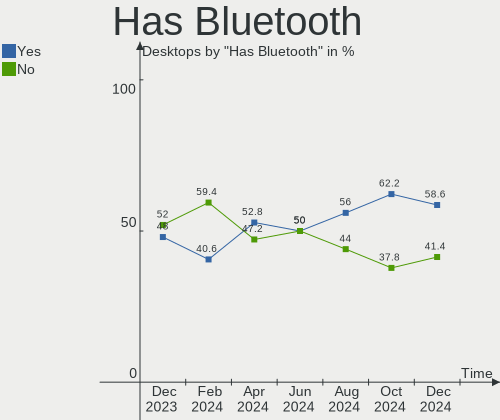
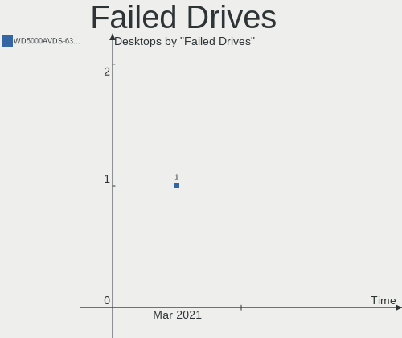
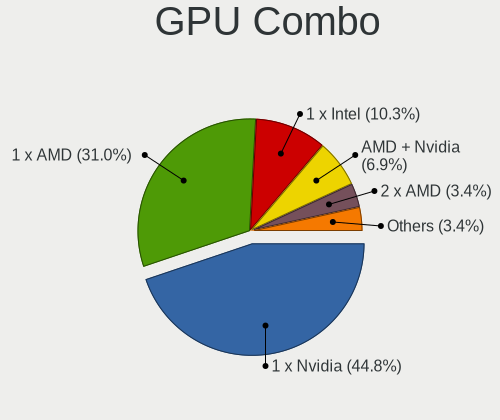
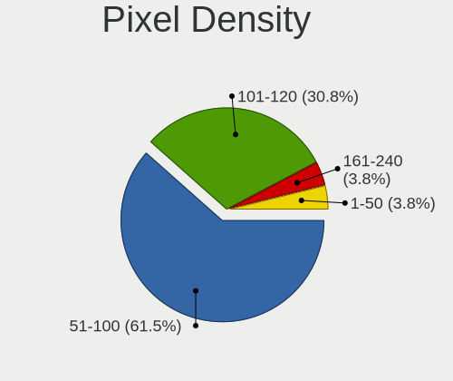

KDE neon Hardware Trends (Desktop)
----------------------------------

A project to identify most popular hardware characteristics and track their change
over time based on data collected by KDE neon users at https://Linux-Hardware.org.

Anyone can contribute to the study by uploading probes of their computers by
the [hw-probe](https://github.com/linuxhw/hw-probe) tool:

    sudo -E hw-probe -all -upload

Full-feature report is available here: https://linux-hardware.org/?view=trends&formfactor=desktop

Period: Mar, 2021.

Contents
--------

- [ OS                       ](#os)
- [ OS Family                ](#os-family)
- [ Kernel                   ](#kernel)
- [ Kernel Family            ](#kernel-family)
- [ Kernel Major Ver.        ](#kernel-major-ver)
- [ Arch                     ](#arch)
- [ DE                       ](#de)
- [ Display Server           ](#display-server)
- [ Display Manager          ](#display-manager)
- [ OS Lang                  ](#os-lang)
- [ Boot Mode                ](#boot-mode)
- [ Filesystem               ](#filesystem)
- [ Part. scheme             ](#part-scheme)
- [ Dual Boot with Linux/BSD ](#dual-boot-with-linux/bsd)
- [ Dual Boot (Win)          ](#dual-boot-win)
- [ Country                  ](#country)
- [ City                     ](#city)
- [ Vendor                   ](#vendor)
- [ Model                    ](#model)
- [ Model Family             ](#model-family)
- [ MFG Year                 ](#mfg-year)
- [ Form Factor              ](#form-factor)
- [ Secure Boot              ](#secure-boot)
- [ Coreboot                 ](#coreboot)
- [ RAM Size                 ](#ram-size)
- [ RAM Used                 ](#ram-used)
- [ Has CD-ROM               ](#has-cd-rom)
- [ Total Drives             ](#total-drives)
- [ Has Ethernet             ](#has-ethernet)
- [ Has WiFi                 ](#has-wifi)
- [ Has Bluetooth            ](#has-bluetooth)
- [ Drive Vendor             ](#drive-vendor)
- [ Drive Model              ](#drive-model)
- [ HDD Vendor               ](#hdd-vendor)
- [ SSD Vendor               ](#ssd-vendor)
- [ Drive Kind               ](#drive-kind)
- [ Drive Connector          ](#drive-connector)
- [ Drive Size               ](#drive-size)
- [ Space Total              ](#space-total)
- [ Space Used               ](#space-used)
- [ Malfunc. Drives          ](#malfunc-drives)
- [ Malfunc. Drive Vendor    ](#malfunc-drive-vendor)
- [ Malfunc. HDD Vendor      ](#malfunc-hdd-vendor)
- [ Malfunc. Drive Kind      ](#malfunc-drive-kind)
- [ Failed Drives            ](#failed-drives)
- [ Failed Drive Vendor      ](#failed-drive-vendor)
- [ Drive Status             ](#drive-status)
- [ Storage Vendor           ](#storage-vendor)
- [ Storage Model            ](#storage-model)
- [ Storage Kind             ](#storage-kind)
- [ CPU Vendor               ](#cpu-vendor)
- [ CPU Model                ](#cpu-model)
- [ CPU Model Family         ](#cpu-model-family)
- [ CPU Cores                ](#cpu-cores)
- [ CPU Sockets              ](#cpu-sockets)
- [ CPU Threads              ](#cpu-threads)
- [ CPU Op-Modes             ](#cpu-op-modes)
- [ CPU Microcode            ](#cpu-microcode)
- [ CPU Microarch            ](#cpu-microarch)
- [ GPU Vendor               ](#gpu-vendor)
- [ GPU Model                ](#gpu-model)
- [ GPU Combo                ](#gpu-combo)
- [ GPU Driver               ](#gpu-driver)
- [ GPU Memory               ](#gpu-memory)
- [ Monitor Vendor           ](#monitor-vendor)
- [ Monitor Model            ](#monitor-model)
- [ Monitor Resolution       ](#monitor-resolution)
- [ Monitor Diagonal         ](#monitor-diagonal)
- [ Monitor Width            ](#monitor-width)
- [ Aspect Ratio             ](#aspect-ratio)
- [ Monitor Area             ](#monitor-area)
- [ Pixel Density            ](#pixel-density)
- [ Multiple Monitors        ](#multiple-monitors)
- [ Net Controller Vendor    ](#net-controller-vendor)
- [ Net Controller Model     ](#net-controller-model)
- [ Wireless Vendor          ](#wireless-vendor)
- [ Wireless Model           ](#wireless-model)
- [ Ethernet Vendor          ](#ethernet-vendor)
- [ Ethernet Model           ](#ethernet-model)
- [ Net Controller Kind      ](#net-controller-kind)
- [ Used Controller          ](#used-controller)
- [ NICs                     ](#nics)
- [ IPv6                     ](#ipv6)
- [ Memory Vendor            ](#memory-vendor)
- [ Memory Model             ](#memory-model)
- [ Memory Kind              ](#memory-kind)
- [ Memory Form Factor       ](#memory-form-factor)
- [ Memory Size              ](#memory-size)
- [ Memory Speed             ](#memory-speed)
- [ Sound Vendor             ](#sound-vendor)
- [ Sound Model              ](#sound-model)
- [ Camera Vendor            ](#camera-vendor)
- [ Camera Model             ](#camera-model)
- [ Fingerprint Vendor       ](#fingerprint-vendor)
- [ Fingerprint Model        ](#fingerprint-model)
- [ Chipcard Vendor          ](#chipcard-vendor)
- [ Chipcard Model           ](#chipcard-model)
- [ Printer Vendor           ](#printer-vendor)
- [ Printer Model            ](#printer-model)
- [ Scanner Vendor           ](#scanner-vendor)
- [ Scanner Model            ](#scanner-model)
- [ Bluetooth Vendor         ](#bluetooth-vendor)
- [ Bluetooth Model          ](#bluetooth-model)
- [ Unsupported Devices      ](#unsupported-devices)
- [ Unsupported Device Types ](#unsupported-device-types)

OS
--

Installed operating systems

| Name           | Desktops | Percent |
|----------------|----------|---------|
| KDE neon 20.04 | 77       | 100%    |

OS Family
---------

OS without a version

| Name     | Desktops | Percent |
|----------|----------|---------|
| KDE neon | 77       | 100%    |

Kernel
------

Version of the Linux kernel

| Version             | Desktops | Percent |
|---------------------|----------|---------|
| 5.4.0-66-generic    | 39       | 50.65%  |
| 5.4.0-67-generic    | 17       | 22.08%  |
| 5.4.0-70-generic    | 10       | 12.99%  |
| 5.8.0-44-generic    | 3        | 3.9%    |
| 5.4.0-65-generic    | 2        | 2.6%    |
| 5.8.0-45-generic    | 1        | 1.3%    |
| 5.4.0-70-lowlatency | 1        | 1.3%    |
| 5.4.0-59-generic    | 1        | 1.3%    |
| 5.4.0-54-generic    | 1        | 1.3%    |
| 5.4.0-52-generic    | 1        | 1.3%    |
| 5.10.0-1011-oem     | 1        | 1.3%    |

Kernel Family
-------------

Linux kernel without a distro release

| Version | Desktops | Percent |
|---------|----------|---------|
| 5.4.0   | 72       | 93.51%  |
| 5.8.0   | 4        | 5.19%   |
| 5.10.0  | 1        | 1.3%    |

Kernel Major Ver.
-----------------

Linux kernel major version

| Version | Desktops | Percent |
|---------|----------|---------|
| 5.4     | 72       | 93.51%  |
| 5.8     | 4        | 5.19%   |
| 5.10    | 1        | 1.3%    |

Arch
----

OS architecture (x86_64, i586, etc.)

| Name   | Desktops | Percent |
|--------|----------|---------|
| x86_64 | 77       | 100%    |

DE
--

Desktop Environment

| Name    | Desktops | Percent |
|---------|----------|---------|
| KDE     | 66       | 85.71%  |
| KDE5    | 10       | 12.99%  |
| Unknown | 1        | 1.3%    |

Display Server
--------------

X11 or Wayland

| Name    | Desktops | Percent |
|---------|----------|---------|
| X11     | 76       | 98.7%   |
| Wayland | 1        | 1.3%    |

Display Manager
---------------

SDDM, LightDM, etc.

| Name    | Desktops | Percent |
|---------|----------|---------|
| Unknown | 67       | 87.01%  |
| SDDM    | 10       | 12.99%  |

OS Lang
-------

Language

| Lang  | Desktops | Percent |
|-------|----------|---------|
| en_US | 25       | 32.47%  |
| ru_RU | 9        | 11.69%  |
| pt_BR | 6        | 7.79%   |
| de_DE | 6        | 7.79%   |
| en_AU | 5        | 6.49%   |
| en_GB | 4        | 5.19%   |
| it_IT | 3        | 3.9%    |
| sv_SE | 2        | 2.6%    |
| fr_FR | 2        | 2.6%    |
| en_CA | 2        | 2.6%    |
| ru_UA | 1        | 1.3%    |
| nl_BE | 1        | 1.3%    |
| nb_NO | 1        | 1.3%    |
| es_VE | 1        | 1.3%    |
| es_ES | 1        | 1.3%    |
| es_CU | 1        | 1.3%    |
| es_BO | 1        | 1.3%    |
| es_AR | 1        | 1.3%    |
| en_HK | 1        | 1.3%    |
| el_GR | 1        | 1.3%    |
| de_CH | 1        | 1.3%    |
| C     | 1        | 1.3%    |
| bg_BG | 1        | 1.3%    |

Boot Mode
---------

EFI or BIOS

| Mode | Desktops | Percent |
|------|----------|---------|
| EFI  | 42       | 54.55%  |
| BIOS | 35       | 45.45%  |

Filesystem
----------

Type of filesystem

| Type    | Desktops | Percent |
|---------|----------|---------|
| Ext4    | 74       | 96.1%   |
| Btrfs   | 2        | 2.6%    |
| Overlay | 1        | 1.3%    |

Part. scheme
------------

Scheme of partitioning

| Type    | Desktops | Percent |
|---------|----------|---------|
| Unknown | 67       | 87.01%  |
| GPT     | 7        | 9.09%   |
| MBR     | 3        | 3.9%    |

Dual Boot with Linux/BSD
------------------------

Hosting more than one Linux/BSD

| Dual boot | Desktops | Percent |
|-----------|----------|---------|
| No        | 74       | 96.1%   |
| Yes       | 3        | 3.9%    |

Dual Boot (Win)
---------------

Hosting Linux and Windows

| Dual boot | Desktops | Percent |
|-----------|----------|---------|
| No        | 67       | 87.01%  |
| Yes       | 10       | 12.99%  |

Country
-------

Geographic location (country)

| Country     | Desktops | Percent |
|-------------|----------|---------|
| USA         | 15       | 19.48%  |
| Russia      | 10       | 12.99%  |
| Germany     | 5        | 6.49%   |
| Brazil      | 5        | 6.49%   |
| Australia   | 5        | 6.49%   |
| UK          | 4        | 5.19%   |
| Sweden      | 3        | 3.9%    |
| Italy       | 3        | 3.9%    |
| France      | 2        | 2.6%    |
| Canada      | 2        | 2.6%    |
| Venezuela   | 1        | 1.3%    |
| Ukraine     | 1        | 1.3%    |
| Thailand    | 1        | 1.3%    |
| Switzerland | 1        | 1.3%    |
| Spain       | 1        | 1.3%    |
| Slovenia    | 1        | 1.3%    |
| Serbia      | 1        | 1.3%    |
| Norway      | 1        | 1.3%    |
| Lithuania   | 1        | 1.3%    |
| Latvia      | 1        | 1.3%    |
| Kuwait      | 1        | 1.3%    |
| Japan       | 1        | 1.3%    |
| Hungary     | 1        | 1.3%    |
| Hong Kong   | 1        | 1.3%    |
| Greece      | 1        | 1.3%    |
| Finland     | 1        | 1.3%    |
| Cuba        | 1        | 1.3%    |
| Bulgaria    | 1        | 1.3%    |
| Bolivia     | 1        | 1.3%    |
| Belgium     | 1        | 1.3%    |
| Belarus     | 1        | 1.3%    |
| Austria     | 1        | 1.3%    |
| Argentina   | 1        | 1.3%    |

City
----

Geographic location (city)

| City              | Desktops | Percent |
|-------------------|----------|---------|
| Perth             | 3        | 3.9%    |
| St Petersburg     | 2        | 2.6%    |
| Unknown           | 2        | 2.6%    |
| Wudinna           | 1        | 1.3%    |
| Woerth am Rhein   | 1        | 1.3%    |
| Waltenschwil      | 1        | 1.3%    |
| Vilnius           | 1        | 1.3%    |
| Vienna            | 1        | 1.3%    |
| Ventspils         | 1        | 1.3%    |
| Uxbridge          | 1        | 1.3%    |
| Tipp City         | 1        | 1.3%    |
| Sydney            | 1        | 1.3%    |
| Surgut            | 1        | 1.3%    |
| Srednyaya Akhtuba | 1        | 1.3%    |
| Sofia             | 1        | 1.3%    |
| Sheffield         | 1        | 1.3%    |
| Santa Cruz        | 1        | 1.3%    |
| Ruzayevka         | 1        | 1.3%    |
| Rostov-on-Don     | 1        | 1.3%    |
| Rivarotta         | 1        | 1.3%    |
| Porto Alegre      | 1        | 1.3%    |
| Pori              | 1        | 1.3%    |
| Phoenix           | 1        | 1.3%    |
| Palmas            | 1        | 1.3%    |
| Oklahoma City     | 1        | 1.3%    |
| Oeiras            | 1        | 1.3%    |
| Odessa            | 1        | 1.3%    |
| Novi Sad          | 1        | 1.3%    |
| Norwich           | 1        | 1.3%    |
| Niagara Falls     | 1        | 1.3%    |
| Newport News      | 1        | 1.3%    |
| Murcia            | 1        | 1.3%    |
| Moscow            | 1        | 1.3%    |
| Mjoelby           | 1        | 1.3%    |
| Minsk             | 1        | 1.3%    |
| Mannheim          | 1        | 1.3%    |
| Louisville        | 1        | 1.3%    |
| Kuwait City       | 1        | 1.3%    |
| Kusa              | 1        | 1.3%    |
| Kingsport         | 1        | 1.3%    |
| Kazan’          | 1        | 1.3%    |
| Kamphaeng Phet    | 1        | 1.3%    |
| Kai-shi           | 1        | 1.3%    |
| Imola             | 1        | 1.3%    |
| Ibbenbueren       | 1        | 1.3%    |
| Houston           | 1        | 1.3%    |
| Havana            | 1        | 1.3%    |
| Guarulhos         | 1        | 1.3%    |
| Guarenas          | 1        | 1.3%    |
| Gonzales          | 1        | 1.3%    |
| Ghent             | 1        | 1.3%    |
| Ft. Washington    | 1        | 1.3%    |
| Fokino            | 1        | 1.3%    |
| Essen             | 1        | 1.3%    |
| Ermoupoli         | 1        | 1.3%    |
| Eikefjord         | 1        | 1.3%    |
| Dyersville        | 1        | 1.3%    |
| Dresden           | 1        | 1.3%    |
| Dobriša Vas      | 1        | 1.3%    |
| Delaware          | 1        | 1.3%    |

Vendor
------

Motherboard manufacturer

| Name                | Desktops | Percent |
|---------------------|----------|---------|
| ASUSTek Computer    | 22       | 28.57%  |
| Gigabyte Technology | 18       | 23.38%  |
| ASRock              | 10       | 12.99%  |
| MSI                 | 8        | 10.39%  |
| Dell                | 7        | 9.09%   |
| Hewlett-Packard     | 6        | 7.79%   |
| Lenovo              | 2        | 2.6%    |
| Intel               | 2        | 2.6%    |
| ZMAX                | 1        | 1.3%    |
| Apple               | 1        | 1.3%    |

Model
-----

Motherboard model

| Name                                   | Desktops | Percent |
|----------------------------------------|----------|---------|
| ASUS All Series                        | 3        | 3.9%    |
| ZMAX IPM41-D2                          | 1        | 1.3%    |
| MSI MS-7C75                            | 1        | 1.3%    |
| MSI MS-7B89                            | 1        | 1.3%    |
| MSI MS-7B86                            | 1        | 1.3%    |
| MSI MS-7B79                            | 1        | 1.3%    |
| MSI MS-7A63                            | 1        | 1.3%    |
| MSI MS-7978                            | 1        | 1.3%    |
| MSI MS-7900                            | 1        | 1.3%    |
| MSI B450M Gaming                       | 1        | 1.3%    |
| Lenovo ThinkStation S20 4157ZSK        | 1        | 1.3%    |
| Lenovo IdeaCentre 3 07ADA05 90MV007SUS | 1        | 1.3%    |
| Intel X99                              | 1        | 1.3%    |
| Intel DN2820FYK H24582-201             | 1        | 1.3%    |
| HP Slim Desktop 290-p0xxx              | 1        | 1.3%    |
| HP ProDesk 600 G1 TWR                  | 1        | 1.3%    |
| HP Pavilion Desktop PC 570-p0XX        | 1        | 1.3%    |
| HP Compaq 8200 Elite SFF PC            | 1        | 1.3%    |
| HP 550-153w                            | 1        | 1.3%    |
| HP 260-a100nf                          | 1        | 1.3%    |
| Gigabyte Z87MX-D3H                     | 1        | 1.3%    |
| Gigabyte Z370 AORUS Gaming K3          | 1        | 1.3%    |
| Gigabyte X99-UD5 WIFI-CF               | 1        | 1.3%    |
| Gigabyte H87-HD3                       | 1        | 1.3%    |
| Gigabyte GA-990FXA-UD3                 | 1        | 1.3%    |
| Gigabyte GA-890GPA-UD3H                | 1        | 1.3%    |
| Gigabyte GA-78LMT-USB3 6.0             | 1        | 1.3%    |
| Gigabyte G41MT-S2P                     | 1        | 1.3%    |
| Gigabyte G31M-ES2L                     | 1        | 1.3%    |
| Gigabyte B85-HD3                       | 1        | 1.3%    |
| Gigabyte B75M-D3H                      | 1        | 1.3%    |
| Gigabyte B450M DS3H                    | 1        | 1.3%    |
| Gigabyte B450 I AORUS PRO WIFI         | 1        | 1.3%    |
| Gigabyte B450 AORUS M                  | 1        | 1.3%    |
| Gigabyte AB350M-DS3H V2                | 1        | 1.3%    |
| Gigabyte A520 AORUS ELITE              | 1        | 1.3%    |
| Gigabyte A320M-S2H V2                  | 1        | 1.3%    |
| Gigabyte 970A-DS3P                     | 1        | 1.3%    |
| Dell Precision WorkStation T3500       | 1        | 1.3%    |
| Dell OptiPlex 990                      | 1        | 1.3%    |
| Dell OptiPlex 790                      | 1        | 1.3%    |
| Dell OptiPlex 760                      | 1        | 1.3%    |
| Dell OptiPlex 7040                     | 1        | 1.3%    |
| Dell OptiPlex 7010                     | 1        | 1.3%    |
| Dell DM061                             | 1        | 1.3%    |
| ASUS WS X299 SAGE/10G                  | 1        | 1.3%    |
| ASUS TUF GAMING Z490-PLUS              | 1        | 1.3%    |
| ASUS TUF GAMING B450M-PRO II           | 1        | 1.3%    |
| ASUS STRIX Z270I GAMING                | 1        | 1.3%    |
| ASUS STRIX Z270H GAMING                | 1        | 1.3%    |
| ASUS ROG STRIX Z370-E GAMING           | 1        | 1.3%    |
| ASUS PRIME Z270-P                      | 1        | 1.3%    |
| ASUS PRIME X570-P                      | 1        | 1.3%    |
| ASUS PRIME H310M-E R2.0                | 1        | 1.3%    |
| ASUS PRIME B450M-A                     | 1        | 1.3%    |
| ASUS PRIME A320M-K                     | 1        | 1.3%    |
| ASUS P8H67-M                           | 1        | 1.3%    |
| ASUS P7P55D-E                          | 1        | 1.3%    |
| ASUS P7H55D-M EVO                      | 1        | 1.3%    |
| ASUS P6T DELUXE V2                     | 1        | 1.3%    |

Model Family
------------

Motherboard model prefix

| Name                    | Desktops | Percent |
|-------------------------|----------|---------|
| Dell OptiPlex           | 5        | 6.49%   |
| ASUS PRIME              | 5        | 6.49%   |
| ASUS All                | 3        | 3.9%    |
| Gigabyte B450           | 2        | 2.6%    |
| ASUS TUF                | 2        | 2.6%    |
| ASUS STRIX              | 2        | 2.6%    |
| ZMAX IPM41-D2           | 1        | 1.3%    |
| MSI MS-7C75             | 1        | 1.3%    |
| MSI MS-7B89             | 1        | 1.3%    |
| MSI MS-7B86             | 1        | 1.3%    |
| MSI MS-7B79             | 1        | 1.3%    |
| MSI MS-7A63             | 1        | 1.3%    |
| MSI MS-7978             | 1        | 1.3%    |
| MSI MS-7900             | 1        | 1.3%    |
| MSI B450M               | 1        | 1.3%    |
| Lenovo ThinkStation     | 1        | 1.3%    |
| Lenovo IdeaCentre       | 1        | 1.3%    |
| Intel X99               | 1        | 1.3%    |
| Intel DN2820FYK         | 1        | 1.3%    |
| HP Slim                 | 1        | 1.3%    |
| HP ProDesk              | 1        | 1.3%    |
| HP Pavilion             | 1        | 1.3%    |
| HP Compaq               | 1        | 1.3%    |
| HP 550-153w             | 1        | 1.3%    |
| HP 260-a100nf           | 1        | 1.3%    |
| Gigabyte Z87MX-D3H      | 1        | 1.3%    |
| Gigabyte Z370           | 1        | 1.3%    |
| Gigabyte X99-UD5        | 1        | 1.3%    |
| Gigabyte H87-HD3        | 1        | 1.3%    |
| Gigabyte GA-990FXA-UD3  | 1        | 1.3%    |
| Gigabyte GA-890GPA-UD3H | 1        | 1.3%    |
| Gigabyte GA-78LMT-USB3  | 1        | 1.3%    |
| Gigabyte G41MT-S2P      | 1        | 1.3%    |
| Gigabyte G31M-ES2L      | 1        | 1.3%    |
| Gigabyte B85-HD3        | 1        | 1.3%    |
| Gigabyte B75M-D3H       | 1        | 1.3%    |
| Gigabyte B450M          | 1        | 1.3%    |
| Gigabyte AB350M-DS3H    | 1        | 1.3%    |
| Gigabyte A520           | 1        | 1.3%    |
| Gigabyte A320M-S2H      | 1        | 1.3%    |
| Gigabyte 970A-DS3P      | 1        | 1.3%    |
| Dell Precision          | 1        | 1.3%    |
| Dell DM061              | 1        | 1.3%    |
| ASUS WS                 | 1        | 1.3%    |
| ASUS ROG                | 1        | 1.3%    |
| ASUS P8H67-M            | 1        | 1.3%    |
| ASUS P7P55D-E           | 1        | 1.3%    |
| ASUS P7H55D-M           | 1        | 1.3%    |
| ASUS P6T                | 1        | 1.3%    |
| ASUS M4N78-AM           | 1        | 1.3%    |
| ASUS M3A78-CM           | 1        | 1.3%    |
| ASUS H110M-K            | 1        | 1.3%    |
| ASUS A88XM-E            | 1        | 1.3%    |
| ASRock X570M            | 1        | 1.3%    |
| ASRock X470             | 1        | 1.3%    |
| ASRock X370             | 1        | 1.3%    |
| ASRock QC5000-ITX       | 1        | 1.3%    |
| ASRock H61M-HVS         | 1        | 1.3%    |
| ASRock ConRoe945G-DVI   | 1        | 1.3%    |
| ASRock B550M-ITX        | 1        | 1.3%    |

MFG Year
--------

Motherboard manufacture year

| Year | Desktops | Percent |
|------|----------|---------|
| 2020 | 14       | 18.18%  |
| 2019 | 12       | 15.58%  |
| 2018 | 11       | 14.29%  |
| 2017 | 6        | 7.79%   |
| 2014 | 6        | 7.79%   |
| 2010 | 5        | 6.49%   |
| 2016 | 4        | 5.19%   |
| 2013 | 4        | 5.19%   |
| 2011 | 3        | 3.9%    |
| 2021 | 2        | 2.6%    |
| 2015 | 2        | 2.6%    |
| 2012 | 2        | 2.6%    |
| 2009 | 2        | 2.6%    |
| 2007 | 2        | 2.6%    |
| 2008 | 1        | 1.3%    |
| 2006 | 1        | 1.3%    |

Form Factor
-----------

Physical design of the computer

| Name    | Desktops | Percent |
|---------|----------|---------|
| Desktop | 77       | 100%    |

Secure Boot
-----------

Enabled or disabled

| State    | Desktops | Percent |
|----------|----------|---------|
| Disabled | 77       | 100%    |

Coreboot
--------

Have coreboot on board

| Used | Desktops | Percent |
|------|----------|---------|
| No   | 77       | 100%    |

RAM Size
--------

Total RAM memory

| Size in GB  | Desktops | Percent |
|-------------|----------|---------|
| 16.01-24.0  | 27       | 35.06%  |
| 8.01-16.0   | 17       | 22.08%  |
| 32.01-64.0  | 11       | 14.29%  |
| 4.01-8.0    | 8        | 10.39%  |
| 3.01-4.0    | 6        | 7.79%   |
| 24.01-32.0  | 4        | 5.19%   |
| 64.01-256.0 | 2        | 2.6%    |
| 1.01-2.0    | 2        | 2.6%    |

RAM Used
--------

Used RAM memory

| Used GB    | Desktops | Percent |
|------------|----------|---------|
| 1.01-2.0   | 35       | 45.45%  |
| 2.01-3.0   | 16       | 20.78%  |
| 4.01-8.0   | 10       | 12.99%  |
| 3.01-4.0   | 7        | 9.09%   |
| 8.01-16.0  | 3        | 3.9%    |
| 0.51-1.0   | 3        | 3.9%    |
| 16.01-24.0 | 2        | 2.6%    |
| 24.01-32.0 | 1        | 1.3%    |

Has CD-ROM
----------

Has CD-ROM on board

| Presented | Desktops | Percent |
|-----------|----------|---------|
| No        | 48       | 62.34%  |
| Yes       | 29       | 37.66%  |

Total Drives
------------

Number of drives on board

| Drives | Desktops | Percent |
|--------|----------|---------|
| 1      | 24       | 31.17%  |
| 2      | 23       | 29.87%  |
| 3      | 13       | 16.88%  |
| 4      | 12       | 15.58%  |
| 5      | 4        | 5.19%   |
| 6      | 1        | 1.3%    |

Has Ethernet
------------

Has Ethernet on board

| Presented | Desktops | Percent |
|-----------|----------|---------|
| Yes       | 76       | 98.7%   |
| No        | 1        | 1.3%    |

Has WiFi
--------

Has WiFi module

| Presented | Desktops | Percent |
|-----------|----------|---------|
| No        | 46       | 59.74%  |
| Yes       | 31       | 40.26%  |

Has Bluetooth
-------------

Has Bluetooth module

| Presented | Desktops | Percent |
|-----------|----------|---------|
| No        | 49       | 63.64%  |
| Yes       | 28       | 36.36%  |

Drive Vendor
------------

Hard drive vendors

| Vendor                | Desktops | Drives | Percent |
|-----------------------|----------|--------|---------|
| WDC                   | 30       | 46     | 20.41%  |
| Samsung Electronics   | 24       | 31     | 16.33%  |
| Seagate               | 22       | 28     | 14.97%  |
| Kingston              | 12       | 15     | 8.16%   |
| Toshiba               | 8        | 9      | 5.44%   |
| Hitachi               | 6        | 6      | 4.08%   |
| Crucial               | 6        | 7      | 4.08%   |
| Unknown               | 5        | 6      | 3.4%    |
| SanDisk               | 5        | 5      | 3.4%    |
| Phison                | 3        | 4      | 2.04%   |
| Intel                 | 3        | 3      | 2.04%   |
| HGST                  | 3        | 3      | 2.04%   |
| China                 | 3        | 3      | 2.04%   |
| A-DATA Technology     | 3        | 3      | 2.04%   |
| XPG                   | 2        | 2      | 1.36%   |
| SK Hynix              | 2        | 2      | 1.36%   |
| Zheino                | 1        | 1      | 0.68%   |
| SPCC                  | 1        | 1      | 0.68%   |
| Silicon Motion        | 1        | 1      | 0.68%   |
| Realtek Semiconductor | 1        | 1      | 0.68%   |
| PNY                   | 1        | 1      | 0.68%   |
| Lexar                 | 1        | 1      | 0.68%   |
| KingSpec              | 1        | 1      | 0.68%   |
| HS-SSD-C100           | 1        | 1      | 0.68%   |
| GOODRAM               | 1        | 1      | 0.68%   |
| Corsair               | 1        | 1      | 0.68%   |

Drive Model
-----------

Hard drive models

| Model                                 | Desktops | Percent |
|---------------------------------------|----------|---------|
| Samsung NVMe SSD Drive 500GB          | 5        | 2.91%   |
| Kingston SA400S37240G 240GB SSD       | 4        | 2.33%   |
| WDC WD30EZRX-00D8PB0 3TB              | 3        | 1.74%   |
| WDC WD10EZEX-08WN4A0 1TB              | 3        | 1.74%   |
| Unknown SD/MMC/MS PRO 128GB           | 3        | 1.74%   |
| Samsung SSD 860 EVO 500GB             | 3        | 1.74%   |
| XPG NVMe SSD Drive 512GB              | 2        | 1.16%   |
| WDC WDS240G2G0A-00JH30 240GB SSD      | 2        | 1.16%   |
| WDC WD5000AAKX-00ERMA0 500GB          | 2        | 1.16%   |
| WDC WD30EFRX-68EUZN0 3TB              | 2        | 1.16%   |
| WDC WD1002FAEX-00Z3A0 1TB             | 2        | 1.16%   |
| Seagate ST500DM002-1BD142 500GB       | 2        | 1.16%   |
| Seagate ST1000DM010-2EP102 1TB        | 2        | 1.16%   |
| Samsung SSD 850 EVO 250GB             | 2        | 1.16%   |
| Samsung NVMe SSD Drive 1TB            | 2        | 1.16%   |
| Kingston SA400S37120G 120GB SSD       | 2        | 1.16%   |
| HGST HTS725050A7E630 500GB            | 2        | 1.16%   |
| Zheino CHN-mSATAQ3-240 240GB          | 1        | 0.58%   |
| WDC WDS500G2B0A-00SM50 500GB SSD      | 1        | 0.58%   |
| WDC WDS480G2G0A-00JH30 480GB SSD      | 1        | 0.58%   |
| WDC WDS250G2B0A-00SM50 250GB SSD      | 1        | 0.58%   |
| WDC WDBNCE0010PNC 1TB SSD             | 1        | 0.58%   |
| WDC WD6400AARS-00Y5B1 640GB           | 1        | 0.58%   |
| WDC WD60EFRX-68MYMN1 6TB              | 1        | 0.58%   |
| WDC WD5002AALX-00J37A0 500GB          | 1        | 0.58%   |
| WDC WD5000AZLX-00CL5A0 500GB          | 1        | 0.58%   |
| WDC WD5000AVDS-63U7B1 500GB           | 1        | 0.58%   |
| WDC WD5000AAKX-001CA0 500GB           | 1        | 0.58%   |
| WDC WD5000AAKS-07A7B0 500GB           | 1        | 0.58%   |
| WDC WD40EZRZ-00WN9B0 4TB              | 1        | 0.58%   |
| WDC WD40EFRX-68WT0N0 4TB              | 1        | 0.58%   |
| WDC WD2500AAKX-083CA1 250GB           | 1        | 0.58%   |
| WDC WD2500AAKX-001CA0 250GB           | 1        | 0.58%   |
| WDC WD2003FYPS-27Y2B0 2TB             | 1        | 0.58%   |
| WDC WD1600JS-00MHB0 160GB             | 1        | 0.58%   |
| WDC WD1600AAJS-00L7A0 160GB           | 1        | 0.58%   |
| WDC WD15EARS-60MVWB0 1TB              | 1        | 0.58%   |
| WDC WD10SPCX-21KHST0 1TB              | 1        | 0.58%   |
| WDC WD10EZRX-00A8LB0 1TB              | 1        | 0.58%   |
| WDC WD10EZEX-75ZF5A0 1TB              | 1        | 0.58%   |
| WDC WD10EZEX-75WN4A1 1TB              | 1        | 0.58%   |
| WDC WD10EZEX-00WN4A0 1TB              | 1        | 0.58%   |
| WDC WD10EZEX-00KUWA0 1TB              | 1        | 0.58%   |
| WDC WD10EZEX-00BN5A0 1TB              | 1        | 0.58%   |
| WDC WD10EARS-00Y5B1 1TB               | 1        | 0.58%   |
| WDC WD10EADS-00L5B1 1TB               | 1        | 0.58%   |
| Unknown SSM28256GPTCB3B-S112612 256GB | 1        | 0.58%   |
| Unknown SD/MMC 64GB                   | 1        | 0.58%   |
| Unknown M.S./M.S.Pro/HG 16GB          | 1        | 0.58%   |
| Toshiba MQ01ACF050 500GB              | 1        | 0.58%   |
| Toshiba MQ01ABD100 1TB                | 1        | 0.58%   |
| Toshiba HDWE160 6TB                   | 1        | 0.58%   |
| Toshiba HDWD130 3TB                   | 1        | 0.58%   |
| Toshiba HDWD110 1TB                   | 1        | 0.58%   |
| Toshiba DT01ACA300 3TB                | 1        | 0.58%   |
| Toshiba DT01ACA100 1TB                | 1        | 0.58%   |
| Toshiba DT01ACA050 500GB              | 1        | 0.58%   |
| SPCC Solid State Disk 128GB           | 1        | 0.58%   |
| SK Hynix SH920 2.5 7MM 128GB SSD      | 1        | 0.58%   |
| SK Hynix NVMe SSD Drive 256GB         | 1        | 0.58%   |

HDD Vendor
----------

Hard disk drive vendors

| Vendor              | Desktops | Drives | Percent |
|---------------------|----------|--------|---------|
| WDC                 | 27       | 40     | 39.13%  |
| Seagate             | 21       | 27     | 30.43%  |
| Toshiba             | 8        | 9      | 11.59%  |
| Hitachi             | 6        | 6      | 8.7%    |
| Samsung Electronics | 4        | 4      | 5.8%    |
| HGST                | 3        | 3      | 4.35%   |

SSD Vendor
----------

Solid state drive vendors

| Vendor              | Desktops | Drives | Percent |
|---------------------|----------|--------|---------|
| Samsung Electronics | 12       | 15     | 23.08%  |
| Kingston            | 11       | 14     | 21.15%  |
| WDC                 | 6        | 6      | 11.54%  |
| Crucial             | 6        | 7      | 11.54%  |
| SanDisk             | 3        | 3      | 5.77%   |
| China               | 3        | 3      | 5.77%   |
| A-DATA Technology   | 3        | 3      | 5.77%   |
| SPCC                | 1        | 1      | 1.92%   |
| SK Hynix            | 1        | 1      | 1.92%   |
| Seagate             | 1        | 1      | 1.92%   |
| PNY                 | 1        | 1      | 1.92%   |
| Lexar               | 1        | 1      | 1.92%   |
| KingSpec            | 1        | 1      | 1.92%   |
| Intel               | 1        | 1      | 1.92%   |
| GOODRAM             | 1        | 1      | 1.92%   |

Drive Kind
----------

HDD or SSD

| Kind    | Desktops | Drives | Percent |
|---------|----------|--------|---------|
| HDD     | 53       | 89     | 42.74%  |
| SSD     | 40       | 59     | 32.26%  |
| NVMe    | 24       | 27     | 19.35%  |
| Unknown | 7        | 8      | 5.65%   |

Drive Connector
---------------

SATA, SAS, NVMe, etc.

| Type | Desktops | Drives | Percent |
|------|----------|--------|---------|
| SATA | 71       | 148    | 70.3%   |
| NVMe | 24       | 27     | 23.76%  |
| SAS  | 6        | 8      | 5.94%   |

Drive Size
----------

Size of hard drive

| Size in TB | Desktops | Drives | Percent |
|------------|----------|--------|---------|
| 0.01-0.5   | 46       | 75     | 44.66%  |
| 0.51-1.0   | 29       | 39     | 28.16%  |
| 1.01-2.0   | 9        | 10     | 8.74%   |
| 2.01-3.0   | 8        | 12     | 7.77%   |
| 4.01-10.0  | 6        | 7      | 5.83%   |
| 3.01-4.0   | 5        | 5      | 4.85%   |

Space Total
-----------

Amount of disk space available on the file system

| Size in GB     | Desktops | Percent |
|----------------|----------|---------|
| 101-250        | 23       | 29.87%  |
| 251-500        | 15       | 19.48%  |
| More than 3000 | 9        | 11.69%  |
| 1001-2000      | 9        | 11.69%  |
| 501-1000       | 8        | 10.39%  |
| 51-100         | 8        | 10.39%  |
| 2001-3000      | 4        | 5.19%   |
| Unknown        | 1        | 1.3%    |

Space Used
----------

Amount of used disk space

| Used GB        | Desktops | Percent |
|----------------|----------|---------|
| 1-20           | 28       | 36.36%  |
| 101-250        | 12       | 15.58%  |
| 21-50          | 10       | 12.99%  |
| More than 3000 | 7        | 9.09%   |
| 51-100         | 7        | 9.09%   |
| 501-1000       | 6        | 7.79%   |
| 1001-2000      | 3        | 3.9%    |
| 251-500        | 2        | 2.6%    |
| 2001-3000      | 1        | 1.3%    |
| Unknown        | 1        | 1.3%    |

Malfunc. Drives
---------------

Drive models with a malfunction

| Model                      | Desktops | Drives | Percent |
|----------------------------|----------|--------|---------|
| WDC WD30EFRX-68EUZN0 3TB   | 1        | 1      | 50%     |
| HGST HTS725050A7E630 500GB | 1        | 1      | 50%     |

Malfunc. Drive Vendor
---------------------

Vendors of faulty drives

| Vendor | Desktops | Drives | Percent |
|--------|----------|--------|---------|
| WDC    | 1        | 1      | 50%     |
| HGST   | 1        | 1      | 50%     |

Malfunc. HDD Vendor
-------------------

Vendors of faulty HDD drives

| Vendor | Desktops | Drives | Percent |
|--------|----------|--------|---------|
| WDC    | 1        | 1      | 50%     |
| HGST   | 1        | 1      | 50%     |

Malfunc. Drive Kind
-------------------

Kinds of faulty drives

| Kind | Desktops | Drives | Percent |
|------|----------|--------|---------|
| HDD  | 2        | 2      | 100%    |

Failed Drives
-------------

Failed drive models

| Model                       | Desktops | Drives | Percent |
|-----------------------------|----------|--------|---------|
| WDC WD5000AVDS-63U7B1 500GB | 1        | 1      | 100%    |

Failed Drive Vendor
-------------------

Failed drive vendors

| Vendor | Desktops | Drives | Percent |
|--------|----------|--------|---------|
| WDC    | 1        | 1      | 100%    |

Drive Status
------------

Number of failed and malfunc. drives

| Status   | Desktops | Drives | Percent |
|----------|----------|--------|---------|
| Detected | 67       | 157    | 83.75%  |
| Works    | 10       | 23     | 12.5%   |
| Malfunc  | 2        | 2      | 2.5%    |
| Failed   | 1        | 1      | 1.25%   |

Storage Vendor
--------------

Storage controller vendors

| Vendor                      | Desktops | Percent |
|-----------------------------|----------|---------|
| Intel                       | 45       | 41.28%  |
| AMD                         | 31       | 28.44%  |
| Samsung Electronics         | 11       | 10.09%  |
| Phison Electronics          | 4        | 3.67%   |
| Marvell Technology Group    | 4        | 3.67%   |
| Sandisk                     | 2        | 1.83%   |
| JMicron Technology          | 2        | 1.83%   |
| ASMedia Technology          | 2        | 1.83%   |
| ADATA Technology            | 2        | 1.83%   |
| VIA Technologies            | 1        | 0.92%   |
| SK Hynix                    | 1        | 0.92%   |
| Silicon Motion              | 1        | 0.92%   |
| Realtek Semiconductor       | 1        | 0.92%   |
| Nvidia                      | 1        | 0.92%   |
| Kingston Technology Company | 1        | 0.92%   |

Storage Model
-------------

Storage controller models

| Model                                                                                   | Desktops | Percent |
|-----------------------------------------------------------------------------------------|----------|---------|
| AMD FCH SATA Controller [AHCI mode]                                                     | 20       | 14.49%  |
| AMD 400 Series Chipset SATA Controller                                                  | 12       | 8.7%    |
| Intel 200 Series PCH SATA controller [AHCI mode]                                        | 9        | 6.52%   |
| Samsung NVMe SSD Controller SM981/PM981/PM983                                           | 8        | 5.8%    |
| Intel 8 Series/C220 Series Chipset Family 6-port SATA Controller 1 [AHCI mode]          | 8        | 5.8%    |
| Intel NM10/ICH7 Family SATA Controller [IDE mode]                                       | 4        | 2.9%    |
| AMD SB7x0/SB8x0/SB9x0 SATA Controller [IDE mode]                                        | 4        | 2.9%    |
| AMD SB7x0/SB8x0/SB9x0 IDE Controller                                                    | 4        | 2.9%    |
| Samsung NVMe SSD Controller SM961/PM961/SM963                                           | 3        | 2.17%   |
| Phison E12 NVMe Controller                                                              | 3        | 2.17%   |
| Intel Q170/Q150/B150/H170/H110/Z170/CM236 Chipset SATA Controller [AHCI Mode]           | 3        | 2.17%   |
| Intel 6 Series/C200 Series Chipset Family 6 port Desktop SATA AHCI Controller           | 3        | 2.17%   |
| Sandisk WD Blue SN550 NVMe SSD                                                          | 2        | 1.45%   |
| Marvell Group 88SE6111/6121 SATA II / PATA Controller                                   | 2        | 1.45%   |
| JMicron JMB363 SATA/IDE Controller                                                      | 2        | 1.45%   |
| Intel Comet Lake SATA AHCI Controller                                                   | 2        | 1.45%   |
| Intel 82801JI (ICH10 Family) SATA AHCI Controller                                       | 2        | 1.45%   |
| Intel 82801G (ICH7 Family) IDE Controller                                               | 2        | 1.45%   |
| Intel 7 Series/C210 Series Chipset Family 6-port SATA Controller [AHCI mode]            | 2        | 1.45%   |
| Intel 6 Series/C200 Series Chipset Family Desktop SATA Controller (IDE mode, ports 4-5) | 2        | 1.45%   |
| Intel 6 Series/C200 Series Chipset Family Desktop SATA Controller (IDE mode, ports 0-3) | 2        | 1.45%   |
| Intel 5 Series/3400 Series Chipset 6 port SATA AHCI Controller                          | 2        | 1.45%   |
| AMD Starship/Matisse Chipset SATA Controller [AHCI mode]                                | 2        | 1.45%   |
| AMD FCH SATA Controller D                                                               | 2        | 1.45%   |
| AMD 300 Series Chipset SATA Controller                                                  | 2        | 1.45%   |
| ADATA XPG SX8200 Pro PCIe Gen3x4 M.2 2280 Solid State Drive                             | 2        | 1.45%   |
| VIA VT6415 PATA IDE Host Controller                                                     | 1        | 0.72%   |
| SK Hynix BC501 NVMe Solid State Drive 512GB                                             | 1        | 0.72%   |
| Silicon Motion SM2263EN/SM2263XT SSD Controller                                         | 1        | 0.72%   |
| Samsung NVMe SSD Controller PM9A1/980PRO                                                | 1        | 0.72%   |
| Realtek RTS5763DL NVMe SSD Controller                                                   | 1        | 0.72%   |
| Phison E16 PCIe4 NVMe Controller                                                        | 1        | 0.72%   |
| Nvidia MCP78S [GeForce 8200] AHCI Controller                                            | 1        | 0.72%   |
| Marvell Group 88SE9172 SATA III 6Gb/s RAID Controller                                   | 1        | 0.72%   |
| Marvell Group 88SE9123 PCIe SATA 6.0 Gb/s controller                                    | 1        | 0.72%   |
| Kingston Company A2000 NVMe SSD                                                         | 1        | 0.72%   |
| Intel SSD Pro 7600p/760p/E 6100p Series                                                 | 1        | 0.72%   |
| Intel NVMe Optane Memory Series                                                         | 1        | 0.72%   |
| Intel Cannon Lake PCH SATA AHCI Controller                                              | 1        | 0.72%   |
| Intel C610/X99 series chipset 6-Port SATA Controller [AHCI mode]                        | 1        | 0.72%   |
| Intel Atom Processor E3800 Series SATA AHCI Controller                                  | 1        | 0.72%   |
| Intel 82801JI (ICH10 Family) 4 port SATA IDE Controller #1                              | 1        | 0.72%   |
| Intel 82801JI (ICH10 Family) 2 port SATA IDE Controller #2                              | 1        | 0.72%   |
| Intel 82801JD/DO (ICH10 Family) 4-port SATA IDE Controller                              | 1        | 0.72%   |
| Intel 82801JD/DO (ICH10 Family) 2-port SATA IDE Controller                              | 1        | 0.72%   |
| Intel 82801HR/HO/HH (ICH8R/DO/DH) 2 port SATA Controller [IDE mode]                     | 1        | 0.72%   |
| Intel 82801H (ICH8 Family) 4 port SATA Controller [IDE mode]                            | 1        | 0.72%   |
| Intel 631xESB/632xESB/3100 Chipset SATA IDE Controller                                  | 1        | 0.72%   |
| Intel 631xESB/632xESB IDE Controller                                                    | 1        | 0.72%   |
| Intel 4 Series Chipset PT IDER Controller                                               | 1        | 0.72%   |
| ASMedia ASM1062 Serial ATA Controller                                                   | 1        | 0.72%   |
| ASMedia ASM1061 SATA IDE Controller                                                     | 1        | 0.72%   |
| AMD X370 Series Chipset SATA Controller                                                 | 1        | 0.72%   |
| AMD SB7x0/SB8x0/SB9x0 SATA Controller [AHCI mode]                                       | 1        | 0.72%   |
| AMD FCH SATA Controller [IDE mode]                                                      | 1        | 0.72%   |

Storage Kind
------------

Kind of storage controller (IDE, SATA, NVMe, SAS, ...)

| Kind | Desktops | Percent |
|------|----------|---------|
| SATA | 66       | 61.11%  |
| NVMe | 24       | 22.22%  |
| IDE  | 18       | 16.67%  |

CPU Vendor
----------

Processor vendors

| Vendor | Desktops | Percent |
|--------|----------|---------|
| Intel  | 45       | 58.44%  |
| AMD    | 32       | 41.56%  |

CPU Model
---------

Processor models

| Model                                           | Desktops | Percent |
|-------------------------------------------------|----------|---------|
| AMD Ryzen 5 3600 6-Core Processor               | 5        | 6.49%   |
| AMD Ryzen 7 2700 Eight-Core Processor           | 3        | 3.9%    |
| AMD Ryzen 5 3400G with Radeon Vega Graphics     | 3        | 3.9%    |
| Intel Xeon CPU W3565 @ 3.20GHz                  | 2        | 2.6%    |
| Intel Core i7-8700 CPU @ 3.20GHz                | 2        | 2.6%    |
| Intel Core i7-4770 CPU @ 3.40GHz                | 2        | 2.6%    |
| Intel Core i5-6500 CPU @ 3.20GHz                | 2        | 2.6%    |
| AMD Ryzen 7 2700X Eight-Core Processor          | 2        | 2.6%    |
| AMD Ryzen 5 2400G with Radeon Vega Graphics     | 2        | 2.6%    |
| AMD Ryzen 5 1500X Quad-Core Processor           | 2        | 2.6%    |
| AMD FX-6300 Six-Core Processor                  | 2        | 2.6%    |
| Intel Xeon CPU X5460 @ 3.16GHz                  | 1        | 1.3%    |
| Intel Xeon CPU X3450 @ 2.67GHz                  | 1        | 1.3%    |
| Intel Xeon CPU E5-2680 v3 @ 2.50GHz             | 1        | 1.3%    |
| Intel Xeon CPU 5150 @ 2.66GHz                   | 1        | 1.3%    |
| Intel Pentium 4 CPU 3.06GHz                     | 1        | 1.3%    |
| Intel Core i9-9900K CPU @ 3.60GHz               | 1        | 1.3%    |
| Intel Core i9-7960X CPU @ 2.80GHz               | 1        | 1.3%    |
| Intel Core i9-10900KF CPU @ 3.70GHz             | 1        | 1.3%    |
| Intel Core i7-7700 CPU @ 3.60GHz                | 1        | 1.3%    |
| Intel Core i7-6700K CPU @ 4.00GHz               | 1        | 1.3%    |
| Intel Core i7-5820K CPU @ 3.30GHz               | 1        | 1.3%    |
| Intel Core i7-4790K CPU @ 4.00GHz               | 1        | 1.3%    |
| Intel Core i7-3770 CPU @ 3.40GHz                | 1        | 1.3%    |
| Intel Core i7-2600 CPU @ 3.40GHz                | 1        | 1.3%    |
| Intel Core i7 CPU 920 @ 2.67GHz                 | 1        | 1.3%    |
| Intel Core i5-7600K CPU @ 3.80GHz               | 1        | 1.3%    |
| Intel Core i5-7500 CPU @ 3.40GHz                | 1        | 1.3%    |
| Intel Core i5-7400 CPU @ 3.00GHz                | 1        | 1.3%    |
| Intel Core i5-6400 CPU @ 2.70GHz                | 1        | 1.3%    |
| Intel Core i5-4670 CPU @ 3.40GHz                | 1        | 1.3%    |
| Intel Core i5-4590 CPU @ 3.30GHz                | 1        | 1.3%    |
| Intel Core i5-4440 CPU @ 3.10GHz                | 1        | 1.3%    |
| Intel Core i5-2500 CPU @ 3.30GHz                | 1        | 1.3%    |
| Intel Core i5-2400 CPU @ 3.10GHz                | 1        | 1.3%    |
| Intel Core i5-10600 CPU @ 3.30GHz               | 1        | 1.3%    |
| Intel Core i3-9100 CPU @ 3.60GHz                | 1        | 1.3%    |
| Intel Core i3-4170 CPU @ 3.70GHz                | 1        | 1.3%    |
| Intel Core i3-3240 CPU @ 3.40GHz                | 1        | 1.3%    |
| Intel Core i3-2120 CPU @ 3.30GHz                | 1        | 1.3%    |
| Intel Core i3 CPU 530 @ 2.93GHz                 | 1        | 1.3%    |
| Intel Core 2 Quad CPU Q8400 @ 2.66GHz           | 1        | 1.3%    |
| Intel Core 2 Quad CPU Q6600 @ 2.40GHz           | 1        | 1.3%    |
| Intel Core 2 Duo CPU E8500 @ 3.16GHz            | 1        | 1.3%    |
| Intel Celeron CPU N2820 @ 2.13GHz               | 1        | 1.3%    |
| Intel Celeron CPU G550 @ 2.60GHz                | 1        | 1.3%    |
| Intel Celeron CPU G1840 @ 2.80GHz               | 1        | 1.3%    |
| Intel Celeron CPU E3400 @ 2.60GHz               | 1        | 1.3%    |
| AMD Ryzen 9 3900X 12-Core Processor             | 1        | 1.3%    |
| AMD Ryzen 5 3600X 6-Core Processor              | 1        | 1.3%    |
| AMD Ryzen 5 2600X Six-Core Processor            | 1        | 1.3%    |
| AMD Ryzen 5 1600 Six-Core Processor             | 1        | 1.3%    |
| AMD Ryzen 3 3250U with Radeon Graphics          | 1        | 1.3%    |
| AMD Phenom II X4 B55 Processor                  | 1        | 1.3%    |
| AMD Phenom 9850 Quad-Core Processor             | 1        | 1.3%    |
| AMD Phenom 9750 Quad-Core Processor             | 1        | 1.3%    |
| AMD FX-6100 Six-Core Processor                  | 1        | 1.3%    |
| AMD E2-7110 APU with AMD Radeon R2 Graphics     | 1        | 1.3%    |
| AMD A4-5000 APU with Radeon HD Graphics         | 1        | 1.3%    |
| AMD A10-7870K Radeon R7, 12 Compute Cores 4C+8G | 1        | 1.3%    |

CPU Model Family
----------------

Processor model prefix

| Model             | Desktops | Percent |
|-------------------|----------|---------|
| AMD Ryzen 5       | 15       | 19.48%  |
| Intel Core i5     | 12       | 15.58%  |
| Intel Core i7     | 11       | 14.29%  |
| Intel Xeon        | 6        | 7.79%   |
| Intel Core i3     | 5        | 6.49%   |
| AMD Ryzen 7       | 5        | 6.49%   |
| Intel Celeron     | 4        | 5.19%   |
| Intel Core i9     | 3        | 3.9%    |
| AMD FX            | 3        | 3.9%    |
| Intel Core 2 Quad | 2        | 2.6%    |
| AMD Phenom        | 2        | 2.6%    |
| AMD A10           | 2        | 2.6%    |
| Intel Pentium 4   | 1        | 1.3%    |
| Intel Core 2 Duo  | 1        | 1.3%    |
| AMD Ryzen 9       | 1        | 1.3%    |
| AMD Ryzen 3       | 1        | 1.3%    |
| AMD Phenom II X4  | 1        | 1.3%    |
| AMD E2            | 1        | 1.3%    |
| AMD A4            | 1        | 1.3%    |

CPU Cores
---------

Number of processor cores

| Number | Desktops | Percent |
|--------|----------|---------|
| 4      | 38       | 49.35%  |
| 6      | 12       | 15.58%  |
| 2      | 12       | 15.58%  |
| 8      | 6        | 7.79%   |
| 3      | 4        | 5.19%   |
| 24     | 1        | 1.3%    |
| 16     | 1        | 1.3%    |
| 12     | 1        | 1.3%    |
| 10     | 1        | 1.3%    |
| 1      | 1        | 1.3%    |

CPU Sockets
-----------

Number of sockets

| Number | Desktops | Percent |
|--------|----------|---------|
| 1      | 75       | 97.4%   |
| 2      | 2        | 2.6%    |

CPU Threads
-----------

Threads per core (Hyper-Threading)

| Number | Desktops | Percent |
|--------|----------|---------|
| 2      | 50       | 64.94%  |
| 1      | 27       | 35.06%  |

CPU Op-Modes
------------

CPU Operation Modes (32-bit, 64-bit)

| Op mode        | Desktops | Percent |
|----------------|----------|---------|
| 32-bit, 64-bit | 77       | 100%    |

CPU Microcode
-------------

Microcode number

| Number     | Desktops | Percent |
|------------|----------|---------|
| 0x306c3    | 8        | 10.39%  |
| 0x08701021 | 6        | 7.79%   |
| 0x206a7    | 5        | 6.49%   |
| 0x0800820d | 5        | 6.49%   |
| 0x906e9    | 4        | 5.19%   |
| 0x506e3    | 4        | 5.19%   |
| 0x08108109 | 4        | 5.19%   |
| 0x106a5    | 3        | 3.9%    |
| 0x1067a    | 3        | 3.9%    |
| Unknown    | 3        | 3.9%    |
| 0x906ea    | 2        | 2.6%    |
| 0x306f2    | 2        | 2.6%    |
| 0x08101016 | 2        | 2.6%    |
| 0x08001138 | 2        | 2.6%    |
| 0x06003106 | 2        | 2.6%    |
| 0xf49      | 1        | 1.3%    |
| 0xa0655    | 1        | 1.3%    |
| 0xa0653    | 1        | 1.3%    |
| 0x906ec    | 1        | 1.3%    |
| 0x906eb    | 1        | 1.3%    |
| 0x6fb      | 1        | 1.3%    |
| 0x6f6      | 1        | 1.3%    |
| 0x50654    | 1        | 1.3%    |
| 0x306a9    | 1        | 1.3%    |
| 0x30673    | 1        | 1.3%    |
| 0x20652    | 1        | 1.3%    |
| 0x106e5    | 1        | 1.3%    |
| 0x10676    | 1        | 1.3%    |
| 0x08701013 | 1        | 1.3%    |
| 0x08001129 | 1        | 1.3%    |
| 0x07030105 | 1        | 1.3%    |
| 0x0700010f | 1        | 1.3%    |
| 0x06000852 | 1        | 1.3%    |
| 0x0600063e | 1        | 1.3%    |
| 0x010000c8 | 1        | 1.3%    |
| 0x01000095 | 1        | 1.3%    |
| 0x01000083 | 1        | 1.3%    |

CPU Microarch
-------------

Microarchitecture

| Name        | Desktops | Percent |
|-------------|----------|---------|
| Zen+        | 10       | 12.99%  |
| Haswell     | 10       | 12.99%  |
| KabyLake    | 8        | 10.39%  |
| Zen 2       | 7        | 9.09%   |
| Zen         | 5        | 6.49%   |
| Skylake     | 5        | 6.49%   |
| SandyBridge | 5        | 6.49%   |
| Penryn      | 4        | 5.19%   |
| Nehalem     | 4        | 5.19%   |
| K10         | 3        | 3.9%    |
| Steamroller | 2        | 2.6%    |
| Piledriver  | 2        | 2.6%    |
| IvyBridge   | 2        | 2.6%    |
| Core        | 2        | 2.6%    |
| CometLake   | 2        | 2.6%    |
| Westmere    | 1        | 1.3%    |
| Silvermont  | 1        | 1.3%    |
| Puma        | 1        | 1.3%    |
| NetBurst    | 1        | 1.3%    |
| Jaguar      | 1        | 1.3%    |
| Bulldozer   | 1        | 1.3%    |

GPU Vendor
----------

Vendors of graphics cards

| Vendor | Desktops | Percent |
|--------|----------|---------|
| AMD    | 32       | 38.55%  |
| Nvidia | 31       | 37.35%  |
| Intel  | 20       | 24.1%   |

GPU Model
---------

Graphics card models

| Model                                                                       | Desktops | Percent |
|-----------------------------------------------------------------------------|----------|---------|
| AMD Ellesmere [Radeon RX 470/480/570/570X/580/580X/590]                     | 7        | 8.33%   |
| Intel Xeon E3-1200 v3/4th Gen Core Processor Integrated Graphics Controller | 6        | 7.14%   |
| Intel 2nd Generation Core Processor Family Integrated Graphics Controller   | 4        | 4.76%   |
| AMD Picasso                                                                 | 4        | 4.76%   |
| Nvidia GP108 [GeForce GT 1030]                                              | 3        | 3.57%   |
| Nvidia GM204 [GeForce GTX 970]                                              | 3        | 3.57%   |
| Nvidia GM107 [GeForce GTX 750]                                              | 3        | 3.57%   |
| AMD Baffin [Radeon RX 460/560D / Pro 450/455/460/555/555X/560/560X]         | 3        | 3.57%   |
| Nvidia TU117 [GeForce GTX 1650]                                             | 2        | 2.38%   |
| Nvidia GT218 [GeForce 210]                                                  | 2        | 2.38%   |
| Nvidia GP107 [GeForce GTX 1050 Ti]                                          | 2        | 2.38%   |
| Nvidia GP106 [GeForce GTX 1060 6GB]                                         | 2        | 2.38%   |
| Nvidia GP106 [GeForce GTX 1060 3GB]                                         | 2        | 2.38%   |
| Intel Xeon E3-1200 v2/3rd Gen Core processor Graphics Controller            | 2        | 2.38%   |
| Intel 4 Series Chipset Integrated Graphics Controller                       | 2        | 2.38%   |
| AMD Redwood XT [Radeon HD 5670/5690/5730]                                   | 2        | 2.38%   |
| AMD Raven Ridge [Radeon Vega Series / Radeon Vega Mobile Series]            | 2        | 2.38%   |
| Nvidia TU116 [GeForce GTX 1660 Ti]                                          | 1        | 1.19%   |
| Nvidia TU116 [GeForce GTX 1660 SUPER]                                       | 1        | 1.19%   |
| Nvidia TU106 [GeForce RTX 2060 SUPER]                                       | 1        | 1.19%   |
| Nvidia TU106 [GeForce RTX 2060 Rev. A]                                      | 1        | 1.19%   |
| Nvidia GP104 [GeForce GTX 1080]                                             | 1        | 1.19%   |
| Nvidia GP102 [GeForce GTX 1080 Ti]                                          | 1        | 1.19%   |
| Nvidia GF119 [GeForce GT 610]                                               | 1        | 1.19%   |
| Nvidia GF116 [GeForce GTX 550 Ti]                                           | 1        | 1.19%   |
| Nvidia GF108 [GeForce GT 630]                                               | 1        | 1.19%   |
| Nvidia GF106GL [Quadro 2000]                                                | 1        | 1.19%   |
| Nvidia GA104 [GeForce RTX 3070]                                             | 1        | 1.19%   |
| Nvidia G94 [GeForce 9600 GT]                                                | 1        | 1.19%   |
| Intel HD Graphics 630                                                       | 1        | 1.19%   |
| Intel HD Graphics 530                                                       | 1        | 1.19%   |
| Intel CometLake-S GT2 [UHD Graphics 630]                                    | 1        | 1.19%   |
| Intel Atom Processor Z36xxx/Z37xxx Series Graphics & Display                | 1        | 1.19%   |
| Intel 82945G/GZ Integrated Graphics Controller                              | 1        | 1.19%   |
| Intel 4th Generation Core Processor Family Integrated Graphics Controller   | 1        | 1.19%   |
| AMD Vega 20 [Radeon VII]                                                    | 1        | 1.19%   |
| AMD Turks PRO [Radeon HD 7570]                                              | 1        | 1.19%   |
| AMD Tobago PRO [Radeon R7 360 / R9 360 OEM]                                 | 1        | 1.19%   |
| AMD RV516 [Radeon X1300/X1550 Series] (Secondary)                           | 1        | 1.19%   |
| AMD RV516 [Radeon X1300/X1550 Series]                                       | 1        | 1.19%   |
| AMD Mullins [Radeon R3 Graphics]                                            | 1        | 1.19%   |
| AMD Lexa XT [Radeon PRO WX 2100]                                            | 1        | 1.19%   |
| AMD Kaveri [Radeon R7 Graphics]                                             | 1        | 1.19%   |
| AMD Kabini [Radeon HD 8330]                                                 | 1        | 1.19%   |
| AMD Juniper XT [Radeon HD 5770]                                             | 1        | 1.19%   |
| AMD Curacao XT / Trinidad XT [Radeon R7 370 / R9 270X/370X]                 | 1        | 1.19%   |
| AMD Cedar [Radeon HD 5000/6000/7350/8350 Series]                            | 1        | 1.19%   |
| AMD Caicos [Radeon HD 6450/7450/8450 / R5 230 OEM]                          | 1        | 1.19%   |
| AMD Barts XT [Radeon HD 6870]                                               | 1        | 1.19%   |
| AMD Baffin [Radeon RX 550 640SP / RX 560/560X]                              | 1        | 1.19%   |

GPU Combo
---------

Combinations of graphics cards

| Name           | Desktops | Percent |
|----------------|----------|---------|
| 1 x AMD        | 30       | 38.96%  |
| 1 x Nvidia     | 29       | 37.66%  |
| 1 x Intel      | 14       | 18.18%  |
| Intel + Nvidia | 2        | 2.6%    |
| 2 x AMD        | 1        | 1.3%    |
| Intel + AMD    | 1        | 1.3%    |

GPU Driver
----------

Free vs proprietary

| Driver      | Desktops | Percent |
|-------------|----------|---------|
| Free        | 63       | 81.82%  |
| Proprietary | 12       | 15.58%  |
| Unknown     | 2        | 2.6%    |

GPU Memory
----------

Total video memory

| Size in GB | Desktops | Percent |
|------------|----------|---------|
| Unknown    | 18       | 23.38%  |
| 0.51-1.0   | 15       | 19.48%  |
| 1.01-2.0   | 12       | 15.58%  |
| 3.01-4.0   | 11       | 14.29%  |
| 7.01-8.0   | 8        | 10.39%  |
| 5.01-6.0   | 5        | 6.49%   |
| 0.01-0.5   | 4        | 5.19%   |
| 2.01-3.0   | 2        | 2.6%    |
| 8.01-16.0  | 2        | 2.6%    |

Monitor Vendor
--------------

Monitor vendors

| Vendor               | Desktops | Percent |
|----------------------|----------|---------|
| Goldstar             | 15       | 17.05%  |
| Samsung Electronics  | 14       | 15.91%  |
| Dell                 | 10       | 11.36%  |
| Hewlett-Packard      | 8        | 9.09%   |
| BenQ                 | 6        | 6.82%   |
| Philips              | 5        | 5.68%   |
| AOC                  | 5        | 5.68%   |
| LG Electronics       | 4        | 4.55%   |
| Acer                 | 4        | 4.55%   |
| Ancor Communications | 3        | 3.41%   |
| Wacom                | 1        | 1.14%   |
| Vizio                | 1        | 1.14%   |
| Unknown              | 1        | 1.14%   |
| Toshiba              | 1        | 1.14%   |
| QBell                | 1        | 1.14%   |
| NEC Computers        | 1        | 1.14%   |
| Lenovo               | 1        | 1.14%   |
| Iiyama               | 1        | 1.14%   |
| Idek Iiyama          | 1        | 1.14%   |
| HVR                  | 1        | 1.14%   |
| GSV                  | 1        | 1.14%   |
| FUS                  | 1        | 1.14%   |
| Fujitsu Siemens      | 1        | 1.14%   |
| Apple                | 1        | 1.14%   |

Monitor Model
-------------

Monitor models

| Model                                                                | Desktops | Percent |
|----------------------------------------------------------------------|----------|---------|
| Goldstar ULTRAWIDE GSM76FA 2560x1080 798x334mm 34.1-inch             | 2        | 2.15%   |
| Goldstar LG ULTRAWIDE GSM59F1 1920x1080 580x240mm 24.7-inch          | 2        | 2.15%   |
| Goldstar FULL HD GSM5B55 1920x1080 480x270mm 21.7-inch               | 2        | 2.15%   |
| Wacom Cintiq 13HD WAC1040 1920x1080 293x165mm 13.2-inch              | 1        | 1.08%   |
| Vizio D55-D2 VIZ1004 1920x1080 477x268mm 21.5-inch                   | 1        | 1.08%   |
| Unknown LCD Monitor XXX Beyond TV 4096x2160                          | 1        | 1.08%   |
| Toshiba 49FHD_LCD_TV TSB3700 1920x1080 1360x768mm 61.5-inch          | 1        | 1.08%   |
| Samsung Electronics T27B350 SAM0944 1920x1080 598x336mm 27.0-inch    | 1        | 1.08%   |
| Samsung Electronics T24E390 SAM0C20 1920x1080 521x293mm 23.5-inch    | 1        | 1.08%   |
| Samsung Electronics T22B300 SAM092B 1920x1080 477x268mm 21.5-inch    | 1        | 1.08%   |
| Samsung Electronics SyncMaster SAM058F 1920x1080 477x268mm 21.5-inch | 1        | 1.08%   |
| Samsung Electronics SMT27A550 SAM07B8 1920x1080 598x336mm 27.0-inch  | 1        | 1.08%   |
| Samsung Electronics SME1920N SAM06A3 1366x768 410x230mm 18.5-inch    | 1        | 1.08%   |
| Samsung Electronics SMBX2231 SAM076C 1920x1080 477x268mm 21.5-inch   | 1        | 1.08%   |
| Samsung Electronics S27D590 SAM0B49 1920x1080 598x336mm 27.0-inch    | 1        | 1.08%   |
| Samsung Electronics S27C350 SAM0A3E 1920x1080 598x336mm 27.0-inch    | 1        | 1.08%   |
| Samsung Electronics S24E650 SAM0CBE 1920x1200 520x320mm 24.0-inch    | 1        | 1.08%   |
| Samsung Electronics S24E650 SAM0C86 1920x1200 518x324mm 24.1-inch    | 1        | 1.08%   |
| Samsung Electronics S24D332 SAM0F5E 1920x1080 531x299mm 24.0-inch    | 1        | 1.08%   |
| Samsung Electronics S24D300 SAM0B43 1920x1080 531x299mm 24.0-inch    | 1        | 1.08%   |
| Samsung Electronics LCD Monitor T22B300                              | 1        | 1.08%   |
| Samsung Electronics C43J89x SAM0F5B 3840x1200 1052x329mm 43.4-inch   | 1        | 1.08%   |
| Samsung Electronics C32HG7x SAM0E14 2560x1440 700x390mm 31.5-inch    | 1        | 1.08%   |
| Samsung Electronics C27F390 SAM0D33 1920x1080 598x336mm 27.0-inch    | 1        | 1.08%   |
| QBell QXL.185WA QBL8013 1360x768 304x228mm 15.0-inch                 | 1        | 1.08%   |
| Philips PHL 499P9 PHL092A 3840x1080 1193x336mm 48.8-inch             | 1        | 1.08%   |
| Philips PHL 328E9Q PHLC180 1920x1080 698x393mm 31.5-inch             | 1        | 1.08%   |
| Philips PHL 276E8V PHLC18F 3840x2160 597x336mm 27.0-inch             | 1        | 1.08%   |
| Philips 227EL PHLC079 1920x1080 480x268mm 21.6-inch                  | 1        | 1.08%   |
| Philips 190V4 PHLC0B0 1440x900 408x255mm 18.9-inch                   | 1        | 1.08%   |
| NEC Computers EX231Wp NEC684E 1920x1080 510x287mm 23.0-inch          | 1        | 1.08%   |
| LG Electronics LCD Monitor M1921A 1280x1024                          | 1        | 1.08%   |
| LG Electronics LCD Monitor LG ULTRAWIDE 4480x1080                    | 1        | 1.08%   |
| LG Electronics LCD Monitor LG FULL HD 5760x1080                      | 1        | 1.08%   |
| LG Electronics LCD Monitor IPS234 1920x1080                          | 1        | 1.08%   |
| Lenovo LEN D32q-20B LEN65F7 2560x1440 698x393mm 31.5-inch            | 1        | 1.08%   |
| Iiyama PL4372UH IVM000B 3840x2160 941x529mm 42.5-inch                | 1        | 1.08%   |
| Idek Iiyama LCD Monitor PLE2207WS 3600x1080                          | 1        | 1.08%   |
| HVR HTC-VIVE HVRAA01 2160x1200                                       | 1        | 1.08%   |
| Hewlett-Packard w2228h HWP2812 1680x1050 473x296mm 22.0-inch         | 1        | 1.08%   |
| Hewlett-Packard S2331 HWP2907 1920x1080 509x286mm 23.0-inch          | 1        | 1.08%   |
| Hewlett-Packard LCD Monitor W2072a 1600x900                          | 1        | 1.08%   |
| Hewlett-Packard LA2206 HWP2947 1920x1080 476x268mm 21.5-inch         | 1        | 1.08%   |
| Hewlett-Packard L2045w HWP2694 1680x1050 430x270mm 20.0-inch         | 1        | 1.08%   |
| Hewlett-Packard 24o HPN337C 1920x1080 531x299mm 24.0-inch            | 1        | 1.08%   |
| Hewlett-Packard 23er HWP331E 1920x1080 509x286mm 23.0-inch           | 1        | 1.08%   |
| Hewlett-Packard 20xi HWP3044 1600x900 443x249mm 20.0-inch            | 1        | 1.08%   |
| GSV GS156WT-HDMI GSV1560 1920x1080 345x194mm 15.6-inch               | 1        | 1.08%   |
| Goldstar W2261 GSM56CE 1920x1080 477x268mm 21.5-inch                 | 1        | 1.08%   |
| Goldstar W2042 GSM4E7F 1680x1050 434x270mm 20.1-inch                 | 1        | 1.08%   |
| Goldstar W1934 GSM4B7A 1440x900 410x260mm 19.1-inch                  | 1        | 1.08%   |
| Goldstar TV GSM9DD0 1360x768 708x398mm 32.0-inch                     | 1        | 1.08%   |
| Goldstar HDR WQHD GSM7717 3840x1600 879x366mm 37.5-inch              | 1        | 1.08%   |
| Goldstar HDR WFHD GSM7714 2560x1080 798x334mm 34.1-inch              | 1        | 1.08%   |
| Goldstar HD GSM5ACB 1366x768 410x230mm 18.5-inch                     | 1        | 1.08%   |
| Goldstar E2260 GSM57E0 1920x1080 477x268mm 21.5-inch                 | 1        | 1.08%   |
| Goldstar 24GN50W GSM5BA8 1920x1080 531x298mm 24.0-inch               | 1        | 1.08%   |
| FUS LCD Monitor B27-9 TE QHD 2560x1440                               | 1        | 1.08%   |
| Fujitsu Siemens B27-9 TE QHD FUS08D9 2560x1440 597x336mm 27.0-inch   | 1        | 1.08%   |
| Dell U2419HX DEL41A0 1920x1080 527x296mm 23.8-inch                   | 1        | 1.08%   |

Monitor Resolution
------------------

Monitor screen resolution

| Resolution         | Desktops | Percent |
|--------------------|----------|---------|
| 1920x1080 (FHD)    | 36       | 42.86%  |
| 3840x2160 (4K)     | 8        | 9.52%   |
| 2560x1080          | 5        | 5.95%   |
| 2560x1440 (QHD)    | 4        | 4.76%   |
| 1366x768 (WXGA)    | 4        | 4.76%   |
| 1680x1050 (WSXGA+) | 3        | 3.57%   |
| 1440x900 (WXGA+)   | 3        | 3.57%   |
| 1280x1024 (SXGA)   | 3        | 3.57%   |
| Unknown            | 3        | 3.57%   |
| 1920x1200 (WUXGA)  | 2        | 2.38%   |
| 1600x900 (HD+)     | 2        | 2.38%   |
| 1360x768           | 2        | 2.38%   |
| 5760x1080          | 1        | 1.19%   |
| 4480x1080          | 1        | 1.19%   |
| 4096x2160          | 1        | 1.19%   |
| 3840x1600          | 1        | 1.19%   |
| 3840x1200          | 1        | 1.19%   |
| 3840x1080          | 1        | 1.19%   |
| 3600x1080          | 1        | 1.19%   |
| 2560x1600          | 1        | 1.19%   |
| 2160x1200          | 1        | 1.19%   |

Monitor Diagonal
----------------

Diagonal size in inches

| Inches  | Desktops | Percent |
|---------|----------|---------|
| 27      | 12       | 14.12%  |
| 21      | 11       | 12.94%  |
| 23      | 10       | 11.76%  |
| Unknown | 10       | 11.76%  |
| 24      | 8        | 9.41%   |
| 34      | 5        | 5.88%   |
| 18      | 5        | 5.88%   |
| 31      | 4        | 4.71%   |
| 20      | 4        | 4.71%   |
| 19      | 3        | 3.53%   |
| 15      | 3        | 3.53%   |
| 84      | 1        | 1.18%   |
| 49      | 1        | 1.18%   |
| 48      | 1        | 1.18%   |
| 43      | 1        | 1.18%   |
| 42      | 1        | 1.18%   |
| 37      | 1        | 1.18%   |
| 32      | 1        | 1.18%   |
| 29      | 1        | 1.18%   |
| 22      | 1        | 1.18%   |
| 13      | 1        | 1.18%   |

Monitor Width
-------------

Physical width

| Width in mm | Desktops | Percent |
|-------------|----------|---------|
| 501-600     | 29       | 34.52%  |
| 401-500     | 22       | 26.19%  |
| Unknown     | 10       | 11.9%   |
| 701-800     | 6        | 7.14%   |
| 601-700     | 5        | 5.95%   |
| 301-350     | 3        | 3.57%   |
| 1001-1500   | 3        | 3.57%   |
| 351-400     | 2        | 2.38%   |
| 801-900     | 1        | 1.19%   |
| 201-300     | 1        | 1.19%   |
| 1501-2000   | 1        | 1.19%   |
| 901-1000    | 1        | 1.19%   |

Aspect Ratio
------------

Proportional relationship between the width and the height

| Ratio   | Desktops | Percent |
|---------|----------|---------|
| 16/9    | 50       | 63.29%  |
| 16/10   | 9        | 11.39%  |
| Unknown | 9        | 11.39%  |
| 21/9    | 6        | 7.59%   |
| 5/4     | 2        | 2.53%   |
| 4/3     | 1        | 1.27%   |
| 32/9    | 1        | 1.27%   |
| 3.20    | 1        | 1.27%   |

Monitor Area
------------

Area in inch²

| Area in inch² | Desktops | Percent |
|----------------|----------|---------|
| 201-250        | 23       | 27.06%  |
| 151-200        | 15       | 17.65%  |
| 301-350        | 12       | 14.12%  |
| 351-500        | 11       | 12.94%  |
| Unknown        | 10       | 11.76%  |
| 501-1000       | 4        | 4.71%   |
| 141-150        | 3        | 3.53%   |
| 101-110        | 3        | 3.53%   |
| More than 1000 | 2        | 2.35%   |
| 71-80          | 1        | 1.18%   |
| 251-300        | 1        | 1.18%   |

Pixel Density
-------------

Pixels per inch

| Density | Desktops | Percent |
|---------|----------|---------|
| 51-100  | 48       | 59.26%  |
| 101-120 | 17       | 20.99%  |
| Unknown | 10       | 12.35%  |
| 161-240 | 3        | 3.7%    |
| 1-50    | 2        | 2.47%   |
| 121-160 | 1        | 1.23%   |

Multiple Monitors
-----------------

Total monitors connected

| Total | Desktops | Percent |
|-------|----------|---------|
| 1     | 59       | 76.62%  |
| 2     | 14       | 18.18%  |
| 3     | 2        | 2.6%    |
| 0     | 2        | 2.6%    |

Net Controller Vendor
---------------------

Controller vendors

| Vendor                          | Desktops | Percent |
|---------------------------------|----------|---------|
| Realtek Semiconductor           | 50       | 46.3%   |
| Intel                           | 30       | 27.78%  |
| Qualcomm Atheros                | 7        | 6.48%   |
| Broadcom Inc. and subsidiaries  | 4        | 3.7%    |
| Qualcomm Atheros Communications | 2        | 1.85%   |
| TP-Link                         | 1        | 0.93%   |
| SysKonnect                      | 1        | 0.93%   |
| Samsung Electronics             | 1        | 0.93%   |
| Ralink Technology               | 1        | 0.93%   |
| Ralink                          | 1        | 0.93%   |
| Nvidia                          | 1        | 0.93%   |
| NetGear                         | 1        | 0.93%   |
| Motorola PCS                    | 1        | 0.93%   |
| Microchip Technology            | 1        | 0.93%   |
| Mellanox Technologies           | 1        | 0.93%   |
| Marvell Technology Group        | 1        | 0.93%   |
| Huawei Technologies             | 1        | 0.93%   |
| Edimax Technology               | 1        | 0.93%   |
| DisplayLink                     | 1        | 0.93%   |
| ASUSTek Computer                | 1        | 0.93%   |

Net Controller Model
--------------------

Controller models

| Model                                                                         | Desktops | Percent |
|-------------------------------------------------------------------------------|----------|---------|
| Realtek RTL8111/8168/8411 PCI Express Gigabit Ethernet Controller             | 44       | 37.29%  |
| Intel Ethernet Connection (2) I219-V                                          | 5        | 4.24%   |
| Intel I211 Gigabit Network Connection                                         | 4        | 3.39%   |
| Intel 82579LM Gigabit Network Connection (Lewisville)                         | 4        | 3.39%   |
| Realtek 802.11ac NIC                                                          | 3        | 2.54%   |
| Intel Wireless 7260                                                           | 3        | 2.54%   |
| Intel Dual Band Wireless-AC 3168NGW [Stone Peak]                              | 3        | 2.54%   |
| Realtek RTL8192EE PCIe Wireless Network Adapter                               | 2        | 1.69%   |
| Realtek RTL8153 Gigabit Ethernet Adapter                                      | 2        | 1.69%   |
| Qualcomm Atheros QCA6174 802.11ac Wireless Network Adapter                    | 2        | 1.69%   |
| Qualcomm Atheros AR9271 802.11n                                               | 2        | 1.69%   |
| Intel Wi-Fi 6 AX200                                                           | 2        | 1.69%   |
| Intel Ethernet Connection I217-LM                                             | 2        | 1.69%   |
| Broadcom Inc. and subsidiaries BCM4360 802.11ac Wireless Network Adapter      | 2        | 1.69%   |
| TP-Link TL-WN8200ND [Realtek RTL8192CU]                                       | 1        | 0.85%   |
| SysKonnect SK-98xx V2.0 Gigabit Ethernet Adapter [Marvell 88E8001]            | 1        | 0.85%   |
| Samsung Galaxy series, misc. (tethering mode)                                 | 1        | 0.85%   |
| Realtek RTL8822BE 802.11a/b/g/n/ac WiFi adapter                               | 1        | 0.85%   |
| Realtek RTL8821CE 802.11ac PCIe Wireless Network Adapter                      | 1        | 0.85%   |
| Realtek RTL8812AE 802.11ac PCIe Wireless Network Adapter                      | 1        | 0.85%   |
| Realtek RTL8723BE PCIe Wireless Network Adapter                               | 1        | 0.85%   |
| Realtek RTL8188EE Wireless Network Adapter                                    | 1        | 0.85%   |
| Realtek RTL8125 2.5GbE Controller                                             | 1        | 0.85%   |
| Realtek RTL810xE PCI Express Fast Ethernet controller                         | 1        | 0.85%   |
| Ralink MT7601U Wireless Adapter                                               | 1        | 0.85%   |
| Ralink RT3090 Wireless 802.11n 1T/1R PCIe                                     | 1        | 0.85%   |
| Qualcomm Atheros Killer E2400 Gigabit Ethernet Controller                     | 1        | 0.85%   |
| Qualcomm Atheros Killer E220x Gigabit Ethernet Controller                     | 1        | 0.85%   |
| Qualcomm Atheros Attansic L2 Fast Ethernet                                    | 1        | 0.85%   |
| Qualcomm Atheros AR8151 v1.0 Gigabit Ethernet                                 | 1        | 0.85%   |
| Qualcomm Atheros AR2413/AR2414 Wireless Network Adapter [AR5005G(S) 802.11bg] | 1        | 0.85%   |
| Nvidia MCP77 Ethernet                                                         | 1        | 0.85%   |
| NetGear A6100 AC600 DB Wireless Adapter [Realtek RTL8811AU]                   | 1        | 0.85%   |
| Motorola PCS moto e5 play                                                     | 1        | 0.85%   |
| Microchip HTC Hub Controller                                                  | 1        | 0.85%   |
| Mellanox MT26448 [ConnectX EN 10GigE, PCIe 2.0 5GT/s]                         | 1        | 0.85%   |
| Marvell Group 88E8056 PCI-E Gigabit Ethernet Controller                       | 1        | 0.85%   |
| Intel Wireless-AC 9260                                                        | 1        | 0.85%   |
| Intel Ethernet Controller 10G X550T                                           | 1        | 0.85%   |
| Intel Ethernet Connection I217-V                                              | 1        | 0.85%   |
| Intel Ethernet Connection (2) I219-LM                                         | 1        | 0.85%   |
| Intel Ethernet Connection (2) I218-V                                          | 1        | 0.85%   |
| Intel Ethernet Connection (11) I219-V                                         | 1        | 0.85%   |
| Intel 82567LM-3 Gigabit Network Connection                                    | 1        | 0.85%   |
| Intel 82562V 10/100 Network Connection                                        | 1        | 0.85%   |
| Intel 80003ES2LAN Gigabit Ethernet Controller (Copper)                        | 1        | 0.85%   |
| Huawei E353/E3131                                                             | 1        | 0.85%   |
| Edimax EW-7711UTn nLite Wireless Adapter [Ralink RT3070]                      | 1        | 0.85%   |
| DisplayLink Dell D3100 Docking Station                                        | 1        | 0.85%   |
| Broadcom Inc. and subsidiaries NetXtreme BCM5755 Gigabit Ethernet PCI Express | 1        | 0.85%   |
| Broadcom Inc. and subsidiaries BCM43142 802.11b/g/n                           | 1        | 0.85%   |
| ASUS N10 Nano 802.11n Network Adapter [Realtek RTL8192CU]                     | 1        | 0.85%   |

Wireless Vendor
---------------

Wireless vendors

| Vendor                          | Desktops | Percent |
|---------------------------------|----------|---------|
| Realtek Semiconductor           | 10       | 30.3%   |
| Intel                           | 9        | 27.27%  |
| Qualcomm Atheros                | 3        | 9.09%   |
| Broadcom Inc. and subsidiaries  | 3        | 9.09%   |
| Qualcomm Atheros Communications | 2        | 6.06%   |
| TP-Link                         | 1        | 3.03%   |
| Ralink Technology               | 1        | 3.03%   |
| Ralink                          | 1        | 3.03%   |
| NetGear                         | 1        | 3.03%   |
| Edimax Technology               | 1        | 3.03%   |
| ASUSTek Computer                | 1        | 3.03%   |

Wireless Model
--------------

Wireless models

| Model                                                                         | Desktops | Percent |
|-------------------------------------------------------------------------------|----------|---------|
| Realtek 802.11ac NIC                                                          | 3        | 9.09%   |
| Intel Wireless 7260                                                           | 3        | 9.09%   |
| Intel Dual Band Wireless-AC 3168NGW [Stone Peak]                              | 3        | 9.09%   |
| Realtek RTL8192EE PCIe Wireless Network Adapter                               | 2        | 6.06%   |
| Qualcomm Atheros QCA6174 802.11ac Wireless Network Adapter                    | 2        | 6.06%   |
| Qualcomm Atheros AR9271 802.11n                                               | 2        | 6.06%   |
| Intel Wi-Fi 6 AX200                                                           | 2        | 6.06%   |
| Broadcom Inc. and subsidiaries BCM4360 802.11ac Wireless Network Adapter      | 2        | 6.06%   |
| TP-Link TL-WN8200ND [Realtek RTL8192CU]                                       | 1        | 3.03%   |
| Realtek RTL8822BE 802.11a/b/g/n/ac WiFi adapter                               | 1        | 3.03%   |
| Realtek RTL8821CE 802.11ac PCIe Wireless Network Adapter                      | 1        | 3.03%   |
| Realtek RTL8812AE 802.11ac PCIe Wireless Network Adapter                      | 1        | 3.03%   |
| Realtek RTL8723BE PCIe Wireless Network Adapter                               | 1        | 3.03%   |
| Realtek RTL8188EE Wireless Network Adapter                                    | 1        | 3.03%   |
| Ralink MT7601U Wireless Adapter                                               | 1        | 3.03%   |
| Ralink RT3090 Wireless 802.11n 1T/1R PCIe                                     | 1        | 3.03%   |
| Qualcomm Atheros AR2413/AR2414 Wireless Network Adapter [AR5005G(S) 802.11bg] | 1        | 3.03%   |
| NetGear A6100 AC600 DB Wireless Adapter [Realtek RTL8811AU]                   | 1        | 3.03%   |
| Intel Wireless-AC 9260                                                        | 1        | 3.03%   |
| Edimax EW-7711UTn nLite Wireless Adapter [Ralink RT3070]                      | 1        | 3.03%   |
| Broadcom Inc. and subsidiaries BCM43142 802.11b/g/n                           | 1        | 3.03%   |
| ASUS N10 Nano 802.11n Network Adapter [Realtek RTL8192CU]                     | 1        | 3.03%   |

Ethernet Vendor
---------------

Ethernet vendors

| Vendor                         | Desktops | Percent |
|--------------------------------|----------|---------|
| Realtek Semiconductor          | 48       | 57.83%  |
| Intel                          | 23       | 27.71%  |
| Qualcomm Atheros               | 4        | 4.82%   |
| SysKonnect                     | 1        | 1.2%    |
| Samsung Electronics            | 1        | 1.2%    |
| Nvidia                         | 1        | 1.2%    |
| Mellanox Technologies          | 1        | 1.2%    |
| Marvell Technology Group       | 1        | 1.2%    |
| Huawei Technologies            | 1        | 1.2%    |
| DisplayLink                    | 1        | 1.2%    |
| Broadcom Inc. and subsidiaries | 1        | 1.2%    |

Ethernet Model
--------------

Ethernet models

| Model                                                                         | Desktops | Percent |
|-------------------------------------------------------------------------------|----------|---------|
| Realtek RTL8111/8168/8411 PCI Express Gigabit Ethernet Controller             | 44       | 53.01%  |
| Intel Ethernet Connection (2) I219-V                                          | 5        | 6.02%   |
| Intel I211 Gigabit Network Connection                                         | 4        | 4.82%   |
| Intel 82579LM Gigabit Network Connection (Lewisville)                         | 4        | 4.82%   |
| Realtek RTL8153 Gigabit Ethernet Adapter                                      | 2        | 2.41%   |
| Intel Ethernet Connection I217-LM                                             | 2        | 2.41%   |
| SysKonnect SK-98xx V2.0 Gigabit Ethernet Adapter [Marvell 88E8001]            | 1        | 1.2%    |
| Samsung Galaxy series, misc. (tethering mode)                                 | 1        | 1.2%    |
| Realtek RTL8125 2.5GbE Controller                                             | 1        | 1.2%    |
| Realtek RTL810xE PCI Express Fast Ethernet controller                         | 1        | 1.2%    |
| Qualcomm Atheros Killer E2400 Gigabit Ethernet Controller                     | 1        | 1.2%    |
| Qualcomm Atheros Killer E220x Gigabit Ethernet Controller                     | 1        | 1.2%    |
| Qualcomm Atheros Attansic L2 Fast Ethernet                                    | 1        | 1.2%    |
| Qualcomm Atheros AR8151 v1.0 Gigabit Ethernet                                 | 1        | 1.2%    |
| Nvidia MCP77 Ethernet                                                         | 1        | 1.2%    |
| Mellanox MT26448 [ConnectX EN 10GigE, PCIe 2.0 5GT/s]                         | 1        | 1.2%    |
| Marvell Group 88E8056 PCI-E Gigabit Ethernet Controller                       | 1        | 1.2%    |
| Intel Ethernet Controller 10G X550T                                           | 1        | 1.2%    |
| Intel Ethernet Connection I217-V                                              | 1        | 1.2%    |
| Intel Ethernet Connection (2) I219-LM                                         | 1        | 1.2%    |
| Intel Ethernet Connection (2) I218-V                                          | 1        | 1.2%    |
| Intel Ethernet Connection (11) I219-V                                         | 1        | 1.2%    |
| Intel 82567LM-3 Gigabit Network Connection                                    | 1        | 1.2%    |
| Intel 82562V 10/100 Network Connection                                        | 1        | 1.2%    |
| Intel 80003ES2LAN Gigabit Ethernet Controller (Copper)                        | 1        | 1.2%    |
| Huawei E353/E3131                                                             | 1        | 1.2%    |
| DisplayLink Dell D3100 Docking Station                                        | 1        | 1.2%    |
| Broadcom Inc. and subsidiaries NetXtreme BCM5755 Gigabit Ethernet PCI Express | 1        | 1.2%    |

Net Controller Kind
-------------------

Ethernet, WiFi or modem

| Kind     | Desktops | Percent |
|----------|----------|---------|
| Ethernet | 76       | 69.72%  |
| WiFi     | 31       | 28.44%  |
| Modem    | 1        | 0.92%   |
| Unknown  | 1        | 0.92%   |

Used Controller
---------------

Currently used network controller

| Kind     | Desktops | Percent |
|----------|----------|---------|
| Ethernet | 68       | 72.34%  |
| WiFi     | 26       | 27.66%  |

NICs
----

Total network controllers on board

| Total | Desktops | Percent |
|-------|----------|---------|
| 1     | 51       | 66.23%  |
| 2     | 22       | 28.57%  |
| 3     | 3        | 3.9%    |
| 0     | 1        | 1.3%    |

IPv6
----

IPv6 vs IPv4

| Used | Desktops | Percent |
|------|----------|---------|
| No   | 62       | 80.52%  |
| Yes  | 15       | 19.48%  |

Memory Vendor
-------------

Memory module vendors

| Vendor              | Desktops | Percent |
|---------------------|----------|---------|
| Kingston            | 4        | 28.57%  |
| Unknown             | 3        | 21.43%  |
| Corsair             | 3        | 21.43%  |
| Samsung Electronics | 1        | 7.14%   |
| Crucial             | 1        | 7.14%   |
| AMD                 | 1        | 7.14%   |
| A-DATA Technology   | 1        | 7.14%   |

Memory Model
------------

Memory module models

| Model                                                     | Desktops | Percent |
|-----------------------------------------------------------|----------|---------|
| Unknown RAM Module 8192MB DIMM DDR3 1866MT/s              | 1        | 6.67%   |
| Unknown RAM Module 2048MB DIMM 1333MT/s                   | 1        | 6.67%   |
| Unknown RAM Module 16384MB DIMM DDR4 2666MT/s             | 1        | 6.67%   |
| Samsung RAM M378A1K43EB2-CVF 8GB DIMM DDR4 2933MT/s       | 1        | 6.67%   |
| Kingston RAM KHX3000C15/16GX 16384MB DIMM DDR4 3200MT/s   | 1        | 6.67%   |
| Kingston RAM CL16-18-18 D4-3000 8192MB DIMM DDR4 3000MT/s | 1        | 6.67%   |
| Kingston RAM 99U5584-005.A00LF 4GB DIMM DDR3 1600MT/s     | 1        | 6.67%   |
| Kingston RAM 99U5471-037.A00LF 8GB DIMM DDR3 1600MT/s     | 1        | 6.67%   |
| Kingston RAM 9905471-079.A00LF 8GB DIMM DDR3 1600MT/s     | 1        | 6.67%   |
| Crucial RAM BLS8G4D30AESEK.M8FE 8192MB DIMM DDR4 3600MT/s | 1        | 6.67%   |
| Corsair RAM Module 16GB DIMM DDR4 3000MT/s                | 1        | 6.67%   |
| Corsair RAM CMK16GX4M2D3000C16 8GB DIMM DDR4 3200MT/s     | 1        | 6.67%   |
| Corsair RAM CMK16GX4M2B3200C16 8GB DIMM DDR4 3266MT/s     | 1        | 6.67%   |
| AMD RAM R9416G3000U2S 16384MB DIMM DDR4 3066MT/s          | 1        | 6.67%   |
| A-DATA RAM DDR4 3000 2OZ 8192MB DIMM DDR4 2667MT/s        | 1        | 6.67%   |

Memory Kind
-----------

Memory module kinds

| Kind    | Desktops | Percent |
|---------|----------|---------|
| DDR4    | 8        | 66.67%  |
| DDR3    | 3        | 25%     |
| Unknown | 1        | 8.33%   |

Memory Form Factor
------------------

Physical design of the memory module

| Name | Desktops | Percent |
|------|----------|---------|
| DIMM | 12       | 100%    |

Memory Size
-----------

Memory module size

| Size  | Desktops | Percent |
|-------|----------|---------|
| 8192  | 7        | 50%     |
| 16384 | 5        | 35.71%  |
| 4096  | 1        | 7.14%   |
| 2048  | 1        | 7.14%   |

Memory Speed
------------

Memory module speed

| Speed | Desktops | Percent |
|-------|----------|---------|
| 3200  | 2        | 14.29%  |
| 3000  | 2        | 14.29%  |
| 1600  | 2        | 14.29%  |
| 3600  | 1        | 7.14%   |
| 3266  | 1        | 7.14%   |
| 3066  | 1        | 7.14%   |
| 2933  | 1        | 7.14%   |
| 2667  | 1        | 7.14%   |
| 2666  | 1        | 7.14%   |
| 1866  | 1        | 7.14%   |
| 1333  | 1        | 7.14%   |

Sound Vendor
------------

Sound card vendors

| Vendor                | Desktops | Percent |
|-----------------------|----------|---------|
| Intel                 | 44       | 33.85%  |
| AMD                   | 42       | 32.31%  |
| Nvidia                | 30       | 23.08%  |
| JMTek                 | 3        | 2.31%   |
| Creative Labs         | 3        | 2.31%   |
| C-Media Electronics   | 2        | 1.54%   |
| Texas Instruments     | 1        | 0.77%   |
| Realtek Semiconductor | 1        | 0.77%   |
| Razer USA             | 1        | 0.77%   |
| M-Audio               | 1        | 0.77%   |
| Focusrite-Novation    | 1        | 0.77%   |
| Creative Technology   | 1        | 0.77%   |

Sound Model
-----------

Sound card models

| Model                                                                      | Desktops | Percent |
|----------------------------------------------------------------------------|----------|---------|
| AMD Family 17h (Models 00h-0fh) HD Audio Controller                        | 9        | 5.73%   |
| Intel 8 Series/C220 Series Chipset High Definition Audio Controller        | 8        | 5.1%    |
| Intel 200 Series PCH HD Audio                                              | 8        | 5.1%    |
| Intel Xeon E3-1200 v3/4th Gen Core Processor HD Audio Controller           | 7        | 4.46%   |
| AMD Ellesmere HDMI Audio [Radeon RX 470/480 / 570/580/590]                 | 7        | 4.46%   |
| AMD Starship/Matisse HD Audio Controller                                   | 6        | 3.82%   |
| AMD Raven/Raven2/Fenghuang HDMI/DP Audio Controller                        | 6        | 3.82%   |
| AMD Family 17h (Models 10h-1fh) HD Audio Controller                        | 6        | 3.82%   |
| Intel 6 Series/C200 Series Chipset Family High Definition Audio Controller | 5        | 3.18%   |
| AMD SBx00 Azalia (Intel HDA)                                               | 5        | 3.18%   |
| AMD Baffin HDMI/DP Audio [Radeon RX 550 640SP / RX 560/560X]               | 5        | 3.18%   |
| Nvidia GP106 High Definition Audio Controller                              | 4        | 2.55%   |
| Intel NM10/ICH7 Family High Definition Audio Controller                    | 4        | 2.55%   |
| AMD FCH Azalia Controller                                                  | 4        | 2.55%   |
| Nvidia GP108 High Definition Audio Controller                              | 3        | 1.91%   |
| Nvidia GM204 High Definition Audio Controller                              | 3        | 1.91%   |
| Nvidia GM107 High Definition Audio Controller [GeForce 940MX]              | 3        | 1.91%   |
| JMTek USB PnP Audio Device                                                 | 3        | 1.91%   |
| Intel 82801JI (ICH10 Family) HD Audio Controller                           | 3        | 1.91%   |
| Intel 100 Series/C230 Series Chipset Family HD Audio Controller            | 3        | 1.91%   |
| Creative Labs Sound Core3D [Sound Blaster Recon3D / Z-Series]              | 3        | 1.91%   |
| Nvidia TU116 High Definition Audio Controller                              | 2        | 1.27%   |
| Nvidia TU107 GeForce GTX 1650 High Definition Audio Controller             | 2        | 1.27%   |
| Nvidia TU106 High Definition Audio Controller                              | 2        | 1.27%   |
| Nvidia High Definition Audio Controller                                    | 2        | 1.27%   |
| Nvidia GP107GL High Definition Audio Controller                            | 2        | 1.27%   |
| Intel Comet Lake PCH cAVS                                                  | 2        | 1.27%   |
| Intel C610/X99 series chipset HD Audio Controller                          | 2        | 1.27%   |
| Intel 7 Series/C216 Chipset Family High Definition Audio Controller        | 2        | 1.27%   |
| Intel 5 Series/3400 Series Chipset High Definition Audio                   | 2        | 1.27%   |
| AMD Redwood HDMI Audio [Radeon HD 5000 Series]                             | 2        | 1.27%   |
| AMD Kabini HDMI/DP Audio                                                   | 2        | 1.27%   |
| Texas Instruments PCM2902 Audio Codec                                      | 1        | 0.64%   |
| Realtek Semiconductor USB Audio                                            | 1        | 0.64%   |
| Razer USA Kraken Tournament Edition                                        | 1        | 0.64%   |
| Nvidia MCP72XE/MCP72P/MCP78U/MCP78S High Definition Audio                  | 1        | 0.64%   |
| Nvidia GP104 High Definition Audio Controller                              | 1        | 0.64%   |
| Nvidia GP102 HDMI Audio Controller                                         | 1        | 0.64%   |
| Nvidia GF119 HDMI Audio Controller                                         | 1        | 0.64%   |
| Nvidia GF116 High Definition Audio Controller                              | 1        | 0.64%   |
| Nvidia GF108 High Definition Audio Controller                              | 1        | 0.64%   |
| Nvidia GF106 High Definition Audio Controller                              | 1        | 0.64%   |
| Nvidia GA104 High Definition Audio Controller                              | 1        | 0.64%   |
| M-Audio Keystation 61                                                      | 1        | 0.64%   |
| Intel Cannon Lake PCH cAVS                                                 | 1        | 0.64%   |
| Intel Atom Processor Z36xxx/Z37xxx Series High Definition Audio Controller | 1        | 0.64%   |
| Intel 82801JD/DO (ICH10 Family) HD Audio Controller                        | 1        | 0.64%   |
| Intel 82801H (ICH8 Family) HD Audio Controller                             | 1        | 0.64%   |
| Intel 631xESB/632xESB High Definition Audio Controller                     | 1        | 0.64%   |
| Focusrite-Novation Scarlett Solo USB                                       | 1        | 0.64%   |
| Creative Technology Sound Blaster Play!                                    | 1        | 0.64%   |
| C-Media Electronics XIBERIA                                                | 1        | 0.64%   |
| C-Media Electronics COUGAR IMMERSA PRO Gaming Headset                      | 1        | 0.64%   |
| AMD Vega 20 HDMI Audio [Radeon VII]                                        | 1        | 0.64%   |
| AMD Turks HDMI Audio [Radeon HD 6500/6600 / 6700M Series]                  | 1        | 0.64%   |
| AMD Tobago HDMI Audio [Radeon R7 360 / R9 360 OEM]                         | 1        | 0.64%   |
| AMD Oland/Hainan/Cape Verde/Pitcairn HDMI Audio [Radeon HD 7000 Series]    | 1        | 0.64%   |
| AMD Kaveri HDMI/DP Audio Controller                                        | 1        | 0.64%   |
| AMD Juniper HDMI Audio [Radeon HD 5700 Series]                             | 1        | 0.64%   |
| AMD Cedar HDMI Audio [Radeon HD 5400/6300/7300 Series]                     | 1        | 0.64%   |

Camera Vendor
-------------

Camera device vendors

| Vendor                        | Desktops | Percent |
|-------------------------------|----------|---------|
| Logitech                      | 5        | 38.46%  |
| Chicony Electronics           | 2        | 15.38%  |
| Suyin                         | 1        | 7.69%   |
| Samsung Electronics           | 1        | 7.69%   |
| OnePlus Technology (Shenzhen) | 1        | 7.69%   |
| Microsoft                     | 1        | 7.69%   |
| Elecom                        | 1        | 7.69%   |
| Creative Technology           | 1        | 7.69%   |

Camera Model
------------

Camera device models

| Model                                                      | Desktops | Percent |
|------------------------------------------------------------|----------|---------|
| Suyin Acer/Lenovo Webcam [CN0316]                          | 1        | 7.69%   |
| Samsung Galaxy A5 (MTP)                                    | 1        | 7.69%   |
| OnePlus (Shenzhen) A3000 phone (PTP mode, with debug) [3T] | 1        | 7.69%   |
| Microsoft LifeCam Studio                                   | 1        | 7.69%   |
| Logitech Webcam C600                                       | 1        | 7.69%   |
| Logitech QuickCam Communicate MP/S5500                     | 1        | 7.69%   |
| Logitech HD Webcam C615                                    | 1        | 7.69%   |
| Logitech HD Webcam C525                                    | 1        | 7.69%   |
| Logitech HD Pro Webcam C920                                | 1        | 7.69%   |
| Elecom UCAM-DLE300T                                        | 1        | 7.69%   |
| Creative Live! Cam Optia                                   | 1        | 7.69%   |
| Chicony USB2.0 FHD UVC WebCam                              | 1        | 7.69%   |
| Chicony HP 720p HD Monitor Webcam                          | 1        | 7.69%   |

Fingerprint Vendor
------------------

Fingerprint sensor vendors

Zero info for selected period =(

Fingerprint Model
-----------------

Fingerprint sensor models

Zero info for selected period =(

Chipcard Vendor
---------------

Chipcard module vendors

| Vendor  | Desktops | Percent |
|---------|----------|---------|
| OmniKey | 1        | 100%    |

Chipcard Model
--------------

Chipcard module models

| Model                | Desktops | Percent |
|----------------------|----------|---------|
| OmniKey CardMan 3121 | 1        | 100%    |

Printer Vendor
--------------

Printer device vendors

| Vendor             | Desktops | Percent |
|--------------------|----------|---------|
| Brother Industries | 2        | 50%     |
| Hewlett-Packard    | 1        | 25%     |
| Canon              | 1        | 25%     |

Printer Model
-------------

Printer device models

| Model                     | Desktops | Percent |
|---------------------------|----------|---------|
| HP OfficeJet 5200 series  | 1        | 25%     |
| Canon PIXMA MP280         | 1        | 25%     |
| Brother Printer           | 1        | 25%     |
| Brother DCP-L2510D series | 1        | 25%     |

Scanner Vendor
--------------

Scanner device vendors

| Vendor | Desktops | Percent |
|--------|----------|---------|
| Canon  | 1        | 100%    |

Scanner Model
-------------

Scanner device models

| Model                  | Desktops | Percent |
|------------------------|----------|---------|
| Canon CanoScan LIDE 25 | 1        | 100%    |

Bluetooth Vendor
----------------

Controller vendors

| Vendor                          | Desktops | Percent |
|---------------------------------|----------|---------|
| Cambridge Silicon Radio         | 11       | 39.29%  |
| Intel                           | 8        | 28.57%  |
| Realtek Semiconductor           | 3        | 10.71%  |
| ASUSTek Computer                | 3        | 10.71%  |
| Qualcomm Atheros Communications | 1        | 3.57%   |
| HTC (High Tech Computer)        | 1        | 3.57%   |
| Broadcom                        | 1        | 3.57%   |

Bluetooth Model
---------------

Controller models

| Model                                                                | Desktops | Percent |
|----------------------------------------------------------------------|----------|---------|
| Cambridge Silicon Radio Bluetooth Dongle (HCI mode)                  | 11       | 39.29%  |
| Intel Bluetooth wireless interface                                   | 3        | 10.71%  |
| Intel Bluetooth Device                                               | 3        | 10.71%  |
| Realtek Bluetooth Radio                                              | 2        | 7.14%   |
| Realtek  Bluetooth 4.2 Adapter                                       | 1        | 3.57%   |
| Qualcomm Atheros QCA61x4 Bluetooth 4.0                               | 1        | 3.57%   |
| Intel Wireless-AC 9260 Bluetooth Adapter                             | 1        | 3.57%   |
| Intel AX200 Bluetooth                                                | 1        | 3.57%   |
| HTC (High Tech Computer) Vive Hub Bluetooth 4.1 (Broadcom BCM920703) | 1        | 3.57%   |
| Broadcom BCM43142A0 Bluetooth Device                                 | 1        | 3.57%   |
| ASUS Qualcomm Bluetooth 4.1                                          | 1        | 3.57%   |
| ASUS Broadcom BCM20702A0 Bluetooth                                   | 1        | 3.57%   |
| ASUS Bluetooth Radio                                                 | 1        | 3.57%   |

Unsupported Devices
-------------------

Total unsupported devices on board

| Total | Desktops | Percent |
|-------|----------|---------|
| 0     | 64       | 83.12%  |
| 1     | 11       | 14.29%  |
| 2     | 2        | 2.6%    |

Unsupported Device Types
------------------------

Types of unsupported devices

| Type                     | Desktops | Percent |
|--------------------------|----------|---------|
| Net/wireless             | 3        | 21.43%  |
| Unassigned class         | 2        | 14.29%  |
| Multimedia controller    | 2        | 14.29%  |
| Graphics card            | 2        | 14.29%  |
| Network                  | 1        | 7.14%   |
| Dvb card                 | 1        | 7.14%   |
| Communication controller | 1        | 7.14%   |
| Chipcard                 | 1        | 7.14%   |
| Camera                   | 1        | 7.14%   |

