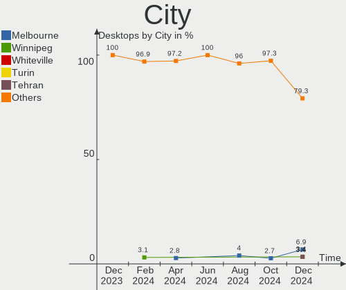
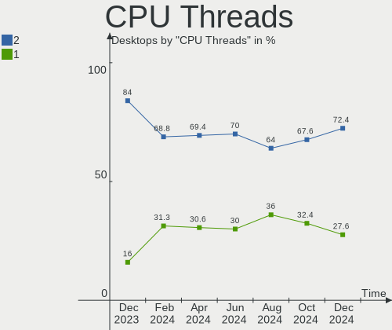
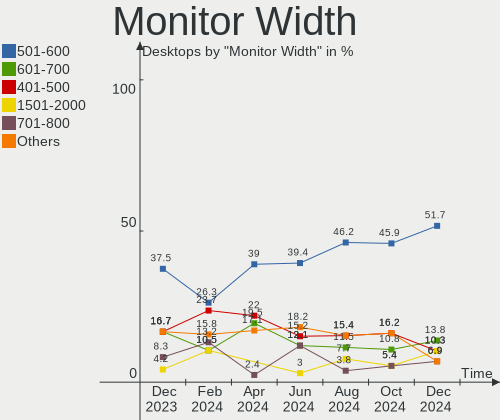
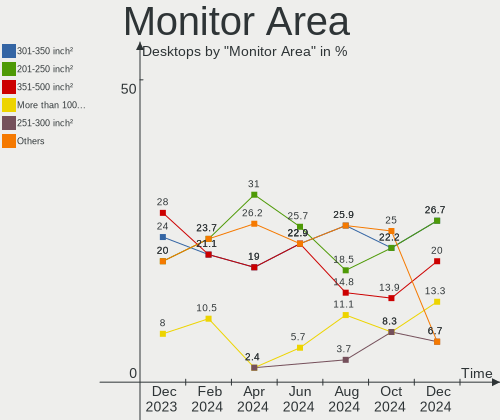
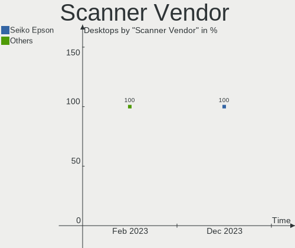

KDE neon Hardware Trends (Desktop)
----------------------------------

A project to identify most popular hardware characteristics and track their change
over time based on data collected by KDE neon users at https://Linux-Hardware.org.

Anyone can contribute to the study by uploading probes of their computers by
the [hw-probe](https://github.com/linuxhw/hw-probe) tool:

    sudo -E hw-probe -all -upload

Full-feature report is available here: https://linux-hardware.org/?view=trends&formfactor=desktop

Period: Oct, 2020.

Contents
--------

- [ OS                       ](#os)
- [ OS Family                ](#os-family)
- [ Kernel                   ](#kernel)
- [ Kernel Family            ](#kernel-family)
- [ Kernel Major Ver.        ](#kernel-major-ver)
- [ Arch                     ](#arch)
- [ DE                       ](#de)
- [ Display Server           ](#display-server)
- [ Display Manager          ](#display-manager)
- [ OS Lang                  ](#os-lang)
- [ Boot Mode                ](#boot-mode)
- [ Filesystem               ](#filesystem)
- [ Part. scheme             ](#part-scheme)
- [ Dual Boot with Linux/BSD ](#dual-boot-with-linux/bsd)
- [ Dual Boot (Win)          ](#dual-boot-win)
- [ Country                  ](#country)
- [ City                     ](#city)
- [ Vendor                   ](#vendor)
- [ Model                    ](#model)
- [ Model Family             ](#model-family)
- [ MFG Year                 ](#mfg-year)
- [ Form Factor              ](#form-factor)
- [ Secure Boot              ](#secure-boot)
- [ Coreboot                 ](#coreboot)
- [ RAM Size                 ](#ram-size)
- [ RAM Used                 ](#ram-used)
- [ Has CD-ROM               ](#has-cd-rom)
- [ Total Drives             ](#total-drives)
- [ Has Ethernet             ](#has-ethernet)
- [ Drive Vendor             ](#drive-vendor)
- [ HDD Vendor               ](#hdd-vendor)
- [ SSD Vendor               ](#ssd-vendor)
- [ Drive Model              ](#drive-model)
- [ Drive Kind               ](#drive-kind)
- [ Drive Connector          ](#drive-connector)
- [ Drive Size               ](#drive-size)
- [ Space Total              ](#space-total)
- [ Space Used               ](#space-used)
- [ Malfunc. Drives          ](#malfunc-drives)
- [ Malfunc. Drive Vendor    ](#malfunc-drive-vendor)
- [ Malfunc. HDD Vendor      ](#malfunc-hdd-vendor)
- [ Malfunc. Drive Kind      ](#malfunc-drive-kind)
- [ Failed Drives            ](#failed-drives)
- [ Failed Drive Vendor      ](#failed-drive-vendor)
- [ Drive Status             ](#drive-status)
- [ Storage Vendor           ](#storage-vendor)
- [ Storage Model            ](#storage-model)
- [ Storage Kind             ](#storage-kind)
- [ CPU Vendor               ](#cpu-vendor)
- [ CPU Model                ](#cpu-model)
- [ CPU Model Family         ](#cpu-model-family)
- [ CPU Cores                ](#cpu-cores)
- [ CPU Sockets              ](#cpu-sockets)
- [ CPU Threads              ](#cpu-threads)
- [ CPU Op-Modes             ](#cpu-op-modes)
- [ CPU Microcode            ](#cpu-microcode)
- [ CPU Microarch            ](#cpu-microarch)
- [ GPU Vendor               ](#gpu-vendor)
- [ GPU Model                ](#gpu-model)
- [ GPU Combo                ](#gpu-combo)
- [ GPU Driver               ](#gpu-driver)
- [ GPU Memory               ](#gpu-memory)
- [ Monitor Vendor           ](#monitor-vendor)
- [ Monitor Model            ](#monitor-model)
- [ Monitor Resolution       ](#monitor-resolution)
- [ Monitor Diagonal         ](#monitor-diagonal)
- [ Monitor Width            ](#monitor-width)
- [ Aspect Ratio             ](#aspect-ratio)
- [ Monitor Area             ](#monitor-area)
- [ Pixel Density            ](#pixel-density)
- [ Multiple Monitors        ](#multiple-monitors)
- [ Net Controller Vendor    ](#net-controller-vendor)
- [ Net Controller Model     ](#net-controller-model)
- [ Wireless Vendor          ](#wireless-vendor)
- [ Wireless Model           ](#wireless-model)
- [ Ethernet Vendor          ](#ethernet-vendor)
- [ Ethernet Model           ](#ethernet-model)
- [ Net Controller Kind      ](#net-controller-kind)
- [ Used Controller          ](#used-controller)
- [ NICs                     ](#nics)
- [ Memory Vendor            ](#memory-vendor)
- [ Memory Model             ](#memory-model)
- [ Memory Kind              ](#memory-kind)
- [ Memory Form Factor       ](#memory-form-factor)
- [ Memory Size              ](#memory-size)
- [ Memory Speed             ](#memory-speed)
- [ Sound Vendor             ](#sound-vendor)
- [ Sound Model              ](#sound-model)
- [ Camera Vendor            ](#camera-vendor)
- [ Camera Model             ](#camera-model)
- [ Fingerprint Vendor       ](#fingerprint-vendor)
- [ Fingerprint Model        ](#fingerprint-model)
- [ Chipcard Vendor          ](#chipcard-vendor)
- [ Chipcard Model           ](#chipcard-model)
- [ Printer Vendor           ](#printer-vendor)
- [ Printer Model            ](#printer-model)
- [ Scanner Vendor           ](#scanner-vendor)
- [ Scanner Model            ](#scanner-model)
- [ Bluetooth Vendor         ](#bluetooth-vendor)
- [ Bluetooth Model          ](#bluetooth-model)
- [ Unsupported Devices      ](#unsupported-devices)
- [ Unsupported Device Types ](#unsupported-device-types)

OS
--

Installed operating systems

| Name           | Desktops | Percent |
|----------------|----------|---------|
| KDE neon 20.04 | 49       | 100%    |

OS Family
---------

OS without a version

| Name     | Desktops | Percent |
|----------|----------|---------|
| KDE neon | 49       | 100%    |

Kernel
------

Version of the Linux kernel

| Version          | Desktops | Percent |
|------------------|----------|---------|
| 5.4.0-52-generic | 21       | 42.86%  |
| 5.4.0-51-generic | 14       | 28.57%  |
| 5.4.0-48-generic | 10       | 20.41%  |
| 5.8.16-va2042    | 1        | 2.04%   |
| 5.8.14-xanmod1   | 1        | 2.04%   |
| 5.8.0-25-generic | 1        | 2.04%   |
| 5.4.0-49-generic | 1        | 2.04%   |

Kernel Family
-------------

Linux kernel without a distro release

| Version | Desktops | Percent |
|---------|----------|---------|
| 5.4.0   | 46       | 93.88%  |
| 5.8.16  | 1        | 2.04%   |
| 5.8.14  | 1        | 2.04%   |
| 5.8.0   | 1        | 2.04%   |

Kernel Major Ver.
-----------------

Linux kernel major version

| Version | Desktops | Percent |
|---------|----------|---------|
| 5.4     | 46       | 93.88%  |
| 5.8     | 3        | 6.12%   |

Arch
----

OS architecture (x86_64, i586, etc.)

| Name   | Desktops | Percent |
|--------|----------|---------|
| x86_64 | 49       | 100%    |

DE
--

Desktop Environment

| Name  | Desktops | Percent |
|-------|----------|---------|
| KDE   | 38       | 77.55%  |
| KDE5  | 10       | 20.41%  |
| GNOME | 1        | 2.04%   |

Display Server
--------------

X11 or Wayland

| Name    | Desktops | Percent |
|---------|----------|---------|
| X11     | 47       | 95.92%  |
| Wayland | 1        | 2.04%   |
| Tty     | 1        | 2.04%   |

Display Manager
---------------

SDDM, LightDM, etc.

| Name    | Desktops | Percent |
|---------|----------|---------|
| Unknown | 39       | 79.59%  |
| SDDM    | 10       | 20.41%  |

OS Lang
-------

Language

| Lang  | Desktops | Percent |
|-------|----------|---------|
| en_US | 12       | 24.49%  |
| de_DE | 6        | 12.24%  |
| en_GB | 5        | 10.2%   |
| pt_BR | 4        | 8.16%   |
| ru_RU | 3        | 6.12%   |
| en_AU | 3        | 6.12%   |
| uk_UA | 2        | 4.08%   |
| en_CA | 2        | 4.08%   |
| C     | 2        | 4.08%   |
| sk_SK | 1        | 2.04%   |
| ro_RO | 1        | 2.04%   |
| fr_FR | 1        | 2.04%   |
| es_ES | 1        | 2.04%   |
| es_CL | 1        | 2.04%   |
| es_AR | 1        | 2.04%   |
| en_IN | 1        | 2.04%   |
| en_IE | 1        | 2.04%   |
| de_AT | 1        | 2.04%   |
| cs_CZ | 1        | 2.04%   |

Boot Mode
---------

EFI or BIOS

| Mode | Desktops | Percent |
|------|----------|---------|
| EFI  | 26       | 53.06%  |
| BIOS | 23       | 46.94%  |

Filesystem
----------

Type of filesystem

| Type  | Desktops | Percent |
|-------|----------|---------|
| Ext4  | 46       | 93.88%  |
| Btrfs | 2        | 4.08%   |
| Zfs   | 1        | 2.04%   |

Part. scheme
------------

Scheme of partitioning

| Type    | Desktops | Percent |
|---------|----------|---------|
| Unknown | 39       | 79.59%  |
| GPT     | 7        | 14.29%  |
| MBR     | 3        | 6.12%   |

Dual Boot with Linux/BSD
------------------------

Hosting more than one Linux/BSD

| Dual boot | Desktops | Percent |
|-----------|----------|---------|
| No        | 42       | 85.71%  |
| Yes       | 7        | 14.29%  |

Dual Boot (Win)
---------------

Hosting Linux and Windows

| Dual boot | Desktops | Percent |
|-----------|----------|---------|
| No        | 40       | 81.63%  |
| Yes       | 9        | 18.37%  |

Country
-------

Geographic location (country)

| Country        | Desktops | Percent |
|----------------|----------|---------|
| USA            | 7        | 14.29%  |
| Germany        | 6        | 12.24%  |
| Brazil         | 5        | 10.2%   |
| UK             | 4        | 8.16%   |
| Ukraine        | 3        | 6.12%   |
| Russia         | 3        | 6.12%   |
| Australia      | 3        | 6.12%   |
| Spain          | 2        | 4.08%   |
| Czech Republic | 2        | 4.08%   |
| Canada         | 2        | 4.08%   |
| Sweden         | 1        | 2.04%   |
| Slovakia       | 1        | 2.04%   |
| Romania        | 1        | 2.04%   |
| Philippines    | 1        | 2.04%   |
| Ireland        | 1        | 2.04%   |
| India          | 1        | 2.04%   |
| Greece         | 1        | 2.04%   |
| France         | 1        | 2.04%   |
| Chile          | 1        | 2.04%   |
| Austria        | 1        | 2.04%   |
| Armenia        | 1        | 2.04%   |
| Argentina      | 1        | 2.04%   |

City
----

Geographic location (city)

| City                 | Desktops | Percent |
|----------------------|----------|---------|
| São Paulo           | 2        | 4.08%   |
| Reading              | 2        | 4.08%   |
| Madrid               | 2        | 4.08%   |
| Yerevan              | 1        | 2.04%   |
| Woodbridge           | 1        | 2.04%   |
| Wetzlar              | 1        | 2.04%   |
| Vaihingen an der Enz | 1        | 2.04%   |
| Turlock              | 1        | 2.04%   |
| Timișoara           | 1        | 2.04%   |
| Thonon-les-Bains     | 1        | 2.04%   |
| Sunderland           | 1        | 2.04%   |
| Quezon City          | 1        | 2.04%   |
| Prague               | 1        | 2.04%   |
| Patna                | 1        | 2.04%   |
| Osasco               | 1        | 2.04%   |
| Nashville            | 1        | 2.04%   |
| Murino               | 1        | 2.04%   |
| Moscow               | 1        | 2.04%   |
| Melbourne            | 1        | 2.04%   |
| Lviv                 | 1        | 2.04%   |
| Kyiv                 | 1        | 2.04%   |
| Kitchener            | 1        | 2.04%   |
| Hixson               | 1        | 2.04%   |
| Hawthorn             | 1        | 2.04%   |
| Guarulhos            | 1        | 2.04%   |
| Fort St. John        | 1        | 2.04%   |
| Düsseldorf          | 1        | 2.04%   |
| Drogheda             | 1        | 2.04%   |
| Dortmund             | 1        | 2.04%   |
| Dnipro               | 1        | 2.04%   |
| Diadema              | 1        | 2.04%   |
| Columbus             | 1        | 2.04%   |
| Cobleskill           | 1        | 2.04%   |
| Chelyabinsk          | 1        | 2.04%   |
| Buenos Aires         | 1        | 2.04%   |
| Brno                 | 1        | 2.04%   |
| Bridgend             | 1        | 2.04%   |
| Braunau am Inn       | 1        | 2.04%   |
| Bratislava           | 1        | 2.04%   |
| Birmingham           | 1        | 2.04%   |
| Bentleigh East       | 1        | 2.04%   |
| Augsburg             | 1        | 2.04%   |
| Athens               | 1        | 2.04%   |
| Antofagasta          | 1        | 2.04%   |
| Alperstedt           | 1        | 2.04%   |
| AElvsbyn             | 1        | 2.04%   |

Vendor
------

Motherboard manufacturer

| Name                | Desktops | Percent |
|---------------------|----------|---------|
| ASUSTek Computer    | 14       | 28.57%  |
| MSI                 | 8        | 16.33%  |
| ASRock              | 6        | 12.24%  |
| Gigabyte Technology | 4        | 8.16%   |
| Dell                | 4        | 8.16%   |
| Pegatron            | 2        | 4.08%   |
| Intel               | 2        | 4.08%   |
| Hewlett-Packard     | 2        | 4.08%   |
| Unknown             | 2        | 4.08%   |
| Jingsha/Kllisre     | 1        | 2.04%   |
| Biostar             | 1        | 2.04%   |
| BESSTAR Tech        | 1        | 2.04%   |
| Alienware           | 1        | 2.04%   |
| Acer                | 1        | 2.04%   |

Model
-----

Motherboard model

| Name                                | Desktops | Percent |
|-------------------------------------|----------|---------|
| ASUS All Series                     | 3        | 6.12%   |
| Unknown                             | 2        | 4.08%   |
| Pegatron p7-1030                    | 1        | 2.04%   |
| Pegatron IPMSB-H61                  | 1        | 2.04%   |
| MSI MS-7B86                         | 1        | 2.04%   |
| MSI MS-7B79                         | 1        | 2.04%   |
| MSI MS-7B17                         | 1        | 2.04%   |
| MSI MS-7A33                         | 1        | 2.04%   |
| MSI MS-7982                         | 1        | 2.04%   |
| MSI MS-7895                         | 1        | 2.04%   |
| MSI MS-7623                         | 1        | 2.04%   |
| MSI MS-7502                         | 1        | 2.04%   |
| Jingsha/Kllisre X99 Beta 2.0407     | 1        | 2.04%   |
| Intel H55                           | 1        | 2.04%   |
| Intel DH61SA AAG38870-201           | 1        | 2.04%   |
| HP EliteDesk 800 G1 SFF             | 1        | 2.04%   |
| HP Compaq dc7800p Small Form Factor | 1        | 2.04%   |
| Gigabyte X570 UD                    | 1        | 2.04%   |
| Gigabyte H81M-DS2                   | 1        | 2.04%   |
| Gigabyte H310M H 2.0                | 1        | 2.04%   |
| Gigabyte GA-990XA-UD3               | 1        | 2.04%   |
| Dell XPS 8300                       | 1        | 2.04%   |
| Dell OptiPlex 7010                  | 1        | 2.04%   |
| Dell OptiPlex 3020                  | 1        | 2.04%   |
| Dell Inspiron 531                   | 1        | 2.04%   |
| Biostar B350GT3                     | 1        | 2.04%   |
| BESSTAR Tech U800                   | 1        | 2.04%   |
| ASUS ROG STRIX X470-F GAMING        | 1        | 2.04%   |
| ASUS ROG STRIX B460-I GAMING        | 1        | 2.04%   |
| ASUS ROG STRIX B450-F GAMING        | 1        | 2.04%   |
| ASUS ROG CROSSHAIR VIII HERO        | 1        | 2.04%   |
| ASUS Rampage Formula                | 1        | 2.04%   |
| ASUS P8H77-M PRO                    | 1        | 2.04%   |
| ASUS P8H61-M LE/BR                  | 1        | 2.04%   |
| ASUS P8B75-M LX PLUS                | 1        | 2.04%   |
| ASUS M5A97 LE R2.0                  | 1        | 2.04%   |
| ASUS M5A78L-M/USB3                  | 1        | 2.04%   |
| ASUS A68HM-PLUS                     | 1        | 2.04%   |
| ASRock X570 Phantom Gaming 4S       | 1        | 2.04%   |
| ASRock X470 Taichi Ultimate         | 1        | 2.04%   |
| ASRock FM2A75 Pro4                  | 1        | 2.04%   |
| ASRock B85 Anniversary              | 1        | 2.04%   |
| ASRock B450M Pro4                   | 1        | 2.04%   |
| ASRock A320M Pro4                   | 1        | 2.04%   |
| Alienware Aurora Ryzen Edition      | 1        | 2.04%   |
| Acer Aspire TC-895                  | 1        | 2.04%   |

Model Family
------------

Motherboard model prefix

| Name                  | Desktops | Percent |
|-----------------------|----------|---------|
| ASUS ROG              | 4        | 8.16%   |
| ASUS All              | 3        | 6.12%   |
| Dell OptiPlex         | 2        | 4.08%   |
| Unknown               | 2        | 4.08%   |
| Pegatron p7-1030      | 1        | 2.04%   |
| Pegatron IPMSB-H61    | 1        | 2.04%   |
| MSI MS-7B86           | 1        | 2.04%   |
| MSI MS-7B79           | 1        | 2.04%   |
| MSI MS-7B17           | 1        | 2.04%   |
| MSI MS-7A33           | 1        | 2.04%   |
| MSI MS-7982           | 1        | 2.04%   |
| MSI MS-7895           | 1        | 2.04%   |
| MSI MS-7623           | 1        | 2.04%   |
| MSI MS-7502           | 1        | 2.04%   |
| Jingsha/Kllisre X99   | 1        | 2.04%   |
| Intel H55             | 1        | 2.04%   |
| Intel DH61SA          | 1        | 2.04%   |
| HP EliteDesk          | 1        | 2.04%   |
| HP Compaq             | 1        | 2.04%   |
| Gigabyte X570         | 1        | 2.04%   |
| Gigabyte H81M-DS2     | 1        | 2.04%   |
| Gigabyte H310M        | 1        | 2.04%   |
| Gigabyte GA-990XA-UD3 | 1        | 2.04%   |
| Dell XPS              | 1        | 2.04%   |
| Dell Inspiron         | 1        | 2.04%   |
| Biostar B350GT3       | 1        | 2.04%   |
| BESSTAR Tech U800     | 1        | 2.04%   |
| ASUS Rampage          | 1        | 2.04%   |
| ASUS P8H77-M          | 1        | 2.04%   |
| ASUS P8H61-M          | 1        | 2.04%   |
| ASUS P8B75-M          | 1        | 2.04%   |
| ASUS M5A97            | 1        | 2.04%   |
| ASUS M5A78L-M         | 1        | 2.04%   |
| ASUS A68HM-PLUS       | 1        | 2.04%   |
| ASRock X570           | 1        | 2.04%   |
| ASRock X470           | 1        | 2.04%   |
| ASRock FM2A75         | 1        | 2.04%   |
| ASRock B85            | 1        | 2.04%   |
| ASRock B450M          | 1        | 2.04%   |
| ASRock A320M          | 1        | 2.04%   |
| Alienware Aurora      | 1        | 2.04%   |
| Acer Aspire           | 1        | 2.04%   |

MFG Year
--------

Motherboard manufacture year

| Year | Desktops | Percent |
|------|----------|---------|
| 2019 | 9        | 18.37%  |
| 2020 | 8        | 16.33%  |
| 2018 | 6        | 12.24%  |
| 2014 | 5        | 10.2%   |
| 2017 | 4        | 8.16%   |
| 2011 | 4        | 8.16%   |
| 2016 | 3        | 6.12%   |
| 2012 | 3        | 6.12%   |
| 2010 | 3        | 6.12%   |
| 2013 | 2        | 4.08%   |
| 2015 | 1        | 2.04%   |
| 2009 | 1        | 2.04%   |

Form Factor
-----------

Physical design of the computer

| Name    | Desktops | Percent |
|---------|----------|---------|
| Desktop | 49       | 100%    |

Secure Boot
-----------

Enabled or disabled

| State    | Desktops | Percent |
|----------|----------|---------|
| Disabled | 48       | 97.96%  |
| Enabled  | 1        | 2.04%   |

Coreboot
--------

Have coreboot on board

| Used | Desktops | Percent |
|------|----------|---------|
| No   | 49       | 100%    |

RAM Size
--------

Total RAM memory

| Size in GB  | Desktops | Percent |
|-------------|----------|---------|
| 16.01-24.0  | 17       | 34.69%  |
| 8.01-16.0   | 15       | 30.61%  |
| 3.01-4.0    | 6        | 12.24%  |
| 32.01-64.0  | 5        | 10.2%   |
| 4.01-8.0    | 4        | 8.16%   |
| 64.01-256.0 | 2        | 4.08%   |

RAM Used
--------

Used RAM memory

| Used GB   | Desktops | Percent |
|-----------|----------|---------|
| 1.01-2.0  | 19       | 38.78%  |
| 2.01-3.0  | 16       | 32.65%  |
| 3.01-4.0  | 6        | 12.24%  |
| 4.01-8.0  | 5        | 10.2%   |
| 8.01-16.0 | 2        | 4.08%   |
| 0.01-1.0  | 1        | 2.04%   |

Has CD-ROM
----------

Has CD-ROM on board

| Presented | Desktops | Percent |
|-----------|----------|---------|
| No        | 30       | 61.22%  |
| Yes       | 19       | 38.78%  |

Total Drives
------------

Number of drives on board

| Drives | Desktops | Percent |
|--------|----------|---------|
| 1      | 18       | 36.73%  |
| 2      | 12       | 24.49%  |
| 3      | 8        | 16.33%  |
| 4      | 6        | 12.24%  |
| 5      | 3        | 6.12%   |
| 10     | 1        | 2.04%   |
| 0      | 1        | 2.04%   |

Has Ethernet
------------

Has Ethernet on board

| Presented | Desktops | Percent |
|-----------|----------|---------|
| Yes       | 47       | 95.92%  |
| No        | 2        | 4.08%   |

Drive Vendor
------------

Hard drive vendors

| Vendor                    | Desktops | Drives | Percent |
|---------------------------|----------|--------|---------|
| WDC                       | 21       | 29     | 22.83%  |
| Seagate                   | 16       | 21     | 17.39%  |
| Samsung Electronics       | 12       | 17     | 13.04%  |
| Kingston                  | 9        | 10     | 9.78%   |
| Sandisk                   | 8        | 10     | 8.7%    |
| Crucial                   | 6        | 8      | 6.52%   |
| Toshiba                   | 5        | 5      | 5.43%   |
| Hitachi                   | 3        | 3      | 3.26%   |
| China                     | 2        | 2      | 2.17%   |
| A-DATA Technology         | 2        | 2      | 2.17%   |
| Unknown                   | 1        | 1      | 1.09%   |
| Realtek Semiconductor     | 1        | 1      | 1.09%   |
| PNY                       | 1        | 1      | 1.09%   |
| Phison                    | 1        | 1      | 1.09%   |
| OCZ                       | 1        | 1      | 1.09%   |
| Micron/Crucial Technology | 1        | 1      | 1.09%   |
| Intel                     | 1        | 1      | 1.09%   |
| Hoodisk                   | 1        | 1      | 1.09%   |

HDD Vendor
----------

Hard disk drive vendors

| Vendor              | Desktops | Drives | Percent |
|---------------------|----------|--------|---------|
| WDC                 | 20       | 26     | 44.44%  |
| Seagate             | 15       | 19     | 33.33%  |
| Toshiba             | 5        | 5      | 11.11%  |
| Hitachi             | 3        | 3      | 6.67%   |
| Samsung Electronics | 2        | 2      | 4.44%   |

SSD Vendor
----------

Solid state drive vendors

| Vendor              | Desktops | Drives | Percent |
|---------------------|----------|--------|---------|
| Kingston            | 9        | 10     | 22.5%   |
| Samsung Electronics | 8        | 10     | 20%     |
| SanDisk             | 6        | 8      | 15%     |
| Crucial             | 6        | 8      | 15%     |
| WDC                 | 2        | 2      | 5%      |
| China               | 2        | 2      | 5%      |
| A-DATA Technology   | 2        | 2      | 5%      |
| PNY                 | 1        | 1      | 2.5%    |
| Phison              | 1        | 1      | 2.5%    |
| OCZ                 | 1        | 1      | 2.5%    |
| Intel               | 1        | 1      | 2.5%    |
| Hoodisk             | 1        | 1      | 2.5%    |

Drive Model
-----------

Hard drive models

| Model                        | Desktops | Percent |
|------------------------------|----------|---------|
| SSD 860 EVO 500GB            | 4        | 3.57%   |
| NVMe SSD Drive 512GB         | 3        | 2.68%   |
| WD30EZRX-00D8PB0 3TB         | 2        | 1.79%   |
| ST500DM002-1BD142 500GB      | 2        | 1.79%   |
| ST4000DM004-2CV104 4TB       | 2        | 1.79%   |
| ST31000528AS 1TB             | 2        | 1.79%   |
| ST1000DM003-9YN162 1TB       | 2        | 1.79%   |
| NVMe SSD Drive 500GB         | 2        | 1.79%   |
| NVMe SSD Drive 1TB           | 2        | 1.79%   |
| HDS721010CLA332 1TB          | 2        | 1.79%   |
| CT1000MX500SSD1 1TB          | 2        | 1.79%   |
| WDS500G3X0C-00SJG0 500GB     | 1        | 0.89%   |
| WDS500G1B0B-00AS40 500GB SSD | 1        | 0.89%   |
| WDS250G2B0B-00YS70 250GB SSD | 1        | 0.89%   |
| WD80EZAZ-11TDBA0 8TB         | 1        | 0.89%   |
| WD60EZRZ-11TNUB0 6TB         | 1        | 0.89%   |
| WD60EZRZ-00GZ5B1 6TB         | 1        | 0.89%   |
| WD6003FZBX-00K5WB0 6TB       | 1        | 0.89%   |
| WD5000AZRX-00A8LB0 500GB     | 1        | 0.89%   |
| WD5000AAKX-00ERMA0 500GB     | 1        | 0.89%   |
| WD5000AADS-00S9B0 500GB      | 1        | 0.89%   |
| WD40EZRZ-75GXCB0 4TB         | 1        | 0.89%   |
| WD40EZRZ-22GXCB0 4TB         | 1        | 0.89%   |
| WD40EZRX-00SPEB0 4TB         | 1        | 0.89%   |
| WD3200AAKS-00UU3A0 320GB     | 1        | 0.89%   |
| WD3200AAKS-00B3A0 320GB      | 1        | 0.89%   |
| WD2500JD-22HBB0 250GB        | 1        | 0.89%   |
| WD2500AAJS-00VTA0 250GB      | 1        | 0.89%   |
| WD20EADS-00R6B0 2TB          | 1        | 0.89%   |
| WD10JPVT-22A1YT0 1TB         | 1        | 0.89%   |
| WD10EZEX-75WN4A1 1TB         | 1        | 0.89%   |
| WD10EZEX-00M2NA0 1TB         | 1        | 0.89%   |
| WD10EARX-00N0YB0 1TB         | 1        | 0.89%   |
| WD10EARS-00Y5B1 1TB          | 1        | 0.89%   |
| WD10EADS-65M2B0 1TB          | 1        | 0.89%   |
| WD10EADS-65L5B1 1TB          | 1        | 0.89%   |
| Ultra II 480GB SSD           | 1        | 0.89%   |
| TRION100 120GB SSD           | 1        | 0.89%   |
| SV300S37A480G 480GB SSD      | 1        | 0.89%   |
| SV300S37A120G 120GB SSD      | 1        | 0.89%   |
| SUV400S37120G 120GB SSD      | 1        | 0.89%   |
| SUV300S37A240G 240GB SSD     | 1        | 0.89%   |
| SU650 240GB SSD              | 1        | 0.89%   |
| ST950042 3AS 500GB           | 1        | 0.89%   |
| ST3500312CS 500GB            | 1        | 0.89%   |
| ST3360320AS 360GB            | 1        | 0.89%   |
| ST3250410AS 250GB            | 1        | 0.89%   |
| ST2000LX001-1RG174 2TB       | 1        | 0.89%   |
| ST2000DM001-9YN164 2TB       | 1        | 0.89%   |
| ST1000DM010-2EP102 1TB       | 1        | 0.89%   |
| ST1000DM003-1SB102 1TB       | 1        | 0.89%   |
| ST1000DL002-9TT153 1TB       | 1        | 0.89%   |
| SSDSA2M080G2GC 80GB          | 1        | 0.89%   |
| SSD PLUS 480GB               | 1        | 0.89%   |
| SSD PLUS 240GB               | 1        | 0.89%   |
| SSD PLUS 1000GB              | 1        | 0.89%   |
| SSD 860 PRO 512GB            | 1        | 0.89%   |
| SSD 860 EVO 250GB            | 1        | 0.89%   |
| SSD 860 EVO 1TB              | 1        | 0.89%   |
| SSD 850 EVO 500GB            | 1        | 0.89%   |

Drive Kind
----------

HDD or SSD

| Kind    | Desktops | Drives | Percent |
|---------|----------|--------|---------|
| HDD     | 33       | 55     | 43.42%  |
| SSD     | 32       | 47     | 42.11%  |
| NVMe    | 10       | 11     | 13.16%  |
| Unknown | 1        | 2      | 1.32%   |

Drive Connector
---------------

SATA, SAS, NVMe, etc.

| Type | Desktops | Drives | Percent |
|------|----------|--------|---------|
| SATA | 46       | 99     | 76.67%  |
| NVMe | 10       | 11     | 16.67%  |
| SAS  | 4        | 5      | 6.67%   |

Drive Size
----------

Size of hard drive

| Size in TB | Desktops | Drives | Percent |
|------------|----------|--------|---------|
| 0.01-0.5   | 37       | 54     | 52.11%  |
| 0.51-1.0   | 21       | 27     | 29.58%  |
| 3.01-4.0   | 4        | 6      | 5.63%   |
| 4.01-10.0  | 4        | 8      | 5.63%   |
| 1.01-2.0   | 3        | 4      | 4.23%   |
| 2.01-3.0   | 2        | 3      | 2.82%   |

Space Total
-----------

Amount of disk space available on the file system

| Size in GB     | Desktops | Percent |
|----------------|----------|---------|
| 251-500        | 12       | 24.49%  |
| 101-250        | 8        | 16.33%  |
| 1001-2000      | 7        | 14.29%  |
| 501-1000       | 7        | 14.29%  |
| More than 3000 | 6        | 12.24%  |
| 51-100         | 3        | 6.12%   |
| 21-50          | 2        | 4.08%   |
| 1-20           | 2        | 4.08%   |
| 2001-3000      | 1        | 2.04%   |
| Unknown        | 1        | 2.04%   |

Space Used
----------

Amount of used disk space

| Used GB        | Desktops | Percent |
|----------------|----------|---------|
| 1-20           | 23       | 46.94%  |
| 21-50          | 5        | 10.2%   |
| 1001-2000      | 5        | 10.2%   |
| More than 3000 | 4        | 8.16%   |
| 101-250        | 4        | 8.16%   |
| 251-500        | 3        | 6.12%   |
| 51-100         | 3        | 6.12%   |
| 501-1000       | 1        | 2.04%   |
| Unknown        | 1        | 2.04%   |

Malfunc. Drives
---------------

Drive models with a malfunction

| Model               | Desktops | Drives | Percent |
|---------------------|----------|--------|---------|
| HDS721010CLA332 1TB | 1        | 1      | 50%     |
| CT3500SC 500GB SSD  | 1        | 1      | 50%     |

Malfunc. Drive Vendor
---------------------

Vendors of faulty drives

| Vendor  | Desktops | Drives | Percent |
|---------|----------|--------|---------|
| Hitachi | 1        | 1      | 50%     |
| Crucial | 1        | 1      | 50%     |

Malfunc. HDD Vendor
-------------------

Vendors of faulty HDD drives

| Vendor  | Desktops | Drives | Percent |
|---------|----------|--------|---------|
| Hitachi | 1        | 1      | 100%    |

Malfunc. Drive Kind
-------------------

Kinds of faulty drives

| Kind | Desktops | Drives | Percent |
|------|----------|--------|---------|
| SSD  | 1        | 1      | 50%     |
| HDD  | 1        | 1      | 50%     |

Failed Drives
-------------

Failed drive models

Zero info for selected period =(

Failed Drive Vendor
-------------------

Failed drive vendors

Zero info for selected period =(

Drive Status
------------

Number of failed and malfunc. drives

| Status   | Desktops | Drives | Percent |
|----------|----------|--------|---------|
| Detected | 38       | 91     | 76%     |
| Works    | 10       | 22     | 20%     |
| Malfunc  | 2        | 2      | 4%      |

Storage Vendor
--------------

Storage controller vendors

| Vendor                      | Desktops | Percent |
|-----------------------------|----------|---------|
| Intel                       | 28       | 43.75%  |
| AMD                         | 20       | 31.25%  |
| Samsung Electronics         | 4        | 6.25%   |
| Sandisk                     | 3        | 4.69%   |
| JMicron Technology          | 2        | 3.13%   |
| ASMedia Technology          | 2        | 3.13%   |
| Realtek Semiconductor       | 1        | 1.56%   |
| Nvidia                      | 1        | 1.56%   |
| Micron/Crucial Technology   | 1        | 1.56%   |
| Kingston Technology Company | 1        | 1.56%   |
| ADATA Technology            | 1        | 1.56%   |

Storage Model
-------------

Storage controller models

| Model                                                                             | Desktops | Percent |
|-----------------------------------------------------------------------------------|----------|---------|
| FCH SATA Controller [AHCI mode]                                                   | 16       | 18.82%  |
| 8 Series/C220 Series Chipset Family 6-port SATA Controller 1 [AHCI mode]          | 7        | 8.24%   |
| 400 Series Chipset SATA Controller                                                | 6        | 7.06%   |
| NVMe SSD Controller SM981/PM981/PM983                                             | 4        | 4.71%   |
| 6 Series/C200 Series Chipset Family 6 port Desktop SATA AHCI Controller           | 4        | 4.71%   |
| SB7x0/SB8x0/SB9x0 IDE Controller                                                  | 3        | 3.53%   |
| 7 Series/C210 Series Chipset Family 6-port SATA Controller [AHCI mode]            | 3        | 3.53%   |
| WD Black 2019/PC SN750 NVMe SSD                                                   | 2        | 2.35%   |
| SB7x0/SB8x0/SB9x0 SATA Controller [IDE mode]                                      | 2        | 2.35%   |
| SB7x0/SB8x0/SB9x0 SATA Controller [AHCI mode]                                     | 2        | 2.35%   |
| JMB368 IDE controller                                                             | 2        | 2.35%   |
| ASM1062 Serial ATA Controller                                                     | 2        | 2.35%   |
| 82801IR/IO/IH (ICH9R/DO/DH) 4 port SATA Controller [IDE mode]                     | 2        | 2.35%   |
| 82801I (ICH9 Family) 2 port SATA Controller [IDE mode]                            | 2        | 2.35%   |
| 6 Series/C200 Series Chipset Family Desktop SATA Controller (IDE mode, ports 4-5) | 2        | 2.35%   |
| 6 Series/C200 Series Chipset Family Desktop SATA Controller (IDE mode, ports 0-3) | 2        | 2.35%   |
| 400 Series Chipset Family SATA AHCI Controller                                    | 2        | 2.35%   |
| XPG SX8200 Pro PCIe Gen3x4 M.2 2280 Solid State Drive                             | 1        | 1.18%   |
| X370 Series Chipset SATA Controller                                               | 1        | 1.18%   |
| WD Black 2018 / PC SN520 NVMe SSD                                                 | 1        | 1.18%   |
| Realtek Non-Volatile memory controller                                            | 1        | 1.18%   |
| Q170/Q150/B150/H170/H110/Z170/CM236 Chipset SATA Controller [AHCI Mode]           | 1        | 1.18%   |
| P1 NVMe PCIe SSD                                                                  | 1        | 1.18%   |
| NVMe SSD Controller SM961/PM961                                                   | 1        | 1.18%   |
| MCP61 SATA Controller                                                             | 1        | 1.18%   |
| MCP61 IDE                                                                         | 1        | 1.18%   |
| JMB363 SATA/IDE Controller                                                        | 1        | 1.18%   |
| FCH SATA Controller D                                                             | 1        | 1.18%   |
| FCH RAID Controller                                                               | 1        | 1.18%   |
| Digital HyperX Predator                                                           | 1        | 1.18%   |
| Cannon Point-LP SATA Controller [AHCI Mode]                                       | 1        | 1.18%   |
| Cannon Lake PCH SATA AHCI Controller                                              | 1        | 1.18%   |
| C610/X99 series chipset 6-Port SATA Controller [AHCI mode]                        | 1        | 1.18%   |
| Atom Processor E3800 Series SATA AHCI Controller                                  | 1        | 1.18%   |
| 82Q35 Express PT IDER Controller                                                  | 1        | 1.18%   |
| 82801IR/IO/IH (ICH9R/DO/DH) 6 port SATA Controller [AHCI mode]                    | 1        | 1.18%   |
| 5 Series/3400 Series Chipset 4 port SATA AHCI Controller                          | 1        | 1.18%   |
| 300 Series Chipset SATA Controller                                                | 1        | 1.18%   |
| 200 Series PCH SATA controller [AHCI mode]                                        | 1        | 1.18%   |

Storage Kind
------------

Kind of storage controller (IDE, SATA, NVMe, SAS, ...)

| Kind | Desktops | Percent |
|------|----------|---------|
| SATA | 44       | 68.75%  |
| NVMe | 10       | 15.63%  |
| IDE  | 9        | 14.06%  |
| RAID | 1        | 1.56%   |

CPU Vendor
----------

Processor vendors

| Vendor | Desktops | Percent |
|--------|----------|---------|
| Intel  | 28       | 57.14%  |
| AMD    | 21       | 42.86%  |

CPU Model
---------

Processor models

| Model                                         | Desktops | Percent |
|-----------------------------------------------|----------|---------|
| AMD Ryzen 9 3900X 12-Core Processor           | 3        | 6.12%   |
| Intel Core i5-4590 CPU @ 3.30GHz              | 2        | 4.08%   |
| Intel Core i5-10400F CPU @ 2.90GHz            | 2        | 4.08%   |
| Intel Core i3-3220 CPU @ 3.30GHz              | 2        | 4.08%   |
| Intel Core i3-2100 CPU @ 3.10GHz              | 2        | 4.08%   |
| AMD Ryzen 5 3600 6-Core Processor             | 2        | 4.08%   |
| AMD FX-8350 Eight-Core Processor              | 2        | 4.08%   |
| Intel Xeon CPU E5-2678 v3 @ 2.50GHz           | 1        | 2.04%   |
| Intel Pentium Gold G5400 CPU @ 3.70GHz        | 1        | 2.04%   |
| Intel Pentium CPU G3220 @ 3.00GHz             | 1        | 2.04%   |
| Intel Core i7-4790K CPU @ 4.00GHz             | 1        | 2.04%   |
| Intel Core i7-4790 CPU @ 3.60GHz              | 1        | 2.04%   |
| Intel Core i7-4770 CPU @ 3.40GHz              | 1        | 2.04%   |
| Intel Core i7-3770 CPU @ 3.40GHz              | 1        | 2.04%   |
| Intel Core i7-2600 CPU @ 3.40GHz              | 1        | 2.04%   |
| Intel Core i5-9400F CPU @ 2.90GHz             | 1        | 2.04%   |
| Intel Core i5-3475S CPU @ 2.90GHz             | 1        | 2.04%   |
| Intel Core i5-3470 CPU @ 3.20GHz              | 1        | 2.04%   |
| Intel Core i3-8145U CPU @ 2.10GHz             | 1        | 2.04%   |
| Intel Core i3-6100 CPU @ 3.70GHz              | 1        | 2.04%   |
| Intel Core i3-4170 CPU @ 3.70GHz              | 1        | 2.04%   |
| Intel Core i3-2120 CPU @ 3.30GHz              | 1        | 2.04%   |
| Intel Core i3 CPU 530 @ 2.93GHz               | 1        | 2.04%   |
| Intel Core 2 Quad CPU Q6600 @ 2.40GHz         | 1        | 2.04%   |
| Intel Core 2 Duo CPU E8400 @ 3.00GHz          | 1        | 2.04%   |
| Intel Core 2 Duo CPU E4400 @ 2.00GHz          | 1        | 2.04%   |
| Intel Celeron CPU J1900 @ 1.99GHz             | 1        | 2.04%   |
| AMD Ryzen 7 PRO 1700X Eight-Core Processor    | 1        | 2.04%   |
| AMD Ryzen 7 3700X 8-Core Processor            | 1        | 2.04%   |
| AMD Ryzen 7 2700X Eight-Core Processor        | 1        | 2.04%   |
| AMD Ryzen 7 1700 Eight-Core Processor         | 1        | 2.04%   |
| AMD Ryzen 5 2600X Six-Core Processor          | 1        | 2.04%   |
| AMD Ryzen 5 2600 Six-Core Processor           | 1        | 2.04%   |
| AMD Ryzen 5 2400G with Radeon Vega Graphics   | 1        | 2.04%   |
| AMD Ryzen 5 1600 Six-Core Processor           | 1        | 2.04%   |
| AMD FX-4170 Quad-Core Processor               | 1        | 2.04%   |
| AMD Athlon II X4 640 Processor                | 1        | 2.04%   |
| AMD Athlon 64 X2 Dual Core Processor 3800+    | 1        | 2.04%   |
| AMD A6-7400K Radeon R5, 6 Compute Cores 2C+4G | 1        | 2.04%   |
| AMD A4-4000 APU with Radeon HD Graphics       | 1        | 2.04%   |
| AMD A10-5800K APU with Radeon HD Graphics     | 1        | 2.04%   |

CPU Model Family
----------------

Processor model prefix

| Model              | Desktops | Percent |
|--------------------|----------|---------|
| Intel Core i3      | 9        | 18.37%  |
| Intel Core i5      | 7        | 14.29%  |
| AMD Ryzen 5        | 6        | 12.24%  |
| Intel Core i7      | 5        | 10.2%   |
| AMD Ryzen 9        | 3        | 6.12%   |
| AMD Ryzen 7        | 3        | 6.12%   |
| AMD FX             | 3        | 6.12%   |
| Intel Core 2 Duo   | 2        | 4.08%   |
| Intel Xeon         | 1        | 2.04%   |
| Intel Pentium Gold | 1        | 2.04%   |
| Intel Pentium      | 1        | 2.04%   |
| Intel Core 2 Quad  | 1        | 2.04%   |
| Intel Celeron      | 1        | 2.04%   |
| AMD Ryzen 7 PRO    | 1        | 2.04%   |
| AMD Athlon II X4   | 1        | 2.04%   |
| AMD Athlon 64 X2   | 1        | 2.04%   |
| AMD A6             | 1        | 2.04%   |
| AMD A4             | 1        | 2.04%   |
| AMD A10            | 1        | 2.04%   |

CPU Cores
---------

Number of processor cores

| Number | Desktops | Percent |
|--------|----------|---------|
| 2      | 16       | 32.65%  |
| 4      | 15       | 30.61%  |
| 6      | 8        | 16.33%  |
| 12     | 4        | 8.16%   |
| 8      | 4        | 8.16%   |
| 1      | 2        | 4.08%   |

CPU Sockets
-----------

Number of sockets

| Number | Desktops | Percent |
|--------|----------|---------|
| 1      | 49       | 100%    |

CPU Threads
-----------

Threads per core (Hyper-Threading)

| Number | Desktops | Percent |
|--------|----------|---------|
| 2      | 37       | 75.51%  |
| 1      | 12       | 24.49%  |

CPU Op-Modes
------------

CPU Operation Modes (32-bit, 64-bit)

| Op mode        | Desktops | Percent |
|----------------|----------|---------|
| 32-bit, 64-bit | 49       | 100%    |

CPU Microcode
-------------

Microcode number

| Number     | Desktops | Percent |
|------------|----------|---------|
| 0x306c3    | 7        | 14.29%  |
| 0x306a9    | 5        | 10.2%   |
| 0x206a7    | 4        | 8.16%   |
| 0x0800820d | 4        | 8.16%   |
| 0x08701021 | 3        | 6.12%   |
| 0x08701013 | 3        | 6.12%   |
| 0x06001119 | 2        | 4.08%   |
| 0x06000852 | 2        | 4.08%   |
| 0xa0655    | 1        | 2.04%   |
| 0xa0653    | 1        | 2.04%   |
| 0x906ed    | 1        | 2.04%   |
| 0x906ea    | 1        | 2.04%   |
| 0x806eb    | 1        | 2.04%   |
| 0x6fd      | 1        | 2.04%   |
| 0x6fb      | 1        | 2.04%   |
| 0x506e3    | 1        | 2.04%   |
| 0x306f2    | 1        | 2.04%   |
| 0x30678    | 1        | 2.04%   |
| 0x20655    | 1        | 2.04%   |
| 0x10676    | 1        | 2.04%   |
| 0x0810100b | 1        | 2.04%   |
| 0x08001138 | 1        | 2.04%   |
| 0x08001126 | 1        | 2.04%   |
| 0x06003106 | 1        | 2.04%   |
| 0x0600063e | 1        | 2.04%   |
| 0x010000c8 | 1        | 2.04%   |
| Unknown    | 1        | 2.04%   |

CPU Microarch
-------------

Microarchitecture

| Name        | Desktops | Percent |
|-------------|----------|---------|
| Haswell     | 8        | 16.33%  |
| Zen 2       | 6        | 12.24%  |
| IvyBridge   | 5        | 10.2%   |
| Zen+        | 4        | 8.16%   |
| SandyBridge | 4        | 8.16%   |
| Piledriver  | 4        | 8.16%   |
| Zen         | 3        | 6.12%   |
| KabyLake    | 3        | 6.12%   |
| Core        | 2        | 4.08%   |
| CometLake   | 2        | 4.08%   |
| Westmere    | 1        | 2.04%   |
| Steamroller | 1        | 2.04%   |
| Skylake     | 1        | 2.04%   |
| Silvermont  | 1        | 2.04%   |
| Penryn      | 1        | 2.04%   |
| K8 Hammer   | 1        | 2.04%   |
| K10         | 1        | 2.04%   |
| Bulldozer   | 1        | 2.04%   |

GPU Vendor
----------

Vendors of graphics cards

| Vendor | Desktops | Percent |
|--------|----------|---------|
| Nvidia | 26       | 50.98%  |
| AMD    | 14       | 27.45%  |
| Intel  | 11       | 21.57%  |

GPU Model
---------

Graphics card models

| Model                                                                 | Desktops | Percent |
|-----------------------------------------------------------------------|----------|---------|
| Ellesmere [Radeon RX 470/480/570/570X/580/580X/590]                   | 5        | 9.62%   |
| GP108 [GeForce GT 1030]                                               | 4        | 7.69%   |
| Xeon E3-1200 v2/3rd Gen Core processor Graphics Controller            | 3        | 5.77%   |
| Xeon E3-1200 v3/4th Gen Core Processor Integrated Graphics Controller | 2        | 3.85%   |
| TU117 [GeForce GTX 1650]                                              | 2        | 3.85%   |
| TU116 [GeForce GTX 1650 SUPER]                                        | 2        | 3.85%   |
| Navi 10 [Radeon RX 5600 OEM/5600 XT / 5700/5700 XT]                   | 2        | 3.85%   |
| GP107 [GeForce GTX 1050 Ti]                                           | 2        | 3.85%   |
| GP106 [GeForce GTX 1060 6GB]                                          | 2        | 3.85%   |
| 2nd Generation Core Processor Family Integrated Graphics Controller   | 2        | 3.85%   |
| UHD Graphics 620 (Whiskey Lake)                                       | 1        | 1.92%   |
| Turks PRO [Radeon HD 6570/7570/8550]                                  | 1        | 1.92%   |
| TU116 [GeForce GTX 1660]                                              | 1        | 1.92%   |
| TU116 [GeForce GTX 1660 SUPER]                                        | 1        | 1.92%   |
| TU106 [GeForce RTX 2060 SUPER]                                        | 1        | 1.92%   |
| TU104 [GeForce RTX 2080 SUPER]                                        | 1        | 1.92%   |
| TU102 [GeForce RTX 2080 Ti]                                           | 1        | 1.92%   |
| Pitcairn PRO [Radeon HD 7850 / R7 265 / R9 270 1024SP]                | 1        | 1.92%   |
| Oland XT [Radeon HD 8670 / R7 250/350]                                | 1        | 1.92%   |
| Juniper XT [Radeon HD 5770]                                           | 1        | 1.92%   |
| GT215 [GeForce GT 220]                                                | 1        | 1.92%   |
| GP107 [GeForce GTX 1050]                                              | 1        | 1.92%   |
| GP107 [GeForce GTX 1050 3GB]                                          | 1        | 1.92%   |
| GP104 [GeForce GTX 1080]                                              | 1        | 1.92%   |
| GP104 [GeForce GTX 1070]                                              | 1        | 1.92%   |
| GM204 [GeForce GTX 980]                                               | 1        | 1.92%   |
| GK208B [GeForce GT 730]                                               | 1        | 1.92%   |
| GK107 [NVS 510]                                                       | 1        | 1.92%   |
| GF108GL [Quadro 600]                                                  | 1        | 1.92%   |
| G94 [GeForce GT 140]                                                  | 1        | 1.92%   |
| Core Processor Integrated Graphics Controller                         | 1        | 1.92%   |
| Caicos PRO [Radeon HD 7450]                                           | 1        | 1.92%   |
| Barts PRO [Radeon HD 6850]                                            | 1        | 1.92%   |
| Baffin [Radeon RX 550 640SP / RX 560/560X]                            | 1        | 1.92%   |
| Atom Processor Z36xxx/Z37xxx Series Graphics & Display                | 1        | 1.92%   |
| 4th Generation Core Processor Family Integrated Graphics Controller   | 1        | 1.92%   |

GPU Combo
---------

Combinations of graphics cards

| Name       | Desktops | Percent |
|------------|----------|---------|
| 1 x Nvidia | 25       | 51.02%  |
| 1 x AMD    | 14       | 28.57%  |
| 1 x Intel  | 9        | 18.37%  |
| 2 x Nvidia | 1        | 2.04%   |

GPU Driver
----------

Free vs proprietary

| Driver      | Desktops | Percent |
|-------------|----------|---------|
| Free        | 35       | 71.43%  |
| Proprietary | 10       | 20.41%  |
| Unknown     | 4        | 8.16%   |

GPU Memory
----------

Total video memory

| Size in GB | Desktops | Percent |
|------------|----------|---------|
| Unknown    | 13       | 26.53%  |
| 1.01-2.0   | 10       | 20.41%  |
| 3.01-4.0   | 8        | 16.33%  |
| 7.01-8.0   | 7        | 14.29%  |
| 5.01-6.0   | 4        | 8.16%   |
| 0.51-1.0   | 3        | 6.12%   |
| 0.01-0.5   | 2        | 4.08%   |
| 2.01-3.0   | 1        | 2.04%   |
| 8.01-16.0  | 1        | 2.04%   |

Monitor Vendor
--------------

Monitor vendors

| Vendor               | Desktops | Percent |
|----------------------|----------|---------|
| Samsung Electronics  | 12       | 25.53%  |
| Dell                 | 5        | 10.64%  |
| Acer                 | 5        | 10.64%  |
| BenQ                 | 4        | 8.51%   |
| Philips              | 3        | 6.38%   |
| Ancor Communications | 3        | 6.38%   |
| Goldstar             | 2        | 4.26%   |
| ___                  | 1        | 2.13%   |
| Vizio                | 1        | 2.13%   |
| Vestel               | 1        | 2.13%   |
| Unknown              | 1        | 2.13%   |
| Panasonic            | 1        | 2.13%   |
| MStar                | 1        | 2.13%   |
| LG Electronics       | 1        | 2.13%   |
| Lenovo               | 1        | 2.13%   |
| Insignia             | 1        | 2.13%   |
| HPN                  | 1        | 2.13%   |
| Hewlett-Packard      | 1        | 2.13%   |
| Eizo                 | 1        | 2.13%   |
| CHR                  | 1        | 2.13%   |

Monitor Model
-------------

Monitor models

| Model                                               | Desktops | Percent |
|-----------------------------------------------------|----------|---------|
| XB271HU ACR0490 2560x1440 598x336mm 27.0-inch       | 1        | 1.92%   |
| W2452 GSM5694 1920x1200 518x324mm 24.1-inch         | 1        | 1.92%   |
| VC279 ACI27C4 1920x1080 598x336mm 27.0-inch         | 1        | 1.92%   |
| VA270H ACR0516 1920x1080 598x336mm 27.0-inch        | 1        | 1.92%   |
| U28E590 SAM0C4D 3840x2160 607x345mm 27.5-inch       | 1        | 1.92%   |
| U2718Q DELA0EC 3840x2160 609x349mm 27.6-inch        | 1        | 1.92%   |
| U2414H DELA0A2 1920x1080 527x296mm 23.8-inch        | 1        | 1.92%   |
| TV_MONITOR MST0030 1440x900 1150x650mm 52.0-inch    | 1        | 1.92%   |
| TV MEIC12B 1920x1080 698x392mm 31.5-inch            | 1        | 1.92%   |
| SyncMaster SAM060B 1920x1080 510x290mm 23.1-inch    | 1        | 1.92%   |
| SyncMaster SAM0579 1920x1080                        | 1        | 1.92%   |
| SyncMaster SAM03C2 1680x1050 459x296mm 21.5-inch    | 1        | 1.92%   |
| SyncMaster SAM037C 1680x1050 474x296mm 22.0-inch    | 1        | 1.92%   |
| SyncMaster SAM027F 1680x1050 474x296mm 22.0-inch    | 1        | 1.92%   |
| SMT24A550 SAM07B5 1920x1080 531x299mm 24.0-inch     | 1        | 1.92%   |
| SE2419HR DELF113 1920x1080 527x296mm 23.8-inch      | 1        | 1.92%   |
| S24E310 SAM0C2F 1920x1080 521x293mm 23.5-inch       | 1        | 1.92%   |
| S24E310 SAM0C2E 1920x1080 521x293mm 23.5-inch       | 1        | 1.92%   |
| S24D330 SAM0D92 1920x1080 531x299mm 24.0-inch       | 1        | 1.92%   |
| S24B350 SAM08DA 1920x1080 531x299mm 24.0-inch       | 1        | 1.92%   |
| S242HL ACR0216 1920x1080 531x299mm 24.0-inch        | 1        | 1.92%   |
| S2415H DELA0B5 1920x1080 527x296mm 23.8-inch        | 1        | 1.92%   |
| S23C350 SAM0A36 1920x1080 510x287mm 23.0-inch       | 1        | 1.92%   |
| PHL 328E9Q PHLC180 1920x1080 698x393mm 31.5-inch    | 1        | 1.92%   |
| PHL 276E8V PHLC18F 3840x2160 597x336mm 27.0-inch    | 1        | 1.92%   |
| NS43DR620NA18 BBY4373 3840x2160 800x450mm 36.1-inch | 1        | 1.92%   |
| LEN L171 LEN240B 1280x1024 337x270mm 17.0-inch      | 1        | 1.92%   |
| LCDTV16 ___0101 1600x1200 1600x900mm 72.3-inch      | 1        | 1.92%   |
| LCDTV14 0101 1360x768 1600x900mm 72.3-inch          | 1        | 1.92%   |
| LCD Monitor SyncMaster 1680x1050                    | 1        | 1.92%   |
| LCD Monitor SE2719HR 1920x1080                      | 1        | 1.92%   |
| LCD Monitor SAM0F13 3840x2160 1872x1053mm 84.6-inch | 1        | 1.92%   |
| LCD Monitor PHL 276E8V 3840x2160                    | 1        | 1.92%   |
| LCD Monitor HP 24m 1920x1080                        | 1        | 1.92%   |
| LCD Monitor GW2780 1920x1080                        | 1        | 1.92%   |
| LCD Monitor D2343 3840x1080                         | 1        | 1.92%   |
| LCD Monitor ASUS VS239                              | 1        | 1.92%   |
| LCD Monitor 48UHD_LCD_TV                            | 1        | 1.92%   |
| GW2760 BNQ78C6 1920x1080 598x336mm 27.0-inch        | 1        | 1.92%   |
| GW2283 BNQ78E9 1920x1080 480x270mm 21.7-inch        | 1        | 1.92%   |
| FTV PHL01EA 1920x1080 1440x810mm 65.0-inch          | 1        | 1.92%   |
| FS2331 ENC2213 1920x1080 510x287mm 23.0-inch        | 1        | 1.92%   |
| FP767-12 BNQ766E 1280x1024 338x270mm 17.0-inch      | 1        | 1.92%   |
| ED323QUR ACR067D 2560x1440 697x392mm 31.5-inch      | 1        | 1.92%   |
| EB321HQU ACR0507 2560x1440 699x393mm 31.6-inch      | 1        | 1.92%   |
| E601i-A3 VIZ0092 1920x1080 1329x748mm 60.0-inch     | 1        | 1.92%   |
| E2240 GSM57A3 1920x1080 477x268mm 21.5-inch         | 1        | 1.92%   |
| E2016HV DELF06E 1600x900 434x236mm 19.4-inch        | 1        | 1.92%   |
| ASUS VW193D ACI19D5 1440x900 408x255mm 18.9-inch    | 1        | 1.92%   |
| AIO-21.5"-10 CHR7511 1920x1080 476x268mm 21.5-inch  | 1        | 1.92%   |
| 27sv HWP3289 1920x1080 598x336mm 27.0-inch          | 1        | 1.92%   |
| 24EN43 GSM59DE 1920x1080 510x290mm 23.1-inch        | 1        | 1.92%   |

Monitor Resolution
------------------

Monitor screen resolution

| Resolution         | Desktops | Percent |
|--------------------|----------|---------|
| 1920x1080 (FHD)    | 27       | 56.25%  |
| 3840x2160 (4K)     | 6        | 12.5%   |
| 2560x1440 (QHD)    | 3        | 6.25%   |
| 1680x1050 (WSXGA+) | 3        | 6.25%   |
| 1280x1024 (SXGA)   | 2        | 4.17%   |
| Unknown            | 2        | 4.17%   |
| 3840x1080          | 1        | 2.08%   |
| 1920x1200 (WUXGA)  | 1        | 2.08%   |
| 1600x900 (HD+)     | 1        | 2.08%   |
| 1440x900 (WXGA+)   | 1        | 2.08%   |
| 1360x768           | 1        | 2.08%   |

Monitor Diagonal
----------------

Diagonal size in inches

| Inches  | Desktops | Percent |
|---------|----------|---------|
| 27      | 8        | 16.33%  |
| 24      | 8        | 16.33%  |
| Unknown | 7        | 14.29%  |
| 23      | 6        | 12.24%  |
| 31      | 4        | 8.16%   |
| 21      | 4        | 8.16%   |
| 22      | 2        | 4.08%   |
| 19      | 2        | 4.08%   |
| 17      | 2        | 4.08%   |
| 84      | 1        | 2.04%   |
| 72      | 1        | 2.04%   |
| 65      | 1        | 2.04%   |
| 60      | 1        | 2.04%   |
| 52      | 1        | 2.04%   |
| 36      | 1        | 2.04%   |

Monitor Width
-------------

Physical width

| Width in mm | Desktops | Percent |
|-------------|----------|---------|
| 501-600     | 20       | 40.82%  |
| 401-500     | 8        | 16.33%  |
| Unknown     | 7        | 14.29%  |
| 601-700     | 6        | 12.24%  |
| 1001-1500   | 3        | 6.12%   |
| 301-350     | 2        | 4.08%   |
| 1501-2000   | 2        | 4.08%   |
| 701-800     | 1        | 2.04%   |

Aspect Ratio
------------

Proportional relationship between the width and the height

| Ratio   | Desktops | Percent |
|---------|----------|---------|
| 16/9    | 31       | 68.89%  |
| 16/10   | 6        | 13.33%  |
| Unknown | 6        | 13.33%  |
| 5/4     | 2        | 4.44%   |

Monitor Area
------------

Area in inch²

| Area in inch² | Desktops | Percent |
|----------------|----------|---------|
| 201-250        | 18       | 36.73%  |
| 301-350        | 8        | 16.33%  |
| Unknown        | 7        | 14.29%  |
| More than 1000 | 5        | 10.2%   |
| 351-500        | 4        | 8.16%   |
| 251-300        | 2        | 4.08%   |
| 151-200        | 2        | 4.08%   |
| 141-150        | 2        | 4.08%   |
| 501-1000       | 1        | 2.04%   |

Pixel Density
-------------

Pixels per inch

| Density | Desktops | Percent |
|---------|----------|---------|
| 51-100  | 29       | 60.42%  |
| Unknown | 7        | 14.58%  |
| 1-50    | 4        | 8.33%   |
| 101-120 | 4        | 8.33%   |
| 121-160 | 3        | 6.25%   |
| 161-240 | 1        | 2.08%   |

Multiple Monitors
-----------------

Total monitors connected

| Total | Desktops | Percent |
|-------|----------|---------|
| 1     | 36       | 73.47%  |
| 2     | 8        | 16.33%  |
| 0     | 4        | 8.16%   |
| 3     | 1        | 2.04%   |

Net Controller Vendor
---------------------

Controller vendors

| Vendor                         | Desktops | Percent |
|--------------------------------|----------|---------|
| Realtek Semiconductor          | 33       | 46.48%  |
| Intel                          | 14       | 19.72%  |
| TP-Link                        | 4        | 5.63%   |
| Ralink Technology              | 4        | 5.63%   |
| Qualcomm Atheros               | 3        | 4.23%   |
| Broadcom Inc. and subsidiaries | 3        | 4.23%   |
| NetGear                        | 2        | 2.82%   |
| D-Link System                  | 2        | 2.82%   |
| Motorola PCS                   | 1        | 1.41%   |
| MediaTek                       | 1        | 1.41%   |
| Marvell Technology Group       | 1        | 1.41%   |
| IMC Networks                   | 1        | 1.41%   |
| D-Link                         | 1        | 1.41%   |
| Aquantia                       | 1        | 1.41%   |

Net Controller Model
--------------------

Controller models

| Model                                                                         | Desktops | Percent |
|-------------------------------------------------------------------------------|----------|---------|
| RTL8111/8168/8411 PCI Express Gigabit Ethernet Controller                     | 30       | 38.96%  |
| I211 Gigabit Network Connection                                               | 5        | 6.49%   |
| Wi-Fi 6 AX200                                                                 | 3        | 3.9%    |
| WNDA3100v1 802.11abgn [Atheros AR9170+AR9104]                                 | 1        | 1.3%    |
| Wireless-AC 9560 [Jefferson Peak]                                             | 1        | 1.3%    |
| Wireless Adapter                                                              | 1        | 1.3%    |
| Wireless                                                                      | 1        | 1.3%    |
| TL-WN823N v2/v3 [Realtek RTL8192EU]                                           | 1        | 1.3%    |
| TL-WN821N v5/v6 [RTL8192EU]                                                   | 1        | 1.3%    |
| RTL8812AE 802.11ac PCIe Wireless Network Adapter                              | 1        | 1.3%    |
| RTL8125 2.5GbE Controller                                                     | 1        | 1.3%    |
| RTL810xE PCI Express Fast Ethernet controller                                 | 1        | 1.3%    |
| RT2870/RT3070 Wireless Adapter                                                | 1        | 1.3%    |
| RT2501/RT2573 Wireless Adapter                                                | 1        | 1.3%    |
| QCA9377 802.11ac Wireless Network Adapter                                     | 1        | 1.3%    |
| NetLink BCM57788 Gigabit Ethernet PCIe                                        | 1        | 1.3%    |
| MT7610U ("Archer T2U" 2.4G+5G WLAN Adapter                                    | 1        | 1.3%    |
| MT7601U Wireless Adapter                                                      | 1        | 1.3%    |
| Moto C Plus                                                                   | 1        | 1.3%    |
| Killer E2600 Gigabit Ethernet Controller                                      | 1        | 1.3%    |
| Ethernet Connection I217-LM                                                   | 1        | 1.3%    |
| Ethernet Connection (7) I219-V                                                | 1        | 1.3%    |
| Ethernet Connection (12) I219-V                                               | 1        | 1.3%    |
| DWA-160 802.11abgn Xtreme N Dual Band Adapter(rev.A2) [Atheros AR9170+AR9104] | 1        | 1.3%    |
| Dual Band Wireless-AC 3168NGW [Stone Peak]                                    | 1        | 1.3%    |
| Cannon Point-LP CNVi [Wireless-AC]                                            | 1        | 1.3%    |
| BCM4360 802.11ac Wireless Network Adapter                                     | 1        | 1.3%    |
| BCM4352 802.11ac Wireless Network Adapter                                     | 1        | 1.3%    |
| BCM43224 802.11a/b/g/n                                                        | 1        | 1.3%    |
| AW-NU222 802.11bgn Wireless Module [Ralink RT2770+RT2720]                     | 1        | 1.3%    |
| Archer T1U 802.11a/n/ac Wireless Adapter [MediaTek MT7610U]                   | 1        | 1.3%    |
| AR8131 Gigabit Ethernet                                                       | 1        | 1.3%    |
| AR2413/AR2414 Wireless Network Adapter [AR5005G(S) 802.11bg]                  | 1        | 1.3%    |
| AQC107 NBase-T/IEEE 802.3bz Ethernet Controller [AQtion]                      | 1        | 1.3%    |
| AirPlus G DWL-G122 Wireless Adapter(rev.C1) [Ralink RT2571W]                  | 1        | 1.3%    |
| A6210                                                                         | 1        | 1.3%    |
| 88E8056 PCI-E Gigabit Ethernet Controller                                     | 1        | 1.3%    |
| 82579V Gigabit Network Connection                                             | 1        | 1.3%    |
| 82579LM Gigabit Network Connection (Lewisville)                               | 1        | 1.3%    |
| 82566DM-2 Gigabit Network Connection                                          | 1        | 1.3%    |
| 82562V-2 10/100 Network Connection                                            | 1        | 1.3%    |
| 802.11ac WLAN Adapter                                                         | 1        | 1.3%    |

Wireless Vendor
---------------

Wireless vendors

| Vendor                         | Desktops | Percent |
|--------------------------------|----------|---------|
| Intel                          | 6        | 22.22%  |
| TP-Link                        | 4        | 14.81%  |
| Ralink Technology              | 4        | 14.81%  |
| Broadcom Inc. and subsidiaries | 3        | 11.11%  |
| Qualcomm Atheros               | 2        | 7.41%   |
| NetGear                        | 2        | 7.41%   |
| D-Link System                  | 2        | 7.41%   |
| Realtek Semiconductor          | 1        | 3.7%    |
| MediaTek                       | 1        | 3.7%    |
| IMC Networks                   | 1        | 3.7%    |
| D-Link                         | 1        | 3.7%    |

Wireless Model
--------------

Wireless models

| Model                                                                         | Desktops | Percent |
|-------------------------------------------------------------------------------|----------|---------|
| Wi-Fi 6 AX200                                                                 | 3        | 11.11%  |
| WNDA3100v1 802.11abgn [Atheros AR9170+AR9104]                                 | 1        | 3.7%    |
| Wireless-AC 9560 [Jefferson Peak]                                             | 1        | 3.7%    |
| Wireless Adapter                                                              | 1        | 3.7%    |
| Wireless                                                                      | 1        | 3.7%    |
| TL-WN823N v2/v3 [Realtek RTL8192EU]                                           | 1        | 3.7%    |
| TL-WN821N v5/v6 [RTL8192EU]                                                   | 1        | 3.7%    |
| RTL8812AE 802.11ac PCIe Wireless Network Adapter                              | 1        | 3.7%    |
| RT2870/RT3070 Wireless Adapter                                                | 1        | 3.7%    |
| RT2501/RT2573 Wireless Adapter                                                | 1        | 3.7%    |
| QCA9377 802.11ac Wireless Network Adapter                                     | 1        | 3.7%    |
| MT7610U ("Archer T2U" 2.4G+5G WLAN Adapter                                    | 1        | 3.7%    |
| MT7601U Wireless Adapter                                                      | 1        | 3.7%    |
| DWA-160 802.11abgn Xtreme N Dual Band Adapter(rev.A2) [Atheros AR9170+AR9104] | 1        | 3.7%    |
| Dual Band Wireless-AC 3168NGW [Stone Peak]                                    | 1        | 3.7%    |
| Cannon Point-LP CNVi [Wireless-AC]                                            | 1        | 3.7%    |
| BCM4360 802.11ac Wireless Network Adapter                                     | 1        | 3.7%    |
| BCM4352 802.11ac Wireless Network Adapter                                     | 1        | 3.7%    |
| BCM43224 802.11a/b/g/n                                                        | 1        | 3.7%    |
| AW-NU222 802.11bgn Wireless Module [Ralink RT2770+RT2720]                     | 1        | 3.7%    |
| Archer T1U 802.11a/n/ac Wireless Adapter [MediaTek MT7610U]                   | 1        | 3.7%    |
| AR2413/AR2414 Wireless Network Adapter [AR5005G(S) 802.11bg]                  | 1        | 3.7%    |
| AirPlus G DWL-G122 Wireless Adapter(rev.C1) [Ralink RT2571W]                  | 1        | 3.7%    |
| A6210                                                                         | 1        | 3.7%    |
| 802.11ac WLAN Adapter                                                         | 1        | 3.7%    |

Ethernet Vendor
---------------

Ethernet vendors

| Vendor                         | Desktops | Percent |
|--------------------------------|----------|---------|
| Realtek Semiconductor          | 33       | 67.35%  |
| Intel                          | 12       | 24.49%  |
| Qualcomm Atheros               | 1        | 2.04%   |
| Marvell Technology Group       | 1        | 2.04%   |
| Broadcom Inc. and subsidiaries | 1        | 2.04%   |
| Aquantia                       | 1        | 2.04%   |

Ethernet Model
--------------

Ethernet models

| Model                                                     | Desktops | Percent |
|-----------------------------------------------------------|----------|---------|
| RTL8111/8168/8411 PCI Express Gigabit Ethernet Controller | 30       | 61.22%  |
| I211 Gigabit Network Connection                           | 5        | 10.2%   |
| RTL8125 2.5GbE Controller                                 | 1        | 2.04%   |
| RTL810xE PCI Express Fast Ethernet controller             | 1        | 2.04%   |
| NetLink BCM57788 Gigabit Ethernet PCIe                    | 1        | 2.04%   |
| Killer E2600 Gigabit Ethernet Controller                  | 1        | 2.04%   |
| Ethernet Connection I217-LM                               | 1        | 2.04%   |
| Ethernet Connection (7) I219-V                            | 1        | 2.04%   |
| Ethernet Connection (12) I219-V                           | 1        | 2.04%   |
| AR8131 Gigabit Ethernet                                   | 1        | 2.04%   |
| AQC107 NBase-T/IEEE 802.3bz Ethernet Controller [AQtion]  | 1        | 2.04%   |
| 88E8056 PCI-E Gigabit Ethernet Controller                 | 1        | 2.04%   |
| 82579V Gigabit Network Connection                         | 1        | 2.04%   |
| 82579LM Gigabit Network Connection (Lewisville)           | 1        | 2.04%   |
| 82566DM-2 Gigabit Network Connection                      | 1        | 2.04%   |
| 82562V-2 10/100 Network Connection                        | 1        | 2.04%   |

Net Controller Kind
-------------------

Ethernet, WiFi or modem

| Kind     | Desktops | Percent |
|----------|----------|---------|
| Ethernet | 47       | 67.14%  |
| WiFi     | 22       | 31.43%  |
| Unknown  | 1        | 1.43%   |

Used Controller
---------------

Currently used network controller

| Kind     | Desktops | Percent |
|----------|----------|---------|
| Ethernet | 43       | 68.25%  |
| WiFi     | 19       | 30.16%  |
| Unknown  | 1        | 1.59%   |

NICs
----

Total network controllers on board

| Total | Desktops | Percent |
|-------|----------|---------|
| 1     | 33       | 67.35%  |
| 2     | 12       | 24.49%  |
| 3     | 2        | 4.08%   |
| 0     | 2        | 4.08%   |

Memory Vendor
-------------

Memory module vendors

| Vendor              | Desktops | Percent |
|---------------------|----------|---------|
| Kingston            | 5        | 38.46%  |
| Corsair             | 3        | 23.08%  |
| Samsung Electronics | 2        | 15.38%  |
| Silicon Power       | 1        | 7.69%   |
| Kimtigo             | 1        | 7.69%   |
| Crucial             | 1        | 7.69%   |

Memory Model
------------

Memory module models

| Model                                            | Desktops | Percent |
|--------------------------------------------------|----------|---------|
| RAM KHX1600C10D3/8G 8192MB DIMM 1867MT/s         | 2        | 15.38%  |
| RAM SP004GBLTU160N02 4096MB DIMM DDR3 1600MT/s   | 1        | 7.69%   |
| RAM M378B5673FH0-CH9 2048MB DIMM DDR3 1600MT/s   | 1        | 7.69%   |
| RAM M378B5273DH0-CH9 4096MB SODIMM DDR3 1333MT/s | 1        | 7.69%   |
| RAM KT4GS3ED8 4096MB DIMM DDR3 1600MT/s          | 1        | 7.69%   |
| RAM KHX1600C9D3/4GX 4096MB DIMM DDR3 2400MT/s    | 1        | 7.69%   |
| RAM CMZ8GX3M2A1600C9 4GB DIMM DDR3 1600MT/s      | 1        | 7.69%   |
| RAM CMV8GX3M1A1333C9 8192MB DIMM DDR3 1333MT/s   | 1        | 7.69%   |
| RAM CMK16GX4M2D3600C18 8192MB DIMM DDR4 3600MT/s | 1        | 7.69%   |
| RAM CL16-16-16 D4-2400 16GB DIMM DDR4 2134MT/s   | 1        | 7.69%   |
| RAM BLT8G3D1608ET3LX0. 8192MB DIMM DDR3 1600MT/s | 1        | 7.69%   |
| RAM 99P5474-050.A00LF 4096MB DIMM DDR3 1333MT/s  | 1        | 7.69%   |

Memory Kind
-----------

Memory module kinds

| Kind | Desktops | Percent |
|------|----------|---------|
| DDR3 | 9        | 81.82%  |
| DDR4 | 2        | 18.18%  |

Memory Form Factor
------------------

Physical design of the memory module

| Name   | Desktops | Percent |
|--------|----------|---------|
| DIMM   | 10       | 90.91%  |
| SODIMM | 1        | 9.09%   |

Memory Size
-----------

Memory module size

| Size  | Desktops | Percent |
|-------|----------|---------|
| 8192  | 5        | 41.67%  |
| 4096  | 5        | 41.67%  |
| 16384 | 1        | 8.33%   |
| 2048  | 1        | 8.33%   |

Memory Speed
------------

Memory module speed

| Speed | Desktops | Percent |
|-------|----------|---------|
| 1600  | 4        | 33.33%  |
| 1333  | 3        | 25%     |
| 1867  | 2        | 16.67%  |
| 3600  | 1        | 8.33%   |
| 2400  | 1        | 8.33%   |
| 2134  | 1        | 8.33%   |

Sound Vendor
------------

Sound card vendors

| Vendor             | Desktops | Percent |
|--------------------|----------|---------|
| Intel              | 26       | 30.59%  |
| AMD                | 26       | 30.59%  |
| Nvidia             | 25       | 29.41%  |
| Creative Labs      | 4        | 4.71%   |
| realme             | 1        | 1.18%   |
| Logitech           | 1        | 1.18%   |
| GN Netcom          | 1        | 1.18%   |
| Focusrite-Novation | 1        | 1.18%   |

Sound Model
-----------

Sound card models

| Model                                                                         | Desktops | Percent |
|-------------------------------------------------------------------------------|----------|---------|
| 8 Series/C220 Series Chipset High Definition Audio Controller                 | 7        | 7.22%   |
| Starship/Matisse HD Audio Controller                                          | 6        | 6.19%   |
| Family 17h (Models 00h-0fh) HD Audio Controller                               | 6        | 6.19%   |
| Ellesmere HDMI Audio [Radeon RX 470/480 / 570/580/590]                        | 5        | 5.15%   |
| 6 Series/C200 Series Chipset Family High Definition Audio Controller          | 5        | 5.15%   |
| TU116 High Definition Audio Controller                                        | 4        | 4.12%   |
| GP108 High Definition Audio Controller                                        | 4        | 4.12%   |
| GP107GL High Definition Audio Controller                                      | 4        | 4.12%   |
| Xeon E3-1200 v3/4th Gen Core Processor HD Audio Controller                    | 3        | 3.09%   |
| SBx00 Azalia (Intel HDA)                                                      | 3        | 3.09%   |
| FCH Azalia Controller                                                         | 3        | 3.09%   |
| 82801I (ICH9 Family) HD Audio Controller                                      | 3        | 3.09%   |
| TU107 GeForce GTX 1650 High Definition Audio Controller                       | 2        | 2.06%   |
| Oland/Hainan/Cape Verde/Pitcairn HDMI Audio [Radeon HD 7000 Series]           | 2        | 2.06%   |
| Navi 10 HDMI Audio                                                            | 2        | 2.06%   |
| GP106 High Definition Audio Controller                                        | 2        | 2.06%   |
| GP104 High Definition Audio Controller                                        | 2        | 2.06%   |
| Audio device                                                                  | 2        | 2.06%   |
| 7 Series/C216 Chipset Family High Definition Audio Controller                 | 2        | 2.06%   |
| Turks HDMI Audio [Radeon HD 6500/6600 / 6700M Series]                         | 1        | 1.03%   |
| TU106 High Definition Audio Controller                                        | 1        | 1.03%   |
| TU104 HD Audio Controller                                                     | 1        | 1.03%   |
| TU102 High Definition Audio Controller                                        | 1        | 1.03%   |
| Sound Core3D [Sound Blaster Recon3D / Z-Series]                               | 1        | 1.03%   |
| Scarlett 2i2 USB                                                              | 1        | 1.03%   |
| RMX2027                                                                       | 1        | 1.03%   |
| MCP61 High Definition Audio                                                   | 1        | 1.03%   |
| Juniper HDMI Audio [Radeon HD 5700 Series]                                    | 1        | 1.03%   |
| Jabra Link 370                                                                | 1        | 1.03%   |
| High Definition Audio Controller                                              | 1        | 1.03%   |
| Headset H340                                                                  | 1        | 1.03%   |
| GM204 High Definition Audio Controller                                        | 1        | 1.03%   |
| GK208 HDMI/DP Audio Controller                                                | 1        | 1.03%   |
| GK107 HDMI Audio Controller                                                   | 1        | 1.03%   |
| GF108 High Definition Audio Controller                                        | 1        | 1.03%   |
| Family 17h (Models 10h-1fh) HD Audio Controller                               | 1        | 1.03%   |
| EMU10k1 [Sound Blaster Live! Series]                                          | 1        | 1.03%   |
| Cannon Point-LP High Definition Audio Controller                              | 1        | 1.03%   |
| Cannon Lake PCH cAVS                                                          | 1        | 1.03%   |
| Caicos HDMI Audio [Radeon HD 6450 / 7450/8450/8490 OEM / R5 230/235/235X OEM] | 1        | 1.03%   |
| CA0110 [Sound Blaster X-Fi Xtreme Audio]                                      | 1        | 1.03%   |
| CA0106/CA0111 [SB Live!/Audigy/X-Fi Series]                                   | 1        | 1.03%   |
| C610/X99 series chipset HD Audio Controller                                   | 1        | 1.03%   |
| Barts HDMI Audio [Radeon HD 6790/6850/6870 / 7720 OEM]                        | 1        | 1.03%   |
| Baffin HDMI/DP Audio [Radeon RX 550 640SP / RX 560/560X]                      | 1        | 1.03%   |
| Atom Processor Z36xxx/Z37xxx Series High Definition Audio Controller          | 1        | 1.03%   |
| 5 Series/3400 Series Chipset High Definition Audio                            | 1        | 1.03%   |
| 200 Series PCH HD Audio                                                       | 1        | 1.03%   |
| 100 Series/C230 Series Chipset Family HD Audio Controller                     | 1        | 1.03%   |

Camera Vendor
-------------

Camera device vendors

| Vendor                  | Desktops | Percent |
|-------------------------|----------|---------|
| Logitech                | 4        | 44.44%  |
| Microsoft               | 2        | 22.22%  |
| Z-Star Microelectronics | 1        | 11.11%  |
| Microdia                | 1        | 11.11%  |
| Arkmicro Technologies   | 1        | 11.11%  |

Camera Model
------------

Camera device models

| Model                      | Desktops | Percent |
|----------------------------|----------|---------|
| Webcam Vitade AF           | 1        | 11.11%  |
| Webcam Carrefour           | 1        | 11.11%  |
| Webcam C310                | 1        | 11.11%  |
| Webcam C270                | 1        | 11.11%  |
| Venus USB2.0 Camera        | 1        | 11.11%  |
| Microsoft LifeCam Studio | 1        | 11.11%  |
| LifeCam Studio             | 1        | 11.11%  |
| HD Webcam C525             | 1        | 11.11%  |
| HD Pro Webcam C920         | 1        | 11.11%  |

Fingerprint Vendor
------------------

Fingerprint sensor vendors

Zero info for selected period =(

Fingerprint Model
-----------------

Fingerprint sensor models

Zero info for selected period =(

Chipcard Vendor
---------------

Chipcard module vendors

Zero info for selected period =(

Chipcard Model
--------------

Chipcard module models

Zero info for selected period =(

Printer Vendor
--------------

Printer device vendors

Zero info for selected period =(

Printer Model
-------------

Printer device models

Zero info for selected period =(

Scanner Vendor
--------------

Scanner device vendors

| Vendor      | Desktops | Percent |
|-------------|----------|---------|
| Seiko Epson | 1        | 100%    |

Scanner Model
-------------

Scanner device models

| Model                     | Desktops | Percent |
|---------------------------|----------|---------|
| GT-X770 [Perfection V500] | 1        | 100%    |

Bluetooth Vendor
----------------

Controller vendors

| Vendor                  | Desktops | Percent |
|-------------------------|----------|---------|
| Intel                   | 6        | 40%     |
| Cambridge Silicon Radio | 6        | 40%     |
| Lite-On Technology      | 1        | 6.67%   |
| Dell                    | 1        | 6.67%   |
| Apple                   | 1        | 6.67%   |

Bluetooth Model
---------------

Controller models

| Model                                    | Desktops | Percent |
|------------------------------------------|----------|---------|
| Bluetooth Dongle (HCI mode)              | 6        | 40%     |
| AX200 Bluetooth                          | 3        | 20%     |
| Bluetooth 9460/9560 Jefferson Peak (JfP) | 2        | 13.33%  |
| Wireless-AC 3168 Bluetooth               | 1        | 6.67%   |
| Qualcomm Atheros QCA9377 Bluetooth       | 1        | 6.67%   |
| BT Mini-Receiver                         | 1        | 6.67%   |
| Bluetooth USB Host Controller            | 1        | 6.67%   |

Unsupported Devices
-------------------

Total unsupported devices on board

| Total | Desktops | Percent |
|-------|----------|---------|
| 0     | 40       | 81.63%  |
| 1     | 7        | 14.29%  |
| 2     | 2        | 4.08%   |

Unsupported Device Types
------------------------

Types of unsupported devices

| Type                     | Desktops | Percent |
|--------------------------|----------|---------|
| Graphics card            | 4        | 40%     |
| Net/wireless             | 2        | 20%     |
| Unassigned class         | 1        | 10%     |
| Storage/raid             | 1        | 10%     |
| Sound                    | 1        | 10%     |
| Communication controller | 1        | 10%     |

