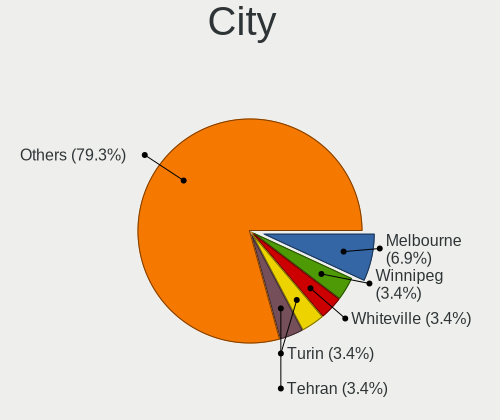
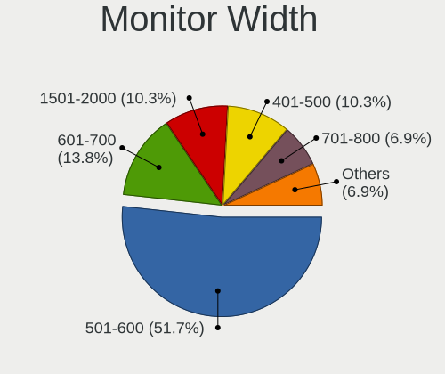
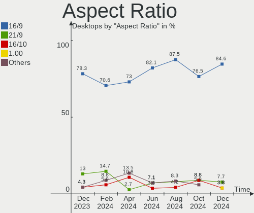
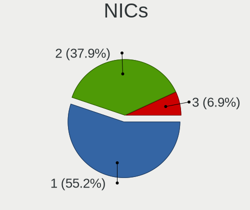

KDE neon - Hardware Trends (Desktops)
-------------------------------------

A project to identify most popular hardware characteristics and track their change
over time based on data collected by Linux users at https://Linux-Hardware.org.

Anyone can contribute to this report by the [hw-probe](https://github.com/linuxhw/hw-probe) tool:

    sudo -E hw-probe -all -upload

This report is for one last month. Overall report since the beginning of time: [TestDays](https://github.com/linuxhw/TestDays)

Period: Jan, 2024.

Contents
--------

* [ System ](#system)
  - [ OS                       ](#os)
  - [ OS Family                ](#os-family)
  - [ Kernel                   ](#kernel)
  - [ Kernel Family            ](#kernel-family)
  - [ Kernel Major Ver.        ](#kernel-major-ver)
  - [ Arch                     ](#arch)
  - [ DE                       ](#de)
  - [ Display Server           ](#display-server)
  - [ Display Manager          ](#display-manager)
  - [ OS Lang                  ](#os-lang)
  - [ Boot Mode                ](#boot-mode)
  - [ Filesystem               ](#filesystem)
  - [ Part. scheme             ](#part-scheme)
  - [ Dual Boot with Linux/BSD ](#dual-boot-with-linuxbsd)
  - [ Dual Boot (Win)          ](#dual-boot-win)

* [ Board ](#board)
  - [ Vendor                   ](#vendor)
  - [ Model                    ](#model)
  - [ Model Family             ](#model-family)
  - [ MFG Year                 ](#mfg-year)
  - [ Form Factor              ](#form-factor)
  - [ Secure Boot              ](#secure-boot)
  - [ Coreboot                 ](#coreboot)
  - [ RAM Size                 ](#ram-size)
  - [ RAM Used                 ](#ram-used)
  - [ Total Drives             ](#total-drives)
  - [ Has CD-ROM               ](#has-cd-rom)
  - [ Has Ethernet             ](#has-ethernet)
  - [ Has WiFi                 ](#has-wifi)
  - [ Has Bluetooth            ](#has-bluetooth)

* [ Location ](#location)
  - [ Country                  ](#country)
  - [ City                     ](#city)

* [ Drives ](#drives)
  - [ Drive Vendor             ](#drive-vendor)
  - [ Drive Model              ](#drive-model)
  - [ HDD Vendor               ](#hdd-vendor)
  - [ SSD Vendor               ](#ssd-vendor)
  - [ Drive Kind               ](#drive-kind)
  - [ Drive Connector          ](#drive-connector)
  - [ Drive Size               ](#drive-size)
  - [ Space Total              ](#space-total)
  - [ Space Used               ](#space-used)
  - [ Malfunc. Drives          ](#malfunc-drives)
  - [ Malfunc. Drive Vendor    ](#malfunc-drive-vendor)
  - [ Malfunc. HDD Vendor      ](#malfunc-hdd-vendor)
  - [ Malfunc. Drive Kind      ](#malfunc-drive-kind)
  - [ Failed Drives            ](#failed-drives)
  - [ Failed Drive Vendor      ](#failed-drive-vendor)
  - [ Drive Status             ](#drive-status)

* [ Storage controller ](#storage-controller)
  - [ Storage Vendor           ](#storage-vendor)
  - [ Storage Model            ](#storage-model)
  - [ Storage Kind             ](#storage-kind)

* [ Processor ](#processor)
  - [ CPU Vendor               ](#cpu-vendor)
  - [ CPU Model                ](#cpu-model)
  - [ CPU Model Family         ](#cpu-model-family)
  - [ CPU Cores                ](#cpu-cores)
  - [ CPU Sockets              ](#cpu-sockets)
  - [ CPU Threads              ](#cpu-threads)
  - [ CPU Op-Modes             ](#cpu-op-modes)
  - [ CPU Microcode            ](#cpu-microcode)
  - [ CPU Microarch            ](#cpu-microarch)

* [ Graphics ](#graphics)
  - [ GPU Vendor               ](#gpu-vendor)
  - [ GPU Model                ](#gpu-model)
  - [ GPU Combo                ](#gpu-combo)
  - [ GPU Driver               ](#gpu-driver)
  - [ GPU Memory               ](#gpu-memory)

* [ Monitor ](#monitor)
  - [ Monitor Vendor           ](#monitor-vendor)
  - [ Monitor Model            ](#monitor-model)
  - [ Monitor Resolution       ](#monitor-resolution)
  - [ Monitor Diagonal         ](#monitor-diagonal)
  - [ Monitor Width            ](#monitor-width)
  - [ Aspect Ratio             ](#aspect-ratio)
  - [ Monitor Area             ](#monitor-area)
  - [ Pixel Density            ](#pixel-density)
  - [ Multiple Monitors        ](#multiple-monitors)

* [ Network ](#network)
  - [ Net Controller Vendor    ](#net-controller-vendor)
  - [ Net Controller Model     ](#net-controller-model)
  - [ Wireless Vendor          ](#wireless-vendor)
  - [ Wireless Model           ](#wireless-model)
  - [ Ethernet Vendor          ](#ethernet-vendor)
  - [ Ethernet Model           ](#ethernet-model)
  - [ Net Controller Kind      ](#net-controller-kind)
  - [ Used Controller          ](#used-controller)
  - [ NICs                     ](#nics)
  - [ IPv6                     ](#ipv6)

* [ Bluetooth ](#bluetooth)
  - [ Bluetooth Vendor         ](#bluetooth-vendor)
  - [ Bluetooth Model          ](#bluetooth-model)

* [ Sound ](#sound)
  - [ Sound Vendor             ](#sound-vendor)
  - [ Sound Model              ](#sound-model)

* [ Memory ](#memory)
  - [ Memory Vendor            ](#memory-vendor)
  - [ Memory Model             ](#memory-model)
  - [ Memory Kind              ](#memory-kind)
  - [ Memory Form Factor       ](#memory-form-factor)
  - [ Memory Size              ](#memory-size)
  - [ Memory Speed             ](#memory-speed)

* [ Printers & scanners ](#printers--scanners)
  - [ Printer Vendor           ](#printer-vendor)
  - [ Printer Model            ](#printer-model)
  - [ Scanner Vendor           ](#scanner-vendor)
  - [ Scanner Model            ](#scanner-model)

* [ Camera ](#camera)
  - [ Camera Vendor            ](#camera-vendor)
  - [ Camera Model             ](#camera-model)

* [ Security ](#security)
  - [ Fingerprint Vendor       ](#fingerprint-vendor)
  - [ Fingerprint Model        ](#fingerprint-model)
  - [ Chipcard Vendor          ](#chipcard-vendor)
  - [ Chipcard Model           ](#chipcard-model)

* [ Unsupported ](#unsupported)
  - [ Unsupported Devices      ](#unsupported-devices)
  - [ Unsupported Device Types ](#unsupported-device-types)

System
------

OS
--

Installed operating systems

| Name           | Desktops | Percent |
|----------------|----------|---------|
| KDE neon 22.04 | 23       | 100%    |

OS Family
---------

OS without a version

| Name     | Desktops | Percent |
|----------|----------|---------|
| KDE neon | 23       | 100%    |

Kernel
------

Version of the Linux kernel

| Version              | Desktops | Percent |
|----------------------|----------|---------|
| 6.2.0-39-generic     | 10       | 43.48%  |
| 6.5.0-14-generic     | 6        | 26.09%  |
| 6.5.0-15-generic     | 4        | 17.39%  |
| 6.6.10-x64v3-xanmod1 | 1        | 4.35%   |
| 6.5.0-17-generic     | 1        | 4.35%   |
| 5.15.0-56-generic    | 1        | 4.35%   |

Kernel Family
-------------

Linux kernel without a distro release

| Version | Desktops | Percent |
|---------|----------|---------|
| 6.5.0   | 11       | 47.83%  |
| 6.2.0   | 10       | 43.48%  |
| 6.6.10  | 1        | 4.35%   |
| 5.15.0  | 1        | 4.35%   |

Kernel Major Ver.
-----------------

Linux kernel major version

| Version | Desktops | Percent |
|---------|----------|---------|
| 6.5     | 11       | 47.83%  |
| 6.2     | 10       | 43.48%  |
| 6.6     | 1        | 4.35%   |
| 5.15    | 1        | 4.35%   |

Arch
----

OS architecture (x86_64, i586, etc.)

| Name   | Desktops | Percent |
|--------|----------|---------|
| x86_64 | 23       | 100%    |

DE
--

Desktop Environment

| Name | Desktops | Percent |
|------|----------|---------|
| KDE5 | 21       | 91.3%   |
| KDE6 | 2        | 8.7%    |

Display Server
--------------

X11 or Wayland

| Name    | Desktops | Percent |
|---------|----------|---------|
| X11     | 19       | 82.61%  |
| Wayland | 4        | 17.39%  |

Display Manager
---------------

SDDM, LightDM, etc.

| Name    | Desktops | Percent |
|---------|----------|---------|
| Unknown | 17       | 73.91%  |
| SDDM    | 6        | 26.09%  |

OS Lang
-------

Language

| Lang  | Desktops | Percent |
|-------|----------|---------|
| en_US | 10       | 43.48%  |
| de_DE | 3        | 13.04%  |
| es_MX | 2        | 8.7%    |
| en_IN | 2        | 8.7%    |
| en_GB | 2        | 8.7%    |
| sl_SI | 1        | 4.35%   |
| es_ES | 1        | 4.35%   |
| en_AU | 1        | 4.35%   |
| C     | 1        | 4.35%   |

Boot Mode
---------

EFI or BIOS

| Mode | Desktops | Percent |
|------|----------|---------|
| BIOS | 20       | 86.96%  |
| EFI  | 3        | 13.04%  |

Filesystem
----------

Type of filesystem

| Type    | Desktops | Percent |
|---------|----------|---------|
| Ext4    | 17       | 73.91%  |
| Tmpfs   | 2        | 8.7%    |
| Btrfs   | 2        | 8.7%    |
| Xfs     | 1        | 4.35%   |
| Overlay | 1        | 4.35%   |

Part. scheme
------------

Scheme of partitioning

| Type    | Desktops | Percent |
|---------|----------|---------|
| Unknown | 17       | 73.91%  |
| GPT     | 5        | 21.74%  |
| MBR     | 1        | 4.35%   |

Dual Boot with Linux/BSD
------------------------

Hosting more than one Linux/BSD

| Dual boot | Desktops | Percent |
|-----------|----------|---------|
| No        | 21       | 91.3%   |
| Yes       | 2        | 8.7%    |

Dual Boot (Win)
---------------

Hosting Linux and Windows

| Dual boot | Desktops | Percent |
|-----------|----------|---------|
| No        | 22       | 95.65%  |
| Yes       | 1        | 4.35%   |

Board
-----

Vendor
------

Motherboard manufacturer

| Name                                 | Desktops | Percent |
|--------------------------------------|----------|---------|
| MSI                                  | 6        | 26.09%  |
| Gigabyte Technology                  | 6        | 26.09%  |
| ASUSTek Computer                     | 6        | 26.09%  |
| SJS                                  | 1        | 4.35%   |
| Shenzhen Meigao Electronic Equipment | 1        | 4.35%   |
| Intel                                | 1        | 4.35%   |
| Fujitsu                              | 1        | 4.35%   |
| ASRock                               | 1        | 4.35%   |

Model
-----

Motherboard model

| Name                                          | Desktops | Percent |
|-----------------------------------------------|----------|---------|
| SJS H310M-VH                                  | 1        | 4.35%   |
| Shenzhen Meigao Electronic Equipment UM560 XT | 1        | 4.35%   |
| MSI MS-7E12                                   | 1        | 4.35%   |
| MSI MS-7C96                                   | 1        | 4.35%   |
| MSI MS-7C91                                   | 1        | 4.35%   |
| MSI MS-7C37                                   | 1        | 4.35%   |
| MSI MS-7850                                   | 1        | 4.35%   |
| MSI MS-7623                                   | 1        | 4.35%   |
| Intel H55                                     | 1        | 4.35%   |
| Gigabyte X99-UD4-CF                           | 1        | 4.35%   |
| Gigabyte X470 AORUS ULTRA GAMING              | 1        | 4.35%   |
| Gigabyte H61M-S2-B3                           | 1        | 4.35%   |
| Gigabyte B550 UD AC                           | 1        | 4.35%   |
| Gigabyte B360M AORUS Gaming 3                 | 1        | 4.35%   |
| Gigabyte AX370-Gaming 5                       | 1        | 4.35%   |
| Fujitsu ESPRIMO P920                          | 1        | 4.35%   |
| ASUS TUF Gaming B650-PLUS WIFI                | 1        | 4.35%   |
| ASUS ROG STRIX X570-E GAMING WIFI II          | 1        | 4.35%   |
| ASUS ROG STRIX B560-G GAMING WIFI             | 1        | 4.35%   |
| ASUS ROG STRIX B350-I GAMING                  | 1        | 4.35%   |
| ASUS ProArt B550-CREATOR                      | 1        | 4.35%   |
| ASUS 795                                      | 1        | 4.35%   |
| ASRock Z87 Extreme6                           | 1        | 4.35%   |

Model Family
------------

Motherboard model prefix

| Name                                       | Desktops | Percent |
|--------------------------------------------|----------|---------|
| ASUS ROG                                   | 3        | 13.04%  |
| SJS H310M-VH                               | 1        | 4.35%   |
| Shenzhen Meigao Electronic Equipment UM560 | 1        | 4.35%   |
| MSI MS-7E12                                | 1        | 4.35%   |
| MSI MS-7C96                                | 1        | 4.35%   |
| MSI MS-7C91                                | 1        | 4.35%   |
| MSI MS-7C37                                | 1        | 4.35%   |
| MSI MS-7850                                | 1        | 4.35%   |
| MSI MS-7623                                | 1        | 4.35%   |
| Intel H55                                  | 1        | 4.35%   |
| Gigabyte X99-UD4-CF                        | 1        | 4.35%   |
| Gigabyte X470                              | 1        | 4.35%   |
| Gigabyte H61M-S2-B3                        | 1        | 4.35%   |
| Gigabyte B550                              | 1        | 4.35%   |
| Gigabyte B360M                             | 1        | 4.35%   |
| Gigabyte AX370-Gaming                      | 1        | 4.35%   |
| Fujitsu ESPRIMO                            | 1        | 4.35%   |
| ASUS TUF                                   | 1        | 4.35%   |
| ASUS ProArt                                | 1        | 4.35%   |
| ASUS 795                                   | 1        | 4.35%   |
| ASRock Z87                                 | 1        | 4.35%   |

MFG Year
--------

Motherboard manufacture year

| Year | Desktops | Percent |
|------|----------|---------|
| 2021 | 4        | 17.39%  |
| 2023 | 3        | 13.04%  |
| 2022 | 3        | 13.04%  |
| 2014 | 3        | 13.04%  |
| 2018 | 2        | 8.7%    |
| 2017 | 2        | 8.7%    |
| 2013 | 2        | 8.7%    |
| 2020 | 1        | 4.35%   |
| 2019 | 1        | 4.35%   |
| 2011 | 1        | 4.35%   |
| 2010 | 1        | 4.35%   |

Form Factor
-----------

Physical design of the computer

| Name    | Desktops | Percent |
|---------|----------|---------|
| Desktop | 23       | 100%    |

Secure Boot
-----------

Enabled or disabled

| State    | Desktops | Percent |
|----------|----------|---------|
| Disabled | 23       | 100%    |

Coreboot
--------

Have coreboot on board

| Used | Desktops | Percent |
|------|----------|---------|
| No   | 23       | 100%    |

RAM Size
--------

Total RAM memory

| Size in GB  | Desktops | Percent |
|-------------|----------|---------|
| 32.01-64.0  | 9        | 39.13%  |
| 16.01-24.0  | 8        | 34.78%  |
| 8.01-16.0   | 2        | 8.7%    |
| 4.01-8.0    | 1        | 4.35%   |
| 3.01-4.0    | 1        | 4.35%   |
| 24.01-32.0  | 1        | 4.35%   |
| 64.01-256.0 | 1        | 4.35%   |

RAM Used
--------

Used RAM memory

| Used GB   | Desktops | Percent |
|-----------|----------|---------|
| 4.01-8.0  | 6        | 26.09%  |
| 3.01-4.0  | 6        | 26.09%  |
| 2.01-3.0  | 5        | 21.74%  |
| 1.01-2.0  | 4        | 17.39%  |
| 8.01-16.0 | 2        | 8.7%    |

Total Drives
------------

Number of drives on board

| Drives | Desktops | Percent |
|--------|----------|---------|
| 2      | 10       | 43.48%  |
| 3      | 6        | 26.09%  |
| 1      | 3        | 13.04%  |
| 6      | 2        | 8.7%    |
| 9      | 1        | 4.35%   |
| 4      | 1        | 4.35%   |

Has CD-ROM
----------

Has CD-ROM on board

| Presented | Desktops | Percent |
|-----------|----------|---------|
| No        | 16       | 69.57%  |
| Yes       | 7        | 30.43%  |

Has Ethernet
------------

Has Ethernet on board

| Presented | Desktops | Percent |
|-----------|----------|---------|
| Yes       | 23       | 100%    |

Has WiFi
--------

Has WiFi module

| Presented | Desktops | Percent |
|-----------|----------|---------|
| Yes       | 16       | 69.57%  |
| No        | 7        | 30.43%  |

Has Bluetooth
-------------

Has Bluetooth module

| Presented | Desktops | Percent |
|-----------|----------|---------|
| Yes       | 15       | 65.22%  |
| No        | 8        | 34.78%  |

Location
--------

Country
-------

Geographic location (country)

| Country                | Desktops | Percent |
|------------------------|----------|---------|
| USA                    | 5        | 21.74%  |
| Germany                | 3        | 13.04%  |
| Spain                  | 2        | 8.7%    |
| India                  | 2        | 8.7%    |
| Brazil                 | 2        | 8.7%    |
| Venezuela              | 1        | 4.35%   |
| Slovenia               | 1        | 4.35%   |
| Serbia                 | 1        | 4.35%   |
| New Zealand            | 1        | 4.35%   |
| Mexico                 | 1        | 4.35%   |
| Canada                 | 1        | 4.35%   |
| Bosnia and Herzegovina | 1        | 4.35%   |
| Austria                | 1        | 4.35%   |
| Australia              | 1        | 4.35%   |

City
----

Geographic location (city)

| City               | Desktops | Percent |
|--------------------|----------|---------|
| Vilshofen          | 1        | 4.35%   |
| Tauranga           | 1        | 4.35%   |
| Šentjur pri Celju | 1        | 4.35%   |
| Sarajevo           | 1        | 4.35%   |
| San Cristóbal     | 1        | 4.35%   |
| Riudoms            | 1        | 4.35%   |
| Rauris             | 1        | 4.35%   |
| Polanco            | 1        | 4.35%   |
| Niš               | 1        | 4.35%   |
| Mexico City        | 1        | 4.35%   |
| Melbourne          | 1        | 4.35%   |
| Lübeck            | 1        | 4.35%   |
| Haskins            | 1        | 4.35%   |
| Goiânia           | 1        | 4.35%   |
| Colorado Springs   | 1        | 4.35%   |
| Clyde              | 1        | 4.35%   |
| Chennai            | 1        | 4.35%   |
| Casper             | 1        | 4.35%   |
| Calgary            | 1        | 4.35%   |
| Burlington         | 1        | 4.35%   |
| Blumenau           | 1        | 4.35%   |
| Berlin             | 1        | 4.35%   |
| Bengaluru          | 1        | 4.35%   |

Drives
------

Drive Vendor
------------

Hard drive vendors

| Vendor                      | Desktops | Drives  | Percent |
|-----------------------------|----------|---------|---------|
| Seagate                     | 9        | 16      | 18.75%  |
| WDC                         | 6        | 10      | 12.5%   |
| SanDisk                     | 6        | 12      | 12.5%   |
| Samsung Electronics         | 5        | 9       | 10.42%  |
| Crucial                     | 5        | 6       | 10.42%  |
| Kingston                    | 4        | 4       | 8.33%   |
| Silicon Motion              | 2        | 2       | 4.17%   |
| Kingston Technology Company | 2        | 2       | 4.17%   |
| Unknown                     | 1        | 1       | 2.08%   |
| Toshiba                     | 1        | 1       | 2.08%   |
| SK hynix                    | 1        | 1       | 2.08%   |
| PNY                         | 1        | 1       | 2.08%   |
| Phison Electronics          | 1        | 1       | 2.08%   |
| Phison                      | 1        | 1       | 2.08%   |
| Micron/Crucial Technology   | 1        | 1       | 2.08%   |
| Intel                       | 1        | 1       | 2.08%   |
| HL-DT-ST                    | 1        | Unknown | 2.08%   |

Drive Model
-----------

Hard drive models

| Model                                                 | Desktops | Percent |
|-------------------------------------------------------|----------|---------|
| SanDisk SSD PLUS 1000GB                               | 2        | 3.03%   |
| Kingston Company SNV2S1000G 1TB                       | 2        | 3.03%   |
| WDC WDBNCE2500PNC 250GB SSD                           | 1        | 1.52%   |
| WDC WD6003FZBX-00K5WB0 6TB                            | 1        | 1.52%   |
| WDC WD5000AZLX-00CL5A0 500GB                          | 1        | 1.52%   |
| WDC WD40EZAZ-00SF3B0 4TB                              | 1        | 1.52%   |
| WDC WD40EZAX-00C8UB0 4TB                              | 1        | 1.52%   |
| WDC WD2003FZEX-00Z4SA0 2TB                            | 1        | 1.52%   |
| WDC WD181KRYZ-01AGBB0 18TB                            | 1        | 1.52%   |
| WDC WD1600AABS-00PRA0 160GB                           | 1        | 1.52%   |
| WDC WD121KRYZ-01W0RB0 12TB                            | 1        | 1.52%   |
| WDC WD10EZEX-60WN4A0 1TB                              | 1        | 1.52%   |
| Unknown BFDT50S 499GB                                 | 1        | 1.52%   |
| Toshiba TR200 240GB SSD                               | 1        | 1.52%   |
| SK hynix SHGS31-500GS-2 500GB SSD                     | 1        | 1.52%   |
| Silicon Motion SM2263EN/SM2263XT SSD Controller 128GB | 1        | 1.52%   |
| Silicon Motion SM2262/SM2262EN SSD Controller 480GB   | 1        | 1.52%   |
| Seagate ST8000DM004-2U9188 8TB                        | 1        | 1.52%   |
| Seagate ST5000DM003-2FH18L 5TB                        | 1        | 1.52%   |
| Seagate ST4000LM024-2AN17V 4TB                        | 1        | 1.52%   |
| Seagate ST4000DM004-2CV104 4TB                        | 1        | 1.52%   |
| Seagate ST4000DM000-1F2168 4TB                        | 1        | 1.52%   |
| Seagate ST2000DM008-2FR102 2TB                        | 1        | 1.52%   |
| Seagate ST2000DM006-2DM164 2TB                        | 1        | 1.52%   |
| Seagate ST18000NM000J-2TV103 18TB                     | 1        | 1.52%   |
| Seagate ST16000NM001G-2KK103 16TB                     | 1        | 1.52%   |
| Seagate ST16000NE000-2WX103 16TB                      | 1        | 1.52%   |
| Seagate ST1000LM035-1RK172 1TB                        | 1        | 1.52%   |
| Seagate ST1000DM010-2EP102 1TB                        | 1        | 1.52%   |
| Seagate ST10000VX0004-1ZE101 10TB                     | 1        | 1.52%   |
| Seagate ST10000VN0004-1ZD101 10TB                     | 1        | 1.52%   |
| Sandisk WD_BLACK SN770 1TB                            | 1        | 1.52%   |
| Sandisk WDC WDS480G2G0C-00AJM0 480GB                  | 1        | 1.52%   |
| Sandisk WD Blue SN570 500GB                           | 1        | 1.52%   |
| Sandisk WD Black 2018/SN750 / PC SN720 NVMe SSD 1TB   | 1        | 1.52%   |
| SanDisk SDSSDH3 2T00 2TB                              | 1        | 1.52%   |
| SanDisk Portable SSD 1TB                              | 1        | 1.52%   |
| SanDisk NVMe SSD Drive 500GB                          | 1        | 1.52%   |
| SanDisk NVMe SSD Drive 1TB                            | 1        | 1.52%   |
| SanDisk 3.2 Gen 1 128GB SSD                           | 1        | 1.52%   |

HDD Vendor
----------

Hard disk drive vendors

| Vendor              | Desktops | Drives | Percent |
|---------------------|----------|--------|---------|
| Seagate             | 9        | 16     | 52.94%  |
| WDC                 | 6        | 9      | 35.29%  |
| Unknown             | 1        | 1      | 5.88%   |
| Samsung Electronics | 1        | 1      | 5.88%   |

SSD Vendor
----------

Solid state drive vendors

| Vendor              | Desktops | Drives | Percent |
|---------------------|----------|--------|---------|
| Crucial             | 5        | 6      | 25%     |
| SanDisk             | 4        | 6      | 20%     |
| Samsung Electronics | 3        | 4      | 15%     |
| Kingston            | 3        | 3      | 15%     |
| WDC                 | 1        | 1      | 5%      |
| Toshiba             | 1        | 1      | 5%      |
| SK hynix            | 1        | 1      | 5%      |
| PNY                 | 1        | 1      | 5%      |
| Intel               | 1        | 1      | 5%      |

Drive Kind
----------

HDD or SSD

| Kind    | Desktops | Drives  | Percent |
|---------|----------|---------|---------|
| SSD     | 15       | 24      | 34.88%  |
| NVMe    | 14       | 18      | 32.56%  |
| HDD     | 13       | 27      | 30.23%  |
| Unknown | 1        | Unknown | 2.33%   |

Drive Connector
---------------

SATA, SAS, NVMe, etc.

| Type | Desktops | Drives | Percent |
|------|----------|--------|---------|
| SATA | 20       | 49     | 54.05%  |
| NVMe | 14       | 18     | 37.84%  |
| SAS  | 3        | 2      | 8.11%   |

Drive Size
----------

Size of hard drive

| Size in TB | Desktops | Drives | Percent |
|------------|----------|--------|---------|
| 0.01-0.5   | 14       | 18     | 40%     |
| 0.51-1.0   | 8        | 11     | 22.86%  |
| 3.01-4.0   | 4        | 5      | 11.43%  |
| 1.01-2.0   | 4        | 5      | 11.43%  |
| 4.01-10.0  | 3        | 5      | 8.57%   |
| 10.01-20.0 | 2        | 7      | 5.71%   |

Space Total
-----------

Amount of disk space available on the file system

| Size in GB     | Desktops | Percent |
|----------------|----------|---------|
| More than 3000 | 5        | 21.74%  |
| 251-500        | 5        | 21.74%  |
| 501-1000       | 4        | 17.39%  |
| 1001-2000      | 3        | 13.04%  |
| 51-100         | 3        | 13.04%  |
| 101-250        | 2        | 8.7%    |
| 2001-3000      | 1        | 4.35%   |

Space Used
----------

Amount of used disk space

| Used GB        | Desktops | Percent |
|----------------|----------|---------|
| 21-50          | 5        | 21.74%  |
| 1-20           | 4        | 17.39%  |
| 101-250        | 3        | 13.04%  |
| 51-100         | 3        | 13.04%  |
| 251-500        | 2        | 8.7%    |
| 1001-2000      | 2        | 8.7%    |
| 501-1000       | 2        | 8.7%    |
| More than 3000 | 1        | 4.35%   |
| 2001-3000      | 1        | 4.35%   |

Malfunc. Drives
---------------

Drive models with a malfunction

| Model                        | Desktops | Drives | Percent |
|------------------------------|----------|--------|---------|
| Kingston SKC2000M8500G 500GB | 1        | 1      | 50%     |
| Crucial CT256M550SSD1 256GB  | 1        | 1      | 50%     |

Malfunc. Drive Vendor
---------------------

Vendors of faulty drives

| Vendor   | Desktops | Drives | Percent |
|----------|----------|--------|---------|
| Kingston | 1        | 1      | 50%     |
| Crucial  | 1        | 1      | 50%     |

Malfunc. HDD Vendor
-------------------

Vendors of faulty HDD drives

Zero info for selected period =(

Malfunc. Drive Kind
-------------------

Kinds of faulty drives

| Kind | Desktops | Drives | Percent |
|------|----------|--------|---------|
| NVMe | 1        | 1      | 50%     |
| SSD  | 1        | 1      | 50%     |

Failed Drives
-------------

Failed drive models

Zero info for selected period =(

Failed Drive Vendor
-------------------

Failed drive vendors

Zero info for selected period =(

Drive Status
------------

Number of failed and malfunc. drives

| Status   | Desktops | Drives | Percent |
|----------|----------|--------|---------|
| Detected | 19       | 60     | 82.61%  |
| Works    | 3        | 7      | 13.04%  |
| Malfunc  | 1        | 2      | 4.35%   |

Storage controller
------------------

Storage Vendor
--------------

Storage controller vendors

| Vendor                      | Desktops | Percent |
|-----------------------------|----------|---------|
| AMD                         | 13       | 33.33%  |
| Intel                       | 10       | 25.64%  |
| SanDisk                     | 3        | 7.69%   |
| Samsung Electronics         | 3        | 7.69%   |
| Kingston Technology Company | 3        | 7.69%   |
| Silicon Motion              | 2        | 5.13%   |
| Phison Electronics          | 2        | 5.13%   |
| ASMedia Technology          | 2        | 5.13%   |
| Micron/Crucial Technology   | 1        | 2.56%   |

Storage Model
-------------

Storage controller models

| Model                                                                          | Desktops | Percent |
|--------------------------------------------------------------------------------|----------|---------|
| AMD FCH SATA Controller [AHCI mode]                                            | 7        | 14.89%  |
| AMD 500 Series Chipset SATA Controller                                         | 4        | 8.51%   |
| Kingston Company NV2 NVMe SSD SM2267XT (DRAM-less)                             | 2        | 4.26%   |
| Intel 8 Series/C220 Series Chipset Family 6-port SATA Controller 1 [AHCI mode] | 2        | 4.26%   |
| ASMedia ASM1061/ASM1062 Serial ATA Controller                                  | 2        | 4.26%   |
| AMD 600 Series Chipset SATA Controller                                         | 2        | 4.26%   |
| Silicon Motion SM2263EN/SM2263XT (DRAM-less) NVMe SSD Controllers              | 1        | 2.13%   |
| Silicon Motion SM2262/SM2262EN SSD Controller                                  | 1        | 2.13%   |
| SanDisk WD Green SN350 240GB (DRAM-less) / SN560E NVMe SSD                     | 1        | 2.13%   |
| SanDisk WD Black SN770 / PC SN740 256GB / PC SN560 (DRAM-less) NVMe SSD        | 1        | 2.13%   |
| SanDisk Ultra 3D / WD Blue SN570 NVMe SSD (DRAM-less)                          | 1        | 2.13%   |
| SanDisk Extreme Pro / WD Black 2018/SN750/PC SN720 NVMe SSD                    | 1        | 2.13%   |
| Samsung NVMe SSD Controller SM981/PM981/PM983                                  | 1        | 2.13%   |
| Samsung NVMe SSD Controller SM961/PM961/SM963                                  | 1        | 2.13%   |
| Samsung NVMe SSD Controller 980 (DRAM-less)                                    | 1        | 2.13%   |
| Phison PS5013-E13 PCIe3 NVMe Controller (DRAM-less)                            | 1        | 2.13%   |
| Phison E12 NVMe Controller                                                     | 1        | 2.13%   |
| Micron/Crucial T500 NVMe PCIe SSD                                              | 1        | 2.13%   |
| Kingston Company KC2000/KC2500 NVMe SSD SM2262EN                               | 1        | 2.13%   |
| Intel Volume Management Device NVMe RAID Controller Intel Corporation          | 1        | 2.13%   |
| Intel Cannon Lake PCH SATA AHCI Controller                                     | 1        | 2.13%   |
| Intel C610/X99 series chipset 6-Port SATA Controller [AHCI mode]               | 1        | 2.13%   |
| Intel Alder Lake-S PCH SATA Controller [AHCI Mode]                             | 1        | 2.13%   |
| Intel 9 Series Chipset Family SATA Controller [AHCI Mode]                      | 1        | 2.13%   |
| Intel 6 Series/C200 Series Chipset Family 6 port Desktop SATA AHCI Controller  | 1        | 2.13%   |
| Intel 500 Series Chipset Family SATA RAID Controller                           | 1        | 2.13%   |
| Intel 5 Series/3400 Series Chipset 4 port SATA IDE Controller                  | 1        | 2.13%   |
| Intel 5 Series/3400 Series Chipset 2 port SATA IDE Controller                  | 1        | 2.13%   |
| Intel 200 Series PCH SATA controller [AHCI mode]                               | 1        | 2.13%   |
| AMD X370 Series Chipset SATA Controller                                        | 1        | 2.13%   |
| AMD SB7x0/SB8x0/SB9x0 SATA Controller [IDE mode]                               | 1        | 2.13%   |
| AMD SB7x0/SB8x0/SB9x0 IDE Controller                                           | 1        | 2.13%   |
| AMD 400 Series Chipset SATA Controller                                         | 1        | 2.13%   |
| AMD 300 Series Chipset SATA Controller                                         | 1        | 2.13%   |

Storage Kind
------------

Kind of storage controller (IDE, SATA, NVMe, SAS, ...)

| Kind | Desktops | Percent |
|------|----------|---------|
| SATA | 21       | 53.85%  |
| NVMe | 14       | 35.9%   |
| RAID | 2        | 5.13%   |
| IDE  | 2        | 5.13%   |

Processor
---------

CPU Vendor
----------

Processor vendors

| Vendor | Desktops | Percent |
|--------|----------|---------|
| AMD    | 13       | 56.52%  |
| Intel  | 10       | 43.48%  |

CPU Model
---------

Processor models

| Model                                   | Desktops | Percent |
|-----------------------------------------|----------|---------|
| AMD Ryzen 9 5900X 12-Core Processor     | 2        | 8.7%    |
| AMD Ryzen 5 1600 Six-Core Processor     | 2        | 8.7%    |
| Intel Core i7-5820K CPU @ 3.30GHz       | 1        | 4.35%   |
| Intel Core i7-4790K CPU @ 4.00GHz       | 1        | 4.35%   |
| Intel Core i5-8400 CPU @ 2.80GHz        | 1        | 4.35%   |
| Intel Core i5-4670K CPU @ 3.40GHz       | 1        | 4.35%   |
| Intel Core i5-4590 CPU @ 3.30GHz        | 1        | 4.35%   |
| Intel Core i5-3470 CPU @ 3.20GHz        | 1        | 4.35%   |
| Intel Core i3-9100T CPU @ 3.10GHz       | 1        | 4.35%   |
| Intel Core i3 CPU 530 @ 2.93GHz         | 1        | 4.35%   |
| Intel 13th Gen Core i9-13900KS          | 1        | 4.35%   |
| Intel 11th Gen Core i7-11700F @ 2.50GHz | 1        | 4.35%   |
| AMD Ryzen 9 7900X3D 12-Core Processor   | 1        | 4.35%   |
| AMD Ryzen 7 7700 8-Core Processor       | 1        | 4.35%   |
| AMD Ryzen 7 5800X 8-Core Processor      | 1        | 4.35%   |
| AMD Ryzen 7 3800X 8-Core Processor      | 1        | 4.35%   |
| AMD Ryzen 7 1700X Eight-Core Processor  | 1        | 4.35%   |
| AMD Ryzen 5 5600H with Radeon Graphics  | 1        | 4.35%   |
| AMD Ryzen 5 5600 6-Core Processor       | 1        | 4.35%   |
| AMD Ryzen 5 2600 Six-Core Processor     | 1        | 4.35%   |
| AMD Phenom II X6 1075T Processor        | 1        | 4.35%   |

CPU Model Family
----------------

Processor model prefix

| Model            | Desktops | Percent |
|------------------|----------|---------|
| AMD Ryzen 5      | 5        | 21.74%  |
| Intel Core i5    | 4        | 17.39%  |
| AMD Ryzen 7      | 4        | 17.39%  |
| AMD Ryzen 9      | 3        | 13.04%  |
| Other            | 2        | 8.7%    |
| Intel Core i7    | 2        | 8.7%    |
| Intel Core i3    | 2        | 8.7%    |
| AMD Phenom II X6 | 1        | 4.35%   |

CPU Cores
---------

Number of processor cores

| Number | Desktops | Percent |
|--------|----------|---------|
| 6      | 8        | 34.78%  |
| 8      | 5        | 21.74%  |
| 4      | 5        | 21.74%  |
| 12     | 3        | 13.04%  |
| 24     | 1        | 4.35%   |
| 2      | 1        | 4.35%   |

CPU Sockets
-----------

Number of sockets

| Number | Desktops | Percent |
|--------|----------|---------|
| 1      | 23       | 100%    |

CPU Threads
-----------

Threads per core (Hyper-Threading)

| Number | Desktops | Percent |
|--------|----------|---------|
| 2      | 17       | 73.91%  |
| 1      | 6        | 26.09%  |

CPU Op-Modes
------------

CPU Operation Modes (32-bit, 64-bit)

| Op mode        | Desktops | Percent |
|----------------|----------|---------|
| 32-bit, 64-bit | 23       | 100%    |

CPU Microcode
-------------

Microcode number

| Number     | Desktops | Percent |
|------------|----------|---------|
| Unknown    | 20       | 86.96%  |
| 0x0a601206 | 1        | 4.35%   |
| 0x0a50000d | 1        | 4.35%   |
| 0x0a20120e | 1        | 4.35%   |

CPU Microarch
-------------

Microarchitecture

| Name      | Desktops | Percent |
|-----------|----------|---------|
| Zen 3     | 5        | 21.74%  |
| Haswell   | 4        | 17.39%  |
| Unknown   | 4        | 17.39%  |
| Zen       | 3        | 13.04%  |
| KabyLake  | 2        | 8.7%    |
| Zen+      | 1        | 4.35%   |
| Zen 2     | 1        | 4.35%   |
| Westmere  | 1        | 4.35%   |
| K10       | 1        | 4.35%   |
| IvyBridge | 1        | 4.35%   |

Graphics
--------

GPU Vendor
----------

Vendors of graphics cards

| Vendor | Desktops | Percent |
|--------|----------|---------|
| Nvidia | 11       | 47.83%  |
| AMD    | 9        | 39.13%  |
| Intel  | 3        | 13.04%  |

GPU Model
---------

Graphics card models

| Model                                                                       | Desktops | Percent |
|-----------------------------------------------------------------------------|----------|---------|
| Nvidia GP104 [GeForce GTX 1070]                                             | 2        | 8%      |
| AMD Raphael                                                                 | 2        | 8%      |
| AMD Navi 23 [Radeon RX 6600/6600 XT/6600M]                                  | 2        | 8%      |
| Nvidia GT218 [GeForce 210]                                                  | 1        | 4%      |
| Nvidia GP107 [GeForce GTX 1050 Ti]                                          | 1        | 4%      |
| Nvidia GK208B [GeForce GT 730]                                              | 1        | 4%      |
| Nvidia GK208B [GeForce GT 710]                                              | 1        | 4%      |
| Nvidia GA106 [Geforce RTX 3050]                                             | 1        | 4%      |
| Nvidia GA104 [GeForce RTX 3060]                                             | 1        | 4%      |
| Nvidia GA103 [GeForce RTX 3060 Ti]                                          | 1        | 4%      |
| Nvidia GA102 [GeForce RTX 3090]                                             | 1        | 4%      |
| Nvidia AD104 [GeForce RTX 4070]                                             | 1        | 4%      |
| Intel Xeon E3-1200 v3/4th Gen Core Processor Integrated Graphics Controller | 1        | 4%      |
| Intel DG2 [Arc A380]                                                        | 1        | 4%      |
| Intel Core Processor Integrated Graphics Controller                         | 1        | 4%      |
| AMD RS880 [Radeon HD 4250]                                                  | 1        | 4%      |
| AMD Navi 33 [Radeon RX 7700S/7600/7600S/7600M XT/PRO W7600]                 | 1        | 4%      |
| AMD Navi 21 [Radeon RX 6900 XT]                                             | 1        | 4%      |
| AMD Navi 21 [Radeon RX 6800/6800 XT / 6900 XT]                              | 1        | 4%      |
| AMD Ellesmere [Radeon RX 470/480/570/570X/580/580X/590]                     | 1        | 4%      |
| AMD Cezanne [Radeon Vega Series / Radeon Vega Mobile Series]                | 1        | 4%      |
| AMD Baffin [Radeon RX 460/560D / Pro 450/455/460/555/555X/560/560X]         | 1        | 4%      |

GPU Combo
---------

Combinations of graphics cards

| Name       | Desktops | Percent |
|------------|----------|---------|
| 1 x Nvidia | 11       | 47.83%  |
| 1 x AMD    | 7        | 30.43%  |
| 1 x Intel  | 3        | 13.04%  |
| 2 x AMD    | 2        | 8.7%    |

GPU Driver
----------

Free vs proprietary

| Driver      | Desktops | Percent |
|-------------|----------|---------|
| Free        | 17       | 73.91%  |
| Proprietary | 4        | 17.39%  |
| Unknown     | 2        | 8.7%    |

GPU Memory
----------

Total video memory

| Size in GB | Desktops | Percent |
|------------|----------|---------|
| Unknown    | 18       | 78.26%  |
| 7.01-8.0   | 4        | 17.39%  |
| 16.01-24.0 | 1        | 4.35%   |

Monitor
-------

Monitor Vendor
--------------

Monitor vendors

| Vendor               | Desktops | Percent |
|----------------------|----------|---------|
| Samsung Electronics  | 4        | 16%     |
| Goldstar             | 3        | 12%     |
| AOC                  | 3        | 12%     |
| Acer                 | 3        | 12%     |
| Lenovo               | 2        | 8%      |
| Dell                 | 2        | 8%      |
| BenQ                 | 2        | 8%      |
| Ancor Communications | 2        | 8%      |
| Sony                 | 1        | 4%      |
| NEC Computers        | 1        | 4%      |
| Hitachi              | 1        | 4%      |
| ASUSTek Computer     | 1        | 4%      |

Monitor Model
-------------

Monitor models

| Model                                                                 | Desktops | Percent |
|-----------------------------------------------------------------------|----------|---------|
| Sony TV SNY6604 1920x1080                                             | 1        | 3.7%    |
| Samsung Electronics S27F350 SAM0D22 1920x1080 598x336mm 27.0-inch     | 1        | 3.7%    |
| Samsung Electronics S22E200 SAM0C6E 1920x1080 477x268mm 21.5-inch     | 1        | 3.7%    |
| Samsung Electronics S22B300 SAM08AC 1920x1080 477x268mm 21.5-inch     | 1        | 3.7%    |
| Samsung Electronics LF27T35 SAM707F 1920x1080 598x337mm 27.0-inch     | 1        | 3.7%    |
| NEC Computers LCD72V NEC6658 1280x1024 338x270mm 17.0-inch            | 1        | 3.7%    |
| Lenovo L32p-30 LEN66C9 3840x2160 697x392mm 31.5-inch                  | 1        | 3.7%    |
| Lenovo C27-35 LEN66BA 1920x1080 597x336mm 27.0-inch                   | 1        | 3.7%    |
| Hitachi HISENSE HEC0030 3840x2160 1872x1053mm 84.6-inch               | 1        | 3.7%    |
| Goldstar ULTRAGEAR GSM7766 2560x1440 697x392mm 31.5-inch              | 1        | 3.7%    |
| Goldstar M2252D GSM60AC 1920x1080 531x299mm 24.0-inch                 | 1        | 3.7%    |
| Goldstar L1952S GSM4AE0 1280x1024 376x301mm 19.0-inch                 | 1        | 3.7%    |
| Dell P2719HC DEL4188 1920x1080 598x336mm 27.0-inch                    | 1        | 3.7%    |
| Dell P2719H DEL4184 1920x1080 598x336mm 27.0-inch                     | 1        | 3.7%    |
| Dell G2410 DEL404B 1920x1080 531x298mm 24.0-inch                      | 1        | 3.7%    |
| BenQ RL2455 BNQ7F1C 1920x1080 531x298mm 24.0-inch                     | 1        | 3.7%    |
| BenQ GW2480 BNQ78E7 1920x1080 527x296mm 23.8-inch                     | 1        | 3.7%    |
| ASUSTek Computer PA279 AUS2768 3840x2160 597x336mm 27.0-inch          | 1        | 3.7%    |
| AOC Q32G1WG4 AOC3201 2560x1440 697x393mm 31.5-inch                    | 1        | 3.7%    |
| AOC 27B1 AOC2701 1920x1080 598x336mm 27.0-inch                        | 1        | 3.7%    |
| AOC 2470W AOC2470 1920x1080 521x293mm 23.5-inch                       | 1        | 3.7%    |
| Ancor Communications MW221 ACI22B1 1680x1050 473x296mm 22.0-inch      | 1        | 3.7%    |
| Ancor Communications ASUS VS247 ACI249A 1920x1080 521x293mm 23.5-inch | 1        | 3.7%    |
| Acer X223W ACR000D 1680x1050 474x296mm 22.0-inch                      | 1        | 3.7%    |
| Acer P243W ACRADAF 1920x1200 518x324mm 24.1-inch                      | 1        | 3.7%    |
| Acer P196HQL ACR019C 1366x768 410x230mm 18.5-inch                     | 1        | 3.7%    |
| Acer ET322QK ACR0631 3840x2160 698x393mm 31.5-inch                    | 1        | 3.7%    |

Monitor Resolution
------------------

Monitor screen resolution

| Resolution         | Desktops | Percent |
|--------------------|----------|---------|
| 1920x1080 (FHD)    | 11       | 45.83%  |
| 3840x2160 (4K)     | 6        | 25%     |
| 1680x1050 (WSXGA+) | 2        | 8.33%   |
| 1280x1024 (SXGA)   | 2        | 8.33%   |
| 2560x1440 (QHD)    | 1        | 4.17%   |
| 1920x1200 (WUXGA)  | 1        | 4.17%   |
| 1366x768 (WXGA)    | 1        | 4.17%   |

Monitor Diagonal
----------------

Diagonal size in inches

| Inches | Desktops | Percent |
|--------|----------|---------|
| 27     | 6        | 23.08%  |
| 24     | 5        | 19.23%  |
| 31     | 4        | 15.38%  |
| 23     | 2        | 7.69%   |
| 22     | 2        | 7.69%   |
| 21     | 2        | 7.69%   |
| 84     | 1        | 3.85%   |
| 72     | 1        | 3.85%   |
| 19     | 1        | 3.85%   |
| 18     | 1        | 3.85%   |
| 17     | 1        | 3.85%   |

Monitor Width
-------------

Physical width

| Width in mm | Desktops | Percent |
|-------------|----------|---------|
| 501-600     | 13       | 50%     |
| 401-500     | 5        | 19.23%  |
| 601-700     | 4        | 15.38%  |
| 1501-2000   | 2        | 7.69%   |
| 351-400     | 1        | 3.85%   |
| 301-350     | 1        | 3.85%   |

Aspect Ratio
------------

Proportional relationship between the width and the height

| Ratio | Desktops | Percent |
|-------|----------|---------|
| 16/9  | 17       | 77.27%  |
| 16/10 | 3        | 13.64%  |
| 5/4   | 2        | 9.09%   |

Monitor Area
------------

Area in inch²

| Area in inch² | Desktops | Percent |
|----------------|----------|---------|
| 201-250        | 9        | 34.62%  |
| 301-350        | 6        | 23.08%  |
| 351-500        | 4        | 15.38%  |
| More than 1000 | 2        | 7.69%   |
| 151-200        | 2        | 7.69%   |
| 141-150        | 2        | 7.69%   |
| 251-300        | 1        | 3.85%   |

Pixel Density
-------------

Pixels per inch

| Density | Desktops | Percent |
|---------|----------|---------|
| 51-100  | 17       | 73.91%  |
| 121-160 | 2        | 8.7%    |
| 101-120 | 2        | 8.7%    |
| 1-50    | 1        | 4.35%   |
| 161-240 | 1        | 4.35%   |

Multiple Monitors
-----------------

Total monitors connected

| Total | Desktops | Percent |
|-------|----------|---------|
| 1     | 14       | 60.87%  |
| 2     | 7        | 30.43%  |
| 0     | 2        | 8.7%    |

Network
-------

Net Controller Vendor
---------------------

Controller vendors

| Vendor                | Desktops | Percent |
|-----------------------|----------|---------|
| Realtek Semiconductor | 12       | 30%     |
| Intel                 | 12       | 30%     |
| MediaTek              | 5        | 12.5%   |
| Qualcomm Atheros      | 4        | 10%     |
| TP-Link               | 2        | 5%      |
| Qualcomm              | 1        | 2.5%    |
| NetGear               | 1        | 2.5%    |
| Edimax Technology     | 1        | 2.5%    |
| D-Link                | 1        | 2.5%    |
| AVM                   | 1        | 2.5%    |

Net Controller Model
--------------------

Controller models

| Model                                                                  | Desktops | Percent |
|------------------------------------------------------------------------|----------|---------|
| Realtek RTL8125 2.5GbE Controller                                      | 5        | 10.64%  |
| Realtek RTL8111/8168/8211/8411 PCI Express Gigabit Ethernet Controller | 5        | 10.64%  |
| Intel I211 Gigabit Network Connection                                  | 5        | 10.64%  |
| MediaTek MT7921K (RZ608) Wi-Fi 6E 80MHz                                | 3        | 6.38%   |
| Intel Ethernet Controller I225-V                                       | 3        | 6.38%   |
| TP-Link TL-WN823N v2/v3 [Realtek RTL8192EU]                            | 1        | 2.13%   |
| TP-Link RTL8812AU Archer T4U 802.11ac                                  | 1        | 2.13%   |
| Realtek RTL8852BE PCIe 802.11ax Wireless Network Controller            | 1        | 2.13%   |
| Realtek RTL8822BE 802.11a/b/g/n/ac WiFi adapter                        | 1        | 2.13%   |
| Realtek RTL8821CE 802.11ac PCIe Wireless Network Adapter               | 1        | 2.13%   |
| Realtek RTL8192EE PCIe Wireless Network Adapter                        | 1        | 2.13%   |
| Realtek RTL8188EUS 802.11n Wireless Network Adapter                    | 1        | 2.13%   |
| Realtek RTL810xE PCI Express Fast Ethernet controller                  | 1        | 2.13%   |
| Qualcomm Redmi 9T                                                      | 1        | 2.13%   |
| Qualcomm Atheros Killer E2500 Gigabit Ethernet Controller              | 1        | 2.13%   |
| Qualcomm Atheros AR93xx Wireless Network Adapter                       | 1        | 2.13%   |
| Qualcomm Atheros AR8151 v2.0 Gigabit Ethernet                          | 1        | 2.13%   |
| Qualcomm Atheros AR8131 Gigabit Ethernet                               | 1        | 2.13%   |
| NetGear A6100 AC600 DB Wireless Adapter [Realtek RTL8811AU]            | 1        | 2.13%   |
| MediaTek WiFi                                                          | 1        | 2.13%   |
| MediaTek MT7922 802.11ax PCI Express Wireless Network Adapter          | 1        | 2.13%   |
| Intel Wi-Fi 6 AX200                                                    | 1        | 2.13%   |
| Intel Tiger Lake PCH CNVi WiFi                                         | 1        | 2.13%   |
| Intel Ethernet Connection I217-V                                       | 1        | 2.13%   |
| Intel Ethernet Connection I217-LM                                      | 1        | 2.13%   |
| Intel Ethernet Connection (7) I219-V                                   | 1        | 2.13%   |
| Intel Ethernet Connection (2) I218-V                                   | 1        | 2.13%   |
| Intel Alder Lake-S PCH CNVi WiFi                                       | 1        | 2.13%   |
| Edimax AC600 USB                                                       | 1        | 2.13%   |
| D-Link 802.11ac NIC                                                    | 1        | 2.13%   |
| AVM FRITZ WLAN N v2 [RT5572/rt2870.bin]                                | 1        | 2.13%   |

Wireless Vendor
---------------

Wireless vendors

| Vendor                | Desktops | Percent |
|-----------------------|----------|---------|
| Realtek Semiconductor | 5        | 25%     |
| MediaTek              | 5        | 25%     |
| Intel                 | 3        | 15%     |
| TP-Link               | 2        | 10%     |
| Qualcomm Atheros      | 1        | 5%      |
| NetGear               | 1        | 5%      |
| Edimax Technology     | 1        | 5%      |
| D-Link                | 1        | 5%      |
| AVM                   | 1        | 5%      |

Wireless Model
--------------

Wireless models

| Model                                                         | Desktops | Percent |
|---------------------------------------------------------------|----------|---------|
| MediaTek MT7921K (RZ608) Wi-Fi 6E 80MHz                       | 3        | 15%     |
| TP-Link TL-WN823N v2/v3 [Realtek RTL8192EU]                   | 1        | 5%      |
| TP-Link RTL8812AU Archer T4U 802.11ac                         | 1        | 5%      |
| Realtek RTL8852BE PCIe 802.11ax Wireless Network Controller   | 1        | 5%      |
| Realtek RTL8822BE 802.11a/b/g/n/ac WiFi adapter               | 1        | 5%      |
| Realtek RTL8821CE 802.11ac PCIe Wireless Network Adapter      | 1        | 5%      |
| Realtek RTL8192EE PCIe Wireless Network Adapter               | 1        | 5%      |
| Realtek RTL8188EUS 802.11n Wireless Network Adapter           | 1        | 5%      |
| Qualcomm Atheros AR93xx Wireless Network Adapter              | 1        | 5%      |
| NetGear A6100 AC600 DB Wireless Adapter [Realtek RTL8811AU]   | 1        | 5%      |
| MediaTek WiFi                                                 | 1        | 5%      |
| MediaTek MT7922 802.11ax PCI Express Wireless Network Adapter | 1        | 5%      |
| Intel Wi-Fi 6 AX200                                           | 1        | 5%      |
| Intel Tiger Lake PCH CNVi WiFi                                | 1        | 5%      |
| Intel Alder Lake-S PCH CNVi WiFi                              | 1        | 5%      |
| Edimax AC600 USB                                              | 1        | 5%      |
| D-Link 802.11ac NIC                                           | 1        | 5%      |
| AVM FRITZ WLAN N v2 [RT5572/rt2870.bin]                       | 1        | 5%      |

Ethernet Vendor
---------------

Ethernet vendors

| Vendor                | Desktops | Percent |
|-----------------------|----------|---------|
| Realtek Semiconductor | 11       | 42.31%  |
| Intel                 | 11       | 42.31%  |
| Qualcomm Atheros      | 3        | 11.54%  |
| Qualcomm              | 1        | 3.85%   |

Ethernet Model
--------------

Ethernet models

| Model                                                                  | Desktops | Percent |
|------------------------------------------------------------------------|----------|---------|
| Realtek RTL8125 2.5GbE Controller                                      | 5        | 18.52%  |
| Realtek RTL8111/8168/8211/8411 PCI Express Gigabit Ethernet Controller | 5        | 18.52%  |
| Intel I211 Gigabit Network Connection                                  | 5        | 18.52%  |
| Intel Ethernet Controller I225-V                                       | 3        | 11.11%  |
| Realtek RTL810xE PCI Express Fast Ethernet controller                  | 1        | 3.7%    |
| Qualcomm Redmi 9T                                                      | 1        | 3.7%    |
| Qualcomm Atheros Killer E2500 Gigabit Ethernet Controller              | 1        | 3.7%    |
| Qualcomm Atheros AR8151 v2.0 Gigabit Ethernet                          | 1        | 3.7%    |
| Qualcomm Atheros AR8131 Gigabit Ethernet                               | 1        | 3.7%    |
| Intel Ethernet Connection I217-V                                       | 1        | 3.7%    |
| Intel Ethernet Connection I217-LM                                      | 1        | 3.7%    |
| Intel Ethernet Connection (7) I219-V                                   | 1        | 3.7%    |
| Intel Ethernet Connection (2) I218-V                                   | 1        | 3.7%    |

Net Controller Kind
-------------------

Ethernet, WiFi or modem

| Kind     | Desktops | Percent |
|----------|----------|---------|
| Ethernet | 23       | 58.97%  |
| WiFi     | 16       | 41.03%  |

Used Controller
---------------

Currently used network controller

| Kind     | Desktops | Percent |
|----------|----------|---------|
| Ethernet | 15       | 62.5%   |
| WiFi     | 9        | 37.5%   |

NICs
----

Total network controllers on board

| Total | Desktops | Percent |
|-------|----------|---------|
| 2     | 14       | 60.87%  |
| 1     | 8        | 34.78%  |
| 3     | 1        | 4.35%   |

IPv6
----

IPv6 vs IPv4

| Used | Desktops | Percent |
|------|----------|---------|
| No   | 20       | 86.96%  |
| Yes  | 3        | 13.04%  |

Bluetooth
---------

Bluetooth Vendor
----------------

Controller vendors

| Vendor                  | Desktops | Percent |
|-------------------------|----------|---------|
| MediaTek                | 4        | 25%     |
| Intel                   | 3        | 18.75%  |
| Cambridge Silicon Radio | 3        | 18.75%  |
| Realtek Semiconductor   | 2        | 12.5%   |
| IMC Networks            | 2        | 12.5%   |
| ASUSTek Computer        | 1        | 6.25%   |
| Actions                 | 1        | 6.25%   |

Bluetooth Model
---------------

Controller models

| Model                                               | Desktops | Percent |
|-----------------------------------------------------|----------|---------|
| MediaTek Wireless_Device                            | 4        | 25%     |
| Cambridge Silicon Radio Bluetooth Dongle (HCI mode) | 3        | 18.75%  |
| Realtek Bluetooth Radio                             | 2        | 12.5%   |
| Intel AX201 Bluetooth                               | 2        | 12.5%   |
| IMC Networks Bluetooth Radio                        | 2        | 12.5%   |
| Intel AX200 Bluetooth                               | 1        | 6.25%   |
| ASUS Bluetooth Radio                                | 1        | 6.25%   |
| Actions general adapter                             | 1        | 6.25%   |

Sound
-----

Sound Vendor
------------

Sound card vendors

| Vendor              | Desktops | Percent |
|---------------------|----------|---------|
| AMD                 | 14       | 32.56%  |
| Nvidia              | 11       | 25.58%  |
| Intel               | 10       | 23.26%  |
| Plantronics         | 2        | 4.65%   |
| C-Media Electronics | 2        | 4.65%   |
| Logitech            | 1        | 2.33%   |
| Focusrite-Novation  | 1        | 2.33%   |
| Creative Labs       | 1        | 2.33%   |
| Corsair             | 1        | 2.33%   |

Sound Model
-----------

Sound card models

| Model                                                                                           | Desktops | Percent |
|-------------------------------------------------------------------------------------------------|----------|---------|
| AMD Starship/Matisse HD Audio Controller                                                        | 5        | 9.26%   |
| AMD Navi 21/23 HDMI/DP Audio Controller                                                         | 4        | 7.41%   |
| AMD Family 17h/19h HD Audio Controller                                                          | 3        | 5.56%   |
| AMD Family 17h (Models 00h-0fh) HD Audio Controller                                             | 3        | 5.56%   |
| Nvidia GP104 High Definition Audio Controller                                                   | 2        | 3.7%    |
| Nvidia GK208 HDMI/DP Audio Controller                                                           | 2        | 3.7%    |
| Nvidia Audio device                                                                             | 2        | 3.7%    |
| Intel 8 Series/C220 Series Chipset High Definition Audio Controller                             | 2        | 3.7%    |
| AMD Rembrandt Radeon High Definition Audio Controller                                           | 2        | 3.7%    |
| Plantronics Poly BT700                                                                          | 1        | 1.85%   |
| Plantronics BT600                                                                               | 1        | 1.85%   |
| Nvidia High Definition Audio Controller                                                         | 1        | 1.85%   |
| Nvidia GP107GL High Definition Audio Controller                                                 | 1        | 1.85%   |
| Nvidia GA106 High Definition Audio Controller                                                   | 1        | 1.85%   |
| Nvidia GA104 High Definition Audio Controller                                                   | 1        | 1.85%   |
| Nvidia GA102 High Definition Audio Controller                                                   | 1        | 1.85%   |
| Logitech G635 Gaming Headset                                                                    | 1        | 1.85%   |
| Intel Xeon E3-1200 v3/4th Gen Core Processor HD Audio Controller                                | 1        | 1.85%   |
| Intel Tiger Lake-H HD Audio Controller                                                          | 1        | 1.85%   |
| Intel DG2 Audio Controller                                                                      | 1        | 1.85%   |
| Intel Cannon Lake PCH cAVS                                                                      | 1        | 1.85%   |
| Intel C610/X99 series chipset HD Audio Controller                                               | 1        | 1.85%   |
| Intel Alder Lake-S HD Audio Controller                                                          | 1        | 1.85%   |
| Intel 9 Series Chipset Family HD Audio Controller                                               | 1        | 1.85%   |
| Intel 6 Series/C200 Series Chipset Family High Definition Audio Controller                      | 1        | 1.85%   |
| Intel 5 Series/3400 Series Chipset High Definition Audio                                        | 1        | 1.85%   |
| Intel 200 Series PCH HD Audio                                                                   | 1        | 1.85%   |
| Focusrite-Novation Focusrite Scarlett 2i2 2nd Gen                                               | 1        | 1.85%   |
| Creative Labs CA0132 Sound Core3D [Sound Blaster Recon3D / Z-Series / Sound BlasterX AE-5 Plus] | 1        | 1.85%   |
| Corsair Corsair ST100 Headset Output                                                           | 1        | 1.85%   |
| C-Media Electronics Philips SPA5210                                                             | 1        | 1.85%   |
| C-Media Electronics Audio Adapter (Unitek Y-247A)                                               | 1        | 1.85%   |
| AMD SBx00 Azalia (Intel HDA)                                                                    | 1        | 1.85%   |
| AMD RS880 HDMI Audio [Radeon HD 4200 Series]                                                    | 1        | 1.85%   |
| AMD Renoir Radeon High Definition Audio Controller                                              | 1        | 1.85%   |
| AMD Navi 31 HDMI/DP Audio                                                                       | 1        | 1.85%   |
| AMD Ellesmere HDMI Audio [Radeon RX 470/480 / 570/580/590]                                      | 1        | 1.85%   |
| AMD Baffin HDMI/DP Audio [Radeon RX 550 640SP / RX 560/560X]                                    | 1        | 1.85%   |

Memory
------

Memory Vendor
-------------

Memory module vendors

| Vendor   | Desktops | Percent |
|----------|----------|---------|
| Crucial  | 2        | 28.57%  |
| Corsair  | 2        | 28.57%  |
| RZX      | 1        | 14.29%  |
| Patriot  | 1        | 14.29%  |
| Kingston | 1        | 14.29%  |

Memory Model
------------

Memory module models

| Model                                                   | Desktops | Percent |
|---------------------------------------------------------|----------|---------|
| RZX RAM D4D17M2400B-16G 16GB DIMM DDR4 2667MT/s         | 1        | 12.5%   |
| Patriot RAM 3000 C16 Series 8GB DIMM DDR4 3200MT/s      | 1        | 12.5%   |
| Kingston RAM CL16-20-20 D4-3200 16GB DIMM DDR4 3200MT/s | 1        | 12.5%   |
| Crucial RAM CT8G4SFS832A.M8FR 8GB SODIMM DDR4 3200MT/s  | 1        | 12.5%   |
| Crucial RAM CT4G4DFS824A.C8FHP 4GB DIMM DDR4 2400MT/s   | 1        | 12.5%   |
| Crucial RAM CT4G4DFS824A.C8FADP 4GB DIMM DDR4 2400MT/s  | 1        | 12.5%   |
| Corsair RAM CMK32GX5M2B5200C40 16GB DIMM DDR5 5200MT/s  | 1        | 12.5%   |
| Corsair RAM CMK16GX4M2D3000C16 8GB DIMM DDR4 3200MT/s   | 1        | 12.5%   |

Memory Kind
-----------

Memory module kinds

| Kind | Desktops | Percent |
|------|----------|---------|
| DDR4 | 5        | 83.33%  |
| DDR5 | 1        | 16.67%  |

Memory Form Factor
------------------

Physical design of the memory module

| Name   | Desktops | Percent |
|--------|----------|---------|
| DIMM   | 5        | 83.33%  |
| SODIMM | 1        | 16.67%  |

Memory Size
-----------

Memory module size

| Size  | Desktops | Percent |
|-------|----------|---------|
| 32768 | 2        | 28.57%  |
| 16384 | 2        | 28.57%  |
| 8192  | 2        | 28.57%  |
| 4096  | 1        | 14.29%  |

Memory Speed
------------

Memory module speed

| Speed | Desktops | Percent |
|-------|----------|---------|
| 3200  | 3        | 50%     |
| 5200  | 1        | 16.67%  |
| 2667  | 1        | 16.67%  |
| 2400  | 1        | 16.67%  |

Printers & scanners
-------------------

Printer Vendor
--------------

Printer device vendors

| Vendor             | Desktops | Percent |
|--------------------|----------|---------|
| Hewlett-Packard    | 1        | 50%     |
| Brother Industries | 1        | 50%     |

Printer Model
-------------

Printer device models

| Model                     | Desktops | Percent |
|---------------------------|----------|---------|
| HP ENVY Photo 6200 series | 1        | 50%     |
| Brother MFC-J480DW        | 1        | 50%     |

Scanner Vendor
--------------

Scanner device vendors

Zero info for selected period =(

Scanner Model
-------------

Scanner device models

Zero info for selected period =(

Camera
------

Camera Vendor
-------------

Camera device vendors

| Vendor   | Desktops | Percent |
|----------|----------|---------|
| Microdia | 1        | 50%     |
| Logitech | 1        | 50%     |

Camera Model
------------

Camera device models

| Model                       | Desktops | Percent |
|-----------------------------|----------|---------|
| Microdia USB 2.0 Camera     | 1        | 50%     |
| Logitech HD Pro Webcam C920 | 1        | 50%     |

Security
--------

Fingerprint Vendor
------------------

Fingerprint sensor vendors

Zero info for selected period =(

Fingerprint Model
-----------------

Fingerprint sensor models

Zero info for selected period =(

Chipcard Vendor
---------------

Chipcard module vendors

| Vendor           | Desktops | Percent |
|------------------|----------|---------|
| SCM Microsystems | 1        | 100%    |

Chipcard Model
--------------

Chipcard module models

| Model                                                  | Desktops | Percent |
|--------------------------------------------------------|----------|---------|
| SCM Microsystems SCR331-LC1 / SCR3310 SmartCard Reader | 1        | 100%    |

Unsupported
-----------

Unsupported Devices
-------------------

Total unsupported devices on board

| Total | Desktops | Percent |
|-------|----------|---------|
| 0     | 15       | 65.22%  |
| 1     | 7        | 30.43%  |
| 2     | 1        | 4.35%   |

Unsupported Device Types
------------------------

Types of unsupported devices

| Type             | Desktops | Percent |
|------------------|----------|---------|
| Net/wireless     | 4        | 44.44%  |
| Graphics card    | 3        | 33.33%  |
| Unassigned class | 1        | 11.11%  |
| Storage/raid     | 1        | 11.11%  |

