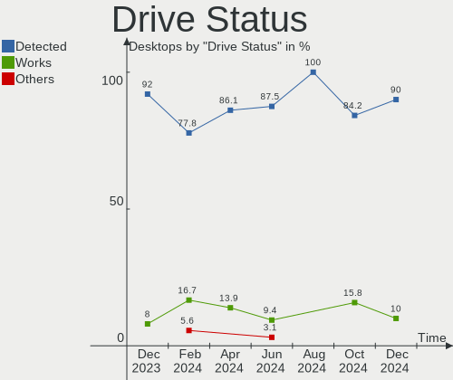

KDE neon Hardware Trends (Desktop)
----------------------------------

A project to identify most popular hardware characteristics and track their change
over time based on data collected by KDE neon users at https://Linux-Hardware.org.

Anyone can contribute to the study by uploading probes of their computers by
the [hw-probe](https://github.com/linuxhw/hw-probe) tool:

    sudo -E hw-probe -all -upload

Full-feature report is available here: https://linux-hardware.org/?view=trends&formfactor=desktop

Period: Nov, 2020.

Contents
--------

- [ OS                       ](#os)
- [ OS Family                ](#os-family)
- [ Kernel                   ](#kernel)
- [ Kernel Family            ](#kernel-family)
- [ Kernel Major Ver.        ](#kernel-major-ver)
- [ Arch                     ](#arch)
- [ DE                       ](#de)
- [ Display Server           ](#display-server)
- [ Display Manager          ](#display-manager)
- [ OS Lang                  ](#os-lang)
- [ Boot Mode                ](#boot-mode)
- [ Filesystem               ](#filesystem)
- [ Part. scheme             ](#part-scheme)
- [ Dual Boot with Linux/BSD ](#dual-boot-with-linux/bsd)
- [ Dual Boot (Win)          ](#dual-boot-win)
- [ Country                  ](#country)
- [ City                     ](#city)
- [ Vendor                   ](#vendor)
- [ Model                    ](#model)
- [ Model Family             ](#model-family)
- [ MFG Year                 ](#mfg-year)
- [ Form Factor              ](#form-factor)
- [ Secure Boot              ](#secure-boot)
- [ Coreboot                 ](#coreboot)
- [ RAM Size                 ](#ram-size)
- [ RAM Used                 ](#ram-used)
- [ Has CD-ROM               ](#has-cd-rom)
- [ Total Drives             ](#total-drives)
- [ Has Ethernet             ](#has-ethernet)
- [ Drive Vendor             ](#drive-vendor)
- [ Drive Model              ](#drive-model)
- [ HDD Vendor               ](#hdd-vendor)
- [ SSD Vendor               ](#ssd-vendor)
- [ Drive Kind               ](#drive-kind)
- [ Drive Connector          ](#drive-connector)
- [ Drive Size               ](#drive-size)
- [ Space Total              ](#space-total)
- [ Space Used               ](#space-used)
- [ Malfunc. Drives          ](#malfunc-drives)
- [ Malfunc. Drive Vendor    ](#malfunc-drive-vendor)
- [ Malfunc. HDD Vendor      ](#malfunc-hdd-vendor)
- [ Malfunc. Drive Kind      ](#malfunc-drive-kind)
- [ Failed Drives            ](#failed-drives)
- [ Failed Drive Vendor      ](#failed-drive-vendor)
- [ Drive Status             ](#drive-status)
- [ Storage Vendor           ](#storage-vendor)
- [ Storage Model            ](#storage-model)
- [ Storage Kind             ](#storage-kind)
- [ CPU Vendor               ](#cpu-vendor)
- [ CPU Model                ](#cpu-model)
- [ CPU Model Family         ](#cpu-model-family)
- [ CPU Cores                ](#cpu-cores)
- [ CPU Sockets              ](#cpu-sockets)
- [ CPU Threads              ](#cpu-threads)
- [ CPU Op-Modes             ](#cpu-op-modes)
- [ CPU Microcode            ](#cpu-microcode)
- [ CPU Microarch            ](#cpu-microarch)
- [ GPU Vendor               ](#gpu-vendor)
- [ GPU Model                ](#gpu-model)
- [ GPU Combo                ](#gpu-combo)
- [ GPU Driver               ](#gpu-driver)
- [ GPU Memory               ](#gpu-memory)
- [ Monitor Vendor           ](#monitor-vendor)
- [ Monitor Model            ](#monitor-model)
- [ Monitor Resolution       ](#monitor-resolution)
- [ Monitor Diagonal         ](#monitor-diagonal)
- [ Monitor Width            ](#monitor-width)
- [ Aspect Ratio             ](#aspect-ratio)
- [ Monitor Area             ](#monitor-area)
- [ Pixel Density            ](#pixel-density)
- [ Multiple Monitors        ](#multiple-monitors)
- [ Net Controller Vendor    ](#net-controller-vendor)
- [ Net Controller Model     ](#net-controller-model)
- [ Wireless Vendor          ](#wireless-vendor)
- [ Wireless Model           ](#wireless-model)
- [ Ethernet Vendor          ](#ethernet-vendor)
- [ Ethernet Model           ](#ethernet-model)
- [ Net Controller Kind      ](#net-controller-kind)
- [ Used Controller          ](#used-controller)
- [ NICs                     ](#nics)
- [ Memory Vendor            ](#memory-vendor)
- [ Memory Model             ](#memory-model)
- [ Memory Kind              ](#memory-kind)
- [ Memory Form Factor       ](#memory-form-factor)
- [ Memory Size              ](#memory-size)
- [ Memory Speed             ](#memory-speed)
- [ Sound Vendor             ](#sound-vendor)
- [ Sound Model              ](#sound-model)
- [ Camera Vendor            ](#camera-vendor)
- [ Camera Model             ](#camera-model)
- [ Fingerprint Vendor       ](#fingerprint-vendor)
- [ Fingerprint Model        ](#fingerprint-model)
- [ Chipcard Vendor          ](#chipcard-vendor)
- [ Chipcard Model           ](#chipcard-model)
- [ Printer Vendor           ](#printer-vendor)
- [ Printer Model            ](#printer-model)
- [ Scanner Vendor           ](#scanner-vendor)
- [ Scanner Model            ](#scanner-model)
- [ Bluetooth Vendor         ](#bluetooth-vendor)
- [ Bluetooth Model          ](#bluetooth-model)
- [ Unsupported Devices      ](#unsupported-devices)
- [ Unsupported Device Types ](#unsupported-device-types)

OS
--

Installed operating systems

| Name           | Desktops | Percent |
|----------------|----------|---------|
| KDE neon 20.04 | 83       | 98.81%  |
| KDE neon 18.04 | 1        | 1.19%   |

OS Family
---------

OS without a version

| Name     | Desktops | Percent |
|----------|----------|---------|
| KDE neon | 84       | 100%    |

Kernel
------

Version of the Linux kernel

| Version              | Desktops | Percent |
|----------------------|----------|---------|
| 5.4.0-52-generic     | 32       | 38.1%   |
| 5.4.0-54-generic     | 27       | 32.14%  |
| 5.4.0-53-generic     | 20       | 23.81%  |
| 5.4.0-51-generic     | 2        | 2.38%   |
| 5.9.3-050903-generic | 1        | 1.19%   |
| 5.8.0-25-generic     | 1        | 1.19%   |
| 5.3.0-62-generic     | 1        | 1.19%   |

Kernel Family
-------------

Linux kernel without a distro release

| Version | Desktops | Percent |
|---------|----------|---------|
| 5.4.0   | 81       | 96.43%  |
| 5.9.3   | 1        | 1.19%   |
| 5.8.0   | 1        | 1.19%   |
| 5.3.0   | 1        | 1.19%   |

Kernel Major Ver.
-----------------

Linux kernel major version

| Version | Desktops | Percent |
|---------|----------|---------|
| 5.4     | 81       | 96.43%  |
| 5.9     | 1        | 1.19%   |
| 5.8     | 1        | 1.19%   |
| 5.3     | 1        | 1.19%   |

Arch
----

OS architecture (x86_64, i586, etc.)

| Name   | Desktops | Percent |
|--------|----------|---------|
| x86_64 | 84       | 100%    |

DE
--

Desktop Environment

| Name    | Desktops | Percent |
|---------|----------|---------|
| KDE     | 79       | 94.05%  |
| KDE5    | 4        | 4.76%   |
| Unknown | 1        | 1.19%   |

Display Server
--------------

X11 or Wayland

| Name | Desktops | Percent |
|------|----------|---------|
| X11  | 84       | 100%    |

Display Manager
---------------

SDDM, LightDM, etc.

| Name    | Desktops | Percent |
|---------|----------|---------|
| Unknown | 80       | 95.24%  |
| SDDM    | 4        | 4.76%   |

OS Lang
-------

Language

| Lang  | Desktops | Percent |
|-------|----------|---------|
| en_US | 29       | 34.52%  |
| de_DE | 10       | 11.9%   |
| C     | 5        | 5.95%   |
| ru_RU | 4        | 4.76%   |
| pt_BR | 4        | 4.76%   |
| it_IT | 4        | 4.76%   |
| fr_FR | 4        | 4.76%   |
| en_GB | 4        | 4.76%   |
| pl_PL | 3        | 3.57%   |
| es_ES | 3        | 3.57%   |
| en_IN | 2        | 2.38%   |
| en_AU | 2        | 2.38%   |
| uk_UA | 1        | 1.19%   |
| sv_SE | 1        | 1.19%   |
| pt_PT | 1        | 1.19%   |
| hu_HU | 1        | 1.19%   |
| fr_CH | 1        | 1.19%   |
| fr_BE | 1        | 1.19%   |
| es_VE | 1        | 1.19%   |
| es_GT | 1        | 1.19%   |
| el_GR | 1        | 1.19%   |
| C     | 1        | 1.19%   |

Boot Mode
---------

EFI or BIOS

| Mode | Desktops | Percent |
|------|----------|---------|
| BIOS | 42       | 50%     |
| EFI  | 42       | 50%     |

Filesystem
----------

Type of filesystem

| Type    | Desktops | Percent |
|---------|----------|---------|
| Ext4    | 77       | 91.67%  |
| Btrfs   | 4        | 4.76%   |
| Overlay | 2        | 2.38%   |
| Ext2    | 1        | 1.19%   |

Part. scheme
------------

Scheme of partitioning

| Type    | Desktops | Percent |
|---------|----------|---------|
| Unknown | 80       | 95.24%  |
| GPT     | 3        | 3.57%   |
| MBR     | 1        | 1.19%   |

Dual Boot with Linux/BSD
------------------------

Hosting more than one Linux/BSD

| Dual boot | Desktops | Percent |
|-----------|----------|---------|
| No        | 82       | 97.62%  |
| Yes       | 2        | 2.38%   |

Dual Boot (Win)
---------------

Hosting Linux and Windows

| Dual boot | Desktops | Percent |
|-----------|----------|---------|
| No        | 78       | 92.86%  |
| Yes       | 6        | 7.14%   |

Country
-------

Geographic location (country)

| Country              | Desktops | Percent |
|----------------------|----------|---------|
| USA                  | 17       | 20.24%  |
| Germany              | 12       | 14.29%  |
| Russia               | 6        | 7.14%   |
| Italy                | 5        | 5.95%   |
| Brazil               | 5        | 5.95%   |
| Poland               | 4        | 4.76%   |
| Sweden               | 3        | 3.57%   |
| Spain                | 3        | 3.57%   |
| France               | 3        | 3.57%   |
| Ukraine              | 2        | 2.38%   |
| UK                   | 2        | 2.38%   |
| Switzerland          | 2        | 2.38%   |
| Indonesia            | 2        | 2.38%   |
| India                | 2        | 2.38%   |
| Australia            | 2        | 2.38%   |
| Venezuela            | 1        | 1.19%   |
| Slovenia             | 1        | 1.19%   |
| Singapore            | 1        | 1.19%   |
| Romania              | 1        | 1.19%   |
| Portugal             | 1        | 1.19%   |
| Netherlands          | 1        | 1.19%   |
| Moldova, Republic of | 1        | 1.19%   |
| Latvia               | 1        | 1.19%   |
| Kazakhstan           | 1        | 1.19%   |
| Hungary              | 1        | 1.19%   |
| Guatemala            | 1        | 1.19%   |
| Greece               | 1        | 1.19%   |
| Canada               | 1        | 1.19%   |
| Belgium              | 1        | 1.19%   |

City
----

Geographic location (city)

| City                | Desktops | Percent |
|---------------------|----------|---------|
| Milan               | 2        | 2.38%   |
| Jakarta             | 2        | 2.38%   |
| Hamburg             | 2        | 2.38%   |
| Gothenburg          | 2        | 2.38%   |
| Wyszków            | 1        | 1.19%   |
| Wiesbaden           | 1        | 1.19%   |
| Warsaw              | 1        | 1.19%   |
| Wadowice            | 1        | 1.19%   |
| Voronezh            | 1        | 1.19%   |
| Vladivostok         | 1        | 1.19%   |
| Vigevano            | 1        | 1.19%   |
| Venda do Pinheiro   | 1        | 1.19%   |
| Veliky Novgorod     | 1        | 1.19%   |
| Uppsala             | 1        | 1.19%   |
| Turlock             | 1        | 1.19%   |
| Trussville          | 1        | 1.19%   |
| Tipp City           | 1        | 1.19%   |
| São Paulo          | 1        | 1.19%   |
| Stuttgart           | 1        | 1.19%   |
| Starachowice        | 1        | 1.19%   |
| Sloviansk           | 1        | 1.19%   |
| Singapore           | 1        | 1.19%   |
| Siedenbruenzow      | 1        | 1.19%   |
| Severna Park        | 1        | 1.19%   |
| Sarlat-la-Canéda   | 1        | 1.19%   |
| Saint-Denis-en-Val  | 1        | 1.19%   |
| Round Rock          | 1        | 1.19%   |
| Rijssen             | 1        | 1.19%   |
| Riga                | 1        | 1.19%   |
| Québec             | 1        | 1.19%   |
| Perth               | 1        | 1.19%   |
| Pembroke            | 1        | 1.19%   |
| Parma               | 1        | 1.19%   |
| Nuremberg           | 1        | 1.19%   |
| Novozavidovskiy     | 1        | 1.19%   |
| Nizhniy Novgorod    | 1        | 1.19%   |
| Málaga             | 1        | 1.19%   |
| Moscow              | 1        | 1.19%   |
| Morahalom           | 1        | 1.19%   |
| Mont-sur-Marchienne | 1        | 1.19%   |
| Longmeadow          | 1        | 1.19%   |
| Lincoln             | 1        | 1.19%   |
| Lehigh Acres        | 1        | 1.19%   |
| Laupheim            | 1        | 1.19%   |
| Kyiv                | 1        | 1.19%   |
| Kolkata             | 1        | 1.19%   |
| Knightdale          | 1        | 1.19%   |
| Jundiaí            | 1        | 1.19%   |
| João Pessoa        | 1        | 1.19%   |
| Jasper              | 1        | 1.19%   |
| Jackson Heights     | 1        | 1.19%   |
| Hyderabad           | 1        | 1.19%   |
| Herisau             | 1        | 1.19%   |
| Hattiesburg         | 1        | 1.19%   |
| Gudo                | 1        | 1.19%   |
| Guatemala City      | 1        | 1.19%   |
| Essen               | 1        | 1.19%   |
| Elderslie           | 1        | 1.19%   |
| Dumont              | 1        | 1.19%   |
| Dortmund            | 1        | 1.19%   |

Vendor
------

Motherboard manufacturer

| Name                | Desktops | Percent |
|---------------------|----------|---------|
| ASUSTek Computer    | 24       | 28.57%  |
| Gigabyte Technology | 19       | 22.62%  |
| ASRock              | 11       | 13.1%   |
| MSI                 | 9        | 10.71%  |
| Intel               | 4        | 4.76%   |
| Hewlett-Packard     | 4        | 4.76%   |
| Dell                | 3        | 3.57%   |
| Acer                | 2        | 2.38%   |
| SYWZ                | 1        | 1.19%   |
| System76            | 1        | 1.19%   |
| Medion              | 1        | 1.19%   |
| Lenovo              | 1        | 1.19%   |
| ICP / iEi           | 1        | 1.19%   |
| Apple               | 1        | 1.19%   |
| ABIT                | 1        | 1.19%   |
| Unknown             | 1        | 1.19%   |

Model
-----

Motherboard model

| Name                         | Desktops | Percent |
|------------------------------|----------|---------|
| Gigabyte B450M DS3H          | 2        | 2.38%   |
| ASRock B450M Pro4            | 2        | 2.38%   |
| SYWZ S200 Series             | 1        | 1.19%   |
| System76 Thelio              | 1        | 1.19%   |
| MSI MS-7A70                  | 1        | 1.19%   |
| MSI MS-7890                  | 1        | 1.19%   |
| MSI MS-7817                  | 1        | 1.19%   |
| MSI MS-7816                  | 1        | 1.19%   |
| MSI MS-7798                  | 1        | 1.19%   |
| MSI MS-7752                  | 1        | 1.19%   |
| MSI MS-7599                  | 1        | 1.19%   |
| MSI MS-7522                  | 1        | 1.19%   |
| MSI MS-7253                  | 1        | 1.19%   |
| Medion H67H2-EM              | 1        | 1.19%   |
| Lenovo IdeaCentre K330B      | 1        | 1.19%   |
| Intel H61                    | 1        | 1.19%   |
| Intel DH87RL AAG74240-403    | 1        | 1.19%   |
| Intel DG41KR AAE62839-304    | 1        | 1.19%   |
| Intel DG31PR AAD97573-300    | 1        | 1.19%   |
| ICP / iEi B202               | 1        | 1.19%   |
| HP Z800 Workstation          | 1        | 1.19%   |
| HP Z420 Workstation          | 1        | 1.19%   |
| HP ProDesk 400 G2 MT         | 1        | 1.19%   |
| HP Compaq 8200 Elite SFF PC  | 1        | 1.19%   |
| Gigabyte Z87X-UD3H           | 1        | 1.19%   |
| Gigabyte Z270X-UD3           | 1        | 1.19%   |
| Gigabyte X99-UD5 WIFI-CF     | 1        | 1.19%   |
| Gigabyte X570 AORUS ULTRA    | 1        | 1.19%   |
| Gigabyte X570 AORUS ELITE    | 1        | 1.19%   |
| Gigabyte H97N-WIFI           | 1        | 1.19%   |
| Gigabyte H81M-DS2            | 1        | 1.19%   |
| Gigabyte H61M-S1             | 1        | 1.19%   |
| Gigabyte H310M H             | 1        | 1.19%   |
| Gigabyte H170M-DS3H          | 1        | 1.19%   |
| Gigabyte GB-BACE-3150        | 1        | 1.19%   |
| Gigabyte GA-MA78G-DS3H       | 1        | 1.19%   |
| Gigabyte GA-880GA-UD3H       | 1        | 1.19%   |
| Gigabyte F2A88XM-HD3         | 1        | 1.19%   |
| Gigabyte B75M-D3V            | 1        | 1.19%   |
| Gigabyte B550I AORUS PRO AX  | 1        | 1.19%   |
| Gigabyte A320M-S2H           | 1        | 1.19%   |
| Dell OptiPlex 7040           | 1        | 1.19%   |
| Dell OptiPlex 3020           | 1        | 1.19%   |
| Dell DXP061                  | 1        | 1.19%   |
| ASUS Z170-PRO                | 1        | 1.19%   |
| ASUS STRIX B250G GAMING      | 1        | 1.19%   |
| ASUS ROG STRIX B450-F GAMING | 1        | 1.19%   |
| ASUS ROG Maximus X CODE      | 1        | 1.19%   |
| ASUS PRIME Z370-P            | 1        | 1.19%   |
| ASUS PRIME Z270-P            | 1        | 1.19%   |
| ASUS PRIME X470-PRO          | 1        | 1.19%   |
| ASUS PRIME H270M-PLUS        | 1        | 1.19%   |
| ASUS PRIME B250M-K           | 1        | 1.19%   |
| ASUS P9X79 PRO               | 1        | 1.19%   |
| ASUS P8H67                   | 1        | 1.19%   |
| ASUS P8H61-M LX2 R2.0        | 1        | 1.19%   |
| ASUS P8B75-M LE              | 1        | 1.19%   |
| ASUS P5W DH Deluxe           | 1        | 1.19%   |
| ASUS P5Q-EM                  | 1        | 1.19%   |
| ASUS P5N-D                   | 1        | 1.19%   |

Model Family
------------

Motherboard model prefix

| Name                   | Desktops | Percent |
|------------------------|----------|---------|
| ASUS PRIME             | 5        | 5.95%   |
| ASRock B450            | 3        | 3.57%   |
| Gigabyte X570          | 2        | 2.38%   |
| Gigabyte B450M         | 2        | 2.38%   |
| Dell OptiPlex          | 2        | 2.38%   |
| ASUS ROG               | 2        | 2.38%   |
| ASRock B450M           | 2        | 2.38%   |
| SYWZ S200              | 1        | 1.19%   |
| System76 Thelio        | 1        | 1.19%   |
| MSI MS-7A70            | 1        | 1.19%   |
| MSI MS-7890            | 1        | 1.19%   |
| MSI MS-7817            | 1        | 1.19%   |
| MSI MS-7816            | 1        | 1.19%   |
| MSI MS-7798            | 1        | 1.19%   |
| MSI MS-7752            | 1        | 1.19%   |
| MSI MS-7599            | 1        | 1.19%   |
| MSI MS-7522            | 1        | 1.19%   |
| MSI MS-7253            | 1        | 1.19%   |
| Medion H67H2-EM        | 1        | 1.19%   |
| Lenovo IdeaCentre      | 1        | 1.19%   |
| Intel H61              | 1        | 1.19%   |
| Intel DH87RL           | 1        | 1.19%   |
| Intel DG41KR           | 1        | 1.19%   |
| Intel DG31PR           | 1        | 1.19%   |
| ICP / iEi B202         | 1        | 1.19%   |
| HP Z800                | 1        | 1.19%   |
| HP Z420                | 1        | 1.19%   |
| HP ProDesk             | 1        | 1.19%   |
| HP Compaq              | 1        | 1.19%   |
| Gigabyte Z87X-UD3H     | 1        | 1.19%   |
| Gigabyte Z270X-UD3     | 1        | 1.19%   |
| Gigabyte X99-UD5       | 1        | 1.19%   |
| Gigabyte H97N-WIFI     | 1        | 1.19%   |
| Gigabyte H81M-DS2      | 1        | 1.19%   |
| Gigabyte H61M-S1       | 1        | 1.19%   |
| Gigabyte H310M         | 1        | 1.19%   |
| Gigabyte H170M-DS3H    | 1        | 1.19%   |
| Gigabyte GB-BACE-3150  | 1        | 1.19%   |
| Gigabyte GA-MA78G-DS3H | 1        | 1.19%   |
| Gigabyte GA-880GA-UD3H | 1        | 1.19%   |
| Gigabyte F2A88XM-HD3   | 1        | 1.19%   |
| Gigabyte B75M-D3V      | 1        | 1.19%   |
| Gigabyte B550I         | 1        | 1.19%   |
| Gigabyte A320M-S2H     | 1        | 1.19%   |
| Dell DXP061            | 1        | 1.19%   |
| ASUS Z170-PRO          | 1        | 1.19%   |
| ASUS STRIX             | 1        | 1.19%   |
| ASUS P9X79             | 1        | 1.19%   |
| ASUS P8H67             | 1        | 1.19%   |
| ASUS P8H61-M           | 1        | 1.19%   |
| ASUS P8B75-M           | 1        | 1.19%   |
| ASUS P5W               | 1        | 1.19%   |
| ASUS P5Q-EM            | 1        | 1.19%   |
| ASUS P5N-D             | 1        | 1.19%   |
| ASUS Mr.               | 1        | 1.19%   |
| ASUS Maximus           | 1        | 1.19%   |
| ASUS M5A99FX           | 1        | 1.19%   |
| ASUS M5A78L            | 1        | 1.19%   |
| ASUS M4A79T            | 1        | 1.19%   |
| ASUS M4A78-EM-1394     | 1        | 1.19%   |

MFG Year
--------

Motherboard manufacture year

| Year | Desktops | Percent |
|------|----------|---------|
| 2020 | 12       | 14.29%  |
| 2019 | 10       | 11.9%   |
| 2013 | 9        | 10.71%  |
| 2018 | 8        | 9.52%   |
| 2010 | 7        | 8.33%   |
| 2012 | 6        | 7.14%   |
| 2009 | 6        | 7.14%   |
| 2015 | 5        | 5.95%   |
| 2014 | 5        | 5.95%   |
| 2011 | 5        | 5.95%   |
| 2017 | 4        | 4.76%   |
| 2016 | 3        | 3.57%   |
| 2008 | 2        | 2.38%   |
| 2007 | 2        | 2.38%   |

Form Factor
-----------

Physical design of the computer

| Name    | Desktops | Percent |
|---------|----------|---------|
| Desktop | 84       | 100%    |

Secure Boot
-----------

Enabled or disabled

| State    | Desktops | Percent |
|----------|----------|---------|
| Disabled | 83       | 98.81%  |
| Enabled  | 1        | 1.19%   |

Coreboot
--------

Have coreboot on board

| Used | Desktops | Percent |
|------|----------|---------|
| No   | 84       | 100%    |

RAM Size
--------

Total RAM memory

| Size in GB  | Desktops | Percent |
|-------------|----------|---------|
| 16.01-24.0  | 31       | 36.9%   |
| 8.01-16.0   | 18       | 21.43%  |
| 3.01-4.0    | 11       | 13.1%   |
| 32.01-64.0  | 10       | 11.9%   |
| 4.01-8.0    | 8        | 9.52%   |
| 24.01-32.0  | 3        | 3.57%   |
| 64.01-256.0 | 2        | 2.38%   |
| 1.01-2.0    | 1        | 1.19%   |

RAM Used
--------

Used RAM memory

| Used GB   | Desktops | Percent |
|-----------|----------|---------|
| 1.01-2.0  | 35       | 41.67%  |
| 2.01-3.0  | 18       | 21.43%  |
| 4.01-8.0  | 12       | 14.29%  |
| 3.01-4.0  | 8        | 9.52%   |
| 0.01-1.0  | 8        | 9.52%   |
| 8.01-16.0 | 3        | 3.57%   |

Has CD-ROM
----------

Has CD-ROM on board

| Presented | Desktops | Percent |
|-----------|----------|---------|
| Yes       | 42       | 50%     |
| No        | 42       | 50%     |

Total Drives
------------

Number of drives on board

| Drives | Desktops | Percent |
|--------|----------|---------|
| 1      | 29       | 34.52%  |
| 2      | 28       | 33.33%  |
| 3      | 17       | 20.24%  |
| 4      | 7        | 8.33%   |
| 6      | 3        | 3.57%   |

Has Ethernet
------------

Has Ethernet on board

| Presented | Desktops | Percent |
|-----------|----------|---------|
| Yes       | 83       | 98.81%  |
| No        | 1        | 1.19%   |

Drive Vendor
------------

Hard drive vendors

| Vendor                    | Desktops | Drives | Percent |
|---------------------------|----------|--------|---------|
| Seagate                   | 29       | 36     | 19.08%  |
| Samsung Electronics       | 26       | 38     | 17.11%  |
| WDC                       | 24       | 32     | 15.79%  |
| Kingston                  | 9        | 9      | 5.92%   |
| Crucial                   | 9        | 9      | 5.92%   |
| Toshiba                   | 8        | 9      | 5.26%   |
| SanDisk                   | 7        | 8      | 4.61%   |
| Phison                    | 6        | 6      | 3.95%   |
| Intel                     | 6        | 6      | 3.95%   |
| Hitachi                   | 6        | 7      | 3.95%   |
| XPG                       | 4        | 4      | 2.63%   |
| Intenso                   | 3        | 3      | 1.97%   |
| SPCC                      | 2        | 2      | 1.32%   |
| PNY                       | 2        | 2      | 1.32%   |
| Corsair                   | 2        | 2      | 1.32%   |
| WD MediaMax               | 1        | 1      | 0.66%   |
| PLEXTOR                   | 1        | 1      | 0.66%   |
| Patriot                   | 1        | 1      | 0.66%   |
| Micron/Crucial Technology | 1        | 1      | 0.66%   |
| Maxtor                    | 1        | 1      | 0.66%   |
| LITEON                    | 1        | 1      | 0.66%   |
| China                     | 1        | 1      | 0.66%   |
| AMD                       | 1        | 1      | 0.66%   |
| A-DATA Technology         | 1        | 1      | 0.66%   |

Drive Model
-----------

Hard drive models

| Model                             | Desktops | Percent |
|-----------------------------------|----------|---------|
| Seagate ST500DM002-1BD142 500GB   | 4        | 2.27%   |
| Samsung SSD 860 EVO 500GB         | 4        | 2.27%   |
| Kingston SA400S37240G 240GB SSD   | 4        | 2.27%   |
| Seagate ST2000DM001-1ER164 2TB    | 3        | 1.7%    |
| Samsung NVMe SSD Drive 500GB      | 3        | 1.7%    |
| Crucial CT500MX500SSD1 500GB      | 3        | 1.7%    |
| XPG NVMe SSD Drive 512GB          | 2        | 1.14%   |
| WDC WD5000AAKX-001CA0 500GB       | 2        | 1.14%   |
| WDC WD10EZEX-08WN4A0 1TB          | 2        | 1.14%   |
| Toshiba DT01ACA050 500GB          | 2        | 1.14%   |
| Seagate ST250DM000-1BD141 250GB   | 2        | 1.14%   |
| Seagate ST1000DM003-1CH162 1TB    | 2        | 1.14%   |
| Samsung SSD 860 QVO 1TB           | 2        | 1.14%   |
| Samsung SSD 850 PRO 128GB         | 2        | 1.14%   |
| Samsung SSD 850 EVO 250GB         | 2        | 1.14%   |
| Samsung NVMe SSD Drive 512GB      | 2        | 1.14%   |
| Phison NVMe SSD Drive 500GB       | 2        | 1.14%   |
| Phison NVMe SSD Drive 1024GB      | 2        | 1.14%   |
| Kingston SA400S37120G 120GB SSD   | 2        | 1.14%   |
| XPG NVMe SSD Drive 256GB          | 1        | 0.57%   |
| XPG NVMe SSD Drive 1024GB         | 1        | 0.57%   |
| WDC WDS500G1B0A-00H9H0 500GB SSD  | 1        | 0.57%   |
| WDC WDS240G2G0A-00JH30 240GB SSD  | 1        | 0.57%   |
| WDC WDS100T2B0A-00SM50 1TB SSD    | 1        | 0.57%   |
| WDC WD80EFZX-68UW8N0 8TB          | 1        | 0.57%   |
| WDC WD800JD-75MSA3 80GB           | 1        | 0.57%   |
| WDC WD800JD-60LSA0 80GB           | 1        | 0.57%   |
| WDC WD800JD-08MSA1 80GB           | 1        | 0.57%   |
| WDC WD5000AAKX-00ERMA0 500GB      | 1        | 0.57%   |
| WDC WD5000AADS-56S9B0 500GB       | 1        | 0.57%   |
| WDC WD30PURX-64P6ZY0 3TB          | 1        | 0.57%   |
| WDC WD2500BEVS-22UST0 250GB       | 1        | 0.57%   |
| WDC WD20EZAZ-00GGJB0 2TB          | 1        | 0.57%   |
| WDC WD20EURX-63T0FY0 2TB          | 1        | 0.57%   |
| WDC WD20EACS-11BHUB0 2TB          | 1        | 0.57%   |
| WDC WD2000JD-22HBB0 200GB         | 1        | 0.57%   |
| WDC WD10PURX-64E5EY0 1TB          | 1        | 0.57%   |
| WDC WD10PURX-64D85Y0 1TB          | 1        | 0.57%   |
| WDC WD10JPVX-22JC3T0 1TB          | 1        | 0.57%   |
| WDC WD10EZRX-00L4HB0 1TB          | 1        | 0.57%   |
| WDC WD10EZEX-22MFCA0 1TB          | 1        | 0.57%   |
| WDC WD10EZEX-08M2NA0 1TB          | 1        | 0.57%   |
| WDC WD10EARS-22Y5B1 1TB           | 1        | 0.57%   |
| WDC WD10EARS-00Z5B1 1TB           | 1        | 0.57%   |
| WDC WD10EARS-003BB1 1TB           | 1        | 0.57%   |
| WDC WD1002FAEX-00Z3A0 1TB         | 1        | 0.57%   |
| WD MediaMax WL1500GSA6454G 1TB    | 1        | 0.57%   |
| Toshiba TR200 240GB SSD           | 1        | 0.57%   |
| Toshiba MQ01ABD100 1TB            | 1        | 0.57%   |
| Toshiba HDWN180 8TB               | 1        | 0.57%   |
| Toshiba HDWD110 1TB               | 1        | 0.57%   |
| Toshiba DT01ACA300 3TB            | 1        | 0.57%   |
| Toshiba DT01ACA100 1TB            | 1        | 0.57%   |
| SPCC SPCCSolidStateDisk 256GB SSD | 1        | 0.57%   |
| SPCC Solid State Disk 1024GB      | 1        | 0.57%   |
| Seagate STM3500418AS 500GB        | 1        | 0.57%   |
| Seagate ST9320325AS 320GB         | 1        | 0.57%   |
| Seagate ST9250315AS 250GB         | 1        | 0.57%   |
| Seagate ST4000VN008-2DR166 4TB    | 1        | 0.57%   |
| Seagate ST380811AS 80GB           | 1        | 0.57%   |

HDD Vendor
----------

Hard disk drive vendors

| Vendor              | Desktops | Drives | Percent |
|---------------------|----------|--------|---------|
| Seagate             | 29       | 35     | 40.28%  |
| WDC                 | 22       | 29     | 30.56%  |
| Toshiba             | 7        | 8      | 9.72%   |
| Samsung Electronics | 7        | 11     | 9.72%   |
| Hitachi             | 6        | 7      | 8.33%   |
| Maxtor              | 1        | 1      | 1.39%   |

SSD Vendor
----------

Solid state drive vendors

| Vendor              | Desktops | Drives | Percent |
|---------------------|----------|--------|---------|
| Samsung Electronics | 17       | 21     | 26.98%  |
| Crucial             | 9        | 9      | 14.29%  |
| Kingston            | 8        | 8      | 12.7%   |
| SanDisk             | 6        | 7      | 9.52%   |
| Intel               | 5        | 5      | 7.94%   |
| WDC                 | 3        | 3      | 4.76%   |
| SPCC                | 2        | 2      | 3.17%   |
| PNY                 | 2        | 2      | 3.17%   |
| Intenso             | 2        | 2      | 3.17%   |
| Corsair             | 2        | 2      | 3.17%   |
| Toshiba             | 1        | 1      | 1.59%   |
| PLEXTOR             | 1        | 1      | 1.59%   |
| Patriot             | 1        | 1      | 1.59%   |
| LITEON              | 1        | 1      | 1.59%   |
| China               | 1        | 1      | 1.59%   |
| AMD                 | 1        | 1      | 1.59%   |
| A-DATA Technology   | 1        | 1      | 1.59%   |

Drive Kind
----------

HDD or SSD

| Kind    | Desktops | Drives | Percent |
|---------|----------|--------|---------|
| HDD     | 57       | 91     | 44.19%  |
| SSD     | 52       | 68     | 40.31%  |
| NVMe    | 17       | 20     | 13.18%  |
| Unknown | 3        | 3      | 2.33%   |

Drive Connector
---------------

SATA, SAS, NVMe, etc.

| Type | Desktops | Drives | Percent |
|------|----------|--------|---------|
| SATA | 81       | 154    | 77.14%  |
| NVMe | 17       | 20     | 16.19%  |
| SAS  | 7        | 8      | 6.67%   |

Drive Size
----------

Size of hard drive

| Size in TB | Desktops | Drives | Percent |
|------------|----------|--------|---------|
| 0.01-0.5   | 64       | 100    | 55.17%  |
| 0.51-1.0   | 32       | 37     | 27.59%  |
| 1.01-2.0   | 14       | 14     | 12.07%  |
| 3.01-4.0   | 2        | 2      | 1.72%   |
| 2.01-3.0   | 2        | 3      | 1.72%   |
| 4.01-10.0  | 2        | 3      | 1.72%   |

Space Total
-----------

Amount of disk space available on the file system

| Size in GB     | Desktops | Percent |
|----------------|----------|---------|
| 101-250        | 22       | 26.19%  |
| 251-500        | 16       | 19.05%  |
| 501-1000       | 14       | 16.67%  |
| 51-100         | 8        | 9.52%   |
| 2001-3000      | 6        | 7.14%   |
| 1001-2000      | 6        | 7.14%   |
| Unknown        | 4        | 4.76%   |
| More than 3000 | 3        | 3.57%   |
| 1-20           | 3        | 3.57%   |
| 21-50          | 2        | 2.38%   |

Space Used
----------

Amount of used disk space

| Used GB        | Desktops | Percent |
|----------------|----------|---------|
| 1-20           | 34       | 40.48%  |
| 51-100         | 11       | 13.1%   |
| 21-50          | 10       | 11.9%   |
| 101-250        | 9        | 10.71%  |
| 501-1000       | 6        | 7.14%   |
| 251-500        | 5        | 5.95%   |
| Unknown        | 4        | 4.76%   |
| 1001-2000      | 3        | 3.57%   |
| More than 3000 | 2        | 2.38%   |

Malfunc. Drives
---------------

Drive models with a malfunction

| Model                       | Desktops | Drives | Percent |
|-----------------------------|----------|--------|---------|
| WDC WD5000AAKX-001CA0 500GB | 1        | 1      | 20%     |
| WDC WD10EZEX-22MFCA0 1TB    | 1        | 1      | 20%     |
| WDC WD10EARS-22Y5B1 1TB     | 1        | 1      | 20%     |
| WDC WD10EARS-00Z5B1 1TB     | 1        | 1      | 20%     |
| Intel SSDSC2CT240A4 240GB   | 1        | 1      | 20%     |

Malfunc. Drive Vendor
---------------------

Vendors of faulty drives

| Vendor | Desktops | Drives | Percent |
|--------|----------|--------|---------|
| WDC    | 3        | 4      | 75%     |
| Intel  | 1        | 1      | 25%     |

Malfunc. HDD Vendor
-------------------

Vendors of faulty HDD drives

| Vendor | Desktops | Drives | Percent |
|--------|----------|--------|---------|
| WDC    | 3        | 4      | 100%    |

Malfunc. Drive Kind
-------------------

Kinds of faulty drives

| Kind | Desktops | Drives | Percent |
|------|----------|--------|---------|
| HDD  | 3        | 4      | 75%     |
| SSD  | 1        | 1      | 25%     |

Failed Drives
-------------

Failed drive models

Zero info for selected period =(

Failed Drive Vendor
-------------------

Failed drive vendors

Zero info for selected period =(

Drive Status
------------

Number of failed and malfunc. drives

| Status   | Desktops | Drives | Percent |
|----------|----------|--------|---------|
| Detected | 80       | 171    | 91.95%  |
| Malfunc  | 4        | 5      | 4.6%    |
| Works    | 3        | 6      | 3.45%   |

Storage Vendor
--------------

Storage controller vendors

| Vendor                      | Desktops | Percent |
|-----------------------------|----------|---------|
| Intel                       | 54       | 47.37%  |
| AMD                         | 28       | 24.56%  |
| Samsung Electronics         | 6        | 5.26%   |
| Phison Electronics          | 6        | 5.26%   |
| ASMedia Technology          | 4        | 3.51%   |
| ADATA Technology            | 4        | 3.51%   |
| JMicron Technology          | 3        | 2.63%   |
| VIA Technologies            | 2        | 1.75%   |
| Sandisk                     | 1        | 0.88%   |
| Nvidia                      | 1        | 0.88%   |
| Micron/Crucial Technology   | 1        | 0.88%   |
| Marvell Technology Group    | 1        | 0.88%   |
| LSI Logic / Symbios Logic   | 1        | 0.88%   |
| Kingston Technology Company | 1        | 0.88%   |
| Broadcom / LSI              | 1        | 0.88%   |

Storage Model
-------------

Storage controller models

| Model                                                                                   | Desktops | Percent |
|-----------------------------------------------------------------------------------------|----------|---------|
| AMD FCH SATA Controller [AHCI mode]                                                     | 15       | 9.8%    |
| AMD 400 Series Chipset SATA Controller                                                  | 10       | 6.54%   |
| Intel 200 Series PCH SATA controller [AHCI mode]                                        | 9        | 5.88%   |
| AMD SB7x0/SB8x0/SB9x0 IDE Controller                                                    | 9        | 5.88%   |
| Intel 8 Series/C220 Series Chipset Family 6-port SATA Controller 1 [AHCI mode]          | 8        | 5.23%   |
| Intel 6 Series/C200 Series Chipset Family 6 port Desktop SATA AHCI Controller           | 7        | 4.58%   |
| AMD SB7x0/SB8x0/SB9x0 SATA Controller [IDE mode]                                        | 6        | 3.92%   |
| AMD SB7x0/SB8x0/SB9x0 SATA Controller [AHCI mode]                                       | 5        | 3.27%   |
| Phison Electronics E12 NVMe Controller                                                  | 4        | 2.61%   |
| Intel 7 Series/C210 Series Chipset Family 6-port SATA Controller [AHCI mode]            | 4        | 2.61%   |
| ASMedia Technology ASM1062 Serial ATA Controller                                        | 4        | 2.61%   |
| ADATA Technology XPG SX8200 Pro PCIe Gen3x4 M.2 2280 Solid State Drive                  | 4        | 2.61%   |
| Samsung Electronics NVMe SSD Controller SM981/PM981/PM983                               | 3        | 1.96%   |
| JMicron Technology JMB363 SATA/IDE Controller                                           | 3        | 1.96%   |
| Intel Q170/Q150/B150/H170/H110/Z170/CM236 Chipset SATA Controller [AHCI Mode]           | 3        | 1.96%   |
| Intel NM10/ICH7 Family SATA Controller [IDE mode]                                       | 3        | 1.96%   |
| Intel 82801G (ICH7 Family) IDE Controller                                               | 3        | 1.96%   |
| Intel 6 Series/C200 Series Chipset Family Desktop SATA Controller (IDE mode, ports 4-5) | 3        | 1.96%   |
| Intel 6 Series/C200 Series Chipset Family Desktop SATA Controller (IDE mode, ports 0-3) | 3        | 1.96%   |
| Samsung Electronics NVMe SSD Controller SM951/PM951                                     | 2        | 1.31%   |
| Phison Electronics E16 PCIe4 NVMe Controller                                            | 2        | 1.31%   |
| Intel C610/X99 series chipset sSATA Controller [AHCI mode]                              | 2        | 1.31%   |
| Intel C610/X99 series chipset 6-Port SATA Controller [AHCI mode]                        | 2        | 1.31%   |
| Intel C600/X79 series chipset 6-Port SATA AHCI Controller                               | 2        | 1.31%   |
| Intel Atom/Celeron/Pentium Processor x5-E8000/J3xxx/N3xxx Series SATA Controller        | 2        | 1.31%   |
| Intel 82801JI (ICH10 Family) 4 port SATA IDE Controller #1                              | 2        | 1.31%   |
| Intel 82801JI (ICH10 Family) 2 port SATA IDE Controller #2                              | 2        | 1.31%   |
| AMD SATA controller                                                                     | 2        | 1.31%   |
| VIA Technologies VT82C586A/B/VT82C686/A/B/VT823x/A/C PIPC Bus Master IDE                | 1        | 0.65%   |
| VIA Technologies VT8237A SATA 2-Port Controller                                         | 1        | 0.65%   |
| VIA Technologies VT6415 PATA IDE Host Controller                                        | 1        | 0.65%   |
| Sandisk WD Black 2018 / PC SN720 NVMe SSD                                               | 1        | 0.65%   |
| Samsung Electronics NVMe SSD Controller SM961/PM961                                     | 1        | 0.65%   |
| Nvidia MCP51 Serial ATA Controller                                                      | 1        | 0.65%   |
| Nvidia MCP51 IDE                                                                        | 1        | 0.65%   |
| Micron/Crucial Technology Non-Volatile memory controller                                | 1        | 0.65%   |
| Marvell Technology Group 88SE9128 PCIe SATA 6 Gb/s RAID controller with HyperDuo        | 1        | 0.65%   |
| LSI Logic / Symbios Logic SAS1068E PCI-Express Fusion-MPT SAS                           | 1        | 0.65%   |
| Kingston Technology Company A2000 NVMe SSD                                              | 1        | 0.65%   |
| Intel Optane SSD 900P Series                                                            | 1        | 0.65%   |
| Intel HM170/QM170 Chipset SATA Controller [AHCI Mode]                                   | 1        | 0.65%   |
| Intel Cannon Lake PCH SATA AHCI Controller                                              | 1        | 0.65%   |
| Intel C602 chipset 4-Port SATA Storage Control Unit                                     | 1        | 0.65%   |
| Intel C600/X79 series chipset SATA RAID Controller                                      | 1        | 0.65%   |
| Intel C600/X79 series chipset IDE-r Controller                                          | 1        | 0.65%   |
| Intel 9 Series Chipset Family SATA Controller [AHCI Mode]                               | 1        | 0.65%   |
| Intel 82801JI (ICH10 Family) SATA AHCI Controller                                       | 1        | 0.65%   |
| Intel 82801IR/IO/IH (ICH9R/DO/DH) 4 port SATA Controller [IDE mode]                     | 1        | 0.65%   |
| Intel 82801I (ICH9 Family) 2 port SATA Controller [IDE mode]                            | 1        | 0.65%   |
| Intel 82801HR/HO/HH (ICH8R/DO/DH) 2 port SATA Controller [IDE mode]                     | 1        | 0.65%   |
| Intel 82801H (ICH8 Family) 4 port SATA Controller [IDE mode]                            | 1        | 0.65%   |
| Intel 631xESB/632xESB/3100 Chipset SATA IDE Controller                                  | 1        | 0.65%   |
| Intel 631xESB/632xESB IDE Controller                                                    | 1        | 0.65%   |
| Intel 6 Series/C200 Series Chipset Family IDE-r Controller                              | 1        | 0.65%   |
| Intel 5 Series/3400 Series Chipset 6 port SATA AHCI Controller                          | 1        | 0.65%   |
| Broadcom / LSI SAS2308 PCI-Express Fusion-MPT SAS-2                                     | 1        | 0.65%   |
| AMD FCH SATA Controller D                                                               | 1        | 0.65%   |

Storage Kind
------------

Kind of storage controller (IDE, SATA, NVMe, SAS, ...)

| Kind | Desktops | Percent |
|------|----------|---------|
| SATA | 70       | 61.4%   |
| IDE  | 24       | 21.05%  |
| NVMe | 17       | 14.91%  |
| RAID | 1        | 0.88%   |
| SAS  | 1        | 0.88%   |
| SCSI | 1        | 0.88%   |

CPU Vendor
----------

Processor vendors

| Vendor | Desktops | Percent |
|--------|----------|---------|
| Intel  | 55       | 65.48%  |
| AMD    | 29       | 34.52%  |

CPU Model
---------

Processor models

| Model                                       | Desktops | Percent |
|---------------------------------------------|----------|---------|
| AMD Ryzen 7 3700X 8-Core Processor          | 5        | 5.95%   |
| Intel Core i7-3770 CPU @ 3.40GHz            | 3        | 3.57%   |
| AMD Phenom II X4 955 Processor              | 3        | 3.57%   |
| Intel Core i7-6700 CPU @ 3.40GHz            | 2        | 2.38%   |
| Intel Core i7-5820K CPU @ 3.30GHz           | 2        | 2.38%   |
| Intel Core i7-2600 CPU @ 3.40GHz            | 2        | 2.38%   |
| Intel Core i5-7500 CPU @ 3.40GHz            | 2        | 2.38%   |
| Intel Core i5-3470 CPU @ 3.20GHz            | 2        | 2.38%   |
| Intel Core i5-2500 CPU @ 3.30GHz            | 2        | 2.38%   |
| Intel Celeron CPU N3150 @ 1.60GHz           | 2        | 2.38%   |
| AMD Ryzen 5 3400G with Radeon Vega Graphics | 2        | 2.38%   |
| AMD Ryzen 3 3200G with Radeon Vega Graphics | 2        | 2.38%   |
| AMD Phenom II X4 965 Processor              | 2        | 2.38%   |
| AMD FX-8350 Eight-Core Processor            | 2        | 2.38%   |
| Intel Xeon CPU X5650 @ 2.67GHz              | 1        | 1.19%   |
| Intel Xeon CPU X5450 @ 3.00GHz              | 1        | 1.19%   |
| Intel Xeon CPU E5462 @ 2.80GHz              | 1        | 1.19%   |
| Intel Xeon CPU E5-2630 v2 @ 2.60GHz         | 1        | 1.19%   |
| Intel Xeon CPU E5-1620 0 @ 3.60GHz          | 1        | 1.19%   |
| Intel Pentium Dual-Core CPU E5700 @ 3.00GHz | 1        | 1.19%   |
| Intel Pentium CPU G620 @ 2.60GHz            | 1        | 1.19%   |
| Intel Pentium CPU G4560 @ 3.50GHz           | 1        | 1.19%   |
| Intel Core i9-9900K CPU @ 3.60GHz           | 1        | 1.19%   |
| Intel Core i7-7700K CPU @ 4.20GHz           | 1        | 1.19%   |
| Intel Core i7-6700K CPU @ 4.00GHz           | 1        | 1.19%   |
| Intel Core i7-4790S CPU @ 3.20GHz           | 1        | 1.19%   |
| Intel Core i7-4771 CPU @ 3.50GHz            | 1        | 1.19%   |
| Intel Core i7-4770K CPU @ 3.50GHz           | 1        | 1.19%   |
| Intel Core i7-3820 CPU @ 3.60GHz            | 1        | 1.19%   |
| Intel Core i7 CPU 960 @ 3.20GHz             | 1        | 1.19%   |
| Intel Core i5-8600K CPU @ 3.60GHz           | 1        | 1.19%   |
| Intel Core i5-8400 CPU @ 2.80GHz            | 1        | 1.19%   |
| Intel Core i5-8300H CPU @ 2.30GHz           | 1        | 1.19%   |
| Intel Core i5-7400 CPU @ 3.00GHz            | 1        | 1.19%   |
| Intel Core i5-6500T CPU @ 2.50GHz           | 1        | 1.19%   |
| Intel Core i5-4690K CPU @ 3.50GHz           | 1        | 1.19%   |
| Intel Core i5-4670 CPU @ 3.40GHz            | 1        | 1.19%   |
| Intel Core i5-4590 CPU @ 3.30GHz            | 1        | 1.19%   |
| Intel Core i5-4570T CPU @ 2.90GHz           | 1        | 1.19%   |
| Intel Core i5-4570 CPU @ 3.20GHz            | 1        | 1.19%   |
| Intel Core i5-3570 CPU @ 3.40GHz            | 1        | 1.19%   |
| Intel Core i5-3330 CPU @ 3.00GHz            | 1        | 1.19%   |
| Intel Core i3-7100 CPU @ 3.90GHz            | 1        | 1.19%   |
| Intel Core i3-4170 CPU @ 3.70GHz            | 1        | 1.19%   |
| Intel Core i3-3240 CPU @ 3.40GHz            | 1        | 1.19%   |
| Intel Core i3-3220 CPU @ 3.30GHz            | 1        | 1.19%   |
| Intel Core i3 CPU 530 @ 2.93GHz             | 1        | 1.19%   |
| Intel Core 2 Quad CPU Q9300 @ 2.50GHz       | 1        | 1.19%   |
| Intel Core 2 Quad CPU Q8400 @ 2.66GHz       | 1        | 1.19%   |
| Intel Core 2 Duo CPU E7400 @ 2.80GHz        | 1        | 1.19%   |
| Intel Core 2 Duo CPU E6750 @ 2.66GHz        | 1        | 1.19%   |
| Intel Core 2 CPU 6600 @ 2.40GHz             | 1        | 1.19%   |
| AMD Ryzen 7 3800XT 8-Core Processor         | 1        | 1.19%   |
| AMD Ryzen 7 2700X Eight-Core Processor      | 1        | 1.19%   |
| AMD Ryzen 5 3600XT 6-Core Processor         | 1        | 1.19%   |
| AMD Ryzen 5 2600X Six-Core Processor        | 1        | 1.19%   |
| AMD Ryzen 5 2600 Six-Core Processor         | 1        | 1.19%   |
| AMD Ryzen 5 2400G with Radeon Vega Graphics | 1        | 1.19%   |
| AMD Ryzen 3 2200G with Radeon Vega Graphics | 1        | 1.19%   |
| AMD Phenom II X4 945 Processor              | 1        | 1.19%   |

CPU Model Family
----------------

Processor model prefix

| Model                   | Desktops | Percent |
|-------------------------|----------|---------|
| Intel Core i5           | 18       | 21.43%  |
| Intel Core i7           | 16       | 19.05%  |
| AMD Ryzen 7             | 7        | 8.33%   |
| AMD Ryzen 5             | 6        | 7.14%   |
| AMD Phenom II X4        | 6        | 7.14%   |
| Intel Xeon              | 5        | 5.95%   |
| Intel Core i3           | 5        | 5.95%   |
| AMD Ryzen 3             | 3        | 3.57%   |
| Intel Pentium           | 2        | 2.38%   |
| Intel Core 2 Quad       | 2        | 2.38%   |
| Intel Core 2 Duo        | 2        | 2.38%   |
| Intel Celeron           | 2        | 2.38%   |
| AMD FX                  | 2        | 2.38%   |
| AMD Athlon 64 X2        | 2        | 2.38%   |
| Intel Pentium Dual-Core | 1        | 1.19%   |
| Intel Core i9           | 1        | 1.19%   |
| Intel Core 2            | 1        | 1.19%   |
| AMD Athlon II X4        | 1        | 1.19%   |
| AMD Athlon 64           | 1        | 1.19%   |
| AMD A4                  | 1        | 1.19%   |

CPU Cores
---------

Number of processor cores

| Number | Desktops | Percent |
|--------|----------|---------|
| 4      | 50       | 59.52%  |
| 2      | 14       | 16.67%  |
| 8      | 9        | 10.71%  |
| 6      | 8        | 9.52%   |
| 1      | 2        | 2.38%   |
| 12     | 1        | 1.19%   |

CPU Sockets
-----------

Number of sockets

| Number | Desktops | Percent |
|--------|----------|---------|
| 1      | 82       | 97.62%  |
| 2      | 2        | 2.38%   |

CPU Threads
-----------

Threads per core (Hyper-Threading)

| Number | Desktops | Percent |
|--------|----------|---------|
| 2      | 43       | 51.19%  |
| 1      | 41       | 48.81%  |

CPU Op-Modes
------------

CPU Operation Modes (32-bit, 64-bit)

| Op mode        | Desktops | Percent |
|----------------|----------|---------|
| 32-bit, 64-bit | 84       | 100%    |

CPU Microcode
-------------

Microcode number

| Number     | Desktops | Percent |
|------------|----------|---------|
| 0x306a9    | 9        | 10.71%  |
| 0x306c3    | 8        | 9.52%   |
| 0x906e9    | 6        | 7.14%   |
| 0x08701021 | 6        | 7.14%   |
| Unknown    | 6        | 7.14%   |
| 0x206a7    | 5        | 5.95%   |
| 0x506e3    | 4        | 4.76%   |
| 0x08108109 | 4        | 4.76%   |
| 0x010000c8 | 4        | 4.76%   |
| 0x1067a    | 3        | 3.57%   |
| 0x0800820d | 3        | 3.57%   |
| 0x010000db | 3        | 3.57%   |
| 0x906ea    | 2        | 2.38%   |
| 0x406c3    | 2        | 2.38%   |
| 0x306f2    | 2        | 2.38%   |
| 0x206d7    | 2        | 2.38%   |
| 0x10676    | 2        | 2.38%   |
| 0x08101016 | 2        | 2.38%   |
| 0x06000852 | 2        | 2.38%   |
| 0x906ed    | 1        | 1.19%   |
| 0x6fb      | 1        | 1.19%   |
| 0x6f6      | 1        | 1.19%   |
| 0x306e4    | 1        | 1.19%   |
| 0x206c2    | 1        | 1.19%   |
| 0x20652    | 1        | 1.19%   |
| 0x106a5    | 1        | 1.19%   |
| 0x10677    | 1        | 1.19%   |
| 0x06001119 | 1        | 1.19%   |

CPU Microarch
-------------

Microarchitecture

| Name        | Desktops | Percent |
|-------------|----------|---------|
| Haswell     | 11       | 13.1%   |
| KabyLake    | 10       | 11.9%   |
| IvyBridge   | 10       | 11.9%   |
| Zen+        | 7        | 8.33%   |
| Zen 2       | 7        | 8.33%   |
| SandyBridge | 7        | 8.33%   |
| K10         | 7        | 8.33%   |
| Penryn      | 6        | 7.14%   |
| Skylake     | 4        | 4.76%   |
| Piledriver  | 3        | 3.57%   |
| K8 Hammer   | 3        | 3.57%   |
| Zen         | 2        | 2.38%   |
| Westmere    | 2        | 2.38%   |
| Silvermont  | 2        | 2.38%   |
| Core        | 2        | 2.38%   |
| Nehalem     | 1        | 1.19%   |

GPU Vendor
----------

Vendors of graphics cards

| Vendor | Desktops | Percent |
|--------|----------|---------|
| Nvidia | 43       | 48.31%  |
| AMD    | 29       | 32.58%  |
| Intel  | 17       | 19.1%   |

GPU Model
---------

Graphics card models

| Model                                                                                    | Desktops | Percent |
|------------------------------------------------------------------------------------------|----------|---------|
| AMD Ellesmere [Radeon RX 470/480/570/570X/580/580X/590]                                  | 7        | 7.87%   |
| Intel Xeon E3-1200 v3/4th Gen Core Processor Integrated Graphics Controller              | 5        | 5.62%   |
| Nvidia GP107 [GeForce GTX 1050 Ti]                                                       | 4        | 4.49%   |
| Nvidia GM206 [GeForce GTX 960]                                                           | 4        | 4.49%   |
| Nvidia GP106 [GeForce GTX 1060 6GB]                                                      | 3        | 3.37%   |
| Nvidia GM204 [GeForce GTX 970]                                                           | 3        | 3.37%   |
| AMD Navi 10 [Radeon RX 5600 OEM/5600 XT / 5700/5700 XT]                                  | 3        | 3.37%   |
| Nvidia GT215 [GeForce GT 240]                                                            | 2        | 2.25%   |
| Nvidia GP106 [GeForce GTX 1060 3GB]                                                      | 2        | 2.25%   |
| Nvidia GP102 [GeForce GTX 1080 Ti]                                                       | 2        | 2.25%   |
| Nvidia GK104 [GeForce GTX 660 Ti]                                                        | 2        | 2.25%   |
| Intel Xeon E3-1200 v2/3rd Gen Core processor Graphics Controller                         | 2        | 2.25%   |
| Intel HD Graphics 630                                                                    | 2        | 2.25%   |
| Intel Atom/Celeron/Pentium Processor x5-E8000/J3xxx/N3xxx Integrated Graphics Controller | 2        | 2.25%   |
| Intel 2nd Generation Core Processor Family Integrated Graphics Controller                | 2        | 2.25%   |
| Nvidia TU117 [GeForce GTX 1650]                                                          | 1        | 1.12%   |
| Nvidia TU116 [GeForce GTX 1660]                                                          | 1        | 1.12%   |
| Nvidia GT218 [GeForce 210]                                                               | 1        | 1.12%   |
| Nvidia GP108 [GeForce GT 1030]                                                           | 1        | 1.12%   |
| Nvidia GM107 [GeForce GTX 750]                                                           | 1        | 1.12%   |
| Nvidia GK208B [GeForce GT 710]                                                           | 1        | 1.12%   |
| Nvidia GK107 [NVS 510]                                                                   | 1        | 1.12%   |
| Nvidia GK107 [GeForce GTX 650]                                                           | 1        | 1.12%   |
| Nvidia GK106 [GeForce GTX 650 Ti]                                                        | 1        | 1.12%   |
| Nvidia GK104 [GeForce GTX 760]                                                           | 1        | 1.12%   |
| Nvidia GF119 [GeForce GT 610]                                                            | 1        | 1.12%   |
| Nvidia GF119 [GeForce 605]                                                               | 1        | 1.12%   |
| Nvidia GF116 [GeForce GTX 550 Ti]                                                        | 1        | 1.12%   |
| Nvidia GF110 [GeForce GTX 560 OEM]                                                       | 1        | 1.12%   |
| Nvidia GF108 [GeForce GT 630]                                                            | 1        | 1.12%   |
| Nvidia GF106GL [Quadro 2000]                                                             | 1        | 1.12%   |
| Nvidia GF106 [GeForce GTS 450]                                                           | 1        | 1.12%   |
| Nvidia G98 [GeForce 8400 GS Rev. 2]                                                      | 1        | 1.12%   |
| Nvidia G96C [GeForce 9400 GT]                                                            | 1        | 1.12%   |
| Nvidia G92 [GeForce GTS 250]                                                             | 1        | 1.12%   |
| Nvidia G92 [GeForce 8800 GT]                                                             | 1        | 1.12%   |
| Intel UHD Graphics 630 (Mobile)                                                          | 1        | 1.12%   |
| Intel UHD Graphics 630 (Desktop)                                                         | 1        | 1.12%   |
| Intel HD Graphics 530                                                                    | 1        | 1.12%   |
| Intel 4th Generation Core Processor Family Integrated Graphics Controller                | 1        | 1.12%   |
| AMD Tonga PRO [Radeon R9 285/380]                                                        | 1        | 1.12%   |
| AMD Tahiti XT [Radeon HD 7970/8970 OEM / R9 280X]                                        | 1        | 1.12%   |
| AMD RS880 [Radeon HD 4250]                                                               | 1        | 1.12%   |
| AMD RS780 [Radeon HD 3200]                                                               | 1        | 1.12%   |
| AMD RS740 [Radeon 2100]                                                                  | 1        | 1.12%   |
| AMD Richland [Radeon HD 8370D]                                                           | 1        | 1.12%   |
| AMD Raven Ridge [Radeon Vega Series / Radeon Vega Mobile Series]                         | 1        | 1.12%   |
| AMD Pitcairn PRO [Radeon HD 7850 / R7 265 / R9 270 1024SP]                               | 1        | 1.12%   |
| AMD Picasso                                                                              | 1        | 1.12%   |
| AMD Oland XT [Radeon HD 8670 / R7 250/350]                                               | 1        | 1.12%   |
| AMD Navi 14 [Radeon RX 5500/5500M / Pro 5500M]                                           | 1        | 1.12%   |
| AMD Juniper XT [Radeon HD 5770]                                                          | 1        | 1.12%   |
| AMD Cedar [Radeon HD 5000/6000/7350/8350 Series]                                         | 1        | 1.12%   |
| AMD Cayman PRO [Radeon HD 6950]                                                          | 1        | 1.12%   |
| AMD Cape Verde XT [Radeon HD 7770/8760 / R7 250X]                                        | 1        | 1.12%   |
| AMD Cape Verde GL [FirePro W4100]                                                        | 1        | 1.12%   |
| AMD Caicos [Radeon HD 6450/7450/8450 / R5 230 OEM]                                       | 1        | 1.12%   |
| AMD Baffin [Radeon RX 550 640SP / RX 560/560X]                                           | 1        | 1.12%   |
| AMD Baffin [Radeon RX 460/560D / Pro 450/455/460/555/555X/560/560X]                      | 1        | 1.12%   |

GPU Combo
---------

Combinations of graphics cards

| Name           | Desktops | Percent |
|----------------|----------|---------|
| 1 x Nvidia     | 41       | 48.81%  |
| 1 x AMD        | 29       | 34.52%  |
| 1 x Intel      | 13       | 15.48%  |
| Intel + Nvidia | 1        | 1.19%   |

GPU Driver
----------

Free vs proprietary

| Driver      | Desktops | Percent |
|-------------|----------|---------|
| Free        | 66       | 78.57%  |
| Proprietary | 15       | 17.86%  |
| Unknown     | 3        | 3.57%   |

GPU Memory
----------

Total video memory

| Size in GB | Desktops | Percent |
|------------|----------|---------|
| Unknown    | 21       | 25%     |
| 1.01-2.0   | 17       | 20.24%  |
| 0.51-1.0   | 15       | 17.86%  |
| 7.01-8.0   | 9        | 10.71%  |
| 3.01-4.0   | 8        | 9.52%   |
| 5.01-6.0   | 5        | 5.95%   |
| 0.01-0.5   | 5        | 5.95%   |
| 2.01-3.0   | 2        | 2.38%   |
| 8.01-16.0  | 2        | 2.38%   |

Monitor Vendor
--------------

Monitor vendors

| Vendor               | Desktops | Percent |
|----------------------|----------|---------|
| Samsung Electronics  | 15       | 16.85%  |
| Goldstar             | 13       | 14.61%  |
| Dell                 | 10       | 11.24%  |
| Ancor Communications | 8        | 8.99%   |
| Acer                 | 8        | 8.99%   |
| Hewlett-Packard      | 5        | 5.62%   |
| BenQ                 | 5        | 5.62%   |
| AOC                  | 5        | 5.62%   |
| Philips              | 4        | 4.49%   |
| Unknown              | 2        | 2.25%   |
| MSI                  | 2        | 2.25%   |
| Iiyama               | 2        | 2.25%   |
| Viotek               | 1        | 1.12%   |
| ViewSonic            | 1        | 1.12%   |
| SYK                  | 1        | 1.12%   |
| LG Electronics       | 1        | 1.12%   |
| Lenovo               | 1        | 1.12%   |
| Hitachi              | 1        | 1.12%   |
| FUS                  | 1        | 1.12%   |
| Fujitsu Siemens      | 1        | 1.12%   |
| eMachines            | 1        | 1.12%   |
| ASUSTek Computer     | 1        | 1.12%   |

Monitor Model
-------------

Monitor models

| Model                                                                   | Desktops | Percent |
|-------------------------------------------------------------------------|----------|---------|
| Samsung Electronics LCD Monitor SAM0A7A 1920x1080 1060x626mm 48.5-inch  | 2        | 2.13%   |
| MSI MAG241C MSI3EA2 1920x1080 521x293mm 23.5-inch                       | 2        | 2.13%   |
| Goldstar IPS FULLHD GSM5AB8 1920x1080 480x270mm 21.7-inch               | 2        | 2.13%   |
| Goldstar FULL HD GSM5B55 1920x1080 480x270mm 21.7-inch                  | 2        | 2.13%   |
| Viotek GFV24C VTK0236 1920x1080 530x280mm 23.6-inch                     | 1        | 1.06%   |
| ViewSonic VX2476 Series VSCD332 1920x1080 527x296mm 23.8-inch           | 1        | 1.06%   |
| Unknown LCD Monitor DELL3007WFPHC 2560x1600                             | 1        | 1.06%   |
| Unknown HV-734TB ___1770 1280x1024 338x270mm 17.0-inch                  | 1        | 1.06%   |
| SYK HDMI TO AV SYK0030 1920x540 708x398mm 32.0-inch                     | 1        | 1.06%   |
| Samsung Electronics U32J59x SAM0F33 3840x2160 697x392mm 31.5-inch       | 1        | 1.06%   |
| Samsung Electronics U28E850 SAM0CCE 3840x2160 608x345mm 27.5-inch       | 1        | 1.06%   |
| Samsung Electronics SyncMaster SAM03E5 1680x1050 470x300mm 22.0-inch    | 1        | 1.06%   |
| Samsung Electronics SyncMaster SAM01F9 1280x1024 376x301mm 19.0-inch    | 1        | 1.06%   |
| Samsung Electronics SMT24A350 SAM07AD 1920x1080 531x299mm 24.0-inch     | 1        | 1.06%   |
| Samsung Electronics SMS24A450/460 SAM0838 1920x1080 531x299mm 24.0-inch | 1        | 1.06%   |
| Samsung Electronics SA300/SA350 SAM0788 1366x768 410x230mm 18.5-inch    | 1        | 1.06%   |
| Samsung Electronics S27D390 SAM0B67 1920x1080 600x340mm 27.2-inch       | 1        | 1.06%   |
| Samsung Electronics S24C350 SAM0A3C 1920x1080 520x290mm 23.4-inch       | 1        | 1.06%   |
| Samsung Electronics LCD Monitor SAM0DF7 3840x2160 1872x1053mm 84.6-inch | 1        | 1.06%   |
| Samsung Electronics LCD Monitor SAM0DF6 3840x2160 890x500mm 40.2-inch   | 1        | 1.06%   |
| Samsung Electronics LCD Monitor SAM0B7C 1920x1080 886x498mm 40.0-inch   | 1        | 1.06%   |
| Samsung Electronics C27F390 SAM0D32 1920x1080 600x340mm 27.2-inch       | 1        | 1.06%   |
| Philips PHL BDM4065 PHL08E1 1920x1080 880x490mm 39.7-inch               | 1        | 1.06%   |
| Philips PHL 273V7 PHLC156 1920x1080 598x336mm 27.0-inch                 | 1        | 1.06%   |
| Philips PHL 223G5 PHLC106 1920x1080 477x268mm 21.5-inch                 | 1        | 1.06%   |
| Philips LCD Monitor PHLC081 1920x1080 480x270mm 21.7-inch               | 1        | 1.06%   |
| LG Electronics LCD Monitor LG IPS FULLHD 1920x1080                      | 1        | 1.06%   |
| Lenovo LEN L171 LEN240B 1280x1024 337x270mm 17.0-inch                   | 1        | 1.06%   |
| Iiyama PLX2783H IVM6611 1920x1080 598x336mm 27.0-inch                   | 1        | 1.06%   |
| Iiyama PL2792Q IVM6630 2560x1440 597x336mm 27.0-inch                    | 1        | 1.06%   |
| Hitachi N220W D-sub HIT60FF 1680x1050 474x296mm 22.0-inch               | 1        | 1.06%   |
| Hewlett-Packard w1907 HWP26A3 1440x900 410x260mm 19.1-inch              | 1        | 1.06%   |
| Hewlett-Packard S2031 HWP2903 1600x900 443x249mm 20.0-inch              | 1        | 1.06%   |
| Hewlett-Packard S1933 HWP2933 1366x768 413x234mm 18.7-inch              | 1        | 1.06%   |
| Hewlett-Packard 25f HPN3547 1920x1080 553x309mm 24.9-inch               | 1        | 1.06%   |
| Hewlett-Packard 24w HPN3431 1920x1080 527x296mm 23.8-inch               | 1        | 1.06%   |
| Hewlett-Packard 2309 HWP2821 1920x1080 510x287mm 23.0-inch              | 1        | 1.06%   |
| Goldstar ULTRAWIDE GSM76F9 2560x1080 531x298mm 24.0-inch                | 1        | 1.06%   |
| Goldstar ULTRAWIDE GSM5AE2 3440x1440 800x335mm 34.1-inch                | 1        | 1.06%   |
| Goldstar IPS FULLHD GSM5AB6 1920x1080 480x270mm 21.7-inch               | 1        | 1.06%   |
| Goldstar E2442 GSM58C6 1920x1080 531x299mm 24.0-inch                    | 1        | 1.06%   |
| Goldstar E2251 GSM586D 1920x1080 477x268mm 21.5-inch                    | 1        | 1.06%   |
| Goldstar E2241 GSM581A 1920x1080 477x268mm 21.5-inch                    | 1        | 1.06%   |
| Goldstar 32inch FHD GSM76F5 1920x1080 698x392mm 31.5-inch               | 1        | 1.06%   |
| Goldstar 27GL850 GSM5B7F 2560x1440 597x336mm 27.0-inch                  | 1        | 1.06%   |
| Goldstar 23MP65 GSM5A45 1920x1080 510x290mm 23.1-inch                   | 1        | 1.06%   |
| Goldstar 23MP65 GSM5A44 1680x1050 510x290mm 23.1-inch                   | 1        | 1.06%   |
| FUS LCD Monitor A17-3 1280x1024                                         | 1        | 1.06%   |
| Fujitsu Siemens 462E FA FUS0404 1280x1024 359x287mm 18.1-inch           | 1        | 1.06%   |
| eMachines E202H EMA00B5 1600x900 443x249mm 20.0-inch                    | 1        | 1.06%   |
| Dell U2917W DEL40F9 2560x1080 673x284mm 28.8-inch                       | 1        | 1.06%   |
| Dell U2711 DELA055 2560x1440 597x336mm 27.0-inch                        | 1        | 1.06%   |
| Dell U2412M DELA07A 1920x1200 518x324mm 24.1-inch                       | 1        | 1.06%   |
| Dell U2312HM DEL4072 1920x1080 510x290mm 23.1-inch                      | 1        | 1.06%   |
| Dell SE2717H/HX DELD0A1 1920x1080 600x340mm 27.2-inch                   | 1        | 1.06%   |
| Dell P2416D DELA0C4 2560x1440 527x296mm 23.8-inch                       | 1        | 1.06%   |
| Dell P2314H DEL4098 1920x1080 509x286mm 23.0-inch                       | 1        | 1.06%   |
| Dell P2214H DELA098 1920x1080 480x270mm 21.7-inch                       | 1        | 1.06%   |
| Dell LCD Monitor U2312HM 1920x1080                                      | 1        | 1.06%   |
| Dell LCD Monitor E2313H 1920x1080                                       | 1        | 1.06%   |

Monitor Resolution
------------------

Monitor screen resolution

| Resolution         | Desktops | Percent |
|--------------------|----------|---------|
| 1920x1080 (FHD)    | 43       | 50%     |
| 3840x2160 (4K)     | 8        | 9.3%    |
| 2560x1440 (QHD)    | 5        | 5.81%   |
| 1280x1024 (SXGA)   | 5        | 5.81%   |
| 1680x1050 (WSXGA+) | 3        | 3.49%   |
| 1600x900 (HD+)     | 3        | 3.49%   |
| 1366x768 (WXGA)    | 3        | 3.49%   |
| Unknown            | 3        | 3.49%   |
| 3840x1080          | 2        | 2.33%   |
| 2560x1080          | 2        | 2.33%   |
| 1440x900 (WXGA+)   | 2        | 2.33%   |
| 4864x1080          | 1        | 1.16%   |
| 3440x1440          | 1        | 1.16%   |
| 2560x1600          | 1        | 1.16%   |
| 1920x540           | 1        | 1.16%   |
| 1920x1200 (WUXGA)  | 1        | 1.16%   |
| 1600x1200          | 1        | 1.16%   |
| 1024x768 (XGA)     | 1        | 1.16%   |

Monitor Diagonal
----------------

Diagonal size in inches

| Inches  | Desktops | Percent |
|---------|----------|---------|
| 27      | 15       | 17.44%  |
| 24      | 11       | 12.79%  |
| 23      | 11       | 12.79%  |
| 21      | 11       | 12.79%  |
| Unknown | 11       | 12.79%  |
| 18      | 4        | 4.65%   |
| 22      | 3        | 3.49%   |
| 20      | 3        | 3.49%   |
| 19      | 3        | 3.49%   |
| 84      | 2        | 2.33%   |
| 48      | 2        | 2.33%   |
| 34      | 2        | 2.33%   |
| 32      | 2        | 2.33%   |
| 17      | 2        | 2.33%   |
| 40      | 1        | 1.16%   |
| 39      | 1        | 1.16%   |
| 31      | 1        | 1.16%   |
| 28      | 1        | 1.16%   |

Monitor Width
-------------

Physical width

| Width in mm | Desktops | Percent |
|-------------|----------|---------|
| 501-600     | 30       | 37.5%   |
| 401-500     | 20       | 25%     |
| Unknown     | 11       | 13.75%  |
| 601-700     | 5        | 6.25%   |
| 701-800     | 4        | 5%      |
| 801-900     | 2        | 2.5%    |
| 351-400     | 2        | 2.5%    |
| 301-350     | 2        | 2.5%    |
| 1501-2000   | 2        | 2.5%    |
| 1001-1500   | 2        | 2.5%    |

Aspect Ratio
------------

Proportional relationship between the width and the height

| Ratio   | Desktops | Percent |
|---------|----------|---------|
| 16/9    | 54       | 68.35%  |
| Unknown | 11       | 13.92%  |
| 16/10   | 6        | 7.59%   |
| 5/4     | 4        | 5.06%   |
| 21/9    | 3        | 3.8%    |
| 4/3     | 1        | 1.27%   |

Monitor Area
------------

Area in inch²

| Area in inch² | Desktops | Percent |
|----------------|----------|---------|
| 201-250        | 32       | 37.21%  |
| 301-350        | 15       | 17.44%  |
| Unknown        | 11       | 12.79%  |
| 151-200        | 9        | 10.47%  |
| 351-500        | 5        | 5.81%   |
| 141-150        | 5        | 5.81%   |
| More than 1000 | 4        | 4.65%   |
| 251-300        | 3        | 3.49%   |
| 501-1000       | 2        | 2.33%   |

Pixel Density
-------------

Pixels per inch

| Density | Desktops | Percent |
|---------|----------|---------|
| 51-100  | 46       | 56.79%  |
| 101-120 | 17       | 20.99%  |
| Unknown | 11       | 13.58%  |
| 121-160 | 4        | 4.94%   |
| 1-50    | 2        | 2.47%   |
| 161-240 | 1        | 1.23%   |

Multiple Monitors
-----------------

Total monitors connected

| Total | Desktops | Percent |
|-------|----------|---------|
| 1     | 66       | 78.57%  |
| 2     | 12       | 14.29%  |
| 0     | 4        | 4.76%   |
| 3     | 2        | 2.38%   |

Net Controller Vendor
---------------------

Controller vendors

| Vendor                         | Desktops | Percent |
|--------------------------------|----------|---------|
| Realtek Semiconductor          | 53       | 47.32%  |
| Intel                          | 32       | 28.57%  |
| Qualcomm Atheros               | 5        | 4.46%   |
| Ralink Technology              | 3        | 2.68%   |
| TP-Link                        | 2        | 1.79%   |
| NetGear                        | 2        | 1.79%   |
| Broadcom Inc. and subsidiaries | 2        | 1.79%   |
| VIA Technologies               | 1        | 0.89%   |
| Samsung Electronics            | 1        | 0.89%   |
| OPPO Electronics               | 1        | 0.89%   |
| Nvidia                         | 1        | 0.89%   |
| Motorola PCS                   | 1        | 0.89%   |
| Mellanox Technologies          | 1        | 0.89%   |
| Marvell Technology Group       | 1        | 0.89%   |
| InterBiometrics                | 1        | 0.89%   |
| IMC Networks                   | 1        | 0.89%   |
| Edimax Technology              | 1        | 0.89%   |
| D-Link                         | 1        | 0.89%   |
| Broadcom Limited               | 1        | 0.89%   |
| Belkin Components              | 1        | 0.89%   |

Net Controller Model
--------------------

Controller models

| Model                                                                                 | Desktops | Percent |
|---------------------------------------------------------------------------------------|----------|---------|
| Realtek RTL8111/8168/8411 PCI Express Gigabit Ethernet Controller                     | 47       | 37.3%   |
| Intel I211 Gigabit Network Connection                                                 | 6        | 4.76%   |
| Intel Ethernet Connection (2) I219-V                                                  | 6        | 4.76%   |
| Intel Wi-Fi 6 AX200                                                                   | 5        | 3.97%   |
| Intel Ethernet Connection I217-V                                                      | 3        | 2.38%   |
| Intel 82579LM Gigabit Network Connection (Lewisville)                                 | 3        | 2.38%   |
| Realtek RTL810xE PCI Express Fast Ethernet controller                                 | 2        | 1.59%   |
| Qualcomm Atheros Killer E220x Gigabit Ethernet Controller                             | 2        | 1.59%   |
| Intel Wireless 7260                                                                   | 2        | 1.59%   |
| Intel Wireless 3165                                                                   | 2        | 1.59%   |
| Intel Ethernet Connection (2) I218-V                                                  | 2        | 1.59%   |
| Intel Dual Band Wireless-AC 3168NGW [Stone Peak]                                      | 2        | 1.59%   |
| Intel 82579V Gigabit Network Connection                                               | 2        | 1.59%   |
| VIA VT6102/VT6103 [Rhine-II]                                                          | 1        | 0.79%   |
| TP-Link RTL8812AU Archer T4U 802.11ac                                                 | 1        | 0.79%   |
| TP-Link Archer T3U [Realtek RTL8812BU]                                                | 1        | 0.79%   |
| Samsung Galaxy series, misc. (tethering mode)                                         | 1        | 0.79%   |
| Realtek RTL8822BE 802.11a/b/g/n/ac WiFi adapter                                       | 1        | 0.79%   |
| Realtek RTL8812AU 802.11a/b/g/n/ac 2T2R DB WLAN Adapter                               | 1        | 0.79%   |
| Realtek RTL8192EU 802.11b/g/n WLAN Adapter                                            | 1        | 0.79%   |
| Realtek RTL8191SU 802.11n WLAN Adapter                                                | 1        | 0.79%   |
| Realtek RTL8187B Wireless 802.11g 54Mbps Network Adapter                              | 1        | 0.79%   |
| Realtek RTL8169 PCI Gigabit Ethernet Controller                                       | 1        | 0.79%   |
| Realtek RTL8125 2.5GbE Controller                                                     | 1        | 0.79%   |
| Realtek RTL-8110SC/8169SC Gigabit Ethernet                                            | 1        | 0.79%   |
| Realtek 802.11ac NIC                                                                  | 1        | 0.79%   |
| Ralink RT3072 Wireless Adapter                                                        | 1        | 0.79%   |
| Ralink RT2870/RT3070 Wireless Adapter                                                 | 1        | 0.79%   |
| Ralink RT2501/RT2573 Wireless Adapter                                                 | 1        | 0.79%   |
| Qualcomm Atheros AR9227 Wireless Network Adapter                                      | 1        | 0.79%   |
| Qualcomm Atheros AR8151 v2.0 Gigabit Ethernet                                         | 1        | 0.79%   |
| Qualcomm Atheros AR5418 Wireless Network Adapter [AR5008E 802.11(a)bgn] (PCI-Express) | 1        | 0.79%   |
| OPPO SDM665-IDP _SN:6FFE58A5                                                          | 1        | 0.79%   |
| Nvidia MCP51 Ethernet Controller                                                      | 1        | 0.79%   |
| NetGear WNDA4100 802.11abgn 3x3:3 [Ralink RT3573]                                     | 1        | 0.79%   |
| NetGear WG111v3 54 Mbps Wireless [realtek RTL8187B]                                   | 1        | 0.79%   |
| NetGear LB1120-100NAS                                                                 | 1        | 0.79%   |
| Motorola PCS moto g(7) optimo maxx(XT1955DL)                                          | 1        | 0.79%   |
| Mellanox MT26448 [ConnectX EN 10GigE, PCIe 2.0 5GT/s]                                 | 1        | 0.79%   |
| Marvell Group 88E8053 PCI-E Gigabit Ethernet Controller                               | 1        | 0.79%   |
| InterBiometrics Io                                                                    | 1        | 0.79%   |
| Intel Wireless 7265                                                                   | 1        | 0.79%   |
| Intel Wireless 3160                                                                   | 1        | 0.79%   |
| Intel I350 Gigabit Network Connection                                                 | 1        | 0.79%   |
| Intel I210 Gigabit Network Connection                                                 | 1        | 0.79%   |
| Intel Ethernet Connection (2) I219-LM                                                 | 1        | 0.79%   |
| Intel 82566DC Gigabit Network Connection                                              | 1        | 0.79%   |
| Intel 80003ES2LAN Gigabit Ethernet Controller (Copper)                                | 1        | 0.79%   |
| IMC Networks Mediao 802.11n WLAN [Realtek RTL8191SU]                                  | 1        | 0.79%   |
| Edimax EW-7711UTn nLite Wireless Adapter [Ralink RT3070]                              | 1        | 0.79%   |
| D-Link DWA-140 RangeBooster N Adapter(rev.B3) [Ralink RT5372]                         | 1        | 0.79%   |
| Broadcom Limited BCM4360 802.11ac Wireless Network Adapter                            | 1        | 0.79%   |
| Broadcom Inc. and subsidiaries NetXtreme BCM5764M Gigabit Ethernet PCIe               | 1        | 0.79%   |
| Broadcom Inc. and subsidiaries BCM4360 802.11ac Wireless Network Adapter              | 1        | 0.79%   |
| Belkin Components F7D1101 v1 Basic Wireless Adapter [Realtek RTL8188SU]               | 1        | 0.79%   |

Wireless Vendor
---------------

Wireless vendors

| Vendor                         | Desktops | Percent |
|--------------------------------|----------|---------|
| Intel                          | 13       | 38.24%  |
| Realtek Semiconductor          | 6        | 17.65%  |
| Ralink Technology              | 3        | 8.82%   |
| TP-Link                        | 2        | 5.88%   |
| Qualcomm Atheros               | 2        | 5.88%   |
| NetGear                        | 2        | 5.88%   |
| IMC Networks                   | 1        | 2.94%   |
| Edimax Technology              | 1        | 2.94%   |
| D-Link                         | 1        | 2.94%   |
| Broadcom Limited               | 1        | 2.94%   |
| Broadcom Inc. and subsidiaries | 1        | 2.94%   |
| Belkin Components              | 1        | 2.94%   |

Wireless Model
--------------

Wireless models

| Model                                                                                 | Desktops | Percent |
|---------------------------------------------------------------------------------------|----------|---------|
| Intel Wi-Fi 6 AX200                                                                   | 5        | 14.71%  |
| Intel Wireless 7260                                                                   | 2        | 5.88%   |
| Intel Wireless 3165                                                                   | 2        | 5.88%   |
| Intel Dual Band Wireless-AC 3168NGW [Stone Peak]                                      | 2        | 5.88%   |
| TP-Link RTL8812AU Archer T4U 802.11ac                                                 | 1        | 2.94%   |
| TP-Link Archer T3U [Realtek RTL8812BU]                                                | 1        | 2.94%   |
| Realtek RTL8822BE 802.11a/b/g/n/ac WiFi adapter                                       | 1        | 2.94%   |
| Realtek RTL8812AU 802.11a/b/g/n/ac 2T2R DB WLAN Adapter                               | 1        | 2.94%   |
| Realtek RTL8192EU 802.11b/g/n WLAN Adapter                                            | 1        | 2.94%   |
| Realtek RTL8191SU 802.11n WLAN Adapter                                                | 1        | 2.94%   |
| Realtek RTL8187B Wireless 802.11g 54Mbps Network Adapter                              | 1        | 2.94%   |
| Realtek 802.11ac NIC                                                                  | 1        | 2.94%   |
| Ralink RT3072 Wireless Adapter                                                        | 1        | 2.94%   |
| Ralink RT2870/RT3070 Wireless Adapter                                                 | 1        | 2.94%   |
| Ralink RT2501/RT2573 Wireless Adapter                                                 | 1        | 2.94%   |
| Qualcomm Atheros AR9227 Wireless Network Adapter                                      | 1        | 2.94%   |
| Qualcomm Atheros AR5418 Wireless Network Adapter [AR5008E 802.11(a)bgn] (PCI-Express) | 1        | 2.94%   |
| NetGear WNDA4100 802.11abgn 3x3:3 [Ralink RT3573]                                     | 1        | 2.94%   |
| NetGear WG111v3 54 Mbps Wireless [realtek RTL8187B]                                   | 1        | 2.94%   |
| Intel Wireless 7265                                                                   | 1        | 2.94%   |
| Intel Wireless 3160                                                                   | 1        | 2.94%   |
| IMC Networks Mediao 802.11n WLAN [Realtek RTL8191SU]                                  | 1        | 2.94%   |
| Edimax EW-7711UTn nLite Wireless Adapter [Ralink RT3070]                              | 1        | 2.94%   |
| D-Link DWA-140 RangeBooster N Adapter(rev.B3) [Ralink RT5372]                         | 1        | 2.94%   |
| Broadcom Limited BCM4360 802.11ac Wireless Network Adapter                            | 1        | 2.94%   |
| Broadcom Inc. and subsidiaries BCM4360 802.11ac Wireless Network Adapter              | 1        | 2.94%   |
| Belkin Components F7D1101 v1 Basic Wireless Adapter [Realtek RTL8188SU]               | 1        | 2.94%   |

Ethernet Vendor
---------------

Ethernet vendors

| Vendor                         | Desktops | Percent |
|--------------------------------|----------|---------|
| Realtek Semiconductor          | 51       | 57.95%  |
| Intel                          | 25       | 28.41%  |
| Qualcomm Atheros               | 3        | 3.41%   |
| VIA Technologies               | 1        | 1.14%   |
| Samsung Electronics            | 1        | 1.14%   |
| OPPO Electronics               | 1        | 1.14%   |
| Nvidia                         | 1        | 1.14%   |
| NetGear                        | 1        | 1.14%   |
| Motorola PCS                   | 1        | 1.14%   |
| Mellanox Technologies          | 1        | 1.14%   |
| Marvell Technology Group       | 1        | 1.14%   |
| Broadcom Inc. and subsidiaries | 1        | 1.14%   |

Ethernet Model
--------------

Ethernet models

| Model                                                                   | Desktops | Percent |
|-------------------------------------------------------------------------|----------|---------|
| Realtek RTL8111/8168/8411 PCI Express Gigabit Ethernet Controller       | 47       | 51.65%  |
| Intel I211 Gigabit Network Connection                                   | 6        | 6.59%   |
| Intel Ethernet Connection (2) I219-V                                    | 6        | 6.59%   |
| Intel Ethernet Connection I217-V                                        | 3        | 3.3%    |
| Intel 82579LM Gigabit Network Connection (Lewisville)                   | 3        | 3.3%    |
| Realtek RTL810xE PCI Express Fast Ethernet controller                   | 2        | 2.2%    |
| Qualcomm Atheros Killer E220x Gigabit Ethernet Controller               | 2        | 2.2%    |
| Intel Ethernet Connection (2) I218-V                                    | 2        | 2.2%    |
| Intel 82579V Gigabit Network Connection                                 | 2        | 2.2%    |
| VIA VT6102/VT6103 [Rhine-II]                                            | 1        | 1.1%    |
| Samsung Galaxy series, misc. (tethering mode)                           | 1        | 1.1%    |
| Realtek RTL8169 PCI Gigabit Ethernet Controller                         | 1        | 1.1%    |
| Realtek RTL8125 2.5GbE Controller                                       | 1        | 1.1%    |
| Realtek RTL-8110SC/8169SC Gigabit Ethernet                              | 1        | 1.1%    |
| Qualcomm Atheros AR8151 v2.0 Gigabit Ethernet                           | 1        | 1.1%    |
| OPPO SDM665-IDP _SN:6FFE58A5                                            | 1        | 1.1%    |
| Nvidia MCP51 Ethernet Controller                                        | 1        | 1.1%    |
| NetGear LB1120-100NAS                                                   | 1        | 1.1%    |
| Motorola PCS moto g(7) optimo maxx(XT1955DL)                            | 1        | 1.1%    |
| Mellanox MT26448 [ConnectX EN 10GigE, PCIe 2.0 5GT/s]                   | 1        | 1.1%    |
| Marvell Group 88E8053 PCI-E Gigabit Ethernet Controller                 | 1        | 1.1%    |
| Intel I350 Gigabit Network Connection                                   | 1        | 1.1%    |
| Intel I210 Gigabit Network Connection                                   | 1        | 1.1%    |
| Intel Ethernet Connection (2) I219-LM                                   | 1        | 1.1%    |
| Intel 82566DC Gigabit Network Connection                                | 1        | 1.1%    |
| Intel 80003ES2LAN Gigabit Ethernet Controller (Copper)                  | 1        | 1.1%    |
| Broadcom Inc. and subsidiaries NetXtreme BCM5764M Gigabit Ethernet PCIe | 1        | 1.1%    |

Net Controller Kind
-------------------

Ethernet, WiFi or modem

| Kind     | Desktops | Percent |
|----------|----------|---------|
| Ethernet | 83       | 70.94%  |
| WiFi     | 33       | 28.21%  |
| Modem    | 1        | 0.85%   |

Used Controller
---------------

Currently used network controller

| Kind     | Desktops | Percent |
|----------|----------|---------|
| Ethernet | 80       | 75.47%  |
| WiFi     | 26       | 24.53%  |

NICs
----

Total network controllers on board

| Total | Desktops | Percent |
|-------|----------|---------|
| 1     | 62       | 73.81%  |
| 2     | 19       | 22.62%  |
| 3     | 2        | 2.38%   |
| 4     | 1        | 1.19%   |

Memory Vendor
-------------

Memory module vendors

| Vendor            | Desktops | Percent |
|-------------------|----------|---------|
| Unknown           | 3        | 33.33%  |
| Kingston          | 3        | 33.33%  |
| Micron Technology | 1        | 11.11%  |
| Crucial           | 1        | 11.11%  |
| Corsair           | 1        | 11.11%  |

Memory Model
------------

Memory module models

| Model                                                    | Desktops | Percent |
|----------------------------------------------------------|----------|---------|
| Unknown RAM Module 4096MB DIMM 1333MT/s                  | 1        | 9.09%   |
| Unknown RAM Module 2GB DIMM DDR2 667MT/s                 | 1        | 9.09%   |
| Unknown RAM Module 2048MB DIMM 1333MT/s                  | 1        | 9.09%   |
| Unknown RAM CompuStocx (CSX) 4096MB DIMM DDR3 1333MT/s   | 1        | 9.09%   |
| Micron RAM 16ATF1G64AZ-2G1A1 8GB DIMM DDR4 2133MT/s      | 1        | 9.09%   |
| Kingston RAM KHX2400C15D4/8G 8GB DIMM DDR4 2400MT/s      | 1        | 9.09%   |
| Kingston RAM KHX2400C15/16G 16384MB DIMM DDR4 2400MT/s   | 1        | 9.09%   |
| Kingston RAM KHX1866C9D3/8GX 8GB DIMM DDR3 1866MT/s      | 1        | 9.09%   |
| Kingston RAM 99U5471-036.A00LF 8192MB DIMM DDR3 1600MT/s | 1        | 9.09%   |
| Crucial RAM BLS8G3D1609DS1S00. 8192MB DIMM DDR3 1600MT/s | 1        | 9.09%   |
| Corsair RAM CMK32GX4M4A2133C13 8192MB DIMM DDR4 2133MT/s | 1        | 9.09%   |

Memory Kind
-----------

Memory module kinds

| Kind    | Desktops | Percent |
|---------|----------|---------|
| DDR3    | 4        | 50%     |
| DDR4    | 2        | 25%     |
| DDR2    | 1        | 12.5%   |
| Unknown | 1        | 12.5%   |

Memory Form Factor
------------------

Physical design of the memory module

| Name | Desktops | Percent |
|------|----------|---------|
| DIMM | 8        | 100%    |

Memory Size
-----------

Memory module size

| Size  | Desktops | Percent |
|-------|----------|---------|
| 8192  | 5        | 50%     |
| 4096  | 2        | 20%     |
| 2048  | 2        | 20%     |
| 16384 | 1        | 10%     |

Memory Speed
------------

Memory module speed

| Speed | Desktops | Percent |
|-------|----------|---------|
| 2133  | 2        | 22.22%  |
| 1600  | 2        | 22.22%  |
| 1333  | 2        | 22.22%  |
| 2400  | 1        | 11.11%  |
| 1866  | 1        | 11.11%  |
| 667   | 1        | 11.11%  |

Sound Vendor
------------

Sound card vendors

| Vendor                               | Desktops | Percent |
|--------------------------------------|----------|---------|
| Intel                                | 53       | 35.81%  |
| Nvidia                               | 39       | 26.35%  |
| AMD                                  | 39       | 26.35%  |
| Texas Instruments                    | 3        | 2.03%   |
| C-Media Electronics                  | 3        | 2.03%   |
| VIA Technologies                     | 2        | 1.35%   |
| Thesycon Systemsoftware & Consulting | 1        | 0.68%   |
| Sony                                 | 1        | 0.68%   |
| Plantronics                          | 1        | 0.68%   |
| Logitech                             | 1        | 0.68%   |
| Kingston Technology                  | 1        | 0.68%   |
| JMTek                                | 1        | 0.68%   |
| FDUCE PRO AUDIO MADE                 | 1        | 0.68%   |
| Dell                                 | 1        | 0.68%   |
| Creative Labs                        | 1        | 0.68%   |

Sound Model
-----------

Sound card models

| Model                                                                                             | Desktops | Percent |
|---------------------------------------------------------------------------------------------------|----------|---------|
| AMD SBx00 Azalia (Intel HDA)                                                                      | 11       | 6.47%   |
| Intel 6 Series/C200 Series Chipset Family High Definition Audio Controller                        | 10       | 5.88%   |
| Intel 8 Series/C220 Series Chipset High Definition Audio Controller                               | 8        | 4.71%   |
| Intel 200 Series PCH HD Audio                                                                     | 8        | 4.71%   |
| AMD Starship/Matisse HD Audio Controller                                                          | 7        | 4.12%   |
| AMD Ellesmere HDMI Audio [Radeon RX 470/480 / 570/580/590]                                        | 7        | 4.12%   |
| AMD Family 17h (Models 10h-1fh) HD Audio Controller                                               | 6        | 3.53%   |
| Nvidia GP106 High Definition Audio Controller                                                     | 5        | 2.94%   |
| Intel Xeon E3-1200 v3/4th Gen Core Processor HD Audio Controller                                  | 5        | 2.94%   |
| Nvidia GP107GL High Definition Audio Controller                                                   | 4        | 2.35%   |
| Nvidia GM206 High Definition Audio Controller                                                     | 4        | 2.35%   |
| Intel 7 Series/C216 Chipset Family High Definition Audio Controller                               | 4        | 2.35%   |
| AMD Oland/Hainan/Cape Verde/Pitcairn HDMI Audio [Radeon HD 7000 Series]                           | 4        | 2.35%   |
| AMD Navi 10 HDMI Audio                                                                            | 4        | 2.35%   |
| Nvidia High Definition Audio Controller                                                           | 3        | 1.76%   |
| Nvidia GM204 High Definition Audio Controller                                                     | 3        | 1.76%   |
| Nvidia GK104 HDMI Audio Controller                                                                | 3        | 1.76%   |
| Intel C600/X79 series chipset High Definition Audio Controller                                    | 3        | 1.76%   |
| Intel 82801JI (ICH10 Family) HD Audio Controller                                                  | 3        | 1.76%   |
| Intel 100 Series/C230 Series Chipset Family HD Audio Controller                                   | 3        | 1.76%   |
| AMD Family 17h (Models 00h-0fh) HD Audio Controller                                               | 3        | 1.76%   |
| Texas Instruments PCM2902 Audio Codec                                                             | 2        | 1.18%   |
| Nvidia GP102 HDMI Audio Controller                                                                | 2        | 1.18%   |
| Nvidia GK107 HDMI Audio Controller                                                                | 2        | 1.18%   |
| Nvidia GF119 HDMI Audio Controller                                                                | 2        | 1.18%   |
| Nvidia GF106 High Definition Audio Controller                                                     | 2        | 1.18%   |
| Intel NM10/ICH7 Family High Definition Audio Controller                                           | 2        | 1.18%   |
| Intel C610/X99 series chipset HD Audio Controller                                                 | 2        | 1.18%   |
| Intel Atom/Celeron/Pentium Processor x5-E8000/J3xxx/N3xxx Series High Definition Audio Controller | 2        | 1.18%   |
| C-Media Electronics Audio Adapter (Planet UP-100, Genius G-Talk)                                  | 2        | 1.18%   |
| AMD Raven/Raven2/Fenghuang HDMI/DP Audio Controller                                               | 2        | 1.18%   |
| AMD Baffin HDMI/DP Audio [Radeon RX 550 640SP / RX 560/560X]                                      | 2        | 1.18%   |
| VIA Technologies VT8237A/VT8251 HDA Controller                                                    | 1        | 0.59%   |
| VIA Technologies FX-AUDIO-DAC-X6                                                                  | 1        | 0.59%   |
| Thesycon Systemsoftware & Consulting D90 MQA                                                      | 1        | 0.59%   |
| Texas Instruments PCM2704C stereo audio DAC                                                       | 1        | 0.59%   |
| Sony DualShock 4 [CUH-ZCT2x]                                                                      | 1        | 0.59%   |
| Plantronics RIG 800HD                                                                             | 1        | 0.59%   |
| Nvidia TU116 High Definition Audio Controller                                                     | 1        | 0.59%   |
| Nvidia TU107 GeForce GTX 1650 High Definition Audio Controller                                    | 1        | 0.59%   |
| Nvidia MCP51 High Definition Audio                                                                | 1        | 0.59%   |
| Nvidia GP108 High Definition Audio Controller                                                     | 1        | 0.59%   |
| Nvidia GM107 High Definition Audio Controller [GeForce 940MX]                                     | 1        | 0.59%   |
| Nvidia GK208 HDMI/DP Audio Controller                                                             | 1        | 0.59%   |
| Nvidia GF116 High Definition Audio Controller                                                     | 1        | 0.59%   |
| Nvidia GF110 High Definition Audio Controller                                                     | 1        | 0.59%   |
| Nvidia GF108 High Definition Audio Controller                                                     | 1        | 0.59%   |
| Logitech G633 Gaming Headset                                                                      | 1        | 0.59%   |
| Kingston Technology HyperX 7.1 Audio                                                              | 1        | 0.59%   |
| JMTek USB PnP Audio Device                                                                        | 1        | 0.59%   |
| Intel USB PnP Sound Device                                                                        | 1        | 0.59%   |
| Intel CM238 HD Audio Controller                                                                   | 1        | 0.59%   |
| Intel Cannon Lake PCH cAVS                                                                        | 1        | 0.59%   |
| Intel 9 Series Chipset Family HD Audio Controller                                                 | 1        | 0.59%   |
| Intel 82801I (ICH9 Family) HD Audio Controller                                                    | 1        | 0.59%   |
| Intel 82801H (ICH8 Family) HD Audio Controller                                                    | 1        | 0.59%   |
| Intel 631xESB/632xESB High Definition Audio Controller                                            | 1        | 0.59%   |
| Intel 5 Series/3400 Series Chipset High Definition Audio                                          | 1        | 0.59%   |
| FDUCE PRO AUDIO MADE FDUCE PRO AUDIO                                                              | 1        | 0.59%   |
| Dell AC511 Sound Bar                                                                              | 1        | 0.59%   |

Camera Vendor
-------------

Camera device vendors

| Vendor                        | Desktops | Percent |
|-------------------------------|----------|---------|
| Logitech                      | 6        | 37.5%   |
| Sunplus Innovation Technology | 2        | 12.5%   |
| Trust                         | 1        | 6.25%   |
| OmniVision Technologies       | 1        | 6.25%   |
| Microsoft                     | 1        | 6.25%   |
| Microdia                      | 1        | 6.25%   |
| KYE Systems (Mouse Systems)   | 1        | 6.25%   |
| Jieli Technology              | 1        | 6.25%   |
| Huawei Technologies           | 1        | 6.25%   |
| Creative Technology           | 1        | 6.25%   |

Camera Model
------------

Camera device models

| Model                                      | Desktops | Percent |
|--------------------------------------------|----------|---------|
| Logitech Webcam C270                       | 2        | 12.5%   |
| Logitech HD Pro Webcam C920                | 2        | 12.5%   |
| Trust Full HD Webcam                       | 1        | 6.25%   |
| Sunplus FHD Camera Microphone              | 1        | 6.25%   |
| Sunplus Aukey-PC-LM1E Camera               | 1        | 6.25%   |
| OmniVision OV511+ Webcam                   | 1        | 6.25%   |
| Microsoft LifeCam HD-5000                  | 1        | 6.25%   |
| Microdia Webcam Vitade AF                  | 1        | 6.25%   |
| Logitech QuickCam Communicate MP/S5500     | 1        | 6.25%   |
| Logitech HD Webcam C910                    | 1        | 6.25%   |
| KYE Systems (Mouse Systems) PC-LM1E Camera | 1        | 6.25%   |
| Jieli USB PHY 2.0                          | 1        | 6.25%   |
| Huawei HiCamera                            | 1        | 6.25%   |
| Creative Live! Cam Socialize [VF0640]      | 1        | 6.25%   |

Fingerprint Vendor
------------------

Fingerprint sensor vendors

Zero info for selected period =(

Fingerprint Model
-----------------

Fingerprint sensor models

Zero info for selected period =(

Chipcard Vendor
---------------

Chipcard module vendors

| Vendor           | Desktops | Percent |
|------------------|----------|---------|
| SCM Microsystems | 1        | 100%    |

Chipcard Model
--------------

Chipcard module models

| Model                                    | Desktops | Percent |
|------------------------------------------|----------|---------|
| SCM Microsystems SCR335 SmartCard Reader | 1        | 100%    |

Printer Vendor
--------------

Printer device vendors

| Vendor             | Desktops | Percent |
|--------------------|----------|---------|
| Hewlett-Packard    | 2        | 50%     |
| Seiko Epson        | 1        | 25%     |
| Brother Industries | 1        | 25%     |

Printer Model
-------------

Printer device models

| Model                           | Desktops | Percent |
|---------------------------------|----------|---------|
| Seiko Epson L355 Series         | 1        | 20%     |
| HP Deskjet F4500 series         | 1        | 20%     |
| HP DeskJet F4100 Printer series | 1        | 20%     |
| HP DeskJet 1110 series          | 1        | 20%     |
| Brother HL-2030 Laser Printer   | 1        | 20%     |

Scanner Vendor
--------------

Scanner device vendors

Zero info for selected period =(

Scanner Model
-------------

Scanner device models

Zero info for selected period =(

Bluetooth Vendor
----------------

Controller vendors

| Vendor                  | Desktops | Percent |
|-------------------------|----------|---------|
| Intel                   | 12       | 46.15%  |
| Cambridge Silicon Radio | 5        | 19.23%  |
| ASUSTek Computer        | 3        | 11.54%  |
| Broadcom                | 2        | 7.69%   |
| Apple                   | 2        | 7.69%   |
| Dynex                   | 1        | 3.85%   |
| Belkin Components       | 1        | 3.85%   |

Bluetooth Model
---------------

Controller models

| Model                                                    | Desktops | Percent |
|----------------------------------------------------------|----------|---------|
| Intel Bluetooth wireless interface                       | 5        | 19.23%  |
| Intel AX200 Bluetooth                                    | 5        | 19.23%  |
| Cambridge Silicon Radio Bluetooth Dongle (HCI mode)      | 5        | 19.23%  |
| Intel Wireless-AC 3168 Bluetooth                         | 2        | 7.69%   |
| Broadcom BCM20702A0 Bluetooth 4.0                        | 2        | 7.69%   |
| Dynex Bluetooth 4.0 Adapter [Broadcom, 1.12, BCM20702A0] | 1        | 3.85%   |
| Belkin Components F8T065BF Mini Bluetooth 4.0 Adapter    | 1        | 3.85%   |
| ASUS Broadcom BCM20702A0 Bluetooth                       | 1        | 3.85%   |
| ASUS Bluetooth Radio                                     | 1        | 3.85%   |
| ASUS Bluetooth Adapter                                   | 1        | 3.85%   |
| Apple Bluetooth USB Host Controller                      | 1        | 3.85%   |
| Apple Bluetooth HCI                                      | 1        | 3.85%   |

Unsupported Devices
-------------------

Total unsupported devices on board

| Total | Desktops | Percent |
|-------|----------|---------|
| 0     | 73       | 86.9%   |
| 1     | 10       | 11.9%   |
| 2     | 1        | 1.19%   |

Unsupported Device Types
------------------------

Types of unsupported devices

| Type             | Desktops | Percent |
|------------------|----------|---------|
| Graphics card    | 5        | 41.67%  |
| Unassigned class | 2        | 16.67%  |
| Net/wireless     | 2        | 16.67%  |
| Network          | 1        | 8.33%   |
| Modem            | 1        | 8.33%   |
| Chipcard         | 1        | 8.33%   |

