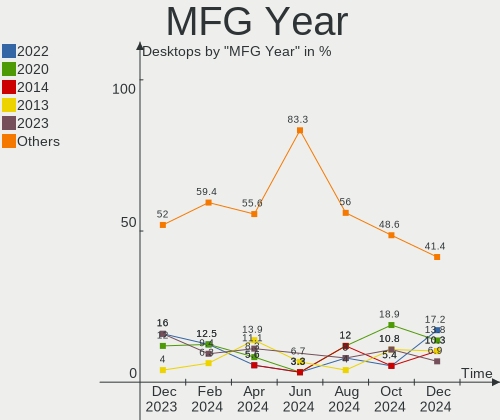
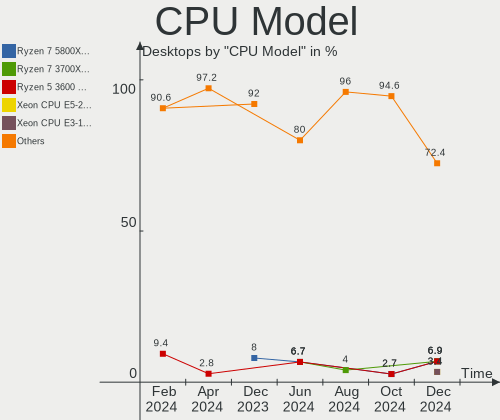

KDE neon - Hardware Trends (Desktops)
-------------------------------------

A project to identify most popular hardware characteristics and track their change
over time based on data collected by Linux users at https://Linux-Hardware.org.

Anyone can contribute to this report by the [hw-probe](https://github.com/linuxhw/hw-probe) tool:

    sudo -E hw-probe -all -upload

This report is for one last month. Overall report since the beginning of time: [TestDays](https://github.com/linuxhw/TestDays)

Period: Jul, 2023.

Contents
--------

* [ System ](#system)
  - [ OS                       ](#os)
  - [ OS Family                ](#os-family)
  - [ Kernel                   ](#kernel)
  - [ Kernel Family            ](#kernel-family)
  - [ Kernel Major Ver.        ](#kernel-major-ver)
  - [ Arch                     ](#arch)
  - [ DE                       ](#de)
  - [ Display Server           ](#display-server)
  - [ Display Manager          ](#display-manager)
  - [ OS Lang                  ](#os-lang)
  - [ Boot Mode                ](#boot-mode)
  - [ Filesystem               ](#filesystem)
  - [ Part. scheme             ](#part-scheme)
  - [ Dual Boot with Linux/BSD ](#dual-boot-with-linuxbsd)
  - [ Dual Boot (Win)          ](#dual-boot-win)

* [ Board ](#board)
  - [ Vendor                   ](#vendor)
  - [ Model                    ](#model)
  - [ Model Family             ](#model-family)
  - [ MFG Year                 ](#mfg-year)
  - [ Form Factor              ](#form-factor)
  - [ Secure Boot              ](#secure-boot)
  - [ Coreboot                 ](#coreboot)
  - [ RAM Size                 ](#ram-size)
  - [ RAM Used                 ](#ram-used)
  - [ Total Drives             ](#total-drives)
  - [ Has CD-ROM               ](#has-cd-rom)
  - [ Has Ethernet             ](#has-ethernet)
  - [ Has WiFi                 ](#has-wifi)
  - [ Has Bluetooth            ](#has-bluetooth)

* [ Location ](#location)
  - [ Country                  ](#country)
  - [ City                     ](#city)

* [ Drives ](#drives)
  - [ Drive Vendor             ](#drive-vendor)
  - [ Drive Model              ](#drive-model)
  - [ HDD Vendor               ](#hdd-vendor)
  - [ SSD Vendor               ](#ssd-vendor)
  - [ Drive Kind               ](#drive-kind)
  - [ Drive Connector          ](#drive-connector)
  - [ Drive Size               ](#drive-size)
  - [ Space Total              ](#space-total)
  - [ Space Used               ](#space-used)
  - [ Malfunc. Drives          ](#malfunc-drives)
  - [ Malfunc. Drive Vendor    ](#malfunc-drive-vendor)
  - [ Malfunc. HDD Vendor      ](#malfunc-hdd-vendor)
  - [ Malfunc. Drive Kind      ](#malfunc-drive-kind)
  - [ Failed Drives            ](#failed-drives)
  - [ Failed Drive Vendor      ](#failed-drive-vendor)
  - [ Drive Status             ](#drive-status)

* [ Storage controller ](#storage-controller)
  - [ Storage Vendor           ](#storage-vendor)
  - [ Storage Model            ](#storage-model)
  - [ Storage Kind             ](#storage-kind)

* [ Processor ](#processor)
  - [ CPU Vendor               ](#cpu-vendor)
  - [ CPU Model                ](#cpu-model)
  - [ CPU Model Family         ](#cpu-model-family)
  - [ CPU Cores                ](#cpu-cores)
  - [ CPU Sockets              ](#cpu-sockets)
  - [ CPU Threads              ](#cpu-threads)
  - [ CPU Op-Modes             ](#cpu-op-modes)
  - [ CPU Microcode            ](#cpu-microcode)
  - [ CPU Microarch            ](#cpu-microarch)

* [ Graphics ](#graphics)
  - [ GPU Vendor               ](#gpu-vendor)
  - [ GPU Model                ](#gpu-model)
  - [ GPU Combo                ](#gpu-combo)
  - [ GPU Driver               ](#gpu-driver)
  - [ GPU Memory               ](#gpu-memory)

* [ Monitor ](#monitor)
  - [ Monitor Vendor           ](#monitor-vendor)
  - [ Monitor Model            ](#monitor-model)
  - [ Monitor Resolution       ](#monitor-resolution)
  - [ Monitor Diagonal         ](#monitor-diagonal)
  - [ Monitor Width            ](#monitor-width)
  - [ Aspect Ratio             ](#aspect-ratio)
  - [ Monitor Area             ](#monitor-area)
  - [ Pixel Density            ](#pixel-density)
  - [ Multiple Monitors        ](#multiple-monitors)

* [ Network ](#network)
  - [ Net Controller Vendor    ](#net-controller-vendor)
  - [ Net Controller Model     ](#net-controller-model)
  - [ Wireless Vendor          ](#wireless-vendor)
  - [ Wireless Model           ](#wireless-model)
  - [ Ethernet Vendor          ](#ethernet-vendor)
  - [ Ethernet Model           ](#ethernet-model)
  - [ Net Controller Kind      ](#net-controller-kind)
  - [ Used Controller          ](#used-controller)
  - [ NICs                     ](#nics)
  - [ IPv6                     ](#ipv6)

* [ Bluetooth ](#bluetooth)
  - [ Bluetooth Vendor         ](#bluetooth-vendor)
  - [ Bluetooth Model          ](#bluetooth-model)

* [ Sound ](#sound)
  - [ Sound Vendor             ](#sound-vendor)
  - [ Sound Model              ](#sound-model)

* [ Memory ](#memory)
  - [ Memory Vendor            ](#memory-vendor)
  - [ Memory Model             ](#memory-model)
  - [ Memory Kind              ](#memory-kind)
  - [ Memory Form Factor       ](#memory-form-factor)
  - [ Memory Size              ](#memory-size)
  - [ Memory Speed             ](#memory-speed)

* [ Printers & scanners ](#printers--scanners)
  - [ Printer Vendor           ](#printer-vendor)
  - [ Printer Model            ](#printer-model)
  - [ Scanner Vendor           ](#scanner-vendor)
  - [ Scanner Model            ](#scanner-model)

* [ Camera ](#camera)
  - [ Camera Vendor            ](#camera-vendor)
  - [ Camera Model             ](#camera-model)

* [ Security ](#security)
  - [ Fingerprint Vendor       ](#fingerprint-vendor)
  - [ Fingerprint Model        ](#fingerprint-model)
  - [ Chipcard Vendor          ](#chipcard-vendor)
  - [ Chipcard Model           ](#chipcard-model)

* [ Unsupported ](#unsupported)
  - [ Unsupported Devices      ](#unsupported-devices)
  - [ Unsupported Device Types ](#unsupported-device-types)

System
------

OS
--

Installed operating systems

| Name           | Desktops | Percent |
|----------------|----------|---------|
| KDE neon 22.04 | 13       | 100%    |

OS Family
---------

OS without a version

| Name     | Desktops | Percent |
|----------|----------|---------|
| KDE neon | 13       | 100%    |

Kernel
------

Version of the Linux kernel

| Version           | Desktops | Percent |
|-------------------|----------|---------|
| 5.19.0-46-generic | 7        | 53.85%  |
| 5.19.0-50-generic | 4        | 30.77%  |
| 5.19.0-45-generic | 1        | 7.69%   |
| 5.15.0-60-generic | 1        | 7.69%   |

Kernel Family
-------------

Linux kernel without a distro release

| Version | Desktops | Percent |
|---------|----------|---------|
| 5.19.0  | 12       | 92.31%  |
| 5.15.0  | 1        | 7.69%   |

Kernel Major Ver.
-----------------

Linux kernel major version

| Version | Desktops | Percent |
|---------|----------|---------|
| 5.19    | 12       | 92.31%  |
| 5.15    | 1        | 7.69%   |

Arch
----

OS architecture (x86_64, i586, etc.)

| Name   | Desktops | Percent |
|--------|----------|---------|
| x86_64 | 13       | 100%    |

DE
--

Desktop Environment

| Name | Desktops | Percent |
|------|----------|---------|
| KDE5 | 13       | 100%    |

Display Server
--------------

X11 or Wayland

| Name | Desktops | Percent |
|------|----------|---------|
| X11  | 13       | 100%    |

Display Manager
---------------

SDDM, LightDM, etc.

| Name    | Desktops | Percent |
|---------|----------|---------|
| Unknown | 12       | 92.31%  |
| SDDM    | 1        | 7.69%   |

OS Lang
-------

Language

| Lang  | Desktops | Percent |
|-------|----------|---------|
| en_US | 7        | 53.85%  |
| ru_RU | 1        | 7.69%   |
| pt_BR | 1        | 7.69%   |
| nl_NL | 1        | 7.69%   |
| en_CA | 1        | 7.69%   |
| de_DE | 1        | 7.69%   |
| C     | 1        | 7.69%   |

Boot Mode
---------

EFI or BIOS

| Mode | Desktops | Percent |
|------|----------|---------|
| BIOS | 12       | 92.31%  |
| EFI  | 1        | 7.69%   |

Filesystem
----------

Type of filesystem

| Type | Desktops | Percent |
|------|----------|---------|
| Ext4 | 13       | 100%    |

Part. scheme
------------

Scheme of partitioning

| Type    | Desktops | Percent |
|---------|----------|---------|
| Unknown | 12       | 92.31%  |
| GPT     | 1        | 7.69%   |

Dual Boot with Linux/BSD
------------------------

Hosting more than one Linux/BSD

| Dual boot | Desktops | Percent |
|-----------|----------|---------|
| No        | 13       | 100%    |

Dual Boot (Win)
---------------

Hosting Linux and Windows

| Dual boot | Desktops | Percent |
|-----------|----------|---------|
| No        | 13       | 100%    |

Board
-----

Vendor
------

Motherboard manufacturer

| Name                | Desktops | Percent |
|---------------------|----------|---------|
| ASUSTek Computer    | 5        | 38.46%  |
| MSI                 | 2        | 15.38%  |
| Lenovo              | 1        | 7.69%   |
| Hewlett-Packard     | 1        | 7.69%   |
| Gigabyte Technology | 1        | 7.69%   |
| Biostar             | 1        | 7.69%   |
| ASRock              | 1        | 7.69%   |
| Unknown             | 1        | 7.69%   |

Model
-----

Motherboard model

| Name                                    | Desktops | Percent |
|-----------------------------------------|----------|---------|
| MSI p7-1233w                            | 1        | 7.69%   |
| MSI MS-7A38                             | 1        | 7.69%   |
| Lenovo IdeaCentre 510A-15ARR 90J0000WBF | 1        | 7.69%   |
| HP Compaq 6200 Pro MT PC                | 1        | 7.69%   |
| Gigabyte H81M-S2PV                      | 1        | 7.69%   |
| Biostar X370GTN                         | 1        | 7.69%   |
| ASUS TUF B450-PRO GAMING                | 1        | 7.69%   |
| ASUS ROG STRIX B450-F GAMING            | 1        | 7.69%   |
| ASUS M5A97 LE R2.0                      | 1        | 7.69%   |
| ASUS M4A88T-V EVO/USB3                  | 1        | 7.69%   |
| ASUS All Series                         | 1        | 7.69%   |
| ASRock B450 Pro4 R2.0                   | 1        | 7.69%   |
| Unknown                                 | 1        | 7.69%   |

Model Family
------------

Motherboard model prefix

| Name               | Desktops | Percent |
|--------------------|----------|---------|
| MSI p7-1233w       | 1        | 7.69%   |
| MSI MS-7A38        | 1        | 7.69%   |
| Lenovo IdeaCentre  | 1        | 7.69%   |
| HP Compaq          | 1        | 7.69%   |
| Gigabyte H81M-S2PV | 1        | 7.69%   |
| Biostar X370GTN    | 1        | 7.69%   |
| ASUS TUF           | 1        | 7.69%   |
| ASUS ROG           | 1        | 7.69%   |
| ASUS M5A97         | 1        | 7.69%   |
| ASUS M4A88T-V      | 1        | 7.69%   |
| ASUS All           | 1        | 7.69%   |
| ASRock B450        | 1        | 7.69%   |
| Unknown            | 1        | 7.69%   |

MFG Year
--------

Motherboard manufacture year

| Year | Desktops | Percent |
|------|----------|---------|
| 2018 | 4        | 30.77%  |
| 2013 | 2        | 15.38%  |
| 2012 | 2        | 15.38%  |
| 2022 | 1        | 7.69%   |
| 2021 | 1        | 7.69%   |
| 2019 | 1        | 7.69%   |
| 2011 | 1        | 7.69%   |
| 2010 | 1        | 7.69%   |

Form Factor
-----------

Physical design of the computer

| Name    | Desktops | Percent |
|---------|----------|---------|
| Desktop | 13       | 100%    |

Secure Boot
-----------

Enabled or disabled

| State    | Desktops | Percent |
|----------|----------|---------|
| Disabled | 13       | 100%    |

Coreboot
--------

Have coreboot on board

| Used | Desktops | Percent |
|------|----------|---------|
| No   | 13       | 100%    |

RAM Size
--------

Total RAM memory

| Size in GB  | Desktops | Percent |
|-------------|----------|---------|
| 16.01-24.0  | 6        | 46.15%  |
| 4.01-8.0    | 3        | 23.08%  |
| 32.01-64.0  | 2        | 15.38%  |
| 64.01-256.0 | 1        | 7.69%   |
| 8.01-16.0   | 1        | 7.69%   |

RAM Used
--------

Used RAM memory

| Used GB   | Desktops | Percent |
|-----------|----------|---------|
| 4.01-8.0  | 3        | 23.08%  |
| 3.01-4.0  | 3        | 23.08%  |
| 1.01-2.0  | 3        | 23.08%  |
| 2.01-3.0  | 2        | 15.38%  |
| 8.01-16.0 | 2        | 15.38%  |

Total Drives
------------

Number of drives on board

| Drives | Desktops | Percent |
|--------|----------|---------|
| 2      | 7        | 53.85%  |
| 1      | 5        | 38.46%  |
| 6      | 1        | 7.69%   |

Has CD-ROM
----------

Has CD-ROM on board

| Presented | Desktops | Percent |
|-----------|----------|---------|
| No        | 10       | 76.92%  |
| Yes       | 3        | 23.08%  |

Has Ethernet
------------

Has Ethernet on board

| Presented | Desktops | Percent |
|-----------|----------|---------|
| Yes       | 13       | 100%    |

Has WiFi
--------

Has WiFi module

| Presented | Desktops | Percent |
|-----------|----------|---------|
| No        | 7        | 53.85%  |
| Yes       | 6        | 46.15%  |

Has Bluetooth
-------------

Has Bluetooth module

| Presented | Desktops | Percent |
|-----------|----------|---------|
| No        | 10       | 76.92%  |
| Yes       | 3        | 23.08%  |

Location
--------

Country
-------

Geographic location (country)

| Country     | Desktops | Percent |
|-------------|----------|---------|
| USA         | 3        | 23.08%  |
| Netherlands | 2        | 15.38%  |
| UK          | 1        | 7.69%   |
| Romania     | 1        | 7.69%   |
| Nepal       | 1        | 7.69%   |
| Moldova     | 1        | 7.69%   |
| Indonesia   | 1        | 7.69%   |
| Germany     | 1        | 7.69%   |
| Canada      | 1        | 7.69%   |
| Brazil      | 1        | 7.69%   |

City
----

Geographic location (city)

| City       | Desktops | Percent |
|------------|----------|---------|
| Whiting    | 1        | 7.69%   |
| Tempe      | 1        | 7.69%   |
| Montreal   | 1        | 7.69%   |
| Lelystad   | 1        | 7.69%   |
| Lambeth    | 1        | 7.69%   |
| Kathmandu  | 1        | 7.69%   |
| Jakarta    | 1        | 7.69%   |
| Gelnhausen | 1        | 7.69%   |
| El Paso    | 1        | 7.69%   |
| Constanța | 1        | 7.69%   |
| Chisinau   | 1        | 7.69%   |
| Brasília  | 1        | 7.69%   |
| Amsterdam  | 1        | 7.69%   |

Drives
------

Drive Vendor
------------

Hard drive vendors

| Vendor                      | Desktops | Drives | Percent |
|-----------------------------|----------|--------|---------|
| Seagate                     | 6        | 7      | 30%     |
| Toshiba                     | 2        | 2      | 10%     |
| WDC                         | 1        | 5      | 5%      |
| Team                        | 1        | 1      | 5%      |
| TCSUNBOW                    | 1        | 1      | 5%      |
| SPCC                        | 1        | 1      | 5%      |
| Sandisk                     | 1        | 1      | 5%      |
| Samsung Electronics         | 1        | 1      | 5%      |
| Micron Technology           | 1        | 1      | 5%      |
| Kingston Technology Company | 1        | 1      | 5%      |
| Intenso                     | 1        | 1      | 5%      |
| Hitachi                     | 1        | 1      | 5%      |
| China                       | 1        | 1      | 5%      |
| ADATA Technology            | 1        | 1      | 5%      |

Drive Model
-----------

Hard drive models

| Model                                                              | Desktops | Percent |
|--------------------------------------------------------------------|----------|---------|
| Seagate ST1000DM003-1SB102 1TB                                     | 2        | 8.7%    |
| WDC WDS100T2B0B-00YS70 1TB SSD                                     | 1        | 4.35%   |
| WDC WD40EZRZ-22GXCB0 4TB                                           | 1        | 4.35%   |
| WDC WD40EFAX-68JH4N1 4TB                                           | 1        | 4.35%   |
| Toshiba KBG30ZMT128G 128GB                                         | 1        | 4.35%   |
| Toshiba HDWD110 1TB                                                | 1        | 4.35%   |
| Team T253E2512G 512GB SSD                                          | 1        | 4.35%   |
| TCSUNBOW X3 240GB                                                  | 1        | 4.35%   |
| SPCC Solid State Disk 512GB                                        | 1        | 4.35%   |
| Seagate STT_FTM25JB25C 256GB                                       | 1        | 4.35%   |
| Seagate ST3500630AS 500GB                                          | 1        | 4.35%   |
| Seagate ST3160316CS 160GB                                          | 1        | 4.35%   |
| Seagate ST2000DM008-2FR102 2TB                                     | 1        | 4.35%   |
| Seagate ST1000DM003-1ER162 1TB                                     | 1        | 4.35%   |
| Sandisk WD Black SN750 / PC SN730 NVMe SSD 1024GB                  | 1        | 4.35%   |
| Samsung NVMe SSD Controller SM981/PM981/PM983 500GB                | 1        | 4.35%   |
| Micron C400-MTFDDAC064MAM 64GB SSD                                 | 1        | 4.35%   |
| Kingston Company SNV2S1000G 1TB                                    | 1        | 4.35%   |
| Intenso SSD 240GB                                                  | 1        | 4.35%   |
| Hitachi HDS721010CLA630 1TB                                        | 1        | 4.35%   |
| China ESA3SMH2HTH2BT240GB                                          | 1        | 4.35%   |
| ADATA XPG SX8200 Pro PCIe Gen3x4 M.2 2280 Solid State Drive 1024GB | 1        | 4.35%   |

HDD Vendor
----------

Hard disk drive vendors

| Vendor  | Desktops | Drives | Percent |
|---------|----------|--------|---------|
| Seagate | 5        | 6      | 62.5%   |
| WDC     | 1        | 4      | 12.5%   |
| Toshiba | 1        | 1      | 12.5%   |
| Hitachi | 1        | 1      | 12.5%   |

SSD Vendor
----------

Solid state drive vendors

| Vendor            | Desktops | Drives | Percent |
|-------------------|----------|--------|---------|
| WDC               | 1        | 1      | 16.67%  |
| Team              | 1        | 1      | 16.67%  |
| TCSUNBOW          | 1        | 1      | 16.67%  |
| SPCC              | 1        | 1      | 16.67%  |
| Micron Technology | 1        | 1      | 16.67%  |
| Intenso           | 1        | 1      | 16.67%  |

Drive Kind
----------

HDD or SSD

| Kind    | Desktops | Drives | Percent |
|---------|----------|--------|---------|
| HDD     | 7        | 12     | 35%     |
| SSD     | 6        | 6      | 30%     |
| NVMe    | 5        | 5      | 25%     |
| Unknown | 2        | 2      | 10%     |

Drive Connector
---------------

SATA, SAS, NVMe, etc.

| Type | Desktops | Drives | Percent |
|------|----------|--------|---------|
| SATA | 12       | 20     | 70.59%  |
| NVMe | 5        | 5      | 29.41%  |

Drive Size
----------

Size of hard drive

| Size in TB | Desktops | Drives | Percent |
|------------|----------|--------|---------|
| 0.51-1.0   | 7        | 8      | 53.85%  |
| 0.01-0.5   | 4        | 5      | 30.77%  |
| 3.01-4.0   | 1        | 4      | 7.69%   |
| 1.01-2.0   | 1        | 1      | 7.69%   |

Space Total
-----------

Amount of disk space available on the file system

| Size in GB     | Desktops | Percent |
|----------------|----------|---------|
| 101-250        | 3        | 23.08%  |
| 1001-2000      | 3        | 23.08%  |
| More than 3000 | 1        | 7.69%   |
| 21-50          | 1        | 7.69%   |
| 2001-3000      | 1        | 7.69%   |
| 1-20           | 1        | 7.69%   |
| 501-1000       | 1        | 7.69%   |
| 51-100         | 1        | 7.69%   |
| Unknown        | 1        | 7.69%   |

Space Used
----------

Amount of used disk space

| Used GB   | Desktops | Percent |
|-----------|----------|---------|
| 1-20      | 5        | 38.46%  |
| 501-1000  | 4        | 30.77%  |
| 21-50     | 1        | 7.69%   |
| 1001-2000 | 1        | 7.69%   |
| 51-100    | 1        | 7.69%   |
| Unknown   | 1        | 7.69%   |

Malfunc. Drives
---------------

Drive models with a malfunction

Zero info for selected period =(

Malfunc. Drive Vendor
---------------------

Vendors of faulty drives

Zero info for selected period =(

Malfunc. HDD Vendor
-------------------

Vendors of faulty HDD drives

Zero info for selected period =(

Malfunc. Drive Kind
-------------------

Kinds of faulty drives

Zero info for selected period =(

Failed Drives
-------------

Failed drive models

Zero info for selected period =(

Failed Drive Vendor
-------------------

Failed drive vendors

Zero info for selected period =(

Drive Status
------------

Number of failed and malfunc. drives

| Status   | Desktops | Drives | Percent |
|----------|----------|--------|---------|
| Detected | 12       | 23     | 92.31%  |
| Works    | 1        | 2      | 7.69%   |

Storage controller
------------------

Storage Vendor
--------------

Storage controller vendors

| Vendor                       | Desktops | Percent |
|------------------------------|----------|---------|
| AMD                          | 10       | 52.63%  |
| Intel                        | 3        | 15.79%  |
| Toshiba America Info Systems | 1        | 5.26%   |
| SanDisk                      | 1        | 5.26%   |
| Samsung Electronics          | 1        | 5.26%   |
| Kingston Technology Company  | 1        | 5.26%   |
| ASMedia Technology           | 1        | 5.26%   |
| ADATA Technology             | 1        | 5.26%   |

Storage Model
-------------

Storage controller models

| Model                                                                          | Desktops | Percent |
|--------------------------------------------------------------------------------|----------|---------|
| AMD FCH SATA Controller [AHCI mode]                                            | 8        | 32%     |
| AMD 400 Series Chipset SATA Controller                                         | 4        | 16%     |
| Intel 8 Series/C220 Series Chipset Family 6-port SATA Controller 1 [AHCI mode] | 2        | 8%      |
| Toshiba America Info Systems BG3 NVMe SSD Controller                           | 1        | 4%      |
| SanDisk WD Black SN750 / PC SN730 NVMe SSD                                     | 1        | 4%      |
| Samsung NVMe SSD Controller SM981/PM981/PM983                                  | 1        | 4%      |
| Kingston Company Company Non-Volatile memory controller                        | 1        | 4%      |
| Intel 6 Series/C200 Series Chipset Family 6 port Desktop SATA AHCI Controller  | 1        | 4%      |
| ASMedia ASM1062 Serial ATA Controller                                          | 1        | 4%      |
| AMD X370 Series Chipset SATA Controller                                        | 1        | 4%      |
| AMD SB7x0/SB8x0/SB9x0 SATA Controller [IDE mode]                               | 1        | 4%      |
| AMD SB7x0/SB8x0/SB9x0 SATA Controller [AHCI mode]                              | 1        | 4%      |
| AMD SB7x0/SB8x0/SB9x0 IDE Controller                                           | 1        | 4%      |
| ADATA XPG SX8200 Pro PCIe Gen3x4 M.2 2280 Solid State Drive                    | 1        | 4%      |

Storage Kind
------------

Kind of storage controller (IDE, SATA, NVMe, SAS, ...)

| Kind | Desktops | Percent |
|------|----------|---------|
| SATA | 13       | 68.42%  |
| NVMe | 5        | 26.32%  |
| IDE  | 1        | 5.26%   |

Processor
---------

CPU Vendor
----------

Processor vendors

| Vendor | Desktops | Percent |
|--------|----------|---------|
| AMD    | 10       | 76.92%  |
| Intel  | 3        | 23.08%  |

CPU Model
---------

Processor models

| Model                                          | Desktops | Percent |
|------------------------------------------------|----------|---------|
| AMD Ryzen 5 3600X 6-Core Processor             | 2        | 15.38%  |
| Intel Core i7-4770K CPU @ 3.50GHz              | 1        | 7.69%   |
| Intel Core i5-2400 CPU @ 3.10GHz               | 1        | 7.69%   |
| Intel Core i3-4170 CPU @ 3.70GHz               | 1        | 7.69%   |
| AMD Ryzen 5 5600G with Radeon Graphics         | 1        | 7.69%   |
| AMD Ryzen 5 3600 6-Core Processor              | 1        | 7.69%   |
| AMD Ryzen 3 2200G with Radeon Vega Graphics    | 1        | 7.69%   |
| AMD FX-6300 Six-Core Processor                 | 1        | 7.69%   |
| AMD Athlon II X3 450 Processor                 | 1        | 7.69%   |
| AMD A8-5500 APU with Radeon HD Graphics        | 1        | 7.69%   |
| AMD A10-9700 RADEON R7, 10 COMPUTE CORES 4C+6G | 1        | 7.69%   |
| AMD 4700S 8-Core Processor Desktop Kit         | 1        | 7.69%   |

CPU Model Family
----------------

Processor model prefix

| Model            | Desktops | Percent |
|------------------|----------|---------|
| AMD Ryzen 5      | 4        | 30.77%  |
| Other            | 1        | 7.69%   |
| Intel Core i7    | 1        | 7.69%   |
| Intel Core i5    | 1        | 7.69%   |
| Intel Core i3    | 1        | 7.69%   |
| AMD Ryzen 3      | 1        | 7.69%   |
| AMD FX           | 1        | 7.69%   |
| AMD Athlon II X3 | 1        | 7.69%   |
| AMD A8           | 1        | 7.69%   |
| AMD A10          | 1        | 7.69%   |

CPU Cores
---------

Number of processor cores

| Number | Desktops | Percent |
|--------|----------|---------|
| 6      | 4        | 30.77%  |
| 2      | 4        | 30.77%  |
| 4      | 3        | 23.08%  |
| 8      | 1        | 7.69%   |
| 3      | 1        | 7.69%   |

CPU Sockets
-----------

Number of sockets

| Number | Desktops | Percent |
|--------|----------|---------|
| 1      | 13       | 100%    |

CPU Threads
-----------

Threads per core (Hyper-Threading)

| Number | Desktops | Percent |
|--------|----------|---------|
| 2      | 10       | 76.92%  |
| 1      | 3        | 23.08%  |

CPU Op-Modes
------------

CPU Operation Modes (32-bit, 64-bit)

| Op mode        | Desktops | Percent |
|----------------|----------|---------|
| 32-bit, 64-bit | 13       | 100%    |

CPU Microcode
-------------

Microcode number

| Number     | Desktops | Percent |
|------------|----------|---------|
| Unknown    | 12       | 92.31%  |
| 0x08101007 | 1        | 7.69%   |

CPU Microarch
-------------

Microarchitecture

| Name        | Desktops | Percent |
|-------------|----------|---------|
| Zen 2       | 3        | 23.08%  |
| Piledriver  | 2        | 15.38%  |
| Haswell     | 2        | 15.38%  |
| Zen 3       | 1        | 7.69%   |
| Zen         | 1        | 7.69%   |
| SandyBridge | 1        | 7.69%   |
| K10         | 1        | 7.69%   |
| Excavator   | 1        | 7.69%   |
| Unknown     | 1        | 7.69%   |

Graphics
--------

GPU Vendor
----------

Vendors of graphics cards

| Vendor | Desktops | Percent |
|--------|----------|---------|
| AMD    | 8        | 57.14%  |
| Nvidia | 6        | 42.86%  |

GPU Model
---------

Graphics card models

| Model                                                            | Desktops | Percent |
|------------------------------------------------------------------|----------|---------|
| AMD Ellesmere [Radeon RX 470/480/570/570X/580/580X/590]          | 2        | 14.29%  |
| Nvidia TU117 [GeForce GTX 1650]                                  | 1        | 7.14%   |
| Nvidia TU116 [GeForce GTX 1660 SUPER]                            | 1        | 7.14%   |
| Nvidia GP108 [GeForce GT 1030]                                   | 1        | 7.14%   |
| Nvidia GP107 [GeForce GTX 1050 Ti]                               | 1        | 7.14%   |
| Nvidia GP102 [GeForce GTX 1080 Ti]                               | 1        | 7.14%   |
| Nvidia GF108 [GeForce GT 630]                                    | 1        | 7.14%   |
| AMD Wani [Radeon R5/R6/R7 Graphics]                              | 1        | 7.14%   |
| AMD Trinity [Radeon HD 7560D]                                    | 1        | 7.14%   |
| AMD Raven Ridge [Radeon Vega Series / Radeon Vega Mobile Series] | 1        | 7.14%   |
| AMD Cezanne [Radeon Vega Series / Radeon Vega Mobile Series]     | 1        | 7.14%   |
| AMD Caicos PRO [Radeon HD 7450]                                  | 1        | 7.14%   |
| AMD Baffin [Radeon RX 550 640SP / RX 560/560X]                   | 1        | 7.14%   |

GPU Combo
---------

Combinations of graphics cards

| Name         | Desktops | Percent |
|--------------|----------|---------|
| 1 x AMD      | 7        | 53.85%  |
| 1 x Nvidia   | 5        | 38.46%  |
| AMD + Nvidia | 1        | 7.69%   |

GPU Driver
----------

Free vs proprietary

| Driver      | Desktops | Percent |
|-------------|----------|---------|
| Free        | 12       | 92.31%  |
| Proprietary | 1        | 7.69%   |

GPU Memory
----------

Total video memory

| Size in GB | Desktops | Percent |
|------------|----------|---------|
| Unknown    | 11       | 84.62%  |
| 8.01-16.0  | 1        | 7.69%   |
| 0.51-1.0   | 1        | 7.69%   |

Monitor
-------

Monitor Vendor
--------------

Monitor vendors

| Vendor               | Desktops | Percent |
|----------------------|----------|---------|
| Goldstar             | 2        | 13.33%  |
| Dell                 | 2        | 13.33%  |
| Ancor Communications | 2        | 13.33%  |
| Acer                 | 2        | 13.33%  |
| Samsung Electronics  | 1        | 6.67%   |
| SAC                  | 1        | 6.67%   |
| Philips              | 1        | 6.67%   |
| Panasonic            | 1        | 6.67%   |
| Hewlett-Packard      | 1        | 6.67%   |
| Eizo                 | 1        | 6.67%   |
| ASUSTek Computer     | 1        | 6.67%   |

Monitor Model
-------------

Monitor models

| Model                                                                 | Desktops | Percent |
|-----------------------------------------------------------------------|----------|---------|
| Samsung Electronics LCD Monitor SAM07D0 1360x768 700x390mm 31.5-inch  | 1        | 6.67%   |
| SAC LED MONITOR SAC309A 1920x1080 443x249mm 20.0-inch                 | 1        | 6.67%   |
| Philips PHL 242E2F PHLC238 1920x1080 527x296mm 23.8-inch              | 1        | 6.67%   |
| Panasonic TV MEIA296 3840x2160 698x392mm 31.5-inch                    | 1        | 6.67%   |
| Hewlett-Packard w2558hc HWP2818 1920x1200 550x309mm 24.8-inch         | 1        | 6.67%   |
| Goldstar ULTRAWIDE GSM76F9 2560x1080 531x298mm 24.0-inch              | 1        | 6.67%   |
| Goldstar L222W GSM5665 1680x1050 474x296mm 22.0-inch                  | 1        | 6.67%   |
| Eizo S1921-X ENC2202 1280x1024 377x302mm 19.0-inch                    | 1        | 6.67%   |
| Dell S3220DGF DELD0F3 2560x1440 697x392mm 31.5-inch                   | 1        | 6.67%   |
| Dell E2218HN DELF09E 1920x1080 476x268mm 21.5-inch                    | 1        | 6.67%   |
| ASUSTek Computer PA278QV AUS2700 2560x1440 600x340mm 27.2-inch        | 1        | 6.67%   |
| Ancor Communications VE228 ACI22FA 1920x1080 477x268mm 21.5-inch      | 1        | 6.67%   |
| Ancor Communications ASUS VN248 ACI24C4 1920x1080 527x296mm 23.8-inch | 1        | 6.67%   |
| Acer X203H ACR009D 1600x900 443x249mm 20.0-inch                       | 1        | 6.67%   |
| Acer VG240Y ACR06BF 1920x1080 527x296mm 23.8-inch                     | 1        | 6.67%   |

Monitor Resolution
------------------

Monitor screen resolution

| Resolution         | Desktops | Percent |
|--------------------|----------|---------|
| 1920x1080 (FHD)    | 6        | 40%     |
| 2560x1440 (QHD)    | 2        | 13.33%  |
| 3840x2160 (4K)     | 1        | 6.67%   |
| 2560x1080          | 1        | 6.67%   |
| 1920x1200 (WUXGA)  | 1        | 6.67%   |
| 1680x1050 (WSXGA+) | 1        | 6.67%   |
| 1600x900 (HD+)     | 1        | 6.67%   |
| 1360x768           | 1        | 6.67%   |
| 1280x1024 (SXGA)   | 1        | 6.67%   |

Monitor Diagonal
----------------

Diagonal size in inches

| Inches | Desktops | Percent |
|--------|----------|---------|
| 24     | 5        | 33.33%  |
| 31     | 2        | 13.33%  |
| 20     | 2        | 13.33%  |
| 84     | 1        | 6.67%   |
| 34     | 1        | 6.67%   |
| 27     | 1        | 6.67%   |
| 22     | 1        | 6.67%   |
| 21     | 1        | 6.67%   |
| 19     | 1        | 6.67%   |

Monitor Width
-------------

Physical width

| Width in mm | Desktops | Percent |
|-------------|----------|---------|
| 501-600     | 5        | 35.71%  |
| 401-500     | 4        | 28.57%  |
| 601-700     | 2        | 14.29%  |
| 701-800     | 1        | 7.14%   |
| 351-400     | 1        | 7.14%   |
| 1501-2000   | 1        | 7.14%   |

Aspect Ratio
------------

Proportional relationship between the width and the height

| Ratio | Desktops | Percent |
|-------|----------|---------|
| 16/9  | 9        | 75%     |
| 5/4   | 1        | 8.33%   |
| 21/9  | 1        | 8.33%   |
| 16/10 | 1        | 8.33%   |

Monitor Area
------------

Area in inch²

| Area in inch² | Desktops | Percent |
|----------------|----------|---------|
| 201-250        | 5        | 35.71%  |
| 351-500        | 3        | 21.43%  |
| 151-200        | 3        | 21.43%  |
| More than 1000 | 1        | 7.14%   |
| 301-350        | 1        | 7.14%   |
| 251-300        | 1        | 7.14%   |

Pixel Density
-------------

Pixels per inch

| Density | Desktops | Percent |
|---------|----------|---------|
| 51-100  | 10       | 71.43%  |
| 101-120 | 3        | 21.43%  |
| 1-50    | 1        | 7.14%   |

Multiple Monitors
-----------------

Total monitors connected

| Total | Desktops | Percent |
|-------|----------|---------|
| 1     | 9        | 69.23%  |
| 2     | 4        | 30.77%  |

Network
-------

Net Controller Vendor
---------------------

Controller vendors

| Vendor                | Desktops | Percent |
|-----------------------|----------|---------|
| Realtek Semiconductor | 9        | 56.25%  |
| Intel                 | 2        | 12.5%   |
| TP-Link               | 1        | 6.25%   |
| Ralink Technology     | 1        | 6.25%   |
| Qualcomm Atheros      | 1        | 6.25%   |
| Belkin Components     | 1        | 6.25%   |
| ASIX Electronics      | 1        | 6.25%   |

Net Controller Model
--------------------

Controller models

| Model                                                                   | Desktops | Percent |
|-------------------------------------------------------------------------|----------|---------|
| Realtek RTL8111/8168/8411 PCI Express Gigabit Ethernet Controller       | 9        | 47.37%  |
| TP-Link 802.11n NIC                                                     | 1        | 5.26%   |
| Realtek RTL8821CE 802.11ac PCIe Wireless Network Adapter                | 1        | 5.26%   |
| Realtek RTL8192CE PCIe Wireless Network Adapter                         | 1        | 5.26%   |
| Ralink MT7601U Wireless Adapter                                         | 1        | 5.26%   |
| Qualcomm Atheros AR8161 Gigabit Ethernet                                | 1        | 5.26%   |
| Intel Wi-Fi 6 AX210/AX211/AX411 160MHz                                  | 1        | 5.26%   |
| Intel I211 Gigabit Network Connection                                   | 1        | 5.26%   |
| Intel 82579LM Gigabit Network Connection (Lewisville)                   | 1        | 5.26%   |
| Belkin Components F7D1101 v1 Basic Wireless Adapter [Realtek RTL8188SU] | 1        | 5.26%   |
| ASIX AX88179 Gigabit Ethernet                                           | 1        | 5.26%   |

Wireless Vendor
---------------

Wireless vendors

| Vendor                | Desktops | Percent |
|-----------------------|----------|---------|
| Realtek Semiconductor | 2        | 33.33%  |
| TP-Link               | 1        | 16.67%  |
| Ralink Technology     | 1        | 16.67%  |
| Intel                 | 1        | 16.67%  |
| Belkin Components     | 1        | 16.67%  |

Wireless Model
--------------

Wireless models

| Model                                                                   | Desktops | Percent |
|-------------------------------------------------------------------------|----------|---------|
| TP-Link 802.11n NIC                                                     | 1        | 16.67%  |
| Realtek RTL8821CE 802.11ac PCIe Wireless Network Adapter                | 1        | 16.67%  |
| Realtek RTL8192CE PCIe Wireless Network Adapter                         | 1        | 16.67%  |
| Ralink MT7601U Wireless Adapter                                         | 1        | 16.67%  |
| Intel Wi-Fi 6 AX210/AX211/AX411 160MHz                                  | 1        | 16.67%  |
| Belkin Components F7D1101 v1 Basic Wireless Adapter [Realtek RTL8188SU] | 1        | 16.67%  |

Ethernet Vendor
---------------

Ethernet vendors

| Vendor                | Desktops | Percent |
|-----------------------|----------|---------|
| Realtek Semiconductor | 9        | 69.23%  |
| Intel                 | 2        | 15.38%  |
| Qualcomm Atheros      | 1        | 7.69%   |
| ASIX Electronics      | 1        | 7.69%   |

Ethernet Model
--------------

Ethernet models

| Model                                                             | Desktops | Percent |
|-------------------------------------------------------------------|----------|---------|
| Realtek RTL8111/8168/8411 PCI Express Gigabit Ethernet Controller | 9        | 69.23%  |
| Qualcomm Atheros AR8161 Gigabit Ethernet                          | 1        | 7.69%   |
| Intel I211 Gigabit Network Connection                             | 1        | 7.69%   |
| Intel 82579LM Gigabit Network Connection (Lewisville)             | 1        | 7.69%   |
| ASIX AX88179 Gigabit Ethernet                                     | 1        | 7.69%   |

Net Controller Kind
-------------------

Ethernet, WiFi or modem

| Kind     | Desktops | Percent |
|----------|----------|---------|
| Ethernet | 13       | 68.42%  |
| WiFi     | 6        | 31.58%  |

Used Controller
---------------

Currently used network controller

| Kind     | Desktops | Percent |
|----------|----------|---------|
| Ethernet | 12       | 92.31%  |
| WiFi     | 1        | 7.69%   |

NICs
----

Total network controllers on board

| Total | Desktops | Percent |
|-------|----------|---------|
| 1     | 9        | 69.23%  |
| 2     | 3        | 23.08%  |
| 0     | 1        | 7.69%   |

IPv6
----

IPv6 vs IPv4

| Used | Desktops | Percent |
|------|----------|---------|
| No   | 10       | 76.92%  |
| Yes  | 3        | 23.08%  |

Bluetooth
---------

Bluetooth Vendor
----------------

Controller vendors

| Vendor                | Desktops | Percent |
|-----------------------|----------|---------|
| Realtek Semiconductor | 1        | 33.33%  |
| Realtek               | 1        | 33.33%  |
| Intel                 | 1        | 33.33%  |

Bluetooth Model
---------------

Controller models

| Model                   | Desktops | Percent |
|-------------------------|----------|---------|
| Realtek Bluetooth Radio | 1        | 33.33%  |
| Realtek Bluetooth Radio | 1        | 33.33%  |
| Intel AX210 Bluetooth   | 1        | 33.33%  |

Sound
-----

Sound Vendor
------------

Sound card vendors

| Vendor              | Desktops | Percent |
|---------------------|----------|---------|
| AMD                 | 12       | 50%     |
| Nvidia              | 6        | 25%     |
| Intel               | 3        | 12.5%   |
| USB MICROPHONE      | 1        | 4.17%   |
| Jieli Technology    | 1        | 4.17%   |
| C-Media Electronics | 1        | 4.17%   |

Sound Model
-----------

Sound card models

| Model                                                                             | Desktops | Percent |
|-----------------------------------------------------------------------------------|----------|---------|
| AMD Starship/Matisse HD Audio Controller                                          | 3        | 10.34%  |
| Intel 8 Series/C220 Series Chipset High Definition Audio Controller               | 2        | 6.9%    |
| AMD SBx00 Azalia (Intel HDA)                                                      | 2        | 6.9%    |
| AMD FCH Azalia Controller                                                         | 2        | 6.9%    |
| AMD Family 17h/19h HD Audio Controller                                            | 2        | 6.9%    |
| AMD Ellesmere HDMI Audio [Radeon RX 470/480 / 570/580/590]                        | 2        | 6.9%    |
| USB MICROPHONE USB MICROPHONE                                                     | 1        | 3.45%   |
| Nvidia TU116 High Definition Audio Controller                                     | 1        | 3.45%   |
| Nvidia TU107 GeForce GTX 1650 High Definition Audio Controller                    | 1        | 3.45%   |
| Nvidia GP108 High Definition Audio Controller                                     | 1        | 3.45%   |
| Nvidia GP107GL High Definition Audio Controller                                   | 1        | 3.45%   |
| Nvidia GP102 HDMI Audio Controller                                                | 1        | 3.45%   |
| Nvidia GF108 High Definition Audio Controller                                     | 1        | 3.45%   |
| Jieli Technology MK-01                                                            | 1        | 3.45%   |
| Intel 6 Series/C200 Series Chipset Family High Definition Audio Controller        | 1        | 3.45%   |
| C-Media Electronics USB Advanced Audio Device                                     | 1        | 3.45%   |
| AMD Renoir Radeon High Definition Audio Controller                                | 1        | 3.45%   |
| AMD Raven/Raven2/Fenghuang HDMI/DP Audio Controller                               | 1        | 3.45%   |
| AMD Kabini HDMI/DP Audio                                                          | 1        | 3.45%   |
| AMD Family 15h (Models 60h-6fh) Audio Controller                                  | 1        | 3.45%   |
| AMD Caicos HDMI Audio [Radeon HD 6450 / 7450/8450/8490 OEM / R5 230/235/235X OEM] | 1        | 3.45%   |
| AMD Baffin HDMI/DP Audio [Radeon RX 550 640SP / RX 560/560X]                      | 1        | 3.45%   |

Memory
------

Memory Vendor
-------------

Memory module vendors

| Vendor              | Desktops | Percent |
|---------------------|----------|---------|
| Samsung Electronics | 1        | 100%    |

Memory Model
------------

Memory module models

| Model                                               | Desktops | Percent |
|-----------------------------------------------------|----------|---------|
| Samsung RAM M378A5244CB0-CTD 4GB DIMM DDR4 3334MT/s | 1        | 100%    |

Memory Kind
-----------

Memory module kinds

| Kind | Desktops | Percent |
|------|----------|---------|
| DDR4 | 1        | 100%    |

Memory Form Factor
------------------

Physical design of the memory module

| Name | Desktops | Percent |
|------|----------|---------|
| DIMM | 1        | 100%    |

Memory Size
-----------

Memory module size

| Size | Desktops | Percent |
|------|----------|---------|
| 4096 | 1        | 100%    |

Memory Speed
------------

Memory module speed

| Speed | Desktops | Percent |
|-------|----------|---------|
| 3334  | 1        | 100%    |

Printers & scanners
-------------------

Printer Vendor
--------------

Printer device vendors

| Vendor          | Desktops | Percent |
|-----------------|----------|---------|
| Hewlett-Packard | 1        | 100%    |

Printer Model
-------------

Printer device models

| Model                  | Desktops | Percent |
|------------------------|----------|---------|
| HP DeskJet 3630 series | 1        | 100%    |

Scanner Vendor
--------------

Scanner device vendors

Zero info for selected period =(

Scanner Model
-------------

Scanner device models

Zero info for selected period =(

Camera
------

Camera Vendor
-------------

Camera device vendors

| Vendor          | Desktops | Percent |
|-----------------|----------|---------|
| Logitech        | 2        | 66.67%  |
| Hewlett-Packard | 1        | 33.33%  |

Camera Model
------------

Camera device models

| Model                 | Desktops | Percent |
|-----------------------|----------|---------|
| Logitech Webcam C925e | 1        | 33.33%  |
| Logitech VGA WebCam   | 1        | 33.33%  |
| HP Webcam             | 1        | 33.33%  |

Security
--------

Fingerprint Vendor
------------------

Fingerprint sensor vendors

Zero info for selected period =(

Fingerprint Model
-----------------

Fingerprint sensor models

Zero info for selected period =(

Chipcard Vendor
---------------

Chipcard module vendors

Zero info for selected period =(

Chipcard Model
--------------

Chipcard module models

Zero info for selected period =(

Unsupported
-----------

Unsupported Devices
-------------------

Total unsupported devices on board

| Total | Desktops | Percent |
|-------|----------|---------|
| 0     | 13       | 100%    |

Unsupported Device Types
------------------------

Types of unsupported devices

Zero info for selected period =(

